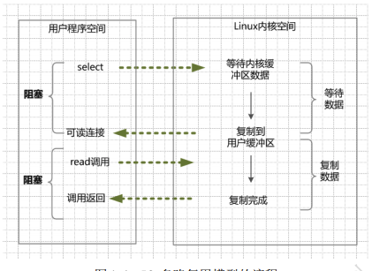

# javadoc

## 介绍
java知识文档

## 安装教程
1. npm i docsify-cli -g

2.  docsify serve docs

## mark文件编辑器Typora

## docsify忽略副标题
当设置了 subMaxLevel 时，默认情况下每个标题都会自动添加到目录中。如果你想忽略特定的标题，可以给它添加 <!-- {docsify-ignore} --> 。
```
# Getting Started

## Header <!-- {docsify-ignore} --
```

该标题不会出现在侧边栏的目录中。
要忽略特定页面上的所有标题，你可以在页面的第一个标题上使用 <!-- {docsify-ignore-all} --> 。

```
# Getting Started <!-- {docsify-ignore-all} -->

## Header
```

该标题不会出现在侧边栏的目录中。
在使用时， <!-- {docsify-ignore} --> 和 <!-- {docsify-ignore-all} --> 都不会在页面上呈现。

## Markdown 语法

### 图片
  

### 字体
*斜体文本*
_斜体文本_
**粗体文本**
__粗体文本__
***粗斜体文本***
___粗斜体文本___

### 分隔线
***
* * *
*****
- - -
----------
### 删除线
~~BAIDU.COM~~
### 下划线
<u>带下划线文本</u>

### 脚注

### 列表
无序列表使用星号(*)、加号(+)或是减号(-)作为列表标记：
* 第一项
* 第二项
* 第三项
------ 
+ 第一项
+ 第二项
+ 第三项
------  
- 第一项
- 第二项
- 第三项
------
1. 第一项
2. 第二项
3. 第三项
### 列表嵌套
1. 第一项：
    - 第一项嵌套的第一个元素
    - 第一项嵌套的第二个元素
2. 第二项：
    - 第二项嵌套的第一个元素
    - 第二项嵌套的第二个元素
### 区块
> 区块引用  
> 菜鸟教程  
> 学的不仅是技术更是梦想  
### 代码
`printf()` 函数
### 代码块
​```python
class CaseData:
    """这是一个存放测试用例数据的类"""
    pass
​```
### 链接
[链接名称](链接地址)  
### 高级链接
链接也可以用变量来代替，文档末尾附带变量地址：
这个链接用 1 作为网址变量 [Google][1]
这个链接用 runoob 作为网址变量 [Runoob][runoob]
然后在文档的结尾为变量赋值（网址）

[1]: http://www.google.com/
[runoob]: http://www.runoob.com/
### 表格
|  表头   | 表头  |
|  ----  | ----  |
| 单元格  | 单元格 |
| 单元格  | 单元格 |
对齐方式
| 左对齐 | 右对齐 | 居中对齐 |
| :-----| ----: | :----: |
| 单元格 | 单元格 | 单元格 |
| 单元格 | 单元格 | 单元格 |
### 支持的 HTML 元素
使用 <kbd>Ctrl</kbd>+<kbd>Alt</kbd>+<kbd>Del</kbd> 重启电脑
### 转义
**文本加粗**  
\*\* 正常显示星号 \*\*
### 文字颜色、大小、字体
<font color="#dd0000" size="3" face="黑体">文字颜色预览</font>

### 背景色
<table><tr><td bgcolor=#F4A460>背景色的设置是按照十六进制颜色值：#F4A460</td></tr></table>

### Emoji
### 转义
### 转义


## Docsify

一款无需构建、容易上手使用并且轻量级的文档网站生成器。
网站：docsify.js.org/  

1. 相关命令
1.1 安装依赖
npm i docsify-cli -D
复制代码
1.2 初始化项目
如果想在项目的 ./docs 目录里写文档，直接通过 init 初始化项目。
docsify init ./docs
复制代码
1.3 文件结构说明

index.html 入口文件
README.md 会做为主页内容渲染
.nojekyll 用于阻止 GitHub Pages 忽略掉下划线开头的文件

1.4 本地预览
终端运行 docsify serve 启动一个本地服务器，可以方便地实时预览效果。默认访问地址 http://localhost:3000 。
docsify serve docs
复制代码
更多命令使用请查看 docsify-cli文档
2. 相关配置
2.1 配置仓库地址
在 index.html 中配置 window.$docsify 的 repo 属性值，配置后会在页面右上角渲染一个 GitHub Corner 挂件。
window.$docsify = {
  repo: 'docsifyjs/docsify',
  // or
  repo: 'https://github.com/docsifyjs/docsify/',
};
复制代码
2.2 配置网站图标
在 index.html 中通过配置 window.$docsify 的 logo 属性值设置网站图标。设置后在侧边栏中展示网站图标，支持使用CSS来更改大小
window.$docsify = {
  logo: '/_media/icon.svg',
};
复制代码
2.3 配置文档标题
在 index.html 中通过配置 window.$docsify 的 name 属性值设置网站标题。设置后文档标题会显示在侧边栏顶部。
window.$docsify = {
  name: 'docsify',
};
复制代码
name 项也可以包含自定义 HTML 代码来方便地定制。
window.$docsify = {
  name: '<span>docsify</span>',
};
复制代码
2.4 设置文档标题的链接
在 index.html 中通过配置 window.$docsify 的 nameLink 属性值设置网站标题的链接地址。点击文档标题后跳转到指定的链接。
window.$docsify = {
  nameLink: '/',

  // 按照路由切换
  nameLink: {
    '/zh-cn/': '/zh-cn/',
    '/': '/',
  },
};
复制代码
2.5 设置首页文件加载路径
在 index.html 中通过配置 window.$docsify 的 homepage 属性值设置首页文件加载路径。默认情况下，docsify 将 README.md 作为入口文件渲染，如果想将其它文件作为入口文件渲染时使用。
window.$docsify = {
  // 入口文件改为 /home.md
  homepage: 'home.md',

  // 文档和仓库根目录下的 README.md 内容一致
  homepage:
    'https://raw.githubusercontent.com/docsifyjs/docsify/master/README.md',
};
复制代码
2.6 设置封面页
默认不开启封面页。可以通过配置 window.$docsify 的 coverpage 属性值启用封面页。开启渲染封面功能后需要在文档根目录创建封面页对应的md文件。
window.$docsify = {
  coverpage: true, // 启用后，默认加载 _coverpage.md 文件

  coverpage: 'cover.md',  // 支持自定义文件名

  coverpage: ['/', '/zh-cn/'],  // 多个封面页

  coverpage: {  // 多个封面页，并指定文件名
    '/': 'cover.md',
    '/zh-cn/': 'cover.md',
  },
};
复制代码
2.6.1 注意点

目前封面的背景是随机生成的渐变色，想修改封面背景继续往下看。
通常封面和首页是同时出现的，如果希望只在访问主页时加载封面可以通过设置 onlyCover 选项来实现。

2.6.2 自定义封面背景
可以在文档末尾用添加图片的 Markdown 语法设置自定义背景（背景色/背景图）。
<!-- _coverpage.md -->

# docsify <small>3.5</small>

[GitHub](https://github.com/docsifyjs/docsify/)
[Get Started](#quick-start)

<!-- 背景图片 -->


<!-- 背景色 -->


复制代码
2.6.3 设置主页封面显示
通常封面和首页是同时出现的，可以通过配置 window.$docsify 的 onlyCover 属性值设置只在访问主页时加载封面。
window.$docsify = {
  onlyCover: true,
};
复制代码
2.7 定制导航栏
docsify 默认是没有导航栏的，可以通过修改 index.html 内容和添加导航栏配置文件两种方式来设置导航栏。
2.7.1 方式1 修改index.html内容
如果导航项较少的话，可以使用这种方式。
<!-- index.html -->

<body>
  <nav>
    <a href="#/">EN</a>
    <a href="#/zh-cn/">中文</a>
  </nav>
  <div id="app"></div>
</body>
复制代码
2.7.2 方式2 添加导航栏配置
在 index.html 中配置 loadNavbar 属性值，如果其值为 true ，则默认加载的文件为 _navbar.md ；也可以将其值指定为具体的配置文件名。
<!-- index.html -->

<script>
  window.$docsify = {
  	loadNavbar: true,  // 默认加载配置文件 _navbar.md
  	loadNavbar: 'nav.md', 	// 自定义加载的配置文件 nav.md
  }
</script>
复制代码
上述 loadNavbar 属性值指定方式，二选一即可。
<!-- _navbar.md -->

* [En](/)
* [中文](/zh-cn/)
复制代码
2.7.3 设置下拉导航栏
当导航项过多时，或者希望将导航栏显示为下拉列表的形式可以在导航配置文件中使用如下写法。
<!-- _navbar.md -->

* 入门

  * [快速开始](zh-cn/quickstart.md)
  * [多页文档](zh-cn/more-pages.md)
  * [定制导航栏](zh-cn/custom-navbar.md)
  * [封面](zh-cn/cover.md)

复制代码
2.8 定制侧边栏
默认情况下侧边栏会通过 Markdown 文件自动生成，显示当前阅读的Markdown文件目录结构信息。如果想创建自己的侧边栏显示样式，则需要配置 loadSidebar 项。该项的默认值为false，若将其设置为true，则默认加载侧边栏对应的 _sidebar.md 文件。该项的值也可以是自定义的md文件。
window.$docsify = {
 
  loadSidebar: true, // 加载默认的侧边栏md文件 _sidebar.md
 
  loadSidebar: 'summary.md', // 加载自定义的侧边栏md文件 summary.md
};
复制代码
注意： 自定义侧边栏后默认不会再生成文档目录，需要额外的设置 subMaxLevel 项来生成目录的最大层级开启这个功能。
window.$docsify = {
  subMaxLevel: 7,
};
复制代码
2.9 显示文档更新日期
在 md 文档中添加 { docsify-updated } 变量显示文档更新日期，支持通过 formatUpdated 配置日期格式。
window.$docsify = {
  formatUpdated: '{YYYY}/{MM}/{DD} {HH}:{mm}',

  formatUpdated: function(time) {
    // ...

    return time;
  },
};
复制代码
⚠ 注意：变量使用时花括号{}内不允许有空格，否则无法正确解析变量。
2.10 设置相对路径
默认情况下，Docsify的文档链接采用绝对路径的形式，即从文档根目录开始的路径。
文档链接采用绝对路径还是相对路径的形式，是通过window.$docsify 的 relativePath 属性控制的，该属性的默认值为 false 。要启用相对路径，将该属性的值设置为 true 即可。
window.$docsify = {
  // 启用相对路径
  relativePath: true,

  // 禁用相对路径（默认值）
  relativePath: false,
};
建议文档路径采用 相对路径 的形式，否则在 gitee 等网站内根据绝对路径的链接进行文档跳转时可能会发生错误，无法正确跳转到指定的文档。


