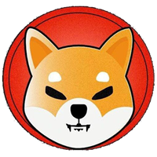

# Programmer Community 

## Big Happy Ball 🎈

- Why do Java programmers always choose to drink green tea instead of coffee? 
  Because Java drinks green tea, while C++ drinks coffee. Of course, this is just a joke.
  

  

[Github](<https://github.com/bighappyball/javadoc>)
[开始阅读](README.md)