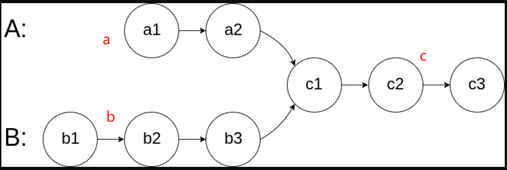

## 相交链表

### [160. 相交链表](https://leetcode.cn/problems/intersection-of-two-linked-lists/)

思路:



A走路径a->c->b

B走路径b->c-a 

最终A和B再c1相遇

```java
    public ListNode getIntersectionNode(ListNode headA, ListNode headB) {
        ListNode tempA=headA;
        ListNode tempB=headB;
        while(tempA!=tempB){
            tempA=tempA!=null?tempA.next:headB;
            tempB=tempB!=null?tempB.next:headA;
        }
        return tempA;
    }
```


## 环形链表

### [141. 环形链表](https://leetcode.cn/problems/linked-list-cycle)

#### 快慢指针

```java
   public boolean hasCycle(ListNode head) {
        ListNode slow=head;
        ListNode fast=head;
        while(fast!=null&&fast.next!=null){
            fast=fast.next.next;
            slow=slow.next;
            if(fast==slow){
                return true;
            }
        }
        return false;
    }
```

### [142. 环形链表 II - 力扣（Leetcode）](https://leetcode.cn/problems/linked-list-cycle-ii/)

#### 快慢指针

```java
    public ListNode detectCycle(ListNode head) {
        ListNode fast=head;
        ListNode slow=head;
        while(fast!=null&&fast.next!=null){
            slow=slow.next;
            fast=fast.next.next;
            if(fast==slow){
                fast=head;
                while(fast!=slow){
                    fast=fast.next;
                    slow=slow.next;
                }
                return fast;
            }
        }
        return null;
    }
```


## 反转链表

### [206. 反转链表 - 力扣（Leetcode）](https://leetcode.cn/problems/reverse-linked-list/)

#### **迭代**

```java
 public ListNode reverseList(ListNode head) {
        ListNode res=null;
        ListNode temp=head;
        while(temp!=null){
            ListNode next=temp.next;
            temp.next=res;
            res=temp;
            temp=next;
        }
        return res;
    }
```

#### 递归

```java
   public ListNode reverseList(ListNode head) {
        if(head==null||head.next==null){
            return head;
        }
        ListNode next=reverseList(head.next);
        head.next.next=head;
        head.next=null;
        return next;
    }
```

### [92. 反转链表 II](https://leetcode.cn/problems/reverse-linked-list-ii)

```java
   public ListNode reverseBetween(ListNode head, int left, int right) {
        ListNode dummy=new ListNode(-1);
        dummy.next=head;
        ListNode pre=dummy;
        for(int i=1;i<left;i++){
            pre=pre.next;
        }
        head = pre.next;
        for(int i=left;i<right;i++){
            ListNode next=head.next;
            head.next=next.next;
            next.next=pre.next;
            pre.next=next;
        }
        return dummy.next;
    }
```


### [143. 重排链表](https://leetcode.cn/problems/reorder-list)

#### 中间点+反转+合并

```java
   public void reorderList(ListNode head) {
        if(head==null||head.next==null){
            return;
        }
        ListNode mid = middleNode(head);
        ListNode l1 = head;
        ListNode l2 = mid.next;
        mid.next = null;
        l2=reverse(l2);
        mergeList(l1,l2);
    }

    public ListNode middleNode(ListNode head) {
        ListNode slow = head;
        ListNode fast = head;
        while (fast.next != null && fast.next.next != null) {
            slow = slow.next;
            fast = fast.next.next;
        }
        return slow;
    }


  public void mergeList(ListNode l1, ListNode l2) {
        ListNode l1_tmp;
        ListNode l2_tmp;
        while (l1 != null && l2 != null) {
            l1_tmp = l1.next;
            l2_tmp = l2.next;

            l1.next = l2;
            l1 = l1_tmp;

            l2.next = l1;
            l2 = l2_tmp;
        }
    }


   public ListNode reverse(ListNode head) {
       ListNode res=null;
        ListNode temp=head;
        while(temp!=null){
            ListNode next=temp.next;
            temp.next=res;
            res=temp;
            temp=next;
        }
        return res;
    }

```


### [25. K 个一组翻转链表](https://leetcode.cn/problems/reverse-nodes-in-k-group)

#### 迭代

```java
public ListNode reverseKGroup(ListNode head, int k) {
  ListNode res=new ListNode(0);
  res.next=head;
  ListNode pre=res;
  ListNode end=res;
  while(end.next!=null){
      for(int i=0;i<k&&end!=null;i++){
          end=end.next;
      }
      if(end==null){
          break;
      }
      ListNode start=pre.next;
      ListNode next=end.next;
      end.next=null;
      pre.next=reverse(start);
      start.next=next;
      pre=start;
      end=pre;
  }
  return res.next;
}
public ListNode reverse(ListNode head){
  ListNode temp=head;
  ListNode node=null;
  while(temp!=null){
      ListNode next=temp.next;
      temp.next=node;
      node=temp;
      temp=next;
  }
  return node;
}
```


## 合并排序

思路:

1.   一个个合并上去 
2.  分治 
3.  最小堆

### [ 21. 合并两个有序链表](https://leetcode.cn/problems/merge-two-sorted-lists)

#### 递归

```java
    public ListNode mergeTwoLists(ListNode list1, ListNode list2) {
        while(list1!=null&&list2!=null){
            if(list1.val>list2.val){
              list2.next=mergeTwoLists(list1,list2.next);
              return list2;
            }else{
              list1.next=mergeTwoLists(list1.next,list2);
              return list1;
            }
        }
        return list1!=null?list1:list2;
    }
```


### [23. 合并K个排序链表](https://leetcode.cn/problems/merge-k-sorted-lists)

#### 归并排序

```java
    public ListNode mergeKLists(ListNode[] lists) {
        if(lists.length==0){
            return null;
        }
        if(lists.length==1){
            return lists[0];
        }
    
        int len=lists.length;
        int mid=len/2;
        ListNode[] a = new ListNode[mid];
        for(int i=0;i<mid;i++){
            a[i]=lists[i];
        } 
        ListNode[] b = new ListNode[len-mid];
        for(int i=mid;i<len;i++){
            b[i-mid] = lists[i];
        } 
        return merge(mergeKLists(a),mergeKLists(b));

    }

    public ListNode merge(ListNode list1,ListNode list2){
        if(list1==null&&list2==null){
            return null;
        }
        if(list1!=null&&list2!=null){
            if(list1.val<list2.val){
                list1.next=merge(list1.next,list2);
                return list1;
            }else{
                list2.next=merge(list1,list2.next);
                return list2;
            }
        } 
        return list1!=null?list1:list2;
    }
```

### [148. 排序链表](https://leetcode.cn/problems/sort-list)

思路:

1. 快排需要懂，以防面试官提问（易超时） 
2. 最常规的递归版归并排序 

3. 迭代版归并排序


<!-- tabs:start -->

#### **递归归并**

```java
 public ListNode sortList(ListNode head) {
        if(head==null||head.next==null){
            return head;
        }
        ListNode fast=head;
        ListNode slow=head;
        ListNode pre=null;
        while(fast!=null && fast.next!=null){
            fast=fast.next.next;
            pre=slow;
            slow=slow.next;
        }
        pre.next=null;
        return merge(sortList(head),sortList(slow));
    }

    public ListNode merge(ListNode left,ListNode right){
        if(right==null&&left==null){
            return null;
        }
        if(left!=null&&right!=null){
            if(left.val<right.val){
                left.next=merge(left.next,right);
                return left;
            }else{
                right.next=merge(left,right.next);
                return right;
            }
        }
        return left!=null?left:right;
    }
```


#### **迭代版归并**

```java
  public ListNode sortList(ListNode head) {
        if(head==null||head.next==null){
            return head;
        }
        ListNode fast=head;
        ListNode slow=head;
        ListNode pre=null;
        while(fast!=null && fast.next!=null){
            fast=fast.next.next;
            pre=slow;
            slow=slow.next;
        }
        pre.next=null;
        ListNode left = sortList(head);
        ListNode right = sortList(slow);
        ListNode res=new ListNode(0);
        ListNode temp = res;
        while(left!=null&&right!=null){
            if(left.val<right.val){
                temp.next=left;
                left=left.next;
            }else{
                temp.next=right;
                right=right.next;
            }
            temp = temp.next;
        }
        temp.next=left!=null?left:right;
        return res.next;
    }
```


#### **快排**

```java
  public ListNode sortList(ListNode head) {
        //边界
        if(head==null||head.next==null) return head;
        //伪头结点
        ListNode pre=new ListNode(0,head);
        //快排
        quickSort(pre,null);
        //返回头结点
        return pre.next;
    }
    // 输入时伪头结点和尾节点null
    void quickSort(ListNode pre,ListNode end){
        //如果节点数小于1就返回
        if(pre==end||pre.next==end||pre.next.next==end) return;
        //选第一个节点为基准
        ListNode b=pre.next;
        //建立临时链表
        ListNode cur=new ListNode(0);
        //临时左右两指针
        ListNode r=b,l=cur;
        //遍历，右指针下一节点为end，说明当前是最后一个元素，结束
        while(r.next!=end){
            //如果当前元素小于基准，就加入临时链表，并在原链表中删除
            if(r.next.val<b.val){
                l.next=r.next;
                l=l.next;
                r.next=r.next.next;
            } else{
                //不小于基准，右指针后移
                r=r.next;
            }
        }
        //临时链表接在原链表前面，并把伪头结点指向临时节点头结点
        l.next=pre.next;
        pre.next=cur.next;
        //对基准的左右两边递归，注意输入都是伪头结点和两链表的尾节点的下一节点
        quickSort(pre,b);
        quickSort(b,end);
    }
```

<!-- tabs:end -->

## 快慢指针

### [19. 删除链表的倒数第N个节点](https://leetcode.cn/problems/remove-nth-node-from-end-of-list)

```java
  public ListNode removeNthFromEnd(ListNode head, int n) {
        // 解决删除头节点问题
        ListNode dummy = new ListNode(-1);
        dummy.next = head;
        ListNode pre = dummy;
        ListNode slow = head;
        ListNode fast = head;
        for(int i=0;i<n;i++){
            fast = fast.next;
        }
        while(fast!=null){
            pre = pre.next;
            slow = slow.next;
            fast = fast.next;
        }
        pre.next = slow.next;
        return dummy.next;
    }
```


### [剑指 Offer 22. 链表中倒数第k个节点 ](https://leetcode.cn/problems/lian-biao-zhong-dao-shu-di-kge-jie-dian-lcof/submissions/389911593/)

```java
 public ListNode getKthFromEnd(ListNode head, int k) {
        ListNode slow=head;
        ListNode fast=head;
        while(k>0){
            fast=fast.next;
            k--;
        }
        while(fast!=null){
            fast=fast.next;
            slow=slow.next;
        }
        return slow;
    }
```

### [234. 回文链表 ](https://leetcode.cn/problems/palindrome-linked-list/description/)

```java
 public boolean isPalindrome(ListNode head) {
        if(head==null||head.next==null){
            return true;
        }
     	//利用快慢指针查找中间点
        ListNode slow=head;
        ListNode fast=head;
        while(fast!=null&&fast.next!=null){
            fast=fast.next.next;
            slow=slow.next;
        }
        //翻转slow
        ListNode pre=null;
        while(slow!=null){
            ListNode next=slow.next;
            slow.next=pre;
            pre=slow;
            slow=next;
        }
        while(pre!=null){
            if(pre.val!=head.val){
                return false;
            }
            pre=pre.next;
            head=head.next;
        }
        return true;
    }
```

### [876. 链表的中间结点 - 力扣（Leetcode）](https://leetcode.cn/problems/middle-of-the-linked-list/description/)

```java
    public ListNode middleNode(ListNode head) {
        ListNode slow=head;
        ListNode fast=head;
        while(fast!=null&&fast.next!=null){
            fast=fast.next.next;
            slow=slow.next;
        }
        return slow;
    }
```


## 删除重复节点

[83. 删除排序链表中的重复元素](https://leetcode.cn/problems/remove-duplicates-from-sorted-list/)


### [82. 删除排序链表中的重复元素 II ](https://leetcode.cn/problems/remove-duplicates-from-sorted-list-ii/description/?languageTags=java)

思路:

<!-- tabs:start -->

#### **迭代**

```java
 public ListNode deleteDuplicates(ListNode head) {
        ListNode  dummy = new ListNode(0,head);
        ListNode cur = dummy;
        while(cur.next!=null&&cur.next.next!=null){
           if(cur.next.val==cur.next.next.val){
               int x=cur.next.val;
               while(cur.next!=null&&cur.next.val==x){
                   cur.next=cur.next.next;
               }
           }else{
               cur=cur.next;
           }
        }
        return dummy.next;
    }
```

#### **递归**

```java
```


<!-- tabs:end -->

## 两两交换

### [ 24. 两两交换链表中的节点](https://leetcode.cn/problems/swap-nodes-in-pairs)

<!-- tabs:start -->

#### **迭代**

具体而言，交换之前的节点关系是 temp -> node1 -> node2，交换之后的节点关系要变成 temp -> node2 -> node1，因此需要进行如下操作。
完成上述操作之后，节点关系即变成 temp -> node2 -> node1。再令 temp = node1，对链表中的其余节点进行两两交换，直到全部节点都被两两交换。

```java
 public ListNode swapPairs(ListNode head) {
        if(head==null||head.next==null){
            return head;
        }
        ListNode newHead=new ListNode(0,head);
        ListNode temp=newHead;
        while(temp.next!=null&&temp.next.next!=null){
            ListNode node1=temp.next;
            ListNode node2=temp.next.next;
            temp.next=node2;
            node1.next=node2.next;
            node2.next=node1;
            temp=node1;
        }
        return newHead.next;
        
    }
```

#### **递归**

```java
    public ListNode swapPairs(ListNode head) {
        if(head==null||head.next==null){
            return head;
        }
        ListNode newHead=head.next;
        head.next=swapPairs(newHead.next);
        newHead.next=head;
        return newHead;
    }
```

<!-- tabs:end -->

### [328. 奇偶链表](https://leetcode.cn/problems/odd-even-linked-list)

```java
  public ListNode oddEvenList(ListNode head) {
        if(head==null||head.next==null){
            return head;
        }
        ListNode odd = head;
        ListNode evenHead = head.next;
        ListNode evenTail = evenHead;
        while(odd.next!=null&&evenTail.next!=null){
            odd.next=evenTail.next;
            odd=odd.next;
            evenTail.next=odd.next;
            evenTail=evenTail.next;
        }
        odd.next=evenHead;
        return head;
    }
```


## 二叉搜索树与双向链表

### [114. 二叉树展开为链表](https://leetcode.cn/problems/flatten-binary-tree-to-linked-list)

<!-- tabs:start-->

#### **递归**

```java
  TreeNode pre = null;
    public void flatten(TreeNode root) {
        if(root==null){
            return;
        }
        // 递归由后向前,因此由右向左
        flatten(root.right);
        flatten(root.left);
        root.right=pre;
        root.left=null;
        pre = root;
    }
```

**迭代**

```java
```


<!-- tabs:end -->

### 剑指 Offer 36. 二叉搜索树与双向链表

```java
Node pre, head;
public Node treeToDoublyList(Node root) {
    // 边界值
    if(root == null) return null;
    dfs(root);  // 题目要求头尾连接
    head.left = pre;
    pre.right = head;
    // 返回头节点
    return head;
}
void dfs(Node cur) {
    // 递归结束条件
    if(cur == null) return;
    dfs(cur.left);
    // 如果pre为空，就说明是第一个节点，头结点，然后用head保存头结点，用于之后的返回
    if (pre == null) head = cur;
    // 如果不为空，那就说明是中间的节点。并且pre保存的是上一个节点，
    // 让上一个节点的右指针指向当前节点
    else pre.right = cur;
    // 再让当前节点的左指针指向父节点，也就连成了双向链表
    cur.left = pre;
    // 保存当前节点，用于下层递归创建
    pre = cur;
    dfs(cur.right);
}
```

## 补充题

### 字节跳动高频题——排序奇升偶降链表

给定一个奇数位升序，偶数位降序的链表，将其重新排序。

```
输入: 1->8->3->6->5->4->7->2->NULL
输出: 1->2->3->4->5->6->7->8->NULL
```

题目分析 

> \1. 按奇偶位置拆分链表，得1->3->5->7->NULL和8->6->4->2->NULL
>
> \2. 反转偶链表，得1->3->5->7->NULL和2->4->6->8->NULL
>
> \3. 合并两个有序链表，得1->2->3->4->5->6->7->8->NULL

时间复杂度为O(N)，空间复杂度O(1)。

思路很清晰，实现起来其实还是有些难度的，因为这里的每一步其实都可以单独抽出来作为一道题。

第2步和第3步分别对应的力扣206. 反转链表和21. 合并两个有序链表，而第1步的解法与328. 奇偶链表差不多。如果搞懂这3道leetcode，那么本篇文章的这道题肯定不在话下了。

## 旋转链表

### [61. 旋转链表](https://leetcode.cn/problems/rotate-list)

```java
 public ListNode rotateRight(ListNode head, int k) {
        if(head==null||k==0||head.next==null){
            return head;
        }
        ListNode temp = head;
        int len=0;
        while(temp!=null){
            temp = temp.next;
            len++;
        }
        k =len - k%len;
        // 等于0返回原链表
        if(k==len){
            return head;
        }
        ListNode pre=null;
        temp=head;
        while(k>0){
            pre = temp;
            temp = temp.next;
            k--;
        }
        pre.next=null;
        ListNode newHead=temp;
        while(temp.next!=null){
            temp=temp.next;
        }
        temp.next=head;
        return newHead;
     
    }
```

## 两数相加

### [2. 两数相加 ](https://leetcode.cn/problems/add-two-numbers/submissions/391191673/)

```java
  public ListNode addTwoNumbers(ListNode l1, ListNode l2) {
       ListNode res=new ListNode(0),cur=res;
       int add=0;
       while(l1!=null||l2!=null||add!=0){
           int sum=add;
           if(l1!=null&&l2!=null){
                sum+=l1.val+l2.val;
                l1=l1.next;
                l2=l2.next;
           }else if(l1!=null){
                sum+=l1.val;
                l1=l1.next;
           }else if(l2!=null){
                sum+=l2.val;
                l2=l2.next;
           }
           add=sum/10;
           sum=sum%10;
           ListNode node=new ListNode(sum);
           cur.next=node;
           cur=node;
       }
       return res.next;
    }
```

### 分隔链表

#### [86. 分隔链表 - 力扣（Leetcode）](https://leetcode.cn/problems/partition-list/description/)

思路: 创建两个链表,分别存放小于或大于对节点,最后合并两节点

```java
 public ListNode partition(ListNode head, int x) {
        ListNode small =new ListNode(-1);
        ListNode smallHeader=small;
        ListNode large=new ListNode(-1);
        ListNode largeHeader=large;
        while(head!=null){
            if(head.val<x){
                smallHeader.next=head;
                smallHeader=smallHeader.next;
            }else{
                largeHeader.next=head;
                largeHeader=largeHeader.next;
            }
            head=head.next;
        }
        smallHeader.next=large.next;
        largeHeader.next=null;
        return small.next;
    }
```

