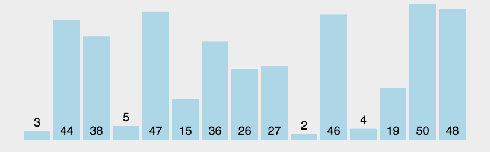

### 算法分类

比较类排序：通过比较来决定元素间的相对次序，由于其时间复杂度不能突破O(nlogn)，因此也称为非线性时间比较类排序。  

非比较类排序：不通过比较来决定元素间的相对次序，它可以突破基于比较排序的时间下界，以线性时间运行，因此也称为线性时间非比较类排序。  

  

### 算法复杂度

 

### 相关概念

1. 稳定：如果a原本在b前面，而a=b，排序之后a仍然在b的前面。
2. 不稳定：如果a原本在b的前面，而a=b，排序之后 a 可能会出现在 b 的后面。
3. 时间复杂度：对排序数据的总的操作次数。反映当n变化时，操作次数呈现什么规律。
4. 空间复杂度：是指算法在计算机

### 冒泡排序（Bubble Sort）

冒泡排序是一种简单的排序算法。它重复地走访过要排序的数列，一次比较两个元素，如果它们的顺序错误就把它们交换过来。走访数列的工作是重复地进行直到没有再需要交换，也就是说该数列已经排序完成。这个算法的名字由来是因为越小的元素会经由交换慢慢“浮”到数列的顶端。 

时间平均n2  时间最坏n2  时间最好n 空间 1  稳定

 

```java
    public static void bubbleSort(int[] nums) {
        for (int i = 0; i < nums.length - 1; i++) {
            for (int j = 0; j < nums.length - i - 1; j++) {
                if (nums[j] > nums[j + 1]) {
                    int temp = nums[j];
                    nums[j] = nums[j + 1];
                    nums[j + 1] = temp;
                }
            }
        }
    }
```
### 选择排序（Selection Sort）
选择排序(Selection-sort)是一种简单直观的排序算法。它的工作原理：首先在未排序序列中找到最小（大）元素，存放到排序序列的起始位置，然后，再从剩余未排序元素中继续寻找最小（大）元素，然后放到已排序序列的末尾。以此类推，直到所有元素均排序完毕。  

时间平均n2  时间最坏n2  时间最好n2 空间 1  不稳定

 

```java
    public static void bubbleSort(int[] nums) {
        for (int i = 0; i < nums.length; i++) {
            for (int j = i; j < nums.length; j++) {
                if (nums[i] > nums[j]) {
                    int temp = nums[j];
                    nums[j] = nums[i];
                    nums[i] = temp;
                }
            }
        }
    }
```

### 插入排序（Insertion Sort）

插入排序（Insertion-Sort）的算法描述是一种简单直观的排序算法。它的工作原理是通过构建有序序列，对于未排序数据，在已排序序列中从后向前扫描，找到相应位置并插入。

时间平均n2  时间最坏n2  时间最好n 空间 1  稳定

 


1. 从第一个元素开始，该元素可以认为已经被排序；
2. 取出下一个元素，在已经排序的元素序列中从后向前扫描；
3. 如果该元素（已排序）大于新元素，将该元素移到下一位置；
4. 重复步骤3，直到找到已排序的元素小于或者等于新元素的位置；
5. 将新元素插入到该位置后；
6. 重复步骤2~5。

```java
    public static void insertSort(int[] nums) {
        for (int i = 1; i < nums.length; i++) {
            int pre = i - 1;
            int cur = nums[i];
            while (nums[pre] > cur && pre >= 0) {
                nums[pre + 1] = nums[pre];
                pre--;
            }
            nums[pre + 1] = cur;
        }
    }
```

### 希尔排序（Shell Sort）

1959年Shell发明，第一个突破O(n2)的排序算法，是简单插入排序的改进版。它与插入排序的不同之处在于，它会优先比较距离较远的元素。希尔排序又叫缩小增量排序。

时间平均n1.3  时间最坏n2  时间最好n 空间 1  稳定

 

```java
    public static void shellSort(int[] nums) {
        int len = nums.length;
        for (int i = Math.floorDiv(len, 2); i > 0; i = Math.floorDiv(len, 2)) {
            for (int j = i; j < len; j++) {
                int pre = j;
                int cur = nums[j];
                while (pre - i >= 0 && cur < nums[pre - i]) {
                    nums[pre] = nums[pre - i];
                    pre = pre - i;
                }
                nums[pre] = cur;
            }
        }
    }
```

### 归并排序（Merge Sort）

归并排序是建立在归并操作上的一种有效的排序算法。该算法是采用分治法（Divide and Conquer）的一个非常典型的应用。将已有序的子序列合并，得到完全有序的序列；即先使每个子序列有序，再使子序列段间有序。若将两个有序表合并成一个有序表，称为2-路归并。 

时间平均n*log2n  时间最坏n*log2n  时间最好n*log2n 空间 n  稳定

 

```java
    public static int[] mergeSort(int[] nums) {
        int len = nums.length;
        if (len < 2) {
            return nums;
        }
        int middle = Math.floorDiv(len, 2);
        int[] num1 = new int[middle];
        for (int i = 0; i < num1.length; i++) {
            num1[i] = nums[i];
        }
        int[] num2 = new int[len - middle];
        for (int i = 0; i < num2.length; i++) {
            num2[i] = nums[i + middle];
        }
        return merge(mergeSort(num1), mergeSort(num2));
    }

    public static int[] merge(int[] nums1, int[] num2) {
        int len = num2.length + nums1.length;
        int[] nums = new int[len];
        int i = 0, left = 0, right = 0;
        while (i < len && left < nums1.length && right < num2.length) {
            if (nums1[left] < num2[right]) {
                nums[i++] = nums1[left++];
            } else {
                nums[i++] = num2[right++];
            }
        }
        while (left < nums1.length) {
            nums[i++] = nums1[left++];
        }
        while (right < num2.length) {
            nums[i++] = num2[right++];
        }
        return nums;
    }
```


### 快速排序（Quick Sort）
快速排序的基本思想：通过一趟排序将待排记录分隔成独立的两部分，其中一部分记录的关键字均比另一部分的关键字小，则可分别对这两部分记录继续进行排序，以达到整个序列有序。

时间平均n*log2n  时间最坏n2  时间最好n*log2n 空间 n*log2n   不稳定

算法描述  

快速排序使用分治法来把一个串（list）分为两个子串（sub-lists）。具体算法描述如下：  

1. 从数列中挑出一个元素，称为 “基准”（pivot）；
2. 重新排序数列，所有元素比基准值小的摆放在基准前面，所有元素比基准值大的摆在基准的后面（相同的数可以到任一边）。在这个分区退出之后，该基准就处于数列的中间位置。这个称为分区（partition）操作；
3. 递归地（recursive）把小于基准值元素的子数列和大于基准值元素的子数列排序。

```java
    public static void quickSort(int[] nums, int left, int right) {
        if (left < right) {
            int pivot = pivot(nums, left, right);
            quickSort(nums, left, pivot - 1);
            quickSort(nums, pivot + 1, right);
        }
    }

    public static int pivot(int[] nums, int left, int right) {
        int pivot = left;
        int index = pivot + 1;
        for (int i = index; i <= right; i++) {
            if (nums[i] < nums[pivot]) {
                swap(nums, i, index++);
            }
        }
        swap(nums, pivot, index - 1);
        return index - 1;
    }
```

### 堆排序（Heap Sort）
堆排序（Heapsort）是指利用堆这种数据结构所设计的一种排序算法。堆积是一个近似完全二叉树的结构，并同时满足堆积的性质：即子结点的键值或索引总是小于（或者大于）它的父节点。

时间平均n*log2n  时间最坏n*log2n  时间最好n*log2n 空间 1   不稳定

1. 将初始待排序关键字序列(R1,R2….Rn)构建成大顶堆，此堆为初始的无序区；
2. 将堆顶元素R[1]与最后一个元素R[n]交换，此时得到新的无序区(R1,R2,……Rn-1)和新的有序区(Rn),且满足R[1,2…n-1]<=R[n]；
3. 由于交换后新的堆顶R[1]可能违反堆的性质，因此需要对当前无序区(R1,R2,……Rn-1)调整为新堆，然后再次将R[1]与无序区最后一个元素交换，得到新的无序区(R1,R2….Rn-2)和新的有序区(Rn-1,Rn)。不断重复此过程直到有序区的元素个数为n-1，则整个排序过程完成。

 

