## ChannelPipeline（一）之初始化

### 1. 概述

在 [《精尽 Netty 源码分析 —— Netty 简介（二）之核心组件》](http://svip.iocoder.cn/Netty/intro-2/?self) 中，对 EventLoopGroup 和 EventLoop 做了定义，我们再来回顾下：

> ChannelPipeline 为 ChannelHandler 的**链**，提供了一个容器并定义了用于沿着链传播入站和出站事件流的 API 。一个数据或者事件可能会被多个 Handler 处理，在这个过程中，数据或者事件经流 ChannelPipeline ，由 ChannelHandler 处理。在这个处理过程中，一个 ChannelHandler 接收数据后处理完成后交给下一个 ChannelHandler，或者什么都不做直接交给下一个 ChannelHandler。

因为 ChannelPipeline 涉及的代码量较大，所以笔者会分成好几篇文章分别分享。而本文，我们来分享 ChannelPipeline 的**初始化**。也因此，本文更多是体现 ChannelPipeline 的**整体性**，所以不会过多介绍每个类的具体的**每个方法**的实现。

### 2. ChannelPipeline

`io.netty.channel.ChannelPipeline` ，继承 ChannelInboundInvoker、ChannelOutboundInvoker、Iterable 接口，Channel Pipeline 接口。代码如下：

```java
public interface ChannelPipeline
        extends ChannelInboundInvoker, ChannelOutboundInvoker, Iterable<Entry<String, ChannelHandler>> {

    // ========== 添加 ChannelHandler 相关 ==========
    ChannelPipeline addFirst(String name, ChannelHandler handler);
    ChannelPipeline addFirst(EventExecutorGroup group, String name, ChannelHandler handler);
    ChannelPipeline addLast(String name, ChannelHandler handler);
    ChannelPipeline addLast(EventExecutorGroup group, String name, ChannelHandler handler);
    ChannelPipeline addBefore(String baseName, String name, ChannelHandler handler);
    ChannelPipeline addBefore(EventExecutorGroup group, String baseName, String name, ChannelHandler handler);
    ChannelPipeline addAfter(String baseName, String name, ChannelHandler handler);
    ChannelPipeline addAfter(EventExecutorGroup group, String baseName, String name, ChannelHandler handler);
    ChannelPipeline addFirst(ChannelHandler... handlers);
    ChannelPipeline addFirst(EventExecutorGroup group, ChannelHandler... handlers);
    ChannelPipeline addLast(ChannelHandler... handlers);
    ChannelPipeline addLast(EventExecutorGroup group, ChannelHandler... handlers);

    // ========== 移除 ChannelHandler 相关 ==========
    ChannelPipeline remove(ChannelHandler handler);
    ChannelHandler remove(String name);
    <T extends ChannelHandler> T remove(Class<T> handlerType);
    ChannelHandler removeFirst();
    ChannelHandler removeLast();
    
    // ========== 替换 ChannelHandler 相关 ==========
    ChannelPipeline replace(ChannelHandler oldHandler, String newName, ChannelHandler newHandler);
    ChannelHandler replace(String oldName, String newName, ChannelHandler newHandler);
    <T extends ChannelHandler> T replace(Class<T> oldHandlerType, String newName, ChannelHandler newHandler);

    // ========== 查询 ChannelHandler 相关 ==========
    ChannelHandler first();
    ChannelHandlerContext firstContext();
    ChannelHandler last();
    ChannelHandlerContext lastContext();
    ChannelHandler get(String name);
    <T extends ChannelHandler> T get(Class<T> handlerType);
    ChannelHandlerContext context(ChannelHandler handler);
    ChannelHandlerContext context(String name);
    ChannelHandlerContext context(Class<? extends ChannelHandler> handlerType);
    List<String> names();

    // ========== Channel 相关 ==========
    Channel channel();

    // ========== ChannelInboundInvoker 相关 ==========    
    @Override
    ChannelPipeline fireChannelRegistered();
    @Override
    ChannelPipeline fireChannelUnregistered();
    @Override
    ChannelPipeline fireChannelActive();
    @Override
    ChannelPipeline fireChannelInactive();
    @Override
    ChannelPipeline fireExceptionCaught(Throwable cause);
    @Override
    ChannelPipeline fireUserEventTriggered(Object event);
    @Override
    ChannelPipeline fireChannelRead(Object msg);
    @Override
    ChannelPipeline fireChannelReadComplete();
    @Override
    ChannelPipeline fireChannelWritabilityChanged();

    // ========== ChannelOutboundInvoker 相关 ==========    
    @Override
    ChannelPipeline flush();
    
}
```

虽然接口的方法比较多，笔者做了归类如下：

- ChannelHandler 的增删改查的相关方法。
- Channel 的相关方法，目前只有一个。
- 继承自 ChannelInboundInvoker 的相关方法。
- 继承自 ChannelOutboundInvoker 的相关方法。

有可能会疑惑为什么继承 Iterable 接口？因为 ChannelPipeline 是 ChannelHandler 的**链**。

ChannelPipeline 的类图如下：

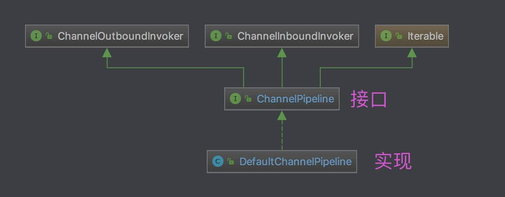


#### 2.1 ChannelInboundInvoker

`io.netty.channel.ChannelInboundInvoker` ，Channel Inbound Invoker( 调用者 ) 接口。代码如下：

```java
ChannelPipeline fireChannelRegistered();
ChannelPipeline fireChannelUnregistered();
ChannelPipeline fireChannelActive();
ChannelPipeline fireChannelInactive();
ChannelPipeline fireExceptionCaught(Throwable cause);
ChannelPipeline fireUserEventTriggered(Object event);
ChannelPipeline fireChannelRead(Object msg);
ChannelPipeline fireChannelReadComplete();
ChannelPipeline fireChannelWritabilityChanged();
```

- 通知 Channel 事件的接口方法。

#### 2.2 ChannelOutboundInvoker

`io.netty.channel.ChannelOutboundInvoker` ，Channel Outbound Invoker( 调用者 ) 接口。代码如下：

```java
// ========== Channel 操作相关 ==========    
ChannelFuture bind(SocketAddress localAddress);
ChannelFuture connect(SocketAddress remoteAddress);
ChannelFuture connect(SocketAddress remoteAddress, SocketAddress localAddress);
ChannelFuture disconnect();
ChannelFuture close();
ChannelFuture deregister();
ChannelFuture bind(SocketAddress localAddress, ChannelPromise promise);
ChannelFuture connect(SocketAddress remoteAddress, ChannelPromise promise);
ChannelFuture connect(SocketAddress remoteAddress, SocketAddress localAddress, ChannelPromise promise);
ChannelFuture disconnect(ChannelPromise promise);
ChannelFuture close(ChannelPromise promise);
ChannelFuture deregister(ChannelPromise promise);
ChannelOutboundInvoker read();
ChannelFuture write(Object msg);
ChannelFuture write(Object msg, ChannelPromise promise);
ChannelOutboundInvoker flush();
ChannelFuture writeAndFlush(Object msg, ChannelPromise promise);
ChannelFuture writeAndFlush(Object msg);

// ========== Promise 相关 ==========    
ChannelPromise newPromise();
ChannelProgressivePromise newProgressivePromise();
ChannelFuture newSucceededFuture();
ChannelFuture newFailedFuture(Throwable cause);
ChannelPromise voidPromise();
```

- 发起 Channel 操作的接口方法。
- 创建 Promise 对象的接口方法。

#### 2.3 Outbound v.s Inbound 事件

在 [《Netty 源码分析之 二 贯穿Netty 的大动脉 ── ChannelPipeline (二)》](https://segmentfault.com/a/1190000007309311) 中，笔者看到一个比较不错的总结：

> 老艿艿：因为要加一些注释，所以暂时不使用引用。

**对于 Outbound 事件**：

- Outbound 事件是【请求】事件(由 Connect 发起一个请求, 并最终由 Unsafe 处理这个请求)

- Outbound 事件的发起者是 Channel

- Outbound 事件的处理者是 Unsafe

- Outbound 事件在 Pipeline 中的传输方向是 `tail` -> `head`

  > 旁白：Outbound 翻译为“出站”，所以从 `tail`( 尾 )到 `head`( 头 )也合理。
  >
  > 至于什么是 `head` 和 `tail` ，等看了具体的 ChannelPipeline 实现类 DefaultChannelPipeline 再说。

- 在 ChannelHandler 中处理事件时, 如果这个 Handler 不是最后一个 Handler, 则需要调用 `ctx.xxx` (例如 `ctx.connect` ) 将此事件继续传播下去. 如果不这样做, 那么此事件的传播会提前终止.

- Outbound 事件流: `Context.OUT_EVT` -> `Connect.findContextOutbound` -> `nextContext.invokeOUT_EVT` -> `nextHandler.OUT_EVT` -> `nextContext.OUT_EVT`

**对于 Inbound 事件**：

- Inbound 事件是【通知】事件, 当某件事情已经就绪后, 通知上层.

- Inbound 事件发起者是 Unsafe

- Inbound 事件的处理者是 TailContext, 如果用户没有实现自定义的处理方法, 那么Inbound 事件默认的处理者是 TailContext, 并且其处理方法是空实现.

- Inbound 事件在 Pipeline 中传输方向是 `head`( 头 ) -> `tail`( 尾 )

  > 旁白：Inbound 翻译为“入站”，所以从 `head`( 头 )到 `tail`( 尾 )也合理。

- 在 ChannelHandler 中处理事件时, 如果这个 Handler 不是最后一个 Handler, 则需要调用 `ctx.fireIN_EVT` (例如 `ctx.fireChannelActive` ) 将此事件继续传播下去. 如果不这样做, 那么此事件的传播会提前终止.

- Inbound 事件流: `Context.fireIN_EVT` -> `Connect.findContextInbound` -> `nextContext.invokeIN_EVT` -> `nextHandler.IN_EVT` -> `nextContext.fireIN_EVT`

Outbound 和 Inbound 事件十分的镜像, 并且 Context 与 Handler 直接的调用关系是否容易混淆, 因此读者在阅读这里的源码时, 需要特别的注意。

### 3. DefaultChannelPipeline

`io.netty.channel.DefaultChannelPipeline` ，实现 ChannelPipeline 接口，默认 ChannelPipeline 实现类。😈 实际上，也只有这个实现类。

#### 3.1 静态属性

```java
/**
 * {@link #head} 的名字
 */
private static final String HEAD_NAME = generateName0(HeadContext.class);
/**
 * {@link #tail} 的名字
 */
private static final String TAIL_NAME = generateName0(TailContext.class);

/**
 * 名字({@link AbstractChannelHandlerContext#name})缓存 ，基于 ThreadLocal ，用于生成在线程中唯一的名字。
 */
private static final FastThreadLocal<Map<Class<?>, String>> nameCaches = new FastThreadLocal<Map<Class<?>, String>>() {

    @Override
    protected Map<Class<?>, String> initialValue() throws Exception {
        return new WeakHashMap<Class<?>, String>();
    }

};

/**
 * {@link #estimatorHandle} 的原子更新器
 */
private static final AtomicReferenceFieldUpdater<DefaultChannelPipeline, MessageSizeEstimator.Handle> ESTIMATOR =
        AtomicReferenceFieldUpdater.newUpdater(
                DefaultChannelPipeline.class, MessageSizeEstimator.Handle.class, "estimatorHandle");
```

- `HEAD_NAME` 和 `TAIL_NAME` 静态属性，通过调用 `#generateName0(Class<?> handlerType)` 方法，生成对应的名字。代码如下：

  ```java
  private static String generateName0(Class<?> handlerType) {
      return StringUtil.simpleClassName(handlerType) + "#0";
  }
  ```

  - 即 `HEAD_NAME = "HeadContext#0"`，`TAIL_NAME= "TailContext#0"` 。

- `nameCaches` 静态属性，名字( `AbstractChannelHandlerContext.name` )缓存 ，基于 ThreadLocal ，用于生成**在线程中唯一的名字**。详细解析，见 [《精尽 Netty 源码解析 —— Pipeline（二）之添加 ChannelHandler》](http://svip.iocoder.cn/Netty/Pipeline-2-add-channel-handler) 。

- `ESTIMATOR` 静态属性，`estimatorHandle` 属性的**原子**更新器。

#### 3.2 构造方法

```java
/**
 * Head 节点
 */
final AbstractChannelHandlerContext head;
/**
 * Tail 节点
 */
final AbstractChannelHandlerContext tail;

/**
 * 所属 Channel 对象
 */
private final Channel channel;
/**
 * 成功的 Promise 对象
 */
private final ChannelFuture succeededFuture;
/**
 * 不进行通知的 Promise 对象
 *
 * 用于一些方法执行，需要传入 Promise 类型的方法参数，但是不需要进行通知，就传入该值
 *
 * @see io.netty.channel.AbstractChannel.AbstractUnsafe#safeSetSuccess(ChannelPromise) 
 */
private final VoidChannelPromise voidPromise;
/**
 * TODO 1008 DefaultChannelPipeline 字段用途
 */
private final boolean touch = ResourceLeakDetector.isEnabled();

/**
 * 子执行器集合。
 *
 * 默认情况下，ChannelHandler 使用 Channel 所在的 EventLoop 作为执行器。
 * 但是如果有需要，也可以自定义执行器。详细解析，见 {@link #childExecutor(EventExecutorGroup)} 。
 * 实际情况下，基本不会用到。和基友【闪电侠】沟通过。
 */
private Map<EventExecutorGroup, EventExecutor> childExecutors;
/**
 * TODO 1008 DefaultChannelPipeline 字段用途
 */
private volatile MessageSizeEstimator.Handle estimatorHandle;
/**
 * 是否首次注册
 */
private boolean firstRegistration = true;

/**
 * This is the head of a linked list that is processed by {@link #callHandlerAddedForAllHandlers()} and so process
 * all the pending {@link #callHandlerAdded0(AbstractChannelHandlerContext)}.
 *
 * We only keep the head because it is expected that the list is used infrequently and its size is small.
 * Thus full iterations to do insertions is assumed to be a good compromised to saving memory and tail management
 * complexity.
 * 
 * 准备添加 ChannelHandler 的回调
 */
private PendingHandlerCallback pendingHandlerCallbackHead;

/**
 * Set to {@code true} once the {@link AbstractChannel} is registered.Once set to {@code true} the value will never
 * change.
 * Channel 是否已注册
 */
private boolean registered;

protected DefaultChannelPipeline(Channel channel) {
    this.channel = ObjectUtil.checkNotNull(channel, "channel");
    // succeededFuture 的创建
    succeededFuture = new SucceededChannelFuture(channel, null);
    // voidPromise 的创建
    voidPromise =  new VoidChannelPromise(channel, true);

    // 创建 Tail 及诶点
    tail = new TailContext(this); // <1>
    // 创建 Head 节点
    head = new HeadContext(this); // <2>

    // 相互指向 <3>
    head.next = tail;
    tail.prev = head;
}
```

- `head` 属性，Head 节点，在构造方法的 `<1>` 处初始化。详细解析，见 [「4.2 HeadContext」](http://svip.iocoder.cn/Netty/ChannelPipeline-1-init/#) 。

- `tail` 节点，Tail 节点，在构造方法的 `<2>` 处初始化。详细解析，见 [「4.3 TailContext」](http://svip.iocoder.cn/Netty/ChannelPipeline-1-init/#) 。

- 在构造方法的 `<3>` 处，`head` 节点向**下**指向 `tail` 节点，`tail` 节点向**上**指向 `head` 节点，从而形成**相互**的指向。即如下图所示：

  > FROM [《netty 源码分析之 pipeline(一)》](https://www.jianshu.com/p/6efa9c5fa702)
  >
  > 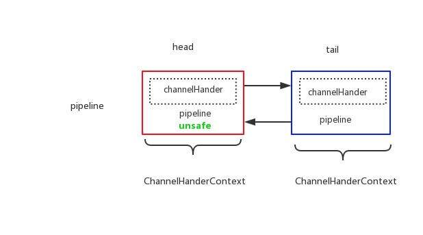
  >
  > 

  - pipeline 中的节点的数据结构是 ChannelHandlerContext 类。每个 ChannelHandlerContext 包含**一个** ChannelHandler、它的**上下**节点( **从而形成 ChannelHandler 链** )、以及其他上下文。详细解析，见 [「4. ChannelHandlerContext」](http://svip.iocoder.cn/Netty/ChannelPipeline-1-init/#) 。

  - 默认情况下，pipeline 有 `head` 和 `tail` 节点，形成默认的 ChannelHandler 链。而我们可以在它们之间，加入自定义的 ChannelHandler 节点。如下图所示：

    > FROM [《netty 源码分析之 pipeline(一)》
    >
    > 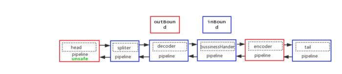
    >
    > 

- `childExecutors` 属性，子执行器集合。默认情况下，ChannelHandler 使用 Channel 所在的 EventLoop 作为执行器。

  - 但是如果有需要，也可以自定义执行器。详细解析，见 [《精尽 Netty 源码解析 —— Pipeline（二）之添加 ChannelHandler》](http://svip.iocoder.cn/Netty/Pipeline-2-add-channel-handler) 。
  - 实际情况下，基本不会用到。和基友【闪电侠】沟通过。

- `pendingHandlerCallbackHead` 属性，准备添加 ChannelHandler 的回调。详细解析，见 [《精尽 Netty 源码解析 —— Pipeline（二）之添加 ChannelHandler》](http://svip.iocoder.cn/Netty/Pipeline-2-add-channel-handler) 。

- `registered` 属性，Channel 是否已注册。详细解析，见 [《精尽 Netty 源码解析 —— Pipeline（二）之添加 ChannelHandler》](http://svip.iocoder.cn/Netty/Pipeline-2-add-channel-handler) 。

- `firstRegistration` 属性，是否首次注册。详细解析，见 [《精尽 Netty 源码解析 —— Pipeline（二）之添加 ChannelHandler》](http://svip.iocoder.cn/Netty/Pipeline-2-add-channel-handler) 。

#### 3.3 其他方法

DefaultChannelPipeline 中的其他方法，详细解析，见后续的文章。

### 4. ChannelHandlerContext

`io.netty.channel.ChannelHandlerContext` ，继承 ChannelInboundInvoker、ChannelOutboundInvoker、AttributeMap 接口，ChannelHandler Context( 上下文 )接口，作为 ChannelPipeline 中的**节点**。代码如下：

```java
// ========== Context 相关 ==========
String name();
Channel channel();
EventExecutor executor();
ChannelHandler handler();
ChannelPipeline pipeline();
boolean isRemoved(); // 是否已经移除

// ========== ByteBuf 相关 ==========    
ByteBufAllocator alloc();

// ========== ChannelInboundInvoker 相关 ==========    
@Override
ChannelHandlerContext fireChannelRegistered();
@Override
ChannelHandlerContext fireChannelUnregistered();
@Override
ChannelHandlerContext fireChannelActive();
@Override
ChannelHandlerContext fireChannelInactive();
@Override
ChannelHandlerContext fireExceptionCaught(Throwable cause);
@Override
ChannelHandlerContext fireUserEventTriggered(Object evt);
@Override
ChannelHandlerContext fireChannelRead(Object msg);
@Override
ChannelHandlerContext fireChannelReadComplete();
@Override
ChannelHandlerContext fireChannelWritabilityChanged();

// ========== ChannelOutboundInvoker 相关 ==========
@Override
ChannelHandlerContext read();
@Override
ChannelHandlerContext flush();

// ========== AttributeMap 相关 ==========
@Deprecated
@Override
<T> Attribute<T> attr(AttributeKey<T> key);
@Deprecated
@Override
<T> boolean hasAttr(AttributeKey<T> key);
```

虽然接口的方法比较多，笔者做了归类如下：

- Context 相关的接口方法。
- 继承自 ChannelInboundInvoker 的相关方法，*和 ChannelPipeline 一样*。
- 继承自 ChannelOutboundInvoker 的相关方法，*和 ChannelPipeline 一样*。
- 继承自 AttributeMap 的相关方法，实际上已经废弃( `@Deprecated` )了，不再从 ChannelHandlerContext 中获取，而是从 Channel 中获取。

ChannelHandlerContext 的类图如下：

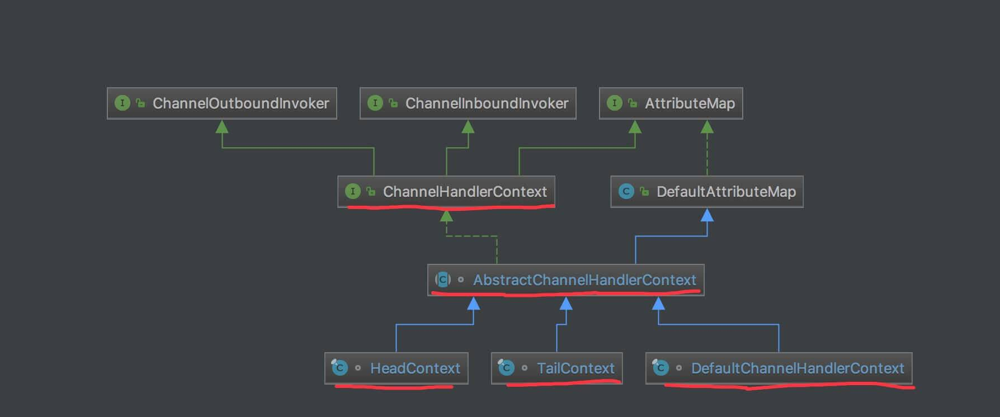


- 😈 类图中的 AttributeMap 和 DefaultAttributeMap 可以无视。

#### 4.1 AbstractChannelHandlerContext

`io.netty.channel.AbstractChannelHandlerContext` ，实现 ChannelHandlerContext、ResourceLeakHint 接口，继承 DefaultAttributeMap 类，ChannelHandlerContext 抽象基类。

##### 4.1.1 静态属性

```java
/**
 * Neither {@link ChannelHandler#handlerAdded(ChannelHandlerContext)}
 * nor {@link ChannelHandler#handlerRemoved(ChannelHandlerContext)} was called.
 */
private static final int INIT = 0; // 初始化
/**
 * {@link ChannelHandler#handlerAdded(ChannelHandlerContext)} is about to be called.
 */
private static final int ADD_PENDING = 1; // 添加准备中
/**
 * {@link ChannelHandler#handlerAdded(ChannelHandlerContext)} was called.
 */
private static final int ADD_COMPLETE = 2; // 已添加
/**
 * {@link ChannelHandler#handlerRemoved(ChannelHandlerContext)} was called.
 */
private static final int REMOVE_COMPLETE = 3; // 已移除

/**
 * {@link #handlerState} 的原子更新器
 */
private static final AtomicIntegerFieldUpdater<AbstractChannelHandlerContext> HANDLER_STATE_UPDATER = AtomicIntegerFieldUpdater.newUpdater(AbstractChannelHandlerContext.class, "handlerState");

// ========== 非静态属性 ==========

/**
 * 处理器状态
 */
private volatile int handlerState = INIT;
```

- `handlerState`属性(非静态属性，放这里主要是为了统一讲 )，处理器状态。共有4种状态。状态变迁如下图：
  
  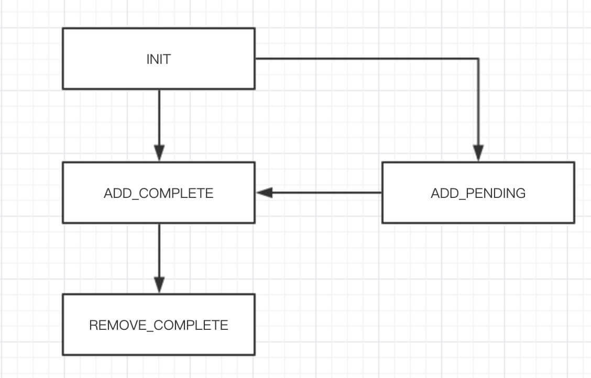

  

  ​																				`handlerState` 变迁

  - 详细解析，见 [「4.1.3 setAddComplete」](http://svip.iocoder.cn/Netty/ChannelPipeline-1-init/#)、[「4.1.4 setRemoved」](http://svip.iocoder.cn/Netty/ChannelPipeline-1-init/#)、[「4.1.5 setAddPending」](http://svip.iocoder.cn/Netty/ChannelPipeline-1-init/#) 中。

- `HANDLER_STATE_UPDATER` **静态**属性，`handlerState` 的原子更新器。

##### 4.1.2 构造方法

```java
/**
 * 上一个节点
 */
volatile AbstractChannelHandlerContext next;
/**
 * 下一个节点
 */
volatile AbstractChannelHandlerContext prev;
/**
 * 是否为 inbound
 */
private final boolean inbound;
/**
 * 是否为 outbound
 */
private final boolean outbound;
/**
 * 所属 pipeline
 */
private final DefaultChannelPipeline pipeline;
/**
 * 名字
 */
private final String name;
/**
 * 是否使用有序的 EventExecutor ( {@link #executor} )，即 OrderedEventExecutor
 */
private final boolean ordered;

// Will be set to null if no child executor should be used, otherwise it will be set to the
// child executor.
/**
 * EventExecutor 对象
 */
final EventExecutor executor;
/**
 * 成功的 Promise 对象
 */
private ChannelFuture succeededFuture;

// Lazily instantiated tasks used to trigger events to a handler with different executor. 懒加载
// There is no need to make this volatile as at worse it will just create a few more instances then needed.
/**
 * 执行 Channel ReadComplete 事件的任务
 */
private Runnable invokeChannelReadCompleteTask;
/**
 * 执行 Channel Read 事件的任务
 */
private Runnable invokeReadTask;
/**
 * 执行 Channel WritableStateChanged 事件的任务
 */
private Runnable invokeChannelWritableStateChangedTask;
/**
 * 执行 flush 事件的任务
 */
private Runnable invokeFlushTask;
/**
 * 处理器状态
 */
private volatile int handlerState = INIT;

AbstractChannelHandlerContext(DefaultChannelPipeline pipeline, EventExecutor executor, String name,
                              boolean inbound, boolean outbound) {
    this.name = ObjectUtil.checkNotNull(name, "name");
    this.pipeline = pipeline;
    this.executor = executor;
    this.inbound = inbound;
    this.outbound = outbound;
    // Its ordered if its driven by the EventLoop or the given Executor is an instanceof OrderedEventExecutor.
    ordered = executor == null || executor instanceof OrderedEventExecutor; // <1>
}
```

- `next`、`prev` 属性，分别记录上、下一个节点。

- Handler 相关属性：

  - 在 AbstractChannelHandlerContext 抽象类中，按照我们上文的分享，应该会看到一个类型为 ChannelHandler 的处理器，但是**实际并不是这样**。而是，😈 我们下文 DefaultChannelHandlerContext、TailContext、HeadContext 见。
  - `inbound`、`outbound` 属性，分别是否为 Inbound、Outbound 处理器。
  - `name` 属性，处理器名字。
  - `handlerState` 属性，处理器状态，初始为 `INIT` 。

- `executor`属性，EventExecutor 对象
  - `ordered` 属性，是否使用有序的 `executor`，即 OrderedEventExecutor ，在构造方法的 `<1>` 处理的初始化。
  
- `pipeline` 属性，所属 DefaultChannelPipeline 对象。

##### 4.1.3 setAddComplete

`#setAddComplete()` 方法，设置 ChannelHandler 添加完成。完成后，状态有两种结果：

1. `REMOVE_COMPLETE`
2. `ADD_COMPLETE`

代码如下：

```java
final void setAddComplete() {
    for (;;) {
        int oldState = handlerState;
        // Ensure we never update when the handlerState is REMOVE_COMPLETE already.
        // oldState is usually ADD_PENDING but can also be REMOVE_COMPLETE when an EventExecutor is used that is not
        // exposing ordering guarantees.
        if (oldState == REMOVE_COMPLETE || HANDLER_STATE_UPDATER.compareAndSet(this, oldState, ADD_COMPLETE)) {
            return;
        }
    }
}
```

- 循环 + CAS 保证多线程下的安全变更 `handlerState` 属性。

##### 4.1.4 setRemoved

`#setRemoved()` 方法，设置 ChannelHandler 已移除。代码如下：

```java
final void setRemoved() {
    handlerState = REMOVE_COMPLETE;
}
```

##### 4.1.5 setAddPending

`#setAddPending()` 方法，设置 ChannelHandler 准备添加中。代码如下：

```java
final void setAddPending() {
    boolean updated = HANDLER_STATE_UPDATER.compareAndSet(this, INIT, ADD_PENDING);
    assert updated; // This should always be true as it MUST be called before setAddComplete() or setRemoved().
}
```

- 当且仅当 `INIT` 可修改为 `ADD_PENDING` 。理论来说，这是一个绝对会成功的操作，原因见英文注释。

##### 4.1.6 其他方法

AbstractChannelHandlerContext 中的其他方法，详细解析，见后续的文章。

#### 4.2 HeadContext

HeadContext ，实现 ChannelOutboundHandler、ChannelInboundHandler 接口，继承 AbstractChannelHandlerContext 抽象类，**pipe 头节点** Context 实现类。

> HeadContext 是 DefaultChannelPipeline 的内部类。

##### 4.2.1 构造方法

```java
private final Unsafe unsafe;

HeadContext(DefaultChannelPipeline pipeline) {
    super(pipeline, null, HEAD_NAME, false, true); // <1>
    unsafe = pipeline.channel().unsafe(); // <2>
    setAddComplete(); // <3>
}
```

- `<1>` 处，调用父 AbstractChannelHandlerContext 的构造方法，设置 `inbound = false`、`outbound = true` 。

- `<2>` 处，使用 Channel 的 Unsafe 作为 `unsafe` 属性。HeadContext 实现 ChannelOutboundHandler 接口的方法，都会调用 Unsafe 对应的方法。代码如下：

  ```java
  @Override
  public void bind(ChannelHandlerContext ctx, SocketAddress localAddress, ChannelPromise promise) throws Exception {
      unsafe.bind(localAddress, promise);
  }
  
  @Override
  public void connect(ChannelHandlerContext ctx, SocketAddress remoteAddress, SocketAddress localAddress, ChannelPromise promise) throws Exception {
      unsafe.connect(remoteAddress, localAddress, promise);
  }
  
  @Override
  public void disconnect(ChannelHandlerContext ctx, ChannelPromise promise) throws Exception {
      unsafe.disconnect(promise);
  }
  
  @Override
  public void close(ChannelHandlerContext ctx, ChannelPromise promise) throws Exception {
      unsafe.close(promise);
  }
  
  @Override
  public void deregister(ChannelHandlerContext ctx, ChannelPromise promise) throws Exception {
      unsafe.deregister(promise);
  }
  
  @Override
  public void read(ChannelHandlerContext ctx) {
      unsafe.beginRead();
  }
  
  @Override
  public void write(ChannelHandlerContext ctx, Object msg, ChannelPromise promise) throws Exception {
      unsafe.write(msg, promise);
  }
  
  @Override
  public void flush(ChannelHandlerContext ctx) throws Exception {
      unsafe.flush();
  }
  ```

  - 这也就是为什么设置 `outbound = true` 的原因。

- `<3>` 处，调用 `#setAddComplete()` 方法，设置 ChannelHandler 添加完成。此时，`handlerStatus` 会变成 `ADD_COMPLETE` 状态。

##### 4.2.2 handler

`#handler()` 方法，返回自己作为 Context 的 **ChannelHandler** 。代码如下：

```java
@Override
public ChannelHandler handler() {
    return this;
}
```

- 因为 HeadContext ，实现 ChannelOutboundHandler、ChannelInboundHandler 接口，而它们本身就是 ChannelHandler 。

##### 4.2.3 其他方法

HeadContext 中的其他方法，详细解析，见后续的文章。

#### 4.3 TailContext

TailContext ，实现 ChannelInboundHandler 接口，继承 AbstractChannelHandlerContext 抽象类，**pipe 尾节点** Context 实现类。

> TailContext 是 DefaultChannelPipeline 的内部类。

##### 4.3.1 构造方法

```java
TailContext(DefaultChannelPipeline pipeline) {
    super(pipeline, null, TAIL_NAME, true, false); // <1>
    setAddComplete(); // <2>
}
```

- `<1>` 处，调用父 AbstractChannelHandlerContext 的构造方法，设置 `inbound = true`、`outbound = false` ，和 HeadContext **相反**。
- `<2>` 处，调用 `#setAddComplete()` 方法，设置 ChannelHandler 添加完成。此时，`handlerStatus` 会变成 `ADD_COMPLETE` 状态。

##### 4.3.2 handler

`#handler()` 方法，返回自己作为 Context 的 **ChannelHandler** 。代码如下：

```java
@Override
public ChannelHandler handler() {
    return this;
}
```

- 因为 HeadContext ，实现 ChannelInboundHandler 接口，而它们本身就是 ChannelHandler 。

##### 4.3.3 其他方法

TailContext 中的其他方法，详细解析，见后续的文章。

#### 4.4 DefaultChannelHandlerContext

`io.netty.channel.DefaultChannelHandlerContext` ，实现 AbstractChannelHandlerContext 抽象类。代码如下：

```java
final class DefaultChannelHandlerContext extends AbstractChannelHandlerContext {

    private final ChannelHandler handler;

    DefaultChannelHandlerContext(
            DefaultChannelPipeline pipeline, EventExecutor executor, String name, ChannelHandler handler) {
        super(pipeline, executor, name, isInbound(handler), isOutbound(handler)); // <1>
        if (handler == null) {
            throw new NullPointerException("handler");
        }
        this.handler = handler; // <2>
    }

    @Override
    public ChannelHandler handler() {
        return handler;
    }

    private static boolean isInbound(ChannelHandler handler) {
        return handler instanceof ChannelInboundHandler;
    }

    private static boolean isOutbound(ChannelHandler handler) {
        return handler instanceof ChannelOutboundHandler;
    }

}
```

- 不同于 HeadContext、TailContext，它们自身就是一个 Context 的同时，也是一个 ChannelHandler 。而 DefaultChannelHandlerContext 是**内嵌** 一个 ChannelHandler 对象，即 `handler` 。这个属性通过构造方法传入，在 `<2>` 处进行赋值。
- `<1>` 处，调用父 AbstractChannelHandlerContext 的构造方法，通过判断传入的 `handler` 是否为 ChannelInboundHandler 和 ChannelOutboundHandler 来分别判断是否为 `inbound` 和 `outbound` 。

### 666. 彩蛋

推荐阅读如下文章：

- 闪电侠 [《netty 源码分析之 pipeline(一)》](https://www.jianshu.com/p/6efa9c5fa702)
- 永顺 [《Netty 源码分析之 二 贯穿Netty 的大动脉 ── ChannelPipeline (一)》](https://segmentfault.com/a/1190000007308934)
- 占小狼 [《Netty 源码分析之 ChannelPipeline》](https://www.jianshu.com/p/3876874306d5)

## 精尽 Netty 源码解析 —— ChannelPipeline（二）之添加 ChannelHandler

### 1. 概述

本文我们来分享，**添加** ChannelHandler 到 pipeline 中的代码具体实现。

在 [《精尽 Netty 源码解析 —— ChannelPipeline（一）之初始化》](http://svip.iocoder.cn/Netty/ChannelPipeline-1-init) 中，我们看到 ChannelPipeline 定义了一大堆**添加** ChannelHandler 的接口方法：

```java
ChannelPipeline addFirst(String name, ChannelHandler handler);
ChannelPipeline addFirst(EventExecutorGroup group, String name, ChannelHandler handler);
ChannelPipeline addLast(String name, ChannelHandler handler);
ChannelPipeline addLast(EventExecutorGroup group, String name, ChannelHandler handler);
ChannelPipeline addBefore(String baseName, String name, ChannelHandler handler);
ChannelPipeline addBefore(EventExecutorGroup group, String baseName, String name, ChannelHandler handler);
ChannelPipeline addAfter(String baseName, String name, ChannelHandler handler);
ChannelPipeline addAfter(EventExecutorGroup group, String baseName, String name, ChannelHandler handler);
ChannelPipeline addFirst(ChannelHandler... handlers);
ChannelPipeline addFirst(EventExecutorGroup group, ChannelHandler... handlers);
ChannelPipeline addLast(ChannelHandler... handlers);
ChannelPipeline addLast(EventExecutorGroup group, ChannelHandler... handlers);
```

- 考虑到实际当中，我们使用 `#addLast(ChannelHandler... handlers)` 方法较多，所以本文只分享这个方法的具体实现。

### 2. addLast

`#addLast(ChannelHandler... handlers)` 方法，添加任意数量的 ChannelHandler 对象。代码如下：

```java
@Override
public final ChannelPipeline addLast(ChannelHandler... handlers) {
    return addLast(null, handlers);
}

@Override
public final ChannelPipeline addLast(EventExecutorGroup executor, ChannelHandler... handlers) {
    if (handlers == null) {
        throw new NullPointerException("handlers");
    }

    for (ChannelHandler h: handlers) {
        if (h == null) {
            break;
        }
        addLast(executor, null, h); // <1>
    }

    return this;
}
```

- `<1>` 处，调用 `#addLast(EventExecutorGroup group, String name, ChannelHandler handler)` 方法，添加一个 ChannelHandler 对象到 pipeline 中。

`#addLast(EventExecutorGroup group, String name, ChannelHandler handler)` 方法，代码如下：

```java
 1: @Override
 2: @SuppressWarnings("Duplicates")
 3: public final ChannelPipeline addLast(EventExecutorGroup group, String name, ChannelHandler handler) {
 4:     final AbstractChannelHandlerContext newCtx;
 5:     synchronized (this) { // 同步，为了防止多线程并发操作 pipeline 底层的双向链表
 6:         // 检查是否有重复 handler
 7:         checkMultiplicity(handler);
 8: 
 9:         // 创建节点名
10:         // 创建节点
11:         newCtx = newContext(group, filterName(name, handler), handler);
12: 
13:         // 添加节点
14:         addLast0(newCtx);
15: 
16:         // <1> pipeline 暂未注册，添加回调。再注册完成后，执行回调。详细解析，见 {@link #invokeHandlerAddedIfNeeded} 方法。
17:         // If the registered is false it means that the channel was not registered on an eventloop yet.
18:         // In this case we add the context to the pipeline and add a task that will call
19:         // ChannelHandler.handlerAdded(...) once the channel is registered.
20:         if (!registered) {
21:             // 设置 AbstractChannelHandlerContext 准备添加中
22:             newCtx.setAddPending();
23:             // 添加 PendingHandlerCallback 回调
24:             callHandlerCallbackLater(newCtx, true);
25:             return this;
26:         }
27: 
28:         // <2> 不在 EventLoop 的线程中，提交 EventLoop 中，执行回调用户方法
29:         EventExecutor executor = newCtx.executor();
30:         if (!executor.inEventLoop()) {
31:             // 设置 AbstractChannelHandlerContext 准备添加中
32:             newCtx.setAddPending();
33:             // 提交 EventLoop 中，执行回调 ChannelHandler added 事件
34:             executor.execute(new Runnable() {
35:                 @Override
36:                 public void run() {
37:                     callHandlerAdded0(newCtx);
38:                 }
39:             });
40:             return this;
41:         }
42:     }
43: 
44:     // <3> 回调 ChannelHandler added 事件
45:     callHandlerAdded0(newCtx);
46:     return this;
47: }
```

- 第 5 行：`synchronized` 同步，为了防止多线程并发操作 pipeline 底层的双向链表。
- 第 7 行：调用 `#checkMultiplicity(ChannelHandler)` 方法，校验是否重复的 ChannelHandler 。详细解析，见 [「3. checkMultiplicity」](http://svip.iocoder.cn/Netty/Pipeline-2-add-channel-handler/#) 。
- 第 11 行：调用 `#filterName(String name, ChannelHandler handler)` 方法，获得 ChannelHandler 的名字。详细解析，见 [「4. filterName」](http://svip.iocoder.cn/Netty/Pipeline-2-add-channel-handler/#) 。
- 第 11 行：调用 `#newContext(EventExecutorGroup group, String name, ChannelHandler handler)` 方法，创建 **DefaultChannelHandlerContext** 节点。详细解析，见 [「5. newContext」](http://svip.iocoder.cn/Netty/Pipeline-2-add-channel-handler/#) 。
- 第 14 行：`#addLast0(AbstractChannelHandlerContext newCtx)` 方法，添加到最后一个节点。详细解析，见 [「6. addLast0」](http://svip.iocoder.cn/Netty/Pipeline-2-add-channel-handler/#) 。
- ========== 后续分成 3 种情况 ==========
- `<1>`
- 第 20 行：Channel 并未注册。这种情况，发生于 ServerBootstrap 启动的过程中。在 `ServerBootstrap#init(Channel channel)` 方法中，会添加 ChannelInitializer 对象到 pipeline 中，恰好此时 Channel 并未注册。
- 第 22 行：调用 `AbstractChannelHandlerContext#setAddPending()` 方法，设置 AbstractChannelHandlerContext **准备添加中**。
- 第 24 行：调用 `#callHandlerCallbackLater(AbstractChannelHandlerContext, added)` 方法，添加 PendingHandlerAddedTask 回调。在 Channel 注册完成后，执行该回调。详细解析，见 [「8. PendingHandlerCallback」](http://svip.iocoder.cn/Netty/Pipeline-2-add-channel-handler/#) 。
- `<2>`
- 第 30 行：不在 EventLoop 的线程中。
- 第 32 行：调用 `AbstractChannelHandlerContext#setAddPending()` 方法，设置 AbstractChannelHandlerContext **准备添加中**。
- 第 34 至 39 行：提交 EventLoop 中，调用 `#callHandlerAdded0(AbstractChannelHandlerContext)` 方法，执行回调 ChannelHandler 添加完成( added )事件。详细解析，见 [「7. callHandlerAdded0」](http://svip.iocoder.cn/Netty/Pipeline-2-add-channel-handler/#) 。
- `<3>`
- 这种情况，是 `<2>` 在 EventLoop 的线程中的版本。也因为此，已经确认在 EventLoop 的线程中，所以不需要在 `synchronized` 中。
- 第 45 行：和【第 37 行】的代码一样，调用 `#callHandlerAdded0(AbstractChannelHandlerContext)` 方法，执行回调 ChannelHandler 添加完成( added )事件。

### 3. checkMultiplicity

`#checkMultiplicity(ChannelHandler handler)` 方法，校验是否重复的 ChannelHandler 。代码如下：

```java
private static void checkMultiplicity(ChannelHandler handler) {
    if (handler instanceof ChannelHandlerAdapter) {
        ChannelHandlerAdapter h = (ChannelHandlerAdapter) handler;
        // 若已经添加，并且未使用 @Sharable 注解，则抛出异常
        if (!h.isSharable() && h.added) {
            throw new ChannelPipelineException(
                    h.getClass().getName() +
                    " is not a @Sharable handler, so can't be added or removed multiple times.");
        }
        // 标记已经添加
        h.added = true;
    }
}
```

- 在 pipeline 中，一个创建的 ChannelHandler 对象，如果不使用 Netty `@Sharable` 注解，则只能添加到一个 Channel 的 pipeline 中。所以，如果我们想要重用一个 ChannelHandler 对象( 例如在 Spring 环境中 )，则必须给这个 ChannelHandler 添加 `@Sharable` 注解。

例如，在 Dubbo 的 `com.alibaba.dubbo.remoting.transport.netty.NettyHandler` 处理器，它就使用了 `@Sharable` 注解。

### 4. filterName

`#filterName(String name, ChannelHandler handler)` 方法，获得 ChannelHandler 的名字。代码如下：

```java
private String filterName(String name, ChannelHandler handler) {
    if (name == null) { // <1>
        return generateName(handler);
    }
    checkDuplicateName(name); // <2>
    return name;
}
```

- `<1>` 处，若**未**传入默认的名字 `name` ，则调用 `#generateName(ChannelHandler)` 方法，根据 ChannelHandler 生成一个**唯一**的名字。详细解析，见 [「4.1 generateName」](http://svip.iocoder.cn/Netty/Pipeline-2-add-channel-handler/#) 。
- `<2>` 处，若**已**传入默认的名字 `name` ，则调用 `#checkDuplicateName(String name)` 方法，校验名字唯一。详细解析，见 [「4.2 checkDuplicateName」](http://svip.iocoder.cn/Netty/Pipeline-2-add-channel-handler/#) 。

#### 4.1 generateName

`#generateName(ChannelHandler)` 方法，根据 ChannelHandler 生成一个**唯一**名字。代码如下：

```java
 1: private String generateName(ChannelHandler handler) {
 2:     // 从缓存中查询，是否已经生成默认名字
 3:     Map<Class<?>, String> cache = nameCaches.get();
 4:     Class<?> handlerType = handler.getClass();
 5:     String name = cache.get(handlerType);
 6:     // 若未生成过，进行生成
 7:     if (name == null) {
 8:         name = generateName0(handlerType);
 9:         cache.put(handlerType, name);
10:     }
11: 
12:     // 判断是否存在相同名字的节点
13:     // It's not very likely for a user to put more than one handler of the same type, but make sure to avoid
14:     // any name conflicts.  Note that we don't cache the names generated here.
15:     if (context0(name) != null) {
16:         // 若存在，则使用基础名字 + 编号，循环生成，直到一个是唯一的
17:         String baseName = name.substring(0, name.length() - 1); // Strip the trailing '0'.
18:         for (int i = 1;; i ++) {
19:             String newName = baseName + i;
20:             if (context0(newName) == null) { // // 判断是否存在相同名字的节点
21:                 name = newName;
22:                 break;
23:             }
24:         }
25:     }
26:     return name;
27: }
```

- 第 2 至 5 行：从缓存`nameCaches`中，查询是否已经生成默认名字。

  - 若未生成过，调用 `#generateName0(ChannelHandler)` 方法，进行生成。而后，添加到缓存 `nameCaches` 中。

- 第 15 行：调用 `#context0(String name)` 方法，判断是否存在相同名字的节点。代码如下：

  ```java
  private AbstractChannelHandlerContext context0(String name) {
      AbstractChannelHandlerContext context = head.next;
      // 顺序向下遍历节点，判断是否有指定名字的节点。如果有，则返回该节点。
      while (context != tail) {
          if (context.name().equals(name)) {
              return context;
          }
          context = context.next;
      }
      return null;
  }
  ```

  - 顺序向下遍历节点，判断是否有指定名字的节点。如果有，则返回该节点。

- 第 15 至 25 行：若存在相同名字的节点，则使用**基础**名字 + 编号，循环生成，直到一个名字是**唯一**的，然后结束循环。

#### 4.2 checkDuplicateName

`#checkDuplicateName(String name)` 方法，校验名字唯一。代码如下：

```java
private void checkDuplicateName(String name) {
    if (context0(name) != null) {
        throw new IllegalArgumentException("Duplicate handler name: " + name);
    }
}
```

- 通过调用 `#context0(String name)` 方法，获得指定名字的节点。若存在节点，意味着**不唯一**，抛出 IllegalArgumentException 异常。

### 5. newContext

`#newContext(EventExecutorGroup group, String name, ChannelHandler handler)` 方法，创建 **DefaultChannelHandlerContext** 节点。而这个节点，**内嵌**传入的 ChannelHandler 参数。代码如下：

```java
private AbstractChannelHandlerContext newContext(EventExecutorGroup group, String name, ChannelHandler handler) {
    return new DefaultChannelHandlerContext(this, childExecutor(group) /** <1> **/, name, handler);
}
```

- `<1>` 处，调用 `#childExecutor(EventExecutorGroup group)` 方法，创建**子**执行器。代码如下：

  ```java
  private EventExecutor childExecutor(EventExecutorGroup group) {
      // <1> 不创建子执行器
      if (group == null) {
          return null;
      }
      // <2> 根据配置项 SINGLE_EVENTEXECUTOR_PER_GROUP ，每个 Channel 从 EventExecutorGroup 获得不同 EventExecutor 执行器
      Boolean pinEventExecutor = channel.config().getOption(ChannelOption.SINGLE_EVENTEXECUTOR_PER_GROUP);
      if (pinEventExecutor != null && !pinEventExecutor) {
          return group.next();
      }
      // <3> 通过 childExecutors 缓存实现，一个 Channel 从 EventExecutorGroup 获得相同 EventExecutor 执行器
      Map<EventExecutorGroup, EventExecutor> childExecutors = this.childExecutors;
      if (childExecutors == null) {
          // Use size of 4 as most people only use one extra EventExecutor.
          childExecutors = this.childExecutors = new IdentityHashMap<EventExecutorGroup, EventExecutor>(4);
      }
      // Pin one of the child executors once and remember it so that the same child executor
      // is used to fire events for the same channel.
      EventExecutor childExecutor = childExecutors.get(group);
      // 缓存不存在，进行 从 EventExecutorGroup 获得 EventExecutor 执行器
      if (childExecutor == null) {
          childExecutor = group.next();
          childExecutors.put(group, childExecutor); // 进行缓存
      }
      return childExecutor;
  }
  ```

  - 一共有三种情况：
    - `<1>` ，当**不传入** EventExecutorGroup 时，不创建**子**执行器。即，使用 Channel 所注册的 EventLoop 作为执行器。**对于我们日常使用，基本完全都是这种情况**。所以，下面两种情况，胖友不理解也是没关系的。
    - `<2>` ，根据配置项 `ChannelOption.SINGLE_EVENTEXECUTOR_PER_GROUP` ，每个 Channel 从 EventExecutorGroup 获得**不同** EventExecutor 执行器。
    - `<3>` ，通过 `childExecutors` 缓存实现，每个 Channel 从 EventExecutorGroup 获得**相同** EventExecutor 执行器。是否获得相同的 EventExecutor 执行器，这就是 `<2>`、`<3>` 的不同。

- **注意**，创建的是 DefaultChannelHandlerContext 对象。

### 6. addLast0

`#addLast0(AbstractChannelHandlerContext newCtx)` 方法，添加到最后一个节点。**注意**，实际上，是添加到 `tail` 节点**之前**。代码如下：

```java
private void addLast0(AbstractChannelHandlerContext newCtx) {
    // 获得 tail 节点的前一个节点
    AbstractChannelHandlerContext prev = tail.prev;
    // 新节点，指向 prev 和 tail 节点
    newCtx.prev = prev; // <1>
    newCtx.next = tail; // <2>
    // 在 prev 和 tail ，指向新节点
    prev.next = newCtx; // <3>
    tail.prev = newCtx; // <4>
}
```

> FROM 闪电侠 [《Netty 源码分析之pipeline(一)》](https://www.jianshu.com/p/6efa9c5fa702)
>
> - 用下面这幅图可见简单的表示这段过程，说白了，其实就是一个双向链表的插入操作：
>
> - 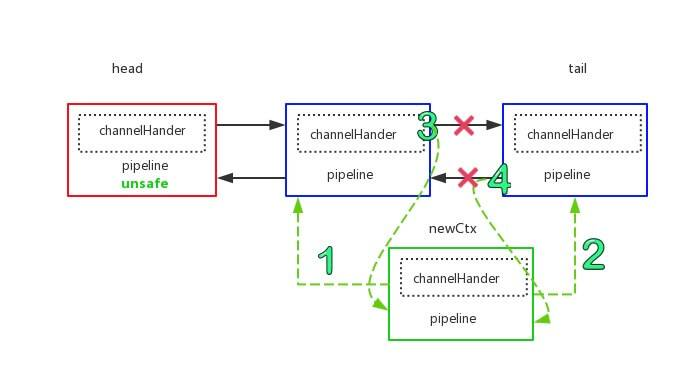
>
>   ​		添加节点过程
>
> - 操作完毕，该节点就加入到 pipeline 中：
>
> - 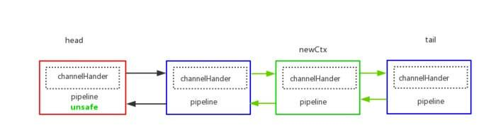
>
>   添加节点之后

### 7. callHandlerAdded0

`#callHandlerAdded0(AbstractChannelHandlerContext)` 方法，执行回调 ChannelHandler 添加完成( added )事件。代码如下：

```java
 1: private void callHandlerAdded0(final AbstractChannelHandlerContext ctx) {
 2:     try {
 3:         // We must call setAddComplete before calling handlerAdded. Otherwise if the handlerAdded method generates
 4:         // any pipeline events ctx.handler() will miss them because the state will not allow it.
 5:         // 设置 AbstractChannelHandlerContext 已添加
 6:         ctx.setAddComplete();
 7:         // 回调 ChannelHandler 添加完成( added )事件
 8:         ctx.handler().handlerAdded(ctx);
 9:     } catch (Throwable t) {
10:         // 发生异常，移除该节点
11:         boolean removed = false;
12:         try {
13:             remove0(ctx); // 移除
14:             try {
15:                 ctx.handler().handlerRemoved(ctx); // 回调 ChannelHandler 移除完成( removed )事件
16:             } finally {
17:                 ctx.setRemoved(); // 标记节点已移除
18:             }
19:             removed = true; // 标记移除成功
20:         } catch (Throwable t2) {
21:             if (logger.isWarnEnabled()) {
22:                 logger.warn("Failed to remove a handler: " + ctx.name(), t2);
23:             }
24:         }
25: 
26:         // 触发异常的传播
27:         if (removed) {
28:             fireExceptionCaught(new ChannelPipelineException(
29:                     ctx.handler().getClass().getName() +
30:                     ".handlerAdded() has thrown an exception; removed.", t));
31:         } else {
32:             fireExceptionCaught(new ChannelPipelineException(
33:                     ctx.handler().getClass().getName() +
34:                     ".handlerAdded() has thrown an exception; also failed to remove.", t));
35:         }
36:     }
37: }
```

- 第 6 行：调用 `AbstractChannelHandlerContext#setAddComplete()` 方法，设置 AbstractChannelHandlerContext 已添加。

- 第 8 行：调用 `ChannelHandler#handlerAdded(AbstractChannelHandlerContext)` 方法，回调 ChannelHandler 添加完成( added )事件。一般来说，通过这个方法，来初始化 ChannelHandler 。**注意**，因为这个方法的执行在 EventLoop 的线程中，所以要尽量避免执行时间过长。

- 第 9 行：发生异常。

  - 第 10 至 24 行：移除该节点( ChannelHandler )。详细解析，见《精尽 Netty 源码解析 —— ChannelPipeline（三）之移除 ChannelHandler》

    - 😈 所以，`ChannelHandler#handlerAdded(AbstractChannelHandlerContext)` 方法的执行**异常**时，将被移除。

  - 第 26 至 35 行：触发异常的传播。详细解析，见 [《精尽 Netty 源码解析 —— ChannelPipeline（六）之异常事件的传播》](http://svip.iocoder.cn/Netty/ChannelPipeline-6-exception) 。

### 8. PendingHandlerCallback

PendingHandlerCallback ，实现 Runnable 接口，等待添加 ChannelHandler 回调抽象类。代码如下：

> PendingHandlerCallback 是 DefaultChannelPipeline 的内部静态类。

```java
private abstract static class PendingHandlerCallback implements Runnable {

    /**
     * AbstractChannelHandlerContext 节点
     */
    final AbstractChannelHandlerContext ctx;
    /**
     * 下一个回调 PendingHandlerCallback 对象
     */
    PendingHandlerCallback next;

    PendingHandlerCallback(AbstractChannelHandlerContext ctx) {
        this.ctx = ctx;
    }

    /**
     * 执行方法
     */
    abstract void execute();

}
```

- 通过 `ctx` 和 `next` 字段，形成**回调链**。
- `#execute()` 抽象方法，通过实现它，执行回调逻辑。

------

**为什么会有 PendingHandlerCallback 呢**？

因为 ChannelHandler 添加到 pipeline 中，会触发 ChannelHandler 的添加完成( added )事件，并且该事件需要在 Channel 所属的 EventLoop 中执行。

但是 Channel 并未注册在 EventLoop 上时，需要暂时将“触发 ChannelHandler 的添加完成( added )事件”的逻辑，作为一个 PendingHandlerCallback 进行“缓存”。在 Channel 注册到 EventLoop 上时，进行回调执行。

------

PendingHandlerCallback 有两个实现类：

- PendingHandlerAddedTask
- PendingHandlerRemovedTask

本文只分享 PendingHandlerAddedTask 的代码实现。

#### 8.1 PendingHandlerAddedTask

PendingHandlerAddedTask 实现 PendingHandlerCallback 抽象类，用于回调添加 ChannelHandler 节点。代码如下：

```java
private final class PendingHandlerAddedTask extends PendingHandlerCallback {

    PendingHandlerAddedTask(AbstractChannelHandlerContext ctx) {
        super(ctx);
    }

    @Override
    public void run() {
        callHandlerAdded0(ctx);
    }

    @Override
    void execute() {
        EventExecutor executor = ctx.executor();
        // 在 EventLoop 的线程中，回调 ChannelHandler added 事件
        if (executor.inEventLoop()) {
            callHandlerAdded0(ctx);
        } else {
            // 提交 EventLoop 中，执行回调 ChannelHandler added 事件
            try {
                executor.execute(this); // <1>
            } catch (RejectedExecutionException e) {
                if (logger.isWarnEnabled()) {
                    logger.warn(
                            "Can't invoke handlerAdded() as the EventExecutor {} rejected it, removing handler {}.",
                            executor, ctx.name(), e);
                }
                // 发生异常，进行移除
                remove0(ctx);
                // 标记 AbstractChannelHandlerContext 为已移除
                ctx.setRemoved();
            }
        }
    }
    
}
```

- 在 `#execute()` 实现方法中，我们可以看到，和 `#addLast(EventExecutorGroup group, String name, ChannelHandler handler)` 方法的【第 28 至 45 行】的代码比较类似，目的是，在 EventLoop 的线程中，执行 `#callHandlerAdded0(AbstractChannelHandlerContext)` 方法，回调 ChannelHandler 添加完成( added )事件。
- `<1>` 处，为什么 PendingHandlerAddedTask 可以直接提交到 EventLoop 中呢？因为 PendingHandlerAddedTask 是个 Runnable ，这也就是为什么 PendingHandlerCallback 实现 Runnable 接口的原因。

> 老艿艿：下面开始分享的方法，属于 DefaultChannelPipeline 类。

#### 8.2 callHandlerCallbackLater

`#callHandlerCallbackLater(AbstractChannelHandlerContext ctx, boolean added)` 方法，添加 PendingHandlerCallback 回调。代码如下：

```java
/**
 * This is the head of a linked list that is processed by {@link #callHandlerAddedForAllHandlers()} and so process
 * all the pending {@link #callHandlerAdded0(AbstractChannelHandlerContext)}.
 *
 * We only keep the head because it is expected that the list is used infrequently and its size is small.
 * Thus full iterations to do insertions is assumed to be a good compromised to saving memory and tail management
 * complexity.
 *
 * 准备添加 ChannelHandler 的回调
 *
 * @see #callHandlerCallbackLater(AbstractChannelHandlerContext, boolean)
 */
private PendingHandlerCallback pendingHandlerCallbackHead;
    
  1: private void callHandlerCallbackLater(AbstractChannelHandlerContext ctx, boolean added) {
  2:     assert !registered;
  3: 
  4:     // 创建 PendingHandlerCallback 对象
  5:     PendingHandlerCallback task = added ? new PendingHandlerAddedTask(ctx) : new PendingHandlerRemovedTask(ctx);
  6:     PendingHandlerCallback pending = pendingHandlerCallbackHead;
  7:     // 若原 pendingHandlerCallbackHead 不存在，则赋值给它
  8:     if (pending == null) {
  9:         pendingHandlerCallbackHead = task;
 10:     // 若原 pendingHandlerCallbackHead 已存在，则最后一个回调指向新创建的回调
 11:     } else {
 12:         // Find the tail of the linked-list.
 13:         while (pending.next != null) {
 14:             pending = pending.next;
 15:         }
 16:         pending.next = task;
 17:     }
 18: }
```

- `added` 方法参数，表示是否是添加 ChannelHandler 的回调。所以在【第 5 行】的代码，根据 `added` 是否为 `true` ，创建 PendingHandlerAddedTask 或 PendingHandlerRemovedTask 对象。在本文中，当然创建的是 PendingHandlerAddedTask 。
- 第 7 至 17 行：将创建的 PendingHandlerCallback 对象，“添加”到 `pendingHandlerCallbackHead` 中。

#### 8.3 invokeHandlerAddedIfNeeded

`#invokeHandlerAddedIfNeeded()` 方法，执行**在 PendingHandlerCallback 中**的 ChannelHandler 添加完成( added )事件。它被两个方法所调用：

- `AbstractUnsafe#register0(ChannelPromise promise)` 方法

  - 原因是：

    ```
    // Ensure we call handlerAdded(...) before we actually notify the promise. This is needed as the
    // user may already fire events through the pipeline in the ChannelFutureListener.
    ```

    - 例如 ServerBootstrap 通过 ChannelInitializer 注册自定义的 ChannelHandler 到 pipeline 上的情况。

  - 调用栈如下图：

  - [](http://static.iocoder.cn/images/Netty/2018_06_04/03.png)register0

  `HeadContext#channelRegistered(ChannelHandlerContext ctx)`方法。

  - 笔者调试下来，对于 Netty NIO Server 和 NIO Client 貌似没啥作用，因为已经在 `AbstractUnsafe#register0(ChannelPromise promise)` 中触发。胖友也可以自己调试下。
  - 调用栈如下图：
  - 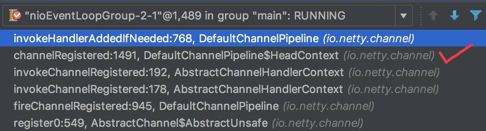
  - 

------

`#invokeHandlerAddedIfNeeded()` 方法，代码如下：

```java
/**
 * 是否首次注册
 *
 * {@link #invokeHandlerAddedIfNeeded()}
 */
private boolean firstRegistration = true;

final void invokeHandlerAddedIfNeeded() {
    assert channel.eventLoop().inEventLoop(); // 必须在 EventLoop 的线程中
    // 仅有首次注册有效 <1>
    if (firstRegistration) {
        // 标记非首次注册
        firstRegistration = false;
        
        // 执行在 PendingHandlerCallback 中的 ChannelHandler 添加完成( added )事件 // <2>
        // We are now registered to the EventLoop. It's time to call the callbacks for the ChannelHandlers,
        // that were added before the registration was done.
        callHandlerAddedForAllHandlers();
    }
}
```

- `<1>`处，仅有首次注册有效(`firstRegistration = true`) 时。而后，标记`firstRegistration = false`
  
  - 这也就是笔者为什么说，`HeadContext#channelRegistered(ChannelHandlerContext ctx)` 方法对这个方法的调用，是没有效果的。

- `<2>` 处，调用 `#callHandlerAddedForAllHandlers()` 方法，执行**在 PendingHandlerCallback 中**的 ChannelHandler 添加完成( added )事件。代码如下：

  ```java
   1: private void callHandlerAddedForAllHandlers() {
   2:     final PendingHandlerCallback pendingHandlerCallbackHead;
   3:     // 获得 pendingHandlerCallbackHead
   4:     synchronized (this) {
   5:         assert !registered;
   6: 
   7:         // This Channel itself was registered.
   8:         registered = true; // 标记已注册
   9: 
  10:         pendingHandlerCallbackHead = this.pendingHandlerCallbackHead;
  11:         // Null out so it can be GC'ed.
  12:         this.pendingHandlerCallbackHead = null; // 置空，help gc
  13:     }
  14: 
  15:     // 顺序向下，执行 PendingHandlerCallback 的回调
  16:     // This must happen outside of the synchronized(...) block as otherwise handlerAdded(...) may be called while
  17:     // holding the lock and so produce a deadlock if handlerAdded(...) will try to add another handler from outside
  18:     // the EventLoop.
  19:     PendingHandlerCallback task = pendingHandlerCallbackHead;
  20:     while (task != null) {
  21:         task.execute();
  22:         task = task.next;
  23:     }
  24: }
  ```

  - 第 3 至 13 行：获得`pendingHandlerCallbackHead`变量。

    - 第 8 行：标记 `registered = true` ，表示已注册。
    - 第 10 至 12 行：置空对象的 `pendingHandlerCallbackHead` 属性，help GC 。
    - 使用 `synchronized` 的原因，和 `#addLast(EventExecutorGroup group, String name, ChannelHandler handler)` 的【第 16 至 26 行】的代码需要对 `pendingHandlerCallbackHead` 互斥，避免并发修改的问题。
    
  - 第 15 至 23 行：顺序循环向下，调用`PendingHandlerCallback#execute()`方法，执行 PendingHandlerCallback 的回调，从而将 ChannelHandler 添加到 pipeline 中。

    - 这里不适用 `synchronized` 的原因，看英文注释哈。

### 666. 彩蛋

**添加** ChannelHandler 到 pipeline 中的代码，大部分的比较简单。比较复杂的可能是，[「8. PendingHandlerCallback」](http://svip.iocoder.cn/Netty/Pipeline-2-add-channel-handler/#) 中，调用的过程涉及**回调**，所以理解上稍微可能困难。胖友可以多多调试进行解决噢。

推荐阅读文章：

- 闪电侠 [《Netty 源码分析之 pipeline(一)》](https://www.jianshu.com/p/6efa9c5fa702)
- Hypercube [《自顶向下深入分析 Netty（七）–ChannelPipeline 源码实现》](https://www.jianshu.com/p/0e15165714fc)

## 精尽 Netty 源码解析 —— ChannelPipeline（三）之移除 ChannelHandler

### 1. 概述

本文我们来分享，从 pipeline 中**移除** ChannelHandler 的代码具体实现。

在 [《精尽 Netty 源码解析 —— ChannelPipeline（一）之初始化》](http://svip.iocoder.cn/Netty/ChannelPipeline-1-init) 中，我们看到 ChannelPipeline 定义了一大堆**移除** ChannelHandler 的接口方法：

```java
ChannelPipeline remove(ChannelHandler handler);
ChannelHandler remove(String name);
<T extends ChannelHandler> T remove(Class<T> handlerType);
ChannelHandler removeFirst();
ChannelHandler removeLast();
```

- 本文仅分享 `#remove(ChannelHandler handler)` 方法，从 pipeline **移除**指定的 ChannelHandler 对象。

### 2. remove

`#remove(ChannelHandler handler)` 方法，从 pipeline **移除**指定的 ChannelHandler 对象。代码如下：

```java
@Override
public final ChannelPipeline remove(ChannelHandler handler) {
    remove(getContextOrDie(handler));
    return this;
}
```

- 调用 `#getContextOrDie(ChannelHandler handler)` 方法，获得对应的 AbstractChannelHandlerContext 节点。代码如下：

  ```java
  private AbstractChannelHandlerContext getContextOrDie(ChannelHandler handler) {
      AbstractChannelHandlerContext ctx = (AbstractChannelHandlerContext) context(handler);
      if (ctx == null) { // die
          throw new NoSuchElementException(handler.getClass().getName());
      } else {
          return ctx;
      }
  }
  
  @Override
  public final ChannelHandlerContext context(ChannelHandler handler) {
      if (handler == null) {
          throw new NullPointerException("handler");
      }
      AbstractChannelHandlerContext ctx = head.next;
      // 循环，获得指定 ChannelHandler 对象的节点
      for (;;) {
          if (ctx == null) {
              return null;
          }
          if (ctx.handler() == handler) { // ChannelHandler 相等
              return ctx;
          }
          ctx = ctx.next;
      }
  }
  ```

  - 方法使用 Die 的原因是，获得不到节点的情况下，抛出 NoSuchElementException 异常。

- 调用 `#remove(AbstractChannelHandlerContext ctx)` 方法，移除指定 AbstractChannelHandlerContext 节点。

------

`#remove(AbstractChannelHandlerContext ctx)` 方法，移除指定 AbstractChannelHandlerContext 节点。代码如下：

> 代码的整体结构，和 `#addLast(EventExecutorGroup group, String name, ChannelHandler handler)` 方法是**一致**的。

```java
 1: private AbstractChannelHandlerContext remove(final AbstractChannelHandlerContext ctx) {
 2:     assert ctx != head && ctx != tail;
 3: 
 4:     synchronized (this) { // 同步，为了防止多线程并发操作 pipeline 底层的双向链表
 5:         // 移除节点
 6:         remove0(ctx);
 7: 
 8:         // pipeline 暂未注册，添加回调。再注册完成后，执行回调。详细解析，见 {@link #callHandlerCallbackLater} 方法。
 9:         // If the registered is false it means that the channel was not registered on an eventloop yet.
10:         // In this case we remove the context from the pipeline and add a task that will call
11:         // ChannelHandler.handlerRemoved(...) once the channel is registered.
12:         if (!registered) {
13:             callHandlerCallbackLater(ctx, false);
14:             return ctx;
15:         }
16: 
17:         // 不在 EventLoop 的线程中，提交 EventLoop 中，执行回调用户方法
18:         EventExecutor executor = ctx.executor();
19:         if (!executor.inEventLoop()) {
20:             // 提交 EventLoop 中，执行回调 ChannelHandler removed 事件
21:             executor.execute(new Runnable() {
22:                 @Override
23:                 public void run() {
24:                     callHandlerRemoved0(ctx);
25:                 }
26:             });
27:             return ctx;
28:         }
29:     }
30: 
31:     // 回调 ChannelHandler removed 事件
32:     callHandlerRemoved0(ctx);
33:     return ctx;
34: }
```

- 第 4 行：`synchronized` 同步，为了防止多线程并发操作 pipeline 底层的双向链表。
- 第 6 行：调用 `#remove0(AbstractChannelHandlerContext ctx)` 方法，从 pipeline **移除**指定的 AbstractChannelHandlerContext 节点。详细解析，见 [「3. remove0」](http://svip.iocoder.cn/Netty/ChannelPipeline-3-remove-channel-handler/#) 。
- ========== 后续分成 3 种情况 ==========
- `<1>`
- 第 12 行：Channel 并未注册。
- 第 13 行：调用 `#callHandlerCallbackLater(AbstractChannelHandlerContext, added)` 方法，添加 PendingHandlerRemovedTask 回调。在 Channel 注册完成后，执行该回调。详细解析，见 [「8. PendingHandlerCallback」](http://svip.iocoder.cn/Netty/ChannelPipeline-3-remove-channel-handler/#) 。
- `<2>`
- 第 19 行：不在 EventLoop 的线程中。
- 第 20 至 26 行：提交 EventLoop 中，调用 `#callHandlerRemoved0(AbstractChannelHandlerContext)` 方法，执行回调 ChannelHandler 移除完成( removed )事件。详细解析，见 [「4. callHandlerRemoved0」](http://svip.iocoder.cn/Netty/ChannelPipeline-3-remove-channel-handler/#) 。
- `<3>`
- 这种情况，是 `<2>` 在 EventLoop 的线程中的版本。也因为此，已经确认在 EventLoop 的线程中，所以不需要在 `synchronized` 中。
- 第 32 行：和【第 24 行】的代码一样，调用 `#callHandlerRemoved0(AbstractChannelHandlerContext)` 方法，执行回调 ChannelHandler 移除完成( removed )事件。

### 3. remove0

`#remove0(AbstractChannelHandlerContext ctx)` 方法，从 pipeline **移除**指定的 AbstractChannelHandlerContext 节点。代码如下：

```java
private static void remove0(AbstractChannelHandlerContext ctx) {
    // 获得移除节点的前后节点
    AbstractChannelHandlerContext prev = ctx.prev;
    AbstractChannelHandlerContext next = ctx.next;
    // 前后节点互相指向
    prev.next = next;
    next.prev = prev;
}
```

> FROM 闪电侠 [《netty 源码分析之 pipeline(一)》](https://www.jianshu.com/p/6efa9c5fa702)
>
> - 经历的过程要比添加节点要简单，可以用下面一幅图来表示
>
>   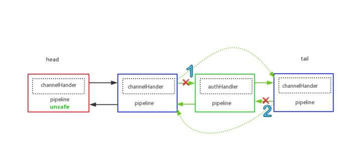删除节点过程
>
> - 最后的结果为
>
>   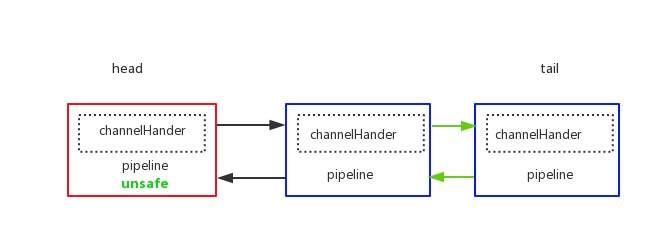删除节点之后
>
> 结合这两幅图，可以很清晰地了解移除 Handler 的过程，另外，被删除的节点因为没有对象引用到，果过段时间就会被 gc 自动回收。

### 4. callHandlerRemoved0

`#callHandlerRemoved0(AbstractChannelHandlerContext)` 方法，执行回调 ChannelHandler 移除完成( removed )事件。代码如下：

```java
 1: private void callHandlerRemoved0(final AbstractChannelHandlerContext ctx) {
 2:     // Notify the complete removal.
 3:     try {
 4:         try {
 5:             // 回调 ChannelHandler 移除完成( removed )事件
 6:             ctx.handler().handlerRemoved(ctx);
 7:         } finally {
 8:             // 设置 AbstractChannelHandlerContext 已移除
 9:             ctx.setRemoved();
10:         }
11:     } catch (Throwable t) {
12:         // 触发异常的传播
13:         fireExceptionCaught(new ChannelPipelineException(
14:                 ctx.handler().getClass().getName() + ".handlerRemoved() has thrown an exception.", t));
15:     }
16: }
```

- 第 6 行：调用 `ChannelHandler#handlerRemoved(AbstractChannelHandlerContext)` 方法，回调 ChannelHandler 移除完成( removed )事件。一般来说，通过这个方法，来释放 ChannelHandler 占用的资源。**注意**，因为这个方法的执行在 EventLoop 的线程中，所以要尽量避免执行时间过长。
- 第 9 行：调用 `AbstractChannelHandlerContext#setRemoved()` 方法，设置 AbstractChannelHandlerContext 已移除。
- 第 11 至 15 行：发生异常，触发异常的传播。详细解析，见 [《精尽 Netty 源码解析 —— ChannelPipeline（六）之异常事件的传播》](http://svip.iocoder.cn/Netty/ChannelPipeline-6-exception) 。

### 5. PendingHandlerRemovedTask

PendingHandlerRemovedTask 实现 PendingHandlerCallback 抽象类，用于回调移除 ChannelHandler 节点。代码如下：

```java
private final class PendingHandlerRemovedTask extends PendingHandlerCallback {

    PendingHandlerRemovedTask(AbstractChannelHandlerContext ctx) {
        super(ctx);
    }

    @Override
    public void run() {
        callHandlerRemoved0(ctx);
    }

    @Override
    void execute() {
        EventExecutor executor = ctx.executor();
        // 在 EventLoop 的线程中，回调 ChannelHandler removed 事件
        if (executor.inEventLoop()) {
            callHandlerRemoved0(ctx);
        } else {
            // 提交 EventLoop 中，执行回调 ChannelHandler removed 事件
            try {
                executor.execute(this); // <1>
            } catch (RejectedExecutionException e) {
                if (logger.isWarnEnabled()) {
                    logger.warn(
                            "Can't invoke handlerRemoved() as the EventExecutor {} rejected it," +
                                    " removing handler {}.", executor, ctx.name(), e);
                }
                // 标记 AbstractChannelHandlerContext 为已移除
                // remove0(...) was call before so just call AbstractChannelHandlerContext.setRemoved().
                ctx.setRemoved();
            }
        }
    }
    
}
```

- 在 `#execute()` 实现方法中，我们可以看到，和 `#remove((AbstractChannelHandlerContext ctx)` 方法的【第 17 至 32 行】的代码比较类似，目的是，在 EventLoop 的线程中，执行 `#callHandlerRemoved0(AbstractChannelHandlerContext)` 方法，回调 ChannelHandler 移除完成( removed )事件。
- `<1>` 处，为什么 PendingHandlerRemovedTask 可以直接提交到 EventLoop 中呢？因为 PendingHandlerRemovedTask 是个 Runnable ，这也就是为什么 PendingHandlerCallback 实现 Runnable 接口的原因。

### 666. 彩蛋

水文一小篇。推荐阅读文章：

- 闪电侠 [《Netty 源码分析之 pipeline(一)》](https://www.jianshu.com/p/6efa9c5fa702)

## ChannelPipeline（四）之 Outbound 事件的传播

### 1. 概述

本文我们来分享，在 pipeline 中的 **Outbound 事件的传播**。我们先来回顾下 Outbound 事件的定义：

> 老艿艿：A01、A02 等等，是我们每条定义的编号。

- [x] A01：Outbound 事件是【请求】事件(由 Connect 发起一个请求, 并最终由 Unsafe 处理这个请求)

  > 老艿艿：A01 = A02 + A03

- [x] A02：Outbound 事件的发起者是 Channel

- [x] A03：Outbound 事件的处理者是 Unsafe

- [x] A04：Outbound 事件在 Pipeline 中的传输方向是 `tail` -> `head`

- [x] A05：在 ChannelHandler 中处理事件时, 如果这个 Handler 不是最后一个 Handler ，则需要调用 `ctx.xxx` (例如 `ctx.connect` ) 将此事件继续传播下去. 如果不这样做, 那么此事件的传播会提前终止.

- [x] A06：Outbound 事件流: `Context.OUT_EVT` -> `Connect.findContextOutbound` -> `nextContext.invokeOUT_EVT` -> `nextHandler.OUT_EVT` -> `nextContext.OUT_EVT`

下面，我们来跟着代码，理解每条定义。

### 2. ChannelOutboundInvoker

在 `io.netty.channel.ChannelOutboundInvoker` 接口中，定义了所有 Outbound 事件对应的方法：

```java
ChannelFuture bind(SocketAddress localAddress);
ChannelFuture bind(SocketAddress localAddress, ChannelPromise promise);

ChannelFuture connect(SocketAddress remoteAddress);
ChannelFuture connect(SocketAddress remoteAddress, SocketAddress localAddress);
ChannelFuture connect(SocketAddress remoteAddress, ChannelPromise promise);
ChannelFuture connect(SocketAddress remoteAddress, SocketAddress localAddress, ChannelPromise promise);

ChannelFuture disconnect();
ChannelFuture disconnect(ChannelPromise promise);

ChannelFuture close();
ChannelFuture close(ChannelPromise promise);

ChannelFuture deregister();
ChannelFuture deregister(ChannelPromise promise);

ChannelOutboundInvoker read();

ChannelFuture write(Object msg);
ChannelFuture write(Object msg, ChannelPromise promise);

ChannelOutboundInvoker flush();

ChannelFuture writeAndFlush(Object msg, ChannelPromise promise);
ChannelFuture writeAndFlush(Object msg);
```

而 ChannelOutboundInvoker 的**部分**子类/接口如下图：

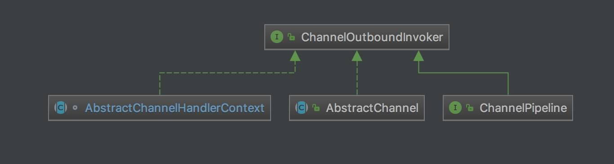

- 我们可以看到类图，有 Channel、ChannelPipeline、AbstractChannelHandlerContext 都继承/实现了该接口。那这意味着什么呢？我们继续往下看。

在 [《精尽 Netty 源码解析 —— 启动（一）之服务端》](http://svip.iocoder.cn/Netty/bootstrap-1-server/) 中，我们可以看到 Outbound 事件的其中之一 **bind** ，本文就以 **bind** 的过程，作为示例。调用栈如下：

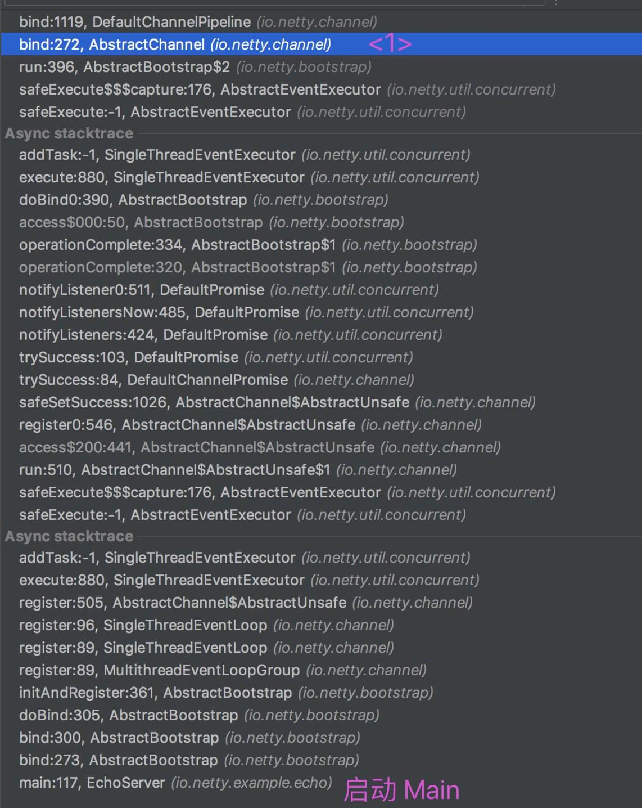


- `AbstractChannel#bind(SocketAddress localAddress, ChannelPromise promise)` 方法，代码如下：

  ```java
  @Override
  public ChannelFuture bind(SocketAddress localAddress, ChannelPromise promise) {
      return pipeline.bind(localAddress, promise);
  }
  ```

  - `AbstractChannel#bind(SocketAddress localAddress, ChannelPromise promise)`方法，实现的自 ChannelOutboundInvoker 接口。
    
    - Channel 是 **bind** 的发起者，**这符合 Outbound 事件的定义 A02** 。

  - 在方法内部，会调用`ChannelPipeline#bind(SocketAddress localAddress, ChannelPromise promise)`方法，而这个方法，也是实现的自 ChannelOutboundInvoker 接口。

    从这里可以看出，对于 ChannelOutboundInvoker 接口方法的实现，Channel 对它的实现，会调用 ChannelPipeline 的对应方法

    ( ( 有一点绕，胖友理解下 ) )。
    
    - 那么接口下，让我们看看 `ChannelPipeline#bind(SocketAddress localAddress, ChannelPromise promise)` 方法的具体实现。

### 3. DefaultChannelPipeline

`DefaultChannelPipeline#bind(SocketAddress localAddress, ChannelPromise promise)` 方法的实现，代码如下：

```java
@Override
public final ChannelFuture bind(SocketAddress localAddress, ChannelPromise promise) {
    return tail.bind(localAddress, promise);
}
```

- 在方法内部，会调用`TailContext#bind(SocketAddress localAddress, ChannelPromise promise)`方法。

  这符合 Outbound 事件的定义 A04

  - 实际上，TailContext 的该方法，继承自 AbstractChannelHandlerContext 抽象类，而 AbstractChannelHandlerContext 实现了 ChannelOutboundInvoker 接口。*从这里可以看出，对于 ChannelOutboundInvoker 接口方法的实现，ChannelPipeline 对它的实现，会调用 AbstractChannelHandlerContext 的对应方法*( 有一点绕，胖友理解下 )。

### 4. AbstractChannelHandlerContext

`AbstractChannelHandlerContext#bind(SocketAddress localAddress, ChannelPromise promise)` 方法的实现，代码如下：

```java
 1: @Override
 2: public ChannelFuture bind(final SocketAddress localAddress, final ChannelPromise promise) {
 3:     if (localAddress == null) {
 4:         throw new NullPointerException("localAddress");
 5:     }
 6:     // 判断是否为合法的 Promise 对象
 7:     if (isNotValidPromise(promise, false)) {
 8:         // cancelled
 9:         return promise;
10:     }
11: 
12:     // 获得下一个 Outbound 节点
13:     final AbstractChannelHandlerContext next = findContextOutbound();
14:     // 获得下一个 Outbound 节点的执行器
15:     EventExecutor executor = next.executor();
16:     // 调用下一个 Outbound 节点的 bind 方法
17:     if (executor.inEventLoop()) {
18:         next.invokeBind(localAddress, promise);
19:     } else {
20:         safeExecute(executor, new Runnable() {
21:             @Override
22:             public void run() {
23:                 next.invokeBind(localAddress, promise);
24:             }
25:         }, promise, null);
26:     }
27:     return promise;
28: }
```

- 第 6 至 10 行：判断 `promise` 是否为合法的 Promise 对象。代码如下：

  ```java
  private boolean isNotValidPromise(ChannelPromise promise, boolean allowVoidPromise) {
      if (promise == null) {
          throw new NullPointerException("promise");
      }
  
      // Promise 已经完成
      if (promise.isDone()) {
          // Check if the promise was cancelled and if so signal that the processing of the operation
          // should not be performed.
          //
          // See https://github.com/netty/netty/issues/2349
          if (promise.isCancelled()) {
              return true;
          }
          throw new IllegalArgumentException("promise already done: " + promise);
      }
  
      // Channel 不符合
      if (promise.channel() != channel()) {
          throw new IllegalArgumentException(String.format(
                  "promise.channel does not match: %s (expected: %s)", promise.channel(), channel()));
      }
  
      // DefaultChannelPromise 合法 // <1>
      if (promise.getClass() == DefaultChannelPromise.class) {
          return false;
      }
      // 禁止 VoidChannelPromise 
      if (!allowVoidPromise && promise instanceof VoidChannelPromise) {
          throw new IllegalArgumentException(
                  StringUtil.simpleClassName(VoidChannelPromise.class) + " not allowed for this operation");
      }
      // 禁止 CloseFuture
      if (promise instanceof AbstractChannel.CloseFuture) {
          throw new IllegalArgumentException(
                  StringUtil.simpleClassName(AbstractChannel.CloseFuture.class) + " not allowed in a pipeline");
      }
      return false;
  }
  ```

  - 虽然方法很长，重点是 `<1>` 处，`promise` 的类型为 DefaultChannelPromise 。

- 第 13 行：【重要】调用 `#findContextOutbound()` 方法，获得下一个 Outbound 节点。代码如下：

  ```java
  private AbstractChannelHandlerContext findContextOutbound() {
      // 循环，向前获得一个 Outbound 节点
      AbstractChannelHandlerContext ctx = this;
      do {
          ctx = ctx.prev;
      } while (!ctx.outbound);
      return ctx;
  }
  ```

  - 循环，**向前**获得一个 Outbound 节点。
  - 循环，**向前**获得一个 Outbound 节点。
  - 循环，**向前**获得一个 Outbound 节点。
  - 😈 重要的事情说三遍，对于 Outbound 事件的传播，是从 pipeline 的尾巴到头部，**这符合 Outbound 事件的定义 A04** 。

- 第 15 行：调用 `AbstractChannelHandlerContext#executor()` 方法，获得下一个 Outbound 节点的执行器。代码如下：

  ```java
  // Will be set to null if no child executor should be used, otherwise it will be set to the
  // child executor.
  /**
   * EventExecutor 对象
   */
  final EventExecutor executor;
  
  @Override
  public EventExecutor executor() {
      if (executor == null) {
          return channel().eventLoop();
      } else {
          return executor;
      }
  }
  ```

  - 如果未设置**子执行器**，则使用 Channel 的 EventLoop 作为执行器。😈 一般情况下，我们可以忽略**子执行器**的逻辑，也就是说，可以直接认为是使用 **Channel 的 EventLoop 作为执行器**。

- 第 16 至 26 行：**在 EventLoop 的线程中**，调用**下一个节点**的 `AbstractChannelHandlerContext#invokeBind(SocketAddress localAddress, ChannelPromise promise)` 方法，传播 **bind** 事件给**下一个节点**。

  - 第 20 至 25 行：如果不在 EventLoop 的线程中，会调用 `#safeExecute(EventExecutor executor, Runnable runnable, ChannelPromise promise, Object msg)` 方法，提交到 EventLoop 的线程中执行。代码如下：

    ```java
    private static void safeExecute(EventExecutor executor, Runnable runnable, ChannelPromise promise, Object msg) {
        try {
            // 提交 EventLoop 的线程中，进行执行任务
            executor.execute(runnable);
        } catch (Throwable cause) {
            try {
                // 发生异常，回调通知 promise 相关的异常
                promise.setFailure(cause);
            } finally {
                // 释放 msg 相关的资源
                if (msg != null) {
                    ReferenceCountUtil.release(msg);
                }
            }
        }
    }
    ```

    - `AbstractChannelHandlerContext#invokeBind(SocketAddress localAddress, ChannelPromise promise)` 方法，代码如下：

```java
 1: private void invokeBind(SocketAddress localAddress, ChannelPromise promise) {
 2:     if (invokeHandler()) { // 判断是否符合的 ChannelHandler
 3:         try {
 4:             // 调用该 ChannelHandler 的 bind 方法
 5:             ((ChannelOutboundHandler) handler()).bind(this, localAddress, promise);
 6:         } catch (Throwable t) {
 7:             notifyOutboundHandlerException(t, promise); // 通知 Outbound 事件的传播，发生异常
 8:         }
 9:     } else {
10:         // 跳过，传播 Outbound 事件给下一个节点
11:         bind(localAddress, promise);
12:     }
13: }
```

- 第 2 行：调用 `#invokeHandler()` 方法，判断是否符合的 ChannelHandler 。代码如下：

  ```java
  /**
   * Makes best possible effort to detect if {@link ChannelHandler#handlerAdded(ChannelHandlerContext)} was called
   * yet. If not return {@code false} and if called or could not detect return {@code true}.
   *
   * If this method returns {@code false} we will not invoke the {@link ChannelHandler} but just forward the event.
   * This is needed as {@link DefaultChannelPipeline} may already put the {@link ChannelHandler} in the linked-list
   * but not called {@link ChannelHandler#handlerAdded(ChannelHandlerContext)}.
   */
  private boolean invokeHandler() {
      // Store in local variable to reduce volatile reads.
      int handlerState = this.handlerState;
      return handlerState == ADD_COMPLETE || (!ordered && handlerState == ADD_PENDING);
  }
  ```

  - 对于 `ordered = true` 的节点，必须 ChannelHandler 已经添加完成。
  - 对于 `ordered = false` 的节点，没有 ChannelHandler 的要求。

- 第 9 至 12 行：若是**不符合**的 ChannelHandler ，则**跳过**该节点，调用 `AbstractChannelHandlerContext#bind(SocketAddress localAddress, ChannelPromise promise)` 方法，传播 Outbound 事件给下一个节点。即，又回到 [「4. AbstractChannelHandlerContext」](http://svip.iocoder.cn/Netty/Pipeline-4-outbound/#) 的开头。

- 第 2 至 8 行：若是**符合**的 ChannelHandler ：

  - 第 5 行：调用 ChannelHandler 的 `#bind(ChannelHandlerContext ctx, SocketAddress localAddress, ChannelPromise promise)` 方法，处理 bind 事件。

    - 😈 实际上，此时节点的数据类型为 DefaultChannelHandlerContext 类。若它被认为是 Outbound 节点，那么他的处理器的类型会是 **ChannelOutboundHandler** 。而 `io.netty.channel.ChannelOutboundHandler` 类似 ChannelOutboundInvoker ，定义了对每个 Outbound 事件的处理。代码如下：

      ```java
      void bind(ChannelHandlerContext ctx, SocketAddress localAddress, ChannelPromise promise) throws Exception;
      
      void connect(ChannelHandlerContext ctx, SocketAddress remoteAddress, SocketAddress localAddress, ChannelPromise promise) throws Exception;
      
      void disconnect(ChannelHandlerContext ctx, ChannelPromise promise) throws Exception;
      
      void close(ChannelHandlerContext ctx, ChannelPromise promise) throws Exception;
      
      void deregister(ChannelHandlerContext ctx, ChannelPromise promise) throws Exception;
      
      void read(ChannelHandlerContext ctx) throws Exception;
      
      void write(ChannelHandlerContext ctx, Object msg, ChannelPromise promise) throws Exception;
      
      void flush(ChannelHandlerContext ctx) throws Exception;
      ```

      - 胖友自己对比下噢。

    - 如果节点的 `ChannelOutboundHandler#bind(ChannelHandlerContext ctx, SocketAddress localAddress, ChannelPromise promise)` 方法的实现，不调用 `AbstractChannelHandlerContext#bind(SocketAddress localAddress, ChannelPromise promise)` 方法，就不会传播 Outbound 事件给下一个节点。**这就是 Outbound 事件的定义 A05** 。可能有点绕，我们来看下 Netty LoggingHandler 对该方法的实现代码：

      ```java
      final class LoggingHandler implements ChannelInboundHandler, ChannelOutboundHandler {
      
          // ... 省略无关方法
          
          @Override
          public void bind(ChannelHandlerContext ctx, SocketAddress localAddress, ChannelPromise promise) throws Exception {
              // 打印日志
              log(Event.BIND, "localAddress=" + localAddress);
              // 传递 bind 事件，给下一个节点
              ctx.bind(localAddress, promise); // <1>
          }
      }
      ```

      - 如果把 `<1>` 处的代码去掉，bind 事件将不会传播给下一个节点！！！**一定要注意**。

    - 这块的逻辑非常重要，如果胖友觉得很绕，一定要自己多调试 + 调试 + 调试。

  - 第 7 行：如果发生异常，调用 `#notifyOutboundHandlerException(Throwable, Promise)` 方法，通知 Outbound 事件的传播，发生异常。详细解析，见 [《精尽 Netty 源码解析 —— ChannelPipeline（六）之异常事件的传播》](http://svip.iocoder.cn/Netty/ChannelPipeline-6-exception) 。

------

本小节的整个代码实现，**就是 Outbound 事件的定义 A06**的体现。而随着 Outbound 事件在节点不断从 pipeline 的尾部到头部的传播，最终会到达 HeadContext 节点。

### 5. HeadContext

`HeadContext#bind(ChannelHandlerContext ctx, SocketAddress localAddress, ChannelPromise promise)` 方法，代码如下：

```java
@Override
public void bind(ChannelHandlerContext ctx, SocketAddress localAddress, ChannelPromise promise) throws Exception {
    unsafe.bind(localAddress, promise);
}
```

- 调用 `Unsafe#bind(SocketAddress localAddress, ChannelPromise promise)` 方法，进行 bind 事件的处理。也就是说 Unsafe 是 **bind** 的处理着，**这符合 Outbound 事件的定义 A03** 。
- 而后续的逻辑，就是 [《精尽 Netty 源码分析 —— 启动（一）之服务端》](http://svip.iocoder.cn/Netty/bootstrap-1-server/) 的 [「3.13.2 doBind0」](http://svip.iocoder.cn/Netty/Pipeline-4-outbound/#) 小节，从 `Unsafe#bind(SocketAddress localAddress, ChannelPromise promise)` 方法，开始。
- 至此，整个 pipeline 的 Outbound 事件的传播结束。

### 6. 关于其他 Outbound 事件

本文暂时只分享了 **bind** 这个 Outbound 事件。剩余的其他事件，胖友可以自己进行调试和理解。例如：**connect** 事件，并且结合 [《精尽 Netty 源码分析 —— 启动（二）之客户端》](http://svip.iocoder.cn/Netty/bootstrap-2-client/) 一文。

### 666. 彩蛋

*推荐阅读文章：

- 闪电侠 [《netty 源码分析之 pipeline(二)》](https://www.jianshu.com/p/087b7e9a27a2)*

## ChannelPipeline（五）之 Inbound 事件的传播

### 1. 概述

本文我们来分享，在 pipeline 中的 **Inbound 事件的传播**。我们先来回顾下 Inbound 事件的定义：

> 老艿艿：B01、B02 等等，是我们每条定义的编号。

- [x] B01：Inbound 事件是【通知】事件, 当某件事情已经就绪后, 通知上层.

  > 老艿艿：B01 = B02 + B03

- [x] B02：Inbound 事件发起者是 Unsafe

- [x] B03：Inbound 事件的处理者是 TailContext, 如果用户没有实现自定义的处理方法, 那么Inbound 事件默认的处理者是 TailContext, 并且其处理方法是空实现.

- [x] B04：Inbound 事件在 Pipeline 中传输方向是 `head`( 头 ) -> `tail`( 尾 )

- [x] B05：在 ChannelHandler 中处理事件时, 如果这个 Handler 不是最后一个 Handler, 则需要调用 `ctx.fireIN_EVT` (例如 `ctx.fireChannelActive` ) 将此事件继续传播下去. 如果不这样做, 那么此事件的传播会提前终止.

- [x] B06：Inbound 事件流: `Context.fireIN_EVT` -> `Connect.findContextInbound` -> `nextContext.invokeIN_EVT` -> `nextHandler.IN_EVT` -> `nextContext.fireIN_EVT`

Outbound 和 Inbound 事件十分的镜像，所以，接下来我们来跟着的代码，和 [《精尽 Netty 源码解析 —— ChannelPipeline（四）之 Outbound 事件的传播》](http://svip.iocoder.cn/Netty/Pipeline-4-inbound) 会非常相似。

### 2. ChannelInboundInvoker

在 `io.netty.channel.ChannelInboundInvoker` 接口中，定义了所有 Inbound 事件对应的方法：

```java
ChannelInboundInvoker fireChannelRegistered();
ChannelInboundInvoker fireChannelUnregistered();

ChannelInboundInvoker fireChannelActive();
ChannelInboundInvoker fireChannelInactive();

ChannelInboundInvoker fireExceptionCaught(Throwable cause);

ChannelInboundInvoker fireUserEventTriggered(Object event);

ChannelInboundInvoker fireChannelRead(Object msg);
ChannelInboundInvoker fireChannelReadComplete();

ChannelInboundInvoker fireChannelWritabilityChanged();
```

而 ChannelInboundInvoker 的**部分**子类/接口如下图：

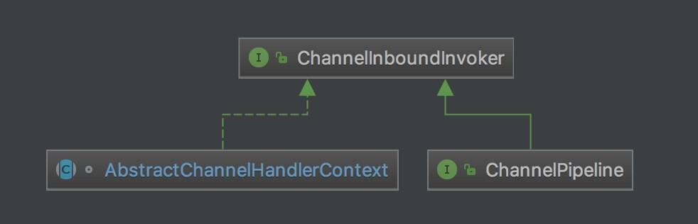

- 我们可以看到类图，有 ChannelPipeline、AbstractChannelHandlerContext 都继承/实现了该接口。那这意味着什么呢？我们继续往下看。
- 相比来说，Channel 实现了 ChannelOutboundInvoker 接口，但是**不实现** ChannelInboundInvoker 接口。

在 [《精尽 Netty 源码解析 —— 启动（一）之服务端》](http://svip.iocoder.cn/Netty/bootstrap-1-server/) 中，我们可以看到 Inbound 事件的其中之一 **fireChannelActive** ，本文就以 **fireChannelActive** 的过程，作为示例。调用栈如下：

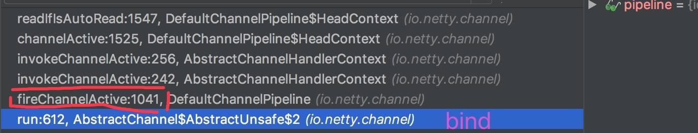

- `AbstractUnsafe#bind(final SocketAddress localAddress, final ChannelPromise promise)` 方法，代码如下：

  ```java
  @Override
  public final void bind(final SocketAddress localAddress, final ChannelPromise promise) {
      // 判断是否在 EventLoop 的线程中。
      assertEventLoop();
  
      // ... 省略部分代码
     
      // 记录 Channel 是否激活
      boolean wasActive = isActive();
  
      // 绑定 Channel 的端口
      doBind(localAddress);
  
      // 若 Channel 是新激活的，触发通知 Channel 已激活的事件。 
      if (!wasActive && isActive()) {
          invokeLater(new Runnable() {
              @Override
              public void run() {
                  pipeline.fireChannelActive(); // <1>
              }
          });
      }
  
      // 回调通知 promise 执行成功
      safeSetSuccess(promise);
  }
  ```

  - 在`<1>`处，调用`ChannelPipeline#fireChannelActive()`方法。

    - Unsafe 是 **fireChannelActive** 的发起者，**这符合 Inbound 事件的定义 B02** 。
- 那么接口下，让我们看看 `ChannelPipeline#fireChannelActive()` 方法的具体实现。

### 3. DefaultChannelPipeline

`DefaultChannelPipeline#fireChannelActive()` 方法的实现，代码如下：

```java
@Override
public final ChannelPipeline fireChannelActive() {
    AbstractChannelHandlerContext.invokeChannelActive(head);
    return this;
}
```

- 在方法内部，会调用`AbstractChannelHandlerContext#invokeChannelActive(final AbstractChannelHandlerContext next)`方法，而方法参数是`head，这符合 Inbound 事件的定义 B04

  - 实际上，HeadContext 的该方法，继承自 AbstractChannelHandlerContext 抽象类，而 AbstractChannelHandlerContext 实现了 ChannelInboundInvoker 接口。*从这里可以看出，对于 ChannelInboundInvoker 接口方法的实现，ChannelPipeline 对它的实现，会调用 AbstractChannelHandlerContext 的对应方法*( 有一点绕，胖友理解下 )。

### 4. AbstractChannelHandlerContext#invokeChannelActive

`AbstractChannelHandlerContext#invokeChannelActive(final AbstractChannelHandlerContext next)` **静态**方法，代码如下：

```java
 1: static void invokeChannelActive(final AbstractChannelHandlerContext next) {
 2:     // 获得下一个 Inbound 节点的执行器
 3:     EventExecutor executor = next.executor();
 4:     // 调用下一个 Inbound 节点的 Channel active 方法
 5:     if (executor.inEventLoop()) {
 6:         next.invokeChannelActive();
 7:     } else {
 8:         executor.execute(new Runnable() {
 9:             @Override
10:             public void run() {
11:                 next.invokeChannelActive();
12:             }
13:         });
14:     }
15: }
```

- 方法参数 `next` ，下一个 Inbound 节点。

- 第 3 行：调用 `AbstractChannelHandlerContext#executor()` 方法，获得下一个 Inbound 节点的执行器。

- 第 4 至 14 行：调用 `AbstractChannelHandlerContext#invokeChannelActive()` 方法，调用下一个 Inbound 节点的 Channel active 方法。

  - 在 [「3. DefaultChannelPipeline」](http://svip.iocoder.cn/Netty/Pipeline-5-inbound/#) 中，我们可以看到传递的**第一个** `next` 方法参数为 `head`( HeadContext ) 节点。

  - 代码如下：

    ```java
     1: private void invokeChannelActive() {
     2:     if (invokeHandler()) { // 判断是否符合的 ChannelHandler
     3:         try {
     4:             // 调用该 ChannelHandler 的 Channel active 方法
     5:             ((ChannelInboundHandler) handler()).channelActive(this);
     6:         } catch (Throwable t) {
     7:             notifyHandlerException(t);  // 通知 Inbound 事件的传播，发生异常
     8:         }
     9:     } else {
    10:         // 跳过，传播 Inbound 事件给下一个节点
    11:         fireChannelActive();
    12:     }
    13: }
    ```

    - 第 2 行：调用 `#invokeHandler()` 方法，判断是否符合的 ChannelHandler 。

    - 第 9 至 12 行：若是**不符合**的 ChannelHandler ，则**跳过**该节点，调用 `AbstractChannelHandlerContext#fireChannelActive(` 方法，传播 Inbound 事件给下一个节点。详细解析，见 [「6. AbstractChannelHandlerContext#fireChannelActive」](http://svip.iocoder.cn/Netty/Pipeline-5-inbound/#) 。

    - 第 2 至 8 行：若是**符合**的 ChannelHandler ：

      - 第 5 行：调用 ChannelHandler 的 `#channelActive(ChannelHandlerContext ctx)` 方法，处理 Channel active 事件。

        - 😈 实际上，此时节点的数据类型为 DefaultChannelHandlerContext 类。若它被认为是 Inbound 节点，那么他的处理器的类型会是 **ChannelInboundHandler** 。而 `io.netty.channel.ChannelInboundHandler` 类似 ChannelInboundInvoker ，定义了对每个 Inbound 事件的处理。代码如下：

          ```java
          void channelRegistered(ChannelHandlerContext ctx) throws Exception;
          void channelUnregistered(ChannelHandlerContext ctx) throws Exception;
          
          void channelActive(ChannelHandlerContext ctx) throws Exception;
          void channelInactive(ChannelHandlerContext ctx) throws Exception;
          
          void userEventTriggered(ChannelHandlerContext ctx, Object evt) throws Exception;
          
          void channelRead(ChannelHandlerContext ctx, Object msg) throws Exception;
          void channelReadComplete(ChannelHandlerContext ctx) throws Exception;
          
          void channelWritabilityChanged(ChannelHandlerContext ctx) throws Exception;
           
          @Override
          @SuppressWarnings("deprecation")
          void exceptionCaught(ChannelHandlerContext ctx, Throwable cause) throws Exception; // 不属于 Inbound 事件
          ```

          - 胖友自己对比下噢。

        - 如果节点的 `ChannelInboundHandler#channelActive(ChannelHandlerContext ctx` 方法的实现，不调用 `AbstractChannelHandlerContext#fireChannelActive()` 方法，就不会传播 Inbound 事件给下一个节点。**这就是 Inbound 事件的定义 B05** 。可能有点绕，我们来看下 Netty LoggingHandler 对该方法的实现代码：

          ```java
          final class LoggingHandler implements ChannelInboundHandler, ChannelOutboundHandler {
          
              // ... 省略无关方法
              
              @Override
              public void channelActive(ChannelHandlerContext ctx) throws Exception {
                  // 打印日志
                  if (logger.isEnabled(internalLevel)) {
                      logger.log(internalLevel, format(ctx, "ACTIVE"));
                  }
                  // 传递 Channel active 事件，给下一个节点
                  ctx.fireChannelActive(); // <1>
              }
          }
          ```

          - 如果把 `<1>` 处的代码去掉，Channel active 事件 事件将不会传播给下一个节点！！！**一定要注意**。

        - 这块的逻辑非常重要，如果胖友觉得很绕，一定要自己多调试 + 调试 + 调试。

      - 第 7 行：如果发生异常，调用 `#notifyHandlerException(Throwable)` 方法，通知 Inbound 事件的传播，发生异常。详细解析，见 [《精尽 Netty 源码解析 —— ChannelPipeline（六）之异常事件的传播》](http://svip.iocoder.cn/Netty/ChannelPipeline-6-exception) 。

### 5. HeadContext

`HeadContext#invokeChannelActive()` 方法，代码如下：

```java
@Override
public void channelActive(ChannelHandlerContext ctx) throws Exception {
    // 传播 Channel active 事件给下一个 Inbound 节点 <1>
    ctx.fireChannelActive();

    // 执行 read 逻辑 <2>
    readIfIsAutoRead();
}
```

- `<1>` 处，调用 `AbstractChannelHandlerContext#fireChannelActive()` 方法，传播 Channel active 事件给下一个 Inbound 节点。详细解析，见 [「6. AbstractChannelHandlerContext」](http://svip.iocoder.cn/Netty/Pipeline-5-inbound/#) 中。

- `<2>` 处，调用 `HeadContext#readIfIsAutoRead()` 方法，执行 read 逻辑。代码如下：

  ```java
  // HeadContext.java
  private void readIfIsAutoRead() {
      if (channel.config().isAutoRead()) { 
          channel.read();
      }
  }
  
  // AbstractChannel.java
  @Override
  public Channel read() {
      pipeline.read();
      return this;
  }
  ```

  - 该方法内部，会调用 `Channel#read()` 方法，而后通过 pipeline 传递该 **read** OutBound 事件，最终调用 `HeadContext#read()` 方法，代码如下：

    ```java
    @Override
    public void read(ChannelHandlerContext ctx) {
        unsafe.beginRead();
    }
    ```

    - 后续的逻辑，便是 [《精尽 Netty 源码分析 —— 启动（一）之服务端》](http://svip.iocoder.cn/Netty/bootstrap-1-server/) 的 [3.13.3 beginRead](http://svip.iocoder.cn/Netty/Pipeline-5-inbound/#) 小节，胖友可以自己再去回顾下。

  - 这里说的是 **OutBound** 事件，不是本文的 InBound 事件。所以，胖友不要搞混哈。只能说是对 [《精尽 Netty 源码分析 —— 启动（一）之服务端》](http://svip.iocoder.cn/Netty/bootstrap-1-server/) 的 [3.13.3 beginRead](http://svip.iocoder.cn/Netty/Pipeline-5-inbound/#) 小节的补充。

### 6. AbstractChannelHandlerContext#fireChannelActive

`AbstractChannelHandlerContext#fireChannelActive()` 方法，代码如下：

```java
@Override
public ChannelHandlerContext fireChannelActive() {
    // 获得下一个 Inbound 节点的执行器
    // 调用下一个 Inbound 节点的 Channel active 方法
    invokeChannelActive(findContextInbound());
    return this;
}
```

- 【重要】调用 `AbstractChannelHandlerContext#findContextInbound()` 方法，获得下一个 Inbound 节点的执行器。代码如下：

  ```java
  private AbstractChannelHandlerContext findContextInbound() {
      // 循环，向后获得一个 Inbound 节点
      AbstractChannelHandlerContext ctx = this;
      do {
          ctx = ctx.next;
      } while (!ctx.inbound);
      return ctx;
  }
  ```

  - 循环，**向后**获得一个 Inbound 节点。
  - 循环，**向后**获得一个 Inbound 节点。
  - 循环，**向后**获得一个 Inbound 节点。
  - 😈 重要的事情说三遍，对于 Inbound 事件的传播，是从 pipeline 的头部到尾部，**这符合 Inbound 事件的定义 B04** 。

- 调用 `AbstractChannelHandlerContext#invokeChannelActive(AbstractChannelHandlerContext)` **静态**方法，调用下一个 Inbound 节点的 Channel active 方法。即，又回到 [「4. AbstractChannelHandlerContext#invokeChannelActive」](http://svip.iocoder.cn/Netty/Pipeline-5-inbound/#) 的开头。

------

本小节的整个代码实现，**就是 Inbound 事件的定义 B06** 的体现。而随着 Inbound 事件在节点不断从 pipeline 的头部到尾部的传播，最终会到达 TailContext 节点。

### 7. TailContext

`TailContext#channelActive(ChannelHandlerContext ctx)` 方法，代码如下：

```java
@Override
public void channelActive(ChannelHandlerContext ctx) throws Exception {
    onUnhandledInboundChannelActive();
}
```

- 在方法内部，会调用 `DefaultChannelPipeline#onUnhandledInboundChannelActive()` 方法，代码如下：

  ```java
  /**
   * Called once the {@link ChannelInboundHandler#channelActive(ChannelHandlerContext)}event hit
   * the end of the {@link ChannelPipeline}.
   */
  protected void onUnhandledInboundChannelActive() {
  }
  ```

  - 该方法是个**空**方法，**这符合 Inbound 事件的定义 B03** 。
  - 至此，整个 pipeline 的 Inbound 事件的传播结束。

### 8. 关于其他 Inbound 事件

本文暂时只分享了 **firecChannelActive** 这个 Inbound 事件。剩余的其他事件，胖友可以自己进行调试和理解。例如：**fireChannelRegistered** 事件，并且结合 [《精尽 Netty 源码分析 —— 启动（一）之服务端》](http://svip.iocoder.cn/Netty/bootstrap-1-server/) 一文。

### 666. 彩蛋

推荐阅读文章：

- 闪电侠 [《netty 源码分析之 pipeline(二)》](https://www.jianshu.com/p/087b7e9a27a2)

感觉上来说，Inbound 事件的传播，比起 Outbound 事件的传播，会相对“绕”一点点。简化来说，实际大概是如下：

```java
Unsafe 开始 => DefaultChannelPipeline#fireChannelActive

=> HeadContext#invokeChannelActive => DefaultChannelHandlerContext01#fireChannelActive

=> DefaultChannelHandlerContext01#invokeChannelActive => DefaultChannelHandlerContext02#fireChannelActive
...
=> DefaultChannelHandlerContext99#fireChannelActive => TailContext#fireChannelActive

=> TailContext#invokeChannelActive => 结束
```

笔者觉得可能解释的也有点“绕”，如果不理解或者有地方写的有误解，欢迎来叨叨，以便我们能一起优化这篇文章。

## ChannelPipeline（六）之异常事件的传播

### 1. 概述

在 [《精尽 Netty 源码解析 —— ChannelPipeline（四）之 Outbound 事件的传播》](http://svip.iocoder.cn/Netty/Pipeline-4-outbound/) 和 [《精尽 Netty 源码解析 —— ChannelPipeline（五）之 Inbound 事件的传播》](http://svip.iocoder.cn/Netty/Pipeline-5-inbound/) 中，我们看到 Outbound 和 Inbound 事件在 pipeline 中的传播逻辑。但是，无可避免，传播的过程中，可能会发生异常，那是怎么处理的呢？

本文，我们就来分享分享这块。

### 2. notifyOutboundHandlerException

我们以 Outbound 事件中的 **bind** 举例子，代码如下：

```java
// AbstractChannelHandlerContext.java

private void invokeBind(SocketAddress localAddress, ChannelPromise promise) {
    if (invokeHandler()) { // 判断是否符合的 ChannelHandler
        try {
            // 调用该 ChannelHandler 的 bind 方法 <1>
            ((ChannelOutboundHandler) handler()).bind(this, localAddress, promise);
        } catch (Throwable t) {
            notifyOutboundHandlerException(t, promise); // 通知 Outbound 事件的传播，发生异常 <2>
        }
    } else {
        // 跳过，传播 Outbound 事件给下一个节点
        bind(localAddress, promise);
    }
}
```

- 在 `<1>` 处，调用 `ChannelOutboundHandler#bind(ChannelHandlerContext ctx, SocketAddress localAddress, ChannelPromise promise)` 方法**发生异常**时，会在 `<2>` 处调用 `AbstractChannelHandlerContext#notifyOutboundHandlerException(Throwable cause, ChannelPromise promise)` 方法，通知 Outbound 事件的传播，发生异常。
- 其他 Outbound 事件，大体的代码也是和 `#invokeBind(SocketAddress localAddress, ChannelPromise promise)` 是一致的。如下图所示：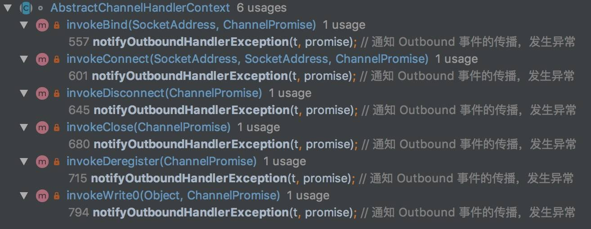

------

`AbstractChannelHandlerContext#notifyOutboundHandlerException(Throwable cause, ChannelPromise promise)` 方法，通知 Outbound 事件的传播，发生异常。代码如下：

```java
private static void notifyOutboundHandlerException(Throwable cause, ChannelPromise promise) {
    // Only log if the given promise is not of type VoidChannelPromise as tryFailure(...) is expected to return
    // false.
    PromiseNotificationUtil.tryFailure(promise, cause, promise instanceof VoidChannelPromise ? null : logger);
}
```

- 在方法内部，会调用 `PromiseNotificationUtil#tryFailure(Promise<?> p, Throwable cause, InternalLogger logger)` 方法，通知 bind 事件对应的 Promise 对应的监听者们。代码如下：

  ```java
  public static void tryFailure(Promise<?> p, Throwable cause, InternalLogger logger) {
      if (!p.tryFailure(cause) && logger != null) {
          Throwable err = p.cause();
          if (err == null) {
              logger.warn("Failed to mark a promise as failure because it has succeeded already: {}", p, cause);
          } else {
              logger.warn(
                      "Failed to mark a promise as failure because it has failed already: {}, unnotified cause: {}",
                      p, ThrowableUtil.stackTraceToString(err), cause);
          }
      }
  }
  ```

  - 以 bind 事件来举一个监听器的例子。代码如下：

    ```java
    ChannelFuture f = b.bind(PORT).addListener(new ChannelFutureListener() { // <1> 监听器就是我！
        @Override
        public void operationComplete(ChannelFuture future) throws Exception {
            System.out.println("异常：" + future.casue());
        }
    }).sync();
    ```

    - `<1>` 处的监听器，就是示例。当发生异常时，就会通知该监听器，对该异常做进一步**自定义**的处理。**也就是说，该异常不会在 pipeline 中传播**。

  - 我们再来看看怎么通知监听器的源码实现。调用 `DefaultPromise#tryFailure(Throwable cause)` 方法，通知 Promise 的监听器们，发生了异常。代码如下：

    ```java
    @Override
    public boolean tryFailure(Throwable cause) {
        if (setFailure0(cause)) { // 设置 Promise 的结果
            // 通知监听器
            notifyListeners();
            // 返回成功
            return true;
        }
        // 返回失败
        return false;
    }
    ```

    - 若 `DefaultPromise#setFailure0(Throwable cause)` 方法，设置 Promise 的结果为方法传入的异常。但是有可能会传递失败，例如说，Promise 已经被设置了结果。
    - 如果该方法返回 `false` 通知 Promise 失败，那么 `PromiseNotificationUtil#tryFailure(Promise<?> p, Throwable cause, InternalLogger logger)` 方法的后续，就会使用 `logger` 打印错误日志。

### 3. notifyHandlerException

我们以 Inbound 事件中的 **fireChannelActive** 举例子，代码如下：

```java
private void invokeChannelActive() {
    if (invokeHandler()) { // 判断是否符合的 ChannelHandler
        try {
            // 调用该 ChannelHandler 的 Channel active 方法 <1>
            ((ChannelInboundHandler) handler()).channelActive(this);
        } catch (Throwable t) {
            notifyHandlerException(t);  // 通知 Inbound 事件的传播，发生异常 <2>
        }
    } else {
        // 跳过，传播 Inbound 事件给下一个节点
        fireChannelActive();
    }
}
```

- 在 `<1>` 处，调用 `ChannelInboundHandler#channelActive(ChannelHandlerContext ctx)` 方法**发生异常**时，会在 `<2>` 处调用 `AbstractChannelHandlerContext#notifyHandlerException(Throwable cause)` 方法，通知 Inbound 事件的传播，发生异常。

- 其他 Inbound 事件，大体的代码也是和`#invokeChannelActive()`

   

  是一致的。如下图所示：
  
  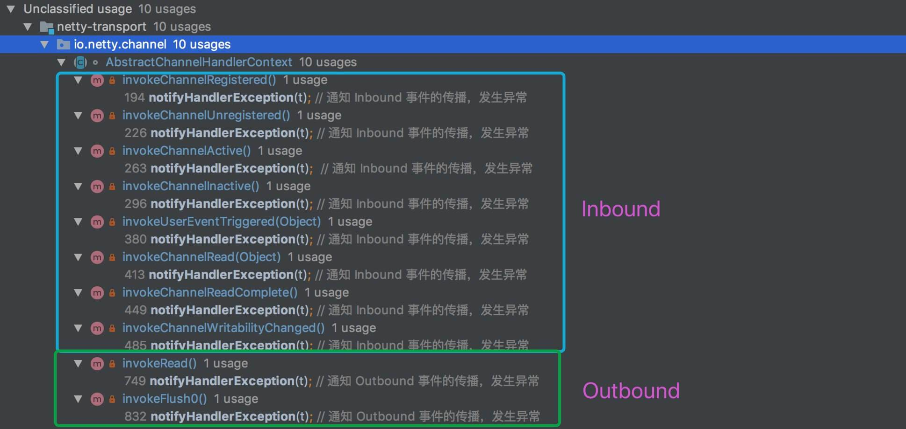

  类图

  - 😈 **注意，笔者在写的时候，突然发现 Outbound 事件中的 read 和 flush 的异常处理方式和 Inbound 事件是一样的**。
  - 😈 **注意，笔者在写的时候，突然发现 Outbound 事件中的 read 和 flush 的异常处理方式和 Inbound 事件是一样的**。
  - 😈 **注意，笔者在写的时候，突然发现 Outbound 事件中的 read 和 flush 的异常处理方式和 Inbound 事件是一样的**。

------

`AbstractChannelHandlerContext#notifyHandlerException(Throwable cause)` 方法，通知 Inbound 事件的传播，发生异常。代码如下：

```java
private void notifyHandlerException(Throwable cause) {
    // <1> 如果是在 `ChannelHandler#exceptionCaught(ChannelHandlerContext ctx, Throwable cause)` 方法中，仅打印错误日志。否则会形成死循环。
    if (inExceptionCaught(cause)) {
        if (logger.isWarnEnabled()) {
            logger.warn(
                    "An exception was thrown by a user handler " +
                            "while handling an exceptionCaught event", cause);
        }
        return;
    }

    // <2> 在 pipeline 中，传播 Exception Caught 事件
    invokeExceptionCaught(cause);
}
```

- `<1>` 处，调用 `AbstractChannelHandlerContext#inExceptionCaught(Throwable cause)` 方法，如果是在 `ChannelHandler#exceptionCaught(ChannelHandlerContext ctx, Throwable cause)` 方法中，**发生异常**，仅打印错误日志，**并 `return` 返回** 。否则会形成死循环。代码如下：

  ```java
  private static boolean inExceptionCaught(Throwable cause) {
      do {
          StackTraceElement[] trace = cause.getStackTrace();
          if (trace != null) {
              for (StackTraceElement t : trace) { // 循环 StackTraceElement
                  if (t == null) {
                      break;
                  }
                  if ("exceptionCaught".equals(t.getMethodName())) { // 通过方法名判断
                      return true;
                  }
              }
          }
          cause = cause.getCause();
      } while (cause != null); // 循环异常的 cause() ，直到到没有
      
      return false;
  }
  ```

  - 通过 StackTraceElement 的方法名来判断，是不是 `ChannelHandler#exceptionCaught(ChannelHandlerContext ctx, Throwable cause)` 方法。

- `<2>` 处，调用 `AbstractChannelHandlerContext#invokeExceptionCaught(Throwable cause)` 方法，在 pipeline 中，传递 Exception Caught 事件。在下文中，我们会看到，和 [《精尽 Netty 源码解析 —— ChannelPipeline（五）之 Inbound 事件的传播》](http://svip.iocoder.cn/Netty/Pipeline-5-inbound/) 的逻辑( `AbstractChannelHandlerContext#invokeChannelActive()` )是**一致**的。

  - 比较特殊的是，Exception Caught 事件在 pipeline 的起始节点，不是 `head` 头节点，而是**发生异常的当前节点开始**。怎么理解好呢？对于在 pipeline 上传播的 Inbound **xxx** 事件，在发生异常后，转化成 **Exception Caught** 事件，继续从当前节点，继续向下传播。

  - 如果 **Exception Caught** 事件在 pipeline 中的传播过程中，一直没有处理掉该异常的节点，最终会到达尾节点 `tail` ，它对 `#exceptionCaught(ChannelHandlerContext ctx, Throwable cause)` 方法的实现，代码如下：

    ```java
    @Override
    public void exceptionCaught(ChannelHandlerContext ctx, Throwable cause) throws Exception {
        onUnhandledInboundException(cause);
    }
    ```

    - 在方法内部，会调用 `DefaultChannelPipeline#onUnhandledInboundException(Throwable cause)` 方法，代码如下：

      ```java
      /**
       * Called once a {@link Throwable} hit the end of the {@link ChannelPipeline} without been handled by the user
       * in {@link ChannelHandler#exceptionCaught(ChannelHandlerContext, Throwable)}.
       */
      protected void onUnhandledInboundException(Throwable cause) {
          try {
              logger.warn(
                      "An exceptionCaught() event was fired, and it reached at the tail of the pipeline. " +
                              "It usually means the last handler in the pipeline did not handle the exception.",
                      cause);
          } finally {
              ReferenceCountUtil.release(cause);
          }
      }
      ```

      - 打印**告警**日志，并调用 `ReferenceCountUtil#release(Throwable)` 方法，释放需要释放的资源。

      - 从英文注释中，我们也可以看到，这种情况出现在**使用者**未定义合适的 ChannelHandler 处理这种异常，所以对于这种情况下，`tail` 节点只好打印**告警**日志。

      - 实际使用时，笔者建议胖友一定要定义 ExceptionHandler ，能够处理掉所有的异常，而不要使用到 `tail` 节点的异常处理。😈

      - 好基友【闪电侠】对尾节点 `tail` 做了很赞的总结

        > 总结一下，tail 节点的作用就是结束事件传播，并且对一些重要的事件做一些善意提醒

### 666. 彩蛋

推荐阅读文章：

- 闪电侠 [《netty 源码分析之 pipeline(二)》](https://www.jianshu.com/p/087b7e9a27a2)

