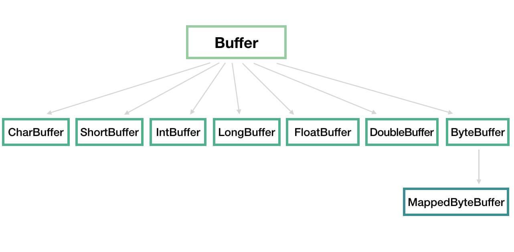
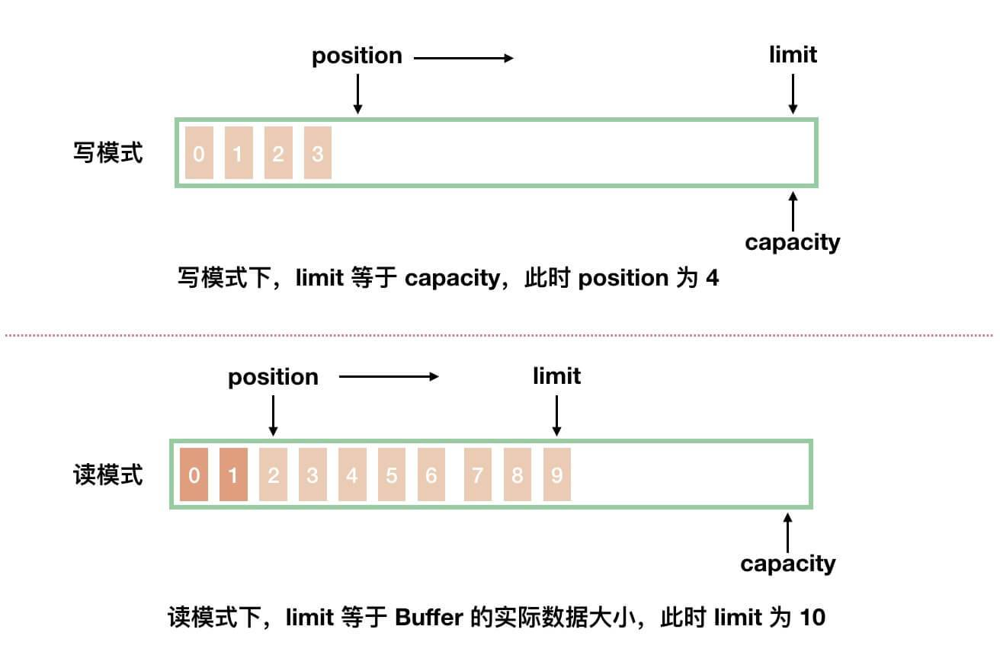
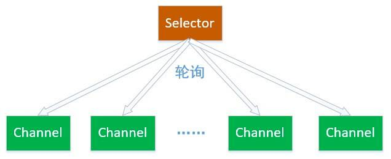
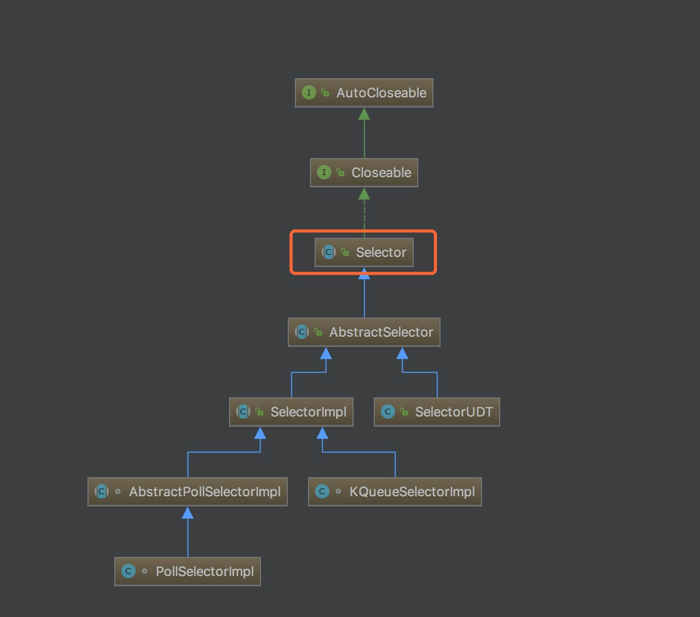

## NIO 基础（一）之简介

### 1. 概述

Java NIO( New IO 或者 Non Blocking IO ) ，从 Java 1.4 版本开始引入的**非阻塞** IO ，用于替换**标准**( 有些文章也称为**传统**，或者 Blocking IO 。下文统称为 BIO ) Java IO API 的 IO API 。

> 在一些文章中，会将 Java NIO 描述成**异步** IO ，实际是不太正确的： Java NIO 是**同步** IO ，Java AIO ( 也称为 NIO 2 )是**异步** IO。具体原因，推荐阅读文章：
>
> - [《异步和非阻塞一样吗? (内容涉及 BIO, NIO, AIO, Netty)》](https://blog.csdn.net/matthew_zhang/article/details/71328697) 。
> - [《BIO与NIO、AIO的区别(这个容易理解)》](https://blog.csdn.net/skiof007/article/details/52873421)
>
> 总结来说，在 **Unix IO 模型**的语境下：
>
> - 同步和异步的区别：数据拷贝阶段是否需要完全由操作系统处理。
> - 阻塞和非阻塞操作：是针对发起 IO 请求操作后，是否有立刻返回一个标志信息而不让请求线程等待。
>
> 因此，Java NIO 是**同步**且非阻塞的 IO 。

### 2. 核心组件

Java NIO 由如下**三个**核心组件组成：

- Channel
- Buffer
- Selector

后续的每篇文章，我们会分享对应的一个组件。

### 3. NIO 和 BIO 的对比

NIO 和 BIO 的区别主要体现在三个方面：

| NIO                  | BIO              |
| :------------------- | :--------------- |
| 基于缓冲区( Buffer ) | 基于流( Stream ) |
| **非**阻塞 IO        | 阻塞 IO          |
| 选择器( Selector )   | 无               |

- 其中，选择器( Selector )是 NIO 能实现**非**阻塞的基础。

#### 3.1 基于 Buffer 与基于 Stream

BIO 是面向字节流或者字符流的，而在 NIO 中，它摒弃了传统的 IO 流，而是引入 Channel 和 Buffer 的概念：从 Channel 中读取数据到 Buffer 中，或者将数据从 Buffer 中写到 Channel 中。

① 那么什么是**基于 Stream**呢？

在一般的 Java IO 操作中，我们以**流式**的方式，**顺序**的从一个 Stream 中读取一个或者多个字节，直至读取所有字节。因为它没有缓存区，所以我们就不能随意改变读取指针的位置。

② 那么什么是**基于 Buffer** 呢？

基于 Buffer 就显得有点不同了。我们在从 Channel 中读取数据到 Buffer 中，这样 Buffer 中就有了数据后，我们就可以对这些数据进行操作了。并且不同于一般的 Java IO 操作那样是**顺序**操作，NIO 中我们可以随意的读取任意位置的数据，这样大大增加了处理过程中的灵活性。

#### 3.2 阻塞与非阻塞 IO

Java IO 的各种流是**阻塞**的 IO 操作。这就意味着，当一个线程执行读或写 IO 操作时，该线程会被**阻塞**，直到有一些数据被读取，或者数据完全写入。

------

Java NIO 可以让我们**非阻塞**的使用 IO 操作。例如：

- 当一个线程执行从 Channel 执行读取 IO 操作时，当此时有数据，则读取数据并返回；当此时无数据，则直接返回**而不会阻塞当前线程**。
- 当一个线程执行向 Channel 执行写入 IO 操作时，**不需要阻塞等待它完全写入**，这个线程同时可以做别的事情。

也就是说，线程可以将非阻塞 IO 的空闲时间用于在其他 Channel 上执行 IO 操作。所以，一个单独的线程，可以管理多个 Channel 的读取和写入 IO 操作。

#### 3.3 Selector

Java NIO 引入 Selector ( 选择器 )的概念，它是 Java NIO 得以实现非阻塞 IO 操作的**最最最关键**。

我们可以注册**多个** Channel 到**一个** Selector 中。而 Selector 内部的机制，就可以自动的为我们不断的执行查询( select )操作，判断这些注册的 Channel 是否有**已就绪的 IO 事件( 例如可读，可写，网络连接已完成 )**。
通过这样的机制，**一个**线程通过使用**一个** Selector ，就可以非常简单且高效的来管理**多个** Channel 了。

## NIO 基础（二）之 Channel

### 1. 概述

在 Java NIO 中，基本上所有的 IO 操作都是从 Channel 开始。数据可以从 Channel 读取到 Buffer 中，也可以从 Buffer 写到 Channel 中。如下图所示：


### 2. NIO Channel 对比 Java Stream

NIO Channel **类似** Java Stream ，但又有几点不同：

1. 对于**同一个** Channel ，我们可以从它读取数据，也可以向它写入数据。而对于**同一个** Stream ，通畅要么只能读，要么只能写，二选一( 有些文章也描述成“单向”，也是这个意思 )。
2. Channel 可以**非阻塞**的读写 IO 操作，而 Stream 只能**阻塞**的读写 IO 操作。
3. Channel **必须配合** Buffer 使用，总是先读取到一个 Buffer 中，又或者是向一个 Buffer 写入。也就是说，我们无法绕过 Buffer ，直接向 Channel 写入数据。

### 3. Channel 的实现

Channel 在 Java 中，作为一个**接口**，`java.nio.channels.Channel` ，定义了 IO 操作的**连接与关闭**。代码如下：

```java
public interface Channel extends Closeable {

    /**
     * 判断此通道是否处于打开状态。 
     */
    public boolean isOpen();

    /**
     *关闭此通道。
     */
    public void close() throws IOException;
```

Channel 有非常多的实现类，最为重要的**四个** Channel 实现类如下：

- SocketChannel ：一个客户端用来**发起** TCP 的 Channel 。
- ServerSocketChannel ：一个服务端用来**监听**新进来的连接的 TCP 的 Channel 。对于每一个新进来的连接，都会创建一个对应的 SocketChannel 。
- DatagramChannel ：通过 UDP 读写数据。
- FileChannel ：从文件中，读写数据。

> 我们在使用 Netty 时，主要使用 TCP 协议，所以胖友可以只看 [「3.2 SocketChannel」](http://svip.iocoder.cn/Netty/nio-2-channel/#) 和 [「3.1 ServerSocketChannel」](http://svip.iocoder.cn/Netty/nio-2-channel/#) 。

## NIO 基础（三）之 Buffer

### 1. 概述

一个 Buffer ，本质上是内存中的一块，我们可以将数据写入这块内存，之后从这块内存获取数据。通过将这块内存封装成 NIO Buffer 对象，并提供了一组常用的方法，方便我们对该块内存的读写。

Buffer 在 `java.nio` 包中实现，被定义成**抽象类**，从而实现一组常用的方法。整体类图如下：



- 我们可以将 Buffer 理解为**一个数组的封装**，例如 IntBuffer、CharBuffer、ByteBuffer 等分别对应 `int[]`、`char[]`、`byte[]` 等。
- MappedByteBuffer 用于实现内存映射文件，不是本文关注的重点。因此，感兴趣的胖友，可以自己 Google 了解，还是蛮有趣的。

### 2. 基本属性

Buffer 中有 **4** 个非常重要的属性：`capacity`、`limit`、`position`、`mark` 。代码如下：

```java
public abstract class Buffer {

    // Invariants: mark <= position <= limit <= capacity
    private int mark = -1;
    private int position = 0;
    private int limit;
    private int capacity;

    // Used only by direct buffers
    // NOTE: hoisted here for speed in JNI GetDirectBufferAddress
    long address;

    Buffer(int mark, int pos, int lim, int cap) {       // package-private
        if (cap < 0)
            throw new IllegalArgumentException("Negative capacity: " + cap);
        this.capacity = cap;
        limit(lim);
        position(pos);
        if (mark >= 0) {
            if (mark > pos)
                throw new IllegalArgumentException("mark > position: ("
                                                   + mark + " > " + pos + ")");
            this.mark = mark;
        }
    }
    
    // ... 省略具体方法的代码
}
```

- `capacity` 属性，容量，Buffer 能容纳的数据元素的**最大值**。这一容量在 Buffer 创建时被赋值，并且**永远不能被修改**。

- Buffer 分成写模式和读模式两种情况。如下图所示：

  

  

  写模式 v.s. 读模式

  - 从图中，我们可以看到，两种模式下，`position` 和 `limit` 属性分别代表不同的含义。下面，我们来分别看看。

- `position`属性，位置，初始值为 0 。

  - **写**模式下，每往 Buffer 中写入一个值，`position` 就自动加 1 ，代表下一次的写入位置。
  - **读**模式下，每从 Buffer 中读取一个值，`position` 就自动加 1 ，代表下一次的读取位置。( *和写模式类似* )

- `limit`属性，上限。

  - **写**模式下，代表最大能写入的数据上限位置，这个时候 `limit` 等于 `capacity` 。
  - **读**模式下，在 Buffer 完成所有数据写入后，通过调用 `#flip()` 方法，切换到**读**模式。此时，`limit` 等于 Buffer 中实际的数据大小。因为 Buffer 不一定被写满，所以不能使用 `capacity` 作为实际的数据大小。

- `mark`属性，标记，通过`#mark()`方法，记录当前`position`；通过`reset()`方法，恢复`position`为标记。

  - **写**模式下，标记上一次写位置。
  - **读**模式下，标记上一次读位置。
  
- 从代码注释上，我们可以看到，四个属性总是遵循如下大小关系：

  `mark <= position <= limit <= capacity`

------

写到此处，忍不住吐槽了下，Buffer 的读模式和写模式，我认为是有一点“**糟糕**”。相信大多数人在理解的时候，都会开始一脸懵逼的状态。相比较来说，Netty 的 ByteBuf 就**优雅**的非常多，基本属性设计如下：

​	`0 <= readerIndex <= writerIndex <= capacity`

- 通过 `readerIndex` 和 `writerIndex` 两个属性，避免出现读模式和写模式的切换。

### 3. 创建 Buffer

① 每个 Buffer 实现类，都提供了 `#allocate(int capacity)` 静态方法，帮助我们快速**实例化**一个 Buffer 对象。以 ByteBuffer 举例子，代码如下：

```java
// ByteBuffer.java
public static ByteBuffer allocate(int capacity) {
    if (capacity < 0)
        throw new IllegalArgumentException();
    return new HeapByteBuffer(capacity, capacity);
}
```

- ByteBuffer 实际是个抽象类，返回的是它的**基于堆内( Non-Direct )内存**的实现类 HeapByteBuffer 的对象。

② 每个 Buffer 实现类，都提供了 `#wrap(array)` 静态方法，帮助我们将其对应的数组**包装**成一个 Buffer 对象。还是以 ByteBuffer 举例子，代码如下：

```java
// ByteBuffer.java
public static ByteBuffer wrap(byte[] array, int offset, int length){
    try {
        return new HeapByteBuffer(array, offset, length);
    } catch (IllegalArgumentException x) {
        throw new IndexOutOfBoundsException();
    }
}

public static ByteBuffer wrap(byte[] array) {
    return wrap(array, 0, array.length);
}
```

- 和 `#allocate(int capacity)` 静态方法**一样**，返回的也是 HeapByteBuffer 的对象。

③ 每个 Buffer 实现类，都提供了 `#allocateDirect(int capacity)` 静态方法，帮助我们快速**实例化**一个 Buffer 对象。以 ByteBuffer 举例子，代码如下：

```java
// ByteBuffer.java
public static ByteBuffer allocateDirect(int capacity) {
    return new DirectByteBuffer(capacity);
}
```

- 和 `#allocate(int capacity)` 静态方法**不一样**，返回的是它的**基于堆外( Direct )内存**的实现类 DirectByteBuffer 的对象。

> FROM [《Java NIO 的前生今世 之三 NIO Buffer 详解》](https://segmentfault.com/a/1190000006824155)
>
> 堆外**Direct Buffer:**
>
> - 所分配的内存不在 JVM 堆上, 不受 GC 的管理.(但是 Direct Buffer 的 Java 对象是由 GC 管理的, 因此当发生 GC, 对象被回收时, Direct Buffer 也会被释放)
> - 因为 Direct Buffer 不在 JVM 堆上分配, 因此 Direct Buffer 对应用程序的内存占用的影响就不那么明显(实际上还是占用了这么多内存, 但是 JVM 不好统计到非 JVM 管理的内存.)
> - 申请和释放 Direct Buffer 的开销比较大. 因此正确的使用 Direct Buffer 的方式是在初始化时申请一个 Buffer, 然后不断复用此 buffer, 在程序结束后才释放此 buffer.
> - 使用 Direct Buffer 时, 当进行一些底层的系统 IO 操作时, 效率会比较高, 因为此时 JVM 不需要拷贝 buffer 中的内存到中间临时缓冲区中.
>
> **Non-Direct Buffer:**
>
> - 直接在 JVM 堆上进行内存的分配, 本质上是 byte[] 数组的封装.
> - 因为 Non-Direct Buffer 在 JVM 堆中, 因此当进行操作系统底层 IO 操作中时, 会将此 buffer 的内存复制到中间临时缓冲区中. 因此 Non-Direct Buffer 的效率就较低.

### 4. 向 Buffer 写入数据

每个 Buffer 实现类，都提供了 `#put(...)` 方法，向 Buffer 写入数据。以 ByteBuffer 举例子，代码如下：

```java
// 写入 byte
public abstract ByteBuffer put(byte b); 
public abstract ByteBuffer put(int index, byte b);
// 写入 byte 数组
public final ByteBuffer put(byte[] src) { ... }
public ByteBuffer put(byte[] src, int offset, int length) {...}
// ... 省略，还有其他 put 方法
```

对于 Buffer 来说，有一个非常重要的操作就是，我们要讲来自 Channel 的数据写入到 Buffer 中。在系统层面上，这个操作我们称为**读操作**，因为数据是从外部( 文件或者网络等 )读取到内存中。示例如下：

```java
int num = channel.read(buffer);
```

- 上述方法会返回从 Channel 中写入到 Buffer 的数据大小。对应方法的代码如下：

  ```java
  public interface ReadableByteChannel extends Channel {
  
      public int read(ByteBuffer dst) throws IOException;
      
  }
  ```

> 注意，通常在说 NIO 的读操作的时候，我们说的是从 Channel 中读数据到 Buffer 中，对应的是对 Buffer 的写入操作，初学者需要理清楚这个。

### 5. 从 Buffer 读取数据

每个 Buffer 实现类，都提供了 `#get(...)` 方法，从 Buffer 读取数据。以 ByteBuffer 举例子，代码如下：

```java
// 读取 byte
public abstract byte get();
public abstract byte get(int index);
// 读取 byte 数组
public ByteBuffer get(byte[] dst, int offset, int length) {...}
public ByteBuffer get(byte[] dst) {...}
// ... 省略，还有其他 get 方法
```

对于 Buffer 来说，还有一个非常重要的操作就是，我们要讲来向 Channel 的写入 Buffer 中的数据。在系统层面上，这个操作我们称为**写操作**，因为数据是从内存中写入到外部( 文件或者网络等 )。示例如下：

```java
int num = channel.write(buffer);
```

- 上述方法会返回向 Channel 中写入 Buffer 的数据大小。对应方法的代码如下：

  ```java
  public interface WritableByteChannel extends Channel {
  
      public int write(ByteBuffer src) throws IOException;
      
  }
  ```

### 6. rewind() v.s. flip() v.s. clear()

#### 6.1 flip

如果要读取 Buffer 中的数据，需要切换模式，**从写模式切换到读模式**。对应的为 `#flip()` 方法，代码如下：

```java
public final Buffer flip() {
    limit = position; // 设置读取上限
    position = 0; // 重置 position
    mark = -1; // 清空 mark
    return this;
}
```

使用示例，代码如下：

```java
buf.put(magic);    // Prepend header
in.read(buf);      // Read data into rest of buffer
buf.flip();        // Flip buffer
channel.write(buf);    // Write header + data to channel
```

#### 6.2 rewind

`#rewind()` 方法，可以**重置** `position` 的值为 0 。因此，我们可以重新**读取和写入** Buffer 了。

大多数情况下，该方法主要针对于**读模式**，所以可以翻译为“倒带”。也就是说，和我们当年的磁带倒回去是一个意思。代码如下：

```java
public final Buffer rewind() {
    position = 0; // 重置 position
    mark = -1; // 清空 mark
    return this;
}
```

- 从代码上，和 `#flip()` 相比，非常类似，除了少了第一行的 `limit = position` 的代码块。

使用示例，代码如下：

```java
channel.write(buf);    // Write remaining data
buf.rewind();      // Rewind buffer
buf.get(array);    // Copy data into array
```

#### 6.3 clear

`#clear()` 方法，可以“**重置**” Buffer 的数据。因此，我们可以重新**读取和写入** Buffer 了。

大多数情况下，该方法主要针对于**写模式**。代码如下：

```java
public final Buffer clear() {
    position = 0; // 重置 position
    limit = capacity; // 恢复 limit 为 capacity
    mark = -1; // 清空 mark
    return this;
}
```

- 从源码上，我们可以看出，Buffer 的数据实际并未清理掉，所以使用时需要注意。
- 读模式下，尽量不要调用 `#clear()` 方法，因为 `limit` 可能会被错误的赋值为 `capacity` 。相比来说，调用 `#rewind()` 更合理，如果有重读的需求。

使用示例，代码如下：

```java
buf.clear();     // Prepare buffer for reading
in.read(buf);    // Read data
```

### 7. mark() 搭配 reset()

#### 7.1 mark

`#mark()` 方法，保存当前的 `position` 到 `mark` 中。代码如下：

```java
public final Buffer mark() {
    mark = position;
    return this;
}
```

#### 7.2 reset

`#reset()` 方法，恢复当前的 `postion` 为 `mark` 。代码如下：

```java
public final Buffer reset() {
    int m = mark;
    if (m < 0)
        throw new InvalidMarkException();
    position = m;
    return this;
}
```

### 8. 其它方法

Buffer 中还有其它方法，比较简单，所以胖友自己研究噢。代码如下：

```java
// ========== capacity ==========
public final int capacity() {
    return capacity;
}

// ========== position ==========
public final int position() {
    return position;
}

public final Buffer position(int newPosition) {
    if ((newPosition > limit) || (newPosition < 0))
        throw new IllegalArgumentException();
    position = newPosition;
    if (mark > position) mark = -1;
    return this;
}

// ========== limit ==========
public final int limit() {
    return limit;
}
    
public final Buffer limit(int newLimit) {
    if ((newLimit > capacity) || (newLimit < 0))
        throw new IllegalArgumentException();
    limit = newLimit;
    if (position > limit) position = limit;
    if (mark > limit) mark = -1;
    return this;
}

// ========== mark ==========
final int markValue() {                             // package-private
    return mark;
}

final void discardMark() {                          // package-private
    mark = -1;
}

// ========== 数组相关 ==========
public final int remaining() {
    return limit - position;
}

public final boolean hasRemaining() {
    return position < limit;
}

public abstract boolean hasArray();

public abstract Object array();

public abstract int arrayOffset();

public abstract boolean isDirect();

// ========== 下一个读 / 写 position ==========
final int nextGetIndex() {                          // package-private
    if (position >= limit)
        throw new BufferUnderflowException();
    return position++;
}

final int nextGetIndex(int nb) {                    // package-private
    if (limit - position < nb)
        throw new BufferUnderflowException();
    int p = position;
    position += nb;
    return p;
}

final int nextPutIndex() {                          // package-private
    if (position >= limit)
        throw new BufferOverflowException();
    return position++;
}

final int nextPutIndex(int nb) {                    // package-private
    if (limit - position < nb)
        throw new BufferOverflowException();
    int p = position;
    position += nb;
    return p;
}

final int checkIndex(int i) {                       // package-private
    if ((i < 0) || (i >= limit))
        throw new IndexOutOfBoundsException();
    return i;
}

final int checkIndex(int i, int nb) {               // package-private
    if ((i < 0) || (nb > limit - i))
        throw new IndexOutOfBoundsException();
    return i;
}

// ========== 其它方法 ==========
final void truncate() {                             // package-private
    mark = -1;
    position = 0;
    limit = 0;
    capacity = 0;
}

static void checkBounds(int off, int len, int size) { // package-private
    if ((off | len | (off + len) | (size - (off + len))) < 0)
        throw new IndexOutOfBoundsException();
}
```

## NIO 基础（四）之 Selector

### 1. 概述

Selector ， 一般称为**选择器**。它是 Java NIO 核心组件中的一个，用于轮询一个或多个 NIO Channel 的状态是否处于可读、可写。如此，一个线程就可以管理多个 Channel ，也就说可以管理多个网络连接。也因此，Selector 也被称为**多路复用器**。

- 首先，需要将 Channel 注册到 Selector 中，这样 Selector 才知道哪些 Channel 是它需要管理的。
- 之后，Selector 会不断地轮询注册在其上的 Channel 。如果某个 Channel 上面发生了读或者写事件，这个 Channel 就处于就绪状态，会被 Selector 轮询出来，然后通过 SelectionKey 可以获取就绪 Channel 的集合，进行后续的 I/O 操作。

下图是一个 Selector 管理三个 Channel 的示例：



### 2. 优缺点

① **优点**

使用一个线程**能够**处理多个 Channel 的优点是，只需要更少的线程来处理 Channel 。事实上，可以使用一个线程处理所有的 Channel 。对于操作系统来说，线程之间上下文切换的开销很大，而且每个线程都要占用系统的一些资源( 例如 CPU、内存 )。因此，使用的线程越少越好。

② **缺点**

因为在一个线程中使用了多个 Channel ，因此会造成每个 Channel 处理效率的降低。

当然，Netty 在设计实现上，通过 n 个线程处理多个 Channel ，从而很好的解决了这样的缺点。其中，n 的指的是有限的线程数，默认情况下为 CPU * 2 。

### 3. Selector 类图

Selector 在 `java.nio` 包中，被定义成**抽象类**，整体实现类图如下：



- Selector 的实现不是本文的重点，感兴趣的胖友可以看看占小狼的 [《深入浅出NIO之Selector实现原理》](https://www.jianshu.com/p/0d497fe5484a) 。

### 3. 创建 Selector

通过 `#open()` 方法，我们可以创建一个 Selector 对象。代码如下：

```java
Selector selector = Selector.open();
```

### 4. 注册 Chanel 到 Selector 中

为了让 Selector 能够管理 Channel ，我们需要将 Channel 注册到 Selector 中。代码如下：

```java
channel.configureBlocking(false); // <1>
SelectionKey key = channel.register(selector, SelectionKey.OP_READ);
```

- **注意**，如果一个 Channel 要注册到 Selector 中，那么该 Channel 必须是**非阻塞**，所以 `<1>` 处的 `channel.configureBlocking(false);` 代码块。也因此，FileChannel 是不能够注册到 Channel 中的，因为它是**阻塞**的。

- 在 `#register(Selector selector, int interestSet)` 方法的**第二个参数**，表示一个“interest 集合”，意思是通过 Selector 监听 Channel 时，对**哪些**( 可以是多个 )事件感兴趣。可以监听四种不同类型的事件：

  - Connect ：连接完成事件( TCP 连接 )，仅适用于客户端，对应 `SelectionKey.OP_CONNECT` 。
  - Accept ：接受新连接事件，仅适用于服务端，对应 `SelectionKey.OP_ACCEPT` 。
  - Read ：读事件，适用于两端，对应 `SelectionKey.OP_READ` ，表示 Buffer 可读。
  - Write ：写时间，适用于两端，对应 `SelectionKey.OP_WRITE` ，表示 Buffer 可写。

  Channel 触发了一个事件，意思是该事件已经就绪：

- 一个 Client Channel Channel 成功连接到另一个服务器，称为“连接就绪”。

- 一个 Server Socket Channel 准备好接收新进入的连接，称为“接收就绪”。

- 一个有数据可读的 Channel ，可以说是“读就绪”。

- 一个等待写数据的 Channel ，可以说是“写就绪”。

因为 Selector 可以对 Channel 的**多个**事件感兴趣，所以在我们想要注册 Channel 的多个事件到 Selector 中时，可以使用**或运算** `|` 来组合多个事件。示例代码如下：

```java
int interestSet = SelectionKey.OP_READ | SelectionKey.OP_WRITE;
```

------

实际使用时，我们会有**改变** Selector 对 Channel 感兴趣的事件集合，可以通过再次调用 `#register(Selector selector, int interestSet)` 方法来进行变更。示例代码如下：

```java
channel.register(selector, SelectionKey.OP_READ);
channel.register(selector, SelectionKey.OP_READ | SelectionKey.OP_WRITE);
```

- 初始时，Selector 仅对 Channel 的 `SelectionKey.OP_READ` 事件感兴趣。
- 修改后，Selector 仅对 Channel 的 `SelectionKey.OP_READ` 和 `SelectionKey.OP_WRITE)` 事件**都**感兴趣。

### 5. SelectionKey 类

上一小节, 当我们调用 Channel 的 `#register(...)` 方法，向 Selector 注册一个 Channel 后，会返回一个 SelectionKey 对象。那么 SelectionKey 是什么呢？SelectionKey 在 `java.nio.channels` 包下，被定义成一个**抽象类**，表示一个 Channel 和一个 Selector 的注册关系，包含如下内容：

- interest set ：感兴趣的事件集合。
- ready set ：就绪的事件集合。
- Channel
- Selector
- attachment ：*可选的*附加对象。

#### 5.1 interest set

通过调用 `#interestOps()` 方法，返回感兴趣的事件集合。示例代码如下：

```java
int interestSet = selectionKey.interestOps();

// 判断对哪些事件感兴趣
boolean isInterestedInAccept  = interestSet & SelectionKey.OP_ACCEPT != 0;
boolean isInterestedInConnect = interestSet & SelectionKey.OP_CONNECT != 0;
boolean isInterestedInRead    = interestSet & SelectionKey.OP_READ != 0;
boolean isInterestedInWrite   = interestSet & SelectionKey.OP_WRITE != 0;
```

- 其中每个事件 Key 在 SelectionKey 中枚举，通过位( bit ) 表示。代码如下：

  ```java
  //  SelectionKey.java
  
  public static final int OP_READ = 1 << 0;
  public static final int OP_WRITE = 1 << 2;
  public static final int OP_CONNECT = 1 << 3;
  public static final int OP_ACCEPT = 1 << 4;
  ```

  - 所以，在上述示例的后半段的代码，可以通过与运算 `&` 来判断是否对指定事件感兴趣。

#### 5.2 ready set

通过调用 `#readyOps()` 方法，返回就绪的事件集合。示例代码如下：

```java
int readySet = selectionKey.readyOps();

// 判断哪些事件已就绪
selectionKey.isAcceptable();
selectionKey.isConnectable();
selectionKey.isReadable();
selectionKey.isWritable();
```

- 相比 interest set 来说，ready set 已经内置了判断事件的方法。代码如下：

  ```java
  // SelectionKey.java
  public final boolean isReadable() {
      return (readyOps() & OP_READ) != 0;
  }
  public final boolean isWritable() {
      return (readyOps() & OP_WRITE) != 0;
  }
  public final boolean isConnectable() {
      return (readyOps() & OP_CONNECT) != 0;
  }
  public final boolean isAcceptable() {
      return (readyOps() & OP_ACCEPT) != 0;
  }
  ```

#### 5.3 attachment

通过调用 `#attach(Object ob)` 方法，可以向 SelectionKey 添加附加对象；通过调用 `#attachment()` 方法，可以获得 SelectionKey 获得附加对象。示例代码如下：

```java
selectionKey.attach(theObject);
Object attachedObj = selectionKey.attachment();
```

又获得在注册时，直接添加附加对象。示例代码如下：

```java
SelectionKey key = channel.register(selector, SelectionKey.OP_READ, theObject);
```

### 6. 通过 Selector 选择 Channel

在 Selector 中，提供三种类型的选择( select )方法，返回当前有感兴趣事件准备就绪的 Channel **数量**：

```java
// Selector.java

// 阻塞到至少有一个 Channel 在你注册的事件上就绪了。
public abstract int select() throws IOException;

// 在 `#select()` 方法的基础上，增加超时机制。
public abstract int select(long timeout) throws IOException;

// 和 `#select()` 方法不同，立即返回数量，而不阻塞。
public abstract int selectNow() throws IOException;
```

- 有一点**非常需要注意**：select 方法返回的 `int` 值，表示有多少 Channel 已经就绪。亦即，**自上次调用 select 方法后有多少 Channel 变成就绪状态**。如果调用 select 方法，因为有一个 Channel 变成就绪状态则返回了 1 ；若再次调用 select 方法，如果另一个 Channel 就绪了，它会再次返回1。如果对第一个就绪的 Channel 没有做任何操作，现在就有两个就绪的 Channel ，**但在每次 select 方法调用之间，只有一个 Channel 就绪了，所以才返回 1**。

### 7. 获取可操作的 Channel

一旦调用了 select 方法，并且返回值表明有一个或更多个 Channel 就绪了，然后可以通过调用Selector 的 `#selectedKeys()` 方法，访问“已选择键集( selected key set )”中的**就绪** Channel 。示例代码所示：

```java
Set selectedKeys = selector.selectedKeys();
```

- 注意，当有**新增就绪**的 Channel ，需要先调用 select 方法，才会添加到“已选择键集( selected key set )”中。否则，我们直接调用 `#selectedKeys()` 方法，是无法获得它们对应的 SelectionKey 们。

### 8. 唤醒 Selector 选择

某个线程调用 `#select()` 方法后，发生阻塞了，即使没有通道已经就绪，也有办法让其从 `#select()` 方法返回。

- 只要让其它线程在第一个线程调用 `select()` 方法的那个 Selector 对象上，调用该 Selector 的 `#wakeup()` 方法，进行唤醒该 Selector 即可。
- 那么，阻塞在 `#select()`方法上的线程，会立马返回。

> Selector 的 `#select(long timeout)` 方法，若未超时的情况下，也可以满足上述方式。

注意，如果有其它线程调用了 `#wakeup()` 方法，但当前没有线程阻塞在 `#select()` 方法上，下个调用 `#select()` 方法的线程会立即被唤醒。😈 有点神奇。

### 9. 关闭 Selector

当我们不再使用 Selector 时，可以调用 Selector 的 `#close()` 方法，将它进行关闭。

- Selector 相关的所有 SelectionKey 都**会失效**。
- Selector 相关的所有 Channel 并**不会关闭**。

注意，此时若有线程阻塞在 `#select()` 方法上，也会被唤醒返回。

### 10. 简单 Selector 示例

如下是一个简单的 Selector 示例，创建一个 Selector ，并将一个 Channel注册到这个 Selector上( Channel 的初始化过程略去 )，然后持续轮询这个 Selector 的四种事件( 接受，连接，读，写 )是否就绪。代码如下：

> 本代码取自 [《Java NIO系列教程（六） Selector》](http://ifeve.com/selectors/) 提供的示例，实际生产环境下并非这样的代码。🙂 最佳的实践，我们将在 Netty 中看到。

```java
// 创建 Selector
Selector selector = Selector.open();
// 注册 Channel 到 Selector 中
channel.configureBlocking(false);
SelectionKey key = channel.register(selector, SelectionKey.OP_READ);
while (true) {
      // 通过 Selector 选择 Channel 
	int readyChannels = selector.select();
	if (readyChannels == 0) {
	   continue;
	}
	// 获得可操作的 Channel
	Set selectedKeys = selector.selectedKeys();
	// 遍历 SelectionKey 数组
	Iterator<SelectionKey> keyIterator = selectedKeys.iterator();
	while (keyIterator.hasNext()) {
		SelectionKey key = keyIterator.next();
		if (key.isAcceptable()) {
			// a connection was accepted by a ServerSocketChannel.
		} else if (key.isConnectable()) {
			// a connection was established with a remote server.
		} else if (key.isReadable()) {
			// a channel is ready for reading
		} else if (key.isWritable()) {
			// a channel is ready for writing
		}
		// 移除
		keyIterator.remove(); // <1>
	}
}
```

- 注意, 在每次迭代时, 我们都调用`keyIterator.remove()`代码块，将这个 key 从迭代器中删除。
  - 因为 `#select()` 方法仅仅是简单地将就绪的 Channel 对应的 SelectionKey 放到 selected keys 集合中。
  - 因此，如果我们从 selected keys 集合中，获取到一个 key ，但是没有将它删除，那么下一次 `#select` 时, 这个 SelectionKey 还在 selectedKeys 中.

## NIO 基础（五）之示例

### 1. 概述

在前面的四篇文章，我们已经对 NIO 的概念已经有了一定的了解。当然，胖友也可能和我一样，已经被一堆概念烦死了。

那么本文，我们撸起袖子，就是干代码，不瞎比比了。

当然，下面更多的是提供一个 NIO 示例。真正生产级的 NIO 代码，建议胖友重新写，或者直接使用 Netty 。

代码仓库在 [example/yunai/nio](https://github.com/YunaiV/netty/tree/f7016330f1483021ef1c38e0923e1c8b7cef0d10/example/src/main/java/io/netty/example/yunai/nio) 目录下。一共 3 个类：

- NioServer ：NIO 服务端。
- NioClient ：NIO 客户端。
- CodecUtil ：消息编解码工具类。

### 2. 服务端

```java
  1: public class NioServer {
  2: 
  3:     private ServerSocketChannel serverSocketChannel;
  4:     private Selector selector;
  5: 
  6:     public NioServer() throws IOException {
  7:         // 打开 Server Socket Channel
  8:         serverSocketChannel = ServerSocketChannel.open();
  9:         // 配置为非阻塞
 10:         serverSocketChannel.configureBlocking(false);
 11:         // 绑定 Server port
 12:         serverSocketChannel.socket().bind(new InetSocketAddress(8080));
 13:         // 创建 Selector
 14:         selector = Selector.open();
 15:         // 注册 Server Socket Channel 到 Selector
 16:         serverSocketChannel.register(selector, SelectionKey.OP_ACCEPT);
 17:         System.out.println("Server 启动完成");
 18: 
 19:         handleKeys();
 20:     }
 21: 
 22:     private void handleKeys() throws IOException {
 23:         while (true) {
 24:             // 通过 Selector 选择 Channel
 25:             int selectNums = selector.select(30 * 1000L);
 26:             if (selectNums == 0) {
 27:                 continue;
 28:             }
 29:             System.out.println("选择 Channel 数量：" + selectNums);
 30: 
 31:             // 遍历可选择的 Channel 的 SelectionKey 集合
 32:             Iterator<SelectionKey> iterator = selector.selectedKeys().iterator();
 33:             while (iterator.hasNext()) {
 34:                 SelectionKey key = iterator.next();
 35:                 iterator.remove(); // 移除下面要处理的 SelectionKey
 36:                 if (!key.isValid()) { // 忽略无效的 SelectionKey
 37:                     continue;
 38:                 }
 39: 
 40:                 handleKey(key);
 41:             }
 42:         }
 43:     }
 44: 
 45:     private void handleKey(SelectionKey key) throws IOException {
 46:         // 接受连接就绪
 47:         if (key.isAcceptable()) {
 48:             handleAcceptableKey(key);
 49:         }
 50:         // 读就绪
 51:         if (key.isReadable()) {
 52:             handleReadableKey(key);
 53:         }
 54:         // 写就绪
 55:         if (key.isWritable()) {
 56:             handleWritableKey(key);
 57:         }
 58:     }
 59: 
 60:     private void handleAcceptableKey(SelectionKey key) throws IOException {
 61:         // 接受 Client Socket Channel
 62:         SocketChannel clientSocketChannel = ((ServerSocketChannel) key.channel()).accept();
 63:         // 配置为非阻塞
 64:         clientSocketChannel.configureBlocking(false);
 65:         // log
 66:         System.out.println("接受新的 Channel");
 67:         // 注册 Client Socket Channel 到 Selector
 68:         clientSocketChannel.register(selector, SelectionKey.OP_READ, new ArrayList<String>());
 69:     }
 70: 
 71:     private void handleReadableKey(SelectionKey key) throws IOException {
 72:         // Client Socket Channel
 73:         SocketChannel clientSocketChannel = (SocketChannel) key.channel();
 74:         // 读取数据
 75:         ByteBuffer readBuffer = CodecUtil.read(clientSocketChannel);
 76:         // 处理连接已经断开的情况
 77:         if (readBuffer == null) {
 78:             System.out.println("断开 Channel");
 79:             clientSocketChannel.register(selector, 0);
 80:             return;
 81:         }
 82:         // 打印数据
 83:         if (readBuffer.position() > 0) {
 84:             String content = CodecUtil.newString(readBuffer);
 85:             System.out.println("读取数据：" + content);
 86: 
 87:             // 添加到响应队列
 88:             List<String> responseQueue = (ArrayList<String>) key.attachment();
 89:             responseQueue.add("响应：" + content);
 90:             // 注册 Client Socket Channel 到 Selector
 91:             clientSocketChannel.register(selector, SelectionKey.OP_WRITE, key.attachment());
 92:         }
 93:     }
 94: 
 95:     @SuppressWarnings("Duplicates")
 96:     private void handleWritableKey(SelectionKey key) throws ClosedChannelException {
 97:         // Client Socket Channel
 98:         SocketChannel clientSocketChannel = (SocketChannel) key.channel();
 99: 
100:         // 遍历响应队列
101:         List<String> responseQueue = (ArrayList<String>) key.attachment();
102:         for (String content : responseQueue) {
103:             // 打印数据
104:             System.out.println("写入数据：" + content);
105:             // 返回
106:             CodecUtil.write(clientSocketChannel, content);
107:         }
108:         responseQueue.clear();
109: 
110:         // 注册 Client Socket Channel 到 Selector
111:         clientSocketChannel.register(selector, SelectionKey.OP_READ, responseQueue);
112:     }
113: 
114:     public static void main(String[] args) throws IOException {
115:         NioServer server = new NioServer();
116:     }
117: 
118: }
```

整块代码我们可以分成 3 部分：

- 构造方法：初始化 NIO 服务端。
- `#handleKeys()` 方法：基于 Selector 处理 IO 操作。
- `#main(String[] args)` 方法：创建 NIO 服务端。

下面，我们逐小节来分享。

#### 2.1 构造方法

> 对应【第 3 至 20 行】的代码。

- `serverSocketChannel` 属性，服务端的 ServerSocketChannel ，在【第 7 至 12 行】的代码进行初始化，重点是此处启动了服务端，并监听指定端口( 此处为 8080 )。
- `selector` 属性，选择器，在【第 14 至 16 行】的代码进行初始化，重点是此处将 `serverSocketChannel` 到 `selector` 中，并对 `SelectionKey.OP_ACCEPT` 事件感兴趣。这样子，在客户端连接服务端时，我们就可以处理该 IO 事件。
- 第 19 行：调用 `#handleKeys()` 方法，基于 Selector 处理 IO 事件。

#### 2.2 handleKeys

> 对应【第 22 至 43 行】的代码。

- 第 23 行：死循环。本文的示例，不考虑服务端关闭的逻辑。

- 第 24 至 29 行：调用 `Selector#select(long timeout)` 方法，每 30 秒阻塞等待有就绪的 IO 事件。此处的 30 秒为笔者随意写的，实际也可以改成其他超时时间，或者 `Selector#select()` 方法。当不存在就绪的 IO 事件，直接 `continue` ，继续下一次阻塞等待。

- 第 32 行：调用

   

  ```
  Selector#selectedKeys()
  ```

   

  方法，获得有就绪的 IO 事件( 也可以称为“选择的” ) Channel 对应的 SelectionKey 集合。

  - 第 33 行 至 35 行：遍历 `iterator` ，进行逐个 SelectionKey 处理。重点注意下，处理完需要进行移除，具体原因，在 [《精尽 Netty 源码分析 —— NIO 基础（四）之 Selector》「10. 简单 Selector 示例」](http://svip.iocoder.cn/Netty/nio-4-selector/#10-简单-Selector-示例) 有详细解析。
  - 第 36 至 38 行：在遍历的过程中，可能该 SelectionKey 已经**失效**，直接 `continue` ，不进行处理。
  - 第 40 行：调用 `#handleKey()` 方法，逐个 SelectionKey 处理。

##### 2.2.1 handleKey

> 对应【第 45 至 58 行】的代码。

- 通过调用 SelectionKey 的 `#isAcceptable()`、`#isReadable()`、`#isWritable()` 方法，**分别**判断 Channel 是**接受连接**就绪，还是**读**就绪，或是**写**就绪，并调用相应的 `#handleXXXX(SelectionKey key)` 方法，处理对应的 IO 事件。
- 因为 SelectionKey 可以**同时**对**一个** Channel 的**多个**事件感兴趣，所以此处的代码都是 `if` 判断，而不是 `if else` 判断。😈 虽然，考虑到让示例更简单，本文的并未编写同时对一个 Channel 的多个事件感兴趣，后续我们会在 Netty 的源码解析中看到。
- `SelectionKey.OP_CONNECT` 使用在**客户端**中，所以此处不需要做相应的判断和处理。

##### 2.2.2 handleAcceptableKey

> 对应【第 60 至 69 行】的代码。

- 第 62 行：调用 `ServerSocketChannel#accept()` 方法，获得连接的客户端的 SocketChannel 。

- 第 64 行：配置客户端的 SocketChannel 为非阻塞，否则无法使用 Selector 。

- 第 66 行：打印日志，方便调试。实际场景下，使用 Logger 而不要使用 `System.out` 进行输出。

- 第 68 行：注册客户端的 SocketChannel 到selector中，并对

  `SelectionKey.OP_READ`事件感兴趣。这样子，在客户端发送消息( 数据 )到服务端时，我们就可以处理该 IO 事件。

  - 为什么不对 `SelectionKey.OP_WRITE` 事件感兴趣呢？因为这个时候，服务端一般不会主动向客户端发送消息，所以不需要对 `SelectionKey.OP_WRITE` 事件感兴趣。
  - 细心的胖友会发现，`Channel#register(Selector selector, int ops, Object attachment)` 方法的第 3 个参数，我们注册了 SelectionKey 的 `attachment` 属性为 `new ArrayList<String>()` ，这又是为什么呢？结合下面的 `#handleReadableKey(Selection key)` 方法，我们一起解析。

##### 2.2.3 handleReadableKey

> 对应【第 71 至 93 行】的代码。

- 第 73 行：调用 `SelectionKey#channel()` 方法，获得该 SelectionKey 对应的 SocketChannel ，即客户端的 SocketChannel 。

- 第 75 行：调用 `CodecUtil#read(SocketChannel channel)` 方法，读取数据。具体代码如下：

  ```java
  // CodecUtil.java
  
  public static ByteBuffer read(SocketChannel channel) {
      // 注意，不考虑拆包的处理
      ByteBuffer buffer = ByteBuffer.allocate(1024);
      try {
          int count = channel.read(buffer);
          if (count == -1) {
              return null;
          }
      } catch (IOException e) {
          throw new RuntimeException(e);
      }
      return buffer;
  }
  ```

  - 考虑到示例的简单性，数据的读取，就不考虑拆包的处理。不理解的胖友，可以自己 Google 下。
  - 调用 `SocketChannel#read(ByteBuffer)` 方法，读取 Channel 的缓冲区的数据到 ByteBuffer 中。若返回的结果( `count` ) 为 -1 ，意味着客户端连接已经断开，我们直接返回 `null` 。为什么是返回 `null` 呢？下面继续见分晓。

- 第 76 至 81 行：若读取数据返回的结果为 `null` 时，意味着客户端的连接已经断开，因此取消注册 `selector` 对该客户端的 SocketChannel 的感兴趣的 IO 事件。通过调用注册方法，并且第 2 个参数 `ops` 为 0 ，可以达到取消注册的效果。😈 感兴趣的胖友，可以将这行代码进行注释，测试下效果就很容易明白了。

- 第 83 行：通过调用 `ByteBuffer#position()` 大于 0 ，来判断**实际**读取到数据。

- 第 84 至 85 行：调用 `CodecUtil#newString(ByteBuffer)` 方法，格式化为字符串，并进行打印。代码如下：

  ```java
  // CodecUtil.java
  
  public static String newString(ByteBuffer buffer) {
      buffer.flip();
      byte[] bytes = new byte[buffer.remaining()];
      System.arraycopy(buffer.array(), buffer.position(), bytes, 0, buffer.remaining());
      try {
          return new String(bytes, "UTF-8");
      } catch (UnsupportedEncodingException e) {
          throw new RuntimeException(e);
      }
  }
  ```

  - 注意，需要调用 `ByteBuffer#flip()` 方法，将 ByteBuffer 从**写**模式切换到**读**模式。

  - 第 86 行：一般在此处，我们可以进行一些业务逻辑的处理，并返回处理的相应结果。例如，我们熟悉的 Request / Response 的处理。当然，考虑到性能，我们甚至可以将逻辑的处理，丢到逻辑线程池。

    - 😈 如果不理解，木有关系，在 [《精尽 Dubbo 源码分析 —— NIO 服务器（二）之 Transport 层》「8. Dispacher」](http://svip.iocoder.cn/Dubbo/remoting-api-transport/) 中，有详细解析。
    - 🙂 考虑到示例的简洁性，所以在【第 88 至 89 行】的代码中，我们直接返回（`"响应："` + 请求内容）给客户端。

  - 第 88 行：通过调用`SelectionKey#attachment()`方法，获得我们附加在 SelectionKey 的响应队列(`responseQueue`)。可能有胖友会问啦，为什么不调用`SocketChannel#write(ByteBuf)`方法，直接写数据给客户端呢？虽然大多数情况下，SocketChannel 都是

    可写的，但是如果写入比较频繁，超过 SocketChannel 的缓存区大小，就会导致数据“丢失”，并未写给客户端。

    - 所以，此处笔者在示例中，处理的方式为添加响应数据到 `responseQueue` 中，并在【第 91 行】的代码中，注册客户端的 SocketChannel 到 `selector` 中，并对 `SelectionKey.OP_WRITE` 事件感兴趣。这样子，在 SocketChannel **写就绪**时，在 `#handleWritableKey(SelectionKey key)` 方法中，统一处理写数据给客户端。
    - 当然，还是因为是示例，所以这样的实现方式不是最优。在 Netty 中，具体的实现方式是，先尝试调用 `SocketChannel#write(ByteBuf)` 方法，写数据给客户端。若写入失败( 方法返回结果为 0 )时，再进行类似笔者的上述实现方式。牛逼！Netty ！
    - 如果不太理解分享的原因，可以再阅读如下两篇文章：
      - [《深夜对话：NIO 中 SelectionKey.OP_WRITE 你了解多少》](https://mp.weixin.qq.com/s/V4tEH1j64FHFmB8bReNI7g)
      - [《Java.nio 中 socketChannle.write() 返回 0 的简易解决方案》](https://blog.csdn.net/a34140974/article/details/48464845)

  - 第 91 行：有一点需要注意，`Channel#register(Selector selector, int ops, Object attachment)` 方法的第 3 个参数，需要继续传入响应队列( `responseQueue` )，因为每次注册生成**新**的 SelectionKey 。若不传入，下面的 `#handleWritableKey(SelectionKey key)` 方法，会获得不到响应队列( `responseQueue` )。

##### 2.2.4 handleWritableKey

> 对应【第 96 至 112 行】的代码。

- 第 98 行：调用 `SelectionKey#channel()` 方法，获得该 SelectionKey 对应的 SocketChannel ，即客户端的 SocketChannel 。

- 第 101 行：通过调用 `SelectionKey#attachment()` 方法，获得我们**附加**在 SelectionKey 的响应队列( `responseQueue` )。

  - 第 102 行：遍历响应队列。

  - 第 106 行：调用 `CodeUtil#write(SocketChannel, content)` 方法，写入响应数据给客户端。代码如下：

    ```java
     // CodecUtil.java
     
    public static void write(SocketChannel channel, String content) {
        // 写入 Buffer
        ByteBuffer buffer = ByteBuffer.allocate(1024);
        try {
            buffer.put(content.getBytes("UTF-8"));
        } catch (UnsupportedEncodingException e) {
            throw new RuntimeException(e);
        }
        // 写入 Channel
        buffer.flip();
        try {
            // 注意，不考虑写入超过 Channel 缓存区上限。
            channel.write(buffer);
        } catch (IOException e) {
            throw new RuntimeException(e);
        }
    }
    ```

    - 代码比较简单，**还是要注意**，需要调用 `ByteBuffer#flip()` 方法，将 ByteBuffer 从**写**模式切换到**读**模式。

- 第 111 行：**注意**，再结束写入后，需要**重新**注册客户端的 SocketChannel 到 `selector` 中，并对 `SelectionKey.OP_READ` 事件感兴趣。为什么呢？其实还是我们在上文中提到的，大多数情况下，SocketChannel **都是写就绪的**，如果不取消掉注册掉对 `SelectionKey.OP_READ` 事件感兴趣，就会导致反复触发无用的写事件处理。😈 感兴趣的胖友，可以将这行代码进行注释，测试下效果就很容易明白了。

#### 2.3 main

> 对应【第 114 至 116 行】

- 比较简单，就是创建一个 NioServer 对象。

撸到此处，我们可以直接通过 `telnet 127.0.0.1 8080` 的方式，连接服务端，进行读写数据的测试。

### 3. 客户端

客户端的实现代码，绝大数和服务端相同，所以我们分析的相对会简略一些。不然，自己都嫌弃自己太啰嗦了。

```java
  1: public class NioClient {
  2: 
  3:     private SocketChannel clientSocketChannel;
  4:     private Selector selector;
  5:     private final List<String> responseQueue = new ArrayList<String>();
  6: 
  7:     private CountDownLatch connected = new CountDownLatch(1);
  8: 
  9:     public NioClient() throws IOException, InterruptedException {
 10:         // 打开 Client Socket Channel
 11:         clientSocketChannel = SocketChannel.open();
 12:         // 配置为非阻塞
 13:         clientSocketChannel.configureBlocking(false);
 14:         // 创建 Selector
 15:         selector = Selector.open();
 16:         // 注册 Server Socket Channel 到 Selector
 17:         clientSocketChannel.register(selector, SelectionKey.OP_CONNECT);
 18:         // 连接服务器
 19:         clientSocketChannel.connect(new InetSocketAddress(8080));
 20: 
 21:         new Thread(new Runnable() {
 22:             @Override
 23:             public void run() {
 24:                 try {
 25:                     handleKeys();
 26:                 } catch (IOException e) {
 27:                     e.printStackTrace();
 28:                 }
 29:             }
 30:         }).start();
 31: 
 32:         if (connected.getCount() != 0) {
 33:             connected.await();
 34:         }
 35:         System.out.println("Client 启动完成");
 36:     }
 37: 
 38:     @SuppressWarnings("Duplicates")
 39:     private void handleKeys() throws IOException {
 40:         while (true) {
 41:             // 通过 Selector 选择 Channel
 42:             int selectNums = selector.select(30 * 1000L);
 43:             if (selectNums == 0) {
 44:                 continue;
 45:             }
 46: 
 47:             // 遍历可选择的 Channel 的 SelectionKey 集合
 48:             Iterator<SelectionKey> iterator = selector.selectedKeys().iterator();
 49:             while (iterator.hasNext()) {
 50:                 SelectionKey key = iterator.next();
 51:                 iterator.remove(); // 移除下面要处理的 SelectionKey
 52:                 if (!key.isValid()) { // 忽略无效的 SelectionKey
 53:                     continue;
 54:                 }
 55: 
 56:                 handleKey(key);
 57:             }
 58:         }
 59:     }
 60: 
 61:     private synchronized void handleKey(SelectionKey key) throws IOException {
 62:         // 接受连接就绪
 63:         if (key.isConnectable()) {
 64:             handleConnectableKey(key);
 65:         }
 66:         // 读就绪
 67:         if (key.isReadable()) {
 68:             handleReadableKey(key);
 69:         }
 70:         // 写就绪
 71:         if (key.isWritable()) {
 72:             handleWritableKey(key);
 73:         }
 74:     }
 75: 
 76:     private void handleConnectableKey(SelectionKey key) throws IOException {
 77:         // 完成连接
 78:         if (!clientSocketChannel.isConnectionPending()) {
 79:             return;
 80:         }
 81:         clientSocketChannel.finishConnect();
 82:         // log
 83:         System.out.println("接受新的 Channel");
 84:         // 注册 Client Socket Channel 到 Selector
 85:         clientSocketChannel.register(selector, SelectionKey.OP_READ, responseQueue);
 86:         // 标记为已连接
 87:         connected.countDown();
 88:     }
 89: 
 90:     @SuppressWarnings("Duplicates")
 91:     private void handleReadableKey(SelectionKey key) throws ClosedChannelException {
 92:         // Client Socket Channel
 93:         SocketChannel clientSocketChannel = (SocketChannel) key.channel();
 94:         // 读取数据
 95:         ByteBuffer readBuffer = CodecUtil.read(clientSocketChannel);
 96:         // 打印数据
 97:         if (readBuffer.position() > 0) { // 写入模式下，
 98:             String content = CodecUtil.newString(readBuffer);
 99:             System.out.println("读取数据：" + content);
100:         }
101:     }
102: 
103:     @SuppressWarnings("Duplicates")
104:     private void handleWritableKey(SelectionKey key) throws ClosedChannelException {
105:         // Client Socket Channel
106:         SocketChannel clientSocketChannel = (SocketChannel) key.channel();
107: 
108:         // 遍历响应队列
109:         List<String> responseQueue = (ArrayList<String>) key.attachment();
110:         for (String content : responseQueue) {
111:             // 打印数据
112:             System.out.println("写入数据：" + content);
113:             // 返回
114:             CodecUtil.write(clientSocketChannel, content);
115:         }
116:         responseQueue.clear();
117: 
118:         // 注册 Client Socket Channel 到 Selector
119:         clientSocketChannel.register(selector, SelectionKey.OP_READ, responseQueue);
120:     }
121: 
122:     public synchronized void send(String content) throws ClosedChannelException {
123:         // 添加到响应队列
124:         responseQueue.add(content);
125:         // 打印数据
126:         System.out.println("写入数据：" + content);
127:         // 注册 Client Socket Channel 到 Selector
128:         clientSocketChannel.register(selector, SelectionKey.OP_WRITE, responseQueue);
129:         selector.wakeup();
130:     }
131: 
132:     public static void main(String[] args) throws IOException, InterruptedException {
133:         NioClient client = new NioClient();
134:         for (int i = 0; i < 30; i++) {
135:             client.send("nihao: " + i);
136:             Thread.sleep(1000L);
137:         }
138:     }
139: 
140: }
```

整块代码我们可以分成 3 部分：

- 构造方法：初始化 NIO 客户端。
- `#handleKeys()` 方法：基于 Selector 处理 IO 操作。
- `#main(String[] args)` 方法：创建 NIO 客户端，并向服务器发送请求数据。

下面，我们逐小节来分享。

#### 3.1 构造方法

> 对应【第 3 至 36 行】的代码。

- `clientSocketChannel` 属性，客户端的 SocketChannel ，在【第 9 至 13 行】和【第 19 行】的代码进行初始化，重点是此处连接了指定服务端。
- `selector` 属性，选择器，在【第 14 至 17 行】的代码进行初始化，重点是此处将 `clientSocketChannel` 到 `selector` 中，并对 `SelectionKey.OP_CONNECT` 事件感兴趣。这样子，在客户端连接服务端**成功**时，我们就可以处理该 IO 事件。
- `responseQueue` 属性，直接声明为 NioClient 的成员变量，是为了方便 `#send(String content)` 方法的实现。
- 第 21 至 30 行：调用 `#handleKeys()` 方法，基于 Selector 处理 IO 事件。比较特殊的是，我们是启动了一个**线程**进行处理。因为在后续的 `#main()` 方法中，我们需要调用发送请求数据的方法，不能直接在**主线程**，轮询处理 IO 事件。😈 机智的胖友，可能已经发现，NioServer 严格来说，也是应该这样处理。
- 第 32 至 34 行：通过 CountDownLatch 来实现阻塞等待客户端成功连接上服务端。具体的`CountDownLatch#countDown()`方法，在`#handleConnectableKey(SelectionKey key)`方法中调用。当然，除了可以使用 CountDownLatch 来实现阻塞等待，还可以通过如下方式:
  - Object 的 wait 和 notify 的方式。
  - Lock 的 await 和 notify 的方式。
  - Queue 的阻塞等待方式。
  - 😈 开心就好，皮一下很开心。

#### 3.2 handleKeys

> 对应【第 38 至 59 行】的代码。

**完全**和 NioServer 中的该方法一模一样，省略。

##### 3.2.1 handleKey

> 对应【第 61 至 74 行】的代码。

**大体**逻辑和 NioServer 中的该方法一模一样，差别将对 `SelectionKey.OP_WRITE` 事件的处理改成对 `SelectionKey.OP_CONNECT` 事件的处理。

##### 3.3.2 handleConnectableKey

> 对应【第 76 至 88 行】的代码。

- 第 77 至 81 行：判断客户端的 SocketChannel 上是否**正在进行连接**的操作，若是，则完成连接。
- 第 83 行：打印日志。
- 第 85 行：注册客户端的 SocketChannel 到 `selector` 中，并对 `SelectionKey.OP_READ` 事件感兴趣。这样子，在客户端接收到到服务端的消息( 数据 )时，我们就可以处理该 IO 事件。
- 第 87 行：调用 `CountDownLatch#countDown()` 方法，结束 NioClient 构造方法中的【第 32 至 34 行】的阻塞等待连接完成。

##### 3.3.3 handleReadableKey

> 对应【第 91 至 101 行】的代码。

**大体**逻辑和 NioServer 中的该方法一模一样，**去掉响应请求的相关逻辑**。😈 如果不去掉，就是客户端和服务端互发消息的“死循环”了。

##### 3.3.4 handleWritableKey

> 对应【第 103 至 120 行】的代码。

**完全**和 NioServer 中的该方法一模一样。

#### 3.3 send

> 对应【第 122 至 130 行】的代码。

客户端发送请求消息给服务端。

- 第 124 行：添加到响应队列( `responseQueue` ) 中。
- 第 126 行：打印日志。
- 第 128 行：注册客户端的 SocketChannel 到 `selector` 中，并对 `SelectionKey.OP_WRITE` 事件感兴趣。具体的原因，和 NioServer 的 `#handleReadableKey(SelectionKey key)` 方法的【第 88 行】一样。
- 第 129 行：调用`Selector#wakeup()`方法，唤醒`#handleKeys()`方法中，`Selector#select(long timeout)`方法的阻塞等待。
  - 因为，在 `Selector#select(long timeout)` 方法的实现中，是以调用**当时**，对 SocketChannel 的感兴趣的事件 。
  - 所以，在【第 128 行】的代码中，即使修改了对 SocketChannel 的感兴趣的事件，也不会结束 `Selector#select(long timeout)` 方法的阻塞等待。因此，需要进行唤醒操作。
  - 😈 感兴趣的胖友，可以将这行代码进行注释，测试下效果就很容易明白了。

#### 3.4 main

> 对应【第 132 至 137 行】的代码。

- 第 133 行：创建一个 NioClient 对象。
- 第 134 至 137 行：每秒发送一次请求。考虑到代码没有处理拆包的逻辑，所以增加了间隔 1 秒的 sleep 。

- https://my.oschina.net/pingpangkuangmo/blog/734051)