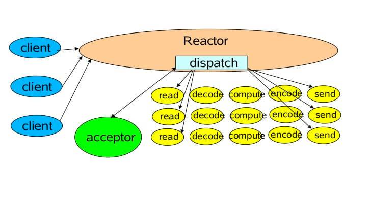
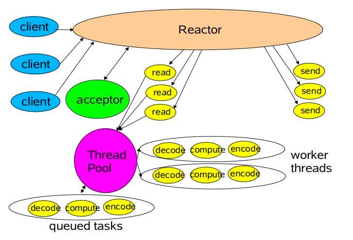
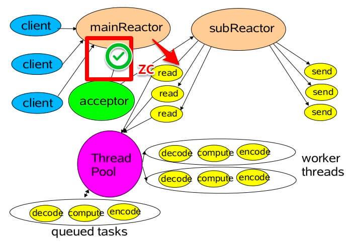
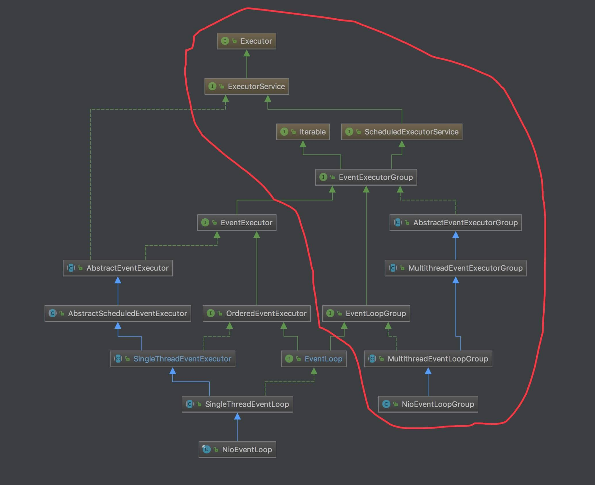
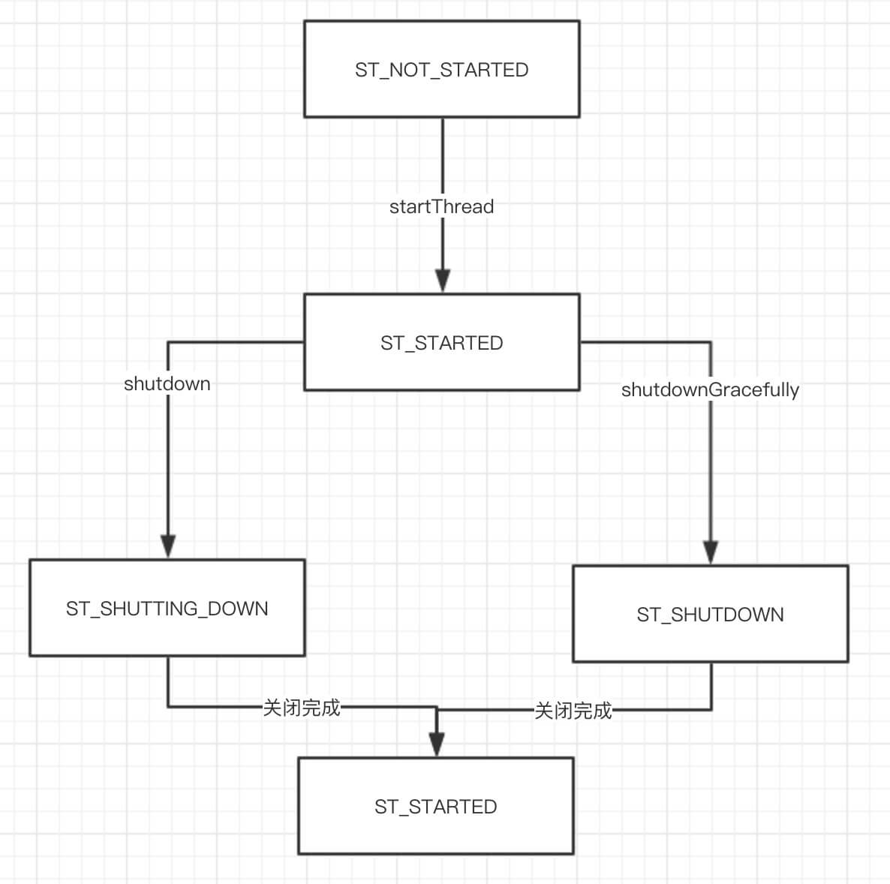
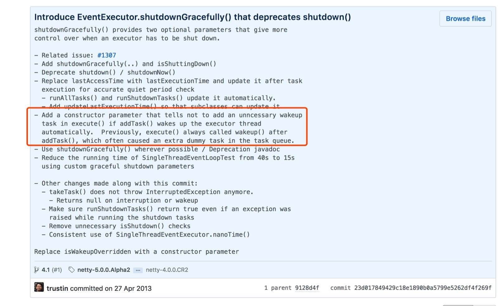
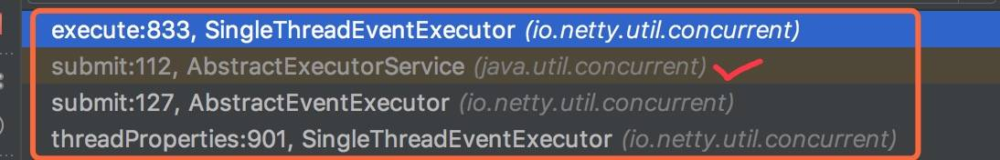
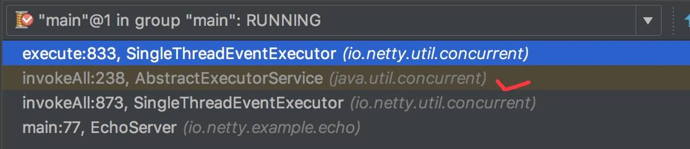
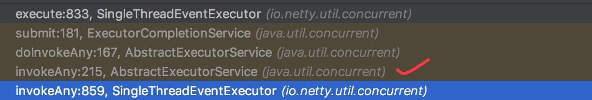
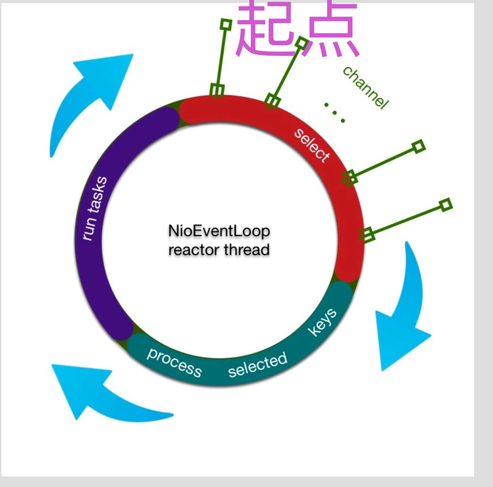

## EventLoop（一）之 Reactor 模型

### 1. 概述

从本文开始，我们来分享 Netty 非常重要的一个组件 EventLoop 。在看 EventLoop 的具体实现之前，我们先来对 Reactor 模型做个简单的了解。

为什么要了解 Reactor 模型呢？因为 EventLoop 是 Netty 基于 Reactor 模型的思想进行实现。所以理解 Reactor 模型，对于我们理解 EventLoop 会有很大帮助。

我们来看看 Reactor 模型的**核心思想**：

> 将关注的 I/O 事件注册到多路复用器上，一旦有 I/O 事件触发，将事件分发到事件处理器中，执行就绪 I/O 事件对应的处理函数中。模型中有三个重要的组件：
>
> - 多路复用器：由操作系统提供接口，Linux 提供的 I/O 复用接口有select、poll、epoll 。
> - 事件分离器：将多路复用器返回的就绪事件分发到事件处理器中。
> - 事件处理器：处理就绪事件处理函数。

初步一看，Java NIO 符合 Reactor 模型啊？因为 Reactor 有 3 种模型实现：

1. 单 Reactor 单线程模型
2. 单 Reactor 多线程模型
3. 多 Reactor 多线程模型

> 😈 由于老艿艿不擅长相对理论文章的内容编写，所以 [「2.」](http://svip.iocoder.cn/Netty/EventLoop-1-Reactor-Model/#)、[「3.」](http://svip.iocoder.cn/Netty/EventLoop-1-Reactor-Model/#)、[「4.」](http://svip.iocoder.cn/Netty/EventLoop-1-Reactor-Model/#) 小节的内容，我决定一本正经的引用基友 wier 的 [《【NIO 系列】—— 之Reactor 模型》](https://my.oschina.net/u/1859679/blog/1844109) 。

### 2. 单 Reactor 单线程模型

示例图如下：




> 老艿艿：示例代码主要表达大体逻辑，比较奔放。所以，胖友理解大体意思就好。

Reactor 示例代码如下：

```java
/**
* 等待事件到来，分发事件处理
*/
class Reactor implements Runnable {

  private Reactor() throws Exception {
      SelectionKey sk = serverSocket.register(selector, SelectionKey.OP_ACCEPT);
      // attach Acceptor 处理新连接
      sk.attach(new Acceptor());
  }

  @Override
  public void run() {
      try {
          while (!Thread.interrupted()) {
              selector.select();
              Set selected = selector.selectedKeys();
              Iterator it = selected.iterator();
              while (it.hasNext()) {
                  it.remove();
                  //分发事件处理
                  dispatch((SelectionKey) (it.next()));
              }
          }
      } catch (IOException ex) {
          //do something
      }
  }

  void dispatch(SelectionKey k) {
      // 若是连接事件获取是acceptor
      // 若是IO读写事件获取是handler
      Runnable runnable = (Runnable) (k.attachment());
      if (runnable != null) {
          runnable.run();
      }
  }

}
```

> 老艿艿：示例的 Handler 的代码实现应该是漏了。胖友脑补一个实现 Runnable 接口的 Handler 类。😈

这是最基础的单 Reactor 单线程模型。

Reactor 线程，负责多路分离套接字。

- 有新连接到来触发 `OP_ACCEPT` 事件之后， 交由 Acceptor 进行处理。
- 有 IO 读写事件之后，交给 Handler 处理。

Acceptor 主要任务是构造 Handler 。

- 在获取到 Client 相关的 SocketChannel 之后，绑定到相应的 Handler 上。
- 对应的 SocketChannel 有读写事件之后，基于 Reactor 分发，Handler 就可以处理了。

**注意，所有的 IO 事件都绑定到 Selector 上，由 Reactor 统一分发**。

------

该模型适用于处理器链中业务处理组件能快速完成的场景。不过，这种单线程模型不能充分利用多核资源，**所以实际使用的不多**。

### 3. 单 Reactor 多线程模型

示例图如下：



相对于第一种单线程的模式来说，在处理业务逻辑，也就是获取到 IO 的读写事件之后，交由线程池来处理，这样可以减小主 Reactor 的性能开销，从而更专注的做事件分发工作了，从而提升整个应用的吞吐。

MultiThreadHandler 示例代码如下：

```java
/**
* 多线程处理读写业务逻辑
*/
class MultiThreadHandler implements Runnable {
  public static final int READING = 0, WRITING = 1;
  int state;
  final SocketChannel socket;
  final SelectionKey sk;

  //多线程处理业务逻辑
  ExecutorService executorService = Executors.newFixedThreadPool(Runtime.getRuntime().availableProcessors());


  public MultiThreadHandler(SocketChannel socket, Selector sl) throws Exception {
      this.state = READING;
      this.socket = socket;
      sk = socket.register(selector, SelectionKey.OP_READ);
      sk.attach(this);
      socket.configureBlocking(false);
  }

  @Override
  public void run() {
      if (state == READING) {
          read();
      } else if (state == WRITING) {
          write();
      }
  }

  private void read() {
      //任务异步处理
      executorService.submit(() -> process());

      //下一步处理写事件
      sk.interestOps(SelectionKey.OP_WRITE);
      this.state = WRITING;
  }

  private void write() {
      //任务异步处理
      executorService.submit(() -> process());

      //下一步处理读事件
      sk.interestOps(SelectionKey.OP_READ);
      this.state = READING;
  }

  /**
    * task 业务处理
    */
  public void process() {
      //do IO ,task,queue something
  }
}
```

- 在 `#read()` 和 `#write()` 方法中，提交 `executorService` 线程池，进行处理。

### 4. 多 Reactor 多线程模型

示例图如下：




第三种模型比起第二种模型，是将 Reactor 分成两部分：

1. mainReactor 负责监听 ServerSocketChannel ，用来处理客户端新连接的建立，并将建立的客户端的 SocketChannel 指定注册给 subReactor 。
2. subReactor 维护自己的 Selector ，基于 mainReactor 建立的客户端的 SocketChannel 多路分离 IO 读写事件，读写网络数据。对于业务处理的功能，另外扔给 worker 线程池来完成。

MultiWorkThreadAcceptor 示例代码如下：

```java
/**
* 多work 连接事件Acceptor,处理连接事件
*/
class MultiWorkThreadAcceptor implements Runnable {

  // cpu线程数相同多work线程
  int workCount = Runtime.getRuntime().availableProcessors();
  SubReactor[] workThreadHandlers = new SubReactor[workCount];
  volatile int nextHandler = 0;

  public MultiWorkThreadAcceptor() {
      this.init();
  }

  public void init() {
      nextHandler = 0;
      for (int i = 0; i < workThreadHandlers.length; i++) {
          try {
              workThreadHandlers[i] = new SubReactor();
          } catch (Exception e) {
          }
      }
  }

  @Override
  public void run() {
      try {
          SocketChannel c = serverSocket.accept();
          if (c != null) {// 注册读写
              synchronized (c) {
                  // 顺序获取SubReactor，然后注册channel 
                  SubReactor work = workThreadHandlers[nextHandler];
                  work.registerChannel(c);
                  nextHandler++;
                  if (nextHandler >= workThreadHandlers.length) {
                      nextHandler = 0;
                  }
              }
          }
      } catch (Exception e) {
      }
  }
}
```

SubReactor 示例代码如下：

```java
/**
* 多work线程处理读写业务逻辑
*/
class SubReactor implements Runnable {
  final Selector mySelector;

  //多线程处理业务逻辑
  int workCount =Runtime.getRuntime().availableProcessors();
  ExecutorService executorService = Executors.newFixedThreadPool(workCount);


  public SubReactor() throws Exception {
      // 每个SubReactor 一个selector 
      this.mySelector = SelectorProvider.provider().openSelector();
  }

  /**
    * 注册chanel
    *
    * @param sc
    * @throws Exception
    */
  public void registerChannel(SocketChannel sc) throws Exception {
      sc.register(mySelector, SelectionKey.OP_READ | SelectionKey.OP_CONNECT);
  }

  @Override
  public void run() {
      while (true) {
          try {
          //每个SubReactor 自己做事件分派处理读写事件
              selector.select();
              Set<SelectionKey> keys = selector.selectedKeys();
              Iterator<SelectionKey> iterator = keys.iterator();
              while (iterator.hasNext()) {
                  SelectionKey key = iterator.next();
                  iterator.remove();
                  if (key.isReadable()) {
                      read();
                  } else if (key.isWritable()) {
                      write();
                  }
              }

          } catch (Exception e) {

          }
      }
  }

  private void read() {
      //任务异步处理
      executorService.submit(() -> process());
  }

  private void write() {
      //任务异步处理
      executorService.submit(() -> process());
  }

  /**
    * task 业务处理
    */
  public void process() {
      //do IO ,task,queue something
  }
}
```

从代码中，我们可以看到：

1. mainReactor 主要用来处理网络 IO 连接建立操作，通常，mainReactor 只需要一个，因为它一个线程就可以处理。
2. subReactor 主要和建立起来的客户端的 SocketChannel 做数据交互和事件业务处理操作。通常，subReactor 的个数和 CPU 个数**相等**，每个 subReactor **独占**一个线程来处理。

------

此种模式中，每个模块的工作更加专一，耦合度更低，性能和稳定性也大大的提升，支持的可并发客户端数量可达到上百万级别。

> 老艿艿：一般来说，是达到数十万级别。

关于此种模式的应用，目前有很多优秀的框架已经在应用，比如 Mina 和 Netty 等等。**上述中去掉线程池的第三种形式的变种，也是 Netty NIO 的默认模式**。

### 5. Netty NIO 客户端

我们来看看 Netty NIO 客户端的示例代码中，和 EventLoop 相关的代码：

```java
// 创建一个 EventLoopGroup 对象
EventLoopGroup group = new NioEventLoopGroup();
// 创建 Bootstrap 对象
Bootstrap b = new Bootstrap();
// 设置使用的 EventLoopGroup
b.group(group);
```

- 对于 Netty NIO 客户端来说，仅创建一个 EventLoopGroup 。
- 一个 EventLoop 可以对应一个 Reactor 。因为 EventLoopGroup 是 EventLoop 的分组，所以对等理解，EventLoopGroup 是**一种** Reactor 的分组。
- 一个 Bootstrap 的启动，只能发起对一个远程的地址。所以只会使用一个 NIO Selector ，也就是说仅使用**一个** Reactor 。即使，我们在声明使用一个 EventLoopGroup ，该 EventLoopGroup 也只会分配一个 EventLoop 对 IO 事件进行处理。
- 因为 Reactor 模型主要使用服务端的开发中，如果套用在 Netty NIO 客户端中，到底使用了哪一种模式呢？
  - 如果只有一个业务线程使用 Netty NIO 客户端，那么可以认为是【单 Reactor **单**线程模型】。
  - 如果有**多个**业务线程使用 Netty NIO 客户端，那么可以认为是【单 Reactor **多**线程模型】。
- 那么 Netty NIO 客户端是否能够使用【多 Reactor 多线程模型】呢？😈 创建多个 Netty NIO 客户端，连接同一个服务端。那么多个 Netty 客户端就可以认为符合多 Reactor 多线程模型了。
  - 一般情况下，我们不会这么干。
  - 当然，实际也有这样的示例。例如 Dubbo 或 Motan 这两个 RPC 框架，支持通过配置，同一个 Consumer 对同一个 Provider 实例同时建立多个客户端连接。

### 6. Netty NIO 服务端

我们来看看 Netty NIO 服务端的示例代码中，和 EventLoop 相关的代码：

```java
// 创建两个 EventLoopGroup 对象
EventLoopGroup bossGroup = new NioEventLoopGroup(1); // 创建 boss 线程组 用于服务端接受客户端的连接
EventLoopGroup workerGroup = new NioEventLoopGroup(); // 创建 worker 线程组 用于进行 SocketChannel 的数据读写
// 创建 ServerBootstrap 对象
ServerBootstrap b = new ServerBootstrap();
// 设置使用的 EventLoopGroup
b.group(bossGroup, workerGroup);
```

- 对于 Netty NIO 服务端来说，创建两个 EventLoopGroup 。
  - `bossGroup` 对应 Reactor 模式的 mainReactor ，用于服务端接受客户端的连接。比较特殊的是，传入了方法参数 `nThreads = 1` ，表示只使用一个 EventLoop ，即只使用一个 Reactor 。这个也符合我们上面提到的，“*通常，mainReactor 只需要一个，因为它一个线程就可以处理*”。
  - `workerGroup` 对应 Reactor 模式的 subReactor ，用于进行 SocketChannel 的数据读写。对于 EventLoopGroup ，如果未传递方法参数 `nThreads` ，表示使用 CPU 个数 Reactor 。这个也符合我们上面提到的，“*通常，subReactor 的个数和 CPU 个数相等，每个 subReactor 独占一个线程来处理*”。
- 因为使用两个 EventLoopGroup ，所以符合【多 Reactor 多线程模型】的多 Reactor 的要求。实际在使用时，`workerGroup` 在读完数据时，具体的业务逻辑处理，我们会提交到**专门的业务逻辑线程池**，例如在 Dubbo 或 Motan 这两个 RPC 框架中。这样一来，就完全符合【多 Reactor 多线程模型】。
- 那么可能有胖友可能和我有一样的疑问，`bossGroup` 如果配置多个线程，是否可以使用**多个 mainReactor** 呢？我们来分析一波，一个 Netty NIO 服务端**同一时间**，只能 bind 一个端口，那么只能使用一个 Selector 处理客户端连接事件。又因为，Selector 操作是非线程安全的，所以无法在多个 EventLoop ( 多个线程 )中，同时操作。所以这样就导致，即使 `bossGroup` 配置多个线程，实际能够使用的也就是一个线程。
- 那么如果一定一定一定要多个 mainReactor 呢？创建多个 Netty NIO 服务端，并绑定多个端口。

### 666. 彩蛋

如果 Reactor 模式讲解的不够清晰，或者想要更加深入的理解，推荐阅读如下文章：

- wier [《【NIO 系列】—— 之 Reactor 模型》](https://my.oschina.net/u/1859679/blog/1844109)
- 永顺 [《Netty 源码分析之 三 我就是大名鼎鼎的 EventLoop(一)》](https://segmentfault.com/a/1190000007403873) 里面有几个图不错。
- Essviv [《Reactor 模型》](https://essviv.github.io/2017/01/25/IO/netty/reactor模型/) 里面的代码示例不错。
- xieshuang [《异步网络模型》](https://tech.youzan.com/yi-bu-wang-luo-mo-xing/) 内容很高端，一看就是高玩。

另外，还有一个经典的 Proactor 模型，因为 Netty 并未实现，所以笔者就省略了。如果感兴趣的胖友，可以自行 Google 理解下。

## EventLoop（二）之 EventLoopGroup

### 1. 概述

在 [《精尽 Netty 源码分析 —— Netty 简介（二）之核心组件》](http://svip.iocoder.cn/Netty/intro-2/?self) 中，对 EventLoopGroup 和 EventLoop 做了定义，我们再来回顾下：

> - Channel 为Netty 网络操作抽象类，EventLoop 负责处理注册到其上的 Channel 处理 I/O 操作，两者配合参与 I/O 操作。
> - EventLoopGroup 是一个 EventLoop 的分组，它可以获取到一个或者多个 EventLoop 对象，因此它提供了迭代出 EventLoop 对象的方法。

在 [《精尽 Netty 源码分析 —— 启动》](http://svip.iocoder.cn/Netty/EventLoop-2-EventLoopGroup/#) 中，我们特别熟悉的一段代码就是：

- `new NioEventLoopGroup()` ，创建一个 EventLoopGroup 对象。
- `EventLoopGroup#register(Channel channel)` ，将 Channel 注册到 EventLoopGroup 上。

那么，本文我们分享 EventLoopGroup 的具体代码实现，来一探究竟。

### 2. 类结构图

EventLoopGroup 的整体类结构如下图：




- 红框部分，为 EventLoopGroup 相关的类关系。其他部分，为 EventLoop 相关的类关系。
- 因为我们实际上使用的是 **NioEventLoopGroup** 和 NioEventLoop ，所以笔者省略了其它相关的类，例如 OioEventLoopGroup、EmbeddedEventLoop 等等。

下面，我们逐层看看每个接口和类的实现代码。

### 3. EventExecutorGroup

`io.netty.util.concurrent.EventExecutorGroup` ，实现 Iterable、ScheduledExecutorService 接口，EventExecutor ( 事件执行器 )的分组接口。代码如下：

```java
// ========== 自定义接口 ==========

boolean isShuttingDown();

// 优雅关闭
Future<?> shutdownGracefully();
Future<?> shutdownGracefully(long quietPeriod, long timeout, TimeUnit unit);

Future<?> terminationFuture();

// 选择一个 EventExecutor 对象
EventExecutor next(); 

// ========== 实现自 Iterable 接口 ==========

@Override
Iterator<EventExecutor> iterator();

// ========== 实现自 ExecutorService 接口 ==========

@Override
Future<?> submit(Runnable task);
@Override
<T> Future<T> submit(Runnable task, T result);
@Override
<T> Future<T> submit(Callable<T> task);

@Override
@Deprecated
void shutdown();
@Override
@Deprecated
List<Runnable> shutdownNow();

// ========== 实现自 ScheduledExecutorService 接口 ==========

@Override
ScheduledFuture<?> schedule(Runnable command, long delay, TimeUnit unit);
@Override
<V> ScheduledFuture<V> schedule(Callable<V> callable, long delay, TimeUnit unit);
@Override
ScheduledFuture<?> scheduleAtFixedRate(Runnable command, long initialDelay, long period, TimeUnit unit);
@Override
ScheduledFuture<?> scheduleWithFixedDelay(Runnable command, long initialDelay, long delay, TimeUnit unit);
```

- 每个接口的方法的意思比较好理解，笔者就不一一赘述了。
- 比较特殊的是，接口方法返回类型为 Future 不是 Java 原生的 `java.util.concurrent.Future` ，而是 Netty 自己实现的 Future 接口。详细解析，见后续文章。
- EventExecutorGroup 自身不执行任务，而是将任务 `#submit(...)` 或 `#schedule(...)` 给自己管理的 EventExecutor 的分组。至于提交给哪一个 EventExecutor ，一般是通过 `#next()` 方法，选择一个 EventExecutor 。

### 4. AbstractEventExecutorGroup

`io.netty.util.concurrent.AbstractEventExecutorGroup` ，实现 EventExecutorGroup 接口，EventExecutor ( 事件执行器 )的分组抽象类。

#### 4.1 submit

`#submit(...)` 方法，提交**一个**普通任务到 EventExecutor 中。代码如下：

```java
@Override
public Future<?> submit(Runnable task) {
    return next().submit(task);
}

@Override
public <T> Future<T> submit(Runnable task, T result) {
    return next().submit(task, result);
}

@Override
public <T> Future<T> submit(Callable<T> task) {
    return next().submit(task);
}
```

- 提交的 EventExecutor ，通过 `#next()` 方法选择。

#### 4.2 schedule

`#schedule(...)` 方法，提交**一个**定时任务到 EventExecutor 中。代码如下：

```java
@Override
public ScheduledFuture<?> schedule(Runnable command, long delay, TimeUnit unit) {
    return next().schedule(command, delay, unit);
}

@Override
public <V> ScheduledFuture<V> schedule(Callable<V> callable, long delay, TimeUnit unit) {
    return next().schedule(callable, delay, unit);
}

@Override
public ScheduledFuture<?> scheduleAtFixedRate(Runnable command, long initialDelay, long period, TimeUnit unit) {
    return next().scheduleAtFixedRate(command, initialDelay, period, unit);
}

@Override
public ScheduledFuture<?> scheduleWithFixedDelay(Runnable command, long initialDelay, long delay, TimeUnit unit) {
    return next().scheduleWithFixedDelay(command, initialDelay, delay, unit);
}
```

- 提交的 EventExecutor ，通过 `#next()` 方法选择。

#### 4.3 execute

`#execute(...)` 方法，在 EventExecutor 中执行**一个**普通任务。代码如下：

```java
@Override
public void execute(Runnable command) {
    next().execute(command);
}
```

- 执行的 EventExecutor ，通过 `#next()` 方法选择。
- 看起来 `#execute(...)` 和 `#submit(...)` 方法有几分相似，具体的差异，由 EventExecutor 的实现决定。

#### 4.4 invokeAll

`#invokeAll(...)` 方法，在 EventExecutor 中执行**多个**普通任务。代码如下：

```java
@Override
public <T> List<java.util.concurrent.Future<T>> invokeAll(Collection<? extends Callable<T>> tasks) throws InterruptedException {
    return next().invokeAll(tasks);
}

@Override
public <T> List<java.util.concurrent.Future<T>> invokeAll(Collection<? extends Callable<T>> tasks, long timeout, TimeUnit unit) throws InterruptedException {
    return next().invokeAll(tasks, timeout, unit);
}
```

- 执行的 EventExecutor ，通过 `#next()` 方法选择。并且，多个任务使用同一个 EventExecutor 。

#### 4.5 invokeAny

`#invokeAll(...)` 方法，在 EventExecutor 中执行**多个**普通任务，有**一个**执行完成即可。代码如下：

```java
@Override
public <T> T invokeAny(Collection<? extends Callable<T>> tasks) throws InterruptedException, ExecutionException {
    return next().invokeAny(tasks);
}

@Override
public <T> T invokeAny(Collection<? extends Callable<T>> tasks, long timeout, TimeUnit unit) throws InterruptedException, ExecutionException, TimeoutException {
    return next().invokeAny(tasks, timeout, unit);
}
```

- 执行的 EventExecutor ，通过 `#next()` 方法选择。并且，多个任务使用同一个 EventExecutor 。

#### 4.6 shutdown

`#shutdown(...)` 方法，关闭 EventExecutorGroup 。代码如下：

```java
@Override
public Future<?> shutdownGracefully() {
    return shutdownGracefully(DEFAULT_SHUTDOWN_QUIET_PERIOD /* 2 */, DEFAULT_SHUTDOWN_TIMEOUT /* 15 */, TimeUnit.SECONDS);
}

@Override
@Deprecated
public List<Runnable> shutdownNow() {
    shutdown();
    return Collections.emptyList();
}

@Override
@Deprecated
public abstract void shutdown();
```

- 具体的 `#shutdownGracefully(long quietPeriod, long timeout, TimeUnit unit)` 和 `#shutdown()` 方法，由子类实现。

### 5. MultithreadEventExecutorGroup

`io.netty.util.concurrent.MultithreadEventExecutorGroup` ，继承 AbstractEventExecutorGroup 抽象类，**基于多线程**的 EventExecutor ( 事件执行器 )的分组抽象类。

#### 5.1 构造方法

```java
/**
 * EventExecutor 数组
 */
private final EventExecutor[] children;
/**
 * 不可变( 只读 )的 EventExecutor 数组
 *
 * @see #MultithreadEventExecutorGroup(int, Executor, EventExecutorChooserFactory, Object...)
 */
private final Set<EventExecutor> readonlyChildren;
/**
 * 已终止的 EventExecutor 数量
 */
private final AtomicInteger terminatedChildren = new AtomicInteger();
/**
 * 用于终止 EventExecutor 的异步 Future
 */
private final Promise<?> terminationFuture = new DefaultPromise(GlobalEventExecutor.INSTANCE);
/**
 * EventExecutor 选择器
 */
private final EventExecutorChooserFactory.EventExecutorChooser chooser;

protected MultithreadEventExecutorGroup(int nThreads, ThreadFactory threadFactory, Object... args) {
    this(nThreads, threadFactory == null ? null : new ThreadPerTaskExecutor(threadFactory), args);
}

protected MultithreadEventExecutorGroup(int nThreads, Executor executor, Object... args) {
    this(nThreads, executor, DefaultEventExecutorChooserFactory.INSTANCE, args);
}

  1: protected MultithreadEventExecutorGroup(int nThreads, Executor executor, EventExecutorChooserFactory chooserFactory, Object... args) {
  2:     if (nThreads <= 0) {
  3:         throw new IllegalArgumentException(String.format("nThreads: %d (expected: > 0)", nThreads));
  4:     }
  5: 
  6:     // 创建执行器
  7:     if (executor == null) {
  8:         executor = new ThreadPerTaskExecutor(newDefaultThreadFactory());
  9:     }
 10: 
 11:     // 创建 EventExecutor 数组
 12:     children = new EventExecutor[nThreads];
 13: 
 14:     for (int i = 0; i < nThreads; i ++) {
 15:         boolean success = false; // 是否创建成功
 16:         try {
 17:             // 创建 EventExecutor 对象
 18:             children[i] = newChild(executor, args);
 19:             // 标记创建成功
 20:             success = true;
 21:         } catch (Exception e) {
 22:             // 创建失败，抛出 IllegalStateException 异常
 23:             // TODO: Think about if this is a good exception type
 24:             throw new IllegalStateException("failed to create a child event loop", e);
 25:         } finally {
 26:             // 创建失败，关闭所有已创建的 EventExecutor
 27:             if (!success) {
 28:                 // 关闭所有已创建的 EventExecutor
 29:                 for (int j = 0; j < i; j ++) {
 30:                     children[j].shutdownGracefully();
 31:                 }
 32:                 // 确保所有已创建的 EventExecutor 已关闭
 33:                 for (int j = 0; j < i; j ++) {
 34:                     EventExecutor e = children[j];
 35:                     try {
 36:                         while (!e.isTerminated()) {
 37:                             e.awaitTermination(Integer.MAX_VALUE, TimeUnit.SECONDS);
 38:                         }
 39:                     } catch (InterruptedException interrupted) {
 40:                         // Let the caller handle the interruption.
 41:                         Thread.currentThread().interrupt();
 42:                         break;
 43:                     }
 44:                 }
 45:             }
 46:         }
 47:     }
 48: 
 49:     // 创建 EventExecutor 选择器
 50:     chooser = chooserFactory.newChooser(children);
 51: 
 52:     // 创建监听器，用于 EventExecutor 终止时的监听
 53:     final FutureListener<Object> terminationListener = new FutureListener<Object>() {
 54: 
 55:         @Override
 56:         public void operationComplete(Future<Object> future) throws Exception {
 57:             if (terminatedChildren.incrementAndGet() == children.length) { // 全部关闭
 58:                 terminationFuture.setSuccess(null); // 设置结果，并通知监听器们。
 59:             }
 60:         }
 61: 
 62:     };
 63:     // 设置监听器到每个 EventExecutor 上
 64:     for (EventExecutor e: children) {
 65:         e.terminationFuture().addListener(terminationListener);
 66:     }
 67: 
 68:     // 创建不可变( 只读 )的 EventExecutor 数组
 69:     Set<EventExecutor> childrenSet = new LinkedHashSet<EventExecutor>(children.length);
 70:     Collections.addAll(childrenSet, children);
 71:     readonlyChildren = Collections.unmodifiableSet(childrenSet);
 72: }
```

- 每个属性的定义，胖友直接看代码注释。
- 方法参数`executor`，执行器。详细解析，见「5.2 ThreadPerTaskExecutor」
  - 第 6 至 9 行：若 `executor` 为空，则创建执行器。
- 第 12 行：创建 EventExecutor 数组。
  - 第 18 行：调用 `#newChild(Executor executor, Object... args)` 方法，创建 EventExecutor 对象，然后设置到数组中。
  - 第 21 至 24 行：创建失败，抛出 IllegalStateException 异常。
  - 第 25 至 45 行：创建失败，关闭所有已创建的 EventExecutor 。
- 第 50 行：调用 `EventExecutorChooserFactory#newChooser(EventExecutor[] executors)` 方法，创建 EventExecutor 选择器。详细解析，见 [「5.3 EventExecutorChooserFactory」](http://svip.iocoder.cn/Netty/EventLoop-2-EventLoopGroup/#) 。
- 第 52 至 62 行：创建监听器，用于 EventExecutor 终止时的监听。
  - 第 55 至 60 行：回调的具体逻辑是，当所有 EventExecutor 都终止完成时，通过调用 `Future#setSuccess(V result)` 方法，通知监听器们。至于为什么设置的值是 `null` ，因为监听器们不关注具体的结果。
  - 第 63 至 66 行：设置监听器到每个 EventExecutor 上。
- 第 68 至 71 行：创建不可变( 只读 )的 EventExecutor 数组。

#### 5.2 ThreadPerTaskExecutor

`io.netty.util.concurrent.ThreadPerTaskExecutor` ，实现 Executor 接口，每个任务一个线程的执行器实现类。代码如下：

```java
public final class ThreadPerTaskExecutor implements Executor {

    /**
     * 线程工厂对象
     */
    private final ThreadFactory threadFactory;

    public ThreadPerTaskExecutor(ThreadFactory threadFactory) {
        if (threadFactory == null) {
            throw new NullPointerException("threadFactory");
        }
        this.threadFactory = threadFactory;
    }

    /**
     * 执行任务
     *
     * @param command 任务
     */
    @Override
    public void execute(Runnable command) {
        threadFactory.newThread(command).start();
    }

}
```

- `threadFactory` 属性，线程工厂对象。Netty 实现自定义的 ThreadFactory 类，为 `io.netty.util.concurrent.DefaultThreadFactory` 。关于 DefaultThreadFactory 比较简单，胖友可以自己看看。
- `#execute(Runnable command)` 方法，通过 `ThreadFactory#newThread(Runnable)` 方法，创建一个 Thread ，然后调用 `Thread#start()` 方法，**启动线程执行任务**。

#### 5.3 EventExecutorChooserFactory

`io.netty.util.concurrent.EventExecutorChooserFactory` ，EventExecutorChooser 工厂接口。代码如下：

```java
public interface EventExecutorChooserFactory {

    /**
     * 创建一个 EventExecutorChooser 对象
     *
     * Returns a new {@link EventExecutorChooser}.
     */
    EventExecutorChooser newChooser(EventExecutor[] executors);

    /**
     *  EventExecutor 选择器接口
     *
     * Chooses the next {@link EventExecutor} to use.
     */
    @UnstableApi
    interface EventExecutorChooser {

        /**
         * 选择下一个 EventExecutor 对象
         *
         * Returns the new {@link EventExecutor} to use.
         */
        EventExecutor next();

    }

}
```

- `#newChooser(EventExecutor[] executors)` 方法，创建一个 EventExecutorChooser 对象。
- EventExecutorChooser 接口，EventExecutor 选择器接口。
  - `#next()` 方法，选择下一个 EventExecutor 对象。

##### 5.3.1 DefaultEventExecutorChooserFactory

`io.netty.util.concurrent.DefaultEventExecutorChooserFactory` ，实现 EventExecutorChooserFactory 接口，默认 EventExecutorChooser 工厂实现类。代码如下

```java
/**
 * 单例
 */
public static final DefaultEventExecutorChooserFactory INSTANCE = new DefaultEventExecutorChooserFactory();

private DefaultEventExecutorChooserFactory() { }

@SuppressWarnings("unchecked")
@Override
public EventExecutorChooser newChooser(EventExecutor[] executors) {
    if (isPowerOfTwo(executors.length)) { // 是否为 2 的幂次方
        return new PowerOfTwoEventExecutorChooser(executors);
    } else {
        return new GenericEventExecutorChooser(executors);
    }
}

private static boolean isPowerOfTwo(int val) {
    return (val & -val) == val;
}
```

- `INSTANCE` **静态**属性，单例。`#newChooser(EventExecutor[] executors)`方法，调用`#isPowerOfTwo(int val)`方法，判断 EventExecutor 数组的大小是否为 2 的幂次方。

  - 若是，创建 PowerOfTwoEventExecutorChooser 对象。详细解析，见 [「5.3.3 PowerOfTwoEventExecutorChooser」](http://svip.iocoder.cn/Netty/EventLoop-2-EventLoopGroup/#) 。
  - 若否，创建 GenericEventExecutorChooser 对象。详细解析，见 [「5.3.2 GenericEventExecutorChooser」](http://svip.iocoder.cn/Netty/EventLoop-2-EventLoopGroup/#) 。

- `#isPowerOfTwo(int val)`方法，为什么`(val & -val) == val`

  可以判断数字是否为 2 的幂次方呢？

  - 我们以 8 来举个例子。
    - 8 的二进制为 `1000` 。
    - -8 的二进制使用补码表示。所以，先求反生成反码为 `0111` ，然后加一生成补码为 `1000` 。
    - 8 和 -8 并操作后，还是 8 。
    - 实际上，以 2 为幂次方的数字，都是最高位为 1 ，剩余位为 0 ，所以对应的负数，求完补码还是自己。
  - 胖友也可以自己试试非 2 的幂次方数字的效果。

##### 5.3.2 GenericEventExecutorChooser

GenericEventExecutorChooser 实现 EventExecutorChooser 接口，通用的 EventExecutor 选择器实现类。代码如下：

> GenericEventExecutorChooser 内嵌在 DefaultEventExecutorChooserFactory 类中。

```java
private static final class GenericEventExecutorChooser implements EventExecutorChooser {

    /**
     * 自增序列
     */
    private final AtomicInteger idx = new AtomicInteger();
    /**
     * EventExecutor 数组
     */
    private final EventExecutor[] executors;

    GenericEventExecutorChooser(EventExecutor[] executors) {
        this.executors = executors;
    }

    @Override
    public EventExecutor next() {
        return executors[Math.abs(idx.getAndIncrement() % executors.length)];
    }

}
```

- 实现比较**简单**，使用 `idx` 自增，并使用 EventExecutor 数组的大小来取余。

##### 5.3.3 PowerOfTwoEventExecutorChooser

PowerOfTwoEventExecutorChooser 实现 EventExecutorChooser 接口，基于 EventExecutor 数组的大小为 2 的幂次方的 EventExecutor 选择器实现类。这是一个优化的实现，代码如下：

> PowerOfTwoEventExecutorChooser 内嵌在 DefaultEventExecutorChooserFactory 类中。

```java
private static final class PowerOfTwoEventExecutorChooser implements EventExecutorChooser {

    /**
     * 自增序列
     */
    private final AtomicInteger idx = new AtomicInteger();
    /**
     * EventExecutor 数组
     */
    private final EventExecutor[] executors;

    PowerOfTwoEventExecutorChooser(EventExecutor[] executors) {
        this.executors = executors;
    }

    @Override
    public EventExecutor next() {
        return executors[idx.getAndIncrement() & executors.length - 1];
    }

}
```

- 实现比较巧妙，通过`idx`自增，并使用【EventExecutor 数组的大小 - 1】进行进行`&`并操作。
  - 因为 `-` ( 二元操作符 ) 的计算优先级高于 `&` ( 一元操作符 ) 。
  - 因为 EventExecutor 数组的大小是以 2 为幂次方的数字，那么减一后，除了最高位是 0 ，剩余位都为 1 ( 例如 8 减一后等于 7 ，而 7 的二进制为 0111 。)，那么无论 `idx` 无论如何递增，再进行 `&` 并操作，都不会超过 EventExecutor 数组的大小。并且，还能保证顺序递增。

#### 5.4 newDefaultThreadFactory

`#newDefaultThreadFactory()` 方法，创建线程工厂对象。代码如下：

```java
protected ThreadFactory newDefaultThreadFactory() {
    return new DefaultThreadFactory(getClass());
}
```

- 创建的对象为 DefaultThreadFactory ，并且使用类名作为 `poolType` 。

#### 5.5 next

`#next()` 方法，选择下一个 EventExecutor 对象。代码如下：

```java
@Override
public EventExecutor next() {
    return chooser.next();
}
```

#### 5.6 iterator

`#iterator()` 方法，获得 EventExecutor 数组的迭代器。代码如下：

```java
@Override
public Iterator<EventExecutor> iterator() {
    return readonlyChildren.iterator();
}
```

- 为了避免调用方，获得迭代器后，对 EventExecutor 数组进行修改，所以返回是**不可变**的 EventExecutor 数组 `readonlyChildren` 的迭代器。

#### 5.7 executorCount

`#executorCount()` 方法，获得 EventExecutor 数组的大小。代码如下：

```java
public final int executorCount() {
    return children.length;
}
```

#### 5.8 newChild

`#newChild(Executor executor, Object... args)` **抽象**方法，创建 EventExecutor 对象。代码如下：

```java
protected abstract EventExecutor newChild(Executor executor, Object... args) throws Exception;
```

- 子类实现该方法，创建其对应的 EventExecutor 实现类的对象。

#### 5.9 关闭相关方法

如下是关闭相关的方法，比较简单，胖友自己研究：

- `#terminationFuture()`
- `#shutdownGracefully(long quietPeriod, long timeout, TimeUnit unit)`
- `#shutdown()`
- `#awaitTermination(long timeout, TimeUnit unit)`
- `#isShuttingDown()`
- `#isShutdown()`
- `#isTerminated()`

### 6. EventLoopGroup

`io.netty.channel.EventExecutorGroup` ，继承 EventExecutorGroup 接口，EventLoop 的分组接口。代码如下：

```java
// ========== 自定义接口 ==========

/**
 * Register a {@link Channel} with this {@link EventLoop}. The returned {@link ChannelFuture}
 * will get notified once the registration was complete.
 */
ChannelFuture register(Channel channel);
ChannelFuture register(ChannelPromise promise);
@Deprecated
ChannelFuture register(Channel channel, ChannelPromise promise);

// ========== 实现自 EventExecutorGroup 接口 ==========

@Override
EventLoop next();
```

- `#next()` 方法，选择下一个 EventLoop 对象。
- `#register(...)` 方法，注册 Channel 到 EventLoopGroup 中。实际上，EventLoopGroup 会分配一个 EventLoop 给该 Channel 注册。

### 7. MultithreadEventLoopGroup

`io.netty.channel.MultithreadEventLoopGroup` ，实现 EventLoopGroup 接口，继承 MultithreadEventExecutorGroup 抽象类，**基于多线程**的 EventLoop 的分组抽象类。

#### 7.1 构造方法

```java
/**
 * 默认 EventLoop 线程数
 */
private static final int DEFAULT_EVENT_LOOP_THREADS;

static {
    DEFAULT_EVENT_LOOP_THREADS = Math.max(1, SystemPropertyUtil.getInt("io.netty.eventLoopThreads", NettyRuntime.availableProcessors() * 2));

    if (logger.isDebugEnabled()) {
        logger.debug("-Dio.netty.eventLoopThreads: {}", DEFAULT_EVENT_LOOP_THREADS);
    }
}

protected MultithreadEventLoopGroup(int nThreads, Executor executor, Object... args) {
    super(nThreads == 0 ? DEFAULT_EVENT_LOOP_THREADS : nThreads, executor, args);
}

protected MultithreadEventLoopGroup(int nThreads, ThreadFactory threadFactory, Object... args) {
    super(nThreads == 0 ? DEFAULT_EVENT_LOOP_THREADS : nThreads, threadFactory, args);
}

protected MultithreadEventLoopGroup(int nThreads, Executor executor, EventExecutorChooserFactory chooserFactory, Object... args) {
    super(nThreads == 0 ? DEFAULT_EVENT_LOOP_THREADS : nThreads, executor, chooserFactory, args);
}
```

- ```
  DEFAULT_EVENT_LOOP_THREADS
  ```

   

  属性，EventLoopGroup 默认拥有的 EventLoop 数量。因为一个 EventLoop 对应一个线程，所以为 CPU 数量 * 2 。

  - 为什么会 * 2 呢？因为目前 CPU 基本都是超线程，**一个 CPU 可对应 2 个线程**。
  - 在构造方法未传入 `nThreads` 方法参数时，使用 `DEFAULT_EVENT_LOOP_THREADS` 。

#### 7.2 newDefaultThreadFactory

newDefaultThreadFactory

`#newDefaultThreadFactory()` 方法，创建线程工厂对象。代码如下：

```java
@Override
protected ThreadFactory newDefaultThreadFactory() {
    return new DefaultThreadFactory(getClass(), Thread.MAX_PRIORITY);
}
```

- 覆盖父类方法，增加了线程优先级为 `Thread.MAX_PRIORITY` 。

#### 7.3 next

`#next()` 方法，选择下一个 EventLoop 对象。代码如下：

```java
@Override
public EventLoop next() {
    return (EventLoop) super.next();
}
```

- 覆盖父类方法，将返回值转换成 EventLoop 类。

#### 7.4 newChild

`#newChild(Executor executor, Object... args)` **抽象**方法，创建 EventExecutor 对象。代码如下：

```java
@Override
protected abstract EventLoop newChild(Executor executor, Object... args) throws Exception;
```

- 覆盖父类方法，返回值改为 EventLoop 类。

#### 7.5 register

`#register()` 方法，注册 Channel 到 EventLoopGroup 中。实际上，EventLoopGroup 会分配一个 EventLoop 给该 Channel 注册。代码如下：

```java
@Override
public ChannelFuture register(Channel channel) {
    return next().register(channel);
}

@Override
public ChannelFuture register(ChannelPromise promise) {
    return next().register(promise);
}

@Deprecated
@Override
public ChannelFuture register(Channel channel, ChannelPromise promise) {
    return next().register(channel, promise);
}
```

- Channel 注册的 EventLoop ，通过 `#next()` 方法来选择。

### 8. NioEventLoopGroup

`io.netty.channel.nio.NioEventLoopGroup` ，继承 MultithreadEventLoopGroup 抽象类，NioEventLoop 的分组实现类。

#### 8.1 构造方法

```java
public NioEventLoopGroup() {
    this(0);
}

public NioEventLoopGroup(int nThreads) {
    this(nThreads, (Executor) null);
}

public NioEventLoopGroup(int nThreads, ThreadFactory threadFactory) {
    this(nThreads, threadFactory, SelectorProvider.provider());
}

public NioEventLoopGroup(int nThreads, Executor executor) {
    this(nThreads, executor, SelectorProvider.provider());
}

public NioEventLoopGroup(
        int nThreads, ThreadFactory threadFactory, final SelectorProvider selectorProvider) {
    this(nThreads, threadFactory, selectorProvider, DefaultSelectStrategyFactory.INSTANCE);
}

public NioEventLoopGroup(int nThreads, ThreadFactory threadFactory,
    final SelectorProvider selectorProvider, final SelectStrategyFactory selectStrategyFactory) {
    super(nThreads, threadFactory, selectorProvider, selectStrategyFactory, RejectedExecutionHandlers.reject());
}

public NioEventLoopGroup(int nThreads, Executor executor, final SelectorProvider selectorProvider) {
    this(nThreads, executor, selectorProvider, DefaultSelectStrategyFactory.INSTANCE);
}

public NioEventLoopGroup(int nThreads, Executor executor, final SelectorProvider selectorProvider,
                         final SelectStrategyFactory selectStrategyFactory) {
    super(nThreads, executor, selectorProvider, selectStrategyFactory, RejectedExecutionHandlers.reject());
}

public NioEventLoopGroup(int nThreads, Executor executor, EventExecutorChooserFactory chooserFactory,
                         final SelectorProvider selectorProvider,
                         final SelectStrategyFactory selectStrategyFactory) {
    super(nThreads, executor, chooserFactory, selectorProvider, selectStrategyFactory,
            RejectedExecutionHandlers.reject());
}

public NioEventLoopGroup(int nThreads, Executor executor, EventExecutorChooserFactory chooserFactory,
                         final SelectorProvider selectorProvider,
                         final SelectStrategyFactory selectStrategyFactory,
                         final RejectedExecutionHandler rejectedExecutionHandler) {
    super(nThreads, executor, chooserFactory, selectorProvider, selectStrategyFactory, rejectedExecutionHandler);
}
```

- 构造方法比较多，主要是明确了父构造方法的

   

  ```
  Object ... args
  ```

   

  方法参数：

  - 第一个参数，`selectorProvider` ，`java.nio.channels.spi.SelectorProvider` ，用于创建 Java NIO Selector 对象。
  - 第二个参数，`selectStrategyFactory` ，`io.netty.channel.SelectStrategyFactory` ，选择策略工厂。详细解析，见后续文章。
  - 第三个参数，`rejectedExecutionHandler` ，`io.netty.channel.SelectStrategyFactory` ，拒绝执行处理器。详细解析，见后续文章。

#### 8.2 newChild

`#newChild(Executor executor, Object... args)` 方法，创建 NioEventLoop 对象。代码如下：

```java
@Override
protected EventLoop newChild(Executor executor, Object... args) throws Exception {
    return new NioEventLoop(this, executor,
            (SelectorProvider) args[0], ((SelectStrategyFactory) args[1]).newSelectStrategy(), (RejectedExecutionHandler) args[2]);
}
```

- 通过 `Object... args` 方法参数，传入给 NioEventLoop 创建需要的参数。

#### 8.3 setIoRatio

`#setIoRatio(int ioRatio)` 方法，设置所有 EventLoop 的 IO 任务占用执行时间的比例。代码如下：

```java
/**
 * Sets the percentage of the desired amount of time spent for I/O in the child event loops.  The default value is
 * {@code 50}, which means the event loop will try to spend the same amount of time for I/O as for non-I/O tasks.
 */
public void setIoRatio(int ioRatio) {
    for (EventExecutor e: this) {
        ((NioEventLoop) e).setIoRatio(ioRatio);
    }
}
```

#### 8.4 rebuildSelectors

`#rebuildSelectors()` 方法，重建所有 EventLoop 的 Selector 对象。代码如下：

```java
/**
 * Replaces the current {@link Selector}s of the child event loops with newly created {@link Selector}s to work
 * around the  infamous epoll 100% CPU bug.
 */
public void rebuildSelectors() {
    for (EventExecutor e: this) {
        ((NioEventLoop) e).rebuildSelector();
    }
}
```

- 因为 JDK 有 [epoll 100% CPU Bug](https://www.jianshu.com/p/da4398743b5a) 。实际上，NioEventLoop 当触发该 Bug 时，也会**自动**调用 `NioEventLoop#rebuildSelector()` 方法，进行重建 Selector 对象，以修复该问题。

### 666. 彩蛋

还是比较简单的文章。如果有不清晰的地方，也可以阅读如下文章：

- 永顺 [《Netty 源码分析之 三 我就是大名鼎鼎的 EventLoop(一)》](https://segmentfault.com/a/1190000007403873#articleHeader2) 的 [「NioEventLoopGroup 实例化过程」](http://svip.iocoder.cn/Netty/EventLoop-2-EventLoopGroup/#) 小节。
- Hypercube [《自顶向下深入分析Netty（四）—— EventLoop-1》](https://www.jianshu.com/p/da4398743b5a)

## EventLoop（三）之 EventLoop 初始化

### 1. 概述

本文我们分享 EventLoop 的具体代码实现。因为 EventLoop 涉及的代码量较大，所以笔者会分成好几篇文章分别分享。而本文，我们来分享 EventLoop 的初始化。

但是要将 EventLoop 拆出“初始化”部分的内容，笔者又觉得是件非常困难的事情。所以本文希望能达到如下的效果：

1. 理解 EventLoop 有哪些属性
2. 创建 EventLoop 的过程
3. Channel 注册到 EventLoop 的过程
4. EventLoop 的任务提交。
   - 虽然任务的提交，比较接近任务的执行，但是考虑到胖友可以更容易的理解 EventLoop ，所以放在本文。

### 2. 类结构图

EventLoopGroup 的整体类结构如下图：


- 红框部分，为 EventLoopGroup 相关的类关系。**其他部分，为 EventLoop 相关的类关系**。
- 因为我们实际上使用的是 NioEventLoopGroup 和 **NioEventLoop** ，所以笔者省略了其它相关的类，例如 OioEventLoopGroup、EmbeddedEventLoop 等等。

下面，我们逐层看看每个接口和类的实现代码。

### 3. EventExecutor

`io.netty.util.concurrent.EventExecutor` ，继承 EventExecutorGroup 接口，事件执行器接口。代码如下：

```java
// ========== 实现自 EventExecutorGroup 接口 ==========

/**
 * 返回自己
 *
 * Returns a reference to itself.
 */
@Override
EventExecutor next();

// ========== 自定义接口 ==========

/**
 * 所属 EventExecutorGroup
 *
 * Return the {@link EventExecutorGroup} which is the parent of this {@link EventExecutor},
 */
EventExecutorGroup parent();

/**
 * 当前线程是否在 EventLoop 线程中
 *
 * Calls {@link #inEventLoop(Thread)} with {@link Thread#currentThread()} as argument
 */
boolean inEventLoop();
/**
 * 指定线程是否是 EventLoop 线程
 *
 * Return {@code true} if the given {@link Thread} is executed in the event loop,
 * {@code false} otherwise.
 */
boolean inEventLoop(Thread thread);

/**
 * 创建一个 Promise 对象
 *
 * Return a new {@link Promise}.
 */
<V> Promise<V> newPromise();
/**
 * 创建一个 ProgressivePromise 对象
 *
 * Create a new {@link ProgressivePromise}.
 */
<V> ProgressivePromise<V> newProgressivePromise();
/**
 * 创建成功结果的 Future 对象
 *
 * Create a new {@link Future} which is marked as succeeded already. So {@link Future#isSuccess()}
 * will return {@code true}. All {@link FutureListener} added to it will be notified directly. Also
 * every call of blocking methods will just return without blocking.
 */
<V> Future<V> newSucceededFuture(V result);
/**
 * 创建异常的 Future 对象
 *
 * Create a new {@link Future} which is marked as failed already. So {@link Future#isSuccess()}
 * will return {@code false}. All {@link FutureListener} added to it will be notified directly. Also
 * every call of blocking methods will just return without blocking.
 */
<V> Future<V> newFailedFuture(Throwable cause);
```

- 接口定义的方法比较简单，已经添加中文注释，胖友自己看下。

### 4. OrderedEventExecutor

`io.netty.util.concurrent.OrderedEventExecutor` ，继承 EventExecutor 接口，有序的事件执行器接口。代码如下：

```java
/**
 * Marker interface for {@link EventExecutor}s that will process all submitted tasks in an ordered / serial fashion.
 */
public interface OrderedEventExecutor extends EventExecutor {
}
```

- 没有定义任何方法，仅仅是一个标记接口，表示该执行器会有序 / 串行的方式执行。

### 5. EventLoop

`io.netty.channel.EventLoop` ，继承 OrderedEventExecutor 和 EventLoopGroup 接口，EventLoop 接口。代码如下：

```java
/**
 * Will handle all the I/O operations for a {@link Channel} once registered.
 *
 * One {@link EventLoop} instance will usually handle more than one {@link Channel} but this may depend on
 * implementation details and internals.
 *
 */
public interface EventLoop extends OrderedEventExecutor, EventLoopGroup {

    @Override
    EventLoopGroup parent();

}
```

- `#parent()` 接口方法，覆写方法的返回类型为 EventLoopGroup 。
- 接口上的英文注释，意思如下：
  - EventLoop 将会处理注册在其上的 Channel 的所有 IO 操作。
  - 通常，一个 EventLoop 上可以注册不只一个 Channel 。当然，这个也取决于具体的实现。

### 6. AbstractEventExecutor

`io.netty.util.concurrent.AbstractEventExecutor` ，实现 EventExecutor 接口，继承 AbstractExecutorService 抽象类，EventExecutor 抽象类。

#### 6.1 构造方法

```java
/**
 * 所属 EventExecutorGroup
 */
private final EventExecutorGroup parent;
/**
 * EventExecutor 数组。只包含自己，用于 {@link #iterator()}
 */
private final Collection<EventExecutor> selfCollection = Collections.<EventExecutor>singleton(this);

protected AbstractEventExecutor() {
    this(null);
}

protected AbstractEventExecutor(EventExecutorGroup parent) {
    this.parent = parent;
}
```

#### 6.2 parent

`#parent()` 方法，获得所属 EventExecutorGroup 。代码如下：

```java
@Override
public EventExecutorGroup parent() {
    return parent;
}
```

#### 6.3 next

`#next()` 方法，获得自己。代码如下：

```java
@Override
public EventExecutor next() {
    return this;
}
```

#### 6.4 inEventLoop()

`#inEventLoop()` 方法，判断当前线程是否在 EventLoop 线程中。代码如下：

```java
@Override
public boolean inEventLoop() {
    return inEventLoop(Thread.currentThread());
}
```

- 具体的 `#inEventLoop(Thread thread)` 方法，需要在子类实现。因为 AbstractEventExecutor 类还体现不出它所拥有的线程。

#### 6.5 iterator

`#iterator()` 方法，代码如下：

```java
@Override
public Iterator<EventExecutor> iterator() {
    return selfCollection.iterator();
}
```

#### 6.6 newPromise 和 newProgressivePromise

`#newPromise()` 和 `#newProgressivePromise()` 方法，分别创建 DefaultPromise 和 DefaultProgressivePromise 对象。代码如下：

```java
@Override
public <V> Promise<V> newPromise() {
    return new DefaultPromise<V>(this);
}

@Override
public <V> ProgressivePromise<V> newProgressivePromise() {
    return new DefaultProgressivePromise<V>(this);
}
```

- 我们可以看到，创建的 Promise 对象，都会传入自身作为 EventExecutor 。关于 Promise 相关的，我们在后续文章详细解析。实在想了解，也可以看看 [《Netty 源码笔记 —— 第四章 Future 和 Promise》](https://www.kancloud.cn/ssj234/netty-source/433215) 。

#### 6.7 newSucceededFuture 和 newFailedFuture

`#newSucceededFuture(V result)` 和 `#newFailedFuture(Throwable cause)` 方法，分别创建成功结果和异常的 Future 对象。代码如下：

```java
@Override
public <V> Future<V> newSucceededFuture(V result) {
    return new SucceededFuture<V>(this, result);
}

@Override
public <V> Future<V> newFailedFuture(Throwable cause) {
    return new FailedFuture<V>(this, cause);
}
```

- 创建的 Future 对象，会传入自身作为 EventExecutor ，并传入 `result` 或 `cause` 分别作为成功结果和异常。

#### 6.8 newTaskFor

`#newTaskFor(...)` 方法，创建 PromiseTask 对象。代码如下：

```java
@Override
protected final <T> RunnableFuture<T> newTaskFor(Runnable runnable, T value) {
    return new PromiseTask<T>(this, runnable, value);
}

@Override
protected final <T> RunnableFuture<T> newTaskFor(Callable<T> callable) {
    return new PromiseTask<T>(this, callable);
}
```

- 创建的 PromiseTask 对象，会传入自身作为 EventExecutor ，并传入 Runnable + Value 或 Callable 作为任务( Task )。

#### 6.9 submit

`#submit(...)` 方法，提交任务。代码如下：

```java
@Override
public Future<?> submit(Runnable task) {
    return (Future<?>) super.submit(task);
}

@Override
public <T> Future<T> submit(Runnable task, T result) {
    return (Future<T>) super.submit(task, result);
}

@Override
public <T> Future<T> submit(Callable<T> task) {
    return (Future<T>) super.submit(task);
}
```

- 每个方法的实现上，是调用父类 AbstractExecutorService 的实现。

#### 6.10 schedule

`#schedule(...)` 方法，都不支持，交给子类 AbstractScheduledEventExecutor 实现。代码如下：

```java
@Override
public ScheduledFuture<?> schedule(Runnable command, long delay, TimeUnit unit) {
    throw new UnsupportedOperationException();
}
@Override
public <V> ScheduledFuture<V> schedule(Callable<V> callable, long delay, TimeUnit unit) {
    throw new UnsupportedOperationException();
}

@Override
public ScheduledFuture<?> scheduleAtFixedRate(Runnable command, long initialDelay, long period, TimeUnit unit) {
    throw new UnsupportedOperationException();
}
@Override
public ScheduledFuture<?> scheduleWithFixedDelay(Runnable command, long initialDelay, long delay, TimeUnit unit) {
    throw new UnsupportedOperationException();
}
```

#### 6.11 safeExecute

`#safeExecute(Runnable task)` **静态**方法，安全的执行任务。代码如下：

```java
protected static void safeExecute(Runnable task) {
    try {
        task.run();
    } catch (Throwable t) {
        logger.warn("A task raised an exception. Task: {}", task, t);
    }
}
```

- 所谓“安全”指的是，当任务执行发生异常时，仅仅打印**告警**日志。

#### 6.12 shutdown

`#shutdown()` 方法，关闭执行器。代码如下：

```java
@Override
public Future<?> shutdownGracefully() {
    return shutdownGracefully(DEFAULT_SHUTDOWN_QUIET_PERIOD, DEFAULT_SHUTDOWN_TIMEOUT, TimeUnit.SECONDS);
}

@Override
@Deprecated
public List<Runnable> shutdownNow() {
    shutdown();
    return Collections.emptyList();
}
```

- 具体的 `#shutdownGracefully(long quietPeriod, long timeout, TimeUnit unit)` 和 `#shutdown()` 方法的实现，在子类中。

### 7. AbstractScheduledEventExecutor

`io.netty.util.concurrent.AbstractScheduledEventExecutor` ，继承 AbstractEventExecutor 抽象类，**支持定时任务**的 EventExecutor 的抽象类。

详细解析，见 [《精尽 Netty 源码解析 —— EventLoop（七）之 EventLoop 处理定时任务》](http://svip.iocoder.cn/Netty/EventLoop-3-EventLoop-init) 。

### 8. SingleThreadEventExecutor

`io.netty.util.concurrent.SingleThreadEventExecutor` ，实现 OrderedEventExecutor 接口，继承 AbstractScheduledEventExecutor 抽象类，基于单线程的 EventExecutor 抽象类，**即一个 EventExecutor 对应一个线程**。

#### 8.1 构造方法

```java
/**
 * {@link #state} 字段的原子更新器
 */
private static final AtomicIntegerFieldUpdater<SingleThreadEventExecutor> STATE_UPDATER =AtomicIntegerFieldUpdater.newUpdater(SingleThreadEventExecutor.class, "state");
/**
 * {@link #thread} 字段的原子更新器
 */
private static final AtomicReferenceFieldUpdater<SingleThreadEventExecutor, ThreadProperties> PROPERTIES_UPDATER = AtomicReferenceFieldUpdater.newUpdater(SingleThreadEventExecutor.class, ThreadProperties.class, "threadProperties");

/**
 * 任务队列
 *
 * @see #newTaskQueue(int)
 */
private final Queue<Runnable> taskQueue;
/**
 * 线程
 */
private volatile Thread thread;
/**
 * 线程属性
 */
@SuppressWarnings("unused")
private volatile ThreadProperties threadProperties;
/**
 * 执行器
 */
private final Executor executor;
/**
 * 线程是否已经打断
 *
 * @see #interruptThread()
 */
private volatile boolean interrupted;

/**
 * TODO 1006 EventLoop 优雅关闭
 */
private final Semaphore threadLock = new Semaphore(0);
/**
 * TODO 1006 EventLoop 优雅关闭
 */
private final Set<Runnable> shutdownHooks = new LinkedHashSet<Runnable>();
/**
 * 添加任务时，是否唤醒线程{@link #thread}
 */
private final boolean addTaskWakesUp;
/**
 * 最大等待执行任务数量，即 {@link #taskQueue} 的队列大小
 */
private final int maxPendingTasks;
/**
 * 拒绝执行处理器
 *
 * @see #reject()
 * @see #reject(Runnable)
 */
private final RejectedExecutionHandler rejectedExecutionHandler;

/**
 * 最后执行时间
 */
private long lastExecutionTime;

/**
 * 状态
 */
@SuppressWarnings({ "FieldMayBeFinal", "unused" })
private volatile int state = ST_NOT_STARTED;

/**
 * TODO 优雅关闭
 */
private volatile long gracefulShutdownQuietPeriod;
/**
 * 优雅关闭超时时间，单位：毫秒 TODO 1006 EventLoop 优雅关闭
 */
private volatile long gracefulShutdownTimeout;
/**
 * 优雅关闭开始时间，单位：毫秒 TODO 1006 EventLoop 优雅关闭
 */
private long gracefulShutdownStartTime;

/**
 * TODO 1006 EventLoop 优雅关闭
 */
private final Promise<?> terminationFuture = new DefaultPromise<Void>(GlobalEventExecutor.INSTANCE);

protected SingleThreadEventExecutor(
        EventExecutorGroup parent, ThreadFactory threadFactory, boolean addTaskWakesUp) {
    this(parent, new ThreadPerTaskExecutor(threadFactory), addTaskWakesUp);
}

protected SingleThreadEventExecutor(
        EventExecutorGroup parent, ThreadFactory threadFactory,
        boolean addTaskWakesUp, int maxPendingTasks, RejectedExecutionHandler rejectedHandler) {
    this(parent, new ThreadPerTaskExecutor(threadFactory), addTaskWakesUp, maxPendingTasks, rejectedHandler);
}

protected SingleThreadEventExecutor(EventExecutorGroup parent, Executor executor, boolean addTaskWakesUp) {
    this(parent, executor, addTaskWakesUp, DEFAULT_MAX_PENDING_EXECUTOR_TASKS, RejectedExecutionHandlers.reject());
}

protected SingleThreadEventExecutor(EventExecutorGroup parent, Executor executor,
                                    boolean addTaskWakesUp, int maxPendingTasks,
                                    RejectedExecutionHandler rejectedHandler) {
    super(parent);
    this.addTaskWakesUp = addTaskWakesUp;
    this.maxPendingTasks = Math.max(16, maxPendingTasks);
    this.executor = ObjectUtil.checkNotNull(executor, "executor");
    taskQueue = newTaskQueue(this.maxPendingTasks);
    rejectedExecutionHandler = ObjectUtil.checkNotNull(rejectedHandler, "rejectedHandler");
}
```

- 属性比较多，我们耐心往下看。

- ```
  taskQueue
  ```

   

  属性，任务队列。

  - `addTaskWakesUp` 属性，添加任务到 `taskQueue` 队列时，是否唤醒 `thread` 线程。详细解析，见 [「8.11 execute」](http://svip.iocoder.cn/Netty/EventLoop-3-EventLoop-init/#) 。
  - `maxPendingTasks` 属性，最大等待执行任务数量，即 `taskQueue` 队列大小。
  - `rejectedExecutionHandler` 属性，拒绝执行处理器。在 `taskQueue` 队列超过最大任务数量时，怎么拒绝处理新提交的任务。

- `thread` 属性，线程。在 SingleThreadEventExecutor 中，任务是提交到 `taskQueue` 队列中，而执行在 `thread` 线程中。

  - `threadProperties` 属性，线程属性。详细解析，见 [「8.15 threadProperties」](http://svip.iocoder.cn/Netty/EventLoop-3-EventLoop-init/#) 。

  - `executor` 属性，执行器。通过它创建 `thread` 线程。详细解析，见 [「8.11 execute」](http://svip.iocoder.cn/Netty/EventLoop-3-EventLoop-init/#) 。

  - `interrupted` 属性，线程是否打断。详细解析，详细解析，见 [「8.14 interruptThread」](http://svip.iocoder.cn/Netty/EventLoop-3-EventLoop-init/#) 。

  - `lastExecutionTime` 属性，最后执行时间。

  - `state` 属性，线程状态。SingleThreadEventExecutor 在实现上，`thread` 的初始化采用延迟启动的方式，只有在第一个任务时，`executor` 才会执行并创建该线程，从而节省资源。目前 `thread` 线程有 5 种状态，代码如下：

    ```
    private static final int ST_NOT_STARTED = 1; // 未开始
    private static final int ST_STARTED = 2; // 已开始
    private static final int ST_SHUTTING_DOWN = 3; // 正在关闭中
    private static final int ST_SHUTDOWN = 4; // 已关闭
    private static final int ST_TERMINATED = 5; // 已经终止
    ```

    - 状态变更流程如下图：

- 构造方法，虽然比较多，但是很简单，胖友自己看下。

#### 8.2 newTaskQueue

`#newTaskQueue(int maxPendingTasks)` 方法，创建任务队列。代码如下：

```java
/**
 * Create a new {@link Queue} which will holds the tasks to execute. This default implementation will return a
 * {@link LinkedBlockingQueue} but if your sub-class of {@link SingleThreadEventExecutor} will not do any blocking
 * calls on the this {@link Queue} it may make sense to {@code @Override} this and return some more performant
 * implementation that does not support blocking operations at all.
 */
protected Queue<Runnable> newTaskQueue(int maxPendingTasks) {
    return new LinkedBlockingQueue<Runnable>(maxPendingTasks);
}
```

- 方法上有一大段注释，简单的说，这个方法默认返回的是 LinkedBlockingQueue 阻塞队列。如果子类有更好的队列选择( 例如非阻塞队列 )，可以重写该方法。在下文，我们会看到它的子类 NioEventLoop ，就重写了这个方法。

#### 8.3 inEventLoop

`#inEventLoop(Thread thread)` 方法，判断指定线程是否是 EventLoop 线程。代码如下：

```java
@Override
public boolean inEventLoop(Thread thread) {
    return thread == this.thread;
}
```

#### 8.4 offerTask

`#offerTask(Runnable task)` 方法，添加任务到队列中。若添加失败，则返回 `false` 。代码如下：

```java
final boolean offerTask(Runnable task) {
    // 关闭时，拒绝任务
    if (isShutdown()) {
        reject();
    }
    // 添加任务到队列
    return taskQueue.offer(task);
}
```

- 注意，即使对于 BlockingQueue 的 `#offer(E e)` 方法，也**不是阻塞的**！

#### 8.5 addTask

`#offerTask(Runnable task)` 方法，在 `#offerTask(Runnable task)` 的方法的基础上，若添加任务到队列中失败，则进行拒绝任务。代码如下：

```java
protected void addTask(Runnable task) {
    if (task == null) {
        throw new NullPointerException("task");
    }
    // 添加任务到队列
    if (!offerTask(task)) {
        // 添加失败，则拒绝任务
        reject(task);
    }
}
```

- 调用 `#reject(task)` 方法，拒绝任务。详细解析，见 [「8.6 reject」](http://svip.iocoder.cn/Netty/EventLoop-3-EventLoop-init/#) 。
- 该方法是 `void` ，无返回值。

#### 8.6 removeTask

`#removeTask(Runnable task)` 方法，移除指定任务。代码如下：

```java
protected boolean removeTask(Runnable task) {
    if (task == null) {
        throw new NullPointerException("task");
    }
    return taskQueue.remove(task);
}
```

#### 8.7 peekTask

`#peekTask()` 方法，返回队头的任务，但是**不移除**。代码如下：

```java
protected Runnable peekTask() {
    assert inEventLoop(); // 仅允许在 EventLoop 线程中执行
    return taskQueue.peek();
}
```

#### 8.8 hasTasks

`#hasTasks()` 方法，队列中是否有任务。代码如下：

```java
protected boolean hasTasks() {
    assert inEventLoop(); // 仅允许在 EventLoop 线程中执行
    return !taskQueue.isEmpty();
}
```

#### 8.9 pendingTasks

`#pendingTasks()` 方法，获得队列中的任务数。代码如下：

```java
public int pendingTasks() {
    return taskQueue.size();
}
```

#### 8.10 reject

`#reject(Runnable task)` 方法，拒绝任务。代码如下：

```java
protected final void reject(Runnable task) {
    rejectedExecutionHandler.rejected(task, this);
}
```

- 调用 `RejectedExecutionHandler#rejected(Runnable task, SingleThreadEventExecutor executor)` 方法，拒绝该任务。

`#reject()` 方法，拒绝任何任务，用于 SingleThreadEventExecutor 已关闭( `#isShutdown()` 方法返回的结果为 `true` )的情况。代码如下：

```java
protected static void reject() {
    throw new RejectedExecutionException("event executor terminated");
}
```

##### 8.10.1 RejectedExecutionHandler

`io.netty.util.concurrent.RejectedExecutionHandler` ，拒绝执行处理器接口。代码如下：

```java
/**
 * Called when someone tried to add a task to {@link SingleThreadEventExecutor} but this failed due capacity
 * restrictions.
 */
void rejected(Runnable task, SingleThreadEventExecutor executor);
```

##### 8.10.2 RejectedExecutionHandlers

`io.netty.util.concurrent.RejectedExecutionHandlers` ，RejectedExecutionHandler 实现类枚举，目前有 2 种实现类。

**第一种**

```java
private static final RejectedExecutionHandler REJECT = new RejectedExecutionHandler() {

    @Override
    public void rejected(Runnable task, SingleThreadEventExecutor executor) {
        throw new RejectedExecutionException();
    }

};

public static RejectedExecutionHandler reject() {
    return REJECT;
}
```

- 通过 `#reject()` 方法，返回 `REJECT` 实现类的对象。该实现在拒绝时，直接抛出 RejectedExecutionException 异常。
- 默认情况下，使用这种实现。

**第二种**

```java
public static RejectedExecutionHandler backoff(final int retries, long backoffAmount, TimeUnit unit) {
    ObjectUtil.checkPositive(retries, "retries");
    final long backOffNanos = unit.toNanos(backoffAmount);
    return new RejectedExecutionHandler() {
        @Override
        public void rejected(Runnable task, SingleThreadEventExecutor executor) {
            if (!executor.inEventLoop()) { // 非 EventLoop 线程中。如果在 EventLoop 线程中，就无法执行任务，这就导致完全无法重试了。
                // 循环多次尝试添加到队列中
                for (int i = 0; i < retries; i++) {
                    // 唤醒执行器，进行任务执行。这样，就可能执行掉部分任务。
                    // Try to wake up the executor so it will empty its task queue.
                    executor.wakeup(false);

                    // 阻塞等待
                    LockSupport.parkNanos(backOffNanos);
                    // 添加任务
                    if (executor.offerTask(task)) {
                        return;
                    }
                }
            }
            // Either we tried to add the task from within the EventLoop or we was not able to add it even with
            // backoff.
            // 多次尝试添加失败，抛出 RejectedExecutionException 异常
            throw new RejectedExecutionException();
        }
    };
}
```

- 通过 `#backoff(final int retries, long backoffAmount, TimeUnit unit)` 方法，创建带多次尝试添加到任务队列的 RejectedExecutionHandler 实现类。
- 代码已经添加中文注释，胖友自己理解下，比较简单的。

#### 8.11 execute

`#execute(Runnable task)` 方法，执行一个任务。但是方法名无法很完整的体现出具体的方法实现，甚至有一些出入，所以我们直接看源码，代码如下：

```java
 1: @Override
 2: public void execute(Runnable task) {
 3:     if (task == null) {
 4:         throw new NullPointerException("task");
 5:     }
 6: 
 7:     // 获得当前是否在 EventLoop 的线程中
 8:     boolean inEventLoop = inEventLoop();
 9:     // 添加到任务队列
10:     addTask(task);
11:     if (!inEventLoop) {
12:         // 创建线程
13:         startThread();
14:         // 若已经关闭，移除任务，并进行拒绝
15:         if (isShutdown() && removeTask(task)) {
16:             reject();
17:         }
18:     }
19: 
20:     // 唤醒线程
21:     if (!addTaskWakesUp && wakesUpForTask(task)) {
22:         wakeup(inEventLoop);
23:     }
24: }
```

- 第 8 行：调用 `#inEventLoop()` 方法，获得当前是否在 EventLoop 的线程中。

- 第 10 行：调用 `#addTask(Runnable task)` 方法，添加任务到队列中。

- 第 11 行：非 EventLoop 的线程

  - 第 13 行：调用 `#startThread()` 方法，启动 EventLoop **独占**的线程，即 `thread` 属性。详细解析，见 [「8.12 startThread」](http://svip.iocoder.cn/Netty/EventLoop-3-EventLoop-init/#) 。
  - 第 14 至 17 行：若已经关闭，则移除任务，并拒绝执行。

- 第 20 至 23 行：调用 `#wakeup(boolean inEventLoop)` 方法，唤醒线程。详细解析，见 [「8.13 wakeup」](http://svip.iocoder.cn/Netty/EventLoop-3-EventLoop-init/#) 。

  - 等等，第 21 行的

     

    ```
    !addTaskWakesUp
    ```

     

    有点奇怪，不是说好的

     

    ```
    addTaskWakesUp
    ```

     

    表示“添加任务时，是否唤醒线程”？！但是，怎么使用

     

    ```
    !
    ```

     

    取反了。这样反倒变成了，“添加任务时，是否【

    不

    】唤醒线程”。具体的原因是为什么呢？笔者 Google、Github Netty Issue、和基佬讨论，都未找到解答。目前笔者的理解是：

    ```
    addTaskWakesUp
    ```

     

    真正的意思是，“添加任务后，任务是否会自动导致线程唤醒”。为什么呢？

    - 对于 Nio 使用的 NioEventLoop ，它的线程执行任务是基于 Selector 监听感兴趣的事件，所以当任务添加到 `taskQueue` 队列中时，线程是无感知的，所以需要调用 `#wakeup(boolean inEventLoop)` 方法，进行**主动**的唤醒。
    - 对于 Oio 使用的 ThreadPerChannelEventLoop ，它的线程执行是基于 `taskQueue` 队列监听( **阻塞拉取** )事件和任务，所以当任务添加到 `taskQueue` 队列中时，线程是可感知的，相当于说，进行**被动**的唤醒。
    - 感谢闪电侠，证实我的理解是正确的。参见：
      - https://github.com/netty/netty/commit/23d017849429c18e1890b0a5799e5262df4f269f
        - 

  - 调用 `#wakesUpForTask(task)` 方法，判断该任务是否需要唤醒线程。代码如下：

    ```java
    protected boolean wakesUpForTask(Runnable task) {
        return true;
    }
    ```

    - 默认返回 `true` 。在 [「9. SingleThreadEventLoop」](http://svip.iocoder.cn/Netty/EventLoop-3-EventLoop-init/#) 中，我们会看到对该方法的重写。

#### 8.12 startThread

`#startThread()` 方法，启动 EventLoop **独占**的线程，即 `thread` 属性。代码如下：

```java
 1: private void doStartThread() {
 2:     assert thread == null;
 3:     executor.execute(new Runnable() {
 4: 
 5:         @Override
 6:         public void run() {
 7:             // 记录当前线程
 8:             thread = Thread.currentThread();
 9: 
10:             // 如果当前线程已经被标记打断，则进行打断操作。
11:             if (interrupted) {
12:                 thread.interrupt();
13:             }
14: 
15:             boolean success = false; // 是否执行成功
16: 
17:             // 更新最后执行时间
18:             updateLastExecutionTime();
19:             try {
20:                 // 执行任务
21:                 SingleThreadEventExecutor.this.run();
22:                 success = true; // 标记执行成功
23:             } catch (Throwable t) {
24:                 logger.warn("Unexpected exception from an event executor: ", t);
25:             } finally {
26:                 // TODO 1006 EventLoop 优雅关闭
27:                 for (;;) {
28:                     int oldState = state;
29:                     if (oldState >= ST_SHUTTING_DOWN || STATE_UPDATER.compareAndSet(
30:                             SingleThreadEventExecutor.this, oldState, ST_SHUTTING_DOWN)) {
31:                         break;
32:                     }
33:                 }
34: 
35:                 // TODO 1006 EventLoop 优雅关闭
36:                 // Check if confirmShutdown() was called at the end of the loop.
37:                 if (success && gracefulShutdownStartTime == 0) {
38:                     if (logger.isErrorEnabled()) {
39:                         logger.error("Buggy " + EventExecutor.class.getSimpleName() + " implementation; " +
40:                                 SingleThreadEventExecutor.class.getSimpleName() + ".confirmShutdown() must " +
41:                                 "be called before run() implementation terminates.");
42:                     }
43:                 }
44: 
45:                 // TODO 1006 EventLoop 优雅关闭
46:                 try {
47:                     // Run all remaining tasks and shutdown hooks.
48:                     for (;;) {
49:                         if (confirmShutdown()) {
50:                             break;
51:                         }
52:                     }
53:                 } finally {
54:                     try {
55:                         cleanup(); // 清理，释放资源
56:                     } finally {
57:                         STATE_UPDATER.set(SingleThreadEventExecutor.this, ST_TERMINATED);
58:                         threadLock.release();
59:                         if (!taskQueue.isEmpty()) {
60:                             if (logger.isWarnEnabled()) {
61:                                 logger.warn("An event executor terminated with " +
62:                                         "non-empty task queue (" + taskQueue.size() + ')');
63:                             }
64:                         }
65: 
66:                         terminationFuture.setSuccess(null);
67:                     }
68:                 }
69:             }
70:             
71:         }
72:     });
73: }
```

- 第 2 行：断言，保证 `thread` 为空。

- 第 3 行 至 72 行：调用 `Executor#execute(Runnable runnable)` 方法，执行任务。下面，我们来详细解析。

- 第 8 行：赋值当前的线程给 `thread` 属性。这就是，每个 SingleThreadEventExecutor 独占的线程的创建方式。

- 第 10 至 13 行：如果当前线程已经被标记打断，则进行打断操作。为什么会有这样的逻辑呢？详细解析，见 [「8.14 interruptThread」](http://svip.iocoder.cn/Netty/EventLoop-3-EventLoop-init/#) 。

- 第 18 行：调用 `#updateLastExecutionTime()` 方法，更新最后执行时间。代码如下：

  ```java
  /**
   * Updates the internal timestamp that tells when a submitted task was executed most recently.
   * {@link #runAllTasks()} and {@link #runAllTasks(long)} updates this timestamp automatically, and thus there's
   * usually no need to call this method.  However, if you take the tasks manually using {@link #takeTask()} or
   * {@link #pollTask()}, you have to call this method at the end of task execution loop for accurate quiet period
   * checks.
   */
  protected void updateLastExecutionTime() {
      lastExecutionTime = ScheduledFutureTask.nanoTime();
  }
  ```

  - 英文注释，自己看。😈

- 第 21 行：调用 `SingleThreadEventExecutor#run()` 方法，执行任务。详细解析，见 [8.X run](http://svip.iocoder.cn/Netty/EventLoop-3-EventLoop-init/#) 。

- 第 25 至 69 行：TODO 1006 EventLoop 优雅关闭

- 第 55 行：调用 `#cleanup()` 方法，清理释放资源。详细解析，见 [8.X cleanup](http://svip.iocoder.cn/Netty/EventLoop-3-EventLoop-init/#) 。

#### 8.13 wakeup

`#wakeup(boolean inEventLoop)` 方法，唤醒线程。代码如下：

```java
protected void wakeup(boolean inEventLoop) {
    if (!inEventLoop // <1>
            || state == ST_SHUTTING_DOWN) { // TODO 1006 EventLoop 优雅关闭
        // Use offer as we actually only need this to unblock the thread and if offer fails we do not care as there
        // is already something in the queue.
        taskQueue.offer(WAKEUP_TASK); // <2>
    }
}
```

- `<1>` 处的 `!inEventLoop` 代码段，判断不在 EventLoop 的线程中。因为，如果在 EventLoop 线程中，意味着线程就在执行中，不必要唤醒。

- `<2>` 处，调用 `Queue#offer(E e)` 方法，添加任务到队列中。而添加的任务是 `WAKEUP_TASK` ，代码如下：

  ```java
  private static final Runnable WAKEUP_TASK = new Runnable() {
      @Override
      public void run() {
          // Do nothing.
      }
  };
  ```

  - 这是一个空的 Runnable 实现类。仅仅用于唤醒基于 `taskQueue` 阻塞拉取的 EventLoop 实现类。

  - 对于 NioEventLoop 会重写该方法，代码如下：

    ```java
    @Override
    protected void wakeup(boolean inEventLoop) {
        if (!inEventLoop && wakenUp.compareAndSet(false, true)) {
            selector.wakeup();
        }
    }
    ```

    - 通过 NIO Selector 唤醒。

#### 8.14 interruptThread

`#interruptThread()` 方法，打断 EventLoop 的线程。代码如下：

```java
protected void interruptThread() {
    Thread currentThread = thread;
    // 线程不存在，则标记线程被打断
    if (currentThread == null) {
        interrupted = true;
    // 打断线程
    } else {
        currentThread.interrupt();
    }
}
```

- 因为 EventLoop 的线程是延迟启动，所以可能 `thread` 并未创建，此时通过 `interrupted` 标记打断。之后在 `#startThread()` 方法中，创建完线程后，再进行打断，也就是说，“延迟打断”。

#### 8.15 threadProperties

`#threadProperties()` 方法，获得 EventLoop 的线程属性。代码如下：

```java
 1: public final ThreadProperties threadProperties() {
 2:     ThreadProperties threadProperties = this.threadProperties;
 3:     if (threadProperties == null) {
 4:         Thread thread = this.thread;
 5:         if (thread == null) {
 6:             assert !inEventLoop();
 7:             // 提交空任务，促使 execute 方法执行
 8:             submit(NOOP_TASK).syncUninterruptibly();
 9:             // 获得线程
10:             thread = this.thread;
11:             assert thread != null;
12:         }
13: 
14:         // 创建 DefaultThreadProperties 对象
15:         threadProperties = new DefaultThreadProperties(thread);
16:         // CAS 修改 threadProperties 属性
17:         if (!PROPERTIES_UPDATER.compareAndSet(this, null, threadProperties)) {
18:             threadProperties = this.threadProperties;
19:         }
20:     }
21: 
22:     return threadProperties;
23: }
```

- 第 2 至 3 行：获得 ThreadProperties 对象。若不存在，则进行创建 ThreadProperties 对象。

  - 第 4 至 5 行：获得 EventLoop 的线程。因为线程是延迟启动的，所以会出现线程为空的情况。若线程为空，则需要进行创建。

    - 第 8 行：调用 `#submit(Runnable)` 方法，提交任务，就能促使 `#execute(Runnable)` 方法执行。如下图所示：

      

    - 第 8 行：调用 `Future#syncUninterruptibly()` 方法，保证 `execute()` 方法中**异步**创建 `thread` 完成。

    - 第 10 至 11 行：获得线程，并断言保证线程存在。

  - 第 15 行：调用 DefaultThreadProperties 对象。

  - 第 16 至 19 行：CAS 修改 `threadProperties` 属性。

- 第 22 行：返回 `threadProperties` 。

##### 8.15.1 ThreadProperties

`io.netty.util.concurrent.ThreadProperties` ，线程属性接口。代码如下：

```java
Thread.State state();

int priority();

boolean isInterrupted();

boolean isDaemon();

String name();

long id();

StackTraceElement[] stackTrace();

boolean isAlive();
```

##### 8.15.2 DefaultThreadProperties

DefaultThreadProperties 实现 ThreadProperties 接口，默认线程属性实现类。代码如下：

> DefaultThreadProperties 内嵌在 SingleThreadEventExecutor 中。

```java
private static final class DefaultThreadProperties implements ThreadProperties {

    private final Thread t;

    DefaultThreadProperties(Thread t) {
        this.t = t;
    }

    @Override
    public State state() {
        return t.getState();
    }

    @Override
    public int priority() {
        return t.getPriority();
    }

    @Override
    public boolean isInterrupted() {
        return t.isInterrupted();
    }

    @Override
    public boolean isDaemon() {
        return t.isDaemon();
    }

    @Override
    public String name() {
        return t.getName();
    }

    @Override
    public long id() {
        return t.getId();
    }

    @Override
    public StackTraceElement[] stackTrace() {
        return t.getStackTrace();
    }

    @Override
    public boolean isAlive() {
        return t.isAlive();
    }

}
```

- 我们可以看到，每个实现方法，实际上就是对被包装的线程 `t` 的方法的封装。
- 那为什么 `#threadProperties()` 方法不直接返回 `thread` 呢？因为如果直接返回 `thread` ，调用方可以调用到该变量的其他方法，这个是我们不希望看到的。

#### 8.16 run

`#run()` 方法，它是一个**抽象方法**，由子类实现，如何执行 `taskQueue` 队列中的任务。代码如下：

```
protected abstract void run();
```

SingleThreadEventExecutor 提供了很多执行任务的方法，方便子类在实现自定义运行任务的逻辑时：

- [x] `#runAllTasks()`
- [x] `#runAllTasks(long timeoutNanos)`
- [x] `#runAllTasksFrom(Queue<Runnable> taskQueue)`
- [x] `#afterRunningAllTasks()`
- [x] `#pollTask()`
- [x] `#pollTaskFrom(Queue<Runnable> taskQueue)`
- `#takeTask()`
- `#fetchFromScheduledTaskQueue()`
- `#delayNanos(long currentTimeNanos)`

详细解析，见 [《精尽 Netty 源码解析 —— EventLoop（四）之 EventLoop 运行》](http://svip.iocoder.cn/Netty/EventLoop-4-EventLoop-run) 。

#### 8.17 cleanup

`#cleanup()` 方法，清理释放资源。代码如下：

```java
/**
 * Do nothing, sub-classes may override
 */
protected void cleanup() {
    // NOOP
}
```

- 目前该方法为空的。在子类 NioEventLoop 中，我们会看到它覆写该方法，关闭 NIO Selector 对象。

#### 8.18 invokeAll

`#invokeAll(...)` 方法，在 EventExecutor 中执行**多个**普通任务。代码如下：

```java
@Override
public <T> List<java.util.concurrent.Future<T>> invokeAll(Collection<? extends Callable<T>> tasks)
        throws InterruptedException {
    throwIfInEventLoop("invokeAll");
    return super.invokeAll(tasks);
}

@Override
public <T> List<java.util.concurrent.Future<T>> invokeAll(
        Collection<? extends Callable<T>> tasks, long timeout, TimeUnit unit) throws InterruptedException {
    throwIfInEventLoop("invokeAll");
    return super.invokeAll(tasks, timeout, unit);
}
```

- 调用 `#throwIfInEventLoop(String method)` 方法，判断若在 EventLoop 的线程中调用该方法，抛出 RejectedExecutionException 异常。代码如下：

  ```java
  private void throwIfInEventLoop(String method) {
      if (inEventLoop()) {
          throw new RejectedExecutionException("Calling " + method + " from within the EventLoop is not allowed");
      }
  }
  ```

- 调用父类 AbstractScheduledEventExecutor 的 `#invokeAll(tasks, ...)` 方法，执行**多个**普通任务。在该方法内部，会调用 `#execute(Runnable task)` 方法，执行任务。调用栈如下图：

#### 8.19 invokeAny

> 和 `#invokeAll(...)` 方法，**类似**。

`#invokeAll(...)` 方法，在 EventExecutor 中执行**多个**普通任务，有**一个**执行完成即可。代码如下：

```java
@Override
public <T> T invokeAny(Collection<? extends Callable<T>> tasks) throws InterruptedException, ExecutionException {
    throwIfInEventLoop("invokeAny");
    return super.invokeAny(tasks);
}

@Override
public <T> T invokeAny(Collection<? extends Callable<T>> tasks, long timeout, TimeUnit unit)
        throws InterruptedException, ExecutionException, TimeoutException {
    throwIfInEventLoop("invokeAny");
    return super.invokeAny(tasks, timeout, unit);
}
```

- 调用 `#throwIfInEventLoop(String method)` 方法，判断若在 EventLoop 的线程中调用该方法，抛出 RejectedExecutionException 异常。
- 调用父类 AbstractScheduledEventExecutor 的 `#invokeAny(tasks, ...)` 方法，执行**多个**普通任务，有**一个**执行完成即可。在该方法内部，会调用 `#execute(Runnable task)` 方法，执行任务。调用栈如下图：

#### 8.20 shutdown

如下是优雅关闭，我们在 TODO 1006 EventLoop 优雅关闭

- `#addShutdownHook(final Runnable task)`
- `#removeShutdownHook(final Runnable task)`
- `#runShutdownHooks()`
- `#shutdownGracefully(long quietPeriod, long timeout, TimeUnit unit)`
- `#shutdown()`
- `#terminationFuture()`
- `#isShuttingDown()`
- `#isShutdown()`
- `#isTerminated()`
- `#confirmShutdown()`
- `#awaitTermination(long timeout, TimeUnit unit)`

### 9. SingleThreadEventLoop

`io.netty.channel.SingleThreadEventLoop` ，实现 EventLoop 接口，继承 SingleThreadEventExecutor 抽象类，基于单线程的 EventLoop 抽象类，主要增加了 Channel 注册到 EventLoop 上。

#### 9.1 构造方法

```java
/**
 * 默认任务队列最大数量
 */
protected static final int DEFAULT_MAX_PENDING_TASKS = Math.max(16, SystemPropertyUtil.getInt("io.netty.eventLoop.maxPendingTasks", Integer.MAX_VALUE));

/**
 * 尾部任务队列，执行在 {@link #taskQueue} 之后
 *
 * Commits
 *  * [Ability to run a task at the end of an eventloop iteration.](https://github.com/netty/netty/pull/5513)
 *
 * Issues
 *  * [Auto-flush for channels. (`ChannelHandler` implementation)](https://github.com/netty/netty/pull/5716)
 *  * [Consider removing executeAfterEventLoopIteration](https://github.com/netty/netty/issues/7833)
 *
 * 老艿艿：未来会移除该队列，前提是实现了 Channel 的 auto flush 功能。按照最后一个 issue 的讨论
 */
private final Queue<Runnable> tailTasks;

protected SingleThreadEventLoop(EventLoopGroup parent, ThreadFactory threadFactory, boolean addTaskWakesUp) {
    this(parent, threadFactory, addTaskWakesUp, DEFAULT_MAX_PENDING_TASKS, RejectedExecutionHandlers.reject());
}

protected SingleThreadEventLoop(EventLoopGroup parent, Executor executor, boolean addTaskWakesUp) {
    this(parent, executor, addTaskWakesUp, DEFAULT_MAX_PENDING_TASKS, RejectedExecutionHandlers.reject());
}

protected SingleThreadEventLoop(EventLoopGroup parent, ThreadFactory threadFactory,
                                boolean addTaskWakesUp, int maxPendingTasks,
                                RejectedExecutionHandler rejectedExecutionHandler) {
    super(parent, threadFactory, addTaskWakesUp, maxPendingTasks, rejectedExecutionHandler);
    tailTasks = newTaskQueue(maxPendingTasks);
}

protected SingleThreadEventLoop(EventLoopGroup parent, Executor executor,
                                boolean addTaskWakesUp, int maxPendingTasks,
                                RejectedExecutionHandler rejectedExecutionHandler) {
    super(parent, executor, addTaskWakesUp, maxPendingTasks, rejectedExecutionHandler);
    tailTasks = newTaskQueue(maxPendingTasks);
}
```

- 新增了一条 `tailTasks` 队列，执行的顺序在 `taskQueue` 之后。详细解析，见 [《精尽 Netty 源码解析 —— EventLoop（六）之 EventLoop 处理普通任务》](http://svip.iocoder.cn/Netty/EventLoop-6-EventLoop-handle-normal-task) 。
- 构造方法比较简单，胖友自己看下就可以了。

#### 9.2 parent

`#parent()` 方法，获得所属 EventLoopGroup 。代码如下：

```java
@Override
public EventLoopGroup parent() {
    return (EventLoopGroup) super.parent();
}
```

- 覆盖父类方法，将返回值转换成 EventLoopGroup 类。

#### 9.3 next

`#next()` 方法，获得自己。代码如下：

```java
@Override
public EventLoop next() {
    return (EventLoop) super.next();
}
```

- 覆盖父类方法，将返回值转换成 EventLoop 类。

#### 9.4 register

`#register(Channel channel)` 方法，注册 Channel 到 EventLoop 上。代码如下：

```java
@Override
public ChannelFuture register(Channel channel) {
    return register(new DefaultChannelPromise(channel, this));
}
```

- 将 Channel 和 EventLoop 创建一个 DefaultChannelPromise 对象。通过这个 DefaultChannelPromise 对象，我们就能实现对**异步**注册过程的监听。

- 调用 `#register(final ChannelPromise promise)` 方法，注册 Channel 到 EventLoop 上。代码如下：

  ```java
  @Override
  public ChannelFuture register(final ChannelPromise promise) {
      ObjectUtil.checkNotNull(promise, "promise");
      // 注册 Channel 到 EventLoop 上
      promise.channel().unsafe().register(this, promise);
      // 返回 ChannelPromise 对象
      return promise;
  }
  ```

  - 在方法内部，我们就看到在 [《精尽 Netty 源码分析 —— 启动（一）之服务端》](http://svip.iocoder.cn/Netty/bootstrap-1-server?self) 的 [「3.14.3 注册 Channel 到 EventLoopGroup」](http://svip.iocoder.cn/Netty/EventLoop-3-EventLoop-init/#) 章节，熟悉的内容，调用 `AbstractUnsafe#register(EventLoop eventLoop, final ChannelPromise promise)` 方法，**注册 Channel 到 EventLoop 上**。

#### 9.5 hasTasks

`#hasTasks()` 方法，队列中是否有任务。代码如下：

```java
@Override
protected boolean hasTasks() {
    return super.hasTasks() || !tailTasks.isEmpty();
}
```

- 基于两个队列来判断是否还有任务。

#### 9.6 pendingTasks

`#pendingTasks()` 方法，获得队列中的任务数。代码如下：

```java
@Override
public int pendingTasks() {
    return super.pendingTasks() + tailTasks.size();
}
```

- 计算两个队列的任务之和。

#### 9.7 executeAfterEventLoopIteration

`#executeAfterEventLoopIteration(Runnable task)` 方法，执行一个任务。但是方法名无法很完整的体现出具体的方法实现，甚至有一些出入，所以我们直接看源码，代码如下：

```java
 1: @UnstableApi
 2: public final void executeAfterEventLoopIteration(Runnable task) {
 3:     ObjectUtil.checkNotNull(task, "task");
 4:     // 关闭时，拒绝任务
 5:     if (isShutdown()) {
 6:         reject();
 7:     }
 8: 
 9:     // 添加到任务队列
10:     if (!tailTasks.offer(task)) {
11:         // 添加失败，则拒绝任务
12:         reject(task);
13:     }
14: 
15:     // 唤醒线程
16:     if (wakesUpForTask(task)) {
17:         wakeup(inEventLoop());
18:     }
19: }
```

- 第 4 至 7 行：SingleThreadEventLoop 关闭时，拒绝任务。

- 第 10 行：调用

   

  ```
  Queue#offer(E e)
  ```

   

  方法，添加任务到队列中。

  - 第 12 行：若添加失败，调用 `#reject(Runnable task)` 方法，拒绝任务。

- 第 15 至 18 行：唤醒线程。

  - 第 16 行：SingleThreadEventLoop 重写了 `#wakesUpForTask(Runnable task)` 方法。详细解析，见 [「9.9 wakesUpForTask」](http://svip.iocoder.cn/Netty/EventLoop-3-EventLoop-init/#) 。

#### 9.8 removeAfterEventLoopIterationTask

`#removeAfterEventLoopIterationTask(Runnable task)` 方法，移除指定任务。代码如下：

```java
@UnstableApi
final boolean removeAfterEventLoopIterationTask(Runnable task) {
    return tailTasks.remove(ObjectUtil.checkNotNull(task, "task"));
}
```

#### 9.9 wakesUpForTask

`#wakesUpForTask(task)` 方法，判断该任务是否需要唤醒线程。代码如下：

```java
@Override
protected boolean wakesUpForTask(Runnable task) {
    return !(task instanceof NonWakeupRunnable);
}
```

- 当任务类型为 NonWakeupRunnable ，则不进行唤醒线程。

##### 9.9.1 NonWakeupRunnable

NonWakeupRunnable 实现 Runnable 接口，用于标记不唤醒线程的任务。代码如下：

```java
/**
 * Marker interface for {@link Runnable} that will not trigger an {@link #wakeup(boolean)} in all cases.
 */
interface NonWakeupRunnable extends Runnable { }
```

#### 9.10 afterRunningAllTasks

`#afterRunningAllTasks()` 方法，在运行完所有任务后，执行 `tailTasks` 队列中的任务。代码如下：

```java
protected void afterRunningAllTasks() {
    runAllTasksFrom(tailTasks);
}
```

- 调用 `#runAllTasksFrom(queue)` 方法，执行 `tailTasks` 队列中的所有任务。

### 10. NioEventLoop

`io.netty.channel.nio.NioEventLoop` ，继承 SingleThreadEventLoop 抽象类，NIO EventLoop 实现类，实现对注册到其中的 Channel 的就绪的 IO 事件，和对用户提交的任务进行处理。

详细解析，见 [《精尽 Netty 源码解析 —— EventLoop（四）之 EventLoop 运行》](http://svip.iocoder.cn/Netty/EventLoop-4-EventLoop-run) 。

### 666. 彩蛋

自顶向下的过了下 EventLoop 相关的类和方法。因为仅涉及 EventLoop 初始化相关的内容，所以对于 EventLoop 运行相关的内容，就不得不省略了。

那么，饥渴难耐的我们，[《精尽 Netty 源码解析 —— EventLoop（四）之 EventLoop 运行》](http://svip.iocoder.cn/Netty/EventLoop-4-EventLoop-run) ，走起！

------

推荐阅读如下文章：

- 永顺 [《Netty 源码分析之 三 我就是大名鼎鼎的 EventLoop(一)》](https://segmentfault.com/a/1190000007403873#articleHeader7) 的 [「NioEventLoop」](http://svip.iocoder.cn/Netty/EventLoop-3-EventLoop-init/#) 小节。
- Hypercube [《自顶向下深入分析Netty（四）—— EventLoop-2》](https://www.jianshu.com/p/d0f06b13e2fb)

## EventLoop（四）之 EventLoop 运行

### 1. 概述

本文我们分享 EventLoop 的**运行**相关代码的实现。

因为 EventLoop 的**运行**主要是通过 NioEventLoop 的 `#run()` 方法实现，考虑到内容相对的完整性，在 [《精尽 Netty 源码解析 —— EventLoop（三）之 EventLoop 初始化》](http://svip.iocoder.cn/) 一文中，我们并未分享 NioEventLoop 的**初始化**，所以本文也会分享这部分的内容。

OK ，还是老样子，自上而下的方式，一起来看看 NioEventLoop 的代码实现。

> 老艿艿，本文的重点在 [「2.9 run」](http://svip.iocoder.cn/Netty/EventLoop-4-EventLoop-run/#) 和 [「2.12 select」](http://svip.iocoder.cn/Netty/EventLoop-4-EventLoop-run/#) 中。

### 2. NioEventLoop

`io.netty.channel.nio.NioEventLoop` ，继承 SingleThreadEventLoop 抽象类，NIO EventLoop 实现类，实现对注册到其中的 Channel 的就绪的 IO 事件，和对用户提交的任务进行处理。

#### 2.1 static

在 `static` 代码块中，初始化了 NioEventLoop 的静态属性们。代码如下：

```java
/**
 * TODO 1007 NioEventLoop cancel
 */
private static final int CLEANUP_INTERVAL = 256; // XXX Hard-coded value, but won't need customization.

/**
 * 是否禁用 SelectionKey 的优化，默认开启
 */
private static final boolean DISABLE_KEYSET_OPTIMIZATION = SystemPropertyUtil.getBoolean("io.netty.noKeySetOptimization", false);

/**
 * 少于该 N 值，不开启空轮询重建新的 Selector 对象的功能
 */
private static final int MIN_PREMATURE_SELECTOR_RETURNS = 3;
/**
 * NIO Selector 空轮询该 N 次后，重建新的 Selector 对象
 */
private static final int SELECTOR_AUTO_REBUILD_THRESHOLD;

static {
    // 解决 Selector#open() 方法 // <1>
    final String key = "sun.nio.ch.bugLevel";
    final String buglevel = SystemPropertyUtil.get(key);
    if (buglevel == null) {
        try {
            AccessController.doPrivileged(new PrivilegedAction<Void>() {
                @Override
                public Void run() {
                    System.setProperty(key, "");
                    return null;
                }
            });
        } catch (final SecurityException e) {
            logger.debug("Unable to get/set System Property: " + key, e);
        }
    }

    // 初始化
    int selectorAutoRebuildThreshold = SystemPropertyUtil.getInt("io.netty.selectorAutoRebuildThreshold", 512);
    if (selectorAutoRebuildThreshold < MIN_PREMATURE_SELECTOR_RETURNS) {
        selectorAutoRebuildThreshold = 0;
    }
    SELECTOR_AUTO_REBUILD_THRESHOLD = selectorAutoRebuildThreshold;

    if (logger.isDebugEnabled()) {
        logger.debug("-Dio.netty.noKeySetOptimization: {}", DISABLE_KEYSET_OPTIMIZATION);
        logger.debug("-Dio.netty.selectorAutoRebuildThreshold: {}", SELECTOR_AUTO_REBUILD_THRESHOLD);
    }
}
```

- `CLEANUP_INTERVAL` 属性，TODO 1007 NioEventLoop cancel

- `DISABLE_KEYSET_OPTIMIZATION` 属性，是否禁用 SelectionKey 的优化，默认开启。详细解析，见 [《精尽 Netty 源码解析 —— EventLoop（五）之 EventLoop 处理 IO 事件》](http://svip.iocoder.cn/Netty/EventLoop-5-EventLoop-handle-io-event?self) 。

- ```
  SELECTOR_AUTO_REBUILD_THRESHOLD
  ```

   

  属性，NIO Selector 空轮询该 N 次后，重建新的 Selector 对象，用以解决 JDK NIO 的 epoll 空轮询 Bug 。

  - `MIN_PREMATURE_SELECTOR_RETURNS` 属性，少于该 N 值，不开启空轮询重建新的 Selector 对象的功能。

- `<1>` 处，解决 `Selector#open()` 方法，发生 NullPointException 异常。详细解析，见 http://bugs.sun.com/view_bug.do?bug_id=6427854 和 https://github.com/netty/netty/issues/203 。

- `<2>` 处，初始化 `SELECTOR_AUTO_REBUILD_THRESHOLD` 属性。默认 512 。

#### 2.2 构造方法

```java
/**
 * The NIO {@link Selector}.
 *
 * 包装的 Selector 对象，经过优化
 *
 * {@link #openSelector()}
 */
private Selector selector;
/**
 * 未包装的 Selector 对象
 */
private Selector unwrappedSelector;
/**
 * 注册的 SelectionKey 集合。Netty 自己实现，经过优化。
 */
private SelectedSelectionKeySet selectedKeys;
/**
 * SelectorProvider 对象，用于创建 Selector 对象
 */
private final SelectorProvider provider;

/**
 * Boolean that controls determines if a blocked Selector.select should
 * break out of its selection process. In our case we use a timeout for
 * the select method and the select method will block for that time unless
 * waken up.
 *
 * 唤醒标记。因为唤醒方法 {@link Selector#wakeup()} 开销比较大，通过该标识，减少调用。
 *
 * @see #wakeup(boolean)
 * @see #run() 
 */
private final AtomicBoolean wakenUp = new AtomicBoolean();
/**
 * Select 策略
 *
 * @see #select(boolean)
 */
private final SelectStrategy selectStrategy;
/**
 * 处理 Channel 的就绪的 IO 事件，占处理任务的总时间的比例
 */
private volatile int ioRatio = 50;
/**
 * 取消 SelectionKey 的数量
 *
 * TODO 1007 NioEventLoop cancel
 */
private int cancelledKeys;
/**
 * 是否需要再次 select Selector 对象
 *
 * TODO 1007 NioEventLoop cancel
 */
private boolean needsToSelectAgain;

NioEventLoop(NioEventLoopGroup parent, Executor executor, SelectorProvider selectorProvider,
             SelectStrategy strategy, RejectedExecutionHandler rejectedExecutionHandler) {
    super(parent, executor, false, DEFAULT_MAX_PENDING_TASKS, rejectedExecutionHandler);
    if (selectorProvider == null) {
        throw new NullPointerException("selectorProvider");
    }
    if (strategy == null) {
        throw new NullPointerException("selectStrategy");
    }
    provider = selectorProvider;
    // 创建 Selector 对象 <1>
    final SelectorTuple selectorTuple = openSelector();
    selector = selectorTuple.selector;
    unwrappedSelector = selectorTuple.unwrappedSelector;
    selectStrategy = strategy;
}
```

- Selector 相关：
  - `unwrappedSelector` 属性，未包装的 NIO Selector 对象。
  - `selector` 属性，包装的 NIO Selector 对象。Netty 对 NIO Selector 做了优化。详细解析，见 [《精尽 Netty 源码解析 —— EventLoop（五）之 EventLoop 处理 IO 事件》](http://svip.iocoder.cn/Netty/EventLoop-5-EventLoop-handle-io-event?self) 。
  - `selectedKeys` 属性，注册的 NIO SelectionKey 集合。Netty 自己实现，经过优化。详细解析，见 [《精尽 Netty 源码解析 —— EventLoop（五）之 EventLoop 处理 IO 事件》](http://svip.iocoder.cn/Netty/EventLoop-5-EventLoop-handle-io-event?self) 。
  - `provider` 属性，NIO SelectorProvider 对象，用于创建 NIO Selector 对象。
  - 在 `<1>` 处，调用 `#openSelector()` 方法，创建 NIO Selector 对象。
- `wakenUp` 属性，唤醒标记。因为唤醒方法 `Selector#wakeup()` 开销比较大，通过该标识，减少调用。详细解析，见 [「2.8 wakeup」](http://svip.iocoder.cn/Netty/EventLoop-4-EventLoop-run/#) 。
- `selectStrategy` 属性，Select 策略。详细解析，见 [「2.10 SelectStrategy」](http://svip.iocoder.cn/Netty/EventLoop-4-EventLoop-run/#) 。
- `ioRatio` 属性，在 NioEventLoop 中，会三种类型的任务：1) Channel 的就绪的 IO 事件；2) 普通任务；3) 定时任务。而 `ioRatio` 属性，处理 Channel 的就绪的 IO 事件，占处理任务的总时间的比例。
- 取消 SelectionKey 相关：
  - `cancelledKeys` 属性， 取消 SelectionKey 的数量。TODO 1007 NioEventLoop cancel
  - `needsToSelectAgain` 属性，是否需要再次 select Selector 对象。TODO 1007 NioEventLoop cancel

#### 2.3 openSelector

`#openSelector()` 方法，创建 NIO Selector 对象。

考虑到让本文更专注在 EventLoop 的逻辑，并且不影响对本文的理解，所以暂时不讲解它的具体实现。详细解析，见 [《精尽 Netty 源码解析 —— EventLoop（五）之 EventLoop 处理 IO 事件》](http://svip.iocoder.cn/Netty/EventLoop-5-EventLoop-handle-io-event?self) 。

#### 2.4 rebuildSelector

`#rebuildSelector()` 方法，重建 NIO Selector 对象。

考虑到让本文更专注在 EventLoop 的逻辑，并且不影响对本文的理解，所以暂时不讲解它的具体实现。详细解析，见 [《精尽 Netty 源码解析 —— EventLoop（五）之 EventLoop 处理 IO 事件》](http://svip.iocoder.cn/Netty/EventLoop-5-EventLoop-handle-io-event?self) 。

#### 2.5 newTaskQueue

`#newTaskQueue(int maxPendingTasks)` 方法，创建任务队列。代码如下：

> 该方法覆写父类的该方法。

```java
@Override
protected Queue<Runnable> newTaskQueue(int maxPendingTasks) {
    // This event loop never calls takeTask()
    return maxPendingTasks == Integer.MAX_VALUE ? PlatformDependent.<Runnable>newMpscQueue()
                                                : PlatformDependent.<Runnable>newMpscQueue(maxPendingTasks);
}
```

- 调用 `PlatformDependent#newMpscQueue(...)` 方法，创建 mpsc 队列。我们来看看代码注释对 mpsc 队列的描述：

  ```
  Create a new {@link Queue} which is safe to use for multiple producers (different threads) and a single consumer (one thread!).
  ```

  - mpsc 是 multiple producers and a single consumer 的缩写。
  - mpsc 是对**多**线程生产任务，**单**线程消费任务的消费，恰好符合 NioEventLoop 的情况。
  - 详细解析，见后续文章。当然，着急的胖友，可以先看看 [《原理剖析（第 012 篇）Netty 之无锁队列 MpscUnboundedArrayQueue 原理分析》](https://www.jianshu.com/p/119a03332619) 。

#### 2.6 pendingTasks

`#pendingTasks()` 方法，获得待执行的任务数量。代码如下：

> 该方法覆写父类的该方法。

```java
@Override
public int pendingTasks() {
    // As we use a MpscQueue we need to ensure pendingTasks() is only executed from within the EventLoop as
    // otherwise we may see unexpected behavior (as size() is only allowed to be called by a single consumer).
    // See https://github.com/netty/netty/issues/5297
    if (inEventLoop()) {
        return super.pendingTasks();
    } else {
        return submit(pendingTasksCallable).syncUninterruptibly().getNow();
    }
}
```

- 因为 MpscQueue 仅允许单消费，所以获得队列的大小，仅允许在 EventLoop 的线程中调用。

#### 2.7 setIoRatio

`#setIoRatio(int ioRatio)` 方法，设置 `ioRatio` 属性。代码如下：

```java
/**
 * Sets the percentage of the desired amount of time spent for I/O in the event loop.  The default value is
 * {@code 50}, which means the event loop will try to spend the same amount of time for I/O as for non-I/O tasks.
 */
public void setIoRatio(int ioRatio) {
    if (ioRatio <= 0 || ioRatio > 100) {
        throw new IllegalArgumentException("ioRatio: " + ioRatio + " (expected: 0 < ioRatio <= 100)");
    }
    this.ioRatio = ioRatio;
}
```

#### 2.8 wakeup

`#wakeup(boolean inEventLoop)` 方法，唤醒线程。代码如下：

```java
@Override
protected void wakeup(boolean inEventLoop) {
    if (!inEventLoop && wakenUp.compareAndSet(false, true)) { // <2>
        selector.wakeup(); // <1>
    }
}
```

- `<1>` 处，因为 NioEventLoop 的线程阻塞，主要是调用 `Selector#select(long timeout)` 方法，阻塞等待有 Channel 感兴趣的 IO 事件，或者超时。所以需要调用 `Selector#wakeup()` 方法，进行唤醒 Selector 。
- `<2>` 处，因为 `Selector#wakeup()` 方法的唤醒操作是开销比较大的操作，并且每次重复调用相当于重复唤醒。所以，通过 `wakenUp` 属性，通过 CAS 修改 `false => true` ，保证有且仅有进行一次唤醒。
- 当然，详细的解析，可以结合 [「2.9 run」](http://svip.iocoder.cn/Netty/EventLoop-4-EventLoop-run/#) 一起看，这样会更加清晰明了。

#### 2.9 run

`#run()` 方法，NioEventLoop 运行，处理任务。**这是本文最重要的方法**。代码如下：

```java
 1: @Override
 2: protected void run() {
 3:     for (;;) {
 4:         try {
 5:             switch (selectStrategy.calculateStrategy(selectNowSupplier, hasTasks())) {
 6:                 case SelectStrategy.CONTINUE: // 默认实现下，不存在这个情况。
 7:                     continue;
 8:                 case SelectStrategy.SELECT:
 9:                     // 重置 wakenUp 标记为 false
10:                     // 选择( 查询 )任务
11:                     select(wakenUp.getAndSet(false));
12: 
13:                     // 'wakenUp.compareAndSet(false, true)' is always evaluated
14:                     // before calling 'selector.wakeup()' to reduce the wake-up
15:                     // overhead. (Selector.wakeup() is an expensive operation.)
16:                     //
17:                     // However, there is a race condition in this approach.
18:                     // The race condition is triggered when 'wakenUp' is set to
19:                     // true too early.
20:                     //
21:                     // 'wakenUp' is set to true too early if:
22:                     // 1) Selector is waken up between 'wakenUp.set(false)' and
23:                     //    'selector.select(...)'. (BAD)
24:                     // 2) Selector is waken up between 'selector.select(...)' and
25:                     //    'if (wakenUp.get()) { ... }'. (OK)
26:                     //
27:                     // In the first case, 'wakenUp' is set to true and the
28:                     // following 'selector.select(...)' will wake up immediately.
29:                     // Until 'wakenUp' is set to false again in the next round,
30:                     // 'wakenUp.compareAndSet(false, true)' will fail, and therefore
31:                     // any attempt to wake up the Selector will fail, too, causing
32:                     // the following 'selector.select(...)' call to block
33:                     // unnecessarily.
34:                     //
35:                     // To fix this problem, we wake up the selector again if wakenUp
36:                     // is true immediately after selector.select(...).
37:                     // It is inefficient in that it wakes up the selector for both
38:                     // the first case (BAD - wake-up required) and the second case
39:                     // (OK - no wake-up required).
40: 
41:                     // 唤醒。原因，见上面中文注释
42:                     if (wakenUp.get()) {
43:                         selector.wakeup();
44:                     }
45:                     // fall through
46:                 default:
47:             }
48: 
49:             // TODO 1007 NioEventLoop cancel 方法
50:             cancelledKeys = 0;
51:             needsToSelectAgain = false;
52: 
53:             final int ioRatio = this.ioRatio;
54:             if (ioRatio == 100) {
55:                 try {
56:                     // 处理 Channel 感兴趣的就绪 IO 事件
57:                     processSelectedKeys();
58:                 } finally {
59:                     // 运行所有普通任务和定时任务，不限制时间
60:                     // Ensure we always run tasks.
61:                     runAllTasks();
62:                 }
63:             } else {
64:                 final long ioStartTime = System.nanoTime();
65:                 try {
66:                     // 处理 Channel 感兴趣的就绪 IO 事件
67:                     processSelectedKeys();
68:                 } finally {
69:                     // 运行所有普通任务和定时任务，限制时间
70:                     // Ensure we always run tasks.
71:                     final long ioTime = System.nanoTime() - ioStartTime;
72:                     runAllTasks(ioTime * (100 - ioRatio) / ioRatio);
73:                 }
74:             }
75:         } catch (Throwable t) {
76:             handleLoopException(t);
77:         }
78:         // TODO 1006 EventLoop 优雅关闭
79:         // Always handle shutdown even if the loop processing threw an exception.
80:         try {
81:             if (isShuttingDown()) {
82:                 closeAll();
83:                 if (confirmShutdown()) {
84:                     return;
85:                 }
86:             }
87:         } catch (Throwable t) {
88:             handleLoopException(t);
89:         }
90:     }
91: }
```

- 第 3 行：“死”循环，直到 NioEventLoop 关闭，即【第 78 至 89 行】的代码。

- 第 5 行：调用

   

  ```
  SelectStrategy#calculateStrategy(IntSupplier selectSupplier, boolean hasTasks)
  ```

   

  方法，获得使用的 select 策略。详细解析，胖友先跳到

   

  「2.10 SelectStrategy」

   

  中研究。😈 看完回来。

  - 我们知道 `SelectStrategy#calculateStrategy(...)` 方法，有 3 种返回的情况。

  - 第 6 至 7 行：第一种，`SelectStrategy.CONTINUE` ，默认实现下，不存在这个情况。

  - 第 8 至 44 行：第二种，

    ```
    SelectStrategy.SELECT
    ```

     

    ，进行 Selector

     

    阻塞

     

    select 。

    - 第 11 行：重置 `wakeUp` 标识为 `false` ，并返回修改前的值。

    - 第 11 行：调用 `#select(boolean oldWakeUp)` 方法，选择( 查询 )任务。直接看这个方法不能完全表达出该方法的用途，所以详细解析，见 [「2.12 select」](http://svip.iocoder.cn/Netty/EventLoop-4-EventLoop-run/#) 。

    - 第 41 至 44 行：若唤醒标识

       

      ```
      wakeup
      ```

       

      为

       

      ```
      true
      ```

       

      时，调用

       

      ```
      Selector#wakeup()
      ```

       

      方法，唤醒 Selector 。可能看到此处，很多胖友会和我一样，一脸懵逼。实际上，

      耐下性子

      ，答案在上面的

      英文注释

      中。笔者来简单解析下：

      - 1）在 `wakenUp.getAndSet(false)` 和 `#select(boolean oldWakeUp)` 之间，在标识 `wakeUp` 设置为 `false` 时，在 `#select(boolean oldWakeUp)` 方法中，正在调用 `Selector#select(...)` 方法，处于**阻塞**中。
      - 2）此时，有另外的线程调用了 `#wakeup()` 方法，会将标记 `wakeUp` 设置为 `true` ，并**唤醒** `Selector#select(...)` 方法的阻塞等待。
      - 3）标识 `wakeUp` 为 `true` ，所以再有另外的线程调用 `#wakeup()` 方法，都无法唤醒 `Selector#select(...)` 。为什么呢？因为 `#wakeup()` 的 CAS 修改 `false => true` 会**失败**，导致无法调用 `Selector#wakeup()` 方法。
      - 解决方式：所以在 `#select(boolean oldWakeUp)` 执行完后，增加了【第 41 至 44 行】来解决。
      - 😈😈😈 整体比较绕，胖友结合实现代码 + 英文注释，再好好理解下。

  - 第 46 行：第三种，`>= 0` ，已经有可以处理的任务，直接向下。

- 第 49 至 51 行：TODO 1007 NioEventLoop cancel 方法

- 第 53 至 74 行：根据

   

  ```
  ioRatio
  ```

   

  的配置不同，分成

  略有差异

  的 2 种：

  - 第一种，

    ```
    ioRatio
    ```

     

    为 100 ，则

    不考虑

    时间占比的分配。

    - 第 57 行：调用 `#processSelectedKeys()` 方法，处理 Channel 感兴趣的就绪 IO 事件。详细解析，见 [《精尽 Netty 源码解析 —— EventLoop（五）之 EventLoop 处理 IO 事件》](http://svip.iocoder.cn/Netty/EventLoop-5-EventLoop-handle-io-event?self) 。
    - 第 58 至 62 行：调用 `#runAllTasks()` 方法，运行所有普通任务和定时任务，**不限制时间**。详细解析，见 [《精尽 Netty 源码解析 —— EventLoop（五）之 EventLoop 处理 IO 事件》](http://svip.iocoder.cn/Netty/EventLoop-5-EventLoop-handle-io-event?self) 。

  - 第二种，

    ```
    ioRatio
    ```

     

    为

     

    ```
    < 100
    ```

     

    ，则

    考虑

    时间占比的分配。

    - 第 64 行：记录当前时间。
    - 第 67 行：和【第 57 行】的代码**一样**。
    - 第 71 至 72 行：🙂 比较巧妙的方式，是不是和胖友之前认为的不太一样。它是以 `#processSelectedKeys()` 方法的执行时间作为**基准**，计算 `#runAllTasks(long timeoutNanos)` 方法可执行的时间。
    - 第 72 行：调用 #runAllTasks(long timeoutNanos)` 方法，运行所有普通任务和定时任务，**限制时间**。

- 第 75 至 77 行：当发生异常时，调用 `#handleLoopException(Throwable t)` 方法，处理异常。代码如下：

  ```java
  private static void handleLoopException(Throwable t) {
      logger.warn("Unexpected exception in the selector loop.", t);
  
      // Prevent possible consecutive immediate failures that lead to
      // excessive CPU consumption.
      try {
          Thread.sleep(1000);
      } catch (InterruptedException e) {
          // Ignore.
      }
  }
  ```

- 第 78 至 89 行：TODO 1006 EventLoop 优雅关闭

- 总的来说，`#run()` 的执行过程，就是如下一张图：[

#### 2.10 SelectStrategy

`io.netty.channel.SelectStrategy` ，选择( select )策略接口。代码如下：

```java
public interface SelectStrategy {

    /**
     * Indicates a blocking select should follow.
     *
     * 表示使用阻塞 select 的策略。
     */
    int SELECT = -1;
    /**
     * Indicates the IO loop should be retried, no blocking select to follow directly.
     *
     * 表示需要进行重试的策略。
     */
    int CONTINUE = -2;

    /**
     * The {@link SelectStrategy} can be used to steer the outcome of a potential select
     * call.
     *
     * @param selectSupplier The supplier with the result of a select result.
     * @param hasTasks true if tasks are waiting to be processed.
     * @return {@link #SELECT} if the next step should be blocking select {@link #CONTINUE} if
     *         the next step should be to not select but rather jump back to the IO loop and try
     *         again. Any value >= 0 is treated as an indicator that work needs to be done.
     */
    int calculateStrategy(IntSupplier selectSupplier, boolean hasTasks) throws Exception;
    
}
```

- ```
  calculateStrategy(IntSupplier selectSupplier, boolean hasTasks)
  ```

   

  接口方法有

   

  3

   

  种返回的情况：

  - `SELECT`，`-1` ，表示使用阻塞 **select** 的策略。
  - `CONTINUE`，`-2`，表示需要进行重试的策略。实际上，默认情况下，不会返回 `CONTINUE` 的策略。
  - `>= 0` ，表示不需要 select ，目前已经有可以执行的任务了。

##### 2.10.1 DefaultSelectStrategy

`io.netty.channel.DefaultSelectStrategy` ，实现 SelectStrategy 接口，默认选择策略实现类。代码如下：

```java
final class DefaultSelectStrategy implements SelectStrategy {

    /**
     * 单例
     */
    static final SelectStrategy INSTANCE = new DefaultSelectStrategy();

    private DefaultSelectStrategy() { }

    @Override
    public int calculateStrategy(IntSupplier selectSupplier, boolean hasTasks) throws Exception {
        return hasTasks ? selectSupplier.get() : SelectStrategy.SELECT;
    }

}
```

- 当 `hasTasks` 为 `true` ，表示当前已经有任务，所以调用 `IntSupplier#get()` 方法，返回当前 Channel 新增的 IO 就绪事件的数量。代码如下：

  ```java
  private final IntSupplier selectNowSupplier = new IntSupplier() {
      @Override
      public int get() throws Exception {
          return selectNow();
      }
  };
  ```

  - `io.netty.util.IntSupplier` ，代码如下：

    ```java
    public interface IntSupplier {
    
        /**
         * Gets a result.
         *
         * @return a result
         */
        int get() throws Exception;
    
    }
    ```

    - 类似 Java 自带的 `Callable<Int>` 。

  - IntSupplier 在 NioEventLoop 中的实现为 `selectNowSupplier` 属性。在它的内部会调用 `#selectNow()` 方法。详细解析，见 [「2.11 selectNow」](http://svip.iocoder.cn/Netty/EventLoop-4-EventLoop-run/#) 。

  - 实际上，这里不调用 `IntSupplier#get()` 方法，也是可以的。只不过考虑到，可以通过 `#selectNow()` 方法，**无阻塞**的 select Channel 是否有感兴趣的就绪事件。

- 当 `hasTasks` 为 `false` 时，直接返回 `SelectStrategy.SELECT` ，进行**阻塞** select Channel 感兴趣的就绪 IO 事件。

#### 2.11 selectNow

`#selectNow()` 方法，代码如下：

```java
int selectNow() throws IOException {
    try {
        return selector.selectNow(); // <1>
    } finally {
        // restore wakeup state if needed <2>
        if (wakenUp.get()) {
            selector.wakeup();
        }
    }
}
```

- `<1>` 处，调用 `Selector#selectorNow()` 方法，立即( **无阻塞** )返回 Channel 新增的感兴趣的就绪 IO 事件数量。

- `<2>` 处，若唤醒标识 `wakeup` 为 `true` 时，调用 `Selector#wakeup()` 方法，唤醒 Selector 。因为 `<1>` 处的 `Selector#selectorNow()` 会使用我们对 Selector 的唤醒，所以需要进行**复原**。有一个冷知道，可能有胖友不知道：

  > 注意，如果有其它线程调用了 `#wakeup()` 方法，但当前没有线程阻塞在 `#select()` 方法上，下个调用 `#select()` 方法的线程会立即被唤醒。😈 有点神奇。

#### 2.12 select

`#select(boolean oldWakenUp)` 方法，选择( 查询 )任务。**这是本文最重要的方法**。代码如下：

```java
  1: private void select(boolean oldWakenUp) throws IOException {
  2:     // 记录下 Selector 对象
  3:     Selector selector = this.selector;
  4:     try {
  5:         // select 计数器
  6:         int selectCnt = 0; // cnt 为 count 的缩写
  7:         // 记录当前时间，单位：纳秒
  8:         long currentTimeNanos = System.nanoTime();
  9:         // 计算 select 截止时间，单位：纳秒。
 10:         long selectDeadLineNanos = currentTimeNanos + delayNanos(currentTimeNanos);
 11: 
 12:         for (;;) {
 13:             // 计算本次 select 的超时时长，单位：毫秒。
 14:             // + 500000L 是为了四舍五入
 15:             // / 1000000L 是为了纳秒转为毫秒
 16:             long timeoutMillis = (selectDeadLineNanos - currentTimeNanos + 500000L) / 1000000L;
 17:             // 如果超时时长，则结束 select
 18:             if (timeoutMillis <= 0) {
 19:                 if (selectCnt == 0) { // 如果是首次 select ，selectNow 一次，非阻塞
 20:                     selector.selectNow();
 21:                     selectCnt = 1;
 22:                 }
 23:                 break;
 24:             }
 25: 
 26:             // If a task was submitted when wakenUp value was true, the task didn't get a chance to call
 27:             // Selector#wakeup. So we need to check task queue again before executing select operation.
 28:             // If we don't, the task might be pended until select operation was timed out.
 29:             // It might be pended until idle timeout if IdleStateHandler existed in pipeline.
 30:             // 若有新的任务加入
 31:             if (hasTasks() && wakenUp.compareAndSet(false, true)) {
 32:                 // selectNow 一次，非阻塞
 33:                 selector.selectNow();
 34:                 // 重置 select 计数器
 35:                 selectCnt = 1;
 36:                 break;
 37:             }
 38: 
 39:             // 阻塞 select ，查询 Channel 是否有就绪的 IO 事件
 40:             int selectedKeys = selector.select(timeoutMillis);
 41:             // select 计数器 ++
 42:             selectCnt ++;
 43: 
 44:             // 结束 select ，如果满足下面任一一个条件
 45:             if (selectedKeys != 0 || oldWakenUp || wakenUp.get() || hasTasks() || hasScheduledTasks()) {
 46:                 // - Selected something,
 47:                 // - waken up by user, or
 48:                 // - the task queue has a pending task.
 49:                 // - a scheduled task is ready for processing
 50:                 break;
 51:             }
 52:             // 线程被打断。一般情况下不会出现，出现基本是 bug ，或者错误使用。
 53:             if (Thread.interrupted()) {
 54:                 // Thread was interrupted so reset selected keys and break so we not run into a busy loop.
 55:                 // As this is most likely a bug in the handler of the user or it's client library we will
 56:                 // also log it.
 57:                 //
 58:                 // See https://github.com/netty/netty/issues/2426
 59:                 if (logger.isDebugEnabled()) {
 60:                     logger.debug("Selector.select() returned prematurely because " +
 61:                             "Thread.currentThread().interrupt() was called. Use " +
 62:                             "NioEventLoop.shutdownGracefully() to shutdown the NioEventLoop.");
 63:                 }
 64:                 selectCnt = 1;
 65:                 break;
 66:             }
 67: 
 68:             // 记录当前时间
 69:             long time = System.nanoTime();
 70:             // 符合 select 超时条件，重置 selectCnt 为 1
 71:             if (time - TimeUnit.MILLISECONDS.toNanos(timeoutMillis) >= currentTimeNanos) {
 72:                 // timeoutMillis elapsed without anything selected.
 73:                 selectCnt = 1;
 74:             // 不符合 select 超时的提交，若 select 次数到达重建 Selector 对象的上限，进行重建
 75:             } else if (SELECTOR_AUTO_REBUILD_THRESHOLD > 0 &&
 76:                     selectCnt >= SELECTOR_AUTO_REBUILD_THRESHOLD) {
 77:                 // The selector returned prematurely many times in a row.
 78:                 // Rebuild the selector to work around the problem.
 79:                 logger.warn("Selector.select() returned prematurely {} times in a row; rebuilding Selector {}.", selectCnt, selector);
 80: 
 81:                 // 重建 Selector 对象
 82:                 rebuildSelector();
 83:                 // 修改下 Selector 对象
 84:                 selector = this.selector;
 85: 
 86:                 // Select again to populate selectedKeys.
 87:                 // 立即 selectNow 一次，非阻塞
 88:                 selector.selectNow();
 89:                 // 重置 selectCnt 为 1
 90:                 selectCnt = 1;
 91:                 // 结束 select
 92:                 break;
 93:             }
 94: 
 95:             currentTimeNanos = time;
 96:         }
 97: 
 98:         if (selectCnt > MIN_PREMATURE_SELECTOR_RETURNS) {
 99:             if (logger.isDebugEnabled()) {
100:                 logger.debug("Selector.select() returned prematurely {} times in a row for Selector {}.", selectCnt - 1, selector);
101:             }
102:         }
103:     } catch (CancelledKeyException e) {
104:         if (logger.isDebugEnabled()) {
105:             logger.debug(CancelledKeyException.class.getSimpleName() + " raised by a Selector {} - JDK bug?", selector, e);
106:         }
107:         // Harmless exception - log anyway
108:     }
109: }
```

- 第 3 行：获得使用的 Selector 对象，不需要每次访问使用 `volatile` 修饰的 `selector` 属性。

- 第 6 行：获得 select 操作的计数器。主要用于记录 Selector 空轮询次数，所以每次在正在轮询完成( 例如：轮询超时 )，则重置 `selectCnt` 为 1 。

- 第 8 行：记录当前时间，单位：纳秒。

- 第 10 行：计算 select 操作的截止时间，单位：纳秒。

  - `#delayNanos(currentTimeNanos)` 方法返回的为下一个定时任务距离现在的时间，如果不存在定时任务，则默认返回 1000 ms 。该方法的详细解析，见后续文章。

- 第 12 行：“死”循环，直到符合如下

  任一

  一种情况后

  结束

  ：

  1. select 操作超时，对应【第 18 至 24 行】。
  2. 若有新的任务加入，对应【第 26 至 37 行】。
  3. 查询到任务或者唤醒，对应【第 45 至 51 行】。
  4. 线程被异常打断，对应【第 52 至 66 行】。
  5. 发生 NIO 空轮询的 Bug 后重建 Selector 对象后，对应【第 75 至 93 行】。

- 第 16 行：计算本次 select 的**超时时长**，单位：毫秒。因为【第 40 行】的 `Selector#select(timeoutMillis)` 方法，可能因为**各种情况结束**，所以需要循环，并且每次**重新**计算超时时间。至于 `+ 500000L` 和 `/ 1000000L` 的用途，看下代码注释。

- 第 17 至 24 行：如果超过 select 超时时长，则结束 select 。

  - 第 19 至 21 行：如果是首次 select ，则调用 `Selector#selectNow()` 方法，获得**非阻塞**的 Channel 感兴趣的就绪的 IO 事件，并重置 `selectCnt` 为 1 。

- 第 26 至 37 行：若有新的任务加入。这里实际要分成两种情况：

  - 第一种，提交的任务的类型是 NonWakeupRunnable ，那么它并不会调用 `#wakeup()` 方法，原因胖友自己看 `#execute(Runnable task)` 思考下。Netty 在 `#select()` 方法的设计上，**能尽快执行任务**。此时如果标记 `wakeup` 为 `false` ，说明符合这种情况，直接结束 select 。

  - 第二种，提交的任务的类型

    不是

     

    NonWakeupRunnable ，那么在

     

    ```
    #run()
    ```

     

    方法的【第 8 至 11 行】的

     

    ```
    wakenUp.getAndSet(false)
    ```

     

    之前，发起了一次

     

    ```
    #wakeup()
    ```

     

    方法，那么因为

     

    ```
    wakenUp.getAndSet(false)
    ```

     

    会将标记

     

    ```
    wakeUp
    ```

     

    设置为

     

    ```
    false
    ```

     

    ，所以就能满足

     

    ```
    hasTasks() && wakenUp.compareAndSet(false, true)
    ```

     

    的条件。

    - 这个解释，就和【第 27 至 28 行】的英文注释 `So we need to check task queue again before executing select operation.If we don't, the task might be pended until select operation was timed out.` 有出入了？这是为什么呢？因为 Selector 被提前 wakeup 了，所以下一次 Selector 的 select 是被直接唤醒结束的。

  - 第 33 行：虽然已经发现任务，但是还是调用 `Selector#selectNow()` 方法，**非阻塞**的获取一次 Channel 新增的就绪的 IO 事件。

  - 对应 Github 的代码提交为 https://github.com/lightningMan/netty/commit/f44f3e7926f1676315ae86d0f18bdd9b95681d9f 。

- 第 40 行：调用 `Selector#select(timeoutMillis)` 方法，**阻塞** select ，获得 Channel 新增的就绪的 IO 事件的数量。

- 第 42 行：select 计数器加 1 。

- 第 44 至 51 行：如果满足下面

  任一

  一个条件，结束 select ：

  1. `selectedKeys != 0` 时，表示有 Channel 新增的就绪的 IO 事件，所以结束 select ，很好理解。
  2. `oldWakenUp || wakenUp.get()` 时，表示 Selector 被唤醒，所以结束 select 。
  3. `hasTasks() || hasScheduledTasks()` ，表示有普通任务或定时任务，所以结束 select 。
  4. 那么剩余的情况，主要是 select **超时**或者发生**空轮询**，即【第 68 至 93 行】的代码。

- 第 52 至 66 行：线程被打断。一般情况下不会出现，出现基本是 **bug** ，或者错误使用。感兴趣的胖友，可以看看 https://github.com/netty/netty/issues/2426 。

- 第 69 行：记录当前时间。

  - 第 70 至 73 行：若满足 `time - TimeUnit.MILLISECONDS.toNanos(timeoutMillis) >= currentTimeNanos` ，说明到达此处时，Selector 是**超时** select ，那么是**正常**的，所以重置 `selectCnt` 为 1 。

  - 第 74 至 93 行：不符合 select 超时的提交，若 select 次数到达重建 Selector 对象的上限，进行重建。

    这就是 Netty 判断发生 NIO Selector 空轮询的方式

    ，N ( 默认 512 )次 select 并未阻塞超时这么长，那么就认为发生 NIO Selector 空轮询。过多的 NIO Selector 将会导致 CPU 100% 。

    - 第 82 行：调用 `#rebuildSelector()` 方法，重建 Selector 对象。
    - 第 84 行：**重新**获得使用的 Selector 对象。
    - 第 86 至 90 行：同【第 20 至 21 行】的代码。
    - 第 92 行：结束 select 。

- 第 95 行：记录新的当前时间，用于【第 16 行】，**重新**计算本次 select 的超时时长。

### 666. 彩蛋

总的来说还是比较简单的，比较困难的，在于对标记 `wakeup` 的理解。真的是，细思极恐！！！感谢在理解过程中，闪电侠和大表弟普架的帮助。

推荐阅读文章：

- 闪电侠 [《netty 源码分析之揭开 reactor 线程的面纱（一）》](https://www.jianshu.com/p/0d0eece6d467)
- Hypercube [《自顶向下深入分析 Netty（四）–EventLoop-2》](https://www.jianshu.com/p/d0f06b13e2fb)

> 老艿艿：全文的 NIO Selector 空轮询，指的是 epoll cpu 100% 的 bug 。

## EventLoop（五）之 EventLoop 处理 IO 事件

### 1. 概述

本文我们分享 EventLoop 的**处理 IO 事件**相关代码的实现。对应如下图的绿条 **process selected keys** 部分：

因为在 [《精尽 Netty 源码解析 —— EventLoop（四）之 EventLoop 运行》](http://svip.iocoder.cn/Netty/EventLoop-5-EventLoop-handle-io-event?self) 中，`#openSelector()` 和 `#rebuildSelector()` 方法并未做分享，所以我们先来一起看看。

### 2. SelectorTuple

SelectorTuple ，Selector 元组。代码如下：

> SelectorTuple 内嵌在 NioEventLoop

```java
private static final class SelectorTuple {

    /**
     * 未包装的 Selector 对象
     */
    final Selector unwrappedSelector;
    /**
     * 未包装的 Selector 对象
     */
    final Selector selector;

    SelectorTuple(Selector unwrappedSelector) {
        this.unwrappedSelector = unwrappedSelector;
        this.selector = unwrappedSelector;
    }

    SelectorTuple(Selector unwrappedSelector, Selector selector) {
        this.unwrappedSelector = unwrappedSelector;
        this.selector = selector;
    }

}
```

### 3. openSelector

`#openSelector()` 方法，创建 Selector 对象。代码如下：

```java
 1: private SelectorTuple openSelector() {
 2:     // 创建 Selector 对象，作为 unwrappedSelector
 3:     final Selector unwrappedSelector;
 4:     try {
 5:         unwrappedSelector = provider.openSelector();
 6:     } catch (IOException e) {
 7:         throw new ChannelException("failed to open a new selector", e);
 8:     }
 9: 
10:     // 禁用 SelectionKey 的优化，则直接返回 SelectorTuple 对象。即，selector 也使用 unwrappedSelector 。
11:     if (DISABLE_KEYSET_OPTIMIZATION) {
12:         return new SelectorTuple(unwrappedSelector);
13:     }
14: 
15:     // 获得 SelectorImpl 类
16:     Object maybeSelectorImplClass = AccessController.doPrivileged(new PrivilegedAction<Object>() {
17:         @Override
18:         public Object run() {
19:             try {
20:                 return Class.forName(
21:                         "sun.nio.ch.SelectorImpl",
22:                         false,
23:                         PlatformDependent.getSystemClassLoader()); // 成功，则返回该类
24:             } catch (Throwable cause) {
25:                 return cause; // 失败，则返回该异常
26:             }
27:         }
28:     });
29: 
30:     // 获得 SelectorImpl 类失败，则直接返回 SelectorTuple 对象。即，selector 也使用 unwrappedSelector 。
31:     if (!(maybeSelectorImplClass instanceof Class) ||
32:             // ensure the current selector implementation is what we can instrument.
33:             !((Class<?>) maybeSelectorImplClass).isAssignableFrom(unwrappedSelector.getClass())) {
34:         if (maybeSelectorImplClass instanceof Throwable) {
35:             Throwable t = (Throwable) maybeSelectorImplClass;
36:             logger.trace("failed to instrument a special java.util.Set into: {}", unwrappedSelector, t);
37:         }
38:         return new SelectorTuple(unwrappedSelector);
39:     }
40: 
41:     final Class<?> selectorImplClass = (Class<?>) maybeSelectorImplClass;
42: 
43:     // 创建 SelectedSelectionKeySet 对象
44:     final SelectedSelectionKeySet selectedKeySet = new SelectedSelectionKeySet();
45: 
46:     // 设置 SelectedSelectionKeySet 对象到 unwrappedSelector 中
47:     Object maybeException = AccessController.doPrivileged(new PrivilegedAction<Object>() {
48:         @Override
49:         public Object run() {
50:             try {
51:                 // 获得 "selectedKeys" "publicSelectedKeys" 的 Field
52:                 Field selectedKeysField = selectorImplClass.getDeclaredField("selectedKeys");
53:                 Field publicSelectedKeysField = selectorImplClass.getDeclaredField("publicSelectedKeys");
54: 
55:                 // 设置 Field 可访问
56:                 Throwable cause = ReflectionUtil.trySetAccessible(selectedKeysField, true);
57:                 if (cause != null) {
58:                     return cause;
59:                 }
60:                 cause = ReflectionUtil.trySetAccessible(publicSelectedKeysField, true);
61:                 if (cause != null) {
62:                     return cause;
63:                 }
64: 
65:                 // 设置 SelectedSelectionKeySet 对象到 unwrappedSelector 的 Field 中
66:                 selectedKeysField.set(unwrappedSelector, selectedKeySet);
67:                 publicSelectedKeysField.set(unwrappedSelector, selectedKeySet);
68:                 return null;
69:             } catch (NoSuchFieldException e) {
70:                 return e; // 失败，则返回该异常
71:             } catch (IllegalAccessException e) {
72:                 return e; // 失败，则返回该异常
73:             }
74:         }
75:     });
76: 
77:     // 设置 SelectedSelectionKeySet 对象到 unwrappedSelector 中失败，则直接返回 SelectorTuple 对象。即，selector 也使用 unwrappedSelector 。
78:     if (maybeException instanceof Exception) {
79:         selectedKeys = null;
80:         Exception e = (Exception) maybeException;
81:         logger.trace("failed to instrument a special java.util.Set into: {}", unwrappedSelector, e);
82:         return new SelectorTuple(unwrappedSelector);
83:     }
84: 
85:     // 设置 SelectedSelectionKeySet 对象到 selectedKeys 中
86:     selectedKeys = selectedKeySet;
87:     logger.trace("instrumented a special java.util.Set into: {}", unwrappedSelector);
88: 
89:     // 创建 SelectedSelectionKeySetSelector 对象
90:     // 创建 SelectorTuple 对象。即，selector 也使用 SelectedSelectionKeySetSelector 对象。
91:     return new SelectorTuple(unwrappedSelector, new SelectedSelectionKeySetSelector(unwrappedSelector, selectedKeySet));
92: }
```

- 第 2 至 8 行：创建 Selector 对象，作为 `unwrappedSelector` 。

- 第 10 至 13 行：禁用 SelectionKey 的优化，则直接返回 SelectorTuple 对象。即，`selector` 也使用 `unwrappedSelector` 。

- 第 15 至 28 行：获得 SelectorImpl 类。胖友可以自动过滤掉

   

  ```
  AccessController#.doPrivileged(...)
  ```

   

  外层代码。在方法内部，调用

   

  ```
  Class#forName(String name, boolean initialize, ClassLoader loader)
  ```

   

  方法，加载

   

  ```
  sun.nio.ch.SelectorImpl
  ```

   

  类。加载成功，则返回该类，否则返回异常。

  - 第 30 至 39 行： 获得 SelectorImpl 类失败，则直接返回 SelectorTuple 对象。即，`selector` 也使用 `unwrappedSelector` 。

- 第 44 行：创建 SelectedSelectionKeySet 对象。这是 Netty 对 Selector 的 `selectionKeys` 的优化。关于 SelectedSelectionKeySet 的详细实现，见 [「4. SelectedSelectionKeySet」](http://svip.iocoder.cn/Netty/EventLoop-5-EventLoop-handle-io-event/#) 。

  - 第 46 至 75 行： 设置 SelectedSelectionKeySet 对象到 `unwrappedSelector` 中的 `selectedKeys` 和 `publicSelectedKeys` 属性。整个过程，笔者已经添加中文注释，胖友自己看下。

  - `selectedKeys` 和 `publicSelectedKeys` 属性在 SelectorImpl 类中，代码如下：

    ```java
    protected HashSet<SelectionKey> keys = new HashSet(); // => publicKeys
    private Set<SelectionKey> publicKeys;
    
    protected Set<SelectionKey> selectedKeys = new HashSet(); // => publicSelectedKeys
    private Set<SelectionKey> publicSelectedKeys;
    
    protected SelectorImpl(SelectorProvider var1) {
        super(var1);
        if (Util.atBugLevel("1.4")) { // 可以无视
            this.publicKeys = this.keys;
            this.publicSelectedKeys = this.selectedKeys;
        } else {
            this.publicKeys = Collections.unmodifiableSet(this.keys);
            this.publicSelectedKeys = Util.ungrowableSet(this.selectedKeys);
        }
    
    }
    ```

    - 可以看到，`selectedKeys` 和 `publicSelectedKeys` 的类型都是 HashSet 。

  - 第 77 至 83 行：设置 SelectedSelectionKeySet 对象到 `unwrappedSelector` 中失败，则直接返回 SelectorTuple 对象。即，`selector` 也使用 `unwrappedSelector` 。

- 第 86 行：设置 SelectedSelectionKeySet 对象到 `selectedKeys` 中。在下文，我们会看到，是否成功优化 Selector 对象，是通过 `selectedKeys` 是否成功初始化来判断。

- 第 91 行：创建 SelectedSelectionKeySetSelector 对象。这是 Netty 对 Selector 的优化实现类。关于 SelectedSelectionKeySetSelector 的详细实现，见 [「5. SelectedSelectionKeySetSelector」](http://svip.iocoder.cn/Netty/EventLoop-5-EventLoop-handle-io-event/#) 。

- 第 91 行：创建 SelectorTuple 对象。即，`selector` 使用 SelectedSelectionKeySetSelector 对象。😈 总算，创建成功优化的 `selector` 对象了。

### 4. SelectedSelectionKeySet

`io.netty.channel.nio.SelectedSelectionKeySet` ，继承 AbstractSet 抽象类，已 **select** 的 NIO SelectionKey 集合。代码如下：

```java
final class SelectedSelectionKeySet extends AbstractSet<SelectionKey> {

    /**
     * SelectionKey 数组
     */
    SelectionKey[] keys;
    /**
     * 数组可读大小
     */
    int size;

    SelectedSelectionKeySet() {
        keys = new SelectionKey[1024]; // 默认 1024 大小
    }

    @Override
    public boolean add(SelectionKey o) {
        if (o == null) {
            return false;
        }

        // 添加到数组
        keys[size++] = o;

        // 超过数组大小上限，进行扩容
        if (size == keys.length) {
            increaseCapacity();
        }

        return true;
    }

    @Override
    public int size() {
        return size;
    }

    @Override
    public boolean remove(Object o) {
        return false;
    }

    @Override
    public boolean contains(Object o) {
        return false;
    }

    @Override
    public Iterator<SelectionKey> iterator() {
        throw new UnsupportedOperationException();
    }

    void reset() {
        reset(0);
    }

    void reset(int start) {
        // 重置数组内容为空
        Arrays.fill(keys, start, size, null);
        // 重置可读大小为 0
        size = 0;
    }

    private void increaseCapacity() {
        // 两倍扩容
        SelectionKey[] newKeys = new SelectionKey[keys.length << 1];
        // 复制老数组到新数组
        System.arraycopy(keys, 0, newKeys, 0, size);
        // 赋值给老数组
        keys = newKeys;
    }

}
```

- 通过 `keys` 和 `size` 两个属性，实现**可重用**的数组。
- `#add(SelectionKey o)` 方法，添加新 **select** 到就绪事件的 SelectionKey 到 `keys` 中。当超过数组大小上限时，调用 `#increaseCapacity()` 方法，进行**两倍**扩容。相比 SelectorImpl 中使用的 `selectedKeys` 所使用的 HashSet 的 `#add(E e)` 方法，事件复杂度从 `O(lgn)` **降低**到 `O(1)` 。
- `#reset(...)` 方法，每次读取使用完数据，调用该方法，进行重置。
- 因为 `#remove(Object o)`、`#contains(Object o)`、`#iterator()` 不会使用到，索性不进行实现。

### 5. SelectedSelectionKeySetSelector

`io.netty.channel.nio.SelectedSelectionKeySetSelector` ，基于 Netty SelectedSelectionKeySet 作为 `selectionKeys` 的 Selector 实现类。代码如下：

```java
final class SelectedSelectionKeySetSelector extends Selector {

    /**
     * SelectedSelectionKeySet 对象
     */
    private final SelectedSelectionKeySet selectionKeys;
    /**
     * 原始 Java NIO Selector 对象
     */
    private final Selector delegate;

    SelectedSelectionKeySetSelector(Selector delegate, SelectedSelectionKeySet selectionKeys) {
        this.delegate = delegate;
        this.selectionKeys = selectionKeys;
    }

    @Override
    public boolean isOpen() {
        return delegate.isOpen();
    }

    @Override
    public SelectorProvider provider() {
        return delegate.provider();
    }

    @Override
    public Set<SelectionKey> keys() {
        return delegate.keys();
    }

    @Override
    public Set<SelectionKey> selectedKeys() {
        return delegate.selectedKeys();
    }

    @Override
    public int selectNow() throws IOException {
        // 重置 selectionKeys
        selectionKeys.reset();
        // selectNow
        return delegate.selectNow();
    }

    @Override
    public int select(long timeout) throws IOException {
        // 重置 selectionKeys
        selectionKeys.reset();
        // select
        return delegate.select(timeout);
    }

    @Override
    public int select() throws IOException {
        // 重置 selectionKeys
        selectionKeys.reset();
        // select
        return delegate.select();
    }

    @Override
    public Selector wakeup() {
        return delegate.wakeup();
    }

    @Override
    public void close() throws IOException {
        delegate.close();
    }

}
```

- 除了 **select** 相关的 3 个方法，每个实现方法，都是基于 Java NIO Selector 对应的方法的调用。
- **select** 相关的 3 个方法，在调用对应的 Java NIO Selector 方法之前，会调用 `SelectedSelectionKeySet#reset()` 方法，重置 `selectionKeys` 。从而实现，每次 select 之后，都是**新的**已 select 的 NIO SelectionKey 集合。

### 6. rebuildSelector

`#rebuildSelector()` 方法，重建 Selector 对象。代码如下：

> 该方法用于 NIO Selector 发生 epoll bug 时，重建 Selector 对象。
>
> 😈 突然又找到一个讨论，可以看看 [《JDK 1.7 及以下 NIO 的 epoll bug》](https://github.com/Yhzhtk/note/issues/26) 和 [《应用服务器中对JDK的epoll空转bug的处理》](http://www.10tiao.com/html/308/201602/401718035/1.html) 。

```java
public void rebuildSelector() {
    // 只允许在 EventLoop 的线程中执行
    if (!inEventLoop()) {
        execute(new Runnable() {
            @Override
            public void run() {
                rebuildSelector0();
            }
        });
        return;
    }
    rebuildSelector0();
}
```

- 只允许在 EventLoop 的线程中，调用 `#rebuildSelector0()` 方法，重建 Selector 对象。

#### 6.1 rebuildSelector0

`#rebuildSelector0()` 方法，重建 Selector 对象。代码如下：

```java
 1: private void rebuildSelector0() {
 2:     final Selector oldSelector = selector;
 3:     if (oldSelector == null) {
 4:         return;
 5:     }
 6: 
 7:     // 创建新的 Selector 对象
 8:     final SelectorTuple newSelectorTuple;
 9:     try {
10:         newSelectorTuple = openSelector();
11:     } catch (Exception e) {
12:         logger.warn("Failed to create a new Selector.", e);
13:         return;
14:     }
15: 
16:     // Register all channels to the new Selector.
17:     // 将注册在 NioEventLoop 上的所有 Channel ，注册到新创建 Selector 对象上
18:     int nChannels = 0; // 计算重新注册成功的 Channel 数量
19:     for (SelectionKey key: oldSelector.keys()) {
20:         Object a = key.attachment();
21:         try {
22:             if (!key.isValid() || key.channel().keyFor(newSelectorTuple.unwrappedSelector) != null) {
23:                 continue;
24:             }
25: 
26:             int interestOps = key.interestOps();
27:             // 取消老的 SelectionKey
28:             key.cancel();
29:             // 将 Channel 注册到新的 Selector 对象上
30:             SelectionKey newKey = key.channel().register(newSelectorTuple.unwrappedSelector, interestOps, a);
31:             // 修改 Channel 的 selectionKey 指向新的 SelectionKey 上
32:             if (a instanceof AbstractNioChannel) {
33:                 // Update SelectionKey
34:                 ((AbstractNioChannel) a).selectionKey = newKey;
35:             }
36: 
37:             // 计数 ++
38:             nChannels ++;
39:         } catch (Exception e) {
40:             logger.warn("Failed to re-register a Channel to the new Selector.", e);
41:             // 关闭发生异常的 Channel
42:             if (a instanceof AbstractNioChannel) {
43:                 AbstractNioChannel ch = (AbstractNioChannel) a;
44:                 ch.unsafe().close(ch.unsafe().voidPromise());
45:             // 调用 NioTask 的取消注册事件
46:             } else {
47:                 @SuppressWarnings("unchecked")
48:                 NioTask<SelectableChannel> task = (NioTask<SelectableChannel>) a;
49:                 invokeChannelUnregistered(task, key, e);
50:             }
51:         }
52:     }
53: 
54:     // 修改 selector 和 unwrappedSelector 指向新的 Selector 对象
55:     selector = newSelectorTuple.selector;
56:     unwrappedSelector = newSelectorTuple.unwrappedSelector;
57: 
58:     // 关闭老的 Selector 对象
59:     try {
60:         // time to close the old selector as everything else is registered to the new one
61:         oldSelector.close();
62:     } catch (Throwable t) {
63:         if (logger.isWarnEnabled()) {
64:             logger.warn("Failed to close the old Selector.", t);
65:         }
66:     }
67: 
68:     if (logger.isInfoEnabled()) {
69:         logger.info("Migrated " + nChannels + " channel(s) to the new Selector.");
70:     }
71: }
```

- 第 7 行：调用 `#openSelector()` 方法，创建新的 Selector 对象。

- 第 16 至 52 行：遍历

  老

  的 Selector 对象的

   

  ```
  selectionKeys
  ```

   

  ，将注册在 NioEventLoop 上的所有 Channel ，注册到

  新

  创建 Selector 对象上。

  - 第 22 至 24 行：校验 SelectionKey 有效，并且 Java NIO Channel 并未注册在**新**的 Selector 对象上。

  - 第 28 行：调用 `SelectionKey#cancel()` 方法，取消**老**的 SelectionKey 。

  - 第 30 行：将 Java NIO Channel 注册到**新**的 Selector 对象上，返回**新**的 SelectionKey 对象。

  - 第 31 至 35 行：修改 Channel 的 `selectionKey` 指向**新**的 SelectionKey 对象

  - 第 39 至 51 行：当发生异常时候，根据不同的 SelectionKey 的

     

    ```
    attachment
    ```

     

    来判断处理方式：

    - 第 41 至 44 行：当 `attachment` 是 Netty NIO Channel 时，调用 `Unsafe#close(ChannelPromise promise)` 方法，**关闭**发生异常的 Channel 。
    - 第 45 至 50 行：当 `attachment` 是 Netty NioTask 时，调用 `#invokeChannelUnregistered(NioTask<SelectableChannel> task, SelectionKey k, Throwable cause)` 方法，通知 Channel 取消注册。详细解析，见 [「8. NioTask」](http://svip.iocoder.cn/Netty/EventLoop-5-EventLoop-handle-io-event/#) 。

- 第 54 至 56 行：修改 `selector` 和 `unwrappedSelector` 指向**新**的 Selector 对象。

- 第 58 至 66 行：调用 `Selector#close()` 方法，关闭**老**的 Selector 对象。

总的来说，`#rebuildSelector()` 方法，相比 `#openSelector()` 方法，主要是需要将老的 Selector 对象的“数据”复制到新的 Selector 对象上，并关闭老的 Selector 对象。

### 7. processSelectedKeys

在 `#run()` 方法中，会调用 `#processSelectedKeys()` 方法，处理 Channel **新增**就绪的 IO 事件。代码如下：

```java
private void processSelectedKeys() {
    if (selectedKeys != null) {
        processSelectedKeysOptimized();
    } else {
        processSelectedKeysPlain(selector.selectedKeys());
    }
}
```

- 当 `selectedKeys` 非空，意味着使用优化的 SelectedSelectionKeySetSelector ，所以调用 `#processSelectedKeysOptimized()` 方法；否则，调用 `#processSelectedKeysPlain()` 方法。

#### 7.1 processSelectedKeysOptimized

`#processSelectedKeysOptimized()` 方法，基于 Netty SelectedSelectionKeySetSelector ，处理 Channel **新增**就绪的 IO 事件。代码如下：

> 老艿艿：从方法名，我们也可以看出，这是个经过**优化**的实现。

```java
 1: private void processSelectedKeysOptimized() {
 2:     // 遍历数组
 3:     for (int i = 0; i < selectedKeys.size; ++i) {
 4:         final SelectionKey k = selectedKeys.keys[i];
 5:         // null out entry in the array to allow to have it GC'ed once the Channel close
 6:         // See https://github.com/netty/netty/issues/2363
 7:         selectedKeys.keys[i] = null;
 8: 
 9:         final Object a = k.attachment();
10: 
11:         // 处理一个 Channel 就绪的 IO 事件
12:         if (a instanceof AbstractNioChannel) {
13:             processSelectedKey(k, (AbstractNioChannel) a);
14:         // 使用 NioTask 处理一个 Channel 就绪的 IO 事件
15:         } else {
16:             @SuppressWarnings("unchecked")
17:             NioTask<SelectableChannel> task = (NioTask<SelectableChannel>) a;
18:             processSelectedKey(k, task);
19:         }
20: 
21:         // TODO 1007 NioEventLoop cancel 方法
22:         if (needsToSelectAgain) {
23:             // null out entries in the array to allow to have it GC'ed once the Channel close
24:             // See https://github.com/netty/netty/issues/2363
25:             selectedKeys.reset(i + 1);
26: 
27:             selectAgain();
28:             i = -1;
29:         }
30:     }
31: }
```

- 第 3 行：循环

   

  ```
  selectedKeys
  ```

   

  数组。

  - 第 4 至 7 行：置空，原因见 https://github.com/netty/netty/issues/2363 。
  - 第 11 至 13 行：当 `attachment` 是 Netty NIO Channel 时，调用 `#processSelectedKey(SelectionKey k, AbstractNioChannel ch)` 方法，处理一个 Channel 就绪的 IO 事件。详细解析，见 [「7.3 processSelectedKey」](http://svip.iocoder.cn/Netty/EventLoop-5-EventLoop-handle-io-event/#) 。
  - 第 14 至 19 行：当 `attachment` 是 Netty NioTask 时，调用 `#processSelectedKey(SelectionKey k, NioTask<SelectableChannel> task)` 方法，使用 NioTask 处理一个 Channel 的 IO 事件。详细解析，见 [「8. NioTask」](http://svip.iocoder.cn/Netty/EventLoop-5-EventLoop-handle-io-event/#) 。
  - 第 21 至 29 行：TODO 1007 NioEventLoop cancel 方法

#### 7.2 processSelectedKeysPlain

`#processSelectedKeysOptimized()` 方法，基于 Java NIO 原生 Selecotr ，处理 Channel **新增**就绪的 IO 事件。代码如下：

> 老艿艿：总体和 `#processSelectedKeysOptimized()` 方法**类似**。

```java
 1: private void processSelectedKeysPlain(Set<SelectionKey> selectedKeys) {
 2:     // check if the set is empty and if so just return to not create garbage by
 3:     // creating a new Iterator every time even if there is nothing to process.
 4:     // See https://github.com/netty/netty/issues/597
 5:     if (selectedKeys.isEmpty()) {
 6:         return;
 7:     }
 8: 
 9:     // 遍历 SelectionKey 迭代器
10:     Iterator<SelectionKey> i = selectedKeys.iterator();
11:     for (;;) {
12:         // 获得 SelectionKey 对象
13:         final SelectionKey k = i.next();
14:         // 从迭代器中移除
15:         i.remove();
16: 
17:         final Object a = k.attachment();
18:         // 处理一个 Channel 就绪的 IO 事件
19:         if (a instanceof AbstractNioChannel) {
20:             processSelectedKey(k, (AbstractNioChannel) a);
21:         // 使用 NioTask 处理一个 Channel 就绪的 IO 事件
22:         } else {
23:             @SuppressWarnings("unchecked")
24:             NioTask<SelectableChannel> task = (NioTask<SelectableChannel>) a;
25:             processSelectedKey(k, task);
26:         }
27: 
28:         // 无下一个节点，结束
29:         if (!i.hasNext()) {
30:             break;
31:         }
32: 
33:         // TODO 1007 NioEventLoop cancel 方法
34:         if (needsToSelectAgain) {
35:             selectAgain();
36:             selectedKeys = selector.selectedKeys();
37: 
38:             // Create the iterator again to avoid ConcurrentModificationException
39:             if (selectedKeys.isEmpty()) {
40:                 break;
41:             } else {
42:                 i = selectedKeys.iterator();
43:             }
44:         }
45:     }
46: }
```

- 第 10 至 11 行：遍历 SelectionKey

   

  迭代器

  。

  - 第 12 至 15 行：获得下一个 SelectionKey 对象，并从迭代器中移除。
  - 第 18 至 20 行：当 `attachment` 是 Netty NIO Channel 时，调用 `#processSelectedKey(SelectionKey k, AbstractNioChannel ch)` 方法，处理一个 Channel 就绪的 IO 事件。详细解析，见 [「7.3 processSelectedKey」](http://svip.iocoder.cn/Netty/EventLoop-5-EventLoop-handle-io-event/#) 。
  - 第 21 至 26 行：当 `attachment` 是 Netty NioTask 时，调用 `#processSelectedKey(SelectionKey k, NioTask<SelectableChannel> task)` 方法，使用 NioTask 处理一个 Channel 的 IO 事件。详细解析，见 [「8. NioTask」](http://svip.iocoder.cn/Netty/EventLoop-5-EventLoop-handle-io-event/#) 。
  - 第 33 至 44 行：TODO 1007 NioEventLoop cancel 方法

#### 7.3 processSelectedKey

`#processSelectedKey(SelectionKey k, AbstractNioChannel ch)` 方法，处理一个 Channel 就绪的 IO 事件。代码如下：

```java
 1: private void processSelectedKey(SelectionKey k, AbstractNioChannel ch) {
 2:     // 如果 SelectionKey 是不合法的，则关闭 Channel
 3:     final AbstractNioChannel.NioUnsafe unsafe = ch.unsafe();
 4:     if (!k.isValid()) {
 5:         final EventLoop eventLoop;
 6:         try {
 7:             eventLoop = ch.eventLoop();
 8:         } catch (Throwable ignored) {
 9:             // If the channel implementation throws an exception because there is no event loop, we ignore this
10:             // because we are only trying to determine if ch is registered to this event loop and thus has authority
11:             // to close ch.
12:             return;
13:         }
14:         // Only close ch if ch is still registered to this EventLoop. ch could have deregistered from the event loop
15:         // and thus the SelectionKey could be cancelled as part of the deregistration process, but the channel is
16:         // still healthy and should not be closed.
17:         // See https://github.com/netty/netty/issues/5125
18:         if (eventLoop != this) {
19:             return;
20:         }
21:         // close the channel if the key is not valid anymore
22:         unsafe.close(unsafe.voidPromise());
23:         return;
24:     }
25: 
26:     try {
27:         // 获得就绪的 IO 事件的 ops
28:         int readyOps = k.readyOps();
29: 
30:         // OP_CONNECT 事件就绪
31:         // We first need to call finishConnect() before try to trigger a read(...) or write(...) as otherwise
32:         // the NIO JDK channel implementation may throw a NotYetConnectedException.
33:         if ((readyOps & SelectionKey.OP_CONNECT) != 0) {
34:             // 移除对 OP_CONNECT 感兴趣
35:             // remove OP_CONNECT as otherwise Selector.select(..) will always return without blocking
36:             // See https://github.com/netty/netty/issues/924
37:             int ops = k.interestOps();
38:             ops &= ~SelectionKey.OP_CONNECT;
39:             k.interestOps(ops);
40:             // 完成连接
41:             unsafe.finishConnect();
42:         }
43: 
44:         // OP_WRITE 事件就绪
45:         // Process OP_WRITE first as we may be able to write some queued buffers and so free memory.
46:         if ((readyOps & SelectionKey.OP_WRITE) != 0) {
47:             // Call forceFlush which will also take care of clear the OP_WRITE once there is nothing left to write
48:             // 向 Channel 写入数据
49:             ch.unsafe().forceFlush();
50:         }
51: 
52:         // SelectionKey.OP_READ 或 SelectionKey.OP_ACCEPT 就绪
53:         // readyOps == 0 是对 JDK Bug 的处理，防止空的死循环
54:         // Also check for readOps of 0 to workaround possible JDK bug which may otherwise lead
55:         // to a spin loop
56:         if ((readyOps & (SelectionKey.OP_READ | SelectionKey.OP_ACCEPT)) != 0 || readyOps == 0) {
57:             unsafe.read();
58:         }
59:     } catch (CancelledKeyException ignored) {
60:         // 发生异常，关闭 Channel
61:         unsafe.close(unsafe.voidPromise());
62:     }
63: }
```

- 第 2 至 24 行：如果 SelectionKey 是不合法的，则关闭 Channel 。

- 第 30 至 42 行：如果对

   

  ```
  OP_CONNECT
  ```

   

  事件就绪：

  - 第 34 至 39 行：移除对 `OP_CONNECT` 的感兴趣，即不再监听连接事件。
  - 【重要】第 41 行：调用 `Unsafe#finishConnect()` 方法，完成连接。后续的逻辑，对应 [《精尽 Netty 源码分析 —— 启动（二）之客户端》](http://svip.iocoder.cn/Netty/bootstrap-2-client/) 的 [「3.6.4 finishConnect」](http://svip.iocoder.cn/Netty/EventLoop-5-EventLoop-handle-io-event/#) 小节。

- 第 44 至 50 行：如果对 `OP_WRITE` 事件就绪，调用 `Unsafe#forceFlush()` 方法，向 Channel 写入数据。在完成写入数据后，会移除对 `OP_WRITE` 的感兴趣。想要提前了解的胖友，可以自己看下 `AbstractNioByteChannel#clearOpWrite()` 和 `AbstractNioMessageChannel#doWrite(ChannelOutboundBuffer in)` 方法。

- 第 52 至 58 行：如果对 `OP_READ` 或 `OP_ACCEPT` 事件就绪：调用 `Unsafe#read()` 方法，处理读**或者**者接受客户端连接的事件。

### 8. NioTask

`io.netty.channel.nio.NioTask` ，用于自定义 Nio 事件处理**接口**。对于每个 Nio 事件，可以认为是一个任务( Task )，代码如下：

```java
public interface NioTask<C extends SelectableChannel> {

    /**
     * Invoked when the {@link SelectableChannel} has been selected by the {@link Selector}.
     */
    void channelReady(C ch, SelectionKey key) throws Exception;

    /**
     * Invoked when the {@link SelectionKey} of the specified {@link SelectableChannel} has been cancelled and thus
     * this {@link NioTask} will not be notified anymore.
     *
     * @param cause the cause of the unregistration. {@code null} if a user called {@link SelectionKey#cancel()} or
     *              the event loop has been shut down.
     */
    void channelUnregistered(C ch, Throwable cause) throws Exception;

}
```

- `#channelReady(C ch, SelectionKey key)` 方法，处理 Channel IO 就绪的事件。相当于说，我们可以通过实现该接口方法，实现 [「7.3 processSelectedKey」](http://svip.iocoder.cn/Netty/EventLoop-5-EventLoop-handle-io-event/#) 的逻辑。
- `#channelUnregistered(C ch, Throwable cause)` 方法，Channel 取消注册。一般来说，我们可以通过实现该接口方法，关闭 Channel 。

😈 实际上，NioTask 在 Netty 自身中并未有相关的实现类，并且和闪电侠沟通了下，他在项目中，也并未使用。所以对 NioTask 不感兴趣的胖友，可以跳过本小节。另外，NioTask 是在 [Allow a user to access the Selector of an EventLoop](https://github.com/netty/netty/issues/681) 中有相关的讨论。

#### 8.1 register

`#register(final SelectableChannel ch, final int interestOps, final NioTask<?> task)` 方法，注册 Java NIO Channel ( 不一定需要通过 Netty 创建的 Channel )到 Selector 上，相当于说，也注册到了 EventLoop 上。代码如下：

```java
/**
 * Registers an arbitrary {@link SelectableChannel}, not necessarily created by Netty, to the {@link Selector}
 * of this event loop.  Once the specified {@link SelectableChannel} is registered, the specified {@code task} will
 * be executed by this event loop when the {@link SelectableChannel} is ready.
 */
public void register(final SelectableChannel ch, final int interestOps, final NioTask<?> task) {
    if (ch == null) {
        throw new NullPointerException("ch");
    }
    if (interestOps == 0) {
        throw new IllegalArgumentException("interestOps must be non-zero.");
    }
    if ((interestOps & ~ch.validOps()) != 0) {
        throw new IllegalArgumentException(
                "invalid interestOps: " + interestOps + "(validOps: " + ch.validOps() + ')');
    }
    if (task == null) {
        throw new NullPointerException("task");
    }

    if (isShutdown()) {
        throw new IllegalStateException("event loop shut down");
    }

    // <1>
    try {
        ch.register(selector, interestOps, task);
    } catch (Exception e) {
        throw new EventLoopException("failed to register a channel", e);
    }
}
```

- `<1>` 处，调用 `SelectableChannel#register(Selector sel, int ops, Object att)` 方法，注册 Java NIO Channel 到 Selector 上。这里我们可以看到，`attachment` 为 NioTask 对象，而不是 Netty Channel 对象。

#### 8.2 invokeChannelUnregistered

`#invokeChannelUnregistered(NioTask<SelectableChannel> task, SelectionKey k, Throwable cause)` 方法，执行 Channel 取消注册。代码如下：

```java
private static void invokeChannelUnregistered(NioTask<SelectableChannel> task, SelectionKey k, Throwable cause) {
    try {
        task.channelUnregistered(k.channel(), cause);
    } catch (Exception e) {
        logger.warn("Unexpected exception while running NioTask.channelUnregistered()", e);
    }
}
```

- 在方法内部，调用 `NioTask#channelUnregistered()` 方法，执行 Channel 取消注册。

#### 8.3 processSelectedKey

`#processSelectedKey(SelectionKey k, NioTask<SelectableChannel> task)` 方法，使用 NioTask ，自定义实现 Channel 处理 Channel IO 就绪的事件。代码如下：

```java
private static void processSelectedKey(SelectionKey k, NioTask<SelectableChannel> task) {
    int state = 0; // 未执行
    try {
        // 调用 NioTask 的 Channel 就绪事件
        task.channelReady(k.channel(), k);
        state = 1; // 执行成功
    } catch (Exception e) {
        // SelectionKey 取消
        k.cancel();
        // 执行 Channel 取消注册
        invokeChannelUnregistered(task, k, e);
        state = 2; // 执行异常
    } finally {
        switch (state) {
        case 0:
            // SelectionKey 取消
            k.cancel();
            // 执行 Channel 取消注册
            invokeChannelUnregistered(task, k, null);
            break;
        case 1:
            // SelectionKey 不合法，则执行 Channel 取消注册
            if (!k.isValid()) { // Cancelled by channelReady()
                invokeChannelUnregistered(task, k, null);
            }
            break;
        }
    }
}
```

- 代码比较简单，胖友自己看中文注释。主要是看懂

   

  ```
  state
  ```

   

  有 3 种情况：

  - `0` ：未执行。
  - `1` ：执行成功。
  - `2` ：执行异常。

### 666. 彩蛋

简单小文一篇，没什么太大难度的一篇。

如果有不理解的地方，也可以看看下面的文章：

- 闪电侠 [《netty 源码分析之揭开 reactor 线程的面纱（二）》](https://www.jianshu.com/p/467a9b41833e)
- Hypercube [《自顶向下深入分析 Netty（四）–EventLoop-2》](https://www.jianshu.com/p/d0f06b13e2fb)
- 杨武兵 [《netty 源码分析系列 —— EventLoop》](https://my.oschina.net/ywbrj042/blog/889748)
- 占小狼 [《Netty 源码分析之 NioEventLoop》](https://www.jianshu.com/p/9acf36f7e025)

## EventLoop（六）之 EventLoop 处理普通任务

### 1. 概述

本文我们分享 EventLoop 的**执行任务**相关代码的实现。对应如下图的紫条 **run tasks** 部分：

EventLoop 执行的任务分成**普通**任务和**定时**任务，考虑到内容切分的更细粒度，本文近仅仅分享【**普通任务**】的部分。

### 2. runAllTasks 带超时

在 `#run()` 方法中，会调用 `#runAllTasks(long timeoutNanos)` 方法，执行所有任务直到完成所有，或者超过执行时间上限。代码如下：

```java
 1: protected boolean runAllTasks(long timeoutNanos) {
 2:     // 从定时任务获得到时间的任务
 3:     fetchFromScheduledTaskQueue();
 4:     // 获得队头的任务
 5:     Runnable task = pollTask();
 6:     // 获取不到，结束执行
 7:     if (task == null) {
 8:         // 执行所有任务完成的后续方法
 9:         afterRunningAllTasks();
10:         return false;
11:     }
12: 
13:     // 计算执行任务截止时间
14:     final long deadline = ScheduledFutureTask.nanoTime() + timeoutNanos;
15:     long runTasks = 0; // 执行任务计数
16:     long lastExecutionTime;
17:     // 循环执行任务
18:     for (;;) {
19:         // 执行任务
20:         safeExecute(task);
21: 
22:         // 计数 +1
23:         runTasks ++;
24: 
25:         // 每隔 64 个任务检查一次时间，因为 nanoTime() 是相对费时的操作
26:         // 64 这个值当前是硬编码的，无法配置，可能会成为一个问题。
27:         // Check timeout every 64 tasks because nanoTime() is relatively expensive.
28:         // XXX: Hard-coded value - will make it configurable if it is really a problem.
29:         if ((runTasks & 0x3F) == 0) {
30:             // 重新获得时间
31:             lastExecutionTime = ScheduledFutureTask.nanoTime();
32:             // 超过任务截止时间，结束
33:             if (lastExecutionTime >= deadline) {
34:                 break;
35:             }
36:         }
37: 
38:         // 获得队头的任务
39:         task = pollTask();
40:         // 获取不到，结束执行
41:         if (task == null) {
42:             // 重新获得时间
43:             lastExecutionTime = ScheduledFutureTask.nanoTime();
44:             break;
45:         }
46:     }
47: 
48:     // 执行所有任务完成的后续方法
49:     afterRunningAllTasks();
50: 
51:     // 设置最后执行时间
52:     this.lastExecutionTime = lastExecutionTime;
53:     return true;
54: }
```

- 方法的返回值，表示是否执行过任务。因为，任务队列可能为空，那么就会返回 `false` ，表示没有执行过任务。

- 第 3 行：调用 `#fetchFromScheduledTaskQueue()` 方法，将定时任务队列 `scheduledTaskQueue` 到达可执行的任务，添加到任务队列 `taskQueue` 中。通过这样的方式，定时任务得以被执行。详细解析，见 [《精尽 Netty 源码解析 —— EventLoop（七）之 EventLoop 处理定时任务》](http://svip.iocoder.cn/Netty/EventLoop-7-EventLoop-handle-schedule-task) 。

- 第 5 行：

  首次

  调用

   

  ```
  #pollTask()
  ```

   

  方法，获得队头的任务。详细解析，胖友先跳到

   

  「4. pollTask」

   

  。

  - 第 6 至 11 行：获取不到任务，结束执行，并返回

     

    ```
    false
    ```

     

    。

    - 第 9 行：调用 `#afterRunningAllTasks()` 方法，执行所有任务完成的**后续**方法。详细解析，见 [「5. afterRunningAllTasks」](http://svip.iocoder.cn/Netty/EventLoop-6-EventLoop-handle-normal-task/#) 。

- 第 14 行：计算执行任务截止时间。其中，`ScheduledFutureTask#nanoTime()` 方法，我们可以暂时理解成，获取当前的时间，单位为**纳秒**。详细解析，见 [《精尽 Netty 源码解析 —— EventLoop（七）之 EventLoop 处理定时任务》](http://svip.iocoder.cn/Netty/EventLoop-7-EventLoop-handle-schedule-task) 。

- 第 17 至 46 行：

  循环

  执行任务。

  - 第 20 行：【重要】调用 `#safeExecute(Runnable task)` 方法，执行任务。

  - 第 23 行：计算 `runTasks` **加一**。

  - 第 29 至 36 行：每隔

     

    64

     

    个任务检查一次时间，因为

     

    ```
    System#nanoTime()
    ```

     

    是

    相对费时

    的操作。也因此，超过执行时间上限是“

    近似的

    ”，而不是绝对准确。

    - 第 31 行：调用 `ScheduledFutureTask#nanoTime()` 方法，获取当前的时间。
    - 第 32 至 35 行：超过执行时间上限，结束执行。

  - 第 39 行：

    再次

    调用

     

    ```
    #pollTask()
    ```

     

    方法，获得队头的任务。

    - 第 41 至 45 行：获取不到，结束执行。
    - 第 43 行：调用 `ScheduledFutureTask#nanoTime()` 方法，获取当前的时间，作为**最终**的 `.lastExecutionTime` ，即【第 52 行】的代码。

- 第 49 行：调用 `#afterRunningAllTasks()` 方法，执行所有任务完成的**后续**方法。

- 第 53 行：返回 `true` ，表示有执行任务。

### 3. runAllTasks

在 `#run()` 方法中，会调用 `#runAllTasks()` 方法，执行所有任务直到完成所有。代码如下：

```java
 1: protected boolean runAllTasks() {
 2:     assert inEventLoop();
 3:     boolean fetchedAll;
 4:     boolean ranAtLeastOne = false; // 是否执行过任务
 5: 
 6:     do {
 7:         // 从定时任务获得到时间的任务
 8:         fetchedAll = fetchFromScheduledTaskQueue();
 9:         // 执行任务队列中的所有任务
10:         if (runAllTasksFrom(taskQueue)) {
11:             // 若有任务执行，则标记为 true
12:             ranAtLeastOne = true;
13:         }
14:     } while (!fetchedAll); // keep on processing until we fetched all scheduled tasks.
15: 
16:     // 如果执行过任务，则设置最后执行时间
17:     if (ranAtLeastOne) {
18:         lastExecutionTime = ScheduledFutureTask.nanoTime();
19:     }
20: 
21:     // 执行所有任务完成的后续方法
22:     afterRunningAllTasks();
23:     return ranAtLeastOne;
24: }
```

- 第 4 行：`ranAtLeastOne` ，标记是否执行过任务。

- 第 6 至 14 行：调用 `#fetchFromScheduledTaskQueue()` 方法，将定时任务队列 `scheduledTaskQueue` 到达可执行的任务，添加到任务队列 `taskQueue` 中。但是实际上，任务队列 `taskQueue` 是有队列大小上限的，因此使用 `while` 循环，直到没有到达可执行的任务为止。

  - 第 10 行：调用 `#runAllTasksFrom(taskQueue)` 方法，执行任务队列中的所有任务。代码如下：

    ```java
    protected final boolean runAllTasksFrom(Queue<Runnable> taskQueue) {
        // 获得队头的任务
        Runnable task = pollTaskFrom(taskQueue);
        // 获取不到，结束执行，返回 false
        if (task == null) {
            return false;
        }
        for (;;) {
            // 执行任务
            safeExecute(task);
            // 获得队头的任务
            task = pollTaskFrom(taskQueue);
            // 获取不到，结束执行，返回 true
            if (task == null) {
                return true;
            }
        }
    }
    ```

    - 代码比较简单，和 `#runAllTasks(long timeoutNanos))` 方法的代码，大体是相似的。

  - 第 12 行：若有任务被执行，则标记 `ranAtLeastOne` 为 `true` 。

- 第 16 至 19 行：如果执行过任务，则设置最后执行时间。

- 第 22 行：调用 `#afterRunningAllTasks()` 方法，执行所有任务完成的**后续**方法。

- 第 23 行：返回是否执行过任务。和 `#runAllTasks(long timeoutNanos))` 方法的返回是**一致**的。

### 4. pollTask

`#pollTask()` 方法，获得**队头**的任务。代码如下：

```java
protected Runnable pollTask() {
    assert inEventLoop();
    return pollTaskFrom(taskQueue);
}

protected static Runnable pollTaskFrom(Queue<Runnable> taskQueue) {
    for (;;) { // <2>
        // 获得并移除队首元素。如果获得不到，返回 null
        Runnable task = taskQueue.poll(); // <1>
        // 忽略 WAKEUP_TASK 任务，因为是空任务
        if (task == WAKEUP_TASK) {
            continue;
        }
        return task;
    }
}
```

- `<1>` 处，调用 `Queue#poll()` 方法，获得并移除队首元素。如果获得不到，返回 null 。**注意**，这个操作是**非阻塞**的。如果胖友不知道，请 Google 重新学习下。
- `<2>` 处，因为获得的任务可能是 `WAKEUP_TASK` ，所以需要通过循环来跳过。

### 5. afterRunningAllTasks

在 [《精尽 Netty 源码解析 —— EventLoop（三）之 EventLoop 初始化》](http://svip.iocoder.cn/Netty/EventLoop-3-EventLoop-init/) 的 [「9.10 afterRunningAllTasks」](http://svip.iocoder.cn/Netty/EventLoop-6-EventLoop-handle-normal-task/#) 中，`#afterRunningAllTasks()` 方法，执行所有任务完成的**后续**方法。代码如下：

```java
// SingleThreadEventLoop.java

protected void afterRunningAllTasks() {
    runAllTasksFrom(tailTasks);
}
```

- 在方法内部，会调用 `#runAllTasksFrom(tailTasks)` 方法，执行任务队列 `tailTasks` 的任务。

那么，可能很多胖友会和我有一样的疑问，**到底什么样的任务**，适合添加到 `tailTasks` 中呢？笔者请教了自己的好基友，闪电侠，来解答了这个问题。他实现了**批量提交写入**功能的 Handler ，代码如下：

```java
public class BatchFlushHandler extends ChannelOutboundHandlerAdapter {

    private CompositeByteBuf compositeByteBuf;
    /**
    * 是否使用 CompositeByteBuf 对象，用于数据写入
    **/
    private boolean preferComposite;

    private SingleThreadEventLoop eventLoop;

    private Channel.Unsafe unsafe;

    /**
    * 是否添加任务到 tailTaskQueue 队列中
    */
    private boolean hasAddTailTask = false;

    public BatchFlushHandler() {
        this(true);
    }

    public BatchFlushHandler(boolean preferComposite) {
        this.preferComposite = preferComposite;
    }

    @Override
    public void handlerAdded(ChannelHandlerContext ctx) {
        // 初始化 CompositeByteBuf 对象，如果开启 preferComposite 功能
        if (preferComposite) {
            compositeByteBuf = ctx.alloc().compositeBuffer();
        }
        eventLoop = (SingleThreadEventLoop) ctx.executor();
        unsafe = ctx.channel().unsafe();
    }

    @Override
    public void write(ChannelHandlerContext ctx, Object msg, ChannelPromise promise) {
        // 写入到 CompositeByteBuf 对象中
        if (preferComposite) {
            compositeByteBuf.addComponent(true, (ByteBuf) msg);
        // 普通写入
        } else {
            ctx.write(msg);
        }
    }

    @Override
    public void flush(ChannelHandlerContext ctx) {
        // 通过 hasAddTailTask 有且仅有每个 EventLoop 执行循环( run )，只添加一次任务
        if (!hasAddTailTask) {
            hasAddTailTask = true;

            // 【重点】添加最终批量提交( flush )的任务
            // 【重点】添加最终批量提交( flush )的任务
            // 【重点】添加最终批量提交( flush )的任务
            eventLoop.executeAfterEventLoopIteration(() -> {
                if (preferComposite) {
                    ctx.writeAndFlush(compositeByteBuf).addListener(future -> compositeByteBuf = ctx.alloc()
                            .compositeBuffer());
                } else {
                    unsafe.flush();
                }
                
                // 重置 hasAddTailTask ，从而实现下个 EventLoop 执行循环( run )，可以再添加一次任务
                hasAddTailTask = false;
            });
        }
    }
}
```

- 代码可能略微有一丢丢难懂，不过笔者已经添加中文注释，胖友可以自己理解下。

- 为什么这样做会有好处呢？在 [《蚂蚁通信框架实践》](https://mp.weixin.qq.com/s/JRsbK1Un2av9GKmJ8DK7IQ) 的 [「5. 批量解包与批量提交」 ](http://svip.iocoder.cn/Netty/EventLoop-6-EventLoop-handle-normal-task/#)有相关分享。

  > 如此能减少 `pipeline` 的执行次数，同时提升吞吐量。这个模式在低并发场景，并没有什么优势，而在高并发场景下对提升吞吐量有不小的性能提升。

## EventLoop（七）之 EventLoop 处理定时任务

### 1. 概述

本文接 [《精尽 Netty 源码解析 —— EventLoop（六）之 EventLoop 处理普通任务》](http://svip.iocoder.cn/Netty/EventLoop-6-EventLoop-handle-normal-task) ，分享【处理**定时任务**】的部分。

因为 AbstractScheduledEventExecutor 在 [《精尽 Netty 源码解析 —— EventLoop（三）之 EventLoop 初始化》](http://svip.iocoder.cn/Netty/EventLoop-7-EventLoop-handle-schedule-task/精尽 Netty 源码解析 —— EventLoop（三）之 EventLoop 初始化) 并未分享，并且它是本文的**处理定时任务的前置**，所以本文先写这部分内容。

### 2. ScheduledFutureTask

`io.netty.util.concurrent.ScheduledFutureTask` ，实现 ScheduledFuture、PriorityQueueNode 接口，继承 PromiseTask 抽象类，Netty 定时任务。

> 老艿艿：也有文章喜欢把“定时任务”叫作“调度任务”，意思是相同的，本文统一使用“定时任务”。

#### 2.1 静态属性

```java
/**
 * 任务序号生成器，通过 AtomicLong 实现递增发号
 */
private static final AtomicLong nextTaskId = new AtomicLong();
/**
 * 定时任务时间起点
 */
private static final long START_TIME = System.nanoTime();
```

- `nextTaskId` 静态属性，任务序号生成器，通过 AtomicLong 实现**递增**发号。

- `START_TIME` 静态属性，定时任务时间**起点**。在 ScheduledFutureTask 中，定时任务的执行时间，都是基于 `START_TIME` 做**相对**时间。😈 至于为什么使用相对时间？笔者暂时没有搞清楚。

  - 笔者也搜索了下和 `System.nanoTime()` 相关的内容，唯一能看的是 [《System.nanoTime() 的隐患》](http://hold-on.iteye.com/blog/1943436) ，但是应该不是这个原因。

  - 和我的大表弟普架交流了一波，他的理解是：

    > 因为是定时调度，我改了系统时间也没关系
    > 存的是距离下次调度还要多长时间
    > 不受系统时间影响
    > 最大的好处

    - 哎哟，牛逼如我大表弟啊！！！

#### 2.2 nanoTime

`#nanoTime()` **静态**方法，获得当前时间，这个是相对 `START_TIME` 来算的。代码如下：

```java
static long nanoTime() {
    return System.nanoTime() - START_TIME;
}
```

- 这是个重要的方法，后续很多方法都会调用到它。

#### 2.3 deadlineNanos

`#deadlineNanos(long delay)` **静态**方法，获得任务执行时间，这个也是相对 `START_TIME` 来算的。代码如下：

```java
/**
 * @param delay 延迟时长，单位：纳秒
 * @return 获得任务执行时间，也是相对 {@link #START_TIME} 来算的。
 *          实际上，返回的结果，会用于 {@link #deadlineNanos} 字段
 */
static long deadlineNanos(long delay) {
    long deadlineNanos = nanoTime() + delay;
    // Guard against overflow 防御性编程
    return deadlineNanos < 0 ? Long.MAX_VALUE : deadlineNanos;
}
```

#### 2.4 构造方法

```java
/**
 * 任务编号
 */
private final long id = nextTaskId.getAndIncrement();
/**
 * 任务执行时间，即到了该时间，该任务就会被执行
 */
private long deadlineNanos;
/**
 * 任务执行周期
 *
 * =0 - 只执行一次
 * >0 - 按照计划执行时间计算
 * <0 - 按照实际执行时间计算
 *
 * 推荐阅读文章 https://blog.csdn.net/gtuu0123/article/details/6040159
 */
/* 0 - no repeat, >0 - repeat at fixed rate, <0 - repeat with fixed delay */
private final long periodNanos;
/**
 * 队列编号
 */
private int queueIndex = INDEX_NOT_IN_QUEUE;

ScheduledFutureTask(
        AbstractScheduledEventExecutor executor,
        Runnable runnable, V result, long nanoTime) {
    this(executor, toCallable(runnable, result), nanoTime);
}

ScheduledFutureTask(
        AbstractScheduledEventExecutor executor,
        Callable<V> callable, long nanoTime, long period) {
    super(executor, callable);
    if (period == 0) {
        throw new IllegalArgumentException("period: 0 (expected: != 0)");
    }
    deadlineNanos = nanoTime;
    periodNanos = period;
}

ScheduledFutureTask(
        AbstractScheduledEventExecutor executor,
        Callable<V> callable, long nanoTime) {
    super(executor, callable);
    deadlineNanos = nanoTime;
    periodNanos = 0;
}
```

- 每个字段比较简单，胖友看上面的注释。

#### 2.5 delayNanos

`#delayNanos(...)` 方法，获得距离指定时间，还要多久可执行。代码如下：

```java
/**
 * @return 距离当前时间，还要多久可执行。若为负数，直接返回 0
 */
public long delayNanos() {
    return Math.max(0, deadlineNanos() - nanoTime());
}

/**
 * @param currentTimeNanos 指定时间
 * @return 距离指定时间，还要多久可执行。若为负数，直接返回 0
 */
public long delayNanos(long currentTimeNanos) {
    return Math.max(0, deadlineNanos() - (currentTimeNanos - START_TIME));
}

@Override
public long getDelay(TimeUnit unit) {
    return unit.convert(delayNanos(), TimeUnit.NANOSECONDS);
}
```

#### 2.6 run

`#run()` 方法，执行定时任务。代码如下：

```java
 1: @Override
 2: public void run() {
 3:     assert executor().inEventLoop();
 4:     try {
 5:         if (periodNanos == 0) {
 6:             // 设置任务不可取消
 7:             if (setUncancellableInternal()) {
 8:                 // 执行任务
 9:                 V result = task.call();
10:                 // 通知任务执行成功
11:                 setSuccessInternal(result);
12:             }
13:         } else {
14:             // 判断任务并未取消
15:             // check if is done as it may was cancelled
16:             if (!isCancelled()) {
17:                 // 执行任务
18:                 task.call();
19:                 if (!executor().isShutdown()) {
20:                     // 计算下次执行时间
21:                     long p = periodNanos;
22:                     if (p > 0) {
23:                         deadlineNanos += p;
24:                     } else {
25:                         deadlineNanos = nanoTime() - p;
26:                     }
27:                     // 判断任务并未取消
28:                     if (!isCancelled()) {
29:                         // 重新添加到任务队列，等待下次定时执行
30:                         // scheduledTaskQueue can never be null as we lazy init it before submit the task!
31:                         Queue<ScheduledFutureTask<?>> scheduledTaskQueue =
32:                                 ((AbstractScheduledEventExecutor) executor()).scheduledTaskQueue;
33:                         assert scheduledTaskQueue != null;
34:                         scheduledTaskQueue.add(this);
35:                     }
36:                 }
37:             }
38:         }
39:     // 发生异常，通知任务执行失败
40:     } catch (Throwable cause) {
41:         setFailureInternal(cause);
42:     }
43: }
```

- 第 3 行：校验，必须在 EventLoop 的线程中。

- 根据不同的任务执行周期 `periodNanos` ，在执行任务会略有不同。当然，大体是相同的。

- 第 5 至 12 行：执行周期为“

  只执行一次

  ”的定时任务。

  - 第 7 行：调用 `PromiseTask#setUncancellableInternal()` 方法，设置任务不可取消。具体的方法实现，我们在后续关于 Promise 的文章中分享。
  - 第 9 行：【重要】调用 `Callable#call()` 方法，执行任务。
  - 第 11 行：调用 `PromiseTask#setSuccessInternal(V result)` 方法，回调通知注册在定时任务上的监听器。为什么能这么做呢？因为 ScheduledFutureTask 继承了 PromiseTask 抽象类。

- 第 13 至 38 行：执行周期为“

  固定周期

  ”的定时任务。

  - 第 16 行：调用 `DefaultPromise#isCancelled()` 方法，判断任务是否已经取消。这一点，和【第 7 行】的代码，**是不同的**。具体的方法实现，我们在后续关于 Promise 的文章中分享。
  - 第 18 行：【重要】调用 `Callable#call()` 方法，执行任务。
  - 第 19 行：判断 EventExecutor 并未关闭。
  - 第 20 至 26 行：计算下次定时执行的时间。不同的执行 `fixed` 方式，计算方式不同。其中【第 25 行】的 `- p` 的代码，因为 `p` 是负数，所以通过**负负得正**来计算。另外，这块会修改定时任务的 `deadlineNanos` 属性，从而变成新的定时任务执行时间。
  - 第 28 行：和【第 16 行】的代码是**一致**的。
  - 第 29 至 34 行：重新添加到定时任务队列 `scheduledTaskQueue` 中，等待下次定时执行。

- 第 39 至 42 行：发生异常，调用 `PromiseTask#setFailureInternal(Throwable cause)` 方法，回调通知注册在定时任务上的监听器。

#### 2.7 cancel

有两个方法，可以取消定时任务。代码如下：

```java
@Override
public boolean cancel(boolean mayInterruptIfRunning) {
    boolean canceled = super.cancel(mayInterruptIfRunning);
    // 取消成功，移除出定时任务队列
    if (canceled) {
        ((AbstractScheduledEventExecutor) executor()).removeScheduled(this);
    }
    return canceled;
}

// 移除任务
boolean cancelWithoutRemove(boolean mayInterruptIfRunning) {
    return super.cancel(mayInterruptIfRunning);
}
```

- 差别在于，是否 调用 `AbstractScheduledEventExecutor#removeScheduled(ScheduledFutureTask)` 方法，从定时任务队列移除自己。

#### 2.8 compareTo

`#compareTo(Delayed o)` 方法，用于队列( ScheduledFutureTask 使用 PriorityQueue 作为**优先级队列** )排序。代码如下：

```java
@Override
public int compareTo(Delayed o) {
    if (this == o) {
        return 0;
    }

    ScheduledFutureTask<?> that = (ScheduledFutureTask<?>) o;
    long d = deadlineNanos() - that.deadlineNanos();
    if (d < 0) {
        return -1;
    } else if (d > 0) {
        return 1;
    } else if (id < that.id) {
        return -1;
    } else if (id == that.id) {
        throw new Error();
    } else {
        return 1;
    }
}
```

- 按照 `deadlineNanos`、`id` 属性**升序**排序。

#### 2.9 priorityQueueIndex

`#priorityQueueIndex(...)` 方法，获得或设置 `queueIndex` 属性。代码如下：

```java
@Override
public int priorityQueueIndex(DefaultPriorityQueue<?> queue) { // 获得
    return queueIndex;
}

@Override
public void priorityQueueIndex(DefaultPriorityQueue<?> queue, int i) { // 设置
    queueIndex = i;
}
```

- 因为 ScheduledFutureTask 实现 PriorityQueueNode 接口，所以需要实现这两个方法。

### 3. AbstractScheduledEventExecutor

`io.netty.util.concurrent.AbstractScheduledEventExecutor` ，继承 AbstractEventExecutor 抽象类，**支持定时任务**的 EventExecutor 的抽象类。

#### 3.1 构造方法

```java
/**
 * 定时任务队列
 */
PriorityQueue<ScheduledFutureTask<?>> scheduledTaskQueue;

protected AbstractScheduledEventExecutor() {
}

protected AbstractScheduledEventExecutor(EventExecutorGroup parent) {
    super(parent);
}
```

- `scheduledTaskQueue` 属性，定时任务队列。

#### 3.2 scheduledTaskQueue

`#scheduledTaskQueue()` 方法，获得定时任务队列。若未初始化，则进行创建。代码如下：

```java
/**
 * 定时任务排序器
 */
private static final Comparator<ScheduledFutureTask<?>> SCHEDULED_FUTURE_TASK_COMPARATOR =
        new Comparator<ScheduledFutureTask<?>>() {
            @Override
            public int compare(ScheduledFutureTask<?> o1, ScheduledFutureTask<?> o2) {
                return o1.compareTo(o2); //
            }
        };

PriorityQueue<ScheduledFutureTask<?>> scheduledTaskQueue() {
    if (scheduledTaskQueue == null) {
        scheduledTaskQueue = new DefaultPriorityQueue<ScheduledFutureTask<?>>(
                SCHEDULED_FUTURE_TASK_COMPARATOR,
                // Use same initial capacity as java.util.PriorityQueue
                11);
    }
    return scheduledTaskQueue;
}
```

- 创建的队列是 `io.netty.util.internal.DefaultPriorityQueue` 类型。具体的代码实现，本文先不解析。在这里，我们只要知道它是一个**优先级**队列，通过 `SCHEDULED_FUTURE_TASK_COMPARATOR` 来比较排序 ScheduledFutureTask 的任务优先级( 顺序 )。
- `SCHEDULED_FUTURE_TASK_COMPARATOR` 的具体实现，是调用 [「2.8 compareTo」](http://svip.iocoder.cn/Netty/EventLoop-7-EventLoop-handle-schedule-task/#) 方法来实现，所以队列**首个**任务，就是**第一个**需要执行的定时任务。

#### 3.3 nanoTime

`#nanoTime()` **静态**方法，获得当前时间。代码如下：

```java
protected static long nanoTime() {
    return ScheduledFutureTask.nanoTime();
}
```

- 在方法内部，会调用 [「2.2 nanoTime」](http://svip.iocoder.cn/Netty/EventLoop-7-EventLoop-handle-schedule-task/#) 方法。

#### 3.4 schedule

`#schedule(final ScheduledFutureTask<V> task)` 方法，提交定时任务。代码如下：

```java
<V> ScheduledFuture<V> schedule(final ScheduledFutureTask<V> task) {
    if (inEventLoop()) {
        // 添加到定时任务队列
        scheduledTaskQueue().add(task);
    } else {
        // 通过 EventLoop 的线程，添加到定时任务队列
        execute(new Runnable() {
            @Override
            public void run() {
                scheduledTaskQueue().add(task);
            }
        });
    }
    return task;
}
```

- 必须在 EventLoop 的线程中，**才能**添加到定时任务到队列中。

在 ScheduledFutureTask 中，有四个方法，会调用 `#schedule(final ScheduledFutureTask<V> task)` 方法，分别创建 **3** 种不同类型的定时任务。代码如下：

```java
@Override
public <V> ScheduledFuture<V> schedule(Callable<V> callable, long delay, TimeUnit unit) {
    ObjectUtil.checkNotNull(callable, "callable");
    ObjectUtil.checkNotNull(unit, "unit");
    if (delay < 0) {
        delay = 0;
    }
    // 无视，已经废弃
    validateScheduled0(delay, unit);

    return schedule(new ScheduledFutureTask<V>(
            this, callable, ScheduledFutureTask.deadlineNanos(unit.toNanos(delay))));
}

@Override
public ScheduledFuture<?> scheduleAtFixedRate(Runnable command, long initialDelay, long period, TimeUnit unit) {
    ObjectUtil.checkNotNull(command, "command");
    ObjectUtil.checkNotNull(unit, "unit");
    if (initialDelay < 0) {
        throw new IllegalArgumentException(
                String.format("initialDelay: %d (expected: >= 0)", initialDelay));
    }
    if (period <= 0) {
        throw new IllegalArgumentException(
                String.format("period: %d (expected: > 0)", period));
    }
    // 无视，已经废弃
    validateScheduled0(initialDelay, unit);
    validateScheduled0(period, unit);

    return schedule(new ScheduledFutureTask<Void>(
            this, Executors.<Void>callable(command, null), // Runnable => Callable
            ScheduledFutureTask.deadlineNanos(unit.toNanos(initialDelay)), unit.toNanos(period)));
}

@Override
public ScheduledFuture<?> scheduleWithFixedDelay(Runnable command, long initialDelay, long delay, TimeUnit unit) {
    ObjectUtil.checkNotNull(command, "command");
    ObjectUtil.checkNotNull(unit, "unit");
    if (initialDelay < 0) {
        throw new IllegalArgumentException(
                String.format("initialDelay: %d (expected: >= 0)", initialDelay));
    }
    if (delay <= 0) {
        throw new IllegalArgumentException(
                String.format("delay: %d (expected: > 0)", delay));
    }
    // 无视，已经废弃
    validateScheduled0(initialDelay, unit);
    validateScheduled0(delay, unit);

    return schedule(new ScheduledFutureTask<Void>(
            this, Executors.<Void>callable(command, null), // Runnable => Callable
            ScheduledFutureTask.deadlineNanos(unit.toNanos(initialDelay)), -unit.toNanos(delay)));
}
```

- 每个方法，前面都是校验参数的代码，重点是在最后对 `#schedule(final ScheduledFutureTask<V> task)` 方法的调用。

#### 3.5 removeScheduled

`#removeScheduled(final ScheduledFutureTask<?> task)` 方法，移除出定时任务队列。代码如下：

```java
final void removeScheduled(final ScheduledFutureTask<?> task) {
    if (inEventLoop()) {
        // 移除出定时任务队列
        scheduledTaskQueue().removeTyped(task);
    } else {
        // 通过 EventLoop 的线程，移除出定时任务队列
        execute(new Runnable() {
            @Override
            public void run() {
                removeScheduled(task);
            }
        });
    }
}
```

- 必须在 EventLoop 的线程中，**才能**移除出定时任务队列。

#### 3.6 hasScheduledTasks

`#hasScheduledTasks()` 方法，判断是否有可执行的定时任务。代码如下：

```java
/**
 * Returns {@code true} if a scheduled task is ready for processing.
 */
protected final boolean hasScheduledTasks() {
    Queue<ScheduledFutureTask<?>> scheduledTaskQueue = this.scheduledTaskQueue;
    // 获得队列首个定时任务。不会从队列中，移除该任务
    ScheduledFutureTask<?> scheduledTask = scheduledTaskQueue == null ? null : scheduledTaskQueue.peek();
    // 判断该任务是否到达可执行的时间
    return scheduledTask != null && scheduledTask.deadlineNanos() <= nanoTime();
}
```

- 代码比较简单，胖友直接看方法注释。

#### 3.7 peekScheduledTask

`#peekScheduledTask()` 方法，获得队列首个定时任务。不会从队列中，移除该任务。代码如下：

```java
final ScheduledFutureTask<?> peekScheduledTask() {
    Queue<ScheduledFutureTask<?>> scheduledTaskQueue = this.scheduledTaskQueue;
    if (scheduledTaskQueue == null) {
        return null;
    }
    return scheduledTaskQueue.peek();
}
```

#### 3.8 nextScheduledTaskNano

`#nextScheduledTaskNano()` 方法，获得定时任务队列，距离当前时间，还要多久可执行。

- 若队列**为空**，则返回 `-1` 。
- 若队列**非空**，若为负数，直接返回 0 。实际等价，ScheduledFutureTask#delayNanos() 方法。

代码如下：

```java
/**
 * Return the nanoseconds when the next scheduled task is ready to be run or {@code -1} if no task is scheduled.
 */
protected final long nextScheduledTaskNano() {
    Queue<ScheduledFutureTask<?>> scheduledTaskQueue = this.scheduledTaskQueue;
    // 获得队列首个定时任务。不会从队列中，移除该任务
    ScheduledFutureTask<?> scheduledTask = scheduledTaskQueue == null ? null : scheduledTaskQueue.peek();
    if (scheduledTask == null) {
        return -1;
    }
    // 距离当前时间，还要多久可执行。若为负数，直接返回 0 。实际等价，ScheduledFutureTask#delayNanos() 方法。
    return Math.max(0, scheduledTask.deadlineNanos() - nanoTime());
}
```

- 基本可以等价 [「2.5 delayNanos」](http://svip.iocoder.cn/Netty/EventLoop-7-EventLoop-handle-schedule-task/#) 的方法。

#### 3.9 pollScheduledTask

`#pollScheduledTask(...)` 方法，获得指定时间内，定时任务队列**首个**可执行的任务，并且从队列中移除。代码如下：

```java
/**
 * @see #pollScheduledTask(long)
 */
protected final Runnable pollScheduledTask() {
    return pollScheduledTask(nanoTime()); // 当前时间
}

/**
 * Return the {@link Runnable} which is ready to be executed with the given {@code nanoTime}.
 * You should use {@link #nanoTime()} to retrieve the correct {@code nanoTime}.
 */
protected final Runnable pollScheduledTask(long nanoTime) {
    assert inEventLoop();

    Queue<ScheduledFutureTask<?>> scheduledTaskQueue = this.scheduledTaskQueue;
    // 获得队列首个定时任务。不会从队列中，移除该任务
    ScheduledFutureTask<?> scheduledTask = scheduledTaskQueue == null ? null : scheduledTaskQueue.peek();
    // 直接返回，若获取不到
    if (scheduledTask == null) {
        return null;
    }

    // 在指定时间内，则返回该任务
    if (scheduledTask.deadlineNanos() <= nanoTime) {
        scheduledTaskQueue.remove(); // 移除任务
        return scheduledTask;
    }
    return null;
}
```

#### 3.10 cancelScheduledTasks

`#cancelScheduledTasks()` 方法，取消定时任务队列的所有任务。代码如下：

```java
/**
 * Cancel all scheduled tasks.
 * <p>
 * This method MUST be called only when {@link #inEventLoop()} is {@code true}.
 */
protected void cancelScheduledTasks() {
    assert inEventLoop();

    // 若队列为空，直接返回
    PriorityQueue<ScheduledFutureTask<?>> scheduledTaskQueue = this.scheduledTaskQueue;
    if (isNullOrEmpty(scheduledTaskQueue)) {
        return;
    }

    // 循环，取消所有任务
    final ScheduledFutureTask<?>[] scheduledTasks = scheduledTaskQueue.toArray(new ScheduledFutureTask<?>[0]);
    for (ScheduledFutureTask<?> task : scheduledTasks) {
        task.cancelWithoutRemove(false);
    }

    scheduledTaskQueue.clearIgnoringIndexes();
}

private static boolean isNullOrEmpty(Queue<ScheduledFutureTask<?>> queue) {
    return queue == null || queue.isEmpty();
}
```

- 代码比较简单，胖友自己看注释。

### 4. SingleThreadEventExecutor

在 [《精尽 Netty 源码解析 —— EventLoop（六）之 EventLoop 处理普通任务》](http://svip.iocoder.cn/Netty/EventLoop-6-EventLoop-handle-normal-task?self) 中，有个 `#fetchFromScheduledTaskQueue()` 方法，将定时任务队列 `scheduledTaskQueue` 到达可执行的任务，添加到任务队列 `taskQueue` 中。代码如下：

```java
private boolean fetchFromScheduledTaskQueue() {
    // 获得当前时间
    long nanoTime = AbstractScheduledEventExecutor.nanoTime();
    // 获得指定时间内，定时任务队列**首个**可执行的任务，并且从队列中移除。
    Runnable scheduledTask  = pollScheduledTask(nanoTime);
    // 不断从定时任务队列中，获得
    while (scheduledTask != null) {
        // 将定时任务添加到 taskQueue 中。若添加失败，则结束循环，返回 false ，表示未获取完所有课执行的定时任务
        if (!taskQueue.offer(scheduledTask)) {
            // 将定时任务添加回 scheduledTaskQueue 中
            // No space left in the task queue add it back to the scheduledTaskQueue so we pick it up again.
            scheduledTaskQueue().add((ScheduledFutureTask<?>) scheduledTask);
            return false;
        }
        // 获得指定时间内，定时任务队列**首个**可执行的任务，并且从队列中移除。
        scheduledTask  = pollScheduledTask(nanoTime);
    }
    // 返回 true ，表示获取完所有可执行的定时任务
    return true;
}
```

- 代码比较简单，胖友看下笔者的详细代码注释。哈哈哈

## EventLoop（八）之 EventLoop 优雅关闭

### 1. 概述

笔者先把 Netty 主要的内容写完，所以关于 EventLoop 的优雅关闭的分享，先放在后续的计划里。

当然，良心如我，还是为对这块感兴趣的胖友，先准备好了两篇不错的文章：

- Hypercube [《自顶向下深入分析 Netty（四）–优雅退出机制》](https://www.jianshu.com/p/088c5017acd6)
- tomas家的小拨浪鼓 [《Netty 源码解析 ——— Netty 优雅关闭流程》](https://www.jianshu.com/p/e0ba9050aaef)

为避免可能 [《自顶向下深入分析 Netty（四）–优雅退出机制》](https://www.jianshu.com/p/088c5017acd6) 被作者删除，笔者这里先复制一份作为备份。

### 666. Netty优雅退出机制

你也许已经习惯了使用下面的代码，使一个线程池退出：

```
bossGroup.shutdownGracefully();
```

那么它是如何工作的呢？由于bossGroup是一个线程池，线程池的关闭要求其中的每一个线程关闭。而线程的实现是在SingleThreadEventExecutor类，所以我们将再次回到这个类，首先看其中的shutdownGracefully()方法，其中的参数quietPeriod为静默时间，timeout为截止时间，此外还有一个相关参数gracefulShutdownStartTime即优雅关闭开始时间，代码如下：

```java
@Override
public Future<?> shutdownGracefully(long quietPeriod, long timeout, TimeUnit unit) {
    if (isShuttingDown()) {
        return terminationFuture(); // 正在关闭阻止其他线程
    }

    boolean inEventLoop = inEventLoop();
    boolean wakeup;
    int oldState;
    for (;;) {
        if (isShuttingDown()) {
            return terminationFuture(); // 正在关闭阻止其他线程
        }
        int newState;
        wakeup = true;
        oldState = STATE_UPDATER.get(this);
        if (inEventLoop) {
            newState = ST_SHUTTING_DOWN;
        } else {
            switch (oldState) {
                case ST_NOT_STARTED:
                case ST_STARTED:
                    newState = ST_SHUTTING_DOWN;
                    break;
                default: // 一个线程已修改好线程状态，此时这个线程才执行16行代码
                    newState = oldState;
                    wakeup = false; // 已经有线程唤醒，所以不用再唤醒
            }
        }
        if (STATE_UPDATER.compareAndSet(this, oldState, newState)) {
            break;  // 保证只有一个线程将oldState修改为newState
        }
        // 隐含STATE_UPDATER已被修改，则在下一次循环返回
    }
     // 在default情况下会更新这两个值
    gracefulShutdownQuietPeriod = unit.toNanos(quietPeriod);
    gracefulShutdownTimeout = unit.toNanos(timeout);

    if (oldState == ST_NOT_STARTED) {
        thread.start();
    }
    if (wakeup) {
        wakeup(inEventLoop);
    }
    return terminationFuture();
}
```

这段代码真是为多线程同时调用关闭的情况操碎了心，我们抓住其中的关键点：该方法只是将线程状态修改为ST_SHUTTING_DOWN并不执行具体的关闭操作（类似的shutdown方法将线程状态修改为ST_SHUTDOWN）。for()循环是为了保证修改state的线程（原生线程或者外部线程）有且只有一个。如果你还没有理解这句话，请查阅compareAndSet()方法的说明然后再看一遍。39-44行代码之所以这样处理，是因为子类的实现中run()方法是一个EventLoop即一个循环。40行代码启动线程可以完整走一遍正常流程并且可以处理添加到队列中的任务以及IO事件。43行唤醒阻塞在阻塞点上的线程，使其从阻塞状态退出。要从一个EventLoop循环中退出，有什么好方法吗？可能你会想到这样处理：设置一个标记，每次循环都检测这个标记，如果标记为真就退出。Netty正是使用这种方法，NioEventLoop的run()方法的循环部分有这样一段代码：

```java
if (isShuttingDown()) { // 检测线程状态
    closeAll(); // 关闭注册的channel
    if (confirmShutdown()) {
        break;
    }
}
```

查询线程状态的方法有三个，实现简单，一并列出：

```java
public boolean isShuttingDown() {
    return STATE_UPDATER.get(this) >= ST_SHUTTING_DOWN;
}

public boolean isShutdown() {
    return STATE_UPDATER.get(this) >= ST_SHUTDOWN;
}

public boolean isTerminated() {
    return STATE_UPDATER.get(this) == ST_TERMINATED;
}
```

需要注意的是调用shutdownGracefully()方法后线程状态为ST_SHUTTING_DOWN，调用shutdown()方法后线程状态为ST_SHUTDOWN。isShuttingDown()可以一并判断这两种调用方法。closeAll()方法关闭注册到NioEventLoop的所有Channel，代码不再列出。confirmShutdown()方法在SingleThreadEventExecutor类，确定是否可以关闭或者说是否可以从EventLoop循环中跳出。代码如下：

```java
protected boolean confirmShutdown() {
    if (!isShuttingDown()) {
        return false;   // 没有调用shutdown相关的方法直接返回
    }
    if (!inEventLoop()) {   // 必须是原生线程
        throw new IllegalStateException("must be invoked from an event loop");
    }

    cancelScheduledTasks(); // 取消调度任务
    if (gracefulShutdownStartTime == 0) {   // 优雅关闭开始时间，这也是一个标记
        gracefulShutdownStartTime = ScheduledFutureTask.nanoTime();
    }
    
    // 执行完普通任务或者没有普通任务时执行完shutdownHook任务
    if (runAllTasks() || runShutdownHooks()) {
        if (isShutdown()) {
            return true;    // 调用shutdown()方法直接退出
        }
        if (gracefulShutdownQuietPeriod == 0) {
            return true;    // 优雅关闭静默时间为0也直接退出
        }
        wakeup(true);   // 优雅关闭但有未执行任务，唤醒线程执行
        return false;
    }

    final long nanoTime = ScheduledFutureTask.nanoTime();
    // shutdown()方法调用直接返回，优雅关闭截止时间到也返回
    if (isShutdown() || nanoTime - gracefulShutdownStartTime > gracefulShutdownTimeout) {
        return true;
    }
    // 在静默期间每100ms唤醒线程执行期间提交的任务
    if (nanoTime - lastExecutionTime <= gracefulShutdownQuietPeriod) {
        wakeup(true);
        try {
            Thread.sleep(100);
        } catch (InterruptedException e) {
            // Ignore
        }
        return false;
    }
    // 静默时间内没有任务提交，可以优雅关闭，此时若用户又提交任务则不会被执行
    return true;
}
```

我们总结一下，调用shutdown()方法从循环跳出的条件有：
(1).执行完普通任务
(2).没有普通任务，执行完shutdownHook任务
(3).既没有普通任务也没有shutdownHook任务
调用shutdownGracefully()方法从循环跳出的条件有：
(1).执行完普通任务且静默时间为0
(2).没有普通任务，执行完shutdownHook任务且静默时间为0
(3).静默期间没有任务提交
(4).优雅关闭截止时间已到
注意上面所列的条件之间是**或**的关系，也就是说满足任意一条就会从EventLoop循环中跳出。我们可以将静默时间看为一段观察期，在此期间如果没有任务执行，说明可以跳出循环；如果此期间有任务执行，执行完后立即进入下一个观察期继续观察；如果连续多个观察期一直有任务执行，那么截止时间到则跳出循环。我们看一下shutdownGracefully()的默认参数：

```java
public Future<?> shutdownGracefully() {
    return shutdownGracefully(2, 15, TimeUnit.SECONDS);
}
```

可知，Netty默认的shutdownGracefully()机制为：在2秒的静默时间内如果没有任务，则关闭；否则15秒截止时间到达时关闭。换句话说，在15秒时间段内，如果有超过2秒的时间段没有任务则关闭。至此，我们明白了从EvnetLoop循环中跳出的机制，最后，我们抵达终点站：线程结束机制。这一部分的代码实现在线程工厂的生成方法中：

```java
thread = threadFactory.newThread(new Runnable() {
        @Override
        public void run() {
            boolean success = false;
            updateLastExecutionTime();
            try {
                SingleThreadEventExecutor.this.run();   // 模板方法，EventLoop实现
                success = true;
            } catch (Throwable t) {
                logger.warn("Unexpected exception from an event executor: ", t);
            } finally {
                for (;;) {
                    int oldState = STATE_UPDATER.get(SingleThreadEventExecutor.this);
                    // 用户调用了关闭的方法或者抛出异常
                    if (oldState >= ST_SHUTTING_DOWN || STATE_UPDATER.compareAndSet(
                            SingleThreadEventExecutor.this, oldState, ST_SHUTTING_DOWN)) {
                        break;  // 抛出异常也将状态置为ST_SHUTTING_DOWN
                    }
                }
                if (success && gracefulShutdownStartTime == 0) {
                    // time=0，说明confirmShutdown()方法没有调用，记录日志
                }

                try {
                    for (;;) {
                        // 抛出异常时，将普通任务和shutdownHook任务执行完毕
                        // 正常关闭时，结合前述的循环跳出条件
                        if (confirmShutdown()) {
                            break;
                        }
                    }
                } finally {
                    try {
                        cleanup();
                    } finally {
                        // 线程状态设置为ST_TERMINATED，线程终止
                        STATE_UPDATER.set(SingleThreadEventExecutor.this, ST_TERMINATED);
                        threadLock.release();
                        if (!taskQueue.isEmpty()) {
                            //  关闭时，任务队列中添加了任务，记录日志
                        }
                        terminationFuture.setSuccess(null); // 异步结果设置为成功
                    }
                }
            }
        }
    });
```

20-22行代码说明子类在实现模板方法run()时，须调用confirmShutdown()方法，不调用的话会有错误日志。25-31行的for()循环主要是对异常情况的处理，但同时也兼顾了正常调用关闭方法的情况。可以将抛出异常的情况视为静默时间为0的shutdownGracefully()方法，这样便于理解循环跳出条件。34行代码cleanup()的默认实现什么也不做，NioEventLoop覆盖了基类，实现关闭NioEventLoop持有的selector：

```java
protected void cleanup() {
    try {
        selector.close();
    } catch (IOException e) {
        logger.warn("Failed to close a selector.", e);
    }
}
```

关于Netty优雅关闭的机制，还有最后一点细节，那就是runShutdownHooks()方法：

```java
private boolean runShutdownHooks() {
    boolean ran = false;
    while (!shutdownHooks.isEmpty()) {
        // 使用copy是因为shutdwonHook任务中可以添加或删除shutdwonHook任务
        List<Runnable> copy = new ArrayList<Runnable>(shutdownHooks);
        shutdownHooks.clear();
        for (Runnable task: copy) {
            try {
                task.run();
            } catch (Throwable t) {
                logger.warn("Shutdown hook raised an exception.", t);
            } finally {
                ran = true;
            }
        }
    }
    if (ran) {
        lastExecutionTime = ScheduledFutureTask.nanoTime();
    }
    return ran;
}
```

此外，还有threadLock.release()方法，如果你还记得字段定义，threadLock是一个初始值为0的信号量。一个初值为0的信号量，当线程请求锁时只会阻塞，这有什么用呢？awaitTermination()方法揭晓答案，用来使其他线程阻塞等待原生线程关闭 ：

```java
public boolean awaitTermination(long timeout, TimeUnit unit) throws InterruptedException {
    // 由于tryAcquire()永远不会成功，所以必定阻塞timeout时间
    if (threadLock.tryAcquire(timeout, unit)) {
        threadLock.release();
    }
    return isTerminated();
}
```