## Netty简介（一）之项目结æ„

### 1. 概述

本文主è¦åˆ†äº« **Netty 的项目结æ„**。
希望通过本文能让胖å‹å¯¹ Netty 的整体项目有个简å•çš„了解。

åœ¨æ‹‰å– Netty 项目å，我们会å‘ç°æ‹†åˆ†äº†**好多** Maven 项目。是ä¸æ˜¯å†…心一紧，产生了æ惧感？ä¸è¦æ–¹ï¼Œæˆ‘们就是继续怼。

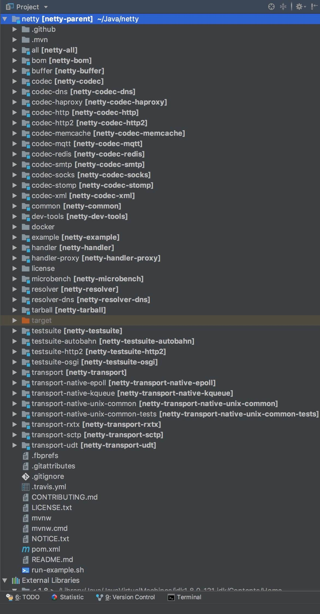

### 2. 代ç ç»Ÿè®¡

这里先分享一个å°æŠ€å·§ã€‚笔者在开始æºç å­¦ä¹ æ—¶ï¼Œä¼šé¦–先了解项目的代ç é‡ã€‚

**第一ç§æ–¹å¼**，使用 [IDEA Statistic](https://plugins.jetbrains.com/plugin/4509-statistic) æ’件，统计整体代ç é‡ã€‚

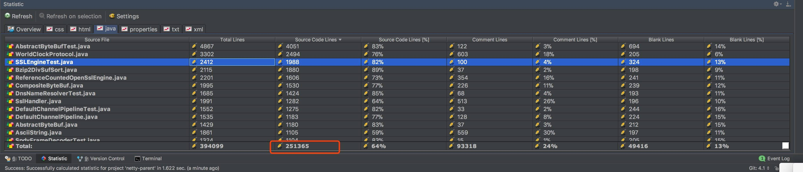

我们å¯ä»¥ç²—略的看到，总的代ç é‡åœ¨ 251365 行。这其中还包括å•å…ƒæµ‹è¯•ï¼Œç¤ºä¾‹ç­‰ç­‰ä»£ç ã€‚
所以，ä¸æ…Œã€‚

**第二ç§æ–¹å¼**，使用 [Shell 脚本命令é€ä¸ª Maven 模å—统计](http://blog.csdn.net/yhhwatl/article/details/52623879) 。

一般情况下，笔者使用 `find . -name "*.java"|xargs cat|grep -v -e ^$ -e ^\s*\/\/.*$|wc -l` 。这个命令åªè¿‡æ»¤äº†**部分注释**，所以相比 [IDEA Statistic](https://plugins.jetbrains.com/plugin/4509-statistic) 会**å多**。

当然，考虑到准确性，胖å‹éœ€è¦æ‰‹åŠ¨ `cd` 到æ¯ä¸ª Maven 项目的 `src/main/java` 目录下，以达到æ’除å•å…ƒæµ‹è¯•çš„代ç é‡ã€‚


- 😈 å·æ‡’了下，暂时åªç»Ÿè®¡**核心**模å—，未统计**拓展**模å—。

### 3. æ¶æ„图

在看具体æ¯ä¸ª Netty çš„ Maven 项目之å‰ï¼Œæˆ‘们还是先æ¥çœ‹çœ‹ Netty 的整体æ¶æ„图。

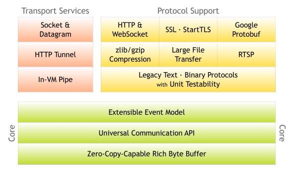

- Core：核心部分，是底层的网络通用抽象和部分å®ç°ã€‚
  - Extensible Event Model ：å¯æ‹“展的事件模å‹ã€‚Netty 是基äºäº‹ä»¶æ¨¡å‹çš„网络应用框æ¶ã€‚
  - Universal Communication API ：通用的通信 API 层。Netty 定义了一套抽象的通用通信层的 API 。
  - Zero-Copy-Capable Rich Byte Buffer ：支æŒé›¶æ‹·è´ç‰¹æ€§çš„ Byte Buffer å®ç°ã€‚
- Transport Services：传输( 通信 )æœåŠ¡ï¼Œå…·ä½“的网络传输的定义ä¸å®ç°ã€‚
  - Socket & Datagram ：TCP å’Œ UDP 的传输å®ç°ã€‚
  - HTTP Tunnel ：HTTP 通é“的传输å®ç°ã€‚
  - In-VM Piple ：JVM 内部的传输å®ç°ã€‚😈 ç†è§£èµ·æ¥æœ‰ç‚¹æ€ªï¼Œå续看具体代ç ï¼Œä¼šæ˜“懂。
- **Protocol Support** ：å议支æŒã€‚Netty 对äºä¸€äº›é€šç”¨å议的编解ç å®ç°ã€‚例如：HTTPã€Redisã€DNS 等等。

### 4. 项目ä¾èµ–图

Netty çš„ Maven 项目之间**主è¦ä¾èµ–**如下图：

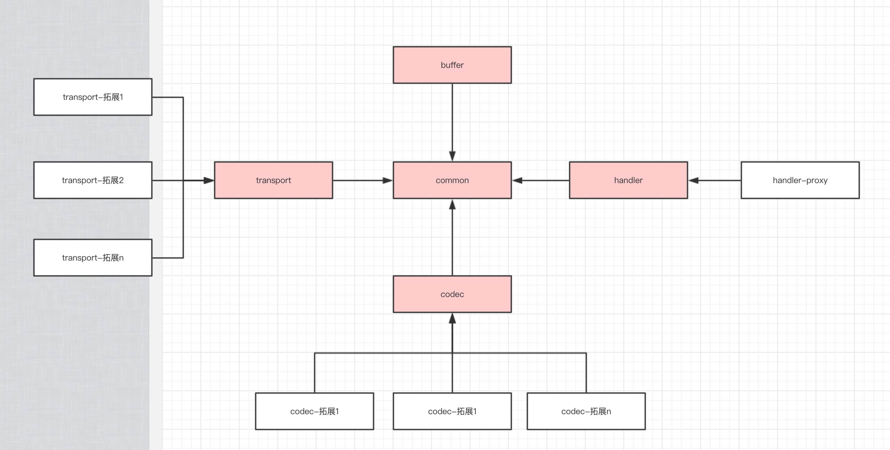

- 本图çœç•¥**é主è¦ä¾èµ–**。例如，`handler-proxy` 对 `codec` 有ä¾èµ–，但是并未画出。
- 本图çœç•¥**é主è¦çš„项目**。例如，`resolver`ã€`testsuite`ã€`example` 等等。

下é¢ï¼Œæˆ‘们æ¥è¯¦ç»†ä»‹ç»æ¯ä¸ªé¡¹ç›®ã€‚

### 5. common

`common` 项目，该项目是一个通用的工具类项目，几ä¹è¢«æ‰€æœ‰çš„其它项目ä¾èµ–使用，它æ供了一些数æ®ç±»å‹å¤„ç†å·¥å…·ç±»ï¼Œå¹¶å‘编程以åŠå¤šçº¿ç¨‹çš„扩展，计数器等等通用的工具类。

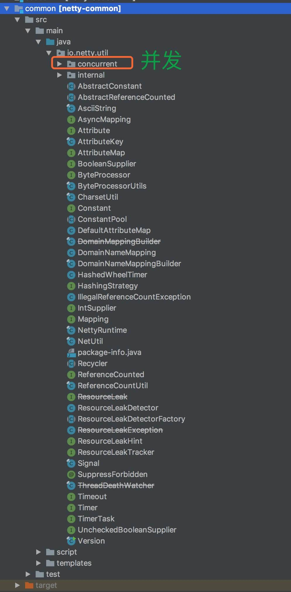

### 6. buffer

> 该项目å®ç°äº† Netty æ¶æ„图中的 Zero-Copy-Capable Rich Byte Buffer 。

`buffer` 项目，该项目下是 Netty 自行å®ç°çš„一个 Byte Buffer 字节缓冲区。该包的å®ç°ç›¸å¯¹äº JDK 自带的 ByteBuffer 有很多**优点**：无论是 API 的功能，使用体验，性能都è¦æ›´åŠ ä¼˜ç§€ã€‚它æ供了**一系列( å¤šç§ )**的抽象定义以åŠå®ç°ï¼Œä»¥æ»¡è¶³ä¸åŒåœºæ™¯ä¸‹çš„需è¦ã€‚

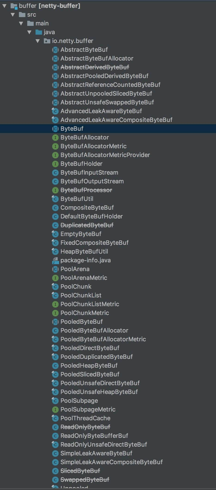

### 7. transport

> 该项是核心项目，å®ç°äº† Netty æ¶æ„图中 Transport Servicesã€Universal Communication API å’Œ Extensible Event Model 等多部分内容。

`transport` 项目，该项目是网络传输通é“的抽象和å®ç°ã€‚它定义通信的统一通信 API ，统一了 JDK çš„ OIOã€NIO ( ä¸åŒ…括 AIO )等多ç§ç¼–程æ¥å£ã€‚


å¦å¤–，它æ供了多个å­é¡¹ç›®ï¼Œå®ç°ä¸åŒçš„传输类å‹ã€‚例如：`transport-native-epoll`ã€`transport-native-kqueue`ã€`transport-rxtx`ã€`transport-udt` å’Œ `transport-sctp` 等等。

### 8. codec

> 该项目å®ç°äº†Netty æ¶æ„图中的 Protocol Support 。

`codec` 项目，该项目是å议编解ç çš„抽象ä¸**部分**å®ç°ï¼šJSONã€Google Protocolã€Base64ã€XML 等等。

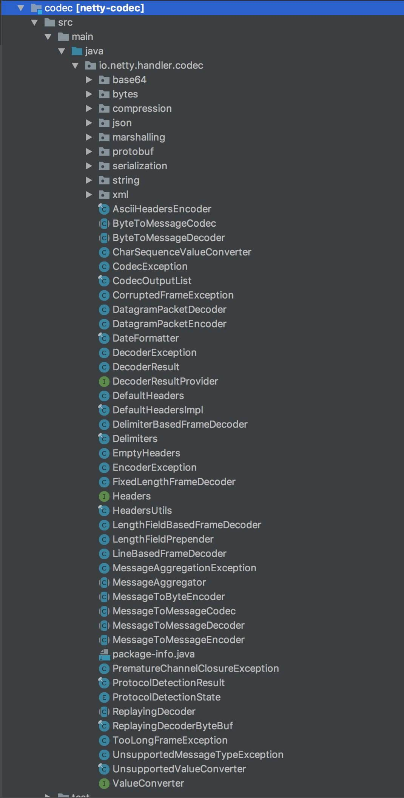

å¦å¤–，它æ供了多个å­é¡¹ç›®ï¼Œå®ç°ä¸åŒå议的编解ç ã€‚例如：`codec-dns`ã€`codec-haproxy`ã€`codec-http`ã€`codec-http2`ã€`codec-mqtt`ã€`codec-redis`ã€`codec-memcached`ã€`codec-smtp`ã€`codec-socks`ã€`codec-stomp`ã€`codec-xml` 等等。

### 9. handler

`handler` 项目，该项目是æä¾›**内置的**è¿æ¥é€šé“处ç†å™¨( ChannelHandler )å®ç°ç±»ã€‚例如：SSL 处ç†å™¨ã€æ—¥å¿—处ç†å™¨ç­‰ç­‰ã€‚

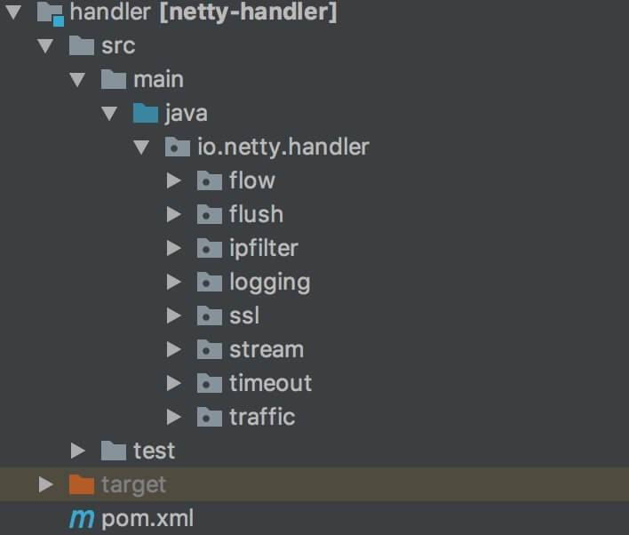

å¦å¤–，它æ供了一个å­é¡¹ç›® `handler-proxy` ，å®ç°å¯¹ HTTPã€Socks 4ã€Socks 5 的代ç†è½¬å‘。

### 10. example

`example` 项目，该项目是æä¾›å„ç§ Netty 使用示例，良心开æºé¡¹ç›®ã€‚

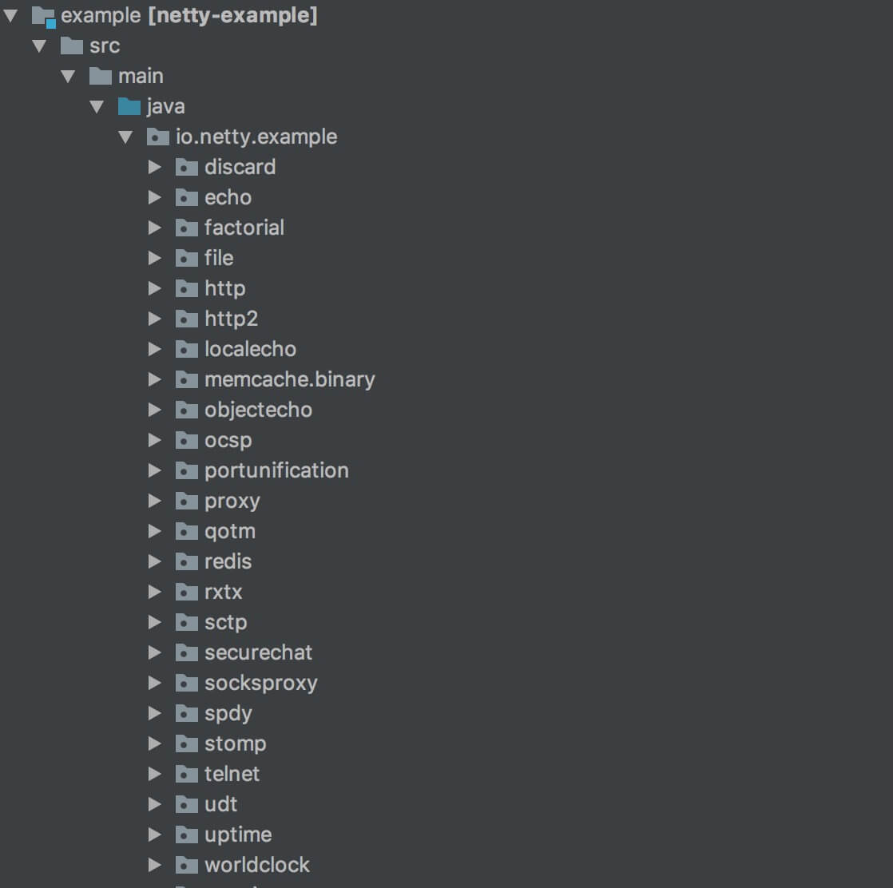

### 11. 其它项目

Netty 中还有其它项目，考虑到ä¸æ˜¯æœ¬ç³»åˆ—çš„é‡ç‚¹ï¼Œå°±æš‚时进行çœç•¥ã€‚

- `all` ：All In One çš„ `pom` 声æ˜ã€‚

- `bom` ：Netty Bill Of Materials 的缩写，ä¸äº†è§£çš„胖å‹ï¼Œå¯ä»¥çœ‹çœ‹ [《Maven ä¸Spring BOM( Bill Of Materials )简化 Spring 版本æ§åˆ¶ã€‹](https://blog.csdn.net/fanxiaobin577328725/article/details/66974896) 。

- `microbench` ：微基准测试。

- `resolver` ：终端( Endpoint ) 的地å€è§£æ器。

- `resolver-dns`

- `tarball` ：All In One 打包工具。

- `testsuite` ：测试集。

  > 测试集( TestSuite ) ：测试集是把多个相关测试归入一个组的表达方å¼ã€‚在 Junit 中，如æœæˆ‘们没有æ˜ç¡®çš„定义一个测试集，那么 Juint 会自动的æ供一个测试集。一个测试集一般将åŒä¸€ä¸ªåŒ…的测试类归入一组。

- `testsuite-autobahhn`

- `testsuite-http2`

- `testsuite-osgi`

## Netty简介（二）之核心组件

### 1. 概述

什么是 Netty ？

> Netty 是一款æ供异步的ã€äº‹ä»¶é©±åŠ¨çš„网络应用程åºæ¡†æ¶å’Œå·¥å…·ï¼Œç”¨ä»¥å¿«é€Ÿå¼€å‘高性能ã€é«˜å¯é æ€§çš„网络æœåŠ¡å™¨å’Œå®¢æˆ·ç«¯ç¨‹åºã€‚
>
> 也就是说，Netty æ˜¯ä¸€ä¸ªåŸºäº NIO 的客户ã€æœåŠ¡å™¨ç«¯ç¼–程框æ¶ã€‚使用 Netty å¯ä»¥ç¡®ä¿ä½ å¿«é€Ÿå’Œç®€å•åœ°å¼€å‘出一个网络应用，例如å®ç°äº†æŸç§å议的客户，æœåŠ¡ç«¯åº”用。Netty 相当简化和æµçº¿åŒ–了网络应用的编程开å‘过程，例如，TCP å’Œ UDP çš„ socket æœåŠ¡å¼€å‘。

Netty 具有如下特性:

| 分类     | Netty的特性                                                  |
| :------- | :----------------------------------------------------------- |
| 设计     | 1. 统一的 API ，支æŒå¤šç§ä¼ è¾“ç±»å‹( 阻å¡å’Œé阻å¡çš„ ) 2. 简å•è€Œå¼ºå¤§çš„çº¿ç¨‹æ¨¡å‹ 3. 真正的无è¿æ¥æ•°æ®æŠ¥å¥—æ¥å­—( UDP )æ”¯æŒ 4. è¿æ¥é€»è¾‘组件( ChannelHander 中顺åºå¤„ç†æ¶ˆæ¯ )以åŠç»„件å¤ç”¨( 一个 ChannelHandel å¯ä»¥è¢«å¤šä¸ªChannelPipeLine å¤ç”¨ ) |
| 易äºä½¿ç”¨ | 1. 详å®çš„ Javadoc 和大é‡çš„示例集 2. ä¸éœ€è¦è¶…过 JDK 1.6+ çš„ä¾èµ– |
| 性能     | 拥有比 Java 的核心 API 更高的ååé‡ä»¥åŠæ›´ä½çš„延迟( 得益äºæ± åŒ–å’Œå¤ç”¨ )，更ä½çš„资æºæ¶ˆè€—以åŠæœ€å°‘的内存å¤åˆ¶ |
| å¥å£®æ€§   | 1. ä¸ä¼šå› ä¸ºæ…¢é€Ÿã€å¿«é€Ÿæˆ–者超载的è¿æ¥è€Œå¯¼è‡´ OutOfMemoryError 2. 消除在高速网络中 NIO 应用程åºå¸¸è§çš„ä¸å…¬å¹³è¯» / å†™æ¯”ç‡ |
| 安全性   | 完整的 SSL/TLS ä»¥åŠ StartTLs 支æŒï¼Œå¯ç”¨äºå—é™ç¯å¢ƒä¸‹ï¼Œå¦‚ Applet å’Œ OSGI |
| 社区驱动 | å‘å¸ƒå¿«é€Ÿè€Œä¸”é¢‘ç¹                                             |

### 2. Netty 核心组件

为了å期更好地ç†è§£å’Œè¿›ä¸€æ­¥æ·±å…¥ Netty，有必è¦æ€»ä½“认识一下 Netty 所用到的核心组件以åŠä»–们在整个 Netty æ¶æ„中是如何å调工作的。

Netty 有如下几个核心组件：

- Bootstrap & ServerBootstrap
- Channel
- ChannelFuture
- EventLoop & EventLoopGroup
- ChannelHandler
- ChannelPipeline

核心组件的高层类图如下：

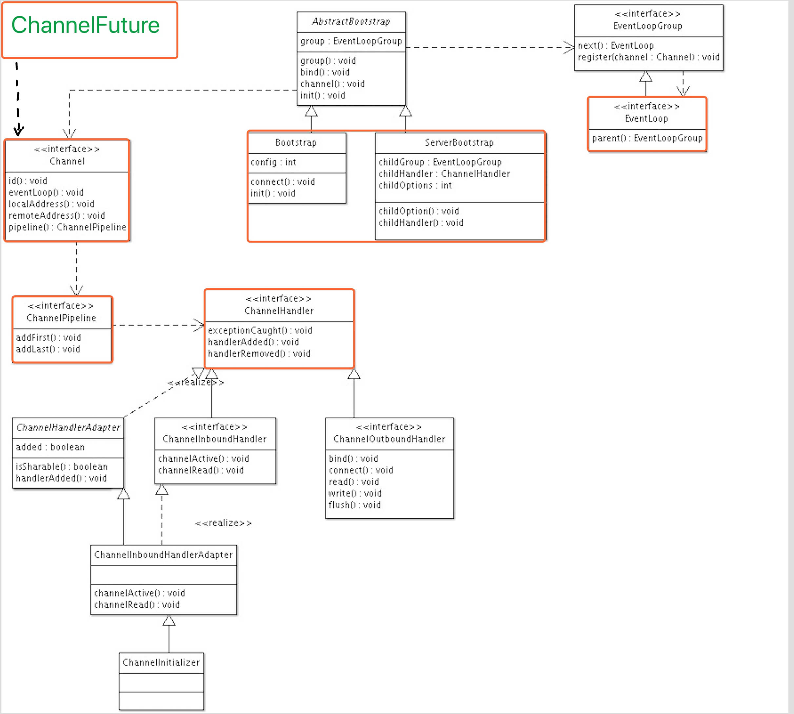

#### 2.1 Bootstrap & ServerBootstrap

è¿™ 2 个类都继承了AbstractBootstrap，因此它们有很多相åŒçš„方法和èŒè´£ã€‚它们都是**å¯åŠ¨å™¨**，能够帮助 Netty 使用者更加方便地组装和é…ç½® Netty ，也å¯ä»¥æ›´æ–¹ä¾¿åœ°å¯åŠ¨ Netty 应用程åºã€‚相比使用者自己ä»å¤´å»å°† Netty çš„å„部分组装起æ¥è¦æ–¹ä¾¿å¾—多，é™ä½äº†ä½¿ç”¨è€…的学习和使用æˆæœ¬ã€‚它们是我们使用 Netty çš„å…¥å£å’Œæœ€é‡è¦çš„ API ，å¯ä»¥é€šè¿‡å®ƒæ¥è¿æ¥åˆ°ä¸€ä¸ªä¸»æœºå’Œç«¯å£ä¸Šï¼Œä¹Ÿå¯ä»¥é€šè¿‡å®ƒæ¥ç»‘定到一个本地的端å£ä¸Šã€‚总的æ¥è¯´ï¼Œ**它们两者之间相åŒä¹‹å¤„è¦å¤§äºä¸åŒ**。

> Bootstrap & ServerBootstrap å¯¹äº Netty ï¼Œå°±ç›¸å½“äº Spring Boot 是 Spring çš„å¯åŠ¨å™¨ã€‚

它们和其它组件之间的关系是它们将 Netty 的其它组件进行组装和é…置，所以它们会组åˆå’Œç›´æ¥æˆ–é—´æ¥ä¾èµ–其它的类。

Bootstrap 用äºå¯åŠ¨ä¸€ä¸ª Netty TCP 客户端，或者 UDP 的一端。

- 通常使用 `#connet(...)` 方法è¿æ¥åˆ°è¿œç¨‹çš„主机和端å£ï¼Œä½œä¸ºä¸€ä¸ª Netty TCP 客户端。
- 也å¯ä»¥é€šè¿‡ `#bind(...)` 方法绑定本地的一个端å£ï¼Œä½œä¸º UDP 的一端。
- 仅仅需è¦ä½¿ç”¨**一个** EventLoopGroup 。

ServerBootstrap 往往是用äºå¯åŠ¨ä¸€ä¸ª Netty æœåŠ¡ç«¯ã€‚

- 通常使用 `#connet(...)` 方法è¿æ¥åˆ°è¿œç¨‹çš„主机和端å£ï¼Œä½œä¸ºä¸€ä¸ª Netty TCP 客户端。
- 也å¯ä»¥é€šè¿‡ `#bind(...)` 方法绑定本地的一个端å£ï¼Œä½œä¸º UDP 的一端。
- 仅仅需è¦ä½¿ç”¨**一个** EventLoopGroup 。

ServerBootstrap 往往是用äºå¯åŠ¨ä¸€ä¸ª Netty æœåŠ¡ç«¯ã€‚

Channel 是 Netty 网络æ“作抽象类，它除了包括基本的 I/O æ“作，如 bindã€connectã€readã€write 之外，还包括了 Netty 框æ¶ç›¸å…³çš„一些功能，如è·å–该 Channel çš„ EventLoop 。

在传统的网络编程中，作为核心类的 Socket ，它对程åºå‘˜æ¥è¯´å¹¶ä¸æ˜¯é‚£ä¹ˆå‹å¥½ï¼Œç›´æ¥ä½¿ç”¨å…¶æˆæœ¬è¿˜æ˜¯ç¨å¾®é«˜äº†ç‚¹ã€‚而 Netty çš„ Channel 则æ供的一系列的 API ，它大大é™ä½äº†ç›´æ¥ä¸ Socket 进行æ“作的å¤æ‚性。而相对äºåŸç”Ÿ NIO çš„ Channel，Netty çš„ Channel 具有如下优势( 摘自《Nettyæƒå¨æŒ‡å—( 第二版 )》) ：

- 在 Channel æ¥å£å±‚，采用 Facade 模å¼è¿›è¡Œç»Ÿä¸€å°è£…，将网络 I/O æ“作ã€ç½‘络 I/O 相关è”的其他æ“作å°è£…èµ·æ¥ï¼Œç»Ÿä¸€å¯¹å¤–æ供。
- Channel æ¥å£çš„定义尽é‡å¤§è€Œå…¨ï¼Œä¸º SocketChannel å’Œ ServerSocketChannel æ供统一的视图，由ä¸åŒå­ç±»å®ç°ä¸åŒçš„功能，公共功能在抽象父类中å®ç°ï¼Œæœ€å¤§ç¨‹åº¦åœ°å®ç°åŠŸèƒ½å’Œæ¥å£çš„é‡ç”¨ã€‚
- 具体å®ç°é‡‡ç”¨èšåˆè€Œé包å«çš„æ–¹å¼ï¼Œå°†ç›¸å…³çš„功能类èšåˆåœ¨ Channel 中，由 Channel 统一负责和调度，功能å®ç°æ›´åŠ çµæ´»ã€‚

#### 2.2 EventLoop && EventLoopGroup

Netty 基äº**事件驱动模å‹**，使用ä¸åŒçš„事件æ¥é€šçŸ¥æˆ‘们状æ€çš„改å˜æˆ–者æ“作状æ€çš„改å˜ã€‚它定义了在整个è¿æ¥çš„生命周期里当有事件å‘生的时候处ç†çš„核心抽象。

Channel 为Netty 网络æ“作抽象类，EventLoop 负责处ç†æ³¨å†Œåˆ°å…¶ä¸Šçš„ Channel å¤„ç† I/O æ“作，两者é…åˆå‚ä¸ I/O æ“作。

EventLoopGroup 是一个 EventLoop 的分组，它å¯ä»¥è·å–到一个或者多个 EventLoop 对象，因此它æ供了迭代出 EventLoop 对象的方法。

下图是 Channelã€EventLoopã€Threadã€EventLoopGroup 之间的关系( 摘自《Netty In Action》) ：

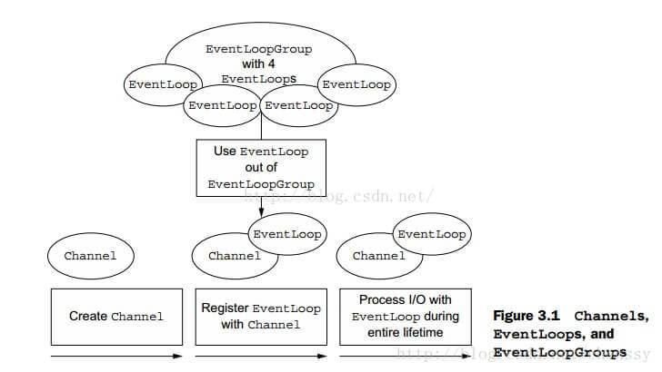

- 一个 EventLoopGroup 包å«ä¸€ä¸ªæˆ–多个 EventLoop ï¼Œå³ EventLoopGroup : EventLoop = `1 : n` 。
- 一个 EventLoop 在它的生命周期内，åªèƒ½ä¸ä¸€ä¸ª Thread ç»‘å®šï¼Œå³ EventLoop : Thread = `1 : 1` 。
- 所有有 EventLoop 处ç†çš„ I/O 事件都将在它**专有**çš„ Thread 上被处ç†ï¼Œä»è€Œä¿è¯çº¿ç¨‹å®‰å…¨ï¼Œå³ Thread : EventLoop = `1 : 1`。
- 一个 Channel 在它的生命周期内åªèƒ½æ³¨å†Œåˆ°ä¸€ä¸ª EventLoop ä¸Šï¼Œå³ Channel : EventLoop = `n : 1` 。
- 一个 EventLoop å¯è¢«åˆ†é…至一个或多个 Channel ï¼Œå³ EventLoop : Channel = `1 : n` 。

当一个è¿æ¥åˆ°è¾¾æ—¶ï¼ŒNetty 就会创建一个 Channel，然åä» EventLoopGroup 中分é…一个 EventLoop æ¥ç»™è¿™ä¸ª Channel 绑定上，在该 Channel 的整个生命周期中都是有这个绑定的 EventLoop æ¥æœåŠ¡çš„。

#### 2.4 ChannelFuture

Netty 为异步é阻å¡ï¼Œå³æ‰€æœ‰çš„ I/O æ“作都为异步的，因此，我们ä¸èƒ½ç«‹åˆ»å¾—知消æ¯æ˜¯å¦å·²ç»è¢«å¤„ç†äº†ã€‚Netty æ供了 ChannelFuture æ¥å£ï¼Œé€šè¿‡è¯¥æ¥å£çš„ `#addListener(...)` 方法，注册一个 ChannelFutureListener，当æ“作执行æˆåŠŸæˆ–者失败时，监å¬å°±ä¼šè‡ªåŠ¨è§¦å‘è¿”å›ç»“æœã€‚

#### 2.5 ChannelHandler

ChannelHandler ，è¿æ¥é€šé“处ç†å™¨ï¼Œæˆ‘们使用 Netty 中中**最常用**的组件。ChannelHandler 主è¦ç”¨æ¥å¤„ç†å„ç§äº‹ä»¶ï¼Œè¿™é‡Œçš„事件很广泛，比如å¯ä»¥æ˜¯è¿æ¥ã€æ•°æ®æ¥æ”¶ã€å¼‚常ã€æ•°æ®è½¬æ¢ç­‰ã€‚

ChannelHandler 有两个核心å­ç±» ChannelInboundHandler å’Œ ChannelOutboundHandler，其中 ChannelInboundHandler 用äºæ¥æ”¶ã€å¤„ç†å…¥ç«™( Inbound )çš„æ•°æ®å’Œäº‹ä»¶ï¼Œè€Œ ChannelOutboundHandler 则相å，用äºæ¥æ”¶ã€å¤„ç†å‡ºç«™( Outbound )çš„æ•°æ®å’Œäº‹ä»¶ã€‚

- ChannelInboundHandler çš„å®ç°ç±»è¿˜åŒ…括一系列的 **Decoder** 类，对输入字节æµè¿›è¡Œè§£ç ã€‚
- ChannelOutboundHandler çš„å®ç°ç±»è¿˜åŒ…括一系列的 **Encoder** 类，对输入字节æµè¿›è¡Œç¼–ç ã€‚

ChannelDuplexHandler å¯ä»¥**åŒæ—¶**用äºæ¥æ”¶ã€å¤„ç†å…¥ç«™å’Œå‡ºç«™çš„æ•°æ®å’Œæ—¶é—´ã€‚

ChannelHandler 还有其它的一系列的抽象å®ç° Adapter ，以åŠä¸€äº›ç”¨äºç¼–解ç å…·ä½“å议的 ChannelHandler å®ç°ç±»ã€‚

#### 2.6 ChannelPipeline

ChannelPipeline 为 ChannelHandler çš„**链**，æ供了一个容器并定义了用äºæ²¿ç€é“¾ä¼ æ’­å…¥ç«™å’Œå‡ºç«™äº‹ä»¶æµçš„ API 。一个数æ®æˆ–者事件å¯èƒ½ä¼šè¢«å¤šä¸ª Handler 处ç†ï¼Œåœ¨è¿™ä¸ªè¿‡ç¨‹ä¸­ï¼Œæ•°æ®æˆ–者事件ç»æµ ChannelPipeline ，由 ChannelHandler 处ç†ã€‚在这个处ç†è¿‡ç¨‹ä¸­ï¼Œä¸€ä¸ª ChannelHandler æ¥æ”¶æ•°æ®å处ç†å®Œæˆå交给下一个 ChannelHandler，或者什么都ä¸åšç›´æ¥äº¤ç»™ä¸‹ä¸€ä¸ª ChannelHandler。

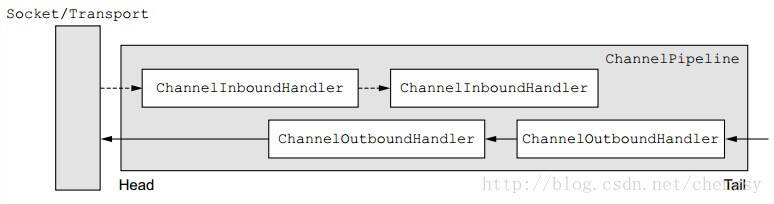

- 当一个数æ®æµè¿›å…¥ ChannelPipeline æ—¶ï¼Œå®ƒä¼šä» ChannelPipeline 头部开始，传给第一个 ChannelInboundHandler 。当第一个处ç†å®Œåå†ä¼ ç»™ä¸‹ä¸€ä¸ªï¼Œä¸€ç›´ä¼ é€’到管é“的尾部。
- ä¸ä¹‹ç›¸å¯¹åº”的是，当数æ®è¢«å†™å‡ºæ—¶ï¼Œå®ƒä¼šä»ç®¡é“的尾部开始，先ç»è¿‡ç®¡é“尾部的“最åâ€ä¸€ä¸ªChannelOutboundHandler ，当它处ç†å®Œæˆå会传递给å‰ä¸€ä¸ª ChannelOutboundHandler 。

上图更详细的，å¯ä»¥æ˜¯å¦‚下过程：

```java
*                                                 I/O Request
*                                            via {@link Channel} or
*                                        {@link ChannelHandlerContext}
*                                                      |
*  +---------------------------------------------------+---------------+
*  |                           ChannelPipeline         |               |
*  |                                                  \|/              |
*  |    +---------------------+            +-----------+----------+    |
*  |    | Inbound Handler  N  |            | Outbound Handler  1  |    |
*  |    +----------+----------+            +-----------+----------+    |
*  |              /|\                                  |               |
*  |               |                                  \|/              |
*  |    +----------+----------+            +-----------+----------+    |
*  |    | Inbound Handler N-1 |            | Outbound Handler  2  |    |
*  |    +----------+----------+            +-----------+----------+    |
*  |              /|\                                  .               |
*  |               .                                   .               |
*  | ChannelHandlerContext.fireIN_EVT() ChannelHandlerContext.OUT_EVT()|
*  |        [ method call]                       [method call]         |
*  |               .                                   .               |
*  |               .                                  \|/              |
*  |    +----------+----------+            +-----------+----------+    |
*  |    | Inbound Handler  2  |            | Outbound Handler M-1 |    |
*  |    +----------+----------+            +-----------+----------+    |
*  |              /|\                                  |               |
*  |               |                                  \|/              |
*  |    +----------+----------+            +-----------+----------+    |
*  |    | Inbound Handler  1  |            | Outbound Handler  M  |    |
*  |    +----------+----------+            +-----------+----------+    |
*  |              /|\                                  |               |
*  +---------------+-----------------------------------+---------------+
*                  |                                  \|/
*  +---------------+-----------------------------------+---------------+
*  |               |                                   |               |
*  |       [ Socket.read() ]                    [ Socket.write() ]     |
*  |                                                                   |
*  |  Netty Internal I/O Threads (Transport Implementation)            |
*  +-------------------------------------------------------------------+
```

------

当 ChannelHandler 被添加到 ChannelPipeline 时，它将会被分é…一个

**ChannelHandlerContext** ，它代表了 ChannelHandler å’Œ ChannelPipeline 之间的绑定。其中 ChannelHandler 添加到 ChannelPipeline 中，通过 ChannelInitializer æ¥å®ç°ï¼Œè¿‡ç¨‹å¦‚下：

1. 一个 ChannelInitializer çš„å®ç°å¯¹è±¡ï¼Œè¢«è®¾ç½®åˆ°äº† BootStrap 或 ServerBootStrap 中。
2. 当 `ChannelInitializer#initChannel()` 方法被调用时，ChannelInitializer 将在 ChannelPipeline 中创建**一组**自定义的 ChannelHandler 对象。
3. ChannelInitializer å°†å®ƒè‡ªå·±ä» ChannelPipeline 中移除。

> ChannelInitializer 是一个特殊的 ChannelInboundHandlerAdapter 抽象类。

- å°æ˜å“¥ [《ã€æ­»ç£• Netty 】—— Netty的核心组件》](https://cloud.tencent.com/developer/article/1110061)
- æ¨æ­¦å…µ [《Netty æºç åˆ†æ系列 —— 概述》](https://my.oschina.net/ywbrj042/blog/856596)
- 乒乓狂魔 [《Netty æºç åˆ†æ（一）概览》](https://my.oschina.net/pingpangkuangmo/blog/734051)

## Nettyæºç åˆ†æ —— å¯åŠ¨ï¼ˆä¸€ï¼‰ä¹‹æœåŠ¡ç«¯

### 1. 概述

对äºæ‰€æœ‰ Netty 的新手ç©å®¶ï¼Œæˆ‘们**最先**使用的就是 Netty çš„ Bootstrap å’Œ ServerBootstrap 组这两个“**å¯åŠ¨å™¨**â€ç»„件。它们在 `transport` 模å—çš„ `bootstrap` 包下å®ç°ï¼Œå¦‚下图所示：

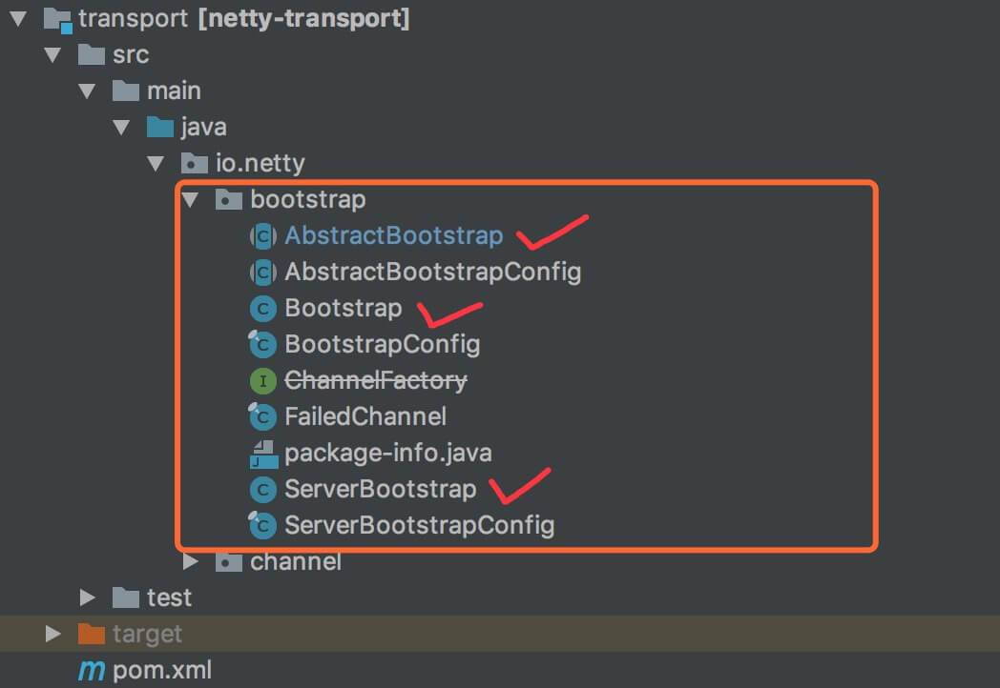

在图中，我们å¯ä»¥çœ‹åˆ°ä¸‰ä¸ªä»¥ Bootstrap 结尾的类，类图如下：

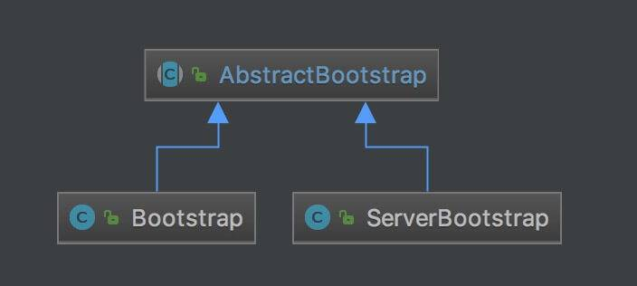

- 为什么是这样的类关系呢？因为 ServerBootstrap å’Œ Bootstrap **大部分**的方法和èŒè´£éƒ½æ˜¯ç›¸åŒçš„。

本文仅分享 ServerBootstrap å¯åŠ¨ Netty æœåŠ¡ç«¯çš„过程。下一篇文章，我们å†åˆ†äº« Bootstrap 分享 Netty 客户端。

### 2. ServerBootstrap 示例

下é¢ï¼Œæˆ‘们先æ¥çœ‹ä¸€ä¸ª ServerBootstrap 的使用示例，就是我们在 [《精尽 Netty æºç åˆ†æ —— 调试ç¯å¢ƒæ­å»ºã€‹](http://svip.iocoder.cn/Netty/build-debugging-environment/#5-1-EchoServer) æ­å»ºçš„ EchoServer 示例。代ç å¦‚下：

```java
 1: public final class EchoServer {
 2: 
 3:     static final boolean SSL = System.getProperty("ssl") != null;
 4:     static final int PORT = Integer.parseInt(System.getProperty("port", "8007"));
 5: 
 6:     public static void main(String[] args) throws Exception {
 7:         // Configure SSL.
 8:         // é…ç½® SSL
 9:         final SslContext sslCtx;
10:         if (SSL) {
11:             SelfSignedCertificate ssc = new SelfSignedCertificate();
12:             sslCtx = SslContextBuilder.forServer(ssc.certificate(), ssc.privateKey()).build();
13:         } else {
14:             sslCtx = null;
15:         }
16: 
17:         // Configure the server.
18:         // 创建两个 EventLoopGroup 对象
19:         EventLoopGroup bossGroup = new NioEventLoopGroup(1); // 创建 boss 线程组 用äºæœåŠ¡ç«¯æ¥å—客户端的è¿æ¥
20:         EventLoopGroup workerGroup = new NioEventLoopGroup(); // 创建 worker 线程组 用äºè¿›è¡Œ SocketChannel çš„æ•°æ®è¯»å†™
21:         // 创建 EchoServerHandler 对象
22:         final EchoServerHandler serverHandler = new EchoServerHandler();
23:         try {
24:             // 创建 ServerBootstrap 对象
25:             ServerBootstrap b = new ServerBootstrap();
26:             b.group(bossGroup, workerGroup) // 设置使用的 EventLoopGroup
27:              .channel(NioServerSocketChannel.class) // 设置è¦è¢«å®ä¾‹åŒ–的为 NioServerSocketChannel ç±»
28:              .option(ChannelOption.SO_BACKLOG, 100) // 设置 NioServerSocketChannel çš„å¯é€‰é¡¹
29:              .handler(new LoggingHandler(LogLevel.INFO)) // 设置 NioServerSocketChannel 的处ç†å™¨
30:              .childHandler(new ChannelInitializer<SocketChannel>() {
31:                  @Override
32:                  public void initChannel(SocketChannel ch) throws Exception { // 设置è¿å…¥æœåŠ¡ç«¯çš„ Client çš„ SocketChannel 的处ç†å™¨
33:                      ChannelPipeline p = ch.pipeline();
34:                      if (sslCtx != null) {
35:                          p.addLast(sslCtx.newHandler(ch.alloc()));
36:                      }
37:                      //p.addLast(new LoggingHandler(LogLevel.INFO));
38:                      p.addLast(serverHandler);
39:                  }
40:              });
41: 
42:             // Start the server.
43:             // 绑定端å£ï¼Œå¹¶åŒæ­¥ç­‰å¾…æˆåŠŸï¼Œå³å¯åŠ¨æœåŠ¡ç«¯
44:             ChannelFuture f = b.bind(PORT).sync();
45: 
46:             // Wait until the server socket is closed.
47:             // 监å¬æœåŠ¡ç«¯å…³é—­ï¼Œå¹¶é˜»å¡ç­‰å¾…
48:             f.channel().closeFuture().sync();
49:         } finally {
50:             // Shut down all event loops to terminate all threads.
51:             // 优雅关闭两个 EventLoopGroup 对象
52:             bossGroup.shutdownGracefully();
53:             workerGroup.shutdownGracefully();
54:         }
55:     }
56: }
```

- 第 7 至 15 行：é…ç½® SSL ，暂时å¯ä»¥å¿½ç•¥ã€‚
- 第 17 至 20 行：创建两个 EventLoopGroup 对象。
  - **boss** 线程组：用äºæœåŠ¡ç«¯æ¥å—客户端的**è¿æ¥**。
  - **worker** 线程组：用äºè¿›è¡Œå®¢æˆ·ç«¯çš„ SocketChannel çš„**æ•°æ®è¯»å†™**。
  - å…³äºä¸ºä»€ä¹ˆæ˜¯**两个** EventLoopGroup 对象，我们在å续的文章，进行分享。
- 第 22 行：创建 [`io.netty.example.echo.EchoServerHandler`](https://github.com/YunaiV/netty/blob/f7016330f1483021ef1c38e0923e1c8b7cef0d10/example/src/main/java/io/netty/example/echo/EchoServerHandler.java) 对象。
- 第 24 行：创建 ServerBootstrap 对象，用äºè®¾ç½®æœåŠ¡ç«¯çš„å¯åŠ¨é…置。
  - 第 26 行：调用 `#group(EventLoopGroup parentGroup, EventLoopGroup childGroup)` 方法，设置使用的 EventLoopGroup 。
  - 第 27 行：调用 `#channel(Class<? extends C> channelClass)` 方法，设置è¦è¢«å®ä¾‹åŒ–çš„ Channel 为 NioServerSocketChannel 类。在下文中，我们会看到该 Channel 内嵌了 `java.nio.channels.ServerSocketChannel` 对象。是ä¸æ˜¯å¾ˆç†Ÿæ‚‰ 😈 ？
  - 第 28 行：调用 `#option(ChannelOption<T> option, T value)` 方法，设置 NioServerSocketChannel çš„å¯é€‰é¡¹ã€‚在 [`io.netty.channel.ChannelOption`](https://github.com/YunaiV/netty/blob/f7016330f1483021ef1c38e0923e1c8b7cef0d10/transport/src/main/java/io/netty/channel/ChannelOption.java) 类中，æšä¸¾äº†ç›¸å…³çš„å¯é€‰é¡¹ã€‚
  - 第 29 行：调用 `#handler(ChannelHandler handler)` 方法，设置 NioServerSocketChannel 的处ç†å™¨ã€‚在本示例中，使用了 `io.netty.handler.logging.LoggingHandler` 类，用äºæ‰“å°æœåŠ¡ç«¯çš„æ¯ä¸ªäº‹ä»¶ã€‚详细解æ，è§å续文章。
  - 第 30 至 40 行：调用 `#childHandler(ChannelHandler handler)` 方法，设置è¿å…¥æœåŠ¡ç«¯çš„ Client çš„ SocketChannel 的处ç†å™¨ã€‚在本å®ä¾‹ä¸­ï¼Œä½¿ç”¨ ChannelInitializer æ¥åˆå§‹åŒ–è¿å…¥æœåŠ¡ç«¯çš„ Client çš„ SocketChannel 的处ç†å™¨ã€‚
- 第 44 行：**å…ˆ**调用 `#bind(int port)` 方法，绑定端å£ï¼Œ**å**调用 `ChannelFuture#sync()` 方法，阻å¡ç­‰å¾…æˆåŠŸã€‚这个过程，就是“**å¯åŠ¨æœåŠ¡ç«¯**â€ã€‚
- 第 48 行：**å…ˆ**调用 `#closeFuture()` 方法，**监å¬**æœåŠ¡å™¨å…³é—­ï¼Œ**å**调用 `ChannelFuture#sync()` 方法，阻å¡ç­‰å¾…æˆåŠŸã€‚😈 注æ„，此处ä¸æ˜¯å…³é—­æœåŠ¡å™¨ï¼Œè€Œæ˜¯â€œ**监å¬**â€å…³é—­ã€‚
- 第 49 至 54 行：执行到此处，说æ˜æœåŠ¡ç«¯å·²ç»å…³é—­ï¼Œæ‰€ä»¥è°ƒç”¨ `EventLoopGroup#shutdownGracefully()` 方法，分别关闭两个 EventLoopGroup 对象。

### 3. AbstractBootstrap

我们å†ä¸€èµ·æ¥çœ‹çœ‹ AbstractBootstrap 的代ç å®ç°ã€‚因为 ServerBootstrap å’Œ Bootstrap 都å®ç°è¿™ä¸ªç±»ï¼Œæ‰€ä»¥å’Œ ServerBootstrap 相关度高的方法，我们会放在 [「4. ServerBootstrapã€](http://svip.iocoder.cn/Netty/bootstrap-1-server/#) 中分享，而和 Bootstrap 相关度高的方法，我们会放在下一篇 Bootstrap 的文章分享。

#### 3.1 æ„造方法

```java
public abstract class AbstractBootstrap<B extends AbstractBootstrap<B, C>, C extends Channel> implements Cloneable {

    /**
     * EventLoopGroup 对象
     */
    volatile EventLoopGroup group;
    /**
     * Channel å·¥å‚，用äºåˆ›å»º Channel 对象。
     */
    @SuppressWarnings("deprecation")
    private volatile ChannelFactory<? extends C> channelFactory;
    /**
     * 本地地å€
     */
    private volatile SocketAddress localAddress;
    /**
     * å¯é€‰é¡¹é›†åˆ
     */
    private final Map<ChannelOption<?>, Object> options = new LinkedHashMap<ChannelOption<?>, Object>();
    /**
     * å±æ€§é›†åˆ
     */
    private final Map<AttributeKey<?>, Object> attrs = new LinkedHashMap<AttributeKey<?>, Object>();
    /**
     * 处ç†å™¨
     */
    private volatile ChannelHandler handler;

    AbstractBootstrap() {
        // Disallow extending from a different package.
    }

    AbstractBootstrap(AbstractBootstrap<B, C> bootstrap) {
        group = bootstrap.group;
        channelFactory = bootstrap.channelFactory;
        handler = bootstrap.handler;
        localAddress = bootstrap.localAddress;
        synchronized (bootstrap.options) { // <1>
            options.putAll(bootstrap.options);
        }
        synchronized (bootstrap.attrs) { // <2>
            attrs.putAll(bootstrap.attrs);
        }
    }
    
    // ... çœç•¥æ— å…³ä»£ç 
}
```

- AbstractBootstrap 是个

  抽象类，并且å®ç° Cloneable æ¥å£ã€‚å¦å¤–，它声æ˜äº†Bã€C两个泛å‹ï¼š

  - `B` ：继承 AbstractBootstrap 类，用äºè¡¨ç¤º**自身**çš„ç±»å‹ã€‚
  - `C` ：继承 Channel 类，表示表示**创建**çš„ Channel ç±»å‹ã€‚

- æ¯ä¸ªå±æ€§æ¯”较简å•ï¼Œç»“åˆä¸‹é¢æˆ‘们è¦åˆ†äº«çš„æ¯ä¸ªæ–¹æ³•ï¼Œå°±æ›´æ˜“懂啦。

- 在 `<1>` å’Œ `<2>` 两处，比较ç¥å¥‡çš„使用了 `synchronized` 修饰符。è€è‰¿è‰¿ä¹Ÿæ˜¯ç–‘惑了一下，但是这并难ä¸å€’我。因为传入的 `bootstrap` å‚æ•°çš„ `options` å’Œ `attrs` å±æ€§ï¼Œå¯èƒ½åœ¨å¦å¤–的线程被修改( 例如，我们下é¢ä¼šçœ‹åˆ°çš„ `#option(hannelOption<T> option, T value)` 方法)，通过 `synchronized` æ¥åŒæ­¥ï¼Œè§£å†³æ­¤é—®é¢˜ã€‚

#### 3.2 self

`#self()` 方法，返å›è‡ªå·±ã€‚代ç å¦‚下：

```java
private B self() {
    return (B) this;
}
```

- 这里就使用到了 AbstractBootstrap 声æ˜çš„ `B` æ³›å‹ã€‚

#### 3.3 group

`#group(EventLoopGroup group)` 方法，设置 EventLoopGroup 到 `group` 中。代ç å¦‚下：

```java
public B group(EventLoopGroup group) {
    if (group == null) {
        throw new NullPointerException("group");
    }
    if (this.group != null) { // ä¸å…许é‡å¤è®¾ç½®
        throw new IllegalStateException("group set already");
    }
    this.group = group;
    return self();
}
```

- 最终调用 `#self()` 方法，返å›è‡ªå·±ã€‚å®é™…上，AbstractBootstrap 整个方法的调用，基本都是[“**链å¼è°ƒç”¨**â€](https://en.wikipedia.org/wiki/Method_chaining#Java)。

#### 3.4 channel

`#channel(Class<? extends C> channelClass)` 方法，设置è¦è¢«**å®ä¾‹åŒ–**çš„ Channel 的类。代ç å¦‚下：

```java
public B channel(Class<? extends C> channelClass) {
    if (channelClass == null) {
        throw new NullPointerException("channelClass");
    }
    return channelFactory(new ReflectiveChannelFactory<C>(channelClass));
}
```

- 虽然传入的 `channelClass` å‚数，但是会使用 `io.netty.channel.ReflectiveChannelFactory` 进行å°è£…。

- 调用 `#channelFactory(io.netty.channel.ChannelFactory<? extends C> channelFactory)` 方法，设置 `channelFactory` å±æ€§ã€‚代ç å¦‚下：

  ```java
  public B channelFactory(io.netty.channel.ChannelFactory<? extends C> channelFactory) {
      return channelFactory((ChannelFactory<C>) channelFactory);
  }
  
  @Deprecated
  public B channelFactory(io.netty.bootstrap.ChannelFactory<? extends C> channelFactory) {
      if (channelFactory == null) {
          throw new NullPointerException("channelFactory");
      }
      if (this.channelFactory != null) { // ä¸å…许é‡å¤è®¾ç½®
          throw new IllegalStateException("channelFactory set already");
      }
  
      this.channelFactory = channelFactory;
      return self();
  }
  ```

  - 我们å¯ä»¥çœ‹åˆ°æœ‰ä¸¤ä¸ª `#channelFactory(...)` 方法，并且第**二**个是 `@Deprecated` çš„æ–¹æ³•ã€‚ä» ChannelFactory 使用的**包å**，我们就å¯ä»¥å¾ˆå®¹æ˜“çš„åˆ¤æ–­ï¼Œæœ€åˆ ChannelFactory 在 `bootstrap` 中，å**é‡æ„**到 `channel` 包中。

##### 3.4.1 ChannelFactory

`io.netty.channel.ChannelFactory` ，Channel å·¥å‚**æ¥å£**，用äºåˆ›å»º Channel 对象。代ç å¦‚下：

```java
public interface ChannelFactory<T extends Channel> extends io.netty.bootstrap.ChannelFactory<T> {

    /**
     * Creates a new channel.
     *
     * 创建 Channel 对象
     *
     */
    @Override
    T newChannel();

}
```

- `#newChannel()` 方法，用äºåˆ›å»º Channel 对象。

##### 3.4.2 ReflectiveChannelFactory

`io.netty.channel.ReflectiveChannelFactory` ，å®ç° ChannelFactory æ¥å£ï¼Œå射调用默认æ„造方法，创建 Channel 对象的工å‚å®ç°ç±»ã€‚代ç å¦‚下：

```java
public class ReflectiveChannelFactory<T extends Channel> implements ChannelFactory<T> {

    /**
     * Channel 对应的类
     */
    private final Class<? extends T> clazz;

    public ReflectiveChannelFactory(Class<? extends T> clazz) {
        if (clazz == null) {
            throw new NullPointerException("clazz");
        }
        this.clazz = clazz;
    }

    @Override
    public T newChannel() {
        try {
            // å射调用默认æ„造方法，创建 Channel 对象
            return clazz.getConstructor().newInstance();
        } catch (Throwable t) {
            throw new ChannelException("Unable to create Channel from class " + clazz, t);
        }
    }

}
```

- é‡ç‚¹çœ‹ `clazz.getConstructor().newInstance()` 代ç å—。

#### 3.5 localAddress

`#localAddress(...)` 方法，设置创建 Channel 的本地地å€ã€‚有四个**é‡è½½**的方法，代ç å¦‚下：

```java
public B localAddress(SocketAddress localAddress) {
    this.localAddress = localAddress;
    return self();
}

public B localAddress(int inetPort) {
    return localAddress(new InetSocketAddress(inetPort));
}

public B localAddress(String inetHost, int inetPort) {
    return localAddress(SocketUtils.socketAddress(inetHost, inetPort));
}

public B localAddress(InetAddress inetHost, int inetPort) {
    return localAddress(new InetSocketAddress(inetHost, inetPort));
}
```

- 一般情况下，ä¸ä¼šè°ƒç”¨è¯¥æ–¹æ³•è¿›è¡Œé…置，而是调用 `#bind(...)` 方法，例如 [「2. ServerBootstrap 示例ã€](http://svip.iocoder.cn/Netty/bootstrap-1-server/#) 。

#### 3.6 option

`#option(ChannelOption<T> option, T value)` 方法，设置创建 Channel çš„å¯é€‰é¡¹ã€‚代ç å¦‚下：

```java
public <T> B option(ChannelOption<T> option, T value) {
    if (option == null) {
        throw new NullPointerException("option");
    }
    if (value == null) { // 空，æ„味ç€ç§»é™¤
        synchronized (options) {
            options.remove(option);
        }
    } else { // é空，进行修改
        synchronized (options) {
            options.put(option, value);
        }
    }
    return self();
}
```

#### 3.7 attr

`#attr(AttributeKey<T> key, T value)` 方法，设置创建 Channel çš„å±æ€§ã€‚代ç å¦‚下：

```java
public <T> B attr(AttributeKey<T> key, T value) {
    if (key == null) {
        throw new NullPointerException("key");
    }
    if (value == null) { // 空，æ„味ç€ç§»é™¤
        synchronized (attrs) {
            attrs.remove(key);
        }
    } else { // é空，进行修改
        synchronized (attrs) {
            attrs.put(key, value);
        }
    }
    return self();
}
```

- æ€ä¹ˆç†è§£ `attrs` å±æ€§å‘¢ï¼Ÿæˆ‘们å¯ä»¥ç†è§£æˆ `java.nio.channels.SelectionKey` çš„ `attachment` å±æ€§ï¼Œå¹¶ä¸”ç±»å‹ä¸º Map 。

#### 3.8 handler

`#handler(ChannelHandler handler)` 方法，设置创建 Channel 的处ç†å™¨ã€‚代ç å¦‚下：

```java
public B handler(ChannelHandler handler) {
    if (handler == null) {
        throw new NullPointerException("handler");
    }
    this.handler = handler;
    return self();
}
```

#### 3.9 validate

`#validate()` 方法，校验é…置是å¦æ­£ç¡®ã€‚代ç å¦‚下：

```java
public B validate() {
    if (group == null) {
        throw new IllegalStateException("group not set");
    }
    if (channelFactory == null) {
        throw new IllegalStateException("channel or channelFactory not set");
    }
    return self();
}
```

- 在 `#bind(...)` 方法中，绑定本地地å€æ—¶ï¼Œä¼šè°ƒç”¨è¯¥æ–¹æ³•è¿›è¡Œæ ¡éªŒã€‚

#### 3.10 clone

`#clone()` **抽象**方法，克隆一个 AbstractBootstrap 对象。代ç å¦‚下。

```java
/**
 * Returns a deep clone of this bootstrap which has the identical configuration.  This method is useful when making
 * multiple {@link Channel}s with similar settings.  Please note that this method does not clone the
 * {@link EventLoopGroup} deeply but shallowly, making the group a shared resource.
 */
@Override
public abstract B clone();
```

- æ¥è‡ªå®ç° Cloneable æ¥å£ï¼Œåœ¨å­ç±»ä¸­å®ç°ã€‚这是深拷è´ï¼Œå³åˆ›å»ºä¸€ä¸ªæ–°å¯¹è±¡ï¼Œä½†ä¸æ˜¯æ‰€æœ‰çš„å±æ€§æ˜¯æ·±æ‹·è´ã€‚å¯å‚è§ã€Œ3.1 æ„造方法ã€ï¼š
  - **æµ…**æ‹·è´å±æ€§ï¼š`group`ã€`channelFactory`ã€`handler`ã€`localAddress` 。
  - **æ·±**æ‹·è´å±æ€§ï¼š`options`ã€`attrs` 。

#### 3.11 config

`#config()` 方法，返å›å½“å‰ AbstractBootstrap çš„é…置对象。代ç å¦‚下：

```java
public abstract AbstractBootstrapConfig<B, C> config();
```

##### 3.11.1 AbstractBootstrapConfig

`io.netty.bootstrap.AbstractBootstrapConfig` ，BootstrapConfig **抽象类**。代ç å¦‚下：

```java
public abstract class AbstractBootstrapConfig<B extends AbstractBootstrap<B, C>, C extends Channel> {

    protected final B bootstrap;

    protected AbstractBootstrapConfig(B bootstrap) {
        this.bootstrap = ObjectUtil.checkNotNull(bootstrap, "bootstrap");
    }
    
    public final SocketAddress localAddress() {
        return bootstrap.localAddress();
    }
    
    public final ChannelFactory<? extends C> channelFactory() {
        return bootstrap.channelFactory();
    }

    public final ChannelHandler handler() {
        return bootstrap.handler();
    }

    public final Map<ChannelOption<?>, Object> options() {
        return bootstrap.options();
    }

    public final Map<AttributeKey<?>, Object> attrs() {
        return bootstrap.attrs();
    }

    public final EventLoopGroup group() {
        return bootstrap.group();
    }
    
}
```

- `bootstrap` å±æ€§ï¼Œå¯¹åº”çš„å¯åŠ¨ç±»å¯¹è±¡ã€‚在æ¯ä¸ªæ–¹æ³•ä¸­ï¼Œæˆ‘们å¯ä»¥çœ‹åˆ°ï¼Œéƒ½æ˜¯ç›´æ¥è°ƒç”¨ `boostrap` å±æ€§å¯¹åº”的方法，读å–对应的é…置。

------

AbstractBootstrapConfig 的整体类图如下：

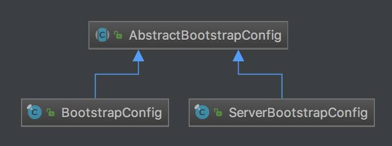AbstractBootstrapConfig 类图

- æ¯ä¸ª Config 类，对应一个 Bootstrap 类。
- ServerBootstrapConfig å’Œ BootstrapConfig çš„å®ç°ä»£ç ï¼Œå’Œ AbstractBootstrapConfig 基本一致，所以胖å‹è‡ªå·±å»æŸ¥çœ‹å™¢ã€‚

#### 3.12 setChannelOptions

`#setChannelOptions(...)` **é™æ€**方法，设置传入的 Channel çš„**多个**å¯é€‰é¡¹ã€‚代ç å¦‚下：

```java
static void setChannelOptions(
        Channel channel, Map<ChannelOption<?>, Object> options, InternalLogger logger) {
    for (Map.Entry<ChannelOption<?>, Object> e: options.entrySet()) {
        setChannelOption(channel, e.getKey(), e.getValue(), logger);
    }
}

static void setChannelOptions(
        Channel channel, Map.Entry<ChannelOption<?>, Object>[] options, InternalLogger logger) {
    for (Map.Entry<ChannelOption<?>, Object> e: options) {
        setChannelOption(channel, e.getKey(), e.getValue(), logger);
    }
}
```

- 在两个方法的内部，**都**调用 `#setChannelOption(Channel channel, ChannelOption<?> option, Object value, InternalLogger logger)` **é™æ€**方法，设置传入的 Channel çš„**一个**å¯é€‰é¡¹ã€‚代ç å¦‚下：

  ```java
  private static void setChannelOption(
          Channel channel, ChannelOption<?> option, Object value, InternalLogger logger) {
      try {
          if (!channel.config().setOption((ChannelOption<Object>) option, value)) {
              logger.warn("Unknown channel option '{}' for channel '{}'", option, channel);
          }
      } catch (Throwable t) {
          logger.warn("Failed to set channel option '{}' with value '{}' for channel '{}'", option, value, channel, t);
      }
  }
  ```

  - ä¸åŒäº [「3.6 optionã€](http://svip.iocoder.cn/Netty/bootstrap-1-server/#) 方法，它是设置è¦åˆ›å»ºçš„ Channel çš„å¯é€‰é¡¹ã€‚而 `#setChannelOption(...)` 方法，它是设置已ç»åˆ›å»ºçš„ Channel çš„å¯é€‰é¡¹ã€‚

#### 3.13 bind

> è€è‰¿è‰¿ï¼š`#bind(...)` 方法，也å¯ä»¥å¯åŠ¨ UDP 的一端，考虑到这个系列主è¦åˆ†äº« Netty 在 NIO 相关的æºç è§£æ，所以如下所有的分享，都ä¸è€ƒè™‘ UDP 的情况。

`#bind(...)` 方法，绑定端å£ï¼Œå¯åŠ¨æœåŠ¡ç«¯ã€‚代ç å¦‚下：

```java
public ChannelFuture bind() {
    // 校验æœåŠ¡å¯åŠ¨éœ€è¦çš„å¿…è¦å‚æ•°
    validate();
    SocketAddress localAddress = this.localAddress;
    if (localAddress == null) {
        throw new IllegalStateException("localAddress not set");
    }
    // 绑定本地地å€( åŒ…æ‹¬ç«¯å£ )
    return doBind(localAddress);
}

public ChannelFuture bind(int inetPort) {
    return bind(new InetSocketAddress(inetPort));
}

public ChannelFuture bind(String inetHost, int inetPort) {
    return bind(SocketUtils.socketAddress(inetHost, inetPort));
}

public ChannelFuture bind(InetAddress inetHost, int inetPort) {
    return bind(new InetSocketAddress(inetHost, inetPort));
}

public ChannelFuture bind(SocketAddress localAddress) {
    // 校验æœåŠ¡å¯åŠ¨éœ€è¦çš„å¿…è¦å‚æ•°
    validate();
    if (localAddress == null) {
        throw new NullPointerException("localAddress");
    }
    // 绑定本地地å€( åŒ…æ‹¬ç«¯å£ )
    return doBind(localAddress);
}
```

- 该方法返å›çš„是 ChannelFuture 对象，也就是**异步**的绑定端å£ï¼Œå¯åŠ¨æœåŠ¡ç«¯ã€‚如æœéœ€è¦**åŒæ­¥**，则需è¦è°ƒç”¨ `ChannelFuture#sync()` 方法。

`#bind(...)` 方法，核心æµç¨‹å¦‚下图：

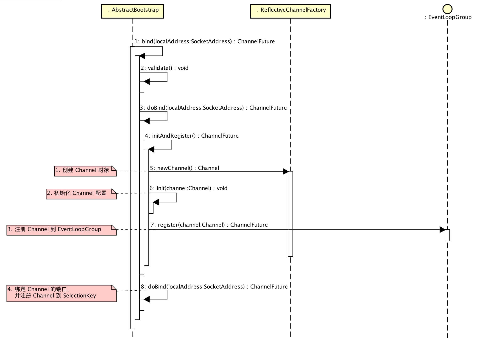

- 主è¦æœ‰ 4 个步骤，下é¢æˆ‘们æ¥æ‹†è§£ä»£ç ï¼Œçœ‹çœ‹å’Œæˆ‘们在 [《精尽 Netty æºç åˆ†æ —— NIO 基础（五）之示例》](http://svip.iocoder.cn/Netty/nio-5-demo/?self) çš„ NioServer 的代ç ï¼Œæ˜¯**æ€ä¹ˆå¯¹åº”**的。

##### 3.13.1 doBind

`#doBind(final SocketAddress localAddress)` 方法，代ç å¦‚下：

```java
 1: private ChannelFuture doBind(final SocketAddress localAddress) {
 2:     // åˆå§‹åŒ–并注册一个 Channel 对象，因为注册是异步的过程，所以返å›ä¸€ä¸ª ChannelFuture 对象。
 3:     final ChannelFuture regFuture = initAndRegister();
 4:     final Channel channel = regFuture.channel();
 5:     if (regFuture.cause() != null) { // è‹¥å‘生异常，直æ¥è¿›è¡Œè¿”å›ã€‚
 6:         return regFuture;
 7:     }
 8: 
 9:     // 绑定 Channel 的端å£ï¼Œå¹¶æ³¨å†Œ Channel 到 SelectionKey 中。
10:     if (regFuture.isDone()) { // 未
11:         // At this point we know that the registration was complete and successful.
12:         ChannelPromise promise = channel.newPromise();
13:         doBind0(regFuture, channel, localAddress, promise); // 绑定
14:         return promise;
15:     } else {
16:         // Registration future is almost always fulfilled already, but just in case it's not.
17:         final PendingRegistrationPromise promise = new PendingRegistrationPromise(channel);
18:         regFuture.addListener(new ChannelFutureListener() {
19:             @Override
20:             public void operationComplete(ChannelFuture future) throws Exception {
22:                 Throwable cause = future.cause();
23:                 if (cause != null) {
24:                     // Registration on the EventLoop failed so fail the ChannelPromise directly to not cause an
25:                     // IllegalStateException once we try to access the EventLoop of the Channel.
26:                     promise.setFailure(cause);
27:                 } else {
28:                     // Registration was successful, so set the correct executor to use.
29:                     // See https://github.com/netty/netty/issues/2586
30:                     promise.registered();
31: 
32:                     doBind0(regFuture, channel, localAddress, promise); // 绑定
33:                 }
34:             }
35:         });
36:         return promise;
37:     }
38: }
```

- 第 3 行：调用`#initAndRegister()`方法，åˆå§‹åŒ–并注册一个 Channel 对象。因为注册是异步的过程，所以返å›ä¸€ä¸ª ChannelFuture 对象。详细解æ，è§ã€Œ3.14 initAndRegisterã€
- 第 5 至 7 行：若å‘生异常，直æ¥è¿›è¡Œè¿”å›ã€‚
- 第 9 至 37 行：因为注册是异步的过程，有å¯èƒ½å·²å®Œæˆï¼Œæœ‰å¯èƒ½æœªå®Œæˆã€‚所以å®ç°ä»£ç åˆ†æˆäº†ã€ç¬¬ 10 至 14 行】和ã€ç¬¬ 15 至 36 行】分别处ç†å·²å®Œæˆå’Œæœªå®Œæˆçš„情况。
  - **核心**在ã€ç¬¬ 13 行】或者ã€ç¬¬ 32 行】的代ç ï¼Œè°ƒç”¨ `#doBind0(final ChannelFuture regFuture, final Channel channel, final SocketAddress localAddress, final ChannelPromise promise)` 方法，绑定 Channel 的端å£ï¼Œå¹¶æ³¨å†Œ Channel 到 SelectionKey 中。
  - 如æœ**异步**注册对应的 ChanelFuture 未完æˆï¼Œåˆ™è°ƒç”¨ `ChannelFuture#addListener(ChannelFutureListener)` 方法，添加监å¬å™¨ï¼Œåœ¨**注册**完æˆå，进行å›è°ƒæ‰§è¡Œ `#doBind0(...)` 方法的逻辑。详细解æï¼Œè§ è§ [「3.13.2 doBind0ã€](http://svip.iocoder.cn/Netty/bootstrap-1-server/#) 。
  - 所以总结æ¥è¯´ï¼Œ**bind 的逻辑，执行在 register 的逻辑之å**。
  - TODO 1001 Promise 2. PendingRegistrationPromise

##### 3.13.2 doBind0

> è€è‰¿è‰¿ï¼šæ­¤å°èŠ‚的内容，胖å‹å…ˆçœ‹å®Œ [「3.14 initAndRegisterã€](http://svip.iocoder.cn/Netty/bootstrap-1-server/#) 的内容在å›è¿‡å¤´æ¥çœ‹ã€‚因为 `#doBind0(...)` 方法的执行，在 `#initAndRegister()` 方法之å。

`#doBind0(...)` 方法，执行 Channel 的端å£ç»‘定逻辑。代ç å¦‚下：

```java
 1: private static void doBind0(
 2:         final ChannelFuture regFuture, final Channel channel,
 3:         final SocketAddress localAddress, final ChannelPromise promise) {
 4: 
 5:     // This method is invoked before channelRegistered() is triggered.  Give user handlers a chance to set up
 6:     // the pipeline in its channelRegistered() implementation.
 7:     channel.eventLoop().execute(new Runnable() {
 8:         @Override
 9:         public void run() {
11:             // 注册æˆåŠŸï¼Œç»‘定端å£
12:             if (regFuture.isSuccess()) {
13:                 channel.bind(localAddress, promise).addListener(ChannelFutureListener.CLOSE_ON_FAILURE);
14:             // 注册失败，å›è°ƒé€šçŸ¥ promise 异常
15:             } else {
16:                 promise.setFailure(regFuture.cause());
17:             }
18:         }
19:     });
20: }
```

- 第 7 行：调用 EventLoop 执行 Channel 的端å£ç»‘定逻辑。但是，å®é™…上当å‰çº¿ç¨‹å·²ç»æ˜¯ EventLoop 所在的线程了，为何还è¦è¿™æ ·æ“作呢？答案在ã€ç¬¬ 5 至 6 行】的英语注释。感å¹å¥ï¼ŒNetty 虽然代ç é‡é常åºå¤§ä¸”å¤æ‚，但是英文注释真的是é常é½å…¨ï¼ŒåŒ…括 Github çš„ issue 对代ç æ交的æ述，也é常å¥å…¨ã€‚

- 第 14 至 17 行：注册失败，å›è°ƒé€šçŸ¥ `promise` 异常。

- 第 11 至 13 行：注册æˆåŠŸï¼Œè°ƒç”¨`Channel#bind(SocketAddress localAddress, ChannelPromise promise)`

   

  方法，执行 Channel 的端å£ç»‘定逻辑。å续的方法栈调用如下图：

  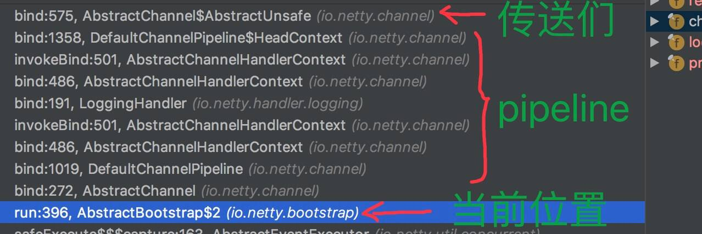

  

  Channel bind æµç¨‹

  - 还是è€æ ·å­ï¼Œæˆ‘们先çœç•¥æ‰ pipeline 的内部å®ç°ä»£ç ï¼Œä» `AbstractUnsafe#bind(final SocketAddress localAddress, final ChannelPromise promise)` 方法，继续å‘下分享。

`AbstractUnsafe#bind(final SocketAddress localAddress, final ChannelPromise promise)` 方法，Channel 的端å£ç»‘定逻辑。代ç å¦‚下：

```java
 1: @Override
 2: public final void bind(final SocketAddress localAddress, final ChannelPromise promise) {
 3:     // 判断是å¦åœ¨ EventLoop 的线程中。
 4:     assertEventLoop();
 5: 
 6:     if (!promise.setUncancellable() || !ensureOpen(promise)) {
 7:         return;
 8:     }
 9: 
10:     // See: https://github.com/netty/netty/issues/576
11:     if (Boolean.TRUE.equals(config().getOption(ChannelOption.SO_BROADCAST)) &&
12:         localAddress instanceof InetSocketAddress &&
13:         !((InetSocketAddress) localAddress).getAddress().isAnyLocalAddress() &&
14:         !PlatformDependent.isWindows() && !PlatformDependent.maybeSuperUser()) {
15:         // Warn a user about the fact that a non-root user can't receive a
16:         // broadcast packet on *nix if the socket is bound on non-wildcard address.
17:         logger.warn(
18:                 "A non-root user can't receive a broadcast packet if the socket " +
19:                 "is not bound to a wildcard address; binding to a non-wildcard " +
20:                 "address (" + localAddress + ") anyway as requested.");
21:     }
22: 
23:     // 记录 Channel 是å¦æ¿€æ´»
24:     boolean wasActive = isActive();
25: 
26:     // 绑定 Channel 的端å£
27:     try {
28:         doBind(localAddress);
29:     } catch (Throwable t) {
30:         safeSetFailure(promise, t);
31:         closeIfClosed();
32:         return;
33:     }
34: 
35:     // è‹¥ Channel 是新激活的，触å‘通知 Channel 已激活的事件。
36:     if (!wasActive && isActive()) {
37:         invokeLater(new Runnable() {
38:             @Override
39:             public void run() {
40:                 pipeline.fireChannelActive();
41:             }
42:         });
43:     }
44: 
45:     // å›è°ƒé€šçŸ¥ promise 执行æˆåŠŸ
46:     safeSetSuccess(promise);
47: }
```

- 第 4 行：调用 `#assertEventLoop()` 方法，判断是å¦åœ¨ EventLoop 的线程中。å³è¯¥æ–¹æ³•ï¼Œåªå…许在 EventLoop 的线程中执行。代ç å¦‚下：

  ```java
  // AbstractUnsafe.java
  private void assertEventLoop() {
      assert !registered || eventLoop.inEventLoop();
  }
  ```

- 第 6 至 8 行：和 `#register0(...)` 方法的ã€ç¬¬ 5 至 8 行】的代ç ï¼Œæ˜¯ä¸€è‡´çš„。

- 第 10 至 21 行：https://github.com/netty/netty/issues/576

- 第 24 行：调用 `#isActive()` 方法，è·å¾— Channel 是å¦æ¿€æ´»( active )。NioServerSocketChannel 对该方法的å®ç°ä»£ç å¦‚下：

  ```java
  // NioServerSocketChannel.java
  
  @Override
  public boolean isActive() {
      return javaChannel().socket().isBound();
  }
  ```

  - NioServerSocketChannel çš„ `#isActive()` 的方法å®ç°ï¼Œåˆ¤æ–­ ServerSocketChannel 是å¦ç»‘定端å£ã€‚此时，一般返å›çš„是 `false` 。

- 第 28 行：调用 `#doBind(SocketAddress localAddress)` 方法，绑定 Channel 的端å£ã€‚代ç å¦‚下：

  ```java
  // NioServerSocketChannel.java
  
  @Override
  protected void doBind(SocketAddress localAddress) throws Exception {
      if (PlatformDependent.javaVersion() >= 7) {
          javaChannel().bind(localAddress, config.getBacklog());
      } else {
          javaChannel().socket().bind(localAddress, config.getBacklog());
      }
  }
  ```

  - ã€é‡è¦ã€‘到了此处，æœåŠ¡ç«¯çš„ Java åŸç”Ÿ NIO ServerSocketChannel 终äºç»‘定端å£ã€‚😈

- 第 36 行：å†æ¬¡è°ƒç”¨ `#isActive()` 方法，è·å¾— Channel 是å¦æ¿€æ´»ã€‚此时，一般返å›çš„是 `true` 。因此，Channel å¯ä»¥è®¤ä¸ºæ˜¯**新激活**的，满足ã€ç¬¬ 36 至 43 行】代ç çš„执行æ¡ä»¶ã€‚

  - 第 37 行：调用 `#invokeLater(Runnable task)` 方法，æ交任务，让ã€ç¬¬ 40 行】的代ç æ‰§è¡Œï¼Œå¼‚步化。代ç å¦‚下：

    ```java
    // AbstractUnsafe.java
    private void invokeLater(Runnable task) {
        try {
            // This method is used by outbound operation implementations to trigger an inbound event later.
            // They do not trigger an inbound event immediately because an outbound operation might have been
            // triggered by another inbound event handler method.  If fired immediately, the call stack
            // will look like this for example:
            //
            //   handlerA.inboundBufferUpdated() - (1) an inbound handler method closes a connection.
            //   -> handlerA.ctx.close()
            //      -> channel.unsafe.close()
            //         -> handlerA.channelInactive() - (2) another inbound handler method called while in (1) yet
            //
            // which means the execution of two inbound handler methods of the same handler overlap undesirably.
            eventLoop().execute(task);
        } catch (RejectedExecutionException e) {
            logger.warn("Can't invoke task later as EventLoop rejected it", e);
        }
    }
    ```

    - ä»å®ç°ä»£ç å¯ä»¥çœ‹å‡ºï¼Œæ˜¯é€šè¿‡æ交一个新的任务到 EventLoop 的线程中。
    - 英文注释虽然有丢丢长，但是胖å‹è€å¿ƒçœ‹å®Œã€‚有é“在手，英文ä¸æ„啊。

  - 第 40 行：调用 `DefaultChannelPipeline#fireChannelActive()` æ–¹æ³•ï¼Œè§¦å‘ Channel 激活的事件。详细解æï¼Œè§ [「3.13.3 beginReadã€](http://svip.iocoder.cn/Netty/bootstrap-1-server/#) 。

- 第 46 行：调用 `#safeSetSuccess(ChannelPromise)` 方法，å›è°ƒé€šçŸ¥ `promise` 执行æˆåŠŸã€‚此处的通知，对应å›è°ƒçš„是我们添加到 `#bind(...)` 方法返å›çš„ ChannelFuture çš„ ChannelFutureListener 的监å¬å™¨ã€‚示例代ç å¦‚下：

  ```java
  ChannelFuture f = b.bind(PORT).addListener(new ChannelFutureListener() { // å›è°ƒçš„就是我ï¼ï¼ï¼
      @Override
      public void operationComplete(ChannelFuture future) throws Exception {
          System.out.println("测试下被触å‘");
      }
  }).sync();
  ```

##### 3.13.3 beginRead

> è€è‰¿è‰¿ï¼šæ­¤å°èŠ‚的内容，胖å‹å…ˆçœ‹å®Œ [「3.14 initAndRegisterã€](http://svip.iocoder.cn/Netty/bootstrap-1-server/#) 的内容在å›è¿‡å¤´æ¥çœ‹ã€‚因为 `#beginRead(...)` 方法的执行，在 `#doBind0(...)` 方法之å。

在 `#bind(final SocketAddress localAddress, final ChannelPromise promise)` 方法的ã€ç¬¬ 40 行】代ç ï¼Œè°ƒç”¨ `Channel#bind(SocketAddress localAddress, ChannelPromise promise)` æ–¹æ³•ï¼Œè§¦å‘ Channel 激活的事件。å续的方法栈调用如下图：

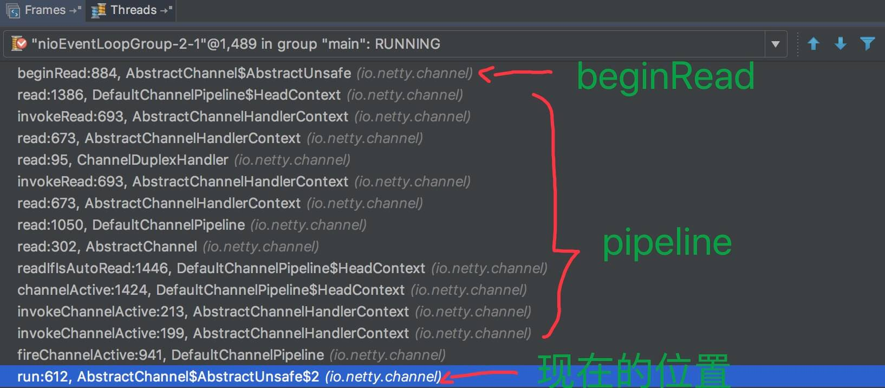


还是è€æ ·å­ï¼Œæˆ‘们先çœç•¥æ‰ pipeline 的内部å®ç°ä»£ç ï¼Œä»`AbstractUnsafe#beginRead()` 方法，继续å‘下分享。

`AbstractUnsafe#beginRead()` 方法，开始读å–æ“作。代ç å¦‚下：

```java
@Override
public final void beginRead() {
    // 判断是å¦åœ¨ EventLoop 的线程中。
    assertEventLoop();

    // Channel 必须激活
    if (!isActive()) {
        return;
    }

    // 执行开始读å–
    try {
        doBeginRead();
    } catch (final Exception e) {
        invokeLater(new Runnable() {
            @Override
            public void run() {
                pipeline.fireExceptionCaught(e);
            }
        });
        close(voidPromise());
    }
}
```

- 调用 `Channel#doBeginRead()` 方法，执行开始读å–ã€‚å¯¹äº NioServerSocketChannel æ¥è¯´ï¼Œè¯¥æ–¹æ³•å®ç°ä»£ç å¦‚下：

  ```java
  // AbstractNioMessageChannel.java
  @Override
  protected void doBeginRead() throws Exception {
      if (inputShutdown) {
          return;
      }
      super.doBeginRead();
  }
  
  // AbstractNioChannel.java
  @Override
  protected void doBeginRead() throws Exception {
      // Channel.read() or ChannelHandlerContext.read() was called
      final SelectionKey selectionKey = this.selectionKey;
      if (!selectionKey.isValid()) {
          return;
      }
  
      readPending = true;
  
      final int interestOps = selectionKey.interestOps();
      if ((interestOps & readInterestOp) == 0) {
          selectionKey.interestOps(interestOps | readInterestOp);
      }
  }
  ```

  - ã€é‡è¦ã€‘在最å几行，我们å¯ä»¥çœ‹åˆ°ï¼Œè°ƒç”¨ `SelectionKey#interestOps(ops)` 方法，将我们创建 NioServerSocketChannel 时，设置的 `readInterestOp = SelectionKey.OP_ACCEPT` 添加为感兴趣的事件。也就说，æœåŠ¡ç«¯å¯ä»¥å¼€å§‹å¤„ç†å®¢æˆ·ç«¯çš„è¿æ¥äº‹ä»¶ã€‚

#### 3.14 initAndRegister

`#initAndRegister()` 方法，åˆå§‹åŒ–并注册一个 Channel 对象，并返å›ä¸€ä¸ª ChannelFuture 对象。代ç å¦‚下：

```java
  1: final ChannelFuture initAndRegister() {
 2:     Channel channel = null;
 3:     try {
 4:         // 创建 Channel 对象
 5:         channel = channelFactory.newChannel();
 6:         // åˆå§‹åŒ– Channel é…ç½®
 7:         init(channel);
 8:     } catch (Throwable t) {
 9:         if (channel != null) { // 已创建 Channel 对象
10:             // channel can be null if newChannel crashed (eg SocketException("too many open files"))
11:             channel.unsafe().closeForcibly(); // 强制关闭 Channel
12:             // as the Channel is not registered yet we need to force the usage of the GlobalEventExecutor
13:             return new DefaultChannelPromise(channel, GlobalEventExecutor.INSTANCE).setFailure(t);
14:         }
15:         // as the Channel is not registered yet we need to force the usage of the GlobalEventExecutor
16:         return new DefaultChannelPromise(new FailedChannel(), GlobalEventExecutor.INSTANCE).setFailure(t);
17:     }
18: 
19:     // 注册 Channel 到 EventLoopGroup 中
20:     ChannelFuture regFuture = config().group().register(channel);
21:     if (regFuture.cause() != null) {
22:         if (channel.isRegistered()) {
23:             channel.close();
24:         } else {
25:             channel.unsafe().closeForcibly(); // 强制关闭 Channel
26:         }
27:     }
28: 
29:     return regFuture;
30: }
```

- 第 5 行：调用`ChannelFactory#newChannel()`方法，创建 Channel 对象。在本文的示例中，会使用 ReflectiveChannelFactory 创建 NioServerSocketChannel 对象。详细解æ，è§ã€Œ3.14.1 创建 Channelã€

  - 第 16 行：返å›å¸¦å¼‚常的 DefaultChannelPromise 对象。因为创建 Channel 对象失败，所以需è¦åˆ›å»ºä¸€ä¸ª FailedChannel 对象，设置到 DefaultChannelPromise 中æ‰å¯ä»¥è¿”å›ã€‚

- 第 7 行：调用 `#init(Channel)`方法，åˆå§‹åŒ– Channel é…置。详细解æ，è§ã€Œ3.14.1 创建 Channelã€

- 第 9 至 14 行：返å›å¸¦å¼‚常的 DefaultChannelPromise 对象。因为åˆå§‹åŒ– Channel 对象失败，所以需è¦è°ƒç”¨ `#closeForcibly()` 方法，强制关闭 Channel 

- 第 20 行：首先è·å¾— EventLoopGroup 对象，å调用 `EventLoopGroup#register(Channel)` 方法，注册 Channel 到 EventLoopGroup 中。å®é™…在方法内部，EventLoopGroup 会分é…一个 EventLoop 对象，将 Channel 注册到其上。详细解æï¼Œè§ [「3.14.3 注册 Channel 到 EventLoopGroupã€](http://svip.iocoder.cn/Netty/bootstrap-1-server/#) 。

- 第 22 至 23 行：若å‘生异常，并且 Channel å·²ç»æ³¨å†ŒæˆåŠŸï¼Œåˆ™è°ƒç”¨ `#close()` 方法，正常关闭 Channel 。

- 第 24 至 26 行：若å‘生异常，并且 Channel 并未注册æˆåŠŸï¼Œåˆ™è°ƒç”¨ `#closeForcibly()` 方法，强制关闭 Channel 。也就是说，和ã€ç¬¬ 9 至 14 行】一致。为什么会有正常和强制关闭 Channel 两ç§ä¸åŒçš„处ç†å‘¢ï¼Ÿæˆ‘们æ¥çœ‹ä¸‹ `#close()` å’Œ `#closeForcibly()` 方法的注释：

  ```java
  // Channel.java#Unsafe
  
  /**
   * Close the {@link Channel} of the {@link ChannelPromise} and notify the {@link ChannelPromise} once the
   * operation was complete.
   */
  void close(ChannelPromise promise);
  
  /**
   * Closes the {@link Channel} immediately without firing any events.  Probably only useful
   * when registration attempt failed.
   */
  void closeForcibly();
  ```

  - 调用的å‰æï¼Œåœ¨äº Channel 是å¦æ³¨å†Œåˆ° EventLoopGroup æˆåŠŸã€‚😈 因为注册失败，也ä¸å¥½è§¦å‘相关的事件。

##### 3.14.1 创建 Channel 对象

考虑到本文的内容，我们以 NioServerSocketChannel 的创建过程作为示例。æµç¨‹å›¾å¦‚下：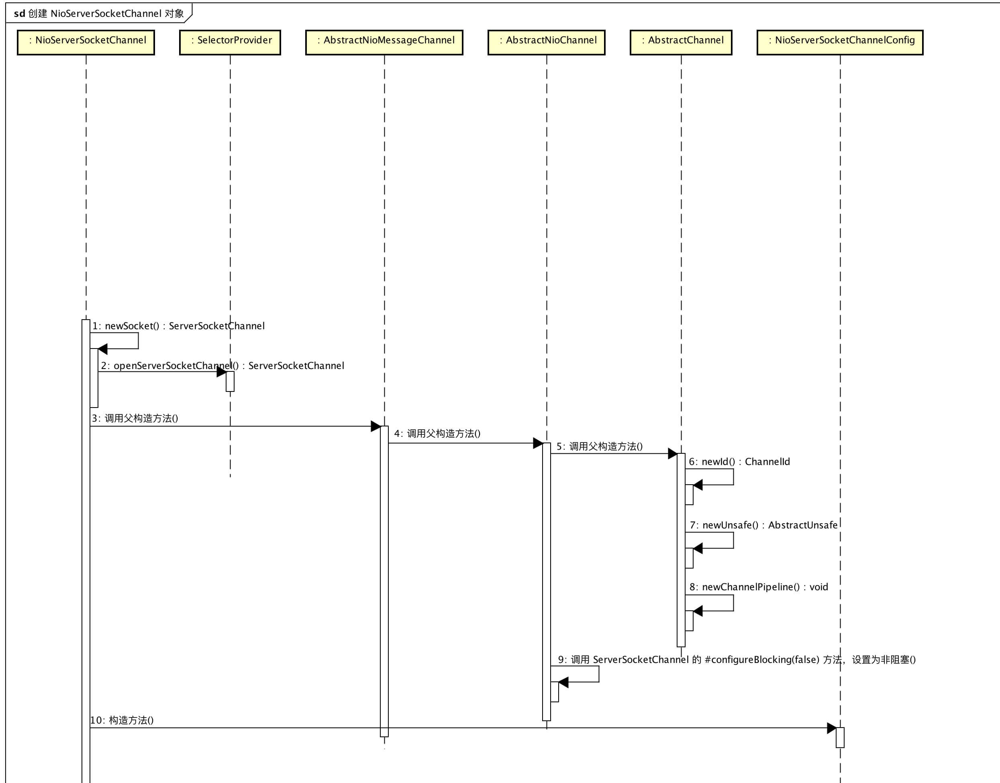

创建 NioServerSocketChannel 对象

- 我们å¯ä»¥çœ‹åˆ°ï¼Œæ•´ä¸ªæµç¨‹æ¶‰åŠåˆ° NioServerSocketChannel 的父类们。类图如下：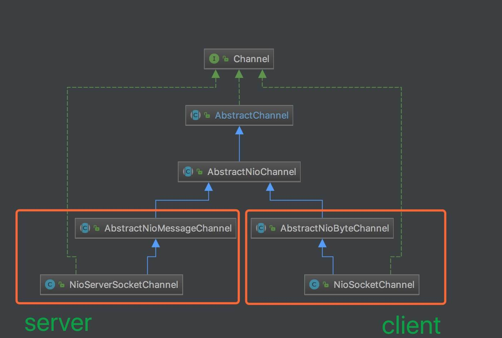

- å¯èƒ½æœ‰éƒ¨åˆ†èƒ–å‹å¯¹ Netty Channel 的定义ä¸æ˜¯å¾ˆç†è§£ï¼Œå¦‚下是官方的英文注释：

  > A nexus to a network socket or a component which is capable of I/O operations such as read, write, connect, and bind

  - 简å•ç‚¹æ¥è¯´ï¼Œæˆ‘们å¯ä»¥æŠŠ Netty Channel å’Œ Java åŸç”Ÿ Socket 对应，而 Netty NIO Channel å’Œ Java åŸç”Ÿ NIO SocketChannel 对象。

下é¢ï¼Œæˆ‘们æ¥çœ‹çœ‹æ•´ä¸ª NioServerSocketChannel 的创建过程的代ç å®ç°ã€‚

###### 3.14.1.1 NioServerSocketChannel

```java
private static final SelectorProvider DEFAULT_SELECTOR_PROVIDER = SelectorProvider.provider();

private final ServerSocketChannelConfig config;

public NioServerSocketChannel() {
    this(newSocket(DEFAULT_SELECTOR_PROVIDER));
}

public NioServerSocketChannel(SelectorProvider provider) {
    this(newSocket(provider));
}
```

- `DEFAULT_SELECTOR_PROVIDER` **é™æ€**å±æ€§ï¼Œé»˜è®¤çš„ SelectorProvider å®ç°ç±»ã€‚

- `config` å±æ€§ï¼ŒChannel 对应的é…置对象。æ¯ç§ Channel å®ç°ç±»ï¼Œä¹Ÿä¼šå¯¹åº”一个 ChannelConfig å®ç°ç±»ã€‚例如，NioServerSocketChannel 类，对应 ServerSocketChannelConfig é…置类。

  > ChannelConfig 的官网英文æ述： A set of configuration properties of a Channel.

- 在æ„造方法中，调用 `#newSocket(SelectorProvider provider)` 方法，创建 NIO çš„ ServerSocketChannel 对象。代ç å¦‚下：

  ```java
  private static ServerSocketChannel newSocket(SelectorProvider provider) {
      try {
          return provider.openServerSocketChannel();
      } catch (IOException e) {
          throw new ChannelException("Failed to open a server socket.", e);
      }
  }
  ```

  - 😈 是ä¸æ˜¯å¾ˆç†Ÿæ‚‰è¿™æ ·çš„代ç ï¼Œæ•ˆæœå’Œ `ServerSocketChannel#open()` 方法创建 ServerSocketChannel 对象是一致。

- `#NioServerSocketChannel(ServerSocketChannel channel)` æ„造方法，代ç å¦‚下：

  ```java
  public NioServerSocketChannel(ServerSocketChannel channel) {
      super(null, channel, SelectionKey.OP_ACCEPT);
      config = new NioServerSocketChannelConfig(this, javaChannel().socket());
  }
  ```

  - 调用父 AbstractNioMessageChannel çš„æ„造方法。详细解æï¼Œè§ [「3.14.1.2 AbstractNioMessageChannelã€](http://svip.iocoder.cn/Netty/bootstrap-1-server/#) 。注æ„传入的 SelectionKey 的值为 `OP_ACCEPT` 。
  - åˆå§‹åŒ– `config` å±æ€§ï¼Œåˆ›å»º NioServerSocketChannelConfig 对象。

###### 3.14.1.2 AbstractNioMessageChannel

```java
protected AbstractNioMessageChannel(Channel parent, SelectableChannel ch, int readInterestOp) {
    super(parent, ch, readInterestOp);
}
```

- ç›´æ¥è°ƒç”¨çˆ¶ AbstractNioChannel çš„æ„造方法。详细解æï¼Œè§ [「3.14.1.3 AbstractNioChannelã€](http://svip.iocoder.cn/Netty/bootstrap-1-server/#) 。

###### 3.14.1.3 AbstractNioChannel

```java
private final SelectableChannel ch;
protected final int readInterestOp;

protected AbstractNioChannel(Channel parent, SelectableChannel ch, int readInterestOp) {
    super(parent);
    this.ch = ch;
    this.readInterestOp = readInterestOp;
    try {
        ch.configureBlocking(false);
    } catch (IOException e) {
        try {
            ch.close();
        } catch (IOException e2) {
            if (logger.isWarnEnabled()) {
                logger.warn("Failed to close a partially initialized socket.", e2);
            }
        }

        throw new ChannelException("Failed to enter non-blocking mode.", e);
    }
}
```

- `ch` å±æ€§ï¼Œ**Netty NIO Channel 对象，æŒæœ‰çš„ Java åŸç”Ÿ NIO çš„ Channel 对象**。
- `readInterestOp`å±æ€§ï¼Œæ„Ÿå…´è¶£çš„读事件的æ“作ä½å€¼ã€‚
  - ç›®å‰ç¬”者看了 AbstractNioMessageChannel 是 `SelectionKey.OP_ACCEPT` ， 而 AbstractNioByteChannel 是 `SelectionKey.OP_READ` 。
  - 详细的用途，我们会在 [「3.13.3 beginReadã€](http://svip.iocoder.cn/Netty/bootstrap-1-server/#) 看到。
- 调用父 AbstractNioChannel çš„æ„造方法。详细解æï¼Œè§ [「3.14.1.4 AbstractChannelã€](http://svip.iocoder.cn/Netty/bootstrap-1-server/#) 。
- 调用 `SelectableChannel#configureBlocking(false)`方法，设置 NIO Channel 为é阻å¡
  - 😈 è¿™å—代ç æ˜¯ä¸æ˜¯é常熟悉哟。
  - è‹¥å‘生异常，关闭 NIO Channel ，并抛出异常。

###### 3.14.1.4 AbstractChannel

```java
/**
 * 父 Channel 对象
 */
private final Channel parent;
/**
 * Channel ç¼–å·
 */
private final ChannelId id;
/**
 * Unsafe 对象
 */
private final Unsafe unsafe;
/**
 * DefaultChannelPipeline 对象
 */
private final DefaultChannelPipeline pipeline;

protected AbstractChannel(Channel parent) {
    this.parent = parent;
    // 创建 ChannelId 对象
    id = newId();
    // 创建 Unsafe 对象
    unsafe = newUnsafe();
    // 创建 DefaultChannelPipeline 对象
    pipeline = newChannelPipeline();
}
```

- `parent` å±æ€§ï¼Œçˆ¶ Channel å¯¹è±¡ã€‚å¯¹äº NioServerSocketChannel çš„ `parent` 为空。

- `id` å±æ€§ï¼ŒChannel ç¼–å·å¯¹è±¡ã€‚在æ„造方法中，通过调用 `#newId()` 方法，进行创建。本文就先ä¸åˆ†äº«ï¼Œæ„Ÿå…´è¶£çš„胖å‹è‡ªå·±çœ‹ã€‚

- `unsafe` å±æ€§ï¼ŒUnsafe 对象。在æ„造方法中，通过调用 `#newUnsafe()` 方法，进行创建。本文就先ä¸åˆ†äº«ï¼Œæ„Ÿå…´è¶£çš„胖å‹è‡ªå·±çœ‹ã€‚

  - 这里的 Unsafe 并ä¸æ˜¯æˆ‘们常说的 Java 自带的`sun.misc.Unsafe` ，而是 `io.netty.channel.Channel#Unsafe`。

    ```java
    // Channel.java#Unsafe
    /**
    * <em>Unsafe</em> operations that should <em>never</em> be called from user-code. These methods
    * are only provided to implement the actual transport, and must be invoked from an I/O thread except for the
    * following methods:
    * <ul>
    *   <li>{@link #localAddress()}</li>
    *   <li>{@link #remoteAddress()}</li>
    *   <li>{@link #closeForcibly()}</li>
    *   <li>{@link #register(EventLoop, ChannelPromise)}</li>
    *   <li>{@link #deregister(ChannelPromise)}</li>
    *   <li>{@link #voidPromise()}</li>
    * </ul>
    */
    ```

    - è¿™å°±æ˜¯ä¸ºä»€ä¹ˆå« Unsafe çš„åŸå› ã€‚按照上述官网类的英文注释，Unsafe æ“作ä¸å…许被用户代ç ä½¿ç”¨ã€‚这些函数是真正用äºæ•°æ®ä¼ è¾“æ“作，必须被IO线程调用。
    - å®é™…上，Channel 真正的具体æ“作，通过调用对应的 Unsafe å®ç°ã€‚😈 下文，我们将会看到。

  - Unsafe ä¸æ˜¯ä¸€ä¸ªå…·ä½“的类，而是一个定义在 Channel æ¥å£ä¸­çš„æ¥å£ã€‚ä¸åŒçš„ Channel 类对应ä¸åŒçš„ Unsafe å®ç°ç±»ã€‚整体类图如下：

    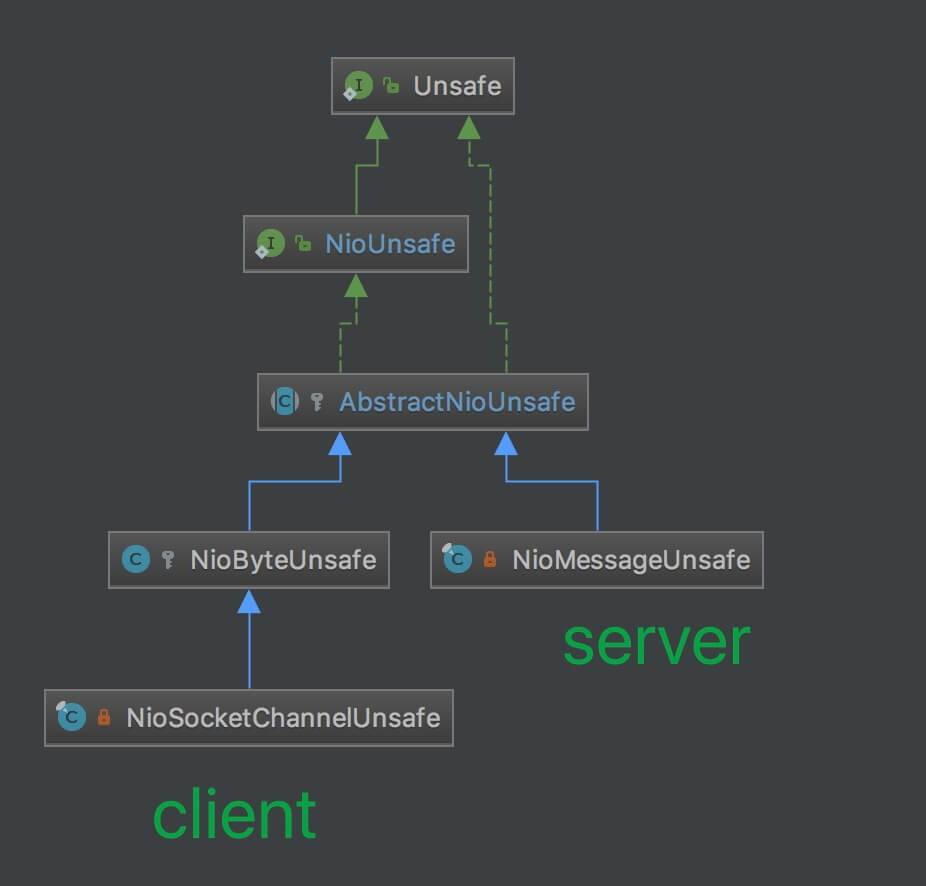

    

    - å¯¹äº NioServerSocketChannel ，Unsafe çš„å®ç°ç±»ä¸º NioMessageUnsafe 。

- `pipeline` å±æ€§ï¼ŒDefaultChannelPipeline 对象。在æ„造方法中，通过调用 `#newChannelPipeline()` 方法，进行创建。本文就先ä¸åˆ†äº«ï¼Œæ„Ÿå…´è¶£çš„胖å‹è‡ªå·±çœ‹ã€‚

  > ChannelPipeline 的英文注释：A list of ChannelHandlers which handles or intercepts inbound events and outbound operations of a Channel 。

###### 3.14.1.5 å°ç»“

看到此处，我们æ¥å¯¹ [「3.1.4.1 创建 Channel 对象ã€](http://svip.iocoder.cn/Netty/bootstrap-1-server/#) 作一个å°ç»“。

对äºä¸€ä¸ª Netty NIO Channel 对象，它会包å«å¦‚下几个核心组件：

- ChannelId
- Unsafe
- Pipeline
  - ChannelHandler
- ChannelConfig
- **Java åŸç”Ÿ NIO Channel**

如æœä¸å¤ªç†è§£ï¼Œå¯ä»¥æ’¸èµ·è¢–å­ï¼Œå¤šè°ƒè¯•å‡ æ¬¡ã€‚

##### 3.14.2 åˆå§‹åŒ– Channel é…ç½®

`#init(Channel channel)` 方法，åˆå§‹åŒ– Channel é…置。它是个**抽象**方法，由å­ç±» ServerBootstrap 或 Bootstrap 自己å®ç°ã€‚代ç å¦‚下：

```java
abstract void init(Channel channel) throws Exception;
```

- ServerBootstrap 对该方法的å®ç°ï¼Œæˆ‘们在 [「4. ServerBootstrapã€](http://svip.iocoder.cn/Netty/bootstrap-1-server/#) 中，详细解æ。

##### 3.14.3 注册 Channel 到 EventLoopGroup

`EventLoopGroup#register(Channel channel)` 方法，注册 Channel 到 EventLoopGroup 中。整体æµç¨‹å¦‚下：

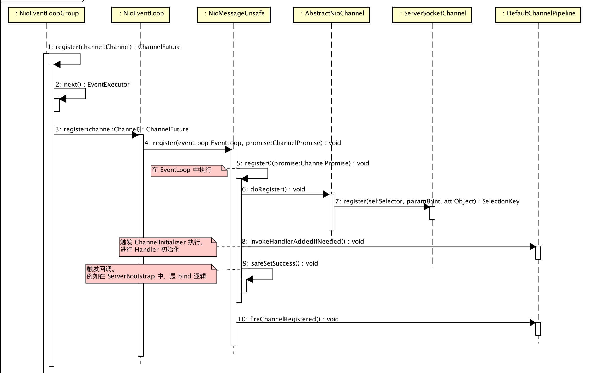

###### 3.14.3.1 register

EventLoopGroup å’Œ EventLoop ä¸æ˜¯æœ¬æ–‡çš„é‡ç‚¹ï¼Œæ‰€ä»¥çœç•¥ 1 + 2 + 3 部分的代ç ï¼Œä»ç¬¬ 4 步的 `AbstractUnsafe#register(EventLoop eventLoop, final ChannelPromise promise)` 方法开始，代ç å¦‚下：

```java
 1: @Override
 2: public final void register(EventLoop eventLoop, final ChannelPromise promise) {
 3:     // 校验传入的 eventLoop é空
 4:     if (eventLoop == null) {
 5:         throw new NullPointerException("eventLoop");
 6:     }
 7:     // 校验未注册
 8:     if (isRegistered()) {
 9:         promise.setFailure(new IllegalStateException("registered to an event loop already"));
10:         return;
11:     }
12:     // 校验 Channel å’Œ eventLoop 匹é…
13:     if (!isCompatible(eventLoop)) {
14:         promise.setFailure(new IllegalStateException("incompatible event loop type: " + eventLoop.getClass().getName()));
15:         return;
16:     }
17: 
18:     // 设置 Channel çš„ eventLoop å±æ€§
19:     AbstractChannel.this.eventLoop = eventLoop;
20: 
21:     // 在 EventLoop 中执行注册逻辑
22:     if (eventLoop.inEventLoop()) {
23:         register0(promise);
24:     } else {
25:         try {
26:             eventLoop.execute(new Runnable() {
27:                 @Override
28:                 public void run() {
31:                     register0(promise);
32:                 }
33:             });
34:         } catch (Throwable t) {
35:             logger.warn("Force-closing a channel whose registration task was not accepted by an event loop: {}", AbstractChannel.this, t);
36:             closeForcibly();
37:             closeFuture.setClosed();
38:             safeSetFailure(promise, t);
39:         }
40:     }
41: }
```

- 第 3 至 6 行：校验传入的 `eventLoop` å‚æ•°é空。

- 第 7 至 11 行：调用 `#isRegistered()` 方法，校验未注册。代ç å¦‚下：

  ```java
  // AbstractChannel.java
  
  /**
   * 是å¦æ³¨å†Œ
   */
  private volatile boolean registered;
  
  @Override
  public boolean isRegistered() {
      return registered;
  }
  ```

- 第 12 至 16 行：校验 Channel å’Œ `eventLoop` ç±»å‹æ˜¯å¦åŒ¹é…，因为它们都有多ç§å®ç°ç±»å‹ã€‚代ç å¦‚下：

  ```java
  @Override
  protected boolean isCompatible(EventLoop loop) {
      return loop instanceof NioEventLoop;
  }
  ```

  - è¦æ±‚ `eventLoop` çš„ç±»å‹ä¸º NioEventLoop 。

- 第 19 行：ã€é‡è¦ã€‘设置 Channel çš„ `eventLoop` å±æ€§ã€‚

- 第 21 至 40 行：在 `evnetLoop`中，调用 `#register0()`方法，执行注册的逻辑。详细解æ，è§ã€Œ3.14.3.2 register0ã€

- 第 34 至 39 行：若调用 `EventLoop#execute(Runnable)`方法å‘生异常，则进行处ç†ï¼š

- 第 36 行：调用 `AbstractUnsafe#closeForcibly()` 方法，强制关闭 Channel 。

- 第 37 行：调用 `CloseFuture#setClosed()` 方法，通知 `closeFuture` å·²ç»å…³é—­ã€‚详细解æï¼Œè§ [《精尽 Netty æºç è§£æ —— Channel（七）之 close æ“作》](http://svip.iocoder.cn/Netty/Channel-7-close/) 。

- 第 38 行：调用 `AbstractUnsafe#safeSetFailure(ChannelPromise promise, Throwable cause)` 方法，å›è°ƒé€šçŸ¥ `promise` å‘生该异常。

###### 3.14.3.2 register0

`#register0(ChannelPromise promise)` 方法，注册逻辑。代ç å¦‚下：

```java
 1: private void register0(ChannelPromise promise) {
 2:     try {
 3:         // check if the channel is still open as it could be closed in the mean time when the register
 4:         // call was outside of the eventLoop
 5:         if (!promise.setUncancellable() // TODO 1001 Promise
 6:                 || !ensureOpen(promise)) { // ç¡®ä¿ Channel 是打开的
 7:             return;
 8:         }
 9:         // 记录是å¦ä¸ºé¦–次注册
10:         boolean firstRegistration = neverRegistered;
11: 
12:         // 执行注册逻辑
13:         doRegister();
14: 
15:         // 标记首次注册为 false
16:         neverRegistered = false;
17:         // 标记 Channel 为已注册
18:         registered = true;
19: 
20:         // Ensure we call handlerAdded(...) before we actually notify the promise. This is needed as the
21:         // user may already fire events through the pipeline in the ChannelFutureListener.
22:         pipeline.invokeHandlerAddedIfNeeded();
23: 
24:         // å›è°ƒé€šçŸ¥ `promise` 执行æˆåŠŸ
25:         safeSetSuccess(promise);
26: 
27:         // 触å‘通知已注册事件
28:         pipeline.fireChannelRegistered();
29: 
30:         // TODO 芋艿
31:         // Only fire a channelActive if the channel has never been registered. This prevents firing
32:         // multiple channel actives if the channel is deregistered and re-registered.
33:         if (isActive()) {
34:             if (firstRegistration) {
35:                 pipeline.fireChannelActive();
36:             } else if (config().isAutoRead()) {
37:                 // This channel was registered before and autoRead() is set. This means we need to begin read
38:                 // again so that we process inbound data.
39:                 //
40:                 // See https://github.com/netty/netty/issues/4805
41:                 beginRead();
42:             }
43:         }
44:     } catch (Throwable t) {
45:         // Close the channel directly to avoid FD leak.
46:         closeForcibly();
47:         closeFuture.setClosed();
48:         safeSetFailure(promise, t);
49:     }
50: }
```

- 第 5 行：// TODO 1001 Promise

- 第 6 行：调用 `#ensureOpen(ChannelPromise)` æ–¹æ³•ï¼Œç¡®ä¿ Channel 是打开的。代ç å¦‚下：

  ```java
  // AbstractUnsafe.java
  protected final boolean ensureOpen(ChannelPromise promise) {
      if (isOpen()) {
          return true;
      }
  
      // 若未打开，å›è°ƒé€šçŸ¥ promise 异常
      safeSetFailure(promise, ENSURE_OPEN_CLOSED_CHANNEL_EXCEPTION);
      return false;
  }
  
  // AbstractNioChannel.java
  @Override
  public boolean isOpen() {
      return ch.isOpen();
  }
  ```

- 第 10 行：记录是å¦**首次**注册。`neverRegistered` å˜é‡å£°æ˜åœ¨ AbstractUnsafe 中，代ç å¦‚下：

  ```java
  /**
   * 是å¦é‡æœªæ³¨å†Œè¿‡ï¼Œç”¨äºæ ‡è®°é¦–次注册
   *
   * true if the channel has never been registered, false otherwise
   */
  private boolean neverRegistered = true;
  ```

- 第 13 行：调用 `#doRegister()` 方法，执行注册逻辑。代ç å¦‚下：

  ```java
  // NioUnsafe.java
    1: @Override
    2: protected void doRegister() throws Exception {
    3:     boolean selected = false;
    4:     for (;;) {
    5:         try {
    6:             selectionKey = javaChannel().register(eventLoop().unwrappedSelector(), 0, this);
    7:             return;
    8:         } catch (CancelledKeyException e) {
    9:             // TODO TODO 1003 doRegister 异常
   10:             if (!selected) {
   11:                 // Force the Selector to select now as the "canceled" SelectionKey may still be
   12:                 // cached and not removed because no Select.select(..) operation was called yet.
   13:                 eventLoop().selectNow();
   14:                 selected = true;
   15:             } else {
   16:                 // We forced a select operation on the selector before but the SelectionKey is still cached
   17:                 // for whatever reason. JDK bug ?
   18:                 throw e;
   19:             }
   20:         }
   21:     }
   22: }
  ```

  - 第 6 行：调用 `#unwrappedSelector()` æ–¹æ³•ï¼Œè¿”å› Java åŸç”Ÿ NIO Selector 对象。代ç å¦‚下：

    ```java
    // NioEventLoop.java
    
    private Selector unwrappedSelector;
    
    Selector unwrappedSelector() {
        return unwrappedSelector;
    }
    ```

    - æ¯ä¸ª NioEventLoop 对象上，都**独有**一个 Selector 对象。

  - 第 6 行：调用 `#javaChannel()` 方法，è·å¾— Java åŸç”Ÿ NIO çš„ Channel 对象。

  - 第 6 行：ã€é‡è¦ã€‘调用 `SelectableChannel#register(Selector sel, int ops, Object att)` 方法，注册 Java åŸç”Ÿ NIO çš„ Channel 对象到 Selector 对象上。相信胖å‹å¯¹è¿™å—的代ç æ˜¯é常熟悉的，但是为什么感兴趣的事件是为 **0** 呢？正常情况下，对äºæœåŠ¡ç«¯æ¥è¯´ï¼Œéœ€è¦æ³¨å†Œ `SelectionKey.OP_ACCEPT` 事件呢ï¼è¿™æ ·åšçš„**目的**是( 摘自《Nettyæƒå¨æŒ‡å—（第二版）》 )：

    > 1. 注册方å¼æ˜¯å¤šæ€çš„，它既å¯ä»¥è¢« NIOServerSocketChannel 用æ¥ç›‘å¬å®¢æˆ·ç«¯çš„è¿æ¥æ¥å…¥ï¼Œä¹Ÿå¯ä»¥æ³¨å†Œ SocketChannel 用æ¥ç›‘å¬ç½‘络读或者写æ“作。
    >
    > 2. 通过
    >
    >     
    >
    >    ```
    >    SelectionKey#interestOps(int ops)
    >    ```
    >
    >     
    >
    >    方法å¯ä»¥æ–¹ä¾¿åœ°ä¿®æ”¹ç›‘å¬æ“作ä½ã€‚所以，此处注册需è¦è·å– SelectionKey 并给 AbstractNIOChannel çš„æˆå‘˜å˜é‡
    >
    >     
    >
    >    ```
    >    selectionKey
    >    ```
    >
    >     
    >
    >    赋值。
    >
    >    - 如æœä¸ç†è§£ï¼Œæ²¡å…³ç³»ï¼Œåœ¨ä¸‹æ–‡ä¸­ï¼Œæˆ‘们会看到æœåŠ¡ç«¯å¯¹ `SelectionKey.OP_ACCEPT` 事件的关注。😈

  - 第 8 至 20 行：TODO 1003 doRegister 异常

- 第 16 行：标记首次注册为 `false` 。

- 第 18 行：标记 Channel 为已注册。`registered` å˜é‡å£°æ˜åœ¨ AbstractChannel 中，代ç å¦‚下：

  ```java
  /**
   * 是å¦æ³¨å†Œ
   */
  private volatile boolean registered;
  ```

- 第 22 行：调用 `DefaultChannelPipeline#invokeHandlerAddedIfNeeded()` æ–¹æ³•ï¼Œè§¦å‘ ChannelInitializer 执行，进行 Handler åˆå§‹åŒ–。也就是说，我们在 [「4.initã€](http://svip.iocoder.cn/Netty/bootstrap-1-server/#) 写的 ServerBootstrap 对 Channel 设置的 ChannelInitializer 将被执行，进行 Channel çš„ Handler çš„åˆå§‹åŒ–。

  - 具体的 pipeline 的内部调用过程，我们在å续文章分享。

- 第 25 行：调用 `#safeSetSuccess(ChannelPromise promise)` 方法，å›è°ƒé€šçŸ¥ `promise` 执行。在 [「3.13.1 doBindã€](http://svip.iocoder.cn/Netty/bootstrap-1-server/#) å°èŠ‚ï¼Œæˆ‘ä»¬å‘ `regFuture` 注册的 ChannelFutureListener ，就会被**ç«‹å³å›è°ƒæ‰§è¡Œ**。

  > è€è‰¿è‰¿ï¼šèƒ–å‹åœ¨çœ‹å®Œè¿™å°èŠ‚的内容，å¯ä»¥è°ƒå› [「3.13.2 doBind0ã€](http://svip.iocoder.cn/Netty/bootstrap-1-server/#) å°èŠ‚的内容继续看。

- 第 28 行：调用 `DefaultChannelPipeline#invokeHandlerAddedIfNeeded()` 方法，触å‘通知 Channel 已注册的事件。

  - 具体的 pipeline 的内部调用过程，我们在å续文章分享。
  - 笔者目å‰è°ƒè¯•ä¸‹æ¥ï¼Œæ²¡æœ‰æ¶‰åŠæœåŠ¡ç«¯å¯åŠ¨æµç¨‹çš„逻辑代ç ã€‚

- 第 33 至 43 行：TODO 芋艿

- 第 44 至 49 行：å‘生异常，和 `#register(EventLoop eventLoop, final ChannelPromise promise)` 方法的处ç†å¼‚常的代ç ï¼Œæ˜¯ä¸€è‡´çš„。

### 4. ServerBootstrap

`io.netty.bootstrap.ServerBootstrap` ，å®ç° AbstractBootstrap æŠ½è±¡ç±»ï¼Œç”¨äº Server çš„å¯åŠ¨å™¨å®ç°ç±»ã€‚

#### 4.1 æ„造方法

```java
/**
 * å¯åŠ¨ç±»é…置对象
 */
private final ServerBootstrapConfig config = new ServerBootstrapConfig(this);
/**
 * å­ Channel çš„å¯é€‰é¡¹é›†åˆ
 */
private final Map<ChannelOption<?>, Object> childOptions = new LinkedHashMap<ChannelOption<?>, Object>();
/**
 * å­ Channel çš„å±æ€§é›†åˆ
 */
private final Map<AttributeKey<?>, Object> childAttrs = new LinkedHashMap<AttributeKey<?>, Object>();
/**
 * å­ Channel çš„ EventLoopGroup 对象
 */
private volatile EventLoopGroup childGroup;
/**
 * å­ Channel 的处ç†å™¨
 */
private volatile ChannelHandler childHandler;

public ServerBootstrap() { }

private ServerBootstrap(ServerBootstrap bootstrap) {
    super(bootstrap);
    childGroup = bootstrap.childGroup;
    childHandler = bootstrap.childHandler;
    synchronized (bootstrap.childOptions) {
        childOptions.putAll(bootstrap.childOptions);
    }
    synchronized (bootstrap.childAttrs) {
        childAttrs.putAll(bootstrap.childAttrs);
    }
}
```

- `config` å±æ€§ï¼ŒServerBootstrapConfig 对象，å¯åŠ¨ç±»é…置对象。
- 在 Server æ¥å—**一个** Client çš„è¿æ¥å，会创建**一个**对应的 Channel 对象。因此，我们看到 ServerBootstrap çš„ `childOptions`ã€`childAttrs`ã€`childGroup`ã€`childHandler` å±æ€§ï¼Œéƒ½æ˜¯è¿™ç§ Channel çš„å¯é€‰é¡¹é›†åˆã€å±æ€§é›†åˆã€EventLoopGroup 对象ã€å¤„ç†å™¨ã€‚下é¢ï¼Œæˆ‘们会看到 ServerBootstrap 针对这些é…置项的设置方法。

#### 4.2 group

`#group(..)` 方法，设置 EventLoopGroup 到 `group`ã€`childGroup` 中。代ç å¦‚下：

```java
@Override
public ServerBootstrap group(EventLoopGroup group) {
    return group(group, group);
}

public ServerBootstrap group(EventLoopGroup parentGroup, EventLoopGroup childGroup) {
    super.group(parentGroup);
    if (childGroup == null) {
        throw new NullPointerException("childGroup");
    }
    if (this.childGroup != null) {
        throw new IllegalStateException("childGroup set already");
    }
    this.childGroup = childGroup;
    return this;
}
```

- 当åªä¼ å…¥ä¸€ä¸ª EventLoopGroup 对象时，å³è°ƒç”¨çš„是 `#group(EventLoopGroup group)` 时，`group` å’Œ `childGroup` 使用åŒä¸€ä¸ªã€‚一般情况下，我们ä¸ä½¿ç”¨è¿™ä¸ªæ–¹æ³•ã€‚

#### 4.3 childOption

`#childOption(ChannelOption<T> option, T value)` æ–¹æ³•ï¼Œè®¾ç½®å­ Channel çš„å¯é€‰é¡¹ã€‚代ç å¦‚下：

```java
public <T> ServerBootstrap childOption(ChannelOption<T> childOption, T value) {
    if (childOption == null) {
        throw new NullPointerException("childOption");
    }
    if (value == null) { // 空，æ„味ç€ç§»é™¤
        synchronized (childOptions) {
            childOptions.remove(childOption);
        }
    } else { // é空，进行修改
        synchronized (childOptions) {
            childOptions.put(childOption, value);
        }
    }
    return this;
}
```

#### 4.4 childAttr

`#childAttr(AttributeKey<T> key, T value)` æ–¹æ³•ï¼Œè®¾ç½®å­ Channel çš„å±æ€§ã€‚代ç å¦‚下：

```java
public <T> ServerBootstrap childAttr(AttributeKey<T> childKey, T value) {
    if (childKey == null) {
        throw new NullPointerException("childKey");
    }
    if (value == null) { // 空，æ„味ç€ç§»é™¤
        childAttrs.remove(childKey);
    } else { // é空，进行修改
        childAttrs.put(childKey, value);
    }
    return this;
}
```

#### 4.5 childHandler

`#childHandler(ChannelHandler handler)` æ–¹æ³•ï¼Œè®¾ç½®å­ Channel 的处ç†å™¨ã€‚代ç å¦‚下：

```java
public ServerBootstrap childHandler(ChannelHandler childHandler) {
    if (childHandler == null) {
        throw new NullPointerException("childHandler");
    }
    this.childHandler = childHandler;
    return this;
}
```

#### 4.6 validate

`#validate()` 方法，校验é…置是å¦æ­£ç¡®ã€‚代ç å¦‚下：

```java
@Override
public ServerBootstrap validate() {
    super.validate();
    if (childHandler == null) {
        throw new IllegalStateException("childHandler not set");
    }
    if (childGroup == null) {
        logger.warn("childGroup is not set. Using parentGroup instead.");
        childGroup = config.group();
    }
    return this;
}
```

#### 4.7 clone

`#clone()` 方法，克隆 ServerBootstrap 对象。代ç å¦‚下：

```java
@Override
public ServerBootstrap clone() {
    return new ServerBootstrap(this);
}
```

- 调用å‚数为 `bootstrap` 为 ServerBootstrap æ„造方法，克隆一个 ServerBootstrap 对象。

#### 4.8 init

`#init(Channel channel)` 方法，åˆå§‹åŒ– Channel é…置。代ç å¦‚下：

```java
1: @Override
2: void init(Channel channel) throws Exception {
3:     // åˆå§‹åŒ– Channel çš„å¯é€‰é¡¹é›†åˆ
4:     final Map<ChannelOption<?>, Object> options = options0();
5:     synchronized (options) {
6:         setChannelOptions(channel, options, logger);
7:     }
8: 
9:     // åˆå§‹åŒ– Channel çš„å±æ€§é›†åˆ
10:     final Map<AttributeKey<?>, Object> attrs = attrs0();
11:     synchronized (attrs) {
12:         for (Entry<AttributeKey<?>, Object> e: attrs.entrySet()) {
13:             @SuppressWarnings("unchecked")
14:             AttributeKey<Object> key = (AttributeKey<Object>) e.getKey();
15:             channel.attr(key).set(e.getValue());
16:         }
17:     }
18: 
19:     ChannelPipeline p = channel.pipeline();
20: 
21:     // 记录当å‰çš„å±æ€§
22:     final EventLoopGroup currentChildGroup = childGroup;
23:     final ChannelHandler currentChildHandler = childHandler;
24:     final Entry<ChannelOption<?>, Object>[] currentChildOptions;
25:     final Entry<AttributeKey<?>, Object>[] currentChildAttrs;
26:     synchronized (childOptions) {
27:         currentChildOptions = childOptions.entrySet().toArray(newOptionArray(0));
28:     }
29:     synchronized (childAttrs) {
30:         currentChildAttrs = childAttrs.entrySet().toArray(newAttrArray(0));
31:     }
32: 
33:     // 添加 ChannelInitializer 对象到 pipeline 中，用äºåç»­åˆå§‹åŒ– ChannelHandler 到 pipeline 中。
34:     p.addLast(new ChannelInitializer<Channel>() {
35:         @Override
36:         public void initChannel(final Channel ch) throws Exception {
38:             final ChannelPipeline pipeline = ch.pipeline();
39: 
40:             // 添加é…置的 ChannelHandler 到 pipeline 中。
41:             ChannelHandler handler = config.handler();
42:             if (handler != null) {
43:                 pipeline.addLast(handler);
44:             }
45: 
46:             // 添加 ServerBootstrapAcceptor 到 pipeline 中。
47:             // 使用 EventLoop 执行的åŸå› ï¼Œå‚è§ https://github.com/lightningMan/netty/commit/4638df20628a8987c8709f0f8e5f3679a914ce1a
48:             ch.eventLoop().execute(new Runnable() {
49:                 @Override
50:                 public void run() {
52:                     pipeline.addLast(new ServerBootstrapAcceptor(
53:                             ch, currentChildGroup, currentChildHandler, currentChildOptions, currentChildAttrs));
54:                 }
55:             });
56:         }
57:     });
58: }}
```

- 第 3 至 7 行：将å¯åŠ¨å™¨é…置的å¯é€‰é¡¹é›†åˆï¼Œè°ƒç”¨ `#setChannelOptions(channel, options, logger)` 方法，设置到 Channel çš„å¯é€‰é¡¹é›†åˆä¸­ã€‚

- 第 9 至 17 行：将å¯åŠ¨å™¨é…置的å±æ€§é›†åˆï¼Œè®¾ç½®åˆ° Channel çš„å±æ€§é›†åˆä¸­ã€‚

- 第 21 至 31 行：记录å¯åŠ¨å™¨é…置的**å­ Channel**çš„å±æ€§ï¼Œç”¨äºã€ç¬¬ 52 至 53 行】的代ç ï¼Œåˆ›å»º ServerBootstrapAcceptor 对象。

- 第 34 至 57 行：创建 ChannelInitializer 对象，添加到 pipeline 中，用äºåç»­åˆå§‹åŒ– ChannelHandler 到 pipeline 中。

  - 第 40 至 44 行：添加å¯åŠ¨å™¨é…置的 ChannelHandler 到 pipeline 中。

  - 第 46 至 55 行：创建 ServerBootstrapAcceptor 对象，添加到 pipeline 中。为什么使用 EventLoop 执行**添加的过程**？如æœå¯åŠ¨å™¨é…置的处ç†å™¨ï¼Œå¹¶ä¸” ServerBootstrapAcceptor ä¸ä½¿ç”¨ EventLoop 添加，则会导致 ServerBootstrapAcceptor 添加到é…置的处ç†å™¨ä¹‹å‰ã€‚示例代ç å¦‚下：

    ```java
    ServerBootstrap b = new ServerBootstrap();
    b.handler(new ChannelInitializer<Channel>() {
    
        @Override
        protected void initChannel(Channel ch) {
            final ChannelPipeline pipeline = ch.pipeline();
            ch.eventLoop().execute(new Runnable() {
                @Override
                public void run() {
                    pipeline.addLast(new LoggingHandler(LogLevel.INFO));
                }
            });
        }
    
    });
    ```

    - Netty 官方的æ交，å¯è§ [github commit](https://github.com/lightningMan/netty/commit/4638df20628a8987c8709f0f8e5f3679a914ce1a) 。

  - ServerBootstrapAcceptor 也是一个 ChannelHandler å®ç°ç±»ï¼Œç”¨äºæ¥å—客户端的è¿æ¥è¯·æ±‚。详细解æ，è§å续文章。

  - 该 ChannelInitializer çš„åˆå§‹åŒ–的执行，在 `AbstractChannel#register0(ChannelPromise promise)` 方法中触å‘执行。

  - 那么为什么è¦ä½¿ç”¨ ChannelInitializer 进行处ç†å™¨çš„åˆå§‹åŒ–呢？而ä¸ç›´æ¥æ·»åŠ åˆ° pipeline 中。例如修改为如下代ç ï¼š

    ```java
    final Channel ch = channel;
    final ChannelPipeline pipeline = ch.pipeline();
    
    // 添加é…置的 ChannelHandler 到 pipeline 中。
    ChannelHandler handler = config.handler();
    if (handler != null) {
        pipeline.addLast(handler);
    }
    
    // 添加 ServerBootstrapAcceptor 到 pipeline 中。
    // 使用 EventLoop 执行的åŸå› ï¼Œå‚è§ https://github.com/lightningMan/netty/commit/4638df20628a8987c8709f0f8e5f3679a914ce1a
    ch.eventLoop().execute(new Runnable() {
        @Override
        public void run() {
            System.out.println(Thread.currentThread() + ": ServerBootstrapAcceptor");
            pipeline.addLast(new ServerBootstrapAcceptor(
                    ch, currentChildGroup, currentChildHandler, currentChildOptions, currentChildAttrs));
        }
    });
    ```

    - 因为此时 Channel 并未注册到 EventLoop 中。如æœè°ƒç”¨ `EventLoop#execute(Runnable runnable)` 方法，会抛出 `Exception in thread "main" java.lang.IllegalStateException: channel not registered to an event loop` 异常。

### 666. 彩蛋

Netty æœåŠ¡ç«¯å¯åŠ¨æ¶‰åŠçš„æµç¨‹é常多，所以有ä¸ç†è§£çš„地方，胖å‹å¯ä»¥å¤šå¤šè°ƒè¯•ã€‚在其中涉åŠåˆ°çš„ EventLoopGroupã€EventLoopã€Pipeline 等等组件，我们å在å续的文章，正å¼åˆ†äº«ã€‚

å¦å¤–，也æ¨è如下和 Netty æœåŠ¡ç«¯å¯åŠ¨ç›¸å…³çš„文章，以加深ç†è§£ï¼š

- 闪电侠 [《Netty æºç åˆ†æ之æœåŠ¡ç«¯å¯åŠ¨å…¨è§£æ》](https://www.jianshu.com/p/c5068caab217)
- å°æ˜å“¥ [《ã€æ­»ç£• Netty 】—— æœåŠ¡ç«¯å¯åŠ¨è¿‡ç¨‹åˆ†æ》](http://cmsblogs.com/?p=2470)
- å å°ç‹¼ [《Netty æºç åˆ†æ之æœåŠ¡å¯åŠ¨ã€‹](https://www.jianshu.com/p/e577803f0fb8)
- æ¨æ­¦å…µ [《Netty æºç åˆ†æ系列 —— Bootstrap》](https://my.oschina.net/ywbrj042/blog/868798)
- 永顺 [《Netty æºç åˆ†æ之 一 æ­å¼€ Bootstrap ç¥ç§˜çš„红盖头 (æœåŠ¡å™¨ç«¯)》](https://segmentfault.com/a/1190000007283053)

## Nettyæºç åˆ†æ —— å¯åŠ¨ï¼ˆäºŒï¼‰ä¹‹å®¢æˆ·ç«¯

### 1. 概述

本文，我们æ¥åˆ†äº« Bootstrap 分享 Netty 客户端。因为我们日常使用 Netty 主è¦ä½¿ç”¨ NIO 部分，所以本文也åªåˆ†äº« Netty NIO 客户端。

### 2. Bootstrap 示例

下é¢ï¼Œæˆ‘们先æ¥çœ‹ä¸€ä¸ª ServerBootstrap 的使用示例，就是我们在 [《精尽 Netty æºç åˆ†æ —— 调试ç¯å¢ƒæ­å»ºã€‹](http://svip.iocoder.cn/Netty/build-debugging-environment/#5-2-EchoClient) æ­å»ºçš„ EchoClient 示例。代ç å¦‚下：

```java
public final class EchoClient {

    static final boolean SSL = System.getProperty("ssl") != null;
    static final String HOST = System.getProperty("host", "127.0.0.1");
    static final int PORT = Integer.parseInt(System.getProperty("port", "8007"));
    static final int SIZE = Integer.parseInt(System.getProperty("size", "256"));

    public static void main(String[] args) throws Exception {
        // Configure SSL.git
        // é…ç½® SSL
        final SslContext sslCtx;
        if (SSL) {
            sslCtx = SslContextBuilder.forClient()
                .trustManager(InsecureTrustManagerFactory.INSTANCE).build();
        } else {
            sslCtx = null;
        }

        // Configure the client.
        // 创建一个 EventLoopGroup 对象
        EventLoopGroup group = new NioEventLoopGroup();
        try {
            // 创建 Bootstrap 对象
            Bootstrap b = new Bootstrap();
            b.group(group) // 设置使用的 EventLoopGroup
             .channel(NioSocketChannel.class) // 设置è¦è¢«å®ä¾‹åŒ–的为 NioSocketChannel ç±»
             .option(ChannelOption.TCP_NODELAY, true) // 设置 NioSocketChannel çš„å¯é€‰é¡¹
             .handler(new ChannelInitializer<SocketChannel>() { // 设置 NioSocketChannel 的处ç†å™¨
                 @Override
                 public void initChannel(SocketChannel ch) throws Exception {
                     ChannelPipeline p = ch.pipeline();
                     if (sslCtx != null) {
                         p.addLast(sslCtx.newHandler(ch.alloc(), HOST, PORT));
                     }
                     //p.addLast(new LoggingHandler(LogLevel.INFO));
                     p.addLast(new EchoClientHandler());
                 }
             });

            // Start the client.
            // è¿æ¥æœåŠ¡å™¨ï¼Œå¹¶åŒæ­¥ç­‰å¾…æˆåŠŸï¼Œå³å¯åŠ¨å®¢æˆ·ç«¯
            ChannelFuture f = b.connect(HOST, PORT).sync();

            // Wait until the connection is closed.
            // 监å¬å®¢æˆ·ç«¯å…³é—­ï¼Œå¹¶é˜»å¡ç­‰å¾…
            f.channel().closeFuture().sync();
        } finally {
            // Shut down the event loop to terminate all threads.
            // 优雅关闭一个 EventLoopGroup 对象
            group.shutdownGracefully();
        }
    }
}
```

- 示例比较简å•ï¼Œå·²ç»æ·»åŠ ä¸­æ–‡æ³¨é‡Šï¼Œèƒ–å‹è‡ªå·±æŸ¥çœ‹ã€‚

### 3. Bootstrap

`io.netty.bootstrap.Bootstrap` ，å®ç° AbstractBootstrap æŠ½è±¡ç±»ï¼Œç”¨äº Client çš„å¯åŠ¨å™¨å®ç°ç±»ã€‚

#### 3.1 æ„造方法

```java
/**
 * 默认地å€è§£æ器对象
 */
private static final AddressResolverGroup<?> DEFAULT_RESOLVER = DefaultAddressResolverGroup.INSTANCE;

/**
 * å¯åŠ¨ç±»é…置对象
 */
private final BootstrapConfig config = new BootstrapConfig(this);
/**
 * 地å€è§£æ器对象
 */
@SuppressWarnings("unchecked")
private volatile AddressResolverGroup<SocketAddress> resolver = (AddressResolverGroup<SocketAddress>) DEFAULT_RESOLVER;
/**
 * è¿æ¥åœ°å€
 */
private volatile SocketAddress remoteAddress;

public Bootstrap() { }

private Bootstrap(Bootstrap bootstrap) {
    super(bootstrap);
    resolver = bootstrap.resolver;
    remoteAddress = bootstrap.remoteAddress;
}
```

- `config` å±æ€§ï¼ŒBootstrapConfig 对象，å¯åŠ¨ç±»é…置对象。
- `resolver` å±æ€§ï¼Œåœ°å€è§£æ器对象。ç»å¤§å¤šæ•°æƒ…况下，使用 `DEFAULT_RESOLVER` å³å¯ã€‚
- `remoteAddress` å±æ€§ï¼Œè¿æ¥åœ°å€ã€‚

#### 3.2 resolver

`#resolver(AddressResolverGroup<?> resolver)` 方法，设置 `resolver` å±æ€§ã€‚代ç å¦‚下：

```java
public Bootstrap resolver(AddressResolverGroup<?> resolver) {
    this.resolver = (AddressResolverGroup<SocketAddress>) (resolver == null ? DEFAULT_RESOLVER : resolver);
    return this;
}
```

#### 3.3 remoteAddress

`#remoteAddress(...)` 方法，设置 `remoteAddress` å±æ€§ã€‚代ç å¦‚下：

```java
public Bootstrap resolver(AddressResolverGroup<?> resolver) {
    this.resolver = (AddressResolverGroup<SocketAddress>) (resolver == null ? DEFAULT_RESOLVER : resolver);
    return this;
}

public Bootstrap remoteAddress(SocketAddress remoteAddress) {
    this.remoteAddress = remoteAddress;
    return this;
}

public Bootstrap remoteAddress(String inetHost, int inetPort) {
    remoteAddress = InetSocketAddress.createUnresolved(inetHost, inetPort);
    return this;
}

public Bootstrap remoteAddress(InetAddress inetHost, int inetPort) {
    remoteAddress = new InetSocketAddress(inetHost, inetPort);
    return this;
}
```

#### 3.4 validate

`#validate()` 方法，校验é…置是å¦æ­£ç¡®ã€‚代ç å¦‚下：

```java
@Override
public Bootstrap validate() {
    // 父类校验
    super.validate();
    // handler é空
    if (config.handler() == null) {
        throw new IllegalStateException("handler not set");
    }
    return this;
}
```

- 在 `#connect(...)` 方法中，è¿æ¥æœåŠ¡ç«¯æ—¶ï¼Œä¼šè°ƒç”¨è¯¥æ–¹æ³•è¿›è¡Œæ ¡éªŒã€‚

#### 3.5 clone

`#clone(...)` 方法，克隆 Bootstrap 对象。代ç å¦‚下：

```java
@Override
public Bootstrap clone() {
    return new Bootstrap(this);
}

public Bootstrap clone(EventLoopGroup group) {
    Bootstrap bs = new Bootstrap(this);
    bs.group = group;
    return bs;
}
```

- 两个克隆方法，都是调用å‚数为 `bootstrap` 为 Bootstrap æ„造方法，克隆一个 Bootstrap 对象。差别在äºï¼Œä¸‹é¢çš„方法，多了对 `group` å±æ€§çš„赋值。

#### 3.6 connect

`#connect(...)` 方法，è¿æ¥æœåŠ¡ç«¯ï¼Œå³å¯åŠ¨å®¢æˆ·ç«¯ã€‚代ç å¦‚下：

```java
public ChannelFuture connect() {
    // 校验必è¦å‚æ•°
    validate();
    SocketAddress remoteAddress = this.remoteAddress;
    if (remoteAddress == null) {
        throw new IllegalStateException("remoteAddress not set");
    }
    // 解æ远程地å€ï¼Œå¹¶è¿›è¡Œè¿æ¥
    return doResolveAndConnect(remoteAddress, config.localAddress());
}

public ChannelFuture connect(String inetHost, int inetPort) {
    return connect(InetSocketAddress.createUnresolved(inetHost, inetPort));
}

public ChannelFuture connect(InetAddress inetHost, int inetPort) {
    return connect(new InetSocketAddress(inetHost, inetPort));
}

public ChannelFuture connect(SocketAddress remoteAddress) {
    // 校验必è¦å‚æ•°
    validate();
    if (remoteAddress == null) {
        throw new NullPointerException("remoteAddress");
    }
    // 解æ远程地å€ï¼Œå¹¶è¿›è¡Œè¿æ¥
    return doResolveAndConnect(remoteAddress, config.localAddress());
}

public ChannelFuture connect(SocketAddress remoteAddress, SocketAddress localAddress) {
    // 校验必è¦å‚æ•°
    validate();
    if (remoteAddress == null) {
        throw new NullPointerException("remoteAddress");
    }
    // 解æ远程地å€ï¼Œå¹¶è¿›è¡Œè¿æ¥
    return doResolveAndConnect(remoteAddress, localAddress);
}
```

- 该方法返å›çš„是 ChannelFuture 对象，也就是**异步**çš„è¿æ¥æœåŠ¡ç«¯ï¼Œå¯åŠ¨å®¢æˆ·ç«¯ã€‚如æœéœ€è¦**åŒæ­¥**，则需è¦è°ƒç”¨ `ChannelFuture#sync()` 方法。

`#connect(...)` 方法，核心æµç¨‹å¦‚下图：

`#bind(...)` 方法，核心æµç¨‹å¦‚下图：

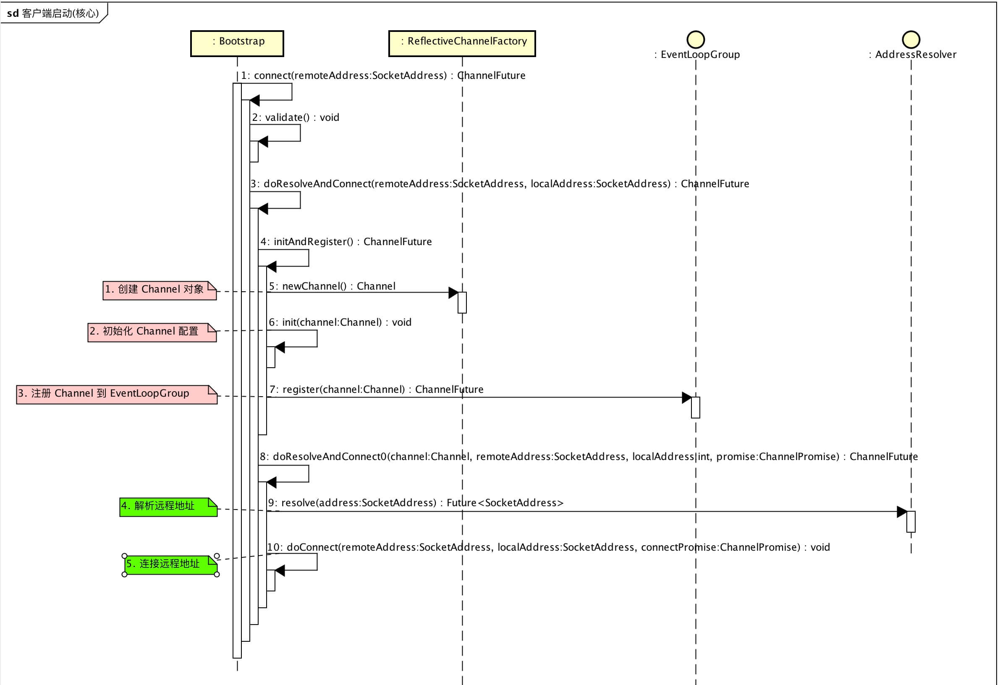


- 主è¦æœ‰ 5 个步骤，下é¢æˆ‘们æ¥æ‹†è§£ä»£ç ï¼Œçœ‹çœ‹å’Œæˆ‘们在 [《精尽 Netty æºç åˆ†æ —— NIO 基础（五）之示例》](http://svip.iocoder.cn/Netty/nio-5-demo/?self) çš„ NioClient 的代ç ï¼Œæ˜¯**æ€ä¹ˆå¯¹åº”**的。
- 相比 `#bind(...)` 方法的æµç¨‹ï¼Œä¸»è¦æ˜¯**绿色**çš„ 2 个步骤。

##### 3.6.1 doResolveAndConnect

`#doResolveAndConnect(final SocketAddress remoteAddress, final SocketAddress localAddress)` 方法，代ç å¦‚下：

```java
 1: private ChannelFuture doResolveAndConnect(final SocketAddress remoteAddress, final SocketAddress localAddress) {
 2:     // åˆå§‹åŒ–并注册一个 Channel 对象，因为注册是异步的过程，所以返å›ä¸€ä¸ª ChannelFuture 对象。
 3:     final ChannelFuture regFuture = initAndRegister();
 4:     final Channel channel = regFuture.channel();
 5: 
 6:     if (regFuture.isDone()) {
 7:         // 若执行失败，直æ¥è¿›è¡Œè¿”å›ã€‚
 8:         if (!regFuture.isSuccess()) {
 9:             return regFuture;
10:         }
11:         // 解æ远程地å€ï¼Œå¹¶è¿›è¡Œè¿æ¥
12:         return doResolveAndConnect0(channel, remoteAddress, localAddress, channel.newPromise());
13:     } else {
14:         // Registration future is almost always fulfilled already, but just in case it's not.
15:         final PendingRegistrationPromise promise = new PendingRegistrationPromise(channel);
16:         regFuture.addListener(new ChannelFutureListener() {
17: 
18:             @Override
19:             public void operationComplete(ChannelFuture future) throws Exception {
20:                 // Directly obtain the cause and do a null check so we only need one volatile read in case of a
21:                 // failure.
22:                 Throwable cause = future.cause();
23:                 if (cause != null) {
24:                     // Registration on the EventLoop failed so fail the ChannelPromise directly to not cause an
25:                     // IllegalStateException once we try to access the EventLoop of the Channel.
26:                     promise.setFailure(cause);
27:                 } else {
28:                     // Registration was successful, so set the correct executor to use.
29:                     // See https://github.com/netty/netty/issues/2586
30:                     promise.registered();
31: 
32:                     // 解æ远程地å€ï¼Œå¹¶è¿›è¡Œè¿æ¥
33:                     doResolveAndConnect0(channel, remoteAddress, localAddress, promise);
34:                 }
35:             }
36: 
37:         });
38:         return promise;
39:     }
40: }
```

- 第 3 行：调用 `#initAndRegister()`方法，åˆå§‹åŒ–并注册一个 Channel 对象。因为注册是异步的过程，所以返å›ä¸€ä¸ª ChannelFuture 对象。详细解æ，è§ã€Œ3.7 initAndRegisterã€
- 第 6 至 10 行：若执行失败，直æ¥è¿›è¡Œè¿”å› `regFuture` 对象。
- 第 9 至 37 行：因为注册是异步的过程，有å¯èƒ½å·²å®Œæˆï¼Œæœ‰å¯èƒ½æœªå®Œæˆã€‚所以å®ç°ä»£ç åˆ†æˆäº†ã€ç¬¬ 12 行】和ã€ç¬¬ 13 至 37 行】分别处ç†å·²å®Œæˆå’Œæœªå®Œæˆçš„情况。
  - **核心**在ã€ç¬¬ 12 行】或者ã€ç¬¬ 33 行】的代ç ï¼Œè°ƒç”¨ `#doResolveAndConnect0(final Channel channel, SocketAddress remoteAddress, final SocketAddress localAddress, final ChannelPromise promise)` 方法，解æ远程地å€ï¼Œå¹¶è¿›è¡Œè¿æ¥ã€‚
  - 如æœ**异步**注册对应的 ChanelFuture 未完æˆï¼Œåˆ™è°ƒç”¨ `ChannelFuture#addListener(ChannelFutureListener)` 方法，添加监å¬å™¨ï¼Œåœ¨**注册**完æˆå，进行å›è°ƒæ‰§è¡Œ `#doResolveAndConnect0(...)` 方法的逻辑。详细解æï¼Œè§ [「3.6.2 doResolveAndConnect0ã€](http://svip.iocoder.cn/Netty/bootstrap-2-client/#) 。
  - 所以总结æ¥è¯´ï¼Œ**resolve å’Œ connect 的逻辑，执行在 register 的逻辑之å**。

##### 3.6.2 doResolveAndConnect0

> è€è‰¿è‰¿ï¼šæ­¤å°èŠ‚的内容，胖å‹å…ˆçœ‹å®Œ [「3.7 initAndRegisterã€](http://svip.iocoder.cn/Netty/bootstrap-2-client/#) 的内容在å›è¿‡å¤´æ¥çœ‹ã€‚因为 `#doResolveAndConnect0(...)` 方法的执行，在 `#initAndRegister()` 方法之å。

`#doResolveAndConnect0(...)` 方法，解æ远程地å€ï¼Œå¹¶è¿›è¡Œè¿æ¥ã€‚代ç å¦‚下：

```java
 1: private ChannelFuture doResolveAndConnect0(final Channel channel, SocketAddress remoteAddress,
 2:                                            final SocketAddress localAddress, final ChannelPromise promise) {
 3:     try {
 4:         final EventLoop eventLoop = channel.eventLoop();
 5:         final AddressResolver<SocketAddress> resolver = this.resolver.getResolver(eventLoop);
 6: 
 7:         if (!resolver.isSupported(remoteAddress) || resolver.isResolved(remoteAddress)) {
 8:             // Resolver has no idea about what to do with the specified remote address or it's resolved already.
 9:             doConnect(remoteAddress, localAddress, promise);
10:             return promise;
11:         }
12: 
13:         // 解æ远程地å€
14:         final Future<SocketAddress> resolveFuture = resolver.resolve(remoteAddress);
15: 
16:         if (resolveFuture.isDone()) {
17:             // 解æ远程地å€å¤±è´¥ï¼Œå…³é—­ Channel ，并å›è°ƒé€šçŸ¥ promise 异常
18:             final Throwable resolveFailureCause = resolveFuture.cause();
19:             if (resolveFailureCause != null) {
20:                 // Failed to resolve immediately
21:                 channel.close();
22:                 promise.setFailure(resolveFailureCause);
23:             } else {
24:                 // Succeeded to resolve immediately; cached? (or did a blocking lookup)
25:                 // è¿æ¥è¿œç¨‹åœ°å€
26:                 doConnect(resolveFuture.getNow(), localAddress, promise);
27:             }
28:             return promise;
29:         }
30: 
31:         // Wait until the name resolution is finished.
32:         resolveFuture.addListener(new FutureListener<SocketAddress>() {
33:             @Override
34:             public void operationComplete(Future<SocketAddress> future) throws Exception {
35:                 // 解æ远程地å€å¤±è´¥ï¼Œå…³é—­ Channel ，并å›è°ƒé€šçŸ¥ promise 异常
36:                 if (future.cause() != null) {
37:                     channel.close();
38:                     promise.setFailure(future.cause());
39:                 // 解æ远程地å€æˆåŠŸï¼Œè¿æ¥è¿œç¨‹åœ°å€
40:                 } else {
41:                     doConnect(future.getNow(), localAddress, promise);
42:                 }
43:             }
44:         });
45:     } catch (Throwable cause) {
46:         // å‘生异常，并å›è°ƒé€šçŸ¥ promise 异常
47:         promise.tryFailure(cause);
48:     }
49:     return promise;
50: }
```

- 第 3 至 14 行：使用 `resolver`解æ远程地å€ã€‚因为解æ是异步的过程，所以返å›ä¸€ä¸ª Future 对象。
  - 详细的解æ远程地å€çš„代ç ï¼Œè€ƒè™‘到暂时ä¸æ˜¯æœ¬æ–‡çš„é‡ç‚¹ï¼Œæ‰€ä»¥æš‚æ—¶çœç•¥ã€‚😈 è€è‰¿è‰¿çŒœæµ‹èƒ–å‹åº”该也暂时ä¸æ„Ÿå…´è¶£ï¼Œå“ˆå“ˆå“ˆã€‚
- 第 16 至 44 行：因为注册是异步的过程，有å¯èƒ½å·²å®Œæˆï¼Œæœ‰å¯èƒ½æœªå®Œæˆã€‚所以å®ç°ä»£ç åˆ†æˆäº†ã€ç¬¬ 16 至 29 行】和ã€ç¬¬ 31 至 44 行】分别处ç†å·²å®Œæˆå’Œæœªå®Œæˆçš„情况。
  - **核心**在ã€ç¬¬ 26 行】或者ã€ç¬¬ 41 行】的代ç ï¼Œè°ƒç”¨ `#doConnect(...)` 方法，è¿æ¥è¿œç¨‹åœ°å€ã€‚
  - 如æœ**异步**解æ对应的 Future 未完æˆï¼Œåˆ™è°ƒç”¨ `Future#addListener(FutureListener)` 方法，添加监å¬å™¨ï¼Œåœ¨**解æ**完æˆå，进行å›è°ƒæ‰§è¡Œ `#doConnect(...)` 方法的逻辑。详细解æï¼Œè§ è§ [「3.13.3 doConnectã€](http://svip.iocoder.cn/Netty/bootstrap-2-client/#) 。
  - 所以总结æ¥è¯´ï¼Œ**connect 的逻辑，执行在 resolve 的逻辑之å**。
  - è€è‰¿è‰¿ç›®å‰ä½¿ç”¨ [「2. Bootstrap 示例ã€](http://svip.iocoder.cn/Netty/bootstrap-2-client/#) 测试下æ¥ï¼Œç¬¦åˆã€ç¬¬ 16 至 30 行】的æ¡ä»¶ï¼Œå³æ— éœ€èµ°**异步**çš„æµç¨‹ã€‚

##### 3.6.3 doConnect

`#doConnect(...)` 方法，执行 Channel è¿æ¥è¿œç¨‹åœ°å€çš„逻辑。代ç å¦‚下：

```java
 1: private static void doConnect(final SocketAddress remoteAddress, final SocketAddress localAddress, final ChannelPromise connectPromise) {
 2: 
 3:     // This method is invoked before channelRegistered() is triggered.  Give user handlers a chance to set up
 4:     // the pipeline in its channelRegistered() implementation.
 5:     final Channel channel = connectPromise.channel();
 6:     channel.eventLoop().execute(new Runnable() {
 7: 
 8:         @Override
 9:         public void run() {
10:             if (localAddress == null) {
11:                 channel.connect(remoteAddress, connectPromise);
12:             } else {
13:                 channel.connect(remoteAddress, localAddress, connectPromise);
14:             }
15:             connectPromise.addListener(ChannelFutureListener.CLOSE_ON_FAILURE);
16:         }
17: 
18:     });
19: }
```

- 第 6 行：调用 EventLoop 执行 Channel è¿æ¥è¿œç¨‹åœ°å€çš„逻辑。但是，å®é™…上当å‰çº¿ç¨‹å·²ç»æ˜¯ EventLoop 所在的线程了，为何还è¦è¿™æ ·æ“作呢？答案在ã€ç¬¬ 3 至 4 行】的英语注释。感å¹å¥ï¼ŒNetty 虽然代ç é‡é常åºå¤§ä¸”å¤æ‚，但是英文注释真的是é常é½å…¨ï¼ŒåŒ…括 Github çš„ issue 对代ç æ交的æ述，也é常å¥å…¨ã€‚

- 第 10 至 14 行：调用`Channel#connect(...)`方法，执行 Channel è¿æ¥è¿œç¨‹åœ°å€çš„逻辑。å续的方法栈调用如下图：

  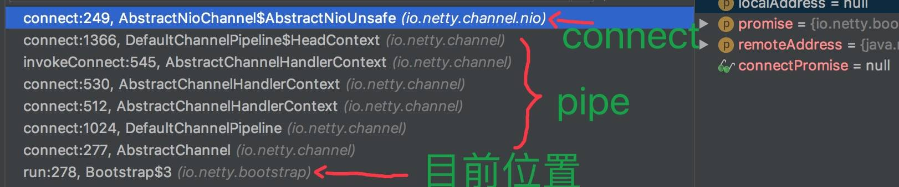

  

  Channel connect æµç¨‹

  - 还是è€æ ·å­ï¼Œæˆ‘们先çœç•¥æ‰ pipeline 的内部å®ç°ä»£ç ï¼Œä» `AbstractNioUnsafe#connect(final SocketAddress remoteAddress, final SocketAddress localAddress, final ChannelPromise promise)` 方法，继续å‘下分享。

`AbstractNioUnsafe#connect(final SocketAddress remoteAddress, final SocketAddress localAddress, final ChannelPromise promise)` 方法，执行 Channel è¿æ¥è¿œç¨‹åœ°å€çš„逻辑。代ç å¦‚下：

```java
 1: @Override
 2: public final void connect(final SocketAddress remoteAddress, final SocketAddress localAddress, final ChannelPromise promise) {
 3:     if (!promise.setUncancellable() || !ensureOpen(promise)) {
 4:         return;
 5:     }
 6: 
 7:     try {
 8:         // ç›®å‰æœ‰æ­£åœ¨è¿æ¥è¿œç¨‹åœ°å€çš„ ChannelPromise ，则直æ¥æŠ›å‡ºå¼‚常，ç¦æ­¢åŒæ—¶å‘起多个è¿æ¥ã€‚
 9:         if (connectPromise != null) {
10:             // Already a connect in process.
11:             throw new ConnectionPendingException();
12:         }
13: 
14:         // 记录 Channel 是å¦æ¿€æ´»
15:         boolean wasActive = isActive();
16: 
17:         // 执行è¿æ¥è¿œç¨‹åœ°å€
18:         if (doConnect(remoteAddress, localAddress)) {
19:             fulfillConnectPromise(promise, wasActive);
20:         } else {
21:             // 记录 connectPromise
22:             connectPromise = promise;
23:             // 记录 requestedRemoteAddress
24:             requestedRemoteAddress = remoteAddress;
25: 
26:             // 使用 EventLoop å‘起定时任务，监å¬è¿æ¥è¿œç¨‹åœ°å€è¶…时。若è¿æ¥è¶…时，则å›è°ƒé€šçŸ¥ connectPromise 超时异常。
27:             // Schedule connect timeout.
28:             int connectTimeoutMillis = config().getConnectTimeoutMillis(); // 默认 30 * 1000 毫秒
29:             if (connectTimeoutMillis > 0) {
30:                 connectTimeoutFuture = eventLoop().schedule(new Runnable() {
31:                     @Override
32:                     public void run() {
33:                         ChannelPromise connectPromise = AbstractNioChannel.this.connectPromise;
34:                         ConnectTimeoutException cause = new ConnectTimeoutException("connection timed out: " + remoteAddress);
35:                         if (connectPromise != null && connectPromise.tryFailure(cause)) {
36:                             close(voidPromise());
37:                         }
38:                     }
39:                 }, connectTimeoutMillis, TimeUnit.MILLISECONDS);
40:             }
41: 
42:             // 添加监å¬å™¨ï¼Œç›‘å¬è¿æ¥è¿œç¨‹åœ°å€å–消。
43:             promise.addListener(new ChannelFutureListener() {
44:                 @Override
45:                 public void operationComplete(ChannelFuture future) throws Exception {
46:                     if (future.isCancelled()) {
47:                         // å–消定时任务
48:                         if (connectTimeoutFuture != null) {
49:                             connectTimeoutFuture.cancel(false);
50:                         }
51:                         // 置空 connectPromise
52:                         connectPromise = null;
53:                         close(voidPromise());
54:                     }
55:                 }
56:             });
57:         }
58:     } catch (Throwable t) {
59:         // å›è°ƒé€šçŸ¥ promise å‘生异常
60:         promise.tryFailure(annotateConnectException(t, remoteAddress));
61:         closeIfClosed();
62:     }
63: }
```

- 第 8 至 12 行：目å‰æœ‰æ­£åœ¨è¿æ¥è¿œç¨‹åœ°å€çš„ ChannelPromise ，则直æ¥æŠ›å‡ºå¼‚常，ç¦æ­¢åŒæ—¶å‘起多个è¿æ¥ã€‚`connectPromise` å˜é‡ï¼Œå®šä¹‰åœ¨ AbstractNioChannel 类中，代ç å¦‚下：

  ```java
  /**
   * ç›®å‰æ­£åœ¨è¿æ¥è¿œç¨‹åœ°å€çš„ ChannelPromise 对象。
   *
   * The future of the current connection attempt.  If not null, subsequent
   * connection attempts will fail.
   */
  private ChannelPromise connectPromise;
  ```

- 第 15 行：调用 `#isActive()` 方法，è·å¾— Channel 是å¦æ¿€æ´»ã€‚NioSocketChannel 对该方法的å®ç°ä»£ç å¦‚下：

  ```java
  @Override
  public boolean isActive() {
      SocketChannel ch = javaChannel();
      return ch.isOpen() && ch.isConnected();
  }
  ```

  - 判断 SocketChannel 是å¦å¤„äºæ‰“开，并且è¿æ¥çš„状æ€ã€‚此时，一般返å›çš„是 `false` 。

- 第 18 行：调用 `#doConnect(SocketAddress remoteAddress, SocketAddress localAddress)` 方法，执行è¿æ¥è¿œç¨‹åœ°å€ã€‚代ç å¦‚下：

  ```java
  // NioSocketChannel.java
    1: @Override
    2: protected boolean doConnect(SocketAddress remoteAddress, SocketAddress localAddress) throws Exception {
    3:     // 绑定本地地å€
    4:     if (localAddress != null) {
    5:         doBind0(localAddress);
    6:     }
    7: 
    8:     boolean success = false; // 执行是å¦æˆåŠŸ
    9:     try {
   10:         // è¿æ¥è¿œç¨‹åœ°å€
   11:         boolean connected = SocketUtils.connect(javaChannel(), remoteAddress);
   12:         // 若未è¿æ¥å®Œæˆï¼Œåˆ™å…³æ³¨è¿æ¥( OP_CONNECT )事件。
   13:         if (!connected) {
   14:             selectionKey().interestOps(SelectionKey.OP_CONNECT);
   15:         }
   16:         // 标记执行是å¦æˆåŠŸ
   17:         success = true;
   18:         // è¿”å›æ˜¯å¦è¿æ¥å®Œæˆ
   19:         return connected;
   20:     } finally {
   21:         // 执行失败，则关闭 Channel
   22:         if (!success) {
   23:             doClose();
   24:         }
   25:     }
   26: }
  ```

  - 第 3 至 6 行：若 `localAddress` é空，则调用 `#doBind0(SocketAddress)` 方法，绑定本地地å€ã€‚一般情况下，NIO Client 是ä¸éœ€è¦ç»‘定本地地å€çš„。默认情况下，系统会éšæœºåˆ†é…一个å¯ç”¨çš„本地地å€ï¼Œè¿›è¡Œç»‘定。

  - 第 11 行：调用 `SocketUtils#connect(SocketChannel socketChannel, SocketAddress remoteAddress)` 方法，Java åŸç”Ÿ NIO SocketChannel è¿æ¥ 远程地å€ï¼Œå¹¶è¿”å›æ˜¯å¦è¿æ¥å®Œæˆ( æˆåŠŸ )。代ç å¦‚下：

    ```java
    public static boolean connect(final SocketChannel socketChannel, final SocketAddress remoteAddress) throws IOException {
        try {
            return AccessController.doPrivileged(new PrivilegedExceptionAction<Boolean>() {
                @Override
                public Boolean run() throws IOException {
                    return socketChannel.connect(remoteAddress);
                }
            });
        } catch (PrivilegedActionException e) {
            throw (IOException) e.getCause();
        }
    }
    ```

    - å¯èƒ½æœ‰èƒ–å‹æœ‰å’Œæˆ‘一样的疑问，为什么将 connect æ“作包在 AccessController 中呢？我们æ¥çœ‹ä¸‹ SocketUtils 类的注释：

      ```java
      /**
       * Provides socket operations with privileges enabled. This is necessary for applications that use the
       * {@link SecurityManager} to restrict {@link SocketPermission} to their application. By asserting that these
       * operations are privileged, the operations can proceed even if some code in the calling chain lacks the appropriate
       * {@link SocketPermission}.
       */
      ```

      - 一般情况下，我们用ä¸åˆ°ï¼Œæ‰€ä»¥ä¹Ÿå¯ä»¥æš‚æ—¶ä¸ç”¨ç†è§£ã€‚
      - 感兴趣的胖å‹ï¼Œå¯ä»¥ Google “AccessController†关键字，或者阅读 [《Java 安全模å‹ä»‹ç»ã€‹](https://www.ibm.com/developerworks/cn/java/j-lo-javasecurity/index.html) 。

  - ã€é‡è¦ã€‘第 12 至 15 行：若è¿æ¥æœªå®Œæˆ( `connected == false` )时，我们å¯ä»¥çœ‹åˆ°ï¼Œè°ƒç”¨ `SelectionKey#interestOps(ops)` 方法，添加è¿æ¥äº‹ä»¶( `SelectionKey.OP_CONNECT` )为感兴趣的事件。也就说，也就是说，当è¿æ¥è¿œç¨‹åœ°å€æˆåŠŸæ—¶ï¼ŒChannel 对应的 Selector 将会轮询到该事件，å¯ä»¥è¿›ä¸€æ­¥å¤„ç†ã€‚

  - 第 20 至 25 行：若执行失败( `success == false` )时，调用 `#doClose()` 方法，关闭 Channel 。

- 第 18 至 19 行：笔者测试下æ¥ï¼Œ`#doConnect(SocketChannel socketChannel, SocketAddress remoteAddress)` 方法的结æœä¸º `false` ，所以ä¸ä¼šæ‰§è¡Œã€ç¬¬ 19 行】代ç çš„ `#fulfillConnectPromise(ChannelPromise promise, boolean wasActive)` 方法，而是执行ã€ç¬¬ 20 至 57 行】的代ç é€»è¾‘。

- 第 22 行：记录 `connectPromise` 。

- 第 24 行：记录 `requestedRemoteAddress` 。`requestedRemoteAddress` å˜é‡ï¼Œåœ¨ AbstractNioChannel 类中定义，代ç å¦‚下：

  ```java
  /**
   * 正在è¿æ¥çš„远程地å€
   */
  private SocketAddress requestedRemoteAddress;
  ```

- 第 26 至 40 行：调用 `EventLoop#schedule(Runnable command, long delay, TimeUnit unit)` 方法，å‘起定时任务 `connectTimeoutFuture` ，监å¬è¿æ¥è¿œç¨‹åœ°å€**是å¦è¶…æ—¶**。若è¿æ¥è¶…时，则å›è°ƒé€šçŸ¥ `connectPromise` 超时异常。`connectPromise` å˜é‡ï¼Œåœ¨ AbstractNioChannel 类中定义，代ç å¦‚下：

  ```java
  /**
   * è¿æ¥è¶…æ—¶ç›‘å¬ ScheduledFuture 对象。
   */
  private ScheduledFuture<?> connectTimeoutFuture;
  ```

- 第 42 至 57 行：调用 `ChannelPromise#addListener(ChannelFutureListener)` 方法，添加监å¬å™¨ï¼Œç›‘å¬è¿æ¥è¿œç¨‹åœ°å€**是å¦å–消**。若å–消，则å–消 `connectTimeoutFuture` 任务，并置空 `connectPromise` 。这样，客户端 Channel å¯ä»¥å‘起下一次è¿æ¥ã€‚

##### 3.6.4 finishConnect

看到此处，å¯èƒ½èƒ–å‹ä¼šæœ‰ç–‘问，客户端的è¿æ¥åœ¨å“ªé‡Œå®Œæˆå‘¢ï¼Ÿç­”案在 `AbstractNioUnsafe#finishConnect()` 方法中。而该方法通过 Selector 轮询到 `SelectionKey.OP_CONNECT` 事件时，进行触å‘。调用栈如下图：

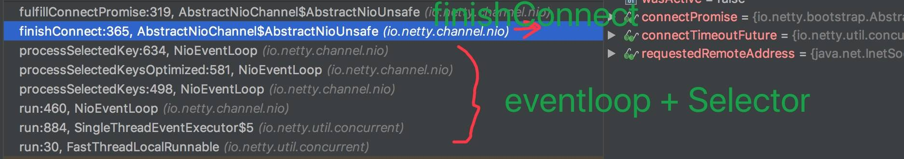

```
* 哈哈哈，还是è€æ ·å­ï¼Œæˆ‘们先çœç•¥æ‰ EventLoop 的内部å®ç°ä»£ç ï¼Œä» `AbstractNioUnsafe#finishConnect()` 方法，继续å‘下分享。
```

`AbstractNioUnsafe#finishConnect()` 方法，完æˆå®¢æˆ·ç«¯çš„è¿æ¥ã€‚代ç å¦‚下：

```java
 1: @Override
 2: public final void finishConnect() {
 3:     // Note this method is invoked by the event loop only if the connection attempt was
 4:     // neither cancelled nor timed out.
 5:     // 判断是å¦åœ¨ EventLoop 的线程中。
 6:     assert eventLoop().inEventLoop();
 7: 
 8:     try {
 9:         // è·å¾— Channel 是å¦æ¿€æ´»
10:         boolean wasActive = isActive();
11:         // 执行完æˆè¿æ¥
12:         doFinishConnect();
13:         // 通知 connectPromise è¿æ¥å®Œæˆ
14:         fulfillConnectPromise(connectPromise, wasActive);
15:     } catch (Throwable t) {
16:         // 通知 connectPromise è¿æ¥å¼‚常
17:         fulfillConnectPromise(connectPromise, annotateConnectException(t, requestedRemoteAddress));
18:     } finally {
19:         // å–消 connectTimeoutFuture 任务
20:         // Check for null as the connectTimeoutFuture is only created if a connectTimeoutMillis > 0 is used
21:         // See https://github.com/netty/netty/issues/1770
22:         if (connectTimeoutFuture != null) {
23:             connectTimeoutFuture.cancel(false);
24:         }
25:         // 置空 connectPromise
26:         connectPromise = null;
27:     }
28: }
```

- 第 6 行：判断是å¦åœ¨ EventLoop 的线程中。
- 第 10 行：调用 `#isActive()` 方法，è·å¾— Channel 是å¦æ¿€æ´»ã€‚ç¬”è€…è°ƒè¯•æ—¶ï¼Œæ­¤æ—¶è¿”å› `false` ，因为è¿æ¥è¿˜æ²¡å®Œæˆã€‚
- 第 12 行：调用 `#doFinishConnect()` 方法，执行完æˆè¿æ¥çš„逻辑。详细解æï¼Œè§ [「3.6.4.1 doFinishConnectã€](http://svip.iocoder.cn/Netty/bootstrap-2-client/#) 。
- 第 14 行：执行完æˆè¿æ¥**æˆåŠŸ**，调用 `#fulfillConnectPromise(ChannelPromise promise, boolean wasActive)` 方法，通知 `connectPromise` è¿æ¥å®Œæˆã€‚详细解æï¼Œè§ [「3.6.4.2 fulfillConnectPromise æˆåŠŸã€](http://svip.iocoder.cn/Netty/bootstrap-2-client/#) 。
- 第 15 至 17 行：执行完æˆè¿æ¥**异常**，调用 `#fulfillConnectPromise(ChannelPromise promise, Throwable cause)` 方法，通知 `connectPromise` è¿æ¥å¼‚常。详细解æï¼Œè§ [「3.6.4.3 fulfillConnectPromise 异常ã€](http://svip.iocoder.cn/Netty/bootstrap-2-client/#) 。
- 第 18 至 27 行：执行完æˆè¿æ¥**结æŸ**，å–消 `connectTimeoutFuture` 任务，并置空 `connectPromise` 。

###### 3.6.4.1 doFinishConnect

`NioSocketChannel#doFinishConnect()` 方法，执行完æˆè¿æ¥çš„逻辑。代ç å¦‚下：

```java
@Override
protected void doFinishConnect() throws Exception {
    if (!javaChannel().finishConnect()) {
        throw new Error();
    }
}
```

- ã€é‡è¦ã€‘是ä¸æ˜¯é常熟悉的，调用 `SocketChannel#finishConnect()` 方法，完æˆè¿æ¥ã€‚😈 ç¾æ»‹æ»‹ã€‚

###### 3.6.4.2 fulfillConnectPromise æˆåŠŸ

`AbstractNioUnsafe#fulfillConnectPromise(ChannelPromise promise, Throwable cause)` 方法，通知 `connectPromise` è¿æ¥å®Œæˆã€‚代ç å¦‚下：

```java
 1: private void fulfillConnectPromise(ChannelPromise promise, boolean wasActive) {
 2:     if (promise == null) {
 3:         // Closed via cancellation and the promise has been notified already.
 4:         return;
 5:     }
 6: 
 7:     // è·å¾— Channel 是å¦æ¿€æ´»
 8:     // Get the state as trySuccess() may trigger an ChannelFutureListener that will close the Channel.
 9:     // We still need to ensure we call fireChannelActive() in this case.
10:     boolean active = isActive();
11: 
12:     // å›è°ƒé€šçŸ¥ promise 执行æˆåŠŸ
13:     // trySuccess() will return false if a user cancelled the connection attempt.
14:     boolean promiseSet = promise.trySuccess();
15: 
16:     // è‹¥ Channel 是新激活的，触å‘通知 Channel 已激活的事件。
17:     // Regardless if the connection attempt was cancelled, channelActive() event should be triggered,
18:     // because what happened is what happened.
19:     if (!wasActive && active) {
20:         pipeline().fireChannelActive();
21:     }
22: 
23:     // If a user cancelled the connection attempt, close the channel, which is followed by channelInactive().
24:     // TODO 芋艿
25:     if (!promiseSet) {
26:         close(voidPromise());
27:     }
28: }
```

- 第 10 行：调用 `#isActive()` 方法，è·å¾— Channel 是å¦æ¿€æ´»ã€‚ç¬”è€…è°ƒè¯•æ—¶ï¼Œæ­¤æ—¶è¿”å› `true` ，因为è¿æ¥å·²ç»å®Œæˆã€‚

- 第 14 行：å›è°ƒé€šçŸ¥ `promise` 执行æˆåŠŸã€‚此处的通知，对应å›è°ƒçš„是我们添加到 `#connect(...)` 方法返å›çš„ ChannelFuture çš„ ChannelFutureListener 的监å¬å™¨ã€‚示例代ç å¦‚下：

  ```java
  ChannelFuture f = b.connect(HOST, PORT).addListener(new ChannelFutureListener() { // å›è°ƒçš„就是我ï¼ï¼ï¼
      @Override
      public void operationComplete(ChannelFuture future) throws Exception {
          System.out.println("è¿æ¥å®Œæˆ");
      }
  }).sync();
  ```

- 第 19 行：因为`wasActive == false`并且`active == true`，因此，Channel å¯ä»¥è®¤ä¸ºæ˜¯æ–°æ¿€æ´»çš„，满足ã€ç¬¬ 20 行】代ç çš„执行æ¡ä»¶ã€‚
  - 第 40 行：调用 `DefaultChannelPipeline#fireChannelActive()` æ–¹æ³•ï¼Œè§¦å‘ Channel 激活的事件。ã€é‡è¦ã€‘åç»­çš„æµç¨‹ï¼Œå’Œ NioServerSocketChannel 一样，也就说，会调用到 `AbstractUnsafe#beginRead()` 方法。这æ„味ç€ä»€ä¹ˆå‘¢ï¼Ÿå°†æˆ‘们创建 NioSocketChannel 时，设置的 `readInterestOp = SelectionKey.OP_READ` 添加为感兴趣的事件。也就说，客户端å¯ä»¥è¯»å–æœåŠ¡ç«¯å‘é€æ¥çš„æ•°æ®ã€‚
  - å…³äº `AbstractUnsafe#beginRead()` 方法的解æï¼Œè§ [《精尽 Netty æºç åˆ†æ —— å¯åŠ¨ï¼ˆä¸€ï¼‰ä¹‹æœåŠ¡ç«¯ã€‹çš„ 「3.13.3 beginReadã€](http://svip.iocoder.cn/Netty/bootstrap-1-server/?self) 部分。
- 第 23 至 27 行：TODO 芋艿 1004 fulfillConnectPromise promiseSet

###### 3.6.4.3 fulfillConnectPromise 异常

`#fulfillConnectPromise(ChannelPromise promise, Throwable cause)` 方法，通知 `connectPromise` è¿æ¥å¼‚常。代ç å¦‚下：

```java
private void fulfillConnectPromise(ChannelPromise promise, Throwable cause) {
    if (promise == null) {
        // Closed via cancellation and the promise has been notified already.
        return;
    }

    // å›è°ƒé€šçŸ¥ promise å‘生异常
    // Use tryFailure() instead of setFailure() to avoid the race against cancel().
    promise.tryFailure(cause);
    // 关闭
    closeIfClosed();
}
```

- 比较简å•ï¼Œå·²ç»æ·»åŠ ä¸­æ–‡æ³¨é‡Šï¼Œèƒ–å‹è‡ªå·±æŸ¥çœ‹ã€‚

#### 3.7 initAndRegister

Bootstrap 继承 AbstractBootstrap 抽象类，所以 `#initAndRegister()` 方法的æµç¨‹ä¸Šæ˜¯ä¸€è‡´çš„。所以和 ServerBootstrap 的差别在äºï¼š

1. 创建的 Channel 对象ä¸åŒã€‚
2. åˆå§‹åŒ– Channel é…置的代ç å®ç°ä¸åŒã€‚

##### 3.7.1 创建 Channel 对象

考虑到本文的内容，我们以 NioSocketChannel 的创建过程作为示例。创建 NioSocketChannel 对象的æµç¨‹ï¼Œå’Œ NioServerSocketChannel 基本是一致的，所以æµç¨‹å›¾æˆ‘们就ä¸æ供了，直æ¥å¼€å§‹æ’¸æºç ã€‚

###### 3.7.1.1 NioSocketChannel

```java
private static final SelectorProvider DEFAULT_SELECTOR_PROVIDER = SelectorProvider.provider();

private final SocketChannelConfig config;

public NioSocketChannel() {
    this(DEFAULT_SELECTOR_PROVIDER);
}

public NioSocketChannel(SelectorProvider provider) {
    this(newSocket(provider));
}
```

- `DEFAULT_SELECTOR_PROVIDER` **é™æ€**å±æ€§ï¼Œé»˜è®¤çš„ SelectorProvider å®ç°ç±»ã€‚

- `config` å±æ€§ï¼ŒChannel 对应的é…置对象。æ¯ç§ Channel å®ç°ç±»ï¼Œä¹Ÿä¼šå¯¹åº”一个 ChannelConfig å®ç°ç±»ã€‚例如，NioSocketChannel 类，对应 SocketChannelConfig é…置类。

- 在æ„造方法中，调用 `#newSocket(SelectorProvider provider)` 方法，创建 NIO çš„ ServerSocketChannel 对象。代ç å¦‚下：

  ```java
  private static SocketChannel newSocket(SelectorProvider provider) {
      try {
          /**
           *  Use the {@link SelectorProvider} to open {@link SocketChannel} and so remove condition in
           *  {@link SelectorProvider#provider()} which is called by each SocketChannel.open() otherwise.
           *
           *  See <a href="https://github.com/netty/netty/issues/2308">#2308</a>.
           */
          return provider.openSocketChannel();
      } catch (IOException e) {
          throw new ChannelException("Failed to open a socket.", e);
      }
  }
  ```

  - 😈 是ä¸æ˜¯å¾ˆç†Ÿæ‚‰è¿™æ ·çš„代ç ï¼Œæ•ˆæœå’Œ `SocketChannel#open()` 方法创建 SocketChannel 对象是一致。

- `#NioSocketChannel(SocketChannel channel)` æ„造方法，代ç å¦‚下：

  ```java
  public NioSocketChannel(SocketChannel socket) {
      this(null, socket);
  }
  
  public NioSocketChannel(Channel parent, SocketChannel socket) {
      super(parent, socket);
      config = new NioSocketChannelConfig(this, socket.socket());
  }
  ```

  - 调用父 AbstractNioByteChannel çš„æ„造方法。详细解æï¼Œè§ [「3.7.1.2 AbstractNioByteChannelã€](http://svip.iocoder.cn/Netty/bootstrap-2-client/#) 。
  - åˆå§‹åŒ– `config` å±æ€§ï¼Œåˆ›å»º NioSocketChannelConfig 对象。

###### 3.7.1.2 AbstractNioByteChannel

```java
protected AbstractNioByteChannel(Channel parent, SelectableChannel ch) {
    super(parent, ch, SelectionKey.OP_READ);
}
```

- 调用父 AbstractNioChannel çš„æ„造方法。åç»­çš„æ„造方法，和 NioServerSocketChannel 是一致的。
  - 注æ„传入的 SelectionKey 的值为 `OP_READ` 。

##### 3.7.2 åˆå§‹åŒ– Channel é…ç½®

`#init(Channel channel)` 方法，åˆå§‹åŒ– Channel é…置。代ç å¦‚下：

```java
@Override
void init(Channel channel) throws Exception {
    ChannelPipeline p = channel.pipeline();

    // 添加处ç†å™¨åˆ° pipeline 中
    p.addLast(config.handler());

    // åˆå§‹åŒ– Channel çš„å¯é€‰é¡¹é›†åˆ
    final Map<ChannelOption<?>, Object> options = options0();
    synchronized (options) {
        setChannelOptions(channel, options, logger);
    }

    // åˆå§‹åŒ– Channel çš„å±æ€§é›†åˆ
    final Map<AttributeKey<?>, Object> attrs = attrs0();
    synchronized (attrs) {
        for (Entry<AttributeKey<?>, Object> e: attrs.entrySet()) {
            channel.attr((AttributeKey<Object>) e.getKey()).set(e.getValue());
        }
    }
}
```

- 比较简å•ï¼Œå·²ç»æ·»åŠ ä¸­æ–‡æ³¨é‡Šï¼Œèƒ–å‹è‡ªå·±æŸ¥çœ‹ã€‚

### 666. 彩蛋

撸完 Netty æœåŠ¡ç«¯å¯åŠ¨ä¹‹å，å†æ’¸ Netty 客户端å¯åŠ¨ä¹‹å，出奇的顺手。ç¾æ»‹æ»‹ã€‚

å¦å¤–，也æ¨è如下和 Netty 客户端å¯åŠ¨ç›¸å…³çš„文章，以加深ç†è§£ï¼š

- æ¨æ­¦å…µ [《Netty æºç åˆ†æ系列 —— Bootstrap》](https://my.oschina.net/ywbrj042/blog/868798)
- 永顺 [《Netty æºç åˆ†æ之 一 æ­å¼€ Bootstrap ç¥ç§˜çš„红盖头 (客户端)》](https://segmentfault.com/a/1190000007282789)