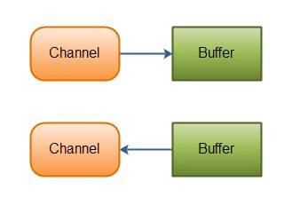
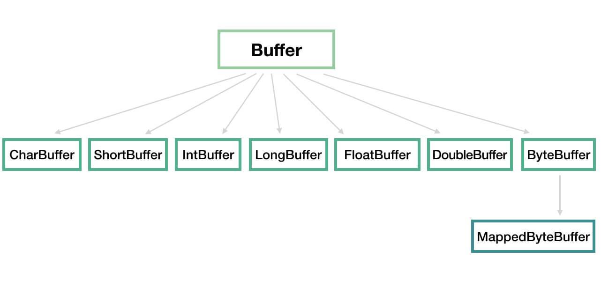
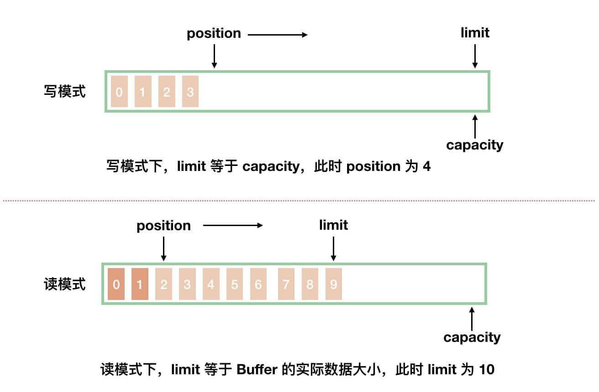

## NIO 基础（一）之简介

### 1. 概述

Java NIO( New IO 或者 Non Blocking IO ) ，从 Java 1.4 版本开始引入的**非阻塞** IO ，用于替换**标准**( 有些文章也称为**传统**，或者 Blocking IO 。下文统称为 BIO ) Java IO API 的 IO API 。

> 在一些文章中，会将 Java NIO 描述成**异步** IO ，实际是不太正确的： Java NIO 是**同步** IO ，Java AIO ( 也称为 NIO 2 )是**异步** IO。具体原因，推荐阅读文章：
>
> - [《异步和非阻塞一样吗? (内容涉及 BIO, NIO, AIO, Netty)》](https://blog.csdn.net/matthew_zhang/article/details/71328697) 。
> - [《BIO与NIO、AIO的区别(这个容易理解)》](https://blog.csdn.net/skiof007/article/details/52873421)
>
> 总结来说，在 **Unix IO 模型**的语境下：
>
> - 同步和异步的区别：数据拷贝阶段是否需要完全由操作系统处理。
> - 阻塞和非阻塞操作：是针对发起 IO 请求操作后，是否有立刻返回一个标志信息而不让请求线程等待。
>
> 因此，Java NIO 是**同步**且非阻塞的 IO 。

### 2. 核心组件

Java NIO 由如下**三个**核心组件组成：

- Channel
- Buffer
- Selector

后续的每篇文章，我们会分享对应的一个组件。

### 3. NIO 和 BIO 的对比

NIO 和 BIO 的区别主要体现在三个方面：

| NIO                  | BIO              |
| :------------------- | :--------------- |
| 基于缓冲区( Buffer ) | 基于流( Stream ) |
| **非**阻塞 IO        | 阻塞 IO          |
| 选择器( Selector )   | 无               |

- 其中，选择器( Selector )是 NIO 能实现**非**阻塞的基础。

#### 3.1 基于 Buffer 与基于 Stream

BIO 是面向字节流或者字符流的，而在 NIO 中，它摒弃了传统的 IO 流，而是引入 Channel 和 Buffer 的概念：从 Channel 中读取数据到 Buffer 中，或者将数据从 Buffer 中写到 Channel 中。

① 那么什么是**基于 Stream**呢？

在一般的 Java IO 操作中，我们以**流式**的方式，**顺序**的从一个 Stream 中读取一个或者多个字节，直至读取所有字节。因为它没有缓存区，所以我们就不能随意改变读取指针的位置。

② 那么什么是**基于 Buffer** 呢？

基于 Buffer 就显得有点不同了。我们在从 Channel 中读取数据到 Buffer 中，这样 Buffer 中就有了数据后，我们就可以对这些数据进行操作了。并且不同于一般的 Java IO 操作那样是**顺序**操作，NIO 中我们可以随意的读取任意位置的数据，这样大大增加了处理过程中的灵活性。

#### 3.2 阻塞与非阻塞 IO

Java IO 的各种流是**阻塞**的 IO 操作。这就意味着，当一个线程执行读或写 IO 操作时，该线程会被**阻塞**，直到有一些数据被读取，或者数据完全写入。

------

Java NIO 可以让我们**非阻塞**的使用 IO 操作。例如：

- 当一个线程执行从 Channel 执行读取 IO 操作时，当此时有数据，则读取数据并返回；当此时无数据，则直接返回**而不会阻塞当前线程**。
- 当一个线程执行向 Channel 执行写入 IO 操作时，**不需要阻塞等待它完全写入**，这个线程同时可以做别的事情。

也就是说，线程可以将非阻塞 IO 的空闲时间用于在其他 Channel 上执行 IO 操作。所以，一个单独的线程，可以管理多个 Channel 的读取和写入 IO 操作。

#### 3.3 Selector

Java NIO 引入 Selector ( 选择器 )的概念，它是 Java NIO 得以实现非阻塞 IO 操作的**最最最关键**。

我们可以注册**多个** Channel 到**一个** Selector 中。而 Selector 内部的机制，就可以自动的为我们不断的执行查询( select )操作，判断这些注册的 Channel 是否有**已就绪的 IO 事件( 例如可读，可写，网络连接已完成 )**。
通过这样的机制，**一个**线程通过使用**一个** Selector ，就可以非常简单且高效的来管理**多个** Channel 了。

## NIO 基础（二）之 Channel

### 1. 概述

在 Java NIO 中，基本上所有的 IO 操作都是从 Channel 开始。数据可以从 Channel 读取到 Buffer 中，也可以从 Buffer 写到 Channel 中。如下图所示：



### 2. NIO Channel 对比 Java Stream

NIO Channel **类似** Java Stream ，但又有几点不同：

1. 对于**同一个** Channel ，我们可以从它读取数据，也可以向它写入数据。而对于**同一个** Stream ，通畅要么只能读，要么只能写，二选一( 有些文章也描述成“单向”，也是这个意思 )。
2. Channel 可以**非阻塞**的读写 IO 操作，而 Stream 只能**阻塞**的读写 IO 操作。
3. Channel **必须配合** Buffer 使用，总是先读取到一个 Buffer 中，又或者是向一个 Buffer 写入。也就是说，我们无法绕过 Buffer ，直接向 Channel 写入数据。

### 3. Channel 的实现

Channel 在 Java 中，作为一个**接口**，`java.nio.channels.Channel` ，定义了 IO 操作的**连接与关闭**。代码如下：

```java
public interface Channel extends Closeable {

    /**
     * 判断此通道是否处于打开状态。 
     */
    public boolean isOpen();

    /**
     *关闭此通道。
     */
    public void close() throws IOException;
```

Channel 有非常多的实现类，最为重要的**四个** Channel 实现类如下：

- SocketChannel ：一个客户端用来**发起** TCP 的 Channel 。
- ServerSocketChannel ：一个服务端用来**监听**新进来的连接的 TCP 的 Channel 。对于每一个新进来的连接，都会创建一个对应的 SocketChannel 。
- DatagramChannel ：通过 UDP 读写数据。
- FileChannel ：从文件中，读写数据。

> 我们在使用 Netty 时，主要使用 TCP 协议，所以胖友可以只看 [「3.2 SocketChannel」](http://svip.iocoder.cn/Netty/nio-2-channel/#) 和 [「3.1 ServerSocketChannel」](http://svip.iocoder.cn/Netty/nio-2-channel/#) 。

## NIO 基础（三）之 Buffer

### 1. 概述

一个 Buffer ，本质上是内存中的一块，我们可以将数据写入这块内存，之后从这块内存获取数据。通过将这块内存封装成 NIO Buffer 对象，并提供了一组常用的方法，方便我们对该块内存的读写。

Buffer 在 `java.nio` 包中实现，被定义成**抽象类**，从而实现一组常用的方法。整体类图如下：



- 我们可以将 Buffer 理解为**一个数组的封装**，例如 IntBuffer、CharBuffer、ByteBuffer 等分别对应 `int[]`、`char[]`、`byte[]` 等。
- MappedByteBuffer 用于实现内存映射文件，不是本文关注的重点。因此，感兴趣的胖友，可以自己 Google 了解，还是蛮有趣的。

### 2. 基本属性

Buffer 中有 **4** 个非常重要的属性：`capacity`、`limit`、`position`、`mark` 。代码如下：

```java
public abstract class Buffer {

    // Invariants: mark <= position <= limit <= capacity
    private int mark = -1;
    private int position = 0;
    private int limit;
    private int capacity;

    // Used only by direct buffers
    // NOTE: hoisted here for speed in JNI GetDirectBufferAddress
    long address;

    Buffer(int mark, int pos, int lim, int cap) {       // package-private
        if (cap < 0)
            throw new IllegalArgumentException("Negative capacity: " + cap);
        this.capacity = cap;
        limit(lim);
        position(pos);
        if (mark >= 0) {
            if (mark > pos)
                throw new IllegalArgumentException("mark > position: ("
                                                   + mark + " > " + pos + ")");
            this.mark = mark;
        }
    }
    
    // ... 省略具体方法的代码
}
```

- `capacity` 属性，容量，Buffer 能容纳的数据元素的**最大值**。这一容量在 Buffer 创建时被赋值，并且**永远不能被修改**。

- Buffer 分成写模式和读模式两种情况。如下图所示：

  

  

  写模式 v.s. 读模式

  - 从图中，我们可以看到，两种模式下，`position` 和 `limit` 属性分别代表不同的含义。下面，我们来分别看看。

- `position`属性，位置，初始值为 0 。

  - **写**模式下，每往 Buffer 中写入一个值，`position` 就自动加 1 ，代表下一次的写入位置。
  - **读**模式下，每从 Buffer 中读取一个值，`position` 就自动加 1 ，代表下一次的读取位置。( *和写模式类似* )

- `limit`属性，上限。

  - **写**模式下，代表最大能写入的数据上限位置，这个时候 `limit` 等于 `capacity` 。
  - **读**模式下，在 Buffer 完成所有数据写入后，通过调用 `#flip()` 方法，切换到**读**模式。此时，`limit` 等于 Buffer 中实际的数据大小。因为 Buffer 不一定被写满，所以不能使用 `capacity` 作为实际的数据大小。

- `mark`属性，标记，通过`#mark()`方法，记录当前`position`；通过`reset()`

  方法，恢复`position`为标记。

  - **写**模式下，标记上一次写位置。
  - **读**模式下，标记上一次读位置。

- 从代码注释上，我们可以看到，四个属性总是遵循如下大小关系：

  `mark <= position <= limit <= capacity`

------

写到此处，忍不住吐槽了下，Buffer 的读模式和写模式，我认为是有一点“**糟糕**”。相信大多数人在理解的时候，都会开始一脸懵逼的状态。相比较来说，Netty 的 ByteBuf 就**优雅**的非常多，基本属性设计如下：

​	`0 <= readerIndex <= writerIndex <= capacity`

- 通过 `readerIndex` 和 `writerIndex` 两个属性，避免出现读模式和写模式的切换。

### 3. 创建 Buffer

① 每个 Buffer 实现类，都提供了 `#allocate(int capacity)` 静态方法，帮助我们快速**实例化**一个 Buffer 对象。以 ByteBuffer 举例子，代码如下：

```java
// ByteBuffer.java
public static ByteBuffer allocate(int capacity) {
    if (capacity < 0)
        throw new IllegalArgumentException();
    return new HeapByteBuffer(capacity, capacity);
}
```

- ByteBuffer 实际是个抽象类，返回的是它的**基于堆内( Non-Direct )内存**的实现类 HeapByteBuffer 的对象。

② 每个 Buffer 实现类，都提供了 `#wrap(array)` 静态方法，帮助我们将其对应的数组**包装**成一个 Buffer 对象。还是以 ByteBuffer 举例子，代码如下：

```java
// ByteBuffer.java
public static ByteBuffer wrap(byte[] array, int offset, int length){
    try {
        return new HeapByteBuffer(array, offset, length);
    } catch (IllegalArgumentException x) {
        throw new IndexOutOfBoundsException();
    }
}

public static ByteBuffer wrap(byte[] array) {
    return wrap(array, 0, array.length);
}
```

- 和 `#allocate(int capacity)` 静态方法**一样**，返回的也是 HeapByteBuffer 的对象。

③ 每个 Buffer 实现类，都提供了 `#allocateDirect(int capacity)` 静态方法，帮助我们快速**实例化**一个 Buffer 对象。以 ByteBuffer 举例子，代码如下：

```java
// ByteBuffer.java
public static ByteBuffer allocateDirect(int capacity) {
    return new DirectByteBuffer(capacity);
}
```

- 和 `#allocate(int capacity)` 静态方法**不一样**，返回的是它的**基于堆外( Direct )内存**的实现类 DirectByteBuffer 的对象。

> FROM [《Java NIO 的前生今世 之三 NIO Buffer 详解》](https://segmentfault.com/a/1190000006824155)
>
> 堆外**Direct Buffer:**
>
> - 所分配的内存不在 JVM 堆上, 不受 GC 的管理.(但是 Direct Buffer 的 Java 对象是由 GC 管理的, 因此当发生 GC, 对象被回收时, Direct Buffer 也会被释放)
> - 因为 Direct Buffer 不在 JVM 堆上分配, 因此 Direct Buffer 对应用程序的内存占用的影响就不那么明显(实际上还是占用了这么多内存, 但是 JVM 不好统计到非 JVM 管理的内存.)
> - 申请和释放 Direct Buffer 的开销比较大. 因此正确的使用 Direct Buffer 的方式是在初始化时申请一个 Buffer, 然后不断复用此 buffer, 在程序结束后才释放此 buffer.
> - 使用 Direct Buffer 时, 当进行一些底层的系统 IO 操作时, 效率会比较高, 因为此时 JVM 不需要拷贝 buffer 中的内存到中间临时缓冲区中.
>
> **Non-Direct Buffer:**
>
> - 直接在 JVM 堆上进行内存的分配, 本质上是 byte[] 数组的封装.
> - 因为 Non-Direct Buffer 在 JVM 堆中, 因此当进行操作系统底层 IO 操作中时, 会将此 buffer 的内存复制到中间临时缓冲区中. 因此 Non-Direct Buffer 的效率就较低.

### 4. 向 Buffer 写入数据

每个 Buffer 实现类，都提供了 `#put(...)` 方法，向 Buffer 写入数据。以 ByteBuffer 举例子，代码如下：

```java
// 写入 byte
public abstract ByteBuffer put(byte b); 
public abstract ByteBuffer put(int index, byte b);
// 写入 byte 数组
public final ByteBuffer put(byte[] src) { ... }
public ByteBuffer put(byte[] src, int offset, int length) {...}
// ... 省略，还有其他 put 方法
```

对于 Buffer 来说，有一个非常重要的操作就是，我们要讲来自 Channel 的数据写入到 Buffer 中。在系统层面上，这个操作我们称为**读操作**，因为数据是从外部( 文件或者网络等 )读取到内存中。示例如下：

```
int num = channel.read(buffer);
```

- 上述方法会返回从 Channel 中写入到 Buffer 的数据大小。对应方法的代码如下：

  ```
  public interface ReadableByteChannel extends Channel {
  
      public int read(ByteBuffer dst) throws IOException;
      
  }
  ```

> 注意，通常在说 NIO 的读操作的时候，我们说的是从 Channel 中读数据到 Buffer 中，对应的是对 Buffer 的写入操作，初学者需要理清楚这个。

### 5. 从 Buffer 读取数据

每个 Buffer 实现类，都提供了 `#get(...)` 方法，从 Buffer 读取数据。以 ByteBuffer 举例子，代码如下：

```
// 读取 byte
public abstract byte get();
public abstract byte get(int index);
// 读取 byte 数组
public ByteBuffer get(byte[] dst, int offset, int length) {...}
public ByteBuffer get(byte[] dst) {...}
// ... 省略，还有其他 get 方法
```

对于 Buffer 来说，还有一个非常重要的操作就是，我们要讲来向 Channel 的写入 Buffer 中的数据。在系统层面上，这个操作我们称为**写操作**，因为数据是从内存中写入到外部( 文件或者网络等 )。示例如下：

```
int num = channel.write(buffer);
```

- 上述方法会返回向 Channel 中写入 Buffer 的数据大小。对应方法的代码如下：

  ```
  public interface WritableByteChannel extends Channel {
  
      public int write(ByteBuffer src) throws IOException;
      
  }
  ```

### 6. rewind() v.s. flip() v.s. clear()

#### 6.1 flip

如果要读取 Buffer 中的数据，需要切换模式，**从写模式切换到读模式**。对应的为 `#flip()` 方法，代码如下：

```java
public final Buffer flip() {
    limit = position; // 设置读取上限
    position = 0; // 重置 position
    mark = -1; // 清空 mark
    return this;
}
```

使用示例，代码如下：

```java
buf.put(magic);    // Prepend header
in.read(buf);      // Read data into rest of buffer
buf.flip();        // Flip buffer
channel.write(buf);    // Write header + data to channel
```

#### 6.2 rewind

`#rewind()` 方法，可以**重置** `position` 的值为 0 。因此，我们可以重新**读取和写入** Buffer 了。

大多数情况下，该方法主要针对于**读模式**，所以可以翻译为“倒带”。也就是说，和我们当年的磁带倒回去是一个意思。代码如下：

```java
public final Buffer rewind() {
    position = 0; // 重置 position
    mark = -1; // 清空 mark
    return this;
}
```

- 从代码上，和 `#flip()` 相比，非常类似，除了少了第一行的 `limit = position` 的代码块。

使用示例，代码如下：

```java
channel.write(buf);    // Write remaining data
buf.rewind();      // Rewind buffer
buf.get(array);    // Copy data into array
```

#### 6.3 clear

`#clear()` 方法，可以“**重置**” Buffer 的数据。因此，我们可以重新**读取和写入** Buffer 了。

大多数情况下，该方法主要针对于**写模式**。代码如下：

```java
public final Buffer clear() {
    position = 0; // 重置 position
    limit = capacity; // 恢复 limit 为 capacity
    mark = -1; // 清空 mark
    return this;
}
```

- 从源码上，我们可以看出，Buffer 的数据实际并未清理掉，所以使用时需要注意。
- 读模式下，尽量不要调用 `#clear()` 方法，因为 `limit` 可能会被错误的赋值为 `capacity` 。相比来说，调用 `#rewind()` 更合理，如果有重读的需求。

使用示例，代码如下：

```java
buf.clear();     // Prepare buffer for reading
in.read(buf);    // Read data
```

### 7. mark() 搭配 reset()

#### 7.1 mark

`#mark()` 方法，保存当前的 `position` 到 `mark` 中。代码如下：

```java
public final Buffer mark() {
    mark = position;
    return this;
}
```

#### 7.2 reset

`#reset()` 方法，恢复当前的 `postion` 为 `mark` 。代码如下：

```java
public final Buffer reset() {
    int m = mark;
    if (m < 0)
        throw new InvalidMarkException();
    position = m;
    return this;
}
```

### 8. 其它方法

Buffer 中还有其它方法，比较简单，所以胖友自己研究噢。代码如下：

```java
// ========== capacity ==========
public final int capacity() {
    return capacity;
}

// ========== position ==========
public final int position() {
    return position;
}

public final Buffer position(int newPosition) {
    if ((newPosition > limit) || (newPosition < 0))
        throw new IllegalArgumentException();
    position = newPosition;
    if (mark > position) mark = -1;
    return this;
}

// ========== limit ==========
public final int limit() {
    return limit;
}
    
public final Buffer limit(int newLimit) {
    if ((newLimit > capacity) || (newLimit < 0))
        throw new IllegalArgumentException();
    limit = newLimit;
    if (position > limit) position = limit;
    if (mark > limit) mark = -1;
    return this;
}

// ========== mark ==========
final int markValue() {                             // package-private
    return mark;
}

final void discardMark() {                          // package-private
    mark = -1;
}

// ========== 数组相关 ==========
public final int remaining() {
    return limit - position;
}

public final boolean hasRemaining() {
    return position < limit;
}

public abstract boolean hasArray();

public abstract Object array();

public abstract int arrayOffset();

public abstract boolean isDirect();

// ========== 下一个读 / 写 position ==========
final int nextGetIndex() {                          // package-private
    if (position >= limit)
        throw new BufferUnderflowException();
    return position++;
}

final int nextGetIndex(int nb) {                    // package-private
    if (limit - position < nb)
        throw new BufferUnderflowException();
    int p = position;
    position += nb;
    return p;
}

final int nextPutIndex() {                          // package-private
    if (position >= limit)
        throw new BufferOverflowException();
    return position++;
}

final int nextPutIndex(int nb) {                    // package-private
    if (limit - position < nb)
        throw new BufferOverflowException();
    int p = position;
    position += nb;
    return p;
}

final int checkIndex(int i) {                       // package-private
    if ((i < 0) || (i >= limit))
        throw new IndexOutOfBoundsException();
    return i;
}

final int checkIndex(int i, int nb) {               // package-private
    if ((i < 0) || (nb > limit - i))
        throw new IndexOutOfBoundsException();
    return i;
}

// ========== 其它方法 ==========
final void truncate() {                             // package-private
    mark = -1;
    position = 0;
    limit = 0;
    capacity = 0;
}

static void checkBounds(int off, int len, int size) { // package-private
    if ((off | len | (off + len) | (size - (off + len))) < 0)
        throw new IndexOutOfBoundsException();
}
```

## NIO 基础（四）之 Selector

### 1. 概述

Selector ， 一般称为**选择器**。它是 Java NIO 核心组件中的一个，用于轮询一个或多个 NIO Channel 的状态是否处于可读、可写。如此，一个线程就可以管理多个 Channel ，也就说可以管理多个网络连接。也因此，Selector 也被称为**多路复用器**。

那么 Selector 是如何轮询的呢？

- 首先，需要将 Channel 注册到 Selector 中，这样 Selector 才知道哪些 Channel 是它需要管理的。
- 之后，Selector 会不断地轮询注册在其上的 Channel 。如果某个 Channel 上面发生了读或者写事件，这个 Channel 就处于就绪状态，会被 Selector 轮询出来，然后通过 SelectionKey 可以获取就绪 Channel 的集合，进行后续的 I/O 操作。