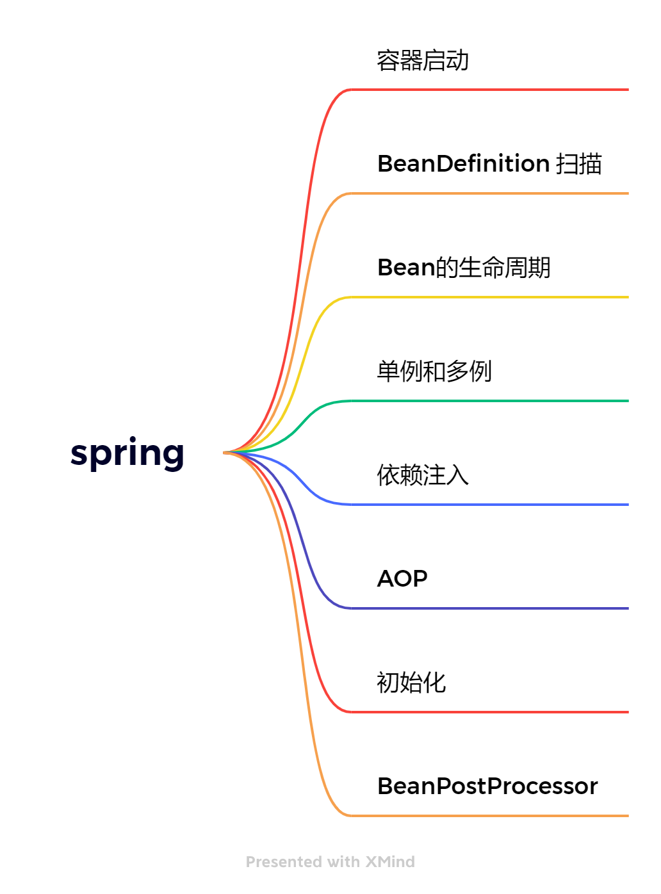

脉络

  

目录

* [Spring](/analysis/spring/)
    * [spring-ioc](/analysis/spring/spring-ioc.md)
    * [spring-aop](/analysis/spring/)
    
主要模块：#
       spring-core:核心模块 依赖注入IOC和DI的最基本实现
       spring-beans: Bean工厂与装配
       spring-context:上下文，即IOC容器
       spring-context-support:对IOC的扩展，以及IOC子容器
       spring-context-indexer:类管理组件和Classpath扫描
       spring-expression:表达式语句

切面编程：#
       spring-aop:面向切面编程，CGLIB,JDKProxy

       spring-aspects:集成AspectJ，Aop应用框架

       spring-instrument:动态Class Loading模块

数据访问与集成：#
       spring-jdbc:提供JDBC主要实现模块，用于简化JDBC操作

       spring-tx: spring-jdbc事务管理

       spring-orm:主要集成Hibernate,jpa,jdo等

       spring-oxm:将java对象映射成xml数据或将xml映射为java对象

       spring-jms:发送和接受消息

web组件：#
       spring-web:提供了最基础的web支持，主要建立在核心容器上

       spring-webmvc:实现了spring mvc的web应用

       spring-websocket:主要与前端页的全双工通讯协议

       spring-webflux:一个新的非阻塞函数式Reactive Web框架

报文：#
        spring-messaging: 4.0加入的模块，主要集成基础报文传送应用

测试：#
        spring-test：测试组件

集成兼容：#
       spring-framework-bom:解决不同模块依赖版本不同问题

