## IoC 理论

[谈谈对 Spring IoC 的理解](https://www.cnblogs.com/xdp-gacl/p/4249939.html)  |  [Spring 的 IoC 原理](https://blog.csdn.net/m13666368773/article/details/7802126) |  [Spring IoC 原理](https://blog.csdn.net/it_man/article/details/4402245)

IoC 全称为 Inversion of Control，翻译为 “控制反转”，不是什么技术，而是一种设计思想, 它还有一个别名为 DI（Dependency Injection）,即依赖注入。

所谓 IoC ，就是由 Spring IoC 容器来负责对象的生命周期和对象之间的关系 , 如何理解“控制反转”好呢？理解好它的关键在于我们需要回答如下四个问题：

> 1. 谁控制谁?  在传统的开发模式下，我们都是采用直接 new 一个对象的方式来创建对象，也就是说你依赖的对象直接由你自己控制，但是有了 IoC 容器后，则直接由 IoC 容器来控制。所以“谁控制谁”，当然是 IoC 容器控制对象
> 2. 控制什么? 控制对象。
> 3. 为何是反转? 没有 IoC 的时候我们都是在自己对象中主动去创建被依赖的对象，这是正转。但是有了 IoC 后，所依赖的对象直接由 IoC 容器创建后注入到被注入的对象中，依赖的对象由原来的主动获取变成被动接受，所以是反转。
> 4. 哪些方面反转了? 所依赖对象的获取被反转了。
>

### 1. 注入形式

IoC Service Provider 为被注入对象提供被依赖对象也有如下几种方式：构造方法注入、setter方法注入、接口注入。接口方式注入显得比较霸道，因为它需要被依赖的对象实现不必要的接口，带有侵入性。一般都不推荐这种方式。

[IOC注入实例](https://www.cnblogs.com/tanghaorong/p/13364634.html#_label4_0)

## IoC 之IoC各个组件

  

该图为 `ClassPathXmlApplicationContext` 的类继承体系结构，虽然只有一部分，但是它基本上包含了 IoC 体系中大部分的核心类和接口。

### 1. Resource 体系

`org.springframework.core.io.Resource`，对资源的抽象。它的每一个实现类都代表了一种资源的访问策略，如 ClassPathResource、URLResource、FileSystemResource 等。

  

### 2. ResourceLoader 体系

有了资源，就应该有资源加载，Spring 利用 org.springframework.core.io.ResourceLoader 来进行统一资源加载，类图如下：

    

### 3. BeanDefinition 体系

org.springframework.beans.factory.config.BeanDefinition ，用来描述 Spring 中的 Bean 对象。

  

### 4. BeanDefinitionReader 体系

org.springframework.beans.factory.support.BeanDefinitionReader 的作用是读取 Spring 的配置文件的内容，并将其转换成 Ioc 容器内部的数据结构 ：BeanDefinition 。


### 5. BeanFactory 体系

org.springframework.beans.factory.BeanFactory，是一个非常纯粹的 bean 容器，它是 IoC 必备的数据结构，其中 BeanDefinition 是它的基本结构。BeanFactory 内部维护着一个BeanDefinition map ，并可根据 BeanDefinition 的描述进行 bean 的创建和管理。

BeanFactory 有三个直接子类 ListableBeanFactory、HierarchicalBeanFactory 和 AutowireCapableBeanFactory 。  
DefaultListableBeanFactory 为最终默认实现，它实现了所有接口。

  

### 6. ApplicationContext 体系

org.springframework.context.ApplicationContext ，这个就是大名鼎鼎的 Spring 容器，它叫做应用上下文，与我们应用息息相关。它继承 BeanFactory ，所以它是 BeanFactory 的扩展升级版，如果BeanFactory 是屌丝的话，那么 ApplicationContext 则是名副其实的高富帅。由于 ApplicationContext 的结构就决定了它与 BeanFactory 的不同，其主要区别有：

* 继承 org.springframework.context.MessageSource 接口，提供国际化的标准访问策略。
* 继承 org.springframework.context.ApplicationEventPublisher 接口，提供强大的事件机制。
* 扩展 ResourceLoader ，可以用来加载多种 Resource ，可以灵活访问不同的资源。
* 对 Web 应用的支持。


通过上面五个体系，我们可以看出，IoC 主要由 spring-beans 和 spring-context 项目，进行实现。

## IoC 之统一资源加载策略

在学 Java SE 的时候，我们学习了一个标准类 `java.net.URL`，该类在 Java SE 中的定位为统一资源定位器（Uniform Resource Locator），但是我们知道它的实现基本只限于网络形式发布的资源的查找和定位。然而，实际上资源的定义比较广泛，除了网络形式的资源，还有以二进制形式存在的、以文件形式存在的、以字节流形式存在的等等。而且它可以存在于任何场所，比如网络、文件系统、应用程序中。所以 `java.net.URL` 的局限性迫使 Spring 必须实现自己的资源加载策略，该资源加载策略需要满足如下要求：

1. 职能划分清楚。资源的定义和资源的加载应该要有一个清晰的**界限**；
2. 统一的抽象。统一的资源**定义**和资源加载**策略**。资源加载后要返回统一的抽象给客户端，客户端要对资源进行怎样的处理，应该由抽象资源接口来界定。

### 1. 统一资源 Resource

`org.springframework.core.io.Resource` 为 Spring 框架所有资源的抽象和访问接口，它继承 `org.springframework.core.io.InputStreamSource`接口。作为所有资源的统一抽象，Resource 定义了一些通用的方法，由子类 `AbstractResource` 提供统一的默认实现。

#### 1.1 子类结构


- FileSystemResource ：对 `java.io.File` 类型资源的封装，只要是跟 File 打交道的，基本上与 FileSystemResource 也可以打交道。支持文件和 URL 的形式，实现 WritableResource 接口，且从 Spring Framework 5.0 开始，FileSystemResource 使用 NIO2 API进行读/写交互。
- ByteArrayResource ：对字节数组提供的数据的封装。如果通过 InputStream 形式访问该类型的资源，该实现会根据字节数组的数据构造一个相应的 ByteArrayInputStream。
- UrlResource ：对 `java.net.URL`类型资源的封装。内部委派 URL 进行具体的资源操作。
- ClassPathResource ：class path 类型资源的实现。使用给定的 ClassLoader 或者给定的 Class 来加载资源。
- InputStreamResource ：将给定的 InputStream 作为一种资源的 Resource 的实现类。

#### 1.2 AbstractResource

`org.springframework.core.io.AbstractResource` ，为 Resource 接口的默认**抽象**实现。它实现了 Resource 接口的**大部分的公共实现**，作为 Resource 接口中的重中之重

如果我们想要实现自定义的 Resource ，记住不要实现 Resource 接口，而应该继承 AbstractResource 抽象类，然后根据当前的具体资源特性覆盖相应的方法即可。

### 2. 统一资源定位 ResourceLoader

`org.springframework.core.io.ResourceLoader` 为 Spring 资源加载的统一抽象，具体的资源加载则由相应的实现类来完成，所以我们可以将 ResourceLoader 称作为统一资源定位器。其定义如下：

> FROM 《Spring 源码深度解析》P16 页
>
> ResourceLoader，定义资源加载器，主要应用于根据给定的资源文件地址，返回对应的 Resource 。

```java
public interface ResourceLoader {
	String CLASSPATH_URL_PREFIX = ResourceUtils.CLASSPATH_URL_PREFIX; // CLASSPATH URL 前缀。默认为："classpath:"

	Resource getResource(String location);

	ClassLoader getClassLoader();

}
```

1.`getResource(String location)` 方法，根据所提供资源的路径 location 返回 Resource 实例，但是它不确保该 Resource 一定存在，需要调用 `Resource.exist()` 方法来判断。

> 该方法支持以下模式的资源加载：
>
> - URL位置资源，如 `"file:C:/test.dat"` 。
> - ClassPath位置资源，如 `"classpath:test.dat` 。
> - 相对路径资源，如 `"WEB-INF/test.dat"` ，此时返回的Resource 实例，根据实现不同而不同。

2.`getClassLoader()` 方法，返回 ClassLoader 实例，对于想要获取 ResourceLoader 使用的 ClassLoader 用户来说，可以直接调用该方法来获取。在分析 Resource 时，提到了一个类 ClassPathResource ，这个类是可以根据指定的 ClassLoader 来加载资源的。

#### 2.1 子类结构


#### 2.1 DefaultResourceLoader

与 AbstractResource 相似，`org.springframework.core.io.DefaultResourceLoader` 是 ResourceLoader 的默认实现。

##### 2.1.1 构造函数

它接收 ClassLoader 作为构造函数的参数，或者使用不带参数的构造函数。

- 在使用**不带**参数的构造函数时，使用的 ClassLoader 为默认的 ClassLoader（一般 `Thread.currentThread()#getContextClassLoader()` ）。
- 在使用**带**参数的构造函数时，可以通过 `ClassUtils#getDefaultClassLoader()`获取。

代码如下：

```java
@Nullable
private ClassLoader classLoader;

public DefaultResourceLoader() { // 无参构造函数
	this.classLoader = ClassUtils.getDefaultClassLoader();
}

public DefaultResourceLoader(@Nullable ClassLoader classLoader) { // 带 ClassLoader 参数的构造函数
	this.classLoader = classLoader;
}

public void setClassLoader(@Nullable ClassLoader classLoader) {
	this.classLoader = classLoader;
}

@Override
@Nullable
public ClassLoader getClassLoader() {
	return (this.classLoader != null ? this.classLoader : ClassUtils.getDefaultClassLoader());
}
```

- 另外，也可以调用 `#setClassLoader()` 方法进行后续设置。

##### 2.1.2 getResource 方法

ResourceLoader 中最核心的方法为 `#getResource(String location)` ，它根据提供的 location 返回相应的 Resource 。而 DefaultResourceLoader 对该方法提供了**核心实现**（因为，它的两个子类都没有提供覆盖该方法，所以可以断定 ResourceLoader 的资源加载策略就封装在 DefaultResourceLoader 中)，代码如下：

```java
// DefaultResourceLoader.java

@Override
public Resource getResource(String location) {
    Assert.notNull(location, "Location must not be null");

    // 首先，通过 ProtocolResolver 来加载资源
    for (ProtocolResolver protocolResolver : this.protocolResolvers) {
        Resource resource = protocolResolver.resolve(location, this);
        if (resource != null) {
            return resource;
        }
    }
    // 其次，以 / 开头，返回 ClassPathContextResource 类型的资源
    if (location.startsWith("/")) {
        return getResourceByPath(location);
    // 再次，以 classpath: 开头，返回 ClassPathResource 类型的资源
    } else if (location.startsWith(CLASSPATH_URL_PREFIX)) {
        return new ClassPathResource(location.substring(CLASSPATH_URL_PREFIX.length()), getClassLoader());
    // 然后，根据是否为文件 URL ，是则返回 FileUrlResource 类型的资源，否则返回 UrlResource 类型的资源
    } else {
        try {
            // Try to parse the location as a URL...
            URL url = new URL(location);
            return (ResourceUtils.isFileURL(url) ? new FileUrlResource(url) : new UrlResource(url));
        } catch (MalformedURLException ex) {
            // 最后，返回 ClassPathContextResource 类型的资源
            // No URL -> resolve as resource path.
            return getResourceByPath(location);
        }
    }
}
```

- 首先，通过 ProtocolResolver 来加载资源，成功返回 Resource 。
- 其次，若 `location` 以 `"/"` 开头，则调用 `getResourceByPath()` 方法，构造 ClassPathContextResource 类型资源并返回。
- 再次，若 `location` 以 `"classpath:"` 开头，则构造 ClassPathResource 类型资源并返回。在构造该资源时，通过 `getClassLoader()` 获取当前的 ClassLoader。
- 然后，构造 URL ，尝试通过它进行资源定位，若没有抛出 MalformedURLException 异常，则判断是否为 FileURL , 如果是则构造 FileUrlResource 类型的资源，否则构造 UrlResource 类型的资源。
- 最后，若在加载过程中抛出 MalformedURLException 异常，则委派 `getResourceByPath()` 方法，实现资源定位加载。😈 实际上，和【其次】相同落。

##### 2.1.3 ProtocolResolver

`org.springframework.core.io.ProtocolResolver` ，用户自定义协议资源解决策略，作为 DefaultResourceLoader 的 **SPI**：它允许用户自定义资源加载协议，而不需要继承 ResourceLoader 的子类。

**在介绍 Resource 时，提到如果要实现自定义 Resource，我们只需要继承 AbstractResource 即可，但是有了 ProtocolResolver 后，我们不需要直接继承 DefaultResourceLoader，改为实现 ProtocolResolver 接口也可以实现自定义的 ResourceLoader。**

ProtocolResolver 接口，仅有一个方法 `Resource resolve(String location, ResourceLoader resourceLoader)`

在 Spring 中你会发现该接口并没有实现类，它需要用户自定义，自定义的 Resolver 如何加入 Spring 体系呢？调用 `DefaultResourceLoader.addProtocolResolver(ProtocolResolver)` 方法即可。

##### 2.1.4 示例

下面示例是演示 DefaultResourceLoader 加载资源的具体策略，代码如下:

```java
ResourceLoader resourceLoader = new DefaultResourceLoader();

Resource fileResource1 = resourceLoader.getResource("D:/Users/chenming673/Documents/spark.txt");
System.out.println("fileResource1 is FileSystemResource:" + (fileResource1 instanceof FileSystemResource));

Resource fileResource2 = resourceLoader.getResource("/Users/chenming673/Documents/spark.txt");
System.out.println("fileResource2 is ClassPathResource:" + (fileResource2 instanceof ClassPathResource));

Resource urlResource1 = resourceLoader.getResource("file:/Users/chenming673/Documents/spark.txt");
System.out.println("urlResource1 is UrlResource:" + (urlResource1 instanceof UrlResource));

Resource urlResource2 = resourceLoader.getResource("http://www.baidu.com");
System.out.println("urlResource1 is urlResource:" + (urlResource2 instanceof  UrlResource));
```

运行结果：

```
fileResource1 is FileSystemResource:false
fileResource2 is ClassPathResource:true
urlResource1 is UrlResource:true
urlResource1 is urlResource:true
```

- 其实对于 `fileResource1` ，我们更加希望是 FileSystemResource 资源类型。但是，事与愿违，它是 ClassPathResource 类型。为什么呢？在 `DefaultResourceLoader.getResource()` 方法的资源加载策略中，我们知道 `"D:/Users/chenming673/Documents/spark.txt"` 地址，其实在该方法中没有相应的资源类型，那么它就会在抛出 MalformedURLException 异常时，通过 `DefaultResourceLoader.getResourceByPath(...)` 方法，构造一个 ClassPathResource 类型的资源。
- 而 `urlResource1` 和 `urlResource2` ，指定有协议前缀的资源路径，则通过 URL 就可以定义，所以返回的都是 UrlResource 类型。

#### 2.2 FileSystemResourceLoader

从上面的示例，我们看到，其实 DefaultResourceLoader 对`getResourceByPath(String)` 方法处理其实不是很恰当，这个时候我们可以使用 `org.springframework.core.io.FileSystemResourceLoader` 。它继承 DefaultResourceLoader ，且覆写了 `getResourceByPath(String)` 方法，使之从文件系统加载资源并以 FileSystemResource 类型返回，这样我们就可以得到想要的资源类型。

```java
@Override
protected Resource getResourceByPath(String path) {
	// 截取首 /
	if (path.startsWith("/")) {
		path = path.substring(1);
	}
	// 创建 FileSystemContextResource 类型的资源
	return new FileSystemContextResource(path);
}
```

##### 2.2.1 FileSystemContextResource

FileSystemContextResource ，为 FileSystemResourceLoader 的内部类，它继承 FileSystemResource 类，实现 ContextResource 接口。代码如下：

```java
/**
 * FileSystemResource that explicitly expresses a context-relative path
 * through implementing the ContextResource interface.
 */
private static class FileSystemContextResource extends FileSystemResource implements ContextResource {

	public FileSystemContextResource(String path) {
		super(path);
	}

	@Override
	public String getPathWithinContext() {
		return getPath();
	}
}
```

- 在构造器中，也是调用 FileSystemResource 的构造函数来构造 FileSystemResource 的。
- 为什么要有 FileSystemContextResource 类的原因是，实现 ContextResource 接口，并实现对应的 `getPathWithinContext()` 接口方法。

> ContextResource   从外围加载资源的扩展接口 'context'，例如来自一个{@link javax.servlet. context。ServletContext} 从普通类路径路径或相对文件系统路径(指定没有显式前缀，因此相对于本地应用 {@link ResourceLoader}的上下文)。

#### 2.3 ClassRelativeResourceLoader

`org.springframework.core.io.ClassRelativeResourceLoader` ，是 DefaultResourceLoader 的另一个子类的实现。和 FileSystemResourceLoader 类似，在实现代码的结构上类似，也是覆写 `getResourceByPath(String path)` 方法，并返回其对应的 ClassRelativeContextResource 的资源类型。

> [《Spring5：就这一次，搞定资源加载器之ClassRelativeResourceLoader》](https://blog.csdn.net/seasonsbin/article/details/80914911) 
>
> ClassRelativeResourceLoader 扩展的功能是，可以根据给定的`class` 所在包或者所在包的子包下加载资源。

#### 2.4 ResourcePatternResolver

ResourceLoader 的 `Resource getResource(String location)` 方法，每次只能根据 location 返回**一个** Resource 。当需要加载多个资源时，我们除了多次调用 `#getResource(String location)` 方法外，别无他法。`org.springframework.core.io.support.ResourcePatternResolver` 是 ResourceLoader 的扩展，它支持根据指定的资源路径匹配模式每次返回**多个** Resource 实例

```java
public interface ResourcePatternResolver extends ResourceLoader {

	String CLASSPATH_ALL_URL_PREFIX = "classpath*:";

	Resource[] getResources(String locationPattern) throws IOException;

}
```

- ResourcePatternResolver 在 ResourceLoader 的基础上增加了 `getResources(String locationPattern)` 方法，以支持根据路径匹配模式返回**多个** Resource 实例。

- 同时，也新增了一种**新的协议**前缀 `"classpath*:"`，该协议前缀由其子类负责实现。

  

#### 2.5 PathMatchingResourcePatternResolver

`org.springframework.core.io.support.PathMatchingResourcePatternResolver` ，为 ResourcePatternResolver 最常用的子类，它除了支持 ResourceLoader 和 ResourcePatternResolver 新增的 `"classpath*:"` 前缀外，**还支持 Ant 风格的路径匹配模式**（类似于 `"**/*.xml"`）。

##### 2.5.1 构造函数

PathMatchingResourcePatternResolver 提供了三个构造函数，如下：

```java
/**
 * 内置的 ResourceLoader 资源定位器
 */
private final ResourceLoader resourceLoader;
/**
 * Ant 路径匹配器
 */
private PathMatcher pathMatcher = new AntPathMatcher();

public PathMatchingResourcePatternResolver() {
	this.resourceLoader = new DefaultResourceLoader();
}

public PathMatchingResourcePatternResolver(ResourceLoader resourceLoader) {
	Assert.notNull(resourceLoader, "ResourceLoader must not be null");
	this.resourceLoader = resourceLoader;
}

public PathMatchingResourcePatternResolver(@Nullable ClassLoader classLoader) {
	this.resourceLoader = new DefaultResourceLoader(classLoader);
}
```

- PathMatchingResourcePatternResolver 在实例化的时候，可以指定一个 ResourceLoader，如果不指定的话，它会在内部构造一个 DefaultResourceLoader 。
- `pathMatcher` 属性，默认为 AntPathMatcher 对象，用于支持 Ant 类型的路径匹配。

##### 2.5.2 getResource

```java
@Override
public Resource getResource(String location) {
	return getResourceLoader().getResource(location);
}

public ResourceLoader getResourceLoader() {
	return this.resourceLoader;
}
```

该方法，直接委托给相应的 ResourceLoader 来实现。所以，如果我们在实例化的 PathMatchingResourcePatternResolver 的时候，如果未指定 ResourceLoader 参数的情况下，那么在加载资源时，其实就是 DefaultResourceLoader 的过程。

其实在下面介绍的 `Resource[] getResources(String locationPattern)` 方法也相同，只不过返回的资源是**多个**而已。

##### 2.5.2 getResources

```java
@Override
public Resource[] getResources(String locationPattern) throws IOException {
    Assert.notNull(locationPattern, "Location pattern must not be null");
    // 以 "classpath*:" 开头
    if (locationPattern.startsWith(CLASSPATH_ALL_URL_PREFIX)) {
        // 路径包含通配符
        // a class path resource (multiple resources for same name possible)
        if (getPathMatcher().isPattern(locationPattern.substring(CLASSPATH_ALL_URL_PREFIX.length()))) {
            // a class path resource pattern
            return findPathMatchingResources(locationPattern);
        // 路径不包含通配符
        } else {
            // all class path resources with the given name
            return findAllClassPathResources(locationPattern.substring(CLASSPATH_ALL_URL_PREFIX.length()));
        }
    // 不以 "classpath*:" 开头
    } else {
        // Generally only look for a pattern after a prefix here, // 通常只在这里的前缀后面查找模式
        // and on Tomcat only after the "*/" separator for its "war:" protocol. 而在 Tomcat 上只有在 “*/ ”分隔符之后才为其 “war:” 协议
        int prefixEnd = (locationPattern.startsWith("war:") ? locationPattern.indexOf("*/") + 1 :
                locationPattern.indexOf(':') + 1);
        // 路径包含通配符
        if (getPathMatcher().isPattern(locationPattern.substring(prefixEnd))) {
            // a file pattern
            return findPathMatchingResources(locationPattern);
        // 路径不包含通配符
        } else {
            // a single resource with the given name
            return new Resource[] {getResourceLoader().getResource(locationPattern)};
        }
    }
}
```

- **非** `"classpath*:"` 开头，且路径**不包含**通配符，直接委托给相应的 ResourceLoader 来实现。
- 其他情况，调用 `#findAllClassPathResources(...)`、或 `#findPathMatchingResources(...)` 方法，返回多个 Resource 。下面，我们来详细分析。

##### 2.5.4 findAllClassPathResources

当 `locationPattern` 以 `"classpath*:"` 开头但是不包含通配符，则调用 `#findAllClassPathResources(...)` 方法加载资源。该方法返回 classes 路径下和所有 jar 包中的所有相匹配的资源。

```java
protected Resource[] findAllClassPathResources(String location) throws IOException {
	String path = location;
	// 去除首个 /
	if (path.startsWith("/")) {
		path = path.substring(1);
	}
	// 真正执行加载所有 classpath 资源
	Set<Resource> result = doFindAllClassPathResources(path);
	if (logger.isTraceEnabled()) {
		logger.trace("Resolved classpath location [" + location + "] to resources " + result);
	}
	// 转换成 Resource 数组返回
	return result.toArray(new Resource[0]);
}
```

真正执行加载的是在 `#doFindAllClassPathResources(...)` 方法，代码如下：

```java
protected Set<Resource> doFindAllClassPathResources(String path) throws IOException {
	Set<Resource> result = new LinkedHashSet<>(16);
	ClassLoader cl = getClassLoader();
	// <1> 根据 ClassLoader 加载路径下的所有资源
	Enumeration<URL> resourceUrls = (cl != null ? cl.getResources(path) : ClassLoader.getSystemResources(path));
	// <2>
	while (resourceUrls.hasMoreElements()) {
		URL url = resourceUrls.nextElement();
		// 将 URL 转换成 UrlResource
		result.add(convertClassLoaderURL(url));
	}
	// <3> 加载路径下得所有 jar 包
	if ("".equals(path)) {
		// The above result is likely to be incomplete, i.e. only containing file system references.
		// We need to have pointers to each of the jar files on the classpath as well...
		addAllClassLoaderJarRoots(cl, result);
	}
	return result;
}
```

`<1>` 处，根据 ClassLoader 加载路径下的所有资源。在加载资源过程时，如果在构造 PathMatchingResourcePatternResolver 实例的时候如果传入了 ClassLoader，则调用该 ClassLoader 的 `#getResources()` 方法，否则调用 `ClassLoader#getSystemResources(path)` 方法。另外，`ClassLoader#getResources()` 方法，代码如下:

```java
// java.lang.ClassLoader.java
public Enumeration<URL> getResources(String name) throws IOException {
    @SuppressWarnings("unchecked")
    Enumeration<URL>[] tmp = (Enumeration<URL>[]) new Enumeration<?>[2];
    if (parent != null) {
        tmp[0] = parent.getResources(name);
    } else {
        tmp[0] = getBootstrapResources(name);
    }
    tmp[1] = findResources(name);

    return new CompoundEnumeration<>(tmp);
}
```

- 看到这里是不是就已经一目了然了？如果当前父类加载器不为 `null` ，则通过父类向上迭代获取资源，否则调用 `#getBootstrapResources()` 。这里是不是特别熟悉，(*^▽^*)。

`<2>` 处，遍历 URL 集合，调用 `#convertClassLoaderURL(URL url)` 方法，将 URL 转换成 UrlResource 对象。代码如下：

```java
protected Resource convertClassLoaderURL(URL url) {
	return new UrlResource(url);
}
```

`<3>` 处，若 `path` 为空（`“”`）时，则调用 `#addAllClassLoaderJarRoots(...)`方法。该方法主要是加载路径下得所有 jar 包

通过上面的分析，我们知道 `#findAllClassPathResources(...)` 方法，其实就是利用 ClassLoader 来加载指定路径下的资源，不论它是在 class 路径下还是在 jar 包中。如果我们传入的路径为空或者 `/`，则会调用 `#addAllClassLoaderJarRoots(...)` 方法，加载所有的 jar 包。

##### 2.5.5 findPathMatchingResources

当 `locationPattern` 中包含了**通配符**，则调用该方法进行资源加载。代码如下：

```java
protected Resource[] findPathMatchingResources(String locationPattern) throws IOException {
    // 确定根路径、子路径
    String rootDirPath = determineRootDir(locationPattern);
    String subPattern = locationPattern.substring(rootDirPath.length());
    // 获取根据路径下的资源
    Resource[] rootDirResources = getResources(rootDirPath);
    // 遍历，迭代
    Set<Resource> result = new LinkedHashSet<>(16);
    for (Resource rootDirResource : rootDirResources) {
        rootDirResource = resolveRootDirResource(rootDirResource);
        URL rootDirUrl = rootDirResource.getURL();
        // bundle 资源类型
        if (equinoxResolveMethod != null && rootDirUrl.getProtocol().startsWith("bundle")) {
            URL resolvedUrl = (URL) ReflectionUtils.invokeMethod(equinoxResolveMethod, null, rootDirUrl);
            if (resolvedUrl != null) {
                rootDirUrl = resolvedUrl;
            }
            rootDirResource = new UrlResource(rootDirUrl);
        }
        // vfs 资源类型
        if (rootDirUrl.getProtocol().startsWith(ResourceUtils.URL_PROTOCOL_VFS)) {
            result.addAll(VfsResourceMatchingDelegate.findMatchingResources(rootDirUrl, subPattern, getPathMatcher()));
        // jar 资源类型
        } else if (ResourceUtils.isJarURL(rootDirUrl) || isJarResource(rootDirResource)) {
            result.addAll(doFindPathMatchingJarResources(rootDirResource, rootDirUrl, subPattern));
        // 其它资源类型
        } else {
            result.addAll(doFindPathMatchingFileResources(rootDirResource, subPattern));
        }
    }
    if (logger.isTraceEnabled()) {
        logger.trace("Resolved location pattern [" + locationPattern + "] to resources " + result);
    }
    // 转换成 Resource 数组返回
    return result.toArray(new Resource[0]);
}

```

方法有点儿长，但是思路还是很清晰的，主要分两步：

1. 确定目录，获取该目录下得所有资源。
2. 在所获得的所有资源后，进行迭代匹配获取我们想要的资源。

在这个方法里面，我们要关注两个方法，一个是 `#determineRootDir(String location)` 方法，一个是 `#doFindPathMatchingXXXResources(...)` 等方法。

###### 2.5.5.1 determineRootDir

`determineRootDir(String location)` 方法，主要是用于确定根路径。代码如下：

```Java

protected String determineRootDir(String location) {
	// 找到冒号的后一位
	int prefixEnd = location.indexOf(':') + 1;
	// 根目录结束位置
	int rootDirEnd = location.length();
	// 在从冒号开始到最后的字符串中，循环判断是否包含通配符，如果包含，则截断最后一个由”/”分割的部分。
	// 例如：在我们路径中，就是最后的ap?-context.xml这一段。再循环判断剩下的部分，直到剩下的路径中都不包含通配符。
	while (rootDirEnd > prefixEnd && getPathMatcher().isPattern(location.substring(prefixEnd, rootDirEnd))) {
		rootDirEnd = location.lastIndexOf('/', rootDirEnd - 2) + 1;
	}
	// 如果查找完成后，rootDirEnd = 0 了，则将之前赋值的 prefixEnd 的值赋给 rootDirEnd ，也就是冒号的后一位
	if (rootDirEnd == 0) {
		rootDirEnd = prefixEnd;
	}
	// 截取根目录
	return location.substring(0, rootDirEnd);
}
```

示例：

|               原路径               |      确定根路径       |
| :--------------------------------: | :-------------------: |
| `classpath*:test/cc*/spring-*.xml` |  `classpath*:test/`   |
| `classpath*:test/aa/spring-*.xml`  | `classpath*:test/aa/` |

###### 2.5.5.2 doFindPathMatchingXXXResources

`#doFindPathMatchingXXXResources(...)` 方法，是个泛指，一共对应三个方法：

- `#doFindPathMatchingJarResources(rootDirResource, rootDirUrl, subPatter)` 方法
- `#doFindPathMatchingFileResources(rootDirResource, subPattern)` 方法
- `VfsResourceMatchingDelegate#findMatchingResources(rootDirUrl, subPattern, pathMatcher)` 方法

- [Spring源码情操陶冶-PathMatchingResourcePatternResolver路径资源匹配溶解器](https://www.cnblogs.com/question-sky/p/6959493.html) ，主要针对 `#doFindPathMatchingJarResources(rootDirResource, rootDirUrl, subPatter)` 方法。
- [深入 Spring IoC 源码之 ResourceLoader](http://www.blogjava.net/DLevin/archive/2012/12/01/392337.html) ，主要针对 `#doFindPathMatchingFileResources(rootDirResource, subPattern)` 方法。
- [Spring 源码学习 —— 含有通配符路径解析（上）](http://www.coderli.com/spring-wildpath-parse/) 

### 3.  小结

至此 Spring 整个资源记载过程已经分析完毕。下面简要总结下：

- Spring 提供了 Resource 和 ResourceLoader 来统一抽象整个资源及其定位。使得资源与资源的定位有了一个更加清晰的界限，并且提供了合适的 Default 类，使得自定义实现更加方便和清晰。
- AbstractResource 为 Resource 的默认抽象实现，它对 Resource 接口做了一个统一的实现，子类继承该类后只需要覆盖相应的方法即可，同时对于自定义的 Resource 我们也是继承该类。
- DefaultResourceLoader 同样也是 ResourceLoader 的默认实现，在自定 ResourceLoader 的时候我们除了可以继承该类外还可以实现 ProtocolResolver 接口来实现自定资源加载协议。
- DefaultResourceLoader 每次只能返回单一的资源，所以 Spring 针对这个提供了另外一个接口 ResourcePatternResolver ，该接口提供了根据指定的 locationPattern 返回多个资源的策略。其子类 PathMatchingResourcePatternResolver 是一个集大成者的 ResourceLoader ，因为它即实现了 `Resource getResource(String location)` 方法，也实现了 `Resource[] getResources(String locationPattern)` 方法。

Resource 和 ResourceLoader 核心是在，`spring-core` 项目中。

##  IoC之加载 BeanDefinition

```java
ClassPathResource resource = new ClassPathResource("bean.xml"); // <1>
DefaultListableBeanFactory factory = new DefaultListableBeanFactory(); // <2>
XmlBeanDefinitionReader reader = new XmlBeanDefinitionReader(factory); // <3>
reader.loadBeanDefinitions(resource); // <4>
```

这段代码是 Spring 中编程式使用 IoC 容器，通过这四段简单的代码，我们可以初步判断 IoC 容器的使用过程。

1. 获取资源
2. 获取 BeanFactory
3. 根据新建的 BeanFactory 创建一个 BeanDefinitionReader 对象，该 Reader 对象为资源的**解析器**
4. 装载资源

整个过程就分为三个步骤：资源定位、装载、注册，如下：


- **资源定位**。我们一般用外部资源来描述 Bean 对象，所以在初始化 IoC 容器的第一步就是需要定位这个外部资源。即统一资源加载,见[统一资源加载策略](#统一资源加载策略)
- **装载/加载**。装载就是 BeanDefinition 的载入。BeanDefinitionReader 读取、解析 Resource 资源，也就是将用户定义的 Bean 表示成 IoC 容器的内部数据结构：BeanDefinition 。
  - 在 IoC 容器内部维护着一个 BeanDefinition Map 的数据结构
  - 在配置文件中每一个 `<bean>` 都对应着一个 BeanDefinition 对象。
- **注册**。向 IoC 容器注册在第二步解析好的 BeanDefinition，这个过程是通过 BeanDefinitionRegistry 接口来实现的。在 IoC 容器内部其实是将第二个过程解析得到的 BeanDefinition 注入到一个 HashMap 容器中，IoC 容器就是通过这个 HashMap 来维护这些 BeanDefinition 的。
  - 在这里需要注意的一点是这个过程并没有完成依赖注入（Bean 创建），Bean 创建是发生在应用第一次调用 `#getBean(...)` 方法，向容器索要 Bean 时。
  - 当然我们可以通过设置预处理，即对某个 Bean 设置 `lazyinit = false` 属性，那么这个 Bean 的依赖注入就会在容器初始化的时候完成。

简单的说，上面步骤的结果是，XML Resource => XML Document => Bean Definition 。

### 1. loadBeanDefinitions

资源定位在前面已经分析了，下面我们直接分析**加载**，上面看到的 `reader.loadBeanDefinitions(resource)` 代码，才是加载资源的真正实现，所以我们直接从该方法入手。代码如下：

```Java
// XmlBeanDefinitionReader.java
@Override
public int loadBeanDefinitions(Resource resource) throws BeanDefinitionStoreException {
	return loadBeanDefinitions(new EncodedResource(resource));
}
```

从指定的 xml 文件加载 Bean Definition ，这里会先对 Resource 资源封装成 `org.springframework.core.io.support.EncodedResource` 对象。这里为什么需要将 Resource 封装成 EncodedResource 呢？主要是为了对 Resource 进行编码，保证内容读取的正确性。

然后，再调用 `#loadBeanDefinitions(EncodedResource encodedResource)` 方法，执行真正的逻辑实现。

```java
/**
 * 当前线程，正在加载的 EncodedResource 集合。
 */
private final ThreadLocal<Set<EncodedResource>> resourcesCurrentlyBeingLoaded = new NamedThreadLocal<>("XML bean definition resources currently being loaded");

public int loadBeanDefinitions(EncodedResource encodedResource) throws BeanDefinitionStoreException {
	Assert.notNull(encodedResource, "EncodedResource must not be null");
	if (logger.isTraceEnabled()) {
		logger.trace("Loading XML bean definitions from " + encodedResource);
	}

	// <1> 获取已经加载过的资源
	Set<EncodedResource> currentResources = this.resourcesCurrentlyBeingLoaded.get();
	if (currentResources == null) {
		currentResources = new HashSet<>(4);
		this.resourcesCurrentlyBeingLoaded.set(currentResources);
	}
	if (!currentResources.add(encodedResource)) { // 将当前资源加入记录中。如果已存在，抛出异常
		throw new BeanDefinitionStoreException("Detected cyclic loading of " + encodedResource + " - check your import definitions!");
	}
	try {
		// <2> 从 EncodedResource 获取封装的 Resource ，并从 Resource 中获取其中的 InputStream
		InputStream inputStream = encodedResource.getResource().getInputStream();
		try {
			InputSource inputSource = new InputSource(inputStream);
			if (encodedResource.getEncoding() != null) { // 设置编码
				inputSource.setEncoding(encodedResource.getEncoding());
			}
			// 核心逻辑部分，执行加载 BeanDefinition
			return doLoadBeanDefinitions(inputSource, encodedResource.getResource());
		} finally {
			inputStream.close();
		}
	} catch (IOException ex) {
		throw new BeanDefinitionStoreException("IOException parsing XML document from " + encodedResource.getResource(), ex);
	} finally {
		// 从缓存中剔除该资源 <3>
		currentResources.remove(encodedResource);
		if (currentResources.isEmpty()) {
			this.resourcesCurrentlyBeingLoaded.remove();
		}
	}
}
```

- <1>处，通过 `resourcesCurrentlyBeingLoaded.get()`代码，来获取已经加载过的资源，然后将encodedResource加入其中，如果resourcesCurrentlyBeingLoaded中已经存在该资源，则抛出 BeanDefinitionStoreException 异常。
  - 为什么需要这么做呢？答案在 `"Detected cyclic loading"` ，避免一个 EncodedResource 在加载时，还没加载完成，又加载自身，从而导致**死循环**。
  - 也因此，在 `<3>` 处，当一个 EncodedResource 加载完成后，需要从缓存中剔除。
- `<2>` 处理，从 `encodedResource` 获取封装的 Resource 资源，并从 Resource 中获取相应的 InputStream ，然后将 InputStream 封装为 InputSource ，最后调用 `#doLoadBeanDefinitions(InputSource inputSource, Resource resource)` 方法，执行加载 Bean Definition 的真正逻辑。

### 2. doLoadBeanDefinitions

```java
/**
 * Actually load bean definitions from the specified XML file.
 * @param inputSource the SAX InputSource to read from
 * @param resource the resource descriptor for the XML file
 * @return the number of bean definitions found
 * @throws BeanDefinitionStoreException in case of loading or parsing errors
 * @see #doLoadDocument
 * @see #registerBeanDefinitions
 */
protected int doLoadBeanDefinitions(InputSource inputSource, Resource resource)
		throws BeanDefinitionStoreException {
	try {
		// <1> 获取 XML Document 实例
		Document doc = doLoadDocument(inputSource, resource);
		// <2> 根据 Document 实例，注册 Bean 信息
		int count = registerBeanDefinitions(doc, resource);
		if (logger.isDebugEnabled()) {
			logger.debug("Loaded " + count + " bean definitions from " + resource);
		}
		return count;
	} catch (BeanDefinitionStoreException ex) {
		throw ex;
	} catch (SAXParseException ex) {
		throw new XmlBeanDefinitionStoreException(resource.getDescription(),
                "Line " + ex.getLineNumber() + " in XML document from " + resource + " is invalid", ex);
	} catch (SAXException ex) {
		throw new XmlBeanDefinitionStoreException(resource.getDescription(),
				"XML document from " + resource + " is invalid", ex);
	} catch (ParserConfigurationException ex) {
		throw new BeanDefinitionStoreException(resource.getDescription(),
				"Parser configuration exception parsing XML from " + resource, ex);
	} catch (IOException ex) {
		throw new BeanDefinitionStoreException(resource.getDescription(),
				"IOException parsing XML document from " + resource, ex);
	} catch (Throwable ex) {
		throw new BeanDefinitionStoreException(resource.getDescription(),
				"Unexpected exception parsing XML document from " + resource, ex);
	}
}
```

- 在 `<1>` 处，调用 `#doLoadDocument(InputSource inputSource, Resource resource)` 方法，根据 xml 文件，获取 Document 实例。
- 在 `<2>` 处，调用 `#registerBeanDefinitions(Document doc, Resource resource)` 方法，根据获取的 Document 实例，注册 Bean 信息。

#### 2.1 doLoadDocument

```java
/**
 * 获取 XML Document 实例
 *
 * Actually load the specified document using the configured DocumentLoader.
 * @param inputSource the SAX InputSource to read from
 * @param resource the resource descriptor for the XML file
 * @return the DOM Document
 * @throws Exception when thrown from the DocumentLoader
 * @see #setDocumentLoader
 * @see DocumentLoader#loadDocument
 */
protected Document doLoadDocument(InputSource inputSource, Resource resource) throws Exception {
	return this.documentLoader.loadDocument(inputSource, getEntityResolver(), this.errorHandler,
			getValidationModeForResource(resource), isNamespaceAware());
}
```

1. 调用 `#getValidationModeForResource(Resource resource)` 方法，获取指定资源（xml）的**验证模式**。详细解析，见 [IoC 之获取验证模型](#IoC之获取验证模型)。
2. 调用 `DocumentLoader#loadDocument(InputSource inputSource, EntityResolver entityResolver, ErrorHandler errorHandler, int validationMode, boolean namespaceAware)` 方法，获取 XML Document 实例。详细解析，见 [获取Document 对象](#获取Document 对象)

#### 2.2 registerBeanDefinitions

[IoC 之注册BeanDefinition](#IoC 之注册BeanDefinition)

## IoC之获取验证模型

为什么需要获取验证模式呢？原因如下：

> XML 文件的验证模式保证了 XML 文件的正确性。

### 1.DTD 与 XSD 的区别

#### 1.1.DTD

DTD(Document Type Definition)，即文档类型定义，为 XML 文件的验证机制，属于 XML 文件中组成的一部分。DTD 是一种保证 XML 文档格式正确的有效验证方式，它定义了相关 XML 文档的元素、属性、排列方式、元素的内容类型以及元素的层次结构。其实 DTD 就相当于 XML 中的 “词汇”和“语法”，我们可以通过比较 XML 文件和 DTD 文件 来看文档是否符合规范，元素和标签使用是否正确。

要在 Spring 中使用 DTD，需要在 Spring XML 文件头部声明：

```
<?xml version="1.0" encoding="UTF-8"?>
<!DOCTYPE beans PUBLIC  "-//SPRING//DTD BEAN//EN"  "http://www.springframework.org/dtd/spring-beans.dtd">
```

DTD 在一定的阶段推动了 XML 的发展，但是它本身存在着一些**缺陷**：

1. 它没有使用 XML 格式，而是自己定义了一套格式，相对解析器的重用性较差；而且 DTD 的构建和访问没有标准的编程接口，因而解析器很难简单的解析 DTD 文档。
2. DTD 对元素的类型限制较少；同时其他的约束力也叫弱。
3. DTD 扩展能力较差。
4. 基于正则表达式的 DTD 文档的描述能力有限。

#### 1.2.XSD

针对 DTD 的缺陷，W3C 在 2001 年推出 XSD。XSD（XML Schemas Definition）即 XML Schema 语言。XML Schema 本身就是一个 XML文档，使用的是 XML 语法，因此可以很方便的解析 XSD 文档。相对于 DTD，XSD 具有如下**优势**：

1. XML Schema 基于 XML ，没有专门的语法。
2. XML Schema 可以象其他 XML 文件一样解析和处理。
3. XML Schema 比 DTD 提供了更丰富的数据类型。
4. XML Schema 提供可扩充的数据模型。
5. XML Schema 支持综合命名空间。
6. XML Schema 支持属性组。

### 2.getValidationModeForResource

```java
// XmlBeanDefinitionReader.java

// 禁用验证模式
public static final int VALIDATION_NONE = XmlValidationModeDetector.VALIDATION_NONE;
// 自动获取验证模式
public static final int VALIDATION_AUTO = XmlValidationModeDetector.VALIDATION_AUTO;
// DTD 验证模式
public static final int VALIDATION_DTD = XmlValidationModeDetector.VALIDATION_DTD;
// XSD 验证模式
public static final int VALIDATION_XSD = XmlValidationModeDetector.VALIDATION_XSD;
	
/**
 * 验证模式。默认为自动模式。
 */
private int validationMode = VALIDATION_AUTO;
	
protected int getValidationModeForResource(Resource resource) {
	// <1> 获取指定的验证模式
	int validationModeToUse = getValidationMode();
	// 首先，如果手动指定，则直接返回
	if (validationModeToUse != VALIDATION_AUTO) {
		return validationModeToUse;
	}
	// 其次，自动获取验证模式
	int detectedMode = detectValidationMode(resource);
	if (detectedMode != VALIDATION_AUTO) {
		return detectedMode;
	}
	// 最后，使用 VALIDATION_XSD 做为默认
	// Hmm, we didn't get a clear indication... Let's assume XSD,
	// since apparently no DTD declaration has been found up until
	// detection stopped (before finding the document's root tag).
	return VALIDATION_XSD;
}
```

- `<1>` 处，调用 `#getValidationMode()` 方法，获取指定的验证模式( `validationMode` )。如果有手动指定，则直接返回。另外，对对于 `validationMode` 属性的设置和获得的代码，代码如下：

  ```java
  public void setValidationMode(int validationMode) {
  	this.validationMode = validationMode;
  }
  
  public int getValidationMode() {
  	return this.validationMode;
  }
  ```

- `<2>` 处，调用 `#detectValidationMode(Resource resource)` 方法，自动获取验证模式。代码如下：

  ```java
    /**
     * XML 验证模式探测器
     */
    private final XmlValidationModeDetector validationModeDetector = new XmlValidationModeDetector();
  	
    protected int detectValidationMode(Resource resource) {
  // 不可读，抛出 BeanDefinitionStoreException 异常
    	if (resource.isOpen()) {
    		throw new BeanDefinitionStoreException(
    				"Passed-in Resource [" + resource + "] contains an open stream: " +
    				"cannot determine validation mode automatically. Either pass in a Resource " +
    				"that is able to create fresh streams, or explicitly specify the validationMode " +
    				"on your XmlBeanDefinitionReader instance.");
    	}
    
    	// 打开 InputStream 流
    	InputStream inputStream;
    	try {
    		inputStream = resource.getInputStream();
    	} catch (IOException ex) {
    		throw new BeanDefinitionStoreException(
    				"Unable to determine validation mode for [" + resource + "]: cannot open InputStream. " +
    				"Did you attempt to load directly from a SAX InputSource without specifying the " +
    				"validationMode on your XmlBeanDefinitionReader instance?", ex);
    	}
    
    	// <x> 获取相应的验证模式
    	try {
    		return this.validationModeDetector.detectValidationMode(inputStream);
    	} catch (IOException ex) {
    		throw new BeanDefinitionStoreException("Unable to determine validation mode for [" +
    				resource + "]: an error occurred whilst reading from the InputStream.", ex);
    	}
    }
  ```

  - 核心在于 `<x>` 处，调用 `XmlValidationModeDetector#detectValidationMode(InputStream inputStream)` 方法，获取相应的验证模式。

- `<3>` 处，使用 `VALIDATION_XSD` 做为默认。

### 3.XmlValidationModeDetector

`org.springframework.util.xml.XmlValidationModeDetector` ，XML 验证模式探测器。

```java
public int detectValidationMode(InputStream inputStream) throws IOException {
    // Peek into the file to look for DOCTYPE.
    BufferedReader reader = new BufferedReader(new InputStreamReader(inputStream));
    try {
        // 是否为 DTD 校验模式。默认为，非 DTD 模式，即 XSD 模式
        boolean isDtdValidated = false;
        String content;
        // <0> 循环，逐行读取 XML 文件的内容
        while ((content = reader.readLine()) != null) {
            content = consumeCommentTokens(content);
            // 跳过，如果是注释，或者
            if (this.inComment || !StringUtils.hasText(content)) {
                continue;
            }
            // <1> 包含 DOCTYPE 为 DTD 模式
            if (hasDoctype(content)) {
                isDtdValidated = true;
                break;
            }
            // <2>  hasOpeningTag 方法会校验，如果这一行有 < ，并且 < 后面跟着的是字母，则返回 true 。
            if (hasOpeningTag(content)) {
                // End of meaningful data...
                break;
            }
        }
        // 返回 VALIDATION_DTD or VALIDATION_XSD 模式
        return (isDtdValidated ? VALIDATION_DTD : VALIDATION_XSD);
    } catch (CharConversionException ex) {
           
        // <3> 返回 VALIDATION_AUTO 模式
        // Choked on some character encoding...
        // Leave the decision up to the caller.
        return VALIDATION_AUTO;
    } finally {
        reader.close();
    }
}
```

- `<0`> 处，从代码中看，主要是通过读取 XML 文件的内容，来进行自动判断。

- `<1>` 处，调用 `#hasDoctype(String content)` 方法，判断内容中如果包含有 `"DOCTYPE`“ ，则为 DTD 验证模式。代码如下：

  ```java
  /**
   * The token in a XML document that declares the DTD to use for validation
   * and thus that DTD validation is being used.
   */
  private static final String DOCTYPE = "DOCTYPE";
  
  private boolean hasDoctype(String content) {
  	return content.contains(DOCTYPE);
  }
  ```

- `<2>` 处，调用 `#hasOpeningTag(String content)` 方法，判断如果这一行包含 `<` ，并且 `<` 紧跟着的是字幕，则为 XSD 验证模式。代码如下：

  ```java
  /**
   * Does the supplied content contain an XML opening tag. If the parse state is currently
   * in an XML comment then this method always returns false. It is expected that all comment
   * tokens will have consumed for the supplied content before passing the remainder to this method.
   */
  private boolean hasOpeningTag(String content) {
  	if (this.inComment) {
  		return false;
  	}
  	int openTagIndex = content.indexOf('<');
  	return (openTagIndex > -1 // < 存在
              && (content.length() > openTagIndex + 1) // < 后面还有内容
              && Character.isLetter(content.charAt(openTagIndex + 1))); // < 后面的内容是字幕
  }
  ```

- `<3>` 处，如果发生 CharConversionException 异常，则为 `VALIDATION_AUTO` 模式。

- 关于 `#consumeCommentTokens(String content)` 方法，代码如下：

  ```java
  /**
   * The token that indicates the start of an XML comment.
   */
  private static final String START_COMMENT = "<!--";
  
  /**
   * The token that indicates the end of an XML comment.
   */
  private static final String END_COMMENT = "-->";
  
  /**
   * Consumes all the leading comment data in the given String and returns the remaining content, which
   * may be empty since the supplied content might be all comment data. For our purposes it is only important
   * to strip leading comment content on a line since the first piece of non comment content will be either
   * the DOCTYPE declaration or the root element of the document.
   */
  @Nullable
  private String consumeCommentTokens(String line) {
  	// 非注释
  	if (!line.contains(START_COMMENT) && !line.contains(END_COMMENT)) {
  		return line;
  	}
  	String currLine = line;
  	while ((currLine = consume(currLine)) != null) {
  		if (!this.inComment && !currLine.trim().startsWith(START_COMMENT)) {
  			return currLine;
  		}
  	}
  	return null;
  }
  
  /**
   * Consume the next comment token, update the "inComment" flag
   * and return the remaining content.
   */
  @Nullable
  private String consume(String line) {
  	int index = (this.inComment ? endComment(line) : startComment(line));
  	return (index == -1 ? null : line.substring(index));
  }
  
  /**
   * Try to consume the {@link #START_COMMENT} token.
   * @see #commentToken(String, String, boolean)
   */
  private int startComment(String line) {
  	return commentToken(line, START_COMMENT, true);
  }
  
  private int endComment(String line) {
  	return commentToken(line, END_COMMENT, false);
  }
  
  /**
   * Try to consume the supplied token against the supplied content and update the
   * in comment parse state to the supplied value. Returns the index into the content
   * which is after the token or -1 if the token is not found.
   */
  private int commentToken(String line, String token, boolean inCommentIfPresent) {
  	int index = line.indexOf(token);
  	if (index > - 1) {
  		this.inComment = inCommentIfPresent;
  	}
  	return (index == -1 ? index : index + token.length());
  }
  ```

  

  [《spring源码（六）–XmlValidationModeDetector（获取xml文档校验模式）》](https://blog.csdn.net/ljz2016/article/details/82686884)

  [《XmlValidationModeDetector》](https://my.oschina.net/u/3579120/blog/1532852)


## IoC 之获取 Document 对象

在 `XmlBeanDefinitionReader#doLoadDocument(InputSource inputSource, Resource resource)` 方法，中做了两件事情：

- 调用#getValidationModeForResource(Resource resource)方法，获取指定资源（xml）的验证模式
- 调用 `DocumentLoader#loadDocument(InputSource inputSource, EntityResolver entityResolver, ErrorHandler errorHandler, int validationMode, boolean namespaceAware)` 方法，获取 XML Document 实例。

### 1.DocumentLoader

取 Document 的策略，由接口 `org.springframework.beans.factory.xml.DocumentLoader` 定义。代码如下：

> FROM 《Spring 源码深度解析》P16 页
>
> 定义从资源文件加载到转换为 Document 的功能。

```java
public interface DocumentLoader {
    
//inputSource 方法参数，加载 Document 的 Resource 资源。
//entityResolver 方法参数，解析文件的解析器。
//errorHandler 方法参数，处理加载 Document 对象的过程的错误。
//validationMode 方法参数，验证模式。
//namespaceAware 方法参数，命名空间支持。如果要提供对 XML 名称空间的支持，则需要值为 true 。
	Document loadDocument(
			InputSource inputSource, EntityResolver entityResolver,
			ErrorHandler errorHandler, int validationMode, boolean namespaceAware)
			throws Exception;

}
```


####  1.1.DefaultDocumentLoader

该方法由 DocumentLoader 的默认实现类 `org.springframework.beans.factory.xml.DefaultDocumentLoader` 实现。代码如下：

```java
/**
 * Load the {@link Document} at the supplied {@link InputSource} using the standard JAXP-configured
 * XML parser.
 */
@Override
public Document loadDocument(InputSource inputSource, EntityResolver entityResolver,
		ErrorHandler errorHandler, int validationMode, boolean namespaceAware) throws Exception {
	// <1> 创建 DocumentBuilderFactory
	DocumentBuilderFactory factory = createDocumentBuilderFactory(validationMode, namespaceAware);
	if (logger.isTraceEnabled()) {
		logger.trace("Using JAXP provider [" + factory.getClass().getName() + "]");
	}
	// <2> 创建 DocumentBuilder
	DocumentBuilder builder = createDocumentBuilder(factory, entityResolver, errorHandler);
	// <3> 解析 XML InputSource 返回 Document 对象
	return builder.parse(inputSource);
}
```

- 首先，调用 #`createDocumentBuilderFactory(...)` 方法，创建 `javax.xml.parsers.DocumentBuilderFactory` 对象。代码如下：

  ```java
  /**
   * JAXP attribute used to configure the schema language for validation.
   */
  private static final String SCHEMA_LANGUAGE_ATTRIBUTE = "http://java.sun.com/xml/jaxp/properties/schemaLanguage";
  /**
   * JAXP attribute value indicating the XSD schema language.
   */
  private static final String XSD_SCHEMA_LANGUAGE = "http://www.w3.org/2001/XMLSchema";
  protected DocumentBuilderFactory createDocumentBuilderFactory(int validationMode, boolean namespaceAware)
          throws ParserConfigurationException {
      // 创建 DocumentBuilderFactory
      DocumentBuilderFactory factory = DocumentBuilderFactory.newInstance();
      factory.setNamespaceAware(namespaceAware); // 设置命名空间支持
      if (validationMode != XmlValidationModeDetector.VALIDATION_NONE) {
          factory.setValidating(true); // 开启校验
          // XSD 模式下，设置 factory 的属性
          if (validationMode == XmlValidationModeDetector.VALIDATION_XSD) {
              // Enforce namespace aware for XSD...
              factory.setNamespaceAware(true); // XSD 模式下，强制设置命名空间支持
              // 设置 SCHEMA_LANGUAGE_ATTRIBUTE
              try {
                  factory.setAttribute(SCHEMA_LANGUAGE_ATTRIBUTE, XSD_SCHEMA_LANGUAGE);
              } catch (IllegalArgumentException ex) {
                  ParserConfigurationException pcex = new ParserConfigurationException(
                          "Unable to validate using XSD: Your JAXP provider [" + factory +
                          "] does not support XML Schema. Are you running on Java 1.4 with Apache Crimson? " +
                          "Upgrade to Apache Xerces (or Java 1.5) for full XSD support.");
                  pcex.initCause(ex);
                  throw pcex;
              }
          }
      }
      return factory;
  }
  ```

- 然后，调用 `#createDocumentBuilder(DocumentBuilderFactory factory, EntityResolver entityResolver,ErrorHandler errorHandler)` 方法，创建 `javax.xml.parsers.DocumentBuilder` 对象。代码如下：

  ```java
  protected DocumentBuilder createDocumentBuilder(DocumentBuilderFactory factory,
  		@Nullable EntityResolver entityResolver, @Nullable ErrorHandler errorHandler)
  		throws ParserConfigurationException {
  	// 创建 DocumentBuilder 对象
  	DocumentBuilder docBuilder = factory.newDocumentBuilder();
  	// <x> 设置 EntityResolver 属性
  	if (entityResolver != null) {
  		docBuilder.setEntityResolver(entityResolver);
  	}
  	// 设置 ErrorHandler 属性
  	if (errorHandler != null) {
  		docBuilder.setErrorHandler(errorHandler);
  	}
  	return docBuilder;
  }
  ```

  - 在 `<x>` 处，设置 DocumentBuilder 的 **EntityResolver** 属性。关于它，在 [EntityResolver](#EntityResolver) 会详细解析。

- 最后，调用 `DocumentBuilder#parse(InputSource)` 方法，解析 InputSource ，返回 Document 对象。

### 2.EntityResolver

通过 `DocumentLoader#loadDocument(...)` 方法来获取 Document 对象时，有一个方法参数 `entityResolver` 。该参数是通过 `XmlBeanDefinitionReader#getEntityResolver()` 方法来获取的。代码如下：

> `#getEntityResolver()` 方法，返回指定的解析器，如果没有指定，则构造一个未指定的默认解析器。

```java
// XmlBeanDefinitionReader.java

/**
 * EntityResolver 解析器
 */
@Nullable
private EntityResolver entityResolver;

protected EntityResolver getEntityResolver() {
	if (this.entityResolver == null) {
		// Determine default EntityResolver to use.
		ResourceLoader resourceLoader = getResourceLoader();
		if (resourceLoader != null) {
			this.entityResolver = new ResourceEntityResolver(resourceLoader);
		} else {
			this.entityResolver = new DelegatingEntityResolver(getBeanClassLoader());
		}
	}
	return this.entityResolver;
}
```

- 如果 ResourceLoader 不为 `null`，则根据指定的 ResourceLoader 创建一个 ResourceEntityResolver 对象。
- 如果 ResourceLoader 为 `null` ，则创建 一个 DelegatingEntityResolver 对象。该 Resolver 委托给默认的 BeansDtdResolver 和 PluggableSchemaResolver 。

#### 2.1.子类

上面的方法，一共涉及**四个** EntityResolver 的子类：

- `org.springframework.beans.factory.xm.BeansDtdResolver` ：实现 EntityResolver 接口，Spring Bean dtd 解码器，用来从 classpath 或者 jar 文件中加载 dtd 。部分代码如下：

  ```java
  private static final String DTD_EXTENSION = ".dtd";
  
  private static final String DTD_NAME = "spring-beans";
  ```

- `org.springframework.beans.factory.xml.PluggableSchemaResolver` ，实现 EntityResolver 接口，读取 classpath 下的所有 `"META-INF/spring.schemas"` 成一个 namespaceURI 与 Schema 文件地址的 map 。代码如下：

  ```java
  /**
   * The location of the file that defines schema mappings.
   * Can be present in multiple JAR files.
   *
   * 默认 {@link #schemaMappingsLocation} 地址
   */
  public static final String DEFAULT_SCHEMA_MAPPINGS_LOCATION = "META-INF/spring.schemas";
  
  @Nullable
  private final ClassLoader classLoader;
  
  /**
   * Schema 文件地址
   */
  private final String schemaMappingsLocation;
  
  /** Stores the mapping of schema URL -> local schema path. */
  @Nullable
  private volatile Map<String, String> schemaMappings; // namespaceURI 与 Schema 文件地址的映射集合
  ```

- `org.springframework.beans.factory.xml.DelegatingEntityResolver` ：实现 EntityResolver 接口，分别代理 dtd 的 BeansDtdResolver 和 xml schemas 的 PluggableSchemaResolver 。代码如下：

  ```java
  /** Suffix for DTD files. */
  public static final String DTD_SUFFIX = ".dtd";
  
  /** Suffix for schema definition files. */
  public static final String XSD_SUFFIX = ".xsd";
  
  private final EntityResolver dtdResolver;
  
  private final EntityResolver schemaResolver;
  
  // 默认
  public DelegatingEntityResolver(@Nullable ClassLoader classLoader) {
  	this.dtdResolver = new BeansDtdResolver();
  	this.schemaResolver = new PluggableSchemaResolver(classLoader);
  }
  
  // 自定义
  public DelegatingEntityResolver(EntityResolver dtdResolver, EntityResolver schemaResolver) {
  	Assert.notNull(dtdResolver, "'dtdResolver' is required");
  	Assert.notNull(schemaResolver, "'schemaResolver' is required");
  	this.dtdResolver = dtdResolver;
  	this.schemaResolver = schemaResolver;
  }
  ```

- `org.springframework.beans.factory.xml.ResourceEntityResolver` ：继承自 DelegatingEntityResolver 类，通过 ResourceLoader 来解析实体的引用。代码如下：

  ```java
  private final ResourceLoader resourceLoader;
  
  public ResourceEntityResolver(ResourceLoader resourceLoader) {
  	super(resourceLoader.getClassLoader());
  	this.resourceLoader = resourceLoader;
  }
  ```

####  2.2.作用

> EntityResolver 的作用就是，通过实现它，应用可以自定义如何**寻找**【验证文件】的逻辑。

------

> FROM 《Spring 源码深度解析》
>
> 在 loadDocument 方法中涉及一个参数 EntityResolver ，何为EntityResolver？官网这样解释：如果 SAX 应用程序需要实现自定义处理外部实体，则必须实现此接口并使用 setEntityResolver 方法向SAX 驱动器注册一个实例。也就是说，对于解析一个XML，SAX 首先读取该 XML 文档上的声明，根据声明去寻找相应的 DTD 定义，以便对文档进行一个验证。默认的寻找规则，即通过网络（实现上就是声明的DTD的URI地址）来下载相应的DTD声明，并进行认证。下载的过程是一个漫长的过程，而且当网络中断或不可用时，这里会报错，就是因为相应的DTD声明没有被找到的原因。
>
> EntityResolver 的作用是项目本身就可以提供一个如何寻找 DTD 声明的方法，即由程序来实现寻找 DTD 声明的过程，比如我们将 DTD 文件放到项目中某处，在实现时直接将此文档读取并返回给 SAX 即可。这样就避免了通过网络来寻找相应的声明。

`org.xml.sax.EntityResolver` 接口，代码如下：

```java
public interface EntityResolver {

    public abstract InputSource resolveEntity (String publicId, String systemId)
        throws SAXException, IOException;

}
```

接口方法接收两个参数 `publicId` 和 `systemId` ，并返回 InputSource 对象。两个参数声明如下：

- `publicId` ：被引用的外部实体的公共标识符，如果没有提供，则返回 `null` 。
- `systemId` ：被引用的外部实体的系统标识符。

这两个参数的实际内容和具体的验证模式的关系如下：

- XSD 验证模式
  - publicId：null
  - systemId：http://www.springframework.org/schema/beans/spring-beans.xsd
  - [](http://static.iocoder.cn/08e5f8a505505def17e84becd4f0dbf9)XSD 验证模式
- DTD 验证模式
  - publicId：-//SPRING//DTD BEAN 2.0//EN
  - systemId：http://www.springframework.org/dtd/spring-beans.dtd
  - [](http://static.iocoder.cn/8f77d23019c10f4ac026968ce19067ef)DTD 验证模式

#### 2.3.DelegatingEntityResolver

我们知道在 Spring 中使用 DelegatingEntityResolver 为 EntityResolver 的实现类。`#resolveEntity(String publicId, String systemId)` 方法，实现如下：

```java
@Override
@Nullable
public InputSource resolveEntity(String publicId, @Nullable String systemId) throws SAXException, IOException {
	if (systemId != null) {
		// DTD 模式
		if (systemId.endsWith(DTD_SUFFIX)) {
			return this.dtdResolver.resolveEntity(publicId, systemId);
		// XSD 模式
		} else if (systemId.endsWith(XSD_SUFFIX)) {
			return this.schemaResolver.resolveEntity(publicId, systemId);
		}
	}
	return null;
}
```

- 如果是 DTD 验证模式，则使用 BeansDtdResolver 来进行解析
- 如果是 XSD 验证模式，则使用 PluggableSchemaResolver 来进行解析。

#### 2.4.BeansDtdResolver

BeansDtdResolver 的解析过程，代码如下：

```java
/**
 * DTD 文件的后缀
 */
private static final String DTD_EXTENSION = ".dtd";
/**
 * Spring Bean DTD 的文件名
 */
private static final String DTD_NAME = "spring-beans";

@Override
@Nullable
public InputSource resolveEntity(String publicId, @Nullable String systemId) throws IOException {
    if (logger.isTraceEnabled()) {
        logger.trace("Trying to resolve XML entity with public ID [" + publicId +
                "] and system ID [" + systemId + "]");
    }
    // 必须以 .dtd 结尾
    if (systemId != null && systemId.endsWith(DTD_EXTENSION)) {
        // 获取最后一个 / 的位置
        int lastPathSeparator = systemId.lastIndexOf('/');
        // 获取 spring-beans 的位置
        int dtdNameStart = systemId.indexOf(DTD_NAME, lastPathSeparator);
        if (dtdNameStart != -1) { // 找到
            String dtdFile = DTD_NAME + DTD_EXTENSION;
            if (logger.isTraceEnabled()) {
                logger.trace("Trying to locate [" + dtdFile + "] in Spring jar on classpath");
            }
            try {
                // 创建 ClassPathResource 对象
                Resource resource = new ClassPathResource(dtdFile, getClass());
                // 创建 InputSource 对象，并设置 publicId、systemId 属性
                InputSource source = new InputSource(resource.getInputStream());
                source.setPublicId(publicId);
                source.setSystemId(systemId);
                if (logger.isTraceEnabled()) {
                    logger.trace("Found beans DTD [" + systemId + "] in classpath: " + dtdFile);
                }
                return source;
            }
            catch (IOException ex) {
                if (logger.isDebugEnabled()) {
                    logger.debug("Could not resolve beans DTD [" + systemId + "]: not found in classpath", ex);
                }
            }
        }
    }

    // 使用默认行为，从网络上下载
    // Use the default behavior -> download from website or wherever.
    return null;
}
```

从上面的代码中，我们可以看到，加载 DTD 类型的 `BeansDtdResolver#resolveEntity(...)` 过程，只是对 `systemId` 进行了简单的校验（从最后一个 / 开始，内容中是否包含 `spring-beans`），然后构造一个 InputSource 对象，并设置 `publicId`、`systemId` 属性，然后返回。

#### 2.5.PluggableSchemaResolver

PluggableSchemaResolver 的解析过程，代码如下:

```java
@Nullable
private final ClassLoader classLoader;

/**
 * Schema 文件地址
 */
private final String schemaMappingsLocation;

/** Stores the mapping of schema URL -> local schema path. */
@Nullable
private volatile Map<String, String> schemaMappings; // namespaceURI 与 Schema 文件地址的映射集合

@Override
@Nullable
public InputSource resolveEntity(String publicId, @Nullable String systemId) throws IOException {
    if (logger.isTraceEnabled()) {
        logger.trace("Trying to resolve XML entity with public id [" + publicId +
                "] and system id [" + systemId + "]");
    }

    if (systemId != null) {
        // 获得 Resource 所在位置
        String resourceLocation = getSchemaMappings().get(systemId);
        if (resourceLocation != null) {
            // 创建 ClassPathResource
            Resource resource = new ClassPathResource(resourceLocation, this.classLoader);
            try {
                // 创建 InputSource 对象，并设置 publicId、systemId 属性
                InputSource source = new InputSource(resource.getInputStream());
                source.setPublicId(publicId);
                source.setSystemId(systemId);
                if (logger.isTraceEnabled()) {
                    logger.trace("Found XML schema [" + systemId + "] in classpath: " + resourceLocation);
                }
                return source;
            }
            catch (FileNotFoundException ex) {
                if (logger.isDebugEnabled()) {
                    logger.debug("Could not find XML schema [" + systemId + "]: " + resource, ex);
                }
            }
        }
    }
    return null;
}
```

- 首先调用 `#getSchemaMappings()` 方法，获取一个映射表(systemId 与其在本地的对照关系)。代码如下：

  ```java
  private Map<String, String> getSchemaMappings() {
      Map<String, String> schemaMappings = this.schemaMappings;
      // 双重检查锁，实现 schemaMappings 单例
      if (schemaMappings == null) {
          synchronized (this) {
              schemaMappings = this.schemaMappings;
              if (schemaMappings == null) {
                  if (logger.isTraceEnabled()) {
                      logger.trace("Loading schema mappings from [" + this.schemaMappingsLocation + "]");
                  }
                  try {
                      // 以 Properties 的方式，读取 schemaMappingsLocation
                      Properties mappings = PropertiesLoaderUtils.loadAllProperties(this.schemaMappingsLocation, this.classLoader);
                      if (logger.isTraceEnabled()) {
                          logger.trace("Loaded schema mappings: " + mappings);
                      }
                      // 将 mappings 初始化到 schemaMappings 中
                      schemaMappings = new ConcurrentHashMap<>(mappings.size());
                      CollectionUtils.mergePropertiesIntoMap(mappings, schemaMappings);
                      this.schemaMappings = schemaMappings;
                  } catch (IOException ex) {
                      throw new IllegalStateException(
                              "Unable to load schema mappings from location [" + this.schemaMappingsLocation + "]", ex);
                  }
              }
          }
      }
      return schemaMappings;
  }
  ```

  - 映射表如下（**部分**）:[](http://static.iocoder.cn/4dba22abb6ce4bc1a7721afb2cb53567)映射表

- 然后，根据传入的 `systemId` 获取该 `systemId` 在本地的路径 `resourceLocation` 。

- 最后，根据 `resourceLocation` ，构造 InputSource 对象。

#### 2.6.ResourceEntityResolver

ResourceEntityResolver 的解析过程，代码如下:

```java
private final ResourceLoader resourceLoader;

@Override
@Nullable
public InputSource resolveEntity(String publicId, @Nullable String systemId) throws SAXException, IOException {
    // 调用父类的方法，进行解析
    InputSource source = super.resolveEntity(publicId, systemId);
    // 解析失败，resourceLoader 进行解析
    if (source == null && systemId != null) {
        // 获得 resourcePath ，即 Resource 资源地址
        String resourcePath = null;
        try {
            String decodedSystemId = URLDecoder.decode(systemId, "UTF-8"); // 使用 UTF-8 ，解码 systemId
            String givenUrl = new URL(decodedSystemId).toString(); // 转换成 URL 字符串
            // 解析文件资源的相对路径（相对于系统根路径）
            String systemRootUrl = new File("").toURI().toURL().toString();
            // Try relative to resource base if currently in system root.
            if (givenUrl.startsWith(systemRootUrl)) {
                resourcePath = givenUrl.substring(systemRootUrl.length());
            }
        } catch (Exception ex) {
            // Typically a MalformedURLException or AccessControlException.
            if (logger.isDebugEnabled()) {
                logger.debug("Could not resolve XML entity [" + systemId + "] against system root URL", ex);
            }
            // No URL (or no resolvable URL) -> try relative to resource base.
            resourcePath = systemId;
        }
        if (resourcePath != null) {
            if (logger.isTraceEnabled()) {
                logger.trace("Trying to locate XML entity [" + systemId + "] as resource [" + resourcePath + "]");
            }
            // 获得 Resource 资源
            Resource resource = this.resourceLoader.getResource(resourcePath);
            // 创建 InputSource 对象
            source = new InputSource(resource.getInputStream());
            // 设置 publicId 和 systemId 属性
            source.setPublicId(publicId);
            source.setSystemId(systemId);
            if (logger.isDebugEnabled()) {
                logger.debug("Found XML entity [" + systemId + "]: " + resource);
            }
        }
    }
    return source;
}
```

- 首先，调用**父类**的方法，进行解析。
- 如果失败，使用 `resourceLoader` ，尝试读取 `systemId` 对应的 Resource 资源。

#### 2.7.自定义 EntityResolver

`#getEntityResolver()` 方法返回 EntityResolver 对象。那么怎么进行自定义 EntityResolver 呢?

> If a SAX application needs to implement customized handling for external entities, it must implement this interface and register an instance with the SAX driver using the setEntityResolver method.
>
> 就是说：如果 SAX 应用程序需要实现自定义处理外部实体，则必须实现此接口，并使用 `#setEntityResolver(EntityResolver entityResolver)` 方法，向 SAX 驱动器注册一个 EntityResolver 实例。

示例如下：

```java
public class MyResolver implements EntityResolver {

    @Override
    public InputSource resolveEntity(String publicId, String systemId) {
        if (systemId.equals("http://www.myhost.com/today")) {
            MyReader reader = new MyReader();
            return new InputSource(reader);
        } else {
            // use the default behaviour
            return null;
        }
    }

}
```

我们首先将 `"spring-student.xml"` 文件中的 XSD 声明的地址改掉，如下：

[](http://static.iocoder.cn/882e730ac463e3007c5f3c5cde8380bc)spring-student.xml

如果我们再次运行，则会报如下错误：

[](http://static.iocoder.cn/741da1d13906154d36f02fa5113432fd)报错

从上面的错误可以看到，是在进行文档验证时，无法根据声明找到 XSD 验证文件而导致无法进行 XML 文件验证。在 [获取验证模型](#获取验证模型) 中讲到，如果要解析一个 XML 文件，SAX 首先会读取该 XML 文档上的声明，然后根据声明去寻找相应的 DTD 定义，以便对文档进行验证。**默认的加载规则是通过网络方式下载验证文件**，而在实际生产环境中我们会遇到网络中断或者不可用状态，那么就应用就会因为无法下载验证文件而报错。

不是说好了分享**获取 Document 对象**，结果内容主要是 EntityResolver 呢？因为，从 XML 中获取 Document 对象，已经有 `javax.xml` 库进行解析。而 EntityResolver 的重点，是在于如何获取【验证文件】，从而验证用户写的 XML 是否通过验证。

## IoC 之注册 BeanDefinition

获取 XML Document 对象后，会根据该对象和 Resource 资源对象调用 `XmlBeanDefinitionReader#registerBeanDefinitions(Document doc, Resource resource)` 方法，开始注册 BeanDefinitions 之旅。代码如下：

```java
// AbstractBeanDefinitionReader.java
private final BeanDefinitionRegistry registry;

// XmlBeanDefinitionReader.java
public int registerBeanDefinitions(Document doc, Resource resource) throws BeanDefinitionStoreException {
	// <1> 创建 BeanDefinitionDocumentReader 对象
	BeanDefinitionDocumentReader documentReader = createBeanDefinitionDocumentReader();
	// <2> 获取已注册的 BeanDefinition 数量
	int countBefore = getRegistry().getBeanDefinitionCount();
	// <3> 创建 XmlReaderContext 对象
	// <4> 注册 BeanDefinition
	documentReader.registerBeanDefinitions(doc, createReaderContext(resource));
	// 计算新注册的 BeanDefinition 数量
	return getRegistry().getBeanDefinitionCount() - countBefore;
}
```

- `<1>` 处，调用 `#createBeanDefinitionDocumentReader()` 方法，实例化 BeanDefinitionDocumentReader 对象。

> FROM 《Spring 源码深度解析》P16 页
>
> 定义读取 Document 并注册 BeanDefinition 功能

- `<2>` 处，调用 `BeanDefinitionRegistry#getBeanDefinitionCount()` 方法，获取**已注册**的 BeanDefinition 数量。
- `<3>` 处，调用 `#createReaderContext(Resource resource)` 方法，创建 XmlReaderContext 对象。
- `<4>` 处，调用 `BeanDefinitionDocumentReader#registerBeanDefinitions(Document doc, XmlReaderContext readerContext)` 方法，读取 XML 元素，注册 BeanDefinition 们。
- `<5>` 处，计**算新注册**的 BeanDefinition 数量。

### createBeanDefinitionDocumentReader

`#createBeanDefinitionDocumentReader()`，实例化 BeanDefinitionDocumentReader 对象。代码如下：

```java
/**
 * documentReader 的类
 *
 * @see #createBeanDefinitionDocumentReader() 
 */
private Class<? extends BeanDefinitionDocumentReader> documentReaderClass = DefaultBeanDefinitionDocumentReader.class;

protected BeanDefinitionDocumentReader createBeanDefinitionDocumentReader() {
	return BeanUtils.instantiateClass(this.documentReaderClass);
}
```

- `documentReaderClass` 的默认值为 `DefaultBeanDefinitionDocumentReader.class` 。

### registerBeanDefinitions

`BeanDefinitionDocumentReader#registerBeanDefinitions(Document doc, XmlReaderContext readerContext)` 方法，注册 BeanDefinition ，在接口 BeanDefinitionDocumentReader 中定义。代码如下：

```java
public interface BeanDefinitionDocumentReader {

	/**
	 * Read bean definitions from the given DOM document and
	 * register them with the registry in the given reader context.
	 * @param doc the DOM document
	 * @param readerContext the current context of the reader
	 * (includes the target registry and the resource being parsed)
	 * @throws BeanDefinitionStoreException in case of parsing errors
	 */
	void registerBeanDefinitions(Document doc, XmlReaderContext readerContext)
			throws BeanDefinitionStoreException;

}
```

**从给定的 Document 对象中解析定义的 BeanDefinition 并将他们注册到注册表中**。方法接收两个参数：

- `doc` 方法参数：待解析的 Document 对象。
- `readerContext` 方法，解析器的当前上下文，包括目标注册表和被解析的资源。它是根据 Resource 来创建的，见 [createReaderContext](#createReaderContext) 。

#### DefaultBeanDefinitionDocumentReader

BeanDefinitionDocumentReader 有且只有一个默认实现类 DefaultBeanDefinitionDocumentReader 。它对 `#registerBeanDefinitions(...)` 方法的实现代码如下：

DefaultBeanDefinitionDocumentReader 对该方法提供了实现：

```java
@Nullable
private XmlReaderContext readerContext;

@Nullable
private BeanDefinitionParserDelegate delegate;
    
/**
 * This implementation parses bean definitions according to the "spring-beans" XSD
 * (or DTD, historically).
 * <p>Opens a DOM Document; then initializes the default settings
 * specified at the {@code <beans/>} level; then parses the contained bean definitions.
 */
@Override
public void registerBeanDefinitions(Document doc, XmlReaderContext readerContext) {
    this.readerContext = readerContext;
    // 获得 XML Document Root Element
    // 执行注册 BeanDefinition
    doRegisterBeanDefinitions(doc.getDocumentElement());
}

/**
 * Register each bean definition within the given root {@code <beans/>} element.
 */
@SuppressWarnings("deprecation")  // for Environment.acceptsProfiles(String...)
protected void doRegisterBeanDefinitions(Element root) {
    // Any nested <beans> elements will cause recursion in this method. In
    // order to propagate and preserve <beans> default-* attributes correctly,
    // keep track of the current (parent) delegate, which may be null. Create
    // the new (child) delegate with a reference to the parent for fallback purposes,
    // then ultimately reset this.delegate back to its original (parent) reference.
    // this behavior emulates a stack of delegates without actually necessitating one.
    // 记录老的 BeanDefinitionParserDelegate 对象
    BeanDefinitionParserDelegate parent = this.delegate;
    // <1> 创建 BeanDefinitionParserDelegate 对象，并进行设置到 delegate
    this.delegate = createDelegate(getReaderContext(), root, parent);
    // <2> 检查 <beans /> 根标签的命名空间是否为空，或者是 http://www.springframework.org/schema/beans
    if (this.delegate.isDefaultNamespace(root)) {
        // <2.1> 处理 profile 属性。可参见《Spring3自定义环境配置 <beans profile="">》http://nassir.iteye.com/blog/1535799
        String profileSpec = root.getAttribute(PROFILE_ATTRIBUTE);
        if (StringUtils.hasText(profileSpec)) {
            // <2.2> 使用分隔符切分，可能有多个 profile 。
            String[] specifiedProfiles = StringUtils.tokenizeToStringArray(
                    profileSpec, BeanDefinitionParserDelegate.MULTI_VALUE_ATTRIBUTE_DELIMITERS);
            // <2.3> 如果所有 profile 都无效，则不进行注册
            // We cannot use Profiles.of(...) since profile expressions are not supported
            // in XML config. See SPR-12458 for details.
            if (!getReaderContext().getEnvironment().acceptsProfiles(specifiedProfiles)) {
                if (logger.isDebugEnabled()) {
                    logger.debug("Skipped XML bean definition file due to specified profiles [" + profileSpec +
                            "] not matching: " + getReaderContext().getResource());
                }
                return;
            }
        }
    }

    // <3> 解析前处理
    preProcessXml(root);
    // <4> 解析
    parseBeanDefinitions(root, this.delegate);
    // <5> 解析后处理
    postProcessXml(root);

    // 设置 delegate 回老的 BeanDefinitionParserDelegate 对象
    this.delegate = parent;
}
```

- `<1>` 处，创建 BeanDefinitionParserDelegate 对象，并进行设置到 `delegate` 。BeanDefinitionParserDelegate 是一个重要的类，它负责**解析 BeanDefinition**。代码如下：

  > FROM 《Spring 源码深度解析》P16
  >
  > 定义解析 XML Element 的各种方法

  ```java
  protected BeanDefinitionParserDelegate createDelegate(
          XmlReaderContext readerContext, Element root, @Nullable BeanDefinitionParserDelegate parentDelegate) {
      // 创建 BeanDefinitionParserDelegate 对象
      BeanDefinitionParserDelegate delegate = new BeanDefinitionParserDelegate(readerContext);
      // 初始化默认
      delegate.initDefaults(root, parentDelegate);
      return delegate;
  }
  ```

- `<2>` 处，检查 `<beans />` **根**标签的命名空间是否为空，或者是 http://www.springframework.org/schema/beans 。

  - `<2.1>` 处，判断是否 `<beans />` 上配置了 `profile` 属性。不了解这块，可以看下 [《《Spring3自定义环境配置 》》](http://nassir.iteye.com/blog/1535799) 。
  - `<2.2>` 处，使用分隔符切分，可能有**多个** profile 。
  - `<2.3>` 处，判断，如果所有 profile 都无效，则 `return` 不进行注册。

- `<4>` 处，调用 `#parseBeanDefinitions(Element root, BeanDefinitionParserDelegate delegate)` 方法，进行解析逻辑。详细解析，见 [parseBeanDefinitions](#parseBeanDefinitions) 。

- `<3>` / `<5>` 处，解析**前后**的处理，目前这两个方法都是空实现，交由子类来实现。代码如下：

  ```java
  protected void preProcessXml(Element root) {}
  
  protected void postProcessXml(Element root) {}
  ```

##### parseBeanDefinitions

`#parseBeanDefinitions(Element root, BeanDefinitionParserDelegate delegate)` 方法，进行解析逻辑。代码如下：

```java
/**
 * Parse the elements at the root level in the document:
 * "import", "alias", "bean".
 * @param root the DOM root element of the document
 */
protected void parseBeanDefinitions(Element root, BeanDefinitionParserDelegate delegate) {
    // <1> 如果根节点使用默认命名空间，执行默认解析
    if (delegate.isDefaultNamespace(root)) {
        // 遍历子节点
        NodeList nl = root.getChildNodes();
        for (int i = 0; i < nl.getLength(); i++) {
            Node node = nl.item(i);
            if (node instanceof Element) {
                Element ele = (Element) node;
                // <1> 如果该节点使用默认命名空间，执行默认解析
                if (delegate.isDefaultNamespace(ele)) {
                    parseDefaultElement(ele, delegate);
                // 如果该节点非默认命名空间，执行自定义解析
                } else {
                    delegate.parseCustomElement(ele);
                }
            }
        }
    // <2> 如果根节点非默认命名空间，执行自定义解析
    } else {
        delegate.parseCustomElement(root);
    }
}
```

- Spring 有两种

  Bean 声明方式：

  - 配置文件式声明：`<bean id="studentService" class="org.springframework.core.StudentService" />` 。对应 `<1>` 处。
  - 自定义注解方式：`<tx:annotation-driven>` 。对应 `<2>` 处。

- `<1>` 处，如果**根**节点或**子**节点**使用**默认命名空间，调用 `#parseDefaultElement(Element ele, BeanDefinitionParserDelegate delegate)` 方法，执行默认解析。代码如下：

  ```java
  private void parseDefaultElement(Element ele, BeanDefinitionParserDelegate delegate) {
  	if (delegate.nodeNameEquals(ele, IMPORT_ELEMENT)) { // import
  		importBeanDefinitionResource(ele);
  	} else if (delegate.nodeNameEquals(ele, ALIAS_ELEMENT)) { // alias
  		processAliasRegistration(ele);
  	} else if (delegate.nodeNameEquals(ele, BEAN_ELEMENT)) { // bean
  		processBeanDefinition(ele, delegate);
  	} else if (delegate.nodeNameEquals(ele, NESTED_BEANS_ELEMENT)) { // beans
  		// recurse
  		doRegisterBeanDefinitions(ele);
  	}
  }
  ```

- `<2>` 处，如果**根**节点或**子**节点**不使用**默认命名空间，调用 `BeanDefinitionParserDelegate#parseCustomElement(Element ele)` 方法，执行**自定义**解析。

### createReaderContext

`#createReaderContext(Resource resource)` 方法，创建 XmlReaderContext 对象。代码如下：

```java
private ProblemReporter problemReporter = new FailFastProblemReporter();

private ReaderEventListener eventListener = new EmptyReaderEventListener();

private SourceExtractor sourceExtractor = new NullSourceExtractor();

@Nullable
private NamespaceHandlerResolver namespaceHandlerResolver;

/**
 * Create the {@link XmlReaderContext} to pass over to the document reader.
 */
public XmlReaderContext createReaderContext(Resource resource) {
	return new XmlReaderContext(resource, this.problemReporter, this.eventListener,
			this.sourceExtractor, this, getNamespaceHandlerResolver());
}
```

### 小结

至此，`XmlBeanDefinitionReader#doLoadBeanDefinitions(InputSource inputSource, Resource resource)` 方法中，做的三件事情已经全部分析完毕，下面将对 **BeanDefinition 的解析过程**做详细分析说明。

另外，`XmlBeanDefinitionReader#doLoadBeanDefinitions(InputSource inputSource, Resource resource)` 方法，整体时序图如下：


- 红框部分，就是 **BeanDefinition 的解析过程**。

## IoC 之解析Bean-解析 import 标签

- 如果根节点或者子节点采用默认命名空间的话，则调用 `#parseDefaultElement(...)` 方法，进行**默认**标签解析
- 否则，调用 `BeanDefinitionParserDelegate#parseCustomElement(...)` 方法，进行**自定义**解析。

所以，以下博客就这两个方法进行详细分析说明。而本文，先从**默认标签**解析过程开始。代码如下：

```java
// DefaultBeanDefinitionDocumentReader.java

public static final String IMPORT_ELEMENT = "import";
public static final String ALIAS_ATTRIBUTE = "alias";
public static final String BEAN_ELEMENT = BeanDefinitionParserDelegate.BEAN_ELEMENT;
public static final String NESTED_BEANS_ELEMENT = "beans";

private void parseDefaultElement(Element ele, BeanDefinitionParserDelegate delegate) {
	if (delegate.nodeNameEquals(ele, IMPORT_ELEMENT)) { // import
		importBeanDefinitionResource(ele);
	} else if (delegate.nodeNameEquals(ele, ALIAS_ELEMENT)) { // alias
		processAliasRegistration(ele);
	} else if (delegate.nodeNameEquals(ele, BEAN_ELEMENT)) { // bean
		processBeanDefinition(ele, delegate);
	} else if (delegate.nodeNameEquals(ele, NESTED_BEANS_ELEMENT)) { // beans
		// recurse
		doRegisterBeanDefinitions(ele);
	}
}
```

该方法的功能一目了然，分别是对四种不同的标签进行解析，分别是 `import`、`alias`、`bean`、`beans` 。咱门从第一个标签 `import` 开始。

### import 示例

经历过 Spring 配置文件的小伙伴都知道，如果工程比较大，配置文件的维护会让人觉得恐怖，文件太多了，想象将所有的配置都放在一个 `spring.xml` 配置文件中，哪种后怕感是不是很明显？

所有针对这种情况 Spring 提供了一个分模块的思路，利用 `import` 标签，例如我们可以构造一个这样的 `spring.xml` 。

```java
<?xml version="1.0" encoding="UTF-8"?>
<beans xmlns="http://www.springframework.org/schema/beans"
       xmlns:xsi="http://www.w3.org/2001/XMLSchema-instance"
       xsi:schemaLocation="http://www.springframework.org/schema/beans
       http://www.springframework.org/schema/beans/spring-beans.xsd">

    <import resource="spring-student.xml"/>

    <import resource="spring-student-dtd.xml"/>

</beans>
```

`spring.xml` 配置文件中，使用 `import` 标签的方式导入其他模块的配置文件。

- 如果有配置需要修改直接修改相应配置文件即可。
- 若有新的模块需要引入直接增加 `import` 即可。

这样大大简化了配置后期维护的复杂度，同时也易于管理。

###  importBeanDefinitionResource

Spring 使用 `#importBeanDefinitionResource(Element ele)` 方法，完成对 `import` 标签的解析。

```java
// DefaultBeanDefinitionDocumentReader.java

/**
 * Parse an "import" element and load the bean definitions
 * from the given resource into the bean factory.
 */
protected void importBeanDefinitionResource(Element ele) {
    // <1> 获取 resource 的属性值
    String location = ele.getAttribute(RESOURCE_ATTRIBUTE);
    // 为空，直接退出
    if (!StringUtils.hasText(location)) {
        getReaderContext().error("Resource location must not be empty", ele); // 使用 problemReporter 报错
        return;
    }

    // <2> 解析系统属性，格式如 ："${user.dir}"
    // Resolve system properties: e.g. "${user.dir}"
    location = getReaderContext().getEnvironment().resolveRequiredPlaceholders(location);

    // 实际 Resource 集合，即 import 的地址，有哪些 Resource 资源
    Set<Resource> actualResources = new LinkedHashSet<>(4);

    // <3> 判断 location 是相对路径还是绝对路径
    // Discover whether the location is an absolute or relative URI
    boolean absoluteLocation = false;
    try {
        absoluteLocation = ResourcePatternUtils.isUrl(location) || ResourceUtils.toURI(location).isAbsolute();
    } catch (URISyntaxException ex) {
        // cannot convert to an URI, considering the location relative
        // unless it is the well-known Spring prefix "classpath*:"
    }

    // Absolute or relative?
    // <4> 绝对路径
    if (absoluteLocation) {
        try {
            // 添加配置文件地址的 Resource 到 actualResources 中，并加载相应的 BeanDefinition 们
            int importCount = getReaderContext().getReader().loadBeanDefinitions(location, actualResources);
            if (logger.isTraceEnabled()) {
                logger.trace("Imported " + importCount + " bean definitions from URL location [" + location + "]");
            }
        } catch (BeanDefinitionStoreException ex) {
            getReaderContext().error(
                    "Failed to import bean definitions from URL location [" + location + "]", ele, ex);
        }
    // <5> 相对路径
    } else {
        // No URL -> considering resource location as relative to the current file.
        try {
            int importCount;
            // 创建相对地址的 Resource
            Resource relativeResource = getReaderContext().getResource().createRelative(location);
            // 存在
            if (relativeResource.exists()) {
                // 加载 relativeResource 中的 BeanDefinition 们
                importCount = getReaderContext().getReader().loadBeanDefinitions(relativeResource);
                // 添加到 actualResources 中
                actualResources.add(relativeResource);
            // 不存在
            } else {
                // 获得根路径地址
                String baseLocation = getReaderContext().getResource().getURL().toString();
                // 添加配置文件地址的 Resource 到 actualResources 中，并加载相应的 BeanDefinition 们
                importCount = getReaderContext().getReader().loadBeanDefinitions(
                        StringUtils.applyRelativePath(baseLocation, location) /* 计算绝对路径 */, actualResources);
            }
            if (logger.isTraceEnabled()) {
                logger.trace("Imported " + importCount + " bean definitions from relative location [" + location + "]");
            }
        } catch (IOException ex) {
            getReaderContext().error("Failed to resolve current resource location", ele, ex);
        } catch (BeanDefinitionStoreException ex) {
            getReaderContext().error(
                    "Failed to import bean definitions from relative location [" + location + "]", ele, ex);
        }
    }
    // <6> 解析成功后，进行监听器激活处理
    Resource[] actResArray = actualResources.toArray(new Resource[0]);
    getReaderContext().fireImportProcessed(location, actResArray, extractSource(ele));
}
```

解析 `import` 标签的过程较为清晰，整个过程如下：

- <1>处，获取source属性的值，该值表示资源的路径。
- `<2>` 处，解析路径中的系统属性，如 `"${user.dir}"` 。
- <3>处，判断资源路径location是绝对路径还是相对路径。详细解析，见[判断路径](#判断路径)
- `<4>` 处，如果是绝对路径，则调递归调用 Bean 的解析过程，进行另一次的解析。详细解析，见 [处理绝对路径](#处理绝对路径) 。
- `<5>` 处，如果是相对路径，则先计算出绝对路径得到 Resource，然后进行解析。详细解析，见 [处理相对路径](#处理相对路径) 。
- `<6>` 处，通知监听器，完成解析。

####  判断路径

通过以下代码，来判断 `location` 是为相对路径还是绝对路径：

```java
absoluteLocation = ResourcePatternUtils.isUrl(location) // <1>
    || ResourceUtils.toURI(location).isAbsolute(); // <2>
```

判断绝对路径的规则如下：

- `<1>` 以 `classpath*:` 或者 `classpath:` 开头的为绝对路径。
- `<1>` 能够通过该 `location` 构建出 `java.net.URL` 为绝对路径。
- `<2>` 根据 `location` 构造 `java.net.URI` 判断调用 `#isAbsolute()` 方法，判断是否为绝对路径。

####  处理绝对路径

如果 `location` 为绝对路径，则调用 `#loadBeanDefinitions(String location, Set<Resource> actualResources)`， 方法。该方法在 `org.springframework.beans.factory.support.AbstractBeanDefinitionReader` 中定义，代码如下：

```java
/**
 * Load bean definitions from the specified resource location.
 * <p>The location can also be a location pattern, provided that the
 * ResourceLoader of this bean definition reader is a ResourcePatternResolver.
 * @param location the resource location, to be loaded with the ResourceLoader
 * (or ResourcePatternResolver) of this bean definition reader
 * @param actualResources a Set to be filled with the actual Resource objects
 * that have been resolved during the loading process. May be {@code null}
 * to indicate that the caller is not interested in those Resource objects.
 * @return the number of bean definitions found
 * @throws BeanDefinitionStoreException in case of loading or parsing errors
 * @see #getResourceLoader()
 * @see #loadBeanDefinitions(org.springframework.core.io.Resource)
 * @see #loadBeanDefinitions(org.springframework.core.io.Resource[])
 */
public int loadBeanDefinitions(String location, @Nullable Set<Resource> actualResources) throws BeanDefinitionStoreException {
    // 获得 ResourceLoader 对象
    ResourceLoader resourceLoader = getResourceLoader();
    if (resourceLoader == null) {
        throw new BeanDefinitionStoreException(
                "Cannot load bean definitions from location [" + location + "]: no ResourceLoader available");
    }

    if (resourceLoader instanceof ResourcePatternResolver) {
        // Resource pattern matching available.
        try {
            // 获得 Resource 数组，因为 Pattern 模式匹配下，可能有多个 Resource 。例如说，Ant 风格的 location
            Resource[] resources = ((ResourcePatternResolver) resourceLoader).getResources(location);
            // 加载 BeanDefinition 们
            int count = loadBeanDefinitions(resources);
            // 添加到 actualResources 中
            if (actualResources != null) {
                Collections.addAll(actualResources, resources);
            }
            if (logger.isTraceEnabled()) {
                logger.trace("Loaded " + count + " bean definitions from location pattern [" + location + "]");
            }
            return count;
        } catch (IOException ex) {
            throw new BeanDefinitionStoreException(
                    "Could not resolve bean definition resource pattern [" + location + "]", ex);
        }
    } else {
        // Can only load single resources by absolute URL.
        // 获得 Resource 对象，
        Resource resource = resourceLoader.getResource(location);
        // 加载 BeanDefinition 们
        int count = loadBeanDefinitions(resource);
        // 添加到 actualResources 中
        if (actualResources != null) {
            actualResources.add(resource);
        }
        if (logger.isTraceEnabled()) {
            logger.trace("Loaded " + count + " bean definitions from location [" + location + "]");
        }
        return count;
    }
}
```

整个逻辑比较简单：

- 首先，获取 ResourceLoader 对象。
- 然后，根据不同的 ResourceLoader 执行不同的逻辑，主要是可能存在多个 Resource 。
- 最终，都会回归到 `XmlBeanDefinitionReader#loadBeanDefinitions(Resource... resources)` 方法，所以这是一个递归的过程。
- 另外，获得到的 Resource 的对象或数组，都会添加到 `actualResources` 中。

#### 处理相对路径

如果 `location` 是相对路径，则会根据相应的 Resource 计算出相应的相对路径的 Resource 对象 ，然后：

- 若该 Resource 存在，则调用 `XmlBeanDefinitionReader#loadBeanDefinitions()` 方法，进行 BeanDefinition 加载。
- 否则，构造一个绝对 `location`( 即 `StringUtils.applyRelativePath(baseLocation, location)` 处的代码)，并调用 `#loadBeanDefinitions(String location, Set<Resource> actualResources)` 方法，**与绝对路径过程一样**。

### 小结

至此，`import` 标签解析完毕，整个过程比较清晰明了：**获取 source 属性值，得到正确的资源路径，然后调用 `XmlBeanDefinitionReader#loadBeanDefinitions(Resource... resources)` 方法，进行递归的 BeanDefinition 加载**。

## IoC 之解析bean标签：开启解析进程

### processBeanDefinition

在方法 `#parseDefaultElement(...)` 方法中，如果遇到标签为 `bean` 时，则调用 `#processBeanDefinition(Element ele, BeanDefinitionParserDelegate delegate)` 方法，进行 `bean` 标签的解析。代码如下：

```java
// DefaultBeanDefinitionDocumentReader.java

/**
 * Process the given bean element, parsing the bean definition
 * and registering it with the registry.
 */
protected void processBeanDefinition(Element ele, BeanDefinitionParserDelegate delegate) {
    // 进行 bean 元素解析。
    // <1> 如果解析成功，则返回 BeanDefinitionHolder 对象。而 BeanDefinitionHolder 为 name 和 alias 的 BeanDefinition 对象
    // 如果解析失败，则返回 null 。
    BeanDefinitionHolder bdHolder = delegate.parseBeanDefinitionElement(ele);
    if (bdHolder != null) {
        // <2> 进行自定义标签处理
        bdHolder = delegate.decorateBeanDefinitionIfRequired(ele, bdHolder);
        try {
            // <3> 进行 BeanDefinition 的注册
            // Register the final decorated instance.
            BeanDefinitionReaderUtils.registerBeanDefinition(bdHolder, getReaderContext().getRegistry());
        } catch (BeanDefinitionStoreException ex) {
            getReaderContext().error("Failed to register bean definition with name '" +
                    bdHolder.getBeanName() + "'", ele, ex);
        }
        // <4> 发出响应事件，通知相关的监听器，已完成该 Bean 标签的解析。
        // Send registration event.
        getReaderContext().fireComponentRegistered(new BeanComponentDefinition(bdHolder));
    }
}
```

整个过程分为四个步骤：

1.  调用`BeanDefinitionParserDelegate#parseBeanDefinitionElement(Element ele, BeanDefinitionParserDelegate delegate)`方法，进行元素解析。

    - 如果解析**失败**，则返回 `null`，错误由 ProblemReporter 处理。
   - 如果解析**成功**，则返回 BeanDefinitionHolder 实例 `bdHolder` 。BeanDefinitionHolder 为持有 `name` 和 `alias` 的 BeanDefinition。
   
2.  若实例 `bdHolder` 不为空，则调用 `BeanDefinitionParserDelegate#decorateBeanDefinitionIfRequired(Element ele, BeanDefinitionHolder bdHolder)` 方法，进行自定义标签处理。

3.  解析完成后，则调用 `BeanDefinitionReaderUtils#registerBeanDefinition(BeanDefinitionHolder definitionHolder, BeanDefinitionRegistry registry)` 方法，对 `bdHolder` 进行 BeanDefinition 的注册。

4.  发出响应事件，通知相关的监听器，完成 Bean 标签解析。

### parseBeanDefinitionElement

`BeanDefinitionParserDelegate#parseBeanDefinitionElement(Element ele, BeanDefinitionParserDelegate delegate)` 方法，进行 `<bean>` 元素解析。代码如下：

```java
// BeanDefinitionParserDelegate.java

/**
 * Parses the supplied {@code <bean>} element. May return {@code null}
 * if there were errors during parse. Errors are reported to the
 * {@link org.springframework.beans.factory.parsing.ProblemReporter}.
 */
@Nullable
public BeanDefinitionHolder parseBeanDefinitionElement(Element ele) {
    return parseBeanDefinitionElement(ele, null);
}

/**
 * Parses the supplied {@code <bean>} element. May return {@code null}
 * if there were errors during parse. Errors are reported to the
 * {@link org.springframework.beans.factory.parsing.ProblemReporter}.
 *
 * @param containingBean TODO 芋艿，需要进一步确认
 */
@Nullable
public BeanDefinitionHolder parseBeanDefinitionElement(Element ele, @Nullable BeanDefinition containingBean) {
    // <1> 解析 id 和 name 属性
    String id = ele.getAttribute(ID_ATTRIBUTE);
    String nameAttr = ele.getAttribute(NAME_ATTRIBUTE);

    // <1> 计算别名集合
    List<String> aliases = new ArrayList<>();
    if (StringUtils.hasLength(nameAttr)) {
        String[] nameArr = StringUtils.tokenizeToStringArray(nameAttr, MULTI_VALUE_ATTRIBUTE_DELIMITERS);
        aliases.addAll(Arrays.asList(nameArr));
    }

    // <3.1> beanName ，优先，使用 id
    String beanName = id;
    // <3.2> beanName ，其次，使用 aliases 的第一个
    if (!StringUtils.hasText(beanName) && !aliases.isEmpty()) {
        beanName = aliases.remove(0); // 移除出别名集合
        if (logger.isTraceEnabled()) {
            logger.trace("No XML 'id' specified - using '" + beanName +
                    "' as bean name and " + aliases + " as aliases");
        }
    }

    // <2> 检查 beanName 的唯一性
    if (containingBean == null) {
        checkNameUniqueness(beanName, aliases, ele);
    }

    // <4> 解析属性，构造 AbstractBeanDefinition 对象
    AbstractBeanDefinition beanDefinition = parseBeanDefinitionElement(ele, beanName, containingBean);
    if (beanDefinition != null) {
        // <3.3> beanName ，再次，使用 beanName 生成规则
        if (!StringUtils.hasText(beanName)) {
            try {
                if (containingBean != null) {
                    // <3.3> 生成唯一的 beanName
                    beanName = BeanDefinitionReaderUtils.generateBeanName(
                            beanDefinition, this.readerContext.getRegistry(), true);
                } else {
                    // <3.3> 生成唯一的 beanName
                    beanName = this.readerContext.generateBeanName(beanDefinition);
                    // TODO 芋艿，需要进一步确认
                    // Register an alias for the plain bean class name, if still possible,
                    // if the generator returned the class name plus a suffix.
                    // This is expected for Spring 1.2/2.0 backwards compatibility.
                    String beanClassName = beanDefinition.getBeanClassName();
                    if (beanClassName != null &&
                            beanName.startsWith(beanClassName) && beanName.length() > beanClassName.length() &&
                            !this.readerContext.getRegistry().isBeanNameInUse(beanClassName)) {
                        aliases.add(beanClassName);
                    }
                }
                if (logger.isTraceEnabled()) {
                    logger.trace("Neither XML 'id' nor 'name' specified - " +
                            "using generated bean name [" + beanName + "]");
                }
            } catch (Exception ex) {
                error(ex.getMessage(), ele);
                return null;
            }
        }
        // <5> 创建 BeanDefinitionHolder 对象
        String[] aliasesArray = StringUtils.toStringArray(aliases);
        return new BeanDefinitionHolder(beanDefinition, beanName, aliasesArray);
    }
    return null;
}
```

这个方法还没有对 `bean` 标签进行解析，只是在解析动作之前做了一些功能架构，主要的工作有：

- `<1>` 处，解析 `id`、`name` 属性，确定 `aliases` 集合

- `<2>` 处，检测 `beanName` 是否唯一。代码如下：

  ```java
  /**
   * 已使用 Bean 名字的集合
   *
   * Stores all used bean names so we can enforce uniqueness on a per
   * beans-element basis. Duplicate bean ids/names may not exist within the
   * same level of beans element nesting, but may be duplicated across levels.
   */
  private final Set<String> usedNames = new HashSet<>();
  
  /**
   * Validate that the specified bean name and aliases have not been used already
   * within the current level of beans element nesting.
   */
  protected void checkNameUniqueness(String beanName, List<String> aliases, Element beanElement) {
  	// 寻找是否 beanName 已经使用
      String foundName = null;
  	if (StringUtils.hasText(beanName) && this.usedNames.contains(beanName)) {
  		foundName = beanName;
  	}
  	if (foundName == null) {
  		foundName = CollectionUtils.findFirstMatch(this.usedNames, aliases);
  	}
  	// 若已使用，使用 problemReporter 提示错误
  	if (foundName != null) {
  		error("Bean name '" + foundName + "' is already used in this <beans> element", beanElement);
  	}
  
  	// 添加到 usedNames 集合
  	this.usedNames.add(beanName);
  	this.usedNames.addAll(aliases);
  }
  ```

- 这里有必要说下 `beanName` 的命名规则：

  - `<3.1>` 处，如果 `id` 不为空，则 `beanName = id` 。
  - `<3.2>` 处，如果 `id` 为空，但是 `aliases` 不空，则 `beanName` 为 `aliases` 的**第一个**元素
  - `<3.3>` 处，如果两者都为空，则根据**默认规则**来设置 beanName 。因为**默认规则**不是本文的重点，所以暂时省略。

- `<4>` 处，调用 `#parseBeanDefinitionElement(Element ele, String beanName, BeanDefinition containingBean)` 方法，对属性进行解析并封装成 AbstractBeanDefinition 实例 `beanDefinition` 。详细解析，见 [「2.1 parseBeanDefinitionElement」](http://svip.iocoder.cn/Spring/IoC-parse-BeanDefinitions-in-processBeanDefinition/#) 。

- `<5>` 处，根据所获取的信息（`beanName`、`aliases`、`beanDefinition`）构造 BeanDefinitionHolder 实例对象并返回。其中，BeanDefinitionHolder 的简化代码如下：

  ```java
  /**
   * BeanDefinition 对象
   */
  private final BeanDefinition beanDefinition;
  /**
   * Bean 名字
   */
  private final String beanName;
  /**
   * 别名集合
   */
  @Nullable
  private final String[] aliases;
  ```

​		参考下 [《Spring专题之IOC源码分析》](https://segmentfault.com/a/1190000016261917) ，进行细化。

#### parseBeanDefinitionElement

`#parseBeanDefinitionElement(Element ele, String beanName, BeanDefinition containingBean)` 方法，对属性进行解析并封装成 AbstractBeanDefinition 实例，代码如下：

```java
/**
 * Parse the bean definition itself, without regard to name or aliases. May return
 * {@code null} if problems occurred during the parsing of the bean definition.
 */
@Nullable
public AbstractBeanDefinition parseBeanDefinitionElement(
        Element ele, String beanName, @Nullable BeanDefinition containingBean) {

    this.parseState.push(new BeanEntry(beanName));

    // 解析 class 属性
    String className = null;
    if (ele.hasAttribute(CLASS_ATTRIBUTE)) {
        className = ele.getAttribute(CLASS_ATTRIBUTE).trim();
    }
    // 解析 parent 属性
    String parent = null;
    if (ele.hasAttribute(PARENT_ATTRIBUTE)) {
        parent = ele.getAttribute(PARENT_ATTRIBUTE);
    }

    try {
        // 创建用于承载属性的 AbstractBeanDefinition 实例
        AbstractBeanDefinition bd = createBeanDefinition(className, parent);

        // 解析默认 bean 的各种属性
        parseBeanDefinitionAttributes(ele, beanName, containingBean, bd);
        // 提取 description
        bd.setDescription(DomUtils.getChildElementValueByTagName(ele, DESCRIPTION_ELEMENT));

        // tips：
        // 下面的一堆是解析 <bean>......</bean> 内部的子元素，
        // 解析出来以后的信息都放到 bd 的属性中

        // 解析元数据 <meta />
        parseMetaElements(ele, bd);
        // 解析 lookup-method 属性 <lookup-method />
        parseLookupOverrideSubElements(ele, bd.getMethodOverrides());
        // 解析 replaced-method 属性 <replaced-method />
        parseReplacedMethodSubElements(ele, bd.getMethodOverrides());

        // 解析构造函数参数 <constructor-arg />
        parseConstructorArgElements(ele, bd);
        // 解析 property 子元素 <property />
        parsePropertyElements(ele, bd);
        // 解析 qualifier 子元素 <qualifier />
        parseQualifierElements(ele, bd);

        bd.setResource(this.readerContext.getResource());
        bd.setSource(extractSource(ele));

        return bd;
    } catch (ClassNotFoundException ex) {
        error("Bean class [" + className + "] not found", ele, ex);
    } catch (NoClassDefFoundError err) {
        error("Class that bean class [" + className + "] depends on not found", ele, err);
    } catch (Throwable ex) {
        error("Unexpected failure during bean definition parsing", ele, ex);
    } finally {
        this.parseState.pop();
    }

    return null;
}
```

到这里，`bean` 标签的所有属性我们都可以看到其解析的过程，也就说到这里我们已经解析一个基本可用的 BeanDefinition 。

#### createBeanDefinition

`#createBeanDefinition(String className, String parentName)` 方法，创建 AbstractBeanDefinition 对象。代码如下：

```java
/**
 * Create a bean definition for the given class name and parent name.
 * @param className the name of the bean class
 * @param parentName the name of the bean's parent bean
 * @return the newly created bean definition
 * @throws ClassNotFoundException if bean class resolution was attempted but failed
 */
protected AbstractBeanDefinition createBeanDefinition(@Nullable String className, @Nullable String parentName)
		throws ClassNotFoundException {
	return BeanDefinitionReaderUtils.createBeanDefinition(
			parentName, className, this.readerContext.getBeanClassLoader());
}
```

## IoC 之解析 bean 标签：BeanDefinition

解析 bean 标签的过程其实就是构造一个 BeanDefinition 对象的过程。`<bean>` 元素标签拥有的配置属性，BeanDefinition 均提供了相应的属性，与之一一对应。所以，我们有必要对 BeanDefinition **先**有一个整体的认识。

###  BeanDefinition

`org.springframework.beans.factory.config.BeanDefinition` ，是一个接口，它描述了一个 Bean 实例的**定义**，包括属性值、构造方法值和继承自它的类的更多信息。代码如下：

```java
String SCOPE_SINGLETON = ConfigurableBeanFactory.SCOPE_SINGLETON;
String SCOPE_PROTOTYPE = ConfigurableBeanFactory.SCOPE_PROTOTYPE;


int ROLE_APPLICATION = 0;
int ROLE_SUPPORT = 1;
int ROLE_INFRASTRUCTURE = 2;

void setParentName(@Nullable String parentName);
@Nullable
String getParentName();

void setBeanClassName(@Nullable String beanClassName);
@Nullable
String getBeanClassName();

void setScope(@Nullable String scope);
@Nullable
String getScope();

void setLazyInit(boolean lazyInit);
boolean isLazyInit();

void setDependsOn(@Nullable String... dependsOn);
@Nullable
String[] getDependsOn();

void setAutowireCandidate(boolean autowireCandidate);
boolean isAutowireCandidate();

void setPrimary(boolean primary);
boolean isPrimary();

void setFactoryBeanName(@Nullable String factoryBeanName);
@Nullable
String getFactoryBeanName();

void setFactoryMethodName(@Nullable String factoryMethodName);
@Nullable
String getFactoryMethodName();

ConstructorArgumentValues getConstructorArgumentValues();
default boolean hasConstructorArgumentValues() {
	return !getConstructorArgumentValues().isEmpty();
}

MutablePropertyValues getPropertyValues();
default boolean hasPropertyValues() {
	return !getPropertyValues().isEmpty();
}

void setInitMethodName(@Nullable String initMethodName);
@Nullable
String getInitMethodName();

void setDestroyMethodName(@Nullable String destroyMethodName);
@Nullable
String getDestroyMethodName();

void setRole(int role);
int getRole();

void setDescription(@Nullable String description);
@Nullable
String getDescription();

boolean isSingleton();

boolean isPrototype();

boolean isAbstract();

@Nullable
String getResourceDescription();

@Nullable
BeanDefinition getOriginatingBeanDefinition();
```

虽然接口方法比较多，但是是不是一下子和我们平时使用 `<bean>` 标签的属性，能够对应上落。

#### BeanDefinition 的父关系

BeanDefinition 继承 AttributeAccessor 和 BeanMetadataElement 接口。两个接口定义如下：

- `org.springframework.cor.AttributeAccessor` 接口，定义了与其它对象的（元数据）进行连接和访问的约定，即对属性的修改，包括获取、设置、删除。代码如下：

  ```java
  public interface AttributeAccessor {
  
  	void setAttribute(String name, @Nullable Object value);
  
  	@Nullable
  	Object getAttribute(String name);
  
  	@Nullable
  	Object removeAttribute(String name);
  
  	boolean hasAttribute(String name);
  
  	String[] attributeNames();
  
  }
  ```

- `org.springframework.beans.BeanMetadataElement` 接口，Bean 元对象持有的配置元素可以通过 `#getSource()` 方法来获取。代码如下：

  ```java
  public interface BeanMetadataElement {
  
  	@Nullable
  	Object getSource();
  
  }
  ```

#### BeanDefinition 的子关系

BeanDefinition 子关系，结构如下图：


我们常用的三个实现类有：

- `org.springframework.beans.factory.support.ChildBeanDefinition`
- `org.springframework.beans.factory.support.RootBeanDefinition`
- `org.springframework.beans.factory.support.GenericBeanDefinition`
- ChildBeanDefinition、RootBeanDefinition、GenericBeanDefinition 三者都继承 AbstractBeanDefinition 抽象类，即 AbstractBeanDefinition 对三个子类的共同的类信息进行抽象。
- 如果配置文件中定义了父 `<bean>` 和 子 `<bean>` ，则父 `<bean>` 用 RootBeanDefinition 表示，子 `<bean>` 用 ChildBeanDefinition 表示，而没有父 `<bean>` 的就使用RootBeanDefinition 表示。
- GenericBeanDefinition 为一站式服务类。

### 解析 Bean 标签

在 `BeanDefinitionParserDelegate#parseBeanDefinitionElement(Element ele, String beanName, BeanDefinition containingBean)` 方法中，完成解析后，返回的是一个已经完成对 `<bean>` 标签解析的 BeanDefinition 实例。

#### createBeanDefinition

在该方法内部，首先调用 `#createBeanDefinition(String className, String parentName)` 方法，创建 AbstractBeanDefinition 对象。代码如下：

```java
protected AbstractBeanDefinition createBeanDefinition(@Nullable String className, @Nullable String parentName)
		throws ClassNotFoundException {
	return BeanDefinitionReaderUtils.createBeanDefinition(
			parentName, className, this.readerContext.getBeanClassLoader());
}
```

- 委托 BeanDefinitionReaderUtils 创建，代码如下：

  ```java
  // BeanDefinitionReaderUtils.java
  
  public static AbstractBeanDefinition createBeanDefinition(
          @Nullable String parentName, @Nullable String className, @Nullable ClassLoader classLoader) throws ClassNotFoundException {
      // 创建 GenericBeanDefinition 对象
      GenericBeanDefinition bd = new GenericBeanDefinition();
      // 设置 parentName
      bd.setParentName(parentName);
      if (className != null) {
          // 设置 beanClass
          if (classLoader != null) {
              bd.setBeanClass(ClassUtils.forName(className, classLoader));
          // 设置 beanClassName
          } else {
              bd.setBeanClassName(className);
          }
      }
      return bd;
  }
  ```

  - 该方法主要是，创建 GenericBeanDefinition 对象，并设置 `parentName`、`className`、`beanClass` 属性。


#### parseBeanDefinitionAttributes

  创建完 GenericBeanDefinition 实例后，再调用 `#parseBeanDefinitionAttributes(Element ele, String beanName, BeanDefinition containingBean, AbstractBeanDefinition bd)` 方法，该方法将创建好的 GenericBeanDefinition 实例当做参数，对 `bean` 标签的所有属性进行解析，如下：

  ```java
  // BeanDefinitionParserDelegate.java
  
  public AbstractBeanDefinition parseBeanDefinitionAttributes(Element ele, String beanName,
          @Nullable BeanDefinition containingBean, AbstractBeanDefinition bd) {
      // 解析 scope 属性
      if (ele.hasAttribute(SINGLETON_ATTRIBUTE)) {
          error("Old 1.x 'singleton' attribute in use - upgrade to 'scope' declaration", ele);
      } else if (ele.hasAttribute(SCOPE_ATTRIBUTE)) {
          bd.setScope(ele.getAttribute(SCOPE_ATTRIBUTE));
      } else if (containingBean != null) {
          // Take default from containing bean in case of an inner bean definition.
          bd.setScope(containingBean.getScope());
      }
  
      // 解析 abstract 属性
      if (ele.hasAttribute(ABSTRACT_ATTRIBUTE)) {
          bd.setAbstract(TRUE_VALUE.equals(ele.getAttribute(ABSTRACT_ATTRIBUTE)));
      }
  
      // 解析 lazy-init 属性
      String lazyInit = ele.getAttribute(LAZY_INIT_ATTRIBUTE);
      if (DEFAULT_VALUE.equals(lazyInit)) {
          lazyInit = this.defaults.getLazyInit();
      }
      bd.setLazyInit(TRUE_VALUE.equals(lazyInit));
  
      // 解析 autowire 属性
      String autowire = ele.getAttribute(AUTOWIRE_ATTRIBUTE);
      bd.setAutowireMode(getAutowireMode(autowire));
  
      // 解析 depends-on 属性
      if (ele.hasAttribute(DEPENDS_ON_ATTRIBUTE)) {
          String dependsOn = ele.getAttribute(DEPENDS_ON_ATTRIBUTE);
          bd.setDependsOn(StringUtils.tokenizeToStringArray(dependsOn, MULTI_VALUE_ATTRIBUTE_DELIMITERS));
      }
  
      // 解析 autowire-candidate 属性
      String autowireCandidate = ele.getAttribute(AUTOWIRE_CANDIDATE_ATTRIBUTE);
      if ("".equals(autowireCandidate) || DEFAULT_VALUE.equals(autowireCandidate)) {
          String candidatePattern = this.defaults.getAutowireCandidates();
          if (candidatePattern != null) {
              String[] patterns = StringUtils.commaDelimitedListToStringArray(candidatePattern);
              bd.setAutowireCandidate(PatternMatchUtils.simpleMatch(patterns, beanName));
          }
      } else {
          bd.setAutowireCandidate(TRUE_VALUE.equals(autowireCandidate));
      }
  
      // 解析 primary 标签
      if (ele.hasAttribute(PRIMARY_ATTRIBUTE)) {
          bd.setPrimary(TRUE_VALUE.equals(ele.getAttribute(PRIMARY_ATTRIBUTE)));
      }
  
      // 解析 init-method 属性
      if (ele.hasAttribute(INIT_METHOD_ATTRIBUTE)) {
          String initMethodName = ele.getAttribute(INIT_METHOD_ATTRIBUTE);
          bd.setInitMethodName(initMethodName);
      } else if (this.defaults.getInitMethod() != null) {
          bd.setInitMethodName(this.defaults.getInitMethod());
          bd.setEnforceInitMethod(false);
      }
  
      // 解析 destroy-method 属性
      if (ele.hasAttribute(DESTROY_METHOD_ATTRIBUTE)) {
          String destroyMethodName = ele.getAttribute(DESTROY_METHOD_ATTRIBUTE);
          bd.setDestroyMethodName(destroyMethodName);
      } else if (this.defaults.getDestroyMethod() != null) {
          bd.setDestroyMethodName(this.defaults.getDestroyMethod());
          bd.setEnforceDestroyMethod(false);
      }
  
      // 解析 factory-method 属性
      if (ele.hasAttribute(FACTORY_METHOD_ATTRIBUTE)) {
          bd.setFactoryMethodName(ele.getAttribute(FACTORY_METHOD_ATTRIBUTE));
      }
      if (ele.hasAttribute(FACTORY_BEAN_ATTRIBUTE)) {
          bd.setFactoryBeanName(ele.getAttribute(FACTORY_BEAN_ATTRIBUTE));
      }
  
      return bd;
  }
  ```

  从上面代码我们可以清晰地看到对 `bean` 标签属性的解析，这些属性我们在工作中都或多或少用到过。

## IoC 之解析 bean 标签：meta、lookup-method、replace-method

完成 `bean` 标签的基本属性解析后，会依次调用 BeanDefinitionParserDelegate 的 `#parseMetaElements(lement ele, BeanMetadataAttributeAccessor attributeAccessor)`、`#parseLookupOverrideSubElements(Element beanEle, MethodOverrides overrides)`、`#parseReplacedMethodSubElements(Element beanEle, MethodOverrides overrides)` 方法，分别对子元素 `meta`、`lookup-method`、`replace-method` 元素完成解析。三个子元素的作用如下：

- `<meta>` ：元数据。
- `<lookup-method>` ：Spring 动态改变 bean 里方法的实现。方法执行返回的对象，使用 Spring 内原有的这类对象替换，通过改变方法返回值来动态改变方法。内部实现为使用 cglib 方法，重新生成子类，重写配置的方法和返回对象，达到动态改变的效果。

- `<replace-method>` ：Spring 动态改变 bean 里方法的实现。需要改变的方法，使用 Spring 内原有其他类（需要继承接口`org.springframework.beans.factory.support.MethodReplacer`）的逻辑，替换这个方法。通过改变方法执行逻辑来动态改变方法。

### meta 子元素

> **meta** ：元数据。当需要使用里面的信息时可以通过 key 获取。

meta 所声明的 key 并不会在 Bean 中体现，只是一个额外的声明，当我们需要使用里面的信息时，通过调用 BeanDefinition 的 `#getAttribute(String name)` 方法来获取。该子元素的解析过程，代码如下：

```java
// BeanDefinitionParserDelegate.java

public void parseMetaElements(Element ele, BeanMetadataAttributeAccessor attributeAccessor) {
    NodeList nl = ele.getChildNodes();
    // 遍历子节点
    for (int i = 0; i < nl.getLength(); i++) {
        Node node = nl.item(i);
        // <meta key="special-data" value="sprecial stragey" />
        if (isCandidateElement(node) && nodeNameEquals(node, META_ELEMENT)) { // 标签名为 meta
            Element metaElement = (Element) node;
            String key = metaElement.getAttribute(KEY_ATTRIBUTE); // key
            String value = metaElement.getAttribute(VALUE_ATTRIBUTE); // value
            // 创建 BeanMetadataAttribute 对象
            BeanMetadataAttribute attribute = new BeanMetadataAttribute(key, value);
            attribute.setSource(extractSource(metaElement));
            // 添加到 BeanMetadataAttributeAccessor 中
            attributeAccessor.addMetadataAttribute(attribute);
        }
    }
}
```

- 解析过程较为简单，获取相应的 key - value 构建 BeanMetadataAttribute 对象，然后调用 `BeanMetadataAttributeAccessor#addMetadataAttribute(BeanMetadataAttribute)` 方法，添加 BeanMetadataAttribute 加入到 AbstractBeanDefinition 中。

  > 友情提示：
  >
  > AbstractBeanDefinition 继承 BeanMetadataAttributeAccessor 类
  > BeanMetadataAttributeAccessor 继承 AttributeAccessorSupport 类。

#### addMetadataAttribute

调用 `BeanMetadataAttributeAccessor#addMetadataAttribute(BeanMetadataAttribute)` 方法，添加 BeanMetadataAttribute 加入到 AbstractBeanDefinition 中。代码如下：

```java
// BeanMetadataAttributeAccessor.java

public void addMetadataAttribute(BeanMetadataAttribute attribute) {
	super.setAttribute(attribute.getName(), attribute);
}
```

- 委托 AttributeAccessorSupport 实现，如下：

```java
// AttributeAccessorSupport.java

/** Map with String keys and Object values. */
private final Map<String, Object> attributes = new LinkedHashMap<>();

@Override
public void setAttribute(String name, @Nullable Object value) {
	Assert.notNull(name, "Name must not be null");
	if (value != null) {
		this.attributes.put(name, value);
	} else {
		removeAttribute(name);
	}
}
```

`org.springframework.core.AttributeAccessorSupport` ，是接口 AttributeAccessor 的实现者。 AttributeAccessor 接口定义了与其他对象的元数据进行连接和访问的约定，可以通过该接口对属性进行获取、设置、删除操作。

#### getAttribute

设置元数据后，则可以通过调用 BeanDefinition 的 `#getAttribute(String name)` 方法来获取属性。代码如下：

```java
// AttributeAccessorSupport.java

/** Map with String keys and Object values. */
private final Map<String, Object> attributes = new LinkedHashMap<>();

@Override
@Nullable
public Object getAttribute(String name) {
	Assert.notNull(name, "Name must not be null");
	return this.attributes.get(name);
}
```

### lookup-method 子元素

> **lookup-method** ：获取器注入，是把一个方法声明为返回某种类型的 bean 但实际要返回的 bean 是在配置文件里面配置的。该方法可以用于设计一些可插拔的功能上，解除程序依赖。

#### 示例

直接上例子：

```java
public interface Car {

    void display();

}

public class Bmw implements Car{

    @Override
    public void display() {
        System.out.println("我是 BMW");
    }

}

public class Hongqi implements Car{

    @Override
    public void display() {
        System.out.println("我是 hongqi");
    }

}

public abstract class Display {

    public void display(){
        getCar().display();
    }
    
    public abstract Car getCar();

}

public static void main(String[] args) {
    ApplicationContext context = new ClassPathXmlApplicationContext("classpath:spring.xml");
    Display display = (Display) context.getBean("display");
    display.display();
}
```

XML 配置内容如下：

```xml
<bean id="display" class="org.springframework.core.test1.Display">
    <lookup-method name="getCar" bean="hongqi"/>
</bean>
```

运行结果为：

```
我是 hongqi
```

如果将 `bean="hognqi"` 替换为 `bean="bmw"`，则运行结果变成：

```
我是 BMW
```

#### parseLookupOverrideSubElements

看了这个示例，我们初步了解了 `looku-method` 子元素提供的功能了。其解析通过 `#parseLookupOverrideSubElements(Element beanEle, MethodOverrides overrides)` 方法，代码如下：

```java
// BeanDefinitionParserDelegate.java

public void parseLookupOverrideSubElements(Element beanEle, MethodOverrides overrides) {
    NodeList nl = beanEle.getChildNodes();
    // 遍历子节点
    for (int i = 0; i < nl.getLength(); i++) {
        Node node = nl.item(i);
        if (isCandidateElement(node) && nodeNameEquals(node, LOOKUP_METHOD_ELEMENT)) { // 标签名为 lookup-method
            Element ele = (Element) node;
            String methodName = ele.getAttribute(NAME_ATTRIBUTE); // name
            String beanRef = ele.getAttribute(BEAN_ELEMENT); // bean
            // 创建 LookupOverride 对象
            LookupOverride override = new LookupOverride(methodName, beanRef);
            override.setSource(extractSource(ele));
            // 添加到 MethodOverrides 中
            overrides.addOverride(override);
        }
    }
}
```

解析过程和 `meta` 子元素没有多大区别，同样是解析 methodName、beanRef 构造一个 LookupOverride 对象，然后记录到 AbstractBeanDefinition 中的 `methodOverrides` 属性中。

在实例化 Bean 的时候，再详细阐述具体的实现过程，这里仅仅只是一个**标记**作用。

###  replace-method 子元素

> **replaced-method** ：可以在运行时调用新的方法替换现有的方法，还能动态的更新原有方法的逻辑。

####  示例

该标签使用方法和 `lookup-method` 标签差不多，只不过替代方法的类需要实现 `org.springframework.beans.factory.support.MethodReplacer` 接口。如下:

```java
public class Method {

    public void display(){
        System.out.println("我是原始方法");
    }

}

public class MethodReplace implements MethodReplacer {

    @Override
    public Object reimplement(Object obj, Method method, Object[] args) throws Throwable {
        System.out.println("我是替换方法");
        return null;
    }

}

public static void main(String[] args) {
    ApplicationContext context = new ClassPathXmlApplicationContext("classpath:spring.xml");
    Method method = (Method) context.getBean("method");
    method.display();
}
```

如果 `spring.xml` 文件如下：

```xml
<bean id="methodReplace" class="org.springframework.core.test1.MethodReplace"/>

<bean id="method" class="org.springframework.core.test1.Method"/>
```

则运行结果为：

```
我是原始方法
```

增加 `replaced-method` 子元素：

```xml
<bean id="methodReplace" class="org.springframework.core.test1.MethodReplace"/>

<bean id="method" class="org.springframework.core.test1.Method">

    <replaced-method name="display" replacer="methodReplace"/>

</bean>
```

运行结果为：

```
我是替换方法
```

#### parseReplacedMethodSubElements

上面代码演示了 `replaced-method` 子元素的用法，其解析通过 `#parseReplacedMethodSubElements(Element beanEle, MethodOverrides overrides)` 方法，代码如下：

```java
/**
 * Parse replaced-method sub-elements of the given bean element.
 */
public void parseReplacedMethodSubElements(Element beanEle, MethodOverrides overrides) {
    NodeList nl = beanEle.getChildNodes();
    // 遍历子节点
    for (int i = 0; i < nl.getLength(); i++) {
        Node node = nl.item(i);
        if (isCandidateElement(node) && nodeNameEquals(node, REPLACED_METHOD_ELEMENT)) { // 标签名为 replace-method
            Element replacedMethodEle = (Element) node;
            String name = replacedMethodEle.getAttribute(NAME_ATTRIBUTE); // name
            String callback = replacedMethodEle.getAttribute(REPLACER_ATTRIBUTE); // replacer
            // 创建 ReplaceOverride 对象
            ReplaceOverride replaceOverride = new ReplaceOverride(name, callback);
            // Look for arg-type match elements. 参见 《spring bean中lookup-method属性 replaced-method属性》 http://linql2010-126-com.iteye.com/blog/2018385
            List<Element> argTypeEles = DomUtils.getChildElementsByTagName(replacedMethodEle, ARG_TYPE_ELEMENT); // arg-type 子标签
            for (Element argTypeEle : argTypeEles) {
                String match = argTypeEle.getAttribute(ARG_TYPE_MATCH_ATTRIBUTE); // arg-type 子标签的 match 属性
                match = (StringUtils.hasText(match) ? match : DomUtils.getTextValue(argTypeEle));
                if (StringUtils.hasText(match)) {
                    replaceOverride.addTypeIdentifier(match);
                }
            }
            replaceOverride.setSource(extractSource(replacedMethodEle));
            // 添加到 MethodOverrides 中
            overrides.addOverride(replaceOverride);
        }
    }
}
```

该子元素和 `lookup-method` 标签的解析过程差不多，同样是提取 `name` 和 `replacer` 属性构建 ReplaceOverride 对象，然后记录到 AbstractBeanDefinition 中的 `methodOverrides` 属性中。

在实例化 Bean 的时候，再详细阐述具体的实现过程，这里仅仅只是一个**标记**作用。

### 小结

对于 `lookup-method` 和 `replaced-method` 两个子元素是如何使用以完成他们所提供的功能，在后续实例化 Bean 的时候会做详细说明。

> 实际 Spring 使用场景中，也很少用这两个标签。

## IoC 之解析 bean 标签：constructor-arg、property、qualifier

###  constructor-arg 子元素

#### 示例

举个小栗子，代码如下：

```java
public class StudentService {

    private String name;

    private Integer age;

    private BookService bookService;

    StudentService(String name, Integer age, BookService bookService){

        this.name = name;

        this.age = age;

        this.bookService = bookService;

    }

}
<bean id="bookService" class="org.springframework.core.service.BookService"/>

<bean id="studentService" class="org.springframework.core.service.StudentService">
    <constructor-arg index="0" value="chenssy"/>
    <constructor-arg name="age" value="100"/>
    <constructor-arg name="bookService" ref="bookService"/>
</bean>
```

StudentService 定义一个构造函数，配置文件中使用 `constructor-arg` 元素对其配置，该元素可以实现对 StudentService 自动寻找对应的构造函数，并在初始化的时候将值当做参数进行设置。

#### parseConstructorArgElements

`#parseConstructorArgElements(Element beanEle, BeanDefinition bd)` 方法，完成 `constructor-arg` 子元素的解析。代码如下：

```java
// BeanDefinitionParserDelegate.java

public void parseConstructorArgElements(Element beanEle, BeanDefinition bd) {
	NodeList nl = beanEle.getChildNodes();
	for (int i = 0; i < nl.getLength(); i++) {
		Node node = nl.item(i);
		if (isCandidateElement(node) && nodeNameEquals(node, CONSTRUCTOR_ARG_ELEMENT)) { // 标签名为 constructor-arg
			parseConstructorArgElement((Element) node, bd);
		}
	}
}
```

遍历所有子元素，如果为 `constructor-arg` 标签，则调用 `#parseConstructorArgElement(Element ele, BeanDefinition bd)` 方法，进行解析。

#### parseConstructorArgElement

```java
// BeanDefinitionParserDelegate.java

public void parseConstructorArgElement(Element ele, BeanDefinition bd) {
    // 提取 index、type、name 属性值
    String indexAttr = ele.getAttribute(INDEX_ATTRIBUTE);
    String typeAttr = ele.getAttribute(TYPE_ATTRIBUTE);
    String nameAttr = ele.getAttribute(NAME_ATTRIBUTE);
    if (StringUtils.hasLength(indexAttr)) {
        try {
            // 如果有 index
            int index = Integer.parseInt(indexAttr);
            if (index < 0) {
                error("'index' cannot be lower than 0", ele);
            } else {
                try {
                    // <1>
                    this.parseState.push(new ConstructorArgumentEntry(index));
                    // <2> 解析 ele 对应属性元素
                    Object value = parsePropertyValue(ele, bd, null);
                    // <3> 根据解析的属性元素构造一个 ValueHolder 对象
                    ConstructorArgumentValues.ValueHolder valueHolder = new ConstructorArgumentValues.ValueHolder(value);
                    if (StringUtils.hasLength(typeAttr)) {
                        valueHolder.setType(typeAttr);
                    }
                    if (StringUtils.hasLength(nameAttr)) {
                        valueHolder.setName(nameAttr);
                    }
                    valueHolder.setSource(extractSource(ele));
                    // 不允许重复指定相同参数
                    if (bd.getConstructorArgumentValues().hasIndexedArgumentValue(index)) {
                        error("Ambiguous constructor-arg entries for index " + index, ele);
                    } else {
                        // <4> 加入到 indexedArgumentValues 中
                        bd.getConstructorArgumentValues().addIndexedArgumentValue(index, valueHolder);
                    }
                } finally {
                    this.parseState.pop();
                }
            }
        } catch (NumberFormatException ex) {
            error("Attribute 'index' of tag 'constructor-arg' must be an integer", ele);
        }
    } else {
        try {
            this.parseState.push(new ConstructorArgumentEntry());
            // 解析 ele 对应属性元素
            Object value = parsePropertyValue(ele, bd, null);
            // 根据解析的属性元素构造一个 ValueHolder 对象
            ConstructorArgumentValues.ValueHolder valueHolder = new ConstructorArgumentValues.ValueHolder(value);
            if (StringUtils.hasLength(typeAttr)) {
                valueHolder.setType(typeAttr);
            }
            if (StringUtils.hasLength(nameAttr)) {
                valueHolder.setName(nameAttr);
            }
            valueHolder.setSource(extractSource(ele));
            // 加入到 indexedArgumentValues 中
            bd.getConstructorArgumentValues().addGenericArgumentValue(valueHolder);
        } finally {
            this.parseState.pop();
        }
    }
}
```

首先获取 `index`、`type`、`name` 三个属性值，然后根据是否存在 `index` 来区分，执行后续逻辑。其实两者逻辑都**差不多**，总共分为如下几个步骤（以有 `index` 为例）：

1. 在 `<1>` 处，构造 ConstructorArgumentEntry 对象并将其加入到 ParseState 队列中。ConstructorArgumentEntry 表示构造函数的参数。
2. 在 `<2>` 处，调用 `#parsePropertyValue(Element ele, BeanDefinition bd, String propertyName)` 方法，解析 `constructor-arg` 子元素，返回结果值。详细解析，见[parsePropertyValue](#parsePropertyValue) 。
3. 在 `<3>` 处，根据解析的结果值，构造ConstructorArgumentValues.ValueHolder 实例对象，并将 `type`、`name` 设置到 ValueHolder 中
4. 在 `<4>` 处，最后，将 ValueHolder 实例对象添加到 `indexedArgumentValues` 集合中。

无 `index` 的处理逻辑差不多，只有几点不同：

- 构造 ConstructorArgumentEntry 对象时是调用**无参**构造函数
- 最后是将 ValueHolder 实例添加到 `genericArgumentValues` 集合中。

#### parsePropertyValue

调用 `#parsePropertyValue(Element ele, BeanDefinition bd, String propertyName)` 方法，解析 `constructor-arg` 子元素，返回结果值。代码如下：

```java
/**
 * Get the value of a property element. May be a list etc.
 * Also used for constructor arguments, "propertyName" being null in this case.
 */
@Nullable
public Object parsePropertyValue(Element ele, BeanDefinition bd, @Nullable String propertyName) {
    String elementName = (propertyName != null ?
            "<property> element for property '" + propertyName + "'" :
            "<constructor-arg> element");

    // <1> 查找子节点中，是否有 ref、value、list 等元素
    // Should only have one child element: ref, value, list, etc.
    NodeList nl = ele.getChildNodes();
    Element subElement = null;
    for (int i = 0; i < nl.getLength(); i++) {
        Node node = nl.item(i);
        // meta 、description 不处理
        if (node instanceof Element && !nodeNameEquals(node, DESCRIPTION_ELEMENT) &&
                !nodeNameEquals(node, META_ELEMENT)) {
            // Child element is what we're looking for.
            if (subElement != null) {
                error(elementName + " must not contain more than one sub-element", ele);
            } else {
                subElement = (Element) node;
            }
        }
    }

    // <1> 是否有 ref 属性
    boolean hasRefAttribute = ele.hasAttribute(REF_ATTRIBUTE);
    // <1> 是否有 value 属性
    boolean hasValueAttribute = ele.hasAttribute(VALUE_ATTRIBUTE);
    // <1> 多个元素存在，报错，存在冲突。
    if ((hasRefAttribute && hasValueAttribute) || // 1. ref 和 value 都存在
            ((hasRefAttribute || hasValueAttribute) && subElement != null)) { // 2. ref he value 存在一，并且 subElement 存在
        error(elementName +
                " is only allowed to contain either 'ref' attribute OR 'value' attribute OR sub-element", ele);
    }

    // <2> 将 ref 属性值，构造为 RuntimeBeanReference 实例对象
    if (hasRefAttribute) {
        String refName = ele.getAttribute(REF_ATTRIBUTE);
        if (!StringUtils.hasText(refName)) {
            error(elementName + " contains empty 'ref' attribute", ele);
        }
        RuntimeBeanReference ref = new RuntimeBeanReference(refName);
        ref.setSource(extractSource(ele));
        return ref;
    // <3> 将 value 属性值，构造为 TypedStringValue 实例对象
    } else if (hasValueAttribute) {
        TypedStringValue valueHolder = new TypedStringValue(ele.getAttribute(VALUE_ATTRIBUTE));
        valueHolder.setSource(extractSource(ele));
        return valueHolder;
    // <4> 解析子元素
    } else if (subElement != null) {
        return parsePropertySubElement(subElement, bd);
    } else {
        // Neither child element nor "ref" or "value" attribute found.
        error(elementName + " must specify a ref or value", ele);
        return null;
    }
}
```

1. 在<1>处，提取constructor-arg的子元素、ref属性值和value属性值，对其进行判断。以下两种情况是不允许存在的：
   1. `ref` 和 `value` 属性同时存在 。
   2. 存在 `ref` 或者 `value` 且又有子元素。
2. 在 `<2>` 处，若存在 `ref` 属性，则获取其值并将其封装进 `org.springframework.beans.factory.config.RuntimeBeanReference` 实例对象中。
3. 在 `<3>` 处，若存在 `value` 属性，则获取其值并将其封装进 `org.springframework.beans.factory.config.TypedStringValue` 实例对象中。
4. 在 `<4>` 处，如果子元素不为空，则调用 `#parsePropertySubElement(Element ele, BeanDefinition bd)` 方法，对子元素进一步解析。。

#### parsePropertySubElement

对于 `constructor-arg` 子元素的嵌套子元素，需要调用 `#parsePropertySubElement(Element ele, BeanDefinition bd)` 方法，进一步处理。

```java
/**
 * Parse a value, ref or collection sub-element of a property or
 * constructor-arg element.
 * @param ele subelement of property element; we don't know which yet
 * @param defaultValueType the default type (class name) for any
 * {@code <value>} tag that might be created
 */
@Nullable
public Object parsePropertySubElement(Element ele, @Nullable BeanDefinition bd, @Nullable String defaultValueType) {
	if (!isDefaultNamespace(ele)) {
		return parseNestedCustomElement(ele, bd);
	} else if (nodeNameEquals(ele, BEAN_ELEMENT)) { // bean 标签
		BeanDefinitionHolder nestedBd = parseBeanDefinitionElement(ele, bd);
		if (nestedBd != null) {
			nestedBd = decorateBeanDefinitionIfRequired(ele, nestedBd, bd);
		}
		return nestedBd;
	} else if (nodeNameEquals(ele, REF_ELEMENT)) { // ref 标签
		// A generic reference to any name of any bean.
		String refName = ele.getAttribute(BEAN_REF_ATTRIBUTE);
		boolean toParent = false;
		if (!StringUtils.hasLength(refName)) {
			// A reference to the id of another bean in a parent context.
			refName = ele.getAttribute(PARENT_REF_ATTRIBUTE);
			toParent = true;
			if (!StringUtils.hasLength(refName)) {
				error("'bean' or 'parent' is required for <ref> element", ele);
				return null;
			}
		}
		if (!StringUtils.hasText(refName)) {
			error("<ref> element contains empty target attribute", ele);
			return null;
		}
		RuntimeBeanReference ref = new RuntimeBeanReference(refName, toParent);
		ref.setSource(extractSource(ele));
		return ref;
	} else if (nodeNameEquals(ele, IDREF_ELEMENT)) { // idref 标签
		return parseIdRefElement(ele);
	} else if (nodeNameEquals(ele, VALUE_ELEMENT)) { // value 标签
		return parseValueElement(ele, defaultValueType);
	} else if (nodeNameEquals(ele, NULL_ELEMENT)) { // null 标签
		// It's a distinguished null value. Let's wrap it in a TypedStringValue
		// object in order to preserve the source location.
		TypedStringValue nullHolder = new TypedStringValue(null);
		nullHolder.setSource(extractSource(ele));
		return nullHolder;
	} else if (nodeNameEquals(ele, ARRAY_ELEMENT)) { // array 标签
		return parseArrayElement(ele, bd);
	} else if (nodeNameEquals(ele, LIST_ELEMENT)) { // list 标签
		return parseListElement(ele, bd);
	} else if (nodeNameEquals(ele, SET_ELEMENT)) { // set 标签
		return parseSetElement(ele, bd);
	} else if (nodeNameEquals(ele, MAP_ELEMENT)) { // map 标签
		return parseMapElement(ele, bd);
	} else if (nodeNameEquals(ele, PROPS_ELEMENT)) { // props 标签
		return parsePropsElement(ele);
	} else { // 未知标签
		error("Unknown property sub-element: [" + ele.getNodeName() + "]", ele);
		return null;
	}
}
```

上面对各个子类进行分类处理，详细情况，如果各位有兴趣，可以移步源码进行深一步的探究。本文，暂时不做深入分析。

### property 子元素

#### 示例

我们一般使用如下方式，来使用 `property` 子元素。

```xml
<bean id="studentService" class="org.springframework.core.service.StudentService">
    <property name="name" value="chenssy"/>
    <property name="age" value="18"/>
</bean>
```

#### parsePropertyElements

对于 property 子元素的解析，Spring 调用 `parsePropertyElements(Element beanEle, BeanDefinition bd)` 方法。代码如下：

```xml
/**
 * Parse property sub-elements of the given bean element.
 */
public void parsePropertyElements(Element beanEle, BeanDefinition bd) {
	NodeList nl = beanEle.getChildNodes();
	for (int i = 0; i < nl.getLength(); i++) {
		Node node = nl.item(i);
		if (isCandidateElement(node) && nodeNameEquals(node, PROPERTY_ELEMENT)) { // property 标签
			parsePropertyElement((Element) node, bd);
		}
	}
}
```

和 `constructor-arg` 子元素差不多，同样是“提取”( 遍历 )所有的 `property` 的子元素，然后调用 `#parsePropertyElement((Element ele, BeanDefinition b)` 进行解析。

#### parsePropertyElement

```xml
/**
 * Parse a property element.
 */
public void parsePropertyElement(Element ele, BeanDefinition bd) {
    // 获取 name 属性
    String propertyName = ele.getAttribute(NAME_ATTRIBUTE);
    if (!StringUtils.hasLength(propertyName)) {
        error("Tag 'property' must have a 'name' attribute", ele);
        return;
    }
    this.parseState.push(new PropertyEntry(propertyName));
    try {
        // 如果存在相同的 name ，报错
        if (bd.getPropertyValues().contains(propertyName)) {
            error("Multiple 'property' definitions for property '" + propertyName + "'", ele);
            return;
        }
        // 解析属性值
        Object val = parsePropertyValue(ele, bd, propertyName);
        // 创建 PropertyValue 对象
        PropertyValue pv = new PropertyValue(propertyName, val);
        parseMetaElements(ele, pv);
        pv.setSource(extractSource(ele));
        // 添加到 PropertyValue 集合中
        bd.getPropertyValues().addPropertyValue(pv);
    } finally {
        this.parseState.pop();
    }
}
```

与解析 `constructor-arg` 子元素步骤差不多：

- 调用 `#parsePropertyElement((Element ele, BeanDefinition b)` 方法， 解析子元素属性值。
- 然后，根据该值构造 PropertyValue 实例对象。
- 最后，将 PropertyValue 添加到 BeanDefinition 中的 MutablePropertyValues 中。

### qualifier 子元素

> 实际情况下也用的比较少，可以直接跳过这块内容。

#### 示例

见 [《Spring 注解实现Bean依赖注入之 @Qualifier》](http://www.voidcn.com/article/p-vdgrbkrm-bqu.html) 文章。

####  parseQualifierElement

`#parseQualifierElement(Element ele, AbstractBeanDefinition bd)` 方法，完成 `qualifier` 子元素的解析。代码如下：

```java
/**
 * Parse a qualifier element.
 */
public void parseQualifierElement(Element ele, AbstractBeanDefinition bd) {
    // 解析 type 属性
    String typeName = ele.getAttribute(TYPE_ATTRIBUTE);
    if (!StringUtils.hasLength(typeName)) { // 必须有 type
        error("Tag 'qualifier' must have a 'type' attribute", ele);
        return;
    }
    this.parseState.push(new QualifierEntry(typeName));
    try {
        // 创建 AutowireCandidateQualifier 对象
        AutowireCandidateQualifier qualifier = new AutowireCandidateQualifier(typeName);
        qualifier.setSource(extractSource(ele));
        // 解析 value 属性，并设置到 AutowireCandidateQualifier 中
        String value = ele.getAttribute(VALUE_ATTRIBUTE);
        if (StringUtils.hasLength(value)) {
            qualifier.setAttribute(AutowireCandidateQualifier.VALUE_KEY, value);
        }
        // 遍历子节点
        NodeList nl = ele.getChildNodes();
        for (int i = 0; i < nl.getLength(); i++) {
            Node node = nl.item(i);
            if (isCandidateElement(node) && nodeNameEquals(node, QUALIFIER_ATTRIBUTE_ELEMENT)) { // attribute 标签
                Element attributeEle = (Element) node;
                String attributeName = attributeEle.getAttribute(KEY_ATTRIBUTE); // attribute 标签的 key 属性
                String attributeValue = attributeEle.getAttribute(VALUE_ATTRIBUTE); // attribute 标签的 value 属性
                if (StringUtils.hasLength(attributeName) && StringUtils.hasLength(attributeValue)) {
                    // 创建 BeanMetadataAttribute 对象
                    BeanMetadataAttribute attribute = new BeanMetadataAttribute(attributeName, attributeValue);
                    attribute.setSource(extractSource(attributeEle));
                    // 添加到 attributes 中
                    qualifier.addMetadataAttribute(attribute);
                } else {
                    error("Qualifier 'attribute' tag must have a 'name' and 'value'", attributeEle);
                    return;
                }
            }
        }
        // 添加到 qualifiers 中
        bd.addQualifier(qualifier);
    } finally {
        this.parseState.pop();
    }
}
```

## IoC 之解析 bean 标签：解析自定义标签

前面四篇文章都是分析 Bean 默认标签的解析过程，包括 [基本属性](http://svip.iocoder.cn/Spring/IoC-parse-BeanDefinitions-for-decorateBeanDefinitionIfRequired/#)、六个子元素（[`meta`](http://svip.iocoder.cn/Spring/IoC-parse-BeanDefinitions-for-decorateBeanDefinitionIfRequired/#)、[`lookup-method`](http://svip.iocoder.cn/Spring/IoC-parse-BeanDefinitions-for-decorateBeanDefinitionIfRequired/#)、[`replaced-method`](http://svip.iocoder.cn/Spring/IoC-parse-BeanDefinitions-for-decorateBeanDefinitionIfRequired/#)、[`constructor-arg`](http://svip.iocoder.cn/Spring/IoC-parse-BeanDefinitions-for-decorateBeanDefinitionIfRequired/#)、[`property`](http://svip.iocoder.cn/Spring/IoC-parse-BeanDefinitions-for-decorateBeanDefinitionIfRequired/#)、[`qualifier`](http://svip.iocoder.cn/Spring/IoC-parse-BeanDefinitions-for-decorateBeanDefinitionIfRequired/#)），涉及内容较多，拆分成了四篇文章，导致我们已经忘记从哪里出发的了。所以，我们先来**回顾**下。

DefaultBeanDefinitionDocumentReader 的 `#processBeanDefinition(Element ele, BeanDefinitionParserDelegate delegate)` 方法，负责 `<bean>` 标签的解析：

- 在解析过程中，首先调用 `BeanDefinitionParserDelegate#parseBeanDefinitionElement(Element ele)` 方法，完成**默认标签**的解析。
- 如果解析成功（返回的 `bdHolder != null` ），则调用 `BeanDefinitionParserDelegate#decorateBeanDefinitionIfRequired(Element ele, BeanDefinitionHolder definitionHolder)` 方法，完成**自定义标签**元素的解析

### decorateBeanDefinitionIfRequired

前面四篇文章已经分析了默认标签的解析，**所以这篇文章分析自定义标签的解析**。代码如下：

```java
// BeanDefinitionParserDelegate.java

public BeanDefinitionHolder decorateBeanDefinitionIfRequired(
        Element ele, BeanDefinitionHolder definitionHolder, @Nullable BeanDefinition containingBd) {

    BeanDefinitionHolder finalDefinition = definitionHolder;

    // <1> 遍历属性，查看是否有适用于装饰的【属性】
    // Decorate based on custom attributes first.
    NamedNodeMap attributes = ele.getAttributes();
    for (int i = 0; i < attributes.getLength(); i++) {
        Node node = attributes.item(i);
        finalDefinition = decorateIfRequired(node, finalDefinition, containingBd);
    }

    // <2> 遍历子节点，查看是否有适用于修饰的【子节点】
    // Decorate based on custom nested elements.
    NodeList children = ele.getChildNodes();
    for (int i = 0; i < children.getLength(); i++) {
        Node node = children.item(i);
        if (node.getNodeType() == Node.ELEMENT_NODE) {
            finalDefinition = decorateIfRequired(node, finalDefinition, containingBd);
        }
    }
    return finalDefinition;
}
```

- `<1>` 和 `<2>` 处，都是遍历，前者遍历的是属性( `attributes` )，后者遍历的是子节点( `childNodes` )，最终调用的都是 `#decorateIfRequired(Node node, BeanDefinitionHolder originalDef, BeanDefinition containingBd)` 方法，装饰对应的节点( Node )。

### decorateIfRequired

`#decorateIfRequired(Node node, BeanDefinitionHolder originalDef, BeanDefinition containingBd)` 方法，装饰对应的节点( Node )。代码如下：

```java
// BeanDefinitionParserDelegate.java

public BeanDefinitionHolder decorateIfRequired(
        Node node, BeanDefinitionHolder originalDef, @Nullable BeanDefinition containingBd) {
    // <1> 获取自定义标签的命名空间
    String namespaceUri = getNamespaceURI(node);
    // <2> 过滤掉默认命名标签
    if (namespaceUri != null && !isDefaultNamespace(namespaceUri)) {
        // <2> 获取相应的处理器
        NamespaceHandler handler = this.readerContext.getNamespaceHandlerResolver().resolve(namespaceUri);
        if (handler != null) {
            // <3> 进行装饰处理
            BeanDefinitionHolder decorated =
                    handler.decorate(node, originalDef, new ParserContext(this.readerContext, this, containingBd));
            if (decorated != null) {
                return decorated;
            }
        } else if (namespaceUri.startsWith("http://www.springframework.org/")) {
            error("Unable to locate Spring NamespaceHandler for XML schema namespace [" + namespaceUri + "]", node);
        } else {
            // A custom namespace, not to be handled by Spring - maybe "xml:...".
            if (logger.isDebugEnabled()) {
                logger.debug("No Spring NamespaceHandler found for XML schema namespace [" + namespaceUri + "]");
            }
        }
    }
    return originalDef;
}
```

- 在 `<1>` 处，首先获取自定义标签的命名空间。
- 在 `<2>` 处，如果**不是默认的命名空间**，则根据该命名空间获取相应的处理器。
- 在 `<3>` 处，如果处理器存在，则进行装饰处理

### 小结

至此，BeanDefinition 的解析过程已经全部完成了，下面做一个简要的总结：

解析 BeanDefinition 的入口在 DefaultBeanDefinitionDocumentReader 的`#parseBeanDefinitions(Element root, BeanDefinitionParserDelegate delegate)` 方法。该方法会根据命令空间来判断标签是默认标签还是自定义标签，其中：

- 默认标签，由 `#parseDefaultElement(Element ele, BeanDefinitionParserDelegate delegate)` 方法来实现
- 自定义标签，由 BeanDefinitionParserDelegate 的 `#parseCustomElement(Element ele, @Nullable BeanDefinition containingBd)` 方法来实现。

在默认标签解析中，会根据标签名称的不同进行 `import`、`alias`、`bean`、`beans` 四大标签进行处理。其中 `bean` 标签的解析为核心，它由 `processBeanDefinition(Element ele, BeanDefinitionParserDelegate delegate)` 方法实现。

`processBeanDefinition(Element ele, BeanDefinitionParserDelegate delegate)` 方法，开始进入解析核心工作，分为三步：

1. 解析默认标签的**默认**标签：`BeanDefinitionParserDelegate#parseBeanDefinitionElement(Element ele, ...)` 方法。该方法会依次解析 `<bean>` 标签的属性、各个子元素，解析完成后返回一个 GenericBeanDefinition 实例对象。
2. 解析默认标签下的**自定义**标签：`BeanDefinitionParserDelegate#decorateBeanDefinitionIfRequired(Element ele, BeanDefinitionHolder definitionHolder)` 方法。
3. 注册解析的 BeanDefinition：`BeanDefinitionReaderUtils#registerBeanDefinition(BeanDefinitionHolder definitionHolder, BeanDefinitionRegistry registry)` 方法。

## IoC 之解析自定义标签

### 1. 使用自定义标签

扩展 Spring 自定义标签配置一般需要以下几个步骤：

1. 创建一个需要扩展的组件。
2. 定义一个 XSD 文件，用于描述组件内容。
3. 创建一个实现 `org.springframework.beans.factory.xml.AbstractSingleBeanDefinitionParser` 接口的类，用来解析 XSD 文件中的定义和组件定义。
4. 创建一个 Handler，继承 `org.springframework.beans.factory.xml.NamespaceHandlerSupport` 抽象类 ，用于将组件注册到 Spring 容器。
5. 编写 `spring.handlers` 和 `Spring.schemas` 文件。

下面就按照上面的步骤来实现一个自定义标签组件。

#### 1.1 创建组件

该组件就是一个普通的 Java Bean，没有任何特别之处。代码如下：

```java
public class User {

    private String id;
    private String userName;
    private String email;

}
```

#### 1.2 定义 XSD 文件

```java
<?xml version="1.0" encoding="UTF-8"?>
<xsd:schema xmlns:xsd="http://www.w3.org/2001/XMLSchema" xmlns="http://www.cmsblogs.com/schema/user" targetNamespace="http://www.cmsblogs.com/schema/user" elementFormDefault="qualified">

    <xsd:element name="user">
        <xsd:complexType>
            <xsd:attribute name="id" type="xsd:string" />
            <xsd:attribute name="userName" type="xsd:string" />
            <xsd:attribute name="email" type="xsd:string" />
        </xsd:complexType>
    </xsd:element>

</xsd:schema>
```

上面除了对 User 这个 Java Bean 进行了描述外，还定义了 `xmlns="http://www.cmsblogs.com/schema/user"` 和 `targetNamespace="http://www.cmsblogs.com/schema/user"` 这两个值，这两个值在后面是有大作用的。

#### 1.3 定义 Parser 类

定义一个 Parser 类，该类继承 `AbstractSingleBeanDefinitionParser` ，并实现 `#getBeanClass(Element element)` 和 `#doParse(Element element, BeanDefinitionBuilder builder)` 两个方法。主要是用于解析 XSD 文件中的定义和组件定义。

```java
public class UserDefinitionParser extends AbstractSingleBeanDefinitionParser {

    @Override
    protected Class<?> getBeanClass(Element element) {
        return User.class;
    }

    @Override
    protected void doParse(Element element, BeanDefinitionBuilder builder) {
        String id = element.getAttribute("id");
        String userName = element.getAttribute("userName");
        String email = element.getAttribute("email");

        if (StringUtils.hasText(id)) {
            builder.addPropertyValue("id", id);
        }

        if (StringUtils.hasText(userName)) {
            builder.addPropertyValue("userName", userName);
        }

        if (StringUtils.hasText(email)) {
            builder.addPropertyValue("email", email);
        }
    }

}
```

#### 1.4 定义 NamespaceHandler 类

定义 NamespaceHandler 类，继承 NamespaceHandlerSupport ,主要目的是将组件注册到 Spring 容器中。

```java
public class UserNamespaceHandler extends NamespaceHandlerSupport {

    @Override
    public void init() {
        registerBeanDefinitionParser("user", new UserDefinitionParser());
    }

}
```

#### 1.5 定义 spring.handlers 文件

```java
http\://www.cmsblogs.com/schema/user=org.springframework.core.customelement.UserNamespaceHandler
```

#### 1.6 定义 Spring.schemas 文件

```
http\://www.cmsblogs.com/schema/user.xsd=user.xsd
```

#### 1.7 运行

经过上面几个步骤，就可以使用自定义的标签了。在 xml 配置文件中使用如下：

```xml
<?xml version="1.0" encoding="UTF-8"?>
<beans xmlns="http://www.springframework.org/schema/beans" xmlns:xsi="http://www.w3.org/2001/XMLSchema-instance"
       xmlns:myTag="http://www.cmsblogs.com/schema/user"
       xsi:schemaLocation="http://www.springframework.org/schema/beans
       http://www.springframework.org/schema/beans/spring-beans.xsd
        http://www.cmsblogs.com/schema/user http://www.cmsblogs.com/schema/user.xsd">

    <myTag:user id="user" email="12233445566@qq.com" userName="chenssy" />

</beans>
```

运行测试：

```java
public static void main(String[] args){
    ApplicationContext context = new ClassPathXmlApplicationContext("spring.xml");
    User user = (User) context.getBean("user");
    System.out.println(user.getUserName() + "----" + user.getEmail());
}
```

运行结果如下图：


### 2. 解析自定义标签

上面已经演示了 Spring 自定义标签的使用，下面就来分析自定义标签的解析过程。

#### 2.1 parseCustomElement

`DefaultBeanDefinitionDocumentReader` 的`#parseBeanDefinitions(Element root, BeanDefinitionParserDelegate delegate)` 方法，负责标签的解析工作，根据命名空间的不同进行不同标签的解析。其中，**自定义标签**由 `BeanDefinitionParserDelegate` 的 `#parseCustomElement(Element ele, BeanDefinition containingBd)` 方法来实现。代码如下：

```java
@Nullable
public BeanDefinition parseCustomElement(Element ele) {
    return parseCustomElement(ele, null);
}

@Nullable
public BeanDefinition parseCustomElement(Element ele, @Nullable BeanDefinition containingBd) {
    // <1> 获取 namespaceUri
    String namespaceUri = getNamespaceURI(ele);
    if (namespaceUri == null) {
        return null;
    }
    // <2> 根据 namespaceUri 获取相应的 Handler
    NamespaceHandler handler = this.readerContext.getNamespaceHandlerResolver().resolve(namespaceUri);
    if (handler == null) {
        error("Unable to locate Spring NamespaceHandler for XML schema namespace [" + namespaceUri + "]", ele);
        return null;
    }
    // 调用自定义的 Handler 处理
    return handler.parse(ele, new ParserContext(this.readerContext, this, containingBd));
}
```

处理过程分为三步：

1. 调用 `#getNamespaceURI((Node node)` 方法，获取 `namespaceUri` 。代码如下：

   ```java
   @Nullable
   public String getNamespaceURI(Node node) {
   	return node.getNamespaceURI();
   }
   ```

2. 调用 `XmlReaderContext#getNamespaceHandlerResolver()` 方法，获得命名空间的解析器。详细解析，见 [2.2 getNamespaceHandlerResolver](2.2 getNamespaceHandlerResolver)。

3. 调用 `NamespaceHandlerResolver#resolve(String namespaceUri)` 方法，根据 `namespaceUri` 获取相应的 Handler 对象。这个映射关系我们在 `spring.handlers` 中已经定义了，所以只需要找到该类，然后初始化返回。详细解析，见 [2.3 resolve](#2.3 resolve) 。

4. 调用 `NamespaceHandler#parse(Element element, ParserContext parserContext)` 方法，调用自定义的 Handler 处理。详细解析，见 [2.4 parse](#2.4 parse) 。

#### 2.2 getNamespaceHandlerResolver

调用 XmlReaderContext 的 `#getNamespaceHandlerResolver()` 方法，返回的命名空间的解析器，代码如下：

```java
/**
 * NamespaceHandler 解析器
 */
private final NamespaceHandlerResolver namespaceHandlerResolver;

public final NamespaceHandlerResolver getNamespaceHandlerResolver() {
	return this.namespaceHandlerResolver;
}
```

##### 2.2.1 NamespaceHandlerResolver 的初始化

那么，NamespaceHandlerResolver 是什么时候进行初始化的呢？

在这篇博客中 [IoC 之注册 BeanDefinitions](#IoC 之注册 BeanDefinition) 提到在注册 BeanDefinition 时：

- 首先，是通过 XmlBeanDefinitionReader 的 `#createBeanDefinitionDocumentReader()` 方法，获取 Document 解析器 BeanDefinitionDocumentReader 实例。
- 然后，调用 BeanDefinitionDocumentReader 实例的 `#registerBeanDefinitions(Document doc, XmlReaderContext readerContext)` 方法，进行注册。而该方法需要提供两个参数，一个是 Document 实例 `doc`，一个是 XmlReaderContext 实例 `readerContext` 。

`readerContext` 实例对象由 `XmlBeanDefinitionReader` 的 `#createReaderContext(Resource resource)` 方法创建。`namespaceHandlerResolver` 实例对象就是在这个时候初始化的，代码如下：

```java
// XmlBeanDefinitionReader.java
public XmlReaderContext createReaderContext(Resource resource) {
	return new XmlReaderContext(resource, this.problemReporter, this.eventListener,
			this.sourceExtractor, this, getNamespaceHandlerResolver());
}
```

- XmlReaderContext 构造函数中最后一个参数就是 `NamespaceHandlerResolver` 对象，该对象由 `getNamespaceHandlerResolver()` 提供，如下：

  ```java
  // XmlBeanDefinitionReader.java
  
  public NamespaceHandlerResolver getNamespaceHandlerResolver() {
  	if (this.namespaceHandlerResolver == null) {
  		this.namespaceHandlerResolver = createDefaultNamespaceHandlerResolver();
  	}
  	return this.namespaceHandlerResolver;
  }
  
  protected NamespaceHandlerResolver createDefaultNamespaceHandlerResolver() {
  	ClassLoader cl = (getResourceLoader() != null ? getResourceLoader().getClassLoader() : getBeanClassLoader());
  	return new DefaultNamespaceHandlerResolver(cl); // <x>
  }
  ```

  - 从 `<x>` 处，我们可以看到，NamespaceHandlerResolver 对象的**最终类型**是 `org.springframework.beans.factory.xml.DefaultNamespaceHandlerResolver` 。

#### 2.3 resolve

所以， `getNamespaceHandlerResolver().resolve(namespaceUri)` 调用的就是 DefaultNamespaceHandlerResolver 的 `#resolve(String namespaceUri)` 方法。代码如下：

```java
@Override
@Nullable
public NamespaceHandler resolve(String namespaceUri) {
    // <1> 获取所有已经配置的 Handler 映射
    Map<String, Object> handlerMappings = getHandlerMappings();
    // <2> 根据 namespaceUri 获取 handler 的信息
    Object handlerOrClassName = handlerMappings.get(namespaceUri);
    // <3.1> 不存在
    if (handlerOrClassName == null) {
        return null;
    // <3.2> 已经初始化
    } else if (handlerOrClassName instanceof NamespaceHandler) {
        return (NamespaceHandler) handlerOrClassName;
    // <3.3> 需要进行初始化
    } else {
        String className = (String) handlerOrClassName;
        try {
            // 获得类，并创建 NamespaceHandler 对象
            Class<?> handlerClass = ClassUtils.forName(className, this.classLoader);
            if (!NamespaceHandler.class.isAssignableFrom(handlerClass)) {
                throw new FatalBeanException("Class [" + className + "] for namespace [" + namespaceUri +
                        "] does not implement the [" + NamespaceHandler.class.getName() + "] interface");
            }
            NamespaceHandler namespaceHandler = (NamespaceHandler) BeanUtils.instantiateClass(handlerClass);
            // 初始化 NamespaceHandler 对象
            namespaceHandler.init();
            // 添加到缓存
            handlerMappings.put(namespaceUri, namespaceHandler);
            return namespaceHandler;
        } catch (ClassNotFoundException ex) {
            throw new FatalBeanException("Could not find NamespaceHandler class [" + className +
                    "] for namespace [" + namespaceUri + "]", ex);
        } catch (LinkageError err) {
            throw new FatalBeanException("Unresolvable class definition for NamespaceHandler class [" +
                    className + "] for namespace [" + namespaceUri + "]", err);
        }
    }
}
```

- `<1>` 处，首先，调用 `#getHandlerMappings()` 方法，获取所有配置文件中的映射关系 `handlerMappings` 。详细解析，胖友先跳到 [2.3.1 getHandlerMappings](#2.3.1 getHandlerMappings) ，看完就回到此处，继续往下走。
- `<2>` 处，然后，根据 `namespaceUri` 获取 handler 的信息。
- `<3.1>` 处，`handlerOrClassName` 不存在，则返回 `null` 空。
- `<3.2>` 处，`handlerOrClassName` 已经初始化成 NamespaceHandler 对象，直接返回它。
- <3.3>处，handlerOrClassName还是类路径，则创建 NamespaceHandler 对象，并调用`NamespaceHandler#init()`方法，初始化 NamespaceHandler 对象。详细解析，见[2.3.2 init](#2.3.2 init)  另外，创建的 NamespaceHandler 对象，会添加到 `handlerMappings` 中，进行缓存。

##### 2.3.1 getHandlerMappings

```java
/** ClassLoader to use for NamespaceHandler classes. */
@Nullable
private final ClassLoader classLoader;

/**
 * NamespaceHandler 映射配置文件地址
 *
 * Resource location to search for.
 */
private final String handlerMappingsLocation;

/**
 * Stores the mappings from namespace URI to NamespaceHandler class name / instance.
 *
 * NamespaceHandler 映射。
 *
 * key：命名空间
 * value：分成两种情况：1）未初始化时，对应的 NamespaceHandler 的类路径；2）已初始化，对应的 NamespaceHandler 对象
 */
@Nullable
private volatile Map<String, Object> handlerMappings;

/**
 * Load the specified NamespaceHandler mappings lazily.
 */
private Map<String, Object> getHandlerMappings() {
	// 双重检查锁，延迟加载
	Map<String, Object> handlerMappings = this.handlerMappings;
	if (handlerMappings == null) {
		synchronized (this) {
			handlerMappings = this.handlerMappings;
			if (handlerMappings == null) {
				if (logger.isTraceEnabled()) {
					logger.trace("Loading NamespaceHandler mappings from [" + this.handlerMappingsLocation + "]");
				}
				try {
					// 读取 handlerMappingsLocation
					Properties mappings = PropertiesLoaderUtils.loadAllProperties(this.handlerMappingsLocation, this.classLoader);
					if (logger.isTraceEnabled()) {
						logger.trace("Loaded NamespaceHandler mappings: " + mappings);
					}
					// 初始化到 handlerMappings 中
					handlerMappings = new ConcurrentHashMap<>(mappings.size());
					CollectionUtils.mergePropertiesIntoMap(mappings, handlerMappings);
					this.handlerMappings = handlerMappings;
				} catch (IOException ex) {
					throw new IllegalStateException(
							"Unable to load NamespaceHandler mappings from location [" + this.handlerMappingsLocation + "]", ex);
				}
			}
		}
	}
	return handlerMappings;
}
```

- 虽然代码比较长，但是逻辑实际很简单。
- 通过延迟加载( lazy-init )的方式，加载 `handlerMappingsLocation` 中配置的 NamespaceHandler 的映射，到 `handlerMappings` 中。
- `handlerMappings` 的**值属性**有 2 种情况，胖友仔细看下注释。

##### 2.3.2 init

实现 NamespaceHandler 的 `#init()` 方法，主要是将自定义标签解析器进行注册。例如，我们自定义 UserNamespaceHandler 的 `#init()` 方法，代码如下：

```java
// UserNamespaceHandler.java

@Override
public void init() {
    registerBeanDefinitionParser("user",new UserDefinitionParser());
}
```

- 直接调用父类 NamespaceHandlerSupport 的 `#registerBeanDefinitionParser(String elementName, BeanDefinitionParser parser)` 方法，注册指定元素的 BeanDefinitionParser 解析器。

###### 2.3.2.1 registerBeanDefinitionParser

NamespaceHandlerSupport 的 `#registerBeanDefinitionParser(String elementName, BeanDefinitionParser parser)` 方法，注册指定元素的 BeanDefinitionParser 解析器。代码如下：

```java
// NamespaceHandlerSupport.java
/**
 * Stores the {@link BeanDefinitionParser} implementations keyed by the
 * local name of the {@link Element Elements} they handle.
 *
 * key：元素名
 * value：对应 BeanDefinitionParser 的解析器
 */
private final Map<String, BeanDefinitionParser> parsers = new HashMap<>();

protected final void registerBeanDefinitionParser(String elementName, BeanDefinitionParser parser) {
	this.parsers.put(elementName, parser);
}
```

- 其实就是将映射关系放在一个 Map 结构的 `parsers` 对象中。

##### 2.4 parse

完成后返回 NamespaceHandler 对象，然后调用其 `#parse(Element element, ParserContext parserContext)` 方法开始自定义标签的解析。代码如下：

```java
// NamespaceHandlerSupport.java
@Override
@Nullable
public BeanDefinition parse(Element element, ParserContext parserContext) {
	// <1> 获得元素对应的 BeanDefinitionParser 对象
	BeanDefinitionParser parser = findParserForElement(element, parserContext);
	// <2> 执行解析
	return (parser != null ? parser.parse(element, parserContext) : null);
}
```

- `<1>` 处，调用 `#findParserForElement(Element element, ParserContext parserContext)` 方法，获取对应的 BeanDefinitionParser 实例。实际上，其实就是获取在 NamespaceHandlerSupport 的 `#registerBeanDefinitionParser()` 方法里面注册的实例对象。代码如下：

  ```java
    /**
     * Locates the {@link BeanDefinitionParser} from the register implementations using
     * the local name of the supplied {@link Element}.
     */
    @Nullable
    private BeanDefinitionParser findParserForElement(Element element, ParserContext parserContext) {
  // 获得元素名
    	String localName = parserContext.getDelegate().getLocalName(element);
    	// 获得 BeanDefinitionParser 对象
    	BeanDefinitionParser parser = this.parsers.get(localName);
    	if (parser == null) {
    		parserContext.getReaderContext().fatal(
    				"Cannot locate BeanDefinitionParser for element [" + localName + "]", element);
    	}
    	return parser;
    }
  ```

  - 首先，获取 `localName`，在上面的例子中就是：`"user` 。
  - 然后，从 Map 实例 `parsers` 中获取 BeanDefinitionParser 对象。在上面的例子中就是：UserBeanDefinitionParser 对象。

- `<2>` 处，返回 BeanDefinitionParser 对象后，调用其 `#parse(Element element, ParserContext parserContext)` 方法。该方法在 AbstractBeanDefinitionParser 中实现，代码如下：

  ```java
    // AbstractBeanDefinitionParser.java
  
    @Override
    @Nullable
    public final BeanDefinition parse(Element element, ParserContext parserContext) {
  // <1> 内部解析，返回 AbstractBeanDefinition 对象
    	AbstractBeanDefinition definition = parseInternal(element, parserContext);
    	if (definition != null && !parserContext.isNested()) {
    		try {
    		    // 解析 id 属性
    			String id = resolveId(element, definition, parserContext);
    			if (!StringUtils.hasText(id)) {
    				parserContext.getReaderContext().error(
    						"Id is required for element '" + parserContext.getDelegate().getLocalName(element)
    								+ "' when used as a top-level tag", element);
    			}
    			// 解析 aliases 属性
    			String[] aliases = null;
    			if (shouldParseNameAsAliases()) {
    				String name = element.getAttribute(NAME_ATTRIBUTE);
    				if (StringUtils.hasLength(name)) {
    					aliases = StringUtils.trimArrayElements(StringUtils.commaDelimitedListToStringArray(name));
    				}
    			}
    			// 创建 BeanDefinitionHolder 对象
    			BeanDefinitionHolder holder = new BeanDefinitionHolder(definition, id, aliases);
    			// 注册 BeanDefinition
    			registerBeanDefinition(holder, parserContext.getRegistry());
    			// 触发事件
    			if (shouldFireEvents()) {
    				BeanComponentDefinition componentDefinition = new BeanComponentDefinition(holder);
    				postProcessComponentDefinition(componentDefinition);
    				parserContext.registerComponent(componentDefinition);
    			}
    		} catch (BeanDefinitionStoreException ex) {
    			String msg = ex.getMessage();
    			parserContext.getReaderContext().error((msg != null ? msg : ex.toString()), element);
    			return null;
    		}
    	}
    	return definition;
    }
  ```

  - 核心在 `<1>` 处 `#parseInternal(Element element, ParserContext parserContext)` 方法。为什么这么说？因为该方法返回的是 AbstractBeanDefinition 对象。从前面**默认标签**的解析过程来看，我们就可以判断该方法就是将标签解析为 AbstractBeanDefinition ，且后续代码都是将 AbstractBeanDefinition 转换为 BeanDefinitionHolder 对象。所以真正的解析工作都交由 `#parseInternal(Element element, ParserContext parserContext)` 方法来实现。关于该方法，详细解析，见 [2.4.1 parseInternal](#2.4.1 parseInternal) 。
  - 其它逻辑，例如 `#resolveId(Element element, AbstractBeanDefinition definition, ParserContext parserContext)` 方法，都比较简单，感兴趣的胖友，可以自己去看。

###### 2.4.1 parseInternal

`#parseInternal(Element element, ParserContext parserContext)` 方法，解析 XML 元素为 AbstractBeanDefinition 对象。代码如下：

```java
// AbstractSingleBeanDefinitionParser.java

@Override
protected final AbstractBeanDefinition parseInternal(Element element, ParserContext parserContext) {
    // 创建 BeanDefinitionBuilder 对象
    BeanDefinitionBuilder builder = BeanDefinitionBuilder.genericBeanDefinition();
    // 获取父类元素
    String parentName = getParentName(element);
    if (parentName != null) {
        builder.getRawBeanDefinition().setParentName(parentName);
    }
    // 获取自定义标签中的 class，这个时候会去调用自定义解析中的 getBeanClass()
    Class<?> beanClass = getBeanClass(element);
    if (beanClass != null) {
        builder.getRawBeanDefinition().setBeanClass(beanClass);
    } else {
        // beanClass 为 null，意味着子类并没有重写 getBeanClass() 方法，则尝试去判断是否重写了 getBeanClassName()
        String beanClassName = getBeanClassName(element);
        if (beanClassName != null) {
            builder.getRawBeanDefinition().setBeanClassName(beanClassName);
        }
    }
    // 设置 source 属性
    builder.getRawBeanDefinition().setSource(parserContext.extractSource(element));
    // 设置 scope 属性
    BeanDefinition containingBd = parserContext.getContainingBeanDefinition();
    if (containingBd != null) {
        // Inner bean definition must receive same scope as containing bean.
        builder.setScope(containingBd.getScope());
    }
    // 设置 lazy-init 属性
    if (parserContext.isDefaultLazyInit()) {
        // Default-lazy-init applies to custom bean definitions as well.
        builder.setLazyInit(true);
    }
    // 调用子类的 doParse() 进行解析
    doParse(element, parserContext, builder);
    return builder.getBeanDefinition();
}
```

- 在该方法中我们主要关注两个方法：`#getBeanClass((Element element)` 、`#doParse(Element element, BeanDefinitionBuilder builder)`。
- 对于 `getBeanClass()` 方法，AbstractSingleBeanDefinitionParser 类并没有提供具体实现，而是直接返回 `null` ，**意味着它希望子类能够重写该方法**。当然，如果没有重写该方法，这会去调用 `#getBeanClassName()` ，判断子类是否已经重写了该方法。
- 对于 `#doParse(Element element, BeanDefinitionBuilder builder)` 方法，则是直接**空实现**。

😈 所以对于 `#parseInternal(Element element, ParserContext parserContext)` 方法 而言，它总是期待它的子类能够实现 `#getBeanClass((Element element)` 、`#doParse(Element element, BeanDefinitionBuilder builder)` 方法。其中，`#doParse(Element element, BeanDefinitionBuilder builder)` **方法尤为重要**！如果，你不提供该方法的实现，怎么来解析自定义标签呢？此时，胖友可以回过头，再看一眼在 [1.3 定义 Parser 类](#1.3 定义 Parser 类) 的 UserDefinitionParser 实现类，是不是已经能够很好理解咧。

#### 3. 小结

至此，自定义标签的解析过程已经分析完成了。其实整个过程还是较为简单：

- 首先，会加载 `spring.handlers` 文件，将其中内容进行一个解析，形成 `<namespaceUri, 类路径>` 这样的一个映射。
- 然后，根据获取的 `namespaceUri` 就可以得到相应的类路径，对其进行初始化等到相应的 NamespaceHandler 对象。
- 之后，调用该 NamespaceHandler 的 `#parse(...)` 方法，在该方法中根据标签的 `localName` 得到相应的 BeanDefinitionParser 实例对象。
- 最后，调用该 BeanDefinitionParser 的 `#parse(...)` 方法。该方法定义在 AbstractBeanDefinitionParser 抽象类中，核心逻辑封装在其 `#parseInternal(...)` 方法中，该方法返回一个 AbstractBeanDefinition 实例对象，其主要是在 AbstractSingleBeanDefinitionParser 中实现。对于自定义的 Parser 类，其需要实现 `#getBeanClass()` 或者 `#getBeanClassName()` 任一方法，和 `#doParse(...)` 方法。

整体流程如：


##  IoC 之注册解析的 BeanDefinitions

DefaultBeanDefinitionDocumentReader 的 `#processBeanDefinition()` 方法，完成 Bean 标签解析的核心工作。代码如下：

```java
// DefaultBeanDefinitionDocumentReader.java

protected void processBeanDefinition(Element ele, BeanDefinitionParserDelegate delegate) {
    // 进行 bean 元素解析。
    // 如果解析成功，则返回 BeanDefinitionHolder 对象。而 BeanDefinitionHolder 为 name 和 alias 的 BeanDefinition 对象
    // 如果解析失败，则返回 null 。
    BeanDefinitionHolder bdHolder = delegate.parseBeanDefinitionElement(ele);
    if (bdHolder != null) {
        // 进行自定义标签处理
        bdHolder = delegate.decorateBeanDefinitionIfRequired(ele, bdHolder);
        try {
            // 进行 BeanDefinition 的注册
            // Register the final decorated instance.
            BeanDefinitionReaderUtils.registerBeanDefinition(bdHolder, getReaderContext().getRegistry());
        } catch (BeanDefinitionStoreException ex) {
            getReaderContext().error("Failed to register bean definition with name '" +
                    bdHolder.getBeanName() + "'", ele, ex);
        }
        // 发出响应事件，通知相关的监听器，已完成该 Bean 标签的解析。
        // Send registration event.
        getReaderContext().fireComponentRegistered(new BeanComponentDefinition(bdHolder));
    }
}
```

- 解析工作分为三步：
  - 1、解析默认标签。
  - 2、解析默认标签后下得自定义标签。
  - 3、注册解析后的 BeanDefinition 。
- 经过前面两个步骤的解析，这时的 BeanDefinition 已经可以满足后续的使用要求了，**那么接下来的工作就是将这些 BeanDefinition 进行注册，也就是完成第三步**。

### 1. BeanDefinitionReaderUtils

注册 BeanDefinition ，由 `BeanDefinitionReaderUtils.registerBeanDefinition()` 完成。代码如下：

```java
// BeanDefinitionReaderUtils.java
 
public static void registerBeanDefinition(
        BeanDefinitionHolder definitionHolder, BeanDefinitionRegistry registry)
        throws BeanDefinitionStoreException {

    // 注册 beanName
    // Register bean definition under primary name.
    String beanName = definitionHolder.getBeanName();
    registry.registerBeanDefinition(beanName, definitionHolder.getBeanDefinition());

    // 注册 alias
    // Register aliases for bean name, if any.
    String[] aliases = definitionHolder.getAliases();
    if (aliases != null) {
        for (String alias : aliases) {
            registry.registerAlias(beanName, alias);
        }
    }
}
```

- 首先，通过 `beanName` 注册 BeanDefinition 。详细解析，见 [2.1 通过 beanName 注册](#2.1 通过 beanName 注册) 。
- 然后，再通过注册别名 `alias` 和 `beanName` 的映射。详细解析，见 [2.2 注册 alias 和 beanName 的映射](#2.2 注册 alias 和 beanName 的映射) 。

### 2. BeanDefinitionRegistry

BeanDefinition 的注册，由接口 `org.springframework.beans.factory.support.BeanDefinitionRegistry` 定义。

#### 2.1 通过 beanName 注册

调用 BeanDefinitionRegistry 的 `#registerBeanDefinition(String beanName, BeanDefinition beanDefinition)` 方法，实现通过 `beanName` 注册 BeanDefinition 。代码如下：

```java
// DefaultListableBeanFactory.java

/** Whether to allow re-registration of a different definition with the same name. */
private boolean allowBeanDefinitionOverriding = true;

/** Map of bean definition objects, keyed by bean name. */
private final Map<String, BeanDefinition> beanDefinitionMap = new ConcurrentHashMap<>(256);
/** List of bean definition names, in registration order. */
private volatile List<String> beanDefinitionNames = new ArrayList<>(256);
/** List of names of manually registered singletons, in registration order. */
private volatile Set<String> manualSingletonNames = new LinkedHashSet<>(16);
/** Cached array of bean definition names in case of frozen configuration. */
@Nullable
private volatile String[] frozenBeanDefinitionNames;

@Override
public void registerBeanDefinition(String beanName, BeanDefinition beanDefinition)
        throws BeanDefinitionStoreException {

    // 校验 beanName 与 beanDefinition 非空
    Assert.hasText(beanName, "Bean name must not be empty");
    Assert.notNull(beanDefinition, "BeanDefinition must not be null");

    // <1> 校验 BeanDefinition 。
    // 这是注册前的最后一次校验了，主要是对属性 methodOverrides 进行校验。
    if (beanDefinition instanceof AbstractBeanDefinition) {
        try {
            ((AbstractBeanDefinition) beanDefinition).validate();
        } catch (BeanDefinitionValidationException ex) {
            throw new BeanDefinitionStoreException(beanDefinition.getResourceDescription(), beanName,
                    "Validation of bean definition failed", ex);
        }
    }

    // <2> 从缓存中获取指定 beanName 的 BeanDefinition
    BeanDefinition existingDefinition = this.beanDefinitionMap.get(beanName);
    // <3> 如果已经存在
    if (existingDefinition != null) {
        // 如果存在但是不允许覆盖，抛出异常
        if (!isAllowBeanDefinitionOverriding()) {
            throw new BeanDefinitionOverrideException(beanName, beanDefinition, existingDefinition);
        // 覆盖 beanDefinition 大于 被覆盖的 beanDefinition 的 ROLE ，打印 info 日志
        } else if (existingDefinition.getRole() < beanDefinition.getRole()) {
            // e.g. was ROLE_APPLICATION, now overriding with ROLE_SUPPORT or ROLE_INFRASTRUCTURE
            if (logger.isInfoEnabled()) {
                logger.info("Overriding user-defined bean definition for bean '" + beanName +
                        "' with a framework-generated bean definition: replacing [" +
                        existingDefinition + "] with [" + beanDefinition + "]");
            }
        // 覆盖 beanDefinition 与 被覆盖的 beanDefinition 不相同，打印 debug 日志
        } else if (!beanDefinition.equals(existingDefinition)) {
            if (logger.isDebugEnabled()) {
                logger.debug("Overriding bean definition for bean '" + beanName +
                        "' with a different definition: replacing [" + existingDefinition +
                        "] with [" + beanDefinition + "]");
            }
        // 其它，打印 debug 日志
        } else {
            if (logger.isTraceEnabled()) {
                logger.trace("Overriding bean definition for bean '" + beanName +
                        "' with an equivalent definition: replacing [" + existingDefinition +
                        "] with [" + beanDefinition + "]");
            }
        }
        // 允许覆盖，直接覆盖原有的 BeanDefinition 到 beanDefinitionMap 中。
        this.beanDefinitionMap.put(beanName, beanDefinition);
    // <4> 如果未存在
    } else {
        // 检测创建 Bean 阶段是否已经开启，如果开启了则需要对 beanDefinitionMap 进行并发控制
        if (hasBeanCreationStarted()) {
            // beanDefinitionMap 为全局变量，避免并发情况
            // Cannot modify startup-time collection elements anymore (for stable iteration)
            synchronized (this.beanDefinitionMap) {
                // 添加到 BeanDefinition 到 beanDefinitionMap 中。
                this.beanDefinitionMap.put(beanName, beanDefinition);
                // 添加 beanName 到 beanDefinitionNames 中
                List<String> updatedDefinitions = new ArrayList<>(this.beanDefinitionNames.size() + 1);
                updatedDefinitions.addAll(this.beanDefinitionNames);
                updatedDefinitions.add(beanName);
                this.beanDefinitionNames = updatedDefinitions;
                // 从 manualSingletonNames 移除 beanName
                if (this.manualSingletonNames.contains(beanName)) {
                    Set<String> updatedSingletons = new LinkedHashSet<>(this.manualSingletonNames);
                    updatedSingletons.remove(beanName);
                    this.manualSingletonNames = updatedSingletons;
                }
            }
        } else {
            // Still in startup registration phase
            // 添加到 BeanDefinition 到 beanDefinitionMap 中。
            this.beanDefinitionMap.put(beanName, beanDefinition);
            // 添加 beanName 到 beanDefinitionNames 中
            this.beanDefinitionNames.add(beanName);
            // 从 manualSingletonNames 移除 beanName
            this.manualSingletonNames.remove(beanName);
        }
        
        this.frozenBeanDefinitionNames = null;
    }

    // <5> 重新设置 beanName 对应的缓存
    if (existingDefinition != null || containsSingleton(beanName)) {
        resetBeanDefinition(beanName);
    }
}
```

处理过程如下：

- `<1>` 对 BeanDefinition 进行校验，该校验也是注册过程中的最后一次校验了，主要是对 AbstractBeanDefinition 的 `methodOverrides` 属性进行校验。
- `<2>` 根据 `beanName` 从缓存中获取 BeanDefinition 对象。
- `<3>` 如果缓存中存在，则根据 `allowBeanDefinitionOverriding` 标志来判断是否允许覆盖。如果允许则直接覆盖。否则，抛出 BeanDefinitionStoreException 异常。
- <4>若缓存中没有指定beanName的 BeanDefinition，则判断当前阶段是否已经开始了 Bean 的创建阶段？如果是，则需要对 beanDefinitionMap 进行加锁控制并发问题，否则直接设置即可。
  - 对于 `#hasBeanCreationStarted()` 方法，后续做详细介绍，这里不过多阐述。
- `<5>` 若缓存中存在该 `beanName` 或者单例 bean 集合中存在该 `beanName` ，则调用 `#resetBeanDefinition(String beanName)` 方法，重置 BeanDefinition 缓存。

😈 其实整段代码的核心就在于 `this.beanDefinitionMap.put(beanName, beanDefinition);` 代码块。而 BeanDefinition 的缓存也不是神奇的东西，就是定义一个 Map ：

- `key` 为 `beanName` 。
- `value` 为 BeanDefinition 对象。

#### 2.2 注册 alias 和 beanName 的映射

调用 BeanDefinitionRegistry 的 `#registerAlias(String name, String alias)` 方法，注册 `alias` 和 `beanName` 的映射关系。代码如下：

```java
// SimpleAliasRegistry.java

/** Map from alias to canonical name. */
// key: alias
// value: beanName
private final Map<String, String> aliasMap = new ConcurrentHashMap<>(16);

@Override
public void registerAlias(String name, String alias) {
    // 校验 name 、 alias
    Assert.hasText(name, "'name' must not be empty");
    Assert.hasText(alias, "'alias' must not be empty");
    synchronized (this.aliasMap) {
        // name == alias 则去掉alias
        if (alias.equals(name)) {
            this.aliasMap.remove(alias);
            if (logger.isDebugEnabled()) {
                logger.debug("Alias definition '" + alias + "' ignored since it points to same name");
            }
        } else {
            // 获取 alias 已注册的 beanName
            String registeredName = this.aliasMap.get(alias);
            // 已存在
            if (registeredName != null) {
                // 相同，则 return ，无需重复注册
                if (registeredName.equals(name)) {
                    // An existing alias - no need to re-register
                    return;
                }
                // 不允许覆盖，则抛出 IllegalStateException 异常
                if (!allowAliasOverriding()) {
                    throw new IllegalStateException("Cannot define alias '" + alias + "' for name '" +
                            name + "': It is already registered for name '" + registeredName + "'.");
                }
                if (logger.isDebugEnabled()) {
                    logger.debug("Overriding alias '" + alias + "' definition for registered name '" +
                            registeredName + "' with new target name '" + name + "'");
                }
            }
            // 校验，是否存在循环指向
            checkForAliasCircle(name, alias);
            // 注册 alias
            this.aliasMap.put(alias, name);
            if (logger.isTraceEnabled()) {
                logger.trace("Alias definition '" + alias + "' registered for name '" + name + "'");
            }
        }
    }
}
```

- 注册 `alias` 和注册 BeanDefinition 的过程差不多。

- 在最后，调用了 `#checkForAliasCircle()` 来对别名进行了**循环**检测。代码如下：

  ```java
  protected void checkForAliasCircle(String name, String alias) {
      if (hasAlias(alias, name)) {
          throw new IllegalStateException("Cannot register alias '" + alias +
                  "' for name '" + name + "': Circular reference - '" +
                  name + "' is a direct or indirect alias for '" + alias + "' already");
      }
  }
  public boolean hasAlias(String name, String alias) {
      for (Map.Entry<String, String> entry : this.aliasMap.entrySet()) {
          String registeredName = entry.getValue();
          if (registeredName.equals(name)) {
              String registeredAlias = entry.getKey();
              if (registeredAlias.equals(alias) || hasAlias(registeredAlias, alias)) {
                  return true;
              }
          }
      }
      return false;
  }
  ```

  - 如果 `name`、`alias` 分别为 1 和 3 ，则构成 `（1,3）` 的映射。加入，此时集合中存在`（A,1）`、`（3,A）` 的映射，意味着出现循环指向的情况，则抛出 IllegalStateException 异常。

### 3. 小结

到这里 BeanDefinition 基于 `beanName` 和 `alias` 的维度，都已经注入到缓存中，下一步则是等待初始化使用了。我们，后续的文章，继续搞起来。

##  IoC 之装载 BeanDefinitions 总结

前面 13 篇博文从源码层次，分析了 IoC BeanDefinition 装载的整个过程，这篇就这些内容做一个总结将其连贯起来。

在前文提过，IoC 容器的初始化过程分为三步骤：Resource 定位、BeanDefinition 的载入和解析，BeanDefinition 注册。


整体步骤

- **Resource 定位**。我们一般用外部资源来描述 Bean 对象，所以在初始化 IoC 容器的第一步就是需要定位这个外部资源。在上一篇博客（[IoC 之 Spring 统一资源加载策略](#IoC 之统一资源加载策略)）已经详细说明了资源加载的过程。

- BeanDefinition 的装载和解析

  。装载就是 BeanDefinition 的载入。BeanDefinitionReader 读取、解析 Resource 资源，也就是将用户定义的 Bean 表示成 IoC 容器的内部数据结构：BeanDefinition 。

  - 在 IoC 容器内部维护着一个 BeanDefinition Map 的数据结构
  - 在配置文件中每一个 `<bean>` 都对应着一个 BeanDefinition 对象。

- BeanDefinition 注册

  。向 IoC 容器注册在第二步解析好的 BeanDefinition，这个过程是通过 BeanDefinitionRegistry 接口来实现的。在 IoC 容器内部其实是将第二个过程解析得到的 BeanDefinition 注入到一个 HashMap 容器中，IoC 容器就是通过这个 HashMap 来维护这些 BeanDefinition 的。

  - 在这里需要注意的一点是这个过程并没有完成依赖注入（Bean 创建），Bean 创建是发生在应用第一次调用 `#getBean(...)` 方法，向容器索要 Bean 时。
  - 当然我们可以通过设置预处理，即对某个 Bean 设置 `lazyinit = false` 属性，那么这个 Bean 的依赖注入就会在容器初始化的时候完成。

还记得在博客 [IoC 之加载 BeanDefinition](#IoC 之加载 BeanDefinition) 中提供的一段代码吗？这里我们同样也以这段代码作为我们研究 IoC 初始化过程的开端，如下：

```java
ClassPathResource resource = new ClassPathResource("bean.xml");
DefaultListableBeanFactory factory = new DefaultListableBeanFactory();
XmlBeanDefinitionReader reader = new XmlBeanDefinitionReader(factory);
reader.loadBeanDefinitions(resource);
```

刚刚开始的时候可能对上面这几行代码不知道什么意思，现在应该就一目了然了：

- `ClassPathResource resource = new ClassPathResource("bean.xml");` ： 根据 Xml 配置文件创建 Resource 资源对象。ClassPathResource 是 Resource 接口的子类，`bean.xml` 文件中的内容是我们定义的 Bean 信息。
- `DefaultListableBeanFactory factory = new DefaultListableBeanFactory();` ：创建一个 BeanFactory 。DefaultListableBeanFactory 是 BeanFactory 的一个子类，BeanFactory 作为一个接口，其实它本身是不具有独立使用的功能的，而 DefaultListableBeanFactory 则是真正可以独立使用的 IoC 容器，它是整个 Spring IoC 的始祖，在后续会有专门的文章来分析它。
- `XmlBeanDefinitionReader reader = new XmlBeanDefinitionReader(factory);` ：创建 XmlBeanDefinitionReader 读取器，用于载入 BeanDefinition 。
- `reader.loadBeanDefinitions(resource);`：开始 BeanDefinition 的载入和注册进程，完成后的 BeanDefinition 放置在 IoC 容器中。

### 1. Resource 定位

Spring 为了解决资源定位的问题，提供了两个接口：Resource、ResourceLoader，其中：

- Resource 接口是 Spring 统一资源的抽象接口
- ResourceLoader 则是 Spring 资源加载的统一抽象。
- 关于Resource、ResourceLoader 的更多知识请关注 [ IoC 之 Spring 统一资源加载策略](#IoC 之统一资源加载策略)

Resource 资源的定位需要 Resource 和 ResourceLoader 两个接口互相配合，在上面那段代码中 `new ClassPathResource("bean.xml")` 为我们定义了资源，那么 ResourceLoader 则是在什么时候初始化的呢？看 XmlBeanDefinitionReader 构造方法：

```java
// XmlBeanDefinitionReader.java
public XmlBeanDefinitionReader(BeanDefinitionRegistry registry) {
	super(registry);
}
```

- 直接调用父类 AbstractBeanDefinitionReader 构造方法，代码如下：

  ```java
  // AbstractBeanDefinitionReader.java
  
  protected AbstractBeanDefinitionReader(BeanDefinitionRegistry registry) {
  	Assert.notNull(registry, "BeanDefinitionRegistry must not be null");
  	this.registry = registry;
  	// Determine ResourceLoader to use.
  	if (this.registry instanceof ResourceLoader) {
  		this.resourceLoader = (ResourceLoader) this.registry;
  	}	else {
  		this.resourceLoader = new PathMatchingResourcePatternResolver();
  	}
  
  	// Inherit Environment if possible
  	if (this.registry instanceof EnvironmentCapable) {
  		this.environment = ((EnvironmentCapable) this.registry).getEnvironment();
  	} else {
  		this.environment = new StandardEnvironment();
  	}
  }
  ```

  - 核心在于设置 resourceLoader 这段，如果设置了 ResourceLoader 则用设置的，否则使用 PathMatchingResourcePatternResolver ，该类是一个集大成者的 ResourceLoader。

### 2. BeanDefinition 的载入和解析

`reader.loadBeanDefinitions(resource);` 代码段，开启 BeanDefinition 的解析过程。如下：

```java
// XmlBeanDefinitionReader.java
@Override
public int loadBeanDefinitions(Resource resource) throws BeanDefinitionStoreException {
	return loadBeanDefinitions(new EncodedResource(resource));
}
```

- 在这个方法会将资源 resource 包装成一个 EncodedResource 实例对象，然后调用 `#loadBeanDefinitions(EncodedResource encodedResource)` 方法。而将 Resource 封装成 EncodedResource 主要是为了对 Resource 进行编码，保证内容读取的正确性。代码如下：

  ```java
  // XmlBeanDefinitionReader.java
  
  public int loadBeanDefinitions(EncodedResource encodedResource) throws BeanDefinitionStoreException {
  	// ... 省略一些代码
  	try {
  		// 将资源文件转为 InputStream 的 IO 流
  		InputStream inputStream = encodedResource.getResource().getInputStream();
  		try {
  			// 从 InputStream 中得到 XML 的解析源
  			InputSource inputSource = new InputSource(inputStream);
  			if (encodedResource.getEncoding() != null) {
  				inputSource.setEncoding(encodedResource.getEncoding());
  			}
  			// ... 具体的读取过程
  			return doLoadBeanDefinitions(inputSource, encodedResource.getResource());
  		}
  		finally {
  			inputStream.close();
  		}
  	}
  	// 省略一些代码
  }
  ```

  - 从 `encodedResource` 源中获取 xml 的解析源，然后调用 `#doLoadBeanDefinitions(InputSource inputSource, Resource resource)` 方法，执行具体的解析过程。

    ```java
    // XmlBeanDefinitionReader.java
    
    protected int doLoadBeanDefinitions(InputSource inputSource, Resource resource)
    			throws BeanDefinitionStoreException {
    	try {
    		// 获取 XML Document 实例
    		Document doc = doLoadDocument(inputSource, resource);
    		// 根据 Document 实例，注册 Bean 信息
    		int count = registerBeanDefinitions(doc, resource);
    		return count;
    	}
    	// ... 省略一堆配置
    }
    ```

    - 在该方法中主要做两件事：
    - 1、根据 xml 解析源获取相应的 Document 对象。详细解析，见 [「2.1 转换为 Document 对象」](http://svip.iocoder.cn/Spring/IoC-load-BeanDefinitions-summary/#) 。
    - 2、调用 `#registerBeanDefinitions(Document doc, Resource resource)` 方法，开启 BeanDefinition 的解析注册过程。详细解析，见 [「2.2 注册 BeanDefinition」](http://svip.iocoder.cn/Spring/IoC-load-BeanDefinitions-summary/#) 。

#### 2.1 转换为 Document 对象

调用 `#doLoadDocument(InputSource inputSource, Resource resource)` 方法，会将 Bean 定义的资源转换为 Document 对象。代码如下：

```java
// XmlBeanDefinitionReader.java

protected Document doLoadDocument(InputSource inputSource, Resource resource) throws Exception {
	return this.documentLoader.loadDocument(inputSource, getEntityResolver(), this.errorHandler,
			getValidationModeForResource(resource), isNamespaceAware());
}
```

该方法接受五个参数：

- `inputSource` ：加载 Document 的 Resource 源。
- entityResolver：解析文件的解析器。
  - 【重要】详细解析，见 [《【死磕 Spring】—— IoC 之获取 Document 对象》](http://svip.iocoder.cn/Spring/IoC-load-Document) 。
- `errorHandler` ：处理加载 Document 对象的过程的错误。
- validationMode：验证模式。
  - 【重要】详细解析，见 [《【死磕 Spring】—— IoC 之获取验证模型》](http://svip.iocoder.cn/Spring/IoC-Validation-Mode-For-Resource) 。
- `namespaceAware` ：命名空间支持。如果要提供对 XML 名称空间的支持，则为 `true` 。

------

`#loadDocument(InputSource inputSource, EntityResolver entityResolver, ErrorHandler errorHandler, int validationMode, boolean namespaceAware)` 方法，在类 DefaultDocumentLoader 中提供了实现。代码如下：

```java
// DefaultDocumentLoader.java

@Override
public Document loadDocument(InputSource inputSource, EntityResolver entityResolver,
		ErrorHandler errorHandler, int validationMode, boolean namespaceAware) throws Exception {
	// 创建 DocumentBuilderFactory
	DocumentBuilderFactory factory = createDocumentBuilderFactory(validationMode, namespaceAware);
	// 创建 DocumentBuilder
	DocumentBuilder builder = createDocumentBuilder(factory, entityResolver, errorHandler);
	// 解析 XML InputSource 返回 Document 对象
	return builder.parse(inputSource);
}
```

#### 2.2 注册 BeanDefinition 流程

这到这里，就已经将定义的 Bean 资源文件，载入并转换为 Document 对象了。那么，下一步就是如何将其解析为 SpringIoC 管理的 BeanDefinition 对象，并将其注册到容器中。这个过程由方法 `#registerBeanDefinitions(Document doc, Resource resource)` 方法来实现。代码如下：

```java
// XmlBeanDefinitionReader.java

public int registerBeanDefinitions(Document doc, Resource resource) throws BeanDefinitionStoreException {
	// 创建 BeanDefinitionDocumentReader 对象
	BeanDefinitionDocumentReader documentReader = createBeanDefinitionDocumentReader();
	// 获取已注册的 BeanDefinition 数量
	int countBefore = getRegistry().getBeanDefinitionCount();
	// 创建 XmlReaderContext 对象
	// 注册 BeanDefinition
	documentReader.registerBeanDefinitions(doc, createReaderContext(resource));
	// 计算新注册的 BeanDefinition 数量
	return getRegistry().getBeanDefinitionCount() - countBefore;
}
```

- 首先，创建 BeanDefinition 的解析器 BeanDefinitionDocumentReader 。

- 然后，调用该 BeanDefinitionDocumentReader 的 `#registerBeanDefinitions(Document doc, XmlReaderContext readerContext)` 方法，开启解析过程，这里使用的是委派模式，具体的实现由子类 DefaultBeanDefinitionDocumentReader 完成。代码如下：

  ```java
  // DefaultBeanDefinitionDocumentReader.java
  
  @Override
  public void registerBeanDefinitions(Document doc, XmlReaderContext readerContext) {
      this.readerContext = readerContext;
      // 获得 XML Document Root Element
      // 执行注册 BeanDefinition
      doRegisterBeanDefinitions(doc.getDocumentElement());
  }
  ```

##### 2.2.1 对 Document 对象的解析

从 Document 对象中获取根元素 root，然后调用 ``#doRegisterBeanDefinitions(Element root)` 方法，开启真正的解析过程。代码如下：

```java
// DefaultBeanDefinitionDocumentReader.java

protected void doRegisterBeanDefinitions(Element root) {
    // ... 省略部分代码（非核心）
    this.delegate = createDelegate(getReaderContext(), root, parent);

    // 解析前处理
    preProcessXml(root);
    // 解析
    parseBeanDefinitions(root, this.delegate);
    // 解析后处理
    postProcessXml(root);

}
```

- `#preProcessXml(Element root)`、`#postProcessXml(Element root)` 为前置、后置增强处理，目前 Spring 中都是空实现。

- `#parseBeanDefinitions(Element root, BeanDefinitionParserDelegate delegate)` 是对根元素 root 的解析注册过程。代码如下：

  ```java
  // DefaultBeanDefinitionDocumentReader.java
  
  protected void parseBeanDefinitions(Element root, BeanDefinitionParserDelegate delegate) {
      // 如果根节点使用默认命名空间，执行默认解析
      if (delegate.isDefaultNamespace(root)) {
          // 遍历子节点
          NodeList nl = root.getChildNodes();
          for (int i = 0; i < nl.getLength(); i++) {
              Node node = nl.item(i);
              if (node instanceof Element) {
                  Element ele = (Element) node;
                  // 如果该节点使用默认命名空间，执行默认解析
                  if (delegate.isDefaultNamespace(ele)) {
                      parseDefaultElement(ele, delegate);
                  // 如果该节点非默认命名空间，执行自定义解析
                  } else {
                      delegate.parseCustomElement(ele);
                  }
              }
          }
      // 如果根节点非默认命名空间，执行自定义解析
      } else {
          delegate.parseCustomElement(root);
      }
  }
  ```

  - 迭代 root 元素的所有子节点，对其进行判断：
    - 若节点为默认命名空间，则调用 `#parseDefaultElement(Element ele, BeanDefinitionParserDelegate delegate)` 方法，开启默认标签的解析注册过程。详细解析，见 [「2.2.1.1 默认标签解析」](http://svip.iocoder.cn/Spring/IoC-load-BeanDefinitions-summary/#) 。
    - 否则，调用 `BeanDefinitionParserDelegate#parseCustomElement(Element ele)` 方法，开启自定义标签的解析注册过程。详细解析，见 [「2.2.1.2 自定义标签解析」](http://svip.iocoder.cn/Spring/IoC-load-BeanDefinitions-summary/#) 。

###### 2.2.1.1 默认标签解析

若定义的元素节点使用的是 Spring 默认命名空间，则调用 `#parseDefaultElement(Element ele, BeanDefinitionParserDelegate delegate)` 方法，进行默认标签解析。代码如下：

```java
// DefaultBeanDefinitionDocumentReader.java

private void parseDefaultElement(Element ele, BeanDefinitionParserDelegate delegate) {
	if (delegate.nodeNameEquals(ele, IMPORT_ELEMENT)) { // import
		importBeanDefinitionResource(ele);
	} else if (delegate.nodeNameEquals(ele, ALIAS_ELEMENT)) { // alias
		processAliasRegistration(ele);
	} else if (delegate.nodeNameEquals(ele, BEAN_ELEMENT)) { // bean
		processBeanDefinition(ele, delegate);
	} else if (delegate.nodeNameEquals(ele, NESTED_BEANS_ELEMENT)) { // beans
		// recurse
		doRegisterBeanDefinitions(ele);
	}
}
```

对四大标签：`<import>`、`<alias>`、`<bean>`、`<beans>` 进行解析。**其中 `<bean>` 标签的解析为核心工作**。关于各个标签的解析过程，见如下文章：

- [《【死磕 Spring】—— IoC 之解析 标签》](http://svip.iocoder.cn/Spring/IoC-parse-BeanDefinitions-for-import)
- [《【死磕 Spring】—— IoC 之解析 标签：开启解析进程》](http://svip.iocoder.cn/Spring/IoC-parse-BeanDefinitions-in-processBeanDefinition)
- [《【死磕 Spring】—— IoC 之解析 标签：BeanDefinition》](http://svip.iocoder.cn/Spring/IoC-parse-BeanDefinitions-for-BeanDefinition)
- [《【死磕 Spring】—— IoC 之解析 标签：meta、lookup-method、replace-method》](http://svip.iocoder.cn/Spring/IoC-parse-BeanDefinitions-for-meta-and-look-method-and-replace-method)
- [《【死磕 Spring】—— IoC 之解析 标签：constructor-arg、property、qualifier》](http://svip.iocoder.cn/Spring/IoC-parse-BeanDefinitions-for-constructor-arg-and-property-and-qualifier)
- [《【死磕 Spring】—— IoC 之解析 标签：解析自定义标签》](http://svip.iocoder.cn/Spring/IoC-parse-BeanDefinitions-for-decorateBeanDefinitionIfRequired)

###### 2.2.1.2 自定义标签解析

对于默认标签则由 `parseCustomElement(Element ele)` 方法，负责解析。代码如下：

```java
// BeanDefinitionParserDelegate.java

@Nullable
public BeanDefinition parseCustomElement(Element ele) {
    return parseCustomElement(ele, null);
}

@Nullable
public BeanDefinition parseCustomElement(Element ele, @Nullable BeanDefinition containingBd) {
    // 获取 namespaceUri
    String namespaceUri = getNamespaceURI(ele);
    if (namespaceUri == null) {
        return null;
    }
    // 根据 namespaceUri 获取相应的 Handler
    NamespaceHandler handler = this.readerContext.getNamespaceHandlerResolver().resolve(namespaceUri);
    if (handler == null) {
        error("Unable to locate Spring NamespaceHandler for XML schema namespace [" + namespaceUri + "]", ele);
        return null;
    }
    // 调用自定义的 Handler 处理
    return handler.parse(ele, new ParserContext(this.readerContext, this, containingBd));
}
```

获取节点的 `namespaceUri`，然后根据该 `namespaceUri` 获取相对应的 NamespaceHandler，最后调用 NamespaceHandler 的 `#parse(Element element, ParserContext parserContext)` 方法，即完成自定义标签的解析和注入。

想了解更多，可参考：[《【死磕 Spring】—— IoC 之解析自定义标签》](http://svip.iocoder.cn/Spring/IoC-parse-BeanDefinitions-in-parseCustomElement) 。

##### 2.2.2 注册 BeanDefinition

经过上面的解析，则将 Document 对象里面的 Bean 标签解析成了一个个的 BeanDefinition ，下一步则是将这些 BeanDefinition 注册到 IoC 容器中。动作的触发是在解析 Bean 标签完成后，代码如下：

```java
// DefaultBeanDefinitionDocumentReader.java

protected void processBeanDefinition(Element ele, BeanDefinitionParserDelegate delegate) {
    // 进行 bean 元素解析。
    // 如果解析成功，则返回 BeanDefinitionHolder 对象。而 BeanDefinitionHolder 为 name 和 alias 的 BeanDefinition 对象
    // 如果解析失败，则返回 null 。
    BeanDefinitionHolder bdHolder = delegate.parseBeanDefinitionElement(ele);
    if (bdHolder != null) {
        // 进行自定义标签处理
        bdHolder = delegate.decorateBeanDefinitionIfRequired(ele, bdHolder);
        try {
            // 进行 BeanDefinition 的注册
            // Register the final decorated instance.
            BeanDefinitionReaderUtils.registerBeanDefinition(bdHolder, getReaderContext().getRegistry());
        } catch (BeanDefinitionStoreException ex) {
            getReaderContext().error("Failed to register bean definition with name '" +
                    bdHolder.getBeanName() + "'", ele, ex);
        }
        // 发出响应事件，通知相关的监听器，已完成该 Bean 标签的解析。
        // Send registration event.
        getReaderContext().fireComponentRegistered(new BeanComponentDefinition(bdHolder));
    }
}
```

- 调用 `BeanDefinitionReaderUtils.registerBeanDefinition()` 方法，来注册。其实，这里面也是调用 BeanDefinitionRegistry 的 `#registerBeanDefinition(String beanName, BeanDefinition beanDefinition)` 方法，来注册 BeanDefinition 。不过，最终的实现是在 DefaultListableBeanFactory 中实现，代码如下：

  ```java
  // DefaultListableBeanFactory.java
  @Override
  public void registerBeanDefinition(String beanName, BeanDefinition beanDefinition)
          throws BeanDefinitionStoreException {
      // ...省略校验相关的代码
      // 从缓存中获取指定 beanName 的 BeanDefinition
      BeanDefinition existingDefinition = this.beanDefinitionMap.get(beanName);
      // 如果已经存在
      if (existingDefinition != null) {
          // 如果存在但是不允许覆盖，抛出异常
          if (!isAllowBeanDefinitionOverriding()) {
               throw new BeanDefinitionOverrideException(beanName, beanDefinition, existingDefinition);
          } else {
             // ...省略 logger 打印日志相关的代码
          }
          // 【重点】允许覆盖，直接覆盖原有的 BeanDefinition 到 beanDefinitionMap 中。
          this.beanDefinitionMap.put(beanName, beanDefinition);
      // 如果未存在
      } else {
          // ... 省略非核心的代码
          // 【重点】添加到 BeanDefinition 到 beanDefinitionMap 中。
          this.beanDefinitionMap.put(beanName, beanDefinition);
      }
      // 重新设置 beanName 对应的缓存
      if (existingDefinition != null || containsSingleton(beanName)) {
          resetBeanDefinition(beanName);
      }
  }
  ```

  - 这段代码最核心的部分是这句 `this.beanDefinitionMap.put(beanName, beanDefinition)` 代码段。所以，注册过程也不是那么的高大上，就是利用一个 Map 的集合对象来存放：`key` 是 `beanName` ，`value` 是 BeanDefinition 对象。

想了解更多，可参考：[《【死磕 Spring】—— IoC 之注册解析的 BeanDefinitions》](http://svip.iocoder.cn/Spring/IoC-register-BeanDefinitions-really) 。

### 3. 小结

至此，整个 IoC 的初始化过程就已经完成了，从 Bean 资源的定位，转换为 Document 对象，接着对其进行解析，最后注册到 IoC 容器中，都已经完美地完成了。现在 IoC 容器中已经建立了整个 Bean 的配置信息，这些 Bean 可以被检索、使用、维护，他们是控制反转的基础，是后面注入 Bean 的依赖。最后用一张流程图来结束这篇总结之文。


另外，艿艿推荐几篇不错的 Srping IoC 容器相关的博客：

- JavaDoop [《Spring IOC 容器源码分析》](https://javadoop.com/post/spring-ioc)
- Yikun [《Spring IOC 核心源码学习》](https://yikun.github.io/2015/05/29/Spring-IOC核心源码学习/)
- DearBelinda [《Spring专题之 IOC 源码分析》](https://segmentfault.com/a/1190000016261917)

## IoC之开启Bean的加载

Spring IoC 作用:

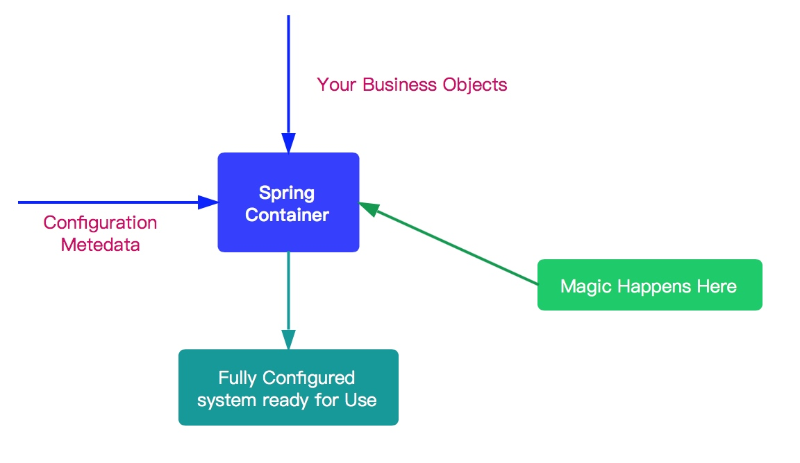


Spring IoC 容器所起的作用如上图所示，它会以某种方式加载 Configuration Metadata，将其解析注册到容器内部，然后回根据这些信息绑定整个系统的对象，最终组装成一个可用的基于轻量级容器的应用系统。

Spring 在实现上述功能中，将整个流程分为两个阶段：容器初始化阶段和加载bean 阶段。分别如下：

1. 容器初始化阶段：
   - 首先，通过某种方式加载 Configuration Metadata (主要是依据 Resource、ResourceLoader 两个体系) 。
   - 然后，容器会对加载的 Configuration MetaData 进行解析和分析，并将分析的信息组装成 BeanDefinition 。
   - 最后，将 BeanDefinition 保存注册到相应的 BeanDefinitionRegistry 中。
   - 至此，Spring IoC 的初始化工作完成。
2. 加载 Bean 阶段：
   - 经过容器初始化阶段后，应用程序中定义的 bean 信息已经全部加载到系统中了，当我们显示或者隐式地调用 `BeanFactory#getBean(...)` 方法时，则会触发加载 Bean 阶段。
   - 在这阶段，容器会首先检查所请求的对象是否已经初始化完成了，如果没有，则会根据注册的 Bean 信息实例化请求的对象，并为其注册依赖，然后将其返回给请求方。
   - 至此第二个阶段也已经完成。

### 1. getBean

当我们显示或者隐式地调用 `BeanFactory#getBean(String name)` 方法时，则会触发加载 Bean 阶段。代码如下：

```java
// AbstractBeanFactory.java

@Override
public Object getBean(String name) throws BeansException {
	return doGetBean(name, null, null, false);
}
```

- 内部调用 `doGetBean(String name, final Class<T> requiredType, Object[] args, boolean typeCheckOnly)` 方法，其接受四个方法参数：
  - `name` ：要获取 Bean 的名字
  - `requiredType` ：要获取 bean 的类型
  - `args` ：创建 Bean 时传递的参数。这个参数仅限于创建 Bean 时使用。
  - `typeCheckOnly` ：是否为类型检查。

### 2. doGetBean

`#doGetBean(String name, final Class<T> requiredType, Object[] args, boolean typeCheckOnly)` 方法，代码比较长，各位耐心看下。代码如下：

```java
// AbstractBeanFactory.java

protected <T> T doGetBean(final String name, @Nullable final Class<T> requiredType,
        @Nullable final Object[] args, boolean typeCheckOnly) throws BeansException {
    // <1> 返回 bean 名称，剥离工厂引用前缀。
    // 如果 name 是 alias ，则获取对应映射的 beanName 。
    final String beanName = transformedBeanName(name);
    Object bean;

    // 从缓存中或者实例工厂中获取 Bean 对象
    // Eagerly check singleton cache for manually registered singletons.
    Object sharedInstance = getSingleton(beanName);
    if (sharedInstance != null && args == null) {
        if (logger.isTraceEnabled()) {
            if (isSingletonCurrentlyInCreation(beanName)) {
                logger.trace("Returning eagerly cached instance of singleton bean '" + beanName +
                        "' that is not fully initialized yet - a consequence of a circular reference");
            } else {
                logger.trace("Returning cached instance of singleton bean '" + beanName + "'");
            }
        }
        // <2> 完成 FactoryBean 的相关处理，并用来获取 FactoryBean 的处理结果
        bean = getObjectForBeanInstance(sharedInstance, name, beanName, null);
    } else {
        // Fail if we're already creating this bean instance:
        // We're assumably within a circular reference.
        // <3> 因为 Spring 只解决单例模式下得循环依赖，在原型模式下如果存在循环依赖则会抛出异常。
        if (isPrototypeCurrentlyInCreation(beanName)) {
            throw new BeanCurrentlyInCreationException(beanName);
        }

        // <4> 如果容器中没有找到，则从父类容器中加载
        // Check if bean definition exists in this factory.
        BeanFactory parentBeanFactory = getParentBeanFactory();
        if (parentBeanFactory != null && !containsBeanDefinition(beanName)) {
            // Not found -> check parent.
            String nameToLookup = originalBeanName(name);
            if (parentBeanFactory instanceof AbstractBeanFactory) {
                return ((AbstractBeanFactory) parentBeanFactory).doGetBean(
                        nameToLookup, requiredType, args, typeCheckOnly);
            } else if (args != null) {
                // Delegation to parent with explicit args.
                return (T) parentBeanFactory.getBean(nameToLookup, args);
            } else if (requiredType != null) {
                // No args -> delegate to standard getBean method.
                return parentBeanFactory.getBean(nameToLookup, requiredType);
            } else {
                return (T) parentBeanFactory.getBean(nameToLookup);
            }
        }

        // <5> 如果不是仅仅做类型检查则是创建bean，这里需要记录
        if (!typeCheckOnly) {
            markBeanAsCreated(beanName);
        }

        try {
            // <6> 从容器中获取 beanName 相应的 GenericBeanDefinition 对象，并将其转换为 RootBeanDefinition 对象
            final RootBeanDefinition mbd = getMergedLocalBeanDefinition(beanName);
            // 检查给定的合并的 BeanDefinition
            checkMergedBeanDefinition(mbd, beanName, args);

            // Guarantee initialization of beans that the current bean depends on.
            // <7> 处理所依赖的 bean
            String[] dependsOn = mbd.getDependsOn();
            if (dependsOn != null) {
                for (String dep : dependsOn) {
                    // 若给定的依赖 bean 已经注册为依赖给定的 bean
                    // 循环依赖的情况
                    if (isDependent(beanName, dep)) {
                        throw new BeanCreationException(mbd.getResourceDescription(), beanName,
                                "Circular depends-on relationship between '" + beanName + "' and '" + dep + "'");
                    }
                    // 缓存依赖调用 TODO 芋艿
                    registerDependentBean(dep, beanName);
                    try {
                        getBean(dep);
                    } catch (NoSuchBeanDefinitionException ex) {
                        throw new BeanCreationException(mbd.getResourceDescription(), beanName,
                                "'" + beanName + "' depends on missing bean '" + dep + "'", ex);
                    }
                }
            }

            // <8> bean 实例化
            // Create bean instance.
            if (mbd.isSingleton()) { // 单例模式
                sharedInstance = getSingleton(beanName, () -> {
                    try {
                        return createBean(beanName, mbd, args);
                    }
                    catch (BeansException ex) {
                        // Explicitly remove instance from singleton cache: It might have been put there
                        // eagerly by the creation process, to allow for circular reference resolution.
                        // Also remove any beans that received a temporary reference to the bean.
                        // 显式从单例缓存中删除 Bean 实例
                        // 因为单例模式下为了解决循环依赖，可能他已经存在了，所以销毁它。 TODO 芋艿
                        destroySingleton(beanName);
                        throw ex;
                    }
                });
                bean = getObjectForBeanInstance(sharedInstance, name, beanName, mbd);
            } else if (mbd.isPrototype()) { // 原型模式
                // It's a prototype -> create a new instance.
                Object prototypeInstance;
                try {
                    beforePrototypeCreation(beanName);
                    prototypeInstance = createBean(beanName, mbd, args);
                } finally {
                    afterPrototypeCreation(beanName);
                }
                bean = getObjectForBeanInstance(prototypeInstance, name, beanName, mbd);
            } else {
                // 从指定的 scope 下创建 bean
                String scopeName = mbd.getScope();
                final Scope scope = this.scopes.get(scopeName);
                if (scope == null) {
                    throw new IllegalStateException("No Scope registered for scope name '" + scopeName + "'");
                }try {
                    Object scopedInstance = scope.get(beanName, () -> {
                        beforePrototypeCreation(beanName);
                        try {
                            return createBean(beanName, mbd, args);
                        } finally {
                            afterPrototypeCreation(beanName);
                        }
                    });
                    bean = getObjectForBeanInstance(scopedInstance, name, beanName, mbd);
                } catch (IllegalStateException ex) {
                    throw new BeanCreationException(beanName,
                            "Scope '" + scopeName + "' is not active for the current thread; consider " +
                            "defining a scoped proxy for this bean if you intend to refer to it from a singleton",
                            ex);
                }
            }
        } catch (BeansException ex) {
            cleanupAfterBeanCreationFailure(beanName);
            throw ex;
        }
    }

    // <9> 检查需要的类型是否符合 bean 的实际类型
    // Check if required type matches the type of the actual bean instance.
    if (requiredType != null && !requiredType.isInstance(bean)) {
        try {
            T convertedBean = getTypeConverter().convertIfNecessary(bean, requiredType);
            if (convertedBean == null) {
                throw new BeanNotOfRequiredTypeException(name, requiredType, bean.getClass());
            }
            return convertedBean;
        } catch (TypeMismatchException ex) {
            if (logger.isTraceEnabled()) {
                logger.trace("Failed to convert bean '" + name + "' to required type '" +
                        ClassUtils.getQualifiedName(requiredType) + "'", ex);
            }
            throw new BeanNotOfRequiredTypeException(name, requiredType, bean.getClass());
        }
    }
    return (T) bean;
}
```

代码是相当长，处理逻辑也是相当复杂，下面将其进行拆分阐述。


#### `<1>`获取beanName

对应代码段如下：

```java
// AbstractBeanFactory.java

final String beanName = transformedBeanName(name);
```

- 这里传递的是 `name` 方法，不一定就是 beanName，可能是 aliasName ，也有可能是 FactoryBean ，所以这里需要调用 `#transformedBeanName(String name)` 方法，对 `name` 进行一番转换。代码如下：

  ```java
  // AbstractBeanFactory.java
  
  protected String transformedBeanName(String name) {
  	return canonicalName(BeanFactoryUtils.transformedBeanName(name));
  }
  ```

  - 调用 `BeanFactoryUtils#transformedBeanName(String name)` 方法，去除 FactoryBean 的修饰符。代码如下：

    ```java
    // BeanFactoryUtils.java
    
    /**
     * Cache from name with factory bean prefix to stripped name without dereference.
     *
     * 缓存 {@link #transformedBeanName(String)} 已经转换好的结果。
     *
     * @since 5.1
     * @see BeanFactory#FACTORY_BEAN_PREFIX
     */
    private static final Map<String, String> transformedBeanNameCache = new ConcurrentHashMap<>();
    /**
     * 去除 FactoryBean 的修饰符 &
     *
     * 如果 name 以 “&” 为前缀，那么会去掉该 "&" 。
     * 例如，name = "&studentService" ，则会是 name = "studentService"。
     *
     * Return the actual bean name, stripping out the factory dereference
     * prefix (if any, also stripping repeated factory prefixes if found).
     * @param name the name of the bean
     * @return the transformed name
     * @see BeanFactory#FACTORY_BEAN_PREFIX
     */
    public static String transformedBeanName(String name) {
        Assert.notNull(name, "'name' must not be null");
        if (!name.startsWith(BeanFactory.FACTORY_BEAN_PREFIX)) { // BeanFactory.FACTORY_BEAN_PREFIX = $
            return name;
        }
        // computeIfAbsent 方法，分成两种情况：
        //      1. 未存在，则进行计算执行，并将结果添加到缓存、
        //      2. 已存在，则直接返回，无需计算。
        return transformedBeanNameCache.computeIfAbsent(name, beanName -> {
            do {
                beanName = beanName.substring(BeanFactory.FACTORY_BEAN_PREFIX.length());
            } while (beanName.startsWith(BeanFactory.FACTORY_BEAN_PREFIX));
            return beanName;
        });
    }
    ```

    - 实际上，逻辑比较简单，就是去除传入 `name` 参数的 `"&"` 的前缀。

      > 小知识补充。假设配置了一个 FactoryBean 的名字为 `"abc"` ，那么获取 FactoryBean 创建的 Bean 时，使用 `"abc"` ，如果获取 FactoryBean 本身，使用 `"$abc"` 。另外，`&`定义在 `BeanFactory.FACTORY_BEAN_PREFIX = "&"` 上。

    - `transformedBeanNameCache` 集合的存在，是为了缓存转换后的结果。下次再获取相同的 `name` 时，直接返回缓存中的结果即可。

  - 调用 `#canonicalName(String name)` 方法，取指定的 `alias` 所表示的最终 beanName 。

    ```java
    // SimpleAliasRegistry.java
    
    /** Map from alias to canonical name. */
    // key: alias
    // value: beanName
    private final Map<String, String> aliasMap = new ConcurrentHashMap<>(16);
    
    public String canonicalName(String name) {
    	String canonicalName = name;
    	// Handle aliasing...
    	String resolvedName;
    	// 循环，从 aliasMap 中，获取到最终的 beanName
    	do {
    		resolvedName = this.aliasMap.get(canonicalName);
    		if (resolvedName != null) {
    			canonicalName = resolvedName;
    		}
    	} while (resolvedName != null);
    	return canonicalName;
    }
    ```

    - 主要是一个循环获取 beanName 的过程，例如，别名 A 指向名称为 B 的 bean 则返回 B，若 别名 A 指向别名 B，别名 B 指向名称为 C 的 bean，则返回 C。

#### `<2>` 从单例Bean缓存中获取 Bean

对应代码段如下：

```java
// AbstractBeanFactory.java

// 从缓存中或者实例工厂中获取 Bean 对象
// Eagerly check singleton cache for manually registered singletons.
Object sharedInstance = getSingleton(beanName);
if (sharedInstance != null && args == null) {
	if (logger.isTraceEnabled()) {
		if (isSingletonCurrentlyInCreation(beanName)) {
			logger.trace("Returning eagerly cached instance of singleton bean '" + beanName +
					"' that is not fully initialized yet - a consequence of a circular reference");
		} else {
			logger.trace("Returning cached instance of singleton bean '" + beanName + "'");
		}
	}
	// <x> 完成 FactoryBean 的相关处理，并用来获取 FactoryBean 的处理结果
	bean = getObjectForBeanInstance(sharedInstance, name, beanName, null);
}
```

- 我们知道单例模式的 Bean 在整个过程中只会被创建一次。第一次创建后会将该 Bean 加载到缓存中。后面，在获取 Bean 就会直接从单例缓存中获取。

- `<x>` 处，如果从缓存中得到了 Bean 对象，则需要调用 `#getObjectForBeanInstance(Object beanInstance, String name, String beanName, RootBeanDefinition mbd)` 方法，对 Bean 进行实例化处理。因为，缓存中记录的是最原始的 Bean 状态，我们得到的不一定是我们**最终**想要的 Bean 。另外，FactoryBean 的用途如下：

  > From 《Spring 源码深度解析》P83 页
  >
  > 一般情况下，Spring 通过反射机制利用 bean 的 class 属性指定实现类来实例化 bean 。某些情况下，实例化 bean 过程比较复杂，如果按照传统的方式，则需要在 中提供大量的配置信息，配置方式的灵活性是受限的，这时采用编码的方式可能会得到一个简单的方案。Spring 为此提供了一个 FactoryBean 的工厂类接口，用户可以通过实现该接口定制实例化 bean 的逻辑。
  >
  > FactoryBean 接口对于 Spring 框架来说战友重要的地址，Spring 自身就提供了 70 多个 FactoryBean 的实现。它们隐藏了实例化一些复杂 bean 的细节，给上层应用带来了便利。
  >
  > 

详细解析，见 [IoC 之加载 Bean：从单例缓存中获取单](#IoC之加载 Bean:从单例缓存中获取单) 。

#### `<3>` 原型模式依赖检查 

对应代码段如下：

```java
// AbstractBeanFactory.java

// Fail if we're already creating this bean instance:
// We're assumably within a circular reference.
// 因为 Spring 只解决单例模式下得循环依赖，在原型模式下如果存在循环依赖则会抛出异常。
if (isPrototypeCurrentlyInCreation(beanName)) {
	throw new BeanCurrentlyInCreationException(beanName);
}
```

Spring 只处理单例模式下得循环依赖，对于原型模式的循环依赖直接抛出异常。主要原因还是在于，**和 Spring 解决循环依赖的策略有关**。

- 对于**单例( Singleton )模式**， Spring 在创建 Bean 的时候并不是等 Bean 完全创建完成后才会将 Bean 添加至缓存中，而是不等 Bean 创建完成就会将创建 Bean 的 ObjectFactory 提早加入到缓存中，这样一旦下一个 Bean 创建的时候需要依赖 bean 时则直接使用 ObjectFactroy 。
- 但是**原型( Prototype )模式**，我们知道是没法使用缓存的，所以 Spring 对原型模式的循环依赖处理策略则是不处理。

详细解析，见 [IoC 之加载 Bean：parentBeanFactory 与依赖处理](#IoC 之加载 Bean：parentBeanFactory 与依赖处理) 。

#### `<4>` 从 parentBeanFactory 获取 Bean

对应代码段如下：

```java
// AbstractBeanFactory.java

// 如果当前容器中没有找到，则从父类容器中加载
// Check if bean definition exists in this factory.
BeanFactory parentBeanFactory = getParentBeanFactory();
if (parentBeanFactory != null && !containsBeanDefinition(beanName)) {
    // Not found -> check parent.
    String nameToLookup = originalBeanName(name);
    // 如果，父类容器为 AbstractBeanFactory ，直接递归查找
    if (parentBeanFactory instanceof AbstractBeanFactory) {
        return ((AbstractBeanFactory) parentBeanFactory).doGetBean(
                nameToLookup, requiredType, args, typeCheckOnly);
    // 用明确的 args 从 parentBeanFactory 中，获取 Bean 对象
    } else if (args != null) {
        // Delegation to parent with explicit args.
        return (T) parentBeanFactory.getBean(nameToLookup, args);
    // 用明确的 requiredType 从 parentBeanFactory 中，获取 Bean 对象
    } else if (requiredType != null) {
        // No args -> delegate to standard getBean method.
        return parentBeanFactory.getBean(nameToLookup, requiredType);
    // 直接使用 nameToLookup 从 parentBeanFactory 获取 Bean 对象
    } else {
        return (T) parentBeanFactory.getBean(nameToLookup);
    }
}
```

- 如果**当前**容器缓存中没有相对应的 BeanDefinition 对象，则会尝试从父类工厂（`parentBeanFactory`）中加载，然后再去递归调用 `#getBean(...)` 方法。

详细解析，见 [IoC之加载Bean：parentBeanFactory 与依赖处理](#IoC之加载Bean：parentBeanFactory 与依赖处理) 。

#### `<5>` 指定的 Bean 标记为已经创建或即将创建

对应代码段如下：

```java
// AbstractBeanFactory.java

// 如果不是仅仅做类型检查则是创建bean，这里需要记录
if (!typeCheckOnly) {
	markBeanAsCreated(beanName);
}
```

详细解析，见 [IoC 之加载 Bean：parentBeanFactory 与依赖处理](#IoC之加载Bean：parentBeanFactory与依赖处理) 。

#### `<6>` 获取 BeanDefinition

对应代码段如下：

```java
// AbstractBeanFactory.java

// 从容器中获取 beanName 相应的 GenericBeanDefinition 对象，并将其转换为 RootBeanDefinition 对象
final RootBeanDefinition mbd = getMergedLocalBeanDefinition(beanName);
// 检查给定的合并的 BeanDefinition
checkMergedBeanDefinition(mbd, beanName, args);
```

> 因为从 XML 配置文件中读取到的 Bean 信息是存储在GenericBeanDefinition 中的。但是，所有的 Bean 后续处理都是针对于 RootBeanDefinition 的，所以这里需要进行一个转换。
>
> 转换的同时，如果父类 bean 不为空的话，则会一并合并父类的属性。

详细解析，见 [IoC 之加载 Bean：parentBeanFactory 与依赖处理](#IoC之加载Bean：parentBeanFactory 与依赖处理) 。

#### `<7>` 依赖 Bean 处理 

对应代码段如下：

```java
// AbstractBeanFactory.java

// Guarantee initialization of beans that the current bean depends on.
// 处理所依赖的 bean
String[] dependsOn = mbd.getDependsOn();
if (dependsOn != null) {
    for (String dep : dependsOn) {
        // 若给定的依赖 bean 已经注册为依赖给定的 bean
        // 即循环依赖的情况，抛出 BeanCreationException 异常
        if (isDependent(beanName, dep)) {
            throw new BeanCreationException(mbd.getResourceDescription(), beanName,
                    "Circular depends-on relationship between '" + beanName + "' and '" + dep + "'");
        }
        // 缓存依赖调用 TODO 芋艿
        registerDependentBean(dep, beanName);
        try {
            // 递归处理依赖 Bean
            getBean(dep);
        } catch (NoSuchBeanDefinitionException ex) {
            throw new BeanCreationException(mbd.getResourceDescription(), beanName,
                    "'" + beanName + "' depends on missing bean '" + dep + "'", ex);
        }
    }
}
```

- 每个 Bean 都不是单独工作的，它会依赖其他 Bean，其他 Bean 也会依赖它。
- 对于依赖的 Bean ，它会优先加载，所以，在 Spring 的加载顺序中，在初始化某一个 Bean 的时候，首先会初始化这个 Bean 的依赖。

详细解析，见 [IoC 之加载 Bean：parentBeanFactory 与依赖处理](#IoC之加载Bean：parentBeanFactory与依赖处理) 。

#### `<8>` 不同作用域的 Bean 实例化

对应代码段如下：

```java
// AbstractBeanFactory.java

// bean 实例化
// Create bean instance.
if (mbd.isSingleton()) { // 单例模式
    sharedInstance = getSingleton(beanName, () -> {
        try {
            return createBean(beanName, mbd, args);
        }
        catch (BeansException ex) {
            // Explicitly remove instance from singleton cache: It might have been put there
            // eagerly by the creation process, to allow for circular reference resolution.
            // Also remove any beans that received a temporary reference to the bean.
            // 显式从单例缓存中删除 Bean 实例
            // 因为单例模式下为了解决循环依赖，可能他已经存在了，所以销毁它。 TODO 芋艿
            destroySingleton(beanName);
            throw ex;
        }
    });
    bean = getObjectForBeanInstance(sharedInstance, name, beanName, mbd);
} else if (mbd.isPrototype()) { // 原型模式
    // It's a prototype -> create a new instance.
    Object prototypeInstance;
    try {
        beforePrototypeCreation(beanName);
        prototypeInstance = createBean(beanName, mbd, args);
    } finally {
        afterPrototypeCreation(beanName);
    }
    bean = getObjectForBeanInstance(prototypeInstance, name, beanName, mbd);
} else {
    // 从指定的 scope 下创建 bean
    String scopeName = mbd.getScope();
    final Scope scope = this.scopes.get(scopeName);
    if (scope == null) {
        throw new IllegalStateException("No Scope registered for scope name '" + scopeName + "'");
    }try {
        Object scopedInstance = scope.get(beanName, () -> {
            beforePrototypeCreation(beanName);
            try {
                return createBean(beanName, mbd, args);
            } finally {
                afterPrototypeCreation(beanName);
            }
        });
        bean = getObjectForBeanInstance(scopedInstance, name, beanName, mbd);
    } catch (IllegalStateException ex) {
        throw new BeanCreationException(beanName,
                "Scope '" + scopeName + "' is not active for the current thread; consider " +
                "defining a scoped proxy for this bean if you intend to refer to it from a singleton",
                ex);
    }
}
```

- Spring Bean 的作用域默认为 singleton 。当然，还有其他作用域，如 prototype、request、session 等。
- 不同的作用域会有不同的初始化策略。

详细解析，见 [IoC 之加载 Bean：分析各 scope 的 Bean 创建](#IoC之加载Bean：分析各scope的Bean创建) 。

#### `<9>`  类型转换

对应代码段如下：

```java
// AbstractBeanFactory.java

// 检查需要的类型是否符合 bean 的实际类型
// Check if required type matches the type of the actual bean instance.
if (requiredType != null && !requiredType.isInstance(bean)) {
    try {
        // 执行转换
        T convertedBean = getTypeConverter().convertIfNecessary(bean, requiredType);
        // 转换失败，抛出 BeanNotOfRequiredTypeException 异常
        if (convertedBean == null) {
            throw new BeanNotOfRequiredTypeException(name, requiredType, bean.getClass());
        }
        return convertedBean;
    } catch (TypeMismatchException ex) {
        if (logger.isTraceEnabled()) {
            logger.trace("Failed to convert bean '" + name + "' to required type '" +
                    ClassUtils.getQualifiedName(requiredType) + "'", ex);
        }
        throw new BeanNotOfRequiredTypeException(name, requiredType, bean.getClass());
    }
}
```

- 在调用 `#doGetBean(...)` 方法时，`有一个 requiredTyp`e 参数。该参数的功能就是将返回的 Bean 转换为 `requiredType` 类型。
- 当然就一般而言，我们是不需要进行类型转换的，也就是 `requiredType` 为空（比如 `#getBean(String name)` 方法）。但有，可能会存在这种情况，比如我们返回的 Bean 类型为 String ，我们在使用的时候需要将其转换为 Integer，那么这个时候 `requiredType` 就有用武之地了。**当然我们一般是不需要这样做的**。

### 3. 小结

至此 `BeanFactory#getBean(...)` 方法的过程讲解完了。后续将会对该过程进行拆分，更加详细的说明，弄清楚其中的来龙去脉，所以这篇博客只能算是 Spring Bean 加载过程的一个概览。拆分主要是分为三个部分：

1. 分析从缓存中获取单例 Bean ，以及对 Bean 的实例中获取对象。
2. 如果从单例缓存中获取 Bean ，Spring 是怎么加载的呢？所以第二部分是分析 Bean 加载，以及 Bean 的依赖处理。
3. Bean 已经加载了，依赖也处理完毕了，第三部分则分析各个作用域的 Bean 初始化过程。

> 再推荐几篇不错的 Spring Bean 加载的过程，写的不错的文章：
>
> - zhanglbjames [《Spring-IoC-getBean源码解析》](https://www.jianshu.com/p/a6acfceb42fb)
> - glmapper [《Spring源码系列：依赖注入（一）getBean》](https://juejin.im/post/5a7532746fb9a0633a70d57f)
> - 是Guava不是瓜娃 [《Spring原理与源码分析系列（五）- Spring IoC源码分析（下）》](https://blog.csdn.net/noaman_wgs/article/details/79138883)

## IoC之加载 Bean：从单例缓存中获取单例Bean

我们开始加载 Bean 的第一个步骤，从缓存中获取 Bean 。代码片段如下：

```java
// AbstractBeanFactory.java

// 从缓存中或者实例工厂中获取 Bean 对象
// Eagerly check singleton cache for manually registered singletons.
Object sharedInstance = getSingleton(beanName);
if (sharedInstance != null && args == null) {
	if (logger.isTraceEnabled()) {
		if (isSingletonCurrentlyInCreation(beanName)) {
			logger.trace("Returning eagerly cached instance of singleton bean '" + beanName +
					"' that is not fully initialized yet - a consequence of a circular reference");
		} else {
			logger.trace("Returning cached instance of singleton bean '" + beanName + "'");
		}
	}
	// 完成 FactoryBean 的相关处理，并用来获取 FactoryBean 的处理结果
	bean = getObjectForBeanInstance(sharedInstance, name, beanName, null);
}
```

调用 `#getSingleton(String beanName)` 方法，从缓存中获取 Bean 。

### 1. getSingleton

Spring 对单例模式的 bean 只会创建一次。后续，如果再获取该 Bean ，则是直接从单例缓存中获取，该过程就体现在 `#getSingleton(String beanName)` 方法中。代码如下：

```java
// DefaultSingletonBeanRegistry.java

@Override
@Nullable
public Object getSingleton(String beanName) {
    return getSingleton(beanName, true);
}

@Nullable
protected Object getSingleton(String beanName, boolean allowEarlyReference) {
    // 从单例缓冲中加载 bean
    Object singletonObject = this.singletonObjects.get(beanName);
    // 缓存中的 bean 为空，且当前 bean 正在创建
    if (singletonObject == null && isSingletonCurrentlyInCreation(beanName)) {
        // 加锁
        synchronized (this.singletonObjects) {
            // 从 earlySingletonObjects 获取
            singletonObject = this.earlySingletonObjects.get(beanName);
            // earlySingletonObjects 中没有，且允许提前创建
            if (singletonObject == null && allowEarlyReference) {
                // 从 singletonFactories 中获取对应的 ObjectFactory
                ObjectFactory<?> singletonFactory = this.singletonFactories.get(beanName);
                if (singletonFactory != null) {
                    // 获得 bean
                    singletonObject = singletonFactory.getObject();
                    // 添加 bean 到 earlySingletonObjects 中
                    this.earlySingletonObjects.put(beanName, singletonObject);
                    // 从 singletonFactories 中移除对应的 ObjectFactory
                    this.singletonFactories.remove(beanName);
                }
            }
        }
    }
    return singletonObject;
}
```

这段代码非常简单，保持淡定，过程如下：

- 第一步，从 `singletonObjects` 中，获取 Bean 对象。

- 第二步，若为空且当前 bean 正在创建中，则从 `earlySingletonObjects` 中获取 Bean 对象。

- 第三步，若为空且允许提前创建，则从 `singletonFactories` 中获取相应的 ObjectFactory 对象。若不为空，则调用其 `ObjectFactory#getObject(String name)` 方法，创建 Bean 对象，然后将其加入到 `earlySingletonObjects` ，然后从 `singletonFactories` 删除。

- 总体逻辑，就是根据 `beanName` 依次检测这三个 Map，若为空，从下一个，否则返回。这三个 Map 存放的都有各自的功能，代码如下：

  ```java
  // DefaultSingletonBeanRegistry.java
  
  /**
   * Cache of singleton objects: bean name to bean instance.
   *
   * 存放的是单例 bean 的映射。
   *
   * 对应关系为 bean name --> bean instance
   */
  private final Map<String, Object> singletonObjects = new ConcurrentHashMap<>(256);
  
  /**
   * Cache of singleton factories: bean name to ObjectFactory.
   *
   * 存放的是 ObjectFactory，可以理解为创建单例 bean 的 factory 。
   *
   * 对应关系是 bean name --> ObjectFactory
   **/
  private final Map<String, ObjectFactory<?>> singletonFactories = new HashMap<>(16);
  
  /**
   * Cache of early singleton objects: bean name to bean instance.
   *
   * 存放的是早期的 bean，对应关系也是 bean name --> bean instance。
   *
   * 它与 {@link #singletonFactories} 区别在于 earlySingletonObjects 中存放的 bean 不一定是完整。
   *
   * 从 {@link #getSingleton(String)} 方法中，我们可以了解，bean 在创建过程中就已经加入到 earlySingletonObjects 中了。
   * 所以当在 bean 的创建过程中，就可以通过 getBean() 方法获取。
   *
   * 这个 Map 也是【循环依赖】的关键所在。
   */
  private final Map<String, Object> earlySingletonObjects = new HashMap<>(16);
  ```

#### 1.1 isSingletonCurrentlyInCreation

在上面代码中，还有一个非常重要的检测方法 `#isSingletonCurrentlyInCreation(String beanName)` 方法，该方法用于判断该 `beanName` 对应的 Bean **是否在创建过程**中，注意这个过程讲的是整个工厂中。代码如下：

```java
// DefaultSingletonBeanRegistry.java

/**
 * Names of beans that are currently in creation.
 *
 * 正在创建中的单例 Bean 的名字的集合
 */
private final Set<String> singletonsCurrentlyInCreation =
		Collections.newSetFromMap(new ConcurrentHashMap<>(16));
```

从这段代码中，我们可以预测，在 Bean 创建过程中都会将其加入到 `singletonsCurrentlyInCreation` 集合中。具体是在什么时候加的，我们后面分析。

### 2. getObjectForBeanInstance

到这里从缓存中获取 bean 的过程已经分析完毕了，我们再看开篇的代码段，从缓存中获取 Bean 后，若其不为 `null` 且 `args` 为空，则会调用 `#getObjectForBeanInstance(Object beanInstance, String name, String beanName,RootBeanDefinition mbd)` 方法，进行处理。

- 为什么会有这么一段呢？因为我们从缓存中获取的 bean 是**最原始**的 Bean ，并不一定使我们最终想要的 Bean 。
- 怎么办呢？调用 `#getObjectForBeanInstance(...)` 方法，进行处理，该方法的定义为获取给定 Bean 实例的对象，该对象要么是 bean 实例本身，要么就是 FactoryBean 创建的 Bean 对象。

代码如下：

```java
// AbstractBeanFactory.java

protected Object getObjectForBeanInstance(
        Object beanInstance, String name, String beanName, @Nullable RootBeanDefinition mbd) {
    // <1> 若为工厂类引用（name 以 & 开头）
    // Don't let calling code try to dereference the factory if the bean isn't a factory.
    if (BeanFactoryUtils.isFactoryDereference(name)) {
        // 如果是 NullBean，则直接返回
        if (beanInstance instanceof NullBean) {
            return beanInstance;
        }
        // 如果 beanInstance 不是 FactoryBean 类型，则抛出异常
        if (!(beanInstance instanceof FactoryBean)) {
            throw new BeanIsNotAFactoryException(transformedBeanName(name), beanInstance.getClass());
        }
    }

    // 到这里我们就有了一个 Bean 实例，当然该实例可能是会是是一个正常的 bean 又或者是一个 FactoryBean
    // 如果是 FactoryBean，我我们则创建该 Bean
    // Now we have the bean instance, which may be a normal bean or a FactoryBean.
    // If it's a FactoryBean, we use it to create a bean instance, unless the
    // caller actually wants a reference to the factory.
    if (!(beanInstance instanceof FactoryBean) || BeanFactoryUtils.isFactoryDereference(name)) {
        return beanInstance;
    }

    Object object = null;
    // <3> 若 BeanDefinition 为 null，则从缓存中加载 Bean 对象
    if (mbd == null) {
        object = getCachedObjectForFactoryBean(beanName);
    }
    // 若 object 依然为空，则可以确认，beanInstance 一定是 FactoryBean 。从而，使用 FactoryBean 获得 Bean 对象
    if (object == null) {
        // Return bean instance from factory.
        FactoryBean<?> factory = (FactoryBean<?>) beanInstance;
        // containsBeanDefinition 检测 beanDefinitionMap 中也就是在所有已经加载的类中
        // 检测是否定义 beanName
        // Caches object obtained from FactoryBean if it is a singleton.
        if (mbd == null && containsBeanDefinition(beanName)) {
            // 将存储 XML 配置文件的 GenericBeanDefinition 转换为 RootBeanDefinition，
            // 如果指定 BeanName 是子 Bean 的话同时会合并父类的相关属性
            mbd = getMergedLocalBeanDefinition(beanName);
        }
        // 是否是用户定义的，而不是应用程序本身定义的
        boolean synthetic = (mbd != null && mbd.isSynthetic());
        // 核心处理方法，使用 FactoryBean 获得 Bean 对象
        object = getObjectFromFactoryBean(factory, beanName, !synthetic);
    }
    return object;
}
```

该方法主要是进行检测工作的，主要如下：

- `<1>` 处，若 `name` 为工厂相关的（以 & 开头），且 `beanInstance` 为 NullBean 类型则直接返回，如果 `beanInstance` 不为 FactoryBean 类型则抛出 BeanIsNotAFactoryException 异常。这里主要是**校验** `beanInstance` 的**正确性**。

- `<2>` 处，如果 `beanInstance` 不为 FactoryBean 类型或者 `name` 也不是与工厂相关的，则直接返回 `beanInstance` 这个 Bean 对象。**这里主要是对非 FactoryBean 类型处理**。

- `<3>` 处，如果 BeanDefinition 为空，则从 `factoryBeanObjectCache` 中加载 Bean 对象。如果还是空，则可以断定 `beanInstance` 一定是 FactoryBean 类型，则委托 `#getObjectFromFactoryBean(FactoryBean<?> factory, String beanName, boolean shouldPostProcess)` 方法，进行处理，**使用 FactoryBean 获得 Bean 对象**。

  > 所以实际上，`#getObjectForBeanInstance(...)` 方法的**重心**，就是使用 FactoryBean 对象，获得( 或者创建 )其 Bean 对象，即调用 `#getObjectFromFactoryBean(...)` 方法。

#### 2.1 getObjectFromFactoryBean

从上面可以看出， `#getObjectForBeanInstance(Object beanInstance, String name, String beanName,RootBeanDefinition mbd)` 方法，分成两种情况：

- 第一种，当该实例对象为**非 FactoryBean 类型**，**直接**返回给定的 Bean 实例对象 `beanInstance` 。
- 第二种，当该实例对象为**FactoryBean 类型**，从 FactoryBean ( `beanInstance` ) 中，获取 Bean 实例对象。

第二种，通过 `#getObjectFromFactoryBean(FactoryBean<?> factory, String beanName, boolean shouldPostProcess)` 方法来实现。代码如下：

```java
// FactoryBeanRegistrySupport.java

/**
 * Cache of singleton objects created by FactoryBeans: FactoryBean name to object.
 *
 * 缓存 FactoryBean 创建的单例 Bean 对象的映射
 * beanName ===> Bean 对象
 */
private final Map<String, Object> factoryBeanObjectCache = new ConcurrentHashMap<>(16);

protected Object getObjectFromFactoryBean(FactoryBean<?> factory, String beanName, boolean shouldPostProcess) {
    // <1> 为单例模式且缓存中存在
    if (factory.isSingleton() && containsSingleton(beanName)) {
        synchronized (getSingletonMutex()) { // <1.1> 单例锁
            // <1.2> 从缓存中获取指定的 factoryBean
            Object object = this.factoryBeanObjectCache.get(beanName);
            if (object == null) {
                // 为空，则从 FactoryBean 中获取对象
                object = doGetObjectFromFactoryBean(factory, beanName);
                // 从缓存中获取
                // TODO 芋艿，具体原因
                // Only post-process and store if not put there already during getObject() call above
                // (e.g. because of circular reference processing triggered by custom getBean calls)
                Object alreadyThere = this.factoryBeanObjectCache.get(beanName);
                if (alreadyThere != null) {
                    object = alreadyThere;
                } else {
                    // <1.3> 需要后续处理
                    if (shouldPostProcess) {
                        // 若该 Bean 处于创建中，则返回非处理对象，而不是存储它
                        if (isSingletonCurrentlyInCreation(beanName)) {
                            // Temporarily return non-post-processed object, not storing it yet..
                            return object;
                        }
                        // 单例 Bean 的前置处理
                        beforeSingletonCreation(beanName);
                        try {
                            // 对从 FactoryBean 获取的对象进行后处理
                            // 生成的对象将暴露给 bean 引用
                            object = postProcessObjectFromFactoryBean(object, beanName);
                        } catch (Throwable ex) {
                            throw new BeanCreationException(beanName,
                                    "Post-processing of FactoryBean's singleton object failed", ex);
                        } finally {
                            // 单例 Bean 的后置处理
                            afterSingletonCreation(beanName);
                        }
                    }
                    // <1.4> 添加到 factoryBeanObjectCache 中，进行缓存
                    if (containsSingleton(beanName)) {
                        this.factoryBeanObjectCache.put(beanName, object);
                    }
                }
            }
            return object;
        }
    // <2>
    } else {
        // 为空，则从 FactoryBean 中获取对象
        Object object = doGetObjectFromFactoryBean(factory, beanName);
        // 需要后续处理
        if (shouldPostProcess) {
            try {
                // 对从 FactoryBean 获取的对象进行后处理
                // 生成的对象将暴露给 bean 引用
                object = postProcessObjectFromFactoryBean(object, beanName);
            }
            catch (Throwable ex) {
                throw new BeanCreationException(beanName, "Post-processing of FactoryBean's object failed", ex);
            }
        }
        return object;
    }
}
```

主要流程如下：

- 若为单例且单例 Bean 缓存中存在 `beanName` ，则 `<1>` 进行后续处理（跳转到下一步），否则，则 `<2>` 从 FactoryBean 中获取 Bean 实例对象。

- `<1.1>` 首先，获取锁。其实我们在前面篇幅中发现了大量的同步锁，锁住的对象都是 `this.singletonObjects`，主要是因为在单例模式中必须要**保证全局唯一**。代码如下：

  ```java
  // DefaultSingletonBeanRegistry.java
  
  /**
   * Cache of singleton objects: bean name to bean instance.
   *
   * 存放的是单例 bean 的映射。
   *
   * 对应关系为 bean name --> bean instance
   */
  private final Map<String, Object> singletonObjects = new ConcurrentHashMap<>(256);
  
  public final Object getSingletonMutex() {
  	return this.singletonObjects;
  }
  ```

- `<1.2>` 然后，从 `factoryBeanObjectCache` 缓存中获取实例对象 `object` 。若 `object` 为空，则调用 `#doGetObjectFromFactoryBean(FactoryBean<?> factory, String beanName)` 方法，从 FactoryBean 获取对象，其实内部就是调用 `FactoryBean#getObject()` 方法。代码如下：

  ```java
  private Object doGetObjectFromFactoryBean(final FactoryBean<?> factory, final String beanName)
      throws BeanCreationException {
      Object object;
      try {
          // 需要权限验证
          if (System.getSecurityManager() != null) {
              AccessControlContext acc = getAccessControlContext();
              try {
                  // <x> 从 FactoryBean 中，获得 Bean 对象
                  object = AccessController.doPrivileged((PrivilegedExceptionAction<Object>) factory::getObject, acc);
              } catch (PrivilegedActionException pae) {
                  throw pae.getException();
              }
          } else {
              // <x> 从 FactoryBean 中，获得 Bean 对象
              object = factory.getObject();
          }
      } catch (FactoryBeanNotInitializedException ex) {
          throw new BeanCurrentlyInCreationException(beanName, ex.toString());
      } catch (Throwable ex) {
          throw new BeanCreationException(beanName, "FactoryBean threw exception on object creation", ex);
      }
      // Do not accept a null value for a FactoryBean that's not fully
      // initialized yet: Many FactoryBeans just return null then.
      if (object == null) {
          if (isSingletonCurrentlyInCreation(beanName)) {
              throw new BeanCurrentlyInCreationException(
                      beanName, "FactoryBean which is currently in creation returned null from getObject");
          }
          object = new NullBean();
      }
      return object;
  }
  ```

  - 在 `<x>` 处，可以看到，调用 `FactoryBean#getObject()` 方法，获取 Bean 对象。

- `<1.3>` 如果需要后续处理( `shouldPostProcess = true` )，则进行进一步处理，步骤如下：

  - 若该 Bean 处于创建中（`#isSingletonCurrentlyInCreation(String beanName)` 方法返回 `true` ），则返回**非处理的 Bean 对象**，而不是存储它。
  - 调用 `#beforeSingletonCreation(String beanName)` 方法，进行创建之前的处理。默认实现将该 Bean 标志为当前创建的。
  - 调用 `#postProcessObjectFromFactoryBean(Object object, String beanName)` 方法，对从 FactoryBean 获取的 Bean 实例对象进行后置处理。详细解析，见 [「2.3 postProcessObjectFromFactoryBean」](http://svip.iocoder.cn/Spring/IoC-get-Bean-getSingleton/#) 。
  - 调用 `#afterSingletonCreation(String beanName)` 方法，进行创建 Bean 之后的处理，默认实现是将该 bean 标记为不再在创建中。

- `<1.4>` 最后，加入到 `factoryBeanObjectCache` 缓存中。

该方法应该就是创建 Bean 实例对象中的核心方法之一了。这里我们关注三个方法：

- `#beforeSingletonCreation(String beanName)`
- `#afterSingletonCreation(String beanName)`
- `#postProcessObjectFromFactoryBean(Object object, String beanName)`

#### 2.2 isSingletonCurrentlyInCreation

可能有小伙伴觉得前面两个方法不是很重要，LZ 可以肯定告诉你，这两方法是非常重要的操作，因为**他们记录着 Bean 的加载状态，是检测当前 Bean 是否处于创建中的关键之处，对解决 Bean 循环依赖起着关键作用**。

- `#beforeSingletonCreation(String beanName)` 方法，用于添加标志，当前 bean **正处于**创建中
- `#afterSingletonCreation(String beanName)` 方法，用于移除标记，当前 Bean **不处于**创建中。

其实在这篇博客刚刚开始就已经提到了， `#isSingletonCurrentlyInCreation(String beanName)` 方法，是用于检测当前 Bean 是否处于创建之中。代码如下：

```java
// DefaultSingletonBeanRegistry.java

/**
 * Names of beans that are currently in creation.
 *
 * 正在创建中的单例 Bean 的名字的集合
 */
private final Set<String> singletonsCurrentlyInCreation =
        Collections.newSetFromMap(new ConcurrentHashMap<>(16));
```

- 是根据 `singletonsCurrentlyInCreation` 集合中是否包含了 `beanName` 。

##### 2.2.1 beforeSingletonCreation

集合的元素，则一定是在 `#beforeSingletonCreation(String beanName)` 方法中添加的。代码如下：

```java
// DefaultSingletonBeanRegistry.java

protected void beforeSingletonCreation(String beanName) {
	if (!this.inCreationCheckExclusions.contains(beanName)
            && !this.singletonsCurrentlyInCreation.add(beanName)) { // 添加
		throw new BeanCurrentlyInCreationException(beanName); // 如果添加失败，则抛出 BeanCurrentlyInCreationException 异常。
	}
}
```

##### 2.2.2 afterSingletonCreation

`#afterSingletonCreation(String beanName)` 方法，为移除，则一定就是对 `singletonsCurrentlyInCreation` 集合 remove 了。代码如下：

```java
// DefaultSingletonBeanRegistry.java

protected void afterSingletonCreation(String beanName) {
	if (!this.inCreationCheckExclusions.contains(beanName) &&
            !this.singletonsCurrentlyInCreation.remove(beanName)) { // 移除
	    // 如果移除失败，则抛出 IllegalStateException 异常
		throw new IllegalStateException("Singleton '" + beanName + "' isn't currently in creation");
	}
}
```

#### 2.3 postProcessObjectFromFactoryBean

`postProcessObjectFromFactoryBean(Object object, String beanName)` 方法，对从 FactoryBean 处获取的 Bean 实例对象进行后置处理。其默认实现是直接返回 object 对象，不做任何处理。代码如下：

```java
// DefaultSingletonBeanRegistry.java

protected Object postProcessObjectFromFactoryBean(Object object, String beanName) throws BeansException {
	return object;
}
```

##### 2.3.1

当然，子类可以重写，例如应用后处理器。`org.springframework.beans.factory.support.AbstractAutowireCapableBeanFactory` 抽象类，对其提供了实现，代码如下：

```java
// AbstractAutowireCapableBeanFactory.java

protected Object postProcessObjectFromFactoryBean(Object object, String beanName) {
	return applyBeanPostProcessorsAfterInitialization(object, beanName);
}
```

- 该方法的定义为：对所有的 `{@code postProcessAfterInitialization}` 进行回调注册 BeanPostProcessors ，让他们能够后期处理从 FactoryBean 中获取的对象。下面是具体实现：

  ```java
  // AbstractAutowireCapableBeanFactory.java
  
  @Override
  public Object applyBeanPostProcessorsAfterInitialization(Object existingBean, String beanName)
          throws BeansException {
      Object result = existingBean;
      // 遍历 BeanPostProcessor
      for (BeanPostProcessor processor : getBeanPostProcessors()) {
          // 处理
          Object current = processor.postProcessAfterInitialization(result, beanName);
          // 返回空，则返回 result
          if (current == null) {
              return result;
          }
          // 修改 result
          result = current;
      }
      return result;
  }
  ```

  - 对于后置处理器，这里我们不做过多阐述，后面会专门的博文进行详细介绍，这里我们只需要记住一点：尽可能保证所有 bean 初始化后都会调用注册的 `BeanPostProcessor#postProcessAfterInitialization(Object bean, String beanName)` 方法进行处理，在实际开发过程中大可以针对此特性设计自己的业务逻辑。

### 3. 小结

至此，从缓存中获取 Bean 对象过程已经分析完毕了。

下面两篇博客分析，如果从单例缓存中没有获取到单例 Bean ，则 Spring 是如何处理的。

## IoC 之加载 Bean：parentBeanFactory 与依赖处理

如果从单例缓存中没有获取到单例 Bean 对象，则说明两种两种情况：

1. 该 Bean 的 scope 不是 singleton
2. 该 Bean 的 scope 是 singleton ，但是没有初始化完成。

针对这两种情况，Spring 是如何处理的呢？统一加载并完成初始化！这部分内容的篇幅较长，拆分为两部分：

- 第一部分，主要是一些检测、parentBeanFactory 以及依赖处理。
- 第二部分则是各个 scope 的初始化。

代码如下：

```java
// AbstractBeanFactory.java
//protected <T> T doGetBean(final String name, final Class<T> requiredType, final Object[] args, boolean typeCheckOnly)

// ... 省略很多代码

// Fail if we're already creating this bean instance:
// We're assumably within a circular reference.
// <3> 因为 Spring 只解决单例模式下得循环依赖，在原型模式下如果存在循环依赖则会抛出异常。
if (isPrototypeCurrentlyInCreation(beanName)) {
    throw new BeanCurrentlyInCreationException(beanName);
}

// <4> 如果容器中没有找到，则从父类容器中加载
// Check if bean definition exists in this factory.
BeanFactory parentBeanFactory = getParentBeanFactory();
if (parentBeanFactory != null && !containsBeanDefinition(beanName)) {
    // Not found -> check parent.
    String nameToLookup = originalBeanName(name);
    if (parentBeanFactory instanceof AbstractBeanFactory) {
        return ((AbstractBeanFactory) parentBeanFactory).doGetBean(
                nameToLookup, requiredType, args, typeCheckOnly);
    } else if (args != null) {
        // Delegation to parent with explicit args.
        return (T) parentBeanFactory.getBean(nameToLookup, args);
    } else if (requiredType != null) {
        // No args -> delegate to standard getBean method.
        return parentBeanFactory.getBean(nameToLookup, requiredType);
    } else {
        return (T) parentBeanFactory.getBean(nameToLookup);
    }
}

// <5> 如果不是仅仅做类型检查则是创建bean，这里需要记录
if (!typeCheckOnly) {
    markBeanAsCreated(beanName);
}

try {
    // <6> 从容器中获取 beanName 相应的 GenericBeanDefinition 对象，并将其转换为 RootBeanDefinition 对象
    final RootBeanDefinition mbd = getMergedLocalBeanDefinition(beanName);
    // 检查给定的合并的 BeanDefinition
    checkMergedBeanDefinition(mbd, beanName, args);

    // Guarantee initialization of beans that the current bean depends on.
    // <7> 处理所依赖的 bean
    String[] dependsOn = mbd.getDependsOn();
    if (dependsOn != null) {
        for (String dep : dependsOn) {
            // 若给定的依赖 bean 已经注册为依赖给定的 bean
            // 循环依赖的情况
            if (isDependent(beanName, dep)) {
                throw new BeanCreationException(mbd.getResourceDescription(), beanName,
                        "Circular depends-on relationship between '" + beanName + "' and '" + dep + "'");
            }
            // 缓存依赖调用
            registerDependentBean(dep, beanName);
            try {
                getBean(dep);
            } catch (NoSuchBeanDefinitionException ex) {
                throw new BeanCreationException(mbd.getResourceDescription(), beanName,
                        "'" + beanName + "' depends on missing bean '" + dep + "'", ex);
            }
        }
    }
}

// ... 省略很多代码
```

这段代码主要处理如下几个部分：

- `<3>`处，检测。若当前 Bean 在创建，则抛出 BeanCurrentlyInCreationException 异常。详细解析，见 [「1. 检测」](http://svip.iocoder.cn/Spring/IoC-get-Bean-parentBeanFactory-and-depend-on/#) 。
- `<4>`处，如果 beanDefinitionMap 中不存在 beanName 的 BeanDefinition（即在 Spring bean 初始化过程中没有加载），则尝试从 parentBeanFactory 中加载。
  - 详细解析，见 [「2. 检查父类 BeanFactory」](http://svip.iocoder.cn/Spring/IoC-get-Bean-parentBeanFactory-and-depend-on/#) 。
- `<5>`处，判断是否为类型检查。
  - 详细解析，见 [「3. 类型检查」](http://svip.iocoder.cn/Spring/IoC-get-Bean-parentBeanFactory-and-depend-on/#) 。
- `<6>`处，从`mergedBeanDefinitions`中获取beanName对应的 RootBeanDefinition 对象。如果这个 BeanDefinition 是子 Bean 的话，则会合并父类的相关属性。
  - 详细解析，见 [「4. 获取 RootBeanDefinition」](http://svip.iocoder.cn/Spring/IoC-get-Bean-parentBeanFactory-and-depend-on/#) 。
- `<7>`处，依赖处理。
  - 详细解析，见 [「5. 处理依赖」](http://svip.iocoder.cn/Spring/IoC-get-Bean-parentBeanFactory-and-depend-on/#) 。

### 1. 检测

在前面就提过，Spring 只解决单例模式下的循环依赖，对于原型模式的循环依赖则是抛出 BeanCurrentlyInCreationException 异常，所以首先检查该 `beanName` 是否处于原型模式下的循环依赖。如下：

```java
// AbstractBeanFactory.java

if (isPrototypeCurrentlyInCreation(beanName)) {
    throw new BeanCurrentlyInCreationException(beanName);
}
```

- 调用 `#isPrototypeCurrentlyInCreation(String beanName)` 方法，判断当前 Bean 是否正在创建。代码如下：

  ```java
  // AbstractBeanFactory.java
  
  protected boolean isPrototypeCurrentlyInCreation(String beanName) {
  	Object curVal = this.prototypesCurrentlyInCreation.get();
  	return (curVal != null &&
  			(curVal.equals(beanName)  // 相等
                      || (curVal instanceof Set && ((Set<?>) curVal).contains(beanName)))); // 包含
  }
  ```

  - 其实检测逻辑和单例模式一样，一个“集合”存放着正在创建的 Bean ，从该集合中进行判断即可，只不过单例模式的“集合”为 Set ，而原型模式的则是 ThreadLocal 。`prototypesCurrentlyInCreation` 定义如下：

    ```java
    // AbstractBeanFactory.java
    
    /** Names of beans that are currently in creation. */
    private final ThreadLocal<Object> prototypesCurrentlyInCreation =
    		new NamedThreadLocal<>("Prototype beans currently in creation");
    ```

### 2. 检查父类 BeanFactory

若 `#containsBeanDefinition(String beanName)` 方法中不存在 `beanName` 相对应的 BeanDefinition 对象时，则从 `parentBeanFactory` 中获取。代码如下：

```java
// AbstractBeanFactory.java

// 获取 parentBeanFactory
BeanFactory parentBeanFactory = getParentBeanFactory();
// parentBeanFactory 不为空且 beanDefinitionMap 中不存该 name 的 BeanDefinition
if (parentBeanFactory != null && !containsBeanDefinition(beanName)) {
    // 确定原始 beanName
    String nameToLookup = originalBeanName(name);
    // 若为 AbstractBeanFactory 类型，委托父类处理
    if (parentBeanFactory instanceof AbstractBeanFactory) {
        return ((AbstractBeanFactory) parentBeanFactory).doGetBean(
                nameToLookup, requiredType, args, typeCheckOnly);
    } else if (args != null) {
        // 委托给构造函数 getBean() 处理
        return (T) parentBeanFactory.getBean(nameToLookup, args);
    } else {
        // 没有 args，委托给标准的 getBean() 处理
        return parentBeanFactory.getBean(nameToLookup, requiredType);
    }
}
```

- 整个过程较为简单，都是委托 `parentBeanFactory` 的 `#getBean(...)` 方法来进行处理，只不过在获取之前对 `breanName` 进行简单的处理，主要是想获取原始的 `beanName` 。代码如下：

  ```java
  // AbstractBeanFactory.java
  
  protected String originalBeanName(String name) {
  	String beanName = transformedBeanName(name); // <1>
  	if (name.startsWith(FACTORY_BEAN_PREFIX)) { // <2>
  		beanName = FACTORY_BEAN_PREFIX + beanName;
  	}
  	return beanName;
  }
  ```

  - `<1>` 处，`#transformedBeanName(String name)` 方法，是对 `name` 进行转换，获取真正的 beanName 。在 [IoC 之开启 Bean 的加载](#IoC 之开启 Bean 的加载) 中，已经有详细解析。
  - `<2>` 处，如果 `name` 是以 `“&”` 开头的，则加上 `“&”` ，因为在 `#transformedBeanName(String name)` 方法，将 `“&”` 去掉了，这里**补上**。

### 3. 类型检查

方法参数 `typeCheckOnly` ，是用来判断调用 `#getBean(...)` 方法时，表示是否为**仅仅**进行类型检查获取 Bean 对象。如果不是仅仅做类型检查，而是创建 Bean 对象，则需要调用 `#markBeanAsCreated(String beanName)` 方法，进行记录。代码如下：

```java
// AbstractBeanFactory.java

/**
 *  Names of beans that have already been created at least once.
 *
 *  已创建 Bean 的名字集合
 */
private final Set<String> alreadyCreated = Collections.newSetFromMap(new ConcurrentHashMap<>(256));

protected void markBeanAsCreated(String beanName) {
    // 没有创建
    if (!this.alreadyCreated.contains(beanName)) {
        // 加上全局锁
        synchronized (this.mergedBeanDefinitions) {
            // 再次检查一次：DCL 双检查模式
            if (!this.alreadyCreated.contains(beanName)) {
                // Let the bean definition get re-merged now that we're actually creating
                // the bean... just in case some of its metadata changed in the meantime.
                // 从 mergedBeanDefinitions 中删除 beanName，并在下次访问时重新创建它。
                clearMergedBeanDefinition(beanName);
                // 添加到已创建 bean 集合中
                this.alreadyCreated.add(beanName);
            }
        }
    }
}

protected void clearMergedBeanDefinition(String beanName) {
    this.mergedBeanDefinitions.remove(beanName);
}
```

### 4. 获取 RootBeanDefinition

```java
// AbstractBeanFactory.java

// 从容器中获取 beanName 相应的 GenericBeanDefinition 对象，并将其转换为 RootBeanDefinition 对象
final RootBeanDefinition mbd = getMergedLocalBeanDefinition(beanName);
// 检查给定的合并的 BeanDefinition
checkMergedBeanDefinition(mbd, beanName, args);
```

- 调用 `#getMergedLocalBeanDefinition(String beanName)` 方法，获取相对应的 BeanDefinition 对象。代码如下：

  ```java
  // AbstractBeanFactory.java
  
  /** Map from bean name to merged RootBeanDefinition. */
  private final Map<String, RootBeanDefinition> mergedBeanDefinitions = new ConcurrentHashMap<>(256);
  
  protected RootBeanDefinition getMergedLocalBeanDefinition(String beanName) throws BeansException {
      // Quick check on the concurrent map first, with minimal locking.
      // 快速从缓存中获取，如果不为空，则直接返回
      RootBeanDefinition mbd = this.mergedBeanDefinitions.get(beanName);
      if (mbd != null) {
          return mbd;
      }
      // 获取 RootBeanDefinition，
      // 如果返回的 BeanDefinition 是子类 bean 的话，则合并父类相关属性
      return getMergedBeanDefinition(beanName, getBeanDefinition(beanName));
  }
  ```

  - 首先，直接从 `mergedBeanDefinitions` 缓存中获取相应的 RootBeanDefinition 对象，如果存在则直接返回。
  - 否则，调用 `#getMergedBeanDefinition(String beanName, BeanDefinition bd)` 方法，获取 RootBeanDefinition 对象。若获取的 BeanDefinition 为**子** BeanDefinition，则需要合并**父类**的相关属性。关于该方法的源码，本文不做详细解析。感兴趣的胖友，可以自己研究。

- 调用 `#checkMergedBeanDefinition()` 方法，检查给定的合并的 BeanDefinition 对象。代码如下：

  ```java
  // AbstractBeanFactory.java
  
  protected void checkMergedBeanDefinition(RootBeanDefinition mbd, String beanName, @Nullable Object[] args)
  		throws BeanDefinitionStoreException {
  	if (mbd.isAbstract()) {
  		throw new BeanIsAbstractException(beanName);
  	}
  }
  ```

### 5. 处理依赖

如果一个 Bean 有依赖 Bean 的话，那么在初始化该 Bean 时是需要先初始化它所依赖的 Bean 。代码如下：

```java
// AbstractBeanFactory.java

// Guarantee initialization of beans that the current bean depends on.
// 处理所依赖的 bean
String[] dependsOn = mbd.getDependsOn();
if (dependsOn != null) {
    for (String dep : dependsOn) {
        // <1> 若给定的依赖 bean 已经注册为依赖给定的 bean
        // 即循环依赖的情况，抛出 BeanCreationException 异常
        if (isDependent(beanName, dep)) {
            throw new BeanCreationException(mbd.getResourceDescription(), beanName,
                    "Circular depends-on relationship between '" + beanName + "' and '" + dep + "'");
        }
        // <2> 缓存依赖调用 TODO 芋艿
        registerDependentBean(dep, beanName);
        try {
            // <3> 递归处理依赖 Bean
            getBean(dep);
        } catch (NoSuchBeanDefinitionException ex) {
            throw new BeanCreationException(mbd.getResourceDescription(), beanName,
                    "'" + beanName + "' depends on missing bean '" + dep + "'", ex);
        }
    }
}
```

- 这段代码逻辑是：通过迭代的方式依次对依赖 bean 进行检测、校验。如果通过，则调用 `#getBean(String beanName)` 方法，实例化**依赖**的 Bean 对象。

#### 5.1 isDependent

`<1>` 处，调用 `#isDependent(String beanName, String dependentBeanName)` 方法，是校验该依赖是否已经注册给当前 Bean 。代码如下：

```java
// DefaultSingletonBeanRegistry.java

/**
 * Map between dependent bean names: bean name to Set of dependent bean names.
 *
 * 保存的是依赖 beanName 之间的映射关系：beanName - > 依赖 beanName 的集合
 */
private final Map<String, Set<String>> dependentBeanMap = new ConcurrentHashMap<>(64);

protected boolean isDependent(String beanName, String dependentBeanName) {
	synchronized (this.dependentBeanMap) {
		return isDependent(beanName, dependentBeanName, null);
	}
}
```

- `dependentBeanMap` 对象保存的是依赖 `beanName` 之间的映射关系：`beanName` - > 依赖 `beanName` 的集合。

- 同步加锁给 `dependentBeanMap` 对象，然后调用 `#isDependent(String beanName, String dependentBeanName, Set<String> alreadySeen)` 方法，进行校验。代码如下：

  ```java
  // DefaultSingletonBeanRegistry.java
  
  private boolean isDependent(String beanName, String dependentBeanName, @Nullable Set<String> alreadySeen) {
      // alreadySeen 已经检测的依赖 bean
      if (alreadySeen != null && alreadySeen.contains(beanName)) {
          return false;
      }
      // 获取原始 beanName
      String canonicalName = canonicalName(beanName);
      // 获取当前 beanName 的依赖集合
      Set<String> dependentBeans = this.dependentBeanMap.get(canonicalName);
      if (dependentBeans == null) {
          return false;
      }
      // 存在，则证明存在已经注册的依赖
      if (dependentBeans.contains(dependentBeanName)) {
          return true;
      }
      // 递归检测依赖
      for (String transitiveDependency : dependentBeans) {
          if (alreadySeen == null) {
              alreadySeen = new HashSet<>();
          }
          // 添加到 alreadySeen 中
          alreadySeen.add(beanName);
          // 递推
          if (isDependent(transitiveDependency, dependentBeanName, alreadySeen)) {
              return true;
          }
      }
      return false;
  }
  ```

  - 代码比较长，当然也有点绕。感兴趣的胖友，可以调试下。

#### 5.2 registerDependentBean

`<2>` 处，如果校验成功，则调用 `#registerDependentBean(String beanName, String dependentBeanName)` 方法，将该依赖进行注册，便于在销毁 Bean 之前对其进行销毁。代码如下：

```java
// DefaultSingletonBeanRegistry.java

/**
 * Map between dependent bean names: bean name to Set of dependent bean names.
 *
 * 保存的是依赖 beanName 之间的映射关系：beanName - > 依赖 beanName 的集合
 */
private final Map<String, Set<String>> dependentBeanMap = new ConcurrentHashMap<>(64);

/**
 * Map between depending bean names: bean name to Set of bean names for the bean's dependencies.
 *
 * 保存的是依赖 beanName 之间的映射关系：依赖 beanName - > beanName 的集合
 */
private final Map<String, Set<String>> dependenciesForBeanMap = new ConcurrentHashMap<>(64);

public void registerDependentBean(String beanName, String dependentBeanName) {
    // 获取 beanName
    String canonicalName = canonicalName(beanName);

    // 添加 <canonicalName, <dependentBeanName>> 到 dependentBeanMap 中
    synchronized (this.dependentBeanMap) {
        Set<String> dependentBeans =
                this.dependentBeanMap.computeIfAbsent(canonicalName, k -> new LinkedHashSet<>(8));
        if (!dependentBeans.add(dependentBeanName)) {
            return;
        }
    }

    // 添加 <dependentBeanName, <canonicalName>> 到 dependenciesForBeanMap 中
    synchronized (this.dependenciesForBeanMap) {
        Set<String> dependenciesForBean =
                this.dependenciesForBeanMap.computeIfAbsent(dependentBeanName, k -> new LinkedHashSet<>(8));
        dependenciesForBean.add(canonicalName);
    }
}
```

- 其实将就是该映射关系保存到两个集合中：`dependentBeanMap`、`dependenciesForBeanMap` 。

#### 5.3 getBean

`<3>` 处，最后调用 `#getBean(String beanName)` 方法，实例化依赖 Bean 对象。

### 6. 小结

至此，加载 bean 的第二个部分也分析完毕了，下篇开始分析第三个部分：各大作用域 bean 的处理。

## IoC 之加载 Bean：分析各 scope 的 Bean 创建

在 Spring 中存在着不同的 scope，默认是 singleton ，还有 prototype、request 等等其他的 scope 。他们的初始化步骤是怎样的呢？这个答案在这篇博客中给出。

### 1. singleton

Spring 的 scope 默认为 singleton ，其初始化的代码如下：

```java
// AbstractBeanFactory.java

if (mbd.isSingleton()) { // 单例模式
    sharedInstance = getSingleton(beanName, () -> {
        try {
            return createBean(beanName, mbd, args);
        }
        catch (BeansException ex) {
            // Explicitly remove instance from singleton cache: It might have been put there
            // eagerly by the creation process, to allow for circular reference resolution.
            // Also remove any beans that received a temporary reference to the bean.
            // 显式从单例缓存中删除 Bean 实例
            // 因为单例模式下为了解决循环依赖，可能他已经存在了，所以销毁它。 TODO 芋艿
            destroySingleton(beanName);
            throw ex;
        }
    });
    // <x>
    bean = getObjectForBeanInstance(sharedInstance, name, beanName, mbd);
}
```

- 在 [IoC 之加载 Bean：从单例缓存中获取单](#IoC 之加载 Bean：从单例缓存中获取单) 中，已经分析了从缓存中获取单例模式的 bean 。但是如果缓存中**不存在**呢？则需要从头开始加载 Bean ，这个过程由 `#getSingleton(String beanName, ObjectFactory<?> singletonFactory)` 方法来实现。代码如下：

  ```java
  // DefaultSingletonBeanRegistry.java
  
  public Object getSingleton(String beanName, ObjectFactory<?> singletonFactory) {
      Assert.notNull(beanName, "Bean name must not be null");
      // 全局加锁
      synchronized (this.singletonObjects) {
          // <1> 从缓存中检查一遍
          // 因为 singleton 模式其实就是复用已经创建的 bean 所以这步骤必须检查
          Object singletonObject = this.singletonObjects.get(beanName);
          //  为空，开始加载过程
          if (singletonObject == null) {
              if (this.singletonsCurrentlyInDestruction) {
                  throw new BeanCreationNotAllowedException(beanName,
                          "Singleton bean creation not allowed while singletons of this factory are in destruction " +
                          "(Do not request a bean from a BeanFactory in a destroy method implementation!)");
              }
              if (logger.isDebugEnabled()) {
                  logger.debug("Creating shared instance of singleton bean '" + beanName + "'");
              }
              // <2> 加载前置处理
              beforeSingletonCreation(beanName);
              boolean newSingleton = false;
              boolean recordSuppressedExceptions = (this.suppressedExceptions == null);
              if (recordSuppressedExceptions) {
                  this.suppressedExceptions = new LinkedHashSet<>();
              }
              try {
                  // <3> 初始化 bean
                  // 这个过程其实是调用 createBean() 方法
                  singletonObject = singletonFactory.getObject();
                  newSingleton = true;
              } catch (IllegalStateException ex) {
                  // Has the singleton object implicitly appeared in the meantime ->
                  // if yes, proceed with it since the exception indicates that state.
                  singletonObject = this.singletonObjects.get(beanName);
                  if (singletonObject == null) {
                      throw ex;
                  }
              } catch (BeanCreationException ex) {
                  if (recordSuppressedExceptions) {
                      for (Exception suppressedException : this.suppressedExceptions) {
                          ex.addRelatedCause(suppressedException);
                      }
                  }
                  throw ex;
              } finally {
                  if (recordSuppressedExceptions) {
                      this.suppressedExceptions = null;
                  }
                  // <4> 后置处理
                  afterSingletonCreation(beanName);
              }
              // <5> 加入缓存中
              if (newSingleton) {
                  addSingleton(beanName, singletonObject);
              }
          }
          return singletonObject;
      }
  }
  ```

  - 其实，这个过程并没有真正创建 Bean 对象，仅仅只是做了一部分准备和预处理步骤。真正获取单例 bean 的方法，其实是由 `<3>` 处的 `singletonFactory.getObject()` 这部分代码块来实现，而 `singletonFactory` 由回调方法产生。
  - 那么这个方法做了哪些准备呢？
    - `<1>` 处，再次检查缓存是否已经加载过，如果已经加载了则直接返回，否则开始加载过程。
    - `<2>` 处，调用 `#beforeSingletonCreation(String beanName)` 方法，记录加载单例 bean 之前的加载状态，即前置处理。在 [IoC 之加载 Bean：从单例缓存中获取单例 Bean](#IoC 之加载 Bean：从单例缓存中获取单单例 Bean) 中，已经详细解析。
    - `<3>` 处，调用参数传递的 ObjectFactory 的 `#getObject()` 方法，实例化 bean 。【重要】后续文章，详细解析。
    - `<4>` 处，调用 `#afterSingletonCreation(String beanName)` 方法，进行加载单例后的后置处理。在 [IoC 之加载 Bean：从单例缓存中获取单例 Bean](#IoC 之加载 Bean：从单例缓存中获取单例 Bean) 中，已经详细解析。
    - `<5>` 处，调用 `#addSingleton(String beanName, Object singletonObject)` 方法，将结果记录并加入值缓存中，同时删除加载 bean 过程中所记录的一些辅助状态。详细解析，见 [「1.1 addSingleton」](http://svip.iocoder.cn/Spring/IoC-get-Bean-different-scope/#) 。

- 在 `<x>` 处，加载了单例 bean 后，调用 `#getObjectForBeanInstance(Object beanInstance, String name, String beanName, RootBeanDefinition mbd)` 方法，从 bean 实例中获取对象。该方法已经在 [IoC 之加载 Bean：从单例缓存中获取单例 Bean](#IoC 之加载 Bean：从单例缓存中获取单例 Bean) 中，详细分析了。

#### 1.1 addSingleton

```java
// DefaultSingletonBeanRegistry.java

/**
 * Cache of singleton objects: bean name to bean instance.
 *
 * 存放的是单例 bean 的映射。
 *
 * 对应关系为 bean name --> bean instance
 */
private final Map<String, Object> singletonObjects = new ConcurrentHashMap<>(256);

/**
 * Cache of singleton factories: bean name to ObjectFactory.
 *
 * 存放的是【早期】的单例 bean 的映射。
 *
 * 对应关系也是 bean name --> bean instance。
 *
 * 它与 {@link #singletonObjects} 的区别区别在，于 earlySingletonObjects 中存放的 bean 不一定是完整的。
 *
 * 从 {@link #getSingleton(String)} 方法中，中我们可以了解，bean 在创建过程中就已经加入到 earlySingletonObjects 中了，
 * 所以当在 bean 的创建过程中就可以通过 getBean() 方法获取。
 * 这个 Map 也是解决【循环依赖】的关键所在。
 **/
private final Map<String, ObjectFactory<?>> singletonFactories = new HashMap<>(16);

/**
 * Cache of early singleton objects: bean name to bean instance.
 *
 * 存放的是 ObjectFactory 的映射，可以理解为创建单例 bean 的 factory 。
 *
 * 对应关系是 bean name --> ObjectFactory
 */
private final Map<String, Object> earlySingletonObjects = new HashMap<>(16);

/** Set of registered singletons, containing the bean names in registration order. */
private final Set<String> registeredSingletons = new LinkedHashSet<>(256);

protected void addSingleton(String beanName, Object singletonObject) {
	synchronized (this.singletonObjects) {
		this.singletonObjects.put(beanName, singletonObject);
		this.singletonFactories.remove(beanName);
		this.earlySingletonObjects.remove(beanName);
		this.registeredSingletons.add(beanName);
	}
}
```

- 一个 put、一个 add、两个 remove 操作。
- 【put】`singletonObjects` 属性，单例 bean 的缓存。
- 【remove】`singletonFactories` 属性，单例 bean Factory 的缓存。
- 【remove】`earlySingletonObjects` 属性，“早期”创建的单例 bean 的缓存。
- 【add】`registeredSingletons` 属性，已经注册的单例缓存。

### 2. 原型模式

```java
// AbstractBeanFactory.java

else if (mbd.isPrototype()) {
    Object prototypeInstance = null;
    try {
       // <1> 加载前置处理
        beforePrototypeCreation(beanName);
        // <2> 创建 Bean 对象
        prototypeInstance = createBean(beanName, mbd, args);
    } finally {
       // <3> 加载后缀处理
        afterPrototypeCreation(beanName);
    }
    // <4> 从 Bean 实例中获取对象
    bean = getObjectForBeanInstance(prototypeInstance, name, beanName, mbd);
}
```

原型模式的初始化过程很简单：直接创建一个**新**的 Bean 的实例就可以了。过程如下：

- 在 `<1>` 处，调用 `#beforePrototypeCreation(String beanName)` 方法，记录加载原型模式 bean 之前的加载状态，即前置处理。详细解析，见 [「2.1 beforePrototypeCreation」](http://svip.iocoder.cn/Spring/IoC-get-Bean-different-scope/#) 。
- 在 `<2>` 处，调用 `#createBean(String beanName)` 方法，创建一个 bean 实例对象。【重要】后续文章，详细解析。
- 在 `<3>` 处，调用 `#afterSingletonCreation(String beanName)` 方法，进行加载原型模式 bean 后的后置处理。详细解析，见 [「2.3 afterSingletonCreation」](http://svip.iocoder.cn/Spring/IoC-get-Bean-different-scope/#) 。
- 在 `<4>` 处，加载了单例 bean 后，调用 `#getObjectForBeanInstance(Object beanInstance, String name, String beanName, RootBeanDefinition mbd)` 方法，从 bean 实例中获取对象。该方法已经在 [《【死磕 Spring】—— IoC 之加载 Bean：从单例缓存中获取单例 Bean》](http://svip.iocoder.cn/Spring/IoC-get-Bean-getSingleton) 中，详细分析了。

#### 2.1 beforePrototypeCreation

```java
// AbstractBeanFactory.java

/** Names of beans that are currently in creation. */
private final ThreadLocal<Object> prototypesCurrentlyInCreation =
		new NamedThreadLocal<>("Prototype beans currently in creation");
		
protected void beforePrototypeCreation(String beanName) {
	Object curVal = this.prototypesCurrentlyInCreation.get();
	if (curVal == null) { // String
		this.prototypesCurrentlyInCreation.set(beanName);
	} else if (curVal instanceof String) { // String => Set
		Set<String> beanNameSet = new HashSet<>(2);
		beanNameSet.add((String) curVal);
		beanNameSet.add(beanName);
		this.prototypesCurrentlyInCreation.set(beanNameSet);
	} else { // Set
		Set<String> beanNameSet = (Set<String>) curVal;
		beanNameSet.add(beanName);
	}
}
```

#### 2.2 afterSingletonCreation

```java
// AbstractBeanFactory.java

protected void afterPrototypeCreation(String beanName) {
	Object curVal = this.prototypesCurrentlyInCreation.get();
	if (curVal instanceof String) { // String => null
		this.prototypesCurrentlyInCreation.remove();
	} else if (curVal instanceof Set) { // Set
		Set<String> beanNameSet = (Set<String>) curVal;
		beanNameSet.remove(beanName);
		if (beanNameSet.isEmpty()) { // Set => null
			this.prototypesCurrentlyInCreation.remove();
		}
	}
}
```

### 3. 其它作用域

```java
// AbstractBeanFactory.java

else {
    // 获得 scopeName 对应的 Scope 对象
    String scopeName = mbd.getScope();
    final Scope scope = this.scopes.get(scopeName);
    if (scope == null) {
        throw new IllegalStateException("No Scope registered for scope name '" + scopeName + "'");
    }
    try {
        // 从指定的 scope 下创建 bean
        Object scopedInstance = scope.get(beanName, () -> {
            // 加载前置处理
            beforePrototypeCreation(beanName);
            try {
                // 创建 Bean 对象
                return createBean(beanName, mbd, args);
            } finally {
                // 加载后缀处理
                afterPrototypeCreation(beanName);
            }
        });
        // 从 Bean 实例中获取对象
        bean = getObjectForBeanInstance(scopedInstance, name, beanName, mbd);
    } catch (IllegalStateException ex) {
        throw new BeanCreationException(beanName,
                "Scope '" + scopeName + "' is not active for the current thread; consider " +
                "defining a scoped proxy for this bean if you intend to refer to it from a singleton",
                ex);
    }
}
```

- **核心流程和原型模式一样**，只不过获取 bean 实例是由 `Scope#get(String name, ObjectFactory<?> objectFactory)` 方法来实现。代码如下：

  ```java
  // SimpleThreadScope.java
  
  private final ThreadLocal<Map<String, Object>> threadScope =
      new NamedThreadLocal<Map<String, Object>>("SimpleThreadScope") {
          @Override
          protected Map<String, Object> initialValue() {
              return new HashMap<>();
          }
      };
  
  @Override
  public Object get(String name, ObjectFactory<?> objectFactory) {
      // 获取 scope 缓存
      Map<String, Object> scope = this.threadScope.get();
      Object scopedObject = scope.get(name);
      if (scopedObject == null) {
          scopedObject = objectFactory.getObject();
          // 加入缓存
          scope.put(name, scopedObject);
      }
      return scopedObject;
  }
  ```

  - `org.springframework.beans.factory.config.Scope` 接口，有**多种**实现类。其他的 Scope 实现类，感兴趣的胖友，可以单独去看。

### 4. 小结

对于上面三个模块，其中最重要的有两个方法：

- 一个是 `#createBean(String beanName, RootBeanDefinition mbd, Object[] args)` 方法。
- 一个是 `#getObjectForBeanInstance(Object beanInstance, String name, String beanName, RootBeanDefinition mbd)` 方法。

这两个方法在上面三个模块都有调用。

- `#createBean(String beanName, RootBeanDefinition mbd, Object[] args)` 方法，后续详细说明。

- `#getObjectForBeanInstance(Object beanInstance, String name, String beanName, RootBeanDefinition mbd)` 方法，在博客 [《【死磕 Spring】—— IoC 之加载 Bean：从单例缓存中获取单》](http://svip.iooder.cn/Spring/IoC-get-Bean-getSingleton) 中有详细讲解。这里再次阐述下（此段内容来自《**Spring 源码深度解析**》）：

  > 这个方法主要是验证以下我们得到的 bean 的正确性，其实就是检测当前 bean 是否是 FactoryBean 类型的 bean 。
  >
  > 如果是，那么需要调用该 bean 对应的 FactoryBean 实例的 `#getObject()` 方法，作为返回值。
  >
  > 无论是从缓存中获得到的 bean 还是通过不同的 scope 策略加载的 bean 都只是最原始的 bean 状态，并不一定就是我们最终想要的 bean。
  >
  > 举个例子，加入我们需要对工厂 bean 进行处理，那么这里得到的其实是工厂 bean 的初始状态，但是我们真正需要的是工厂 bean 中定义 `factory-method` 方法中返回的 bean，而 `#getObjectForBeanInstance(Object beanInstance, String name, String beanName, RootBeanDefinition mbd)` 方法，就是完成这个工作的。

至此，Spring 加载 bean 的三个部分（LZ自己划分的）已经分析完毕了。

## IoC 之加载 Bean：创建 Bean（一）之主流程

### 1. createBean 抽象方法

在上篇博客 [IoC 之加载 Bean：分析各 scope 的 Bean 创建](#IoC 之加载 Bean：分析各 scope 的 Bean 创建) 中，有一个核心方法没有讲到， `#createBean(String beanName, RootBeanDefinition mbd, Object[] args)` 方法，代码如下：

```java
// AbstractBeanFactory.java

protected abstract Object createBean(String beanName, RootBeanDefinition mbd, @Nullable Object[] args)
		throws BeanCreationException;
```

- 该方法定义在 AbstractBeanFactory 中，其含义是根据给定的 BeanDefinition 和 `args` 实例化一个 Bean 对象。
- 如果该 BeanDefinition 存在父类，则该 BeanDefinition 已经合并了父类的属性。
- 所有 Bean 实例的创建，都会委托给该方法实现。
- 该方法接受三个方法参数：
  - `beanName` ：bean 的名字。
  - `mbd` ：已经合并了父类属性的（如果有的话）BeanDefinition 对象。
  - `args` ：用于构造函数或者工厂方法创建 Bean 实例对象的参数。

### 2. createBean 默认实现

该抽象方法的默认实现是在类 AbstractAutowireCapableBeanFactory 中实现，代码如下：

```
// AbstractAutowireCapableBeanFactory.java

@Override
protected Object createBean(String beanName, RootBeanDefinition mbd, @Nullable Object[] args)
        throws BeanCreationException {

    if (logger.isTraceEnabled()) {
        logger.trace("Creating instance of bean '" + beanName + "'");
    }
    RootBeanDefinition mbdToUse = mbd;

    // Make sure bean class is actually resolved at this point, and
    // clone the bean definition in case of a dynamically resolved Class
    // which cannot be stored in the shared merged bean definition.
    // <1> 确保此时的 bean 已经被解析了
    // 如果获取的class 属性不为null，则克隆该 BeanDefinition
    // 主要是因为该动态解析的 class 无法保存到到共享的 BeanDefinition
    Class<?> resolvedClass = resolveBeanClass(mbd, beanName);
    if (resolvedClass != null && !mbd.hasBeanClass() && mbd.getBeanClassName() != null) {
        mbdToUse = new RootBeanDefinition(mbd);
        mbdToUse.setBeanClass(resolvedClass);
    }

    // Prepare method overrides.
    try {
        // <2> 验证和准备覆盖方法
        mbdToUse.prepareMethodOverrides();
    } catch (BeanDefinitionValidationException ex) {
        throw new BeanDefinitionStoreException(mbdToUse.getResourceDescription(),
                beanName, "Validation of method overrides failed", ex);
    }

    try {
        // Give BeanPostProcessors a chance to return a proxy instead of the target bean instance.
        // <3> 实例化的前置处理
        // 给 BeanPostProcessors 一个机会用来返回一个代理类而不是真正的类实例
        // AOP 的功能就是基于这个地方
        Object bean = resolveBeforeInstantiation(beanName, mbdToUse);
        if (bean != null) {
            return bean;
        }
    } catch (Throwable ex) {
        throw new BeanCreationException(mbdToUse.getResourceDescription(), beanName,
                "BeanPostProcessor before instantiation of bean failed", ex);
    }

    try {
        // <4> 创建 Bean 对象
        Object beanInstance = doCreateBean(beanName, mbdToUse, args);
        if (logger.isTraceEnabled()) {
            logger.trace("Finished creating instance of bean '" + beanName + "'");
        }
        return beanInstance;
    } catch (BeanCreationException | ImplicitlyAppearedSingletonException ex) {
        // A previously detected exception with proper bean creation context already,
        // or illegal singleton state to be communicated up to DefaultSingletonBeanRegistry.
        throw ex;
    } catch (Throwable ex) {
        throw new BeanCreationException(
                mbdToUse.getResourceDescription(), beanName, "Unexpected exception during bean creation", ex);
    }
}
```

过程如下：

- `<1>` 处，解析指定 BeanDefinition 的 class 属性。
- `<2>` 处，处理 `override` 属性。
- `<3>` 处，实例化的前置处理。
- `<4>` 处，创建 Bean 对象。

详细解析，每 `<x>` 处，对应下面的 2.x。

#### 2.1 解析指定 BeanDefinition 的 class

```java
// AbstractAutowireCapableBeanFactory.java

Class<?> resolvedClass = resolveBeanClass(mbd, beanName);
if (resolvedClass != null && !mbd.hasBeanClass() && mbd.getBeanClassName() != null) {
    mbdToUse = new RootBeanDefinition(mbd);
    mbdToUse.setBeanClass(resolvedClass);
}
```

- `#resolveBeanClass(final RootBeanDefinition mbd, String beanName, final Class<?>... typesToMatch)` 方法，主要是解析 bean definition 的 class 类，并将已经解析的 Class 存储在 bean definition 中以供后面使用。
- 如果解析的 class 不为空，则会将该 BeanDefinition 进行设置到 `mbdToUse` 中。这样做的主要目的是，以为动态解析的 class 是无法保存到共享的 BeanDefinition 中。

详细解析，见 TODO

#### 2.2 处理 override 属性

大家还记得 `lookup-method` 和 `replace-method` 这两个配置功能？在博客 [《【死磕 Spring】—— IoC 之解析 标签：meta、lookup-method、replace-method》](http://svip.iocoder.cn/Spring/IoC-parse-BeanDefinitions-for-meta-and-look-method-and-replace-method) 中，已经详细分析了这两个标签的用法和解析过程，知道解析过程其实就是讲这两个配置存放在 BeanDefinition 中的 `methodOverrides` 属性中。

我们知道在 bean 实例化的过程中如果检测到存在 `methodOverrides` ，则会动态地位为当前 bean 生成代理并使用对应的拦截器为 bean 做**增强处理**。具体的实现我们后续分析，现在先看 `mbdToUse.prepareMethodOverrides()` 代码块，都干了些什么事，代码如下：

```java
// AbstractBeanDefinition.java

public void prepareMethodOverrides() throws BeanDefinitionValidationException {
    // Check that lookup methods exists.
    if (hasMethodOverrides()) {
        Set<MethodOverride> overrides = getMethodOverrides().getOverrides();
        synchronized (overrides) { // 同步
            // 循环，执行 prepareMethodOverride
            for (MethodOverride mo : overrides) {
                prepareMethodOverride(mo);
            }
        }
    }
}
```

- 如果存在 `methodOverrides` ，则获取所有的 override method ，然后通过迭代的方法一次调用 `#prepareMethodOverride(MethodOverride mo)` 方法。代码如下：

  ```java
  // AbstractBeanDefinition.java
  
  protected void prepareMethodOverride(MethodOverride mo) throws BeanDefinitionValidationException {
  	int count = ClassUtils.getMethodCountForName(getBeanClass(), mo.getMethodName());
  	if (count == 0) {
  		throw new BeanDefinitionValidationException(
  				"Invalid method override: no method with name '" + mo.getMethodName() +
  				"' on class [" + getBeanClassName() + "]");
  	} else if (count == 1) {
  		// Mark override as not overloaded, to avoid the overhead of arg type checking.
  		mo.setOverloaded(false);
  	}
  }
  ```

  - 根据方法名称，从 class 中获取该方法名的个数：
    - 如果个数为 0 ，则抛出 BeanDefinitionValidationException 异常。
    - 如果个数为 1 ，则设置该重载方法**没有被重载**。
  - 若一个类中存在**多个**重载方法，则在方法调用的时候还需要根据参数类型来判断到底重载的是哪个方法。在设置重载的时候其实这里做了一个**小小优化**，那就是当 `count == 1` 时，设置 `overloaded = false` ，这样表示该方法没有重载。这样，在后续调用的时候，便可以直接找到方法而不需要进行方法参数的校验。

诚然，其实 `mbdToUse.prepareMethodOverrides()` 代码块，并没有做什么实质性的工作，只是对 `methodOverrides` 属性做了一些简单的校验而已。

#### 2.3 实例化的前置处理

`#resolveBeforeInstantiation(String beanName, RootBeanDefinition mbd)` 方法的作用，是给 BeanPostProcessors 后置处理器返回一个**代理对象**的机会。其，实在调用该方法之前 Spring 一直都没有创建 bean ，那么这里返回一个 bean 的代理类有什么作用呢？作用体现在后面的 `if` 判断，代码如下：

```java
// AbstractBeanDefinition.java

Object bean = resolveBeforeInstantiation(beanName, mbdToUse);
// ↓↓↓ 
if (bean != null) {
	return bean;
}
```

- 如果代理对象不为空，则直接返回代理对象，这一步骤有非常重要的作用，Spring 后续实现 AOP 就是基于这个地方判断的。

- `#resolveBeforeInstantiation(String beanName, RootBeanDefinition mbd)` 方法，代码如下：

  ```java
  // AbstractAutowireCapableBeanFactory.java
  
  @Nullable
  protected Object resolveBeforeInstantiation(String beanName, RootBeanDefinition mbd) {
      Object bean = null;
      if (!Boolean.FALSE.equals(mbd.beforeInstantiationResolved)) {
          // Make sure bean class is actually resolved at this point.
          if (!mbd.isSynthetic() && hasInstantiationAwareBeanPostProcessors()) {
              Class<?> targetType = determineTargetType(beanName, mbd);
              if (targetType != null) {
                  // 前置
                  bean = applyBeanPostProcessorsBeforeInstantiation(targetType, beanName);
                  if (bean != null) {
                      // 后置
                      bean = applyBeanPostProcessorsAfterInitialization(bean, beanName);
                  }
              }
          }
          mbd.beforeInstantiationResolved = (bean != null);
      }
      return bean;
  }
  ```

  - 这个方法核心就在于 `applyBeanPostProcessorsBeforeInstantiation()` 和 `applyBeanPostProcessorsAfterInitialization()` 两个方法，before 为实例化前的后处理器应用，after 为实例化后的后处理器应用。
  - 由于本文的主题是创建 bean ，关于 Bean 的增强处理后续 LZ 会单独出博文来做详细说明。

详细解析，见 TODO

#### 2.4 创建 Bean

如果没有代理对象，就只能走常规的路线进行 bean 的创建了，该过程有 `#doCreateBean(final String beanName, final RootBeanDefinition mbd, final @Nullable Object[] args)` 方法来实现。代码如下：

```java
// AbstractAutowireCapableBeanFactory.java

protected Object doCreateBean(final String beanName, final RootBeanDefinition mbd, final @Nullable Object[] args)
        throws BeanCreationException {

    // Instantiate the bean.
    // BeanWrapper 是对 Bean 的包装，其接口中所定义的功能很简单包括设置获取被包装的对象，获取被包装 bean 的属性描述器
    BeanWrapper instanceWrapper = null;
    // <1> 单例模型，则从未完成的 FactoryBean 缓存中删除
    if (mbd.isSingleton()) {
        instanceWrapper = this.factoryBeanInstanceCache.remove(beanName);
    }
    // <2> 使用合适的实例化策略来创建新的实例：工厂方法、构造函数自动注入、简单初始化
    if (instanceWrapper == null) {
        instanceWrapper = createBeanInstance(beanName, mbd, args);
    }
    // 包装的实例对象
    final Object bean = instanceWrapper.getWrappedInstance();
    // 包装的实例对象的类型
    Class<?> beanType = instanceWrapper.getWrappedClass();
    if (beanType != NullBean.class) {
        mbd.resolvedTargetType = beanType;
    }

    // Allow post-processors to modify the merged bean definition.
    // <3> 判断是否有后置处理
    // 如果有后置处理，则允许后置处理修改 BeanDefinition
    synchronized (mbd.postProcessingLock) {
        if (!mbd.postProcessed) {
            try {
                // 后置处理修改 BeanDefinition
                applyMergedBeanDefinitionPostProcessors(mbd, beanType, beanName);
            } catch (Throwable ex) {
                throw new BeanCreationException(mbd.getResourceDescription(), beanName,
                        "Post-processing of merged bean definition failed", ex);
            }
            mbd.postProcessed = true;
        }
    }

    // Eagerly cache singletons to be able to resolve circular references
    // even when triggered by lifecycle interfaces like BeanFactoryAware.
    // <4> 解决单例模式的循环依赖
    boolean earlySingletonExposure = (mbd.isSingleton() // 单例模式
            && this.allowCircularReferences // 运行循环依赖
            && isSingletonCurrentlyInCreation(beanName)); // 当前单例 bean 是否正在被创建
    if (earlySingletonExposure) {
        if (logger.isTraceEnabled()) {
            logger.trace("Eagerly caching bean '" + beanName +
                    "' to allow for resolving potential circular references");
        }
        // 提前将创建的 bean 实例加入到 singletonFactories 中
        // 这里是为了后期避免循环依赖
        addSingletonFactory(beanName, () -> getEarlyBeanReference(beanName, mbd, bean));
    }

    // Initialize the bean instance.
    // 开始初始化 bean 实例对象
    Object exposedObject = bean;
    try {
        // <5> 对 bean 进行填充，将各个属性值注入，其中，可能存在依赖于其他 bean 的属性
        // 则会递归初始依赖 bean
        populateBean(beanName, mbd, instanceWrapper);
        // <6> 调用初始化方法
        exposedObject = initializeBean(beanName, exposedObject, mbd);
    } catch (Throwable ex) {
        if (ex instanceof BeanCreationException && beanName.equals(((BeanCreationException) ex).getBeanName())) {
            throw (BeanCreationException) ex;
        } else {
            throw new BeanCreationException(
                    mbd.getResourceDescription(), beanName, "Initialization of bean failed", ex);
        }
    }

    // <7> 循环依赖处理
    if (earlySingletonExposure) {
        // 获取 earlySingletonReference
        Object earlySingletonReference = getSingleton(beanName, false);
        // 只有在存在循环依赖的情况下，earlySingletonReference 才不会为空
        if (earlySingletonReference != null) {
            // 如果 exposedObject 没有在初始化方法中被改变，也就是没有被增强
            if (exposedObject == bean) {
                exposedObject = earlySingletonReference;
            // 处理依赖
            } else if (!this.allowRawInjectionDespiteWrapping && hasDependentBean(beanName)) {
                String[] dependentBeans = getDependentBeans(beanName);
                Set<String> actualDependentBeans = new LinkedHashSet<>(dependentBeans.length);
                for (String dependentBean : dependentBeans) {
                    if (!removeSingletonIfCreatedForTypeCheckOnly(dependentBean)) {
                        actualDependentBeans.add(dependentBean);
                    }
                }
                if (!actualDependentBeans.isEmpty()) {
                    throw new BeanCurrentlyInCreationException(beanName,
                            "Bean with name '" + beanName + "' has been injected into other beans [" +
                            StringUtils.collectionToCommaDelimitedString(actualDependentBeans) +
                            "] in its raw version as part of a circular reference, but has eventually been " +
                            "wrapped. This means that said other beans do not use the final version of the " +
                            "bean. This is often the result of over-eager type matching - consider using " +
                            "'getBeanNamesOfType' with the 'allowEagerInit' flag turned off, for example.");
                }
            }
        }
    }

    // Register bean as disposable.
    // <8> 注册 bean
    try {
        registerDisposableBeanIfNecessary(beanName, bean, mbd);
    } catch (BeanDefinitionValidationException ex) {
        throw new BeanCreationException(
                mbd.getResourceDescription(), beanName, "Invalid destruction signature", ex);
    }

    return exposedObject;
}
```

整体的思路：

- `<1>`处，如果是单例模式，则清除缓存。

  - 详细解析，见 TODO

- `<2>`处，调用`#createBeanInstance(String beanName, RootBeanDefinition mbd, Object[] args)`方法，实例化 bean ，主要是将 BeanDefinition 转换为

   `org.springframework.beans.BeanWrapper`对象。

  - 详细解析，见 [《【死磕 Spring】—— IoC 之加载 Bean：创建 Bean（二）》](http://svip.iocoder.cn/Spring/IoC-get-Bean-createBean-2) 和 [《【死磕 Spring】—— IoC 之加载 Bean：创建 Bean（三）》](http://svip.iocoder.cn/Spring/IoC-get-Bean-createBean-3) 中。

- `<3>`处，MergedBeanDefinitionPostProcessor 的应用。

  - 详细解析，见 TODO

- `<4>`处，单例模式的循环依赖处理。

  - 详细解析，见 [《【死磕 Spring】—— IoC 之加载 Bean：创建 Bean（五）之循环依赖处理》](http://svip.iocoder.cn/Spring/IoC-get-Bean-createBean-5) 。

- `<5>`处，调用`#populateBean(String beanName, RootBeanDefinition mbd, BeanWrapper bw)`方法，进行属性填充。将所有属性填充至 bean 的实例中。

  - 详细解析，见 [《【死磕 Spring】—— IoC 之加载 bean：创建 Bean（四）之属性填充》](http://svip.iocoder.cn/Spring/IoC-get-Bean-createBean-4) 。

- <6>处，调用`#initializeBean(final String beanName, final Object bean, RootBeanDefinition mbd)`方法，初始化 bean 。

  - 详细解析，见 [《死磕 Spring】—— IoC 之加载 Bean：创建 Bean（六）之初始化 Bean 对象》](http://svip.iocoder.cn/Spring/IoC-get-Bean-createBean-6) 。

- `<7>`处，依赖检查。

  - 详细解析，见 TODO

- `<8>`处，注册 DisposableBean 。

  - 详细解析，见 TODO

### 3. 小结

`#doCreateBean(...)` 方法，完成 bean 的创建和初始化工作，内容太多，这里就只列出整体思路。**下文开始**，将该方法进行拆分进行详细讲解，分布从以下几个方面进行阐述：

- `#createBeanInstance(String beanName, RootBeanDefinition mbd, Object[] args)` 方法，实例化 bean 。
- 循环依赖的处理。
- `#populateBean(String beanName, RootBeanDefinition mbd, BeanWrapper bw)` 方法，进行属性填充。
- `#initializeBean(final String beanName, final Object bean, RootBeanDefinition mbd)` 方法，初始化 Bean 。

## IoC 之加载 Bean：创建 Bean（二）之实例化 Bean 对象(1)

### 1. createBeanInstance

这篇我们关注创建 bean 过程中的**第一个**步骤：实例化 bean，对应的方法为 `#createBeanInstance(String beanName, RootBeanDefinition mbd, Object[] args)` 。代码如下：

```java
// AbstractAutowireCapableBeanFactory.java

protected BeanWrapper createBeanInstance(String beanName, RootBeanDefinition mbd, @Nullable Object[] args) {
    // Make sure bean class is actually resolved at this point.
    // 解析 bean ，将 bean 类名解析为 class 引用。
    Class<?> beanClass = resolveBeanClass(mbd, beanName);

    if (beanClass != null && !Modifier.isPublic(beanClass.getModifiers()) && !mbd.isNonPublicAccessAllowed()) { // 校验
        throw new BeanCreationException(mbd.getResourceDescription(), beanName,
                "Bean class isn't public, and non-public access not allowed: " + beanClass.getName());
    }

    // <1> 如果存在 Supplier 回调，则使用给定的回调方法初始化策略
    Supplier<?> instanceSupplier = mbd.getInstanceSupplier();
    if (instanceSupplier != null) {
        return obtainFromSupplier(instanceSupplier, beanName);
    }

    // <2> 使用 FactoryBean 的 factory-method 来创建，支持静态工厂和实例工厂
    if (mbd.getFactoryMethodName() != null)  {
        return instantiateUsingFactoryMethod(beanName, mbd, args);
    }

    // <3> Shortcut when re-creating the same bean...
    boolean resolved = false;
    boolean autowireNecessary = false;
    if (args == null) {
        // constructorArgumentLock 构造函数的常用锁
        synchronized (mbd.constructorArgumentLock) {
            // 如果已缓存的解析的构造函数或者工厂方法不为空，则可以利用构造函数解析
            // 因为需要根据参数确认到底使用哪个构造函数，该过程比较消耗性能，所有采用缓存机制
            if (mbd.resolvedConstructorOrFactoryMethod != null) {
                resolved = true;
                autowireNecessary = mbd.constructorArgumentsResolved;
            }
        }
    }
    // 已经解析好了，直接注入即可
    if (resolved) {
        // <3.1> autowire 自动注入，调用构造函数自动注入
        if (autowireNecessary) {
            return autowireConstructor(beanName, mbd, null, null);
        } else {
            // <3.2> 使用默认构造函数构造
            return instantiateBean(beanName, mbd);
        }
    }

    // Candidate constructors for autowiring?
    // <4> 确定解析的构造函数
    // 主要是检查已经注册的 SmartInstantiationAwareBeanPostProcessor
    Constructor<?>[] ctors = determineConstructorsFromBeanPostProcessors(beanClass, beanName);
    // <4.1> 有参数情况时，创建 Bean 。先利用参数个数，类型等，确定最精确匹配的构造方法。
    if (ctors != null || mbd.getResolvedAutowireMode() == AUTOWIRE_CONSTRUCTOR ||
            mbd.hasConstructorArgumentValues() || !ObjectUtils.isEmpty(args))  {
        return autowireConstructor(beanName, mbd, ctors, args);
    }

    // Preferred constructors for default construction?
    // <4.1> 选择构造方法，创建 Bean 。
    ctors = mbd.getPreferredConstructors();
    if (ctors != null) {
        return autowireConstructor(beanName, mbd, ctors, null); // args = null
    }

    // No special handling: simply use no-arg constructor.
    // <4.2> 有参数时，又没获取到构造方法，则只能调用无参构造方法来创建实例了(兜底方法)
    return instantiateBean(beanName, mbd);
}
```

实例化 Bean 对象，是一个**复杂**的过程，其主要的逻辑为：

- `<1>`处，如果存在 Supplier 回调，则调用`#obtainFromSupplier(Supplier<?> instanceSupplier, String beanName)`方法，进行初始化。

  - 详细解析，见 [「1.1 obtainFromSupplier」](http://svip.iocoder.cn/Spring/IoC-get-Bean-createBean-2/#) 。

- `<2>`处，如果存在工厂方法，则使用工厂方法进行初始化。

  - 详细解析，见 [「1.2 instantiateUsingFactoryMethod」](http://svip.iocoder.cn/Spring/IoC-get-Bean-createBean-2/#) 。

- `<3>`处，首先判断缓存，如果缓存中存在，即已经解析过了，则直接使用已经解析了的。根据`constructorArgumentsResolved`参数来判断：

  - `<3.1>`处，是使用构造函数自动注入，即调用

    `#autowireConstructor(String beanName, RootBeanDefinition mbd, Constructor<?>[] ctors, Object[] explicitArgs)`方法。

    - 详细解析，[《【死磕 Spring】—— IoC 之加载 Bean：创建 Bean（三）之实例化 Bean 对象(2)》](http://svip.iocoder.cn/Spring/IoC-get-Bean-createBean-3) 。

  - `<3.2>`处，还是默认构造函数，即调用`#instantiateBean(final String beanName, final RootBeanDefinition mbd)`方法。

    - 详细解析，[《【死磕 Spring】—— IoC 之加载 Bean：创建 Bean（三）之实例化 Bean 对象(2)》](http://svip.iocoder.cn/Spring/IoC-get-Bean-createBean-3) 。

- `<4>`处，如果缓存中没有，则需要先确定到底使用哪个构造函数来完成解析工作，因为一个类有多个构造函数，每个构造函数都有不同的构造参数，所以需要根据参数来锁定构造函数并完成初始化。

  - `<4.1>`处，如果存在参数，则使用相应的带有参数的构造函数，即调用

     `#autowireConstructor(String beanName, RootBeanDefinition mbd, Constructor<?>[] ctors, Object[] explicitArgs)`方法。

    - 详细解析，[《【死磕 Spring】—— IoC 之加载 Bean：创建 Bean（三）之实例化 Bean 对象(2)》](http://svip.iocoder.cn/Spring/IoC-get-Bean-createBean-3) 。

  - `<4.2>`处，否则，使用默认构造函数，即调用

     `#instantiateBean(final String beanName, final RootBeanDefinition mbd)`方法。

    - 详细解析，[《【死磕 Spring】—— IoC 之加载 Bean：创建 Bean（三）之实例化 Bean 对象(2)》](http://svip.iocoder.cn/Spring/IoC-get-Bean-createBean-3) 。

😈 下面就上面四种情况做分别说明。

#### 1.1 obtainFromSupplier

调用对应代码块如下：

```java
// AbstractAutowireCapableBeanFactory.java
// protected BeanWrapper createBeanInstance(String beanName, RootBeanDefinition mbd, @Nullable Object[] args) {}

Supplier<?> instanceSupplier = mbd.getInstanceSupplier();
if (instanceSupplier != null) {
    return obtainFromSupplier(instanceSupplier, beanName);
}
```

- 首先,从 BeanDefinition 中获取 Supplier 对象。如果不为空，则调用 `#obtainFromSupplier(final String beanName, final RootBeanDefinition mbd)` 方法。

##### 1.1.1 Supplier

那么 Supplier 是什么呢？在这之前也没有提到过这个字段。`java.util.function.Supplier` 接口，代码如下：

```java
public interface Supplier<T> {

    T get();
    
}
```

- Supplier 接口仅有一个功能性的 `#get()` 方法，该方法会返回一个 `<T>` 类型的对象，有点儿类似工厂方法。
- 这个接口有什么作用？用于指定创建 bean 的回调。如果我们设置了这样的回调，那么其他的构造器或者工厂方法都会没有用。

在什么设置该 Supplier 参数呢？Spring 提供了相应的 setter 方法，如下：

```
// AbstractBeanDefinition.java

/**
 * 创建 Bean 的 Supplier 对象
 */
@Nullable
private Supplier<?> instanceSupplier;

public void setInstanceSupplier(@Nullable Supplier<?> instanceSupplier) {
	this.instanceSupplier = instanceSupplier;
}
```

- 在构造 BeanDefinition 对象的时候，设置了 `instanceSupplier` 该值，代码如下（以 RootBeanDefinition 为例）：

  ```java
  // RootBeanDefinition.java
  
  public <T> RootBeanDefinition(@Nullable Class<T> beanClass, String scope, @Nullable Supplier<T> instanceSupplier) {
  	super();
  	setBeanClass(beanClass);
  	setScope(scope);
  	// 设置 instanceSupplier 属性
  	setInstanceSupplier(instanceSupplier);
  }
  ```

##### 1.1.2 obtainFromSupplier

如果设置了 `instanceSupplier` 属性，则可以调用 `#obtainFromSupplier(Supplier<?> instanceSupplier, String beanName)` 方法，完成 Bean 的初始化。代码如下：

```java
// AbstractAutowireCapableBeanFactory.java

/**
 * 当前线程，正在创建的 Bean 对象的名字
 *
 * The name of the currently created bean, for implicit dependency registration
 * on getBean etc invocations triggered from a user-specified Supplier callback.
 */
private final NamedThreadLocal<String> currentlyCreatedBean = new NamedThreadLocal<>("Currently created bean");

protected BeanWrapper obtainFromSupplier(Supplier<?> instanceSupplier, String beanName) {
    Object instance;
    // 获得原创建的 Bean 的对象名
    String outerBean = this.currentlyCreatedBean.get();
    // 设置新的 Bean 的对象名，到 currentlyCreatedBean 中
    this.currentlyCreatedBean.set(beanName);
    try {
        // <1> 调用 Supplier 的 get()，返回一个 Bean 对象
        instance = instanceSupplier.get();
    } finally {
        // 设置原创建的 Bean 的对象名，到 currentlyCreatedBean 中
        if (outerBean != null) {
            this.currentlyCreatedBean.set(outerBean);
        } else {
            this.currentlyCreatedBean.remove();
        }
    }

    // 未创建 Bean 对象，则创建 NullBean 对象
    if (instance == null) {
        instance = new NullBean();
    }
    // <2> 创建 BeanWrapper 对象
    BeanWrapper bw = new BeanWrapperImpl(instance);
    // <3> 初始化 BeanWrapper 对象
    initBeanWrapper(bw);
    return bw;
}
```

代码很简单，流程如下：

- `<1>` 首先，调用 Supplier 的 `get()` 方法，获得一个 Bean 实例对象。
- `<2>` 然后，根据该实例对象构造一个 BeanWrapper 对象 `bw` 。
- `<3>` 最后，初始化该对象。

有关于 BeanWrapper ，后面专门出文讲解。

#### 1.2 instantiateUsingFactoryMethod()

如果存在工厂方法，则调用 `#instantiateUsingFactoryMethod(String beanName, RootBeanDefinition mbd, @Nullable Object[] explicitArgs)` 方法完成 bean 的初始化工作（方法实现比较长，细节比较复杂，**各位就硬着头皮看吧**）。代码如下：

```java
// AbstractAutowireCapableBeanFactory.java

protected BeanWrapper instantiateUsingFactoryMethod(String beanName, RootBeanDefinition mbd, @Nullable Object[] explicitArgs) {
	return new ConstructorResolver(this).instantiateUsingFactoryMethod(beanName, mbd, explicitArgs);
}
```

- 构造一个 ConstructorResolver 对象，然后调用其 `#instantiateUsingFactoryMethod(EvaluationContext context, String typeName, List<TypeDescriptor> argumentTypes)` 方法。

##### 1.2.1 ConstructorResolver

`org.springframework.expression.ConstructorResolver` 是构造方法或者工厂类初始化 bean 的委托类。代码如下：

```java
// ConstructorResolver.java

public BeanWrapper instantiateUsingFactoryMethod(
        String beanName, RootBeanDefinition mbd, @Nullable Object[] explicitArgs) {
    // 构造 BeanWrapperImpl 对象
    BeanWrapperImpl bw = new BeanWrapperImpl();
    // 初始化 BeanWrapperImpl
    // 向BeanWrapper对象中添加 ConversionService 对象和属性编辑器 PropertyEditor 对象
    this.beanFactory.initBeanWrapper(bw);

    // <1> 获得 factoryBean、factoryClass、isStatic、factoryBeanName 属性
    Object factoryBean;
    Class<?> factoryClass;
    boolean isStatic;
    String factoryBeanName = mbd.getFactoryBeanName();

    // 工厂名不为空
    if (factoryBeanName != null) {
        if (factoryBeanName.equals(beanName)) { // 抛出 BeanDefinitionStoreException 异常
            throw new BeanDefinitionStoreException(mbd.getResourceDescription(), beanName,
                    "factory-bean reference points back to the same bean definition");
        }
        // 获取工厂实例
        factoryBean = this.beanFactory.getBean(factoryBeanName);
        if (mbd.isSingleton() && this.beanFactory.containsSingleton(beanName)) { // 抛出 ImplicitlyAppearedSingletonException 异常
            throw new ImplicitlyAppearedSingletonException();
        }
        factoryClass = factoryBean.getClass();
        isStatic = false;
    } else {
        // 工厂名为空，则其可能是一个静态工厂
        // 静态工厂创建bean，必须要提供工厂的全类名
        // It's a static factory method on the bean class.
        if (!mbd.hasBeanClass()) {
            throw new BeanDefinitionStoreException(mbd.getResourceDescription(), beanName,
                    "bean definition declares neither a bean class nor a factory-bean reference");
        }
        factoryBean = null;
        factoryClass = mbd.getBeanClass();
        isStatic = true;
    }

    // <2> 获得 factoryMethodToUse、argsHolderToUse、argsToUse 属性
    Method factoryMethodToUse = null;  // 工厂方法
    ArgumentsHolder argsHolderToUse = null;
    Object[] argsToUse = null; // 参数

    // <2.1> 如果指定了构造参数则直接使用
    // 在调用 getBean 方法的时候指定了方法参数
    if (explicitArgs != null) {
        argsToUse = explicitArgs;
    } else {
        // 没有指定，则尝试从配置文件中解析
        Object[] argsToResolve = null;
        // <2.2> 首先尝试从缓存中获取
        synchronized (mbd.constructorArgumentLock) {
            // 获取缓存中的构造函数或者工厂方法
            factoryMethodToUse = (Method) mbd.resolvedConstructorOrFactoryMethod;
            if (factoryMethodToUse != null && mbd.constructorArgumentsResolved) {
                // Found a cached factory method...
                // 获取缓存中的构造参数
                argsToUse = mbd.resolvedConstructorArguments;
                if (argsToUse == null) {
                    // 获取缓存中的构造函数参数的包可见字段
                    argsToResolve = mbd.preparedConstructorArguments;
                }
            }
        }
        // 缓存中存在,则解析存储在 BeanDefinition 中的参数
        // 如给定方法的构造函数 A(int ,int )，则通过此方法后就会把配置文件中的("1","1")转换为 (1,1)
        // 缓存中的值可能是原始值也有可能是最终值
        if (argsToResolve != null) {
            argsToUse = resolvePreparedArguments(beanName, mbd, bw, factoryMethodToUse, argsToResolve, true);
        }
    }

    // <3> 
    if (factoryMethodToUse == null || argsToUse == null) {
        // Need to determine the factory method...
        // Try all methods with this name to see if they match the given arguments.
        // 获取工厂方法的类全名称
        factoryClass = ClassUtils.getUserClass(factoryClass);

        // 获取所有待定方法
        Method[] rawCandidates = getCandidateMethods(factoryClass, mbd);
        // 检索所有方法，这里是对方法进行过滤
        List<Method> candidateList = new ArrayList<>();
        for (Method candidate : rawCandidates) {
            // 如果有static 且为工厂方法，则添加到 candidateSet 中
            if (Modifier.isStatic(candidate.getModifiers()) == isStatic && mbd.isFactoryMethod(candidate)) {
                candidateList.add(candidate);
            }
        }

        // TODO 芋艿 创建 Bean
        if (candidateList.size() == 1 && explicitArgs == null && !mbd.hasConstructorArgumentValues()) {
            Method uniqueCandidate = candidateList.get(0);
            if (uniqueCandidate.getParameterCount() == 0) {
                synchronized (mbd.constructorArgumentLock) {
                    mbd.resolvedConstructorOrFactoryMethod = uniqueCandidate;
                    mbd.constructorArgumentsResolved = true;
                    mbd.resolvedConstructorArguments = EMPTY_ARGS;
                }
                bw.setBeanInstance(instantiate(beanName, mbd, factoryBean, uniqueCandidate, EMPTY_ARGS));
                return bw;
            }
        }

        Method[] candidates = candidateList.toArray(new Method[0]);
        // 排序构造函数
        // public 构造函数优先参数数量降序，非 public 构造函数参数数量降序
        AutowireUtils.sortFactoryMethods(candidates);

        // 用于承载解析后的构造函数参数的值
        ConstructorArgumentValues resolvedValues = null;
        boolean autowiring = (mbd.getResolvedAutowireMode() == AutowireCapableBeanFactory.AUTOWIRE_CONSTRUCTOR);
        int minTypeDiffWeight = Integer.MAX_VALUE;
        Set<Method> ambiguousFactoryMethods = null;

        int minNrOfArgs;
        if (explicitArgs != null) {
            minNrOfArgs = explicitArgs.length;
        } else {
            // We don't have arguments passed in programmatically, so we need to resolve the
            // arguments specified in the constructor arguments held in the bean definition.
            // <2.3> getBean() 没有传递参数，则需要解析保存在 BeanDefinition 构造函数中指定的参数
            if (mbd.hasConstructorArgumentValues()) {
                // 构造函数的参数
                ConstructorArgumentValues cargs = mbd.getConstructorArgumentValues();
                resolvedValues = new ConstructorArgumentValues();
                // 解析构造函数的参数
                // 将该 bean 的构造函数参数解析为 resolvedValues 对象，其中会涉及到其他 bean
                minNrOfArgs = resolveConstructorArguments(beanName, mbd, bw, cargs, resolvedValues);
            } else {
                minNrOfArgs = 0;
            }
        }

        LinkedList<UnsatisfiedDependencyException> causes = null; // 记录 UnsatisfiedDependencyException 异常的集合
        // 遍历 candidates 数组
        for (Method candidate : candidates) {
            // 方法体的参数
            Class<?>[] paramTypes = candidate.getParameterTypes();

            if (paramTypes.length >= minNrOfArgs) {
                // 保存参数的对象
                ArgumentsHolder argsHolder;

                // #getBean(...) 传递了参数
                if (explicitArgs != null) {
                    // Explicit arguments given -> arguments length must match exactly.
                    // 显示给定参数，参数长度必须完全匹配
                    if (paramTypes.length != explicitArgs.length) {
                        continue;
                    }
                    // 根据参数创建参数持有者 ArgumentsHolder 对象
                    argsHolder = new ArgumentsHolder(explicitArgs);
                } else {
                    // Resolved constructor arguments: type conversion and/or autowiring necessary.
                    // 为提供参数，解析构造参数
                    try {
                        String[] paramNames = null;
                        // 获取 ParameterNameDiscoverer 对象
                        // ParameterNameDiscoverer 是用于解析方法和构造函数的参数名称的接口，为参数名称探测器
                        ParameterNameDiscoverer pnd = this.beanFactory.getParameterNameDiscoverer();
                        // 获取指定构造函数的参数名称
                        if (pnd != null) {
                            paramNames = pnd.getParameterNames(candidate);
                        }
                        // 在已经解析的构造函数参数值的情况下，创建一个参数持有者 ArgumentsHolder 对象
                        argsHolder = createArgumentArray(beanName, mbd, resolvedValues, bw,
                                paramTypes, paramNames, candidate, autowiring, candidates.length == 1);
                    } catch (UnsatisfiedDependencyException ex) {
                        // 若发生 UnsatisfiedDependencyException 异常，添加到 causes 中。
                        if (logger.isTraceEnabled()) {
                            logger.trace("Ignoring factory method [" + candidate + "] of bean '" + beanName + "': " + ex);
                        }
                        // Swallow and try next overloaded factory method.
                        if (causes == null) {
                            causes = new LinkedList<>();
                        }
                        causes.add(ex);
                        continue; // continue ，继续执行
                    }
                }

                // isLenientConstructorResolution 判断解析构造函数的时候是否以宽松模式还是严格模式
                // 严格模式：解析构造函数时，必须所有的都需要匹配，否则抛出异常
                // 宽松模式：使用具有"最接近的模式"进行匹配
                // typeDiffWeight：类型差异权重
                int typeDiffWeight = (mbd.isLenientConstructorResolution() ?
                        argsHolder.getTypeDifferenceWeight(paramTypes) : argsHolder.getAssignabilityWeight(paramTypes));
                // Choose this factory method if it represents the closest match.
                // 代表最接近的类型匹配，则选择作为构造函数
                if (typeDiffWeight < minTypeDiffWeight) {
                    factoryMethodToUse = candidate;
                    argsHolderToUse = argsHolder;
                    argsToUse = argsHolder.arguments;
                    minTypeDiffWeight = typeDiffWeight;
                    ambiguousFactoryMethods = null;
                }
                // Find out about ambiguity: In case of the same type difference weight
                // for methods with the same number of parameters, collect such candidates
                // and eventually raise an ambiguity exception.
                // However, only perform that check in non-lenient constructor resolution mode,
                // and explicitly ignore overridden methods (with the same parameter signature).
                // 如果具有相同参数数量的方法具有相同的类型差异权重，则收集此类型选项
                // 但是，仅在非宽松构造函数解析模式下执行该检查，并显式忽略重写方法（具有相同的参数签名）
                else if (factoryMethodToUse != null && typeDiffWeight == minTypeDiffWeight &&
                        !mbd.isLenientConstructorResolution() &&
                        paramTypes.length == factoryMethodToUse.getParameterCount() &&
                        !Arrays.equals(paramTypes, factoryMethodToUse.getParameterTypes())) {
                    // 查找到多个可匹配的方法
                    if (ambiguousFactoryMethods == null) {
                        ambiguousFactoryMethods = new LinkedHashSet<>();
                        ambiguousFactoryMethods.add(factoryMethodToUse);
                    }
                    ambiguousFactoryMethods.add(candidate);
                }
            }
        }

        // 没有可执行的工厂方法，抛出异常
        if (factoryMethodToUse == null) {
            if (causes != null) {
                UnsatisfiedDependencyException ex = causes.removeLast();
                for (Exception cause : causes) {
                    this.beanFactory.onSuppressedException(cause);
                }
                throw ex;
            }
            List<String> argTypes = new ArrayList<>(minNrOfArgs);
            if (explicitArgs != null) {
                for (Object arg : explicitArgs) {
                    argTypes.add(arg != null ? arg.getClass().getSimpleName() : "null");
                }
            } else if (resolvedValues != null) {
                Set<ValueHolder> valueHolders = new LinkedHashSet<>(resolvedValues.getArgumentCount());
                valueHolders.addAll(resolvedValues.getIndexedArgumentValues().values());
                valueHolders.addAll(resolvedValues.getGenericArgumentValues());
                for (ValueHolder value : valueHolders) {
                    String argType = (value.getType() != null ? ClassUtils.getShortName(value.getType()) :
                            (value.getValue() != null ? value.getValue().getClass().getSimpleName() : "null"));
                    argTypes.add(argType);
                }
            }
            String argDesc = StringUtils.collectionToCommaDelimitedString(argTypes);
            throw new BeanCreationException(mbd.getResourceDescription(), beanName,
                    "No matching factory method found: " +
                    (mbd.getFactoryBeanName() != null ?
                        "factory bean '" + mbd.getFactoryBeanName() + "'; " : "") +
                    "factory method '" + mbd.getFactoryMethodName() + "(" + argDesc + ")'. " +
                    "Check that a method with the specified name " +
                    (minNrOfArgs > 0 ? "and arguments " : "") +
                    "exists and that it is " +
                    (isStatic ? "static" : "non-static") + ".");
        } else if (void.class == factoryMethodToUse.getReturnType()) {
            throw new BeanCreationException(mbd.getResourceDescription(), beanName,
                    "Invalid factory method '" + mbd.getFactoryMethodName() +
                    "': needs to have a non-void return type!");
        } else if (ambiguousFactoryMethods != null) {
            throw new BeanCreationException(mbd.getResourceDescription(), beanName,
                    "Ambiguous factory method matches found in bean '" + beanName + "' " +
                    "(hint: specify index/type/name arguments for simple parameters to avoid type ambiguities): " +
                    ambiguousFactoryMethods);
        }

        if (explicitArgs == null && argsHolderToUse != null) {
            // 将解析的构造函数加入缓存
            argsHolderToUse.storeCache(mbd, factoryMethodToUse);
        }
    }

    // 创建 Bean 对象，并设置到 bw 中
    bw.setBeanInstance(instantiate(beanName, mbd, factoryBean, factoryMethodToUse, argsToUse));
    return bw;
}

private Object instantiate(
        String beanName, RootBeanDefinition mbd, Constructor constructorToUse, Object[] argsToUse) {

    try {
        InstantiationStrategy strategy = this.beanFactory.getInstantiationStrategy();
        if (System.getSecurityManager() != null) {
            return AccessController.doPrivileged((PrivilegedAction<Object>) () ->
                    strategy.instantiate(mbd, beanName, this.beanFactory, constructorToUse, argsToUse),
                    this.beanFactory.getAccessControlContext());
        } else {
            return strategy.instantiate(mbd, beanName, this.beanFactory, constructorToUse, argsToUse);
        }
    } catch (Throwable ex) {
        throw new BeanCreationException(mbd.getResourceDescription(), beanName,
                "Bean instantiation via constructor failed", ex);
    }
}
```

- `#instantiateUsingFactoryMethod(...)` 方法，实在是**太大**了，处理细节感觉很复杂，LZ是硬着头皮看完的，中间断断续续的。吐槽这里的代码风格，完全不符合我们前面看的 Spring 代码风格。Spring 的一贯做法是将一个复杂逻辑进行拆分，分为多个细小的模块进行嵌套，每个模块负责一部分功能，模块与模块之间层层嵌套，上一层一般都是对下一层的总结和概括，这样就会使得每一层的逻辑变得清晰易懂。
- 回归到上面的方法体，虽然代码体量大，但是总体我们还是可看清楚这个方法要做的事情。**一句话概括就是**：确定工厂对象，然后获取构造函数和构造参数，最后调用 InstantiationStrategy 对象的 `#instantiate(RootBeanDefinition bd, String beanName, BeanFactory owner, Constructor<?> ctor, Object... args)` 方法，**来创建 Bean 实例**。

下面我们就这个句概括的话进行拆分并详细说明。

###### 1.2.1.1 确定工厂对象

> 对应 `<1>` 处。

首先获取工厂方法名：

- 若工厂方法名不为空，则调用 `AbstractAutowireCapableBeanFactory#getBean(String name)` 方法，获取工厂对象，
- 若为空，则可能为一个静态工厂，对于静态工厂则必须提供工厂类的全类名，同时设置 `factoryBean = null` 。

###### 1.2.1.2 构造参数确认

> 对应 `<2>` 处。

工厂对象确定后，则是确认构造参数。构造参数的确认主要分为**三种**情况：

- `explicitArgs` 参数
- 缓存中获取
- 配置文件中解析

###### 1.2.1.2.1 explicitArgs 参数

> 对应 `<2.1>` 处。

`explicitArgs` 参数，是我们调用 `#getBean(...)` 方法时传递进来的。一般该参数，该参数就是用于初始化 Bean 时所传递的参数。如果该参数不为空，则可以确定构造函数的参数就是它了。

###### 1.2.1.2.2 缓存中获取

> 对应 `<2.2>` 处。

在该方法的最后，我们会发现这样一段 `argsHolderToUse.storeCache(mbd, factoryMethodToUse)` 代码。这段代码主要是将构造函数、构造参数保存到缓存中，代码如下：

```java
// ConstructorResolver.ArgumentsHolder.java

public void storeCache(RootBeanDefinition mbd, Executable constructorOrFactoryMethod) {
	synchronized (mbd.constructorArgumentLock) {
		mbd.resolvedConstructorOrFactoryMethod = constructorOrFactoryMethod;
		mbd.constructorArgumentsResolved = true;
		if (this.resolveNecessary) {
			mbd.preparedConstructorArguments = this.preparedArguments;
		} else {
			mbd.resolvedConstructorArguments = this.arguments;
		}
	}
}

// RootBeanDefinition.java

/** Common lock for the four constructor fields below. */
final Object constructorArgumentLock = new Object(); // 构造函数的缓存锁

/** Package-visible field for caching the resolved constructor or factory method. */
@Nullable
Executable resolvedConstructorOrFactoryMethod; // 缓存已经解析的构造函数或者工厂方法

/** Package-visible field that marks the constructor arguments as resolved. */
boolean constructorArgumentsResolved = false; // 标记字段，标记构造函数、参数已经解析了。默认为 `false` 。

/** Package-visible field for caching fully resolved constructor arguments. */
@Nullable
Object[] resolvedConstructorArguments; // 缓存已经解析的构造函数参数，包可见字段。

/** Package-visible field for caching partly prepared constructor arguments. */
@Nullable
Object[] preparedConstructorArguments;
```

其中涉及到的几个参数，都是跟构造函数、构造函数缓存有关的。如下：

- `constructorArgumentLock` ：构造函数的缓存锁。
- `resolvedConstructorOrFactoryMethod` ：缓存已经解析的构造函数或者工厂方法。
- `constructorArgumentsResolved` ：标记字段，标记构造函数、参数已经解析了。默认为 `false` 。
- `resolvedConstructorArguments` ：缓存已经解析的构造函数参数，包可见字段 。
- `preparedConstructorArguments`

------

所以，从缓存中获取就是提取这几个参数的值。代码如下：

```java
// ConstructorResolver.java

// 没有指定，则尝试从配置文件中解析
Object[] argsToResolve = null;
// <2.2> 首先尝试从缓存中获取
synchronized (mbd.constructorArgumentLock) {
    // 获取缓存中的构造函数或者工厂方法
    factoryMethodToUse = (Method) mbd.resolvedConstructorOrFactoryMethod;
    if (factoryMethodToUse != null && mbd.constructorArgumentsResolved) {
        // Found a cached factory method...
        // 获取缓存中的构造参数
        argsToUse = mbd.resolvedConstructorArguments;
        if (argsToUse == null) {
            // 获取缓存中的构造函数参数的包可见字段
            argsToResolve = mbd.preparedConstructorArguments;
        }
    }
}
// 缓存中存在,则解析存储在 BeanDefinition 中的参数
// 如给定方法的构造函数 A(int ,int )，则通过此方法后就会把配置文件中的("1","1")转换为 (1,1)
// 缓存中的值可能是原始值也有可能是最终值
if (argsToResolve != null) {
    argsToUse = resolvePreparedArguments(beanName, mbd, bw, factoryMethodToUse, argsToResolve, true);
}
```

- 如果缓存中存在构造参数，则需要调用`#resolvePreparedArguments(String beanName, RootBeanDefinition mbd, BeanWrapper bw, Executable executable, Object[] argsToResolve, boolean fallback)`方法，进行转换。
  - 本文不详细解析该方法，感兴趣的胖友，可以自己查看。
- 因为缓存中的值有可能是最终值，**也有可能不是最终值**。比如我们构造函数中的类型为 Integer 类型的 1 ，但是原始的参数类型有可能是 String 类型的 `"1"` ，所以即便是从缓存中得到了构造参数，也**需要经过一番的类型转换确保参数类型完全对应**。

###### 1.2.1.2.3 配置文件中解析

> 对应 `<2.3>` 处。

即没有通过传递参数的方式传递构造参数，缓存中也没有，那就只能通过解析配置文件获取构造参数了。

在 bean 解析类的博文中我们了解了，配置文件中的信息都会转换到 BeanDefinition 实例对象中，所以配置文件中的参数可以直接通过 BeanDefinition 对象获取。代码如下：

```java
// AbstractAutowireCapableBeanFactory.java

// <2.3> getBean() 没有传递参数，则需要解析保存在 BeanDefinition 构造函数中指定的参数
if (mbd.hasConstructorArgumentValues()) {
    // <2.3.1> 构造函数的参数
    ConstructorArgumentValues cargs = mbd.getConstructorArgumentValues();
    resolvedValues = new ConstructorArgumentValues();
    // <2.3.2> 解析构造函数的参数
    // 将该 bean 的构造函数参数解析为 resolvedValues 对象，其中会涉及到其他 bean
    minNrOfArgs = resolveConstructorArguments(beanName, mbd, bw, cargs, resolvedValues);
}
```

- `<2.3.1>` ，通过 BeanDefinition 的 `#getConstructorArgumentValues()` 方法，就可以获取构造信息了。
- `<2.3.2>` ，有了构造信息就可以获取相关的参数值信息了，获取的参数信息包括直接值和引用，这一步骤的处理交由 `#resolveConstructorArguments(String beanName, RootBeanDefinition mbd, BeanWrapper bw, ConstructorArgumentValues cargs, ConstructorArgumentValues resolvedValues)` 方法来完成。该方法会将构造参数信息解析为 `resolvedValues` 对象 并返回解析到的参数个数 `minNrOfArgs` 。

###### 1.2.1.3 构造函数

> 对应 `<3>` 处。

确定构造参数后，下一步则是确定构造函数。

- 第一步，是通过 `#getCandidateMethods()` 方法，获取所有的构造方法，同时对构造方法进行刷选。
- 然后，在对其进行排序处理（`AutowireUtils.sortFactoryMethods(candidates)`）。排序的主要目的，是为了能够**更加方便的**找到匹配的构造函数，因为构造函数的确认是根据参数个数确认的。排序的规则是：先按照 `public` / 非 `public` 构造函数**升序**，再按照构造参数数量**降序**。

通过迭代 `candidates`（包含了所有要匹配的构造函数）的方式，依次比较其参数：

- 如果显示提供了参数（`explicitArgs != null`），则直接比较两者**长度**是否相等，如果相等则表示找到了，否则继续比较。
- 如果没有显示提供参数，则需要获取 `org.springframework.core.ParameterNameDiscoverer` 对象。该对象为参数名称探测器，主要用于发现方法和构造函数的参数名称。

将参数包装成 `ConstructorResolver.ArgumentsHolder` 对象。该对象用于保存参数，我们称之为参数持有者。当将对象包装成 ArgumentsHolder 对象后，我们就可以通过它来进行构造函数**匹配**。匹配分为严格模式和宽松模式：

- 严格模式：解析构造函数时，必须所有参数都需要匹配，否则抛出异常。
- 宽松模式：使用具有”最接近的模式”进行匹配。

判断的依据是根据 BeanDefinition 的 `isLenientConstructorResolution` 属性（该参数是我们在构造 AbstractBeanDefinition 对象是传递的）来获取类型差异权重（`typeDiffWeight`） 的。

- 如果 `typeDiffWeight < minTypeDiffWeight` ，则代表“最接近的模式”，选择其作为构造函数。
- 否则，只有两者具有相同的参数数量，且类型差异权重相等才会纳入考虑范围。

至此，构造函数已经确认了。

###### 1.2.1.4 创建 bean 实例

> 对应 `<4>` 处。

工厂对象、构造函数、构造参数都已经确认了，则最后一步就是调用 `org.springframework.beans.factory.support.InstantiationStrategy` 对象的 `#instantiate(RootBeanDefinition bd, String beanName, BeanFactory owner, Object factoryBean, final Method factoryMethod, @Nullable Object... args)` 方法，来创建 bean 实例。代码如下：

```java
// SimpleInstantiationStrategy.java

/**
 * 线程变量，正在创建 Bean 的 Method 对象
 */
private static final ThreadLocal<Method> currentlyInvokedFactoryMethod = new ThreadLocal<>();

@Override
public Object instantiate(RootBeanDefinition bd, @Nullable String beanName, BeanFactory owner,
        @Nullable Object factoryBean, final Method factoryMethod, Object... args) {
    try {
        // 设置 Method 可访问
        if (System.getSecurityManager() != null) {
            AccessController.doPrivileged((PrivilegedAction<Object>) () -> {
                ReflectionUtils.makeAccessible(factoryMethod);
                return null;
            });
        } else {
            ReflectionUtils.makeAccessible(factoryMethod);
        }

        // 获得原 Method 对象
        Method priorInvokedFactoryMethod = currentlyInvokedFactoryMethod.get();
        try {
            // 设置新的 Method 对象，到 currentlyInvokedFactoryMethod 中
            currentlyInvokedFactoryMethod.set(factoryMethod);
            // <x> 创建 Bean 对象
            Object result = factoryMethod.invoke(factoryBean, args);
            // 未创建，则创建 NullBean 对象
            if (result == null) {
                result = new NullBean();
            }
            return result;
        } finally {
            // 设置老的 Method 对象，到 currentlyInvokedFactoryMethod 中
            if (priorInvokedFactoryMethod != null) {
                currentlyInvokedFactoryMethod.set(priorInvokedFactoryMethod);
            } else {
                currentlyInvokedFactoryMethod.remove();
            }
        }
    } catch (IllegalArgumentException ex) {
        throw new BeanInstantiationException(factoryMethod,
                "Illegal arguments to factory method '" + factoryMethod.getName() + "'; " +
                "args: " + StringUtils.arrayToCommaDelimitedString(args), ex);
    } catch (IllegalAccessException ex) {
        throw new BeanInstantiationException(factoryMethod,
                "Cannot access factory method '" + factoryMethod.getName() + "'; is it public?", ex);
    } catch (InvocationTargetException ex) {
        String msg = "Factory method '" + factoryMethod.getName() + "' threw exception";
        if (bd.getFactoryBeanName() != null && owner instanceof ConfigurableBeanFactory &&
                ((ConfigurableBeanFactory) owner).isCurrentlyInCreation(bd.getFactoryBeanName())) {
            msg = "Circular reference involving containing bean '" + bd.getFactoryBeanName() + "' - consider " +
                    "declaring the factory method as static for independence from its containing instance. " + msg;
        }
        throw new BeanInstantiationException(factoryMethod, msg, ex.getTargetException());
    }
}
```

- 核心的部分，在于 `<x>` 处，利用 Java 反射执行工厂方法并返回创建好的实例，也就是这段代码：

  ```java
  // SimpleInstantiationStrategy.java
  
  Object result = factoryMethod.invoke(factoryBean, args);
  ```

##### 1.2.2 独白

到这里 `#instantiateUsingFactoryMethod(...)` 方法，已经分析完毕了。这里， LZ 有些题外话需要说下，**看源码真心是一个痛苦的过程，尤其是复杂的源码**

### 2. 小结

`#createBeanInstance(...)` 方法中，还有两个重要方法：

- `autowireConstructor(...)` 方法
- `#instantiateBean(...)` 方法

## IoC 之加载 Bean：创建 Bean（三）之实例化 Bean 对象(2)

`#createBeanInstance(String beanName, RootBeanDefinition mbd, Object[] args)` 方法，用于实例化 Bean 对象。它会根据不同情况，选择不同的实例化策略来完成 Bean 的初始化，主要包括：

- Supplier 回调：`#obtainFromSupplier(final String beanName, final RootBeanDefinition mbd)` 方法。
- 工厂方法初始化：`#instantiateUsingFactoryMethod(String beanName, RootBeanDefinition mbd, @Nullable Object[] explicitArgs)` 方法。
- 构造函数自动注入初始化：`#autowireConstructor(final String beanName, final RootBeanDefinition mbd, Constructor<?>[] chosenCtors, final Object[] explicitArgs)` 方法。
- 默认构造函数注入：`#instantiateBean(final String beanName, final RootBeanDefinition mbd)` 方法。

在上篇博客([《【死磕 Spring】—— IoC 之加载 bean：创建 bean（二）》](http://svip.iocoder.cn/Spring/IoC-get-Bean-createBean-2)) 中，分析了**前两种** Supplier 回调和工厂方法初始化。这篇博文，分析**后两种**构造函数注入。

### 1. autowireConstructor

这个初始化方法，我们可以简单理解为是**带有参数的构造方法**，来初始化 Bean 对象。代码段如下：

```java
// AbstractAutowireCapableBeanFactory.java

protected BeanWrapper autowireConstructor(String beanName, RootBeanDefinition mbd, @Nullable Constructor<?>[] ctors, @Nullable Object[] explicitArgs) {
    return new ConstructorResolver(this).autowireConstructor(beanName, mbd, ctors, explicitArgs);
}

// ConstructorResolver.java

public BeanWrapper autowireConstructor(String beanName, RootBeanDefinition mbd,
        @Nullable Constructor<?>[] chosenCtors, @Nullable Object[] explicitArgs) {
    // 封装 BeanWrapperImpl 对象，并完成初始化
    BeanWrapperImpl bw = new BeanWrapperImpl();
    this.beanFactory.initBeanWrapper(bw);

    // 获得 constructorToUse、argsHolderToUse、argsToUse
    Constructor<?> constructorToUse = null; // 构造函数
    ArgumentsHolder argsHolderToUse = null; // 构造参数
    Object[] argsToUse = null; // 构造参数

    // 确定构造参数
    // 如果 getBean() 已经传递，则直接使用
    if (explicitArgs != null) {
        argsToUse = explicitArgs;
    } else {
        // 尝试从缓存中获取
        Object[] argsToResolve = null;
        synchronized (mbd.constructorArgumentLock) {
            // 缓存中的构造函数或者工厂方法
            constructorToUse = (Constructor<?>) mbd.resolvedConstructorOrFactoryMethod;
            if (constructorToUse != null && mbd.constructorArgumentsResolved) {
                // Found a cached constructor...
                // 缓存中的构造参数
                argsToUse = mbd.resolvedConstructorArguments;
                if (argsToUse == null) {
                    argsToResolve = mbd.preparedConstructorArguments;
                }
            }
        }
        // 缓存中存在,则解析存储在 BeanDefinition 中的参数
        // 如给定方法的构造函数 A(int ,int )，则通过此方法后就会把配置文件中的("1","1")转换为 (1,1)
        // 缓存中的值可能是原始值也有可能是最终值
        if (argsToResolve != null) {
            argsToUse = resolvePreparedArguments(beanName, mbd, bw, constructorToUse, argsToResolve, true);
        }
    }

    // 没有缓存，则尝试从配置文件中获取参数
    if (constructorToUse == null || argsToUse == null) {
        // Take specified constructors, if any.
        // 如果 chosenCtors 未传入，则获取构造方法们
        Constructor<?>[] candidates = chosenCtors;
        if (candidates == null) {
            Class<?> beanClass = mbd.getBeanClass();
            try {
                candidates = (mbd.isNonPublicAccessAllowed() ?
                        beanClass.getDeclaredConstructors() : beanClass.getConstructors());
            } catch (Throwable ex) {
                throw new BeanCreationException(mbd.getResourceDescription(), beanName,
                        "Resolution of declared constructors on bean Class [" + beanClass.getName() +
                        "] from ClassLoader [" + beanClass.getClassLoader() + "] failed", ex);
            }
        }

        // TODO 芋艿 创建 Bean
        if (candidates.length == 1 && explicitArgs == null && !mbd.hasConstructorArgumentValues()) {
            Constructor<?> uniqueCandidate = candidates[0];
            if (uniqueCandidate.getParameterCount() == 0) {
                synchronized (mbd.constructorArgumentLock) {
                    mbd.resolvedConstructorOrFactoryMethod = uniqueCandidate;
                    mbd.constructorArgumentsResolved = true;
                    mbd.resolvedConstructorArguments = EMPTY_ARGS;
                }
                bw.setBeanInstance(instantiate(beanName, mbd, uniqueCandidate, EMPTY_ARGS));
                return bw;
            }
        }

        // 是否需要解析构造器
        // Need to resolve the constructor.
        boolean autowiring = (chosenCtors != null ||
                mbd.getResolvedAutowireMode() == AutowireCapableBeanFactory.AUTOWIRE_CONSTRUCTOR);
        // 用于承载解析后的构造函数参数的值
        ConstructorArgumentValues resolvedValues = null;
        int minNrOfArgs;
        if (explicitArgs != null) {
            minNrOfArgs = explicitArgs.length;
        } else {
            // 从 BeanDefinition 中获取构造参数，也就是从配置文件中提取构造参数
            ConstructorArgumentValues cargs = mbd.getConstructorArgumentValues();
            resolvedValues = new ConstructorArgumentValues();
            // 解析构造函数的参数
            // 将该 bean 的构造函数参数解析为 resolvedValues 对象，其中会涉及到其他 bean
            minNrOfArgs = resolveConstructorArguments(beanName, mbd, bw, cargs, resolvedValues);
        }

        // 对构造函数进行排序处理
        // public 构造函数优先参数数量降序，非public 构造函数参数数量降序
        AutowireUtils.sortConstructors(candidates);

        // 最小参数类型权重
        int minTypeDiffWeight = Integer.MAX_VALUE;
        Set<Constructor<?>> ambiguousConstructors = null;
        LinkedList<UnsatisfiedDependencyException> causes = null;

        // 迭代所有构造函数
        for (Constructor<?> candidate : candidates) {
            // 获取该构造函数的参数类型
            Class<?>[] paramTypes = candidate.getParameterTypes();

            // 如果已经找到选用的构造函数或者需要的参数个数小于当前的构造函数参数个数，则终止。
            // 因为，已经按照参数个数降序排列了
            if (constructorToUse != null && argsToUse.length > paramTypes.length) {
                // Already found greedy constructor that can be satisfied ->
                // do not look any further, there are only less greedy constructors left.
                break;
            }
            // 参数个数不等，继续
            if (paramTypes.length < minNrOfArgs) {
                continue;
            }

            // 参数持有者 ArgumentsHolder 对象
            ArgumentsHolder argsHolder;
            if (resolvedValues != null) {
                try {
                    // 注释上获取参数名称
                    String[] paramNames = ConstructorPropertiesChecker.evaluate(candidate, paramTypes.length);
                    if (paramNames == null) {
                        // 获取构造函数、方法参数的探测器
                        ParameterNameDiscoverer pnd = this.beanFactory.getParameterNameDiscoverer();
                        if (pnd != null) {
                            // 通过探测器获取构造函数的参数名称
                            paramNames = pnd.getParameterNames(candidate);
                        }
                    }
                    // 根据构造函数和构造参数，创建参数持有者 ArgumentsHolder 对象
                    argsHolder = createArgumentArray(beanName, mbd, resolvedValues, bw, paramTypes, paramNames,
                            getUserDeclaredConstructor(candidate), autowiring, candidates.length == 1);
                } catch (UnsatisfiedDependencyException ex) {
                    // 若发生 UnsatisfiedDependencyException 异常，添加到 causes 中。
                    if (logger.isTraceEnabled()) {
                        logger.trace("Ignoring constructor [" + candidate + "] of bean '" + beanName + "': " + ex);
                    }
                    // Swallow and try next constructor.
                    if (causes == null) {
                        causes = new LinkedList<>();
                    }
                    causes.add(ex);
                    continue; // continue ，继续执行
                }
            } else {
                // continue 构造函数没有参数
                // Explicit arguments given -> arguments length must match exactly.
                if (paramTypes.length != explicitArgs.length) {
                    continue;
                }
                // 根据 explicitArgs ，创建 ArgumentsHolder 对象
                argsHolder = new ArgumentsHolder(explicitArgs);
            }

            // isLenientConstructorResolution 判断解析构造函数的时候是否以宽松模式还是严格模式
            // 严格模式：解析构造函数时，必须所有的都需要匹配，否则抛出异常
            // 宽松模式：使用具有"最接近的模式"进行匹配
            // typeDiffWeight：类型差异权重
            int typeDiffWeight = (mbd.isLenientConstructorResolution() ?
                    argsHolder.getTypeDifferenceWeight(paramTypes) : argsHolder.getAssignabilityWeight(paramTypes));
            // Choose this constructor if it represents the closest match.
            // 如果它代表着当前最接近的匹配则选择其作为构造函数
            if (typeDiffWeight < minTypeDiffWeight) {
                constructorToUse = candidate;
                argsHolderToUse = argsHolder;
                argsToUse = argsHolder.arguments;
                minTypeDiffWeight = typeDiffWeight;
                ambiguousConstructors = null;
            } else if (constructorToUse != null && typeDiffWeight == minTypeDiffWeight) {
                if (ambiguousConstructors == null) {
                    ambiguousConstructors = new LinkedHashSet<>();
                    ambiguousConstructors.add(constructorToUse);
                }
                ambiguousConstructors.add(candidate);
            }
        }

        // 没有可执行的工厂方法，抛出异常
        if (constructorToUse == null) {
            if (causes != null) {
                UnsatisfiedDependencyException ex = causes.removeLast();
                for (Exception cause : causes) {
                    this.beanFactory.onSuppressedException(cause);
                }
                throw ex;
            }
            throw new BeanCreationException(mbd.getResourceDescription(), beanName,
                    "Could not resolve matching constructor " +
                    "(hint: specify index/type/name arguments for simple parameters to avoid type ambiguities)");
        } else if (ambiguousConstructors != null && !mbd.isLenientConstructorResolution()) {
            throw new BeanCreationException(mbd.getResourceDescription(), beanName,
                    "Ambiguous constructor matches found in bean '" + beanName + "' " +
                    "(hint: specify index/type/name arguments for simple parameters to avoid type ambiguities): " +
                    ambiguousConstructors);
        }

        if (explicitArgs == null) {
            // 将解析的构造函数加入缓存
            argsHolderToUse.storeCache(mbd, constructorToUse);
        }
    }

    // 创建 Bean 对象，并设置到 bw 中
    bw.setBeanInstance(instantiate(beanName, mbd, constructorToUse, argsToUse));
    return bw;
}
```

- 代码与 `#instantiateUsingFactoryMethod(String beanName, RootBeanDefinition mbd, @Nullable Object[] explicitArgs)` 方法，一样，又长又难懂。但是如果理解了 `#instantiateUsingFactoryMethod(...)` 方法的初始化 bean 的过程，那么 `#autowireConstructor(...)` 方法，**也不存在什么难的地方了**。
- 一句话概括：首先确定构造函数参数、构造函数，然后调用相应的初始化策略进行 bean 的初始化。关于如何确定构造函数、构造参数，该部分逻辑和 `#instantiateUsingFactoryMethod(...)` 方法，基本一致。所以这里不再重复阐述了，具体过程请移步[【死磕 Spring】—— IoC 之加载 bean：创建 bean（二）](http://svip.iocoder.cn/Spring/IoC-get-Bean-createBean-2)，这里我们重点分析初始化策略。

#### 1.1 instantiate

```java
// BeanUtils.java

public static <T> T instantiateClass(Constructor<T> ctor, Object... args) throws BeanInstantiationException {
    Assert.notNull(ctor, "Constructor must not be null");
    try {
        // 设置构造方法，可访问
        ReflectionUtils.makeAccessible(ctor);
        // 使用构造方法，创建对象
        return (KotlinDetector.isKotlinReflectPresent() && KotlinDetector.isKotlinType(ctor.getDeclaringClass()) ?
                KotlinDelegate.instantiateClass(ctor, args) : ctor.newInstance(args));
    // 各种异常的翻译，最终统一抛出 BeanInstantiationException 异常
    } catch (InstantiationException ex) {
        throw new BeanInstantiationException(ctor, "Is it an abstract class?", ex);
    } catch (IllegalAccessException ex) {
        throw new BeanInstantiationException(ctor, "Is the constructor accessible?", ex);
    } catch (IllegalArgumentException ex) {
        throw new BeanInstantiationException(ctor, "Illegal arguments for constructor", ex);
    } catch (InvocationTargetException ex) {
        throw new BeanInstantiationException(ctor, "Constructor threw exception", ex.getTargetException());
    }
}
```

- `<1>` 首先，是获取实例化 Bean 的策略 InstantiationStrategy 对象。

- `<2>` 然后，调用其 `#instantiate(RootBeanDefinition bd, String beanName, BeanFactory owner, Constructor<?> ctor, Object... args)` 方法，该方法在 SimpleInstantiationStrategy 中实现。代码如下：

  ```java
  // SimpleInstantiationStrategy.java
  
  @Override
  public Object instantiate(RootBeanDefinition bd, @Nullable String beanName, BeanFactory owner,
          final Constructor<?> ctor, Object... args) {
      // <x1> 没有覆盖，直接使用反射实例化即可
      if (!bd.hasMethodOverrides()) {
          if (System.getSecurityManager() != null) {
              // 设置构造方法，可访问
              // use own privileged to change accessibility (when security is on)
              AccessController.doPrivileged((PrivilegedAction<Object>) () -> {
                  ReflectionUtils.makeAccessible(ctor);
                  return null;
              });
          }
          // 通过 BeanUtils 直接使用构造器对象实例化 Bean 对象
          return BeanUtils.instantiateClass(ctor, args);
      } else {
          // <x2> 生成 CGLIB 创建的子类对象
          return instantiateWithMethodInjection(bd, beanName, owner, ctor, args);
      }
  }
  ```

  - `<x1>` 如果该 bean 没有配置 `lookup-method`、`replaced-method` 标签或者 `@Lookup` 注解，则直接通过**反射**的方式实例化 Bean 对象即可，方便快捷。详细解析，见 [「1.1.1 反射创建 Bean 对象」](http://svip.iocoder.cn/Spring/IoC-get-Bean-createBean-3/#) 中。
  - `<x2>` 但是，如果存在需要覆盖的方法或者动态替换的方法时，则需要使用 CGLIB 进行动态代理，因为可以在创建代理的同时将动态方法织入类中。详细解析，见 [「1.1.2 CGLIB 创建 Bean 对象」](http://svip.iocoder.cn/Spring/IoC-get-Bean-createBean-3/#) 中。

##### 1.1.1 反射创建 Bean 对象

调用工具类 BeanUtils 的 `#instantiateClass(Constructor<T> ctor, Object... args)` 方法，完成反射工作，创建对象。代码如下：

```java
// BeanUtils.java

public static <T> T instantiateClass(Constructor<T> ctor, Object... args) throws BeanInstantiationException {
    Assert.notNull(ctor, "Constructor must not be null");
    try {
        // 设置构造方法，可访问
        ReflectionUtils.makeAccessible(ctor);
        // 使用构造方法，创建对象
        return (KotlinDetector.isKotlinReflectPresent() && KotlinDetector.isKotlinType(ctor.getDeclaringClass()) ?
                KotlinDelegate.instantiateClass(ctor, args) : ctor.newInstance(args));
    // 各种异常的翻译，最终统一抛出 BeanInstantiationException 异常
    } catch (InstantiationException ex) {
        throw new BeanInstantiationException(ctor, "Is it an abstract class?", ex);
    } catch (IllegalAccessException ex) {
        throw new BeanInstantiationException(ctor, "Is the constructor accessible?", ex);
    } catch (IllegalArgumentException ex) {
        throw new BeanInstantiationException(ctor, "Illegal arguments for constructor", ex);
    } catch (InvocationTargetException ex) {
        throw new BeanInstantiationException(ctor, "Constructor threw exception", ex.getTargetException());
    }
}
```

##### 1.1.2 CGLIB 创建 Bean 对象

```java
// SimpleInstantiationStrategy.java

protected Object instantiateWithMethodInjection(RootBeanDefinition bd, @Nullable String beanName, BeanFactory owner) {
	throw new UnsupportedOperationException("Method Injection not supported in SimpleInstantiationStrategy");
}
```

- 方法默认是**没有实现**的，具体过程由其子类 `org.springframework.beans.factory.support.CglibSubclassingInstantiationStrategy` 来实现。代码如下：

  ```java
  // CglibSubclassingInstantiationStrategy.java
  
  @Override
  protected Object instantiateWithMethodInjection(RootBeanDefinition bd, @Nullable String beanName, BeanFactory owner) {
      return instantiateWithMethodInjection(bd, beanName, owner, null);
  }
  @Override
  protected Object instantiateWithMethodInjection(RootBeanDefinition bd, @Nullable String beanName, BeanFactory owner, @Nullable Constructor<?> ctor, Object... args) {
      // Must generate CGLIB subclass...
      // 通过CGLIB生成一个子类对象
      return new CglibSubclassCreator(bd, owner).instantiate(ctor, args);
  }
  ```

  - 创建一个 CglibSubclassCreator 对象，后调用其 `#instantiate(Constructor<?> ctor, Object... args)` 方法，生成其子类对象。代码如下：

    ```java
    // CglibSubclassingInstantiationStrategy.java
    
    public Object instantiate(@Nullable Constructor<?> ctor, Object... args) {
        // 通过 Cglib 创建一个代理类
        Class<?> subclass = createEnhancedSubclass(this.beanDefinition);
        Object instance;
        // 没有构造器，通过 BeanUtils 使用默认构造器创建一个bean实例
        if (ctor == null) {
            instance = BeanUtils.instantiateClass(subclass);
        } else {
            try {
                // 获取代理类对应的构造器对象，并实例化 bean
                Constructor<?> enhancedSubclassConstructor = subclass.getConstructor(ctor.getParameterTypes());
                instance = enhancedSubclassConstructor.newInstance(args);
            } catch (Exception ex) {
                throw new BeanInstantiationException(this.beanDefinition.getBeanClass(),
                        "Failed to invoke constructor for CGLIB enhanced subclass [" + subclass.getName() + "]", ex);
            }
        }
        // SPR-10785: set callbacks directly on the instance instead of in the
        // enhanced class (via the Enhancer) in order to avoid memory leaks.
        // 为了避免 memory leaks 异常，直接在 bean 实例上设置回调对象
        Factory factory = (Factory) instance;
        factory.setCallbacks(new Callback[] {NoOp.INSTANCE,
                new LookupOverrideMethodInterceptor(this.beanDefinition, this.owner),
                new ReplaceOverrideMethodInterceptor(this.beanDefinition, this.owner)});
        return instance;
    }
    ```

    - 到这类 CGLIB 的方式分析完毕了，当然这里还没有具体分析 CGLIB 生成子类的详细过程，具体的过程等后续分析 AOP 的时候再详细地介绍。

### 2. instantiateBean

```java
// AbstractAutowireCapableBeanFactory.java

protected BeanWrapper instantiateBean(final String beanName, final RootBeanDefinition mbd) {
    try {
        Object beanInstance;
        final BeanFactory parent = this;
        // 安全模式
        if (System.getSecurityManager() != null) {
            beanInstance = AccessController.doPrivileged((PrivilegedAction<Object>) () ->
                    // 获得 InstantiationStrategy 对象，并使用它，创建 Bean 对象
                    getInstantiationStrategy().instantiate(mbd, beanName, parent),
                    getAccessControlContext());
        } else {
            // 获得 InstantiationStrategy 对象，并使用它，创建 Bean 对象
            beanInstance = getInstantiationStrategy().instantiate(mbd, beanName, parent);
        }
        // 封装 BeanWrapperImpl  并完成初始化
        BeanWrapper bw = new BeanWrapperImpl(beanInstance);
        initBeanWrapper(bw);
        return bw;
    } catch (Throwable ex) {
        throw new BeanCreationException(
                mbd.getResourceDescription(), beanName, "Instantiation of bean failed", ex);
    }
}
```

- 这个方法,相比于 `#instantiateUsingFactoryMethod(...)` 、 `#autowireConstructor(...)` 方法，**实在是太简单了**，因为，它没有参数，所以不需要确认经过复杂的过来来确定构造器、构造参数，所以这里就不过多阐述了。

#### 2.1 instantiate

```java
// SimpleInstantiationStrategy.java

@Override
public Object instantiate(RootBeanDefinition bd, @Nullable String beanName, BeanFactory owner) {
    // Don't override the class with CGLIB if no overrides.
    // 没有覆盖，直接使用反射实例化即可
    if (!bd.hasMethodOverrides()) {
        Constructor<?> constructorToUse;
        synchronized (bd.constructorArgumentLock) {
            // 获得构造方法 constructorToUse
            constructorToUse = (Constructor<?>) bd.resolvedConstructorOrFactoryMethod;
            if (constructorToUse == null) {
                final Class<?> clazz = bd.getBeanClass();
                // 如果是接口，抛出 BeanInstantiationException 异常
                if (clazz.isInterface()) {
                    throw new BeanInstantiationException(clazz, "Specified class is an interface");
                }
                try {
                    // 从 clazz 中，获得构造方法
                    if (System.getSecurityManager() != null) { // 安全模式
                        constructorToUse = AccessController.doPrivileged(
                                (PrivilegedExceptionAction<Constructor<?>>) clazz::getDeclaredConstructor);
                    } else {
                        constructorToUse =  clazz.getDeclaredConstructor();
                    }
                    // 标记 resolvedConstructorOrFactoryMethod 属性
                    bd.resolvedConstructorOrFactoryMethod = constructorToUse;
                } catch (Throwable ex) {
                    throw new BeanInstantiationException(clazz, "No default constructor found", ex);
                }
            }
        }
        // 通过 BeanUtils 直接使用构造器对象实例化 Bean 对象
        return BeanUtils.instantiateClass(constructorToUse);
    } else {
        // Must generate CGLIB subclass.
        // 生成 CGLIB 创建的子类对象
        return instantiateWithMethodInjection(bd, beanName, owner);
    }
}
```

### 3. 小结

对于 `#createBeanInstance(...)` 方法而言，他就是**选择合适实例化策略**来为 bean 创建实例对象，具体的策略有：

- Supplier 回调方式
- 工厂方法初始化
- 构造函数自动注入初始化
- 默认构造函数注入。

其中，工厂方法初始化和构造函数自动注入初始化两种方式**最为复杂**，主要是因为构造函数和构造参数的不确定性，Spring 需要花大量的精力来确定构造函数和构造参数，如果确定了则好办，直接选择实例化策略即可。

当然，在实例化的时候会根据是否有需要覆盖或者动态替换掉的方法，因为存在覆盖或者织入的话需要创建动态代理将方法织入，这个时候就只能选择 CGLIB 的方式来实例化，否则直接利用反射的方式即可，方便快捷。

------

到这里 `#createBeanInstance(...)` 的过程就已经分析完毕了，下篇介绍 `#doCreateBean(...)` 方法中的第二个过程：**循环依赖的处理**。其实，在整个 bean 的加载过程中都涉及到了循环依赖的处理，所以下面分析并不是仅仅只针对 `#doCreateBean(...)` 方法中的循环依赖处理，**而是 Spring 在整个 IoC 体系中是如何解决循环依赖的**。

## IoC 之加载 Bean：创建 Bean（四）之属性填充

`#doCreateBean(...)` 方法，主要用于完成 bean 的创建和初始化工作，我们可以将其分为四个过程：

- `#createBeanInstance(String beanName, RootBeanDefinition mbd, Object[] args)` 方法，实例化 bean 。
- 循环依赖的处理。
- `#populateBean(String beanName, RootBeanDefinition mbd, BeanWrapper bw)` 方法，进行属性填充。
- `#initializeBean(final String beanName, final Object bean, RootBeanDefinition mbd)` 方法，初始化 Bean 。

第一个过程，实例化 bean 已经在前面两篇博客分析完毕了。
这篇博客开始，分析属性填充，也就是 `#populateBean(...)` 方法。该函数的作用是将 BeanDefinition 中的属性值赋值给 BeanWrapper 实例对象(对于 BeanWrapper ，我们后续专门写文分析)。

### 1. populateBean

```java
// AbstractAutowireCapableBeanFactory.java

protected void populateBean(String beanName, RootBeanDefinition mbd, @Nullable BeanWrapper bw) {
    // 没有实例化对象
    if (bw == null) {
        // 有属性，则抛出 BeanCreationException 异常
        if (mbd.hasPropertyValues()) {
            throw new BeanCreationException(
                    mbd.getResourceDescription(), beanName, "Cannot apply property values to null instance");
            // 没有属性，直接 return 返回
        } else {
            // Skip property population phase for null instance.
            return;
        }
    }

    // <1> 在设置属性之前给 InstantiationAwareBeanPostProcessors 最后一次改变 bean 的机会
    // Give any InstantiationAwareBeanPostProcessors the opportunity to modify the
    // state of the bean before properties are set. This can be used, for example,
    // to support styles of field injection.
    boolean continueWithPropertyPopulation = true;
    if (!mbd.isSynthetic()  // bean 不是"合成"的，即未由应用程序本身定义
            && hasInstantiationAwareBeanPostProcessors()) { // 是否持有 InstantiationAwareBeanPostProcessor
        // 迭代所有的 BeanPostProcessors
        for (BeanPostProcessor bp : getBeanPostProcessors()) {
            if (bp instanceof InstantiationAwareBeanPostProcessor) { // 如果为 InstantiationAwareBeanPostProcessor
                InstantiationAwareBeanPostProcessor ibp = (InstantiationAwareBeanPostProcessor) bp;
                // 返回值为是否继续填充 bean
                // postProcessAfterInstantiation：如果应该在 bean上面设置属性则返回 true，否则返回 false
                // 一般情况下，应该是返回true 。
                // 返回 false 的话，将会阻止在此 Bean 实例上调用任何后续的 InstantiationAwareBeanPostProcessor 实例。
                if (!ibp.postProcessAfterInstantiation(bw.getWrappedInstance(), beanName)) {
                    continueWithPropertyPopulation = false;
                    break;
                }
            }
        }
    }
    // 如果后续处理器发出停止填充命令，则终止后续操作
    if (!continueWithPropertyPopulation) {
        return;
    }

    // bean 的属性值
    PropertyValues pvs = (mbd.hasPropertyValues() ? mbd.getPropertyValues() : null);

    // <2> 自动注入
    if (mbd.getResolvedAutowireMode() == AUTOWIRE_BY_NAME || mbd.getResolvedAutowireMode() == AUTOWIRE_BY_TYPE) {
        // 将 PropertyValues 封装成 MutablePropertyValues 对象
        // MutablePropertyValues 允许对属性进行简单的操作，并提供构造函数以支持Map的深度复制和构造。
        MutablePropertyValues newPvs = new MutablePropertyValues(pvs);
        // Add property values based on autowire by name if applicable.
        // 根据名称自动注入
        if (mbd.getResolvedAutowireMode() == AUTOWIRE_BY_NAME) {
            autowireByName(beanName, mbd, bw, newPvs);
        }
        // Add property values based on autowire by type if applicable.
        // 根据类型自动注入
        if (mbd.getResolvedAutowireMode() == AUTOWIRE_BY_TYPE) {
            autowireByType(beanName, mbd, bw, newPvs);
        }
        pvs = newPvs;
    }

    // 是否已经注册了 InstantiationAwareBeanPostProcessors
    boolean hasInstAwareBpps = hasInstantiationAwareBeanPostProcessors();
    // 是否需要进行【依赖检查】
    boolean needsDepCheck = (mbd.getDependencyCheck() != AbstractBeanDefinition.DEPENDENCY_CHECK_NONE);

    // <3> BeanPostProcessor 处理
    PropertyDescriptor[] filteredPds = null;
    if (hasInstAwareBpps) {
        if (pvs == null) {
            pvs = mbd.getPropertyValues();
        }
        // 遍历 BeanPostProcessor 数组
        for (BeanPostProcessor bp : getBeanPostProcessors()) {
            if (bp instanceof InstantiationAwareBeanPostProcessor) {
                InstantiationAwareBeanPostProcessor ibp = (InstantiationAwareBeanPostProcessor) bp;
                // 对所有需要依赖检查的属性进行后处理
                PropertyValues pvsToUse = ibp.postProcessProperties(pvs, bw.getWrappedInstance(), beanName);
                if (pvsToUse == null) {
                    // 从 bw 对象中提取 PropertyDescriptor 结果集
                    // PropertyDescriptor：可以通过一对存取方法提取一个属性
                    if (filteredPds == null) {
                        filteredPds = filterPropertyDescriptorsForDependencyCheck(bw, mbd.allowCaching);
                    }
                    pvsToUse = ibp.postProcessPropertyValues(pvs, filteredPds, bw.getWrappedInstance(), beanName);
                    if (pvsToUse == null) {
                        return;
                    }
                }
                pvs = pvsToUse;
            }
        }
    }
    
    // <4> 依赖检查
    if (needsDepCheck) {
        if (filteredPds == null) {
            filteredPds = filterPropertyDescriptorsForDependencyCheck(bw, mbd.allowCaching);
        }
        // 依赖检查，对应 depends-on 属性
        checkDependencies(beanName, mbd, filteredPds, pvs);
    }

    // <5> 将属性应用到 bean 中
    if (pvs != null) {
        applyPropertyValues(beanName, mbd, bw, pvs);
    }
}
```

处理流程如下：

- `<1>` ，根据 `hasInstantiationAwareBeanPostProcessors` 属性来判断，是否需要在注入属性之前给 InstantiationAwareBeanPostProcessors 最后一次改变 bean 的机会。**此过程可以控制 Spring 是否继续进行属性填充**。

- 统一存入到 PropertyValues 中，PropertyValues 用于描述 bean 的属性。

  - <2>，根据注入类型(`AbstractBeanDefinition#getResolvedAutowireMode()`

    方法的返回值 )的不同来判断：

    - 是根据名称来自动注入（`#autowireByName(...)`）
    - 还是根据类型来自动注入（`#autowireByType(...)`）
    - 详细解析，见 [「1.1 自动注入」](http://svip.iocoder.cn/Spring/IoC-get-Bean-createBean-4/#) 。

  - `<3>` ，进行 BeanPostProcessor 处理。

  - `<4>` ，依赖检测。

- `<5>` ，将所有 PropertyValues 中的属性，填充到 BeanWrapper 中。

#### 1.1 自动注入

Spring 会根据注入类型（ `byName` / `byType` ）的不同，调用不同的方法来注入属性值。代码如下：

```java
// AbstractBeanDefinition.java

/**
 * 注入模式
 */
private int autowireMode = AUTOWIRE_NO;

public int getResolvedAutowireMode() {
	if (this.autowireMode == AUTOWIRE_AUTODETECT) { // 自动检测模式，获得对应的检测模式
		// Work out whether to apply setter autowiring or constructor autowiring.
		// If it has a no-arg constructor it's deemed to be setter autowiring,
		// otherwise we'll try constructor autowiring.
		Constructor<?>[] constructors = getBeanClass().getConstructors();
		for (Constructor<?> constructor : constructors) {
			if (constructor.getParameterCount() == 0) {
				return AUTOWIRE_BY_TYPE;
			}
		}
		return AUTOWIRE_CONSTRUCTOR;
	} else {
		return this.autowireMode;
	}
}
```

##### 1.1.1 autowireByName

`#autowireByName(String beanName, AbstractBeanDefinition mbd, BeanWrapper bw, MutablePropertyValues pvs)` 方法，是根据**属性名称**，完成自动依赖注入的。代码如下：

```java
// AbstractAutowireCapableBeanFactory.java

protected void autowireByName(String beanName, AbstractBeanDefinition mbd, BeanWrapper bw, MutablePropertyValues pvs) {
    // <1> 对 Bean 对象中非简单属性
    String[] propertyNames = unsatisfiedNonSimpleProperties(mbd, bw);
    // 遍历 propertyName 数组
    for (String propertyName : propertyNames) {
        // 如果容器中包含指定名称的 bean，则将该 bean 注入到 bean中
        if (containsBean(propertyName)) {
            // 递归初始化相关 bean
            Object bean = getBean(propertyName);
            // 为指定名称的属性赋予属性值
            pvs.add(propertyName, bean);
            // 属性依赖注入
            registerDependentBean(propertyName, beanName);
            if (logger.isTraceEnabled()) {
                logger.trace("Added autowiring by name from bean name '" + beanName +
                        "' via property '" + propertyName + "' to bean named '" + propertyName + "'");
            }
        } else {
            if (logger.isTraceEnabled()) {
                logger.trace("Not autowiring property '" + propertyName + "' of bean '" + beanName +
                        "' by name: no matching bean found");
            }
        }
    }
}
```

- `<1>` 处，该方法逻辑很简单，获取该 bean 的非简单属性。**什么叫做非简单属性呢**？就是类型为对象类型的属性，但是这里并不是将所有的对象类型都都会找到，比如 8 个原始类型，String 类型 ，Number类型、Date类型、URL类型、URI类型等都会被忽略。代码如下：

  ```java
  // AbstractAutowireCapableBeanFactory.java
  
  protected String[] unsatisfiedNonSimpleProperties(AbstractBeanDefinition mbd, BeanWrapper bw) {
      // 创建 result 集合
      Set<String> result = new TreeSet<>();
      PropertyValues pvs = mbd.getPropertyValues();
      // 遍历 PropertyDescriptor 数组
      PropertyDescriptor[] pds = bw.getPropertyDescriptors();
      for (PropertyDescriptor pd : pds) {
          if (pd.getWriteMethod() != null // 有可写方法
                  && !isExcludedFromDependencyCheck(pd) // 依赖检测中没有被忽略
                  && !pvs.contains(pd.getName()) // pvs 不包含该属性名
                  && !BeanUtils.isSimpleProperty(pd.getPropertyType())) { // 不是简单属性类型
              result.add(pd.getName()); // 添加到 result 中
          }
      }
      return StringUtils.toStringArray(result);
  }
  ```

  - 过滤**条件**为：有可写方法、依赖检测中没有被忽略、不是简单属性类型。
  - 过滤**结果**为：其实这里获取的就是需要依赖注入的属性。

- 获取需要依赖注入的属性后，通过迭代、递归的方式初始化相关的 bean ，然后调用 `#registerDependentBean(String beanName, String dependentBeanName)` 方法，完成注册依赖。代码如下：

  ```java
  // DefaultSingletonBeanRegistry.java
  
  /**
   * Map between dependent bean names: bean name to Set of dependent bean names.
   *
   * 保存的是依赖 beanName 之间的映射关系：beanName - > 依赖 beanName 的集合
   */
  private final Map<String, Set<String>> dependentBeanMap = new ConcurrentHashMap<>(64);
  
  /**
   * Map between depending bean names: bean name to Set of bean names for the bean's dependencies.
   *
   * 保存的是依赖 beanName 之间的映射关系：依赖 beanName - > beanName 的集合
   */
  private final Map<String, Set<String>> dependenciesForBeanMap = new ConcurrentHashMap<>(64);
  
  public void registerDependentBean(String beanName, String dependentBeanName) {
      // 获取 beanName
      String canonicalName = canonicalName(beanName);
      // 添加 <canonicalName, <dependentBeanName>> 到 dependentBeanMap 中
      synchronized (this.dependentBeanMap) {
          Set<String> dependentBeans =
                  this.dependentBeanMap.computeIfAbsent(canonicalName, k -> new LinkedHashSet<>(8));
          if (!dependentBeans.add(dependentBeanName)) {
              return;
          }
      }
      // 添加 <dependentBeanName, <canonicalName>> 到 dependenciesForBeanMap 中
      synchronized (this.dependenciesForBeanMap) {
          Set<String> dependenciesForBean =
                  this.dependenciesForBeanMap.computeIfAbsent(dependentBeanName, k -> new LinkedHashSet<>(8));
          dependenciesForBean.add(canonicalName);
      }
  }
  ```

##### 1.1.2 autowireByType

`#autowireByType(String beanName, AbstractBeanDefinition mbd, BeanWrapper bw, MutablePropertyValues pvs)` 方法，是根据**属性类型**，完成自动依赖注入的。代码如下：

```java
// AbstractAutowireCapableBeanFactory.java

protected void autowireByType(String beanName, AbstractBeanDefinition mbd, BeanWrapper bw, MutablePropertyValues pvs) {

    // 获取 TypeConverter 实例
    // 使用自定义的 TypeConverter，用于取代默认的 PropertyEditor 机制
    TypeConverter converter = getCustomTypeConverter();
    if (converter == null) {
        converter = bw;
    }

    Set<String> autowiredBeanNames = new LinkedHashSet<>(4);
    // 获取非简单属性
    String[] propertyNames = unsatisfiedNonSimpleProperties(mbd, bw);
    // 遍历 propertyName 数组
    for (String propertyName : propertyNames) {
        try {
            // 获取 PropertyDescriptor 实例
            PropertyDescriptor pd = bw.getPropertyDescriptor(propertyName);
            // Don't try autowiring by type for type Object: never makes sense,
            // even if it technically is a unsatisfied, non-simple property.
            // 不要尝试按类型
            if (Object.class != pd.getPropertyType()) {
                // 探测指定属性的 set 方法
                MethodParameter methodParam = BeanUtils.getWriteMethodParameter(pd);
                // Do not allow eager init for type matching in case of a prioritized post-processor.
                boolean eager = !PriorityOrdered.class.isInstance(bw.getWrappedInstance());
                DependencyDescriptor desc = new AutowireByTypeDependencyDescriptor(methodParam, eager);
                // 解析指定 beanName 的属性所匹配的值，并把解析到的属性名称存储在 autowiredBeanNames 中
                // 当属性存在过个封装 bean 时将会找到所有匹配的 bean 并将其注入
                Object autowiredArgument = resolveDependency(desc, beanName, autowiredBeanNames, converter);
                if (autowiredArgument != null) {
                    pvs.add(propertyName, autowiredArgument);
                }
                // 遍历 autowiredBeanName 数组
                for (String autowiredBeanName : autowiredBeanNames) {
                    // 属性依赖注入
                    registerDependentBean(autowiredBeanName, beanName);
                    if (logger.isTraceEnabled()) {
                        logger.trace("Autowiring by type from bean name '" + beanName + "' via property '" +
                                propertyName + "' to bean named '" + autowiredBeanName + "'");
                    }
                }
                // 清空 autowiredBeanName 数组
                autowiredBeanNames.clear();
            }
        } catch (BeansException ex) {
            throw new UnsatisfiedDependencyException(mbd.getResourceDescription(), beanName, propertyName, ex);
        }
    }
}
```

- 其实主要过程和根据名称自动注入**差不多**，都是找到需要依赖注入的属性，然后通过迭代的方式寻找所匹配的 bean，最后调用 `#registerDependentBean(...)` 方法，来注册依赖。不过相对于 `#autowireByName(...)` 方法而言，根据类型寻找相匹配的 bean 过程**比较复杂**。

###### 1.1.2.1 resolveDependency

下面我们就分析这个复杂的过程，代码如下：

```java
// DefaultListableBeanFactory.java

@Nullable
private static Class<?> javaxInjectProviderClass;

static {
	try {
		javaxInjectProviderClass = ClassUtils.forName("javax.inject.Provider", DefaultListableBeanFactory.class.getClassLoader());
	} catch (ClassNotFoundException ex) {
		// JSR-330 API not available - Provider interface simply not supported then.
		javaxInjectProviderClass = null;
	}
}

@Override
@Nullable
public Object resolveDependency(DependencyDescriptor descriptor, @Nullable String requestingBeanName,
        @Nullable Set<String> autowiredBeanNames, @Nullable TypeConverter typeConverter) throws BeansException {
    // 初始化参数名称发现器，该方法并不会在这个时候尝试检索参数名称
    // getParameterNameDiscoverer 返回 parameterNameDiscoverer 实例，parameterNameDiscoverer 方法参数名称的解析器
    descriptor.initParameterNameDiscovery(getParameterNameDiscoverer());
    // 依赖类型为 Optional 类型
    if (Optional.class == descriptor.getDependencyType()) {
        return createOptionalDependency(descriptor, requestingBeanName);
    // 依赖类型为ObjectFactory、ObjectProvider
    } else if (ObjectFactory.class == descriptor.getDependencyType() ||
            ObjectProvider.class == descriptor.getDependencyType()) {
        return new DependencyObjectProvider(descriptor, requestingBeanName);
    // javaxInjectProviderClass 类注入的特殊处理
    } else if (javaxInjectProviderClass == descriptor.getDependencyType()) {
        return new Jsr330Factory().createDependencyProvider(descriptor, requestingBeanName);
    } else {
        // 为实际依赖关系目标的延迟解析构建代理
        // 默认实现返回 null
        Object result = getAutowireCandidateResolver().getLazyResolutionProxyIfNecessary(descriptor, requestingBeanName);
        if (result == null) {
            // 通用处理逻辑
            result = doResolveDependency(descriptor, requestingBeanName, autowiredBeanNames, typeConverter);
        }
        return result;
    }
}
```

- 这里我们关注**通用处理逻辑** `#doResolveDependency(DependencyDescriptor descriptor, @Nullable String beanName, Set<String> autowiredBeanNames, TypeConverter typeConverter)` 方法，代码如下：

  ```java
  // DefaultListableBeanFactory.java
  
  @Nullable
  public Object doResolveDependency(DependencyDescriptor descriptor, @Nullable String beanName,
      @Nullable Set<String> autowiredBeanNames, @Nullable TypeConverter typeConverter) throws BeansException {
      // 注入点
      InjectionPoint previousInjectionPoint = ConstructorResolver.setCurrentInjectionPoint(descriptor);
      try {
          // 针对给定的工厂给定一个快捷实现的方式，例如考虑一些预先解析的信息
          // 在进入所有bean的常规类型匹配算法之前，解析算法将首先尝试通过此方法解析快捷方式。
          // 子类可以覆盖此方法
          Object shortcut = descriptor.resolveShortcut(this);
          if (shortcut != null) {
              // 返回快捷的解析信息
              return shortcut;
          }
          // 依赖的类型
          Class<?> type = descriptor.getDependencyType();
          // 支持 Spring 的注解 @value
          Object value = getAutowireCandidateResolver().getSuggestedValue(descriptor);
          if (value != null) {
              if (value instanceof String) {
                  String strVal = resolveEmbeddedValue((String) value);
                  BeanDefinition bd = (beanName != null && containsBean(beanName) ? getMergedBeanDefinition(beanName) : null);
                  value = evaluateBeanDefinitionString(strVal, bd);
              }
              TypeConverter converter = (typeConverter != null ? typeConverter : getTypeConverter());
              return (descriptor.getField() != null ?
                      converter.convertIfNecessary(value, type, descriptor.getField()) :
                      converter.convertIfNecessary(value, type, descriptor.getMethodParameter()));
          }
          // 解析复合 bean，其实就是对 bean 的属性进行解析
          // 包括：数组、Collection 、Map 类型
          Object multipleBeans = resolveMultipleBeans(descriptor, beanName, autowiredBeanNames, typeConverter);
          if (multipleBeans != null) {
              return multipleBeans;
          }
          // 查找与类型相匹配的 bean
          // 返回值构成为：key = 匹配的 beanName，value = beanName 对应的实例化 bean
          Map<String, Object> matchingBeans = findAutowireCandidates(beanName, type, descriptor);
          // 没有找到，检验 @autowire  的 require 是否为 true
          if (matchingBeans.isEmpty()) {
              // 如果 @autowire 的 require 属性为 true ，但是没有找到相应的匹配项，则抛出异常
              if (isRequired(descriptor)) {
                  raiseNoMatchingBeanFound(type, descriptor.getResolvableType(), descriptor);
              }
              return null;
          }
          String autowiredBeanName;
          Object instanceCandidate;
          if (matchingBeans.size() > 1) {
              // 确认给定 bean autowire 的候选者
              // 按照 @Primary 和 @Priority 的顺序
              autowiredBeanName = determineAutowireCandidate(matchingBeans, descriptor);
              if (autowiredBeanName == null) {
                  if (isRequired(descriptor) || !indicatesMultipleBeans(type)) {
                      // 唯一性处理
                      return descriptor.resolveNotUnique(descriptor.getResolvableType(), matchingBeans);
                  }
                  else {
                      // In case of an optional Collection/Map, silently ignore a non-unique case:
                      // possibly it was meant to be an empty collection of multiple regular beans
                      // (before 4.3 in particular when we didn't even look for collection beans).
                      // 在可选的Collection / Map的情况下，默默地忽略一个非唯一的情况：可能它是一个多个常规bean的空集合
                      return null;
                  }
              }
              instanceCandidate = matchingBeans.get(autowiredBeanName);
          } else {
              // We have exactly one match.
              Map.Entry<String, Object> entry = matchingBeans.entrySet().iterator().next();
              autowiredBeanName = entry.getKey();
              instanceCandidate = entry.getValue();
          }
          if (autowiredBeanNames != null) {
              autowiredBeanNames.add(autowiredBeanName);
          }
          if (instanceCandidate instanceof Class) {
              instanceCandidate = descriptor.resolveCandidate(autowiredBeanName, type, this);
          }
          Object result = instanceCandidate;
          if (result instanceof NullBean) {
              if (isRequired(descriptor)) {
                  raiseNoMatchingBeanFound(type, descriptor.getResolvableType(), descriptor);
              }
              result = null;
          }
          if (!ClassUtils.isAssignableValue(type, result)) {
              throw new BeanNotOfRequiredTypeException(autowiredBeanName, type, instanceCandidate.getClass());
          }
          return result;
      } finally {
          ConstructorResolver.setCurrentInjectionPoint(previousInjectionPoint);
      }
  }
  ```

  - 代码比较多，胖友调试看看。看懂大体逻辑即可。

------

到这里就已经完成了所有属性的注入了。`populateBean()` 该方法就已经完成了一大半工作了：

- 下一步，则是对依赖 bean 的依赖检测和 PostProcessor 处理，**这个我们后面分析**。
- 下面，分析该方法的最后一步：`#applyPropertyValues(String beanName, BeanDefinition mbd, BeanWrapper bw, PropertyValues pvs)` 方法。

#### 1.2 applyPropertyValues

其实，上面只是完成了所有注入属性的获取，将获取的属性封装在 PropertyValues 的实例对象 `pvs` 中，并没有应用到已经实例化的 bean 中。而 `#applyPropertyValues(String beanName, BeanDefinition mbd, BeanWrapper bw, PropertyValues pvs)` 方法，则是完成这一步骤的。代码如下：

```java
// AbstractAutowireCapableBeanFactory.java

protected void applyPropertyValues(String beanName, BeanDefinition mbd, BeanWrapper bw, PropertyValues pvs) {
    if (pvs.isEmpty()) {
        return;
    }

    // 设置 BeanWrapperImpl 的 SecurityContext 属性
    if (System.getSecurityManager() != null && bw instanceof BeanWrapperImpl) {
        ((BeanWrapperImpl) bw).setSecurityContext(getAccessControlContext());
    }

    // MutablePropertyValues 类型属性
    MutablePropertyValues mpvs = null;

    // 原始类型
    List<PropertyValue> original;
    // 获得 original
    if (pvs instanceof MutablePropertyValues) {
        mpvs = (MutablePropertyValues) pvs;
        // 属性值已经转换
        if (mpvs.isConverted()) {
            // Shortcut: use the pre-converted values as-is.
            try {
                // 为实例化对象设置属性值 ，依赖注入真真正正地实现在此！！！！！
                bw.setPropertyValues(mpvs);
                return;
            } catch (BeansException ex) {
                throw new BeanCreationException(
                        mbd.getResourceDescription(), beanName, "Error setting property values", ex);
            }
        }
        original = mpvs.getPropertyValueList();
    } else {
        // 如果 pvs 不是 MutablePropertyValues 类型，则直接使用原始类型
        original = Arrays.asList(pvs.getPropertyValues());
    }

    // 获取 TypeConverter = 获取用户自定义的类型转换
    TypeConverter converter = getCustomTypeConverter();
    if (converter == null) {
        converter = bw;
    }

    // 获取对应的解析器
    BeanDefinitionValueResolver valueResolver = new BeanDefinitionValueResolver(this, beanName, mbd, converter);

    // Create a deep copy, resolving any references for values.
    List<PropertyValue> deepCopy = new ArrayList<>(original.size());
    boolean resolveNecessary = false;
    // 遍历属性，将属性转换为对应类的对应属性的类型
    for (PropertyValue pv : original) {
        // 属性值不需要转换
        if (pv.isConverted()) {
            deepCopy.add(pv);
        // 属性值需要转换
        } else {
            String propertyName = pv.getName();
            Object originalValue = pv.getValue(); // 原始的属性值，即转换之前的属性值
            Object resolvedValue = valueResolver.resolveValueIfNecessary(pv, originalValue); // 转换属性值，例如将引用转换为IoC容器中实例化对象引用 ！！！！！ 对属性值的解析！！
            Object convertedValue = resolvedValue; // 转换之后的属性值
            boolean convertible = bw.isWritableProperty(propertyName) &&
                    !PropertyAccessorUtils.isNestedOrIndexedProperty(propertyName);  // 属性值是否可以转换
            // 使用用户自定义的类型转换器转换属性值
            if (convertible) {
                convertedValue = convertForProperty(resolvedValue, propertyName, bw, converter);
            }
            // Possibly store converted value in merged bean definition,
            // in order to avoid re-conversion for every created bean instance.
            // 存储转换后的属性值，避免每次属性注入时的转换工作
            if (resolvedValue == originalValue) {
                if (convertible) {
                    // 设置属性转换之后的值
                    pv.setConvertedValue(convertedValue);
                }
                deepCopy.add(pv);
            // 属性是可转换的，且属性原始值是字符串类型，且属性的原始类型值不是
            // 动态生成的字符串，且属性的原始值不是集合或者数组类型
            } else if (convertible && originalValue instanceof TypedStringValue &&
                    !((TypedStringValue) originalValue).isDynamic() &&
                    !(convertedValue instanceof Collection || ObjectUtils.isArray(convertedValue))) {
                pv.setConvertedValue(convertedValue);
                deepCopy.add(pv);
            } else {
                resolveNecessary = true;
                // 重新封装属性的值
                deepCopy.add(new PropertyValue(pv, convertedValue));
            }
        }
    }
    // 标记属性值已经转换过
    if (mpvs != null && !resolveNecessary) {
        mpvs.setConverted();
    }

    // Set our (possibly massaged) deep copy.
    // 进行属性依赖注入，依赖注入的真真正正实现依赖的注入方法在此！！！
    try {
        bw.setPropertyValues(new MutablePropertyValues(deepCopy));
    } catch (BeansException ex) {
        throw new BeanCreationException(
                mbd.getResourceDescription(), beanName, "Error setting property values", ex);
    }
}
```

总结 `#applyPropertyValues(...)` 方法（完成属性转换）：

- 属性值类型**不需要**转换时，不需要解析属性值，直接准备进行依赖注入。
- 属性值**需要**进行类型转换时，如对其他对象的引用等，首先需要解析属性值，然后对解析后的属性值进行依赖注入。

而且，我们看到调用了 `#resolveValueIfNecessary(...)`方法对属性值的解析。详细解析，可见 [《Spring应用、原理以及粗读源码系列（一）–框架总述、以Bean为核心的机制（IoC容器初始化以及依赖注入）》](https://blog.csdn.net/Jack__Frost/article/details/70229593) 的 [「7. 追踪 resolveValueIfNecessary ，发现是在 BeanDefinitionValueResolver 类」](http://svip.iocoder.cn/Spring/IoC-get-Bean-createBean-4/#) 。

### 2. 小结

至此，`#doCreateBean(...)` 方法的第二个过程：**属性填充**已经分析完成了，下篇分析第三个过程：**循环依赖的处理**。其实，循环依赖并不仅仅只是在 `#doCreateBean(...)` 方法中处理，在整个加载 bean 的过程中都有涉及。所以下篇内容并不仅仅只局限于 `#doCreateBean(...)` 方法。

## IoC 之加载 Bean：创建 Bean（五）之循环依赖处理

> 友情提示：本文建议重点阅读，因为 Spring 如何解决循环依赖，是 Spring IOC 相关的面试题中最高频的面试题之一。
>
> 需要搞懂两个点：为什么需要二级缓存？为什么需要三级缓存？

这篇分析 `#doCreateBean(...)` 方法的**第三个**过程：**循环依赖处理**。其实，循环依赖并不仅仅只是在 `#doCreateBean(...)` 方法中处理，而是在整个加载 bean 的过程中都有涉及。所以，本文内容并不仅仅只局限于 `#doCreateBean(...)` 方法，而是从整个 Bean 的加载过程进行分析。

### 1. 什么是循环依赖

循环依赖，其实就是循环引用，就是两个或者两个以上的 bean 互相引用对方，最终形成一个闭环，如 A 依赖 B，B 依赖 C，C 依赖 A。如下图所示：

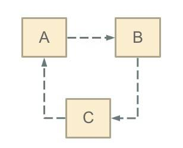

循环依赖，其实就是一个**死循环**的过程，在初始化 A 的时候发现引用了 B，这时就会去初始化 B，然后又发现 B 引用 C，跑去初始化 C，初始化 C 的时候发现引用了 A，则又会去初始化 A，依次循环永不退出，除非有**终结条件**。

Spring 循环依赖的**场景**有两种：

1. 构造器的循环依赖。
2. field 属性的循环依赖。

对于构造器的循环依赖，Spring 是无法解决的，只能抛出 BeanCurrentlyInCreationException 异常表示循环依赖，**所以下面我们分析的都是基于 field 属性的循环依赖**。

在博客 [《【【死磕 Spring】—— IoC 之开启 Bean 的加载》](http://svip.iocoder.cn/Spring/IoC-get-Bean-begin) 中提到，Spring 只解决 scope 为 singleton 的循环依赖。对于scope 为 prototype 的 bean ，Spring 无法解决，直接抛出 BeanCurrentlyInCreationException 异常。

为什么 Spring 不处理 prototype bean 呢？其实如果理解 Spring 是如何解决 singleton bean 的循环依赖就明白了。这里先卖一个关子，我们先来关注 Spring 是如何解决 singleton bean 的循环依赖的。

### 2. 解决循环依赖

#### 2.1 getSingleton

我们先从加载 bean 最初始的方法 AbstractBeanFactory 的 `#doGetBean(final String name, final Class<T> requiredType, final Object[] args, boolean typeCheckOnly)` 方法开始。

在 `#doGetBean(...)` 方法中，首先会根据 `beanName` 从单例 bean 缓存中获取，**如果不为空则直接返回**。代码如下：

```java
// AbstractBeanFactory.java

Object sharedInstance = getSingleton(beanName);
```

- 调用 `#getSingleton(String beanName, boolean allowEarlyReference)` 方法，从单例缓存中获取。代码如下：

  ```java
  // DefaultSingletonBeanRegistry.java
  
  @Nullable
  protected Object getSingleton(String beanName, boolean allowEarlyReference) {
      // 从单例缓冲中加载 bean
      Object singletonObject = this.singletonObjects.get(beanName);
      // 缓存中的 bean 为空，且当前 bean 正在创建
      if (singletonObject == null && isSingletonCurrentlyInCreation(beanName)) {
          // 加锁
          synchronized (this.singletonObjects) {
              // 从 earlySingletonObjects 获取
              singletonObject = this.earlySingletonObjects.get(beanName);
              // earlySingletonObjects 中没有，且允许提前创建
              if (singletonObject == null && allowEarlyReference) {
                  // 从 singletonFactories 中获取对应的 ObjectFactory
                  ObjectFactory<?> singletonFactory = this.singletonFactories.get(beanName);
                  if (singletonFactory != null) {
                      // 获得 bean
                      singletonObject = singletonFactory.getObject();
                      // 添加 bean 到 earlySingletonObjects 中
                      this.earlySingletonObjects.put(beanName, singletonObject);
                      // 从 singletonFactories 中移除对应的 ObjectFactory
                      this.singletonFactories.remove(beanName);
                  }
              }
          }
      }
      return singletonObject;
  }
  ```

  - 这个方法主要是从三个缓存中获取，分别是：`singletonObjects`、`earlySingletonObjects`、`singletonFactories` 。三者定义如下：

    ```java
    // DefaultSingletonBeanRegistry.java
            
    /**
     * Cache of singleton objects: bean name to bean instance.
     *
     * 一级缓存，存放的是单例 bean 的映射。
     *
     * 注意，这里的 bean 是已经创建完成的。
     *
     * 对应关系为 bean name --> bean instance
     */
    private final Map<String, Object> singletonObjects = new ConcurrentHashMap<>(256);
        
    /**
     * Cache of early singleton objects: bean name to bean instance.
     *
     * 二级缓存，存放的是早期半成品（未初始化完）的 bean，对应关系也是 bean name --> bean instance。
     *
     * 它与 {@link #singletonObjects} 区别在于， 它自己存放的 bean 不一定是完整。
     *
     * 这个 Map 也是【循环依赖】的关键所在。
     */
    private final Map<String, Object> earlySingletonObjects = new HashMap<>(16);
        
    /**
     * Cache of singleton factories: bean name to ObjectFactory.
     *
     * 三级缓存，存放的是 ObjectFactory，可以理解为创建早期半成品（未初始化完）的 bean 的 factory ，最终添加到二级缓存 {@link #earlySingletonObjects} 中
     *
     * 对应关系是 bean name --> ObjectFactory
     *
     * 这个 Map 也是【循环依赖】的关键所在。
     */
    private final Map<String, ObjectFactory<?>> singletonFactories = new HashMap<>(16);
    ```

    - `singletonObjects` ：单例对象的 Cache 。
    - `earlySingletonObjects` ：**提前曝光**的单例对象的 Cache 。
    - `singletonFactories` ： 单例对象工厂的 Cache 。

它们三，就是 Spring 解决 singleton bean 的关键因素所在，我称他们为**三级缓存**：

- 第一级为 `singletonObjects`
- 第二级为 `earlySingletonObjects`
- 第三级为 `singletonFactories`

这里，我们已经通过 `#getSingleton(String beanName, boolean allowEarlyReference)` 方法，看到他们是如何配合的。详细分析该方法之前，提下其中的 `#isSingletonCurrentlyInCreation(String beanName)` 方法和 `allowEarlyReference` 变量：

- `#isSingletonCurrentlyInCreation(String beanName)` 方法：判断当前 singleton bean 是否处于创建中。bean 处于创建中，也就是说 bean 在初始化但是没有完成初始化，有一个这样的过程其实和 Spring 解决 bean 循环依赖的理念相辅相成。**因为 Spring 解决 singleton bean 的核心就在于提前曝光 bean** 。
- `allowEarlyReference` 变量：从字面意思上面理解就是允许提前拿到引用。其实真正的意思是，是否允许从 `singletonFactories` 缓存中通过 `#getObject()` 方法，拿到对象。为什么会有这样一个字段呢？**原因就在于 `singletonFactories` 才是 Spring 解决 singleton bean 的诀窍所在**，这个我们后续分析。

------

`#getSingleton(String beanName, boolean allowEarlyReference)` 方法，整个过程如下：

- 首先，从一级缓存 `singletonObjects` 获取。

- 如果，没有且当前指定的 `beanName` 正在创建，就再从二级缓存 `earlySingletonObjects` 中获取。

- 如果，还是没有获取到且允许 `singletonFactories` 通过 `#getObject()` 获取，则从三级缓存 `singletonFactories` 获取。如果获取到，则通过其 `#getObject()` 方法，获取对象，并将其加入到二级缓存 `earlySingletonObjects` 中，并从三级缓存 `singletonFactories` 删除。代码如下：

  ```java
  // DefaultSingletonBeanRegistry.java
  
  singletonObject = singletonFactory.getObject();
  this.earlySingletonObjects.put(beanName, singletonObject);
  this.singletonFactories.remove(beanName);
  ```

  - 这样，就从三级缓存**升级**到二级缓存了。
  - 😈 所以，二级缓存存在的**意义**，就是缓存三级缓存中的 ObjectFactory 的 `#getObject()` 方法的执行结果，提早曝光的**单例** Bean 对象。

#### 2.2 addSingletonFactory

上面是从缓存中获取，但是缓存中的数据从哪里添加进来的呢？一直往下跟会发现在 AbstractAutowireCapableBeanFactory 的 `#doCreateBean(final String beanName, final RootBeanDefinition mbd, final Object[] args)` 方法中，有这么一段代码：

```java
// AbstractAutowireCapableBeanFactory.java

boolean earlySingletonExposure = (mbd.isSingleton() // 单例模式
        && this.allowCircularReferences // 运行循环依赖
        && isSingletonCurrentlyInCreation(beanName)); // 当前单例 bean 是否正在被创建
if (earlySingletonExposure) {
    if (logger.isTraceEnabled()) {
        logger.trace("Eagerly caching bean '" + beanName +
                "' to allow for resolving potential circular references");
    }
    // 提前将创建的 bean 实例加入到 singletonFactories 中
    // <X> 这里是为了后期避免循环依赖
    addSingletonFactory(beanName, () -> getEarlyBeanReference(beanName, mbd, bean));
}
```

- 当一个 Bean 满足三个条件时，则调用`#addSingletonFactory(...)`方法，将它添加到缓存中。三个条件如下：

  - 单例
  - 运行提前暴露 bean
  - 当前 bean 正在创建中

- `#addSingletonFactory(String beanName, ObjectFactory<?> singletonFactory)` 方法，代码如下：

  ```java
  // DefaultSingletonBeanRegistry.java
  
  protected void addSingletonFactory(String beanName, ObjectFactory<?> singletonFactory) {
  	Assert.notNull(singletonFactory, "Singleton factory must not be null");
  	synchronized (this.singletonObjects) {
  		if (!this.singletonObjects.containsKey(beanName)) {
  			this.singletonFactories.put(beanName, singletonFactory);
  			this.earlySingletonObjects.remove(beanName);
  			this.registeredSingletons.add(beanName);
  		}
  	}
  }
  ```

  - 从这段代码我们可以看出，`singletonFactories` 这个三级缓存才是解决 Spring Bean 循环依赖的诀窍所在。同时这段代码发生在 `#createBeanInstance(...)` 方法之后，也就是说这个 bean 其实已经被创建出来了，**但是它还不是很完美（没有进行属性填充和初始化），但是对于其他依赖它的对象而言已经足够了（可以根据对象引用定位到堆中对象），能够被认出来了**。所以 Spring 在这个时候，选择将该对象提前曝光出来让大家认识认识。

另外，`<X>` 处的 `#getEarlyBeanReference(String beanName, RootBeanDefinition mbd, Object bean)` 方法也**非常重要**，这里会创建早期初始化 Bean 可能存在的 AOP 代理等等。代码如下：

```java
// AbstractAutowireCapableBeanFactory.java

/**
 * 对创建的早期半成品（未初始化）的 Bean 处理引用
 *
 * 例如说，AOP 就是在这里动态织入，创建其代理 Bean 返回
 *
 * Obtain a reference for early access to the specified bean,
 * typically for the purpose of resolving a circular reference.
 * @param beanName the name of the bean (for error handling purposes)
 * @param mbd the merged bean definition for the bean
 * @param bean the raw bean instance
 * @return the object to expose as bean reference
 */
protected Object getEarlyBeanReference(String beanName, RootBeanDefinition mbd, Object bean) {
	Object exposedObject = bean;
	if (!mbd.isSynthetic() && hasInstantiationAwareBeanPostProcessors()) {
		for (BeanPostProcessor bp : getBeanPostProcessors()) {
			if (bp instanceof SmartInstantiationAwareBeanPostProcessor) {
				SmartInstantiationAwareBeanPostProcessor ibp = (SmartInstantiationAwareBeanPostProcessor) bp;
				exposedObject = ibp.getEarlyBeanReference(exposedObject, beanName);
			}
		}
	}
	return exposedObject;
}
```

- 这也是为什么 Spring 需要额外增加 `singletonFactories` 三级缓存的原因，解决 Spring 循环依赖情况下的 Bean 存在动态代理等情况，不然循环注入到别人的 Bean 就是原始的，而不是经过动态代理的！
- 另外，这里在推荐一篇[《Spring循环依赖三级缓存是否可以减少为二级缓存？》](https://segmentfault.com/a/1190000023647227)文章，解释的也非常不错。

#### 2.3 addSingleton

介绍到这里我们发现三级缓存 `singletonFactories` 和 二级缓存 `earlySingletonObjects` 中的值都有出处了，那一级缓存在哪里设置的呢？在类 DefaultSingletonBeanRegistry 中，可以发现这个 `#addSingleton(String beanName, Object singletonObject)` 方法，代码如下：

```java
// DefaultSingletonBeanRegistry.java

protected void addSingleton(String beanName, Object singletonObject) {
	synchronized (this.singletonObjects) {
		this.singletonObjects.put(beanName, singletonObject);
		this.singletonFactories.remove(beanName);
		this.earlySingletonObjects.remove(beanName);
		this.registeredSingletons.add(beanName);
	}
}
```

- 添加至一级缓存，同时从二级、三级缓存中删除。

- 这个方法在我们创建 bean 的链路中有哪个地方引用呢？其实在前面博客 LZ 已经提到过了，在 `#doGetBean(...)` 方法中，处理不同 scope 时，如果是 singleton，则调用 `#getSingleton(...)` 方法，如下图所示：

- 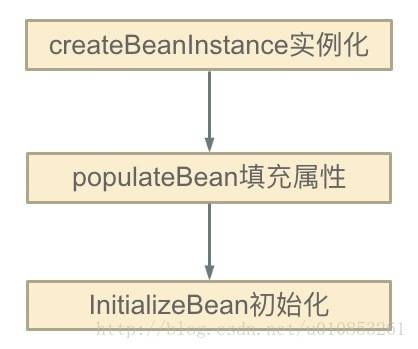

- 前面几篇博客已经分析了 `#createBean(...)` 方法，这里就不再阐述了，我们关注 `#getSingleton(String beanName, ObjectFactory<?> singletonFactory)` 方法，代码如下：

  ```java
  // AbstractBeanFactory.java
  
  public Object getSingleton(String beanName, ObjectFactory<?> singletonFactory) {
      Assert.notNull(beanName, "Bean name must not be null");
      synchronized (this.singletonObjects) {
          Object singletonObject = this.singletonObjects.get(beanName);
          if (singletonObject == null) {
              //....
              try {
                  singletonObject = singletonFactory.getObject();
                  newSingleton = true;
              }
              //.....
              if (newSingleton) {
                  addSingleton(beanName, singletonObject);
              }
          }
          return singletonObject;
      }
  }
  ```

  - 😈 注意，此处的 `#getSingleton(String beanName, ObjectFactory<?> singletonFactory)` 方法，在 AbstractBeanFactory 类中实现，和 [「2.1 getSingleton」](http://svip.iocoder.cn/Spring/IoC-get-Bean-createBean-5/#) **不同**。

### 3. 小结

至此，Spring 关于 singleton bean 循环依赖已经分析完毕了。所以我们基本上可以确定 Spring 解决循环依赖的方案了：

- Spring 在创建 bean 的时候并不是等它完全完成，而是在创建过程中将创建中的 bean 的 ObjectFactory 提前曝光（即加入到 `singletonFactories` 缓存中）。
- 这样，一旦下一个 bean 创建的时候需要依赖 bean ，则直接使用 ObjectFactory 的 `#getObject()` 方法来获取了，也就是 [「2.1 getSingleton」](http://svip.iocoder.cn/Spring/IoC-get-Bean-createBean-5/#) 小结中的方法中的代码片段了。

到这里，关于 Spring 解决 bean 循环依赖就已经分析完毕了。最后来描述下就上面那个循环依赖 Spring 解决的过程：

- 首先 A 完成初始化第一步并将自己提前曝光出来（通过 ObjectFactory 将自己提前曝光），在初始化的时候，发现自己依赖对象 B，此时就会去尝试 get(B)，这个时候发现 B 还没有被创建出来
- 然后 B 就走创建流程，在 B 初始化的时候，同样发现自己依赖 C，C 也没有被创建出来
- 这个时候 C 又开始初始化进程，但是在初始化的过程中发现自己依赖 A，于是尝试 get(A)，这个时候由于 A 已经添加至缓存中（一般都是添加至三级缓存 `singletonFactories` ），通过 ObjectFactory 提前曝光，所以可以通过 `ObjectFactory#getObject()` 方法来拿到 A 对象，C 拿到 A 对象后顺利完成初始化，然后将自己添加到一级缓存中
- 回到 B ，B 也可以拿到 C 对象，完成初始化，A 可以顺利拿到 B 完成初始化。到这里整个链路就已经完成了初始化过程了

> 老艿艿的建议
>
> 可能逻辑干看比较绕，胖友可以拿出一个草稿纸，画一画上面提到的 A、B、C 初始化的过程。
>
> 相信，胖友会很快明白了。
>
> 如下是《Spring 源码深度解析》P114 页的一张图，非常有助于理解。
>
> 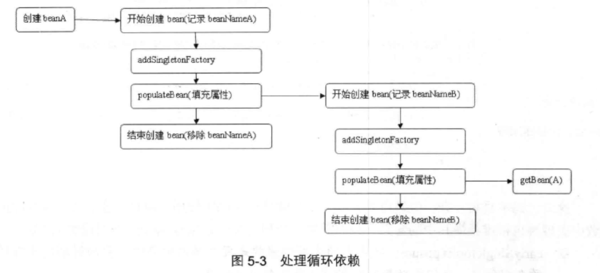

## IoC 之加载 Bean：创建 Bean（六）之初始化 Bean 对象

一个 bean 经历了 `#createBeanInstance(String beanName, RootBeanDefinition mbd, Object[] args)` 方法，被创建出来，然后又经过一番属性注入，依赖处理，历经千辛万苦，千锤百炼，终于有点儿 bean 实例的样子，能堪大任了，只需要经历最后一步就破茧成蝶了。

这**最后一步**就是初始化，也就是 `#initializeBean(final String beanName, final Object bean, RootBeanDefinition mbd)` 方法。所以，这篇文章我们分析 `#doCreateBean(...)` 方法的中最后一步：初始化 bean 对象。

### 1. initializeBean

```java
// AbstractAutowireCapableBeanFactory.java

protected Object initializeBean(final String beanName, final Object bean, @Nullable RootBeanDefinition mbd) {
    if (System.getSecurityManager() != null) { // 安全模式
        AccessController.doPrivileged((PrivilegedAction<Object>) () -> {
            // <1> 激活 Aware 方法，对特殊的 bean 处理：Aware、BeanClassLoaderAware、BeanFactoryAware
            invokeAwareMethods(beanName, bean);
            return null;
        }, getAccessControlContext());
    } else {
        // <1> 激活 Aware 方法，对特殊的 bean 处理：Aware、BeanClassLoaderAware、BeanFactoryAware
        invokeAwareMethods(beanName, bean);
    }

    // <2> 后处理器，before
    Object wrappedBean = bean;
    if (mbd == null || !mbd.isSynthetic()) {
        wrappedBean = applyBeanPostProcessorsBeforeInitialization(wrappedBean, beanName);
    }

    // <3> 激活用户自定义的 init 方法
    try {
        invokeInitMethods(beanName, wrappedBean, mbd);
    } catch (Throwable ex) {
        throw new BeanCreationException(
                (mbd != null ? mbd.getResourceDescription() : null),
                beanName, "Invocation of init method failed", ex);
    }

    // <2> 后处理器，after
    if (mbd == null || !mbd.isSynthetic()) {
        wrappedBean = applyBeanPostProcessorsAfterInitialization(wrappedBean, beanName);
    }

    return wrappedBean;
}
```

初始化 bean 的方法其实就是三个步骤的处理，而这三个步骤主要还是根据**用户设定**的来进行初始化，这三个过程为：

- `<1>` 激活 Aware 方法。
- `<3>` 后置处理器的应用。
- `<2>` 激活自定义的 init 方法。

#### 1.1 激活 Aware 方法

Aware ，英文翻译是意识到的，感知的。Spring 提供了诸多 Aware 接口，用于辅助 Spring Bean 以编程的方式调用 Spring 容器，通过实现这些接口，可以增强 Spring Bean 的功能。

Spring 提供了如下系列的 Aware 接口：

- LoadTimeWeaverAware：加载Spring Bean时织入第三方模块，如AspectJ
- BeanClassLoaderAware：加载Spring Bean的类加载器
- BootstrapContextAware：资源适配器BootstrapContext，如JCA,CCI
- ResourceLoaderAware：底层访问资源的加载器
- BeanFactoryAware：声明BeanFactory
- PortletConfigAware：PortletConfig
- PortletContextAware：PortletContext
- ServletConfigAware：ServletConfig
- ServletContextAware：ServletContext
- MessageSourceAware：国际化
- ApplicationEventPublisherAware：应用事件
- NotificationPublisherAware：JMX通知
- BeanNameAware：声明Spring Bean的名字

------

`#invokeAwareMethods(final String beanName, final Object bean)` 方法，代码如下：

```java
// AbstractAutowireCapableBeanFactory.java

private void invokeAwareMethods(final String beanName, final Object bean) {
    if (bean instanceof Aware) {
        // BeanNameAware
        if (bean instanceof BeanNameAware) {
            ((BeanNameAware) bean).setBeanName(beanName);
        }
        // BeanClassLoaderAware
        if (bean instanceof BeanClassLoaderAware) {
            ClassLoader bcl = getBeanClassLoader();
            if (bcl != null) {
                ((BeanClassLoaderAware) bean).setBeanClassLoader(bcl);
            }
        }
        // BeanFactoryAware
        if (bean instanceof BeanFactoryAware) {
            ((BeanFactoryAware) bean).setBeanFactory(AbstractAutowireCapableBeanFactory.this);
        }
    }
}
```

这里代码就没有什么好说的，主要是处理 BeanNameAware、BeanClassLoaderAware、BeanFactoryAware 。

关于 Aware 接口，后面会专门出篇文章对其进行详细分析说明的。

#### 1.2 后置处理器的应用

BeanPostProcessor 在前面介绍 bean 加载的过程曾多次遇到，相信各位不陌生，这是 Spring 中开放式框架中必不可少的一个亮点。

BeanPostProcessor 的作用是：如果我们想要在 Spring 容器完成 Bean 的实例化，配置和其他的初始化后添加一些自己的逻辑处理，那么请使用该接口，这个接口给与了用户充足的权限去更改或者扩展 Spring，是我们对 Spring 进行扩展和增强处理一个必不可少的接口。

- `#applyBeanPostProcessorsBeforeInitialization(...)` 方法，代码如下：

  ```java
  // AbstractAutowireCapableBeanFactory.java
  
  @Override
  public Object applyBeanPostProcessorsBeforeInitialization(Object existingBean, String beanName)
          throws BeansException {
      Object result = existingBean;
      // 遍历 BeanPostProcessor 数组
      for (BeanPostProcessor processor : getBeanPostProcessors()) {
          // 处理
          Object current = processor.postProcessBeforeInitialization(result, beanName);
          // 返回空，则返回 result
          if (current == null) {
              return result;
          }
          // 修改 result
          result = current;
      }
      return result;
  }
  ```

- `#applyBeanPostProcessorsAfterInitialization(...)` 方法，代码如下：

  ```java
  // AbstractAutowireCapableBeanFactory.java
  
  @Override
  public Object applyBeanPostProcessorsAfterInitialization(Object existingBean, String beanName)
          throws BeansException {
      Object result = existingBean;
      // 遍历 BeanPostProcessor
      for (BeanPostProcessor processor : getBeanPostProcessors()) {
          // 处理
          Object current = processor.postProcessAfterInitialization(result, beanName);
          // 返回空，则返回 result
          if (current == null) {
              return result;
          }
          // 修改 result
          result = current;
      }
      return result;
  }
  ```

其实，逻辑就是通过 `#getBeanPostProcessors()` 方法，获取定义的 BeanPostProcessor ，然后分别调用其 `#postProcessBeforeInitialization(...)`、`#postProcessAfterInitialization(...)` 方法，进行**自定义**的业务处理。

#### 1.3 激活自定义的 init 方法

如果熟悉 `<bean>` 标签的配置，一定不会忘记 `init-method` 方法，该方法的执行就是在这里执行的。代码如下：

```java
// AbstractAutowireCapableBeanFactory.java

protected void invokeInitMethods(String beanName, final Object bean, @Nullable RootBeanDefinition mbd)
        throws Throwable {
    // 首先会检查是否是 InitializingBean ，如果是的话需要调用 afterPropertiesSet()
    boolean isInitializingBean = (bean instanceof InitializingBean);
    if (isInitializingBean && (mbd == null || !mbd.isExternallyManagedInitMethod("afterPropertiesSet"))) {
        if (logger.isTraceEnabled()) {
            logger.trace("Invoking afterPropertiesSet() on bean with name '" + beanName + "'");
        }
        if (System.getSecurityManager() != null) { // 安全模式
            try {
                AccessController.doPrivileged((PrivilegedExceptionAction<Object>) () -> {
                    // <1> 属性初始化的处理
                    ((InitializingBean) bean).afterPropertiesSet();
                    return null;
                }, getAccessControlContext());
            } catch (PrivilegedActionException pae) {
                throw pae.getException();
            }
        } else {
            // <1> 属性初始化的处理
            ((InitializingBean) bean).afterPropertiesSet();
        }
    }

    if (mbd != null && bean.getClass() != NullBean.class) {
        String initMethodName = mbd.getInitMethodName();
        if (StringUtils.hasLength(initMethodName) &&
                !(isInitializingBean && "afterPropertiesSet".equals(initMethodName)) &&
                !mbd.isExternallyManagedInitMethod(initMethodName)) {
            // <2> 激活用户自定义的初始化方法
            invokeCustomInitMethod(beanName, bean, mbd);
        }
    }
}
```

- 首先，检查是否为 InitializingBean 。如果**是**的话，需要执行 `#afterPropertiesSet()` 方法，因为我们除了可以使用 `init-method` 来自定初始化方法外，还可以实现 InitializingBean 接口。接口仅有一个 `#afterPropertiesSet()` 方法。
- 两者的执行先后顺序是先 `<1>` 的 `#afterPropertiesSet()` 方法，后 `<2>` 的 `init-method` 对应的方法。

### 2. 小结

关于这篇博客的三个方法，LZ 后面会单独写博客来进行分析说明。

经过六篇博客终于把 Spring 创建 bean 的过程进行详细说明了，过程是艰辛的，但是收获很大，关键还是要耐着性子看。

## IoC 之加载 Bean：总结

**本文主要基于 Spring 5.0.6.RELEASE**

在 【死磕 Spring】 Spring bean 解析篇深入分析了一个配置文件经历了哪些过程转变成了 BeanDefinition，但是这个 BeanDefinition 并不是我们真正想要的想要的 bean，因为它还仅仅只是承载了我们需要的目标 bean 的信息。

从 BeanDefinition 到我们需要的目标还需要一个漫长的 bean 的初始化阶段，在 【死磕 Spring】 Spring bean 加载阶段已经详细分析了初始化 bean 的过程，**所以这里做一个概括性的总结**。

bean 的初始化节点，由第一次(显式或者隐式)调用 `#getBean(...)` 方法来开启，所以我们从这个方法开始。代码如下：

```java
// AbstractBeanFactory.java

public Object getBean(String name) throws BeansException {
    return doGetBean(name, null, null, false);
}

protected <T> T doGetBean(final String name, @Nullable final Class<T> requiredType,
        @Nullable final Object[] args, boolean typeCheckOnly) throws BeansException {
    // <1> 返回 bean 名称，剥离工厂引用前缀。
    // 如果 name 是 alias ，则获取对应映射的 beanName 。
    final String beanName = transformedBeanName(name);
    Object bean;

    // 从缓存中或者实例工厂中获取 Bean 对象
    // Eagerly check singleton cache for manually registered singletons.
    Object sharedInstance = getSingleton(beanName);
    if (sharedInstance != null && args == null) {
        if (logger.isTraceEnabled()) {
            if (isSingletonCurrentlyInCreation(beanName)) {
                logger.trace("Returning eagerly cached instance of singleton bean '" + beanName +
                        "' that is not fully initialized yet - a consequence of a circular reference");
            } else {
                logger.trace("Returning cached instance of singleton bean '" + beanName + "'");
            }
        }
        // <2> 完成 FactoryBean 的相关处理，并用来获取 FactoryBean 的处理结果
        bean = getObjectForBeanInstance(sharedInstance, name, beanName, null);
    } else {
        // Fail if we're already creating this bean instance:
        // We're assumably within a circular reference.
        // <3> 因为 Spring 只解决单例模式下得循环依赖，在原型模式下如果存在循环依赖则会抛出异常。
        if (isPrototypeCurrentlyInCreation(beanName)) {
            throw new BeanCurrentlyInCreationException(beanName);
        }

        // <4> 如果容器中没有找到，则从父类容器中加载
        // Check if bean definition exists in this factory.
        BeanFactory parentBeanFactory = getParentBeanFactory();
        if (parentBeanFactory != null && !containsBeanDefinition(beanName)) {
            // Not found -> check parent.
            String nameToLookup = originalBeanName(name);
            if (parentBeanFactory instanceof AbstractBeanFactory) {
                return ((AbstractBeanFactory) parentBeanFactory).doGetBean(
                        nameToLookup, requiredType, args, typeCheckOnly);
            } else if (args != null) {
                // Delegation to parent with explicit args.
                return (T) parentBeanFactory.getBean(nameToLookup, args);
            } else if (requiredType != null) {
                // No args -> delegate to standard getBean method.
                return parentBeanFactory.getBean(nameToLookup, requiredType);
            } else {
                return (T) parentBeanFactory.getBean(nameToLookup);
            }
        }

        // <5> 如果不是仅仅做类型检查则是创建bean，这里需要记录 
        if (!typeCheckOnly) {
            markBeanAsCreated(beanName);
        }

        try {
            // <6> 从容器中获取 beanName 相应的 GenericBeanDefinition 对象，并将其转换为 RootBeanDefinition 对象
            final RootBeanDefinition mbd = getMergedLocalBeanDefinition(beanName);
            // 检查给定的合并的 BeanDefinition
            checkMergedBeanDefinition(mbd, beanName, args);

            // Guarantee initialization of beans that the current bean depends on.
            // <7> 处理所依赖的 bean
            String[] dependsOn = mbd.getDependsOn();
            if (dependsOn != null) {
                for (String dep : dependsOn) {
                    // 若给定的依赖 bean 已经注册为依赖给定的 bean
                    // 循环依赖的情况
                    if (isDependent(beanName, dep)) {
                        throw new BeanCreationException(mbd.getResourceDescription(), beanName,
                                "Circular depends-on relationship between '" + beanName + "' and '" + dep + "'");
                    }
                    // 缓存依赖调用 TODO 芋艿
                    registerDependentBean(dep, beanName);
                    try {
                        getBean(dep);
                    } catch (NoSuchBeanDefinitionException ex) {
                        throw new BeanCreationException(mbd.getResourceDescription(), beanName,
                                "'" + beanName + "' depends on missing bean '" + dep + "'", ex);
                    }
                }
            }

            // <8> bean 实例化
            // Create bean instance.
            if (mbd.isSingleton()) { // 单例模式
                sharedInstance = getSingleton(beanName, () -> {
                    try {
                        return createBean(beanName, mbd, args);
                    }
                    catch (BeansException ex) {
                        // Explicitly remove instance from singleton cache: It might have been put there
                        // eagerly by the creation process, to allow for circular reference resolution.
                        // Also remove any beans that received a temporary reference to the bean.
                        // 显式从单例缓存中删除 Bean 实例
                        // 因为单例模式下为了解决循环依赖，可能他已经存在了，所以销毁它。 TODO 芋艿
                        destroySingleton(beanName);
                        throw ex;
                    }
                });
                bean = getObjectForBeanInstance(sharedInstance, name, beanName, mbd);
            } else if (mbd.isPrototype()) { // 原型模式
                // It's a prototype -> create a new instance.
                Object prototypeInstance;
                try {
                    beforePrototypeCreation(beanName);
                    prototypeInstance = createBean(beanName, mbd, args);
                } finally {
                    afterPrototypeCreation(beanName);
                }
                bean = getObjectForBeanInstance(prototypeInstance, name, beanName, mbd);
            } else {
                // 从指定的 scope 下创建 bean
                String scopeName = mbd.getScope();
                final Scope scope = this.scopes.get(scopeName);
                if (scope == null) {
                    throw new IllegalStateException("No Scope registered for scope name '" + scopeName + "'");
                }try {
                    Object scopedInstance = scope.get(beanName, () -> {
                        beforePrototypeCreation(beanName);
                        try {
                            return createBean(beanName, mbd, args);
                        } finally {
                            afterPrototypeCreation(beanName);
                        }
                    });
                    bean = getObjectForBeanInstance(scopedInstance, name, beanName, mbd);
                } catch (IllegalStateException ex) {
                    throw new BeanCreationException(beanName,
                            "Scope '" + scopeName + "' is not active for the current thread; consider " +
                            "defining a scoped proxy for this bean if you intend to refer to it from a singleton",
                            ex);
                }
            }
        } catch (BeansException ex) {
            cleanupAfterBeanCreationFailure(beanName);
            throw ex;
        }
    }

    // <9> 检查需要的类型是否符合 bean 的实际类型
    // Check if required type matches the type of the actual bean instance.
    if (requiredType != null && !requiredType.isInstance(bean)) {
        try {
            T convertedBean = getTypeConverter().convertIfNecessary(bean, requiredType);
            if (convertedBean == null) {
                throw new BeanNotOfRequiredTypeException(name, requiredType, bean.getClass());
            }
            return convertedBean;
        } catch (TypeMismatchException ex) {
            if (logger.isTraceEnabled()) {
                logger.trace("Failed to convert bean '" + name + "' to required type '" +
                        ClassUtils.getQualifiedName(requiredType) + "'", ex);
            }
            throw new BeanNotOfRequiredTypeException(name, requiredType, bean.getClass());
        }
    }
    return (T) bean;
}
```

内部调用 `#doGetBean(...)` 方法。`#doGetBean(...)` 方法的代码量比较多，从这里就可以看出 bean 的加载过程是一个非常复杂的过程，会涉及到各种各样的情况处理。

`#doGetBean(...)` 方法，可以分为以下几个过程：

1. 转换 beanName 。因为我们调用 `#getBean(...)` 方法传入的 `name` 并不一定就是 beanName，可以传入 aliasName，FactoryBean，所以这里需要进行简单的转换过程。
2. 尝试从缓存中加载单例 bean 。
3. bean 的实例化。
4. 原型模式的依赖检查。因为 Spring 只会解决单例模式的循环依赖，对于原型模式的循环依赖都是直接抛出 BeanCurrentlyInCreationException 异常。
5. 尝试从 parentBeanFactory 获取 bean 实例。如果 `parentBeanFactory != null && !containsBeanDefinition(beanName)` 则尝试从 parentBeanFactory 中获取 bean 实例对象，因为 `!containsBeanDefinition(beanName)` 就意味着定义的 xml 文件中没有 beanName 相应的配置，这个时候就只能从 `parentBeanFactory` 中获取。
6. 获取 RootBeanDefinition，并对其进行合并检查。从缓存中获取已经解析的 RootBeanDefinition 。同时，如果父类不为 `null` 的话，则会合并父类的属性。
7. 依赖检查。某个 bean 依赖其他 bean ，则需要先加载依赖的 bean。
8. 对不同的 scope 进行处理。
9. 类型转换处理。如果传递的 `requiredType` 不为 `null`，则需要检测所得到 bean 的类型是否与该 `requiredType` 一致。如果不一致则尝试转换，当然也要能够转换成功，否则抛出 BeanNotOfRequiredTypeException 异常。

下面就以下几个方面进行阐述，说明 Spring bean 的加载过程。

1. 从缓存中获取 bean
2. 创建 bean 实例对象
3. 从 bean 实例中获取对象

### 1. 从缓存中获取 bean

Spring 中根据 scope 可以将 bean 分为以下几类：singleton、prototype 和 其他，这样分的原因在于 Spring 在对不同 scope 处理的时候是这么处理的：

- singleton ：在 Spring 的 IoC 容器中只存在一个对象实例，所有该对象的引用都共享这个实例。Spring 容器只会创建该 bean 定义的唯一实例，这个实例会被保存到缓存中，并且对该bean的所有后续请求和引用都将返回该缓存中的对象实例。
- prototype ：每次对该bean的请求都会创建一个新的实例
- 其他 ：
  - request：每次 http 请求将会有各自的 bean 实例。
  - session：在一个 http session 中，一个 bean 定义对应一个 bean 实例。
  - global session：在一个全局的 http session 中，一个 bean 定义对应一个 bean 实例。

所以，从缓存中获取的 bean 一定是 singleton bean，这也是 **Spring 为何只解决 singleton bean 的循环依赖**。调用 `#getSingleton(String beanName)` 方法，从缓存中获取 singleton bean。代码如下：

```java
// DefaultSingletonBeanRegistry.java

public Object getSingleton(String beanName) {
    return getSingleton(beanName, true);
}

@Nullable
protected Object getSingleton(String beanName, boolean allowEarlyReference) {
    // 从单例缓冲中加载 bean
    Object singletonObject = this.singletonObjects.get(beanName);
    // 缓存中的 bean 为空，且当前 bean 正在创建
    if (singletonObject == null && isSingletonCurrentlyInCreation(beanName)) {
        // 加锁
        synchronized (this.singletonObjects) {
            // 从 earlySingletonObjects 获取
            singletonObject = this.earlySingletonObjects.get(beanName);
            // earlySingletonObjects 中没有，且允许提前创建
            if (singletonObject == null && allowEarlyReference) {
                // 从 singletonFactories 中获取对应的 ObjectFactory
                ObjectFactory<?> singletonFactory = this.singletonFactories.get(beanName);
                if (singletonFactory != null) {
                    // 获得 bean
                    singletonObject = singletonFactory.getObject();
                    // 添加 bean 到 earlySingletonObjects 中
                    this.earlySingletonObjects.put(beanName, singletonObject);
                    // 从 singletonFactories 中移除对应的 ObjectFactory
                    this.singletonFactories.remove(beanName);
                }
            }
        }
    }
    return singletonObject;
}
```

- 该方法就是从`singletonObjects`、`earlySingletonObjects`、`singletonFactories`

   

  三个缓存中获取，这里也是 Spring 解决 bean 循环依赖的关键之处。详细内容请查看如下内容：

  - [【死磕 Spring】—— IoC 之加载 bean：从单例缓存中获取单例 bean](http://svip.iocoder.cn/Spring/IoC-get-Bean-getSingleton)
  - [【死磕 Spring】—— IoC 之加载 bean：创建 bean（五）之循环依赖处理](http://svip.iocoder.cn/Spring/IoC-get-Bean-createBean-5)

### 2. 创建 bean 实例对象

如果缓存中没有，也没有 `parentBeanFactory` ，则会调用 `#createBean(String beanName, RootBeanDefinition mbd, Object[] args)` 方法，创建 bean 实例。该方法主要是在处理不同 scope 的 bean 的时候进行调用。代码如下：

```java
// AbstractBeanFactory.java

protected abstract Object createBean(String beanName, RootBeanDefinition mbd, @Nullable Object[] args)
            throws BeanCreationException;
```

- 该方法是定义在 AbstractBeanFactory 中的**抽象**方法，其含义是根据给定的 BeanDefinition 和 `args` 实例化一个 bean 对象。如果该 BeanDefinition 存在父类，则该 BeanDefinition 已经合并了父类的属性。所有 Bean 实例的创建都会委托给该方法实现。
- 方法接受三个参数：
  - `beanName` ：bean 的名字。
  - `mbd` ：已经合并了父类属性的（如果有的话）BeanDefinition 。
  - `args` ：用于构造函数或者工厂方法创建 bean 实例对象的参数 。

------

该抽象方法的**默认实现**是在类 AbstractAutowireCapableBeanFactory 中实现，该方法其实只是做一些检查和验证工作，真正的初始化工作是由 `#doCreateBean(final String beanName, final RootBeanDefinition mbd, final Object[] args)` 方法来实现。代码如下：

```java
// AbstractAutowireCapableBeanFactory.java

protected Object doCreateBean(final String beanName, final RootBeanDefinition mbd, final @Nullable Object[] args)
        throws BeanCreationException {

    // Instantiate the bean.
    // BeanWrapper 是对 Bean 的包装，其接口中所定义的功能很简单包括设置获取被包装的对象，获取被包装 bean 的属性描述器
    BeanWrapper instanceWrapper = null;
    // <1> 单例模型，则从未完成的 FactoryBean 缓存中删除
    if (mbd.isSingleton()) {
        instanceWrapper = this.factoryBeanInstanceCache.remove(beanName);
    }
    // <2> 使用合适的实例化策略来创建新的实例：工厂方法、构造函数自动注入、简单初始化
    if (instanceWrapper == null) {
        instanceWrapper = createBeanInstance(beanName, mbd, args);
    }
    // 包装的实例对象
    final Object bean = instanceWrapper.getWrappedInstance();
    // 包装的实例对象的类型
    Class<?> beanType = instanceWrapper.getWrappedClass();
    if (beanType != NullBean.class) {
        mbd.resolvedTargetType = beanType;
    }

    // Allow post-processors to modify the merged bean definition.
    // <3> 判断是否有后置处理
    // 如果有后置处理，则允许后置处理修改 BeanDefinition
    synchronized (mbd.postProcessingLock) {
        if (!mbd.postProcessed) {
            try {
                // 后置处理修改 BeanDefinition
                applyMergedBeanDefinitionPostProcessors(mbd, beanType, beanName);
            } catch (Throwable ex) {
                throw new BeanCreationException(mbd.getResourceDescription(), beanName,
                        "Post-processing of merged bean definition failed", ex);
            }
            mbd.postProcessed = true;
        }
    }

    // Eagerly cache singletons to be able to resolve circular references
    // even when triggered by lifecycle interfaces like BeanFactoryAware.
    // <4> 解决单例模式的循环依赖
    boolean earlySingletonExposure = (mbd.isSingleton() // 单例模式
            && this.allowCircularReferences // 运行循环依赖
            && isSingletonCurrentlyInCreation(beanName)); // 当前单例 bean 是否正在被创建
    if (earlySingletonExposure) {
        if (logger.isTraceEnabled()) {
            logger.trace("Eagerly caching bean '" + beanName +
                    "' to allow for resolving potential circular references");
        }
        // 提前将创建的 bean 实例加入到 singletonFactories 中
        // 这里是为了后期避免循环依赖
        addSingletonFactory(beanName, () -> getEarlyBeanReference(beanName, mbd, bean));
    }

    // Initialize the bean instance.
    // 开始初始化 bean 实例对象
    Object exposedObject = bean;
    try {
        // <5> 对 bean 进行填充，将各个属性值注入，其中，可能存在依赖于其他 bean 的属性
        // 则会递归初始依赖 bean
        populateBean(beanName, mbd, instanceWrapper);
        // <6> 调用初始化方法
        exposedObject = initializeBean(beanName, exposedObject, mbd);
    } catch (Throwable ex) {
        if (ex instanceof BeanCreationException && beanName.equals(((BeanCreationException) ex).getBeanName())) {
            throw (BeanCreationException) ex;
        } else {
            throw new BeanCreationException(
                    mbd.getResourceDescription(), beanName, "Initialization of bean failed", ex);
        }
    }

    // <7> 循环依赖处理
    if (earlySingletonExposure) {
        // 获取 earlySingletonReference
        Object earlySingletonReference = getSingleton(beanName, false);
        // 只有在存在循环依赖的情况下，earlySingletonReference 才不会为空
        if (earlySingletonReference != null) {
            // 如果 exposedObject 没有在初始化方法中被改变，也就是没有被增强
            if (exposedObject == bean) {
                exposedObject = earlySingletonReference;
            // 处理依赖
            } else if (!this.allowRawInjectionDespiteWrapping && hasDependentBean(beanName)) {
                String[] dependentBeans = getDependentBeans(beanName);
                Set<String> actualDependentBeans = new LinkedHashSet<>(dependentBeans.length);
                for (String dependentBean : dependentBeans) {
                    if (!removeSingletonIfCreatedForTypeCheckOnly(dependentBean)) {
                        actualDependentBeans.add(dependentBean);
                    }
                }
                if (!actualDependentBeans.isEmpty()) {
                    throw new BeanCurrentlyInCreationException(beanName,
                            "Bean with name '" + beanName + "' has been injected into other beans [" +
                            StringUtils.collectionToCommaDelimitedString(actualDependentBeans) +
                            "] in its raw version as part of a circular reference, but has eventually been " +
                            "wrapped. This means that said other beans do not use the final version of the " +
                            "bean. This is often the result of over-eager type matching - consider using " +
                            "'getBeanNamesOfType' with the 'allowEagerInit' flag turned off, for example.");
                }
            }
        }
    }

    // Register bean as disposable.
    // <8> 注册 bean
    try {
        registerDisposableBeanIfNecessary(beanName, bean, mbd);
    } catch (BeanDefinitionValidationException ex) {
        throw new BeanCreationException(
                mbd.getResourceDescription(), beanName, "Invalid destruction signature", ex);
    }

    return exposedObject;
}
```

`#doCreateBean(...)` 方法，是创建 bean 实例的核心方法，它的整体思路是：

- `<1>` 处，如果是单例模式，则清除 `factoryBeanInstanceCache 缓存`，同时返回 BeanWrapper 实例对象，当然如果存在。
- `<2>` 处，如果缓存中没有 BeanWrapper 或者不是单例模式，则调用 `#createBeanInstance(...)` 方法，实例化 bean，主要是将 BeanDefinition 转换为 BeanWrapper 。
- `<3>` 处，MergedBeanDefinitionPostProcessor 的应用。
- `<4>` 处，单例模式的循环依赖处理。
- `<5>` 处，调用 `#populateBean(String beanName, RootBeanDefinition mbd, BeanWrapper bw)` 方法，进行属性填充。将所有属性填充至 bean 的实例中。
- `<6>` 处，调用 `#initializeBean(final String beanName, final Object bean, RootBeanDefinition mbd)` 方法，初始化 bean 。
- `<7>` 处，依赖检查。
- `<8>` 处，注册 DisposableBean 。

#### 2.1 实例化 bean

如果缓存中没有 BeanWrapper 实例对象或者该 bean 不是 singleton，则调用 `#createBeanInstance(...)` 方法。创建 bean 实例。该方法主要是根据参数 BeanDefinition、`args[]` 来调用构造函数实例化 bean 对象。**过程较为复杂**，代码如下：

```java
// AbstractAutowireCapableBeanFactory.java

protected BeanWrapper createBeanInstance(String beanName, RootBeanDefinition mbd, @Nullable Object[] args) {
    // Make sure bean class is actually resolved at this point.
    // 解析 bean ，将 bean 类名解析为 class 引用。
    Class<?> beanClass = resolveBeanClass(mbd, beanName);

    if (beanClass != null && !Modifier.isPublic(beanClass.getModifiers()) && !mbd.isNonPublicAccessAllowed()) { // 校验
        throw new BeanCreationException(mbd.getResourceDescription(), beanName,
                "Bean class isn't public, and non-public access not allowed: " + beanClass.getName());
    }

    // <1> 如果存在 Supplier 回调，则使用给定的回调方法初始化策略
    Supplier<?> instanceSupplier = mbd.getInstanceSupplier();
    if (instanceSupplier != null) {
        return obtainFromSupplier(instanceSupplier, beanName);
    }

    // <2> 使用 FactoryBean 的 factory-method 来创建，支持静态工厂和实例工厂
    if (mbd.getFactoryMethodName() != null)  {
        return instantiateUsingFactoryMethod(beanName, mbd, args);
    }

    // <3> Shortcut when re-creating the same bean...
    boolean resolved = false;
    boolean autowireNecessary = false;
    if (args == null) {
        // constructorArgumentLock 构造函数的常用锁
        synchronized (mbd.constructorArgumentLock) {
            // 如果已缓存的解析的构造函数或者工厂方法不为空，则可以利用构造函数解析
            // 因为需要根据参数确认到底使用哪个构造函数，该过程比较消耗性能，所有采用缓存机制
            if (mbd.resolvedConstructorOrFactoryMethod != null) {
                resolved = true;
                autowireNecessary = mbd.constructorArgumentsResolved;
            }
        }
    }
    // 已经解析好了，直接注入即可
    if (resolved) {
        // <3.1> autowire 自动注入，调用构造函数自动注入
        if (autowireNecessary) {
            return autowireConstructor(beanName, mbd, null, null);
        } else {
            // <3.2> 使用默认构造函数构造
            return instantiateBean(beanName, mbd);
        }
    }

    // Candidate constructors for autowiring?
    // <4> 确定解析的构造函数
    // 主要是检查已经注册的 SmartInstantiationAwareBeanPostProcessor
    Constructor<?>[] ctors = determineConstructorsFromBeanPostProcessors(beanClass, beanName);
    // <4.1> 有参数情况时，创建 Bean 。先利用参数个数，类型等，确定最精确匹配的构造方法。
    if (ctors != null || mbd.getResolvedAutowireMode() == AUTOWIRE_CONSTRUCTOR ||
            mbd.hasConstructorArgumentValues() || !ObjectUtils.isEmpty(args))  {
        return autowireConstructor(beanName, mbd, ctors, args);
    }

    // Preferred constructors for default construction?
    // <4.1> 选择构造方法，创建 Bean 。
    ctors = mbd.getPreferredConstructors();
    if (ctors != null) {
        return autowireConstructor(beanName, mbd, ctors, null); // args = null
    }

    // No special handling: simply use no-arg constructor.
    // <4.2> 有参数时，又没获取到构造方法，则只能调用无参构造方法来创建实例了(兜底方法)
    return instantiateBean(beanName, mbd);
}
```

实例化 Bean 对象，是一个**复杂**的过程，其主要的逻辑为：

- `<1>` 处，如果存在 Supplier 回调，则调用 `#obtainFromSupplier(Supplier<?> instanceSupplier, String beanName)` 方法，进行初始化。

- `<2>` 处，如果存在工厂方法，则使用工厂方法进行初始化。

- `<3>`处，首先判断缓存，如果缓存中存在，即已经解析过了，则直接使用已经解析了的。根据`constructorArgumentsResolved`

  参数来判断：

  - `<3.1>` 处，是使用构造函数自动注入，即调用 `#autowireConstructor(String beanName, RootBeanDefinition mbd, Constructor<?>[] ctors, Object[] explicitArgs)` 方法。
  - `<3.2>` 处，还是默认构造函数，即调用 `#instantiateBean(final String beanName, final RootBeanDefinition mbd)` 方法。

- `<4>`处，如果缓存中没有，则需要先确定到底使用哪个构造函数来完成解析工作，因为一个类有多个构造函数，每个构造函数都有不同的构造参数，所以需要根据参数来锁定构造函数并完成初始化。

  - `<4.1>` 处，如果存在参数，则使用相应的带有参数的构造函数，即调用 `#autowireConstructor(String beanName, RootBeanDefinition mbd, Constructor<?>[] ctors, Object[] explicitArgs)` 方法。
  - `<4.2>` 处，否则，使用默认构造函数，即调用 `#instantiateBean(final String beanName, final RootBeanDefinition mbd)` 方法。

其实核心思想还是在于根据不同的情况执行不同的实例化策略，主要是包括如下四种策略：

1. Supplier 回调
2. `#instantiateUsingFactoryMethod(...)` 方法，工厂方法初始化
3. `#autowireConstructor(...)` 方法，构造函数自动注入初始化
4. `#instantiateBean(...)` 方法，默认构造函数注入

其实无论哪种策略，他们的实现逻辑都差不多：确定构造函数和构造方法，然后实例化。只不过相对于 Supplier 回调和默认构造函数注入而言，工厂方法初始化和构造函数自动注入初始化会比较复杂，因为他们构造函数和构造参数的不确定性，Spring 需要花大量的精力来确定构造函数和构造参数，如果确定了则好办，直接选择实例化策略即可。当然在实例化的时候会根据是否有需要覆盖或者动态替换掉的方法，因为存在覆盖或者织入的话需要创建动态代理将方法织入，这个时候就只能选择 CGLIB 的方式来实例化，否则直接利用反射的方式即可。

#### 2.2 属性填充

属性填充其实就是将 BeanDefinition 的属性值赋值给 BeanWrapper 实例对象的过程。在填充的过程需要根据注入的类型不同来区分是根据类型注入还是名字注入，当然在这个过程还会涉及循环依赖的问题的。代码如下：

```java
// AbstractAutowireCapableBeanFactory.java

protected void populateBean(String beanName, RootBeanDefinition mbd, @Nullable BeanWrapper bw) {
    // 没有实例化对象
    if (bw == null) {
        // 有属性，则抛出 BeanCreationException 异常
        if (mbd.hasPropertyValues()) {
            throw new BeanCreationException(
                    mbd.getResourceDescription(), beanName, "Cannot apply property values to null instance");
            // 没有属性，直接 return 返回
        } else {
            // Skip property population phase for null instance.
            return;
        }
    }

    // <1> 在设置属性之前给 InstantiationAwareBeanPostProcessors 最后一次改变 bean 的机会
    // Give any InstantiationAwareBeanPostProcessors the opportunity to modify the
    // state of the bean before properties are set. This can be used, for example,
    // to support styles of field injection.
    boolean continueWithPropertyPopulation = true;
    if (!mbd.isSynthetic()  // bean 不是"合成"的，即未由应用程序本身定义
            && hasInstantiationAwareBeanPostProcessors()) { // 是否持有 InstantiationAwareBeanPostProcessor
        // 迭代所有的 BeanPostProcessors
        for (BeanPostProcessor bp : getBeanPostProcessors()) {
            if (bp instanceof InstantiationAwareBeanPostProcessor) { // 如果为 InstantiationAwareBeanPostProcessor
                InstantiationAwareBeanPostProcessor ibp = (InstantiationAwareBeanPostProcessor) bp;
                // 返回值为是否继续填充 bean
                // postProcessAfterInstantiation：如果应该在 bean上面设置属性则返回 true，否则返回 false
                // 一般情况下，应该是返回true 。
                // 返回 false 的话，将会阻止在此 Bean 实例上调用任何后续的 InstantiationAwareBeanPostProcessor 实例。
                if (!ibp.postProcessAfterInstantiation(bw.getWrappedInstance(), beanName)) {
                    continueWithPropertyPopulation = false;
                    break;
                }
            }
        }
    }
    // 如果后续处理器发出停止填充命令，则终止后续操作
    if (!continueWithPropertyPopulation) {
        return;
    }

    // bean 的属性值
    PropertyValues pvs = (mbd.hasPropertyValues() ? mbd.getPropertyValues() : null);

    // <2> 自动注入
    if (mbd.getResolvedAutowireMode() == AUTOWIRE_BY_NAME || mbd.getResolvedAutowireMode() == AUTOWIRE_BY_TYPE) {
        // 将 PropertyValues 封装成 MutablePropertyValues 对象
        // MutablePropertyValues 允许对属性进行简单的操作，并提供构造函数以支持Map的深度复制和构造。
        MutablePropertyValues newPvs = new MutablePropertyValues(pvs);
        // Add property values based on autowire by name if applicable.
        // 根据名称自动注入
        if (mbd.getResolvedAutowireMode() == AUTOWIRE_BY_NAME) {
            autowireByName(beanName, mbd, bw, newPvs);
        }
        // Add property values based on autowire by type if applicable.
        // 根据类型自动注入
        if (mbd.getResolvedAutowireMode() == AUTOWIRE_BY_TYPE) {
            autowireByType(beanName, mbd, bw, newPvs);
        }
        pvs = newPvs;
    }

    // 是否已经注册了 InstantiationAwareBeanPostProcessors
    boolean hasInstAwareBpps = hasInstantiationAwareBeanPostProcessors();
    // 是否需要进行【依赖检查】
    boolean needsDepCheck = (mbd.getDependencyCheck() != AbstractBeanDefinition.DEPENDENCY_CHECK_NONE);

    // <3> BeanPostProcessor 处理
    PropertyDescriptor[] filteredPds = null;
    if (hasInstAwareBpps) {
        if (pvs == null) {
            pvs = mbd.getPropertyValues();
        }
        // 遍历 BeanPostProcessor 数组
        for (BeanPostProcessor bp : getBeanPostProcessors()) {
            if (bp instanceof InstantiationAwareBeanPostProcessor) {
                InstantiationAwareBeanPostProcessor ibp = (InstantiationAwareBeanPostProcessor) bp;
                // 对所有需要依赖检查的属性进行后处理
                PropertyValues pvsToUse = ibp.postProcessProperties(pvs, bw.getWrappedInstance(), beanName);
                if (pvsToUse == null) {
                    // 从 bw 对象中提取 PropertyDescriptor 结果集
                    // PropertyDescriptor：可以通过一对存取方法提取一个属性
                    if (filteredPds == null) {
                        filteredPds = filterPropertyDescriptorsForDependencyCheck(bw, mbd.allowCaching);
                    }
                    pvsToUse = ibp.postProcessPropertyValues(pvs, filteredPds, bw.getWrappedInstance(), beanName);
                    if (pvsToUse == null) {
                        return;
                    }
                }
                pvs = pvsToUse;
            }
        }
    }
    
    // <4> 依赖检查
    if (needsDepCheck) {
        if (filteredPds == null) {
            filteredPds = filterPropertyDescriptorsForDependencyCheck(bw, mbd.allowCaching);
        }
        // 依赖检查，对应 depends-on 属性
        checkDependencies(beanName, mbd, filteredPds, pvs);
    }

    // <5> 将属性应用到 bean 中
    if (pvs != null) {
        applyPropertyValues(beanName, mbd, bw, pvs);
    }
}
```

处理流程如下：

- `<1>` ，根据 `hasInstantiationAwareBeanPostProcessors` 属性来判断，是否需要在注入属性之前给 InstantiationAwareBeanPostProcessors 最后一次改变 bean 的机会。**此过程可以控制 Spring 是否继续进行属性填充**。
- 统一存入到 PropertyValues 中，PropertyValues 用于描述 bean 的属性。
  - `<2>`，根据注入类型(`AbstractBeanDefinition#getResolvedAutowireMode()`方法的返回值 )的不同来判断：
    - 是根据名称来自动注入（`#autowireByName(...)`）
    - 还是根据类型来自动注入（`#autowireByType(...)`）
  - `<3>` ，进行 BeanPostProcessor 处理。
  - `<4>` ，依赖检测。
- `<5>` ，将所有 PropertyValues 中的属性，填充到 BeanWrapper 中。

#### 2.3 初始化 bean

初始化 bean 为 `#createBean(...)` 方法的最后一个过程，代码如下：

```java
// AbstractAutowireCapableBeanFactory.java

protected Object initializeBean(final String beanName, final Object bean, @Nullable RootBeanDefinition mbd) {
    if (System.getSecurityManager() != null) { // 安全模式
        AccessController.doPrivileged((PrivilegedAction<Object>) () -> {
            // <1> 激活 Aware 方法，对特殊的 bean 处理：Aware、BeanClassLoaderAware、BeanFactoryAware
            invokeAwareMethods(beanName, bean);
            return null;
        }, getAccessControlContext());
    } else {
        // <1> 激活 Aware 方法，对特殊的 bean 处理：Aware、BeanClassLoaderAware、BeanFactoryAware
        invokeAwareMethods(beanName, bean);
    }

    // <2> 后处理器，before
    Object wrappedBean = bean;
    if (mbd == null || !mbd.isSynthetic()) {
        wrappedBean = applyBeanPostProcessorsBeforeInitialization(wrappedBean, beanName);
    }

    // <3> 激活用户自定义的 init 方法
    try {
        invokeInitMethods(beanName, wrappedBean, mbd);
    } catch (Throwable ex) {
        throw new BeanCreationException(
                (mbd != null ? mbd.getResourceDescription() : null),
                beanName, "Invocation of init method failed", ex);
    }

    // <2> 后处理器，after
    if (mbd == null || !mbd.isSynthetic()) {
        wrappedBean = applyBeanPostProcessorsAfterInitialization(wrappedBean, beanName);
    }

    return wrappedBean;
}
```

初始化 bean 的方法其实就是三个步骤的处理，而这三个步骤主要还是根据**用户设定**的来进行初始化，这三个过程为：

- `<1>` 激活 Aware 方法。
- `<3>` 后置处理器的应用。
- `<2>` 激活自定义的 init 方法。

### 3. 从 bean 实例中获取对象

无论是从单例缓存中获取的 bean 实例 还是通过 `#createBean(...)` 方法来创建的 bean 实例，最终都会调用 `#getObjectForBeanInstance(...)` 方法来根据传入的 bean 实例获取对象，按照 Spring 的传统，该方法也只是做一些检测工作，真正的实现逻辑是委托给 `#getObjectFromFactoryBean(...)` 方法来实现。代码如下：

```java
protected Object getObjectFromFactoryBean(FactoryBean<?> factory, String beanName, boolean shouldPostProcess) {
    // <1> 为单例模式且缓存中存在
    if (factory.isSingleton() && containsSingleton(beanName)) {
        synchronized (getSingletonMutex()) { // <1.1> 单例锁
            // <1.2> 从缓存中获取指定的 factoryBean
            Object object = this.factoryBeanObjectCache.get(beanName);
            if (object == null) {
                // 为空，则从 FactoryBean 中获取对象
                object = doGetObjectFromFactoryBean(factory, beanName);
                // 从缓存中获取
                // TODO 芋艿，具体原因
                // Only post-process and store if not put there already during getObject() call above
                // (e.g. because of circular reference processing triggered by custom getBean calls)
                Object alreadyThere = this.factoryBeanObjectCache.get(beanName);
                if (alreadyThere != null) {
                    object = alreadyThere;
                } else {
                    // <1.3> 需要后续处理
                    if (shouldPostProcess) {
                        // 若该 Bean 处于创建中，则返回非处理对象，而不是存储它
                        if (isSingletonCurrentlyInCreation(beanName)) {
                            // Temporarily return non-post-processed object, not storing it yet..
                            return object;
                        }
                        // 单例 Bean 的前置处理
                        beforeSingletonCreation(beanName);
                        try {
                            // 对从 FactoryBean 获取的对象进行后处理
                            // 生成的对象将暴露给 bean 引用
                            object = postProcessObjectFromFactoryBean(object, beanName);
                        } catch (Throwable ex) {
                            throw new BeanCreationException(beanName,
                                    "Post-processing of FactoryBean's singleton object failed", ex);
                        } finally {
                            // 单例 Bean 的后置处理
                            afterSingletonCreation(beanName);
                        }
                    }
                    // <1.4> 添加到 factoryBeanObjectCache 中，进行缓存
                    if (containsSingleton(beanName)) {
                        this.factoryBeanObjectCache.put(beanName, object);
                    }
                }
            }
            return object;
        }
    // <2>
    } else {
        // 为空，则从 FactoryBean 中获取对象
        Object object = doGetObjectFromFactoryBean(factory, beanName);
        // 需要后续处理
        if (shouldPostProcess) {
            try {
                // 对从 FactoryBean 获取的对象进行后处理
                // 生成的对象将暴露给 bean 引用
                object = postProcessObjectFromFactoryBean(object, beanName);
            }
            catch (Throwable ex) {
                throw new BeanCreationException(beanName, "Post-processing of FactoryBean's object failed", ex);
            }
        }
        return object;
    }
}
```

主要流程如下：

- 若为单例且单例 Bean 缓存中存在 `beanName` ，则 `<1>` 进行后续处理（跳转到下一步），否则，则 `<2>` 从 FactoryBean 中获取 Bean 实例对象。
- `<1.1>` 首先，获取锁。其实我们在前面篇幅中发现了大量的同步锁，锁住的对象都是 `this.singletonObjects`，主要是因为在单例模式中必须要**保证全局唯一**。
- `<1.2>` 然后，从 `factoryBeanObjectCache` 缓存中获取实例对象 `object` 。若 `object` 为空，则调用 `#doGetObjectFromFactoryBean(FactoryBean<?> factory, String beanName)` 方法，从 FactoryBean 获取对象，其实内部就是调用 `FactoryBean#getObject()` 方法。
- `<1.3>`如果需要后续处理(`shouldPostProcess = true`)，则进行进一步处理，步骤如下：
  - 若该 Bean 处于创建中（`#isSingletonCurrentlyInCreation(String beanName)` 方法返回 `true` ），则返回**非处理的 Bean 对象**，而不是存储它。
  - 调用 `#beforeSingletonCreation(String beanName)` 方法，进行创建之前的处理。默认实现将该 Bean 标志为当前创建的。
  - 调用 `#postProcessObjectFromFactoryBean(Object object, String beanName)` 方法，对从 FactoryBean 获取的 Bean 实例对象进行后置处理。
  - 调用 `#afterSingletonCreation(String beanName)` 方法，进行创建 Bean 之后的处理，默认实现是将该 bean 标记为不再在创建中。
- `<1.4>` 最后，加入到 `factoryBeanObjectCache` 缓存中。

### 3. 小结

End!!!

到这里，Spring 加载 bean 的整体过程都已经分析完毕了，详情请给位移步到以下链接：

1. [【死磕 Spring】—— IoC 之加载 bean：开启 bean 的加载](http://svip.iocoder.cn/Spring/IoC-get-Bean-begin)
2. [【死磕 Spring】—— IoC 之加载 bean：从单例缓存中获取单例 bean](http://svip.iocoder.cn/Spring/IoC-get-Bean-getSingleton)
3. [【死磕 Spring】—— IoC 之加载 bean：parentBeanFactory 与依赖处理](http://svip.iocoder.cn/Spring/IoC-get-Bean-parentBeanFactory-and-depend-on)
4. [【死磕 Spring】—— IoC 之加载 bean：分析各 scope 的 bean 创建](http://svip.iocoder.cn/Spring/IoC-get-Bean-different-scope)
5. [【死磕 Spring】—— IoC 之加载 bean：创建 bean（一）之主流程](http://svip.iocoder.cn/Spring/IoC-get-Bean-createBean-1)
6. [【死磕 Spring】—— IoC 之加载 bean：创建 bean（二）之实例化 Bean 对象(1)](http://svip.iocoder.cn/Spring/IoC-get-Bean-createBean-2)
7. [【死磕 Spring】—— IoC 之加载 bean：创建 bean（三）之实例化 Bean 对象(2)](http://svip.iocoder.cn/Spring/IoC-get-Bean-createBean-3)
8. [【死磕 Spring】—— IoC 之加载 bean：创建 bean（四）之属性填充](http://svip.iocoder.cn/Spring/IoC-get-Bean-createBean-4)
9. [【死磕 Spring】—— IoC 之加载 bean：创建 bean（五）之循环依赖处理](http://svip.iocoder.cn/Spring/IoC-get-Bean-createBean-5)
10. [【死磕 Spring】—— IoC 之加载 bean：创建 bean（六）之初始化 Bean 对象](http://svip.iocoder.cn/Spring/IoC-get-Bean-createBean-6)


## IoC 之深入分析 Aware 接口

AbstractAutowireCapableBeanFactory 的 `#doCreateBean(final String beanName, final RootBeanDefinition mbd, final Object[] args)` 方法，主要干三件事情：

1. 实例化 bean 对象：`#createBeanInstance(String beanName, RootBeanDefinition mbd, Object[] args)` 方法。
2. 属性注入：`#populateBean(String beanName, RootBeanDefinition mbd, BeanWrapper bw)` 方法。
3. 初始化 bean 对象：`#initializeBean(final String beanName, final Object bean, RootBeanDefinition mbd)` 方法。

而初始化 bean 对象时，也是干了三件事情：

1. 激活 Aware 方法
2. 后置处理器的应用
3. 激活自定义的 init 方法

接下来三篇文章将会详细分析这三件事情，这篇主要分析 Aware 接口。

### 1. Aware 接口

`org.springframework.beans.factory.Aware` 接口，定义如下：

```java
/**
 * Marker superinterface indicating that a bean is eligible to be
 * notified by the Spring container of a particular framework object
 * through a callback-style method. Actual method signature is
 * determined by individual subinterfaces, but should typically
 * consist of just one void-returning method that accepts a single
 * argument.
 *
 * <p>Note that merely implementing {@link Aware} provides no default
 * functionality. Rather, processing must be done explicitly, for example
 * in a {@link org.springframework.beans.factory.config.BeanPostProcessor BeanPostProcessor}.
 * Refer to {@link org.springframework.context.support.ApplicationContextAwareProcessor}
 * and {@link org.springframework.beans.factory.support.AbstractAutowireCapableBeanFactory}
 * for examples of processing {@code *Aware} interface callbacks.
 *
 * @author Chris Beams
 * @since 3.1
 */
public interface Aware {

}
```

Aware 接口为 Spring 容器的核心接口，是一个具有标识作用的超级接口，实现了该接口的 bean 是具有被 Spring 容器通知的能力，通知的方式是采用**回调**的方式。

Aware 接口是一个空接口，实际的方法签名由各个子接口来确定，且该接口通常只会有一个接收单参数的 set 方法，该 set 方法的命名方式为 set + 去掉接口名中的 Aware 后缀，即 XxxAware 接口，则方法定义为 setXxx()，例如 BeanNameAware（setBeanName），ApplicationContextAware（setApplicationContext）。

Aware 的子接口需要提供一个 `setXxx` 方法，我们知道 set 是设置属性值的方法，即 Aware 类接口的 `setXxx` 方法其实就是设置 xxx 属性值的。 Aware 的含义是感知的、感应的，那么在 Spring 容器中是如何实现感知并设置属性值得呢？我们可以从初始化 bean 中的激活 Aware 的方法 `#invokeAwareMethods(final String beanName, final Object bean)` 中看到一点点，代码如下：

```java
// AbstractAutowireCapableBeanFactory.java

private void invokeAwareMethods(final String beanName, final Object bean) {
	if (bean instanceof Aware) {
	    // BeanNameAware
		if (bean instanceof BeanNameAware) {
			((BeanNameAware) bean).setBeanName(beanName);
		}
		// BeanClassLoaderAware
		if (bean instanceof BeanClassLoaderAware) {
			ClassLoader bcl = getBeanClassLoader();
			if (bcl != null) {
				((BeanClassLoaderAware) bean).setBeanClassLoader(bcl);
			}
		}
		// BeanFactoryAware
		if (bean instanceof BeanFactoryAware) {
			((BeanFactoryAware) bean).setBeanFactory(AbstractAutowireCapableBeanFactory.this);
		}
	}
}
```

- 首先，判断 bean 实例是否属于 Aware 接口的范畴，如果是的话，则调用实例的 `setXxx()` 方法给实例设置 xxx 属性值，在 `#invokeAwareMethods(...)` 方法，主要是设置 beanName，beanClassLoader、BeanFactory 中三个属性值。

### 2. Aware 子类

Spring 提供了一系列的 Aware 接口，如下图（部分）：

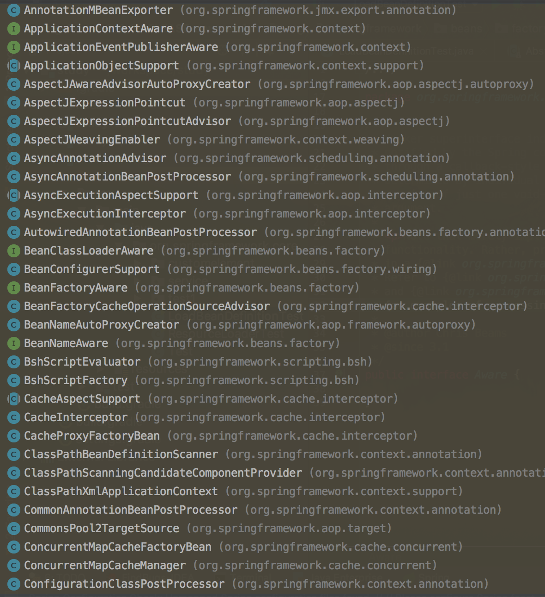

上面只是一部分子类，从这里我们可以看到 Spring 提供的 Aware 接口是是何其多。同时从上图我们也看到了几个比较熟悉的接口，如 BeanClassLoaderAware、BeanFactoryAware、BeanNameAware，下面就这三个接口来做一个简单的演示，先看各自的定义：

```java
public interface BeanClassLoaderAware extends Aware {

    /**
    * 将 BeanClassLoader 提供给 bean 实例回调
    * 在 bean 属性填充之后、初始化回调之前回调，
    * 例如InitializingBean的InitializingBean.afterPropertiesSet（）方法或自定义init方法
    */
    void setBeanClassLoader(ClassLoader classLoader);

}


public interface BeanFactoryAware extends Aware {
    /**
    * 将 BeanFactory 提供给 bean 实例回调
    * 调用时机和 setBeanClassLoader 一样
    */
    void setBeanFactory(BeanFactory beanFactory) throws BeansException;

}


public interface BeanNameAware extends Aware {

    /**
    * 在创建此 bean 的 bean工厂中设置 beanName
    */
    void setBeanName(String name);

}


public interface ApplicationContextAware extends Aware {

    /**
     * 设置此 bean 对象的 ApplicationContext，通常，该方法用于初始化对象
     */
    void setApplicationContext(ApplicationContext applicationContext)
        throws BeansException;

}
```

#### 2.1 示例

下面简单演示下上面四个接口的使用方法：

```java
public class MyApplicationAware implements BeanNameAware,BeanFactoryAware,BeanClassLoaderAware,ApplicationContextAware{

    private String beanName;

    private BeanFactory beanFactory;

    private ClassLoader classLoader;

    private ApplicationContext applicationContext;

    @Override
    public void setBeanClassLoader(ClassLoader classLoader) {
        System.out.println("调用了 BeanClassLoaderAware 的 setBeanClassLoader 方法");
        this.classLoader = classLoader;
    }

    @Override
    public void setBeanFactory(BeanFactory beanFactory) throws BeansException {
        System.out.println("调用了 BeanFactoryAware 的 setBeanFactory 方法");
        this.beanFactory = beanFactory;
    }

    @Override
    public void setBeanName(String name) {
        System.out.println("调用了 BeanNameAware 的 setBeanName 方法");
        this.beanName = name;
    }

    @Override
    public void setApplicationContext(ApplicationContext applicationContext) throws BeansException {
        System.out.println("调用了 ApplicationContextAware 的 setApplicationContext 方法");
        this.applicationContext = applicationContext;
    }

    public void display(){
        System.out.println("beanName:" + beanName);
        System.out.println("是否为单例：" + beanFactory.isSingleton(beanName));
        System.out.println("系统环境为：" + applicationContext.getEnvironment());
    }
}
```

测试方法如下:

```java
public static void main(String[] args) {
    ClassPathResource resource = new ClassPathResource("spring.xml");
    DefaultListableBeanFactory factory = new DefaultListableBeanFactory();
    XmlBeanDefinitionReader reader = new XmlBeanDefinitionReader(factory);
    reader.loadBeanDefinitions(resource);

    MyApplicationAware applicationAware = (MyApplicationAware) factory.getBean("myApplicationAware");
    applicationAware.display();
}
```

运行结果：

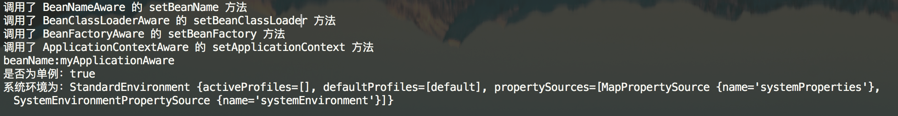

从该运行结果可以看出，这里只执行了三个 Aware 接口的 set 方法，原因就是通过 `#getBean(...)` 方法调用时，在激活 Aware 接口时只检测了 BeanNameAware、BeanClassLoaderAware、BeanFactoryAware 三个 Aware 接口。如果将测试方法调整为下面：

```java
public static void main(String[] args) {
    ApplicationContext applicationContext = new ClassPathXmlApplicationContext("spring.xml");
    MyApplicationAware applicationAware = (MyApplicationAware) applicationContext.getBean("myApplicationAware");
    applicationAware.display();
}
```

则运行结果如下：


### 3. 小结

从这了我们基本上就可以 Aware 真正的含义是什么了？感知，其实是 Spring 容器在初始化主动检测当前 bean 是否实现了 Aware 接口，如果实现了则回调其 set 方法将相应的参数设置给该 bean ，这个时候该 bean 就从 Spring 容器中取得相应的资源。

最后文章末尾列出部分常用的 Aware 子接口，便于日后查询：

- LoadTimeWeaverAware：加载Spring Bean时织入第三方模块，如AspectJ
- BeanClassLoaderAware：加载Spring Bean的类加载器
- BootstrapContextAware：资源适配器BootstrapContext，如JCA,CCI
- ResourceLoaderAware：底层访问资源的加载器
- BeanFactoryAware：声明BeanFactory
- PortletConfigAware：PortletConfig
- PortletContextAware：PortletContext
- ServletConfigAware：ServletConfig
- ServletContextAware：ServletContext
- MessageSourceAware：国际化
- ApplicationEventPublisherAware：应用事件
- NotificationPublisherAware：JMX通知
- BeanNameAware：声明Spring Bean的名字

## IoC 之深入分析 BeanPostProcessor

### 1. BeanPostProcessor 接口

Spring 作为优秀的开源框架，它为我们提供了丰富的可扩展点，除了前面提到的 Aware 接口，还包括其他部分，其中一个很重要的就是 BeanPostProcessor。这篇文章主要介绍 BeanPostProcessor 的使用以及其实现原理。我们先看 BeanPostProcessor 的定位：

> BeanPostProcessor 的作用：在 Bean 完成实例化后，如果我们需要对其进行一些配置、增加一些自己的处理逻辑，那么请使用 BeanPostProcessor。

### 2. BeanPostProcessor 示例

首先定义一个类，该类实现 BeanPostProcessor 接口，代码如下：

```java
public class BeanPostProcessorTest implements BeanPostProcessor{

    @Override
    public Object postProcessBeforeInitialization(Object bean, String beanName) throws BeansException {
        System.out.println("Bean [" + beanName + "] 开始初始化");
        // 这里一定要返回 bean，不能返回 null
        return bean;
    }

    @Override
    public Object postProcessAfterInitialization(Object bean, String beanName) throws BeansException {
        System.out.println("Bean [" + beanName + "] 完成初始化");
        return bean;
    }

    public void display(){
        System.out.println("hello BeanPostProcessor!!!");
    }
}
```

测试方法如下：

```java
ClassPathResource resource = new ClassPathResource("spring.xml");
DefaultListableBeanFactory factory = new DefaultListableBeanFactory();
XmlBeanDefinitionReader reader = new XmlBeanDefinitionReader(factory);
reader.loadBeanDefinitions(resource);

BeanPostProcessorTest test = (BeanPostProcessorTest) factory.getBean("beanPostProcessorTest");
test.display();
```

运行结果：

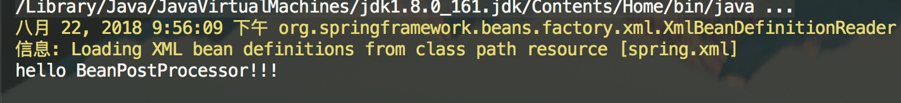

运行结果比较奇怪，为什么没有执行 `#postProcessBeforeInitialization(...)` 和 `#postProcessAfterInitialization(...)` 方法呢？

我们 debug 跟踪下代码，这两个方法在 AbstractAutowireCapableBeanFactory 的 `#initializeBean(final String beanName, final Object bean, RootBeanDefinition mbd)` 方法处调用下，如下：

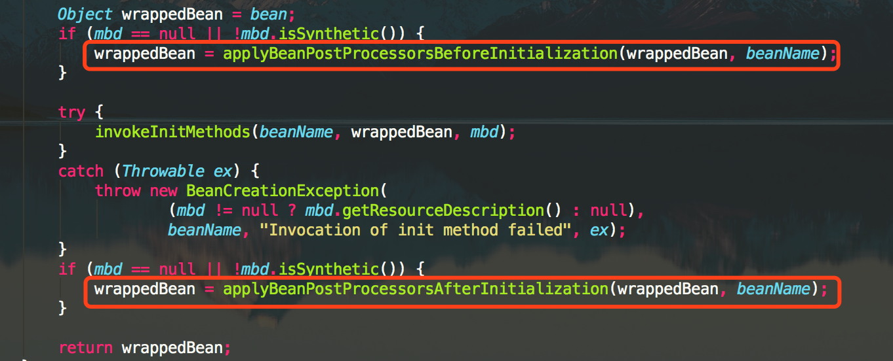

debug，在 `#postProcessBeforeInitialization(...)`方法中，结果如下：

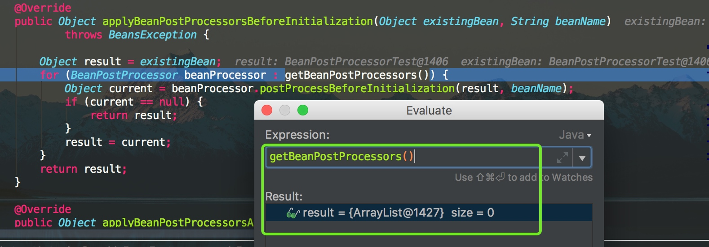

这段代码是通过迭代 `#getBeanPostProcessors()` 方法返回的结果集来调用 BeanPostProcessor 的 `#postProcessBeforeInitialization(Object bean, String beanName)` 方法，但是在这里我们看到该方法返回的结果集为空，所以肯定不会执行相应的 `#postProcessBeforeInitialization(Object bean, String beanName)` 方法咯。怎么办？答案不言而喻：只需要 `#getBeanPostProcessors()` 方法，返回的结果集中存在至少一个元素即可，该方法定义如下：

```java
// AbstractBeanFactory.java

/** BeanPostProcessors to apply in createBean. */
private final List<BeanPostProcessor> beanPostProcessors = new CopyOnWriteArrayList<>();

public List<BeanPostProcessor> getBeanPostProcessors() {
    return this.beanPostProcessors;
}
```

- 返回的 `beanPostProcessors` 是一个 `private` 的 List ，也就是说只要该类中存在 `beanPostProcessors.add(BeanPostProcessor beanPostProcessor)` 的调用，我们就找到了入口，在类 AbstractBeanFactory 中找到了如下代码：

  ```java
  // AbstractBeanFactory.java
  
  @Override
  public void addBeanPostProcessor(BeanPostProcessor beanPostProcessor) {
  	Assert.notNull(beanPostProcessor, "BeanPostProcessor must not be null");
  	// Remove from old position, if any
  	this.beanPostProcessors.remove(beanPostProcessor);
  	// Track whether it is instantiation/destruction aware
  	if (beanPostProcessor instanceof InstantiationAwareBeanPostProcessor) {
  		this.hasInstantiationAwareBeanPostProcessors = true;
  	}
  	if (beanPostProcessor instanceof DestructionAwareBeanPostProcessor) {
  		this.hasDestructionAwareBeanPostProcessors = true;
  	}
  	// Add to end of list
  	this.beanPostProcessors.add(beanPostProcessor);
  }
  ```

  - 该方法是由 AbstractBeanFactory 的父类 `org.springframework.beans.factory.config.ConfigurableBeanFactory` 接口定义，它的核心意思就是将指定 BeanPostProcessor 注册到该 BeanFactory 创建的 bean 中，同时它是**按照插入的顺序进行注册的**，完全忽略 Ordered 接口所表达任何排序语义（在 BeanPostProcessor 中我们提供一个 Ordered 顺序，这个后面讲解）。

到这里应该就比较熟悉了，其实只需要显示调用 `#addBeanPostProcessor(BeanPostProcessor beanPostProcessor)` 方法就可以了。加入如下代码：

```java
BeanPostProcessorTest beanPostProcessorTest = new BeanPostProcessorTest();
factory.addBeanPostProcessor(beanPostProcessorTest);
```

运行结果：


其实还有一种更加简单的方法，这个我们后面再说，先看 BeanPostProcessor 的原理。

### 3. BeanPostProcessor 基本原理

`org.springframework.beans.factory.config.BeanPostProcessor` 接口，代码如下：

```java
public interface BeanPostProcessor {

	@Nullable
	default Object postProcessBeforeInitialization(Object bean, String beanName) throws BeansException {
		return bean;
	}

	@Nullable
	default Object postProcessAfterInitialization(Object bean, String beanName) throws BeansException {
		return bean;
	}

}
```

BeanPostProcessor 可以理解为是 Spring 的一个工厂钩子（其实 Spring 提供一系列的钩子，如 Aware 、InitializingBean、DisposableBean），它是 Spring 提供的对象实例化阶段强有力的扩展点，允许 Spring 在实例化 bean 阶段对其进行定制化修改，比较常见的使用场景是处理标记接口实现类或者为当前对象提供代理实现（例如 AOP）。

一般普通的 BeanFactory 是不支持自动注册 BeanPostProcessor 的，需要我们手动调用 `#addBeanPostProcessor(BeanPostProcessor beanPostProcessor)` 方法进行注册。注册后的 BeanPostProcessor 适用于所有该 BeanFactory 创建的 bean，但是 **ApplicationContext 可以在其 bean 定义中自动检测所有的 BeanPostProcessor 并自动完成注册，同时将他们应用到随后创建的任何 Bean 中**。

`#postProcessBeforeInitialization(Object bean, String beanName)` 和 `#postProcessAfterInitialization(Object bean, String beanName)` 两个方法，都接收一个 Object 类型的 `bean` ，一个 String 类型的 `beanName` ，其中 `bean` 是已经实例化了的 `instanceBean` ，能拿到这个你是不是可以对它为所欲为了？ 这两个方法是初始化 `bean` 的前后置处理器，他们应用 `#invokeInitMethods(String beanName, final Object bean, RootBeanDefinition mbd)` 方法的前后。如下图：

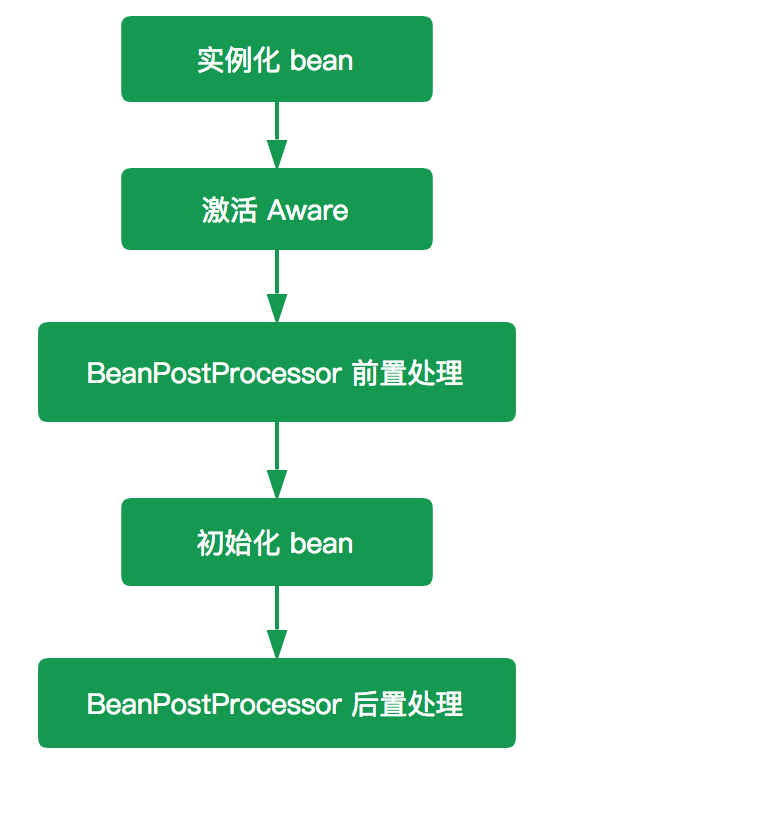

代码层次上面已经贴出来，这里再贴一次：


两者源码如下：

```java
// AbstractAutowireCapableBeanFactory.java

@Override
public Object applyBeanPostProcessorsBeforeInitialization(Object existingBean, String beanName)
		throws BeansException {
	Object result = existingBean;
	// 遍历 BeanPostProcessor 数组
	for (BeanPostProcessor processor : getBeanPostProcessors()) {
	    // 处理
		Object current = processor.postProcessBeforeInitialization(result, beanName);
        // 返回空，则返回 result
		if (current == null) {
			return result;
		}
		// 修改 result
		result = current;
	}
	return result;
}

@Override
public Object applyBeanPostProcessorsAfterInitialization(Object existingBean, String beanName)
		throws BeansException {
	Object result = existingBean;
	// 遍历 BeanPostProcessor
	for (BeanPostProcessor processor : getBeanPostProcessors()) {
	    // 处理
		Object current = processor.postProcessAfterInitialization(result, beanName);
		// 返回空，则返回 result
		if (current == null) {
			return result;
		}
		// 修改 result
		result = current;
	}
	return result;
}
```

#### 3.1 自动检测并注册

`#getBeanPostProcessors()` 方法，返回的是 `beanPostProcessors` 集合，该集合里面存放就是我们自定义的 BeanPostProcessor ，如果该集合中存在元素则调用相应的方法，否则就直接返回 bean 了。这也是为什么使用 BeanFactory 容器是无法输出自定义 BeanPostProcessor 里面的内容，因为在 `BeanFactory#getBean(...)` 方法的过程中根本就没有将我们自定义的 BeanPostProcessor 注入进来，所以要想 BeanFactory 容器 的 BeanPostProcessor 生效我们必须手动调用 `#addBeanPostProcessor(BeanPostProcessor beanPostProcessor)` 方法，将定义的 BeanPostProcessor 注册到相应的 BeanFactory 中。**但是 ApplicationContext 不需要手动，因为 ApplicationContext 会自动检测并完成注册**。

ApplicationContext 实现自动注册的原因，在于我们构造一个 ApplicationContext 实例对象的时候会调用 `#registerBeanPostProcessors(ConfigurableListableBeanFactory beanFactory)` 方法，将检测到的 BeanPostProcessor 注入到 ApplicationContext 容器中，同时应用到该容器创建的 bean 中。代码如下：

```java
// AbstractApplicationContext.java

/**
 * 实例化并调用已经注入的 BeanPostProcessor
 * 必须在应用中 bean 实例化之前调用
 */
protected void registerBeanPostProcessors(ConfigurableListableBeanFactory beanFactory) {
    PostProcessorRegistrationDelegate.registerBeanPostProcessors(beanFactory, this);
}

// PostProcessorRegistrationDelegate.java

public static void registerBeanPostProcessors(
		ConfigurableListableBeanFactory beanFactory, AbstractApplicationContext applicationContext) {

    // 获取所有的 BeanPostProcessor 的 beanName
    // 这些 beanName 都已经全部加载到容器中去，但是没有实例化
	String[] postProcessorNames = beanFactory.getBeanNamesForType(BeanPostProcessor.class, true, false);

	// Register BeanPostProcessorChecker that logs an info message when
	// a bean is created during BeanPostProcessor instantiation, i.e. when
	// a bean is not eligible for getting processed by all BeanPostProcessors.
    // 记录所有的beanProcessor数量
	int beanProcessorTargetCount = beanFactory.getBeanPostProcessorCount() + 1 + postProcessorNames.length;
	// 注册 BeanPostProcessorChecker，它主要是用于在 BeanPostProcessor 实例化期间记录日志
    // 当 Spring 中高配置的后置处理器还没有注册就已经开始了 bean 的实例化过程，这个时候便会打印 BeanPostProcessorChecker 中的内容
	beanFactory.addBeanPostProcessor(new BeanPostProcessorChecker(beanFactory, beanProcessorTargetCount));

	// Separate between BeanPostProcessors that implement PriorityOrdered,
	// Ordered, and the rest.
    // PriorityOrdered 保证顺序
	List<BeanPostProcessor> priorityOrderedPostProcessors = new ArrayList<>();
    // MergedBeanDefinitionPostProcessor
	List<BeanPostProcessor> internalPostProcessors = new ArrayList<>();
    // 使用 Ordered 保证顺序
	List<String> orderedPostProcessorNames = new ArrayList<>();
    // 没有顺序
	List<String> nonOrderedPostProcessorNames = new ArrayList<>();
	for (String ppName : postProcessorNames) {
        // PriorityOrdered
        if (beanFactory.isTypeMatch(ppName, PriorityOrdered.class)) {
            // 调用 getBean 获取 bean 实例对象
			BeanPostProcessor pp = beanFactory.getBean(ppName, BeanPostProcessor.class);
			priorityOrderedPostProcessors.add(pp);
			if (pp instanceof MergedBeanDefinitionPostProcessor) {
				internalPostProcessors.add(pp);
			}
		} else if (beanFactory.isTypeMatch(ppName, Ordered.class)) {
            // 有序 Ordered
			orderedPostProcessorNames.add(ppName);
		} else {
            // 无序
			nonOrderedPostProcessorNames.add(ppName);
		}
	}

	// First, register the BeanPostProcessors that implement PriorityOrdered.
    // 第一步，注册所有实现了 PriorityOrdered 的 BeanPostProcessor
    // 先排序
	sortPostProcessors(priorityOrderedPostProcessors, beanFactory);
    // 后注册
	registerBeanPostProcessors(beanFactory, priorityOrderedPostProcessors);

	// Next, register the BeanPostProcessors that implement Ordered.
    // 第二步，注册所有实现了 Ordered 的 BeanPostProcessor
	List<BeanPostProcessor> orderedPostProcessors = new ArrayList<>();
	for (String ppName : orderedPostProcessorNames) {
		BeanPostProcessor pp = beanFactory.getBean(ppName, BeanPostProcessor.class);
		orderedPostProcessors.add(pp);
		if (pp instanceof MergedBeanDefinitionPostProcessor) {
			internalPostProcessors.add(pp);
		}
	}
    // 先排序
	sortPostProcessors(orderedPostProcessors, beanFactory);
    // 后注册
	registerBeanPostProcessors(beanFactory, orderedPostProcessors);

	// Now, register all regular BeanPostProcessors.
    // 第三步注册所有无序的 BeanPostProcessor
	List<BeanPostProcessor> nonOrderedPostProcessors = new ArrayList<>();
	for (String ppName : nonOrderedPostProcessorNames) {
		BeanPostProcessor pp = beanFactory.getBean(ppName, BeanPostProcessor.class);
		nonOrderedPostProcessors.add(pp);
		if (pp instanceof MergedBeanDefinitionPostProcessor) {
			internalPostProcessors.add(pp);
		}
	}
	// 注册，无需排序
	registerBeanPostProcessors(beanFactory, nonOrderedPostProcessors);

	// Finally, re-register all internal BeanPostProcessors.
    // 最后，注册所有的 MergedBeanDefinitionPostProcessor 类型的 BeanPostProcessor
	sortPostProcessors(internalPostProcessors, beanFactory);
	registerBeanPostProcessors(beanFactory, internalPostProcessors);

	// Re-register post-processor for detecting inner beans as ApplicationListeners,
	// moving it to the end of the processor chain (for picking up proxies etc).
    // 加入ApplicationListenerDetector（探测器）
    // 重新注册 BeanPostProcessor 以检测内部 bean，因为 ApplicationListeners 将其移动到处理器链的末尾
	beanFactory.addBeanPostProcessor(new ApplicationListenerDetector(applicationContext));
}
```

- 方法首先 `beanFactory` 获取注册到该 BeanFactory 中所有 BeanPostProcessor 类型的 `beanName` 数组，其实就是找所有实现了 BeanPostProcessor 接口的 bean ，然后迭代这些 bean ，将其按照 PriorityOrdered、Ordered、无序的顺序，添加至相应的 List 集合中，最后依次调用 `#sortPostProcessors(List<?> postProcessors, ConfigurableListableBeanFactory beanFactory)` 方法来进行排序处理、 `#registerBeanPostProcessors(ConfigurableListableBeanFactory beanFactory, List<BeanPostProcessor> postProcessors)` 方法来完成注册。

- 【**排序**】很简单，如果 `beanFactory` 为 DefaultListableBeanFactory ，则返回 BeanFactory 所依赖的比较器，否则反正默认的比较器(OrderComparator)，然后调用 `List#sort(Comparator<? super E> c)` 方法即可。代码如下：

  ```java
  // PostProcessorRegistrationDelegate.java
  private static void sortPostProcessors(List<?> postProcessors, ConfigurableListableBeanFactory beanFactory) {
  	// 获得 Comparator 对象
      Comparator<Object> comparatorToUse = null;
  	if (beanFactory instanceof DefaultListableBeanFactory) { // 依赖的 Comparator 对象
  		comparatorToUse = ((DefaultListableBeanFactory) beanFactory).getDependencyComparator();
  	}
  	if (comparatorToUse == null) { // 默认 Comparator 对象
  		comparatorToUse = OrderComparator.INSTANCE;
  	}
  	// 排序
  	postProcessors.sort(comparatorToUse);
  }
  ```

而对于【**注册**】，同样是调用 `AbstractBeanFactory#addBeanPostProcessor(BeanPostProcessor beanPostProcessor)` 方法完成注册。代码如下：

```java
// PostProcessorRegistrationDelegate.java

private static void registerBeanPostProcessors(ConfigurableListableBeanFactory beanFactory, List<BeanPostProcessor> postProcessors) {
    // 遍历 BeanPostProcessor 数组，注册
	for (BeanPostProcessor postProcessor : postProcessors) {
		beanFactory.addBeanPostProcessor(postProcessor);
	}
}
```

### 4. 小结

至此，BeanPostProcessor 已经分析完毕了，这里简单总结下：

1. BeanPostProcessor 的作用域是容器级别的，它只和所在的容器相关 ，当 BeanPostProcessor 完成注册后，它会应用于所有跟它在同一个容器内的 bean 。
2. BeanFactory 和 ApplicationContext 对 BeanPostProcessor 的处理不同，ApplicationContext 会自动检测所有实现了 BeanPostProcessor 接口的 bean，并完成注册，但是使用 BeanFactory 容器时则需要手动调用 `AbstractBeanFactory#addBeanPostProcessor(BeanPostProcessor beanPostProcessor)` 方法来完成注册
3. ApplicationContext 的 BeanPostProcessor 支持 Ordered，而 BeanFactory 的 BeanPostProcessor 是不支持的，原因在于ApplicationContext 会对 BeanPostProcessor 进行 Ordered 检测并完成排序，而 BeanFactory 中的 BeanPostProcessor 只跟注册的顺序有关。

## IoC之深入分析InitializingBean和init-method

Spring 在 bean 初始化时进行三个检测扩展，也就是说我们可以对 bean 进行三个不同的定制化处理，前面两篇博客 [《【死磕 Spring】—— IoC 之深入分析 Aware 接口》](http://svip.iocoder.cn/Spring/IoC-Aware-interface) 和 [《【死磕 Spring】—— IoC 之深入分析 BeanPostProcessor》](http://svip.iocoder.cn/Spring/IoC-BeanPostProcessor) 已经分析了 Aware 接口族和 BeanPostProcessor 接口，这篇分析 InitializingBean 接口和 `init-method` 方法。

### 1. InitializingBean

Spring 的 `org.springframework.beans.factory.InitializingBean` 接口，为 bean 提供了定义初始化方法的方式，它仅包含了一个方法：`#afterPropertiesSet()` 。代码如下：

```java
public interface InitializingBean {

    /**
     * 该方法在 BeanFactory 设置完了所有属性之后被调用
     * 该方法允许 bean 实例设置了所有 bean 属性时执行初始化工作，如果该过程出现了错误则需要抛出异常
     *
     * Invoked by the containing {@code BeanFactory} after it has set all bean properties
     * and satisfied {@link BeanFactoryAware}, {@code ApplicationContextAware} etc.
     * <p>This method allows the bean instance to perform validation of its overall
     * configuration and final initialization when all bean properties have been set.
     * @throws Exception in the event of misconfiguration (such as failure to set an
     * essential property) or if initialization fails for any other reason
     */
    void afterPropertiesSet() throws Exception;

}
```

Spring 在完成实例化后，设置完所有属性，进行 “Aware 接口” 和 “BeanPostProcessor 前置处理”之后，会接着检测当前 bean 对象是否实现了 InitializingBean 接口。如果是，则会调用其 `#afterPropertiesSet()` 方法，进一步调整 bean 实例对象的状态。

#### 1.1 示例

```java
public class InitializingBeanTest implements InitializingBean {

    private String name;

    @Override
    public void afterPropertiesSet() throws Exception {
        System.out.println("InitializingBeanTest initializing...");
        this.name = "chenssy 2 号";
    }

    public String getName() {
        return name;
    }

    public void setName(String name) {
        this.name = name;
    }
}
```

配置项如下：

```xml
<bean id="initializingBeanTest" class="org.springframework.core.test.InitializingBeanTest">
    <property name="name" value="chenssy 1 号"/>
</bean>
```

测试代码如下：

```xml
InitializingBeanTest test = (InitializingBeanTest) factory.getBean("initializingBeanTest");
System.out.println("name ：" + test.getName());
```

执行结果如下：

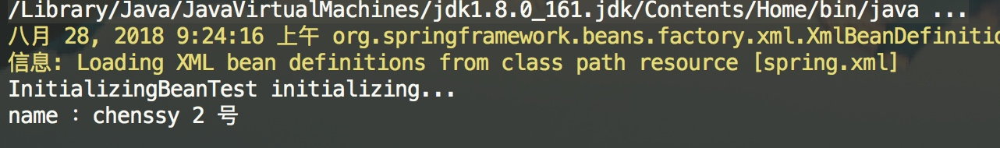

在这个示例中，改变了 InitializingBeanTest 示例的 `name` 属性，也就是说 在 `#afterPropertiesSet()` 方法中，我们是可以改变 bean 的属性的，这相当于 Spring 容器又给我们提供了一种可以改变 bean 实例对象的方法。

#### 1.2 invokeInitMethods

上面提到 bean 初始化阶段（ `#initializeBean(final String beanName, final Object bean, RootBeanDefinition mbd)` 方法）， Spring 容器会主动检查当前 bean 是否已经实现了 InitializingBean 接口，如果实现了，则会掉用其 `#afterPropertiesSet()` 方法。这个主动检查、调用的动作是由 `#invokeInitMethods(String beanName, final Object bean, @Nullable RootBeanDefinition mbd)` 方法来完成的。代码如下：

```java
// AbstractAutowireCapableBeanFactory.java

protected void invokeInitMethods(String beanName, final Object bean, @Nullable RootBeanDefinition mbd)
        throws Throwable {
    // 首先会检查是否是 InitializingBean ，如果是的话需要调用 afterPropertiesSet()
    boolean isInitializingBean = (bean instanceof InitializingBean);
    if (isInitializingBean && (mbd == null || !mbd.isExternallyManagedInitMethod("afterPropertiesSet"))) {
        if (logger.isTraceEnabled()) {
            logger.trace("Invoking afterPropertiesSet() on bean with name '" + beanName + "'");
        }
        if (System.getSecurityManager() != null) { // 安全模式
            try {
                AccessController.doPrivileged((PrivilegedExceptionAction<Object>) () -> {
                    // 属性初始化的处理
                    ((InitializingBean) bean).afterPropertiesSet();
                    return null;
                }, getAccessControlContext());
            } catch (PrivilegedActionException pae) {
                throw pae.getException();
            }
        } else {
            // 属性初始化的处理
            ((InitializingBean) bean).afterPropertiesSet();
        }
    }

    if (mbd != null && bean.getClass() != NullBean.class) {
        // 判断是否指定了 init-method()，
        // 如果指定了 init-method()，则再调用制定的init-method
        String initMethodName = mbd.getInitMethodName();
        if (StringUtils.hasLength(initMethodName) &&
                !(isInitializingBean && "afterPropertiesSet".equals(initMethodName)) &&
                !mbd.isExternallyManagedInitMethod(initMethodName)) {
            // 激活用户自定义的初始化方法
            // 利用反射机制执行
            invokeCustomInitMethod(beanName, bean, mbd);
        }
    }
}
```

- 首先，检测当前 bean 是否实现了 InitializingBean 接口，如果实现了则调用其 `#afterPropertiesSet()` 方法。
- 然后，再检查是否也指定了 `init-method`，如果指定了则通过反射机制调用指定的 `init-method` 方法。

虽然该接口为 Spring 容器的扩展性立下了汗马功劳，但是如果真的让我们的业务对象来实现这个接口就显得不是那么的友好了，Spring 的一个核心理念就是无侵入性，但是如果我们业务类实现这个接口就显得 Spring 容器具有侵入性了。所以 Spring 还提供了另外一种实现的方式：`init-method` 方法

### 2. init-method

在分析分析 `<bean>` 标签解析过程中，我们提到了有关于 `init-method` 属性 ([《【死磕 Spring】—— IoC 之解析 标签：BeanDefinition》](http://svip.iocoder.cn/Spring/IoC-parse-BeanDefinitions-for-BeanDefinition))，该属性用于在 bean 初始化时指定执行方法，可以用来替代实现 InitializingBean 接口。

#### 2.1 示例

```java
public class InitializingBeanTest {

    private String name;

    public String getName() {
        return name;
    }

    public void setName(String name) {
        this.name = name;
    }

    public void setOtherName(){
        System.out.println("InitializingBeanTest setOtherName...");
        this.name = "chenssy 3 号";
    }
}
```

配置文件如下：

```java
<bean id="initializingBeanTest" class="org.springframework.core.test.InitializingBeanTest"
        init-method="setOtherName">
    <property name="name" value="chenssy 1 号"/>
</bean>
```

执行结果:

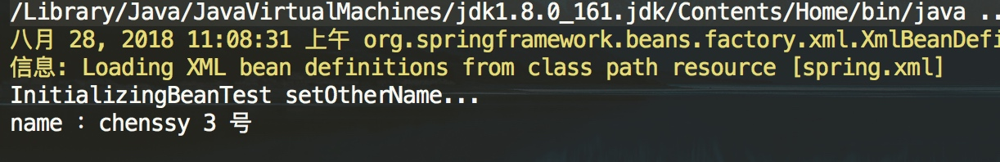

完全可以达到和 InitializingBean 一样的效果，而且在代码中我们没有看到丝毫 Spring 侵入的现象。所以通过 `init-method` 我们可以使用业务对象中定义的任何方法来实现 bean 实例对象的初始化定制化，而不再受制于 InitializingBean的 `#afterPropertiesSet()` 方法。同时我们可以使用 `<beans>` 标签的 `default-init-method` 属性来统一指定初始化方法，这样就省了需要在每个 `<bean>` 标签中都设置 `init-method` 这样的繁琐工作了。比如在 `default-init-method` 规定所有初始化操作全部以 `initBean()` 命名。如下：

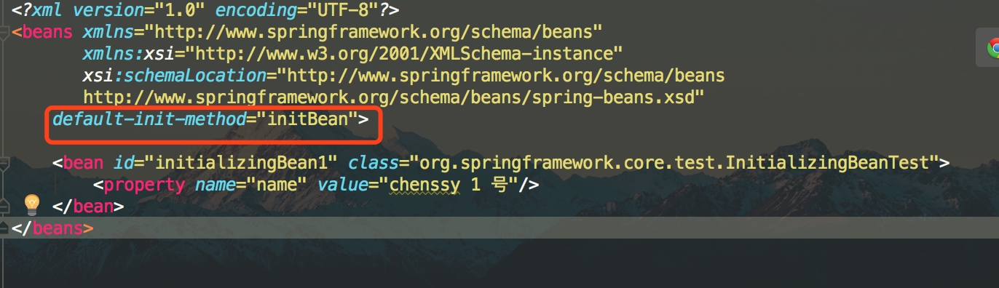

### 3. 小结

从 `#invokeInitMethods(...)` 方法中，我们知道 `init-method` 指定的方法会在 `#afterPropertiesSet()` 方法之后执行，如果 `#afterPropertiesSet()` 方法的执行的过程中出现了异常，则 `init-method` 是不会执行的，而且由于 `init-method` 采用的是反射执行的方式，所以 `#afterPropertiesSet()` 方法的执行效率一般会高些，但是并不能排除我们要优先使用 `init-method`，主要是因为它消除了 bean 对 Spring 的依赖，Spring 没有侵入到我们业务代码，这样会更加符合 Spring 的理念。诚然，`init-method` 是基于 xml 配置文件的，就目前而言，我们的工程几乎都摒弃了配置，而采用注释的方式，那么 `@PreDestory` 可能适合你，当然这个注解我们后面分析。

至此，InitializingBean 和 init-method 已经分析完毕了，对于DisposableBean 和 `destroy-method` ，他们和 init 相似，这里就不做阐述了。

## IoC之深入分析Bean的生命周期

在分析 Spring Bean 实例化过程中提到 Spring 并不是一启动容器就开启 bean 的实例化进程，只有当客户端通过显示或者隐式的方式调用 BeanFactory 的 `#getBean(...)` 方法来请求某个实例对象的时候，它才会触发相应 bean 的实例化进程。当然，也可以选择直接使用 ApplicationContext 容器，因为该容器启动的时候会立刻调用注册到该容器所有 bean 定义的实例化方法。当然，对于 BeanFactory 容器而言，并不是所有的 `#getBean(...)` 方法都会触发实例化进程，比如 singleton 类型的 bean，该类型的 bean 只会在第一次调用 `getBean()` 的时候才会触发，而后续的调用则会直接返回容器缓存中的实例对象。

`#getBean(...)` 方法，只是 bean 实例化进程的入口，真正的实现逻辑其实是在 AbstractAutowireCapableBeanFactory 的 `#doCreateBean(...)` 中实现，实例化过程如下图：

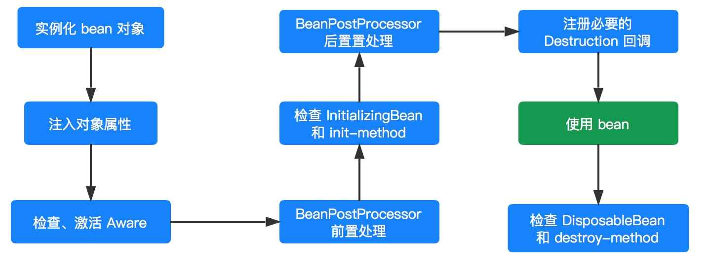

原来我们采用 new 的方式创建一个对象，用完该对象在其脱离作用域后就会被回收，对于后续操作我们无权也没法干涉，但是采用 Spring 容器后，我们完全摆脱了这种命运，Spring 容器将会对其所有管理的 Bean 对象全部给予一个**统一的生命周期管理**，同时在这个阶段我们也可以对其进行干涉（比如对 bean 进行增强处理，对 bean 进行篡改），如上图。

### 1. bean 实例化

在 `#doCreateBean(...)` 方法中，首先进行 bean 实例化工作，主要由 `#createBeanInstance(...)` 方法实现，该方法返回一个 BeanWrapper 对象。BeanWrapper 对象是 Spring 的一个低级 Bean 基础结构的核心接口，为什么说是**低级**呢？因为这个时候的 Bean 还不能够被我们使用，连最基本的属性都没有设置。而且在我们实际开发过程中，一般都不会直接使用该类，而是通过 BeanFactory 隐式使用。

BeanWrapper 接口有一个默认实现类 BeanWrapperImpl，其主要作用是对 Bean 进行“包裹”，然后对这个包裹的 bean 进行操作，比如后续注入 bean 属性。

在实例化 bean 过程中，Spring 采用“策略模式”来决定采用哪种方式来实例化 bean，一般有反射和 CGLIB 动态字节码两种方式。

InstantiationStrategy 定义了 Bean 实例化策略的抽象接口，其子类 SimpleInstantiationStrategy 提供了基于反射来实例化对象的功能，但是不支持方法注入方式的对象实例化。CglibSubclassingInstantiationStrategy 继承 SimpleInstantiationStrategy，他除了拥有父类以反射实例化对象的功能外，还提供了通过 CGLIB 的动态字节码的功能进而支持方法注入所需的对象实例化需求。默认情况下，Spring 采用 CglibSubclassingInstantiationStrategy。

关于 Bean 实例化的详细过程，请参考以下几篇文章：

1. [【死磕 Spring】—— IoC 之加载 bean：创建 bean（一）之主流程](http://svip.iocoder.cn/Spring/IoC-get-Bean-createBean-1)
2. [【死磕 Spring】—— IoC 之加载 bean：创建 bean（二）之实例化 Bean 对象(1)](http://svip.iocoder.cn/Spring/IoC-get-Bean-createBean-2)
3. [【死磕 Spring】—— IoC 之加载 bean：创建 bean（三）之实例化 Bean 对象(2)](http://svip.iocoder.cn/Spring/IoC-get-Bean-createBean-3)
4. [【死磕 Spring】—— IoC 之加载 bean：创建 bean（四）之属性填充](http://svip.iocoder.cn/Spring/IoC-get-Bean-createBean-4)
5. [【死磕 Spring】—— IoC 之加载 bean：创建 bean（五）之循环依赖处理](http://svip.iocoder.cn/Spring/IoC-get-Bean-createBean-5)
6. [【死磕 Spring】—— IoC 之加载 bean：创建 bean（六）之初始化 Bean 对象](http://svip.iocoder.cn/Spring/IoC-get-Bean-createBean-6)

对于 BeanWrapper 和 具体的实例化策略，LZ 在后面会专门写文章来进行详细说明。

### 2. 激活 Aware

当 Spring 完成 bean 对象实例化并且设置完相关属性和依赖后，则会开始 bean 的初始化进程（ `#initializeBean(...)` ），初始化第一个阶段是检查当前 bean 对象是否实现了一系列以 Aware 结尾的的接口。

Aware 接口为 Spring 容器的核心接口，是一个具有标识作用的超级接口，实现了该接口的 bean 是具有被 Spring 容器通知的能力，通知的方式是采用回调的方式。

在初始化阶段主要是感知 BeanNameAware、BeanClassLoaderAware、BeanFactoryAware 。代码如下：

```java
// AbstractAutowireCapableBeanFactory.java

private void invokeAwareMethods(final String beanName, final Object bean) {
	if (bean instanceof Aware) {
	    // BeanNameAware
		if (bean instanceof BeanNameAware) {
			((BeanNameAware) bean).setBeanName(beanName);
		}
		// BeanClassLoaderAware
		if (bean instanceof BeanClassLoaderAware) {
			ClassLoader bcl = getBeanClassLoader();
			if (bcl != null) {
				((BeanClassLoaderAware) bean).setBeanClassLoader(bcl);
			}
		}
		// BeanFactoryAware
		if (bean instanceof BeanFactoryAware) {
			((BeanFactoryAware) bean).setBeanFactory(AbstractAutowireCapableBeanFactory.this);
		}
	}
}
```

- BeanNameAware：对该 bean 对象定义的 beanName 设置到当前对象实例中
- BeanClassLoaderAware：将当前 bean 对象相应的 ClassLoader 注入到当前对象实例中
- BeanFactoryAware：BeanFactory 容器会将自身注入到当前对象实例中，这样当前对象就会拥有一个 BeanFactory 容器的引用。

当然，Spring 不仅仅只是提供了上面三个 Aware 接口，而是一系列：

- LoadTimeWeaverAware：加载Spring Bean时织入第三方模块，如AspectJ
- BootstrapContextAware：资源适配器BootstrapContext，如JCA,CCI
- ResourceLoaderAware：底层访问资源的加载器
- PortletConfigAware：PortletConfig
- PortletContextAware：PortletContext
- ServletConfigAware：ServletConfig
- ServletContextAware：ServletContext
- MessageSourceAware：国际化
- ApplicationEventPublisherAware：应用事件
- NotificationPublisherAware：JMX通知

更多关于 Aware 的请关注：[《【死磕 Spring】—— IoC 之深入分析 Aware 接口》](http://svip.iocoder.cn/Spring/IoC-Aware-interface) 。

### 3. BeanPostProcessor

初始化第二个阶段则是 BeanPostProcessor 增强处理，在该阶段 BeanPostProcessor 会处理当前容器内所有符合条件的实例化后的 bean 对象。它主要是对 Spring 容器提供的 bean 实例对象进行有效的扩展，允许 Spring 在初始化 bean 阶段对其进行定制化修改，如处理标记接口或者为其提供代理实现。

BeanPostProcessor 接口提供了两个方法，在不同的时机执行，分别对应上图的前置处理和后置处理。代码如下：

```java
public interface BeanPostProcessor {

	@Nullable
	default Object postProcessBeforeInitialization(Object bean, String beanName) throws BeansException {
		return bean;
	}

	@Nullable
	default Object postProcessAfterInitialization(Object bean, String beanName) throws BeansException {
		return bean;
	}

}
```

更多关于 BeanPostProcessor 的请关注：[《【死磕 Spring】—— IoC 之深入分析 BeanPostProcessor》](http://svip.iocoder.cn/Spring/IoC-BeanPostProcessor) 。

### 4. InitializingBean 和 init-method

InitializingBean 是一个接口，它为 Spring Bean 的初始化提供了一种方式，它有一个 `#afterPropertiesSet()` 方法，在 bean 的初始化进程中会判断当前 bean 是否实现了 InitializingBean，如果实现了则调用 `#afterPropertiesSet()` 方法，进行初始化工作。然后再检查是否也指定了 `init-method` ，如果指定了则通过反射机制调用指定的 `init-method` 方法。代码如下：

```java
// AbstractAutowireCapableBeanFactory.java

protected void invokeInitMethods(String beanName, final Object bean, @Nullable RootBeanDefinition mbd)
		throws Throwable {
    // 首先会检查是否是 InitializingBean ，如果是的话需要调用 afterPropertiesSet()
	boolean isInitializingBean = (bean instanceof InitializingBean);
	if (isInitializingBean && (mbd == null || !mbd.isExternallyManagedInitMethod("afterPropertiesSet"))) {
		if (logger.isTraceEnabled()) {
			logger.trace("Invoking afterPropertiesSet() on bean with name '" + beanName + "'");
		}
		if (System.getSecurityManager() != null) { // 安全模式
			try {
				AccessController.doPrivileged((PrivilegedExceptionAction<Object>) () -> {
                    // 属性初始化的处理
					((InitializingBean) bean).afterPropertiesSet();
					return null;
				}, getAccessControlContext());
			} catch (PrivilegedActionException pae) {
				throw pae.getException();
			}
		} else {
            // 属性初始化的处理
			((InitializingBean) bean).afterPropertiesSet();
		}
	}

	if (mbd != null && bean.getClass() != NullBean.class) {
        // 判断是否指定了 init-method()，
        // 如果指定了 init-method()，则再调用制定的init-method
		String initMethodName = mbd.getInitMethodName();
		if (StringUtils.hasLength(initMethodName) &&
				!(isInitializingBean && "afterPropertiesSet".equals(initMethodName)) &&
				!mbd.isExternallyManagedInitMethod(initMethodName)) {
            // 激活用户自定义的初始化方法
            // 利用反射机制执行
			invokeCustomInitMethod(beanName, bean, mbd);
		}
	}
}
```

对于 Spring 而言，虽然上面两种方式都可以实现初始化定制化，但是更加推崇 `init-method` 方式，因为对于 InitializingBean 接口而言，他需要 bean 去实现接口，这样就会污染我们的应用程序，显得 Spring 具有一定的侵入性。但是由于 `init-method` 是采用反射的方式，所以执行效率上相对于 InitializingBean 接口回调的方式可能会低一些。

更多关于 init 的请关注：[《【死磕 Spring】—— IoC 之 深入分析 InitializingBean 和 init-method》](http://svip.iocoder.cn/Spring/IoC-InitializingBean-and-init-method)

### 5. DisposableBean 和 destroy-method

与 InitializingBean 和 `init-method` 用于对象的自定义初始化工作相似，DisposableBean和 `destroy-method` 则用于对象的自定义销毁工作。

当一个 bean 对象经历了实例化、设置属性、初始化阶段，那么该 bean 对象就可以供容器使用了（调用的过程）。当完成调用后，如果是 singleton 类型的 bean ，则会看当前 bean 是否应实现了 DisposableBean 接口或者配置了 `destroy-method` 属性，如果是的话，则会为该实例注册一个用于对象销毁的回调方法，便于在这些 singleton 类型的 bean 对象销毁之前执行销毁逻辑。

但是，并不是对象完成调用后就会立刻执行销毁方法，因为这个时候 Spring 容器还处于运行阶段，只有当 Spring 容器关闭的时候才会去调用。但是， Spring 容器不会这么聪明会自动去调用这些销毁方法，而是需要我们主动去告知 Spring 容器。

- 对于 BeanFactory 容器而言，我们需要主动调用 `#destroySingletons()` 方法，通知 BeanFactory 容器去执行相应的销毁方法。
- 对于 ApplicationContext 容器而言，调用 `#registerShutdownHook()` 方法。

### 6. 实践验证

下面用一个实例来真实看看看上面执行的逻辑，毕竟理论是不能缺少实践的：

```java
public class LifeCycleBean implements BeanNameAware,BeanFactoryAware,BeanClassLoaderAware,BeanPostProcessor,
        InitializingBean,DisposableBean {

    private String test;

    public String getTest() {
        return test;
    }

    public void setTest(String test) {
        System.out.println("属性注入....");
        this.test = test;
    }

    public LifeCycleBean(){ // 构造方法
        System.out.println("构造函数调用...");
    }

    public void display(){
        System.out.println("方法调用...");
    }

    @Override
    public void setBeanFactory(BeanFactory beanFactory) throws BeansException {
        System.out.println("BeanFactoryAware 被调用...");
    }

    @Override
    public void setBeanName(String name) {
        System.out.println("BeanNameAware 被调用...");
    }

    @Override
    public void setBeanClassLoader(ClassLoader classLoader) {
        System.out.println("BeanClassLoaderAware 被调用...");
    }

    @Override
    public Object postProcessBeforeInitialization(Object bean, String beanName) throws BeansException {
        System.out.println("BeanPostProcessor postProcessBeforeInitialization 被调用...");
        return bean;
    }

    @Override
    public Object postProcessAfterInitialization(Object bean, String beanName) throws BeansException {
        System.out.println("BeanPostProcessor postProcessAfterInitialization 被调用...");
        return bean;
    }

    @Override
    public void destroy() throws Exception {
        System.out.println("DisposableBean destroy 被调动...");
    }

    @Override
    public void afterPropertiesSet() throws Exception {
        System.out.println("InitializingBean afterPropertiesSet 被调动...");
    }

    public void initMethod(){
        System.out.println("init-method 被调用...");
    }

    public void destroyMethdo(){
        System.out.println("destroy-method 被调用...");
    }

}
```

- LifeCycleBean 继承了 `BeanNameAware` , `BeanFactoryAware` , `BeanClassLoaderAware` , `BeanPostProcessor` , `InitializingBean` , `DisposableBean` 六个接口，同时定义了一个 `test` 属性用于验证属性注入和提供一个 `#display()` 方法用于模拟调用。

配置如下：

```java
<bean id="lifeCycle" class="org.springframework.core.test.lifeCycleBean"
        init-method="initMethod" destroy-method="destroyMethdo">
    <property name="test" value="test"/>
</bean>
```

- 配置 `init-method` 和 `destroy-method`。

测试方法如下：

```java
// BeanFactory 容器一定要调用该方法进行 BeanPostProcessor 注册
factory.addBeanPostProcessor(new LifeCycleBean()); // <1>

LifeCycleBean lifeCycleBean = (LifeCycleBean) factory.getBean("lifeCycle");
lifeCycleBean.display();

System.out.println("方法调用完成，容器开始关闭....");
// 关闭容器
factory.destroySingletons();
```

运行结果：

```java
构造函数调用...
构造函数调用...
属性注入....
BeanNameAware 被调用...
BeanClassLoaderAware 被调用...
BeanFactoryAware 被调用...
BeanPostProcessor postProcessBeforeInitialization 被调用...
InitializingBean afterPropertiesSet 被调动...
init-method 被调用...
BeanPostProcessor postProcessAfterInitialization 被调用...
方法调用...
方法调用完成，容器开始关闭....
DisposableBean destroy 被调动...
destroy-method 被调用...
```

- 有两个构造函数调用，是因为要 `<1>` 处注入一个 BeanPostProcessor（你也可以另外提供一个 BeanPostProcessor 实例）。

根据执行的结果已经上面的分析，我们就可以对 Spring Bean 的声明周期过程如下（方法级别）：

1. Spring 容器根据实例化策略对 Bean 进行实例化。
2. 实例化完成后，如果该 bean 设置了一些属性的话，则利用 set 方法设置一些属性。
3. 如果该 Bean 实现了 BeanNameAware 接口，则调用 `#setBeanName(String beanName)` 方法。
4. 如果该 bean 实现了 BeanClassLoaderAware 接口，则调用 `setBeanClassLoader(ClassLoader classLoader)` 方法。
5. 如果该 bean 实现了 BeanFactoryAware接口，则调用 `setBeanFactory(BeanFactory beanFactory)` 方法。
6. 如果该容器注册了 BeanPostProcessor，则会调用`#postProcessBeforeInitialization(Object bean, String beanName)` 方法,完成 bean 前置处理
7. 如果该 bean 实现了 InitializingBean 接口，则调用`#afterPropertiesSet()` 方法。
8. 如果该 bean 配置了 `init-method` 方法，则调用其指定的方法。
9. 初始化完成后，如果该容器注册了 BeanPostProcessor 则会调用 `#postProcessAfterInitialization(Object bean, String beanName)` 方法,完成 bean 的后置处理。
10. 对象完成初始化，开始方法调用。
11. 在容器进行关闭之前，如果该 bean 实现了 DisposableBean 接口，则调用 `#destroy()` 方法。
12. 在容器进行关闭之前，如果该 bean 配置了 `destroy-method` ，则调用其指定的方法。
13. 到这里一个 bean 也就完成了它的一生。

## IoC之深入分析 BeanFactoryPostProcessor

在博客 [《【死磕 Spring】—— IoC 之 深入分析 BeanPostProcessor》](http://svip.iocoder.cn/Spring/IoC-BeanPostProcessor) 中，深入介绍了 BeanPostProcessor 的实现机制。在这篇文章中提到 BeanPostProcessor 是 Spring 提供一种扩展机制，该机制允许我们在 Bean 实例化之后初始化之际对 Bean 进行增强处理（前、后置处理）。

同样在 Spring 容器启动阶段，Spring 也提供了一种容器扩展机制：**BeanFactoryPostProcessor**，该机制作用于容器启动阶段，允许我们在容器实例化 Bean 之前对注册到该容器的 BeanDefinition 做出修改。

### 1. BeanFactoryPostProcessor

BeanFactoryPostProcessor 的机制，就相当于给了我们在 Bean 实例化之前最后一次修改 BeanDefinition 的机会，我们可以利用这个机会对 BeanDefinition 来进行一些额外的操作，比如更改某些 bean 的一些属性，给某些 Bean 增加一些其他的信息等等操作。

`org.springframework.beans.factory.config.BeanFactoryPostProcessor` 接口，定义如下：

```java
public interface BeanFactoryPostProcessor {

 /**
  * 1、Modify the application context's internal bean factory after its standard initialization.
  *
  * 2、All bean definitions will have been loaded, but no beans will have been instantiated yet. This allows for overriding or adding properties even to eager-initializing beans.
  *
  * @param beanFactory the bean factory used by the application context
  * @throws org.springframework.beans.BeansException in case of errors
  */
 void postProcessBeanFactory(ConfigurableListableBeanFactory beanFactory) throws BeansException;

}
```

BeanFactoryPostProcessor 接口仅有一个 `#postProcessBeanFactory(...)` 方法，该方法接收一个 ConfigurableListableBeanFactory 类型的 `beanFactory` 参数。上面有两行注释：

- 1、表示了该方法的**作用**：在 standard initialization（实在是不知道这个怎么翻译：标准的初始化？） 之后（已经就是已经完成了 BeanDefinition 的加载）对 bean factory 容器进行修改。其中参数 `beanFactory` 应该就是已经完成了 standard initialization 的 BeanFactory 。
- 2、表示作用**时机**：所有的 BeanDefinition 已经完成了加载即加载至 BeanFactory 中，但是还没有完成初始化。

所以这里总结一句话，就是：`#postProcessBeanFactory(...)` 方法，工作于 BeanDefinition 加载完成之后，Bean 实例化之前，其主要作用是对加载 BeanDefinition 进行修改。有一点需要需要**注意**的是在 `#postProcessBeanFactory(...)` 方法中，千万不能进行 Bean 的实例化工作，因为这样会导致 Bean 过早实例化，会产生严重后果，**我们始终需要注意的是 BeanFactoryPostProcessor 是与 BeanDefinition 打交道的，如果想要与 Bean 打交道，请使用 BeanPostProcessor** 。

与 BeanPostProcessor 一样，BeanFactoryPostProcessor 同样支持**排序**，一个容器可以同时拥有多个 BeanFactoryPostProcessor ，这个时候如果我们比较在乎他们的顺序的话，可以实现 Ordered 接口。

如果要自定义 BeanFactoryPostProcessor ，直接实现该接口即可。

### 2. 示例

```java
public class BeanFactoryPostProcessor_1 implements BeanFactoryPostProcessor,Ordered {

    @Override
    public void postProcessBeanFactory(ConfigurableListableBeanFactory beanFactory) throws BeansException {
        System.out.println("调用 BeanFactoryPostProcessor_1 ...");

        System.out.println("容器中有 BeanDefinition 的个数：" + beanFactory.getBeanDefinitionCount());

        // 获取指定的 BeanDefinition
        BeanDefinition bd = beanFactory.getBeanDefinition("studentService");

        MutablePropertyValues pvs = bd.getPropertyValues();

        pvs.addPropertyValue("name","chenssy1");
        pvs.addPropertyValue("age",15);
    }

    @Override
    public int getOrder() {
        return 1;
    }
}

public class BeanFactoryPostProcessor_2 implements BeanFactoryPostProcessor , Ordered {

    @Override
    public void postProcessBeanFactory(ConfigurableListableBeanFactory beanFactory) throws BeansException {
        System.out.println("调用 BeanFactoryPostProcessor_2 ...");

        // 获取指定的 BeanDefinition
        BeanDefinition bd = beanFactory.getBeanDefinition("studentService");

        MutablePropertyValues pvs = bd.getPropertyValues();

        pvs.addPropertyValue("age",18);
    }

    @Override
    public int getOrder() {
        return 2;
    }
}
```

- 提供了两个自定义的 BeanFactoryPostProcessor ，都继承 BeanFactoryPostProcessor 和 Ordered，其中 BeanFactoryPostProcessor_1 改变 `name` 和 `age` 的值，BeanFactoryPostProcessor_2 该变 `age` 的值。Ordered 分别为 1 和 2 。

XML 配置如下：

```java
<bean id="studentService" class="org.springframework.core.service.StudentService">
    <property name="name" value="chenssy"/>
    <property name="age" value="10"/>
</bean>

<bean class="org.springframework.core.test.BeanFactoryPostProcessor_1"/>
<bean class="org.springframework.core.test.BeanFactoryPostProcessor_2"/>
```

- `studentService` 设置 `name` 和 `age` 分别为 `"chenss"` 和 10 。

运行代码：

```java
ApplicationContext context = new ClassPathXmlApplicationContext("spring.xml");

StudentService studentService = (StudentService) context.getBean("studentService");
System.out.println("student name:" + studentService.getName() + "-- age:" + studentService.getAge());
```

运行结果：

```java
调用 BeanFactoryPostProcessor_1 ...
容器中有 BeanDefinition 的个数：3
调用 BeanFactoryPostProcessor_2 ...
student name:chenssy1-- age:18
```

- 看到运行结果，其实对上面的运行流程就已经一清二楚了。这里就不过多阐述了。

### 3. 原理

在上面测试方法中，我们使用的是 ApplicationContext ，对于 ApplicationContext 来说，使用 BeanFactoryPostProcessor 非常方便，因为他会自动识别配置文件中的 BeanFactoryPostProcessor 并且完成注册和调用，我们只需要简单的配置声明即可。而对于 BeanFactory 容器来说则不行，他和 BeanPostProcessor 一样需要容器主动去进行注册调用，方法如下：

```java
BeanFactoryPostProcessor_1 beanFactoryPostProcessor1 = new BeanFactoryPostProcessor_1();
beanFactoryPostProcessor1.postProcessBeanFactory(factory);
```

**至于 ApplicationContext 是如何自动识别和调用，这个我们后续在分析 ApplicationContext 时会做详细说明的，当然，如果有兴趣的同学可以提前看**。

诚然，一般情况下我们是不会主动去自定义 BeanFactoryPostProcessor ，其实 Spring 为我们提供了几个常用的 BeanFactoryPostProcessor，他们是PropertyPlaceholderConfigurer 和 PropertyOverrideConfigurer ，其中 PropertyPlaceholderConfigurer 允许我们在 XML 配置文件中使用占位符并将这些占位符所代表的资源单独配置到简单的 properties 文件中来加载，PropertyOverrideConfigurer 则允许我们使用占位符来明确表明bean 定义中的 property 与 properties 文件中的各配置项之间的对应关系，这两个类在我们大型项目中有非常重要的作用，后续两篇文章将对其进行详细说明分析。

## IoC之深入分析PropertyPlaceholderConfigurer

在上文 [《【死磕 Spring】—— IoC 之深入分析 BeanFactoryPostProcessor》](http://svip.iocoder.cn/Spring/IoC-BeanFactoryPostProcessor) 中，介绍了 BeanFactoryPostProcessor，知道 BeanFactoryPostProcessor 作用域容器启动阶段，可以对解析好的 BeanDefinition 进行定制化处理，而其中 **PropertyPlaceholderConfigurer** 是其一个非常重要的应用，也是其**子类**，介绍如下：

> PropertyPlaceholderConfigurer 允许我们用 Properties 文件中的属性，来定义应用上下文（配置文件或者注解）。

什么意思，就是说我们在 XML 配置文件（或者其他方式，如注解方式）中使用**占位符**的方式来定义一些资源，并将这些占位符所代表的资源配置到 Properties 中，这样只需要对 Properties 文件进行修改即可，这个特性非常，在后面来介绍一种我们在项目中经常用到场景。

### 1. PropertyResourceConfigurer

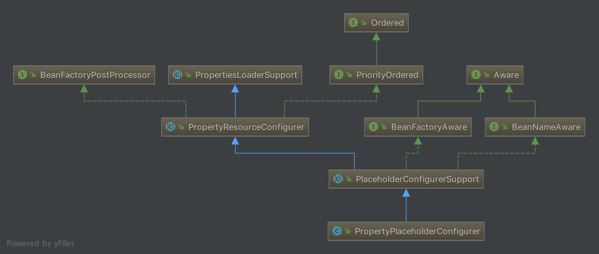

从 PropertyPlaceholderConfigurer 的结构图可以看出，它间接实现了 Aware 和 BeanFactoryPostProcessor 两大扩展接口，这里只需要关注 BeanFactoryPostProcessor 即可。我们知道 BeanFactoryPostProcessor 提供了 `#postProcessBeanFactory(ConfigurableListableBeanFactory beanFactory)` 接口方法，在这个体系中该方法的是在 **PropertyResourceConfigurer** 中实现，该类为属性资源的配置类，它实现了 BeanFactoryPostProcessor 接口，代码如下：

```java
// PropertyResourceConfigurer.java
// extends PropertiesLoaderSupport
// implements BeanFactoryPostProcessor, PriorityOrdered

@Override
public void postProcessBeanFactory(ConfigurableListableBeanFactory beanFactory) throws BeansException {
    try {
        // <1> 返回合并的 Properties 实例
        Properties mergedProps = mergeProperties();

        // Convert the merged properties, if necessary.
        // <2> 转换合并属性
        convertProperties(mergedProps);

        // Let the subclass process the properties.
        // <3> 子类处理
        processProperties(beanFactory, mergedProps);
    } catch (IOException ex) {
        throw new BeanInitializationException("Could not load properties", ex);
    }
}
```

- `<1>` 处，调用 `#mergeProperties()` 方法，返回合并的 Properties 实例。Properties 实例维护这**一组** `key-value` ，其实就是 Properties 配置文件中的内容。

- `<2>` 处，调用 `#convertProperties(Properties props)` 方法，转换合并的值，其实就是将原始值替换为真正的值。

- `<3>` 处，调用 `#processProperties(ConfigurableListableBeanFactory beanFactory, Properties props)` 方法，前面两个步骤已经将配置文件中的值进行了处理，那么该方法就是真正的替换过程，该方法**由子类实现**。代码如下：

  ```java
  // PropertyResourceConfigurer.java
  
  protected abstract void processProperties(ConfigurableListableBeanFactory beanFactory, Properties props)
  		throws BeansException;
  ```

### 2. PropertyPlaceholderConfigurer

在 PropertyPlaceholderConfigurer 中，重写 `#processProperties(ConfigurableListableBeanFactory beanFactory, Properties props)` 方法，代码如下：

```java
// PropertyPlaceholderConfigurer.java

@Override
protected void processProperties(ConfigurableListableBeanFactory beanFactoryToProcess, Properties props)
        throws BeansException {
    // <1> 创建 StringValueResolver 对象
    StringValueResolver valueResolver = new PlaceholderResolvingStringValueResolver(props);
    // <2> 处理
    doProcessProperties(beanFactoryToProcess, valueResolver);
}
```

#### 2.1 PlaceholderResolvingStringValueResolver

> 对应 `#processProperties(ConfigurableListableBeanFactory beanFactoryToProcess, Properties props)` 方法的 `<1>` 处。

首先，构造一个 PlaceholderResolvingStringValueResolver 类型的 StringValueResolver 实例。StringValueResolver 为一个解析 String 类型值的策略接口，该接口提供了 `#resolveStringValue(String strVal)` 方法，用于解析 String 值。PlaceholderResolvingStringValueResolver 为其一个解析策略，构造方法如下：

```java
// PropertyPlaceholderConfigurer.java
    
private class PlaceholderResolvingStringValueResolver implements StringValueResolver {
    
	private final PropertyPlaceholderHelper helper;
    
	private final PlaceholderResolver resolver;
    
	public PlaceholderResolvingStringValueResolver(Properties props) {
		this.helper = new PropertyPlaceholderHelper(
				placeholderPrefix, placeholderSuffix, valueSeparator, ignoreUnresolvablePlaceholders);
		this.resolver = new PropertyPlaceholderConfigurerResolver(props);
	}
	
	// ... 省略 resolveStringValue 方法
}
```

- 在构造 String 值解析器 StringValueResolver 时，将已经解析的 Properties 实例对象封装在 PlaceholderResolver 实例 `resolver` 中。PlaceholderResolver 是一个用于解析字符串中包含占位符的替换值的策略接口，该接口有一个 `#resolvePlaceholder(String strVa)` 方法，用于返回占位符的替换值。
- 还有一个 PropertyPlaceholderHelper 工具 `helper` ，从名字上面看应该是进行替换的工具类。

#### 2.2 doProcessProperties

> 对应 `#processProperties(ConfigurableListableBeanFactory beanFactoryToProcess, Properties props)` 方法的 `<2>` 处。

然后，得到 String 解析器的实例 `valueResolver` 后，则会调用 `#doProcessProperties(ConfigurableListableBeanFactory beanFactoryToProcess, StringValueResolver valueResolver)` 方法，来进行真值的替换操作。该方法在父类 PlaceholderConfigurerSupport 中实现，代码如下：

```java
// PlaceholderConfigurerSupport.java
    
protected void doProcessProperties(ConfigurableListableBeanFactory beanFactoryToProcess,
        StringValueResolver valueResolver) {
    // <2.1> 创建 BeanDefinitionVisitor 对象
    BeanDefinitionVisitor visitor = new BeanDefinitionVisitor(valueResolver);
    
    String[] beanNames = beanFactoryToProcess.getBeanDefinitionNames();
    for (String curName : beanNames) {
        // 校验
        // Check that we're not parsing our own bean definition,
        // to avoid failing on unresolvable placeholders in properties file locations.
        if (!(curName.equals(this.beanName) // 1. 当前实例 PlaceholderConfigurerSupport 不在解析范围内
                && beanFactoryToProcess.equals(this.beanFactory))) { // 2. 同一个 Spring 容器
            BeanDefinition bd = beanFactoryToProcess.getBeanDefinition(curName);
            try {
                visitor.visitBeanDefinition(bd);
            } catch (Exception ex) {
                throw new BeanDefinitionStoreException(bd.getResourceDescription(), curName, ex.getMessage(), ex);
            }
        }
    }
    
    // New in Spring 2.5: resolve placeholders in alias target names and aliases as well.
    // <2.3> 别名的占位符
    beanFactoryToProcess.resolveAliases(valueResolver);
    
    // New in Spring 3.0: resolve placeholders in embedded values such as annotation attributes.
    // <2.4> 解析嵌入值的占位符，例如注释属性
    beanFactoryToProcess.addEmbeddedValueResolver(valueResolver);
}
```

- `<2.1`> 处，根据 String 值解析策略 `valueResolver` 得到 BeanDefinitionVisitor 实例。BeanDefinitionVisitor 是 BeanDefinition 的访问者，我们通过它可以实现对 BeanDefinition 内容的进行访问，内容很多，例如 Scope、PropertyValues、FactoryMethodName 等等。
- `<2.2`> 处，得到该容器的所有 BeanName，然后对其进行访问（ `#visitBeanDefinition(BeanDefinition beanDefinition)` 方法）。
- `<2.3`> 处，解析别名的占位符。
- `<2.4`> 处，解析嵌入值的占位符，例如注释属性。

##### 2.2.1 visitBeanDefinition

这个方法的**核心**在于 `#visitBeanDefinition(BeanDefinition beanDefinition)` 方法的调用，代码如下：

```java
// BeanDefinitionVisitor.java

public void visitBeanDefinition(BeanDefinition beanDefinition) {
	visitParentName(beanDefinition);
	visitBeanClassName(beanDefinition);
	visitFactoryBeanName(beanDefinition);
	visitFactoryMethodName(beanDefinition);
	visitScope(beanDefinition);
	if (beanDefinition.hasPropertyValues()) {
		visitPropertyValues(beanDefinition.getPropertyValues());
	}
	if (beanDefinition.hasConstructorArgumentValues()) {
		ConstructorArgumentValues cas = beanDefinition.getConstructorArgumentValues();
		visitIndexedArgumentValues(cas.getIndexedArgumentValues());
		visitGenericArgumentValues(cas.getGenericArgumentValues());
	}
}
```

- 我们可以看到该方法基本访问了 BeanDefinition 中所有值得访问的东西了，包括 parent 、class 、factory-bean 、factory-method 、scope 、property 、constructor-arg 。

##### 2.2.2 visitPropertyValues

本篇文章的主题是 **property** ，所以关注 `#visitPropertyValues(MutablePropertyValues pvs)` 方法即可。代码如下：

```java
// BeanDefinitionVisitor.java

protected void visitPropertyValues(MutablePropertyValues pvs) {
    PropertyValue[] pvArray = pvs.getPropertyValues();
    // 遍历 PropertyValue 数组
    for (PropertyValue pv : pvArray) {
        // 解析真值
        Object newVal = resolveValue(pv.getValue());
        if (!ObjectUtils.nullSafeEquals(newVal, pv.getValue())) {
            // 设置到 PropertyValue 中
            pvs.add(pv.getName(), newVal);
        }
    }
}
```

- 过程就是对属性数组进行遍历，调用 `#resolveValue(Object value)`方法，对属性进行解析获取最新值，如果新值和旧值不等，则用新值替换旧值。

###### 2.2.2.1 resolveValue

`#resolveValue(Object value)` 方法，代码如下：

```java
// BeanDefinitionVisitor.java

@Nullable
protected Object resolveValue(@Nullable Object value) {
	if (value instanceof BeanDefinition) {
		visitBeanDefinition((BeanDefinition) value);
	} else if (value instanceof BeanDefinitionHolder) {
		visitBeanDefinition(((BeanDefinitionHolder) value).getBeanDefinition());
	} else if (value instanceof RuntimeBeanReference) {
		RuntimeBeanReference ref = (RuntimeBeanReference) value;
		String newBeanName = resolveStringValue(ref.getBeanName());
		if (newBeanName == null) {
			return null;
		}
		if (!newBeanName.equals(ref.getBeanName())) {
			return new RuntimeBeanReference(newBeanName);
		}
	} else if (value instanceof RuntimeBeanNameReference) {
		RuntimeBeanNameReference ref = (RuntimeBeanNameReference) value;
		String newBeanName = resolveStringValue(ref.getBeanName());
		if (newBeanName == null) {
			return null;
		}
		if (!newBeanName.equals(ref.getBeanName())) {
			return new RuntimeBeanNameReference(newBeanName);
		}
	} else if (value instanceof Object[]) {
		visitArray((Object[]) value);
	} else if (value instanceof List) {
		visitList((List) value);
	} else if (value instanceof Set) {
		visitSet((Set) value);
	} else if (value instanceof Map) {
		visitMap((Map) value);
	} else if (value instanceof TypedStringValue) {
		TypedStringValue typedStringValue = (TypedStringValue) value;
		String stringValue = typedStringValue.getValue();
		if (stringValue != null) {
			String visitedString = resolveStringValue(stringValue);
			typedStringValue.setValue(visitedString);
		}
	// 由于 Properties 中的是 String，所以重点在此处
	} else if (value instanceof String) {
		return resolveStringValue((String) value);
	}
	return value;
}
```

- 由于配置的是 String 类型，所以只需要看 String 相关的。

###### 2.2.2.2 resolveStringValue

`#resolveStringValue(String strVal)` 方法，代码如下：

```java
// BeanDefinitionVisitor.java

@Nullable
protected String resolveStringValue(String strVal) {
	if (this.valueResolver == null) {
		throw new IllegalStateException("No StringValueResolver specified - pass a resolver " +
				"object into the constructor or override the 'resolveStringValue' method");
	}
	// 解析真值
	String resolvedValue = this.valueResolver.resolveStringValue(strVal);
	// Return original String if not modified.
	return (strVal.equals(resolvedValue) ? strVal : resolvedValue);
}
```

- `valueResolver` 是我们在构造 BeanDefinitionVisitor 实例时传入的 String 类型解析器 PlaceholderResolvingStringValueResolver，调用其 `#resolveStringValue(String strVal)` 方法，代码如下：

```java
// PropertyPlaceholderConfigurer.java
// 内部类 PlaceholderResolvingStringValueResolver.java

@Override
@Nullable
public String resolveStringValue(String strVal) throws BeansException {
    // 解析真值
	String resolved = this.helper.replacePlaceholders(strVal, this.resolver);
	// trim
	if (trimValues) {
		resolved = resolved.trim();
	}
	// 返回真值
	return (resolved.equals(nullValue) ? null : resolved);
}
```

- `helper` 为 PropertyPlaceholderHelper 实例对象，而 PropertyPlaceholderHelper 则是处理应用程序中包含占位符的字符串工具类。在构造 `helper` 实例对象时需要传入了几个参数：`placeholderPrefix`、`placeholderSuffix`、`valueSeparator`，这些值在 PlaceholderConfigurerSupport 中定义如下：

  ```java
  // PlaceholderConfigurerSupport.java
  	
  /** Default placeholder prefix: {@value}. */
  public static final String DEFAULT_PLACEHOLDER_PREFIX = "${";
  /** Default placeholder suffix: {@value}. */
  public static final String DEFAULT_PLACEHOLDER_SUFFIX = "}";
  /** Default value separator: {@value}. */
  public static final String DEFAULT_VALUE_SEPARATOR = ":";
  
  
  /** Defaults to {@value #DEFAULT_PLACEHOLDER_PREFIX}. */
  protected String placeholderPrefix = DEFAULT_PLACEHOLDER_PREFIX;
  /** Defaults to {@value #DEFAULT_PLACEHOLDER_SUFFIX}. */
  protected String placeholderSuffix = DEFAULT_PLACEHOLDER_SUFFIX;
  /** Defaults to {@value #DEFAULT_VALUE_SEPARATOR}. */
  @Nullable
  protected String valueSeparator = DEFAULT_VALUE_SEPARATOR;
  ```

###### 2.2.2.3 replacePlaceholders

调用 PropertyPlaceholderHelper 的 `#replacePlaceholders(String value, PlaceholderResolver placeholderResolver)` 方法，进行占位符替换，代码如下：

```java
public String replacePlaceholders(String value, PlaceholderResolver placeholderResolver) {
	Assert.notNull(value, "'value' must not be null");
	return parseStringValue(value, placeholderResolver, new HashSet<>());
}
```

- 调用 `#parseStringValue(String value, PlaceholderResolver placeholderResolver, Set<String> visitedPlaceholders)` 方法，**这个方法是这篇博客最核心的地方**，`${}` 占位符的替换。代码如下：

  ```java
  // PropertyPlaceholderHelper.java
  
  protected String parseStringValue(String value, PlaceholderResolver placeholderResolver, Set<String> visitedPlaceholders) {
      StringBuilder result = new StringBuilder(value);
      // 获取前缀 "${" 的索引位置
      int startIndex = value.indexOf(this.placeholderPrefix);
      while (startIndex != -1) {
          // 获取 后缀 "}" 的索引位置
          int endIndex = findPlaceholderEndIndex(result, startIndex);
          if (endIndex != -1) {
              // 截取 "${" 和 "}" 中间的内容，这也就是我们在配置文件中对应的值
              String placeholder = result.substring(startIndex + this.placeholderPrefix.length(), endIndex);
              String originalPlaceholder = placeholder;
              if (!visitedPlaceholders.add(originalPlaceholder)) {
                  throw new IllegalArgumentException(
                          "Circular placeholder reference '" + originalPlaceholder + "' in property definitions");
              }
              // Recursive invocation, parsing placeholders contained in the placeholder key.
              // 解析占位符键中包含的占位符，真正的值
              placeholder = parseStringValue(placeholder, placeholderResolver, visitedPlaceholders);
              // Now obtain the value for the fully resolved key...
              // 从 Properties 中获取 placeHolder 对应的值 propVal
              String propVal = placeholderResolver.resolvePlaceholder(placeholder);
              // 如果不存在
              if (propVal == null && this.valueSeparator != null) {
                  // 查询 : 的位置
                  int separatorIndex = placeholder.indexOf(this.valueSeparator);
                  // 如果存在 :
                  if (separatorIndex != -1) {
                      // 获取 : 前面部分 actualPlaceholder
                      String actualPlaceholder = placeholder.substring(0, separatorIndex);
                      // 获取 : 后面部分 defaultValue
                      String defaultValue = placeholder.substring(separatorIndex + this.valueSeparator.length());
                      // 从 Properties 中获取 actualPlaceholder 对应的值
                      propVal = placeholderResolver.resolvePlaceholder(actualPlaceholder);
                      // 如果不存在 则返回 defaultValue
                      if (propVal == null) {
                          propVal = defaultValue;
                      }
                  }
              }
              if (propVal != null) {
                  // Recursive invocation, parsing placeholders contained in the
                  // previously resolved placeholder value.
                  propVal = parseStringValue(propVal, placeholderResolver, visitedPlaceholders);
                  result.replace(startIndex, endIndex + this.placeholderSuffix.length(), propVal);
                  if (logger.isTraceEnabled()) {
                      logger.trace("Resolved placeholder '" + placeholder + "'");
                  }
                  startIndex = result.indexOf(this.placeholderPrefix, startIndex + propVal.length());
              } else if (this.ignoreUnresolvablePlaceholders) {
                  // Proceed with unprocessed value.
                  // 忽略值
                  startIndex = result.indexOf(this.placeholderPrefix, endIndex + this.placeholderSuffix.length());
              } else {
                  throw new IllegalArgumentException("Could not resolve placeholder '" +
                          placeholder + "'" + " in value \"" + value + "\"");
              }
              visitedPlaceholders.remove(originalPlaceholder);
          } else {
              startIndex = -1;
          }
      }
      // 返回propVal，就是替换之后的值
      return result.toString();
  }
  ```

  1. 获取占位符前缀 `"${"` 的索引位置 `startIndex` 。
  2. 如果前缀 `"${"` 存在，则从 `“{”` 后面开始获取占位符后缀 “}” 的索引位置 `endIndex` 。
  3. 如果前缀 `“${”` 和后缀 `"}"` 都存在，则截取中间部分 `placeholder` 。
  4. 从 Properties 中获取 `placeHolder` 对应的值 `propVal` 。
  5. 如果 `propVal` 为空，则判断占位符中是否存在 `":"`，如果存在则对占位符进行分割处理，全面部分为 `actualPlaceholder`，后面部分 `defaultValue`，尝试从 Properties 中获取 `actualPlaceholder` 对应的值 `propVal`，如果不存在，则将 `defaultValue` 的值赋值给 `propVal`
  6. 返回 `propVal`，也就是 Properties 中对应的值。

### 3. 小结

到这里占位符的解析就结束了，下篇我们将利用 PropertyPlaceholderConfigurer 来实现动态加载配置文件，这个场景也是非常常见的。

## IoC之PropertyPlaceholderConfigurer的应用

在博客 [《【死磕 Spring】—— IoC 之深入分析 PropertyPlaceholderConfigurer》](http://svip.iocoder.cn/Spring/IoC-PropertyPlaceholderConfigurer) 中了解了 PropertyPlaceholderConfigurer 内部实现原理，它**允许我们在 XML 配置文件中使用占位符并将这些占位符所代表的资源单独配置到简单的 properties 文件中来加载**。这个特性非常重要，因为它我们对 Bean 实例属性的配置变得非常容易控制了，主要使用场景有：

1. 动态加载配置文件，多环境切换
2. 属性加解密

下面我们就第一个应用场景来做说明。

### 1. 多环境切换

在我们项目开发过程中，都会存在多个环境，如 dev 、test 、prod 等等，各个环境的配置都会不一样，在传统的开发过程中我们都是在进行打包的时候进行人工干预，或者将配置文件放在系统外部，加载的时候指定加载目录，这种方式容易出错，那么有没有一种比较好的方式来解决这种情况呢？有，**利用 PropertyPlaceholderConfigurer 的特性来动态加载配置文件，实现多环境切换**。

首先我们定义四个 Properties 文件，如下：


配置内容如下：

- `application-dev.properties` 文件，如下：

  ```java
  student.name=chenssy-dev
  ```

- `application-test.properties` 文件，如下：

  ```java
  student.name=chenssy-test
  ```

- `application-prod.properties` 文件，如下：

  ```java
  student.name=chenssy-prod
  ```

然后实现一个类，该类继承 PropertyPlaceholderConfigurer，实现 `#loadProperties(Properties props)` 方法，根据环境的不同加载不同的配置文件，代码如下：

```java
public class CustomPropertyConfig extends PropertyPlaceholderConfigurer {

    private Resource[] locations;

    private PropertiesPersister propertiesPersister = new DefaultPropertiesPersister();

    @Override
    public void setLocations(Resource[] locations) {
        this.locations = locations;
    }

    @Override
    public void setLocalOverride(boolean localOverride) {
        this.localOverride = localOverride;
    }

    /**
     * 覆盖这个方法，根据启动参数，动态读取配置文件
     * @param props
     * @throws IOException
     */
    @Override
    protected void loadProperties(Properties props) throws IOException {
        if (locations != null) {
            // locations 里面就已经包含了那三个定义的文件
            for (Resource location : this.locations) {
                InputStream is = null;
                try {
                    String filename = location.getFilename();
                    String env = "application-" + System.getProperty("spring.profiles.active", "dev") + ".properties";

                    // 找到我们需要的文件，加载
                    if (filename.contains(env)) {
                        logger.info("Loading properties file from " + location);
                        is = location.getInputStream();
                        this.propertiesPersister.load(props, is);

                    }
                } catch (IOException ex) {
                    logger.info("读取配置文件失败.....");
                    throw ex;
                } finally {
                    if (is != null) {
                        is.close();
                    }
                }
            }
        }
    }
}
```

配置文件：

```java
<bean id="PropertyPlaceholderConfigurer" class="org.springframework.core.custom.CustomPropertyConfig">
    <property name="locations">
        <list>
            <value>classpath:config/application-dev.properties</value>
            <value>classpath:config/application-test.properties</value>
            <value>classpath:config/application-prod.properties</value>
        </list>
    </property>
</bean>

<bean id="studentService" class="org.springframework.core.service.StudentService">
    <property name="name" value="${student.name}"/>
</bean>
```

在 idea 的 VM options 里面增加 `-Dspring.profiles.active=dev`，标志当前环境为 dev 环境。测试代码如下：

```java
ApplicationContext context = new ClassPathXmlApplicationContext("spring.xml");

StudentService studentService = (StudentService) context.getBean("studentService");
System.out.println("student name:" + studentService.getName());
```

运行结果：

```java
student name:chenssy-dev
```

当将 `-Dspring.profiles.active` 调整为 test，则打印结果则是 chenssy-test，这样就完全实现了根据不同的环境加载不同的配置。

如果各位用过 Spring Boot 的话，这个就完全是 Spring Boot 里面的 `spring.profiles.active` ，可参见 `org.springframework.core.envAbstractEnvironment` 类，对应博客为 [《Spring boot源码分析-profiles环境（4）》](https://blog.csdn.net/jamet/article/details/77508182) 。

### 2. 小结

PropertyPlaceholderConfigurer 对于属性的配置非常灵活，就看怎么玩了。

## IoC 之深入分析 PropertyOverrideConfigurer

在文章 [《【死磕 Spring】—— IoC 之深入分析 BeanFactoryPostProcessor》](http://svip.iocoder.cn/Spring/IoC-BeanFactoryPostProcessor) 中提到，BeanFactoryPostProcessor 作用与 BeanDefinition 完成加载之后与 Bean 实例化之前，是 Spring 提供的一种强大的扩展机制。它有两个重要的子类，一个是 PropertyPlaceholderConfigurer，另一个是 PropertyOverrideConfigurer ，其中 PropertyPlaceholderConfigurer 允许我们通过配置 Properties 的方式来取代 Bean 中定义的占位符，而 **PropertyOverrideConfigurer** 呢？正是我们这篇博客介绍的。

> PropertyOverrideConfigurer 允许我们对 Spring 容器中配置的任何我们想处理的 bean 定义的 property 信息进行覆盖替换。

这个定义听起来有点儿玄乎，通俗点说，就是我们可以通过 PropertyOverrideConfigurer 来覆盖任何 bean 中的任何属性，只要我们想。

### 1. 使用

PropertyOverrideConfigurer 的使用规则是 `beanName.propertyName=value`，这里需要注意的是 `beanName.propertyName` 则是该 bean 中存在的属性。

#### 1.1 示例一

依然使用以前的例子，`Student.class`，我们只需要修改下配置文件，声明下 PropertyOverrideConfigurer 以及其加载的配置文件。如下：

```java
<bean class="org.springframework.beans.factory.config.PropertyOverrideConfigurer">
    <property name="locations">
        <list>
            <value>classpath:application.properties</value>
        </list>
    </property>
</bean>

<bean id="student" class="org.springframework.core.service.StudentService">
    <property name="name" value="chenssy"/>
</bean>
```

- 指定 student 的 `name` 属性值为 `"chenssy"` 。

- 声明 PropertyOverrideConfigurer 加载的文件为 `application.properties`，内容如下：

  ```
  student.name = chenssy-PropertyOverrideConfigurer
  ```

  - 指定 beanName 为 `student` 的 bean 的 `name` 属性值为 `"chenssy-PropertyOverrideConfigurer"` 。

测试打印 `student` 中的 `name` 属性值，代码如下：

```java
ApplicationContext context = new ClassPathXmlApplicationContext("spring.xml");

StudentService studentService = (StudentService) context.getBean("student");
System.out.println("student name:" + studentService.getName());
```

运行结果为：

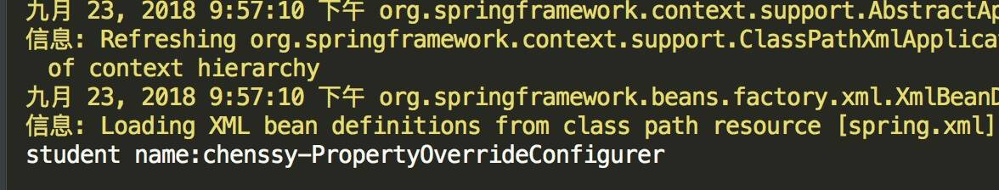

从中可以看出 PropertyOverrideConfigurer 定义的文件取代了 bean 中默认的值。

#### 1.2 示例二

下面我们看一个有趣的例子，如果我们一个 bean 中 PropertyPlaceholderConfigurer 和 PropertyOverrideConfigurer 都使用呢？那是显示谁定义的值呢？这里先简单分析下：如果PropertyOverrideConfigurer 先作用，那么 PropertyPlaceholderConfigurer 在匹配占位符的时候就找不到了，**如果 PropertyOverrideConfigurer 后作用，也会直接取代 PropertyPlaceholderConfigurer 定义的值，所以无论如何都会显示 PropertyOverrideConfigurer 定义的值**。是不是这样呢？看如下例子：

xml 配置文件调整如下：

```java
<bean class="org.springframework.beans.factory.config.PropertyOverrideConfigurer">
    <property name="locations">
        <list>
            <value>classpath:application1.properties</value>
        </list>
    </property>
</bean>

<bean class="org.springframework.beans.factory.config.PropertyPlaceholderConfigurer">
    <property name="locations">
        <list>
            <value>classpath:application2.properties</value>
        </list>
    </property>
</bean>

<bean id="student" class="org.springframework.core.service.StudentService">
    <property name="name" value="${studentService.name}"/>
</bean>
```

- 指定 .PropertyOverrideConfigurer 加载文件为 `application1.properties` 。配置文件如下：

  ```
  student.name = chenssy-PropertyOverrideConfigurer
  ```

- PropertyPlaceholderConfigurer 加载文件为 `application2.properties` 。配置文件如下：

  ```
  studentService.name = chenssy-PropertyPlaceholderConfigurer
  ```

- `student` 的 `name` 属性使用占位符 `${studentService.name}`。

测试程序依然是打印 name 属性值，运行结果如下：

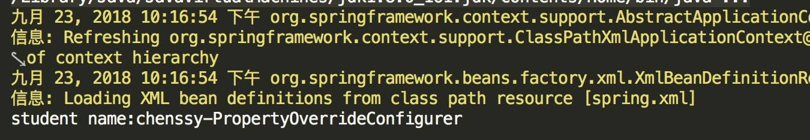

所以，上面的分析没有错。下面我们来分析 **PropertyOverrideConfigurer 实现原理**。
其实如果了解 PropertyPlaceholderConfigurer 的实现机制的话，那么 PropertyOverrideConfigurer 也不难猜测：加载指定 Properties，迭代其中的属性值，依据 `“.”` 来得到 `beanName`（`split(".")[0]`），从容器中获取指定的 BeanDefinition，然后得到 `name` 属性，进行替换即可。

### 2. 实现原理

UML 结构图如下：

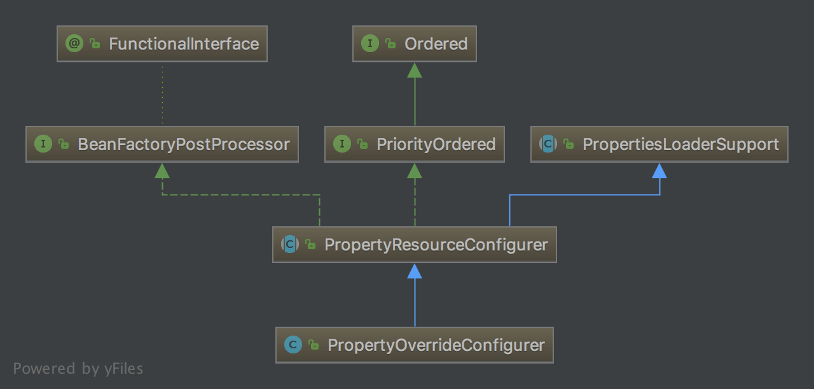

与 PropertyPlaceholderConfigurer 一样，也是继承 PropertyResourceConfigurer，我们知道 PropertyResourceConfigurer 对 BeanFactoryPostProcessor 的 `#postProcessBeanFactory(ConfigurableListableBeanFactory beanFactory)` 方法提供了实现，在该实现中它会去读取指定配置文件中的内容，然后调用 `#processProperties(ConfigurableListableBeanFactory beanFactoryToProcess, Properties props)` 方法。该方法是一个抽象方法，具体的实现由子类来实现，所以这里我们只需要看 PropertyOverrideConfigurer 中 `#processProperties(ConfigurableListableBeanFactory beanFactoryToProcess, Properties props)` 方法的具体实现，代码如下：

```java
// PropertyOverrideConfigurer.java

@Override
protected void processProperties(ConfigurableListableBeanFactory beanFactory, Properties props)
        throws BeansException {
    // 迭代配置文件中的内容
    for (Enumeration<?> names = props.propertyNames(); names.hasMoreElements();) {
        String key = (String) names.nextElement();
        try {
            processKey(beanFactory, key, props.getProperty(key));
        } catch (BeansException ex) {
            String msg = "Could not process key '" + key + "' in PropertyOverrideConfigurer";
            if (!this.ignoreInvalidKeys) {
                throw new BeanInitializationException(msg, ex);
            }
            if (logger.isDebugEnabled()) {
                logger.debug(msg, ex);
            }
        }
    }
}
```

- 迭代 `props` 数组，依次调用 `#processKey(ConfigurableListableBeanFactory factory, String key, String value)` 方法，代码如下:

  ```java
  // PropertyOverrideConfigurer.java
  
  /**
   * The default bean name separator.
   */
  public static final String DEFAULT_BEAN_NAME_SEPARATOR = ".";
  /**
   * Bean 名字的分隔符
   */
  private String beanNameSeparator = DEFAULT_BEAN_NAME_SEPARATOR;
  /**
   * Contains names of beans that have overrides.
   */
  private final Set<String> beanNames = Collections.newSetFromMap(new ConcurrentHashMap<>(16));
  protected void processKey(ConfigurableListableBeanFactory factory, String key, String value)
          throws BeansException {
      // 判断是否存在 "."，即获取其索引位置
      int separatorIndex = key.indexOf(this.beanNameSeparator);
      if (separatorIndex == -1) {
          throw new BeanInitializationException("Invalid key '" + key +
                  "': expected 'beanName" + this.beanNameSeparator + "property'");
      }
      // 得到 beanName
      String beanName = key.substring(0, separatorIndex);
      // 得到属性值
      String beanProperty = key.substring(separatorIndex+1);
      this.beanNames.add(beanName);
      // 替换
      applyPropertyValue(factory, beanName, beanProperty, value);
      if (logger.isDebugEnabled()) {
          logger.debug("Property '" + key + "' set to value [" + value + "]");
      }
  }
  ```

  - 获取分割符 `“.”` 的索引位置，得到 `beanName` 以及相应的属性，然后调用 `#applyPropertyValue(ConfigurableListableBeanFactory factory, String beanName, String property, String value)` 方法，代码如下：

    ```java
    // PropertyOverrideConfigurer.java
    
    protected void applyPropertyValue(ConfigurableListableBeanFactory factory, String beanName, String property, String value) {
        // 获得 BeanDefinition 对象
        BeanDefinition bd = factory.getBeanDefinition(beanName);
        BeanDefinition bdToUse = bd;
        while (bd != null) {
            bdToUse = bd;
            bd = bd.getOriginatingBeanDefinition();
        }
        // 设置 PropertyValue 到 BeanDefinition 中
        PropertyValue pv = new PropertyValue(property, value);
        pv.setOptional(this.ignoreInvalidKeys);
        bdToUse.getPropertyValues().addPropertyValue(pv);
    }
    ```

    - 从容器中获取 BeanDefinition ，然后根据属性 `property` 和其值 `value` 构造成一个 PropertyValue 对象，最后调用 `#addPropertyValue(PropertyValue pv )` 方法。PropertyValue 是用于保存一组bean属性的信息和值的对像。代码如下：

      ```java
      // MutablePropertyValues.java
      
      public MutablePropertyValues addPropertyValue(PropertyValue pv) {
          for (int i = 0; i < this.propertyValueList.size(); i++) {
              PropertyValue currentPv = this.propertyValueList.get(i);
              // 匹配
              if (currentPv.getName().equals(pv.getName())) {
                  // 合并属性
                  pv = mergeIfRequired(pv, currentPv);
                  // 覆盖属性
                  setPropertyValueAt(pv, i);
                  return this;
              }
          }
          // 未匹配到，添加到 propertyValueList 中
          this.propertyValueList.add(pv);
          return this;
      }
      ```

      - 添加 PropertyValue 对象，替换或者合并相同的属性值。整个过程其实与上面猜测相差不是很大。

### 3. 小结

至此，PropertyOverrideConfigurer 到这里也就分析完毕了。最后看下 PropertyPlaceholderConfigurer 和 PropertyOverrideConfigurer 整体的结构图：

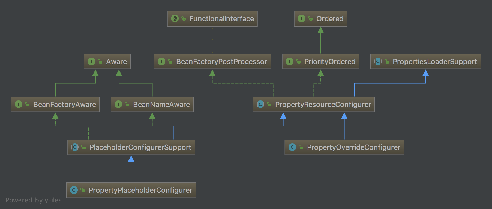

## IoC 之深入分析 Bean 的类型转换体系

我们知道不管 Bean 对象里面的属性时什么类型，他们都是通过 XML 、Properties 或者其他方式来配置这些**属性**对象类型的。在 Spring 容器加载过程中，这些属性都是以 String 类型加载进容器的，但是最终都需要将这些 String 类型的属性转换 Bean 对象属性所对应真正的类型，要想完成这种由字符串到具体对象的转换，就需要这种转换规则相关的信息，而这些信息以及转换过程由 **Spring 类型转换体系**来完成。

------

我们依然以 xml 为例，在 Spring 容器加载阶段，容器将 xml 文件中定义的 `<bean>` 解析为 BeanDefinition，BeanDefinition 中存储着我们定义一个 bean 需要的所有信息，包括属性，这些属性是以 String 类型的存储的。当用户触发 Bean 实例化阶段时，Spring 容器会将这些属性转换为这些属性真正对应的类型。我们知道在 Bean 实例化阶段，属性的注入是在实例化 Bean 阶段的属性注入阶段，即 AbstractAutowireCapableBeanFactory 的 `#populateBean(String beanName, RootBeanDefinition mbd, BeanWrapper bw)` 方法。

在 `#populateBean(String beanName, RootBeanDefinition mbd, BeanWrapper bw)` 方法中，会将 BeanDefinition 中定义的属性值翻译为 PropertyValue ，然后调用 `#applyPropertyValues(String beanName, BeanDefinition mbd, BeanWrapper bw, PropertyValues pvs)` 方法，进行属性应用。其中 PropertyValue 用于保存单个 bean 属性的信息和值的对象。

------

在 `#applyPropertyValues(String beanName, BeanDefinition mbd, BeanWrapper bw, PropertyValues pvs)` 方法中，会调用 `#convertForProperty(Object value, String propertyName, BeanWrapper bw, TypeConverter converter)` 进行属性转换，代码如下：

```java
// AbstractAutowireCapableBeanFactory。java

@Nullable
private Object convertForProperty(
        @Nullable Object value, String propertyName, BeanWrapper bw, TypeConverter converter) {
    // 若 TypeConverter 为 BeanWrapperImpl 类型，则使用 BeanWrapperImpl 来进行类型转换
    // 这里主要是因为 BeanWrapperImpl 实现了 PropertyEditorRegistry 接口
    if (converter instanceof BeanWrapperImpl) {
        return ((BeanWrapperImpl) converter).convertForProperty(value, propertyName);
    } else {
        // 获得属性对应的 PropertyDescriptor 对象
        PropertyDescriptor pd = bw.getPropertyDescriptor(propertyName);
        // 获得属性对应的 setting MethodParameter 对象
        MethodParameter methodParam = BeanUtils.getWriteMethodParameter(pd);
        // 执行转换
        return converter.convertIfNecessary(value, pd.getPropertyType(), methodParam);
    }
}
```

- 若 TypeConverter 为 BeanWrapperImpl 类型，则使用 BeanWrapperImpl 来进行类型转换，这里主要是因为 BeanWrapperImpl 实现了 PropertyEditorRegistry 接口。
- 否则，调用 TypeConverter 的 `#convertIfNecessary(Object value, Class<T> requiredType, MethodParameter methodParam)` 方法，进行类型转换。TypeConverter 是定义类型转换方法的接口，通常情况下与 PropertyEditorRegistry 配合使用实现类型转换。
- 关于 BeanWrapperImpl 小编后续专门出文分析它。

------

`#convertIfNecessary(Object value, Class<T> requiredType, MethodParameter methodParam)` 方法的实现者有两个：DataBinder 和 TypeConverterSupport 类。

- DataBinder 主要用于参数绑定（熟悉 Spring MVC 的都应该知道这个类）
- TypeConverterSupport 则是 TypeConverter 的基本实现，使用的是 `typeConverterDelegate` 委托者。

所以这里我们只需要关注 TypeConverterSupport 的 `#convertIfNecessary(Object value, Class<T> requiredType, MethodParameter methodParam)` 方法，代码如下：

```java
// TypeConverterSupport.java

@Override
@Nullable
public <T> T convertIfNecessary(@Nullable Object value, @Nullable Class<T> requiredType, @Nullable Field field)
        throws TypeMismatchException {
    return doConvert(value, requiredType, null, field);
}

@Nullable
private <T> T doConvert(@Nullable Object value,@Nullable Class<T> requiredType,
        @Nullable MethodParameter methodParam, @Nullable Field field) throws TypeMismatchException {
    Assert.state(this.typeConverterDelegate != null, "No TypeConverterDelegate");
    try {
        if (field != null) { // field
            return this.typeConverterDelegate.convertIfNecessary(value, requiredType, field);
        } else { // methodParam
            return this.typeConverterDelegate.convertIfNecessary(value, requiredType, methodParam);
        }
    } catch (ConverterNotFoundException | IllegalStateException ex) {
        throw new ConversionNotSupportedException(value, requiredType, ex);
    } catch (ConversionException | IllegalArgumentException ex) {
        throw new TypeMismatchException(value, requiredType, ex);
    }
}
```

我们一直往下跟会跟踪到 TypeConverterDelegate 的 `#convertIfNecessary(Object newValue, @Nullable Class<T> requiredType, ...)` 方法，会发现如下代码段：

```java
// TypeConverterDelegate.java

@Nullable
public <T> T convertIfNecessary(@Nullable String propertyName, @Nullable Object oldValue, @Nullable Object newValue,
        @Nullable Class<T> requiredType, @Nullable TypeDescriptor typeDescriptor) throws IllegalArgumentException {

        // ... 省略暂时非关键的代码

        // No custom editor but custom ConversionService specified?
        ConversionService conversionService = this.propertyEditorRegistry.getConversionService();
        if (editor == null && conversionService != null && newValue != null && typeDescriptor != null) {
            TypeDescriptor sourceTypeDesc = TypeDescriptor.forObject(newValue);
            if (conversionService.canConvert(sourceTypeDesc, typeDescriptor)) {
                try {
                    return (T) conversionService.convert(newValue, sourceTypeDesc, typeDescriptor);
                } catch (ConversionFailedException ex) {
                    // fallback to default conversion logic below
                    conversionAttemptEx = ex;
                }
            }
        }

        // ... 省略暂时非关键的代码
}
```

- 如果没有自定义的编辑器则使用 ConversionService 。

------

ConversionService 是字 Spring 3 后推出来用来替代 PropertyEditor 转换模式的转换体系，接口定义如下：

```java
// ConversionService.java

public interface ConversionService {

    boolean canConvert(@Nullable Class<?> sourceType, Class<?> targetType);

    boolean canConvert(@Nullable TypeDescriptor sourceType, TypeDescriptor targetType);

    @Nullable
    <T> T convert(@Nullable Object source, Class<T> targetType);

    @Nullable
    Object convert(@Nullable Object source, @Nullable TypeDescriptor sourceType, TypeDescriptor targetType);

}
```

其 UML 类图如下：

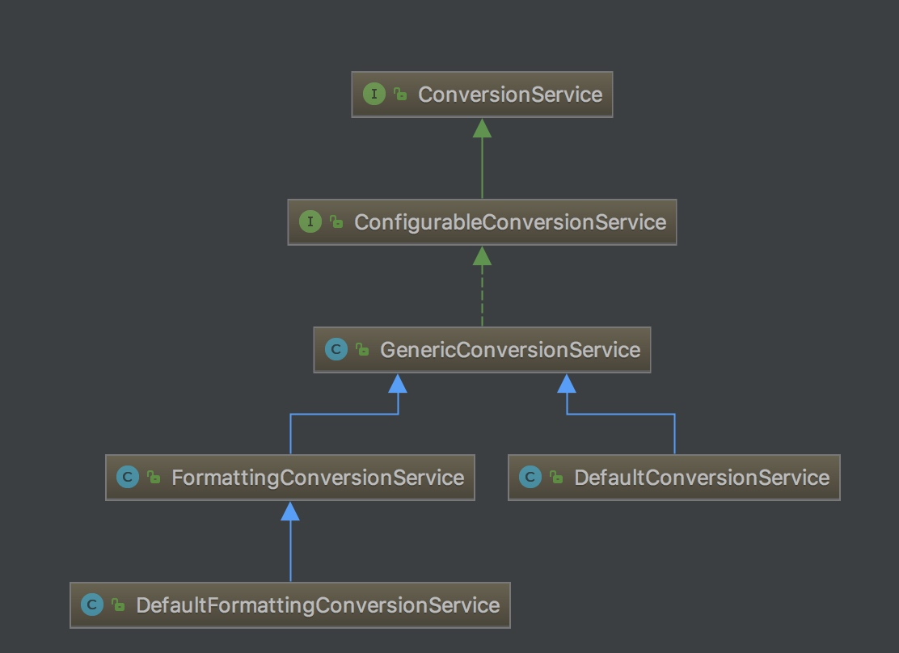


- **ConfigurableConversionService**：ConversionService 的配置接口，继承 ConversionService 和 ConverterRegistry 两个接口，用于合并他们两者的操作，以便于通过 add 和 remove 的方式添加和删除转换器。
- **GenericConversionService**：ConversionService 接口的基础实现，适用于大部分条件下的转换工作，通过 ConfigurableConversionService 接口间接地将 ConverterRegistry 实现为注册 API 。
- **DefaultConversionService**：ConversionService 接口的默认实现，适用于大部分条件下的转换工作。

------

回归到 TypeConverterDelegate 的 `#convertIfNecessary(String propertyName, Object oldValue, @Nullable Object newValue, Class<T> requiredType, TypeDescriptor typeDescriptor)` 方法，在该方法中，如果没有自定义的属性编辑器，则调用 ConversionService 接口的 `#convert(...)`，方法定义如下：

```java
// ConversionService.java

Object convert(@Nullable Object source, @Nullable TypeDescriptor sourceType, TypeDescriptor targetType);
```

- `source` ：要转换的源对象，可以为 `null` 。
- `sourceType`：`source` 的类型的上下文，如果 `source` 为 `null` ，则可以为 `null` 。
- `targetType` ：`source` 要转换的类型的上下文。

`#convert(...)` 方法，将给定的源对象 `source` 转换为指定的 `targetType` 。TypeDescriptors 提供有关发生转换的源位置和目标位置的附加上下文，通常是对象字段或属性位置。该方法由子类 GenericConversionService 实现：

```java
// GenericConversionService.java

@Override
@Nullable
public Object convert(@Nullable Object source, @Nullable TypeDescriptor sourceType, TypeDescriptor targetType) {
    Assert.notNull(targetType, "Target type to convert to cannot be null");
    // <1> 如果 sourceType 为空，则直接处理结果
    if (sourceType == null) {
        Assert.isTrue(source == null, "Source must be [null] if source type == [null]");
        return handleResult(null, targetType, convertNullSource(null, targetType));
    }
    // <2> 如果类型不对，抛出 IllegalArgumentException 异常
    if (source != null && !sourceType.getObjectType().isInstance(source)) {
        throw new IllegalArgumentException("Source to convert from must be an instance of [" +
                sourceType + "]; instead it was a [" + source.getClass().getName() + "]");
    }
    // <3> 获得对应的 GenericConverter 对象
    GenericConverter converter = getConverter(sourceType, targetType);
    // <4> 如果 converter 非空，则进行转换，然后再处理结果
    if (converter != null) {
        // <4.1> 执行转换
        Object result = ConversionUtils.invokeConverter(converter, source, sourceType, targetType);
        // <4.2> 处理器结果
        return handleResult(sourceType, targetType, result);
    }
    // <5> 处理 converter 为空的情况
    return handleConverterNotFound(source, sourceType, targetType);
}
```

- `<1>` 处，如果 `sourceType` 为空，则直接处理结果。

- `<2>` 处，如果类型不对，抛出 IllegalArgumentException 异常。

- `<3>` 处，调用 `#getConverter(TypeDescriptor sourceType, TypeDescriptor targetType)` 方法，获取 GenericConverter 对象 `converter` 。

- `<4>` 处，如果 `converter` 非空，则进行转换，然后再处理结果。

  - `<4.1>` 处，调用 `ConversionUtils#invokeConverter(GenericConverter converter, Object source, TypeDescriptor sourceType, TypeDescriptor targetType)` 方法，执行转换。代码如下：

    ```java
    // ConversionUtils.java
    
    @Nullable
    public static Object invokeConverter(GenericConverter converter, @Nullable Object source,
            TypeDescriptor sourceType, TypeDescriptor targetType) {
        try {
            // 执行转换
            return converter.convert(source, sourceType, targetType);
        } catch (ConversionFailedException ex) {
            throw ex;
        } catch (Throwable ex) {
            throw new ConversionFailedException(sourceType, targetType, source, ex);
        }
    }
    ```

    - 【重要】在这里，我们看到执行转换。

  - `<4.2>` 处，调用 `#handleResult(TypeDescriptor sourceType, TypeDescriptor targetType, Object result)` 方法，处理结果。代码如下：

    ```java
    // GenericConversionService.java
    
    @Nullable
    private Object handleResult(@Nullable TypeDescriptor sourceType, TypeDescriptor targetType, @Nullable Object result) {
    	if (result == null) {
    		assertNotPrimitiveTargetType(sourceType, targetType);
    	}
    	return result;
    }
    
    private void assertNotPrimitiveTargetType(@Nullable TypeDescriptor sourceType, TypeDescriptor targetType) {
    	if (targetType.isPrimitive()) {
    		throw new ConversionFailedException(sourceType, targetType, null,
    				new IllegalArgumentException("A null value cannot be assigned to a primitive type"));
    	}
    }
    ```

    - 实际上，是**校验**结果。

- `<5>` 处，调用 `#handleConverterNotFound(Object source, TypeDescriptor sourceType, TypeDescriptor targetType)` 方法，处理 `converter` 为空的情况。代码如下：

  ```java
  // GenericConversionService.java
  
  @Nullable
  private Object handleConverterNotFound(
          @Nullable Object source, @Nullable TypeDescriptor sourceType, TypeDescriptor targetType) {
      // 情况一，如果 source 为空，则返回空
      if (source == null) {
          assertNotPrimitiveTargetType(sourceType, targetType);
          return null;
      }
      // 情况二，如果 sourceType 为空，或者 targetType 是 sourceType 的子类，则返回 source
      if ((sourceType == null || sourceType.isAssignableTo(targetType)) &&
              targetType.getObjectType().isInstance(source)) {
          return source;
      }
      // 抛出 ConverterNotFoundException 异常
      throw new ConverterNotFoundException(sourceType, targetType);
  }
  ```

------

😈 逻辑有点点长，我们先从 `#getConverter(TypeDescriptor sourceType, TypeDescriptor targetType)` 方法，获取 GenericConverter 对象 `converter` 。代码如下：

```java
// GenericConversionService.java

@Nullable
protected GenericConverter getConverter(TypeDescriptor sourceType, TypeDescriptor targetType) {
    // 创建 ConverterCacheKey 对象
    ConverterCacheKey key = new ConverterCacheKey(sourceType, targetType);
    // 从 converterCache 缓存中，获得 GenericConverter 对象 converter
    GenericConverter converter = this.converterCache.get(key);
    // 如果获得到，则返回 converter
    if (converter != null) {
        return (converter != NO_MATCH ? converter : null);
    }

    // 如果获取不到，则从 converters 中查找
    converter = this.converters.find(sourceType, targetType);
    // 如果查找不到，则获得默认的 Converter 对象
    if (converter == null) {
        converter = getDefaultConverter(sourceType, targetType);
    }

    // 如果找到 converter ，则添加 converter 到 converterCache 中，并返回 converter
    if (converter != null) {
        this.converterCache.put(key, converter);
        return converter;
    }

    // 如果找不到 converter ，则添加 NO_MATCH 占位符到 converterCache 中，并返回 null
    this.converterCache.put(key, NO_MATCH);
    return null;
}
```

- 这段代码意图非常明确，从 `converterCache` 缓存中获取，如果存在返回，否则从 `converters` 中获取，然后加入到 `converterCache` 缓存中。

- `converterCache` 和 `converters` 是 GenericConversionService 维护的两个很重要的对象，代码如下：

  ```java
  // GenericConversionService.java
  
  /**
   * 所有 Converter 集合的封装对象
   */
  private final Converters converters = new Converters();
  
  /**
   * GenericConverter 缓存
   */
  private final Map<ConverterCacheKey, GenericConverter> converterCache = new ConcurrentReferenceHashMap<>(64);
  ```

------

Converters 是 GenericConversionService 内部类，用于管理所有注册的转换器，其内部维护一个 Set 和 Map 的数据结构用于管理转换器，代码如下：

```java
// GenericConversionService.java#Converters

private final Set<GenericConverter> globalConverters = new LinkedHashSet<>();

private final Map<ConvertiblePair, ConvertersForPair> converters = new LinkedHashMap<>(36);
```

- 同时提供了相应的方法（如 add、remove）操作这两个集合。

在 `#getConverter(TypeDescriptor sourceType, TypeDescriptor targetType)` 方法中，如果缓存 `converterCache` 中不存在，则调用 Converters 对象的 `#find(TypeDescriptor sourceType, TypeDescriptor targetType)` 方法，查找相应的 GenericConverter，如下：

```java
// GenericConversionService.java#Converters

@Nullable
public GenericConverter find(TypeDescriptor sourceType, TypeDescriptor targetType) {
    // Search the full type hierarchy
    List<Class<?>> sourceCandidates = getClassHierarchy(sourceType.getType());
    List<Class<?>> targetCandidates = getClassHierarchy(targetType.getType());
    // 遍历 sourceCandidates 数组
    for (Class<?> sourceCandidate : sourceCandidates) {
        // 遍历 targetCandidates 数组
        for (Class<?> targetCandidate : targetCandidates) {
            // 创建 ConvertiblePair 对象
            ConvertiblePair convertiblePair = new ConvertiblePair(sourceCandidate, targetCandidate);
            // 获得 GenericConverter 对象
            GenericConverter converter = getRegisteredConverter(sourceType, targetType, convertiblePair);
            if (converter != null) {
                return converter;
            }
        }
    }
    return null;
}

@Nullable
private GenericConverter getRegisteredConverter(TypeDescriptor sourceType,
        TypeDescriptor targetType, ConvertiblePair convertiblePair) {
    // Check specifically registered converters
    // 从 converters 中，获得 converter
    ConvertersForPair convertersForPair = this.converters.get(convertiblePair);
    if (convertersForPair != null) {
        GenericConverter converter = convertersForPair.getConverter(sourceType, targetType);
        if (converter != null) {
            return converter;
        }
    }
    // Check ConditionalConverters for a dynamic match
    // 从 globalConverters 中，获得 globalConverter
    for (GenericConverter globalConverter : this.globalConverters) {
        if (((ConditionalConverter) globalConverter).matches(sourceType, targetType)) {
            return globalConverter;
        }
    }
    return null;
}
```

- 在 `#find(TypeDescriptor sourceType, TypeDescriptor targetT)` 方法中，会根据 `sourceType` 和 `targetType` 去查询 Converters 中维护的 Map 中是否包括支持的注册类型。如果存在返回 GenericConverter ，如果没有存在返回 `null` 。

------

当得到 GenericConverter 后，则调用其 `#convert(Object source, TypeDescriptor sourceType, TypeDescriptor targetType)` 方法，进行类型转换。代码如下：

```java
// GenericConverter.java

Object convert(@Nullable Object source, TypeDescriptor sourceType, TypeDescriptor targetType);
```

到这里我们就可以得到 Bean 属性定义的真正类型了。

**GenericConverter 接口**

GenericConverter 是一个转换接口，一个用于在两种或更多种类型之间转换的通用型转换器接口。它是 Converter SPI 体系中最灵活的，也是最复杂的接口，灵活性在于 GenericConverter 可以支持在多个源/目标类型对之间进行转换，同时也可以在类型转换过程中访问源/目标字段上下文。由于该接口足够复杂，所有当更简单的 Converter 或 ConverterFactory 接口足够使用时，通常不应使用此接口。其定义如下：

```java
// GenericConverter.java

public interface GenericConverter {

    @Nullable
    Set<ConvertiblePair> getConvertibleTypes();

    @Nullable
    Object convert(@Nullable Object source, TypeDescriptor sourceType, TypeDescriptor targetType);

}
```

GenericConverter 的子类有这么多（看类名就知道是干嘛的了）：

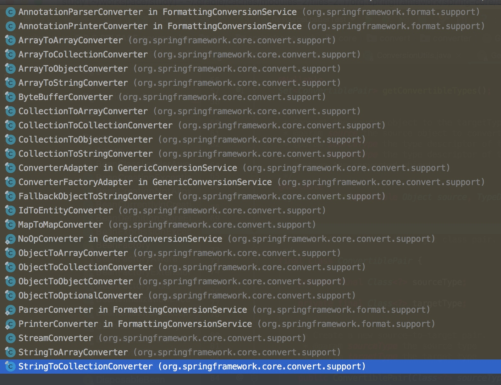


我们看一个子类的实现 StringToArrayConverter，该子类将逗号分隔的 String 转换为 Array 。代码如下：

```java
// StringToArrayConverter.java

final class StringToArrayConverter implements ConditionalGenericConverter {

	private final ConversionService conversionService;

	public StringToArrayConverter(ConversionService conversionService) {
		this.conversionService = conversionService;
	}

	@Override
	public Set<ConvertiblePair> getConvertibleTypes() {
		return Collections.singleton(new ConvertiblePair(String.class, Object[].class));
	}

	@Override
	public boolean matches(TypeDescriptor sourceType, TypeDescriptor targetType) {
		return ConversionUtils.canConvertElements(sourceType, targetType.getElementTypeDescriptor(),
				this.conversionService);
	}

	@Override
	@Nullable
	public Object convert(@Nullable Object source, TypeDescriptor sourceType, TypeDescriptor targetType) {
		if (source == null) {
			return null;
		}
		// 按照 , 分隔成字符串数组
		String string = (String) source;
		String[] fields = StringUtils.commaDelimitedListToStringArray(string);
		// 获得 TypeDescriptor 对象
		TypeDescriptor targetElementType = targetType.getElementTypeDescriptor();
		Assert.state(targetElementType != null, "No target element type");
		// 创建目标数组
		Object target = Array.newInstance(targetElementType.getType(), fields.length);
		// 遍历 fields 数组，逐个转换
		for (int i = 0; i < fields.length; i++) {
			String sourceElement = fields[i];
			// 执行转换
			Object targetElement = this.conversionService.convert(sourceElement.trim(), sourceType, targetElementType);
			// 设置到 target 中
			Array.set(target, i, targetElement);
		}
		return target;
	}

}
```

在类型转换体系中，Spring 提供了非常多的类型转换器，除了上面的 GenericConverter，还有 Converter、ConditionalConverter、ConverterFactory。

------

**Converter**

Converter 是一个将 `<S>` 类型的源对象转换为 `<T>` 类型的目标对象的转换器。该接口是线程安全的，所以可以共享。代码如下:

```java
// Converter.java

public interface Converter<S, T> {

    @Nullable
    T convert(S source);

}
```

子类如下：

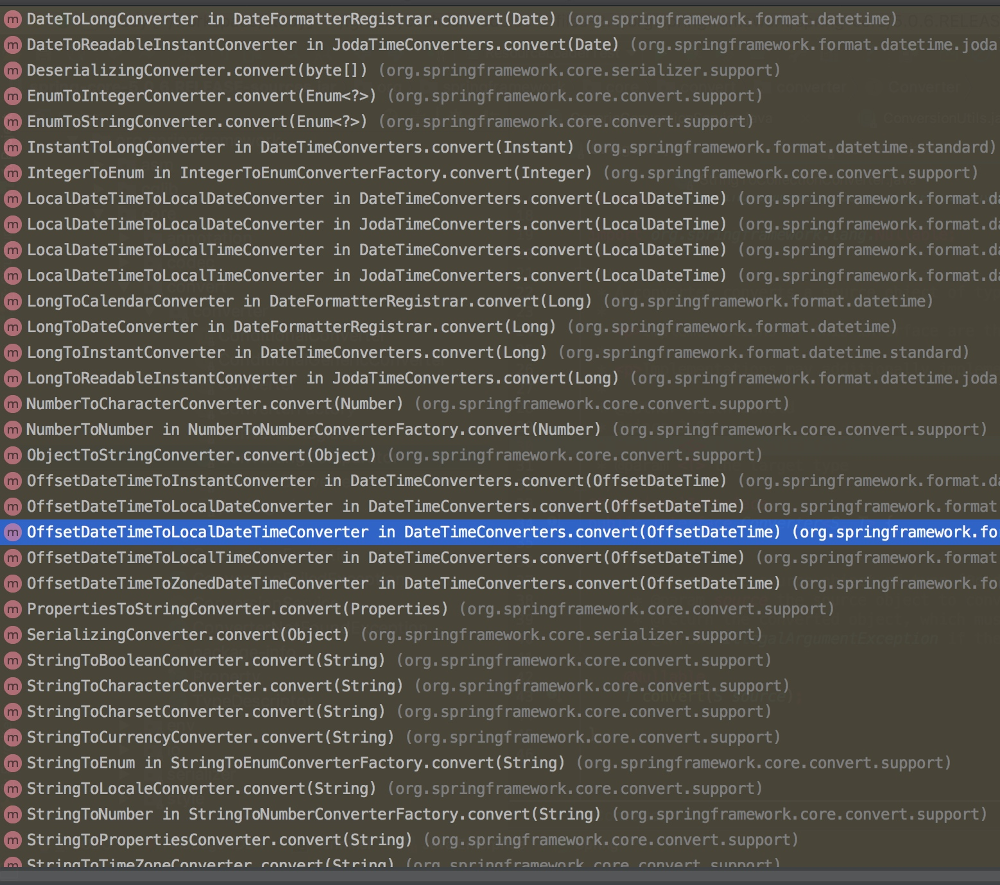

**ConditionalConverter**

ConditionalConverter 接口用于表示有条件的类型转换，通过转入的`sourceType` 与 `targetType` 判断转换能否匹配，只有可匹配的转换才会调用convert 方法进行转换。代码如下：

```java
// ConditionalConverter.java

public interface ConditionalConverter {

    boolean matches(TypeDescriptor sourceType, TypeDescriptor targetType);

}
```

ConditionalConverter 的子类如下：

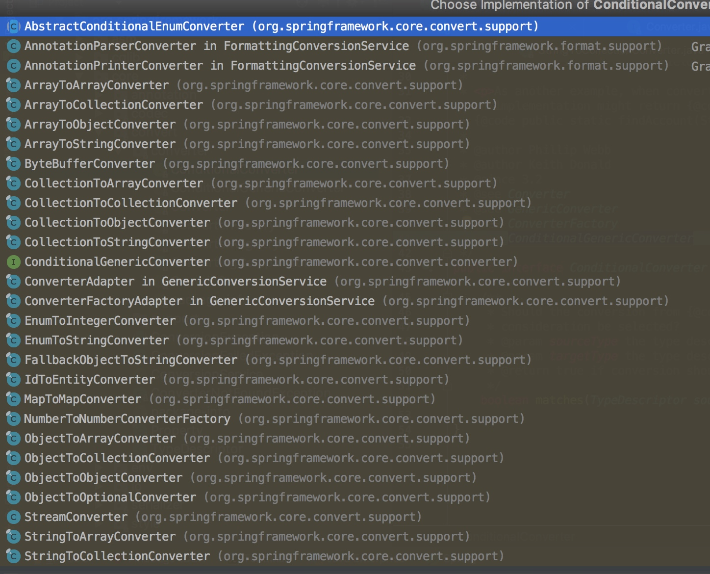


------

**ConverterFactory**

一个用于“远程”转换的转换工厂，可以将对象从 `<S>` 转换为 `<R>` 的子类型。代码如下：

```
// ConverterFactory.java

public interface ConverterFactory<S, R> {

    <T extends R> Converter<S, T> getConverter(Class<T> targetType);

}
```

子类如下：

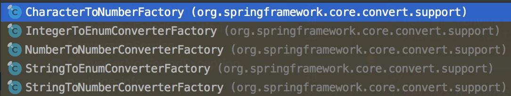


------

四种不同的转换器承载着不同的转换过程：

- Converter：用于 `1:1` 的 `source -> target` 类型转换。
- ConverterFactory：用于 `1:N` 的 `source -> target` 类型转换。
- GenericConverter用于 `N:N` 的 `source -> target` 类型转换。
- ConditionalConverter：有条件的 `source -> target` 类型转换。

------

**GenericConversionService**

转换器介绍完了，我们再次回归到 ConversionService 接口中去，该接口定义了两类方法：

- `canConvert(sourceType, targetType)` 方法，用于判 `sourceType` 能否转成 `targetType` 。
- `convert(source, targetType)` 方法，用于将 `source` 转成转入的 TargetType 类型实例。

这两类方法都是在 GenericConversionService 中实现。
类 GenericConversionService 实现 ConfigurableConversionService 接口，而 ConfigurableConversionService 接口继承 ConversionService 和 ConverterRegistry。
ConverterRegistry 提供了类型转换器的管理功能，他提供了四个 add 和一个 remove 方法，支持注册/删除相应的类型转换器。

GenericConversionService 作为一个基础实现类，它即支持了不同类型之间的转换，也对各类型转换器进行管理，主要是通过一个 Map 类型的 `converterCache` 和一个内部类 Converters 。在上面已经分析了 GenericConversionService 执行类型转换的过程 `#cover(...)` 方法。下面我们就一个 `addConverter(Converter<?, ?> converter)` 方法，来看看它是如何完成转换器的注入的工作的。代码如下：

```java
// GenericConversionService.java

@Override
public void addConverter(Converter<?, ?> converter) {
    // <1> 获取 ResolvableType 对象，基于 converter.getClass() 类
    ResolvableType[] typeInfo = getRequiredTypeInfo(converter.getClass(), Converter.class);
    // <1> 如果获取不到，并且 converter 是 DecoratingProxy 类型，则基于 ((DecoratingProxy) converter).getDecoratedClass() 类
    if (typeInfo == null && converter instanceof DecoratingProxy) {
        typeInfo = getRequiredTypeInfo(((DecoratingProxy) converter).getDecoratedClass(), Converter.class);
    }
    // 如果获取不到，抛出 IllegalArgumentException 异常
    if (typeInfo == null) {
        throw new IllegalArgumentException("Unable to determine source type <S> and target type <T> for your " +
                "Converter [" + converter.getClass().getName() + "]; does the class parameterize those types?");
    }
    // <2> 封装成 ConverterAdapter 对象，添加到 converters 中
    addConverter(new ConverterAdapter(converter, typeInfo[0], typeInfo[1]));
}
```

- `<1>` 首先，根据 `converter` 获取 ResolvableType 数组。
- `<2>` 然后，将其与 `converter` 封装成一个 ConverterAdapter 实例。
- `<2>` 最后，调用 `#addConverter(GenericConverter converter)` 方法，添加到 `converters` 中。
- ResolvableType 用于封装 Java 的 [Type](https://juejin.im/post/5adefaba518825670e5cb44d) 类型。
- ConverterAdapter 则是 Converter 的一个适配器， 它实现了 GenericConverter 和 ConditionalConverter 两个类型转换器。

其中，`#addConverter(GenericConverter converter)` 方法，代码如下：

```java
// GenericConversionService.java

@Override
public void addConverter(GenericConverter converter) {
    // 添加到 converters 中
    this.converters.add(converter);
    // 过期缓存
    invalidateCache();
}
```

直接调用内部类 Converters 的 `#add(GenericConverter converter)` 方法，代码如下：

```java
// GenericConversionService.java

public void add(GenericConverter converter) {
    // 获得 ConvertiblePair 集合
    Set<ConvertiblePair> convertibleTypes = converter.getConvertibleTypes();
    // 如果为空，并且 converter 是 ConditionalConverter 类型，则添加到 【globalConverters】 中
    if (convertibleTypes == null) {
        Assert.state(converter instanceof ConditionalConverter,
                "Only conditional converters may return null convertible types");
        this.globalConverters.add(converter);
    } else {
        // 通过迭代的方式依次添加【converters】中
        for (ConvertiblePair convertiblePair : convertibleTypes) {
            // 从 converters 中，获得 ConvertersForPair 对象
            ConvertersForPair convertersForPair = getMatchableConverters(convertiblePair);
            // 添加 converter 到 ConvertersForPair 中
            convertersForPair.add(converter);
        }
    }
}
```

- 首先调用 GenericConverter 的 `#getConvertibleTypes()` 方法，获取 ConvertiblePair 集合。如果为空，则加入到 `globalConverters` 集合中，否则通过迭代的方式依次添加 `converters` 中。

- ConvertiblePair 为 source-to-target 的持有者，它持有 `source` 和 `target` 的 class 类型，代码如下：

  ```java
  // GenericConverter.java#ConvertiblePair
  
  final class ConvertiblePair {
  
      private final Class<?> sourceType;
      private final Class<?> targetType;
  
      // 省略其他代码
  }
  ```

在迭代过程中会根据 ConvertiblePair 获取相应的 ConvertersForPair 对象，然后添加 `converter` 转换器加入其中。ConvertiblePair 用于管理使用特定GenericConverter.ConvertiblePair 注册的转换器。代码如下：

```java
// GenericConversionService.java#ConvertersForPair

private static class ConvertersForPair {

   private final LinkedList<GenericConverter> converters = new LinkedList<>();

    public void add(GenericConverter converter) {
        this.converters.addFirst(converter);
    }

    @Nullable
    public GenericConverter getConverter(TypeDescriptor sourceType, TypeDescriptor targetType) {
        for (GenericConverter converter : this.converters) {
            if (!(converter instanceof ConditionalGenericConverter) ||
                    ((ConditionalGenericConverter) converter).matches(sourceType, targetType)) {
                return converter;
            }
        }
        return null;
    }

}
```

- 其实内部就是维护一个 LinkedList 集合。他内部有两个方法：`#add(GenericConverter converter)` 和 `getConverter(TypeDescriptor sourceType, TypeDescriptor targetType)`，实现较为简单，这里就不多介绍了。

------

**DefaultConversionService**

DefaultConversionService 是 ConversionService 的默认实现，它继承 GenericConversionService，GenericConversionService 主要用于转换器的注册和调用，DefaultConversionService 则是为 ConversionService 体系提供一些默认的转换器。

在 DefaultConversionService 构造方法中就会添加默认的 Converter ，代码如下：

```java
// DefaultConversionService.java

public DefaultConversionService() {
    addDefaultConverters(this);
}

public static void addDefaultConverters(ConverterRegistry converterRegistry) {
    addScalarConverters(converterRegistry);
    addCollectionConverters(converterRegistry);

    converterRegistry.addConverter(new ByteBufferConverter((ConversionService) converterRegistry));
    converterRegistry.addConverter(new StringToTimeZoneConverter());
    converterRegistry.addConverter(new ZoneIdToTimeZoneConverter());
    converterRegistry.addConverter(new ZonedDateTimeToCalendarConverter());

    converterRegistry.addConverter(new ObjectToObjectConverter());
    converterRegistry.addConverter(new IdToEntityConverter((ConversionService) converterRegistry));
    converterRegistry.addConverter(new FallbackObjectToStringConverter());
    converterRegistry.addConverter(new ObjectToOptionalConverter((ConversionService) converterRegistry));
}
```

当然它还提供了一些其他的方法如 `#addCollectionConverters(ConverterRegistry converterRegistry)`、`addScalarConverters(ConverterRegistry converterRegistry)` 方法，用于注册其他类型的转换器。

------

至此，从 Bean 属性的转换，到 Spring ConversionService 体系的转换器 Converter 以及转换器的管理都介绍完毕了，下篇我们将分析如何利用 ConversionService 实现**自定义类型**转换器。

> 艿艿：因为本文是基于调用的过程，进行解析。所以胖友可以自己在总结整理下。
>
> 实际上，大体的调用流是如下：
>
> TypeConverterSupport => ConversionService => Converter
