## IoC 理论

[谈谈对 Spring IoC 的理解](https://www.cnblogs.com/xdp-gacl/p/4249939.html)  |  [Spring 的 IoC 原理](https://blog.csdn.net/m13666368773/article/details/7802126) |  [Spring IoC 原理](https://blog.csdn.net/it_man/article/details/4402245)

IoC 全称为 Inversion of Control，翻译为 “控制反转”，不是什么技术，而是一种设计思想, 它还有一个别名为 DI（Dependency Injection）,即依赖注入。

所谓 IoC ，就是由 Spring IoC 容器来负责对象的生命周期和对象之间的关系 , 如何理解“控制反转”好呢？理解好它的关键在于我们需要回答如下四个问题：

> 1. 谁控制谁?  在传统的开发模式下，我们都是采用直接 new 一个对象的方式来创建对象，也就是说你依赖的对象直接由你自己控制，但是有了 IoC 容器后，则直接由 IoC 容器来控制。所以“谁控制谁”，当然是 IoC 容器控制对象
> 2. 控制什么? 控制对象。
> 3. 为何是反转? 没有 IoC 的时候我们都是在自己对象中主动去创建被依赖的对象，这是正转。但是有了 IoC 后，所依赖的对象直接由 IoC 容器创建后注入到被注入的对象中，依赖的对象由原来的主动获取变成被动接受，所以是反转。
> 4. 哪些方面反转了? 所依赖对象的获取被反转了。
>

### 1. 注入形式

IoC Service Provider 为被注入对象提供被依赖对象也有如下几种方式：构造方法注入、setter方法注入、接口注入。接口方式注入显得比较霸道，因为它需要被依赖的对象实现不必要的接口，带有侵入性。一般都不推荐这种方式。

[IOC注入实例](https://www.cnblogs.com/tanghaorong/p/13364634.html#_label4_0)

## IoC 之IoC各个组件

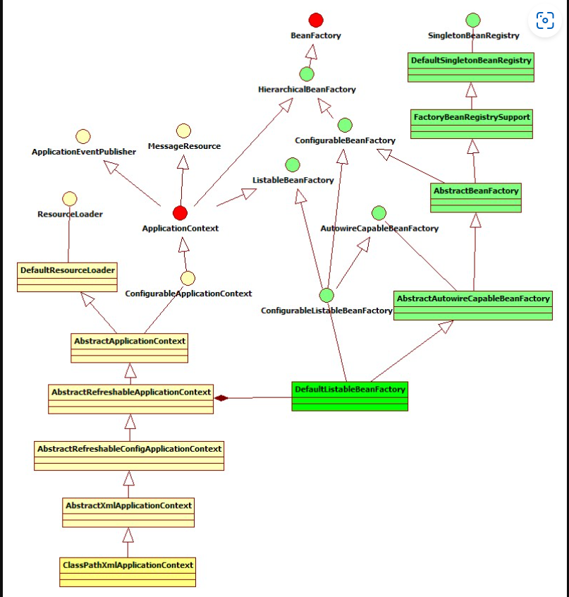  

该图为 `ClassPathXmlApplicationContext` 的类继承体系结构，虽然只有一部分，但是它基本上包含了 IoC 体系中大部分的核心类和接口。

### 1. Resource 体系

`org.springframework.core.io.Resource`，对资源的抽象。它的每一个实现类都代表了一种资源的访问策略，如 ClassPathResource、URLResource、FileSystemResource 等。

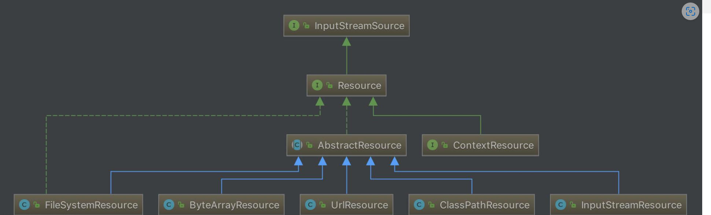  

### 2. ResourceLoader 体系

有了资源，就应该有资源加载，Spring 利用 org.springframework.core.io.ResourceLoader 来进行统一资源加载，类图如下：

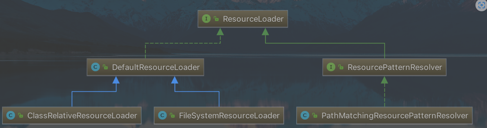    

### 3. BeanDefinition 体系

org.springframework.beans.factory.config.BeanDefinition ，用来描述 Spring 中的 Bean 对象。

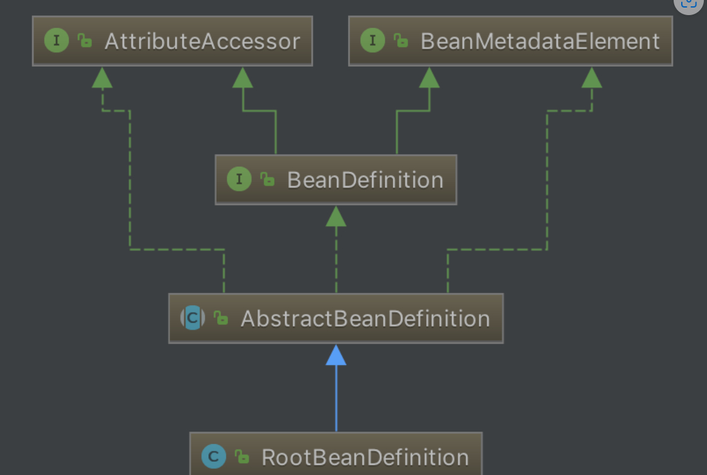  

### 4. BeanDefinitionReader 体系

org.springframework.beans.factory.support.BeanDefinitionReader 的作用是读取 Spring 的配置文件的内容，并将其转换成 Ioc 容器内部的数据结构 ：BeanDefinition 。

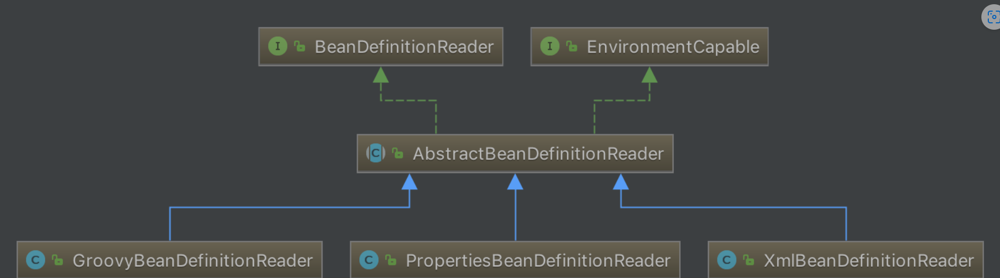

### 5. BeanFactory 体系

org.springframework.beans.factory.BeanFactory，是一个非常纯粹的 bean 容器，它是 IoC 必备的数据结构，其中 BeanDefinition 是它的基本结构。BeanFactory 内部维护着一个BeanDefinition map ，并可根据 BeanDefinition 的描述进行 bean 的创建和管理。

BeanFactory 有三个直接子类 ListableBeanFactory、HierarchicalBeanFactory 和 AutowireCapableBeanFactory 。  
DefaultListableBeanFactory 为最终默认实现，它实现了所有接口。

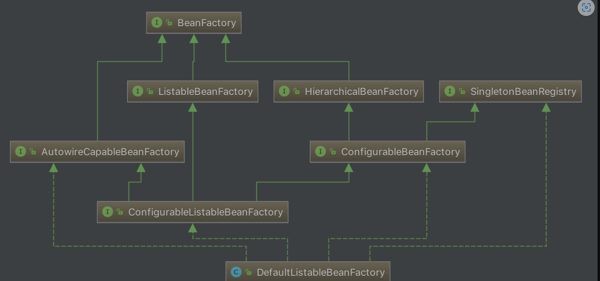  

### 6. ApplicationContext 体系

org.springframework.context.ApplicationContext ，这个就是大名鼎鼎的 Spring 容器，它叫做应用上下文，与我们应用息息相关。它继承 BeanFactory ，所以它是 BeanFactory 的扩展升级版，如果BeanFactory 是屌丝的话，那么 ApplicationContext 则是名副其实的高富帅。由于 ApplicationContext 的结构就决定了它与 BeanFactory 的不同，其主要区别有：

* 继承 org.springframework.context.MessageSource 接口，提供国际化的标准访问策略。
* 继承 org.springframework.context.ApplicationEventPublisher 接口，提供强大的事件机制。
* 扩展 ResourceLoader ，可以用来加载多种 Resource ，可以灵活访问不同的资源。
* 对 Web 应用的支持。


通过上面五个体系，我们可以看出，IoC 主要由 spring-beans 和 spring-context 项目，进行实现。

## IoC 之统一资源加载策略

在学 Java SE 的时候，我们学习了一个标准类 `java.net.URL`，该类在 Java SE 中的定位为统一资源定位器（Uniform Resource Locator），但是我们知道它的实现基本只限于网络形式发布的资源的查找和定位。然而，实际上资源的定义比较广泛，除了网络形式的资源，还有以二进制形式存在的、以文件形式存在的、以字节流形式存在的等等。而且它可以存在于任何场所，比如网络、文件系统、应用程序中。所以 `java.net.URL` 的局限性迫使 Spring 必须实现自己的资源加载策略，该资源加载策略需要满足如下要求：

1. 职能划分清楚。资源的定义和资源的加载应该要有一个清晰的**界限**；
2. 统一的抽象。统一的资源**定义**和资源加载**策略**。资源加载后要返回统一的抽象给客户端，客户端要对资源进行怎样的处理，应该由抽象资源接口来界定。

### 1. 统一资源 Resource

`org.springframework.core.io.Resource` 为 Spring 框架所有资源的抽象和访问接口，它继承 `org.springframework.core.io.InputStreamSource`接口。作为所有资源的统一抽象，Resource 定义了一些通用的方法，由子类 `AbstractResource` 提供统一的默认实现。

#### 1.1 子类结构

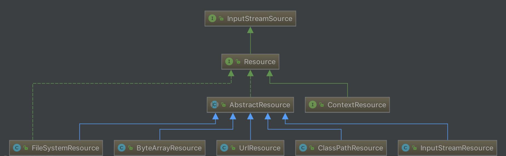

- FileSystemResource ：对 `java.io.File` 类型资源的封装，只要是跟 File 打交道的，基本上与 FileSystemResource 也可以打交道。支持文件和 URL 的形式，实现 WritableResource 接口，且从 Spring Framework 5.0 开始，FileSystemResource 使用 NIO2 API进行读/写交互。
- ByteArrayResource ：对字节数组提供的数据的封装。如果通过 InputStream 形式访问该类型的资源，该实现会根据字节数组的数据构造一个相应的 ByteArrayInputStream。
- UrlResource ：对 `java.net.URL`类型资源的封装。内部委派 URL 进行具体的资源操作。
- ClassPathResource ：class path 类型资源的实现。使用给定的 ClassLoader 或者给定的 Class 来加载资源。
- InputStreamResource ：将给定的 InputStream 作为一种资源的 Resource 的实现类。

#### 1.2 AbstractResource

`org.springframework.core.io.AbstractResource` ，为 Resource 接口的默认**抽象**实现。它实现了 Resource 接口的**大部分的公共实现**，作为 Resource 接口中的重中之重

如果我们想要实现自定义的 Resource ，记住不要实现 Resource 接口，而应该继承 AbstractResource 抽象类，然后根据当前的具体资源特性覆盖相应的方法即可。

### 2. 统一资源定位 ResourceLoader

`org.springframework.core.io.ResourceLoader` 为 Spring 资源加载的统一抽象，具体的资源加载则由相应的实现类来完成，所以我们可以将 ResourceLoader 称作为统一资源定位器。其定义如下：

> FROM 《Spring 源码深度解析》P16 页
>
> ResourceLoader，定义资源加载器，主要应用于根据给定的资源文件地址，返回对应的 Resource 。

```java
public interface ResourceLoader {
	String CLASSPATH_URL_PREFIX = ResourceUtils.CLASSPATH_URL_PREFIX; // CLASSPATH URL 前缀。默认为："classpath:"

	Resource getResource(String location);

	ClassLoader getClassLoader();

}
```

1.`getResource(String location)` 方法，根据所提供资源的路径 location 返回 Resource 实例，但是它不确保该 Resource 一定存在，需要调用 `Resource.exist()` 方法来判断。

> 该方法支持以下模式的资源加载：
>
> - URL位置资源，如 `"file:C:/test.dat"` 。
> - ClassPath位置资源，如 `"classpath:test.dat` 。
> - 相对路径资源，如 `"WEB-INF/test.dat"` ，此时返回的Resource 实例，根据实现不同而不同。

2.`getClassLoader()` 方法，返回 ClassLoader 实例，对于想要获取 ResourceLoader 使用的 ClassLoader 用户来说，可以直接调用该方法来获取。在分析 Resource 时，提到了一个类 ClassPathResource ，这个类是可以根据指定的 ClassLoader 来加载资源的。

#### 2.1 子类结构

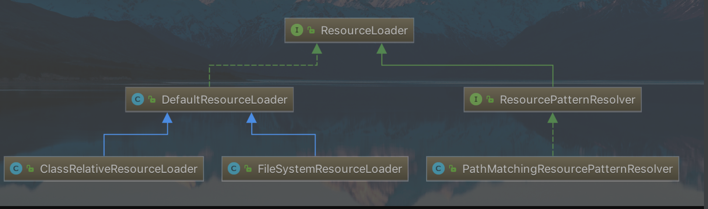

#### 2.1 DefaultResourceLoader

与 AbstractResource 相似，`org.springframework.core.io.DefaultResourceLoader` 是 ResourceLoader 的默认实现。

##### 2.1.1 构造函数

它接收 ClassLoader 作为构造函数的参数，或者使用不带参数的构造函数。

- 在使用**不带**参数的构造函数时，使用的 ClassLoader 为默认的 ClassLoader（一般 `Thread.currentThread()#getContextClassLoader()` ）。
- 在使用**带**参数的构造函数时，可以通过 `ClassUtils#getDefaultClassLoader()`获取。

代码如下：

```java
@Nullable
private ClassLoader classLoader;

public DefaultResourceLoader() { // 无参构造函数
	this.classLoader = ClassUtils.getDefaultClassLoader();
}

public DefaultResourceLoader(@Nullable ClassLoader classLoader) { // 带 ClassLoader 参数的构造函数
	this.classLoader = classLoader;
}

public void setClassLoader(@Nullable ClassLoader classLoader) {
	this.classLoader = classLoader;
}

@Override
@Nullable
public ClassLoader getClassLoader() {
	return (this.classLoader != null ? this.classLoader : ClassUtils.getDefaultClassLoader());
}
```

- 另外，也可以调用 `#setClassLoader()` 方法进行后续设置。

##### 2.1.2 getResource 方法

ResourceLoader 中最核心的方法为 `#getResource(String location)` ，它根据提供的 location 返回相应的 Resource 。而 DefaultResourceLoader 对该方法提供了**核心实现**（因为，它的两个子类都没有提供覆盖该方法，所以可以断定 ResourceLoader 的资源加载策略就封装在 DefaultResourceLoader 中)，代码如下：

```java
// DefaultResourceLoader.java

@Override
public Resource getResource(String location) {
    Assert.notNull(location, "Location must not be null");

    // 首先，通过 ProtocolResolver 来加载资源
    for (ProtocolResolver protocolResolver : this.protocolResolvers) {
        Resource resource = protocolResolver.resolve(location, this);
        if (resource != null) {
            return resource;
        }
    }
    // 其次，以 / 开头，返回 ClassPathContextResource 类型的资源
    if (location.startsWith("/")) {
        return getResourceByPath(location);
    // 再次，以 classpath: 开头，返回 ClassPathResource 类型的资源
    } else if (location.startsWith(CLASSPATH_URL_PREFIX)) {
        return new ClassPathResource(location.substring(CLASSPATH_URL_PREFIX.length()), getClassLoader());
    // 然后，根据是否为文件 URL ，是则返回 FileUrlResource 类型的资源，否则返回 UrlResource 类型的资源
    } else {
        try {
            // Try to parse the location as a URL...
            URL url = new URL(location);
            return (ResourceUtils.isFileURL(url) ? new FileUrlResource(url) : new UrlResource(url));
        } catch (MalformedURLException ex) {
            // 最后，返回 ClassPathContextResource 类型的资源
            // No URL -> resolve as resource path.
            return getResourceByPath(location);
        }
    }
}
```

- 首先，通过 ProtocolResolver 来加载资源，成功返回 Resource 。
- 其次，若 `location` 以 `"/"` 开头，则调用 `getResourceByPath()` 方法，构造 ClassPathContextResource 类型资源并返回。
- 再次，若 `location` 以 `"classpath:"` 开头，则构造 ClassPathResource 类型资源并返回。在构造该资源时，通过 `getClassLoader()` 获取当前的 ClassLoader。
- 然后，构造 URL ，尝试通过它进行资源定位，若没有抛出 MalformedURLException 异常，则判断是否为 FileURL , 如果是则构造 FileUrlResource 类型的资源，否则构造 UrlResource 类型的资源。
- 最后，若在加载过程中抛出 MalformedURLException 异常，则委派 `getResourceByPath()` 方法，实现资源定位加载。😈 实际上，和【其次】相同落。

##### 2.1.3 ProtocolResolver

`org.springframework.core.io.ProtocolResolver` ，用户自定义协议资源解决策略，作为 DefaultResourceLoader 的 **SPI**：它允许用户自定义资源加载协议，而不需要继承 ResourceLoader 的子类。

**在介绍 Resource 时，提到如果要实现自定义 Resource，我们只需要继承 AbstractResource 即可，但是有了 ProtocolResolver 后，我们不需要直接继承 DefaultResourceLoader，改为实现 ProtocolResolver 接口也可以实现自定义的 ResourceLoader。**

ProtocolResolver 接口，仅有一个方法 `Resource resolve(String location, ResourceLoader resourceLoader)`

在 Spring 中你会发现该接口并没有实现类，它需要用户自定义，自定义的 Resolver 如何加入 Spring 体系呢？调用 `DefaultResourceLoader.addProtocolResolver(ProtocolResolver)` 方法即可。

##### 2.1.4 示例

下面示例是演示 DefaultResourceLoader 加载资源的具体策略，代码如下:

```java
ResourceLoader resourceLoader = new DefaultResourceLoader();

Resource fileResource1 = resourceLoader.getResource("D:/Users/chenming673/Documents/spark.txt");
System.out.println("fileResource1 is FileSystemResource:" + (fileResource1 instanceof FileSystemResource));

Resource fileResource2 = resourceLoader.getResource("/Users/chenming673/Documents/spark.txt");
System.out.println("fileResource2 is ClassPathResource:" + (fileResource2 instanceof ClassPathResource));

Resource urlResource1 = resourceLoader.getResource("file:/Users/chenming673/Documents/spark.txt");
System.out.println("urlResource1 is UrlResource:" + (urlResource1 instanceof UrlResource));

Resource urlResource2 = resourceLoader.getResource("http://www.baidu.com");
System.out.println("urlResource1 is urlResource:" + (urlResource2 instanceof  UrlResource));
```

运行结果：

```
fileResource1 is FileSystemResource:false
fileResource2 is ClassPathResource:true
urlResource1 is UrlResource:true
urlResource1 is urlResource:true
```

- 其实对于 `fileResource1` ，我们更加希望是 FileSystemResource 资源类型。但是，事与愿违，它是 ClassPathResource 类型。为什么呢？在 `DefaultResourceLoader.getResource()` 方法的资源加载策略中，我们知道 `"D:/Users/chenming673/Documents/spark.txt"` 地址，其实在该方法中没有相应的资源类型，那么它就会在抛出 MalformedURLException 异常时，通过 `DefaultResourceLoader.getResourceByPath(...)` 方法，构造一个 ClassPathResource 类型的资源。
- 而 `urlResource1` 和 `urlResource2` ，指定有协议前缀的资源路径，则通过 URL 就可以定义，所以返回的都是 UrlResource 类型。

#### 2.2 FileSystemResourceLoader

从上面的示例，我们看到，其实 DefaultResourceLoader 对`getResourceByPath(String)` 方法处理其实不是很恰当，这个时候我们可以使用 `org.springframework.core.io.FileSystemResourceLoader` 。它继承 DefaultResourceLoader ，且覆写了 `getResourceByPath(String)` 方法，使之从文件系统加载资源并以 FileSystemResource 类型返回，这样我们就可以得到想要的资源类型。

```java
@Override
protected Resource getResourceByPath(String path) {
	// 截取首 /
	if (path.startsWith("/")) {
		path = path.substring(1);
	}
	// 创建 FileSystemContextResource 类型的资源
	return new FileSystemContextResource(path);
}
```

##### 2.2.1 FileSystemContextResource

FileSystemContextResource ，为 FileSystemResourceLoader 的内部类，它继承 FileSystemResource 类，实现 ContextResource 接口。代码如下：

```java
/**
 * FileSystemResource that explicitly expresses a context-relative path
 * through implementing the ContextResource interface.
 */
private static class FileSystemContextResource extends FileSystemResource implements ContextResource {

	public FileSystemContextResource(String path) {
		super(path);
	}

	@Override
	public String getPathWithinContext() {
		return getPath();
	}
}
```

- 在构造器中，也是调用 FileSystemResource 的构造函数来构造 FileSystemResource 的。
- 为什么要有 FileSystemContextResource 类的原因是，实现 ContextResource 接口，并实现对应的 `getPathWithinContext()` 接口方法。

> ContextResource   从外围加载资源的扩展接口 'context'，例如来自一个{@link javax.servlet. context。ServletContext} 从普通类路径路径或相对文件系统路径(指定没有显式前缀，因此相对于本地应用 {@link ResourceLoader}的上下文)。

#### 2.3 ClassRelativeResourceLoader

`org.springframework.core.io.ClassRelativeResourceLoader` ，是 DefaultResourceLoader 的另一个子类的实现。和 FileSystemResourceLoader 类似，在实现代码的结构上类似，也是覆写 `getResourceByPath(String path)` 方法，并返回其对应的 ClassRelativeContextResource 的资源类型。

> [《Spring5：就这一次，搞定资源加载器之ClassRelativeResourceLoader》](https://blog.csdn.net/seasonsbin/article/details/80914911) 
>
> ClassRelativeResourceLoader 扩展的功能是，可以根据给定的`class` 所在包或者所在包的子包下加载资源。

#### 2.4 ResourcePatternResolver

ResourceLoader 的 `Resource getResource(String location)` 方法，每次只能根据 location 返回**一个** Resource 。当需要加载多个资源时，我们除了多次调用 `#getResource(String location)` 方法外，别无他法。`org.springframework.core.io.support.ResourcePatternResolver` 是 ResourceLoader 的扩展，它支持根据指定的资源路径匹配模式每次返回**多个** Resource 实例

```java
public interface ResourcePatternResolver extends ResourceLoader {

	String CLASSPATH_ALL_URL_PREFIX = "classpath*:";

	Resource[] getResources(String locationPattern) throws IOException;

}
```

- ResourcePatternResolver 在 ResourceLoader 的基础上增加了 `getResources(String locationPattern)` 方法，以支持根据路径匹配模式返回**多个** Resource 实例。

- 同时，也新增了一种**新的协议**前缀 `"classpath*:"`，该协议前缀由其子类负责实现。

  

#### 2.5 PathMatchingResourcePatternResolver

`org.springframework.core.io.support.PathMatchingResourcePatternResolver` ，为 ResourcePatternResolver 最常用的子类，它除了支持 ResourceLoader 和 ResourcePatternResolver 新增的 `"classpath*:"` 前缀外，**还支持 Ant 风格的路径匹配模式**（类似于 `"**/*.xml"`）。

##### 2.5.1 构造函数

PathMatchingResourcePatternResolver 提供了三个构造函数，如下：

```java
/**
 * 内置的 ResourceLoader 资源定位器
 */
private final ResourceLoader resourceLoader;
/**
 * Ant 路径匹配器
 */
private PathMatcher pathMatcher = new AntPathMatcher();

public PathMatchingResourcePatternResolver() {
	this.resourceLoader = new DefaultResourceLoader();
}

public PathMatchingResourcePatternResolver(ResourceLoader resourceLoader) {
	Assert.notNull(resourceLoader, "ResourceLoader must not be null");
	this.resourceLoader = resourceLoader;
}

public PathMatchingResourcePatternResolver(@Nullable ClassLoader classLoader) {
	this.resourceLoader = new DefaultResourceLoader(classLoader);
}
```

- PathMatchingResourcePatternResolver 在实例化的时候，可以指定一个 ResourceLoader，如果不指定的话，它会在内部构造一个 DefaultResourceLoader 。
- `pathMatcher` 属性，默认为 AntPathMatcher 对象，用于支持 Ant 类型的路径匹配。

##### 2.5.2 getResource

```java
@Override
public Resource getResource(String location) {
	return getResourceLoader().getResource(location);
}

public ResourceLoader getResourceLoader() {
	return this.resourceLoader;
}
```

该方法，直接委托给相应的 ResourceLoader 来实现。所以，如果我们在实例化的 PathMatchingResourcePatternResolver 的时候，如果未指定 ResourceLoader 参数的情况下，那么在加载资源时，其实就是 DefaultResourceLoader 的过程。

其实在下面介绍的 `Resource[] getResources(String locationPattern)` 方法也相同，只不过返回的资源是**多个**而已。

##### 2.5.2 getResources

```java
@Override
public Resource[] getResources(String locationPattern) throws IOException {
    Assert.notNull(locationPattern, "Location pattern must not be null");
    // 以 "classpath*:" 开头
    if (locationPattern.startsWith(CLASSPATH_ALL_URL_PREFIX)) {
        // 路径包含通配符
        // a class path resource (multiple resources for same name possible)
        if (getPathMatcher().isPattern(locationPattern.substring(CLASSPATH_ALL_URL_PREFIX.length()))) {
            // a class path resource pattern
            return findPathMatchingResources(locationPattern);
        // 路径不包含通配符
        } else {
            // all class path resources with the given name
            return findAllClassPathResources(locationPattern.substring(CLASSPATH_ALL_URL_PREFIX.length()));
        }
    // 不以 "classpath*:" 开头
    } else {
        // Generally only look for a pattern after a prefix here, // 通常只在这里的前缀后面查找模式
        // and on Tomcat only after the "*/" separator for its "war:" protocol. 而在 Tomcat 上只有在 “*/ ”分隔符之后才为其 “war:” 协议
        int prefixEnd = (locationPattern.startsWith("war:") ? locationPattern.indexOf("*/") + 1 :
                locationPattern.indexOf(':') + 1);
        // 路径包含通配符
        if (getPathMatcher().isPattern(locationPattern.substring(prefixEnd))) {
            // a file pattern
            return findPathMatchingResources(locationPattern);
        // 路径不包含通配符
        } else {
            // a single resource with the given name
            return new Resource[] {getResourceLoader().getResource(locationPattern)};
        }
    }
}
```

- **非** `"classpath*:"` 开头，且路径**不包含**通配符，直接委托给相应的 ResourceLoader 来实现。
- 其他情况，调用 `#findAllClassPathResources(...)`、或 `#findPathMatchingResources(...)` 方法，返回多个 Resource 。下面，我们来详细分析。

##### 2.5.4 findAllClassPathResources

当 `locationPattern` 以 `"classpath*:"` 开头但是不包含通配符，则调用 `#findAllClassPathResources(...)` 方法加载资源。该方法返回 classes 路径下和所有 jar 包中的所有相匹配的资源。

```java
protected Resource[] findAllClassPathResources(String location) throws IOException {
	String path = location;
	// 去除首个 /
	if (path.startsWith("/")) {
		path = path.substring(1);
	}
	// 真正执行加载所有 classpath 资源
	Set<Resource> result = doFindAllClassPathResources(path);
	if (logger.isTraceEnabled()) {
		logger.trace("Resolved classpath location [" + location + "] to resources " + result);
	}
	// 转换成 Resource 数组返回
	return result.toArray(new Resource[0]);
}
```

真正执行加载的是在 `#doFindAllClassPathResources(...)` 方法，代码如下：

```java
protected Set<Resource> doFindAllClassPathResources(String path) throws IOException {
	Set<Resource> result = new LinkedHashSet<>(16);
	ClassLoader cl = getClassLoader();
	// <1> 根据 ClassLoader 加载路径下的所有资源
	Enumeration<URL> resourceUrls = (cl != null ? cl.getResources(path) : ClassLoader.getSystemResources(path));
	// <2>
	while (resourceUrls.hasMoreElements()) {
		URL url = resourceUrls.nextElement();
		// 将 URL 转换成 UrlResource
		result.add(convertClassLoaderURL(url));
	}
	// <3> 加载路径下得所有 jar 包
	if ("".equals(path)) {
		// The above result is likely to be incomplete, i.e. only containing file system references.
		// We need to have pointers to each of the jar files on the classpath as well...
		addAllClassLoaderJarRoots(cl, result);
	}
	return result;
}
```

`<1>` 处，根据 ClassLoader 加载路径下的所有资源。在加载资源过程时，如果在构造 PathMatchingResourcePatternResolver 实例的时候如果传入了 ClassLoader，则调用该 ClassLoader 的 `#getResources()` 方法，否则调用 `ClassLoader#getSystemResources(path)` 方法。另外，`ClassLoader#getResources()` 方法，代码如下:

```java
// java.lang.ClassLoader.java
public Enumeration<URL> getResources(String name) throws IOException {
    @SuppressWarnings("unchecked")
    Enumeration<URL>[] tmp = (Enumeration<URL>[]) new Enumeration<?>[2];
    if (parent != null) {
        tmp[0] = parent.getResources(name);
    } else {
        tmp[0] = getBootstrapResources(name);
    }
    tmp[1] = findResources(name);

    return new CompoundEnumeration<>(tmp);
}
```

- 看到这里是不是就已经一目了然了？如果当前父类加载器不为 `null` ，则通过父类向上迭代获取资源，否则调用 `#getBootstrapResources()` 。这里是不是特别熟悉，(*^▽^*)。

`<2>` 处，遍历 URL 集合，调用 `#convertClassLoaderURL(URL url)` 方法，将 URL 转换成 UrlResource 对象。代码如下：

```java
protected Resource convertClassLoaderURL(URL url) {
	return new UrlResource(url);
}
```

`<3>` 处，若 `path` 为空（`“”`）时，则调用 `#addAllClassLoaderJarRoots(...)`方法。该方法主要是加载路径下得所有 jar 包

通过上面的分析，我们知道 `#findAllClassPathResources(...)` 方法，其实就是利用 ClassLoader 来加载指定路径下的资源，不论它是在 class 路径下还是在 jar 包中。如果我们传入的路径为空或者 `/`，则会调用 `#addAllClassLoaderJarRoots(...)` 方法，加载所有的 jar 包。

##### 2.5.5 findPathMatchingResources

当 `locationPattern` 中包含了**通配符**，则调用该方法进行资源加载。代码如下：

```java
protected Resource[] findPathMatchingResources(String locationPattern) throws IOException {
    // 确定根路径、子路径
    String rootDirPath = determineRootDir(locationPattern);
    String subPattern = locationPattern.substring(rootDirPath.length());
    // 获取根据路径下的资源
    Resource[] rootDirResources = getResources(rootDirPath);
    // 遍历，迭代
    Set<Resource> result = new LinkedHashSet<>(16);
    for (Resource rootDirResource : rootDirResources) {
        rootDirResource = resolveRootDirResource(rootDirResource);
        URL rootDirUrl = rootDirResource.getURL();
        // bundle 资源类型
        if (equinoxResolveMethod != null && rootDirUrl.getProtocol().startsWith("bundle")) {
            URL resolvedUrl = (URL) ReflectionUtils.invokeMethod(equinoxResolveMethod, null, rootDirUrl);
            if (resolvedUrl != null) {
                rootDirUrl = resolvedUrl;
            }
            rootDirResource = new UrlResource(rootDirUrl);
        }
        // vfs 资源类型
        if (rootDirUrl.getProtocol().startsWith(ResourceUtils.URL_PROTOCOL_VFS)) {
            result.addAll(VfsResourceMatchingDelegate.findMatchingResources(rootDirUrl, subPattern, getPathMatcher()));
        // jar 资源类型
        } else if (ResourceUtils.isJarURL(rootDirUrl) || isJarResource(rootDirResource)) {
            result.addAll(doFindPathMatchingJarResources(rootDirResource, rootDirUrl, subPattern));
        // 其它资源类型
        } else {
            result.addAll(doFindPathMatchingFileResources(rootDirResource, subPattern));
        }
    }
    if (logger.isTraceEnabled()) {
        logger.trace("Resolved location pattern [" + locationPattern + "] to resources " + result);
    }
    // 转换成 Resource 数组返回
    return result.toArray(new Resource[0]);
}

```

方法有点儿长，但是思路还是很清晰的，主要分两步：

1. 确定目录，获取该目录下得所有资源。
2. 在所获得的所有资源后，进行迭代匹配获取我们想要的资源。

在这个方法里面，我们要关注两个方法，一个是 `#determineRootDir(String location)` 方法，一个是 `#doFindPathMatchingXXXResources(...)` 等方法。

###### 2.5.5.1 determineRootDir

`determineRootDir(String location)` 方法，主要是用于确定根路径。代码如下：

```Java

protected String determineRootDir(String location) {
	// 找到冒号的后一位
	int prefixEnd = location.indexOf(':') + 1;
	// 根目录结束位置
	int rootDirEnd = location.length();
	// 在从冒号开始到最后的字符串中，循环判断是否包含通配符，如果包含，则截断最后一个由”/”分割的部分。
	// 例如：在我们路径中，就是最后的ap?-context.xml这一段。再循环判断剩下的部分，直到剩下的路径中都不包含通配符。
	while (rootDirEnd > prefixEnd && getPathMatcher().isPattern(location.substring(prefixEnd, rootDirEnd))) {
		rootDirEnd = location.lastIndexOf('/', rootDirEnd - 2) + 1;
	}
	// 如果查找完成后，rootDirEnd = 0 了，则将之前赋值的 prefixEnd 的值赋给 rootDirEnd ，也就是冒号的后一位
	if (rootDirEnd == 0) {
		rootDirEnd = prefixEnd;
	}
	// 截取根目录
	return location.substring(0, rootDirEnd);
}
```

示例：

|               原路径               |      确定根路径       |
| :--------------------------------: | :-------------------: |
| `classpath*:test/cc*/spring-*.xml` |  `classpath*:test/`   |
| `classpath*:test/aa/spring-*.xml`  | `classpath*:test/aa/` |

###### 2.5.5.2 doFindPathMatchingXXXResources

`#doFindPathMatchingXXXResources(...)` 方法，是个泛指，一共对应三个方法：

- `#doFindPathMatchingJarResources(rootDirResource, rootDirUrl, subPatter)` 方法
- `#doFindPathMatchingFileResources(rootDirResource, subPattern)` 方法
- `VfsResourceMatchingDelegate#findMatchingResources(rootDirUrl, subPattern, pathMatcher)` 方法

- [Spring源码情操陶冶-PathMatchingResourcePatternResolver路径资源匹配溶解器](https://www.cnblogs.com/question-sky/p/6959493.html) ，主要针对 `#doFindPathMatchingJarResources(rootDirResource, rootDirUrl, subPatter)` 方法。
- [深入 Spring IoC 源码之 ResourceLoader](http://www.blogjava.net/DLevin/archive/2012/12/01/392337.html) ，主要针对 `#doFindPathMatchingFileResources(rootDirResource, subPattern)` 方法。
- [Spring 源码学习 —— 含有通配符路径解析（上）](http://www.coderli.com/spring-wildpath-parse/) 

### 3.  小结

至此 Spring 整个资源记载过程已经分析完毕。下面简要总结下：

- Spring 提供了 Resource 和 ResourceLoader 来统一抽象整个资源及其定位。使得资源与资源的定位有了一个更加清晰的界限，并且提供了合适的 Default 类，使得自定义实现更加方便和清晰。
- AbstractResource 为 Resource 的默认抽象实现，它对 Resource 接口做了一个统一的实现，子类继承该类后只需要覆盖相应的方法即可，同时对于自定义的 Resource 我们也是继承该类。
- DefaultResourceLoader 同样也是 ResourceLoader 的默认实现，在自定 ResourceLoader 的时候我们除了可以继承该类外还可以实现 ProtocolResolver 接口来实现自定资源加载协议。
- DefaultResourceLoader 每次只能返回单一的资源，所以 Spring 针对这个提供了另外一个接口 ResourcePatternResolver ，该接口提供了根据指定的 locationPattern 返回多个资源的策略。其子类 PathMatchingResourcePatternResolver 是一个集大成者的 ResourceLoader ，因为它即实现了 `Resource getResource(String location)` 方法，也实现了 `Resource[] getResources(String locationPattern)` 方法。

Resource 和 ResourceLoader 核心是在，`spring-core` 项目中。

##  IoC之加载 BeanDefinition

```java
ClassPathResource resource = new ClassPathResource("bean.xml"); // <1>
DefaultListableBeanFactory factory = new DefaultListableBeanFactory(); // <2>
XmlBeanDefinitionReader reader = new XmlBeanDefinitionReader(factory); // <3>
reader.loadBeanDefinitions(resource); // <4>
```

这段代码是 Spring 中编程式使用 IoC 容器，通过这四段简单的代码，我们可以初步判断 IoC 容器的使用过程。

1. 获取资源
2. 获取 BeanFactory
3. 根据新建的 BeanFactory 创建一个 BeanDefinitionReader 对象，该 Reader 对象为资源的**解析器**
4. 装载资源

整个过程就分为三个步骤：资源定位、装载、注册，如下：

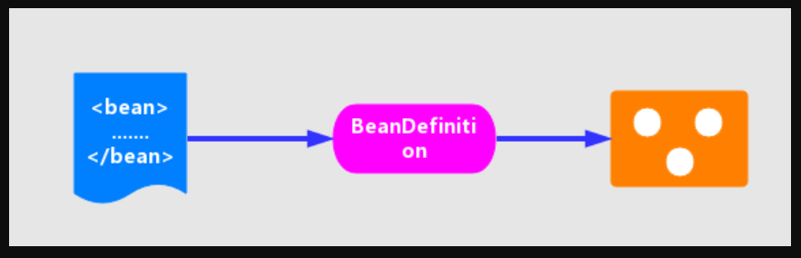

- **资源定位**。我们一般用外部资源来描述 Bean 对象，所以在初始化 IoC 容器的第一步就是需要定位这个外部资源。即统一资源加载,见[统一资源加载策略](#统一资源加载策略)
- **装载/加载**。装载就是 BeanDefinition 的载入。BeanDefinitionReader 读取、解析 Resource 资源，也就是将用户定义的 Bean 表示成 IoC 容器的内部数据结构：BeanDefinition 。
  - 在 IoC 容器内部维护着一个 BeanDefinition Map 的数据结构
  - 在配置文件中每一个 `<bean>` 都对应着一个 BeanDefinition 对象。
- **注册**。向 IoC 容器注册在第二步解析好的 BeanDefinition，这个过程是通过 BeanDefinitionRegistry 接口来实现的。在 IoC 容器内部其实是将第二个过程解析得到的 BeanDefinition 注入到一个 HashMap 容器中，IoC 容器就是通过这个 HashMap 来维护这些 BeanDefinition 的。
  - 在这里需要注意的一点是这个过程并没有完成依赖注入（Bean 创建），Bean 创建是发生在应用第一次调用 `#getBean(...)` 方法，向容器索要 Bean 时。
  - 当然我们可以通过设置预处理，即对某个 Bean 设置 `lazyinit = false` 属性，那么这个 Bean 的依赖注入就会在容器初始化的时候完成。

简单的说，上面步骤的结果是，XML Resource => XML Document => Bean Definition 。

### 1. loadBeanDefinitions

资源定位在前面已经分析了，下面我们直接分析**加载**，上面看到的 `reader.loadBeanDefinitions(resource)` 代码，才是加载资源的真正实现，所以我们直接从该方法入手。代码如下：

```Java
// XmlBeanDefinitionReader.java
@Override
public int loadBeanDefinitions(Resource resource) throws BeanDefinitionStoreException {
	return loadBeanDefinitions(new EncodedResource(resource));
}
```

从指定的 xml 文件加载 Bean Definition ，这里会先对 Resource 资源封装成 `org.springframework.core.io.support.EncodedResource` 对象。这里为什么需要将 Resource 封装成 EncodedResource 呢？主要是为了对 Resource 进行编码，保证内容读取的正确性。

然后，再调用 `#loadBeanDefinitions(EncodedResource encodedResource)` 方法，执行真正的逻辑实现。

```java
/**
 * 当前线程，正在加载的 EncodedResource 集合。
 */
private final ThreadLocal<Set<EncodedResource>> resourcesCurrentlyBeingLoaded = new NamedThreadLocal<>("XML bean definition resources currently being loaded");

public int loadBeanDefinitions(EncodedResource encodedResource) throws BeanDefinitionStoreException {
	Assert.notNull(encodedResource, "EncodedResource must not be null");
	if (logger.isTraceEnabled()) {
		logger.trace("Loading XML bean definitions from " + encodedResource);
	}

	// <1> 获取已经加载过的资源
	Set<EncodedResource> currentResources = this.resourcesCurrentlyBeingLoaded.get();
	if (currentResources == null) {
		currentResources = new HashSet<>(4);
		this.resourcesCurrentlyBeingLoaded.set(currentResources);
	}
	if (!currentResources.add(encodedResource)) { // 将当前资源加入记录中。如果已存在，抛出异常
		throw new BeanDefinitionStoreException("Detected cyclic loading of " + encodedResource + " - check your import definitions!");
	}
	try {
		// <2> 从 EncodedResource 获取封装的 Resource ，并从 Resource 中获取其中的 InputStream
		InputStream inputStream = encodedResource.getResource().getInputStream();
		try {
			InputSource inputSource = new InputSource(inputStream);
			if (encodedResource.getEncoding() != null) { // 设置编码
				inputSource.setEncoding(encodedResource.getEncoding());
			}
			// 核心逻辑部分，执行加载 BeanDefinition
			return doLoadBeanDefinitions(inputSource, encodedResource.getResource());
		} finally {
			inputStream.close();
		}
	} catch (IOException ex) {
		throw new BeanDefinitionStoreException("IOException parsing XML document from " + encodedResource.getResource(), ex);
	} finally {
		// 从缓存中剔除该资源 <3>
		currentResources.remove(encodedResource);
		if (currentResources.isEmpty()) {
			this.resourcesCurrentlyBeingLoaded.remove();
		}
	}
}
```

- <1>处，通过 `resourcesCurrentlyBeingLoaded.get()`代码，来获取已经加载过的资源，然后将encodedResource加入其中，如果resourcesCurrentlyBeingLoaded中已经存在该资源，则抛出 BeanDefinitionStoreException 异常。
  - 为什么需要这么做呢？答案在 `"Detected cyclic loading"` ，避免一个 EncodedResource 在加载时，还没加载完成，又加载自身，从而导致**死循环**。
  - 也因此，在 `<3>` 处，当一个 EncodedResource 加载完成后，需要从缓存中剔除。
- `<2>` 处理，从 `encodedResource` 获取封装的 Resource 资源，并从 Resource 中获取相应的 InputStream ，然后将 InputStream 封装为 InputSource ，最后调用 `#doLoadBeanDefinitions(InputSource inputSource, Resource resource)` 方法，执行加载 Bean Definition 的真正逻辑。

### 2. doLoadBeanDefinitions

```java
/**
 * Actually load bean definitions from the specified XML file.
 * @param inputSource the SAX InputSource to read from
 * @param resource the resource descriptor for the XML file
 * @return the number of bean definitions found
 * @throws BeanDefinitionStoreException in case of loading or parsing errors
 * @see #doLoadDocument
 * @see #registerBeanDefinitions
 */
protected int doLoadBeanDefinitions(InputSource inputSource, Resource resource)
		throws BeanDefinitionStoreException {
	try {
		// <1> 获取 XML Document 实例
		Document doc = doLoadDocument(inputSource, resource);
		// <2> 根据 Document 实例，注册 Bean 信息
		int count = registerBeanDefinitions(doc, resource);
		if (logger.isDebugEnabled()) {
			logger.debug("Loaded " + count + " bean definitions from " + resource);
		}
		return count;
	} catch (BeanDefinitionStoreException ex) {
		throw ex;
	} catch (SAXParseException ex) {
		throw new XmlBeanDefinitionStoreException(resource.getDescription(),
                "Line " + ex.getLineNumber() + " in XML document from " + resource + " is invalid", ex);
	} catch (SAXException ex) {
		throw new XmlBeanDefinitionStoreException(resource.getDescription(),
				"XML document from " + resource + " is invalid", ex);
	} catch (ParserConfigurationException ex) {
		throw new BeanDefinitionStoreException(resource.getDescription(),
				"Parser configuration exception parsing XML from " + resource, ex);
	} catch (IOException ex) {
		throw new BeanDefinitionStoreException(resource.getDescription(),
				"IOException parsing XML document from " + resource, ex);
	} catch (Throwable ex) {
		throw new BeanDefinitionStoreException(resource.getDescription(),
				"Unexpected exception parsing XML document from " + resource, ex);
	}
}
```

- 在 `<1>` 处，调用 `#doLoadDocument(InputSource inputSource, Resource resource)` 方法，根据 xml 文件，获取 Document 实例。
- 在 `<2>` 处，调用 `#registerBeanDefinitions(Document doc, Resource resource)` 方法，根据获取的 Document 实例，注册 Bean 信息。

#### 2.1 doLoadDocument

```java
/**
 * 获取 XML Document 实例
 *
 * Actually load the specified document using the configured DocumentLoader.
 * @param inputSource the SAX InputSource to read from
 * @param resource the resource descriptor for the XML file
 * @return the DOM Document
 * @throws Exception when thrown from the DocumentLoader
 * @see #setDocumentLoader
 * @see DocumentLoader#loadDocument
 */
protected Document doLoadDocument(InputSource inputSource, Resource resource) throws Exception {
	return this.documentLoader.loadDocument(inputSource, getEntityResolver(), this.errorHandler,
			getValidationModeForResource(resource), isNamespaceAware());
}
```

1. 调用 `#getValidationModeForResource(Resource resource)` 方法，获取指定资源（xml）的**验证模式**。详细解析，见 [IoC 之获取验证模型](#IoC之获取验证模型)。
2. 调用 `DocumentLoader#loadDocument(InputSource inputSource, EntityResolver entityResolver, ErrorHandler errorHandler, int validationMode, boolean namespaceAware)` 方法，获取 XML Document 实例。详细解析，见 [获取Document 对象](#获取Document 对象)

#### 2.2 registerBeanDefinitions

[IoC 之注册BeanDefinition](#IoC 之注册BeanDefinition)

## IoC之获取验证模型

为什么需要获取验证模式呢？原因如下：

> XML 文件的验证模式保证了 XML 文件的正确性。

### 1.DTD 与 XSD 的区别

#### 1.1.DTD

DTD(Document Type Definition)，即文档类型定义，为 XML 文件的验证机制，属于 XML 文件中组成的一部分。DTD 是一种保证 XML 文档格式正确的有效验证方式，它定义了相关 XML 文档的元素、属性、排列方式、元素的内容类型以及元素的层次结构。其实 DTD 就相当于 XML 中的 “词汇”和“语法”，我们可以通过比较 XML 文件和 DTD 文件 来看文档是否符合规范，元素和标签使用是否正确。

要在 Spring 中使用 DTD，需要在 Spring XML 文件头部声明：

```
<?xml version="1.0" encoding="UTF-8"?>
<!DOCTYPE beans PUBLIC  "-//SPRING//DTD BEAN//EN"  "http://www.springframework.org/dtd/spring-beans.dtd">
```

DTD 在一定的阶段推动了 XML 的发展，但是它本身存在着一些**缺陷**：

1. 它没有使用 XML 格式，而是自己定义了一套格式，相对解析器的重用性较差；而且 DTD 的构建和访问没有标准的编程接口，因而解析器很难简单的解析 DTD 文档。
2. DTD 对元素的类型限制较少；同时其他的约束力也叫弱。
3. DTD 扩展能力较差。
4. 基于正则表达式的 DTD 文档的描述能力有限。

#### 1.2.XSD

针对 DTD 的缺陷，W3C 在 2001 年推出 XSD。XSD（XML Schemas Definition）即 XML Schema 语言。XML Schema 本身就是一个 XML文档，使用的是 XML 语法，因此可以很方便的解析 XSD 文档。相对于 DTD，XSD 具有如下**优势**：

1. XML Schema 基于 XML ，没有专门的语法。
2. XML Schema 可以象其他 XML 文件一样解析和处理。
3. XML Schema 比 DTD 提供了更丰富的数据类型。
4. XML Schema 提供可扩充的数据模型。
5. XML Schema 支持综合命名空间。
6. XML Schema 支持属性组。

### 2.getValidationModeForResource

```java
// XmlBeanDefinitionReader.java

// 禁用验证模式
public static final int VALIDATION_NONE = XmlValidationModeDetector.VALIDATION_NONE;
// 自动获取验证模式
public static final int VALIDATION_AUTO = XmlValidationModeDetector.VALIDATION_AUTO;
// DTD 验证模式
public static final int VALIDATION_DTD = XmlValidationModeDetector.VALIDATION_DTD;
// XSD 验证模式
public static final int VALIDATION_XSD = XmlValidationModeDetector.VALIDATION_XSD;
	
/**
 * 验证模式。默认为自动模式。
 */
private int validationMode = VALIDATION_AUTO;
	
protected int getValidationModeForResource(Resource resource) {
	// <1> 获取指定的验证模式
	int validationModeToUse = getValidationMode();
	// 首先，如果手动指定，则直接返回
	if (validationModeToUse != VALIDATION_AUTO) {
		return validationModeToUse;
	}
	// 其次，自动获取验证模式
	int detectedMode = detectValidationMode(resource);
	if (detectedMode != VALIDATION_AUTO) {
		return detectedMode;
	}
	// 最后，使用 VALIDATION_XSD 做为默认
	// Hmm, we didn't get a clear indication... Let's assume XSD,
	// since apparently no DTD declaration has been found up until
	// detection stopped (before finding the document's root tag).
	return VALIDATION_XSD;
}
```

- `<1>` 处，调用 `#getValidationMode()` 方法，获取指定的验证模式( `validationMode` )。如果有手动指定，则直接返回。另外，对对于 `validationMode` 属性的设置和获得的代码，代码如下：

  ```java
  public void setValidationMode(int validationMode) {
  	this.validationMode = validationMode;
  }
  
  public int getValidationMode() {
  	return this.validationMode;
  }
  ```

- `<2>` 处，调用 `#detectValidationMode(Resource resource)` 方法，自动获取验证模式。代码如下：

  ```java
    /**
     * XML 验证模式探测器
     */
    private final XmlValidationModeDetector validationModeDetector = new XmlValidationModeDetector();
  	
    protected int detectValidationMode(Resource resource) {
  // 不可读，抛出 BeanDefinitionStoreException 异常
    	if (resource.isOpen()) {
    		throw new BeanDefinitionStoreException(
    				"Passed-in Resource [" + resource + "] contains an open stream: " +
    				"cannot determine validation mode automatically. Either pass in a Resource " +
    				"that is able to create fresh streams, or explicitly specify the validationMode " +
    				"on your XmlBeanDefinitionReader instance.");
    	}
    
    	// 打开 InputStream 流
    	InputStream inputStream;
    	try {
    		inputStream = resource.getInputStream();
    	} catch (IOException ex) {
    		throw new BeanDefinitionStoreException(
    				"Unable to determine validation mode for [" + resource + "]: cannot open InputStream. " +
    				"Did you attempt to load directly from a SAX InputSource without specifying the " +
    				"validationMode on your XmlBeanDefinitionReader instance?", ex);
    	}
    
    	// <x> 获取相应的验证模式
    	try {
    		return this.validationModeDetector.detectValidationMode(inputStream);
    	} catch (IOException ex) {
    		throw new BeanDefinitionStoreException("Unable to determine validation mode for [" +
    				resource + "]: an error occurred whilst reading from the InputStream.", ex);
    	}
    }
  ```

  - 核心在于 `<x>` 处，调用 `XmlValidationModeDetector#detectValidationMode(InputStream inputStream)` 方法，获取相应的验证模式。

- `<3>` 处，使用 `VALIDATION_XSD` 做为默认。

### 3.XmlValidationModeDetector

`org.springframework.util.xml.XmlValidationModeDetector` ，XML 验证模式探测器。

```java
public int detectValidationMode(InputStream inputStream) throws IOException {
    // Peek into the file to look for DOCTYPE.
    BufferedReader reader = new BufferedReader(new InputStreamReader(inputStream));
    try {
        // 是否为 DTD 校验模式。默认为，非 DTD 模式，即 XSD 模式
        boolean isDtdValidated = false;
        String content;
        // <0> 循环，逐行读取 XML 文件的内容
        while ((content = reader.readLine()) != null) {
            content = consumeCommentTokens(content);
            // 跳过，如果是注释，或者
            if (this.inComment || !StringUtils.hasText(content)) {
                continue;
            }
            // <1> 包含 DOCTYPE 为 DTD 模式
            if (hasDoctype(content)) {
                isDtdValidated = true;
                break;
            }
            // <2>  hasOpeningTag 方法会校验，如果这一行有 < ，并且 < 后面跟着的是字母，则返回 true 。
            if (hasOpeningTag(content)) {
                // End of meaningful data...
                break;
            }
        }
        // 返回 VALIDATION_DTD or VALIDATION_XSD 模式
        return (isDtdValidated ? VALIDATION_DTD : VALIDATION_XSD);
    } catch (CharConversionException ex) {
           
        // <3> 返回 VALIDATION_AUTO 模式
        // Choked on some character encoding...
        // Leave the decision up to the caller.
        return VALIDATION_AUTO;
    } finally {
        reader.close();
    }
}
```

- `<0`> 处，从代码中看，主要是通过读取 XML 文件的内容，来进行自动判断。

- `<1>` 处，调用 `#hasDoctype(String content)` 方法，判断内容中如果包含有 `"DOCTYPE`“ ，则为 DTD 验证模式。代码如下：

  ```java
  /**
   * The token in a XML document that declares the DTD to use for validation
   * and thus that DTD validation is being used.
   */
  private static final String DOCTYPE = "DOCTYPE";
  
  private boolean hasDoctype(String content) {
  	return content.contains(DOCTYPE);
  }
  ```

- `<2>` 处，调用 `#hasOpeningTag(String content)` 方法，判断如果这一行包含 `<` ，并且 `<` 紧跟着的是字幕，则为 XSD 验证模式。代码如下：

  ```java
  /**
   * Does the supplied content contain an XML opening tag. If the parse state is currently
   * in an XML comment then this method always returns false. It is expected that all comment
   * tokens will have consumed for the supplied content before passing the remainder to this method.
   */
  private boolean hasOpeningTag(String content) {
  	if (this.inComment) {
  		return false;
  	}
  	int openTagIndex = content.indexOf('<');
  	return (openTagIndex > -1 // < 存在
              && (content.length() > openTagIndex + 1) // < 后面还有内容
              && Character.isLetter(content.charAt(openTagIndex + 1))); // < 后面的内容是字幕
  }
  ```

- `<3>` 处，如果发生 CharConversionException 异常，则为 `VALIDATION_AUTO` 模式。

- 关于 `#consumeCommentTokens(String content)` 方法，代码如下：

  ```java
  /**
   * The token that indicates the start of an XML comment.
   */
  private static final String START_COMMENT = "<!--";
  
  /**
   * The token that indicates the end of an XML comment.
   */
  private static final String END_COMMENT = "-->";
  
  /**
   * Consumes all the leading comment data in the given String and returns the remaining content, which
   * may be empty since the supplied content might be all comment data. For our purposes it is only important
   * to strip leading comment content on a line since the first piece of non comment content will be either
   * the DOCTYPE declaration or the root element of the document.
   */
  @Nullable
  private String consumeCommentTokens(String line) {
  	// 非注释
  	if (!line.contains(START_COMMENT) && !line.contains(END_COMMENT)) {
  		return line;
  	}
  	String currLine = line;
  	while ((currLine = consume(currLine)) != null) {
  		if (!this.inComment && !currLine.trim().startsWith(START_COMMENT)) {
  			return currLine;
  		}
  	}
  	return null;
  }
  
  /**
   * Consume the next comment token, update the "inComment" flag
   * and return the remaining content.
   */
  @Nullable
  private String consume(String line) {
  	int index = (this.inComment ? endComment(line) : startComment(line));
  	return (index == -1 ? null : line.substring(index));
  }
  
  /**
   * Try to consume the {@link #START_COMMENT} token.
   * @see #commentToken(String, String, boolean)
   */
  private int startComment(String line) {
  	return commentToken(line, START_COMMENT, true);
  }
  
  private int endComment(String line) {
  	return commentToken(line, END_COMMENT, false);
  }
  
  /**
   * Try to consume the supplied token against the supplied content and update the
   * in comment parse state to the supplied value. Returns the index into the content
   * which is after the token or -1 if the token is not found.
   */
  private int commentToken(String line, String token, boolean inCommentIfPresent) {
  	int index = line.indexOf(token);
  	if (index > - 1) {
  		this.inComment = inCommentIfPresent;
  	}
  	return (index == -1 ? index : index + token.length());
  }
  ```

  

  [《spring源码（六）–XmlValidationModeDetector（获取xml文档校验模式）》](https://blog.csdn.net/ljz2016/article/details/82686884)

  [《XmlValidationModeDetector》](https://my.oschina.net/u/3579120/blog/1532852)


## IoC 之获取 Document 对象

在 `XmlBeanDefinitionReader#doLoadDocument(InputSource inputSource, Resource resource)` 方法，中做了两件事情：

- 调用#getValidationModeForResource(Resource resource)方法，获取指定资源（xml）的验证模式
- 调用 `DocumentLoader#loadDocument(InputSource inputSource, EntityResolver entityResolver, ErrorHandler errorHandler, int validationMode, boolean namespaceAware)` 方法，获取 XML Document 实例。

### 1.DocumentLoader

取 Document 的策略，由接口 `org.springframework.beans.factory.xml.DocumentLoader` 定义。代码如下：

> FROM 《Spring 源码深度解析》P16 页
>
> 定义从资源文件加载到转换为 Document 的功能。

```java
public interface DocumentLoader {
    
//inputSource 方法参数，加载 Document 的 Resource 资源。
//entityResolver 方法参数，解析文件的解析器。
//errorHandler 方法参数，处理加载 Document 对象的过程的错误。
//validationMode 方法参数，验证模式。
//namespaceAware 方法参数，命名空间支持。如果要提供对 XML 名称空间的支持，则需要值为 true 。
	Document loadDocument(
			InputSource inputSource, EntityResolver entityResolver,
			ErrorHandler errorHandler, int validationMode, boolean namespaceAware)
			throws Exception;

}
```


####  1.1.DefaultDocumentLoader

该方法由 DocumentLoader 的默认实现类 `org.springframework.beans.factory.xml.DefaultDocumentLoader` 实现。代码如下：

```java
/**
 * Load the {@link Document} at the supplied {@link InputSource} using the standard JAXP-configured
 * XML parser.
 */
@Override
public Document loadDocument(InputSource inputSource, EntityResolver entityResolver,
		ErrorHandler errorHandler, int validationMode, boolean namespaceAware) throws Exception {
	// <1> 创建 DocumentBuilderFactory
	DocumentBuilderFactory factory = createDocumentBuilderFactory(validationMode, namespaceAware);
	if (logger.isTraceEnabled()) {
		logger.trace("Using JAXP provider [" + factory.getClass().getName() + "]");
	}
	// <2> 创建 DocumentBuilder
	DocumentBuilder builder = createDocumentBuilder(factory, entityResolver, errorHandler);
	// <3> 解析 XML InputSource 返回 Document 对象
	return builder.parse(inputSource);
}
```

- 首先，调用 #`createDocumentBuilderFactory(...)` 方法，创建 `javax.xml.parsers.DocumentBuilderFactory` 对象。代码如下：

  ```java
  /**
   * JAXP attribute used to configure the schema language for validation.
   */
  private static final String SCHEMA_LANGUAGE_ATTRIBUTE = "http://java.sun.com/xml/jaxp/properties/schemaLanguage";
  /**
   * JAXP attribute value indicating the XSD schema language.
   */
  private static final String XSD_SCHEMA_LANGUAGE = "http://www.w3.org/2001/XMLSchema";
  protected DocumentBuilderFactory createDocumentBuilderFactory(int validationMode, boolean namespaceAware)
          throws ParserConfigurationException {
      // 创建 DocumentBuilderFactory
      DocumentBuilderFactory factory = DocumentBuilderFactory.newInstance();
      factory.setNamespaceAware(namespaceAware); // 设置命名空间支持
      if (validationMode != XmlValidationModeDetector.VALIDATION_NONE) {
          factory.setValidating(true); // 开启校验
          // XSD 模式下，设置 factory 的属性
          if (validationMode == XmlValidationModeDetector.VALIDATION_XSD) {
              // Enforce namespace aware for XSD...
              factory.setNamespaceAware(true); // XSD 模式下，强制设置命名空间支持
              // 设置 SCHEMA_LANGUAGE_ATTRIBUTE
              try {
                  factory.setAttribute(SCHEMA_LANGUAGE_ATTRIBUTE, XSD_SCHEMA_LANGUAGE);
              } catch (IllegalArgumentException ex) {
                  ParserConfigurationException pcex = new ParserConfigurationException(
                          "Unable to validate using XSD: Your JAXP provider [" + factory +
                          "] does not support XML Schema. Are you running on Java 1.4 with Apache Crimson? " +
                          "Upgrade to Apache Xerces (or Java 1.5) for full XSD support.");
                  pcex.initCause(ex);
                  throw pcex;
              }
          }
      }
      return factory;
  }
  ```

- 然后，调用 `#createDocumentBuilder(DocumentBuilderFactory factory, EntityResolver entityResolver,ErrorHandler errorHandler)` 方法，创建 `javax.xml.parsers.DocumentBuilder` 对象。代码如下：

  ```java
  protected DocumentBuilder createDocumentBuilder(DocumentBuilderFactory factory,
  		@Nullable EntityResolver entityResolver, @Nullable ErrorHandler errorHandler)
  		throws ParserConfigurationException {
  	// 创建 DocumentBuilder 对象
  	DocumentBuilder docBuilder = factory.newDocumentBuilder();
  	// <x> 设置 EntityResolver 属性
  	if (entityResolver != null) {
  		docBuilder.setEntityResolver(entityResolver);
  	}
  	// 设置 ErrorHandler 属性
  	if (errorHandler != null) {
  		docBuilder.setErrorHandler(errorHandler);
  	}
  	return docBuilder;
  }
  ```

  - 在 `<x>` 处，设置 DocumentBuilder 的 **EntityResolver** 属性。关于它，在 [EntityResolver](#EntityResolver) 会详细解析。

- 最后，调用 `DocumentBuilder#parse(InputSource)` 方法，解析 InputSource ，返回 Document 对象。

### 2.EntityResolver

通过 `DocumentLoader#loadDocument(...)` 方法来获取 Document 对象时，有一个方法参数 `entityResolver` 。该参数是通过 `XmlBeanDefinitionReader#getEntityResolver()` 方法来获取的。代码如下：

> `#getEntityResolver()` 方法，返回指定的解析器，如果没有指定，则构造一个未指定的默认解析器。

```java
// XmlBeanDefinitionReader.java

/**
 * EntityResolver 解析器
 */
@Nullable
private EntityResolver entityResolver;

protected EntityResolver getEntityResolver() {
	if (this.entityResolver == null) {
		// Determine default EntityResolver to use.
		ResourceLoader resourceLoader = getResourceLoader();
		if (resourceLoader != null) {
			this.entityResolver = new ResourceEntityResolver(resourceLoader);
		} else {
			this.entityResolver = new DelegatingEntityResolver(getBeanClassLoader());
		}
	}
	return this.entityResolver;
}
```

- 如果 ResourceLoader 不为 `null`，则根据指定的 ResourceLoader 创建一个 ResourceEntityResolver 对象。
- 如果 ResourceLoader 为 `null` ，则创建 一个 DelegatingEntityResolver 对象。该 Resolver 委托给默认的 BeansDtdResolver 和 PluggableSchemaResolver 。

#### 2.1.子类

上面的方法，一共涉及**四个** EntityResolver 的子类：

- `org.springframework.beans.factory.xm.BeansDtdResolver` ：实现 EntityResolver 接口，Spring Bean dtd 解码器，用来从 classpath 或者 jar 文件中加载 dtd 。部分代码如下：

  ```java
  private static final String DTD_EXTENSION = ".dtd";
  
  private static final String DTD_NAME = "spring-beans";
  ```

- `org.springframework.beans.factory.xml.PluggableSchemaResolver` ，实现 EntityResolver 接口，读取 classpath 下的所有 `"META-INF/spring.schemas"` 成一个 namespaceURI 与 Schema 文件地址的 map 。代码如下：

  ```java
  /**
   * The location of the file that defines schema mappings.
   * Can be present in multiple JAR files.
   *
   * 默认 {@link #schemaMappingsLocation} 地址
   */
  public static final String DEFAULT_SCHEMA_MAPPINGS_LOCATION = "META-INF/spring.schemas";
  
  @Nullable
  private final ClassLoader classLoader;
  
  /**
   * Schema 文件地址
   */
  private final String schemaMappingsLocation;
  
  /** Stores the mapping of schema URL -> local schema path. */
  @Nullable
  private volatile Map<String, String> schemaMappings; // namespaceURI 与 Schema 文件地址的映射集合
  ```

- `org.springframework.beans.factory.xml.DelegatingEntityResolver` ：实现 EntityResolver 接口，分别代理 dtd 的 BeansDtdResolver 和 xml schemas 的 PluggableSchemaResolver 。代码如下：

  ```java
  /** Suffix for DTD files. */
  public static final String DTD_SUFFIX = ".dtd";
  
  /** Suffix for schema definition files. */
  public static final String XSD_SUFFIX = ".xsd";
  
  private final EntityResolver dtdResolver;
  
  private final EntityResolver schemaResolver;
  
  // 默认
  public DelegatingEntityResolver(@Nullable ClassLoader classLoader) {
  	this.dtdResolver = new BeansDtdResolver();
  	this.schemaResolver = new PluggableSchemaResolver(classLoader);
  }
  
  // 自定义
  public DelegatingEntityResolver(EntityResolver dtdResolver, EntityResolver schemaResolver) {
  	Assert.notNull(dtdResolver, "'dtdResolver' is required");
  	Assert.notNull(schemaResolver, "'schemaResolver' is required");
  	this.dtdResolver = dtdResolver;
  	this.schemaResolver = schemaResolver;
  }
  ```

- `org.springframework.beans.factory.xml.ResourceEntityResolver` ：继承自 DelegatingEntityResolver 类，通过 ResourceLoader 来解析实体的引用。代码如下：

  ```java
  private final ResourceLoader resourceLoader;
  
  public ResourceEntityResolver(ResourceLoader resourceLoader) {
  	super(resourceLoader.getClassLoader());
  	this.resourceLoader = resourceLoader;
  }
  ```

####  2.2.作用

> EntityResolver 的作用就是，通过实现它，应用可以自定义如何**寻找**【验证文件】的逻辑。

------

> FROM 《Spring 源码深度解析》
>
> 在 loadDocument 方法中涉及一个参数 EntityResolver ，何为EntityResolver？官网这样解释：如果 SAX 应用程序需要实现自定义处理外部实体，则必须实现此接口并使用 setEntityResolver 方法向SAX 驱动器注册一个实例。也就是说，对于解析一个XML，SAX 首先读取该 XML 文档上的声明，根据声明去寻找相应的 DTD 定义，以便对文档进行一个验证。默认的寻找规则，即通过网络（实现上就是声明的DTD的URI地址）来下载相应的DTD声明，并进行认证。下载的过程是一个漫长的过程，而且当网络中断或不可用时，这里会报错，就是因为相应的DTD声明没有被找到的原因。
>
> EntityResolver 的作用是项目本身就可以提供一个如何寻找 DTD 声明的方法，即由程序来实现寻找 DTD 声明的过程，比如我们将 DTD 文件放到项目中某处，在实现时直接将此文档读取并返回给 SAX 即可。这样就避免了通过网络来寻找相应的声明。

`org.xml.sax.EntityResolver` 接口，代码如下：

```java
public interface EntityResolver {

    public abstract InputSource resolveEntity (String publicId, String systemId)
        throws SAXException, IOException;

}
```

接口方法接收两个参数 `publicId` 和 `systemId` ，并返回 InputSource 对象。两个参数声明如下：

- `publicId` ：被引用的外部实体的公共标识符，如果没有提供，则返回 `null` 。
- `systemId` ：被引用的外部实体的系统标识符。

这两个参数的实际内容和具体的验证模式的关系如下：

- XSD 验证模式
  - publicId：null
  - systemId：http://www.springframework.org/schema/beans/spring-beans.xsd
  - [](http://static.iocoder.cn/08e5f8a505505def17e84becd4f0dbf9)XSD 验证模式
- DTD 验证模式
  - publicId：-//SPRING//DTD BEAN 2.0//EN
  - systemId：http://www.springframework.org/dtd/spring-beans.dtd
  - [](http://static.iocoder.cn/8f77d23019c10f4ac026968ce19067ef)DTD 验证模式

#### 2.3.DelegatingEntityResolver

我们知道在 Spring 中使用 DelegatingEntityResolver 为 EntityResolver 的实现类。`#resolveEntity(String publicId, String systemId)` 方法，实现如下：

```java
@Override
@Nullable
public InputSource resolveEntity(String publicId, @Nullable String systemId) throws SAXException, IOException {
	if (systemId != null) {
		// DTD 模式
		if (systemId.endsWith(DTD_SUFFIX)) {
			return this.dtdResolver.resolveEntity(publicId, systemId);
		// XSD 模式
		} else if (systemId.endsWith(XSD_SUFFIX)) {
			return this.schemaResolver.resolveEntity(publicId, systemId);
		}
	}
	return null;
}
```

- 如果是 DTD 验证模式，则使用 BeansDtdResolver 来进行解析
- 如果是 XSD 验证模式，则使用 PluggableSchemaResolver 来进行解析。

#### 2.4.BeansDtdResolver

BeansDtdResolver 的解析过程，代码如下：

```java
/**
 * DTD 文件的后缀
 */
private static final String DTD_EXTENSION = ".dtd";
/**
 * Spring Bean DTD 的文件名
 */
private static final String DTD_NAME = "spring-beans";

@Override
@Nullable
public InputSource resolveEntity(String publicId, @Nullable String systemId) throws IOException {
    if (logger.isTraceEnabled()) {
        logger.trace("Trying to resolve XML entity with public ID [" + publicId +
                "] and system ID [" + systemId + "]");
    }
    // 必须以 .dtd 结尾
    if (systemId != null && systemId.endsWith(DTD_EXTENSION)) {
        // 获取最后一个 / 的位置
        int lastPathSeparator = systemId.lastIndexOf('/');
        // 获取 spring-beans 的位置
        int dtdNameStart = systemId.indexOf(DTD_NAME, lastPathSeparator);
        if (dtdNameStart != -1) { // 找到
            String dtdFile = DTD_NAME + DTD_EXTENSION;
            if (logger.isTraceEnabled()) {
                logger.trace("Trying to locate [" + dtdFile + "] in Spring jar on classpath");
            }
            try {
                // 创建 ClassPathResource 对象
                Resource resource = new ClassPathResource(dtdFile, getClass());
                // 创建 InputSource 对象，并设置 publicId、systemId 属性
                InputSource source = new InputSource(resource.getInputStream());
                source.setPublicId(publicId);
                source.setSystemId(systemId);
                if (logger.isTraceEnabled()) {
                    logger.trace("Found beans DTD [" + systemId + "] in classpath: " + dtdFile);
                }
                return source;
            }
            catch (IOException ex) {
                if (logger.isDebugEnabled()) {
                    logger.debug("Could not resolve beans DTD [" + systemId + "]: not found in classpath", ex);
                }
            }
        }
    }

    // 使用默认行为，从网络上下载
    // Use the default behavior -> download from website or wherever.
    return null;
}
```

从上面的代码中，我们可以看到，加载 DTD 类型的 `BeansDtdResolver#resolveEntity(...)` 过程，只是对 `systemId` 进行了简单的校验（从最后一个 / 开始，内容中是否包含 `spring-beans`），然后构造一个 InputSource 对象，并设置 `publicId`、`systemId` 属性，然后返回。

#### 2.5.PluggableSchemaResolver

PluggableSchemaResolver 的解析过程，代码如下:

```java
@Nullable
private final ClassLoader classLoader;

/**
 * Schema 文件地址
 */
private final String schemaMappingsLocation;

/** Stores the mapping of schema URL -> local schema path. */
@Nullable
private volatile Map<String, String> schemaMappings; // namespaceURI 与 Schema 文件地址的映射集合

@Override
@Nullable
public InputSource resolveEntity(String publicId, @Nullable String systemId) throws IOException {
    if (logger.isTraceEnabled()) {
        logger.trace("Trying to resolve XML entity with public id [" + publicId +
                "] and system id [" + systemId + "]");
    }

    if (systemId != null) {
        // 获得 Resource 所在位置
        String resourceLocation = getSchemaMappings().get(systemId);
        if (resourceLocation != null) {
            // 创建 ClassPathResource
            Resource resource = new ClassPathResource(resourceLocation, this.classLoader);
            try {
                // 创建 InputSource 对象，并设置 publicId、systemId 属性
                InputSource source = new InputSource(resource.getInputStream());
                source.setPublicId(publicId);
                source.setSystemId(systemId);
                if (logger.isTraceEnabled()) {
                    logger.trace("Found XML schema [" + systemId + "] in classpath: " + resourceLocation);
                }
                return source;
            }
            catch (FileNotFoundException ex) {
                if (logger.isDebugEnabled()) {
                    logger.debug("Could not find XML schema [" + systemId + "]: " + resource, ex);
                }
            }
        }
    }
    return null;
}
```

- 首先调用 `#getSchemaMappings()` 方法，获取一个映射表(systemId 与其在本地的对照关系)。代码如下：

  ```java
  private Map<String, String> getSchemaMappings() {
      Map<String, String> schemaMappings = this.schemaMappings;
      // 双重检查锁，实现 schemaMappings 单例
      if (schemaMappings == null) {
          synchronized (this) {
              schemaMappings = this.schemaMappings;
              if (schemaMappings == null) {
                  if (logger.isTraceEnabled()) {
                      logger.trace("Loading schema mappings from [" + this.schemaMappingsLocation + "]");
                  }
                  try {
                      // 以 Properties 的方式，读取 schemaMappingsLocation
                      Properties mappings = PropertiesLoaderUtils.loadAllProperties(this.schemaMappingsLocation, this.classLoader);
                      if (logger.isTraceEnabled()) {
                          logger.trace("Loaded schema mappings: " + mappings);
                      }
                      // 将 mappings 初始化到 schemaMappings 中
                      schemaMappings = new ConcurrentHashMap<>(mappings.size());
                      CollectionUtils.mergePropertiesIntoMap(mappings, schemaMappings);
                      this.schemaMappings = schemaMappings;
                  } catch (IOException ex) {
                      throw new IllegalStateException(
                              "Unable to load schema mappings from location [" + this.schemaMappingsLocation + "]", ex);
                  }
              }
          }
      }
      return schemaMappings;
  }
  ```

  - 映射表如下（**部分**）:[](http://static.iocoder.cn/4dba22abb6ce4bc1a7721afb2cb53567)映射表

- 然后，根据传入的 `systemId` 获取该 `systemId` 在本地的路径 `resourceLocation` 。

- 最后，根据 `resourceLocation` ，构造 InputSource 对象。

#### 2.6.ResourceEntityResolver

ResourceEntityResolver 的解析过程，代码如下:

```java
private final ResourceLoader resourceLoader;

@Override
@Nullable
public InputSource resolveEntity(String publicId, @Nullable String systemId) throws SAXException, IOException {
    // 调用父类的方法，进行解析
    InputSource source = super.resolveEntity(publicId, systemId);
    // 解析失败，resourceLoader 进行解析
    if (source == null && systemId != null) {
        // 获得 resourcePath ，即 Resource 资源地址
        String resourcePath = null;
        try {
            String decodedSystemId = URLDecoder.decode(systemId, "UTF-8"); // 使用 UTF-8 ，解码 systemId
            String givenUrl = new URL(decodedSystemId).toString(); // 转换成 URL 字符串
            // 解析文件资源的相对路径（相对于系统根路径）
            String systemRootUrl = new File("").toURI().toURL().toString();
            // Try relative to resource base if currently in system root.
            if (givenUrl.startsWith(systemRootUrl)) {
                resourcePath = givenUrl.substring(systemRootUrl.length());
            }
        } catch (Exception ex) {
            // Typically a MalformedURLException or AccessControlException.
            if (logger.isDebugEnabled()) {
                logger.debug("Could not resolve XML entity [" + systemId + "] against system root URL", ex);
            }
            // No URL (or no resolvable URL) -> try relative to resource base.
            resourcePath = systemId;
        }
        if (resourcePath != null) {
            if (logger.isTraceEnabled()) {
                logger.trace("Trying to locate XML entity [" + systemId + "] as resource [" + resourcePath + "]");
            }
            // 获得 Resource 资源
            Resource resource = this.resourceLoader.getResource(resourcePath);
            // 创建 InputSource 对象
            source = new InputSource(resource.getInputStream());
            // 设置 publicId 和 systemId 属性
            source.setPublicId(publicId);
            source.setSystemId(systemId);
            if (logger.isDebugEnabled()) {
                logger.debug("Found XML entity [" + systemId + "]: " + resource);
            }
        }
    }
    return source;
}
```

- 首先，调用**父类**的方法，进行解析。
- 如果失败，使用 `resourceLoader` ，尝试读取 `systemId` 对应的 Resource 资源。

#### 2.7.自定义 EntityResolver

`#getEntityResolver()` 方法返回 EntityResolver 对象。那么怎么进行自定义 EntityResolver 呢?

> If a SAX application needs to implement customized handling for external entities, it must implement this interface and register an instance with the SAX driver using the setEntityResolver method.
>
> 就是说：如果 SAX 应用程序需要实现自定义处理外部实体，则必须实现此接口，并使用 `#setEntityResolver(EntityResolver entityResolver)` 方法，向 SAX 驱动器注册一个 EntityResolver 实例。

示例如下：

```java
public class MyResolver implements EntityResolver {

    @Override
    public InputSource resolveEntity(String publicId, String systemId) {
        if (systemId.equals("http://www.myhost.com/today")) {
            MyReader reader = new MyReader();
            return new InputSource(reader);
        } else {
            // use the default behaviour
            return null;
        }
    }

}
```

我们首先将 `"spring-student.xml"` 文件中的 XSD 声明的地址改掉，如下：

[](http://static.iocoder.cn/882e730ac463e3007c5f3c5cde8380bc)spring-student.xml

如果我们再次运行，则会报如下错误：

[](http://static.iocoder.cn/741da1d13906154d36f02fa5113432fd)报错

从上面的错误可以看到，是在进行文档验证时，无法根据声明找到 XSD 验证文件而导致无法进行 XML 文件验证。在 [获取验证模型](#获取验证模型) 中讲到，如果要解析一个 XML 文件，SAX 首先会读取该 XML 文档上的声明，然后根据声明去寻找相应的 DTD 定义，以便对文档进行验证。**默认的加载规则是通过网络方式下载验证文件**，而在实际生产环境中我们会遇到网络中断或者不可用状态，那么就应用就会因为无法下载验证文件而报错。

不是说好了分享**获取 Document 对象**，结果内容主要是 EntityResolver 呢？因为，从 XML 中获取 Document 对象，已经有 `javax.xml` 库进行解析。而 EntityResolver 的重点，是在于如何获取【验证文件】，从而验证用户写的 XML 是否通过验证。

## IoC 之注册 BeanDefinition

获取 XML Document 对象后，会根据该对象和 Resource 资源对象调用 `XmlBeanDefinitionReader#registerBeanDefinitions(Document doc, Resource resource)` 方法，开始注册 BeanDefinitions 之旅。代码如下：

```java
// AbstractBeanDefinitionReader.java
private final BeanDefinitionRegistry registry;

// XmlBeanDefinitionReader.java
public int registerBeanDefinitions(Document doc, Resource resource) throws BeanDefinitionStoreException {
	// <1> 创建 BeanDefinitionDocumentReader 对象
	BeanDefinitionDocumentReader documentReader = createBeanDefinitionDocumentReader();
	// <2> 获取已注册的 BeanDefinition 数量
	int countBefore = getRegistry().getBeanDefinitionCount();
	// <3> 创建 XmlReaderContext 对象
	// <4> 注册 BeanDefinition
	documentReader.registerBeanDefinitions(doc, createReaderContext(resource));
	// 计算新注册的 BeanDefinition 数量
	return getRegistry().getBeanDefinitionCount() - countBefore;
}
```

- `<1>` 处，调用 `#createBeanDefinitionDocumentReader()` 方法，实例化 BeanDefinitionDocumentReader 对象。

> FROM 《Spring 源码深度解析》P16 页
>
> 定义读取 Document 并注册 BeanDefinition 功能

- `<2>` 处，调用 `BeanDefinitionRegistry#getBeanDefinitionCount()` 方法，获取**已注册**的 BeanDefinition 数量。
- `<3>` 处，调用 `#createReaderContext(Resource resource)` 方法，创建 XmlReaderContext 对象。
- `<4>` 处，调用 `BeanDefinitionDocumentReader#registerBeanDefinitions(Document doc, XmlReaderContext readerContext)` 方法，读取 XML 元素，注册 BeanDefinition 们。
- `<5>` 处，计**算新注册**的 BeanDefinition 数量。

### createBeanDefinitionDocumentReader

`#createBeanDefinitionDocumentReader()`，实例化 BeanDefinitionDocumentReader 对象。代码如下：

```java
/**
 * documentReader 的类
 *
 * @see #createBeanDefinitionDocumentReader() 
 */
private Class<? extends BeanDefinitionDocumentReader> documentReaderClass = DefaultBeanDefinitionDocumentReader.class;

protected BeanDefinitionDocumentReader createBeanDefinitionDocumentReader() {
	return BeanUtils.instantiateClass(this.documentReaderClass);
}
```

- `documentReaderClass` 的默认值为 `DefaultBeanDefinitionDocumentReader.class` 。

### registerBeanDefinitions

`BeanDefinitionDocumentReader#registerBeanDefinitions(Document doc, XmlReaderContext readerContext)` 方法，注册 BeanDefinition ，在接口 BeanDefinitionDocumentReader 中定义。代码如下：

```java
public interface BeanDefinitionDocumentReader {

	/**
	 * Read bean definitions from the given DOM document and
	 * register them with the registry in the given reader context.
	 * @param doc the DOM document
	 * @param readerContext the current context of the reader
	 * (includes the target registry and the resource being parsed)
	 * @throws BeanDefinitionStoreException in case of parsing errors
	 */
	void registerBeanDefinitions(Document doc, XmlReaderContext readerContext)
			throws BeanDefinitionStoreException;

}
```

**从给定的 Document 对象中解析定义的 BeanDefinition 并将他们注册到注册表中**。方法接收两个参数：

- `doc` 方法参数：待解析的 Document 对象。
- `readerContext` 方法，解析器的当前上下文，包括目标注册表和被解析的资源。它是根据 Resource 来创建的，见 [createReaderContext](#createReaderContext) 。

#### DefaultBeanDefinitionDocumentReader

BeanDefinitionDocumentReader 有且只有一个默认实现类 DefaultBeanDefinitionDocumentReader 。它对 `#registerBeanDefinitions(...)` 方法的实现代码如下：

DefaultBeanDefinitionDocumentReader 对该方法提供了实现：

```java
@Nullable
private XmlReaderContext readerContext;

@Nullable
private BeanDefinitionParserDelegate delegate;
    
/**
 * This implementation parses bean definitions according to the "spring-beans" XSD
 * (or DTD, historically).
 * <p>Opens a DOM Document; then initializes the default settings
 * specified at the {@code <beans/>} level; then parses the contained bean definitions.
 */
@Override
public void registerBeanDefinitions(Document doc, XmlReaderContext readerContext) {
    this.readerContext = readerContext;
    // 获得 XML Document Root Element
    // 执行注册 BeanDefinition
    doRegisterBeanDefinitions(doc.getDocumentElement());
}

/**
 * Register each bean definition within the given root {@code <beans/>} element.
 */
@SuppressWarnings("deprecation")  // for Environment.acceptsProfiles(String...)
protected void doRegisterBeanDefinitions(Element root) {
    // Any nested <beans> elements will cause recursion in this method. In
    // order to propagate and preserve <beans> default-* attributes correctly,
    // keep track of the current (parent) delegate, which may be null. Create
    // the new (child) delegate with a reference to the parent for fallback purposes,
    // then ultimately reset this.delegate back to its original (parent) reference.
    // this behavior emulates a stack of delegates without actually necessitating one.
    // 记录老的 BeanDefinitionParserDelegate 对象
    BeanDefinitionParserDelegate parent = this.delegate;
    // <1> 创建 BeanDefinitionParserDelegate 对象，并进行设置到 delegate
    this.delegate = createDelegate(getReaderContext(), root, parent);
    // <2> 检查 <beans /> 根标签的命名空间是否为空，或者是 http://www.springframework.org/schema/beans
    if (this.delegate.isDefaultNamespace(root)) {
        // <2.1> 处理 profile 属性。可参见《Spring3自定义环境配置 <beans profile="">》http://nassir.iteye.com/blog/1535799
        String profileSpec = root.getAttribute(PROFILE_ATTRIBUTE);
        if (StringUtils.hasText(profileSpec)) {
            // <2.2> 使用分隔符切分，可能有多个 profile 。
            String[] specifiedProfiles = StringUtils.tokenizeToStringArray(
                    profileSpec, BeanDefinitionParserDelegate.MULTI_VALUE_ATTRIBUTE_DELIMITERS);
            // <2.3> 如果所有 profile 都无效，则不进行注册
            // We cannot use Profiles.of(...) since profile expressions are not supported
            // in XML config. See SPR-12458 for details.
            if (!getReaderContext().getEnvironment().acceptsProfiles(specifiedProfiles)) {
                if (logger.isDebugEnabled()) {
                    logger.debug("Skipped XML bean definition file due to specified profiles [" + profileSpec +
                            "] not matching: " + getReaderContext().getResource());
                }
                return;
            }
        }
    }

    // <3> 解析前处理
    preProcessXml(root);
    // <4> 解析
    parseBeanDefinitions(root, this.delegate);
    // <5> 解析后处理
    postProcessXml(root);

    // 设置 delegate 回老的 BeanDefinitionParserDelegate 对象
    this.delegate = parent;
}
```

- `<1>` 处，创建 BeanDefinitionParserDelegate 对象，并进行设置到 `delegate` 。BeanDefinitionParserDelegate 是一个重要的类，它负责**解析 BeanDefinition**。代码如下：

  > FROM 《Spring 源码深度解析》P16
  >
  > 定义解析 XML Element 的各种方法

  ```java
  protected BeanDefinitionParserDelegate createDelegate(
          XmlReaderContext readerContext, Element root, @Nullable BeanDefinitionParserDelegate parentDelegate) {
      // 创建 BeanDefinitionParserDelegate 对象
      BeanDefinitionParserDelegate delegate = new BeanDefinitionParserDelegate(readerContext);
      // 初始化默认
      delegate.initDefaults(root, parentDelegate);
      return delegate;
  }
  ```

- `<2>` 处，检查 `<beans />` **根**标签的命名空间是否为空，或者是 http://www.springframework.org/schema/beans 。

  - `<2.1>` 处，判断是否 `<beans />` 上配置了 `profile` 属性。不了解这块，可以看下 [《《Spring3自定义环境配置 》》](http://nassir.iteye.com/blog/1535799) 。
  - `<2.2>` 处，使用分隔符切分，可能有**多个** profile 。
  - `<2.3>` 处，判断，如果所有 profile 都无效，则 `return` 不进行注册。

- `<4>` 处，调用 `#parseBeanDefinitions(Element root, BeanDefinitionParserDelegate delegate)` 方法，进行解析逻辑。详细解析，见 [parseBeanDefinitions](#parseBeanDefinitions) 。

- `<3>` / `<5>` 处，解析**前后**的处理，目前这两个方法都是空实现，交由子类来实现。代码如下：

  ```java
  protected void preProcessXml(Element root) {}
  
  protected void postProcessXml(Element root) {}
  ```

##### parseBeanDefinitions

`#parseBeanDefinitions(Element root, BeanDefinitionParserDelegate delegate)` 方法，进行解析逻辑。代码如下：

```java
/**
 * Parse the elements at the root level in the document:
 * "import", "alias", "bean".
 * @param root the DOM root element of the document
 */
protected void parseBeanDefinitions(Element root, BeanDefinitionParserDelegate delegate) {
    // <1> 如果根节点使用默认命名空间，执行默认解析
    if (delegate.isDefaultNamespace(root)) {
        // 遍历子节点
        NodeList nl = root.getChildNodes();
        for (int i = 0; i < nl.getLength(); i++) {
            Node node = nl.item(i);
            if (node instanceof Element) {
                Element ele = (Element) node;
                // <1> 如果该节点使用默认命名空间，执行默认解析
                if (delegate.isDefaultNamespace(ele)) {
                    parseDefaultElement(ele, delegate);
                // 如果该节点非默认命名空间，执行自定义解析
                } else {
                    delegate.parseCustomElement(ele);
                }
            }
        }
    // <2> 如果根节点非默认命名空间，执行自定义解析
    } else {
        delegate.parseCustomElement(root);
    }
}
```

- Spring 有两种

  Bean 声明方式：

  - 配置文件式声明：`<bean id="studentService" class="org.springframework.core.StudentService" />` 。对应 `<1>` 处。
  - 自定义注解方式：`<tx:annotation-driven>` 。对应 `<2>` 处。

- `<1>` 处，如果**根**节点或**子**节点**使用**默认命名空间，调用 `#parseDefaultElement(Element ele, BeanDefinitionParserDelegate delegate)` 方法，执行默认解析。代码如下：

  ```java
  private void parseDefaultElement(Element ele, BeanDefinitionParserDelegate delegate) {
  	if (delegate.nodeNameEquals(ele, IMPORT_ELEMENT)) { // import
  		importBeanDefinitionResource(ele);
  	} else if (delegate.nodeNameEquals(ele, ALIAS_ELEMENT)) { // alias
  		processAliasRegistration(ele);
  	} else if (delegate.nodeNameEquals(ele, BEAN_ELEMENT)) { // bean
  		processBeanDefinition(ele, delegate);
  	} else if (delegate.nodeNameEquals(ele, NESTED_BEANS_ELEMENT)) { // beans
  		// recurse
  		doRegisterBeanDefinitions(ele);
  	}
  }
  ```

- `<2>` 处，如果**根**节点或**子**节点**不使用**默认命名空间，调用 `BeanDefinitionParserDelegate#parseCustomElement(Element ele)` 方法，执行**自定义**解析。

### createReaderContext

`#createReaderContext(Resource resource)` 方法，创建 XmlReaderContext 对象。代码如下：

```java
private ProblemReporter problemReporter = new FailFastProblemReporter();

private ReaderEventListener eventListener = new EmptyReaderEventListener();

private SourceExtractor sourceExtractor = new NullSourceExtractor();

@Nullable
private NamespaceHandlerResolver namespaceHandlerResolver;

/**
 * Create the {@link XmlReaderContext} to pass over to the document reader.
 */
public XmlReaderContext createReaderContext(Resource resource) {
	return new XmlReaderContext(resource, this.problemReporter, this.eventListener,
			this.sourceExtractor, this, getNamespaceHandlerResolver());
}
```

### 小结

至此，`XmlBeanDefinitionReader#doLoadBeanDefinitions(InputSource inputSource, Resource resource)` 方法中，做的三件事情已经全部分析完毕，下面将对 **BeanDefinition 的解析过程**做详细分析说明。

另外，`XmlBeanDefinitionReader#doLoadBeanDefinitions(InputSource inputSource, Resource resource)` 方法，整体时序图如下：

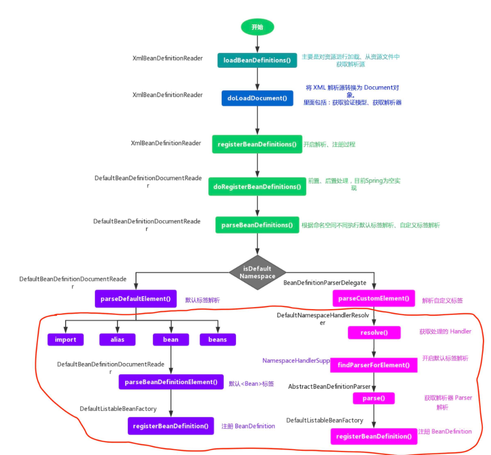

- 红框部分，就是 **BeanDefinition 的解析过程**。

## IoC 之解析Bean-解析 import 标签

- 如果根节点或者子节点采用默认命名空间的话，则调用 `#parseDefaultElement(...)` 方法，进行**默认**标签解析
- 否则，调用 `BeanDefinitionParserDelegate#parseCustomElement(...)` 方法，进行**自定义**解析。

所以，以下博客就这两个方法进行详细分析说明。而本文，先从**默认标签**解析过程开始。代码如下：

```java
// DefaultBeanDefinitionDocumentReader.java

public static final String IMPORT_ELEMENT = "import";
public static final String ALIAS_ATTRIBUTE = "alias";
public static final String BEAN_ELEMENT = BeanDefinitionParserDelegate.BEAN_ELEMENT;
public static final String NESTED_BEANS_ELEMENT = "beans";

private void parseDefaultElement(Element ele, BeanDefinitionParserDelegate delegate) {
	if (delegate.nodeNameEquals(ele, IMPORT_ELEMENT)) { // import
		importBeanDefinitionResource(ele);
	} else if (delegate.nodeNameEquals(ele, ALIAS_ELEMENT)) { // alias
		processAliasRegistration(ele);
	} else if (delegate.nodeNameEquals(ele, BEAN_ELEMENT)) { // bean
		processBeanDefinition(ele, delegate);
	} else if (delegate.nodeNameEquals(ele, NESTED_BEANS_ELEMENT)) { // beans
		// recurse
		doRegisterBeanDefinitions(ele);
	}
}
```

该方法的功能一目了然，分别是对四种不同的标签进行解析，分别是 `import`、`alias`、`bean`、`beans` 。咱门从第一个标签 `import` 开始。

### import 示例

经历过 Spring 配置文件的小伙伴都知道，如果工程比较大，配置文件的维护会让人觉得恐怖，文件太多了，想象将所有的配置都放在一个 `spring.xml` 配置文件中，哪种后怕感是不是很明显？

所有针对这种情况 Spring 提供了一个分模块的思路，利用 `import` 标签，例如我们可以构造一个这样的 `spring.xml` 。

```java
<?xml version="1.0" encoding="UTF-8"?>
<beans xmlns="http://www.springframework.org/schema/beans"
       xmlns:xsi="http://www.w3.org/2001/XMLSchema-instance"
       xsi:schemaLocation="http://www.springframework.org/schema/beans
       http://www.springframework.org/schema/beans/spring-beans.xsd">

    <import resource="spring-student.xml"/>

    <import resource="spring-student-dtd.xml"/>

</beans>
```

`spring.xml` 配置文件中，使用 `import` 标签的方式导入其他模块的配置文件。

- 如果有配置需要修改直接修改相应配置文件即可。
- 若有新的模块需要引入直接增加 `import` 即可。

这样大大简化了配置后期维护的复杂度，同时也易于管理。

###  importBeanDefinitionResource

Spring 使用 `#importBeanDefinitionResource(Element ele)` 方法，完成对 `import` 标签的解析。

```java
// DefaultBeanDefinitionDocumentReader.java

/**
 * Parse an "import" element and load the bean definitions
 * from the given resource into the bean factory.
 */
protected void importBeanDefinitionResource(Element ele) {
    // <1> 获取 resource 的属性值
    String location = ele.getAttribute(RESOURCE_ATTRIBUTE);
    // 为空，直接退出
    if (!StringUtils.hasText(location)) {
        getReaderContext().error("Resource location must not be empty", ele); // 使用 problemReporter 报错
        return;
    }

    // <2> 解析系统属性，格式如 ："${user.dir}"
    // Resolve system properties: e.g. "${user.dir}"
    location = getReaderContext().getEnvironment().resolveRequiredPlaceholders(location);

    // 实际 Resource 集合，即 import 的地址，有哪些 Resource 资源
    Set<Resource> actualResources = new LinkedHashSet<>(4);

    // <3> 判断 location 是相对路径还是绝对路径
    // Discover whether the location is an absolute or relative URI
    boolean absoluteLocation = false;
    try {
        absoluteLocation = ResourcePatternUtils.isUrl(location) || ResourceUtils.toURI(location).isAbsolute();
    } catch (URISyntaxException ex) {
        // cannot convert to an URI, considering the location relative
        // unless it is the well-known Spring prefix "classpath*:"
    }

    // Absolute or relative?
    // <4> 绝对路径
    if (absoluteLocation) {
        try {
            // 添加配置文件地址的 Resource 到 actualResources 中，并加载相应的 BeanDefinition 们
            int importCount = getReaderContext().getReader().loadBeanDefinitions(location, actualResources);
            if (logger.isTraceEnabled()) {
                logger.trace("Imported " + importCount + " bean definitions from URL location [" + location + "]");
            }
        } catch (BeanDefinitionStoreException ex) {
            getReaderContext().error(
                    "Failed to import bean definitions from URL location [" + location + "]", ele, ex);
        }
    // <5> 相对路径
    } else {
        // No URL -> considering resource location as relative to the current file.
        try {
            int importCount;
            // 创建相对地址的 Resource
            Resource relativeResource = getReaderContext().getResource().createRelative(location);
            // 存在
            if (relativeResource.exists()) {
                // 加载 relativeResource 中的 BeanDefinition 们
                importCount = getReaderContext().getReader().loadBeanDefinitions(relativeResource);
                // 添加到 actualResources 中
                actualResources.add(relativeResource);
            // 不存在
            } else {
                // 获得根路径地址
                String baseLocation = getReaderContext().getResource().getURL().toString();
                // 添加配置文件地址的 Resource 到 actualResources 中，并加载相应的 BeanDefinition 们
                importCount = getReaderContext().getReader().loadBeanDefinitions(
                        StringUtils.applyRelativePath(baseLocation, location) /* 计算绝对路径 */, actualResources);
            }
            if (logger.isTraceEnabled()) {
                logger.trace("Imported " + importCount + " bean definitions from relative location [" + location + "]");
            }
        } catch (IOException ex) {
            getReaderContext().error("Failed to resolve current resource location", ele, ex);
        } catch (BeanDefinitionStoreException ex) {
            getReaderContext().error(
                    "Failed to import bean definitions from relative location [" + location + "]", ele, ex);
        }
    }
    // <6> 解析成功后，进行监听器激活处理
    Resource[] actResArray = actualResources.toArray(new Resource[0]);
    getReaderContext().fireImportProcessed(location, actResArray, extractSource(ele));
}
```

解析 `import` 标签的过程较为清晰，整个过程如下：

- <1>处，获取source属性的值，该值表示资源的路径。
- `<2>` 处，解析路径中的系统属性，如 `"${user.dir}"` 。
- <3>处，判断资源路径location是绝对路径还是相对路径。详细解析，见[判断路径](#判断路径)
- `<4>` 处，如果是绝对路径，则调递归调用 Bean 的解析过程，进行另一次的解析。详细解析，见 [处理绝对路径](#处理绝对路径) 。
- `<5>` 处，如果是相对路径，则先计算出绝对路径得到 Resource，然后进行解析。详细解析，见 [处理相对路径](#处理相对路径) 。
- `<6>` 处，通知监听器，完成解析。

####  判断路径

通过以下代码，来判断 `location` 是为相对路径还是绝对路径：

```java
absoluteLocation = ResourcePatternUtils.isUrl(location) // <1>
    || ResourceUtils.toURI(location).isAbsolute(); // <2>
```

判断绝对路径的规则如下：

- `<1>` 以 `classpath*:` 或者 `classpath:` 开头的为绝对路径。
- `<1>` 能够通过该 `location` 构建出 `java.net.URL` 为绝对路径。
- `<2>` 根据 `location` 构造 `java.net.URI` 判断调用 `#isAbsolute()` 方法，判断是否为绝对路径。

####  处理绝对路径

如果 `location` 为绝对路径，则调用 `#loadBeanDefinitions(String location, Set<Resource> actualResources)`， 方法。该方法在 `org.springframework.beans.factory.support.AbstractBeanDefinitionReader` 中定义，代码如下：

```java
/**
 * Load bean definitions from the specified resource location.
 * <p>The location can also be a location pattern, provided that the
 * ResourceLoader of this bean definition reader is a ResourcePatternResolver.
 * @param location the resource location, to be loaded with the ResourceLoader
 * (or ResourcePatternResolver) of this bean definition reader
 * @param actualResources a Set to be filled with the actual Resource objects
 * that have been resolved during the loading process. May be {@code null}
 * to indicate that the caller is not interested in those Resource objects.
 * @return the number of bean definitions found
 * @throws BeanDefinitionStoreException in case of loading or parsing errors
 * @see #getResourceLoader()
 * @see #loadBeanDefinitions(org.springframework.core.io.Resource)
 * @see #loadBeanDefinitions(org.springframework.core.io.Resource[])
 */
public int loadBeanDefinitions(String location, @Nullable Set<Resource> actualResources) throws BeanDefinitionStoreException {
    // 获得 ResourceLoader 对象
    ResourceLoader resourceLoader = getResourceLoader();
    if (resourceLoader == null) {
        throw new BeanDefinitionStoreException(
                "Cannot load bean definitions from location [" + location + "]: no ResourceLoader available");
    }

    if (resourceLoader instanceof ResourcePatternResolver) {
        // Resource pattern matching available.
        try {
            // 获得 Resource 数组，因为 Pattern 模式匹配下，可能有多个 Resource 。例如说，Ant 风格的 location
            Resource[] resources = ((ResourcePatternResolver) resourceLoader).getResources(location);
            // 加载 BeanDefinition 们
            int count = loadBeanDefinitions(resources);
            // 添加到 actualResources 中
            if (actualResources != null) {
                Collections.addAll(actualResources, resources);
            }
            if (logger.isTraceEnabled()) {
                logger.trace("Loaded " + count + " bean definitions from location pattern [" + location + "]");
            }
            return count;
        } catch (IOException ex) {
            throw new BeanDefinitionStoreException(
                    "Could not resolve bean definition resource pattern [" + location + "]", ex);
        }
    } else {
        // Can only load single resources by absolute URL.
        // 获得 Resource 对象，
        Resource resource = resourceLoader.getResource(location);
        // 加载 BeanDefinition 们
        int count = loadBeanDefinitions(resource);
        // 添加到 actualResources 中
        if (actualResources != null) {
            actualResources.add(resource);
        }
        if (logger.isTraceEnabled()) {
            logger.trace("Loaded " + count + " bean definitions from location [" + location + "]");
        }
        return count;
    }
}
```

整个逻辑比较简单：

- 首先，获取 ResourceLoader 对象。
- 然后，根据不同的 ResourceLoader 执行不同的逻辑，主要是可能存在多个 Resource 。
- 最终，都会回归到 `XmlBeanDefinitionReader#loadBeanDefinitions(Resource... resources)` 方法，所以这是一个递归的过程。
- 另外，获得到的 Resource 的对象或数组，都会添加到 `actualResources` 中。

#### 处理相对路径

如果 `location` 是相对路径，则会根据相应的 Resource 计算出相应的相对路径的 Resource 对象 ，然后：

- 若该 Resource 存在，则调用 `XmlBeanDefinitionReader#loadBeanDefinitions()` 方法，进行 BeanDefinition 加载。
- 否则，构造一个绝对 `location`( 即 `StringUtils.applyRelativePath(baseLocation, location)` 处的代码)，并调用 `#loadBeanDefinitions(String location, Set<Resource> actualResources)` 方法，**与绝对路径过程一样**。

### 小结

至此，`import` 标签解析完毕，整个过程比较清晰明了：**获取 source 属性值，得到正确的资源路径，然后调用 `XmlBeanDefinitionReader#loadBeanDefinitions(Resource... resources)` 方法，进行递归的 BeanDefinition 加载**。

## IoC 之解析bean标签：开启解析进程

### processBeanDefinition

在方法 `#parseDefaultElement(...)` 方法中，如果遇到标签为 `bean` 时，则调用 `#processBeanDefinition(Element ele, BeanDefinitionParserDelegate delegate)` 方法，进行 `bean` 标签的解析。代码如下：

```java
// DefaultBeanDefinitionDocumentReader.java

/**
 * Process the given bean element, parsing the bean definition
 * and registering it with the registry.
 */
protected void processBeanDefinition(Element ele, BeanDefinitionParserDelegate delegate) {
    // 进行 bean 元素解析。
    // <1> 如果解析成功，则返回 BeanDefinitionHolder 对象。而 BeanDefinitionHolder 为 name 和 alias 的 BeanDefinition 对象
    // 如果解析失败，则返回 null 。
    BeanDefinitionHolder bdHolder = delegate.parseBeanDefinitionElement(ele);
    if (bdHolder != null) {
        // <2> 进行自定义标签处理
        bdHolder = delegate.decorateBeanDefinitionIfRequired(ele, bdHolder);
        try {
            // <3> 进行 BeanDefinition 的注册
            // Register the final decorated instance.
            BeanDefinitionReaderUtils.registerBeanDefinition(bdHolder, getReaderContext().getRegistry());
        } catch (BeanDefinitionStoreException ex) {
            getReaderContext().error("Failed to register bean definition with name '" +
                    bdHolder.getBeanName() + "'", ele, ex);
        }
        // <4> 发出响应事件，通知相关的监听器，已完成该 Bean 标签的解析。
        // Send registration event.
        getReaderContext().fireComponentRegistered(new BeanComponentDefinition(bdHolder));
    }
}
```

整个过程分为四个步骤：

1.  调用`BeanDefinitionParserDelegate#parseBeanDefinitionElement(Element ele, BeanDefinitionParserDelegate delegate)`方法，进行元素解析。

    - 如果解析**失败**，则返回 `null`，错误由 ProblemReporter 处理。
   - 如果解析**成功**，则返回 BeanDefinitionHolder 实例 `bdHolder` 。BeanDefinitionHolder 为持有 `name` 和 `alias` 的 BeanDefinition。
   
2.  若实例 `bdHolder` 不为空，则调用 `BeanDefinitionParserDelegate#decorateBeanDefinitionIfRequired(Element ele, BeanDefinitionHolder bdHolder)` 方法，进行自定义标签处理。

3.  解析完成后，则调用 `BeanDefinitionReaderUtils#registerBeanDefinition(BeanDefinitionHolder definitionHolder, BeanDefinitionRegistry registry)` 方法，对 `bdHolder` 进行 BeanDefinition 的注册。

4.  发出响应事件，通知相关的监听器，完成 Bean 标签解析。

### parseBeanDefinitionElement

`BeanDefinitionParserDelegate#parseBeanDefinitionElement(Element ele, BeanDefinitionParserDelegate delegate)` 方法，进行 `<bean>` 元素解析。代码如下：

```java
// BeanDefinitionParserDelegate.java

/**
 * Parses the supplied {@code <bean>} element. May return {@code null}
 * if there were errors during parse. Errors are reported to the
 * {@link org.springframework.beans.factory.parsing.ProblemReporter}.
 */
@Nullable
public BeanDefinitionHolder parseBeanDefinitionElement(Element ele) {
    return parseBeanDefinitionElement(ele, null);
}

/**
 * Parses the supplied {@code <bean>} element. May return {@code null}
 * if there were errors during parse. Errors are reported to the
 * {@link org.springframework.beans.factory.parsing.ProblemReporter}.
 *
 * @param containingBean TODO 芋艿，需要进一步确认
 */
@Nullable
public BeanDefinitionHolder parseBeanDefinitionElement(Element ele, @Nullable BeanDefinition containingBean) {
    // <1> 解析 id 和 name 属性
    String id = ele.getAttribute(ID_ATTRIBUTE);
    String nameAttr = ele.getAttribute(NAME_ATTRIBUTE);

    // <1> 计算别名集合
    List<String> aliases = new ArrayList<>();
    if (StringUtils.hasLength(nameAttr)) {
        String[] nameArr = StringUtils.tokenizeToStringArray(nameAttr, MULTI_VALUE_ATTRIBUTE_DELIMITERS);
        aliases.addAll(Arrays.asList(nameArr));
    }

    // <3.1> beanName ，优先，使用 id
    String beanName = id;
    // <3.2> beanName ，其次，使用 aliases 的第一个
    if (!StringUtils.hasText(beanName) && !aliases.isEmpty()) {
        beanName = aliases.remove(0); // 移除出别名集合
        if (logger.isTraceEnabled()) {
            logger.trace("No XML 'id' specified - using '" + beanName +
                    "' as bean name and " + aliases + " as aliases");
        }
    }

    // <2> 检查 beanName 的唯一性
    if (containingBean == null) {
        checkNameUniqueness(beanName, aliases, ele);
    }

    // <4> 解析属性，构造 AbstractBeanDefinition 对象
    AbstractBeanDefinition beanDefinition = parseBeanDefinitionElement(ele, beanName, containingBean);
    if (beanDefinition != null) {
        // <3.3> beanName ，再次，使用 beanName 生成规则
        if (!StringUtils.hasText(beanName)) {
            try {
                if (containingBean != null) {
                    // <3.3> 生成唯一的 beanName
                    beanName = BeanDefinitionReaderUtils.generateBeanName(
                            beanDefinition, this.readerContext.getRegistry(), true);
                } else {
                    // <3.3> 生成唯一的 beanName
                    beanName = this.readerContext.generateBeanName(beanDefinition);
                    // TODO 芋艿，需要进一步确认
                    // Register an alias for the plain bean class name, if still possible,
                    // if the generator returned the class name plus a suffix.
                    // This is expected for Spring 1.2/2.0 backwards compatibility.
                    String beanClassName = beanDefinition.getBeanClassName();
                    if (beanClassName != null &&
                            beanName.startsWith(beanClassName) && beanName.length() > beanClassName.length() &&
                            !this.readerContext.getRegistry().isBeanNameInUse(beanClassName)) {
                        aliases.add(beanClassName);
                    }
                }
                if (logger.isTraceEnabled()) {
                    logger.trace("Neither XML 'id' nor 'name' specified - " +
                            "using generated bean name [" + beanName + "]");
                }
            } catch (Exception ex) {
                error(ex.getMessage(), ele);
                return null;
            }
        }
        // <5> 创建 BeanDefinitionHolder 对象
        String[] aliasesArray = StringUtils.toStringArray(aliases);
        return new BeanDefinitionHolder(beanDefinition, beanName, aliasesArray);
    }
    return null;
}
```

这个方法还没有对 `bean` 标签进行解析，只是在解析动作之前做了一些功能架构，主要的工作有：

- `<1>` 处，解析 `id`、`name` 属性，确定 `aliases` 集合

- `<2>` 处，检测 `beanName` 是否唯一。代码如下：

  ```java
  /**
   * 已使用 Bean 名字的集合
   *
   * Stores all used bean names so we can enforce uniqueness on a per
   * beans-element basis. Duplicate bean ids/names may not exist within the
   * same level of beans element nesting, but may be duplicated across levels.
   */
  private final Set<String> usedNames = new HashSet<>();
  
  /**
   * Validate that the specified bean name and aliases have not been used already
   * within the current level of beans element nesting.
   */
  protected void checkNameUniqueness(String beanName, List<String> aliases, Element beanElement) {
  	// 寻找是否 beanName 已经使用
      String foundName = null;
  	if (StringUtils.hasText(beanName) && this.usedNames.contains(beanName)) {
  		foundName = beanName;
  	}
  	if (foundName == null) {
  		foundName = CollectionUtils.findFirstMatch(this.usedNames, aliases);
  	}
  	// 若已使用，使用 problemReporter 提示错误
  	if (foundName != null) {
  		error("Bean name '" + foundName + "' is already used in this <beans> element", beanElement);
  	}
  
  	// 添加到 usedNames 集合
  	this.usedNames.add(beanName);
  	this.usedNames.addAll(aliases);
  }
  ```

- 这里有必要说下 `beanName` 的命名规则：

  - `<3.1>` 处，如果 `id` 不为空，则 `beanName = id` 。
  - `<3.2>` 处，如果 `id` 为空，但是 `aliases` 不空，则 `beanName` 为 `aliases` 的**第一个**元素
  - `<3.3>` 处，如果两者都为空，则根据**默认规则**来设置 beanName 。因为**默认规则**不是本文的重点，所以暂时省略。

- `<4>` 处，调用 `#parseBeanDefinitionElement(Element ele, String beanName, BeanDefinition containingBean)` 方法，对属性进行解析并封装成 AbstractBeanDefinition 实例 `beanDefinition` 。详细解析，见 [「2.1 parseBeanDefinitionElement」](http://svip.iocoder.cn/Spring/IoC-parse-BeanDefinitions-in-processBeanDefinition/#) 。

- `<5>` 处，根据所获取的信息（`beanName`、`aliases`、`beanDefinition`）构造 BeanDefinitionHolder 实例对象并返回。其中，BeanDefinitionHolder 的简化代码如下：

  ```java
  /**
   * BeanDefinition 对象
   */
  private final BeanDefinition beanDefinition;
  /**
   * Bean 名字
   */
  private final String beanName;
  /**
   * 别名集合
   */
  @Nullable
  private final String[] aliases;
  ```

​		参考下 [《Spring专题之IOC源码分析》](https://segmentfault.com/a/1190000016261917) ，进行细化。

#### parseBeanDefinitionElement

`#parseBeanDefinitionElement(Element ele, String beanName, BeanDefinition containingBean)` 方法，对属性进行解析并封装成 AbstractBeanDefinition 实例，代码如下：

```java
/**
 * Parse the bean definition itself, without regard to name or aliases. May return
 * {@code null} if problems occurred during the parsing of the bean definition.
 */
@Nullable
public AbstractBeanDefinition parseBeanDefinitionElement(
        Element ele, String beanName, @Nullable BeanDefinition containingBean) {

    this.parseState.push(new BeanEntry(beanName));

    // 解析 class 属性
    String className = null;
    if (ele.hasAttribute(CLASS_ATTRIBUTE)) {
        className = ele.getAttribute(CLASS_ATTRIBUTE).trim();
    }
    // 解析 parent 属性
    String parent = null;
    if (ele.hasAttribute(PARENT_ATTRIBUTE)) {
        parent = ele.getAttribute(PARENT_ATTRIBUTE);
    }

    try {
        // 创建用于承载属性的 AbstractBeanDefinition 实例
        AbstractBeanDefinition bd = createBeanDefinition(className, parent);

        // 解析默认 bean 的各种属性
        parseBeanDefinitionAttributes(ele, beanName, containingBean, bd);
        // 提取 description
        bd.setDescription(DomUtils.getChildElementValueByTagName(ele, DESCRIPTION_ELEMENT));

        // tips：
        // 下面的一堆是解析 <bean>......</bean> 内部的子元素，
        // 解析出来以后的信息都放到 bd 的属性中

        // 解析元数据 <meta />
        parseMetaElements(ele, bd);
        // 解析 lookup-method 属性 <lookup-method />
        parseLookupOverrideSubElements(ele, bd.getMethodOverrides());
        // 解析 replaced-method 属性 <replaced-method />
        parseReplacedMethodSubElements(ele, bd.getMethodOverrides());

        // 解析构造函数参数 <constructor-arg />
        parseConstructorArgElements(ele, bd);
        // 解析 property 子元素 <property />
        parsePropertyElements(ele, bd);
        // 解析 qualifier 子元素 <qualifier />
        parseQualifierElements(ele, bd);

        bd.setResource(this.readerContext.getResource());
        bd.setSource(extractSource(ele));

        return bd;
    } catch (ClassNotFoundException ex) {
        error("Bean class [" + className + "] not found", ele, ex);
    } catch (NoClassDefFoundError err) {
        error("Class that bean class [" + className + "] depends on not found", ele, err);
    } catch (Throwable ex) {
        error("Unexpected failure during bean definition parsing", ele, ex);
    } finally {
        this.parseState.pop();
    }

    return null;
}
```

到这里，`bean` 标签的所有属性我们都可以看到其解析的过程，也就说到这里我们已经解析一个基本可用的 BeanDefinition 。

#### createBeanDefinition

`#createBeanDefinition(String className, String parentName)` 方法，创建 AbstractBeanDefinition 对象。代码如下：

```java
/**
 * Create a bean definition for the given class name and parent name.
 * @param className the name of the bean class
 * @param parentName the name of the bean's parent bean
 * @return the newly created bean definition
 * @throws ClassNotFoundException if bean class resolution was attempted but failed
 */
protected AbstractBeanDefinition createBeanDefinition(@Nullable String className, @Nullable String parentName)
		throws ClassNotFoundException {
	return BeanDefinitionReaderUtils.createBeanDefinition(
			parentName, className, this.readerContext.getBeanClassLoader());
}
```

## IoC 之解析 bean 标签：BeanDefinition

解析 bean 标签的过程其实就是构造一个 BeanDefinition 对象的过程。`<bean>` 元素标签拥有的配置属性，BeanDefinition 均提供了相应的属性，与之一一对应。所以，我们有必要对 BeanDefinition **先**有一个整体的认识。

###  BeanDefinition

`org.springframework.beans.factory.config.BeanDefinition` ，是一个接口，它描述了一个 Bean 实例的**定义**，包括属性值、构造方法值和继承自它的类的更多信息。代码如下：

```java
String SCOPE_SINGLETON = ConfigurableBeanFactory.SCOPE_SINGLETON;
String SCOPE_PROTOTYPE = ConfigurableBeanFactory.SCOPE_PROTOTYPE;


int ROLE_APPLICATION = 0;
int ROLE_SUPPORT = 1;
int ROLE_INFRASTRUCTURE = 2;

void setParentName(@Nullable String parentName);
@Nullable
String getParentName();

void setBeanClassName(@Nullable String beanClassName);
@Nullable
String getBeanClassName();

void setScope(@Nullable String scope);
@Nullable
String getScope();

void setLazyInit(boolean lazyInit);
boolean isLazyInit();

void setDependsOn(@Nullable String... dependsOn);
@Nullable
String[] getDependsOn();

void setAutowireCandidate(boolean autowireCandidate);
boolean isAutowireCandidate();

void setPrimary(boolean primary);
boolean isPrimary();

void setFactoryBeanName(@Nullable String factoryBeanName);
@Nullable
String getFactoryBeanName();

void setFactoryMethodName(@Nullable String factoryMethodName);
@Nullable
String getFactoryMethodName();

ConstructorArgumentValues getConstructorArgumentValues();
default boolean hasConstructorArgumentValues() {
	return !getConstructorArgumentValues().isEmpty();
}

MutablePropertyValues getPropertyValues();
default boolean hasPropertyValues() {
	return !getPropertyValues().isEmpty();
}

void setInitMethodName(@Nullable String initMethodName);
@Nullable
String getInitMethodName();

void setDestroyMethodName(@Nullable String destroyMethodName);
@Nullable
String getDestroyMethodName();

void setRole(int role);
int getRole();

void setDescription(@Nullable String description);
@Nullable
String getDescription();

boolean isSingleton();

boolean isPrototype();

boolean isAbstract();

@Nullable
String getResourceDescription();

@Nullable
BeanDefinition getOriginatingBeanDefinition();
```

虽然接口方法比较多，但是是不是一下子和我们平时使用 `<bean>` 标签的属性，能够对应上落。

#### BeanDefinition 的父关系

BeanDefinition 继承 AttributeAccessor 和 BeanMetadataElement 接口。两个接口定义如下：

- `org.springframework.cor.AttributeAccessor` 接口，定义了与其它对象的（元数据）进行连接和访问的约定，即对属性的修改，包括获取、设置、删除。代码如下：

  ```java
  public interface AttributeAccessor {
  
  	void setAttribute(String name, @Nullable Object value);
  
  	@Nullable
  	Object getAttribute(String name);
  
  	@Nullable
  	Object removeAttribute(String name);
  
  	boolean hasAttribute(String name);
  
  	String[] attributeNames();
  
  }
  ```

- `org.springframework.beans.BeanMetadataElement` 接口，Bean 元对象持有的配置元素可以通过 `#getSource()` 方法来获取。代码如下：

  ```java
  public interface BeanMetadataElement {
  
  	@Nullable
  	Object getSource();
  
  }
  ```

#### BeanDefinition 的子关系

BeanDefinition 子关系，结构如下图：

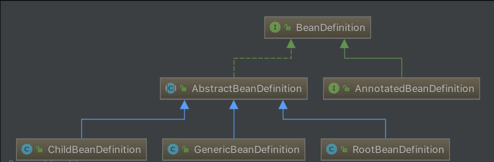

我们常用的三个实现类有：

- `org.springframework.beans.factory.support.ChildBeanDefinition`
- `org.springframework.beans.factory.support.RootBeanDefinition`
- `org.springframework.beans.factory.support.GenericBeanDefinition`
- ChildBeanDefinition、RootBeanDefinition、GenericBeanDefinition 三者都继承 AbstractBeanDefinition 抽象类，即 AbstractBeanDefinition 对三个子类的共同的类信息进行抽象。
- 如果配置文件中定义了父 `<bean>` 和 子 `<bean>` ，则父 `<bean>` 用 RootBeanDefinition 表示，子 `<bean>` 用 ChildBeanDefinition 表示，而没有父 `<bean>` 的就使用RootBeanDefinition 表示。
- GenericBeanDefinition 为一站式服务类。

### 解析 Bean 标签

在 `BeanDefinitionParserDelegate#parseBeanDefinitionElement(Element ele, String beanName, BeanDefinition containingBean)` 方法中，完成解析后，返回的是一个已经完成对 `<bean>` 标签解析的 BeanDefinition 实例。

#### createBeanDefinition

在该方法内部，首先调用 `#createBeanDefinition(String className, String parentName)` 方法，创建 AbstractBeanDefinition 对象。代码如下：

```java
protected AbstractBeanDefinition createBeanDefinition(@Nullable String className, @Nullable String parentName)
		throws ClassNotFoundException {
	return BeanDefinitionReaderUtils.createBeanDefinition(
			parentName, className, this.readerContext.getBeanClassLoader());
}
```

- 委托 BeanDefinitionReaderUtils 创建，代码如下：

  ```java
  // BeanDefinitionReaderUtils.java
  
  public static AbstractBeanDefinition createBeanDefinition(
          @Nullable String parentName, @Nullable String className, @Nullable ClassLoader classLoader) throws ClassNotFoundException {
      // 创建 GenericBeanDefinition 对象
      GenericBeanDefinition bd = new GenericBeanDefinition();
      // 设置 parentName
      bd.setParentName(parentName);
      if (className != null) {
          // 设置 beanClass
          if (classLoader != null) {
              bd.setBeanClass(ClassUtils.forName(className, classLoader));
          // 设置 beanClassName
          } else {
              bd.setBeanClassName(className);
          }
      }
      return bd;
  }
  ```

  - 该方法主要是，创建 GenericBeanDefinition 对象，并设置 `parentName`、`className`、`beanClass` 属性。


#### parseBeanDefinitionAttributes

  创建完 GenericBeanDefinition 实例后，再调用 `#parseBeanDefinitionAttributes(Element ele, String beanName, BeanDefinition containingBean, AbstractBeanDefinition bd)` 方法，该方法将创建好的 GenericBeanDefinition 实例当做参数，对 `bean` 标签的所有属性进行解析，如下：

  ```java
  // BeanDefinitionParserDelegate.java
  
  public AbstractBeanDefinition parseBeanDefinitionAttributes(Element ele, String beanName,
          @Nullable BeanDefinition containingBean, AbstractBeanDefinition bd) {
      // 解析 scope 属性
      if (ele.hasAttribute(SINGLETON_ATTRIBUTE)) {
          error("Old 1.x 'singleton' attribute in use - upgrade to 'scope' declaration", ele);
      } else if (ele.hasAttribute(SCOPE_ATTRIBUTE)) {
          bd.setScope(ele.getAttribute(SCOPE_ATTRIBUTE));
      } else if (containingBean != null) {
          // Take default from containing bean in case of an inner bean definition.
          bd.setScope(containingBean.getScope());
      }
  
      // 解析 abstract 属性
      if (ele.hasAttribute(ABSTRACT_ATTRIBUTE)) {
          bd.setAbstract(TRUE_VALUE.equals(ele.getAttribute(ABSTRACT_ATTRIBUTE)));
      }
  
      // 解析 lazy-init 属性
      String lazyInit = ele.getAttribute(LAZY_INIT_ATTRIBUTE);
      if (DEFAULT_VALUE.equals(lazyInit)) {
          lazyInit = this.defaults.getLazyInit();
      }
      bd.setLazyInit(TRUE_VALUE.equals(lazyInit));
  
      // 解析 autowire 属性
      String autowire = ele.getAttribute(AUTOWIRE_ATTRIBUTE);
      bd.setAutowireMode(getAutowireMode(autowire));
  
      // 解析 depends-on 属性
      if (ele.hasAttribute(DEPENDS_ON_ATTRIBUTE)) {
          String dependsOn = ele.getAttribute(DEPENDS_ON_ATTRIBUTE);
          bd.setDependsOn(StringUtils.tokenizeToStringArray(dependsOn, MULTI_VALUE_ATTRIBUTE_DELIMITERS));
      }
  
      // 解析 autowire-candidate 属性
      String autowireCandidate = ele.getAttribute(AUTOWIRE_CANDIDATE_ATTRIBUTE);
      if ("".equals(autowireCandidate) || DEFAULT_VALUE.equals(autowireCandidate)) {
          String candidatePattern = this.defaults.getAutowireCandidates();
          if (candidatePattern != null) {
              String[] patterns = StringUtils.commaDelimitedListToStringArray(candidatePattern);
              bd.setAutowireCandidate(PatternMatchUtils.simpleMatch(patterns, beanName));
          }
      } else {
          bd.setAutowireCandidate(TRUE_VALUE.equals(autowireCandidate));
      }
  
      // 解析 primary 标签
      if (ele.hasAttribute(PRIMARY_ATTRIBUTE)) {
          bd.setPrimary(TRUE_VALUE.equals(ele.getAttribute(PRIMARY_ATTRIBUTE)));
      }
  
      // 解析 init-method 属性
      if (ele.hasAttribute(INIT_METHOD_ATTRIBUTE)) {
          String initMethodName = ele.getAttribute(INIT_METHOD_ATTRIBUTE);
          bd.setInitMethodName(initMethodName);
      } else if (this.defaults.getInitMethod() != null) {
          bd.setInitMethodName(this.defaults.getInitMethod());
          bd.setEnforceInitMethod(false);
      }
  
      // 解析 destroy-method 属性
      if (ele.hasAttribute(DESTROY_METHOD_ATTRIBUTE)) {
          String destroyMethodName = ele.getAttribute(DESTROY_METHOD_ATTRIBUTE);
          bd.setDestroyMethodName(destroyMethodName);
      } else if (this.defaults.getDestroyMethod() != null) {
          bd.setDestroyMethodName(this.defaults.getDestroyMethod());
          bd.setEnforceDestroyMethod(false);
      }
  
      // 解析 factory-method 属性
      if (ele.hasAttribute(FACTORY_METHOD_ATTRIBUTE)) {
          bd.setFactoryMethodName(ele.getAttribute(FACTORY_METHOD_ATTRIBUTE));
      }
      if (ele.hasAttribute(FACTORY_BEAN_ATTRIBUTE)) {
          bd.setFactoryBeanName(ele.getAttribute(FACTORY_BEAN_ATTRIBUTE));
      }
  
      return bd;
  }
  ```

  从上面代码我们可以清晰地看到对 `bean` 标签属性的解析，这些属性我们在工作中都或多或少用到过。

## IoC 之解析 bean 标签：meta、lookup-method、replace-method

完成 `bean` 标签的基本属性解析后，会依次调用 BeanDefinitionParserDelegate 的 `#parseMetaElements(lement ele, BeanMetadataAttributeAccessor attributeAccessor)`、`#parseLookupOverrideSubElements(Element beanEle, MethodOverrides overrides)`、`#parseReplacedMethodSubElements(Element beanEle, MethodOverrides overrides)` 方法，分别对子元素 `meta`、`lookup-method`、`replace-method` 元素完成解析。三个子元素的作用如下：

- `<meta>` ：元数据。
- `<lookup-method>` ：Spring 动态改变 bean 里方法的实现。方法执行返回的对象，使用 Spring 内原有的这类对象替换，通过改变方法返回值来动态改变方法。内部实现为使用 cglib 方法，重新生成子类，重写配置的方法和返回对象，达到动态改变的效果。

- `<replace-method>` ：Spring 动态改变 bean 里方法的实现。需要改变的方法，使用 Spring 内原有其他类（需要继承接口`org.springframework.beans.factory.support.MethodReplacer`）的逻辑，替换这个方法。通过改变方法执行逻辑来动态改变方法。

### meta 子元素

> **meta** ：元数据。当需要使用里面的信息时可以通过 key 获取。

meta 所声明的 key 并不会在 Bean 中体现，只是一个额外的声明，当我们需要使用里面的信息时，通过调用 BeanDefinition 的 `#getAttribute(String name)` 方法来获取。该子元素的解析过程，代码如下：

```java
// BeanDefinitionParserDelegate.java

public void parseMetaElements(Element ele, BeanMetadataAttributeAccessor attributeAccessor) {
    NodeList nl = ele.getChildNodes();
    // 遍历子节点
    for (int i = 0; i < nl.getLength(); i++) {
        Node node = nl.item(i);
        // <meta key="special-data" value="sprecial stragey" />
        if (isCandidateElement(node) && nodeNameEquals(node, META_ELEMENT)) { // 标签名为 meta
            Element metaElement = (Element) node;
            String key = metaElement.getAttribute(KEY_ATTRIBUTE); // key
            String value = metaElement.getAttribute(VALUE_ATTRIBUTE); // value
            // 创建 BeanMetadataAttribute 对象
            BeanMetadataAttribute attribute = new BeanMetadataAttribute(key, value);
            attribute.setSource(extractSource(metaElement));
            // 添加到 BeanMetadataAttributeAccessor 中
            attributeAccessor.addMetadataAttribute(attribute);
        }
    }
}
```

- 解析过程较为简单，获取相应的 key - value 构建 BeanMetadataAttribute 对象，然后调用 `BeanMetadataAttributeAccessor#addMetadataAttribute(BeanMetadataAttribute)` 方法，添加 BeanMetadataAttribute 加入到 AbstractBeanDefinition 中。

  > 友情提示：
  >
  > AbstractBeanDefinition 继承 BeanMetadataAttributeAccessor 类
  > BeanMetadataAttributeAccessor 继承 AttributeAccessorSupport 类。

#### addMetadataAttribute

调用 `BeanMetadataAttributeAccessor#addMetadataAttribute(BeanMetadataAttribute)` 方法，添加 BeanMetadataAttribute 加入到 AbstractBeanDefinition 中。代码如下：

```java
// BeanMetadataAttributeAccessor.java

public void addMetadataAttribute(BeanMetadataAttribute attribute) {
	super.setAttribute(attribute.getName(), attribute);
}
```

- 委托 AttributeAccessorSupport 实现，如下：

```java
// AttributeAccessorSupport.java

/** Map with String keys and Object values. */
private final Map<String, Object> attributes = new LinkedHashMap<>();

@Override
public void setAttribute(String name, @Nullable Object value) {
	Assert.notNull(name, "Name must not be null");
	if (value != null) {
		this.attributes.put(name, value);
	} else {
		removeAttribute(name);
	}
}
```

`org.springframework.core.AttributeAccessorSupport` ，是接口 AttributeAccessor 的实现者。 AttributeAccessor 接口定义了与其他对象的元数据进行连接和访问的约定，可以通过该接口对属性进行获取、设置、删除操作。

#### getAttribute

设置元数据后，则可以通过调用 BeanDefinition 的 `#getAttribute(String name)` 方法来获取属性。代码如下：

```java
// AttributeAccessorSupport.java

/** Map with String keys and Object values. */
private final Map<String, Object> attributes = new LinkedHashMap<>();

@Override
@Nullable
public Object getAttribute(String name) {
	Assert.notNull(name, "Name must not be null");
	return this.attributes.get(name);
}
```

### lookup-method 子元素

> **lookup-method** ：获取器注入，是把一个方法声明为返回某种类型的 bean 但实际要返回的 bean 是在配置文件里面配置的。该方法可以用于设计一些可插拔的功能上，解除程序依赖。

#### 示例

直接上例子：

```java
public interface Car {

    void display();

}

public class Bmw implements Car{

    @Override
    public void display() {
        System.out.println("我是 BMW");
    }

}

public class Hongqi implements Car{

    @Override
    public void display() {
        System.out.println("我是 hongqi");
    }

}

public abstract class Display {

    public void display(){
        getCar().display();
    }
    
    public abstract Car getCar();

}

public static void main(String[] args) {
    ApplicationContext context = new ClassPathXmlApplicationContext("classpath:spring.xml");
    Display display = (Display) context.getBean("display");
    display.display();
}
```

XML 配置内容如下：

```xml
<bean id="display" class="org.springframework.core.test1.Display">
    <lookup-method name="getCar" bean="hongqi"/>
</bean>
```

运行结果为：

```
我是 hongqi
```

如果将 `bean="hognqi"` 替换为 `bean="bmw"`，则运行结果变成：

```
我是 BMW
```

#### parseLookupOverrideSubElements

看了这个示例，我们初步了解了 `looku-method` 子元素提供的功能了。其解析通过 `#parseLookupOverrideSubElements(Element beanEle, MethodOverrides overrides)` 方法，代码如下：

```java
// BeanDefinitionParserDelegate.java

public void parseLookupOverrideSubElements(Element beanEle, MethodOverrides overrides) {
    NodeList nl = beanEle.getChildNodes();
    // 遍历子节点
    for (int i = 0; i < nl.getLength(); i++) {
        Node node = nl.item(i);
        if (isCandidateElement(node) && nodeNameEquals(node, LOOKUP_METHOD_ELEMENT)) { // 标签名为 lookup-method
            Element ele = (Element) node;
            String methodName = ele.getAttribute(NAME_ATTRIBUTE); // name
            String beanRef = ele.getAttribute(BEAN_ELEMENT); // bean
            // 创建 LookupOverride 对象
            LookupOverride override = new LookupOverride(methodName, beanRef);
            override.setSource(extractSource(ele));
            // 添加到 MethodOverrides 中
            overrides.addOverride(override);
        }
    }
}
```

解析过程和 `meta` 子元素没有多大区别，同样是解析 methodName、beanRef 构造一个 LookupOverride 对象，然后记录到 AbstractBeanDefinition 中的 `methodOverrides` 属性中。

在实例化 Bean 的时候，再详细阐述具体的实现过程，这里仅仅只是一个**标记**作用。

###  replace-method 子元素

> **replaced-method** ：可以在运行时调用新的方法替换现有的方法，还能动态的更新原有方法的逻辑。

####  示例

该标签使用方法和 `lookup-method` 标签差不多，只不过替代方法的类需要实现 `org.springframework.beans.factory.support.MethodReplacer` 接口。如下:

```java
public class Method {

    public void display(){
        System.out.println("我是原始方法");
    }

}

public class MethodReplace implements MethodReplacer {

    @Override
    public Object reimplement(Object obj, Method method, Object[] args) throws Throwable {
        System.out.println("我是替换方法");
        return null;
    }

}

public static void main(String[] args) {
    ApplicationContext context = new ClassPathXmlApplicationContext("classpath:spring.xml");
    Method method = (Method) context.getBean("method");
    method.display();
}
```

如果 `spring.xml` 文件如下：

```xml
<bean id="methodReplace" class="org.springframework.core.test1.MethodReplace"/>

<bean id="method" class="org.springframework.core.test1.Method"/>
```

则运行结果为：

```
我是原始方法
```

增加 `replaced-method` 子元素：

```xml
<bean id="methodReplace" class="org.springframework.core.test1.MethodReplace"/>

<bean id="method" class="org.springframework.core.test1.Method">

    <replaced-method name="display" replacer="methodReplace"/>

</bean>
```

运行结果为：

```
我是替换方法
```

#### parseReplacedMethodSubElements

上面代码演示了 `replaced-method` 子元素的用法，其解析通过 `#parseReplacedMethodSubElements(Element beanEle, MethodOverrides overrides)` 方法，代码如下：

```java
/**
 * Parse replaced-method sub-elements of the given bean element.
 */
public void parseReplacedMethodSubElements(Element beanEle, MethodOverrides overrides) {
    NodeList nl = beanEle.getChildNodes();
    // 遍历子节点
    for (int i = 0; i < nl.getLength(); i++) {
        Node node = nl.item(i);
        if (isCandidateElement(node) && nodeNameEquals(node, REPLACED_METHOD_ELEMENT)) { // 标签名为 replace-method
            Element replacedMethodEle = (Element) node;
            String name = replacedMethodEle.getAttribute(NAME_ATTRIBUTE); // name
            String callback = replacedMethodEle.getAttribute(REPLACER_ATTRIBUTE); // replacer
            // 创建 ReplaceOverride 对象
            ReplaceOverride replaceOverride = new ReplaceOverride(name, callback);
            // Look for arg-type match elements. 参见 《spring bean中lookup-method属性 replaced-method属性》 http://linql2010-126-com.iteye.com/blog/2018385
            List<Element> argTypeEles = DomUtils.getChildElementsByTagName(replacedMethodEle, ARG_TYPE_ELEMENT); // arg-type 子标签
            for (Element argTypeEle : argTypeEles) {
                String match = argTypeEle.getAttribute(ARG_TYPE_MATCH_ATTRIBUTE); // arg-type 子标签的 match 属性
                match = (StringUtils.hasText(match) ? match : DomUtils.getTextValue(argTypeEle));
                if (StringUtils.hasText(match)) {
                    replaceOverride.addTypeIdentifier(match);
                }
            }
            replaceOverride.setSource(extractSource(replacedMethodEle));
            // 添加到 MethodOverrides 中
            overrides.addOverride(replaceOverride);
        }
    }
}
```

该子元素和 `lookup-method` 标签的解析过程差不多，同样是提取 `name` 和 `replacer` 属性构建 ReplaceOverride 对象，然后记录到 AbstractBeanDefinition 中的 `methodOverrides` 属性中。

在实例化 Bean 的时候，再详细阐述具体的实现过程，这里仅仅只是一个**标记**作用。

### 小结

对于 `lookup-method` 和 `replaced-method` 两个子元素是如何使用以完成他们所提供的功能，在后续实例化 Bean 的时候会做详细说明。

> 实际 Spring 使用场景中，也很少用这两个标签。

## IoC 之解析 bean 标签：constructor-arg、property、qualifier

###  constructor-arg 子元素

#### 示例

举个小栗子，代码如下：

```java
public class StudentService {

    private String name;

    private Integer age;

    private BookService bookService;

    StudentService(String name, Integer age, BookService bookService){

        this.name = name;

        this.age = age;

        this.bookService = bookService;

    }

}
<bean id="bookService" class="org.springframework.core.service.BookService"/>

<bean id="studentService" class="org.springframework.core.service.StudentService">
    <constructor-arg index="0" value="chenssy"/>
    <constructor-arg name="age" value="100"/>
    <constructor-arg name="bookService" ref="bookService"/>
</bean>
```

StudentService 定义一个构造函数，配置文件中使用 `constructor-arg` 元素对其配置，该元素可以实现对 StudentService 自动寻找对应的构造函数，并在初始化的时候将值当做参数进行设置。

#### parseConstructorArgElements

`#parseConstructorArgElements(Element beanEle, BeanDefinition bd)` 方法，完成 `constructor-arg` 子元素的解析。代码如下：

```java
// BeanDefinitionParserDelegate.java

public void parseConstructorArgElements(Element beanEle, BeanDefinition bd) {
	NodeList nl = beanEle.getChildNodes();
	for (int i = 0; i < nl.getLength(); i++) {
		Node node = nl.item(i);
		if (isCandidateElement(node) && nodeNameEquals(node, CONSTRUCTOR_ARG_ELEMENT)) { // 标签名为 constructor-arg
			parseConstructorArgElement((Element) node, bd);
		}
	}
}
```

遍历所有子元素，如果为 `constructor-arg` 标签，则调用 `#parseConstructorArgElement(Element ele, BeanDefinition bd)` 方法，进行解析。

#### parseConstructorArgElement

```java
// BeanDefinitionParserDelegate.java

public void parseConstructorArgElement(Element ele, BeanDefinition bd) {
    // 提取 index、type、name 属性值
    String indexAttr = ele.getAttribute(INDEX_ATTRIBUTE);
    String typeAttr = ele.getAttribute(TYPE_ATTRIBUTE);
    String nameAttr = ele.getAttribute(NAME_ATTRIBUTE);
    if (StringUtils.hasLength(indexAttr)) {
        try {
            // 如果有 index
            int index = Integer.parseInt(indexAttr);
            if (index < 0) {
                error("'index' cannot be lower than 0", ele);
            } else {
                try {
                    // <1>
                    this.parseState.push(new ConstructorArgumentEntry(index));
                    // <2> 解析 ele 对应属性元素
                    Object value = parsePropertyValue(ele, bd, null);
                    // <3> 根据解析的属性元素构造一个 ValueHolder 对象
                    ConstructorArgumentValues.ValueHolder valueHolder = new ConstructorArgumentValues.ValueHolder(value);
                    if (StringUtils.hasLength(typeAttr)) {
                        valueHolder.setType(typeAttr);
                    }
                    if (StringUtils.hasLength(nameAttr)) {
                        valueHolder.setName(nameAttr);
                    }
                    valueHolder.setSource(extractSource(ele));
                    // 不允许重复指定相同参数
                    if (bd.getConstructorArgumentValues().hasIndexedArgumentValue(index)) {
                        error("Ambiguous constructor-arg entries for index " + index, ele);
                    } else {
                        // <4> 加入到 indexedArgumentValues 中
                        bd.getConstructorArgumentValues().addIndexedArgumentValue(index, valueHolder);
                    }
                } finally {
                    this.parseState.pop();
                }
            }
        } catch (NumberFormatException ex) {
            error("Attribute 'index' of tag 'constructor-arg' must be an integer", ele);
        }
    } else {
        try {
            this.parseState.push(new ConstructorArgumentEntry());
            // 解析 ele 对应属性元素
            Object value = parsePropertyValue(ele, bd, null);
            // 根据解析的属性元素构造一个 ValueHolder 对象
            ConstructorArgumentValues.ValueHolder valueHolder = new ConstructorArgumentValues.ValueHolder(value);
            if (StringUtils.hasLength(typeAttr)) {
                valueHolder.setType(typeAttr);
            }
            if (StringUtils.hasLength(nameAttr)) {
                valueHolder.setName(nameAttr);
            }
            valueHolder.setSource(extractSource(ele));
            // 加入到 indexedArgumentValues 中
            bd.getConstructorArgumentValues().addGenericArgumentValue(valueHolder);
        } finally {
            this.parseState.pop();
        }
    }
}
```

首先获取 `index`、`type`、`name` 三个属性值，然后根据是否存在 `index` 来区分，执行后续逻辑。其实两者逻辑都**差不多**，总共分为如下几个步骤（以有 `index` 为例）：

1. 在 `<1>` 处，构造 ConstructorArgumentEntry 对象并将其加入到 ParseState 队列中。ConstructorArgumentEntry 表示构造函数的参数。
2. 在 `<2>` 处，调用 `#parsePropertyValue(Element ele, BeanDefinition bd, String propertyName)` 方法，解析 `constructor-arg` 子元素，返回结果值。详细解析，见[parsePropertyValue](#parsePropertyValue) 。
3. 在 `<3>` 处，根据解析的结果值，构造ConstructorArgumentValues.ValueHolder 实例对象，并将 `type`、`name` 设置到 ValueHolder 中
4. 在 `<4>` 处，最后，将 ValueHolder 实例对象添加到 `indexedArgumentValues` 集合中。

无 `index` 的处理逻辑差不多，只有几点不同：

- 构造 ConstructorArgumentEntry 对象时是调用**无参**构造函数
- 最后是将 ValueHolder 实例添加到 `genericArgumentValues` 集合中。

#### parsePropertyValue

调用 `#parsePropertyValue(Element ele, BeanDefinition bd, String propertyName)` 方法，解析 `constructor-arg` 子元素，返回结果值。代码如下：

```java
/**
 * Get the value of a property element. May be a list etc.
 * Also used for constructor arguments, "propertyName" being null in this case.
 */
@Nullable
public Object parsePropertyValue(Element ele, BeanDefinition bd, @Nullable String propertyName) {
    String elementName = (propertyName != null ?
            "<property> element for property '" + propertyName + "'" :
            "<constructor-arg> element");

    // <1> 查找子节点中，是否有 ref、value、list 等元素
    // Should only have one child element: ref, value, list, etc.
    NodeList nl = ele.getChildNodes();
    Element subElement = null;
    for (int i = 0; i < nl.getLength(); i++) {
        Node node = nl.item(i);
        // meta 、description 不处理
        if (node instanceof Element && !nodeNameEquals(node, DESCRIPTION_ELEMENT) &&
                !nodeNameEquals(node, META_ELEMENT)) {
            // Child element is what we're looking for.
            if (subElement != null) {
                error(elementName + " must not contain more than one sub-element", ele);
            } else {
                subElement = (Element) node;
            }
        }
    }

    // <1> 是否有 ref 属性
    boolean hasRefAttribute = ele.hasAttribute(REF_ATTRIBUTE);
    // <1> 是否有 value 属性
    boolean hasValueAttribute = ele.hasAttribute(VALUE_ATTRIBUTE);
    // <1> 多个元素存在，报错，存在冲突。
    if ((hasRefAttribute && hasValueAttribute) || // 1. ref 和 value 都存在
            ((hasRefAttribute || hasValueAttribute) && subElement != null)) { // 2. ref he value 存在一，并且 subElement 存在
        error(elementName +
                " is only allowed to contain either 'ref' attribute OR 'value' attribute OR sub-element", ele);
    }

    // <2> 将 ref 属性值，构造为 RuntimeBeanReference 实例对象
    if (hasRefAttribute) {
        String refName = ele.getAttribute(REF_ATTRIBUTE);
        if (!StringUtils.hasText(refName)) {
            error(elementName + " contains empty 'ref' attribute", ele);
        }
        RuntimeBeanReference ref = new RuntimeBeanReference(refName);
        ref.setSource(extractSource(ele));
        return ref;
    // <3> 将 value 属性值，构造为 TypedStringValue 实例对象
    } else if (hasValueAttribute) {
        TypedStringValue valueHolder = new TypedStringValue(ele.getAttribute(VALUE_ATTRIBUTE));
        valueHolder.setSource(extractSource(ele));
        return valueHolder;
    // <4> 解析子元素
    } else if (subElement != null) {
        return parsePropertySubElement(subElement, bd);
    } else {
        // Neither child element nor "ref" or "value" attribute found.
        error(elementName + " must specify a ref or value", ele);
        return null;
    }
}
```

1. 在<1>处，提取constructor-arg的子元素、ref属性值和value属性值，对其进行判断。以下两种情况是不允许存在的：
   1. `ref` 和 `value` 属性同时存在 。
   2. 存在 `ref` 或者 `value` 且又有子元素。
2. 在 `<2>` 处，若存在 `ref` 属性，则获取其值并将其封装进 `org.springframework.beans.factory.config.RuntimeBeanReference` 实例对象中。
3. 在 `<3>` 处，若存在 `value` 属性，则获取其值并将其封装进 `org.springframework.beans.factory.config.TypedStringValue` 实例对象中。
4. 在 `<4>` 处，如果子元素不为空，则调用 `#parsePropertySubElement(Element ele, BeanDefinition bd)` 方法，对子元素进一步解析。。

#### parsePropertySubElement

对于 `constructor-arg` 子元素的嵌套子元素，需要调用 `#parsePropertySubElement(Element ele, BeanDefinition bd)` 方法，进一步处理。

```java
/**
 * Parse a value, ref or collection sub-element of a property or
 * constructor-arg element.
 * @param ele subelement of property element; we don't know which yet
 * @param defaultValueType the default type (class name) for any
 * {@code <value>} tag that might be created
 */
@Nullable
public Object parsePropertySubElement(Element ele, @Nullable BeanDefinition bd, @Nullable String defaultValueType) {
	if (!isDefaultNamespace(ele)) {
		return parseNestedCustomElement(ele, bd);
	} else if (nodeNameEquals(ele, BEAN_ELEMENT)) { // bean 标签
		BeanDefinitionHolder nestedBd = parseBeanDefinitionElement(ele, bd);
		if (nestedBd != null) {
			nestedBd = decorateBeanDefinitionIfRequired(ele, nestedBd, bd);
		}
		return nestedBd;
	} else if (nodeNameEquals(ele, REF_ELEMENT)) { // ref 标签
		// A generic reference to any name of any bean.
		String refName = ele.getAttribute(BEAN_REF_ATTRIBUTE);
		boolean toParent = false;
		if (!StringUtils.hasLength(refName)) {
			// A reference to the id of another bean in a parent context.
			refName = ele.getAttribute(PARENT_REF_ATTRIBUTE);
			toParent = true;
			if (!StringUtils.hasLength(refName)) {
				error("'bean' or 'parent' is required for <ref> element", ele);
				return null;
			}
		}
		if (!StringUtils.hasText(refName)) {
			error("<ref> element contains empty target attribute", ele);
			return null;
		}
		RuntimeBeanReference ref = new RuntimeBeanReference(refName, toParent);
		ref.setSource(extractSource(ele));
		return ref;
	} else if (nodeNameEquals(ele, IDREF_ELEMENT)) { // idref 标签
		return parseIdRefElement(ele);
	} else if (nodeNameEquals(ele, VALUE_ELEMENT)) { // value 标签
		return parseValueElement(ele, defaultValueType);
	} else if (nodeNameEquals(ele, NULL_ELEMENT)) { // null 标签
		// It's a distinguished null value. Let's wrap it in a TypedStringValue
		// object in order to preserve the source location.
		TypedStringValue nullHolder = new TypedStringValue(null);
		nullHolder.setSource(extractSource(ele));
		return nullHolder;
	} else if (nodeNameEquals(ele, ARRAY_ELEMENT)) { // array 标签
		return parseArrayElement(ele, bd);
	} else if (nodeNameEquals(ele, LIST_ELEMENT)) { // list 标签
		return parseListElement(ele, bd);
	} else if (nodeNameEquals(ele, SET_ELEMENT)) { // set 标签
		return parseSetElement(ele, bd);
	} else if (nodeNameEquals(ele, MAP_ELEMENT)) { // map 标签
		return parseMapElement(ele, bd);
	} else if (nodeNameEquals(ele, PROPS_ELEMENT)) { // props 标签
		return parsePropsElement(ele);
	} else { // 未知标签
		error("Unknown property sub-element: [" + ele.getNodeName() + "]", ele);
		return null;
	}
}
```

上面对各个子类进行分类处理，详细情况，如果各位有兴趣，可以移步源码进行深一步的探究。本文，暂时不做深入分析。

### property 子元素

#### 示例

我们一般使用如下方式，来使用 `property` 子元素。

```xml
<bean id="studentService" class="org.springframework.core.service.StudentService">
    <property name="name" value="chenssy"/>
    <property name="age" value="18"/>
</bean>
```

#### parsePropertyElements

对于 property 子元素的解析，Spring 调用 `parsePropertyElements(Element beanEle, BeanDefinition bd)` 方法。代码如下：

```xml
/**
 * Parse property sub-elements of the given bean element.
 */
public void parsePropertyElements(Element beanEle, BeanDefinition bd) {
	NodeList nl = beanEle.getChildNodes();
	for (int i = 0; i < nl.getLength(); i++) {
		Node node = nl.item(i);
		if (isCandidateElement(node) && nodeNameEquals(node, PROPERTY_ELEMENT)) { // property 标签
			parsePropertyElement((Element) node, bd);
		}
	}
}
```

和 `constructor-arg` 子元素差不多，同样是“提取”( 遍历 )所有的 `property` 的子元素，然后调用 `#parsePropertyElement((Element ele, BeanDefinition b)` 进行解析。

#### parsePropertyElement

```xml
/**
 * Parse a property element.
 */
public void parsePropertyElement(Element ele, BeanDefinition bd) {
    // 获取 name 属性
    String propertyName = ele.getAttribute(NAME_ATTRIBUTE);
    if (!StringUtils.hasLength(propertyName)) {
        error("Tag 'property' must have a 'name' attribute", ele);
        return;
    }
    this.parseState.push(new PropertyEntry(propertyName));
    try {
        // 如果存在相同的 name ，报错
        if (bd.getPropertyValues().contains(propertyName)) {
            error("Multiple 'property' definitions for property '" + propertyName + "'", ele);
            return;
        }
        // 解析属性值
        Object val = parsePropertyValue(ele, bd, propertyName);
        // 创建 PropertyValue 对象
        PropertyValue pv = new PropertyValue(propertyName, val);
        parseMetaElements(ele, pv);
        pv.setSource(extractSource(ele));
        // 添加到 PropertyValue 集合中
        bd.getPropertyValues().addPropertyValue(pv);
    } finally {
        this.parseState.pop();
    }
}
```

与解析 `constructor-arg` 子元素步骤差不多：

- 调用 `#parsePropertyElement((Element ele, BeanDefinition b)` 方法， 解析子元素属性值。
- 然后，根据该值构造 PropertyValue 实例对象。
- 最后，将 PropertyValue 添加到 BeanDefinition 中的 MutablePropertyValues 中。

### qualifier 子元素

> 实际情况下也用的比较少，可以直接跳过这块内容。

#### 示例

见 [《Spring 注解实现Bean依赖注入之 @Qualifier》](http://www.voidcn.com/article/p-vdgrbkrm-bqu.html) 文章。

####  parseQualifierElement

`#parseQualifierElement(Element ele, AbstractBeanDefinition bd)` 方法，完成 `qualifier` 子元素的解析。代码如下：

```java
/**
 * Parse a qualifier element.
 */
public void parseQualifierElement(Element ele, AbstractBeanDefinition bd) {
    // 解析 type 属性
    String typeName = ele.getAttribute(TYPE_ATTRIBUTE);
    if (!StringUtils.hasLength(typeName)) { // 必须有 type
        error("Tag 'qualifier' must have a 'type' attribute", ele);
        return;
    }
    this.parseState.push(new QualifierEntry(typeName));
    try {
        // 创建 AutowireCandidateQualifier 对象
        AutowireCandidateQualifier qualifier = new AutowireCandidateQualifier(typeName);
        qualifier.setSource(extractSource(ele));
        // 解析 value 属性，并设置到 AutowireCandidateQualifier 中
        String value = ele.getAttribute(VALUE_ATTRIBUTE);
        if (StringUtils.hasLength(value)) {
            qualifier.setAttribute(AutowireCandidateQualifier.VALUE_KEY, value);
        }
        // 遍历子节点
        NodeList nl = ele.getChildNodes();
        for (int i = 0; i < nl.getLength(); i++) {
            Node node = nl.item(i);
            if (isCandidateElement(node) && nodeNameEquals(node, QUALIFIER_ATTRIBUTE_ELEMENT)) { // attribute 标签
                Element attributeEle = (Element) node;
                String attributeName = attributeEle.getAttribute(KEY_ATTRIBUTE); // attribute 标签的 key 属性
                String attributeValue = attributeEle.getAttribute(VALUE_ATTRIBUTE); // attribute 标签的 value 属性
                if (StringUtils.hasLength(attributeName) && StringUtils.hasLength(attributeValue)) {
                    // 创建 BeanMetadataAttribute 对象
                    BeanMetadataAttribute attribute = new BeanMetadataAttribute(attributeName, attributeValue);
                    attribute.setSource(extractSource(attributeEle));
                    // 添加到 attributes 中
                    qualifier.addMetadataAttribute(attribute);
                } else {
                    error("Qualifier 'attribute' tag must have a 'name' and 'value'", attributeEle);
                    return;
                }
            }
        }
        // 添加到 qualifiers 中
        bd.addQualifier(qualifier);
    } finally {
        this.parseState.pop();
    }
}
```

## IoC 之解析 bean 标签：解析自定义标签

前面四篇文章都是分析 Bean 默认标签的解析过程，包括 [基本属性](http://svip.iocoder.cn/Spring/IoC-parse-BeanDefinitions-for-decorateBeanDefinitionIfRequired/#)、六个子元素（[`meta`](http://svip.iocoder.cn/Spring/IoC-parse-BeanDefinitions-for-decorateBeanDefinitionIfRequired/#)、[`lookup-method`](http://svip.iocoder.cn/Spring/IoC-parse-BeanDefinitions-for-decorateBeanDefinitionIfRequired/#)、[`replaced-method`](http://svip.iocoder.cn/Spring/IoC-parse-BeanDefinitions-for-decorateBeanDefinitionIfRequired/#)、[`constructor-arg`](http://svip.iocoder.cn/Spring/IoC-parse-BeanDefinitions-for-decorateBeanDefinitionIfRequired/#)、[`property`](http://svip.iocoder.cn/Spring/IoC-parse-BeanDefinitions-for-decorateBeanDefinitionIfRequired/#)、[`qualifier`](http://svip.iocoder.cn/Spring/IoC-parse-BeanDefinitions-for-decorateBeanDefinitionIfRequired/#)），涉及内容较多，拆分成了四篇文章，导致我们已经忘记从哪里出发的了。所以，我们先来**回顾**下。

DefaultBeanDefinitionDocumentReader 的 `#processBeanDefinition(Element ele, BeanDefinitionParserDelegate delegate)` 方法，负责 `<bean>` 标签的解析：

- 在解析过程中，首先调用 `BeanDefinitionParserDelegate#parseBeanDefinitionElement(Element ele)` 方法，完成**默认标签**的解析。
- 如果解析成功（返回的 `bdHolder != null` ），则调用 `BeanDefinitionParserDelegate#decorateBeanDefinitionIfRequired(Element ele, BeanDefinitionHolder definitionHolder)` 方法，完成**自定义标签**元素的解析

### decorateBeanDefinitionIfRequired

前面四篇文章已经分析了默认标签的解析，**所以这篇文章分析自定义标签的解析**。代码如下：

```java
// BeanDefinitionParserDelegate.java

public BeanDefinitionHolder decorateBeanDefinitionIfRequired(
        Element ele, BeanDefinitionHolder definitionHolder, @Nullable BeanDefinition containingBd) {

    BeanDefinitionHolder finalDefinition = definitionHolder;

    // <1> 遍历属性，查看是否有适用于装饰的【属性】
    // Decorate based on custom attributes first.
    NamedNodeMap attributes = ele.getAttributes();
    for (int i = 0; i < attributes.getLength(); i++) {
        Node node = attributes.item(i);
        finalDefinition = decorateIfRequired(node, finalDefinition, containingBd);
    }

    // <2> 遍历子节点，查看是否有适用于修饰的【子节点】
    // Decorate based on custom nested elements.
    NodeList children = ele.getChildNodes();
    for (int i = 0; i < children.getLength(); i++) {
        Node node = children.item(i);
        if (node.getNodeType() == Node.ELEMENT_NODE) {
            finalDefinition = decorateIfRequired(node, finalDefinition, containingBd);
        }
    }
    return finalDefinition;
}
```

- `<1>` 和 `<2>` 处，都是遍历，前者遍历的是属性( `attributes` )，后者遍历的是子节点( `childNodes` )，最终调用的都是 `#decorateIfRequired(Node node, BeanDefinitionHolder originalDef, BeanDefinition containingBd)` 方法，装饰对应的节点( Node )。

### decorateIfRequired

`#decorateIfRequired(Node node, BeanDefinitionHolder originalDef, BeanDefinition containingBd)` 方法，装饰对应的节点( Node )。代码如下：

```java
// BeanDefinitionParserDelegate.java

public BeanDefinitionHolder decorateIfRequired(
        Node node, BeanDefinitionHolder originalDef, @Nullable BeanDefinition containingBd) {
    // <1> 获取自定义标签的命名空间
    String namespaceUri = getNamespaceURI(node);
    // <2> 过滤掉默认命名标签
    if (namespaceUri != null && !isDefaultNamespace(namespaceUri)) {
        // <2> 获取相应的处理器
        NamespaceHandler handler = this.readerContext.getNamespaceHandlerResolver().resolve(namespaceUri);
        if (handler != null) {
            // <3> 进行装饰处理
            BeanDefinitionHolder decorated =
                    handler.decorate(node, originalDef, new ParserContext(this.readerContext, this, containingBd));
            if (decorated != null) {
                return decorated;
            }
        } else if (namespaceUri.startsWith("http://www.springframework.org/")) {
            error("Unable to locate Spring NamespaceHandler for XML schema namespace [" + namespaceUri + "]", node);
        } else {
            // A custom namespace, not to be handled by Spring - maybe "xml:...".
            if (logger.isDebugEnabled()) {
                logger.debug("No Spring NamespaceHandler found for XML schema namespace [" + namespaceUri + "]");
            }
        }
    }
    return originalDef;
}
```

- 在 `<1>` 处，首先获取自定义标签的命名空间。
- 在 `<2>` 处，如果**不是默认的命名空间**，则根据该命名空间获取相应的处理器。
- 在 `<3>` 处，如果处理器存在，则进行装饰处理

### 小结

至此，BeanDefinition 的解析过程已经全部完成了，下面做一个简要的总结：

解析 BeanDefinition 的入口在 DefaultBeanDefinitionDocumentReader 的`#parseBeanDefinitions(Element root, BeanDefinitionParserDelegate delegate)` 方法。该方法会根据命令空间来判断标签是默认标签还是自定义标签，其中：

- 默认标签，由 `#parseDefaultElement(Element ele, BeanDefinitionParserDelegate delegate)` 方法来实现
- 自定义标签，由 BeanDefinitionParserDelegate 的 `#parseCustomElement(Element ele, @Nullable BeanDefinition containingBd)` 方法来实现。

在默认标签解析中，会根据标签名称的不同进行 `import`、`alias`、`bean`、`beans` 四大标签进行处理。其中 `bean` 标签的解析为核心，它由 `processBeanDefinition(Element ele, BeanDefinitionParserDelegate delegate)` 方法实现。

`processBeanDefinition(Element ele, BeanDefinitionParserDelegate delegate)` 方法，开始进入解析核心工作，分为三步：

1. 解析默认标签的**默认**标签：`BeanDefinitionParserDelegate#parseBeanDefinitionElement(Element ele, ...)` 方法。该方法会依次解析 `<bean>` 标签的属性、各个子元素，解析完成后返回一个 GenericBeanDefinition 实例对象。
2. 解析默认标签下的**自定义**标签：`BeanDefinitionParserDelegate#decorateBeanDefinitionIfRequired(Element ele, BeanDefinitionHolder definitionHolder)` 方法。
3. 注册解析的 BeanDefinition：`BeanDefinitionReaderUtils#registerBeanDefinition(BeanDefinitionHolder definitionHolder, BeanDefinitionRegistry registry)` 方法。

## IoC 之解析自定义标签

### 1. 使用自定义标签

扩展 Spring 自定义标签配置一般需要以下几个步骤：

1. 创建一个需要扩展的组件。
2. 定义一个 XSD 文件，用于描述组件内容。
3. 创建一个实现 `org.springframework.beans.factory.xml.AbstractSingleBeanDefinitionParser` 接口的类，用来解析 XSD 文件中的定义和组件定义。
4. 创建一个 Handler，继承 `org.springframework.beans.factory.xml.NamespaceHandlerSupport` 抽象类 ，用于将组件注册到 Spring 容器。
5. 编写 `spring.handlers` 和 `Spring.schemas` 文件。

下面就按照上面的步骤来实现一个自定义标签组件。

#### 1.1 创建组件

该组件就是一个普通的 Java Bean，没有任何特别之处。代码如下：

```java
public class User {

    private String id;
    private String userName;
    private String email;

}
```

#### 1.2 定义 XSD 文件

```java
<?xml version="1.0" encoding="UTF-8"?>
<xsd:schema xmlns:xsd="http://www.w3.org/2001/XMLSchema" xmlns="http://www.cmsblogs.com/schema/user" targetNamespace="http://www.cmsblogs.com/schema/user" elementFormDefault="qualified">

    <xsd:element name="user">
        <xsd:complexType>
            <xsd:attribute name="id" type="xsd:string" />
            <xsd:attribute name="userName" type="xsd:string" />
            <xsd:attribute name="email" type="xsd:string" />
        </xsd:complexType>
    </xsd:element>

</xsd:schema>
```

上面除了对 User 这个 Java Bean 进行了描述外，还定义了 `xmlns="http://www.cmsblogs.com/schema/user"` 和 `targetNamespace="http://www.cmsblogs.com/schema/user"` 这两个值，这两个值在后面是有大作用的。

#### 1.3 定义 Parser 类

定义一个 Parser 类，该类继承 `AbstractSingleBeanDefinitionParser` ，并实现 `#getBeanClass(Element element)` 和 `#doParse(Element element, BeanDefinitionBuilder builder)` 两个方法。主要是用于解析 XSD 文件中的定义和组件定义。

```java
public class UserDefinitionParser extends AbstractSingleBeanDefinitionParser {

    @Override
    protected Class<?> getBeanClass(Element element) {
        return User.class;
    }

    @Override
    protected void doParse(Element element, BeanDefinitionBuilder builder) {
        String id = element.getAttribute("id");
        String userName = element.getAttribute("userName");
        String email = element.getAttribute("email");

        if (StringUtils.hasText(id)) {
            builder.addPropertyValue("id", id);
        }

        if (StringUtils.hasText(userName)) {
            builder.addPropertyValue("userName", userName);
        }

        if (StringUtils.hasText(email)) {
            builder.addPropertyValue("email", email);
        }
    }

}
```

#### 1.4 定义 NamespaceHandler 类

定义 NamespaceHandler 类，继承 NamespaceHandlerSupport ,主要目的是将组件注册到 Spring 容器中。

```java
public class UserNamespaceHandler extends NamespaceHandlerSupport {

    @Override
    public void init() {
        registerBeanDefinitionParser("user", new UserDefinitionParser());
    }

}
```

#### 1.5 定义 spring.handlers 文件

```java
http\://www.cmsblogs.com/schema/user=org.springframework.core.customelement.UserNamespaceHandler
```

#### 1.6 定义 Spring.schemas 文件

```
http\://www.cmsblogs.com/schema/user.xsd=user.xsd
```

#### 1.7 运行

经过上面几个步骤，就可以使用自定义的标签了。在 xml 配置文件中使用如下：

```xml
<?xml version="1.0" encoding="UTF-8"?>
<beans xmlns="http://www.springframework.org/schema/beans" xmlns:xsi="http://www.w3.org/2001/XMLSchema-instance"
       xmlns:myTag="http://www.cmsblogs.com/schema/user"
       xsi:schemaLocation="http://www.springframework.org/schema/beans
       http://www.springframework.org/schema/beans/spring-beans.xsd
        http://www.cmsblogs.com/schema/user http://www.cmsblogs.com/schema/user.xsd">

    <myTag:user id="user" email="12233445566@qq.com" userName="chenssy" />

</beans>
```

运行测试：

```java
public static void main(String[] args){
    ApplicationContext context = new ClassPathXmlApplicationContext("spring.xml");
    User user = (User) context.getBean("user");
    System.out.println(user.getUserName() + "----" + user.getEmail());
}
```

运行结果如下图：

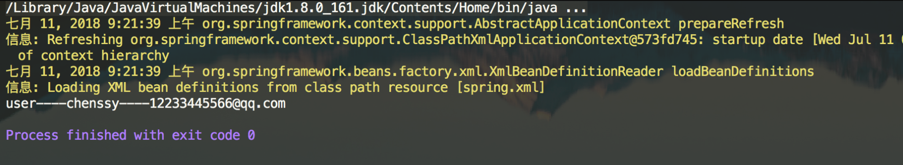

### 2. 解析自定义标签

上面已经演示了 Spring 自定义标签的使用，下面就来分析自定义标签的解析过程。

#### 2.1 parseCustomElement

`DefaultBeanDefinitionDocumentReader` 的`#parseBeanDefinitions(Element root, BeanDefinitionParserDelegate delegate)` 方法，负责标签的解析工作，根据命名空间的不同进行不同标签的解析。其中，**自定义标签**由 `BeanDefinitionParserDelegate` 的 `#parseCustomElement(Element ele, BeanDefinition containingBd)` 方法来实现。代码如下：

```java
@Nullable
public BeanDefinition parseCustomElement(Element ele) {
    return parseCustomElement(ele, null);
}

@Nullable
public BeanDefinition parseCustomElement(Element ele, @Nullable BeanDefinition containingBd) {
    // <1> 获取 namespaceUri
    String namespaceUri = getNamespaceURI(ele);
    if (namespaceUri == null) {
        return null;
    }
    // <2> 根据 namespaceUri 获取相应的 Handler
    NamespaceHandler handler = this.readerContext.getNamespaceHandlerResolver().resolve(namespaceUri);
    if (handler == null) {
        error("Unable to locate Spring NamespaceHandler for XML schema namespace [" + namespaceUri + "]", ele);
        return null;
    }
    // 调用自定义的 Handler 处理
    return handler.parse(ele, new ParserContext(this.readerContext, this, containingBd));
}
```

处理过程分为三步：

1. 调用 `#getNamespaceURI((Node node)` 方法，获取 `namespaceUri` 。代码如下：

   ```java
   @Nullable
   public String getNamespaceURI(Node node) {
   	return node.getNamespaceURI();
   }
   ```

2. 调用 `XmlReaderContext#getNamespaceHandlerResolver()` 方法，获得命名空间的解析器。详细解析，见 [2.2 getNamespaceHandlerResolver](2.2 getNamespaceHandlerResolver)。

3. 调用 `NamespaceHandlerResolver#resolve(String namespaceUri)` 方法，根据 `namespaceUri` 获取相应的 Handler 对象。这个映射关系我们在 `spring.handlers` 中已经定义了，所以只需要找到该类，然后初始化返回。详细解析，见 [2.3 resolve](#2.3 resolve) 。

4. 调用 `NamespaceHandler#parse(Element element, ParserContext parserContext)` 方法，调用自定义的 Handler 处理。详细解析，见 [2.4 parse](#2.4 parse) 。

#### 2.2 getNamespaceHandlerResolver

调用 XmlReaderContext 的 `#getNamespaceHandlerResolver()` 方法，返回的命名空间的解析器，代码如下：

```java
/**
 * NamespaceHandler 解析器
 */
private final NamespaceHandlerResolver namespaceHandlerResolver;

public final NamespaceHandlerResolver getNamespaceHandlerResolver() {
	return this.namespaceHandlerResolver;
}
```

##### 2.2.1 NamespaceHandlerResolver 的初始化

那么，NamespaceHandlerResolver 是什么时候进行初始化的呢？

在这篇博客中 [IoC 之注册 BeanDefinitions](#IoC 之注册 BeanDefinition) 提到在注册 BeanDefinition 时：

- 首先，是通过 XmlBeanDefinitionReader 的 `#createBeanDefinitionDocumentReader()` 方法，获取 Document 解析器 BeanDefinitionDocumentReader 实例。
- 然后，调用 BeanDefinitionDocumentReader 实例的 `#registerBeanDefinitions(Document doc, XmlReaderContext readerContext)` 方法，进行注册。而该方法需要提供两个参数，一个是 Document 实例 `doc`，一个是 XmlReaderContext 实例 `readerContext` 。

`readerContext` 实例对象由 `XmlBeanDefinitionReader` 的 `#createReaderContext(Resource resource)` 方法创建。`namespaceHandlerResolver` 实例对象就是在这个时候初始化的，代码如下：

```java
// XmlBeanDefinitionReader.java
public XmlReaderContext createReaderContext(Resource resource) {
	return new XmlReaderContext(resource, this.problemReporter, this.eventListener,
			this.sourceExtractor, this, getNamespaceHandlerResolver());
}
```

- XmlReaderContext 构造函数中最后一个参数就是 `NamespaceHandlerResolver` 对象，该对象由 `getNamespaceHandlerResolver()` 提供，如下：

  ```java
  // XmlBeanDefinitionReader.java
  
  public NamespaceHandlerResolver getNamespaceHandlerResolver() {
  	if (this.namespaceHandlerResolver == null) {
  		this.namespaceHandlerResolver = createDefaultNamespaceHandlerResolver();
  	}
  	return this.namespaceHandlerResolver;
  }
  
  protected NamespaceHandlerResolver createDefaultNamespaceHandlerResolver() {
  	ClassLoader cl = (getResourceLoader() != null ? getResourceLoader().getClassLoader() : getBeanClassLoader());
  	return new DefaultNamespaceHandlerResolver(cl); // <x>
  }
  ```

  - 从 `<x>` 处，我们可以看到，NamespaceHandlerResolver 对象的**最终类型**是 `org.springframework.beans.factory.xml.DefaultNamespaceHandlerResolver` 。

#### 2.3 resolve

所以， `getNamespaceHandlerResolver().resolve(namespaceUri)` 调用的就是 DefaultNamespaceHandlerResolver 的 `#resolve(String namespaceUri)` 方法。代码如下：

```java
@Override
@Nullable
public NamespaceHandler resolve(String namespaceUri) {
    // <1> 获取所有已经配置的 Handler 映射
    Map<String, Object> handlerMappings = getHandlerMappings();
    // <2> 根据 namespaceUri 获取 handler 的信息
    Object handlerOrClassName = handlerMappings.get(namespaceUri);
    // <3.1> 不存在
    if (handlerOrClassName == null) {
        return null;
    // <3.2> 已经初始化
    } else if (handlerOrClassName instanceof NamespaceHandler) {
        return (NamespaceHandler) handlerOrClassName;
    // <3.3> 需要进行初始化
    } else {
        String className = (String) handlerOrClassName;
        try {
            // 获得类，并创建 NamespaceHandler 对象
            Class<?> handlerClass = ClassUtils.forName(className, this.classLoader);
            if (!NamespaceHandler.class.isAssignableFrom(handlerClass)) {
                throw new FatalBeanException("Class [" + className + "] for namespace [" + namespaceUri +
                        "] does not implement the [" + NamespaceHandler.class.getName() + "] interface");
            }
            NamespaceHandler namespaceHandler = (NamespaceHandler) BeanUtils.instantiateClass(handlerClass);
            // 初始化 NamespaceHandler 对象
            namespaceHandler.init();
            // 添加到缓存
            handlerMappings.put(namespaceUri, namespaceHandler);
            return namespaceHandler;
        } catch (ClassNotFoundException ex) {
            throw new FatalBeanException("Could not find NamespaceHandler class [" + className +
                    "] for namespace [" + namespaceUri + "]", ex);
        } catch (LinkageError err) {
            throw new FatalBeanException("Unresolvable class definition for NamespaceHandler class [" +
                    className + "] for namespace [" + namespaceUri + "]", err);
        }
    }
}
```

- `<1>` 处，首先，调用 `#getHandlerMappings()` 方法，获取所有配置文件中的映射关系 `handlerMappings` 。详细解析，胖友先跳到 [2.3.1 getHandlerMappings](#2.3.1 getHandlerMappings) ，看完就回到此处，继续往下走。
- `<2>` 处，然后，根据 `namespaceUri` 获取 handler 的信息。
- `<3.1>` 处，`handlerOrClassName` 不存在，则返回 `null` 空。
- `<3.2>` 处，`handlerOrClassName` 已经初始化成 NamespaceHandler 对象，直接返回它。
- <3.3>处，handlerOrClassName还是类路径，则创建 NamespaceHandler 对象，并调用`NamespaceHandler#init()`方法，初始化 NamespaceHandler 对象。详细解析，见[2.3.2 init](#2.3.2 init)  另外，创建的 NamespaceHandler 对象，会添加到 `handlerMappings` 中，进行缓存。

##### 2.3.1 getHandlerMappings

```java
/** ClassLoader to use for NamespaceHandler classes. */
@Nullable
private final ClassLoader classLoader;

/**
 * NamespaceHandler 映射配置文件地址
 *
 * Resource location to search for.
 */
private final String handlerMappingsLocation;

/**
 * Stores the mappings from namespace URI to NamespaceHandler class name / instance.
 *
 * NamespaceHandler 映射。
 *
 * key：命名空间
 * value：分成两种情况：1）未初始化时，对应的 NamespaceHandler 的类路径；2）已初始化，对应的 NamespaceHandler 对象
 */
@Nullable
private volatile Map<String, Object> handlerMappings;

/**
 * Load the specified NamespaceHandler mappings lazily.
 */
private Map<String, Object> getHandlerMappings() {
	// 双重检查锁，延迟加载
	Map<String, Object> handlerMappings = this.handlerMappings;
	if (handlerMappings == null) {
		synchronized (this) {
			handlerMappings = this.handlerMappings;
			if (handlerMappings == null) {
				if (logger.isTraceEnabled()) {
					logger.trace("Loading NamespaceHandler mappings from [" + this.handlerMappingsLocation + "]");
				}
				try {
					// 读取 handlerMappingsLocation
					Properties mappings = PropertiesLoaderUtils.loadAllProperties(this.handlerMappingsLocation, this.classLoader);
					if (logger.isTraceEnabled()) {
						logger.trace("Loaded NamespaceHandler mappings: " + mappings);
					}
					// 初始化到 handlerMappings 中
					handlerMappings = new ConcurrentHashMap<>(mappings.size());
					CollectionUtils.mergePropertiesIntoMap(mappings, handlerMappings);
					this.handlerMappings = handlerMappings;
				} catch (IOException ex) {
					throw new IllegalStateException(
							"Unable to load NamespaceHandler mappings from location [" + this.handlerMappingsLocation + "]", ex);
				}
			}
		}
	}
	return handlerMappings;
}
```

- 虽然代码比较长，但是逻辑实际很简单。
- 通过延迟加载( lazy-init )的方式，加载 `handlerMappingsLocation` 中配置的 NamespaceHandler 的映射，到 `handlerMappings` 中。
- `handlerMappings` 的**值属性**有 2 种情况，胖友仔细看下注释。

##### 2.3.2 init

实现 NamespaceHandler 的 `#init()` 方法，主要是将自定义标签解析器进行注册。例如，我们自定义 UserNamespaceHandler 的 `#init()` 方法，代码如下：

```java
// UserNamespaceHandler.java

@Override
public void init() {
    registerBeanDefinitionParser("user",new UserDefinitionParser());
}
```

- 直接调用父类 NamespaceHandlerSupport 的 `#registerBeanDefinitionParser(String elementName, BeanDefinitionParser parser)` 方法，注册指定元素的 BeanDefinitionParser 解析器。

###### 2.3.2.1 registerBeanDefinitionParser

NamespaceHandlerSupport 的 `#registerBeanDefinitionParser(String elementName, BeanDefinitionParser parser)` 方法，注册指定元素的 BeanDefinitionParser 解析器。代码如下：

```java
// NamespaceHandlerSupport.java
/**
 * Stores the {@link BeanDefinitionParser} implementations keyed by the
 * local name of the {@link Element Elements} they handle.
 *
 * key：元素名
 * value：对应 BeanDefinitionParser 的解析器
 */
private final Map<String, BeanDefinitionParser> parsers = new HashMap<>();

protected final void registerBeanDefinitionParser(String elementName, BeanDefinitionParser parser) {
	this.parsers.put(elementName, parser);
}
```

- 其实就是将映射关系放在一个 Map 结构的 `parsers` 对象中。

##### 2.4 parse

完成后返回 NamespaceHandler 对象，然后调用其 `#parse(Element element, ParserContext parserContext)` 方法开始自定义标签的解析。代码如下：

```java
// NamespaceHandlerSupport.java
@Override
@Nullable
public BeanDefinition parse(Element element, ParserContext parserContext) {
	// <1> 获得元素对应的 BeanDefinitionParser 对象
	BeanDefinitionParser parser = findParserForElement(element, parserContext);
	// <2> 执行解析
	return (parser != null ? parser.parse(element, parserContext) : null);
}
```

- `<1>` 处，调用 `#findParserForElement(Element element, ParserContext parserContext)` 方法，获取对应的 BeanDefinitionParser 实例。实际上，其实就是获取在 NamespaceHandlerSupport 的 `#registerBeanDefinitionParser()` 方法里面注册的实例对象。代码如下：

  ```java
    /**
     * Locates the {@link BeanDefinitionParser} from the register implementations using
     * the local name of the supplied {@link Element}.
     */
    @Nullable
    private BeanDefinitionParser findParserForElement(Element element, ParserContext parserContext) {
  // 获得元素名
    	String localName = parserContext.getDelegate().getLocalName(element);
    	// 获得 BeanDefinitionParser 对象
    	BeanDefinitionParser parser = this.parsers.get(localName);
    	if (parser == null) {
    		parserContext.getReaderContext().fatal(
    				"Cannot locate BeanDefinitionParser for element [" + localName + "]", element);
    	}
    	return parser;
    }
  ```

  - 首先，获取 `localName`，在上面的例子中就是：`"user` 。
  - 然后，从 Map 实例 `parsers` 中获取 BeanDefinitionParser 对象。在上面的例子中就是：UserBeanDefinitionParser 对象。

- `<2>` 处，返回 BeanDefinitionParser 对象后，调用其 `#parse(Element element, ParserContext parserContext)` 方法。该方法在 AbstractBeanDefinitionParser 中实现，代码如下：

  ```java
    // AbstractBeanDefinitionParser.java
  
    @Override
    @Nullable
    public final BeanDefinition parse(Element element, ParserContext parserContext) {
  // <1> 内部解析，返回 AbstractBeanDefinition 对象
    	AbstractBeanDefinition definition = parseInternal(element, parserContext);
    	if (definition != null && !parserContext.isNested()) {
    		try {
    		    // 解析 id 属性
    			String id = resolveId(element, definition, parserContext);
    			if (!StringUtils.hasText(id)) {
    				parserContext.getReaderContext().error(
    						"Id is required for element '" + parserContext.getDelegate().getLocalName(element)
    								+ "' when used as a top-level tag", element);
    			}
    			// 解析 aliases 属性
    			String[] aliases = null;
    			if (shouldParseNameAsAliases()) {
    				String name = element.getAttribute(NAME_ATTRIBUTE);
    				if (StringUtils.hasLength(name)) {
    					aliases = StringUtils.trimArrayElements(StringUtils.commaDelimitedListToStringArray(name));
    				}
    			}
    			// 创建 BeanDefinitionHolder 对象
    			BeanDefinitionHolder holder = new BeanDefinitionHolder(definition, id, aliases);
    			// 注册 BeanDefinition
    			registerBeanDefinition(holder, parserContext.getRegistry());
    			// 触发事件
    			if (shouldFireEvents()) {
    				BeanComponentDefinition componentDefinition = new BeanComponentDefinition(holder);
    				postProcessComponentDefinition(componentDefinition);
    				parserContext.registerComponent(componentDefinition);
    			}
    		} catch (BeanDefinitionStoreException ex) {
    			String msg = ex.getMessage();
    			parserContext.getReaderContext().error((msg != null ? msg : ex.toString()), element);
    			return null;
    		}
    	}
    	return definition;
    }
  ```

  - 核心在 `<1>` 处 `#parseInternal(Element element, ParserContext parserContext)` 方法。为什么这么说？因为该方法返回的是 AbstractBeanDefinition 对象。从前面**默认标签**的解析过程来看，我们就可以判断该方法就是将标签解析为 AbstractBeanDefinition ，且后续代码都是将 AbstractBeanDefinition 转换为 BeanDefinitionHolder 对象。所以真正的解析工作都交由 `#parseInternal(Element element, ParserContext parserContext)` 方法来实现。关于该方法，详细解析，见 [2.4.1 parseInternal](#2.4.1 parseInternal) 。
  - 其它逻辑，例如 `#resolveId(Element element, AbstractBeanDefinition definition, ParserContext parserContext)` 方法，都比较简单，感兴趣的胖友，可以自己去看。

###### 2.4.1 parseInternal

`#parseInternal(Element element, ParserContext parserContext)` 方法，解析 XML 元素为 AbstractBeanDefinition 对象。代码如下：

```java
// AbstractSingleBeanDefinitionParser.java

@Override
protected final AbstractBeanDefinition parseInternal(Element element, ParserContext parserContext) {
    // 创建 BeanDefinitionBuilder 对象
    BeanDefinitionBuilder builder = BeanDefinitionBuilder.genericBeanDefinition();
    // 获取父类元素
    String parentName = getParentName(element);
    if (parentName != null) {
        builder.getRawBeanDefinition().setParentName(parentName);
    }
    // 获取自定义标签中的 class，这个时候会去调用自定义解析中的 getBeanClass()
    Class<?> beanClass = getBeanClass(element);
    if (beanClass != null) {
        builder.getRawBeanDefinition().setBeanClass(beanClass);
    } else {
        // beanClass 为 null，意味着子类并没有重写 getBeanClass() 方法，则尝试去判断是否重写了 getBeanClassName()
        String beanClassName = getBeanClassName(element);
        if (beanClassName != null) {
            builder.getRawBeanDefinition().setBeanClassName(beanClassName);
        }
    }
    // 设置 source 属性
    builder.getRawBeanDefinition().setSource(parserContext.extractSource(element));
    // 设置 scope 属性
    BeanDefinition containingBd = parserContext.getContainingBeanDefinition();
    if (containingBd != null) {
        // Inner bean definition must receive same scope as containing bean.
        builder.setScope(containingBd.getScope());
    }
    // 设置 lazy-init 属性
    if (parserContext.isDefaultLazyInit()) {
        // Default-lazy-init applies to custom bean definitions as well.
        builder.setLazyInit(true);
    }
    // 调用子类的 doParse() 进行解析
    doParse(element, parserContext, builder);
    return builder.getBeanDefinition();
}
```

- 在该方法中我们主要关注两个方法：`#getBeanClass((Element element)` 、`#doParse(Element element, BeanDefinitionBuilder builder)`。
- 对于 `getBeanClass()` 方法，AbstractSingleBeanDefinitionParser 类并没有提供具体实现，而是直接返回 `null` ，**意味着它希望子类能够重写该方法**。当然，如果没有重写该方法，这会去调用 `#getBeanClassName()` ，判断子类是否已经重写了该方法。
- 对于 `#doParse(Element element, BeanDefinitionBuilder builder)` 方法，则是直接**空实现**。

😈 所以对于 `#parseInternal(Element element, ParserContext parserContext)` 方法 而言，它总是期待它的子类能够实现 `#getBeanClass((Element element)` 、`#doParse(Element element, BeanDefinitionBuilder builder)` 方法。其中，`#doParse(Element element, BeanDefinitionBuilder builder)` **方法尤为重要**！如果，你不提供该方法的实现，怎么来解析自定义标签呢？此时，胖友可以回过头，再看一眼在 [1.3 定义 Parser 类](#1.3 定义 Parser 类) 的 UserDefinitionParser 实现类，是不是已经能够很好理解咧。

#### 3. 小结

至此，自定义标签的解析过程已经分析完成了。其实整个过程还是较为简单：

- 首先，会加载 `spring.handlers` 文件，将其中内容进行一个解析，形成 `<namespaceUri, 类路径>` 这样的一个映射。
- 然后，根据获取的 `namespaceUri` 就可以得到相应的类路径，对其进行初始化等到相应的 NamespaceHandler 对象。
- 之后，调用该 NamespaceHandler 的 `#parse(...)` 方法，在该方法中根据标签的 `localName` 得到相应的 BeanDefinitionParser 实例对象。
- 最后，调用该 BeanDefinitionParser 的 `#parse(...)` 方法。该方法定义在 AbstractBeanDefinitionParser 抽象类中，核心逻辑封装在其 `#parseInternal(...)` 方法中，该方法返回一个 AbstractBeanDefinition 实例对象，其主要是在 AbstractSingleBeanDefinitionParser 中实现。对于自定义的 Parser 类，其需要实现 `#getBeanClass()` 或者 `#getBeanClassName()` 任一方法，和 `#doParse(...)` 方法。

整体流程如：

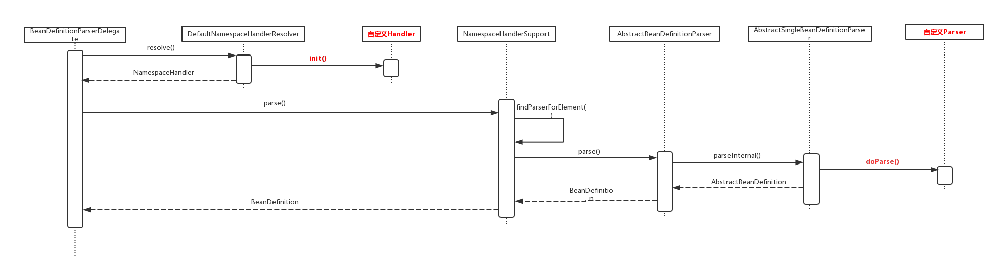

##  IoC 之注册解析的 BeanDefinitions

DefaultBeanDefinitionDocumentReader 的 `#processBeanDefinition()` 方法，完成 Bean 标签解析的核心工作。代码如下：

```java
// DefaultBeanDefinitionDocumentReader.java

protected void processBeanDefinition(Element ele, BeanDefinitionParserDelegate delegate) {
    // 进行 bean 元素解析。
    // 如果解析成功，则返回 BeanDefinitionHolder 对象。而 BeanDefinitionHolder 为 name 和 alias 的 BeanDefinition 对象
    // 如果解析失败，则返回 null 。
    BeanDefinitionHolder bdHolder = delegate.parseBeanDefinitionElement(ele);
    if (bdHolder != null) {
        // 进行自定义标签处理
        bdHolder = delegate.decorateBeanDefinitionIfRequired(ele, bdHolder);
        try {
            // 进行 BeanDefinition 的注册
            // Register the final decorated instance.
            BeanDefinitionReaderUtils.registerBeanDefinition(bdHolder, getReaderContext().getRegistry());
        } catch (BeanDefinitionStoreException ex) {
            getReaderContext().error("Failed to register bean definition with name '" +
                    bdHolder.getBeanName() + "'", ele, ex);
        }
        // 发出响应事件，通知相关的监听器，已完成该 Bean 标签的解析。
        // Send registration event.
        getReaderContext().fireComponentRegistered(new BeanComponentDefinition(bdHolder));
    }
}
```

- 解析工作分为三步：
  - 1、解析默认标签。
  - 2、解析默认标签后下得自定义标签。
  - 3、注册解析后的 BeanDefinition 。
- 经过前面两个步骤的解析，这时的 BeanDefinition 已经可以满足后续的使用要求了，**那么接下来的工作就是将这些 BeanDefinition 进行注册，也就是完成第三步**。

### 1. BeanDefinitionReaderUtils

注册 BeanDefinition ，由 `BeanDefinitionReaderUtils.registerBeanDefinition()` 完成。代码如下：

```java
// BeanDefinitionReaderUtils.java
 
public static void registerBeanDefinition(
        BeanDefinitionHolder definitionHolder, BeanDefinitionRegistry registry)
        throws BeanDefinitionStoreException {

    // 注册 beanName
    // Register bean definition under primary name.
    String beanName = definitionHolder.getBeanName();
    registry.registerBeanDefinition(beanName, definitionHolder.getBeanDefinition());

    // 注册 alias
    // Register aliases for bean name, if any.
    String[] aliases = definitionHolder.getAliases();
    if (aliases != null) {
        for (String alias : aliases) {
            registry.registerAlias(beanName, alias);
        }
    }
}
```

- 首先，通过 `beanName` 注册 BeanDefinition 。详细解析，见 [2.1 通过 beanName 注册](#2.1 通过 beanName 注册) 。
- 然后，再通过注册别名 `alias` 和 `beanName` 的映射。详细解析，见 [2.2 注册 alias 和 beanName 的映射](#2.2 注册 alias 和 beanName 的映射) 。

### 2. BeanDefinitionRegistry

BeanDefinition 的注册，由接口 `org.springframework.beans.factory.support.BeanDefinitionRegistry` 定义。

#### 2.1 通过 beanName 注册

调用 BeanDefinitionRegistry 的 `#registerBeanDefinition(String beanName, BeanDefinition beanDefinition)` 方法，实现通过 `beanName` 注册 BeanDefinition 。代码如下：

```java
// DefaultListableBeanFactory.java

/** Whether to allow re-registration of a different definition with the same name. */
private boolean allowBeanDefinitionOverriding = true;

/** Map of bean definition objects, keyed by bean name. */
private final Map<String, BeanDefinition> beanDefinitionMap = new ConcurrentHashMap<>(256);
/** List of bean definition names, in registration order. */
private volatile List<String> beanDefinitionNames = new ArrayList<>(256);
/** List of names of manually registered singletons, in registration order. */
private volatile Set<String> manualSingletonNames = new LinkedHashSet<>(16);
/** Cached array of bean definition names in case of frozen configuration. */
@Nullable
private volatile String[] frozenBeanDefinitionNames;

@Override
public void registerBeanDefinition(String beanName, BeanDefinition beanDefinition)
        throws BeanDefinitionStoreException {

    // 校验 beanName 与 beanDefinition 非空
    Assert.hasText(beanName, "Bean name must not be empty");
    Assert.notNull(beanDefinition, "BeanDefinition must not be null");

    // <1> 校验 BeanDefinition 。
    // 这是注册前的最后一次校验了，主要是对属性 methodOverrides 进行校验。
    if (beanDefinition instanceof AbstractBeanDefinition) {
        try {
            ((AbstractBeanDefinition) beanDefinition).validate();
        } catch (BeanDefinitionValidationException ex) {
            throw new BeanDefinitionStoreException(beanDefinition.getResourceDescription(), beanName,
                    "Validation of bean definition failed", ex);
        }
    }

    // <2> 从缓存中获取指定 beanName 的 BeanDefinition
    BeanDefinition existingDefinition = this.beanDefinitionMap.get(beanName);
    // <3> 如果已经存在
    if (existingDefinition != null) {
        // 如果存在但是不允许覆盖，抛出异常
        if (!isAllowBeanDefinitionOverriding()) {
            throw new BeanDefinitionOverrideException(beanName, beanDefinition, existingDefinition);
        // 覆盖 beanDefinition 大于 被覆盖的 beanDefinition 的 ROLE ，打印 info 日志
        } else if (existingDefinition.getRole() < beanDefinition.getRole()) {
            // e.g. was ROLE_APPLICATION, now overriding with ROLE_SUPPORT or ROLE_INFRASTRUCTURE
            if (logger.isInfoEnabled()) {
                logger.info("Overriding user-defined bean definition for bean '" + beanName +
                        "' with a framework-generated bean definition: replacing [" +
                        existingDefinition + "] with [" + beanDefinition + "]");
            }
        // 覆盖 beanDefinition 与 被覆盖的 beanDefinition 不相同，打印 debug 日志
        } else if (!beanDefinition.equals(existingDefinition)) {
            if (logger.isDebugEnabled()) {
                logger.debug("Overriding bean definition for bean '" + beanName +
                        "' with a different definition: replacing [" + existingDefinition +
                        "] with [" + beanDefinition + "]");
            }
        // 其它，打印 debug 日志
        } else {
            if (logger.isTraceEnabled()) {
                logger.trace("Overriding bean definition for bean '" + beanName +
                        "' with an equivalent definition: replacing [" + existingDefinition +
                        "] with [" + beanDefinition + "]");
            }
        }
        // 允许覆盖，直接覆盖原有的 BeanDefinition 到 beanDefinitionMap 中。
        this.beanDefinitionMap.put(beanName, beanDefinition);
    // <4> 如果未存在
    } else {
        // 检测创建 Bean 阶段是否已经开启，如果开启了则需要对 beanDefinitionMap 进行并发控制
        if (hasBeanCreationStarted()) {
            // beanDefinitionMap 为全局变量，避免并发情况
            // Cannot modify startup-time collection elements anymore (for stable iteration)
            synchronized (this.beanDefinitionMap) {
                // 添加到 BeanDefinition 到 beanDefinitionMap 中。
                this.beanDefinitionMap.put(beanName, beanDefinition);
                // 添加 beanName 到 beanDefinitionNames 中
                List<String> updatedDefinitions = new ArrayList<>(this.beanDefinitionNames.size() + 1);
                updatedDefinitions.addAll(this.beanDefinitionNames);
                updatedDefinitions.add(beanName);
                this.beanDefinitionNames = updatedDefinitions;
                // 从 manualSingletonNames 移除 beanName
                if (this.manualSingletonNames.contains(beanName)) {
                    Set<String> updatedSingletons = new LinkedHashSet<>(this.manualSingletonNames);
                    updatedSingletons.remove(beanName);
                    this.manualSingletonNames = updatedSingletons;
                }
            }
        } else {
            // Still in startup registration phase
            // 添加到 BeanDefinition 到 beanDefinitionMap 中。
            this.beanDefinitionMap.put(beanName, beanDefinition);
            // 添加 beanName 到 beanDefinitionNames 中
            this.beanDefinitionNames.add(beanName);
            // 从 manualSingletonNames 移除 beanName
            this.manualSingletonNames.remove(beanName);
        }
        
        this.frozenBeanDefinitionNames = null;
    }

    // <5> 重新设置 beanName 对应的缓存
    if (existingDefinition != null || containsSingleton(beanName)) {
        resetBeanDefinition(beanName);
    }
}
```

处理过程如下：

- `<1>` 对 BeanDefinition 进行校验，该校验也是注册过程中的最后一次校验了，主要是对 AbstractBeanDefinition 的 `methodOverrides` 属性进行校验。
- `<2>` 根据 `beanName` 从缓存中获取 BeanDefinition 对象。
- `<3>` 如果缓存中存在，则根据 `allowBeanDefinitionOverriding` 标志来判断是否允许覆盖。如果允许则直接覆盖。否则，抛出 BeanDefinitionStoreException 异常。
- <4>若缓存中没有指定beanName的 BeanDefinition，则判断当前阶段是否已经开始了 Bean 的创建阶段？如果是，则需要对 beanDefinitionMap 进行加锁控制并发问题，否则直接设置即可。
  - 对于 `#hasBeanCreationStarted()` 方法，后续做详细介绍，这里不过多阐述。
- `<5>` 若缓存中存在该 `beanName` 或者单例 bean 集合中存在该 `beanName` ，则调用 `#resetBeanDefinition(String beanName)` 方法，重置 BeanDefinition 缓存。

😈 其实整段代码的核心就在于 `this.beanDefinitionMap.put(beanName, beanDefinition);` 代码块。而 BeanDefinition 的缓存也不是神奇的东西，就是定义一个 Map ：

- `key` 为 `beanName` 。
- `value` 为 BeanDefinition 对象。

#### 2.2 注册 alias 和 beanName 的映射

调用 BeanDefinitionRegistry 的 `#registerAlias(String name, String alias)` 方法，注册 `alias` 和 `beanName` 的映射关系。代码如下：

```java
// SimpleAliasRegistry.java

/** Map from alias to canonical name. */
// key: alias
// value: beanName
private final Map<String, String> aliasMap = new ConcurrentHashMap<>(16);

@Override
public void registerAlias(String name, String alias) {
    // 校验 name 、 alias
    Assert.hasText(name, "'name' must not be empty");
    Assert.hasText(alias, "'alias' must not be empty");
    synchronized (this.aliasMap) {
        // name == alias 则去掉alias
        if (alias.equals(name)) {
            this.aliasMap.remove(alias);
            if (logger.isDebugEnabled()) {
                logger.debug("Alias definition '" + alias + "' ignored since it points to same name");
            }
        } else {
            // 获取 alias 已注册的 beanName
            String registeredName = this.aliasMap.get(alias);
            // 已存在
            if (registeredName != null) {
                // 相同，则 return ，无需重复注册
                if (registeredName.equals(name)) {
                    // An existing alias - no need to re-register
                    return;
                }
                // 不允许覆盖，则抛出 IllegalStateException 异常
                if (!allowAliasOverriding()) {
                    throw new IllegalStateException("Cannot define alias '" + alias + "' for name '" +
                            name + "': It is already registered for name '" + registeredName + "'.");
                }
                if (logger.isDebugEnabled()) {
                    logger.debug("Overriding alias '" + alias + "' definition for registered name '" +
                            registeredName + "' with new target name '" + name + "'");
                }
            }
            // 校验，是否存在循环指向
            checkForAliasCircle(name, alias);
            // 注册 alias
            this.aliasMap.put(alias, name);
            if (logger.isTraceEnabled()) {
                logger.trace("Alias definition '" + alias + "' registered for name '" + name + "'");
            }
        }
    }
}
```

- 注册 `alias` 和注册 BeanDefinition 的过程差不多。

- 在最后，调用了 `#checkForAliasCircle()` 来对别名进行了**循环**检测。代码如下：

  ```java
  protected void checkForAliasCircle(String name, String alias) {
      if (hasAlias(alias, name)) {
          throw new IllegalStateException("Cannot register alias '" + alias +
                  "' for name '" + name + "': Circular reference - '" +
                  name + "' is a direct or indirect alias for '" + alias + "' already");
      }
  }
  public boolean hasAlias(String name, String alias) {
      for (Map.Entry<String, String> entry : this.aliasMap.entrySet()) {
          String registeredName = entry.getValue();
          if (registeredName.equals(name)) {
              String registeredAlias = entry.getKey();
              if (registeredAlias.equals(alias) || hasAlias(registeredAlias, alias)) {
                  return true;
              }
          }
      }
      return false;
  }
  ```

  - 如果 `name`、`alias` 分别为 1 和 3 ，则构成 `（1,3）` 的映射。加入，此时集合中存在`（A,1）`、`（3,A）` 的映射，意味着出现循环指向的情况，则抛出 IllegalStateException 异常。

### 3. 小结

到这里 BeanDefinition 基于 `beanName` 和 `alias` 的维度，都已经注入到缓存中，下一步则是等待初始化使用了。我们，后续的文章，继续搞起来。

##  IoC 之装载 BeanDefinitions 总结

前面 13 篇博文从源码层次，分析了 IoC BeanDefinition 装载的整个过程，这篇就这些内容做一个总结将其连贯起来。

在前文提过，IoC 容器的初始化过程分为三步骤：Resource 定位、BeanDefinition 的载入和解析，BeanDefinition 注册。

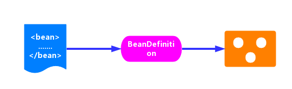

整体步骤

- **Resource 定位**。我们一般用外部资源来描述 Bean 对象，所以在初始化 IoC 容器的第一步就是需要定位这个外部资源。在上一篇博客（[IoC 之 Spring 统一资源加载策略](#IoC 之统一资源加载策略)）已经详细说明了资源加载的过程。

- BeanDefinition 的装载和解析

  。装载就是 BeanDefinition 的载入。BeanDefinitionReader 读取、解析 Resource 资源，也就是将用户定义的 Bean 表示成 IoC 容器的内部数据结构：BeanDefinition 。

  - 在 IoC 容器内部维护着一个 BeanDefinition Map 的数据结构
  - 在配置文件中每一个 `<bean>` 都对应着一个 BeanDefinition 对象。

- BeanDefinition 注册

  。向 IoC 容器注册在第二步解析好的 BeanDefinition，这个过程是通过 BeanDefinitionRegistry 接口来实现的。在 IoC 容器内部其实是将第二个过程解析得到的 BeanDefinition 注入到一个 HashMap 容器中，IoC 容器就是通过这个 HashMap 来维护这些 BeanDefinition 的。

  - 在这里需要注意的一点是这个过程并没有完成依赖注入（Bean 创建），Bean 创建是发生在应用第一次调用 `#getBean(...)` 方法，向容器索要 Bean 时。
  - 当然我们可以通过设置预处理，即对某个 Bean 设置 `lazyinit = false` 属性，那么这个 Bean 的依赖注入就会在容器初始化的时候完成。

还记得在博客 [IoC 之加载 BeanDefinition](#IoC 之加载 BeanDefinition) 中提供的一段代码吗？这里我们同样也以这段代码作为我们研究 IoC 初始化过程的开端，如下：

```java
ClassPathResource resource = new ClassPathResource("bean.xml");
DefaultListableBeanFactory factory = new DefaultListableBeanFactory();
XmlBeanDefinitionReader reader = new XmlBeanDefinitionReader(factory);
reader.loadBeanDefinitions(resource);
```

刚刚开始的时候可能对上面这几行代码不知道什么意思，现在应该就一目了然了：

- `ClassPathResource resource = new ClassPathResource("bean.xml");` ： 根据 Xml 配置文件创建 Resource 资源对象。ClassPathResource 是 Resource 接口的子类，`bean.xml` 文件中的内容是我们定义的 Bean 信息。
- `DefaultListableBeanFactory factory = new DefaultListableBeanFactory();` ：创建一个 BeanFactory 。DefaultListableBeanFactory 是 BeanFactory 的一个子类，BeanFactory 作为一个接口，其实它本身是不具有独立使用的功能的，而 DefaultListableBeanFactory 则是真正可以独立使用的 IoC 容器，它是整个 Spring IoC 的始祖，在后续会有专门的文章来分析它。
- `XmlBeanDefinitionReader reader = new XmlBeanDefinitionReader(factory);` ：创建 XmlBeanDefinitionReader 读取器，用于载入 BeanDefinition 。
- `reader.loadBeanDefinitions(resource);`：开始 BeanDefinition 的载入和注册进程，完成后的 BeanDefinition 放置在 IoC 容器中。

### 1. Resource 定位

Spring 为了解决资源定位的问题，提供了两个接口：Resource、ResourceLoader，其中：

- Resource 接口是 Spring 统一资源的抽象接口
- ResourceLoader 则是 Spring 资源加载的统一抽象。
- 关于Resource、ResourceLoader 的更多知识请关注 [ IoC 之 Spring 统一资源加载策略](#IoC 之统一资源加载策略)

Resource 资源的定位需要 Resource 和 ResourceLoader 两个接口互相配合，在上面那段代码中 `new ClassPathResource("bean.xml")` 为我们定义了资源，那么 ResourceLoader 则是在什么时候初始化的呢？看 XmlBeanDefinitionReader 构造方法：

```java
// XmlBeanDefinitionReader.java
public XmlBeanDefinitionReader(BeanDefinitionRegistry registry) {
	super(registry);
}
```

- 直接调用父类 AbstractBeanDefinitionReader 构造方法，代码如下：

  ```java
  // AbstractBeanDefinitionReader.java
  
  protected AbstractBeanDefinitionReader(BeanDefinitionRegistry registry) {
  	Assert.notNull(registry, "BeanDefinitionRegistry must not be null");
  	this.registry = registry;
  	// Determine ResourceLoader to use.
  	if (this.registry instanceof ResourceLoader) {
  		this.resourceLoader = (ResourceLoader) this.registry;
  	}	else {
  		this.resourceLoader = new PathMatchingResourcePatternResolver();
  	}
  
  	// Inherit Environment if possible
  	if (this.registry instanceof EnvironmentCapable) {
  		this.environment = ((EnvironmentCapable) this.registry).getEnvironment();
  	} else {
  		this.environment = new StandardEnvironment();
  	}
  }
  ```

  - 核心在于设置 resourceLoader 这段，如果设置了 ResourceLoader 则用设置的，否则使用 PathMatchingResourcePatternResolver ，该类是一个集大成者的 ResourceLoader。

### 2. BeanDefinition 的载入和解析

`reader.loadBeanDefinitions(resource);` 代码段，开启 BeanDefinition 的解析过程。如下：

```java
// XmlBeanDefinitionReader.java
@Override
public int loadBeanDefinitions(Resource resource) throws BeanDefinitionStoreException {
	return loadBeanDefinitions(new EncodedResource(resource));
}
```

- 在这个方法会将资源 resource 包装成一个 EncodedResource 实例对象，然后调用 `#loadBeanDefinitions(EncodedResource encodedResource)` 方法。而将 Resource 封装成 EncodedResource 主要是为了对 Resource 进行编码，保证内容读取的正确性。代码如下：

  ```java
  // XmlBeanDefinitionReader.java
  
  public int loadBeanDefinitions(EncodedResource encodedResource) throws BeanDefinitionStoreException {
  	// ... 省略一些代码
  	try {
  		// 将资源文件转为 InputStream 的 IO 流
  		InputStream inputStream = encodedResource.getResource().getInputStream();
  		try {
  			// 从 InputStream 中得到 XML 的解析源
  			InputSource inputSource = new InputSource(inputStream);
  			if (encodedResource.getEncoding() != null) {
  				inputSource.setEncoding(encodedResource.getEncoding());
  			}
  			// ... 具体的读取过程
  			return doLoadBeanDefinitions(inputSource, encodedResource.getResource());
  		}
  		finally {
  			inputStream.close();
  		}
  	}
  	// 省略一些代码
  }
  ```

  - 从 `encodedResource` 源中获取 xml 的解析源，然后调用 `#doLoadBeanDefinitions(InputSource inputSource, Resource resource)` 方法，执行具体的解析过程。

    ```java
    // XmlBeanDefinitionReader.java
    
    protected int doLoadBeanDefinitions(InputSource inputSource, Resource resource)
    			throws BeanDefinitionStoreException {
    	try {
    		// 获取 XML Document 实例
    		Document doc = doLoadDocument(inputSource, resource);
    		// 根据 Document 实例，注册 Bean 信息
    		int count = registerBeanDefinitions(doc, resource);
    		return count;
    	}
    	// ... 省略一堆配置
    }
    ```

    - 在该方法中主要做两件事：
    - 1、根据 xml 解析源获取相应的 Document 对象。详细解析，见 [「2.1 转换为 Document 对象」](http://svip.iocoder.cn/Spring/IoC-load-BeanDefinitions-summary/#) 。
    - 2、调用 `#registerBeanDefinitions(Document doc, Resource resource)` 方法，开启 BeanDefinition 的解析注册过程。详细解析，见 [「2.2 注册 BeanDefinition」](http://svip.iocoder.cn/Spring/IoC-load-BeanDefinitions-summary/#) 。

#### 2.1 转换为 Document 对象

调用 `#doLoadDocument(InputSource inputSource, Resource resource)` 方法，会将 Bean 定义的资源转换为 Document 对象。代码如下：

```java
// XmlBeanDefinitionReader.java

protected Document doLoadDocument(InputSource inputSource, Resource resource) throws Exception {
	return this.documentLoader.loadDocument(inputSource, getEntityResolver(), this.errorHandler,
			getValidationModeForResource(resource), isNamespaceAware());
}
```

该方法接受五个参数：

- `inputSource` ：加载 Document 的 Resource 源。
- entityResolver：解析文件的解析器。
  - 【重要】详细解析，见 [《【死磕 Spring】—— IoC 之获取 Document 对象》](http://svip.iocoder.cn/Spring/IoC-load-Document) 。
- `errorHandler` ：处理加载 Document 对象的过程的错误。
- validationMode：验证模式。
  - 【重要】详细解析，见 [《【死磕 Spring】—— IoC 之获取验证模型》](http://svip.iocoder.cn/Spring/IoC-Validation-Mode-For-Resource) 。
- `namespaceAware` ：命名空间支持。如果要提供对 XML 名称空间的支持，则为 `true` 。

------

`#loadDocument(InputSource inputSource, EntityResolver entityResolver, ErrorHandler errorHandler, int validationMode, boolean namespaceAware)` 方法，在类 DefaultDocumentLoader 中提供了实现。代码如下：

```java
// DefaultDocumentLoader.java

@Override
public Document loadDocument(InputSource inputSource, EntityResolver entityResolver,
		ErrorHandler errorHandler, int validationMode, boolean namespaceAware) throws Exception {
	// 创建 DocumentBuilderFactory
	DocumentBuilderFactory factory = createDocumentBuilderFactory(validationMode, namespaceAware);
	// 创建 DocumentBuilder
	DocumentBuilder builder = createDocumentBuilder(factory, entityResolver, errorHandler);
	// 解析 XML InputSource 返回 Document 对象
	return builder.parse(inputSource);
}
```

#### 2.2 注册 BeanDefinition 流程

这到这里，就已经将定义的 Bean 资源文件，载入并转换为 Document 对象了。那么，下一步就是如何将其解析为 SpringIoC 管理的 BeanDefinition 对象，并将其注册到容器中。这个过程由方法 `#registerBeanDefinitions(Document doc, Resource resource)` 方法来实现。代码如下：

```java
// XmlBeanDefinitionReader.java

public int registerBeanDefinitions(Document doc, Resource resource) throws BeanDefinitionStoreException {
	// 创建 BeanDefinitionDocumentReader 对象
	BeanDefinitionDocumentReader documentReader = createBeanDefinitionDocumentReader();
	// 获取已注册的 BeanDefinition 数量
	int countBefore = getRegistry().getBeanDefinitionCount();
	// 创建 XmlReaderContext 对象
	// 注册 BeanDefinition
	documentReader.registerBeanDefinitions(doc, createReaderContext(resource));
	// 计算新注册的 BeanDefinition 数量
	return getRegistry().getBeanDefinitionCount() - countBefore;
}
```

- 首先，创建 BeanDefinition 的解析器 BeanDefinitionDocumentReader 。

- 然后，调用该 BeanDefinitionDocumentReader 的 `#registerBeanDefinitions(Document doc, XmlReaderContext readerContext)` 方法，开启解析过程，这里使用的是委派模式，具体的实现由子类 DefaultBeanDefinitionDocumentReader 完成。代码如下：

  ```java
  // DefaultBeanDefinitionDocumentReader.java
  
  @Override
  public void registerBeanDefinitions(Document doc, XmlReaderContext readerContext) {
      this.readerContext = readerContext;
      // 获得 XML Document Root Element
      // 执行注册 BeanDefinition
      doRegisterBeanDefinitions(doc.getDocumentElement());
  }
  ```

##### 2.2.1 对 Document 对象的解析

从 Document 对象中获取根元素 root，然后调用 ``#doRegisterBeanDefinitions(Element root)` 方法，开启真正的解析过程。代码如下：

```java
// DefaultBeanDefinitionDocumentReader.java

protected void doRegisterBeanDefinitions(Element root) {
    // ... 省略部分代码（非核心）
    this.delegate = createDelegate(getReaderContext(), root, parent);

    // 解析前处理
    preProcessXml(root);
    // 解析
    parseBeanDefinitions(root, this.delegate);
    // 解析后处理
    postProcessXml(root);

}
```

- `#preProcessXml(Element root)`、`#postProcessXml(Element root)` 为前置、后置增强处理，目前 Spring 中都是空实现。

- `#parseBeanDefinitions(Element root, BeanDefinitionParserDelegate delegate)` 是对根元素 root 的解析注册过程。代码如下：

  ```java
  // DefaultBeanDefinitionDocumentReader.java
  
  protected void parseBeanDefinitions(Element root, BeanDefinitionParserDelegate delegate) {
      // 如果根节点使用默认命名空间，执行默认解析
      if (delegate.isDefaultNamespace(root)) {
          // 遍历子节点
          NodeList nl = root.getChildNodes();
          for (int i = 0; i < nl.getLength(); i++) {
              Node node = nl.item(i);
              if (node instanceof Element) {
                  Element ele = (Element) node;
                  // 如果该节点使用默认命名空间，执行默认解析
                  if (delegate.isDefaultNamespace(ele)) {
                      parseDefaultElement(ele, delegate);
                  // 如果该节点非默认命名空间，执行自定义解析
                  } else {
                      delegate.parseCustomElement(ele);
                  }
              }
          }
      // 如果根节点非默认命名空间，执行自定义解析
      } else {
          delegate.parseCustomElement(root);
      }
  }
  ```

  - 迭代 root 元素的所有子节点，对其进行判断：
    - 若节点为默认命名空间，则调用 `#parseDefaultElement(Element ele, BeanDefinitionParserDelegate delegate)` 方法，开启默认标签的解析注册过程。详细解析，见 [「2.2.1.1 默认标签解析」](http://svip.iocoder.cn/Spring/IoC-load-BeanDefinitions-summary/#) 。
    - 否则，调用 `BeanDefinitionParserDelegate#parseCustomElement(Element ele)` 方法，开启自定义标签的解析注册过程。详细解析，见 [「2.2.1.2 自定义标签解析」](http://svip.iocoder.cn/Spring/IoC-load-BeanDefinitions-summary/#) 。

###### 2.2.1.1 默认标签解析

若定义的元素节点使用的是 Spring 默认命名空间，则调用 `#parseDefaultElement(Element ele, BeanDefinitionParserDelegate delegate)` 方法，进行默认标签解析。代码如下：

```java
// DefaultBeanDefinitionDocumentReader.java

private void parseDefaultElement(Element ele, BeanDefinitionParserDelegate delegate) {
	if (delegate.nodeNameEquals(ele, IMPORT_ELEMENT)) { // import
		importBeanDefinitionResource(ele);
	} else if (delegate.nodeNameEquals(ele, ALIAS_ELEMENT)) { // alias
		processAliasRegistration(ele);
	} else if (delegate.nodeNameEquals(ele, BEAN_ELEMENT)) { // bean
		processBeanDefinition(ele, delegate);
	} else if (delegate.nodeNameEquals(ele, NESTED_BEANS_ELEMENT)) { // beans
		// recurse
		doRegisterBeanDefinitions(ele);
	}
}
```

对四大标签：`<import>`、`<alias>`、`<bean>`、`<beans>` 进行解析。**其中 `<bean>` 标签的解析为核心工作**。关于各个标签的解析过程，见如下文章：

- [《【死磕 Spring】—— IoC 之解析 标签》](http://svip.iocoder.cn/Spring/IoC-parse-BeanDefinitions-for-import)
- [《【死磕 Spring】—— IoC 之解析 标签：开启解析进程》](http://svip.iocoder.cn/Spring/IoC-parse-BeanDefinitions-in-processBeanDefinition)
- [《【死磕 Spring】—— IoC 之解析 标签：BeanDefinition》](http://svip.iocoder.cn/Spring/IoC-parse-BeanDefinitions-for-BeanDefinition)
- [《【死磕 Spring】—— IoC 之解析 标签：meta、lookup-method、replace-method》](http://svip.iocoder.cn/Spring/IoC-parse-BeanDefinitions-for-meta-and-look-method-and-replace-method)
- [《【死磕 Spring】—— IoC 之解析 标签：constructor-arg、property、qualifier》](http://svip.iocoder.cn/Spring/IoC-parse-BeanDefinitions-for-constructor-arg-and-property-and-qualifier)
- [《【死磕 Spring】—— IoC 之解析 标签：解析自定义标签》](http://svip.iocoder.cn/Spring/IoC-parse-BeanDefinitions-for-decorateBeanDefinitionIfRequired)

###### 2.2.1.2 自定义标签解析

对于默认标签则由 `parseCustomElement(Element ele)` 方法，负责解析。代码如下：

```java
// BeanDefinitionParserDelegate.java

@Nullable
public BeanDefinition parseCustomElement(Element ele) {
    return parseCustomElement(ele, null);
}

@Nullable
public BeanDefinition parseCustomElement(Element ele, @Nullable BeanDefinition containingBd) {
    // 获取 namespaceUri
    String namespaceUri = getNamespaceURI(ele);
    if (namespaceUri == null) {
        return null;
    }
    // 根据 namespaceUri 获取相应的 Handler
    NamespaceHandler handler = this.readerContext.getNamespaceHandlerResolver().resolve(namespaceUri);
    if (handler == null) {
        error("Unable to locate Spring NamespaceHandler for XML schema namespace [" + namespaceUri + "]", ele);
        return null;
    }
    // 调用自定义的 Handler 处理
    return handler.parse(ele, new ParserContext(this.readerContext, this, containingBd));
}
```

获取节点的 `namespaceUri`，然后根据该 `namespaceUri` 获取相对应的 NamespaceHandler，最后调用 NamespaceHandler 的 `#parse(Element element, ParserContext parserContext)` 方法，即完成自定义标签的解析和注入。

想了解更多，可参考：[《【死磕 Spring】—— IoC 之解析自定义标签》](http://svip.iocoder.cn/Spring/IoC-parse-BeanDefinitions-in-parseCustomElement) 。

##### 2.2.2 注册 BeanDefinition

经过上面的解析，则将 Document 对象里面的 Bean 标签解析成了一个个的 BeanDefinition ，下一步则是将这些 BeanDefinition 注册到 IoC 容器中。动作的触发是在解析 Bean 标签完成后，代码如下：

```java
// DefaultBeanDefinitionDocumentReader.java

protected void processBeanDefinition(Element ele, BeanDefinitionParserDelegate delegate) {
    // 进行 bean 元素解析。
    // 如果解析成功，则返回 BeanDefinitionHolder 对象。而 BeanDefinitionHolder 为 name 和 alias 的 BeanDefinition 对象
    // 如果解析失败，则返回 null 。
    BeanDefinitionHolder bdHolder = delegate.parseBeanDefinitionElement(ele);
    if (bdHolder != null) {
        // 进行自定义标签处理
        bdHolder = delegate.decorateBeanDefinitionIfRequired(ele, bdHolder);
        try {
            // 进行 BeanDefinition 的注册
            // Register the final decorated instance.
            BeanDefinitionReaderUtils.registerBeanDefinition(bdHolder, getReaderContext().getRegistry());
        } catch (BeanDefinitionStoreException ex) {
            getReaderContext().error("Failed to register bean definition with name '" +
                    bdHolder.getBeanName() + "'", ele, ex);
        }
        // 发出响应事件，通知相关的监听器，已完成该 Bean 标签的解析。
        // Send registration event.
        getReaderContext().fireComponentRegistered(new BeanComponentDefinition(bdHolder));
    }
}
```

- 调用 `BeanDefinitionReaderUtils.registerBeanDefinition()` 方法，来注册。其实，这里面也是调用 BeanDefinitionRegistry 的 `#registerBeanDefinition(String beanName, BeanDefinition beanDefinition)` 方法，来注册 BeanDefinition 。不过，最终的实现是在 DefaultListableBeanFactory 中实现，代码如下：

  ```java
  // DefaultListableBeanFactory.java
  @Override
  public void registerBeanDefinition(String beanName, BeanDefinition beanDefinition)
          throws BeanDefinitionStoreException {
      // ...省略校验相关的代码
      // 从缓存中获取指定 beanName 的 BeanDefinition
      BeanDefinition existingDefinition = this.beanDefinitionMap.get(beanName);
      // 如果已经存在
      if (existingDefinition != null) {
          // 如果存在但是不允许覆盖，抛出异常
          if (!isAllowBeanDefinitionOverriding()) {
               throw new BeanDefinitionOverrideException(beanName, beanDefinition, existingDefinition);
          } else {
             // ...省略 logger 打印日志相关的代码
          }
          // 【重点】允许覆盖，直接覆盖原有的 BeanDefinition 到 beanDefinitionMap 中。
          this.beanDefinitionMap.put(beanName, beanDefinition);
      // 如果未存在
      } else {
          // ... 省略非核心的代码
          // 【重点】添加到 BeanDefinition 到 beanDefinitionMap 中。
          this.beanDefinitionMap.put(beanName, beanDefinition);
      }
      // 重新设置 beanName 对应的缓存
      if (existingDefinition != null || containsSingleton(beanName)) {
          resetBeanDefinition(beanName);
      }
  }
  ```

  - 这段代码最核心的部分是这句 `this.beanDefinitionMap.put(beanName, beanDefinition)` 代码段。所以，注册过程也不是那么的高大上，就是利用一个 Map 的集合对象来存放：`key` 是 `beanName` ，`value` 是 BeanDefinition 对象。

想了解更多，可参考：[《【死磕 Spring】—— IoC 之注册解析的 BeanDefinitions》](http://svip.iocoder.cn/Spring/IoC-register-BeanDefinitions-really) 。

### 3. 小结

至此，整个 IoC 的初始化过程就已经完成了，从 Bean 资源的定位，转换为 Document 对象，接着对其进行解析，最后注册到 IoC 容器中，都已经完美地完成了。现在 IoC 容器中已经建立了整个 Bean 的配置信息，这些 Bean 可以被检索、使用、维护，他们是控制反转的基础，是后面注入 Bean 的依赖。最后用一张流程图来结束这篇总结之文。

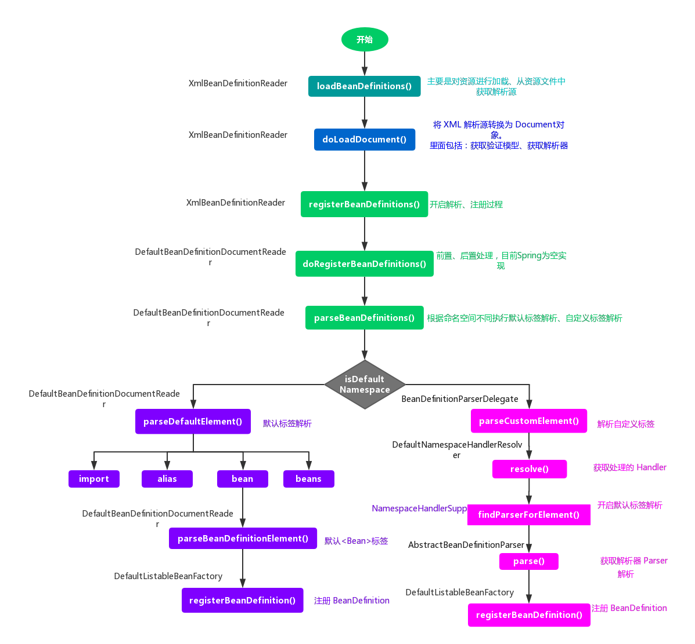

另外，艿艿推荐几篇不错的 Srping IoC 容器相关的博客：

- JavaDoop [《Spring IOC 容器源码分析》](https://javadoop.com/post/spring-ioc)
- Yikun [《Spring IOC 核心源码学习》](https://yikun.github.io/2015/05/29/Spring-IOC核心源码学习/)
- DearBelinda [《Spring专题之 IOC 源码分析》](https://segmentfault.com/a/1190000016261917)