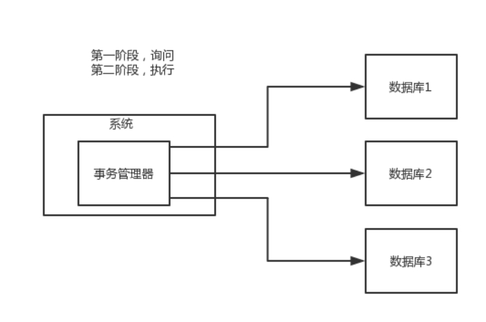
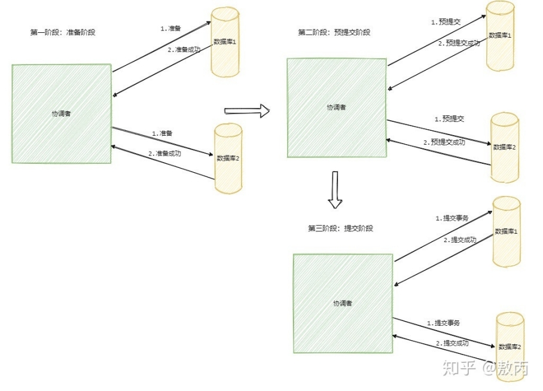
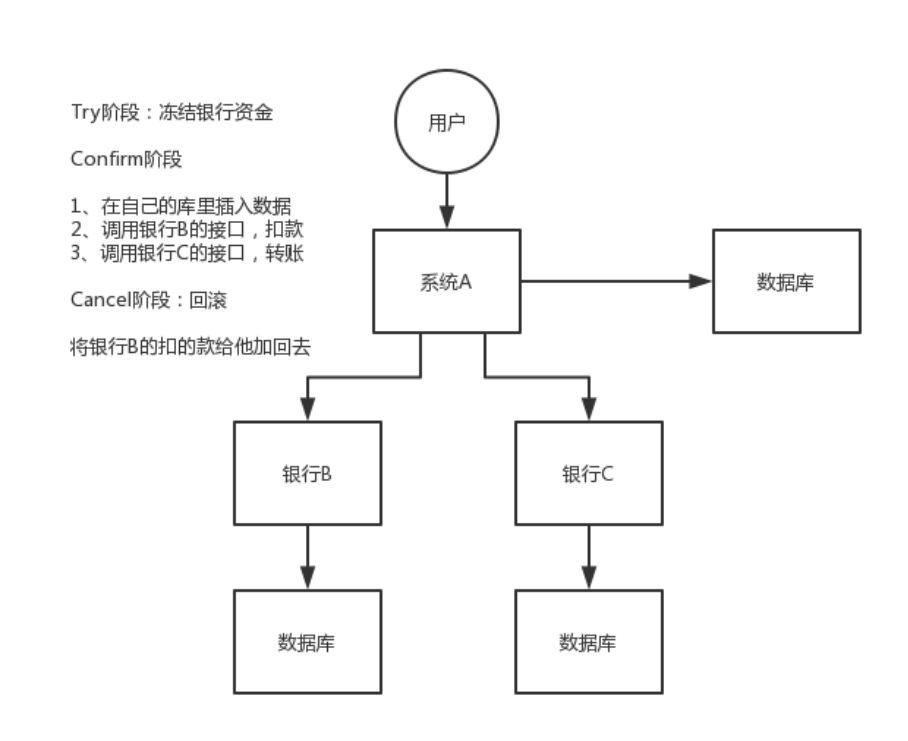
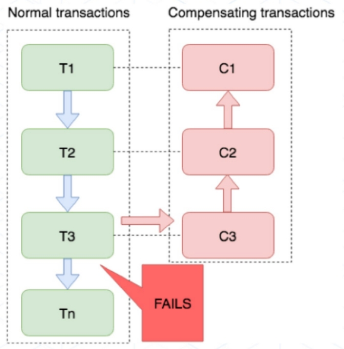
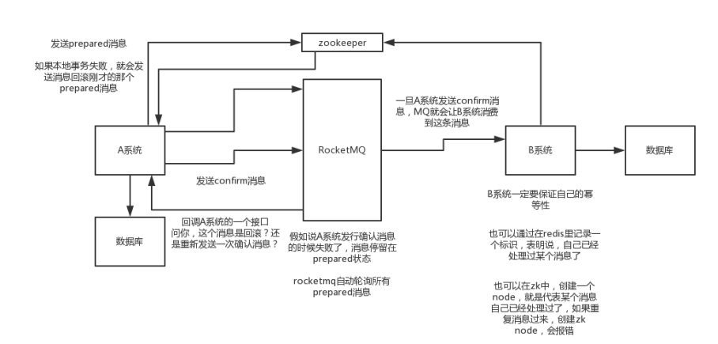
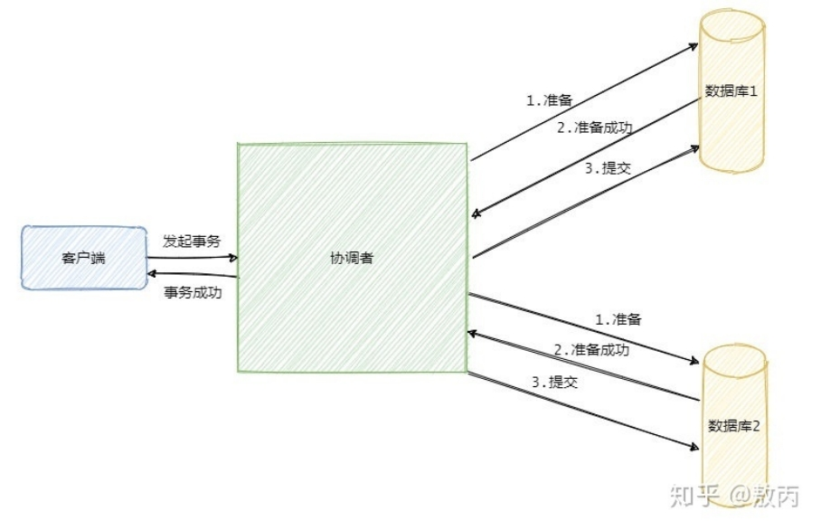
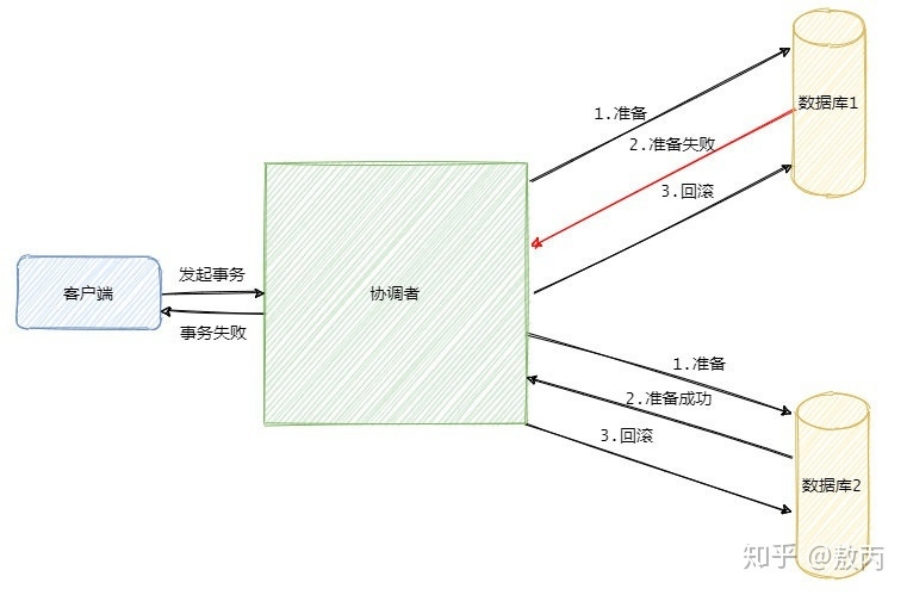

## 分布式理论

### CAP理论

- 一致性（Consistency） : 所有节点访问同一份最新的数据副本

- 可用性（Availability）: 非故障的节点在合理的时间内返回合理的响应（不是错误或者超时的响应）。

- 分区容错性（Partition tolerance） : 分布式系统出现网络分区的时候，仍然能够对外提供服务。

当发生网络分区的时候，如果我们要继续服务，那么强一致性和可用性只能 2 选 1。也就是说当网络分区之后 P 是前提，决定了 P 之后才有 C 和 A 的选择。也就是说分区容错性（Partition tolerance）我们是必须要实现的。

比如 ZooKeeper、HBase 就是 CP 架构，Cassandra、Eureka 就是 AP 架构，Nacos 不仅支持 CP 架构也支持 AP 架构。

为啥不可能选择 CA 架构呢？ 举个例子：若系统出现“分区”，系统中的某个节点在进行写操作。为了保证 C， 必须要禁止其他节点的读写操作，这就和 A 发生冲突了。如果为了保证 A，其他节点的读写操作正常的话，那就和 C 发生冲突了。

### BASE 理论

BASE 是 Basically Available（基本可用） 、Soft-state（软状态） 和 Eventually Consistent（最终一致性） 三个短语的缩写。BASE 理论是对 CAP 中一致性 C 和可用性 A 权衡的结果，其来源于对大规模互联网系统分布式实践的总结，是基于 CAP 定理逐步演化而来的，它大大降低了我们对系统的要求。

- 基本可用：基本可用是指分布式系统在出现不可预知故障的时候，允许损失部分可用性。但是，这绝不等价于系统不可用。

- 软状态：软状态指允许系统中的数据存在中间状态（CAP 理论中的数据不一致），并认为该中间状态的存在不会影响系统的整体可用性，即允许系统在不同节点的数据副本之间进行数据同步的过程存在延时。

- 最终一致性：最终一致性强调的是系统中所有的数据副本，在经过一段时间的同步后，最终能够达到一个一致的状态。因此，最终一致性的本质是需要系统保证最终数据能够达到一致，而不需要实时保证系统数据的强一致性。

**什么叫允许损失部分可用性呢？**

响应时间上的损失: 正常情况下，处理用户请求需要 0.5s 返回结果，但是由于系统出现故障，处理用户请求的时间变为 3 s。

系统功能上的损失：正常情况下，用户可以使用系统的全部功能，但是由于系统访问量突然剧增，系统的部分非核心功能无法使用。

### 分布式ID

一个最基本的分布式 ID 需要满足下面这些要求：

- 全局唯一 ：ID 的全局唯一性肯定是首先要满足的！

- 高性能 ： 分布式 ID 的生成速度要快，对本地资源消耗要小。

- 高可用 ：生成分布式 ID 的服务要保证可用性无限接近于 100%。

- 方便易用 ：拿来即用，使用方便，快速接入！

**Snowflake(雪花算法)**

Sowflake 是 Twitter 开源的分布式 ID 生成算法。Snowflake 由 64 bit 的二进制数字组成，这 64bit 的二进制被分成了几部分，每一部分存储的数据都有特定的含义：

- 第 0 位： 符号位（标识正负），始终为 0，没有用，不用管。

- 第 1~41 位 ：一共 41 位，用来表示时间戳，单位是毫秒，可以支撑 2 ^41 毫秒（约 69 年）

- 第 42~52 位 ：一共 10 位，一般来说，前 5 位表示机房 ID，后 5 位表示机器 ID（实际项目中可以根据实际情况调整）。这样就可以区分不同集群/机房的节点。

- 第 53~64 位 ：一共 12 位，用来表示序列号。 序列号为自增值，代表单台机器每毫秒能够产生的最大 ID 数(2^12 = 4096),也就是说单台机器每毫秒最多可以生成 4096 个 唯一 ID。

优点 ：生成速度比较快、生成的 ID 有序递增、比较灵活（可以对 Snowflake 算法进行简单的改造比如加入业务 ID）

缺点 ： 需要解决重复 ID 问题（依赖时间，当机器时间不对的情况下，可能导致会产生重复 ID）。

### 分布式事务

#### 普通事务

严格意义上的事务实现应该是具备原子性、一致性、隔离性和持久性，简称 ACID。

- 原子性（Atomicity），可以理解为一个事务内的所有操作要么都执行，要么都不执行。

- 一致性（Consistency），可以理解为数据是满足完整性约束的，也就是不会存在中间状态的数据，比如你账上有400，我账上有100，你给我打200块，此时你账上的钱应该是200，我账上的钱应该是300，不会存在我账上钱加了，你账上钱没扣的中间状态。

- 隔离性（Isolation），指的是多个事务并发执行的时候不会互相干扰，即一个事务内部的数据对于其他事务来说是隔离的。

- 持久性（Durability），指的是一个事务完成了之后数据就被永远保存下来，之后的其他操作或故障都不会对事务的结果产生影响。

而通俗意义上事务就是为了使得一些更新操作要么都成功，要么都失败。

#### 分布式事务

分布式事务顾名思义就是要在分布式系统中实现事务，它其实是由多个本地事务组合而成。

分布式事务的实现主要有以下 6 种方案：

##### **两阶段提交方案(2PC)**

**XA 方案**

所谓的 XA 方案，即：两阶段提交，有一个事务管理器的概念，负责协调多个数据库（资源管理器）的事务，事务管理器先问问各个数据库你准备好了吗？如果每个数据库都回复 ok，那么就正式提交事务，在各个数据库上执行操作；如果任何其中一个数据库回答不 ok，那么就回滚事务。

这种分布式事务方案，比较适合单块应用里，跨多个库的分布式事务，而且因为严重依赖于数据库层面来搞定复杂的事务，效率很低，绝对不适合高并发的场景。如果要玩儿，那么基于 Spring + JTA 就可以搞定，自己随便搜个 demo 看看就知道了。

这个方案，我们很少用，一般来说某个系统内部如果出现跨多个库的这么一个操作，是不合规的。我可以给大家介绍一下， 现在微服务，一个大的系统分成几十个甚至几百个服务。一般来说，我们的规定和规范，是要求每个服务只能操作自己对应的一个数据库。

如果你要操作别的服务对应的库，不允许直连别的服务的库，违反微服务架构的规范，你随便交叉胡乱访问，几百个服务的话，全体乱套，这样的一套服务是没法管理的，没法治理的，可能会出现数据被别人改错，自己的库被别人写挂等情况。

如果你要操作别人的服务的库，你必须是通过调用别的服务的接口来实现，绝对不允许交叉访问别人的数据库。

**基于两阶段提交方案的AT模式（Seata）**

**一阶段：**

（1）拦截并解析业务SQL，找到需要在数据表中更新的数据，将其转换为undo_log，并且保存到提前在每个数据库中创建的undo_log表中

​       打个比方，如果你是在做update product set price = 20 where price=10 and id=1的操作那么undo_log中保存的就是反向 update product set price=10 where price=20 and id=1。当然它的存储不会直接这么存，会经过处理。

（2）然后执行业务SQL，这时你会发现数据库中的数据是发生变化了的，同时undo_log中也有对应的新增数据

**二阶段**

（1）因为第一阶段已经提交了本地事务，数据已经更新过了，这个时候如果没有报错，那么直接删除掉undo_log以及行锁的数据即可

（2）但是如果发生了报错，就只需要根据undo_log来回退数据

##### 3PC

3PC 的出现是为了解决 2PC 的一些问题，相比于 2PC 它在参与者中也引入了超时机制，并且新增了一个阶段使得参与者可以利用这一个阶段统一各自的状态。

3PC 包含了三个阶段，分别是准备阶段、预提交阶段和提交阶段，对应的英文就是：CanCommit、PreCommit 和 DoCommit。

 

我们知道 2PC 是同步阻塞的，上面我们已经分析了协调者挂在了提交请求还未发出去的时候是最伤的，所有参与者都已经锁定资源并且阻塞等待着。

那么引入了超时机制，参与者就不会傻等了，如果是等待提交命令超时，那么参与者就会提交事务了，因为都到了这一阶段了大概率是提交的，如果是等待预提交命令超时，那该干啥就干啥了，反正本来啥也没干。.

##### TCC 方案

TCC 的全称是： Try 、 Confirm 、 Cance。

1. Try 阶段：这个阶段说的是对各个服务的资源做检测以及对资源进行锁定或者预留。

2. Confirm 阶段：这个阶段说的是在各个服务中执行实际的操作。

3. Cance阶段：如果任何一个服务的业务方法执行出错，那么这里就需要进行补偿，就是执行已经执行成功的业务逻辑的回滚操作。（把那些执行成功的回滚）

这种方案说实话几乎很少人使用，我们用的也比较少，但是也有使用的场景。因为这个事务回滚实际上是严重依赖于你自己写代码来回滚和补偿了，会造成补偿代码巨大，非常之恶心。

比如说我们，一般来说跟钱相关的，跟钱打交道的，支付、交易相关的场景，我们会用 TCC，严格保证分布式事务要么全部成功，要么全部自动回滚，严格保证资金的正确性，保证在资金上不会出现问题。

而且最好是你的各个业务执行的时间都比较短。

但是说实话，一般尽量别这么搞，自己手写回滚逻辑，或者是补偿逻辑，实在太恶心了，那个业务代码是很难维护的。

 

##### Saga 方案

金融核心等业务可能会选择 TCC 方案，以追求强一致性和更高的并发量，而对于更多的金融核心以上的业务系统 往往会选择补偿事务，补偿事务处理在 30 多年前就提出了 Saga 理论，随着微服务的发展，近些年才逐步受到大家的关注。目前业界比较公认的是采用 Saga 作为长事务的解决方案。

基本原理

业务流程中每个参与者都提交本地事务，若某一个参与者失败，则补偿前面已经成功的参与者。下图左侧是正常的事务流程，当执行到 T3 时发生了错误，则开始执行右边的事务补偿流程，反向执行 T3、T2、T1 的补偿服务 C3、C2、C1，将 T3、T2、T1 已经修改的数据补偿掉。缺点不保证事务的隔离性。

使用场景

对于一致性要求高、短流程、并发高 的场景，如：金融核心系统，会优先考虑 TCC 方案。而在另外一些场景下，我们并不需要这么强的一致性，只需要保证最终一致性即可。

比如 很多金融核心以上的业务（渠道层、产品层、系统集成层），这些系统的特点是最终一致即可、流程多、流程长、还可能要调用其它公司的服务。这种情况如果选择 TCC 方案开发的话，一来成本高，二来无法要求其它公司的服务也遵循 TCC 模式。同时流程长，事务边界太长，加锁时间长，也会影响并发性能。

所以 Saga 模式的适用场景是：

业务流程长、业务流程多；

参与者包含其它公司或遗留系统服务，无法提供 TCC 模式要求的三个接口。

 

##### 本地消息表

这个大概意思是这样的：

- A 系统在自己本地一个事务里操作同时，插入一条数据到消息表；

- 接着 A 系统将这个消息发送到 MQ 中去；

- B 系统接收到消息之后，在一个事务里，往自己本地消息表里插入一条数据，同时执行其他的业务操作，如果这个消息已经被处理过了，那么此时这个事务会回滚，这样保证不会重复处理消息；

- B 系统执行成功之后，就会更新自己本地消息表的状态以及 A 系统消息表的状态；

- 如果 B 系统处理失败了，那么就不会更新消息表状态，那么此时 A 系统会定时扫描自己的消息表，如果有未处理的消息，会再次发送到 MQ 中去，让 B 再次处理；

这个方案保证了最终一致性，哪怕 B 事务失败了，但是 A 会不断重发消息，直到 B 那边成功为止。

这个方案说实话最大的问题就在于严重依赖于数据库的消息表来管理事务啥的，如果是高并发场景咋办呢？咋扩展呢？所以一般确实很少用。

##### 可靠消息最终一致性方案(MQ)

这个的意思，就是干脆不要用本地的消息表了，直接基于 MQ 来实现事务。比如阿里的 RocketMQ 就支持消息事务。

大概的意思就是：

1. A 系统先发送一个 prepared 消息到 mq，如果这个 prepared 消息发送失败那么就直接取消操作别执行了；

2. 如果这个消息发送成功过了，那么接着执行本地事务，如果成功就告诉 mq 发送确认消息，如果失败就告诉 mq 回滚消息；

3. 如果发送了确认消息，那么此时 B 系统会接收到确认消息，然后执行本地的事务；

4. mq 会自动定时轮询所有 prepared 消息回调你的接口，问你，这个消息是不是本地事务处理失败了，所有没发送确认的消息，是继续重试还是回滚？一般来说这里你就可以查下数据库看之前本地事务是否执行，如果回滚了，那么这里也回滚吧。这个就是避免可能本地事务执行成功了，而确认消息却发送失败了。

这个方案里，要是系统 B 的事务失败了咋办？重试咯，自动不断重试直到成功，如果实在是不行，要么就是针对重要的资金类业务进行回滚，比如 B 系统本地回滚后，想办法通知系统 A 也回滚；或者是发送报警由人工来手工回滚和补偿。

这个还是比较合适的，目前国内互联网公司大都是这么玩儿的，要不你就用 RocketMQ 支持的，要不你就自己基于类似 ActiveMQ？RabbitMQ？自己封装一套类似的逻辑出来，总之思路就是这样子的。

##### 最大努力通知方案

这个方案的大致意思就是：

1. 系统 A 本地事务执行完之后，发送个消息到 MQ；

2. 这里会有个专门消费 MQ 的最大努力通知服务，这个服务会消费 MQ 然后写入数据库中记录下来，或者是放入个内存队列也可以，接着调用系统 B 的接口；

3. 要是系统 B 执行成功就 ok 了；要是系统 B 执行失败了，那么最大努力通知服务就定时尝试重新调用系统 B，反复 N 次，最后还是不行就放弃。

#### 你们公司是如何处理分布式事务的？

如果你真的被问到，可以这么说，我们某某特别严格的场景，用的是 TCC 来保证强一致性；然后其他的一些场景基于阿里的 RocketMQ 来实现分布式事务。

你找一个严格资金要求绝对不能错的场景，你可以说你是用的 TCC 方案；如果是一般的分布式事务场景，订单插入之后要调用库存服务更新库存，库存数据没有资金那么的敏感，可以用可靠消息最终一致性方案。

#### 分布式事务中间见seata

**AT模式使用**

在需要发起全局事务的service方法上添加注解 @GlobalTransactional，

使用Fiegn、restTemplate等方式发送请求，提供方只添加@Transactional保证本地事务

**Seata全局事务中涉及三个身份**

TC 事务协调者，对应seata服务

TM事务管理者，对应base服务中发起全局事务的方法

RM资源管理者，对应工作流服务

2PC

2PC（Two-phase commit protocol），中文叫二阶段提交。 二阶段提交是一种强一致性设计，2PC 引入一个事务协调者的角色来协调管理各参与者（也可称之为各本地资源）的提交和回滚，二阶段分别指的是准备（投票）和提交两个阶段。

过程

准备阶段协调者会给各参与者发送准备命令，你可以把准备命令理解成除了提交事务之外啥事都做完了。

同步等待所有资源的响应之后就进入第二阶段即提交阶段（注意提交阶段不一定是提交事务，也可能是回滚事务）。

假如在第一阶段所有参与者都返回准备成功，那么协调者则向所有参与者发送提交事务命令，然后等待所有事务都提交成功之后，返回事务执行成功。

 

假如在第一阶段有一个参与者返回失败，那么协调者就会向所有参与者发送回滚事务的请求，即分布式事务执行失败。

 

如果第二阶段提交失败的话：

第一种是第二阶段执行的是回滚事务操作，那么答案是不断重试，直到所有参与者都回滚了，不然那些在第一阶段准备成功的参与者会一直阻塞着。

第二种是第二阶段执行的是提交事务操作，那么答案也是不断重试，因为有可能一些参与者的事务已经提交成功了，这个时候只有一条路，就是头铁往前冲，不断的重试，直到提交成功，到最后真的不行只能人工介入处理。

2PC 是一种尽量保证强一致性的分布式事务，因此它是同步阻塞的，而同步阻塞就导致长久的资源锁定问题，总体而言效率低，并且存在单点故障问题，在极端条件下存在数据不一致的风险。

[面试必问：分布式事务六种解决方案 - 知乎 (zhihu.com)](https://zhuanlan.zhihu.com/p/183753774)

 

 

