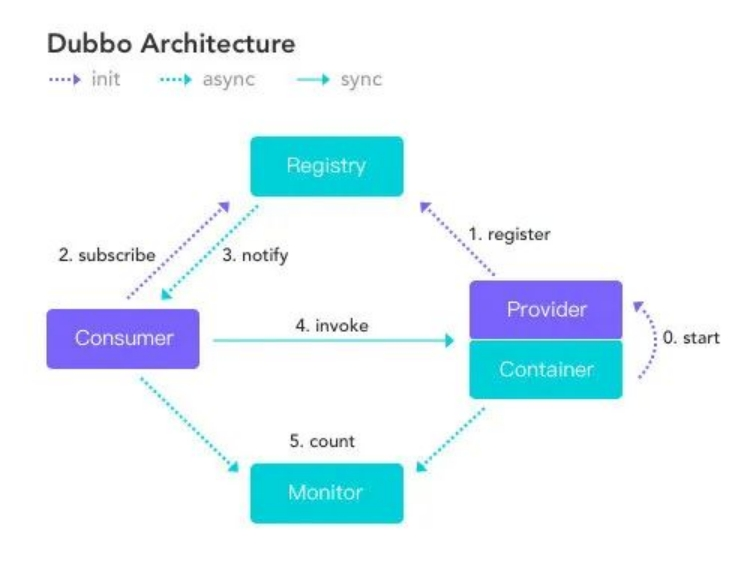
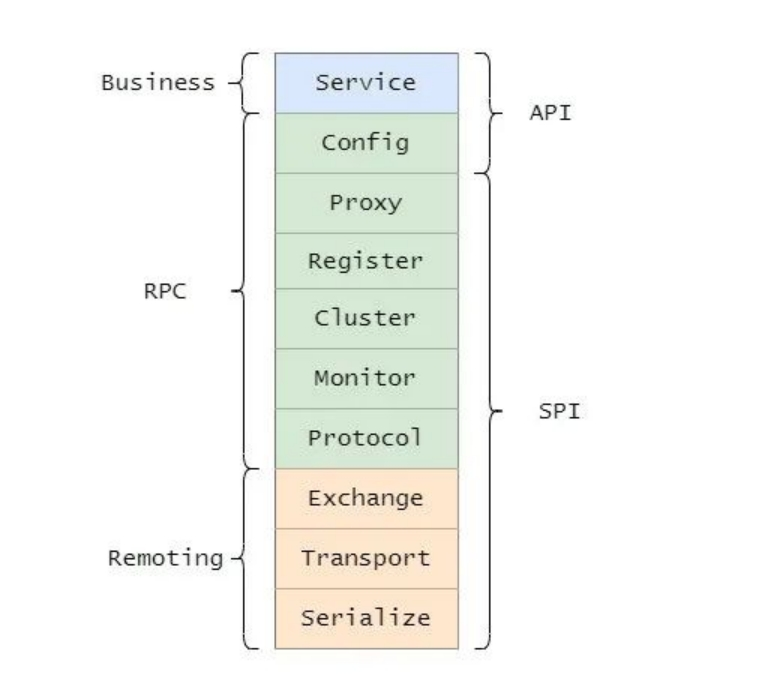
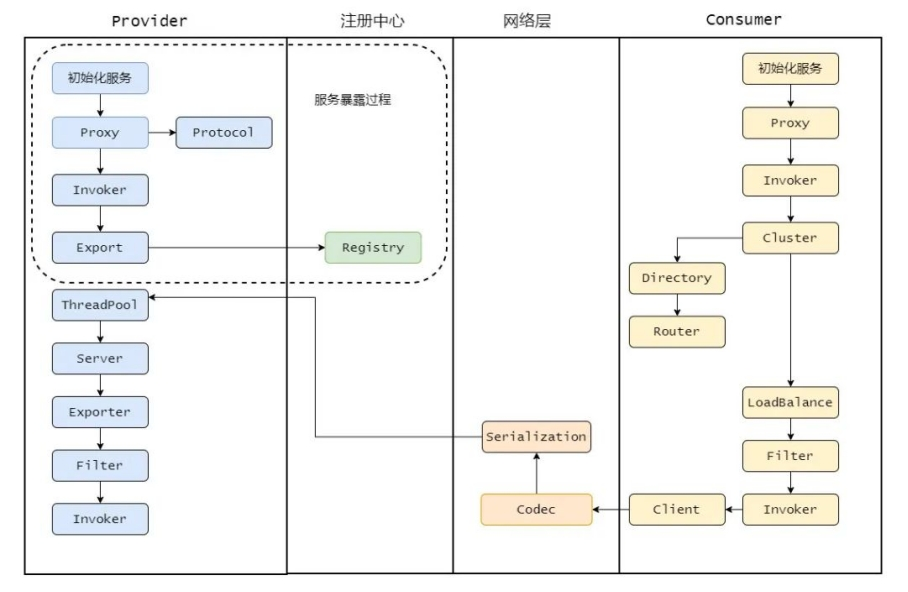

## Dubbo

> Dubbo 是阿里巴巴 2011年开源的一个基于 Java 的 RPC 框架，中间沉寂了一段时间，不过其他一些企业还在用 Dubbo 并自己做了扩展，比如当当网的 Dubbox，还有网易考拉的 Dubbok。
>
> 但是在 2017 年阿里巴巴又重启了对 Dubbo 维护。在 2017 年荣获了开源中国 2017 最受欢迎的中国开源软件 Top 3。
>
> 在 2018 年和 Dubbox 进行了合并，并且进入 Apache 孵化器，在 2019 年毕业正式成为 Apache 顶级项目。
>
> 目前 Dubbo 社区主力维护的是 2.6.x 和 2.7.x 两大版本，2.6.x 版本主要是 bug 修复和少量功能增强为准，是稳定版本。
>
> 而 2.7.x 是主要开发版本，更新和新增新的 feature 和优化，并且 2.7.5 版本的发布被 Dubbo 认为是里程碑式的版本发布，之后我们再做分析。
>
> 它实现了面向接口的代理 RPC 调用，并且可以配合 ZooKeeper 等组件实现服务注册和发现功能，并且拥有负载均衡、容错机制等。

### 架构

目前 Dubbo 社区主力维护的是 2.6.x 和 2.7.x 两大版本，2.6.x 版本主要是 bug 修复和少量功能增强为准，是稳定版本。

它实现了面向接口的代理 RPC 调用，并且可以配合 ZooKeeper 等组件实现服务注册和发现功能，并且拥有负载均衡、容错机制等。

 

- Consumer 需要调用远程服务的服务消费方

- Registry	注册中心

- Provider	服务提供方

- Container  服务运行的容器

- Monitor	监控中心

### 分层架构

总的而言 Dubbo 分为三层，如果每一层再细分下去，一共有十层。

 

大的三层分别为 Business（业务层）、RPC 层、Remoting，并且还分为 API 层和 SPI 层。

而分 API 层和 SPI 层这是 Dubbo 成功的一点，采用微内核设计+SPI扩展，使得有特殊需求的接入方可以自定义扩展，做定制的二次开发。

- Service，业务层，就是咱们开发的业务逻辑层。

- Config，配置层，主要围绕 ServiceConfig 和 ReferenceConfig，初始化配置信息。

- Proxy，代理层，服务提供者还是消费者都会生成一个代理类，使得服务接口透明化，代理层做远程调用和返回结果。

- Register，注册层，封装了服务注册和发现。

- Cluster，路由和集群容错层，负责选取具体调用的节点，处理特殊的调用要求和负责远程调用失败的容错措施。

- Monitor，监控层，负责监控统计调用时间和次数。

- Protocol，远程调用层，主要是封装 RPC 调用，主要负责管理 Invoker，Invoker代表一个抽象封装了的执行体，之后再做详解。

- Exchange，信息交换层，用来封装请求响应模型，同步转异步。

- Transport，网络传输层，抽象了网络传输的统一接口，这样用户想用 Netty 就用 Netty，想用 Mina 就用 Mina。

- Serialize，序列化层，将数据序列化成二进制流，当然也做反序列化。

### 调用链路

#### 整体执行流程

1. 提供者端启动 容器负责把Service信息加载 并通过Protocol 注册到注册中心 ；
2. 服务消费者启动向注册中心订阅自己所需的服务。然后注册中心将提供者元信息通知给 Consumer， 之后 Consumer 因为已经从注册中心获取提供者的地址，因此可以通过负载均衡选择一个 Provider 直接调用  ；
3. 消费方发起 请求 通过Proxy模块利用Cluster模块来选择真实的要发送给的提供者信息交由Consumer中的Protocol 把信息发送给提供者 ；
4. 之后服务提供方元数据变更的话注册中心会把变更推送给服务消费者。
5. 服务提供者和消费者都会在内存中记录着调用的次数和时间，然后定时的发送统计数据到监控中心 ；

**其他**

1. 首先注册中心和监控中心是可选的，你可以不要监控，也不要注册中心，直接在配置文件里面写然后提供方和消费方直连。
2. 然后注册中心、提供方和消费方之间都是长连接，和监控方不是长连接，并且消费方是直接调用提供方，不经过注册中心。
3. 就算注册中心和监控中心宕机了也不会影响到已经正常运行的提供者和消费者，因为消费者有本地缓存提供者的信息。

#### 整体调用链路

### Dubbo的服务暴露过程

[堂妹问我：Dubbo的服务暴露过程 (qq.com)](https://mp.weixin.qq.com/s?__biz=MzAwNDA2OTM1Ng==&mid=2453145897&idx=1&sn=0a5896cac1b3f0347220e9d27118fc9e&scene=21#wechat_redirect)

## SPI机制

[三歪问我Dubbo的SPI机制是啥？ (qq.com)](https://mp.weixin.qq.com/s?__biz=MzAwNDA2OTM1Ng==&mid=2453145662&idx=1&sn=0ba56d58eedca7f04b4d013b84080f31&chksm=8cfd2abdbb8aa3ab58c635d161a1040a762605afd0e2bc4c53b986fe328b9f447c657d94be33&cur_album_id=1508169304872108033&scene=189#wechat_redirect)

## Dubbo的服务引用过程

##  Dubbo服务调用过程

 [帅地问我：Dubbo服务调用过程 (qq.com)](https://mp.weixin.qq.com/s?__biz=MzAwNDA2OTM1Ng==&mid=2453146350&idx=1&sn=059e12e95c2866e54d714012bc4f7d10&chksm=8cfd286dbb8aa17b87342c0c634e0deee9a0b86d7689db241c9f9a3009886accf089d6a8a530&cur_album_id=1508169304872108033&scene=189#wechat_redirect)

## Dubbo集群容错负载均衡

[妹妹问我：Dubbo集群容错负载均衡 (qq.com)](https://mp.weixin.qq.com/s?__biz=MzAwNDA2OTM1Ng==&mid=2453146754&idx=1&sn=09b152f913dd30702de0be8ba81c8fca&chksm=8cfd2e01bb8aa71712f194be79d2123dda33e1b0f1b1bb09eb3e75c142fa2b6989c21687ed39&cur_album_id=1508169304872108033&scene=189#wechat_redirect)

[绯闻女友想看很久的Dubbo面试题 (qq.com)](https://mp.weixin.qq.com/s?__biz=MzAwNDA2OTM1Ng==&mid=2453146800&idx=1&sn=f37dcf0b4f5a07910efe529634a9ac62&chksm=8cfd2e33bb8aa725ef5677c1bf76150f351d14c2bad23c3ca2d9ea0ca2296f23ad42cc224c93&cur_album_id=1508169304872108033&scene=189#wechat_redirect)

[1w+字的 Dubbo 面试题/知识点总结！（2021 最新版） (qq.com)](https://mp.weixin.qq.com/s/2qSA6aJn6KRXrATVE44k0w)

## RPC

RPC（Remote Procedure Call） 即远程过程调用，通过名字我们就能看出 RPC 关注的是远程调用而非本地调用。RPC 目的就是让我们使用远程调用像本地调用一样简单方便，并且解决一些远程调用会发生的一些问题

## 如何设计一个 RPC 框架

服务消费者

1. 面向接口编程并提供代理类：

   - 我们先从消费者方(也就是调用方)来看需要些什么，首先消费者面向接口编程，所以需要得知有哪些接口可以调用，可以通过公用 jar 包的方式来维护接口。
   - 现在知道有哪些接口可以调用了，但是只有接口啊，具体的实现怎么来？这事必须框架给处理了！所以还需要来个代理类，让消费者只管调，啥事都别管了，我代理帮你搞定。

2. 注册中心：

   - 虽说代理帮你搞定但是代理也需要知道它到底要调哪个机子上的远程方法，所以需要有个注册中心，这样调用方从注册中心可以知晓可以调用哪些服务提供方，

3. 负载均衡：

   - 一般而言提供方不止一个，毕竟只有一个挂了那不就没了。所以提供方一般都是集群部署，那调用方需要通过负载均衡来选择一个调用，可以通过某些策略例如同机房优先调用啊啥的。

4. 容错机制：

   - 当然还需要有容错机制，毕竟这是远程调用，网络是不可靠的，所以可能需要重试什么的。

5. 约定一个通信协议和序列化：

   - 还要和服务提供方约定一个协议，例如我们就用 HTTP 来通信就好啦，也就是大家要讲一样的话，不然可能听不懂了。
   - 当然序列化必不可少，毕竟我们本地的结构是“立体”的，需要序列化之后才能传输，因此还需要约定序列化格式。

   ------

服务提供者

1. 实现对应的接口：服务提供者肯定要实现对应的接口这是毋庸置疑的。

2. 自己的接口暴露出去：然后需要把自己的接口暴露出去，向注册中心注册自己，暴露自己所能提供的服务。

3. 然后有消费者请求过来需要处理，提供者需要用和消费者协商好的协议来处理这个请求，然后做反序列化。

4. 序列化完的请求应该扔到线程池里面做处理，某个线程接受到这个请求之后找到对应的实现调用，然后再将结果原路返回。

5. 注册中心

6. 监控运维
