### Dubbo

## RPC

RPC（Remote Procedure Call） 即远程过程调用，通过名字我们就能看出 RPC 关注的是远程调用而非本地调用。RPC 目的就是让我们使用远程调用像本地调用一样简单方便，并且解决一些远程调用会发生的一些问题

### 如何设计一个 RPC 框架

服务消费者

1. 面向接口编程并提供代理类：

   - 我们先从消费者方(也就是调用方)来看需要些什么，首先消费者面向接口编程，所以需要得知有哪些接口可以调用，可以通过公用 jar 包的方式来维护接口。
   - 现在知道有哪些接口可以调用了，但是只有接口啊，具体的实现怎么来？这事必须框架给处理了！所以还需要来个代理类，让消费者只管调，啥事都别管了，我代理帮你搞定。

2. 注册中心：

   - 虽说代理帮你搞定但是代理也需要知道它到底要调哪个机子上的远程方法，所以需要有个注册中心，这样调用方从注册中心可以知晓可以调用哪些服务提供方，

3. 负载均衡：

   - 一般而言提供方不止一个，毕竟只有一个挂了那不就没了。所以提供方一般都是集群部署，那调用方需要通过负载均衡来选择一个调用，可以通过某些策略例如同机房优先调用啊啥的。

4. 容错机制：

   - 当然还需要有容错机制，毕竟这是远程调用，网络是不可靠的，所以可能需要重试什么的。

5. 约定一个通信协议和序列化：

   - 还要和服务提供方约定一个协议，例如我们就用 HTTP 来通信就好啦，也就是大家要讲一样的话，不然可能听不懂了。
   - 当然序列化必不可少，毕竟我们本地的结构是“立体”的，需要序列化之后才能传输，因此还需要约定序列化格式。

   ------
   

服务提供者

1. 实现对应的接口：服务提供者肯定要实现对应的接口这是毋庸置疑的。

2. 自己的接口暴露出去：然后需要把自己的接口暴露出去，向注册中心注册自己，暴露自己所能提供的服务。

3. 然后有消费者请求过来需要处理，提供者需要用和消费者协商好的协议来处理这个请求，然后做反序列化。

4. 序列化完的请求应该扔到线程池里面做处理，某个线程接受到这个请求之后找到对应的实现调用，然后再将结果原路返回。

5. 注册中心

6. 监控运维

## Dubbo总体架构

目前 Dubbo 社区主力维护的是 2.6.x 和 2.7.x 两大版本，2.6.x 版本主要是 bug 修复和少量功能增强为准，是稳定版本。

它实现了面向接口的代理 RPC 调用，并且可以配合 ZooKeeper 等组件实现服务注册和发现功能，并且拥有负载均衡、容错机制等。

 

- Consumer 需要调用远程服务的服务消费方

- Registry	注册中心

- Provider	服务提供方

- Container  服务运行的容器

- Monitor	监控中心

### 整体的流程

1. 首先服务提供者 Provider 启动然后向注册中心注册自己所能提供的服务。

2. 服务消费者 Consumer 启动向注册中心订阅自己所需的服务。然后注册中心将提供者元信息通知给 Consumer， 之后 Consumer 因为已经从注册中心获取提供者的地址，因此可以通过负载均衡选择一个 Provider 直接调用 。

3. 之后服务提供方元数据变更的话注册中心会把变更推送给服务消费者。

4. 服务提供者和消费者都会在内存中记录着调用的次数和时间，然后定时的发送统计数据到监控中心。

**其他**

1. 首先注册中心和监控中心是可选的，你可以不要监控，也不要注册中心，直接在配置文件里面写然后提供方和消费方直连。

2. 然后注册中心、提供方和消费方之间都是长连接，和监控方不是长连接，并且消费方是直接调用提供方，不经过注册中心。

3. 就算注册中心和监控中心宕机了也不会影响到已经正常运行的提供者和消费者，因为消费者有本地缓存提供者的信息。

### Dubbo分层架构

总的而言 Dubbo 分为三层，如果每一层再细分下去，一共有十层。

 

大的三层分别为 Business（业务层）、RPC 层、Remoting，并且还分为 API 层和 SPI 层。

而分 API 层和 SPI 层这是 Dubbo 成功的一点，采用微内核设计+SPI扩展，使得有特殊需求的接入方可以自定义扩展，做定制的二次开发。

- Service，业务层，就是咱们开发的业务逻辑层。

- Config，配置层，主要围绕 ServiceConfig 和 ReferenceConfig，初始化配置信息。

- Proxy，代理层，服务提供者还是消费者都会生成一个代理类，使得服务接口透明化，代理层做远程调用和返回结果。

- Register，注册层，封装了服务注册和发现。

- Cluster，路由和集群容错层，负责选取具体调用的节点，处理特殊的调用要求和负责远程调用失败的容错措施。

- Monitor，监控层，负责监控统计调用时间和次数。

- Portocol，远程调用层，主要是封装 RPC 调用，主要负责管理 Invoker，Invoker代表一个抽象封装了的执行体，之后再做详解。

- Exchange，信息交换层，用来封装请求响应模型，同步转异步。

- Transport，网络传输层，抽象了网络传输的统一接口，这样用户想用 Netty 就用 Netty，想用 Mina 就用 Mina。

- Serialize，序列化层，将数据序列化成二进制流，当然也做反序列化。

### Dubbo 调用过程

服务暴露过程

首先 Provider 启动，通过 Proxy 组件根据具体的协议 Protoco将需要暴露出去的接口封装成 Invoker，Invoker 是 Dubbo 一个很核心的组件，代表一个可执行体。

 然后再通过 Exporter 包装一下，这是为了在注册中心暴露自己套的一层，然后将 Exporter 通过 Registry 注册到注册中心。这就是整体服务暴露过程。

消费过程

 

首先消费者启动会向注册中心拉取服务提供者的元信息，然后调用流程也是从 Proxy 开始，毕竟都需要代理才能无感知。

Proxy 持有一个 Invoker 对象，调用 invoke 之后需要通过 Cluster 先从 Directory 获取所有可调用的远程服务的 Invoker 列表，如果配置了某些路由规则，比如某个接口只能调用某个节点的那就再过滤一遍 Invoker 列表。

剩下的 Invoker 再通过 LoadBalance 做负载均衡选取一个。然后再经过 Filter 做一些统计什么的，再通过 Client 做数据传输，比如用 Netty 来传输。

传输需要经过 Codec 接口做协议构造，再序列化。最终发往对应的服务提供者。

服务提供者接收到之后也会进行 Codec 协议处理，然后反序列化后将请求扔到线程池处理。某个线程会根据请求找到对应的 Exporter ，而找到 Exporter 其实就是找到了 Invoker，但是还会有一层层 Filter，经过一层层过滤链之后最终调用实现类然后原路返回结果。

### Dubbo的服务暴露过程

[堂妹问我：Dubbo的服务暴露过程 (qq.com)](https://mp.weixin.qq.com/s?__biz=MzAwNDA2OTM1Ng==&mid=2453145897&idx=1&sn=0a5896cac1b3f0347220e9d27118fc9e&scene=21#wechat_redirect)

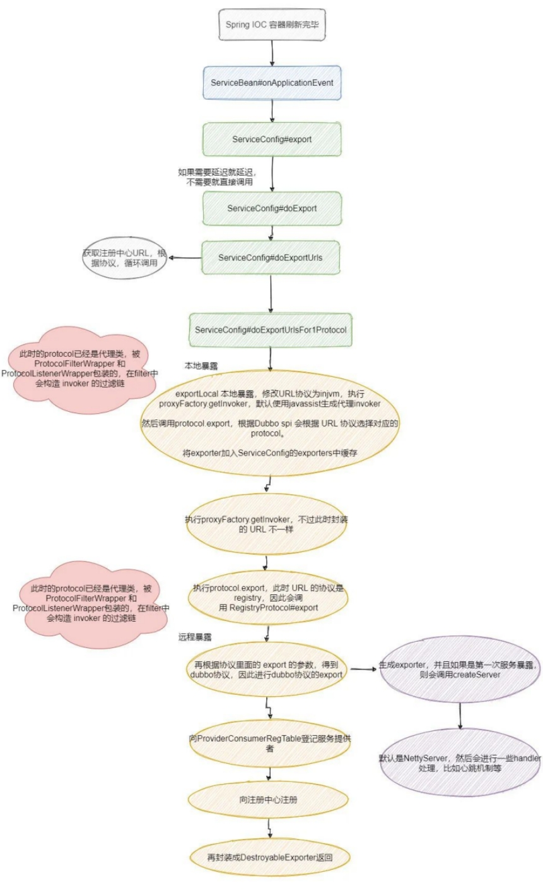 

 

URL

Dubbo 就是采用 UR的方式来作为约定的参数类型，被称为公共契约，就是我们都通过 UR来交互，来交流。因此 Dubbo 用 UR作为配置总线，贯穿整个体系，源码中 UR的身影无处不在。

protocol：指的是 dubbo 中的各种协议，如：dubbo thrift http

username/password：用户名/密码

host/port：主机/端口

path：接口的名称

parameters：参数键值对

配置解析

Dubbo 利用了 Spring 配置文件扩展了自定义的解析，像 dubbo.xsd 就是用来约束 XM配置时候的标签和对应的属性用的，然后 Spring 在解析到自定义的标签的时候会查找 spring.schemas 和 spring.handlers。

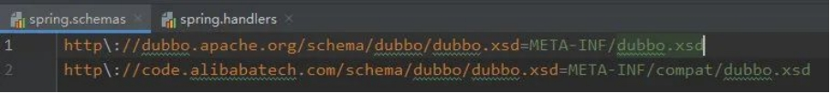 

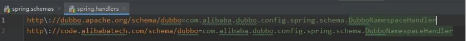 

spring.schemas 就是指明了约束文件的路径，而 spring.handlers 指明了利用该 handler 来解析标签，你看好的框架都是会预留扩展点的，讲白了就是去固定路径的固定文件名去找你扩展的东西，这样才能让用户灵活的使用。

DubboNamespaceHandler 

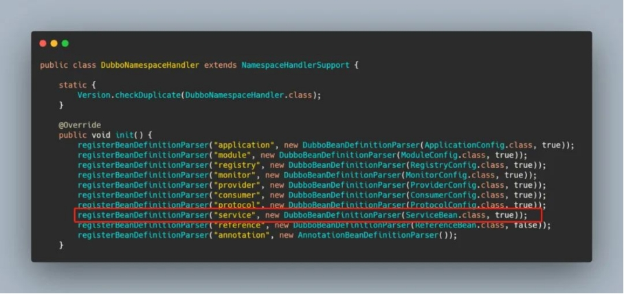 

讲白了就是将标签对应的解析类关联起来，这样在解析到标签的时候就知道委托给对应的解析类解析，本质就是为了生成 Spring 的 BeanDefinition，然后利用 Spring 最终创建对应的对象。

服务暴露全流程

从代码的流程来看大致可以分为三个步骤：

第一步是检测配置，如果有些配置空的话会默认创建，并且组装成 UR。

第二步是暴露服务，包括暴露到本地的服务和远程的服务。

第三步是注册服务至注册中心。

 

从对象构建转换的角度看可以分为两个步骤：

第一步是将服务实现类转成 Invoker。

第二部是将 Invoker 通过具体的协议转换成 Exporter。

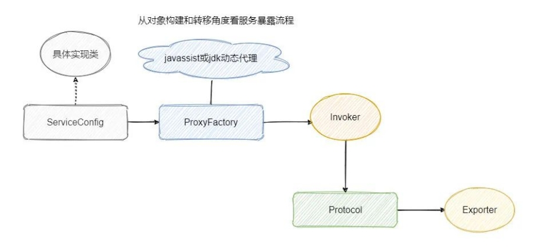 

服务暴露源码分析

 

从上面配置解析的截图标红了的地方可以看到 service 标签其实就是对应 ServiceBean，我们看下它的定义

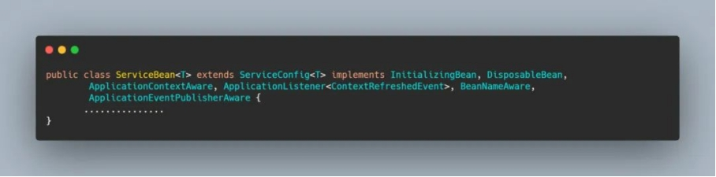 

它实现了 ApplicationListener<ContextRefreshedEvent>，这样就会在 Spring IOC 容器刷新完成后调用 onApplicationEvent 方法，而这个方法里面做的就是服务暴露，这就是服务暴露的启动点。

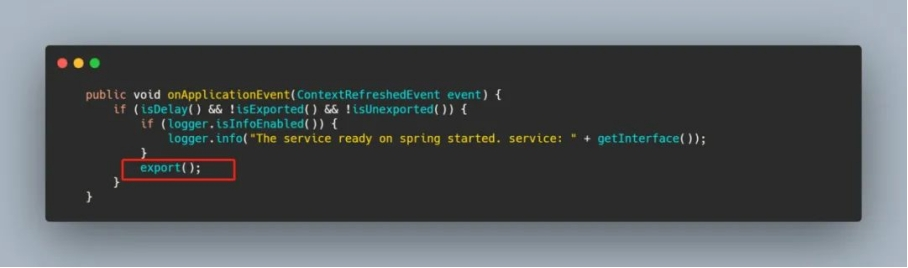 

可以看到，如果不是延迟暴露、并且还没暴露过、并且支持暴露的话就执行 export 方法，而 export 最终会调用父类的 export 方法，我们来看看。

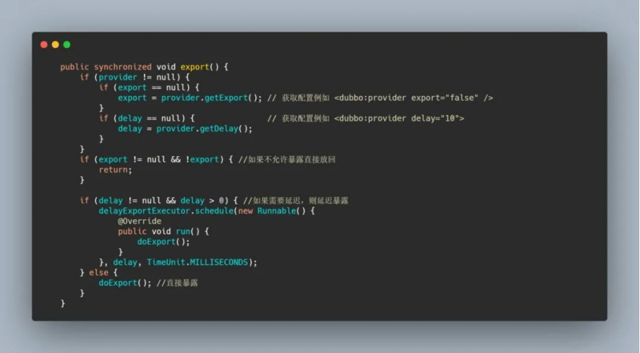 

主要就是检查了一下配置，确认需要暴露的话就暴露服务， doExport 这个方法很长，不过都是一些检测配置的过程，虽说不可或缺不过不是我们关注的重点，我们重点关注里面的 doExportUrls 方法。

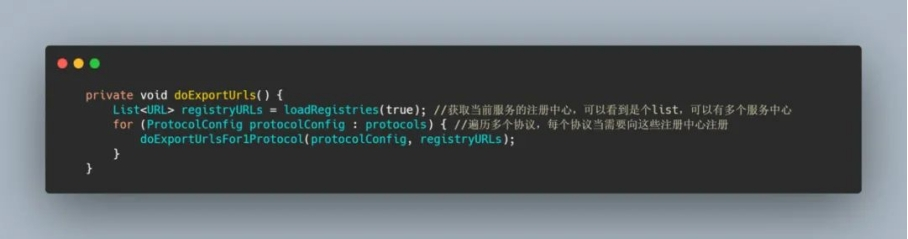 

可以看到 Dubbo 支持多注册中心，并且支持多个协议，一个服务如果有多个协议那么就都需要暴露，比如同时支持 dubbo 协议和 hessian 协议，那么需要将这个服务用两种协议分别向多个注册中心（如果有多个的话）暴露注册。

loadRegistries 就是根据配置组装成注册中心相关的 URL

registry://127.0.0.1:2181/com.alibaba.dubbo.registry.RegistryService?application=demo-provider&dubbo=2.0.2&pid=7960&qos.port=22222®istry=zookeeper×tamp=1598624821286

接下来关注的重点在 doExportUrlsFor1Protoco方法中，这个方法挺长的，我会截取大致的部分来展示核心的步骤。

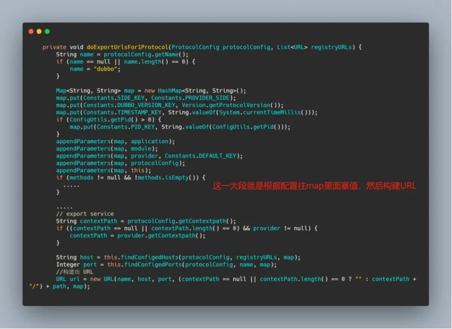 

此时构建出来的 UR长这样，可以看到走得是 dubbo 协议。

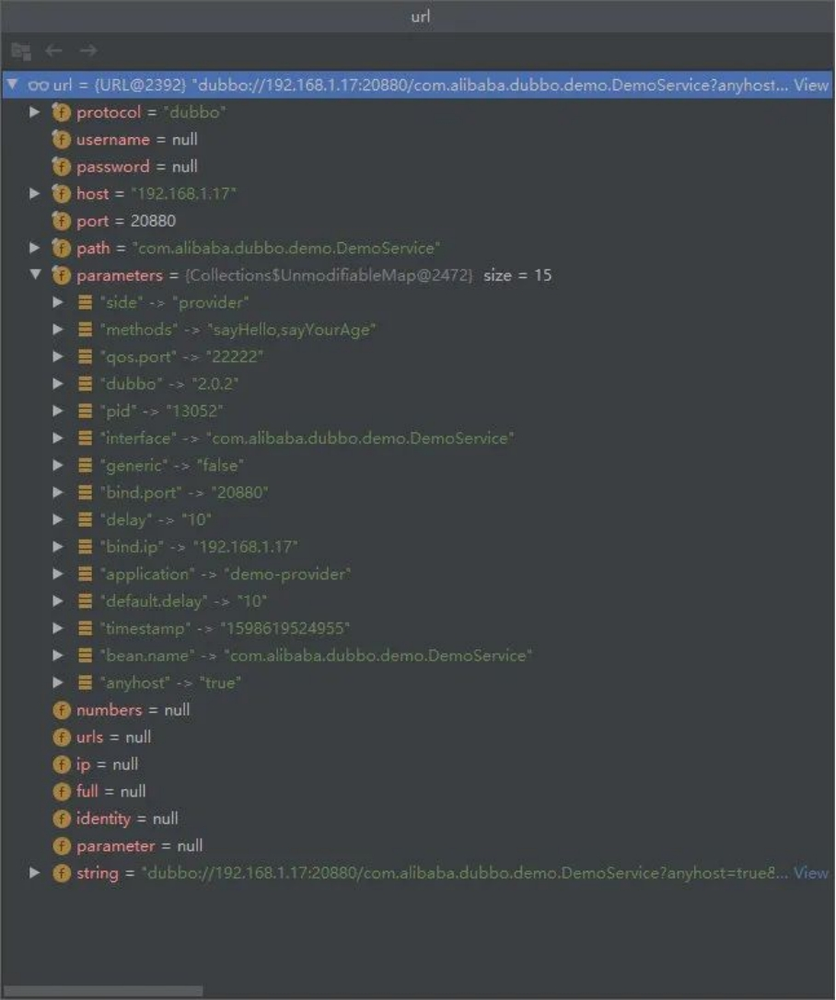 

然后就是要根据 UR来进行服务暴露了

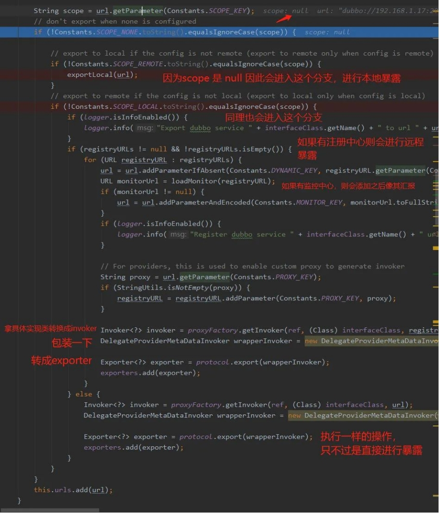 

本地暴露

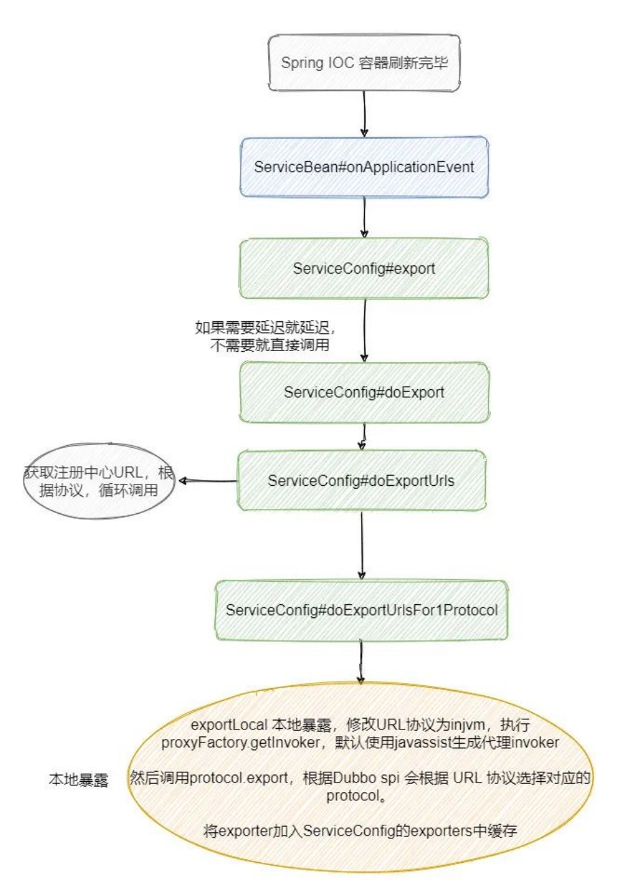 

我们再来看一下 exportLoca方法，这个方法是本地暴露，走的是 injvm 协议，可以看到它搞了个新的 UR修改了协议。

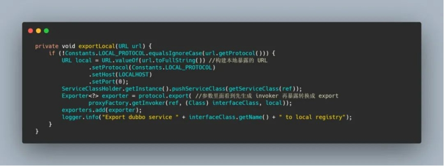 

我们来看一下这个 URL，可以看到协议已经变成了 injvm。

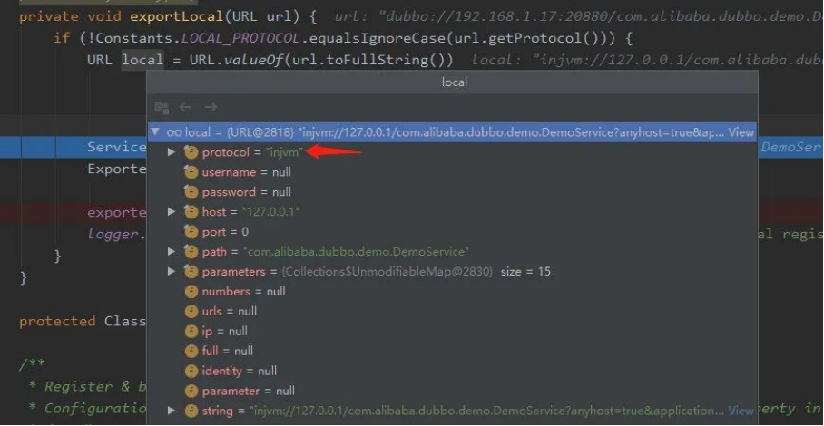 

这里的 export 其实就涉及自适应扩展了。

 Exporter<?> exporter = protocol.export(

​          proxyFactory.getInvoker(ref, (Class) interfaceClass, local));

Protoco的 export 方法是标注了 @ Adaptive 注解的，因此会生成代理类，然后代理类会根据 Invoker 里面的 UR参数得知具体的协议，然后通过 Dubbo SPI 机制选择对应的实现类进行 export，而这个方法就会调用 InjvmProtocol#export 方法。

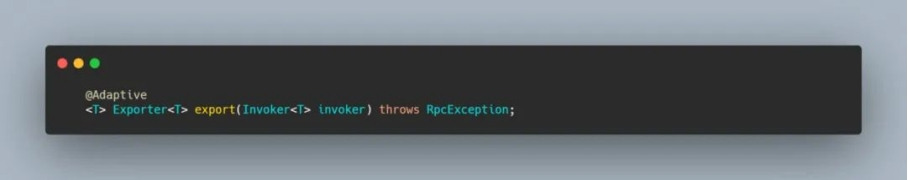 

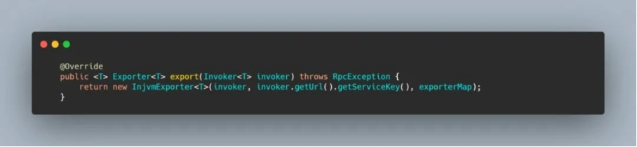 

我们再来看看转换得到的 export 到底长什么样子。

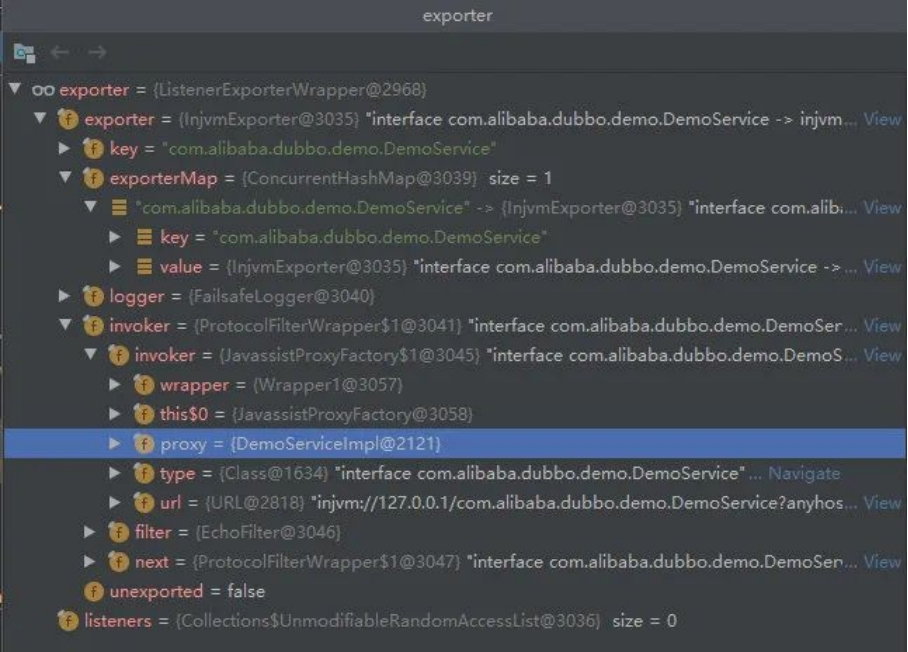 

从图中可以看到实际上就是具体实现类层层封装， invoker 其实是由 Javassist 创建的，具体创建过程 proxyFactory.getInvoker 就不做分析了，对 Javassist 有兴趣的同学自行去了解，之后可能会写一篇，至于 dubbo 为什么用 javassist 而不用 jdk 动态代理是因为 javassist 快。

为什么要封装成 invoker

其实就是想屏蔽调用的细节，统一暴露出一个可执行体，这样调用者简单的使用它，向它发起 invoke 调用，它有可能是一个本地的实现，也可能是一个远程的实现，也可能一个集群实现。

为什么要搞个本地暴露呢

因为可能存在同一个 JVM 内部引用自身服务的情况，因此暴露的本地服务在内部调用的时候可以直接消费同一个 JVM 的服务避免了网络间的通信。

远程暴露

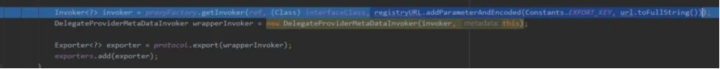 

也和本地暴露一样，需要封装成 Invoker ，不过这里相对而言比较复杂一些，我们先来看下  registryURL.addParameterAndEncoded(Constants.EXPORT_KEY, url.toFullString()) 将 UR拼接成什么样子

registry://127.0.0.1:2181/com.alibaba.dubbo.registry.RegistryService?application=demo-provider&dubbo=2.0.2&export=dubbo://192.168.1.17:20880/com.alibaba.dubbo.demo.DemoService....

可以看到走 registry 协议，然后参数里又有 export=dubbo://，这个走 dubbo 协议，所以我们可以得知会先通过 registry 协议找到  RegistryProtoco进行 export，并且在此方法里面还会根据 export 字段得到值然后执行 DubboProtoco的 export 方法。

现在我们把目光聚焦到 RegistryProtocol#export 方法上，我们先过一遍整体的流程，然后再进入 doLocalExport 的解析。

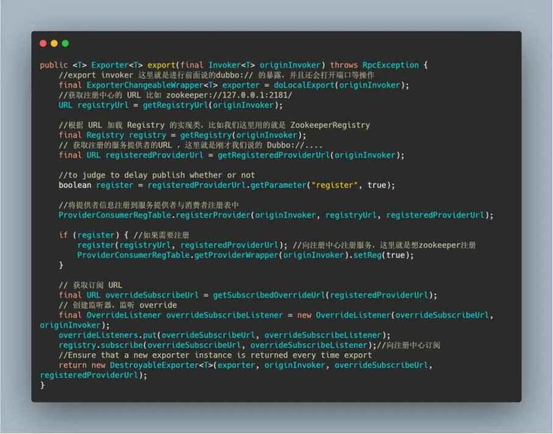 

可以看到这一步主要是将上面的 export=dubbo://... 先转换成 exporter ，然后获取注册中心的相关配置，如果需要注册则向注册中心注册，并且在 ProviderConsumerRegTable 这个表格中记录服务提供者，其实就是往一个 ConcurrentHashMap 中将塞入 invoker，key 就是服务接口全限定名，value 是一个 set，set 里面会存包装过的 invoker 。

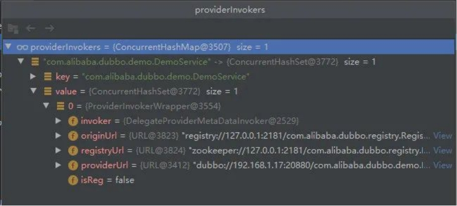我们再把目光聚焦到  doLocalExport 方法内部。

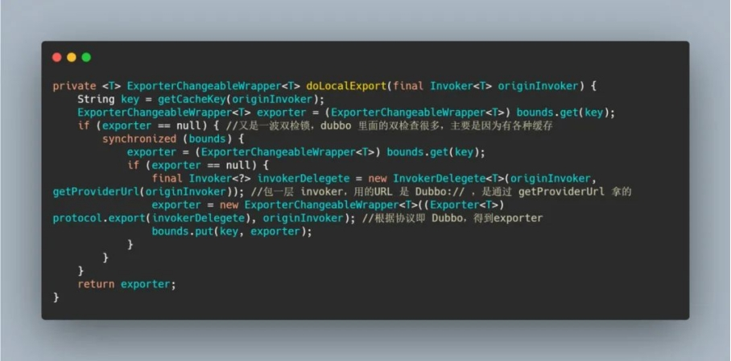 

这个方法没什么难度，主要就是根据URL上 Dubbo 协议暴露出 exporter，接下来就看下 DubboProtocol#export 方法。

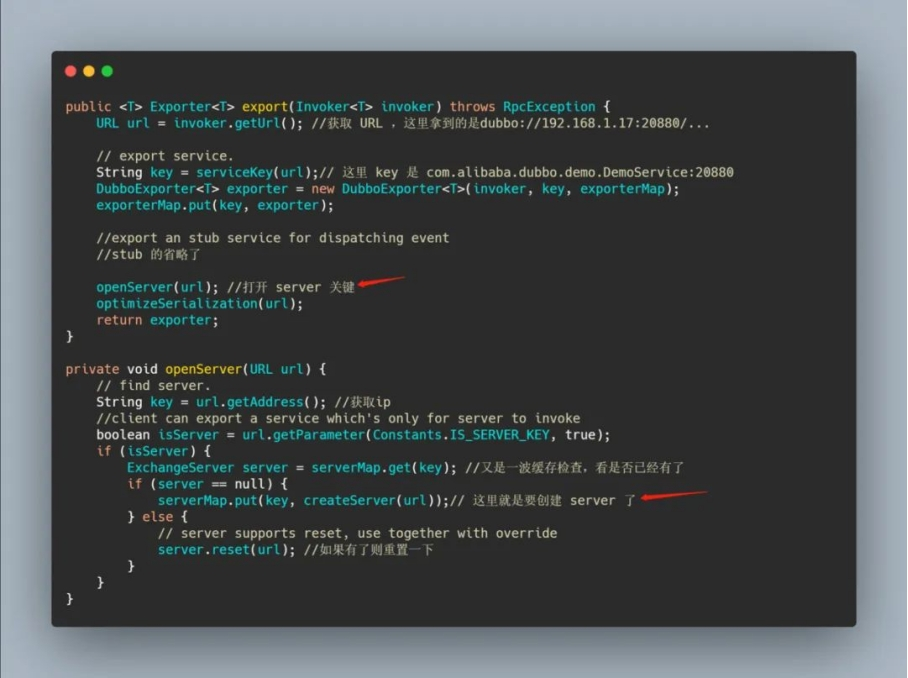 

可以看到这里的关键其实就是打开 Server ，RPC 肯定需要远程调用，这里我们用的是 NettyServer 来监听服务。

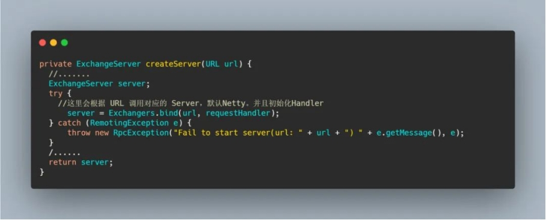 

总结一下 Dubbo 协议的 export 主要就是根据 UR构建出 key（例如有分组、接口名端口等等），然后 key 和 invoker 关联，关联之后存储到 DubboProtoco的 exporterMap 中，然后如果是服务初次暴露则会创建监听服务器，默认是 NettyServer，并且会初始化各种 Handler 比如心跳啊、编解码等等。

看起来好像流程结束了？并没有， Filter 到现在还没出现呢？有隐藏的措施，上一篇 Dubbo SPI 看的仔细的各位就知道在哪里触发的。

其实上面的 protoco是个代理类，在内部会通过 SPI 机制找到具体的实现类。

#### 1.1.5.Dubbo的服务引用过程

Provider将自己的服务暴露出来，注册到注册中心，而 Consumer无非就是通过一波操作从注册中心得知 Provider 的信息，然后自己封装一个调用类和 Provider 进行深入地交流。

之前的文章我都已经提到在 Dubbo中一个可执行体就是 Invoker，所有调用都要向 Invoker 靠拢，因此可以推断出应该要先生成一个 Invoker，然后又因为框架需要往不侵入业务代码的方向发展，那我们的 Consumer 需要无感知的调用远程接口，因此需要搞个代理类，包装一下屏蔽底层的细节。

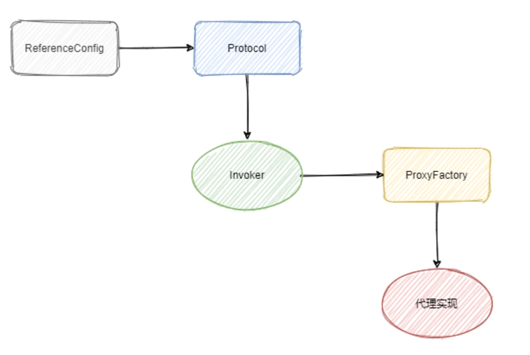 

服务引入的时机

服务的引入和服务的暴露一样，也是通过 spring 自定义标签机制解析生成对应的 Bean，Provider Service 对应解析的是 ServiceBean 而 Consumer Reference 对应的是 ReferenceBean。

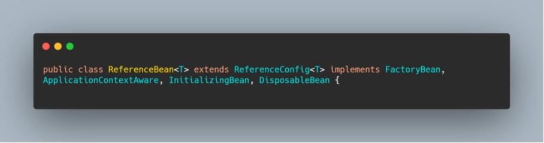 

服务暴露的时机在 Spring 容器刷新完成之后开始暴露，而服务的引入时机有两种，第一种是饿汉式，第二种是懒汉式。

饿汉式是通过实现 Spring 的InitializingBean接口中的 afterPropertiesSet方法，容器通过调用 ReferenceBean的 afterPropertiesSet方法时引入服务。

懒汉式是只有当这个服务被注入到其他类中时启动引入流程，也就是说用到了才会开始服务引入。

默认情况下，Dubbo 使用懒汉式引入服务，如果需要使用饿汉式，可通过配置 dubbo:reference 的 init 属性开启。

默认情况下，Dubbo 使用懒汉式引入服务，如果需要使用饿汉式，可通过配置 dubbo:reference 的 init 属性开启。

 Spring 的面试点

BeanFactory 、FactoryBean、ObjectFactory

BeanFactory 其实就是 IOC 容器，有多种实现类我就不分析了，简单的说就是 Spring 里面的 Bean 都归它管，而FactoryBean也是 Bean 所以说也是归 BeanFactory 管理的。

FactoryBean 其实就是把你真实想要的 Bean 封装了一层，在真正要获取这个 Bean 的时候容器会调用 FactoryBean#getObject() 方法，而在这个方法里面你可以进行一些复杂的组装操作。这个方法就封装了真实想要的对象复杂的创建过程。

ObjectFactory 这个是用于延迟查找的场景，它就是一个普通工厂，当得到 ObjectFactory 对象时，相当于 Bean 没有被创建，只有当 getObject() 方法时，才会触发 Bean 实例化等生命周期。

总结的说 BeanFactory 就是 IOC 容器，FactoryBean 是特殊的 Bean, 用来封装创建比较复杂的对象，而 ObjectFactory 主要用于延迟查找的场景，延迟实例化对象。

服务引入的三种方式

本地引入、直接连接引入远程服务、通过注册中心引入远程服务。

 

 

***
