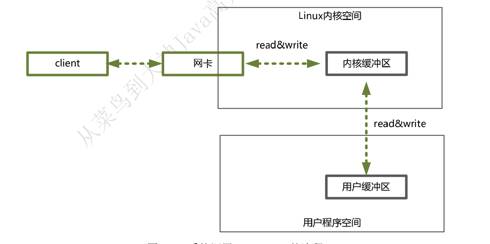

### 简介
Netty 是 JBOSS 提供的一个 Java 开源框架，是基于 NIO 的客户端/服务器编程框架，它既能快速开发高并发、高可用、高可靠性的网络服务器程序，也能开发高可用、高可靠的客户端程序。  
Netty 之所以受青睐，是因为 **Netty 提供异步的、事件驱动的网络应用程序框架和工具**。作为一个异步框架，Netty 的所有 IO 操作都是异步非阻塞的，通过 Future-Listener 机制，用户可以方便地主动获取或者通过通知机制获得 IO 操作结果

### 优点
* API 使用简单，开发门槛低。
* 功能强大，预置了多种编解码功能，支持多种主流协议。
* 定制能力强，可以通过 ChannelHandler 对通信框架进行灵活扩展。
* 性能高，与其他业界主流的 NIO 框架对比，Netty 的综合性能最优。
* 成熟、稳定，Netty 修复了已经发现的所有 JDK NIO 中的 BUG，业务开发人员不需要再为NIO 的 BUG 而烦恼。
* 社区活跃，版本迭代周期短，发现的 BUG 可以被及时修复。

### IO 读写的基础原理
用户程序进行 IO 的读写，依赖于底层的 IO 读写，基本上会用到底层的 read&write两大系统调用。在不同的操作系统中，IO 读写的系统调用的名称可能不完全一样，但是基本功能是一样的。
上层应用无论是调用操作系统的 read，还是调用操作系统的 write，都会涉及缓冲区
* read 是把数据从内核缓冲区复制到进程缓冲区
* write 把数据从进程缓冲区复制到内核缓冲区。
而内核缓冲区底层的读写交换，是由操作系统内核（Kernel）来完成的
在用户程序中，无论是 Socket 的 IO、还是文件 IO 操作，都属于上层应用的开发，它们的输入（Input）和输出（Output）的处理，在编程的流程上，都是一致的

#### 内核缓冲区与进程缓冲区
缓冲区的目的，是为了减少频繁地与设备之间的物理交换。  
外部设备的直接读写，涉及操作系统的中断。发生系统中断时，需要保存之前的进程数据和状态等信息，而结束中断之后，还需要恢复之前的进程数据和状态等信息。为了减少这种底层系统的时间损耗、性能损耗，于是出现了内存缓冲区。

#### 系统调用流程
  
以 read 系统调用为例，先看下一个完整输入流程的两个阶段：
* 等待数据准备好。
* 从内核向进程复制数据。 

read 一个 socket（套接字）:
* 第一个阶段，等待数据从网络中到达网卡。当所等待的分组到达时，它被复制到内核中的
某个缓冲区。这个工作由操作系统自动完成，用户程序无感知。
* 第二个阶段，就是把数据从内核缓冲区复制到应用进程缓冲区。

再具体一点，如果是在 Java 服务器端，完成一次 socket 请求和响应:
* 客户端请求：Linux 通过网卡读取客户端的请求数据，将数据读取到内核缓冲区。
* 获取请求数据：Java 服务器通过 read 系统调用，从 Linux 内核缓冲区读取数据，再送入 Java进程缓冲区。
* 服务器端业务处理：Java 服务器在自己的用户空间中处理客户端的请求。
* 服务器端返回数据：Java 服务器完成处理后，构建好的响应数据，将这些数据从用户缓冲区写入内核缓冲区。这里用到的是 write 系统调用。
* 发送给客户端：Linux 内核通过网络 IO，将内核缓冲区中的数据写入网卡，网卡通过底层的通信协议，会将数据发送给目标客户端。

#### 阻塞与非阻塞
阻塞 IO，指的是需要内核 IO 操作彻底完成后，才返回到用户空间执行用户的操作。  
阻塞指的是用户空间程序的执行状态
阻塞是指用户空间（调用线程）一直在等待，而不能干别的事情；非阻塞是指用户空间（调用线程）拿到内核返回的状态值就返回自己的空间，IO 操作可以干就干，不可以干，就去干别的事情。

#### 同步与异步
同步 IO，是一种用户空间与内核空间的 IO 发起方式。同步 IO 是指用户空间的线程是主动发起 IO 请求的一方，内核空间是被动接受方。  
异步 IO 则反过来，是指系统内核是主动发起 IO 请求的一方，用户空间的线程是被动接受方。

#### IO 模型
* 同步阻塞 IO（Blocking IO）
* 同步非阻塞 IO（Non-blocking IO）
* 
