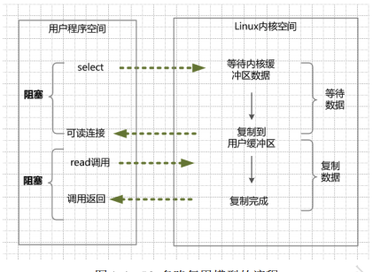

### 简介
Netty 是 JBOSS 提供的一个 Java 开源框架，是基于 NIO 的客户端/服务器编程框架，它既能快速开发高并发、高可用、高可靠性的网络服务器程序，也能开发高可用、高可靠的客户端程序。  
Netty 之所以受青睐，是因为 **Netty 提供异步的、事件驱动的网络应用程序框架和工具**。作为一个异步框架，Netty 的所有 IO 操作都是异步非阻塞的，通过 Future-Listener 机制，用户可以方便地主动获取或者通过通知机制获得 IO 操作结果

### 优点
* API 使用简单，开发门槛低。
* 功能强大，预置了多种编解码功能，支持多种主流协议。
* 定制能力强，可以通过 ChannelHandler 对通信框架进行灵活扩展。
* 性能高，与其他业界主流的 NIO 框架对比，Netty 的综合性能最优。
* 成熟、稳定，Netty 修复了已经发现的所有 JDK NIO 中的 BUG，业务开发人员不需要再为NIO 的 BUG 而烦恼。
* 社区活跃，版本迭代周期短，发现的 BUG 可以被及时修复。

### IO 读写的基础原理
用户程序进行 IO 的读写，依赖于底层的 IO 读写，基本上会用到底层的 read&write两大系统调用。在不同的操作系统中，IO 读写的系统调用的名称可能不完全一样，但是基本功能是一样的。
上层应用无论是调用操作系统的 read，还是调用操作系统的 write，都会涉及缓冲区
* read 是把数据从内核缓冲区复制到进程缓冲区
* write 把数据从进程缓冲区复制到内核缓冲区。
而内核缓冲区底层的读写交换，是由操作系统内核（Kernel）来完成的
在用户程序中，无论是 Socket 的 IO、还是文件 IO 操作，都属于上层应用的开发，它们的输入（Input）和输出（Output）的处理，在编程的流程上，都是一致的

#### 内核缓冲区与进程缓冲区
缓冲区的目的，是为了减少频繁地与设备之间的物理交换。  
外部设备的直接读写，涉及操作系统的中断。发生系统中断时，需要保存之前的进程数据和状态等信息，而结束中断之后，还需要恢复之前的进程数据和状态等信息。为了减少这种底层系统的时间损耗、性能损耗，于是出现了内存缓冲区。

#### 系统调用流程
  
以 read 系统调用为例，先看下一个完整输入流程的两个阶段：
* 等待数据准备好。
* 从内核向进程复制数据。 

read 一个 socket（套接字）:
* 第一个阶段，等待数据从网络中到达网卡。当所等待的分组到达时，它被复制到内核中的
某个缓冲区。这个工作由操作系统自动完成，用户程序无感知。
* 第二个阶段，就是把数据从内核缓冲区复制到应用进程缓冲区。

再具体一点，如果是在 Java 服务器端，完成一次 socket 请求和响应:
* 客户端请求：Linux 通过网卡读取客户端的请求数据，将数据读取到内核缓冲区。
* 获取请求数据：Java 服务器通过 read 系统调用，从 Linux 内核缓冲区读取数据，再送入 Java进程缓冲区。
* 服务器端业务处理：Java 服务器在自己的用户空间中处理客户端的请求。
* 服务器端返回数据：Java 服务器完成处理后，构建好的响应数据，将这些数据从用户缓冲区写入内核缓冲区。这里用到的是 write 系统调用。
* 发送给客户端：Linux 内核通过网络 IO，将内核缓冲区中的数据写入网卡，网卡通过底层的通信协议，会将数据发送给目标客户端。

#### 阻塞与非阻塞
阻塞 IO，指的是需要内核 IO 操作彻底完成后，才返回到用户空间执行用户的操作。  
阻塞指的是用户空间程序的执行状态
阻塞是指用户空间（调用线程）一直在等待，而不能干别的事情；非阻塞是指用户空间（调用线程）拿到内核返回的状态值就返回自己的空间，IO 操作可以干就干，不可以干，就去干别的事情。

#### 同步与异步
同步 IO，是一种用户空间与内核空间的 IO 发起方式。同步 IO 是指用户空间的线程是主动发起 IO 请求的一方，内核空间是被动接受方。  
异步 IO 则反过来，是指系统内核是主动发起 IO 请求的一方，用户空间的线程是被动接受方。

#### IO 模型
* 同步阻塞 IO（Blocking IO）  
流程大致如下：  
（1）从 Java 启动 IO 读的 read 系统调用开始，用户线程就进入阻塞状态。  
（2）当系统内核收到 read 系统调用，就开始准备数据。一开始，数据可能还没有到达内核缓冲区（例如，还没有收到一个完整的 socket 数据包），这个时候内核就要等待。
（3）内核一直等到完整的数据到达，就会将数据从内核缓冲区复制到用户缓冲区（用户空间的内存），然后内核返回结果（例如返回复制到用户缓冲区中的字节数）。  
（4）直到内核返回后，用户线程才会解除阻塞的状态，重新运行起来。  
总之，阻塞 IO 的特点是：在内核进行 IO 执行的两个阶段，用户线程都被阻塞了。  

 >阻塞IO的优点是 应用的程序开发非常简单；在阻塞等待数据期间，用户线程挂起。在阻塞期间，用户线程基本不会占用 CPU 资源。   
 >阻塞IO的缺点是 一般情况下，会为每个连接配备一个独立的线程；反过来说，就是一个线程维护一个连接的 IO 操作。但是，当在高并发的应用场景下，需要大量的线程来维护大量的网络连接，内存、线程切换开销会非常巨大。 
* 同步非阻塞 IO（Non-blocking IO）   
流程如下：  
（1）在内核数据没有准备好的阶段，用户线程发起 IO 请求时，立即返回。所以，为了读取到最终的数据，用户线程需要不断地发起 IO 系统调用。  
（2）内核数据到达后，用户线程发起系统调用，用户线程阻塞。内核开始复制数据，它会将数据从内核缓冲区复制到用户缓冲区（用户空间的内存），然后内核返回结果（例如返回复制到的用户缓冲区的字节数）。  
（3）用户线程读到数据后，才会解除阻塞状态，重新运行起来。也就是说，用户进程需要经过多次的尝试，才能保证最终真正读到数据，而后继续执行。  
>同步非阻塞 IO 的特点：应用程序的线程需要不断地进行 IO 系统调用，轮询数据是否已经准备好，如果没有准备好，就继续轮询，直到完成 IO 系统调用为止。  
>同步非阻塞 IO 的优点：每次发起的 IO 系统调用，在内核等待数据过程中可以立即返回。用户线程不会阻塞，实时性较好。  
>同步非阻塞 IO 的缺点：不断地轮询内核，这将占用大量的 CPU 时间，效率低下  

***这里说明一下，同步非阻塞 IO，可以简称为 NIO，但是，它不是 Java 中的 NIO，虽然它们的英文缩写一样，希望大家不要混淆。Java 的 NIO（New IO），对应的不是四种基础 IO 模型中的NIO（None Blocking IO）模型，而是另外的一种模型，叫作 IO 多路复用模型（ IO Multiplexing）。***
* IO 多路复用（IO Multiplexing）：   
在 IO 多路复用模型中，引入了一种新的系统调用，查询 IO 的就绪状态。在 Linux 系统中，对应的系统调用为 select/epoll 系统调用。通过该系统调用，一个进程可以监视多个文件描述符，一旦某个描述符就绪（一般是内核缓冲区可读/可写），内核能够将就绪的状态返回给应用程序。随后，应用程序根据就绪的状态，进行相应的 IO 系统调用。  
select 系统调用，几乎在所有的操作系统上都有支持，具有良好的跨平台特性。epoll 是在 Linux 2.6 内核中提出的，是 select 系统调用的 Linux 增强版本。  
流程如下：  
（1）选择器注册。在这种模式中，首先，将需要 read 操作的目标 socket 网络连接，提前注册到 select/epoll 选择器中，Java 中对应的选择器类是 Selector 类。然后，才可以开启整个 IO 多路复用模型的轮询流程。  
（2）就绪状态的轮询。通过选择器的查询方法，查询注册过的所有 socket 连接的就绪状态。通过查询的系统调用，内核会返回一个就绪的 socket 列表。当任何一个注册过的 socket 中的数据准备好了，内核缓冲区有数据（就绪）了，内核就将该 socket 加入到就绪的列表中。当用户进程调用了 select 查询方法，那么整个线程会被阻塞掉。  
（3）用户线程获得了就绪状态的列表后，根据其中的 socket 连接，发起 read 系统调用，用户线程阻塞。内核开始复制数据，将数据从内核缓冲区复制到用户缓冲区。  
（4）复制完成后，内核返回结果，用户线程才会解除阻塞的状态，用户线程读取到了数据，继续执行。
  
>IO 多路复用模型的优点：与一个线程维护一个连接的阻塞 IO 模式相比，使用 select/epoll 的最大优势在于，一个选择器查询线程可以同时处理成千上万个连（Connection）。系统不必创建大量的线程，也不必维护这些线程，从而大大减小了系统的开销。
* 异步 IO（Asynchronous IO）：  
异步 IO，指的是用户空间与内核空间的调用方式反过来。用户空间的线程变成被动接受者，而内核空间成了主动调用者。  
AIO 的基本流程是：用户线程通过系统调用，向内核注册某个 IO 操作。内核在整个 IO 操作（包括数据准备、数据复制）完成后，通知用户程序，用户执行后续的业务操作。  
流程如下：  
（1）当用户线程发起了 read 系统调用，立刻就可以开始去做其他的事，用户线程不阻塞。  
（2）内核就开始了 IO 的第一个阶段：准备数据。等到数据准备好了，内核就会将数据从内核缓冲区复制到用户缓冲区（用户空间的内存）。  
（3）内核会给用户线程发送一个信号（Signal），或者回调用户线程注册的回调方法，告诉用户线程 read 操作完成了。  
（4）用户线程读取用户缓冲区的数据，完成后续的业务操作。  
>异步 IO 模型的特点：在内核等待数据和复制数据的两个阶段，用户线程都不是阻塞的。用户线程需要接收内核的 IO 操作完成的事件，或者用户线程需要注册一个 IO 操作完成的回调函数。正因为如此，异步 IO 有的时候也被称为信号驱动 IO。  
>异步 IO 异步模型的缺点：应用程序仅需要进行事件的注册与接收，其余的工作都留给了操作系统，也就是说，需要底层内核提供支持。  
#### ***通过合理配置来支持百万级并发连接***
前面已经深入浅出地介绍了高并发 IO 的模型。但是，即使采用了最先进的模型，如果不进行合理的配置，也没有办法支撑百万级的网络连接并发。  
这里所涉及的配置，就是 Linux 操作系统中文件句柄数的限制。在生产环境 Linux 系统中，基本上都需要解除文件句柄数的限制。原因是，Linux 的系统默认值为 1024，也就是说，一个进程最多可以接受 1024 个 socket 连接。这是远远不够的。  
文件句柄，也叫文件描述符。在 Linux 系统中，文件可分为：普通文件、目录文件、链接文件和设备文件。文件描述符（File Descriptor）是内核为了高效管理已被打开的文件所创建的索引，它是一个非负整数（通常是小整数），用于指代被打开的文件。所有的 IO 系统调用，包括 socket 的读写调用，都是通过文件描述符完成的。
>ulimit -n 查看单个进程能够打开的最大文件句柄数量 -n 命令选项用于引用或设置当前的文件句柄数量的限制值。  
>ulimit -n 1000000 设置为100000局柄

文件句柄数不够，会导致什么后果呢？当单个进程打开的文件句柄数量，超过了系统配置的
上限值时，就会发出“Socket/File:Can't open so many files”的错误提示。  
然而，使用 ulimit 命令来修改当前用户进程的一些基础限制，仅在当前用户环境有效。  
如果想永久地把设置值保存下来，可以编辑/etc/rc.local 开机启动文件，在文件中添加如下内容：   
>ulimit -SHn 1000000  选项-S 表示软性极限值，-H 表示硬性极限值。硬性极限是实际的限制，就是最大可以是 100 万，不能再多了。软性极限是系统警告（Warning）的极限值，超过这个极限值，内核会发出警告。  

普通用户通过 ulimit 命令，可将软极限更改到硬极限的最大设置值。如果要更改硬极限，必须拥有 root 用户权限  
### Java NIO 通信基础
Java NIO 由以下三个核心组件组成： Channel（通道） Buffer（缓冲区） Selector（选择器）  
#### NIO 和 OIO 的对比
* OIO 是面向流（Stream Oriented）的，NIO 是面向缓冲区（Buffer Oriented）的。何谓面向流，何谓面向缓冲区呢？  
OIO 是面向字节流或字符流的，在一般的 OIO 操作中，我们以流式的方式顺序地从一个流
（Stream）中读取一个或多个字节，因此，我们不能随意地改变读取指针的位置。而在NIO 操作中则不同.  
NIO 中引入了 Channel（通道）和 Buffer（缓冲区）的概念。读取和写入，只需要从通道中读取数据到缓冲区中，或将数据从缓冲区中写入到通道中。NIO 不像 OIO 那样是顺序操作，可以随意地读取 Buffer 中任意位置的数据。  
* OIO 的操作是阻塞的，而 NIO 的操作是非阻塞的。  
OIO 操作都是阻塞的，例如，我们调用一个 read 方法读取一个文件的内容，那么调用 read 的线程会被阻塞住，直到 read 操作完成  
在 NIO 的非阻塞模式中，当我们调用 read 方法时，如果此时有数据，则 read 读取数据并返回；如果此时没有数据，则 read 直接返回，而不会阻塞当前线程。NIO 的非阻塞，使用了通道和通道的多路复用技术。  
* OIO 没有选择器（Selector）概念，而 NIO 有选择器的概念。  
NIO 的实现，是基于底层的选择器的系统调用。NIO 的选择器，需要底层操作系统提供支持。而 OIO 不需要用到选择器。
#### 通道（Channel）
在 OIO 中，同一个网络连接会关联到两个流：一个输入流（Input Stream），另一个输出流（Output Stream）。通过这两个流，不断地进行输入和输出的操作。  
在 NIO 中，同一个网络连接使用一个通道表示，所有的 NIO 的 IO 操作都是从通道开始的。一个通道类似于 OIO 中的两个流的结合体，既可以从通道读取，也可以向通道写入。
#### Selector 选择器
IO 多路复用:指的是一个进程/线程可以同时监视多个文件描述符（一个网络连接，操作系统底层使用一个文件描述符来表示），一旦其中的一个或者多个文件描述符可读或者可写，系统内核就通知该进程/线程。在 Java 应用层面，如何实现对多个文件描述符的监视呢？需要用到一个非常重要的 Java NIO 组件——Selector 选择器。  
选择器的神奇功能是什么呢？它一个 IO 事件的查询器。通过选择器，一个线程可以查询多个通道的 IO 事件的就绪状态。  
实现 IO 多路复用，从具体的开发层面来说，首先把通道注册到选择器中，然后通过选择器内部的机制，可以查询（select）这些注册的通道是否有已经就绪的 IO 事件（例如可读、可写、网络连接完成等）   
一个选择器只需要一个线程进行监控，换句话说，我们可以很简单地使用一个线程，通过选
择器去管理多个通道。这是非常高效的，这种高效来自于 Java 的选择器组件Selector，以及其背后的操作系统底层的 IO 多路复用的支持。  
#### 缓冲区（Buffer）
应用程序与通道（Channel）主要的交互操作，就是进行数据的 read 读取和 write 写入。为了完成如此大任，NIO 为大家准备了第三个重要的组件——NIO Buffer（NIO 缓冲区）。通道的读取，就是将数据从通道读取到缓冲区中；通道的写入，就是将数据从缓冲区中写入到通道中。  
IO 的 Buffer（缓冲区）本质上是一个内存块，既可以写入数据，也可以从中读取数据。NIO的 Buffer 类，是一个抽象类，位于 java.nio 包中，其内部是一个内存块（数组）。  
***需要强调的是：Buffer 类是一个非线程安全类。***  
**Buffer 类**  
Buffer 类是一个抽象类，对应于 Java 的主要数据类型，在 NIO 中有 8 种缓冲区类，分别如下：
ByteBuffer 、 CharBuffer 、 DoubleBuffer 、 FloatBuffer 、 IntBuffer 、 LongBuffer 、 ShortBuffer 、MappedByteBuffer。MappedByteBuffer 是专门用于内存映射的一种 ByteBuffer 类型。  
Buffer 类在其内部，有一个 byte[]数组内存块，作为内存缓冲区。为了记录读写的状态和位置，Buffer 类提供了一些重要的属性。其中，有三个重要的成员属性：  
|  属性  |  说明  |
|  ----  | ----  |  
|  capacity  |  容量，即可以容纳的最大数据量；在缓冲区创建时设置并且不能改变
|limit| 上限，缓冲区中当前的数据量|  
|position|  位置，缓冲区中下一个要被读或写的元素的索引|
|mark| 标记，调用 mark()方法来设置 mark=position，再调用 reset()可以让 position 恢复到 mark标记的位position=mark|
* capacity（容量）  
Buffer 类的对象在初始化时，会按照 capacity 分配内部的内存。在内存分配好之后,就不能再改变。
* position（读写位置）  
Buffer 类的 position 属性，表示当前的位置。position 属性与缓冲区的读写模式有关。在不同的模式下，position 属性的值是不同的。当缓冲区进行读写的模式改变时，position 会进行调整。
在写入模式下，position 的值变化规则如下：  
（1）在刚进入到写模式时，position 值为 0，表示当前的写入位置为从头开始。    
（2）每当一个数据写到缓冲区之后，position 会向后移动到下一个可写的位置。  
（3）初始的 position 值为 0，最大可写值 position 为 limit– 1。当position 值达到 limit时，缓冲区就已经无空间可写了。  
在读模式下，position 的值变化规则如下：  
（1）当缓冲区刚开始进入到读模式时，position 会被重置为 0。  
（2）当从缓冲区读取时，也是从 position 位置开始读。读取数据后，position 向前移动到下一个可读的位置。  
（3）position 最大的值为最大可读上限 limit，当 position 达到 limit 时，
表明缓冲区已经无数据可读。  
起点在哪里呢？当新建一个缓冲区时，缓冲区处于写入模式，这时是可以写数据的。数据写
入后，如果要从缓冲区读取数据，这就要进行模式的切换，可以使用（即调用）flip 翻转方法，将缓冲区变成读取模式。  
在这个 flip 翻转过程中，position 会进行非常巨大的调整，具体的规则是：position 由原来的写入位置，变成新的可读位置，也就是 0，表示可以从头开始读。flip 翻转的另外一半工作，就是要调整 limit 属性。  
* limit（读写的限制）:
Buffer 类的 limit 属性，表示读写的最大上限。limit 属性，也与缓冲区的读写模式有关  
在写模式下，limit 属性值的含义为可以写入的数据最大上限。  
在读模式下，limit 的值含义为最多能从缓冲区中读取到多少数据。  
是先写入再读取。当缓冲区写入完成后，就可以开始从 Buffer 读取数据，可以使用 flip 翻转方法，这时，limit 的值也会进行非常大的调整。  
写模式下的 position 值，设置成读模式下的 limit 值，也就是说，将之前写入的最大数量，作为可以读取的上限值。  
在 flip 翻转时，属性的调整，将涉及 position、limit 两个属性，这种调整比较微妙，不是太好理解，举一个简单例子：
首先，创建缓冲区。刚开始，缓冲区处于写模式。position 为 0，limit 为最大容量。然后，向缓冲区写数据。每写入一个数据，position 向后面移动一个位置，也就是 position 的值加 1。假定写入了 5 个数，当写入完成后，position 的值为 5。  
这时，使用（即调用）flip 方法，将缓冲区切换到读模式。limit 的值，先会被设置成写模式时的 position 值。这里新的 limit 是 5，表示可以读取的最大上限是 5 个数。同时，新的 position 会被重置为 0，表示可以从 0 开始读  
* mark（标记）: 可以将当前的 position 临时存入 mark 中；需要的时候，可以再从 mark 标记恢复到 position 位置。   
#### NIO Buffer 类的重要方法  
* allocate()创建缓冲区  
IntBuffer 是具体的 Buffer 子类，通过调用 IntBuffer.allocate(20)，创建了一个 Intbuffer实例对象，并且分配了 20 * 4 个字节的内存空间。一个缓冲区在新建后，处于写入的模式，position 写入位置为 0，最大可写上限 limit 为的初始化值（这里是 20），而缓冲区的容量 capacity 也是初始化值。    
* put()写入到缓冲区  
put 方法很简单，只有一个参数，即为所需要写入的对象。不过，写入的数据类型要求与缓冲区的类型保持一致。  
* flip()翻转  
如果需要读取数据，还需要将缓冲区转换成读模式。flip()翻转方法是 Buffer 类提供的一个模式转变的重要方法，它的作用就是将写入模式翻转成读取模式。  
flip()方法的从写入到读取转换:  
首先，设置可读的长度上限 limit。将写模式下的缓冲区中内容的最后写入位置 position 值，作为读模式下的 limit 上限值。  
其次，把读的起始位置 position 的值设为 0，表示从头开始读。  
最后，清除之前的 mark 标记，因为 mark 保存的是写模式下的临时位置。在读模式下，如果继续使用旧的 mark 标记，会造成位置混乱。 
```` java
public final Buffer flip() {
 limit = position; //设置可读的长度上限 limit,为写入的 position
 position = 0; //把读的起始位置 position 的值设为 0，表示从头开始读
 mark = UNSET_MARK; // 清除之前的 mark 标记
 return this;
}
````
在读取完成后，如何再一次将缓冲区切换成写入模式呢？:  
可以调用 Buffer.clear()清空或者 Buffer.compact()压缩方法，它们可以将缓冲区转换为写模式。  
* get()从缓冲区读取  
调用 flip 方法，将缓冲区切换成读取模式。这时，可以开始从缓冲区中进行数据读取了。读数据很简单，调用 get 方法，每次从position 的位置读取一个数据，并且进行相应的缓冲区属性的调整。  
缓冲区是不是可以重复读呢？答案是可以的  
* rewind()倒带  
已经读完的数据，如果需要再读一遍，可以调用 rewind()方法。rewind()也叫倒带，就像播放磁带一样倒回去，再重新播放:  
（1）position 重置为 0，所以可以重读缓冲区中的所有数据。  
（2）limit 保持不变，数据量还是一样的，仍然表示能从缓冲区中读取多少个元素。  
（3）mark 标记被清理，表示之前的临时位置不能再用了。  
```` java
public final Buffer rewind() {
position = 0;//重置为 0，所以可以重读缓冲区中的所有数据
mark = -1; // mark 标记被清理，表示之前的临时位置不能再用了
return this;
}  
````
* mark( )和 reset( )  
Buffer.mark()方法的作用是将当前 position 的值保存起来，放在 mark 属性中，让 mark 属性记住这个临时位置；之后，可以调用Buffer.reset()方法将 mark 的值恢复到 position 中。  
* clear( )清空缓冲区  
在读取模式下，调用 clear()方法将缓冲区切换为写入模式。此方法会将 position 清零，limit设置为 capacity 最大容量值，可以一直写入，直到缓冲区写满。  
* 总结  
总体来说，使用 Java NIO Buffer 类的基本步骤如下:  
（1）使用创建子类实例对象的 allocate()方法，创建一个 Buffer 类的实例对象。  
（2）调用 put 方法，将数据写入到缓冲区中。  
（3）写入完成后，在开始读取数据前，调用 Buffer.flip()方法，将缓冲区转换为读模式。  
（4）调用 get 方法，从缓冲区中读取数据。  
（5）读取完成后，调用 Buffer.clear() 或 Buffer.compact()方法，将缓冲区转换为写入模式。  
### NIO Channel（通道）类  
#### Channel（通道）的主要类型  
（1）FileChannel 文件通道，用于文件的数据读写。  
（2）SocketChannel 套接字通道，用于 Socket 套接字 TCP 连接的数据读写。  
（3）ServerSocketChannel 服务器嵌套字通道（或服务器监听通道），允许我们监听 TCP 连接请求，为每个监听到的请求，创建一个 SocketChannel 套接字通道。  
（4）DatagramChannel 数据报通道，用于 UDP 协议的数据读写。 
#### FileChannel 文件通道  
 FileChannel 是专门操作文件的通道。通过 FileChannel，既可以从一个文件中读取数据，也可以将数据写入到文件中。特别申明一下，**FileChannel 为阻塞模式，不能设置为非阻塞模式**。  
 下面分别介绍：FileChannel 的获取、读取、写入、关闭四个操作：  
 1. 获取 FileChannel 通道  
 ````java 
 //创建一条文件输入流
FileInputStreamfis = new FileInputStream(srcFile);
//获取文件流的通道
FileChannelinChannel = fis.getChannel();
//创建一条文件输出流
FileOutputStreamfos = new FileOutputStream(destFile);
//获取文件流的通道
FileChanneloutchannel = fos.getChannel();
````
或者  
````java
// 创建 RandomAccessFile 随机访问对象
RandomAccessFileaFile = new RandomAccessFile("filename.txt"，"rw");
//获取文件流的通道
FileChannelinChannel = aFile.getChannel();
````
2. 读取 FileChannel 通道  
````java
RandomAccessFileaFile = new RandomAccessFile(fileName, "rw");
//获取通道
FileChannelinChannel=aFile.getChannel();
//获取一个字节缓冲区
ByteBufferbuf = ByteBuffer.allocate(CAPACITY);
int length = -1;
//调用通道的 read 方法，读取数据并买入字节类型的缓冲区
while ((length = inChannel.read(buf)) != -1) {
//省略……处理读取到的 buf 中的数据
}
````
3. 写入 FileChannel 通道  
写入数据到通道，在大部分应用场景，都会调用通道的 int write（ByteBufferbuf）方法。此方法的参数——ByteBuffer 缓冲区，是数据的来源。write 方法的作用，是从 ByteBuffer 缓冲区中读取数据，然后写入到通道自身，而返回值是写入成功的字节数。  
````java
//如果 buf 刚写完数据，需要 flip 翻转 buf，使其变成读取模式
buf.flip();
int outlength = 0;
//调用 write 方法，将 buf 的数据写入通道
while ((outlength = outchannel.write(buf)) != 0) {
System.out.println("写入的字节数：" + outlength);
}
````
**此时的 ByteBuffer 缓冲区要求是可读的，处于读模式下。**  
4．关闭通道
当通道使用完成后，必须将其关闭。关闭非常简单，调用 close 方法即可。  
5．强制刷新到磁  
在将缓冲区写入通道时，出于性能原因，操作系统不可能每次都实时将数据写入磁盘。如果需要保证写入通道的缓冲数据，最终都真正地写入磁盘，可以调用 FileChannel 的 force()方法。  
***TODO 使用 FileChannel 完成文件复制的实践案例***  
#### SocketChannel 套接字通道  
在 NIO 中，涉及网络连接的通道有两个，一个是 SocketChannel 负责连接传输，另一个是ServerSocketChannel 负责连接的监听。  
ServerSocketChannel 应用于服务器端，而 SocketChannel 同时处于服务器端和客户端。  换句话说，对应于一个连接，两端都有一个负责传输的 SocketChannel 传输通道。  
无论是 ServerSocketChannel，还是 SocketChannel，都支持阻塞和非阻塞两种模式:  
（1）socketChannel.configureBlocking（false）设置为非阻塞模式。  
（2）socketChannel.configureBlocking（true）设置为阻塞模式。 
在阻塞模式下，SocketChannel 通道的 connect 连接、read 读、write 写操作，都是同步的和阻塞式的，在效率上与 Java 旧的 OIO 的面向流的阻塞式读写操作相同。  
在非阻塞模式下，通道的操作是异步、高效率的，这也是相对于传统的OIO 的优势所在。下面详细介绍在非阻塞模式下通道的打开、读写和关闭操作等操作:     

1. 获取 SocketChannel 传输通道  
在客户端，先通过 SocketChannel 静态方法 open()获得一个套接字传输通道；然后，将 socket套接字设置为非阻塞模式；最后，通过 connect()实例方法，对服务器的 IP 和端口发起连接。
````java
 //获得一个套接字传输通道
SocketChannelsocketChannel = SocketChannel.open();
 //设置为非阻塞模式
socketChannel.configureBlocking(false);
 //对服务器的 IP 和端口发起连接
socketChannel.connect(new InetSocketAddress("127.0.0.1"，80));
````
非阻塞情况下，与服务器的连接可能还没有真正建立，socketChannel.connect 方法就返回了，因此需要不断地自旋，检查当前是否是连接到了主机：
````java
while(! socketChannel.finishConnect() ){
 //不断地自旋、等待，或者做一些其他的事情…… 
}
````
当新连接事件到来时，在服务器端的 ServerSocketChannel 能成功地查询出一个新连接事件，并且通过调用服务器端 ServerSocketChannel 监听套接字的 accept()方法，来获取新连接的套接字通道：  
````java
//新连接事件到来，首先通过事件，获取服务器监听通道
ServerSocketChannel server = (ServerSocketChannel) key.channel();
//获取新连接的套接字通道
SocketChannelsocketChannel = server.accept();
//设置为非阻塞模式
socketChannel.configureBlocking(false);
````
强调一下，NIO 套接字通道，主要用于非阻塞应用场景。所以，需要调用 configureBlocking（false），从阻塞模式设置为非阻塞模式。  
2. 读取 SocketChannel 传输通道  
当 SocketChannel 通道可读时，可以从 SocketChannel 读取数据，具体方法与前面的文件通道读取方法是相同的。调用 read 方法，将数据读入缓冲区 ByteBuffer。  
````java
ByteBufferbuf = ByteBuffer.allocate(1024);
int bytesRead = socketChannel.read(buf);
````
在读取时，因为是异步的，因此我们必须检查 read 的返回值，以便判断当前是否读取到了数据。read()方法的返回值，是读取的字节数。如果返回-1，那么表示读取到对方的输出结束标志，对方已经输出结束，准备关闭连接。实际上，通过 read 方法读数据，本身是很简单的，比较困难的是，在非阻塞模式下，如何知道通道何时是可读的呢？这就需要用到 NIO 的新组件——Selector通道选择器  
3. 写入到 SocketChannel 传输通道  
````java
//写入前需要读取缓冲区，要求 ByteBuffer 是读取模式
buffer.flip();
socketChannel.write(buffer);
````
4. 关闭 SocketChannel 传输通道  
在关闭 SocketChannel 传输通道前，如果传输通道用来写入数据，则建议调用一次shutdownOutput() 终 止 输 出 方 法 ， 向 对 方 发 送 一 个 输 出 的 结 束 标 志 （ -1 ） 。 然 后 调 用socketChannel.close()方法，关闭套接字连接。
````java
//终止输出方法，向对方发送一个输出的结束标志
socketChannel.shutdownOutput();
//关闭套接字连接
IOUtil.closeQuietly(socketChannel);
````
#### DatagramChannel 数据报通道
和 Socket 套接字的 TCP 传输协议不同，UDP 协议不是面向连接的协议。使用 UDP 协议时，只要知道服务器的 IP 和端口，就可以直接向对方发送数据。在 Java 中使用 UDP 协议传输数据，比 TCP 协议更加简单。在 Java NIO 中，使用 DatagramChannel 数据报通道来处理 UDP 协议的数据传输。  
1. 获取 DatagramChannel 数据报通道  
获取数据报通道的方式很简单，调用 DatagramChannel 类的 open 静态方法即可。然后调用configureBlocking（false）方法，设置成非阻塞模式。  
````java
//获取 DatagramChannel 数据报通道
DatagramChannel channel = DatagramChannel.open();
//设置为非阻塞模式
datagramChannel.configureBlocking(false);
````
如果需要接收数据，还需要调用 bind 方法绑定一个数据报的监听端口，具体如下：
````java
//调用 bind 方法绑定一个数据报的监听端口
channel.socket().bind(new InetSocketAddress(18080));
````
2. 读取 DatagramChannel 数据报通道数据  
当 DatagramChannel 通道可读时，可以从 DatagramChannel 读取数据。和前面的 SocketChannel的读取方式不同，不是调用 read 方法，而是调用 receive（ByteBufferbuf）方法将数据从DatagramChannel 读入，再写入到 ByteBuffer 缓冲区中。  
````java
//创建缓冲区
ByteBufferbuf = ByteBuffer.allocate(1024);
//从 DatagramChannel 读入，再写入到 ByteBuffer 缓冲区
SocketAddressclientAddr= datagramChannel.receive(buffer);
````
通道读取 receive（ByteBufferbuf）方法的返回值，是 SocketAddress 类型，表示返回发送端的连接地址（包括 IP 和端口）。通过 receive 方法读数据非常简单，但是，在非阻塞模式下，如何知道 DatagramChannel 通道何时是可读的呢？和 SocketChannel 一样，同样需要用到 NIO 的新组件—Selector 通道选择器，稍后介绍。  
3. 写入 DatagramChannel 数据报通道  
向 DatagramChannel 发送数据，和向 SocketChannel 通道发送数据的方法也是不同的。这里不是调用 write 方法，而是调用 send 方法。示例代码如下：  
````java
//把缓冲区翻转到读取模式
buffer.flip();
//调用 send 方法，把数据发送到目标 IP+端口
dChannel.send(buffer, new InetSocketAddress(NioDemoConfig.SOCKET_SERVER_IP, 
 NioDemoConfig.SOCKET_SERVER_PORT));
//清空缓冲区，切换到写入模式
buffer.clear();
````
由于 UDP 是面向非连接的协议，因此，在调用 send 方法发送数据的时候，需要指定接收方的地址（IP 和端口）。  
4. 关闭 DatagramChannel 数据报通道
这个比较简单，直接调用 close()方法，即可关闭数据报通道。
````java
//简单关闭即可
dChannel.close();
````
### NIO Selector 选择器
#### 选择器以及注册
选择器（Selector）是什么呢？选择器和通道的关系又是什么？  
简单地说：选择器的使命是完成 IO 的多路复用。一个通道代表一条连接通路，通过选择器可以同时监控多个通道的 IO（输入输出）状况。选择器和通道的关系，是监控和被监控的关系。  
一般来说，一个单线程处理一个选择器，一个选择器可以监控很多通道。通过选择器，一个单线程可以处理数百、数千、数万、甚至更多的通道。在极端情况下（数万个连接），只用一个线程就可以处理所有的通道，这样会大量地减少线程之间上下文切换的开销。  
通道和选择器之间的关系，通过 register（注册）的方式完成   
````java
Channel.register（Selector sel，int ops）
````
可供选择器监控的通道 IO 事件类型，包括以下四种：  
（1）可读：SelectionKey.OP_READ  
（2）可写：SelectionKey.OP_WRITE  
（3）连接：SelectionKey.OP_CONNECT  
（4）接收：SelectionKey.OP_ACCEPT  
如果选择器要监控通道的多种事件，可以用“按位或”运算符来实现  
````java
//监控通道的多种事件，用“按位或”运算符来实现
int key = SelectionKey.OP_READ | SelectionKey.OP_WRITE ;
````
什么是 IO 事件呢？  
IO 事件不是对通道的 IO操作，而是通道的某个 IO 操作的一种就绪状态，表示通道具备完成某个 IO 操作的条件。  
#### SelectableChannel 可选择通道
并不是所有的通道，都是可以被选择器监控或选择的。比方说，FileChannel 文件通道就不能被选择器复用。判断一个通道能否被选择器监控或选择，有一个前提：判断它是否继承了抽象类SelectableChannel（可选择通道）。如果继承了 SelectableChannel，则可以被选择，否则不能。  
#### SelectionKey 选择键  
通道和选择器的监控关系注册成功后，就可以选择就绪事件。具体的选择工作，和调用选择器 Selector 的 select()方法来完成。通过 select 方法，选择器可以不断地选择通道中所发生操作的就绪状态，返回注册过的感兴趣的那些 IO 事件。换句话说，一旦在通道中发生了某些 IO 事件（就绪状态达成），并且是在选择器中注册过的 IO 事件，就会被选择器选中，并放入 SelectionKey 选择键的集合中。  
SelectionKey 选择键就是那些被选择器选中的 IO 事件  
#### 选择器使用流程
（1）获取选择器实例；  
````java
//调用静态工厂方法 open()来获取 Selector 实例
Selector selector = Selector.open()
````
Selector 选择器的类方法 open()的内部，是向选择器 SPI（SelectorProvider）发出请求，通过默认的 SelectorProvider（选择器提供者）对象，获取一个新的选择器实例。Java 中 SPI 全称为（Service 
Provider Interface，服务提供者接口），是 JDK 的一种可以扩展的服务提供和发现机制。Java 通过SPI 的方式，提供选择器的默认实现版本。也就是说，其他的服务提供商可以通过 SPI 的方式，提供定制化版本的选择器的动态替换或者扩展。  
（2）将通道注册到选择器中；  
````java
// 2.获取通道
ServerSocketChannelserverSocketChannel = ServerSocketChannel.open();
// 3.设置为非阻塞
serverSocketChannel.configureBlocking(false);
// 4.绑定连接
serverSocketChannel.bind(new 
InetSocketAddress(SystemConfig.SOCKET_SERVER_PORT));
// 5.将通道注册到选择器上,并制定监听事件为：“接收连接”事件
serverSocketChannel.register(selector，SelectionKey.OP_ACCEPT);
````
>注 册 到 选 择 器 的 通 道 ， 必 须 处 于 非 阻 塞 模 式 下 ， 否 则 将 抛 出IllegalBlockingModeException 异常。这意味着，FileChannel 文件通道不能与选择器一起使用，因为FileChannel 文件通道只有阻塞模式，不能切换到非阻塞模式；而 Socket 套接字相关的所有通道都可以。  
>一个通道，并不一定要支持所有的四种 IO 事件。例如服务器监听通道ServerSocketChannel，仅仅支持 Accept（接收到新连接）IO 事件；而SocketChannel 传输通道，则不支持 Accept（接收到新连接）IO 事件。如何判断通道支持哪些事件呢？可以在注册之前，可以通过通道的 validOps()方法，来获取该通道所有支持的 IO 事件集合。  

（3）轮询感兴趣的 IO 就绪事件（选择键集合）。    
通过 Selector 选择器的 select()方法，选出已经注册的、已经就绪的 IO 事件，保存到 SelectionKey选择键集合中。SelectionKey 集合保存在选择器实例内部，是一个元素为 SelectionKey 类型的集合（Set）。调用选择器的 selectedKeys()方法，可以取得选择键集合  


