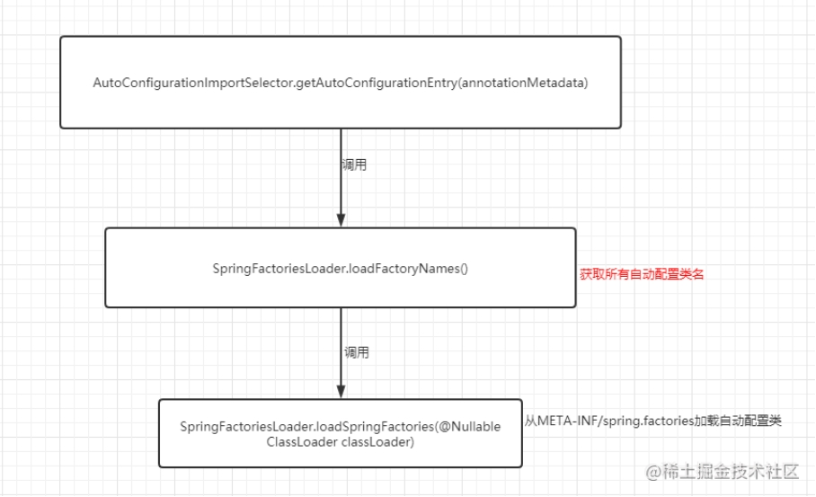
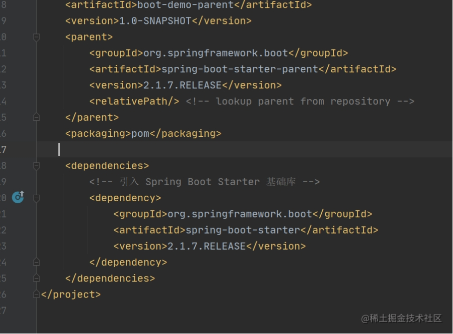
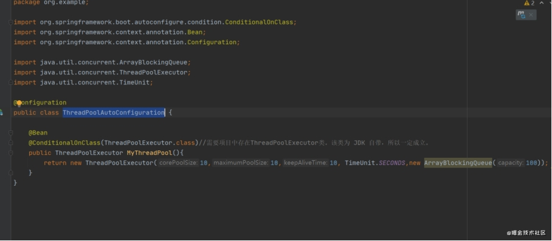

# SpringBoot

## @SpringBootApplication

- 看作是 @Configuration、@EnableAutoConfiguration、@ComponentScan 注解的集合。

- @EnableAutoConfiguration：启用 SpringBoot 的自动配置机制

- @ComponentScan： 扫描被@Component (@Repository,@Service,@Controller)注解的 bean，注解默认会扫描该类所在的包下所有的类。

- @Configuration：允许在 Spring 上下文中注册额外的 bean 或导入其他配置类

## 讲述一下 SpringBoot 自动装配原理？

**什么是 SpringBoot 自动装配？**

SpringBoot 在启动时会扫描外部引用 jar 包中的META-INF/spring.factories文件，将文件中配置的类型信息加载到 Spring 容器 避免我们手动配置

**SpringBoot 是如何实现自动装配的？如何实现按需加载？**

@EnableAutoConfiguration

@Condial

**如何实现一个 Starter？**

**Spring Boot 的自动配置是如何实现的?**

 自动装配并不是SpringBoot兴起的，实际上 Spring FrameWork很早就实现了这个功能。SpringBoot在此基础上，通过SPI(Service Provider Interface)的方式做了进一步的优化.

SPI系统里抽象的各个模块，往往有很多不同的实现方案，比如日志模块的方案，jdbc模块的方案等。面向的对象的设计里，我们一般推荐模块之间基于接口编程，模块之间不对实现类进行硬编码。一旦代码里涉及具体的实现类，就违反了可拔插的原则，如果需要替换一种实现，就需要修改代码。为了实现在模块装配的时候能不在程序里动态指明，这就需要一种服务发现机制。java spi就是提供这样的一个机制：为某个接口寻找服务实现的机制

@EnableAutoConfiguration是启动自动配置的关键

import java.lang.annotation.Documented;

import java.lang.annotation.ElementType;

import java.lang.annotation.Inherited;

import java.lang.annotation.Retention;

import java.lang.annotation.RetentionPolicy;

import java.lang.annotation.Target;

import org.springframework.context.annotation.Import;

 

@Target({ElementType.TYPE})

@Retention(RetentionPolicy.RUNTIME)

@Documented

@Inherited

@AutoConfigurationPackage

@Import({AutoConfigurationImportSelector.class})

public @interface EnableAutoConfiguration {

  String ENABLED_OVERRIDE_PROPERTY = "spring.boot.enableautoconfiguration";

 

  Class<?>[] exclude() default {};

 

  String[] excludeName() default {};

}

@EnableAutoConfiguration 注解通过 Spring 提供的 @Import 注解导入了AutoConfigurationImportSelector类（@Import 注解可以导入配置类或者 Bean 到当前类中）。

AutoConfigurationImportSelector类中getCandidateConfigurations方法会将所有自动配置类的信息以 List 的形式返回。这些配置信息会被 Spring 容器作 bean 来管理。

AutoConfigurationImportSelector:加载自动装配类

AutoConfigurationImportSelector 类实现了 ImportSelector接口，也就实现了这个接口中的 selectImports方法，该方法主要用于获取所有符合条件的类的全限定类名，这些类需要被加载到 IoC 容器中。

private static finaString[] NO_IMPORTS = new String[0];

 

public String[] selectImports(AnnotationMetadata annotationMetadata) {

​    // <1>.判断自动装配开关是否打开

​    if (!this.isEnabled(annotationMetadata)) {

​      return NO_IMPORTS;

​    } else {

​     //<2>.获取所有需要装配的bean

​      AutoConfigurationMetadata autoConfigurationMetadata = AutoConfigurationMetadataLoader.loadMetadata(this.beanClassLoader);

​      AutoConfigurationImportSelector.AutoConfigurationEntry autoConfigurationEntry = this.getAutoConfigurationEntry(autoConfigurationMetadata, annotationMetadata);

​      return StringUtils.toStringArray(autoConfigurationEntry.getConfigurations());

​    }

  }

 

这里我们需要重点关注一下getAutoConfigurationEntry()方法，这个方法主要负责加载自动配置类的。

 

判断自动装配开关是否打开。默认spring.boot.enableautoconfiguration=true，可在 application.properties 或 application.ym中设置

用于获取EnableAutoConfiguration注解中的 exclude 和 excludeName。

获取需要自动装配的所有配置类，读取META-INF/spring.factories

不光是这个依赖下的META-INF/spring.factories被读取到，所有 Spring Boot Starter 下的META-INF/spring.factories都会被读取到。

所以，你可以清楚滴看到， druid 数据库连接池的 Spring Boot Starter 就创建了META-INF/spring.factories文件。

如果，我们自己要创建一个 Spring Boot Starter，这一步是必不可少的。

按需加载  @ConditionalOnXXX 中的所有条件都满足，该类才会生效。

按需加载注解

Spring Boot 提供的条件注解 @ConditionalOnBean：当容器里有指定 Bean 的条件下

@ConditionalOnMissingBean：当容器里没有指定 Bean 的情况下

@ConditionalOnSingleCandidate：当指定 Bean 在容器中只有一个，或者虽然有多个但是指定首选 Bean

@ConditionalOnClass：当类路径下有指定类的条件下

@ConditionalOnMissingClass：当类路径下没有指定类的条件下

@ConditionalOnProperty：指定的属性是否有指定的值

@ConditionalOnResource：类路径是否有指定的值

@ConditionalOnExpression：基于 SpE表达式作为判断条件

@ConditionalOnJava：基于 Java 版本作为判断条件

@ConditionalOnJndi：在 JNDI 存在的条件下差在指定的位置

@ConditionalOnNotWebApplication：当前项目不是 Web 项目的条件下

@ConditionalOnWebApplication：当前项目是 Web 项 目的条件下

如何实现一个 Starter

第一步，创建threadpool-spring-boot-starter工程

第二步，引入 Spring Boot 相关依赖

 

第三步，创建ThreadPoolAutoConfiguration

 

第四步，在threadpool-spring-boot-starter工程的 resources 包下创建META-INF/spring.factories文件

 

 

 

 

 

 

处理全局异常

@ControllerAdvice

 