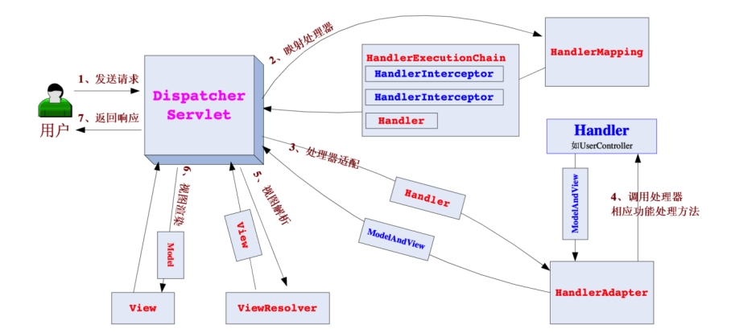
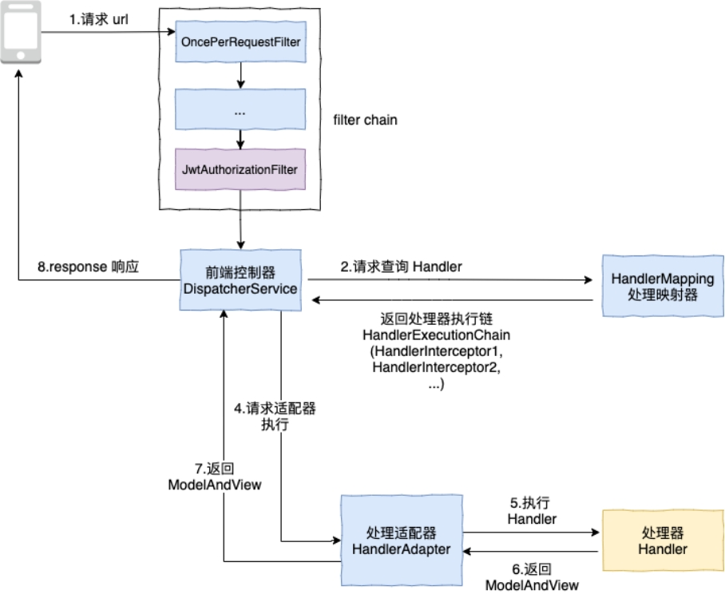
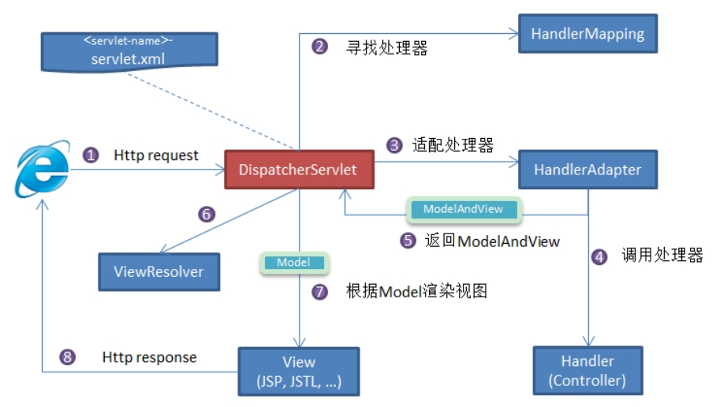

# SpringMVC

## JWT

通俗地说，JWT的本质就是一个字符串，它是将用户信息保存到一个Json字符串中，然后进行编码后得到一个JWT token，并且这个JWT token带有签名信息，接收后可以校验是否被篡改，所以可以用于在各方之间安全地将信息作为Json对象传输

JWT由3部分组成：标头(Header)、有效载荷(Payload)和签名(Signature)。在传输的时候，会将JWT的3部分分别进行Base64编码后用.进行连接形成最终传输的字符串

## servlet

servlet是java提供的一门动态web资源开发技术，动态指的是区别于静态资源访问

如何完成的一次servlet请求？

以访问ur:  http://localhost:8080/web-demo/demo1为例，首先请求会到localhost的8080接口，而8080接口被web服务器（比如tomcat）所监听，web服务器会找到部署的web应用路径web-demo，进而找到匹配/demo1的servlet实例，调用servlet实例的service方法。

**servlet的生命周期**

初始化：会调用实例的init()方法，里面通常是一些配置和连接，默认是在第一次接到servlet请求时进行的，如果loadOnStartup设定为0或正整数，则会在web应用启动时加载，以提高首次响应速度。

响应请求：会调用实例的service()方法，根据需求实现，springMVC框架下的每个接口

服务中止：会调用实例的destory()方法，回收资源。调用后，容器会释放servlet实例，后面会被java的垃圾回收器回收

因此，可以理解servlet是一种规范的含义了，每个servlet类都会实现servlet接口，都存在这些方法

## 什么是 Spring MVC

Spring MVC 是一个基于 Java 的实现了 MVC 设计模式的请求驱动类型的轻量级 Web 框架，通过把模型-视图-控制器分离，将 web 层进行职责解耦，把复杂的 web 应用分成逻辑清晰的几部分，简化开发，减少出错，方便组内开发人员之间的配合。

**Spring MVC 的优点**

- （1） 可以支持各种视图技术,而不仅仅局限于 JSP； 

- （2） 与 Spring 框架集成（如 IoC 容器、AOP 等）；

- （3） 清晰的角色分配：前端控制器(dispatcherServlet) , 请求到处理器映射（handlerMapping), 处理器适配器（HandlerAdapter), 视图解析器（ViewResolver）。

- （4） 支持各种请求资源的映射策略。

- （5） 分层设计，实现了业务系统各个组件之间的解耦，有利于业务系统的可扩展性，可维护性。

- （6） 有利于系统的并行开发，提升开发效率。

**给MVC三层架构加了Manager层**

 ```java
 @Transactional(rollbackFor = Throwable.class)
 public Result<String> upOrDown(Long departmentId, Long swapId) {
  // 验证 1
  DepartmentEntity departmentEntity = departmentDao.selectById(departmentId);
  if (departmentEntity == null) {
   return Result.error("部门xxx不存在");
  }
  // 验证 2
  DepartmentEntity swapEntity = departmentDao.selectById(swapId);
  if (swapEntity == null) {
   return Result.error("部门xxx不存在");
  }
  // 验证 3
  Long count = employeeDao.countByDepartmentId(departmentId);
  if (count != nul&& count > 0) {
   return Result.error("员工不存在");
  }
  // 操作数据库 4
  Long departmentSort = departmentEntity.getSort();
  departmentEntity.setSort(swapEntity.getSort());
  departmentDao.updateById(departmentEntity);
  swapEntity.setSort(departmentSort);
  departmentDao.updateById(swapEntity);
  return Result.OK("success");
 }
 ```


上面的代码是典型的长事务问题（类似的还有调用第三方接口），前三步都是使用 connection 进行验证操作，但是由于方法上有@Transactiona注解，所以这三个验证都是使用的同一个 connection。

总结 Manager层主要是把service层对数据库操作抽离出来，防止service其他方法占用过长的数据库连接。


## Spring MVC 的主要组件

1. 前端控制器 DispatcherServlet（不需要程序员开发）作用：接收请求、响应结果，相当于转发器，有了 DispatcherServlet 就减少了其它组件之间的耦合度。

2. 处理器映射器 HandlerMapping（不需要程序员开发）作用：根据请求的 UR来查找 Handler

3. 处理器适配器 HandlerAdapter  注意：在编写 Handler 的时候要按照 HandlerAdapter 要求的规则去编写，这样适配器

4. HandlerAdapter 才可以正确的去执行 Handler。 

5. 处理器 Handler（需要程序员开发）

6. 视图解析器 ViewResolver（不需要程序员开发）作用：进行视图的解析，根据视图逻辑名解析成真正的视图（view） （6）视图 View（需要程序员开发 jsp）View 是一个接口， 它的实现类支持不同的视图类型（jsp，freemarker，pdf 等等）


## 核心架构的具体流程步骤

 

 

 

核心架构的具体流程步骤如下： 

1. 首先用户发送请求——>DispatcherServlet，前端控制器收到请求后自己不进行处理，而是委托给其他的解析器进行处理，作为统一访问点，进行全局的流程控制； 
2. DispatcherServlet——>HandlerMapping， HandlerMapping 将会把请求映射为 HandlerExecutionChain 对象（包含一个Handler 处理器（页面控制器）对象、多个HandlerInterceptor 拦截器）对象，通过这种策略模式，很容易添加新的映射策略； 
3. DispatcherServlet——>HandlerAdapter，HandlerAdapter 将会把处理器包装为适配器，从而支持多种类型的处理器，即适配器设计模式的应用，从而很容易支持很多类型的处理器；
4. HandlerAdapter——>处理器功能处理方法的调用，HandlerAdapter 将会根据适配的结果调用真正的处理器的功能处理方法，完成功能处理；并返回一个ModelAndView 对象（包含模型数据、逻辑视图名）； 
5. ModelAndView 的逻辑视图名——> ViewResolver，ViewResolver 将把逻辑视图名解析为具体的View，通过这种策略模式，很容易更换其他视图技术； 
6. View——>渲染，View 会根据传进来的Mode模型数据进行渲染，此处的Mode实际是一个Map 数据结构，因此很容易支持其他视图技术； 
7. 返回控制权给DispatcherServlet，由DispatcherServlet 返回响应给用户，到此一个流程结束。

## SpringMVC 工作原理了解吗?

Spring MVC 原理如下图所示：

 

SpringMVC 工作原理的图解我没有自己画，直接图省事在网上找了一个非常清晰直观的，原出处不明。

流程说明（重要）：

- 客户端（浏览器）发送请求，直接请求到 。DispatcherServlet

- DispatcherServlet 根据请求信息调用HandlerMapping ，解析请求对应的Handler 。

- 解析到对应的 Handler（也就是我们平常说的Controller 控制器）后，开始由HandlerAdapter 适配器处理。

- HandlerAdapter 会根据 Handler来调用真正的处理器开处理请求，并处理相应的业务逻辑。

- 处理器处理完业务后，会返回一个ModelAndView 对象， Model是返回的数据对象， View是个逻辑上的 。

- ViewResolver 会根据逻辑 View查找实际的View 。

- DispaterServlet 把返回的 Model传给View （视图渲染）。

- 把View 返回给请求者（浏览器）


**请描述 Spring MVC 的工作流程？描述一下 DispatcherServlet 的工作流程？**

- （1） 用户发送请求至前端控制器 DispatcherServlet； 

- （2） DispatcherServlet 收到请求后，调用HandlerMapping 处理器映射器，请求获取 Handle； 

- （3） 处理器映射器根据请求 ur找到具体的处理器，生成处理器对象及处理器拦截器(如果有则生成)一并返回给 DispatcherServlet； 

- （4） DispatcherServlet 调用 HandlerAdapter 处理器适配器； 

- （5） HandlerAdapter 经过适配调用 具体处理器(Handler，也叫后端控制器)； 

- （6） Handler 执行完成返回 ModelAndView； 

- （7） HandlerAdapter 将 Handler 执行结果 ModelAndView 返回给 DispatcherServlet

- （8） DispatcherServlet 将 ModelAndView 传给 ViewResolver 视图解析器进行解析； 

- （9） ViewResolver解析后返回具体 View； 

- （10） DispatcherServlet 对 View 进行渲染视图（即将模型数据填充至视图中） 

- （11） DispatcherServlet 响应用户。


## 面试

### Spring MVC 的控制器是不是单例模式,如果是,有什么问题,怎么解决？

答：是单例模式,所以在多线程访问的时候有线程安全问题,不要用同步,会影响性能的,解决方案是在控制器里面不能写字段

### @Controller 注解的作用 和@RequestMapping 注解的作用

@Controller注解用来把一个类定义为Controller。

@RequestMapping注解用来把web请求映射到相应的处理函数。

@Controller和@RequestMapping结合起来完成了Spring MVC请求的派发流程。

### @RequestMapping流程可以分为下面6步

1. 1.注册RequestMappingHandlerMapping bean 。

2. 2.实例化RequestMappingHandlerMapping bean。

3. 3.获取RequestMappingHandlerMapping bean实例。

4. 4.接收requst请求。

5. 5.在RequestMappingHandlerMapping实例methodMap中查找对应的handler。

6. 6.handler处理请求。

**通俗：**

1. RequestMappingHandlerMapping 组件的配置

2. 路径Path 与实际处理请求的方法的映射保存

3. 请求到来时，根据请求的路由将其分发到对应处理方法

4. 接口和url怎么注册

5. 根据配置的扫描路径获取所有的bean

6. 通过@Controller或@RequestMapping来判断是否是handler，如果是就通过registerHandlerMethod方法注册（类似于map）   


### 怎么根据url找handle

在RequestMappingHandlerMapping实例methodMap中查找对应的handler

如果匹配到多个接口，如果选择？

 


