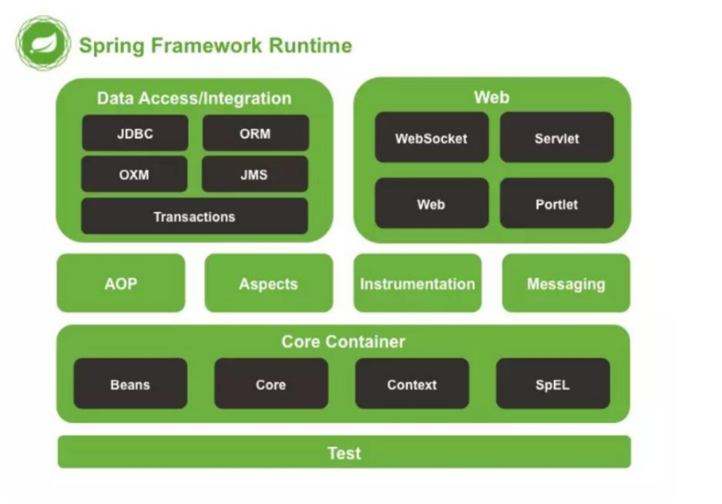
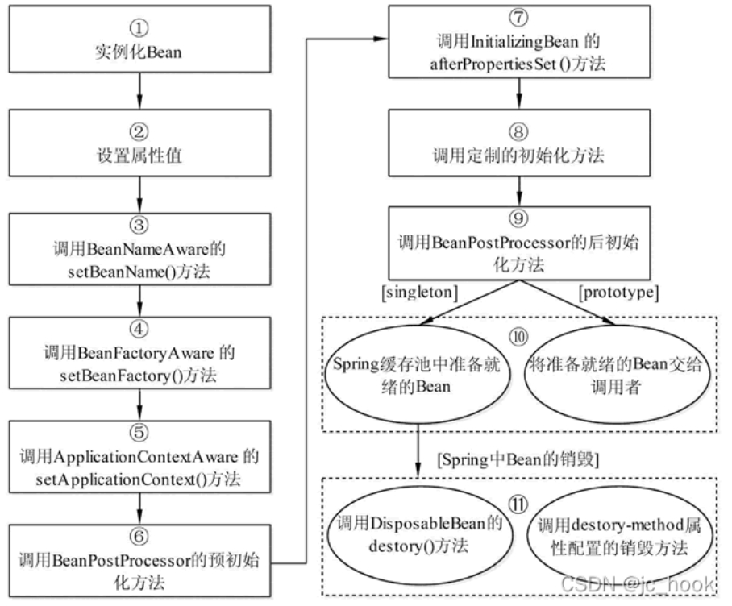

# Spring框架

## 什么是Spring?

Spring 是一个轻量级 Java 开发框架，目的是为了解决企业级应用开发的业务逻辑层和其他各层的耦合问题。Spring 负责基础架构，因此 Java 开发者可以专注于应用程序的开发,Spring 最根本的使命是解决企业级应用开发的复杂性，即简化 Java 开发。

**Spring 特性**

- 非侵入式：基于Spring开发的应用中的对象可以不依赖于Spring的API 
- 控制反转：IOC——Inversion of Control，指的是将对象的创建权交给 Spring 去创建。使用 Spring 之前，对象的创建都是由我们自己在代码中new创建。而使用 Spring 之后。对象的创建都是给了 Spring 框架。 
- 依赖注入：DI——Dependency Injection，是指依赖的对象不需要手动调用 setXX 方法去设置，而是通过配置赋值。 
- 面向切面编程：Aspect Oriented Programming——AOP 容器：Spring 是一个容器，因为它包含并且管理应用对象的生命周期 
- 组件化：Spring 实现了使用简单的组件配置组合成一个复杂的应用。在 Spring 中可以使用XML和Java注解组合这些对象。 
- 一站式：在 IOC 和 AOP 的基础上可以整合各种企业应用的开源框架和优秀的第三方类库（实际上 Spring 自身也提供了表现层的 SpringMVC 和持久层的 Spring JDBC）

 **缺点**

- Spring 明明一个很轻量级的框架，却给人感觉大而全
- Spring 依赖反射，反射影响性能
- 使用门槛升高，入门 Spring 需要较长时间

## Spring 模块组成

 

- spring core：提供了框架的基本组成部分，包括控制反转（Inversion of Control，IOC）和依赖注入（Dependency Injection，DI）功能。
- •spring beans：提供了 BeanFactory，是工厂模式的一个经典实现，Spring 将管理对象称为Bean。 
- • spring context：构建于 core 封装包基础上的 context 封装包，提供了一种框架式的对象访问方法。
- • spring jdbc：提供了一个 JDBC 的抽象层，消除了烦琐的 JDBC 编码和数据库厂商特有的错误代码解析， 用于简化 JDBC。
- • spring aop：提供了面向切面的编程实现，让你可以自定义拦截器、切点等。
- • spring Web：提供了针对 Web 开发的集成特性，例如文件上传，利用 servlet listeners 进行ioc 容器初始化和针对 Web 的 ApplicationContext。 
- • spring test：主要为测试提供支持的，支持使用 JUnit 或 TestNG 对 Spring 组件进行单元测试和集成测试

## Spring 设计模式

1. 工厂模式：BeanFactory 就是简单工厂模式的体现，用BeanFactory  ApplicationContext来创建对象的实例；

2. 单例模式：Bean 默认为单例模式。

3. 代理模式：Spring 的 AOP 功能用到了 JDK 的动态代理和 CGLIB 字节码生成技术；

4. 模板方法：用来解决代码重复的问题。比如. RestTemplate, JmsTemplate, JpaTemplate。

5. 观察者模式：定义对象键一种一对多的依赖关系，当一个对象的状态发生改变时，所有依赖于它的对象都会得到通知被制动更新，Spring中的事件编程模型就是观察者模式的实现。在Spring中定义了一个ApplicationListener接口，用来监听Application的事件，Application其实就是ApplicationContext，ApplicationContext内置了几个事件，其中比较容易理解的是：ContextRefreshedEvent、ContextStartedEvent、ContextStoppedEvent、ContextClosedEvent，从名称上来看，就知道这几个事件是什么时候被触发的了。接下来我们说一下如何利用Spring中的事件编程模型来定义自定义事件，并且发布事件。
6. 包装器设计模式 : 我们的项目需要连接多个数据库，而且不同的客户在每次访问中根据需要会去访问不同的数据库。这种模式让我们可以根据客户的需求能够动态切换不同的数据源。

7. 适配器模式 : Spring AOP 的增强或通知(Advice)使用到了适配器模式、spring MVC 中也是用到了适配器模式适配

 

## IoC

IoC很好的体现了面向对象设计法则之一—— 好莱坞法则：“别找我们，我们找你”；即由IoC容器帮对象找相应的依赖对象并注入，而不是由对象主动去找。

把创建和查找依赖对象的控制权交给了容器，由容器进行注入组合对象，所以对象与对象之间是 松散耦合，这样也方便测试，利于功能复用，更重要的是使得程序的整个体系结构变得非常灵活

> 示例：
>
> 在实际项目中一个 Service 类可能依赖了很多其他的类，假如我们需要实例化这个 Service，你可能要每次都要搞清这个 Service 所有底层类的构造函数，这可能会把人逼疯。如果利用 IoC 的话，你只需要配置好，然后在需要的地方引用就行了，这大大增加了项目的可维护性且降低了开发难度。
>
> 开发过程中突然接到一个新的需求，针对对IUserDao 接口开发出另一个具体实现类。因为 Server 层依赖了IUserDao的具体实现，所以我们需要修改UserServiceImpl中 new 的对象。如果只有一个类引用了IUserDao的具体实现，可能觉得还好，修改起来也不是很费力气，但是如果有许许多多的地方都引用了IUserDao的具体实现的话，一旦需要更换IUserDao 的实现方式，那修改起来将会非常的头疼。

ico实现原理： 工厂模式加反射机制

Spring Bean的创建是典型的工厂模式：

BeanFactory： 工厂模式定义了IOC容器的基本功能规范

BeanRegistry： 向IOC容器手工注册 BeanDefinition 对象的方法

 **为什么叫控制反转**

控制 ：指的是对象创建（实例化、管理）的权力

反转 ：控制权交给外部环境（Spring 框架、IoC 容器）

**IoC 解决了什么问题**

对象之间的耦合度或者说依赖程度降低；

资源变的容易管理；比如你用 Spring 容器提供的话很容易就可以实现一个单例。

**IOC 总结**

IoC 在 Spring 里，只需要低级容器就可以实现，2 个步骤：

1. 加载配置文件，解析成 BeanDefinition 放在 Map 里。

2. 调用 getBean 的时候，从 BeanDefinition 所属的 Map 里，拿出 Class 对象进行实例化，同时，如果有依赖关系，将递归调用 getBean 方法 —— 完成依赖注入。

至于高级容器 ApplicationContext，他包含了低级容器的功能，当他执行 refresh 模板方法的时候，将刷新整个容器的 Bean。同时其作为高级容器，包含了太多的功能。一句话，他不仅仅是 IoC。他支持不同信息源头，支持 BeanFactory 工具类，支持层级容器，支持访问文件资源，支持事件发布通知，支持接口回调等等。

## AOP

AOP 主要用来解决：在不改变原有业务逻辑的情况下，增强横切逻辑代码，根本上解耦合，避免横切逻辑代码重复。

**谈谈自己对于 AOP 的了解**

AOP(Aspect-Oriented Programming:面向切面编程)能够将那些与业务无关，却为业务模块所共同调用的逻辑或责任（例如事务处理、日志管理、权限控制等）封装起来，便于减少系统的重复代码，降低模块间的耦合度，并有利于未来的可拓展性和可维护性。

Spring AOP 就是基于动态代理的，如果要代理的对象，实现了某个接口，那么 Spring AOP 会使用 JDK Proxy，去创建代理对象，而对于没有实现接口的对象，就无法使用 JDK Proxy 去进行代理了，这时候 Spring AOP 会使用 Cglib 生成一个被代理对象的子类来作为代理

当然你也可以使用 AspectJ ！Spring AOP 已经集成了 AspectJ ，AspectJ 应该算的上是 Java 生态系统中最完整的 AOP 框架了

**AOP通知**

- 前置通知（Before advice）：在某连接点之前执行的通知，但这个通知不能阻止连接点之前的执行流程（除非它抛出一个异常）。 
- 后置通知（After returning advice）：在某连接点正常完成后执行的通知：例如，一个方法没有抛出任何异常，正常返回。 
- 异常通知（After throwing advice）：在方法抛出异常退出时执行的通知。 最终通知（After (finally) advice）：当某连接点退出的时候执行的通知（不论是正常返回还是异常退出）。
- 环绕通知（Around Advice）：包围一个连接点的通知，如方法调用。这是最强大的一种通知类型。环绕通知可以在方法调用前后完成自定义的行为。它也会选择是否继续执行连接点或直接返回它自己的返回值或抛出异常来结束执行。

**AOP 领域中的特性术语**

- 通知（Advice）: AOP 框架中的增强处理。通知描述了切面何时执行以及如何执行增强处理。
- 连接点（join point）: 连接点表示应用执行过程中能够插入切面的一个点，这个点可以是方法的调用、异常的抛出。在 Spring AOP 中，连接点总是方法的调用。
- 切点（PointCut）: 可以插入增强处理的连接点。
- 切面（Aspect）: 切面是通知和切点的结合。
- 引入（Introduction）：引入允许我们向现有的类添加新的方法或者属性。
- 织入（Weaving）: 将增强处理添加到目标对象中，并创建一个被增强的对象，这个过程就是织入。

## Spring Bean

什么是 Spring Bean？

简单来说，Bean 代指的就是那些被 IoC 容器所管理的对象。

## Spring 框架中 bean 的生命周期

 

1. 调用 Bean 构造方法或工厂方法实例化 Bean
2. 利用依赖注入完成 Bean 中所有属性值的配置注入
3. 如果 Bean 实现了 BeanNameAware(这个接口表面上的作用就是让实现这个接口的bean知道自己在spring容器里的名字) 接口，则 Spring 调用 Bean 的 setBeanName() 方法传入当前 Bean 的 id 值
4. 如果 Bean 实现了 BeanFactoryAware 接口，则 Spring 调用 setBeanFactory() 方法传入当前工厂实例的引用
5. 如果 Bean 实现了 ApplicationContextAware 接口，则 Spring 调用 setApplicationContext() 方法传入当前 ApplicationContext 实例的引用
6. 如果 BeanPostProcessor 和 Bean 关联，则 Spring 将调用该接口的预初始化方法 postProcessBeforeInitialzation() 对 Bean 进行加工操作，此处非常重要，Spring 的 AOP 就是利用它实现的
7. 如果 Bean 实现了 InitializingBean 接口，则 Spring 将调用 afterPropertiesSet() 方法（这个方法可以用在一些特殊情况中，也就是某个对象的某个属性需要经过外界得到，比如说查询数据库等方式，这时候可以用到spring的该特性，只需要实现InitializingBean即可）
8. 如果在配置文件中通过 init-method 属性指定了初始化方法，则调用该初始化方法
9. 如果 BeanPostProcessor 和 Bean 关联，则 Spring 将调用该接口的初始化方法 postProcessAfterInitialization()。此时，Bean 已经可以被应用系统使用了
10. 如果在<bean> 中指定了该 Bean 的作用范围为 scope=“singleton”，则将该 Bean 放入 Spring IoC 的缓存池中，将触发 Spring 对该 Bean 的生命周期管理；如果在 中指定了该 Bean 的作用范围为 scope=“prototype”，则将该 Bean 交给调用者，调用者管理该 Bean 的生命周期，Spring 不再管理该 Bean
11. 如果 Bean 实现了 DisposableBean 接口，则 Spring 会调用 destory() 方法将 Spring 中的 Bean 销毁；如果在配置文件中通过 destory-method 属性指定了 Bean 的销毁方法，则 Spring 将调用该方法对 Bean 进行销毁

## 在 Spring 框架 xm配置中共有 5 种自动装配

- no：默认的方式是不进行自动装配的，通过手工设置 ref 属性来进行装配 bean。
- • byName：通过 bean 的名称进行自动装配，如果一个 bean 的 property 与另一 bean 的 name 相同，就进行自动装配。
- • byType：通过参数的数据类型进行自动装配。
- • constructor：利用构造函数进行装配，并且构造函数的参数通过 byType 进行装配。
- • autodetect：自动探测，如果有构造方法，通过 construct 的方式自动装配，否则使用 byType的方式自动装配。

## 详细讲解核心容器（spring context 应用上下文) 模块

 

## Spring 事务

**Spring 的事务传播行为**

- ① PROPAGATION_REQUIRED：如果当前没有事务，就创建一个新事务，如果当前存在事务，就加入该事务，该设置是最常用的设置。
- ③ PROPAGATION_MANDATORY：支持当前事务，如果当前存在事务，就加入该事务，如果当前不存在事务，就抛出异常。
- ② PROPAGATION_SUPPORTS：支持当前事务，如果当前存在事务，就加入该事务，如果当前不存在事务，就以非事务执行。
- ⑦ PROPAGATION_NESTED：如果当前存在事务，则在嵌套事务内执行。如果当前没有事务，则按 REQUIRED属性执行。
- ④ PROPAGATION_REQUIRES_NEW：创建新事务，无论当前存不存在事务，都创建新事务。
- ⑤ PROPAGATION_NOT_SUPPORTED：以非事务方式执行操作，如果当前存在事务，就把当前事务挂起。
- ⑥ PROPAGATION_NEVER：以非事务方式执行，如果当前存在事务，则抛出异常。

**spring 的事务隔离**

spring 有五大隔离级别，默认值为 ISOLATION_DEFAULT（使用数据库的设置），其他四个隔离级别和数据库的隔离级别一致：

1. ISOLATION_DEFAULT：用底层数据库的设置隔离级别，数据库设置的是什么我就用什么；
2. ISOLATION_READ_UNCOMMITTED：未提交读，最低隔离级别、事务未提交前，就可被其他事务读取（会出现幻读、脏读、不可重复读）；
3. ISOLATION_READ_COMMITTED：提交读，一个事务提交后才能被其他事务读取到（会造成幻读、不可重复读），SQserver 的默认级别；
4. ISOLATION_REPEATABLE_READ：可重复读，保证多次读取同一个数据时，其值都和事务开始时候的内容是一致，禁止读取到别的事务未提交的数据（会造成幻读），MySQ的默认级别；
5. ISOLATION_SERIALIZABLE：序列化，代价最高最可靠的隔离级别，该隔离级别能防止脏读、不可重复读、幻读。

##  面试

### @Autowired和@Resource以及@Inject等注解注入有何区别？

@Autowired  默认是根据类型（byType ）进行自动装配的，默认是根据类型（byType ）进行自动装配的 通过与@Qualifier配合实现byName

@Resource  是默认根据属性名称进行自动装配的，如果有多个类型一样的Bean候选者，则可以通过name进行指定进行注入

@Autowired、@Inject是默认按照类型匹配的，@Resource是按照名称匹配的

### 使用@Autowired 注解自动装配的过程是怎样的？

在启动 spring IoC 时，容器自动装载了一个 AutowiredAnnotationBeanPostProcessor 后置处理器，当容器扫描到@Autowied、@Resource 或@Inject 时，就会在 IoC 容器自动查找需要的 bean，并装配给该对象的属性。在使用@Autowired 时，首先在容器中查询对应类型的 bean： 

• 如果查询结果刚好为一个，就将该 bean 装配给@Autowired 指定的数据；

• 如果查询的结果不止一个，那么@Autowired 会根据名称来查找；

• 如果上述查找的结果为空，那么会抛出异常。解决方法时，使用 required=false。

### Spring AOP 和 AspectJ AOP 有什么区别？

Spring AOP 属于运行时增强，而 AspectJ 是编译时增强。 Spring AOP 基于代理(Proxying)，而 AspectJ 基于字节码操作(Bytecode Manipulation)。

Spring AOP 已经集成了 AspectJ ，AspectJ 应该算的上是 Java 生态系统中最完整的 AOP 框架了。AspectJ 相比于 Spring AOP 功能更加强大，但是 Spring AOP 相对来说更简单，

如果我们的切面比较少，那么两者性能差异不大。但是，当切面太多的话，最好选择 AspectJ ，它比 Spring AOP 快很多。

### **Spring AOP和AspectJ是什么关系？**

AspectJ是更强的AOP框架，是实际意义的AOP标准；

- Spring为何不写类似AspectJ的框架？ Spring AOP使用纯Java实现, 它不需要专门的编译过程, 它一个重要的原则就是无侵入性（non-invasiveness）
- 互补而不是竞争的关系。
- Spring AOP采用的就是基于运行时增强的代理技术,Java JDK的动态代理(Proxy，底层通过反射实现)或者CGLIB的动态代理(底层通过继承实现)
- ApectJ采用的就是静态织入的方式。ApectJ主要采用的是编译期织入
- Spring AOP更易用，AspectJ更强大

### JDK 动态代理和 CGLIB 动态代理的区别

Spring AOP 中的动态代理主要有两种方式，JDK 动态代理和 CGLIB 动态代理：

- JDK 动态代理只提供接口的代理，不支持类的代理
- CGLIB（Code Generation Library），是一个代码生成的类库，可以在运行时动态的生成指定类的一个子类对象，并覆盖其中特定方法并添加增强代码，从而实现 AOP。CGLIB是通过继承的方式做的动态代理，因此如果某个类被标记为 final，那么它是无法使用 CGLIB做动态代理的。

### @Component 和 @Bean 的区别是什么？

- @Component 注解作用于类，而@Bean注解作用于方法。
- @Component通常是通过类路径扫描来自动侦测以及自动装配到 Spring 容器中（我们可以使用 @ComponentScan注解定义要扫描的路径从中找出标识了需要装配的类自动装配到 Spring 的 bean 容器中）。 @Bean注解通常是我们在标有该注解的方法中定义产生这个 bean,告诉了 Spring 这是某个类的实例，当我需要用它的时候还给我。
- @Bean 注解比 @Component注解的自定义性更强，而且很多地方我们只能通过 @Bean注解来注册 bean。比如当我们引用第三方库中的类需要装配到Spring 容器时，则只能通过@Bean 来实现。

### Spring 基于 xm注入 bean 的几种方式

1. Set 方法注入；
2. 构造器注入：①通过 index 设置参数的位置；②通过 type 设置参数类型；
3. 静态工厂注入；
4. 实例工厂；

### Spring 支持的几种 bean 的作用域

- singleton : bean 在每个 Spring ioc 容器中只有一个实例。
- prototype：一个 bean 的定义可以有多个实例。
- request：每次 http 请求都会创建一个 bean，该作用域仅在基于 web 的 Spring ApplicationContext 情形下有效。
- session：在一个 HTTP Session 中，一个 bean 定义对应一个实例。该作用域仅在基于 web的 Spring ApplicationContext 情形下有效。
- global-session：在一个全局的 HTTP Session 中，一个 bean 定义对应一个实例。该作用域仅在基于 web 的 Spring ApplicationContext 情形下有效。

### Spring 框架中的单例 bean 是线程安全的吗？

不是，Spring 框架中的单例 bean 不是线程安全的。spring 中的 bean 默认是单例模式，spring 框架并没有对单例 bean 进行多线程的封装处理。那就要开发者自己去保证线程安全了，最简单的就是改变 bean 的作用域，把“singleton”变更为“prototype”，这样请求 bean 相当于 new Bean()了，所以就可以保证线程安全了

### Spring 如何处理线程并发问题？

• 有状态就是有数据存储功能。

• 无状态就是不会保存数据。

在一般情况下，只有无状态的 Bean 才可以在多线程环境下共享，在 Spring 中，绝大部分 Bean 都可以声明为 singleton 作用域

在类中定义一个 ThreadLocal成员变量，将需要的可变成员变量保存在 ThreadLocal中（推荐的一种方式）

### BeanFactory 和 ApplicationContext 有什么区别？

BeanFactory 和 ApplicationContext 是 Spring 的两大核心接口，都可以当做 Spring 的容器。其中ApplicationContext 是 BeanFactory 的子接口。

BeanFactory 简单粗暴，可以理解为就是个 HashMap，Key 是 BeanName，Value 是 Bean 实例。通常只提供注册（put），获取（get）这两个功能。我们可以称之为 “低级容器”。ApplicationContext 可以称之为 “高级容器”。因为他比 BeanFactory 多了更多的功能。他继承了多个接口。因此具备了更多的功能。

**依赖关系：**

BeanFactory：是 Spring 里面最底层的接口，包含了各种 Bean 的定义，读取 bean 配置文档，管理bean 的加载、实例化，控制 bean 的生命周期，维护 bean 之间的依赖关系。ApplicationContext 接口作为 BeanFactory 的派生，除了提供 BeanFactory 所具有的功能外，还提供了更完整的框架功能：

- 继承 MessageSource，因此支持国际化。
- • 统一的资源文件访问方式。
- • 提供在监听器中注册 bean 的事件。
- • 同时加载多个配置文件。
- • 载入多个（有继承关系）上下文 ，使得每一个上下文都专注于一个特定的层次，比如应用的web 层。

**加载方式：**

- BeanFactroy 采用的是延迟加载形式来注入 Bean 的，即只有在使用到某个 Bean 时(调用getBean())，才对该 Bean 进行加载实例化。
- ApplicationContext，它是在容器启动时，一次性创建了所有的 Bean。

**创建方式：**

BeanFactory 通常以编程的方式被创建，ApplicationContext 还能以声明的方式创建，如使用ContextLoader。

**注册方式：**

BeanFactory 和 ApplicationContext 都支持 BeanPostProcessor，BeanFactoryPostProcessor 的使用，但两者之间的区别是：BeanFactory 需要手动注册，而 ApplicationContext 则是自动注册

### @Transactional(rollbackFor = Exception.class)注解了解吗？

我们知道 Exception 分为运行时异常 RuntimeException 和非运行时异常。在@Transactional注解中如果不配置rollbackFor属性,那么事务只会在遇到RuntimeException的时候才会回滚,加上rollbackFor=Exception.class,可以让事务在遇到非运行时异常时也回滚。

@Transactiona注解一般可以作用在类或者方法上。

作用于类：当把@Transactiona注解放在类上时，表示所有该类的 public 方法都配置相同的事务属性信息。

作用于方法：当类配置了@Transactional，方法也配置了@Transactional，方法的事务会覆盖类的事务配置信息。

 