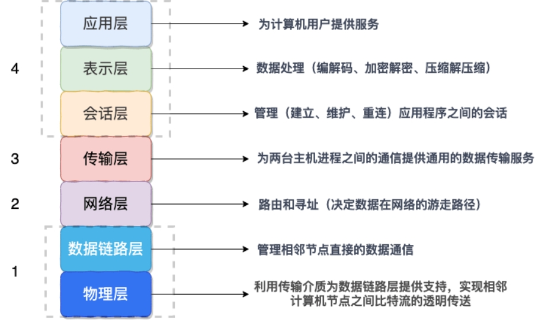

## 1.面向对象

### 三大特性

#### 封装

- 减少耦合：可以独立地开发、测试、优化、使用、理解和修改 减轻维护的负担: 
- 可以更容易被程序员理解，并且在调试的时候可以不影响其他模块 有效地调节性能: 
- 可以通过剖析确定哪些模块影响了系统的性能  
- 提高软件的可重用性  
- 降低了构建大型系统的风险: 即使整个系统不可用，但是这些独立的模块却有可能是可用的

#### 继承

继承实现了 IS-A （是）关系

#### 多态

- 编译时多态主要指方法的重载

- 运行时多态指程序中定义的对象引用所指向的具体类型在运行期间才确定，有三个条件 继承，覆盖，向上转型


### 访问权限

- public：最大访问控制权限，对所有的类都可见。

- protect：修饰的，在类内部、同一个包、子类中能访问。

- default：包访问权限，即同一个包中的类可以可见。默认不显式指定访问控制权限时就是default包访问控制权限。

- private：最严格的访问控制权限，仅该类本身可见。


### 内部类的作用

- 内部类提供了某种进入其外围类的窗口。

- 每个内部类都能独立的继承自一个（接口的）实现，所以无论外围类是否已经继承了某个（接口）的实现，对应内部类都没有影响。

- 内部类可以有多个实例，每个实例有自己的状态信息，与外围类相互独立。

- 单个外围类中，可以让多个内部类以不同的方式实现统一接口，或者继承同一个类。

- 创建内部类的对象并不依赖外围类对象的创建。

- 内部类没有令人迷惑的is-a的关系，是独立的实体。

- 内部类使得多重继承的解决方案更加完整。虽然接口解决可部分问题， 但是内部类有效的实现了多重继承。也就是说：内部类允许继承多个非接口类型(类或者抽象类)。 我认为这是内部类最重要的一个作用。（上述代码定义两个内部类，这两个内部类分别继承 Father（父亲）类和 Mother（母亲）类，且都可以获取各自父类的行为）

  ```java
  public class Son {
  
    // 内部类继承Father类
  
    class Father_1 extends Father {
      public int strong() {
        return super.strong() + 1;
     }
    }
  
    class Mother_1 extends Mother {
      public int kind() {
        return super.kind() - 2;
      }
    }
  
    public int getStrong() {
      return new Father_1().strong();
    }
  
    public int getKind() {
      return new Mother_1().kind();
    }
  
  }
  ```

### 父类的静态方法能否被子类重写？静态属性和静态方法是否可以被继承？

 父类的静态方法和属性不能被子类重写，但子类可以继承父类静态方法和属性

### 面向对象和面向过程的区别

- 面向过程把解决问题的过程拆成一个个方法，通过一个个方法的执行解决问题。

- 面向对象会先抽象出对象，然后用对象执行方法的方式解决问题。

- 面向对象开发的程序一般更易维护、易复用、易扩展

## 2.基础知识点

### Java 语言有哪些特点?

- 简单易学；

- 面向对象（封装，继承，多态）；

- 平台无关性（ Java 虚拟机实现平台无关性）；

- 支持多线程（ C++ 语言没有内置的多线程机制，因此必须调用操作系统的多线程功能来进行多线程程序设计，而 Java 语言却提供了多线程支持）；

- 可靠性；

- 安全性；

- 支持网络编程并且很方便

- 编译与解释并存；


### 采用字节码的好处是什么?

Java 语言通过字节码的方式，在一定程度上解决了传统解释型语言执行效率低的问题，同时又保留了解释型语言可移植的特点

### 包装类型的缓存机制了解么？

- Byte,Short,Integer,Long 这 4 种包装类默认创建了数值 [-128，127] 的相应类型的缓存数据
- Character 创建了数值在 [0,127] 范围的缓存数据
- Boolean 直接返回 True or False。

基本数据类型存放在栈里，包装类栈里存放的是对象的引用，即值的地址，而值存放在堆里

### 常量池在哪里？

- Java6和6之前，常量池是存放在方法区（永久代）中的。

- Java7，将常量池是存放到了堆中。

- Java8之后，取消了整个永久代区域，取而代之的是元空间。运行时常量池和静态常量池存放在元空间中，而字符串常量池依然存放在堆中。


### final的作用

- final修饰的常量不能被第二次赋值，并且final修饰的常量要用大写字符表示

- final修饰的类不能被继承和重写

- final防止指令重排序，保证多线程下的并发安全


### String不可变的好处

- 可以缓存 hash 值（因为 String 的 hash 值经常被使用，例如 String 用做 HashMap 的 key。不可变的特性可以使得 hash 值也不可变，因此只需要进行一次计算）

- String Pool（(字符串常量池） 的需要（如果一个 String 对象已经被创建过了，那么就会从 String Poo中取得引用。只有 String 是不可变的，才可能使用 String Pool。）

- String 经常作为参数，String 不可变性可以保证参数不可变。例如在作为网络连接参数的情况下如果 String 是可变的，那么在网络连接过程中，String 被改变，改变 String 对象的那一方以为现在连接的是其它主机，而实际情况却不一定是。

- 线程安全

### Java 9 为何要将 String 的底层实现由 char[] 改成了 byte[] ?

 Latin-1 和 UTF-16。如果字符串中包含的汉字没有超过 Latin-1 可表示范围内的字符，那就会使用 Latin-1 作为编码方案。Latin-1 编码方案下，byte 占一个字节(8 位)，char 占用 2 个字节（16），byte 相较 char 节省一半的内存空间。

### String 对象内存分配 (常量池和堆)

#### 内存分配策略

- String s ="" ：如果常量池存在 返回引用，不存在则在常量池创建返回引用

- String s = new String("abc ") ：实际上 abc 本身就是字符串常量池中的一个对象，在运行 new String() 时，把字符串常量池中的字符串 abc 复制到堆中，因此该方式不仅会在常量池中，还会在堆中创建 abc 字符串对象。 最后把 java 堆中对象的引用返回给 s 。

- 字符串常量重载 “+”：编译期，java 虚拟机就将常量字符串的 “+” 连接优化为连接后的值，最终只会创建一个对象。

- 字符串引用重载 “+”：s2 + "bc" 在被编译器执行的时候，会自动引入 StringBuilder 对象，调用其 append() 方法，最终调用 toString() 方法返回其在 堆中对象。StringBuilder 源码中查看一下 toString()调用了new String（）方法，因此是在堆里创建


#### String s1 = new String("abc");这句话创建了几个字符串对象？

- 创建一个的情况：字符串常量池中已经存在字符串abc，就不再需要在这里创建了，直接在堆中创建对象

- 创建两个的情况：字符串常量池中不存在字符串abc，就需要在字符串常量池和堆中都创建对象


### 字符串常量池存在哪里?

- 在 Java 7 之前，字符串常量池被放在运行时常量池中，它属于永久代。

- 而在 Java 7，有永久代，但已经逐步“去永久代”，字符串常量池、静态变量移除，保存在堆中；

- java8:取消永久代，类型信息、字段、方法、常量保存在本地内存的元空间，但字符串常量池、静态变量仍在堆中


###  String.intern()

可以保证相同内容的字符串变量引用同一的内存对象,会将对象放到字符串常量池内，底层代码时native。

### 抽象类与接口

 

- 从设计层面上看，抽象类提供了一种 IS-A 关系，那么就必须满足里式替换原则，即子类对象必须能够替换掉所有父类对象。而接口更像是一种 LIKE-A 关系，它只是提供一种方法实现契约，并不要求接口和实现接口的类具有 IS-A 关系。 

- 从使用上来看，一个类可以实现多个接口，但是不能继承多个抽象类。 

- 接口的字段只能是 static 和 fina类型的，而抽象类的字段没有这种限制。 

- 接口的成员只能是 public 的，而抽象类的成员可以有多种访问权限。


### 抽象类与普通类

- 抽象类的存在时为了被继承，不能实例化，而普通类存在是为了实例化一个对象

- 抽象类的子类必须重写抽象类中的抽象方法，而普通类可以选择重写父类的方法，也可以直接调用父类的方法

- 抽象类必须用abstract来修饰，普通类则不用

### JDK 1.7 中的三个新特性

- try-with-resource 

- 允许 Switch 中有 String 变量和文本

- 值得一提的特性是改善异常处理，如允许在同一个 catch 块中捕获多个异常

###  JDK1.8 引入的新特性? 

- Lambda 表达式，允许像对象一样传递匿名函数 Stream API，充分利用现代多核 CPU，可以写出很简洁的代码 

- Date 与 Time API，最终，有一个稳定、简单的日期和时间库可供你使用 

- 扩展方法，现在，接口中可以有静态、默认方法。 

- 重复注解，现在你可以将相同的注解在同一类型上使用多次


### Object 类的常见方法有哪些？

```java
1. public finanative Class<?> getClass()  native 方法，用于返回当前运行时对象的 Class 对象，使用了 fina关键字修饰，故不允许子类重写。

2. public native int hashCode()     用于返回对象的哈希码，主要使用在哈希表中，比如 JDK 中的HashMap

3. public boolean equals(Object obj) 用于比较 2 个对象的内存地址是否相等，String 类对该方法进行了重写以用于比较字符串的值是否相等。

4. protected native Object clone() throws CloneNotSupportedException  naitive 方法，用于创建并返回当前对象的一份拷贝。

5. public String toString()    返回类的名字实例的哈希码的 16 进制的字符串。建议 Object 所有的子类都重写这个方法。

6. public finanative void notify()  native 方法，并且不能重写。唤醒一个在此对象监视器上等待的线程(监视器相当于就是锁的概念)。如果有多个线程在等待只会任意唤醒一个。

7. public finanative void notifyAll()  native 方法，并且不能重写。跟 notify 一样，唯一的区别就是会唤醒在此对象监视器上等待的所有线程，而不是一个线程。

8. public finanative void wait(long timeout) throws InterruptedException  native方法，并且不能重写。暂停线程的执行。注意：sleep 方法没有释放锁，而 wait 方法释放了锁 ，timeout 是等待时间。

9. public finavoid wait(long timeout, int nanos) throws InterruptedException  多了 nanos 参数，这个参数表示额外时间（以毫微秒为单位，范围是 0-999999）。 所以超时的时间还需要加上 nanos 毫秒

10. public finavoid wait() throws InterruptedException 跟之前的2个wait方法一样，只不过该方法一直等待，没有超时时间这个概念

11. protected void finalize() throws Throwable { }  实例被垃圾回收器回收的时候触发的操作
```


###  Java 中，Comparator 与 Comparable 有什么不同? 

Comparable 接口用于定义对象的自然顺序，而 comparator 通常用于定义用户定制的顺序。Comparable 总是只有一个，但是可以有多个 comparator 来定义对象的顺序

### 异常类型

- 受检查异常：ClassNotFoundException， IOException ，FileNotFoundException 

- 运行时异常：NullPointerException， ArithmeticException(异常的运算 比如除以0)， ClassCastException(类型转换异常) ，IllegalArgumentException(非法参数异常)， IllegalStateException(响应超时异常)，IndexOutOfBoundsException(数组越界), NoSuchElementException，

- 错误类型：


### finally 中的代码一定会执行吗？

不一定的！在某些情况下，finally 中的代码不会被执行。

就比如说 finally 之前虚拟机被终止运行的话，finally 中的代码就不会被执行。

### 序列化协议对应于 TCP/IP 4 层模型的哪一层？

1. 网络接口层

2. 网络层

3. 传输层

4. 应用层

 

 	如上图所示，OSI 七层协议模型中，表示层做的事情主要就是对应用层的用户数据进行处理转换为二进制流。反过来的话，就是将二进制流转换成应用层的用户数据。这不就对应的是序列化和反序列化么？

因为，OSI 七层协议模型中的应用层、表示层和会话层对应的都是 TCP/IP 四层模型中的应用层，所以序列化协议属于 TCP/IP 协议应用层的一部分。

### 常见序列化协议对比

#### java.io.Serializable

不支持跨语言调用 : 如果调用的是其他语言开发的服务的时候就不支持了。

性能差 ：相比于其他序列化框架性能更低，主要原因是序列化之后的字节数组体积较大，导致传输成本加大。

#### Kryo

Kryo 是一个高性能的序列化/反序列化工具，由于其变长存储特性并使用了字节码生成机制，拥有较高的运行速度和较小的字节码体积。

#### Protobuf

Protobuf 出自于 Google，性能还比较优秀，也支持多种语言，同时还是跨平台的。就是在使用中过于繁琐，因为你需要自己定义 ID文件和生成对应的序列化代码。这样虽然不然灵活，但是，另一方面导致 protobuf 没有序列化漏洞的风险。

#### ProtoStuff

protostuff 基于 Google protobuf，但是提供了更多的功能和更简易的用法。虽然更加易用，但是不代表 ProtoStuff 性能更差。

#### hessian

hessian 是一个轻量级的,自定义描述的二进制 RPC 协议。hessian 是一个比较老的序列化实现了，并且同样也是跨语言的。

dubbo RPC 默认启用的序列化方式是 hessian2 ,但是，Dubbo 对 hessian2 进行了修改，不过大体结构还是差不多。

### 谈谈反射机制的优缺点

优点 ： 可以让咱们的代码更加灵活、为各种框架提供开箱即用的功能提供了便利

缺点 ：让我们在运行时有了分析操作类的能力，这同样也增加了安全问题。比如可以无视泛型参数的安全检查（泛型参数的安全检查发生在编译时）。另外，反射的性能也要稍差点，不过，对于框架来说实际是影响不大的。

### 获取 Class 对象的四种方式

1. 知道具体类的情况下可以使用：

   `Class alunbarClass = TargetObject.class;`

2. 通过 Class.forName()传入类的全路径获取：

   `Class alunbarClass1 = Class.forName("cn.javaguide.TargetObject");`

3. 通过对象实例instance.getClass()获取：

   TargetObject o = new TargetObject();

   Class alunbarClass2 = o.getClass();

4. 通过类加载器xxxClassLoader.loadClass()传入类路径获取:通过类加载器获取 Class 对象不会进行初始化，意味着不进行包括初始化等一系列步骤，静态代码块和静态对象不会得到执行

   `ClassLoader.getSystemClassLoader().loadClass("cn.javaguide.TargetObject");`

## 3.代理模式

代理模式是一种比较好理解的设计模式。简单来说就是 我们使用代理对象来代替对真实对象(reaobject)的访问，这样就可以在不修改原目标对象的前提下，提供额外的功能操作，扩展目标对象的功能。代理模式的主要作用是扩展目标对象的功能，比如说在目标对象的某个方法执行前后你可以增加一些自定义的操作。

### 静态代理实现步骤

- 定义一个接口及其实现类；

- 创建一个代理类同样实现这个接口

- 将目标对象注入进代理类，然后在代理类的对应方法调用目标类中的对应方法。这样的话，我们就可以通过代理类屏蔽对目标对象的访问，并且可以在目标方法执行前后做一些自己想做的事情。

- 静态代理中，我们对目标对象的每个方法的增强都是手动完成的（后面会具体演示代码），非常不灵活（比如接口一旦新增加方法，目标对象和代理对象都要进行修改）且麻烦(需要对每个目标类都单独写一个代理类)。 实际应用场景非常非常少，日常开发几乎看不到使用静态代理的场景。

- 上面我们是从实现和应用角度来说的静态代理，从 JVM 层面来说， 静态代理在编译时就将接口、实现类、代理类这些都变成了一个个实际的 class 文件。


### 动态代理

相比于静态代理来说，动态代理更加灵活。我们不需要针对每个目标类都单独创建一个代理类，并且也不需要我们必须实现接口，我们可以直接代理实现类( CGLIB 动态代理机制)。

从 JVM 角度来说，动态代理是在运行时动态生成类字节码，并加载到 JVM 中的。

#### JDK 动态代理机制

1. 定义一个接口及其实现类；

2. 自定义 InvocationHandler 并重写invoke方法，在 invoke 方法中我们会调用原生方法（被代理类的方法）并自定义一些处理逻辑；

3. 通过 Proxy.newProxyInstance(ClassLoader loader,Class<?>[] interfaces,InvocationHandler h) 方法创建代理对象；


#### CGLIB 动态代理机制

JDK 动态代理有一个最致命的问题是其只能代理实现了接口的类。

为了解决这个问题，我们可以用 CGLIB 动态代理机制来避免。

1. 定义一个类；

2. 自定义 MethodInterceptor 并重写 intercept 方法，intercept 用于拦截增强被代理类的方法，和 JDK 动态代理中的 invoke 方法类似；

3. 通过 Enhancer 类的 create()创建代理类；


Spring 中的 AOP 模块中：如果目标对象实现了接口，则默认采用 JDK 动态代理，否则采用 CGLIB 动态代理。

#### JDK 动态代理和 CGLIB 动态代理对比

- JDK 动态代理只能代理实现了接口的类或者直接代理接口，而 CGLIB 可以代理未实现任何接口的类。 另外， CGLIB 动态代理是通过生成一个被代理类的子类来拦截被代理类的方法调用，因此不能代理声明为 fina类型的类和方法。

- 就二者的效率来说，大部分情况都是 JDK 动态代理更优秀，随着 JDK 版本的升级，这个优势更加明显。


### 静态代理和动态代理的对比

- 灵活性 ：动态代理更加灵活，不需要必须实现接口，可以直接代理实现类，并且可以不需要针对每个目标类都创建一个代理类。另外，静态代理中，接口一旦新增加方法，目标对象和代理对象都要进行修改，这是非常麻烦的！

- JVM 层面 ：静态代理在编译时就将接口、实现类、代理类这些都变成了一个个实际的 class 文件。而动态代理是在运行时动态生成类字节码，并加载到 JVM 中的。


## 4.序列化

序列化是指将对象实例的状态存到存储媒体的过程，即持久化过程，抽象的讲把对象转化为可传输的字节序列过程

反序列化是指将存储在存储媒体中的对象状态装换成对象的过程，抽象把字节序列还原为对象的过程

### 序列化的机制

序列化最终的目的是为了对象可以跨平台存储和进行网络传输，而我们进行跨平台存储和网络传输的方式就是 IO，而 IO 支持的数据格式就是字节数组。

那现在的问题就是如何把对象转换成字节数组？这个很好办，一般的编程语言都有这个能力，可以很容易将对象转成字节数组。

仔细一想，我们单方面的把对象转成字节数组还不行，因为没有规则的字节数组我们是没办法把对象的本来面目还原回来的，简单说就是将对象转成字节数组容易但是将字节数组还原成对象就难了，所以我们必须在把对象转成字节数组的时候就制定一种规则（序列化），那么我们从 IO 流里面读出数据的时候再以这种规则把对象还原回来（反序列化）。

### 常见序列化的方式

（1）为什么我们要序列化？

因为我们需要将内存中的对象存储到媒介中，或者我们需要将一个对象通过网络传输到另外一个系统中。

（2）什么是序列化？

序列化就是把对象转化为可传输的字节序列过程；反序列化就是把字节序列还原为对象的过程。

（3）序列化的机制

序列化最终的目的是为了对象可以跨平台存储和进行网络传输，而我们进行跨平台存储和网络传输的方式就是 IO，而 IO 支持的数据格式就是字节数组。将对象转成字节数组的时候需要制定一种规则，这种规则就是序列化机制。

（4）常见序列化的方式

- JDK 原生 只需要类实现了Serializable接口，就可以通过ObjectOutputStream类将对象变成byte[]字节数组  不支持跨语言

- JSON   可读性强，支持跨平台，体积稍微逊色

- ProtoBuf  谷歌推出的，是一种语言无关、平台无关、可扩展的序列化结构数据的方法，它可用于通信协议、数据存储等。序列化后体积小，一般用于对传输性能有较高要求的系统。

- Hessian  是一个轻量级的二进制 web service 协议，主要用于传输二进制数据。在传输数据前 Hessian 支持将对象序列化成二进制流，相对于 JDK 原生序列化，Hessian序列化之后体积更小，性能更优。

- Kryo  是一个 Java 序列化框架，号称 Java 最快的序列化框架。Kryo 在序列化速度上很有优势，底层依赖于字节码生成机制。由于只能限定在 JVM 语言上，所以 Kryo 不支持跨语言使用。


（5）序列化技术的选型

选型最重要的就是要考虑这三个方面：协议是否支持跨平台、序列化的速度、序列化生成的体积。

## 5.IO模型

- 同步阻塞，相当于一个线程在等待。

- 同步非阻塞，相当于一个线程在正常运行。

- 异步阻塞，相当于多个线程都在等待。

- 异步非阻塞，相当于多个线程都在正常运行。

### BIO

BIO (Blocking I/O)属于同步阻塞 IO 模型 。

同步阻塞 IO 模型中，应用程序发起 read 调用后，会一直阻塞，直到内核把数据拷贝到用户空间。


### NIO

NIO (Non-blocking/New I/O)

Java 中的 NIO 可以看作是 I/O 多路复用模型。也有很多人认为，Java 中的 NIO 属于同步非阻塞 IO 模型。

#### 同步非阻塞 IO 模型

 

同步非阻塞 IO 模型中，应用程序会一直发起 read 调用，等待数据从内核空间拷贝到用户空间的这段时间里，线程依然是阻塞的，直到在内核把数据拷贝到用户空间。

#### I/O 多路复用模型 

 

IO 多路复用模型中，线程首先发起 select 调用，询问内核数据是否准备就绪，等内核把数据准备好了，用户线程再发起 read 调用。read 调用的过程（数据从内核空间 -> 用户空间）还是阻塞的。

目前支持 IO 多路复用的系统调用，有 select，epol等等。select 系统调用，目前几乎在所有的操作系统上都有支持。

select 调用 ：内核提供的系统调用，它支持一次查询多个系统调用的可用状态。几乎所有的操作系统都支持。

epol调用 ：linux 2.6 内核，属于 select 调用的增强版本，优化了 IO 的执行效率。

Java 中的 NIO ，有一个非常重要的选择器 ( Selector ) 的概念，也可以被称为 多路复用器。通过它，只需要一个线程便可以管理多个客户端连接。当客户端数据到了之后，才会为其服务。

### AIO

AIO (Asynchronous I/O)

异步 IO 是基于事件和回调机制实现的，也就是应用操作之后会直接返回，不会堵塞在那里，当后台处理完成，操作系统会通知相应的线程进行后续的操作。

 


### Reactor 和 Proactor

I/O 多路复用技术会用一个系统调用函数来监听我们所有关心的连接，也就说可以在一个监控线程里面监控很多的连接。

Reactor 即 I/O 多路复用监听事件，收到事件后，根据事件类型分配（Dispatch）给某个进程 / 线程。

Reactor 模式主要由 Reactor 和处理资源池这两个核心部分组成，它俩负责的事情如下：

- Reactor 负责监听和分发事件，事件类型包含连接事件、读写事件；处理资源池负责处理事件，如 read -> 业务逻辑 -> send；

- Reactor 模式是灵活多变的，可以应对不同的业务场景，灵活在于：Reactor 的数量可以只有一个，也可以有多个；处理资源池可以是单个进程 / 线程，也可以是多个进程 /线程；


将上面的两个因素排列组设一下，理论上就可以有 4 种方案选择：

- 单 Reactor 单进程 / 线程；

- 单 Reactor 多进程 / 线程；

- 多 Reactor 单进程 / 线程（没有性能优势，没有应用）；

- 多 Reactor 多进程 / 线程；


Proactor 是异步网络模式， 感知的是已完成的读写事件。在发起异步读写请求时，需要传入数据缓冲区的地址（用来存放结果数据）等信息，这样系统内核才可以自动帮我们把数据的读写工作完成，这里的读写工作全程由操作系统来做，并不需要像 Reactor 那样还需要应用进程主动发起 read/write 来读写数据，操作系统完成读写工作后，就会通知应用进程直接处理数据

### 单 Reactor 单进程


可以看到进程里有 Reactor、Acceptor、Handler 这三个对象：

- Reactor 对象的作用是监听和分发事件；

- Acceptor 对象的作用是获取连接；

- Handler 对象的作用是处理业务；


Reactor 对象通过 select （IO 多路复用接口） 监听事件，收到事件后通过 dispatch 进行分发，具体分发给 Acceptor 对象还是 Handler 对象，还要看收到的事件类型；

如果是连接建立的事件，则交由 Acceptor 对象进行处理，Acceptor 对象会通过 accept 方法 获取连接，并创建一个 Handler 对象来处理后续的响应事件；

如果不是连接建立事件， 则交由当前连接对应的 Handler 对象来进行响应；

Handler 对象通过 read -> 业务处理 -> send 的流程来完成完整的业务流程。

缺点

- 第一个缺点，因为只有一个进程，无法充分利用 多核 CPU 的性能；

- 第二个缺点，Handler 对象在业务处理时，整个进程是无法处理其他连接的事件的，如果业务处理耗时比较长，那么就造成响应的延迟

- 不适用计算机密集型的场景，只适用于业务处理非常快速的场景。

- Redis 是由 C 语言实现的，它采用的正是「单 Reactor 单进程」的方案，因为 Redis 业务处理主要是在内存中完成，操作的速度是很快的，性能瓶颈不在 CPU 上，所以 Redis 对于命令的处理是单进程的方案。


### 单 Reactor 多进程/多线程


 

Reactor 对象通过 select （IO 多路复用接口） 监听事件，收到事件后通过 dispatch 进行分发，具体分发给 Acceptor 对象还是 Handler 对象，还要看收到的事件类型；

如果是连接建立的事件，则交由 Acceptor 对象进行处理，Acceptor 对象会通过 accept 方法 获取连接，并创建一个 Handler 对象来处理后续的响应事件；

如果不是连接建立事件， 则交由当前连接对应的 Handler 对象来进行响应；

Handler 对象不再负责业务处理，只负责数据的接收和发送，Handler 对象通过 read 读取到数据后，会将数据发给子线程里的 Processor 对象进行业务处理；

子线程里的 Processor 对象就进行业务处理，处理完后，将结果发给主线程中的 Handler 对象，接着由 Handler 通过 send 方法将响应结果发送给 client；

缺点：

- 因为一个 Reactor 对象承担所有事件的监听和响应，而且只在主线程中运行，在面对瞬间高并发的场景时，容易成为性能的瓶颈的地方。

- 多线程间可以共享数据，虽然要额外考虑并发问题，但是这远比进程间通信的复杂度低得多，因此实际应用中也看不到单 Reactor 多进程的模式


### 多 Reactor 多进程/多线程


主线程中的 MainReactor 对象通过 select 监控连接建立事件，收到事件后通过 Acceptor 对象中的 accept  获取连接，将新的连接分配给某个子线程；

子线程中的 SubReactor 对象将 MainReactor 对象分配的连接加入 select 继续进行监听，并创建一个 Handler 用于处理连接的响应事件。

如果有新的事件发生时，SubReactor 对象会调用当前连接对应的 Handler 对象来进行响应。

Handler 对象通过 read -> 业务处理 -> send 的流程来完成完整的业务流程。

优点

- 主线程和子线程分工明确，主线程只负责接收新连接，子线程负责完成后续的业务处理。

- 主线程和子线程的交互很简单，主线程只需要把新连接传给子线程，子线程无须返回数据，直接就可以在子线程将处理结果发送给客户端。


Netty 和 Memcache 都采用了「多 Reactor 多线程」的方案。

采用了「多 Reactor 多进程」方案的开源软件是 Nginx，不过方案与标准的多 Reactor 多进程有些差异。

具体差异表现在主进程中仅仅用来初始化 socket，并没有创建 mainReactor 来 accept 连接，而是由子进程的 Reactor 来 accept 连接，通过锁来控制一次只有一个子进程进行 accept（防止出现惊群现象），子进程 accept 新连接后就放到自己的 Reactor 进行处理，不会再分配给其他子进程。

### Select/poll/epoll

[「网络IO套路」当时就靠它追到女友 (qq.com)](https://mp.weixin.qq.com/s?__biz=MzAwNDA2OTM1Ng==&mid=2453146772&idx=2&sn=689db364f8cbb82bf60c570103f2aa77&scene=21#wechat_redirect)

#### select

当使用select函数的时候，先通知内核挂起进程，一旦一个或者多个IO事情发生，控制权将返回给应用程序，然后由应用程序进行IO处理,鉴于select所支持的描述符有限，随后提出poll解决这个问题

#### epoll

epol通过监控注册的多个描述字，来进行 I/O 事件的分发处理。不同于 pol的是，epol不仅提供了默认的 level-triggered（条件触发）机制，还提供了性能更为强劲的edge triggered（边缘触发）机制

**epoll的底层实现**

- 当我们使用epoll_fd增加一个fd的时候，内核会为我们创建一个epitem实例，讲这个实例作为红黑树的节点，此时你就可以BB一些红黑树的性质，当然你如果遇到让你手撕红黑树的大哥，在最后的提问环节就让他写写吧

- 随后查找的每一个fd是否有事件发生就是通过红黑树的epitem来操作

- epoll维护一个链表来记录就绪事件，内核会当每个文件有事件发生的时候将自己登记到这个就绪列表，然后通过内核自身的文件file-eventpoll之间的回调和唤醒机制，减少对内核描述字的遍历，大俗事件通知和检测的效率


## 6. 注解机制

### 元注解

#### @Target 被修饰的注解可以用在什么地方

-  TYPE, // 类、接口、枚举类

-  FIELD, // 成员变量（包括：枚举常量）

-  METHOD, // 成员方法

-  PARAMETER, // 方法参数

-  CONSTRUCTOR, // 构造方法

-  LOCAL_VARIABLE, // 局部变量

-  ANNOTATION_TYPE, // 注解类

-  PACKAGE, // 可用于修饰：包

-  TYPE_PARAMETER, // 类型参数，JDK 1.8 新增

-  TYPE_USE // 使用类型的任何地方，JDK 1.8 新增


#### @Retention 被描述的注解在它所修饰的类中可以被保留到何时

- SOURCE,   // 源文件保留

- CLASS,    // 编译期保留，默认值
- RUNTIME  // 运行期保留，可通过反射去获取注解信息

#### @Documented  描述在使用 javadoc 工具为类生成帮助文档时是否要保留其注解信息

#### @Inherited  被它修饰的Annotation将具有继承性。如果某个类使用了被@Inherited修饰的Annotation，则其子类将自动具有该注解

- 


