## 操作系统

### 内核

计算机是由各种外部硬件设备组成的，比如内存、cpu、硬盘等，如果每个应用都要和这些硬件设备对接通信协议，那这样太累了。

所以，这个中间人就由内核来负责，让内核作为应用连接硬件设备的桥梁，应用程序只需关心与内核交互，不用关心硬件的细节。

#### 内核工作原理

内核具有很高的权限，可以控制 cpu、内存、硬盘等硬件，而应用程序具有的权限很小，因此大多数操作系统，把内存分成了两个区域：

- 内核空间，这个内存空间只有内核程序可以访问；

- 用户空间，这个内存空间专门给应用程序使用；


用户空间的代码只能访问一个局部的内存空间，而内核空间的代码可以访问所有内存空间。

因此，当程序使用用户空间时，我们常说该程序在用户态执行，而当程序使内核空间时，程序则在内核态执行。应用程序如果需要进入内核空间，就需要通过系统调用

#### Linux 内核设计

Linux 内核设计的理念主要有这几个点：

- MutiTask，多任务

- SMP，对称多处理

- ELF，可执行文件链接格式

- Monolithic Kernel，宏内核

  

### CPU负载和CPU利用率

**CPU负载和CPU利用率的区别是什么？**

我们可以通过uptime，w或者top命令看到CPU的平均负载。

CPU 利用率：和负载不同，CPU利用率指的是当前正在运行的进程实时占用CPU的百分比，他是对一段时间内CPU使用状况的统计（如果在1个小时内，A上厕所花了10分钟，B上厕所花了20分钟，剩下30分钟厕所都没人使用，那么这一个小时内利用率就是50%）。

CPU负载：他代表的是当前系统正在运行的和处于等待运行的进程数之和。也指的是处于可运行状态和不可中断状态的平均进程数（假设你们公司厕所有1个坑位，有一个人占了坑位，这时候负载就是1，如果还有一个人在排队，那么负载就是2。）。

**那如果CPU负载很高，利用率却很低该怎么办？**

CPU负载很高，利用率却很低，说明处于等待状态的任务很多，负载越高，代表可能很多僵死的进程。通常这种情况是IO密集型的任务，大量请求在请求相同的IO，导致任务队列堆积。

解决：

可以先通过top命令观察，假设发现现在确实是高负载低使用率。

然后，再通过命令ps -axjf查看是否存在状态为D+状态的进程，这个状态指的就是不可中断的睡眠状态的进程。处于这个状态的进程无法终止，也无法自行退出，只能通过恢复其依赖的资源或者重启系统来解决

**那如果负载很低，利用率却很高呢？**

这表示CPU的任务并不多，但是任务执行的时间很长，大概率就是你写的代码本身有问题，通常是计算密集型任务，生成了大量耗时短的计算任务。

直接top命令找到使用率最高的任务，定位到去看看就行了。如果代码没有问题，那么过段时间CPU使用率就会下降的。

**那如果CPU使用率达到100%呢？怎么排查？**

通过top找到占用率高的进程。

通过top -Hp pid找到占用CPU高的线程ID。这里找到958的线程ID

再把线程ID转化为16进制，printf "0x%x\n" 958，得到线程ID0x3be

通过命令jstack  java进程PID | grep '0x3be' -C5 --color 或者 jstack 163|vim +/0x3be - 找到有问题的代码

### 常见的Linux命令


**Linux IO 模型**

IO 模型，其读取过程总会经历下面两个阶段

- 等待数据到达内核缓冲区
- 从内核缓冲区拷贝数据到程序缓冲区

而我们 Linux 根据这两个阶段的是否阻塞，分成了 5 个经典的 IO 的模型，分别是：

- 阻塞 IO 模型：硬件到系统内核，阻塞。系统内核到程序空间，阻塞。
- 非阻塞 IO 模型：硬件到系统内核，轮询阻塞。系统内核到程序空间，阻塞。
- 复用 IO 模型：硬件到系统内核，多流轮询阻塞。系统内核到程序空间，阻塞。
- 信号驱动 IO 模型：硬件到系统内核，信号回调不阻塞。系统内核到程序空间，阻塞。
- 异步 IO 模型：硬件到系统内核，信号回调不阻塞。系统内核到程序空间，信号回调不阻塞。

从上面的 5 种 IO 模型，我们可以看出，真正实现异步非阻塞的只有异步 IO 这种模型，而其他四种都是同步性 IO。因为在第二阶段：从内核缓冲区复制到进程缓冲区的时候，不可能干其他事情。

## **网络**

### OSI 七层模型

​                         

​                         

### TCP

####  四层模型

应用层

传输层

网络层

网络接口层

​                         

#### 三次握手

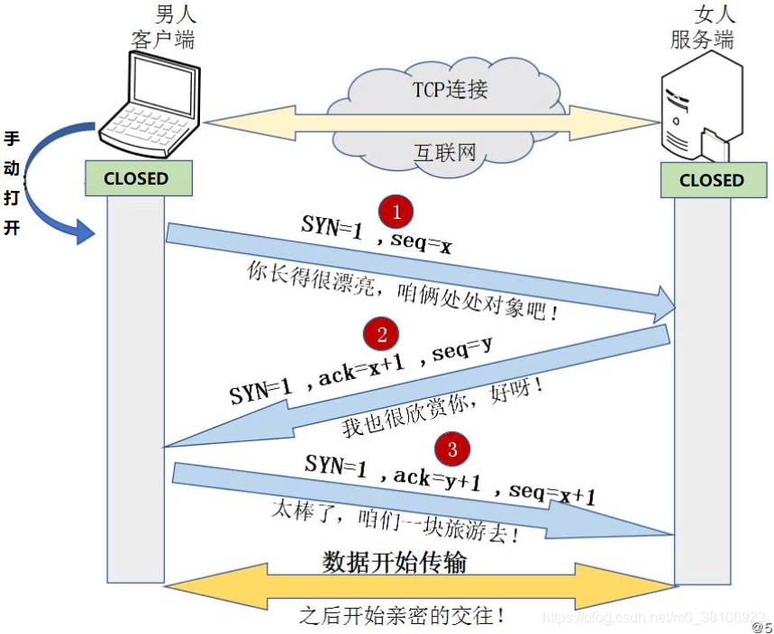

1. 客户端发送建立TCP连接的请求报文，其中报文中包含seq序列号，是由发送端随机生成的，并且将报文中的SYN字段置为1，表示需要建立TCP连接。（SYN=1，seq=x，x为随机生成数值）；
2. 服务端回复客户端发送的TCP连接请求报文，其中包含seq序列号，是由回复端随机生成的，并且将SYN置为1，而且会产生ACK字段，ACK字段数值是在客户端发送过来的序列号seq的基础上加1进行回复，以便客户端收到信息时，知晓自己的TCP建立请求已得到验证。（SYN=1，ACK=x+1，seq=y，y为随机生成数值）这里的ack加1可以理解为是确认和谁建立连接；

3. 客户端收到服务端发送的TCP建立验证请求后，会使自己的序列号加1表示，并且再次回复ACK验证请求，在服务端发过来的seq上加1进行回复。（SYN=1，ACK=y+1，seq=x+1）。
   

**为什么 TCP 链接需要三次握手，两次不可以么，为什么？**

第一步，客户端给服务端发送一条消息：你好，服务端。第二步，服务端收到消息，同时给客户端回复一条消息：收到！你好客户端。

这样的两次握手过程， 客户端给服务端打招呼，服务端收到了，说明客户端可以正常给服务端发送数据。但是服务端给客户端打招呼，服务端没有收到反馈，也就不能确保服务端是否能正常给客户端发送消息。

只有经过第三次握手，才能确保双向都可以接收到对方的发送的数据 第三步，客户端收到服务端发送的消息，回复：收到！这样就证明了客户端能正常收到服务端的消息。

#### 四次挥手

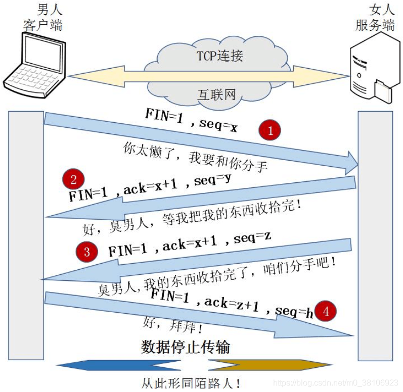

1. 客户端发送断开TCP连接请求的报文，其中报文中包含seq序列号，是由发送端随机生成的，并且还将报文中的FIN字段置为1，表示需要断开TCP连接。（`FIN=1，seq=x，x由客户端随机生成`）；

2. 服务端会回复客户端发送的TCP断开请求报文，其包含seq序列号，是由回复端随机生成的，而且会产生ACK字段，ACK字段数值是在客户端发过来的seq序列号基础上加1进行回复，以便客户端收到信息时，知晓自己的TCP断开请求已经得到验证。（`FIN=1，ACK=x+1，seq=y，y由服务端随机生成`）；

3. 服务端在回复完客户端的TCP断开请求后，不会马上进行TCP连接的断开，服务端会先确保断开前，所有传输到A的数据是否已经传输完毕，一旦确认传输数据完毕，就会将回复报文的FIN字段置1，并且产生随机seq序列号。（`FIN=1，ACK=x+1，seq=z，z由服务端随机生成`）；

4. 客户端收到服务端的TCP断开请求后，会回复服务端的断开请求，包含随机生成的seq字段和ACK字段，ACK字段会在服务端的TCP断开请求的seq基础上加1，从而完成服务端请求的验证回复。（`FIN=1，ACK=z+1，seq=h，h为客户端随机生成`）至此TCP断开的4次挥手过程完毕。
   

#### 使用场景

1. 网络会话
2. 文件传输
3. 发送接收邮件

4. 远程登录


#### 如何保证可靠

- 校验和：在数据传输过程中，将发送的数据段都当做一个16位的整数，将这些整数加起来，并且前面的进位不能丢弃，补在最后，然后取反，得到校验和。
- 序列号：TCP 传输时将每个字节的数据都进行了编号，这就是序列号。序列号的作用不仅仅是应答作用，有了序列号能够将接收到的数据根据序列号进行排序，并且去掉重复的数据
- 确认应答：TCP 传输过程中，每次接收方接收到数据后，都会对传输方进行确认应答，也就是发送 ACK 报文，这个 ACK 报文中带有对应的确认序列号，告诉发送方，接收了哪些数据，下一次数据从哪里传。
- 超时重传：在进行 TCP 传输时，由于存在确认应答与序列号机制，也就是说发送方发送一部分数据后，都会等待接收方发送的 ACK 报文，并解析 ACK 报文，判断数据是否传输成功。如果发送方发送完数据后，迟迟都没有接收到接收方传来的 ACK 报文，那么就对刚刚发送的数据进行重发。
- 连接管理：就是指三次握手、四次挥手的过程。
- 流量控制：如果发送方的发送速度太快，会导致接收方的接收缓冲区填充满了，这时候继续传输数据，就会造成大量丢包，进而引起丢包重传等等一系列问题。TCP 支持根据接收端的处理能力来决定发送端的发送速度，这就是流量控制机制。具体实现方式：接收端将自己的接收缓冲区大小放入 TCP 首部的『窗口大小』字段中，通过 ACK 通知发送端。
- 拥塞控制：TCP 传输过程中一开始就发送大量数据，如果当时网络非常拥堵，可能会造成拥堵加剧。所以 TCP 引入了慢启动机制，在开始发送数据的时候，先发少量的数据探探路。

#### **如何提高传输效率**

**滑动窗口**

如果每一个发送的数据段，都要收到 ACK 应答之后再发送下一个数据段，这样的话我们效率很低，大部分时间都用在了等待 ACK 应答上了。为了提高效率我们可以一次发送多条数据，这样就能使等待时间大大减少，从而提高性能。窗口大小指的是无需等待确认应答而可以继续发送数据的最大值。

**快重传**

快重传也叫高速重发控制。那么如果出现了丢包，需要进行重传。一般分为两种情况：情况一：数据包已经抵达，ACK被丢了。这种情况下，部分ACK丢了并不影响，因为可以通过后续的ACK进行确认；情况二：数据包直接丢了。发送端会连续收到多个相同的 ACK 确认，发送端立即将对应丢失的数据重传。

**延迟应答**

如果接收数据的主机立刻返回ACK应答，这时候返回的窗口大小可能比较小。

假设接收端缓冲区为1M，一次收到了512K的数据；如果立刻应答，返回的窗口就是512K；

但实际上可能处理端处理速度很快，10ms之内就把512K的数据从缓存区消费掉了；

在这种情况下，接收端处理还远没有达到自己的极限，即使窗口再放大一些，也能处理过来；

如果接收端稍微等一会在应答，比如等待200ms再应答，那么这个时候返回的窗口大小就是1M；

窗口越大，网络吞吐量就越大，传输效率就越高；我们的目标是在保证网络不拥塞的情况下尽量提高传输效率。

**捎带应答**

在延迟应答的基础上，很多情况下，客户端服务器在应用层也是一发一收的。这时候常常采用捎带应答的方式来提高效率，而ACK响应常常伴随着数据报文共同传输。如：三次握手。

#### **如何处理拥塞**

网络拥塞现象是指到达通信网络中某一部分的分组数量过多，使得该部分网络来不及处理，以致引起这部分乃至整个网络性能下降的现象，严重时甚至会导致网络通信业务陷入停顿，即出现死锁现象。拥塞控制是处理网络拥塞现象的一种机制。

拥塞控制的四个阶段:

- 慢启动

- 拥塞避免

- 快速重传

- 快速恢复


### UDP

#### **TCP 与 UDP 区别**

​                         

- TCP 向上层提供面向连接的可靠服务 ，UDP 向上层提供无连接不可靠服务。
- UDP 没有 TCP 传输可靠，但是可以在实时性要求搞的地方有所作为。
- 对数据准确性要求高，速度可以相对较慢的，可以选用TCP。

#### 应用场景

1. 语音
2. 视频
3. 直播

### **IP地址分类**

- A类：(1.0.0.0-126.0.0.0)一般用于大型网络。

- B类：(128.0.0.0-191.255.0.0)一般用于中等规模网络。

- C类：(192.0.0.0-223.255.255.0)一般用于小型网络。

- D类：是多播地址，地址的网络号取值于224~239之间，一般用于多路广播用户。

- E类：是保留地址。地址的网络号取值于240~255之间。


### HTTP

HTTP 协议，全称超文本传输协议（Hypertext Transfer Protocol）。顾名思义，HTTP 协议就是用来规范超文本的传输，超文本，也就是网络上的包括文本在内的各式各样的消，具体来说，主要是来规范浏览器和服务器端的行为的。

并且，HTTP 是一个无状态（stateless）协议，也就是说服务器不维护任何有关客户端过去所发请求的消息。这其实是一种懒政，有状态协议会更加复杂，需要维护状态（历史信息），而且如果客户或服务器失效，会产生状态的不一致，解决这种不一致的代价更高

#### HTTP 协议通信过程

HTTP 是应用层协议，它以 TCP（传输层）作为底层协议，默认端口为 80. 通信过程主要如下：

- 服务器在 80 端口等待客户的请求。
- 浏览器发起到服务器的 TCP 连接（创建套接字 Socket）。
- 服务器接收来自浏览器的 TCP 连接。
- 浏览器（HTTP 客户端）与 Web 服务器（HTTP 服务器）交换 HTTP 消息。
- 关闭 TCP 连接。

### **HTTPS **

随着 HTTPS 建站的成本下降，现在大部分的网站都已经开始用上 HTTPS 协议。大家都知道 HTTPS 比 HTTP 安全，也听说过与 HTTPS 协议相关的概念有 SSL 、非对称加密、 CA证书等，但对于以下灵魂三拷问可能就答不上了：

1. 为什么用了 HTTPS 就是安全的？
2. HTTPS 的底层原理如何实现？
3. 用了 HTTPS 就一定安全吗？

#### **实现原理**

大家可能都听说过 HTTPS 协议之所以是安全的是因为 HTTPS 协议会对传输的数据进行加密，而加密过程是使用了非对称加密实现。但其实，**HTTPS 在内容传输的加密上使用的是对称加密，非对称加密只作用在证书验证阶段。**

HTTPS的整体过程分为证书验证和数据传输阶段，具体的交互过程如下：

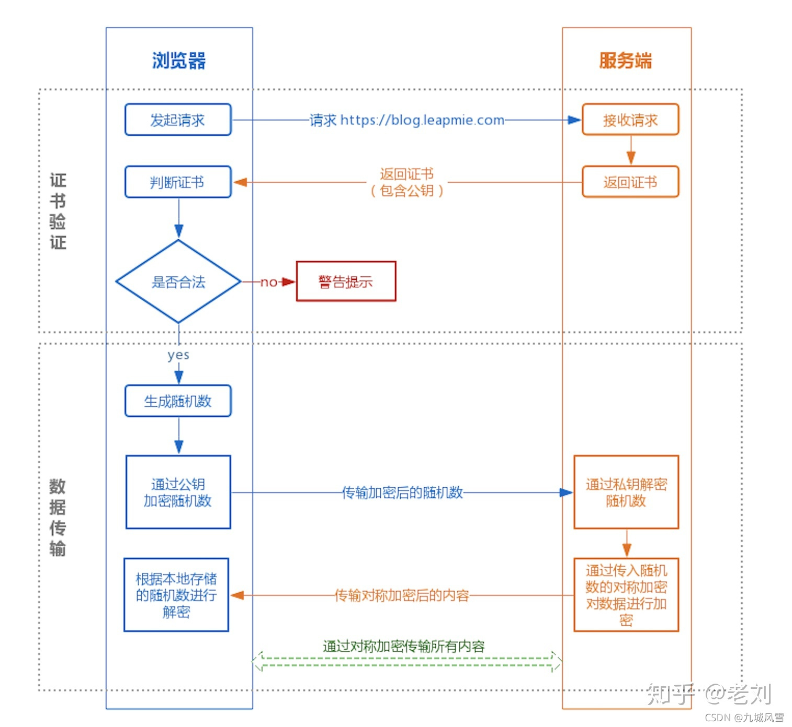

**证书验证阶段**

1. 浏览器发起 HTTPS 请求
2. 服务端返回 HTTPS 证书
3. 客户端验证证书是否合法，如果不合法则提示告警

**数据传输阶段**

1. 当证书验证合法后，在本地生成随机数
2. 通过公钥加密随机数，并把加密后的随机数传输到服务端
3. 服务端通过私钥对随机数进行解密
4. 服务端通过客户端传入的随机数构造对称加密算法，对返回结果内容进行加密后传输

**为什么数据传输是用对称加密？**

首先，非对称加密的加解密效率是非常低的，而 http 的应用场景中通常端与端之间存在大量的交互，非对称加密的效率是无法接受的；

另外，在 HTTPS 的场景中只有服务端保存了私钥，一对公私钥只能实现单向的加解密，所以 HTTPS 中内容传输加密采取的是对称加密，而不是非对称加密。

**为什么需要 CA 认证机构颁发证书？**

HTTP 协议被认为不安全是因为传输过程容易被监听者勾线监听、伪造服务器，而 HTTPS 协议主要解决的便是网络传输的安全性问题。

首先我们假设不存在认证机构，任何人都可以制作证书，这带来的安全风险便是经典的**“中间人攻击”**问题。

“中间人攻击”的具体过程如下：

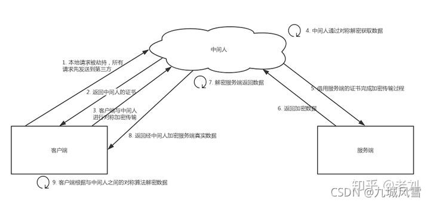
过程原理：

1. 本地请求被劫持（如DNS劫持等），所有请求均发送到中间人的服务器
2. 中间人服务器返回中间人自己的证书
3. 客户端创建随机数，通过中间人证书的公钥对随机数加密后传送给中间人，然后凭随机数构造对称加密对传输内容进行加密传输
4. 中间人因为拥有客户端的随机数，可以通过对称加密算法进行内容解密
5. 中间人以客户端的请求内容再向正规网站发起请求
6. 因为中间人与服务器的通信过程是合法的，正规网站通过建立的安全通道返回加密后的数据
7. 中间人凭借与正规网站建立的对称加密算法对内容进行解密
8. 中间人通过与客户端建立的对称加密算法对正规内容返回的数据进行加密传输
9. 客户端通过与中间人建立的对称加密算法对返回结果数据进行解密

由于缺少对证书的验证，所以客户端虽然发起的是 HTTPS 请求，但客户端完全不知道自己的网络已被拦截，传输内容被中间人全部窃取。

浏览器是如何确保 CA 证书的合法性？

**1. 证书包含什么信息？**

- 颁发机构信息
- 公钥
- 公司信息
- 域名
- 有效期
- 指纹
- …

**2. 证书的合法性依据是什么？**

首先，权威机构是要有认证的，不是随便一个机构都有资格颁发证书，不然也不叫做权威机构。另外，证书的可信性基于信任制，权威机构需要对其颁发的证书进行信用背书，只要是权威机构生成的证书，我们就认为是合法的。所以权威机构会对申请者的信息进行审核，不同等级的权威机构对审核的要求也不一样，于是证书也分为免费的、便宜的和贵的。

**3. 浏览器如何验证证书的合法性？**

浏览器发起 HTTPS 请求时，服务器会返回网站的 SSL 证书，浏览器需要对证书做以下验证：

1. 验证域名、有效期等信息是否正确。证书上都有包含这些信息，比较容易完成验证；
2. 判断证书来源是否合法。每份签发证书都可以根据验证链查找到对应的根证书，操作系统、浏览器会在本地存储权威机构的根证书，利用本地根证书可以对对应机构签发证书完成来源验证；


1. 判断证书是否被篡改。需要与 CA 服务器进行校验；
2. 判断证书是否已吊销。通过CRL（Certificate Revocation List 证书注销列表）和 OCSP（Online Certificate Status Protocol 在线证书状态协议）实现，其中 OCSP 可用于第3步中以减少与 CA 服务器的交互，提高验证效率

以上任意一步都满足的情况下浏览器才认为证书是合法的。

> 这里插一个我想了很久的但其实答案很简单的问题：
> 既然证书是公开的，如果要发起中间人攻击，我在官网上下载一份证书作为我的服务器证书，那客户端肯定会认同这个证书是合法的，如何避免这种证书冒用的情况？
> 其实这就是非加密对称中公私钥的用处，虽然中间人可以得到证书，但私钥是无法获取的，一份公钥是不可能推算出其对应的私钥，中间人即使拿到证书也无法伪装成合法服务端，因为无法对客户端传入的加密数据进行解密。

**4. 只有认证机构可以生成证书吗？**

如果需要浏览器不提示安全风险，那只能使用认证机构签发的证书。但浏览器通常只是提示安全风险，并不限制网站不能访问，所以从技术上谁都可以生成证书，只要有证书就可以完成网站的 HTTPS 传输。例如早期的 12306 采用的便是手动安装私有证书的形式实现 HTTPS 访问。


**本地随机数被窃取怎么办？**

证书验证是采用非对称加密实现，但是传输过程是采用对称加密，而其中对称加密算法中重要的随机数是由本地生成并且存储于本地的，HTTPS 如何保证随机数不会被窃取？

其实 HTTPS 并不包含对随机数的安全保证，HTTPS 保证的只是传输过程安全，而随机数存储于本地，本地的安全属于另一安全范畴，应对的措施有安装杀毒软件、反木马、浏览器升级修复漏洞等。

**用了 HTTPS 会被抓包吗？**

HTTPS 的数据是加密的，常规下抓包工具代理请求后抓到的包内容是加密状态，无法直接查看。

但是，正如前文所说，浏览器只会提示安全风险，如果用户授权仍然可以继续访问网站，完成请求。因此，只要客户端是我们自己的终端，我们授权的情况下，便可以组建中间人网络，而抓包工具便是作为中间人的代理。通常 HTTPS 抓包工具的使用方法是会生成一个证书，用户需要手动把证书安装到客户端中，然后终端发起的所有请求通过该证书完成与抓包工具的交互，然后抓包工具再转发请求到服务器，最后把服务器返回的结果在控制台输出后再返回给终端，从而完成整个请求的闭环。

既然 HTTPS 不能防抓包，那 HTTPS 有什么意义？
HTTPS 可以防止用户在不知情的情况下通信链路被监听，对于主动授信的抓包操作是不提供防护的，因为这个场景用户是已经对风险知情。要防止被抓包，需要采用应用级的安全防护，例如采用私有的对称加密，同时做好移动端的防反编译加固，防止本地算法被破解。

#### HTTPS 设计目标

(1) 数据保密性：保证数据内容在传输的过程中不会被第三方查看。就像快递员传递包裹一样，都进行了封装，别人无法获知里面装了什么 。

(2) 数据完整性：及时发现被第三方篡改的传输内容。就像快递员虽然不知道包裹里装了什么东西，但他有可能中途掉包，数据完整性就是指如果被掉包，我们能轻松发现并拒收 。

(3) 身份校验安全性：保证数据到达用户期望的目的地。就像我们邮寄包裹时，虽然是一个封装好的未掉包的包裹，但必须确定这个包裹不会送错地方，通过身份校验来确保送对了地方 。


#### HTTPS的优点

尽管HTTPS并非绝对安全，掌握根证书的机构、掌握加密算法的组织同样可以进行中间人形式的攻击，但HTTPS仍是现行架构下最安全的解决方案，主要有以下几个好处：

（1）使用HTTPS协议可认证用户和服务器，确保数据发送到正确的客户机和服务器；

（2）HTTPS协议是由SSL+HTTP协议构建的可进行加密传输、身份认证的网络协议，要比http协议安全，可防止数据在传输过程中不被窃取、改变，确保数据的完整性。

（3）HTTPS是现行架构下最安全的解决方案，虽然不是绝对安全，但它大幅增加了中间人攻击的成本。

（4）谷歌曾在2014年8月份调整搜索引擎算法，并称“比起同等HTTP网站，采用HTTPS加密的网站在搜索结果中的排名将会更高”。

#### HTTPS的缺点

虽然说HTTPS有很大的优势，但其相对来说，还是存在不足之处的：

（1）HTTPS协议握手阶段比较费时，会使页面的加载时间延长近50%，增加10%到20%的耗电；

（2）HTTPS连接缓存不如HTTP高效，会增加数据开销和功耗，甚至已有的安全措施也会因此而受到影响；

（3）SSL证书需要钱，功能越强大的证书费用越高，个人网站、小网站没有必要一般不会用。

（4）SSL证书通常需要绑定IP，不能在同一IP上绑定多个域名，IPv4资源不可能支撑这个消耗。

（5）HTTPS协议的加密范围也比较有限，在黑客攻击、拒绝服务攻击、服务器劫持等方面几乎起不到什么作用。最关键的，SSL证书的信用链体系并不安全，特别是在某些国家可以控制CA根证书的情况下，中间人攻击一样可行。

#### **总结**

以下用简短的Q&A形式进行全文总结：

Q: HTTPS 为什么安全？
A: 因为 HTTPS 保证了传输安全，防止传输过程被监听、防止数据被窃取，可以确认网站的真实性。

Q: HTTPS 的传输过程是怎样的？
A: 客户端发起 HTTPS 请求，服务端返回证书，客户端对证书进行验证，验证通过后本地生成用于改造对称加密算法的随机数，通过证书中的公钥对随机数进行加密传输到服务端，服务端接收后通过私钥解密得到随机数，之后的数据交互通过对称加密算法进行加解密。

Q: 为什么需要证书？
A: 防止”中间人“攻击，同时可以为网站提供身份证明。

Q: 使用 HTTPS 会被抓包吗？
A: 会被抓包，HTTPS 只防止用户在不知情的情况下通信被监听，如果用户主动授信，是可以构建“中间人”网络，代理软件可以对传输内容进行解密。

### 其他

**HTTP 1.0 vs HTTP 1.1（应用层）**

- 连接方式 : HTTP 1.0 为短连接，HTTP 1.1 支持长连接。
- 状态响应码 : HTTP/1.1中新加入了大量的状态码，光是错误响应状态码就新增了24种。比如说，100 (Continue)——在请求大资源前的预热请求，206 (Partial Content)——范围请求的标识码，409 (Conflict)——请求与当前资源的规定冲突，410 (Gone)——资源已被永久转移，而且没有任何已知的转发地址。
- 缓存处理 : 在 HTTP1.0 中主要使用 header 里的 If-Modified-Since,Expires 来做为缓存判断的标准，HTTP1.1 则引入了更多的缓存控制策略例如 Entity tag，If-Unmodified-Since, If-Match, If-None-Match 等更多可供选择的缓存头来控制缓存策略。
- 带宽优化及网络连接的使用 :HTTP1.0 中，存在一些浪费带宽的现象，例如客户端只是需要某个对象的一部分，而服务器却将整个对象送过来了，并且不支持断点续传功能，HTTP1.1 则在请求头引入了 range 头域，它允许只请求资源的某个部分，即返回码是 206（Partial Content），这样就方便了开发者自由的选择以便于充分利用带宽和连接。
- Host头处理 : HTTP/1.1在请求头中加入了Host字段。

**讲一下 http1.1 和 http2 有什么区别？**

HTTP1.1

持久连接

请求管道化

增加缓存处理（新的字段如cache-control）

增加 Host 字段、支持断点传输等

HTTP2.0

二进制分帧

多路复用（或连接共享）

头部压缩

服务器推送

**常见的状态码有哪些?**

1×× : 请求处理中，请求已被接受，正在处理

2×× : 请求成功，请求被成功处理 200 OK

3×× : 重定向，要完成请求必须进行进一步处理 301 : 永久性转移 302 ：暂时性转移 304 ：已缓存

4×× : 客户端错误，请求不合法 400：Bad Request,请求有语法问题 403：拒绝请求 404：客户端所访问的页面不存在

5×× : 服务器端错误，服务器不能处理合法请求 500 ：服务器内部错误 503 ：服务不可用，稍等

**http中常见的header字段有哪些？**

cookie，请求时传递给服务端的cookie信息

set-cookie，响应报文首部设置要传递给客户端的cookie信息 

allow，支持什么HTTP方法 

last-modified，资源的最后修改时间 

expires,设置资源缓存的失败日期 

content-language，实体的资源语言 

content-encoding，实体的编码格式 

content-length，实体主体部分的大小单位是字节 

content-range，返回的实体的哪些范围 

content-type，哪些类型 

accept-ranges，处理的范围请求 

age，告诉客户端服务器在多久前创建了响应 vary，代理服务器的缓存信息 

location，用于指定重定向后的URI 

If-Match，值是资源的唯一标识 

User-Agent，将创建请求的浏览器和用户代理名称等信息传递给服务器 

Transfer-Encoding，传输报文的主体编码方式 

connection，管理持久连接，keep-alive , close 

Cache-Control，控制浏览器的强缓存

**Get与POST的区别**

（1）GET 一般用来从服务器上获取资源，POST 一般用来创建资源；

（2）GET 是幂等的，即读取同一个资源，总是得到相同的数据，而 POST 不是幂等的。GET 不会改变服务器上的资源，而 POST 会对服务器资源进行改变；

（3）从请求参数形式上看，GET 请求的数据会附在URL之后；而 POST 请求会把提交的数据则放置在是HTTP请求报文的请求体中。


（4）POST 的安全性要比 GET 的安全性高，因为 GET 请求提交的数据将明文出现在 URL 上，而 POST 请求参数则被包装到请求体中，相对更安全。

1. GET 请求的长度受限于浏览器或服务器对URL长度的限制，允许发送的数据量比较小，而POST请求则是没有大小限制的。

**DNS 的寻址过程你知道吗？**

在浏览器中输入www.baidu.com域名，操作系统会先检查自己本地的 hosts 文件是否有这个网址映射关系，如果有就先调用这个IP地址映射，完成域名解析。

如果 hosts 里没有这个域名的映射，则查找本地 DNS 解析器缓存，是否有这个网址映射关系，如果有直接返回，完成域名解析。

果 hosts 与本地 DNS 解析器缓存都没有相应的网址映射关系，首先会找 TCP/IP 参数中设置的首选 DNS 服务器，在此我们叫它本地 DNS 服务器，此服务器收到查询时，如果要查询的域名，包含在本地配置区域资源中，则返回解析结果给客户机，完成域名解析，此解析具有权威性。

**在浏览器中输入一个www.baidu.com后执行的全部过程？**

域名解析 -> 建立TCP连接（三次握手）-> 发起http请求 -> 服务器响应http请求，浏览器得到html代码 -> 浏览器解析html代码，并请求html代码中的资源（如 js、css、图片等）-> 浏览器对页面进行渲染呈献给用户。

**Session、Cookie 的区别**

session 在服务器端，cookie 在客户端（浏览器）

session 的运行依赖 session id，而 session id 是存在 cookie 中的，也就是说，如果浏览器禁用了 cookie ，同时 session 也会失效（但是可以通过其它方式实现，比如在 url 中传递 session_id）

**有哪些 web 性能优化技术?**

DNS查询优化

客户端缓存

优化TCP连接

避免重定向

网络边缘的缓存

条件缓存

压缩和代码极简化

图片优化

1. ### **网络安全**

**什么是 XSS 攻击？**

XSS 即（Cross Site Scripting）中文名称为：跨站脚本攻击。XSS的重点不在于跨站点，而在于脚本的执行。

XSS的原理是：

恶意攻击者在web页面中会插入一些恶意的script代码。当用户浏览该页面的时候，那么嵌入到web页面中script代码会执行，因此会达到恶意攻击用户的目的。

**什么是跨站攻击CSRF？**

CSRF（Cross Site Request Forgery，跨站域请求伪造）是一种网络的攻击方式，它在 2007 年曾被列为互联网 20 大安全隐患之一，也被称为『One Click Attack』或者 『Session Riding』，通常缩写为CSRF或者XSRF，是一种对网站的恶意利用。

听起来像跨站脚本（XSS），但它与XSS非常不同，并且攻击方式几乎相左。

XSS利用站点内的信任用户，而CSRF则通过伪装来自受信任用户的请求来利用受信任的网站。与XSS攻击相比，CSRF攻击往往不大流行（因此对其进行防范的资源也相当稀少）和难以防范，所以被认为比XSS更具危险性。


1. ### **面试题**

**应用层有哪些常见的协议？**

HTTP:超文本传输协议

SMTP:简单邮件传输(发送)协议

POP3/IMAP:邮件接收的协议

FTP:文件传输协议

Telnet:远程登陆协议

SSH:安全的网络传输协议

**TCP 三次握手和四次挥手(面试常客)**

为什么要三次握手

三次握手的目的是建立可靠的通信信道，说到通讯，简单来说就是数据的发送与接收，而三次握手最主要的目的就是双方确认自己与对方的发送与接收是正常的。

第一次握手：Client 什么都不能确认；Server 确认了对方发送正常，自己接收正常

第二次握手：Client 确认了：自己发送、接收正常，对方发送、接收正常；Server 确认了：对方发送正常，自己接收正常

第三次握手：Client 确认了：自己发送、接收正常，对方发送、接收正常；Server 确认了：自己发送、接收正常，对方发送、接收正常

所以三次握手就能确认双方收发功能都正常，缺一不可                         

**第 2 次握手传回了 ACK，为什么还要传回 SYN？**

接收端传回发送端所发送的 ACK 是为了告诉客户端，我接收到的信息确实就是你所发送的信号了，这表明从客户端到服务端的通信是正常的。而回传 SYN 则是为了建立并确认从服务端到客户端的通信。

SYN 同步序列编号(Synchronize Sequence Numbers) 是 TCP/IP 建立连接时使用的握手信号客户机首先发出一个 SYN 消息，服务器使用 SYN-ACK 应答表示接收到了这个消息，最后客户机再以 ACK(Acknowledgement）消息响应。这样在客户机和服务器之间才能建立起可靠的 TCP 连接，数据才可以在客户机和服务器之间传递。


**为什么要四次挥手**

​                         

- 客户端-发送一个 FIN，用来关闭客户端到服务器的数据传送
- 服务器-收到这个 FIN，它发回一 个 ACK，确认序号为收到的序号加 1 。和 SYN 一样，一个 FIN 将占用一个序号
- 服务器-关闭与客户端的连接，发送一个 FIN 给客户端
- 客户端-发回 ACK 报文确认，并将确认序号设置为收到序号加 1


**在浏览器中输入 url 地址 ->> 显示主页的过程(面试常客)**

DNS 解析

TCP 连接

发送 HTTP 请求

服务器处理请求并返回 HTTP 报文

浏览器解析渲染页面

连接结束

​                         

**Cookie 的作用是什么? 和 Session 有什么区别**

Cookie 数据保存在客户端(浏览器端)，Session 数据保存在服务器端。


## 面向对象

### 三大特性

#### 封装

- 减少耦合：可以独立地开发、测试、优化、使用、理解和修改 减轻维护的负担: 
- 可以更容易被程序员理解，并且在调试的时候可以不影响其他模块 有效地调节性能: 
- 可以通过剖析确定哪些模块影响了系统的性能  
- 提高软件的可重用性  
- 降低了构建大型系统的风险: 即使整个系统不可用，但是这些独立的模块却有可能是可用的

#### 继承

继承实现了 IS-A （是）关系

#### 多态

- 编译时多态主要指方法的重载

- 运行时多态指程序中定义的对象引用所指向的具体类型在运行期间才确定，有三个条件 继承，覆盖，向上转型


### 访问权限

- public：最大访问控制权限，对所有的类都可见。

- protect：修饰的，在类内部、同一个包、子类中能访问。

- default：包访问权限，即同一个包中的类可以可见。默认不显式指定访问控制权限时就是default包访问控制权限。

- private：最严格的访问控制权限，仅该类本身可见。


### 内部类的作用

- 内部类提供了某种进入其外围类的窗口。

- 每个内部类都能独立的继承自一个（接口的）实现，所以无论外围类是否已经继承了某个（接口）的实现，对应内部类都没有影响。

- 内部类可以有多个实例，每个实例有自己的状态信息，与外围类相互独立。

- 单个外围类中，可以让多个内部类以不同的方式实现统一接口，或者继承同一个类。

- 创建内部类的对象并不依赖外围类对象的创建。

- 内部类没有令人迷惑的is-a的关系，是独立的实体。

- 内部类使得多重继承的解决方案更加完整。虽然接口解决可部分问题， 但是内部类有效的实现了多重继承。也就是说：内部类允许继承多个非接口类型(类或者抽象类)。 我认为这是内部类最重要的一个作用。（上述代码定义两个内部类，这两个内部类分别继承 Father（父亲）类和 Mother（母亲）类，且都可以获取各自父类的行为）

  ```java
  public class Son {
  
    // 内部类继承Father类
  
    class Father_1 extends Father {
      public int strong() {
        return super.strong() + 1;
     }
    }
  
    class Mother_1 extends Mother {
      public int kind() {
        return super.kind() - 2;
      }
    }
  
    public int getStrong() {
      return new Father_1().strong();
    }
  
    public int getKind() {
      return new Mother_1().kind();
    }
  
  }
  ```

### 父类的静态方法能否被子类重写？静态属性和静态方法是否可以被继承？

 父类的静态方法和属性不能被子类重写，但子类可以继承父类静态方法和属性

### 面向对象和面向过程的区别

- 面向过程把解决问题的过程拆成一个个方法，通过一个个方法的执行解决问题。

- 面向对象会先抽象出对象，然后用对象执行方法的方式解决问题。

- 面向对象开发的程序一般更易维护、易复用、易扩展

## 基础知识点

### Java 语言特点

- 简单易学；

- 面向对象（封装，继承，多态）；

- 平台无关性（ Java 虚拟机实现平台无关性）；

- 支持多线程（ C++ 语言没有内置的多线程机制，因此必须调用操作系统的多线程功能来进行多线程程序设计，而 Java 语言却提供了多线程支持）；

- 可靠性；

- 安全性；

- 支持网络编程并且很方便

- 编译与解释并存；


### 字节码的好处

Java 语言通过字节码的方式，在一定程度上解决了传统解释型语言执行效率低的问题，同时又保留了解释型语言可移植的特点

### 包装类型的缓存机制

- Byte,Short,Integer,Long 这 4 种包装类默认创建了数值 [-128，127] 的相应类型的缓存数据
- Character 创建了数值在 [0,127] 范围的缓存数据
- Boolean 直接返回 True or False。

基本数据类型存放在栈里，包装类栈里存放的是对象的引用，即值的地址，而值存放在堆里

### 常量池在哪里

- Java6和6之前，常量池是存放在方法区（永久代）中的。

- Java7，将常量池是存放到了堆中。

- Java8之后，取消了整个永久代区域，取而代之的是元空间。运行时常量池和静态常量池存放在元空间中，而字符串常量池依然存放在堆中。


### final的作用

- final修饰的常量不能被第二次赋值，并且final修饰的常量要用大写字符表示

- final修饰的类不能被继承和重写

- final防止指令重排序，保证多线程下的并发安全


### String不可变的好处

- 可以缓存 hash 值（因为 String 的 hash 值经常被使用，例如 String 用做 HashMap 的 key。不可变的特性可以使得 hash 值也不可变，因此只需要进行一次计算）

- String Pool（(字符串常量池） 的需要（如果一个 String 对象已经被创建过了，那么就会从 String Poo中取得引用。只有 String 是不可变的，才可能使用 String Pool。）

- String 经常作为参数，String 不可变性可以保证参数不可变。例如在作为网络连接参数的情况下如果 String 是可变的，那么在网络连接过程中，String 被改变，改变 String 对象的那一方以为现在连接的是其它主机，而实际情况却不一定是。

- 线程安全

### Java 9 为何要将 String 的底层实现由 char[] 改成了 byte[] ?

 Latin-1 和 UTF-16。如果字符串中包含的汉字没有超过 Latin-1 可表示范围内的字符，那就会使用 Latin-1 作为编码方案。Latin-1 编码方案下，byte 占一个字节(8 位)，char 占用 2 个字节（16），byte 相较 char 节省一半的内存空间。

### String 对象内存分配 (常量池和堆)

#### 内存分配策略

- String s ="" ：如果常量池存在 返回引用，不存在则在常量池创建返回引用

- String s = new String("abc ") ：实际上 abc 本身就是字符串常量池中的一个对象，在运行 new String() 时，把字符串常量池中的字符串 abc 复制到堆中，因此该方式不仅会在常量池中，还会在堆中创建 abc 字符串对象。 最后把 java 堆中对象的引用返回给 s 。

- 字符串常量重载 “+”：编译期，java 虚拟机就将常量字符串的 “+” 连接优化为连接后的值，最终只会创建一个对象。

- 字符串引用重载 “+”：s2 + "bc" 在被编译器执行的时候，会自动引入 StringBuilder 对象，调用其 append() 方法，最终调用 toString() 方法返回其在 堆中对象。StringBuilder 源码中查看一下 toString()调用了new String（）方法，因此是在堆里创建


#### String s1 = new String("abc");这句话创建了几个字符串对象？

- 创建一个的情况：字符串常量池中已经存在字符串abc，就不再需要在这里创建了，直接在堆中创建对象

- 创建两个的情况：字符串常量池中不存在字符串abc，就需要在字符串常量池和堆中都创建对象


### 字符串常量池存在哪里?

- 在 Java 7 之前，字符串常量池被放在运行时常量池中，它属于永久代。

- 而在 Java 7，有永久代，但已经逐步“去永久代”，字符串常量池、静态变量移除，保存在堆中；

- java8:取消永久代，类型信息、字段、方法、常量保存在本地内存的元空间，但字符串常量池、静态变量仍在堆中


###  String.intern()

可以保证相同内容的字符串变量引用同一的内存对象,会将对象放到字符串常量池内，底层代码时native。

### 抽象类与接口

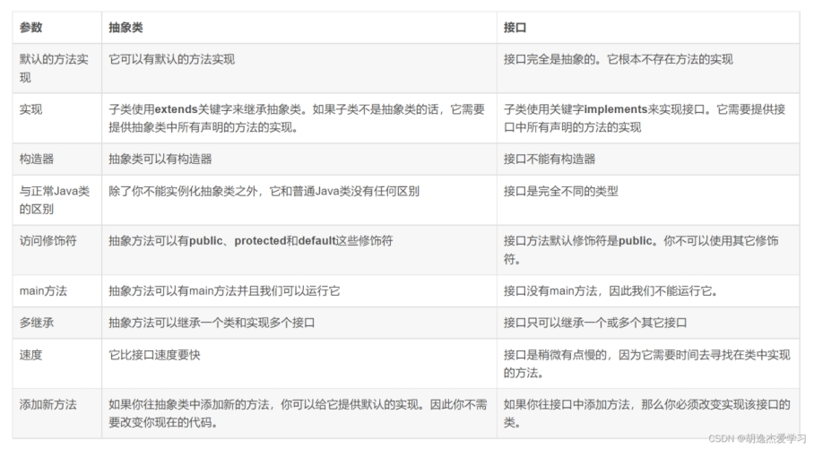 

- 从设计层面上看，抽象类提供了一种 IS-A 关系，那么就必须满足里式替换原则，即子类对象必须能够替换掉所有父类对象。而接口更像是一种 LIKE-A 关系，它只是提供一种方法实现契约，并不要求接口和实现接口的类具有 IS-A 关系。 

- 从使用上来看，一个类可以实现多个接口，但是不能继承多个抽象类。 

- 接口的字段只能是 static 和 fina类型的，而抽象类的字段没有这种限制。 

- 接口的成员只能是 public 的，而抽象类的成员可以有多种访问权限。


### 抽象类与普通类

- 抽象类的存在时为了被继承，不能实例化，而普通类存在是为了实例化一个对象

- 抽象类的子类必须重写抽象类中的抽象方法，而普通类可以选择重写父类的方法，也可以直接调用父类的方法

- 抽象类必须用abstract来修饰，普通类则不用

### JDK 1.7 中的三个新特性

- try-with-resource 

- 允许 Switch 中有 String 变量和文本

- 值得一提的特性是改善异常处理，如允许在同一个 catch 块中捕获多个异常

###  JDK1.8 引入的新特性? 

- Lambda 表达式，允许像对象一样传递匿名函数 Stream API，充分利用现代多核 CPU，可以写出很简洁的代码 

- Date 与 Time API，最终，有一个稳定、简单的日期和时间库可供你使用 

- 扩展方法，现在，接口中可以有静态、默认方法。 

- 重复注解，现在你可以将相同的注解在同一类型上使用多次


### Object 类的常见方法有哪些？

```java
1. public finanative Class<?> getClass()  native 方法，用于返回当前运行时对象的 Class 对象，使用了 fina关键字修饰，故不允许子类重写。

2. public native int hashCode()     用于返回对象的哈希码，主要使用在哈希表中，比如 JDK 中的HashMap

3. public boolean equals(Object obj) 用于比较 2 个对象的内存地址是否相等，String 类对该方法进行了重写以用于比较字符串的值是否相等。

4. protected native Object clone() throws CloneNotSupportedException  naitive 方法，用于创建并返回当前对象的一份拷贝。

5. public String toString()    返回类的名字实例的哈希码的 16 进制的字符串。建议 Object 所有的子类都重写这个方法。

6. public finanative void notify()  native 方法，并且不能重写。唤醒一个在此对象监视器上等待的线程(监视器相当于就是锁的概念)。如果有多个线程在等待只会任意唤醒一个。

7. public finanative void notifyAll()  native 方法，并且不能重写。跟 notify 一样，唯一的区别就是会唤醒在此对象监视器上等待的所有线程，而不是一个线程。

8. public finanative void wait(long timeout) throws InterruptedException  native方法，并且不能重写。暂停线程的执行。注意：sleep 方法没有释放锁，而 wait 方法释放了锁 ，timeout 是等待时间。

9. public finavoid wait(long timeout, int nanos) throws InterruptedException  多了 nanos 参数，这个参数表示额外时间（以毫微秒为单位，范围是 0-999999）。 所以超时的时间还需要加上 nanos 毫秒

10. public finavoid wait() throws InterruptedException 跟之前的2个wait方法一样，只不过该方法一直等待，没有超时时间这个概念

11. protected void finalize() throws Throwable { }  实例被垃圾回收器回收的时候触发的操作
```


###  Java 中，Comparator 与 Comparable 有什么不同? 

Comparable 接口用于定义对象的自然顺序，而 comparator 通常用于定义用户定制的顺序。Comparable 总是只有一个，但是可以有多个 comparator 来定义对象的顺序

### 异常类型

- 受检查异常：ClassNotFoundException， IOException ，FileNotFoundException 

- 运行时异常：NullPointerException， ArithmeticException(异常的运算 比如除以0)， ClassCastException(类型转换异常) ，IllegalArgumentException(非法参数异常)， IllegalStateException(响应超时异常)，IndexOutOfBoundsException(数组越界), NoSuchElementException，

- 错误类型：


### finally 中的代码一定会执行吗？

不一定的！在某些情况下，finally 中的代码不会被执行。

就比如说 finally 之前虚拟机被终止运行的话，finally 中的代码就不会被执行。


### 谈谈反射机制的优缺点

优点 ： 可以让咱们的代码更加灵活、为各种框架提供开箱即用的功能提供了便利

缺点 ：让我们在运行时有了分析操作类的能力，这同样也增加了安全问题。比如可以无视泛型参数的安全检查（泛型参数的安全检查发生在编译时）。另外，反射的性能也要稍差点，不过，对于框架来说实际是影响不大的。

### 获取 Class 对象的四种方式

1. 知道具体类的情况下可以使用：

   `Class alunbarClass = TargetObject.class;`

2. 通过 Class.forName()传入类的全路径获取：

   `Class alunbarClass1 = Class.forName("cn.javaguide.TargetObject");`

3. 通过对象实例instance.getClass()获取：

   TargetObject o = new TargetObject();

   Class alunbarClass2 = o.getClass();

4. 通过类加载器xxxClassLoader.loadClass()传入类路径获取:通过类加载器获取 Class 对象不会进行初始化，意味着不进行包括初始化等一系列步骤，静态代码块和静态对象不会得到执行

   `ClassLoader.getSystemClassLoader().loadClass("cn.javaguide.TargetObject");`

## 代理模式

代理模式是一种比较好理解的设计模式。简单来说就是 我们使用代理对象来代替对真实对象(reaobject)的访问，这样就可以在不修改原目标对象的前提下，提供额外的功能操作，扩展目标对象的功能。代理模式的主要作用是扩展目标对象的功能，比如说在目标对象的某个方法执行前后你可以增加一些自定义的操作。

### 静态代理实现步骤

- 定义一个接口及其实现类；

- 创建一个代理类同样实现这个接口

- 将目标对象注入进代理类，然后在代理类的对应方法调用目标类中的对应方法。这样的话，我们就可以通过代理类屏蔽对目标对象的访问，并且可以在目标方法执行前后做一些自己想做的事情。

- 静态代理中，我们对目标对象的每个方法的增强都是手动完成的（后面会具体演示代码），非常不灵活（比如接口一旦新增加方法，目标对象和代理对象都要进行修改）且麻烦(需要对每个目标类都单独写一个代理类)。 实际应用场景非常非常少，日常开发几乎看不到使用静态代理的场景。

- 上面我们是从实现和应用角度来说的静态代理，从 JVM 层面来说， 静态代理在编译时就将接口、实现类、代理类这些都变成了一个个实际的 class 文件。


### 动态代理

相比于静态代理来说，动态代理更加灵活。我们不需要针对每个目标类都单独创建一个代理类，并且也不需要我们必须实现接口，我们可以直接代理实现类( CGLIB 动态代理机制)。

从 JVM 角度来说，动态代理是在运行时动态生成类字节码，并加载到 JVM 中的。

#### JDK 动态代理机制

1. 定义一个接口及其实现类；

2. 自定义 InvocationHandler 并重写invoke方法，在 invoke 方法中我们会调用原生方法（被代理类的方法）并自定义一些处理逻辑；

3. 通过 Proxy.newProxyInstance(ClassLoader loader,Class<?>[] interfaces,InvocationHandler h) 方法创建代理对象；


#### CGLIB 动态代理机制

JDK 动态代理有一个最致命的问题是其只能代理实现了接口的类。

为了解决这个问题，我们可以用 CGLIB 动态代理机制来避免。

1. 定义一个类；

2. 自定义 MethodInterceptor 并重写 intercept 方法，intercept 用于拦截增强被代理类的方法，和 JDK 动态代理中的 invoke 方法类似；

3. 通过 Enhancer 类的 create()创建代理类；


Spring 中的 AOP 模块中：如果目标对象实现了接口，则默认采用 JDK 动态代理，否则采用 CGLIB 动态代理。

#### JDK 动态代理和 CGLIB 动态代理对比

- JDK 动态代理只能代理实现了接口的类或者直接代理接口，而 CGLIB 可以代理未实现任何接口的类。 另外， CGLIB 动态代理是通过生成一个被代理类的子类来拦截被代理类的方法调用，因此不能代理声明为 fina类型的类和方法。

- 就二者的效率来说，大部分情况都是 JDK 动态代理更优秀，随着 JDK 版本的升级，这个优势更加明显。


### 静态代理和动态代理的对比

- 灵活性 ：动态代理更加灵活，不需要必须实现接口，可以直接代理实现类，并且可以不需要针对每个目标类都创建一个代理类。另外，静态代理中，接口一旦新增加方法，目标对象和代理对象都要进行修改，这是非常麻烦的！

- JVM 层面 ：静态代理在编译时就将接口、实现类、代理类这些都变成了一个个实际的 class 文件。而动态代理是在运行时动态生成类字节码，并加载到 JVM 中的。


## 序列化

序列化是指将对象实例的状态存到存储媒体的过程，即持久化过程，抽象的讲把对象转化为可传输的字节序列过程

反序列化是指将存储在存储媒体中的对象状态装换成对象的过程，抽象把字节序列还原为对象的过程

### 序列化的机制

序列化最终的目的是为了对象可以跨平台存储和进行网络传输，而我们进行跨平台存储和网络传输的方式就是 IO，而 IO 支持的数据格式就是字节数组。

那现在的问题就是如何把对象转换成字节数组？这个很好办，一般的编程语言都有这个能力，可以很容易将对象转成字节数组。

仔细一想，我们单方面的把对象转成字节数组还不行，因为没有规则的字节数组我们是没办法把对象的本来面目还原回来的，简单说就是将对象转成字节数组容易但是将字节数组还原成对象就难了，所以我们必须在把对象转成字节数组的时候就制定一种规则（序列化），那么我们从 IO 流里面读出数据的时候再以这种规则把对象还原回来（反序列化）。

### 常见序列化的方式

（1）为什么我们要序列化？

因为我们需要将内存中的对象存储到媒介中，或者我们需要将一个对象通过网络传输到另外一个系统中。

（2）什么是序列化？

序列化就是把对象转化为可传输的字节序列过程；反序列化就是把字节序列还原为对象的过程。

（3）序列化的机制

序列化最终的目的是为了对象可以跨平台存储和进行网络传输，而我们进行跨平台存储和网络传输的方式就是 IO，而 IO 支持的数据格式就是字节数组。将对象转成字节数组的时候需要制定一种规则，这种规则就是序列化机制。

（4）常见序列化的方式

- JDK 原生 只需要类实现了Serializable接口，就可以通过ObjectOutputStream类将对象变成byte[]字节数组  不支持跨语言

- JSON   可读性强，支持跨平台，体积稍微逊色

- ProtoBuf  谷歌推出的，是一种语言无关、平台无关、可扩展的序列化结构数据的方法，它可用于通信协议、数据存储等。序列化后体积小，一般用于对传输性能有较高要求的系统。

- Hessian  是一个轻量级的二进制 web service 协议，主要用于传输二进制数据。在传输数据前 Hessian 支持将对象序列化成二进制流，相对于 JDK 原生序列化，Hessian序列化之后体积更小，性能更优。

- Kryo  是一个 Java 序列化框架，号称 Java 最快的序列化框架。Kryo 在序列化速度上很有优势，底层依赖于字节码生成机制。由于只能限定在 JVM 语言上，所以 Kryo 不支持跨语言使用。


（5）序列化技术的选型

选型最重要的就是要考虑这三个方面：协议是否支持跨平台、序列化的速度、序列化生成的体积。

### 序列化协议对应于 TCP/IP 4 层模型的哪一层？

因为，OSI 七层协议模型中的应用层、表示层和会话层对应的都是 TCP/IP 四层模型中的应用层，所以序列化协议属于 TCP/IP 协议应用层的一部分。


## IO模型

### 同步/阻塞

[【面试】迄今为止把同步/异步/阻塞/非阻塞/BIO/NIO/AIO讲的这么清楚的好文章（快快珍藏） (qq.com)](https://mp.weixin.qq.com/s/EVequWGVMWV5Ki2llFzdHg)

所谓同步/异步，关注的是能不能同时开工。所谓阻塞/非阻塞，关注的是能不能动。

- 同步阻塞，不能同时开工，也不能动。只有一条小道，一次只能过一辆车，可悲的是还TMD的堵上了, 相当于一个线程在等待。

- 同步非阻塞，不能同时开工，也不能动。只有一条小道，一次只能过一辆车，可悲的是还TMD的堵上了, 相当于一个线程在正常运行。

- 异步阻塞，可以同时开工，但不可以动。有多条路，每条路都可以跑车，可气的是全都TMD的堵上了, 相当于多个线程都在等待。

- 异步非阻塞，可以工时开工，也可以动。有多条路，每条路都可以跑车，很爽的是全都可以正常通行,  相当于多个线程都在正常运行。

**阻塞IO和不阻塞IO**

IO指的就是读入/写出数据的过程，和**等待**读入/写出数据的过程。一旦拿到数据后就变成了数据操作了，就不是IO了。拿网络IO来说，等待的过程就是数据从网络到网卡再到内核空间。读写的过程就是内核空间和用户空间的相互拷贝。

非阻塞IO就是用户线程不参与以上两个过程，即数据已经拷贝到用户空间后，才去通知用户线程，一上来就可以直接操作数据了。

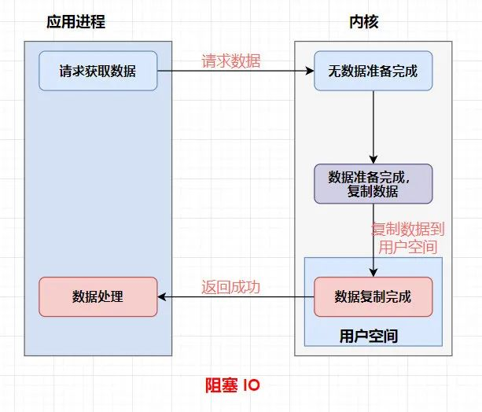

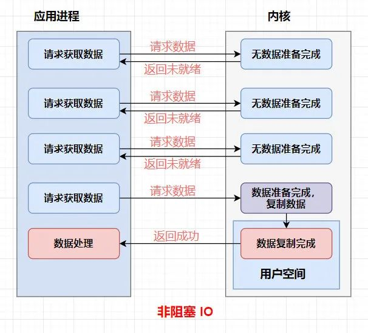


**同步IO和异步IO**

同步IO意味着必须拿到IO的数据，才可以继续执行。因为后续操作依赖IO数据，所以它必须是阻塞的。

异步IO是指发起IO请求后，不用拿到IO的数据就可以继续执行。


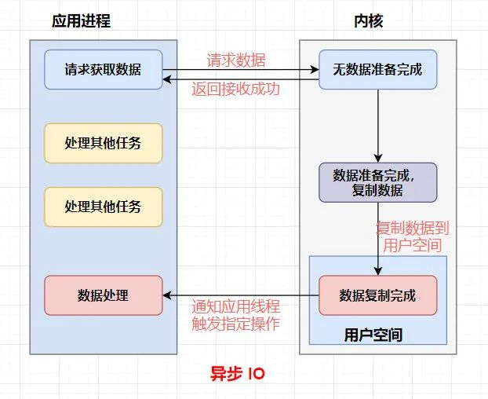


### BIO

BIO (Blocking I/O)属于同步阻塞 IO 模型 。

同步阻塞 IO 模型中，应用程序发起 read 调用后，会一直阻塞，直到内核把数据拷贝到用户空间。

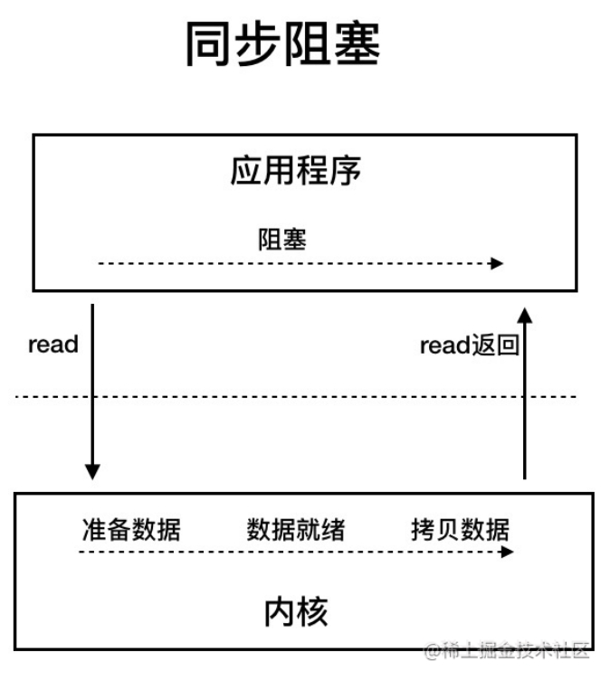


### NIO

NIO (Non-blocking/New I/O)

Java 中的 NIO 可以看作是 I/O 多路复用模型。也有很多人认为，Java 中的 NIO 属于同步非阻塞 IO 模型。

**同步非阻塞 IO 模型**

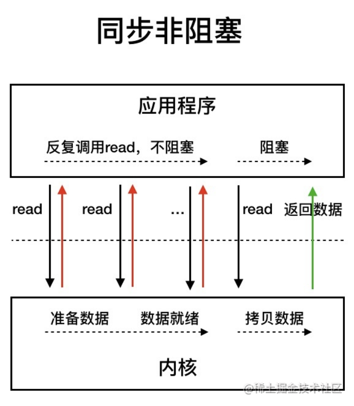 

同步非阻塞 IO 模型中，应用程序会一直发起 read 调用，等待数据从内核空间拷贝到用户空间的这段时间里，线程依然是阻塞的，直到在内核把数据拷贝到用户空间。

#### 三大核心组件

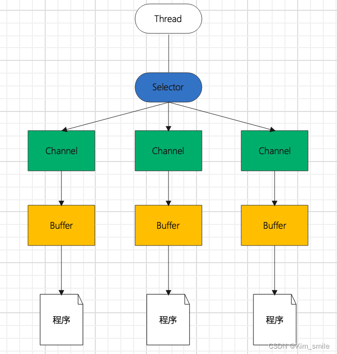

**Channel**


基本上所有的 IO 操作都是从 Channel 开始。数据可以从 Channel 读取到 Buffer 中，也可以从 Buffer 写到 Channel 中

Channel 有非常多的实现类，最为重要的**四个** Channel 实现类如下：

- SocketChannel ：一个客户端用来**发起** TCP 的 Channel 。
- ServerSocketChannel ：一个服务端用来**监听**新进来的连接的 TCP 的 Channel 。对于每一个新进来的连接，都会创建一个对应的 SocketChannel 。
- DatagramChannel ：通过 UDP 读写数据。
- FileChannel ：从文件中，读写数据。

**Buffer**


一个 Buffer ，本质上是内存中的一块，我们可以将数据写入这块内存，之后从这块内存获取数据。通过将这块内存封装成 NIO Buffer 对象，并提供了一组常用的方法，方便我们对该块内存的读写。

**基本属性**

- `capacity` 属性，容量，Buffer 能容纳的数据元素的**最大值**。这一容量在 Buffer 创建时被赋值，并且**永远不能被修改**。
- `position` 属性，位置，初始值为 0 
- `limit` 属性，上限。
- `mark` 属性，标记，通过 `#mark()` 方法，记录当前 `position` ；通过 `reset()` 方法，恢复 `position` 为标记。

**创建 Buffer**

`#allocate(int capacity)`,`\#wrap(array)` 返回的是 HeapByteBuffer 的堆内存对象

`#allocateDirect(int capacity)` 返回的是堆外内存对象

**Selector**

它是 Java NIO 核心组件中的一个，用于轮询一个或多个 NIO Channel 的状态是否处于可读、可写。如此，一个线程就可以管理多个 Channel ，也就说可以管理多个网络连接。也因此，Selector 也被称为**多路复用器**。

**那么 Selector 是如何轮询的呢？**

- 首先，需要将 Channel 注册到 Selector 中，这样 Selector 才知道哪些 Channel 是它需要管理的。
- 之后，Selector 会不断地轮询注册在其上的 Channel 。如果某个 Channel 上面发生了读或者写事件，这个 Channel 就处于就绪状态，会被 Selector 轮询出来，然后通过 SelectionKey 可以获取就绪 Channel 的集合，进行后续的 I/O 操作。

 **优点**

使用一个线程**能够**处理多个 Channel 的优点是，只需要更少的线程来处理 Channel 。事实上，可以使用一个线程处理所有的 Channel 。对于操作系统来说，线程之间上下文切换的开销很大，而且每个线程都要占用系统的一些资源( 例如 CPU、内存 )。因此，使用的线程越少越好。

 **缺点**

因为在一个线程中使用了多个 Channel ，因此会造成每个 Channel 处理效率的降低。

当然，Netty 在设计实现上，通过 n 个线程处理多个 Channel ，从而很好的解决了这样的缺点。其中，n 的指的是有限的线程数，默认情况下为 CPU * 2 。

**创建Select**

`Selector selector = Selector.open();`

**注册 Chanel 到 Selector**

```java
channel.configureBlocking(false); // <1>
SelectionKey key = channel.register(selector, SelectionKey.OP_READ);
```

如果一个 Channel 要注册到 Selector 中，那么该 Channel 必须是**非阻塞**

在 `#register(Selector selector, int interestSet)` 方法的**第二个参数**，表示一个“interest 集合”，意思是通过 Selector 监听 Channel 时，对**哪些**( 可以是多个 )事件感兴趣。可以监听四种不同类型的事件：

- Connect ：连接完成事件( TCP 连接 )，仅适用于客户端，对应 `SelectionKey.OP_CONNECT` 。
- Accept ：接受新连接事件，仅适用于服务端，对应 `SelectionKey.OP_ACCEPT` 。
- Read ：读事件，适用于两端，对应 `SelectionKey.OP_READ` ，表示 Buffer 可读。
- Write ：写时间，适用于两端，对应 `SelectionKey.OP_WRITE` ，表示 Buffer 可写。

**获取可操作的 Channel**

`Set selectedKeys = selector.selectedKeys();`


### AIO

AIO (Asynchronous I/O)

异步 IO 是基于事件和回调机制实现的，也就是应用操作之后会直接返回，不会堵塞在那里，当后台处理完成，操作系统会通知相应的线程进行后续的操作。

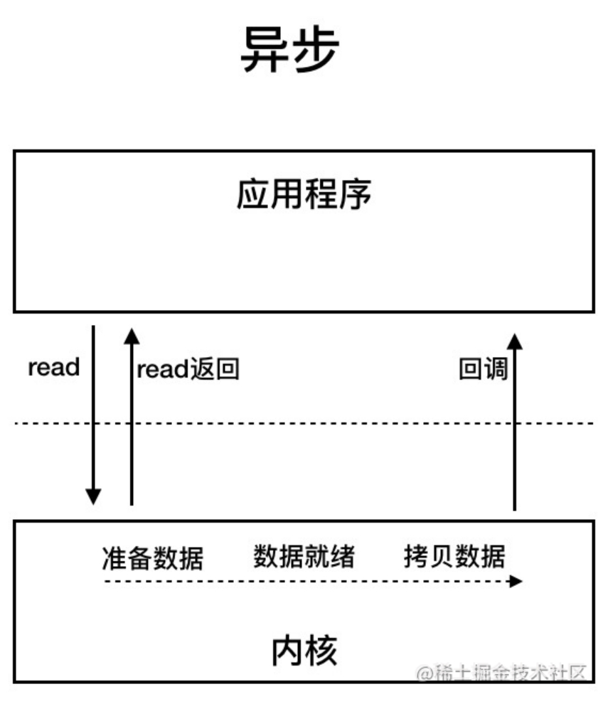 

### I/O 多路复用模型 

#### socket底层通信原理

[为什么网络 I/O 会被阻塞？ (qq.com)](https://mp.weixin.qq.com/s/RTJRzM1R7t344w5whESYmg)

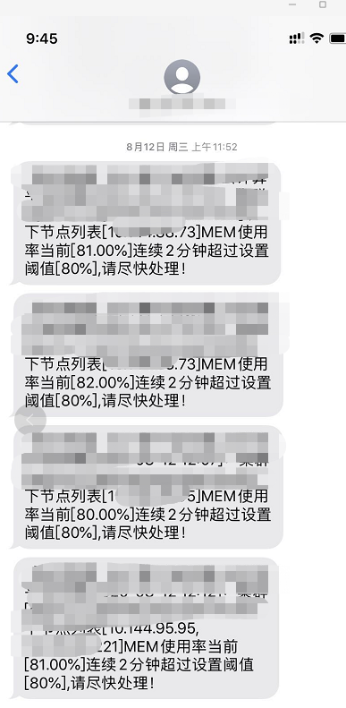

1. 创建 socket  `int socket(int domain, int type, int protocol);`

- domain：这个参数用于选择通信的协议族，比如选择 IPv4 通信，还是 IPv6 通信等等
- type：选择套接字类型，可选字节流套接字、数据报套接字等等。
- protocol：指定使用的协议,默认为0。

2. bind  IP 和端口, 服务器应用需要指明 IP 和端口，这样客户端才好找上门来要服务，所以此时我们需要指定一个地址和端口来与这个 socket 绑定一下

   `int bind(int sockfd, const struct sockaddr *addr, socklen_t addrlen);`

3. listen,   执行了 socket、bind 之后，此时的 socket 还处于 closed 的状态，也就是不对外监听的，然后我们需要调用 listen 方法，让 socket 进入被动监听状态，这样的 socket 才能够监听到客户端的连接请求。

   `int listen(int sockfd, int backlog);`

   传入创建的 socket 的 fd，并且指明一下 backlog 的大小。

   1. socket 有一个队列，同时存放已完成的连接和半连接，backlog为这个队列的大小。
   2. socket 有两个队列，分别为已完成的连接队列和半连接队列，backlog为这个两个队列的大小之和。
   3. socket 有两个队列，分别为已完成的连接队列和半连接队列，backlog仅为已完成的连接队列大小。

4. accpet     现在我们已经初始化好监听套接字了，此时会有客户端连上来，然后我们需要处理这些已经完成建连的连接。

5. 建立连接以后 read、write

   

   

#### IO复用原理

[IO 多路复用 (qq.com)](https://mp.weixin.qq.com/s/CMWlDywI1zbgJSoeGTBmuw)

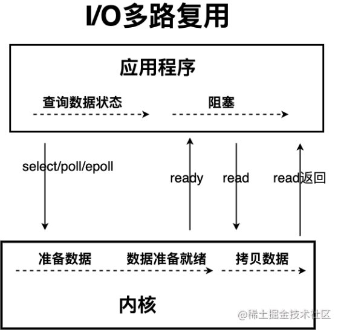 

IO 多路复用模型中，线程首先发起 select 调用，询问内核数据是否准备就绪，等内核把数据准备好了，用户线程再发起 read 调用。read 调用的过程（数据从内核空间 -> 用户空间）还是阻塞的。

目前支持 IO 多路复用的系统调用，有 select，epol等等。select 系统调用，目前几乎在所有的操作系统上都有支持。

select 调用 ：内核提供的系统调用，它支持一次查询多个系统调用的可用状态。几乎所有的操作系统都支持。

epol调用 ：linux 2.6 内核，属于 select 调用的增强版本，优化了 IO 的执行效率。

Java 中的 NIO ，有一个非常重要的选择器 ( Selector ) 的概念，也可以被称为 多路复用器。通过它，只需要一个线程便可以管理多个客户端连接。当客户端数据到了之后，才会为其服务。

#### select

当使用select函数的时候，先通知内核挂起进程，一旦一个或者多个IO事情发生，控制权将返回给应用程序，然后由应用程序进行IO处理,鉴于select所支持的描述符有限,只有1024个，随后提出poll解决这个问题

> 文件描述符：Linux 系统中，把一切都看做是文件（一切皆文件），当进程打开现有文件或创建新文件时，内核向进程返回一个文件描述符，文件描述符就是内核为了高效管理已被打开的文件所创建的索引，用来指向被打开的文件，所有执行I/O操作的系统调用都会通过文件描述符。
>
> 文件描述符、文件、进程间的关系：
>
> （1）每个文件描述符会与一个打开的文件相对应；
>
> （2）不同的文件描述符也可能指向同一个文件；
>
> （3）相同的文件可以被不同的进程打开，也可以在同一个进程被多次打开；
> 

select缺点:

1. select 调用需要传入 fd 数组，需要拷贝一份到内核，高并发场景下这样的拷贝消耗的资源是惊人的。（可优化为不复制）

2. select 在内核层仍然是通过遍历的方式检查文件描述符的就绪状态，是个同步过程，只不过无系统调用切换上下文的开销。（内核层可优化为异步事件通知）

3. select 仅仅返回可读文件描述符的个数，具体哪个可读还是要用户自己遍历。（可优化为只返回给用户就绪的文件描述符，无需用户做无效的遍历）

#### epoll

epol通过监控注册的多个描述字，来进行 I/O 事件的分发处理。不同于 pol的是，epol不仅提供了默认的 level-triggered（条件触发）机制，还提供了性能更为强劲的edge triggered（边缘触发）机制

优化select:

1. 内核中保存一份文件描述符集合，无需用户每次都重新传入，只需告诉内核修改的部分即可。

2. 内核不再通过轮询的方式找到就绪的文件描述符，而是通过异步 IO 事件唤醒。

3. 内核仅会将有 IO 事件的文件描述符返回给用户，用户也无需遍历整个文件描述符集合。

**epoll的底层实现**

- 当我们使用epoll_fd增加一个fd的时候，内核会为我们创建一个epitem实例，讲这个实例作为红黑树的节点，此时你就可以BB一些红黑树的性质，当然你如果遇到让你手撕红黑树的大哥，在最后的提问环节就让他写写吧

- 随后查找的每一个fd是否有事件发生就是通过红黑树的epitem来操作

- epoll维护一个链表来记录就绪事件，内核会当每个文件有事件发生的时候将自己登记到这个就绪列表，然后通过内核自身的文件file-eventpoll之间的回调和唤醒机制，减少对内核描述字的遍历，大俗事件通知和检测的效率


### Reactor 

[微信公众平台 (qq.com)](https://mp.weixin.qq.com/s/px6-YnPEUCEqYIp_YHhDzg)

#### Reactor 和 Proactor

I/O 多路复用技术会用一个系统调用函数来监听我们所有关心的连接，也就说可以在一个监控线程里面监控很多的连接。

Reactor 即 I/O 多路复用监听事件，收到事件后，根据事件类型分配（Dispatch）给某个进程 / 线程。

Reactor 模式主要由 Reactor 和处理资源池这两个核心部分组成，它俩负责的事情如下：

- Reactor 负责监听和分发事件，事件类型包含连接事件、读写事件；处理资源池负责处理事件，如 read -> 业务逻辑 -> send；

- Reactor 模式是灵活多变的，可以应对不同的业务场景，灵活在于：Reactor 的数量可以只有一个，也可以有多个；处理资源池可以是单个进程 / 线程，也可以是多个进程 /线程；


将上面的两个因素排列组设一下，理论上就可以有 4 种方案选择：

- 单 Reactor 单进程 / 线程；

- 单 Reactor 多进程 / 线程；

- 多 Reactor 单进程 / 线程（没有性能优势，没有应用）；

- 多 Reactor 多进程 / 线程；


Proactor 是异步网络模式， 感知的是已完成的读写事件。在发起异步读写请求时，需要传入数据缓冲区的地址（用来存放结果数据）等信息，这样系统内核才可以自动帮我们把数据的读写工作完成，这里的读写工作全程由操作系统来做，并不需要像 Reactor 那样还需要应用进程主动发起 read/write 来读写数据，操作系统完成读写工作后，就会通知应用进程直接处理数据

#### 单 Reactor 单进程

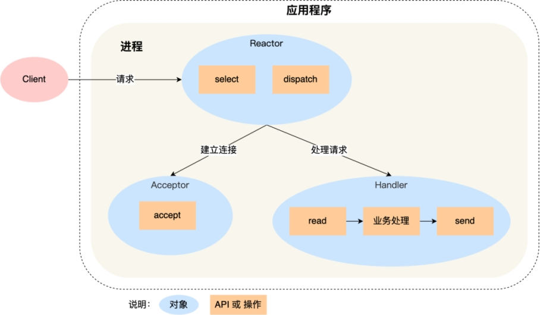

可以看到进程里有 Reactor、Acceptor、Handler 这三个对象：

- Reactor 对象的作用是监听和分发事件；

- Acceptor 对象的作用是获取连接；

- Handler 对象的作用是处理业务；


Reactor 对象通过 select （IO 多路复用接口） 监听事件，收到事件后通过 dispatch 进行分发，具体分发给 Acceptor 对象还是 Handler 对象，还要看收到的事件类型；

如果是连接建立的事件，则交由 Acceptor 对象进行处理，Acceptor 对象会通过 accept 方法 获取连接，并创建一个 Handler 对象来处理后续的响应事件；

如果不是连接建立事件， 则交由当前连接对应的 Handler 对象来进行响应；

Handler 对象通过 read -> 业务处理 -> send 的流程来完成完整的业务流程。

缺点

- 第一个缺点，因为只有一个进程，无法充分利用 多核 CPU 的性能；

- 第二个缺点，Handler 对象在业务处理时，整个进程是无法处理其他连接的事件的，如果业务处理耗时比较长，那么就造成响应的延迟

- 不适用计算机密集型的场景，只适用于业务处理非常快速的场景。

- Redis 是由 C 语言实现的，它采用的正是「单 Reactor 单进程」的方案，因为 Redis 业务处理主要是在内存中完成，操作的速度是很快的，性能瓶颈不在 CPU 上，所以 Redis 对于命令的处理是单进程的方案。


#### 单 Reactor 多进程/多线程

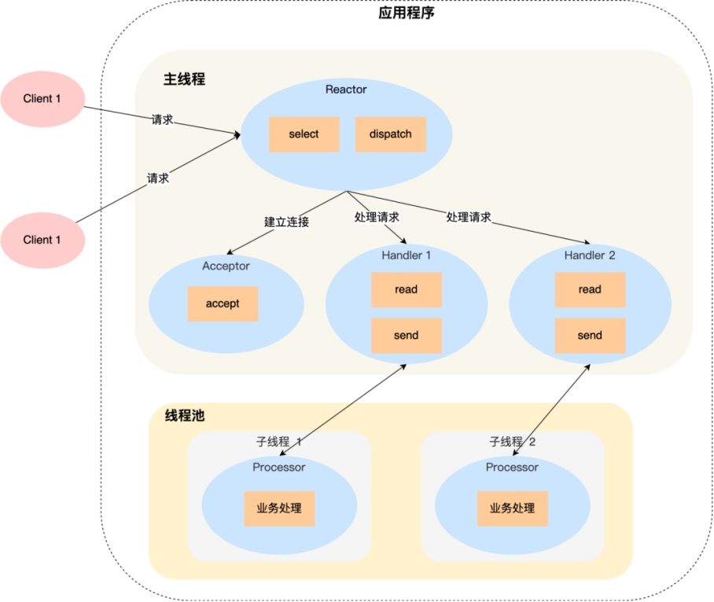

 

Reactor 对象通过 select （IO 多路复用接口） 监听事件，收到事件后通过 dispatch 进行分发，具体分发给 Acceptor 对象还是 Handler 对象，还要看收到的事件类型；

如果是连接建立的事件，则交由 Acceptor 对象进行处理，Acceptor 对象会通过 accept 方法 获取连接，并创建一个 Handler 对象来处理后续的响应事件；

如果不是连接建立事件， 则交由当前连接对应的 Handler 对象来进行响应；

Handler 对象不再负责业务处理，只负责数据的接收和发送，Handler 对象通过 read 读取到数据后，会将数据发给子线程里的 Processor 对象进行业务处理；

子线程里的 Processor 对象就进行业务处理，处理完后，将结果发给主线程中的 Handler 对象，接着由 Handler 通过 send 方法将响应结果发送给 client；

缺点：

- 因为一个 Reactor 对象承担所有事件的监听和响应，而且只在主线程中运行，在面对瞬间高并发的场景时，容易成为性能的瓶颈的地方。

- 多线程间可以共享数据，虽然要额外考虑并发问题，但是这远比进程间通信的复杂度低得多，因此实际应用中也看不到单 Reactor 多进程的模式


#### 多 Reactor 多进程/多线程

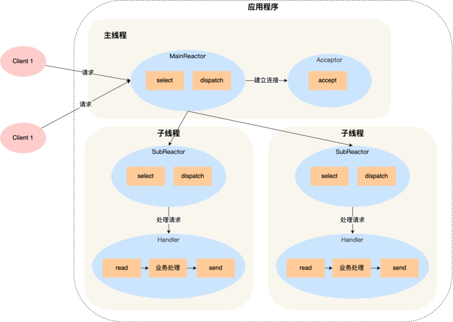

主线程中的 MainReactor 对象通过 select 监控连接建立事件，收到事件后通过 Acceptor 对象中的 accept  获取连接，将新的连接分配给某个子线程；

子线程中的 SubReactor 对象将 MainReactor 对象分配的连接加入 select 继续进行监听，并创建一个 Handler 用于处理连接的响应事件。

如果有新的事件发生时，SubReactor 对象会调用当前连接对应的 Handler 对象来进行响应。

Handler 对象通过 read -> 业务处理 -> send 的流程来完成完整的业务流程。

优点

- 主线程和子线程分工明确，主线程只负责接收新连接，子线程负责完成后续的业务处理。

- 主线程和子线程的交互很简单，主线程只需要把新连接传给子线程，子线程无须返回数据，直接就可以在子线程将处理结果发送给客户端。


Netty 和 Memcache 都采用了「多 Reactor 多线程」的方案。

采用了「多 Reactor 多进程」方案的开源软件是 Nginx，不过方案与标准的多 Reactor 多进程有些差异。

具体差异表现在主进程中仅仅用来初始化 socket，并没有创建 mainReactor 来 accept 连接，而是由子进程的 Reactor 来 accept 连接，通过锁来控制一次只有一个子进程进行 accept（防止出现惊群现象），子进程 accept 新连接后就放到自己的 Reactor 进行处理，不会再分配给其他子进程。


## 注解机制

### 元注解

#### @Target 被修饰的注解可以用在什么地方

-  TYPE, // 类、接口、枚举类

-  FIELD, // 成员变量（包括：枚举常量）

-  METHOD, // 成员方法

-  PARAMETER, // 方法参数

-  CONSTRUCTOR, // 构造方法

-  LOCAL_VARIABLE, // 局部变量

-  ANNOTATION_TYPE, // 注解类

-  PACKAGE, // 可用于修饰：包

-  TYPE_PARAMETER, // 类型参数，JDK 1.8 新增

-  TYPE_USE // 使用类型的任何地方，JDK 1.8 新增


#### @Retention 被描述的注解在它所修饰的类中可以被保留到何时

- SOURCE,   // 源文件保留

- CLASS,    // 编译期保留，默认值
- RUNTIME  // 运行期保留，可通过反射去获取注解信息

#### @Documented  描述在使用 javadoc 工具为类生成帮助文档时是否要保留其注解信息

#### @Inherited  被它修饰的Annotation将具有继承性。如果某个类使用了被@Inherited修饰的Annotation，则其子类将自动具有该注解

- 


