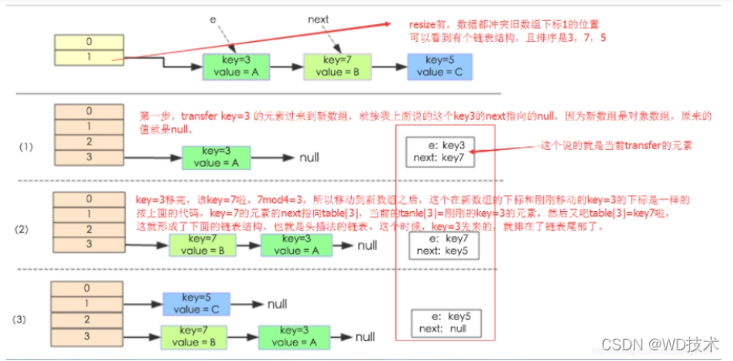
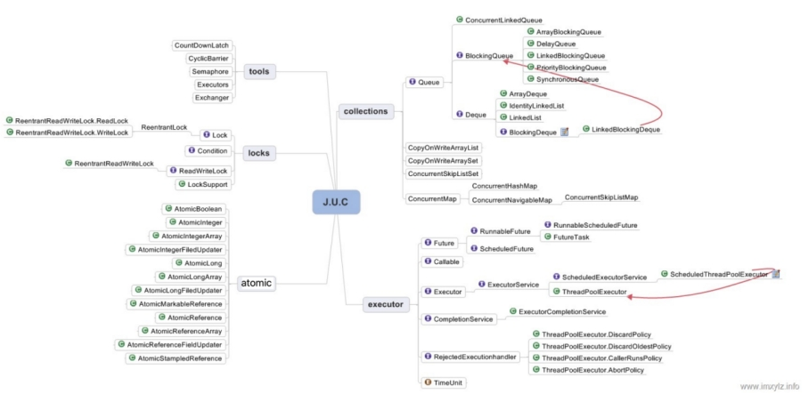

## 1.面向对象

### 三大特性

#### 封装

- 减少耦合：可以独立地开发、测试、优化、使用、理解和修改 减轻维护的负担: 
- 可以更容易被程序员理解，并且在调试的时候可以不影响其他模块 有效地调节性能: 
- 可以通过剖析确定哪些模块影响了系统的性能  
- 提高软件的可重用性  
- 降低了构建大型系统的风险: 即使整个系统不可用，但是这些独立的模块却有可能是可用的

#### 继承

继承实现了 IS-A （是）关系

#### 多态

- 编译时多态主要指方法的重载

- 运行时多态指程序中定义的对象引用所指向的具体类型在运行期间才确定，有三个条件 继承，覆盖，向上转型


### 访问权限

- public：最大访问控制权限，对所有的类都可见。

- protect：修饰的，在类内部、同一个包、子类中能访问。

- default：包访问权限，即同一个包中的类可以可见。默认不显式指定访问控制权限时就是default包访问控制权限。

- private：最严格的访问控制权限，仅该类本身可见。


### 内部类的作用

- 内部类提供了某种进入其外围类的窗口。

- 每个内部类都能独立的继承自一个（接口的）实现，所以无论外围类是否已经继承了某个（接口）的实现，对应内部类都没有影响。

- 内部类可以有多个实例，每个实例有自己的状态信息，与外围类相互独立。

- 单个外围类中，可以让多个内部类以不同的方式实现统一接口，或者继承同一个类。

- 创建内部类的对象并不依赖外围类对象的创建。

- 内部类没有令人迷惑的is-a的关系，是独立的实体。

- 内部类使得多重继承的解决方案更加完整。虽然接口解决可部分问题， 但是内部类有效的实现了多重继承。也就是说：内部类允许继承多个非接口类型(类或者抽象类)。 我认为这是内部类最重要的一个作用。（上述代码定义两个内部类，这两个内部类分别继承 Father（父亲）类和 Mother（母亲）类，且都可以获取各自父类的行为）

  ```java
  public class Son {
  
    // 内部类继承Father类
  
    class Father_1 extends Father {
      public int strong() {
        return super.strong() + 1;
     }
    }
  
    class Mother_1 extends Mother {
      public int kind() {
        return super.kind() - 2;
      }
    }
  
    public int getStrong() {
      return new Father_1().strong();
    }
  
    public int getKind() {
      return new Mother_1().kind();
    }
  
  }
  ```

### 父类的静态方法能否被子类重写？静态属性和静态方法是否可以被继承？

 父类的静态方法和属性不能被子类重写，但子类可以继承父类静态方法和属性

### 面向对象和面向过程的区别

- 面向过程把解决问题的过程拆成一个个方法，通过一个个方法的执行解决问题。

- 面向对象会先抽象出对象，然后用对象执行方法的方式解决问题。

- 面向对象开发的程序一般更易维护、易复用、易扩展

## 2.基础知识点

### Java 语言有哪些特点?

- 简单易学；

- 面向对象（封装，继承，多态）；

- 平台无关性（ Java 虚拟机实现平台无关性）；

- 支持多线程（ C++ 语言没有内置的多线程机制，因此必须调用操作系统的多线程功能来进行多线程程序设计，而 Java 语言却提供了多线程支持）；

- 可靠性；

- 安全性；

- 支持网络编程并且很方便

- 编译与解释并存；


### 采用字节码的好处是什么?

Java 语言通过字节码的方式，在一定程度上解决了传统解释型语言执行效率低的问题，同时又保留了解释型语言可移植的特点

### 包装类型的缓存机制了解么？

- Byte,Short,Integer,Long 这 4 种包装类默认创建了数值 [-128，127] 的相应类型的缓存数据
- Character 创建了数值在 [0,127] 范围的缓存数据
- Boolean 直接返回 True or False。

基本数据类型存放在栈里，包装类栈里存放的是对象的引用，即值的地址，而值存放在堆里

### 常量池在哪里？

- Java6和6之前，常量池是存放在方法区（永久代）中的。

- Java7，将常量池是存放到了堆中。

- Java8之后，取消了整个永久代区域，取而代之的是元空间。运行时常量池和静态常量池存放在元空间中，而字符串常量池依然存放在堆中。


### final的作用

- final修饰的常量不能被第二次赋值，并且final修饰的常量要用大写字符表示

- final修饰的类不能被继承和重写

- final防止指令重排序，保证多线程下的并发安全


### String不可变的好处

- 可以缓存 hash 值（因为 String 的 hash 值经常被使用，例如 String 用做 HashMap 的 key。不可变的特性可以使得 hash 值也不可变，因此只需要进行一次计算）

- String Pool（(字符串常量池） 的需要（如果一个 String 对象已经被创建过了，那么就会从 String Poo中取得引用。只有 String 是不可变的，才可能使用 String Pool。）

- String 经常作为参数，String 不可变性可以保证参数不可变。例如在作为网络连接参数的情况下如果 String 是可变的，那么在网络连接过程中，String 被改变，改变 String 对象的那一方以为现在连接的是其它主机，而实际情况却不一定是。

- 线程安全

### Java 9 为何要将 String 的底层实现由 char[] 改成了 byte[] ?

 Latin-1 和 UTF-16。如果字符串中包含的汉字没有超过 Latin-1 可表示范围内的字符，那就会使用 Latin-1 作为编码方案。Latin-1 编码方案下，byte 占一个字节(8 位)，char 占用 2 个字节（16），byte 相较 char 节省一半的内存空间。

### String 对象内存分配 (常量池和堆)

#### 内存分配策略

- String s ="" ：如果常量池存在 返回引用，不存在则在常量池创建返回引用

- String s = new String("abc ") ：实际上 abc 本身就是字符串常量池中的一个对象，在运行 new String() 时，把字符串常量池中的字符串 abc 复制到堆中，因此该方式不仅会在常量池中，还会在堆中创建 abc 字符串对象。 最后把 java 堆中对象的引用返回给 s 。

- 字符串常量重载 “+”：编译期，java 虚拟机就将常量字符串的 “+” 连接优化为连接后的值，最终只会创建一个对象。

- 字符串引用重载 “+”：s2 + "bc" 在被编译器执行的时候，会自动引入 StringBuilder 对象，调用其 append() 方法，最终调用 toString() 方法返回其在 堆中对象。StringBuilder 源码中查看一下 toString()调用了new String（）方法，因此是在堆里创建


#### String s1 = new String("abc");这句话创建了几个字符串对象？

- 创建一个的情况：字符串常量池中已经存在字符串abc，就不再需要在这里创建了，直接在堆中创建对象

- 创建两个的情况：字符串常量池中不存在字符串abc，就需要在字符串常量池和堆中都创建对象


### 字符串常量池存在哪里?

- 在 Java 7 之前，字符串常量池被放在运行时常量池中，它属于永久代。

- 而在 Java 7，有永久代，但已经逐步“去永久代”，字符串常量池、静态变量移除，保存在堆中；

- java8:取消永久代，类型信息、字段、方法、常量保存在本地内存的元空间，但字符串常量池、静态变量仍在堆中


###  String.intern()

可以保证相同内容的字符串变量引用同一的内存对象,会将对象放到字符串常量池内，底层代码时native。

### 抽象类与接口

 

- 从设计层面上看，抽象类提供了一种 IS-A 关系，那么就必须满足里式替换原则，即子类对象必须能够替换掉所有父类对象。而接口更像是一种 LIKE-A 关系，它只是提供一种方法实现契约，并不要求接口和实现接口的类具有 IS-A 关系。 

- 从使用上来看，一个类可以实现多个接口，但是不能继承多个抽象类。 

- 接口的字段只能是 static 和 fina类型的，而抽象类的字段没有这种限制。 

- 接口的成员只能是 public 的，而抽象类的成员可以有多种访问权限。


### 抽象类与普通类

- 抽象类的存在时为了被继承，不能实例化，而普通类存在是为了实例化一个对象

- 抽象类的子类必须重写抽象类中的抽象方法，而普通类可以选择重写父类的方法，也可以直接调用父类的方法

- 抽象类必须用abstract来修饰，普通类则不用

### JDK 1.7 中的三个新特性

- try-with-resource 

- 允许 Switch 中有 String 变量和文本

- 值得一提的特性是改善异常处理，如允许在同一个 catch 块中捕获多个异常

###  JDK1.8 引入的新特性? 

- Lambda 表达式，允许像对象一样传递匿名函数 Stream API，充分利用现代多核 CPU，可以写出很简洁的代码 

- Date 与 Time API，最终，有一个稳定、简单的日期和时间库可供你使用 

- 扩展方法，现在，接口中可以有静态、默认方法。 

- 重复注解，现在你可以将相同的注解在同一类型上使用多次


### Object 类的常见方法有哪些？

```java
1. public finanative Class<?> getClass()  native 方法，用于返回当前运行时对象的 Class 对象，使用了 fina关键字修饰，故不允许子类重写。

2. public native int hashCode()     用于返回对象的哈希码，主要使用在哈希表中，比如 JDK 中的HashMap

3. public boolean equals(Object obj) 用于比较 2 个对象的内存地址是否相等，String 类对该方法进行了重写以用于比较字符串的值是否相等。

4. protected native Object clone() throws CloneNotSupportedException  naitive 方法，用于创建并返回当前对象的一份拷贝。

5. public String toString()    返回类的名字实例的哈希码的 16 进制的字符串。建议 Object 所有的子类都重写这个方法。

6. public finanative void notify()  native 方法，并且不能重写。唤醒一个在此对象监视器上等待的线程(监视器相当于就是锁的概念)。如果有多个线程在等待只会任意唤醒一个。

7. public finanative void notifyAll()  native 方法，并且不能重写。跟 notify 一样，唯一的区别就是会唤醒在此对象监视器上等待的所有线程，而不是一个线程。

8. public finanative void wait(long timeout) throws InterruptedException  native方法，并且不能重写。暂停线程的执行。注意：sleep 方法没有释放锁，而 wait 方法释放了锁 ，timeout 是等待时间。

9. public finavoid wait(long timeout, int nanos) throws InterruptedException  多了 nanos 参数，这个参数表示额外时间（以毫微秒为单位，范围是 0-999999）。 所以超时的时间还需要加上 nanos 毫秒

10. public finavoid wait() throws InterruptedException 跟之前的2个wait方法一样，只不过该方法一直等待，没有超时时间这个概念

11. protected void finalize() throws Throwable { }  实例被垃圾回收器回收的时候触发的操作
```


###  Java 中，Comparator 与 Comparable 有什么不同? 

Comparable 接口用于定义对象的自然顺序，而 comparator 通常用于定义用户定制的顺序。Comparable 总是只有一个，但是可以有多个 comparator 来定义对象的顺序

### 异常类型

- 受检查异常：ClassNotFoundException， IOException ，FileNotFoundException 

- 运行时异常：NullPointerException， ArithmeticException(异常的运算 比如除以0)， ClassCastException(类型转换异常) ，IllegalArgumentException(非法参数异常)， IllegalStateException(响应超时异常)，IndexOutOfBoundsException(数组越界), NoSuchElementException，

- 错误类型：


### finally 中的代码一定会执行吗？

不一定的！在某些情况下，finally 中的代码不会被执行。

就比如说 finally 之前虚拟机被终止运行的话，finally 中的代码就不会被执行。

### 序列化协议对应于 TCP/IP 4 层模型的哪一层？

1. 网络接口层

2. 网络层

3. 传输层

4. 应用层

 

 	如上图所示，OSI 七层协议模型中，表示层做的事情主要就是对应用层的用户数据进行处理转换为二进制流。反过来的话，就是将二进制流转换成应用层的用户数据。这不就对应的是序列化和反序列化么？

因为，OSI 七层协议模型中的应用层、表示层和会话层对应的都是 TCP/IP 四层模型中的应用层，所以序列化协议属于 TCP/IP 协议应用层的一部分。

### 常见序列化协议对比

#### java.io.Serializable

不支持跨语言调用 : 如果调用的是其他语言开发的服务的时候就不支持了。

性能差 ：相比于其他序列化框架性能更低，主要原因是序列化之后的字节数组体积较大，导致传输成本加大。

#### Kryo

Kryo 是一个高性能的序列化/反序列化工具，由于其变长存储特性并使用了字节码生成机制，拥有较高的运行速度和较小的字节码体积。

#### Protobuf

Protobuf 出自于 Google，性能还比较优秀，也支持多种语言，同时还是跨平台的。就是在使用中过于繁琐，因为你需要自己定义 ID文件和生成对应的序列化代码。这样虽然不然灵活，但是，另一方面导致 protobuf 没有序列化漏洞的风险。

#### ProtoStuff

protostuff 基于 Google protobuf，但是提供了更多的功能和更简易的用法。虽然更加易用，但是不代表 ProtoStuff 性能更差。

#### hessian

hessian 是一个轻量级的,自定义描述的二进制 RPC 协议。hessian 是一个比较老的序列化实现了，并且同样也是跨语言的。

dubbo RPC 默认启用的序列化方式是 hessian2 ,但是，Dubbo 对 hessian2 进行了修改，不过大体结构还是差不多。

### 谈谈反射机制的优缺点

优点 ： 可以让咱们的代码更加灵活、为各种框架提供开箱即用的功能提供了便利

缺点 ：让我们在运行时有了分析操作类的能力，这同样也增加了安全问题。比如可以无视泛型参数的安全检查（泛型参数的安全检查发生在编译时）。另外，反射的性能也要稍差点，不过，对于框架来说实际是影响不大的。

### 获取 Class 对象的四种方式

1. 知道具体类的情况下可以使用：

   `Class alunbarClass = TargetObject.class;`

2. 通过 Class.forName()传入类的全路径获取：

   `Class alunbarClass1 = Class.forName("cn.javaguide.TargetObject");`

3. 通过对象实例instance.getClass()获取：

   TargetObject o = new TargetObject();

   Class alunbarClass2 = o.getClass();

4. 通过类加载器xxxClassLoader.loadClass()传入类路径获取:通过类加载器获取 Class 对象不会进行初始化，意味着不进行包括初始化等一系列步骤，静态代码块和静态对象不会得到执行

   `ClassLoader.getSystemClassLoader().loadClass("cn.javaguide.TargetObject");`

## 3.代理模式

代理模式是一种比较好理解的设计模式。简单来说就是 我们使用代理对象来代替对真实对象(reaobject)的访问，这样就可以在不修改原目标对象的前提下，提供额外的功能操作，扩展目标对象的功能。代理模式的主要作用是扩展目标对象的功能，比如说在目标对象的某个方法执行前后你可以增加一些自定义的操作。

### 静态代理实现步骤

- 定义一个接口及其实现类；

- 创建一个代理类同样实现这个接口

- 将目标对象注入进代理类，然后在代理类的对应方法调用目标类中的对应方法。这样的话，我们就可以通过代理类屏蔽对目标对象的访问，并且可以在目标方法执行前后做一些自己想做的事情。

- 静态代理中，我们对目标对象的每个方法的增强都是手动完成的（后面会具体演示代码），非常不灵活（比如接口一旦新增加方法，目标对象和代理对象都要进行修改）且麻烦(需要对每个目标类都单独写一个代理类)。 实际应用场景非常非常少，日常开发几乎看不到使用静态代理的场景。

- 上面我们是从实现和应用角度来说的静态代理，从 JVM 层面来说， 静态代理在编译时就将接口、实现类、代理类这些都变成了一个个实际的 class 文件。


### 动态代理

相比于静态代理来说，动态代理更加灵活。我们不需要针对每个目标类都单独创建一个代理类，并且也不需要我们必须实现接口，我们可以直接代理实现类( CGLIB 动态代理机制)。

从 JVM 角度来说，动态代理是在运行时动态生成类字节码，并加载到 JVM 中的。

#### JDK 动态代理机制

1. 定义一个接口及其实现类；

2. 自定义 InvocationHandler 并重写invoke方法，在 invoke 方法中我们会调用原生方法（被代理类的方法）并自定义一些处理逻辑；

3. 通过 Proxy.newProxyInstance(ClassLoader loader,Class<?>[] interfaces,InvocationHandler h) 方法创建代理对象；


#### CGLIB 动态代理机制

JDK 动态代理有一个最致命的问题是其只能代理实现了接口的类。

为了解决这个问题，我们可以用 CGLIB 动态代理机制来避免。

1. 定义一个类；

2. 自定义 MethodInterceptor 并重写 intercept 方法，intercept 用于拦截增强被代理类的方法，和 JDK 动态代理中的 invoke 方法类似；

3. 通过 Enhancer 类的 create()创建代理类；


Spring 中的 AOP 模块中：如果目标对象实现了接口，则默认采用 JDK 动态代理，否则采用 CGLIB 动态代理。

#### JDK 动态代理和 CGLIB 动态代理对比

- JDK 动态代理只能代理实现了接口的类或者直接代理接口，而 CGLIB 可以代理未实现任何接口的类。 另外， CGLIB 动态代理是通过生成一个被代理类的子类来拦截被代理类的方法调用，因此不能代理声明为 fina类型的类和方法。

- 就二者的效率来说，大部分情况都是 JDK 动态代理更优秀，随着 JDK 版本的升级，这个优势更加明显。


### 静态代理和动态代理的对比

- 灵活性 ：动态代理更加灵活，不需要必须实现接口，可以直接代理实现类，并且可以不需要针对每个目标类都创建一个代理类。另外，静态代理中，接口一旦新增加方法，目标对象和代理对象都要进行修改，这是非常麻烦的！

- JVM 层面 ：静态代理在编译时就将接口、实现类、代理类这些都变成了一个个实际的 class 文件。而动态代理是在运行时动态生成类字节码，并加载到 JVM 中的。


## 4.序列化

序列化是指将对象实例的状态存到存储媒体的过程，即持久化过程，抽象的讲把对象转化为可传输的字节序列过程

反序列化是指将存储在存储媒体中的对象状态装换成对象的过程，抽象把字节序列还原为对象的过程

### 序列化的机制

序列化最终的目的是为了对象可以跨平台存储和进行网络传输，而我们进行跨平台存储和网络传输的方式就是 IO，而 IO 支持的数据格式就是字节数组。

那现在的问题就是如何把对象转换成字节数组？这个很好办，一般的编程语言都有这个能力，可以很容易将对象转成字节数组。

仔细一想，我们单方面的把对象转成字节数组还不行，因为没有规则的字节数组我们是没办法把对象的本来面目还原回来的，简单说就是将对象转成字节数组容易但是将字节数组还原成对象就难了，所以我们必须在把对象转成字节数组的时候就制定一种规则（序列化），那么我们从 IO 流里面读出数据的时候再以这种规则把对象还原回来（反序列化）。

### 常见序列化的方式

（1）为什么我们要序列化？

因为我们需要将内存中的对象存储到媒介中，或者我们需要将一个对象通过网络传输到另外一个系统中。

（2）什么是序列化？

序列化就是把对象转化为可传输的字节序列过程；反序列化就是把字节序列还原为对象的过程。

（3）序列化的机制

序列化最终的目的是为了对象可以跨平台存储和进行网络传输，而我们进行跨平台存储和网络传输的方式就是 IO，而 IO 支持的数据格式就是字节数组。将对象转成字节数组的时候需要制定一种规则，这种规则就是序列化机制。

（4）常见序列化的方式

- JDK 原生 只需要类实现了Serializable接口，就可以通过ObjectOutputStream类将对象变成byte[]字节数组  不支持跨语言

- JSON   可读性强，支持跨平台，体积稍微逊色

- ProtoBuf  谷歌推出的，是一种语言无关、平台无关、可扩展的序列化结构数据的方法，它可用于通信协议、数据存储等。序列化后体积小，一般用于对传输性能有较高要求的系统。

- Hessian  是一个轻量级的二进制 web service 协议，主要用于传输二进制数据。在传输数据前 Hessian 支持将对象序列化成二进制流，相对于 JDK 原生序列化，Hessian序列化之后体积更小，性能更优。

- Kryo  是一个 Java 序列化框架，号称 Java 最快的序列化框架。Kryo 在序列化速度上很有优势，底层依赖于字节码生成机制。由于只能限定在 JVM 语言上，所以 Kryo 不支持跨语言使用。


（5）序列化技术的选型

选型最重要的就是要考虑这三个方面：协议是否支持跨平台、序列化的速度、序列化生成的体积。

## 5.IO模型

- 同步阻塞，相当于一个线程在等待。

- 同步非阻塞，相当于一个线程在正常运行。

- 异步阻塞，相当于多个线程都在等待。

- 异步非阻塞，相当于多个线程都在正常运行。

### BIO

BIO (Blocking I/O)属于同步阻塞 IO 模型 。

同步阻塞 IO 模型中，应用程序发起 read 调用后，会一直阻塞，直到内核把数据拷贝到用户空间。


### NIO

NIO (Non-blocking/New I/O)

Java 中的 NIO 可以看作是 I/O 多路复用模型。也有很多人认为，Java 中的 NIO 属于同步非阻塞 IO 模型。

#### 同步非阻塞 IO 模型

 

同步非阻塞 IO 模型中，应用程序会一直发起 read 调用，等待数据从内核空间拷贝到用户空间的这段时间里，线程依然是阻塞的，直到在内核把数据拷贝到用户空间。

#### I/O 多路复用模型 

 

IO 多路复用模型中，线程首先发起 select 调用，询问内核数据是否准备就绪，等内核把数据准备好了，用户线程再发起 read 调用。read 调用的过程（数据从内核空间 -> 用户空间）还是阻塞的。

目前支持 IO 多路复用的系统调用，有 select，epol等等。select 系统调用，目前几乎在所有的操作系统上都有支持。

select 调用 ：内核提供的系统调用，它支持一次查询多个系统调用的可用状态。几乎所有的操作系统都支持。

epol调用 ：linux 2.6 内核，属于 select 调用的增强版本，优化了 IO 的执行效率。

Java 中的 NIO ，有一个非常重要的选择器 ( Selector ) 的概念，也可以被称为 多路复用器。通过它，只需要一个线程便可以管理多个客户端连接。当客户端数据到了之后，才会为其服务。

### AIO

AIO (Asynchronous I/O)

异步 IO 是基于事件和回调机制实现的，也就是应用操作之后会直接返回，不会堵塞在那里，当后台处理完成，操作系统会通知相应的线程进行后续的操作。

 


### Reactor 和 Proactor

I/O 多路复用技术会用一个系统调用函数来监听我们所有关心的连接，也就说可以在一个监控线程里面监控很多的连接。

Reactor 即 I/O 多路复用监听事件，收到事件后，根据事件类型分配（Dispatch）给某个进程 / 线程。

Reactor 模式主要由 Reactor 和处理资源池这两个核心部分组成，它俩负责的事情如下：

- Reactor 负责监听和分发事件，事件类型包含连接事件、读写事件；处理资源池负责处理事件，如 read -> 业务逻辑 -> send；

- Reactor 模式是灵活多变的，可以应对不同的业务场景，灵活在于：Reactor 的数量可以只有一个，也可以有多个；处理资源池可以是单个进程 / 线程，也可以是多个进程 /线程；


将上面的两个因素排列组设一下，理论上就可以有 4 种方案选择：

- 单 Reactor 单进程 / 线程；

- 单 Reactor 多进程 / 线程；

- 多 Reactor 单进程 / 线程（没有性能优势，没有应用）；

- 多 Reactor 多进程 / 线程；


Proactor 是异步网络模式， 感知的是已完成的读写事件。在发起异步读写请求时，需要传入数据缓冲区的地址（用来存放结果数据）等信息，这样系统内核才可以自动帮我们把数据的读写工作完成，这里的读写工作全程由操作系统来做，并不需要像 Reactor 那样还需要应用进程主动发起 read/write 来读写数据，操作系统完成读写工作后，就会通知应用进程直接处理数据

### 单 Reactor 单进程


可以看到进程里有 Reactor、Acceptor、Handler 这三个对象：

- Reactor 对象的作用是监听和分发事件；

- Acceptor 对象的作用是获取连接；

- Handler 对象的作用是处理业务；


Reactor 对象通过 select （IO 多路复用接口） 监听事件，收到事件后通过 dispatch 进行分发，具体分发给 Acceptor 对象还是 Handler 对象，还要看收到的事件类型；

如果是连接建立的事件，则交由 Acceptor 对象进行处理，Acceptor 对象会通过 accept 方法 获取连接，并创建一个 Handler 对象来处理后续的响应事件；

如果不是连接建立事件， 则交由当前连接对应的 Handler 对象来进行响应；

Handler 对象通过 read -> 业务处理 -> send 的流程来完成完整的业务流程。

缺点

- 第一个缺点，因为只有一个进程，无法充分利用 多核 CPU 的性能；

- 第二个缺点，Handler 对象在业务处理时，整个进程是无法处理其他连接的事件的，如果业务处理耗时比较长，那么就造成响应的延迟

- 不适用计算机密集型的场景，只适用于业务处理非常快速的场景。

- Redis 是由 C 语言实现的，它采用的正是「单 Reactor 单进程」的方案，因为 Redis 业务处理主要是在内存中完成，操作的速度是很快的，性能瓶颈不在 CPU 上，所以 Redis 对于命令的处理是单进程的方案。


### 单 Reactor 多进程/多线程


 

Reactor 对象通过 select （IO 多路复用接口） 监听事件，收到事件后通过 dispatch 进行分发，具体分发给 Acceptor 对象还是 Handler 对象，还要看收到的事件类型；

如果是连接建立的事件，则交由 Acceptor 对象进行处理，Acceptor 对象会通过 accept 方法 获取连接，并创建一个 Handler 对象来处理后续的响应事件；

如果不是连接建立事件， 则交由当前连接对应的 Handler 对象来进行响应；

Handler 对象不再负责业务处理，只负责数据的接收和发送，Handler 对象通过 read 读取到数据后，会将数据发给子线程里的 Processor 对象进行业务处理；

子线程里的 Processor 对象就进行业务处理，处理完后，将结果发给主线程中的 Handler 对象，接着由 Handler 通过 send 方法将响应结果发送给 client；

缺点：

- 因为一个 Reactor 对象承担所有事件的监听和响应，而且只在主线程中运行，在面对瞬间高并发的场景时，容易成为性能的瓶颈的地方。

- 多线程间可以共享数据，虽然要额外考虑并发问题，但是这远比进程间通信的复杂度低得多，因此实际应用中也看不到单 Reactor 多进程的模式


### 多 Reactor 多进程/多线程


主线程中的 MainReactor 对象通过 select 监控连接建立事件，收到事件后通过 Acceptor 对象中的 accept  获取连接，将新的连接分配给某个子线程；

子线程中的 SubReactor 对象将 MainReactor 对象分配的连接加入 select 继续进行监听，并创建一个 Handler 用于处理连接的响应事件。

如果有新的事件发生时，SubReactor 对象会调用当前连接对应的 Handler 对象来进行响应。

Handler 对象通过 read -> 业务处理 -> send 的流程来完成完整的业务流程。

优点

- 主线程和子线程分工明确，主线程只负责接收新连接，子线程负责完成后续的业务处理。

- 主线程和子线程的交互很简单，主线程只需要把新连接传给子线程，子线程无须返回数据，直接就可以在子线程将处理结果发送给客户端。


Netty 和 Memcache 都采用了「多 Reactor 多线程」的方案。

采用了「多 Reactor 多进程」方案的开源软件是 Nginx，不过方案与标准的多 Reactor 多进程有些差异。

具体差异表现在主进程中仅仅用来初始化 socket，并没有创建 mainReactor 来 accept 连接，而是由子进程的 Reactor 来 accept 连接，通过锁来控制一次只有一个子进程进行 accept（防止出现惊群现象），子进程 accept 新连接后就放到自己的 Reactor 进行处理，不会再分配给其他子进程。

### Select/poll/epoll

[「网络IO套路」当时就靠它追到女友 (qq.com)](https://mp.weixin.qq.com/s?__biz=MzAwNDA2OTM1Ng==&mid=2453146772&idx=2&sn=689db364f8cbb82bf60c570103f2aa77&scene=21#wechat_redirect)

#### select

当使用select函数的时候，先通知内核挂起进程，一旦一个或者多个IO事情发生，控制权将返回给应用程序，然后由应用程序进行IO处理,鉴于select所支持的描述符有限，随后提出poll解决这个问题

#### epoll

epol通过监控注册的多个描述字，来进行 I/O 事件的分发处理。不同于 pol的是，epol不仅提供了默认的 level-triggered（条件触发）机制，还提供了性能更为强劲的edge triggered（边缘触发）机制

**epoll的底层实现**

- 当我们使用epoll_fd增加一个fd的时候，内核会为我们创建一个epitem实例，讲这个实例作为红黑树的节点，此时你就可以BB一些红黑树的性质，当然你如果遇到让你手撕红黑树的大哥，在最后的提问环节就让他写写吧

- 随后查找的每一个fd是否有事件发生就是通过红黑树的epitem来操作

- epoll维护一个链表来记录就绪事件，内核会当每个文件有事件发生的时候将自己登记到这个就绪列表，然后通过内核自身的文件file-eventpoll之间的回调和唤醒机制，减少对内核描述字的遍历，大俗事件通知和检测的效率


 

 

 

 

 

 


## 6. 注解机制

### 元注解

#### @Target 被修饰的注解可以用在什么地方

-  TYPE, // 类、接口、枚举类

-  FIELD, // 成员变量（包括：枚举常量）

-  METHOD, // 成员方法

-  PARAMETER, // 方法参数

-  CONSTRUCTOR, // 构造方法

-  LOCAL_VARIABLE, // 局部变量

-  ANNOTATION_TYPE, // 注解类

-  PACKAGE, // 可用于修饰：包

-  TYPE_PARAMETER, // 类型参数，JDK 1.8 新增

-  TYPE_USE // 使用类型的任何地方，JDK 1.8 新增


#### @Retention 被描述的注解在它所修饰的类中可以被保留到何时

- SOURCE,   // 源文件保留

- CLASS,    // 编译期保留，默认值
- RUNTIME  // 运行期保留，可通过反射去获取注解信息

#### @Documented  描述在使用 javadoc 工具为类生成帮助文档时是否要保留其注解信息

#### @Inherited  被它修饰的Annotation将具有继承性。如果某个类使用了被@Inherited修饰的Annotation，则其子类将自动具有该注解

## 7. Java集合

### List

#### ArrayList

##### 自动扩容

通过一个公开的方法ensureCapacity(int minCapacity)来实现,最终是通过grow()方法完成的,数组进行扩容时，默认初始容量大小为10，会将老数组中的元素重新拷贝一份到新的数组中，每次数组容量的增长大约是其原容量的1.5倍

##### remove()

`elementData[--size] = null;` //清除该位置的引用，让GC起作用,如果不手动赋null值，除非对应的位置被其他元素覆盖，否则原来的对象就一直不会被回收

##### 线程不安全

#### LinkedList

底层双向链表

#### Queue

- Queue 是单端队列，只能从一端插入元素，另一端删除元素，实现上一般遵循 先进先出（FIFO） 规则。

- Deque 是双端队列，在队列的两端均可以插入或删除元素。


##### 说一说 PriorityQueue

- PriorityQueue 是在 JDK1.5 中被引入的, 其与 Queue 的区别在于元素出队顺序是与优先级相关的，即总是优先级最高的元素先出队。

- PriorityQueue 利用了二叉堆的数据结构来实现的，底层使用可变长的数组来存储数据

- PriorityQueue 通过堆元素的上浮和下沉，实现了在 O(logn) 的时间复杂度内插入元素和删除堆顶元素。

- PriorityQueue 是非线程安全的，且不支持存储 NUL和 non-comparable 的对象。

- PriorityQueue 默认是小顶堆，但可以接收一个 Comparator 作为构造参数，从而来自定义元素优先级的先后。


 

#### 总结

##### ArrayDeque 与 LinkedList 的区别

- ArrayDeque 是基于可变长的数组和双指针来实现，而 LinkedList 则通过链表来实现。

- ArrayDeque 不支持存储 NUL数据，但 LinkedList 支持。

- ArrayDeque 是在 JDK1.6 才被引入的，而LinkedList 早在 JDK1.2 时就已经存在。

- ArrayDeque 插入时可能存在扩容过程, 不过均摊后的插入操作依然为 O(1)。虽然 LinkedList 不需要扩容，但是每次插入数据时均需要申请新的堆空间，均摊性能相比更慢。


### Map

#### HashMap

get(Object key)方法:

根据指定的key值返回对应的value，该方法调用了getEntry(Object key)得到相应的entry，然后返回entry.getValue()。因此getEntry()是算法的核心。算法思想是首先通过hash()函数得到对应bucket的下标，然后依次遍历冲突链表，通过key.equals(k)方法来判断是否是要找的那个entry。

put()

put(K key, V value)方法是将指定的key, value对添加到map里。该方法首先会对map做一次查找，看是否包含该元组，如果已经包含则直接返回，查找过程类似于getEntry()方法；如果没有找到，则会通过addEntry(int hash, K key, V value, int bucketIndex)方法插入新的entry，插入方式为头插法。元素个数大于数组*0.75，进行2倍扩容

HashMap 的底层实现

#JDK1.8 之前

JDK1.8 之前 HashMap 底层是 数组和链表 结合在一起使用也就是 链表散列。HashMap 通过 key 的 hashCode 经过扰动函数处理过后得到 hash 值，然后通过 (n - 1) & hash 判断当前元素存放的位置（这里的 n 指的是数组的长度），如果当前位置存在元素的话，就判断该元素与要存入的元素的 hash 值以及 key 是否相同，如果相同的话，直接覆盖，不相同就通过拉链法解决冲突。

所谓扰动函数指的就是 HashMap 的 hash 方法，使用扰动函数之后可以减少碰撞。

#JDK1.8 之后

相比于之前的版本， JDK1.8 之后在解决哈希冲突时有了较大的变化，当链表长度大于阈值（默认为 8）（将链表转换成红黑树前会判断，如果当前数组的长度小于 64，那么会选择先进行数组扩容，而不是转换为红黑树）时，将链表转化为红黑树，以减少搜索时间。

Java8 中使用 Node，基本没有区别，都是 key，value，hash 和 next 这四个属性，不过，Node 只能用于链表的情况，红黑树的情况需要使用 TreeNode

HashMap resize扩容原理

当向容器添加元素的时候，会判断当前容器的元素个数，如果大于等于阈值—即当前数组的长度小于元素乘以加载因子的值的时候，就要自动扩容啦。

1.7



1.8

可以看到它是通过将数据的hash与扩容前的长度进行与操作，根据结果为0还是不为0来做对应的处理e.hash & oldCap。

如果是0，说明位置没有发生变化，如果不为0，说明位置发生了变化，而且新的位置=老的位置+老的数组长度

put流程

往map插入元素的时候首先通过对key hash然后与数组长度-1进行与运算((n-1)&hash)，都是2的次幂所以等同于取模，但是位运算的效率更高。找到数组中的位置之后，如果数组中没有元素直接存入，反之则判断key是否相同，key相同就覆盖，否则就会插入到链表的尾部，如果链表长度超过8，且table数组的长度不小于64时，则会转换成红黑树，最后判断数组长度是否超过默认的长度*负载因子也就是12，超过则进行扩容。

HashMap 的长度为什么是 2 的幂次方

为了能让 HashMap 存取高效，尽量较少碰撞，也就是要尽量把数据分配均匀。

我们首先可能会想到采用%取余的操作来实现。但是，重点来了：“取余(%)操作中如果除数是 2 的幂次则等价于与其除数减一的与(&)操作（也就是说 hash%length==hash&(length-1)的前提是 length 是 2 的 n 次方；）。” 并且 采用二进制位操作 &，相对于%能够提高运算效率，这就解释了 HashMap 的长度为什么是 2 的幂次方。

HashMap 多线程操作导致死循环问题

主要原因在于并发数组扩容时链表复制使用的是头插发，并发下的 会造成元素之间会形成一个循环链表。不过，jdk 1.8 改用尾插法后解决了这个问题，但是还是会发送数据覆盖的情况

#### ConcurrentHashMap

1.7分段锁

1.7使用Segment+HashEntry分段锁的方式实现，。

从结构上说，1.7版本的ConcurrentHashMap采用分段锁机制，里面包含一个Segment数组，Segment继承与ReentrantLock，Segment则包含HashEntry的数组，HashEntry本身就是一个链表的结构，具有保存key、value的能力能指向下一个节点的指针。

实际上就是相当于每个Segment都是一个HashMap，默认的Segment长度是16，也就是支持16个线程的并发写，Segment之间相互不会受到影响。

put流程

其实发现整个流程和HashMap非常类似，只不过是先定位到具体的Segment，然后通过ReentrantLock去操作而已，后面的流程我就简化了，因为和HashMap基本上是一样的。

计算hash，定位到segment，segment如果是空就先初始化

使用ReentrantLock加锁，如果获取锁失败则尝试自旋，自旋超过次数就阻塞获取，保证一定获取锁成功

遍历HashEntry，就是和HashMap一样，数组中key和hash一样就直接替换，不存在就再插入链表，链表同样

get不需要同步/加锁

1. 访问的绝大数变量是volatile类型的，如count,node.val,node.next

2. 访问的变量只有一个不是volatile的，即table[]得每个元素，也就是说可能刚才已经成功插入一个table[i]=node,但是读的时候确是null

3. 当找不到的时候，它会在加锁的情况下再读一次  

HashEntry

HashEntry 用来封装散列映射表中的键值对。在 HashEntry 类中，key，hash 和 next 域都被声明为 fina型，value 域被声明为 volatile 型 

```java
static finaclass HashEntry<K, V> {

  finaint hash;

  finaK key;

   volatile V value;

   volatile ConcurrentHashMap.HashEntry<K, V> next;

   static finaUnsafe UNSAFE;

   static finalong nextOffset;

 

   HashEntry(int var1, K var2, V var3, ConcurrentHashMap.HashEntry<K, V> var4) {

     this.hash = var1;

     this.key = var2;

     this.value = var3;

     this.next = var4;

   }

 

   finavoid setNext(ConcurrentHashMap.HashEntry<K, V> var1) {

     UNSAFE.putOrderedObject(this, nextOffset, var1);

   }

 

   static {

     try {

       UNSAFE = Unsafe.getUnsafe();

       Class var0 = ConcurrentHashMap.HashEntry.class;

       nextOffset = UNSAFE.objectFieldOffset(var0.getDeclaredField("next"));

     } catch (Exception var1) {

       throw new Error(var1);

     }

   }

 }
```


​	

1.8 CAS+synchronized

1.8抛弃分段锁，转为用CAS+synchronized来实现，同样HashEntry改为Node，也加入了红黑树的实现。主要还是看put的流程。

put流程

首先计算hash，遍历node数组，如果node是空的话，就通过CAS+自旋的方式初始化

如果当前数组位置是空则直接通过CAS自旋写入数据

如果hash==MOVED，说明需要扩容，执行扩容

如果都不满足，就使用synchronized写入数据，写入数据同样判断链表、红黑树，链表写入和HashMap的方式一样，key hash一样就覆盖，反之就尾插法，链表长度超过8就转换成红黑树

NODE类

```java
static class Node<K,V> implements Map.Entry<K,V> {

    finaint hash;

    finaK key;

    volatile V val;

    volatile Node<K,V> next;

 

    Node(int hash, K key, V val, Node<K,V> next) {

      this.hash = hash;

      this.key = key;

      this.va= val;

      this.next = next;

    }

 

    public finaK getKey()    { return key; }

    public finaV getValue()   { return val; }

    public finaint hashCode()  { return key.hashCode() ^ val.hashCode(); }

    public finaString toString(){ return key + "=" + val; }

    public finaV setValue(V value) {

      throw new UnsupportedOperationException();

    }

 

    public finaboolean equals(Object o) {

      Object k, v, u; Map.Entry<?,?> e;

      return ((o instanceof Map.Entry) &&

          (k = (e = (Map.Entry<?,?>)o).getKey()) != nul&&

          (v = e.getValue()) != nul&&

          (k == key || k.equals(key)) &&

          (v == (u = val) || v.equals(u)));

    }

 

    /

     * Virtualized support for map.get(); overridden in subclasses.

     */

    Node<K,V> find(int h, Object k) {

      Node<K,V> e = this;

      if (k != null) {

        do {

          K ek;

          if (e.hash == h &&

            ((ek = e.key) == k || (ek != nul&& k.equals(ek))))

            return e;

        } while ((e = e.next) != null);

      }

      return null;

    }

  }
```


 

 

#### HashTable

数据结构是数组加链表，put用synchronized

为什么HashTable慢 

Hashtable之所以效率低下主要是因为其实现使用了synchronized关键字对put等操作进行加锁，而synchronized关键字加锁是对整个对象进行加锁，也就是说在进行put等修改Hash表的操作时，锁住了整个Hash表，从而使得其表现的效率低下。

#### LinkedHashMap

LinkedHashMap在HashMap的基础上，采用双向链表(doubly-linked list)的形式将所有entry连接起来，这样是为保证元素的迭代顺序跟插入顺序相同

#### TreeMap,TreeSet

排序，TreeMap底层通过红黑树(Red-Black tree)实现

#### 总结

##### 红黑树

红黑树是一种近似平衡的二叉查找树，它能够确保任何一个节点的左右子树的高度差不会超过二者中较低那个的一倍。具体来说，红黑树是满足如下条件的二叉查找树(binary search tree): 

1. 每个节点要么是红色，要么是黑色。 

2. 根节点必须是黑色 

3. 红色节点不能连续(也即是，红色节点的孩子和父亲都不能是红色)。 

4. 对于每个节点，从该点至null(树尾端)的任何路径，都含有相同个数的黑色节点。 

5. 所有叶子都是黑色

 在树的结构发生改变时(插入或者删除操作)，往往会破坏上述条件3或条件4，需要通过调整使得查找树重新满足红黑树的约束条件

##### HashMap 和 Hashtable 的区别

- 线程是否安全： HashMap 是非线程安全的，Hashtable 是线程安全的,

- 效率: 为线程安全的问题，HashMap 要比 Hashtable 效率高一点。

- 对 Nulkey 和 Nulvalue 的支持： HashMap 可以存储 nul的 key 和 value，但 nul作为键只能有一个，nul作为值可以有多个；Hashtable 不允许有 nul键和 nul值

- 初始容量大小和每次扩充容量大小的不同 ： ① 创建时如果不指定容量初始值，Hashtable 默认的初始大小为 11，之后每次扩充，容量变为原来的 2n+1。HashMap 默认的初始化大小为 16。之后每次扩充，容量变为原来的 2 倍。② 创建时如果给定了容量初始值，那么 Hashtable 会直接使用你给定的大小，而 HashMap 会将其扩充为 2 的幂次方大小

- 底层数据结构： JDK1.8 以后的 HashMap 在解决哈希冲突时有了较大的变化，当链表长度大于阈值（默认为 8）（将链表转换成红黑树前会判断，如果当前数组的长度小于 64，那么会选择先进行数组扩容，而不是转换为红黑树）时，将链表转化为红黑树，以减少搜索时间。


##### ConcurrentHashMap 和 Hashtable 的区别

ConcurrentHashMap 和 Hashtable 的区别主要体现在实现线程安全的方式上不同。

- 底层数据结构： JDK1.7 的 ConcurrentHashMap 底层采用 分段的数组+链表 实现，JDK1.8 采用的数据结构跟 HashMap1.8 的结构一样，数组+链表/红黑二叉树。Hashtable 和 JDK1.8 之前的 HashMap 的底层数据结构类似都是采用 数组+链表 的形式，数组是 HashMap 的主体，链表则是主要为了解决哈希冲突而存在的；

- 实现线程安全的方式（重要）： ① 在 JDK1.7 的时候，ConcurrentHashMap（分段锁） 对整个桶数组进行了分割分段(Segment)，每一把锁只锁容器其中一部分数据，多线程访问容器里不同数据段的数据，就不会存在锁竞争，提高并发访问率。 到了 JDK1.8 的时候已经摒弃了 Segment 的概念，而是直接用 Node 数组+链表+红黑树的数据结构来实现，并发控制使用 synchronized 和 CAS 来操作。（JDK1.6 以后 对 synchronized 锁做了很多优化） 整个看起来就像是优化过且线程安全的 HashMap，虽然在 JDK1.8 中还能看到 Segment 的数据结构，但是已经简化了属性，只是为了兼容旧版本；② Hashtable(同一把锁) :使用 synchronized 来保证线程安全，效率非常低下。当一个线程访问同步方法时，其他线程也访问同步方法，可能会进入阻塞或轮询状态，如使用 put 添加元素，另一个线程不能使用 put 添加元素，也不能使用 get，竞争会越来越激烈效率越低。


 

## 8. 多线程与并发

### 什么是线程和进程?

进程是程序的一次执行过程，是系统运行程序的基本单位，因此进程是动态的。系统运行一个程序即是一个进程从创建，运行到消亡的过程。

线程与进程相似，但线程是一个比进程更小的执行单位。一个进程在其执行的过程中可以产生多个线程。与进程不同的是同类的多个线程共享进程的堆和方法区资源，但每个线程有自己的程序计数器、虚拟机栈和本地方法栈，所以系统在产生一个线程，或是在各个线程之间作切换工作时，负担要比进程小得多，也正因为如此，线程也被称为轻量级进程。

总结： 线程是进程划分成的更小的运行单位。线程和进程最大的不同在于基本上各进程是独立的，而各线程则不一定，因为同一进程中的线程极有可能会相互影响。线程执行开销小，但不利于资源的管理和保护；而进程正相反。

 

堆和方法区是所有线程共享的资源，其中堆是进程中最大的一块内存，主要用于存放新创建的对象 (几乎所有对象都在这里分配内存)，方法区主要用于存放已被加载的类信息、常量、静态变量、即时编译器编译后的代码等数据。

程序计数器为什么是私有的

程序计数器主要有下面两个作用：

字节码解释器通过改变程序计数器来依次读取指令，从而实现代码的流程控制，如：顺序执行、选择、循环、异常处理。

在多线程的情况下，程序计数器用于记录当前线程执行的位置，从而当线程被切换回来的时候能够知道该线程上次运行到哪儿了。

需要注意的是，如果执行的是 native 方法，那么程序计数器记录的是 undefined 地址，只有执行的是 Java 代码时程序计数器记录的才是下一条指令的地址。

所以，程序计数器私有主要是为了线程切换后能恢复到正确的执行位置

虚拟机栈和本地方法栈为什么是私有的?

虚拟机栈： 每个 Java 方法在执行的同时会创建一个栈帧用于存储局部变量表、操作数栈、常量池引用等信息。从方法调用直至执行完成的过程，就对应着一个栈帧在 Java 虚拟机栈中入栈和出栈的过程。

本地方法栈： 和虚拟机栈所发挥的作用非常相似，区别是： 虚拟机栈为虚拟机执行 Java 方法 （也就是字节码）服务，而本地方法栈则为虚拟机使用到的 Native 方法服务。 在 HotSpot 虚拟机中和 Java 虚拟机栈合二为一。

所以，为了保证线程中的局部变量不被别的线程访问到，虚拟机栈和本地方法栈是线程私有的。

一句话简单了解堆和方法区

堆和方法区是所有线程共享的资源，其中堆是进程中最大的一块内存，主要用于存放新创建的对象 (几乎所有对象都在这里分配内存)，方法区主要用于存放已被加载的类信息、常量、静态变量、即时编译器编译后的代码等数据。

使用多线程可能带来什么问题?

并发编程的目的就是为了能提高程序的执行效率提高程序运行速度，但是并发编程并不总是能提高程序运行速度的，而且并发编程可能会遇到很多问题，比如：内存泄漏、死锁、线程不安全等等。

什么是线程死锁?如何避免死锁?

线程死锁描述的是这样一种情况：多个线程同时被阻塞，它们中的一个或者全部都在等待某个资源被释放。由于线程被无限期地阻塞，因此程序不可能正常终止。

互斥条件：该资源任意一个时刻只由一个线程占用。

请求与保持条件：一个线程因请求资源而阻塞时，对已获得的资源保持不放。

不剥夺条件:线程已获得的资源在未使用完之前不能被其他线程强行剥夺，只有自己使用完毕后才释放资源。

循环等待条件:若干线程之间形成一种头尾相接的循环等待资源关系。

如何预防死锁？ 破坏死锁的产生的必要条件即可：

破坏请求与保持条件 ：一次性申请所有的资源。

破坏不剥夺条件 ：占用部分资源的线程进一步申请其他资源时，如果申请不到，可以主动释放它占有的资源。

破坏循环等待条件 ：靠按序申请资源来预防。按某一顺序申请资源，释放资源则反序释放。破坏循环等待条件。

sleep() 方法和 wait() 方法区别和共同点?

两者最主要的区别在于：sleep() 方法没有释放锁，而 wait() 方法释放了锁 。

两者都可以暂停线程的执行。

wait() 通常被用于线程间交互/通信，sleep() 通常被用于暂停执行。

wait() 方法被调用后，线程不会自动苏醒，需要别的线程调用同一个对象上的 notify() 或者 notifyAll() 方法。sleep() 方法执行完成后，线程会自动苏醒。或者可以使用 wait(long timeout) 超时后线程会自动苏醒。

什么是上下文切换?

当出现如下情况的时候，线程会从占用 CPU 状态中退出

主动让出 CPU，比如调用了 sleep(), wait() 等。

时间片用完，因为操作系统要防止一个线程或者进程长时间占用CPU导致其他线程或者进程饿死。

调用了阻塞类型的系统中断，比如请求 IO，线程被阻塞。

被终止或结束运行

这其中前三种都会发生线程切换，线程切换意味着需要保存当前线程的上下文，留待线程下次占用 CPU 的时候恢复现场。并加载下一个将要占用 CPU 的线程上下文。这就是所谓的 上下文切换

 

#### 1.8.1. 并发理论基础

为什么需要多线程

  众所周知，CPU、内存、I/O 设备的速度是有极大差异的，为了合理利用 CPU 的高性能，平衡这三者的速度差异，计算机体系结构、操作系统、编译程序都做出了贡献，主要体现为:

✧ 1.  CPU 增加了缓存，以均衡与内存的速度差异；// 导致可见性问题

✧ 2.  操作系统增加了进程、线程，以分时复用 CPU，进而均衡 CPU 与 I/O 设备的速度差异；// 导致原子性问题

✧ 3.  编译程序优化指令执行次序，使得缓存能够得到更加合理地利用。// 导致有序性问题

为了解决缓存不一致性问题，计算机底层通常来说有以下2种解决方法：

● 通过在总线加LOCK#锁的方式（塞了其他CPU对其他部件访问（如内存），从而使得只能有一个CPU能使用这个变量的内存）

● 通过缓存一致性协议（当线程修改内存时通知其他线程 此时内存以改变，缓存失效需要重新读取）

 

并发编程中的三个概念：

原子性：即一个操作或者多个操作 要么全部执行并且执行的过程不会被任何因素打断，要么就都不执行。

可见性：多个线程访问同一个变量时，一个线程修改了这个变量的值，其他线程能够立即看得到修改的值。

有序性：即程序执行的顺序按照代码的先后顺序执行。（由于指令重排序）

 

指令重排序：

处理器为了提高程序运行效率，可能会对输入代码进行优化，它不保证程序中各个语句的执行先后顺序同代码中的顺序一致，但是它会保证程序最终执行结果和代码顺序执行的结果是一致的。(仅能保证单线程的顺序，多线程还是会出现指令排序问题)

 

JAVA底层怎么保证原子性，可见性，有序性：

1. 原子性：

请分析以下哪些操作是原子性操作：

x = 10;     //语句1

y = x;     //语句2

x++;      //语句3

x = x + 1;   //语句4

 咋一看，有些朋友可能会说上面的4个语句中的操作都是原子性操作。其实只有语句1是原子性操作，其他三个语句都不是原子性操作。

语句1是直接将数值10赋值给x，也就是说线程执行这个语句的会直接将数值10写入到工作内存中。

语句2实际上包含2个操作，它先要去读取x的值，再将x的值写入工作内存，虽然读取x的值以及将x的值写入工作内存这2个操作都是原子性操作，但是合起来就不是原子性操作了（可能读取完就被中断了）。

同样的，x++和 x = x+1包括3个操作：读取x的值，进行加1操作，写入新的值。

 所以上面4个语句只有语句1的操作具备原子性。

 也就是说，只有简单的读取、赋值（而且必须是将数字赋值给某个变量，变量之间的相互赋值不是原子操作）才是原子操作。

不过这里有一点需要注意：在32位平台下，对64位数据的读取和赋值是需要通过两个操作来完成的，不能保证其原子性。但是好像在最新的JDK中，JVM已经保证对64位数据的读取和赋值也是原子性操作了。

从上面可以看出，Java内存模型只保证了基本读取和赋值是原子性操作，如果要实现更大范围操作的原子性，可以通过synchronized和Lock来实现。由于synchronized和Lock能够保证任一时刻只有一个线程执行该代码块，那么自然就不存在原子性问题了，从而保证了原子性

2. 可见性

java提供了volatile关键字来保证可见性

当一个共享变量被volatile修饰时，它会保证修改的值会立即被更新到主存，当有其他线程 需要读取时，它会去内存中读取新值。（volatile会立刻更新）

而普通的共享变量不能保证可见性，因为普通共享变量被修改之后，什么时候被写入主存是 不确定的，当其他线程去读取时，此时内存中可能还是原来的旧值，因此无法保证可见性。

另外，通过synchronized和Lock也能够保证可见性，synchronized和Lock能保证同一时刻只有一个线程获取锁然后执行同步代码，并且在释放锁之前会将对变量的修改刷新到主存当中。因此可以保证可见性。（个人的理解是他们的效率太慢了）

3. 有序性

在Java内存模型中，允许编译器和处理器对指令进行重排序，但是重排序过程不会影响到单线程程序的执行，却会影响到多线程并发执行的正确性。

在Java里面，可以通过volatile关键字来保证一定的“有序性”。另外可以通过synchronized和Lock来保证有序性，很显然，synchronized和Lock保证每个时刻是有一个线程执行同步代码，相当于是让线程顺序执行同步代码，自然就保证了有序性。

另外，Java内存模型具备一些先天的“有序性”，即不需要通过任何手段就能够得到保证的有序性，这个通常也称为 happens-before 原则。如果两个操作的执行次序无法从happens-before原则推导出来，那么它们就不能保证它们的有序性，虚拟机可以随意地对它们进行重排序。

 

Happens-Before 规则

1. 单一线程原则：在一个线程内，在程序前面的操作先行发生于后面的操作。

2. 管程锁定规则：一个 unlock 操作先行发生于后面对同一个锁的 lock 操作。

3. volatile 变量规则：对一个 volatile 变量的写操作先行发生于后面对这个变量的读操作。

4. 线程启动规则：Thread 对象的 start() 方法调用先行发生于此线程的每一个动作。

5. 线程加入规则：Thread 对象的结束先行发生于 join() 方法返回。

6. 线程中断规则：对线程 interrupt() 方法的调用先行发生于被中断线程的代码检测到中断事	件的发生，可以通过 interrupted() 方法检测到是否有中断发生。

7. 对象终结规则：一个对象的初始化完成(构造函数执行结束)先行发生于它的 finalize() 方法的开始

8. 传递性：如果操作 A 先行发生于操作 B，操作 B 先行发生于操作 C，那么操作 A 先行发生于操作 C。

 

线程安全: 不是一个非真即假的命题

1. 不可变：不可变(Immutable)的对象一定是线程安全的

2. 绝对线程安全：不管运行时环境如何，调用者都不需要任何额外的同步措施

3. 相对线程安全：相对线程安全需要保证对这个对象单独的操作是线程安全的，在调用的时候不需要做额外的保障措施。但是对于一些特定顺序的连续调用，就可能需要在调用端使用额外的同步手段来保证调用的正确性。例如 Vector、HashTable、Collections 的 synchronizedCollection() 方法包装的集合等。

4. 线程兼容：线程兼容是指对象本身并不是线程安全的，但是可以通过在调用端正确地使用同步手段来保证对象在并发环境中可以安全地使用，

5. 线程对立：线程对立是指无论调用端是否采取了同步措施，都无法在多线程环境中并发使用的代码。由于 Java 语言天生就具备多线程特性，线程对立这种排斥多线程的代码是很少出现的，而且通常都是有害的，应当尽量避免。

 

 

线程状态转换：

1. 新建(New)：创建后尚未启动

2. 可运行(Runnable)：可能正在运行，也可能正在等待 CPU 时间片。

3. 阻塞(Blocking)：等待获取一个排它锁，如果其线程释放了锁就会结束此状态。

4. 无限期等待(Waiting)：等待其它线程显式地唤醒，否则不会被分配 CPU 时间片。

没有设置 Timeout 参数的 Object.wait() 方法 Object.notify() / Object.notifyAll() 

没有设置 Timeout 参数的 Thread.join() 方法 被调用的线程执行完毕

LockSupport.park() 方法

5. 限期等待(Timed Waiting)：无需等待其它线程显式地唤醒，在一定时间之后会被系统自动唤醒。

6. 死亡(Terminated)：可以是线程结束任务之后自己结束，或者产生了异常而结束。

 

线程使用方式

1. 实现 Runnable 接口；

2. 实现 Callable 接口；Runnable 和 Callable 接口的类只能当做一个可以在线程中运行的任务，不是真正意义上的线程， FutureTask<Integer> ft = new FutureTask<>(mc);

3. 继承 Thread 类。

Java 不支持多重继承，因此继承了 Thread 类就无法继承其它类，但是可以实现多个接口；类可能只要求可执行就行，继承整个 Thread 类开销过大。

 

 

Executor

Executor 管理多个异步任务的执行，而无需程序员显式地管理线程的生命周期。这里的异步是指多个任务的执行互不干扰，不需要进行同步操作。

主要有三种 Executor:

CachedThreadPool: 一个任务创建一个线程；

FixedThreadPool: 所有任务只能使用固定大小的线程； 

SingleThreadExecutor: 相当于大小为 1 的 FixedThreadPool。

线程中断

1. interrupt(): 通过调用一个线程的 interrupt() 来中断该线程，如果该线程处于阻塞、限期等待或者无限期等待状态，那么就会抛出 InterruptedException，从而提前结束该线程。但是不能中断 I/O 阻塞和 synchronized 锁阻塞。

2.  interrupted（）：如果一个线程的 run() 方法执行一个无限循环，并且没有执行 sleep() 等会抛出 InterruptedException 的操作，那么调用线程的 interrupt() 方法就无法使线程提前结束。 但是调用 interrupt() 方法会设置线程的中断标记，此时调用 interrupted() 方法会返回 true。因此可以在循环体中使用 interrupted() 方法来判断线程是否处于中断状态，从而提前结束线程。

 

Executor 的中断操作：

调用 Executor 的 shutdown() 方法会等待线程都执行完毕之后再关闭，

调用的是 shutdownNow() 方法，则相当于调用每个线程的 interrupt() 方法。

如果只想中断 Executor 中的一个线程，可以通过使用 submit() 方法来提交一个线程，它会返回一个 Future<?> 对象，通过调用该对象的 cancel(true) 方法就可以中断线程。

 

 

 

 

 

 

 

线程互斥同步

第一个是 JVM 实现的 synchronized

另一个是 JDK 实现的 ReentrantLock。

比较：

1. 锁的实现：synchronized 是 JVM 实现的，而 ReentrantLock 是 JDK 实现的。

2. 性能：新版本 Java 对 synchronized 进行了很多优化，例如自旋锁等，synchronized 与 ReentrantLock 大致相同。

3. 等待可中断：当持有锁的线程长期不释放锁的时候，正在等待的线程可以选择放弃等待，改为处理其他事情。ReentrantLock 可中断，而 synchronized 不行。

4. 公平锁是：指多个线程在等待同一个锁时，必须按照申请锁的时间顺序来依次获得锁。synchronized 中的锁是非公平的，ReentrantLock 默认情况下也是非公平的，但是也可以是公平的。

5. 锁绑定多个条件：一个 ReentrantLock 可以同时绑定多个 Condition 对象。

使用选择：优先使用 synchronized，JVM 原生地支持它，而 ReentrantLock 不是所有的 JDK 	版本都支持，并且使用 synchronized 不用担心没有释放锁而导致死锁问题，因为 JVM 会		确保锁的释放

join()

在线程中调用另一个线程的 join() 方法，会将当前线程挂起，而不是忙等待，直到目标线程	结束。

使用 wait() 挂起期间，线程会释放锁。这是因为，如果没有释放锁，那么其它线程就无法进入对象的同步方法或者同步控制块中，那么就无法执行 notify() 或者 notifyAll() 来唤醒挂起的线程，造成死锁。

wait() 和 sleep() 的区别

wait() 是 Object 的方法，而 sleep() 是 Thread 的静态方法；

wait() 会释放锁，sleep() 不会

#### 1.8.2. 所有的锁

乐观锁：悲观锁认为自己在使用数据的时候一定有别的线程来修改数据，因此在获取数据的时候会先加锁，确保数据不会被别的线程修改。Java中，synchronized关键字和Lock的实现类都是悲观锁。

悲观锁：乐观锁认为自己在使用数据时不会有别的线程修改数据，所以不会添加锁，只是在更新数据的时候去判断之前有没有别的线程更新了这个数据

自旋锁 ：

适应性自旋锁：

无锁 

偏向锁  顾名思义，它会偏向于第一个访问锁的线程，如果在运行过程中，同步锁只有一个线程访问，不存在多线程争用的情况，则线程是不需要触发同步的，这种情况下，就会给线程加一个偏向锁。 访问Mark Word中偏向锁的标识是否设置成1，锁标志位是否为01，确认为可偏向状态。

轻量级锁

重量级锁

公平锁 ：公平锁是指多个线程按照申请锁的顺序来获取锁，线程直接进入队列中排队，队列中的第一个线程才能获得锁。公平锁的优点是等待锁的线程不会饿死。缺点是整体吞吐效率相对非公平锁要低，等待队列中除第一个线程以外的所有线程都会阻塞，CPU唤醒阻塞线程的开销比非公平锁大

非公平锁：非公平锁是多个线程加锁时直接尝试获取锁，获取不到才会到等待队列的队尾等待。非公平锁的优点是可以减少唤起线程的开销，整体的吞吐效率高，因为线程有几率不阻塞直接获得锁，CPU不必唤醒所有线程。缺点是处于等待队列中的线程可能会饿死，或者等很久才会获得锁

可重入锁

非可重入锁

独享锁(排他锁)

共享锁

 

#### 1.8.3. Synchronized详解

synchronized 属于 重量级锁

因为监视器锁（monitor）是依赖于底层的操作系统的 Mutex Lock 来实现的，Java 的线程是映射到操作系统的原生线程之上的。如果要挂起或者唤醒一个线程，都需要操作系统帮忙完成，而操作系统实现线程之间的切换时需要从用户态转换到内核态，这个状态之间的转换需要相对比较长的时间，时间成本相对较高。

Synchronized作用在哪里

1. 修饰实例方法: 作用于当前对象实例加锁，进入同步代码前要获得 当前对象实例的锁

synchronized void method() {

  //业务代码

}

2. 修饰静态方法: 也就是给当前类加锁，会作用于类的所有对象实例 ，进入同步代码前要获得 当前 class 的锁。因为静态成员不属于任何一个实例对象，是类成员（ static 表明这是该类的一个静态资源，不管 new 了多少个对象，只有一份）。所以，如果一个线程 A 调用一个实例对象的非静态 synchronized 方法，而线程 B 需要调用这个实例对象所属类的静态 synchronized 方法，是允许的，不会发生互斥现象，因为访问静态 synchronized 方法占用的锁是当前类的锁，而访问非静态 synchronized 方法占用的锁是当前实例对象锁。.

synchronized static void method() {

  //业务代码

}

3. 修饰代码块 ：指定加锁对象，对给定对象/类加锁。synchronized(this|object) 表示进入同步代码库前要获得给定对象的锁。synchronized(类.class) 表示进入同步代码前要获得 当前 class 的锁

synchronized(this) {

  //业务代码

}

双重校验锁实现对象单例（线程安全）

public class Singleton {

 

  private volatile static Singleton uniqueInstance;

 

  private Singleton() {

  }

 

  public  static Singleton getUniqueInstance() {

​    //先判断对象是否已经实例过，没有实例化过才进入加锁代码

​    if (uniqueInstance == null) {

​      //类对象加锁

​      synchronized (Singleton.class) {

​      //防止两线程同时获取锁，一个执行完 另一个进来有实例一个

​        if (uniqueInstance == null) {

​          uniqueInstance = new Singleton();

​        }

​      }

​    }

​    return uniqueInstance;

  }

}

Synchronized原理分析

synchronized是java提供的原子性内置锁，这种内置的并且使用者看不到的锁也被称为监视器锁，使用synchronized之后，会在编译之后在同步的代码块前后加上monitorenter和monitorexit字节码指令，他依赖操作系统底层互斥锁实现。他的作用主要就是实现原子性操作和解决共享变量的内存可见性问题。

执行monitorenter指令时会尝试获取对象锁，如果对象没有被锁定或者已经获得了锁，锁的计数器+1。此时其他竞争锁的线程则会进入等待队列中。

执行monitorexit指令时则会把计数器-1，当计数器值为0时，则锁释放，处于等待队列中的线程再继续竞争锁。

synchronized是排它锁，当一个线程获得锁之后，其他线程必须等待该线程释放锁后才能获得锁，而且由于Java中的线程和操作系统原生线程是一一对应的，线程被阻塞或者唤醒时时会从用户态切换到内核态，这种转换非常消耗性能。

从内存语义来说，加锁的过程会清除工作内存中的共享变量，再从主内存读取，而释放锁的过程则是将工作内存中的共享变量写回主内存。

synchronized实际上有两个队列waitSet和entryList：

当多个线程进入同步代码块时，首先进入entryList

有一个线程获取到monitor锁后，就赋值给当前线程，并且计数器+1

如果线程调用wait方法，将释放锁，当前线程置为null，计数器-1，同时进入waitSet等待被唤醒，调用notify或者notifyAll之后又会进入entryList竞争锁

如果线程执行完毕，同样释放锁，计数器-1，当前线程置为null

Monitorenter和Monitorexit指令，会让对象在执行，使其锁计数器加1或者减1。每一个对象在同一时间只与一个monitor(锁)相关联，而一个monitor在同一时间只能被一个线程获得，一个对象在尝试获得与这个对象相关联的Monitor锁的所有权的时候，

monitorenter指令会发生如下3中情况之一：

1. monitor计数器为0，意味着目前还没有被获得，那这个线程就会立刻获得然后把锁计数器+1，一旦+1，别的线程再想获取，就需要等待

2. 如果这个monitor已经拿到了这个锁的所有权，又重入了这把锁，那锁计数器就会累加，变成2，并且随着重入的次数，会一直累加

3. 这把锁已经被别的线程获取了，等待锁释放

monitorexit指令：释放对于monitor的所有权，释放过程很简单，就是讲monitor的计数器减1，如果减完以后，计数器不是0，则代表刚才是重入进来的，当前线程还继续持有这把锁的所有权，如果计数器变成0，则代表当前线程不再拥有该monitor的所有权，即释放锁。

任意线程对Object的访问，首先要获得Object的监视器，如果获取失败，该线程就进入同步状态，线程状态变为BLOCKED，当Object的监视器占有者释放后，在同步队列中得线程就会有机会重新获取该监视器

对象监视器，同步队列以及执行线程状态之间的关系

 

synchronized 同步语句块的实现使用的是 monitorenter 和 monitorexit 指令，其中 monitorenter 指令指向同步代码块的开始位置，monitorexit 指令则指明同步代码块的结束位置。

synchronized 修饰的方法并没有 monitorenter 指令和 monitorexit 指令，取得代之的确实是 ACC_SYNCHRONIZED 标识，该标识指明了该方法是一个同步方法。

不过两者的本质都是对对象监视器 monitor 的获取

可重入原理：加锁次数计数器

执行静态同步方法的时候就只有一条monitorexit指令，并没有monitorenter获取锁的指令。这就是锁的重入性，即在同一锁程中，线程不需要再次获取同一把锁

Synchronized先天具有重入性。每个对象拥有一个计数器，当线程获取该对象锁后，计数器就会加一，释放锁后就会将计数器减一。

 

保证可见性的原理：内存模型和happens-before规则

 

JVM中锁的优化

 

JVM中monitorenter和monitorexit字节码依赖于底层的操作系统的Mutex Lock来实现的，但是由于使用Mutex Lock需要将当前线程挂起并从用户态切换到内核态来执行，这种切换的代价是非常昂贵的；然而在现实中的大部分情况下，同步方法是运行在单线程环境(无锁竞争环境)如果每次都调用Mutex Lock那么将严重的影响程序的性能。不过在jdk1.6中对锁的实现引入了大量的优化，如锁粗化(Lock Coarsening)、锁消除(Lock Elimination)、轻量级锁(Lightweight Locking)、偏向锁(Biased Locking)、适应性自旋(Adaptive Spinning)等技术来减少锁操作的开销。

 

锁粗化(Lock Coarsening)：也就是减少不必要的紧连在一起的unlock，lock操作，将多个连续的锁扩展成一个范围更大的锁。

 锁消除(Lock Elimination)：锁消除是指虚拟机即时编译器再运行时，对一些代码上要求同步，但是被检测到不可能存在共享数据竞争的锁进行消除。锁消除的主要判定依据来源于逃逸分析的数据支持。意思就是：JVM会判断再一段程序中的同步明显不会逃逸出去从而被其他线程访问到，那JVM就把它们当作栈上数据对待，认为这些数据时线程独有的，不需要加同步。此时就会进行锁消除。

 轻量级锁(Lightweight Locking)：当线程访问同步块获取锁时，会在对象头和栈帧中的锁记录里存储偏向锁的线程ID，之后这个线程再次进入同步块时都不需要CAS来加锁和解锁了，偏向锁会永远偏向第一个获得锁的线程，如果后续没有其他线程获得过这个锁，持有锁的线程就永远不需要进行同步，反之，当有其他线程竞争偏向锁时，持有偏向锁的线程就会释放偏向锁。可以用过设置-XX:+UseBiasedLocking开启偏向锁。

如果要理解轻量级锁，那么必须先要了解HotSpot虚拟机中对象头的内存布局。上面介绍Java对象头也详细介绍过。在对象头中(Object Header)存在两部分。第一部分用于存储对象自身的运行时数据，HashCode、GC Age、锁标记位、是否为偏向锁。等。一般为32位或者64位(视操作系统位数定)。官方称之为Mark Word，它是实现轻量级锁和偏向锁的关键。 另外一部分存储的是指向方法区对象类型数据的指针(Klass Point)，如果对象是数组的话，还会有一个额外的部分用于存储数据的长度

轻量级锁加锁：JVM的对象的对象头中包含有一些锁的标志位，代码进入同步块的时候，JVM将会使用CAS方式来尝试获取锁，如果更新成功则会把对象头中的状态位标记为轻量级锁，如果更新失败，当前线程就尝试自旋来获得锁。

 偏向锁(Biased Locking)：是为了在无锁竞争的情况下避免在锁获取过程中执行不必要的CAS原子指令，因为CAS原子指令虽然相对于重量级锁来说开销比较小但还是存在非常可观的本的延迟。 

适应性自旋(Adaptive Spinning)：当线程在获取轻量级锁的过程中执行CAS操作失败时，在进入与monitor相关联的操作系统重量级锁(mutex semaphore)前会进入忙等待(Spinning)然后再次尝试，当尝试一定的次数后如果仍然没有成功则调用与该monitor关联的semaphore(即互斥锁)进入到阻塞状态。

锁膨胀方向： 无锁 → 偏向锁 → 轻量级锁 → 重量级锁 (此过程是不可逆的)

 

自旋锁与自适应自旋锁

自旋锁

大家都知道，在没有加入锁优化时，Synchronized是一个非常“胖大”的家伙。在多线程竞争锁时，当一个线程获取锁时，它会阻塞所有正在竞争的线程，这样对性能带来了极大的影响。在挂起线程和恢复线程的操作都需要转入内核态中完成，这些操作对系统的并发性能带来了很大的压力。同时HotSpot团队注意到在很多情况下，共享数据的锁定状态只会持续很短的一段时间，为了这段时间去挂起和回复阻塞线程并不值得。在如今多处理器环境下，完全可以让另一个没有获取到锁的线程在门外等待一会(自旋)，但不放弃CPU的执行时间。等待持有锁的线程是否很快就会释放锁。为了让线程等待，我们只需要让线程执行一个忙循环(自旋)，这便是自旋锁由来的原因。

在JDK 1.6后默认为开启状态。自旋锁本质上与阻塞并不相同，先不考虑其对多处理器的要求，如果锁占用的时间非常的短，那么自旋锁的性能会非常的好，相反，其会带来更多的性能开销(因为在线程自旋时，始终会占用CPU的时间片，如果锁占用的时间太长，那么自旋的线程会白白消耗掉CPU资源)。因此自旋等待的时间必须要有一定的限度，如果自选超过了限定的次数仍然没有成功获取到锁，就应该使用传统的方式去挂起线程了，在JDK定义中，自旋锁默认的自旋次数为10次，用户可以使用参数-XX:PreBlockSpin来更改。 可是现在又出现了一个问题：如果线程锁在线程自旋刚结束就释放掉了锁，那么是不是有点得不偿失。所以这时候我们需要更加聪明的锁来实现更加灵活的自旋。来提高并发的性能。(这里则需要自适应自旋锁！)

 

自适应自旋锁

 在JDK 1.6中引入了自适应自旋锁。这就意味着自旋的时间不再固定了，而是由前一次在同一个锁上的自旋 时间及锁的拥有者的状态来决定的。如果在同一个锁对象上，自旋等待刚刚成功获取过锁，并且持有锁的线程正在运行中，那么JVM会认为该锁自旋获取到锁的可能性很大，会自动增加等待时间。比如增加到100此循环。相反，如果对于某个锁，自旋很少成功获取锁。那再以后要获取这个锁时将可能省略掉自旋过程，以避免浪费处理器资源。有了自适应自旋，JVM对程序的锁的状态预测会越来越准确，JVM也会越来越聪明。

 

谈谈 synchronized 和 ReentrantLock 的区别

synchronized 依赖于 JVM 而 ReentrantLock 依赖于 API

等待可中断，当持有锁的线程长时间不释放锁的时候，等待中的线程可以选择放弃等待，转而处理其他的任务。

公平锁：synchronized和ReentrantLock默认都是非公平锁，但是ReentrantLock可以通过构造函数传参改变。只不过使用公平锁的话会导致性能急剧下降。

绑定多个条件：ReentrantLock可以同时绑定多个Condition条件对象。

synchronized的缺陷 

效率低：锁的释放情况少，只有代码执行完毕或者异常结束才会释放锁；试图获取锁的时候不能设定超时，不能中断一个正在使用锁的线程，相对而言，Lock可以中断和设置超时 

不够灵活：加锁和释放的时机单一，每个锁仅有一个单一的条件(某个对象)，相对而言，读写锁更加灵活 

无法知道是否成功获得锁，相对而言，Lock可以拿到状态，如果成功获取锁，....，如果获取失败，.....   

 使用Synchronized有哪些要注意的？ 

锁对象不能为空，因为锁的信息都保存在对象头里 

作用域不宜过大，影响程序执行的速度，控制范围过大，编写代码也容易出错 

避免死锁 

在能选择的情况下，既不要用Lock也不要用synchronized关键字，用java.util.concurrent包中的各种各样的类，如果不用该包下的类，在满足业务的情况下，可以使用synchronized关键，因为代码量少，避免出错 

synchronized是公平锁吗？ 

synchronized实际上是非公平的，新来的线程有可能立即获得监视器，而在等待区中等候已久的线程可能再次等待，这样有利于提高性能，但是也可能会导致饥饿现象。

#### 1.8.4. ReentrantLock详解

Lock解决相应问题 

Lock类这里不做过多解释，主要看里面的4个方法:

lock(): 加锁 

unlock(): 解锁

tryLock(): 尝试获取锁，返回一个boolean值 tryLock(long,TimeUtil): 尝试获取锁，可以设置超时 Synchronized只有锁只与一个条件(是否获取锁)相关联，不灵活，后来Condition与Lock的结合解决了这个问题。 

多线程竞争一个锁时，其余未得到锁的线程只能不停的尝试获得锁，而不能中断。高并发的情况下会导致性能下降。ReentrantLock的lockInterruptibly()方法可以优先考虑响应中断。 一个线程等待时间过长，它可以中断自己，然后ReentrantLock响应这个中断，不再让这个线程继续等待。有了这个机制，使用ReentrantLock时就不会像synchronized那样产生死锁了。

ReentrantLock原理

ReentrantLock基于AQS(AbstractQueuedSynchronizer 抽象队列同步器)实现。别说了，我知道问题了，AQS原理我来讲。

#### 1.8.5. volatile详解

说说 synchronized 关键字和 volatile 关键字的区别

synchronized 关键字和 volatile 关键字是两个互补的存在，而不是对立的存在！

volatile 关键字是线程同步的轻量级实现，所以 volatile 性能肯定比synchronized关键字要好 。但是 volatile 关键字只能用于变量而 synchronized 关键字可以修饰方法以及代码块 。

volatile 关键字能保证数据的可见性，但不能保证数据的原子性。synchronized 关键字两者都能保证。

volatile关键字主要用于解决变量在多个线程之间的可见性，而 synchronized 关键字解决的是多个线程之间访问资源的同步性。

防重排序

public class Singleton {   

public static volatile Singleton singleton;   

  private Singleton() {};   

  public static Singleton getInstance() {     

​    if (singleton == null) {       

​      synchronized (singleton.class) {         

​        if (singleton == null) {           

​          singleton = new Singleton();         

​         }              

​      }     

​    }     

​    return singleton;   

  }

  }

 

 

现在我们分析一下为什么要在变量singleton之间加上volatile关键字。要理解这个问题，先要了解对象的构造过程，实例化一个对象其实可以分为三个步骤： 

分配内存空间。

初始化对象。 

将内存空间的地址赋值给对应的引用。 

但是由于操作系统可以对指令进行重排序，所以上面的过程也可能会变成如下过程： 

分配内存空间。 

将内存空间的地址赋值给对应的引用。 

初始化对象 

如果是这个流程，多线程环境下就可能将一个未初始化的对象引用暴露出来，从而导致不可预料的结果。因此，为了防止这个过程的重排序，我们需要将变量设置为volatile类型的变量。

实现可见性

保证原子性:单次读/写

 

 

共享的long和double变量的为什么要用volatile? 

因为long和double两种数据类型的操作可分为高32位和低32位两部分，因此普通的long或double类型读/写可能不是原子的。因此，鼓励大家将共享的long和double变量设置为volatile

 

volatile 禁止重排序 

为了性能优化，JMM 在不改变正确语义的前提下，会允许编译器和处理器对指令序列进行重排序。JMM 提供了内存屏障阻止这种重排序。 Java 编译器会在生成指令系列时在适当的位置会插入内存屏障指令来禁止特定类型的处理器重排序。

 

volatile 可见性实现

内存屏障，又称内存栅栏，是一个 CPU 指令。 在程序运行时，为了提高执行性能，编译器和处理器会对指令进行重排序，JMM 为了保证在不同的编译器和 CPU 上有相同的结果，通过插入特定类型的内存屏障来禁止+ 特定类型的编译器重排序和处理器重排序，插入一条内存屏障会告诉编译器和 CPU：不管什么指令都不能和这条 Memory Barrier 指令重排序。

lock 指令 在 Pentium 和早期的 IA-32 处理器中，lock 前缀会使处理器执行当前指令时产生一个 LOCK# 信号，会对总线进行锁定，其它 CPU 对内存的读写请求都会被阻塞，直到锁释放。后来的处理器，加锁操作是由高速缓存锁代替总线锁来处理。因为锁总线的开销比较大，锁总线期间其他 CPU 没法访问内存。这种场景多缓存的数据一致通过缓存一致性协议(MESI)来保证。

缓存一致性 当一个缓存代表它所属的处理器去读写内存时，其它处理器都会得到通知，它们以此来使自己的缓存保持同步。 只要某个处理器写内存，其它处理器马上知道这块内存在它们的缓存段中已经失效。

volatile 有序性实现

volatile 的 happens-before 关系 happens-before 规则中有一条是 volatile 变量规则：对一个 volatile 域的写，happens-before 于任意后续对这个 volatile 域的读。

volatile 禁止重排序

 

volatile 的应用场景 

使用 volatile 必须具备的条件 对变量的写操作不依赖于当前值。 

该变量没有包含在具有其他变量的不变式中。 

只有在状态真正独立于程序内其他内容时才能使用 volatile。

 

 

#### 1.8.6. ThreadLocal详解

通常情况下，我们创建的变量是可以被任何一个线程访问并修改的。如果想实现每一个线程都有自己的专属本地变量该如何解决呢？ JDK 中提供的ThreadLocal类正是为了解决这样的问题。 ThreadLocal类主要解决的就是让每个线程绑定自己的值，可以将ThreadLocal类形象的比喻成存放数据的盒子，盒子中可以存储每个线程的私有数据。

如果你创建了一个ThreadLocal变量，那么访问这个变量的每个线程都会有这个变量的本地副本，这也是ThreadLocal变量名的由来。他们可以使用 get（） 和 set（） 方法来获取默认值或将其值更改为当前线程所存的副本的值，从而避免了线程安全问题。

ThreadLoca原理

最终的变量是放在了当前线程的 ThreadLocalMap 中，并不是存在 ThreadLoca上，ThreadLoca可以理解为只是ThreadLocalMap的封装，传递了变量值。 ThrealLoca类中可以通过Thread.currentThread()获取到当前线程对象后，直接通过getMap(Thread t)可以访问到该线程的ThreadLocalMap对象。

每个Thread中都具备一个ThreadLocalMap，而ThreadLocalMap可以存储以ThreadLocal为 key ，Object 对象为 value 的键值对。

比如我们在同一个线程中声明了两个 ThreadLoca对象的话， Thread内部都是使用仅有的那个ThreadLocalMap 存放数据的，ThreadLocalMap的 key 就是 ThreadLocal对象，value 就是 ThreadLoca对象调用set方法设置的值。

ThreadLoca内存泄露问题

ThreadLocalMap 中使用的 key 为 ThreadLoca的弱引用,而 value 是强引用。所以，如果 ThreadLoca没有被外部强引用的情况下，在垃圾回收的时候，key 会被清理掉，而 value 不会被清理掉。这样一来，ThreadLocalMap 中就会出现 key 为 nul的 Entry。假如我们不做任何措施的话，value 永远无法被 GC 回收，这个时候就可能会产生内存泄露。ThreadLocalMap 实现中已经考虑了这种情况，在调用 set()、get()、remove() 方法的时候，会清理掉 key 为 nul的记录。使用完 ThreadLocal方法后 最好手动调用remove()方法

#### 1.8.7. 线程池

线程池的状态

总共有 5 种：RUNNING：运行状态、SHUTDOWN：关闭状态、STOP：停止状态、TIDYING：整理状态和 TERMINATED：销毁状态。默认情况下，如果不调用关闭方法，线程池会一直处于 RUNNING 状态，而线程池状态的转移有两个路径：当调用 shutdown() 方法时，线程池的状态会从 RUNNING 到 SHUTDOWN，再到 TIDYING，最后到 TERMENATED 销毁状态；当调用 shutdownNow() 方法时，线程池的状态会从 RUNNING 到 STOP，再到 TIDYING，最后到 TERMENATED 销毁状态。

线程池的好处

降低资源消耗。通过重复利用已创建的线程降低线程创建和销毁造成的消耗。

提高响应速度。当任务到达时，任务可以不需要等到线程创建就能立即执行。

提高线程的可管理性。线程是稀缺资源，如果无限制的创建，不仅会消耗系统资源，还会降低系统的稳定性，使用线程池可以进行统一的分配，调优和监控。

实现 Runnable 接口和 Callable 接口的区别

Runnable自 Java 1.0 以来一直存在，但Callable仅在 Java 1.5 中引入,目的就是为了来处理Runnable不支持的用例。

Runnable 接口 不会返回结果或抛出检查异常，但是 Callable 接口 可以。

执行 execute()方法和 submit()方法的区别是什么呢？

execute()方法用于提交不需要返回值的任务，所以无法判断任务是否被线程池执行成功与否；

submit()方法用于提交需要返回值的任务。线程池会返回一个 Future 类型的对象，通过这个 Future 对象可以判断任务是否执行成功，并且可以通过 Future 的 get()方法来获取返回值，get()方法会阻塞当前线程直到任务完成，而使用 get(long timeout，TimeUnit unit)方法则会阻塞当前线程一段时间后立即返回，这时候有可能任务没有执行完。

如何创建线程池

方式一：ThreadPoolExecutor 通过构造方法实现

方式二：通过 Executor 框架的工具类 Executors 来实现

几种常见的线程池详解

FixedThreadPoo被称为可重用固定线程数的线程池。

SingleThreadExecutor 是只有一个线程的线程池

CachedThreadPoo 是一个会根据需要创建新线程的线程池

ScheduledThreadPoolExecutor 详解

ScheduledThreadPoolExecutor 主要用来在给定的延迟后运行任务，或者定期执行任务。 这个在实际项目中基本不会被用到，也不推荐使用，大家只需要简单了解一下它的思想即可。

ScheduledThreadPoolExecutor 使用的任务队列 DelayQueue 封装了一个 PriorityQueue，PriorityQueue 会对队列中的任务进行排序，执行所需时间短的放在前面先被执行(ScheduledFutureTask 的 time 变量小的先执行)，如果执行所需时间相同则先提交的任务将被先执行(ScheduledFutureTask 的 squenceNumber 变量小的先执行)。

周期执行

线程 1 从 DelayQueue 中获取已到期的 ScheduledFutureTask（DelayQueue.take()）。到期任务是指 ScheduledFutureTask的 time 大于等于当前系统的时间；

线程 1 执行这个 ScheduledFutureTask；

线程 1 修改 ScheduledFutureTask 的 time 变量为下次将要被执行的时间；

线程 1 把这个修改 time 之后的 ScheduledFutureTask 放回 DelayQueue 中（DelayQueue.add())

ThreadPoolExecutor构造参数

corePoolSize : 核心线程数定义了最小可以同时运行的线程数量。

maximumPoolSize : 当队列中存放的任务达到队列容量的时候，当前可以同时运行的线程数量变为最大线程数。

workQueue: 当新任务来的时候会先判断当前运行的线程数量是否达到核心线程数，如果达到的话，新任务就会被存放在队列中。

keepAliveTime:当线程池中的线程数量大于 corePoolSize 的时候，如果这时没有新的任务提交，核心线程外的线程不会立即销毁，而是会等待，直到等待的时间超过了 keepAliveTime才会被回收销毁；

unit : keepAliveTime 参数的时间单位。

threadFactory :executor 创建新线程的时候会用到。

handler :饱和策略。关于饱和策略下面单独介绍一下。

线程池大小确定

CPU 密集型任务(N+1)

I/O 密集型任务(2N)

动态参数设置

格外需要注意的是corePoolSize， 程序运行期间的时候，我们调用 setCorePoolSize（） 这个方法的话，线程池会首先判断当前工作线程数是否大于corePoolSize，如果大于的话就会回收工作线程。

另外，你也看到了上面并没有动态指定队列长度的方法，美团的方式是自定义了一个叫做 ResizableCapacityLinkedBlockIngQueue 的队列（主要就是把LinkedBlockingQueue的capacity 字段的final关键字修饰给去掉了，让它变为可变的）。

饱和策略

如果当前同时运行的线程数量达到最大线程数量并且队列也已经被放满了任务时，ThreadPoolTaskExecutor 定义一些策略:

ThreadPoolExecutor.AbortPolicy： 抛出 RejectedExecutionException来拒绝新任务的处理。

ThreadPoolExecutor.CallerRunsPolicy： 调用执行自己的线程运行任务，也就是直接在调用execute方法的线程中运行(run)被拒绝的任务，如果执行程序已关闭，则会丢弃该任务。因此这种策略会降低对于新任务提交速度，影响程序的整体性能。如果您的应用程序可以承受此延迟并且你要求任何一个任务请求都要被执行的话，你可以选择这个策略。

ThreadPoolExecutor.DiscardPolicy： 不处理新任务，直接丢弃掉。

ThreadPoolExecutor.DiscardOldestPolicy： 此策略将丢弃最早的未处理的任务请求。

 

#### 1.8.8. Java 常见并发容器总结

JDK 提供的这些容器大部分在 java.util.concurrent 包中。

ConcurrentHashMap : 线程安全的 HashMap

CopyOnWriteArrayList : 线程安全的 List，在读多写少的场合性能非常好，远远好于 Vector。

ConcurrentLinkedQueue : 高效的并发队列，使用链表实现。可以看做一个线程安全的 LinkedList，这是一个非阻塞队列。

BlockingQueue : 这是一个接口，JDK 内部通过链表、数组等方式实现了这个接口。表示阻塞队列，非常适合用于作为数据共享的通道。

ConcurrentSkipListMap : 跳表的实现。这是一个 Map，使用跳表的数据结构进行快速查找。

CopyOnWriteArrayList

CopyOnWriteArrayList 类的所有可变操作（add，set 等等）都是通过创建底层数组的新副本来实现的。当 List 需要被修改的时候，我并不修改原有内容，而是对原有数据进行一次复制，将修改的内容写入副本。写完之后，再将修改完的副本替换原来的数据，这样就可以保证写操作不会影响读操作了

ConcurrentLinkedQueue

Java 提供的线程安全的 Queue 可以分为阻塞队列和非阻塞队列，其中阻塞队列的典型例子是 BlockingQueue，非阻塞队列的典型例子是 ConcurrentLinkedQueue，在实际应用中要根据实际需要选用阻塞队列或者非阻塞队列。 阻塞队列可以通过加锁来实现，非阻塞队列可以通过 CAS 操作实现。

BlockingQueue

上面我们己经提到了 ConcurrentLinkedQueue 作为高性能的非阻塞队列。下面我们要讲到的是阻塞队列——BlockingQueue。阻塞队列（BlockingQueue）被广泛使用在“生产者-消费者”问题中，其原因是 BlockingQueue 提供了可阻塞的插入和移除的方法。当队列容器已满，生产者线程会被阻塞，直到队列未满；当队列容器为空时，消费者线程会被阻塞，直至队列非空时为止。

ArrayBlockingQueue

ArrayBlockingQueue 一旦创建，容量不能改变。其并发控制采用可重入锁 ReentrantLock ，不管是插入操作还是读取操作，都需要获取到锁才能进行操作。当队列容量满时，尝试将元素放入队列将导致操作阻塞;尝试从一个空队列中取一个元素也会同样阻塞。

LinkedBlockingQueue

LinkedBlockingQueue 底层基于单向链表实现的阻塞队列，可以当做无界队列也可以当做有界队列来使用，同样满足 FIFO 的特性，与 ArrayBlockingQueue 相比起来具有更高的吞吐量，为了防止 LinkedBlockingQueue 容量迅速增，损耗大量内存。通常在创建 LinkedBlockingQueue 对象时，会指定其大小，如果未指定，容量等于 Integer.MAX_VALUE 。

PriorityBlockingQueue

PriorityBlockingQueue 是一个支持优先级的无界阻塞队列。默认情况下元素采用自然顺序进行排序，也可以通过自定义类实现 compareTo() 方法来指定元素排序规则，或者初始化时通过构造器参数 Comparator 来指定排序规则。

PriorityBlockingQueue 并发控制采用的是可重入锁 ReentrantLock，队列为无界队列（ArrayBlockingQueue 是有界队列，LinkedBlockingQueue 也可以通过在构造函数中传入 capacity 指定队列最大的容量，但是 PriorityBlockingQueue 只能指定初始的队列大小，后面插入元素的时候，如果空间不够的话会自动扩容）。

简单地说，它就是 PriorityQueue 的线程安全版本。不可以插入 nul值，同时，插入队列的对象必须是可比较大小的（comparable），否则报 ClassCastException 异常。它的插入操作 put 方法不会 block，因为它是无界队列（take 方法在队列为空的时候会阻塞）。

#### 1.8.9. CAS详解

CAS叫做CompareAndSwap，比较并交换，主要是通过处理器的指令来保证操作的原子性，它包含三个操作数：

变量内存地址，V表示

旧的预期值，A表示

准备设置的新值，B表示

当执行CAS指令时，只有当V等于A时，才会用B去更新V的值，否则就不会执行更新操作。

CAS缺点

ABA问题：ABA的问题指的是在CAS更新的过程中，当读取到的值是A，然后准备赋值的时候仍然是A，但是实际上有可能A的值被改成了B，然后又被改回了A，这个CAS更新的漏洞就叫做ABA。只是ABA的问题大部分场景下都不影响并发的最终效果。

 

Java中有AtomicStampedReference来解决这个问题，他加入了预期标志和更新后标志两个字段，更新时不光检查值，还要检查当前的标志是否等于预期标志，全部相等的话才会更新。

循环时间长开销大：自旋CAS的方式如果长时间不成功，会给CPU带来很大的开销。

只能保证一个共享变量的原子操作：只对一个共享变量操作可以保证原子性，但是多个则不行，多个可以通过AtomicReference来处理或者使用锁synchronized实现。

 


#### 1.8.10. AQS详解

AQS 的全称为（AbstractQueuedSynchronizer），这个类在java.util.concurrent.locks包下面。

AQS 是一个用来构建锁和同步器的框架，使用 AQS 能简单且高效地构造出大量应用广泛的同步器，比如我们提到的 ReentrantLock，Semaphore，其他的诸如 ReentrantReadWriteLock，SynchronousQueue，FutureTask 等等皆是基于 AQS 的。当然，我们自己也能利用 AQS 非常轻松容易地构造出符合我们自己需求的同步器。

AQS 原理分析

AQS 核心思想是，如果被请求的共享资源空闲，则将当前请求资源的线程设置为有效的工作线程，并且将共享资源设置为锁定状态。如果被请求的共享资源被占用，那么就需要一套线程阻塞等待以及被唤醒时锁分配的机制，这个机制 AQS 是用 CLH 队列锁实现的，即将暂时获取不到锁的线程加入到队列中。

CLH(Craig,Landin and Hagersten)队列是一个虚拟的双向队列（虚拟的双向队列即不存在队列实例，仅存在结点之间的关联关系）。AQS 是将每条请求共享资源的线程封装成一个 CLH 锁队列的一个结点（Node）来实现锁的分配。

 

 

AQS 使用一个 int 成员变量来表示同步状态，通过内置的 FIFO 队列来完成获取资源线程的排队工作。AQS 使用 CAS 对该同步状态进行原子操作实现对其值的修改。

AQS 对资源的共享方式

Exclusive（独占）：只有一个线程能执行，如 ReentrantLock。又可分为公平锁和非公平锁：

公平锁：按照线程在队列中的排队顺序，先到者先拿到锁

非公平锁：当线程要获取锁时，无视队列顺序直接去抢锁，谁抢到就是谁的

Share（共享）：多个线程可同时执行，如 CountDownLatch、Semaphore、 CyclicBarrier、ReadWriteLock 我们都会在后面讲到。

AQS 底层使用了模板方法模式

同步器的设计是基于模板方法模式的，如果需要自定义同步器一般的方式是这样（模板方法模式很经典的一个应用）：

使用者继承 AbstractQueuedSynchronizer 并重写指定的方法。（这些重写方法很简单，无非是对于共享资源 state 的获取和释放）

将 AQS 组合在自定义同步组件的实现中，并调用其模板方法，而这些模板方法会调用使用者重写的方法。

这和我们以往通过实现接口的方式有很大区别，这是模板方法模式很经典的一个运用。

AQS 组件总结

Semaphore(信号量)-允许多个线程同时访问： synchronized 和 ReentrantLock 都是一次只允许一个线程访问某个资源，Semaphore(信号量)可以指定多个线程同时访问某个资源。

CountDownLatch （倒计时器）： CountDownLatch 是一个同步工具类，用来协调多个线程之间的同步。这个工具通常用来控制线程等待，它可以让某一个线程等待直到倒计时结束，再开始执行。

CyclicBarrier(循环栅栏)： CyclicBarrier 和 CountDownLatch 非常类似，它也可以实现线程间的技术等待，但是它的功能比 CountDownLatch 更加复杂和强大。主要应用场景和 CountDownLatch 类似。CyclicBarrier 的字面意思是可循环使用（Cyclic）的屏障（Barrier）。它要做的事情是，让一组线程到达一个屏障（也可以叫同步点）时被阻塞，直到最后一个线程到达屏障时，屏障才会开门，所有被屏障拦截的线程才会继续干活。CyclicBarrier 默认的构造方法是 CyclicBarrier(int parties)，其参数表示屏障拦截的线程数量，每个线程调用 await() 方法告诉 CyclicBarrier 我已经到达了屏障，然后当前线程被阻塞。

用过 CountDownLatch 么？什么场景下用的？

CountDownLatch 的作用就是 允许 count 个线程阻塞在一个地方，直至所有线程的任务都执行完毕。之前在项目中，有一个使用多线程读取多个文件处理的场景，我用到了 CountDownLatch 。具体场景是下面这样的：

我们要读取处理 6 个文件，这 6 个任务都是没有执行顺序依赖的任务，但是我们需要返回给用户的时候将这几个文件的处理的结果进行统计整理。

为此我们定义了一个线程池和 count 为 6 的CountDownLatch对象 。使用线程池处理读取任务，每一个线程处理完之后就将 count-1，调用CountDownLatch对象的 await()方法，直到所有文件读取完之后，才会接着执行后面的逻辑。

 

CountDownLatch 的两种典型用法

1、某一线程在开始运行前等待 n 个线程执行完毕。

将 CountDownLatch 的计数器初始化为 n （new CountDownLatch(n)），每当一个任务线程执行完毕，就将计数器减 1 （countdownlatch.countDown()），当计数器的值变为 0 时，在 CountDownLatch 上 await() 的线程就会被唤醒。一个典型应用场景就是启动一个服务时，主线程需要等待多个组件加载完毕，之后再继续执行。

2、实现多个线程开始执行任务的最大并行性。

注意是并行性，不是并发，强调的是多个线程在某一时刻同时开始执行。类似于赛跑，将多个线程放到起点，等待发令枪响，然后同时开跑。做法是初始化一个共享的 CountDownLatch 对象，将其计数器初始化为 1 （new CountDownLatch(1)），多个线程在开始执行任务前首先 coundownlatch.await()，当主线程调用 countDown() 时，计数器变为 0，多个线程同时被唤醒

 

CountDownLatch 的不足

CountDownLatch 是一次性的，计数器的值只能在构造方法中初始化一次，之后没有任何机制再次对其设置值，当 CountDownLatch 使用完毕后，它不能再次被使用。

CyclicBarrier 和 CountDownLatch 的区别

CountDownLatch 是计数器，只能使用一次，而 CyclicBarrier 的计数器提供 reset 功能，可以多次使用。

对于 CountDownLatch 来说，重点是“一个线程（多个线程）等待”，而其他的 N 个线程在完成“某件事情”之后，可以终止，也可以等待。而对于 CyclicBarrier，重点是多个线程，在任意一个线程没有完成，所有的线程都必须等待。

CountDownLatch 是计数器，线程完成一个记录一个，只不过计数不是递增而是递减，而 CyclicBarrier 更像是一个阀门，需要所有线程都到达，阀门才能打开，然后继续执行。

 

 

#### 1.8.11. JUC详解 

 

JUC包含哪几部分：

Lock框架和Tools类(把图中这两个放到一起理解)

Collections: 并发集合

Atomic: 原子类

Executors: 线程池

#### 1.8.12. JUC原子类详解 

JUC 包中的原子类是哪 4 类?

基本类型

使用原子的方式更新基本类型

AtomicInteger：整型原子类

AtomicLong：长整型原子类

AtomicBoolean：布尔型原子类

数组类型

使用原子的方式更新数组里的某个元素

AtomicIntegerArray：整型数组原子类

AtomicLongArray：长整型数组原子类

AtomicReferenceArray：引用类型数组原子类

引用类型

 

AtomicReference：引用类型原子类

AtomicStampedReference：原子更新带有版本号的引用类型。该类将整数值与引用关联起来，可用于解决原子的更新数据和数据的版本号，可以解决使用 CAS 进行原子更新时可能出现的 ABA 问题。

AtomicMarkableReference ：原子更新带有标记位的引用类型对象的属性修改类型

AtomicIntegerFieldUpdater：原子更新整型字段的更新器

AtomicLongFieldUpdater：原子更新长整型字段的更新器

AtomicReferenceFieldUpdater：原子更新引用类型字段的更新器

讲讲 AtomicInteger 的使用

public finaint get() //获取当前的值

public finaint getAndSet(int newValue)//获取当前的值，并设置新的值

public finaint getAndIncrement()//获取当前的值，并自增

public finaint getAndDecrement() //获取当前的值，并自减

public finaint getAndAdd(int delta) //获取当前的值，并加上预期的值

boolean compareAndSet(int expect, int update) //如果输入的数值等于预期值，则以原子方式将该值设置为输入值（update）

public finavoid lazySet(int newValue)//最终设置为newValue,使用 lazySet 设置之后可能导致其他线程在之后的一小段时间内还是可以读到旧的值。

能不能给我简单介绍一下 AtomicInteger 类的原理

AtomicInteger 类主要利用 CAS (compare and swap) + volatile 和 native 方法来保证原子操作，从而避免 synchronized 的高开销，执行效率大为提升。

线程安全的实现方法包含：

1. 互斥同步: synchronized 和 ReentrantLock

2. 非阻塞同步: CAS, AtomicXXXX

3. 无同步方案: 栈封闭，Thread Local，可重入代码

JUC原子类: CAS, Unsafe和原子类详解

什么是CAS：

CAS的全称为Compare-And-Swap，直译就是对比交换。是一条CPU的原子指令，其作用是让CPU先进行比较两个值是否相等，然后原子地更新某个位置的值，经过调查发现，其实现方式是基于硬件平台的汇编指令，就是说CAS是靠硬件实现的，JVM只是封装了汇编调用，那些AtomicInteger类便是使用了这些封装后的接口；

CAS操作是原子性的，所以多线程并发使用CAS更新数据时，可以不使用锁。JDK中大量使用了CAS来更新数据而防止加锁(synchronized 重量级锁)来保持原子更新。

CAS 问题：

ABA问题：加版本号

循环时间长开销大：自旋CAS如果长时间不成功，会给CPU带来非常大的执行开销。如果JVM能支持处理器提供的pause指令，那么效率会有一定的提升

只能保证一个共享变量的原子操作：当对一个共享变量执行操作时，我们可以使用循环CAS的方式来保证原子操作，但是对多个共享变量操作时，循环CAS就无法保证操作的原子性，这个时候就可以用锁。从Java 1.5开始，JDK提供了AtomicReference类来保证引用对象之间的原子性，就可以把多个变量放在一个对象里来进行CAS操作

 

UnSafe类详解：

unsafe是位于sun.misc包下的一个类，主要提供一些用于执行低级别、不安全操作的方法，如直接访问系统内存资源、自主管理内存资源等，这些方法在提升Java运行效率、增强Java语言底层资源操作能力方面起到了很大的作用。但由于Unsafe类使Java语言拥有了类似C语言指针一样操作内存空间的能力，这无疑也增加了程序发生相关指针问题的风险。

我们发现Unsafe只提供了3种CAS方法：compareAndSwapObject、compareAndSwapInt和compareAndSwapLong。都是native方法。

 

AtomicInteger:

AtomicInteger 底层用的是volatile的变量和CAS来进行更改数据的。 

volatile保证线程的可见性，多线程并发时，一个线程修改数据，可以保证其它线程立马看到修改后的值 

CAS 保证数据更新的原子性。

 

AtomicMarkableReference，它不是维护一个版本号，而是维护一个boolean类型的标记，标记值有修改，了解一下。

#### 1.8.13. JUC LockSupport详解

LockSupport是锁中的基础，是一个提供锁机制的工具类，用来创建锁和其他同步类的基本线程阻塞原语。简而言之，当调用LockSupport.park时，表示当前线程将会等待，直至获得许可，当调用LockSupport.unpark时，必须把等待获得许可的线程作为参数进行传递，好让此线程继续运行。

核心函数分析

先引入sun.misc.Unsafe类中的park和unpark函数，因为LockSupport的核心函数都是基于Unsafe类中定义的park和unpark函数

public native void park(boolean isAbsolute, long time);

public native void unpark(Thread thread);

 

park函数，阻塞线程，并且该线程在下列情况发生之前都会被阻塞: ① 调用unpark函数，释放该线程的许可。② 该线程被中断。③ 设置的时间到了。并且，当time为绝对时间时，isAbsolute为true，否则，isAbsolute为false。当time为0时，表示无限等待，直到unpark发生。 

unpark函数，释放线程的许可，即激活调用park后阻塞的线程。这个函数不是安全的，调用这个函数时要确保线程依旧存活。

park函数

 

 

 

 

Thread.sleep()和LockSupport.park()的区别：

Thread.sleep()和LockSupport.park()方法类似，都是阻塞当前线程的执行，且都不会释放当前线程占有的锁资源；

Thread.sleep()没法从外部唤醒，只能自己醒过来； 

LockSupport.park()方法可以被另一个线程调用LockSupport.unpark()方法唤醒； Thread.sleep()方法声明上抛出了InterruptedException中断异常，所以调用者需要捕获这个异常或者再抛出；

LockSupport.park()方法不需要捕获中断异常；

Thread.sleep()本身就是一个native方法；

LockSupport.park()底层是调用的Unsafe的native方法；

 ¶ Object.wait()和LockSupport.park()的区别 

Object.wait()方法需要在synchronized块中执行；

LockSupport.park()可以在任意地方执行； 

Object.wait()方法声明抛出了中断异常，调用者需要捕获或者再抛出； 

LockSupport.park()不需要捕获中断异常； 

Object.wait()不带超时的，需要另一个线程执行notify()来唤醒，但不一定继续执行后续内容； 

LockSupport.park()不带超时的，需要另一个线程执行unpark()来唤醒，一定会继续执行后续内容； 

如果在wait()之前执行了notify()会怎样? 抛出IllegalMonitorStateException异常； 

如果在park()之前执行了unpark()会怎样? 线程不会被阻塞，直接跳过park()，继续执行后续内容；

park()/unpark()底层的原理是“二元信号量”，你可以把它相像成只有一个许可证的Semaphore，只不过这个信号量在重复执行unpark()的时候也不会再增加许可证，最多只有一个许可证。

 LockSupport.park()会释放锁资源吗? 不会，它只负责阻塞当前线程，释放锁资源实际上是在Condition的await()方法中实现的。

 

JUC锁: 锁核心类AQS详解-AbstractQueuedSynchronizer实现类

AQS 核心思想：

AQS核心思想是，如果被请求的共享资源空闲，则将当前请求资源的线程设置为有效的工作线程，并且将共享资源设置为锁定状态。如果被请求的共享资源被占用，那么就需要一套线程阻塞等待以及被唤醒时锁分配的机制，这个机制AQS是用CLH队列锁实现的，即将暂时获取不到锁的线程加入到队列中。

CLH(Craig,Landin,and Hagersten)队列是一个虚拟的双向队列(虚拟的双向队列即不存在队列实例，仅存在结点之间的关联关系)。AQS是将每条请求共享资源的线程封装成一个CLH锁队列的一个结点(Node)来实现锁的分配。

AQS 对资源的共享方式：

 

Exclusive(独占)：只有一个线程能执行，如ReentrantLock。又可分为公平锁和非公平锁：

公平锁：按照线程在队列中的排队顺序，先到者先拿到锁

非公平锁：当线程要获取锁时，无视队列顺序直接去抢锁，谁抢到就是谁的

Share(共享)：多个线程可同时执行，如Semaphore/CountDownLatch。Semaphore、CountDownLatCh、 CyclicBarrier、ReadWriteLock 我们都会在后面讲到。

AQS底层使用了模板方法模式

同步器的设计是基于模板方法模式的，如果需要自定义同步器一般的方式是这样(模板方法模式很经典的一个应用)：

 

ReentrantLock详解：

 核心函数分析 通过分析ReentrantLock的源码，可知对其操作都转化为对Sync对象的操作，由于Sync继承了AQS，所以基本上都可以转化为对AQS的操作。如将ReentrantLock的lock函数转化为对Sync的lock函数的调用，而具体会根据采用的策略(如公平策略或者非公平策略)的不同而调用到Sync的不同子类。 所以可知，在ReentrantLock的背后，是AQS对其服务提供了支持，由于之前我们分析AQS的核心源码，遂不再累赘。下面还是通过例子来更进一步分析源码。

ReentrantLock类内部总共存在Sync、NonfairSync、FairSync三个类，NonfairSync与FairSync类继承自Sync类，Sync类继承自AbstractQueuedSynchronizer抽象类。

Sync：默认非公平

NonfairSync：非公平锁

FairSync：实现公平锁，跟踪lock方法的源码可知，当资源空闲时，它总是会先判断sync队列(AbstractQueuedSynchronizer中的数据结构)是否有等待时间更长的线程，如果存在，则将该线程加入到等待队列的尾部，实现了公平获取原则。其中，FairSync类的lock的方法调用如下，只给出了主要的方法。

 

ReentrantReadWriteLock详解：

ReentrantReadWriteLock底层是基于ReentrantLock和AbstractQueuedSynchronizer来实现的，所以，ReentrantReadWriteLock的数据结构也依托于AQS的数据结构。

 

### 1.9. 零拷贝

[傻瓜三歪让我教他「零拷贝」 (qq.com)](https://mp.weixin.qq.com/s/FgBCop2zFfcX5ZszE0NoCQ)