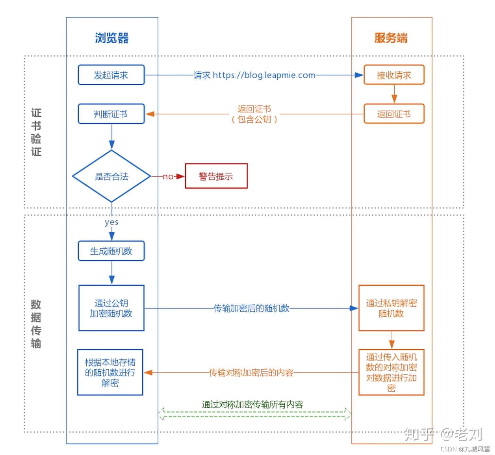
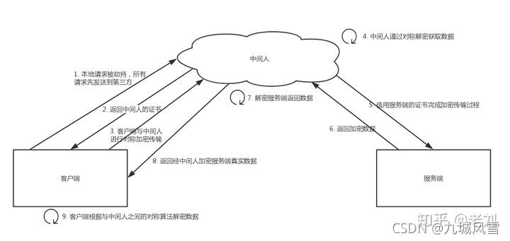
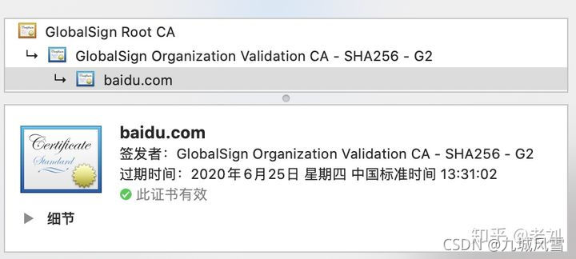

# 计算机基础

## 操作系统

>[看完这篇操作系统，和面试官扯皮就没问题了。 (qq.com)](https://mp.weixin.qq.com/s/59xyIj1nIFp2TtkKFYnR-g)

### 解释一下什么是操作系统

操作系统是运行在计算机上最重要的一种软件，它管理计算机的资源和进程以及所有的硬件和软件。它为计算机硬件和软件提供了一种中间层


通常情况下，计算机上会运行着许多应用程序，它们都需要对内存和 CPU 进行交互，操作系统的目的就是为了保证这些访问和交互能够准确无误的进行。

### 解释一下操作系统的主要目的是什么

操作系统是一种软件，它的主要目的有三种

- 管理计算机资源，这些资源包括 CPU、内存、磁盘驱动器、打印机等。
- 提供一种图形界面，就像我们前面描述的那样，它提供了用户和计算机之间的桥梁。
- 为其他软件提供服务，操作系统与软件进行交互，以便为其分配运行所需的任何必要资源。

### 操作系统结构

#### 单体系统

在大多数系统中，整个系统在内核态以单一程序的方式运行。整个操作系统是以程序集合来编写的，链接在一块形成一个大的二进制可执行程序，这种系统称为单体系统。

在单体系统中构造实际目标程序时，会首先编译所有单个过程（或包含这些过程的文件），然后使用系统链接器将它们全部绑定到一个可执行文件中

在单体系统中，对于每个系统调用都会有一个服务程序来保障和运行。需要一组实用程序来弥补服务程序需要的功能，例如从用户程序中获取数据。可将各种过程划分为一个三层模型


除了在计算机初启动时所装载的核心操作系统外，许多操作系统还支持额外的扩展。比如 I/O 设备驱动和文件系统。这些部件可以按需装载。在 UNIX 中把它们叫做 共享库(shared library)，在 Windows 中则被称为 动态链接库(Dynamic Link Library,DLL)。他们的扩展名为 .dll，在 C:\Windows\system32 目录下存在 1000 多个 DLL 文件，所以不要轻易删除 C 盘文件，否则可能就炸了哦。

#### 分层系统

分层系统使用层来分隔不同的功能单元。每一层只与该层的上层和下层通信。每一层都使用下面的层来执行其功能。层之间的通信通过预定义的固定接口通信。


#### 微内核

为了实现高可靠性，将操作系统划分成小的、层级之间能够更好定义的模块是很有必要的，只有一个模块 --- 微内核 --- 运行在内核态，其余模块可以作为普通用户进程运行。由于把每个设备驱动和文件系统分别作为普通用户进程，这些模块中的错误虽然会使这些模块崩溃，但是不会使整个系统死机。

MINIX 3 是微内核的代表作，它的具体结构如下


在内核的外部，系统的构造有三层，它们都在用户态下运行，最底层是设备驱动器。由于它们都在用户态下运行，所以不能物理的访问 I/O 端口空间，也不能直接发出 I/O 命令。相反，为了能够对 I/O 设备编程，驱动器构建一个结构，指明哪个参数值写到哪个 I/O 端口，并声称一个内核调用，这样就完成了一次调用过程。

#### 客户-服务器模式

微内核思想的策略是把进程划分为两类：服务器，每个服务器用来提供服务；客户端，使用这些服务。这个模式就是所谓的 客户-服务器模式。

客户-服务器模式会有两种载体，一种情况是一台计算机既是客户又是服务器，在这种方式下，操作系统会有某种优化；但是普遍情况下是客户端和服务器在不同的机器上，它们通过局域网或广域网连接。


客户通过发送消息与服务器通信，客户端并不需要知道这些消息是在本地机器上处理，还是通过网络被送到远程机器上处理。对于客户端而言，这两种情形是一样的：都是发送请求并得到回应。

### 内核

>[Linux 内核 vs Windows 内核 (qq.com)](https://mp.weixin.qq.com/s/7iQ5jO_qfYbwKdM21qywYg)

计算机是由各种外部硬件设备组成的，比如内存、cpu、硬盘等，如果每个应用都要和这些硬件设备对接通信协议，那这样太累了。

所以，这个中间人就由内核来负责，**让内核作为应用连接硬件设备的桥梁**，应用程序只需关心与内核交互，不用关心硬件的细节。

#### 内核工作原理


现代操作系统，内核一般会提供 4 个基本能力：

- 管理进程、线程，决定哪个进程、线程使用 CPU，也就是进程调度的能力；
- 管理内存，决定内存的分配和回收，也就是内存管理的能力；
- 管理硬件设备，为进程与硬件设备之间提供通信能力，也就是硬件通信能力；
- 提供系统调用，如果应用程序要运行更高权限运行的服务，那么就需要有系统调用，它是用户程序与操作系统之间的接口。

内核具有很高的权限，可以控制 cpu、内存、硬盘等硬件，而应用程序具有的权限很小，因此大多数操作系统，把内存分成了两个区域：

- 内核空间，这个内存空间只有内核程序可以访问；
- 用户空间，这个内存空间专门给应用程序使用；

应用程序如果需要进入内核空间，就需要通过「系统调用」，下面来看看系统调用的过程：


内核程序执行在内核态，用户程序执行在用户态。当应用程序使用系统调用时，会产生一个中断。发生中断后， CPU 会中断当前在执行的用户程序，转而跳转到中断处理程序，也就是开始执行内核程序。内核处理完后，主动触发中断，把 CPU 执行权限交回给用户程序，回到用户态继续工作

#### 设计理念

Linux 内核设计的理念主要有这几个点：

- *MutiTask*，多任务
- *SMP*，对称多处理
- *ELF*，可执行文件链接格式
- *Monolithic Kernel*，宏内核

##### MutiTask

MutiTask 的意思是**多任务**，代表着 Linux 是一个多任务的操作系统。

##### SMP

SMP 的意思是**对称多处理**，代表着每个 CPU 的地位是相等的，对资源的使用权限也是相同的，多个 CPU 共享同一个内存，每个 CPU 都可以访问完整的内存和硬件资源。

这个特点决定了 Linux 操作系统不会有某个 CPU 单独服务应用程序或内核程序，而是每个程序都可以被分配到任意一个 CPU 上被执行。

##### ELF

ELF 的意思是**可执行文件链接格式**，它是 Linux 操作系统中可执行文件的存储格式，你可以从下图看到它的结构：

ELF 文件格式

ELF 把文件分成了一个个分段，每一个段都有自己的作用，具体每个段的作用这里我就不详细说明了，感兴趣的同学可以去看《程序员的自我修养——链接、装载和库》这本书。

另外，ELF 文件有两种索引，Program header table 中记录了「运行时」所需的段，而 Section header table 记录了二进制文件中各个「段的首地址」。

那 ELF 文件怎么生成的呢？

我们编写的代码，首先通过「编译器」编译成汇编代码，接着通过「汇编器」变成目标代码，也就是目标文件，最后通过「链接器」把多个目标文件以及调用的各种函数库链接起来，形成一个可执行文件，也就是 ELF 文件。

那 ELF 文件是怎么被执行的呢？

执行 ELF 文件的时候，会通过「装载器」把 ELF 文件装载到内存里，CPU 读取内存中的指令和数据，于是程序就被执行起来了。

##### Monolithic Kernel

Monolithic Kernel 的意思是**宏内核**，Linux 内核架构就是宏内核，意味着 Linux 的内核是一个完整的可执行程序，且拥有最高的权限。

宏内核的特征是系统内核的所有模块，比如进程调度、内存管理、文件系统、设备驱动等，都运行在内核态。

不过，Linux 也实现了动态加载内核模块的功能，例如大部分设备驱动是以可加载模块的形式存在的，与内核其他模块解藕，让驱动开发和驱动加载更为方便、灵活。

分别为宏内核、微内核、混合内核的操作系统结构

与宏内核相反的是**微内核**，微内核架构的内核只保留最基本的能力，比如进程调度、虚拟机内存、中断等，把一些应用放到了用户空间，比如驱动程序、文件系统等。这样服务与服务之间是隔离的，单个服务出现故障或者完全攻击，也不会导致整个操作系统挂掉，提高了操作系统的稳定性和可靠性。 

微内核内核功能少，可移植性高，相比宏内核有一点不好的地方在于，由于驱动程序不在内核中，而且驱动程序一般会频繁调用底层能力的，于是驱动和硬件设备交互就需要频繁切换到内核态，这样会带来性能损耗。华为的鸿蒙操作系统的内核架构就是微内核。

还有一种内核叫**混合类型内核**，它的架构有点像微内核，内核里面会有一个最小版本的内核，然后其他模块会在这个基础上搭建，然后实现的时候会跟宏内核类似，也就是把整个内核做成一个完整的程序，大部分服务都在内核中，这就像是宏内核的方式包裹着一个微内核。

### CPU负载和CPU利用率

**CPU负载和CPU利用率的区别是什么？**

我们可以通过uptime，w或者top命令看到CPU的平均负载。

CPU 利用率：和负载不同，CPU利用率指的是当前正在运行的进程实时占用CPU的百分比，他是对一段时间内CPU使用状况的统计（如果在1个小时内，A上厕所花了10分钟，B上厕所花了20分钟，剩下30分钟厕所都没人使用，那么这一个小时内利用率就是50%）。

CPU负载：他代表的是当前系统正在运行的和处于等待运行的进程数之和。也指的是处于可运行状态和不可中断状态的平均进程数（假设你们公司厕所有1个坑位，有一个人占了坑位，这时候负载就是1，如果还有一个人在排队，那么负载就是2。）。

**那如果CPU负载很高，利用率却很低该怎么办？**

CPU负载很高，利用率却很低，说明处于等待状态的任务很多，负载越高，代表可能很多僵死的进程。通常这种情况是IO密集型的任务，大量请求在请求相同的IO，导致任务队列堆积。

解决：

可以先通过top命令观察，假设发现现在确实是高负载低使用率。

然后，再通过命令ps -axjf查看是否存在状态为D+状态的进程，这个状态指的就是不可中断的睡眠状态的进程。处于这个状态的进程无法终止，也无法自行退出，只能通过恢复其依赖的资源或者重启系统来解决

**那如果负载很低，利用率却很高呢？**

这表示CPU的任务并不多，但是任务执行的时间很长，大概率就是你写的代码本身有问题，通常是计算密集型任务，生成了大量耗时短的计算任务。

直接top命令找到使用率最高的任务，定位到去看看就行了。如果代码没有问题，那么过段时间CPU使用率就会下降的。

**那如果CPU使用率达到100%呢？怎么排查？**

通过top找到占用率高的进程。

通过top -Hp pid找到占用CPU高的线程ID。这里找到958的线程ID

再把线程ID转化为16进制，printf "0x%x\n" 958，得到线程ID0x3be

通过命令jstack  java进程PID | grep '0x3be' -C5 --color 或者 jstack 163|vim +/0x3be - 找到有问题的代码

### 常见的Linux命令

>[学习linux命令，看这篇2w多字的命令详解就够了 (qq.com)](https://mp.weixin.qq.com/s/7bSwKiPmtJbs7FtRWZZqpA)

## 零拷贝

>[傻瓜三歪让我教他「零拷贝」 (qq.com)](https://mp.weixin.qq.com/s/FgBCop2zFfcX5ZszE0NoCQ)

### 为什么要有DMA技术

在没有 DMA 技术前，I/O 的过程是这样的：

- CPU 发出对应的指令给磁盘控制器，然后返回；
- 磁盘控制器收到指令后，于是就开始准备数据，会把数据放入到磁盘控制器的内部缓冲区中，然后产生一个**中断**；
- CPU 收到中断信号后，停下手头的工作，接着把磁盘控制器的缓冲区的数据一次一个字节地读进自己的寄存器，然后再把寄存器里的数据写入到内存，而在数据传输的期间 CPU 是无法执行其他任务的。

为了方便你理解，我画了一副图：

' fill='%23FFFFFF'%3E%3Crect x='249' y='126' width='1' height='1'%3E%3C/rect%3E%3C/g%3E%3C/g%3E%3C/svg%3E)

可以看到，整个数据的传输过程，都要需要 CPU 亲自参与搬运数据的过程，而且这个过程，CPU 是不能做其他事情的。

简单的搬运几个字符数据那没问题，但是如果我们用千兆网卡或者硬盘传输大量数据的时候，都用 CPU 来搬运的话，肯定忙不过来。

计算机科学家们发现了事情的严重性后，于是就发明了 DMA 技术，也就是**直接内存访问（\*Direct Memory Access\*）** 技术。

什么是 DMA 技术？简单理解就是，**在进行 I/O 设备和内存的数据传输的时候，数据搬运的工作全部交给 DMA 控制器，而 CPU 不再参与任何与数据搬运相关的事情，这样 CPU 就可以去处理别的事务**。

那使用 DMA 控制器进行数据传输的过程究竟是什么样的呢？下面我们来具体看看。

' fill='%23FFFFFF'%3E%3Crect x='249' y='126' width='1' height='1'%3E%3C/rect%3E%3C/g%3E%3C/g%3E%3C/svg%3E)

具体过程：

- 用户进程调用 read 方法，向操作系统发出 I/O 请求，请求读取数据到自己的内存缓冲区中，进程进入阻塞状态；
- 操作系统收到请求后，进一步将 I/O 请求发送 DMA，然后让 CPU 执行其他任务；
- DMA 进一步将 I/O 请求发送给磁盘；
- 磁盘收到 DMA 的 I/O 请求，把数据从磁盘读取到磁盘控制器的缓冲区中，当磁盘控制器的缓冲区被读满后，向 DMA 发起中断信号，告知自己缓冲区已满；
- **DMA 收到磁盘的信号，将磁盘控制器缓冲区中的数据拷贝到内核缓冲区中，此时不占用 CPU，CPU 可以执行其他任务**；
- 当 DMA 读取了足够多的数据，就会发送中断信号给 CPU；
- CPU 收到 DMA 的信号，知道数据已经准备好，于是将数据从内核拷贝到用户空间，系统调用返回；

可以看到， 整个数据传输的过程，CPU 不再参与数据搬运的工作，而是全程由 DMA 完成，但是 CPU 在这个过程中也是必不可少的，因为传输什么数据，从哪里传输到哪里，都需要 CPU 来告诉 DMA 控制器。

早期 DRM 只存在在主板上，如今由于 I/O 设备越来越多，数据传输的需求也不尽相同，所以每个 I/O 设备里面都有自己的 DMA 控制器。

------

### 传统的文件传输有多糟糕

如果服务端要提供文件传输的功能，我们能想到的最简单的方式是：将磁盘上的文件读取出来，然后通过网络协议发送给客户端。

传统 I/O 的工作方式是，数据读取和写入是从用户空间到内核空间来回复制，而内核空间的数据是通过操作系统层面的 I/O 接口从磁盘读取或写入。

代码通常如下，一般会需要两个系统调用：

```
read(file, tmp_buf, len);
write(socket, tmp_buf, len);
```

代码很简单，虽然就两行代码，但是这里面发生了不少的事情。

' fill='%23FFFFFF'%3E%3Crect x='249' y='126' width='1' height='1'%3E%3C/rect%3E%3C/g%3E%3C/g%3E%3C/svg%3E)

首先，期间共**发生了 4 次用户态与内核态的上下文切换**，因为发生了两次系统调用，一次是 `read()` ，一次是 `write()`，每次系统调用都得先从用户态切换到内核态，等内核完成任务后，再从内核态切换回用户态。

上下文切换到成本并不小，一次切换需要耗时几十纳秒到几微秒，虽然时间看上去很短，但是在高并发的场景下，这类时间容易被累积和放大，从而影响系统的性能。

其次，还**发生了 4 次数据拷贝**，其中两次是 DMA 的拷贝，另外两次则是通过 CPU 拷贝的，下面说一下这个过程：

- *第一次拷贝*，把磁盘上的数据拷贝到操作系统内核的缓冲区里，这个拷贝的过程是通过 DMA 搬运的。
- *第二次拷贝*，把内核缓冲区的数据拷贝到用户的缓冲区里，于是我们应用程序就可以使用这部分数据了，这个拷贝到过程是由 CPU 完成的。
- *第三次拷贝*，把刚才拷贝到用户的缓冲区里的数据，再拷贝到内核的 socket 的缓冲区里，这个过程依然还是由 CPU 搬运的。
- *第四次拷贝*，把内核的 socket 缓冲区里的数据，拷贝到网卡的缓冲区里，这个过程又是由 DMA 搬运的。

我们回过头看这个文件传输的过程，我们只是搬运一份数据，结果却搬运了 4 次，过多的数据拷贝无疑会消耗 CPU 资源，大大降低了系统性能。

这种简单又传统的文件传输方式，存在冗余的上文切换和数据拷贝，在高并发系统里是非常糟糕的，多了很多不必要的开销，会严重影响系统性能。

所以，**要想提高文件传输的性能，就需要减少「用户态与内核态的上下文切换」和「内存拷贝」的次数**。

------

### 如何优化文件传输的性能？

> 先来看看，如何减少「用户态与内核态的上下文切换」的次数呢？

读取磁盘数据的时候，之所以要发生上下文切换，这是因为用户空间没有权限操作磁盘或网卡，内核的权限最高，这些操作设备的过程都需要交由操作系统内核来完成，所以一般要通过内核去完成某些任务的时候，就需要使用操作系统提供的系统调用函数。

而一次系统调用必然会发生 2 次上下文切换：首先从用户态切换到内核态，当内核执行完任务后，再切换回用户态交由进程代码执行。

所以，**要想减少上下文切换到次数，就要减少系统调用的次数**。

> 再来看看，如何减少「数据拷贝」的次数？

在前面我们知道了，传统的文件传输方式会历经 4 次数据拷贝，而且这里面，「从内核的读缓冲区拷贝到用户的缓冲区里，再从用户的缓冲区里拷贝到 socket 的缓冲区里」，这个过程是没有必要的。

因为文件传输的应用场景中，在用户空间我们并不会对数据「再加工」，所以数据实际上可以不用搬运到用户空间，因此**用户的缓冲区是没有必要存在的**。

------

### 如何实现零拷贝

零拷贝技术实现的方式通常有 2 种：

- mmap + write
- sendfile

下面就谈一谈，它们是如何减少「上下文切换」和「数据拷贝」的次数。

#### mmap + write

在前面我们知道，`read()` 系统调用的过程中会把内核缓冲区的数据拷贝到用户的缓冲区里，于是为了减少这一步开销，我们可以用 `mmap()` 替换 `read()` 系统调用函数。

```
buf = mmap(file, len);
write(sockfd, buf, len);
```

`mmap()` 系统调用函数会直接把内核缓冲区里的数据「**映射**」到用户空间，这样，操作系统内核与用户空间就不需要再进行任何的数据拷贝操作。

' fill='%23FFFFFF'%3E%3Crect x='249' y='126' width='1' height='1'%3E%3C/rect%3E%3C/g%3E%3C/g%3E%3C/svg%3E)

具体过程如下：

- 应用进程调用了 `mmap()` 后，DMA 会把磁盘的数据拷贝到内核的缓冲区里。接着，应用进程跟操作系统内核「共享」这个缓冲区；
- 应用进程再调用 `write()`，操作系统直接将内核缓冲区的数据拷贝到 socket 缓冲区中，这一切都发生在内核态，由 CPU 来搬运数据；
- 最后，把内核的 socket 缓冲区里的数据，拷贝到网卡的缓冲区里，这个过程是由 DMA 搬运的。

我们可以得知，通过使用 `mmap()` 来代替 `read()`， 可以减少一次数据拷贝的过程。

但这还不是最理想的零拷贝，因为仍然需要通过 CPU 把内核缓冲区的数据拷贝到 socket 缓冲区里，而且仍然需要 4 次上下文切换，因为系统调用还是 2 次。

#### sendfile

在 Linux 内核版本 2.1 中，提供了一个专门发送文件的系统调用函数 `sendfile()`，函数形式如下：

```
#include <sys/socket.h>
ssize_t sendfile(int out_fd, int in_fd, off_t *offset, size_t count);
```

它的前两个参数分别是目的端和源端的文件描述符，后面两个参数是源端的偏移量和复制数据的长度，返回值是实际复制数据的长度。

首先，它可以替代前面的 `read()` 和 `write()` 这两个系统调用，这样就可以减少一次系统调用，也就减少了 2 次上下文切换的开销。

其次，该系统调用，可以直接把内核缓冲区里的数据拷贝到 socket 缓冲区里，不再拷贝到用户态，这样就只有 2 次上下文切换，和 3 次数据拷贝。如下图：

' fill='%23FFFFFF'%3E%3Crect x='249' y='126' width='1' height='1'%3E%3C/rect%3E%3C/g%3E%3C/g%3E%3C/svg%3E)

但是这还不是真正的零拷贝技术，如果网卡支持 SG-DMA（*The Scatter-Gather Direct Memory Access*）技术（和普通的 DMA 有所不同），我们可以进一步减少通过 CPU 把内核缓冲区里的数据拷贝到 socket 缓冲区的过程。

你可以在你的 Linux 系统通过下面这个命令，查看网卡是否支持 scatter-gather 特性：

```
$ ethtool -k eth0 | grep scatter-gather
scatter-gather: on
```

于是，从 Linux 内核 `2.4` 版本开始起，对于支持网卡支持 SG-DMA 技术的情况下， `sendfile()` 系统调用的过程发生了点变化，具体过程如下：

- 第一步，通过 DMA 将磁盘上的数据拷贝到内核缓冲区里；
- 第二步，缓冲区描述符和数据长度传到 socket 缓冲区，这样网卡的 SG-DMA 控制器就可以直接将内核缓存中的数据拷贝到网卡的缓冲区里，此过程不需要将数据从操作系统内核缓冲区拷贝到 socket 缓冲区中，这样就减少了一次数据拷贝；

所以，这个过程之中，只进行了 2 次数据拷贝，如下图：

' fill='%23FFFFFF'%3E%3Crect x='249' y='126' width='1' height='1'%3E%3C/rect%3E%3C/g%3E%3C/g%3E%3C/svg%3E)

这就是所谓的**零拷贝（\*Zero-copy\*）技术，因为我们没有在内存层面去拷贝数据，也就是说全程没有通过 CPU 来搬运数据，所有的数据都是通过 DMA 来进行传输的。**

零拷贝技术的文件传输方式相比传统文件传输的方式，减少了 2 次上下文切换和数据拷贝次数，**只需要 2 次上下文切换和数据拷贝次数，就可以完成文件的传输，而且 2 次的数据拷贝过程，都不需要通过 CPU，2 次都是由 DMA 来搬运。**

所以，总体来看，**零拷贝技术可以把文件传输的性能提高至少一倍以上**。

#### 使用零拷贝技术的项目

事实上，Kafka 这个开源项目，就利用了「零拷贝」技术，从而大幅提升了 I/O 的吞吐率，这也是 Kafka 在处理海量数据为什么这么快的原因之一。

如果你追溯 Kafka 文件传输的代码，你会发现，最终它调用了 Java NIO 库里的 `transferTo`方法：

```
@Overridepublic 
long transferFrom(FileChannel fileChannel, long position, long count) throws IOException { 
    return fileChannel.transferTo(position, count, socketChannel);
}
```

如果 Linux 系统支持 `sendfile()` 系统调用，那么 `transferTo()` 实际上最后就会使用到 `sendfile()` 系统调用函数。

曾经有大佬专门写过程序测试过，在同样的硬件条件下，传统文件传输和零拷拷贝文件传输的性能差异，你可以看到下面这张测试数据图，使用了零拷贝能够缩短 `65%` 的时间，大幅度提升了机器传输数据的吞吐量。

' fill='%23FFFFFF'%3E%3Crect x='249' y='126' width='1' height='1'%3E%3C/rect%3E%3C/g%3E%3C/g%3E%3C/svg%3E)数据来源于：https://developer.ibm.com/articles/j-zerocopy/

另外，Nginx 也支持零拷贝技术，一般默认是开启零拷贝技术，这样有利于提高文件传输的效率，是否开启零拷贝技术的配置如下：

```
http {
...
    sendfile on
...
}
```

sendfile 配置的具体意思: 

- 设置为 on 表示，使用零拷贝技术来传输文件：sendfile ，这样只需要 2 次上下文切换，和 2 次数据拷贝。
- 设置为 off 表示，使用传统的文件传输技术：read + write，这时就需要 4 次上下文切换，和 4 次数据拷贝。

当然，要使用 sendfile，Linux 内核版本必须要 2.1 以上的版本。

------

### PageCache有什么作用

回顾前面说道文件传输过程，其中第一步都是先需要先把磁盘文件数据拷贝「内核缓冲区」里，这个「内核缓冲区」实际上是**磁盘高速缓存（\*PageCache\*）**。

由于零拷贝使用了 PageCache 技术，可以使得零拷贝进一步提升了性能，我们接下来看看 PageCache 是如何做到这一点的。

读写磁盘相比读写内存的速度慢太多了，所以我们应该想办法把「读写磁盘」替换成「读写内存」。于是，我们会通过 DMA 把磁盘里的数据搬运到内存里，这样就可以用读内存替换读磁盘。

但是，内存空间远比磁盘要小，内存注定只能拷贝磁盘里的一小部分数据。

那问题来了，选择哪些磁盘数据拷贝到内存呢？

我们都知道程序运行的时候，具有「局部性」，所以通常，刚被访问的数据在短时间内再次被访问的概率很高，于是我们可以用 **PageCache 来缓存最近被访问的数据**，当空间不足时淘汰最久未被访问的缓存。

所以，读磁盘数据的时候，优先在 PageCache 找，如果数据存在则可以直接返回；如果没有，则从磁盘中读取，然后缓存 PageCache 中。

还有一点，读取磁盘数据的时候，需要找到数据所在的位置，但是对于机械磁盘来说，就是通过磁头旋转到数据所在的扇区，再开始「顺序」读取数据，但是旋转磁头这个物理动作是非常耗时的，为了降低它的影响，**PageCache 使用了「预读功能」**。

比如，假设 read 方法每次只会读 `32 KB` 的字节，虽然 read 刚开始只会读 0 ～ 32 KB 的字节，但内核会把其后面的 32～64 KB 也读取到 PageCache，这样后面读取 32～64 KB 的成本就很低，如果在 32～64 KB 淘汰出 PageCache 前，进程读取到它了，收益就非常大。

所以，PageCache 的优点主要是两个：

- 缓存最近被访问的数据；
- 预读功能；

这两个做法，将大大提高读写磁盘的性能。

**但是，在传输大文件（GB 级别的文件）的时候，PageCache 会不起作用，那就白白浪费 DRM 多做的一次数据拷贝，造成性能的降低，即使使用了 PageCache 的零拷贝也会损失性能**

这是因为如果你有很多 GB 级别文件需要传输，每当用户访问这些大文件的时候，内核就会把它们载入 PageCache 中，于是 PageCache 空间很快被这些大文件占满。

另外，由于文件太大，可能某些部分的文件数据被再次访问的概率比较低，这样就会带来 2 个问题：

- PageCache 由于长时间被大文件占据，其他「热点」的小文件可能就无法充分使用到 PageCache，于是这样磁盘读写的性能就会下降了；
- PageCache 中的大文件数据，由于没有享受到缓存带来的好处，但却耗费 DMA 多拷贝到 PageCache 一次；

所以，针对大文件的传输，不应该使用 PageCache，也就是说不应该使用零拷贝技术，因为可能由于 PageCache 被大文件占据，而导致「热点」小文件无法利用到 PageCache，这样在高并发的环境下，会带来严重的性能问题。

------

### 大文件传输用什么方式实现

那针对大文件的传输，我们应该使用什么方式呢？

我们先来看看最初的例子，当调用 read 方法读取文件时，进程实际上会阻塞在 read 方法调用，因为要等待磁盘数据的返回，如下图：

具体过程：

- 当调用 read 方法时，会阻塞着，此时内核会向磁盘发起 I/O 请求，磁盘收到请求后，便会寻址，当磁盘数据准备好后，就会向内核发起 I/O 中断，告知内核磁盘数据已经准备好；
- 内核收到 I/O 中断后，就将数据从磁盘控制器缓冲区拷贝到 PageCache 里；
- 最后，内核再把 PageCache 中的数据拷贝到用户缓冲区，于是 read 调用就正常返回了。

对于阻塞的问题，可以用异步 I/O 来解决，它工作方式如下图：

它把读操作分为两部分：

- 前半部分，内核向磁盘发起读请求，但是可以**不等待数据就位就可以返回**，于是进程此时可以处理其他任务；
- 后半部分，当内核将磁盘中的数据拷贝到进程缓冲区后，进程将接收到内核的**通知**，再去处理数据；

而且，我们可以发现，异步 I/O 并没有涉及到 PageCache，所以使用异步 I/O 就意味着要绕开 PageCache。

绕开 PageCache 的 I/O 叫直接 I/O，使用 PageCache 的 I/O 则叫缓存 I/O。通常，对于磁盘，异步 I/O 只支持直接 I/O。

前面也提到，大文件的传输不应该使用 PageCache，因为可能由于 PageCache 被大文件占据，而导致「热点」小文件无法利用到 PageCache。

于是，**在高并发的场景下，针对大文件的传输的方式，应该使用「异步 I/O + 直接 I/O」来替代零拷贝技术**。

直接 I/O 应用场景常见的两种：

- 应用程序已经实现了磁盘数据的缓存，那么可以不需要 PageCache 再次缓存，减少额外的性能损耗。在 MySQL 数据库中，可以通过参数设置开启直接 I/O，默认是不开启；
- 传输大文件的时候，由于大文件难以命中 PageCache 缓存，而且会占满 PageCache 导致「热点」文件无法充分利用缓存，从而增大了性能开销，因此，这时应该使用直接 I/O。

另外，由于直接 I/O 绕过了 PageCache，就无法享受内核的这两点的优化：

- 内核的 I/O 调度算法会缓存尽可能多的 I/O 请求在 PageCache 中，最后「**合并**」成一个更大的 I/O 请求再发给磁盘，这样做是为了减少磁盘的寻址操作；
- 内核也会「**预读**」后续的 I/O 请求放在 PageCache 中，一样是为了减少对磁盘的操作；

于是，传输大文件的时候，使用「异步 I/O + 直接 I/O」了，就可以无阻塞地读取文件了。

所以，传输文件的时候，我们要根据文件的大小来使用不同的方式：

- 传输大文件的时候，使用「异步 I/O + 直接 I/O」；
- 传输小文件的时候，则使用「零拷贝技术」；

在 nginx 中，我们可以用如下配置，来根据文件的大小来使用不同的方式：

```
location /video/ { 
    sendfile on; 
    aio on; 
    directio 1024m; 
}
```

当文件大小大于 `directio` 值后，使用「异步 I/O + 直接 I/O」，否则使用「零拷贝技术」。


1. 1. ### 

## **网络**

### OSI七层模型

​                         

​                         

### TCP-IP四层模型

应用层

传输层

网络层

网络接口层

​                         

### 说说TCP与UDP的区别

​                         

- TCP 向上层提供面向连接的可靠服务 ，UDP 向上层提供无连接不可靠服务。
- UDP 没有 TCP 传输可靠，但是可以在实时性要求搞的地方有所作为。
- 对数据准确性要求高，速度可以相对较慢的，可以选用TCP。

### TCP是如何实现数据的可靠性

- 校验和：在数据传输过程中，将发送的数据段都当做一个16位的整数，将这些整数加起来，并且前面的进位不能丢弃，补在最后，然后取反，得到校验和。
- 序列号：TCP 传输时将每个字节的数据都进行了编号，这就是序列号。序列号的作用不仅仅是应答作用，有了序列号能够将接收到的数据根据序列号进行排序，并且去掉重复的数据
- 确认应答：TCP 传输过程中，每次接收方接收到数据后，都会对传输方进行确认应答，也就是发送 ACK 报文，这个 ACK 报文中带有对应的确认序列号，告诉发送方，接收了哪些数据，下一次数据从哪里传。
- 超时重传：在进行 TCP 传输时，由于存在确认应答与序列号机制，也就是说发送方发送一部分数据后，都会等待接收方发送的 ACK 报文，并解析 ACK 报文，判断数据是否传输成功。如果发送方发送完数据后，迟迟都没有接收到接收方传来的 ACK 报文，那么就对刚刚发送的数据进行重发。
- 连接管理：就是指三次握手、四次挥手的过程。
- 流量控制：如果发送方的发送速度太快，会导致接收方的接收缓冲区填充满了，这时候继续传输数据，就会造成大量丢包，进而引起丢包重传等等一系列问题。TCP支持根据接收端的处理能力来决定发送端的发送速度，这就是流量控制机制。具体实现方式：接收端将自己的接收缓冲区大小放入 TCP 首部的『窗口大小』字段中，通过 ACK 通知发送端。
- 拥塞控制：TCP 传输过程中一开始就发送大量数据，如果当时网络非常拥堵，可能会造成拥堵加剧。所以 TCP 引入了慢启动机制，在开始发送数据的时候，先发少量的数据探探路。

### 说说TCP协议如何提高传输效率

**滑动窗口**

如果每一个发送的数据段，都要收到 ACK 应答之后再发送下一个数据段，这样的话我们效率很低，大部分时间都用在了等待 ACK 应答上了。为了提高效率我们可以一次发送多条数据，这样就能使等待时间大大减少，从而提高性能。窗口大小指的是无需等待确认应答而可以继续发送数据的最大值。

**快重传**

快重传也叫高速重发控制。那么如果出现了丢包，需要进行重传。一般分为两种情况：情况一：数据包已经抵达，ACK被丢了。这种情况下，部分ACK丢了并不影响，因为可以通过后续的ACK进行确认；情况二：数据包直接丢了。发送端会连续收到多个相同的 ACK 确认，发送端立即将对应丢失的数据重传。

**延迟应答**

如果接收数据的主机立刻返回ACK应答，这时候返回的窗口大小可能比较小。

假设接收端缓冲区为1M，一次收到了512K的数据；如果立刻应答，返回的窗口就是512K；

但实际上可能处理端处理速度很快，10ms之内就把512K的数据从缓存区消费掉了；

在这种情况下，接收端处理还远没有达到自己的极限，即使窗口再放大一些，也能处理过来；

如果接收端稍微等一会在应答，比如等待200ms再应答，那么这个时候返回的窗口大小就是1M；

窗口越大，网络吞吐量就越大，传输效率就越高；我们的目标是在保证网络不拥塞的情况下尽量提高传输效率。

**捎带应答**

在延迟应答的基础上，很多情况下，客户端服务器在应用层也是一发一收的。这时候常常采用捎带应答的方式来提高效率，而ACK响应常常伴随着数据报文共同传输。如：三次握手。

### 你知道TCP如何处理拥塞

网络拥塞现象是指到达通信网络中某一部分的分组数量过多，使得该部分网络来不及处理，以致引起这部分乃至整个网络性能下降的现象，严重时甚至会导致网络通信业务陷入停顿，即出现死锁现象。拥塞控制是处理网络拥塞现象的一种机制。

拥塞控制的四个阶段:

- 慢启动

- 拥塞避免

- 快速重传

- 快速恢复


### 为什么TCP链接需要三次握手

第一步，客户端给服务端发送一条消息：你好，服务端。第二步，服务端收到消息，同时给客户端回复一条消息：收到！你好客户端。

这样的两次握手过程， 客户端给服务端打招呼，服务端收到了，说明客户端可以正常给服务端发送数据。但是服务端给客户端打招呼，服务端没有收到反馈，也就不能确保服务端是否能正常给客户端发送消息。

只有经过第三次握手，才能确保双向都可以接收到对方的发送的数据 第三步，客户端收到服务端发送的消息，回复：收到！这样就证明了客户端能正常收到服务端的消息。

### **IP地址是怎样分类的**

- A类：(1.0.0.0-126.0.0.0)一般用于大型网络。

- B类：(128.0.0.0-191.255.0.0)一般用于中等规模网络。

- C类：(192.0.0.0-223.255.255.0)一般用于小型网络。

- D类：是多播地址，地址的网络号取值于224~239之间，一般用于多路广播用户。

- E类：是保留地址。地址的网络号取值于240~255之间。

### 拆包和粘包

TCP数据流最终发到目的地，需要通过以太网协议封装成一个个的以太网帧发送出去，以太网数据帧大小最小64字节，最大1518字节，除去header部分，其数据payload为46到1500字节。所以如果以太网帧的payload大于MTU（默认1500字节）就需要进行拆包。

#### 粘包拆包问题解决方法

由于TCP协议底层无法理解上层的业务数据，所以在底层是无法保证数据包不被拆分和重组的，所以，这个问题只能通过上层的应用层协议设计来解决，常见方案如下：

（1）消息定长，发送方和接收方规定固定大小的消息长度，例如每个报文大小固定为200字节，如果不够，空位补空格；
（2）在包围增加特殊字符进行分割，例如FTP协议；
（3）自定义协议，将消息分为消息头和消息体，消息头中包含消息总长度，这样服务端就可以知道每个数据包的具体长度了，知道了发送数据包的具体边界后，就可以解决粘包和拆包问题了；


#### 为什么UDP不会发生粘包-拆包问题

UDP是无连接的，面向消息的，提供高效率服务。不会使用块的合并优化算法（TCP使用了Nagle算法）。UDP支持的是一对多的模式，所以接收端的缓冲区采用了链式结构来缓存每一个到达的数据包，在每个UDP包中就有了消息头（消息来源地址，端口等信息），这样，对于接收端来说，就容易进行区分处理了。即面向消息的通信是有消息边界的。所以udp根本不会粘包，但是会丢数据，不可靠。

笔者使用jdk的nio，写了个简单的发送文件的客户端，每次发送文件协议格式：数据包总长度|文件名长度|文件名|文件内容长度|文件内容，时间有限，服务端程序还未写完，稍后会继续完成的。

```java
public static void sendFile(String hostname, int nioPort, byte[] file, String filename, long fileSize) {
    SocketChannel channel = null;
    Selector selector = null;
    try {
        channel = SocketChannel.open();
        channel.configureBlocking(false);
        channel.connect(new InetSocketAddress(hostname, nioPort));
        selector = Selector.open();
        channel.register(selector, SelectionKey.OP_CONNECT);
        while (true) {
            selector.select();
            Iterator<SelectionKey> keysIterator = selector.selectedKeys().iterator();
            while (keysIterator.hasNext()) {
                SelectionKey key = keysIterator.next();
                keysIterator.remove();
                if (key.isConnectable()) {
                    channel = (SocketChannel) key.channel();
                    if (channel.isConnectionPending()) {
                        channel.finishConnect();
                        byte[] filenameBytes = filename.getBytes();
                        long totalLen = 4 + filenameBytes.length + 8 + fileSize;
                        ByteBuffer buffer = ByteBuffer.allocate((int) fileSize * 2 + filenameBytes.length);
                        buffer.putLong(totalLen);
                        buffer.putInt(filenameBytes.length);
                        buffer.put(filenameBytes);
                        buffer.putLong(fileSize);
                        buffer.put(file);
                        buffer.flip();
                        int sentData = channel.write(buffer);
                        System.out.println("已经发送了" + sentData + "字节的数据到" + hostname);
                        channel.register(selector, SelectionKey.OP_READ);
                    }
                }
                else if (key.isReadable()) {
                    channel = (SocketChannel) key.channel();
                    ByteBuffer buffer = ByteBuffer.allocate(1024);
                    int len = channel.read(buffer);
                    if (len > 0) {
                        System.out.println("收到服务端的响应：" + new String(buffer.array(), 0, len));
                    }
                }
            }
        }
    } catch (Exception e) {
        e.printStackTrace();
    } finally {
        if (channel != null) {
            try {
                channel.close();
            } catch (IOException e) {
                e.printStackTrace();
            }
        }
        if (selector != null) {
            try {
                selector.close();
            } catch (IOException e) {
                e.printStackTrace();
            }
        }
    }
}

```

#### netty是如何解决粘包拆包问题的

基于jdk原生的socket或者nio编程，解决粘包拆包问题毕竟麻烦，作为一款非常强大的网络通信框架，netty提供了多种编码器用于解决粘包拆包问题，只要掌握这些类库的使用，你就不用关心如何解决粘包拆包问题了。

> 常见编码器：

- LineBasedFrameDecoder，基于行的解码器，遇到 “\n”、"\r\n"会被作为行分隔符；
- FixedLengthFrameDecoder，基于固定长度的解码器；
- DelimiterBasedFrameDecoder，基于分隔符的振解码器；

## HTTP应用层

**HTTP 协议介绍**

HTTP 协议，全称超文本传输协议（Hypertext Transfer Protocol）。顾名思义，HTTP 协议就是用来规范超文本的传输，超文本，也就是网络上的包括文本在内的各式各样的消，具体来说，主要是来规范浏览器和服务器端的行为的。

并且，HTTP 是一个无状态（stateless）协议，也就是说服务器不维护任何有关客户端过去所发请求的消息。这其实是一种懒政，有状态协议会更加复杂，需要维护状态（历史信息），而且如果客户或服务器失效，会产生状态的不一致，解决这种不一致的代价更高

HTTP 协议通信过程

HTTP 是应用层协议，它以 TCP（传输层）作为底层协议，默认端口为 80. 通信过程主要如下：

- 服务器在 80 端口等待客户的请求。
- 浏览器发起到服务器的 TCP 连接（创建套接字 Socket）。
- 服务器接收来自浏览器的 TCP 连接。
- 浏览器（HTTP 客户端）与 Web 服务器（HTTP 服务器）交换 HTTP 消息。
- 关闭 TCP 连接。

**HTTPS 协议介绍**

HTTPS 协议（Hyper Text Transfer Protocol Secure），是 HTTP 的加强安全版本。HTTPS 是基于 HTTP 的，也是用 TCP 作为底层协议，并额外使用 SSL/TLS 协议用作加密和安全认证。默认端口号是 443.

HTTPS 协议中，SSL 通道通常使用基于密钥的加密算法，密钥长度通常是 40 比特或 128 比**特。**

**SSL/TLS 的工作原理**

SSL/TLS 的核心要素是非对称加密。非对称加密采用两个密钥——一个公钥，一个私钥。在通信时，私钥仅由解密者保存，公钥由任何一个想与解密者通信的发送者（加密者）所知。可以设想一个场景，

在某个自助邮局，每个通信信道都是一个邮箱，每一个邮箱所有者都在旁边立了一个牌子，上面挂着一把钥匙：这是我的公钥，发送者请将信件放入我的邮箱，并用公钥锁好。

但是公钥只能加锁，并不能解锁。解锁只能由邮箱的所有者——因为只有他保存着私钥。

这样，通信信息就不会被其他人截获了，这依赖于私钥的保密性。

​                         

对称加密

使用 SSL/TLS 进行通信的双方需要使用非对称加密方案来通信，但是非对称加密设计了较为复杂的数学算法，在实际通信过程中，计算的代价较高，效率太低，因此，SSL/TLS 实际对消息的加密使用的是对称加密。

对称加密：通信双方共享唯一密钥 k，加解密算法已知，加密方利用密钥 k 加密，解密方利用密钥 k 解密，保密性依赖于密钥 k 的保密性。

​                         

 HTTP 协议运行在 TCP 之上，所有传输的内容都是明文，客户端和服务器端都无法验证对方的身份。HTTPS 是运行在 SSL/TLS 之上的 HTTP 协议，SSL/TLS 运行在 TCP 之上。所有传输的内容都经过加密，加密采用对称加密，但对称加密的密钥用服务器方的证书进行了非对称加密。所以说，HTTP 安全性没有 HTTPS 高，但是 HTTPS 比 HTTP 耗费更多服务器资源。

**HTTP 1.0 vs HTTP 1.1（应用层）**

- 连接方式 : HTTP 1.0 为短连接，HTTP 1.1 支持长连接。
- 状态响应码 : HTTP/1.1中新加入了大量的状态码，光是错误响应状态码就新增了24种。比如说，100 (Continue)——在请求大资源前的预热请求，206 (Partial Content)——范围请求的标识码，409 (Conflict)——请求与当前资源的规定冲突，410 (Gone)——资源已被永久转移，而且没有任何已知的转发地址。
- 缓存处理 : 在 HTTP1.0 中主要使用 header 里的 If-Modified-Since,Expires 来做为缓存判断的标准，HTTP1.1 则引入了更多的缓存控制策略例如 Entity tag，If-Unmodified-Since, If-Match, If-None-Match 等更多可供选择的缓存头来控制缓存策略。
- 带宽优化及网络连接的使用 :HTTP1.0 中，存在一些浪费带宽的现象，例如客户端只是需要某个对象的一部分，而服务器却将整个对象送过来了，并且不支持断点续传功能，HTTP1.1 则在请求头引入了 range 头域，它允许只请求资源的某个部分，即返回码是 206（Partial Content），这样就方便了开发者自由的选择以便于充分利用带宽和连接。
- Host头处理 : HTTP/1.1在请求头中加入了Host字段。

**讲一下 http1.1 和 http2 有什么区别？**

HTTP1.1

持久连接

请求管道化

增加缓存处理（新的字段如cache-control）

增加 Host 字段、支持断点传输等

HTTP2.0

二进制分帧

多路复用（或连接共享）

头部压缩

服务器推送

**常见的状态码有哪些?**

1×× : 请求处理中，请求已被接受，正在处理

2×× : 请求成功，请求被成功处理 200 OK

3×× : 重定向，要完成请求必须进行进一步处理 301 : 永久性转移 302 ：暂时性转移 304 ：已缓存

4×× : 客户端错误，请求不合法 400：Bad Request,请求有语法问题 403：拒绝请求 404：客户端所访问的页面不存在

5×× : 服务器端错误，服务器不能处理合法请求 500 ：服务器内部错误 503 ：服务不可用，稍等

**http中常见的header字段有哪些？**

cookie，请求时传递给服务端的cookie信息

set-cookie，响应报文首部设置要传递给客户端的cookie信息 

allow，支持什么HTTP方法 

last-modified，资源的最后修改时间 

expires,设置资源缓存的失败日期 

content-language，实体的资源语言 

content-encoding，实体的编码格式 

content-length，实体主体部分的大小单位是字节 

content-range，返回的实体的哪些范围 

content-type，哪些类型 

accept-ranges，处理的范围请求 

age，告诉客户端服务器在多久前创建了响应 vary，代理服务器的缓存信息 

location，用于指定重定向后的URI 

If-Match，值是资源的唯一标识 

User-Agent，将创建请求的浏览器和用户代理名称等信息传递给服务器 

Transfer-Encoding，传输报文的主体编码方式 

connection，管理持久连接，keep-alive , close 

Cache-Control，控制浏览器的强缓存

**Get与POST的区别**

（1）GET 一般用来从服务器上获取资源，POST 一般用来创建资源；

（2）GET 是幂等的，即读取同一个资源，总是得到相同的数据，而 POST 不是幂等的。GET 不会改变服务器上的资源，而 POST 会对服务器资源进行改变；

（3）从请求参数形式上看，GET 请求的数据会附在URL之后；而 POST 请求会把提交的数据则放置在是HTTP请求报文的请求体中。


（4）POST 的安全性要比 GET 的安全性高，因为 GET 请求提交的数据将明文出现在 URL 上，而 POST 请求参数则被包装到请求体中，相对更安全。

1. GET 请求的长度受限于浏览器或服务器对URL长度的限制，允许发送的数据量比较小，而POST请求则是没有大小限制的。

**DNS 的寻址过程你知道吗？**

在浏览器中输入www.baidu.com域名，操作系统会先检查自己本地的 hosts 文件是否有这个网址映射关系，如果有就先调用这个IP地址映射，完成域名解析。

如果 hosts 里没有这个域名的映射，则查找本地 DNS 解析器缓存，是否有这个网址映射关系，如果有直接返回，完成域名解析。

果 hosts 与本地 DNS 解析器缓存都没有相应的网址映射关系，首先会找 TCP/IP 参数中设置的首选 DNS 服务器，在此我们叫它本地 DNS 服务器，此服务器收到查询时，如果要查询的域名，包含在本地配置区域资源中，则返回解析结果给客户机，完成域名解析，此解析具有权威性。

**在浏览器中输入一个www.baidu.com后执行的全部过程？**

域名解析 -> 建立TCP连接（三次握手）-> 发起http请求 -> 服务器响应http请求，浏览器得到html代码 -> 浏览器解析html代码，并请求html代码中的资源（如 js、css、图片等）-> 浏览器对页面进行渲染呈献给用户。

**Session、Cookie 的区别**

session 在服务器端，cookie 在客户端（浏览器）

session 的运行依赖 session id，而 session id 是存在 cookie 中的，也就是说，如果浏览器禁用了 cookie ，同时 session 也会失效（但是可以通过其它方式实现，比如在 url 中传递 session_id）

**有哪些 web 性能优化技术?**

DNS查询优化

客户端缓存

优化TCP连接

避免重定向

网络边缘的缓存

条件缓存

压缩和代码极简化

图片优化

1. ### **网络安全**

**什么是 XSS 攻击？**

XSS 即（Cross Site Scripting）中文名称为：跨站脚本攻击。XSS的重点不在于跨站点，而在于脚本的执行。

XSS的原理是：

恶意攻击者在web页面中会插入一些恶意的script代码。当用户浏览该页面的时候，那么嵌入到web页面中script代码会执行，因此会达到恶意攻击用户的目的。

**什么是跨站攻击CSRF？**

CSRF（Cross Site Request Forgery，跨站域请求伪造）是一种网络的攻击方式，它在 2007 年曾被列为互联网 20 大安全隐患之一，也被称为『One Click Attack』或者 『Session Riding』，通常缩写为CSRF或者XSRF，是一种对网站的恶意利用。

听起来像跨站脚本（XSS），但它与XSS非常不同，并且攻击方式几乎相左。

XSS利用站点内的信任用户，而CSRF则通过伪装来自受信任用户的请求来利用受信任的网站。与XSS攻击相比，CSRF攻击往往不大流行（因此对其进行防范的资源也相当稀少）和难以防范，所以被认为比XSS更具危险性。


1. ### **面试题**

**应用层有哪些常见的协议？**

HTTP:超文本传输协议

SMTP:简单邮件传输(发送)协议

POP3/IMAP:邮件接收的协议

FTP:文件传输协议

Telnet:远程登陆协议

SSH:安全的网络传输协议

**TCP 三次握手和四次挥手(面试常客)**

为什么要三次握手

三次握手的目的是建立可靠的通信信道，说到通讯，简单来说就是数据的发送与接收，而三次握手最主要的目的就是双方确认自己与对方的发送与接收是正常的。

第一次握手：Client 什么都不能确认；Server 确认了对方发送正常，自己接收正常

第二次握手：Client 确认了：自己发送、接收正常，对方发送、接收正常；Server 确认了：对方发送正常，自己接收正常

第三次握手：Client 确认了：自己发送、接收正常，对方发送、接收正常；Server 确认了：自己发送、接收正常，对方发送、接收正常

所以三次握手就能确认双方收发功能都正常，缺一不可                         

**第 2 次握手传回了 ACK，为什么还要传回 SYN？**

接收端传回发送端所发送的 ACK 是为了告诉客户端，我接收到的信息确实就是你所发送的信号了，这表明从客户端到服务端的通信是正常的。而回传 SYN 则是为了建立并确认从服务端到客户端的通信。

SYN 同步序列编号(Synchronize Sequence Numbers) 是 TCP/IP 建立连接时使用的握手信号客户机首先发出一个 SYN 消息，服务器使用 SYN-ACK 应答表示接收到了这个消息，最后客户机再以 ACK(Acknowledgement）消息响应。这样在客户机和服务器之间才能建立起可靠的 TCP 连接，数据才可以在客户机和服务器之间传递。


**为什么要四次挥手**

​                         

- 客户端-发送一个 FIN，用来关闭客户端到服务器的数据传送
- 服务器-收到这个 FIN，它发回一 个 ACK，确认序号为收到的序号加 1 。和 SYN 一样，一个 FIN 将占用一个序号
- 服务器-关闭与客户端的连接，发送一个 FIN 给客户端
- 客户端-发回 ACK 报文确认，并将确认序号设置为收到序号加 1


**在浏览器中输入 url 地址 ->> 显示主页的过程(面试常客)**

DNS 解析

TCP 连接

发送 HTTP 请求

服务器处理请求并返回 HTTP 报文

浏览器解析渲染页面

连接结束

​                         

**Cookie 的作用是什么? 和 Session 有什么区别**

Cookie 数据保存在客户端(浏览器端)，Session 数据保存在服务器端。


**Linux IO 模型**

IO 模型，其读取过程总会经历下面两个阶段

- 等待数据到达内核缓冲区
- 从内核缓冲区拷贝数据到程序缓冲区

而我们 Linux 根据这两个阶段的是否阻塞，分成了 5 个经典的 IO 的模型，分别是：

- 阻塞 IO 模型：硬件到系统内核，阻塞。系统内核到程序空间，阻塞。
- 非阻塞 IO 模型：硬件到系统内核，轮询阻塞。系统内核到程序空间，阻塞。
- 复用 IO 模型：硬件到系统内核，多流轮询阻塞。系统内核到程序空间，阻塞。
- 信号驱动 IO 模型：硬件到系统内核，信号回调不阻塞。系统内核到程序空间，阻塞。
- 异步 IO 模型：硬件到系统内核，信号回调不阻塞。系统内核到程序空间，信号回调不阻塞。

从上面的 5 种 IO 模型，我们可以看出，真正实现异步非阻塞的只有异步 IO 这种模型，而其他四种都是同步性 IO。因为在第二阶段：从内核缓冲区复制到进程缓冲区的时候，不可能干其他事情。

### HTTP

HTTP 协议，全称超文本传输协议（Hypertext Transfer Protocol）。顾名思义，HTTP 协议就是用来规范超文本的传输，超文本，也就是网络上的包括文本在内的各式各样的消，具体来说，主要是来规范浏览器和服务器端的行为的。

并且，HTTP 是一个无状态（stateless）协议，也就是说服务器不维护任何有关客户端过去所发请求的消息。这其实是一种懒政，有状态协议会更加复杂，需要维护状态（历史信息），而且如果客户或服务器失效，会产生状态的不一致，解决这种不一致的代价更高

#### HTTP 协议通信过程

HTTP 是应用层协议，它以 TCP（传输层）作为底层协议，默认端口为 80. 通信过程主要如下：

- 服务器在 80 端口等待客户的请求。
- 浏览器发起到服务器的 TCP 连接（创建套接字 Socket）。
- 服务器接收来自浏览器的 TCP 连接。
- 浏览器（HTTP 客户端）与 Web 服务器（HTTP 服务器）交换 HTTP 消息。
- 关闭 TCP 连接。

### **HTTPS **

随着 HTTPS 建站的成本下降，现在大部分的网站都已经开始用上 HTTPS 协议。大家都知道 HTTPS 比 HTTP 安全，也听说过与 HTTPS 协议相关的概念有 SSL 、非对称加密、 CA证书等，但对于以下灵魂三拷问可能就答不上了：

1. 为什么用了 HTTPS 就是安全的？
2. HTTPS 的底层原理如何实现？
3. 用了 HTTPS 就一定安全吗？

#### **实现原理**

大家可能都听说过 HTTPS 协议之所以是安全的是因为 HTTPS 协议会对传输的数据进行加密，而加密过程是使用了非对称加密实现。但其实，**HTTPS 在内容传输的加密上使用的是对称加密，非对称加密只作用在证书验证阶段。**

HTTPS的整体过程分为证书验证和数据传输阶段，具体的交互过程如下：



**证书验证阶段**

1. 浏览器发起 HTTPS 请求
2. 服务端返回 HTTPS 证书
3. 客户端验证证书是否合法，如果不合法则提示告警

**数据传输阶段**

1. 当证书验证合法后，在本地生成随机数
2. 通过公钥加密随机数，并把加密后的随机数传输到服务端
3. 服务端通过私钥对随机数进行解密
4. 服务端通过客户端传入的随机数构造对称加密算法，对返回结果内容进行加密后传输

**为什么数据传输是用对称加密？**

首先，非对称加密的加解密效率是非常低的，而 http 的应用场景中通常端与端之间存在大量的交互，非对称加密的效率是无法接受的；

另外，在 HTTPS 的场景中只有服务端保存了私钥，一对公私钥只能实现单向的加解密，所以 HTTPS 中内容传输加密采取的是对称加密，而不是非对称加密。

**为什么需要 CA 认证机构颁发证书？**

HTTP 协议被认为不安全是因为传输过程容易被监听者勾线监听、伪造服务器，而 HTTPS 协议主要解决的便是网络传输的安全性问题。

首先我们假设不存在认证机构，任何人都可以制作证书，这带来的安全风险便是经典的**“中间人攻击”**问题。

“中间人攻击”的具体过程如下：


过程原理：

1. 本地请求被劫持（如DNS劫持等），所有请求均发送到中间人的服务器
2. 中间人服务器返回中间人自己的证书
3. 客户端创建随机数，通过中间人证书的公钥对随机数加密后传送给中间人，然后凭随机数构造对称加密对传输内容进行加密传输
4. 中间人因为拥有客户端的随机数，可以通过对称加密算法进行内容解密
5. 中间人以客户端的请求内容再向正规网站发起请求
6. 因为中间人与服务器的通信过程是合法的，正规网站通过建立的安全通道返回加密后的数据
7. 中间人凭借与正规网站建立的对称加密算法对内容进行解密
8. 中间人通过与客户端建立的对称加密算法对正规内容返回的数据进行加密传输
9. 客户端通过与中间人建立的对称加密算法对返回结果数据进行解密

由于缺少对证书的验证，所以客户端虽然发起的是 HTTPS 请求，但客户端完全不知道自己的网络已被拦截，传输内容被中间人全部窃取。

浏览器是如何确保 CA 证书的合法性？

**1. 证书包含什么信息？**

- 颁发机构信息
- 公钥
- 公司信息
- 域名
- 有效期
- 指纹
- …

**2. 证书的合法性依据是什么？**

首先，权威机构是要有认证的，不是随便一个机构都有资格颁发证书，不然也不叫做权威机构。另外，证书的可信性基于信任制，权威机构需要对其颁发的证书进行信用背书，只要是权威机构生成的证书，我们就认为是合法的。所以权威机构会对申请者的信息进行审核，不同等级的权威机构对审核的要求也不一样，于是证书也分为免费的、便宜的和贵的。

**3. 浏览器如何验证证书的合法性？**

浏览器发起 HTTPS 请求时，服务器会返回网站的 SSL 证书，浏览器需要对证书做以下验证：

1. 验证域名、有效期等信息是否正确。证书上都有包含这些信息，比较容易完成验证；
2. 判断证书来源是否合法。每份签发证书都可以根据验证链查找到对应的根证书，操作系统、浏览器会在本地存储权威机构的根证书，利用本地根证书可以对对应机构签发证书完成来源验证；



1. 判断证书是否被篡改。需要与 CA 服务器进行校验；
2. 判断证书是否已吊销。通过CRL（Certificate Revocation List 证书注销列表）和 OCSP（Online Certificate Status Protocol 在线证书状态协议）实现，其中 OCSP 可用于第3步中以减少与 CA 服务器的交互，提高验证效率

以上任意一步都满足的情况下浏览器才认为证书是合法的。

> 这里插一个我想了很久的但其实答案很简单的问题：
> 既然证书是公开的，如果要发起中间人攻击，我在官网上下载一份证书作为我的服务器证书，那客户端肯定会认同这个证书是合法的，如何避免这种证书冒用的情况？
> 其实这就是非加密对称中公私钥的用处，虽然中间人可以得到证书，但私钥是无法获取的，一份公钥是不可能推算出其对应的私钥，中间人即使拿到证书也无法伪装成合法服务端，因为无法对客户端传入的加密数据进行解密。

**4. 只有认证机构可以生成证书吗？**

如果需要浏览器不提示安全风险，那只能使用认证机构签发的证书。但浏览器通常只是提示安全风险，并不限制网站不能访问，所以从技术上谁都可以生成证书，只要有证书就可以完成网站的 HTTPS 传输。例如早期的 12306 采用的便是手动安装私有证书的形式实现 HTTPS 访问。


**本地随机数被窃取怎么办？**

证书验证是采用非对称加密实现，但是传输过程是采用对称加密，而其中对称加密算法中重要的随机数是由本地生成并且存储于本地的，HTTPS 如何保证随机数不会被窃取？

其实 HTTPS 并不包含对随机数的安全保证，HTTPS 保证的只是传输过程安全，而随机数存储于本地，本地的安全属于另一安全范畴，应对的措施有安装杀毒软件、反木马、浏览器升级修复漏洞等。

**用了 HTTPS 会被抓包吗？**

HTTPS 的数据是加密的，常规下抓包工具代理请求后抓到的包内容是加密状态，无法直接查看。

但是，正如前文所说，浏览器只会提示安全风险，如果用户授权仍然可以继续访问网站，完成请求。因此，只要客户端是我们自己的终端，我们授权的情况下，便可以组建中间人网络，而抓包工具便是作为中间人的代理。通常 HTTPS 抓包工具的使用方法是会生成一个证书，用户需要手动把证书安装到客户端中，然后终端发起的所有请求通过该证书完成与抓包工具的交互，然后抓包工具再转发请求到服务器，最后把服务器返回的结果在控制台输出后再返回给终端，从而完成整个请求的闭环。

既然 HTTPS 不能防抓包，那 HTTPS 有什么意义？
HTTPS 可以防止用户在不知情的情况下通信链路被监听，对于主动授信的抓包操作是不提供防护的，因为这个场景用户是已经对风险知情。要防止被抓包，需要采用应用级的安全防护，例如采用私有的对称加密，同时做好移动端的防反编译加固，防止本地算法被破解。

#### HTTPS设计目标

(1) 数据保密性：保证数据内容在传输的过程中不会被第三方查看。就像快递员传递包裹一样，都进行了封装，别人无法获知里面装了什么 。

(2) 数据完整性：及时发现被第三方篡改的传输内容。就像快递员虽然不知道包裹里装了什么东西，但他有可能中途掉包，数据完整性就是指如果被掉包，我们能轻松发现并拒收 。

(3) 身份校验安全性：保证数据到达用户期望的目的地。就像我们邮寄包裹时，虽然是一个封装好的未掉包的包裹，但必须确定这个包裹不会送错地方，通过身份校验来确保送对了地方 。


#### HTTPS的优点

尽管HTTPS并非绝对安全，掌握根证书的机构、掌握加密算法的组织同样可以进行中间人形式的攻击，但HTTPS仍是现行架构下最安全的解决方案，主要有以下几个好处：

（1）使用HTTPS协议可认证用户和服务器，确保数据发送到正确的客户机和服务器；

（2）HTTPS协议是由SSL+HTTP协议构建的可进行加密传输、身份认证的网络协议，要比http协议安全，可防止数据在传输过程中不被窃取、改变，确保数据的完整性。

（3）HTTPS是现行架构下最安全的解决方案，虽然不是绝对安全，但它大幅增加了中间人攻击的成本。

（4）谷歌曾在2014年8月份调整搜索引擎算法，并称“比起同等HTTP网站，采用HTTPS加密的网站在搜索结果中的排名将会更高”。

#### HTTPS的缺点

虽然说HTTPS有很大的优势，但其相对来说，还是存在不足之处的：

（1）HTTPS协议握手阶段比较费时，会使页面的加载时间延长近50%，增加10%到20%的耗电；

（2）HTTPS连接缓存不如HTTP高效，会增加数据开销和功耗，甚至已有的安全措施也会因此而受到影响；

（3）SSL证书需要钱，功能越强大的证书费用越高，个人网站、小网站没有必要一般不会用。

（4）SSL证书通常需要绑定IP，不能在同一IP上绑定多个域名，IPv4资源不可能支撑这个消耗。

（5）HTTPS协议的加密范围也比较有限，在黑客攻击、拒绝服务攻击、服务器劫持等方面几乎起不到什么作用。最关键的，SSL证书的信用链体系并不安全，特别是在某些国家可以控制CA根证书的情况下，中间人攻击一样可行。

#### **总结**

以下用简短的Q&A形式进行全文总结：

Q: HTTPS为什么安全？
A: 因为 HTTPS 保证了传输安全，防止传输过程被监听、防止数据被窃取，可以确认网站的真实性。

Q: HTTPS 的传输过程是怎样的？
A: 客户端发起 HTTPS 请求，服务端返回证书，客户端对证书进行验证，验证通过后本地生成用于改造对称加密算法的随机数，通过证书中的公钥对随机数进行加密传输到服务端，服务端接收后通过私钥解密得到随机数，之后的数据交互通过对称加密算法进行加解密。

Q: 为什么需要证书？
A: 防止”中间人“攻击，同时可以为网站提供身份证明。

Q: 使用 HTTPS 会被抓包吗？
A: 会被抓包，HTTPS 只防止用户在不知情的情况下通信被监听，如果用户主动授信，是可以构建“中间人”网络，代理软件可以对传输内容进行解密。

### 其他

**HTTP 1.0 vs HTTP 1.1（应用层）**

- 连接方式 : HTTP 1.0 为短连接，HTTP 1.1 支持长连接。
- 状态响应码 : HTTP/1.1中新加入了大量的状态码，光是错误响应状态码就新增了24种。比如说，100 (Continue)——在请求大资源前的预热请求，206 (Partial Content)——范围请求的标识码，409 (Conflict)——请求与当前资源的规定冲突，410 (Gone)——资源已被永久转移，而且没有任何已知的转发地址。
- 缓存处理 : 在 HTTP1.0 中主要使用 header 里的 If-Modified-Since,Expires 来做为缓存判断的标准，HTTP1.1 则引入了更多的缓存控制策略例如 Entity tag，If-Unmodified-Since, If-Match, If-None-Match 等更多可供选择的缓存头来控制缓存策略。
- 带宽优化及网络连接的使用 :HTTP1.0 中，存在一些浪费带宽的现象，例如客户端只是需要某个对象的一部分，而服务器却将整个对象送过来了，并且不支持断点续传功能，HTTP1.1 则在请求头引入了 range 头域，它允许只请求资源的某个部分，即返回码是 206（Partial Content），这样就方便了开发者自由的选择以便于充分利用带宽和连接。
- Host头处理 : HTTP/1.1在请求头中加入了Host字段。

**讲一下 http1.1 和 http2 有什么区别？**

HTTP1.1

持久连接

请求管道化

增加缓存处理（新的字段如cache-control）

增加 Host 字段、支持断点传输等

HTTP2.0

二进制分帧

多路复用（或连接共享）

头部压缩

服务器推送

**常见的状态码有哪些?**

1×× : 请求处理中，请求已被接受，正在处理

2×× : 请求成功，请求被成功处理 200 OK

3×× : 重定向，要完成请求必须进行进一步处理 301 : 永久性转移 302 ：暂时性转移 304 ：已缓存

4×× : 客户端错误，请求不合法 400：Bad Request,请求有语法问题 403：拒绝请求 404：客户端所访问的页面不存在

5×× : 服务器端错误，服务器不能处理合法请求 500 ：服务器内部错误 503 ：服务不可用，稍等

**http中常见的header字段有哪些？**

cookie，请求时传递给服务端的cookie信息

set-cookie，响应报文首部设置要传递给客户端的cookie信息 

allow，支持什么HTTP方法 

last-modified，资源的最后修改时间 

expires,设置资源缓存的失败日期 

content-language，实体的资源语言 

content-encoding，实体的编码格式 

content-length，实体主体部分的大小单位是字节 

content-range，返回的实体的哪些范围 

content-type，哪些类型 

accept-ranges，处理的范围请求 

age，告诉客户端服务器在多久前创建了响应 vary，代理服务器的缓存信息 

location，用于指定重定向后的URI 

If-Match，值是资源的唯一标识 

User-Agent，将创建请求的浏览器和用户代理名称等信息传递给服务器 

Transfer-Encoding，传输报文的主体编码方式 

connection，管理持久连接，keep-alive , close 

Cache-Control，控制浏览器的强缓存

**Get与POST的区别**

（1）GET 一般用来从服务器上获取资源，POST 一般用来创建资源；

（2）GET 是幂等的，即读取同一个资源，总是得到相同的数据，而 POST 不是幂等的。GET 不会改变服务器上的资源，而 POST 会对服务器资源进行改变；

（3）从请求参数形式上看，GET 请求的数据会附在URL之后；而 POST 请求会把提交的数据则放置在是HTTP请求报文的请求体中。


（4）POST 的安全性要比 GET 的安全性高，因为 GET 请求提交的数据将明文出现在 URL 上，而 POST 请求参数则被包装到请求体中，相对更安全。

1. GET 请求的长度受限于浏览器或服务器对URL长度的限制，允许发送的数据量比较小，而POST请求则是没有大小限制的。

**DNS 的寻址过程你知道吗？**

在浏览器中输入www.baidu.com域名，操作系统会先检查自己本地的 hosts 文件是否有这个网址映射关系，如果有就先调用这个IP地址映射，完成域名解析。

如果 hosts 里没有这个域名的映射，则查找本地 DNS 解析器缓存，是否有这个网址映射关系，如果有直接返回，完成域名解析。

果 hosts 与本地 DNS 解析器缓存都没有相应的网址映射关系，首先会找 TCP/IP 参数中设置的首选 DNS 服务器，在此我们叫它本地 DNS 服务器，此服务器收到查询时，如果要查询的域名，包含在本地配置区域资源中，则返回解析结果给客户机，完成域名解析，此解析具有权威性。

**在浏览器中输入一个www.baidu.com后执行的全部过程？**

域名解析 -> 建立TCP连接（三次握手）-> 发起http请求 -> 服务器响应http请求，浏览器得到html代码 -> 浏览器解析html代码，并请求html代码中的资源（如 js、css、图片等）-> 浏览器对页面进行渲染呈献给用户。

**Session、Cookie 的区别**

session 在服务器端，cookie 在客户端（浏览器）

session 的运行依赖 session id，而 session id 是存在 cookie 中的，也就是说，如果浏览器禁用了 cookie ，同时 session 也会失效（但是可以通过其它方式实现，比如在 url 中传递 session_id）

**有哪些 web 性能优化技术?**

DNS查询优化

客户端缓存

优化TCP连接

避免重定向

网络边缘的缓存

条件缓存

压缩和代码极简化

图片优化

1. ### **网络安全**

**什么是 XSS 攻击？**

XSS 即（Cross Site Scripting）中文名称为：跨站脚本攻击。XSS的重点不在于跨站点，而在于脚本的执行。

XSS的原理是：

恶意攻击者在web页面中会插入一些恶意的script代码。当用户浏览该页面的时候，那么嵌入到web页面中script代码会执行，因此会达到恶意攻击用户的目的。

**什么是跨站攻击CSRF？**

CSRF（Cross Site Request Forgery，跨站域请求伪造）是一种网络的攻击方式，它在 2007 年曾被列为互联网 20 大安全隐患之一，也被称为『One Click Attack』或者 『Session Riding』，通常缩写为CSRF或者XSRF，是一种对网站的恶意利用。

听起来像跨站脚本（XSS），但它与XSS非常不同，并且攻击方式几乎相左。

XSS利用站点内的信任用户，而CSRF则通过伪装来自受信任用户的请求来利用受信任的网站。与XSS攻击相比，CSRF攻击往往不大流行（因此对其进行防范的资源也相当稀少）和难以防范，所以被认为比XSS更具危险性。


1. ### **面试题**

**应用层有哪些常见的协议？**

HTTP:超文本传输协议

SMTP:简单邮件传输(发送)协议

POP3/IMAP:邮件接收的协议

FTP:文件传输协议

Telnet:远程登陆协议

SSH:安全的网络传输协议

**TCP 三次握手和四次挥手(面试常客)**

为什么要三次握手

三次握手的目的是建立可靠的通信信道，说到通讯，简单来说就是数据的发送与接收，而三次握手最主要的目的就是双方确认自己与对方的发送与接收是正常的。

第一次握手：Client 什么都不能确认；Server 确认了对方发送正常，自己接收正常

第二次握手：Client 确认了：自己发送、接收正常，对方发送、接收正常；Server 确认了：对方发送正常，自己接收正常

第三次握手：Client 确认了：自己发送、接收正常，对方发送、接收正常；Server 确认了：自己发送、接收正常，对方发送、接收正常

所以三次握手就能确认双方收发功能都正常，缺一不可                         

**第 2 次握手传回了 ACK，为什么还要传回 SYN？**

接收端传回发送端所发送的 ACK 是为了告诉客户端，我接收到的信息确实就是你所发送的信号了，这表明从客户端到服务端的通信是正常的。而回传 SYN 则是为了建立并确认从服务端到客户端的通信。

SYN 同步序列编号(Synchronize Sequence Numbers) 是 TCP/IP 建立连接时使用的握手信号客户机首先发出一个 SYN 消息，服务器使用 SYN-ACK 应答表示接收到了这个消息，最后客户机再以 ACK(Acknowledgement）消息响应。这样在客户机和服务器之间才能建立起可靠的 TCP 连接，数据才可以在客户机和服务器之间传递。


**为什么要四次挥手**

​                         

- 客户端-发送一个 FIN，用来关闭客户端到服务器的数据传送
- 服务器-收到这个 FIN，它发回一 个 ACK，确认序号为收到的序号加 1 。和 SYN 一样，一个 FIN 将占用一个序号
- 服务器-关闭与客户端的连接，发送一个 FIN 给客户端
- 客户端-发回 ACK 报文确认，并将确认序号设置为收到序号加 1


**在浏览器中输入 url 地址 ->> 显示主页的过程(面试常客)**

DNS 解析

TCP 连接

发送 HTTP 请求

服务器处理请求并返回 HTTP 报文

浏览器解析渲染页面

连接结束

​                         

**Cookie 的作用是什么? 和 Session 有什么区别**

Cookie 数据保存在客户端(浏览器端)，Session 数据保存在服务器端。

## 其他

### Linux操作系统

**CPU负载和CPU利用率的区别是什么？**

我们可以通过uptime，w或者top命令看到CPU的平均负载。

CPU 利用率：和负载不同，CPU利用率指的是当前正在运行的进程实时占用CPU的百分比，他是对一段时间内CPU使用状况的统计（如果在1个小时内，A上厕所花了10分钟，B上厕所花了20分钟，剩下30分钟厕所都没人使用，那么这一个小时内利用率就是50%）。

CPU负载：他代表的是当前系统正在运行的和处于等待运行的进程数之和。也指的是处于可运行状态和不可中断状态的平均进程数（假设你们公司厕所有1个坑位，有一个人占了坑位，这时候负载就是1，如果还有一个人在排队，那么负载就是2。）。

**那如果CPU负载很高，利用率却很低该怎么办？**

CPU负载很高，利用率却很低，说明处于等待状态的任务很多，负载越高，代表可能很多僵死的进程。通常这种情况是IO密集型的任务，大量请求在请求相同的IO，导致任务队列堆积。

解决：

可以先通过top命令观察，假设发现现在确实是高负载低使用率。

然后，再通过命令ps -axjf查看是否存在状态为D+状态的进程，这个状态指的就是不可中断的睡眠状态的进程。处于这个状态的进程无法终止，也无法自行退出，只能通过恢复其依赖的资源或者重启系统来解决

**那如果负载很低，利用率却很高呢？**

这表示CPU的任务并不多，但是任务执行的时间很长，大概率就是你写的代码本身有问题，通常是计算密集型任务，生成了大量耗时短的计算任务。

直接top命令找到使用率最高的任务，定位到去看看就行了。如果代码没有问题，那么过段时间CPU使用率就会下降的。

**那如果CPU使用率达到100%呢？怎么排查？**

通过top找到占用率高的进程。

通过top -Hp pid找到占用CPU高的线程ID。这里找到958的线程ID

再把线程ID转化为16进制，printf "0x%x\n" 958，得到线程ID0x3be

通过命令jstack  java进程PID | grep '0x3be' -C5 --color 或者 jstack 163|vim +/0x3be - 找到有问题的代码

**说说常见的Linux命令吧？**

**内核**

计算机是由各种外部硬件设备组成的，比如内存、cpu、硬盘等，如果每个应用都要和这些硬件设备对接通信协议，那这样太累了。

所以，这个中间人就由内核来负责，让内核作为应用连接硬件设备的桥梁，应用程序只需关心与内核交互，不用关心硬件的细节。

**内核是怎么工作的？**

内核具有很高的权限，可以控制 cpu、内存、硬盘等硬件，而应用程序具有的权限很小，因此大多数操作系统，把内存分成了两个区域：

内核空间，这个内存空间只有内核程序可以访问；

用户空间，这个内存空间专门给应用程序使用；

用户空间的代码只能访问一个局部的内存空间，而内核空间的代码可以访问所有内存空间。

因此，当程序使用用户空间时，我们常说该程序在用户态执行，而当程序使内核空间时，程序则在内核态执行。应用程序如果需要进入内核空间，就需要通过【系统调用】

Linux 内核设计的理念主要有这几个点：

- MutiTask，多任务
- SMP，对称多处理
- ELF，可执行文件链接格式
- Monolithic Kernel，宏内核

**Linux IO 模型**

IO 模型，其读取过程总会经历下面两个阶段

- 等待数据到达内核缓冲区
- 从内核缓冲区拷贝数据到程序缓冲区

而我们 Linux 根据这两个阶段的是否阻塞，分成了 5 个经典的 IO 的模型，分别是：

- 阻塞 IO 模型：硬件到系统内核，阻塞。系统内核到程序空间，阻塞。
- 非阻塞 IO 模型：硬件到系统内核，轮询阻塞。系统内核到程序空间，阻塞。
- 复用 IO 模型：硬件到系统内核，多流轮询阻塞。系统内核到程序空间，阻塞。
- 信号驱动 IO 模型：硬件到系统内核，信号回调不阻塞。系统内核到程序空间，阻塞。
- 异步 IO 模型：硬件到系统内核，信号回调不阻塞。系统内核到程序空间，信号回调不阻塞。

从上面的 5 种 IO 模型，我们可以看出，真正实现异步非阻塞的只有异步 IO 这种模型，而其他四种都是同步性 IO。因为在第二阶段：从内核缓冲区复制到进程缓冲区的时候，不可能干其他事情。

### 什么是按需分页

在操作系统中，进程是以页为单位加载到内存中的，按需分页是一种虚拟内存的管理方式。在使用请求分页的系统中，只有在尝试访问页面所在的磁盘并且该页面尚未在内存中时，也就发生了缺页异常，操作系统才会将磁盘页面复制到内存中。

### 多处理系统的优势

随着处理器的不断增加，我们的计算机系统由单机系统变为了多处理系统，多处理系统的吞吐量比较高，多处理系统拥有多个并行的处理器，这些处理器共享时钟、内存、总线、外围设备等。


多处理系统由于可以共享资源，因此可以开源节流，省钱。整个系统的可靠性也随之提高。

### 什么是内核

在计算机中，内核是一个计算机程序，它是操作系统的核心，可以控制操作系统中所有的内容。内核通常是在 boot loader 装载程序之前加载的第一个程序。

这里还需要了解一下什么是 boot loader。

boot loader 又被称为引导加载程序，它是一个程序，能够将计算机的操作系统放入内存中。在电源通电或者计算机重启时，BIOS 会执行一些初始测试，然后将控制权转移到引导加载程序所在的主引导记录(MBR) 

### 什么是实时系统

实时操作系统对时间做出了严格的要求，实时操作系统分为两种：硬实时和软实时

硬实时操作系统规定某个动作必须在规定的时刻内完成或发生，比如汽车生产车间，焊接机器必须在某一时刻内完成焊接，焊接的太早或者太晚都会对汽车造成永久性伤害。

软实时操作系统虽然不希望偶尔违反最终的时限要求，但是仍然可以接受。并且不会引起任何永久性伤害。比如数字音频、多媒体、手机都是属于软实时操作系统。

你可以简单理解硬实时和软实时的两个指标：是否在时刻内必须完成以及是否造成严重损害。

### 什么是虚拟内存

虚拟内存是一种内存分配方案，是一项可以用来辅助内存分配的机制。我们知道，应用程序是按页装载进内存中的。但并不是所有的页都会装载到内存中，计算机中的硬件和软件会将数据从 RAM 临时传输到磁盘中来弥补内存的不足。如果没有虚拟内存的话，一旦你将计算机内存填满后，计算机会对你说

呃，不，对不起，您无法再加载任何应用程序，请关闭另一个应用程序以加载新的应用程序。对于虚拟内存，计算机可以执行操作是查看内存中最近未使用过的区域，然后将其复制到硬盘上。虚拟内存通过复制技术实现了

### 什么是进程和进程表

进程就是正在执行程序的实例，比如说 Web 程序就是一个进程，shell 也是一个进程，文章编辑器 typora 也是一个进程。

操作系统负责管理所有正在运行的进程，操作系统会为每个进程分配特定的时间来占用 CPU，操作系统还会为每个进程分配特定的资源。

操作系统为了跟踪每个进程的活动状态，维护了一个进程表。在进程表的内部，列出了每个进程的状态以及每个进程使用的资源等。

### 什么是线程线程和进程的区别

这又是一道老生常谈的问题了，从操作系统的角度来回答一下吧。

我们上面说到进程是正在运行的程序的实例，而线程其实就是进程中的单条流向，因为线程具有进程中的某些属性，所以线程又被称为轻量级的进程。浏览器如果是一个进程的话，那么浏览器下面的每个 tab 页可以看作是一个个的线程。

下面是线程和进程持有资源的区别

' fill='%23FFFFFF'%3E%3Crect x='249' y='126' width='1' height='1'%3E%3C/rect%3E%3C/g%3E%3C/g%3E%3C/svg%3E)

线程不像进程那样具有很强的独立性，线程之间会共享数据

创建线程的开销要比进程小很多，因为创建线程仅仅需要堆栈指针和程序计数器就可以了，而创建进程需要操作系统分配新的地址空间，数据资源等，这个开销比较大。

***12\***


##   

**使用多线程的好处是什么**

多线程是程序员不得不知的基本素养之一，所以，下面我们给出一些多线程编程的好处

> - 能够提高对用户的响应顺序
> - 在流程中的资源共享
> - 比较经济适用
> - 能够对多线程架构有深入的理解

***13\***


##   

**什么是 RR 调度算法**

RR(round-robin) 调度算法主要针对分时系统，RR 的调度算法会把时间片以相同的部分并循环的分配给每个进程，RR 调度算法没有优先级的概念。这种算法的实现比较简单，而且每个线程都会占有时间片，并不存在线程饥饿的问题。

***14\***


##   

**导致系统出现死锁的情况**

死锁的出现需要同时满足下面四个条件

> - 互斥(Mutual Exclusion)：一次只能有一个进程使用资源。如果另一个进程请求该资源，则必须延迟请求进程，直到释放该资源为止。
> - 保持并等待(Hold and Wait)：必须存在一个进程，该进程至少持有一个资源，并且正在等待获取其他进程当前所持有的资源。
> - 无抢占(No Preemption)：资源不能被抢占，也就是说，在进程完成其任务之后，只能由拥有它的进程自动释放资源。
> - 循环等待(Circular Wait) ：必须存在一组 {p0，p1，..... pn} 的等待进程，使 p0 等待 p1 持有的资源，p1 等待由 p2 持有的资源， pn-1 正在等待由 pn 持有的资源，而 pn 正在等待由 p0 持有的资源。

***15\***


##   

**RAID 的不同级别**

RAID 称为 磁盘冗余阵列，简称 磁盘阵列。利用虚拟化技术把多个硬盘结合在一起，成为一个或多个磁盘阵列组，目的是提升性能或数据冗余。

RAID 有不同的级别

> - RAID 0 - 无容错的条带化磁盘阵列
> - RAID 1 - 镜像和双工
> - RAID 2 - 内存式纠错码
> - RAID 3 - 比特交错奇偶校验
> - RAID 4 - 块交错奇偶校验
> - RAID 5 - 块交错分布式奇偶校验
> - RAID 6 - P + Q 冗余

***16\***


##   

**什么是 DMA**

DMA 的中文名称是直接内存访问，它意味着 CPU 授予 I/O 模块权限在不涉及 CPU 的情况下读取或写入内存。也就是 DMA 可以不需要 CPU 的参与。这个过程由称为 DMA 控制器（DMAC）的芯片管理。由于 DMA 设备可以直接在内存之间传输数据，而不是使用 CPU 作为中介，因此可以缓解总线上的拥塞。DMA 通过允许 CPU 执行任务，同时 DMA 系统通过系统和内存总线传输数据来提高系统并发性。

***17\***


##   

**多线程编程的好处是什么**

对不起，我忍不住想偷笑

' fill='%23FFFFFF'%3E%3Crect x='249' y='126' width='1' height='1'%3E%3C/rect%3E%3C/g%3E%3C/g%3E%3C/svg%3E)

说直白点，为什么单线程能够处理的却要用多线程来处理？当然是为了提高程序的装逼并行能力了。多线程在某些情况下能够使你程序运行的更快，这也是为什么多核 CPU 会出现，但是多核 CPU 的出现会导致数据的一致性问题，不过这些问题程序员就能解决。另一个角度来说，多线程编程能够提高程序员的编程能力和编程思维。同时也能提高程序员的管理能力，你如果把每条线程流当作罗老师时间管理的女主一样，能够及时协调好所有 P 友的关系，那你也是超神程序员了，所以，是谁说程序员不会做管理的？Doug Lea 大佬牛逼！！！

ps：Doug Lea 大佬开发的 JUC 工具包，此处不加狗头。


***18\***


##   

**什么是设备驱动程序**

在计算机中，设备驱动程序是一种计算机程序，它能够控制或者操作连接到计算机的特定设备。驱动程序提供了与硬件进行交互的软件接口，使操作系统和其他计算机程序能够访问特定设备，不用需要了解其硬件的具体构造。

***19\***


##   

**进程间的通信方式**

***19.1\***


###   

***\*通信概念\****

进程间的通信方式比较多，首先你需要理解下面这几个概念

> 竞态条件：即两个或多个线程同时对一共享数据进行修改，从而影响程序运行的正确性时，这种就被称为竞态条件(race condition)。
>
> 临界区：不仅共享资源会造成竞态条件，事实上共享文件、共享内存也会造成竞态条件、那么该如何避免呢？或许一句话可以概括说明：禁止一个或多个进程在同一时刻对共享资源（包括共享内存、共享文件等）进行读写。换句话说，我们需要一种 互斥(mutual exclusion) 条件，这也就是说，如果一个进程在某种方式下使用共享变量和文件的话，除该进程之外的其他进程就禁止做这种事（访问统一资源）。
>
> 一个好的解决方案，应该包含下面四种条件
>
> ' fill='%23FFFFFF'%3E%3Crect x='249' y='126' width='1' height='1'%3E%3C/rect%3E%3C/g%3E%3C/g%3E%3C/svg%3E)
>
> - 1. 任何时候两个进程不能同时处于临界区
>   2. 不应对 CPU 的速度和数量做任何假设
>   3. 位于临界区外的进程不得阻塞其他进程
>   4. 不能使任何进程无限等待进入临界区
>
> - 忙等互斥：当一个进程在对资源进行修改时，其他进程必须进行等待，进程之间要具有互斥性，我们讨论的解决方案其实都是基于忙等互斥提出的。

***19.2\***


###   

***\*解决方案\****

进程间的通信用专业一点的术语来表示就是 Inter Process Communication，IPC，它主要有下面几种通信方式

' fill='%23FFFFFF'%3E%3Crect x='249' y='126' width='1' height='1'%3E%3C/rect%3E%3C/g%3E%3C/g%3E%3C/svg%3E)

> - 消息传递：消息传递是进程间实现通信和同步等待的机制，使用消息传递，进程间的交流不需要共享变量，直接就可以进行通信；消息传递分为发送方和接收方
> - 先进先出队列：先进先出队列指的是两个不相关联进程间的通信，两个进程之间可以彼此相互进程通信，这是一种全双工通信方式
> - 管道：管道用于两个相关进程之间的通信，这是一种半双工的通信方式，如果需要全双工，需要另外一个管道。
> - 直接通信：在这种进程通信的方式中，进程与进程之间只存在一条链接，进程间要明确通信双方的命名。
> - 间接通信：间接通信是通信双方不会直接建立连接，而是找到一个中介者，这个中介者可能是个对象等等，进程可以在其中放置消息，并且可以从中删除消息，以此达到进程间通信的目的。
> - 消息队列：消息队列是内核中存储消息的链表，它由消息队列标识符进行标识，这种方式能够在不同的进程之间提供全双工的通信连接。
> - 共享内存：共享内存是使用所有进程之间的内存来建立连接，这种类型需要同步进程访问来相互保护。

***20\***


##   

**进程间状态模型**


- 

```
cat chapter1 chapter2 chapter3 | grep tree
```


第一个进程是 cat，将三个文件级联并输出。第二个进程是 grep，它从输入中选择具有包含关键字 tree 的内容，根据这两个进程的相对速度（这取决于两个程序的相对复杂度和各自所分配到的 CPU 时间片），可能会发生下面这种情况，grep 准备就绪开始运行，但是输入进程还没有完成，于是必须阻塞 grep 进程，直到输入完毕。

当一个进程开始运行时，它可能会经历下面这几种状态


' fill='%23FFFFFF'%3E%3Crect x='249' y='126' width='1' height='1'%3E%3C/rect%3E%3C/g%3E%3C/g%3E%3C/svg%3E)

图中会涉及三种状态

> 1. 运行态，运行态指的就是进程实际占用 CPU 时间片运行时
> 2. 就绪态，就绪态指的是可运行，但因为其他进程正在运行而处于就绪状态
> 3. 阻塞态，除非某种外部事件发生，否则进程不能运行

逻辑上来说，运行态和就绪态是很相似的。这两种情况下都表示进程可运行，但是第二种情况没有获得 CPU 时间分片。第三种状态与前两种状态不同的原因是这个进程不能运行，CPU 空闲时也不能运行。

三种状态会涉及四种状态间的切换，在操作系统发现进程不能继续执行时会发生状态 1的轮转，在某些系统中进程执行系统调用，例如 pause，来获取一个阻塞的状态。在其他系统中包括 UNIX，当进程从管道或特殊文件（例如终端）中读取没有可用的输入时，该进程会被自动终止。

转换 2 和转换 3 都是由进程调度程序（操作系统的一部分）引起的，进程本身不知道调度程序的存在。转换 2 的出现说明进程调度器认定当前进程已经运行了足够长的时间，是时候让其他进程运行 CPU 时间片了。当所有其他进程都运行过后，这时候该是让第一个进程重新获得 CPU 时间片的时候了，就会发生转换 3。

程序调度指的是，决定哪个进程优先被运行和运行多久，这是很重要的一点。已经设计出许多算法来尝试平衡系统整体效率与各个流程之间的竞争需求。


当进程等待的一个外部事件发生时（如从外部输入一些数据后），则发生转换 4。如果此时没有其他进程在运行，则立刻触发转换 3，该进程便开始运行，否则该进程会处于就绪阶段，等待 CPU 空闲后再轮到它运行。

***21\***


##   

**调度算法都有哪些**

调度算法分为三大类：批处理中的调度、交互系统中的调度、实时系统中的调度

***21.1\***


###   

***\*批处理中的调度\****

***\*先来先服务\****

很像是先到先得。。。可能最简单的非抢占式调度算法的设计就是 先来先服务(first-come,first-serverd)。使用此算法，将按照请求顺序为进程分配 CPU。最基本的，会有一个就绪进程的等待队列。当第一个任务从外部进入系统时，将会立即启动并允许运行任意长的时间。它不会因为运行时间太长而中断。当其他作业进入时，它们排到就绪队列尾部。当正在运行的进程阻塞，处于等待队列的第一个进程就开始运行。当一个阻塞的进程重新处于就绪态时，它会像一个新到达的任务，会排在队列的末尾，即排在所有进程最后。


这个算法的强大之处在于易于理解和编程，在这个算法中，一个单链表记录了所有就绪进程。要选取一个进程运行，只要从该队列的头部移走一个进程即可；要添加一个新的作业或者阻塞一个进程，只要把这个作业或进程附加在队列的末尾即可。这是很简单的一种实现。

不过，先来先服务也是有缺点的，那就是没有优先级的关系，试想一下，如果有 100 个 I/O 进程正在排队，第 101 个是一个 CPU 密集型进程，那岂不是需要等 100 个 I/O 进程运行完毕才会等到一个 CPU 密集型进程运行，这在实际情况下根本不可能，所以需要优先级或者抢占式进程的出现来优先选择重要的进程运行。

***\*最短作业优先\****

批处理中，第二种调度算法是 最短作业优先(Shortest Job First)，我们假设运行时间已知。例如，一家保险公司，因为每天要做类似的工作，所以人们可以相当精确地预测处理 1000 个索赔的一批作业需要多长时间。当输入队列中有若干个同等重要的作业被启动时，调度程序应使用最短优先作业算法


如上图 a 所示，这里有 4 个作业 A、B、C、D ，运行时间分别为 8、4、4、4 分钟。若按图中的次序运行，则 A 的周转时间为 8 分钟，B 为 12 分钟，C 为 16 分钟，D 为 20 分钟，平均时间内为 14 分钟。

现在考虑使用最短作业优先算法运行 4 个作业，如上图 b 所示，目前的周转时间分别为 4、8、12、20，平均为 11 分钟，可以证明最短作业优先是最优的。考虑有 4 个作业的情况，其运行时间分别为 a、b、c、d。第一个作业在时间 a 结束，第二个在时间 a + b 结束，以此类推。平均周转时间为 (4a + 3b + 2c + d) / 4 。显然 a 对平均值的影响最大，所以 a 应该是最短优先作业，其次是 b，然后是 c ，最后是 d 它就只能影响自己的周转时间了。

需要注意的是，在所有的进程都可以运行的情况下，最短作业优先的算法才是最优的。


***\*最短剩余时间优先\****

最短作业优先的抢占式版本被称作为 最短剩余时间优先(Shortest Remaining Time Next) 算法。使用这个算法，调度程序总是选择剩余运行时间最短的那个进程运行。当一个新作业到达时，其整个时间同当前进程的剩余时间做比较。如果新的进程比当前运行进程需要更少的时间，当前进程就被挂起，而运行新的进程。这种方式能够使短期作业获得良好的服务。

***21.2\***


###   

***\*交互式系统中的调度\****

交互式系统中在个人计算机、服务器和其他系统中都是很常用的，所以有必要来探讨一下交互式调度

***\*轮循调度\****

一种最古老、最简单、最公平并且最广泛使用的算法就是 轮循算法(round-robin)。每个进程都会被分配一个时间段，称为时间片(quantum)，在这个时间片内允许进程运行。如果时间片结束时进程还在运行的话，则抢占一个 CPU 并将其分配给另一个进程。如果进程在时间片结束前阻塞或结束，则 CPU 立即进行切换。轮循算法比较容易实现。调度程序所做的就是维护一个可运行进程的列表，就像下图中的 a，当一个进程用完时间片后就被移到队列的末尾，就像下图的 b。


***\*优先级调度\****

事实情况是不是所有的进程都是优先级相等的。例如，在一所大学中的等级制度，首先是院长，然后是教授、秘书、后勤人员，最后是学生。这种将外部情况考虑在内就实现了优先级调度(priority scheduling)


它的基本思想很明确，每个进程都被赋予一个优先级，优先级高的进程优先运行。

但是也不意味着高优先级的进程能够永远一直运行下去，调度程序会在每个时钟中断期间降低当前运行进程的优先级。如果此操作导致其优先级降低到下一个最高进程的优先级以下，则会发生进程切换。或者，可以为每个进程分配允许运行的最大时间间隔。当时间间隔用完后，下一个高优先级的进程会得到运行的机会。

***\*最短进程优先\****

对于批处理系统而言，由于最短作业优先常常伴随着最短响应时间，一种方式是根据进程过去的行为进行推测，并执行估计运行时间最短的那一个。假设每个终端上每条命令的预估运行时间为 T0，现在假设测量到其下一次运行时间为 T1，可以用两个值的加权来改进估计时间，即aT0+ (1- 1)T1。通过选择 a 的值，可以决定是尽快忘掉老的运行时间，还是在一段长时间内始终记住它们。当 a = 1/2 时，可以得到下面这个序列

' fill='%23FFFFFF'%3E%3Crect x='249' y='126' width='1' height='1'%3E%3C/rect%3E%3C/g%3E%3C/g%3E%3C/svg%3E)

可以看到，在三轮过后，T0 在新的估计值中所占比重下降至 1/8。

有时把这种通过当前测量值和先前估计值进行加权平均从而得到下一个估计值的技术称作 老化(aging)。这种方法会使用很多预测值基于当前值的情况。

***\*彩票调度\****

有一种既可以给出预测结果而又有一种比较简单的实现方式的算法，就是 彩票调度(lottery scheduling)算法。他的基本思想为进程提供各种系统资源的彩票。当做出一个调度决策的时候，就随机抽出一张彩票，拥有彩票的进程将获得资源。比如在 CPU 进行调度时，系统可以每秒持有 50 次抽奖，每个中奖进程会获得额外运行时间的奖励。

可以把彩票理解为 buff，这个 buff 有 15% 的几率能让你产生 速度之靴 的效果。


***\*公平分享调度\****

如果用户 1 启动了 9 个进程，而用户 2 启动了一个进程，使用轮转或相同优先级调度算法，那么用户 1 将得到 90 % 的 CPU 时间，而用户 2 将之得到 10 % 的 CPU 时间。

为了阻止这种情况的出现，一些系统在调度前会把进程的拥有者考虑在内。在这种模型下，每个用户都会分配一些 CPU 时间，而调度程序会选择进程并强制执行。因此如果两个用户每个都会有 50% 的 CPU 时间片保证，那么无论一个用户有多少个进程，都将获得相同的 CPU 份额。

***22\***


##   

**页面置换算法都有哪些**

| 算法                  | 注释                     |
| :-------------------- | :----------------------- |
| 最优算法              | 不可实现，但可以用作基准 |
| NRU(最近未使用) 算法  | 和 LRU 算法很相似        |
| FIFO(先进先出) 算法   | 有可能会抛弃重要的页面   |
| 第二次机会算法        | 比 FIFO 有较大的改善     |
| 时钟算法              | 实际使用                 |
| LRU(最近最少)算法     | 比较优秀，但是很难实现   |
| NFU(最不经常使用)算法 | 和 LRU 很类似            |
| 老化算法              | 近似 LRU 的高效算法      |
| 工作集算法            | 实施起来开销很大         |
| 工作集时钟算法        | 比较有效的算法           |

> - 最优算法在当前页面中置换最后要访问的页面。不幸的是，没有办法来判定哪个页面是最后一个要访问的，因此实际上该算法不能使用。然而，它可以作为衡量其他算法的标准。
> - NRU 算法根据 R 位和 M 位的状态将页面分为四类。从编号最小的类别中随机选择一个页面。NRU 算法易于实现，但是性能不是很好。存在更好的算法。
> - FIFO 会跟踪页面加载进入内存中的顺序，并把页面放入一个链表中。有可能删除存在时间最长但是还在使用的页面，因此这个算法也不是一个很好的选择。
> - 第二次机会算法是对 FIFO 的一个修改，它会在删除页面之前检查这个页面是否仍在使用。如果页面正在使用，就会进行保留。这个改进大大提高了性能。
> - 时钟 算法是第二次机会算法的另外一种实现形式，时钟算法和第二次算法的性能差不多，但是会花费更少的时间来执行算法。
> - LRU 算法是一个非常优秀的算法，但是没有特殊的硬件(TLB)很难实现。如果没有硬件，就不能使用 LRU 算法。
> - NFU 算法是一种近似于 LRU 的算法，它的性能不是非常好。
> - 老化 算法是一种更接近 LRU 算法的实现，并且可以更好的实现，因此是一个很好的选择
> - 最后两种算法都使用了工作集算法。工作集算法提供了合理的性能开销，但是它的实现比较复杂。WSClock 是另外一种变体，它不仅能够提供良好的性能，而且可以高效地实现。

最好的算法是老化算法和 WSClock 算法。他们分别是基于 LRU 和工作集算法。他们都具有良好的性能并且能够被有效的实现。还存在其他一些好的算法，但实际上这两个可能是最重要的。

***23\***


##   

**影响调度程序的指标是什么**

会有下面几个因素决定调度程序的好坏

> - CPU 使用率：

CPU 正在执行任务（即不处于空闲状态）的时间百分比。

> - 等待时间

这是进程轮流执行的时间，也就是进程切换的时间

> - 吞吐量

单位时间内完成进程的数量

> - 响应时间

这是从提交流程到获得有用输出所经过的时间。

> - 周转时间

从提交流程到完成流程所经过的时间。

***24\***


##   

**什么是僵尸进程**

僵尸进程是已完成且处于终止状态，但在进程表中却仍然存在的进程。僵尸进程通常发生在父子关系的进程中，由于父进程仍需要读取其子进程的退出状态所造成的。


今天618，我肝了一个我一天时间安排的文章，不过你们看到的时候应该是明天了。

我是敖丙，一个在互联网苟且偷生的程序员，我们下期见。

