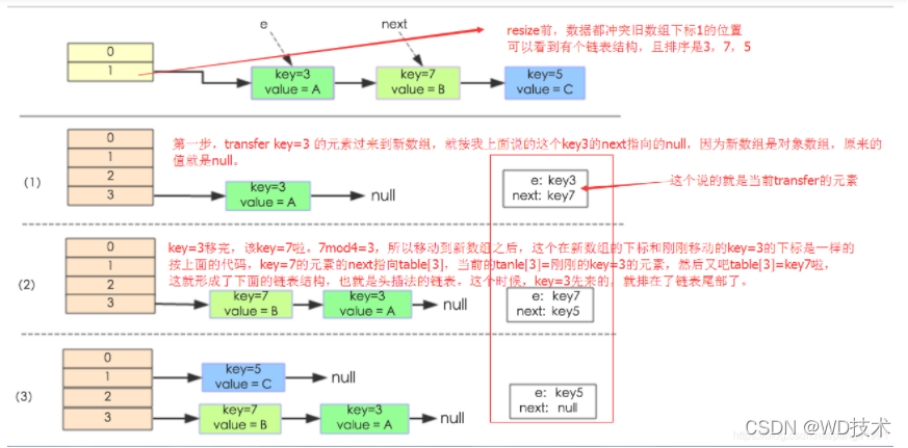
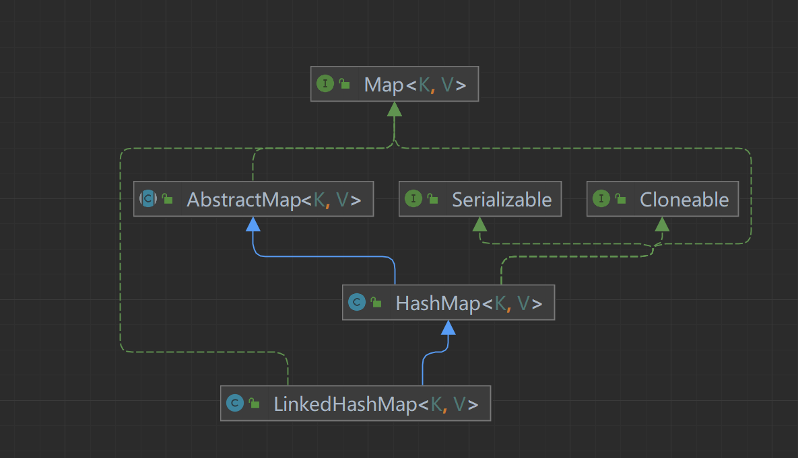

<!-- ## 集合 -->

# 第3节：容器

>- - [HashMap](https://github.com/AobingJava/JavaFamily/blob/master/docs/all/集合框架/HashMap.md)
>    - [HashMap](https://mp.weixin.qq.com/s/0Gf2DzuzgEx0i3mHVvhKNQ)
>
>​		  [面试官：HashMap 为什么线程不安全？](https://mp.weixin.qq.com/s/VtIpj-uuxFj5Bf6TmTJMTw)
>
>​          [万万没想到，HashMap默认容量的选择，竟然背后有这么多思考！？](https://mp.weixin.qq.com/s/ktre8-C-cP_2HZxVW5fomQ)
>
>  - [ConcurrentHashMap](https://github.com/AobingJava/JavaFamily/blob/master/docs/all/集合框架/ConcurrentHashMap.md)
>
>    - [ConcurrentHashMap & Hashtable（文末送书）](https://mp.weixin.qq.com/s/AixdbEiXf3KfE724kg2YIw)
>
>      [我就知道面试官接下来要问我 ConcurrentHashMap 底层原理了](https://mp.weixin.qq.com/s/My4P_BBXDnAGX1gh630ZKw)
>
>  - [ArrayList](https://github.com/AobingJava/JavaFamily/blob/master/docs/all/集合框架/ArrayList.md)
>
>    - [ArrayList](https://mp.weixin.qq.com/s/WoGclm7SsbURGigI3Mwr3w)
>
>      [ArrayList源码解析，老哥，来一起复习一哈？](https://mp.weixin.qq.com/s/3PNWmtS-bEZgZjd9wyMiDA)
>
>  - [Vector](https://github.com/AobingJava/JavaFamily/blob/master/docs/all/集合框架/Vector.md)

## ArrayList

### 自动扩容

通过一个公开的方法ensureCapacity(int minCapacity)来实现,最终是通过grow()方法完成的,数组进行扩容时，默认初始容量大小为10，会将老数组中的元素重新拷贝一份到新的数组中，每次数组容量的增长大约是其原容量的1.5倍

### remove()

`elementData[--size] = null;` //清除该位置的引用，让GC起作用,如果不手动赋null值，除非对应的位置被其他元素覆盖，否则原来的对象就一直不会被回收

### 线程不安全

## LinkedList

底层双向链表

## Queue

- Queue 是单端队列，只能从一端插入元素，另一端删除元素，实现上一般遵循 先进先出（FIFO） 规则。

- Deque 是双端队列，在队列的两端均可以插入或删除元素。


### PriorityQueue

- PriorityQueue 是在 JDK1.5 中被引入的, 其与 Queue 的区别在于元素出队顺序是与优先级相关的，即总是优先级最高的元素先出队。

- PriorityQueue 利用了二叉堆的数据结构来实现的，底层使用可变长的数组来存储数据

- PriorityQueue 通过堆元素的上浮和下沉，实现了在 O(logn) 的时间复杂度内插入元素和删除堆顶元素。

- PriorityQueue 是非线程安全的，且不支持存储 NUL和 non-comparable 的对象。

- PriorityQueue 默认是小顶堆，但可以接收一个 Comparator 作为构造参数，从而来自定义元素优先级的先后。


## HashMap

### 底层实现

**JDK1.8 之前**

JDK1.8 之前 HashMap 底层是数组和链表 结合在一起使用也就是 链表散列。HashMap 通过 key 的 hashCode 经过扰动函数处理过后得到 hash 值，然后通过 (n - 1) & hash 判断当前元素存放的位置（这里的 n 指的是数组的长度），如果当前位置存在元素的话，就判断该元素与要存入的元素的 hash 值以及 key 是否相同，如果相同的话，直接覆盖，不相同就通过拉链法解决冲突。

所谓扰动函数指的就是 HashMap 的 hash 方法，使用扰动函数之后可以减少碰撞。

**JDK1.8 之后**

相比于之前的版本， JDK1.8 之后在解决哈希冲突时有了较大的变化，当链表长度大于阈值（默认为 8）（将链表转换成红黑树前会判断，如果当前数组的长度小于 64，那么会选择先进行数组扩容，而不是转换为红黑树）时，将链表转化为红黑树，以减少搜索时间。

Java8 中使用 Node，基本没有区别，都是 key，value，hash 和 next 这四个属性，不过，Node 只能用于链表的情况，红黑树的情况需要使用 TreeNode

### get()

根据指定的key值返回对应的value，该方法调用了getEntry(Object key)得到相应的entry，然后返回entry.getValue()。因此getEntry()是算法的核心。算法思想是首先通过hash()函数得到对应bucket的下标，然后依次遍历冲突链表，通过key.equals(k)方法来判断是否是要找的那个entry。

### put()

往map插入元素的时候首先通过对key hash然后与数组长度-1进行与运算((n-1)&hash)，都是2的次幂所以等同于取模，但是位运算的效率更高。找到数组中的位置之后，如果数组中没有元素直接存入，反之则判断key是否相同，key相同就覆盖，否则就会插入到链表的尾部，如果链表长度超过8，且table数组的长度不小于64时，则会转换成红黑树，最后判断数组长度是否超过默认的长度*负载因子也就是12，超过则进行扩容。

1. HashMap是懒惰创建数据的，首次使用才会创建数组

2. 计算索引（桶下标）
3. 如果还没有人占用，就创建node占位后返回
4. 如果下标已经被人占用，
   1. 已经是TreeNode走红黑树的添加或者更新
   2. 是普通Node，走链表的添加或者更新，如果链表长度超过阈值，走树化逻辑
5. 返回前检查容量是否超过阈值，一旦超过就进行扩容

**1.7与1.8的区别**

链表插入节点时，1.7 是头插法，1.8 是尾插法

1.7 是大于等于阈值且该索引下没有空位时才扩容，而 1.8 是大于阈值就扩容

1.8 在扩容计算 Node 索引时，会优化（旧的hash值跟当前的数组容量按位与，如果是0，说明不用动位置； 不是0，旧索引+旧容量）

### 扩容原理

当向容器添加元素的时候，会判断当前容器的元素个数，如果大于等于阈值—即当前数组的长度小于元素乘以加载因子的值的时候，就要自动扩容啦,进行2倍扩容。

HashMap容量（capacity）：默认 16。
HashMap负载因子（loadFactor）：默认 0.75。
负载因子 = `size / capacity` 这里的size是填入HashMap的元素的个数，而不是数组（桶）的填充数量。比如数组的长度是16 ，占用桶的数量可能只有10，但是因为链表的存在可以存入12个元素。当存入第13个元素后时才会进行扩容，**注意是 添加元素后**。
HashMap阈值（threshold）：阈值=容量*加载因子。默认 12。当元素数量>阈值时便会扩容。

**1.7**



1.8

可以看到它是通过将数据的hash与扩容前的长度进行与操作，根据结果为0还是不为0来做对应的处理e.hash & oldCap。

如果是0，说明位置没有发生变化，如果不为0，说明位置发生了变化，而且新的位置=老的位置+老的数组长度

**扩容（加载）因子为何默认是 0.75f？**

1. 在空间占用与查询时间之间取得较好的权衡
2. 大于这个值，空间节省了，但链表就会比较长影响性能
3. 小于这个值，冲突减少了，但扩容就会更频繁，空间占用也更多

**HashMap索引的计算方法是啥？**

先调用对象的hashcode()方法，然后再调用HashMap中的int hash(int hash)方法进行二次hash，二次hash是为了综合高位数据，使得hash分布更加均匀。最后再进行&(capactiy-1)得到索引

注意：二次hash是为了配合容量是2的n次幂这一设计前提，如果hash表的容量不是2的n次幂，则不需要进行二次hash


**HashMap 的长度为什么是 2 的幂次方**

为了能让 HashMap 存取高效，尽量较少碰撞，也就是要尽量把数据分配均匀。

我们首先可能会想到采用%取余的操作来实现。但是，重点来了：“取余(%)操作中如果除数是 2 的幂次则等价于与其除数减一的与(&)操作（也就是说 hash%length==hash&(length-1)的前提是 length 是 2 的 n 次方；）。” 并且 采用二进制位操作 &，相对于%能够提高运算效率，这就解释了 HashMap 的长度为什么是 2 的幂次方。

### 多线程不安全

**HashMap多线程操作导致死循环问题**

主要原因在于并发数组扩容时链表复制使用的是头插发，并发下的 会造成元素之间会形成一个循环链表。不过，jdk 1.8 改用尾插法后解决了这个问题，但是还是会发送数据覆盖的情况

[为什么HashMap会产生死循环？](https://blog.csdn.net/gupaoedu_tom/article/details/124449573)

## ConcurrentHashMap

### 1.7分段锁

1.7 使用Segment+HashEntry分段锁的方式实现

从结构上说，1.7版本的ConcurrentHashMap采用分段锁机制，里面包含一个Segment数组，Segment继承与ReentrantLock，Segment则包含HashEntry的数组，HashEntry本身就是一个链表的结构，具有保存key、value的能力能指向下一个节点的指针。

实际上就是相当于每个Segment都是一个HashMap，默认的Segment长度是16，也就是支持16个线程的并发写，Segment之间相互不会受到影响。

**put流程**

其实发现整个流程和HashMap非常类似，只不过是先定位到具体的Segment，然后通过ReentrantLock去操作而已，后面的流程我就简化了，因为和HashMap基本上是一样的。

计算hash，定位到segment，segment如果是空就先初始化

使用ReentrantLock加锁，如果获取锁失败则尝试自旋，自旋超过次数就阻塞获取，保证一定获取锁成功

遍历HashEntry，就是和HashMap一样，数组中key和hash一样就直接替换，不存在就再插入链表，链表同样

get不需要同步/加锁

1. 访问的绝大数变量是volatile类型的，如count,node.val,node.next

2. 访问的变量只有一个不是volatile的，即table[]得每个元素，也就是说可能刚才已经成功插入一个table[i]=node,但是读的时候确是null

3. 当找不到的时候，它会在加锁的情况下再读一次  

HashEntry

HashEntry 用来封装散列映射表中的键值对。在 HashEntry 类中，key，hash 和 next 域都被声明为 fina型，value 域被声明为 volatile 型 

```java
static finaclass HashEntry<K, V> {

  finaint hash;

  finaK key;

   volatile V value;

   volatile ConcurrentHashMap.HashEntry<K, V> next;

   static finaUnsafe UNSAFE;

   static finalong nextOffset;

 

   HashEntry(int var1, K var2, V var3, ConcurrentHashMap.HashEntry<K, V> var4) {

     this.hash = var1;

     this.key = var2;

     this.value = var3;

     this.next = var4;

   }

 

   finavoid setNext(ConcurrentHashMap.HashEntry<K, V> var1) {

     UNSAFE.putOrderedObject(this, nextOffset, var1);

   }

 

   static {

     try {

       UNSAFE = Unsafe.getUnsafe();

       Class var0 = ConcurrentHashMap.HashEntry.class;

       nextOffset = UNSAFE.objectFieldOffset(var0.getDeclaredField("next"));

     } catch (Exception var1) {

       throw new Error(var1);

     }

   }

 }
```


​	

### 1.8CAS+synchronized

1.8抛弃分段锁，转为用CAS+synchronized来实现，同样HashEntry改为Node，也加入了红黑树的实现。主要还是看put的流程。

**put流程**

首先计算hash，遍历node数组，如果node是空的话，就通过CAS+自旋的方式初始化

如果当前数组位置是空则直接通过CAS自旋写入数据

如果hash==MOVED，说明需要扩容，执行扩容

如果都不满足，就使用synchronized写入数据，写入数据同样判断链表、红黑树，链表写入和HashMap的方式一样，key hash一样就覆盖，反之就尾插法，链表长度超过8就转换成红黑树

NODE类

```java
static class Node<K,V> implements Map.Entry<K,V> {

    finaint hash;

    finaK key;

    volatile V val;

    volatile Node<K,V> next;

 

    Node(int hash, K key, V val, Node<K,V> next) {

      this.hash = hash;

      this.key = key;

      this.va= val;

      this.next = next;

    }

 

    public finaK getKey()    { return key; }

    public finaV getValue()   { return val; }

    public finaint hashCode()  { return key.hashCode() ^ val.hashCode(); }

    public finaString toString(){ return key + "=" + val; }

    public finaV setValue(V value) {

      throw new UnsupportedOperationException();

    }

 

    public finaboolean equals(Object o) {

      Object k, v, u; Map.Entry<?,?> e;

      return ((o instanceof Map.Entry) &&

          (k = (e = (Map.Entry<?,?>)o).getKey()) != nul&&

          (v = e.getValue()) != nul&&

          (k == key || k.equals(key)) &&

          (v == (u = val) || v.equals(u)));

    }

 

    /

     * Virtualized support for map.get(); overridden in subclasses.

     */

    Node<K,V> find(int h, Object k) {

      Node<K,V> e = this;

      if (k != null) {

        do {

          K ek;

          if (e.hash == h &&

            ((ek = e.key) == k || (ek != nul&& k.equals(ek))))

            return e;

        } while ((e = e.next) != null);

      }

      return null;

    }

  }
```

## HashTable

数据结构是数组加链表，put用synchronized

为什么HashTable慢 

Hashtable之所以效率低下主要是因为其实现使用了synchronized关键字对put等操作进行加锁，而synchronized关键字加锁是对整个对象进行加锁，也就是说在进行put等修改Hash表的操作时，锁住了整个Hash表，从而使得其表现的效率低下。

## LinkedHashMap

LinkedHashMap在HashMap的基础上，采用双向链表(doubly-linked list)的形式将所有entry连接起来，这样是为保证元素的迭代顺序跟插入顺序相同

linkedHashMap特点是有序，可以按照插入的顺序或者读取的顺序排序。  
继承关系：
   
源码：

```java
    // true 以读的顺序，false 以插入的顺序，默认false
    final boolean accessOrder;

    // 构造函数
    public LinkedHashMap() {
        super();
        accessOrder = false;
    }
    public LinkedHashMap(Map<? extends K, ? extends V> m) {
        super();
        accessOrder = false;
        putMapEntries(m, false);
    }
    public LinkedHashMap(int initialCapacity,
                         float loadFactor,
                         boolean accessOrder) {
        super(initialCapacity, loadFactor);
        this.accessOrder = accessOrder;
    }

    public V get(Object key) {
        Node<K,V> e;
        if ((e = getNode(hash(key), key)) == null)
            return null;
        if (accessOrder)
            afterNodeAccess(e);
        return e.value;
    }

    // link at the end of list
    private void linkNodeLast(LinkedHashMap.Entry<K,V> p) {
        LinkedHashMap.Entry<K,V> last = tail;
        tail = p;
        if (last == null)
            head = p;
        else {
            p.before = last;
            last.after = p;
        }
    }
    // apply src's links to dst
    // 将dst替换src
    private void transferLinks(LinkedHashMap.Entry<K,V> src,
                               LinkedHashMap.Entry<K,V> dst) {
        LinkedHashMap.Entry<K,V> b = dst.before = src.before;
        LinkedHashMap.Entry<K,V> a = dst.after = src.after;
        if (b == null)
            head = dst;
        else
            b.after = dst;
        if (a == null)
            tail = dst;
        else
            a.before = dst;
    }
     // unlink 
     // 从链表中删除节点
    void afterNodeRemoval(Node<K,V> e) {
        LinkedHashMap.Entry<K,V> p =
            (LinkedHashMap.Entry<K,V>)e, b = p.before, a = p.after;
        p.before = p.after = null;
        if (b == null)
            head = a;
        else
            b.after = a;
        if (a == null)
            tail = b;
        else
            a.before = b;
    }
    // possibly remove eldest
    void afterNodeInsertion(boolean evict) { 
        LinkedHashMap.Entry<K,V> first;
        if (evict && (first = head) != null && removeEldestEntry(first)) {
            K key = first.key;
            removeNode(hash(key), key, null, false, true);
        }
    }

    void afterNodeAccess(Node<K,V> e) { // move node to last
        LinkedHashMap.Entry<K,V> last;
        if (accessOrder && (last = tail) != e) {
            LinkedHashMap.Entry<K,V> p =
                (LinkedHashMap.Entry<K,V>)e, b = p.before, a = p.after;
            p.after = null;
            if (b == null)
                head = a;
            else
                b.after = a;
            if (a != null)
                a.before = b;
            else
                last = b;
            if (last == null)
                head = p;
            else {
                p.before = last;
                last.after = p;
            }
            tail = p;
            ++modCount;
        }
    }
```

## TreeMap,TreeSet

排序，TreeMap底层通过红黑树(Red-Black tree)实现

## BigDecimal 

## 总结

### 红黑树

红黑树是一种近似平衡的二叉查找树，它能够确保任何一个节点的左右子树的高度差不会超过二者中较低那个的一倍。具体来说，红黑树是满足如下条件的二叉查找树(binary search tree): 

1. 每个节点要么是红色，要么是黑色。 

2. 根节点必须是黑色 

3. 红色节点不能连续(也即是，红色节点的孩子和父亲都不能是红色)。 

4. 对于每个节点，从该点至null(树尾端)的任何路径，都含有相同个数的黑色节点。 

5. 所有叶子都是黑色

 在树的结构发生改变时(插入或者删除操作)，往往会破坏上述条件3或条件4，需要通过调整使得查找树重新满足红黑树的约束条件

### HashMap 和 Hashtable 的区别

- 线程是否安全： HashMap 是非线程安全的，Hashtable 是线程安全的,

- 效率: 为线程安全的问题，HashMap 要比 Hashtable 效率高一点。

- 对 Nulkey 和 Nulvalue 的支持： HashMap 可以存储 nul的 key 和 value，但 nul作为键只能有一个，nul作为值可以有多个；Hashtable 不允许有 nul键和 nul值

- 初始容量大小和每次扩充容量大小的不同 ： ① 创建时如果不指定容量初始值，Hashtable 默认的初始大小为 11，之后每次扩充，容量变为原来的 2n+1。HashMap 默认的初始化大小为 16。之后每次扩充，容量变为原来的 2 倍。② 创建时如果给定了容量初始值，那么 Hashtable 会直接使用你给定的大小，而 HashMap 会将其扩充为 2 的幂次方大小

- 底层数据结构： JDK1.8 以后的 HashMap 在解决哈希冲突时有了较大的变化，当链表长度大于阈值（默认为 8）（将链表转换成红黑树前会判断，如果当前数组的长度小于 64，那么会选择先进行数组扩容，而不是转换为红黑树）时，将链表转化为红黑树，以减少搜索时间。


### ConcurrentHashMap 和 Hashtable 的区别

ConcurrentHashMap 和 Hashtable 的区别主要体现在实现线程安全的方式上不同。

- 底层数据结构： JDK1.7 的 ConcurrentHashMap 底层采用 分段的数组+链表 实现，JDK1.8 采用的数据结构跟 HashMap1.8 的结构一样，数组+链表/红黑二叉树。Hashtable 和 JDK1.8 之前的 HashMap 的底层数据结构类似都是采用 数组+链表 的形式，数组是 HashMap 的主体，链表则是主要为了解决哈希冲突而存在的；

- 实现线程安全的方式（重要）： ① 在 JDK1.7 的时候，ConcurrentHashMap（分段锁） 对整个桶数组进行了分割分段(Segment)，每一把锁只锁容器其中一部分数据，多线程访问容器里不同数据段的数据，就不会存在锁竞争，提高并发访问率。 到了 JDK1.8 的时候已经摒弃了 Segment 的概念，而是直接用 Node 数组+链表+红黑树的数据结构来实现，并发控制使用 synchronized 和 CAS 来操作。（JDK1.6 以后 对 synchronized 锁做了很多优化） 整个看起来就像是优化过且线程安全的 HashMap，虽然在 JDK1.8 中还能看到 Segment 的数据结构，但是已经简化了属性，只是为了兼容旧版本；② Hashtable(同一把锁) :使用 synchronized 来保证线程安全，效率非常低下。当一个线程访问同步方法时，其他线程也访问同步方法，可能会进入阻塞或轮询状态，如使用 put 添加元素，另一个线程不能使用 put 添加元素，也不能使用 get，竞争会越来越激烈效率越低。

### ArrayDeque 与 LinkedList 的区别

- ArrayDeque 是基于可变长的数组和双指针来实现，而 LinkedList 则通过链表来实现。

- ArrayDeque 不支持存储 NUL数据，但 LinkedList 支持。

- ArrayDeque 是在 JDK1.6 才被引入的，而LinkedList 早在 JDK1.2 时就已经存在。

- ArrayDeque 插入时可能存在扩容过程, 不过均摊后的插入操作依然为 O(1)。虽然 LinkedList 不需要扩容，但是每次插入数据时均需要申请新的堆空间，均摊性能相比更慢。