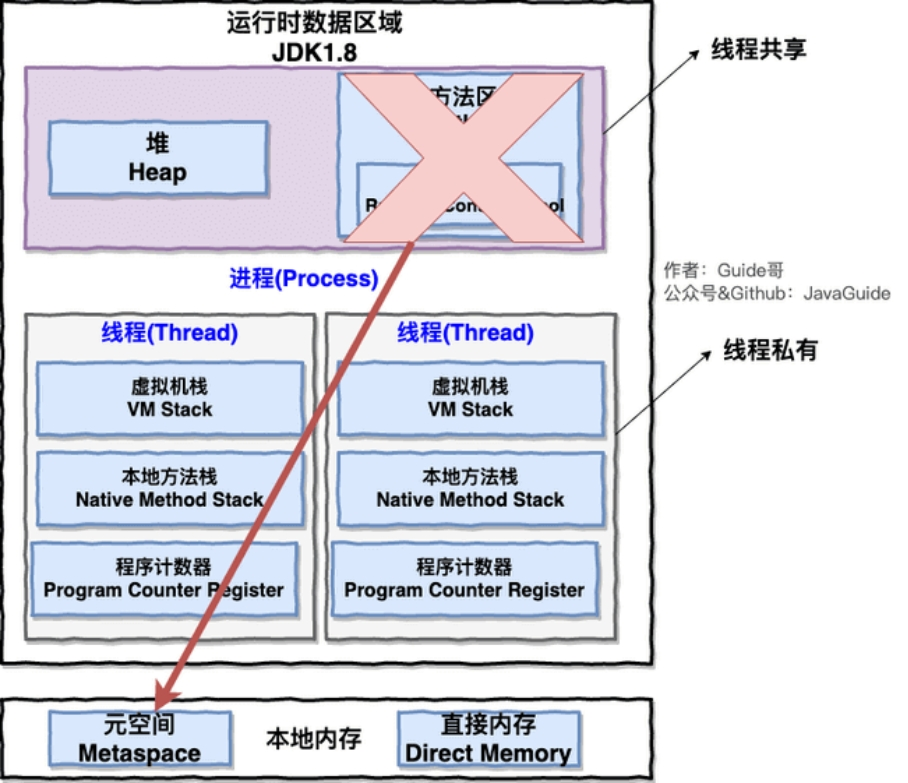
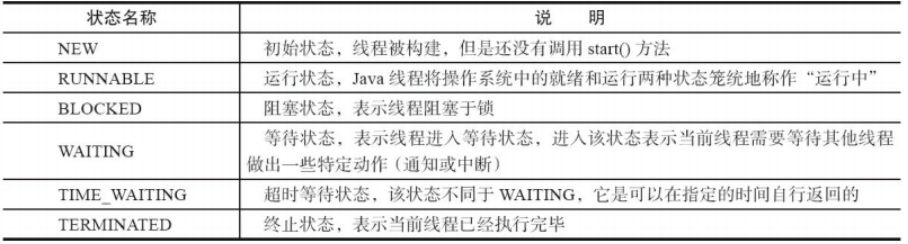
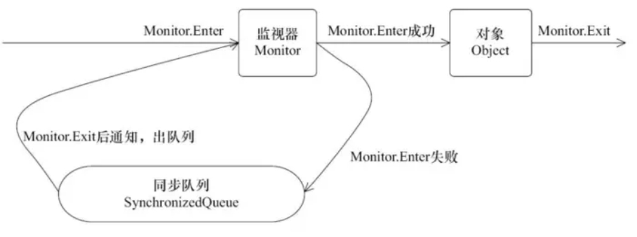
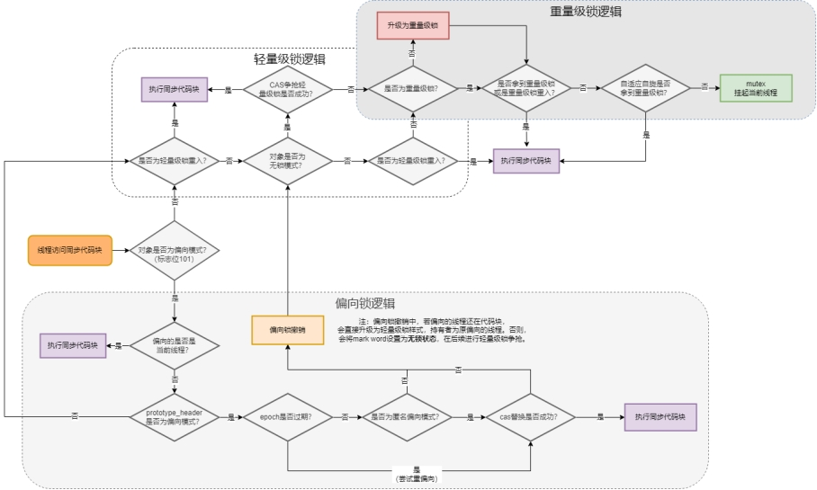
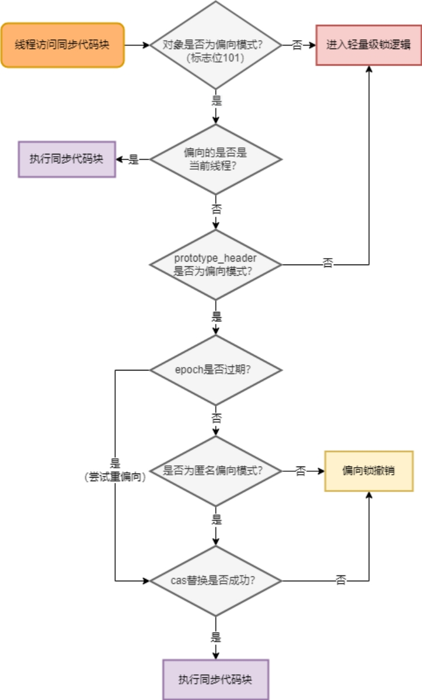
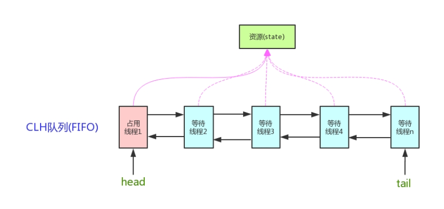
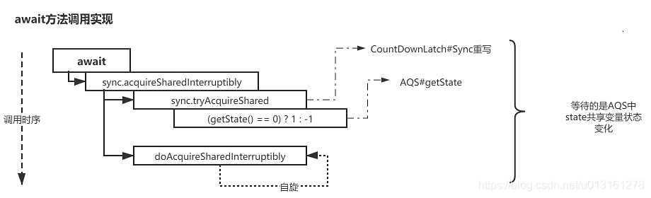
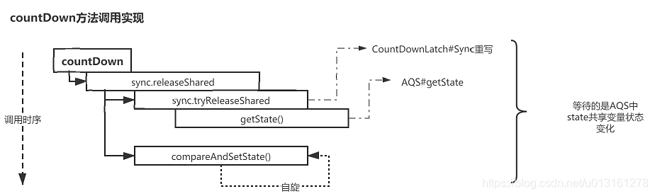

# 第3节 多线程与并发


## 并发理论基础

### 线程和进程

进程是程序的一次执行过程，是系统运行程序的基本单位，因此进程是动态的。系统运行一个程序即是一个进程从创建，运行到消亡的过程。

线程与进程相似，但线程是一个比进程更小的执行单位。一个进程在其执行的过程中可以产生多个线程。与进程不同的是同类的多个线程共享进程的堆和方法区资源，但每个线程有自己的程序计数器、虚拟机栈和本地方法栈，所以系统在产生一个线程，或是在各个线程之间作切换工作时，负担要比进程小得多，也正因为如此，线程也被称为轻量级进程。


 

堆和方法区是所有线程共享的资源，其中堆是进程中最大的一块内存，主要用于存放新创建的对象 (几乎所有对象都在这里分配内存)，方法区主要用于存放已被加载的类信息、常量、静态变量、即时编译器编译后的代码等数据。

**总结**:v:  : 线程是进程划分成的更小的运行单位。线程和进程最大的不同在于基本上各进程是独立的，而各线程则不一定，因为同一进程中的线程极有可能会相互影响。线程执行开销小，但不利于资源的管理和保护；而进程正相反。

### 线程死锁

线程死锁描述的是这样一种情况：多个线程同时被阻塞，它们中的一个或者全部都在等待某个资源被释放。由于线程被无限期地阻塞，因此程序不可能正常终止。

- 互斥条件：该资源任意一个时刻只由一个线程占用。
- 请求与保持条件：一个线程因请求资源而阻塞时，对已获得的资源保持不放。
- 不剥夺条件: 线程已获得的资源在未使用完之前不能被其他线程强行剥夺，只有自己使用完毕后才释放资源。
- 循环等待条件:若干线程之间形成一种头尾相接的循环等待资源关系。

如何预防死锁？ 破坏死锁的产生的必要条件即可：

- 破坏请求与保持条件 ：一次性申请所有的资源。
- 破坏不剥夺条件 ：占用部分资源的线程进一步申请其他资源时，如果申请不到，可以主动释放它占有的资源。
- 破坏循环等待条件 ：靠按序申请资源来预防。按某一顺序申请资源，释放资源则反序释放。破坏循环等待条件。

### sleep() 方法和 wait() 

两者最主要的区别在于：

- sleep() 方法没有释放锁，而 wait() 方法释放了锁 。
- 两者都可以暂停线程的执行。
- wait() 通常被用于线程间交互/通信，sleep() 通常被用于暂停执行。
- wait() 方法被调用后，线程不会自动苏醒，需要别的线程调用同一个对象上的 notify() 或者 notifyAll() 方法。sleep() 方法执行完成后，线程会自动苏醒。或者可以使用 wait(long timeout) 超时后线程会自动苏醒。

### 上下文切换

当出现如下情况的时候，线程会从占用 CPU 状态中退出

1. 主动让出 CPU，比如调用了 sleep(), wait() 等。
2. 时间片用完，因为操作系统要防止一个线程或者进程长时间占用CPU导致其他线程或者进程饿死。
3. 调用了阻塞类型的系统中断，比如请求 IO，线程被阻塞。
4. 被终止或结束运行

这其中前三种都会发生线程切换，线程切换意味着需要保存当前线程的上下文，留待线程下次占用 CPU 的时候恢复现场。并加载下一个将要占用 CPU 的线程上下文。这就是所谓的 上下文切换

### 为什么需要多线程

  众所周知，CPU、内存、I/O 设备的速度是有极大差异的，为了合理利用 CPU 的高性能，平衡这三者的速度差异，计算机体系结构、操作系统、编译程序都做出了贡献，主要体现为:

1. CPU 增加了缓存，以均衡与内存的速度差异；// 导致可见性问题
2. 操作系统增加了进程、线程，以分时复用 CPU，进而均衡 CPU 与 I/O 设备的速度差异；// 导致原子性问题
3. 编译程序优化指令执行次序，使得缓存能够得到更加合理地利用。// 导致有序性问题

为了解决缓存不一致性问题，计算机底层通常来说有以下2种解决方法：

-  通过在总线加LOCK锁的方式（塞了其他CPU对其他部件访问（如内存），从而使得只能有一个CPU能使用这个变量的内存）

-  通过缓存一致性协议（当线程修改内存时通知其他线程 此时内存以改变，缓存失效需要重新读取）

### 指令重排序

处理器为了提高程序运行效率，可能会对输入代码进行优化，它不保证程序中各个语句的执行先后顺序同代码中的顺序一致，但是它会保证程序最终执行结果和代码顺序执行的结果是一致的。(仅能保证单线程的顺序，多线程还是会出现指令排序问题)


### 并发的三个概念

- 原子性：即一个操作或者多个操作 要么全部执行并且执行的过程不会被任何因素打断，要么就都不执行。

- 可见性：多个线程访问同一个变量时，一个线程修改了这个变量的值，其他线程能够立即看得到修改的值。

- 有序性：即程序执行的顺序按照代码的先后顺序执行。（由于指令重排序）

#### 原子性

请分析以下哪些操作是原子性操作：

```java
x = 10;     //语句1
y = x;     //语句2
x++;      //语句3
x = x + 1;   //语句4
```

 咋一看，有些朋友可能会说上面的4个语句中的操作都是原子性操作。其实只有语句1是原子性操作，其他三个语句都不是原子性操作。

- 语句1是直接将数值10赋值给x，也就是说线程执行这个语句的会直接将数值10写入到工作内存中。

- 语句2实际上包含2个操作，它先要去读取x的值，再将x的值写入工作内存，虽然读取x的值以及将x的值写入工作内存这2个操作都是原子性操作，但是合起来就不是原子性操作了（可能读取完就被中断了）。

- 同样的，x++和 x = x+1包括3个操作：读取x的值，进行加1操作，写入新的值。


 所以上面4个语句只有语句1的操作具备原子性。

 也就是说，只有简单的读取、赋值（而且必须是将数字赋值给某个变量，变量之间的相互赋值不是原子操作）才是原子操作。

**不过这里有一点需要注意：在32位平台下，对64位数据的读取和赋值是需要通过两个操作来完成的，不能保证其原子性。但是好像在最新的JDK中，JVM已经保证对64位数据的读取和赋值也是原子性操作了。**

从上面可以看出，Java内存模型只保证了基本读取和赋值是原子性操作，如果要实现更大范围操作的原子性，可以通过synchronized和Lock来实现。由于synchronized和Lock能够保证任一时刻只有一个线程执行该代码块，那么自然就不存在原子性问题了，从而保证了原子性

#### 可见性

java提供了volatile关键字来保证可见性

当一个共享变量被volatile修饰时，它会保证修改的值会立即被更新到主存，当有其他线程 需要读取时，它会去内存中读取新值。（volatile会立刻更新）

而普通的共享变量不能保证可见性，因为普通共享变量被修改之后，什么时候被写入主存是 不确定的，当其他线程去读取时，此时内存中可能还是原来的旧值，因此无法保证可见性。

另外，通过synchronized和Lock也能够保证可见性，synchronized和Lock能保证同一时刻只有一个线程获取锁然后执行同步代码，并且在释放锁之前会将对变量的修改刷新到主存当中。因此可以保证可见性。（个人的理解是他们的效率太慢了）

#### 有序性

在Java内存模型中，允许编译器和处理器对指令进行重排序，但是重排序过程不会影响到单线程程序的执行，却会影响到多线程并发执行的正确性。

在Java里面，可以通过volatile关键字来保证一定的“有序性”。另外可以通过synchronized和Lock来保证有序性，很显然，synchronized和Lock保证每个时刻是有一个线程执行同步代码，相当于是让线程顺序执行同步代码，自然就保证了有序性。

另外，Java内存模型具备一些先天的“有序性”，即不需要通过任何手段就能够得到保证的有序性，这个通常也称为 happens-before 原则。如果两个操作的执行次序无法从happens-before原则推导出来，那么它们就不能保证它们的有序性，虚拟机可以随意地对它们进行重排序。

### Happens-Before 规则

1. 如果一个操作 happens-before 另一个操作，那么第一个操作的执行结果将对第二个操作可见，而且第一个操作的执行顺序排在第二个操作之前。
2. 两个操作之间存在 happens-before 关系，并不意味着 Java 平台的具体实现必须要按照 happens-before 关系指定的顺序来执行。如果重排序之后的执行结果，与按happens-before 关系来执行的结果一致，那么这种重排序并不非法（也就是说，JVM允许这种重排序）。

上面的 1 ） 是 JVM 对程序员的承诺。从程序员的角度来说，可以这样理解 happens-before 关系：如果 A happens-before B，那么 Java 内存模型将向程序员保证——A 操作的结果将对 B 可见，且 A 的执行顺序排在 B 之前。注意，这只是 Java 内存模型向程序员做出的保证！

上面的 2 ）是 JVM 对编译器和处理器重排序的约束原则。正如前面所言，JMM 其 实是在遵循一个基本原则：只要不改变程序的执行结果（指的是单线程程序和正确同步的多线程程序），编译器和处理器怎么优化都行。JMM 这么做的原因是：程序员对于这两个操作是否真的被重排序并不关心，程序员关心的是程序执行时的语义不能被改变（即执行结果不能被改变）。因此，happens-before 关系本质上和 as-if-serial 语义是一回事。

### as-if-serial 语义

as-if-serial 语义的意思是：不管怎么重排序（编译器和处理器为了提高并行度），（单线程）程序的执行结果不能被改变。编译器、runtime 和处理器都必须遵守 as-if-serial 语义。

1. as-if-serial 语义保证单线程内程序的执行结果不被改变，happens-before 关系保证正确同步的多线程程序的执行结果不被改变。
2. as-if-serial 语义给编写单线程程序的程序员创造了一个幻境：单线程程序是按程序的顺序来执行的。happens-before 关系给编写正确同步的多线程程序的程序员创造了一个幻境：正确同步的多线程程序是按 happens-before 指定的顺序来执行的。
3. as-if-serial 语义和 happens-before 这么做的目的，都是为了在不改变程序执行结果的前提下，尽可能地提高程序执行的并行度。

## 线程

### 线程状态

1. 新建(New)：创建后尚未启动

2. 可运行(Runnable)：可能正在运行，也可能正在等待 CPU 时间片。

3. 阻塞(Blocking)：等待获取一个排它锁，如果其线程释放了锁就会结束此状态。

4. 无限期等待(Waiting)：等待其它线程显式地唤醒，否则不会被分配 CPU 时间片。

   - 没有设置 Timeout 参数的 Object.wait() 方法 Object.notify() / Object.notifyAll() 
   - 没有设置 Timeout 参数的 Thread.join() 方法 被调用的线程执行完毕
   - LockSupport.park() 方法

5. 限期等待(Timed Waiting)：无需等待其它线程显式地唤醒，在一定时间之后会被系统自动唤醒。

6. 死亡(Terminated)：可以是线程结束任务之后自己结束，或者产生了异常而结束。

 

### 线程使用方式

1. 实现 Runnable 接口；

2. 实现 Callable 接口；Runnable 和 Callable 接口的类只能当做一个可以在线程中运行的任务，不是真正意义上的线程， FutureTask<Integer> ft = new FutureTask<>(mc);

3. 继承 Thread 类。

Java 不支持多重继承，因此继承了 Thread 类就无法继承其它类，但是可以实现多个接口；类可能只要求可执行就行，继承整个 Thread 类开销过大。

### 线程中断

当对一个线程，调用 interrupt() 时，

1. 如果线程处于被阻塞状态（例如处于sleep, wait, join 等状态），那么线程将立即退出被阻塞状态，并抛出一个InterruptedException异常。仅此而已。 如果线程处于正常活动状态，那么会将该线程的中断标志设置为 true，仅此而已。被设置中断标志的线程将继续正常运行，不受影响。
2. interrupt() 并不能真正的中断线程，需要被调用的线程自己进行配合才行。

也就是说，一个线程如果有被中断的需求，那么就可以这样做。

在正常运行任务时，经常检查本线程的中断标志位，如果被设置了中断标志就自行停止线程。在调阻塞方法时正确处理InterruptedException异常。（例如，catch异常后就结束线程。）

```java
Thread thread = new Thread(() -> {
    while (!Thread.interrupted()) {
        // do more work.
    }
});
thread.start();

// 一段时间以后
thread.interrupt();
```

Thread.interrupted():

1. 返回**当前线程**的中断状态；
2. 将当前线程的中断状态设为false

### join()

在线程中调用另一个线程的 join() 方法，会将当前线程挂起，而不是忙等待，直到目标线程结束。

使用 wait() 挂起期间，线程会释放锁。这是因为，如果没有释放锁，那么其它线程就无法进入对象的同步方法或者同步控制块中，那么就无法执行 notify() 或者 notifyAll() 来唤醒挂起的线程，造成死锁。

### 实现 Runnable 接口和 Callable 接口的区别

- Runnable自 Java 1.0 以来一直存在，但Callable仅在 Java 1.5 中引入,目的就是为了来处理Runnable不支持的用例。

- Runnable 接口 不会返回结果或抛出检查异常，但是 Callable 接口 可以。

## 线程池

> [两道面试题，深入线程池，连环17问 (qq.com)](https://mp.weixin.qq.com/s/NDOx94yY06OnHjrYq2lVYw)
>
> [线程池引发的bug)](https://mp.weixin.qq.com/s/TQGtNpPiTypeKd5kUnfxEw)

### 线程池的状态

总共有 5 种：

1. RUNNING：能接受新任务，并处理阻塞队列中的任务
2. SHUTDOWN：不接受新任务，但是可以处理阻塞队列中的任务
3. STOP：不接受新任务，并且不处理阻塞队列中的任务，并且还打断正在运行任务的线程，就是直接撂担子不干了！
4. TIDYING：所有任务都终止，并且工作线程也为0，处于关闭之前的状态
5. TERMINATED：已关闭。

默认情况下，如果不调用关闭方法，线程池会一直处于 RUNNING 状态，而线程池状态的转移有两个路径：

- 当调用 shutdown() 方法时，线程池的状态会从 RUNNING 到 SHUTDOWN，再到 TIDYING，最后到 TERMENATED 销毁状态；
- 当调用 shutdownNow() 方法时，线程池的状态会从 RUNNING 到 STOP，再到 TIDYING，最后到 TERMENATED 销毁状态。

### 线程池的好处

- 降低资源消耗。通过重复利用已创建的线程降低线程创建和销毁造成的消耗。

- 提高响应速度。当任务到达时，任务可以不需要等到线程创建就能立即执行。

- 提高线程的可管理性。线程是稀缺资源，如果无限制的创建，不仅会消耗系统资源，还会降低系统的稳定性，使用线程池可以进行统一的分配，调优和监控。

### 创建线程池

- ThreadPoolExecutor 通过构造方法实现

- 通过 Executor 框架的工具类 Executors 来实现

### Executor

Executor 管理多个异步任务的执行，而无需程序员显式地管理线程的生命周期。这里的异步是指多个任务的执行互不干扰，不需要进行同步操作。

主要有三种 Executor:

- CachedThreadPool:  一个任务创建一个线程；

- FixedThreadPool:  所有任务只能使用固定大小的线程； 

- SingleThreadExecutor:  相当于大小为 1 的 FixedThreadPool。

#### 中断操作

- 调用 Executor 的 shutdown() 方法会等待线程都执行完毕之后再关闭，

- 调用的是 shutdownNow() 方法，则相当于调用每个线程的 interrupt() 方法。

- 如果只想中断 Executor 中的一个线程，可以通过使用 submit() 方法来提交一个线程，它会返回一个 Future<?> 对象，通过调用该对象的 cancel(true) 方法就可以中断线程。

####  execute()方法和 submit()方法的区别

1. execute()方法用于提交不需要返回值的任务，所以无法判断任务是否被线程池执行成功与否；

2. submit()方法用于提交需要返回值的任务。线程池会返回一个 Future 类型的对象，通过这个 Future 对象可以判断任务是否执行成功，并且可以通过 Future 的 get()方法来获取返回值，get()方法会阻塞当前线程直到任务完成，而使用 get(long timeout，TimeUnit unit)方法则会阻塞当前线程一段时间后立即返回，这时候有可能任务没有执行完。

### newFixedThreadPool

被称为可重用固定线程数的线程池。

```java
    public static ExecutorService newFixedThreadPool(int nThreads) {
        return new ThreadPoolExecutor(nThreads, nThreads,
                                      0L, TimeUnit.MILLISECONDS,
                                      new LinkedBlockingQueue<Runnable>());
    }
```

### newCachedThreadPool

```
public static ExecutorService newCachedThreadPool() {
    return new ThreadPoolExecutor(0, Integer.MAX_VALUE,
                                  60L, TimeUnit.SECONDS,
                                  new SynchronousQueue<Runnable>());
}
```

newCachedThreadPool创建一个可缓存线程池，如果线程池长度超过处理需要，可灵活回收空闲线程，若无可回收，则新建线程。

执行execute方法时，首先会先执行SynchronousQueue的**offer方法提交任务**，并查询线程池中是否有空闲线程来执行SynchronousQueue的**poll方法来移除任务**。如果有，则配对成功，将任务交给这个空闲线程。否则，配对失败，创建新的线程去处理任务；当线程池中的线程空闲时，会执行SynchronousQueue的poll方法等待执行SynchronousQueue中新提交的任务。若超过60s依然没有任务提交到SynchronousQueue，这个空闲线程就会终止；因为maximumPoolSize是无界的，所以提交任务的速度 > 线程池中线程处理任务的速度就要不断创建新线程；每次提交任务，都会立即有线程去处理，因此CachedThreadPool适用于处理**大量、耗时少**的任务。

**缺点：**大家一般不用是因为newCachedThreadPool 可以无线的新建线程，容易造成堆外内存溢出，因为它的最大值是在初始化的时候设置为 Integer.MAX_VALUE，一般来说机器都没那么大内存给它不断使用。

### newScheduledThreadPool

 创建一个定长线程池，支持定时及周期性任务执行。Executors.newScheduledThreadPool(5);与Timer 对比：Timer 的优点在于简单易用，但由于所有任务都是由同一个线程来调度，因此所有任务都是串行执行的，同一时间只能有一个任务在执行，前一个任务的延迟或异常都将会影响到之后的任务（比如：一个任务出错，以后的任务都无法继续）。

ScheduledThreadPoolExecutor的设计思想是，每一个被调度的任务都会由线程池中一个线程去执行，因此任务是并发执行的，相互之间不会受到干扰。需要注意的是，只有当任务的执行时间到来时，ScheduedExecutor 才会真正启动一个线程，其余时间 ScheduledExecutor 都是在轮询任务的状态。

```java
    public ScheduledThreadPoolExecutor(int corePoolSize) {
        super(corePoolSize, Integer.MAX_VALUE, 0, NANOSECONDS,
              new DelayedWorkQueue());
    }
```

ScheduledThreadPoolExecutor 使用的任务队列 DelayQueue 封装了一个 PriorityQueue，PriorityQueue 会对队列中的任务进行排序，执行所需时间短的放在前面先被执行(ScheduledFutureTask 的 time 变量小的先执行)，如果执行所需时间相同则先提交的任务将被先执行(ScheduledFutureTask 的 squenceNumber 变量小的先执行)。

**周期执行**

线程 1 从 DelayQueue 中获取已到期的 ScheduledFutureTask（DelayQueue.take()）。到期任务是指 ScheduledFutureTask的 time 大于等于当前系统的时间；

线程 1 执行这个 ScheduledFutureTask；

线程 1 修改 ScheduledFutureTask 的 time 变量为下次将要被执行的时间；

线程 1 把这个修改 time 之后的 ScheduledFutureTask 放回 DelayQueue 中（DelayQueue.add())

### newSingleThreadExecutor 

创建一个单线程化的线程池，它只会用唯一的工作线程来执行任务，保证所有任务按照指定顺序(FIFO, LIFO, 优先级)执行。现行大多数GUI程序都是单线程的。Android中单线程可用于数据库操作，文件操作，应用批量安装，应用批量删除等不适合并发但可能IO阻塞性及影响UI线程响应的操作

### ThreadPoolExecutor

#### 构造参数

corePoolSize : 核心线程数定义了最小可以同时运行的线程数量。

maximumPoolSize : 当队列中存放的任务达到队列容量的时候，当前可以同时运行的线程数量变为最大线程数。

workQueue: 当新任务来的时候会先判断当前运行的线程数量是否达到核心线程数，如果达到的话，新任务就会被存放在队列中。

keepAliveTime:当线程池中的线程数量大于 corePoolSize 的时候，如果这时没有新的任务提交，核心线程外的线程不会立即销毁，而是会等待，直到等待的时间超过了 keepAliveTime才会被回收销毁；

unit : keepAliveTime 参数的时间单位。

threadFactory :executor 创建新线程的时候会用到。

handler :饱和策略。关于饱和策略下面单独介绍一下。

#### 线程池大小

- CPU 密集型任务(N+1)

- I/O 密集型任务(2N)


#### 动态参数设置

格外需要注意的是corePoolSize， 程序运行期间的时候，我们调用 setCorePoolSize（） 这个方法的话，线程池会首先判断当前工作线程数是否大于corePoolSize，如果大于的话就会回收工作线程。

另外，你也看到了上面并没有动态指定队列长度的方法，美团的方式是自定义了一个叫做 ResizableCapacityLinkedBlockIngQueue 的队列（主要就是把LinkedBlockingQueue的capacity 字段的final关键字修饰给去掉了，让它变为可变的）。

#### 饱和策略

如果当前同时运行的线程数量达到最大线程数量并且队列也已经被放满了任务时，定义一些策略:

- ThreadPoolExecutor.AbortPolicy： 抛出 RejectedExecutionException来拒绝新任务的处理。

- ThreadPoolExecutor.CallerRunsPolicy： 调用执行自己的线程运行任务，也就是直接在调用execute方法的线程中运行(run)被拒绝的任务，如果执行程序已关闭，则会丢弃该任务。因此这种策略会降低对于新任务提交速度，影响程序的整体性能。如果您的应用程序可以承受此延迟并且你要求任何一个任务请求都要被执行的话，你可以选择这个策略。

- ThreadPoolExecutor.DiscardPolicy： 不处理新任务，直接丢弃掉。

- ThreadPoolExecutor.DiscardOldestPolicy： 此策略将丢弃最早的未处理的任务请求。

## 锁

1. **乐观锁**：悲观锁认为自己在使用数据的时候一定有别的线程来修改数据，因此在获取数据的时候会先加锁，确保数据不会被别的线程修改。Java中，synchronized关键字和Lock的实现类都是悲观锁。
2. **悲观锁：**乐观锁认为自己在使用数据时不会有别的线程修改数据，所以不会添加锁，只是在更新数据的时候去判断之前有没有别的线程更新了这个数据
3. 自旋锁 ：
4. 适应性自旋锁：
5. 无锁 
6. 偏向锁  顾名思义，它会偏向于第一个访问锁的线程，如果在运行过程中，同步锁只有一个线程访问，不存在多线程争用的情况，则线程是不需要触发同步的，这种情况下，就会给线程加一个偏向锁。 访问Mark Word中偏向锁的标识是否设置成1，锁标志位是否为01，确认为可偏向状态。
7. 轻量级锁
8. 重量级锁
9. 公平锁 ：公平锁是指多个线程按照申请锁的顺序来获取锁，线程直接进入队列中排队，队列中的第一个线程才能获得锁。公平锁的优点是等待锁的线程不会饿死。缺点是整体吞吐效率相对非公平锁要低，等待队列中除第一个线程以外的所有线程都会阻塞，CPU唤醒阻塞线程的开销比非公平锁大
10. 非公平锁：非公平锁是多个线程加锁时直接尝试获取锁，获取不到才会到等待队列的队尾等待。非公平锁的优点是可以减少唤起线程的开销，整体的吞吐效率高，因为线程有几率不阻塞直接获得锁，CPU不必唤醒所有线程。缺点是处于等待队列中的线程可能会饿死，或者等很久才会获得锁
11. 可重入锁
12. 非可重入锁
13. 独享锁(排他锁)
14. 共享锁


## Synchronized

### 作用域

1. 修饰实例方法:  作用于当前对象实例加锁，进入同步代码前要获得 当前对象实例的锁

   ```java
   synchronized void method() {
     //业务代码
   }
   ```

2. 修饰静态方法:  也就是给当前类加锁，会作用于类的所有对象实例 ，进入同步代码前要获得 当前 class 的锁。因为静态成员不属于任何一个实例对象，是类成员（ static 表明这是该类的一个静态资源，不管 new 了多少个对象，只有一份）。所以，如果一个线程 A 调用一个实例对象的非静态 synchronized 方法，而线程 B 需要调用这个实例对象所属类的静态 synchronized 方法，是允许的，不会发生互斥现象，因为访问静态 synchronized 方法占用的锁是当前类的锁，而访问非静态 synchronized 方法占用的锁是当前实例对象锁。

   ```java
   synchronized static void method() {
     //业务代码
   }
   ```

   

3. 修饰代码块 ：指定加锁对象，对给定对象/类加锁。synchronized(this|object) 表示进入同步代码库前要获得给定对象的锁。synchronized(类.class) 表示进入同步代码前要获得 当前 class 的锁

   ```java
   synchronized(this) {
     //业务代码
   }
   ```


### 双重校验锁实现对象单例

```java
public class Singleton {
  private volatile static Singleton uniqueInstance;
  private Singleton() {
  }
  public  static Singleton getUniqueInstance() {
    //先判断对象是否已经实例过，没有实例化过才进入加锁代码
    if (uniqueInstance == null) {
      //类对象加锁
      synchronized (Singleton.class) {
      //防止两线程同时获取锁，一个执行完 另一个进来有实例一个
        if (uniqueInstance == null) {
          uniqueInstance = new Singleton();
        }
      }
    }
    return uniqueInstance;
  }
}
```

### 原理分析

synchronized是java提供的原子性内置锁，这种内置的并且使用者看不到的锁也被称为监视器锁，使用synchronized之后，会在编译之后在**同步的代码**块前后加上monitorenter和monitorexit字节码指令，他依赖操作系统底层互斥锁实现。他的作用主要就是实现原子性操作和解决共享变量的内存可见性问题。

执行monitorenter指令时会尝试获取对象锁，如果对象没有被锁定或者已经获得了锁，锁的计数器+1。此时其他竞争锁的线程则会进入等待队列中。执行monitorexit指令时则会把计数器-1，当计数器值为0时，则锁释放，处于等待队列中的线程再继续竞争锁。

monitorenter指令会发生如下3中情况之一：

1. monitor计数器为0，意味着目前还没有被获得，那这个线程就会立刻获得然后把锁计数器+1，一旦+1，别的线程再想获取，就需要等待
2. 如果这个monitor已经拿到了这个锁的所有权，又重入了这把锁，那锁计数器就会累加，变成2，并且随着重入的次数，会一直累加
3. 这把锁已经被别的线程获取了，等待锁释放

monitorexit指令：释放对于monitor的所有权，释放过程很简单，就是讲monitor的计数器减1，如果减完以后，计数器不是0，则代表刚才是重入进来的，当前线程还继续持有这把锁的所有权，如果计数器变成0，则代表当前线程不再拥有该monitor的所有权，即释放锁。

synchronized实际上有两个队列waitSet和entryList：

- 当多个线程进入同步代码块时，首先进入entryList

- 有一个线程获取到monitor锁后，就赋值给当前线程，并且计数器+1

- 如果线程调用wait方法，将释放锁，当前线程置为null，计数器-1，同时进入waitSet等待被唤醒，调用notify或者notifyAll之后又会进入entryList竞争锁

- 如果线程执行完毕，同样释放锁，计数器-1，当前线程置为null


对象监视器，同步队列以及执行线程状态之间的关系

 

**方法级的同步**是隐式的ACC_SYNCHRONIZED访问标志：当方法调用时，调用指令将会 检查方法的 ACC_SYNCHRONIZED 访问标志是否被设置，如果设置了，执行线程将先持有monitor， 然后再执行方法，最后再方法完成(无论是正常完成还是非正常完成)时释放monitor。

### 锁的优化

 

**JVM中monitorenter和monitorexit字节码依赖于底层的操作系统的Mutex Lock来实现的，但是由于使用Mutex Lock需要将当前线程挂起并从用户态切换到内核态来执行，这种切换的代价是非常昂贵的；然而在现实中的大部分情况下，同步方法是运行在单线程环境(无锁竞争环境)如果每次都调用Mutex Lock那么将严重的影响程序的性能。**

在jdk1.6中对锁的实现引入了大量的优化:

**锁粗化(Lock Coarsening)**

减少不必要的紧连在一起的unlock，lock操作，将多个连续的锁扩展成一个范围更大的锁。

**锁消除(Lock Elimination)**

​	锁消除是指虚拟机即时编译器再运行时，对一些代码上要求同步，但是被检测到不可能存在共享数据竞争的锁进行消除。锁消除的主要判定依据来源于逃逸分析的数据支持。

​	意思就是：JVM会判断再一段程序中的同步明显不会逃逸出去从而被其他线程访问到，那JVM就把它们当作栈上数据对待，认为这些数据时线程独有的，不需要加同步。此时就会进行锁消除。

**偏向锁(Biased Locking)**

​	如果不存在线程竞争的一个线程获得了锁，那么锁就进入偏向状态，此时Mark Word的结构变为偏向锁结构，锁对象的锁标志位（lock）被改为01，偏向标志位（biased_lock）被改为1，然后线程的ID记录在锁对象的Mark Word中（使用CAS操作完成）。以后该线程获取锁时判断一下线程ID和标志位，就可以直接进入同步块，连CAS操作都不需要，这样就省去了大量有关锁申请的操作，从而也就提升了程序的性能。

缺点：如果锁对象时常被多个线程竞争，偏向锁就是多余的，并且其撤销的过程会带来一些性能开销

可以用过设置-XX:+UseBiasedLocking开启偏向锁。

**轻量级锁(Lightweight Locking)**

如果要理解轻量级锁，那么必须先要了解HotSpot虚拟机中对象头的内存布局。在对象头中(Object Header)存在两部分。第一部分用于存储对象自身的运行时数据，HashCode、GC Age、锁标记位、是否为偏向锁等。一般为32位或者64位(视操作系统位数定)。官方称之为Mark Word，它是实现轻量级锁和偏向锁的关键。 另外一部分存储的是指向方法区对象类型数据的指针(Klass Point)，如果对象是数组的话，还会有一个额外的部分用于存储数据的长度

JVM的对象的对象头中包含有一些锁的标志位，代码进入同步块的时候，JVM将会使用CAS方式来尝试获取锁，如果更新成功则会把对象头中的状态位标记为轻量级锁，如果更新失败，当前线程就尝试自旋来获得锁。

适应性自旋：当线程在获取轻量级锁的过程中执行CAS操作失败时，在进入与monitor相关联的操作系统重量级锁(mutex semaphore)前会进入忙等待(Spinning)然后再次尝试，当尝试一定的次数后如果仍然没有成功则调用与该monitor关联的semaphore(即互斥锁)进入到阻塞状态。


锁膨胀方向： 无锁 → 偏向锁 → 轻量级锁 → 重量级锁 (此过程是不可逆的)

 

### 自旋锁与自适应自旋锁

**自旋锁**

大家都知道，在没有加入锁优化时，Synchronized是一个非常“胖大”的家伙。在多线程竞争锁时，当一个线程获取锁时，它会阻塞所有正在竞争的线程，这样对性能带来了极大的影响。在挂起线程和恢复线程的操作都需要转入内核态中完成，这些操作对系统的并发性能带来了很大的压力。同时HotSpot团队注意到在很多情况下，共享数据的锁定状态只会持续很短的一段时间，为了这段时间去挂起和回复阻塞线程并不值得。在如今多处理器环境下，完全可以让另一个没有获取到锁的线程在门外等待一会(自旋)，但不放弃CPU的执行时间。等待持有锁的线程是否很快就会释放锁。为了让线程等待，我们只需要让线程执行一个忙循环(自旋)，这便是自旋锁由来的原因。

在JDK 1.6后默认为开启状态。自旋锁本质上与阻塞并不相同，先不考虑其对多处理器的要求，如果锁占用的时间非常的短，那么自旋锁的性能会非常的好，相反，其会带来更多的性能开销(因为在线程自旋时，始终会占用CPU的时间片，如果锁占用的时间太长，那么自旋的线程会白白消耗掉CPU资源)。因此自旋等待的时间必须要有一定的限度，如果自选超过了限定的次数仍然没有成功获取到锁，就应该使用传统的方式去挂起线程了，在JDK定义中，自旋锁默认的自旋次数为10次，用户可以使用参数-XX:PreBlockSpin来更改。 可是现在又出现了一个问题：如果线程锁在线程自旋刚结束就释放掉了锁，那么是不是有点得不偿失。所以这时候我们需要更加聪明的锁来实现更加灵活的自旋。来提高并发的性能。(这里则需要自适应自旋锁！)

**自适应自旋锁**

 在JDK 1.6中引入了自适应自旋锁。这就意味着自旋的时间不再固定了，而是由前一次在同一个锁上的自旋 时间及锁的拥有者的状态来决定的。如果在同一个锁对象上，自旋等待刚刚成功获取过锁，并且持有锁的线程正在运行中，那么JVM会认为该锁自旋获取到锁的可能性很大，会自动增加等待时间。比如增加到100此循环。相反，如果对于某个锁，自旋很少成功获取锁。那再以后要获取这个锁时将可能省略掉自旋过程，以避免浪费处理器资源。有了自适应自旋，JVM对程序的锁的状态预测会越来越准确，JVM也会越来越聪明。

### synchronized的缺陷 

- 效率低：锁的释放情况少，只有代码执行完毕或者异常结束才会释放锁；试图获取锁的时候不能设定超时，不能中断一个正在使用锁的线程，相对而言，Lock可以中断和设置超时 

- 不够灵活：加锁和释放的时机单一，每个锁仅有一个单一的条件(某个对象)，相对而言，读写锁更加灵活 

- 无法知道是否成功获得锁，相对而言，Lock可以拿到状态，如果成功获取锁，....，如果获取失败，.....   

### 使用Synchronized有哪些要注意的？ 

- 锁对象不能为空，因为锁的信息都保存在对象头里 

- 作用域不宜过大，影响程序执行的速度，控制范围过大，编写代码也容易出错 

### 避免死锁 

在能选择的情况下，既不要用Lock也不要用synchronized关键字，用java.util.concurrent包中的各种各样的类，如果不用该包下的类，在满足业务的情况下，可以使用synchronized关键，因为代码量少，避免出错 

### synchronized是公平锁吗？ 

synchronized实际上是非公平的，新来的线程有可能立即获得监视器，而在等待区中等候已久的线程可能再次等待，这样有利于提高性能，但是也可能会导致饥饿现象。

## ReentrantLock

Lock类这里不做过多解释，主要看里面的4个方法:

- lock(): 加锁 
- unlock(): 解锁
- tryLock(): 尝试获取锁，返回一个boolean值 tryLock(long,TimeUtil): 尝试获取锁，可以设置超时 Synchronized只有锁只与一个条件(是否获取锁)相关联，不灵活，后来Condition与Lock的结合解决了这个问题。 
- lockInterruptibly(): 多线程竞争一个锁时，其余未得到锁的线程只能不停的尝试获得锁，而不能中断。高并发的情况下会导致性能下降。ReentrantLock的lockInterruptibly()方法可以优先考虑响应中断。 一个线程等待时间过长，它可以中断自己，然后ReentrantLock响应这个中断，不再让这个线程继续等待。有了这个机制，使用ReentrantLock时就不会像synchronized那样产生死锁了。

### 原理

ReentrantLock基于AQS+CAS实现。

ReentrantLock的基本实现可以概括为：先通过CAS尝试获取锁。如果此时已经有线程占据了锁，那就加入AQS队列并且被挂起。当锁被释放之后，排在CLH队列队首的线程会被唤醒，然后CAS再次尝试获取锁。


### 与synchronized的区别

1. **锁的实现**：synchronized 是 JVM 实现的，而 ReentrantLock 是 JDK 实现的。
2. **性能：**新版本 Java 对 synchronized 进行了很多优化，例如自旋锁等，synchronized 与 ReentrantLock 大致相同。
3. **等待可中断：**当持有锁的线程长期不释放锁的时候，正在等待的线程可以选择放弃等待，改为处理其他事情。ReentrantLock 可中断，而 synchronized 不行。
4. **公平锁：**指多个线程在等待同一个锁时，必须按照申请锁的时间顺序来依次获得锁。synchronized 中的锁是非公平的，ReentrantLock 默认情况下也是非公平的，但是也可以是公平的。
5. **锁绑定多个条件：**一个 ReentrantLock 可以同时绑定多个 Condition 对象。

使用选择：优先使用 synchronized，JVM 原生地支持它，而 ReentrantLock 不是所有的 JDK 版本都支持，并且使用 synchronized 不用担心没有释放锁而导致死锁问题，因为 JVM 会确保锁的释放

## volatile详解

### synchronized 和 volatile 的区别

- synchronized 关键字和 volatile 关键字是两个互补的存在，而不是对立的存在！

- volatile 关键字是线程同步的轻量级实现，所以 volatile 性能肯定比synchronized关键字要好 。但是 volatile 关键字只能用于变量而 synchronized 关键字可以修饰方法以及代码块 。

- volatile 关键字能保证数据的可见性，但不能保证数据的原子性。synchronized 关键字两者都能保证。

- volatile关键字主要用于解决变量在多个线程之间的可见性，而 synchronized 关键字解决的是多个线程之间访问资源的同步性。

### volatile作用

- 实现可见性
- 保证原子性: 单次读/写
- volatile 禁止重排序 

### 防重排序

```java
public class Singleton {   
public static volatile Singleton singleton;   
  private Singleton() {};   
  public static Singleton getInstance() {     
    if (singleton == null) {       
      synchronized (singleton.class) {         
        if (singleton == null) {           
          singleton = new Singleton();         
         }              
      }     
    }     
    return singleton;   
  }
  }
```

现在我们分析一下为什么要在变量singleton之间加上volatile关键字。要理解这个问题，先要了解对象的构造过程，实例化一个对象其实可以分为三个步骤： 

1. 分配内存空间。

2. 初始化对象。 

3. 将内存空间的地址赋值给对应的引用。 


但是由于操作系统可以对指令进行重排序，所以上面的过程也可能会变成如下过程： 

1. 分配内存空间。 

2. 将内存空间的地址赋值给对应的引用。 

3. 初始化对象 


如果是这个流程，多线程环境下就可能将一个未初始化的对象引用暴露出来，从而导致不可预料的结果。因此，为了防止这个过程的重排序，我们需要将变量设置为volatile类型的变量。

为了性能优化，JMM 在不改变正确语义的前提下，会允许编译器和处理器对指令序列进行重排序。JMM 提供了内存屏障阻止这种重排序。 Java 编译器会在生成指令系列时在适当的位置会插入内存屏障指令来禁止特定类型的处理器重排序。

### volatile 可见性实现

- 内存屏障，又称内存栅栏，是一个 CPU 指令。 在程序运行时，为了提高执行性能，编译器和处理器会对指令进行重排序，JMM 为了保证在不同的编译器和 CPU 上有相同的结果，通过插入特定类型的内存屏障来禁止+ 特定类型的编译器重排序和处理器重排序，插入一条内存屏障会告诉编译器和 CPU：不管什么指令都不能和这条 Memory Barrier 指令重排序。

- lock 指令 在 Pentium 和早期的 IA-32 处理器中，lock 前缀会使处理器执行当前指令时产生一个 LOCK# 信号，会对总线进行锁定，其它 CPU 对内存的读写请求都会被阻塞，直到锁释放。后来的处理器，加锁操作是由高速缓存锁代替总线锁来处理。因为锁总线的开销比较大，锁总线期间其他 CPU 没法访问内存。这种场景多缓存的数据一致通过缓存一致性协议(MESI)来保证。

- 缓存一致性 当一个缓存代表它所属的处理器去读写内存时，其它处理器都会得到通知，它们以此来使自己的缓存保持同步。 只要某个处理器写内存，其它处理器马上知道这块内存在它们的缓存段中已经失效。


### volatile 有序性实现

volatile 的 happens-before 关系 happens-before 规则中有一条是 volatile 变量规则：对一个 volatile 域的写，happens-before 于任意后续对这个 volatile 域的读。

### 共享的long和double变量的为什么要用volatile? 

因为long和double两种数据类型的操作可分为高32位和低32位两部分，因此普通的long或double类型读/写可能不是原子的。因此，鼓励大家将共享的long和double变量设置为volatile

### volatile 的应用场景 

- 使用 volatile 必须具备的条件 对变量的写操作不依赖于当前值。 

- 该变量没有包含在具有其他变量的不变式中。 

- 只有在状态真正独立于程序内其他内容时才能使用 volatile。


## ThreadLocal详解

通常情况下，我们创建的变量是可以被任何一个线程访问并修改的。如果想实现每一个线程都有自己的专属本地变量该如何解决呢？ JDK 中提供的ThreadLocal类正是为了解决这样的问题。 ThreadLocal类主要解决的就是让每个线程绑定自己的值，可以将ThreadLocal类形象的比喻成存放数据的盒子，盒子中可以存储每个线程的私有数据。

如果你创建了一个ThreadLocal变量，那么访问这个变量的每个线程都会有这个变量的本地副本，这也是ThreadLocal变量名的由来。他们可以使用 get（） 和 set（） 方法来获取默认值或将其值更改为当前线程所存的副本的值，从而避免了线程安全问题。

### ThreadLoca原理

最终的变量是放在了当前线程的 ThreadLocalMap 中，并不是存在 ThreadLocal上，ThreadLocal可以理解为只是ThreadLocalMap的封装，传递了变量值。 ThrealLocal类中可以通过Thread.currentThread()获取到当前线程对象后，直接通过getMap(Thread t)可以访问到该线程的ThreadLocalMap对象。

每个Thread中都具备一个ThreadLocalMap，而ThreadLocalMap可以存储以ThreadLocal为 key ，Object 对象为 value 的键值对。

比如我们在同一个线程中声明了两个 ThreadLoca对象的话， Thread内部都是使用仅有的那个ThreadLocalMap 存放数据的，ThreadLocalMap的 key 就是 ThreadLocal对象，value 就是 ThreadLoca对象调用set方法设置的值。

### ThreadLoca内存泄露问题

ThreadLocalMap 中使用的 key 为 ThreadLoca的弱引用,而 value 是强引用。所以，如果 ThreadLoca没有被外部强引用的情况下，在垃圾回收的时候，key 会被清理掉，而 value 不会被清理掉。这样一来，ThreadLocalMap 中就会出现 key 为 nul的 Entry。假如我们不做任何措施的话，value 永远无法被 GC 回收，这个时候就可能会产生内存泄露。ThreadLocalMap 实现中已经考虑了这种情况，在调用 set()、get()、remove() 方法的时候，会清理掉 key 为 nul的记录。使用完 ThreadLocal方法后 最好手动调用remove()方法

- 


##  CAS详解

CAS叫做CompareAndSwap，比较并交换，主要是通过处理器的指令来保证操作的原子性，它包含三个操作数：

- 变量内存地址，V表示

- 旧的预期值，A表示

- 准备设置的新值，B表示


当执行CAS指令时，只有当V等于A时，才会用B去更新V的值，否则就不会执行更新操作。

### CAS缺点

- ABA问题：ABA的问题指的是在CAS更新的过程中，当读取到的值是A，然后准备赋值的时候仍然是A，但是实际上有可能A的值被改成了B，然后又被改回了A，这个CAS更新的漏洞就叫做ABA。只是ABA的问题大部分场景下都不影响并发的最终效果。

  Java中有AtomicStampedReference来解决这个问题，他加入了预期标志和更新后标志两个字段，更新时不光检查值，还要检查当前的标志是否等于预期标志，全部相等的话才会更新。

- 循环时间长开销大：自旋CAS的方式如果长时间不成功，会给CPU带来很大的开销。

- 只能保证一个共享变量的原子操作：只对一个共享变量操作可以保证原子性，但是多个则不行，多个可以通过AtomicReference来处理或者使用锁synchronized实现。

## AQS详解

AQS 的全称为（AbstractQueuedSynchronizer），这个类在java.util.concurrent.locks包下面。

AQS 是一个用来构建锁和同步器的框架，使用 AQS 能简单且高效地构造出大量应用广泛的同步器，比如我们提到的 ReentrantLock，Semaphore，其他的诸如 ReentrantReadWriteLock，SynchronousQueue，FutureTask 等等皆是基于 AQS 的。当然，我们自己也能利用 AQS 非常轻松容易地构造出符合我们自己需求的同步器。

### AQS 原理分析

AQS 核心思想是，如果被请求的共享资源空闲，则将当前请求资源的线程设置为有效的工作线程，并且将共享资源设置为锁定状态。如果被请求的共享资源被占用，那么就需要一套线程阻塞等待以及被唤醒时锁分配的机制，这个机制 AQS 是用 CLH 队列锁实现的，即将暂时获取不到锁的线程加入到队列中。

CLH(Craig,Landin and Hagersten)队列是一个虚拟的双向队列（虚拟的双向队列即不存在队列实例，仅存在结点之间的关联关系）。AQS 是将每条请求共享资源的线程封装成一个 CLH 锁队列的一个结点（Node）来实现锁的分配。

 

 

AQS 使用一个 int 成员变量来表示同步状态，通过内置的 FIFO 队列来完成获取资源线程的排队工作。AQS 使用 CAS 对该同步状态进行原子操作实现对其值的修改。

### AQS 对资源的共享方式

Exclusive（独占）：只有一个线程能执行，如 ReentrantLock。又可分为公平锁和非公平锁：

- 公平锁：按照线程在队列中的排队顺序，先到者先拿到锁

- 非公平锁：当线程要获取锁时，无视队列顺序直接去抢锁，谁抢到就是谁的


Share（共享）：多个线程可同时执行，如 CountDownLatch、Semaphore、 CyclicBarrier、ReadWriteLock 我们都会在后面讲到。

### AQS 底层使用了模板方法模式

同步器的设计是基于模板方法模式的，如果需要自定义同步器一般的方式是这样（模板方法模式很经典的一个应用）：

使用者继承 AbstractQueuedSynchronizer 并重写指定的方法。（这些重写方法很简单，无非是对于共享资源 state 的获取和释放）

将 AQS 组合在自定义同步组件的实现中，并调用其模板方法，而这些模板方法会调用使用者重写的方法。

这和我们以往通过实现接口的方式有很大区别，这是模板方法模式很经典的一个运用。

### AQS 组件总结

#### Semaphore(信号量)

允许多个线程同时访问： synchronized 和 ReentrantLock 都是一次只允许一个线程访问某个资源，Semaphore(信号量)可以指定多个线程同时访问某个资源。

#### CountDownLatch （倒计时器）

 CountDownLatch 是一个同步工具类，用来协调多个线程之间的同步,也是基于AQS进行实现。这个工具通常用来控制线程等待，它可以让某一个线程等待直到倒计时结束，再开始执行。

##### **原理**

**await方法**

调用await() 方法，来使当前线程在锁存器倒计数至零之前一直等待，除非线程被中断



1. 该方法内部使用 AQS 的 acquireSharedInterruptibly(int arg) 方法
2. 在内部类 Sync 中重写了 tryAcquireShared(int arg) 方法
3. 通过AQS中的getState() 方法，获取同步状态，其值等于计数器的值
4. 如果计数器值不等于 0，则会调用 doAcquireSharedInterruptibly(int arg) 方法，该方法为一个自旋方法会尝试一直去获取同步状态

**countDown方法**



1. 调用countDown() 方法，来改变计数器数量
2. 内部调用AQS的releaseShared() 方法
3. Sync重写了tryReleaseShared() 方法
4. 释放锁，也就是操作计数器的过程，这里使用到了CAS（compareAndSetState）进行计数更新，若更新失败则进行自旋重试直到成功为止


##### **场景**

CountDownLatch 的作用就是 允许 count 个线程阻塞在一个地方，直至所有线程的任务都执行完毕。之前在项目中，有一个使用多线程读取多个文件处理的场景，我用到了 CountDownLatch 。具体场景是下面这样的：

1. 我们要读取处理 6 个文件，这 6 个任务都是没有执行顺序依赖的任务，但是我们需要返回给用户的时候将这几个文件的处理的结果进行统计整理。

2. 为此我们定义了一个线程池和 count 为 6 的CountDownLatch对象 。使用线程池处理读取任务，每一个线程处理完之后就将 count-1，调用CountDownLatch对象的 await()方法，直到所有文件读取完之后，才会接着执行后面的逻辑。

##### **不足**

CountDownLatch 是一次性的，计数器的值只能在构造方法中初始化一次，之后没有任何机制再次对其设置值，当 CountDownLatch 使用完毕后，它不能再次被使用。

#### CyclicBarrier(循环栅栏)

 CyclicBarrier 和 CountDownLatch 非常类似，它也可以实现线程间的技术等待，但是它的功能比 CountDownLatch 更加复杂和强大。主要应用场景和 CountDownLatch 类似。CyclicBarrier 的字面意思是可循环使用（Cyclic）的屏障（Barrier）。它要做的事情是，让一组线程到达一个屏障（也可以叫同步点）时被阻塞，直到最后一个线程到达屏障时，屏障才会开门，所有被屏障拦截的线程才会继续干活。CyclicBarrier 默认的构造方法是 CyclicBarrier(int parties)，其参数表示屏障拦截的线程数量，每个线程调用 await() 方法告诉 CyclicBarrier 我已经到达了屏障，然后当前线程被阻塞。

##### 原理

[CyclicBarrier - 简书 (jianshu.com)](https://www.jianshu.com/p/043ac5689002)

**await**

```java
public int await() throws InterruptedException, BrokenBarrierException {
        try {
            return dowait(false, 0L);
        } catch (TimeoutException toe) {
            throw new Error(toe); // cannot happen
        }
    }
 
private int dowait(boolean timed, long nanos)
        throws InterruptedException, BrokenBarrierException,
               TimeoutException {
        final ReentrantLock lock = this.lock;
        lock.lock(); //加锁
        try {
            final Generation g = generation;
 
            if (g.broken)
                throw new BrokenBarrierException();
            //有一个线程线程被中断，整个CyclicBarrier将不可用
            if (Thread.interrupted()) {
                breakBarrier();
                throw new InterruptedException();
            }
 
            int index = --count; //待等待的任务数减1
            if (index == 0) {  // 如果待等待的任务数减至0，依次唤醒所有线程
                boolean ranAction = false;
                try {
                    final Runnable command = barrierCommand;
                    if (command != null)
                        command.run();//唤醒前先执行Runnable对象的run方法
                    ranAction = true;
                    nextGeneration();//重置整个CyclicBarrier，方便下次重用
                    return 0;
                } finally {
                    if (!ranAction)
                        breakBarrier();
                }
            }
 
            //如果待等待的任务数大于0，进行线程阻塞，直到count为0时被唤醒
            for (;;) {
                try {
                    if (!timed)
                        trip.await();//阻塞当前线程
                    else if (nanos > 0L)
                        nanos = trip.awaitNanos(nanos);//延时阻塞当前线程
                } catch (InterruptedException ie) {
                    if (g == generation && ! g.broken) {
                        breakBarrier();
                        throw ie;
                    } else {
                        // We're about to finish waiting even if we had not
                        // been interrupted, so this interrupt is deemed to
                        // "belong" to subsequent execution.
                        Thread.currentThread().interrupt();
                    }
                }
 
                if (g.broken)//异常唤醒
                    throw new BrokenBarrierException();
 
                if (g != generation)//正常被唤醒，generation会被新建
                    return index;
 
                if (timed && nanos <= 0L) {//延迟阻塞时间到后唤醒
                    breakBarrier();
                    throw new TimeoutException();
                }
            }
        } finally {
            lock.unlock();
        }
}
```

通过源码得知，await其实调用了内部的dowait方法来进行线程等待操作，当抛出异常后会直接抛出Error异常信息。

#### CyclicBarrier 和 CountDownLatch 的区别

CountDownLatch 是计数器，只能使用一次，而 CyclicBarrier 的计数器提供 reset 功能，可以多次使用。

对于 CountDownLatch 来说，重点是“一个线程（多个线程）等待”，而其他的 N 个线程在完成“某件事情”之后，可以终止，也可以等待。而对于 CyclicBarrier，重点是多个线程，在任意一个线程没有完成，所有的线程都必须等待。

CountDownLatch 是计数器，线程完成一个记录一个，只不过计数不是递增而是递减，而 CyclicBarrier 更像是一个阀门，需要所有线程都到达，阀门才能打开，然后继续执行。

 

 

## JUC详解 

 

### JUC包含哪几部分

- Lock框架和Tools类(把图中这两个放到一起理解)

- Collections: 并发集合

- Atomic: 原子类

- Executors: 线程池


### JUC原子类详解 

JUC 包中的原子类是哪 4 类?

基本类型 使用原子的方式更新基本类型

- AtomicInteger：整型原子类

- AtomicLong：长整型原子类

- AtomicBoolean：布尔型原子类


数组类型 使用原子的方式更新数组里的某个元素

- AtomicIntegerArray：整型数组原子类

- AtomicLongArray：长整型数组原子类

- AtomicReferenceArray：引用类型数组原子类


引用类型

- AtomicReference：引用类型原子类

- AtomicStampedReference：原子更新带有版本号的引用类型。该类将整数值与引用关联起来，可用于解决原子的更新数据和数据的版本号，可以解决使用 CAS 进行原子更新时可能出现的 ABA 问题。

- AtomicMarkableReference ：原子更新带有标记位的引用类型对象的属性修改类型

- AtomicIntegerFieldUpdater：原子更新整型字段的更新器

- AtomicLongFieldUpdater：原子更新长整型字段的更新器

- AtomicReferenceFieldUpdater：原子更新引用类型字段的更新器

### 常见并发容器总结

JDK 提供的这些容器大部分在 java.util.concurrent 包中。

- ConcurrentHashMap : 线程安全的 HashMap

- ConcurrentSkipListMap : 跳表的实现。这是一个 Map，使用跳表的数据结构进行快速查找。

- CopyOnWriteArrayList: 线程安全的 List，在读多写少的场合性能非常好，远远好于 Vector。类的所有可变操作（add，set 等等）都是通过创建底层数组的新副本来实现的。当 List 需要被修改的时候，我并不修改原有内容，而是对原有数据进行一次复制，将修改的内容写入副本。写完之后，再将修改完的副本替换原来的数据，这样就可以保证写操作不会影响读操作了

- ConcurrentLinkedQueue: 高效的并发队列，使用链表实现。可以看做一个线程安全的 LinkedList，这是一个非阻塞队列。Java 提供的线程安全的 Queue 可以分为阻塞队列和非阻塞队列，其中阻塞队列的典型例子是 BlockingQueue，非阻塞队列的典型例子是 ConcurrentLinkedQueue，在实际应用中要根据实际需要选用阻塞队列或者非阻塞队列。 阻塞队列可以通过加锁来实现，非阻塞队列可以通过 CAS 操作实现。

- BlockingQueue: 上面我们己经提到了 ConcurrentLinkedQueue 作为高性能的非阻塞队列。下面我们要讲到的是阻塞队列——BlockingQueue。阻塞队列（BlockingQueue）被广泛使用在“生产者-消费者”问题中，其原因是 BlockingQueue 提供了可阻塞的插入和移除的方法。当队列容器已满，生产者线程会被阻塞，直到队列未满；当队列容器为空时，消费者线程会被阻塞，直至队列非空时为止。

- ArrayBlockingQueue 一旦创建，容量不能改变。其并发控制采用可重入锁 ReentrantLock ，不管是插入操作还是读取操作，都需要获取到锁才能进行操作。当队列容量满时，尝试将元素放入队列将导致操作阻塞;尝试从一个空队列中取一个元素也会同样阻塞。

- LinkedBlockingQueue 底层基于单向链表实现的阻塞队列，可以当做无界队列也可以当做有界队列来使用，同样满足 FIFO 的特性，与 ArrayBlockingQueue 相比起来具有更高的吞吐量，为了防止 LinkedBlockingQueue 容量迅速增，损耗大量内存。通常在创建 LinkedBlockingQueue 对象时，会指定其大小，如果未指定，容量等于 Integer.MAX_VALUE 。

- PriorityBlockingQueue 是一个支持优先级的无界阻塞队列。默认情况下元素采用自然顺序进行排序，也可以通过自定义类实现 compareTo() 方法来指定元素排序规则，或者初始化时通过构造器参数 Comparator 来指定排序规则。

  PriorityBlockingQueue 并发控制采用的是可重入锁 ReentrantLock，队列为无界队列（ArrayBlockingQueue 是有界队列，LinkedBlockingQueue 也可以通过在构造函数中传入 capacity 指定队列最大的容量，但是 PriorityBlockingQueue 只能指定初始的队列大小，后面插入元素的时候，如果空间不够的话会自动扩容）。

  简单地说，它就是 PriorityQueue 的线程安全版本。不可以插入 nul值，同时，插入队列的对象必须是可比较大小的（comparable），否则报 ClassCastException 异常。它的插入操作 put 方法不会 block，因为它是无界队列（take 方法在队列为空的时候会阻塞）。

### 讲讲 AtomicInteger 的使用

```java
public finaint get() //获取当前的值

public finaint getAndSet(int newValue)//获取当前的值，并设置新的值

public finaint getAndIncrement()//获取当前的值，并自增

public finaint getAndDecrement() //获取当前的值，并自减

public finaint getAndAdd(int delta) //获取当前的值，并加上预期的值

boolean compareAndSet(int expect, int update) //如果输入的数值等于预期值，则以原子方式将该值设置为输入值（update）

public finavoid lazySet(int newValue)//最终设置为newValue,使用 lazySet 设置之后可能导致其他线程在之后的一小段时间内还是可以读到旧的值。
```

### 能不能给我简单介绍一下 AtomicInteger 类的原理

AtomicInteger 类主要利用 CAS (compare and swap) + volatile 和 native 方法来保证原子操作，从而避免 synchronized 的高开销，执行效率大为提升。

线程安全的实现方法包含：

1. 互斥同步: synchronized 和 ReentrantLock

2. 非阻塞同步: CAS, AtomicXXXX

3. 无同步方案: 栈封闭，Thread Local，可重入代码

### JUC原子类:   CAS, Unsafe和原子类详解

 

UnSafe类详解：

unsafe是位于sun.misc包下的一个类，主要提供一些用于执行低级别、不安全操作的方法，如直接访问系统内存资源、自主管理内存资源等，这些方法在提升Java运行效率、增强Java语言底层资源操作能力方面起到了很大的作用。但由于Unsafe类使Java语言拥有了类似C语言指针一样操作内存空间的能力，这无疑也增加了程序发生相关指针问题的风险。

我们发现Unsafe只提供了3种CAS方法：compareAndSwapObject、compareAndSwapInt和compareAndSwapLong。都是native方法。

 

AtomicInteger:

AtomicInteger 底层用的是volatile的变量和CAS来进行更改数据的。 

volatile保证线程的可见性，多线程并发时，一个线程修改数据，可以保证其它线程立马看到修改后的值 

CAS 保证数据更新的原子性。

 

AtomicMarkableReference，它不是维护一个版本号，而是维护一个boolean类型的标记，标记值有修改，了解一下。

### JUC LockSupport详解

LockSupport是锁中的基础，是一个提供锁机制的工具类，用来创建锁和其他同步类的基本线程阻塞原语。简而言之，当调用LockSupport.park时，表示当前线程将会等待，直至获得许可，当调用LockSupport.unpark时，必须把等待获得许可的线程作为参数进行传递，好让此线程继续运行。

核心函数分析

先引入sun.misc.Unsafe类中的park和unpark函数，因为LockSupport的核心函数都是基于Unsafe类中定义的park和unpark函数

public native void park(boolean isAbsolute, long time);

public native void unpark(Thread thread);

 

park函数，阻塞线程，并且该线程在下列情况发生之前都会被阻塞: ① 调用unpark函数，释放该线程的许可。② 该线程被中断。③ 设置的时间到了。并且，当time为绝对时间时，isAbsolute为true，否则，isAbsolute为false。当time为0时，表示无限等待，直到unpark发生。 

unpark函数，释放线程的许可，即激活调用park后阻塞的线程。这个函数不是安全的，调用这个函数时要确保线程依旧存活。

park函数

 

 

 

 

Thread.sleep()和LockSupport.park()的区别：

Thread.sleep()和LockSupport.park()方法类似，都是阻塞当前线程的执行，且都不会释放当前线程占有的锁资源；

Thread.sleep()没法从外部唤醒，只能自己醒过来； 

LockSupport.park()方法可以被另一个线程调用LockSupport.unpark()方法唤醒； Thread.sleep()方法声明上抛出了InterruptedException中断异常，所以调用者需要捕获这个异常或者再抛出；

LockSupport.park()方法不需要捕获中断异常；

Thread.sleep()本身就是一个native方法；

LockSupport.park()底层是调用的Unsafe的native方法；

 Object.wait()和LockSupport.park()的区别 

Object.wait()方法需要在synchronized块中执行；

LockSupport.park()可以在任意地方执行； 

Object.wait()方法声明抛出了中断异常，调用者需要捕获或者再抛出； 

LockSupport.park()不需要捕获中断异常； 

Object.wait()不带超时的，需要另一个线程执行notify()来唤醒，但不一定继续执行后续内容； 

LockSupport.park()不带超时的，需要另一个线程执行unpark()来唤醒，一定会继续执行后续内容； 

如果在wait()之前执行了notify()会怎样? 抛出IllegalMonitorStateException异常； 

如果在park()之前执行了unpark()会怎样? 线程不会被阻塞，直接跳过park()，继续执行后续内容；

park()/unpark()底层的原理是“二元信号量”，你可以把它相像成只有一个许可证的Semaphore，只不过这个信号量在重复执行unpark()的时候也不会再增加许可证，最多只有一个许可证。

 LockSupport.park()会释放锁资源吗? 不会，它只负责阻塞当前线程，释放锁资源实际上是在Condition的await()方法中实现的。

 

## 零拷贝

[傻瓜三歪让我教他「零拷贝」 (qq.com)](https://mp.weixin.qq.com/s/FgBCop2zFfcX5ZszE0NoCQ)

## 其他

### 程序计数器为什么是私有的

程序计数器主要有下面两个作用：

- 字节码解释器通过改变程序计数器来依次读取指令，从而实现代码的流程控制，如：顺序执行、选择、循环、异常处理。
- 在多线程的情况下，程序计数器用于记录当前线程执行的位置，从而当线程被切换回来的时候能够知道该线程上次运行到哪儿了。
- 需要注意的是，如果执行的是 native 方法，那么程序计数器记录的是 undefined 地址，只有执行的是 Java 代码时程序计数器记录的才是下一条指令的地址。

所以，程序计数器私有主要是为了线程切换后能恢复到正确的执行位置

### 虚拟机栈和本地方法栈为什么是私有的?

**虚拟机栈**： 每个 Java 方法在执行的同时会创建一个栈帧用于存储局部变量表、操作数栈、常量池引用等信息。从方法调用直至执行完成的过程，就对应着一个栈帧在 Java 虚拟机栈中入栈和出栈的过程。

**本地方法栈**： 和虚拟机栈所发挥的作用非常相似，区别是： 虚拟机栈为虚拟机执行 Java 方法 （也就是字节码）服务，而本地方法栈则为虚拟机使用到的 Native 方法服务。 在 HotSpot 虚拟机中和 Java 虚拟机栈合二为一。

所以，为了保证线程中的局部变量不被别的线程访问到，虚拟机栈和本地方法栈是线程私有的。

### 一句话简单了解堆和方法区

堆和方法区是所有线程共享的资源，其中堆是进程中最大的一块内存，主要用于存放新创建的对象 (几乎所有对象都在这里分配内存)，方法区主要用于存放已被加载的类信息、常量、静态变量、即时编译器编译后的代码等数据。

### 使用多线程可能带来什么问题?

并发编程的目的就是为了能提高程序的执行效率提高程序运行速度，但是并发编程并不总是能提高程序运行速度的，而且并发编程可能会遇到很多问题，比如：内存泄漏、死锁、线程不安全等等。

### 线程安全: 不是一个非真即假的命题

1. 不可变：不可变(Immutable)的对象一定是线程安全的

2. 绝对线程安全：不管运行时环境如何，调用者都不需要任何额外的同步措施

3. 相对线程安全：相对线程安全需要保证对这个对象单独的操作是线程安全的，在调用的时候不需要做额外的保障措施。但是对于一些特定顺序的连续调用，就可能需要在调用端使用额外的同步手段来保证调用的正确性。例如 Vector、HashTable、Collections 的 synchronizedCollection() 方法包装的集合等。

4. 线程兼容：线程兼容是指对象本身并不是线程安全的，但是可以通过在调用端正确地使用同步手段来保证对象在并发环境中可以安全地使用，

5. 线程对立：线程对立是指无论调用端是否采取了同步措施，都无法在多线程环境中并发使用的代码。由于 Java 语言天生就具备多线程特性，线程对立这种排斥多线程的代码是很少出现的，而且通常都是有害的，应当尽量避免。

 

 