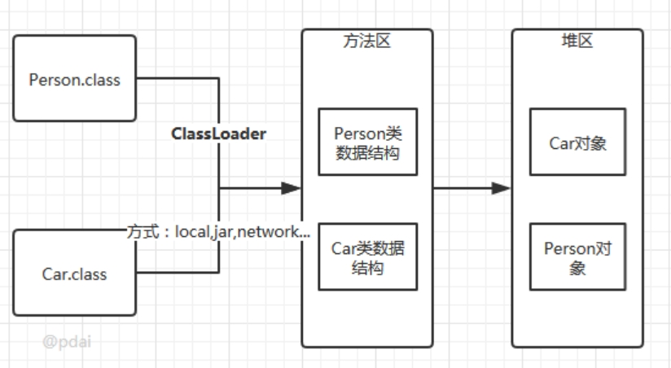
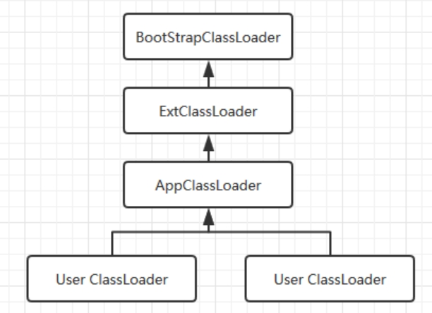
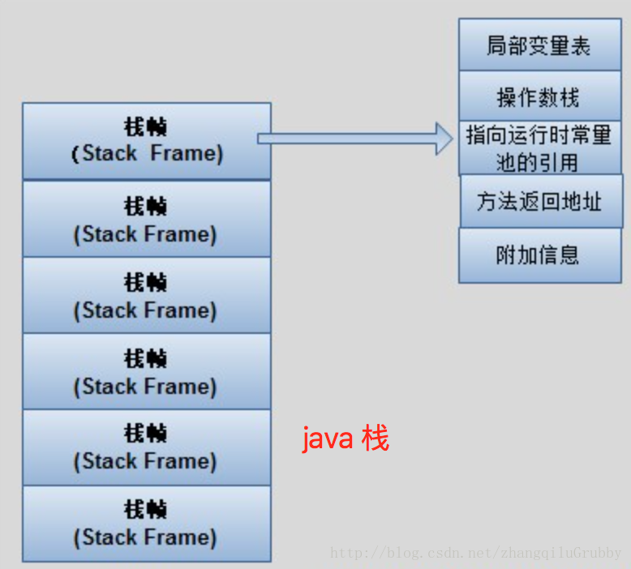
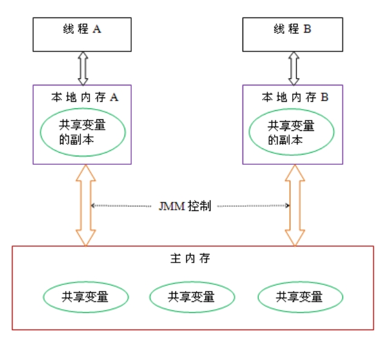
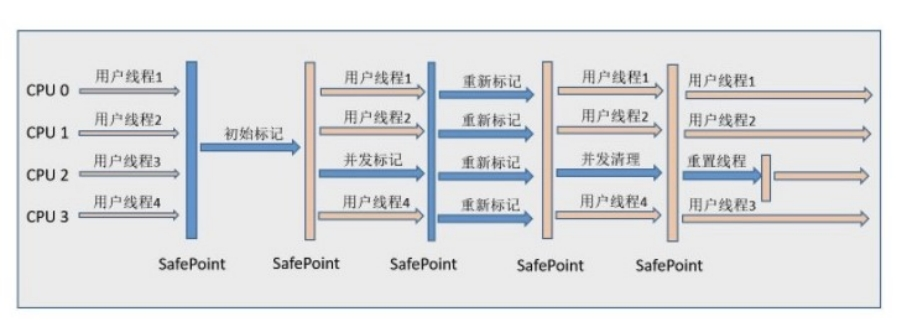
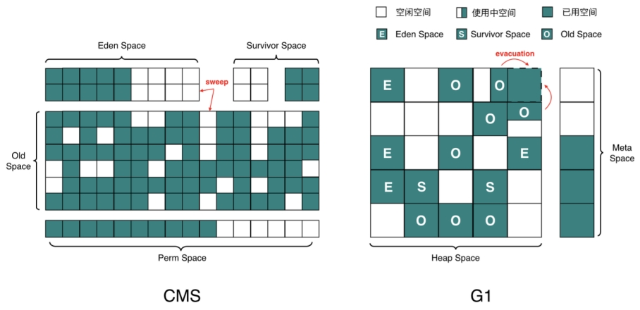
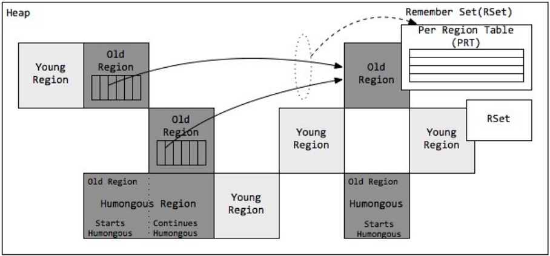
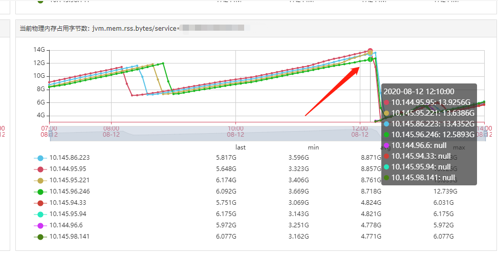
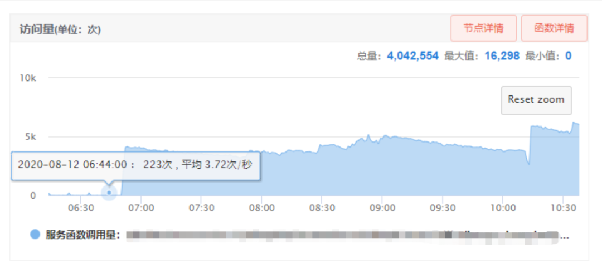

# **虚拟机**

## 类加载机制

### Class文件结构

> [同事：你能跟我聊聊class文件么？ (qq.com)](https://mp.weixin.qq.com/s?__biz=MzAwNDA2OTM1Ng==&mid=2453157347&idx=1&sn=e8873bac7b92163ce2d54df41d06f4dc&scene=21#wechat_redirect)

**Class文件主要分为以下几个部分：**

- 魔数（magic number） 魔数用于对文件格式的二次校验，是判别文件格式的特殊标识，一般位于文件的开头位置，魔数本身没有什么限制，是可以由开发者自由定义的，只要保证不与其他文件格式的魔数重复。
- 版本号（minor&major version） JDK版本问题
- 常量池（constant pool）
- 访问标记（access flag） 就是类上的修饰符，如final、abstract等
- 类索引（this class）
- 超类索引（super class）
- 接口表索引（interface）
- 字段表（field）
- 方法表（method）
- 属性表（attribute）

### 对象

那对象具体都包含哪些内容？

- 对象头
- 实例数据
- 对齐填充

#### 对象头

- 对象自身运行时所需的数据，也被称为Mark Word，也就是用于轻量级锁和偏向锁的关键点。具体的内容包含对象的hashcode、分代年龄、轻量级锁指针、重量级锁指针、GC标记、偏向锁线程ID、偏向锁时间戳。
- 存储类型指针，也就是指向类的元数据的指针，通过这个指针才能确定对象是属于哪个类的实例。
- 如果是数组的话，则还包含了数组的长度。

### 类的生命周期

包括了加载、验证、准备、解析、初始化五个阶段。在这五个阶段中，加载、验证、准备和初始化这四个阶段发生的顺序是确定的，而解析阶段则不一定，它在某些情况下可以在初始化阶段之后开始，这是为了支持Java语言的运行时绑定(也成为动态绑定或晚期绑定)。另外注意这里的几个阶段是按顺序开始，而不是按顺序进行或完成，因为这些阶段通常都是互相交叉地混合进行的，通常在一个阶段执行的过程中调用或激活另一个阶段。

 

#### 加载

查找并加载类的二进制数据

在加载阶段，虚拟机需要完成以下三件事情:

 

- 通过一个类的全限定名来获取其定义的二进制字节流。

- 将这个字节流所代表的静态存储结构转化为方法区的运行时数据结构。

- 在Java堆中生成一个代表这个类的java.lang.Class对象，作为对方法区中这些数据的访问入口。

**加载class文件的方式**

- 从本地系统中直接加载
- 通过网络下载.class文件
- 从zip，jar等归档文件中加载.class文件
- 从专有数据库中提取.class文件
- 将Java源文件动态编译为.class文件

#### 验证

确保被加载的类的正确性

- **文件格式验证:**  验证字节流是否符合Class文件格式的规范；例如: 是否以0xCAFEBABE开头、主次版本号是否在当前虚拟机的处理范围之内、常量池中的常量是否有不被支持的类型。 

- **元数据验证:**  对字节码描述的信息进行语义分析(注意: 对比javac编译阶段的语义分析)，以保证其描述的信息符合Java语言规范的要求；例如: 这个类是否有父类，除了java.lang.Object之外。 

- **字节码验证:**  通过数据流和控制流分析，确定程序语义是合法的、符合逻辑的。 

- **符号引用验证:**  确保解析动作能正确执行。


验证阶段是非常重要的，但不是必须的，它对程序运行期没有影响，如果所引用的类经过反复验证，那么可以考虑采用-Xverifynone参数来关闭大部分的类验证措施，以缩短虚拟机类加载的时间。

#### 准备 

为类的静态变量分配内存，并将其初始化为默认值

进行内存分配的仅包括类变量(static)，而不包括实例变量，实例变量会在对象实例化时随着对象一块分配在Java堆中。

这里所设置的初始值通常情况下是数据类型默认的零值(如0、0L、null、false等)，而不是被在Java代码中被显式地赋予的值。

假设一个类变量的定义为:  public static int value = 3；那么变量value在准备阶段过后的初始值为0，而不是3，因为这时候尚未开始执行任何Java方法，而把value赋值为3的put static指令是在程序编译后，存放于类构造器<clinit>()方法之中的，所以把value赋值为3的动作将在初始化阶段才会执行。

#### 解析

把类中的符号引用转换为直接引用

>符号引用就是一个类中（当然不仅是类，还包括类的其他部分，比如方法，字段等），引入了其他的类，可是JVM并不知道引入的其他类在哪里，所以就用唯一符号来代替，等到类加载器去解析的时候，就把符号引用找到那个引用类的地址，这个地址也就是直接引用。

#### 初始化

初始化，为类的静态变量赋予正确的初始值，JVM负责对类进行初始化，主要对类变量进行初始化。

**初始化步骤**

- 假如这个类还没有被加载和连接，则程序先加载并连接该类

- 假如该类的直接父类还没有被初始化，则先初始化其直接父类

- 假如类中有初始化语句，则系统依次执行这些初始化语句

**类初始化时机**

只有当对类的主动使用的时候才会导致类的初始化，类的主动使用包括以下六种:

- 创建类的实例，也就是new的方式 

- 访问某个类或接口的静态变量，或者对该静态变量赋值 

- 调用类的静态方法 

- 反射(如Class.forName("com.pdai.jvm.Test")) 

- 初始化某个类的子类，则其父类也会被初始化 

- Java虚拟机启动时被标明为启动类的类(Java Test)，直接使用java.exe命令来运行某个主类


#### 卸载

Java虚拟机将结束生命周期的几种情况

- 执行了System.exit()方法

- 程序正常执行结束

- 程序在执行过程中遇到了异常或错误而异常终止

- 由于操作系统出现错误而导致Java虚拟机进程终止


### 类加载器

 

注意: 这里父类加载器并不是通过继承关系来实现的，而是采用组合实现的。

**站在Java虚拟机的角度来讲，只存在两种不同的类加载器:** 

- 启动类加载器: 它使用C++实现(这里仅限于Hotspot，也就是JDK1.5之后默认的虚拟机，有很多其他的虚拟机是用Java语言实现的)，是虚拟机自身的一部分；

- 所有其他的类加载器: 这些类加载器都由Java语言实现，独立于虚拟机之外，并且全部继承自抽象类java.lang.ClassLoader，这些类加载器需要由启动类加载器加载到内存中之后才能去加载其他的类。

**站在Java开发人员的角度来看，类加载器可以大致划分为以下三类 :**

- **启动类加载器:**  Bootstrap ClassLoader，负责加载存放在JDK\jre\lib(JDK代表JDK的安装目录，下同)下，或被-Xbootclasspath参数指定的路径中的，并且能被虚拟机识别的类库(如rt.jar，所有的java.开头的类均被Bootstrap ClassLoader加载)。启动类加载器是无法被Java程序直接引用的。

- **扩展类加载器:**  Extension ClassLoader，该加载器由sun.misc.Launcher$ExtClassLoader实现，它负责加载JDK\jre\lib\ext目录中，或者由java.ext.dirs系统变量指定的路径中的所有类库(如javax.开头的类)，开发者可以直接使用扩展类加载器。 

- **应用程序类加载器:**  Application ClassLoader，该类加载器由sun.misc.Launcher$AppClassLoader来实现，它负责加载用户类路径(ClassPath)所指定的类，开发者可以直接使用该类加载器，如果应用程序中没有自定义过自己的类加载器，一般情况下这个就是程序中默认的类加载器。

**如果编写了自己的ClassLoader**

- 在执行非置信代码之前，自动验证数字签名。

- 动态地创建符合用户特定需要的定制化构建类。

- 从特定的场所取得java class，例如数据库中和网络中

#### 类的加载方式

命令行启动应用时候由JVM初始化加载

- 通过Class.forName()方法动态加载

- 通过ClassLoader.loadClass()方法动态加载

**Class.forName()和ClassLoader.loadClass()区别?**

- Class.forName(): 将类的.class文件加载到jvm中之外，还会对类进行解释，执行类中的static块；

- ClassLoader.loadClass(): 只干一件事情，就是将.class文件加载到jvm中，不会执行static中的内容,只有在newInstance才会去执行static块。 
- Class.forName(name, initialize, loader)带参函数也可控制是否加载static块。并且只有调用了newInstance()方法采用调用构造函数，创建类的对象 。

#### 类加载机制

- 全盘负责，当一个类加载器负责加载某个Class时，该Class所依赖的和引用的其他Class也将由该类加载器负责载入，除非显示使用另外一个类加载器来载入 

- 父类委托，先让父类加载器试图加载该类，只有在父类加载器无法加载该类时才尝试从自己的类路径中加载该类 

- 缓存机制，缓存机制将会保证所有加载过的Class都会被缓存，当程序中需要使用某个Class时，类加载器先从缓存区寻找该Class，只有缓存区不存在，系统才会读取该类对应的二进制数据，并将其转换成Class对象，存入缓存区。这就是为什么修改了Class后，必须重启JVM，程序的修改才会生效 

- 双亲委派机制, 如果一个类加载器收到了类加载的请求，它首先不会自己去尝试加载这个类，而是把请求委托给父加载器去完成，依次向上，因此，所有的类加载请求最终都应该被传递到顶层的启动类加载器中，只有当父加载器在它的搜索范围中没有找到所需的类时，即无法完成该加载，子加载器才会尝试自己去加载该类。


#### 双亲委派机制

- 当AppClassLoader加载一个class时，它首先不会自己去尝试加载这个类，而是把类加载请求委派给父类加载器ExtClassLoader去完成。 

- 当ExtClassLoader加载一个class时，它首先也不会自己去尝试加载这个类，而是把类加载请求委派给BootStrapClassLoader去完成。 

- 如果BootStrapClassLoader加载失败(例如在$JAVA_HOME/jre/lib里未查找到该class)，会使用ExtClassLoader来尝试加载； 

- 若ExtClassLoader也加载失败，则会使用AppClassLoader来加载，如果AppClassLoader也加载失败，则会报出异常ClassNotFoundException。

## 编译流程

>[爆爆：JAVA代码编译流程是怎样的？ (qq.com)](https://mp.weixin.qq.com/s/q4q-jr-6NDXxkXuC2ZegJQ)


## JVM内存模型

### 运行时私有数据区

#### 程序计数器

它是一块很小的内存空间，几乎可以忽略不计。也是运行速度最快的存储区域 

在 JVM 规范中，每个线程都有它自己的程序计数器，是线程私有的，生命周期与线程的生命周期一致 

任何时间一个线程都只有一个方法在执行，也就是所谓的当前方法。如果当前线程正在执行的是 Java 方法，**程序计数器记录的是 JVM 字节码指令地址，如果是执行 native 方法，则是未指定值（undefined）** 

**它是程序控制流的指示器，分支、循环、跳转、异常处理、线程恢复等基础功能都需要依赖这个计数器来完成**。**字节码解释器工作时就是通过改变这个计数器的值来选取下一条需要执行的字节码指令 它是唯一一个在 JVM 规范中没有规定任何 OutOfMemoryError 情况的区域**

**作用**

- 字节码解释器通过改变程序计数器来依次读取指令，从而实现代码的流程控制，如：顺序执行、选择、循环、异常处理。

- 在多线程的情况下，程序计数器用于记录当前线程执行的位置，从而当线程被切换回来的时候能够知道该线程上次运行到哪儿了。

#### 方法栈

Java 虚拟机栈(Java VirtuaMachine Stacks)，早期也叫 Java 栈。每个线程在创建的时候都会创建一个虚拟机栈，其内部保存一个个的栈帧(Stack Frame），对应着一次次 Java 方法调用，是线程私有的，生命周期和线程一致。

**作用**：主管 Java 程序的运行，它保存方法的局部变量、部分结果，并参与方法的调用和返回。

**特点：**

- 栈是一种快速有效的分配存储方式，访问速度仅次于程序计数器

- JVM 直接对虚拟机栈的操作只有两个：每个方法执行，伴随着入栈（进栈/压栈），方法执行结束出栈

- 栈不存在垃圾回收问题


可以通过参数-Xss来设置线程的最大栈空间，栈的大小直接决定了函数调用的最大可达深度。

**栈中的存储**

每个线程都有自己的栈，栈中的数据都是以栈帧（Stack Frame）的格式存在 

- 局部变量表（LocaVariables） 

- 操作数栈（Operand Stack）(或称为表达式栈) 

- 动态链接（Dynamic Linking）：指向运行时常量池的方法引用 

- 方法返回地址（Return Address）：方法正常退出或异常退出的地址 

- 一些附加信息



**在JVM栈这个数据区可能会发生抛出两种错误:**

1. StackOverflowError 出现在栈内存设置成固定值的时候，当程序执行需要的栈内存超过设定的固定值会抛出这个错误。
2. OutOfMemoryError 出现在栈内存设置成动态增长的时候，当JVM尝试申请的内存大小超过了其可用内存时会抛出这个错误。

**总结**

1. 每个线程包含一个栈区,栈中只保存基础数据类型的对象和自定义对象的引用(不是对象)。对象都存放在堆区中。
2. 每个栈中的数据(基础数据类型和对象引用)都是私有的，其他栈不能访问。
3. 栈分为3个部分：基本类型变量，执行环境上下文，操作指令区(存放操作指令).
4. 在函数中定义的一些基本类型的变量数据和对象的引用变量都在函数的栈内存中分配。
5. 当在一段代码块定义一个变量时，Java就在栈中为这个变量分配内存空间，当该变量退出该作用域后，Java会自动释放掉为该变量所分配的内存空间，该内存空间可以立即被另作他用。

#### 本地方法栈

native方法使用的虚拟机栈

### 运行时公有数据区

#### 堆

堆数据区是用来存放对象和数组（特殊的对象）。堆内存由多个线程共享。堆内存随着JVM启动而创建。众所周知，Java中有一个很好的特性就是自动垃圾回收。垃圾回收就操作这个数据区来回收对象进而释放内存。如果堆内存剩余的内存不足以满足于对象创建，JVM会抛出OutOfMemoryError错误。

总结

1. 存储的全部是对象，每个对象包含一个与之对应的class信息–class的目的是得到操作指令。
2. jvm只有一个堆区（heap）被所有线程共享，堆区中不存放基本类型和对象引用，只存放对象本身。
3. 堆的优势是可以动态地分配内存大小，生存期也不必事先告诉编译器，因为它是在运行时动态分配内存的，Java的垃圾收集器会自动收走这些不再使用的数据。
4. 缺点是，由于要在运行时动态分配内存，存取速度较慢。


##### 堆内存不全时线程共享

> [Java堆内存是线程共享的！面试官：你确定吗？](https://mp.weixin.qq.com/s/Wws24Fhg1nH4dHvtcFYi2g)

TLAB分配的Eden内存是线程专属的内存分配,其他线程的读取还是可以的，只不过无法在这个区域中分配内存而已。

#### 方法区

它用于存储已被虚拟机加载的类型信息、常量、静态变量、即时编译器编译后的代码缓存等。(类的结构以及运行时常量池)

并没有规定如何去实现它，不同的厂商有不同的实现。而永久代（PermGen）是 Hotspot 虚拟机特有的概念， Java8 的时候又被元空间取代了，永久代和元空间都可以理解为方法区的落地实现。

##### **元空间**

**设置堆内存大小和 OOM**

- -Xms 用来表示堆的起始内存，等价于 -XX:InitialHeapSize
- -Xmx 用来表示堆的最大内存，等价于 -XX:MaxHeapSize


##### 全局字符串池

string pool也有叫做string literal pool, 全局字符串池里的内容是在类加载完成，经过验证，**准备阶段之后**在堆中生成字符串对象实例，然后将该字符串对象实例的引用值存到string pool中（记住：string pool中存的是引用值而不是具体的实例对象，具体的实例对象是在堆中开辟的一块空间存放的。）。 在HotSpot VM里实现的string pool功能的是一个StringTable类，它是一个哈希表，里面存的是驻留字符串(也就是我们常说的用双引号括起来的)的引用（而不是驻留字符串实例本身），也就是说在堆中的某些字符串实例被这个StringTable引用之后就等同被赋予了”驻留字符串”的身份。这个StringTable在每个HotSpot VM的实例只有一份，被所有的类共享。

##### class文件常量池

我们都知道，class文件中除了包含类的版本、字段、方法、接口等描述信息外，还有一项信息就是常量池(constant pool table)，用于存放编译器生成的各种字面量(Literal)和符号引用(Symbolic References)。 字面量就是我们所说的常量概念，如文本字符串、被声明为final的常量值等。 符号引用是一组符号来描述所引用的目标，符号可以是任何形式的字面量，只要使用时能无歧义地定位到目标即可（它与直接引用区分一下，直接引用一般是指向方法区的本地指针，相对偏移量或是一个能间接定位到目标的句柄）。一般包括下面三类常量：

- 类和接口的全限定名
- 字段的名称和描述符
- 方法的名称和描述符

##### 运行时常量池

当java文件被编译成class文件之后，也就是会生成我上面所说的class常量池，那么运行时常量池又是什么时候产生的呢？

jvm在执行某个类的时候，必须经过加载、连接、初始化，而连接又包括验证、准备、解析三个阶段。而当类加载到内存中后，jvm就会将class常量池中的内容存放到运行时常量池中，由此可知，运行时常量池也是每个类都有一个。在上面我也说了，class常量池中存的是字面量和符号引用，也就是说他们存的并不是对象的实例，而是对象的符号引用值。而经过解析（resolve）之后，也就是把符号引用替换为直接引用，解析的过程会去查询全局字符串池，也就是我们上面所说的StringTable，以保证运行时常量池所引用的字符串与全局字符串池中所引用的是一致的。

## Java内存模型


 

## 分代回收

Java 堆是 Java 虚拟机管理的内存中最大的一块，被所有线程共享。此内存区域的唯一目的就是存放对象实例，几乎所有的对象实例以及数据都在这里分配内存。

为了进行高效的垃圾回收，虚拟机把堆内存逻辑上划分成三块区域（分代的唯一理由就是优化 GC 性能）： 

- 新生带（年轻代）：新对象和没达到一定年龄的对象都在新生代 

- 老年代（养老区）：被长时间使用的对象，老年代的内存空间应该要比年轻代更大 

- 元空间（JDK1.8 之前叫永久代）：像一些方法中的操作临时对象等，JDK1.8 之前是占用 JVM 内存，JDK1.8 之后直接使用物理内存

### **年轻代 (Young Generation)**

年轻代是所有新对象创建的地方。当填充年轻代时，执行垃圾收集。这种垃圾收集称为 Minor GC。年轻一代被分为三个部分——伊甸园（Eden Memory）和两个幸存区（Survivor Memory，被称为from/to或s0/s1），默认比例是8:1:1

大多数新创建的对象都位于 Eden 内存空间中 

当 Eden 空间被对象填充时，执行Minor GC，并将所有幸存者对象移动到一个幸存者空间中 

Minor GC 检查幸存者对象，并将它们移动到另一个幸存者空间。所以每次，一个幸存者空间总是空的 

经过多次 GC 循环后存活下来的对象被移动到老年代。通常，这是通过设置年轻一代对象的年龄阈值来实现的，然后他们才有资格提升到老一代

### 老年代(Old Generation)

旧的一代内存包含那些经过许多轮小型 GC 后仍然存活的对象。通常，垃圾收集是在老年代内存满时执行的。老年代垃圾收集称为 主GC（Major GC），通常需要更长的时间。

大对象直接进入老年代（大对象是指需要大量连续内存空间的对象）。这样做的目的是避免在 Eden 区和两个Survivor 区之间发生大量的内存拷贝

### 晋升机制

1. 躲过15次GC，进入老年代可以通过JVM参数 “-XX:MaxTenuringThreshold”来设置，默认情况是15岁
2. 分配担保；CMS+Serial或ParNew：将Eden+servivor移动到另一个servivor中的时候，servivor空间不够用，会在老年代做分区担保    在GC 新生代前，会去查看老年代是否有连续的空间，存放所有的新生代的对象，如果有空间，则直接GC，如果没有空间，则需要按照配置（JVM参数配置）是否尝试进行GC
3. 大对象：
   CMS（老年代收集器）配合Serial和ParNew（年轻代）：可参数配置。直接进入老年代，跟随老年代的GC
   G1：当一个对象大于一个Region区50%的时候，会是大对象，堆中会分配连续的(Humongous Region)区来存放
4. 动态对象年龄判定
   当servivor 空间相同年龄的空间总和大于servivor空间一半的时候，会将servivor区大于等于此年龄的，全部移入到老年代

**Minor GC（新生代）、Major GC（老年代）、FulGC整个堆**

major gc 等价于 full gc

### **FulGC 的触发条件**

- 调用 System.gc()

- 老年代空间不足

- 空间分配担保失败，使用复制算法的 Minor GC 需要老年代的内存空间作担保，如果担保失败会执行一次 FulGC


## 垃圾回收

### 垃圾回收原理

垃圾收集主要是针对堆和方法区进行；程序计数器、虚拟机栈和本地方法栈这三个区域属于线程私有的，只存在于线程的生命周期内，线程结束之后也会消失，因此不需要对这三个区域进行垃圾回收。

#### 判断对象是否可被回收

- 引用计数算法
- 可达性分析算法  （通过 GC Roots 作为起始点进行搜索，能够到达到的对象都是存活的，不可达的对象可被回收。）

#### GCRoot

有哪些对象可以当做GCRoot？

1. java虚拟机栈中的引用的对象。

   我们都知道，java虚拟机在调用方法的时候都会创建一个相应的栈帧，栈帧中包含了这个方法内部使用的所有对象的引用，**一旦方法执行结束之后，这些临时对象引用也就不复存在了，这些对象就会被垃圾收集器给回收。**

2. 方法区中的类静态属性引用的对象。 （一般指被static修饰的对象，加载类的时候就加载到内存中。）

3. 方法区中的常量引用的对象, 也就是被final修饰的对象。

4. 本地方法栈中的JNI（native方法）引用的对象

最后，真的要宣告对象死亡需要经过两个过程

1. 可达性分析后没有发现引用链
2. 查看对象是否有finalize方法，如果有重写且在方法内完成自救（如再建立引用），还是可以抢救一下。


#### 方法区的回收

因为方法区主要存放永久代对象，而永久代对象的回收率比新生代低很多，因此在方法区上进行回收性价比不高。

主要是对常量池的回收和对类的卸载。

类的卸载条件很多，需要满足以下三个条件，并且满足了也不一定会被卸载: 

- 该类所有的实例都已经被回收，也就是堆中不存在该类的任何实例。 

- 加载该类的 ClassLoader 已经被回收。 

- 该类对应的 Class 对象没有在任何地方被引用，也就无法在任何地方通过反射访问该类方法。


#### 引用类型

- 强引用：被强引用关联的对象不会被回收。Object obj = new Object();

- 软引用：被软引用关联的对象只有在内存不够的情况下才会被回收。

  ```java
  Object obj = new Object();
  SoftReference<Object> sf = new SoftReference<Object>(obj);
  obj = null;  // 使对象只被软引用关联
  ```

  

- 弱引用：被弱引用关联的对象一定会被回收，也就是说它只能存活到下一次垃圾回收发生之前。

  ```java
  Object obj = new Object();
  WeakReference<Object> wf = new WeakReference<Object>(obj);
  obj = null;
  ```

  虚引用： 又称为幽灵引用或者幻影引用。一个对象是否有虚引用的存在，完全不会对其生存时间构成影响，也无法通过虚引用取得一个对象。为一个对象设置虚引用关联的唯一目的就是能在这个对象被回收时收到一个系统通知。

  ```java
  Object obj = new Object();
  PhantomReference<Object> pf = new PhantomReference<Object>(obj);
  obj = null;
  ```

### 垃圾回收算法

#### 标记清除

适用场景

- 对象存活比较多的时候适用
- 老年代

缺点

- 提前GC
- 碎片空间
- 扫描了两次
  - 标记存活对象
  - 清除没有标记的对象

#### 标记复制

适合场景

- 存活对象少 比较高效
- 扫描了整个空间（标记存活对象并复制异动）
- 适合年轻代

缺点

- 需要空闲空间
- 需要复制移动对象
- 引用计数  没办法解决循环引用的问题

#### 标记整理

### 垃圾回收器

 

以上是 HotSpot 虚拟机中的 7 个垃圾收集器，连线表示垃圾收集器可以配合使用。 

- 单线程与多线程: 单线程指的是垃圾收集器只使用一个线程进行收集，而多线程使用多个线程； 

- 串行与并行:  串行指的是垃圾收集器与用户程序交替执行，这意味着在执行垃圾收集的时候需要停顿用户程序； 并形指的是垃圾收集器和用户程序同时执行。除了 CMS 和 G1 之外，其它垃圾收集器都是以串行的方式执行。


#### GC考虑的指标

- 吞吐量:  应用耗时和实际耗时的比值； 

- 停顿时间:   垃圾回收的时候，由于Stop the World，应用程序的所有线程会挂起，造成应用停顿。 


吞吐量和停顿时间是互斥的。

- 对于后端服务(比如后台计算任务)，吞吐量优先考虑(并行垃圾回收)；

- 对于前端应用，RT响应时间优先考虑，减少垃圾收集时的停顿时间，适用场景是Web系统(并发垃圾回收)


#### Seria收集器  

也就是说它以串行的方式执行，新生代

#### SeriaOld 收集器  

老年代

#### ParNew 收集器   

Seria收集器的多线程版本。Paralle 收集器 （1.8默认）

用来回收新生代的垃圾收集器 同样是并行收集器，采用复制算法和STW机制。其它收集器关注点是尽可能缩短垃圾收集时用户线程的停顿时间，而它的目标是达到一个可控制的吞吐量，它被称为“吞吐量优先”收集器。这里的吞吐量指 CPU 用于运行用户代码的时间占总时间的比值。高吞吐量则可以高效率利用CPU时间，尽快完成程序的运算任务，主要是和在后台运算而不需要太多交互的任务，一般都是在服务器环境上使用，比如执行批量处理，订单处理，工资支付，科学计算的应用程序  

 

#### ParalleOld 收集器

#### CMS 收集器

 

分为以下四个流程:

1. 初始标记:  仅仅只是标记一下 GC Roots 能直接关联到的对象，速度很快，需要停顿。 

2. 并发标记:  进行 GC Roots Tracing 的过程，它在整个回收过程中耗时最长，不需要停顿。 

3. 重新标记:  为了修正并发标记期间因用户程序继续运作而导致标记产生变动的那一部分对象的标记记录，需要停顿。 

4. 并发清除:  不需要停顿。


在整个过程中耗时最长的并发标记和并发清除过程中，收集器线程都可以与用户线程一起工作，不需要进行停顿。

**特点**

- 吞吐量低:  低停顿时间是以牺牲吞吐量为代价的，导致 CPU 利用率不够高。 

- 无法处理浮动垃圾，可能出现 Concurrent Mode Failure。

 >  浮动垃圾是指并发清除阶段由于用户线程继续运行而产生的垃圾，这部分垃圾只能到下一次 GC 时才能进行回收。由于浮动垃圾的存在，因此需要预留出一部分内存，意味着 CMS 收集不能像其它收集器那样等待老年代快满的时候再回收。如果预留的内存不够存放浮动垃圾，就会出现 Concurrent Mode Failure，这时虚拟机将临时启用 SeriaOld 来替代 CMS。 

- 标记 - 清除算法导致的空间碎片，往往出现老年代空间剩余，但无法找到足够大连续空间来分配当前对象，不得不提前触发一次 FulGC。


#### G1 收集器

G1(Garbage-First)，它是一款面向服务端应用的垃圾收集器，在多 CPU 和大内存的场景下有很好的性能。HotSpot 开发团队赋予它的使命是未来可以替换掉 CMS 收集器。

堆被分为新生代和老年代，其它收集器进行收集的范围都是整个新生代或者老年代，而 G1 可以直接对新生代和老年代一起回收。

G1垃圾回收器是在Java7 update 4之后引入的一个新的垃圾回收器。同优秀的CMS垃圾回收器一样，G1也是关注最小时延的垃圾回收器，也同样适合大尺寸堆内存的垃圾收集，官方在ZGC还没有出现时也推荐使用G1来代替选择CMS。G1最大的特点是引入分区的思路，弱化了分代的概念，合理利用垃圾收集各个周期的资源，解决了其他收集器甚至CMS的众多缺陷

G1回收器和CMS比起来，有以下不同：

- G1空间是连续的

- G1回收器的内存与CMS回收器要求的内存模型有极大的不同。G1将内存划分一个个固定大小的region，每个region可以是年轻代、老年代的一个。内存的回收是以region作为基本单位的；

- G1还有一个及其重要的特性：软实时（soft real-time）。所谓的实时垃圾回收，是指在要求的时间内完成垃圾回收。“软实时”则是指，用户可以指定垃圾回收时间的限时，G1会努力在这个时限内完成垃圾回收，但是G1并不担保每次都能在这个时限内完成垃圾回收。通过设定一个合理的目标，可以让达到90%以上的垃圾回收时间都在这个时限内。

**G1的内存模型**

 

G1采用了分区(Region)的思路，将整个堆空间分成若干个大小相等的内存区域，每次分配对象空间将逐段地使用内存。因此，在堆的使用上，G1并不要求对象的存储一定是物理上连续的，只要逻辑上连续即可；每个分区也不会确定地为某个代服务，可以按需在年轻代和老年代之间切换。启动时可以通过参数-XX:G1HeapRegionSize=n可指定分区大小(1MB~32MB，且必须是2的幂)，默认将整堆划分为2048个分区。

在每个分区内部又被分成了若干个大小为512 Byte卡片(Card)，标识堆内存最小可用粒度所有分区的卡片将会记录在全局卡片表(GlobaCard Table)中，分配的对象会占用物理上连续的若干个卡片，当查找对分区内对象的引用时便可通过记录卡片来查找该引用对象(见RSet)。每次对内存的回收，都是对指定分区的卡片进行处理。

G1同样可以通过-Xms/-Xmx来指定堆空间大小。当发生年轻代收集或混合收集时，通过计算GC与应用的耗费时间比，自动调整堆空间大小。如果GC频率太高，则通过增加堆尺寸，来减少GC频率，相应地GC占用的时间也随之降低；目标参数-XX:GCTimeRatio即为GC与应用的耗费时间比，G1默认为9，而CMS默认为99，因为CMS的设计原则是耗费在GC上的时间尽可能的少。另外，当空间不足，如对象空间分配或转移失败时，G1会首先尝试增加堆空间，如果扩容失败，则发起担保的FulGC。FulGC后，堆尺寸计算结果也会调整堆空间。

**分代模型**

G1将内存在逻辑上划分为年轻代和老年代，其中年轻代又划分为Eden空间和Survivor空间。但年轻代空间并不是固定不变的，当现有年轻代分区占满时，JVM会分配新的空闲分区加入到年轻代空间。

整个年轻代内存会在初始空间-XX:G1NewSizePercent(默认整堆5%)与最大空间(默认60%)之间动态变化，且由参数目标暂停时间-XX:MaxGCPauseMillis(默认200ms)、需要扩缩容的大小以-XX:G1MaxNewSizePercent及分区的已记忆集合(RSet)计算得到。当然，G1依然可以设置固定的年轻代大小(参数-XX:NewRatio、-Xmn)，但同时暂停目标将失去意义。

## JVM调优参数

### JVM参数

```
-Xms  堆最小值
-Xmx  堆最大堆值
-Xmn  新生代大小
-Xss  每个线程池的堆栈大小。
-XX:NewRatio  设置新生代与老年代比值，-XX:NewRatio=4 表示新生代与老年代所占比例为1:4 
-XX:PermSize  设置持久代初始值，默认是物理内存的六十四分之一
-XX:MaxPermSize 设置持久代最大值，默认是物理内存的四分之一 
-XX:MaxTenuringThreshold 新生代中对象存活次数，默认15。(若对象在eden区，经历一次MinorGC后还活着，则被移动到Survior区，年龄加1。以后，对象每次经历MinorGC，年龄都加1。达到阀值，则移入老年代) 
-XX:SurvivorRatio Eden区与Subrvivor区大小的比值，如果设置为8，两个Subrvivor区与一个Eden区的比值为2:8，一个Survivor区占整个新生代的十分之一 
-XX:+UseFastAccessorMethods 原始类型快速优化
-XX:+AggressiveOpts 编译速度加快 
-XX:PretenureSizeThreshold 对象超过多大值时直接在老年代中分配
-XX:TargetSurvivorRatio 表示当经历Minor GC后，survivor空间占有量(百分比)超过它的时候，就会压缩进入老年代(当然，如果survivor空间不够，则直接进入老年代)。默认值为50%。 
```

1. Xmn用于设置新生代的大小。过小会增加Minor GC频率，过大会减小老年代的大小。一般设为整个堆空间的1/4或1/3。  
2. 为了性能考虑，一开始尽量将新生代对象留在新生代，避免新生的大对象直接进入老年代。因为新生对象大部分都是短期的，这就造成了老年代的内存浪费，并且回收代价也高(FulGC发生在老年代和方法区Perm)。   
3. 当Xms=Xmx，可以使得堆相对稳定，避免不停震荡。  
4. 一般来说，MaxPermSize设为64MB可以满足绝大多数的应用了。若依然出现方法区溢出，则可以设为128MB。若128MB还不能满足需求，那么就应该考虑程序优化了，减少动态类的产生。 

## STW

Stop-The-World  简称 STW 

是在垃圾回收算法执行过程中,将jvm内存冻结,停顿的一种状态

在STW状态下,所有的线程都是停止运行的 - >垃圾回收线程除外

当STW发生时,出了GC所需要的线程,其他的线程都将停止工作,中断了的线程知道GC线程结束才会继续任务

STW是不可避免的,垃圾回收算法的执行一定会出现STW,而我们最好的解决办法就是减少停顿的时间

GC各种算法的优化重点就是为了减少STW,这也是JVM调优的重点。


## 实战

### 性能调优

- 设置堆的最大最小值 -xms -xmx
- 调整老年和年轻代的比例
  - -XX:newSize设置绝对大小
    - 防止年轻代堆收缩：老年代同理
- 主要看是否存在更多持久对象和临时对象
- 观察一段时间 看峰值老年代如何 不影响gc就加大年轻代
- 配置好的机器可以用 并发收集算法
- 每个线程默认会开启1M的堆栈 存放栈帧 调用参数 局部变量 太大了 500k够了
- 原则 就是减少gc stw

### 问题排查

> [怎么排查堆内存溢出啊？](https://mp.weixin.qq.com/s/7XGD-Z3wrThv5HyoK3B8AQ)
>
> [CPU100%，排查](https://mp.weixin.qq.com/s/roEMz-5tzBZvGxbjq8NhOQ)
>
> [排查YGC问题](https://mp.weixin.qq.com/s/LRx9tLtx1tficWPvUWUTuQ)
>
> [CPU飙高排查](https://mp.weixin.qq.com/s/nWghy4McYx6Ix3QPSLSmkQ)

#### 线上服务的FGC问题排查

>[线上服务的FGC问题排查，看这篇就够了！](https://mp.weixin.qq.com/s/P8s3kuceBNovUP5adXpFCQ)

去年10月份，我们的广告召回系统在程序上线后收到了FGC频繁的系统告警，通过下面的监控图可以看到：平均每35分钟就进行了一次FGC。而程序上线前，我们的FGC频次大概是2天一次。下面，详细介绍下该问题的排查过程。


**1. 检查JVM配置**

通过以下命令查看JVM的启动参数：

```
ps aux | grep "java"
```


```java
-Xms4g -Xmx4g -Xmn2g -Xss1024K 
-XX:ParallelGCThreads=5 
-XX:+UseConcMarkSweepGC 
-XX:+UseParNewGC 
-XX:+UseCMSCompactAtFullCollection 
-XX:CMSInitiatingOccupancyFraction=80
```

可以看到堆内存为4G，新生代为2G，老年代也为2G，新生代采用ParNew收集器，老年代采用并发标记清除的CMS收集器，当老年代的内存占用率达到80%时会进行FGC。

进一步通过 jmap -heap 7276 | head -n20 可以得知新生代的Eden区为1.6G，S0和S1区均为0.2G。

**2. 观察老年代的内存变化**

通过观察老年代的使用情况，可以看到：每次FGC后，内存都能回到500M左右，因此我们排除了内存泄漏的情况。

**3. 通过jmap命令查看堆内存中的对象**

通过命令 jmap -histo 7276 | head -n20


上图中，按照对象所占内存大小排序，显示了存活对象的实例数、所占内存、类名。可以看到排名第一的是：int[]，而且所占内存大小远远超过其他存活对象。至此，我们将怀疑目标锁定在了 int[] .

**4. 进一步dump堆内存文件进行分析**

锁定 int[] 后，我们打算dump堆内存文件，通过可视化工具进一步跟踪对象的来源。考虑堆转储过程中会暂停程序，因此我们先从服务管理平台摘掉了此节点，然后通过以下命令dump堆内存：

jmap -dump:format=b,file=heap 7276

通过JVisualVM工具导入dump出来的堆内存文件，同样可以看到各个对象所占空间，其中int[]占到了50%以上的内存，进一步往下便可以找到 int[] 所属的业务对象，发现它来自于架构团队提供的codis基础组件。


**5.** **通过代码分析可疑对象**

通过代码分析，codis基础组件每分钟会生成约40M大小的int数组，用于统计TP99 和 TP90，数组的生命周期是一分钟。而根据第2步观察老年代的内存变化时，发现老年代的内存基本上也是每分钟增加40多M，因此推断：这40M的int数组应该是从新生代晋升到老年代。

我们进一步查看了YGC的频次监控，通过下图可以看到大概1分钟有8次左右的YGC，这样基本验证了我们的推断：因为CMS收集器默认的分代年龄是6次，即YGC 6次后还存活的对象就会晋升到老年代，而codis组件中的大数组生命周期是1分钟，刚好满足这个要求。


至此，整个排查过程基本结束了，那为什么程序上线前没出现此问题呢？通过上图可以看到：程序上线前YGC的频次在5次左右，此次上线后YGC频次变成了8次左右，从而引发了此问题。

**6. 解决方案**

为了快速解决问题，我们将CMS收集器的分代年龄改成了15次，改完后FGC频次恢复到了2天一次，后续如果YGC（Minor GC）的频次超过每分钟15次还会再次触发此问题。当然，我们最根本的解决方案是：优化程序以降低YGC的频率，同时缩短codis组件中int数组的生命周期，这里就不做展开了。


#### 堆外内存泄漏故障排查

>[记一次大促期间JVM堆外内存泄漏故障排查记录](https://mp.weixin.qq.com/s/yutHXOi6Xl3-Qn91Pvg9wA)

8月12日中午午休时间，我们商业服务收到告警，服务进程占用容器的物理内存（16G）超过了80%的阈值，并且还在不断上升。


监控系统调出图表查看：



像是Java进程发生了内存泄漏，而我们堆内存的限制是4G，这种大于4G快要吃满内存应该是JVM堆外内存泄漏。

确认了下当时服务进程的启动配置：

```
-Xms4g -Xmx4g -Xmn2g -Xss1024K -XX:PermSize=256m -XX:MaxPermSize=512m -XX:ParallelGCThreads=20 -XX:+UseConcMarkSweepGC -XX:+UseParNewGC -XX:+UseCMSCompactAtFullCollection -XX:CMSInitiatingOccupancyFraction=80
```

虽然当天没有上线新代码，但是**「当天上午我们正在使用消息队列推送历史数据的修复脚本，该任务会大量调用我们服务其中的某一个接口」**，所以初步怀疑和该接口有关。

下图是该调用接口当天的访问量变化：



可以看到案发当时调用量相比正常情况（每分钟200+次）提高了很多（每分钟5000+次）。

**「我们暂时让脚本停止发送消息，该接口调用量下降到每分钟200+次，容器内存不再以极高斜率上升，一切似乎恢复了正常。」**

接下来排查这个接口是不是发生了内存泄漏。

**排查过程**

**堆内存分析**

虽说一开始就基本确认与堆内存无关，因为泄露的内存占用超过了堆内存限制4G，但是我们为了保险起见先看下堆内存有什么线索。

我们观察了新生代和老年代内存占用曲线以及回收次数统计，和往常一样没有大问题，我们接着在事故现场的容器上dump了一份JVM堆内存的日志。

### oom种类

- java.lang.OutOfMemoryError: Java heap space  java堆内存溢出，此种情况最常见，一般由于内存泄露或者堆的大小设置不当引起。对于内存泄露，需要通过内存监控软件查找程序中的泄露代码，而堆大小可以通过虚拟机参数-Xms,-Xmx等修改。

- java.lang.OutOfMemoryError: PermGen space  java永久代溢出，即方法区溢出了，一般出现于大量Class或者jsp页面，或者采用cglib等反射机制的情况，因为上述情况会产生大量的Class信息存储于方法区。此种情况可以通过更改方法区的大小来解决，使用类似-XX:PermSize=64m -XX:MaxPermSize=256m的形式修改。另外，过多的常量尤其是字符串也会导致方法区溢出。

- java.lang.StackOverflowError   不会抛OOM error，但也是比较常见的Java内存溢出。JAVA虚拟机栈溢出，一般是由于程序中存在死循环或者深度递归调用造成的，栈大小设置太小也会出现此种溢出。可以通过虚拟机参数-Xss来设置栈的大小。

  

### 逃逸分析

逃逸分析(Escape Analysis)是目前 Java 虚拟机中比较前沿的优化技术。这是一种可以有效减少 Java 程序中同步负载和内存堆分配压力的跨函数全局数据流分析算法。通过逃逸分析，Java Hotspot 编译器能够分析出一个新的对象的引用的使用范围从而决定是否要将这个对象分配到堆上，如果没逃逸优先分配到栈上，否则分配到堆上。

### JVM调优

- OOM
- 内存泄露
- 线程死锁
- 锁争用
- Java进程消耗CPU过高

### JVM性能检测工具

  - Jconsole

  - Jprofiler

  - jvisualvm

  - MAT

    

### 内存泄露

    - help dump
    - 生产机 dump
    - mat
    - jmap
    - -helpdump

### CPU100%

>[java 应用cpu飙升(超过100%)故障排查_java应用cpu过高原因_java路飞的博客-CSDN博客](https://blog.csdn.net/qq_33129875/article/details/129283010)

- topc -c
- top -Hp pid
- jstack
- 进制转换
- cat


