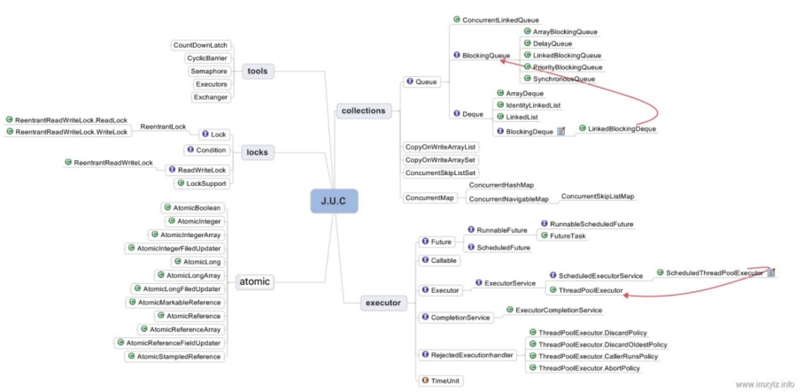

# 第3节 多线程与并发


## 并发理论基础

### 线程和进程

进程是程序的一次执行过程，是系统运行程序的基本单位，因此进程是动态的。系统运行一个程序即是一个进程从创建，运行到消亡的过程。

线程与进程相似，但线程是一个比进程更小的执行单位。一个进程在其执行的过程中可以产生多个线程。与进程不同的是同类的多个线程共享进程的堆和方法区资源，但每个线程有自己的程序计数器、虚拟机栈和本地方法栈，所以系统在产生一个线程，或是在各个线程之间作切换工作时，负担要比进程小得多，也正因为如此，线程也被称为轻量级进程。


 

堆和方法区是所有线程共享的资源，其中堆是进程中最大的一块内存，主要用于存放新创建的对象 (几乎所有对象都在这里分配内存)，方法区主要用于存放已被加载的类信息、常量、静态变量、即时编译器编译后的代码等数据。

**总结**:v:  : 线程是进程划分成的更小的运行单位。线程和进程最大的不同在于基本上各进程是独立的，而各线程则不一定，因为同一进程中的线程极有可能会相互影响。线程执行开销小，但不利于资源的管理和保护；而进程正相反。

### 线程死锁

线程死锁描述的是这样一种情况：多个线程同时被阻塞，它们中的一个或者全部都在等待某个资源被释放。由于线程被无限期地阻塞，因此程序不可能正常终止。

- 互斥条件：该资源任意一个时刻只由一个线程占用。
- 请求与保持条件：一个线程因请求资源而阻塞时，对已获得的资源保持不放。
- 不剥夺条件: 线程已获得的资源在未使用完之前不能被其他线程强行剥夺，只有自己使用完毕后才释放资源。
- 循环等待条件:若干线程之间形成一种头尾相接的循环等待资源关系。

如何预防死锁？ 破坏死锁的产生的必要条件即可：

- 破坏请求与保持条件 ：一次性申请所有的资源。
- 破坏不剥夺条件 ：占用部分资源的线程进一步申请其他资源时，如果申请不到，可以主动释放它占有的资源。
- 破坏循环等待条件 ：靠按序申请资源来预防。按某一顺序申请资源，释放资源则反序释放。破坏循环等待条件。

### sleep方法和wait

两者最主要的区别在于：

- sleep() 方法没有释放锁，而 wait() 方法释放了锁 。
- 两者都可以暂停线程的执行。
- wait() 通常被用于线程间交互/通信，sleep() 通常被用于暂停执行。
- wait() 方法被调用后，线程不会自动苏醒，需要别的线程调用同一个对象上的 notify() 或者 notifyAll() 方法。sleep() 方法执行完成后，线程会自动苏醒。或者可以使用 wait(long timeout) 超时后线程会自动苏醒。

### 上下文切换

当出现如下情况的时候，线程会从占用 CPU 状态中退出

1. 主动让出 CPU，比如调用了 sleep(), wait() 等。
2. 时间片用完，因为操作系统要防止一个线程或者进程长时间占用CPU导致其他线程或者进程饿死。
3. 调用了阻塞类型的系统中断，比如请求 IO，线程被阻塞。
4. 被终止或结束运行

这其中前三种都会发生线程切换，线程切换意味着需要保存当前线程的上下文，留待线程下次占用 CPU 的时候恢复现场。并加载下一个将要占用 CPU 的线程上下文。这就是所谓的 上下文切换

### 为什么需要多线程

  众所周知，CPU、内存、I/O 设备的速度是有极大差异的，为了合理利用 CPU 的高性能，平衡这三者的速度差异，计算机体系结构、操作系统、编译程序都做出了贡献，主要体现为:

1. CPU 增加了缓存，以均衡与内存的速度差异；// 导致可见性问题
2. 操作系统增加了进程、线程，以分时复用 CPU，进而均衡 CPU 与 I/O 设备的速度差异；// 导致原子性问题
3. 编译程序优化指令执行次序，使得缓存能够得到更加合理地利用。// 导致有序性问题

为了解决缓存不一致性问题，计算机底层通常来说有以下2种解决方法：

-  通过在总线加LOCK锁的方式（塞了其他CPU对其他部件访问（如内存），从而使得只能有一个CPU能使用这个变量的内存）

-  通过缓存一致性协议（当线程修改内存时通知其他线程 此时内存以改变，缓存失效需要重新读取）

### 指令重排序

处理器为了提高程序运行效率，可能会对输入代码进行优化，它不保证程序中各个语句的执行先后顺序同代码中的顺序一致，但是它会保证程序最终执行结果和代码顺序执行的结果是一致的。(仅能保证单线程的顺序，多线程还是会出现指令排序问题)

### 并发的三个概念

>[学妹问我，并发问题的根源到底是什么？ (qq.com)](https://mp.weixin.qq.com/s/TsENp5ygFdE0_REgz5Y3Ew)

- 原子性：即一个操作或者多个操作 要么全部执行并且执行的过程不会被任何因素打断，要么就都不执行。

- 可见性：多个线程访问同一个变量时，一个线程修改了这个变量的值，其他线程能够立即看得到修改的值。

- 有序性：即程序执行的顺序按照代码的先后顺序执行。（由于指令重排序）

#### 原子性

请分析以下哪些操作是原子性操作：

```java
x = 10;     //语句1
y = x;     //语句2
x++;      //语句3
x = x + 1;   //语句4
```

 咋一看，有些朋友可能会说上面的4个语句中的操作都是原子性操作。其实只有语句1是原子性操作，其他三个语句都不是原子性操作。

- 语句1是直接将数值10赋值给x，也就是说线程执行这个语句的会直接将数值10写入到工作内存中。

- 语句2实际上包含2个操作，它先要去读取x的值，再将x的值写入工作内存，虽然读取x的值以及将x的值写入工作内存这2个操作都是原子性操作，但是合起来就不是原子性操作了（可能读取完就被中断了）。

- 同样的，x++和 x = x+1包括3个操作：读取x的值，进行加1操作，写入新的值。


 所以上面4个语句只有语句1的操作具备原子性。

 也就是说，只有简单的读取、赋值（而且必须是将数字赋值给某个变量，变量之间的相互赋值不是原子操作）才是原子操作。

**不过这里有一点需要注意：在32位平台下，对64位数据的读取和赋值是需要通过两个操作来完成的，不能保证其原子性。但是好像在最新的JDK中，JVM已经保证对64位数据的读取和赋值也是原子性操作了。**

从上面可以看出，Java内存模型只保证了基本读取和赋值是原子性操作，如果要实现更大范围操作的原子性，可以通过synchronized和Lock来实现。由于synchronized和Lock能够保证任一时刻只有一个线程执行该代码块，那么自然就不存在原子性问题了，从而保证了原子性

#### 可见性

java提供了volatile关键字来保证可见性

当一个共享变量被volatile修饰时，它会保证修改的值会立即被更新到主存，当有其他线程 需要读取时，它会去内存中读取新值。（volatile会立刻更新）

而普通的共享变量不能保证可见性，因为普通共享变量被修改之后，什么时候被写入主存是 不确定的，当其他线程去读取时，此时内存中可能还是原来的旧值，因此无法保证可见性。

另外，通过synchronized和Lock也能够保证可见性，synchronized和Lock能保证同一时刻只有一个线程获取锁然后执行同步代码，并且在释放锁之前会将对变量的修改刷新到主存当中。因此可以保证可见性。（个人的理解是他们的效率太慢了）

#### 有序性

在Java内存模型中，允许编译器和处理器对指令进行重排序，但是重排序过程不会影响到单线程程序的执行，却会影响到多线程并发执行的正确性。

在Java里面，可以通过volatile关键字来保证一定的“有序性”。另外可以通过synchronized和Lock来保证有序性，很显然，synchronized和Lock保证每个时刻是有一个线程执行同步代码，相当于是让线程顺序执行同步代码，自然就保证了有序性。

另外，Java内存模型具备一些先天的“有序性”，即不需要通过任何手段就能够得到保证的有序性，这个通常也称为 happens-before 原则。如果两个操作的执行次序无法从happens-before原则推导出来，那么它们就不能保证它们的有序性，虚拟机可以随意地对它们进行重排序。

### Happens-Before规则

1. 如果一个操作 happens-before 另一个操作，那么第一个操作的执行结果将对第二个操作可见，而且第一个操作的执行顺序排在第二个操作之前。
2. 两个操作之间存在 happens-before 关系，并不意味着 Java 平台的具体实现必须要按照 happens-before 关系指定的顺序来执行。如果重排序之后的执行结果，与按happens-before 关系来执行的结果一致，那么这种重排序并不非法（也就是说，JVM允许这种重排序）。

上面的 1 ） 是 JVM 对程序员的承诺。从程序员的角度来说，可以这样理解 happens-before 关系：如果 A happens-before B，那么 Java 内存模型将向程序员保证——A 操作的结果将对 B 可见，且 A 的执行顺序排在 B 之前。注意，这只是 Java 内存模型向程序员做出的保证！

上面的 2 ）是 JVM 对编译器和处理器重排序的约束原则。正如前面所言，JMM 其 实是在遵循一个基本原则：只要不改变程序的执行结果（指的是单线程程序和正确同步的多线程程序），编译器和处理器怎么优化都行。JMM 这么做的原因是：程序员对于这两个操作是否真的被重排序并不关心，程序员关心的是程序执行时的语义不能被改变（即执行结果不能被改变）。因此，happens-before 关系本质上和 as-if-serial 语义是一回事。

### as-if-serial语义

as-if-serial 语义的意思是：不管怎么重排序（编译器和处理器为了提高并行度），（单线程）程序的执行结果不能被改变。编译器、runtime 和处理器都必须遵守 as-if-serial 语义。

1. as-if-serial 语义保证单线程内程序的执行结果不被改变，happens-before 关系保证正确同步的多线程程序的执行结果不被改变。
2. as-if-serial 语义给编写单线程程序的程序员创造了一个幻境：单线程程序是按程序的顺序来执行的。happens-before 关系给编写正确同步的多线程程序的程序员创造了一个幻境：正确同步的多线程程序是按 happens-before 指定的顺序来执行的。
3. as-if-serial 语义和 happens-before 这么做的目的，都是为了在不改变程序执行结果的前提下，尽可能地提高程序执行的并行度。

## 线程

### 线程状态

1. 新建(New)：创建后尚未启动

2. 可运行(Runnable)：可能正在运行，也可能正在等待 CPU 时间片。

3. 阻塞(Blocking)：等待获取一个排它锁，如果其线程释放了锁就会结束此状态。

4. 无限期等待(Waiting)：等待其它线程显式地唤醒，否则不会被分配 CPU 时间片。

   - 没有设置 Timeout 参数的 Object.wait() 方法 Object.notify() / Object.notifyAll() 
   - 没有设置 Timeout 参数的 Thread.join() 方法 被调用的线程执行完毕
   - LockSupport.park() 方法

5. 限期等待(Timed Waiting)：无需等待其它线程显式地唤醒，在一定时间之后会被系统自动唤醒。

6. 死亡(Terminated)：可以是线程结束任务之后自己结束，或者产生了异常而结束。

 

### 线程使用方式

1. 实现 Runnable 接口；

2. 实现 Callable 接口；Runnable 和 Callable 接口的类只能当做一个可以在线程中运行的任务，不是真正意义上的线程， FutureTask<Integer> ft = new FutureTask<>(mc);

3. 继承 Thread 类。

Java 不支持多重继承，因此继承了 Thread 类就无法继承其它类，但是可以实现多个接口；类可能只要求可执行就行，继承整个 Thread 类开销过大。

### 线程中断

当对一个线程，调用 interrupt() 时，

1. 如果线程处于被阻塞状态（例如处于sleep, wait, join 等状态），那么线程将立即退出被阻塞状态，并抛出一个InterruptedException异常。仅此而已。 如果线程处于正常活动状态，那么会将该线程的中断标志设置为 true，仅此而已。被设置中断标志的线程将继续正常运行，不受影响。
2. interrupt() 并不能真正的中断线程，需要被调用的线程自己进行配合才行。

也就是说，一个线程如果有被中断的需求，那么就可以这样做。

在正常运行任务时，经常检查本线程的中断标志位，如果被设置了中断标志就自行停止线程。在调阻塞方法时正确处理InterruptedException异常。（例如，catch异常后就结束线程。）

```java
Thread thread = new Thread(() -> {
    while (!Thread.interrupted()) {
        // do more work.
    }
});
thread.start();

// 一段时间以后
thread.interrupt();
```

Thread.interrupted():

1. 返回**当前线程**的中断状态；
2. 将当前线程的中断状态设为false

### join()

在线程中调用另一个线程的 join() 方法，会将当前线程挂起，而不是忙等待，直到目标线程结束。

使用 wait() 挂起期间，线程会释放锁。这是因为，如果没有释放锁，那么其它线程就无法进入对象的同步方法或者同步控制块中，那么就无法执行 notify() 或者 notifyAll() 来唤醒挂起的线程，造成死锁。

### 实现Runnable接口和Callable 接口的区别

- Runnable自 Java 1.0 以来一直存在，但Callable仅在 Java 1.5 中引入,目的就是为了来处理Runnable不支持的用例。

- Runnable 接口 不会返回结果或抛出检查异常，但是 Callable 接口 可以。

## 线程池

> [两道面试题，深入线程池，连环17问 (qq.com)](https://mp.weixin.qq.com/s/NDOx94yY06OnHjrYq2lVYw)

### 线程池的状态

总共有 5 种：

1. RUNNING：能接受新任务，并处理阻塞队列中的任务
2. SHUTDOWN：不接受新任务，但是可以处理阻塞队列中的任务
3. STOP：不接受新任务，并且不处理阻塞队列中的任务，并且还打断正在运行任务的线程，就是直接撂担子不干了！
4. TIDYING：所有任务都终止，并且工作线程也为0，处于关闭之前的状态
5. TERMINATED：已关闭。

默认情况下，如果不调用关闭方法，线程池会一直处于 RUNNING 状态，而线程池状态的转移有两个路径：

- 当调用 shutdown() 方法时，线程池的状态会从 RUNNING 到 SHUTDOWN，再到 TIDYING，最后到 TERMENATED 销毁状态；
- 当调用 shutdownNow() 方法时，线程池的状态会从 RUNNING 到 STOP，再到 TIDYING，最后到 TERMENATED 销毁状态。

### 线程池的好处

- 降低资源消耗。通过重复利用已创建的线程降低线程创建和销毁造成的消耗。

- 提高响应速度。当任务到达时，任务可以不需要等到线程创建就能立即执行。

- 提高线程的可管理性。线程是稀缺资源，如果无限制的创建，不仅会消耗系统资源，还会降低系统的稳定性，使用线程池可以进行统一的分配，调优和监控。

### 创建线程池

- ThreadPoolExecutor 通过构造方法实现

- 通过 Executor 框架的工具类 Executors 来实现

### Executor

Executor 管理多个异步任务的执行，而无需程序员显式地管理线程的生命周期。这里的异步是指多个任务的执行互不干扰，不需要进行同步操作。

主要有三种 Executor:

- CachedThreadPool:  一个任务创建一个线程；

- FixedThreadPool:  所有任务只能使用固定大小的线程； 

- SingleThreadExecutor:  相当于大小为 1 的 FixedThreadPool。

#### 中断操作

- 调用 Executor 的 shutdown() 方法会等待线程都执行完毕之后再关闭，

- 调用的是 shutdownNow() 方法，则相当于调用每个线程的 interrupt() 方法。

- 如果只想中断 Executor 中的一个线程，可以通过使用 submit() 方法来提交一个线程，它会返回一个 Future<?> 对象，通过调用该对象的 cancel(true) 方法就可以中断线程。

####  execute()方法和 submit()方法的区别

1. execute()方法用于提交不需要返回值的任务，所以无法判断任务是否被线程池执行成功与否；

2. submit()方法用于提交需要返回值的任务。线程池会返回一个 Future 类型的对象，通过这个 Future 对象可以判断任务是否执行成功，并且可以通过 Future 的 get()方法来获取返回值，get()方法会阻塞当前线程直到任务完成，而使用 get(long timeout，TimeUnit unit)方法则会阻塞当前线程一段时间后立即返回，这时候有可能任务没有执行完。

### newFixedThreadPool

被称为可重用固定线程数的线程池。

```java
    public static ExecutorService newFixedThreadPool(int nThreads) {
        return new ThreadPoolExecutor(nThreads, nThreads,
                                      0L, TimeUnit.MILLISECONDS,
                                      new LinkedBlockingQueue<Runnable>());
    }
```

### newCachedThreadPool

```
public static ExecutorService newCachedThreadPool() {
    return new ThreadPoolExecutor(0, Integer.MAX_VALUE,
                                  60L, TimeUnit.SECONDS,
                                  new SynchronousQueue<Runnable>());
}
```

newCachedThreadPool创建一个可缓存线程池，如果线程池长度超过处理需要，可灵活回收空闲线程，若无可回收，则新建线程。

执行execute方法时，首先会先执行SynchronousQueue的**offer方法提交任务**，并查询线程池中是否有空闲线程来执行SynchronousQueue的**poll方法来移除任务**。如果有，则配对成功，将任务交给这个空闲线程。否则，配对失败，创建新的线程去处理任务；当线程池中的线程空闲时，会执行SynchronousQueue的poll方法等待执行SynchronousQueue中新提交的任务。若超过60s依然没有任务提交到SynchronousQueue，这个空闲线程就会终止；因为maximumPoolSize是无界的，所以提交任务的速度 > 线程池中线程处理任务的速度就要不断创建新线程；每次提交任务，都会立即有线程去处理，因此CachedThreadPool适用于处理**大量、耗时少**的任务。

**缺点：**大家一般不用是因为newCachedThreadPool 可以无线的新建线程，容易造成堆外内存溢出，因为它的最大值是在初始化的时候设置为 Integer.MAX_VALUE，一般来说机器都没那么大内存给它不断使用。

### newScheduledThreadPool

 创建一个定长线程池，支持定时及周期性任务执行。Executors.newScheduledThreadPool(5);与Timer 对比：Timer 的优点在于简单易用，但由于所有任务都是由同一个线程来调度，因此所有任务都是串行执行的，同一时间只能有一个任务在执行，前一个任务的延迟或异常都将会影响到之后的任务（比如：一个任务出错，以后的任务都无法继续）。

ScheduledThreadPoolExecutor的设计思想是，每一个被调度的任务都会由线程池中一个线程去执行，因此任务是并发执行的，相互之间不会受到干扰。需要注意的是，只有当任务的执行时间到来时，ScheduedExecutor 才会真正启动一个线程，其余时间 ScheduledExecutor 都是在轮询任务的状态。

```java
    public ScheduledThreadPoolExecutor(int corePoolSize) {
        super(corePoolSize, Integer.MAX_VALUE, 0, NANOSECONDS,
              new DelayedWorkQueue());
    }
```

ScheduledThreadPoolExecutor 使用的任务队列 DelayQueue 封装了一个 PriorityQueue，PriorityQueue 会对队列中的任务进行排序，执行所需时间短的放在前面先被执行(ScheduledFutureTask 的 time 变量小的先执行)，如果执行所需时间相同则先提交的任务将被先执行(ScheduledFutureTask 的 squenceNumber 变量小的先执行)。

**周期执行**

线程 1 从 DelayQueue 中获取已到期的 ScheduledFutureTask（DelayQueue.take()）。到期任务是指 ScheduledFutureTask的 time 大于等于当前系统的时间；

线程 1 执行这个 ScheduledFutureTask；

线程 1 修改 ScheduledFutureTask 的 time 变量为下次将要被执行的时间；

线程 1 把这个修改 time 之后的 ScheduledFutureTask 放回 DelayQueue 中（DelayQueue.add())

### newSingleThreadExecutor 

创建一个单线程化的线程池，它只会用唯一的工作线程来执行任务，保证所有任务按照指定顺序(FIFO, LIFO, 优先级)执行。现行大多数GUI程序都是单线程的。Android中单线程可用于数据库操作，文件操作，应用批量安装，应用批量删除等不适合并发但可能IO阻塞性及影响UI线程响应的操作

### ThreadPoolExecutor

#### 构造参数

corePoolSize : 核心线程数定义了最小可以同时运行的线程数量。

maximumPoolSize : 当队列中存放的任务达到队列容量的时候，当前可以同时运行的线程数量变为最大线程数。

workQueue: 当新任务来的时候会先判断当前运行的线程数量是否达到核心线程数，如果达到的话，新任务就会被存放在队列中。

keepAliveTime:当线程池中的线程数量大于 corePoolSize 的时候，如果这时没有新的任务提交，核心线程外的线程不会立即销毁，而是会等待，直到等待的时间超过了 keepAliveTime才会被回收销毁；

unit : keepAliveTime 参数的时间单位。

threadFactory :executor 创建新线程的时候会用到。

handler :饱和策略。关于饱和策略下面单独介绍一下。

#### 线程池大小

- CPU 密集型任务(N+1)

- I/O 密集型任务(2N)


#### 动态参数设置

格外需要注意的是corePoolSize， 程序运行期间的时候，我们调用 setCorePoolSize（） 这个方法的话，线程池会首先判断当前工作线程数是否大于corePoolSize，如果大于的话就会回收工作线程。

另外，你也看到了上面并没有动态指定队列长度的方法，美团的方式是自定义了一个叫做 ResizableCapacityLinkedBlockIngQueue 的队列（主要就是把LinkedBlockingQueue的capacity 字段的final关键字修饰给去掉了，让它变为可变的）。

#### 饱和策略

如果当前同时运行的线程数量达到最大线程数量并且队列也已经被放满了任务时，定义一些策略:

- ThreadPoolExecutor.AbortPolicy： 抛出 RejectedExecutionException来拒绝新任务的处理。

- ThreadPoolExecutor.CallerRunsPolicy： 调用执行自己的线程运行任务，也就是直接在调用execute方法的线程中运行(run)被拒绝的任务，如果执行程序已关闭，则会丢弃该任务。因此这种策略会降低对于新任务提交速度，影响程序的整体性能。如果您的应用程序可以承受此延迟并且你要求任何一个任务请求都要被执行的话，你可以选择这个策略。

- ThreadPoolExecutor.DiscardPolicy： 不处理新任务，直接丢弃掉。

- ThreadPoolExecutor.DiscardOldestPolicy： 此策略将丢弃最早的未处理的任务请求。

#### 底层剖析

这玩意就是常被问的线程池的实现类了，先来看下构造函数：


核心原理其实和咱们上面实现的差不多，只是生产级别的那肯定是要考虑的更多，接下来我们就来看看此线程池的工作原理。

先来一张图：


简单来说线程池把任务的提交和任务的执行剥离开来，当一个任务被提交到线程池之后：

- 如果此时线程数小于核心线程数，那么就会新起一个线程来执行当前的任务。
- 如果此时线程数大于核心线程数，那么就会将任务塞入阻塞队列中，等待被执行。
- 如果阻塞队列满了，并且此时线程数小于最大线程数，那么会创建新线程来执行当前任务。
- 如果阻塞队列满了，并且此时线程数大于最大线程数，那么会采取拒绝策略。

以上就是任务提交给线程池后各种状况汇总，一个很容易出现理解错误的地方就是当线程数达到核心数的时候，任务是先入队，而不是先创建最大线程数。

从上述可知，线程池里的线程不是一开始就直接拉满的，是根据任务量开始慢慢增多的，这就算一种懒加载，到用的时候再创建线程，节省资源。

来先吃我几问。

> 此时线程数小于核心线程数，并且线程都处于空闲状态，现提交一个任务，是新起一个线程还是给之前创建的线程？

李老是这样说的：`If fewer than corePoolSize threads are running, try to start a new thread with the given command as its first task.`

我觉得把 `threads are running` 去了，更合理一些，此时线程池会新起一个线程来执行这个新任务，不管老线程是否空闲。

> 你是如何理解核心线程的 ?

从上一个问题可以看出，线程池虽说默认是懒创建线程，但是它实际是想要快速拥有核心线程数的线程。核心线程指的是线程池承载日常任务的中坚力量，也就是说本质上线程池是需要这么些数量的线程来处理任务的，所以在懒中又急着创建它。

而最大线程数其实是为了应付突发状况。

举个装修的例子，正常情况下施工队只要 5 个人去干活，这 5 人其实就是核心线程，但是由于工头接的活太多了，导致 5 个人在约定工期内干不完，所以工头又去找了 2 个人来一起干，所以 5 是核心线程数，7 是最大线程数。

平时就是 5 个人干活，特别忙的时候就找 7 个，等闲下来就会把多余的 2 个辞了。

看到这里你可能会觉得核心线程在线程池里面会有特殊标记？

并没有，不论是核心还是非核心线程，在线程池里面都是一视同仁，当淘汰的时候不会管是哪些线程，反正留下核心线程数个线程即可，下文会作详解。

> 你是怎么理解 KeepAliveTime 的？

这就是上面提到的，线程池其实想要的只是核心线程数个线程，但是又预留了一些数量来预防突发状况，当突发状况过去之后，线程池希望只维持核心线程数的线程，所以就弄了个 KeepAliveTime，当线程数大于核心数之后，如果线程空闲了一段时间（KeepAliveTime），就回收线程，直到数量与核心数持平。

> 那 workQueue 有什么用？

缓存任务供线程获取，这里要注意限制工作队列的大小。队列长了，堆积的任务就多，堆积的任务多，后面任务等待的时长就长。

想想你点击一个按钮是一直转圈等半天没反应舒服，还是直接报错舒服，所以有时心是好的，想尽量完成提交的任务，但是用户体验不如直接拒绝。更有可能由于允许囤积的任务过多，导致资源耗尽而系统崩溃。

所以工作队列起到一个缓冲作用，具体队列长度需要结合线程数，任务的执行时长，能承受的等待时间等。

> 你是如何理解拒绝策略的？

线程数总有拉满的一天，工作队列也是一样，如果两者都满了，此时的提交任务就需要拒绝，默认实现是 AbortPolicy 直接抛出异常。


剩下的拒绝策略有直接丢弃任务一声不吭的、让提交任务的线程自己运行的、淘汰老的未执行的任务而空出位置的，具体用哪个策略，根据场景选择。当然也可以自定义拒绝策略，实现 `RejectedExecutionHandler` 这个接口即可。

所以线程池尽可能只维护核心数量的线程，提供任务队列暂存任务，并提供拒绝策略来应对过载的任务。

这里还有个细节，如果线程数已经达到核心线程数，那么新增加的任务只会往任务队列里面塞，不会直接给予某个线程，如果任务队列也满了，新增最大线程数的线程时，任务是可以直接给予新建的线程执行的，而不是入队。

感觉已经会了？那再来看几道面试题：

> 你说你看过源码，那你肯定知道线程池里的 ctl 是干嘛的咯？


其实看下注释就很清楚了，ctl 是一个涵盖了两个概念的原子整数类，它将工作线程数和线程池状态结合在一起维护，低 29 位存放 workerCount，高 3 位存放 runState。


其实并发包中有很多实现都是一个字段存多个值的，比如读写锁的高 16 位存放读锁，低 16 位存放写锁，这种一个字段存放多个值可以更容易的维护多个值之间的一致性，也算是极简主义。

> 你知道线程池有几种状态吗？


注解说的很明白，我再翻译一下：

- RUNNING：能接受新任务，并处理阻塞队列中的任务
- SHUTDOWN：不接受新任务，但是可以处理阻塞队列中的任务
- STOP：不接受新任务，并且不处理阻塞队列中的任务，并且还打断正在运行任务的线程，就是直接撂担子不干了！
- TIDYING：所有任务都终止，并且工作线程也为0，处于关闭之前的状态
- TERMINATED：已关闭。

> 你知道线程池的状态是如何变迁的吗？


注释里面也写的很清楚，我再画个图


> 为什么要把任务先放在任务队列里面，而不是把线程先拉满到最大线程数？

我说下我的个人理解。

其实经过上面的分析可以得知，线程池本意只是让核心数量的线程工作着，不论是 core 的取名，还是 keepalive 的设定，所以你可以直接把 core 的数量设为你想要线程池工作的线程数，而任务队列起到一个缓冲的作用。最大线程数这个参数更像是无奈之举，在最坏的情况下做最后的努力，去新建线程去帮助消化任务。

所以我个人觉得没有为什么，就是这样设计的，并且这样的设定挺合理。

当然如果你想要扯一扯 CPU 密集和 I/O 密集，那可以扯一扯。

原生版线程池的实现可以认为是偏向 CPU 密集的，也就是当任务过多的时候不是先去创建更多的线程，而是先缓存任务，让核心线程去消化，从上面的分析我们可以知道，当处理 CPU 密集型任务的时，线程太多反而会由于线程频繁切换的开销而得不偿失，所以优先堆积任务而不是创建新的线程。

而像 Tomcat 这种业务场景，大部分情况下是需要大量 I/O 处理的情况就做了一些定制，修改了原生线程池的实现，使得在队列没满的时候，可以创建线程至最大线程数。

> 如何修改原生线程池，使得可以先拉满线程数再入任务队列排队？

如果了解线程池的原理，很轻松的就知道关键点在哪，就是队列的 offer 方法。


execute 方法想必大家都不陌生，就是给线程池提交任务的方法。在这个方法中可以看到只要在 offer 方法内部判断此时线程数还小于最大线程数的时候返回 false，即可走下面 `else if` 中 `addWorker` (新增线程)的逻辑，如果数量已经达到最大线程数，直接入队即可。

详细的我们可以看看 Tomcat 中是如何定制线程的。

> Tomcat 中的定制化线程池实现

```
public class ThreadPoolExecutor extends java.util.concurrent.ThreadPoolExecutor {}
```

可以看到先继承了 JUC 的线程池，然后我们重点关注一下 execute 这个方法


这里可以看到，Tomcat 维护了一个 submittedCount 变量，这个变量的含义是统计已经提交的但是还未完成的任务数量(记住这个变量，很关键)，所以只要提交一个任务，这个数就加一，并且捕获了拒绝异常，再次尝试将任务入队，这个操作其实是为了尽可能的挽救回一些任务，因为这么点时间差可能已经执行完很多任务，队列腾出了空位，这样就不需要丢弃任务。

然后我们再来看下代码里出现的 TaskQueue，这个就是上面提到的定制关键点了。

```
public class TaskQueue extends LinkedBlockingQueue<Runnable> {
    private transient volatile ThreadPoolExecutor parent = null;
    ........
}
```

可以看到这个任务队列继承了 LinkedBlockingQueue，并且有个 ThreadPoolExecutor 类型的成员变量 parent ，我们再来看下 offer 方法的实现，这里就是修改原来线程池任务提交与线程创建逻辑的核心了。


从上面的逻辑可以看出是有机会在队列还未满的时候，先创建线程至最大线程数的！

再补充一下，如果对直接返回 false 就能创建线程感到疑惑的话，往上翻一翻，上面贴了原生线程池 execute 的逻辑。

然后上面的代码其实只看到 submittedCount 的增加，正常的减少在 `afterExecute` 里实现了。


而这个 `afterExecute` 在任务执行完毕之后就会调用，与之对应的还有个 `beforeExecute`，在任务执行之前调用。


至此，想必 Tomcat 中的定制化线程池的逻辑已经明白了。

> 如果线程池中的线程在执行任务的时候，抛异常了，会怎么样？

嘿嘿，细心的同学想必已经瞄到了上面的代码，task.run() 被 `try catch finally`包裹，异常被扔到了 `afterExecute` 中，并且也继续被抛了出来。

而这一层外面，还有个`try finally`，所以异常的抛出打破了 while 循环，最终会执行 `processWorkerExit方法


我们来看下这个方法，其实逻辑很简单，把这个线程废了，然后新建一个线程替换之。


移除了引用等于销毁了，这事儿 GC 会做的。

所以如果一个任务执行一半就抛出异常，并且你没有自行处理这个异常，那么这个任务就这样戛然而止了，后面也不会有线程继续执行剩下的逻辑，所以要自行捕获和处理业务异常。

addWorker 的逻辑就不分析了，就是新建一个线程，然后塞到 workers 里面，然后调用 `start()` 让它跑起来。

> 原生线程池的核心线程一定伴随着任务慢慢创建的吗？

并不是，线程池提供了两个方法：

- prestartCoreThread：启动一个核心线程
- prestartAllCoreThreads ：启动所有核心线程

不要小看这个预创建方法，预热很重要，不然刚重启的一些服务有时是顶不住瞬时请求的，就立马崩了，所以有预热线程、缓存等等操作。

> 线程池的核心线程在空闲的时候一定不会被回收吗？

有个 allowCoreThreadTimeOut 方法，把它设置为 true ，则所有线程都会超时，不会有核心数那条线的存在。

具体是会调用 `interruptIdleWorkers` 这个方法。


这里需要讲一下的是 w.tryLock() 这个方法，有些人可能会奇怪，Worker 怎么还能 lock。

Worker 是属于工作线程的封装类，它不仅实现了 Runnable 接口，还继承了 AQS。


之所以要继承 AQS 就是为了用上 lock 的状态，执行任务的时候上锁，任务执行完了之后解锁，这样执行关闭线程池等操作的时候可以通过 tryLock 来判断此时线程是否在干活，如果 tryLock 成功说明此时线程是空闲的，可以安全的回收。

与`interruptIdleWorkers` 对应的还有一个  `interruptWorkers` 方法，从名字就能看出差别，不空闲的 worker 也直接给打断了。

根据这两个方法，又可以扯到 shutdown 和 shutdownNow，就是关闭线程池的方法，一个是安全的关闭线程池，会等待任务都执行完毕，一个是粗暴的直接咔嚓了所有线程，管你在不在运行，两个方法分别调用的就是 interruptIdleWorkers() 和 interruptWorkers() 来中断线程。


这又可以引申出一个问题，shutdownNow 了之后还在任务队列中的任务咋办？眼尖的小伙伴应该已经看到了，线程池还算负责，把未执行的任务拖拽到了一个列表中然后返回，至于怎么处理，就交给调用者了！

详细就是上面的 drainQueue 方法。


这里可能又会有同学有疑问，都 drainTo 了，为什么还要判断一下队列是否为空，然后进行循环？

那是因为如果队列是 DelayQueue 或任何其他类型的队列，其中 poll 或 drainTo 可能无法删除某些元素，所以需要遍历，逐个删除它们。

### 线程池实际应用问题

> [线程池引发的bug)](https://mp.weixin.qq.com/s/TQGtNpPiTypeKd5kUnfxEw)

业务场景是这样的：由于统计业务需要，订单信息需要从主库中经过统计业务代码写入统计库（中间需要逻辑处理所以不能走binlog）。

由于代码质量及历史原因，目前的重新统计接口是单线程的，粗略算了算一共有100万条订单信息，每100条的处理大约是10秒，所以理论上处理完全部信息需要28个小时，这还不算因为 mysql 中 limit 分页导致的后期查询时间以及可能出现的内存溢出导致中止统计的情况。

基于上述的原因，以及最重要的一点：统计业务是根据订单所属的中心进行的，各个中心同时统计不会导致脏数据。

所以，我计划使用线程池，为每一个中心分配一条线程去执行统计业务。

**业务实现**

```java
// 线程工厂，用于为线程池中的每条线程命名
ThreadFactory namedThreadFactory = new ThreadFactoryBuilder(）.setNameFormat("stats-pool-%d").build();

// 创建线程池，使用有界阻塞队列防止内存溢出
ExecutorService statsThreadPool = new ThreadPoolExecutor(5, 10,
                0L, TimeUnit.MILLISECONDS,
                new LinkedBlockingQueue<>(100), namedThreadFactory);
// 遍历所有中心，为每一个centerId提交一条任务到线程池
statsThreadPool.submit(new StatsJob(centerId));
```

在创建完线程池后，为每一个 centerId 提交一条任务到线程池，在我的预想中，由于线程池的核心线程数为5，最多5个中心同时进行统计业务，将大大缩短100万条数据的总统计时间，于是万分兴奋的我开始执行重新统计业务了。

**问题**

在跑了很久之后，当我查看统计进度时，我发现了一个十分诡异的问题（如下图）。

蓝框标出的这条线程是 WAIT 状态，表明这条线程是空闲状态，但是从日志中我看到这条线程并没有完成它的任务，因为这个中心的数据有10万条，但是日志显示它只跑到了一半，之后就再无关于此中心的日志了。


**调试及原因**

幸运的是，单线程跑的任务竟然抛错了（为什么要说幸运？），于是马上想到，之前那条 WAIT 状态的线程可能是因为同样的抛错所以被中断了，导致任务没有继续进行下去。

**深入探究线程池的异常处理**

工作上的问题到这里就找到原因了，之后的解决过程也十分简单，这里就不提了。

但是疑问又来了，为什么使用线程池的时候，线程因异常被中断却没有抛出任何信息呢？还有平时如果是在 main 函数里面的异常也会被抛出来，而不是像线程池这样被吞掉。

如果子线程抛出了异常，线程池会如何进行处理呢？

> 我提交任务到线程池的方式是: `threadPoolExecutor.submit(Runnbale task);` ，后面了解到使用 execute() 方式提交任务会把异常日志给打出来，这里研究一下为什么使用 submit 提交任务，在任务中的异常会被“吞掉”。

对于 submit() 形式提交的任务，我们直接看源码：

```java
public Future<?> submit(Runnable task) {
    if (task == null) throw new NullPointerException();
    // 被包装成 RunnableFuture 对象，然后准备添加到工作队列
    RunnableFuture<Void> ftask = newTaskFor(task, null);
    execute(ftask);
    return ftask;
}
```

它会被线程池包装成 RunnableFuture 对象，而最终它其实是一个 FutureTask 对象，在被添加到线程池的工作队列，然后调用 start() 方法后， FutureTask 对象的 run() 方法开始运行，即本任务开始执行。

```java
public void run() {
    if (state != NEW || !UNSAFE.compareAndSwapObject(this,runnerOffset,null, Thread.currentThread()))
        return;
    try {
        Callable<V> c = callable;
        if (c != null && state == NEW) {
            V result;
            boolean ran;
            try {
                result = c.call();
                ran = true;
            } catch (Throwable ex) {
                // 捕获子任务中的异常
                result = null;
                ran = false;
                setException(ex);
            }
            if (ran)
                set(result);
        }
    } finally {
        runner = null;
        int s = state;
        if (s >= INTERRUPTING)
            handlePossibleCancellationInterrupt(s);
    }
}
```

在 FutureTask 对象的 run() 方法中，该任务抛出的异常被捕获，然后在setException(ex); 方法中，抛出的异常会被放到 outcome 对象中，这个对象就是 submit() 方法会返回的 FutureTask 对象执行 get() 方法得到的结果。

但是在线程池中，并没有获取执行子线程的结果，所以异常也就没有被抛出来，即被“吞掉”了。

这就是线程池的 submit() 方法提交任务没有异常抛出的原因。

**线程池自定义异常处理方法**

在定义 ThreadFactory 的时候调用`setUncaughtExceptionHandler`方法，自定义异常处理方法。例如：

```java
ThreadFactory namedThreadFactory = new ThreadFactoryBuilder()
                .setNameFormat("judge-pool-%d")
                .setUncaughtExceptionHandler((thread, throwable)-> logger.error("ThreadPool {} got exception", thread,throwable))
                .build();
```

这样，对于线程池中每条线程抛出的异常都会打下 error 日志，就不会看不到了。

## 锁

>[图解Java中那18 把锁 (qq.com)](https://mp.weixin.qq.com/s/XCR93HSm_E0c3KDcmZk3cA)
>
>[《吊打面试官》系列-乐观锁、悲观锁 (qq.com)](https://mp.weixin.qq.com/s/WtAdXvaRuBZ-SXayIKu1mA)
>
>[妹妹问我：互斥锁、自旋锁、读写锁、悲观锁、乐观锁的应用场景 (qq.com)](https://mp.weixin.qq.com/s/6QrQ0TZVqSQq26Rms0_mvA)

### 悲观锁

悲观锁认为自己在使用数据的时候一定有别的线程来修改数据，因此在获取数据的时候会先加锁，确保数据不会被别的线程修改。Java中，synchronized关键字和Lock的实现类都是悲观锁。

### 乐观锁

乐观锁认为自己在使用数据时不会有别的线程修改数据，所以不会添加锁，只是在更新数据的时候去判断之前有没有别的线程更新了这个数据

#### CAS

CAS叫做CompareAndSwap，比较并交换，主要是通过处理器的指令来保证操作的原子性，它包含三个操作数：

- 变量内存地址，V表示

- 旧的预期值，A表示

- 准备设置的新值，B表示


当执行CAS指令时，只有当V等于A时，才会用B去更新V的值，否则就不会执行更新操作。

CAS缺点

- ABA问题：ABA的问题指的是在CAS更新的过程中，当读取到的值是A，然后准备赋值的时候仍然是A，但是实际上有可能A的值被改成了B，然后又被改回了A，这个CAS更新的漏洞就叫做ABA。只是ABA的问题大部分场景下都不影响并发的最终效果。

  Java中有AtomicStampedReference来解决这个问题，他加入了预期标志和更新后标志两个字段，更新时不光检查值，还要检查当前的标志是否等于预期标志，全部相等的话才会更新。

- 循环时间长开销大：自旋CAS的方式如果长时间不成功，会给CPU带来很大的开销。

- 只能保证一个共享变量的原子操作：只对一个共享变量操作可以保证原子性，但是多个则不行，多个可以通过AtomicReference来处理或者使用锁synchronized实现。

CAS（Compare And Swap 比较并且替换）是乐观锁的一种实现方式，是一种轻量级锁，JUC 中很多工具类的实现就是基于 CAS 的。

> CAS 是怎么实现线程安全的？

线程在读取数据时不进行加锁，在准备写回数据时，先去查询原值，操作的时候比较原值是否修改，若未被其他线程修改则写回，若已被修改，则重新执行读取流程。

举个栗子：现在一个线程要修改数据库的name，修改前我会先去数据库查name的值，发现name=“**帅丙**”，拿到值了，我们准备修改成name=“**三歪**”，在修改之前我们判断一下，原来的name是不是等于“**帅丙**”，如果被其他线程修改就会发现name不等于“**帅丙**”，我们就不进行操作，如果原来的值还是帅丙，我们就把name修改为“**三歪**”，至此，一个流程就结束了。

他是乐观锁的一种实现，就是说认为数据总是不会被更改，我是乐观的仔，每次我都觉得你不会渣我，差不多是这个意思。


> 他存在什么问题呢

有，当然是有问题的，我也刚好想提到。

你们看图发现没，要是结果一直就一直循环了，CUP开销是个问题，还有ABA问题和只能保证一个共享变量原子操作的问题。

> 你能分别介绍一下么

好的，我先介绍一下ABA这个问题，直接口述可能有点抽象，我画图解释一下：


看到问题所在没，我说一下顺序：

1. 线程1读取了数据A
2. 线程2读取了数据A
3. 线程2通过CAS比较，发现值是A没错，可以把数据A改成数据B
4. 线程3读取了数据B
5. 线程3通过CAS比较，发现数据是B没错，可以把数据B改成了数据A
6. 线程1通过CAS比较，发现数据还是A没变，就写成了自己要改的值

懂了么，我尽可能的幼儿园化了，在这个过程中任何线程都没做错什么，但是值被改变了，线程1却没有办法发现，其实这样的情况出现对结果本身是没有什么影响的，但是我们还是要防范，怎么防范我下面会提到。

**循环时间长开销大的问题**：

是因为CAS操作长时间不成功的话，会导致一直自旋，相当于死循环了，CPU的压力会很大。

**只能保证一个共享变量的原子操作**：

CAS操作单个共享变量的时候可以保证原子的操作，多个变量就不行了，JDK 5之后 AtomicReference可以用来保证对象之间的原子性，就可以把多个对象放入CAS中操作。

> 我还记得你之前说在JUC包下的原子类也是通过这个实现的，能举个栗子么？

那我就拿AtomicInteger举例，他的自增函数incrementAndGet（）就是这样实现的，其中就有大量循环判断的过程，直到符合条件才成功。


大概意思就是循环判断给定偏移量是否等于内存中的偏移量，直到成功才退出，看到do while的循环没。

> 乐观锁在项目开发中的实践，有么？

有的就比如我们在很多订单表，流水表，为了防止并发问题，就会加入CAS的校验过程，保证了线程的安全，但是看场景使用，并不是适用所有场景，他的优点缺点都很明显。

> 那开发过程中ABA你们是怎么保证的？

**加标志位**，例如搞个自增的字段，操作一次就自增加一，或者搞个时间戳，比较时间戳的值。

举个栗子：现在我们去要求操作数据库，根据CAS的原则我们本来只需要查询原本的值就好了，现在我们一同查出他的标志位版本字段vision。

之前不能防止ABA的正常修改：

```
update table set value = newValue where value = #{oldValue}
//oldValue就是我们执行前查询出来的值 
```

带版本号能防止ABA的修改：

```
update table set value = newValue ，vision = vision + 1 where value = #{oldValue} and vision = #{vision} 
// 判断原来的值和版本号是否匹配，中间有别的线程修改，值可能相等，但是版本号100%不一样
```

除了版本号，像什么时间戳，还有JUC工具包里面也提供了这样的类，想要扩展的小伙伴可以去了解一下。


### 互斥锁

互斥锁是一种「独占锁」，比如当线程 A 加锁成功后，此时互斥锁已经被线程 A 独占了，只要线程 A 没有释放手中的锁，线程 B 加锁就会失败，于是就会释放 CPU 让给其他线程，**既然线程 B 释放掉了 CPU，自然线程 B 加锁的代码就会被阻塞**。

**对于互斥锁加锁失败而阻塞的现象，是由操作系统内核实现的**。当加锁失败时，内核会将线程置为「睡眠」状态，等到锁被释放后，内核会在合适的时机唤醒线程，当这个线程成功获取到锁后，于是就可以继续执行。如下图：


所以，互斥锁加锁失败时，会从用户态陷入到内核态，让内核帮我们切换线程，虽然简化了使用锁的难度，但是存在一定的性能开销成本。

那这个开销成本是什么呢？会有**两次线程上下文切换的成本**：

- 当线程加锁失败时，内核会把线程的状态从「运行」状态设置为「睡眠」状态，然后把 CPU 切换给其他线程运行；
- 接着，当锁被释放时，之前「睡眠」状态的线程会变为「就绪」状态，然后内核会在合适的时间，把 CPU 切换给该线程运行。

线程的上下文切换的是什么？当两个线程是属于同一个进程，**因为虚拟内存是共享的，所以在切换时，虚拟内存这些资源就保持不动，只需要切换线程的私有数据、寄存器等不共享的数据。**

上下切换的耗时有大佬统计过，大概在几十纳秒到几微秒之间，如果你锁住的代码执行时间比较短，那可能上下文切换的时间都比你锁住的代码执行时间还要长。

所以，**如果你能确定被锁住的代码执行时间很短，就不应该用互斥锁，而应该选用自旋锁，否则使用互斥锁。**

### 自旋锁

自旋锁是通过 CPU 提供的 `CAS` 函数（*Compare And Swap*），在「用户态」完成加锁和解锁操作，不会主动产生线程上下文切换，所以相比互斥锁来说，会快一些，开销也小一些。

一般加锁的过程，包含两个步骤：

- 第一步，查看锁的状态，如果锁是空闲的，则执行第二步；
- 第二步，将锁设置为当前线程持有；

CAS 函数就把这两个步骤合并成一条硬件级指令，形成**原子指令**，这样就保证了这两个步骤是不可分割的，要么一次性执行完两个步骤，要么两个步骤都不执行。

使用自旋锁的时候，当发生多线程竞争锁的情况，加锁失败的线程会「忙等待」，直到它拿到锁。这里的「忙等待」可以用 `while` 循环等待实现，不过最好是使用 CPU 提供的 `PAUSE` 指令来实现「忙等待」，因为可以减少循环等待时的耗电量。

自旋锁是最比较简单的一种锁，一直自旋，利用 CPU 周期，直到锁可用。**需要注意，在单核 CPU 上，需要抢占式的调度器（即不断通过时钟中断一个线程，运行其他线程）。否则，自旋锁在单 CPU 上无法使用，因为一个自旋的线程永远不会放弃 CPU。**

自旋锁开销少，在多核系统下一般不会主动产生线程切换，适合异步、协程等在用户态切换请求的编程方式，但如果被锁住的代码执行时间过长，自旋的线程会长时间占用 CPU 资源，所以自旋的时间和被锁住的代码执行的时间是成「正比」的关系，我们需要清楚的知道这一点。

自旋锁与互斥锁使用层面比较相似，但实现层面上完全不同：**当加锁失败时，互斥锁用「线程切换」来应对，自旋锁则用「忙等待」来应对**。

它俩是锁的最基本处理方式，更高级的锁都会选择其中一个来实现，比如读写锁既可以选择互斥锁实现，也可以基于自旋锁实现。

### 读写锁

读写锁从字面意思我们也可以知道，它由「读锁」和「写锁」两部分构成，如果只读取共享资源用「读锁」加锁，如果要修改共享资源则用「写锁」加锁。

所以，**读写锁适用于能明确区分读操作和写操作的场景**。

读写锁的工作原理是：

- 当「写锁」没有被线程持有时，多个线程能够并发地持有读锁，这大大提高了共享资源的访问效率，因为「读锁」是用于读取共享资源的场景，所以多个线程同时持有读锁也不会破坏共享资源的数据。
- 但是，一旦「写锁」被线程持有后，读线程的获取读锁的操作会被阻塞，而且其他写线程的获取写锁的操作也会被阻塞。

所以说，写锁是独占锁，因为任何时刻只能有一个线程持有写锁，类似互斥锁和自旋锁，而读锁是共享锁，因为读锁可以被多个线程同时持有。

知道了读写锁的工作原理后，我们可以发现，**读写锁在读多写少的场景，能发挥出优势**。

另外，根据实现的不同，读写锁可以分为「读优先锁」和「写优先锁」。

读优先锁期望的是，读锁能被更多的线程持有，以便提高读线程的并发性，它的工作方式是：当读线程 A 先持有了读锁，写线程 B 在获取写锁的时候，会被阻塞，并且在阻塞过程中，后续来的读线程 C 仍然可以成功获取读锁，最后直到读线程 A 和 C 释放读锁后，写线程 B 才可以成功获取读锁。如下图：


而写优先锁是优先服务写线程，其工作方式是：当读线程 A 先持有了读锁，写线程 B 在获取写锁的时候，会被阻塞，并且在阻塞过程中，后续来的读线程 C 获取读锁时会失败，于是读线程 C 将被阻塞在获取读锁的操作，这样只要读线程 A 释放读锁后，写线程 B 就可以成功获取读锁。如下图：


读优先锁对于读线程并发性更好，但也不是没有问题。我们试想一下，如果一直有读线程获取读锁，那么写线程将永远获取不到写锁，这就造成了写线程「饥饿」的现象。

写优先锁可以保证写线程不会饿死，但是如果一直有写线程获取写锁，读线程也会被「饿死」。

既然不管优先读锁还是写锁，对方可能会出现饿死问题，那么我们就不偏袒任何一方，搞个「公平读写锁」。

**公平读写锁比较简单的一种方式是：用队列把获取锁的线程排队，不管是写线程还是读线程都按照先进先出的原则加锁即可，这样读线程仍然可以并发，也不会出现「饥饿」的现象。**


适应性自旋锁：

无锁 

偏向锁  顾名思义，它会偏向于第一个访问锁的线程，如果在运行过程中，同步锁只有一个线程访问，不存在多线程争用的情况，则线程是不需要触发同步的，这种情况下，就会给线程加一个偏向锁。 访问Mark Word中偏向锁的标识是否设置成1，锁标志位是否为01，确认为可偏向状态。

轻量级锁

重量级锁

公平锁 ：公平锁是指多个线程按照申请锁的顺序来获取锁，线程直接进入队列中排队，队列中的第一个线程才能获得锁。公平锁的优点是等待锁的线程不会饿死。缺点是整体吞吐效率相对非公平锁要低，等待队列中除第一个线程以外的所有线程都会阻塞，CPU唤醒阻塞线程的开销比非公平锁大

非公平锁：非公平锁是多个线程加锁时直接尝试获取锁，获取不到才会到等待队列的队尾等待。非公平锁的优点是可以减少唤起线程的开销，整体的吞吐效率高，因为线程有几率不阻塞直接获得锁，CPU不必唤醒所有线程。缺点是处于等待队列中的线程可能会饿死，或者等很久才会获得锁

可重入锁

非可重入锁

独享锁(排他锁)

共享锁

## Synchronized

>[死磕Synchronized底层实现 (qq.com)](https://mp.weixin.qq.com/s/2ka1cDTRyjsAGk_-ii4ngw)

### 作用域

1. 修饰实例方法:  作用于当前对象实例加锁，进入同步代码前要获得 当前对象实例的锁

   ```java
   synchronized void method() {
     //业务代码
   }
   ```

2. 修饰静态方法:  也就是给当前类加锁，会作用于类的所有对象实例 ，进入同步代码前要获得 当前 class 的锁。因为静态成员不属于任何一个实例对象，是类成员（ static 表明这是该类的一个静态资源，不管 new 了多少个对象，只有一份）。所以，如果一个线程 A 调用一个实例对象的非静态 synchronized 方法，而线程 B 需要调用这个实例对象所属类的静态 synchronized 方法，是允许的，不会发生互斥现象，因为访问静态 synchronized 方法占用的锁是当前类的锁，而访问非静态 synchronized 方法占用的锁是当前实例对象锁。

   ```java
   synchronized static void method() {
     //业务代码
   }
   ```

   

3. 修饰代码块 ：指定加锁对象，对给定对象/类加锁。synchronized(this|object) 表示进入同步代码库前要获得给定对象的锁。synchronized(类.class) 表示进入同步代码前要获得 当前 class 的锁

   ```java
   synchronized(this) {
     //业务代码
   }
   ```


### 双重校验锁

```java
public class Singleton {
  private volatile static Singleton uniqueInstance;
  private Singleton() {
  }
  public  static Singleton getUniqueInstance() {
    //先判断对象是否已经实例过，没有实例化过才进入加锁代码
    if (uniqueInstance == null) {
      //类对象加锁
      synchronized (Singleton.class) {
      //防止两线程同时获取锁，一个执行完 另一个进来有实例一个
        if (uniqueInstance == null) {
          uniqueInstance = new Singleton();
        }
      }
    }
    return uniqueInstance;
  }
}
```

### 原理分析

synchronized是java提供的原子性内置锁，这种内置的并且使用者看不到的锁也被称为监视器锁，使用synchronized之后，会在编译之后在**同步的代码**块前后加上monitorenter和monitorexit字节码指令，他依赖操作系统底层互斥锁实现。他的作用主要就是实现原子性操作和解决共享变量的内存可见性问题。

执行monitorenter指令时会尝试获取对象锁，如果对象没有被锁定或者已经获得了锁，锁的计数器+1。此时其他竞争锁的线程则会进入等待队列中。执行monitorexit指令时则会把计数器-1，当计数器值为0时，则锁释放，处于等待队列中的线程再继续竞争锁。

monitorenter指令会发生如下3中情况之一：

1. monitor计数器为0，意味着目前还没有被获得，那这个线程就会立刻获得然后把锁计数器+1，一旦+1，别的线程再想获取，就需要等待
2. 如果这个monitor已经拿到了这个锁的所有权，又重入了这把锁，那锁计数器就会累加，变成2，并且随着重入的次数，会一直累加
3. 这把锁已经被别的线程获取了，等待锁释放

monitorexit指令：释放对于monitor的所有权，释放过程很简单，就是讲monitor的计数器减1，如果减完以后，计数器不是0，则代表刚才是重入进来的，当前线程还继续持有这把锁的所有权，如果计数器变成0，则代表当前线程不再拥有该monitor的所有权，即释放锁。

synchronized实际上有两个队列waitSet和entryList：

- 当多个线程进入同步代码块时，首先进入entryList

- 有一个线程获取到monitor锁后，就赋值给当前线程，并且计数器+1

- 如果线程调用wait方法，将释放锁，当前线程置为null，计数器-1，同时进入waitSet等待被唤醒，调用notify或者notifyAll之后又会进入entryList竞争锁

- 如果线程执行完毕，同样释放锁，计数器-1，当前线程置为null


对象监视器，同步队列以及执行线程状态之间的关系

 

**方法级的同步**是隐式的ACC_SYNCHRONIZED访问标志：当方法调用时，调用指令将会 检查方法的 ACC_SYNCHRONIZED 访问标志是否被设置，如果设置了，执行线程将先持有monitor， 然后再执行方法，最后再方法完成(无论是正常完成还是非正常完成)时释放monitor。

### 锁的优化

 

**JVM中monitorenter和monitorexit字节码依赖于底层的操作系统的Mutex Lock来实现的，但是由于使用Mutex Lock需要将当前线程挂起并从用户态切换到内核态来执行，这种切换的代价是非常昂贵的；然而在现实中的大部分情况下，同步方法是运行在单线程环境(无锁竞争环境)如果每次都调用Mutex Lock那么将严重的影响程序的性能。**

在jdk1.6中对锁的实现引入了大量的优化:

**锁粗化(Lock Coarsening)**

减少不必要的紧连在一起的unlock，lock操作，将多个连续的锁扩展成一个范围更大的锁。

**锁消除(Lock Elimination)**

​	锁消除是指虚拟机即时编译器再运行时，对一些代码上要求同步，但是被检测到不可能存在共享数据竞争的锁进行消除。锁消除的主要判定依据来源于逃逸分析的数据支持。

​	意思就是：JVM会判断再一段程序中的同步明显不会逃逸出去从而被其他线程访问到，那JVM就把它们当作栈上数据对待，认为这些数据时线程独有的，不需要加同步。此时就会进行锁消除。

**偏向锁(Biased Locking)**

​	如果不存在线程竞争的一个线程获得了锁，那么锁就进入偏向状态，此时Mark Word的结构变为偏向锁结构，锁对象的锁标志位（lock）被改为01，偏向标志位（biased_lock）被改为1，然后线程的ID记录在锁对象的Mark Word中（使用CAS操作完成）。以后该线程获取锁时判断一下线程ID和标志位，就可以直接进入同步块，连CAS操作都不需要，这样就省去了大量有关锁申请的操作，从而也就提升了程序的性能。

缺点：如果锁对象时常被多个线程竞争，偏向锁就是多余的，并且其撤销的过程会带来一些性能开销

可以用过设置-XX:+UseBiasedLocking开启偏向锁。

**轻量级锁(Lightweight Locking)**

如果要理解轻量级锁，那么必须先要了解HotSpot虚拟机中对象头的内存布局。在对象头中(Object Header)存在两部分。第一部分用于存储对象自身的运行时数据，HashCode、GC Age、锁标记位、是否为偏向锁等。一般为32位或者64位(视操作系统位数定)。官方称之为Mark Word，它是实现轻量级锁和偏向锁的关键。 另外一部分存储的是指向方法区对象类型数据的指针(Klass Point)，如果对象是数组的话，还会有一个额外的部分用于存储数据的长度

JVM的对象的对象头中包含有一些锁的标志位，代码进入同步块的时候，JVM将会使用CAS方式来尝试获取锁，如果更新成功则会把对象头中的状态位标记为轻量级锁，如果更新失败，当前线程就尝试自旋来获得锁。

适应性自旋：当线程在获取轻量级锁的过程中执行CAS操作失败时，在进入与monitor相关联的操作系统重量级锁(mutex semaphore)前会进入忙等待(Spinning)然后再次尝试，当尝试一定的次数后如果仍然没有成功则调用与该monitor关联的semaphore(即互斥锁)进入到阻塞状态。


锁膨胀方向： 无锁 → 偏向锁 → 轻量级锁 → 重量级锁 (此过程是不可逆的)

 

### 自旋锁与自适应自旋锁

**自旋锁**

大家都知道，在没有加入锁优化时，Synchronized是一个非常“胖大”的家伙。在多线程竞争锁时，当一个线程获取锁时，它会阻塞所有正在竞争的线程，这样对性能带来了极大的影响。在挂起线程和恢复线程的操作都需要转入内核态中完成，这些操作对系统的并发性能带来了很大的压力。同时HotSpot团队注意到在很多情况下，共享数据的锁定状态只会持续很短的一段时间，为了这段时间去挂起和回复阻塞线程并不值得。在如今多处理器环境下，完全可以让另一个没有获取到锁的线程在门外等待一会(自旋)，但不放弃CPU的执行时间。等待持有锁的线程是否很快就会释放锁。为了让线程等待，我们只需要让线程执行一个忙循环(自旋)，这便是自旋锁由来的原因。

在JDK 1.6后默认为开启状态。自旋锁本质上与阻塞并不相同，先不考虑其对多处理器的要求，如果锁占用的时间非常的短，那么自旋锁的性能会非常的好，相反，其会带来更多的性能开销(因为在线程自旋时，始终会占用CPU的时间片，如果锁占用的时间太长，那么自旋的线程会白白消耗掉CPU资源)。因此自旋等待的时间必须要有一定的限度，如果自选超过了限定的次数仍然没有成功获取到锁，就应该使用传统的方式去挂起线程了，在JDK定义中，自旋锁默认的自旋次数为10次，用户可以使用参数-XX:PreBlockSpin来更改。 可是现在又出现了一个问题：如果线程锁在线程自旋刚结束就释放掉了锁，那么是不是有点得不偿失。所以这时候我们需要更加聪明的锁来实现更加灵活的自旋。来提高并发的性能。(这里则需要自适应自旋锁！)

**自适应自旋锁**

 在JDK 1.6中引入了自适应自旋锁。这就意味着自旋的时间不再固定了，而是由前一次在同一个锁上的自旋 时间及锁的拥有者的状态来决定的。如果在同一个锁对象上，自旋等待刚刚成功获取过锁，并且持有锁的线程正在运行中，那么JVM会认为该锁自旋获取到锁的可能性很大，会自动增加等待时间。比如增加到100此循环。相反，如果对于某个锁，自旋很少成功获取锁。那再以后要获取这个锁时将可能省略掉自旋过程，以避免浪费处理器资源。有了自适应自旋，JVM对程序的锁的状态预测会越来越准确，JVM也会越来越聪明。

### synchronized的缺陷 

- 效率低：锁的释放情况少，只有代码执行完毕或者异常结束才会释放锁；试图获取锁的时候不能设定超时，不能中断一个正在使用锁的线程，相对而言，Lock可以中断和设置超时 

- 不够灵活：加锁和释放的时机单一，每个锁仅有一个单一的条件(某个对象)，相对而言，读写锁更加灵活 

- 无法知道是否成功获得锁，相对而言，Lock可以拿到状态，如果成功获取锁，....，如果获取失败，.....   

### 使用Synchronized有哪些要注意 

>[当Synchronized遇到这玩意儿，有个大坑，要注意！ (qq.com)](https://mp.weixin.qq.com/s/0oUXYFxpsi6Q9MfR5NKtLQ)

- 锁对象不能为空，因为锁的信息都保存在对象头里 

- 作用域不宜过大，影响程序执行的速度，控制范围过大，编写代码也容易出错 

- 锁对象不要用Integer,因为对Integer对象进行++操作会导致创建新的对象  解决方式就是通过 Map 做了映射，不管你 new 多少个 Integer 出来，这多个 Integer 都会被映射为同一个 Integer，从而保证即使超出  Integer 缓存范围时，也只有一把锁。

### 避免死锁 

在能选择的情况下，既不要用Lock也不要用synchronized关键字，用java.util.concurrent包中的各种各样的类，如果不用该包下的类，在满足业务的情况下，可以使用synchronized关键，因为代码量少，避免出错 

### synchronized是公平锁吗

synchronized实际上是非公平的，新来的线程有可能立即获得监视器，而在等待区中等候已久的线程可能再次等待，这样有利于提高性能，但是也可能会导致饥饿现象。

## ReentrantLock

Lock类这里不做过多解释，主要看里面的4个方法:

- lock(): 加锁 
- unlock(): 解锁
- tryLock(): 尝试获取锁，返回一个boolean值 tryLock(long,TimeUtil): 尝试获取锁，可以设置超时 Synchronized只有锁只与一个条件(是否获取锁)相关联，不灵活，后来Condition与Lock的结合解决了这个问题。 
- lockInterruptibly(): 多线程竞争一个锁时，其余未得到锁的线程只能不停的尝试获得锁，而不能中断。高并发的情况下会导致性能下降。ReentrantLock的lockInterruptibly()方法可以优先考虑响应中断。 一个线程等待时间过长，它可以中断自己，然后ReentrantLock响应这个中断，不再让这个线程继续等待。有了这个机制，使用ReentrantLock时就不会像synchronized那样产生死锁了。

### 原理

ReentrantLock基于AQS+CAS实现。

ReentrantLock的基本实现可以概括为：先通过CAS尝试获取锁。如果此时已经有线程占据了锁，那就加入AQS队列并且被挂起。当锁被释放之后，排在CLH队列队首的线程会被唤醒，然后CAS再次尝试获取锁。


### 与synchronized的区别

1. **锁的实现**：synchronized 是 JVM 实现的，而 ReentrantLock 是 JDK 实现的。
2. **性能：**新版本 Java 对 synchronized 进行了很多优化，例如自旋锁等，synchronized 与 ReentrantLock 大致相同。
3. **等待可中断：**当持有锁的线程长期不释放锁的时候，正在等待的线程可以选择放弃等待，改为处理其他事情。ReentrantLock 可中断，而 synchronized 不行。
4. **公平锁：**指多个线程在等待同一个锁时，必须按照申请锁的时间顺序来依次获得锁。synchronized 中的锁是非公平的，ReentrantLock 默认情况下也是非公平的，但是也可以是公平的。
5. **锁绑定多个条件：**一个 ReentrantLock 可以同时绑定多个 Condition 对象。

使用选择：优先使用 synchronized，JVM 原生地支持它，而 ReentrantLock 不是所有的 JDK 版本都支持，并且使用 synchronized 不用担心没有释放锁而导致死锁问题，因为 JVM 会确保锁的释放

### 可重入锁实现原理

> [可重入锁 (qq.com)](https://mp.weixin.qq.com/s/GDno-X1N8zc98h9MZ8_KoA)

重入锁内部实现的主要类如下图：


重入锁的核心功能委托给内部类Sync实现，并且根据是否是公平锁有FairSync和NonfairSync两种实现。这是一种典型的策略模式。

实现重入锁的方法很简单，就是基于一个状态变量state。这个变量保存在AbstractQueuedSynchronizer对象中

```
private volatile int state;
```

当这个state==0时，表示锁是空闲的，大于零表示锁已经被占用， 它的数值表示当前线程重复占用这个锁的次数。因此，lock()的最简单的实现是：

```java
 final void lock() {
 // compareAndSetState就是对state进行CAS操作，如果修改成功就占用锁
 if (compareAndSetState(0, 1))
     setExclusiveOwnerThread(Thread.currentThread());
 else
 //如果修改不成功，说明别的线程已经使用了这个锁，那么就可能需要等待
     acquire(1);
}
```

下面是acquire()  的实现：

```java
 public final void acquire(int arg) {
 //tryAcquire() 再次尝试获取锁，
 //如果发现锁就是当前线程占用的，则更新state，表示重复占用的次数，
 //同时宣布获得所成功,这正是重入的关键所在
 if (!tryAcquire(arg) &&
     // 如果获取失败，那么就在这里入队等待
     acquireQueued(addWaiter(Node.EXCLUSIVE), arg))
     //如果在等待过程中 被中断了，那么重新把中断标志位设置上
     selfInterrupt();
}
```

#### 公平的重入锁

默认情况下，重入锁是不公平的。什么叫不公平呢。也就是说，如果有1,2,3,4 这四个线程，按顺序，依次请求锁。那等锁可用的时候，谁会先拿到锁呢？在非公平情况下，答案是随机的。如下图所示，可能线程3先拿到锁。


如果你是一个公平主义者，强烈坚持先到先得的话，那么你就需要在构造重入锁的时候，指定这是一个公平锁：

```java
ReentrantLock fairLock = new ReentrantLock(true);
```

这样一来，每一个请求锁的线程，都会乖乖的把自己放入请求队列，而不是上来就进行争抢。但一定要注意，公平锁是有代价的。**维持公平竞争是以牺牲系统性能为代价的**。如果你愿意承担这个损失，公平锁至少提供了一种普世价值观的实现吧！

那公平锁和非公平锁实现的核心区别在哪里呢？来看一下这段lock()的代码：

```java
//非公平锁 
 final void lock() {
     //上来不管三七二十一，直接抢了再说
     if (compareAndSetState(0, 1))
         setExclusiveOwnerThread(Thread.currentThread());
     else
         //抢不到，就进队列慢慢等着
         acquire(1);
 }

 //公平锁
 final void lock() {
     //直接进队列等着
     acquire(1);
 }
```

从上面的代码中也不难看到，非公平锁如果第一次争抢失败，后面的处理和公平锁是一样的，都是进入等待队列慢慢等。

对于tryLock()也是非常类似的：

```java
 //非公平锁 
 final boolean nonfairTryAcquire(int acquires) {
      final Thread current = Thread.currentThread();
      int c = getState();
      if (c == 0) {
          //上来不管三七二十一，直接抢了再说
          if (compareAndSetState(0, acquires)) {
              setExclusiveOwnerThread(current);
              return true;
          }
      }
      //如果就是当前线程占用了锁，那么就更新一下state，表示重复占用锁的次数
      //这是“重入”的关键所在
      else if (current == getExclusiveOwnerThread()) {
          //我又来了哦~~~
          int nextc = c + acquires;
          if (nextc < 0) // overflow
              throw new Error("Maximum lock count exceeded");
          setState(nextc);
          return true;
      }
      return false;
  }
 

 //公平锁
 protected final boolean tryAcquire(int acquires) {
     final Thread current = Thread.currentThread();
     int c = getState();
     if (c == 0) {
         //先看看有没有别人在等，没有人等我才会去抢，有人在我前面 ，我就不抢啦
         if (!hasQueuedPredecessors() &&
             compareAndSetState(0, acquires)) {
             setExclusiveOwnerThread(current);
             return true;
         }
     }
     else if (current == getExclusiveOwnerThread()) {
         int nextc = c + acquires;
         if (nextc < 0)
             throw new Error("Maximum lock count exceeded");
         setState(nextc);
         return true;
     }
     return false;
 }
```

#### Condition

Condition可以理解为重入锁的伴生对象。它提供了在重入锁的基础上，进行等待和通知的机制。可以使用 newCondition()方法生成一个Condition对象，如下所示。

```java
 private final Lock lock = new ReentrantLock();
 private final Condition condition = lock.newCondition();
```

那Condition对象怎么用呢。在JDK内部就有一个很好的例子。让我们来看一下ArrayBlockingQueue吧。ArrayBlockingQueue是一个队列，你可以把元素塞入队列(enqueue)，也可以拿出来take()。但是有一个小小的条件，就是如果队列是空的，那么take()就需要等待，一直等到有元素了，再返回。那这个功能，怎么实现呢？这就可以使用Condition对象了。

实现在ArrayBlockingQueue中，就维护一个Condition对象

```java
lock = new ReentrantLock(fair);
notEmpty = lock.newCondition();
```

这个notEmpty 就是一个Condition对象。它用来通知其他线程，ArrayBlockingQueue是不是空着的。当我们需要拿出一个元素时:

```java
public E take() throws InterruptedException {
    final ReentrantLock lock = this.lock;
    lock.lockInterruptibly();
    try {
        while (count == 0)
            // 如果队列长度为0，那么就在notEmpty condition上等待了，一直等到有元素进来为止
            // 注意，await()方法，一定是要先获得condition伴生的那个lock，才能用的哦
            notEmpty.await();
        //一旦有人通知我队列里有东西了，我就弹出一个返回
        return dequeue();
    } finally {
        lock.unlock();
    }
}
```

当有元素入队时：

```java
   public boolean offer(E e) {
     checkNotNull(e);
     final ReentrantLock lock = this.lock;
     //先拿到锁，拿到锁才能操作对应的Condition对象
     lock.lock();
     try {
         if (count == items.length)
             return false;
         else {
             //入队了， 在这个函数里，就会进行notEmpty的通知，通知相关线程，有数据准备好了
             enqueue(e);
             return true;
         }
     } finally {
         //释放锁了，等着的那个线程，现在可以去弹出一个元素试试了
         lock.unlock();
     }
 }

 private void enqueue(E x) {
     final Object[] items = this.items;
     items[putIndex] = x;
     if (++putIndex == items.length)
         putIndex = 0;
     count++;
     //元素已经放好了，通知那个等着拿东西的人吧
     notEmpty.signal();
 }
```

因此，整个流程如图所示：


#### 重入锁的使用示例

为了让大家更好的理解重入锁的使用方法。现在我们使用重入锁，实现一个简单的计数器。这个计数器可以保证在多线程环境中，统计数据的精确性，请看下面示例代码：

```java
public class Counter {
    //重入锁
    private final Lock lock = new ReentrantLock();
    private int count;
    public void incr() {
        // 访问count时，需要加锁
        lock.lock();
        try {
            count++;
        } finally {
            lock.unlock();
        }
    }
    
    public int getCount() {
        //读取数据也需要加锁，才能保证数据的可见性
        lock.lock();
        try {
            return count;
        }finally {
            lock.unlock();
        }
    }
}
```

## 

## volatile

>[面试官想到，一个Volatile，敖丙都能吹半小时 (qq.com)](https://mp.weixin.qq.com/s/Oa3tcfAFO9IgsbE22C5TEg)

### 和synchronized的区别

- synchronized 关键字和 volatile 关键字是两个互补的存在，而不是对立的存在！

- volatile 关键字是线程同步的轻量级实现，所以 volatile 性能肯定比synchronized关键字要好 。但是 volatile 关键字只能用于变量而 synchronized 关键字可以修饰方法以及代码块 。

- volatile 关键字能保证数据的可见性，但不能保证数据的原子性。synchronized 关键字两者都能保证。

- volatile关键字主要用于解决变量在多个线程之间的可见性，而 synchronized 关键字解决的是多个线程之间访问资源的同步性。

### volatile作用

- 实现可见性
- 保证原子性: 单次读/写
- volatile 禁止重排序 

### 指令重排序

#### 指令重排场景

```java
public class Singleton {   
public static volatile Singleton singleton;   
  private Singleton() {};   
  public static Singleton getInstance() {     
    if (singleton == null) {       
      synchronized (singleton.class) {         
        if (singleton == null) {           
          singleton = new Singleton();         
         }              
      }     
    }     
    return singleton;   
  }
  }
```

现在我们分析一下为什么要在变量singleton之间加上volatile关键字。要理解这个问题，先要了解对象的构造过程，实例化一个对象其实可以分为三个步骤： 

1. 分配内存空间。

2. 初始化对象。 

3. 将内存空间的地址赋值给对应的引用。 


但是由于操作系统可以对指令进行重排序，所以上面的过程也可能会变成如下过程： 

1. 分配内存空间。 

2. 将内存空间的地址赋值给对应的引用。 

3. 初始化对象 


如果是这个流程，多线程环境下就可能将一个未初始化的对象引用暴露出来，从而导致不可预料的结果。因此，为了防止这个过程的重排序，我们需要将变量设置为volatile类型的变量。

为了性能优化，JMM 在不改变正确语义的前提下，会允许编译器和处理器对指令序列进行重排序。JMM 提供了内存屏障阻止这种重排序。 Java 编译器会在生成指令系列时在适当的位置会插入内存屏障指令来禁止特定类型的处理器重排序。

一般重排序可以分为如下三种：

- 编译器优化的重排序。编译器在不改变单线程程序语义的前提下，可以重新安排语句的执行顺序;
- 指令级并行的重排序。现代处理器采用了指令级并行技术来将多条指令重叠执行。如果不存在数据依赖性，处理器可以改变语句对应机器指令的执行顺序;
- 内存系统的重排序。由于处理器使用缓存和读/写缓冲区，这使得加载和存储操作看上去可能是在乱序执行的。

#### as-if-serial

不管怎么重排序，单线程下的执行结果不能被改变。

编译器、runtime和处理器都必须遵守as-if-serial语义。

#### 保证不会被执行重排序

##### 内存屏障

java编译器会在生成指令系列时在适当的位置会插入`内存屏障`指令来禁止特定类型的处理器重排序。

为了实现volatile的内存语义，JMM会限制特定类型的编译器和处理器重排序，JMM会针对编译器制定volatile重排序规则表：


需要注意的是：volatile写是在前面和后面**分别插入内存屏障**，而volatile读操作是在**后面插入两个内存屏障**。

**写**


**读**


### 可见性实现

#### 缓存一致性

当CPU写数据时，如果发现操作的变量是共享变量，即在其他CPU中也存在该变量的副本，会发出信号通知其他CPU将该变量的缓存行置为无效状态，因此当其他CPU需要读取这个变量时，发现自己缓存中缓存该变量的缓存行是无效的，那么它就会从内存重新读取

**怎么发现数据是否失效**

嗅探  每个处理器通过嗅探在总线上传播的数据来检查自己缓存的值是不是过期了，当处理器发现自己缓存行对应的内存地址被修改，就会将当前处理器的缓存行设置成无效状态，当处理器对这个数据进行修改操作的时候，会重新从系统内存中把数据读到处理器缓存里。

**嗅探缺点**

总线风暴 由于Volatile的MESI缓存一致性协议，需要不断的从主内存嗅探和cas不断循环，无效交互会导致总线带宽达到峰值。所以不要大量使用Volatile，至于什么时候去使用Volatile什么时候使用锁，根据场景区分。

#### happens-before

如果一个操作执行的结果需要对另一个操作可见，那么这两个操作之间必须存在happens-before关系。

volatile域规则：对一个volatile域的写操作，happens-before于任意线程后续对这个volatile域的读。

### 有序性实现

lock 指令 在 Pentium 和早期的 IA-32 处理器中，lock 前缀会使处理器执行当前指令时产生一个 LOCK# 信号，会对总线进行锁定，其它 CPU 对内存的读写请求都会被阻塞，直到锁释放。后来的处理器，加锁操作是由高速缓存锁代替总线锁来处理。因为锁总线的开销比较大，锁总线期间其他 CPU 没法访问内存。这种场景多缓存的数据一致通过缓存一致性协议(MESI)来保证。

内存屏障，又称内存栅栏，是一个 CPU 指令。 在程序运行时，为了提高执行性能，编译器和处理器会对指令进行重排序，JMM 为了保证在不同的编译器和 CPU 上有相同的结果，通过插入特定类型的内存屏障来禁止+ 特定类型的编译器重排序和处理器重排序，插入一条内存屏障会告诉编译器和 CPU：不管什么指令都不能和这条 Memory Barrier 指令重排序。

volatile 的 happens-before 关系 happens-before 规则中有一条是 volatile 变量规则：对一个 volatile 域的写，happens-before 于任意后续对这个 volatile 域的读。

### 共享的long和double变量的为什么要用volatile 

因为long和double两种数据类型的操作可分为高32位和低32位两部分，因此普通的long或double类型读/写可能不是原子的。因此，鼓励大家将共享的long和double变量设置为volatile

### volatile的应用场景 

- 使用 volatile 必须具备的条件 对变量的写操作不依赖于当前值。 

- 该变量没有包含在具有其他变量的不变式中。 

- 只有在状态真正独立于程序内其他内容时才能使用 volatile。

### 无法保证原子性

## ThreadLocal详解

>[Java面试必问：ThreadLocal终极篇 淦！ (qq.com)](https://mp.weixin.qq.com/s/LzkZXPtLW2dqPoz3kh3pBQ)
>
>[TheadLocal 引起的内存泄露故障分析 (qq.com)](https://mp.weixin.qq.com/s/Gf4MiHPz8DynY80UmwH04Q)

通常情况下，我们创建的变量是可以被任何一个线程访问并修改的。如果想实现每一个线程都有自己的专属本地变量该如何解决呢？ JDK 中提供的ThreadLocal类正是为了解决这样的问题。 ThreadLocal类主要解决的就是让每个线程绑定自己的值，可以将ThreadLocal类形象的比喻成存放数据的盒子，盒子中可以存储每个线程的私有数据。

如果你创建了一个ThreadLocal变量，那么访问这个变量的每个线程都会有这个变量的本地副本，这也是ThreadLocal变量名的由来。他们可以使用 get（） 和 set（） 方法来获取默认值或将其值更改为当前线程所存的副本的值，从而避免了线程安全问题。

ThreadLocal的作用主要是做数据隔离，填充的数据只属于当前线程，变量的数据对别的线程而言是相对隔离的，在多线程环境下，如何防止自己的变量被其它线程篡改。

### 原理

最终的变量是放在了当前线程的 ThreadLocalMap 中，并不是存在 ThreadLocal上，ThreadLocal可以理解为只是ThreadLocalMap的封装，传递了变量值。 ThrealLocal类中可以通过Thread.currentThread()获取到当前线程对象后，直接通过getMap(Thread t)可以访问到该线程的ThreadLocalMap对象。

每个Thread中都具备一个ThreadLocalMap，而ThreadLocalMap可以存储以ThreadLocal为 key ，Object 对象为 value 的键值对。

比如我们在同一个线程中声明了两个 ThreadLoca对象的话， Thread内部都是使用仅有的那个ThreadLocalMap 存放数据的，ThreadLocalMap的 key 就是 ThreadLocal对象，value 就是 ThreadLoca对象调用set方法设置的值。

### 源码分析

#### set的源码

```java
public void set(T value) {
    Thread t = Thread.currentThread();// 获取当前线程
    ThreadLocalMap map = getMap(t);// 获取ThreadLocalMap对象
    if (map != null) // 校验对象是否为空
        map.set(this, value); // 不为空set
    else
        createMap(t, value); // 为空创建一个map对象
}
```

大家可以发现set的源码很简单，主要就是ThreadLocalMap我们需要关注一下，而ThreadLocalMap呢是当前线程Thread一个叫threadLocals的变量中获取的。

```java
ThreadLocalMap getMap(Thread t) {
        return t.threadLocals;
    }
public class Thread implements Runnable {
      ……

    /* ThreadLocal values pertaining to this thread. This map is maintained
     * by the ThreadLocal class. */
    ThreadLocal.ThreadLocalMap threadLocals = null;

    /*
     * InheritableThreadLocal values pertaining to this thread. This map is
     * maintained by the InheritableThreadLocal class.
     */
    ThreadLocal.ThreadLocalMap inheritableThreadLocals = null;
  
     ……
```

这里我们基本上可以找到ThreadLocal数据隔离的真相了，每个线程Thread都维护了自己的threadLocals变量，所以在每个线程创建ThreadLocal的时候，实际上数据是存在自己线程Thread的threadLocals变量里面的，别人没办法拿到，从而实现了隔离。

#### ThreadLocalMap底层结构

既然有个Map那他的数据结构其实是很像HashMap的，但是看源码可以发现，它并未实现Map接口，而且他的Entry是继承WeakReference（弱引用）的，也没有看到HashMap中的next，所以不存在链表了。

```java
static class ThreadLocalMap {

        static class Entry extends WeakReference<ThreadLocal<?>> {
            /** The value associated with this ThreadLocal. */
            Object value;

            Entry(ThreadLocal<?> k, Object v) {
                super(k);
                value = v;
            }
        }
        ……
    }    
```

结构大概长这样：


**为什么需要数组呢？没有了链表怎么解决Hash冲突呢？**

用数组是因为，我们开发过程中可以一个线程可以有多个TreadLocal来存放不同类型的对象的，但是他们都将放到你当前线程的ThreadLocalMap里，所以肯定要数组来存。

至于Hash冲突，我们先看一下源码：

```java
private void set(ThreadLocal<?> key, Object value) {
           Entry[] tab = table;
            int len = tab.length;
            int i = key.threadLocalHashCode & (len-1);
            for (Entry e = tab[i];
                 e != null;
                 e = tab[i = nextIndex(i, len)]) {
                ThreadLocal<?> k = e.get();

                if (k == key) {
                    e.value = value;
                    return;
                }
                if (k == null) {
                    replaceStaleEntry(key, value, i);
                    return;
                }
            }
            tab[i] = new Entry(key, value);
            int sz = ++size;
            if (!cleanSomeSlots(i, sz) && sz >= threshold)
                rehash();
        }
```

我从源码里面看到ThreadLocalMap在存储的时候会给每一个ThreadLocal对象一个threadLocalHashCode，在插入过程中，根据ThreadLocal对象的hash值，定位到table中的位置i，**int i = key.threadLocalHashCode & (len-1)**。

然后会判断一下：如果当前位置是空的，就初始化一个Entry对象放在位置i上；

```java
if (k == null) {
    replaceStaleEntry(key, value, i);
    return;
}
```

如果位置i不为空，如果这个Entry对象的key正好是即将设置的key，那么就刷新Entry中的value；

```java
if (k == key) {
    e.value = value;
    return;
}
```

如果位置i的不为空，而且key不等于entry，那就找下一个空位置，直到为空为止。


这样的话，在get的时候，也会根据ThreadLocal对象的hash值，定位到table中的位置，然后判断该位置Entry对象中的key是否和get的key一致，如果不一致，就判断下一个位置，set和get如果冲突严重的话，效率还是很低的。

#### get的源码

```java
 private Entry getEntry(ThreadLocal<?> key) {
            int i = key.threadLocalHashCode & (table.length - 1);
            Entry e = table[i];
            if (e != null && e.get() == key)
                return e;
            else
                return getEntryAfterMiss(key, i, e);
        }

 private Entry getEntryAfterMiss(ThreadLocal<?> key, int i, Entry e) {
            Entry[] tab = table;
            int len = tab.length;
// get的时候一样是根据ThreadLocal获取到table的i值，然后查找数据拿到后会对比key是否相等  if (e != null && e.get() == key)。
            while (e != null) {
                ThreadLocal<?> k = e.get();
              // 相等就直接返回，不相等就继续查找，找到相等位置。
                if (k == key)
                    return e;
                if (k == null)
                    expungeStaleEntry(i);
                else
                    i = nextIndex(i, len);
                e = tab[i];
            }
            return null;
        }
```

#### 对象存放位置

在Java中，栈内存归属于单个线程，每个线程都会有一个栈内存，其存储的变量只能在其所属线程中可见，即栈内存可以理解成线程的私有内存，而堆内存中的对象对所有线程可见，堆内存中的对象可以被所有线程访问。

**那么是不是说ThreadLocal的实例以及其值存放在栈上呢？**

其实不是的，因为ThreadLocal实例实际上也是被其创建的类持有（更顶端应该是被线程持有），而ThreadLocal的值其实也是被线程实例持有，它们都是位于堆上，只是通过一些技巧将可见性修改成了线程可见。

**如果我想共享线程的ThreadLocal数据怎么办？**

使用`InheritableThreadLocal`可以实现多个线程访问ThreadLocal的值，我们在主线程中创建一个`InheritableThreadLocal`的实例，然后在子线程中得到这个`InheritableThreadLocal`实例设置的值。

```java
private void test() {    
final ThreadLocal threadLocal = new InheritableThreadLocal();       
threadLocal.set("帅得一匹");    
Thread t = new Thread() {        
    @Override        
    public void run() {            
      super.run();            
      Log.i( "张三帅么 =" + threadLocal.get());        
    }    
  };          
  t.start(); 
} 
```

在子线程中我是能够正常输出那一行日志的，这也是我之前面试视频提到过的父子线程数据传递的问题。

**怎么传递的呀？**

传递的逻辑很简单，我在开头Thread代码提到threadLocals的时候，你们再往下看看我刻意放了另外一个变量：


Thread源码中，我们看看Thread.init初始化创建的时候做了什么：

```java
public class Thread implements Runnable {
  ……
   if (inheritThreadLocals && parent.inheritableThreadLocals != null)
      this.inheritableThreadLocals=ThreadLocal.createInheritedMap(parent.inheritableThreadLocals);
  ……
}
```

我就截取了部分代码，如果线程的`inheritThreadLocals`变量不为空，比如我们上面的例子，而且父线程的`inheritThreadLocals`也存在，那么我就把父线程的`inheritThreadLocals`给当前线程的`inheritThreadLocals`。

#### 内存泄漏

这个问题确实会存在的，我跟大家说一下为什么，还记得我上面的代码么？


ThreadLocal在保存的时候会把自己当做Key存在ThreadLocalMap中，正常情况应该是key和value都应该被外界强引用才对，但是现在key被设计成WeakReference弱引用了。


我先给大家介绍一下弱引用：

> 只具有弱引用的对象拥有更短暂的生命周期，在垃圾回收器线程扫描它所管辖的内存区域的过程中，一旦发现了只具有弱引用的对象，不管当前内存空间足够与否，都会回收它的内存。
>
> 不过，由于垃圾回收器是一个优先级很低的线程，因此不一定会很快发现那些只具有弱引用的对象。

这就导致了一个问题，ThreadLocal在没有外部强引用时，发生GC时会被回收，如果创建ThreadLocal的线程一直持续运行，那么这个Entry对象中的value就有可能一直得不到回收，发生内存泄露。

就比如线程池里面的线程，线程都是复用的，那么之前的线程实例处理完之后，出于复用的目的线程依然存活，所以，ThreadLocal设定的value值被持有，导致内存泄露。

按照道理一个线程使用完，ThreadLocalMap是应该要被清空的，但是现在线程被复用了。

**那怎么解决？**

在代码的最后使用remove就好了，我们只要记得在使用的最后用remove把值清空就好了。

```java
ThreadLocal<String> localName = new ThreadLocal();
try {
    localName.set("张三");
    ……
} finally {
    localName.remove();
}
```

remove的源码很简单，找到对应的值全部置空，这样在垃圾回收器回收的时候，会自动把他们回收掉。

**那为什么ThreadLocalMap的key要设计成弱引用？**

key不设置成弱引用的话就会造成和entry中value一样内存泄漏的场景。

补充一点：ThreadLocal的不足，我觉得可以通过看看netty的fastThreadLocal来弥补，大家有兴趣可以康康。

### 内存泄露问题

ThreadLocalMap 中使用的 key 为 ThreadLoca的弱引用,而 value 是强引用。所以，如果 ThreadLoca没有被外部强引用的情况下，在垃圾回收的时候，key 会被清理掉，而 value 不会被清理掉。这样一来，ThreadLocalMap 中就会出现 key 为 nul的 Entry。假如我们不做任何措施的话，value 永远无法被 GC 回收，这个时候就可能会产生内存泄露。ThreadLocalMap 实现中已经考虑了这种情况，在调用 set()、get()、remove() 方法的时候，会清理掉 key 为 nul的记录。使用完 ThreadLocal方法后 最好手动调用remove()方法

### 使用场景

#### spring事务

Spring采用Threadlocal的方式，来保证单个线程中的数据库操作使用的是同一个数据库连接，同时，采用这种方式可以使业务层使用事务时不需要感知并管理connection对象，通过传播级别，巧妙地管理多个事务配置之间的切换，挂起和恢复。

#### SimpleDataFormat

之前我们上线后发现部分用户的日期居然不对了，排查下来是`SimpleDataFormat`的锅，当时我们使用SimpleDataFormat的parse()方法，内部有一个Calendar对象，调用SimpleDataFormat的parse()方法会先调用Calendar.clear（），然后调用Calendar.add()，如果一个线程先调用了add()然后另一个线程又调用了clear()，这时候parse()方法解析的时间就不对了。

其实要解决这个问题很简单，让每个线程都new 一个自己的 `SimpleDataFormat`就好了，但是1000个线程难道new1000个`SimpleDataFormat`？

所以当时我们使用了线程池加上ThreadLocal包装`SimpleDataFormat`，再调用initialValue让每个线程有一个`SimpleDataFormat`的副本，从而解决了线程安全的问题，也提高了性能。

#### 登录用户信息

## JUC详解 

 

### JUC组成

- Lock框架和Tools类(把图中这两个放到一起理解)

- Collections: 并发集合

- Atomic: 原子类

- Executors: 线程池

### AQS详解

> [我画了35张图就是为了让你深入 AQS (qq.com)](https://mp.weixin.qq.com/s/trsjgUFRrz40Simq2VKxTA)
>
> [1.5w字，30图带你彻底掌握 AQS！ (qq.com)](https://mp.weixin.qq.com/s/iNz6sTen2CSOdLE0j7qu9A)
>
> [AQS](https://mp.weixin.qq.com/s/hB5ncpe7_tVovQj1sNlDRA)

AQS 的全称为（AbstractQueuedSynchronizer），这个类在java.util.concurrent.locks包下面。

AQS 是一个用来构建锁和同步器的框架，使用 AQS 能简单且高效地构造出大量应用广泛的同步器，比如我们提到的 ReentrantLock，Semaphore，其他的诸如 ReentrantReadWriteLock，SynchronousQueue，FutureTask 等等皆是基于 AQS 的。当然，我们自己也能利用 AQS 非常轻松容易地构造出符合我们自己需求的同步器。

#### AQS原理分析

AQS 核心思想是，如果被请求的共享资源空闲，则将当前请求资源的线程设置为有效的工作线程，并且将共享资源设置为锁定状态。如果被请求的共享资源被占用，那么就需要一套线程阻塞等待以及被唤醒时锁分配的机制，这个机制 AQS 是用 CLH 队列锁实现的，即将暂时获取不到锁的线程加入到队列中。

CLH(Craig,Landin and Hagersten)队列是一个虚拟的双向队列（虚拟的双向队列即不存在队列实例，仅存在结点之间的关联关系）。AQS 是将每条请求共享资源的线程封装成一个 CLH 锁队列的一个结点（Node）来实现锁的分配。

 

 

AQS 使用一个 int 成员变量来表示同步状态，通过内置的 FIFO 队列来完成获取资源线程的排队工作。AQS 使用 CAS 对该同步状态进行原子操作实现对其值的修改。

#### AQS对资源的共享方式

Exclusive（独占）：只有一个线程能执行，如 ReentrantLock。又可分为公平锁和非公平锁：

- 公平锁：按照线程在队列中的排队顺序，先到者先拿到锁

- 非公平锁：当线程要获取锁时，无视队列顺序直接去抢锁，谁抢到就是谁的


Share（共享）：多个线程可同时执行，如 CountDownLatch、Semaphore、 CyclicBarrier、ReadWriteLock 我们都会在后面讲到。

#### AQS底层使用了模板方法模式

同步器的设计是基于模板方法模式的，如果需要自定义同步器一般的方式是这样（模板方法模式很经典的一个应用）：

使用者继承 AbstractQueuedSynchronizer 并重写指定的方法。（这些重写方法很简单，无非是对于共享资源 state 的获取和释放）

将 AQS 组合在自定义同步组件的实现中，并调用其模板方法，而这些模板方法会调用使用者重写的方法。

这和我们以往通过实现接口的方式有很大区别，这是模板方法模式很经典的一个运用。

#### AbstractQueuedSynchronizer

在Java多线程编程中，重入锁(ReentrantLock) 和信号量(Semaphore)是两个极其重要的并发控制工具。我就带大家看一看它们的具体实现。

首先，先上一张重要的类图，来说明一下三者之间的关系：


可以看到， 重入锁和信号量都在自己内部，实现了一个AbstractQueuedSynchronizer的子类，子类的名字都是Sync。而这个Sync类，也正是重入锁和信号量的核心实现。子类Sync中的代码也比较少，其核心算法都由AbstractQueuedSynchronizer提供。因此，可以说，只要大家了解了AbstractQueuedSynchronizer，就清楚得知道重入锁和信号量的实现原理了。

在正是进入AbstractQueuedSynchronizer之前，还有一些基础知识需要大家了解，这样才能更好的理解AbstractQueuedSynchronizer的实现。

##### 基于许可的多线程控制

为了控制多个线程访问共享资源 ，我们需要为每个访问共享区间的线程派发一个许可。拿到一个许可的线程才能进入共享区间活动。当线程完成工作后，离开共享区间时，必须要归还许可，以确保后续的线程可以正常取得许可。如果许可用完了，那么线程进入共享区间时，就必须等待，这就是控制多线程并行的基本思想。

打个比方，一大群孩子去游乐场玩摩天轮，摩天轮上只能坐20个孩子。但是却来了100个小孩。那么许可以的个数就是20。也就说一次只有20个小孩可以上摩天轮玩，其他的孩子必须排队等待。只有等摩天轮上的孩子离开控制一个位置时，才能有其他小孩上去玩。

因此，使用许可控制线程行为和排队玩摩天轮差不多就是一个意思了。

##### 排他锁和共享锁

第二个重要的概念就是排他锁(exclusive)和共享锁(shared)。顾名思义，在排他模式上，只有一个线程可以访问共享变量，而共享模式则允许多个线程同时访问。简单地说，重入锁是排他的；信号量是共享的。

用摩天轮的话来说，排他锁就是虽然我这里有20个位置，但是小朋友也只能一个一个上哦，多出来的位置怎么办呢，可以空着，也可以让摩天轮上唯一的小孩换着做，他想坐哪儿就坐哪儿，1分钟换个位置，都没有关系。而共享锁，就是玩耍摩天轮正常的打开方式了。

##### LockSupport

LockSupport可以理解为一个工具类。它的作用很简单，就是挂起和继续执行线程。它的常用的API如下：

- public static void park() : 如果没有可用许可，则挂起当前线程
- public static void unpark(Thread thread)：给thread一个可用的许可，让它得以继续执行

因为单词park的意思就是停车，因此这里park()函数就表示让线程暂停。反之，unpark()则表示让线程继续执行。

需要注意的是，LockSupport本身也是基于许可的实现，如何理解这句话呢，请看下面的代码：

```java
LockSupport.unpark(Thread.currentThread());
LockSupport.park();
```

大家可以猜一下，park()之后，当前线程是停止，还是 可以继续执行呢？

答案是：可以继续执行。那是因为在park()之前，先执行了unpark()，进而释放了一个许可，也就是说当前线程有一个可用的许可。而park()在有可用许可的情况下，是不会阻塞线程的。

综上所述，park()和unpark()的执行效果和它调用的先后顺序没有关系。这一点相当重要，因为在一个多线程的环境中，我们往往很难保证函数调用的先后顺序(都在不同的线程中并发执行)，因此，这种基于许可的做法能够最大限度保证程序不出错。

与park()和unpark()相比， 一个典型的反面教材就是Thread.resume()和Thread.suspend()。

看下面的代码：

```java
Thread.currentThread().resume();
Thread.currentThread().suspend();
```

首先让线程继续执行，接着在挂起线程。这个写法和上面的park()的示例非常接近，但是运行结果却是截然不同的。在这里，当前线程就是卡死。

因此，使用park()和unpark()才是我们的首选。而在AbstractQueuedSynchronizer中，也正是使用了LockSupport的park()和unpark()操作来控制线程的运行状态的。

##### 内部数据结构

首先来看一下AbstractQueuedSynchronizer的内部数据结构。

在AbstractQueuedSynchronizer内部，有一个队列，我们把它叫做**同步等待队列**。它的作用是保存等待在这个锁上的线程(由于lock()操作引起的等待）。此外，为了维护等待在条件变量上的等待线程，AbstractQueuedSynchronizer又需要再维护一个**条件变量等待队列**，也就是那些由Condition.await()引起阻塞的线程。

由于一个重入锁可以生成多个条件变量对象，因此，一个重入锁就可能有多个条件变量等待队列。实际上，每个条件变量对象内部都维护了一个等待列表。其逻辑结构如下所示：


下面的类图展示了代码层面的具体实现：


可以看到，无论是同步等待队列，还是条件变量等待队列，都使用同一个Node类作为链表的节点。对于同步等待队列，Node中包括链表的上一个元素prev，下一个元素next和线程对象thread。对于条件变量等待队列，还使用nextWaiter表示下一个等待在条件变量队列中的节点。

Node节点另外一个重要的成员是waitStatus，它表示节点等待在队列中的状态：

- CANCELLED：表示线程取消了等待。如果取得锁的过程中发生了一些异常，则可能出现取消的情况，比如等待过程中出现了中断异常或者出现了timeout。
- SIGNAL：表示后续节点需要被唤醒。
- CONDITION：线程等待在条件变量队列中。
- PROPAGATE：在共享模式下，无条件传播releaseShared状态。早期的JDK并没有这个状态，咋看之下，这个状态是多余的。引入这个状态是为了解决共享锁并发释放引起线程挂起的bug 6801020。（随着JDK的不断完善，它的代码也越来越难懂了 :(，就和我们自己的工程代码一样，bug修多了，细节就显得越来越晦涩）
- 0：初始状态

其中CANCELLED=1，SIGNAL=-1，CONDITION=-2，PROPAGATE=-3 。在具体的实现中，就可以简单的通过waitStatus释放小于等于0，来判断是否是CANCELLED状态。

##### 排他锁

了解了AbstractQueuedSynchronizer的基本实现思路和数据结构，接下来一起看一下它的实现细节吧。首先，来看一下排他锁的实现。重入锁是一种 典型的排他锁。

**请求锁**

下面是排他锁获得请求许可的代码：

```java
public final void acquire(int arg) {
    //尝试获得许可， arg为许可的个数。对于重入锁来说，每次请求1个。
    if (!tryAcquire(arg) &&
    // 如果tryAcquire 失败，则先使用addWaiter()将当前线程加入同步等待队列
    // 然后继续尝试获得锁
    acquireQueued(addWaiter(Node.EXCLUSIVE), arg))
    selfInterrupt();
}
```

进入一步看一下tryAcquire()函数。该函数的作用是尝试获得一个许可。对于AbstractQueuedSynchronizer来说，这是一个未实现的抽象函数。

具体实现在子类中。在重入锁，读写锁，信号量等实现中， 都有各自的实现。

如果tryAcquire()成功，则acquire()直接返回成功。如果失败，就用addWaiter()将当前线程加入同步等待队列。


接着， 对已经在队列中的线程请求锁，使用acquireQueued()函数，从函数名字上可以看到，其参数node，必须是一个已经在队列中等待的节点。它的功能就是为已经在队列中的Node请求一个许可。

这个函数大家要好好看看，因为无论是普通的lock()方法，还是条件变量的await()都会使用这个方法。


**条件变量等待**

如果调用Condition.await()，那么线程也会进入等待，下面来看实现：


**Condition对象的signal()通知**

signal()通知的时候，是在条件等待队列中，按照FIFO进行，首先从第一个节点下手：


**release()释放锁**

释放排他锁很简单

```java
public final boolean release(int arg) {
    //tryRelease()是一个抽象方法，在子类中有具体实现和tryAcquire()一样
    if (tryRelease(arg)) {
        Node h = head;
        if (h != null && h.waitStatus != 0)
            // 从队列中唤醒一个等待中的线程（遇到CANCEL的直接跳过）
            unparkSuccessor(h);
            return true;
    }
    return false;
}
```

##### 共享锁

与排他锁相比，共享锁的实现略微复杂一点。这也很好理解。因为排他锁的场景很简单，单进单出，而共享锁就不一样了。可能是N进M出，处理起来要麻烦一些。但是，他们的核心思想还是一致的。共享锁的几个典型应用有：信号量，读写锁中的写锁。

**获得共享锁**

为了实现共享锁，在AbstractQueuedSynchronizer中，专门有一套针对共享锁的方法。

获得共享锁使用acquireShared()方法：


**释放共享锁**

释放共享锁的代码如下：

```
public final boolean releaseShared(int arg) {
    //tryReleaseShared()尝试释放许可，这是一个抽象方法，需要在子类中实现
    if (tryReleaseShared(arg)) {
        //上述代码中已经出现这个函数了，就是唤醒线程，设置传播状态
        doReleaseShared();
        return true;
    }
    return false;
}
```


#### AQS组件总结

>[终于有人把 CountDownLatch，CyclicBarrier，Semaphore 说明白了! (qq.com)](https://mp.weixin.qq.com/s/TDw7GnzDw5FK3RWwkIzzZA)

##### Semaphore-信号量

允许多个线程同时访问： synchronized 和 ReentrantLock 都是一次只允许一个线程访问某个资源，Semaphore(信号量)可以指定多个线程同时访问某个资源。

##### CountDownLatch-倒计时器

 CountDownLatch 是一个同步工具类，用来协调多个线程之间的同步,也是基于AQS进行实现。这个工具通常用来控制线程等待，它可以让某一个线程等待直到倒计时结束，再开始执行。

**原理**

**await方法**

调用await() 方法，来使当前线程在锁存器倒计数至零之前一直等待，除非线程被中断


1. 该方法内部使用 AQS 的 acquireSharedInterruptibly(int arg) 方法
2. 在内部类 Sync 中重写了 tryAcquireShared(int arg) 方法
3. 通过AQS中的getState() 方法，获取同步状态，其值等于计数器的值
4. 如果计数器值不等于 0，则会调用 doAcquireSharedInterruptibly(int arg) 方法，该方法为一个自旋方法会尝试一直去获取同步状态

**countDown方法**


1. 调用countDown() 方法，来改变计数器数量
2. 内部调用AQS的releaseShared() 方法
3. Sync重写了tryReleaseShared() 方法
4. 释放锁，也就是操作计数器的过程，这里使用到了CAS（compareAndSetState）进行计数更新，若更新失败则进行自旋重试直到成功为止

**场景**

CountDownLatch 的作用就是 允许 count 个线程阻塞在一个地方，直至所有线程的任务都执行完毕。之前在项目中，有一个使用多线程读取多个文件处理的场景，我用到了 CountDownLatch 。具体场景是下面这样的：

1. 我们要读取处理 6 个文件，这 6 个任务都是没有执行顺序依赖的任务，但是我们需要返回给用户的时候将这几个文件的处理的结果进行统计整理。

2. 为此我们定义了一个线程池和 count 为 6 的CountDownLatch对象 。使用线程池处理读取任务，每一个线程处理完之后就将 count-1，调用CountDownLatch对象的 await()方法，直到所有文件读取完之后，才会接着执行后面的逻辑。

**不足**

CountDownLatch 是一次性的，计数器的值只能在构造方法中初始化一次，之后没有任何机制再次对其设置值，当 CountDownLatch 使用完毕后，它不能再次被使用。

##### CyclicBarrier-循环栅栏

 CyclicBarrier 和 CountDownLatch 非常类似，它也可以实现线程间的技术等待，但是它的功能比 CountDownLatch 更加复杂和强大。主要应用场景和 CountDownLatch 类似。CyclicBarrier 的字面意思是可循环使用（Cyclic）的屏障（Barrier）。它要做的事情是，让一组线程到达一个屏障（也可以叫同步点）时被阻塞，直到最后一个线程到达屏障时，屏障才会开门，所有被屏障拦截的线程才会继续干活。CyclicBarrier 默认的构造方法是 CyclicBarrier(int parties)，其参数表示屏障拦截的线程数量，每个线程调用 await() 方法告诉 CyclicBarrier 我已经到达了屏障，然后当前线程被阻塞。

###### 原理

[CyclicBarrier - 简书 (jianshu.com)](https://www.jianshu.com/p/043ac5689002)

**await**

```java
public int await() throws InterruptedException, BrokenBarrierException {
        try {
            return dowait(false, 0L);
        } catch (TimeoutException toe) {
            throw new Error(toe); // cannot happen
        }
    }
 
private int dowait(boolean timed, long nanos)
        throws InterruptedException, BrokenBarrierException,
               TimeoutException {
        final ReentrantLock lock = this.lock;
        lock.lock(); //加锁
        try {
            final Generation g = generation;
 
            if (g.broken)
                throw new BrokenBarrierException();
            //有一个线程线程被中断，整个CyclicBarrier将不可用
            if (Thread.interrupted()) {
                breakBarrier();
                throw new InterruptedException();
            }
 
            int index = --count; //待等待的任务数减1
            if (index == 0) {  // 如果待等待的任务数减至0，依次唤醒所有线程
                boolean ranAction = false;
                try {
                    final Runnable command = barrierCommand;
                    if (command != null)
                        command.run();//唤醒前先执行Runnable对象的run方法
                    ranAction = true;
                    nextGeneration();//重置整个CyclicBarrier，方便下次重用
                    return 0;
                } finally {
                    if (!ranAction)
                        breakBarrier();
                }
            }
 
            //如果待等待的任务数大于0，进行线程阻塞，直到count为0时被唤醒
            for (;;) {
                try {
                    if (!timed)
                        trip.await();//阻塞当前线程
                    else if (nanos > 0L)
                        nanos = trip.awaitNanos(nanos);//延时阻塞当前线程
                } catch (InterruptedException ie) {
                    if (g == generation && ! g.broken) {
                        breakBarrier();
                        throw ie;
                    } else {
                        // We're about to finish waiting even if we had not
                        // been interrupted, so this interrupt is deemed to
                        // "belong" to subsequent execution.
                        Thread.currentThread().interrupt();
                    }
                }
 
                if (g.broken)//异常唤醒
                    throw new BrokenBarrierException();
 
                if (g != generation)//正常被唤醒，generation会被新建
                    return index;
 
                if (timed && nanos <= 0L) {//延迟阻塞时间到后唤醒
                    breakBarrier();
                    throw new TimeoutException();
                }
            }
        } finally {
            lock.unlock();
        }
}
```

通过源码得知，await其实调用了内部的dowait方法来进行线程等待操作，当抛出异常后会直接抛出Error异常信息。

##### CyclicBarrier和CountDownLatch区别

CountDownLatch 是计数器，只能使用一次，而 CyclicBarrier 的计数器提供 reset 功能，可以多次使用。

对于 CountDownLatch 来说，重点是“一个线程（多个线程）等待”，而其他的 N 个线程在完成“某件事情”之后，可以终止，也可以等待。而对于 CyclicBarrier，重点是多个线程，在任意一个线程没有完成，所有的线程都必须等待。

CountDownLatch 是计数器，线程完成一个记录一个，只不过计数不是递增而是递减，而 CyclicBarrier 更像是一个阀门，需要所有线程都到达，阀门才能打开，然后继续执行。

 

###  StampedLock

>[StampedLock (qq.com)](https://mp.weixin.qq.com/s/gjfeayR36vDAr3FAVd4w4g)

StampedLock就是提供了一种乐观锁的工具，因此，它是对重入锁的一个重要的补充。


### JUC原子类详解 

JUC 包中的原子类是哪 4 类?

基本类型 使用原子的方式更新基本类型

- AtomicInteger：整型原子类

- AtomicLong：长整型原子类

- AtomicBoolean：布尔型原子类


数组类型 使用原子的方式更新数组里的某个元素

- AtomicIntegerArray：整型数组原子类

- AtomicLongArray：长整型数组原子类

- AtomicReferenceArray：引用类型数组原子类


引用类型

- AtomicReference：引用类型原子类

- AtomicStampedReference：原子更新带有版本号的引用类型。该类将整数值与引用关联起来，可用于解决原子的更新数据和数据的版本号，可以解决使用 CAS 进行原子更新时可能出现的 ABA 问题。

- AtomicMarkableReference ：原子更新带有标记位的引用类型对象的属性修改类型

- AtomicIntegerFieldUpdater：原子更新整型字段的更新器

- AtomicLongFieldUpdater：原子更新长整型字段的更新器

- AtomicReferenceFieldUpdater：原子更新引用类型字段的更新器

### 常见并发容器总结

JDK 提供的这些容器大部分在 java.util.concurrent 包中。

- ConcurrentHashMap : 线程安全的 HashMap

- ConcurrentSkipListMap : 跳表的实现。这是一个 Map，使用跳表的数据结构进行快速查找。

- CopyOnWriteArrayList: 线程安全的 List，在读多写少的场合性能非常好，远远好于 Vector。类的所有可变操作（add，set 等等）都是通过创建底层数组的新副本来实现的。当 List 需要被修改的时候，我并不修改原有内容，而是对原有数据进行一次复制，将修改的内容写入副本。写完之后，再将修改完的副本替换原来的数据，这样就可以保证写操作不会影响读操作了

- ConcurrentLinkedQueue: 高效的并发队列，使用链表实现。可以看做一个线程安全的 LinkedList，这是一个非阻塞队列。Java 提供的线程安全的 Queue 可以分为阻塞队列和非阻塞队列，其中阻塞队列的典型例子是 BlockingQueue，非阻塞队列的典型例子是 ConcurrentLinkedQueue，在实际应用中要根据实际需要选用阻塞队列或者非阻塞队列。 阻塞队列可以通过加锁来实现，非阻塞队列可以通过 CAS 操作实现。

- BlockingQueue: 上面我们己经提到了 ConcurrentLinkedQueue 作为高性能的非阻塞队列。下面我们要讲到的是阻塞队列——BlockingQueue。阻塞队列（BlockingQueue）被广泛使用在“生产者-消费者”问题中，其原因是 BlockingQueue 提供了可阻塞的插入和移除的方法。当队列容器已满，生产者线程会被阻塞，直到队列未满；当队列容器为空时，消费者线程会被阻塞，直至队列非空时为止。

- ArrayBlockingQueue 一旦创建，容量不能改变。其并发控制采用可重入锁 ReentrantLock ，不管是插入操作还是读取操作，都需要获取到锁才能进行操作。当队列容量满时，尝试将元素放入队列将导致操作阻塞;尝试从一个空队列中取一个元素也会同样阻塞。

- LinkedBlockingQueue 底层基于单向链表实现的阻塞队列，可以当做无界队列也可以当做有界队列来使用，同样满足 FIFO 的特性，与 ArrayBlockingQueue 相比起来具有更高的吞吐量，为了防止 LinkedBlockingQueue 容量迅速增，损耗大量内存。通常在创建 LinkedBlockingQueue 对象时，会指定其大小，如果未指定，容量等于 Integer.MAX_VALUE 。

- PriorityBlockingQueue 是一个支持优先级的无界阻塞队列。默认情况下元素采用自然顺序进行排序，也可以通过自定义类实现 compareTo() 方法来指定元素排序规则，或者初始化时通过构造器参数 Comparator 来指定排序规则。

  PriorityBlockingQueue 并发控制采用的是可重入锁 ReentrantLock，队列为无界队列（ArrayBlockingQueue 是有界队列，LinkedBlockingQueue 也可以通过在构造函数中传入 capacity 指定队列最大的容量，但是 PriorityBlockingQueue 只能指定初始的队列大小，后面插入元素的时候，如果空间不够的话会自动扩容）。

  简单地说，它就是 PriorityQueue 的线程安全版本。不可以插入 nul值，同时，插入队列的对象必须是可比较大小的（comparable），否则报 ClassCastException 异常。它的插入操作 put 方法不会 block，因为它是无界队列（take 方法在队列为空的时候会阻塞）。

### 讲讲 AtomicInteger 的使用

```java
public finaint get() //获取当前的值

public finaint getAndSet(int newValue)//获取当前的值，并设置新的值

public finaint getAndIncrement()//获取当前的值，并自增

public finaint getAndDecrement() //获取当前的值，并自减

public finaint getAndAdd(int delta) //获取当前的值，并加上预期的值

boolean compareAndSet(int expect, int update) //如果输入的数值等于预期值，则以原子方式将该值设置为输入值（update）

public finavoid lazySet(int newValue)//最终设置为newValue,使用 lazySet 设置之后可能导致其他线程在之后的一小段时间内还是可以读到旧的值。
```

### 能不能给我简单介绍一下 AtomicInteger 类的原理

AtomicInteger 类主要利用 CAS (compare and swap) + volatile 和 native 方法来保证原子操作，从而避免 synchronized 的高开销，执行效率大为提升。

线程安全的实现方法包含：

1. 互斥同步: synchronized 和 ReentrantLock

2. 非阻塞同步: CAS, AtomicXXXX

3. 无同步方案: 栈封闭，Thread Local，可重入代码

### JUC原子类:   CAS, Unsafe和原子类详解

 

UnSafe类详解：

unsafe是位于sun.misc包下的一个类，主要提供一些用于执行低级别、不安全操作的方法，如直接访问系统内存资源、自主管理内存资源等，这些方法在提升Java运行效率、增强Java语言底层资源操作能力方面起到了很大的作用。但由于Unsafe类使Java语言拥有了类似C语言指针一样操作内存空间的能力，这无疑也增加了程序发生相关指针问题的风险。

我们发现Unsafe只提供了3种CAS方法：compareAndSwapObject、compareAndSwapInt和compareAndSwapLong。都是native方法。

 

AtomicInteger:

AtomicInteger 底层用的是volatile的变量和CAS来进行更改数据的。 

volatile保证线程的可见性，多线程并发时，一个线程修改数据，可以保证其它线程立马看到修改后的值 

CAS 保证数据更新的原子性。

 

AtomicMarkableReference，它不是维护一个版本号，而是维护一个boolean类型的标记，标记值有修改，了解一下。

### JUC LockSupport详解

LockSupport是锁中的基础，是一个提供锁机制的工具类，用来创建锁和其他同步类的基本线程阻塞原语。简而言之，当调用LockSupport.park时，表示当前线程将会等待，直至获得许可，当调用LockSupport.unpark时，必须把等待获得许可的线程作为参数进行传递，好让此线程继续运行。

核心函数分析

先引入sun.misc.Unsafe类中的park和unpark函数，因为LockSupport的核心函数都是基于Unsafe类中定义的park和unpark函数

public native void park(boolean isAbsolute, long time);

public native void unpark(Thread thread);

 

park函数，阻塞线程，并且该线程在下列情况发生之前都会被阻塞: ① 调用unpark函数，释放该线程的许可。② 该线程被中断。③ 设置的时间到了。并且，当time为绝对时间时，isAbsolute为true，否则，isAbsolute为false。当time为0时，表示无限等待，直到unpark发生。 

unpark函数，释放线程的许可，即激活调用park后阻塞的线程。这个函数不是安全的，调用这个函数时要确保线程依旧存活。

park函数

 

 

 

 

Thread.sleep()和LockSupport.park()的区别：

Thread.sleep()和LockSupport.park()方法类似，都是阻塞当前线程的执行，且都不会释放当前线程占有的锁资源；

Thread.sleep()没法从外部唤醒，只能自己醒过来； 

LockSupport.park()方法可以被另一个线程调用LockSupport.unpark()方法唤醒； Thread.sleep()方法声明上抛出了InterruptedException中断异常，所以调用者需要捕获这个异常或者再抛出；

LockSupport.park()方法不需要捕获中断异常；

Thread.sleep()本身就是一个native方法；

LockSupport.park()底层是调用的Unsafe的native方法；

 Object.wait()和LockSupport.park()的区别 

Object.wait()方法需要在synchronized块中执行；

LockSupport.park()可以在任意地方执行； 

Object.wait()方法声明抛出了中断异常，调用者需要捕获或者再抛出； 

LockSupport.park()不需要捕获中断异常； 

Object.wait()不带超时的，需要另一个线程执行notify()来唤醒，但不一定继续执行后续内容； 

LockSupport.park()不带超时的，需要另一个线程执行unpark()来唤醒，一定会继续执行后续内容； 

如果在wait()之前执行了notify()会怎样? 抛出IllegalMonitorStateException异常； 

如果在park()之前执行了unpark()会怎样? 线程不会被阻塞，直接跳过park()，继续执行后续内容；

park()/unpark()底层的原理是“二元信号量”，你可以把它相像成只有一个许可证的Semaphore，只不过这个信号量在重复执行unpark()的时候也不会再增加许可证，最多只有一个许可证。

 LockSupport.park()会释放锁资源吗? 不会，它只负责阻塞当前线程，释放锁资源实际上是在Condition的await()方法中实现的。

 


## 其他

>[两道面试题，深入线程池，连环17问 (qq.com)](https://mp.weixin.qq.com/s/NDOx94yY06OnHjrYq2lVYw)
>
>[【面试】如果把线程当作一个人来对待，所有问题都瞬间明白了 (qq.com)](https://mp.weixin.qq.com/s/PrUa0tFyu3UZllP2FRDyVA)
>
>[【纯干货】Java 并发进阶常见面试题总结 (qq.com)](https://mp.weixin.qq.com/s/cdHfTTvMpH60SwG2bjTMBw)
>
>[【面试】如果你这样回答“什么是线程安全”，面试官都会对你刮目相看（建议珍藏） (qq.com)](https://mp.weixin.qq.com/s/WDeewsvWUEBIuabvVVhweA)

### 为什么会有线程池

首先你要明白，线程是一个重资源，JVM 中的线程与操作系统的线程是一对一的关系，所以在 JVM 中每创建一个线程就需要调用操作系统提供的 API 创建线程，赋予资源，并且销毁线程同样也需要系统调用。

而系统调用就意味着上下文切换等开销，并且线程也是需要占用内存的，而内存也是珍贵的资源。

因此线程的创建和销毁是一个重操作，并且线程本身也占用资源。

然后你还需要知道，线程数并不是越多越好。

我们都知道线程是 CPU 调度的最小单位，在单核时代，如果是纯运算的操作是不需要多线程的，一个线程一直执行运算即可。但如果这个线程正在等待 I/O 操作，此时 CPU 就处于空闲状态，这就浪费了 CPU 的算力，因此有了多线程，在某线程等待 I/O 等操作的时候，另一个线程顶上，充分利用 CPU，提高处理效率。


此时的多线程主要是为了提高 CPU 的利用率而提出。

而随着 CPU 的发展，核心数越来越多，能同时运行的线程数也提升了，此时的多线程不仅是为了提高单核 CPU 的利用率，也是为了充分利用多个核心。

至此想必应该明白了为什么会有多线程，无非就是为了充分利用 CPU 空闲的时间，一刻也不想让他停下来。

但 CPU 的核心数有限，同时能运行的线程数有限，所以需要根据调度算法切换执行的线程，而线程的切换需要开销，比如替换寄存器的内容、高速缓存的失效等等。

如果线程数太多，切换的频率就变高，可能使得多线程带来的好处抵不过线程切换带来的开销，得不偿失。

因此线程的数量需要得以控制，结合上述的描述可知，线程的数量与 CPU 核心数和 I/O 等待时长息息相关。

小结一下：

- Java中线程与操作系统线程是一比一的关系。
- 线程的创建和销毁是一个“较重”的操作。
- 多线程的主要是为了提高 CPU 的利用率。
- 线程的切换有开销，线程数的多少需要结合 CPU核心数与 I/O 等待占比。

### 什么是线程池

那我们要如何管理好线程呢？

因为线程数太少无法充分利用 CPU ，太多的话由于上下文切换的消耗又得不偿失，所以我们需要评估系统所要承载的并发量和所执行任务的特性，得出大致需要多少个线程数才能充分利用 CPU，因此需要控制线程数量。

又因为线程的创建和销毁是一个“重”操作，所以我们需要避免线程频繁地创建与销毁，因此我们需要缓存一批线程，让它们时刻准备着执行任务。

目标已经很清晰了，弄一个池子，里面存放约定数量的线程，这就是线程池，一种池化技术。

熟悉对象池、连接池的朋友肯定对池化技术不陌生，一般池化技术的使用方式是从池子里拿出资源，然后使用，用完了之后归还。

但是线程池的实现不太一样，不是说我们从线程池里面拿一个线程来执行任务，等任务执行完了之后再归还线程，你可以想一下这样做是否合理。

线程池的常见实现更像是一个黑盒存在，我们设置好线程池的大小之后，直接往线程池里面丢任务，然后就不管了。


剥开来看，线程池其实是一个典型的生产者-消费者模式。

线程池内部会有一个队列来存储我们提交的任务，而内部线程不断地从队列中索取任务来执行，这就是线程池最原始的执行机制。


按照这个思路，我们可以很容易的实现一个简单版线程池，想必看了下面这个代码实现，对线程池的核心原理就会了然于心。

首先线程池内需要定义两个成员变量，分别是阻塞队列和线程列表，然后自定义线程使它的任务就是不断的从阻塞队列中拿任务然后执行。

```java
@Slf4j
public class YesThreadPool {

 BlockingQueue<Runnable> taskQueue;  //存放任务的阻塞队列
 List<YesThread> threads; //线程列表

 YesThreadPool(BlockingQueue<Runnable> taskQueue, int threadSize) {
  this.taskQueue = taskQueue;
  threads = new ArrayList<>(threadSize);
  // 初始化线程，并定义名称
  IntStream.rangeClosed(1, threadSize).forEach((i)-> {
   YesThread thread = new YesThread("yes-task-thread-" + i);
   thread.start();
   threads.add(thread);
  });
 }
 //提交任务只是往任务队列里面塞任务
 public void execute(Runnable task) throws InterruptedException {
  taskQueue.put(task);
 }

 class YesThread extends Thread { //自定义一个线程
  public YesThread(String name) {
   super(name);
  }
  @Override
  public void run() {
   while (true) { //死循环
    Runnable task = null;
    try {
     task = taskQueue.take(); //不断从任务队列获取任务
    } catch (InterruptedException e) {
     logger.error("记录点东西.....", e);
    }
    task.run(); //执行
   }
  }
 }
}
```

一个简单版线程池就完成了，简单吧！

再写个 main 方法用一用，丝滑，非常丝滑。

```java
 public static void main(String[] args) {
  YesThreadPool pool = new YesThreadPool(new LinkedBlockingQueue<>(10), 3);
  IntStream.rangeClosed(1, 5).forEach((i)-> {
   try {
    pool.execute(()-> {
     System.out.println(Thread.currentThread().getName() + " 公众号：yes的练级攻略");
    });
   } catch (InterruptedException e) {
    logger.error("记录点东西.....", e);
   }
  });
 }
```

运行结果如下：


下次面试官让你手写线程池，直接上这个简单版，然后他会开始让你优化，比如什么线程一开始都 start 了不好，想懒加载，然后xxxx...最终其实就是想往李老爷实现的 ThreadPoolExecutor 上面靠。

### 线程池如何动态修改核心线程数和最大线程数

其实之所以会有这样的需求是因为线程数是真的不好配置。

你可能会在网上或者书上看到很多配置公式，比如：

- CPU 密集型的话，核心线程数设置为 CPU核数+1
- I/O 密集型的话，核心线程数设置为 2*CPU核数

比如：

线程数=CPU核数 *（1+线程等待时间 / 线程时间运行时间）

这个比上面的更贴合与业务，还有一些理想的公式就不列了。就这个公式而言，这个线程等待时间就很难测，拿 Tomcat 线程池为例，每个请求的等待时间能知道？不同的请求不同的业务，就算相同的业务，不同的用户数据量也不同，等待时间也不同。

所以说线程数真的很难通过一个公式一劳永逸，线程数的设定是一个迭代的过程，需要压测适时调整，以上的公式做个初始值开始调试是 ok 的。

再者，流量的突发性也是无法判断的，举个例子 1 秒内一共有 1000 个请求量，但是如果这 1000 个请求量都是在第一毫秒内瞬时进来的呢？

这就很需要线程池的动态性，也是这个上面这个面试题的需求来源。

原生的线程池核心我们大致都过了一遍，不过这几个方法一直没提到，先来看看这几个方法：


我就不一一翻译了，大致可以看出线程池其实已经给予方法暴露出内部的一些状态，例如正在执行的线程数、已完成的任务数、队列中的任务数等等。

当然你可以想要更多的数据监控都简单的，像 Tomcat 那种继承线程池之后自己加呗，动态调整的第一步监控就这样搞定了！定时拉取这些数据，然后搞个看板，再结合邮件、短信、钉钉等报警方式，我们可以很容易的监控线程池的状态！

接着就是动态修改线程池配置了。


可以看到线程池已经提供了诸多修改方法来更改线程池的配置，所以李老都已经考虑到啦！

同样，也可以继承线程池增加一些方法来修改，看具体的业务场景了。同样搞个页面，然后给予负责人员配置修改即可。

所以原生线程池已经提供修改配置的方法，也对外暴露出线程池内部执行情况，所以只要我们实时监控情况，调用对应的 set 方法，即可动态修改线程池对应配置。

回答面试题的时候一定要提监控，显得你是有的放矢的。

### 如果你是JDK设计者如何设计线程池

其实我觉得这个是紧接着上一题问的，应该算是同一个问题。

而且 JDK 设计者已经设计好了呀？所以怎么说我也不清楚，不过我们可以说一说具体的实现逻辑呗。

先来看下设置核心线程数的方法：


随着注释看下来应该没什么问题，就是那个 k 值我说一下，李老觉得核心线程数是配置了，但是此时线程池内部是否需要这么多线程是不确定的，那么就按工作队列里面的任务数来，直接按任务数立刻新增线程，当任务队列为空了之后就终止新增。

这其实和李老设计的默认核心线程数增加策略是一致的，都是懒创建线程。

再看看设置最大线程数的方法：


没啥花头，调用的 `interruptIdleWorkers` 之前都分析过了。

我再贴一下之前写过的线程池设计面试题吧。

### 如果要让你设计一个线程池你要怎么设计

这种设计类问题还是一样，先说下理解，表明你是知道这个东西的用处和原理的，然后开始 BB。基本上就是按照现有的设计来说，再添加一些个人见解。

线程池讲白了就是存储线程的一个容器，池内保存之前建立过的线程来重复执行任务，减少创建和销毁线程的开销，提高任务的响应速度，并便于线程的管理。

我个人觉得如果要设计一个线程池的话得考虑池内工作线程的管理、任务编排执行、线程池超负荷处理方案、监控。

初始化线程数、核心线程数、最大线程池都暴露出来可配置，包括超过核心线程数的线程空闲消亡配置。

任务的存储结构可配置，可以是无界队列也可以是有界队列，也可以根据配置分多个队列来分配不同优先级的任务，也可以采用 stealing 的机制来提高线程的利用率。

再提供配置来表明此线程池是 IO 密集还是 CPU 密集型来改变任务的执行策略。

超负荷的方案可以有多种，包括丢弃任务、拒绝任务并抛出异常、丢弃最旧的任务或自定义等等。

线程池埋好点暴露出用于监控的接口，如已处理任务数、待处理任务数、正在运行的线程数、拒绝的任务数等等信息。

我觉得基本上这样答就差不多了，等着面试官的追问就好。

注意不需要跟面试官解释什么叫核心线程数之类的，都懂的没必要。

当然这种开放型问题还是仁者见仁智者见智，我这个不是标准答案，仅供参考。

### 程序计数器为什么是私有的

程序计数器主要有下面两个作用：

- 字节码解释器通过改变程序计数器来依次读取指令，从而实现代码的流程控制，如：顺序执行、选择、循环、异常处理。
- 在多线程的情况下，程序计数器用于记录当前线程执行的位置，从而当线程被切换回来的时候能够知道该线程上次运行到哪儿了。
- 需要注意的是，如果执行的是 native 方法，那么程序计数器记录的是 undefined 地址，只有执行的是 Java 代码时程序计数器记录的才是下一条指令的地址。

所以，程序计数器私有主要是为了线程切换后能恢复到正确的执行位置

### 虚拟机栈和本地方法栈为什么是私有的?

**虚拟机栈**： 每个 Java 方法在执行的同时会创建一个栈帧用于存储局部变量表、操作数栈、常量池引用等信息。从方法调用直至执行完成的过程，就对应着一个栈帧在 Java 虚拟机栈中入栈和出栈的过程。

**本地方法栈**： 和虚拟机栈所发挥的作用非常相似，区别是： 虚拟机栈为虚拟机执行 Java 方法 （也就是字节码）服务，而本地方法栈则为虚拟机使用到的 Native 方法服务。 在 HotSpot 虚拟机中和 Java 虚拟机栈合二为一。

所以，为了保证线程中的局部变量不被别的线程访问到，虚拟机栈和本地方法栈是线程私有的。

### 一句话简单了解堆和方法区

堆和方法区是所有线程共享的资源，其中堆是进程中最大的一块内存，主要用于存放新创建的对象 (几乎所有对象都在这里分配内存)，方法区主要用于存放已被加载的类信息、常量、静态变量、即时编译器编译后的代码等数据。

### 使用多线程可能带来什么问题?

并发编程的目的就是为了能提高程序的执行效率提高程序运行速度，但是并发编程并不总是能提高程序运行速度的，而且并发编程可能会遇到很多问题，比如：内存泄漏、死锁、线程不安全等等。

### 线程安全: 不是一个非真即假的命题

1. 不可变：不可变(Immutable)的对象一定是线程安全的

2. 绝对线程安全：不管运行时环境如何，调用者都不需要任何额外的同步措施

3. 相对线程安全：相对线程安全需要保证对这个对象单独的操作是线程安全的，在调用的时候不需要做额外的保障措施。但是对于一些特定顺序的连续调用，就可能需要在调用端使用额外的同步手段来保证调用的正确性。例如 Vector、HashTable、Collections 的 synchronizedCollection() 方法包装的集合等。

4. 线程兼容：线程兼容是指对象本身并不是线程安全的，但是可以通过在调用端正确地使用同步手段来保证对象在并发环境中可以安全地使用，

5. 线程对立：线程对立是指无论调用端是否采取了同步措施，都无法在多线程环境中并发使用的代码。由于 Java 语言天生就具备多线程特性，线程对立这种排斥多线程的代码是很少出现的，而且通常都是有害的，应当尽量避免。

 

 