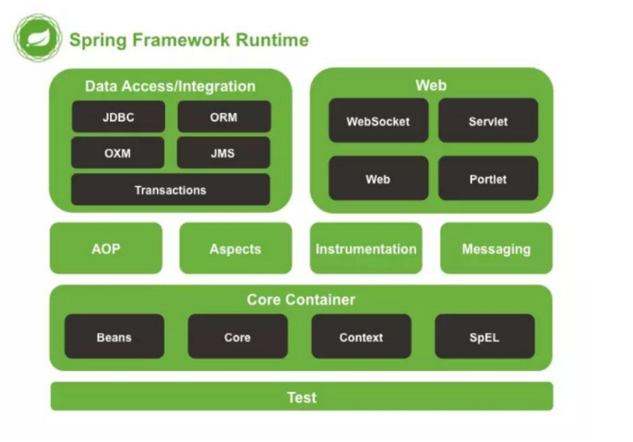

# Spring

## Spring简介

Spring 是一个轻量级 Java 开发框架，Spring 最根本的使命是解决企业级应用开发的复杂性，Java 开发者可以专注于应用程序的开发,即简化 Java 开发。

### 特性

- 非侵入式：基于Spring开发的应用中的对象可以不依赖于Spring的API 
- 控制反转：IOC——Inversion of Control，指的是将对象的创建权交给 Spring 去创建。使用 Spring 之前，对象的创建都是由我们自己在代码中new创建。而使用 Spring 之后。对象的创建都是给了 Spring 框架。 
- 依赖注入：DI——Dependency Injection，是指依赖的对象不需要手动调用 setXX 方法去设置，而是通过配置赋值。 
- 面向切面编程：Aspect Oriented Programming——AOP 容器：Spring 是一个容器，因为它包含并且管理应用对象的生命周期 
- 组件化：Spring 实现了使用简单的组件配置组合成一个复杂的应用。在 Spring 中可以使用XML和Java注解组合这些对象。 
- 一站式：在 IOC 和 AOP 的基础上可以整合各种企业应用的开源框架和优秀的第三方类库（实际上 Spring 自身也提供了表现层的 SpringMVC 和持久层的 Spring JDBC）

 **缺点**

- Spring 明明一个很轻量级的框架，却给人感觉大而全
- Spring 依赖反射，反射影响性能
- 使用门槛升高，入门 Spring 需要较长时间

### 模块组成

 

- **spring core：**提供了框架的基本组成部分，包括控制反转（Inversion of Control，IOC）和依赖注入（Dependency Injection，DI）功能。
- **spring beans：**提供了 BeanFactory，是工厂模式的一个经典实现，Spring 将管理对象称为Bean。 
- **spring context：**构建于 core 封装包基础上的 context 封装包，提供了一种框架式的对象访问方法。
- **spring jdbc：**提供了一个 JDBC 的抽象层，消除了烦琐的 JDBC 编码和数据库厂商特有的错误代码解析， 用于简化 JDBC。
- **spring aop：**提供了面向切面的编程实现，让你可以自定义拦截器、切点等。
- **spring Web：**提供了针对 Web 开发的集成特性，例如文件上传，利用 servlet listeners 进行ioc 容器初始化和针对 Web 的 ApplicationContext。 
- **spring test：**主要为测试提供支持的，支持使用 JUnit 或 TestNG 对 Spring 组件进行单元测试和集成测试

## 设计模式

### 单例

Bean 默认为单例模式。

### 工厂

BeanFactory 就是简单工厂模式的体现，用BeanFactory  ApplicationContext来创建对象的实例；

### 适配器

根据不同商家适配

Spring AOP 的增强或通知(Advice)使用到了适配器模式、spring MVC 中也是用到了适配器模式适配

### 责任链

继承 process 链路执行

### 代理

Spring 的 AOP 功能用到了 JDK 的动态代理和 CGLIB 字节码生成技术；

### 模板方法

用来解决代码重复的问题。比如. RestTemplate, JmsTemplate, JpaTemplate。

### 观察者

定义对象键一种一对多的依赖关系，当一个对象的状态发生改变时，所有依赖于它的对象都会得到通知被制动更新，Spring中的事件编程模型就是观察者模式的实现。在Spring中定义了一个ApplicationListener接口，用来监听Application的事件，Application其实就是ApplicationContext，ApplicationContext内置了几个事件，其中比较容易理解的是：ContextRefreshedEvent、ContextStartedEvent、ContextStoppedEvent、ContextClosedEvent，从名称上来看，就知道这几个事件是什么时候被触发的了。接下来我们说一下如何利用Spring中的事件编程模型来定义自定义事件，并且发布事件。

### 包装器

我们的项目需要连接多个数据库，而且不同的客户在每次访问中根据需要会去访问不同的数据库。这种模式让我们可以根据客户的需求能够动态切换不同的数据源。

## 源码

### IOC

>[spring ioc](/md/analysis/spring/spring-ioc.md)


### AOP

>[漫画:AOP 面试造火箭事件始末](https://mp.weixin.qq.com/s/NXZp8a3n-ssnC6Y1Hy9lzw)
>
>[给冰冰看的SpringAOP面试题](https://mp.weixin.qq.com/s/qlAvW10TRNVak1oJyHO39Q)

#### 特性术语

- 通知（Advice）: AOP 框架中的增强处理。通知描述了切面何时执行以及如何执行增强处理。
- 连接点（join point）: 连接点表示应用执行过程中能够插入切面的一个点，这个点可以是方法的调用、异常的抛出。在 Spring AOP 中，连接点总是方法的调用。
- 切点（PointCut）: 可以插入增强处理的连接点。
- 切面（Aspect）: 切面是通知和切点的结合。
- 引入（Introduction）：引入允许我们向现有的类添加新的方法或者属性。
- 织入（Weaving）: 将增强处理添加到目标对象中，并创建一个被增强的对象，这个过程就是织入。

#### JDK代理

#### Cglib代理

与JDK动态代理相比，cglib可以实现对一般类的代理而无需实现接口。在上例中通过下列步骤来生成目标类Target的代理类：

1. 创建Enhancer实例
2. 通过setSuperclass方法来设置目标类
3. 通过setCallback 方法来设置拦截对象
4. create方法生成Target的代理类，并返回代理类的实例

```java
public class Target{
    public void f(){
        System.out.println("Target f()");
    }
    public void g(){
        System.out.println("Target g()");
    }
}

public class Interceptor implements MethodInterceptor {
    @Override
    public Object intercept(Object obj, Method method, Object[] args,    MethodProxy proxy) throws Throwable {
        System.out.println("I am intercept begin");
//Note: 此处一定要使用proxy的invokeSuper方法来调用目标类的方法
        proxy.invokeSuper(obj, args);
        System.out.println("I am intercept end");
        return null;
    }
}

public class Test {
    public static void main(String[] args) {
         //实例化一个增强器，也就是cglib中的一个class generator
        Enhancer eh = new Enhancer();
         //设置目标类
        eh.setSuperclass(Target.class);
        // 设置拦截对象
        eh.setCallback(new Interceptor());
        // 生成代理类并返回一个实例
        Target t = (Target) eh.create();
        t.f();
        t.h();
    }
}
```

##### 原理

>[cglib源码分析（四）：cglib 动态代理原理分析](https://www.cnblogs.com/cruze/p/3865180.html)

```java
1 public class Target$$EnhancerByCGLIB$$788444a0 extends Target implements Factory
 2 {
 3     private boolean CGLIB$BOUND;
 4     private static final ThreadLocal CGLIB$THREAD_CALLBACKS;
 5     private static final Callback[] CGLIB$STATIC_CALLBACKS;
 6     private MethodInterceptor CGLIB$CALLBACK_0;
 7     private static final Method CGLIB$g$0$Method;
 8     private static final MethodProxy CGLIB$g$0$Proxy;
 9     private static final Object[] CGLIB$emptyArgs;
10     private static final Method CGLIB$f$1$Method;
11     private static final MethodProxy CGLIB$f$1$Proxy;
12     
13     static void CGLIB$STATICHOOK1()
14     {
15       CGLIB$THREAD_CALLBACKS = new ThreadLocal();
16       CGLIB$emptyArgs = new Object[0];
17       Class localClass1 = Class.forName("net.sf.cglib.test.Target$$EnhancerByCGLIB$$788444a0");
18       Class localClass2;
19       Method[] tmp60_57 = ReflectUtils.findMethods(new String[] { "g", "()V", "f", "()V" }, (localClass2 = Class.forName("net.sf.cglib.test.Target")).getDeclaredMethods());
20       CGLIB$g$0$Method = tmp60_57[0];
21       CGLIB$g$0$Proxy = MethodProxy.create(localClass2, localClass1, "()V", "g", "CGLIB$g$0");
22       CGLIB$f$1$Method = tmp60_57[1];
23       CGLIB$f$1$Proxy = MethodProxy.create(localClass2, localClass1, "()V", "f", "CGLIB$f$1");
25     }
26     
27     final void CGLIB$g$0()
28     {
29       super.g();
30     }
31     
32     public final void g()
33     {
34       MethodInterceptor tmp4_1 = this.CGLIB$CALLBACK_0;
35       if (tmp4_1 == null)
36       {
37           CGLIB$BIND_CALLBACKS(this);
38           tmp4_1 = this.CGLIB$CALLBACK_0;
39       }
40       if (this.CGLIB$CALLBACK_0 != null) {
41           tmp4_1.intercept(this, CGLIB$g$0$Method, CGLIB$emptyArgs, CGLIB$g$0$Proxy);
42       }
43       else{
44           super.g();
45       }
46     }
47 }
```

代理类（Target$$EnhancerByCGLIB$$788444a0）继承了目标类（Target）。代理类为每个目标类的方法生成两个方法，例如针对目标类中的每个非private方法，代理类会生成两个方法，以g方法为例：一个是@Override的g方法，一个是CGLIB$g$0（CGLIB$g$0相当于目标类的g方法）。我们在示例代码中调用目标类的方法t.g()时，实际上调用的是代理类中的g()方法。接下来我们着重分析代理类中的g方法，看看是怎么实现的代理功能。

   当调用代理类的g方法时，先判断是否已经存在实现了MethodInterceptor接口的拦截对象，如果没有的话就调用CGLIB$BIND_CALLBACKS方法来获取拦截对象

CGLIB$BIND_CALLBACKS 先从CGLIB$THREAD_CALLBACKS中get拦截对象，如果获取不到的话，再从CGLIB$STATIC_CALLBACKS来获取，如果也没有则认为该方法不需要代理。

**那么拦截对象是如何设置到CGLIB$THREAD_CALLBACKS 或者 CGLIB$STATIC_CALLBACKS中的呢？**

在Jdk动态代理中拦截对象是在实例化代理类时由构造函数传入的，在cglib中是调用Enhancer的firstInstance方法来生成代理类实例并设置拦截对象的。firstInstance的调用轨迹为：

1. Enhancer：firstInstance
2. Enhancer：createUsingReflection
3. Enhancer：setThreadCallbacks
4. Enhancer：setCallbacksHelper
5. Target$$EnhancerByCGLIB$$788444a0 ： CGLIB$SET_THREAD_CALLBACKS

在CGLIB$SET_THREAD_CALLBACKS方法中调用了CGLIB$THREAD_CALLBACKS的set方法来保存拦截对象，在CGLIB$BIND_CALLBACKS方法中使用了CGLIB$THREAD_CALLBACKS的get方法来获取拦截对象，并保存到CGLIB$CALLBACK_0中。这样，在我们调用代理类的g方法时，就可以获取到我们设置的拦截对象，然后通过  *tmp4_1.intercept(this, CGLIB$g$0$Method, CGLIB$emptyArgs, CGLIB$g$0$Proxy)* 来实现代理。这里来解释一下intercept方法的参数含义：

- @para1 obj ：代理对象本身
- @para2 method ： 被拦截的方法对象
- @para3 args：方法调用入参
- @para4 proxy：用于调用被拦截方法的方法代理对象

这里会有一个疑问，为什么不直接反射调用代理类生成的（CGLIB$g$0）来间接调用目标类的被拦截方法，而使用proxy的invokeSuper方法呢？这里就涉及到了另外一个点— FastClass 。

**Fastclass 机制分析**

 Jdk动态代理的拦截对象是通过反射的机制来调用被拦截方法的，反射的效率比较低，所以cglib采用了FastClass的机制来实现对被拦截方法的调用。FastClass机制就是对一个类的方法建立索引，通过索引来直接调用相应的方法


## Bean

### 生命周期

>[bean的生命周期](/md/analysis/spring/spring-other?id=ioc之深入分析bean的生命周期)


1. 调用 Bean 构造方法或工厂方法实例化 Bean
2. 利用依赖注入完成 Bean 中所有属性值的配置注入
3. 如果 Bean 实现了 BeanNameAware(这个接口表面上的作用就是让实现这个接口的bean知道自己在spring容器里的名字) 接口，则 Spring 调用 Bean 的 setBeanName() 方法传入当前 Bean 的 id 值
4. 如果 Bean 实现了 BeanFactoryAware 接口，则 Spring 调用 setBeanFactory() 方法传入当前工厂实例的引用
5. 如果 Bean 实现了 ApplicationContextAware 接口，则 Spring 调用 setApplicationContext() 方法传入当前 ApplicationContext 实例的引用
6. 如果 BeanPostProcessor 和 Bean 关联，则 Spring 将调用该接口的预初始化方法 postProcessBeforeInitialzation() 对 Bean 进行加工操作，此处非常重要，Spring 的 AOP 就是利用它实现的
7. 如果 Bean 实现了 InitializingBean 接口，则 Spring 将调用 afterPropertiesSet() 方法（这个方法可以用在一些特殊情况中，也就是某个对象的某个属性需要经过外界得到，比如说查询数据库等方式，这时候可以用到spring的该特性，只需要实现InitializingBean即可）
8. 如果在配置文件中通过 init-method 属性指定了初始化方法，则调用该初始化方法
9. 如果 BeanPostProcessor 和 Bean 关联，则 Spring 将调用该接口的初始化方法 postProcessAfterInitialization()。此时，Bean 已经可以被应用系统使用了
10. 如果在<bean> 中指定了该 Bean 的作用范围为 scope=“singleton”，则将该 Bean 放入 Spring IoC 的缓存池中，将触发 Spring 对该 Bean 的生命周期管理；如果在 中指定了该 Bean 的作用范围为 scope=“prototype”，则将该 Bean 交给调用者，调用者管理该 Bean 的生命周期，Spring 不再管理该 Bean
11. 如果 Bean 实现了 DisposableBean 接口，则 Spring 会调用 destory() 方法将 Spring 中的 Bean 销毁；如果在配置文件中通过 destory-method 属性指定了 Bean 的销毁方法，则 Spring 将调用该方法对 Bean 进行销毁

- 扫描类
  - invokeBeanFactoryPostProcessors
- 封装beanDefinition对象 各种信息
- 放到map
- 遍历map
- 验证
  - 能不能实例化 需要实例化么 根据信息来
  - 是否单例等等
  - 判断是不是factory bean
  - 单例池 只是一个ConcurrentHashMap而已
  - 正在创建的 容器
- 得到 class
- 推断构造方法
  - 根据注入模型
  - 默认
- 得到构造方法
- 反射 实例化这个对象
- 后置处理器合并beanDefinition
- 判断是否允许 循环依赖
- 提前暴露bean工厂对象
- 填充属性
  - 自动注入
- 执行部分 aware 接口
- 继续执行部分 aware 接口 生命周期回调方法
- 完成代理AOP
- beanProstprocessor 的前置方法
- 实例化为bean
- 放到单例池
- 销毁

### 作用域

- singleton : bean 在每个 Spring ioc 容器中只有一个实例。
- prototype：一个 bean 的定义可以有多个实例。
- request：每次 http 请求都会创建一个 bean，该作用域仅在基于 web 的 Spring ApplicationContext 情形下有效。
- session：在一个 HTTP Session 中，一个 bean 定义对应一个实例。该作用域仅在基于 web的 Spring ApplicationContext 情形下有效。
- global-session：在一个全局的 HTTP Session 中，一个 bean 定义对应一个实例。该作用域仅在基于 web 的 Spring ApplicationContext 情形下有效。

## 循环依赖

>[堂妹让我聊：Spring循环依赖](https://mp.weixin.qq.com/s/u29hMRkfTj_1RHNSukDtEw)
>
>[Spring循环依赖三级缓存是否可以去掉第三级缓存](https://segmentfault.com/a/1190000023647227)
>
>[✨创建-bean（五）之循环依赖处理 - Programmer Community](/md/analysis/spring/spring-bean?id=ioc-之加载-bean：创建-bean（五）之循环依赖处理)

1. `singletonObjects`：用于存放完全初始化好的 bean，**从该缓存中取出的 bean 可以直接使用**
2. `earlySingletonObjects`：提前曝光的单例对象的cache，存放原始的 bean 对象（尚未填充属性），用于解决循环依赖
3. `singletonFactories`：单例对象工厂的cache，**存放 bean 工厂对象**，用于解决循环依赖

- 先从一级缓存singletonObjects中去获取。（如果获取到就直接return）
- 如果获取不到或者对象正在创建中（isSingletonCurrentlyInCreation()），那就再从二级缓存earlySingletonObjects中获取。（如果获取到就直接return)
- 如果还是获取不到，且允许singletonFactories（allowEarlyReference=true）通过getObject()获取。就从三级缓存singletonFactory.getObject()获取。（如果获取到了就从singletonFactories中移除，并且放进earlySingletonObjects。其实也就是从三级缓存移动（是剪切、不是复制哦~）到了二级缓存）**此处的移动保证了，之后在init时候仍然是同一个对象**

**假设只设计二级缓存能否解决循环依赖？**

如果创建的`Bean`有对应的`代理`，那其他对象注入时，注入的应该是对应的`代理对象`；但是`Spring`无法提前知道这个对象是不是有`循环依赖`的情况，而`正常情况`下（没有`循环依赖`情况），`Spring`都是在创建好`完成品Bean`之后才创建对应的`代理`。这时候`Spring`有两个选择：

1. 不管有没有`循环依赖`，都`提前`创建好`代理对象`，并将`代理对象`放入缓存，出现`循环依赖`时，其他对象直接就可以取到代理对象并注入。
2. 不提前创建好代理对象，在出现`循环依赖`被其他对象注入时，才实时生成`代理对象`。这样在没有`循环依赖`的情况下，`Bean`就可以按着`Spring设计原则`的步骤来创建。

`Spring`选择了第二种方式，那怎么做到提前曝光对象而又不生成代理呢？
Spring就是在对象外面包一层`ObjectFactory`，提前曝光的是`ObjectFactory`对象，在被注入时才在`ObjectFactory.getObject`方式内实时生成代理对象，并将生成好的代理对象放入到第二级缓存`Map<String, Object> earlySingletonObjects`。
`addSingletonFactory(beanName, () -> getEarlyBeanReference(beanName, mbd, bean));`：

## 父子容器

> [阿里一面：Spring和SpringMvc父子容器你能说清楚吗 - 个人文章 - SegmentFault 思否](https://segmentfault.com/a/1190000039761203#comment-area)

### 为什么需要父子容器？


### 是否可以把所有类都通过`Spring`容器来管理？

（`Spring`的`applicationContext.xml`中配置全局扫描)

### 是否可以把我们所需的类都放入`Spring-mvc`子容器里面来管理

（`springmvc`的`spring-servlet.xml`中配置全局扫描）

### 同时通过两个容器同时来管理所有的类？

## 事务

### 事务传播

- **REQUIRED **这是默认的传播属性，如果外部调用方有事务，将会加入到事务，没有的话新建一个。
- **PROPAGATION_SUPPORTS** 如果当前存在事务，则加入到该事务；如果当前没有事务，则以非事务的方式继续运行。
- **PROPAGATION_NOT_SUPPORTED** 以非事务方式运行，如果当前存在事务，则把当前事务挂起。
- **PROPAGATION_NEVER** 以非事务方式运行，如果当前存在事务，则抛出异常。

### 事务的隔离性 Isolation

- **READ_UNCOMMITTED** 最低级别，只能保证不读取 物理上损害的数据，允许脏读
- **READ_COMMITTED** 只能读到已经提交的数据
- **REPEATABLE_READ** 可重复读
- **SERIALIZABLE** 串行化读，读写相互阻塞

### 实现原理

> [万字长文，带你从源码认识Spring事务原理，让Spring事务不再是面试噩梦 - java架构师成神之路 - SegmentFault 思否](https://segmentfault.com/a/1190000022754620)

- 采用不同的连接器
- 用AOP 新建立了一个 链接
  - 共享链接
- ThreadLocal 当前事务
- 前提是 关闭AutoCommit

## 类加载机制

### 过程

- 加载
  - 生成一个class对象
- 验证
  - 文件格式验证
  - 元数据验证
  - 字节码验证
  - 符号引用验证
- 准备
  - 默认值
  - static会分配内存
- 解析
  - 解析具体类的信息
    - 引用等
- 初始化
  - 父类没初始化 先初始化父类
- 使用
- 卸载

### 加载方式

- main（）
- class。forName
- ClassLoader。loadClass

### 类加载器

- Appclass Loade
- Extention ClassLoader
- Bootstrap ClassLoader

### 双亲委派原则

- 可以避免重复加载
- 安全

## 其他

### 在 Spring 框架 xm配置中共有 5 种自动装配

- no：默认的方式是不进行自动装配的，通过手工设置 ref 属性来进行装配 bean。
- • byName：通过 bean 的名称进行自动装配，如果一个 bean 的 property 与另一 bean 的 name 相同，就进行自动装配。
- • byType：通过参数的数据类型进行自动装配。
- • constructor：利用构造函数进行装配，并且构造函数的参数通过 byType 进行装配。
- • autodetect：自动探测，如果有构造方法，通过 construct 的方式自动装配，否则使用 byType的方式自动装配。

### 详细讲解核心容器（spring context 应用上下文) 模块

 


### 

### Spring 的事务传播行为

- ① PROPAGATION_REQUIRED：如果当前没有事务，就创建一个新事务，如果当前存在事务，就加入该事务，该设置是最常用的设置。
- ③ PROPAGATION_MANDATORY：支持当前事务，如果当前存在事务，就加入该事务，如果当前不存在事务，就抛出异常。
- ② PROPAGATION_SUPPORTS：支持当前事务，如果当前存在事务，就加入该事务，如果当前不存在事务，就以非事务执行。
- ⑦ PROPAGATION_NESTED：如果当前存在事务，则在嵌套事务内执行。如果当前没有事务，则按 REQUIRED属性执行。
- ④ PROPAGATION_REQUIRES_NEW：创建新事务，无论当前存不存在事务，都创建新事务。
- ⑤ PROPAGATION_NOT_SUPPORTED：以非事务方式执行操作，如果当前存在事务，就把当前事务挂起。
- ⑥ PROPAGATION_NEVER：以非事务方式执行，如果当前存在事务，则抛出异常。

**spring 的事务隔离**

spring 有五大隔离级别，默认值为 ISOLATION_DEFAULT（使用数据库的设置），其他四个隔离级别和数据库的隔离级别一致：

1. ISOLATION_DEFAULT：用底层数据库的设置隔离级别，数据库设置的是什么我就用什么；
2. ISOLATION_READ_UNCOMMITTED：未提交读，最低隔离级别、事务未提交前，就可被其他事务读取（会出现幻读、脏读、不可重复读）；
3. ISOLATION_READ_COMMITTED：提交读，一个事务提交后才能被其他事务读取到（会造成幻读、不可重复读），SQserver 的默认级别；
4. ISOLATION_REPEATABLE_READ：可重复读，保证多次读取同一个数据时，其值都和事务开始时候的内容是一致，禁止读取到别的事务未提交的数据（会造成幻读），MySQ的默认级别；
5. ISOLATION_SERIALIZABLE：序列化，代价最高最可靠的隔离级别，该隔离级别能防止脏读、不可重复读、幻读。

**目前 Spring 提供两种类型的事务管理：**

- **声明式**事务：通过使用注解或基于 XML 的配置事务，从而事务管理与业务代码分离。
- **编程式**事务：通过编码的方式实现事务管理，需要在代码中显式的调用事务的获得、提交、回滚。它为您提供极大的灵活性，但维护起来非常困难。

### **Spring 事务如何和不同的数据持久层框架做集成？**

① 首先，我们先明确下，这里数据持久层框架，指的是 Spring JDBC、Hibernate、Spring JPA、MyBatis 等等。

② 然后，Spring 事务的管理，是通过 `org.springframework.transaction.PlatformTransactionManager` 进行管理，定义如下：

```java
// PlatformTransactionManager.java
public interface PlatformTransactionManager {
    // 根据事务定义 TransactionDefinition ，获得 TransactionStatus 。 
    TransactionStatus getTransaction(@Nullable TransactionDefinition definition) throws TransactionException;
    // 根据情况，提交事务
    void commit(TransactionStatus status) throws TransactionException;
    // 根据情况，回滚事务
    void rollback(TransactionStatus status) throws TransactionException;
}
```

PlatformTransactionManager 是负责事务管理的接口，一共有三个接口方法，分别负责事务的获得、提交、回滚。

`#getTransaction(TransactionDefinition definition)`方法，根据事务定义 TransactionDefinition ，获得 TransactionStatus 。

- 为什么不是创建事务呢？因为如果当前如果已经有事务，则不会进行创建，一般来说会跟当前线程进行绑定。如果不存在事务，则进行创建。
- 为什么返回的是 TransactionStatus 对象？在 TransactionStatus 中，不仅仅包含事务属性，还包含事务的其它信息，例如是否只读、是否为新创建的事务等等。😈 下面，也会详细解析 TransactionStatus 。
- 事务 TransactionDefinition 是什么？😈 下面，也会详细解析 TransactionStatus 。

`#commit(TransactionStatus status)`方法，根据 TransactionStatus 情况，提交事务。

- 为什么根据 TransactionStatus 情况，进行提交？例如说，带`@Transactional`

  注解的的 A 方法，会调用`@Transactional`注解的的 B 方法。

  - 在 B 方法结束调用后，会执行 `PlatformTransactionManager#commit(TransactionStatus status)` 方法，此处事务**是不能**、**也不会**提交的。

- 而是在 A 方法结束调用后，执行 `PlatformTransactionManager#commit(TransactionStatus status)` 方法，提交事务。

 `#rollback(TransactionStatus status)`方法，根据 TransactionStatus 情况，回滚事务。

- 为什么根据 TransactionStatus 情况，进行回滚？原因同 `#commit(TransactionStatus status)` 方法。

③ 再之后，PlatformTransactionManager 有**抽象子**类 `org.springframework.transaction.support.AbstractPlatformTransactionManager` ，基于 [模板方法模式](https://blog.csdn.net/carson_ho/article/details/54910518) ，实现事务整体逻辑的骨架，而抽象 `#doCommit(DefaultTransactionStatus status)`、`#doRollback(DefaultTransactionStatus status)` 等等方法，交由子类类来实现。

> 前方高能，即将进入关键的 ④ 步骤。

④ 最后，不同的数据持久层框架，会有其对应的 PlatformTransactionManager 实现类，如下图所示：[](http://static.iocoder.cn/images/Spring/2018-12-24/07.png)事务的特性

- 所有的实现类，都基于 AbstractPlatformTransactionManager 这个骨架类。
- HibernateTransactionManager ，和 Hibernate5 的事务管理做集成。
- DataSourceTransactionManager ，和 JDBC 的事务管理做集成。所以，它也适用于 MyBatis、Spring JDBC 等等。
- JpaTransactionManager ，和 JPA 的事务管理做集成。

如下，是一个比较常见的 XML 方式来配置的事务管理器，使用的是 DataSourceTransactionManager 。代码如下：

```xml
<!-- 事务管理器 -->
<bean id="transactionManager"
class="org.springframework.jdbc.datasource.DataSourceTransactionManager">
    <!-- 数据源 -->
    <property name="dataSource" ref="dataSource" />
</bean>
```


### 为什么在 Spring 事务中不能切换数据源？

做过 Spring 多数据源的胖友，都会有个惨痛的经历，为什么在开启事务的 Service 层的方法中，无法切换数据源呢？因为，在 Spring 的事务管理中，**所使用的数据库连接会和当前线程所绑定**，即使我们设置了另外一个数据源，使用的还是当前的数据源连接。

另外，多个数据源且需要事务的场景，本身会带来**多事务一致性**的问题，暂时没有特别好的解决方案。

所以一般一个应用，推荐除非了读写分离所带来的多数据源，其它情况下，建议只有一个数据源。并且，随着微服务日益身形，一个服务对应一个 DB 是比较常见的架构选择。

### 什么是事务的回滚规则？

回滚规则，定义了哪些异常会导致事务回滚而哪些不会。

- 默认情况下，事务只有遇到运行期异常时才会回滚，而在遇到检查型异常时不会回滚（这一行为与EJB的回滚行为是一致的）。
- 但是你可以声明事务在遇到特定的检查型异常时像遇到运行期异常那样回滚。同样，你还可以声明事务遇到特定的异常不回滚，即使这些异常是运行期异常。

注意，事务的回滚规则，并不是数据库事务规范中的名词，**而是 Spring 自身所定义的**。


##  

### @Autowired和@Resource以及@Inject等注解注入有何区别？

@Autowired  默认是根据类型（byType ）进行自动装配的，默认是根据类型（byType ）进行自动装配的 通过与@Qualifier配合实现byName

@Resource  是默认根据属性名称进行自动装配的，如果有多个类型一样的Bean候选者，则可以通过name进行指定进行注入

@Autowired、@Inject是默认按照类型匹配的，@Resource是按照名称匹配的

### 什么是 Spring 装配？

当 Bean 在 Spring 容器中组合在一起时，它被称为**装配**或 **Bean 装配**。Spring 容器需要知道需要什么 Bean 以及容器应该如何使用依赖注入来将 Bean 绑定在一起，同时装配 Bean 。

> 装配，和上文提到的 DI 依赖注入，实际是一个东西。

### 使用@Autowired 注解自动装配的过程是怎样的？

在启动 spring IoC 时，容器自动装载了一个 AutowiredAnnotationBeanPostProcessor 后置处理器，当容器扫描到@Autowied、@Resource 或@Inject 时，就会在 IoC 容器自动查找需要的 bean，并装配给该对象的属性。在使用@Autowired 时，首先在容器中查询对应类型的 bean： 

• 如果查询结果刚好为一个，就将该 bean 装配给@Autowired 指定的数据；

• 如果查询的结果不止一个，那么@Autowired 会根据名称来查找；

• 如果上述查找的结果为空，那么会抛出异常。解决方法时，使用 required=false。

### Spring AOP 和 AspectJ AOP 有什么区别？

Spring AOP 属于运行时增强，而 AspectJ 是编译时增强。 Spring AOP 基于代理(Proxying)，而 AspectJ 基于字节码操作(Bytecode Manipulation)。

Spring AOP 已经集成了 AspectJ ，AspectJ 应该算的上是 Java 生态系统中最完整的 AOP 框架了。AspectJ 相比于 Spring AOP 功能更加强大，但是 Spring AOP 相对来说更简单，

如果我们的切面比较少，那么两者性能差异不大。但是，当切面太多的话，最好选择 AspectJ ，它比 Spring AOP 快很多。

### Spring AOP和AspectJ是什么关系？

AspectJ是更强的AOP框架，是实际意义的AOP标准；

- Spring为何不写类似AspectJ的框架？ Spring AOP使用纯Java实现, 它不需要专门的编译过程, 它一个重要的原则就是无侵入性（non-invasiveness）
- 互补而不是竞争的关系。
- Spring AOP采用的就是基于运行时增强的代理技术,Java JDK的动态代理(Proxy，底层通过反射实现)或者CGLIB的动态代理(底层通过继承实现)
- ApectJ采用的就是静态织入的方式。ApectJ主要采用的是编译期织入
- Spring AOP更易用，AspectJ更强大

### JDK 动态代理和 CGLIB 动态代理的区别

Spring AOP 中的动态代理主要有两种方式，JDK 动态代理和 CGLIB 动态代理：

- JDK 动态代理只提供接口的代理，不支持类的代理
- CGLIB（Code Generation Library），是一个代码生成的类库，可以在运行时动态的生成指定类的一个子类对象，并覆盖其中特定方法并添加增强代码，从而实现 AOP。CGLIB是通过继承的方式做的动态代理，因此如果某个类被标记为 final，那么它是无法使用 CGLIB做动态代理的。

### @Component 和 @Bean 的区别是什么？

- @Component 注解作用于类，而@Bean注解作用于方法。
- @Component通常是通过类路径扫描来自动侦测以及自动装配到 Spring 容器中（我们可以使用 @ComponentScan注解定义要扫描的路径从中找出标识了需要装配的类自动装配到 Spring 的 bean 容器中）。 @Bean注解通常是我们在标有该注解的方法中定义产生这个 bean,告诉了 Spring 这是某个类的实例，当我需要用它的时候还给我。
- @Bean 注解比 @Component注解的自定义性更强，而且很多地方我们只能通过 @Bean注解来注册 bean。比如当我们引用第三方库中的类需要装配到Spring 容器时，则只能通过@Bean 来实现。

### Spring 基于 xm注入 bean 的几种方式

1. Set 方法注入；
2. 构造器注入：①通过 index 设置参数的位置；②通过 type 设置参数类型；
3. 静态工厂注入；
4. 实例工厂；


### Spring 框架中的单例 bean 是线程安全的吗？

不是，Spring 框架中的单例 bean 不是线程安全的。spring 中的 bean 默认是单例模式，spring 框架并没有对单例 bean 进行多线程的封装处理。那就要开发者自己去保证线程安全了，最简单的就是改变 bean 的作用域，把“singleton”变更为“prototype”，这样请求 bean 相当于 new Bean()了，所以就可以保证线程安全了

### Spring 如何处理线程并发问题？

• 有状态就是有数据存储功能。

• 无状态就是不会保存数据。

在一般情况下，只有无状态的 Bean 才可以在多线程环境下共享，在 Spring 中，绝大部分 Bean 都可以声明为 singleton 作用域

在类中定义一个 ThreadLocal成员变量，将需要的可变成员变量保存在 ThreadLocal中（推荐的一种方式）

### Spring 中有多少种 IoC 容器？

Spring 提供了两种( 不是“个” ) IoC 容器，分别是 BeanFactory、ApplicationContext 。

### BeanFactory 和 ApplicationContext 有什么区别？

BeanFactory 和 ApplicationContext 是 Spring 的两大核心接口，都可以当做 Spring 的容器。其中ApplicationContext 是 BeanFactory 的子接口。

BeanFactory 简单粗暴，可以理解为就是个 HashMap，Key 是 BeanName，Value 是 Bean 实例。通常只提供注册（put），获取（get）这两个功能。我们可以称之为 “低级容器”。ApplicationContext 可以称之为 “高级容器”。因为他比 BeanFactory 多了更多的功能。他继承了多个接口。因此具备了更多的功能。

**依赖关系：**

BeanFactory：是 Spring 里面最底层的接口，包含了各种 Bean 的定义，读取 bean 配置文档，管理bean 的加载、实例化，控制 bean 的生命周期，维护 bean 之间的依赖关系。ApplicationContext 接口作为 BeanFactory 的派生，除了提供 BeanFactory 所具有的功能外，还提供了更完整的框架功能：

- MessageSource ：管理 message ，实现国际化等功能。
- ApplicationEventPublisher ：事件发布。
- ResourcePatternResolver ：多资源加载。
- EnvironmentCapable ：系统 Environment（profile + Properties）相关。
- Lifecycle ：管理生命周期。
- Closable ：关闭，释放资源
- InitializingBean：自定义初始化。
- BeanNameAware：设置 beanName 的 Aware 接口。

**加载方式：**

- BeanFactroy 采用的是延迟加载形式来注入 Bean 的，即只有在使用到某个 Bean 时(调用getBean())，才对该 Bean 进行加载实例化。
- ApplicationContext，它是在容器启动时，一次性创建了所有的 Bean。

**创建方式：**

BeanFactory 通常以编程的方式被创建，ApplicationContext 还能以声明的方式创建，如使用ContextLoader。

**注册方式：**

BeanFactory 和 ApplicationContext 都支持 BeanPostProcessor，BeanFactoryPostProcessor 的使用，但两者之间的区别是：BeanFactory 需要手动注册，而 ApplicationContext 则是自动注册

### @Transactional(rollbackFor = Exception.class)注解了解吗？

我们知道 Exception 分为运行时异常 RuntimeException 和非运行时异常。在@Transactional注解中如果不配置rollbackFor属性,那么事务只会在遇到RuntimeException的时候才会回滚,加上rollbackFor=Exception.class,可以让事务在遇到非运行时异常时也回滚。

@Transactiona注解一般可以作用在类或者方法上。

作用于类：当把@Transactiona注解放在类上时，表示所有该类的 public 方法都配置相同的事务属性信息。

作用于方法：当类配置了@Transactional，方法也配置了@Transactional，方法的事务会覆盖类的事务配置信息。

 

### 什么是依赖注入？

在依赖注入中，你不必主动、手动创建对象，但必须描述如何创建它们。

- 你不是直接在代码中将组件和服务连接在一起，而是描述配置文件中哪些组件需要哪些服务。
- 然后，再由 IoC 容器将它们装配在一起。

### 可以通过多少种方式完成依赖注入？

- 接口注入
- 构造函数注入
- setter 注入

### 请介绍下常用的 BeanFactory 容器？

BeanFactory 最常用的是 XmlBeanFactory 。它可以根据 XML 文件中定义的内容，创建相应的 Bean。

### 请介绍下常用的 ApplicationContext 容器？

以下是三种较常见的 ApplicationContext 实现方式：

- 1、ClassPathXmlApplicationContext ：从 ClassPath 的 XML 配置文件中读取上下文，并生成上下文定义。应用程序上下文从程序环境变量中取得。示例代码如下：

  ```
  ApplicationContext context = new ClassPathXmlApplicationContext(“bean.xml”);
  ```

- 2、FileSystemXmlApplicationContext ：由文件系统中的XML配置文件读取上下文。示例代码如下：

  ```
  ApplicationContext context = new FileSystemXmlApplicationContext(“bean.xml”);
  ```

- 3、XmlWebApplicationContext ：由 Web 应用的XML文件读取上下文。例如我们在 Spring MVC 使用的情况。

当然，目前我们更多的是使用 Spring Boot 为主，所以使用的是第四种 ApplicationContext 容器，ConfigServletWebServerApplicationContext 。

### 简述 Spring IoC 的实现机制？

简单来说，Spring 中的 IoC 的实现原理，就是**工厂模式**加**反射机制**。代码如下：

```java
interface Fruit {

     public abstract void eat();
     
}
class Apple implements Fruit {

    public void eat(){
        System.out.println("Apple");
    }
    
}
class Orange implements Fruit {
    public void eat(){
        System.out.println("Orange");
    }
}

class Factory {

    public static Fruit getInstance(String className) {
        Fruit f = null;
        try {
            f = (Fruit) Class.forName(className).newInstance();
        } catch (Exception e) {
            e.printStackTrace();
        }
        return f;
    }
    
}

class Client {

    public static void main(String[] args) {
        Fruit f = Factory.getInstance("io.github.dunwu.spring.Apple");
        if(f != null){
            f.eat();
        }
    }
    
}
```

### Spring 提供了以下五种标准的事件：

1. 上下文更新事件（ContextRefreshedEvent）：该事件会在ApplicationContext 被初始化或者更新时发布。也可以在调用ConfigurableApplicationContext 接口中的 `#refresh()` 方法时被触发。
2. 上下文开始事件（ContextStartedEvent）：当容器调用ConfigurableApplicationContext 的 `#start()` 方法开始/重新开始容器时触发该事件。
3. 上下文停止事件（ContextStoppedEvent）：当容器调用 ConfigurableApplicationContext 的 `#stop()` 方法停止容器时触发该事件。
4. 上下文关闭事件（ContextClosedEvent）：当ApplicationContext 被关闭时触发该事件。容器被关闭时，其管理的所有单例 Bean 都被销毁。
5. 请求处理事件（RequestHandledEvent）：在 We b应用中，当一个HTTP 请求（request）结束触发该事件。

------

除了上面介绍的事件以外，还可以通过扩展 ApplicationEvent 类来开发**自定义**的事件。

① 示例自定义的事件的类，代码如下：

```java
public class CustomApplicationEvent extends ApplicationEvent{  

    public CustomApplicationEvent(Object source, final String msg) {  
        super(source);
    }  

}
```

② 为了监听这个事件，还需要创建一个监听器。示例代码如下：

```
public class CustomEventListener implements ApplicationListener<CustomApplicationEvent> {

    @Override  
    public void onApplicationEvent(CustomApplicationEvent applicationEvent) {  
        // handle event  
    }
    
}
```

③ 之后通过 ApplicationContext 接口的 `#publishEvent(Object event)` 方法，来发布自定义事件。示例代码如下：

```
// 创建 CustomApplicationEvent 事件
CustomApplicationEvent customEvent = new CustomApplicationEvent(applicationContext, "Test message");
// 发布事件
applicationContext.publishEvent(customEvent);
```

### Spring 有哪些配置方式

单纯从 Spring Framework 提供的方式，一共有三种：

- 1、XML 配置文件。

  Bean 所需的依赖项和服务在 XML 格式的配置文件中指定。这些配置文件通常包含许多 bean 定义和特定于应用程序的配置选项。它们通常以 bean 标签开头。例如：

  ```
  <bean id="studentBean" class="org.edureka.firstSpring.StudentBean">
      <property name="name" value="Edureka"></property>
  </bean>
  ```

- 2、注解配置。

  您可以通过在相关的类，方法或字段声明上使用注解，将 Bean 配置为组件类本身，而不是使用 XML 来描述 Bean 装配。默认情况下，Spring 容器中未打开注解装配。因此，您需要在使用它之前在 Spring 配置文件中启用它。例如：

  ```
  <beans>
  <context:annotation-config/>
  <!-- bean definitions go here -->
  </beans>
  ```

- 3、Java Config 配置。

  Spring 的 Java 配置是通过使用 @Bean 和 @Configuration 来实现。

  - `@Bean` 注解扮演与 `<bean />` 元素相同的角色。

  - `@Configuration` 类允许通过简单地调用同一个类中的其他 `@Bean` 方法来定义 Bean 间依赖关系。

  - 例如：

    ```
    @Configuration
    public class StudentConfig {
        
        @Bean
        public StudentBean myStudent() {
            return new StudentBean();
        }
        
    }
    ```

    - 是不是很熟悉 😈

目前主要使用 **Java Config** 配置为主。当然，三种配置方式是可以混合使用的。例如说：

- Dubbo 服务的配置，艿艿喜欢使用 XML 。
- Spring MVC 请求的配置，艿艿喜欢使用 `@RequestMapping` 注解。
- Spring MVC 拦截器的配置，艿艿喜欢 Java Config 配置。

------

另外，现在已经是 Spring Boot 的天下，所以更加是 **Java Config** 配置为主。

### 如何在 Spring 中启动注解装配？

默认情况下，Spring 容器中未打开注解装配。因此，要使用基于注解装配，我们必须通过配置 `<context：annotation-config />` 元素在 Spring 配置文件中启用它。

### @Required 注解有什么用？

`@Required` 注解，应用于 Bean 属性 setter 方法。

- 此注解仅指示必须在配置时使用 Bean 定义中的显式属性值或使用自动装配填充受影响的 Bean 属性。
- 如果尚未填充受影响的 Bean 属性，则容器将抛出 BeanInitializationException 异常。