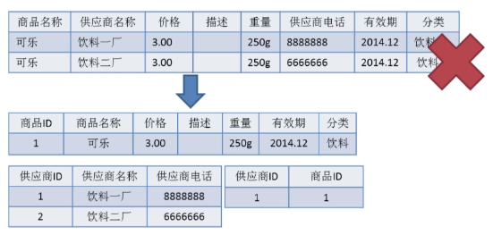
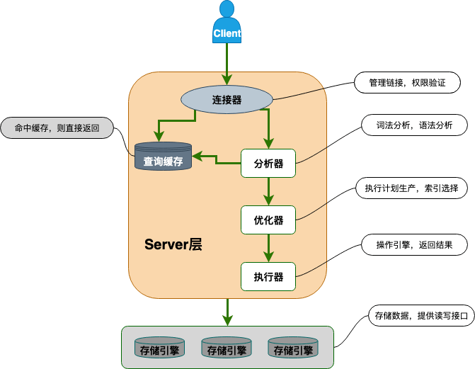
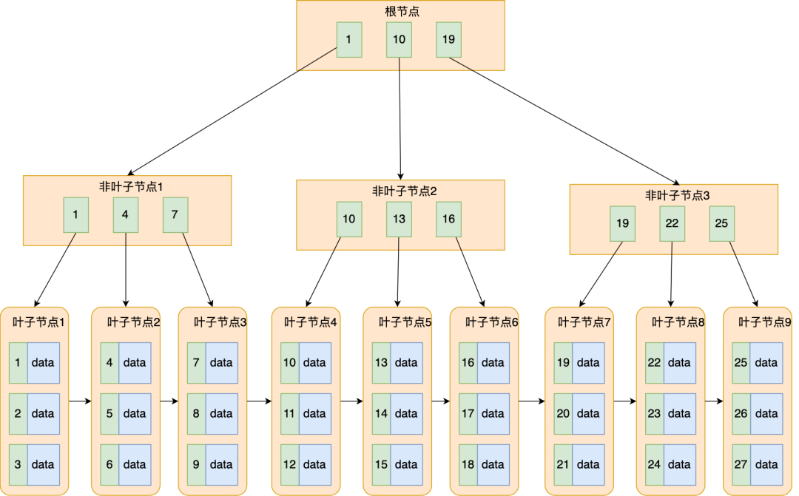
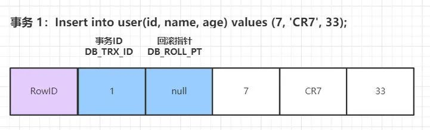

# Mysql

## 数据库范式

  ### 1NF

强调属性的原子性约束，要求属性具有原子性，不可再分解。

`学生表(学号、姓名、年龄、性别、地址)。因为地址可以细分为国家、省份、城市、市区、街道，那么该模式就没有达到第一范式。`

存在问题：冗余度大、会引起修改操作的不一致性、数据插入异常、数据删除异常。

  ### 2NF

强调记录的唯一性约束，数据表必须有一个主键，并且没有包含在主键中的列必须完全依赖于主键，而不能只依赖于主键的一部分。   

          

  ### 3Nf

第三范式，强调数据属性冗余性的约束，也就是非主键列必须直接依赖于主键。也就是消除了非主属性对码的传递函数依赖。

`订单表（订单编码，顾客编码，顾客名称），其中主键是（订单编码），这个场景中，顾客编码、顾客名称都完全依赖于主键，因此符合第二范式，但顾客名称依赖于顾客编码，从而间接依赖于主键，所以不能满足第三范式。如果要满足第三范式，需要拆分为两个表：订单表（订单编码，顾客编码）和顾客表（顾客编码，顾客名称）。`

## 与oracle的区别

### 本质的区别

 Oracle数据库是一个对象关系数据库管理系统（ORDBMS）。它通常被称为Oracle RDBMS或简称为Oracle，是一个收费的数据库。

MySQL是一个开源的关系数据库管理系统（RDBMS）。它是世界上使用最多的RDBMS，提供对多个数据库的多用户访问。它是一个开源、免费的数据库。

3、Oracle是大型数据库，Mysql是中小型数据库；

4、Oracle可以设置用户权限、访问权限、读写权限等，MySQL没有；

5、Oracle有表空间的概念，MySQL没有；

6、Oracle默认不自动提交，需要用户手动提交。Mysql默认是自动提交。

7、Oracle逻辑备份时不锁定数据，且备份的数据是一致的。Mysql逻辑备份时要锁定数据，才能保证备份的数据是一致的，影响业务正常使用。

8、Oracle有各种成熟的性能诊断调优工具，能实现很多自动分析、诊断功能。比如awr、addm、sqltrace、tkproof等；Mysql的诊断调优方法较少，主要有慢查询日志。

9、Oracle容量无限，根据配置决定；而MySQL使用MyISAM存储引擎，最大表尺寸为65536TB。 MySQL数据库的最大有效表尺寸通常是由操作系统对文件大小的限制决定的，而不是由MySQL内部限制决定。

10、Oracle在Linux下的性能，在少量数据时速度低于MySQL，在千万级时速度快于MySQL。

11、Oracle全面，完整，稳定，但一般数据量大，对硬件要求较高 ；而MySQL使用CPU和内存极少，性能很高，但扩展性较差。

12、MySQL处理翻页的SQL语句比较简单，用LIMIT 开始位置, 记录个数。Oracle处理翻页的SQL语句就比较繁琐了。每个结果集只有一个ROWNUM字段标明它的位置, 并且只能用ROWNUM<100, 不能用ROWNUM>80。

13、MySQL日期字段分DATE和TIME两种，Oracle日期字段只有DATE，包含年月日时分秒信息，用当前数据库的系统时间为SYSDATE, 精确到秒。与Oracle区别


## 数据库架构   


 

  ### 连接器

身份认证和权限相关(登录 MySQL 的时候)。

  ### 缓存

执行查询语句的时候，会先查询缓存（MySQL 8.0 版本后移除，因为这个功能不太实用）。

  ### 分析器

没有命中缓存的话，SQL 语句就会经过分析器，分析器说白了就是要先看你的 SQL 语句要干嘛，再检查你的 SQL 语句语法是否正确。

  ### 优化器

按照 MySQL 认为最优的方案去执行。

  ### 执行器

执行语句，然后从存储引擎返回数据。 执行语句之前会先判断是否有权限，如果没有权限的话，就会报错。

  ### 插件式存储引擎

主要负责数据的存储和读取，采用的是插件式架构，支持 InnoDB、MyISAM、Memory 等多种存储引擎。

## **数据类型**

**整型**：TINYINT, SMALLINT, MEDIUMINT, INT, BIGINT 分别使用 8, 16, 24, 32, 64 位存储空间，一般情况下越小的列越好。INT(11) 中的数字只是规定了交互工具显示字符的个数，对于存储和计算来说是没有意义的。

**浮点数**：FLOAT 和 DOUBLE 为浮点类型，DECIMAL 为高精度小数类型。CPU 原生支持浮点运算，但是不支持 DECIMAl 类型的计算，因此 DECIMAL 的计算比浮点类型需要更高的代价。

**字符串**：CHAR 和 VARCHAR 两种类型，一种是定长的，一种是变长的。

VARCHAR 这种变长类型能够节省空间，因为只需要存储必要的内容。但是在执行 UPDATE 时可能会使行变得比原来长，当超出一个页所能容纳的大小时，就要执行额外的操作。MyISAM 会将行拆成不同的片段存储，而 InnoDB 则需要分裂页来使行放进页内。 VARCHAR 会保留字符串末尾的空格，而 CHAR 会删除。

**时间和日期**：DATETIME（8字节，它与时区无关） 和 TIMESTAMP（不同时间时间戳不一样） 应该尽量使用 TIMESTAMP，因为它比 DATETIME 空间效率更高。

**VARCHAR(5)和VARCHAR(200)**

使用VARCHAR(5)和VARCHAR(200)存储"hello"的空间开销是一样的。那么使用更短的列有什么优势吗？ 事实证明有很大的优势。更长的列会消耗更多的内存，因为MySQL通常会分配固定大小的内存块来保存内部值。尤其是使用内存临时表进行排序或其他操作时会特别糟糕。在利用磁盘临时表进行排序时也同样糟糕。 所以最好的策略是只分配真正需要的空间。

**BLOB 和 TEXT**

BLOB和TEXT都是为存储很大的数据而设计的数据类型，分别采用二进制和字符方式存储。

与其他类型不同，MySQL把每个BLOB和TEXT值当做一个独立的对象去处理。当BLOB和TEXT值太大时，InnoDB会使用专门的“外部”存储区域来进行存储，此时每个值在行内需要1~4个字节存储一个指针，然后在外部存储区域存储实际的值。

**MySQL对BLOB和TEXT列进行排序与其他类型是不同的**：它只对每个列的最前max_sort_length个字节而不是整个字符串做排序。同样的，MySQL也不能将BLOB或TEXT列全部长度的字符串进行索引

## 存储引擎

MySQL 5.5.5 之前，MyISAM 是 MySQL 的默认存储引擎。5.5.5 版本之后，InnoDB 是 MySQL 的默认存储引擎。

MySQL 存储引擎采用的是插件式架构，支持多种存储引擎，我们甚至可以为不同的数据库表设置不同的存储引擎以适应不同场景的需要。存储引擎是基于表的，而不是数据库。

  ### InnoDB

#### 支持事务

InnoDB 是 MySQL 默认的事务型存储引擎，只要在需要它不支持的特性时，才考虑使用其他存储引擎。

#### 支持行级锁

InnoDB 采用 MVCC 来支持高并发，并且实现了四个标准隔离级别(未提交读、提交读、可重复读、可串行化)。其默认级别时可重复读（REPEATABLE READ），在可重复读级别下，通过 MVCC + Next-Key Locking 防止幻读。

#### 支持在线热备份

InnoDB 支持真正的在线热备份，MySQL 其他的存储引擎不支持在线热备份，要获取一致性视图需要停止对所有表的写入，而在读写混合的场景中，停止写入可能也意味着停止读取。

#### 其他

主索引时聚簇索引，在索引中保存了数据，从而避免直接读取磁盘，因此对主键查询有很高的性能。

InnoDB 内部做了很多优化，包括从磁盘读取数据时采用的可预测性读，能够自动在内存中创建 hash 索引以加速读操作的自适应哈希索引，以及能够加速插入操作的插入缓冲区等。

  ### MyISAM

设计简单，数据以紧密格式存储。对于只读数据，或者表比较小、可以容忍修复操作，则依然可以使用它。提供了大量的特性，包括压缩表、空间数据索引等。

#### 不支持事务

可以手工或者自动执行检查和修复操作，但是和事务恢复以及崩溃恢复不同，可能导致一些数据丢失，而且修复操作是非常慢的。

如果指定了 DELAY_KEY_WRITE 选项，在每次修改执行完成时，不会立即将修改的索引数据写入磁盘，而是会写到内存中的键缓冲区，只有在清理键缓冲区或者关闭表的时候才会将对应的索引块写入磁盘。这种方式可以极大的提升写入性能，但是在数据库或者主机崩溃时会造成索引损坏，需要执行修复操作。

#### 表级锁

不支持行级锁，只能对整张表加锁，读取时会对需要读到的所有表加共享锁，写入时则对表加排它锁。但在表有读取操作的同时，也可以往表中插入新的记录，这被称为并发插入（CONCURRENT INSERT）。

#### 支持空间数据索引

  ### 区别

- **事务:** innoDB 支持事务，MyISAM 不支持事务
- **锁:** InnoDB 支持行级锁，MyISAM 只支持表级锁
- **外键:** InnoDB 支持外键
- **InnoDB** 支持在线热备份
- **MyiSAM** 支持空间索引
- **索引实现不一样**  MyiSAM 非聚簇索引

## log

### **redo log**  

每条 redo 记录由“表空间号+数据页号+偏移量+修改数据长度+具体修改的数据”组成

redo 日志InnoDB是存储引擎独有的，它让拥有了崩溃恢复能力。 比如 实例挂了或宕机了，重启时，存储引擎会使用恢复数据，保证数据的持久性与完整性。

MySQL 中数据是以页为单位，你查询一条记录，会从硬盘把一页的数据加载出来，加载出来的数据叫数据页，会放入到 中Buffer Pool

更新表数据的时候，也是如此，发现里Buffer Pool存在要更新的数据，就直接在里更新，然后会把“在某个数据页上做了什么修改”记录到重做日志缓存（redo）里，接着刷盘到 文件里

**刷盘时机**

1. 设置为 0 的时候，表示每次事务提交时不进行刷盘操作

2. 设置为 1 的时候，表示每次事务提交时都将进行刷盘操作（默认值）

3. 设置为 2 的时候，表示每次事务提交时都只把 redo log buffer 内容写入 page cache

另外， 存储引擎有一个后台线程，每隔 秒，就会把 中的内容写到文件系统缓存，然后调用 刷盘。

### **binlog**

binlog会记录所有涉及更新数据的逻辑操作，并且是顺序写。

可以说数据库的数据备份、主备、主主、主从都离不开，需要依靠来同步数据，保证数据一致性。

binlog的写入时机也非常简单，事务执行过程中，先把日志写到缓存，事务提交的时候，再把写到文件中。

binlog日志刷盘流程如下

​                         

上图的 write，是指把日志写入到文件系统的 page cache，并没有把数据持久化到磁盘，所以速度比较快

上图的 fsync，才是将数据持久化到磁盘的操作

**binlog底层**

MySQL中的binlog是一个二进制文件,它记录了所有的增删改操作。节点之间的复制就是依靠binlog来完成的。binlog具有三种模式:

Row模式

日志中会记录成每一行数据被修改的日志，然后在slave端再对相同的数据进行修改。例如:update xxx where id in(1,2,3,4,5);采用该模式则会记录5条记录。

statement模式

每一条会修改数据的sql都会记录到 master的binlog中。slave在复制的时候sql Thread会解析成和原来master端执行过的相同的sql来再次执行.

mixed模式

Mixed即混合模式,MySQL会根据执行的每一条具体的sql语句来区分对待记录的日志形式，也就是在Statement和Row之间选择一种。

新版本中的Statment level还是和以前一样，仅仅记录执行的语句。而新版本的MySQL中队row level模式也被做了优化，并不是所有的修改都会以row level来记录，像遇到表结构变更的时候就会以statement模式来记录，如果sql语句确实就是update或者delete等修改数据的语句，那么还是会记录所有行的变更。

### **undo log**

我们知道如果想要保证事务的原子性，就需要在异常发生时，对已经执行的操作进行回滚，在 MySQL 中，恢复机制是通过 回滚日志（undo log） 实现的，所有事务进行的修改都会先记录到这个回滚日志中，然后再执行相关的操作。如果执行过程中遇到异常的话，我们直接利用 回滚日志 中的信息将数据回滚到修改之前的样子即可！并且，回滚日志会先于数据持久化到磁盘上。这样就保证了即使遇到数据库突然宕机等情况，当用户再次启动数据库的时候，数据库还能够通过查询回滚日志来回滚将之前未完成的事务。


MySQL InnoDB 引擎使用 redo log(重做日志) 保证事务的持久性，使用 undo log(回滚日志) 来保证事务的原子性。MySQL数据库的数据备份、主备、主主、主从都离不开，需要依靠binlog来同步数据，保证数据一致性。

### 其他

#### 执行更新语句流程

1. 先查询到张三这一条数据，如果有缓存，也是会用到缓存。
2. 然后拿到查询的语句，把 age 改为 19，然后调用引擎 API 接口，写入这一行数据，InnoDB 引擎把数据保存在内存中，同时记录 redo log，此时 redo log 进入 prepare 状态，然后告诉执行器，执行完成了，随时可以提交。
3. 执行器收到通知后记录 binlog，然后调用引擎接口，提交 redo log 为提交状态。
4. 更新完成。

采用 redo log 两阶段提交的方式就不一样了，写完 binlog 后，然后再提交 redo log 就会防止出现上述的问题，从而保证了数据的一致性。

#### 假设 redo log 处于预提交状态，binlog 也已经写完了，这个时候发生了异常重启会怎么样呢

MySQL 的处理过程如下：

- 判断 redo log 是否完整，如果判断是完整的，就立即提交。
- 如果 redo log 只是预提交但不是 commit 状态，这个时候就会去判断 binlog 是否完整，如果完整就提交 redo log, 不完整就回滚事务。

## 索引

  ### B+原理

>[男朋友问我：为什么 MySQL 喜欢 B+ 树？我笑着画了 20 张图 (qq.com)](https://mp.weixin.qq.com/s/AoPq8poENF9T4mVS1fDFPw)

#### 数据结构

B+ Tree 是B树的一种变形，它是基于 B Tree 和叶子节点顺序访问指针进行实现，通常用于数据库和操作系统的文件系统中




#### 操作

  插入
  删除
  查询

#### 常见树的特性

-   AL树平衡二叉树: 高度平衡，相比于红黑树查找更快，删除略慢。rebalance 概率更高

-   红黑树: 近似平衡的，rebalance 的概率更低
-   B/B+树:  多路查找树，出度高，磁盘IO低，一般用于数据库系统中

#### B+ 树与红黑树的比较

-   磁盘IO次数低  B+ 树一个节点可以存储多个元案，相对于完全平衡二叉树整体的树高度降低了，磁盘IO效率提高了

-   磁盘预读特性

#### B+ 树与 B 树的比较

- B+ 树的非叶子节点不存放实际的记录数据，仅存放索引，因此数据量相同的情况下，相比存储即存索引又存记录的 B 树，B+树的非叶子节点可以存放更多的索引，因此 B+ 树可以比 B 树更「矮胖」，查询底层节点的磁盘 I/O次数会更少。

- B+ 树有大量的冗余节点（所有非叶子节点都是冗余索引），这些冗余索引让 B+ 树在插入、删除的效率都更高，比如删除根节点的时候，不会像 B 树那样会发生复杂的树的变化；

- B+ 树叶子节点之间用链表连接了起来，有利于范围查询，而 B 树要实现范围查询，因此只能通过树的遍历来完成范围查询，这会涉及多个节点的磁盘 I/O 操作，范围查询效率不如 B+ 树。

  ### MySQL 素引

>[《爱上面试官》系列-数据库索引 (qq.com)](https://mp.weixin.qq.com/s/_9rDde9wRYoZeh07EASNQQ)

#### B+树索引

-   二分查找，查找速度快

-   B+ 树有序，排序，分组速度快
-   聚簇索引   叶子节点的数据域记录着完整的数据记录
-   辅助索引  叶子结点的敞据域记录看主键的值，如果查询的不是索引构成列或者主键，则需要回表

#### 哈希索引

-   快速精确查询，但是不支持范围查询

-   适合场:等值查询场景，例 Redis，Memcached 等这 NOSQL中间件
-   哈希表

#### 全文索引

MyISAM 存储引擎支持全文索引，用于查找文本中的关键词，而不是直接比较是否相等。查找条件使用 MATCH AGAINST，而不是普通的 WHERE。全文索引使用倒排索引实现，它记录着关键词到其所在文档的映射。

InnoDB 存储引擎在 MySQL 5.6.4 版本中也开始支持全文索引。

#### 空间数据索引

MyISAM 存储引擎支持空间数据索引（R-Tree），可以用于地理数据存储。空间数据索引会从所有维度来索引数据，可以有效地使用任意维度来进行组合查询。

必须使用 GIS 相关的函数来维护数据。

  ### 索引优化

#### 独立的列

在进行查询时，索引列不能是表达式的一部分，也不能是函数的参数，否则无法使用索引。

例如下面的查询不能使用 actor_id 列的索引：

```mysql
SELECT actor_id FROM sakila.actor WHERE actor_id + 1 = 5;
```

#### 多列索引

在需要使用多个列作为条件进行查询时，使用多列索引比使用多个单列索引性能更好。例如下面的语句中，最好把 actor_id 和 film_id 设置为多列索引。

```mysql
SELECT film_id, actor_ id FROM sakila.film_actor
WHERE actor_id = 1 AND film_id = 1;
```

#### 索引列的顺序

  将选择行最强的索引列放在最前面
  索引的选择性: 不重复的索引值和记录总数的比值

#### 前缀索引

  对于BLOG、TEXT和VARCHAR类型的列，必须使用前缀索引，只索引开始的部分字符
  前缀索引的选取需要根据索引选择性来确定

#### 覆盖索引

索引包含所有需要查询的字段的值。

具有以下优点：

- 索引通常远小于数据行的大小，只读取索引能大大减少数据访问量。

- 一些存储引擎（例如 MyISAM）在内存中只缓存索引，而数据依赖于操作系统来缓存。因此，只访问索引可以不使用系统调用（通常比较费时）。

- 对于 InnoDB 引擎，若辅助索引能够覆盖查询，则无需访问主索引。

#### 其他

- 预发跑sql explain

- 排除 缓存 sql nocache

- 看一下行数对不对 不对可以用analyze table t 矫正

- 添加索引 索引不一定是最优的 force index 强制走索引 不建议用

- 存在回表的情况

- 覆盖索引避免回表，不要*

  - 主键索引

- 联合索引 不能无限建 高频场景

- 最左前缀原则 按照索引定义的字段顺序写sql

- 合理安排联合索引的顺序

- 5.6之后 索引下推 减少回表次数

- 给字符串加索引

  - 前缀索引
  - 倒序存储
  - Hash

- 数据库的flush的时机

  - redo log满了 修改checkpoint flush到磁盘
  - 系统内存不足淘汰数据页
    - buffer pool
      - 要知道磁盘的io能力 设置innodb_io_capacity 设置为磁盘的IOPS fio测试
      - innodb_io_capacity设置低了 会让innoDB错误估算系统能力 导致脏页累积
  - 系统空闲的时候 找间隙刷脏页
  - MySQL正常关闭，会把内存脏页flush到磁盘

- innodb刷盘速度

  - 脏页比例
  - redolog 写盘速度
  - innodb_flush_neighbors 0 
    - 机械磁盘的随机io不太行 减少随机io性能大幅提升 设置为 1最好
    - 现在都是ssd了 设置为0就够了 8.0之后默认是0

- 索引字段不要做函数操作，会破坏索引值的有序性，优化器会放弃走树结构

  - 如果触发隐式转换 那也会走cast函数 会放弃走索引

- 字符集不同可能走不上索引

  - convert 也是函数所以走不上

  

  ### 索引维护

- 页满了 页分裂 页利用率下降

- 数据删除 页合并 

- 自增 只追加可以不考虑 也分页

- 索引长度

  ### 索引选择

- 普通索引

  - 找到第一个之后 直到朋友不满足的

- 唯一索引

  - 找到第一个不满足的就停止了

- 覆盖索引

  - 包含主键索引值

- 最左前缀原则

  - 安排字段顺序

- 索引空间问题

  - hash

- 5.6之后索引下推

  - 不需要多个回表 一边遍历 一边判断

- 页的概念

- 更新

  - change buffer
  - 更新操作来了 如果数据页不在内存 就缓存下来 下次来了 更新 在就直接更新
  - 唯一索引 需要判断 所以 用不到change buffer
  - innodb的处理流程
    - 记录在页内存
      - 唯一索引 判断没冲突插入
      - 普通索引 插入
    - 记录不再页中
      - 数据页读入内存 判断 插入
      - change buffer
    - 数据读是随机IO 成本高 
    - 机械硬盘 change buffer 收益大 写多读少 marge

## 查询性能优化

### explain 分析 

- select_type: 常用的有 SIMPLE 简单查询，UNION 联合查询，SUBQUERY 子查询等。
- table: 要查询的表
- possible_keys: 可选择的索引
- key:  实际使用的索引
- rows: 扫描的行数
- type:  索引查询类型，经常用到的索引查询类型：
  - const：使用主键或者唯一索引进行查询的时候只有一行匹配 ref：使用非唯一索引 range：使用主键、单个字段的辅助索引、多个字段的辅助索引的最后一个字段进行范围查询 index：和all的区别是扫描的是索引树 all：扫描全表：
  - system: 触发条件：表只有一行，这是一个 const type 的特殊情况
  - const: 触发条件：在使用主键或者唯一索引进行查询的时候只有一行匹配。
  - eq_ref: 触发条件：在进行联接查询的，使用主键或者唯一索引并且只匹配到一行记录的时候
  - ref: 触发条件：使用非唯一索引
  - range: 触发条件：只有在使用主键、单个字段的辅助索引、多个字段的辅助索引的最后一个字段进行范围查询才是 range
  - index:  触发条件：只扫描索引树.  1）查询的字段是索引的一部分，覆盖索引。2）使用主键进行排序
  - all 触发条件：全表扫描，不走索引


### 优化数据访问

#### 减少请求的数据量

- 只返回必要的列：最好不要使用 SELECT * 语句。
- 只返回必要的行：使用 LIMIT 语句来限制返回的数据。
- 缓存重复查询的数据：使用缓存可以避免在数据库中进行查询，特别在要查询的数据经常被重复查询时，缓存带来的查询性能提升将会是非常明显的。

#### 减少服务器端扫描的行数

最有效的方式是使用索引来覆盖查询。

### 重构查询方式

#### 做分页，分批查询

#### 分解大连接查询

一个大查询如果一次性执行的话，可能一次锁住很多数据、占满整个事务日志、耗尽系统资源、阻塞很多小的但重要的查询。

将一个大连接查询分解成对每一个表进行一次单表查询，然后在应用程序中进行关联，这样做的好处有：

- 让缓存更高效。对于连接查询，如果其中一个表发生变化，那么整个查询缓存就无法使用。而分解后的多个查询，即使其中一个表发生变化，对其它表的查询缓存依然可以使用。
- 分解成多个单表查询，这些单表查询的缓存结果更可能被其它查询使用到，从而减少冗余记录的查询。
- 减少锁竞争；
- 在应用层进行连接，可以更容易对数据库进行拆分，从而更容易做到高性能和可伸缩。
- 查询本身效率也可能会有所提升。例如下面的例子中，使用 IN() 代替连接查询，可以让 MySQL 按照 ID 顺序进行查询，这可能比随机的连接要更高效。


### 读写分离

### 分库分表

## 事务

###   ACID

何为事务？ 一言蔽之，事务是逻辑上的一组操作，要么都执行，要么都不执行。

- 原子性（Atomicity） ： 事务是最小的执行单位，不允许分割。 事务的原子性确保动作要么全部完成，要么完全不起作用；
- 一致性（Consistency）： 执行事务前后，数据保持一致，例如转账业务中，无论事务是否成功，转账者和收款人的总额应该是不变的；
- 隔离性（Isolation）： 并发访问数据库时，一个用户的事务不被其他事务所干扰，各并发事务之间数据库是独立的；Isolation
- 持久性（Durability）： 一个事务被提交之后。 它对数据库中数据的改变是持久的，即使数据库发生故障也不应该对其有任何影响。

只有保证了事务的持久性、原子性、隔离性之后，一致性才能得到保障。 也就是说 A、I、D 是手段，C 是目的！

### 隔离级别

- **脏读（Dirty read）:** 当一个事务正在访问数据并且对数据进行了修改，而这种修改还没有提交到数据库中，这时另外一个事务也访问了这个数据，然后使用了这个数据。 因为这个数据是还没有提交的数据，那么另外一个事务读到的这个数据是“脏数据”，依据“脏数据”所做的操作可能是不正确的。
- **丢失修改（Lost to modify）:** 指在一个事务读取一个数据时，另外一个事务也访问了该数据，那么在第一个事务中修改了这个数据后，第二个事务也修改了这个数据。 这样第一个事务内的修改结果就被丢失，因此称为丢失修改。 例如：事务 1 读取某表中的数据 A=20，事务 2 也读取 A=20，事务 1 修改 A=A-1，事务 2 也修改 A=A-1，最终结果 A=19，事务 1 的修改被丢失。
- **不可重复读（Unrepeatable read）:** 指在一个事务内多次读同一数据。 在这个事务还没有结束时，另一个事务也访问该数据。 那么，在第一个事务中的两次读数据之间，由于第二个事务的修改导致第一个事务两次读取的数据可能不太一样。 这就发生了在一个事务内两次读到的数据是不一样的情况，因此称为不可重复读。
- **幻读（Phantom read）:** 幻读与不可重复读类似。 它发生在一个事务（T1）读取了几行数据，接着另一个并发事务（T2）插入了一些数据时。 在随后的查询中，第一个事务（T1）就会发现多了一些原本不存在的记录，就好像发生了幻觉一样，所以称为幻读。

**不可重复读和幻读区别 ：**不可重复读的重点是修改比如多次读取一条记录发现其中某些列的值被修改，幻读的重点在于新增或者删除比如多次查询同一条查询语句（DQL）时，记录发现记录增多或减少了。   

- **READ-UNCOMMITTED(读取未提交) ：** 最低的隔离级别，允许读取尚未提交的数据变更，可能会导致脏读、幻读或不可重复读。
- **READ-COMMITTED(读取已提交) ：** 允许读取并发事务已经提交的数据，可以阻止脏读，但是幻读或不可重复读仍有可能发生。
- **REPEATABLE-READ(可重复读) ：** 对同一字段的多次读取结果都是一致的，除非数据是被本身事务自己所修改，可以阻止脏读和不可重复读，但幻读仍有可能发生。
- **SERIALIZABLE(可串行化) ：** 最高的隔离级别，完全服从 ACID 的隔离级别。 所有的事务依次逐个执行，这样事务之间就完全不可能产生干扰，也就是说，该级别可以防止脏读、不可重复读以及幻读。

**MySQL 的默认隔离级别:** REPEATABLE-READ（可重读）


## 锁

### 锁类型

- 共享锁 (SLock)，允许事务读一行数据
- 排他锁 (X Lock)，允许事务删除或更新一行数据
- 意向共享锁(IS Lock)，事务想要获得一张表中某几行的共享锁
- 意向排他锁(IX Lock)，事务想要获得一张表中某几行的排他锁

### 锁算法

#### Record Lock

锁定一个记录上的索引，而不是记录本身。

如果表没有设置索引，InnoDB 会自动在主键上创建隐藏的聚簇索引，因此 Record Locks 依然可以使用。

#### Gap Lock

锁定索引之间的间隙，但是不包含索引本身。例如当一个事务执行以下语句，其它事务就不能在 t.c 中插入 15。

```
SELECT c FROM t WHERE c BETWEEN 10 and 20 FOR UPDATE;
```

#### Next-Key Lock

它是 Record Locks 和 Gap Locks 的结合，不仅锁定一个记录上的索引，也锁定索引之间的间隙。例如一个索引包含以下值：10, 11, 13, and 20，那么就需要锁定以下区间：

```
(-∞, 10]
(10, 11]
(11, 13]
(13, 20]
(20, +∞)
```

在 InnoDB 存储引擎中，SELECT 操作的不可重复读问题通过 MVCC 得到了解决，而 UPDATE、DELETE 的不可重复读问题通过 Record Lock 解决，INSERT 的不可重复读问题是通过 Next-Key Lock（Record Lock + Gap Lock）解决的。


锁算法

- Record Lock 单个行记录上的锁
  - 需要的时候才加上 并不是马上释放 等事务结束才释放 两阶段锁协议
  - 死锁
    - 超时时间
      - innodb_lock_wait_timeout
        - 默认是50s太久 但是如果设置太短会误判 一般采用死锁监测
    - 死锁机制 事务回滚
      - innodb_deadlock_detect = on
  - 热点行
    - 死锁消耗CPU
      - 临时关闭
        - 关掉死锁会出现大量重试
    - 控制并发度
      - 更多的机器 开启比较少的线程 消耗就少了
    - 分治
- Gap Lock  间隙锁，锁定一个范围，但是不包括记录本身
- Next-Key Lock  Gap Lock +Record Lock，锁定一个范围，并且锁定记录本身
- 表锁
  - lock table read/write
  - MDL（metadata lock)
    - MySQL5.5引入 自动添加 读锁不互斥  写锁互斥
    - 多个事务之前操作，如果查询的时候修改字段容易让线程池饱满
      - MySQL的information_schema 库的 innodb_trx 表 找到对应长事务 kill掉
      - alter table里面设定等待时间
- 全局锁
  - 全库逻辑备份
- 读写锁
  - 读
    - lock in share mode
    - for update
    - 行锁
  - 写
- innodb如何加锁
  - Record lock: 对索引项加锁。
    Gap lock:对索引项之间的‘间隙’,第一条记录前的间隙，或最后一条记录后的间隙 加锁
    Next-Key:前两种的组合，对记录及前面的间隙加锁

### MVCC 

>[MySQL事务与MVCC如何实现的隔离级别 (qq.com)](https://mp.weixin.qq.com/s/CZHuGT4sKs_QHD_bv3BfAQ)
>
>[三歪连MVCC和事务隔离级别的关系都不知道... (qq.com)](https://mp.weixin.qq.com/s/0-YEqTMd0OaIhW99WqavgQ)
>
>[懵了！女朋友突然问我MVCC实现原理 - 掘金 (juejin.cn)](https://juejin.cn/post/6947877408028491789)

多版本并发控制（Multi-Version Concurrency Control, MVCC）是 MySQL 的 InnoDB 存储引擎实现隔离级别的一种具体方式，用于实现提交读和可重复读这两种隔离级别。而未提交读隔离级别总是读取最新的数据行，无需使用 MVCC。可串行化隔离级别需要对所有读取的行都加锁，单纯使用 MVCC 无法实现

#### 隐藏的列

MVCC 在每行记录后面都保存着两个隐藏的列:

1. 一个保存了行的事务ID（DB_TRX_ID）
2. 一个保存了行的回滚指针（DB_ROLL_PT）

每开始一个新的事务，都会自动递增产 生一个新的事务id。事务开始时刻的会把事务id放到当前事务影响的行事务id中，当查询时需要用当前事务id和每行记录的事务id进行比较。

#### 实现过程

以下实现过程针对可重复读隔离级别。

##### SELECT

InnoDB 会根据以下两个条件检查每行记录：

1. InnoDB只查找版本早于当前事务版本的数据行（也就是，行的事务编号小于或等于当前事务的事务编号），这样可以确保事务读取的行，要么是在事务开始前已经存在的，要么是事务自身插入或者修改过的。
2. 删除的行要事务ID判断，读取到事务开始之前状态的版本，只有符合上述两个条件的记录，才能返回作为查询结果。

##### INSERT

InnoDB为删除的每一行保存当前事务编号作为行删除标识。

##### DELETE

InnoDB为删除的每一行保存当前事务编号作为行删除标识。

**UPDATE**

可以理解为先执行 DELETE 后执行 INSERT。InnoDB为插入一行新记录，保存当前事务编号作为行版本号，同时保存当前事务编号到原来的行作为行删除标识。

#### 实现原理

MVCC 在mysql 中的实现依赖的是 undo log 与 read view 。

##### undo log

根据行为的不同，undo log分为两种：**insert undo log** 和 **update undo log**

**insert undo log：**

insert 操作中产生的undo log，因为insert操作记录只对当前事务本身可见，对于其他事务此记录不可见，所以 insert undo log 可以在事务提交后直接删除而不需要进行purge操作。

> purge的主要任务是将数据库中已经 mark del 的数据删除，另外也会批量回收undo pages

数据库 Insert时的数据初始状态：



**update undo log：**

update 或 delete 操作中产生的 undo log。因为会对已经存在的记录产生影响，为了提供 MVCC机制，因此update undo log 不能在事务提交时就进行删除，而是将事务提交时放到入 history list 上，等待 purge 线程进行最后的删除操作。

**数据第一次被修改时：**


**当另一个事务第二次修改当前数据：**


为了保证事务并发操作时，在写各自的undo log时不产生冲突，InnoDB采用回滚段的方式来维护undo log的并发写入和持久化。回滚段实际上是一种 Undo 文件组织方式。

##### ReadView

对于 **RU(READ UNCOMMITTED)** 隔离级别下，所有事务直接读取数据库的最新值即可，和 **SERIALIZABLE** 隔离级别，所有请求都会加锁，同步执行。所以这对这两种情况下是不需要使用到 **Read View** 的版本控制。

对于 **RC(READ COMMITTED)** 和 **RR(REPEATABLE READ)** 隔离级别的实现就是通过上面的版本控制来完成。两种隔离界别下的核心处理逻辑就是判断所有版本中哪个版本是当前事务可见的处理。

`ReadView`中主要包含4个比较重要的内容：

- `m_ids`：表示在生成`ReadView`时当前系统中活跃的读写事务的`事务id`列表。
- `min_trx_id`：表示在生成`ReadView`时当前系统中活跃的读写事务中最小的`事务id`，也就是`m_ids`中的最小值。
- `max_trx_id`：表示生成`ReadView`时系统中应该分配给下一个事务的`id`值。
  小贴士： 注意max_trx_id并不是m_ids中的最大值，事务id是递增分配的。比方说现在有id为1，2，3这三个事务，之后id为3的事务提交了。那么一个新的读事务在生成ReadView时，m_ids就包括1和2，min_trx_id的值就是1，max_trx_id的值就是4。
- `creator_trx_id`：表示生成该`ReadView`的事务的`事务id`。
  小贴士： 我们前边说过，只有在对表中的记录做改动时（执行INSERT、DELETE、UPDATE这些语句时）才会为事务分配事务id，否则在一个只读事务中的事务id值都默认为0。

有了这个`ReadView`，这样在访问某条记录时，只需要按照下边的步骤判断记录的某个版本是否可见：

- 如果被访问版本的`trx_id`属性值与`ReadView`中的`creator_trx_id`值相同，意味着当前事务在访问它自己修改过的记录，所以该版本可以被当前事务访问。
- 如果被访问版本的`trx_id`属性值小于`ReadView`中的`min_trx_id`值，表明生成该版本的事务在当前事务生成`ReadView`前已经提交，所以该版本可以被当前事务访问。
- 如果被访问版本的`trx_id`属性值大于或等于`ReadView`中的`max_trx_id`值，表明生成该版本的事务在当前事务生成`ReadView`后才开启，所以该版本不可以被当前事务访问。
- 如果被访问版本的`trx_id`属性值在`ReadView`的`min_trx_id`和`max_trx_id`之间，那就需要判断一下`trx_id`属性值是不是在`m_ids`列表中，如果在，说明创建`ReadView`时生成该版本的事务还是活跃的，该版本不可以被访问；如果不在，说明创建`ReadView`时生成该版本的事务已经被提交，该版本可以被访问。

如果某个版本的数据对当前事务不可见的话，那就顺着版本链找到下一个版本的数据，继续按照上边的步骤判断可见性，依此类推，直到版本链中的最后一个版本。如果最后一个版本也不可见的话，那么就意味着该条记录对该事务完全不可见，查询结果就不包含该记录。
在`MySQL`中，`READ COMMITTED`和`REPEATABLE READ`隔离级别的的一个非常大的区别就是它们生成ReadView的时机不同。

- READ COMMITTED —— 每次读取数据前都生成一个ReadView
- REPEATABLE READ —— 在第一次读取数据时生成一个ReadView

**总结：** **使用READ COMMITTED隔离级别的事务在每次查询开始时都会生成一个独立的 ReadView。**

### 快照读与当前读

在可重复读级别中，通过MVCC机制，虽然让数据变得可重复读，但我们读到的数据可能是历史数据，是不及时的数据，不是数据库当前的数据！这在一些对于数据的时效特别敏感的业务中，就很可能出问题。

对于这种读取历史数据的方式，我们叫它快照读 (snapshot read)，而读取数据库当前版本数据的方式，叫当前读 (current read)。很显然，在MVCC中：

#### 快照读

MVCC 的 SELECT 操作是快照中的数据，不需要进行加锁操作。

```
select * from table ….;
```

#### 当前读

MVCC 其它会对数据库进行修改的操作（INSERT、UPDATE、DELETE）需要进行加锁操作，从而读取最新的数据。可以看到 MVCC 并不是完全不用加锁，而只是避免了 SELECT 的加锁操作。

```
INSERT;
UPDATE;
DELETE;
```

在进行 SELECT 操作时，可以强制指定进行加锁操作。以下第一个语句需要加 S 锁，第二个需要加 X 锁。

```
- select * from table where ? lock in share mode;
- select * from table where ? for update;
```

事务的隔离级别实际上都是定义的当前读的级别，MySQL为了减少锁处理（包括等待其它锁）的时间，提升并发能力，引入了快照读的概念，使得select不用加锁。而update、insert这些“当前读”的隔离性，就需要通过加锁来实现了。

## 分库分表

  - 唯一主键
  - 水平切分
  - 垂直切分
  - Sharding 策略
    - 哈希取模
    - 范围
    - 映射表
  - Sharding 存在的问题
    - 事务问题  使用分布式事务来解决，比如 XA 接口
    - 连接  可以将原来的连接分解成多个单表查询，然后在用户程序中进行连接。
    - 唯一性
      - 使用全局唯一 ID （GUID）
      - 为每个分片指定一个 ID 范围
      - 分布式 ID 生成器（如 Twitter 的 Snowflake 算法）

## 复制

### 主从复制

主要涉及三个线程：binlog 线程、I/O 线程和 SQL 线程。

- binlog 线程 ：负责将主服务器上的数据更改写入二进制日志（Binary log）中。
- I/O 线程 ：负责从主服务器上读取- 二进制日志，并写入从服务器的中继日志（Relay log）。
- SQL 线程 ：负责读取中继日志，解析出主服务器已经执行的数据更改并在从服务器中重放（Replay）。

- 主备延迟
  - 强制走主
  - sleep

### 读写分离

主服务器处理写操作以及实时性要求比较高的读操作，而从服务器处理读操作。

读写分离能提高性能的原因在于：

- 主从服务器负责各自的读和写，极大程度缓解了锁的争用；
- 从服务器可以使用 MyISAM，提升查询性能以及节约系统开销；
- 增加冗余，提高可用性。

读写分离常用代理方式来实现，代理服务器接收应用层传来的读写请求，然后决定转发到哪个服务器。


## 其他

  - count1 *

    - mvcc影响

  - join

    - 驱动表

  - id用完

    - bigint
    - row_id 没设置主键的时候
    - thread_id

  - mysql io性能瓶颈

    - 设置 binlog_group_commit_sync_delay 和 binlog_group_commit_sync_no_delay_count参数，减少binlog的写盘次数。这个方法是基于“额外的故意等待”来实现的，因此可能会增加语句的响应时间，但没有丢失数据的风险。

      将sync_binlog 设置为大于1的值（比较常见是100~1000）。这样做的风险是，主机掉电时会丢binlog日志。

      将innodb_flush_log_at_trx_commit设置为2。这样做的风险是，主机掉电的时候会丢数据。

  - 常见命令

    - show processlist
      - 查看空闲忙碌链接
      - wait_timeout
        - 客户端空闲时间
          - 定时断开链接
          - mysql_reset_connection 恢复链接状态
    - innodb_flush_log_at_trx_commit
      - redolog事务持久化
    - sync_binlog
      - binlog事务持久化

  - 真实故障

    - 数据库挂了  show processlist 一千个查询在等待 有个超长sql kill 但是不会引起flush table 周末 优化脚本 analyze 会导致 MySQL 监测到对应的table 做了修改 必须flush close reopen 就不会释放表的占用了


>