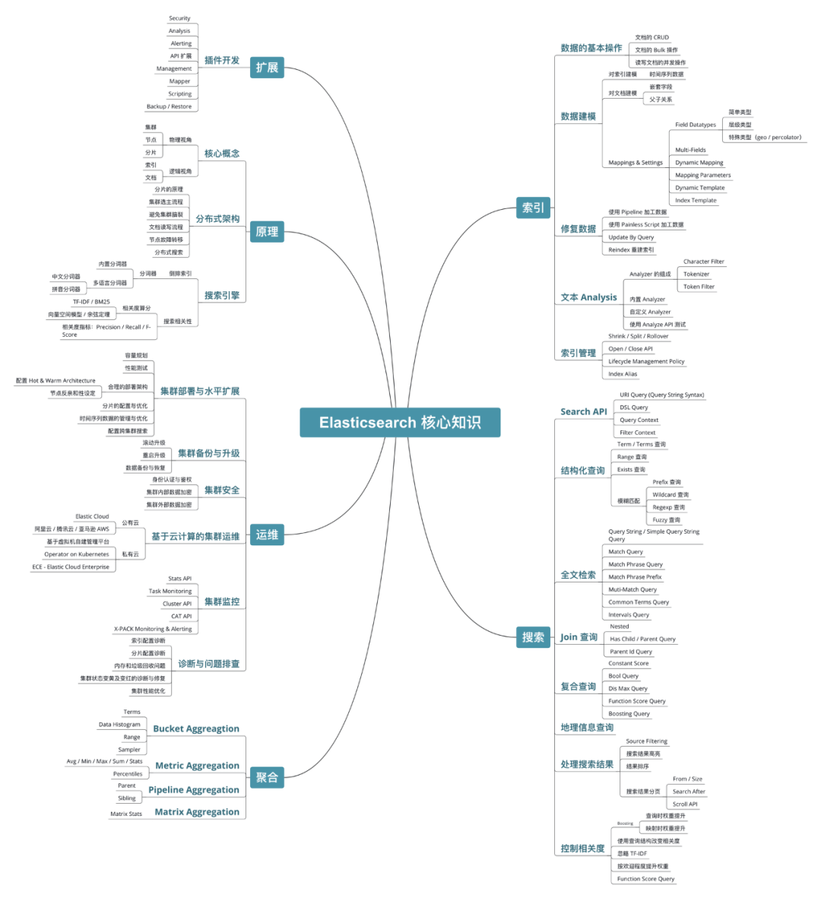

# ElasticSearch

>    [Elasticsearch入门](https://mp.weixin.qq.com/s/AjGiMikSVgCk6INyf-m8hA)
>
>    [记一次害敖丙差点丢工作的线上P0事故](https://mp.weixin.qq.com/s/F8BsSg6R9LHxKt-gbH_JKQ)

 

## 基本概念

索引（indices）-------------------Databases 数据库
类型（type）----------------------Table 数据表
文档（Document）---------------Row 行
字段（Field）---------------------Columns 列

ElasticSearch是一款非常强大的、基于Lucene的开源搜索及分析引擎；它是一个实时的分布式搜索分析引擎，它能让你以前所未有的速度和规模，去探索你的数据。

为什么不是直接使用Lucene

Lucene 可以说是当下最先进、高性能、全功能的搜索引擎库。

但是 Lucene 仅仅只是一个库。为了充分发挥其功能，你需要使用 Java 并将 Lucene 直接集成到应用程序中。 更糟糕的是，您可能需要获得信息检索学位才能了解其工作原理。Lucene 非常 复杂。 

Elasticsearch 也是使用 Java 编写的，它的内部使用 Lucene 做索引与搜索，但是它的目的是使全文检索变得简单，通过隐藏 Lucene 的复杂性，取而代之的提供一套简单一致的 RESTful API。


## ES的分布式架构原理


## Master选举原理

Elasticsearch的选主是ZenDiscovery模块负责的，主要包含Ping（节点之间通过这个RPC来发现彼此）和Unicast（单播模块包含一个主机列表以控制哪些节点需要ping通）这两部分；

　　对所有可以成为master的节点（node.master: true）根据nodeId字典排序，每次选举每个节点都把自己所知道节点排一次序，然后选出第一个（第0位）节点，暂且认为它是master节点。

　　如果对某个节点的投票数达到一定的值（可以成为master节点数n/2+1）并且该节点自己也选举自己，那这个节点就是master。否则重新选举一直到满足上述条件。

补充：master节点的职责主要包括集群、节点和索引的管理，不负责文档级别的管理；data节点可以关闭http功能。

**Elasticsearch中的节点（比如共20个），其中的10个选了一个master，另外10个选了另一个master，怎么办？**

当集群master候选数量不小于3个时，可以通过设置最少投票通过数量（discovery.zen.minimum_master_nodes）超过所有候选节点一半以上来解决脑裂问题；

当候选数量为两个时，只能修改为唯一的一个master候选，其他作为data节点，避免脑裂问题。

**详细描述一下Elasticsearch索引文档的过程**

- 协调节点默认使用文档ID参与计算（也支持通过routing），以便为路由提供合适的分片。

shard = hash(document_id) % (num_of_primary_shards)

- 当分片所在的节点接收到来自协调节点的请求后，会将请求写入到Memory Buffer，然后定时（默认是每隔1秒）写入到Filesystem Cache，这个从Momery Buffer到Filesystem Cache的过程就叫做refresh；
- 当然在某些情况下，存在Momery Buffer和Filesystem Cache的数据可能会丢失，ES是通过translog的机制来保证数据的可靠性的。其实现机制是接收到请求后，同时也会写入到translog中，当Filesystem cache中的数据写入到磁盘中时，才会清除掉，这个过程叫做flush；
- 在flush过程中，内存中的缓冲将被清除，内容被写入一个新段，段的fsync将创建一个新的提交点，并将内容刷新到磁盘，旧的translog将被删除并开始一个新的translog。
- flush触发的时机是定时触发（默认30分钟）或者translog变得太大（默认为512M）时；

**详细描述一下Elasticsearch更新和删除文档的过程**

删除和更新也都是写操作，但是Elasticsearch中的文档是不可变的，因此不能被删除或者改动以展示其变更；

磁盘上的每个段都有一个相应的.del文件。当删除请求发送后，文档并没有真的被删除，而是在.del文件中被标记为删除。该文档依然能匹配查询，但是会在结果中被过滤掉。当段合并时，在.del文件中被标记为删除的文档将不会被写入新段。

在新的文档被创建时，Elasticsearch会为该文档指定一个版本号，当执行更新时，旧版本的文档在.del文件中被标记为删除，新版本的文档被索引到一个新段。旧版本的文档依然能匹配查询，但是会在结果中被过滤掉。

**详细描述一下Elasticsearch搜索的过程**

搜索被执行成一个两阶段过程，我们称之为 Query Then Fetch；

在初始查询阶段时，查询会广播到索引中每一个分片拷贝（主分片或者副本分片）。 每个分片在本地执行搜索并构建一个匹配文档的大小为 from + size 的优先队列。PS：在搜索的时候是会查询Filesystem Cache的，但是有部分数据还在Memory Buffer，所以搜索是近实时的。

每个分片返回各自优先队列中 所有文档的 ID 和排序值 给协调节点，它合并这些值到自己的优先队列中来产生一个全局排序后的结果列表。

接下来就是 取回阶段，协调节点辨别出哪些文档需要被取回并向相关的分片提交多个 GET 请求。每个分片加载并 丰富 文档，如果有需要的话，接着返回文档给协调节点。一旦所有的文档都被取回了，协调节点返回结果给客户端。

**Elasticsearch对于大数据量（上亿量级）的聚合如何实现？**

Elasticsearch 提供的首个近似聚合是cardinality 度量。它提供一个字段的基数，即该字段的distinct或者unique值的数目。它是基于HLL算法的。HLL 会先对我们的输入作哈希运算，然后根据哈希运算的结果中的 bits 做概率估算从而得到基数。其特点是：可配置的精度，用来控制内存的使用（更精确 ＝ 更多内存）；小的数据集精度是非常高的；我们可以通过配置参数，来设置去重需要的固定内存使用量。无论数千还是数十亿的唯一值，内存使用量只与你配置的精确度相关 .

**在并发情况下，Elasticsearch如果保证读写一致？**

可以通过版本号使用乐观并发控制，以确保新版本不会被旧版本覆盖，由应用层来处理具体的冲突；

另外对于写操作，一致性级别支持quorum/one/all，默认为quorum，即只有当大多数分片可用时才允许写操作。但即使大多数可用，也可能存在因为网络等原因导致写入副本失败，这样该副本被认为故障，分片将会在一个不同的节点上重建。

对于读操作，可以设置replication为sync(默认)，这使得操作在主分片和副本分片都完成后才会返回；如果设置replication为async时，也可以通过设置搜索请求参数_preference为primary来查询主分片，确保文档是最新版本。

**ElasticSearch中的集群、节点、索引、文档、类型是什么？**

**ElasticSearch中的分片是什么?**

分片 -因为Elasticsearch是一个分布式搜索引擎，所以索引通常被分割成分布在多个节点上的被称为分片的元素。

**es 写数据过程**

客户端选择一个 node 发送请求过去，这个 node 就是 coordinating node（协调节点）。

coordinating node 对 document 进行路由，将请求转发给对应的 node（有 primary shard）。

实际的 node 上的 primary shard 处理请求，然后将数据同步到 replica node。

coordinating node 如果发现 primary node 和所有 replica node 都搞定之后，就返回响应结果给客户端。

**es 读数据过程**

客户端发送请求到任意一个 node，成为 coordinate node。

coordinate node 对 doc id 进行哈希路由，将请求转发到对应的 node，此时会使用 round-robin随机轮询算法，在 primary shard 以及其所有 replica 中随机选择一个，让读请求负载均衡。

接收请求的 node 返回 document 给 coordinate node。

coordinate node 返回 document 给客户端。

**es 搜索数据过程**

客户端发送请求到一个 coordinate node。

协调节点将搜索请求转发到所有的 shard 对应的 primary shard 或 replica shard，都可以。

query phase：每个 shard 将自己的搜索结果（其实就是一些 doc id）返回给协调节点，由协调节点进行数据的合并、排序、分页等操作，产出最终结果。

fetch phase：接着由协调节点根据 doc id 去各个节点上拉取实际的 document 数据，最终返回给客户端。

**写数据底层原理**

document先写入导内存buffer中，同时写translog日志

refresh操作 （写入和打开一个新段(一个追加的倒排索引)的轻量的过程叫做 refresh）每隔一秒钟把buffer中的数据创建一个新的segment，这里新段会被先写入到文件系统缓存--这一步代价会比较低，稍后再被刷新到磁盘内存buffer被清空。此时，新segment 中的文件就可以被搜索了

flush操作导致持久化变更：执行一个提交并且截断 translog 的行为在 Elasticsearch 被称作一次 flush。刷新（refresh）完成后, 缓存被清空但是事务日志不会。translog日志也会越来越多，当translog日志大小大于一个阀值时候或30分钟，会出发flush操作。

**底层 lucene**

简单来说，lucene 就是一个 jar 包，里面包含了封装好的各种建立倒排索引的算法代码。我们用 Java 开发的时候，引入 lucene jar，然后基于 lucene 的 api 去开发就可以了。

通过 lucene，我们可以将已有的数据建立索引，lucene 会在本地磁盘上面，给我们组织索引的数据结构。

**倒排索引**

在搜索引擎中，每个文档都有一个对应的文档 ID，文档内容被表示为一系列关键词的集合。例如，文档 1 经过分词，提取了 20 个关键词，每个关键词都会记录它在文档中出现的次数和出现位置。

那么，倒排索引就是关键词到文档 ID 的映射，每个关键词都对应着一系列的文件，这些文件中都出现了关键词。

## 相关性score

## 分页

### 浅分页

### 深分页

## SpringBoot使用

### ElasticsearchTemplate 

ElasticsearchTemplate 封装ES客户端的一些原生api模板，方便实现一些查询

1. queryForPage   #是查询一个分页列表，用的就是一个对象实例
2. NativeSearchQuery                #是springdata中的查询条件
3. NativeSearchQueryBuilder         #用于建造一个
4. NativeSearchQuery查询对象
5. QueryBuilders                    #设置查询条件,是ES中的类
6. SortBuilders                     #设置排序条件
7. HighlightBuilder                 #设置高亮显示

### **QueryBuilders** 

QueryBuilders是ES中的查询条件构造器

1. QueryBuilders.boolQuery   #子方法must可多条件联查
   1. must:   AND
   2. mustNot: NOT
   3. should:: OR

2. QueryBuilders.termQuery   #精确查询指定字段
3. queryBuilder.matchAllQuery(); #匹配所有
4. QueryBuilders.matchQuery   #按分词器进行模糊查询
5. QueryBuilders.rangeQuery   #按指定字段进行区间范围查询
6. queryBuilder.matchPhraseQuery("key", value) 对中文精确匹配
7. 大于等于      .from    .gte   
8. 小于等于      .to      .lte    

### NativeSearchQuery

- 原生的查询条件类，用来和ES的一些原生查询方法进行搭配，实现一些比较复杂的查询,最终进行构建.build 可作为ElasticsearchTemplate. queryForPage的参数使用

```java
//构建Search对象
NativeSearchQuery build = new NativeSearchQueryBuilder()
//条件
.withQuery(queryBuilder)
//排序
.withSort(SortBuilders.fieldSort("id").order(SortOrder.ASC))
//高亮
.withHighlightFields(name, ms)
//分页
.withPageable(PageRequest.of(pageNum - 1, pageSize))
//构建
.build();

AggregatedPage<Goods> aggregatedPage = elasticsearchTemplate.queryForPage(build, Goods.class,new Hig());
// queryForPage 
// 参数一: NativeSearchQuery 封装的查询数据对象
// 参数二: es对应索引实体类
// 参数三: 调用高亮工具类
```

## 实践

### 随机抽样10%的数据 

1. 使用 Elasticsearch 的 Search API 搜索数据库中的数据。
2. 使用 QueryBuilder 构建查询语句，并指定要查询的索引和类型。
3. 在查询中添加一个随机排序的子句，例如：

```java
queryBuilder.addSort(new FieldSortBuilder("_doc").order(SortOrder.ASC).sortMode(SortMode.RANDOM));
```

1. 使用 SearchResponse 执行查询，并使用 SearchHits 获取查询结果。
2. 使用 SearchHits 的 getTotalHits 方法计算总共有多少文档符合查询条件。
3. 计算出 10% 的数量，并使用 SearchHits 的 getHits 方法获取查询结果，只取前 10% 个文档即可。

> 如何处理大量数据的情况

如果要处理的数据量很大，可能会对 Elasticsearch 的性能造成压力。 为了解决这个问题，可以使用 Elasticsearch 的 Scroll API。

Scroll API 可以用来执行批量查询，它会在内部使用滚动查询，允许在一个查询中搜索大量的数据，并将结果分批返回。这样，您就可以在单个查询中处理大量的数据，而不会对 Elasticsearch 造成太大的压力。

```java
elasticsearchRestTemplate.searchScrollStart(10,query, ContentEsDto.class)
```

### 权重排序

```java
 SortBuilder sortBuilder = SortBuilders.scoreSort();
        NativeSearchQuery query = new NativeSearchQueryBuilder()
                //设置查询条件，此处可以使用QueryBuilders创建多种查询
                .withQuery(boolQueryBuilder)
                .withSort(sortBuilder)
                //还可以设置分页信息
                .withPageable(page)
                .withHighlightFields(field)
                //创建SearchQuery对象
                .build();
```

### 高亮显示

```java
     HighlightBuilder.Field field = new HighlightBuilder.Field("content").preTags("<font color='red'>").postTags("</font>");
        PageRequest page = PageRequest.of(1, 5);
//        SortBuilder sortBuilder = SortBuilders.fieldSort("viewVolume").order(SortOrder.DESC);
        SortBuilder sortBuilder = SortBuilders.scoreSort();
        NativeSearchQuery query = new NativeSearchQueryBuilder()
                //设置查询条件，此处可以使用QueryBuilders创建多种查询
                .withQuery(boolQueryBuilder)
                .withSort(sortBuilder)
                //还可以设置分页信息
                .withPageable(page)
                .withHighlightFields(field)
                //创建SearchQuery对象
                .build();

        //使用模板对象执行查询
        SearchHits<ContentEsDto> searchHits = elasticsearchRestTemplate.search(query, ContentEsDto.class);
        Iterator<SearchHit<ContentEsDto>> iterator = searchHits.stream().iterator();
        List<ContentEsDto> contentEsDtos = new ArrayList<>();
        StringBuilder sb = new StringBuilder();
        while (iterator.hasNext()) {
            SearchHit<ContentEsDto> next = iterator.next();
            Map<String, List<String>> highlightFields = next.getHighlightFields();
            List<String> content1 = highlightFields.get("content");
            ContentEsDto content = next.getContent();
            if (CollectionUtil.isNotEmpty(content1)) {
                // 取高亮字段
                sb.append(String.format("%s %s <br/><br/>", content.getTimeDate(), content1.get(0)));
            }
        }
        return sb.toString();
```

