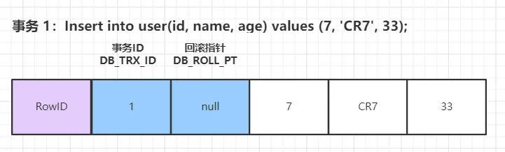

# 第十五节 Mysql

> [国庆肝了8天整整2W字的数据库知识点 (qq.com)](https://mp.weixin.qq.com/s/J3kCOJwyv2nzvI0_X0tlnA)
>
> [漫话：如何给女朋友解释什么是撞库、脱库和洗库？ (qq.com)](https://mp.weixin.qq.com/s/L0XUMHInnwN9gSYGH2nzdg)

## 数据库范式

> [年初敖丙天猫面试真题：如果设计一个数据库？我人傻了 (qq.com)](https://mp.weixin.qq.com/s/yo_LJ6IwGnjiBXSA7ZHdOA)

  ### 1NF

强调属性的原子性约束，要求属性具有原子性，不可再分解。

`学生表(学号、姓名、年龄、性别、地址)。因为地址可以细分为国家、省份、城市、市区、街道，那么该模式就没有达到第一范式。`

存在问题：冗余度大、会引起修改操作的不一致性、数据插入异常、数据删除异常。

  ### 2NF

强调记录的唯一性约束，数据表必须有一个主键，并且没有包含在主键中的列必须完全依赖于主键，而不能只依赖于主键的一部分。   

          

  ### 3Nf

第三范式，强调数据属性冗余性的约束，也就是非主键列必须直接依赖于主键。也就是消除了非主属性对码的传递函数依赖。

`订单表（订单编码，顾客编码，顾客名称），其中主键是（订单编码），这个场景中，顾客编码、顾客名称都完全依赖于主键，因此符合第二范式，但顾客名称依赖于顾客编码，从而间接依赖于主键，所以不能满足第三范式。如果要满足第三范式，需要拆分为两个表：订单表（订单编码，顾客编码）和顾客表（顾客编码，顾客名称）。`

## 与oracle的区别

### 本质的区别

 Oracle数据库是一个对象关系数据库管理系统（ORDBMS）。它通常被称为Oracle RDBMS或简称为Oracle，是一个收费的数据库。

MySQL是一个开源的关系数据库管理系统（RDBMS）。它是世界上使用最多的RDBMS，提供对多个数据库的多用户访问。它是一个开源、免费的数据库。

3、Oracle是大型数据库，Mysql是中小型数据库；

4、Oracle可以设置用户权限、访问权限、读写权限等，MySQL没有；

5、Oracle有表空间的概念，MySQL没有；

6、Oracle默认不自动提交，需要用户手动提交。Mysql默认是自动提交。

7、Oracle逻辑备份时不锁定数据，且备份的数据是一致的。Mysql逻辑备份时要锁定数据，才能保证备份的数据是一致的，影响业务正常使用。

8、Oracle有各种成熟的性能诊断调优工具，能实现很多自动分析、诊断功能。比如awr、addm、sqltrace、tkproof等；Mysql的诊断调优方法较少，主要有慢查询日志。

9、Oracle容量无限，根据配置决定；而MySQL使用MyISAM存储引擎，最大表尺寸为65536TB。 MySQL数据库的最大有效表尺寸通常是由操作系统对文件大小的限制决定的，而不是由MySQL内部限制决定。

10、Oracle在Linux下的性能，在少量数据时速度低于MySQL，在千万级时速度快于MySQL。

11、Oracle全面，完整，稳定，但一般数据量大，对硬件要求较高 ；而MySQL使用CPU和内存极少，性能很高，但扩展性较差。

12、MySQL处理翻页的SQL语句比较简单，用LIMIT 开始位置, 记录个数。Oracle处理翻页的SQL语句就比较繁琐了。每个结果集只有一个ROWNUM字段标明它的位置, 并且只能用ROWNUM<100, 不能用ROWNUM>80。

13、MySQL日期字段分DATE和TIME两种，Oracle日期字段只有DATE，包含年月日时分秒信息，用当前数据库的系统时间为SYSDATE, 精确到秒。与Oracle区别


## 数据库架构   


 

Mysql逻辑架构图主要分三层：

（1）第一层负责连接处理，授权认证，安全等等 

（2）第二层负责编译并优化SQL 

（3）第三层是存储引擎。

  ### 连接器

身份认证和权限相关(登录 MySQL 的时候)。

  ### 缓存

执行查询语句的时候，会先查询缓存（MySQL 8.0 版本后移除，因为这个功能不太实用）。

  ### 分析器

没有命中缓存的话，SQL 语句就会经过分析器，分析器说白了就是要先看你的 SQL 语句要干嘛，再检查你的 SQL 语句语法是否正确。

  ### 优化器

按照 MySQL 认为最优的方案去执行。

  ### 执行器

执行语句，然后从存储引擎返回数据。 执行语句之前会先判断是否有权限，如果没有权限的话，就会报错。

  ### 插件式存储引擎

主要负责数据的存储和读取，采用的是插件式架构，支持 InnoDB、MyISAM、Memory 等多种存储引擎。

## **数据类型**

**整型**：TINYINT, SMALLINT, MEDIUMINT, INT, BIGINT 分别使用 8, 16, 24, 32, 64 位存储空间，一般情况下越小的列越好。INT(11) 中的数字只是规定了交互工具显示字符的个数，对于存储和计算来说是没有意义的。

**浮点数**：FLOAT 和 DOUBLE 为浮点类型，DECIMAL 为高精度小数类型。CPU 原生支持浮点运算，但是不支持 DECIMAl 类型的计算，因此 DECIMAL 的计算比浮点类型需要更高的代价。

**字符串**：CHAR 和 VARCHAR 两种类型，一种是定长的，一种是变长的。

VARCHAR 这种变长类型能够节省空间，因为只需要存储必要的内容。但是在执行 UPDATE 时可能会使行变得比原来长，当超出一个页所能容纳的大小时，就要执行额外的操作。MyISAM 会将行拆成不同的片段存储，而 InnoDB 则需要分裂页来使行放进页内。 VARCHAR 会保留字符串末尾的空格，而 CHAR 会删除。

**时间和日期**：DATETIME（8字节，它与时区无关） 和 TIMESTAMP（不同时间时间戳不一样） 应该尽量使用 TIMESTAMP，因为它比 DATETIME 空间效率更高。

**VARCHAR(5)和VARCHAR(200)**

使用VARCHAR(5)和VARCHAR(200)存储"hello"的空间开销是一样的。那么使用更短的列有什么优势吗？ 事实证明有很大的优势。更长的列会消耗更多的内存，因为MySQL通常会分配固定大小的内存块来保存内部值。尤其是使用内存临时表进行排序或其他操作时会特别糟糕。在利用磁盘临时表进行排序时也同样糟糕。 所以最好的策略是只分配真正需要的空间。

**BLOB 和 TEXT**

BLOB和TEXT都是为存储很大的数据而设计的数据类型，分别采用二进制和字符方式存储。

与其他类型不同，MySQL把每个BLOB和TEXT值当做一个独立的对象去处理。当BLOB和TEXT值太大时，InnoDB会使用专门的“外部”存储区域来进行存储，此时每个值在行内需要1~4个字节存储一个指针，然后在外部存储区域存储实际的值。

**MySQL对BLOB和TEXT列进行排序与其他类型是不同的**：它只对每个列的最前max_sort_length个字节而不是整个字符串做排序。同样的，MySQL也不能将BLOB或TEXT列全部长度的字符串进行索引

## 存储引擎

MySQL 5.5.5 之前，MyISAM 是 MySQL 的默认存储引擎。5.5.5 版本之后，InnoDB 是 MySQL 的默认存储引擎。

MySQL 存储引擎采用的是插件式架构，支持多种存储引擎，我们甚至可以为不同的数据库表设置不同的存储引擎以适应不同场景的需要。存储引擎是基于表的，而不是数据库。

  ### InnoDB

#### 优点

##### 支持事务

InnoDB 是 MySQL 默认的事务型存储引擎，只要在需要它不支持的特性时，才考虑使用其他存储引擎。

##### 支持行级锁

InnoDB 采用 MVCC 来支持高并发，并且实现了四个标准隔离级别(未提交读、提交读、可重复读、可串行化)。其默认级别时可重复读（REPEATABLE READ），在可重复读级别下，通过 MVCC + Next-Key Locking 防止幻读。

##### 支持在线热备份

InnoDB 支持真正的在线热备份，MySQL 其他的存储引擎不支持在线热备份，要获取一致性视图需要停止对所有表的写入，而在读写混合的场景中，停止写入可能也意味着停止读取。

##### 其他

主索引时聚簇索引，在索引中保存了数据，从而避免直接读取磁盘，因此对主键查询有很高的性能。

InnoDB 内部做了很多优化，包括从磁盘读取数据时采用的可预测性读，能够自动在内存中创建 hash 索引以加速读操作的自适应哈希索引，以及能够加速插入操作的插入缓冲区等。

#### 设计原理

> [MySQL 的 InnoDB 存储引擎是怎么设计的？ (qq.com)](https://mp.weixin.qq.com/s/wr2gJGQSA8QH_lmPh1XOkw)


##### 内存架构

从上面第二张图可以看到，InnoDB 主要分为两大块：

- InnoDB In-Memory Structures
- InnoDB On-Disk Structures

内存和磁盘，让我们先从内存开始。

**1、Buffer Pool**

> The buffer pool is an area in main memory where InnoDB caches table and index data as it is accessed.

正如之前提到的，MySQL 不会直接去修改磁盘的数据，因为这样做太慢了，MySQL 会先改内存，然后记录 redo log，等有空了再刷磁盘，如果内存里没有数据，就去磁盘 load。

而这些数据存放的地方，就是 Buffer Pool。

我们平时开发时，会用 redis 来做缓存，缓解数据库压力，其实 MySQL 自己也做了一层类似缓存的东西。

MySQL 是以「页」（page）为单位从磁盘读取数据的，Buffer Pool 里的数据也是如此，实际上，Buffer Pool 是`a linked list of pages`，一个以页为元素的链表。

为什么是链表？因为和缓存一样，它也需要一套淘汰算法来管理数据。

Buffer Pool 采用基于 LRU（least recently used） 的算法来管理内存：


> 关于 Buffer Pool 的更多知识，诸如如何配置大小、如何监控等等：Buffer Pool

**2、Change Buffer**

上面提到过，如果内存里没有对应「页」的数据，MySQL 就会去把数据从磁盘里 load 出来，如果每次需要的「页」都不同，或者不是相邻的「页」，那么每次 MySQL 都要去 load，这样就很慢了。

于是如果 MySQL 发现你要修改的页，不在内存里，就把你要对页的修改，先记到一个叫 Change Buffer 的地方，同时记录 redo log，然后再慢慢把数据 load 到内存，load 过来后，再把 Change Buffer 里记录的修改，应用到内存（Buffer Pool）中，这个动作叫做 **merge**；而把内存数据刷到磁盘的动作，叫 **purge**：

- **merge：Change Buffer -> Buffer Pool**
- **purge：Buffer Pool -> Disk**


> The change buffer is a special data structure that caches changes to **secondary index** pages when those pages are not in the **buffer pool**. The buffered changes, which may result from INSERT, UPDATE, or DELETE operations (DML), are **merged** later when the pages are loaded into the buffer pool by other read operations.

上面是 MySQL 官网对 Change Buffer 的定义，仔细看的话，你会发现里面提到：Change Buffer 只在操作「二级索引」（secondary index）时才使用，原因是「聚簇索引」（clustered indexes）必须是「唯一」的，也就意味着每次插入、更新，都需要检查是否已经有相同的字段存在，也就没有必要使用 Change Buffer 了；另外，「聚簇索引」操作的随机性比较小，通常在相邻的「页」进行操作，比如使用了自增主键的「聚簇索引」，那么 insert 时就是递增、有序的，不像「二级索引」，访问非常随机。

> 如果想深入理解 Change Buffer 的原理，除了 MySQL 官网的介绍：Change Buffer，还可以阅读下《MySQL技术内幕》的「2.6.1 - 插入缓冲」章节，里面会从 Change Buffer 的前身 —— Insert Buffer 开始讲起，很透彻。

**3、Adaptive Hash Index**

MySQL 索引，不管是在磁盘里，还是被 load 到内存后，都是 B+ 树，B+ 树的查找次数取决于树的深度。你看，数据都已经放到内存了，还不能“一下子”就找到它，还要“几下子”，这空间牺牲的是不是不太值得？

尤其是那些频繁被访问的数据，每次过来都要走 B+ 树来查询，这时就会想到，我用一个指针把数据的位置记录下来不就好了？

这就是「自适应哈希索引」（Adaptive Hash Index）。自适应，顾名思义，MySQL 会自动评估使用自适应索引是否值得，如果观察到建立哈希索引可以提升速度，则建立。

**4、Log Buffer**

> The log buffer is the memory area that holds data to be written to the log files on disk.

从上面架构图可以看到，Log Buffer 里的 redo log，会被刷到磁盘里：


##### 磁盘架构

磁盘里有什么呢？除了表结构定义和索引，还有一些为了高性能和高可靠而设计的角色，比如 redo log、undo log、Change Buffer，以及 Doublewrite Buffer 等等.

> 有同学会问，那表的数据呢？其实只要理解了 InnoDB 里的所有表数据，都以索引（聚簇索引+二级索引）的形式存储起来，就知道索引已经包含了表数据。

**1、表空间（Tablespaces）**

从架构图可以看到，Tablespaces 分为五种：

- The System Tablespace
- File-Per-Table Tablespaces
- General Tablespace
- Undo Tablespaces
- Temporary Tablespaces

其中，我们平时创建的表的数据，可以存放到 The System Tablespace 、File-Per-Table Tablespaces、General Tablespace 三者中的任意一个地方，具体取决于你的配置和创建表时的 sql 语句。

> 这里同样不展开，如何选择不同的表空间存储数据？不同表空间各自的优势劣势等等，传送门：Tablespaces

**2、Doublewrite Buffer**

**如果说 Change Buffer 是提升性能，那么 Doublewrite Buffer 就是保证数据页的可靠性。**

怎么理解呢？

前面提到过，MySQL 以「页」为读取和写入单位，一个「页」里面有多行数据，写入数据时，MySQL 会先写内存中的页，然后再刷新到磁盘中的页。

这时问题来了，假设在某一次从内存刷新到磁盘的过程中，一个「页」刷了一半，突然操作系统或者 MySQL 进程奔溃了，这时候，内存里的页数据被清除了，而磁盘里的页数据，刷了一半，处于一个中间状态，不尴不尬，可以说是一个「不完整」，甚至是「坏掉的」的页。

有同学说，不是有 Redo Log 么？其实这个时候 Redo Log 也已经无力回天，Redo Log 是要在磁盘中的页数据是正常的、没有损坏的情况下，才能把磁盘里页数据 load 到内存，然后应用 Redo Log。而如果磁盘中的页数据已经损坏，是无法应用 Redo Log 的。

所以，MySQL 在刷数据到磁盘之前，要先把数据写到另外一个地方，也就是 Doublewrite Buffer，写完后，再开始写磁盘。Doublewrite Buffer 可以理解为是一个备份（recovery），万一真的发生 crash，就可以利用 Doublewrite Buffer 来修复磁盘里的数据。

> 留个问题，有了 Doublewrite Buffer 后，不就意味着 MySQL 要写两次磁盘？性能岂不是很差？

>
>
>- The InnoDB Storage Engine
>- 《MySQL技术内幕》
>- 丁奇：MySQL实战45讲

#### 一行记录怎么存储

> [mysql 的一行记录是怎么存储的？ (qq.com)](https://mp.weixin.qq.com/s/3d66-yXVZoDFRG1wyRw7kA)

  ### MyISAM

设计简单，数据以紧密格式存储。对于只读数据，或者表比较小、可以容忍修复操作，则依然可以使用它。提供了大量的特性，包括压缩表、空间数据索引等。

#### 不支持事务

可以手工或者自动执行检查和修复操作，但是和事务恢复以及崩溃恢复不同，可能导致一些数据丢失，而且修复操作是非常慢的。

如果指定了 DELAY_KEY_WRITE 选项，在每次修改执行完成时，不会立即将修改的索引数据写入磁盘，而是会写到内存中的键缓冲区，只有在清理键缓冲区或者关闭表的时候才会将对应的索引块写入磁盘。这种方式可以极大的提升写入性能，但是在数据库或者主机崩溃时会造成索引损坏，需要执行修复操作。

#### 表级锁

不支持行级锁，只能对整张表加锁，读取时会对需要读到的所有表加共享锁，写入时则对表加排它锁。但在表有读取操作的同时，也可以往表中插入新的记录，这被称为并发插入（CONCURRENT INSERT）。

#### 支持空间数据索引

  ### 区别

- **事务:** innoDB 支持事务，MyISAM 不支持事务
- **锁:** InnoDB 支持行级锁，MyISAM 只支持表级锁
- **外键:** InnoDB 支持外键
- **InnoDB** 支持在线热备份
- **MyiSAM** 支持空间索引
- **索引实现不一样**  MyiSAM 非聚簇索引

## log

### redolog  

每条 redo 记录由“表空间号+数据页号+偏移量+修改数据长度+具体修改的数据”组成

redo 日志InnoDB是存储引擎独有的，它让拥有了崩溃恢复能力。 比如 实例挂了或宕机了，重启时，存储引擎会使用恢复数据，保证数据的持久性与完整性。

MySQL 中数据是以页为单位，你查询一条记录，会从硬盘把一页的数据加载出来，加载出来的数据叫数据页，会放入到 中Buffer Pool

更新表数据的时候，也是如此，发现里Buffer Pool存在要更新的数据，就直接在里更新，然后会把“在某个数据页上做了什么修改”记录到重做日志缓存（redo）里，接着刷盘到 文件里

**刷盘时机**

1. 设置为 0 的时候，表示每次事务提交时不进行刷盘操作

2. 设置为 1 的时候，表示每次事务提交时都将进行刷盘操作（默认值）

3. 设置为 2 的时候，表示每次事务提交时都只把 redo log buffer 内容写入 page cache

另外， 存储引擎有一个后台线程，每隔 秒，就会把 中的内容写到文件系统缓存，然后调用 刷盘。

**redolog是怎么记录日志的**


InnoDB 的 redo log 是固定大小的，比如可以配置为一组4个文件，每个文件的大小是1GB，那么总共就可以记录4GB的操作。**「从头开始写，写到末尾就又回到开头循环写」**。

所以，如果数据写满了但是还没有来得及将数据真正的刷入磁盘当中，那么就会发生**「内存抖动」**现象，从肉眼的角度来观察会发现 mysql 会宕机一会儿，此时就是正在刷盘了。

### binlog

binlog会记录所有涉及更新数据的逻辑操作，并且是顺序写。

可以说数据库的数据备份、主备、主主、主从都离不开，需要依靠来同步数据，保证数据一致性。

binlog的写入时机也非常简单，事务执行过程中，先把日志写到缓存，事务提交的时候，再把写到文件中。

binlog日志刷盘流程如下

​                         

上图的 write，是指把日志写入到文件系统的 page cache，并没有把数据持久化到磁盘，所以速度比较快

上图的 fsync，才是将数据持久化到磁盘的操作

**binlog底层**

MySQL中的binlog是一个二进制文件,它记录了所有的增删改操作。节点之间的复制就是依靠binlog来完成的。binlog具有三种模式:

Row模式

日志中会记录成每一行数据被修改的日志，然后在slave端再对相同的数据进行修改。例如:update xxx where id in(1,2,3,4,5);采用该模式则会记录5条记录。

statement模式

每一条会修改数据的sql都会记录到 master的binlog中。slave在复制的时候sql Thread会解析成和原来master端执行过的相同的sql来再次执行.

mixed模式

Mixed即混合模式,MySQL会根据执行的每一条具体的sql语句来区分对待记录的日志形式，也就是在Statement和Row之间选择一种。

新版本中的Statment level还是和以前一样，仅仅记录执行的语句。而新版本的MySQL中队row level模式也被做了优化，并不是所有的修改都会以row level来记录，像遇到表结构变更的时候就会以statement模式来记录，如果sql语句确实就是update或者delete等修改数据的语句，那么还是会记录所有行的变更。

### undolog

我们知道如果想要保证事务的原子性，就需要在异常发生时，对已经执行的操作进行回滚，在 MySQL 中，恢复机制是通过 回滚日志（undo log） 实现的，所有事务进行的修改都会先记录到这个回滚日志中，然后再执行相关的操作。如果执行过程中遇到异常的话，我们直接利用 回滚日志 中的信息将数据回滚到修改之前的样子即可！并且，回滚日志会先于数据持久化到磁盘上。这样就保证了即使遇到数据库突然宕机等情况，当用户再次启动数据库的时候，数据库还能够通过查询回滚日志来回滚将之前未完成的事务。


MySQL InnoDB 引擎使用 redo log(重做日志) 保证事务的持久性，使用 undo log(回滚日志) 来保证事务的原子性。MySQL数据库的数据备份、主备、主主、主从都离不开，需要依靠binlog来同步数据，保证数据一致性。

### 其他

#### 执行更新语句流程

1. 先查询到张三这一条数据，如果有缓存，也是会用到缓存。
2. 然后拿到查询的语句，把 age 改为 19，然后调用引擎 API 接口，写入这一行数据，InnoDB 引擎把数据保存在内存中，同时记录 redo log，此时 redo log 进入 prepare 状态，然后告诉执行器，执行完成了，随时可以提交。
3. 执行器收到通知后记录 binlog，然后调用引擎接口，提交 redo log 为提交状态。
4. 更新完成。

采用 redo log 两阶段提交的方式就不一样了，写完 binlog 后，然后再提交 redo log 就会防止出现上述的问题，从而保证了数据的一致性。

#### 假设redolog 处于预提交状态，binlog 也已经写完了，这个时候发生了异常重启会怎么样呢

MySQL 的处理过程如下：

- 判断 redo log 是否完整，如果判断是完整的，就立即提交。
- 如果 redo log 只是预提交但不是 commit 状态，这个时候就会去判断 binlog 是否完整，如果完整就提交 redo log, 不完整就回滚事务。

## 索引

> [索引下推，这个点你肯定不知道！ (qq.com)](https://mp.weixin.qq.com/s/87qsrj-_hG54uxcOlFr35Q)

  ### B+原理

>[男朋友问我：为什么 MySQL 喜欢 B+ 树？我笑着画了 20 张图 (qq.com)](https://mp.weixin.qq.com/s/AoPq8poENF9T4mVS1fDFPw)

#### 数据结构

B+ Tree 是B树的一种变形，它是基于 B Tree 和叶子节点顺序访问指针进行实现，通常用于数据库和操作系统的文件系统中


#### 操作

  插入
  删除
  查询

#### 常见树的特性

-   AL树平衡二叉树: 高度平衡，相比于红黑树查找更快，删除略慢。rebalance 概率更高

-   红黑树: 近似平衡的，rebalance 的概率更低
-   B/B+树:  多路查找树，出度高，磁盘IO低，一般用于数据库系统中

#### B+树与红黑树的比较

-   磁盘IO次数低  B+ 树一个节点可以存储多个元案，相对于完全平衡二叉树整体的树高度降低了，磁盘IO效率提高了

-   磁盘预读特性

#### B+树与 B 树的比较

- B+ 树的非叶子节点不存放实际的记录数据，仅存放索引，因此数据量相同的情况下，相比存储即存索引又存记录的 B 树，B+树的非叶子节点可以存放更多的索引，因此 B+ 树可以比 B 树更「矮胖」，查询底层节点的磁盘 I/O次数会更少。

- B+ 树有大量的冗余节点（所有非叶子节点都是冗余索引），这些冗余索引让 B+ 树在插入、删除的效率都更高，比如删除根节点的时候，不会像 B 树那样会发生复杂的树的变化；

- B+ 树叶子节点之间用链表连接了起来，有利于范围查询，而 B 树要实现范围查询，因此只能通过树的遍历来完成范围查询，这会涉及多个节点的磁盘 I/O 操作，范围查询效率不如 B+ 树。

  ### MySQL 素引

>[《爱上面试官》系列-数据库索引 (qq.com)](https://mp.weixin.qq.com/s/_9rDde9wRYoZeh07EASNQQ)

#### B+树索引

-   二分查找，查找速度快

-   B+ 树有序，排序，分组速度快
-   聚簇索引   叶子节点的数据域记录着完整的数据记录
-   辅助索引  叶子结点的敞据域记录看主键的值，如果查询的不是索引构成列或者主键，则需要回表

#### 哈希索引

-   快速精确查询，但是不支持范围查询

-   适合场:等值查询场景，例 Redis，Memcached 等这 NOSQL中间件
-   哈希表

#### 全文索引

MyISAM 存储引擎支持全文索引，用于查找文本中的关键词，而不是直接比较是否相等。查找条件使用 MATCH AGAINST，而不是普通的 WHERE。全文索引使用倒排索引实现，它记录着关键词到其所在文档的映射。

InnoDB 存储引擎在 MySQL 5.6.4 版本中也开始支持全文索引。

#### 空间数据索引

MyISAM 存储引擎支持空间数据索引（R-Tree），可以用于地理数据存储。空间数据索引会从所有维度来索引数据，可以有效地使用任意维度来进行组合查询。

必须使用 GIS 相关的函数来维护数据。

  ### 索引优化

> [Christina问我：你都是如何设计索引的？ (qq.com)](https://mp.weixin.qq.com/s/fShA7jxjshKyHEHfVDrLVA)

#### 独立的列

在进行查询时，索引列不能是表达式的一部分，也不能是函数的参数，否则无法使用索引。

例如下面的查询不能使用 actor_id 列的索引：

```mysql
SELECT actor_id FROM sakila.actor WHERE actor_id + 1 = 5;
```

#### 多列索引

在需要使用多个列作为条件进行查询时，使用多列索引比使用多个单列索引性能更好。例如下面的语句中，最好把 actor_id 和 film_id 设置为多列索引。

```mysql
SELECT film_id, actor_ id FROM sakila.film_actor
WHERE actor_id = 1 AND film_id = 1;
```

#### 索引列的顺序

  将选择行最强的索引列放在最前面
  索引的选择性: 不重复的索引值和记录总数的比值

#### 前缀索引

  对于BLOG、TEXT和VARCHAR类型的列，必须使用前缀索引，只索引开始的部分字符
  前缀索引的选取需要根据索引选择性来确定

#### 覆盖索引

索引包含所有需要查询的字段的值。

具有以下优点：

- 索引通常远小于数据行的大小，只读取索引能大大减少数据访问量。

- 一些存储引擎（例如 MyISAM）在内存中只缓存索引，而数据依赖于操作系统来缓存。因此，只访问索引可以不使用系统调用（通常比较费时）。

- 对于 InnoDB 引擎，若辅助索引能够覆盖查询，则无需访问主索引。

#### 其他

- 预发跑sql explain

- 排除 缓存 sql nocache

- 看一下行数对不对 不对可以用analyze table t 矫正

- 添加索引 索引不一定是最优的 force index 强制走索引 不建议用

- 存在回表的情况

- 覆盖索引避免回表，不要*

  - 主键索引

- 联合索引 不能无限建 高频场景

- 最左前缀原则 按照索引定义的字段顺序写sql

- 合理安排联合索引的顺序

- 5.6之后 索引下推 减少回表次数

- 给字符串加索引

  - 前缀索引
  - 倒序存储
  - Hash

- 数据库的flush的时机

  - redo log满了 修改checkpoint flush到磁盘
  - 系统内存不足淘汰数据页
    - buffer pool
      - 要知道磁盘的io能力 设置innodb_io_capacity 设置为磁盘的IOPS fio测试
      - innodb_io_capacity设置低了 会让innoDB错误估算系统能力 导致脏页累积
  - 系统空闲的时候 找间隙刷脏页
  - MySQL正常关闭，会把内存脏页flush到磁盘

- innodb刷盘速度

  - 脏页比例
  - redolog 写盘速度
  - innodb_flush_neighbors 0 
    - 机械磁盘的随机io不太行 减少随机io性能大幅提升 设置为 1最好
    - 现在都是ssd了 设置为0就够了 8.0之后默认是0

- 索引字段不要做函数操作，会破坏索引值的有序性，优化器会放弃走树结构

  - 如果触发隐式转换 那也会走cast函数 会放弃走索引

- 字符集不同可能走不上索引

  - convert 也是函数所以走不上

  

  ### 索引维护

- 页满了 页分裂 页利用率下降

- 数据删除 页合并 

- 自增 只追加可以不考虑 也分页

- 索引长度

  ### 索引选择

- 普通索引

  - 找到第一个之后 直到朋友不满足的

- 唯一索引

  - 找到第一个不满足的就停止了

- 覆盖索引

  - 包含主键索引值

- 最左前缀原则

  - 安排字段顺序

- 索引空间问题

  - hash

- 5.6之后索引下推

  - 不需要多个回表 一边遍历 一边判断

- 页的概念

- 更新

  - change buffer
  - 更新操作来了 如果数据页不在内存 就缓存下来 下次来了 更新 在就直接更新
  - 唯一索引 需要判断 所以 用不到change buffer
  - innodb的处理流程
    - 记录在页内存
      - 唯一索引 判断没冲突插入
      - 普通索引 插入
    - 记录不再页中
      - 数据页读入内存 判断 插入
      - change buffer
    - 数据读是随机IO 成本高 
    - 机械硬盘 change buffer 收益大 写多读少 marge

## 查询性能优化

>[为什么MySQL不建议使用delete删除数据？](https://mp.weixin.qq.com/s/7dpNkLaglIyb_9DKdH43eQ)
>
>[工作以来总结的大厂SQL调优姿势](https://mp.weixin.qq.com/s/nEmN4S9JOTVGj5IHyfNtCw)
>
>[为啥阿里巴巴不建议MySQL使用Text类型？](https://mp.weixin.qq.com/s/oVjm_iLvbkximBjHv9d8ig)
>
>[用对了这些场景下的索引，技术总监夸我棒](https://mp.weixin.qq.com/s/-gmAPfiKMNJgHhIZqR2C4A)
>
>[MySQL索引凭什么让查询效率提高这么多？](https://mp.weixin.qq.com/s/qESZSzHoxUKQRJhb1EQA_Q)
>
>[MySQL调优](https://mp.weixin.qq.com/s/e0CqJG2-PCDgKLjQfh02tw)

- 1.**「表结构优化」**

- - 1.1拆分字段
  - 1.2字段类型的选择
  - 1.3字段类型大小的限制
  - 1.4合理的增加冗余字段
  - 1.5新建字段一定要有默认值

- 2.**「索引方面」**

- - 2.1索引字段的选择
  - 2.2利用好mysql支持的索引下推，覆盖索引等功能
  - 2.3唯一索引和普通索引的选择

- 3.**「查询语句方面」**

- - 3.1避免索引失效
  - 3.2合理的书写where条件字段顺序
  - 3.3小表驱动大表
  - 3.4可以使用force index()防止优化器选错索引

- 4.**「分库分表」**

### explain 分析 

- select_type: 常用的有 SIMPLE 简单查询，UNION 联合查询，SUBQUERY 子查询等。
- table: 要查询的表
- possible_keys: 可选择的索引
- key:  实际使用的索引
- rows: 扫描的行数
- type:  索引查询类型，经常用到的索引查询类型：
  - const：使用主键或者唯一索引进行查询的时候只有一行匹配 ref：使用非唯一索引 range：使用主键、单个字段的辅助索引、多个字段的辅助索引的最后一个字段进行范围查询 index：和all的区别是扫描的是索引树 all：扫描全表：
  - system: 触发条件：表只有一行，这是一个 const type 的特殊情况
  - const: 触发条件：在使用主键或者唯一索引进行查询的时候只有一行匹配。
  - eq_ref: 触发条件：在进行联接查询的，使用主键或者唯一索引并且只匹配到一行记录的时候
  - ref: 触发条件：使用非唯一索引
  - range: 触发条件：只有在使用主键、单个字段的辅助索引、多个字段的辅助索引的最后一个字段进行范围查询才是 range
  - index:  触发条件：只扫描索引树.  1）查询的字段是索引的一部分，覆盖索引。2）使用主键进行排序
  - all 触发条件：全表扫描，不走索引


### 优化数据访问

#### 减少请求的数据量

- 只返回必要的列：最好不要使用 SELECT * 语句。
- 只返回必要的行：使用 LIMIT 语句来限制返回的数据。
- 缓存重复查询的数据：使用缓存可以避免在数据库中进行查询，特别在要查询的数据经常被重复查询时，缓存带来的查询性能提升将会是非常明显的。

#### 减少服务器端扫描的行数

最有效的方式是使用索引来覆盖查询。

### 重构查询方式

#### 做分页，分批查询

#### 分解大连接查询

一个大查询如果一次性执行的话，可能一次锁住很多数据、占满整个事务日志、耗尽系统资源、阻塞很多小的但重要的查询。

将一个大连接查询分解成对每一个表进行一次单表查询，然后在应用程序中进行关联，这样做的好处有：

- 让缓存更高效。对于连接查询，如果其中一个表发生变化，那么整个查询缓存就无法使用。而分解后的多个查询，即使其中一个表发生变化，对其它表的查询缓存依然可以使用。
- 分解成多个单表查询，这些单表查询的缓存结果更可能被其它查询使用到，从而减少冗余记录的查询。
- 减少锁竞争；
- 在应用层进行连接，可以更容易对数据库进行拆分，从而更容易做到高性能和可伸缩。
- 查询本身效率也可能会有所提升。例如下面的例子中，使用 IN() 代替连接查询，可以让 MySQL 按照 ID 顺序进行查询，这可能比随机的连接要更高效。

### 优化表结构

（1）尽量使用数字型字段

若只含数值信息的字段尽量不要设计为字符型，这会降低查询和连接的性能，并会增加存储开销。这是因为引擎在处理查询和连接时会逐个比较字符串中每一个字符，而对于数字型而言只需要比较一次就够了。

（2）尽可能的使用 varchar 代替 char

变长字段存储空间小，可以节省存储空间。

（3）当索引列大量重复数据时，可以把索引删除掉

比如有一列是性别，几乎只有男、女、未知，这样的索引是无效的。

### 优化查询

- 应尽量避免在 where 子句中使用!=或<>操作符
- 应尽量避免在 where 子句中使用 or 来连接条件
- 任何查询也不要出现select *
- 避免在 where 子句中对字段进行 null 值判断

### 索引优化

- 对作为查询条件和 order by的字段建立索引
- 避免建立过多的索引，多使用组合索引


### 慢查询优化

我们平时写Sql时，都要养成用explain分析的习惯。慢查询的统计，运维会定期统计给我们

优化慢查询思路：

- 分析语句，是否加载了不必要的字段/数据
- 分析 SQL 执行句话，是否命中索引等
- 如果 SQL 很复杂，优化 SQL 结构
- 如果表数据量太大，考虑分表

### 模糊查询优化

> [男朋友连模糊匹配like %%怎么优化都不知道 (qq.com)](https://mp.weixin.qq.com/s/ygvuP35B_sJAlBHuuEJhfg)

#### ICP

##### ICP介绍

MySQL 5.6开始支持**ICP（Index Condition Pushdown）**，不支持ICP之前，当进行索引查询时，首先根据索引来查找数据，然后再根据where条件来过滤，扫描了大量不必要的数据，增加了数据库IO操作。

在支持ICP后，MySQL在取出索引数据的同时，判断是否可以进行where条件过滤，将where的部分过滤操作放在存储引擎层提前过滤掉不必要的数据，减少了不必要数据被扫描带来的IO开销。

在某些查询下，可以减少Server层对存储引擎层数据的读取，从而提供数据库的整体性能。

**ICP具有以下特点**


**ICP相关控制参数**

`index_condition_pushdown`：索引条件下推默认开启，设置为off关闭ICP特性。

```
mysql>show variables like 'optimizer_switch';
| optimizer_switch | index_condition_pushdown=on
# 开启或者关闭ICP特性
mysql>set optimizer_switch = 'index_condition_pushdown=on | off';
```

##### ICP处理过程

假设有用户表`users01(id, name, nickname, phone, create_time)`，表中数据有11W。由于ICP只能用于二级索引，故在name,nickname列上创建复合索引`idx_name_nickname(name,nickname)`，分析SQL语句`select * from users01 where name = 'Lyn' and nickname like '%SK%'`在ICP关闭和开启下的执行情况。

**关闭ICP特性的SQL性能分析**


开启profiling进行跟踪SQL执行期间每个阶段的资源使用情况。

```
mysql>set profiling  = 1;
```

关闭ICP特性分析SQL执行情况

```
mysql>set optimizer_switch = 'index_condition_pushdown=off';
mysql>explain select * from users01 where name = 'Lyn' and nickname like '%SK%';
|  1 | SIMPLE      | users01 | NULL       | ref  | idx_name_nickname | idx_name_nickname | 82      | const | 29016 |   100.00 | Using where |
#查看SQL执行期间各阶段的资源使用
mysql>show profile cpu,block io for query 2;
| Status                         | Duration | CPU_user | CPU_system | Block_ops_in | Block_ops_out |
+--------------------------------+----------+----------+------------+--------------+---------------+
| starting                       | 0.000065 | 0.000057 |   0.000009 |            0 |             0 |
..................
| executing                      | 0.035773 | 0.034644 |   0.000942 |            0 |             0 |#执行阶段耗时0.035773秒。
| end                            | 0.000015 | 0.000006 |   0.000009 |            0 |             0 |
#status状态变量分析
| Handler_read_next | 16384          |  ##请求读的行数
| Innodb_data_reads | 2989           |  #数据物理读的总数
| Innodb_pages_read | 2836           |  #逻辑读的总数
| Last_query_cost   | 8580.324460    |  #SQL语句的成本COST，主要包括IO_COST和CPU_COST。
```

通过explain分析执行计划，SQL语句在关闭CP特性的情况下，走的是复合索引`idx_name_nickname，Extra=Using Where`，首先通过复合索引 `idx_name_nickname` 前缀从存储引擎中读出 `name = 'Lyn'` 的所有记录，然后在Server端用`where` 过滤 `nickname like '%SK%'` 情况。

Handler_read_next=16384说明扫描了16384行的数据，SQL实际返回只有12行数，耗时50ms。对于这种扫描大量数据行，只返回少量数据的SQL，可以从两个方面去分析。

1. **索引选择率低**：对于符合索引`(name,nickname)，name`作为前导列出现 where 条件，CBO都会选择走索引，因为扫描索引比全表扫描的COST要小，但由于 name 列的基数不高，导致扫描了索引中大量的数据，导致SQL性能也不太高。

   **Column_name: name  Cardinality: 6** 可以看到`users01`表中`name`的不同的值只有6个，选择率6/114688很低。

2. **数据分布不均匀**：对于`where name = ?`来说，name数据分布不均匀时，SQL第一次传入的值返回结果集很小，CBO就会选择走索引，同时将SQL的执行计划缓存起来，以后不管name传入任何值都会走索引扫描，这其实是不对的，如果传入name的值是Fly100返回表中80%的数据，这是走全表扫描更快。

```
| name      | count(*) |
+---------------+----------+
| Grubby        |    12    |
| Lyn           |    1000  |
| Fly100        |    98100 |
```

**在MySQL 8.0推出了列的直方图统计信息特性，主要针对索引列数据分布不均匀的情况进行优化。**

**开启ICP特性的性能分析**


开启ICP特性分析SQL执行情况

```
mysql>set optimizer_switch = 'index_condition_pushdown=on';
#执行计划
|  1 | SIMPLE      | users01 | NULL       | ref  | idx_name_nickname | idx_name_nickname | 82      | const | 29016 |    11.11 | Using index condition |
#status状态变量分析
| Handler_read_next | 12             |
| Innodb_data_reads | 2989           |
| Innodb_pages_read | 2836           |
| Last_query_cost   | 8580.324460    |
```

从执行计划可以看出，走了复合索引 `idx_name_nickname，Extra=Using index condition`，且只扫描了12行数据，说明使用了索引条件下推ICP特性，SQL总共耗时10ms，跟关闭ICP特性下相比，SQL性能提升了5倍。

| ICP特性/项目 | 扫描方式              | 扫描行数 | 返回行数 | 执行时间 |
| :----------- | :-------------------- | :------- | :------- | :------- |
| 关闭ICP      | Using where           | 16384    | 12       | 50ms     |
| 开启ICP      | Using index condition | 12       | 12       | 10ms     |

开启ICP特性后，由于 nickname 的 like 条件可以通过索引筛选，存储引擎层通过索引与 where 条件的比较来去除不符合条件的记录，这个过程不需要读取记录，同时只返回给Server层筛选后的记录，减少不必要的IO开销。

**Extra显示的索引扫描方式**

- using where：查询使用索引的情况下，需要回表去查询所需的数据。
- using index condition：查询使用了索引，但是需要回表查询数据。
- using index：查询使用覆盖索引的时候会出现。
- using index & using where：查询使用了索引，但是需要的数据都在索引列中能找到，不需要回表查询数据。

##### 模糊匹配改写优化

在开启ICP特性后，对于条件`where name = 'Lyn' and nickname like '%SK%'` 可以利用复合索引 `(name,nickname)` 减少不必要的数据扫描，提升SQL性能。但对于 `where nickname like '%SK%'` 完全模糊匹配查询能否利用ICP特性提升性能？首先创建nickname上单列索引 `idx_nickname`。

```
mysql>alter table users01 add index idx_nickname(nickname);
#SQL执行计划
|  1 | SIMPLE      | users01 | NULL       | ALL  | NULL          | NULL | NULL    | NULL | 114543 |    11.11 | Using where |
```

从执行计划看到 `type=ALL，Extra=Using where` 走的是全部扫描，没有利用到ICP特性。

辅助索引idx_nickname(nickname)内部是包含主键id的，等价于(id，nickname)的复合索引，尝试利用覆盖索引特性将SQL改写为 `select Id from users01 where nickname like '%SK%'` 。

```
|  1 | SIMPLE      | users01 | NULL       | index | NULL          | idx_nickname | 83      | NULL | 114543 |    11.11 | Using where; Using index |
```

从执行计划看到，`type=index，Extra=Using where; Using index`，索引全扫描，但是需要的数据都在索引列中能找到，不需要回表。利用这个特点，将原始的SQL语句先获取主键id，然后通过id跟原表进行关联，分析其执行计划。

```
select  * from users01 a , (select id from users01 where nickname like '%SK%') b where a.id = b.id;
|  1 | SIMPLE      | users01 | NULL       | index  | PRIMARY       | idx_nickname | 83      | NULL            | 114543 |    11.11 | Using where; Using index |
|  1 | SIMPLE      | a       | NULL       | eq_ref | PRIMARY       | PRIMARY      | 4       | test.users01.id |      1 |   100.00 | NULL                     |
```

从执行计划看，走了索引idx_nickname，不需要回表访问数据，执行时间从60ms降低为40ms，type = index 说明没有用到ICP特性，但是可以利用 `Using where; Using index` 这种索引扫描不回表的方式减少资源开销来提升性能。

#### 全文索引

MySQL 5.6开始支持全文索引，可以在变长的字符串类型上创建全文索引，来加速模糊匹配业务场景的DML操作。它是一个inverted index（反向索引），创建 `fulltext index` 时会自动创建6个 `auxiliary index tables`（辅助索引表），同时支持索引并行创建，并行度可以通过参数 `innodb_ft_sort_pll_degree` 设置，对于大表可以适当增加该参数值。

删除全文索引的表的数据时，会导致辅助索引表大量delete操作，InnoDB内部采用标记删除，将已删除的DOC_ID都记录特殊的FTS_*_DELETED表中，但索引的大小不会减少，需要通过设置参数`innodb_optimize_fulltext_only=ON` 后，然后运行OPTIMIZE TABLE来重建全文索引。

##### 全文索引特征

**两种检索模式**

- IN NATURAL LANGUAGE MODE：默认模式，以自然语言的方式搜索，AGAINST('看风' IN NATURAL LANGUAGE MODE ) 等价于`AGAINST('看风')`。

- IN BOOLEAN MODE：布尔模式，表是字符串前后的字符有特殊含义，如查找包含SK，但不包含Lyn的记录，可以用+，-符号。

  `AGAINST('+SK -Lyn' in BOOLEAN MODE)`;


这时查找 `nickname like '%Lyn%'` ，通过反向索引关联数组可以知道，单词Lyn存储于文档4中，然后定位到具体的辅助索引表中。

##### 全文索引分析

对表users01的nickname添加支持中文分词的全文索引

```
mysql>alter table users01 add fulltext index idx_full_nickname(nickname) with parser ngram;
```

**查看数据分布**

```
#设置当前的全文索引表
mysql>set global innodb_ft_aux_table = 'test/users01';
#查看数据文件
mysql>select * from information_schema.innodb_ft_index_cache;
+--------+--------------+-------------+-----------+--------+----------+
| WORD   | FIRST_DOC_ID | LAST_DOC_ID | DOC_COUNT | DOC_ID | POSITION |
+--------+--------------+-------------+-----------+--------+----------+
.............
| 看风   |            7 |           7 |         1 |      7 |        3 |
| 笑看   |            7 |           7 |         1 |      7 |        0 |
```

**全文索引相关对象分析**

```
#全文索引对象分析
mysql>SELECT table_id, name, space from INFORMATION_SCHEMA.INNODB_TABLES where name like 'test/%';
|     1198 | test/users01                                       |   139 |
#存储被标记删除同时从索引中清理的文档ID,其中_being_deleted_cache是_being_deleted表的内存版本。
|     1199 | test/fts_00000000000004ae_being_deleted            |   140 |
|     1200 | test/fts_00000000000004ae_being_deleted_cache      |   141 |
#存储索引内部状态信息及FTS_SYNCED_DOC_ID
|     1201 | test/fts_00000000000004ae_config                   |   142 | 
#存储被标记删除但没有从索引中清理的文档ID,其中_deleted_cache是_deleted表的内存版本。
|     1202 | test/fts_00000000000004ae_deleted                  |   143 |
|     1203 | test/fts_00000000000004ae_deleted_cache            |   144 |
```

##### 模糊匹配优化

对于SQL语句后面的条件 `nickname like '%看风%'` 默认情况下，CBO是不会选择走nickname索引的，该写SQL为全文索引匹配的方式：**match(nickname) against('看风')**。

```
mysql>explain select * from users01 where match(nickname) against('看风');
|  1 | SIMPLE      | users01 | NULL       | fulltext | idx_full_nickname | idx_full_nickname | 0       | const |    1 |   100.00 | Using where; Ft_hints: sorted |
```

使用了全文索引的方式查询，type=fulltext，同时命中全文索引 `idx_full_nickname`，从上面的分析可知，在MySQL中，对于完全模糊匹配%%查询的SQL可以通过全文索引提高效率。

#### 生成列

MySQL 5.7开始支持生成列，生成列是由表达式的值计算而来，有两种模式：VIRTUAL和STORED，如果不指定默认是VIRTUAL，创建语法如下：

```
col_name data_type [GENERATED ALWAYS] AS (expr)  [**VIRTUAL** | **STORED**] [NOT NULL | NULL]
```

' fill='%23FFFFFF'%3E%3Crect x='249' y='126' width='1' height='1'%3E%3C/rect%3E%3C/g%3E%3C/g%3E%3C/svg%3E)

##### 生成列特征

- **VIRTUAL**生成列用于复杂的条件定义，能够简化和统一查询，不占用空间，访问列是会做计算。
- **STORED**生成列用作物化缓存，对于复杂的条件，可以降低计算成本，占用磁盘空间。
- 支持辅助索引的创建，分区以及生成列可以模拟函数索引。
- 不支持存储过程，用户自定义函数的表达式，`NONDETERMINISTIC`的内置函数，如NOW()， RAND()以及不支持子查询

##### 生成列使用

```
#添加基于函数reverse的生成列reverse_nickname
mysql>alter table users01 add reverse_nickname varchar(200) generated always as (reverse(nickname));
#查看生成列信息
mysql>show columns from users01;
| reverse_nickname | varchar(200) | YES  |     | NULL              | VIRTUAL GENERATED | #虚拟生成列
```

##### 模糊匹配优化

对于where条件后的 `like '%xxx'` 是无法利用索引扫描，可以利用MySQL 5.7的生成列模拟函数索引的方式解决，具体步骤如下：

1. **利用内置reverse函数将like '%风云'反转为like '云风%'，基于此函数添加虚拟生成列。**
2. **在虚拟生成列上创建索引。**
3. **将SQL改写成通过生成列like reverse('%风云')去过滤，走生成列上的索引。**

添加虚拟生成列并创建索引。

```
mysql>alter table users01 add reverse_nickname varchar(200) generated always as (reverse(nickname));
mysql>alter table users01 add index idx_reverse_nickname(reverse_nickname);
#SQL执行计划
|  1 | SIMPLE      | users01 | NULL       | range | idx_reverse_nickname | idx_reverse_nickname | 803     | NULL |    1 |   100.00 | Using where |
```

可以看到对于 `like '%xxx'` 无法使用索引的场景，可以通过基于生成列的索引方式解决。


### 读写分离

### 分库分表

>
>
>[我们为什么要分库分表？](https://mp.weixin.qq.com/s/-Jipxjwe-jAax4hJSe-9Jg)
>
>[分库分表方案](https://mp.weixin.qq.com/s/dMqXBW6W8DeqfAPvko3ViQ)

  - 唯一主键
  - 水平切分
  - 垂直切分
  - Sharding 策略
    - 哈希取模
    - 范围
    - 映射表
  - Sharding 存在的问题
    - 事务问题  使用分布式事务来解决，比如 XA 接口
    - 连接  可以将原来的连接分解成多个单表查询，然后在用户程序中进行连接。
    - 唯一性
      - 使用全局唯一 ID （GUID）
      - 为每个分片指定一个 ID 范围
      - 分布式 ID 生成器（如 Twitter 的 Snowflake 算法）

**分库分表方案:**

- 水平分库：以字段为依据，按照一定策略（hash、range等），将一个库中的数据拆分到多个库中。
- 水平分表：以字段为依据，按照一定策略（hash、range等），将一个表中的数据拆分到多个表中。
- 垂直分库：以表为依据，按照业务归属不同，将不同的表拆分到不同的库中。
- 垂直分表：以字段为依据，按照字段的活跃性，将表中字段拆到不同的表（主表和扩展表）中。

**常用的分库分表中间件：**

- sharding-jdbc
- Mycat

**分库分表可能遇到的问题**

- 事务问题：需要用分布式事务啦
- 跨节点Join的问题：解决这一问题可以分两次查询实现
- 跨节点的count,order by,group by以及聚合函数问题：分别在各个节点上得到结果后在应用程序端进行合并。
- 数据迁移，容量规划，扩容等问题
- ID问题：数据库被切分后，不能再依赖数据库自身的主键生成机制啦，最简单可以考虑UUID
- 跨分片的排序分页问题

### 性能调优

> [MySQL的性能到底有多强？ (qq.com)](https://mp.weixin.qq.com/s/Chsfldp_BUNOFFCoCPN-ZQ)


#### MySQL性能怎么样

MySQL5.5版本，普通8核16G的机器，一张100万的常规表，**顺序写性能**在**2000tps**，**读性能**的话，如果索引有效，tps在**5000**左右。

当然，实际性能取决于表结构、SQL语句以及索引过滤等具体情况，需要以测试结果为准。

不同版本的MySQL性能差距非常大，不同云厂商提供MySQL做的优化也不尽相同，不同业务数据模型也有区别，只有经过测试的数据才有意义。

下图是ucloud团队针对MySQL的基础测试，我们在实际使用中最好也实测一下。


#### MySQL的调优思路

主要有三个维度：首先，针对**SQL语句**进行优化，包括索引优化、特定查询优化；其次，是对**频率控制**优化，包括读缓存，写缓冲；最后，如果**规模****过大**，就分库分表。

**那要怎么找到MySQL执行慢的语句**

我们可以看慢查询日志，它是MySQL提供的一种日志记录，用来记录在MySQL中响应时间超过阀值的语句，这个阈值通常默认为10s，也可以按需配置。

Mysql是默认关闭慢查询日志的，所以需要我们手动开启。

**那找到慢语句之后，怎么查看它的执行计划？**

使用explain命令，它可以获取到MySQL语句的执行计划 ，包括会使用的索引、扫描行数、表如何连接等信息。

通过这个命令，我们很容易就看出一条语句是否使用了我们预期的索引，并进行相应的调整。


**怎么调整呢？**

数据是在不断变化的，同时执行器也有判断失误的情况，MySQL有时候的执行计划，会出乎意料。

这种情况，我们可以使用语句强行指定索引：

select xx from table_name force index (index_name) where ...

**那MySQL索引对性能影响大吗？**

索引可以说是给MySQL的性能插上了翅膀。没有索引查找一个Key时间复杂度需要**O(n)**，有索引就降低到了**O(logn)**。

在数据少的时候还不明显，多一些数据，比如100万条数据，不走索引需要遍历**100万**条数据，如果能走索引，只需要查找**1000**条数据。所以有无索引，性能天差地别。


**MySQL如果查询压力太大该怎么办？**

如果SQL语句已经足够优秀。那么就看请求压力是否符合二八原则，也就是说80%的压力都集中在20%的数据。

如果是，我们可以增加一层缓存，常用的实现是在MySQL前加个Redis缓存。当然，如果实在太大了，那么只能考虑分库分表啦。


**如果是写入压力太大呢？**

写缓冲。一般而言可以增加消息队列来缓解。这样做有两个好处，一个是缓解数据库压力，第二个可以控制消费频率。


#### 性能实战

**如果发现线上Insert导致cpu很高，你会怎么解决？**

1.查看是不是请求量突然飙升导致，如果是攻击，则增加对应的防护；

2.查看是否因为数据规模达到一个阈值，导致MySQL的处理能力发生了下降；

3.查看二级索引是否建立过多，这种情况需要去清理非必要索引。

**为什么二级索引过多，会导致性能下降？**

因为一个二级索引，就相当于一棵B+树。如果我们建了10个索引，这10个索引就相当于10次随机I/O，那粗略估算性能至少也会慢**10倍**。

**分页操作为什么在offset过大的时候会很慢？**

以offset 10000, limit 10为例。慢的原因有两点：第一，由于offset是其实就是先找到**第几大**的数字，因此没法使用**树的结构**来快速检索。只能使用底层链表顺序找**10000**个节点，时间复杂度**O(n)**，


其次，即使这10000个节点是不需要的，MySQL也会通过二级索引上的主键id，去聚簇索引上查一遍数据，这可是**10000次随机I/O**，自然慢成哈士奇。这和它的优化器有关系，也算是MySQL的一个大坑，时至今日，也没有优化。

**那我们怎么优化呢？**


一般有两种优化方案：


方案一：绕过去。将分页替换为**上一页、下一页**。这样子就可以通过和上次返回数据进行比较，搭上树索引的便车。在ios，android端，上下页是很常见的。


方案二：正面刚。有一个概念叫**索引覆盖**，就是当辅助索引查询的数据只有主键id和辅助索引本身，那么就不必再去查聚簇索引。

如此一来，减少了offset时10000次随机I/O，只有limit出来的10个主键id会去查询聚簇索引，这样只会十次随机I/O，可以大幅提升性能，通常能满足业务要求。

**那你说一下这两种方式的优缺点吧。**

本质上来说，上下页方案属于产品设计优化。索引覆盖是技术方案优化。

**上下页方案**能利用树的分支结构实现快速过滤，还能直接通过主键索引查找，性能会高很多。但是它的使用场景受限，而且把主键ID暴露了。

**索引覆盖方案**维持了分页需求，适用场景更大，性能也提升了不少，但二级索引还是会走下层链表遍历。


如果产品本身，可以接受上下页页面结构，且没用其它过滤条件，可以用方案一。方案二更具有普适性，同时由于合理分表的大小，一般也就**500w**，二级索引上**O(n)**的查找损耗，通常也在可接受范围。

针对分页性能问题，《高性能MySQL》中提到了这两个方案，感兴趣的小伙伴可以去看看。如果想成为高级工程师，那么不仅要知道怎么做，还需要对两者的优缺点进行对比，阐述选型思路

**Count操作的性能怎么优化？**

有几种查询场景通用性优化方案。

第一种，是用Redis缓存来计数。每次服务启动，就将个数加载进Redis，当然，无论是Cache Aside还是Write Through，缓存和存储之间都会存在偏差，可以考虑用一个离线任务来矫正Redis中的个数。**这种方案适用于对数据精确度，要求不是特别高的场景**。


第二种，为count的筛选条件建立联合索引。这样可以实现索引覆盖，在二级索引表中就可以得到结果，不用再回表，回表可是O(n)次随机I/O呢。**这种方案适用于有where条件的情况，并且与其它方案不冲突，可共同使用**。

第三种，可以多维护一个计数表，通过事务的原子性，维持一个准确的计数。**这种方案适用于对数据精度高，读多写少场景**。


**你对MySQL分表有了解吗？**

随着业务持续扩张，单表性能一定会达到极限，分表是把一个数据库中的数据表拆分成多张表，通过分布式思路提供可扩展的性能。

**那有哪些分表方式？**

通常来说有水平分表、垂直分表两种划分方式。

垂直分表将一张表的数据，根据场景切分成多张表，本质是由于前期抽象不足，需要将业务数据进一步拆分。

水平分表则是将一张大表拆成多个结构相同的子表。直观来看表结构都是一样的，可以按某个字段来进行业务划分，也可以按照数据量来划分，划分的规则实际就是按某种维度，预判数据量进行拆分。


**那你做过的项目中，分表逻辑怎么实现的？**

分表逻辑一定是在一个公共的，可复用的位置来实现。我之前做的项目，是实现了一个本地依赖包，即将分表逻辑写在公共的代码库里，每个需要调用服务的客户方都集成该公共包，就接入了自动分表的能力。

优点在于简单，不引入新的组件，不增加运维难度。缺点是公共包更改后每个客户端都需要更新。

能说出优缺点，说明对方案还是比较清楚的。如果想更进一步加分，需要有竞争方案，比如分表是常规地通过中间件，还是放公共包。

小伙伴们日常多结合自己的项目思考，可以说是自己业务有特殊性，比如需要二维分表，很多中间件不支持，也可以说分表逻辑经过评估，是比较固定的，为此引入新的组件反而成本更大，自圆其说，才能凸显能力。

这里给大家推荐一个开源组件——Mycat，它是一个优秀的数据库中间件，其本质就是提供代理服务，对数据库进行访问，提供包括读写分离、分库分表等能力。

部署容易，耦合性低，感兴趣的朋友可以了解一下。


**如果初期没做分表，已有3000W数据，此时要分库分表怎么做？**

最复杂的情况，持续比较大的访问流量下，并且要求不停服。我们可以分几个阶段来操作：

1. 双写读老阶段：通过中间件，对write sql同时进行两次转发，也就是双写，保持新数据一致，同时开始历史数据拷贝。本阶段建议施行一周；


2. 双写双读阶段：采用灰度策略，一部分流量读老表，一部分流量读新表，读新表的部分在一开始，还可以同时多读一次老表数据，进行比对检查，观察无误后，随着时间慢慢切量到新表。本阶段建议施行至少两周；


3. 双写读新阶段：此时基本已经稳定，可以只读新表，为了安全保证，建议还是多双写一段时间，防止有问题遗漏。本阶段建议周期一个月；


4. 写新读新阶段：此时已经完成了分表的迁移，老表数据可以做个冷备


看着很简单的四个步骤，但在业务量已经比较庞大的情况下，操作也是非常复杂的。首先为了安全，每一阶段通常需要比较大的流转时间，也就是说可能已经跨越了多个开发版本。

其次是会带来短期性能损失——无论是双写，还是读检查，都做了额外的数据请求。在同样的请求量下，服务响应时间至少增大了一倍。

## 事务

###   ACID

何为事务？ 一言蔽之，事务是逻辑上的一组操作，要么都执行，要么都不执行。

- 原子性（Atomicity） ： 事务是最小的执行单位，不允许分割。 事务的原子性确保动作要么全部完成，要么完全不起作用；
- 一致性（Consistency）： 执行事务前后，数据保持一致，例如转账业务中，无论事务是否成功，转账者和收款人的总额应该是不变的；
- 隔离性（Isolation）： 并发访问数据库时，一个用户的事务不被其他事务所干扰，各并发事务之间数据库是独立的；Isolation
- 持久性（Durability）： 一个事务被提交之后。 它对数据库中数据的改变是持久的，即使数据库发生故障也不应该对其有任何影响。

只有保证了事务的持久性、原子性、隔离性之后，一致性才能得到保障。 也就是说 A、I、D 是手段，C 是目的！

### 隔离级别

- **脏读（Dirty read）:** 当一个事务正在访问数据并且对数据进行了修改，而这种修改还没有提交到数据库中，这时另外一个事务也访问了这个数据，然后使用了这个数据。 因为这个数据是还没有提交的数据，那么另外一个事务读到的这个数据是“脏数据”，依据“脏数据”所做的操作可能是不正确的。
- **丢失修改（Lost to modify）:** 指在一个事务读取一个数据时，另外一个事务也访问了该数据，那么在第一个事务中修改了这个数据后，第二个事务也修改了这个数据。 这样第一个事务内的修改结果就被丢失，因此称为丢失修改。 例如：事务 1 读取某表中的数据 A=20，事务 2 也读取 A=20，事务 1 修改 A=A-1，事务 2 也修改 A=A-1，最终结果 A=19，事务 1 的修改被丢失。
- **不可重复读（Unrepeatable read）:** 指在一个事务内多次读同一数据。 在这个事务还没有结束时，另一个事务也访问该数据。 那么，在第一个事务中的两次读数据之间，由于第二个事务的修改导致第一个事务两次读取的数据可能不太一样。 这就发生了在一个事务内两次读到的数据是不一样的情况，因此称为不可重复读。
- **幻读（Phantom read）:** 幻读与不可重复读类似。 它发生在一个事务（T1）读取了几行数据，接着另一个并发事务（T2）插入了一些数据时。 在随后的查询中，第一个事务（T1）就会发现多了一些原本不存在的记录，就好像发生了幻觉一样，所以称为幻读。

**不可重复读和幻读区别 ：**不可重复读的重点是修改比如多次读取一条记录发现其中某些列的值被修改，幻读的重点在于新增或者删除比如多次查询同一条查询语句（DQL）时，记录发现记录增多或减少了。   

- **READ-UNCOMMITTED(读取未提交) ：** 最低的隔离级别，允许读取尚未提交的数据变更，可能会导致脏读、幻读或不可重复读。
- **READ-COMMITTED(读取已提交) ：** 允许读取并发事务已经提交的数据，可以阻止脏读，但是幻读或不可重复读仍有可能发生。
- **REPEATABLE-READ(可重复读) ：** 对同一字段的多次读取结果都是一致的，除非数据是被本身事务自己所修改，可以阻止脏读和不可重复读，但幻读仍有可能发生。
- **SERIALIZABLE(可串行化) ：** 最高的隔离级别，完全服从 ACID 的隔离级别。 所有的事务依次逐个执行，这样事务之间就完全不可能产生干扰，也就是说，该级别可以防止脏读、不可重复读以及幻读。

**MySQL 的默认隔离级别:** REPEATABLE-READ（可重读）


## 锁

### 锁类型

- 共享锁 (SLock)，允许事务读一行数据
- 排他锁 (X Lock)，允许事务删除或更新一行数据
- 意向共享锁(IS Lock)，事务想要获得一张表中某几行的共享锁
- 意向排他锁(IX Lock)，事务想要获得一张表中某几行的排他锁

### 锁算法

#### Record Lock

锁定一个记录上的索引，而不是记录本身。

如果表没有设置索引，InnoDB 会自动在主键上创建隐藏的聚簇索引，因此 Record Locks 依然可以使用。

#### Gap Lock

锁定索引之间的间隙，但是不包含索引本身。例如当一个事务执行以下语句，其它事务就不能在 t.c 中插入 15。

```
SELECT c FROM t WHERE c BETWEEN 10 and 20 FOR UPDATE;
```

#### Next-Key Lock

它是 Record Locks 和 Gap Locks 的结合，不仅锁定一个记录上的索引，也锁定索引之间的间隙。例如一个索引包含以下值：10, 11, 13, and 20，那么就需要锁定以下区间：

```
(-∞, 10]
(10, 11]
(11, 13]
(13, 20]
(20, +∞)
```

在 InnoDB 存储引擎中，SELECT 操作的不可重复读问题通过 MVCC 得到了解决，而 UPDATE、DELETE 的不可重复读问题通过 Record Lock 解决，INSERT 的不可重复读问题是通过 Next-Key Lock（Record Lock + Gap Lock）解决的。


锁算法

- Record Lock 单个行记录上的锁
  - 需要的时候才加上 并不是马上释放 等事务结束才释放 两阶段锁协议
  - 死锁
    - 超时时间
      - innodb_lock_wait_timeout
        - 默认是50s太久 但是如果设置太短会误判 一般采用死锁监测
    - 死锁机制 事务回滚
      - innodb_deadlock_detect = on
  - 热点行
    - 死锁消耗CPU
      - 临时关闭
        - 关掉死锁会出现大量重试
    - 控制并发度
      - 更多的机器 开启比较少的线程 消耗就少了
    - 分治
- Gap Lock  间隙锁，锁定一个范围，但是不包括记录本身
- Next-Key Lock  Gap Lock +Record Lock，锁定一个范围，并且锁定记录本身
- 表锁
  - lock table read/write
  - MDL（metadata lock)
    - MySQL5.5引入 自动添加 读锁不互斥  写锁互斥
    - 多个事务之前操作，如果查询的时候修改字段容易让线程池饱满
      - MySQL的information_schema 库的 innodb_trx 表 找到对应长事务 kill掉
      - alter table里面设定等待时间
- 全局锁
  - 全库逻辑备份
- 读写锁
  - 读
    - lock in share mode
    - for update
    - 行锁
  - 写
- innodb如何加锁
  - Record lock: 对索引项加锁。
    Gap lock:对索引项之间的‘间隙’,第一条记录前的间隙，或最后一条记录后的间隙 加锁
    Next-Key:前两种的组合，对记录及前面的间隙加锁

### MVCC 

>[MySQL事务与MVCC如何实现的隔离级别 (qq.com)](https://mp.weixin.qq.com/s/CZHuGT4sKs_QHD_bv3BfAQ)
>
>[三歪连MVCC和事务隔离级别的关系都不知道... (qq.com)](https://mp.weixin.qq.com/s/0-YEqTMd0OaIhW99WqavgQ)
>
>[懵了！女朋友突然问我MVCC实现原理 - 掘金 (juejin.cn)](https://juejin.cn/post/6947877408028491789)
>
>[数据库事务 (qq.com)](https://mp.weixin.qq.com/s/iFmvvt4DJ-_qFeb0XUh6QA)
>
>[MySQL 默认隔离级别是RR，为什么阿里等大厂会改成RC？ (qq.com)](https://mp.weixin.qq.com/s/mIz0T0v68_dvUgCrj-qdug)

多版本并发控制（Multi-Version Concurrency Control, MVCC）是 MySQL 的 InnoDB 存储引擎实现隔离级别的一种具体方式，用于实现提交读和可重复读这两种隔离级别。而未提交读隔离级别总是读取最新的数据行，无需使用 MVCC。可串行化隔离级别需要对所有读取的行都加锁，单纯使用 MVCC 无法实现

#### 隐藏的列

MVCC 在每行记录后面都保存着两个隐藏的列:

1. 一个保存了行的事务ID（DB_TRX_ID）
2. 一个保存了行的回滚指针（DB_ROLL_PT）

每开始一个新的事务，都会自动递增产 生一个新的事务id。事务开始时刻的会把事务id放到当前事务影响的行事务id中，当查询时需要用当前事务id和每行记录的事务id进行比较。

#### 实现过程

以下实现过程针对可重复读隔离级别。

##### SELECT

InnoDB 会根据以下两个条件检查每行记录：

1. InnoDB只查找版本早于当前事务版本的数据行（也就是，行的事务编号小于或等于当前事务的事务编号），这样可以确保事务读取的行，要么是在事务开始前已经存在的，要么是事务自身插入或者修改过的。
2. 删除的行要事务ID判断，读取到事务开始之前状态的版本，只有符合上述两个条件的记录，才能返回作为查询结果。

##### INSERT

InnoDB为删除的每一行保存当前事务编号作为行删除标识。

##### DELETE

InnoDB为删除的每一行保存当前事务编号作为行删除标识。

**UPDATE**

可以理解为先执行 DELETE 后执行 INSERT。InnoDB为插入一行新记录，保存当前事务编号作为行版本号，同时保存当前事务编号到原来的行作为行删除标识。

#### 实现原理

MVCC 在mysql 中的实现依赖的是 undo log 与 read view 。

##### undolog

根据行为的不同，undo log分为两种：**insert undo log** 和 **update undo log**

**insert undo log：**

insert 操作中产生的undo log，因为insert操作记录只对当前事务本身可见，对于其他事务此记录不可见，所以 insert undo log 可以在事务提交后直接删除而不需要进行purge操作。

> purge的主要任务是将数据库中已经 mark del 的数据删除，另外也会批量回收undo pages

数据库 Insert时的数据初始状态：



**update undo log：**

update 或 delete 操作中产生的 undo log。因为会对已经存在的记录产生影响，为了提供 MVCC机制，因此update undo log 不能在事务提交时就进行删除，而是将事务提交时放到入 history list 上，等待 purge 线程进行最后的删除操作。

**数据第一次被修改时：**


**当另一个事务第二次修改当前数据：**


为了保证事务并发操作时，在写各自的undo log时不产生冲突，InnoDB采用回滚段的方式来维护undo log的并发写入和持久化。回滚段实际上是一种 Undo 文件组织方式。

##### ReadView

对于 **RU(READ UNCOMMITTED)** 隔离级别下，所有事务直接读取数据库的最新值即可，和 **SERIALIZABLE** 隔离级别，所有请求都会加锁，同步执行。所以这对这两种情况下是不需要使用到 **Read View** 的版本控制。

对于 **RC(READ COMMITTED)** 和 **RR(REPEATABLE READ)** 隔离级别的实现就是通过上面的版本控制来完成。两种隔离界别下的核心处理逻辑就是判断所有版本中哪个版本是当前事务可见的处理。

`ReadView`中主要包含4个比较重要的内容：

- `m_ids`：表示在生成`ReadView`时当前系统中活跃的读写事务的`事务id`列表。
- `min_trx_id`：表示在生成`ReadView`时当前系统中活跃的读写事务中最小的`事务id`，也就是`m_ids`中的最小值。
- `max_trx_id`：表示生成`ReadView`时系统中应该分配给下一个事务的`id`值。
  小贴士： 注意max_trx_id并不是m_ids中的最大值，事务id是递增分配的。比方说现在有id为1，2，3这三个事务，之后id为3的事务提交了。那么一个新的读事务在生成ReadView时，m_ids就包括1和2，min_trx_id的值就是1，max_trx_id的值就是4。
- `creator_trx_id`：表示生成该`ReadView`的事务的`事务id`。
  小贴士： 我们前边说过，只有在对表中的记录做改动时（执行INSERT、DELETE、UPDATE这些语句时）才会为事务分配事务id，否则在一个只读事务中的事务id值都默认为0。

有了这个`ReadView`，这样在访问某条记录时，只需要按照下边的步骤判断记录的某个版本是否可见：

- 如果被访问版本的`trx_id`属性值与`ReadView`中的`creator_trx_id`值相同，意味着当前事务在访问它自己修改过的记录，所以该版本可以被当前事务访问。
- 如果被访问版本的`trx_id`属性值小于`ReadView`中的`min_trx_id`值，表明生成该版本的事务在当前事务生成`ReadView`前已经提交，所以该版本可以被当前事务访问。
- 如果被访问版本的`trx_id`属性值大于或等于`ReadView`中的`max_trx_id`值，表明生成该版本的事务在当前事务生成`ReadView`后才开启，所以该版本不可以被当前事务访问。
- 如果被访问版本的`trx_id`属性值在`ReadView`的`min_trx_id`和`max_trx_id`之间，那就需要判断一下`trx_id`属性值是不是在`m_ids`列表中，如果在，说明创建`ReadView`时生成该版本的事务还是活跃的，该版本不可以被访问；如果不在，说明创建`ReadView`时生成该版本的事务已经被提交，该版本可以被访问。

如果某个版本的数据对当前事务不可见的话，那就顺着版本链找到下一个版本的数据，继续按照上边的步骤判断可见性，依此类推，直到版本链中的最后一个版本。如果最后一个版本也不可见的话，那么就意味着该条记录对该事务完全不可见，查询结果就不包含该记录。
在`MySQL`中，`READ COMMITTED`和`REPEATABLE READ`隔离级别的的一个非常大的区别就是它们生成ReadView的时机不同。

- READ COMMITTED —— 每次读取数据前都生成一个ReadView
- REPEATABLE READ —— 在第一次读取数据时生成一个ReadView

**总结：** **使用READ COMMITTED隔离级别的事务在每次查询开始时都会生成一个独立的 ReadView。**

>那 Read View 到底是个什么东西？
>
>
>
>Read View 有四个重要的字段：
>
>- m_ids ：指的是创建 Read View 时当前数据库中**活跃且未提交的事务的事务 id 列表**，注意是一个列表。
>- min_trx_id ：指的是创建 Read View 时当前数据库中**活跃且未提交的事务中最小事务的事务 id**，也就是 m_ids 的最小值。
>- max_trx_id ：这个并不是 m_ids 的最大值，而是**创建 Read View 时当前数据库中应该给下一个事务的 id 值**；
>- creator_trx_id ：指的是**创建该 Read View 的事务的事务 id**。
>
>知道了 Read View 的字段，我们还需要了解聚族索引记录中的两个隐藏列，假设在账户余额表插入一条小林余额为 100 万的记录，然后我把这两个隐藏列也画出来，该记录的整个示意图如下：
>
>
>
>对于使用 InnoDB 存储引擎的数据库表，它的聚族索引记录中都包含下面两个隐藏列：
>
>- trx_id，当一个事务对某条聚族索引记录进行改动时，就会**把该事务的事务 id 记录在 trx_id 隐藏列里**；
>- roll_pointer，每次对某条聚族索引记录进行改动时，都会把旧版本的记录写入到 undo 日志中，然后**这个隐藏列是个指针，指向每一个旧版本记录**，于是就可以通过它找到修改前的记录。
>
>了解完这两个知识点后，就可以跟大家说说可重复读隔离级别是如何实现的。
>
>假设事务 A 和 事务 B 差不多同一时刻启动，那这两个事务创建的 Read View 如下：
>
>
>
>事务 A 和 事务 B 的 Read View 具体内容如下：
>
>- 在事务 A 的 Read View 中，它的事务 id 是 51，由于与事务 B 同时启动，所以此时活跃的事务的事务 id 列表是 51 和 52，活跃的事务 id 中最小的事务 id 是事务 A 本身，下一个事务 id 应该是 53。
>- 在事务 B 的 Read View 中，它的事务 id 是 52，由于与事务 A 同时启动，所以此时活跃的事务的事务 id 列表是 51 和 52，**活跃的事务 id 中最小的事务 id 是事务 A**，下一个事务 id 应该是 53。
>
>然后让事务 A 去读账户余额为 100 万的记录，在找到记录后，它会先看这条记录的 trx_id，此时发现 trx_id 为 50，通过和事务 A 的 Read View 的 m_ids 字段发现，**该记录的事务 id 并不在活跃事务的列表中，并且小于事务 A 的事务 id，这意味着，这条记录的事务早就在事务 A 前提交过了，所以该记录对事务 A 可见**，也就是事务 A 可以获取到这条记录。
>
>接着，事务 B 通过 update 语句将这条记录修改了，将小林的余额改成 200 万，这时 MySQL 会记录相应的 undo log，并以链表的方式串联起来，形成**版本链**，如下图：
>
>
>
>你可以在上图的「记录字段」看到，由于事务 B 修改了该记录，以前的记录就变成旧版本记录了，于是最新记录和旧版本记录通过链表的方式串起来，而且最新记录的 trx_id 是事务 B 的事务 id。
>
>然后如果事务 A 再次读取该记录，**发现这条记录的 trx_id 为 52，比自己的事务 id 还大，并且比下一个事务 id 53 小，这意味着，事务 A 读到是和自己同时启动事务的事务 B 修改的数据，这时事务 A 并不会读取这条记录，而是沿着 undo log 链条往下找旧版本的记录，直到找到 trx_id 等于或者小于事务 A 的事务 id 的第一条记录**，所以事务 A 再一次读取到 trx_id 为 50 的记录，也就是小林余额是 100 万的这条记录。
>
>「可重复读」隔离级别就是在启动时创建了 Read View，然后在事务期间读取数据的时候，在找到数据后，先会将该记录的 trx_id 和该事务的 Read View 里的字段做个比较：
>
>- 如果记录的 trx_id 比该事务的 Read View 中的 creator_trx_id 要小，且不在 m_ids 列表里，这意味着这条记录的事务早就在该事务前提交过了，所以该记录对该事务可见；
>- 如果记录的 trx_id 比该事务的 Read View 中的 creator_trx_id 要大，且在 m_ids 列表里，这意味着该事务读到的是和自己同时启动的另外一个事务修改的数据，这时就不应该读取这条记录，而是沿着 undo log 链条往下找旧版本的记录，直到找到 trx_id 等于或者小于该事务 id 的第一条记录。
>
>就是通过这样的方式实现了，「可重复读」隔离级别下在事务期间读到的数据都是事务启动前的记录。
>
>**这种通过记录的版本链来控制并发事务访问同一个记录时的行为，这就叫 MVCC（多版本并发控制）。**
>
>### 读提交隔离级别是如何实现的？
>
>「读提交」隔离级别是在每个 select 都会生成一个新的 Read View，也意味着，事务期间的多次读取同一条数据，前后两次读的数据可能会出现不一致，因为可能这期间另外一个事务修改了该记录，并提交了事务。
>
>那读提交隔离级别是怎么实现呢？我们还是以前面的例子来聊聊。
>
>假设事务 A 和 事务 B 差不多同一时刻启动，然后事务 B 将小林的账户余额修改成了 200 万，但是事务 B 还未提交，这时事务 A 读到的数据，应该还是小林账户余额为 100 万的数据，那具体怎么做到的呢？
>
>
>
>事务 A 在找到小林这条记录时，会看这条记录的 trx_id，**发现和事务 A 的 Read View 中的 creator_trx_id 要大，而且还在 m_ids 列表里，说明这条记录被事务 B 修改过，而且还可以知道事务 B 并没有提交事务**，因为如果提交了事务，那么这条记录的 trx_id 就不会在 m_ids 列表里。因此，**事务 A 不能读取该记录，而是沿着 undo log 链条往下找**。
>
>当事务 B 修改数据并提交了事务后，这时事务 A 读到的数据，就是小林账户余额为 200 万的数据，那具体怎么做到的呢？
>
>
>
>事务 A 在找到小林这条记录时，会看这条记录的 trx_id，**发现和事务 A 的 Read View 中的 creator_trx_id 要大，而且不在 m_ids 列表里，说明该记录的 trx_id 的事务是已经提交过的了，于是事务 A 就可以读取这条记录**，这也就是所谓的读已提交机制。
>
>
>
>

### 快照读与当前读

在可重复读级别中，通过MVCC机制，虽然让数据变得可重复读，但我们读到的数据可能是历史数据，是不及时的数据，不是数据库当前的数据！这在一些对于数据的时效特别敏感的业务中，就很可能出问题。

对于这种读取历史数据的方式，我们叫它快照读 (snapshot read)，而读取数据库当前版本数据的方式，叫当前读 (current read)。很显然，在MVCC中：

#### 快照读

MVCC 的 SELECT 操作是快照中的数据，不需要进行加锁操作。

```
select * from table ….;
```

#### 当前读

MVCC 其它会对数据库进行修改的操作（INSERT、UPDATE、DELETE）需要进行加锁操作，从而读取最新的数据。可以看到 MVCC 并不是完全不用加锁，而只是避免了 SELECT 的加锁操作。

```
INSERT;
UPDATE;
DELETE;
```

在进行 SELECT 操作时，可以强制指定进行加锁操作。以下第一个语句需要加 S 锁，第二个需要加 X 锁。

```
- select * from table where ? lock in share mode;
- select * from table where ? for update;
```

事务的隔离级别实际上都是定义的当前读的级别，MySQL为了减少锁处理（包括等待其它锁）的时间，提升并发能力，引入了快照读的概念，使得select不用加锁。而update、insert这些“当前读”的隔离性，就需要通过加锁来实现了。

### 死锁

（1）查看死锁日志 show engine innodb status; 

（2）找出死锁Sql 

（3）分析sql加锁情况 

（4）模拟死锁案发 

（5）分析死锁日志 

（6）分析死锁结果

## 查询缓存

> [傻瓜MySQL查询缓存都不知道... (qq.com)](https://mp.weixin.qq.com/s/LZBctWNWi3qehb-dgUCmxQ)

### 适合QueryCache的场景

首先，查询缓存QC的大小只有几MB，不适合将缓存设置得太大，由于在更新过程中需要线程锁定QueryCache，因此对于非常大的缓存，可能会看到锁争用问题。那么，哪些情况有助于从查询缓存中获益呢？以下是理想条件：

1. 相同的查询是由相同或多个客户机重复发出的。
2. 被访问的底层数据本质上是静态或半静态的。
3. 查询有可能是资源密集型和/或构建简短但计算复杂的结果集，同时结果集比较小。
4. 并发性和查询QPS都不高。

这4种情况只是理想情况下，实际的业务系统都是有CRUD操作的，数据更新比较频繁，查询接口的QPS比较高，所以能满足上面的理想情况下的业务场景实在很少，我能想到就是配置表，数据字典表这些基本都是静态或半静态的，可以时通过QC来提高查询效率。

### 不适合QueryCache的场景

如果表数据变化很快，则查询缓存将失效，并且由于不断从缓存中删除查询，从而使服务器负载升高，处理速度变得更慢，如果数据每隔几秒钟更新一次或更加频繁，则查询缓存不太可能合适。

同时，查询缓存使用单个互斥体来控制对缓存的访问，实际上是给服务器SQL处理引擎强加了一个单线程网关，在查询QPS比较高的情况下，可能成为一个性能瓶颈，会严重降低查询的处理速度。因此，MySQL 5.6中默认禁用了查询缓存。

### 删除QueryCache

**The query cache is deprecated as of MySQL 5.7.20, and is removed in MySQL 8.0. Deprecation includes query_cache_type**，可以看到从MySQL 5.6的默认禁用，5.7的废弃以及8.0的彻底删除，Oracle也是综合了各方面考虑做出了这样的选择。

## 主从复制

> [MySql主从复制，从原理到实践！ (qq.com)](https://mp.weixin.qq.com/s/eEWMSTAUF1H-gFBx26jujw)

### 主从复制的原理

- MySql主库在事务提交时会把数据变更作为事件记录在二进制日志Binlog中；
- 主库推送二进制日志文件Binlog中的事件到从库的中继日志Relay Log中，之后从库根据中继日志重做数据变更操作，通过逻辑复制来达到主库和从库的数据一致性；
- MySql通过三个线程来完成主从库间的数据复制，其中Binlog Dump线程跑在主库上，I/O线程和SQL线程跑着从库上；
- 当在从库上启动复制时，首先创建I/O线程连接主库，主库随后创建Binlog Dump线程读取数据库事件并发送给I/O线程，I/O线程获取到事件数据后更新到从库的中继日志Relay Log中去，之后从库上的SQL线程读取中继日志Relay Log中更新的数据库事件并应用，如下图所示。


>主要涉及三个线程：binlog 线程、I/O 线程和 SQL 线程。
>
>- binlog 线程 ：负责将主服务器上的数据更改写入二进制日志（Binary log）中。
>- I/O 线程 ：负责从主服务器上读取- 二进制日志，并写入从服务器的中继日志（Relay log）。
>- SQL 线程 ：负责读取中继日志，解析出主服务器已经执行的数据更改并在从服务器中重放（Replay）。
>
>- 主备延迟
>  - 强制走主
>  - sleep

### 主实例搭建

- 运行mysql主实例：

```
docker run -p 3307:3306 --name mysql-master \
-v /mydata/mysql-master/log:/var/log/mysql \
-v /mydata/mysql-master/data:/var/lib/mysql \
-v /mydata/mysql-master/conf:/etc/mysql \
-e MYSQL_ROOT_PASSWORD=root  \
-d mysql:5.7
```

- 在mysql的配置文件夹`/mydata/mysql-master/conf`中创建一个配置文件`my.cnf`：

```
touch my.cnf
```

- 修改配置文件my.cnf，配置信息如下：

```
[mysqld]
## 设置server_id，同一局域网中需要唯一
server_id=101
## 指定不需要同步的数据库名称
binlog-ignore-db=mysql
## 开启二进制日志功能
log-bin=mall-mysql-bin
## 设置二进制日志使用内存大小（事务）
binlog_cache_size=1M
## 设置使用的二进制日志格式（mixed,statement,row）
binlog_format=mixed
## 二进制日志过期清理时间。默认值为0，表示不自动清理。
expire_logs_days=7
## 跳过主从复制中遇到的所有错误或指定类型的错误，避免slave端复制中断。
## 如：1062错误是指一些主键重复，1032错误是因为主从数据库数据不一致
slave_skip_errors=1062
```

- 修改完配置后重启实例：

```
docker restart mysql-master
```

- 进入`mysql-master`容器中：

```
docker exec -it mysql-master /bin/bash
```

- 在容器中使用mysql的登录命令连接到客户端：

```
mysql -uroot -proot
```

- 创建数据同步用户：

```
CREATE USER 'slave'@'%' IDENTIFIED BY '123456';
GRANT REPLICATION SLAVE, REPLICATION CLIENT ON *.* TO 'slave'@'%';
```

### 从实例搭建

- 运行mysql从实例：

```
docker run -p 3308:3306 --name mysql-slave \
-v /mydata/mysql-slave/log:/var/log/mysql \
-v /mydata/mysql-slave/data:/var/lib/mysql \
-v /mydata/mysql-slave/conf:/etc/mysql \
-e MYSQL_ROOT_PASSWORD=root  \
-d mysql:5.7
```

- 在mysql的配置文件夹`/mydata/mysql-slave/conf`中创建一个配置文件`my.cnf`：

```
touch my.cnf
```

- 修改配置文件my.cnf：

```
[mysqld]
## 设置server_id，同一局域网中需要唯一
server_id=102
## 指定不需要同步的数据库名称
binlog-ignore-db=mysql
## 开启二进制日志功能，以备Slave作为其它数据库实例的Master时使用
log-bin=mall-mysql-slave1-bin
## 设置二进制日志使用内存大小（事务）
binlog_cache_size=1M
## 设置使用的二进制日志格式（mixed,statement,row）
binlog_format=mixed
## 二进制日志过期清理时间。默认值为0，表示不自动清理。
expire_logs_days=7
## 跳过主从复制中遇到的所有错误或指定类型的错误，避免slave端复制中断。
## 如：1062错误是指一些主键重复，1032错误是因为主从数据库数据不一致
slave_skip_errors=1062
## relay_log配置中继日志
relay_log=mall-mysql-relay-bin
## log_slave_updates表示slave将复制事件写进自己的二进制日志
log_slave_updates=1
## slave设置为只读（具有super权限的用户除外）
read_only=1
```

- 修改完配置后重启实例：

```
docker restart mysql-slave
```

### 将主从数据库进行连接

- 连接到主数据库的mysql客户端，查看主数据库状态：

```
show master status;
```

- 主数据库状态显示如下：


- 进入`mysql-slave`容器中：

```
docker exec -it mysql-slave /bin/bash
```

- 在容器中使用mysql的登录命令连接到客户端：

```
mysql -uroot -proot
```

- 在从数据库中配置主从复制：

```
change master to master_host='192.168.6.132', master_user='slave', master_password='123456', master_port=3307, master_log_file='mall-mysql-bin.000001', master_log_pos=617, master_connect_retry=30;
```

- 主从复制命令参数说明：

- - master_host：主数据库的IP地址；
  - master_port：主数据库的运行端口；
  - master_user：在主数据库创建的用于同步数据的用户账号；
  - master_password：在主数据库创建的用于同步数据的用户密码；
  - master_log_file：指定从数据库要复制数据的日志文件，通过查看主数据的状态，获取File参数；
  - master_log_pos：指定从数据库从哪个位置开始复制数据，通过查看主数据的状态，获取Position参数；
  - master_connect_retry：连接失败重试的时间间隔，单位为秒。

- 查看主从同步状态：

```
show slave status \G;
```

- 从数据库状态显示如下：


- 开启主从同步：

```
start slave;
```

- 查看从数据库状态发现已经同步：


### 主从复制测试

> 主从复制的测试方法有很多，可以在主实例中创建一个数据库，看看从实例中是否有该数据库，如果有，表示主从复制已经搭建成功。

- 在主实例中创建一个数据库`mall`；


- 在从实例中查看数据库，发现也有一个`mall`数据库，可以判断主从复制已经搭建成功。


### 主从延迟

**主从复制分了五个步骤进行：（图片来源于网络）**


- 步骤一：主库的更新事件(update、insert、delete)被写到binlog
- 步骤二：从库发起连接，连接到主库。
- 步骤三：此时主库创建一个binlog dump thread，把binlog的内容发送到从库。
- 步骤四：从库启动之后，创建一个I/O线程，读取主库传过来的binlog内容并写入到relay log
- 步骤五：还会创建一个SQL线程，从relay log里面读取内容，从Exec_Master_Log_Pos位置开始执行读取到的更新事件，将更新内容写入到slave的db

**主从同步延迟的原因**

一个服务器开放Ｎ个链接给客户端来连接的，这样有会有大并发的更新操作, 但是从服务器的里面读取binlog的线程仅有一个，当某个SQL在从服务器上执行的时间稍长 或者由于某个SQL要进行锁表就会导致，主服务器的SQL大量积压，未被同步到从服务器里。这就导致了主从不一致， 也就是主从延迟。

**主从同步延迟的解决办法**

- 主服务器要负责更新操作，对安全性的要求比从服务器要高，所以有些设置参数可以修改，比如sync_binlog=1，innodb_flush_log_at_trx_commit = 1 之类的设置等。
- 选择更好的硬件设备作为slave。
- 把一台从服务器当度作为备份使用， 而不提供查询， 那边他的负载下来了， 执行relay log 里面的SQL效率自然就高了。
- 增加从服务器喽，这个目的还是分散读的压力，从而降低服务器负载。
- 1.MySQL 5.6 版本以后，提供了一种**「并行复制」**的方式，通过将 SQL 线程转换为多个 work 线程来进行重放
- 2.**「提高机器配置」**(王道)
- 3.在业务初期就选择合适的分库、分表策略，**「避免单表单库过大」**带来额外的复制压力
- 4.**「避免长事务」**
- 5.**「避免让数据库进行各种大量运算」**
- 6.对于一些对延迟很敏感的业务**「直接使用主库读」*

## 读写分离

主服务器处理写操作以及实时性要求比较高的读操作，而从服务器处理读操作。

读写分离能提高性能的原因在于：

- 主从服务器负责各自的读和写，极大程度缓解了锁的争用；
- 从服务器可以使用 MyISAM，提升查询性能以及节约系统开销；
- 增加冗余，提高可用性。

读写分离常用代理方式来实现，代理服务器接收应用层传来的读写请求，然后决定转发到哪个服务器。


## DDL

> [三歪连MySQL大表怎么DDL变更都不懂 (qq.com)](https://mp.weixin.qq.com/s/pinOFeF09orQCnIp4L6XyA)


## 实战

### 数据库cpu飙升

排查过程：

（1）使用top 命令观察，确定是mysqld导致还是其他原因。（2）如果是mysqld导致的，show processlist，查看session情况，确定是不是有消耗资源的sql在运行。（3）找出消耗高的 sql，看看执行计划是否准确， 索引是否缺失，数据量是否太大。

处理：

（1）kill 掉这些线程(同时观察 cpu 使用率是否下降)， （2）进行相应的调整(比如说加索引、改 sql、改内存参数) （3）重新跑这些 SQL。

其他情况：

也有可能是每个 sql 消耗资源并不多，但是突然之间，有大量的 session 连进来导致 cpu 飙升，这种情况就需要跟应用一起来分析为何连接数会激增，再做出相应的调整，比如说限制连接数等

### 数据库安全

> [敖丙跟你聊聊MySQL安全的那些事 (qq.com)](https://mp.weixin.qq.com/s/rQDitOOnLpLEoj8M11NHwg)

### 数据库连接池到底应该设多大

> [数据库连接池到底应该设多大？这篇文章可能会颠覆你的认知 (qq.com)](https://mp.weixin.qq.com/s/dQFSrXEmgBMh1PW835rlwQ)

**1万并发用户访问**

想象你有一个网站，压力虽然还没到Facebook那个级别，但也有个1万上下的并发访问——也就是说差不多2万左右的TPS。那么这个网站的数据库连接池应该设置成多大呢？结果可能会让你惊讶，因为这个问题的正确问法是：

**“这个网站的数据库连接池应该设置成多小呢？”**

> 下面这个视频是Oracle Real World Performance Group发布的，请先看完：
> http://www.dailymotion.com/video/x2s8uec

**因为这视频是英文解说且没有字幕，我替大家做一下简单的概括：**

视频中对Oracle数据库进行压力测试，9600并发线程进行数据库操作，每两次访问数据库的操作之间sleep 550ms，一开始设置的中间件线程池大小为2048：


压测跑起来之后是这个样子的：


每个请求要在连接池队列里等待33ms，获得连接后执行SQL需要77ms

此时数据库的等待事件是这个熊样的：


各种buffer busy waits，数据库CPU在95%左右（这张图里没截到CPU）

接下来，把中间件连接池减到1024（并发什么的都不变），性能数据变成了这样：


获取链接等待时长没怎么变，但是执行SQL的耗时减少了。

下面这张图，上半部分是wait，下半部分是吞吐量


能看到，中间件连接池从2048减半之后，吐吞量没变，但wait事件减少了一半。

接下来，把数据库连接池减到96，并发线程数仍然是9600不变。


队列平均等待1ms，执行SQL平均耗时2ms。


wait事件几乎没了，吞吐量上升。

**没有调整任何其他东西，仅仅只是缩小了中间件层的数据库连接池，就把请求响应时间从100ms左右缩短到了3ms。**

**But why?**

为什么nginx只用4个线程发挥出的性能就大大超越了100个进程的Apache HTTPD？回想一下计算机科学的基础知识，答案其实是很明显的。

即使是单核CPU的计算机也能“同时”运行数百个线程。但我们都[应该]知道这只不过是操作系统用时间分片玩的一个小把戏。一颗CPU核心同一时刻只能执行一个线程，然后操作系统切换上下文，核心开始执行另一个线程的代码，以此类推。给定一颗CPU核心，其顺序执行A和B永远比通过时间分片“同时”执行A和B要快，这是一条计算机科学的基本法则。一旦线程的数量超过了CPU核心的数量，再增加线程数系统就只会更慢，而不是更快。推荐：[多线程内容聚合](http://mp.weixin.qq.com/s?__biz=MzI4Njc5NjM1NQ==&mid=2247488811&idx=6&sn=a769526cf5c4dfc5b0f8e5a40f984cff&chksm=ebd62a07dca1a3116cc6c45ceb7a81d47293b9811c8df97b5ca363c6370ffccfd913bab3599f&scene=21#wechat_redirect)

这几乎就是真理了……

**有限的资源**

上面的说法只能说是接近真理，但还并没有这么简单，有一些其他的因素需要加入。当我们寻找数据库的性能瓶颈时，总是可以将其归为三类：CPU、磁盘、网络。把内存加进来也没有错，但比起磁盘和网络，内存的带宽要高出好几个数量级，所以就先不加了。

如果我们无视磁盘和网络，那么结论就非常简单。在一个8核的服务器上，设定连接/线程数为8能够提供最优的性能，再增加连接数就会因上下文切换的损耗导致性能下降。数据库通常把数据存储在磁盘上，磁盘又通常是由一些旋转着的金属碟片和一个装在步进马达上的读写头组成的。

读/写头同一时刻只能出现在一个地方，然后它必须“寻址”到另外一个位置来执行另一次读写操作。所以就有了寻址的耗时，此外还有旋回耗时，读写头需要等待碟片上的目标数据“旋转到位”才能进行操作。使用缓存当然是能够提升性能的，但上述原理仍然成立。

在这一时间段（即"I/O等待"）内，线程是在“阻塞”着等待磁盘，此时操作系统可以将那个空闲的CPU核心用于服务其他线程。所以，由于线程总是在I/O上阻塞，我们可以让线程/连接数比CPU核心多一些，这样能够在同样的时间内完成更多的工作。

那么应该多多少呢？这要取决于磁盘。较新型的SSD不需要寻址，也没有旋转的碟片。可别想当然地认为“SSD速度更快，所以我们应该增加线程数”，恰恰相反，**无需寻址和没有旋回耗时意味着更少的阻塞，所以更少的线程[更接近于CPU核心数]会发挥出更高的性能。只有当阻塞创造了更多的执行机会时，更多的线程数才能发挥出更好的性能。**

网络和磁盘类似。通过以太网接口读写数据时也会形成阻塞，10G带宽会比1G带宽的阻塞少一些，1G带宽又会比100M带宽的阻塞少一些。不过网络通常是放在第三位考虑的，有些人会在性能计算中忽略它们。


上图是PostgreSQL的benchmark数据，可以看到TPS增长率从50个连接数开始变缓。在上面Oracle的视频中，他们把连接数从2048降到了96，实际上96都太高了，除非服务器有16或32颗核心。

**计算公式**

下面的公式是由PostgreSQL提供的，不过我们认为可以广泛地应用于大多数数据库产品。你应该模拟预期的访问量，并从这一公式开始测试你的应用，寻找最合适的连接数值。

> 连接数 = ((核心数 * 2) + 有效磁盘数)

核心数不应包含超线程(hyper thread)，即使打开了hyperthreading也是。如果活跃数据全部被缓存了，那么有效磁盘数是0，随着缓存命中率的下降，有效磁盘数逐渐趋近于实际的磁盘数。这一公式作用于SSD时的效果如何尚未有分析。

按这个公式，你的4核i7数据库服务器的连接池大小应该为((4 * 2) + 1) = 9。取个整就算是是10吧。是不是觉得太小了？跑个性能测试试一下，我们保证它能轻松搞定3000用户以6000TPS的速率并发执行简单查询的场景。如果连接池大小超过10，你会看到响应时长开始增加，TPS开始下降。扩展：[用了这么久的数据库连接池，你知道原理吗？](http://mp.weixin.qq.com/s?__biz=MzI4Njc5NjM1NQ==&mid=2247490668&idx=2&sn=229c7bf8df9a3750eeb68b4eeee38a8f&chksm=ebd62340dca1aa56678800efeeae3b54649bdbed8472cd1340f39b02bb20ddc262b8ae61cc69&scene=21#wechat_redirect)

> 笔者注：
> 这一公式其实不仅适用于数据库连接池的计算，大部分涉及计算和I/O的程序，线程数的设置都可以参考这一公式。我之前在对一个使用Netty编写的消息收发服务进行压力测试时，最终测出的最佳线程数就刚好是CPU核心数的一倍。

**公理：你需要一个小连接池，和一个充满了等待连接的线程的队列**

如果你有10000个并发用户，设置一个10000的连接池基本等于失了智。1000仍然很恐怖。即是100也太多了。你需要一个10来个连接的小连接池，然后让剩下的业务线程都在队列里等待。连接池中的连接数量应该等于你的数据库能够有效同时进行的查询任务数（通常不会高于2*CPU核心数）。

我们经常见到一些小规模的web应用，应付着大约十来个的并发用户，却使用着一个100连接数的连接池。这会对你的数据库造成极其不必要的负担。

**请注意**

连接池的大小最终与系统特性相关。

比如一个混合了长事务和短事务的系统，通常是任何连接池都难以进行调优的。最好的办法是创建两个连接池，一个服务于长事务，一个服务于短事务。

再例如一个系统执行一个任务队列，只允许一定数量的任务同时执行，此时并发任务数应该去适应连接池连接数，而不是反过来。

## 其他

  - count1 *

    - mvcc影响

  - join

    - 驱动表

  - id用完

    - bigint
    - row_id 没设置主键的时候
    - thread_id

  - mysql io性能瓶颈

    - 设置 binlog_group_commit_sync_delay 和 binlog_group_commit_sync_no_delay_count参数，减少binlog的写盘次数。这个方法是基于“额外的故意等待”来实现的，因此可能会增加语句的响应时间，但没有丢失数据的风险。

      将sync_binlog 设置为大于1的值（比较常见是100~1000）。这样做的风险是，主机掉电时会丢binlog日志。

      将innodb_flush_log_at_trx_commit设置为2。这样做的风险是，主机掉电的时候会丢数据。

  - 常见命令

    - show processlist
      - 查看空闲忙碌链接
      - wait_timeout
        - 客户端空闲时间
          - 定时断开链接
          - mysql_reset_connection 恢复链接状态
    - innodb_flush_log_at_trx_commit
      - redolog事务持久化
    - sync_binlog
      - binlog事务持久化

  - 真实故障

    - 数据库挂了  show processlist 一千个查询在等待 有个超长sql kill 但是不会引起flush table 周末 优化脚本 analyze 会导致 MySQL 监测到对应的table 做了修改 必须flush close reopen 就不会释放表的占用了


>[《吊打面试官》系列-数据库基础知识 (qq.com)](https://mp.weixin.qq.com/s/NDL1Q6nqdPq5oMBWSpq4ug)

### 空闲连接列表

**show processlist**，下图就是我在自己的数据库表执行命令的结果，其中的Command列显示为**Sleep**的这一行，就表示现在系统里面有一个空闲连接。


这里需要注意的是，我们数据库的客户端太久没响应，连接器就会自动断开了，这个时间参数是**wait_timeout**控制住的，默认时长为8小时。

断开后重连的时候会报错，如果你想再继续操作，你就需要重连了。

这个有个我看过的书本的案例：

> 一个在政府里的朋友说，他们的系统很奇怪，每天早上都得重启一下应用程序，否则就提示连接数据库失败，他们都不知道该怎么办。
>
> 
>
> 按照这个错误提示，应该就是连接时间过长了，断开了连接。
>
> 数据库默认的超时时间是8小时，而他们平时六点下班，下班之后系统就没有人用了，等到第二天早上九点甚至十点才上班，这中间的时间已经超过10个小时了，数据库的连接肯定就会断开了。

是的，就是超出了超时时间，然后写代码的人也没注意到这个细节，所以才会出现这个问题。把超时时间改得长一点，问题就解决了。

这种参数其实我们平时不一定能接触到，但是真的遇到问题的时候，知道每个参数的大概用法，不至于让你变成无头苍蝇。

> 那除了重新链接，还有别的方式么？因为建立链接还是比较麻烦的。

使用长连接。

但是这里有个缺点，使用长连接之后，内存会飙得很快，我们知道MySQL在执行过程中临时使用的内存是管理在连接对象里面的。

只有在链接断开的时候才能得到释放，那如果一直使用长连接，那就会导致OOM（Out Of Memory），会导致MySQL重启，在JVM里面就会导致频繁的Full GC。

> 那你会怎么解决？

我一般会定期断开长连接，使用一段时间后，或者程序里面判断执行过一个占用内存比较大的查询后就断开连接，需要的时候重连就好了。

> 还有别的方法么？你这种感觉不优雅呀小老弟。

执行比较大的一个查询后，执行**mysql_reset_connection**可以重新初始化连接资源。这个过程相比上面一种会好点，不需要重连，但是会初始化连接的状态。

### 查询缓存

MySQL拿到一个查询请求后，会先到查询缓存看看，之前是不是执行过这条语句。

大家是不是好奇同一条语句在MySQL执行两次，第一次和后面的时间是不一样的，后者明显快一些，这就是因为缓存的存在。

他跟Redis一样，只要是你之前执行过的语句，都会在内存里面用key-value形式存储着。

查询的时候就会拿着语句先去缓存中查询，如果能够命中就返回缓存的value，如果不命中就执行后面的阶段。

但是我还是不喜欢用缓存，因为缓存弊大于利。

> 哦？此话怎讲？

缓存的失效很容易，只要对表有任何的更新，这个表的所有查询缓存就会全部被清空，就会出现缓存还没使用，就直接被清空了，或者积累了很多缓存准备用来着，但是一个更新打回原形。

这就导致查询的命中率低的可怕，只有那种只查询不更新的表适用缓存，但是这样的表往往很少存在，一般都是什么配置表之类的。

> 那我们查询的时候不想用缓存一般都是怎么操作的，或者是用缓存又怎么操作？

可以显示调用，把**query_cache_type**设置成为DEMAND，这样SQL默认不适用缓存，想用缓存就用SQL_CACHE。

有个小技巧就是，我们之前开发的时候，都会去库里看看sql执行时间，但是可能是有缓存的，一般我们就在sql前面使用SQL_NO_CACHE就可以知道真正的查询时间了。

```
 select SQL_NO_CACHE * from B
```

缓存在MySQL8.0之后就**取消**了，所以大家现在应该不需要太关注这个问题，主要是我之前用的版本都不高，所以缓存一直有，在《高性能MySQL》书中也看到了一些关于缓存的介绍，就想起来给大家也提一下了。

> 缓存查询完了应该做啥呢？

在缓存没有命中的情况下，就开始执行语句了，你写的语句有没有语法错误，这是接下来MySQL比较关心的点。

那他会怎么做呢？会先做**词法分析**，你的语句有这么多单词、空格，MySQL就需要识别每个字符串所代表的是什么，是关键字，还是表名，还是列名等等。

然后就开始**语法分析**，根据词法分析的结果，语法分析会判断你sql的对错，错了会提醒你的，并且会提示你哪里错了。


分析没错之后就进入下一步，**优化器**。

> 主要是优化什么呢？

优化就比较简单了，因为我们建立表可能会建立很多索引，优化有一步就是要确认使用哪个索引，比如使用你的主键索引，联合索引还是什么索引更好。

还有就是对执行顺序进行优化，条件那么多，先查哪个表，还是先关联，会出现很多方案，最后由优化器决定选用哪种方案。

最后就是执行了，执行就交给执行器去做。

第一步可能就是权限的判断，其实这里我不确定的一个点就是，我接触的公司很多都是自研的线上查询系统，我们是不能用Navicat直连线上库，只能去网页操作，那表的权限是在MySQL层做的，还是系统做的，我猜应该是系统层做的，MySQL可能默认就全开放了，只是我们 不知道ip。

> [《面试八股文》之 MySql 35卷 (qq.com)](https://mp.weixin.qq.com/s/MaVYENapeJcLNpYcR7tqBQ)

### 为什么推荐使用自增id作为主键


- １.普通索引的 B+ 树上存放的是主键索引的值，如果该值较大，会**「导致普通索引的存储空间较大」**
- ２.使用自增 id 做主键索引新插入数据只要放在该页的最尾端就可以，直接**「按照顺序插入」**，不用刻意维护
- 3.页分裂容易维护，当插入数据的当前页快满时，会发生页分裂的现象，如果主键索引不为自增 id，那么数据就可能从页的中间插入，页的数据会频繁的变动，**「导致页分裂维护成本较高」**

### 使用Innodb的情况一条更新语句是怎么执行的

用以下语句来举例，c 字段无索引，id 为主键索引

```
update T set c=c+1 where id=2;
```

- 1.执行器先找引擎取 id=2 这一行。id 是主键，引擎直接用树搜索找到这一行

- - 如果 id=2 这一行所在的数据页本来就**「在内存中」**，就**「直接返回」**给执行器
  - **「不在内存」**中，需要先从磁盘**「读入内存」**，然后再**「返回」**

- 2.执行器拿到引擎给的行数据，把这个值加上 1，比如原来是 N，现在就是 N+1，得到新的一行数据，再调用引擎接口**「写入这行新数据」**

- 3.引擎将这行新数据更新到内存中，同时将这个更新操作**「记录到 redo log 里面」**，此时 redo log 处于 **「prepare」** 状态。然后告知执行器执行完成了，随时可以提交事务

- 4.执行器**「生成这个操作的 binlog」**，并把 binlog **「写入磁盘」**

- 5.执行器调用引擎的**「提交事务」**接口，引擎把刚刚写入的 redo log 改成提交（commit）状态，**「更新完成」**

### Innodb事务为什么要两阶段提交

- 先写 redolog 后写binlog。假设在 redolog 写完，binlog 还没有写完的时候，MySQL 进程异常重启，这时候 binlog 里面就没有记录这个语句。然后你会发现，如果需要用这个 binlog 来恢复临时库的话，由于这个语句的 **「binlog 丢失」**，这个临时库就会少了这一次更新，恢复出来的这一行 c 的值就是 0，与原库的值不同。
- 先写 binlog 后写 redolog。如果在 binlog 写完之后 crash，由于 redolog 还没写，崩溃恢复以后这个事务无效，所以这一行c的值是0。但是 binlog 里面已经记录了“把c从0改成1”这个日志。所以，在之后用 binlog 来恢复的时候就**「多了一个事务出来」**，恢复出来的这一行 c 的值就是 1，与原库的值不同。

可以看到，**「如果不使用“两阶段提交”，那么数据库的状态就有可能和用它的日志恢复出来的库的状态不一致」**。

### 索引失效的场景有哪些

以下随便列举几个，不同版本的 mysql 场景不一

- 1.最左前缀法则（带头索引不能死，中间索引不能断
- 2.不要在索引上做任何操作（计算、函数、自动/手动类型转换），不然会导致索引失效而转向全表扫描
- 3.不能继续使用索引中范围条件（bettween、<、>、in等）右边的列，如：

```
select a from user where c > 5 and b = 4；
```

- 4.索引字段上使用（！= 或者 < >）判断时，会导致索引失效而转向全表扫描
- 5.索引字段上使用 is null / is not null 判断时，会导致索引失效而转向全表扫描。
- 6.索引字段使用like以通配符开头（‘%字符串’）时，会导致索引失效而转向全表扫描，也是最左前缀原则。
- 7.索引字段是字符串，但查询时不加单引号，会导致索引失效而转向全表扫描
- 8.索引字段使用 or 时，会导致索引失效而转向全表扫描

### 为什么采用B+树而不是B-树

B+ 树只在叶子结点储存数据，非叶子结点不存具体数据，只存 key，查询更稳定，增大了广度，而一个节点就是磁盘一个内存页，内存页大小固定，那么相比 B 树，B- 树这些**「可以存更多的索引结点」**，宽度更大，树高矮，节点小，拉取一次数据的磁盘 IO 次数少，并且 B+ 树只需要去遍历叶子节点就可以实现整棵树的遍历。而且在数据库中基于范围的查询是非常频繁的，效率更高。

### WAl是什么

WAL 就是 Write-Ahead Logging，其实就是**「所有的修改都先被写入到日志中，然后再写磁盘」**，用于保证数据操作的原子性和持久性。

好处:

- 1.**「读和写可以完全地并发执行」**，不会互相阻塞
- 2.先写入 log 中，磁盘写入从**「随机写变为顺序写」**，降低了 client 端的延迟就。并且，由于顺序写入大概率是在一个磁盘块内，这样产生的 io 次数也大大降低
- 3.写入日志当数据库崩溃的时候**「可以使用日志来恢复磁盘数据」**

### 什么是索引下推

如果存在某些被索引的列的判断条件时，MySQL 将这一部分判断条件传递给存储引擎，然后由存储引擎通过判断索引是否符合 MySQL 服务器传递的条件，**「只有当索引符合条件时才会将数据检索出来返回给 MySQL 服务器」** 。

### 什么是覆盖索引

覆盖索引（covering index）指一个查询语句的执行只用从索引中就能够取得，不必从数据表中读取，可以减少回表的次数。比如:

```
select id from t where age = 1;
```

id 为主键索引，age 为普通索引，age 这个索引树存储的就是逐渐信息，可以直接返回

### 普通索引和唯一索引该怎么选择

- 查询

- - 当普通索引为条件时查询到数据会一直扫描,直到扫完整张表
  - 当唯一索引为查询条件时,查到该数据会直接返回,不会继续扫表

- 更新

- - 普通索引会直接将操作更新到 change buffer 中,然后结束
  - 唯一索引需要判断数据是否冲突

所以**「唯一索引更加适合查询的场景,普通索引更适合插入的场景」**

### relaylog是做什么的

relaylog 是中继日志，**「在主从同步的时候使用到」**，它是一个中介临时的日志文件，用于存储从master节点同步过来的binlog日志内容。


master 主节点的 binlog 传到 slave 从节点后，被写入 relay log 里，从节点的 slave sql 线程从 relaylog 里读取日志然后应用到 slave 从节点本地。从服务器 I/O 线程将主服务器的二进制日志读取过来记录到从服务器本地文件，然后 SQL 线程会读取 relay-log 日志的内容并应用到从服务器，从而**「使从服务器和主服务器的数据保持一致」**。

### 一条Sql语句查询一直慢会是什么原因


- **「1.没有用到索引」**

- - 比如函数导致的索引失效，或者本身就没有加索引

- **「2.表数据量太大」**

- - 考虑分库分表吧

- **「3.优化器选错了索引」**

- - **「考虑使用」** force index 强制走索引

### 一条Sql语句查询偶尔慢会是什么原因


- **「1. 数据库在刷新脏页」**

- - 比如 **「redolog 写满了」**，**「内存不够用了」**释放内存如果是脏页也需要刷，mysql **「正常空闲状态刷脏页」**

- **「2. 没有拿到锁」**

### 删除表数据后表的大小却没有变动

在使用 delete 删除数据时，其实对应的数据行并不是真正的删除，是**「逻辑删除」**，InnoDB 仅仅是将其**「标记成可复用的状态」**，所以表空间不会变小

### 为什么VarChar建议不要超过255

' fill='%23FFFFFF'%3E%3Crect x='249' y='126' width='1' height='1'%3E%3C/rect%3E%3C/g%3E%3C/g%3E%3C/svg%3E)

当定义varchar长度小于等于255时，长度标识位需要一个字节(utf-8编码)

当大于255时，长度标识位需要两个字节，并且建立的**「索引也会失效」**

### 为什么不要使用长事务


- 1.并发情况下，数据库**「连接池容易被撑爆」**

- 2.**「容易造成大量的阻塞和锁超时」**

- - 长事务还占用锁资源，也可能拖垮整个库，

- 3.执行时间长，容易造成**「主从延迟」**

- 4.**「回滚所需要的时间比较长」**

- - 事务越长整个时间段内的事务也就越多

- 5.**「undolog 日志越来越大」**

- - 长事务意味着系统里面会存在很老的事务视图。由于这些事务随时可能访问数据库里面的任何数据，所以这个事务提交之前，数据库里面它可能用到的回滚记录都必须保留，这就会导致大量占用存储空间。

### bufferpool是做什么的

buffer pool 是一块内存区域，为了**「提高数据库的性能」**，当数据库操作数据的时候，把硬盘上的数据加载到 buffer pool，不直接和硬盘打交道，操作的是 buffer pool 里面的数据，数据库的增删改查都是在 buffer pool 上进行

buffer pool 里面缓存的数据内容也是一个个数据页

其中**「有三大双向链表」**:

- **「free 链表」**

- - 用于帮助我们找到空闲的缓存页

- **「flush 链表」**

- - 用于找到脏缓存页，也就是需要刷盘的缓存页

- **「lru 链表」**

- - 用来淘汰不常被访问的缓存页，分为热数据区和冷数据区，冷数据区主要存放那些不常被用到的数据

预读机制:

- Buffer Pool 有一项特技叫预读，存储引擎的接口在被 Server 层调用时，会在响应的同时进行预判，将下次可能用到的数据和索引加载到 Buffer Pool

[innodb是如何插入数据的?](https://mp.weixin.qq.com/s/SqSPxSRslkjUcDasBHGRSQ)

[数据库自增ID用完了会怎么样？](https://mp.weixin.qq.com/s/qEA1pC2pfh3xz9HuM8iIBg)

[阿里面试：说说一致性读实现原理？](https://mp.weixin.qq.com/s/qHzb6oPrrbAPoIlfLJVNAg)

[我说 SELECT COUNT(*) 会造成全表扫描，面试官让我回去等通知](https://mp.weixin.qq.com/s/SNRvdmyS57oWS_CyYKVvSA)

[原来MySQL面试还会问这些(undo log)](https://mp.weixin.qq.com/s/Lx4TNPLQzYaknR7D3gmOmQ)

[explain](https://mp.weixin.qq.com/s/izOKK9Ft5wLts8hWIo4ODQ)

[你说说一条更新SQL的执行过程？](https://mp.weixin.qq.com/s/-5N6eg1yMBUvDMbJOXp0eg)

[一条SQL语句执行得很慢的原因有哪些？](https://mp.weixin.qq.com/s/YKmFEtHcZPBn1S9so0kxYw)

[数据库的锁，到底锁的是什么？](https://mp.weixin.qq.com/s/mvG0wVr2kpbM8iqfZnimiQ)