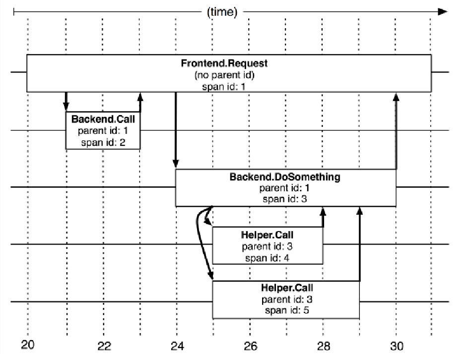

# 第十五节 项目

## 技能介绍

1. 熟练掌握计算机网络，数据结构与算法，操作系统。

2. 熟练使用Linux，有Linux下开发的实际经验。

3. 熟练掌握Java 基础知识、Java 并发、JVM，有过 JVM 排查问题经历。

4. 熟练掌握 MySQL 数据库以及常见优化手段(比如索引、SQL 优化、读写分离&分库分表)，Redis 使用经验丰富，熟悉MongoDB。

5. 熟练掌握 Elasticsearch 的使用及原理。 
6. 熟练掌握Spring、Spring MVC、SpringBoot、MyBatis、Netty 等主流开发框架。

7. 熟练掌握分布式下的常见理论 CAP、BASE，熟悉 Paxos 算法和 Raft 算法

8. 熟练掌握 RPC (Dubbo)、分布式事务(Seata、 2PC、3PC、TCC) 、分布式锁(Zookeeper、 Redis)、分布式 id(Snowflake) 的使用及原理。

9. 熟悉 Spring Cloud 全家桶常见组件的使用。

10. 熟练掌握消息队列 Rocket MQ的使用及原理、有限流、降级、熔断的实战经验。

11. 熟练掌握 Git、Maven、Docker。

### 分布式链路追踪

- Span
  基本工作单元，一次链路调用(可以是RPC，DB等没有特定的限制)创建一个span，通过一个64位ID标识它，uuid较为方便，span中还有其他的数据，例如描述信息，时间戳，key-value对的(Annotation)tag信息，parent-id等，其中parent-id可以表示span调用链路来源。

  

  上图说明了span在一次大的跟踪过程中的表现。Dapper记录了span名称，以及每个span的ID和父ID，以重建在一次追踪过程中不同span之间的关系。如果一个span没有父ID就被称为root span。所有span都挂在一个特定的跟踪上，也共用一个跟踪id。

  

  上图展示了span之间的父子关系，根节点为A，子节点B设置自己的父节点为A，依次向下延伸。

- Trace:类似于树结构的Span集合，表示一条调用链路，存在唯一标识。比如运行的分布式大数据存储一次Trace就由一次请求组成。

### maven

- package 命令完成了项目编译、单元测试、打包功能，但没有把打好的可执行jar包（war包或其它形式的包）布署到本地maven仓库和远程maven私服仓库
- install 命令完成了项目编译、单元测试、打包功能，同时把打好的可执行jar包（war包或其它形式的包）布署到本地maven仓库，但没有布署到远程maven私服仓库
- deploy 命令完成了项目编译、单元测试、打包功能，同时把打好的可执行jar包（war包或其它形式的包）布署到本地maven仓库和远程maven私服仓库

## 项目一

### 项目介绍

### 技术栈

### 项目亮点

### 遇到的问题

## 项目一

### 项目介绍

### 技术栈

### 项目亮点

### 遇到的问题

## 项目一

### 项目介绍

### 技术栈

### 项目亮点

### 遇到的问题