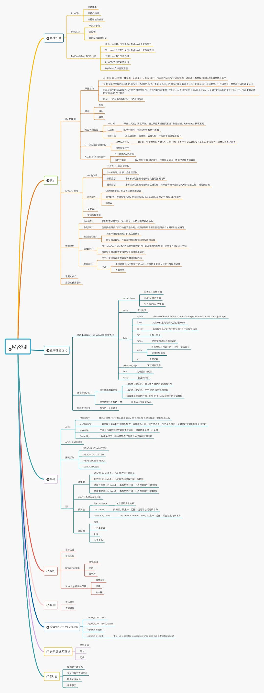

## **Spring Cloud**

### 什么是 Spring cloud

我所理解的`Spring Cloud`就是微服务系统架构的一站式解决方案，在平时我们构建微服务的过程中需要做如**服务发现注册**、**配置中心**、**消息总线**、**负载均衡**、**断路器**、**数据监控**等操作，而 Spring Cloud 为我们提供了一套简易的编程模型，使我们能在 Spring Boot 的基础上轻松地实现微服务项目的构建。

### 服务治理：Eureka

#### 治理机制

- 服务提供者

- - **服务注册：**启动的时候会通过发送REST请求的方式将**自己注册到Eureka Server上**，同时带上了自身服务的一些元数据信息。
  - **服务续约：**在注册完服务之后，**服务提供者会维护一个心跳**用来持续告诉Eureka Server:  "我还活着 ” 、
  - **服务下线：**当服务实例进行正常的关闭操作时，它会**触发一个服务下线的REST请求**给Eureka Server, 告诉服务注册中心：“我要下线了 ”。

- 服务消费者

- - **获取服务：**当我们**启动服务消费者**的时候，它会发送一个REST请求给服务注册中心，来获取上面注册的服务清单
  - **服务调用：**服务消费者在获取服务清单后，通过**服务名**可以获得具体提供服务的实例名和该实例的元数据信息。在进行服务调用的时候，**优先访问同处一个Zone中的服务提供方**。

- Eureka Server(服务注册中心)：

- - **失效剔除：**默认每隔一段时间（默认为60秒） 将当前清单中超时（默认为90秒）**没有续约的服务剔除出去**。
  - **自我保护：**。EurekaServer 在运行期间，会统计心跳失败的比例在15分钟之内是否低于85%(通常由于网络不稳定导致)。Eureka Server会将当前的**实例注册信息保护起来**， 让这些实例不会过期，尽可能**保护这些注册信息**。

#### **Eureka Server 角色**

Eureka Server 实例身兼三个角色：注册中心、服务提供者、注册中心客户端组件。

（1）对于所有 Provider Instance 而言，Eureka Server 的角色是注册中心。

（2）对于 Eureka Server 集群中其他的 Eureka Server 而言，Eureka Server 的角色是注册中心客户端组件。 

（3）Eureka Server 对外提供 REST 接口的服务，当然也是服务提供者。

#### **服务提供者的续约（心跳）**

服务提供者的续约（心跳）保活由 Provider Instance 主动定期执行来实现，每隔一段时间就

调用 Eureka Server 提供的 REST 保活接口，发送 Provider Instance 的状态信息给注册中心，告诉注册中心注册者还在正常运行。Provider Instance 的续约默认是开启的，续约默认的间隔是 30 秒，也就是每 30 秒会向 Eureka Server 发起续约（Renew）操作。

#### **Eureka 自我保护模式与失效 Provider 的快速剔除**

Provider 服务实例注册到 Eureka Server 后会维护一个心跳连接，告诉 Eureka Server 自己还活着。Eureka Server 在运行期间会统计所有 Provider 实例的心跳，如果失效比例在一段时间间隔内（如 15 分钟）低于阈值（如 85%），Eureka Server 就会将当前所有的 Provider 实例的注册信息保护起来，让这些实例不会过期。

eureka.server.enable-self-preservation=true 配置项的默认值为 true。也就是说，在默认情况下，如果 Eureka Server 在一定时间内没有接收到某个微服务实例的心跳，Eureka Server 就会认为该实例已经出现故障，进而注销该实例（默认为 90 秒）。

### 客户端负载均衡：Ribbon

负载均衡又区分了两种类型：

- 客户端负载均衡(Ribbon)

- - 服务实例的**清单在客户端**，客户端进行负载均衡算法分配。
  - (从上面的知识我们已经知道了：客户端可以从Eureka Server中得到一份服务清单，在发送请求时通过负载均衡算法，**在多个服务器之间选择一个进行访问**)

- 服务端负载均衡(Nginx)

- - 服务实例的**清单在服务端**，服务器进行负载均衡算法分配

#### Ribbon细节

Ribbon是支持负载均衡，默认的负载均衡策略是轮询，我们也是可以根据自己实际的需求自定义负载均衡策略的。

```java
@Configuration
public class MySelfRule
{
    @Bean
    public IRule myRule()
    {
        //return new RandomRule();// Ribbon默认是轮询，我自定义为随机
        //return new RoundRobinRule();// Ribbon默认是轮询，我自定义为随机

        return new RandomRule_ZY();// 我自定义为每台机器5次
    }
}
```

实现起来也很简单：继承AbstractLoadBalancerRule类，重写`public Server choose(ILoadBalancer lb, Object key)`即可。

#### **负载均衡策略**

- **RoundRobinRule**：轮询策略。`Ribbon`默认采用的策略。若经过一轮轮询没有找到可用的`provider`，其最多轮询 10 轮。若最终还没有找到，则返回 null。
- **RandomRule**: 随机策略，从所有可用的 provider 中随机选择一个。
- **RetryRule**: 重试策略。先按照 RoundRobinRule 策略获取 provider，若获取失败，则在指定的时限内重试。默认的时限为 500 毫秒。

🐦🐦🐦 还有很多，这里不一一举🌰了，你最需要知道的是默认轮询算法，并且可以更换默认的负载均衡算法，只需要在配置文件中做出修改就行。

```
providerName:
  ribbon:
    NFLoadBalancerRuleClassName: com.netflix.loadbalancer.RandomRule
```

当然，在`Ribbon`中你还可以**自定义负载均衡算法**，你只需要实现`IRule`接口，然后修改配置文件或者自定义`Java Config`类。


> 1. 随机策略（RandomRule） 
>
> RandomRule 实现类从 Provider 服务列表清单中随机选择一个 Provider 服务实例，作为 RPC 请求的目标 Provider。 
>
> 2. 线性轮询策略（RoundRobinRule） 
>
> RoundRobinRule 和 RandomRule 相似，只是每次都取下一个 Provider 服务器。假设一共有 5 台 Provider 服务节点，使用线性轮询策略，第 1 次取第 1 台，第 2 次取第 2 台，第 3 次取第 3 台， 以此类推。 
>
> 3. 响应时间权重策略（WeightedResponseTimeRule） 
>
> WeightedResponseTimeRule 为每一个 Provider 服务维护一个权重值，它的规则简单概括为 Provider 服务响应时间越长，其权重就越小。在进行服务器选择时，权重值越小，被选择的机会 就越少。WeightedResponseTimeRule 继承了 RoundRobinRule，开始时每一个 Provider 都没有权重 值，每当 RPC 请求过来时，由其父类的轮询算法完成负载均衡方式。该策略类有一个默认的每 30 秒执行一次的权重更新定时任务，该定时任务会根据 Provider 实例的响应时间更新 Provider 权重 列表。后续有 RPC 过来时，将根据权重值进行负载均衡。 
>
> 4. 最少连接策略（BestAvailableRule） 
>
> 在进行服务器选择时，该策略类遍历Provider清单，选出可用的且连接数最少的一个Provider。 该策略类里面有一个 LoadBalancerStats 类型的成员变量，会存储所有 Provider 的运行状况和连接 数。在进行负载均衡计算时，如果选取到的 Provider 为 null，就会调用线性轮询策略重新选取。 如果第一次 RPC 请求时 LoadBalancerStats 成员为 null，就会使用线性轮询策略来获取符合 要求的实例，后续的 RPC 在选择的时候，才能选择连接数最少的服务。每次 RPC 请求时， BestAvailableRule 都会统计 LoadBalancerStats，作为后续请求负载均衡计算的输入。 
>
> 5. 重试策略（RetryRule）
>
> 该类会在一定的时限内进行 Provider 循环重试。RetryRule 会在每次选取之后对选举的 Provider 进行判断，如果为 null 或者 not alive，就会在一定的时限内（如 500 毫秒）不停地选取和判断。 
>
> 6. 可用过滤策略（AvailabilityFilteringRule） 
>
> 该类扩展了线性轮询策略，会先通过默认的线性轮询策略选取一个 Provider，再去判断该 Provider 是否超时可用，当前连接数是否超过限制，如果都符合要求，就成功返回。 简单来说，AvailabilityFilteringRule 将对候选的 Provider 进行可用性过滤，会先过滤掉因多次 访问故障而处于熔断器跳闸状态的 Provider 服务，还会过滤掉并发的连接数超过阈值的 Provider 服务，然后对剩余的服务列表进行线性轮询。 
>
> 7. 区域过滤策略（ZoneAvoidanceRule） 
>
> 该类扩展了线性轮询策略，除了过滤超时和连接数过多的 Provider 之外，还会过滤掉不符合 要求的 Zone 区域中的所有节点。 
>

[撸一撸Spring Cloud Ribbon的原理-负载均衡策略 - 白色的海 - 博客园 (cnblogs.com)](https://www.cnblogs.com/kongxianghai/p/8477781.html)

### 服务容错保护：Hystrix  

在**高并发**的情况下，由于单个服务的延迟，可能导致**所有的请求都处于延迟状态**，甚至在几秒钟就使服务处于负载饱和的状态，资源耗尽，直到不可用，最终导致这个分布式系统都不可用，这就是“雪崩”。

针对上述问题， Spring Cloud Hystrix实现了**断路器、线程隔离**等一系列服务保护功能。

- Fallback(失败快速返回)：当某个服务单元发生故障（类似用电器发生短路）之后，通过断路器的故障监控（类似熔断保险丝）， **向调用方返回一个错误响应， 而不是长时间的等待**。这样就不会使得线程因调用故障服务被长时间占用不释放，**避免**了故障在分布式系统中的**蔓延**。
- 资源/依赖隔离(线程池隔离)：它会为**每一个依赖服务创建一个独立的线程池**，这样就算某个依赖服务出现延迟过高的情况，也只是对该依赖服务的调用产生影响， 而**不会拖慢其他的依赖服务**。

Hystrix提供几个熔断关键参数：`滑动窗口大小（20）、 熔断器开关间隔（5s）、错误率（50%）`

- 每当20个请求中，有50%失败时，熔断器就会打开，此时再调用此服务，将会**直接返回失败**，不再调远程服务。
- 直到5s钟之后，重新检测该触发条件，**判断是否把熔断器关闭，或者继续打开**。

Hystrix还有请求合并、请求缓存这样强大的功能，在此我就不具体说明了，有兴趣的同学可继续深入学习~

### 声明式服务调用：Feign

为了**简化**我们的开发，Spring Cloud Feign出现了！它基于 Netflix Feign 实现，**整合**了 Spring Cloud Ribbon 与 Spring Cloud Hystrix,  除了整合这两者的强大功能之外，它还提
供了**声明式的服务调用**(不再通过RestTemplate)。

> Feign是一种声明式、模板化的HTTP客户端。在Spring Cloud中使用Feign, 我们可以做到使用HTTP请求远程服务时能与调用本地方法一样的编码体验，开发者完全感知不到这是远程方法，更感知不到这是个HTTP请求。

下面就简单看看Feign是怎么优雅地实现远程调用的：

服务绑定：

```java
// value --->指定调用哪个服务
// fallbackFactory--->熔断器的降级提示
@FeignClient(value = "MICROSERVICECLOUD-DEPT", fallbackFactory = DeptClientServiceFallbackFactory.class)
public interface DeptClientService {


    // 采用Feign我们可以使用SpringMVC的注解来对服务进行绑定！
    @RequestMapping(value = "/dept/get/{id}", method = RequestMethod.GET)
    public Dept get(@PathVariable("id") long id);

    @RequestMapping(value = "/dept/list", method = RequestMethod.GET)
    public List<Dept> list();

    @RequestMapping(value = "/dept/add", method = RequestMethod.POST)
    public boolean add(Dept dept);
}
```

Feign中使用熔断器：

```java
/**
 * Feign中使用断路器
 * 这里主要是处理异常出错的情况(降级/熔断时服务不可用，fallback就会找到这里来)
 */
@Component // 不要忘记添加，不要忘记添加
public class DeptClientServiceFallbackFactory implements FallbackFactory<DeptClientService> {
    @Override
    public DeptClientService create(Throwable throwable) {
        return new DeptClientService() {
            @Override
            public Dept get(long id) {
                return new Dept().setDeptno(id).setDname("该ID：" + id + "没有没有对应的信息,Consumer客户端提供的降级信息,此刻服务Provider已经关闭")
                        .setDb_source("no this database in MySQL");
            }

            @Override
            public List<Dept> list() {
                return null;
            }

            @Override
            public boolean add(Dept dept) {
                return false;
            }
        };
    }
}
```

调用：


### API网关服务：Zuul

- SpringCloud Zuul通过与SpringCloud Eureka进行整合，将自身注册为Eureka服务治理下的应用，同时从Eureka中获得了所有其他微服务的实例信息。**外层调用都必须通过API网关**，使得**将维护服务实例的工作交给了服务治理框架自动完成**。
- 在API网关服务上进行统一调用来**对微服务接口做前置过滤**，以实现对微服务接口的**拦截和校验**。

- 路由匹配(动态路由)
- 过滤器实现(动态过滤器)
- 默认会过滤掉Cookie与敏感的HTTP头信息(额外配置)

### 分布式配置中心：Config

### 消息总线： Bus

你可以简单理解为`Spring Cloud Bus`的作用就是**管理和广播分布式系统中的消息**，也就是消息引擎系统中的广播模式。当然作为**消息总线**的`Spring Cloud Bus`可以做很多事而不仅仅是客户端的配置刷新功能。

而拥有了`Spring Cloud Bus`之后，我们只需要创建一个简单的请求，并且加上`@ResfreshScope`注解就能进行配置的动态修改了，下面我画了张图供你理解。



### 消息驱动的微服务：Stream

### 分布式服务跟踪：Sleuths

#### **理论**


1. #### **组件**

spring-cloud-netflix-Eureka：注册中心。 

spring-cloud-netflix-Feign: RPC调用组件

spring-cloud-netflix-hystrix：RPC 保护组件。 

spring-cloud-netflix-ribbon：客户端负载均衡组件。 

spring-cloud-netflix-zuul：内部网关组件。

1. #### **Eureka 服务注册与发现**

宏观角度分三个角色：

- 注册中心 
- 服务提供者
- 远程客户端组件。

             ​            

**注册中心的主要功能：**

- 服务注册表维护：此功能是注册中心的核心，用来记录各个服务提供者实例的状态信息。注册中心提供 Provider 实例清单的查询和管理 API，用于查询可用的 Provider 实例列表，管理 Provider 实例的上线和下线。
- 服务健康检查：注册中心使用一定机制定时检测已注册的 Provider 实例，如发现某实例长时间无法访问，就会从服务注册表中移除该实例。

**服务提供者**

- 服务注册：是指 Provider 微服务实例在启动时（或者定期）将自己的信息注册到注册中心的过程。
- 心跳续约：Provider 实例会定时向注册中心提供“心跳”，以表明自己还处于可用的状态。当一个 Provider 实例停止心跳一段时间后，注册中心会认为该服务实例不可用了，就会将该服务实例从服务注册表中剔除。如果被剔除掉的 Provider 实例过了一段时间后又继续向注册中心提供心跳，那么注册中心会把该 Provider 实例重新加入服务注册表中。
- 健康状况查询：Provider 实例能提供健康状况查看的 API，注册中心或者其他的微服务Provider 能够获取其健康状况。

**远程客户端组件**

- 服务发现：从注册中心查询可用 Provider 实例清单
- 实例缓存：将从注册中心查询的 Provider 实例清单缓存到本地，不需要在每次使用时都去注册中心临时获取。


**Eureka Server实例** 

**分三个角色**

- 注册中心 ：对于所有 Provider Instance 而言，Eureka Server 的角色是注册中心
- 服务提供者 ：Eureka Server 对外提供 REST 接口的服务，当然也是服务提供者。
- 注册中心客户端组件：对于 Eureka Server 集群中其他的 Eureka Server 而言，Eureka Server 的角色是注册中心客户端组件

**eureka.server.enable-self-preservation 注册中心的保护机制**

Eureka Server 会定时统计 15 分钟之内心跳成功的 Provider 实例的比例，如果低于 85%就会触发保护机制，处于保护状态的 Eureka Server 不剔除失效的服务提供者。enableself-preservation 的默认值为 true 表示开启自我保护机制。如果 15 分钟之内心跳成功的 Provider 实例的比例高于 85%，那么 Eureka Server 仍然会处于正常状态。


**服务提供者的续约（心跳）**

服务提供者的续约（心跳）保活由 Provider Instance 主动定期执行来实现，每隔一段时间就调用 Eureka Server 提供的 REST 保活接口，发送 Provider Instance 的状态信息给注册中心，告诉注册中心注册者还在正常运行。Provider Instance 的续约默认是开启的，续约默认的间隔是 30 秒，也就是每 30 秒会向 Eureka Server 发起续约（Renew）操作。

**服务提供者的健康状态**

Eureka Server 并不记录 Provider 的所有健康状况信息，仅仅维护了一个 Provider 清单。EurekaClient 组件查询的 Provider 注册清单中，包含每一个 Provider 的健康状况的检查地址。通过该健康状况的地址可以查询 Provider 的健康状况。

**Eureka 自我保护模式与失效 Provider 的快速剔除**

Provider 服务实例注册到 Eureka Server 后会维护一个心跳连接，告诉 Eureka Server 自己还活着。Eureka Server 在运行期间会统计所有 Provider 实例的心跳，如果失效比例在一段时间间隔内（如 15 分钟）低于阈值（如 85%），Eureka Server 就会将当前所有的 Provider 实例的注册信息保护起来，让这些实例不会过期。

为了使失效的 Provider 能够快速被剔除，可以停用 Eureka Server 的保护模式，然后启用客户端的健康状态检查。

1. #### **Config 配置中心**

Spring Cloud Config 配置中心涉及两部分内容： 

（1）config-server：服务端配置。

（2）config-client：客户端配置。

Spring Cloud Config 提供本地存储配置的方式。在 bootstrap 启动属性文件中，设置属性 spring.profiles.active=native

1. #### **微服务的 RPC 远程调用**

- Feign 负责基础的 REST 调用以及序列化和反序列化，
- Hystrix 负责熔断器、熔断和隔离，
- Ribbon 负责客户端负载均衡。
- spring cloud gateway/setinel  限流

**Feign 远程调用**

Feign 是什么？

Feign 是在 RestTemplate 基础上封装的，使用注解的方式来声明一组与服务提供者 Rest 接口所对应的本地 Java API 接口方法。Feign 将远程 Rest 接口抽象成一个声明式的FeignClient（Java API）客户端，并且负责完成 FeignClient 客户端和服务提供方的 Rest 接口绑定。

**Spring Cloud Ribbon 的负载均衡策略**

- 随机策略（RandomRule）RandomRule 实现类从 Provider 服务列表清单中随机选择一个 Provider 服务实例，作为 RPC请求的目标 Provider。
- 线性轮询策略（RoundRobinRule） RoundRobinRule 和 RandomRule 相似，只是每次都取下一个 Provider 服务器。假设一共有 5 台 Provider 服务节点，使用线性轮询策略，第 1 次取第 1 台，第 2 次取第 2 台，第 3 次取第 3 台，以此类推。
- 响应时间权重策略（WeightedResponseTimeRule） WeightedResponseTimeRule 为每一个 Provider 服务维护一个权重值，它的规则简单概括为Provider 服务响应时间越长，其权重就越小。在进行服务器选择时，权重值越小，被选择的机会就越少。
- 最少连接策略（BestAvailableRule）  在进行服务器选择时，该策略类遍历Provider清单，选出可用的且连接数最少的一个Provider。该策略类里面有一个 LoadBalancerStats 类型的成员变量，会存储所有 Provider 的运行状况和连接数。在进行负载均衡计算时，如果选取到的 Provider 为 null，就会调用线性轮询策略重新选取。
- 重试策略（RetryRule）该类会在一定的时限内进行 Provider 循环重试。RetryRule 会在每次选取之后对选举的Provider 进行判断，如果为 null 或者 not alive，就会在一定的时限内（如 500 毫秒）不停地选取和判断
- 可用过滤策略（AvailabilityFilteringRule）该类扩展了线性轮询策略，会先通过默认的线性轮询策略选取一个 Provider，再去判断该Provider 是否超时可用，当前连接数是否超过限制，如果都符合要求，就成功返回。
- 区域过滤策略（ZoneAvoidanceRule）该类扩展了线性轮询策略，除了过滤超时和连接数过多的 Provider 之外，还会过滤掉不符合要求的 Zone 区域中的所有节点。
- 自定义的策略

**Feign+Hystrix 实现 RPC 调用保护**

**Spring Cloud Hystrix 失败回退**

什么是失败回退呢？当目标 Provider 实例发生故障时，RPC 的失败回退会产生作用，返回一个后备的结果。一个失败回退的演示如图 2-16 所示，有 A、B、C、D 四个 Provider 实例，A-Provider和 B-Provider 对 D-Provider 发起 RPC 远程调用，但是 D-Provider 发生了故障，在 A、B 收到失败回退保护的情况下，最终会拿到失败回退提供的后备结果（或者 Fallback 回退结果）。

如何设置 RPC 调用的回退逻辑呢？有两种方式：

1. 定义和使用一个 Fallback 回退处理类。 
2. 定义和使用一个 FallbackFactory 回退处理工厂类。

**Spring Cloud Hystrix 熔断器**

熔断器通常也叫作熔断器，其具体的工作机制为：统计最近 RPC 调用发生错误的次数，然后根据统计值中的失败比例等信息来决定是否允许后面的 RPC 调用继续或者快速地失败回退。

熔断器的 3 种状态如下：

（1）关闭（closed）：熔断器关闭状态，这也是熔断器的初始状态，此状态下 RPC 调用正常放行。

（2）开启（open）：失败比例到一定的阈值之后，熔断器进入开启状态，此状态下 RPC 将会快速失败，然后执行失败回退逻辑。

1. 半开启（half-open）：在打开一定时间之后（睡眠窗口结束），熔断器进入半开启状态，小流量尝试进行 RPC 调用放行。如果尝试成功，熔断器就变为关闭状态，RPC 调用正常；如果尝试失败，熔断器就变为开启状态，RPC 调用快速失败

1. #### **Spring Cloud RPC 远程调用核心原理**

客户端 RPC 实现类位于远程调用 Java 接口和 Provider 微服务实例之间，承担了以下职责：

1. 拼装 REST 请求：根据 Java 接口的参数，拼装目标 REST 接口的 URL。 
2. 发送请求和获取结果：通过 Java HTTP 组件（如 HttpClient）调用 Provider 微服务实例的 REST 接口，并且获取 REST 响应。
3. 结果解码：解析 REST 接口的响应结果，封装成目标 POJO 对象（Java 接口的返回类型）并且返回

使用 Feign 进行 RPC 远程调用时，对于每一个 Java 远程调用接口，Feign 都会生成一个 RPC远程调用客户端实现类，只是对于开发者来说这个实现类是透明的，感觉不到这个实现类的存在。

Feign 的 RPC 客户端实现类是一个JDK 动态代理类，是在运行过程中动态生成的。


1. #### **Zuul网关**

Spring Cloud 对 Zuul 进行了整合与增强。Zuul 作为网关层，自身也是一个微服务，跟其他服务提供者一样都注册在 Eureka Server 上，可以相互发现。Zuul 能感知到哪些 Provider 实例在线，同时通过配置路由规则可以将 REST 请求自动转发到指定的后端微服务提供者。

**过滤敏感请求头部**

在同一个系统中，在不同 Provider 之间共享请求头是可行的，但是，如果 Zuul 需要将请求转发到外部，可能不希望敏感的请求头泄露到外部的其他服务器

默认情况下，Zuul 转发请求时会把 header 清空，如果在微服务集群内部转发请求，上游Provider 就会收不到任何头部。如果需要传递原始的 header 信息到最终的上游，就需要添加如下

zuul.sensitive-headers = Cookie,Set-Cookie,token,backend,Authorization

1. ### **限流策略原理**


3 种限流策略：计数器、漏桶和令牌桶

计数器：在一段时间间隔内（时间窗），处理请求的最大数量固定，超过部分不做处理。

漏桶：漏桶大小固定，处理速度固定，但请求进入的速度不固定（在突发情况请求过多时，会丢弃过多的请求）。

令牌桶：令牌桶的大小固定，令牌的产生速度固定，但是消耗令牌（请求）的速度不固定（可以应对某些时间请求过多的情况）。每个请求都会从令牌桶中取出令牌，如果没有令牌， 就丢弃这次请求


1. ### **分布式 Session** 

Session 是啥？浏览器有个 Cookie，在一段时间内这个 Cookie 都存在，然后每次发请求过来都带上一个特殊的 jsessionid cookie ，就根据这个东西，在服务端可以维护一个对应的 Session 域，里面可以放点数据。

一般的话只要你没关掉浏览器，Cookie 还在，那么对应的那个 Session 就在，但是如果 Cookie 没了，Session 也就没了。常见于什么购物车之类的东西，还有登录状态保存之类的。

**集群部署时的分布式 Session 如何实现？**

- 完全不用 Session  使用 JWT Token 储存用户身份，然后再从数据库或者 cache 中获取其他的信息。这样无论请求分配到哪个服务器都无所谓。
- Tomcat + Redis  这个其实还挺方便的，就是使用 Session 的代码，跟以前一样，还是基于 Tomcat 原生的 Session 支持即可，然后就是用一个叫做 Tomcat RedisSessionManager 的东西，让所有我们部署的 Tomcat 都将 Session 数据存储到 Redis 即可。
- Spring Session + Redis