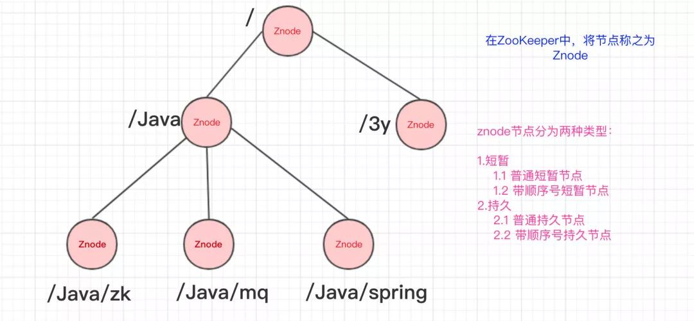
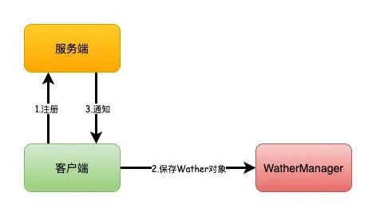
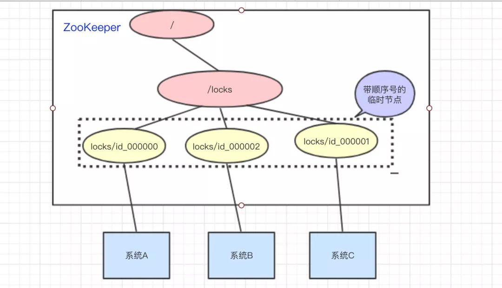
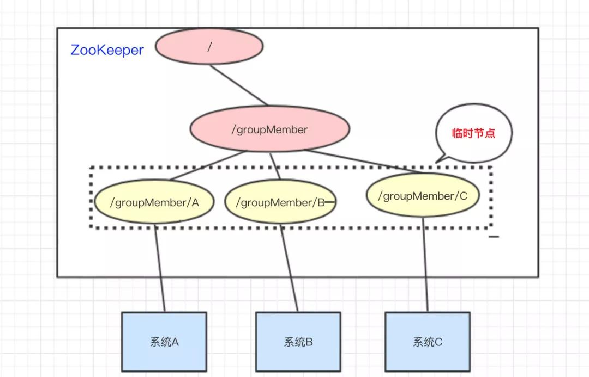
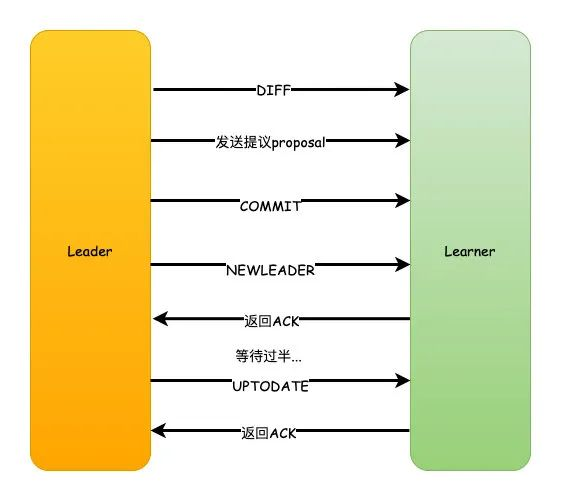

# Zookeeper 

>   [什么是Zookeeper](https://mp.weixin.qq.com/s/gphDLJMO3QcRoN3zkco4EA)
>
>   [分布式锁之Zookeeper](https://mp.weixin.qq.com/s/ZqQHWLfVD1Rz1agmH3LWrg)
>
>   [Zookeeper之ZAB协议](https://mp.weixin.qq.com/s/k0zAExTvMsrugCaNJxs7hQ)
>
>   [Zookeeper夺命连环9问](https://mp.weixin.qq.com/s/YawG0GqznDHaiHXZuTsCjA)

## Zookeeper简介

1. ZooKeeper主要**服务于分布式系统**，可以用ZooKeeper来做：统一配置管理、统一命名服务、分布式锁、集群管理。
2. 使用分布式系统就无法避免对节点管理的问题(需要实时感知节点的状态、对节点进行统一管理等等)，而由于这些问题处理起来可能相对麻烦和提高了系统的复杂性，ZooKeeper作为一个能够**通用**解决这些问题的中间件就应运而生了。

## ZooKeeper结构

ZooKeeper的数据结构，跟Unix文件系统非常类似，可以看做是一颗**树**，每个节点叫做**ZNode**。每一个节点可以通过**路径**来标识; ZooKeeper的节点我们称之为**Znode**，Znode分为**两种**类型：

1. **短暂/临时(Ephemeral)**：当客户端和服务端断开连接后，所创建的Znode(节点)**会自动删除**
2. **持久(Persistent)**：当客户端和服务端断开连接后，所创建的Znode(节点)**不会删除**

> ZooKeeper和Redis一样，也是C/S结构(分成客户端和服务端)



## Watch监听器

在上面我们已经简单知道了ZooKeeper的数据结构了，ZooKeeper还配合了**监听器**才能够做那么多事的。**常见**的监听场景有以下两项：

1. 监听Znode节点的**数据变化**
2. 监听子节点的**增减变化**

					监听Znode节点的数据有无变化

					监听子节点的增减变化

没错，通过**监听+Znode节点(持久/短暂[临时])**，ZooKeeper就可以玩出这么多花样了。

### 原理

Zookeeper可以提供分布式数据的发布/订阅功能，依赖的就是Wather监听机制。客户端可以向服务端注册Wather监听，服务端的指定事件触发之后，就会向客户端发送一个事件通知。他有几个特性：

1. 一次性：一旦一个Wather触发之后，Zookeeper就会将它从存储中移除
2. 客户端串行：客户端的Wather回调处理是串行同步的过程，不要因为一个Wather的逻辑阻塞整个客户端
3. 轻量：Wather通知的单位是WathedEvent，只包含通知状态、事件类型和节点路径，不包含具体的事件内容，具体的时间内容需要客户端主动去重新获取数据

主要流程如下：

1. 客户端向服务端注册Wather监听
2. 保存Wather对象到客户端本地的WatherManager中
3. 服务端Wather事件触发后，客户端收到服务端通知，从WatherManager中取出对应Wather对象执行回调逻辑



## ZooKeeper实现原理

>[ZooKeeper 的应用场景 - 知乎 (zhihu.com)](https://zhuanlan.zhihu.com/p/59669985)

### 统一配置管理

比如我们现在有三个系统A、B、C，他们有三份配置，分别是`ASystem.yml、BSystem.yml、CSystem.yml`，然后，这三份配置又非常类似，很多的配置项几乎都一样。

- 此时，如果我们要改变其中一份配置项的信息，很可能其他两份都要改。并且，改变了配置项的信息**很可能就要重启系统**

于是，我们希望把`ASystem.yml、BSystem.yml、CSystem.yml`相同的配置项抽取出来成一份**公用**的配置`common.yml`，并且即便`common.yml`改了，也不需要系统A、B、C重启。


做法：我们可以将`common.yml`这份配置放在ZooKeeper的Znode节点中，系统A、B、C监听着这个Znode节点有无变更，如果变更了，**及时**响应。系统A、B、C监听着ZooKeeper的节点，一旦common.yml内容有变化，及时响应

参考资料：

>[基于zookeeper实现统一配置管理_zookeeper统一配置管理_菜 头的博客-CSDN博客](https://blog.csdn.net/u011320740/article/details/78742625)

### 统一命名服务

统一命名服务的理解其实跟**域名**一样，是我们为这某一部分的资源给它**取一个名字**，别人通过这个名字就可以拿到对应的资源。

比如说，现在我有一个域名`www.java3y.com`，但我这个域名下有多台机器：

- 192.168.1.1
- 192.168.1.2
- 192.168.1.3
- 192.168.1.4

别人访问`www.java3y.com`即可访问到我的机器，而不是通过IP去访问。


命名服务就是提供名称的服务。ZooKeeper 的命名服务有两个应用方面。

1. 提供类 JNDI 功能，可以把系统中各种服务的名称、地址以及目录信息存放在 ZooKeeper，需要的时候去 ZooKeeper 中读取
2. 制作分布式的序列号生成器

利用 ZooKeeper **顺序节点**的特性，制作分布式的序列号生成器，或者叫 id 生成器。（分布式环境下使用作为数据库 id，另外一种是 UUID（缺点：没有规律）），ZooKeeper 可以生成有顺序的容易理解的同时支持分布式环境的编号。

在创建节点时，如果设置节点是有序的，则 ZooKeeper 会**自动在你的节点名后面加上序号**，上面说容易理解，是比如说这样，你要获得订单的 id，你可以在创建节点时指定节点名为 order_[日期]_xxxxxx，这样一看就大概知道是什么时候的订单。

```text
/
└── /order
    ├── /order-date1-000000000000001
    ├── /order-date2-000000000000002
    ├── /order-date3-000000000000003
    ├── /order-date4-000000000000004
    └── /order-date5-000000000000005
```

### 分布式锁

我们可以使用ZooKeeper来实现分布式锁，那是怎么做的呢？？下面来看看：

系统A、B、C都去访问`/locks`节点

系统A、B、C都去访问locks节点

访问的时候会创建**带顺序号的临时/短暂**(`EPHEMERAL_SEQUENTIAL`)节点，比如，系统A创建了`id_000000`节点，系统B创建了`id_000002`节点，系统C创建了`id_000001`节点。

						创建出临时带顺序号的节点

接着，拿到`/locks`节点下的所有子节点(id_000000,id_000001,id_000002)，**判断自己创建的是不是最小的那个节点**

- 如果是，则拿到锁。
  - 释放锁：执行完操作后，把创建的节点给删掉

- 如果不是，则监听比自己要小1的节点变化

举个例子：

- 系统A拿到`/locks`节点下的所有子节点，经过比较，发现自己(`id_000000`)，是所有子节点最小的。所以得到锁
- 系统B拿到`/locks`节点下的所有子节点，经过比较，发现自己(`id_000002`)，不是所有子节点最小的。所以监听比自己小1的节点`id_000001`的状态
- 系统C拿到`/locks`节点下的所有子节点，经过比较，发现自己(`id_000001`)，不是所有子节点最小的。所以监听比自己小1的节点`id_000000`的状态
- ……
- 等到系统A执行完操作以后，将自己创建的节点删除(`id_000000`)。通过监听，系统C发现`id_000000`节点已经删除了，发现自己已经是最小的节点了，于是顺利拿到锁
- ….系统B如上

>[分布式锁之Zookeeper](https://mp.weixin.qq.com/s/ZqQHWLfVD1Rz1agmH3LWrg)


#### 排他锁

如果事务 T1 对数据对象 O1 加上了排他锁，那么加锁期间，只允许事务 T1 对 O1 进行读取和更新操作。**核心是保证当前有且仅有一个事务获得锁**，并且锁释放后，所有正在等待获取锁的事务都能够被通知到。

通过 ZooKeeper 上的 Znode 可以表示一个锁，`/x_lock/lock`。

1. 获取锁 所有客户端都会通过调用 `create()` 接口尝试在 `/x_lock` 创建临时子节点 `/x_lock/lock`。最终只有一个客户端创建成功，那么该客户端就获取了锁。同时没有获取到锁的其他客户端，**注册一个子节点变更**的 Watcher 监听。
2. 释放锁 获取锁的客户端发生宕机或者正常完成业务逻辑后，就会把临时节点删除。临时子节点删除后，其他客户端又开始新的一轮获取锁的过程。

#### 共享锁

如果事务 T1 对数据对象 O1 加上了共享锁，那么当前事务 T1 只能对 O1 进行读取操作，其他事务也只能对这个数据对象加共享锁，直到数据对象上的所有共享锁都被释放。

通过 ZooKeeper 上的 Znode 表示一个锁，`/s_lock/[HOSTNAME]-请求类型-序号`。

```text
/
├── /host1-R-000000001
├── /host2-R-000000002
├── /host3-W-000000003
├── /host4-R-000000004
├── /host5-R-000000005
├── /host6-R-000000006
└── /host7-W-000000007
```

1. 获取锁 需要获得共享锁的客户端都会在 `s_lock` 这个节点下面创建一个**临时顺序节点**，如果当前是读请求，就创建类型为 R 的临时节点，如果是写请求，就创建类型为 W 的临时节点。
2. 判断读写顺序 共享锁下不同事务可以同时对同一个数据对象进行读取操作，而更新操作必须在当前没有任何事务进行读写操作的情况下进行。 2.1 创建完节点后，获取 `s_lock` 的所有子节点，并对该节点注册子节点变更的 Watcher 监听 2.2 然后确定自己的节点序号在所有的子节点中的顺序 2.3 对于读请求，如果没有比自己小的子节点，那么表名自己已经成功获取到了共享锁，同时开始执行读取逻辑，如果有比自己序号小的写请求，那么就需要进行等待 2.4 接收到 Watcher 通知后重复 2.1
3. 释放锁 获取锁的客户端发生宕机或者正常完成业务逻辑后，就会把临时节点删除。临时子节点删除后，其他客户端又开始新的一轮获取锁的过程。

#### 死锁

临时节点顺序

#### 性能没redis高

#### 羊群效应

在 2.7.2 介绍的共享锁中，在判断读写顺序的时候会出现一个问题，假如 host4 在移除自己的节点的时候，后面 host5-7 都需要接收 Watcher 事件通知，但是实际上，只有 host5 接收到事件就可以了。因此以上的实现方式会产生大量的 Watcher 通知。这样会对 ZooKeeper 服务器造成了巨大的性能影响和网络冲击，这就是羊群效应。

改进的一步在于，调用 `getChildren` 接口的时候获取到所有已经创建的子节点列表，**但是这个时候不要注册任何的 Watcher**。当无法获取共享锁的时候，调用 `exist()` 来对比自己小的那个节点注册 Wathcer。而对于读写请求，会有不同的定义:

1. 读请求: 在比自己序号小的最后一个写请求节点注册 Watcher。
2. 写请求: 向比自己序号小的最后一个节点注册 Watcher。

### 集群状态

经过上面几个例子，我相信大家也很容易想到ZooKeeper是怎么"**感知**"节点的动态新增或者删除的了。

还是以我们三个系统A、B、C为例，在ZooKeeper中创建**临时节点**即可：

						各维护一个临时节点

只要系统A挂了，那`/groupMember/A`这个节点就会删除，通过**监听**`groupMember`下的子节点，系统B和C就能够感知到系统A已经挂了。(新增也是同理)

除了能够感知节点的上下线变化，ZooKeeper还可以实现**动态选举Master**的功能。(如果集群是主从架构模式下)

原理也很简单，如果想要实现动态选举Master的功能，Znode节点的类型是带**顺序号的临时节点**(`EPHEMERAL_SEQUENTIAL`)就好了。Zookeeper会每次选举最小编号的作为Master，如果Master挂了，自然对应的Znode节点就会删除。然后让**新的最小编号作为Master**，这样就可以实现动态选举的功能了。

集群管理主要指**集群监控**和**集群控制**两个方面。前者侧重于集群运行时的状态的收集，后者则是对集群进行操作与控制。开发和运维中，面对集群，经常有如下需求:

1. 希望知道集群中究竟有多少机器在工作
2. 对集群中的每台机器的运行时状态进行数据收集
3. 对集群中机器进行上下线的操作

分布式集群管理体系中有一种传统的基于 Agent 的方式，就是在集群每台机器部署 Agent 来收集机器的 CPU、内存等指标。但是如果需要深入到业务状态进行监控，比如一个分布式消息中间件中，希望监控每个消费者对消息的消费状态，或者一个分布式任务调度系统中，需要对每个机器删的任务执行情况进行监控。对于这些业务紧密耦合的监控需求，统一的 Agent 是不太合适的。

利用 ZooKeeper 实现集群管理监控组件的思路:

在管理机器上线/下线的场景中，为了实现自动化的线上运维，我们必须对机器的上/下线情况有一个全局的监控。通常在新增机器的时候，需要首先将指定的 Agent 部署到这些机器上去。Agent 部署启动之后，会首先向 ZooKeeper 的指定节点进行注册，具体的做法就是在机器列表节点下面创建一个临时子节点，例如 `/machine/[Hostname]`（下文我们以“主机节点”代表这个节点），如下图所示。


当 Agent 在 ZooKeeper 上创建完这个临时子节点后，对 `/machines` 节点关注的监控中心就会接收到“子节点变更”事件，即上线通知，于是就可以对这个新加入的机器开启相应的后台管理逻辑。另一方面，监控中心同样可以获取到机器下线的通知，这样便实现了对机器上/下线的检测，同时能够很容易的获取到在线的机器列表，对于大规模的扩容和容量评估都有很大的帮助。

### 队列管理

Zookeeper 可以处理两种类型的队列：

1. 当一个队列的成员都聚齐时，这个队列才可用，否则一直等待所有成员到达，这种是同步队列。
2. 队列按照 FIFO 方式进行入队和出队操作，例如实现生产者和消费者模型。
   创建一个父目录 `/synchronizing`，每个成员都监控标志（Set Watch）位目录 /`synchronizing/start` 是否存在，然后每个成员都加入这个队列，加入队列的方式就是创建 /`synchronizing/member_i` 的临时目录节点，然后每个成员获取 `/synchronizing` 目录的所有目录节点，也就是 member_i。判断 i 的值是否已经是成员的个数，如果小于成员个数等待 `/synchronizing/start` 的出现，如果已经相等就创建 `/synchronizing/start`。

   >FIFO 队列用 Zookeeper 实现思路如下：
   >在特定的目录下创建 SEQUENTIAL 类型的子目录 /queue_i，这样就能保证所有成员加入队列时都是有编号的，出队列时通过 getChildren( ) 方法可以返回当前所有的队列中的元素，然后消费其中最小的一个，这样就能保证 FIFO。

### 数据发布订阅

数据发布/订阅的一个常见的场景是配置中心，发布者把数据发布到 ZooKeeper 的一个或一系列的节点上，供订阅者进行数据订阅，达到**动态获取数据**的目的。

配置信息一般有几个特点:

1. 数据量小的KV
2. 数据内容在运行时会发生动态变化
3. 集群机器共享，配置一致


ZooKeeper 采用的是**推拉结合**的方式。

1. 推: 服务端会推给注册了监控节点的客户端 Wathcer 事件通知
2. 拉: 客户端获得通知后，然后主动到服务端拉取最新的数据

实现的思路可以如下。

```bash
mysql.driverClassName=com.mysql.jdbc.Driver
dbJDBCUrl=jdbc:mysql://127.0.0.1/runzhlliu
username=runzhliu
password=runzhliu
```

1. 把配置信息写到一个 Znode 上，例如 `/Configuration`
2. 客户端启动初始化阶段读取服务端节点的数据，并且注册一个数据变更的 Watcher
3. 配置变更只需要对 Znode 数据进行 set 操作，数据变更的通知会发送到客户端，客户端重新获取新数据，完成配置动态修改

### 负载均衡

负载均衡是一种手段，用来把对某种资源的访问分摊给不同的设备，从而**减轻单点**的压力。

实现的思路:

1. 首先建立 Servers 节点，并建立监听器监视 Servers 子节点的状态（用于在服务器增添时及时同步当前集群中服务器列表）
2. 在每个服务器启动时，在 Servers 节点下建立**临时子节点** Worker Server，并在对应的字节点下存入服务器的相关信息，包括服务的地址，IP，端口等等
3. 可以**自定义一个负载均衡算法**，在每个请求过来时从 ZooKeeper 服务器中获取当前集群服务器列表，根据算法选出其中一个服务器来处理请求


### 分布式协调通知

一种典型的分布式系统机器间的通信方式是**心跳**。心跳检测是指分布式环境中，**不同机器之间需要检测彼此是否正常运行**。传统的方法是通过主机之间相互 PING 来实现，又或者是建立长连接，通过 TCP 连接固有的心跳检测机制来实现上层机器的心跳检测。

如果使用 ZooKeeper，可以基于其**临时节点**的特性，不同机器在 ZooKeeper 的一个指定节点下创建临时子节点，不同机器之间可以根据这个临时节点来判断客户端机器是否存活。

好处就是检测系统和被检系统不需要直接相关联，而是通过 ZooKeeper 节点来关联，大大**减少系统的耦合**。

### Master选举

分布式系统中 Master 是用来协调集群中其他系统单元，具有对分布式系统状态更改的决定权。比如一些读写分离的应用场景，客户端写请求往往是 Master 来处理的。

利用常见关系型数据库中的主键特性来实现也是可以的，集群中所有机器都向数据库中插入一条相同主键 ID 的记录，数据库会帮助我们自动进行主键冲突检查，可以保证只有一台机器能够成功。

但是有一个问题，如果插入成功的和护短机器成为 Master 后挂了的话，如何通知集群重新选举 Master？

利用 ZooKeeper 创建节点 API 接口，提供了强一致性，能够很好保证在分布式高并发情况下节点的创建一定是全局唯一性。

集群机器都尝试创建节点，创建成功的客户端机器就会成为 Master，失败的客户端机器就在该节点上注册一个 Watcher 用于监控当前 Master 机器是否存活，一旦发现 Master 挂了，其余客户端就可以进行选举了。

### 分布式队列

#### FIFO

使用 ZooKeeper 实现 FIFO 队列，**入队操作**就是在 `queue_fifo` 下创建自增序的子节点，并把数据（队列大小）放入节点内。**出队操作**就是先找到 `queue_fifo` 下序号最下的那个节点，取出数据，然后删除此节点。

```text
/queue_fifo
|
├── /host1-000000001
├── /host2-000000002
├── /host3-000000003
└── /host4-000000004
```

创建完节点后，根据以下步骤确定执行顺序:

1. 通过 `get_children()` 接口获取 `/queue_fifo` 节点下所有子节点
2. 通过自己的节点序号在所有子节点中的顺序
3. 如果不是最小的子节点，那么进入等待，同时**向比自己序号小的最后一个子节点注册 Watcher 监听**
4. 接收到 Watcher 通知后重复 1

#### Barrier

Barrier就是栅栏或者屏障，适用于这样的业务场景：当有些操作需要并行执行，但后续操作又需要串行执行，此时必须等待所有并行执行的线程全部结束，才开始串行，于是就需要一个屏障，来控制所有线程同时开始，并等待所有线程全部结束。


利用 ZooKeeper 的实现，开始时 `queue_barrier` 节点是一个已经存在的默认节点，并且将其节点的数据内容赋值为一个数字 n 来代表 Barrier 值，比如 n=10 代表只有当 `/queue_barrier` 节点下的子节点个数达到10才会打开 Barrier。之后所有客户端都会在 `queue_barrier` 节点下创建一个临时节点，如 `queue_barrier/host1`。

**如何控制所有线程同时开始？** 所有的线程启动时在 ZooKeeper 节点 `/queue_barrier` 下插入顺序临时节点，然后检查 `/queue/barrier` 下所有 children 节点的数量是否为所有的线程数，如果不是，则等待，如果是，则开始执行。具体的步骤如下:

1. `getData()` 获取 `/queue_barrier` 节点的数据内容
2. `getChildren()` 获取 `/queue_barrier` 节点下的所有子节点，同时注册对子节点列表变更的 Watche 监听。
3. 统计子节点的个数
4. 如果子节点个数不足10，那么进入等待
5. 接收 Watcher 通知后，重复2

**如何等待所有线程结束？** 所有线程在执行完毕后，都检查 `/queue/barrier` 下所有 children 节点数量是否为0，若不为0，则继续等待。

**用什么类型的节点？** 根节点使用持久节点，子节点使用临时节点，根节点为什么要用持久节点？首先因为临时节点不能有子节点，所以根节点要用持久节点，并且在程序中要判断根节点是否存在。 子节点为什么要用临时节点？临时节点随着连接的断开而消失，在程序中，虽然会删除临时节点，但可能会出现程序在节点被删除之前就 crash了，如果是持久节点，节点不会被删除。

## 数据一致性

>[阿里云二面：zookeeper一致性算法 (qq.com)](https://mp.weixin.qq.com/s/J2is0iapoxn5ZuQySX9SKw)

Zookeeper通过ZAB原子广播协议来实现数据的最终顺序一致性，他是一个类似2PC两阶段提交的过程。

由于Zookeeper只有Leader节点可以写入数据，如果是其他节点收到写入数据的请求，则会将之转发给Leader节点。

主要流程如下：

1. Leader收到请求之后，将它转换为一个proposal提议，并且为每个提议分配一个全局唯一递增的事务ID：zxid，然后把提议放入到一个FIFO的队列中，按照FIFO的策略发送给所有的Follower
2. Follower收到提议之后，以事务日志的形式写入到本地磁盘中，写入成功后返回ACK给Leader
3. Leader在收到超过半数的Follower的ACK之后，即可认为数据写入成功，就会发送commit命令给Follower告诉他们可以提交proposal了


ZAB包含两种基本模式，崩溃恢复和消息广播。

整个集群服务在启动、网络中断或者重启等异常情况的时候，首先会进入到崩溃恢复状态，此时会通过选举产生Leader节点，当集群过半的节点都和Leader状态同步之后，ZAB就会退出恢复模式。之后，就会进入消息广播的模式。

## Leader选举

Leader的选举可以分为两个方面，同时选举主要包含事务zxid和myid，节点主要包含LEADING\FOLLOWING\LOOKING3个状态。

1. 服务启动期间的选举
2. 服务运行期间的选举

**服务启动期间的选举**

1. 首先，每个节点都会对自己进行投票，然后把投票信息广播给集群中的其他节点
2. 节点接收到其他节点的投票信息，然后和自己的投票进行比较，首先zxid较大的优先，如果zxid相同那么则会去选择myid更大者，此时大家都是LOOKING的状态
3. 投票完成之后，开始统计投票信息，如果集群中过半的机器都选择了某个节点机器作为leader，那么选举结束
4. 最后，更新各个节点的状态，leader改为LEADING状态，follower改为FOLLOWING状态

**服务运行期间的选举**

如果开始选举出来的leader节点宕机了，那么运行期间就会重新进行leader的选举。

1. leader宕机之后，非observer节点都会把自己的状态修改为LOOKING状态，然后重新进入选举流程
2. 生成投票信息(myid,zxid)，同样，第一轮的投票大家都会把票投给自己，然后把投票信息广播出去
3. 接下来的流程和上面的选举是一样的，都会优先以zxid，然后选择myid，最后统计投票信息，修改节点状态，选举结束

## 选举后数据同步

那实际上Zookeeper在选举之后，Follower和Observer（统称为Learner）就会去向Leader注册，然后就会开始数据同步的过程。

数据同步包含3个主要值和4种形式。

PeerLastZxid：Learner服务器最后处理的ZXID

minCommittedLog：Leader提议缓存队列中最小ZXID

maxCommittedLog：Leader提议缓存队列中最大ZXID

### 直接差异化同步DIFF同步

如果PeerLastZxid在minCommittedLog和maxCommittedLog之间，那么则说明Learner服务器还没有完全同步最新的数据。

1. 首先Leader向Learner发送DIFF指令，代表开始差异化同步，然后把差异数据（从PeerLastZxid到maxCommittedLog之间的数据）提议proposal发送给Learner
2. 发送完成之后发送一个NEWLEADER命令给Learner，同时Learner返回ACK表示已经完成了同步
3. 接着等待集群中过半的Learner响应了ACK之后，就发送一个UPTODATE命令，Learner返回ACK，同步流程结束



### 先回滚再差异化同步TRUNC+DIFF同步

这个设置针对的是一个异常的场景。

如果Leader刚生成一个proposal，还没有来得及发送出去，此时Leader宕机，重新选举之后作为Follower，但是新的Leader没有这个proposal数据。

举个栗子：

假设现在的Leader是A，minCommittedLog=1，maxCommittedLog=3，刚好生成的一个proposal的ZXID=4，然后挂了。

重新选举出来的Leader是B，B之后又处理了2个提议，然后minCommittedLog=1，maxCommittedLog=5。

这时候A的PeerLastZxid=4，在(1,5)之间。

那么这一条只存在于A的提议怎么处理？

A要进行事务回滚，相当于抛弃这条数据，并且回滚到最接近于PeerLastZxid的事务，对于A来说，也就是PeerLastZxid=3。

流程和DIFF一致，只是会先发送一个TRUNC命令，然后再执行差异化DIFF同步。

### 仅回滚同步 TRUNC同步

针对PeerLastZxid大于maxCommittedLog的场景，流程和上述一致，事务将会被回滚到maxCommittedLog的记录。

这个其实就更简单了，也就是你可以认为TRUNC+DIFF中的例子，新的Leader B没有处理提议，所以B中minCommittedLog=1，maxCommittedLog=3。

所以A的PeerLastZxid=4就会大于maxCommittedLog了，也就是A只需要回滚就行了，不需要执行差异化同步DIFF了。

### 全量同步 SNAP同步

适用于两个场景：

1. PeerLastZxid小于minCommittedLog
2. Leader服务器上没有提议缓存队列，并且PeerLastZxid不等于Leader的最大ZXID

这两种场景下，Leader将会发送SNAP命令，把全量的数据都发送给Learner进行同步。

## 数据不一致的问题

还是会存在的，我们可以分成3个场景来描述这个问题。

**查询不一致**

因为Zookeeper是过半成功即代表成功，假设我们有5个节点，如果123节点写入成功，如果这时候请求访问到4或者5节点，那么有可能读取不到数据，因为可能数据还没有同步到4、5节点中，也可以认为这算是数据不一致的问题。

解决方案可以在读取前使用sync命令。

**leader未发送proposal宕机**

这也就是数据同步说过的问题。

leader刚生成一个proposal，还没有来得及发送出去，此时leader宕机，重新选举之后作为follower，但是新的leader没有这个proposal。

这种场景下的日志将会被丢弃。

**leader发送proposal成功，发送commit前宕机**

如果发送proposal成功了，但是在将要发送commit命令前宕机了，如果重新进行选举，还是会选择zxid最大的节点作为leader，因此，这个日志并不会被丢弃，会在选举出leader之后重新同步到其他节点当中。

## Zookeeper和Eureka、Consul、Nacos区别

|                 | **Nacos**                  | **Eureka**  | **Consul**        | **Zookeeper** |
| :-------------- | :------------------------- | :---------- | :---------------- | :------------ |
| 一致性协议      | CP+AP                      | AP          | CP                | CP            |
| 健康检查        | TCP/HTTP/MYSQL/Client Beat | Client Beat | TCP/HTTP/gRPC/Cmd | Keep Alive    |
| 负载均衡策略    | 权重/ metadata/Selector    | Ribbon      | Fabio             | —             |
| 雪崩保护        | 有                         | 有          | 无                | 无            |
| 自动注销实例    | 支持                       | 支持        | 不支持            | 支持          |
| 访问协议        | HTTP/DNS                   | HTTP        | HTTP/DNS          | TCP           |
| 监听支持        | 支持                       | 支持        | 支持              | 支持          |
| 多数据中心      | 支持                       | 支持        | 支持              | 不支持        |
| 跨注册中心同步  | 支持                       | 不支持      | 支持              | 不支持        |
| SpringCloud集成 | 支持                       | 支持        | 支持              | 不支持        |
| Dubbo集成       | 支持                       | 不支持      | 不支持            | 支持          |
| K8S集成         | 支持                       | 不支持      | 支持              | 不支持        |
