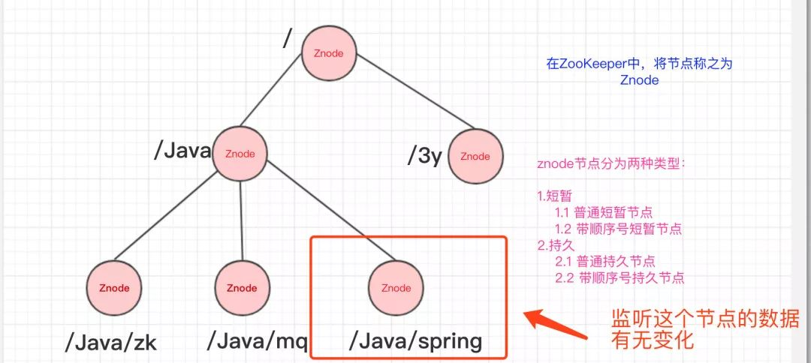
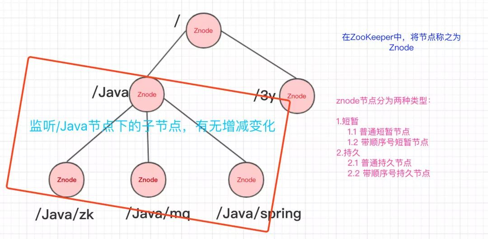
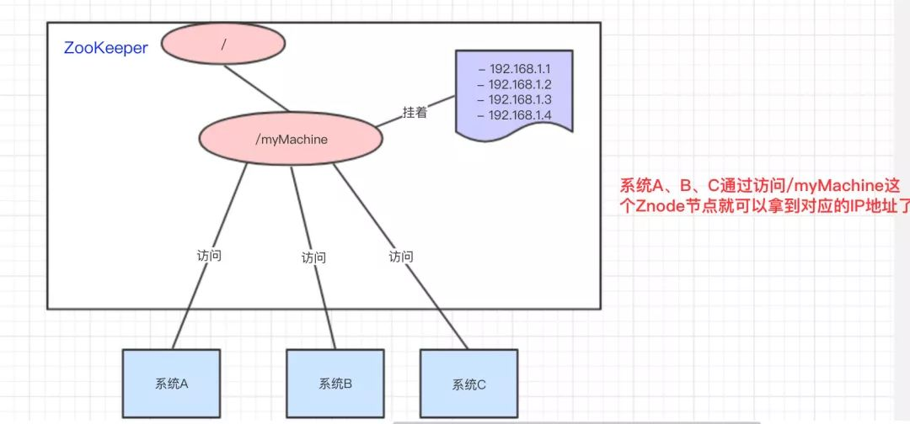
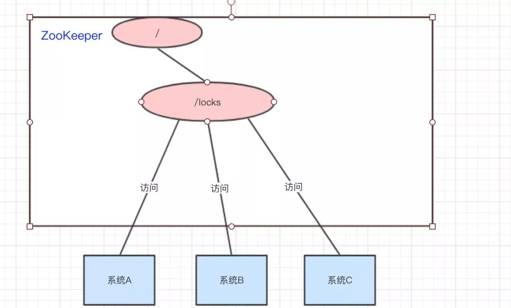

# Zookeeper 

>   [什么是Zookeeper](https://mp.weixin.qq.com/s/gphDLJMO3QcRoN3zkco4EA)
>
>   [分布式锁之Zookeeper](https://mp.weixin.qq.com/s/ZqQHWLfVD1Rz1agmH3LWrg)
>
>   [Zookeeper之ZAB协议](https://mp.weixin.qq.com/s/k0zAExTvMsrugCaNJxs7hQ)
>
>   [Zookeeper夺命连环9问](https://mp.weixin.qq.com/s/YawG0GqznDHaiHXZuTsCjA)

## Zookeeper简介

1. ZooKeeper主要**服务于分布式系统**，可以用ZooKeeper来做：统一配置管理、统一命名服务、分布式锁、集群管理。
2. 使用分布式系统就无法避免对节点管理的问题(需要实时感知节点的状态、对节点进行统一管理等等)，而由于这些问题处理起来可能相对麻烦和提高了系统的复杂性，ZooKeeper作为一个能够**通用**解决这些问题的中间件就应运而生了。

## ZooKeeper结构

ZooKeeper的数据结构，跟Unix文件系统非常类似，可以看做是一颗**树**，每个节点叫做**ZNode**。每一个节点可以通过**路径**来标识; ZooKeeper的节点我们称之为**Znode**，Znode分为**两种**类型：

1. **短暂/临时(Ephemeral)**：当客户端和服务端断开连接后，所创建的Znode(节点)**会自动删除**
2. **持久(Persistent)**：当客户端和服务端断开连接后，所创建的Znode(节点)**不会删除**

> ZooKeeper和Redis一样，也是C/S结构(分成客户端和服务端)

## Watch监听器

在上面我们已经简单知道了ZooKeeper的数据结构了，ZooKeeper还配合了**监听器**才能够做那么多事的。**常见**的监听场景有以下两项：

1. 监听Znode节点的**数据变化**
2. 监听子节点的**增减变化**

					监听Znode节点的数据有无变化

					监听子节点的增减变化

没错，通过**监听+Znode节点(持久/短暂[临时])**，ZooKeeper就可以玩出这么多花样了。

### 原理

Zookeeper可以提供分布式数据的发布/订阅功能，依赖的就是Wather监听机制。客户端可以向服务端注册Wather监听，服务端的指定事件触发之后，就会向客户端发送一个事件通知。他有几个特性：

1. 一次性：一旦一个Wather触发之后，Zookeeper就会将它从存储中移除
2. 客户端串行：客户端的Wather回调处理是串行同步的过程，不要因为一个Wather的逻辑阻塞整个客户端
3. 轻量：Wather通知的单位是WathedEvent，只包含通知状态、事件类型和节点路径，不包含具体的事件内容，具体的时间内容需要客户端主动去重新获取数据

主要流程如下：

1. 客户端向服务端注册Wather监听
2. 保存Wather对象到客户端本地的WatherManager中
3. 服务端Wather事件触发后，客户端收到服务端通知，从WatherManager中取出对应Wather对象执行回调逻辑

## ZooKeeper实现原理

### 统一配置管理

比如我们现在有三个系统A、B、C，他们有三份配置，分别是`ASystem.yml、BSystem.yml、CSystem.yml`，然后，这三份配置又非常类似，很多的配置项几乎都一样。

- 此时，如果我们要改变其中一份配置项的信息，很可能其他两份都要改。并且，改变了配置项的信息**很可能就要重启系统**

于是，我们希望把`ASystem.yml、BSystem.yml、CSystem.yml`相同的配置项抽取出来成一份**公用**的配置`common.yml`，并且即便`common.yml`改了，也不需要系统A、B、C重启。

做法：我们可以将`common.yml`这份配置放在ZooKeeper的Znode节点中，系统A、B、C监听着这个Znode节点有无变更，如果变更了，**及时**响应。系统A、B、C监听着ZooKeeper的节点，一旦common.yml内容有变化，及时响应

参考资料：

>[基于zookeeper实现统一配置管理_zookeeper统一配置管理_菜 头的博客-CSDN博客](https://blog.csdn.net/u011320740/article/details/78742625)

### 统一命名服务

统一命名服务的理解其实跟**域名**一样，是我们为这某一部分的资源给它**取一个名字**，别人通过这个名字就可以拿到对应的资源。

比如说，现在我有一个域名`www.java3y.com`，但我这个域名下有多台机器：

- 192.168.1.1
- 192.168.1.2
- 192.168.1.3
- 192.168.1.4

别人访问`www.java3y.com`即可访问到我的机器，而不是通过IP去访问。

### 分布式锁

我们可以使用ZooKeeper来实现分布式锁，那是怎么做的呢？？下面来看看：

系统A、B、C都去访问`/locks`节点

系统A、B、C都去访问locks节点

访问的时候会创建**带顺序号的临时/短暂**(`EPHEMERAL_SEQUENTIAL`)节点，比如，系统A创建了`id_000000`节点，系统B创建了`id_000002`节点，系统C创建了`id_000001`节点。

						创建出临时带顺序号的节点

接着，拿到`/locks`节点下的所有子节点(id_000000,id_000001,id_000002)，**判断自己创建的是不是最小的那个节点**

- 如果是，则拿到锁。
  - 释放锁：执行完操作后，把创建的节点给删掉

- 如果不是，则监听比自己要小1的节点变化

举个例子：

- 系统A拿到`/locks`节点下的所有子节点，经过比较，发现自己(`id_000000`)，是所有子节点最小的。所以得到锁
- 系统B拿到`/locks`节点下的所有子节点，经过比较，发现自己(`id_000002`)，不是所有子节点最小的。所以监听比自己小1的节点`id_000001`的状态
- 系统C拿到`/locks`节点下的所有子节点，经过比较，发现自己(`id_000001`)，不是所有子节点最小的。所以监听比自己小1的节点`id_000000`的状态
- ……
- 等到系统A执行完操作以后，将自己创建的节点删除(`id_000000`)。通过监听，系统C发现`id_000000`节点已经删除了，发现自己已经是最小的节点了，于是顺利拿到锁
- ….系统B如上

### 集群状态

经过上面几个例子，我相信大家也很容易想到ZooKeeper是怎么"**感知**"节点的动态新增或者删除的了。

还是以我们三个系统A、B、C为例，在ZooKeeper中创建**临时节点**即可：

						各维护一个临时节点

只要系统A挂了，那`/groupMember/A`这个节点就会删除，通过**监听**`groupMember`下的子节点，系统B和C就能够感知到系统A已经挂了。(新增也是同理)

除了能够感知节点的上下线变化，ZooKeeper还可以实现**动态选举Master**的功能。(如果集群是主从架构模式下)

原理也很简单，如果想要实现动态选举Master的功能，Znode节点的类型是带**顺序号的临时节点**(`EPHEMERAL_SEQUENTIAL`)就好了。Zookeeper会每次选举最小编号的作为Master，如果Master挂了，自然对应的Znode节点就会删除。然后让**新的最小编号作为Master**，这样就可以实现动态选举的功能了。

### 队列管理

Zookeeper 可以处理两种类型的队列：

1. 当一个队列的成员都聚齐时，这个队列才可用，否则一直等待所有成员到达，这种是同步队列。
2. 队列按照 FIFO 方式进行入队和出队操作，例如实现生产者和消费者模型。
   创建一个父目录 `/synchronizing`，每个成员都监控标志（Set Watch）位目录 /`synchronizing/start` 是否存在，然后每个成员都加入这个队列，加入队列的方式就是创建 /`synchronizing/member_i` 的临时目录节点，然后每个成员获取 `/synchronizing` 目录的所有目录节点，也就是 member_i。判断 i 的值是否已经是成员的个数，如果小于成员个数等待 `/synchronizing/start` 的出现，如果已经相等就创建 `/synchronizing/start`。

   >FIFO 队列用 Zookeeper 实现思路如下：
   >在特定的目录下创建 SEQUENTIAL 类型的子目录 /queue_i，这样就能保证所有成员加入队列时都是有编号的，出队列时通过 getChildren( ) 方法可以返回当前所有的队列中的元素，然后消费其中最小的一个，这样就能保证 FIFO。

## 分布式锁

>[分布式锁之Zookeeper](https://mp.weixin.qq.com/s/ZqQHWLfVD1Rz1agmH3LWrg)

### 死锁

### 羊群效应

### 临时节点顺序

### 性能没redis高

## 应用场景和实现

> [ZooKeeper 的应用场景 - 知乎 (zhihu.com)](https://zhuanlan.zhihu.com/p/59669985)

1. 数据发布/订阅
2. 负载均衡
3. 命名服务
4. 分布式协调/通知
5. 集群管理
6. Master 选举
7. 分布式锁
8. 分布式队列

## 数据一致性

>[阿里云二面：zookeeper一致性算法 (qq.com)](https://mp.weixin.qq.com/s/J2is0iapoxn5ZuQySX9SKw)

Zookeeper通过ZAB原子广播协议来实现数据的最终顺序一致性，他是一个类似2PC两阶段提交的过程。

由于Zookeeper只有Leader节点可以写入数据，如果是其他节点收到写入数据的请求，则会将之转发给Leader节点。

主要流程如下：

1. Leader收到请求之后，将它转换为一个proposal提议，并且为每个提议分配一个全局唯一递增的事务ID：zxid，然后把提议放入到一个FIFO的队列中，按照FIFO的策略发送给所有的Follower
2. Follower收到提议之后，以事务日志的形式写入到本地磁盘中，写入成功后返回ACK给Leader
3. Leader在收到超过半数的Follower的ACK之后，即可认为数据写入成功，就会发送commit命令给Follower告诉他们可以提交proposal了

ZAB包含两种基本模式，崩溃恢复和消息广播。

整个集群服务在启动、网络中断或者重启等异常情况的时候，首先会进入到崩溃恢复状态，此时会通过选举产生Leader节点，当集群过半的节点都和Leader状态同步之后，ZAB就会退出恢复模式。之后，就会进入消息广播的模式。

## Leader选举

Leader的选举可以分为两个方面，同时选举主要包含事务zxid和myid，节点主要包含LEADING\FOLLOWING\LOOKING3个状态。

1. 服务启动期间的选举
2. 服务运行期间的选举

**服务启动期间的选举**

1. 首先，每个节点都会对自己进行投票，然后把投票信息广播给集群中的其他节点
2. 节点接收到其他节点的投票信息，然后和自己的投票进行比较，首先zxid较大的优先，如果zxid相同那么则会去选择myid更大者，此时大家都是LOOKING的状态
3. 投票完成之后，开始统计投票信息，如果集群中过半的机器都选择了某个节点机器作为leader，那么选举结束
4. 最后，更新各个节点的状态，leader改为LEADING状态，follower改为FOLLOWING状态

**服务运行期间的选举**

如果开始选举出来的leader节点宕机了，那么运行期间就会重新进行leader的选举。

1. leader宕机之后，非observer节点都会把自己的状态修改为LOOKING状态，然后重新进入选举流程
2. 生成投票信息(myid,zxid)，同样，第一轮的投票大家都会把票投给自己，然后把投票信息广播出去
3. 接下来的流程和上面的选举是一样的，都会优先以zxid，然后选择myid，最后统计投票信息，修改节点状态，选举结束

## 选举后数据同步

那实际上Zookeeper在选举之后，Follower和Observer（统称为Learner）就会去向Leader注册，然后就会开始数据同步的过程。

数据同步包含3个主要值和4种形式。

PeerLastZxid：Learner服务器最后处理的ZXID

minCommittedLog：Leader提议缓存队列中最小ZXID

maxCommittedLog：Leader提议缓存队列中最大ZXID

### 直接差异化同步DIFF同步

如果PeerLastZxid在minCommittedLog和maxCommittedLog之间，那么则说明Learner服务器还没有完全同步最新的数据。

1. 首先Leader向Learner发送DIFF指令，代表开始差异化同步，然后把差异数据（从PeerLastZxid到maxCommittedLog之间的数据）提议proposal发送给Learner
2. 发送完成之后发送一个NEWLEADER命令给Learner，同时Learner返回ACK表示已经完成了同步
3. 接着等待集群中过半的Learner响应了ACK之后，就发送一个UPTODATE命令，Learner返回ACK，同步流程结束

### 先回滚再差异化同步TRUNC+DIFF同步

这个设置针对的是一个异常的场景。

如果Leader刚生成一个proposal，还没有来得及发送出去，此时Leader宕机，重新选举之后作为Follower，但是新的Leader没有这个proposal数据。

举个栗子：

假设现在的Leader是A，minCommittedLog=1，maxCommittedLog=3，刚好生成的一个proposal的ZXID=4，然后挂了。

重新选举出来的Leader是B，B之后又处理了2个提议，然后minCommittedLog=1，maxCommittedLog=5。

这时候A的PeerLastZxid=4，在(1,5)之间。

那么这一条只存在于A的提议怎么处理？

A要进行事务回滚，相当于抛弃这条数据，并且回滚到最接近于PeerLastZxid的事务，对于A来说，也就是PeerLastZxid=3。

流程和DIFF一致，只是会先发送一个TRUNC命令，然后再执行差异化DIFF同步。

### 仅回滚同步 TRUNC同步

针对PeerLastZxid大于maxCommittedLog的场景，流程和上述一致，事务将会被回滚到maxCommittedLog的记录。

这个其实就更简单了，也就是你可以认为TRUNC+DIFF中的例子，新的Leader B没有处理提议，所以B中minCommittedLog=1，maxCommittedLog=3。

所以A的PeerLastZxid=4就会大于maxCommittedLog了，也就是A只需要回滚就行了，不需要执行差异化同步DIFF了。

### 全量同步 SNAP同步

适用于两个场景：

1. PeerLastZxid小于minCommittedLog
2. Leader服务器上没有提议缓存队列，并且PeerLastZxid不等于Leader的最大ZXID

这两种场景下，Leader将会发送SNAP命令，把全量的数据都发送给Learner进行同步。

## 数据不一致的问题

还是会存在的，我们可以分成3个场景来描述这个问题。

**查询不一致**

因为Zookeeper是过半成功即代表成功，假设我们有5个节点，如果123节点写入成功，如果这时候请求访问到4或者5节点，那么有可能读取不到数据，因为可能数据还没有同步到4、5节点中，也可以认为这算是数据不一致的问题。

解决方案可以在读取前使用sync命令。

**leader未发送proposal宕机**

这也就是数据同步说过的问题。

leader刚生成一个proposal，还没有来得及发送出去，此时leader宕机，重新选举之后作为follower，但是新的leader没有这个proposal。

这种场景下的日志将会被丢弃。

**leader发送proposal成功，发送commit前宕机**

如果发送proposal成功了，但是在将要发送commit命令前宕机了，如果重新进行选举，还是会选择zxid最大的节点作为leader，因此，这个日志并不会被丢弃，会在选举出leader之后重新同步到其他节点当中。

## Zookeeper和Eureka、Consul、Nacos区别

|                 | **Nacos**                  | **Eureka**  | **Consul**        | **Zookeeper** |
| :-------------- | :------------------------- | :---------- | :---------------- | :------------ |
| 一致性协议      | CP+AP                      | AP          | CP                | CP            |
| 健康检查        | TCP/HTTP/MYSQL/Client Beat | Client Beat | TCP/HTTP/gRPC/Cmd | Keep Alive    |
| 负载均衡策略    | 权重/ metadata/Selector    | Ribbon      | Fabio             | —             |
| 雪崩保护        | 有                         | 有          | 无                | 无            |
| 自动注销实例    | 支持                       | 支持        | 不支持            | 支持          |
| 访问协议        | HTTP/DNS                   | HTTP        | HTTP/DNS          | TCP           |
| 监听支持        | 支持                       | 支持        | 支持              | 支持          |
| 多数据中心      | 支持                       | 支持        | 支持              | 不支持        |
| 跨注册中心同步  | 支持                       | 不支持      | 支持              | 不支持        |
| SpringCloud集成 | 支持                       | 支持        | 支持              | 不支持        |
| Dubbo集成       | 支持                       | 不支持      | 不支持            | 支持          |
| K8S集成         | 支持                       | 不支持      | 支持              | 不支持        |

### 
