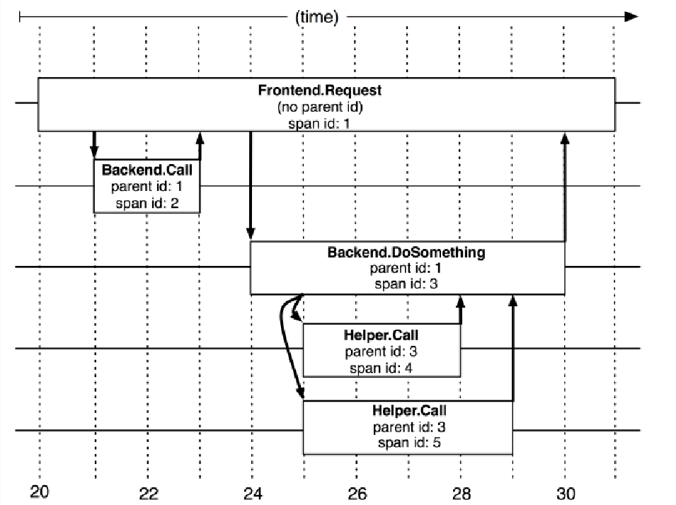

# 第十五节 项目

# 自我介绍

面试官你好 我叫陈肖贺  19年毕业 从事4年的java后端开发工作  前两年就职于杭州珞珈质子科技 主要是开发一款癌症放疗的监测软件  项目大概流程就是后端通过tcp实时监听硬件产生的数据 然后输入到训练好的机器学习模型内，预测出治疗结果 并生成报告。项目架构是Spring Boot、MySQL、Redis、Mybatis、Rabbit MQ(硬件数据是毫秒级的，用mq缓冲)、MongoDB。 

后面21年的时候公司资金问题运营不下去了 然后跳槽到创业惠康  头一年做的项目是一个互联网挂号项目 主要是患者通过手机预约号源 医生接诊后 通过音视频进行问诊  然后开具医嘱和处方 患者选择配送方式进行付款  大概是这么个流程 
项目架构是 SpringBoot 、Dubbo（rpc调用公）、Zookeeper 、MybatisPlus 、MySQL 、Redis 、Elasticsearch （储存日志和医生信息以及患者的病例资料）、Rocket MQ（
发送消息通知） 。 

然后中间还做了一个远程查房项目 主要是对接监护仪器  后端通过Netty框架实现的tcp请求来接受监护仪器的（心率，血压）数据，并且能自动报警（如果发现接受的数据不正常，然后我们就通过Rocketmq 向查房医生发生警报通知，及时性怎么保证，主要是保证消息不积压  通过增加消费组来进行 ）

## 技能介绍

1. 熟练掌握计算机网络，数据结构与算法，操作系统。

2. 熟练使用Linux，有Linux下开发的实际经验。

3. 熟练掌握Java 基础知识、Java 并发、JVM，有过 JVM 排查问题经历。

4. 熟练掌握 MySQL 数据库以及常见优化手段(比如索引、SQL 优化、读写分离&分库分表)，Redis 使用经验丰富，熟悉MongoDB。

5. 熟练掌握 Elasticsearch 的使用及原理。 
6. 熟练掌握Spring、Spring MVC、SpringBoot、MyBatis、Netty 等主流开发框架。

7. 熟练掌握分布式下的常见理论 CAP、BASE，熟悉 Paxos 算法和 Raft 算法

8. 熟练掌握 RPC (Dubbo)、分布式事务(Seata、 2PC、3PC、TCC) 、分布式锁(Zookeeper、 Redis)、分布式 id(Snowflake) 的使用及原理。

9. 熟悉 Spring Cloud 全家桶常见组件的使用。

10. 熟练掌握消息队列 Rocket MQ的使用及原理、有限流、降级、熔断的实战经验。

11. 熟练掌握 Git、Maven、Docker。

### 分布式链路追踪

- Span
  基本工作单元，一次链路调用(可以是RPC，DB等没有特定的限制)创建一个span，通过一个64位ID标识它，uuid较为方便，span中还有其他的数据，例如描述信息，时间戳，key-value对的(Annotation)tag信息，parent-id等，其中parent-id可以表示span调用链路来源。

  

  上图说明了span在一次大的跟踪过程中的表现。Dapper记录了span名称，以及每个span的ID和父ID，以重建在一次追踪过程中不同span之间的关系。如果一个span没有父ID就被称为root span。所有span都挂在一个特定的跟踪上，也共用一个跟踪id。

  

  上图展示了span之间的父子关系，根节点为A，子节点B设置自己的父节点为A，依次向下延伸。

- Trace:类似于树结构的Span集合，表示一条调用链路，存在唯一标识。比如运行的分布式大数据存储一次Trace就由一次请求组成。

### maven

- package 命令完成了项目编译、单元测试、打包功能，但没有把打好的可执行jar包（war包或其它形式的包）布署到本地maven仓库和远程maven私服仓库
- install 命令完成了项目编译、单元测试、打包功能，同时把打好的可执行jar包（war包或其它形式的包）布署到本地maven仓库，但没有布署到远程maven私服仓库
- deploy 命令完成了项目编译、单元测试、打包功能，同时把打好的可执行jar包（war包或其它形式的包）布署到本地maven仓库和远程maven私服仓库


## 项目一

### 项目介绍

### 技术栈

### 项目亮点

### 遇到的问题

## 项目一

### 项目介绍

### 技术栈

### 项目亮点

### 遇到的问题

## 项目一

### 项目介绍

### 技术栈

### 项目亮点

### 遇到的问题


## 多线程问题


## 千万级、亿级流量怎么处理？

> [压测都做些什么?](https://mp.weixin.qq.com/s/RzJkQuMAszkC8jw8hF-k1w)
>
>  [千万级、亿级流量怎么处理？](https://mp.weixin.qq.com/s/CxqnaB9cUemvCcWkw2nUcw)


“千万、亿级别的流量应该怎么处理”，这是一道很常见的面试题，我之前面试的时候也被问过几次，还被问过以下问题：

- 面对业务急剧增长你怎么处理？
- 业务量增长10倍、100倍怎么处理？
- 你们系统怎么支撑高并发的？
- 怎么设计一个高并发系统？
- 高并发系统都有什么特点？

面对超高的并发，首先硬件层面机器要能扛得住，其次架构设计做好微服务的拆分，代码层面各种缓存、削峰、解耦等等问题要处理好，数据库层面做好读写分离、分库分表，稳定性方面要保证有监控，熔断限流降级该有的必须要有，发生问题能及时发现处理。这样从整个系统设计方面就会有一个初步的概念。

### 微服务架构演化

在互联网早期的时候，单体架构就足以支撑起日常的业务需求，大家的所有业务服务都在一个项目里，部署在一台物理机器上。所有的业务包括你的交易系统、会员信息、库存、商品等等都夹杂在一起，当流量一旦起来之后，单体架构的问题就暴露出来了，机器挂了所有的业务全部无法使用了。


于是，集群架构的架构开始出现，单机无法抗住的压力，最简单的办法就是水平拓展横向扩容了，这样，通过负载均衡把压力流量分摊到不同的机器上，暂时是解决了单点导致服务不可用的问题。


但是随着业务的发展，在一个项目里维护所有的业务场景使开发和代码维护变得越来越困难，一个简单的需求改动都需要发布整个服务，代码的合并冲突也会变得越来越频繁，同时线上故障出现的可能性越大。微服务的架构模式就诞生了。


把每个独立的业务拆分开独立部署，开发和维护的成本降低，集群能承受的压力也提高了，再也不会出现一个小小的改动点需要牵一发而动全身了。

以上的点从高并发的角度而言，似乎都可以归类为通过服务拆分和集群物理机器的扩展提高了整体的系统抗压能力，那么，随之拆分而带来的问题也就是高并发系统需要解决的问题。

### RPC

微服务化的拆分带来的好处和便利性是显而易见的，但是与此同时各个微服务之间的通信就需要考虑了。传统HTTP的通信方式对性能是极大的浪费，这时候就需要引入诸如Dubbo类的RPC框架，基于TCP长连接的方式提高整个集群通信的效率。


我们假设原来来自客户端的QPS是9000的话，那么通过负载均衡策略分散到每台机器就是3000，而HTTP改为RPC之后接口的耗时缩短了，单机和整体的QPS就提升了。而RPC框架本身一般都自带负载均衡、熔断降级的机制，可以更好的维护整个系统的高可用性。

那么说完RPC，作为基本上国内普遍的选择Dubbo的一些基本原理就是接下来的问题。

#### Dubbo工作原理

1. 服务启动的时候，provider和consumer根据配置信息，连接到注册中心register，分别向注册中心注册和订阅服务
2. register根据服务订阅关系，返回provider信息到consumer，同时consumer会把provider信息缓存到本地。如果信息有变更，consumer会收到来自register的推送
3. consumer生成代理对象，同时根据负载均衡策略，选择一台provider，同时定时向monitor记录接口的调用次数和时间信息
4. 拿到代理对象之后，consumer通过代理对象发起接口调用
5. provider收到请求后对数据进行反序列化，然后通过代理调用具体的接口实现


#### Dubbo负载均衡策略

1. 加权随机：假设我们有一组服务器 servers = [A, B, C]，他们对应的权重为 weights = [5, 3, 2]，权重总和为10。现在把这些权重值平铺在一维坐标值上，[0, 5) 区间属于服务器 A，[5, 8) 区间属于服务器 B，[8, 10) 区间属于服务器 C。接下来通过随机数生成器生成一个范围在 [0, 10) 之间的随机数，然后计算这个随机数会落到哪个区间上就可以了。
2. 最小活跃数：每个服务提供者对应一个活跃数 active，初始情况下，所有服务提供者活跃数均为0。每收到一个请求，活跃数加1，完成请求后则将活跃数减1。在服务运行一段时间后，性能好的服务提供者处理请求的速度更快，因此活跃数下降的也越快，此时这样的服务提供者能够优先获取到新的服务请求。
3. 一致性hash：通过hash算法，把provider的invoke和随机节点生成hash，并将这个 hash 投射到 [0, 2^32 - 1] 的圆环上，查询的时候根据key进行md5然后进行hash，得到第一个节点的值大于等于当前hash的invoker。

图片来自dubbo官方

1. 加权轮询：比如服务器 A、B、C 权重比为 5:2:1，那么在8次请求中，服务器 A 将收到其中的5次请求，服务器 B 会收到其中的2次请求，服务器 C 则收到其中的1次请求。

#### 集群容错

1. Failover Cluster失败自动切换：dubbo的默认容错方案，当调用失败时自动切换到其他可用的节点，具体的重试次数和间隔时间可用通过引用服务的时候配置，默认重试次数为1也就是只调用一次。
2. Failback Cluster快速失败：在调用失败，记录日志和调用信息，然后返回空结果给consumer，并且通过定时任务每隔5秒对失败的调用进行重试
3. Failfast Cluster失败自动恢复：只会调用一次，失败后立刻抛出异常
4. Failsafe Cluster失败安全：调用出现异常，记录日志不抛出，返回空结果
5. Forking Cluster并行调用多个服务提供者：通过线程池创建多个线程，并发调用多个provider，结果保存到阻塞队列，只要有一个provider成功返回了结果，就会立刻返回结果
6. Broadcast Cluster广播模式：逐个调用每个provider，如果其中一台报错，在循环调用结束后，抛出异常。

### 消息队列

对于MQ的作用大家都应该很了解了，削峰填谷、解耦。依赖消息队列，同步转异步的方式，可以降低微服务之间的耦合。

对于一些不需要同步执行的接口，可以通过引入消息队列的方式异步执行以提高接口响应时间。在交易完成之后需要扣库存，然后可能需要给会员发放积分，本质上，发积分的动作应该属于履约服务，对实时性的要求也不高，我们只要保证最终一致性也就是能履约成功就行了。对于这种同类性质的请求就可以走MQ异步，也就提高了系统抗压能力了。


对于消息队列而言，怎么在使用的时候保证消息的可靠性、不丢失？

#### 消息可靠性

消息丢失可能发生在生产者发送消息、MQ本身丢失消息、消费者丢失消息3个方面。

#### **生产者丢失**

生产者丢失消息的可能点在于程序发送失败抛异常了没有重试处理，或者发送的过程成功但是过程中网络闪断MQ没收到，消息就丢失了。

由于同步发送的一般不会出现这样使用方式，所以我们就不考虑同步发送的问题，我们基于异步发送的场景来说。

异步发送分为两个方式：**异步有回调和异步无回调**，无回调的方式，生产者发送完后不管结果可能就会造成消息丢失，而通过异步发送+回调通知+本地消息表的形式我们就可以做出一个解决方案。以下单的场景举例。

1. 下单后先保存本地数据和MQ消息表，这时候消息的状态是发送中，如果本地事务失败，那么下单失败，事务回滚。
2. 下单成功，直接返回客户端成功，异步发送MQ消息
3. MQ回调通知消息发送结果，对应更新数据库MQ发送状态
4. JOB轮询超过一定时间（时间根据业务配置）还未发送成功的消息去重试
5. 在监控平台配置或者JOB程序处理超过一定次数一直发送不成功的消息，告警，人工介入。

一般而言，对于大部分场景来说异步回调的形式就可以了，只有那种需要完全保证不能丢失消息的场景我们做一套完整的解决方案。

**MQ丢失**

如果生产者保证消息发送到MQ，而MQ收到消息后还在内存中，这时候宕机了又没来得及同步给从节点，就有可能导致消息丢失。

比如RocketMQ：

RocketMQ分为同步刷盘和异步刷盘两种方式，默认的是异步刷盘，就有可能导致消息还未刷到硬盘上就丢失了，可以通过设置为同步刷盘的方式来保证消息可靠性，这样即使MQ挂了，恢复的时候也可以从磁盘中去恢复消息。

比如Kafka也可以通过配置做到：

```
acks=all 只有参与复制的所有节点全部收到消息，才返回生产者成功。这样的话除非所有的节点都挂了，消息才会丢失。
replication.factor=N,设置大于1的数，这会要求每个partion至少有2个副本
min.insync.replicas=N，设置大于1的数，这会要求leader至少感知到一个follower还保持着连接
retries=N，设置一个非常大的值，让生产者发送失败一直重试
```

虽然我们可以通过配置的方式来达到MQ本身高可用的目的，但是都对性能有损耗，怎样配置需要根据业务做出权衡。

**消费者丢失**

消费者丢失消息的场景：消费者刚收到消息，此时服务器宕机，MQ认为消费者已经消费，不会重复发送消息，消息丢失。

RocketMQ默认是需要消费者回复ack确认，而kafka需要手动开启配置关闭自动offset。

消费方不返回ack确认，重发的机制根据MQ类型的不同发送时间间隔、次数都不尽相同，如果重试超过次数之后会进入死信队列，需要手工来处理了。（Kafka没有这些）


#### 消息的最终一致性

事务消息可以达到分布式事务的最终一致性，事务消息就是MQ提供的类似XA的分布式事务能力。

半事务消息就是MQ收到了生产者的消息，但是没有收到二次确认，不能投递的消息。

实现原理如下：

1. 生产者先发送一条半事务消息到MQ
2. MQ收到消息后返回ack确认
3. 生产者开始执行本地事务
4. 如果事务执行成功发送commit到MQ，失败发送rollback
5. 如果MQ长时间未收到生产者的二次确认commit或者rollback，MQ对生产者发起消息回查
6. 生产者查询事务执行最终状态
7. 根据查询事务状态再次提交二次确认

最终，如果MQ收到二次确认commit，就可以把消息投递给消费者，反之如果是rollback，消息会保存下来并且在3天后被删除。


### 数据库

对于整个系统而言，最终所有的流量的查询和写入都落在数据库上，数据库是支撑系统高并发能力的核心。怎么降低数据库的压力，提升数据库的性能是支撑高并发的基石。主要的方式就是通过读写分离和分库分表来解决这个问题。

对于整个系统而言，流量应该是一个漏斗的形式。比如我们的日活用户DAU有20万，实际可能每天来到提单页的用户只有3万QPS，最终转化到下单支付成功的QPS只有1万。那么对于系统来说读是大于写的，这时候可以通过读写分离的方式来降低数据库的压力。


读写分离也就相当于数据库集群的方式降低了单节点的压力。而面对数据的急剧增长，原来的单库单表的存储方式已经无法支撑整个业务的发展，这时候就需要对数据库进行分库分表了。针对微服务而言垂直的分库本身已经是做过的，剩下大部分都是分表的方案了。

#### 水平分表

首先根据业务场景来决定使用什么字段作为分表字段(sharding_key)，比如我们现在日订单1000万，我们大部分的场景来源于C端，我们可以用user_id作为sharding_key，数据查询支持到最近3个月的订单，超过3个月的做归档处理，那么3个月的数据量就是9亿，可以分1024张表，那么每张表的数据大概就在100万左右。

比如用户id为100，那我们都经过hash(100)，然后对1024取模，就可以落到对应的表上了。

#### 分表后的ID唯一性

因为我们主键默认都是自增的，那么分表之后的主键在不同表就肯定会有冲突了。有几个办法考虑：

1. 设定步长，比如1-1024张表我们分别设定1-1024的基础步长，这样主键落到不同的表就不会冲突了。
2. 分布式ID，自己实现一套分布式ID生成算法或者使用开源的比如雪花算法这种
3. 分表后不使用主键作为查询依据，而是每张表单独新增一个字段作为唯一主键使用，比如订单表订单号是唯一的，不管最终落在哪张表都基于订单号作为查询依据，更新也一样。

#### 主从同步原理

1. master提交完事务后，写入binlog
2. slave连接到master，获取binlog
3. master创建dump线程，推送binglog到slave
4. slave启动一个IO线程读取同步过来的master的binlog，记录到relay log中继日志中
5. slave再开启一个sql线程读取relay log事件并在slave执行，完成同步
6. slave记录自己的binglog


由于mysql默认的复制方式是异步的，主库把日志发送给从库后不关心从库是否已经处理，这样会产生一个问题就是假设主库挂了，从库处理失败了，这时候从库升为主库后，日志就丢失了。由此产生两个概念。

**全同步复制**

主库写入binlog后强制同步日志到从库，所有的从库都执行完成后才返回给客户端，但是很显然这个方式的话性能会受到严重影响。

**半同步复制**

和全同步不同的是，半同步复制的逻辑是这样，从库写入日志成功后返回ACK确认给主库，主库收到至少一个从库的确认就认为写操作完成。

### 缓存

缓存作为高性能的代表，在某些特殊业务可能承担90%以上的热点流量。对于一些活动比如秒杀这种并发QPS可能几十万的场景，引入缓存事先预热可以大幅降低对数据库的压力，10万的QPS对于单机的数据库来说可能就挂了，但是对于如redis这样的缓存来说就完全不是问题。


以秒杀系统举例，活动预热商品信息可以提前缓存提供查询服务，活动库存数据可以提前缓存，下单流程可以完全走缓存扣减，秒杀结束后再异步写入数据库，数据库承担的压力就小的太多了。当然，引入缓存之后就还要考虑缓存击穿、雪崩、热点一系列的问题了。

#### 热key问题

所谓热key问题就是，突然有几十万的请求去访问redis上的某个特定key，那么这样会造成流量过于集中，达到物理网卡上限，从而导致这台redis的服务器宕机引发雪崩。


针对热key的解决方案：

1. 提前把热key打散到不同的服务器，降低压力
2. 加入二级缓存，提前加载热key数据到内存中，如果redis宕机，走内存查询

#### 缓存击穿

缓存击穿的概念就是单个key并发访问过高，过期时导致所有请求直接打到db上，这个和热key的问题比较类似，只是说的点在于过期导致请求全部打到DB上而已。

解决方案：

1. 加锁更新，比如请求查询A，发现缓存中没有，对A这个key加锁，同时去数据库查询数据，写入缓存，再返回给用户，这样后面的请求就可以从缓存中拿到数据了。
2. 将过期时间组合写在value中，通过异步的方式不断的刷新过期时间，防止此类现象。


#### 缓存穿透

缓存穿透是指查询不存在缓存中的数据，每次请求都会打到DB，就像缓存不存在一样。


针对这个问题，加一层布隆过滤器。布隆过滤器的原理是在你存入数据的时候，会通过散列函数将它映射为一个位数组中的K个点，同时把他们置为1。

这样当用户再次来查询A，而A在布隆过滤器值为0，直接返回，就不会产生击穿请求打到DB了。

显然，使用布隆过滤器之后会有一个问题就是误判，因为它本身是一个数组，可能会有多个值落到同一个位置，那么理论上来说只要我们的数组长度够长，误判的概率就会越低，这种问题就根据实际情况来就好了。


#### 缓存雪崩

当某一时刻发生大规模的缓存失效的情况，比如你的缓存服务宕机了，会有大量的请求进来直接打到DB上，这样可能导致整个系统的崩溃，称为雪崩。雪崩和击穿、热key的问题不太一样的是，他是指大规模的缓存都过期失效了。


针对雪崩几个解决方案：

1. 针对不同key设置不同的过期时间，避免同时过期
2. 限流，如果redis宕机，可以限流，避免同时刻大量请求打崩DB
3. 二级缓存，同热key的方案。

### 稳定性


**熔断**

比如营销服务挂了或者接口大量超时的异常情况，不能影响下单的主链路，涉及到积分的扣减一些操作可以在事后做补救。

**限流**

对突发如大促秒杀类的高并发，如果一些接口不做限流处理，可能直接就把服务打挂了，针对每个接口的压测性能的评估做出合适的限流尤为重要。

**降级**

熔断之后实际上可以说就是降级的一种，以熔断的举例来说营销接口熔断之后降级方案就是短时间内不再调用营销的服务，等到营销恢复之后再调用。

**预案**

一般来说，就算是有统一配置中心，在业务的高峰期也是不允许做出任何的变更的，但是通过配置合理的预案可以在紧急的时候做一些修改。

**核对**

针对各种分布式系统产生的分布式事务一致性或者受到攻击导致的数据异常，非常需要核对平台来做最后的兜底的数据验证。比如下游支付系统和订单系统的金额做核对是否正确，如果收到中间人攻击落库的数据是否保证正确性。

## 总结

其实可以看到，怎么设计高并发系统这个问题本身他是不难的，无非是基于你知道的知识点，从物理硬件层面到软件的架构、代码层面的优化，使用什么中间件来不断提高系统的抗压能力。

但是这个问题本身会带来更多的问题，微服务本身的拆分带来了分布式事务的问题，http、RPC框架的使用带来了通信效率、路由、容错的问题，MQ的引入带来了消息丢失、积压、事务消息、顺序消息的问题，缓存的引入又会带来一致性、雪崩、击穿的问题，数据库的读写分离、分库分表又会带来主从同步延迟、分布式ID、事务一致性的问题，而为了解决这些问题我们又要不断的加入各种措施熔断、限流、降级、离线核对、预案处理等等来防止和追溯这些问题。

### 海量IM聊天消息序列号-微信

普遍考虑的是使用整型自增序列号作为消息ID（即MsgId. ：这样既能保证消息的唯一性又方便保证顺序性，但问题是在分布式情况下是很难保证消息id的唯一性且顺序递增的，维护id生成的一致性难度太大了（网络延迟、调试出错等等都可能导致不同的机器取到的消息id存在碰撞的可能. 。    
实际上要解决消息的唯一性、顺序性问题，可以将一个技术点分解成两个：即将原先每条消息一个自增且唯一的消息ID分拆成两个关键属性——消息ID（msgId. 、消息序列号（seqId. ，即消息ID只要保证唯一性而不需要兼顾顺序性（比如直接用UUID. 、消息序列号只要保证顺序性而不需要兼顾唯一性（就像本文中微信的思路一样. ，这样的技术分解就能很好的解决原本一个消息ID既要保证唯一性又要保证顺序性的难题。   

#### 具体实现:

不考虑 seqsvr 的具体架构的话，它应该是一个巨大的64位数组，而我们每一个微信用户，都在这个大数组里独占一格8 bytes 的空间，这个格子就放着用户已经分配出去的最后一个 sequence：cur_seq。每个用户来申请sequence的时候，只需要将用户的cur_seq+=1，保存回数组，并返回给用户。  
任何一件看起来很简单的事，在海量的访问量下都会变得不简单。前文提到，seqsvr 需要保证分配出去的sequence 递增（数据可靠. ，还需要满足海量的访问量（每天接近万亿级别的访问. 。满足数据可靠的话，我们很容易想到把数据持久化到硬盘，但是按照目前每秒千万级的访问量（~10^7 QPS. ，基本没有任何硬盘系统能扛住。   
序列只要求递增，并没有要求连续，也就是说出现一大段跳跃是允许的（例如分配出的sequence序列：1,2,3,10,100,101. 。  
**一个简单优雅的策略**

1. 内存中储存最近一个分配出去的sequence：cur_seq，以及分配上限：max_seq；
2. 分配sequence时，将cur_seq++，同时与分配上限max_seq比较：如果cur_seq > max_seq，将分配上限提升一个步长max_seq += step，并持久化max_seq；
3. 重启时，读出持久化的max_seq，赋值给cur_seq。  

实际应用中每次提升的步长为10000，那么持久化的硬盘IO次数从之前~10^7 QPS降低到~10^3 QPS，处于可接受范围。在正常运作时分配出去的sequence是顺序递增的，只有在机器重启后，第一次分配的 sequence 会产生一个比较大的跳跃，跳跃大小取决于步长大小。

#### 分号段共享存储

请求带来的硬盘IO问题解决了，可以支持服务平稳运行，但该模型还是存在一个问题：重启时要读取大量的max_seq数据加载到内存中。  

我们可以简单计算下，以目前 uid（用户唯一ID. 上限2^32个、一个 max_seq 8bytes 的空间，数据大小一共为32GB，从硬盘加载需要不少时间。另一方面，出于数据可靠性的考虑，必然需要一个可靠存储系统来保存max_seq数据，重启时通过网络从该可靠存储系统加载数据。如果max_seq数据过大的话，会导致重启时在数据传输花费大量时间，造成一段时间不可服务。  

为了解决这个问题，我们引入号段 Section 的概念，uid 相邻的一段用户属于一个号段，而同个号段内的用户共享一个 max_seq，这样大幅减少了max_seq 数据的大小，同时也降低了IO次数。  

### 融云IM产品的聊天消息ID生成策略

ID 生成的核心需求：

1. 全局唯一；
2. 有序。

设计思路

融云消息数据的唯一 ID 长度采用 80 Bit。  

每 5 个 Bit ，进行一次 32 进制编码，转换为一个字符，字符取值范围是：数字 “2 ~ 9 ”和字母“A ~ B”。其中，已经去掉容易造成肉眼混淆的数字 0 和 1 （余下可用的数字就是8个了），及字母 O 和 I（余下可用的字母就是24个了），那么总可用字符就是32个（刚好可按32进制进行编码）。  

这样，80 Bit 可以转换为 16 个字符，再加上 3 个分隔符（ - ），将 16 个字符分为 4 组，最终得到一个 19 字符的唯一 ID ，形如：“ BD8U-FCOJ-LDC5-L789 ”。 这样设计，即可以保证生成的 ID 是有序的，也能方便阅读。  

1. 第一段 42 Bit：用于存放时间戳，最长可表示到 2109 年，足够开发者当前使用了。时间戳数据放在高位，可以保证生成的唯一 ID 是按时间有序的，这个是消息 ID 必须要满足的条件。

2. 第二段 12 Bit：用于存放自旋转 ID 。我们知道，时间戳的精度是到毫秒的，对于一套亿级 IM 系统来说，同一毫秒内产生多条消息太正常不过了，这个自旋 ID 就是在给落到同一毫秒内的消息进行自增编号。12 Bit 则意味着，同一毫秒内，单台主机中最多可以标识 4096（ 2 的 12 次方）条消息。

3. 第三段 4 Bit：用于标识会话类型。4 Bit ，最多可以标识 16 中会话，足够涵盖单聊、群聊、系统消息、聊天室、客服及公众号等常用会话类型。

4. 第四段 22 Bit：会话 ID 。如群聊中的群 ID ，聊天室中的聊天室 ID 等。与第三段会话类型组合在一起，可以唯一标识一个会话。其他的一些 ID 生成算法，会预留两段，分别用来标识数据中心编号和主机编号（如 SnowFlake 算法），我们并没有这样做，而是将这两段用来标识会话。这样，ID 生成可以直接融入到业务服务中，且不必关心服务所在的主机，做到无状态扩缩容。

### 消息模型、万人群、已读回执、消息撤回等

**名词**

1. seq：自增长的序列号，每条消息对应一个；
2. ImUnion：消息互通系统，用于企业微信与微信的消息打通；
3. 控制消息：即控制指令，属不可见消息，是复用消息通道的一种可靠通知机制；
4. 应用消息：系统应用下发的消息；
5. api 消息：第三方应用下发的消息；
6. appinfo：每条消息对应的唯一strid，全局唯一。同一条消息的appinfo在所有的接收方中是相同的。
   **针对toB场景的特有业务有：**

7. 消息鉴权：关系类型有群关系、同企业同事关系、好友关系、集团企业关系、圈子企业关系。收发消息双方需存在至少一种关系才允许发消息；
8. 回执消息：每条消息都需记录已读和未读人员列表，涉及频繁的状态读写操作；
9. 撤回消息：支持24小时的有效期撤回动作；
10. 消息存储：云端存储时间跨度长，最长可支持180天消息存储，数百TB用户消息需优化，减少机器成本；
11. 万人群聊：群人数上限可支持10000人，一条群消息就像一次小型的DDoS攻击；
12. 微信互通：两个异构的im系统直接打通，可靠性和一致性尤其重要。

**整体架构**
  

1. 接入层：统一入口，接收客户端的请求，根据类型转发到对应的CGI层。客户端可以通过长连或者短连连接wwproxy。活跃的客户端，优先用长连接发起请求，如果长连失败，则选用短连重试。

2. CGI层：http服务，接收wwproxy的数据包，校验用户的session状态，并用后台派发的秘钥去解包，如解密失败则拒绝请求。解密成功，则把明文包体转发到后端逻辑层对应的svr。

3. 逻辑层：大量的微服务和异步处理服务，使用自研的hikit rpc框架，svr之间使用tcp短连进行通信。进行数据整合和逻辑处理。和外部系统的通信，通过http协议，包括微信互通、手机厂商的推送平台等。

4. 存储层：消息存储是采用的是基于levelDB模型开发msgkv。SeqSvr是序列号生成器，保证派发的seq单调递增不回退，用于消息的收发协议。

**整体架构设计2：消息收发模型**


PS：如上图所示，发送方请求后台，把消息写入到接收方的存储，然后push通知接收方。接受方收到push，主动上来后台收消息。  

1. 实时触达：客户端通过与后台建立长连接，保证消息push的实时触达；
2. 及时通知：如果客户端长连接不在，进程被kill了，利用手机厂商的推送平台，推送通知，或者直接拉起进程进行收消息；
3. 消息可达：假如遇到消息洪峰，后台的push滞后，客户端有轮训机制进行兜底，保证消息可达；
4. 消息防丢：为了防止消息丢失，只要后台逻辑层接收到请求，保证消息写到接收方的存储，失败则重试。如果请求在CGI层就失败，则返回给客户端出消息红点；
5. 消息排重：客户端在弱网络的场景下，有可能请求已经成功写入存储，回包超时，导致客户端重试发起相同的消息，那么就造成消息重复。为了避免这种情况发生，每条消息都会生成唯一的appinfo，后台通过建立索引进行排重，相同的消息直接返回成功，保证存储只有一条。

**整体架构设计3：消息扩散写**

IM中消息分发的典型方式，一般有两种：

1. 扩散读；
2. 扩散写。

扩散读  

每条消息只存一份，群聊成员都读取同一份数据。  
优点：节省存储容量  
缺点：  

1. 每个用户需存储会话列表，通过会话id去拉取会话消息；
2. 收消息的协议复杂，每个会话都需要增量同步消息，则每个会话都需要维护一个序列号。  

扩散写  

即：每条消息存多份，每个群聊成员在自己的存储都有一份。    
优点：  
① 只需要通过一个序列号就可以增量同步所有消息，收消息协议简单；  
② 读取速度快，前端体验好；  
③ 满足更多ToB的业务场景：回执消息、云端删除。  

同一条消息，在每个人的视角会有不同的表现。例如：回执消息，发送方能看到已读未读列表，接受方只能看到是否已读的状态。云端删除某条群消息，在自己的消息列表消失，其他人还是可见。  

缺点：存储容量的增加。

企业微信采用了扩散写的方式，消息收发简单稳定。存储容量的增加，可以通过冷热分离的方案解决，冷数据存到廉价的SATA盘，扩散读体验稍差，协议设计也相对复杂些。

**扩散写的协议设计**


1. 每个用户只有一条独立的消息流。同一条消息多副本存在于每个用户的消息流中；
2. 每条消息有一个seq，在同个用户的消息流中，seq是单调递增的；
3. 客户端保存消息列表中最大seq，说明客户端已经拥有比该seq小的所有消息。若客户端被push有新消息到达，则用该seq向后台请求增量数据，后台把比此seq大的消息数据返回。

**系统稳定性设计1：柔性策略**
企业微信作为一款to B场景的聊天im工具，用于工作场景的沟通，有着较为明显的高峰效应  

高峰期系统压力大，偶发的网络波动或者机器过载，都有可能导致大量的系统失败。im系统对及时性要求比较高，没办法进行削峰处理。那么引入一些柔性的策略，保证系统的稳定性和可用性非常有必要。  

具体的做法就是启动过载保护策略：当svr已经达到最大处理能力的时候，说明处于一个过载的状态，服务能力会随着负载的增高而急剧下降。如果svr过载，则拒绝掉部分正常请求，防止机器被压垮，依然能对外服务。通过统计svr的被调耗时情况、worker使用情况等，判定是否处于过载状态。过载保护策略在请求高峰期间起到了保护系统的作用，防止雪崩效应。  

问题:  
上一小结中过载保护策略所带来的问题就是：系统过载返回失败，前端发消息显示失败，显示红点，会严重影响产品体验。

发消息是im系统的最基础的功能，可用性要求达到几乎100%，所以这个策略肯定需要优化。

解决方案  

尽管失败，也返回前端成功，后台保证最终成功。

1. 逻辑层hold住失败请求，返回前端成功，不出红点，后端异步重试，直至成功；
2. 为了防止在系统出现大面积故障的时候，重试请求压满队列，只hold住半小时的失败请求，半小时后新来的请求则直接返回前端失败；
3. 为了避免重试加剧系统过载，指数时间延迟重试；
4. 复杂的消息鉴权（好友关系，企业关系，集团关系，圈子关系. ，耗时严重，后台波动容易造成失败。如果并非明确鉴权不通过，则幂等重试；
5. 为了防止作恶请求，限制单个用户和单个企业的请求并发数。例如，单个用户的消耗worker数超过20%，则直接丢弃该用户的请求，不重试。


**系统稳定性设计2：系统解耦**

由于产品形态的原因，企业微信的消息系统，会依赖很多外部模块，甚至外部系统。我们的方案：与外部系统的交互，全设计成异步化。

群聊互通消息需经过ImUnion鉴权返回结果，前端用于展示消息是否成功发送。先让客户端成功，异步失败，则回调客户端使得出红点。

如果是非主流程，则异步重试保证成功，主流程不受影响，如消息审计同步功能。那么，只需要保证内部系统的稳定，发消息的主流程就可以不受影响。

**系统稳定性设计3：业务隔离**

企业微信的消息类型有多种：

1. 单聊群聊：基础聊天，优先级高；
2. api 消息：企业通过api接口下发的消息，有频率限制，优先级中；
3. 应用消息：系统应用下发的消息，例如公告，有频率限制，优先级中；
4. 控制消息：不可见的消息。例如群信息变更，会下发控制消息通知群成员，优先级低。

群聊按群人数，又分成3类：

1. 普通群：小于100人的群，优先级高；
2. 大 群：小于2000人的群，优先级中；
3. 万人群：优先级低。

重中之重：需要保证核心链路的稳定，就是企业内部的单聊和100人以下群聊，因为这个业务是最基础的，也是最敏感的，稍有问题，投诉量巨大。

其余的业务：互相隔离，减少牵连。按照优先级和重要程度进行隔离，对应的并发度也做了调整，尽量保证核心链路的稳定性。


### to B业务功能的设计与优化1：万人群

技术背景

企业微信的群人数上限是10000，只要群内每个人都发一条消息，那么扩散量就是10000 * 10000 = 1亿次调用，非常巨大。10000人投递完成需要的耗时长，影响了消息的及时性。  

既然超大群扩散写量大、耗时长，那么自然会想到：超大群是否可以单独拎出来做成扩散读呢。

下面分析一下超大群设计成单副本面临的难点：

1. 一个超大群，一条消息流，群成员都同步这条流的消息；
2. 假如用户拥有多个超大群，则需要同步多条流，客户端需维护每条流的seq；
3. 客户端卸载重装，并不知道拥有哪些消息流，后台需存储并告知；
4. 某个超大群来了新消息，需通知所有群成员，假如push没触达，客户端没办法感知有新消息，不可能去轮训所有的消息流。

**优化1：并发限制**

万人群的扩散量大，为了是消息尽可能及时到达，使用了多协程去分发消息。但是并不是无限制地加大并发度。

为了避免某个万人群的高频发消息，造成对整个消息系统的压力，消息分发以群id为维度，限制了单个群的分发并发度。消息分发给一个人的耗时是8ms，那么万人的总体耗时是80s，并发上限是5，那么消息分发完成需要16s。16s的耗时，在产品角度来看还、是可以接受的，大群对及时性不敏感。同时，并发度控制在合理范围内。  

除了限制单个群id的并发度，还限制了万人群的总体并发度。单台机，小群的worker数为250个，万人群的worker数为30。  

**优化2：合并插入**

工作场景的聊天，多数是在小群完成，大群用于管理员发通知或者老板发红包。

大群消息有一个常见的规律：平时消息少，会突然活跃。例如：老板在群里发个大红包，群成员起哄，此时就会产生大量的消息。

消息量上涨、并发度被限制、任务处理不过来，那么队列自然就会积压。积压的任务中可能存在多条消息需要分发给同一个群的群成员。

此时：可以将这些消息，合并成一个请求，写入到消息存储，消息系统的吞吐量就可以成倍增加。

**优化3：业务降级**
比如：群人员变更、群名称变动、群设置变更，都会在群内扩散一条不可见的控制消息。群成员收到此控制消息，则向后台请求同步新数据。

举个例子：一个万人群，由于消息过于频繁，对群成员造成骚扰，部分群成员选择退群来拒绝消息，假设有1000人选择退群。那么扩散的控制消息量就是1000w，用户收到控制消息就向后台请求数据，则额外带来1000w次的数据请求，造成系统的巨大压力。

控制消息在小群是很有必要的，能让群成员实时感知群信息的变更。

但是在大群：群信息的变更其实不那么实时，用户也感觉不到。所以结合业务场景，实施降级服务，控制消息在大群可以直接丢弃、不分发，减少对系统的调用。  

### to B业务功能的设计与优化2：回执消息

回执消息是办公场景经常用到的一个功能，能看到消息接受方的阅读状态。

一条回执消息的阅读状态会被频繁修改，群消息被修改的次数和群成员人数成正比。每天上亿条消息，读写频繁，请求量巨大，怎么保证每条消息在接受双方的状态是一致的是一个难点。  

实现方案

消息的阅读状态的存储方式两个方案。
方案一：

思路：利用消息存储，插入一条新消息指向旧消息，此新消息有最新的阅读状态。客户端收到新消息，则用新消息的内容替换旧消息的内容展示，以达到展示阅读状态的效果。

优点：复用消息通道，增量同步消息就可以获取到回执状态，复用通知机制和收发协议，前后端改造小。
缺点：
① 存储冗余，状态变更多次，则需插入多条消息；
② 收发双方都需要修改阅读状态（接收方需标志消息为已读状态. ，存在收发双方数据一致性问题。

缺点：
① 存储冗余，状态变更多次，则需插入多条消息；
② 收发双方都需要修改阅读状态（接收方需标志消息为已读状态. ，存在收发双方数据一致性问题。  

企业微信采用了方案一去实现，简单可靠、改动较小：存储冗余的问题可以通过LevelDB落盘的时候merge数据，只保留最终状态那条消息即可；


1. 每条消息都有一个唯一的msgid，只在单个用户内唯一，kv存储自动生成的；
2. 接收方b已读消息，客户端带上msgid=b1请求到后台；
3. 在接受方b新增一条消息，msgid=b2，referid=b1，指向msgid=b1的消息。并把msgid=b2的消息内容设置为消息已读。msgid=b1的消息体，存有发送方的msgid，即senderid=a1；
4. 发送方a，读出msgid=a1的消息体，把b加入到已读列表，把新的已读列表保存到消息体中，生成新消息msgid=a2，referid=a1，追加写入到a的消息流；
5. 接收方c已读同一条消息，在c的消息流走同样的逻辑；
6. 发送方a，读出msgid=a1的消息体，把c加入到已读列表，把新的已读列表保存到消息体中，生成新消息msgid=a3，referid=a1，追加写入到a的消息流。a3>a2，以msgid大的a3为最终状态。

优化1：异步化

接受方已读消息，让客户端同步感知成功，但是发送方的状态没必要同步修改。因为发送方的状态修改情况，接受方没有感知不到。那么，可以采用异步化的策略，降低同步调用耗时。

1. 接受方的数据同步写入，让客户端马上感知消息已读成功；
2. 发送方的数据异步写入，减少同步请求；
3. 异步写入通过重试来保证成功，达到状态最终一致的目的。


优化2：合并处理

客户端收到大量消息，并不是一条一条消息已读确认，而是多条消息一起已读确认。为了提高回执消息的处理效率，可以对多条消息合并处理。

读写覆盖解决

发送方的消息处理方式是先把数据读起来，修改后重新覆盖写入存储。接收方有多个，那么就会并发写发送方数据，避免不了出现覆盖写的问题。

流程如下：

1. 发送方某条消息的已读状态是X；
2. 接收方a确认已读，已读状态修改为X+a；
3. 接收方b确认已读，已读状态修改为X+b；
4. 接收方a的状态先写入，接受方b的状态后写入。这最终状态为X+b；
5. 其实正确的状态是X+a+b。

处理这类问题，无非就一下几种办法。

方案一：因为并发操作是分布式，那么可以采用分布式锁的方式保证一致。操作存储之前，先申请分布式锁。这种方案太重，不适合这种高频多账号的场景。

方案二：带版本号读写。一个账号的消息流只有一个版本锁，高频写入的场景，很容易产生版本冲突，导致写入效率低下。

方案三：mq串行化处理。能避免覆盖写问题，关键是在合并场景起到很好的作用。同一个账号的请求串行化，就算出现队列积压，合并的策略也能提高处理效率。

企业微信采用了方案三，相同id的用户请求串行化处理，简单易行，逻辑改动较少。

### to B业务功能的设计与优化3：撤回消息

技术难点

“撤回消息”相当于更新原消息的状态，是不是也可以通过referid的方式去指向呢？

回执消息分析过：通过referid指向，必须要知道原消息的msgid。

区别于回执消息：撤回消息需要修改所有接收方的消息状态，而不仅仅是发送方和单个接收方的。消息扩散写到每个接收方的消息流，各自的消息流对应的msgid是不相同的，如果沿用referid的方式，那就需要记录所有接收方的msgid。


分析：撤回消息比回执消息简单的是，撤回消息只需要更新消息的状态，而不需要知道原消息的内容。接收方的消息的appinfo都是相同的，可以通过appinfo去做指向。

协议流程：

1. 用户a、b、c，都存在同一条消息，appinfo=s，sendtime=t；
2. a撤回该消息，则在a的消息流插入一条撤回的控制消息，消息体包含{appinfo=s,sendtime=t}；
3. 客户端sync到撤回的控制消息，获取到消息体的appinfo与sendtime，把本地appinfo=s且sendtime=t的原消息显示为撤回状态，并删除原消息数据。之所以引入sendtime字段，是为了防止appinfo碰撞，加的双重校验；
4. 接收方撤回流程和发送方一致，也是通过插入撤回的控制消息。

### 一套海量在线用户的移动端IM架构设计实践分享

总体架构设计


1. 用户端：移动端重点是移动端，支持IOS/Android系统，包括IM App，嵌入消息功能的瓜子App，未来还可能接入客服系统；
2. 用户端API：针对TCP协议，提供IOS/Android开发SDK。对于H5页面，提供WebSocket接口；
3. 接入层：接入层主要任务是保持海量用户连接（接入）、攻击防护、将海量连接整流成少量TCP连接与逻辑层通讯；
4. 逻辑层：逻辑层负责IM系统各项功能的核心逻辑实现。包括单聊（c2c）、上报(c2s)、推送(s2c)、群聊(c2g)、离线消息、登录授权、组织机构树等等内容；
5. 存储层：存储层负责缓存或存储IM系统相关数据，主要包括用户状态及路由（缓存），消息数据（MySQL也可采用NoSql，如MangoDB），文件数据（文件服务器）。

典型算法逻辑


客户端从Iplist服务获取接入层IP地址（也可采用域名的方式解析得到接入层IP地址），建立与接入层的连接（可能为短连接），从而实现客户端与IM服务器的数据交互；业务线服务器可以通过服务器端API建立与IM服务器的联系，向客户端推送消息；客户端上报到业务服务器的消息，IM服务器会通过mq投递给业务服务器。

登录授权(auth)流程原理

1. 客户端通过统一登录系统实现登录，得到token。
2. 客户端用uid和token向msg-gate发起授权验证请求。
3. msg-gate同步调用msg-logic的验证接口
4. msg-logic请求sso系统验证token合法性
5. msg-gate得到登录结果后，设置session状态，并向客户端返回授权结果。

登出(logout)流程原理

1. 客户端发起logout请求，msg-gate设置对应Peer为未登录状态。
2. Msg-gate给客户端一个ack响应。
3. Msg-gate通知msg-logic用户登出。

踢人(kickout)流程原理

用户请求授权时，可能在另一个设备（同类型设备）开着软件处于登录状态，这种情况需要系统将那个设备踢下线，

1-5步，参看Auth流程。  
6、Logic检索Redis，查看是否该用户在其他地方登录。  
7、如果在其他地方登录，发起kickout命令。（如果没有登录，整个流程结束）  
8、Gate向用户发起kickout请求，并在短时间内（确保客户端收到kickout数据）关闭socket连接。  

上报(c2s)流程原理


1、客户端向gate发送数据；  
2、Gate回一个ack包，向客户端确认已经收到数据；  
3、Gate将数据包传递给logic；  
4、Logic根据数据投递目的地，选择对应的mq队列进行投递；  
5、业务服务器得到数据。  

推送(s2c)流程原理  


1、业务线调用push数据接口sendMsg  
2、Logic向redis检索目标用户状态。如果目标用户不在线，丢弃数据（未来可根据业务场景定制化逻辑）；如果用户在线，查询到用户连接的接入层gate  
3、Logic向用户所在的gate发送数据  
4、Gate向用户推送数据。（如果用户不在线，通知logic用户不在线）  
5、客户端收到数据后向gate发送ack反馈  
6、Gate将ack信息传递给logic层，用于其他可能的逻辑处理（如日志，确认送达等）  

单对单聊天(c2c)流程原理


1、App1向gate1发送信息（信息最终要发给App2）  
2、Gate1将信息投递给logic  
3、Logic收到信息后，将信息进行存储  
4、存储成功后，logic向gate1发送ack  
5、Gate1将ack信息发给App1  
6、Logic检索redis，查找App2状态。如果App2未登录，流程结束  
7、如果App2登录到了gate2，logic将消息发往gate2  
8、Gate2将消息发给App2（如果发现App2不在线，丢弃消息即可，这种概率极低，后续离线消息可保证消息不丢）  
9、App2向gate2发送ack  
10、Gate2将ack信息发给logic  
11、Logic将消息状态设置为已送达。 

群聊(c2g)流程原理

采用扩散写（而非扩散读）的方式。

群聊是多人社交的基本诉求，一个群友在群内发了一条消息：  
1）在线的群友能第一时间收到消息；  
2）离线的群友能在登陆后收到消息。  

由于“消息风暴扩散系数”的存在，群消息的复杂度要远高于单对单消息。

群基础表：用来描述一个群的基本信息
im_group_msgs(group_id, group_name,create_user, owner, announcement, create_time)

群成员表：用来描述一个群里有多少成员
im_group_users(group_id, user_id)

用户接收消息表：用来描述一个用户的所有收到群消息（与单对单消息表是同一个表）
im_message_recieve（msg_id,msg_from,msg_to, group_id，msg_seq, msg_content, send_time, msg_type, deliverd, cmd_id）

用户发送消息表：用来描述一个用户发送了哪些消息
im_message_send (msg_id,msg_from,msg_to, group_id，msg_seq, msg_content, send_time, msg_type, cmd_id)

业务场景举例：
1）一个群中有x,A,B,C,D共5个成员，成员x发了一个消息；  
2）成员A与B在线，期望实时收到消息；  
3）成员C与D离线，期望未来拉取到离线消息。  


群聊流程详细说明

1、X向gate发送信息（信息最终要发给这个群，A、B在线）  
2、Gate将消息发给logic  
3、存储消息到im_message_send表，按照msg_from水平分库  
4、回ack  
5、回ack  
6、Logic检索数据库（需要使用缓存），获得群成员列表  
7、存储每个用户的消息数据（用户视图），按照msg_to水平分库(并发、批量写入)。  
8、查询用户在线状态及位置  
9、Logic向gate投递消息  
10、Gate向用户投递消息  
11、App返回收到消息的ack信息  
12、Gate向logic传递ack信息  
13、向缓存（Hash）中更新收到ack的时间。然后在通过一个定时任务，每隔一定时间，将数据更新到数据库（注意只需要写入时间段内有变化的数据）。  

拉取离线消息流程原理

将gate和logic合并为im-server，拉取离线消息流程如下：  
1、App端登录成功后（或业务触发拉取离线消息），向IM系统发起拉离线消息请求。传递3个主要参数，uid表明用户；msgid表明当前收到的最大消息id（如果没收到过消息，或拿不到最大消息id则msgid=0）即可；size表示每次拉取条数（这个值也可以由服务器端控制）。  
2、假设msgid==0，什么都不做。（参看第6步骤）  
3、Im-server查询用户前10条离线消息  
4、将离线消息推给用户。假设这10条离线消息最大 msgid=110。  
5、App得到数据，判断得到的数据不为空（表明可能没有拉完离线数据，不用<10条做判断拉完条件,因为服务端需要下下次拉离线的请求来确定这次数据已送达），继续发起拉取操作。Msgid=110(取得到的离线消息中最大的msgid)。  
6、Im-server删除该用户msgid<110的离线消息（或者标记为已送达）。  
7、查询msgid>110的钱10条离线数据。  
8、返回给App  
……  
N-1、查询msgid>140的离线数据，0条（没有离线数据了）。  
N  、将数据返回App，App判断拉取到0条数据，结束离线拉取过程。  

后台PUSH（推送）  
iOS采用APNS，Android真后台保活，同时增加米推、个推。基本思路：push提示信息，App通过拉离线获得真实消息。

水平分库


## 加分项

[【SPI】定制按需加载的SPI - 知乎 (zhihu.com)](https://zhuanlan.zhihu.com/p/571244036)

bitmap 统计活跃用户、通过 sorted set 维护排行榜