# Mybatis源码

## 项目结构一览

### 概述

本文主要分享 MyBatis 的项目结构。
希望通过本文能让胖友对 MyBatis 的整体项目有个简单的了解。

另外，[http://www.mybatis.org](http://www.mybatis.org/mybatis-3/zh/index.html) 提供了 MyBatis 非常不错的中文文档。如果胖友对 MyBatis 碰到一些使用上的问题，可以常常翻阅。

在拉取 MyBatis 项目后，我们会发现拆分了好多包。是不是内心一紧，产生了恐惧感？不要方，我们就是继续怼。


### 代码统计

这里先分享一个小技巧。笔者在开始源码学习时，会首先了解项目的代码量。

第一种方式，使用 [IDEA Statistic](https://plugins.jetbrains.com/plugin/4509-statistic) 插件，统计整体代码量。


我们可以粗略的看到，总的代码量在 21441 行。还是在可接受的范围。

第二种方式，使用 [Shell 脚本命令逐个 Maven 模块统计](http://blog.csdn.net/yhhwatl/article/details/52623879) 。

一般情况下，笔者使用 find . -name "*.java"|xargs cat|grep -v -e ^$ -e ^\s*\/\/.*$|wc -l 。这个命令只过滤了部分注释，所以相比 [IDEA Statistic](https://plugins.jetbrains.com/plugin/4509-statistic) 会偏多。

如下是艿艿 cd 到每个包下，然后执行脚本统计后的结果：

Statistic 统计代码量

### 整体架构

老艿艿：本小节的内容，笔者会基于 [《MyBatis 技术内幕》](https://item.jd.com/12125531.html) 的 [「1.4 MyBatis整体架构」](http://svip.iocoder.cn/MyBatis/intro/) 小节来编写。

这本书非常不错，笔者在死磕的源码的时候，帮助灰常大。

MyBatis 的整体架构分为三层：

1. 基础支持层

2. 核心处理层

3. 接口层

整体架构

### 基础支持层

基础支持层，包含整个 MyBatis 的基础模块，这些模块为核心处理层的功能提供了良好的支撑。

#### 反射模块

对应 reflection 包。

Java 中的反射虽然功能强大，但对大多数开发人员来说，写出高质量的反射代码还是 有一定难度的。MyBatis 中专门提供了反射模块，该模块对 Java 原生的反射进行了良好的封装，提了更加简洁易用的 API，方便上层使调用，并且对反射操作进行了一系列优化，例如缓存了类的元数据，提高了反射操作的性能。

#### 类型模块

对应 type 包。

① MyBatis 为简化配置文件提供了别名机制，该机制是类型转换模块的主要功能之一。

② 类型转换模块的另一个功能是实现 JDBC 类型与 Java 类型之间的转换，该功能在为 SQL 语句绑定实参以及映射查询结果集时都会涉及：

在为 SQL 语句绑定实参时，会将数据由 Java 类型转换成 JDBC 类型。

而在映射结果集时，会将数据由 JDBC 类型转换成 Java 类型。

#### 日志模块

对应 logging 包。

无论在开发测试环境中，还是在线上生产环境中，日志在整个系统中的地位都是非常重要的。良好的日志功能可以帮助开发人员和测试人员快速定位 Bug 代码，也可以帮助运维人员快速定位性能瓶颈等问题。目前的 Java 世界中存在很多优秀的日志框架，例如 Log4j、 Log4j2、Slf4j 等。

MyBatis 作为一个设计优良的框架，除了提供详细的日志输出信息，还要能够集成多种日志框架，其日志模块的一个主要功能就是集成第三方日志框架。

####  IO 模块

对应 io 包。

资源加载模块，主要是对类加载器进行封装，确定类加载器的使用顺序，并提供了加载类文件以及其他资源文件的功能 。

#### 解析器模块

对应 parsing 包。

解析器模块，主要提供了两个功能:

一个功能，是对 [XPath](http://www.w3school.com.cn/xpath/index.asp) 进行封装，为 MyBatis 初始化时解析 mybatis-config.xml 配置文件以及映射配置文件提供支持。

另一个功能，是为处理动态 SQL 语句中的占位符提供支持。

#### 数据源模块

对应 datasource 包。

数据源是实际开发中常用的组件之一。现在开源的数据源都提供了比较丰富的功能，例如，连接池功能、检测连接状态等，选择性能优秀的数据源组件对于提升 ORM 框架乃至整个应用的性能都是非常重要的。

MyBatis 自身提供了相应的数据源实现，当然 MyBatis 也提供了与第三方数据源集成的接口，这些功能都位于数据源模块之中。

#### 事务模块

对应 transaction 包。

MyBatis 对数据库中的事务进行了抽象，其自身提供了相应的事务接口和简单实现。

在很多场景中，MyBatis 会与 Spring 框架集成，并由 Spring 框架管理事务。

#### 缓存模块

对应 cache 包。

在优化系统性能时，优化数据库性能是非常重要的一个环节，而添加缓存则是优化数据库时最有效的手段之一。正确、合理地使用缓存可以将一部分数据库请求拦截在缓存这一层。

MyBatis 中提供了一级缓存和二级缓存，而这两级缓存都是依赖于基础支持层中的缓 存模块实现的。这里需要读者注意的是，MyBatis 中自带的这两级缓存与 MyBatis 以及整个应用是运行在同一个 JVM 中的，共享同一块堆内存。如果这两级缓存中的数据量较大， 则可能影响系统中其他功能的运行，所以当需要缓存大量数据时，优先考虑使用 Redis、Memcache 等缓存产品。

#### Binding 模块

对应 binding 包。

在调用 SqlSession 相应方法执行数据库操作时，需要指定映射文件中定义的 SQL 节点，如果出现拼写错误，我们只能在运行时才能发现相应的异常。为了尽早发现这种错误，MyBatis 通过 Binding 模块，将用户自定义的 Mapper 接口与映射配置文件关联起来，系统可以通过调用自定义 Mapper 接口中的方法执行相应的 SQL 语句完成数据库操作，从而避免上述问题。

值得读者注意的是，开发人员无须编写自定义 Mapper 接口的实现，MyBatis 会自动为其创建动态代理对象。在有些场景中，自定义 Mapper 接口可以完全代替映射配置文件，但有的映射规则和 SQL 语句的定义还是写在映射配置文件中比较方便，例如动态 SQL 语句的定义。

#### 注解模块

对应 annotations 包。

随着 Java 注解的慢慢流行，MyBatis 提供了注解的方式，使得我们方便的在 Mapper 接口上编写简单的数据库 SQL 操作代码，而无需像之前一样，必须编写 SQL 在 XML 格式的 Mapper 文件中。虽然说，实际场景下，大家还是喜欢在 XML 格式的 Mapper 文件中编写响应的 SQL 操作。

#### 异常模块

对应 exceptions 包。

定义了 MyBatis 专有的 PersistenceException 和 TooManyResultsException 异常。

### 核心处理层

在核心处理层中，实现了 MyBatis 的核心处理流程，其中包括 MyBatis 的初始化以及完成一次数据库操作的涉及的全部流程 。

#### 配置解析

对应 builder 和 mapping 模块。前者为配置解析过程，后者主要为 SQL 操作解析后的映射。

在 MyBatis 初始化过程中，会加载 mybatis-config.xml 配置文件、映射配置文件以及 Mapper 接口中的注解信息，解析后的配置信息会形成相应的对象并保存到 Configuration 对象中。例如：

<resultMap>节点(即 ResultSet 的映射规则) 会被解析成 ResultMap 对象。

<result> 节点(即属性映射)会被解析成 ResultMapping 对象。

之后，利用该 Configuration 对象创建 SqlSessionFactory对象。待 MyBatis 初始化之后，开发人员可以通过初始化得到 SqlSessionFactory 创建 SqlSession 对象并完成数据库操作。

#### SQL 解析

对应 scripting 模块。

拼凑 SQL 语句是一件烦琐且易出错的过程，为了将开发人员从这项枯燥无趣的工作中 解脱出来，MyBatis 实现动态 SQL 语句的功能，提供了多种动态 SQL语句对应的节点。例如<where> 节点、<if> 节点、<foreach> 节点等 。通过这些节点的组合使用， 开发人 员可以写出几乎满足所有需求的动态 SQL 语句。

MyBatis 中的 scripting 模块，会根据用户传入的实参，解析映射文件中定义的动态 SQL 节点，并形成数据库可执行的 SQL 语句。之后会处理 SQL 语句中的占位符，绑定用户传入的实参。

####  SQL 执行:star:

对应 executor 和 cursor 模块。前者对应执行器，后者对应执行结果的游标。

SQL 语句的执行涉及多个组件 ，其中比较重要的是 Executor、StatementHandler、ParameterHandler 和 ResultSetHandler 。

**·** Executor 主要负责维护一级缓存和二级缓存，并提供事务管理的相关操作，它会将数据库相关操作委托给 StatementHandler完成。

**·** StatementHandler 首先通过 ParameterHandler 完成 SQL 语句的实参绑定，然后通过 java.sql.Statement 对象执行 SQL 语句并得到结果集，最后通过 ResultSetHandler 完成结果集的映射，得到结果对象并返回。

整体过程如下图：


### 插件层

对应 plugin 模块。

Mybatis 自身的功能虽然强大，但是并不能完美切合所有的应用场景，因此 MyBatis 提供了插件接口，我们可以通过添加用户自定义插件的方式对 MyBatis 进行扩展。用户自定义插件也可以改变 Mybatis 的默认行为，例如，我们可以拦截 SQL 语句并对其进行重写。

由于用户自定义插件会影响 MyBatis 的核心行为，在使用自定义插件之前，开发人员需要了解 MyBatis 内部的原理，这样才能编写出安全、高效的插件。

### 接口层

对应 session 模块。

接口层相对简单，其核心是 SqlSession 接口，该接口中定义了 MyBatis 暴露给应用程序调用的 API，也就是上层应用与 MyBatis 交互的桥梁。接口层在接收到调用请求时，会调用核心处理层的相应模块来完成具体的数据库操作。

### 其它层

这块，严格来说，不能叫做一个层。考虑到统一，就简单这么命名把。哈哈哈。

#### JDBC 模块

对应 jdbc 包。

JDBC 单元测试工具类。所以，不感兴趣的同学，已经可以忽略 1236 行代码了。

#### Lang 模块

对应 lang 包。

看不懂具体用途，暂时误会。

### 总结

总的来说，MyBatis 的代码，还是比较简单易懂。并且，看着包名，基本也能猜到大体的用途。在网络上找了一个总结的图，大家瞅瞅：

FROM [《mybatis 源码分析之整体架构分析》](http://zeng233.github.io/2015/08/20/2.1mybatis源码分析之前言/)


> 后续的文章，和 [《MyBatis 技术内幕》](https://item.jd.com/12125531.html) 一样，按照基础支持层 => 核心处理层 => 接口层的顺序，逐步详细解析。虽然说，艿艿也想直接开始干核心处理层，但是考虑框架是自下而上，还是一点一点来。当然，热情的胖友，也可以从核心处理层开始看，然后看到不懂的地方，回到基础支持层。
>
> 如果对 MyBatis 不熟悉的胖友，推荐阅读下田小波的 [《MyBatis 源码分析系列文章导读》](https://www.tianxiaobo.com/2018/07/16/MyBatis-源码分析系列文章导读/) 。
>
> 同时，也推荐阅读无忌的 [《MyBatis 源码解读之源码结构》](https://my.oschina.net/wenjinglian/blog/1625437) 。
>


## 解析器模块

### 1. 概述

本文，我们来分享 MyBatis 的解析器模块，对应 parsing 包。如下图所示：


在 [项目结构一览](#项目结构一栏) 中，简单介绍了这个模块如下：

解析器模块，主要提供了两个功能:

一个功能，是对 [XPath](http://www.w3school.com.cn/xpath/index.asp) 进行封装，为 MyBatis 初始化时解析 mybatis-config.xml 配置文件以及映射配置文件提供支持。

另一个功能，是为处理动态 SQL 语句中的占位符提供支持。

下面，我们就来看看具体的源码。因为 parsing 是基础支持层，所以建议胖友在我们讲解到的类和方法中，打折断点一起来了解。

### 2. XPathParser

`org.apache.ibatis.parsing.XPathParser `，基于 Java XPath 解析器，用于解析 `MyBatis mybatis-config.xml `和 `**Mapper.xml `等 XML 配置文件。属性如下：

```java
    // XPathParser.java  
    /**
     * XML Document 对象
     */
    private final Document document;
    /**
     * 是否校验
     */
    private boolean validation;
    /**
     * XML 实体解析器
     */
    private EntityResolver entityResolver;
    /**
     * 变量 Properties 对象
     */
    private Properties variables;
    /**
     * Java XPath 对象
     */
    private XPath xpath;/**/
```


1. document 属性，XML 被解析后，生成的 org.w3c.dom.Document 对象。
2. validation 属性，是否校验 XML 。一般情况下，值为 true 。
3. entityResolver 属性，`org.xml.sax.EntityResolver` 对象，XML 实体解析器。默认情况下，对 XML 进行校验时，会基于 XML 文档开始位置指定的 DTD 文件或 XSD 文件。例如说，解析 mybatis-config.xml 配置文件时，会加载` http://mybatis.org/dtd/mybatis-3-config.dtd `这个 DTD 文件。但是，如果每个应用启动都从网络加载该 DTD 文件，势必在弱网络下体验非常下，甚至说应用部署在无网络的环境下，还会导致下载不下来，那么就会出现 XML 校验失败的情况。所以，在实际场景下，MyBatis 自定义了 EntityResolver 的实现，达到使用本地 DTD 文件，从而避免下载网络 DTD 文件的效果。详细解析，见 [「3. XMLMapperEntityResolver」](http://svip.iocoder.cn/MyBatis/parsing-package/) 。
4. 另外，Spring 也自定义了 EntityResolver 的实现，感兴趣的胖友，可以看看 [《【死磕 Spring】—— IoC 之获取验证模型》](http://svip.iocoder.cn/Spring/IoC-Validation-Mode-For-Resource) 。
5. xpath 属性，javax.xml.xpath.XPath 对象，用于查询 XML 中的节点和元素。如果对 XPath 的使用不了解的胖友，请先跳转 [《Java XPath 解析器 - 解析 XML 文档》](https://www.yiibai.com/java_xml/java_xpath_parse_document.html) 中，进行简单学习，灰常简单。
6. variables 属性，变量 Properties 对象，用来替换需要动态配置的属性值。例如：

```xml
<dataSource type="POOLED">  
    <property name="driver" value="${driver}"/>  
    <property name="url" value="${url}"/>  
    <property name="username" value="${username}"/>  
    <property name="password" value="${password}"/> 
</dataSource>
```

​	variables 的来源，即可以在常用的 Java Properties 文件中配置，也可以使用 MyBatis <property /> 标签中配置。例如：

```xml
<properties resource="org/mybatis/example/config.properties">  
    <property name="username" value="dev_user"/>  <property name="password" value="F2Fa3!33TYyg"/> </properties>
```

这里配置的 username 和 password 属性，就可以替换上面的 ${username} 和 ${password} 这两个动态属性。

 具体如何实现的，我们来看下面的` PropertyParser#parse(String string, Properties variables) `方法。

#### 2.1 构造方法

XPathParser 的构造方法有 16 个之多，当然基本都非常相似，我们来挑选其中一个。代码如下：

```java
    // XPathParser.java
    /**
     * 构造 XPathParser 对象  *  * @param xml XML 文件地址  * @param validation 是否校验 XML  * @param variables 变量 Properties 对象  * @param entityResolver XML 实体解析器
     */
    public XPathParser(String xml, boolean validation, Properties variables, EntityResolver entityResolver) {
        commonConstructor(validation, variables, entityResolver);
        this.document = createDocument(new InputSource(new StringReader(xml)));
    }
```

1. 调用 #commonConstructor(boolean validation, Properties variables, EntityResolver entityResolver) 方法，公用的构造方法逻辑。代码如下：


```java
  private void commonConstructor(boolean validation, Properties variables, EntityResolver entityResolver) {
    this.validation = validation;
    this.entityResolver = entityResolver;
    this.variables = variables;
	//共通构造函数，除了把参数都设置到实例变量里面去以外，还初始化了XPath
    XPathFactory factory = XPathFactory.newInstance();
    this.xpath = factory.newXPath();
  }
```

2. 调用 `#createDocument(InputSource inputSource) `方法，将 XML 文件解析成 Document 对象。代码如下：

```java
// XPathParser.java  
private Document createDocument(InputSource inputSource) {
    // important: this must only be called AFTER common constructor
    try {
		//这个是DOM解析方式
      DocumentBuilderFactory factory = DocumentBuilderFactory.newInstance();
      factory.setValidating(validation);
		//名称空间
      factory.setNamespaceAware(false);
		//忽略注释
      factory.setIgnoringComments(true);
		//忽略空白
      factory.setIgnoringElementContentWhitespace(false);
		//把 CDATA 节点转换为 Text 节点
      factory.setCoalescing(false);
		//扩展实体引用
      factory.setExpandEntityReferences(true);
      DocumentBuilder builder = factory.newDocumentBuilder();
		//需要注意的就是定义了EntityResolver(XMLMapperEntityResolver)，这样不用联网去获取DTD，
		//将DTD放在org\apache\ibatis\builder\xml\mybatis-3-config.dtd,来达到验证xml合法性的目的
      builder.setEntityResolver(entityResolver);
      builder.setErrorHandler(new ErrorHandler() {
        @Override
        public void error(SAXParseException exception) throws SAXException {
          throw exception;
        }
        @Override
        public void fatalError(SAXParseException exception) throws SAXException {
          throw exception;
        }
        @Override
        public void warning(SAXParseException exception) throws SAXException {
        }
      });
      return builder.parse(inputSource);
    } catch (Exception e) {
      throw new BuilderException("Error creating document instance.  Cause: " + e, e);
    }
  }
```

#### 2.2 eval 方法族

XPathParser 提供了一系列的 `#eval` 方法，用于获得 Boolean、Short、Integer、Long、Float、Double、String、Node 类型的元素或节点的“值”。当然，虽然方法很多，但是都是基于 `#evaluate(String expression, Object root, QName returnType) `方法，代码如下：

```java
// XPathParser.java  
/** 获得指定元素或节点的值    
* @param expression 表达式  
* @param root 指定节点  
* @param returnType 返回类型  
* @return 值  
*/ 
private Object evaluate(String expression, Object root, QName returnType) {   
    try {     
        return xpath.evaluate(expression, root, returnType);   
    } catch (Exception e) {     
        throw new BuilderException("Error evaluating XPath.  Cause: " + e, e);   
    } 
}
```

调用 xpath 的 evaluate(String expression, Object root, QName returnType) 方法，获得指定元素或节点的值。

##### 2.2.1 eval 元素

eval 元素的方法，用于获得 Boolean、Short、Integer、Long、Float、Double、String 类型的元素的值。我们以 `#evalString(Object root, String expression) `方法为例子，代码如下：

```java
// XPathParser.java  
public String evalString(Object root, String expression) {   
    // <1> 获得值   
    String result = (String) evaluate(expression, root, XPathConstants.STRING);   
    // <2> 基于 variables 替换动态值，如果 result 为动态值   
    result = PropertyParser.parse(result, variables);   
    return result; 
}
```

- <1> 处，调用 #evaluate(String expression, Object root, QName returnType) 方法，获得值。其中，returnType 方法传入的是 XPathConstants.STRING ，表示返回的值是 String 类型。
- <2> 处，调用 PropertyParser#parse(String string, Properties variables) 方法，基于 variables 替换动态值，如果 result 为动态值。这就是 MyBatis 如何替换掉 XML 中的动态值实现的方式。关于 PropertyParser ，我们会在 [「5. PropertyParser」](http://svip.iocoder.cn/MyBatis/parsing-package/) 详细解析。

##### 2.2.2 eval 节点

eval 元素的方法，用于获得 Node 类型的节点的值。代码如下：

```java
// XPathParser.java  
public List<XNode> evalNodes(String expression) { 
    // Node 数组   
    return evalNodes(document, expression); 
}  
public List<XNode> evalNodes(Object root, String expression) { 
    // Node 数组   
    // <1> 获得 Node 数组   
    NodeList nodes = (NodeList) evaluate(expression, root, XPathConstants.NODESET);   
    // <2> 封装成 XNode 数组   
    List<XNode> xnodes = new ArrayList<>();  
    for (int i = 0; i < nodes.getLength(); i++) {     
        xnodes.add(new XNode(this, nodes.item(i), variables));   
    }   
    return xnodes; 
}  
public XNode evalNode(String expression) { 
    // Node 对象   
    return evalNode(document, expression); 
}  
public XNode evalNode(Object root, String expression) { 
    // Node 对象  
    // <1> 获得 Node 对象   
    Node node = (Node) evaluate(expression, root, XPathConstants.NODE);   
    if (node == null) {     
        return null;   
    }   
    // <2> 封装成 XNode 对象   
    return new XNode(this, node, variables); 
}
```

-  <1> 处，返回结果有 Node 对象和数组两种情况，根据方法参数 expression 需要获取的节点不同

- <2> 处， 最终结果会将 Node 封装成 org.apache.ibatis.parsing.XNode 对象，主要为了动态值的替换。例如：

  ```java
  // XNode.java  
  public String evalString(String expression) {   
      return xpathParser.evalString(node, expression); 
  }
  ```

### 3. XMLMapperEntityResolver

`org.apache.ibatis.builder.xml.XMLMapperEntityResolver `，实现 EntityResolver 接口，MyBatis 自定义 EntityResolver 实现类，用于加载本地的 mybatis-3-config.dtd 和 mybatis-3-mapper.dtd 这两个 DTD 文件。代码如下：

```java
 // XMLMapperEntityResolver.java  
    public class XMLMapperEntityResolver implements EntityResolver {
        private static final String IBATIS_CONFIG_SYSTEM = "ibatis-3-config.dtd";
        private static final String IBATIS_MAPPER_SYSTEM = "ibatis-3-mapper.dtd";
        private static final String MYBATIS_CONFIG_SYSTEM = "mybatis-3-config.dtd";
        private static final String MYBATIS_MAPPER_SYSTEM = "mybatis-3-mapper.dtd";
        /**
         * 本地 mybatis-config.dtd 文件
         */
        private static final String MYBATIS_CONFIG_DTD = "org/apache/ibatis/builder/xml/mybatis-3-config.dtd";
        /**
         * 本地 mybatis-mapper.dtd 文件
         */
        private static final String MYBATIS_MAPPER_DTD = "org/apache/ibatis/builder/xml/mybatis-3-mapper.dtd";

        /**
         * Converts a public DTD into a local one    *    * @param publicId The public id that is what comes after "PUBLIC"    * @param systemId The system id that is what comes after the public id.    * @return The InputSource for the DTD    *    * @throws org.xml.sax.SAXException If anything goes wrong
         */
        @Override
        public InputSource resolveEntity(String publicId, String systemId) throws SAXException {
            try {
                if (systemId != null) {
                    String lowerCaseSystemId = systemId.toLowerCase(Locale.ENGLISH);
                    // 本地 mybatis-config.dtd 文件         
                    if (lowerCaseSystemId.contains(MYBATIS_CONFIG_SYSTEM) || lowerCaseSystemId.contains(IBATIS_CONFIG_SYSTEM)) {
                        return getInputSource(MYBATIS_CONFIG_DTD, publicId, systemId);
                        // 本地 mybatis-mapper.dtd 文件         
                    } else if (lowerCaseSystemId.contains(MYBATIS_MAPPER_SYSTEM) || lowerCaseSystemId.contains(IBATIS_MAPPER_SYSTEM)) {
                        return getInputSource(MYBATIS_MAPPER_DTD, publicId, systemId);
                    }
                }
                return null;
            } catch (Exception e) {
                throw new SAXException(e.toString());
            }
        }

        private InputSource getInputSource(String path, String publicId, String systemId) {
            InputSource source = null;
            if (path != null) {
                try {
                    // 创建 InputSource 对象
                    InputStream in = Resources.getResourceAsStream(path);
                    source = new InputSource(in);
                    // 设置  publicId、systemId 属性
                    source.setPublicId(publicId);
                    source.setSystemId(systemId);
                } catch (IOException e) {
                    // ignore, null is ok  
                }
            }
            return source;
        }
    }
```

### 4. GenericTokenParser

 `org.apache.ibatis.parsing.GenericTokenParser`，通用的 Token 解析器。代码如下：

```java
//GenericTokenParser.java

    public class GenericTokenParser {
        /**
         * 开始的 Token 字符串
         */
        private final String openToken;
        /**
         * 结束的 Token 字符串
         */
        private final String closeToken;
        private final TokenHandler handler;

        public GenericTokenParser(String openToken, String closeToken, TokenHandler handler) {
            this.openToken = openToken;
            this.closeToken = closeToken;
            this.handler = handler;
        }

        public String parse(String text) {
            if (text == null || text.isEmpty()) {
                return "";
            }
            //search open token
            //寻找开始的 openToken 的位置
            int start = text.indexOf(openToken, 0);
            if (start == -1) {
                //找不到，直接返回
                return text;
            }
            char[] src = text.toCharArray();
            int offset = 0;
            //起始查找位置
            // 结果
            final StringBuilder builder = new StringBuilder();
            StringBuilder expression = null;
            //匹配到 openToken 和 closeToken 之间的表达式
            //循环匹配
            while (start > -1) {
                转义字符
                if (start > 0 && src[start - 1] == '\\') {
                    //this open token is escaped.remove the backslash and continue.
                    //因为 openToken 前面一个位置是 \转义字符，所以忽略 \
                    //添加[offset, start - offset - 1]和 openToken 的内容，添加到 builder 中
                    builder.append(src, offset, start - offset - 1).append(openToken);
                    //修改 offset
                    offset = start + openToken.length();
                    //非转义字符
                } else {
                    //found open token.let 's search close token.        创建/重置 expression 对象         
                    if (expression == null) {
                        expression = new StringBuilder();
                    } else {
                        expression.setLength(0);
                    }
                    //添加 offset 和 openToken 之间的内容，添加到 builder 中
                    builder.append(src, offset, start - offset);
                    //修改 offset
                    offset = start + openToken.length();
                    //寻找结束的 closeToken 的位置
                    int end = text.indexOf(closeToken, offset);
                    while (end > -1) {
                        转义
                        if (end > offset && src[end - 1] == '\\') {
                            //this close token is escaped.remove the backslash and continue.
                            //因为 endToken 前面一个位置是 \转义字符，所以忽略 \
                            //[offset, end - offset - 1]和 endToken 的内容，添加到 builder 中
                            expression.append(src, offset, end - offset - 1).append(closeToken);
                            //修改 offset offset = end + closeToken.length();
                            //，寻找结束的 closeToken 的位置
                            end = text.indexOf(closeToken, offset);
                            //非转义
                        } else {
                            //添加[offset, end - offset]的内容，添加到 builder 中 expression.
                            append(src, offset, end - offset);
                            break;
                        }
                    } 拼接内容 if (end == -1) {
                        //close token was not found.closeToken 未找到，直接拼接 builder.
                        append(src, start, src.length - start);
                        //修改 offset offset = src.length;
                    } else {
                        //<x > closeToken 找到，将 expression 提交给 handler 处理 ，并将处理结果添加到 builder中 
                        builder.append(handler.handleToken(expression.toString()));
                        // 修改 offset offset = end + closeToken.length();
                    }
                } //继续，寻找开始的 openToken 的位置 start = text.indexOf(openToken, offset);
            } //拼接剩余的部分 
            if (offset < src.length) {
                builder.append(src, offset, src.length - offset);
            }
            return builder.toString();
        }
    }

```


1. 代码看起来好冗长，但是淡定，就一个 #parse(String text) 方法，循环( 因为可能不只一个 )，解析以 openToken 开始，以 closeToken 结束的 Token ，并提交给 handler 进行处理，即 <x> 处。

2. 所以，胖友可以耐心看下这段逻辑，也可以忽略，大体理解就好。

3. 关于 handler 这个 TokenHandler ，详细见 [「5. TokenHandler」](http://svip.iocoder.cn/MyBatis/parsing-package/) 。当然，这也是为什么 GenericTokenParser 叫做通用的原因，而 TokenHandler 处理特定的逻辑。


### 5. PropertyParser

org.apache.ibatis.parsing.PropertyParser ，动态属性解析器。代码如下：

```java
// PropertyParser.java  
public class PropertyParser {    
    // ... 省略部分无关的    
    private PropertyParser() { 
        // <1>     // Prevent Instantiation   
    }    
    public static String parse(String string, Properties variables) { 
        // <2>     
        // <2.1> 创建 VariableTokenHandler 对象     
        VariableTokenHandler handler = new VariableTokenHandler(variables);     
        // <2.2> 创建 GenericTokenParser 对象     
        GenericTokenParser parser = new GenericTokenParser("${", "}", handler);     
        // <2.3> 执行解析     
        return parser.parse(string);   
    }    
}
```

- <1> ，构造方法，修饰符为 private ，禁止构造 PropertyParser 对象，因为它是一个静态方法的工具类。

- <2> ，基于 variables 变量，替换 string 字符串中的动态属性，并返回结果。

- <2.1> ，创建 VariableTokenHandler 对象。

- <2.2> ，创建 GenericTokenParser 对象。

  我们可以看到，openToken = { ，closeToken = } ，这不就是上面看到的 ${username} 和 {password} 的么。

  同时，我们也可以看到，handler 类型为 VariableTokenHandler ，也就是说，通过它实现自定义的处理逻辑。关于它，在 [「6.1 VariableTokenHandler」](http://svip.iocoder.cn/MyBatis/parsing-package/) 中详细解析。

- <2.3> ，调用 GenericTokenParser#parse(String text) 方法，执行解析。

### 6. TokenHandler

`org.apache.ibatis.parsing.TokenHandler `，Token 处理器接口。代码如下：

```java
// TokenHandler.java  
public interface TokenHandler {    
/**    * 处理 Token    *    * @param content Token 字符串    * @return 处理后的结果    */  
String handleToken(String content);  
}
```

`#handleToken(String content) `方法，处理 Token ，在 [「4. GenericTokenParser」](http://svip.iocoder.cn/MyBatis/parsing-package/) 中，我们已经看到它的调用了。

TokenHandler 有四个子类实现，如下图所示：TokenHandler 子类

本文暂时只解析 VariableTokenHandler 类，因为只有它在 parsing 包中，和解析器模块相关。

#### 6.1 VariableTokenHandler

VariableTokenHandler ，是 PropertyParser 的内部静态类，变量 Token 处理器。具体什么用途？上面不是已经整的明明白白啦，就不重复解释啦。

##### 6.1.1 构造方法

```java
   //PropertyParser.java
    private static final String KEY_PREFIX = "org.apache.ibatis.parsing.PropertyParser.";
    /**
     * The special property key that indicate whether enable a default value on placeholder.  * <p>  *  The default value is {@code false} (indicate disable a default value on placeholder)  *  If you specify the {@code true}, you can specify key and default value on placeholder (e.g. {@code ${db.username:postgres}}).  * </p>  * @since 3.4.2
     */
    public static final String KEY_ENABLE_DEFAULT_VALUE = KEY_PREFIX + "enable-default-value";
    /**
     * The special property key that specify a separator for key and default value on placeholder.  * <p>  *  The default separator is {@code ":"}.  * </p>  * @since 3.4.2
     */
    public static final String KEY_DEFAULT_VALUE_SEPARATOR = KEY_PREFIX + "default-value-separator";
    private static final String ENABLE_DEFAULT_VALUE = "false";
    private static final String DEFAULT_VALUE_SEPARATOR = ":";

    //VariableTokenHandler 类里
    /**
     * 变量 Properties 对象
     */
    private final Properties variables;
    /**
     * 是否开启默认值功能。默认为 {@link #ENABLE_DEFAULT_VALUE}
     */
    private final boolean enableDefaultValue;
    /**
     * 默认值的分隔符。默认为 {@link #KEY_DEFAULT_VALUE_SEPARATOR} ，即 ":" 。
     */
    private final String defaultValueSeparator;

    private VariableTokenHandler(Properties variables) {
        this.variables = variables;
        this.enableDefaultValue = Boolean.parseBoolean(getPropertyValue(KEY_ENABLE_DEFAULT_VALUE, ENABLE_DEFAULT_VALUE));
        this.defaultValueSeparator = getPropertyValue(KEY_DEFAULT_VALUE_SEPARATOR, DEFAULT_VALUE_SEPARATOR);
    }

    private String getPropertyValue(String key, String defaultValue) {
        return (variables == null) ? defaultValue : variables.getProperty(key, defaultValue);
    }
```

1. variables 属性，变量 Properties 对象。

2. enableDefaultValue 属性，是否开启默认值功能。默认为 ENABLE_DEFAULT_VALUE ，即不开启。想要开启，可以配置如下

   ```xml
   <properties resource="org/mybatis/example/config.properties">  <!-- ... -->  
       <property name="org.apache.ibatis.parsing.PropertyParser.enable-default-value" value="true"/> <!-- Enable this feature --> 
   </properties>
   ```

   

3. defaultValueSeparator 属性，默认值的分隔符。默认为 KEY_DEFAULT_VALUE_SEPARATOR ，即 ":" 。想要修改，可以配置如下：

```xml
<properties resource="org/mybatis/example/config.properties">  <!-- ... -->  
    <property name="org.apache.ibatis.parsing.PropertyParser.default-value-separator" value="?:"/> <!-- Change default value of separator --> 
</properties>
```

分隔符被修改成了 ?: 。

##### 6.1.2 handleToken

```java
// VariableTokenHandler 类里  
@Override public String handleToken(String content) {   
    if (variables != null) {     
        String key = content;     
        // 开启默认值功能     
        if (enableDefaultValue) {       
            // 查找默认值       
            final int separatorIndex = content.indexOf(defaultValueSeparator);       
            String defaultValue = null;       
            if (separatorIndex >= 0) {         
                key = content.substring(0, separatorIndex);         
                defaultValue = content.substring(separatorIndex + defaultValueSeparator.length());      		}       
            // 有默认值，优先替换，不存在则返回默认值       
            if (defaultValue != null) {         
                return variables.getProperty(key, defaultValue);       
            }     
        }     
        // 未开启默认值功能，直接替换     
        if (variables.containsKey(key)) {       
            return variables.getProperty(key);     
        }   
    }   
    // 无 variables ，直接返回   
    return "${" + content + "}"; }


```

> 参考和推荐如下文章：
>
> 徐郡明 [《MyBatis 技术内幕》](https://item.jd.com/12125531.html) 的 [「2.1 解析器模块」](http://svip.iocoder.cn/MyBatis/parsing-package/) 小节
>
> 祖大俊 [《Mybatis3.3.x技术内幕（七）：Mybatis初始化之六个工具》](https://my.oschina.net/zudajun/blog/668596)
>

## 反射模块

### 1. 概述

本文，我们来分享 MyBatis 的反射模块，对应 reflection 包。如下图所示：

相比 parsing 包来说，reflection 包的代码量大概是 2-3 倍。当然，不要慌，都是比较简单的代码。

当然，这是一篇非常非常非常长的博客，因为笔者基本贴了这个模块所有的代码。如果想要比较好的理解这个模块，胖友一定要基于 MyBatis 提供的这个模块的单元测试，多多调试。

在 [ 项目结构一览](http://svip.iocoder.cn/MyBatis/intro) 中，简单介绍了这个模块如下：

Java 中的反射虽然功能强大，但对大多数开发人员来说，写出高质量的反射代码还是 有一定难度的。MyBatis 中专门提供了反射模块，该模块对 Java 原生的反射进行了良好的封装，提了更加简洁易用的 API，方便上层使调用，并且对反射操作进行了一系列优化，例如缓存了类的元数据，提高了反射操作的性能。

下面，我们就来看看具体的源码。因为 reflection 是基础支持层，所以建议胖友在我们讲解到的类和方法中，打折断点一起来了解。

### 2. Refl3ector

org.apache.ibatis.reflection.Reflector ，反射器，每个 Reflector 对应一个类。Reflector 会缓存反射操作需要的类的信息，例如：构造方法、属性名、setting / getting 方法等等。代码如下：

```java
 // Reflector.java  public
    class Reflector {
        /**
         * 对应的类
         */
        private final Class<?> type;
        /**
         * 可读属性数组
         */
        private final String[] readablePropertyNames;
        /**
         * 可写属性集合
         */
        private final String[] writeablePropertyNames;
        /**
         * 属性对应的 setting 方法的映射。    *    * key 为属性名称    * value 为 Invoker 对象
         */
        private final Map<String, Invoker> setMethods = new HashMap<>();
        /**
         * 属性对应的 getting 方法的映射。    *    * key 为属性名称    * value 为 Invoker 对象
         */
        private final Map<String, Invoker> getMethods = new HashMap<>();
        /**
         * 属性对应的 setting 方法的方法参数类型的映射。{@link #setMethods}    *    * key 为属性名称    * value 为方法参数类型
         */
        private final Map<String, Class<?>> setTypes = new HashMap<>();
        /**
         * 属性对应的 getting 方法的返回值类型的映射。{@link #getMethods}    *    * key 为属性名称    * value 为返回值的类型
         */
        private final Map<String, Class<?>> getTypes = new HashMap<>();
        /**
         * 默认构造方法
         */
        private Constructor<?> defaultConstructor;
        /**
         * 不区分大小写的属性集合
         */
        private Map<String, String> caseInsensitivePropertyMap = new HashMap<>();

        public Reflector(Class<?> clazz) {
            // 设置对应的类 type = clazz;    
            // <1 > 初始化 defaultConstructor addDefaultConstructor (clazz);    
            // <2 > 初始化getMethods 和 getTypes ，通过遍历 getting 方法 addGetMethods (clazz);   
            // <3 > 初始化 setMethods 和 setTypes ，通过遍历 setting 方法。addSetMethods(clazz);    
            // <4 > 初始化 getMethods + getTypes 和 setMethods +setTypes ，通过遍历 fields 属性。addFields(clazz);    
            // <5 > 初始化 readablePropertyNames、writeablePropertyNames、caseInsensitivePropertyMap 属性
            readablePropertyNames = getMethods.keySet().toArray(new String[getMethods.keySet().size()]);
            writeablePropertyNames = setMethods.keySet().toArray(new String[setMethods.keySet().size()]);
            for (String propName : readablePropertyNames) {
                caseInsensitivePropertyMap.put(propName.toUpperCase(Locale.ENGLISH), propName);
            }
            for (String propName : writeablePropertyNames) {
                caseInsensitivePropertyMap.put(propName.toUpperCase(Locale.ENGLISH), propName);
            }
        }   
        //...省略一些方法
    }
```

1. type 属性，每个 Reflector 对应的类。

2. defaultConstructor 属性，默认无参构造方法。在 <1> 处初始化，详细解析，见 [「2.1 addDefaultConstructor」](http://svip.iocoder.cn/MyBatis/reflection-package/) 。

3. getMethods、getTypes 属性，分别为属性对应的 getting 方法、getting 方法的返回类型的映射。在 <2> 处初始化，详细解析，见 [「2.2 addGetMethods」](http://svip.iocoder.cn/MyBatis/reflection-package/) 。

4. setMethods、setTypes 属性，分别为属性对应的 setting 方法、setting 方法的参数类型的映射。在 <3> 处初始化，详细解析，见 [「2.3 addSetMethods」](http://svip.iocoder.cn/MyBatis/reflection-package/) 。

5. <4> 处，初始化 getMethods + getTypes 和 setMethods + setTypes ，通过遍历 fields 属性。详细解析，见 [「2.4 addFields」](http://svip.iocoder.cn/MyBatis/reflection-package/) 。

6. <5> 处，初始化 readablePropertyNames、writeablePropertyNames、caseInsensitivePropertyMap 属性。

#### 2.1 addDefaultConstructor

`#addDefaultConstructor(Class<?> clazz) `方法，查找默认无参构造方法。代码如下：

```java
// Reflector.java  
private void addDefaultConstructor(Class<?> clazz) {   
// 获得所有构造方法   
Constructor<?>[] consts = clazz.getDeclaredConstructors();   
    // 遍历所有构造方法，查找无参的构造方法   
    for (Constructor<?> constructor : consts) {     
        // 判断无参的构造方法     
        if (constructor.getParameterTypes().length == 0) {       
            // 设置构造方法可以访问，避免是 private 等修饰符       
            if (canControlMemberAccessible()) {         
                try {           
                    constructor.setAccessible(true);         
                } catch (Exception e) {           
                    // Ignored. This is only a final precaution, nothing we can do.         
                }       
            }       
            // 如果构造方法可以访问，赋值给 defaultConstructor       
            if (constructor.isAccessible()) {         
                this.defaultConstructor = constructor;       
            }     
        }   
    } 
}  
/**  * Checks whether can control member accessible.  *  * 判断，是否可以修改可访问性  *  * @return If can control member accessible, it return {@literal true}  * @since 3.5.0  */ 
public static boolean canControlMemberAccessible() {   
    try {     
        SecurityManager securityManager = System.getSecurityManager();     
        if (null != securityManager) {       
            securityManager.checkPermission(new ReflectPermission("suppressAccessChecks"));     
        }   
    } catch (SecurityException e) {     
        return false;   
    }   
    return true; 
}
```


## 2.2 add GetMethods

\#addGetMethods(Class<?> cls) 方法，初始化 getMethods 和 getTypes ，通过遍历 getting 方法。代码如下：

// Reflector.java  private void addGetMethods(Class<?> cls) {   // <1> 属性与其 getting 方法的映射。   Map<String, List<Method>> conflictingGetters = new HashMap<>();   // <2> 获得所有方法   Method[] methods = getClassMethods(cls);   // <3> 遍历所有方法   for (Method method : methods) {     // <3.1> 参数大于 0 ，说明不是 getting 方法，忽略     if (method.getParameterTypes().length > 0) {       continue;     }     // <3.2> 以 get 和 is 方法名开头，说明是 getting 方法     String name = method.getName();     if ((name.startsWith("get") && name.length() > 3)         || (name.startsWith("is") && name.length() > 2)) {       // <3.3> 获得属性       name = PropertyNamer.methodToProperty(name);       // <3.4> 添加到 conflictingGetters 中       addMethodConflict(conflictingGetters, name, method);     }   }   // <4> 解决 getting 冲突方法   resolveGetterConflicts(conflictingGetters); }

<1> 处，conflictingGetters 变量，属性与其 getting 方法的映射。因为父类和子类都可能定义了相同属性的 getting 方法，所以 VALUE 会是个数组。

<2> 处，调用 #getClassMethods(Class<?> cls) 方法，获得所有方法。详细解析，见 [「2.2.1 getClassMethods」](http://svip.iocoder.cn/MyBatis/reflection-package/) 。


<3> 处，遍历所有方法，挑选符合的 getting 方法，添加到 conflictingGetters 中。


<3.1> 处，方法参数大于 0 ，说明不是 getting 方法，忽略。

<3.2> 处，方法名以 get 和 is 方法名开头，说明是 getting 方法。

<3.3> 处，调用 PropertyNamer#methodToProperty(String name) 方法，获得属性名。详细解析，见 [「6.3 PropertyNamer」](http://svip.iocoder.cn/MyBatis/reflection-package/) 。


<3.4> 处，调用 #addMethodConflict(Map<String, List<Method>> conflictingMethods, String name, Method method) 方法，添加到 conflictingGetters 中。代码如下：


// Reflector.java  private void addMethodConflict(Map<String, List<Method>> conflictingMethods, String name, Method method) {   List<Method> list = conflictingMethods.computeIfAbsent(name, k -> new ArrayList<>());   list.add(method); }


JDK8 编写这样的逻辑，真心方便。

<4> 处，调用 #resolveGetterConflicts(Map<String, List<Method>>) 方法，解决 getting 冲突方法。详细解析，见 [「2.2.2 resolveGetterConflicts」](http://svip.iocoder.cn/MyBatis/reflection-package/) 。

### 2.2.1 getClassMethods

\#getClassMethods(Class<?> cls) 方法，获得所有方法。代码如下：

// Reflector.java  private Method[] getClassMethods(Class<?> cls) {   // 每个方法签名与该方法的映射   Map<String, Method> uniqueMethods = new HashMap<>();   // 循环类，类的父类，类的父类的父类，直到父类为 Object   Class<?> currentClass = cls;   while (currentClass != null && currentClass != Object.class) {     // <1> 记录当前类定义的方法     addUniqueMethods(uniqueMethods, currentClass.getDeclaredMethods());      // we also need to look for interface methods -     // because the class may be abstract     // <2> 记录接口中定义的方法     Class<?>[] interfaces = currentClass.getInterfaces();     for (Class<?> anInterface : interfaces) {       addUniqueMethods(uniqueMethods, anInterface.getMethods());     }      // 获得父类     currentClass = currentClass.getSuperclass();   }    // 转换成 Method 数组返回   Collection<Method> methods = uniqueMethods.values();   return methods.toArray(new Method[methods.size()]); }

代码比较简单，胖友自己看注释。


<1> 和 <2> 处，会调用 #addUniqueMethods(Map<String, Method> uniqueMethods, Method[] methods) 方法，添加方法数组到 uniqueMethods 中。代码如下：


// Reflector.java  private void addUniqueMethods(Map<String, Method> uniqueMethods, Method[] methods) {   for (Method currentMethod : methods) {     if (!currentMethod.isBridge()) { // 忽略 bridge 方法，参见 https://www.zhihu.com/question/54895701/answer/141623158 文章       // <3> 获得方法签名       String signature = getSignature(currentMethod);       // check to see if the method is already known       // if it is known, then an extended class must have       // overridden a method       // 当 uniqueMethods 不存在时，进行添加       if (!uniqueMethods.containsKey(signature)) {         // 设置方法可访问         if (canControlMemberAccessible()) {           try {             currentMethod.setAccessible(true);           } catch (Exception e) {             // Ignored. This is only a final precaution, nothing we can do.           }         }         // 添加到 uniqueMethods 中         uniqueMethods.put(signature, currentMethod);       }     }   } }


<3> 处，会调用 #getSignature(Method method) 方法，获得方法签名。代码如下：


// Reflector.java  private String getSignature(Method method) {   StringBuilder sb = new StringBuilder();   // 返回类型   Class<?> returnType = method.getReturnType();   if (returnType != null) {     sb.append(returnType.getName()).append('#');   }   // 方法名   sb.append(method.getName());   // 方法参数   Class<?>[] parameters = method.getParameterTypes();   for (int i = 0; i < parameters.length; i++) {     if (i == 0) {       sb.append(':');     } else {       sb.append(',');     }     sb.append(parameters[i].getName());   }   return sb.toString(); }


格式：returnType#方法名:参数名1,参数名2,参数名3 。

例如：void#checkPackageAccess:java.lang.ClassLoader,boolean 。

### 2.2.2 resolveGetterConflicts

\#resolveGetterConflicts(Map<String, List<Method>>) 方法，解决 getting 冲突方法。最终，一个属性，只保留一个对应的方法。代码如下：

// Reflector.java  private void resolveGetterConflicts(Map<String, List<Method>> conflictingGetters) {   // 遍历每个属性，查找其最匹配的方法。因为子类可以覆写父类的方法，所以一个属性，可能对应多个 getting 方法   for (Entry<String, List<Method>> entry : conflictingGetters.entrySet()) {     Method winner = null; // 最匹配的方法     String propName = entry.getKey();     for (Method candidate : entry.getValue()) {       // winner 为空，说明 candidate 为最匹配的方法       if (winner == null) {         winner = candidate;         continue;       }       // <1> 基于返回类型比较       Class<?> winnerType = winner.getReturnType();       Class<?> candidateType = candidate.getReturnType();       // 类型相同       if (candidateType.equals(winnerType)) {         // 返回值了诶选哪个相同，应该在 getClassMethods 方法中，已经合并。所以抛出 ReflectionException 异常         if (!boolean.class.equals(candidateType)) {           throw new ReflectionException(               "Illegal overloaded getter method with ambiguous type for property "                   + propName + " in class " + winner.getDeclaringClass()                   + ". This breaks the JavaBeans specification and can cause unpredictable results.");         // 选择 boolean 类型的 is 方法         } else if (candidate.getName().startsWith("is")) {           winner = candidate;         }       // 不符合选择子类       } else if (candidateType.isAssignableFrom(winnerType)) {         // OK getter type is descendant       // <1.1> 符合选择子类。因为子类可以修改放大返回值。例如，父类的一个方法的返回值为 List ，子类对该方法的返回值可以覆写为 ArrayList 。       } else if (winnerType.isAssignableFrom(candidateType)) {         winner = candidate;       // <1.2> 返回类型冲突，抛出 ReflectionException 异常       } else {         throw new ReflectionException(             "Illegal overloaded getter method with ambiguous type for property "                 + propName + " in class " + winner.getDeclaringClass()                 + ". This breaks the JavaBeans specification and can cause unpredictable results.");       }     }     // <2> 添加到 getMethods 和 getTypes 中     addGetMethod(propName, winner);   } }

总体比较简单，胖友自己瞅瞅。我们只说两个关键点哈。


<1> 处，基于返回类型比较。重点在 <1.1> 和 <1.2> 的情况，因为子类可以修改放大返回值，所以在出现这个情况时，选择子类的该方法。例如，父类的一个方法的返回值为 List ，子类对该方法的返回值可以覆写为 ArrayList 。代码如下：


public class A {    List<String> getXXXX();  }  public class B extends A {    ArrayList<String> getXXXX(); // 选择它  }


<2> 处，调用 #addGetMethod(String name, Method method) 方法，添加方法到 getMethods 和 getTypes 中。代码如下：


// Reflector.java  private void addGetMethod(String name, Method method) {   // <2.1> 判断是合理的属性名   if (isValidPropertyName(name)) {     // <2.2> 添加到 getMethods 中     getMethods.put(name, new MethodInvoker(method));     // <2.3> 添加到 getTypes 中     Type returnType = TypeParameterResolver.resolveReturnType(method, type);     getTypes.put(name, typeToClass(returnType));   } }


<2.1> 处，调用 #isValidPropertyName(String name) 方法，判断是合理的属性名。代码如下：


// Reflector.java  private boolean isValidPropertyName(String name) {   return !(name.startsWith("$") || "serialVersionUID".equals(name) || "class".equals(name)); }


x

<2.2> 处，添加到 getMethods 中。此处，我们可以看到一个 MethodInvoker 类，详细解析，见 [「4.3 MethodInvoker」](http://svip.iocoder.cn/MyBatis/reflection-package/) 。


<2.3> 处，添加到 getTypes 中。


此处，我们可以看到一个 TypeParameterResolver 类，详细解析，见 [「14. TypeParameterResolver」](http://svip.iocoder.cn/MyBatis/reflection-package/) 。


\#typeToClass(Type src) 方法，获得 java.lang.reflect.Type 对应的类。代码如下：


// Reflector.java  private Class<?> typeToClass(Type src) {   Class<?> result = null;   // 普通类型，直接使用类   if (src instanceof Class) {     result = (Class<?>) src;   // 泛型类型，使用泛型   } else if (src instanceof ParameterizedType) {     result = (Class<?>) ((ParameterizedType) src).getRawType();   // 泛型数组，获得具体类   } else if (src instanceof GenericArrayType) {     Type componentType = ((GenericArrayType) src).getGenericComponentType();     if (componentType instanceof Class) { // 普通类型       result = Array.newInstance((Class<?>) componentType, 0).getClass();     } else {       Class<?> componentClass = typeToClass(componentType); // 递归该方法，返回类       result = Array.newInstance(componentClass, 0).getClass();     }   }   // 都不符合，使用 Object 类   if (result == null) {     result = Object.class;   }   return result; }


代码比较简单，就是寻找 Type 真正对应的类。

## 2.3 addSetMethods

\#addSetMethods(Class<?> cls) 方法，初始化 setMethods 和 setTypes ，通过遍历 setting 方法。代码如下：

// Reflector.java  private void addSetMethods(Class<?> cls) {   // 属性与其 setting 方法的映射。   Map<String, List<Method>> conflictingSetters = new HashMap<>();   // 获得所有方法   Method[] methods = getClassMethods(cls);   // 遍历所有方法   for (Method method : methods) {     String name = method.getName();     // <1> 方法名为 set 开头     // 参数数量为 1     if (name.startsWith("set") && name.length() > 3) {       if (method.getParameterTypes().length == 1) {         // 获得属性         name = PropertyNamer.methodToProperty(name);         // 添加到 conflictingSetters 中         addMethodConflict(conflictingSetters, name, method);       }     }   }   // <2> 解决 setting 冲突方法   resolveSetterConflicts(conflictingSetters); }

总体逻辑和 #addGetMethods(Class<?> cls) 方法差不多。主要差异点在 <1> 和 <2> 处。因为 <1> 一眼就能明白，所以我们只看 <2> ，调用 #resolveSetterConflicts(Map<String, List<Method>> conflictingSetters) 方法，解决 setting 冲突方法。详细解析，见 [「2.3.1 resolveSetterConflicts」](http://svip.iocoder.cn/MyBatis/reflection-package/) 中。

### 2.3.1 resolveSetterConflicts

\#resolveSetterConflicts(Map<String, List<Method>> conflictingSetters) 方法，解决 setting 冲突方法。代码如下：

// Reflector.java  private void resolveSetterConflicts(Map<String, List<Method>> conflictingSetters) {   // 遍历每个属性，查找其最匹配的方法。因为子类可以覆写父类的方法，所以一个属性，可能对应多个 setting 方法   for (String propName : conflictingSetters.keySet()) {     List<Method> setters = conflictingSetters.get(propName);     Class<?> getterType = getTypes.get(propName);     Method match = null;     ReflectionException exception = null;     // <1> 遍历属性对应的 setting 方法     for (Method setter : setters) {       Class<?> paramType = setter.getParameterTypes()[0];       // 和 getterType 相同，直接使用       if (paramType.equals(getterType)) {         // should be the best match         match = setter;         break;       }       if (exception == null) {         try {           // 选择一个更加匹配的           match = pickBetterSetter(match, setter, propName);         } catch (ReflectionException e) {           // there could still be the 'best match'           match = null;           exception = e;         }       }     }     // <2> 添加到 setMethods 和 setTypes 中     if (match == null) {       throw exception;     } else {       addSetMethod(propName, match);     }   } }

总体比较简单，胖友自己瞅瞅。我们只说两个关键点哈。


<1> 处，解决冲突 setting 方法的方式，实际和 getting 方法的方式是不太一样的。首先，多的就是考虑了对应的 getterType 为优先级最高。其次，#pickBetterSetter(Method setter1, Method setter2, String property) 方法，选择一个更加匹配的，和 getting 方法是相同的，因为要选择精准的方法。代码如下：


// Reflector.java  private Method pickBetterSetter(Method setter1, Method setter2, String property) {   if (setter1 == null) {     return setter2;   }   Class<?> paramType1 = setter1.getParameterTypes()[0];   Class<?> paramType2 = setter2.getParameterTypes()[0];   if (paramType1.isAssignableFrom(paramType2)) {     return setter2;   } else if (paramType2.isAssignableFrom(paramType1)) {     return setter1;   }   throw new ReflectionException("Ambiguous setters defined for property '" + property + "' in class '"       + setter2.getDeclaringClass() + "' with types '" + paramType1.getName() + "' and '"       + paramType2.getName() + "'."); }


胖友在体会体会。感谢【闷油壶】同学指出问题。


<2> 处，调用 #addSetMethod(String name, Method method) 方法，添加到 setMethods 和 setTypes 中。代码如下：


// Reflector.java  private void addSetMethod(String name, Method method) {   if (isValidPropertyName(name)) {     // 添加到 setMethods 中     setMethods.put(name, new MethodInvoker(method));     // 添加到 setTypes 中     Type[] paramTypes = TypeParameterResolver.resolveParamTypes(method, type);     setTypes.put(name, typeToClass(paramTypes[0]));   } }


比较简单，和 #addGetMethod(String name, Method method) 方法是类似的。

## 2.4 addFields

\#addFields(Class<?> clazz) 方法，初始化 getMethods + getTypes 和 setMethods + setTypes ，通过遍历 fields 属性。实际上，它是 #addGetMethods(...) 和 #addSetMethods(...) 方法的补充，因为有些 field ，不存在对应的 setting 或 getting 方法，所以直接使用对应的 field ，而不是方法。代码如下：

// Reflector.java  private void addFields(Class<?> clazz) {   // 获得所有 field 们   Field[] fields = clazz.getDeclaredFields();   for (Field field : fields) {     // 设置 field 可访问     if (canControlMemberAccessible()) {       try {         field.setAccessible(true);       } catch (Exception e) {         // Ignored. This is only a final precaution, nothing we can do.       }     }     if (field.isAccessible()) {       // <1> 添加到 setMethods 和 setTypes 中       if (!setMethods.containsKey(field.getName())) {         // issue #379 - removed the check for final because JDK 1.5 allows         // modification of final fields through reflection (JSR-133). (JGB)         // pr #16 - final static can only be set by the classloader         int modifiers = field.getModifiers();         if (!(Modifier.isFinal(modifiers) && Modifier.isStatic(modifiers))) {           addSetField(field);         }       }       // 添加到 getMethods 和 getTypes 中       if (!getMethods.containsKey(field.getName())) {         addGetField(field);       }     }   }   // 递归，处理父类   if (clazz.getSuperclass() != null) {     addFields(clazz.getSuperclass());   } }


<1> 处，若 setMethods 不存在，则调用 #addSetField(Field field) 方法，添加到 setMethods 和 setTypes 中。代码如下：


// Reflector.java  private void addSetField(Field field) {   // 判断是合理的属性   if (isValidPropertyName(field.getName())) {     // 添加到 setMethods 中     setMethods.put(field.getName(), new SetFieldInvoker(field));     // 添加到 setTypes 中     Type fieldType = TypeParameterResolver.resolveFieldType(field, type);     setTypes.put(field.getName(), typeToClass(fieldType));   } }


注意，此处创建的是 SetFieldInvoker 对象。详细解析，见 [「4.2 SetFieldInvoker」](http://svip.iocoder.cn/MyBatis/reflection-package/) 。


<2> 处，若 getMethods 不存在，则调用 #addGetField(Field field) 方法，添加到 getMethods 和 getTypes 中。代码如下：


// Reflector.java  private void addGetField(Field field) {   // 判断是合理的属性   if (isValidPropertyName(field.getName())) {     // 添加到 getMethods 中     getMethods.put(field.getName(), new GetFieldInvoker(field));     // 添加到 getMethods 中     Type fieldType = TypeParameterResolver.resolveFieldType(field, type);     getTypes.put(field.getName(), typeToClass(fieldType));   } }


注意，此处创建的是 GetFieldInvoker 对象。详细解析，，见 [「4.1 GetFieldInvoker」](http://svip.iocoder.cn/MyBatis/reflection-package/) 。

## 2.5 其它方法

Reflector 中，还有其它方法，用于对它的属性进行访问。比较简单，感兴趣的胖友，自己来瞅瞅。例如：

// Reflector.java  public Invoker getSetInvoker(String propertyName) {   Invoker method = setMethods.get(propertyName);   if (method == null) {     throw new ReflectionException("There is no setter for property named '" + propertyName + "' in '" + type + "'");   }   return method; }

# 3. ReflectorFactory

org.apache.ibatis.reflection.ReflectorFactory ，Reflector 工厂接口，用于创建和缓存 Reflector 对象。代码如下：

// ReflectorFactory.java  public interface ReflectorFactory {    /**    * @return 是否缓存 Reflector 对象    */   boolean isClassCacheEnabled();    /**    * 设置是否缓存 Reflector 对象    *    * @param classCacheEnabled 是否缓存    */   void setClassCacheEnabled(boolean classCacheEnabled);    /**    * 获取 Reflector 对象    *    * @param type 指定类    * @return Reflector 对象    */   Reflector findForClass(Class<?> type);  }

## 3.1 DefaultReflectorFactory

org.apache.ibatis.reflection.DefaultReflectorFactory ，实现 ReflectorFactory 接口，默认的 ReflectorFactory 实现类。代码如下：

// DefaultReflectorFactory.java  public class DefaultReflectorFactory implements ReflectorFactory {    /**    * 是否缓存    */   private boolean classCacheEnabled = true;   /**    * Reflector 的缓存映射    *    * KEY：类    * VALUE：Reflector 对象    */   private final ConcurrentMap<Class<?>, Reflector> reflectorMap = new ConcurrentHashMap<>();    public DefaultReflectorFactory() {   }    @Override   public boolean isClassCacheEnabled() {     return classCacheEnabled;   }    @Override   public void setClassCacheEnabled(boolean classCacheEnabled) {     this.classCacheEnabled = classCacheEnabled;   }    @Override   public Reflector findForClass(Class<?> type) {     // 开启缓存，则从 reflectorMap 中获取     if (classCacheEnabled) {       // synchronized (type) removed see issue #461       return reflectorMap.computeIfAbsent(type, Reflector::new); // 不存在，则进行创建     // 关闭缓存，则创建 Reflector 对象     } else {       return new Reflector(type);     }   }  }

代码比较简单，胖友一眼就能看懂。

# 4. Invoker

org.apache.ibatis.reflection.invoker.Invoker ，调用者接口。代码如下：

// Invoker.java  public interface Invoker {    /**    * 执行调用    *    * @param target 目标    * @param args 参数    * @return 结果    * @throws IllegalAccessException    * @throws InvocationTargetException    */   Object invoke(Object target, Object[] args) throws IllegalAccessException, InvocationTargetException;    /**    * @return 类    */   Class<?> getType();  }

核心是 #invoke(Object target, Object[] args) 方法，执行一次调用。而具体调用什么方法，由子类来实现。

## 4.1 GetFieldInvoker

org.apache.ibatis.reflection.invoker.GetFieldInvoker ，实现 Invoker 接口，获得 Field 调用者。代码如下：

// GetFieldInvoker.java  public class GetFieldInvoker implements Invoker {    /**    * Field 对象    */   private final Field field;    public GetFieldInvoker(Field field) {     this.field = field;   }    // 获得属性   @Override   public Object invoke(Object target, Object[] args) throws IllegalAccessException, InvocationTargetException {     return field.get(target);   }    // 返回属性类型   @Override   public Class<?> getType() {     return field.getType();   }  }

## 4.2 SetFieldInvoker

org.apache.ibatis.reflection.invoker.SetFieldInvoker ，实现 Invoker 接口，设置 Field 调用者。代码如下：

// SetFieldInvoker.java  public class SetFieldInvoker implements Invoker {    /**    * Field 对象    */   private final Field field;    public SetFieldInvoker(Field field) {     this.field = field;   }    // 设置 Field 属性   @Override   public Object invoke(Object target, Object[] args) throws IllegalAccessException, InvocationTargetException {     field.set(target, args[0]);     return null;   }    // 返回属性类型   @Override   public Class<?> getType() {     return field.getType();   }  }

## 4.3 MethodInvoker

org.apache.ibatis.reflection.invoker.MethodInvoker ，实现 Invoker 接口，指定方法的调用器。代码如下：

// MethodInvoker.java  public class MethodInvoker implements Invoker {    /**    * 类型    */   private final Class<?> type;   /**    * 指定方法    */   private final Method method;    public MethodInvoker(Method method) {     this.method = method;      // 参数大小为 1 时，一般是 setting 方法，设置 type 为方法参数[0]     if (method.getParameterTypes().length == 1) {       type = method.getParameterTypes()[0];     // 否则，一般是 getting 方法，设置 type 为返回类型     } else {       type = method.getReturnType();     }   }    // 执行指定方法   @Override   public Object invoke(Object target, Object[] args) throws IllegalAccessException, InvocationTargetException {     return method.invoke(target, args);   }    @Override   public Class<?> getType() {     return type;   }  }

# 5. ObjectFactory

org.apache.ibatis.reflection.factory.ObjectFactory ，Object 工厂接口，用于创建指定类的对象。代码如下：

// ObjectFactory.java  public interface ObjectFactory {   /**   * 设置 Properties   *   * Sets configuration properties.   * @param properties configuration properties   */  void setProperties(Properties properties);   /**   * 创建指定类的对象，使用默认构造方法   *   * Creates a new object with default constructor.   * @param type Object type   * @return 对象   */  <T> T create(Class<T> type);   /**   * Creates a new object with the specified constructor and params.   *   * 创建指定类的对象，使用特定的构造方法   *   * @param type Object type   * @param constructorArgTypes Constructor argument types 指定构造方法的参数列表   * @param constructorArgs Constructor argument values 参数数组   * @return 对象   */  <T> T create(Class<T> type, List<Class<?>> constructorArgTypes, List<Object> constructorArgs);   /**   * Returns true if this object can have a set of other objects.   * It's main purpose is to support non-java.util.Collection objects like Scala collections.   *   * 判断指定类是否为集合类   *   * @param type Object type   * @return whether it is a collection or not   * @since 3.1.0   */  <T> boolean isCollection(Class<T> type);  }

比较简单，一共有三类方法。

## 5.1 DefaultObjectFactory

org.apache.ibatis.reflection.factory.DefaultObjectFactory ，实现 ObjectFactory、Serializable 接口，默认 ObjectFactory 实现类。

### 5.1.1 create

\#create(Class<T> type, ...) 方法，创建指定类的对象。代码如下：

// DefaultObjectFactory.java  @Override public <T> T create(Class<T> type) {   return create(type, null, null); }  @SuppressWarnings("unchecked") @Override public <T> T create(Class<T> type, List<Class<?>> constructorArgTypes, List<Object> constructorArgs) {   // <1> 获得需要创建的类   Class<?> classToCreate = resolveInterface(type);   // we know types are assignable   // <2> 创建指定类的对象   return (T) instantiateClass(classToCreate, constructorArgTypes, constructorArgs); }


<1> 处，调用 #resolveInterface(Class<?> type) 方法，获得需要创建的类。代码如下：


// DefaultObjectFactory.java  protected Class<?> resolveInterface(Class<?> type) {   Class<?> classToCreate;   if (type == List.class || type == Collection.class || type == Iterable.class) {     classToCreate = ArrayList.class;   } else if (type == Map.class) {     classToCreate = HashMap.class;   } else if (type == SortedSet.class) { // issue #510 Collections Support     classToCreate = TreeSet.class;   } else if (type == Set.class) {     classToCreate = HashSet.class;   } else {     classToCreate = type;   }   return classToCreate; }


对于我们常用的集合接口，返回对应的实现类。


<1> 处，调用 #instantiateClass(Class<T> type, List<Class<?>> constructorArgTypes, List<Object> constructorArgs) 方法，创建指定类的对象。代码如下：


// DefaultObjectFactory.java  private <T> T instantiateClass(Class<T> type, List<Class<?>> constructorArgTypes, List<Object> constructorArgs) {   try {     Constructor<T> constructor;     // <x1> 通过无参构造方法，创建指定类的对象     if (constructorArgTypes == null || constructorArgs == null) {       constructor = type.getDeclaredConstructor();       if (!constructor.isAccessible()) {         constructor.setAccessible(true);       }       return constructor.newInstance();     }     // <x2> 使用特定构造方法，创建指定类的对象     constructor = type.getDeclaredConstructor(constructorArgTypes.toArray(new Class[constructorArgTypes.size()]));     if (!constructor.isAccessible()) {       constructor.setAccessible(true);     }     return constructor.newInstance(constructorArgs.toArray(new Object[constructorArgs.size()]));   } catch (Exception e) {     // 拼接 argTypes     StringBuilder argTypes = new StringBuilder();     if (constructorArgTypes != null && !constructorArgTypes.isEmpty()) {       for (Class<?> argType : constructorArgTypes) {         argTypes.append(argType.getSimpleName());         argTypes.append(",");       }       argTypes.deleteCharAt(argTypes.length() - 1); // remove trailing ,     }     // 拼接 argValues     StringBuilder argValues = new StringBuilder();     if (constructorArgs != null && !constructorArgs.isEmpty()) {       for (Object argValue : constructorArgs) {         argValues.append(String.valueOf(argValue));         argValues.append(",");       }       argValues.deleteCharAt(argValues.length() - 1); // remove trailing ,     }     // 抛出 ReflectionException 异常     throw new ReflectionException("Error instantiating " + type + " with invalid types (" + argTypes + ") or values (" + argValues + "). Cause: " + e, e);   } }


代码比较简单，分成 <x1>、<x2> 两种情况。

### 5.1.2 isCollection

\#isCollection(Class<T> type) 方法，判断指定类是否为集合类。代码如下：

// DefaultObjectFactory.java  @Override public <T> boolean isCollection(Class<T> type) {   return Collection.class.isAssignableFrom(type); }

判断是否为 java.util.Collection 的子类。

### 5.1.3 setProperties

\#setProperties(Properties properties) 方法，设置 Properties 。代码如下：

// DefaultObjectFactory.java  @Override public void setProperties(Properties properties) {   // no props for default }

目前是个空实现。所以，暂时可以忽略这个方法。

# 6. Property 工具类

org.apache.ibatis.reflection.property 包下，提供了 PropertyCopier、PropertyNamer、PropertyTokenizer 三个属性相关的工具类。接下来，我们逐小节来解析。

## 6.1 PropertyCopier

org.apache.ibatis.reflection.property.PropertyCopier ，属性复制器。代码如下：

// PropertyNamer.java  public final class PropertyCopier {    private PropertyCopier() {     // Prevent Instantiation of Static Class   }    /**    * 将 sourceBean 的属性，复制到 destinationBean 中    *    * @param type 指定类    * @param sourceBean 来源 Bean 对象    * @param destinationBean 目标 Bean 对象    */   public static void copyBeanProperties(Class<?> type, Object sourceBean, Object destinationBean) {     // 循环，从当前类开始，不断复制到父类，直到父类不存在     Class<?> parent = type;     while (parent != null) {       // 获得当前 parent 类定义的属性       final Field[] fields = parent.getDeclaredFields();       for (Field field : fields) {         try {           // 设置属性可访问           field.setAccessible(true);           // 从 sourceBean 中，复制到 destinationBean 去           field.set(destinationBean, field.get(sourceBean));         } catch (Exception e) {           // Nothing useful to do, will only fail on final fields, which will be ignored.         }       }       // 获得父类       parent = parent.getSuperclass();     }   }  }

比较简单，胖友一眼看懂。

## 6.2 PropertyNamer

org.apache.ibatis.reflection.property.PropertyNamer ，属性名相关的工具类方法。代码如下：

public final class PropertyNamer {    private PropertyNamer() {     // Prevent Instantiation of Static Class   }    /**    * 根据方法名，获得对应的属性名    *    * @param name 方法名    * @return 属性名    */   public static String methodToProperty(String name) {     // is 方法     if (name.startsWith("is")) {       name = name.substring(2);     // get 或者 set 方法     } else if (name.startsWith("get") || name.startsWith("set")) {       name = name.substring(3);     // 抛出 ReflectionException 异常，因为只能处理 is、set、get 方法     } else {       throw new ReflectionException("Error parsing property name '" + name + "'.  Didn't start with 'is', 'get' or 'set'.");     }      // 首字母小写     if (name.length() == 1 || (name.length() > 1 && !Character.isUpperCase(name.charAt(1)))) {       name = name.substring(0, 1).toLowerCase(Locale.ENGLISH) + name.substring(1);     }      return name;   }    /**    * 判断是否为 is、get、set 方法    *    * @param name 方法名    * @return 是否    */   public static boolean isProperty(String name) {     return name.startsWith("get") || name.startsWith("set") || name.startsWith("is");   }    /**    * 判断是否为 get、is 方法    *    * @param name 方法名    * @return 是否    */   public static boolean isGetter(String name) {     return name.startsWith("get") || name.startsWith("is");   }    /**    * 判断是否为 set 方法    *    * @param name 方法名    * @return 是否    */   public static boolean isSetter(String name) {     return name.startsWith("set");   }  }

比较简单，胖友一眼看懂。

## 6.3 PropertyTokenizer

org.apache.ibatis.reflection.property.PropertyTokenizer ，实现 Iterator 接口，属性分词器，支持迭代器的访问方式。

举个例子，在访问 "order[0].item[0].name" 时，我们希望拆分成 "order[0]"、"item[0]"、"name" 三段，那么就可以通过 PropertyTokenizer 来实现。

### 6.3.1 构造方法

// PropertyTokenizer.java  /**  * 当前字符串  */ private String name; /**  * 索引的 {@link #name} ，因为 {@link #name} 如果存在 {@link #index} 会被更改  */ private final String indexedName; /**  * 编号。  *  * 对于数组 name[0] ，则 index = 0  * 对于 Map map[key] ，则 index = key  */ private String index; /**  * 剩余字符串  */ private final String children;  public PropertyTokenizer(String fullname) {   // <1> 初始化 name、children 字符串，使用 . 作为分隔   int delim = fullname.indexOf('.');   if (delim > -1) {     name = fullname.substring(0, delim);     children = fullname.substring(delim + 1);   } else {     name = fullname;     children = null;   }   // <2> 记录当前 name   indexedName = name;   // 若存在 [ ，则获得 index ，并修改 name 。   delim = name.indexOf('[');   if (delim > -1) {     index = name.substring(delim + 1, name.length() - 1);     name = name.substring(0, delim);   } }

name 属性，当前字符串。

children 属性，剩余字符串。

<1> 处，初始化 name、children 字符串，使用 '.' 作为分隔。

indexedName 属性，索引的 name 属性，因为 name 如果存在 index 会被更改。

<2> 处，记录当前 name 。

index 属性，编号。分成两种情况：

name 为数组 item[0] 时，则 index 为 "0" 。

name 为 Map map[key] 时，则 index 为 "key" 。

<3> 处，初始化 index ，并修改 name 字符串，使用 '[' 作为分隔符。

### 6.3.2 next

\#next() 方法，迭代获得下一个 PropertyTokenizer 对象。代码如下：

// PropertyTokenizer.java  @Override public PropertyTokenizer next() {   return new PropertyTokenizer(children); }

酱紫，它又会执行[「6.3.1 构造方法」](http://svip.iocoder.cn/MyBatis/reflection-package/) 的流程。

### 6.3.3 hasNext

\#hasNext() 方法，判断是否有下一个元素。代码如下：

// PropertyTokenizer.java  public String getChildren() {   return children; }

### 6.3.4 其它方法

PropertyTokenizer 中，还有其它方法，比较简单，感兴趣的胖友，自己来瞅瞅。

# 7. MetaClass

org.apache.ibatis.reflection.MetaClass ，类的元数据，基于 Reflector 和 PropertyTokenizer ，提供对指定类的各种骚操作。

## 7.1 构造方法

// MetaClass.java  private final ReflectorFactory reflectorFactory; private final Reflector reflector;  private MetaClass(Class<?> type, ReflectorFactory reflectorFactory) {   this.reflectorFactory = reflectorFactory;   this.reflector = reflectorFactory.findForClass(type); }

通过构造方法，我们可以看出，一个 MetaClass 对象，对应一个 Class 对象。

目前有两个方法会涉及到调用该构造方法:


① #forClass(Class<?> type, ReflectorFactory reflectorFactory) 静态方法，创建指定类的 MetaClass 对象。代码如下：


// MetaClass.java  public static MetaClass forClass(Class<?> type, ReflectorFactory reflectorFactory) {   return new MetaClass(type, reflectorFactory); }


② #metaClassForProperty(String name) 方法，创建类的指定属性的类的 MetaClass 对象。代码如下：


// MetaClass.java  public MetaClass metaClassForProperty(String name) {   // 获得属性的类   Class<?> propType = reflector.getGetterType(name);   // 创建 MetaClass 对象   return MetaClass.forClass(propType, reflectorFactory); }


## 7.2 findProperty

\#findProperty(String name, boolean useCamelCaseMapping) 方法，根据表达式，获得属性。代码如下：

// MetaClass.java  public String findProperty(String name, boolean useCamelCaseMapping) {   // <1> 下划线转驼峰   if (useCamelCaseMapping) {     name = name.replace("_", "");   }   // <2> 获得属性   return findProperty(name); }

useCamelCaseMapping 属性，是否要[下划线转驼峰](https://www.cnblogs.com/flying607/p/8473075.html) 。但是，在 <1> 处，我们仅仅看到 _ 被替换成了空串。这是为什么呢？继续往下看。


<2> 处，调用 #findProperty(String name) 方法，根据表达式，获得属性。代码如下：


// MetaClass.java  public String findProperty(String name) {   // <3> 构建属性   StringBuilder prop = buildProperty(name, new StringBuilder());   return prop.length() > 0 ? prop.toString() : null; }


<3> 处，调用 #buildProperty(String name, StringBuilder builder) 方法，构建属性。代码如下：

// MetaClass.java  private StringBuilder buildProperty(String name, StringBuilder builder) {   // 创建 PropertyTokenizer 对象，对 name 进行分词   PropertyTokenizer prop = new PropertyTokenizer(name);   // 有子表达式   if (prop.hasNext()) {     // <4> 获得属性名，并添加到 builder 中     String propertyName = reflector.findPropertyName(prop.getName());     if (propertyName != null) {       // 拼接属性到 builder 中       builder.append(propertyName);       builder.append(".");       // 创建 MetaClass 对象       MetaClass metaProp = metaClassForProperty(propertyName);       // 递归解析子表达式 children ，并将结果添加到 builder 中       metaProp.buildProperty(prop.getChildren(), builder);     }   // 无子表达式   } else {     // <4> 获得属性名，并添加到 builder 中     String propertyName = reflector.findPropertyName(name);     if (propertyName != null) {       builder.append(propertyName);     }   }   return builder; }

\* 创建 PropertyTokenizer 对象，对 `name` 进行**分词**。当有子表达式，继续递归调用 `#buildProperty(String name, StringBuilder builder)` 方法，并将结果添加到 `builder` 中；否则，结束，直接添加到 `builder` 中。 * 在两个 `<4>` 处，解决“下划线转驼峰”的关键是，通过 `Reflector.caseInsensitivePropertyMap` 属性，忽略大小写。代码如下： 

// Reflector.java  /**  * 不区分大小写的属性集合  */ private Map<String, String> caseInsensitivePropertyMap = new HashMap<>();  public String findPropertyName(String name) {   return caseInsensitivePropertyMap.get(name.toUpperCase(Locale.ENGLISH)); }

\* x 


------


如果胖友，你有点懵逼，可以运行下 MetaClassTest#shouldFindPropertyName() 这个单元测试方法。

## 7.3 hasGetter

\#hasGetter(String name) 方法，判断指定属性是否有 getting 方法。代码如下：

// MetaClass.java  public boolean hasGetter(String name) {   // 创建 PropertyTokenizer 对象，对 name 进行分词   PropertyTokenizer prop = new PropertyTokenizer(name);   // 有子表达式   if (prop.hasNext()) {     // 判断是否有该属性的 getting 方法     if (reflector.hasGetter(prop.getName())) {       // <1> 创建 MetaClass 对象       MetaClass metaProp = metaClassForProperty(prop);       // 递归判断子表达式 children ，是否有 getting 方法       return metaProp.hasGetter(prop.getChildren());     } else {       return false;     }   // 无子表达式   } else {     // 判断是否有该属性的 getting 方法     return reflector.hasGetter(prop.getName());   } }

思路和 #findProperty((String name, ...) 方法是一样的，所以胖友自己看下。


<1> 处，调用 #metaClassForProperty(PropertyTokenizer prop) 方法，创建 创建 MetaClass 对象。代码如下：


// MetaClass.java  private MetaClass metaClassForProperty(PropertyTokenizer prop) {   // 【调用】获得 getting 方法返回的类型   Class<?> propType = getGetterType(prop);   // 创建 MetaClass 对象   return MetaClass.forClass(propType, reflectorFactory); }  private Class<?> getGetterType(PropertyTokenizer prop) {   // 获得返回类型   Class<?> type = reflector.getGetterType(prop.getName());   // 如果获取数组的某个位置的元素，则获取其泛型。例如说：list[0].field ，那么就会解析 list 是什么类型，这样才好通过该类型，继续获得 field   if (prop.getIndex() != null && Collection.class.isAssignableFrom(type)) {     // 【调用】获得返回的类型     Type returnType = getGenericGetterType(prop.getName());     // 如果是泛型，进行解析真正的类型     if (returnType instanceof ParameterizedType) {       Type[] actualTypeArguments = ((ParameterizedType) returnType).getActualTypeArguments();       if (actualTypeArguments != null && actualTypeArguments.length == 1) { // 为什么这里判断大小为 1 呢，因为 Collection 是 Collection<T> ，至多一个。         returnType = actualTypeArguments[0];         if (returnType instanceof Class) {           type = (Class<?>) returnType;         } else if (returnType instanceof ParameterizedType) {           type = (Class<?>) ((ParameterizedType) returnType).getRawType();         }       }     }   }   return type; }  private Type getGenericGetterType(String propertyName) {   try {     // 获得 Invoker 对象     Invoker invoker = reflector.getGetInvoker(propertyName);     // 如果 MethodInvoker 对象，则说明是 getting 方法，解析方法返回类型     if (invoker instanceof MethodInvoker) {       Field _method = MethodInvoker.class.getDeclaredField("method");       _method.setAccessible(true);       Method method = (Method) _method.get(invoker);       return TypeParameterResolver.resolveReturnType(method, reflector.getType());     // 如果 GetFieldInvoker 对象，则说明是 field ，直接访问     } else if (invoker instanceof GetFieldInvoker) {       Field _field = GetFieldInvoker.class.getDeclaredField("field");       _field.setAccessible(true);       Field field = (Field) _field.get(invoker);       return TypeParameterResolver.resolveFieldType(field, reflector.getType());     }   } catch (NoSuchFieldException | IllegalAccessException ignored) {   }   return null; }


代码比较长，胖友跟着代码注释，运行下。另外，每个上面的方法， 会调用下面的方法，也就说 metaClassForProperty => getGetterType => getGenericGetterType 。


------


另外，#hasSetter(String name) 方法，判断指定属性是否有 setting 方法。逻辑上，和 #hasGetter(String name) 方法类似，胖友可以自己瞅瞅。

## 7.4 getGetterType

\#getGetterType(String name) 方法，获得指定属性的 getting 方法的返回值的类型。代码如下：

// MetaClass.java  public Class<?> getGetterType(String name) {   // 创建 PropertyTokenizer 对象，对 name 进行分词   PropertyTokenizer prop = new PropertyTokenizer(name);   // 有子表达式   if (prop.hasNext()) {     // 创建 MetaClass 对象     MetaClass metaProp = metaClassForProperty(prop);     // 递归判断子表达式 children ，获得返回值的类型     return metaProp.getGetterType(prop.getChildren());   }   // issue #506. Resolve the type inside a Collection Object   // 直接获得返回值的类型   return getGetterType(prop); }

和 #hasGetter(String name) 方法类似，胖友可以自己瞅瞅。


------


另外，#getSetterType(String name) 方法，判断指定属性是否有 setting 方法。逻辑上，和 #getGetterType(String name) 方法类似，胖友可以自己瞅瞅。

## 7.5 其它方法

MetaClass 还有其它方法，比较简单，是基于 Reflector 方法的封装，感兴趣的胖友，可以自己看看。

# 8. ObjectWrapper

org.apache.ibatis.reflection.wrapper.ObjectWrapper ，对象包装器接口，基于 MetaClass 工具类，定义对指定对象的各种操作。或者可以说，ObjectWrapper 是 MetaClass 的指定类的具象化。代码如下：

// ObjectWrapper.java  public interface ObjectWrapper {    /**    * 获得值    *    * @param prop PropertyTokenizer 对象，相当于键    * @return 值    */   Object get(PropertyTokenizer prop);   /**    * 设置值    *    * @param prop PropertyTokenizer 对象，相当于键    * @param value 值    */   void set(PropertyTokenizer prop, Object value);    /**    * {@link MetaClass#findProperty(String, boolean)}    */   String findProperty(String name, boolean useCamelCaseMapping);   /**    * {@link MetaClass#getGetterNames()}    */   String[] getGetterNames();   /**    * {@link MetaClass#getSetterNames()}    */   String[] getSetterNames();   /**    * {@link MetaClass#getSetterType(String)}    */   Class<?> getSetterType(String name);   /**    * {@link MetaClass#getGetterType(String)}    */   Class<?> getGetterType(String name);   /**    * {@link MetaClass#hasSetter(String)}    */   boolean hasSetter(String name);   /**    * {@link MetaClass#hasGetter(String)}    */   boolean hasGetter(String name);    /**    * {@link MetaObject#forObject(Object, ObjectFactory, ObjectWrapperFactory, ReflectorFactory)}    */   MetaObject instantiatePropertyValue(String name, PropertyTokenizer prop, ObjectFactory objectFactory);    /**    * 是否为集合    */   boolean isCollection();   /**    * 添加元素到集合    */   void add(Object element);    /**    * 添加多个元素到集合    */   <E> void addAll(List<E> element);  }

从接口中，我们可以看到，主要是对 MetaObject 方法的调用。


------


ObjectWrapper 的子类实现如下图：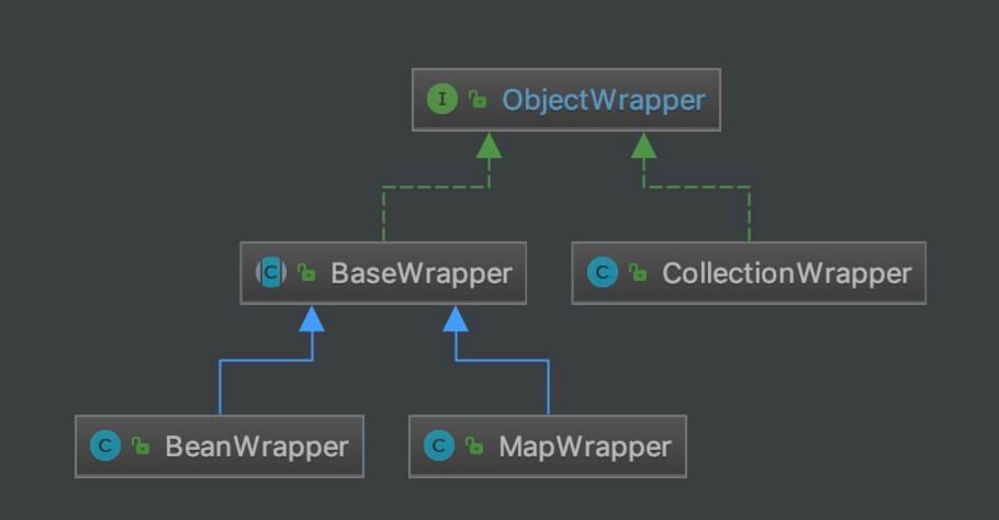ObjectWrapper 类图

## 8.1 BaseWrapper

org.apache.ibatis.reflection.wrapper.BaseWrapper ，实现 ObjectWrapper 接口，ObjectWrapper 抽象类，为子类 BeanWrapper 和 MapWrapper 提供属性值的获取和设置的公用方法。代码如下：

// BaseWrapper.java  public abstract class BaseWrapper implements ObjectWrapper {    protected static final Object[] NO_ARGUMENTS = new Object[0];    /**    * MetaObject 对象    */   protected final MetaObject metaObject;    protected BaseWrapper(MetaObject metaObject) {     this.metaObject = metaObject;   }    /**    * 获得指定属性的值    *    * @param prop PropertyTokenizer 对象    * @param object 指定 Object 对象    * @return 值    */   protected Object resolveCollection(PropertyTokenizer prop, Object object) {     if ("".equals(prop.getName())) {       return object;     } else {       return metaObject.getValue(prop.getName());     }   }    /**    * 获得集合中指定位置的值    *    * @param prop PropertyTokenizer 对象    * @param collection 集合    * @return 值    */   protected Object getCollectionValue(PropertyTokenizer prop, Object collection) {     if (collection instanceof Map) {       return ((Map) collection).get(prop.getIndex());     } else {       int i = Integer.parseInt(prop.getIndex());       if (collection instanceof List) {         return ((List) collection).get(i);       } else if (collection instanceof Object[]) {         return ((Object[]) collection)[i];       } else if (collection instanceof char[]) {         return ((char[]) collection)[i];       } else if (collection instanceof boolean[]) {         return ((boolean[]) collection)[i];       } else if (collection instanceof byte[]) {         return ((byte[]) collection)[i];       } else if (collection instanceof double[]) {         return ((double[]) collection)[i];       } else if (collection instanceof float[]) {         return ((float[]) collection)[i];       } else if (collection instanceof int[]) {         return ((int[]) collection)[i];       } else if (collection instanceof long[]) {         return ((long[]) collection)[i];       } else if (collection instanceof short[]) {         return ((short[]) collection)[i];       } else {         throw new ReflectionException("The '" + prop.getName() + "' property of " + collection + " is not a List or Array.");       }     }   }    /**    * 设置集合中指定位置的值    *    * @param prop PropertyTokenizer 对象    * @param collection 集合    * @param value 值    */   protected void setCollectionValue(PropertyTokenizer prop, Object collection, Object value) {     if (collection instanceof Map) {       ((Map) collection).put(prop.getIndex(), value);     } else {       int i = Integer.parseInt(prop.getIndex());       if (collection instanceof List) {         ((List) collection).set(i, value);       } else if (collection instanceof Object[]) {         ((Object[]) collection)[i] = value;       } else if (collection instanceof char[]) {         ((char[]) collection)[i] = (Character) value;       } else if (collection instanceof boolean[]) {         ((boolean[]) collection)[i] = (Boolean) value;       } else if (collection instanceof byte[]) {         ((byte[]) collection)[i] = (Byte) value;       } else if (collection instanceof double[]) {         ((double[]) collection)[i] = (Double) value;       } else if (collection instanceof float[]) {         ((float[]) collection)[i] = (Float) value;       } else if (collection instanceof int[]) {         ((int[]) collection)[i] = (Integer) value;       } else if (collection instanceof long[]) {         ((long[]) collection)[i] = (Long) value;       } else if (collection instanceof short[]) {         ((short[]) collection)[i] = (Short) value;       } else {         throw new ReflectionException("The '" + prop.getName() + "' property of " + collection + " is not a List or Array.");       }     }   }  }

代码比较简单，胖友看下注释。关于 MetaObject 类，会在 [「10. MetaObject」](http://svip.iocoder.cn/MyBatis/reflection-package/) 中，详细解析。

### 8.1.1 BeanWrapper

org.apache.ibatis.reflection.wrapper.BeanWrapper ，继承 BaseWrapper 抽象类，普通对象的 ObjectWrapper 实现类，例如 User、Order 这样的 POJO 类。属性如下：

// BeanWrapper.java  /**  * 普通对象  */ private final Object object; private final MetaClass metaClass;  public BeanWrapper(MetaObject metaObject, Object object) {   super(metaObject);   this.object = object;   // 创建 MetaClass 对象   this.metaClass = MetaClass.forClass(object.getClass(), metaObject.getReflectorFactory()); }

#### 8.1.1.1 get

\#get(PropertyTokenizer prop) 方法，获得指定属性的值。代码如下：

// BeanWrapper.java  @Override public Object get(PropertyTokenizer prop) {   // <1> 获得集合类型的属性的指定位置的值   if (prop.getIndex() != null) {     // 获得集合类型的属性     Object collection = resolveCollection(prop, object);     // 获得指定位置的值     return getCollectionValue(prop, collection);   // <2> 获得属性的值   } else {     return getBeanProperty(prop, object);   } }

<1> 处，获得集合类型的属性的指定位置的值。例如说：User 对象的 list[0] 。所调用的方法，都是 BaseWrapper 所提供的公用方法。


<2> 处，调用 #getBeanProperty(PropertyTokenizer prop, Object object) 方法，获得属性的值。代码如下：


// BeanWrapper.java  private Object getBeanProperty(PropertyTokenizer prop, Object object) {   try {     Invoker method = metaClass.getGetInvoker(prop.getName());     try {       return method.invoke(object, NO_ARGUMENTS);     } catch (Throwable t) {       throw ExceptionUtil.unwrapThrowable(t);     }   } catch (RuntimeException e) {     throw e;   } catch (Throwable t) {     throw new ReflectionException("Could not get property '" + prop.getName() + "' from " + object.getClass() + ".  Cause: " + t.toString(), t);   } }


通过调用 Invoker 方法，获得属性的值。

#### 8.1.1.2 set

\#set(PropertyTokenizer prop, Object value) 方法，设置指定属性的值。代码如下：

// BeanWrapper.java  @Override public void set(PropertyTokenizer prop, Object value) {   // 设置集合类型的属性的指定位置的值   if (prop.getIndex() != null) {     // 获得集合类型的属性     Object collection = resolveCollection(prop, object);     // 设置指定位置的值     setCollectionValue(prop, collection, value);   // 设置属性的值   } else {     setBeanProperty(prop, object, value);   } }  private void setBeanProperty(PropertyTokenizer prop, Object object, Object value) {   try {     Invoker method = metaClass.getSetInvoker(prop.getName());     Object[] params = {value};     try {       method.invoke(object, params);     } catch (Throwable t) {       throw ExceptionUtil.unwrapThrowable(t);     }   } catch (Throwable t) {     throw new ReflectionException("Could not set property '" + prop.getName() + "' of '" + object.getClass() + "' with value '" + value + "' Cause: " + t.toString(), t);   } }

比较简单，胖友直接看看就成。

#### 8.1.1.3 getGetterType

\#getGetterType(String name) 方法，获得指定属性的 getting 方法的返回值。代码如下：

// BeanWrapper.java  @Override public Class<?> getGetterType(String name) {   // 创建 PropertyTokenizer 对象，对 name 进行分词   PropertyTokenizer prop = new PropertyTokenizer(name);   // 有子表达式   if (prop.hasNext()) {     // <1> 创建 MetaObject 对象     MetaObject metaValue = metaObject.metaObjectForProperty(prop.getIndexedName());     // 如果 metaValue 为空，则基于 metaClass 获得返回类型     if (metaValue == SystemMetaObject.NULL_META_OBJECT) {       return metaClass.getGetterType(name);     // 如果 metaValue 非空，则基于 metaValue 获得返回类型。     // 例如：richType.richMap.nihao ，其中 richMap 是 Map 类型，而 nihao 的类型，需要获得到 nihao 的具体值，才能做真正的判断。     } else {       // 递归判断子表达式 children ，获得返回值的类型       return metaValue.getGetterType(prop.getChildren());     }   // 有子表达式   } else {     // 直接获得返回值的类型     return metaClass.getGetterType(name);   } }

大体逻辑和 MetaClass 的 #getGetterType(String name) 方法是一致的。差异点主要在 <1> 处。

<1> 处，基于当前属性，创建 MetaObject 对象。如果该属性对应的值为空，那么 metaValue 会等于 SystemMetaObject.NULL_META_OBJECT 。也因为为空，那么就不能基于 metaValue 去做递归，获取返回值的类型。

关于 MetaObject 类，在 [「10. MetaObject」](http://svip.iocoder.cn/MyBatis/reflection-package/) 中详细解析。


当然，以上说起来比较绕，可以添加如下测试用例，跑一次就大体明白了。代码如下：


@Test public void test01() {   RichType object = new RichType();    if (true) {     object.setRichType(new RichType());     object.getRichType().setRichMap(new HashMap());     object.getRichType().getRichMap().put("nihao", "123");   }    MetaObject meta = MetaObject.forObject(object, SystemMetaObject.DEFAULT_OBJECT_FACTORY, new CustomBeanWrapperFactory(), new DefaultReflectorFactory());   Class<?> clazz = meta.getObjectWrapper().getGetterType("richType.richMap.nihao");   System.out.println(clazz); }


这个测试用例，就是笔者在代码注释上添加的“例如：richType.richMap.nihao ，其中 richMap 是 Map 类型，而 nihao 的类型，需要获得到 nihao 的具体值，才能做真正的判断。”


------


\#getSetterType(String name) 方法，获得指定属性的 setting 方法的方法参数。逻辑上和 #getGetterType(String name) 方法类似的，所以感兴趣的胖友，自己研究。

#### 8.1.1.6 hasGetter

\#hasGetter(String name) 方法，是否有指定属性的 getting 方法。代码如下：

// BeanWrapper.java  @Override public boolean hasGetter(String name) {   // 创建 PropertyTokenizer 对象，对 name 进行分词   PropertyTokenizer prop = new PropertyTokenizer(name);   // 有子表达式   if (prop.hasNext()) {     // 判断是否有该属性的 getting 方法     if (metaClass.hasGetter(prop.getIndexedName())) {       // 创建 MetaObject 对象       MetaObject metaValue = metaObject.metaObjectForProperty(prop.getIndexedName());       // 如果 metaValue 为空，则基于 metaClass 判断是否有该属性的 getting 方法       if (metaValue == SystemMetaObject.NULL_META_OBJECT) {         return metaClass.hasGetter(name);       // 如果 metaValue 非空，则基于 metaValue 判断是否有 getting 方法。       } else {         // 递归判断子表达式 children ，判断是否有 getting 方法         return metaValue.hasGetter(prop.getChildren());       }     } else {       return false;     }   // 有子表达式   } else {     // 判断是否有该属性的 getting 方法     return metaClass.hasGetter(name);   } }

和 #getGetterType(String name) 方法类似，胖友可以自己瞅瞅。


------


\#hasSetter(String name) 方法，判断指定属性是否有 setting 方法的方法。逻辑上和 #hasGetter(String name) 方法类似的，所以感兴趣的胖友，自己研究。

#### 8.1.1.5 instantiatePropertyValue

\#instantiatePropertyValue(String name, PropertyTokenizer prop, ObjectFactory objectFactory) 方法，创建指定属性的值。代码如下：

// BeanWrapper.java  @Override public MetaObject instantiatePropertyValue(String name, PropertyTokenizer prop, ObjectFactory objectFactory) {   MetaObject metaValue;   // 获得 setting 方法的方法参数类型   Class<?> type = getSetterType(prop.getName());   try {     // 创建对象     Object newObject = objectFactory.create(type);     // 创建 MetaObject 对象     metaValue = MetaObject.forObject(newObject, metaObject.getObjectFactory(), metaObject.getObjectWrapperFactory(), metaObject.getReflectorFactory());     // <1> 设置当前对象的值     set(prop, newObject);   } catch (Exception e) {     throw new ReflectionException("Cannot set value of property '" + name + "' because '" + name + "' is null and cannot be instantiated on instance of " + type.getName() + ". Cause:" + e.toString(), e);   }   return metaValue; }

<1> 处，调用 #set(PropertyTokenizer prop, Object value) 方法，设置 newObject 到当前对象的 prop 属性种。

关于这个方法，可能比较难理解，可以调试下 MetaObjectTest#shouldGetAndSetNestedMapPairUsingArraySyntax() 这个单元测试方法。

#### 8.1.1.6 isCollection

\#isCollection() 方法，返回 false ，表示不是集合。代码如下：

// BeanWrapper.java  @Override public boolean isCollection() {   return false; }

因此，#add(Object element) 和 #addAll(List<E> list) 方法都是不支持的，直接抛出 UnsupportedOperationException 异常。代码如下：

// BeanWrapper.java  @Override public void add(Object element) {   throw new UnsupportedOperationException(); }  @Override public <E> void addAll(List<E> list) {   throw new UnsupportedOperationException(); }

### 8.1.2 MapWrapper

org.apache.ibatis.reflection.wrapper.MapWrapper ，继承 BaseWrapper 抽象类，Map 对象的 ObjectWrapper 实现类。

MapWrapper 和 BeanWrapper 的大体逻辑是一样的，差异点主要如下：

// MapWrapper.java  // object 变成了 map private final Map<String, Object> map;  // 属性的操作变成了 map.put(prop.getName(), value); map.get(prop.getName());

这里就不详细解析了，感兴趣的胖友，自己查看下噢。

## 8.2 CollectionWrapper

org.apache.ibatis.reflection.wrapper.CollectionWrapper ，实现 ObjectWrapper 接口，集合 ObjectWrapper 实现类。比较简单，直接看代码：

// CollectionWrapper.java  public class CollectionWrapper implements ObjectWrapper {    private final Collection<Object> object;    public CollectionWrapper(MetaObject metaObject, Collection<Object> object) {     this.object = object;   }    @Override   public Object get(PropertyTokenizer prop) {     throw new UnsupportedOperationException();   }    @Override   public void set(PropertyTokenizer prop, Object value) {     throw new UnsupportedOperationException();   }    @Override   public String findProperty(String name, boolean useCamelCaseMapping) {     throw new UnsupportedOperationException();   }    @Override   public String[] getGetterNames() {     throw new UnsupportedOperationException();   }    @Override   public String[] getSetterNames() {     throw new UnsupportedOperationException();   }    @Override   public Class<?> getSetterType(String name) {     throw new UnsupportedOperationException();   }    @Override   public Class<?> getGetterType(String name) {     throw new UnsupportedOperationException();   }    @Override   public boolean hasSetter(String name) {     throw new UnsupportedOperationException();   }    @Override   public boolean hasGetter(String name) {     throw new UnsupportedOperationException();   }    @Override   public MetaObject instantiatePropertyValue(String name, PropertyTokenizer prop, ObjectFactory objectFactory) {     throw new UnsupportedOperationException();   }    @Override   public boolean isCollection() {     return true;   }    @Override   public void add(Object element) {     object.add(element);   }    @Override   public <E> void addAll(List<E> element) {     object.addAll(element);   }  }

仅仅支持 #add(Object element) 和 #addAll(List<E> element) 两个操作方法。

# 9. ObjectWrapperFactory

org.apache.ibatis.reflection.wrapper.ObjectWrapperFactory ，ObjectWrapper 工厂接口。代码如下：

// ObjectWrapperFactory.java  public interface ObjectWrapperFactory {    /**    * 是否包装了指定对象    *    * @param object 指定对象    * @return 是否    */   boolean hasWrapperFor(Object object);    /**    * 获得指定对象的 ObjectWrapper 对象    *    * @param metaObject MetaObject 对象    * @param object 指定对象    * @return ObjectWrapper 对象    */   ObjectWrapper getWrapperFor(MetaObject metaObject, Object object);  }

## 9.1 DefaultObjectWrapperFactory

org.apache.ibatis.reflection.wrapper.DefaultObjectWrapperFactory ，实现 ObjectWrapperFactory 接口，默认 ObjectWrapperFactory 实现类。代码如下：

public class DefaultObjectWrapperFactory implements ObjectWrapperFactory {    @Override   public boolean hasWrapperFor(Object object) {     return false;   }    @Override   public ObjectWrapper getWrapperFor(MetaObject metaObject, Object object) {     throw new ReflectionException("The DefaultObjectWrapperFactory should never be called to provide an ObjectWrapper.");   }  }

诶？貌似是个空的实现类？？？实际上，默认情况下，我们是不使用 ObjectWrapperFactory 对象的。

# 10. MetaObject

org.apache.ibatis.reflection.MetaObject ，对象元数据，提供了对象的属性值的获得和设置等等方法。增强。

## 10.1 构造方法

// MetaObject.java  /**  * 原始 Object 对象  */ private final Object originalObject; /**  * 封装过的 Object 对象  */ private final ObjectWrapper objectWrapper; private final ObjectFactory objectFactory; private final ObjectWrapperFactory objectWrapperFactory; private final ReflectorFactory reflectorFactory;  private MetaObject(Object object, ObjectFactory objectFactory, ObjectWrapperFactory objectWrapperFactory, ReflectorFactory reflectorFactory) {   this.originalObject = object;   this.objectFactory = objectFactory;   this.objectWrapperFactory = objectWrapperFactory;   this.reflectorFactory = reflectorFactory;    // <1>   if (object instanceof ObjectWrapper) {     this.objectWrapper = (ObjectWrapper) object;   } else if (objectWrapperFactory.hasWrapperFor(object)) { // <2>     // 创建 ObjectWrapper 对象     this.objectWrapper = objectWrapperFactory.getWrapperFor(this, object);   } else if (object instanceof Map) {     // 创建 MapWrapper 对象     this.objectWrapper = new MapWrapper(this, (Map) object);   } else if (object instanceof Collection) {     // 创建 CollectionWrapper 对象     this.objectWrapper = new CollectionWrapper(this, (Collection) object);   } else {     // 创建 BeanWrapper 对象     this.objectWrapper = new BeanWrapper(this, object);   } }

<1> 处，会根据 object 类型的不同，创建对应的 ObjectWrapper 对象。

其中，<2> 处，我们可以看到 ObjectWrapperFactory 的使用，因为默认情况下的 DefaultObjectWrapperFactory 未实现任何逻辑，所以这块逻辑相当于暂时不起作用。如果想要起作用，需要自定义 ObjectWrapperFactory 的实现类。

## 10.2 forObject

\#forObject(Object object, ObjectFactory objectFactory, ObjectWrapperFactory objectWrapperFactory, ReflectorFactory reflectorFactory) 静态方法，创建 MetaObject 对象。代码如下：

// MetaObject.java  /**  * 创建 MetaObject 对象  *  * @param object 原始 Object 对象  * @param objectFactory  * @param objectWrapperFactory  * @param reflectorFactory  * @return MetaObject 对象  */ public static MetaObject forObject(Object object, ObjectFactory objectFactory, ObjectWrapperFactory objectWrapperFactory, ReflectorFactory reflectorFactory) {   if (object == null) {     return SystemMetaObject.NULL_META_OBJECT;   } else {     return new MetaObject(object, objectFactory, objectWrapperFactory, reflectorFactory);   } }

如果 object 为空的情况下，返回 SystemMetaObject.NULL_META_OBJECT 。

## 10.3 metaObjectForProperty

\#metaObjectForProperty(String name) 方法，创建指定属性的 MetaObject 对象。代码如下：

// MetaObject.java  public MetaObject metaObjectForProperty(String name) {   // 获得属性值   Object value = getValue(name);   // 创建 MetaObject 对象   return MetaObject.forObject(value, objectFactory, objectWrapperFactory, reflectorFactory); }

## 10.4 getValue

\#getValue(String name) 方法，获得指定属性的值。代码如下：

// MetaObject.java  public Object getValue(String name) {   // 创建 PropertyTokenizer 对象，对 name 分词   PropertyTokenizer prop = new PropertyTokenizer(name);   // 有子表达式   if (prop.hasNext()) {     // 创建 MetaObject 对象     MetaObject metaValue = metaObjectForProperty(prop.getIndexedName());     // <2> 递归判断子表达式 children ，获取值     if (metaValue == SystemMetaObject.NULL_META_OBJECT) {       return null;     } else {       return metaValue.getValue(prop.getChildren());     }   // 无子表达式   } else {     // <1> 获取值     return objectWrapper.get(prop);   } }

大体逻辑上，就是不断对 name 分词，递归查找属性，直到 <1> 处，返回最终的结果。

比较特殊的是，在 <2> 处，如果属性的值为 null 时，则直接返回 null ，因为值就是空的哈。

## 10.5 setValue

\#setValue(String name, Object value) 方法，设置指定属性的指定值。代码如下：

// MetaObject.java  public void setValue(String name, Object value) {   // 创建 PropertyTokenizer 对象，对 name 分词   PropertyTokenizer prop = new PropertyTokenizer(name);   // 有子表达式   if (prop.hasNext()) {     // 创建 MetaObject 对象     MetaObject metaValue = metaObjectForProperty(prop.getIndexedName());     // 递归判断子表达式 children ，设置值     if (metaValue == SystemMetaObject.NULL_META_OBJECT) {       if (value == null) {         // don't instantiate child path if value is null         return;       } else {         // <1> 创建值         metaValue = objectWrapper.instantiatePropertyValue(name, prop, objectFactory);       }     }     // 设置值     metaValue.setValue(prop.getChildren(), value);   // 无子表达式   } else {     // <1> 设置值     objectWrapper.set(prop, value);   } }

大体逻辑上，就是不断对 name 分词，递归查找属性，最终在 <1> 处，设置对应的值。

比较特殊的是，在 <2> 处，如果属性的值为 null 时，调用 ObjectWrapper#instantiatePropertyValue(name, prop, objectFactory) 方法，创建当前 name 的 prop 属性的空对象，然后继续递归。可能有点难理解，胖友可以调试下 MetaObjectTest#shouldGetAndSetNestedMapPairUsingArraySyntax() 这个单元测试方法。

## 10.6 isCollection

\#isCollection() 方法，判断是否为集合。代码如下：

// MetaObject.java  public boolean isCollection() {   return objectWrapper.isCollection(); }  public void add(Object element) {   objectWrapper.add(element); }  public <E> void addAll(List<E> list) {   objectWrapper.addAll(list); }

直接调用 objectWrapper 的对应的方法。

# 11. SystemMetaObject

org.apache.ibatis.reflection.SystemMetaObject ，系统级的 MetaObject 对象，主要提供了 ObjectFactory、ObjectWrapperFactory、空 MetaObject 的单例。代码如下：

// SystemMetaObject.java  public final class SystemMetaObject {    /**    * ObjectFactory 的单例    */   public static final ObjectFactory DEFAULT_OBJECT_FACTORY = new DefaultObjectFactory();   /**    * ObjectWrapperFactory 的单例    */   public static final ObjectWrapperFactory DEFAULT_OBJECT_WRAPPER_FACTORY = new DefaultObjectWrapperFactory();    /**    * 空对象的 MetaObject 对象单例    */   public static final MetaObject NULL_META_OBJECT = MetaObject.forObject(NullObject.class, DEFAULT_OBJECT_FACTORY, DEFAULT_OBJECT_WRAPPER_FACTORY, new DefaultReflectorFactory());    private SystemMetaObject() {     // Prevent Instantiation of Static Class   }    private static class NullObject {   }    /**    * 创建 MetaObject 对象    *    * @param object 指定对象    * @return MetaObject 对象    */   public static MetaObject forObject(Object object) {     return MetaObject.forObject(object, DEFAULT_OBJECT_FACTORY, DEFAULT_OBJECT_WRAPPER_FACTORY, new DefaultReflectorFactory());   }  }

核心就是 #forObject(Object object) 方法，创建指定对象的 MetaObject 对象。

# 12. ParamNameUtil

org.apache.ibatis.reflection.ParamNameUtil ，参数名工具类，获得构造方法、普通方法的参数列表。代码如下：

// ParamNameUtil.java  public class ParamNameUtil {    /**    * 获得普通方法的参数列表    *    * @param method 普通方法    * @return 参数集合    */   public static List<String> getParamNames(Method method) {     return getParameterNames(method);   }    /**    * 获得构造方法的参数列表    *    * @param constructor 构造方法    * @return 参数集合    */   public static List<String> getParamNames(Constructor<?> constructor) {     return getParameterNames(constructor);   }    private static List<String> getParameterNames(Executable executable) {     final List<String> names = new ArrayList<>();     // 获得 Parameter 数组     final Parameter[] params = executable.getParameters();     // 获得参数名，并添加到 names 中     for (Parameter param : params) {       names.add(param.getName());     }     return names;   }    private ParamNameUtil() {     super();   }  }

# 13. ParamNameResolver

org.apache.ibatis.reflection.ParamNameResolver ，参数名解析器。

## 13.1 构造方法

// ParamNameResolver.java  /**  * <p>  * The key is the index and the value is the name of the parameter.<br />  * The name is obtained from {@link Param} if specified. When {@link Param} is not specified,  * the parameter index is used. Note that this index could be different from the actual index  * when the method has special parameters (i.e. {@link RowBounds} or {@link ResultHandler}).  * </p>  * <ul>  * <li>aMethod(@Param("M") int a, @Param("N") int b) -> {{0, "M"}, {1, "N"}}</li>  * <li>aMethod(int a, int b) -> {{0, "0"}, {1, "1"}}</li>  * <li>aMethod(int a, RowBounds rb, int b) -> {{0, "0"}, {2, "1"}}</li>  * </ul>  *  * 参数名映射  *  * KEY：参数顺序  * VALUE：参数名  */ private final SortedMap<Integer, String> names; /**  * 是否有 {@link Param} 注解的参数  */ private boolean hasParamAnnotation;  public ParamNameResolver(Configuration config, Method method) {   final Class<?>[] paramTypes = method.getParameterTypes();   final Annotation[][] paramAnnotations = method.getParameterAnnotations();   final SortedMap<Integer, String> map = new TreeMap<>();   int paramCount = paramAnnotations.length;   // get names from @Param annotations   for (int paramIndex = 0; paramIndex < paramCount; paramIndex++) {     // 忽略，如果是特殊参数     if (isSpecialParameter(paramTypes[paramIndex])) {       // skip special parameters       continue;     }     String name = null;     // 首先，从 @Param 注解中获取参数     for (Annotation annotation : paramAnnotations[paramIndex]) {       if (annotation instanceof Param) {         hasParamAnnotation = true;         name = ((Param) annotation).value();         break;       }     }     if (name == null) {       // @Param was not specified.       // 其次，获取真实的参数名       if (config.isUseActualParamName()) { // 默认开启         name = getActualParamName(method, paramIndex);       }       // 最差，使用 map 的顺序，作为编号       if (name == null) {         // use the parameter index as the name ("0", "1", ...)         // gcode issue #71         name = String.valueOf(map.size());       }     }     // 添加到 map 中     map.put(paramIndex, name);   }   // 构建不可变集合   names = Collections.unmodifiableSortedMap(map); }  private String getActualParamName(Method method, int paramIndex) {   return ParamNameUtil.getParamNames(method).get(paramIndex); }  private static boolean isSpecialParameter(Class<?> clazz) {   return RowBounds.class.isAssignableFrom(clazz) || ResultHandler.class.isAssignableFrom(clazz); }

代码比较简单，胖友看下注释。

## 13.2 getNamedParams

\#getNamedParams(Object[] args) 方法，获得参数名与值的映射。代码如下：

// ParamNameResolver.java  private static final String GENERIC_NAME_PREFIX = "param";  /**  * <p>  * A single non-special parameter is returned without a name.  * Multiple parameters are named using the naming rule.  * In addition to the default names, this method also adds the generic names (param1, param2,  * ...).  * </p>  *  * 获得参数名与值的映射  */ public Object getNamedParams(Object[] args) {   final int paramCount = names.size();   // 无参数，则返回 null   if (args == null || paramCount == 0) {     return null;   // 只有一个非注解的参数，直接返回首元素   } else if (!hasParamAnnotation && paramCount == 1) {     return args[names.firstKey()];   } else {     // 集合。     // 组合 1 ：KEY：参数名，VALUE：参数值     // 组合 2 ：KEY：GENERIC_NAME_PREFIX + 参数顺序，VALUE ：参数值     final Map<String, Object> param = new ParamMap<>();     int i = 0;     // 遍历 names 集合     for (Map.Entry<Integer, String> entry : names.entrySet()) {       // 组合 1 ：添加到 param 中       param.put(entry.getValue(), args[entry.getKey()]);       // add generic param names (param1, param2, ...)       // 组合 2 ：添加到 param 中       final String genericParamName = GENERIC_NAME_PREFIX + String.valueOf(i + 1);       // ensure not to overwrite parameter named with @Param       if (!names.containsValue(genericParamName)) {         param.put(genericParamName, args[entry.getKey()]);       }       i++;     }     return param;   } }

代码比较简单，胖友看下注释。

# 14. TypeParameterResolver

org.apache.ibatis.reflection.TypeParameterResolver ，工具类，java.lang.reflect.Type 参数解析器。因为 Type 是相对冷门的知识，我表示也不会，所以推荐先阅读如下任一文章：

贾博岩 [《我眼中的 Java-Type 体系(1)》](https://www.jianshu.com/p/7649f86614d3)

xujun9411 [《java Type 详解》](https://www.jianshu.com/p/cae76008b36b)

FROM 西瓜1994 [《MyBatis源码分析-2-基础支持层-反射模块-TypeParameterResolver/ObjectFactory》](https://my.oschina.net/u/3905482/blog/2249537)

当存在复杂的继承关系以及泛型定义时， TypeParameterResolver 可以帮助我们解析字段、方法参数或方法返回值的类型。

## 14.1 暴露方法

TypeParameterResolver 暴露了三个 公用静态方法，分别用于解析 Field 类型、Method 返回类型、方法参数类型。代码如下：

// TypeParameterResolver.java  /**  * 解析属性类型  *  * @return The field type as {@link Type}. If it has type parameters in the declaration,<br>  *     they will be resolved to the actual runtime {@link Type}s.  */ public static Type resolveFieldType(Field field, Type srcType) {   // 属性类型   Type fieldType = field.getGenericType();   // 定义的类   Class<?> declaringClass = field.getDeclaringClass();   // 解析类型   return resolveType(fieldType, srcType, declaringClass); }  /**  * 解析方法返回类型  *  * @return The return type of the method as {@link Type}. If it has type parameters in the declaration,<br>  *     they will be resolved to the actual runtime {@link Type}s.  */ public static Type resolveReturnType(Method method, Type srcType) {   // 属性类型   Type returnType = method.getGenericReturnType();   // 定义的类   Class<?> declaringClass = method.getDeclaringClass();   // 解析类型   return resolveType(returnType, srcType, declaringClass); }  /**  * 解析方法参数的类型数组  *  * @return The parameter types of the method as an array of {@link Type}s. If they have type parameters in the declaration,<br>  *     they will be resolved to the actual runtime {@link Type}s.  */ public static Type[] resolveParamTypes(Method method, Type srcType) {   // 获得方法参数类型数组   Type[] paramTypes = method.getGenericParameterTypes();   // 定义的类   Class<?> declaringClass = method.getDeclaringClass();   // 解析类型们   Type[] result = new Type[paramTypes.length];   for (int i = 0; i < paramTypes.length; i++) {     result[i] = resolveType(paramTypes[i], srcType, declaringClass);   }   return result; }

大体逻辑都类似，最终都会调用 #resolveType(Type type, Type srcType, Class<?> declaringClass) 方法，解析类型。详细解析，见 [「4.2 resolveType」](http://svip.iocoder.cn/MyBatis/reflection-package/) 。

## 14.2 resolveType

\#resolveType(Type type, Type srcType, Class<?> declaringClass) 方法，解析 type 类型。代码如下：

// TypeParameterResolver.java  /**  * 解析类型  *  * @param type 类型  * @param srcType 来源类型  * @param declaringClass 定义的类  * @return 解析后的类型  */ private static Type resolveType(Type type, Type srcType, Class<?> declaringClass) {   if (type instanceof TypeVariable) {     return resolveTypeVar((TypeVariable<?>) type, srcType, declaringClass);   } else if (type instanceof ParameterizedType) {     return resolveParameterizedType((ParameterizedType) type, srcType, declaringClass);   } else if (type instanceof GenericArrayType) {     return resolveGenericArrayType((GenericArrayType) type, srcType, declaringClass);   } else {     return type;   } }

根据 type 对应不同的 Type 类型，调用不同的方法，进行解析。

### 14.2.1 resolveParameterizedType

\#resolveParameterizedType(ParameterizedType parameterizedType, Type srcType, Class<?> declaringClass) 方法，解析 ParameterizedType 类型。代码如下：

// TypeParameterResolver.java  /**  * 解析 ParameterizedType 类型  *  * @param parameterizedType ParameterizedType 类型  * @param srcType 来源类型  * @param declaringClass 定义的类  * @return 解析后的类型  */ private static ParameterizedType resolveParameterizedType(ParameterizedType parameterizedType, Type srcType, Class<?> declaringClass) {   Class<?> rawType = (Class<?>) parameterizedType.getRawType();   // 【1】解析 <> 中实际类型   Type[] typeArgs = parameterizedType.getActualTypeArguments();   Type[] args = new Type[typeArgs.length];   for (int i = 0; i < typeArgs.length; i++) {     if (typeArgs[i] instanceof TypeVariable) {       args[i] = resolveTypeVar((TypeVariable<?>) typeArgs[i], srcType, declaringClass);     } else if (typeArgs[i] instanceof ParameterizedType) {       args[i] = resolveParameterizedType((ParameterizedType) typeArgs[i], srcType, declaringClass);     } else if (typeArgs[i] instanceof WildcardType) {       args[i] = resolveWildcardType((WildcardType) typeArgs[i], srcType, declaringClass);     } else {       args[i] = typeArgs[i];     }   }   // 【2】   return new ParameterizedTypeImpl(rawType, null, args); }

【1】 处，解析 <> 中实际类型。


【2】 处，创建 ParameterizedTypeImpl 对象。代码如下：


// TypeParameterResolver.java 内部静态类  /**  * ParameterizedType 实现类  *  * 参数化类型，即泛型。例如：List<T>、Map<K, V>等带有参数化的配置  */ static class ParameterizedTypeImpl implements ParameterizedType {    // 以 List<T> 举例子    /**    * <> 前面实际类型    *    * 例如：List    */   private Class<?> rawType;   /**    * 如果这个类型是某个属性所有，则获取这个所有者类型；否则，返回 null    */   private Type ownerType;   /**    * <> 中实际类型    *    * 例如：T    */   private Type[] actualTypeArguments;    public ParameterizedTypeImpl(Class<?> rawType, Type ownerType, Type[] actualTypeArguments) {     super();     this.rawType = rawType;     this.ownerType = ownerType;     this.actualTypeArguments = actualTypeArguments;   }    @Override   public Type[] getActualTypeArguments() {     return actualTypeArguments;   }    @Override   public Type getOwnerType() {     return ownerType;   }    @Override   public Type getRawType() {     return rawType;   }    @Override   public String toString() {     return "ParameterizedTypeImpl [rawType=" + rawType + ", ownerType=" + ownerType + ", actualTypeArguments=" + Arrays.toString(actualTypeArguments) + "]";   }  }


### 14.2.2 resolveWildcardType

\#resolveWildcardType(WildcardType wildcardType, Type srcType, Class<?> declaringClass) 方法，解析 WildcardType 类型。代码如下：

// TypeParameterResolver.java  private static Type resolveWildcardType(WildcardType wildcardType, Type srcType, Class<?> declaringClass) {   // <1.1> 解析泛型表达式下界（下限 super）   Type[] lowerBounds = resolveWildcardTypeBounds(wildcardType.getLowerBounds(), srcType, declaringClass);   // <1.2> 解析泛型表达式上界（上限 extends）   Type[] upperBounds = resolveWildcardTypeBounds(wildcardType.getUpperBounds(), srcType, declaringClass);   // <2> 创建 WildcardTypeImpl 对象   return new WildcardTypeImpl(lowerBounds, upperBounds); }  private static Type[] resolveWildcardTypeBounds(Type[] bounds, Type srcType, Class<?> declaringClass) {   Type[] result = new Type[bounds.length];   for (int i = 0; i < bounds.length; i++) {     if (bounds[i] instanceof TypeVariable) {       result[i] = resolveTypeVar((TypeVariable<?>) bounds[i], srcType, declaringClass);     } else if (bounds[i] instanceof ParameterizedType) {       result[i] = resolveParameterizedType((ParameterizedType) bounds[i], srcType, declaringClass);     } else if (bounds[i] instanceof WildcardType) {       result[i] = resolveWildcardType((WildcardType) bounds[i], srcType, declaringClass);     } else {       result[i] = bounds[i];     }   }   return result; }

<1.1>、<1.2> 处，解析泛型表达式下界（下限 super）和上界( 上限 extends )。


<2> 创建 WildcardTypeImpl 对象。代码如下：


// TypeParameterResolver.java 内部静态类  /**  * WildcardType 实现类  *  * 泛型表达式（或者通配符表达式），即 ? extend Number、? super Integer 这样的表达式。  * WildcardType 虽然是 Type 的子接口，但却不是 Java 类型中的一种。  */ static class WildcardTypeImpl implements WildcardType {    /**    * 泛型表达式下界（下限 super）    */   private Type[] lowerBounds;   /**    * 泛型表达式上界（上界 extends）    */   private Type[] upperBounds;    WildcardTypeImpl(Type[] lowerBounds, Type[] upperBounds) {     super();     this.lowerBounds = lowerBounds;     this.upperBounds = upperBounds;   }    @Override   public Type[] getLowerBounds() {     return lowerBounds;   }    @Override   public Type[] getUpperBounds() {     return upperBounds;   } }  static class GenericArrayTypeImpl implements GenericArrayType {   private Type genericComponentType;    GenericArrayTypeImpl(Type genericComponentType) {     super();     this.genericComponentType = genericComponentType;   }    @Override   public Type getGenericComponentType() {     return genericComponentType;   } }


### 14.2.3 resolveGenericArrayType

// TypeParameterResolver.java  private static Type resolveGenericArrayType(GenericArrayType genericArrayType, Type srcType, Class<?> declaringClass) {   // 【1】解析 componentType   Type componentType = genericArrayType.getGenericComponentType();   Type resolvedComponentType = null;   if (componentType instanceof TypeVariable) {     resolvedComponentType = resolveTypeVar((TypeVariable<?>) componentType, srcType, declaringClass);   } else if (componentType instanceof GenericArrayType) {     resolvedComponentType = resolveGenericArrayType((GenericArrayType) componentType, srcType, declaringClass);   } else if (componentType instanceof ParameterizedType) {     resolvedComponentType = resolveParameterizedType((ParameterizedType) componentType, srcType, declaringClass);   }   // 【2】创建 GenericArrayTypeImpl 对象   if (resolvedComponentType instanceof Class) {     return Array.newInstance((Class<?>) resolvedComponentType, 0).getClass();   } else {     return new GenericArrayTypeImpl(resolvedComponentType);   } }

【1】 处，解析 componentType 类型。


【2】 处，创建 GenericArrayTypeImpl 对象。代码如下：


// TypeParameterResolver.java 内部静态类  /**  * GenericArrayType 实现类  *  * 泛型数组类型，用来描述 ParameterizedType、TypeVariable 类型的数组；即 List<T>[]、T[] 等；  */ static class GenericArrayTypeImpl implements GenericArrayType {    /**    * 数组元素类型    */   private Type genericComponentType;    GenericArrayTypeImpl(Type genericComponentType) {     super();     this.genericComponentType = genericComponentType;   }    @Override   public Type getGenericComponentType() {     return genericComponentType;   }  }


### 14.2.4 resolveTypeVar

TODO 1001 芋艿，暂时看不太懂。暂时无视

想要死磕的胖友，可以看看 [《mybatis-TypeParameterResolver 工具类分析》](https://cdn2.jianshu.io/p/423c9a8e4424?utm_campaign=maleskine&utm_content=note&utm_medium=seo_notes&utm_source=recommendation) 。

可以通过调试 org.apache.ibatis.reflection.TypeParameterResolverTest 这个单元测试类，触发各种情况。

# 15. ArrayUtil

org.apache.ibatis.reflection.ArrayUtil ，数组工具类。代码如下：

// ArrayUtil.java  public class ArrayUtil {    /**    * Returns a hash code for {@code obj}.    *    * @param obj    *      The object to get a hash code for. May be an array or <code>null</code>.    * @return A hash code of {@code obj} or 0 if {@code obj} is <code>null</code>    */   public static int hashCode(Object obj) {     if (obj == null) {       // for consistency with Arrays#hashCode() and Objects#hashCode()       return 0;     }     // 普通类     final Class<?> clazz = obj.getClass();     if (!clazz.isArray()) {       return obj.hashCode();     }     // 数组类型     final Class<?> componentType = clazz.getComponentType();     if (long.class.equals(componentType)) {       return Arrays.hashCode((long[]) obj);     } else if (int.class.equals(componentType)) {       return Arrays.hashCode((int[]) obj);     } else if (short.class.equals(componentType)) {       return Arrays.hashCode((short[]) obj);     } else if (char.class.equals(componentType)) {       return Arrays.hashCode((char[]) obj);     } else if (byte.class.equals(componentType)) {       return Arrays.hashCode((byte[]) obj);     } else if (boolean.class.equals(componentType)) {       return Arrays.hashCode((boolean[]) obj);     } else if (float.class.equals(componentType)) {       return Arrays.hashCode((float[]) obj);     } else if (double.class.equals(componentType)) {       return Arrays.hashCode((double[]) obj);     } else {       return Arrays.hashCode((Object[]) obj);     }   }    /**    * Compares two objects. Returns <code>true</code> if    * <ul>    * <li>{@code thisObj} and {@code thatObj} are both <code>null</code></li>    * <li>{@code thisObj} and {@code thatObj} are instances of the same type and    * {@link Object#equals(Object)} returns <code>true</code></li>    * <li>{@code thisObj} and {@code thatObj} are arrays with the same component type and    * equals() method of {@link Arrays} returns <code>true</code> (not deepEquals())</li>    * </ul>    *    * @param thisObj    *      The left hand object to compare. May be an array or <code>null</code>    * @param thatObj    *      The right hand object to compare. May be an array or <code>null</code>    * @return <code>true</code> if two objects are equal; <code>false</code> otherwise.    */   public static boolean equals(Object thisObj, Object thatObj) {     if (thisObj == null) {       return thatObj == null;     } else if (thatObj == null) {       return false;     }     final Class<?> clazz = thisObj.getClass();     if (!clazz.equals(thatObj.getClass())) {       return false;     }     // 普通类     if (!clazz.isArray()) {       return thisObj.equals(thatObj);     }     // 数组类型     final Class<?> componentType = clazz.getComponentType();     if (long.class.equals(componentType)) {       return Arrays.equals((long[]) thisObj, (long[]) thatObj);     } else if (int.class.equals(componentType)) {       return Arrays.equals((int[]) thisObj, (int[]) thatObj);     } else if (short.class.equals(componentType)) {       return Arrays.equals((short[]) thisObj, (short[]) thatObj);     } else if (char.class.equals(componentType)) {       return Arrays.equals((char[]) thisObj, (char[]) thatObj);     } else if (byte.class.equals(componentType)) {       return Arrays.equals((byte[]) thisObj, (byte[]) thatObj);     } else if (boolean.class.equals(componentType)) {       return Arrays.equals((boolean[]) thisObj, (boolean[]) thatObj);     } else if (float.class.equals(componentType)) {       return Arrays.equals((float[]) thisObj, (float[]) thatObj);     } else if (double.class.equals(componentType)) {       return Arrays.equals((double[]) thisObj, (double[]) thatObj);     } else {       return Arrays.equals((Object[]) thisObj, (Object[]) thatObj);     }   }    /**    * If the {@code obj} is an array, toString() method of {@link Arrays} is called. Otherwise    * {@link Object#toString()} is called. Returns "null" if {@code obj} is <code>null</code>.    *    * @param obj    *      An object. May be an array or <code>null</code>.    * @return String representation of the {@code obj}.    */   public static String toString(Object obj) {     if (obj == null) {       return "null";     }     // 普通类     final Class<?> clazz = obj.getClass();     if (!clazz.isArray()) {       return obj.toString();     }     // 数组类型     final Class<?> componentType = obj.getClass().getComponentType();     if (long.class.equals(componentType)) {       return Arrays.toString((long[]) obj);     } else if (int.class.equals(componentType)) {       return Arrays.toString((int[]) obj);     } else if (short.class.equals(componentType)) {       return Arrays.toString((short[]) obj);     } else if (char.class.equals(componentType)) {       return Arrays.toString((char[]) obj);     } else if (byte.class.equals(componentType)) {       return Arrays.toString((byte[]) obj);     } else if (boolean.class.equals(componentType)) {       return Arrays.toString((boolean[]) obj);     } else if (float.class.equals(componentType)) {       return Arrays.toString((float[]) obj);     } else if (double.class.equals(componentType)) {       return Arrays.toString((double[]) obj);     } else {       return Arrays.toString((Object[]) obj);     }   }  }

# 16. ExceptionUtil

org.apache.ibatis.reflection.ExceptionUtil ，异常工具类。代码如下：

// ExceptionUtil.java  public class ExceptionUtil {    private ExceptionUtil() {     // Prevent Instantiation   }    /**    * 去掉异常的包装    *    * @param wrapped 被包装的异常    * @return 去除包装后的异常    */   public static Throwable unwrapThrowable(Throwable wrapped) {     Throwable unwrapped = wrapped;     while (true) {       if (unwrapped instanceof InvocationTargetException) {         unwrapped = ((InvocationTargetException) unwrapped).getTargetException();       } else if (unwrapped instanceof UndeclaredThrowableException) {         unwrapped = ((UndeclaredThrowableException) unwrapped).getUndeclaredThrowable();       } else {         return unwrapped;       }     }   }  }

# 666. 彩蛋

比想象中，长了超级超级超级多的文章。写的都快吐血了，鬼知道我经历了什么！！！

参考和推荐如下文章：

徐郡明 [《MyBatis 技术内幕》](https://item.jd.com/12125531.html) 的 [「2.2 反射工具箱」](http://svip.iocoder.cn/MyBatis/reflection-package/) 小节

祖大俊 [《Mybatis3.3.x技术内幕（七）：Mybatis初始化之六个工具》](https://my.oschina.net/zudajun/blog/668596)

如果胖友看到此处，还是一脸懵逼，还是那句话，多多调试！！！


 


# 精尽 MyBatis 源码分析 —— 异常模块

# 1. 概述

本文，我们来分享 MyBatis 的异常模块，对应 exceptions 包。如下图所示：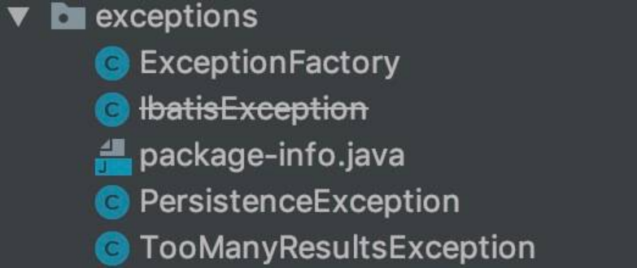`exceptions` 包

在 [《精尽 MyBatis 源码解析 —— 项目结构一览》](http://svip.iocoder.cn/MyBatis/intro) 中，简单介绍了这个模块如下：

定义了 MyBatis 专有的 PersistenceException 和 TooManyResultsException 异常。

实际上，MyBatis 不仅仅在 exceptions 包下有异常，在其他包下也有异常，整体如下类图：异常体系

下面，我们逐个包的异常看过看过去。

# 2. exceptions 包

## 2.1 IbatisException

org.apache.ibatis.exceptions.IbatisException ，实现 RuntimeException 类，IBatis 的异常基类。代码如下：

@Deprecated public class IbatisException extends RuntimeException {   private static final long serialVersionUID = 3880206998166270511L;   public IbatisException() {   super();  }   public IbatisException(String message) {   super(message);  }   public IbatisException(String message, Throwable cause) {   super(message, cause);  }   public IbatisException(Throwable cause) {   super(cause);  }  }

实际上，IbatisException 已经在 2015 年被废弃，取代它的是 PersistenceException 类。

## 2.2 PersistenceException

org.apache.ibatis.exceptions.PersistenceException ，继承 IbatisException 类，目前 MyBatis 真正的异常基类。代码如下：

public class PersistenceException extends IbatisException {    private static final long serialVersionUID = -7537395265357977271L;    public PersistenceException() {     super();   }    public PersistenceException(String message) {     super(message);   }    public PersistenceException(String message, Throwable cause) {     super(message, cause);   }    public PersistenceException(Throwable cause) {     super(cause);   }    }

### 2.2.1 ExceptionFactory

org.apache.ibatis.exceptions.ExceptionFactory ，异常工厂。代码如下：

public class ExceptionFactory {    private ExceptionFactory() {     // Prevent Instantiation   }    /**    * 包装异常成 PersistenceException    *    * @param message 消息    * @param e 发生的异常    * @return PersistenceException    */   public static RuntimeException wrapException(String message, Exception e) {     return new PersistenceException(ErrorContext.instance().message(message).cause(e).toString(), e);   }  }

## 2.3 TooManyResultsException

org.apache.ibatis.exceptions.TooManyResultsException ，继承 PersistenceException 类，查询返回过多结果的异常。期望返回一条，实际返回了多条。代码如下：

public class TooManyResultsException extends PersistenceException {    private static final long serialVersionUID = 8935197089745865786L;    public TooManyResultsException() {     super();   }    public TooManyResultsException(String message) {     super(message);   }    public TooManyResultsException(String message, Throwable cause) {     super(message, cause);   }    public TooManyResultsException(Throwable cause) {     super(cause);   }  }

# 3. parsing 包

## 3.1 ParsingException

org.apache.ibatis.parsing.ParsingException ，继承 PersistenceException 类，解析异常。代码如下：

public class ParsingException extends PersistenceException {    private static final long serialVersionUID = -176685891441325943L;    public ParsingException() {     super();   }    public ParsingException(String message) {     super(message);   }    public ParsingException(String message, Throwable cause) {     super(message, cause);   }    public ParsingException(Throwable cause) {     super(cause);   }  }

# 3. 其它包

实际上，我们会看到其他包，会和 parsing 包一样，都会定义其独有的异常类。但是，代码都是相同的。所以，这里就简单整理如下：

reflection 包：ReflectionException

logging 包：LogException

builder 包：BuilderException、IncompleteElementException

scripting 包：ScriptingException

binding 包：BindingException

type 包：TypeException

session 包：SqlSessionException

cache 包：CacheException

transaction 包：TransactionException

datasource 包：DataSourceException

executor 包：ResultMapException、ExecutorException、BatchExecutorException

plugin 包：PluginException

# 666. 彩蛋

哈哈哈，因为 [《精尽 MyBatis 源码分析 —— 反射模块》](http://svip.iocoder.cn/MyBatis/reflection-package) 一文让我们都很累，所以这篇文章，给我们度假下。哈哈哈。


# 精尽 MyBatis 源码分析 —— 数据源模块

# 1. 概述

本文，我们来分享 MyBatis 的数据源模块，对应 datasource 包。如下图所示：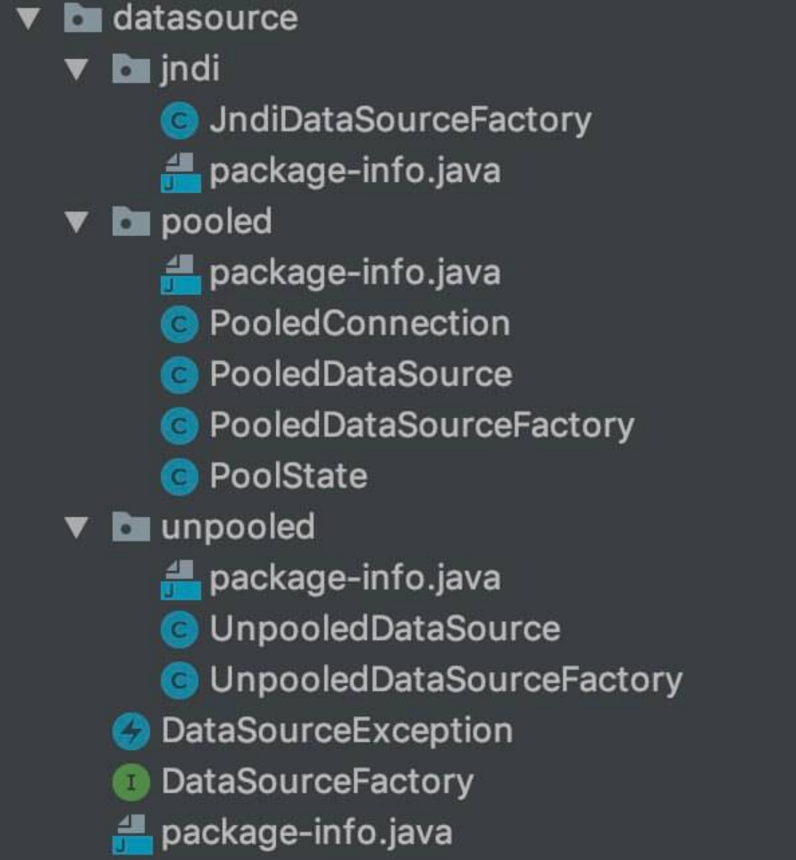`datasource` 包

在 [《精尽 MyBatis 源码解析 —— 项目结构一览》](http://svip.iocoder.cn/MyBatis/intro) 中，简单介绍了这个模块如下：

数据源是实际开发中常用的组件之一。现在开源的数据源都提供了比较丰富的功能，例如，连接池功能、检测连接状态等，选择性能优秀的数据源组件对于提升 ORM 框架乃至整个应用的性能都是非常重要的。

MyBatis 自身提供了相应的数据源实现，当然 MyBatis 也提供了与第三方数据源集成的接口，这些功能都位于数据源模块之中。

本文涉及的类如下图所示：类图

下面，我们就一起来看看具体的源码实现。

# 2. DataSourceFactory

org.apache.ibatis.datasource.DataSourceFactory ，javax.sql.DataSource 工厂接口。代码如下：

public interface DataSourceFactory {    /**    * 设置 DataSource 对象的属性    *    * @param props 属性    */   void setProperties(Properties props);    /**    * 获得 DataSource 对象    *    * @return DataSource 对象    */   DataSource getDataSource();  }

## 2.1 UnpooledDataSourceFactory

org.apache.ibatis.datasource.unpooled.UnpooledDataSourceFactory ，实现 DataSourceFactory 接口，非池化的 DataSourceFactory 实现类。

FROM [《MyBatis 文档 —— XML 映射配置文件》](http://www.mybatis.org/mybatis-3/zh/configuration.html)

UNPOOLED– 这个数据源的实现只是每次被请求时打开和关闭连接。虽然有点慢，但对于在数据库连接可用性方面没有太高要求的简单应用程序来说，是一个很好的选择。 不同的数据库在性能方面的表现也是不一样的，对于某些数据库来说，使用连接池并不重要，这个配置就很适合这种情形。UNPOOLED 类型的数据源仅仅需要配置以下 5 种属性：

driver – 这是 JDBC 驱动的 Java 类的完全限定名（并不是 JDBC 驱动中可能包含的数据源类）。

url – 这是数据库的 JDBC URL 地址。

username – 登录数据库的用户名。

password – 登录数据库的密码。

defaultTransactionIsolationLevel – 默认的连接事务隔离级别。

作为可选项，你也可以传递属性给数据库驱动。要这样做，属性的前缀为“driver.”，例如：

driver.encoding=UTF8

这将通过 DriverManager.getConnection(url,driverProperties) 方法传递值为 UTF8 的 encoding 属性给数据库驱动。

### 2.1.1 构造方法

// UnpooledDataSourceFactory.java  /**  * DataSource 对象  */ protected DataSource dataSource;  public UnpooledDataSourceFactory() {   // 创建 UnpooledDataSource 对象   this.dataSource = new UnpooledDataSource(); }

默认创建了 UnpooledDataSource 对象。

### 2.1.2 getDataSource

\#getDataSource() 方法，返回 DataSource 对象。代码如下：

// UnpooledDataSourceFactory.java  @Override public DataSource getDataSource() {   return dataSource; }

### 2.1.3 setProperties

\#setProperties(Properties properties) 方法，将 properties 的属性，初始化到 dataSource 中。代码如下：

// UnpooledDataSourceFactory.java  @Override public void setProperties(Properties properties) {   Properties driverProperties = new Properties();   // 创建 dataSource 对应的 MetaObject 对象   MetaObject metaDataSource = SystemMetaObject.forObject(dataSource);   // 遍历 properties 属性，初始化到 driverProperties 和 MetaObject 中   for (Object key : properties.keySet()) {     String propertyName = (String) key;     // 初始化到 driverProperties 中     if (propertyName.startsWith(DRIVER_PROPERTY_PREFIX)) { // 以 "driver." 开头的配置       String value = properties.getProperty(propertyName);       driverProperties.setProperty(propertyName.substring(DRIVER_PROPERTY_PREFIX_LENGTH), value);     // 初始化到 MetaObject 中     } else if (metaDataSource.hasSetter(propertyName)) {       String value = (String) properties.get(propertyName);       Object convertedValue = convertValue(metaDataSource, propertyName, value); // <1> 转化属性       metaDataSource.setValue(propertyName, convertedValue);     } else {       throw new DataSourceException("Unknown DataSource property: " + propertyName);     }   }   // 设置 driverProperties 到 MetaObject 中   if (driverProperties.size() > 0) {     metaDataSource.setValue("driverProperties", driverProperties);   } }

代码比较简单，胖友直接看下代码。

<1> 处，调用 #convertValue(MetaObject metaDataSource, String propertyName, String value) 方法，将字符串转化成对应属性的类型。代码如下：

// UnpooledDataSourceFactory.java  private Object convertValue(MetaObject metaDataSource, String propertyName, String value) {   Object convertedValue = value;   // 获得该属性的 setting 方法的参数类型   Class<?> targetType = metaDataSource.getSetterType(propertyName);   // 转化   if (targetType == Integer.class || targetType == int.class) {     convertedValue = Integer.valueOf(value);   } else if (targetType == Long.class || targetType == long.class) {     convertedValue = Long.valueOf(value);   } else if (targetType == Boolean.class || targetType == boolean.class) {     convertedValue = Boolean.valueOf(value);   }   // 返回   return convertedValue; }

## 2.2 PooledDataSourceFactory

org.apache.ibatis.datasource.pooled.PooledDataSourceFactory ，继承 UnpooledDataSourceFactory 类，池化的 DataSourceFactory 实现类。

FROM [《MyBatis 文档 —— XML 映射配置文件》](http://www.mybatis.org/mybatis-3/zh/configuration.html)

POOLED– 这种数据源的实现利用“池”的概念将 JDBC 连接对象组织起来，避免了创建新的连接实例时所必需的初始化和认证时间。 这是一种使得并发 Web 应用快速响应请求的流行处理方式。

除了上述提到 UNPOOLED 下的属性外，还有更多属性用来配置 POOLED 的数据源：

poolMaximumActiveConnections – 在任意时间可以存在的活动（也就是正在使用）连接数量，默认值：10

poolMaximumIdleConnections – 任意时间可能存在的空闲连接数。

poolMaximumCheckoutTime – 在被强制返回之前，池中连接被检出（checked out）时间，默认值：20000 毫秒（即 20 秒）

poolTimeToWait – 这是一个底层设置，如果获取连接花费了相当长的时间，连接池会打印状态日志并重新尝试获取一个连接（避免在误配置的情况下一直安静的失败），默认值：20000 毫秒（即 20 秒）。

poolMaximumLocalBadConnectionTolerance – 这是一个关于坏连接容忍度的底层设置， 作用于每一个尝试从缓存池获取连接的线程. 如果这个线程获取到的是一个坏的连接，那么这个数据源允许这个线程尝试重新获取一个新的连接，但是这个重新尝试的次数不应该超过 poolMaximumIdleConnections 与 poolMaximumLocalBadConnectionTolerance 之和。 默认值：3 (新增于 3.4.5)

poolPingQuery – 发送到数据库的侦测查询，用来检验连接是否正常工作并准备接受请求。默认是“NO PING QUERY SET”，这会导致多数数据库驱动失败时带有一个恰当的错误消息。

poolPingEnabled – 是否启用侦测查询。若开启，需要设置 poolPingQuery 属性为一个可执行的 SQL 语句（最好是一个速度非常快的 SQL 语句），默认值：false。

poolPingConnectionsNotUsedFor – 配置 poolPingQuery 的频率。可以被设置为和数据库连接超时时间一样，来避免不必要的侦测，默认值：0（即所有连接每一时刻都被侦测 — 当然仅当 poolPingEnabled 为 true 时适用）。

PooledDataSource 比 UnpooledDataSource 的配置项多很多。

代码如下：

// PooledDataSourceFactory.java  public class PooledDataSourceFactory extends UnpooledDataSourceFactory {    public PooledDataSourceFactory() {     this.dataSource = new PooledDataSource();   }  }

默认创建了 PooledDataSource 对象。

其它方法，在父类中 UnpooledDataSourceFactory 中已经实现。所以，真正的池化逻辑，在 PooledDataSource 对象中。

## 2.3 JndiDataSourceFactory

org.apache.ibatis.datasource.jndi.JndiDataSourceFactory ，实现 DataSourceFactory 接口，基于 JNDI 的 DataSourceFactory 实现类。

FROM [《MyBatis 文档 —— XML 映射配置文件》](http://www.mybatis.org/mybatis-3/zh/configuration.html)

JNDI – 这个数据源的实现是为了能在如 EJB 或应用服务器这类容器中使用，容器可以集中或在外部配置数据源，然后放置一个 JNDI 上下文的引用。这种数据源配置只需要两个属性：

initial_context – 这个属性用来在 InitialContext 中寻找上下文（即，initialContext.lookup(initial_context)）。这是个可选属性，如果忽略，那么 data_source 属性将会直接从 InitialContext 中寻找。

data_source – 这是引用数据源实例位置的上下文的路径。提供了 initial_context 配置时会在其返回的上下文中进行查找，没有提供时则直接在 InitialContext 中查找。

和其他数据源配置类似，可以通过添加前缀“env.”直接把属性传递给初始上下文。比如：

env.encoding=UTF8

这就会在初始上下文（InitialContext）实例化时往它的构造方法传递值为 UTF8 的 encoding 属性。

### 2.3.1 构造方法

// JndiDataSourceFactory.java  private DataSource dataSource;

不同于 UnpooledDataSourceFactory 和 PooledDataSourceFactory ，dataSource 不在构造方法中创建，而是在 #setProperties(Properties properties) 中。

### 2.3.2 getDataSource

\#getDataSource() 方法，返回 DataSource 对象。代码如下：

// JndiDataSourceFactory.java  @Override public DataSource getDataSource() {   return dataSource; }

### 2.3.3 setProperties

\#setProperties(Properties properties) 方法，从上下文中，获得 DataSource 对象。代码如下：

// JndiDataSourceFactory.java  public static final String INITIAL_CONTEXT = "initial_context"; public static final String DATA_SOURCE = "data_source"; public static final String ENV_PREFIX = "env.";  @Override public void setProperties(Properties properties) {   try {     InitialContext initCtx;     // <1> 获得系统 Properties 对象     Properties env = getEnvProperties(properties);     // 创建 InitialContext 对象     if (env == null) {       initCtx = new InitialContext();     } else {       initCtx = new InitialContext(env);     }      // 从 InitialContext 上下文中，获取 DataSource 对象     if (properties.containsKey(INITIAL_CONTEXT)         && properties.containsKey(DATA_SOURCE)) {       Context ctx = (Context) initCtx.lookup(properties.getProperty(INITIAL_CONTEXT));       dataSource = (DataSource) ctx.lookup(properties.getProperty(DATA_SOURCE));     } else if (properties.containsKey(DATA_SOURCE)) {       dataSource = (DataSource) initCtx.lookup(properties.getProperty(DATA_SOURCE));     }   } catch (NamingException e) {     throw new DataSourceException("There was an error configuring JndiDataSourceTransactionPool. Cause: " + e, e);   } }

目前已经很少使用 JNDI 功能了，所以胖友简单了解下就好。


<1> 处，调用 #getEnvProperties(Properties allProps) 方法，获得系统 Properties 对象。代码如下：


// JndiDataSourceFactory.java  private static Properties getEnvProperties(Properties allProps) {   final String PREFIX = ENV_PREFIX;   Properties contextProperties = null;   for (Entry<Object, Object> entry : allProps.entrySet()) {     String key = (String) entry.getKey();     String value = (String) entry.getValue();     if (key.startsWith(PREFIX)) {       if (contextProperties == null) {         contextProperties = new Properties();       }       contextProperties.put(key.substring(PREFIX.length()), value);     }   }   return contextProperties; }


# 3. DataSource

javax.sql.DataSource 是个神奇的接口，在其上可以衍生出数据连接池、分库分表、读写分离等等功能。

如果你对 DataSource 如何实现分库分表的功能，可以看看 [《Sharding-JDBC 源码分析 —— JDBC实现与读写分离》](http://www.iocoder.cn/Sharding-JDBC/jdbc-implement-and-read-write-splitting/?svip) 。

## 3.1 UnpooledDataSource

org.apache.ibatis.datasource.unpooled.UnpooledDataSource ，实现 DataSource 接口，非池化的 DataSource 对象。

### 3.1.1 构造方法

// UnpooledDataSource.java  /**  * 已注册的 Driver 映射  *  * KEY：Driver 类名  * VALUE：Driver 对象  */ private static Map<String, Driver> registeredDrivers = new ConcurrentHashMap<>();  /**  * Driver 类加载器  */ private ClassLoader driverClassLoader; /**  * Driver 属性  */ private Properties driverProperties;  /**  * Driver 类名  */ private String driver; /**  * 数据库 URL  */ private String url; /**  * 数据库用户名  */ private String username; /**  * 数据库密码  */ private String password;  /**  * 是否自动提交事务  */ private Boolean autoCommit; /**  * 默认事务隔离级别  */ private Integer defaultTransactionIsolationLevel;  static {   // 初始化 registeredDrivers   Enumeration<Driver> drivers = DriverManager.getDrivers();   while (drivers.hasMoreElements()) {     Driver driver = drivers.nextElement();     registeredDrivers.put(driver.getClass().getName(), driver);   } }  public UnpooledDataSource() { }  public UnpooledDataSource(String driver, String url, String username, String password) {   this.driver = driver;   this.url = url;   this.username = username;   this.password = password; }  public UnpooledDataSource(String driver, String url, Properties driverProperties) {   this.driver = driver;   this.url = url;   this.driverProperties = driverProperties; }  public UnpooledDataSource(ClassLoader driverClassLoader, String driver, String url, String username, String password) {   this.driverClassLoader = driverClassLoader;   this.driver = driver;   this.url = url;   this.username = username;   this.password = password; }  public UnpooledDataSource(ClassLoader driverClassLoader, String driver, String url, Properties driverProperties) {   this.driverClassLoader = driverClassLoader;   this.driver = driver;   this.url = url;   this.driverProperties = driverProperties; }

比较简单，就是属性的赋值。

### 3.1.2 getConnection

\#getConnection(...) 方法，获得 Connection 连接。代码如下：

// UnpooledDataSource.java  @Override public Connection getConnection() throws SQLException {   return doGetConnection(username, password); }  @Override public Connection getConnection(String username, String password) throws SQLException {   return doGetConnection(username, password); }


都是调用 #doGetConnection(String username, String password) 方法，获取 Connection 连接。代码如下：


// UnpooledDataSource.java  private Connection doGetConnection(String username, String password) throws SQLException {   // 创建 Properties 对象   Properties props = new Properties();   // 设置 driverProperties 到 props 中   if (driverProperties != null) {     props.putAll(driverProperties);   }   // 设置 user 和 password 到 props 中   if (username != null) {     props.setProperty("user", username);   }   if (password != null) {     props.setProperty("password", password);   }   // 执行获得 Connection 连接   return doGetConnection(props); }  private Connection doGetConnection(Properties properties) throws SQLException {   // <1> 初始化 Driver   initializeDriver();   // <2> 获得 Connection 对象   Connection connection = DriverManager.getConnection(url, properties);   // <3> 配置 Connection 对象   configureConnection(connection);   return connection; }


<1> 处，调用 #initializeDriver() 方法，初始化 Driver 。详细解析，见 [「3.1.2.1 initializeDriver」](http://svip.iocoder.cn/MyBatis/datasource-package/) 。

<2> 处，调用 java.sql.DriverManager#getConnection(String url, Properties info) 方法，获得 Connection 对象。

<3> 处，调用 #configureConnection(Connection conn) 方法，配置 Connection 对象。详细解析，见 [「3.1.2.2 configureConnection」](http://svip.iocoder.cn/MyBatis/datasource-package/) 。

#### 3.1.2.1 initializeDriver

\#initializeDriver() 方法，初始化 Driver 。代码如下：

// UnpooledDataSource.java  private synchronized void initializeDriver() throws SQLException { // <1>   // 判断 registeredDrivers 是否已经存在该 driver ，若不存在，进行初始化   if (!registeredDrivers.containsKey(driver)) {     Class<?> driverType;     try {       // <2> 获得 driver 类       if (driverClassLoader != null) {         driverType = Class.forName(driver, true, driverClassLoader);       } else {         driverType = Resources.classForName(driver);       }       // <3> 创建 Driver 对象       // DriverManager requires the driver to be loaded via the system ClassLoader.       // http://www.kfu.com/~nsayer/Java/dyn-jdbc.html       Driver driverInstance = (Driver) driverType.newInstance();       // 创建 DriverProxy 对象，并注册到 DriverManager 中       DriverManager.registerDriver(new DriverProxy(driverInstance));       // 添加到 registeredDrivers 中       registeredDrivers.put(driver, driverInstance);     } catch (Exception e) {       throw new SQLException("Error setting driver on UnpooledDataSource. Cause: " + e);     }   } }

总体逻辑比较简单，判断 registeredDrivers 是否已经存在该 driver ？若不存在，进行初始化。

<1> 处，synchronized 锁的粒度太大，可以减小到基于 registeredDrivers 来同步，并且很多时候，不需要加锁。

<2> 处，获得 driver 类，实际上，就是我们常见的 "Class.forName("com.mysql.jdbc.Driver")" 。


<3> 处，创建 Driver 对象，并注册到 DriverManager 中，以及添加到 registeredDrivers 中。为什么此处会有使用 DriverProxy 呢？DriverProxy 的代码如下：


// UnpooledDataSource.java 的内部私有静态类  private static class DriverProxy implements Driver {   private Driver driver;    DriverProxy(Driver d) {     this.driver = d;   }    @Override   public boolean acceptsURL(String u) throws SQLException {     return this.driver.acceptsURL(u);   }    @Override   public Connection connect(String u, Properties p) throws SQLException {     return this.driver.connect(u, p);   }    @Override   public int getMajorVersion() {     return this.driver.getMajorVersion();   }    @Override   public int getMinorVersion() {     return this.driver.getMinorVersion();   }    @Override   public DriverPropertyInfo[] getPropertyInfo(String u, Properties p) throws SQLException {     return this.driver.getPropertyInfo(u, p);   }    @Override   public boolean jdbcCompliant() {     return this.driver.jdbcCompliant();   }    // @Override only valid jdk7+   public Logger getParentLogger() {     return Logger.getLogger(Logger.GLOBAL_LOGGER_NAME); // <4>   }  }


因为 <4> 处，使用 MyBatis 自定义的 Logger 对象。

其他方法，实际就是直接调用 driver 对应的方法。

#### 3.1.2.2 configureConnection

\#configureConnection(Connection conn) 方法，配置 Connection 对象。代码如下：

// UnpooledDataSource.java  private void configureConnection(Connection conn) throws SQLException {   // 设置自动提交   if (autoCommit != null && autoCommit != conn.getAutoCommit()) {     conn.setAutoCommit(autoCommit);   }   // 设置事务隔离级别   if (defaultTransactionIsolationLevel != null) {     conn.setTransactionIsolation(defaultTransactionIsolationLevel);   } }

### 3.1.3 其它方法

UnpooledDataSource 还实现了 DataSource 的其它方法，感兴趣的胖友，可以自己看。实际上，不看也行。哈哈哈哈。

## 3.2 PooledDataSource

org.apache.ibatis.datasource.pooled.PooledDataSource ，实现 DataSource 接口，池化的 DataSource 实现类。

FROM PooledDataSource 类上的注释

This is a simple, synchronous, thread-safe database connection pool.

实际场景下，我们基本不用 MyBatis 自带的数据库连接池的实现。所以，本文更多的目的，是让胖友们对数据库连接池的实现，有个大体的理解。

### 3.2.1 构造方法

// PooledDataSource.java  /**  * PoolState 对象，记录池化的状态  */ private final PoolState state = new PoolState(this);  /**  * UnpooledDataSource 对象  */ private final UnpooledDataSource dataSource;  // OPTIONAL CONFIGURATION FIELDS /**  * 在任意时间可以存在的活动（也就是正在使用）连接数量  */ protected int poolMaximumActiveConnections = 10; /**  * 任意时间可能存在的空闲连接数  */ protected int poolMaximumIdleConnections = 5; /**  * 在被强制返回之前，池中连接被检出（checked out）时间。单位：毫秒  */ protected int poolMaximumCheckoutTime = 20000; /**  * 这是一个底层设置，如果获取连接花费了相当长的时间，连接池会打印状态日志并重新尝试获取一个连接（避免在误配置的情况下一直安静的失败）。单位：毫秒  */ protected int poolTimeToWait = 20000; /**  * 这是一个关于坏连接容忍度的底层设置，作用于每一个尝试从缓存池获取连接的线程. 如果这个线程获取到的是一个坏的连接，那么这个数据源允许这个线程尝试重新获取一个新的连接，但是这个重新尝试的次数不应该超过 poolMaximumIdleConnections 与 poolMaximumLocalBadConnectionTolerance 之和。  */ protected int poolMaximumLocalBadConnectionTolerance = 3; /**  * 发送到数据库的侦测查询，用来检验连接是否正常工作并准备接受请求。  */ protected String poolPingQuery = "NO PING QUERY SET"; /**  * 是否启用侦测查询。若开启，需要设置 poolPingQuery 属性为一个可执行的 SQL 语句（最好是一个速度非常快的 SQL 语句）  */ protected boolean poolPingEnabled; /**  * 配置 poolPingQuery 的频率。可以被设置为和数据库连接超时时间一样，来避免不必要的侦测，默认值：0（即所有连接每一时刻都被侦测 — 当然仅当 poolPingEnabled 为 true 时适用）  */ protected int poolPingConnectionsNotUsedFor;  /**  * 期望 Connection 的类型编码，通过 {@link #assembleConnectionTypeCode(String, String, String)} 计算。  */ private int expectedConnectionTypeCode;  public PooledDataSource() {   dataSource = new UnpooledDataSource(); }  public PooledDataSource(UnpooledDataSource dataSource) {   this.dataSource = dataSource; }  public PooledDataSource(String driver, String url, String username, String password) {   dataSource = new UnpooledDataSource(driver, url, username, password);   expectedConnectionTypeCode = assembleConnectionTypeCode(dataSource.getUrl(), dataSource.getUsername(), dataSource.getPassword()); }  public PooledDataSource(String driver, String url, Properties driverProperties) {   dataSource = new UnpooledDataSource(driver, url, driverProperties);   expectedConnectionTypeCode = assembleConnectionTypeCode(dataSource.getUrl(), dataSource.getUsername(), dataSource.getPassword()); }  public PooledDataSource(ClassLoader driverClassLoader, String driver, String url, String username, String password) {   dataSource = new UnpooledDataSource(driverClassLoader, driver, url, username, password);   expectedConnectionTypeCode = assembleConnectionTypeCode(dataSource.getUrl(), dataSource.getUsername(), dataSource.getPassword()); }  public PooledDataSource(ClassLoader driverClassLoader, String driver, String url, Properties driverProperties) {   // 创建 UnpooledDataSource 对象   dataSource = new UnpooledDataSource(driverClassLoader, driver, url, driverProperties);   // 计算  expectedConnectionTypeCode 的值   expectedConnectionTypeCode = assembleConnectionTypeCode(dataSource.getUrl(), dataSource.getUsername(), dataSource.getPassword()); }

属性都比较简单，看起来虽然多，主要是可选的配置属性。我们就看几个重点的。

dataSource 属性，UnpooledDataSource 对象。这样，就能重用 UnpooledDataSource 的代码了。说白了，获取真正连接的逻辑，还是在 UnpooledDataSource 中实现。


expectedConnectionTypeCode 属性，调用 #assembleConnectionTypeCode(ClassLoader driverClassLoader, String driver, String url, Properties driverProperties) 方法，计算 expectedConnectionTypeCode 的值。代码如下：


// PooledDataSource.java  private int assembleConnectionTypeCode(String url, String username, String password) {   return ("" + url + username + password).hashCode(); }


state 属性，PoolState 对象，记录池化的状态。这是一个非常重要的类，下文也会花一定的篇幅，详细解析。

### 3.2.2 getConnection

\#getConnection(...) 方法，获得 Connection 连接。代码如下：

// PooledDataSource.java  @Override public Connection getConnection() throws SQLException {   return popConnection(dataSource.getUsername(), dataSource.getPassword()).getProxyConnection(); }  @Override public Connection getConnection(String username, String password) throws SQLException {   return popConnection(username, password).getProxyConnection(); }

调用 #popConnection(String username, String password) 方法，获取 org.apache.ibatis.datasource.pooled.PooledConnection 对象，这是一个池化的连接。非常关键的一个方法，详细解析，见 [「3.2.2.1 popConnection」](http://svip.iocoder.cn/MyBatis/datasource-package/) 。

调用 PooledConnection#getProxyConnection() 方法，返回代理的 Connection 对象。这样，每次对数据库的操作，才能被 PooledConnection 的 [「5.2 invoke」](http://svip.iocoder.cn/MyBatis/datasource-package/) 代理拦截。

#### 3.2.2.1 popConnection

\#popConnection(String username, String password) 方法，获取 PooledConnection 对象。

整体流程如下图：

FROM [《MyBatis 技术内幕》](https://item.jd.com/12125531.html)

整体流程

代码如下：

// PooledDataSource.java   1: private PooledConnection popConnection(String username, String password) throws SQLException {  2:   boolean countedWait = false; // 标记，获取连接时，是否进行了等待  3:   PooledConnection conn = null; // 最终获取到的链接对象  4:   long t = System.currentTimeMillis(); // 记录当前时间  5:   int localBadConnectionCount = 0; // 记录当前方法，获取到坏连接的次数  6:   7:   // 循环，获取可用的 Connection 连接  8:   while (conn == null) {  9:     synchronized (state) {  10:       // 空闲连接非空  11:       if (!state.idleConnections.isEmpty()) {  12:         // Pool has available connection  13:         // 通过移除的方式，获得首个空闲的连接  14:         conn = state.idleConnections.remove(0);  15:         if (log.isDebugEnabled()) {  16:           log.debug("Checked out connection " + conn.getRealHashCode() + " from pool.");  17:         }  18:       // 无空闲空闲连接  19:       } else {  20:         // Pool does not have available connection  21:         // 激活的连接数小于 poolMaximumActiveConnections  22:         if (state.activeConnections.size() < poolMaximumActiveConnections) {  23:           // Can create new connection  24:           // 创建新的 PooledConnection 连接对象  25:           conn = new PooledConnection(dataSource.getConnection(), this);  26:           if (log.isDebugEnabled()) {  27:             log.debug("Created connection " + conn.getRealHashCode() + ".");  28:           }  29:         } else {  30:           // Cannot create new connection  31:           // 获得首个激活的 PooledConnection 对象  32:           PooledConnection oldestActiveConnection = state.activeConnections.get(0);  33:           // 检查该连接是否超时  34:           long longestCheckoutTime = oldestActiveConnection.getCheckoutTime();  35:           if (longestCheckoutTime > poolMaximumCheckoutTime) { // 检查到超时  36:             // Can claim overdue connection  37:             // 对连接超时的时间的统计  38:             state.claimedOverdueConnectionCount++;  39:             state.accumulatedCheckoutTimeOfOverdueConnections += longestCheckoutTime;  40:             state.accumulatedCheckoutTime += longestCheckoutTime;  41:             // 从活跃的连接集合中移除  42:             state.activeConnections.remove(oldestActiveConnection);  43:             // 如果非自动提交的，需要进行回滚。即将原有执行中的事务，全部回滚。  44:             if (!oldestActiveConnection.getRealConnection().getAutoCommit()) {  45:               try {  46:                 oldestActiveConnection.getRealConnection().rollback();  47:               } catch (SQLException e) {  48:                 /*  49:                   Just log a message for debug and continue to execute the following  50:                   statement like nothing happened.  51:                   Wrap the bad connection with a new PooledConnection, this will help  52:                   to not interrupt current executing thread and give current thread a  53:                   chance to join the next competition for another valid/good database  54:                   connection. At the end of this loop, bad {@link @conn} will be set as null.  55:                 */  56:                 log.debug("Bad connection. Could not roll back");  57:               }  58:             }  59:             // 创建新的 PooledConnection 连接对象  60:             conn = new PooledConnection(oldestActiveConnection.getRealConnection(), this);  61:             conn.setCreatedTimestamp(oldestActiveConnection.getCreatedTimestamp());  62:             conn.setLastUsedTimestamp(oldestActiveConnection.getLastUsedTimestamp());  63:             // 设置 oldestActiveConnection 为无效  64:             oldestActiveConnection.invalidate();  65:             if (log.isDebugEnabled()) {  66:               log.debug("Claimed overdue connection " + conn.getRealHashCode() + ".");  67:             }  68:           } else { // 检查到未超时  69:             // Must wait  70:             try {  71:               // 对等待连接进行统计。通过 countedWait 标识，在这个循环中，只记录一次。  72:               if (!countedWait) {  73:                 state.hadToWaitCount++;  74:                 countedWait = true;  75:               }  76:               if (log.isDebugEnabled()) {  77:                 log.debug("Waiting as long as " + poolTimeToWait + " milliseconds for connection.");  78:               }  79:               // 记录当前时间  80:               long wt = System.currentTimeMillis();  81:               // 等待，直到超时，或 pingConnection 方法中归还连接时的唤醒  82:               state.wait(poolTimeToWait);  83:               // 统计等待连接的时间  84:               state.accumulatedWaitTime += System.currentTimeMillis() - wt;  85:             } catch (InterruptedException e) {  86:               break;  87:             }  88:           }  89:         }  90:       }  91:       // 获取到连接  92:       if (conn != null) {  93:         // ping to server and check the connection is valid or not  94:         // 通过 ping 来测试连接是否有效  95:         if (conn.isValid()) {  96:           // 如果非自动提交的，需要进行回滚。即将原有执行中的事务，全部回滚。  97:           // 这里又执行了一次，有点奇怪。目前猜测，是不是担心上一次适用方忘记提交或回滚事务 TODO 1001 芋艿  98:           if (!conn.getRealConnection().getAutoCommit()) {  99:             conn.getRealConnection().rollback(); 100:           } 101:           // 设置获取连接的属性 102:           conn.setConnectionTypeCode(assembleConnectionTypeCode(dataSource.getUrl(), username, password)); 103:           conn.setCheckoutTimestamp(System.currentTimeMillis()); 104:           conn.setLastUsedTimestamp(System.currentTimeMillis()); 105:           // 添加到活跃的连接集合 106:           state.activeConnections.add(conn); 107:           // 对获取成功连接的统计 108:           state.requestCount++; 109:           state.accumulatedRequestTime += System.currentTimeMillis() - t; 110:         } else { 111:           if (log.isDebugEnabled()) { 112:             log.debug("A bad connection (" + conn.getRealHashCode() + ") was returned from the pool, getting another connection."); 113:           } 114:           // 统计获取到坏的连接的次数 115:           state.badConnectionCount++; 116:           // 记录获取到坏的连接的次数【本方法】 117:           localBadConnectionCount++; 118:           // 将 conn 置空，那么可以继续获取 119:           conn = null; 120:           // 如果超过最大次数，抛出 SQLException 异常 121:           // 为什么次数要包含 poolMaximumIdleConnections 呢？相当于把激活的连接，全部遍历一次。 122:           if (localBadConnectionCount > (poolMaximumIdleConnections + poolMaximumLocalBadConnectionTolerance)) { 123:             if (log.isDebugEnabled()) { 124:               log.debug("PooledDataSource: Could not get a good connection to the database."); 125:             } 126:             throw new SQLException("PooledDataSource: Could not get a good connection to the database."); 127:           } 128:         } 129:       } 130:     } 131:   } 132:  133:   // 获取不到连接，抛出 SQLException 异常 134:   if (conn == null) { 135:     if (log.isDebugEnabled()) { 136:       log.debug("PooledDataSource: Unknown severe error condition.  The connection pool returned a null connection."); 137:     } 138:     throw new SQLException("PooledDataSource: Unknown severe error condition.  The connection pool returned a null connection."); 139:   } 140:  141:   return conn; 142: }

第 2 至 5 行：声明四个变量，具体用途，看看注释。

第 8 行：while 循环，获取可用的 Connection 连接，或超过获取次数上限( poolMaximumIdleConnections + poolMaximumLocalBadConnectionTolerance )。

第 9 行：基于 state 变量做同步，避免并发问题。从这个锁的粒度来说，颗粒度还是比较大的，所以 MyBatis 自带的数据池连接池性能应该一般。从 [《Druid 锁的公平模式问题》](https://github.com/alibaba/druid/wiki/Druid锁的公平模式问题) 文章来看，Druid 在锁的处理上，肯定是相对精细的。

============== 获取连接，分成四种 ==============

第 10 至 17 行：第一种，空闲连接非空，此处就使用到了 PoolState.idleConnections 属性。

第 14 行：通过移除 PoolState.idleConnections 的方式，获得首个空闲的连接。

第 20 至 28 行：第二种，空闲连接为空，激活的连接数小于 poolMaximumActiveConnections 。

第 25 行：创建新的 PooledConnection 连接对象。此处，真正的数据库连接，是通过 UnpooledConnection#getConnection() 方法获取到的。

第 32 行：获取首个激活的 PooledConnection 对象，从 PoolState.activeConnections 中。

第 36 至 67 行：第三种，获取的连接已超时，那么就可以重新使用该连接的真实数据库连接了。所以，我们可以发现，连接的超时发现，并不是由一个定时任务后台执行，而是有点类似懒加载的方式，在连接不够的时候，再去进行处理。实际上，很多“东西”的过期，都是基于这样的思路，例如 Redis 的键过期。

第 36 至 40 行：对连接超时的时间的统计。

第 42 行：从活跃的连接集合 PoolState.activeConnections 中移除。

第 43 至 58 行：如果非自动提交的，需要进行回滚。即将原有执行中的事务，全部回滚。

第 59 至 62 行：创建新的 PooledConnection 连接对象。此处，使用的是 oldestActiveConnection.realConnection 。

第 64 行：调用 PooledConnection#invalidate() 方法，设置 oldestActiveConnection 为无效。这样，如果目前正在使用该连接的调用方，如果在发起数据库操作，将可以抛出异常。具体原因，可见 [「5.2 invoke」](http://svip.iocoder.cn/MyBatis/datasource-package/) 。


第 68 至 87 行：第四种，获取的连接未超时，那么就只能等待。


第 71 至 75 行：对等待连接进行统计。通过 countedWait 标识，在这个循环中，只记录一次。

【重要】第 82 行：等待，直到超时，或 pingConnection 方法中归还连接时的唤醒。

第 80 && 84 行：统计等待连接的时间。


============== 校验连接 ==============


第 95 行：调用 PooledConnection#isValid() 方法，校验获得的连接是否可用。详细解析，见 [「5.3 isValid」](http://svip.iocoder.cn/MyBatis/datasource-package/) 。

第 95 至 109 行：连接可用。

第 96 至 100 行：如果非自动提交的，需要进行回滚。即将原有执行中的事务，全部回滚。这里又执行了一次，有点奇怪。目前猜测，是不是担心上一次适用方忘记提交或回滚事务 TODO 1002 芋艿

第 101 至 104 行：设置获取连接的属性。

第 106 行：添加到活跃的连接集合 PoolState.activeConnections 中。

第 107 至 109 行：对获取成功连接的统计。


第 110 至 128 行：连接不可用。


第 115 行：统计获取到坏的连接的次数。

第 117 行：记录获取到坏的连接的次数【本方法】localBadConnectionCount 。

第 119 行：将 conn 置空，那么可以继续获取，即回到【第 8 行】代码。

第 120 至 127 行：如果超过最大次数，抛出 SQLException 异常。为什么次数要包含 poolMaximumIdleConnections 呢？相当于把激活的连接，全部遍历一次。


============== 循环结束 ==============


第 133 至 139 行：获取不到连接，抛出 SQLException 异常。实际上，这块逻辑是不会执行到的，无论是从上面的逻辑推导，还是从官方在抛出的 SQLException 异常的描述。

嘿嘿，代码有点长。胖友好好品味下。

### 3.2.3 pushConnection

\#pushConnection(PooledConnection conn) 方法，将使用完的连接，添加回连接池中。

整体流程如下图：

FROM [《MyBatis 技术内幕》](https://item.jd.com/12125531.html)

整体流程

代码如下：

// PooledDataSource.java  protected void pushConnection(PooledConnection conn) throws SQLException {   synchronized (state) {     // 从激活的连接集合中移除该连接     state.activeConnections.remove(conn);     // 通过 ping 来测试连接是否有效     if (conn.isValid()) { // 有效       // 判断是否超过空闲连接上限，并且和当前连接池的标识匹配       if (state.idleConnections.size() < poolMaximumIdleConnections && conn.getConnectionTypeCode() == expectedConnectionTypeCode) {         // 统计连接使用时长         state.accumulatedCheckoutTime += conn.getCheckoutTime();         // 回滚事务，避免适用房未提交或者回滚事务         if (!conn.getRealConnection().getAutoCommit()) {           conn.getRealConnection().rollback();         }         // 创建 PooledConnection 对象，并添加到空闲的链接集合中         PooledConnection newConn = new PooledConnection(conn.getRealConnection(), this);         state.idleConnections.add(newConn);         newConn.setCreatedTimestamp(conn.getCreatedTimestamp());         newConn.setLastUsedTimestamp(conn.getLastUsedTimestamp());         // 设置原连接失效         // 为什么这里要创建新的 PooledConnection 对象呢？避免使用方还在使用 conn ，通过将它设置为失效，万一再次调用，会抛出异常         conn.invalidate();         if (log.isDebugEnabled()) {           log.debug("Returned connection " + newConn.getRealHashCode() + " to pool.");         }         // 唤醒正在等待连接的线程         state.notifyAll();       } else {         // 统计连接使用时长         state.accumulatedCheckoutTime += conn.getCheckoutTime();         // 回滚事务，避免适用房未提交或者回滚事务         if (!conn.getRealConnection().getAutoCommit()) {           conn.getRealConnection().rollback();         }         // 关闭真正的数据库连接         conn.getRealConnection().close();         if (log.isDebugEnabled()) {           log.debug("Closed connection " + conn.getRealHashCode() + ".");         }         // 设置原连接失效         conn.invalidate();       }     } else { // 失效       if (log.isDebugEnabled()) {         log.debug("A bad connection (" + conn.getRealHashCode() + ") attempted to return to the pool, discarding connection.");       }       // 统计获取到坏的连接的次数       state.badConnectionCount++;     }   } }

代码虽长，胖友耐心跟着代码注释读读。还是蛮简单的。

该方法会被 PooledConnection 的 [「5.2 invoke」](http://svip.iocoder.cn/MyBatis/datasource-package/) 在 methodName = close 方法的情况下时被调用。

### 3.2.4 pingConnection

\#pingConnection(PooledConnection conn) 方法，通过向数据库发起 poolPingQuery 语句来发起“ping”操作，以判断数据库连接是否有效。代码如下：

// PooledDataSource.java  /**  * Method to check to see if a connection is still usable  *  * @param conn - the connection to check  * @return True if the connection is still usable  */ protected boolean pingConnection(PooledConnection conn) {   // 记录是否 ping 成功   boolean result;    // 判断真实的连接是否已经关闭。若已关闭，就意味着 ping 肯定是失败的。   try {     result = !conn.getRealConnection().isClosed();   } catch (SQLException e) {     if (log.isDebugEnabled()) {       log.debug("Connection " + conn.getRealHashCode() + " is BAD: " + e.getMessage());     }     result = false;   }    if (result) {     // 是否启用侦测查询     if (poolPingEnabled) {       // 判断是否长时间未使用。若是，才需要发起 ping       if (poolPingConnectionsNotUsedFor >= 0 && conn.getTimeElapsedSinceLastUse() > poolPingConnectionsNotUsedFor) {         try {           if (log.isDebugEnabled()) {             log.debug("Testing connection " + conn.getRealHashCode() + " ...");           }           // 通过执行 poolPingQuery 语句来发起 ping           Connection realConn = conn.getRealConnection();           try (Statement statement = realConn.createStatement()) {             statement.executeQuery(poolPingQuery).close();           }           if (!realConn.getAutoCommit()) {             realConn.rollback();           }           // 标记执行成功           result = true;           if (log.isDebugEnabled()) {             log.debug("Connection " + conn.getRealHashCode() + " is GOOD!");           }         } catch (Exception e) {           // 关闭数据库真实的连接           log.warn("Execution of ping query '" + poolPingQuery + "' failed: " + e.getMessage());           try {             conn.getRealConnection().close();           } catch (Exception e2) {             //ignore           }           // 标记执行失败           result = false;           if (log.isDebugEnabled()) {             log.debug("Connection " + conn.getRealHashCode() + " is BAD: " + e.getMessage());           }         }       }     }   }   return result; }

代码虽长，胖友耐心跟着代码注释读读。还是蛮简单的。

该方法会被 PooledConnection 的 [「5.2 invoke」](http://svip.iocoder.cn/MyBatis/datasource-package/) 在 methodName != close 方法的情况下时被调用，校验连接是否可用。

### 3.2.5 forceCloseAll

\#forceCloseAll() 方法，关闭所有的 activeConnections 和 idleConnections 的连接。代码如下：

// PooledDataSource.java  /*  * Closes all active and idle connections in the pool  */ public void forceCloseAll() {   synchronized (state) {     // 计算 expectedConnectionTypeCode     expectedConnectionTypeCode = assembleConnectionTypeCode(dataSource.getUrl(), dataSource.getUsername(), dataSource.getPassword());     // 遍历 activeConnections ，进行关闭     for (int i = state.activeConnections.size(); i > 0; i--) {       try {         // 设置为失效         PooledConnection conn = state.activeConnections.remove(i - 1);         conn.invalidate();          // 回滚事务，如果有事务未提交或回滚         Connection realConn = conn.getRealConnection();         if (!realConn.getAutoCommit()) {           realConn.rollback();         }         // 关闭真实的连接         realConn.close();       } catch (Exception e) {         // ignore       }     }     // 遍历 idleConnections ，进行关闭     //【实现代码上，和上面是一样的】     for (int i = state.idleConnections.size(); i > 0; i--) {       try {         // 设置为失效         PooledConnection conn = state.idleConnections.remove(i - 1);         conn.invalidate();          // 回滚事务，如果有事务未提交或回滚         Connection realConn = conn.getRealConnection();         if (!realConn.getAutoCommit()) {           realConn.rollback();         }         // 关闭真实的连接         realConn.close();       } catch (Exception e) {         // ignore       }     }   }   if (log.isDebugEnabled()) {     log.debug("PooledDataSource forcefully closed/removed all connections.");   } }

代码虽长，胖友耐心跟着代码注释读读。还是蛮简单的。


该方法会被 #finalize() 方法所调用，即当前 PooledDataSource 对象被释放时。代码如下：


// PoolState.java  protected void finalize() throws Throwable {   // 关闭所有连接   forceCloseAll();   // 执行对象销毁   super.finalize(); }


### 3.2.6 unwrapConnection

\#unwrapConnection(Connection conn) 方法，获取真实的数据库连接。代码如下：

// PoolState.java  /**  * Unwraps a pooled connection to get to the 'real' connection  *  * @param conn - the pooled connection to unwrap  * @return The 'real' connection  */ public static Connection unwrapConnection(Connection conn) {   // 如果传入的是被代理的连接   if (Proxy.isProxyClass(conn.getClass())) {     // 获取 InvocationHandler 对象     InvocationHandler handler = Proxy.getInvocationHandler(conn);     // 如果是 PooledConnection 对象，则获取真实的连接     if (handler instanceof PooledConnection) {       return ((PooledConnection) handler).getRealConnection();     }   }   return conn; }

### 3.2.7 其它方法

PooledDataSource 还有其它简单方法，胖友自己瞅瞅，都简单。

# 4. PoolState

org.apache.ibatis.datasource.pooled.PoolState ，连接池状态，记录空闲和激活的 PooledConnection 集合，以及相关的数据统计。代码如下：

 // PoolState.java    /**  * 所属的 PooledDataSource 对象  */ protected PooledDataSource dataSource;  /**  * 空闲的 PooledConnection 集合  */ protected final List<PooledConnection> idleConnections = new ArrayList<>(); /**  * 激活的的 PooledConnection 集合  */ protected final List<PooledConnection> activeConnections = new ArrayList<>();  /**  * 全局统计 - 获取连接的次数  */ protected long requestCount = 0; /**  * 全局统计 - 获取连接的时间  */ protected long accumulatedRequestTime = 0; /**  * 全局统计 - 获取到连接非超时 + 超时的占用时长  *  * 所以，包括 {@link #accumulatedCheckoutTimeOfOverdueConnections} 部分  */ protected long accumulatedCheckoutTime = 0; /**  * 全局统计 - 获取到连接超时的次数  */ protected long claimedOverdueConnectionCount = 0; /**  * 全局统计 - 获取到连接超时的占用时长  */ protected long accumulatedCheckoutTimeOfOverdueConnections = 0; /**  * 全局统计 - 等待连接的时间  */ protected long accumulatedWaitTime = 0; /**  * 全局统计 - 等待连接的次数  */ protected long hadToWaitCount = 0; /**  * 全局统计 - 获取到坏的连接的次数  */ protected long badConnectionCount = 0;

dataSource 属性，所属的 PooledDataSource 对象。

idleConnections 属性，空闲的 PooledConnection 集合，即该连接未被使用，还在连接池中。

activeConnections 属性，激活的 PooledConnection 集合，即该连接正在被使用，不在连接池中。

其它全局统计属性，指的是和当前 dataSource 获得连接相关的统计。

PoolState 还有一些其它方法，比较简单，感兴趣的胖友，可以自己去看。

# 5. PooledConnection

org.apache.ibatis.datasource.pooled.PooledConnection ，实现 InvocationHandler 接口，池化的 Connection 对象。

## 5.1 构造方法

// PooledConnection.java  /**  * 关闭 Connection 方法名  */ private static final String CLOSE = "close";  /**  * JDK Proxy 的接口  */ private static final Class<?>[] IFACES = new Class<?>[]{Connection.class};  /**  * 对象的标识，基于 {@link #realConnection} 求 hashCode  */ private final int hashCode; /**  * 所属的 PooledDataSource 对象  */ private final PooledDataSource dataSource; /**  * 真实的 Connection 连接  */ private final Connection realConnection; /**  * 代理的 Connection 连接，即 {@link PooledConnection} 这个动态代理的 Connection 对象  */ private final Connection proxyConnection; /**  * 从连接池中，获取走的时间戳  */ private long checkoutTimestamp; /**  * 对象创建时间  */ private long createdTimestamp; /**  * 最后更新时间  */ private long lastUsedTimestamp; /**  * 连接的标识，即 {@link PooledDataSource#expectedConnectionTypeCode}  */ private int connectionTypeCode; /**  * 是否有效  */ private boolean valid;  /**  * Constructor for SimplePooledConnection that uses the Connection and PooledDataSource passed in  *  * @param connection - the connection that is to be presented as a pooled connection  * @param dataSource - the dataSource that the connection is from  */ public PooledConnection(Connection connection, PooledDataSource dataSource) {   this.hashCode = connection.hashCode();   this.realConnection = connection;   this.dataSource = dataSource;   this.createdTimestamp = System.currentTimeMillis();   this.lastUsedTimestamp = System.currentTimeMillis();   this.valid = true;   // <1> 创建代理的 Connection 对象   this.proxyConnection = (Connection) Proxy.newProxyInstance(Connection.class.getClassLoader(), IFACES, this); }

属性比较简单，胖友直接看代码注释。

dataSource 属性，所属的 PooledDataSource 对象。

realConnection 属性，真实的 Connection 连接。

proxyConnection 属性，代理的 Connection 连接，在 <1> 处，基于 JDK Proxy 创建 Connection 对象，并且 handler 对象就是 this ，也就是自己。那意味着什么？后续对 proxyConnection 的所有方法调用，都会委托给 PooledConnection#invoke(Object proxy, Method method, Object[] args) 方法。更多“秘密”，见 [「5.2 invoke」](http://svip.iocoder.cn/MyBatis/datasource-package/) 。

## 5.2 invoke

\#invoke(Object proxy, Method method, Object[] args) 方法，代理调用方法。代码如下：

// PooledConnection.java  @Override public Object invoke(Object proxy, Method method, Object[] args) throws Throwable {   String methodName = method.getName();   // <1> 判断是否为 CLOSE 方法，则将连接放回到连接池中，避免连接被关闭   if (CLOSE.hashCode() == methodName.hashCode() && CLOSE.equals(methodName)) {     dataSource.pushConnection(this);     return null;   } else {     try {       // <2.1> 判断非 Object 的方法，则先检查连接是否可用       if (!Object.class.equals(method.getDeclaringClass())) {         // issue #579 toString() should never fail         // throw an SQLException instead of a Runtime         checkConnection();       }       // <2.2> 反射调用对应的方法       return method.invoke(realConnection, args);     } catch (Throwable t) {       throw ExceptionUtil.unwrapThrowable(t);     }   } }

<1> 处，判断调用的方法是不是 Connection#close() 方法，如果是，则调用 PooledDataSource#pushConnection(PooledConnection conn) 方法，将该连接放回到连接池中，从而避免连接被关闭。


<2.1> 处，判断非 Object 的方法，则额外调用 #checkConnection() 方法，则先检查连接是否可用。代码如下：


// PooledConnection.java  private void checkConnection() throws SQLException {   if (!valid) {     throw new SQLException("Error accessing PooledConnection. Connection is invalid.");   } }


当 valid 为 false 时，意味着连接无效，所以抛出 SQLException 异常。

<2.2> 处，反射调用对应的方法。

## 5.3 isValid

\#isValid() 方法，校验连接是否可用。代码如下：

// PooledConnection.java  public boolean isValid() {   return valid && realConnection != null && dataSource.pingConnection(this); }

当连接有效时，调用 PooledDataSource#pingConnection(PooledConnection conn) 方法，向数据库发起 “ping” 请求，判断连接是否真正有效。

## 5.4 invalidate

\#invalidate() 方法，设置连接无效。代码如下：

// PooledConnection.java  public boolean isValid() {   return valid && realConnection != null && dataSource.pingConnection(this); }

## 5.5 其它方法

PooledConnection 还有其它简单方法，胖友自己瞅瞅，都简单。

# 666. 彩蛋

呼呼，又对数据库连接池又加深了认识，有机会看看 Druid 或者 HikariCP 的源码实现。如果胖友对 HikariCP 感兴趣，可以看看 [《HikariCP 实现原理与源码解析系统 —— 精品合集》](http://www.iocoder.cn/HikariCP/good-collection/?svip) 。

参考和推荐如下文章：

田小波 [《MyBatis 源码分析 - 内置数据源》](https://www.tianxiaobo.com/2018/08/19/MyBatis-源码分析-内置数据源/)

徐郡明 [《MyBatis 技术内幕》](https://item.jd.com/12125531.html) 的 [「2.6 DataSource」](http://svip.iocoder.cn/MyBatis/datasource-package/) 小节


# 精尽 MyBatis 源码分析 —— 事务模块

# 1. 概述

本文，我们来分享 MyBatis 的事务模块，对应 transaction 包。如下图所示：[transaction 包](http://static.iocoder.cn/images/MyBatis/2020_01_19/01.png)

在 [《精尽 MyBatis 源码解析 —— 项目结构一览》](http://svip.iocoder.cn/MyBatis/intro) 中，简单介绍了这个模块如下：

MyBatis 对数据库中的事务进行了抽象，其自身提供了相应的事务接口和简单实现。

在很多场景中，MyBatis 会与 Spring 框架集成，并由 Spring 框架管理事务。

本文涉及的类如下图所示：[类图](http://static.iocoder.cn/images/MyBatis/2020_01_19/02.png)

下面，我们就一起来看看具体的源码实现。

# 2. Transaction

org.apache.ibatis.transaction.Transaction ，事务接口。代码如下：

// Transaction.java  public interface Transaction {    /**    * 获得连接    *     * Retrieve inner database connection    *    * @return DataBase connection    * @throws SQLException    */   Connection getConnection() throws SQLException;    /**    * 事务提交    *     * Commit inner database connection.    *    * @throws SQLException    */   void commit() throws SQLException;    /**    * 事务回滚    *     * Rollback inner database connection.    *    * @throws SQLException    */   void rollback() throws SQLException;    /**    * 关闭连接    *     * Close inner database connection.    *    * @throws SQLException    */   void close() throws SQLException;    /**    * 获得事务超时时间    *     * Get transaction timeout if set    *    * @throws SQLException    */   Integer getTimeout() throws SQLException;  }

连接相关

#getConnection() 方法，获得连接。

#close() 方法，关闭连接。

事务相关

#commit() 方法，事务提交。

#rollback() 方法，事务回滚。

#getTimeout() 方法，事务超时时间。实际上，目前这个方法都是空实现。

## 2.1 JdbcTransaction

org.apache.ibatis.transaction.jdbc.JdbcTransaction ，实现 Transaction 接口，基于 JDBC 的事务实现类。代码如下：

// JdbcTransaction.java  public class JdbcTransaction implements Transaction {    private static final Log log = LogFactory.getLog(JdbcTransaction.class);    /**    * Connection 对象    */   protected Connection connection;   /**    * DataSource 对象    */   protected DataSource dataSource;   /**    * 事务隔离级别    */   protected TransactionIsolationLevel level;   /**    * 是否自动提交    */   protected boolean autoCommit;    public JdbcTransaction(DataSource ds, TransactionIsolationLevel desiredLevel, boolean desiredAutoCommit) {     dataSource = ds;     level = desiredLevel;     autoCommit = desiredAutoCommit;   }    public JdbcTransaction(Connection connection) {     this.connection = connection;   }    @Override   public Connection getConnection() throws SQLException {     // 连接为空，进行创建     if (connection == null) {       openConnection();     }     return connection;   }    @Override   public void commit() throws SQLException {     // 非自动提交，则执行提交事务     if (connection != null && !connection.getAutoCommit()) {       if (log.isDebugEnabled()) {         log.debug("Committing JDBC Connection [" + connection + "]");       }       connection.commit();     }   }    @Override   public void rollback() throws SQLException {     // 非自动提交。则回滚事务     if (connection != null && !connection.getAutoCommit()) {       if (log.isDebugEnabled()) {         log.debug("Rolling back JDBC Connection [" + connection + "]");       }       connection.rollback();     }   }    @Override   public void close() throws SQLException {     if (connection != null) {       // 重置连接为自动提交       resetAutoCommit();       if (log.isDebugEnabled()) {         log.debug("Closing JDBC Connection [" + connection + "]");       }       // 关闭连接       connection.close();     }   }    /**    * 设置指定的 autoCommit 属性    *    * @param desiredAutoCommit 指定的 autoCommit 属性    */   protected void setDesiredAutoCommit(boolean desiredAutoCommit) {     try {       if (connection.getAutoCommit() != desiredAutoCommit) {         if (log.isDebugEnabled()) {           log.debug("Setting autocommit to " + desiredAutoCommit + " on JDBC Connection [" + connection + "]");         }         connection.setAutoCommit(desiredAutoCommit);       }     } catch (SQLException e) {       // Only a very poorly implemented driver would fail here,       // and there's not much we can do about that.       throw new TransactionException("Error configuring AutoCommit.  "           + "Your driver may not support getAutoCommit() or setAutoCommit(). "           + "Requested setting: " + desiredAutoCommit + ".  Cause: " + e, e);     }   }    /**    * 重置 autoCommit 属性    */   protected void resetAutoCommit() {     try {       if (!connection.getAutoCommit()) {         // MyBatis does not call commit/rollback on a connection if just selects were performed.         // Some databases start transactions with select statements         // and they mandate a commit/rollback before closing the connection.         // A workaround is setting the autocommit to true before closing the connection.         // Sybase throws an exception here.         if (log.isDebugEnabled()) {           log.debug("Resetting autocommit to true on JDBC Connection [" + connection + "]");         }         connection.setAutoCommit(true);       }     } catch (SQLException e) {       if (log.isDebugEnabled()) {         log.debug("Error resetting autocommit to true "             + "before closing the connection.  Cause: " + e);       }     }   }    /**    * 获得 Connection 对象    *    * @throws SQLException 获得失败    */   protected void openConnection() throws SQLException {     if (log.isDebugEnabled()) {       log.debug("Opening JDBC Connection");     }     // 获得连接     connection = dataSource.getConnection();     // 设置隔离级别     if (level != null) {       connection.setTransactionIsolation(level.getLevel());     }     // 设置 autoCommit 属性     setDesiredAutoCommit(autoCommit);   }    @Override   public Integer getTimeout() throws SQLException {     return null;   }  }

简单，胖友瞄一瞄。

## 2.2 ManagedTransaction

org.apache.ibatis.transaction.managed.ManagedTransaction ，实现 Transaction 接口，基于容器管理的事务实现类。代码如下：

// ManagedTransaction.java  public class ManagedTransaction implements Transaction {    private static final Log log = LogFactory.getLog(ManagedTransaction.class);    /**    * Connection 对象    */   private Connection connection;   /**    * DataSource 对象    */   private DataSource dataSource;   /**    * 事务隔离级别    */   private TransactionIsolationLevel level;   /**    * 是否关闭连接    *    * 这个属性是和 {@link org.apache.ibatis.transaction.jdbc.JdbcTransaction} 不同的    */   private final boolean closeConnection;    public ManagedTransaction(Connection connection, boolean closeConnection) {     this.connection = connection;     this.closeConnection = closeConnection;   }    public ManagedTransaction(DataSource ds, TransactionIsolationLevel level, boolean closeConnection) {     this.dataSource = ds;     this.level = level;     this.closeConnection = closeConnection;   }    @Override   public Connection getConnection() throws SQLException {     // 连接为空，进行创建     if (this.connection == null) {       openConnection();     }     return this.connection;   }    @Override   public void commit() throws SQLException {     // Does nothing   }    @Override   public void rollback() throws SQLException {     // Does nothing   }    @Override   public void close() throws SQLException {     // 如果开启关闭连接功能，则关闭连接     if (this.closeConnection && this.connection != null) {       if (log.isDebugEnabled()) {         log.debug("Closing JDBC Connection [" + this.connection + "]");       }       this.connection.close();     }   }    protected void openConnection() throws SQLException {     if (log.isDebugEnabled()) {       log.debug("Opening JDBC Connection");     }     // 获得连接     this.connection = this.dataSource.getConnection();     // 设置隔离级别     if (this.level != null) {       this.connection.setTransactionIsolation(this.level.getLevel());     }   }    @Override   public Integer getTimeout() throws SQLException {     return null;   }  }

和 JdbcTransaction 相比，少了 autoCommit 属性，空实现 #commit() 和 #rollback() 方法。因此，事务的管理，交给了容器。

简单了解下就成，实际没用过这个。

## 2.3 SpringManagedTransaction

org.mybatis.spring.transaction.SpringManagedTransaction ，实现 Transaction 接口，基于 Spring 管理的事务实现类。实际真正在使用的，本文暂时不分享，感兴趣的胖友可以自己先愁一愁 [SpringManagedTransaction](https://github.com/eddumelendez/mybatis-spring/blob/master/src/main/java/org/mybatis/spring/transaction/SpringManagedTransaction.java) 。

# 3. TransactionFactory

org.apache.ibatis.transaction.TransactionFactory ，Transaction 工厂接口。代码如下：

// TransactionFactory.java  public interface TransactionFactory {    /**    * Sets transaction factory custom properties.    *    * 设置工厂的属性    *    * @param props 属性    */   void setProperties(Properties props);    /**    * Creates a {@link Transaction} out of an existing connection.    *    * 创建 Transaction 事务    *    * @param conn Existing database connection    * @return Transaction    * @since 3.1.0    */   Transaction newTransaction(Connection conn);    /**    * Creates a {@link Transaction} out of a datasource.    *    * 创建 Transaction 事务    *    * @param dataSource DataSource to take the connection from    * @param level    Desired isolation level    * @param autoCommit Desired autocommit    * @return Transaction    * @since 3.1.0    */   Transaction newTransaction(DataSource dataSource, TransactionIsolationLevel level, boolean autoCommit);  }

## 3.1 JdbcTransactionFactory

org.apache.ibatis.transaction.jdbc.JdbcTransactionFactory ，实现 TransactionFactory 接口，JdbcTransaction 工厂实现类。代码如下：

// JdbcTransactionFactory.java  public class JdbcTransactionFactory implements TransactionFactory {    @Override   public void setProperties(Properties props) {   }    @Override   public Transaction newTransaction(Connection conn) {     // 创建 JdbcTransaction 对象     return new JdbcTransaction(conn);   }    @Override   public Transaction newTransaction(DataSource ds, TransactionIsolationLevel level, boolean autoCommit) {     // 创建 JdbcTransaction 对象     return new JdbcTransaction(ds, level, autoCommit);   }  }

胖友随便瞅一眼。

## 3.2 ManagedTransactionFactory

org.apache.ibatis.transaction.managed.ManagedTransactionFactory ，实现 TransactionFactory 接口，ManagedTransaction 工厂实现类。代码如下：

// ManagedTransactionFactory.java  public class ManagedTransactionFactory implements TransactionFactory {    /**    * 是否关闭连接    */   private boolean closeConnection = true;    @Override   public void setProperties(Properties props) {     // 获得是否关闭连接属性     if (props != null) {       String closeConnectionProperty = props.getProperty("closeConnection");       if (closeConnectionProperty != null) {         closeConnection = Boolean.valueOf(closeConnectionProperty);       }     }   }    @Override   public Transaction newTransaction(Connection conn) {     // 创建 ManagedTransaction 对象     return new ManagedTransaction(conn, closeConnection);   }    @Override   public Transaction newTransaction(DataSource ds, TransactionIsolationLevel level, boolean autoCommit) {     // Silently ignores autocommit and isolation level, as managed transactions are entirely     // controlled by an external manager.  It's silently ignored so that     // code remains portable between managed and unmanaged configurations.     // 创建 ManagedTransaction 对象     return new ManagedTransaction(ds, level, closeConnection);   }  }

## 3.3 SpringManagedTransactionFactory

org.mybatis.spring.transaction.SpringManagedTransactionFactory ，实现 TransactionFactory 接口，SpringManagedTransaction 工厂实现类。实际真正在使用的，本文暂时不分享，感兴趣的胖友可以自己先愁一愁 [SpringManagedTransactionFactory](https://github.com/eddumelendez/mybatis-spring/blob/c5834f93bd4a5879f86854fe188957787e56ef95/src/main/java/org/mybatis/spring/transaction/SpringManagedTransactionFactory.java) 。

# 666. 彩蛋

水文一篇，开心。

参考和推荐如下文章：

祖大俊 [《Mybatis3.3.x技术内幕（三）：Mybatis事务管理（将颠覆你心中目前对事务的理解）》](https://my.oschina.net/zudajun/blog/666764)

徐郡明 [《MyBatis 技术内幕》](https://item.jd.com/12125531.html) 的 [「2.7 Transaction」](http://svip.iocoder.cn/MyBatis/transaction-package/) 小节


# 精尽 MyBatis 源码分析 —— 缓存模块

# 1. 概述

本文，我们来分享 MyBatis 的缓存模块，对应 cache 包。如下图所示：`transaction` 包

在 [《精尽 MyBatis 源码解析 —— 项目结构一览》](http://svip.iocoder.cn/MyBatis/intro) 中，简单介绍了这个模块如下：

在优化系统性能时，优化数据库性能是非常重要的一个环节，而添加缓存则是优化数据库时最有效的手段之一。正确、合理地使用缓存可以将一部分数据库请求拦截在缓存这一层。

MyBatis 中提供了一级缓存和二级缓存，而这两级缓存都是依赖于基础支持层中的缓 存模块实现的。这里需要读者注意的是，MyBatis 中自带的这两级缓存与 MyBatis 以及整个应用是运行在同一个 JVM 中的，共享同一块堆内存。如果这两级缓存中的数据量较大， 则可能影响系统中其他功能的运行，所以当需要缓存大量数据时，优先考虑使用 Redis、Memcache 等缓存产品。

本文涉及的类如下图所示：类图

下面，我们就一起来看看具体的源码实现。另外，如果你对 MyBatis 的 Cache 机制不是很了解，可以简单阅读下 [《MyBatis 文档 —— 缓存》](#cache) 。

# 2. Cache

org.apache.ibatis.cache.Cache ，缓存容器接口。注意，它是一个容器，有点类似 HashMap ，可以往其中添加各种缓存。代码如下：

// Cache.java  public interface Cache {    /**    * @return The identifier of this cache 标识    */   String getId();    /**    * 添加指定键的值    *    * @param key Can be any object but usually it is a {@link CacheKey}    * @param value The result of a select.    */   void putObject(Object key, Object value);    /**    * 获得指定键的值    *    * @param key The key    * @return The object stored in the cache.    */   Object getObject(Object key);    /**    * 移除指定键的值    *    * As of 3.3.0 this method is only called during a rollback    * for any previous value that was missing in the cache.    * This lets any blocking cache to release the lock that    * may have previously put on the key.    * A blocking cache puts a lock when a value is null    * and releases it when the value is back again.    * This way other threads will wait for the value to be    * available instead of hitting the database.    *    *    * @param key The key    * @return Not used    */   Object removeObject(Object key);    /**    * 清空缓存    *    * Clears this cache instance    */   void clear();    /**    * 获得容器中缓存的数量    *    * Optional. This method is not called by the core.    *    * @return The number of elements stored in the cache (not its capacity).    */   int getSize();    /**    * 获得读取写锁。该方法可以忽略了已经。    *    * Optional. As of 3.2.6 this method is no longer called by the core.    *    * Any locking needed by the cache must be provided internally by the cache provider.    *    * @return A ReadWriteLock    */   @Deprecated // add by 芋艿   ReadWriteLock getReadWriteLock();  }

方法比较简单。

Cache 基于不同的缓存过期策略、特性，有不同的实现类。下面，我们来逐个来看。可以组合多种 Cache ，实现特性的组合。这种方式，就是常见的设计模式，[《【设计模式读书笔记】装饰者模式》](http://www.iocoder.cn/DesignPattern/xiaomingge/Decorator-Pattern/?vip) 。

## 2.1 PerpetualCache

org.apache.ibatis.cache.impl.PerpetualCache ，实现 Cache 接口，永不过期的 Cache 实现类，基于 HashMap 实现类。代码如下：

// PerpetualCache.java  public class PerpetualCache implements Cache {    /**    * 标识    */   private final String id;   /**    * 缓存容器    */   private Map<Object, Object> cache = new HashMap<>();    public PerpetualCache(String id) {     this.id = id;   }    @Override   public String getId() {     return id;   }    @Override   public int getSize() {     return cache.size();   }    @Override   public void putObject(Object key, Object value) {     cache.put(key, value);   }    @Override   public Object getObject(Object key) {     return cache.get(key);   }    @Override   public Object removeObject(Object key) {     return cache.remove(key);   }    @Override   public void clear() {     cache.clear();   }      // ... 省略 equals 和 hashCode 方法    }

比较简单，胖友自己瞅瞅。

## 2.2 LoggingCache

org.apache.ibatis.cache.decorators.LoggingCache ，实现 Cache 接口，支持打印日志的 Cache 实现类。代码如下：

// LoggingCache.java  public class LoggingCache implements Cache {    /**    * MyBatis Log 对象    */   private final Log log;   /**    * 装饰的 Cache 对象    */   private final Cache delegate;   /**    * 统计请求缓存的次数    */   protected int requests = 0;   /**    * 统计命中缓存的次数    */   protected int hits = 0;    public LoggingCache(Cache delegate) {     this.delegate = delegate;     this.log = LogFactory.getLog(getId());   }    @Override   public String getId() {     return delegate.getId();   }    @Override   public int getSize() {     return delegate.getSize();   }    @Override   public void putObject(Object key, Object object) {     delegate.putObject(key, object);   }    @Override   public Object getObject(Object key) {     // 请求次数 ++     requests++;     // 获得缓存     final Object value = delegate.getObject(key);     // 如果命中缓存，则命中次数 ++     if (value != null) {       hits++;     }     if (log.isDebugEnabled()) {       log.debug("Cache Hit Ratio [" + getId() + "]: " + getHitRatio());     }     return value;   }    @Override   public Object removeObject(Object key) {     return delegate.removeObject(key);   }    @Override   public void clear() {     delegate.clear();   }    /**    * @return 命中比率    */   private double getHitRatio() {     return (double) hits / (double) requests;   }    // ... 省略 equals 和 hashCode 方法    }

delegate 属性，被装饰的 Cache 对象。

在 #getObject(Object key) 方法，增加了 requests 和 hits 的计数，从而实现命中比率的统计，即 #getHitRatio() 方法。

## 2.3 BlockingCache

org.apache.ibatis.cache.decoratorsBlockingCache ，实现 Cache 接口，阻塞的 Cache 实现类。

这里的阻塞比较特殊，当线程去获取缓存值时，如果不存在，则会阻塞后续的其他线程去获取该缓存。
为什么这么有这样的设计呢？因为当线程 A 在获取不到缓存值时，一般会去设置对应的缓存值，这样就避免其他也需要该缓存的线程 B、C 等，重复添加缓存。

代码如下：

// BlockingCache.java  public class BlockingCache implements Cache {    /**    * 阻塞等待超时时间    */   private long timeout;   /**    * 装饰的 Cache 对象    */   private final Cache delegate;   /**    * 缓存键与 ReentrantLock 对象的映射    */   private final ConcurrentHashMap<Object, ReentrantLock> locks;    public BlockingCache(Cache delegate) {     this.delegate = delegate;     this.locks = new ConcurrentHashMap<>();   }    @Override   public String getId() {     return delegate.getId();   }    @Override   public int getSize() {     return delegate.getSize();   }    @Override   public void putObject(Object key, Object value) {     try {       // <2.1> 添加缓存       delegate.putObject(key, value);     } finally {       // <2.2> 释放锁       releaseLock(key);     }   }    @Override   public Object getObject(Object key) {     // <1.1> 获得锁     acquireLock(key);     // <1.2> 获得缓存值     Object value = delegate.getObject(key);     // <1.3> 释放锁     if (value != null) {       releaseLock(key);     }     return value;   }    @Override   public Object removeObject(Object key) {     // despite of its name, this method is called only to release locks     // 释放锁     releaseLock(key);     return null;   }    @Override   public void clear() {     delegate.clear();   }    @Override   public ReadWriteLock getReadWriteLock() {     return null;   }    /**    * 获得 ReentrantLock 对象。如果不存在，进行添加    *    * @param key 缓存键    * @return ReentrantLock 对象    */   private ReentrantLock getLockForKey(Object key) {     ReentrantLock lock = new ReentrantLock();     ReentrantLock previous = locks.putIfAbsent(key, lock);     return previous == null ? lock : previous;   }    private void acquireLock(Object key) {     // 获得 ReentrantLock 对象。     Lock lock = getLockForKey(key);     // 获得锁，直到超时     if (timeout > 0) {       try {         boolean acquired = lock.tryLock(timeout, TimeUnit.MILLISECONDS);         if (!acquired) {           throw new CacheException("Couldn't get a lock in " + timeout + " for the key " + key + " at the cache " + delegate.getId());         }       } catch (InterruptedException e) {         throw new CacheException("Got interrupted while trying to acquire lock for key " + key, e);       }     } else {       // 释放锁       lock.lock();     }   }    private void releaseLock(Object key) {     // 获得 ReentrantLock 对象     ReentrantLock lock = locks.get(key);     // 如果当前线程持有，进行释放     if (lock.isHeldByCurrentThread()) {       lock.unlock();     }   }    public long getTimeout() {     return timeout;   }    public void setTimeout(long timeout) {     this.timeout = timeout;   }  }

locks 属性，缓存键与 ReentrantLock 对象的映射。

#getLockForKey(Object key) 方法，获得 ReentrantLock 对象。如果不存在，进行添加。

#acquireLock(Object key) 方法，锁定 ReentrantLock 对象。

#releaseLock(Object key) 方法，释放 ReentrantLock 对象。

#getObject(Object key) 方法：

<1.1> 处，首先会获得锁。这样其它线程来获取该值时，将被阻塞等待。那岂不是有问题？答案在 <1.3> 处。

<1.2> 处，然后，获得缓存值。

<1.3> 处，获得缓存值成功时，会释放锁，这样被阻塞等待的其他线程就可以去获取缓存了。但是，如果获得缓存值失败时，就需要在 #putObject(Object key, Object value) 方法中，添加缓存时，才会释放锁，这样被阻塞等待的其它线程就不会重复添加缓存了。

#putObject(Object key, Object value) 方法：

<2.1> 处，添加缓存。

<2.2> 处，释放锁。

#removeObject(Object key) 方法，它很特殊，和方法名字有所“冲突”，不会移除对应的缓存，只会移除锁。

## 2.4 SynchronizedCache

org.apache.ibatis.cache.decorators.SynchronizedCache ，实现 Cache 接口，同步的 Cache 实现类。代码如下：

// SynchronizedCache.java  public class SynchronizedCache implements Cache {    /**    * 装饰的 Cache 对象    */   private final Cache delegate;    public SynchronizedCache(Cache delegate) {     this.delegate = delegate;   }    @Override   public String getId() {     return delegate.getId();   }    @Override // 同步   public synchronized int getSize() {     return delegate.getSize();   }    @Override // 同步   public synchronized void putObject(Object key, Object object) {     delegate.putObject(key, object);   }    @Override // 同步   public synchronized Object getObject(Object key) {     return delegate.getObject(key);   }    @Override // 同步   public synchronized Object removeObject(Object key) {     return delegate.removeObject(key);   }    @Override // 同步   public synchronized void clear() {     delegate.clear();   }    // ... 省略 equals 和 hashCode 方法  }

比较简单，相应的方法，添加了 synchronized 修饰符。

## 2.5 SerializedCache

org.apache.ibatis.cache.decorators.SerializedCache ，实现 Cache 接口，支持序列化值的 Cache 实现类。代码如下：

// SerializedCache.java  public class SerializedCache implements Cache {    /**    * 装饰的 Cache 对象    */   private final Cache delegate;    public SerializedCache(Cache delegate) {     this.delegate = delegate;   }    @Override   public String getId() {     return delegate.getId();   }    @Override   public int getSize() {     return delegate.getSize();   }    @Override   public void putObject(Object key, Object object) {     if (object == null || object instanceof Serializable) {       delegate.putObject(key, serialize((Serializable) object)); // 序列化     } else {       throw new CacheException("SharedCache failed to make a copy of a non-serializable object: " + object);     }   }    @Override   public Object getObject(Object key) {     Object object = delegate.getObject(key);     return object == null ? null : deserialize((byte[]) object); // 反序列化   }    @Override   public Object removeObject(Object key) {     return delegate.removeObject(key);   }    @Override   public void clear() {     delegate.clear();   }    // ... 省略 equals 和 hashCode 方法    private byte[] serialize(Serializable value) {     try (ByteArrayOutputStream bos = new ByteArrayOutputStream();        ObjectOutputStream oos = new ObjectOutputStream(bos)) {       oos.writeObject(value);       oos.flush();       return bos.toByteArray();     } catch (Exception e) {       throw new CacheException("Error serializing object.  Cause: " + e, e);     }   }    private Serializable deserialize(byte[] value) {     Serializable result;     try (ByteArrayInputStream bis = new ByteArrayInputStream(value);        ObjectInputStream ois = new CustomObjectInputStream(bis)) {       result = (Serializable) ois.readObject();     } catch (Exception e) {       throw new CacheException("Error deserializing object.  Cause: " + e, e);     }     return result;   }    public static class CustomObjectInputStream extends ObjectInputStream {      public CustomObjectInputStream(InputStream in) throws IOException {       super(in);     }      @Override     protected Class<?> resolveClass(ObjectStreamClass desc) throws IOException, ClassNotFoundException {       return Resources.classForName(desc.getName()); // 解析类     }    }  }

比较简单，胖友自己看看。

## 2.6 ScheduledCache

org.apache.ibatis.cache.decorators.ScheduledCache ，实现 Cache 接口，定时清空整个容器的 Cache 实现类。代码如下：

// ScheduledCache.java  public class ScheduledCache implements Cache {    /**    * 被装饰的 Cache 对象    */   private final Cache delegate;   /**    * 清空间隔，单位：毫秒    */   protected long clearInterval;   /**    * 最后清空时间，单位：毫秒    */   protected long lastClear;    public ScheduledCache(Cache delegate) {     this.delegate = delegate;     this.clearInterval = 60 * 60 * 1000; // 1 hour     this.lastClear = System.currentTimeMillis();   }    public void setClearInterval(long clearInterval) {     this.clearInterval = clearInterval;   }    @Override   public String getId() {     return delegate.getId();   }    @Override   public int getSize() {     // 判断是否要全部清空     clearWhenStale();     return delegate.getSize();   }    @Override   public void putObject(Object key, Object object) {     // 判断是否要全部清空     clearWhenStale();     delegate.putObject(key, object);   }    @Override   public Object getObject(Object key) {     // 判断是否要全部清空     return clearWhenStale() ? null : delegate.getObject(key); // 获得值   }    @Override   public Object removeObject(Object key) {     // 判断是否要全部清空     clearWhenStale();     return delegate.removeObject(key);   }    @Override   public void clear() {     // 记录清空时间     lastClear = System.currentTimeMillis();     // 全部清空     delegate.clear();   }    @Override   public ReadWriteLock getReadWriteLock() {     return null;   }    @Override   public int hashCode() {     return delegate.hashCode();   }    @Override   public boolean equals(Object obj) {     return delegate.equals(obj);   }    /**    * 判断是否要全部清空    *    * @return 是否全部清空    */   private boolean clearWhenStale() {     // 判断是否要全部清空     if (System.currentTimeMillis() - lastClear > clearInterval) {       // 清空       clear();       return true;     }     return false;   }  }

每次缓存操作时，都调用 #clearWhenStale() 方法，根据情况，是否清空全部缓存。

## 2.7 FifoCache

org.apache.ibatis.cache.decorators.FifoCache ，实现 Cache 接口，基于先进先出的淘汰机制的 Cache 实现类。代码如下：

// FifoCache.java  public class FifoCache implements Cache {    /**    * 装饰的 Cache 对象    */   private final Cache delegate;   /**    * 双端队列，记录缓存键的添加    */   private final Deque<Object> keyList;   /**    * 队列上限    */   private int size;    public FifoCache(Cache delegate) {     this.delegate = delegate;     this.keyList = new LinkedList<>(); // 使用了 LinkedList     this.size = 1024; // 默认为 1024   }    @Override   public String getId() {     return delegate.getId();   }    @Override   public int getSize() {     return delegate.getSize();   }    public void setSize(int size) {     this.size = size;   }    @Override   public void putObject(Object key, Object value) {     // 循环 keyList     cycleKeyList(key);     delegate.putObject(key, value);   }    @Override   public Object getObject(Object key) {     return delegate.getObject(key);   }    @Override   public Object removeObject(Object key) {     // <2> 此处，理论应该也要移除 keyList 呀     return delegate.removeObject(key);   }    @Override   public void clear() {     delegate.clear();     keyList.clear();   }    @Override   public ReadWriteLock getReadWriteLock() {     return null;   }    private void cycleKeyList(Object key) {     // <1> 添加到 keyList 对位     keyList.addLast(key);     // 超过上限，将队首位移除     if (keyList.size() > size) {       Object oldestKey = keyList.removeFirst();       delegate.removeObject(oldestKey);     }   }  }

目前 FifoCache 的逻辑实现上，有一定的问题，主要有两点。

<1> 处，如果重复添加一个缓存，那么在 keyList 里会存储两个，占用了缓存上限的两个名额。

<2> 处，在移除指定缓存时，不会移除 keyList 里占用的一个名额。

## 2.8 LruCache

org.apache.ibatis.cache.decorators.LruCache ，实现 Cache 接口，基于最少使用的淘汰机制的 Cache 实现类。代码如下：

// LruCache.java  public class LruCache implements Cache {    /**    * 装饰的 Cache 对象    */   private final Cache delegate;   /**    * 基于 LinkedHashMap 实现淘汰机制    */   private Map<Object, Object> keyMap;   /**    * 最老的键，即要被淘汰的    */   private Object eldestKey;    public LruCache(Cache delegate) {     this.delegate = delegate;     // 初始化 keyMap 对象     setSize(1024);   }    @Override   public String getId() {     return delegate.getId();   }    @Override   public int getSize() {     return delegate.getSize();   }    public void setSize(final int size) {     // LinkedHashMap的一个构造函数，当参数accessOrder为true时，即会按照访问顺序排序，最近访问的放在最前，最早访问的放在后面     keyMap = new LinkedHashMap<Object, Object>(size, .75F, true) { //        private static final long serialVersionUID = 4267176411845948333L;        // LinkedHashMap自带的判断是否删除最老的元素方法，默认返回false，即不删除老数据       // 我们要做的就是重写这个方法，当满足一定条件时删除老数据       @Override       protected boolean removeEldestEntry(Map.Entry<Object, Object> eldest) {         boolean tooBig = size() > size;         if (tooBig) {           eldestKey = eldest.getKey();         }         return tooBig;       }      };   }    @Override   public void putObject(Object key, Object value) {     // 添加到缓存     delegate.putObject(key, value);     // 循环 keyMap     cycleKeyList(key);   }    @Override   public Object getObject(Object key) {     // 刷新 keyMap 的访问顺序     keyMap.get(key); // touch     // 获得缓存值     return delegate.getObject(key);   }    @Override   public Object removeObject(Object key) {     return delegate.removeObject(key);   }    @Override   public void clear() {     delegate.clear();     keyMap.clear();   }    @Override   public ReadWriteLock getReadWriteLock() {     return null;   }    private void cycleKeyList(Object key) {     // 添加到 keyMap 中     keyMap.put(key, key);     // 如果超过上限，则从 delegate 中，移除最少使用的那个     if (eldestKey != null) {       delegate.removeObject(eldestKey);       eldestKey = null; // 置空     }   }  }

实现的原理，胖友可以看看 [《LRU缓存实现(Java)》](https://www.cnblogs.com/lzrabbit/p/3734850.html) 这篇文章，主要是对于 LinkedHashMap 的黑科技用法。

## 2.9 WeakCache

org.apache.ibatis.cache.decorators.WeakCache ，实现 Cache 接口，基于 java.lang.ref.WeakReference 的 Cache 实现类。代码如下：

// WeakCache.java  public class WeakCache implements Cache {    /**    * 强引用的键的队列    */   private final Deque<Object> hardLinksToAvoidGarbageCollection;   /**    * {@link #hardLinksToAvoidGarbageCollection} 的大小    */   private int numberOfHardLinks;   /**    * 被 GC 回收的 WeakEntry 集合，避免被 GC。    */   private final ReferenceQueue<Object> queueOfGarbageCollectedEntries;   /**    * 装饰的 Cache 对象    */   private final Cache delegate;    public WeakCache(Cache delegate) {     this.delegate = delegate;     this.numberOfHardLinks = 256;     this.hardLinksToAvoidGarbageCollection = new LinkedList<>();     this.queueOfGarbageCollectedEntries = new ReferenceQueue<>();   }    @Override   public String getId() {     return delegate.getId();   }    @Override   public int getSize() {     // 移除已经被 GC 回收的 WeakEntry     removeGarbageCollectedItems();     return delegate.getSize();   }    public void setSize(int size) {     this.numberOfHardLinks = size;   }    @Override   public void putObject(Object key, Object value) {     // 移除已经被 GC 回收的 WeakEntry     removeGarbageCollectedItems();     // 添加到 delegate 中     delegate.putObject(key, new WeakEntry(key, value, queueOfGarbageCollectedEntries));   }    @Override   public Object getObject(Object key) {     Object result = null;     @SuppressWarnings("unchecked") // assumed delegate cache is totally managed by this cache     // 获得值的 WeakReference 对象     WeakReference<Object> weakReference = (WeakReference<Object>) delegate.getObject(key);     if (weakReference != null) {       // 获得值       result = weakReference.get();       // 为空，从 delegate 中移除 。为空的原因是，意味着已经被 GC 回收       if (result == null) {         delegate.removeObject(key);       // 非空，添加到 hardLinksToAvoidGarbageCollection 中，避免被 GC       } else {         // 添加到 hardLinksToAvoidGarbageCollection 的队头         hardLinksToAvoidGarbageCollection.addFirst(result);         // 超过上限，移除 hardLinksToAvoidGarbageCollection 的队尾         if (hardLinksToAvoidGarbageCollection.size() > numberOfHardLinks) {           hardLinksToAvoidGarbageCollection.removeLast();         }       }     }     return result;   }    @Override   public Object removeObject(Object key) {     // 移除已经被 GC 回收的 WeakEntry     removeGarbageCollectedItems();     // 移除出 delegate     return delegate.removeObject(key);   }    @Override   public void clear() {     // 清空 hardLinksToAvoidGarbageCollection     hardLinksToAvoidGarbageCollection.clear();     // 移除已经被 GC 回收的 WeakEntry     removeGarbageCollectedItems();     // 清空 delegate     delegate.clear();   }    @Override   public ReadWriteLock getReadWriteLock() {     return null;   }    /**    * 移除已经被 GC 回收的键    */   private void removeGarbageCollectedItems() {     WeakEntry sv;     while ((sv = (WeakEntry) queueOfGarbageCollectedEntries.poll()) != null) {       delegate.removeObject(sv.key);     }   }    private static class WeakEntry extends WeakReference<Object> {      /**      * 键      */     private final Object key;      private WeakEntry(Object key, Object value, ReferenceQueue<Object> garbageCollectionQueue) {       super(value, garbageCollectionQueue);       this.key = key;     }    }  }

因为有些胖友，对 Java 的四种引用类型不是很熟悉，推荐先阅读下 [《Java 中的四种引用类型》](https://juejin.im/post/5a5129f5f265da3e317dfc08) ，很有趣！！！

WeakEntry ，继承 WeakReference 类，因为要多定一个 key 属性，代表缓存键。

#removeGarbageCollectedItems() 方法，从 delegate 中移除已经被 GC 回收的 WeakEntry 。为什么能这样做呢？答案见 #putObject(Object key, Object value) 方法。

#putObject(Object key, Object value) 方法，我们可以看到，添加到 delegate 中的值是创建的 WeakEntry 对象，并且 WeakEntry 对象的 garbageCollectionQueue 属性为 queueOfGarbageCollectedEntries 。也就说，如果 WeakEntry 对象被 GC 时，就会添加到 queueOfGarbageCollectedEntries 队列中，那么 #removeGarbageCollectedItems() 方法就可以从 delegate 中移除已经被 GC 回收的 WeakEntry 。可能胖友会有点懵逼，但是这个真的非常有趣。

#getObject(Object key) 方法：

首先，从 delegate 获取键对应的 WeakReference 对象。

如果，值为空，说明已经被 GC 掉，只能从 delegate 中移除。

如果，值非空，为了避免被 GC 掉，所以添加到 hardLinksToAvoidGarbageCollection 队头。但是，该队列设置了一个上限( numberOfHardLinks )，避免队列无限大。

另外，这里添加到 hardLinksToAvoidGarbageCollection 队头应该是有问题的。因为，可能存在重复添加，如果获取相同的键。

其它方法，胖友自己看看，比较简单的。

## 2.10 SoftCache

org.apache.ibatis.cache.decorators.SoftCache ，实现 Cache 接口，基于 java.lang.ref.SoftReference 的 Cache 实现类。代码如下：

// SoftCache.java  public class SoftCache implements Cache {    /**    * 强引用的键的队列    */   private final Deque<Object> hardLinksToAvoidGarbageCollection;   /**    * {@link #hardLinksToAvoidGarbageCollection} 的大小    */   private int numberOfHardLinks;   /**    * 被 GC 回收的 WeakEntry 集合，避免被 GC。    */   private final ReferenceQueue<Object> queueOfGarbageCollectedEntries;   /**    * 装饰的 Cache 对象    */   private final Cache delegate;     public SoftCache(Cache delegate) {     this.delegate = delegate;     this.numberOfHardLinks = 256;     this.hardLinksToAvoidGarbageCollection = new LinkedList<>();     this.queueOfGarbageCollectedEntries = new ReferenceQueue<>();   }    @Override   public String getId() {     return delegate.getId();   }    @Override   public int getSize() {     removeGarbageCollectedItems();     return delegate.getSize();   }     public void setSize(int size) {     this.numberOfHardLinks = size;   }    @Override   public void putObject(Object key, Object value) {     // 移除已经被 GC 回收的 SoftEntry     removeGarbageCollectedItems();     delegate.putObject(key, new SoftEntry(key, value, queueOfGarbageCollectedEntries));   }    @Override   public Object getObject(Object key) {     Object result = null;     @SuppressWarnings("unchecked") // assumed delegate cache is totally managed by this cache     // 获得值的 WeakReference 对象     SoftReference<Object> softReference = (SoftReference<Object>) delegate.getObject(key);     if (softReference != null) {       // 获得值       result = softReference.get();       // 为空，从 delegate 中移除 。为空的原因是，意味着已经被 GC 回收       if (result == null) {         delegate.removeObject(key);       // 非空，添加到 hardLinksToAvoidGarbageCollection 中，避免被 GC       } else {         // See #586 (and #335) modifications need more than a read lock         // 添加到 hardLinksToAvoidGarbageCollection 的队头         synchronized (hardLinksToAvoidGarbageCollection) {           hardLinksToAvoidGarbageCollection.addFirst(result);           // 超过上限，移除 hardLinksToAvoidGarbageCollection 的队尾           if (hardLinksToAvoidGarbageCollection.size() > numberOfHardLinks) {             hardLinksToAvoidGarbageCollection.removeLast();           }         }       }     }     return result;   }    @Override   public Object removeObject(Object key) {     // 移除已经被 GC 回收的 SoftEntry     removeGarbageCollectedItems();     // 移除出 delegate     return delegate.removeObject(key);   }    @Override   public void clear() {     // 清空 hardLinksToAvoidGarbageCollection     synchronized (hardLinksToAvoidGarbageCollection) {       hardLinksToAvoidGarbageCollection.clear();     }     // 移除已经被 GC 回收的 WeakEntry     removeGarbageCollectedItems();     // 清空 delegate     delegate.clear();   }    @Override   public ReadWriteLock getReadWriteLock() {     return null;   }    private void removeGarbageCollectedItems() {     SoftEntry sv;     while ((sv = (SoftEntry) queueOfGarbageCollectedEntries.poll()) != null) {       delegate.removeObject(sv.key);     }   }    private static class SoftEntry extends SoftReference<Object> {      /**      * 键      */     private final Object key;      SoftEntry(Object key, Object value, ReferenceQueue<Object> garbageCollectionQueue) {       super(value, garbageCollectionQueue);       this.key = key;     }   }  }

实现逻辑上，和 WeakCache 是一致的，差异在使用 SoftEntry 替代了 WeakEntry 类。

# 3. CacheKey

org.apache.ibatis.cache.CacheKey ，实现 Cloneable、Serializable 接口，缓存键。

因为 MyBatis 中的缓存键不是一个简单的 String ，而是通过多个对象组成。所以 CacheKey 可以理解成将多个对象放在一起，计算其缓存键。

## 3.1 构造方法

// CacheKey.java  private static final long serialVersionUID = 1146682552656046210L;  /**  * 单例 - 空缓存键  */ public static final CacheKey NULL_CACHE_KEY = new NullCacheKey();  /**  * 默认 {@link #multiplier} 的值  */ private static final int DEFAULT_MULTIPLYER = 37; /**  * 默认 {@link #hashcode} 的值  */ private static final int DEFAULT_HASHCODE = 17;  /**  * hashcode 求值的系数  */ private final int multiplier; /**  * 缓存键的 hashcode  */ private int hashcode; /**  * 校验和  */ private long checksum; /**  * {@link #update(Object)} 的数量  */ private int count; // 8/21/2017 - Sonarlint flags this as needing to be marked transient.  While true if content is not serializable, this is not always true and thus should not be marked transient. /**  * 计算 {@link #hashcode} 的对象的集合  */ private List<Object> updateList;  public CacheKey() {   this.hashcode = DEFAULT_HASHCODE;   this.multiplier = DEFAULT_MULTIPLYER;   this.count = 0;   this.updateList = new ArrayList<>(); }  public CacheKey(Object[] objects) {   this();   // 基于 objects ，更新相关属性   updateAll(objects); }

当构造方法的方法参数为 Object[] objects 时，会调用 #updateAll(Object[] objects) 方法，更新相关属性。

## 3.2 updateAll

\#updateAll(Object[] objects) 方法，更新相关属性。代码如下：

// CacheKey.java  public void updateAll(Object[] objects) {   for (Object o : objects) {     update(o);   } }


遍历 objects 数组，调用 #update(Object) 方法，更新相关属性。代码如下：


// CacheKey.java  public void update(Object object) {   // 方法参数 object 的 hashcode   int baseHashCode = object == null ? 1 : ArrayUtil.hashCode(object);    count++;    // checksum 为 baseHashCode 的求和   checksum += baseHashCode;    // 计算新的 hashcode 值   baseHashCode *= count;   hashcode = multiplier * hashcode + baseHashCode;    // 添加 object 到 updateList 中   updateList.add(object); }


## 3.3 hashCode

\#hashCode() 方法，获得 hashcode 值。代码如下：

// CacheKey.java  @Override public int hashCode() {   return hashcode; }

## 3.4 equals

\#equals(Object object) 方法，比较是否相等。代码如下：

// CacheKey.java  @Override public boolean equals(Object object) {   if (this == object) {     return true;   }   if (!(object instanceof CacheKey)) {     return false;   }    final CacheKey cacheKey = (CacheKey) object;    if (hashcode != cacheKey.hashcode) {     return false;   }   if (checksum != cacheKey.checksum) {     return false;   }   if (count != cacheKey.count) {     return false;   }    // 比较 updateList 数组   for (int i = 0; i < updateList.size(); i++) {     Object thisObject = updateList.get(i);     Object thatObject = cacheKey.updateList.get(i);     if (!ArrayUtil.equals(thisObject, thatObject)) {       return false;     }   }   return true; }

## 3.5 clone

\#clone() 方法，克隆对象。代码如下：

// CacheKey.java  @Override public CacheKey clone() throws CloneNotSupportedException {   // 克隆 CacheKey 对象   CacheKey clonedCacheKey = (CacheKey) super.clone();   // 创建 updateList 数组，避免原数组修改   clonedCacheKey.updateList = new ArrayList<>(updateList);   return clonedCacheKey; }

## 3.6 NullCacheKey

org.apache.ibatis.cache.NullCacheKey ，继承 CacheKey 类，空缓存键。代码如下：

// NullCacheKey.java  public final class NullCacheKey extends CacheKey {    private static final long serialVersionUID = 3704229911977019465L;    public NullCacheKey() {     super();   }    @Override   public void update(Object object) {     throw new CacheException("Not allowed to update a NullCacheKey instance.");   }    @Override   public void updateAll(Object[] objects) {     throw new CacheException("Not allowed to update a NullCacheKey instance.");   }  }

# 4. 二级缓存

MyBatis 的二级缓存，和执行器有很大的关联，所以放在 [《精尽 MyBatis 源码分析 —— SQL 执行（一）之 Executor》](http://svip.iocoder.cn/MyBatis/executor-1) 中，统一解析。

TransactionalCache

TransactionalCacheManager

# 666. 彩蛋

对缓存又多了解了一丢丢，hohoho 。

参考和推荐如下文章：

祖大俊 [《Mybatis3.4.x技术内幕（二十二）：Mybatis一级、二级缓存原理分析》](https://my.oschina.net/zudajun/blog/747499)

徐郡明 [《MyBatis 技术内幕》](https://item.jd.com/12125531.html) 的 [「2.9 缓存模块」](http://svip.iocoder.cn/MyBatis/cache-package/) 小节


# 精尽 MyBatis 源码分析 —— 类型模块

# 1. 概述

本文，我们来分享 MyBatis 的类型模块，对应 type 包。如下图所示：`type` 包

在 [《精尽 MyBatis 源码解析 —— 项目结构一览》](http://svip.iocoder.cn/MyBatis/intro) 中，简单介绍了这个模块如下：

① MyBatis 为简化配置文件提供了别名机制，该机制是类型转换模块的主要功能之一。

② 类型转换模块的另一个功能是实现 JDBC 类型与 Java 类型之间的转换，该功能在为 SQL 语句绑定实参以及映射查询结果集时都会涉及：

在为 SQL 语句绑定实参时，会将数据由 Java 类型转换成 JDBC 类型。

而在映射结果集时，会将数据由 JDBC 类型转换成 Java 类型。

本文涉及的类如下图所示：类图

# 2. TypeHandler

org.apache.ibatis.type.TypeHandler ，类型转换处理器。代码如下：

// TypeHandler.java  public interface TypeHandler<T> {    /**    * 设置 PreparedStatement 的指定参数    *    * Java Type => JDBC Type    *    * @param ps PreparedStatement 对象    * @param i 参数占位符的位置    * @param parameter 参数    * @param jdbcType JDBC 类型    * @throws SQLException 当发生 SQL 异常时    */   void setParameter(PreparedStatement ps, int i, T parameter, JdbcType jdbcType) throws SQLException;    /**    * 获得 ResultSet 的指定字段的值    *    * JDBC Type => Java Type    *    * @param rs ResultSet 对象    * @param columnName 字段名    * @return 值    * @throws SQLException 当发生 SQL 异常时    */   T getResult(ResultSet rs, String columnName) throws SQLException;    /**    * 获得 ResultSet 的指定字段的值    *    * JDBC Type => Java Type    *    * @param rs ResultSet 对象    * @param columnIndex 字段位置    * @return 值    * @throws SQLException 当发生 SQL 异常时    */   T getResult(ResultSet rs, int columnIndex) throws SQLException;    /**    * 获得 CallableStatement 的指定字段的值    *    * JDBC Type => Java Type    *    * @param cs CallableStatement 对象，支持调用存储过程    * @param columnIndex 字段位置    * @return 值    * @throws SQLException    */   T getResult(CallableStatement cs, int columnIndex) throws SQLException;  }

一共有两类方法，分别是：

#setParameter(...) 方法，是 Java Type => JDBC Type 的过程。

#getResult(...) 方法，是 JDBC Type => Java Type 的过程。

流程如下图：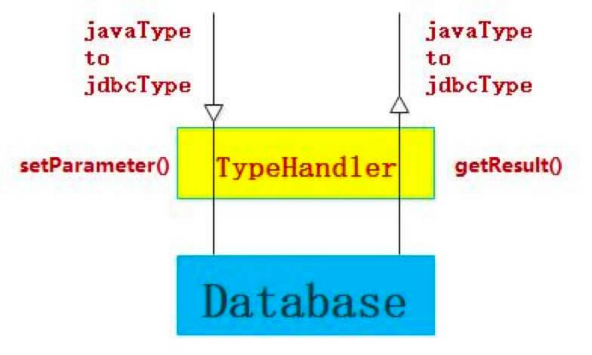流程

左边是 #setParameter(...) 方法，是 Java Type => JDBC Type 的过程，从上往下看。

右边是 #getResult(...) 方法，是 JDBC Type => Java Type 的过程，从下往上看。

## 2.1 BaseTypeHandler

org.apache.ibatis.type.BaseTypeHandler ，实现 TypeHandler 接口，继承 TypeReference 抽象类，TypeHandler 基础抽象类。

关于 TypeReference ，我们在 [「3. TypeHandler」](http://svip.iocoder.cn/MyBatis/type-package/) 中，详细解析。

### 2.1.1 setParameter

\#setParameter(PreparedStatement ps, int i, T parameter, JdbcType jdbcType) 方法，代码如下：

// BaseTypeHandler.java  @Override public void setParameter(PreparedStatement ps, int i, T parameter, JdbcType jdbcType) throws SQLException {   // <1> 参数为空时，设置为 null 类型   if (parameter == null) {     if (jdbcType == null) {       throw new TypeException("JDBC requires that the JdbcType must be specified for all nullable parameters.");     }     try {       ps.setNull(i, jdbcType.TYPE_CODE);     } catch (SQLException e) {       throw new TypeException("Error setting null for parameter #" + i + " with JdbcType " + jdbcType + " . " +           "Try setting a different JdbcType for this parameter or a different jdbcTypeForNull configuration property. " +           "Cause: " + e, e);     }   // 参数非空时，设置对应的参数   } else {     try {       setNonNullParameter(ps, i, parameter, jdbcType);     } catch (Exception e) {       throw new TypeException("Error setting non null for parameter #" + i + " with JdbcType " + jdbcType + " . " +           "Try setting a different JdbcType for this parameter or a different configuration property. " +           "Cause: " + e, e);     }   } }

<1> 处，参数为空，设置为 null 类型。


<2> 处，参数非空，调用 #setNonNullParameter(PreparedStatement ps, int i, T parameter, JdbcType jdbcType) 抽象方法，设置对应的参数。代码如下：


// BaseTypeHandler.java  public abstract void setNonNullParameter(PreparedStatement ps, int i, T parameter, JdbcType jdbcType) throws SQLException;


该方法由子类实现。

当发生异常时，统一抛出 TypeException 异常。

### 2.1.2 getResult

\#getResult(...) 方法，代码如下：

// BaseTypeHandler.java  @Override public T getResult(ResultSet rs, String columnName) throws SQLException {   try {     return getNullableResult(rs, columnName);   } catch (Exception e) {     throw new ResultMapException("Error attempting to get column '" + columnName + "' from result set.  Cause: " + e, e);   } }  @Override public T getResult(ResultSet rs, int columnIndex) throws SQLException {   try {     return getNullableResult(rs, columnIndex);   } catch (Exception e) {     throw new ResultMapException("Error attempting to get column #" + columnIndex + " from result set.  Cause: " + e, e);   } }  @Override public T getResult(CallableStatement cs, int columnIndex) throws SQLException {   try {     return getNullableResult(cs, columnIndex);   } catch (Exception e) {     throw new ResultMapException("Error attempting to get column #" + columnIndex + " from callable statement.  Cause: " + e, e);   } }


调用 #getNullableResult(...) 抽象方法，获得指定结果的字段值。代码如下：


// BaseTypeHandler.java  public abstract T getNullableResult(ResultSet rs, String columnName) throws SQLException;  public abstract T getNullableResult(ResultSet rs, int columnIndex) throws SQLException;  public abstract T getNullableResult(CallableStatement cs, int columnIndex) throws SQLException;


该方法由子类实现。


当发生异常时，统一抛出 ResultMapException 异常。


## 2.2 子类

TypeHandler 有非常多的子类，当然所有子类都是继承自 BaseTypeHandler 抽象类。考虑到篇幅，我们就挑选几个来聊聊。

### 2.2.1 IntegerTypeHandler

org.apache.ibatis.type.IntegerTypeHandler ，继承 BaseTypeHandler 抽象类，Integer 类型的 TypeHandler 实现类。代码如下：

// IntegerTypeHandler.java  public class IntegerTypeHandler extends BaseTypeHandler<Integer> {    @Override   public void setNonNullParameter(PreparedStatement ps, int i, Integer parameter, JdbcType jdbcType)       throws SQLException {     // 直接设置参数即可     ps.setInt(i, parameter);   }    @Override   public Integer getNullableResult(ResultSet rs, String columnName)       throws SQLException {     // 获得字段的值     int result = rs.getInt(columnName);     // 先通过 rs 判断是否空，如果是空，则返回 null ，否则返回 result     return (result == 0 && rs.wasNull()) ? null : result;   }    @Override   public Integer getNullableResult(ResultSet rs, int columnIndex)       throws SQLException {     // 获得字段的值     int result = rs.getInt(columnIndex);     // 先通过 rs 判断是否空，如果是空，则返回 null ，否则返回 result     return (result == 0 && rs.wasNull()) ? null : result;   }    @Override   public Integer getNullableResult(CallableStatement cs, int columnIndex)       throws SQLException {     // 获得字段的值     int result = cs.getInt(columnIndex);     // 先通过 cs 判断是否空，如果是空，则返回 null ，否则返回 result     return (result == 0 && cs.wasNull()) ? null : result;   } }

比较简单，胖友瞅瞅。比较有意思的是 ResultSet#wasNull() 方法，它会判断最后读取的字段是否为空。

### 2.2.2 DateTypeHandler

org.apache.ibatis.type.DateTypeHandler ，继承 BaseTypeHandler 抽象类，Date 类型的 TypeHandler 实现类。代码如下：

// DateTypeHandler.java  public class DateTypeHandler extends BaseTypeHandler<Date> {    @Override   public void setNonNullParameter(PreparedStatement ps, int i, Date parameter, JdbcType jdbcType)       throws SQLException {     // 将 Date 转换成 Timestamp 类型     // 然后设置到 ps 中     ps.setTimestamp(i, new Timestamp(parameter.getTime()));   }    @Override   public Date getNullableResult(ResultSet rs, String columnName)       throws SQLException {     // 获得 Timestamp 的值     Timestamp sqlTimestamp = rs.getTimestamp(columnName);     // 将 Timestamp 转换成 Date 类型     if (sqlTimestamp != null) {       return new Date(sqlTimestamp.getTime());     }     return null;   }    @Override   public Date getNullableResult(ResultSet rs, int columnIndex)       throws SQLException {     // 获得 Timestamp 的值     Timestamp sqlTimestamp = rs.getTimestamp(columnIndex);     // 将 Timestamp 转换成 Date 类型     if (sqlTimestamp != null) {       return new Date(sqlTimestamp.getTime());     }     return null;   }    @Override   public Date getNullableResult(CallableStatement cs, int columnIndex)       throws SQLException {     // 获得 Timestamp 的值     Timestamp sqlTimestamp = cs.getTimestamp(columnIndex);     // 将 Timestamp 转换成 Date 类型     if (sqlTimestamp != null) {       return new Date(sqlTimestamp.getTime());     }     return null;   }  }

java.util.Date 和 java.sql.Timestamp 的互相转换。

### 2.2.3 DateOnlyTypeHandler

org.apache.ibatis.type.DateOnlyTypeHandler ，继承 BaseTypeHandler 抽象类，Date 类型的 TypeHandler 实现类。代码如下：

// DateOnlyTypeHandler.java  public class DateOnlyTypeHandler extends BaseTypeHandler<Date> {    @Override   public void setNonNullParameter(PreparedStatement ps, int i, Date parameter, JdbcType jdbcType)       throws SQLException {     // 将 java Date 转换成 sql Date 类型     ps.setDate(i, new java.sql.Date(parameter.getTime()));   }    @Override   public Date getNullableResult(ResultSet rs, String columnName)       throws SQLException {     // 获得 sql Date 的值     java.sql.Date sqlDate = rs.getDate(columnName);     // 将 sql Date 转换成 java Date 类型     if (sqlDate != null) {       return new Date(sqlDate.getTime());     }     return null;   }    @Override   public Date getNullableResult(ResultSet rs, int columnIndex)       throws SQLException {     // 获得 sql Date 的值     java.sql.Date sqlDate = rs.getDate(columnIndex);     // 将 sql Date 转换成 java Date 类型     if (sqlDate != null) {       return new Date(sqlDate.getTime());     }     return null;   }    @Override   public Date getNullableResult(CallableStatement cs, int columnIndex)       throws SQLException {     // 获得 sql Date 的值     java.sql.Date sqlDate = cs.getDate(columnIndex);     // 将 sql Date 转换成 java Date 类型     if (sqlDate != null) {       return new Date(sqlDate.getTime());     }     return null;   }  }

java.util.Date 和 java.sql.Date 的互相转换。

数据库里的时间有多种类型，以 MySQL 举例子，有 date、timestamp、datetime 三种类型。

### 2.2.4 EnumTypeHandler

org.apache.ibatis.type.EnumTypeHandler ，继承 BaseTypeHandler 抽象类，Enum 类型的 TypeHandler 实现类。代码如下：

// EnumTypeHandler.java  public class EnumTypeHandler<E extends Enum<E>> extends BaseTypeHandler<E> {    /**    * 枚举类    */   private final Class<E> type;    public EnumTypeHandler(Class<E> type) {     if (type == null) {       throw new IllegalArgumentException("Type argument cannot be null");     }     this.type = type;   }    @Override   public void setNonNullParameter(PreparedStatement ps, int i, E parameter, JdbcType jdbcType) throws SQLException {     // 将 Enum 转换成 String 类型     if (jdbcType == null) {       ps.setString(i, parameter.name());     } else {       ps.setObject(i, parameter.name(), jdbcType.TYPE_CODE); // see r3589     }   }    @Override   public E getNullableResult(ResultSet rs, String columnName) throws SQLException {     // 获得 String 的值     String s = rs.getString(columnName);     // 将 String 转换成 Enum 类型     return s == null ? null : Enum.valueOf(type, s);   }    @Override   public E getNullableResult(ResultSet rs, int columnIndex) throws SQLException {     // 获得 String 的值     String s = rs.getString(columnIndex);     // 将 String 转换成 Enum 类型     return s == null ? null : Enum.valueOf(type, s);   }    @Override   public E getNullableResult(CallableStatement cs, int columnIndex) throws SQLException {     // 获得 String 的值     String s = cs.getString(columnIndex);     // 将 String 转换成 Enum 类型     return s == null ? null : Enum.valueOf(type, s);   }  }

java.lang.Enum 和 java.util.String 的互相转换。

因为数据库不存在枚举类型，所以讲枚举类型持久化到数据库有两种方式，Enum.name <=> String 和 Enum.ordinal <=> int 。我们目前看到的 EnumTypeHandler 是前者，下面我们将看到的 EnumOrdinalTypeHandler 是后者。

### 2.2.5 EnumOrdinalTypeHandler

org.apache.ibatis.type.EnumOrdinalTypeHandler ，继承 BaseTypeHandler 抽象类，Enum 类型的 TypeHandler 实现类。代码如下：

// EnumOrdinalTypeHandler.java  public class EnumOrdinalTypeHandler<E extends Enum<E>> extends BaseTypeHandler<E> {    /**    * 枚举类    */   private final Class<E> type;   /**    * {@link #type} 下所有的枚举    *    * @see Class#getEnumConstants()    */   private final E[] enums;    public EnumOrdinalTypeHandler(Class<E> type) {     if (type == null) {       throw new IllegalArgumentException("Type argument cannot be null");     }     this.type = type;     this.enums = type.getEnumConstants();     if (this.enums == null) {       throw new IllegalArgumentException(type.getSimpleName() + " does not represent an enum type.");     }   }    @Override   public void setNonNullParameter(PreparedStatement ps, int i, E parameter, JdbcType jdbcType) throws SQLException {     // 将 Enum 转换成 int 类型     ps.setInt(i, parameter.ordinal());   }    @Override   public E getNullableResult(ResultSet rs, String columnName) throws SQLException {     // 获得 int 的值     int i = rs.getInt(columnName);     // 将 int 转换成 Enum 类型     if (i == 0 && rs.wasNull()) {       return null;     } else {       try {         return enums[i];       } catch (Exception ex) {         throw new IllegalArgumentException("Cannot convert " + i + " to " + type.getSimpleName() + " by ordinal value.", ex);       }     }   }    @Override   public E getNullableResult(ResultSet rs, int columnIndex) throws SQLException {     // 获得 int 的值     int i = rs.getInt(columnIndex);     // 将 int 转换成 Enum 类型     if (i == 0 && rs.wasNull()) {       return null;     } else {       try {         return enums[i];       } catch (Exception ex) {         throw new IllegalArgumentException("Cannot convert " + i + " to " + type.getSimpleName() + " by ordinal value.", ex);       }     }   }    @Override   public E getNullableResult(CallableStatement cs, int columnIndex) throws SQLException {     // 获得 int 的值     int i = cs.getInt(columnIndex);     // 将 int 转换成 Enum 类型     if (i == 0 && cs.wasNull()) {       return null;     } else {       try {         return enums[i];       } catch (Exception ex) {         throw new IllegalArgumentException("Cannot convert " + i + " to " + type.getSimpleName() + " by ordinal value.", ex);       }     }   }  }

java.lang.Enum 和 int 的互相转换。

### 2.2.6 ObjectTypeHandler

org.apache.ibatis.type.ObjectTypeHandler ，继承 BaseTypeHandler 抽象类，Object 类型的 TypeHandler 实现类。代码如下：

// ObjectTypeHandler.java  public class ObjectTypeHandler extends BaseTypeHandler<Object> {    @Override   public void setNonNullParameter(PreparedStatement ps, int i, Object parameter, JdbcType jdbcType)       throws SQLException {     ps.setObject(i, parameter);   }    @Override   public Object getNullableResult(ResultSet rs, String columnName)       throws SQLException {     return rs.getObject(columnName);   }    @Override   public Object getNullableResult(ResultSet rs, int columnIndex)       throws SQLException {     return rs.getObject(columnIndex);   }    @Override   public Object getNullableResult(CallableStatement cs, int columnIndex)       throws SQLException {     return cs.getObject(columnIndex);   }  }

### 2.2.7 UnknownTypeHandler

org.apache.ibatis.type.UnknownTypeHandler ，继承 BaseTypeHandler 抽象类，未知的 TypeHandler 实现类。通过获取对应的 TypeHandler ，进行处理。代码如下：

// UnknownTypeHandler.java  public class UnknownTypeHandler extends BaseTypeHandler<Object> {    /**    * ObjectTypeHandler 单例    */   private static final ObjectTypeHandler OBJECT_TYPE_HANDLER = new ObjectTypeHandler();    /**    * TypeHandler 注册表    */   private TypeHandlerRegistry typeHandlerRegistry;    public UnknownTypeHandler(TypeHandlerRegistry typeHandlerRegistry) {     this.typeHandlerRegistry = typeHandlerRegistry;   }    @Override   public void setNonNullParameter(PreparedStatement ps, int i, Object parameter, JdbcType jdbcType)       throws SQLException {     // 获得参数对应的处理器     TypeHandler handler = resolveTypeHandler(parameter, jdbcType); // <1>     // 使用 handler 设置参数     handler.setParameter(ps, i, parameter, jdbcType);   }    @Override   public Object getNullableResult(ResultSet rs, String columnName)       throws SQLException {     // 获得参数对应的处理器     TypeHandler<?> handler = resolveTypeHandler(rs, columnName); // <2>     // 使用 handler 获得值     return handler.getResult(rs, columnName);   }    @Override   public Object getNullableResult(ResultSet rs, int columnIndex)       throws SQLException {     // 获得参数对应的处理器     TypeHandler<?> handler = resolveTypeHandler(rs.getMetaData(), columnIndex); // <3>     // 如果找不到对应的处理器，使用 OBJECT_TYPE_HANDLER     if (handler == null || handler instanceof UnknownTypeHandler) {       handler = OBJECT_TYPE_HANDLER;     }     // 使用 handler 获得值     return handler.getResult(rs, columnIndex);   }    @Override   public Object getNullableResult(CallableStatement cs, int columnIndex)       throws SQLException {     return cs.getObject(columnIndex);   }    private TypeHandler<? extends Object> resolveTypeHandler(Object parameter, JdbcType jdbcType) { // <1>     TypeHandler<? extends Object> handler;     // 参数为空，返回 OBJECT_TYPE_HANDLER     if (parameter == null) {       handler = OBJECT_TYPE_HANDLER;     // 参数非空，使用参数类型获得对应的 TypeHandler     } else {       handler = typeHandlerRegistry.getTypeHandler(parameter.getClass(), jdbcType);       // check if handler is null (issue #270)       // 获取不到，则使用 OBJECT_TYPE_HANDLER       if (handler == null || handler instanceof UnknownTypeHandler) {         handler = OBJECT_TYPE_HANDLER;       }     }     return handler;   }    private TypeHandler<?> resolveTypeHandler(ResultSet rs, String column) {     try {       // 获得 columnIndex       Map<String, Integer> columnIndexLookup = new HashMap<>();       ResultSetMetaData rsmd = rs.getMetaData(); // 通过 metaData       int count = rsmd.getColumnCount();       for (int i = 1; i <= count; i++) {         String name = rsmd.getColumnName(i);         columnIndexLookup.put(name, i);       }       Integer columnIndex = columnIndexLookup.get(column);       TypeHandler<?> handler = null;       // 首先，通过 columnIndex 获得 TypeHandler       if (columnIndex != null) {         handler = resolveTypeHandler(rsmd, columnIndex); // <3>       }       // 获得不到，使用 OBJECT_TYPE_HANDLER       if (handler == null || handler instanceof UnknownTypeHandler) {         handler = OBJECT_TYPE_HANDLER;       }       return handler;     } catch (SQLException e) {       throw new TypeException("Error determining JDBC type for column " + column + ".  Cause: " + e, e);     }   }    private TypeHandler<?> resolveTypeHandler(ResultSetMetaData rsmd, Integer columnIndex) { // <3>     TypeHandler<?> handler = null;     // 获得 JDBC Type 类型     JdbcType jdbcType = safeGetJdbcTypeForColumn(rsmd, columnIndex);     // 获得 Java Type 类型     Class<?> javaType = safeGetClassForColumn(rsmd, columnIndex);     //获得对应的 TypeHandler 对象     if (javaType != null && jdbcType != null) {       handler = typeHandlerRegistry.getTypeHandler(javaType, jdbcType);     } else if (javaType != null) {       handler = typeHandlerRegistry.getTypeHandler(javaType);     } else if (jdbcType != null) {       handler = typeHandlerRegistry.getTypeHandler(jdbcType);     }     return handler;   }    private JdbcType safeGetJdbcTypeForColumn(ResultSetMetaData rsmd, Integer columnIndex) {     try {       // 从 ResultSetMetaData 中，获得字段类型       // 获得 JDBC Type       return JdbcType.forCode(rsmd.getColumnType(columnIndex));     } catch (Exception e) {       return null;     }   }    private Class<?> safeGetClassForColumn(ResultSetMetaData rsmd, Integer columnIndex) {     try {       // 从 ResultSetMetaData 中，获得字段类型       // 获得 Java Type       return Resources.classForName(rsmd.getColumnClassName(columnIndex));     } catch (Exception e) {       return null;     }   }    }

代码比较简单，胖友自己瞅瞅。

# 3. TypeReference

org.apache.ibatis.type.TypeReference ，引用泛型抽象类。目的很简单，就是解析类上定义的泛型。代码如下：

// TypeReference.java  public abstract class TypeReference<T> {    /**    * 泛型    */   private final Type rawType;    protected TypeReference() {     rawType = getSuperclassTypeParameter(getClass());   }    Type getSuperclassTypeParameter(Class<?> clazz) {     // 【1】从父类中获取 <T>     Type genericSuperclass = clazz.getGenericSuperclass();     if (genericSuperclass instanceof Class) {       // 能满足这个条件的，例如 GenericTypeSupportedInHierarchiesTestCase.CustomStringTypeHandler 这个类       // try to climb up the hierarchy until meet something useful       if (TypeReference.class != genericSuperclass) { // 排除 TypeReference 类         return getSuperclassTypeParameter(clazz.getSuperclass());       }        throw new TypeException("'" + getClass() + "' extends TypeReference but misses the type parameter. "           + "Remove the extension or add a type parameter to it.");     }      // 【2】获取 <T>     Type rawType = ((ParameterizedType) genericSuperclass).getActualTypeArguments()[0];     // TODO remove this when Reflector is fixed to return Types     // 必须是泛型，才获取 <T>     if (rawType instanceof ParameterizedType) {       rawType = ((ParameterizedType) rawType).getRawType();     }      return rawType;   }    public final Type getRawType() {     return rawType;   }    @Override   public String toString() {     return rawType.toString();   }  }

举个例子，[「2.2.1 IntegerTypeHandler」](http://svip.iocoder.cn/MyBatis/type-package/) 解析后的结果 rawType 为 Integer 。


【1】 处，从父类中获取 <T> 。举个例子，代码如下：


// GenericTypeSupportedInHierarchiesTestCase.java 的内部静态类  public static final class CustomStringTypeHandler extends StringTypeHandler {    /**    * Defined as reported in #581    */   @Override   public void setNonNullParameter(PreparedStatement ps, int i, String parameter, JdbcType jdbcType) throws SQLException {     // do something     super.setNonNullParameter(ps, i, parameter, jdbcType);   }  }


因为 CustomStringTypeHandler 自身是没有泛型的，需要从父类 StringTypeHandler 中获取。并且，获取的结果会是 rawType 为 String 。

【2】 处，从当前类获取 <T> 。

# 4. 注解

type 包中，也定义了三个注解，我们逐个来看看。

## 4.1 @MappedTypes

org.apache.ibatis.type.@MappedTypes ，匹配的 Java Type 类型的注解。代码如下：

// MappedTypes.java  @Documented @Retention(RetentionPolicy.RUNTIME) @Target(ElementType.TYPE) // 注册到类 public @interface MappedTypes {    /**    * @return 匹配的 Java Type 类型的数组    */   Class<?>[] value();  }

## 4.2 @MappedJdbcTypes

org.apache.ibatis.type.@MappedJdbcTypes ，匹配的 JDBC Type 类型的注解。代码如下：

// MappedJdbcTypes.java  @Documented @Retention(RetentionPolicy.RUNTIME) @Target(ElementType.TYPE) // 注册到类 public @interface MappedJdbcTypes {    /**    * @return 匹配的 JDBC Type 类型的注解    */   JdbcType[] value();    /**    * @return 是否包含 {@link java.sql.JDBCType#NULL}    */   boolean includeNullJdbcType() default false;  }

## 4.3 Alias

org.apache.ibatis.type.@Alias ，别名的注解。代码如下：

// Alias.java  @Documented @Retention(RetentionPolicy.RUNTIME) @Target(ElementType.TYPE) public @interface Alias {    /**    * @return 别名    */   String value();  }

# 5. JdbcType

org.apache.ibatis.type.JdbcType ，Jdbc Type 枚举。代码如下：

// JdbcType.java  public enum JdbcType {    /*    * This is added to enable basic support for the    * ARRAY data type - but a custom type handler is still required    */   ARRAY(Types.ARRAY),   BIT(Types.BIT),   TINYINT(Types.TINYINT),   SMALLINT(Types.SMALLINT),   INTEGER(Types.INTEGER),   BIGINT(Types.BIGINT),   FLOAT(Types.FLOAT),   REAL(Types.REAL),   DOUBLE(Types.DOUBLE),   NUMERIC(Types.NUMERIC),   DECIMAL(Types.DECIMAL),   CHAR(Types.CHAR),   VARCHAR(Types.VARCHAR),   LONGVARCHAR(Types.LONGVARCHAR),   DATE(Types.DATE),   TIME(Types.TIME),   TIMESTAMP(Types.TIMESTAMP),   BINARY(Types.BINARY),   VARBINARY(Types.VARBINARY),   LONGVARBINARY(Types.LONGVARBINARY),   NULL(Types.NULL),   OTHER(Types.OTHER),   BLOB(Types.BLOB),   CLOB(Types.CLOB),   BOOLEAN(Types.BOOLEAN),   CURSOR(-10), // Oracle   UNDEFINED(Integer.MIN_VALUE + 1000),   NVARCHAR(Types.NVARCHAR), // JDK6   NCHAR(Types.NCHAR), // JDK6   NCLOB(Types.NCLOB), // JDK6   STRUCT(Types.STRUCT),   JAVA_OBJECT(Types.JAVA_OBJECT),   DISTINCT(Types.DISTINCT),   REF(Types.REF),   DATALINK(Types.DATALINK),   ROWID(Types.ROWID), // JDK6   LONGNVARCHAR(Types.LONGNVARCHAR), // JDK6   SQLXML(Types.SQLXML), // JDK6   DATETIMEOFFSET(-155); // SQL Server 2008    /**    * 类型编号。嘿嘿，此处代码不规范    */   public final int TYPE_CODE;    /**    * 代码编号和 {@link JdbcType} 的映射    */   private static Map<Integer, JdbcType> codeLookup = new HashMap<>();    static {     // 初始化 codeLookup     for (JdbcType type : JdbcType.values()) {       codeLookup.put(type.TYPE_CODE, type);     }   }    JdbcType(int code) {     this.TYPE_CODE = code;   }    public static JdbcType forCode(int code) {     return codeLookup.get(code);   }  }

# 6. TypeHandlerRegistry

org.apache.ibatis.type.TypeHandlerRegistry ，TypeHandler 注册表，相当于管理 TypeHandler 的容器，从其中能获取到对应的 TypeHandler 。

## 6.1 构造方法

// TypeHandlerRegistry.java  /**  * 空 TypeHandler 集合的标识，即使 {@link #TYPE_HANDLER_MAP} 中，某个 KEY1 对应的 Map<JdbcType, TypeHandler<?>> 为空。  *  * @see #getJdbcHandlerMap(Type)  */ private static final Map<JdbcType, TypeHandler<?>> NULL_TYPE_HANDLER_MAP = Collections.emptyMap();  /**  * JDBC Type 和 {@link TypeHandler} 的映射  *  * {@link #register(JdbcType, TypeHandler)}  */ private final Map<JdbcType, TypeHandler<?>> JDBC_TYPE_HANDLER_MAP = new EnumMap<>(JdbcType.class); /**  * {@link TypeHandler} 的映射  *  * KEY1：JDBC Type  * KEY2：Java Type  * VALUE：{@link TypeHandler} 对象  */ private final Map<Type, Map<JdbcType, TypeHandler<?>>> TYPE_HANDLER_MAP = new ConcurrentHashMap<>(); /**  * 所有 TypeHandler 的“集合”  *  * KEY：{@link TypeHandler#getClass()}  * VALUE：{@link TypeHandler} 对象  */ private final Map<Class<?>, TypeHandler<?>> ALL_TYPE_HANDLERS_MAP = new HashMap<>();  /**  * {@link UnknownTypeHandler} 对象  */ private final TypeHandler<Object> UNKNOWN_TYPE_HANDLER = new UnknownTypeHandler(this); /**  * 默认的枚举类型的 TypeHandler 对象  */ private Class<? extends TypeHandler> defaultEnumTypeHandler = EnumTypeHandler.class;  public TypeHandlerRegistry() {   // ... 省略其它类型的注册    // <1>   register(Date.class, new DateTypeHandler());   register(Date.class, JdbcType.DATE, new DateOnlyTypeHandler());   register(Date.class, JdbcType.TIME, new TimeOnlyTypeHandler());   // <2>   register(JdbcType.TIMESTAMP, new DateTypeHandler());   register(JdbcType.DATE, new DateOnlyTypeHandler());   register(JdbcType.TIME, new TimeOnlyTypeHandler());    // ... 省略其它类型的注册 }

TYPE_HANDLER_MAP 属性，TypeHandler 的映射。

一个 Java Type 可以对应多个 JDBC Type ，也就是多个 TypeHandler ，所以 Map 的第一层的值是 Map<JdbcType, TypeHandler<?> 。在 <1> 处，我们可以看到，Date 对应了多个 JDBC 的 TypeHandler 的注册。

当一个 Java Type 不存在对应的 JDBC Type 时，就使用 NULL_TYPE_HANDLER_MAP 静态属性，添加到 TYPE_HANDLER_MAP 中进行占位。

JDBC_TYPE_HANDLER_MAP 属性，JDBC Type 和 TypeHandler 的映射。

一个 JDBC Type 只对应一个 Java Type ，也就是一个 TypeHandler ，不同于 TYPE_HANDLER_MAP 属性。在 <2> 处，我们可以看到，我们可以看到，三个时间类型的 JdbcType 注册到 JDBC_TYPE_HANDLER_MAP 中。

那么可能会有胖友问，JDBC_TYPE_HANDLER_MAP 是一一映射，简单就可以获得 JDBC Type 对应的 TypeHandler ，而 TYPE_HANDLER_MAP 是一对多映射，一个 JavaType 怎么获取到对应的 TypeHandler 呢？继续往下看，答案在 #getTypeHandler(Type type, JdbcType jdbcType) 方法。

ALL_TYPE_HANDLERS_MAP 属性，所有 TypeHandler 的“集合” 。

UNKNOWN_TYPE_HANDLER 属性，UnknownTypeHandler 对象，用于 Object 类型的注册。

defaultEnumTypeHandler 属性，默认的枚举类型的 TypeHandler 对象。

在构造方法中，有默认的 Java Type 和 JDBC Type 对 TypeHandler 的注册，因为有丢丢多，所以被艿艿省略了。

另外，这里的变量命名是不符合 Java 命名规范，不要学习。

## 6.2 getInstance

\#getInstance(Class<?> javaTypeClass, Class<?> typeHandlerClass) 方法，创建 TypeHandler 对象。代码如下：

// TypeHandlerRegistry.java  public <T> TypeHandler<T> getInstance(Class<?> javaTypeClass, Class<?> typeHandlerClass) {   // 获得 Class 类型的构造方法   if (javaTypeClass != null) {     try {       Constructor<?> c = typeHandlerClass.getConstructor(Class.class);       return (TypeHandler<T>) c.newInstance(javaTypeClass); // 符合这个条件的，例如 EnumTypeHandler     } catch (NoSuchMethodException ignored) {       // ignored 忽略该异常，继续向下     } catch (Exception e) {       throw new TypeException("Failed invoking constructor for handler " + typeHandlerClass, e);     }   }   // <2> 获得空参的构造方法   try {     Constructor<?> c = typeHandlerClass.getConstructor();     return (TypeHandler<T>) c.newInstance(); // 符合这个条件的，例如 IntegerTypeHandler   } catch (Exception e) {     throw new TypeException("Unable to find a usable constructor for " + typeHandlerClass, e);   } }

<1> 处，获得 Class 类型的构造方法，适合 [「2.2.4 EnumTypeHandler」](http://svip.iocoder.cn/MyBatis/type-package/) 的情况。

<2> 处，获得空参的构造方法，适合 [「2.2.1 IntegerTypeHandler」](http://svip.iocoder.cn/MyBatis/type-package/) 的情况。

## 6.3 register

\#register(...) 方法，注册 TypeHandler 。TypeHandlerRegistry 中有大量该方法的重载实现，大体整理如下：

FROM 徐郡明 [《MyBatis 技术内幕》](https://item.jd.com/12125531.html)

register 方法

除了 ⑤ 以外，所有方法最终都会调用 ④ ，即 #register(Type javaType, JdbcType jdbcType, TypeHandler<?> handler) 方法，代码如下：

// TypeHandlerRegistry.java  private void register(Type javaType, JdbcType jdbcType, TypeHandler<?> handler) {   // <1> 添加 handler 到 TYPE_HANDLER_MAP 中   if (javaType != null) {     // 获得 Java Type 对应的 map     Map<JdbcType, TypeHandler<?>> map = TYPE_HANDLER_MAP.get(javaType);     if (map == null || map == NULL_TYPE_HANDLER_MAP) { // 如果不存在，则进行创建       map = new HashMap<>();       TYPE_HANDLER_MAP.put(javaType, map);     }     // 添加到 handler 中 map 中     map.put(jdbcType, handler);   }   // <2> 添加 handler 到 ALL_TYPE_HANDLERS_MAP 中   ALL_TYPE_HANDLERS_MAP.put(handler.getClass(), handler); }

<1> 处，添加 handler 到 TYPE_HANDLER_MAP 中。

<2> 处，添加 handler 到 ALL_TYPE_HANDLERS_MAP 中。

这个方法还是比较简单的，我们看看其他调用的方法。

① #register(String packageName) 方法，扫描指定包下的所有 TypeHandler 类，并发起注册。代码如下：

// TypeHandlerRegistry.java    public void register(String packageName) {   // 扫描指定包下的所有 TypeHandler 类   ResolverUtil<Class<?>> resolverUtil = new ResolverUtil<>();   resolverUtil.find(new ResolverUtil.IsA(TypeHandler.class), packageName);   Set<Class<? extends Class<?>>> handlerSet = resolverUtil.getClasses();   // 遍历 TypeHandler 数组，发起注册   for (Class<?> type : handlerSet) {     //Ignore inner classes and interfaces (including package-info.java) and abstract classes     // 排除匿名类、接口、抽象类     if (!type.isAnonymousClass() && !type.isInterface() && !Modifier.isAbstract(type.getModifiers())) {       register(type);     }   } }


在方法，会调用 ⑥ #register(Class<?> typeHandlerClass) 方法，注册指定 TypeHandler 类。代码如下：


// TypeHandlerRegistry.java  public void register(Class<?> typeHandlerClass) {   boolean mappedTypeFound = false;   // <3> 获得 @MappedTypes 注解   MappedTypes mappedTypes = typeHandlerClass.getAnnotation(MappedTypes.class);   if (mappedTypes != null) {     // 遍历注解的 Java Type 数组，逐个进行注册     for (Class<?> javaTypeClass : mappedTypes.value()) {       register(javaTypeClass, typeHandlerClass);       mappedTypeFound = true;     }   }   // <4> 未使用 @MappedTypes 注解，则直接注册   if (!mappedTypeFound) {     register(getInstance(null, typeHandlerClass)); // 创建 TypeHandler 对象   } }


分成 <3> <4> 两种情况。


<3> 处，基于 @MappedTypes 注解，调用 #register(Class<?> javaTypeClass, Class<?> typeHandlerClass) 方法，注册指定 Java Type 的指定 TypeHandler 类。代码如下：


// TypeHandlerRegistry.java  public void register(Class<?> javaTypeClass, Class<?> typeHandlerClass) {   register(javaTypeClass, getInstance(javaTypeClass, typeHandlerClass)); // 创建 TypeHandler 对象 }


调用 ③ #register(Class<T> javaType, TypeHandler<? extends T> typeHandler) 方法，注册指定 Java Type 的指定 TypeHandler 对象。代码如下：


// TypeHandlerRegistry.java  private <T> void register(Type javaType, TypeHandler<? extends T> typeHandler) {   // 获得 MappedJdbcTypes 注解   MappedJdbcTypes mappedJdbcTypes = typeHandler.getClass().getAnnotation(MappedJdbcTypes.class);   if (mappedJdbcTypes != null) {     // 遍历 MappedJdbcTypes 注册的 JDBC Type 进行注册     for (JdbcType handledJdbcType : mappedJdbcTypes.value()) {       register(javaType, handledJdbcType, typeHandler);     }     if (mappedJdbcTypes.includeNullJdbcType()) {       // <5>       register(javaType, null, typeHandler); // jdbcType = null     }   } else {     // <5>     register(javaType, null, typeHandler); // jdbcType = null   } }


**·** 有 @MappedJdbcTypes 注解的 ④ #register(Type javaType, JdbcType jdbcType, TypeHandler<?> handler) 方法，发起最终注册。

对于 <5> 处，发起注册时，jdbcType 参数为 null ，这是为啥？


<4> 处，调用 ② #register(TypeHandler<T> typeHandler) 方法，未使用 @MappedTypes 注解，调用 #register(TypeHandler<T> typeHandler) 方法，注册 TypeHandler 对象。代码如下：


// TypeHandlerRegistry.java  public <T> void register(TypeHandler<T> typeHandler) {   boolean mappedTypeFound = false;   // <5> 获得 @MappedTypes 注解   MappedTypes mappedTypes = typeHandler.getClass().getAnnotation(MappedTypes.class);   // 优先，使用 @MappedTypes 注解的 Java Type 进行注册   if (mappedTypes != null) {     for (Class<?> handledType : mappedTypes.value()) {       register(handledType, typeHandler);       mappedTypeFound = true;     }   }   // @since 3.1.0 - try to auto-discover the mapped type   // <6> 其次，当 typeHandler 为 TypeReference 子类时，进行注册   if (!mappedTypeFound && typeHandler instanceof TypeReference) {     try {       TypeReference<T> typeReference = (TypeReference<T>) typeHandler;       register(typeReference.getRawType(), typeHandler); // Java Type 为 <T> 泛型       mappedTypeFound = true;     } catch (Throwable t) {       // maybe users define the TypeReference with a different type and are not assignable, so just ignore it     }   }   // <7> 最差，使用 Java Type 为 null 进行注册   if (!mappedTypeFound) {     register((Class<T>) null, typeHandler);   } }


分成三种情况，最终都是调用 #register(Type javaType, TypeHandler<? extends T> typeHandler) 方法，进行注册，也就是跳到 ③ 。

<5> 处，优先，有符合的 @MappedTypes 注解时，使用 @MappedTypes 注解的 Java Type 进行注册。

<6> 处，其次，当 typeHandler 为 TypeReference 子类时，使用 <T> 作为 Java Type 进行注册。

<7> 处，最差，使用 null 作为 Java Type 进行注册。但是，这种情况下，只会将 typeHandler 添加到 ALL_TYPE_HANDLERS_MAP 中。因为，实际上没有 Java Type 。

因为重载的方法有点多，理解起来可能比较绕，胖友可能会比较闷逼。哈哈哈，实际在自己写的过程中，也有点懵逼。那怎么办？大体理解就好，另外 @MappedTypes 和 @MappedJdbcTypes 这两个注解基本不会用到，所以也可以先“忽略”。

另外，#register(...) 方法，还有其它重载方法，胖友可以自己翻下。


------


⑤ #register(JdbcType jdbcType, TypeHandler<?> handler) 方法，注册 handler 到 JDBC_TYPE_HANDLER_MAP 中。代码如下：

// TypeHandlerRegistry.java  public void register(JdbcType jdbcType, TypeHandler<?> handler) {   JDBC_TYPE_HANDLER_MAP.put(jdbcType, handler); }

和上述的 #register(...) 方法是不同的。

## 6.4 getTypeHandler

\#getTypeHandler(...) 方法，获得 TypeHandler 。TypeHandlerRegistry 有大量该方法的重载实现，大体整体如下：

FROM 徐郡明 [《MyBatis 技术内幕》](https://item.jd.com/12125531.html)

getTypeHandler 方法

从图中，我们可以看到，最终会调用 ① 处的 #getTypeHandler(Type type, JdbcType jdbcType) 方法。当然，我们先来看看三种调用的情况：


调用情况一：#getTypeHandler(Class<T> type) 方法，代码如下：


// TypeHandlerRegistry.java  public <T> TypeHandler<T> getTypeHandler(Class<T> type) {   return getTypeHandler((Type) type, null); }


jdbcType 为 null 。


调用情况二：#getTypeHandler(Class<T> type, JdbcType jdbcType) 方法，代码如下：


// TypeHandlerRegistry.java  public <T> TypeHandler<T> getTypeHandler(Class<T> type, JdbcType jdbcType) {   return getTypeHandler((Type) type, jdbcType); }


将 type 转换成 Type 类型。


调用情况三：#getTypeHandler(TypeReference<T> javaTypeReference, ...) 方法，代码如下：


// TypeHandlerRegistry.java  public <T> TypeHandler<T> getTypeHandler(TypeReference<T> javaTypeReference) {   return getTypeHandler(javaTypeReference, null); }  public <T> TypeHandler<T> getTypeHandler(TypeReference<T> javaTypeReference, JdbcType jdbcType) {   return getTypeHandler(javaTypeReference.getRawType(), jdbcType); }


使用 <T> 泛型作为 type 。

下面，正式来看看 ① 处的 #getTypeHandler(Type type, JdbcType jdbcType) 方法。代码如下：

// TypeHandlerRegistry.java  private <T> TypeHandler<T> getTypeHandler(Type type, JdbcType jdbcType) {   // 忽略 ParamMap 的情况   if (ParamMap.class.equals(type)) {     return null;   }   // <1> 获得 Java Type 对应的 TypeHandler 集合   Map<JdbcType, TypeHandler<?>> jdbcHandlerMap = getJdbcHandlerMap(type);   TypeHandler<?> handler = null;   if (jdbcHandlerMap != null) {     // <2.1> 优先，使用 jdbcType 获取对应的 TypeHandler     handler = jdbcHandlerMap.get(jdbcType);     // <2.2> 其次，使用 null 获取对应的 TypeHandler ，可以认为是默认的 TypeHandler     if (handler == null) {       handler = jdbcHandlerMap.get(null);     }     // <2.3> 最差，从 TypeHandler 集合中选择一个唯一的 TypeHandler     if (handler == null) {       // #591       handler = pickSoleHandler(jdbcHandlerMap);     }   }   // type drives generics here   return (TypeHandler<T>) handler; }


<1> 处，调用 #getJdbcHandlerMap(Type type) 方法，获得 Java Type 对应的 TypeHandler 集合。代码如下：


// TypeHandlerRegistry.java  private Map<JdbcType, TypeHandler<?>> getJdbcHandlerMap(Type type) {   // <1.1> 获得 Java Type 对应的 TypeHandler 集合   Map<JdbcType, TypeHandler<?>> jdbcHandlerMap = TYPE_HANDLER_MAP.get(type);   // <1.2> 如果为 NULL_TYPE_HANDLER_MAP ，意味着为空，直接返回   if (NULL_TYPE_HANDLER_MAP.equals(jdbcHandlerMap)) {     return null;   }   // <1.3> 如果找不到   if (jdbcHandlerMap == null && type instanceof Class) {     Class<?> clazz = (Class<?>) type;     // 枚举类型     if (clazz.isEnum()) {       // 获得父类对应的 TypeHandler 集合       jdbcHandlerMap = getJdbcHandlerMapForEnumInterfaces(clazz, clazz);       // 如果找不到       if (jdbcHandlerMap == null) {         // 注册 defaultEnumTypeHandler ，并使用它         register(clazz, getInstance(clazz, defaultEnumTypeHandler));         // 返回结果         return TYPE_HANDLER_MAP.get(clazz);       }     // 非枚举类型     } else {       // 获得父类对应的 TypeHandler 集合       jdbcHandlerMap = getJdbcHandlerMapForSuperclass(clazz);     }   }   // <1.4> 如果结果为空，设置为 NULL_TYPE_HANDLER_MAP ，提升查找速度，避免二次查找   TYPE_HANDLER_MAP.put(type, jdbcHandlerMap == null ? NULL_TYPE_HANDLER_MAP : jdbcHandlerMap);   // 返回结果   return jdbcHandlerMap; }


<1.1> 处，获得 Java Type 对应的 TypeHandler 集合。

<1.2> 处，如果为 NULL_TYPE_HANDLER_MAP ，意味着为空，直接返回。原因可见 <1.4> 处。


<1.3> 处，找不到，则根据 type 是否为枚举类型，进行不同处理。


【枚举】


先调用 #getJdbcHandlerMapForEnumInterfaces(Class<?> clazz, Class<?> enumClazz) 方法， 获得父类对应的 TypeHandler 集合。代码如下：


// TypeHandlerRegistry.java  private Map<JdbcType, TypeHandler<?>> getJdbcHandlerMapForEnumInterfaces(Class<?> clazz, Class<?> enumClazz) {   // 遍历枚举类的所有接口   for (Class<?> iface : clazz.getInterfaces()) {     // 获得该接口对应的 jdbcHandlerMap 集合     Map<JdbcType, TypeHandler<?>> jdbcHandlerMap = TYPE_HANDLER_MAP.get(iface);     // 为空，递归 getJdbcHandlerMapForEnumInterfaces 方法，继续从父类对应的 TypeHandler 集合     if (jdbcHandlerMap == null) {       jdbcHandlerMap = getJdbcHandlerMapForEnumInterfaces(iface, enumClazz);     }     // 如果找到，则从 jdbcHandlerMap 初始化中 newMap 中，并进行返回     if (jdbcHandlerMap != null) {       // Found a type handler regsiterd to a super interface       HashMap<JdbcType, TypeHandler<?>> newMap = new HashMap<>();       for (Entry<JdbcType, TypeHandler<?>> entry : jdbcHandlerMap.entrySet()) {         // Create a type handler instance with enum type as a constructor arg         newMap.put(entry.getKey(), getInstance(enumClazz, entry.getValue().getClass()));       }       return newMap;     }   }   // 找不到，则返回 null   return null; }


代码比较简单，看下代码注释。

找不到，则注册 defaultEnumTypeHandler ，并使用它。

【非枚举】


调用 #getJdbcHandlerMapForSuperclass(Class<?> clazz) 方法，获得父类对应的 TypeHandler 集合。代码如下：


// TypeHandlerRegistry.java  private Map<JdbcType, TypeHandler<?>> getJdbcHandlerMapForSuperclass(Class<?> clazz) {   // 获得父类   Class<?> superclass = clazz.getSuperclass();   // 不存在非 Object 的父类，返回 null   if (superclass == null || Object.class.equals(superclass)) {     return null;   }   // 获得父类对应的 TypeHandler 集合   Map<JdbcType, TypeHandler<?>> jdbcHandlerMap = TYPE_HANDLER_MAP.get(superclass);   // 找到，则直接返回   if (jdbcHandlerMap != null) {     return jdbcHandlerMap;   // 找不到，则递归 getJdbcHandlerMapForSuperclass 方法，继续获得父类对应的 TypeHandler 集合   } else {     return getJdbcHandlerMapForSuperclass(superclass);   } }


代码比较简单，看下代码注释。

<1.4> 处，如果结果为空，设置为 NULL_TYPE_HANDLER_MAP ，提升查找速度，避免二次查找。


<2.1> 处，优先，使用 jdbcType 获取对应的 TypeHandler 。


<2.2> 处，其次，使用 null 获取对应的 TypeHandler ，可以认为是默认的 TypeHandler 。这里是解决一个 Java Type 可能对应多个 TypeHandler 的方式之一。


<2.3> 处，最差，调用 #pickSoleHandler(Map<JdbcType, TypeHandler<?>> jdbcHandlerMap) 方法，从 TypeHandler 集合中选择一个唯一的 TypeHandler 。代码如下：


// TypeHandlerRegistry.java  private TypeHandler<?> pickSoleHandler(Map<JdbcType, TypeHandler<?>> jdbcHandlerMap) {   TypeHandler<?> soleHandler = null;   for (TypeHandler<?> handler : jdbcHandlerMap.values()) {     // 选择一个     if (soleHandler == null) {       soleHandler = handler;     // 如果还有，并且不同类，那么不好选择，所以返回 null     } else if (!handler.getClass().equals(soleHandler.getClass())) {       // More than one type handlers registered.       return null;     }   }   return soleHandler; }


这段代码看起来比较绕，其实目的很清晰，就是选择第一个，并且不能有其它的不同类的处理器。

这里是解决一个 Java Type 可能对应多个 TypeHandler 的方式之一。

通过 <2.1> + <2.2> + <2.3> 三处，解决 Java Type 对应的 TypeHandler 集合。


------


\#getTypeHandler(JdbcType jdbcType) 方法，获得 jdbcType 对应的 TypeHandler 。代码如下：

// TypeHandlerRegistry.java  public TypeHandler<?> getTypeHandler(JdbcType jdbcType) {   return JDBC_TYPE_HANDLER_MAP.get(jdbcType); }

# 7. TypeAliasRegistry

org.apache.ibatis.type.TypeAliasRegistry ，类型与别名的注册表。通过别名，我们在 Mapper XML 中的 resultType 和 parameterType 属性，直接使用，而不用写全类名。

## 7.1 构造方法

// TypeAliasRegistry.java  /**  * 类型与别名的映射。  */ private final Map<String, Class<?>> TYPE_ALIASES = new HashMap<>();  /**  * 初始化默认的类型与别名  *  * 另外，在 {@link org.apache.ibatis.session.Configuration} 构造方法中，也有默认的注册  */ public TypeAliasRegistry() {   registerAlias("string", String.class);    registerAlias("byte", Byte.class);   registerAlias("long", Long.class);   registerAlias("short", Short.class);   registerAlias("int", Integer.class);   registerAlias("integer", Integer.class);   registerAlias("double", Double.class);   registerAlias("float", Float.class);   registerAlias("boolean", Boolean.class);    // ... 省略其他注册调用 }

TYPE_ALIASES 属性，类型与别名的映射。

构造方法，初始化默认的类型与别名。

另外，在 org.apache.ibatis.session.Configuration 构造方法中，也有默认的注册类型与别名。

## 7.2 registerAlias

\#registerAlias(Class<?> type) 方法，注册指定类。代码如下：

// TypeAliasRegistry.java  public void registerAlias(Class<?> type) {   // <1> 默认为，简单类名   String alias = type.getSimpleName();   // <2> 如果有注解，使用注册上的名字   Alias aliasAnnotation = type.getAnnotation(Alias.class);   if (aliasAnnotation != null) {     alias = aliasAnnotation.value();   }   // <3> 注册类型与别名的注册表   registerAlias(alias, type); }

别名的规则

<1> ，默认为，简单类名。

<2> ，可通过 @Alias 注解的别名。


<3> ，调用 #registerAlias(String alias, Class<?> value) 方法，注册类型与别名的注册表。代码如下：


// TypeAliasRegistry.java  public void registerAlias(String alias, Class<?> value) {   if (alias == null) {     throw new TypeException("The parameter alias cannot be null");   }   // issue #748   // <1> 转换成小写   String key = alias.toLowerCase(Locale.ENGLISH);   if (TYPE_ALIASES.containsKey(key) && TYPE_ALIASES.get(key) != null && !TYPE_ALIASES.get(key).equals(value)) { // <2> 冲突，抛出 TypeException 异常     throw new TypeException("The alias '" + alias + "' is already mapped to the value '" + TYPE_ALIASES.get(key).getName() + "'.");   }   // <3>   TYPE_ALIASES.put(key, value); }


\* `<1>` 处，将别名转换成**小写**。这样的话，无论我们在 Mapper XML 中，写 `String` 还是 `string` 甚至是 `STRING` ，都是对应的 String 类型。

\* `<2>` 处，如果已经注册，并且类型不一致，说明有冲突，抛出 TypeException 异常。

\* `<3>` 处，添加到 `TYPE_ALIASES` 中。

\* 另外，`#registerAlias(String alias, String value)` 方法，也会调用该方法。代码如下：

 

// TypeAliasRegistry.java  public void registerAlias(String alias, String value) {   try {     registerAlias(alias,         Resources.classForName(value) // 通过类名的字符串，获得对应的类。     );   } catch (ClassNotFoundException e) {     throw new TypeException("Error registering type alias " + alias + " for " + value + ". Cause: " + e, e);   } }

## 7.3 registerAliases

\#registerAliases(String packageName, ...) 方法，扫描指定包下的所有类，并进行注册。代码如下：

// TypeAliasRegistry.java  /**  * 注册指定包下的别名与类的映射  *  * @param packageName 指定包  */ public void registerAliases(String packageName) {   registerAliases(packageName, Object.class); }  /**  * 注册指定包下的别名与类的映射。另外，要求类必须是 {@param superType} 类型（包括子类）。  *  * @param packageName 指定包  * @param superType 指定父类  */ public void registerAliases(String packageName, Class<?> superType) {   // 获得指定包下的类门   ResolverUtil<Class<?>> resolverUtil = new ResolverUtil<>();   resolverUtil.find(new ResolverUtil.IsA(superType), packageName);   Set<Class<? extends Class<?>>> typeSet = resolverUtil.getClasses();   // 遍历，逐个注册类型与别名的注册表   for (Class<?> type : typeSet) {     // Ignore inner classes and interfaces (including package-info.java)     // Skip also inner classes. See issue #6     if (!type.isAnonymousClass() // 排除匿名类         && !type.isInterface()  // 排除接口         && !type.isMemberClass()) { // 排除内部类       registerAlias(type);     }   } } ```     ## 7.4 resolveAlias  `#resolveAlias(String string)` 方法，获得别名对应的类型。代码如下：  ```Java // TypeAliasRegistry.java  public <T> Class<T> resolveAlias(String string) {   try {     if (string == null) {       return null;     }     // issue #748     // <1> 转换成小写     String key = string.toLowerCase(Locale.ENGLISH);     Class<T> value;     // <2.1> 首先，从 TYPE_ALIASES 中获取     if (TYPE_ALIASES.containsKey(key)) {       value = (Class<T>) TYPE_ALIASES.get(key);     // <2.2> 其次，直接获得对应类     } else {       value = (Class<T>) Resources.classForName(string);     }     return value;   } catch (ClassNotFoundException e) { // <2.3> 异常     throw new TypeException("Could not resolve type alias '" + string + "'.  Cause: " + e, e);   } }

<1> 处，将别名转换成小写。

<2.1> 处，首先，从 TYPE_ALIASES 中获取对应的类型。

<2.2> 处，其次，直接获取对应的类。所以，这个方法，同时处理了别名与全类名两种情况。

<2.3> 处，最差，找不到对应的类，发生异常，抛出 TypeException 异常。

# 8. SimpleTypeRegistry

org.apache.ibatis.type.SimpleTypeRegistry ，简单类型注册表。代码如下：

// SimpleTypeRegistry.java  public class SimpleTypeRegistry {    /**    * 简单类型的集合    */   private static final Set<Class<?>> SIMPLE_TYPE_SET = new HashSet<>();    // 初始化常用类到 SIMPLE_TYPE_SET 中   static {     SIMPLE_TYPE_SET.add(String.class);     SIMPLE_TYPE_SET.add(Byte.class);     SIMPLE_TYPE_SET.add(Short.class);     SIMPLE_TYPE_SET.add(Character.class);     SIMPLE_TYPE_SET.add(Integer.class);     SIMPLE_TYPE_SET.add(Long.class);     SIMPLE_TYPE_SET.add(Float.class);     SIMPLE_TYPE_SET.add(Double.class);     SIMPLE_TYPE_SET.add(Boolean.class);     SIMPLE_TYPE_SET.add(Date.class);     SIMPLE_TYPE_SET.add(Class.class);     SIMPLE_TYPE_SET.add(BigInteger.class);     SIMPLE_TYPE_SET.add(BigDecimal.class);   }    private SimpleTypeRegistry() {     // Prevent Instantiation   }    /*    * Tells us if the class passed in is a known common type    *    * @param clazz The class to check    * @return True if the class is known    */   public static boolean isSimpleType(Class<?> clazz) {     return SIMPLE_TYPE_SET.contains(clazz);   }  }

# 9. ByteArrayUtils

org.apache.ibatis.type.ByteArrayUtils ，Byte 数组的工具类。代码如下：

// ByteArrayUtils.java  class ByteArrayUtils {    private ByteArrayUtils() {     // Prevent Instantiation   }    // Byte[] => byte[]   static byte[] convertToPrimitiveArray(Byte[] objects) {     final byte[] bytes = new byte[objects.length];     for (int i = 0; i < objects.length; i++) {       bytes[i] = objects[i];     }     return bytes;   }    // byte[] => Byte[]   static Byte[] convertToObjectArray(byte[] bytes) {     final Byte[] objects = new Byte[bytes.length];     for (int i = 0; i < bytes.length; i++) {       objects[i] = bytes[i];     }     return objects;   }  }

# 666. 彩蛋

type 模块的代码，还是相对多的，不过比较简单的。

参考和推荐如下文章：

祖大俊 [《Mybatis3.3.x技术内幕（十二）：Mybatis之TypeHandler》](https://my.oschina.net/zudajun/blog/671075)

徐郡明 [《MyBatis 技术内幕》](https://item.jd.com/12125531.html) 的 [「2.3 类型转换」](http://svip.iocoder.cn/MyBatis/type-package/) 小节


# 精尽 MyBatis 源码分析 —— IO 模块

# 1. 概述

本文，我们来分享 MyBatis 的 IO 模块，对应 io 包。如下图所示：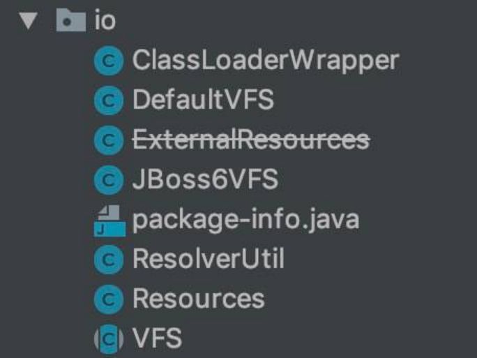`io` 包

在 [《精尽 MyBatis 源码解析 —— 项目结构一览》](http://svip.iocoder.cn/MyBatis/intro) 中，简单介绍了这个模块如下：

资源加载模块，主要是对类加载器进行封装，确定类加载器的使用顺序，并提供了加载类文件以及其他资源文件的功能 。

本文涉及的类如下图所示：类图

# 2. ClassLoaderWrapper

org.apache.ibatis.io.ClassLoaderWrapper ，ClassLoader 包装器。可使用多个 ClassLoader 加载对应的资源，直到有一成功后返回资源。

## 2.1 构造方法

// ClassLoaderWrapper.java  /**  * 默认 ClassLoader 对象  */ ClassLoader defaultClassLoader; /**  * 系统 ClassLoader 对象  */ ClassLoader systemClassLoader;  ClassLoaderWrapper() {   try {     systemClassLoader = ClassLoader.getSystemClassLoader();   } catch (SecurityException ignored) {     // AccessControlException on Google App Engine   } }

defaultClassLoader 属性，默认 ClassLoader 对象。目前不存在初始化该属性的构造方法。可通过 ClassLoaderWrapper.defaultClassLoader = xxx 的方式，进行设置。

systemClassLoader 属性，系统 ClassLoader 对象。在构造方法中，已经初始化。

## 2.2 getClassLoaders

\#getClassLoaders(ClassLoader classLoader) 方法，获得 ClassLoader 数组。代码如下：

// ClassLoaderWrapper.java  ClassLoader[] getClassLoaders(ClassLoader classLoader) {   return new ClassLoader[]{       classLoader,       defaultClassLoader,       Thread.currentThread().getContextClassLoader(),       getClass().getClassLoader(),       systemClassLoader}; }

## 2.3 getResourceAsURL

\#getResourceAsURL(String resource, ...) 方法，获得指定资源的 URL 。代码如下：

// ClassLoaderWrapper.java  /**  * Get a resource as a URL using the current class path  *  * @param resource - the resource to locate  * @return the resource or null  */ public URL getResourceAsURL(String resource) {   return getResourceAsURL(resource, getClassLoaders(null)); }   /**  * Get a resource from the classpath, starting with a specific class loader  *  * @param resource   - the resource to find  * @param classLoader - the first classloader to try  * @return the stream or null  */ public URL getResourceAsURL(String resource, ClassLoader classLoader) {   return getResourceAsURL(resource, getClassLoaders(classLoader)); }

先调用 #getClassLoaders(ClassLoader classLoader) 方法，获得 ClassLoader 数组。


再调用 #getResourceAsURL(String resource, ClassLoader[] classLoader) 方法，获得指定资源的 InputStream 。代码如下：


// ClassLoaderWrapper.java  /**  * Get a resource as a URL using the current class path  *  * @param resource   - the resource to locate  * @param classLoader - the class loaders to examine  * @return the resource or null  */ URL getResourceAsURL(String resource, ClassLoader[] classLoader) {   URL url;   // 遍历 ClassLoader 数组   for (ClassLoader cl : classLoader) {     if (null != cl) {       // 获得 URL ，不带 /       // look for the resource as passed in...       url = cl.getResource(resource);       // 获得 URL ，带 /       // ...but some class loaders want this leading "/", so we'll add it       // and try again if we didn't find the resource       if (null == url) {         url = cl.getResource("/" + resource);       }        // "It's always in the last place I look for it!"       // ... because only an idiot would keep looking for it after finding it, so stop looking already.       // 成功获得到，返回       if (null != url) {         return url;       }      }   }   // didn't find it anywhere.   return null; }


## 2.4 getResourceAsStream

\#getResourceAsStream(String resource, ...) 方法，获得指定资源的 InputStream 对象。代码如下：

// ClassLoaderWrapper.java  /**  * Get a resource from the classpath  *  * @param resource - the resource to find  * @return the stream or null  */ public InputStream getResourceAsStream(String resource) {   return getResourceAsStream(resource, getClassLoaders(null)); }  /**  * Get a resource from the classpath, starting with a specific class loader  *  * @param resource   - the resource to find  * @param classLoader - the first class loader to try  * @return the stream or null  */ public InputStream getResourceAsStream(String resource, ClassLoader classLoader) {   return getResourceAsStream(resource, getClassLoaders(classLoader)); }

先调用 #getClassLoaders(ClassLoader classLoader) 方法，获得 ClassLoader 数组。


再调用 #getResourceAsStream(String resource, ClassLoader[] classLoader) 方法，获得指定资源的 InputStream 。代码如下：


// ClassLoaderWrapper.java  InputStream getResourceAsStream(String resource, ClassLoader[] classLoader) {   // 遍历 ClassLoader 数组   for (ClassLoader cl : classLoader) {     if (null != cl) {       // 获得 InputStream ，不带 /       // try to find the resource as passed       InputStream returnValue = cl.getResourceAsStream(resource);       // now, some class loaders want this leading "/", so we'll add it and try again if we didn't find the resource       // 获得 InputStream ，带 /       if (null == returnValue) {         returnValue = cl.getResourceAsStream("/" + resource);       }        // 成功获得到，返回       if (null != returnValue) {         return returnValue;       }     }   }   return null; }


可使用多个 ClassLoader 加载对应的资源，直到有一成功后返回资源。

## 2.5 classForName

\#classForName(String name, ...) 方法，获得指定类名对应的类。代码如下：

// ClassLoaderWrapper.java  /**  * Find a class on the classpath (or die trying)  *  * @param name - the class to look for  * @return - the class  * @throws ClassNotFoundException Duh.  */ public Class<?> classForName(String name) throws ClassNotFoundException {   return classForName(name, getClassLoaders(null)); }  /**  * Find a class on the classpath, starting with a specific classloader (or die trying)  *  * @param name     - the class to look for  * @param classLoader - the first classloader to try  * @return - the class  * @throws ClassNotFoundException Duh.  */ public Class<?> classForName(String name, ClassLoader classLoader) throws ClassNotFoundException {   return classForName(name, getClassLoaders(classLoader)); }

先调用 #getClassLoaders(ClassLoader classLoader) 方法，获得 ClassLoader 数组。


再调用 #classForName(String name, ClassLoader[] classLoader) 方法，获得指定类名对应的类。代码如下：


// ClassLoaderWrapper.java  Class<?> classForName(String name, ClassLoader[] classLoader) throws ClassNotFoundException {   // 遍历 ClassLoader 数组   for (ClassLoader cl : classLoader) {     if (null != cl) {       try {         // 获得类         Class<?> c = Class.forName(name, true, cl);          // 成功获得到，返回         if (null != c) {           return c;         }       } catch (ClassNotFoundException e) {         // we'll ignore this until all classloaders fail to locate the class       }     }   }   // 获得不到，抛出 ClassNotFoundException 异常   throw new ClassNotFoundException("Cannot find class: " + name); }


可使用多个 ClassLoader 加载对应的类，直到有一成功后返回类。

# 3. Resources

org.apache.ibatis.io.Resources ，Resource 工具类。

## 3.1 构造方法

// Resources.java  /**  * ClassLoaderWrapper 对象  */ private static ClassLoaderWrapper classLoaderWrapper = new ClassLoaderWrapper();  /**  * 字符集  */ private static Charset charset;  Resources() { }  public static void setDefaultClassLoader(ClassLoader defaultClassLoader) {defaultClassLoader   classLoaderWrapper.defaultClassLoader = defaultClassLoader; // 修改 ClassLoaderWrapper. }  public static void setCharset(Charset charset) {   Resources.charset = charset; }

## 3.2 getResource

基于 classLoaderWrapper 属性的封装。

### 3.2.1 getResourceURL

\#getResourceURL(String resource) 静态方法，获得指定资源的 URL 。代码如下：

// Resources.java  public static URL getResourceURL(String resource) throws IOException {   // issue #625   return getResourceURL(null, resource); }  public static URL getResourceURL(ClassLoader loader, String resource) throws IOException {   URL url = classLoaderWrapper.getResourceAsURL(resource, loader);   if (url == null) {     throw new IOException("Could not find resource " + resource);   }   return url; }

### 3.2.2 getResourceAsStream

\#getResourceAsStream(String resource) 静态方法，获得指定资源的 InputStream 。代码如下：

// Resources.java  public static InputStream getResourceAsStream(String resource) throws IOException {   return getResourceAsStream(null, resource); }  public static InputStream getResourceAsStream(ClassLoader loader, String resource) throws IOException {   InputStream in = classLoaderWrapper.getResourceAsStream(resource, loader);   if (in == null) {     throw new IOException("Could not find resource " + resource);   }   return in; }

### 3.2.3 getResourceAsReader

\#getResourceAsReader(String resource) 静态方法，获得指定资源的 Reader 。代码如下：

// Resources.java  public static Reader getResourceAsReader(String resource) throws IOException {   Reader reader;   if (charset == null) {     reader = new InputStreamReader(getResourceAsStream(resource));   } else {     reader = new InputStreamReader(getResourceAsStream(resource), charset);   }   return reader; }  public static Reader getResourceAsReader(ClassLoader loader, String resource) throws IOException {   Reader reader;   if (charset == null) {     reader = new InputStreamReader(getResourceAsStream(loader, resource));   } else {     reader = new InputStreamReader(getResourceAsStream(loader, resource), charset);   }   return reader; }

### 3.2.4 getResourceAsFile

\#getResourceAsFile(String resource) 静态方法，获得指定资源的 File 。代码如下：

// Resources.java  public static File getResourceAsFile(String resource) throws IOException {   return new File(getResourceURL(resource).getFile()); }  public static File getResourceAsFile(ClassLoader loader, String resource) throws IOException {   return new File(getResourceURL(loader, resource).getFile()); }

基于 classLoaderWrapper 属性的封装。

### 3.2.5 getResourceAsProperties

\#getResourceAsProperties(ClassLoader loader) 静态方法，获得指定资源的 Properties 。代码如下：

// Resources.java  public static Properties getResourceAsProperties(String resource) throws IOException {   Properties props = new Properties();   // 读取   try (InputStream in = getResourceAsStream(resource)) {     props.load(in);   }   return props; }  public static Properties getResourceAsProperties(ClassLoader loader, String resource) throws IOException {   Properties props = new Properties();   // 读取   try (InputStream in = getResourceAsStream(loader, resource)) {     props.load(in);   }   return props; }

## 3.3 getUrl

### 3.3.1 getUrlAsStream

\#getUrlAsStream(String urlString) 静态方法，获得指定 URL 。代码如下：

// Resources.java  public static InputStream getUrlAsStream(String urlString) throws IOException {   URL url = new URL(urlString);   // 打开 URLConnection   URLConnection conn = url.openConnection();   return conn.getInputStream(); }

### 3.3.2 getUrlAsReader

\#getUrlAsReader(String urlString) 静态方法，指定 URL 的 Reader 。代码如下：

// Resources.java  public static Reader getUrlAsReader(String urlString) throws IOException {   Reader reader;   if (charset == null) {     reader = new InputStreamReader(getUrlAsStream(urlString));   } else {     reader = new InputStreamReader(getUrlAsStream(urlString), charset);   }   return reader; }

### 3.3.3 getUrlAsProperties

\#getUrlAsReader(String urlString) 静态方法，指定 URL 的 Properties 。代码如下：

// Resources.java  public static Properties getUrlAsProperties(String urlString) throws IOException {   Properties props = new Properties();   try (InputStream in = getUrlAsStream(urlString)) {     props.load(in);   }   return props; }

## 3.4 classForName

\#classForName(String className) 静态方法，获得指定类名对应的类。代码如下：

// Resources.java  public static Class<?> classForName(String className) throws ClassNotFoundException {   return classLoaderWrapper.classForName(className); }

# 4. ResolverUtil

org.apache.ibatis.io.ResolverUtil ，解析器工具类，用于获得指定目录符合条件的类们。

## 4.1 Test

Test ，匹配判断接口。代码如下：

// ResolverUtil.java 内部类  /**  * A simple interface that specifies how to test classes to determine if they  * are to be included in the results produced by the ResolverUtil.  */ public interface Test {    /**    * Will be called repeatedly with candidate classes. Must return True if a class    * is to be included in the results, false otherwise.    */   boolean matches(Class<?> type);  }

### 4.1.1 IsA

IsA ，实现 Test 接口，判断是否为指定类。代码如下：

// ResolverUtil.java 内部类  /**  * A Test that checks to see if each class is assignable to the provided class. Note  * that this test will match the parent type itself if it is presented for matching.  */ public static class IsA implements Test {    /**    * 指定类    */   private Class<?> parent;    /** Constructs an IsA test using the supplied Class as the parent class/interface. */   public IsA(Class<?> parentType) {     this.parent = parentType;   }    /** Returns true if type is assignable to the parent type supplied in the constructor. */   @Override   public boolean matches(Class<?> type) {     return type != null && parent.isAssignableFrom(type);   }  }

### 4.1.2 AnnotatedWith

AnnotatedWith ，判断是否有指定注解。代码如下：

// ResolverUtil.java 内部类  /**  * A Test that checks to see if each class is annotated with a specific annotation. If it  * is, then the test returns true, otherwise false.  */ public static class AnnotatedWith implements Test {    /**    * 注解    */   private Class<? extends Annotation> annotation;    /** Constructs an AnnotatedWith test for the specified annotation type. */   public AnnotatedWith(Class<? extends Annotation> annotation) {     this.annotation = annotation;   }    /** Returns true if the type is annotated with the class provided to the constructor. */   @Override   public boolean matches(Class<?> type) {     return type != null && type.isAnnotationPresent(annotation);   }  }

## 4.2 构造方法

// ResolverUtil.java  /** The set of matches being accumulated. */ private Set<Class<? extends T>> matches = new HashSet<>(); // 符合条件的类的集合  private ClassLoader classloader;  public Set<Class<? extends T>> getClasses() {   return matches; }  public ClassLoader getClassLoader() {   return classloader == null ? Thread.currentThread().getContextClassLoader() : classloader; } public void setClassLoader(ClassLoader classloader) {   this.classloader = classloader; }

## 4.3 find

\#find(Test test, String packageName) 方法，获得指定包下，符合条件的类。代码如下：

// ResolverUtil.java  public ResolverUtil<T> find(Test test, String packageName) {   // <1> 获得包的路径   String path = getPackagePath(packageName);    try {     // <2> 获得路径下的所有文件     List<String> children = VFS.getInstance().list(path);     // <3> 遍历     for (String child : children) {       // 是 Java Class       if (child.endsWith(".class")) {         // 如果匹配，则添加到结果集         addIfMatching(test, child);       }     }   } catch (IOException ioe) {     log.error("Could not read package: " + packageName, ioe);   }    return this; }


<1> 处，调用 #getPackagePath(String packageName) 方法，获得包的路径。代码如下：


// ResolverUtil.java  protected String getPackagePath(String packageName) {   return packageName == null ? null : packageName.replace('.', '/'); }


<2> 处，获得路径下的所有文件。详细解析，见 [「5. VFS」](http://svip.iocoder.cn/MyBatis/io-package/) 。


<3> 处，遍历 Java Class 文件，调用 #addIfMatching(Test test, String fqn) 方法，如果匹配，则添加到结果集。代码如下：


// ResolverUtil.java  protected void addIfMatching(Test test, String fqn) {   try {     // 获得全类名     String externalName = fqn.substring(0, fqn.indexOf('.')).replace('/', '.');     ClassLoader loader = getClassLoader();     if (log.isDebugEnabled()) {       log.debug("Checking to see if class " + externalName + " matches criteria [" + test + "]");     }      // 加载类     Class<?> type = loader.loadClass(externalName);      // 判断是否匹配     if (test.matches(type)) {       matches.add((Class<T>) type);     }   } catch (Throwable t) {     log.warn("Could not examine class '" + fqn + "'" + " due to a " +         t.getClass().getName() + " with message: " + t.getMessage());   } }


\* 使用对应的 `test` 的进行匹配。

### 4.3.1 findImplementations

\#findImplementations(Class<?> parent, String... packageNames) 方法，判断指定目录下们，符合指定类的类们。代码如下：

// ResolverUtil.java  public ResolverUtil<T> findImplementations(Class<?> parent, String... packageNames) {   if (packageNames == null) {     return this;   }    Test test = new IsA(parent);   for (String pkg : packageNames) {     find(test, pkg);   }    return this; }

### 4.3.2 findAnnotated

\#findAnnotated(Class<? extends Annotation> annotation, String... packageNames) 方法，判断指定目录下们，符合指定注解的类们。代码如下：

// ResolverUtil.java  public ResolverUtil<T> findAnnotated(Class<? extends Annotation> annotation, String... packageNames) {   if (packageNames == null) {     return this;   }    Test test = new AnnotatedWith(annotation);   for (String pkg : packageNames) {     find(test, pkg);   }    return this; }

# 5. VFS

org.apache.ibatis.io.VFS ，虚拟文件系统( Virtual File System )抽象类，用来查找指定路径下的的文件们。

## 5.1 静态属性

// VFS.java  /** The built-in implementations. */ public static final Class<?>[] IMPLEMENTATIONS = {JBoss6VFS.class, DefaultVFS.class}; // 内置的 VFS 实现类的数组  /** The list to which implementations are added by {@link #addImplClass(Class)}. */ public static final List<Class<? extends VFS>> USER_IMPLEMENTATIONS = new ArrayList<>(); // 自定义的 VFS 实现类的数组  public static void addImplClass(Class<? extends VFS> clazz) {   if (clazz != null) {     USER_IMPLEMENTATIONS.add(clazz);   } }

IMPLEMENTATIONS 静态属性，内置的 VFS 实现类的数组。目前 VFS 有 JBoss6VFS 和 DefaultVFS 两个实现类。

USER_IMPLEMENTATIONS 静态属性，自定义的 VFS 实现类的数组。可通过 #addImplClass(Class<? extends VFS> clazz) 方法，进行添加。

## 5.2 getInstance

\#getInstance() 方法，获得 VFS 单例。代码如下：

// VFS.java  public static VFS getInstance() {   return VFSHolder.INSTANCE; }  private static class VFSHolder {    static final VFS INSTANCE = createVFS();    @SuppressWarnings("unchecked")   static VFS createVFS() {     // Try the user implementations first, then the built-ins     List<Class<? extends VFS>> impls = new ArrayList<>();     impls.addAll(USER_IMPLEMENTATIONS);     impls.addAll(Arrays.asList((Class<? extends VFS>[]) IMPLEMENTATIONS));      // Try each implementation class until a valid one is found     // 创建 VFS 对象，选择最后一个符合的     VFS vfs = null;     for (int i = 0; vfs == null || !vfs.isValid(); i++) {       Class<? extends VFS> impl = impls.get(i);       try {         vfs = impl.newInstance();         if (vfs == null || !vfs.isValid()) {           if (log.isDebugEnabled()) {             log.debug("VFS implementation " + impl.getName() +                 " is not valid in this environment.");           }         }       } catch (InstantiationException | IllegalAccessException e) {         log.error("Failed to instantiate " + impl, e);         return null;       }     }      if (log.isDebugEnabled()) {       log.debug("Using VFS adapter " + vfs.getClass().getName());     }      return vfs;   } }

单例有多种实现方式，该类采用的是“懒汉式，线程安全”，感兴趣的胖友，可以看看 [《单例模式的七种写法》](http://cantellow.iteye.com/blog/838473) 。

INSTANCE 属性，最后通过 #createVFS() 静态方法来创建，虽然 USER_IMPLEMENTATIONS 和 IMPLEMENTATIONS 有多种 VFS 的实现类，但是最终选择的是，最后一个符合的创建的 VFS 对象。

## 5.3 反射相关方法

因为 VFS 自己有反射调用方法的需求，所以自己实现了三个方法。代码如下：

// VFS.java  protected static Class<?> getClass(String className) {   try {     return Thread.currentThread().getContextClassLoader().loadClass(className);   } catch (ClassNotFoundException e) {     if (log.isDebugEnabled()) {       log.debug("Class not found: " + className);     }     return null;   } }  protected static Method getMethod(Class<?> clazz, String methodName, Class<?>... parameterTypes) {   if (clazz == null) {     return null;   }   try {     return clazz.getMethod(methodName, parameterTypes);   } catch (SecurityException e) {     log.error("Security exception looking for method " + clazz.getName() + "." + methodName + ".  Cause: " + e);     return null;   } catch (NoSuchMethodException e) {     log.error("Method not found " + clazz.getName() + "." + methodName + "." + methodName + ".  Cause: " + e);     return null;   } }  protected static <T> T invoke(Method method, Object object, Object... parameters)     throws IOException, RuntimeException {   try {     return (T) method.invoke(object, parameters);   } catch (IllegalArgumentException | IllegalAccessException e) {     throw new RuntimeException(e);   } catch (InvocationTargetException e) {     if (e.getTargetException() instanceof IOException) {       throw (IOException) e.getTargetException();     } else {       throw new RuntimeException(e);     }   } }

## 5.4 isValid

\#isValid() 抽象方法，判断是否为合法的 VFS 。代码如下：

// VFS.java  /** Return true if the {@link VFS} implementation is valid for the current environment. */ public abstract boolean isValid();

该方法由子类实现。

## 5.5 list

\#list(String path) 方法，获得指定路径下的所有资源。代码如下：

// VFS.java  public List<String> list(String path) throws IOException {   List<String> names = new ArrayList<>();   for (URL url : getResources(path)) {     names.addAll(list(url, path));   }   return names; }


先调用 #getResources(String path) 静态方法，获得指定路径下的 URL 数组。代码如下：


// VFS.java  protected static List<URL> getResources(String path) throws IOException {   return Collections.list(Thread.currentThread().getContextClassLoader().getResources(path)); }


后遍历 URL 数组，调用 #list(URL url, String forPath) 方法，递归的列出所有的资源们。代码如下：


// VFS.java  /**  * Recursively list the full resource path of all the resources that are children of the  * resource identified by a URL.  *  * @param url The URL that identifies the resource to list.  * @param forPath The path to the resource that is identified by the URL. Generally, this is the  *       value passed to {@link #getResources(String)} to get the resource URL.  * @return A list containing the names of the child resources.  * @throws IOException If I/O errors occur  */ protected abstract List<String> list(URL url, String forPath) throws IOException;


该方法由子类进行实现。

## 5.5 DefaultVFS

org.apache.ibatis.io.DefaultVFS ，继承 VFS 抽象类，默认的 VFS 实现类。

### 5.5.1 isValid

// DefaultVFS.java  @Override public boolean isValid() {   return true; }

都返回 true ，因为默认支持。

### 5.5.2 list

\#list(URL url, String path) 方法，递归的列出所有的资源们。代码如下：

// DefaultVFS.java  @Override public List<String> list(URL url, String path) throws IOException {   InputStream is = null;   try {     List<String> resources = new ArrayList<>();      // First, try to find the URL of a JAR file containing the requested resource. If a JAR     // file is found, then we'll list child resources by reading the JAR.     // 如果 url 指向的是 Jar Resource ，则返回该 Jar Resource ，否则返回 null     URL jarUrl = findJarForResource(url);     if (jarUrl != null) {       is = jarUrl.openStream();       if (log.isDebugEnabled()) {         log.debug("Listing " + url);       }       // 遍历 Jar Resource       resources = listResources(new JarInputStream(is), path);     } else {       List<String> children = new ArrayList<>();       try {         // 判断为 JAR URL         if (isJar(url)) {           // Some versions of JBoss VFS might give a JAR stream even if the resource           // referenced by the URL isn't actually a JAR           is = url.openStream();           try (JarInputStream jarInput = new JarInputStream(is)) {             if (log.isDebugEnabled()) {               log.debug("Listing " + url);             }             for (JarEntry entry; (entry = jarInput.getNextJarEntry()) != null; ) {               if (log.isDebugEnabled()) {                 log.debug("Jar entry: " + entry.getName());               }               children.add(entry.getName());             }           }         } else {           /*            * Some servlet containers allow reading from directory resources like a            * text file, listing the child resources one per line. However, there is no            * way to differentiate between directory and file resources just by reading            * them. To work around that, as each line is read, try to look it up via            * the class loader as a child of the current resource. If any line fails            * then we assume the current resource is not a directory.            */           // 【重点】<1> 获得路径下的所有资源           is = url.openStream();           BufferedReader reader = new BufferedReader(new InputStreamReader(is));           List<String> lines = new ArrayList<>();           for (String line; (line = reader.readLine()) != null; ) {             if (log.isDebugEnabled()) {               log.debug("Reader entry: " + line);             }             lines.add(line);             if (getResources(path + "/" + line).isEmpty()) {               lines.clear();               break;             }           }            if (!lines.isEmpty()) {             if (log.isDebugEnabled()) {               log.debug("Listing " + url);             }             children.addAll(lines);           }         }       } catch (FileNotFoundException e) {         /*          * For file URLs the openStream() call might fail, depending on the servlet          * container, because directories can't be opened for reading. If that happens,          * then list the directory directly instead.          */         if ("file".equals(url.getProtocol())) {           File file = new File(url.getFile());           if (log.isDebugEnabled()) {             log.debug("Listing directory " + file.getAbsolutePath());           }           if (file.isDirectory()) {             if (log.isDebugEnabled()) {               log.debug("Listing " + url);             }             children = Arrays.asList(file.list());           }         } else {           // No idea where the exception came from so rethrow it           throw e;         }       }        // The URL prefix to use when recursively listing child resources       // 【重点】<2> 计算 prefix       String prefix = url.toExternalForm();       if (!prefix.endsWith("/")) {         prefix = prefix + "/";       }        // Iterate over immediate children, adding files and recursing into directories       // 【重点】 <2> 遍历子路径       for (String child : children) {         // 添加到 resources 中         String resourcePath = path + "/" + child;         resources.add(resourcePath);         // 递归遍历子路径，并将结果添加到 resources 中         URL childUrl = new URL(prefix + child);         resources.addAll(list(childUrl, resourcePath));       }     }      return resources;   } finally {     // 关闭文件流     if (is != null) {       try {         is.close();       } catch (Exception e) {         // Ignore       }     }   } }

代码有点长，重点读懂 <1> 和 <2> 处的代码，基本就可以了。大体逻辑就是，不断递归文件夹，获得到所有文件。设计到对 Jar 的处理，感兴趣的胖友，可以自己理解下。


\#findJarForResource(URL url) 方法，如果 url 指向的是 Jar Resource ，则返回该 Jar Resource ，否则返回 null 。代码如下：


// DefaultVFS.java  protected URL findJarForResource(URL url) throws MalformedURLException {   if (log.isDebugEnabled()) {     log.debug("Find JAR URL: " + url);   }    // If the file part of the URL is itself a URL, then that URL probably points to the JAR   // 这段代码看起来比较神奇，虽然看起来没有 break 的条件，但是是通过 MalformedURLException 异常进行   // 正如上面英文注释，如果 URL 的文件部分本身就是 URL ，那么该 URL 可能指向 JAR   try {     for (; ; ) {       url = new URL(url.getFile());       if (log.isDebugEnabled()) {         log.debug("Inner URL: " + url);       }     }   } catch (MalformedURLException e) {     // This will happen at some point and serves as a break in the loop   }    // Look for the .jar extension and chop off everything after that   // 判断是否意 .jar 结尾   StringBuilder jarUrl = new StringBuilder(url.toExternalForm());   int index = jarUrl.lastIndexOf(".jar");   if (index >= 0) {     jarUrl.setLength(index + 4);     if (log.isDebugEnabled()) {       log.debug("Extracted JAR URL: " + jarUrl);     }   } else {     if (log.isDebugEnabled()) {       log.debug("Not a JAR: " + jarUrl);     }     return null; // 如果不以 .jar 结尾，则直接返回 null   }    // Try to open and test it   try {     URL testUrl = new URL(jarUrl.toString());     // 判断是否为 Jar 文件     if (isJar(testUrl)) {       return testUrl;     } else {       // WebLogic fix: check if the URL's file exists in the filesystem.       if (log.isDebugEnabled()) {         log.debug("Not a JAR: " + jarUrl);       }       // 获得文件       jarUrl.replace(0, jarUrl.length(), testUrl.getFile()); // 替换       File file = new File(jarUrl.toString());       // File name might be URL-encoded       if (!file.exists()) { // 处理路径编码问题         try {           file = new File(URLEncoder.encode(jarUrl.toString(), "UTF-8"));         } catch (UnsupportedEncodingException e) {           throw new RuntimeException("Unsupported encoding?  UTF-8?  That's unpossible.");         }       }        // 判断文件存在       if (file.exists()) {         if (log.isDebugEnabled()) {           log.debug("Trying real file: " + file.getAbsolutePath());         }         testUrl = file.toURI().toURL();         // 判断是否为 Jar 文件         if (isJar(testUrl)) {           return testUrl;         }       }     }   } catch (MalformedURLException e) {     log.warn("Invalid JAR URL: " + jarUrl);   }    if (log.isDebugEnabled()) {     log.debug("Not a JAR: " + jarUrl);   }   return null; }


会判断要求，url 以 .jar 结尾。


\#isJar(URL url) 方法，判断是否为 JAR URL 。代码如下：


// DefaultVFS.java  /** The magic header that indicates a JAR (ZIP) file. */ private static final byte[] JAR_MAGIC = {'P', 'K', 3, 4};  protected boolean isJar(URL url) {   return isJar(url, new byte[JAR_MAGIC.length]); }  protected boolean isJar(URL url, byte[] buffer) {   InputStream is = null;   try {     is = url.openStream();     // 读取文件头     is.read(buffer, 0, JAR_MAGIC.length);     // 判断文件头的 magic number 是否符合 JAR     if (Arrays.equals(buffer, JAR_MAGIC)) {       if (log.isDebugEnabled()) {         log.debug("Found JAR: " + url);       }       return true;     }   } catch (Exception e) {     // Failure to read the stream means this is not a JAR   } finally {     if (is != null) {       try {         is.close();       } catch (Exception e) {         // Ignore       }     }   }   return false; }


\#listResources(JarInputStream jar, String path) 方法，遍历 Jar Resource 。代码如下：


// DefaultVFS.java  protected List<String> listResources(JarInputStream jar, String path) throws IOException {   // Include the leading and trailing slash when matching names   // 保证头尾都是 /   if (!path.startsWith("/")) {     path = "/" + path;   }   if (!path.endsWith("/")) {     path = path + "/";   }    // Iterate over the entries and collect those that begin with the requested path   // 遍历条目并收集以请求路径开头的条目   List<String> resources = new ArrayList<>();   for (JarEntry entry; (entry = jar.getNextJarEntry()) != null; ) {     if (!entry.isDirectory()) {       // Add leading slash if it's missing       String name = entry.getName();       if (!name.startsWith("/")) {         name = "/" + name;       }        // Check file name       if (name.startsWith(path)) {         if (log.isDebugEnabled()) {           log.debug("Found resource: " + name);         }         // Trim leading slash         resources.add(name.substring(1));       }     }   }   return resources; }


## 5.6 JBoss6VFS

org.apache.ibatis.io.JBoss6VFS ，继承 VFS 抽象类，基于 JBoss 的 VFS 实现类。使用时，需要引入如下：

<dependency>   <groupId>org.jboss</groupId>   <artifactId>jboss-vfs</artifactId>   <version>${version></version> </dependency>

因为实际基本没使用到，所以暂时不分析这个类。感兴趣的胖友，可以自己瞅瞅。还是简单的。反正艿艿暂时不感兴趣，哈哈哈。

# 666. 彩蛋

周末偷懒了，写到 1 点多，还没写完。这篇对 DefaultVFS#list(URL url, String path) 方法的源码解析，有点着急，代码看着有点乱和糟心。后续有时间，在详细补充下。

参考和推荐如下文章：

无忌 [《MyBatis 源码解读之工具类》](https://my.oschina.net/wenjinglian/blog/1631911)

徐郡明 [《MyBatis 技术内幕》](https://item.jd.com/12125531.html) 的 [「2.5 资源加载」](http://svip.iocoder.cn/MyBatis/io-package/) 小节


# 精尽 MyBatis 源码分析 —— 日志模块

# 1. 概述

本文，我们来分享 MyBatis 的日志模块，对应 logging 包。如下图所示：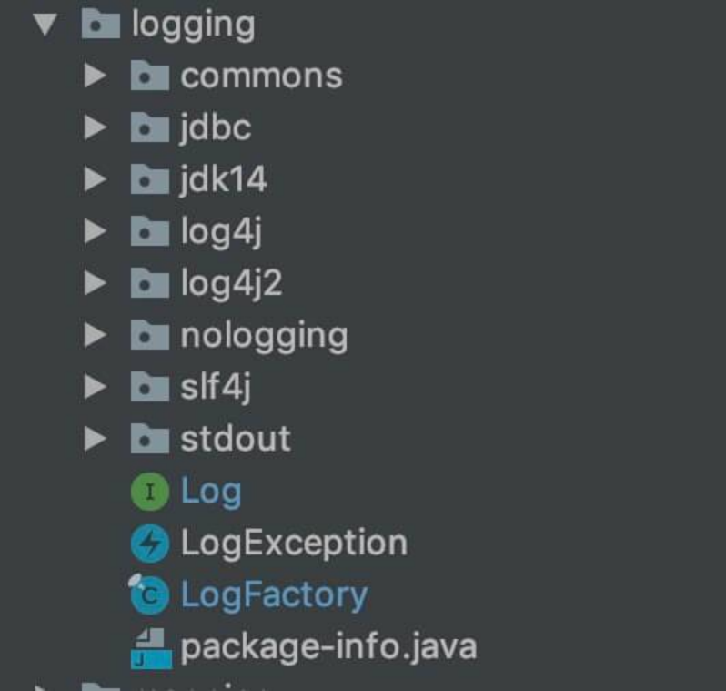`logging` 包

在 [《精尽 MyBatis 源码解析 —— 项目结构一览》](http://svip.iocoder.cn/MyBatis/intro) 中，简单介绍了这个模块如下：

无论在开发测试环境中，还是在线上生产环境中，日志在整个系统中的地位都是非常重要的。良好的日志功能可以帮助开发人员和测试人员快速定位 Bug 代码，也可以帮助运维人员快速定位性能瓶颈等问题。目前的 Java 世界中存在很多优秀的日志框架，例如 Log4j、 Log4j2、Slf4j 等。

MyBatis 作为一个设计优良的框架，除了提供详细的日志输出信息，还要能够集成多种日志框架，其日志模块的一个主要功能就是集成第三方日志框架。

本文涉及的类如下图所示：类图

从图的上面部分，我们可以看到非常多的 Logger 类的实现，分别对应我们常用的日志框架 Log4j、Slf4j ，这就是 MyBatis 对这些日志框架的适配。

从图的下面部分，我们可以看到 BaseJdbcLogger 以及其四个子类，这个并不是将日志打印到数据库，而是 MyBatis 通过 JDK 动态代理的方式，将 JDBC 的操作，打印到日志中。即 [《设置Mybatis打印调试sql的两种方式》](https://blog.csdn.net/gao36951/article/details/53641432) 。

另外，[《MyBatis 文档 —— 日志》](http://www.mybatis.org/mybatis-3/zh/logging.html) 一文，也对日志模块做了简单的介绍，不熟悉这块的胖友，也可以看看。

下面，让我们开始干源码吧。

# 2. LogFactory

org.apache.ibatis.logging.LogFactory ，Log 工厂类。

## 2.1 构造方法

// LogFactory.java  /**  * Marker to be used by logging implementations that support markers  */ public static final String MARKER = "MYBATIS";  /**  * 使用的 Log 的构造方法  */ private static Constructor<? extends Log> logConstructor;  static {   // <1> 逐个尝试，判断使用哪个 Log 的实现类，即初始化 logConstructor 属性   tryImplementation(LogFactory::useSlf4jLogging);   tryImplementation(LogFactory::useCommonsLogging);   tryImplementation(LogFactory::useLog4J2Logging);   tryImplementation(LogFactory::useLog4JLogging);   tryImplementation(LogFactory::useJdkLogging);   tryImplementation(LogFactory::useNoLogging); }  private LogFactory() {   // disable construction }

<1> 处，我们可以看到，按照 Slf4j、CommonsLogging、Log4J2Logging、Log4JLogging、JdkLogging、NoLogging 的顺序，逐个尝试，判断使用哪个 Log 的实现类，即初始化 logConstructor 属性。


\#tryImplementation(Runnable runnable) 方法，判断使用哪个 Log 的实现类。代码如下：


// LogFactory.java  private static void tryImplementation(Runnable runnable) {   if (logConstructor == null) {     try {       runnable.run();     } catch (Throwable t) {       // ignore     }   } }


当 logConstructor 为空时，执行 runnable 的方法。那么，runnable 怎么来的呢。实际上，<1> 处，使用了 Lambda 表达式，所以看起来不是很清晰。即 tryImplementation(LogFactory::useSlf4jLogging) 代码块，对应为：


tryImplementation(new Runnable() {   @Override   public void run() {     LogFactory.useSlf4jLogging();   } });


这样，看起来是不是就清晰多了。


\#useSlf4jLogging() 方法，尝试使用 Slf4j 。代码如下：


// LogFactory.java  public static synchronized void useSlf4jLogging() {   setImplementation(org.apache.ibatis.logging.slf4j.Slf4jImpl.class); }


在该方法内部，会调用 #setImplementation(Class<? extends Log> implClass) 方法，尝试使用指定的 Log 实现类，例如此处为 org.apache.ibatis.logging.slf4j.Slf4jImpl 。代码如下：


// LogFactory.java  private static void setImplementation(Class<? extends Log> implClass) {   try {     // 获得参数为 String 的构造方法     Constructor<? extends Log> candidate = implClass.getConstructor(String.class);     // 创建 Log 对象     Log log = candidate.newInstance(LogFactory.class.getName());     if (log.isDebugEnabled()) {       log.debug("Logging initialized using '" + implClass + "' adapter.");     }     // 创建成功，意味着可以使用，设置为 logConstructor     logConstructor = candidate;   } catch (Throwable t) {     throw new LogException("Error setting Log implementation.  Cause: " + t, t);   } }


如果对应的类能创建成功，意味着可以使用，设置为 logConstructor 。也就是说，其它类，就不会执行到该方法啦。


其它 Log 类的该方法，代码如下：


// LogFactory.java  public static synchronized void useCommonsLogging() {   setImplementation(org.apache.ibatis.logging.commons.JakartaCommonsLoggingImpl.class); }  public static synchronized void useLog4JLogging() {   setImplementation(org.apache.ibatis.logging.log4j.Log4jImpl.class); }  public static synchronized void useLog4J2Logging() {   setImplementation(org.apache.ibatis.logging.log4j2.Log4j2Impl.class); }  public static synchronized void useJdkLogging() {   setImplementation(org.apache.ibatis.logging.jdk14.Jdk14LoggingImpl.class); }  public static synchronized void useStdOutLogging() {   setImplementation(org.apache.ibatis.logging.stdout.StdOutImpl.class); }  public static synchronized void useNoLogging() {   setImplementation(org.apache.ibatis.logging.nologging.NoLoggingImpl.class); }


当然，也可以通过 #useCustomLogging(Class<? extends Log> clazz) 方法，设置自定义的 Log 实现类。代码如下：


// LogFactory.java  public static synchronized void useCustomLogging(Class<? extends Log> clazz) {   setImplementation(clazz); }


这里的自定义，可以是你自己实现的 Log 类，也可以是上述的 MyBatis 内置的 Log 实现类。

## 2.2 getLog

\#getLog(...) 方法，获得 Log 对象。代码如下：

// LogFactory.java  public static Log getLog(Class<?> aClass) {   return getLog(aClass.getName()); }  public static Log getLog(String logger) {   try {     return logConstructor.newInstance(logger);   } catch (Throwable t) {     throw new LogException("Error creating logger for logger " + logger + ".  Cause: " + t, t);   } }

# 3. Log

org.apache.ibatis.logging.Log ，MyBatis Log 接口。代码如下：

// Log.java  public interface Log {    boolean isDebugEnabled();    boolean isTraceEnabled();    void error(String s, Throwable e);    void error(String s);    void debug(String s);    void trace(String s);    void warn(String s);  }

Log 的实现类较多，我们就看看 Slf4jImpl 和 StdOutImpl 这两个实现类。

## 3.1 StdOutImpl

org.apache.ibatis.logging.stdout.StdOutImpl ，实现 Log 接口，StdOut 实现类。代码如下：

// StdOutImpl.java  public class StdOutImpl implements Log {    public StdOutImpl(String clazz) {     // Do Nothing   }    @Override   public boolean isDebugEnabled() {     return true;   }    @Override   public boolean isTraceEnabled() {     return true;   }    @Override   public void error(String s, Throwable e) {     System.err.println(s);     e.printStackTrace(System.err);   }    @Override   public void error(String s) {     System.err.println(s);   }    @Override   public void debug(String s) {     System.out.println(s);   }    @Override   public void trace(String s) {     System.out.println(s);   }    @Override   public void warn(String s) {     System.out.println(s);   } }

比较简单，基于 System.out 和 System.err 来实现。

## 3.2 Slf4jImpl

org.apache.ibatis.logging.slf4j.Slf4jImpl ，实现 Log 接口，Slf4j 实现类。代码如下：

// Slf4jImpl.java  public class Slf4jImpl implements Log {    private Log log;    public Slf4jImpl(String clazz) {     // 使用 SLF LoggerFactory 获得 SLF Logger 对象     Logger logger = LoggerFactory.getLogger(clazz);      // 如果是 LocationAwareLogger ，则创建 Slf4jLocationAwareLoggerImpl 对象     if (logger instanceof LocationAwareLogger) {       try {         // check for slf4j >= 1.6 method signature         logger.getClass().getMethod("log", Marker.class, String.class, int.class, String.class, Object[].class, Throwable.class);         log = new Slf4jLocationAwareLoggerImpl((LocationAwareLogger) logger);         return;       } catch (SecurityException | NoSuchMethodException e) {         // fail-back to Slf4jLoggerImpl       }     }      // Logger is not LocationAwareLogger or slf4j version < 1.6     // 否则，创建 Slf4jLoggerImpl 对象     log = new Slf4jLoggerImpl(logger);   }    @Override   public boolean isDebugEnabled() {     return log.isDebugEnabled();   }    @Override   public boolean isTraceEnabled() {     return log.isTraceEnabled();   }    @Override   public void error(String s, Throwable e) {     log.error(s, e);   }    @Override   public void error(String s) {     log.error(s);   }    @Override   public void debug(String s) {     log.debug(s);   }    @Override   public void trace(String s) {     log.trace(s);   }    @Override   public void warn(String s) {     log.warn(s);   }  }

在构造方法中，可以看到，适配不同的 SLF4J 的版本，分别使用 org.apache.ibatis.logging.slf4j.Slf4jLocationAwareLoggerImpl 和 org.apache.ibatis.logging.slf4j.Slf4jLoggerImpl 类。

具体的方法实现，委托调用对应的 SLF4J 的方法。

# 4. BaseJdbcLogger

在 org.apache.ibatis.logging 包下的 jdbc 包，有如下五个类：

BaseJdbcLogger

ConnectionLogger

PreparedStatementLogger

StatementLogger

ResultSetLogger

和 [《精尽 MyBatis 源码分析 —— 数据源模块》](http://svip.iocoder.cn/MyBatis/datasource-package) 类似，又是一个基于 JDBC 接口实现增强的案例，而原理上，也是基于 JDK 实现动态代理。

代码比较简单，感兴趣的胖友，自己简单看看即可。

# 666. 彩蛋

在地铁上撸完这篇博客，舒服。

参考和推荐如下文章：

徐郡明 [《MyBatis 技术内幕》](https://item.jd.com/12125531.html) 的 [「2.4 日志模块」](http://svip.iocoder.cn/MyBatis/logging-package/) 小节


# 精尽 MyBatis 源码分析 —— 注解模块

# 1. 概述

本文，我们来分享 MyBatis 的注解模块，对应 annotations 包。如下图所示：`annotations` 包

在 [《精尽 MyBatis 源码解析 —— 项目结构一览》](http://svip.iocoder.cn/MyBatis/intro) 中，简单介绍了这个模块如下：

随着 Java 注解的慢慢流行，MyBatis 提供了注解的方式，使得我们方便的在 Mapper 接口上编写简单的数据库 SQL 操作代码，而无需像之前一样，必须编写 SQL 在 XML 格式的 Mapper 文件中。虽然说，实际场景下，大家还是喜欢在 XML 格式的 Mapper 文件中编写响应的 SQL 操作。

注解比较多，艿艿尽量对它们的用途，进行规整。

另外，想要看 MyBatis 注解文档的胖友，可以看看 [《MyBatis 文档 —— Java API》](http://www.mybatis.org/mybatis-3/zh/java-api.html) 。

艿艿的补充：在写完本文后，发现田守枝对注解的整理更好，引用如下：

FROM [《mybatis 注解配置详解》](http://www.tianshouzhi.com/api/tutorials/mybatis/393)

**·** 增删改查： @Insert、@Update、@Delete、@Select、@MapKey、@Options、@SelelctKey、@Param、@InsertProvider、@UpdateProvider、@DeleteProvider、@SelectProvider

**·** 结果集映射： @Results、@Result、@ResultMap、@ResultType、@ConstructorArgs、@Arg、@One、@Many、@TypeDiscriminator、@Case

**·** 缓存： @CacheNamespace、@Property、@CacheNamespaceRef、@Flush

# 2. CRUD 常用操作注解

示例如下：

package com.whut.inter; import java.util.List; import org.apache.ibatis.annotations.Delete; import org.apache.ibatis.annotations.Insert; import org.apache.ibatis.annotations.Param; import org.apache.ibatis.annotations.Select; import org.apache.ibatis.annotations.Update; import com.whut.model.User;  // 最基本的注解CRUD public interface IUserDAO {    @Select("select *from User")   public List<User> retrieveAllUsers();                                                                                                                     //注意这里只有一个参数，则#{}中的标识符可以任意取   @Select("select *from User where id=#{idss}")   public User retrieveUserById(int id);                                                                                                                     @Select("select *from User where id=#{id} and userName like #{name}")   public User retrieveUserByIdAndName(@Param("id")int id,@Param("name")String names);                                                                                                                     @Insert("INSERT INTO user(userName,userAge,userAddress) VALUES(#{userName},"       + "#{userAge},#{userAddress})")   public void addNewUser(User user);                                                                                                                     @Delete("delete from user where id=#{id}")   public void deleteUser(int id);                                                                                                                     @Update("update user set userName=#{userName},userAddress=#{userAddress}"       + " where id=#{id}")   public void updateUser(User user);    }

## 2.1 @Select

org.apache.ibatis.annotations.@Select ，查询语句注解。代码如下：

// Select.java  @Documented @Retention(RetentionPolicy.RUNTIME) @Target(ElementType.METHOD) // 方法 public @interface Select {    /**    * @return 查询语句    */   String[] value();  }

## 2.2 @Insert

org.apache.ibatis.annotations.@Insert ，插入语句注解。代码如下：

// Insert.java  @Documented @Retention(RetentionPolicy.RUNTIME) @Target(ElementType.METHOD) // 方法 public @interface Insert {    /**    * @return 插入语句    */   String[] value();  }

## 2.3 @Update

org.apache.ibatis.annotations.@Update ，更新语句注解。代码如下：

// Update.java  @Documented @Retention(RetentionPolicy.RUNTIME) @Target(ElementType.METHOD) public @interface Update {    /**    * @return 更新语句    */   String[] value();  }

## 2.4 @Delete

org.apache.ibatis.annotations.@Delete ，删除语句注解。代码如下：

// Delete.java  @Documented @Retention(RetentionPolicy.RUNTIME) @Target(ElementType.METHOD) // 方法 public @interface Delete {    /**    * @return 删除语句    */   String[] value();  }

## 2.5 @Param

org.apache.ibatis.annotations.@Param ，方法参数名的注解。代码如下：

当映射器方法需多个参数，这个注解可以被应用于映射器方法参数来给每个参数一个名字。否则，多参数将会以它们的顺序位置来被命名。比如 #{1}，#{2} 等，这是默认的。

使用 @Param("person") ，SQL 中参数应该被命名为 #{person} 。

// Param.java  @Documented @Retention(RetentionPolicy.RUNTIME) @Target(ElementType.PARAMETER) // 参数 public @interface Param {    /**    * @return 参数名    */   String value();  }

# 3. CRUD 高级操作注解

示例如下：


IBlogDAO 接口：


package com.whut.inter; import java.util.List; import org.apache.ibatis.annotations.CacheNamespace; import org.apache.ibatis.annotations.DeleteProvider; import org.apache.ibatis.annotations.InsertProvider; import org.apache.ibatis.annotations.Options; import org.apache.ibatis.annotations.Param; import org.apache.ibatis.annotations.Result; import org.apache.ibatis.annotations.ResultMap; import org.apache.ibatis.annotations.Results; import org.apache.ibatis.annotations.SelectProvider; import org.apache.ibatis.annotations.UpdateProvider; import org.apache.ibatis.type.JdbcType; import com.whut.model.Blog; import com.whut.sqlTool.BlogSqlProvider;  @CacheNamespace(size=100) public interface IBlogDAO {    @SelectProvider(type = BlogSqlProvider.class, method = "getSql")    @Results(value ={        @Result(id=true, property="id",column="id",javaType=Integer.class,jdbcType=JdbcType.INTEGER),       @Result(property="title",column="title",javaType=String.class,jdbcType=JdbcType.VARCHAR),       @Result(property="date",column="date",javaType=String.class,jdbcType=JdbcType.VARCHAR),       @Result(property="authername",column="authername",javaType=String.class,jdbcType=JdbcType.VARCHAR),       @Result(property="content",column="content",javaType=String.class,jdbcType=JdbcType.VARCHAR),       })    public Blog getBlog(@Param("id") int id);                                                                                               @SelectProvider(type = BlogSqlProvider.class, method = "getAllSql")    @Results(value ={        @Result(id=true, property="id",column="id",javaType=Integer.class,jdbcType=JdbcType.INTEGER),       @Result(property="title",column="title",javaType=String.class,jdbcType=JdbcType.VARCHAR),       @Result(property="date",column="date",javaType=String.class,jdbcType=JdbcType.VARCHAR),       @Result(property="authername",column="authername",javaType=String.class,jdbcType=JdbcType.VARCHAR),       @Result(property="content",column="content",javaType=String.class,jdbcType=JdbcType.VARCHAR),       })    public List<Blog> getAllBlog();                                                                                               @SelectProvider(type = BlogSqlProvider.class, method = "getSqlByTitle")    @ResultMap(value = "sqlBlogsMap")    // 这里调用resultMap，这个是SQL配置文件中的,必须该SQL配置文件与本接口有相同的全限定名   // 注意文件中的namespace路径必须是使用@resultMap的类路径   public List<Blog> getBlogByTitle(@Param("title")String title);                                                                                               @InsertProvider(type = BlogSqlProvider.class, method = "insertSql")    public void insertBlog(Blog blog);                                                                                               @UpdateProvider(type = BlogSqlProvider.class, method = "updateSql")   public void updateBlog(Blog blog);                                                                                               @DeleteProvider(type = BlogSqlProvider.class, method = "deleteSql")   @Options(useCache = true, flushCache = false, timeout = 10000)    public void deleteBlog(int ids);                                                                                             }


BlogSqlProvider 类：


package com.whut.sqlTool; import java.util.Map; import static org.apache.ibatis.jdbc.SqlBuilder.*; package com.whut.sqlTool; import java.util.Map; import static org.apache.ibatis.jdbc.SqlBuilder.*;  public class BlogSqlProvider {    private final static String TABLE_NAME = "blog";      public String getSql(Map<Integer, Object> parameter) {     BEGIN();     //SELECT("id,title,authername,date,content");     SELECT("*");     FROM(TABLE_NAME);     //注意这里这种传递参数方式，#{}与map中的key对应，而map中的key又是注解param设置的     WHERE("id = #{id}");     return SQL();   }      public String getAllSql() {     BEGIN();     SELECT("*");     FROM(TABLE_NAME);     return SQL();   }      public String getSqlByTitle(Map<String, Object> parameter) {     String title = (String) parameter.get("title");     BEGIN();     SELECT("*");     FROM(TABLE_NAME);     if (title != null)       WHERE(" title like #{title}");     return SQL();   }      public String insertSql() {     BEGIN();     INSERT_INTO(TABLE_NAME);     VALUES("title", "#{title}");     //  VALUES("title", "#{tt.title}");     //这里是传递一个Blog对象的，如果是利用上面tt.方式，则必须利用Param来设置别名     VALUES("date", "#{date}");     VALUES("authername", "#{authername}");     VALUES("content", "#{content}");     return SQL();   }      public String deleteSql() {     BEGIN();     DELETE_FROM(TABLE_NAME);     WHERE("id = #{id}");     return SQL();   }      public String updateSql() {     BEGIN();     UPDATE(TABLE_NAME);     SET("content = #{content}");     WHERE("id = #{id}");     return SQL();   } }


该示例使用 org.apache.ibatis.jdbc.SqlBuilder 来实现 SQL 的拼接与生成。实际上，目前该类已经废弃，推荐使用个的是 org.apache.ibatis.jdbc.SQL 类。

具体的 SQL 使用示例，可参见 org.apache.ibatis.jdbc.SQLTest 单元测试类。


Mapper XML 配置：


<?xml version="1.0" encoding="UTF-8"?> <!DOCTYPE mapper PUBLIC "-//mybatis.org//DTD Mapper 3.0//EN" "http://mybatis.org/dtd/mybatis-3-mapper.dtd"> <mapper namespace="com.whut.inter.IBlogDAO">   <resultMap type="Blog" id="sqlBlogsMap">    <id property="id" column="id"/>    <result property="title" column="title"/>    <result property="authername" column="authername"/>    <result property="date" column="date"/>    <result property="content" column="content"/>   </resultMap>  </mapper>


## 3.1 @SelectProvider

org.apache.ibatis.annotations.@SelectProvider ，查询语句提供器。代码如下：

// SelectProvider.java  @Documented @Retention(RetentionPolicy.RUNTIME) @Target(ElementType.METHOD) // 方法 public @interface SelectProvider {    /**    * @return 提供的类    */   Class<?> type();    /**    * @return 提供的方法    */   String method();  }

从上面的使用示例可知，XXXProvider 的用途是，指定一个类( type )的指定方法( method )，返回使用的 SQL 。并且，该方法可以使用 Map<String,Object> params 来作为方法参数，传递参数。

## 3.2 @InsertProvider

org.apache.ibatis.annotations.@InsertProvider ，插入语句提供器。代码如下：

// InsertProvider.java  @Documented @Retention(RetentionPolicy.RUNTIME) @Target(ElementType.METHOD) // 方法 public @interface InsertProvider {    /**    * @return 提供的类    */   Class<?> type();    /**    * @return 提供的方法    */   String method();  }

## 3.3 @UpdateProvider

org.apache.ibatis.annotations.@UpdateProvider ，更新语句提供器。代码如下：

// UpdateProvider.java  @Documented @Retention(RetentionPolicy.RUNTIME) @Target(ElementType.METHOD) // 方法 public @interface UpdateProvider {    /**    * @return 提供的类    */   Class<?> type();    /**    * @return 提供的方法    */   String method();  }

## 3.4 @DeleteProvider

org.apache.ibatis.annotations.@DeleteProvider ，删除语句提供器。代码如下：

// DeleteProvider.java  @Documented @Retention(RetentionPolicy.RUNTIME) @Target(ElementType.METHOD) // 方法 public @interface DeleteProvider {    /**    * @return 提供的类    */   Class<?> type();    /**    * @return 提供的方法    */   String method();  }

## 3.5 @Results

org.apache.ibatis.annotations.@Results ，结果的注解。代码如下：

对应 XML 标签为 <resultMap />

// Results.java  @Documented @Retention(RetentionPolicy.RUNTIME) @Target(ElementType.METHOD) public @interface Results {    /**    * The name of the result map.    */   String id() default "";    /**    * @return {@link Result} 数组    */   Result[] value() default {};  }

## 3.6 @Result

org.apache.ibatis.annotations.@Results ，结果字段的注解。代码如下：

// Result.java  @Documented @Retention(RetentionPolicy.RUNTIME) @Target({}) public @interface Result {    /**    * @return 是否是 ID 字段    */   boolean id() default false;    /**    * @return Java 类中的属性    */   String property() default "";    /**    * @return 数据库的字段    */   String column() default "";    /**    * @return Java Type    */   Class<?> javaType() default void.class;    /**    * @return JDBC Type    */   JdbcType jdbcType() default JdbcType.UNDEFINED;    /**    * @return 使用的 TypeHandler 处理器    */   Class<? extends TypeHandler> typeHandler() default UnknownTypeHandler.class;    /**    * @return {@link One} 注解    */   One one() default @One;    /**    * @return {@link Many} 注解    */   Many many() default @Many;  }

### 3.6.1 @One

org.apache.ibatis.annotations.@One ，复杂类型的单独属性值的注解。代码如下：

@Documented @Retention(RetentionPolicy.RUNTIME) @Target({}) public @interface One {    /**    * @return 已映射语句（也就是映射器方法）的全限定名    */   String select() default "";    /**    * @return 加载类型    */   FetchType fetchType() default FetchType.DEFAULT;  }

### 3.6.2 @Many

org.apache.ibatis.annotations.@Many ，复杂类型的集合属性值的注解。代码如下：

// Many.java  @Documented @Retention(RetentionPolicy.RUNTIME) @Target({}) public @interface Many {    /**    * @return 已映射语句（也就是映射器方法）的全限定名    */   String select() default "";    /**    * @return 加载类型    */   FetchType fetchType() default FetchType.DEFAULT;  }

## 3.7 @ResultMap

org.apache.ibatis.annotations.@ResultMap ，使用的结果集的注解。代码如下：

// ResultMap.java  @Documented @Retention(RetentionPolicy.RUNTIME) @Target(ElementType.METHOD) // 方法 public @interface ResultMap {    /**    * @return 结果集    */   String[] value();  }

例如上述示例的 #getBlogByTitle(@Param("title")String title) 方法，使用的注解为 @ResultMap(value = "sqlBlogsMap")，而 "sqlBlogsMap" 中 Mapper XML 中有相关的定义。

## 3.8 @ResultType

org.apache.ibatis.annotations.@ResultType ，结果类型。代码如下：

// ResultType.java  @Documented @Retention(RetentionPolicy.RUNTIME) @Target(ElementType.METHOD) public @interface ResultType {    /**    * @return 类型    */   Class<?> value();  }

## 3.9 @CacheNamespace

org.apache.ibatis.annotations.@CacheNamespace ，缓存空间配置的注解。代码如下：

对应 XML 标签为 <cache />

@Documented @Retention(RetentionPolicy.RUNTIME) @Target(ElementType.TYPE) // Mapper 类上 public @interface CacheNamespace {    /**    * @return 负责存储的 Cache 实现类    */   Class<? extends org.apache.ibatis.cache.Cache> implementation() default PerpetualCache.class;    /**    * @return 负责过期的 Cache 实现类    */   Class<? extends org.apache.ibatis.cache.Cache> eviction() default LruCache.class;    /**    * @return 清空缓存的频率。0 代表不清空    */   long flushInterval() default 0;    /**    * @return 缓存容器大小    */   int size() default 1024;    /**    * @return 是否序列化。{@link org.apache.ibatis.cache.decorators.SerializedCache}    */   boolean readWrite() default true;    /**    * @return 是否阻塞。{@link org.apache.ibatis.cache.decorators.BlockingCache}    */   boolean blocking() default false;    /**    * Property values for a implementation object.    * @since 3.4.2    *    * {@link Property} 数组    */   Property[] properties() default {};  }

### 3.9.1 @Property

org.apache.ibatis.annotations.@Property ，属性的注解。代码如下：

// Property.java  @Documented @Retention(RetentionPolicy.RUNTIME) @Target({}) public @interface Property {    /**    * 属性名    *    * A target property name    */   String name();    /**    * 属性值    *    * A property value or placeholder    */   String value();  }

## 3.10 @CacheNamespaceRef

org.apache.ibatis.annotations.@CacheNamespaceRef ，指向指定命名空间的注解。代码如下：

对应 XML 标签为 <cache-ref />

// CacheNamespaceRef.java  @Documented @Retention(RetentionPolicy.RUNTIME) @Target(ElementType.TYPE) // 类型 public @interface CacheNamespaceRef {    /**    * 见 {@link MapperAnnotationBuilder#parseCacheRef()} 方法    *    * A namespace type to reference a cache (the namespace name become a FQCN of specified type)    */   Class<?> value() default void.class;    /**    * 指向的命名空间    *    * A namespace name to reference a cache    * @since 3.4.2    */   String name() default "";  }

## 3.11 @Options

org.apache.ibatis.annotations.@Options ，操作可选项。代码如下：

// Options.java  @Documented @Retention(RetentionPolicy.RUNTIME) @Target(ElementType.METHOD) public @interface Options {    /**    * The options for the {@link Options#flushCache()}.    * The default is {@link FlushCachePolicy#DEFAULT}    */   enum FlushCachePolicy {     /** <code>false</code> for select statement; <code>true</code> for insert/update/delete statement. */     DEFAULT,     /** Flushes cache regardless of the statement type. */     TRUE,     /** Does not flush cache regardless of the statement type. */     FALSE   }    /**    * @return 是否使用缓存    */   boolean useCache() default true;    /**    * @return 刷新缓存的策略    */   FlushCachePolicy flushCache() default FlushCachePolicy.DEFAULT;    /**    * @return 结果类型    */   ResultSetType resultSetType() default ResultSetType.DEFAULT;    /**    * @return 语句类型    */   StatementType statementType() default StatementType.PREPARED;    /**    * @return 加载数量    */   int fetchSize() default -1;    /**    * @return 超时时间    */   int timeout() default -1;    /**    * @return 是否生成主键    */   boolean useGeneratedKeys() default false;    /**    * @return 主键在 Java 类中的属性    */   String keyProperty() default "";    /**    * @return 主键在数据库中的字段    */   String keyColumn() default "";    /**    * @return 结果集    */   String resultSets() default "";  }

通过 useGeneratedKeys + keyProperty + keyColumn 属性，可实现返回自增 ID 。示例见 [《【MyBatis】 MyBatis修炼之八 MyBatis 注解方式的基本用法》的 「返回自增主键」 小节](https://www.jianshu.com/p/b5f823ac5355) 。

## 3.12 @SelectKey

org.apache.ibatis.annotations.@SelectKey ，通过 SQL 语句获得主键的注解。代码如下：

// SelectKey.java  @Documented @Retention(RetentionPolicy.RUNTIME) @Target(ElementType.METHOD) public @interface SelectKey {    /**    * @return 语句    */   String[] statement();    /**    * @return {@link #statement()} 的类型    */   StatementType statementType() default StatementType.PREPARED;    /**    * @return Java 对象的属性    */   String keyProperty();    /**    * @return 数据库的字段    */   String keyColumn() default "";    /**    * @return 在插入语句执行前，还是执行后    */   boolean before();    /**    * @return 返回类型    */   Class<?> resultType();  }

具体使用示例，可见 [《【MyBatis】 MyBatis修炼之八 MyBatis 注解方式的基本用法》的 「返回非自增主键」 小节](https://www.jianshu.com/p/b5f823ac5355) 。

## 3.13 @MapKey

org.apache.ibatis.annotations.@MapKey ，Map 结果的键的注解。代码如下：

// MapKey.java  @Documented @Retention(RetentionPolicy.RUNTIME) @Target(ElementType.METHOD) // 方法上 public @interface MapKey {    /**    * @return 键名    */   String value();  }

这个注解看的艿艿一脸懵逼，具体使用示例，见 [《MyBatis使用@MapKey注解接收多个查询记录到Map中，以便方便地用get()方法获取字段的值》](https://blog.csdn.net/ClementAD/article/details/50589459) 。

## 3.14 @Flush

org.apache.ibatis.annotations.@Flush ，Flush 注解。代码如下：

如果使用了这个注解，定义在 Mapper 接口中的方法能够调用 SqlSession#flushStatements() 方法。（Mybatis 3.3及以上）

// Flush.java  @Documented @Retention(RetentionPolicy.RUNTIME) @Target(ElementType.METHOD) // 方法上 public @interface Flush { }

# 4. 其它注解

## 4.1 @Mapper

org.apache.ibatis.annotations.Mapper ，标记这是个 Mapper 的注解。代码如下：

// Mapper.java  @Documented @Inherited @Retention(RUNTIME) @Target({TYPE, METHOD, FIELD, PARAMETER}) public @interface Mapper {    // Interface Mapper  }

使用示例，见 [《MyBatis中的@Mapper注解及配套注解使用详解（上）》](https://blog.csdn.net/phenomenonsTell/article/details/79033144) 。

## 4.2 @Lang

org.apache.ibatis.annotations.@Lang ，语言驱动的注解。代码如下：

// Lang.java  @Documented @Retention(RetentionPolicy.RUNTIME) @Target(ElementType.METHOD) // 方法 public @interface Lang {    /**    * @return 驱动类    */   Class<? extends LanguageDriver> value();  }

具体使用示例，可见 [《增强MyBatis注解》的 「自定义Select In注解」 小节](https://www.jianshu.com/p/03642b807688) 。

## 4.3 暂时省略

如下几个注解，暂时省略，使用较少。

@TypeDiscriminator + @Case

@ConstructorArgs + @Arg

@AutomapConstructor

# 666. 彩蛋

实际代码编写时，还是推荐使用 XML 的方式，而不是注解的方式。因为，好统一维护。

参考和推荐如下文章：

田守枝 [《mybayis注解配置详解》](http://www.tianshouzhi.com/api/tutorials/mybatis/393)

开心跳蚤 [《【MyBatis】 MyBatis修炼之八 MyBatis 注解方式的基本用法》](https://www.jianshu.com/p/b5f823ac5355)

zhao_xiao_long [《MyBatis注解Annotation介绍及Demo》](http://blog.51cto.com/computerdragon/1399742)


# 精尽 MyBatis 源码分析 —— Binding 模块

# 1. 概述

本文，我们来分享 MyBatis 的 Binding 模块，对应 binding 包。如下图所示：[binding 包](http://static.iocoder.cn/images/MyBatis/2020_02_07/01.png)

在 [《精尽 MyBatis 源码解析 —— 项目结构一览》](http://svip.iocoder.cn/MyBatis/intro) 中，简单介绍了这个模块如下：

在调用 SqlSession 相应方法执行数据库操作时，需要指定映射文件中定义的 SQL 节点，如果出现拼写错误，我们只能在运行时才能发现相应的异常。为了尽早发现这种错误，MyBatis 通过 Binding 模块，将用户自定义的 Mapper 接口与映射配置文件关联起来，系统可以通过调用自定义 Mapper 接口中的方法执行相应的 SQL 语句完成数据库操作，从而避免上述问题。

值得读者注意的是，开发人员无须编写自定义 Mapper 接口的实现，MyBatis 会自动为其创建动态代理对象。在有些场景中，自定义 Mapper 接口可以完全代替映射配置文件，但有的映射规则和 SQL 语句的定义还是写在映射配置文件中比较方便，例如动态 SQL 语句的定义。

本文涉及的类如下图所示：[类图](http://static.iocoder.cn/images/MyBatis/2020_02_07/02.png)

# 2. MapperRegistry

org.apache.ibatis.binding.MapperRegistry ，Mapper 注册表。

## 2.1 构造方法

// MapperRegistry.java  /**  * MyBatis Configuration 对象  */ private final Configuration config; /**  * MapperProxyFactory 的映射  *   * KEY：Mapper 接口  */ private final Map<Class<?>, MapperProxyFactory<?>> knownMappers = new HashMap<>();  public MapperRegistry(Configuration config) {   this.config = config; }

## 2.2 addMappers

\#addMappers(String packageName, ...) 方法，扫描指定包，并将符合的类，添加到 knownMappers 中。代码如下：

// MapperRegistry.java  public void addMappers(String packageName) {   addMappers(packageName, Object.class); }    public void addMappers(String packageName, Class<?> superType) {   // <1> 扫描指定包下的指定类   ResolverUtil<Class<?>> resolverUtil = new ResolverUtil<>();   resolverUtil.find(new ResolverUtil.IsA(superType), packageName);   Set<Class<? extends Class<?>>> mapperSet = resolverUtil.getClasses();   // <2> 遍历，添加到 knownMappers 中   for (Class<?> mapperClass : mapperSet) {     addMapper(mapperClass);   } }

<1> 处，使用 ResolverUtil 扫描指定包下的指定类。详细解析，在 [《精尽 MyBatis 源码分析 —— IO 模块》](http://svip.iocoder.cn/MyBatis/io-package) 中有。

## 2.3 hasMapper

\#hasMapper(Class<T> type) 方法，判断是否有 Mapper 。代码如下：

// MapperRegistry.java  public <T> boolean hasMapper(Class<T> type) {   return knownMappers.containsKey(type); }

## 2.4 addMapper

\#addMapper(Class<T> type) 方法，添加到 knownMappers 中。代码如下：

// MapperRegistry.java  public <T> void addMapper(Class<T> type) {   // <1> 判断，必须是接口。   if (type.isInterface()) {     // <2> 已经添加过，则抛出 BindingException 异常     if (hasMapper(type)) {       throw new BindingException("Type " + type + " is already known to the MapperRegistry.");     }     boolean loadCompleted = false;     try {       // <3> 添加到 knownMappers 中       knownMappers.put(type, new MapperProxyFactory<>(type));       // It's important that the type is added before the parser is run       // otherwise the binding may automatically be attempted by the       // mapper parser. If the type is already known, it won't try.       // <4> 解析 Mapper 的注解配置       MapperAnnotationBuilder parser = new MapperAnnotationBuilder(config, type);       parser.parse();       // <5> 标记加载完成       loadCompleted = true;     } finally {       // <6> 若加载未完成，从 knownMappers 中移除       if (!loadCompleted) {         knownMappers.remove(type);       }     }   } }

<1> 处，判断 type 必须是接口，也就是说 Mapper 接口。

<2> 处，已经添加过，则抛出 BindingException 异常。

<3> 处，添加到 knownMappers 中。

<4> 处，解析 Mapper 的注解配置。

<5> 处，创建 MapperAnnotationBuilder 对象，解析 Mapper 的注解配置。

<6> 处，若加载未完成，从 knownMappers 中移除。

## 2.5 getMapper

\#getMapper(Class<T> type, SqlSession sqlSession) 方法，获得 Mapper Proxy 对象。代码如下：

// MapperRegistry.java  public <T> T getMapper(Class<T> type, SqlSession sqlSession) {   // <1> 获得 MapperProxyFactory 对象   final MapperProxyFactory<T> mapperProxyFactory = (MapperProxyFactory<T>) knownMappers.get(type);   // 不存在，则抛出 BindingException 异常   if (mapperProxyFactory == null) {     throw new BindingException("Type " + type + " is not known to the MapperRegistry.");   }   // 创建 Mapper Proxy 对象   try {     return mapperProxyFactory.newInstance(sqlSession);   } catch (Exception e) {     throw new BindingException("Error getting mapper instance. Cause: " + e, e);   } }

<1> 处，从 knownMappers 中，获得 MapperProxyFactory 对象。

<2> 处，调用 MapperProxyFactory#newInstance(SqlSession sqlSession) 方法，创建 Mapper Proxy 对象。详细解析，见 [「3. MapperProxyFactory」](http://svip.iocoder.cn/MyBatis/binding-package/) 。

# 3. MapperProxyFactory

org.apache.ibatis.binding.MapperProxyFactory ，Mapper Proxy 工厂类。

## 3.1 构造方法

// MapperProxyFactory.java  /**  * Mapper 接口  */ private final Class<T> mapperInterface; /**  * 方法与 MapperMethod 的映射  */ private final Map<Method, MapperMethod> methodCache = new ConcurrentHashMap<>();  public MapperProxyFactory(Class<T> mapperInterface) {   this.mapperInterface = mapperInterface; }  public Class<T> getMapperInterface() {   return mapperInterface; }  public Map<Method, MapperMethod> getMethodCache() {   return methodCache; }

## 3.2 newInstance

\#newInstance(...) 方法，创建 Mapper Proxy 对象。代码如下：

// MapperProxyFactory.java  protected T newInstance(MapperProxy<T> mapperProxy) {   return (T) Proxy.newProxyInstance(mapperInterface.getClassLoader(), new Class[]{mapperInterface}, mapperProxy); }  public T newInstance(SqlSession sqlSession) {   final MapperProxy<T> mapperProxy = new MapperProxy<>(sqlSession, mapperInterface, methodCache);   return newInstance(mapperProxy); }

依然是稳稳的基于 JDK Proxy 实现，而 InvocationHandler 参数是 MapperProxy 对象。关于 MapperProxy ，详细解析，见 [「4. MapperProxy」](http://svip.iocoder.cn/MyBatis/binding-package/) 。

# 4. MapperProxy

org.apache.ibatis.binding.MapperProxy ，实现 InvocationHandler、Serializable 接口，Mapper Proxy 。关键是 java.lang.reflect.InvocationHandler 接口，你懂的。

## 4.1 构造方法

// MapperProxy.java  /**  * SqlSession 对象  */ private final SqlSession sqlSession; /**  * Mapper 接口  */ private final Class<T> mapperInterface; /**  * 方法与 MapperMethod 的映射  *  * 从 {@link MapperProxyFactory#methodCache} 传递过来  */ private final Map<Method, MapperMethod> methodCache;  public MapperProxy(SqlSession sqlSession, Class<T> mapperInterface, Map<Method, MapperMethod> methodCache) {   this.sqlSession = sqlSession;   this.mapperInterface = mapperInterface;   this.methodCache = methodCache; }

## 4.2 invoke

\#invoke(Object proxy, Method method, Object[] args) 方法，调用方法。代码如下：

// MapperProxy.java  @Override public Object invoke(Object proxy, Method method, Object[] args) throws Throwable {   try {     // <1> 如果是 Object 定义的方法，直接调用     if (Object.class.equals(method.getDeclaringClass())) {       return method.invoke(this, args);     // 见 https://github.com/mybatis/mybatis-3/issues/709 ，支持 JDK8 default 方法     } else if (isDefaultMethod(method)) {       return invokeDefaultMethod(proxy, method, args);     }   } catch (Throwable t) {     throw ExceptionUtil.unwrapThrowable(t);   }   // <3.1> 获得 MapperMethod 对象   final MapperMethod mapperMethod = cachedMapperMethod(method);   // <3.2> 执行 MapperMethod 方法   return mapperMethod.execute(sqlSession, args); }

<1> 处，如果是 Object 定义的方法，直接调用。


<2> 处，调用 #isDefaultMethod((Method method) 方法，判断是否为 default 修饰的方法，若是，则调用 #invokeDefaultMethod(Object proxy, Method method, Object[] args) 方法，进行反射调用。代码如下：


// MapperProxy.java  private Object invokeDefaultMethod(Object proxy, Method method, Object[] args)     throws Throwable {   final Constructor<MethodHandles.Lookup> constructor = MethodHandles.Lookup.class       .getDeclaredConstructor(Class.class, int.class);   if (!constructor.isAccessible()) {     constructor.setAccessible(true);   }   final Class<?> declaringClass = method.getDeclaringClass();   return constructor       .newInstance(declaringClass,           MethodHandles.Lookup.PRIVATE | MethodHandles.Lookup.PROTECTED               | MethodHandles.Lookup.PACKAGE | MethodHandles.Lookup.PUBLIC)       .unreflectSpecial(method, declaringClass).bindTo(proxy).invokeWithArguments(args); }  /**  * Backport of java.lang.reflect.Method#isDefault()  */ private boolean isDefaultMethod(Method method) {   return (method.getModifiers()       & (Modifier.ABSTRACT | Modifier.PUBLIC | Modifier.STATIC)) == Modifier.PUBLIC       && method.getDeclaringClass().isInterface(); }


JDK8 在接口上，新增了 default 修饰符。怎么进行反射调用，见 [《java8 通过反射执行接口的default方法》](https://www.jianshu.com/p/63691220f81f) 一文。

关于这段代码，在 https://github.com/mybatis/mybatis-3/issues/709 上有讨论。


<3.1> 处，调用 #cachedMapperMethod(Method method) 方法，获得 MapperMethod 对象。代码如下：


// MapperProxy.java  private MapperMethod cachedMapperMethod(Method method) {   return methodCache.computeIfAbsent(method, k -> new MapperMethod(mapperInterface, method, sqlSession.getConfiguration())); }


默认从 methodCache 缓存中获取。如果不存在，则进行创建，并进行缓存。

<3.2> 处，调用 MapperMethod#execute(SqlSession sqlSession, Object[] args) 方法，执行 MapperMethod 方法。关于 MapperMethod ，在 [「5. MapperMethod」](http://svip.iocoder.cn/MyBatis/binding-package/) 中，详细解析。

# 5. MapperMethod

org.apache.ibatis.binding.MapperMethod ，Mapper 方法。在 Mapper 接口中，每个定义的方法，对应一个 MapperMethod 对象。

## 5.1 构造方法

// MapperMethod.java  /**  * SqlCommand 对象  */ private final SqlCommand command; /**  * MethodSignature 对象  */ private final MethodSignature method;  public MapperMethod(Class<?> mapperInterface, Method method, Configuration config) {   this.command = new SqlCommand(config, mapperInterface, method);   this.method = new MethodSignature(config, mapperInterface, method); }

command 属性，SqlCommand 对象。关于它的详细解析，见 [「6. SqlCommand」](http://svip.iocoder.cn/MyBatis/binding-package/) 。

method 属性，MethodSignature 对象。关于它的详细解析，见 [「7. MethodSignature」](http://svip.iocoder.cn/MyBatis/binding-package/) 。

## 5.2 execute

因为涉及比较多的后面的内容，所以放在 详细解析。

心急的胖友，可以先看看 [《Mybatis3.3.x技术内幕（十一）：执行一个Sql命令的完整流程》](https://my.oschina.net/zudajun/blog/670373) 。

# 6. SqlCommand

SqlCommand ，是 MapperMethod 的内部静态类，SQL 命令。

## 6.1 构造方法

// SqlCommand.java  /**  * {@link MappedStatement#getId()}  */ private final String name; /**  * SQL 命令类型  */ private final SqlCommandType type;  public SqlCommand(Configuration configuration, Class<?> mapperInterface, Method method) {   final String methodName = method.getName();   final Class<?> declaringClass = method.getDeclaringClass();   // <1> 获得 MappedStatement 对象   MappedStatement ms = resolveMappedStatement(mapperInterface, methodName, declaringClass,       configuration);   // <2> 找不到 MappedStatement   if (ms == null) {     // 如果有 @Flush 注解，则标记为 FLUSH 类型     if (method.getAnnotation(Flush.class) != null) {       name = null;       type = SqlCommandType.FLUSH;     } else { // 抛出 BindingException 异常，如果找不到 MappedStatement       throw new BindingException("Invalid bound statement (not found): "           + mapperInterface.getName() + "." + methodName);     }   // <3> 找到 MappedStatement   } else {     // 获得 name     name = ms.getId();     // 获得 type     type = ms.getSqlCommandType();     if (type == SqlCommandType.UNKNOWN) { // 抛出 BindingException 异常，如果是 UNKNOWN 类型       throw new BindingException("Unknown execution method for: " + name);     }   } }

name 属性，对应 MappedStatement#getId() 方法获得的标识。实际上，就是 ${NAMESPACE_NAME}.${语句_ID}， 例如："org.apache.ibatis.autoconstructor.AutoConstructorMapper.getSubject2" 。


type 属性，SQL 命令类型。org.apache.ibatis.mapping.SqlCommandType 类，代码如下：


// SqlCommandType.java  public enum SqlCommandType {    /**    * 未知    */   UNKNOWN,   /**    * 插入    */   INSERT,   /**    * 更新    */   UPDATE,   /**    * 删除    */   DELETE,   /**    * 查询    */   SELECT,   /**    * FLUSH    */   FLUSH  }


<1> 处，调用 #resolveMappedStatement(Class<?> mapperInterface, String methodName, Class<?> declaringClass, Configuration configuration) 方法，获得 MappedStatement 对象。详细解析，胖友先跳到 [「6.2 resolveMappedStatement」](http://svip.iocoder.cn/MyBatis/binding-package/) 。

<2> 处，如果找不到 MappedStatement 对象，说明该方法上，没有对应的 SQL 声明。那么在判断是否有 @Flush 注解，如果有，说明该方法是用于执行 flush 操作，否则，抛出 BindingException 异常。

<3> 处，如果找到 MappedStatement 对象，则初始化 name 和 type 属性。

## 6.2 resolveMappedStatement

\#resolveMappedStatement(Class<?> mapperInterface, String methodName, Class<?> declaringClass, Configuration configuration) 方法，获得 MappedStatement 对象。代码如下：

// SqlCommand.java  private MappedStatement resolveMappedStatement(Class<?> mapperInterface, String methodName,                         Class<?> declaringClass, Configuration configuration) {   // <1> 获得编号   String statementId = mapperInterface.getName() + "." + methodName;   // <2> 如果有，获得 MappedStatement 对象，并返回   if (configuration.hasStatement(statementId)) {     return configuration.getMappedStatement(statementId);   // 如果没有，并且当前方法就是 declaringClass 声明的，则说明真的找不到   } else if (mapperInterface.equals(declaringClass)) {     return null;   }   // 遍历父接口，继续获得 MappedStatement 对象   for (Class<?> superInterface : mapperInterface.getInterfaces()) {     if (declaringClass.isAssignableFrom(superInterface)) {       MappedStatement ms = resolveMappedStatement(superInterface, methodName,           declaringClass, configuration);       if (ms != null) {         return ms;       }     }   }   // 真的找不到，返回 null   return null; }

<1> 处，获得编号。这个编号，和我们上文提到的 ${NAMESPACE_NAME}.${语句_ID} 。

<2> 处，通过 Configuration#hasStatement(String statementId) 方法，判断是否有 MappedStatement 。如果有，则调用 Configuration#getMappedStatement(String statementId) 方法，获得 MappedStatement 对象。关于 Configuration ，我们在后续的文章中，详细解析。在这里，胖友只需要知道，Configuration 里缓存了所有的 MappedStatement ，并且每一个 XML 里声明的例如 <select /> 或者 <update /> 等等，都对应一个 MappedStatement 对象。

<3> 处，如果没有，并且当前方法就是 declaringClass 声明的，则说明真的找不到。

<4> 处，遍历父接口，递归继续获得 MappedStatement 对象。因为，该该方法定义在父接口中。

# 7. MethodSignature

MethodSignature ，是 MapperMethod 的内部静态类，方法签名。

## 7.1 构造方法

// MethodSignature.java  /**  * 返回类型是否为集合  */ private final boolean returnsMany; /**  * 返回类型是否为 Map  */ private final boolean returnsMap; /**  * 返回类型是否为 void  */ private final boolean returnsVoid; /**  * 返回类型是否为 {@link org.apache.ibatis.cursor.Cursor}  */ private final boolean returnsCursor; /**  * 返回类型是否为 {@link java.util.Optional}  */ private final boolean returnsOptional; /**  * 返回类型  */ private final Class<?> returnType; /**  * 返回方法上的 {@link MapKey#value()} ，前提是返回类型为 Map  */ private final String mapKey; /**  * 获得 {@link ResultHandler} 在方法参数中的位置。  *  * 如果为 null ，说明不存在这个类型  */ private final Integer resultHandlerIndex; /**  * 获得 {@link RowBounds} 在方法参数中的位置。  *  * 如果为 null ，说明不存在这个类型  */ private final Integer rowBoundsIndex; /**  * ParamNameResolver 对象  */ private final ParamNameResolver paramNameResolver;  public MethodSignature(Configuration configuration, Class<?> mapperInterface, Method method) {   // 初始化 returnType 属性   Type resolvedReturnType = TypeParameterResolver.resolveReturnType(method, mapperInterface);   if (resolvedReturnType instanceof Class<?>) { // 普通类     this.returnType = (Class<?>) resolvedReturnType;   } else if (resolvedReturnType instanceof ParameterizedType) { // 泛型     this.returnType = (Class<?>) ((ParameterizedType) resolvedReturnType).getRawType();   } else { // 内部类等等     this.returnType = method.getReturnType();   }   // 初始化 returnsVoid 属性   this.returnsVoid = void.class.equals(this.returnType);   // 初始化 returnsMany 属性   this.returnsMany = configuration.getObjectFactory().isCollection(this.returnType) || this.returnType.isArray();   // 初始化 returnsCursor 属性   this.returnsCursor = Cursor.class.equals(this.returnType);   // 初始化 returnsOptional 属性   this.returnsOptional = Optional.class.equals(this.returnType);   // <1> 初始化 mapKey   this.mapKey = getMapKey(method);   // 初始化 returnsMap   this.returnsMap = this.mapKey != null;   // <2> 初始化 rowBoundsIndex、resultHandlerIndex   this.rowBoundsIndex = getUniqueParamIndex(method, RowBounds.class);   this.resultHandlerIndex = getUniqueParamIndex(method, ResultHandler.class);   // 初始化 paramNameResolver   this.paramNameResolver = new ParamNameResolver(configuration, method); }


<1> 处，调用 #getMapKey(Method method) 方法，获得注解的 {@link MapKey#value()} 。代码如下：


// MethodSignature.java  private String getMapKey(Method method) {   String mapKey = null;   // 返回类型为 Map   if (Map.class.isAssignableFrom(method.getReturnType())) {     // 使用 @MapKey 注解     final MapKey mapKeyAnnotation = method.getAnnotation(MapKey.class);     // 获得 @MapKey 注解的键     if (mapKeyAnnotation != null) {       mapKey = mapKeyAnnotation.value();     }   }   return mapKey; }


<2> 处，调用 #getUniqueParamIndex(Method method, Class<?> paramType) 方法，获得指定参数类型在方法参数中的位置。代码如下：


// MethodSignature.java  private Integer getUniqueParamIndex(Method method, Class<?> paramType) {   Integer index = null;   // 遍历方法参数   final Class<?>[] argTypes = method.getParameterTypes();   for (int i = 0; i < argTypes.length; i++) {     if (paramType.isAssignableFrom(argTypes[i])) { // 类型符合       // 获得第一次的位置       if (index == null) {         index = i;       // 如果重复类型了，则抛出 BindingException 异常       } else {         throw new BindingException(method.getName() + " cannot have multiple " + paramType.getSimpleName() + " parameters");       }     }   }   return index; }


## 7.2 convertArgsToSqlCommandParam

\#convertArgsToSqlCommandParam(Object[] args) 方法，获得 SQL 通用参数。代码如下：

// MethodSignature.java  public Object convertArgsToSqlCommandParam(Object[] args) {   return paramNameResolver.getNamedParams(args); }

在内部，会调用 ParamNameResolver#getNamedParams(Object[] args) 方法。在 [《精尽 MyBatis 源码分析 —— 反射模块》](http://svip.iocoder.cn/MyBatis/reflection-package) 中，有详细解析。

如下图是一个 args 和转换后的结果的示例：[示例](http://static.iocoder.cn/images/MyBatis/2020_02_07/03.png)

# 666. 彩蛋

木有彩蛋，哈哈哈哈。

参考和推荐如下文章：

祖大俊 [《Mybatis3.3.x技术内幕（二）：动态代理之投鞭断流（自动映射器Mapper的底层实现原理）》](https://my.oschina.net/zudajun/blog/666223)

徐郡明 [《MyBatis 技术内幕》](https://item.jd.com/12125531.html) 的 [「2.8 bind 模块」](http://svip.iocoder.cn/MyBatis/binding-package/) 小节


# 精尽 MyBatis 源码分析 —— MyBatis 初始化（一）之加载 mybatis-config

# 1. 概述

从本文开始，我们来分享 MyBatis 初始化的流程。在 [《精尽 MyBatis 源码分析 —— 项目结构一览》](http://svip.iocoder.cn/MyBatis/intro) 中，我们简单介绍这个流程如下：

在 MyBatis 初始化过程中，会加载 mybatis-config.xml 配置文件、映射配置文件以及 Mapper 接口中的注解信息，解析后的配置信息会形成相应的对象并保存到 Configuration 对象中。例如：

<resultMap>节点(即 ResultSet 的映射规则) 会被解析成 ResultMap 对象。

<result> 节点(即属性映射)会被解析成 ResultMapping 对象。

之后，利用该 Configuration 对象创建 SqlSessionFactory对象。待 MyBatis 初始化之后，开发人员可以通过初始化得到 SqlSessionFactory 创建 SqlSession 对象并完成数据库操作。

对应 builder 模块，为配置解析过程

对应 mapping 模块，主要为 SQL 操作解析后的映射。

因为整个 MyBatis 的初始化流程涉及代码颇多，所以拆分成三篇文章：

加载 mybatis-config.xml 配置文件。

加载 Mapper 映射配置文件。

加载 Mapper 接口中的注解信息。

本文就主要分享第一部分「加载 mybatis-config.xml 配置文件」。


------


MyBatis 的初始化流程的入口是 SqlSessionFactoryBuilder 的 #build(Reader reader, String environment, Properties properties) 方法，代码如下：

SqlSessionFactoryBuilder 中，build 方法有多种重载方式。这里就选取一个。

// SqlSessionFactoryBuilder.java  /**  * 构造 SqlSessionFactory 对象  *  * @param reader Reader 对象  * @param environment 环境  * @param properties Properties 变量  * @return SqlSessionFactory 对象  */ public SqlSessionFactory build(Reader reader, String environment, Properties properties) {   try {     // <1> 创建 XMLConfigBuilder 对象     XMLConfigBuilder parser = new XMLConfigBuilder(reader, environment, properties);     // <2> 执行 XML 解析     // <3> 创建 DefaultSqlSessionFactory 对象     return build(parser.parse());   } catch (Exception e) {     throw ExceptionFactory.wrapException("Error building SqlSession.", e);   } finally {     ErrorContext.instance().reset();     try {       reader.close();     } catch (IOException e) {       // Intentionally ignore. Prefer previous error.     }   } }

<1> 处，创建 XMLConfigBuilder 对象。

<2> 处，调用 XMLConfigBuilder#parse() 方法，执行 XML 解析，返回 Configuration 对象。

<3> 处，创建 DefaultSqlSessionFactory 对象。

本文的重点是 <1> 和 <2> 处，即 XMLConfigBuilder 类。详细解析，见 [「3. XMLConfigBuilder」](http://svip.iocoder.cn/MyBatis/builder-package-1/) 。

# 2. BaseBuilder

org.apache.ibatis.builder.BaseBuilder ，基础构造器抽象类，为子类提供通用的工具类。

为什么不直接讲 XMLConfigBuilder ，而是先讲 BaseBuilder 呢？因为，BaseBuilder 是 XMLConfigBuilder 的父类，并且它还有其他的子类。如下图所示：BaseBuilder 类图

## 2.1 构造方法

// BaseBuilder.java  /**  * MyBatis Configuration 对象  */ protected final Configuration configuration; protected final TypeAliasRegistry typeAliasRegistry; protected final TypeHandlerRegistry typeHandlerRegistry;  public BaseBuilder(Configuration configuration) {   this.configuration = configuration;   this.typeAliasRegistry = this.configuration.getTypeAliasRegistry();   this.typeHandlerRegistry = this.configuration.getTypeHandlerRegistry(); }

configuration 属性，MyBatis Configuration 对象。XML 和注解中解析到的配置，最终都会设置到 [org.apache.ibatis.session.Configuration](https://github.com/YunaiV/mybatis-3/blob/master/src/main/java/org/apache/ibatis/session/Configuration.java) 中。感兴趣的胖友，可以先点击瞅一眼。抽完之后，马上回来。

## 2.2 parseExpression

\#parseExpression(String regex, String defaultValue) 方法，创建正则表达式。代码如下：

// BaseBuilder.java  /**  * 创建正则表达式  *  * @param regex 指定表达式  * @param defaultValue 默认表达式  * @return 正则表达式  */ @SuppressWarnings("SameParameterValue") protected Pattern parseExpression(String regex, String defaultValue) {   return Pattern.compile(regex == null ? defaultValue : regex); }

## 2.3 xxxValueOf

\#xxxValueOf(...) 方法，将字符串转换成对应的数据类型的值。代码如下：

// BaseBuilder.java  protected Boolean booleanValueOf(String value, Boolean defaultValue) {   return value == null ? defaultValue : Boolean.valueOf(value); }  protected Integer integerValueOf(String value, Integer defaultValue) {   return value == null ? defaultValue : Integer.valueOf(value); }  protected Set<String> stringSetValueOf(String value, String defaultValue) {   value = (value == null ? defaultValue : value);   return new HashSet<>(Arrays.asList(value.split(","))); }

## 2.4 resolveJdbcType

\#resolveJdbcType(String alias) 方法，解析对应的 JdbcType 类型。代码如下：

// BaseBuilder.java  protected JdbcType resolveJdbcType(String alias) {   if (alias == null) {     return null;   }   try {     return JdbcType.valueOf(alias);   } catch (IllegalArgumentException e) {     throw new BuilderException("Error resolving JdbcType. Cause: " + e, e);   } }

## 2.5 resolveResultSetType

\#resolveResultSetType(String alias) 方法，解析对应的 ResultSetType 类型。代码如下：

// BaseBuilder.java  protected ResultSetType resolveResultSetType(String alias) {   if (alias == null) {     return null;   }   try {     return ResultSetType.valueOf(alias);   } catch (IllegalArgumentException e) {     throw new BuilderException("Error resolving ResultSetType. Cause: " + e, e);   } }

## 2.6 resolveParameterMode

\#resolveParameterMode(String alias) 方法，解析对应的 ParameterMode 类型。代码如下：

// BaseBuilder.java  protected ParameterMode resolveParameterMode(String alias) {   if (alias == null) {     return null;   }   try {     return ParameterMode.valueOf(alias);   } catch (IllegalArgumentException e) {     throw new BuilderException("Error resolving ParameterMode. Cause: " + e, e);   } }

## 2.7 createInstance

\#createInstance(String alias) 方法，创建指定对象。代码如下：

// BaseBuilder.java  protected Object createInstance(String alias) {   // <1> 获得对应的类型   Class<?> clazz = resolveClass(alias);   if (clazz == null) {     return null;   }   try {     // <2> 创建对象     return resolveClass(alias).newInstance(); // 这里重复获得了一次   } catch (Exception e) {     throw new BuilderException("Error creating instance. Cause: " + e, e);   } }


<1> 处，调用 #resolveClass(String alias) 方法，获得对应的类型。代码如下：


// BaseBuilder.java  protected <T> Class<? extends T> resolveClass(String alias) {   if (alias == null) {     return null;   }   try {     return resolveAlias(alias);   } catch (Exception e) {     throw new BuilderException("Error resolving class. Cause: " + e, e);   } }  protected <T> Class<? extends T> resolveAlias(String alias) {   return typeAliasRegistry.resolveAlias(alias); }


从 typeAliasRegistry 中，通过别名或类全名，获得对应的类。

<2> 处，创建对象。

## 2.8 resolveTypeHandler

\#resolveTypeHandler(Class<?> javaType, String typeHandlerAlias) 方法，从 typeHandlerRegistry 中获得或创建对应的 TypeHandler 对象。代码如下：

// BaseBuilder.java  protected TypeHandler<?> resolveTypeHandler(Class<?> javaType, Class<? extends TypeHandler<?>> typeHandlerType) {   if (typeHandlerType == null) {     return null;   }   // javaType ignored for injected handlers see issue #746 for full detail   // 先获得 TypeHandler 对象   TypeHandler<?> handler = typeHandlerRegistry.getMappingTypeHandler(typeHandlerType);   if (handler == null) { // 如果不存在，进行创建 TypeHandler 对象     // not in registry, create a new one     handler = typeHandlerRegistry.getInstance(javaType, typeHandlerType);   }   return handler; }

# 3. XMLConfigBuilder

org.apache.ibatis.builder.xml.XMLConfigBuilder ，继承 BaseBuilder 抽象类，XML 配置构建器，主要负责解析 mybatis-config.xml 配置文件。即对应 [《MyBatis 文档 —— XML 映射配置文件》](http://www.mybatis.org/mybatis-3/zh/configuration.html) 。

## 3.1 构造方法

// XMLConfigBuilder.java  /**  * 是否已解析  */ private boolean parsed; /**  * 基于 Java XPath 解析器  */ private final XPathParser parser; /**  * 环境  */ private String environment; /**  * ReflectorFactory 对象  */ private final ReflectorFactory localReflectorFactory = new DefaultReflectorFactory();  public XMLConfigBuilder(Reader reader) {   this(reader, null, null); }  public XMLConfigBuilder(Reader reader, String environment) {   this(reader, environment, null); }  public XMLConfigBuilder(Reader reader, String environment, Properties props) {   this(new XPathParser(reader, true, props, new XMLMapperEntityResolver()), environment, props); }  public XMLConfigBuilder(InputStream inputStream) {   this(inputStream, null, null); }  public XMLConfigBuilder(InputStream inputStream, String environment) {   this(inputStream, environment, null); }  public XMLConfigBuilder(InputStream inputStream, String environment, Properties props) {   this(new XPathParser(inputStream, true, props, new XMLMapperEntityResolver()), environment, props); }  private XMLConfigBuilder(XPathParser parser, String environment, Properties props) {   // <1> 创建 Configuration 对象   super(new Configuration());   ErrorContext.instance().resource("SQL Mapper Configuration");   // <2> 设置 Configuration 的 variables 属性   this.configuration.setVariables(props);   this.parsed = false;   this.environment = environment;   this.parser = parser; }

parser 属性，XPathParser 对象。在 [《精尽 MyBatis 源码分析 —— 解析器模块》](http://svip.iocoder.cn/MyBatis/parsing-package) 中，已经详细解析。

localReflectorFactory 属性，DefaultReflectorFactory 对象。在 [《精尽 MyBatis 源码分析 —— 反射模块》](http://svip.iocoder.cn/MyBatis/reflection-package) 中，已经详细解析。


构造方法重载了比较多，只需要看最后一个。


<1> 处，创建 Configuration 对象。


<2> 处，设置 Configuration 对象的 variables 属性。代码如下：


// Configuration.java  /**  * 变量 Properties 对象。  *  * 参见 {@link org.apache.ibatis.builder.xml.XMLConfigBuilder#propertiesElement(XNode context)} 方法  */ protected Properties variables = new Properties();  public void setVariables(Properties variables) {   this.variables = variables; }


## 3.2 parse

\#parse() 方法，解析 XML 成 Configuration 对象。代码如下：

// XMLConfigBuilder.java  public Configuration parse() {   // <1.1> 若已解析，抛出 BuilderException 异常   if (parsed) {     throw new BuilderException("Each XMLConfigBuilder can only be used once.");   }   // <1.2> 标记已解析   parsed = true;   // <2> 解析 XML configuration 节点   parseConfiguration(parser.evalNode("/configuration"));   return configuration; }

<1.1> 处，若已解析，抛出 BuilderException 异常。

<1.2> 处，标记已解析。

<2> 处，调用 XPathParser#evalNode(String expression) 方法，获得 XML <configuration /> 节点，后调用 #parseConfiguration(XNode root) 方法，解析该节点。详细解析，见 [「3.3 parseConfiguration」](http://svip.iocoder.cn/MyBatis/builder-package-1/) 。

## 3.3 parseConfiguration

\#parseConfiguration(XNode root) 方法，解析 <configuration /> 节点。代码如下：

// XMLConfigBuilder.java  private void parseConfiguration(XNode root) {   try {     //issue #117 read properties first     // <1> 解析 <properties /> 标签     propertiesElement(root.evalNode("properties"));     // <2> 解析 <settings /> 标签     Properties settings = settingsAsProperties(root.evalNode("settings"));     // <3> 加载自定义 VFS 实现类     loadCustomVfs(settings);     // <4> 解析 <typeAliases /> 标签     typeAliasesElement(root.evalNode("typeAliases"));     // <5> 解析 <plugins /> 标签     pluginElement(root.evalNode("plugins"));     // <6> 解析 <objectFactory /> 标签     objectFactoryElement(root.evalNode("objectFactory"));     // <7> 解析 <objectWrapperFactory /> 标签     objectWrapperFactoryElement(root.evalNode("objectWrapperFactory"));     // <8> 解析 <reflectorFactory /> 标签     reflectorFactoryElement(root.evalNode("reflectorFactory"));     // <9> 赋值 <settings /> 到 Configuration 属性     settingsElement(settings);     // read it after objectFactory and objectWrapperFactory issue #631     // <10> 解析 <environments /> 标签     environmentsElement(root.evalNode("environments"));     // <11> 解析 <databaseIdProvider /> 标签     databaseIdProviderElement(root.evalNode("databaseIdProvider"));     // <12> 解析 <typeHandlers /> 标签     typeHandlerElement(root.evalNode("typeHandlers"));     // <13> 解析 <mappers /> 标签     mapperElement(root.evalNode("mappers"));   } catch (Exception e) {     throw new BuilderException("Error parsing SQL Mapper Configuration. Cause: " + e, e);   } }

<1> 处，调用 #propertiesElement(XNode context) 方法，解析 <properties /> 节点。详细解析，见 [「3.3.1 propertiesElement」](http://svip.iocoder.cn/MyBatis/builder-package-1/) 。

<2> 处，调用 #settingsAsProperties(XNode context) 方法，解析 <settings /> 节点。详细解析，见 [「3.3.2 settingsAsProperties」](http://svip.iocoder.cn/MyBatis/builder-package-1/) 。

<3> 处，调用 #loadCustomVfs(Properties settings) 方法，加载自定义 VFS 实现类。详细解析，见 [「3.3.3 loadCustomVfs」](http://svip.iocoder.cn/MyBatis/builder-package-1/) 。

<4> 处，调用 #typeAliasesElement(XNode parent) 方法，解析 <typeAliases /> 节点。详细解析，见 [「3.3.4 typeAliasesElement」](http://svip.iocoder.cn/MyBatis/builder-package-1/) 。

<5> 处，调用 #typeAliasesElement(XNode parent) 方法，解析 <plugins /> 节点。详细解析，见 [「3.3.5 pluginElement」](http://svip.iocoder.cn/MyBatis/builder-package-1/) 。

<6> 处，调用 #objectFactoryElement(XNode parent) 方法，解析 <objectFactory /> 节点。详细解析，见 [「3.3.6 pluginElement」](http://svip.iocoder.cn/MyBatis/builder-package-1/) 。

<7> 处，调用 #objectWrapperFactoryElement(XNode parent) 方法，解析 <objectWrapperFactory /> 节点。详细解析，见 [「3.3.7 objectWrapperFactoryElement」](http://svip.iocoder.cn/MyBatis/builder-package-1/) 。

<8> 处，调用 #reflectorFactoryElement(XNode parent) 方法，解析 <reflectorFactory /> 节点。详细解析，见 [「3.3.8 reflectorFactoryElement」](http://svip.iocoder.cn/MyBatis/builder-package-1/) 。

<9> 处，调用 #settingsElement(Properties props) 方法，赋值 <settings /> 到 Configuration 属性。详细解析，见 [「3.3.9 settingsElement」](http://svip.iocoder.cn/MyBatis/builder-package-1/) 。

<10> 处，调用 #environmentsElement(XNode context) 方法，解析 <environments /> 标签。详细解析，见 [「3.3.10 environmentsElement」](http://svip.iocoder.cn/MyBatis/builder-package-1/) 。

<11> 处，调用 #databaseIdProviderElement(XNode context) 方法，解析 <databaseIdProvider /> 标签。详细解析，见 [「3.3.11 databaseIdProviderElement」](http://svip.iocoder.cn/MyBatis/builder-package-1/) 。

<12> 处，调用 #typeHandlerElement(XNode context) 方法，解析 <typeHandlers /> 标签。详细解析，见 [「3.3.12 typeHandlerElement」](http://svip.iocoder.cn/MyBatis/builder-package-1/) 。

<13> 处，调用 #mapperElement(XNode context) 方法，解析 <mappers /> 标签。详细解析，见 [「3.3.13 mapperElement」](http://svip.iocoder.cn/MyBatis/builder-package-1/) 。

### 3.3.1 propertiesElement

\#propertiesElement(XNode context) 方法，解析 <properties /> 节点。大体逻辑如下：

\1. 解析 <properties /> 标签，成 Properties 对象。

\2. 覆盖 configuration 中的 Properties 对象到上面的结果。

\3. 设置结果到 parser 和 configuration 中。

代码如下：

// XMLConfigBuilder.java  private void propertiesElement(XNode context) throws Exception {   if (context != null) {     // 读取子标签们，为 Properties 对象     Properties defaults = context.getChildrenAsProperties();     // 读取 resource 和 url 属性     String resource = context.getStringAttribute("resource");     String url = context.getStringAttribute("url");     if (resource != null && url != null) { // resource 和 url 都存在的情况下，抛出 BuilderException 异常       throw new BuilderException("The properties element cannot specify both a URL and a resource based property file reference.  Please specify one or the other.");     }     // 读取本地 Properties 配置文件到 defaults 中。     if (resource != null) {       defaults.putAll(Resources.getResourceAsProperties(resource));       // 读取远程 Properties 配置文件到 defaults 中。     } else if (url != null) {       defaults.putAll(Resources.getUrlAsProperties(url));     }     // 覆盖 configuration 中的 Properties 对象到 defaults 中。     Properties vars = configuration.getVariables();     if (vars != null) {       defaults.putAll(vars);     }     // 设置 defaults 到 parser 和 configuration 中。     parser.setVariables(defaults);     configuration.setVariables(defaults);   } }

### 3.3.2 settingsAsProperties

\#settingsElement(Properties props) 方法，将 <setting /> 标签解析为 Properties 对象。代码如下：

// XMLConfigBuilder.java  private Properties settingsAsProperties(XNode context) {   // 将子标签，解析成 Properties 对象   if (context == null) {     return new Properties();   }   Properties props = context.getChildrenAsProperties();   // Check that all settings are known to the configuration class   // 校验每个属性，在 Configuration 中，有相应的 setting 方法，否则抛出 BuilderException 异常   MetaClass metaConfig = MetaClass.forClass(Configuration.class, localReflectorFactory);   for (Object key : props.keySet()) {     if (!metaConfig.hasSetter(String.valueOf(key))) {       throw new BuilderException("The setting " + key + " is not known.  Make sure you spelled it correctly (case sensitive).");     }   }   return props; }

### 3.3.3 loadCustomVfs

\#loadCustomVfs(Properties settings) 方法，加载自定义 VFS 实现类。代码如下：

// XMLConfigBuilder.java  private void loadCustomVfs(Properties props) throws ClassNotFoundException {   // 获得 vfsImpl 属性   String value = props.getProperty("vfsImpl");   if (value != null) {     // 使用 , 作为分隔符，拆成 VFS 类名的数组     String[] clazzes = value.split(",");     // 遍历 VFS 类名的数组     for (String clazz : clazzes) {       if (!clazz.isEmpty()) {         // 获得 VFS 类         @SuppressWarnings("unchecked")         Class<? extends VFS> vfsImpl = (Class<? extends VFS>) Resources.classForName(clazz);         // 设置到 Configuration 中         configuration.setVfsImpl(vfsImpl);       }     }   } }  // Configuration.java  /**  * VFS 实现类  */ protected Class<? extends VFS> vfsImpl;  public void setVfsImpl(Class<? extends VFS> vfsImpl) {   if (vfsImpl != null) {     // 设置 vfsImpl 属性     this.vfsImpl = vfsImpl;     // 添加到 VFS 中的自定义 VFS 类的集合     VFS.addImplClass(this.vfsImpl);   } }

### 3.3.4 typeAliasesElement

\#typeAliasesElement(XNode parent) 方法，解析 <typeAliases /> 标签，将配置类注册到 typeAliasRegistry 中。代码如下：

// XMLConfigBuilder.java  private void typeAliasesElement(XNode parent) {   if (parent != null) {     // 遍历子节点     for (XNode child : parent.getChildren()) {       // 指定为包的情况下，注册包下的每个类       if ("package".equals(child.getName())) {         String typeAliasPackage = child.getStringAttribute("name");         configuration.getTypeAliasRegistry().registerAliases(typeAliasPackage);       // 指定为类的情况下，直接注册类和别名       } else {         String alias = child.getStringAttribute("alias");         String type = child.getStringAttribute("type");         try {           Class<?> clazz = Resources.classForName(type); // 获得类是否存在           // 注册到 typeAliasRegistry 中           if (alias == null) {             typeAliasRegistry.registerAlias(clazz);           } else {             typeAliasRegistry.registerAlias(alias, clazz);           }         } catch (ClassNotFoundException e) { // 若类不存在，则抛出 BuilderException 异常           throw new BuilderException("Error registering typeAlias for '" + alias + "'. Cause: " + e, e);         }       }     }   } }

### 3.3.5 pluginElement

\#pluginElement(XNode parent) 方法，解析 <plugins /> 标签，添加到 Configuration#interceptorChain 中。代码如下：

// XMLConfigBuilder.java  private void pluginElement(XNode parent) throws Exception {   if (parent != null) {     // 遍历 <plugins /> 标签     for (XNode child : parent.getChildren()) {       String interceptor = child.getStringAttribute("interceptor");       Properties properties = child.getChildrenAsProperties();       // <1> 创建 Interceptor 对象，并设置属性       Interceptor interceptorInstance = (Interceptor) resolveClass(interceptor).newInstance();       interceptorInstance.setProperties(properties);       // <2> 添加到 configuration 中       configuration.addInterceptor(interceptorInstance);     }   } }

<1> 处，创建 Interceptor 对象，并设置属性。关于 Interceptor 类，后续文章，详细解析。


<2> 处，调用 Configuration#addInterceptor(Interceptor interceptor) 方法，添加到 configuration 中。代码如下：


// Configuration.java  /**  * 拦截器链  */ protected final InterceptorChain interceptorChain = new InterceptorChain();  public void addInterceptor(Interceptor interceptor) {   interceptorChain.addInterceptor(interceptor); }


关于 InterceptorChain 类，后续文章，详细解析。

### 3.3.6 objectFactoryElement

\#objectFactoryElement(XNode parent) 方法，解析 <objectFactory /> 节点。代码如下：

// XMLConfigBuilder.java  private void objectFactoryElement(XNode context) throws Exception {   if (context != null) {     // 获得 ObjectFactory 的实现类     String type = context.getStringAttribute("type");     // 获得 Properties 属性     Properties properties = context.getChildrenAsProperties();     // <1> 创建 ObjectFactory 对象，并设置 Properties 属性     ObjectFactory factory = (ObjectFactory) resolveClass(type).newInstance();     factory.setProperties(properties);     // <2> 设置 Configuration 的 objectFactory 属性     configuration.setObjectFactory(factory);   } }

<1> 处，创建 ObjectFactory 对象，并设置 Properties 属性。


<2> 处，调用 Configuration#setObjectFactory(ObjectFactory objectFactory) 方法，设置 Configuration 的 objectFactory 属性。代码如下：


// Configuration.java  /**  * ObjectFactory 对象  */ protected ObjectFactory objectFactory = new DefaultObjectFactory();  public void setObjectFactory(ObjectFactory objectFactory) {   this.objectFactory = objectFactory; }


### 3.3.7 objectWrapperFactoryElement

\#objectWrapperFactoryElement(XNode context) 方法，解析 <objectWrapperFactory /> 节点。代码如下：

// XMLConfigBuilder.java  private void objectWrapperFactoryElement(XNode context) throws Exception {   if (context != null) {     // 获得 ObjectFactory 的实现类     String type = context.getStringAttribute("type");     // <1> 创建 ObjectWrapperFactory 对象     ObjectWrapperFactory factory = (ObjectWrapperFactory) resolveClass(type).newInstance();     // 设置 Configuration 的 objectWrapperFactory 属性     configuration.setObjectWrapperFactory(factory);   } }

<1> 处，创建 ObjectWrapperFactory 对象。


<2> 处，调用 Configuration#setObjectWrapperFactory(ObjectWrapperFactory objectWrapperFactory) 方法，设置 Configuration 的 objectWrapperFactory 属性。代码如下：


// Configuration.java  /**  * ObjectWrapperFactory 对象  */ protected ObjectWrapperFactory objectWrapperFactory = new DefaultObjectWrapperFactory();  public void setObjectWrapperFactory(ObjectWrapperFactory objectWrapperFactory) {   this.objectWrapperFactory = objectWrapperFactory; }


### 3.3.8 reflectorFactoryElement

\#reflectorFactoryElement(XNode parent) 方法，解析 <reflectorFactory /> 节点。代码如下：

// XMLConfigBuilder.java  private void reflectorFactoryElement(XNode context) throws Exception {   if (context != null) {     // 获得 ReflectorFactory 的实现类     String type = context.getStringAttribute("type");     // 创建 ReflectorFactory 对象     ReflectorFactory factory = (ReflectorFactory) resolveClass(type).newInstance();     // 设置 Configuration 的 reflectorFactory 属性     configuration.setReflectorFactory(factory);   } }

<1> 处，创建 ReflectorFactory 对象。


<2> 处，调用 Configuration#setReflectorFactory(ReflectorFactory reflectorFactory) 方法，设置 Configuration 的 reflectorFactory 属性。代码如下：


// Configuration.java  /**  * ReflectorFactory 对象  */ protected ReflectorFactory reflectorFactory = new DefaultReflectorFactory();  public void setReflectorFactory(ReflectorFactory reflectorFactory) {   this.reflectorFactory = reflectorFactory; }


### 3.3.9 settingsElement

\#settingsElement(Properties props) 方法，赋值 <settings /> 到 Configuration 属性。代码如下：

// XMLConfigBuilder.java  private void settingsElement(Properties props) throws Exception {   configuration.setAutoMappingBehavior(AutoMappingBehavior.valueOf(props.getProperty("autoMappingBehavior", "PARTIAL")));   configuration.setAutoMappingUnknownColumnBehavior(AutoMappingUnknownColumnBehavior.valueOf(props.getProperty("autoMappingUnknownColumnBehavior", "NONE")));   configuration.setCacheEnabled(booleanValueOf(props.getProperty("cacheEnabled"), true));   configuration.setProxyFactory((ProxyFactory) createInstance(props.getProperty("proxyFactory")));   configuration.setLazyLoadingEnabled(booleanValueOf(props.getProperty("lazyLoadingEnabled"), false));   configuration.setAggressiveLazyLoading(booleanValueOf(props.getProperty("aggressiveLazyLoading"), false));   configuration.setMultipleResultSetsEnabled(booleanValueOf(props.getProperty("multipleResultSetsEnabled"), true));   configuration.setUseColumnLabel(booleanValueOf(props.getProperty("useColumnLabel"), true));   configuration.setUseGeneratedKeys(booleanValueOf(props.getProperty("useGeneratedKeys"), false));   configuration.setDefaultExecutorType(ExecutorType.valueOf(props.getProperty("defaultExecutorType", "SIMPLE")));   configuration.setDefaultStatementTimeout(integerValueOf(props.getProperty("defaultStatementTimeout"), null));   configuration.setDefaultFetchSize(integerValueOf(props.getProperty("defaultFetchSize"), null));   configuration.setMapUnderscoreToCamelCase(booleanValueOf(props.getProperty("mapUnderscoreToCamelCase"), false));   configuration.setSafeRowBoundsEnabled(booleanValueOf(props.getProperty("safeRowBoundsEnabled"), false));   configuration.setLocalCacheScope(LocalCacheScope.valueOf(props.getProperty("localCacheScope", "SESSION")));   configuration.setJdbcTypeForNull(JdbcType.valueOf(props.getProperty("jdbcTypeForNull", "OTHER")));   configuration.setLazyLoadTriggerMethods(stringSetValueOf(props.getProperty("lazyLoadTriggerMethods"), "equals,clone,hashCode,toString"));   configuration.setSafeResultHandlerEnabled(booleanValueOf(props.getProperty("safeResultHandlerEnabled"), true));   configuration.setDefaultScriptingLanguage(resolveClass(props.getProperty("defaultScriptingLanguage")));   @SuppressWarnings("unchecked")   Class<? extends TypeHandler> typeHandler = resolveClass(props.getProperty("defaultEnumTypeHandler"));   configuration.setDefaultEnumTypeHandler(typeHandler);   configuration.setCallSettersOnNulls(booleanValueOf(props.getProperty("callSettersOnNulls"), false));   configuration.setUseActualParamName(booleanValueOf(props.getProperty("useActualParamName"), true));   configuration.setReturnInstanceForEmptyRow(booleanValueOf(props.getProperty("returnInstanceForEmptyRow"), false));   configuration.setLogPrefix(props.getProperty("logPrefix"));   @SuppressWarnings("unchecked")   Class<? extends Log> logImpl = resolveClass(props.getProperty("logImpl"));   configuration.setLogImpl(logImpl);   configuration.setConfigurationFactory(resolveClass(props.getProperty("configurationFactory"))); }

属性比较多，瞟一眼就行。

### 3.3.10 environmentsElement

\#environmentsElement(XNode context) 方法，解析 <environments /> 标签。代码如下：

// XMLConfigBuilder.java  private void environmentsElement(XNode context) throws Exception {   if (context != null) {     // <1> environment 属性非空，从 default 属性获得     if (environment == null) {       environment = context.getStringAttribute("default");     }     // 遍历 XNode 节点     for (XNode child : context.getChildren()) {       // <2> 判断 environment 是否匹配       String id = child.getStringAttribute("id");       if (isSpecifiedEnvironment(id)) {         // <3> 解析 `<transactionManager />` 标签，返回 TransactionFactory 对象         TransactionFactory txFactory = transactionManagerElement(child.evalNode("transactionManager"));         // <4> 解析 `<dataSource />` 标签，返回 DataSourceFactory 对象         DataSourceFactory dsFactory = dataSourceElement(child.evalNode("dataSource"));         DataSource dataSource = dsFactory.getDataSource();         // <5> 创建 Environment.Builder 对象         Environment.Builder environmentBuilder = new Environment.Builder(id)             .transactionFactory(txFactory)             .dataSource(dataSource);         // <6> 构造 Environment 对象，并设置到 configuration 中         configuration.setEnvironment(environmentBuilder.build());       }     }   } }

<1> 处，若 environment 属性非空，从 default 属性种获得 environment 属性。


<2> 处，遍历 XNode 节点，获得其 id 属性，后调用 #isSpecifiedEnvironment(String id) 方法，判断 environment 和 id 是否匹配。代码如下：


// XMLConfigBuilder.java  private boolean isSpecifiedEnvironment(String id) {   if (environment == null) {     throw new BuilderException("No environment specified.");   } else if (id == null) {     throw new BuilderException("Environment requires an id attribute.");   } else if (environment.equals(id)) { // 相等     return true;   }   return false; }


<3> 处，调用 #transactionManagerElement(XNode context) 方法，解析 <transactionManager /> 标签，返回 TransactionFactory 对象。代码如下：


// XMLConfigBuilder.java  private TransactionFactory transactionManagerElement(XNode context) throws Exception {   if (context != null) {     // 获得 TransactionFactory 的类     String type = context.getStringAttribute("type");     // 获得 Properties 属性     Properties props = context.getChildrenAsProperties();     // 创建 TransactionFactory 对象，并设置属性     TransactionFactory factory = (TransactionFactory) resolveClass(type).newInstance();     factory.setProperties(props);     return factory;   }   throw new BuilderException("Environment declaration requires a TransactionFactory."); }


<4> 处，调用 #dataSourceElement(XNode context) 方法，解析 <dataSource /> 标签，返回 DataSourceFactory 对象，而后返回 DataSource 对象。代码如下：


// XMLConfigBuilder.java  private DataSourceFactory dataSourceElement(XNode context) throws Exception {   if (context != null) {     // 获得 DataSourceFactory 的类     String type = context.getStringAttribute("type");     // 获得 Properties 属性     Properties props = context.getChildrenAsProperties();     // 创建 DataSourceFactory 对象，并设置属性     DataSourceFactory factory = (DataSourceFactory) resolveClass(type).newInstance();     factory.setProperties(props);     return factory;   }   throw new BuilderException("Environment declaration requires a DataSourceFactory."); }


<5> 处，创建 Environment.Builder 对象。


<6> 处，构造 Environment 对象，并设置到 configuration 中。代码如下：


// Configuration.java  /**  * DB Environment 对象  */ protected Environment environment;  public void setEnvironment(Environment environment) {   this.environment = environment; }


#### 3.3.10.1 Environment

org.apache.ibatis.mapping.Environment ，DB 环境。代码如下：

// Environment.java  public final class Environment {    /**    * 环境变好    */   private final String id;   /**    * TransactionFactory 对象    */   private final TransactionFactory transactionFactory;   /**    * DataSource 对象    */   private final DataSource dataSource;    public Environment(String id, TransactionFactory transactionFactory, DataSource dataSource) {     if (id == null) {       throw new IllegalArgumentException("Parameter 'id' must not be null");     }     if (transactionFactory == null) {       throw new IllegalArgumentException("Parameter 'transactionFactory' must not be null");     }     this.id = id;     if (dataSource == null) {       throw new IllegalArgumentException("Parameter 'dataSource' must not be null");     }     this.transactionFactory = transactionFactory;     this.dataSource = dataSource;   }    /**    * 构造器    */   public static class Builder {      /**      * 环境变好      */     private String id;     /**      * TransactionFactory 对象      */     private TransactionFactory transactionFactory;     /**      * DataSource 对象      */     private DataSource dataSource;      public Builder(String id) {       this.id = id;     }      public Builder transactionFactory(TransactionFactory transactionFactory) {       this.transactionFactory = transactionFactory;       return this;     }      public Builder dataSource(DataSource dataSource) {       this.dataSource = dataSource;       return this;     }      public String id() {       return this.id;     }      public Environment build() {       return new Environment(this.id, this.transactionFactory, this.dataSource);     }    }    public String getId() {     return this.id;   }    public TransactionFactory getTransactionFactory() {     return this.transactionFactory;   }    public DataSource getDataSource() {     return this.dataSource;   }  }

### 3.3.11 databaseIdProviderElement

\#databaseIdProviderElement(XNode context) 方法，解析 <databaseIdProvider /> 标签。代码如下：

// XMLConfigBuilder.java  private void databaseIdProviderElement(XNode context) throws Exception {   DatabaseIdProvider databaseIdProvider = null;   if (context != null) {     // <1> 获得 DatabaseIdProvider 的类     String type = context.getStringAttribute("type");     // awful patch to keep backward compatibility 保持兼容     if ("VENDOR".equals(type)) {       type = "DB_VENDOR";     }     // <2> 获得 Properties 对象     Properties properties = context.getChildrenAsProperties();     // <3> 创建 DatabaseIdProvider 对象，并设置对应的属性     databaseIdProvider = (DatabaseIdProvider) resolveClass(type).newInstance();     databaseIdProvider.setProperties(properties);   }   Environment environment = configuration.getEnvironment();   if (environment != null && databaseIdProvider != null) {     // <4> 获得对应的 databaseId 编号     String databaseId = databaseIdProvider.getDatabaseId(environment.getDataSource());     // <5> 设置到 configuration 中     configuration.setDatabaseId(databaseId);   } }

不了解的胖友，可以先看看 [《MyBatis 文档 —— XML 映射配置文件 —— databaseIdProvider 数据库厂商标识》](#databaseIdProvider) 。

<1> 处，获得 DatabaseIdProvider 的类。

<2> 处，获得 Properties 对象。

<3> 处，创建 DatabaseIdProvider 对象，并设置对应的属性。

<4> 处，调用 DatabaseIdProvider#getDatabaseId(DataSource dataSource) 方法，获得对应的 databaseId 标识。


<5> 处，设置到 configuration 中。代码如下：


// Configuration.java  /**  * 数据库标识  */ protected String databaseId;  public void setDatabaseId(String databaseId) {   this.databaseId = databaseId; }


#### 3.3.11.1 DatabaseIdProvider

org.apache.ibatis.mapping.DatabaseIdProvider ，数据库标识提供器接口。代码如下：

public interface DatabaseIdProvider {    /**    * 设置属性    *    * @param p Properties 对象    */   void setProperties(Properties p);    /**    * 获得数据库标识    *    * @param dataSource 数据源    * @return 数据库标识    * @throws SQLException 当 DB 发生异常时    */   String getDatabaseId(DataSource dataSource) throws SQLException;  }

#### 3.3.11.2 VendorDatabaseIdProvider

org.apache.ibatis.mapping.VendorDatabaseIdProvider ，实现 DatabaseIdProvider 接口，供应商数据库标识提供器实现类。

① 构造方法

// VendorDatabaseIdProvider.java  /**  * Properties 对象  */ private Properties properties;  @Override public String getDatabaseId(DataSource dataSource) {   if (dataSource == null) {     throw new NullPointerException("dataSource cannot be null");   }   try {     return getDatabaseName(dataSource);   } catch (Exception e) {     log.error("Could not get a databaseId from dataSource", e);   }   return null; }  @Override public void setProperties(Properties p) {   this.properties = p; }

② 获得数据库标识

\#getDatabaseId(DataSource dataSource) 方法，代码如下：

// VendorDatabaseIdProvider.java  @Override public String getDatabaseId(DataSource dataSource) {   if (dataSource == null) {     throw new NullPointerException("dataSource cannot be null");   }   try {     // 获得数据库标识     return getDatabaseName(dataSource);   } catch (Exception e) {     log.error("Could not get a databaseId from dataSource", e);   }   return null; }  private String getDatabaseName(DataSource dataSource) throws SQLException {   // <1> 获得数据库产品名   String productName = getDatabaseProductName(dataSource);   if (this.properties != null) {     for (Map.Entry<Object, Object> property : properties.entrySet()) {       // 如果产品名包含 KEY ，则返回对应的  VALUE       if (productName.contains((String) property.getKey())) {         return (String) property.getValue();       }     }     // no match, return null     return null;   }   // <3> 不存在 properties ，则直接返回 productName   return productName; }


<1> 处，调用 #getDatabaseProductName(DataSource dataSource) 方法，获得数据库产品名。代码如下：


// VendorDatabaseIdProvider.java  private String getDatabaseProductName(DataSource dataSource) throws SQLException {   try (Connection con = dataSource.getConnection()) {     // 获得数据库连接     DatabaseMetaData metaData = con.getMetaData();     // 获得数据库产品名     return metaData.getDatabaseProductName();   } }


通过从 Connection 获得数据库产品名。

<2> 处，如果 properties 非空，则从 properties 中匹配 KEY ？若成功，则返回 VALUE ，否则，返回 null 。

<3> 处，如果 properties 为空，则直接返回 productName 。

### 3.3.12 typeHandlerElement

\#typeHandlerElement(XNode parent) 方法，解析 <typeHandlers /> 标签。代码如下：

// XMLConfigBuilder.java  private void typeHandlerElement(XNode parent) throws Exception {   if (parent != null) {     // 遍历子节点     for (XNode child : parent.getChildren()) {       // <1> 如果是 package 标签，则扫描该包       if ("package".equals(child.getName())) {         String typeHandlerPackage = child.getStringAttribute("name");         typeHandlerRegistry.register(typeHandlerPackage);       // <2> 如果是 typeHandler 标签，则注册该 typeHandler 信息       } else {         // 获得 javaType、jdbcType、handler         String javaTypeName = child.getStringAttribute("javaType");         String jdbcTypeName = child.getStringAttribute("jdbcType");         String handlerTypeName = child.getStringAttribute("handler");         Class<?> javaTypeClass = resolveClass(javaTypeName);         JdbcType jdbcType = resolveJdbcType(jdbcTypeName);         Class<?> typeHandlerClass = resolveClass(handlerTypeName); // 非空         // 注册 typeHandler         if (javaTypeClass != null) {           if (jdbcType == null) {             typeHandlerRegistry.register(javaTypeClass, typeHandlerClass);           } else {             typeHandlerRegistry.register(javaTypeClass, jdbcType, typeHandlerClass);           }         } else {           typeHandlerRegistry.register(typeHandlerClass);         }       }     }   } }

遍历子节点，分别处理 <1> 是 <package /> 和 <2> 是 <typeHandler /> 两种标签的情况。逻辑比较简单，最终都是注册到 typeHandlerRegistry 中。

### 3.3.13 mapperElement

\#mapperElement(XNode context) 方法，解析 <mappers /> 标签。代码如下：

// XMLConfigBuilder.java  private void mapperElement(XNode parent) throws Exception {   if (parent != null) {     // <0> 遍历子节点     for (XNode child : parent.getChildren()) {       // <1> 如果是 package 标签，则扫描该包       if ("package".equals(child.getName())) {         // 获得包名         String mapperPackage = child.getStringAttribute("name");         // 添加到 configuration 中         configuration.addMappers(mapperPackage);       // 如果是 mapper 标签，       } else {         // 获得 resource、url、class 属性         String resource = child.getStringAttribute("resource");         String url = child.getStringAttribute("url");         String mapperClass = child.getStringAttribute("class");         // <2> 使用相对于类路径的资源引用         if (resource != null && url == null && mapperClass == null) {           ErrorContext.instance().resource(resource);           // 获得 resource 的 InputStream 对象           InputStream inputStream = Resources.getResourceAsStream(resource);           // 创建 XMLMapperBuilder 对象           XMLMapperBuilder mapperParser = new XMLMapperBuilder(inputStream, configuration, resource, configuration.getSqlFragments());           // 执行解析           mapperParser.parse();         // <3> 使用完全限定资源定位符（URL）         } else if (resource == null && url != null && mapperClass == null) {           ErrorContext.instance().resource(url);           // 获得 url 的 InputStream 对象           InputStream inputStream = Resources.getUrlAsStream(url);           // 创建 XMLMapperBuilder 对象           XMLMapperBuilder mapperParser = new XMLMapperBuilder(inputStream, configuration, url, configuration.getSqlFragments());           // 执行解析           mapperParser.parse();         // <4> 使用映射器接口实现类的完全限定类名         } else if (resource == null && url == null && mapperClass != null) {           // 获得 Mapper 接口           Class<?> mapperInterface = Resources.classForName(mapperClass);           // 添加到 configuration 中           configuration.addMapper(mapperInterface);         } else {           throw new BuilderException("A mapper element may only specify a url, resource or class, but not more than one.");         }       }     }   } }

<0> 处，遍历子节点，处理每一个节点。根据节点情况，会分成 <1>、<2>、<3>、<4> 种情况，并且第一个是处理 <package /> 标签，后三个是处理 <mapper /> 标签。


<1> 处，如果是 <package /> 标签，则获得 name 报名，并调用 Configuration#addMappers(String packageName) 方法，扫描该包下的所有 Mapper 接口。代码如下：


// Configuration.java  /**  * MapperRegistry 对象  */ protected final MapperRegistry mapperRegistry = new MapperRegistry(this);  public void addMappers(String packageName) {   // 扫描该包下所有的 Mapper 接口，并添加到 mapperRegistry 中   mapperRegistry.addMappers(packageName); }


<4> 处，如果是 mapperClass 非空，则是使用映射器接口实现类的完全限定类名，则获得 Mapper 接口，并调用 Configuration#addMapper(Class<T> type) 方法，直接添加到 configuration 中。代码如下：


// Configuration.java  public <T> void addMapper(Class<T> type) {   mapperRegistry.addMapper(type); }


实际上，<1> 和 <4> 是相似情况，差别在于前者需要扫描，才能获取到所有的 Mapper 接口，而后者明确知道是哪个 Mapper 接口。

<2> 处，如果是 resource 非空，则是使用相对于类路径的资源引用，则需要创建 XMLMapperBuilder 对象，并调用 XMLMapperBuilder#parse() 方法，执行解析 Mapper XML 配置。执行之后，我们就能知道这个 Mapper XML 配置对应的 Mapper 接口。关于 XMLMapperBuilder 类，我们放在下一篇博客中，详细解析。

<3> 处，如果是 url 非空，则是使用完全限定资源定位符（URL），情况和 <2> 是类似的。

# 666. 彩蛋

一篇体力活的文章，有点无趣哈。

参考和推荐如下文章：

祖大俊 [《Mybatis3.3.x技术内幕（八）：Mybatis初始化流程（上）》](https://my.oschina.net/zudajun/blog/668738)

田小波 [《MyBatis 源码分析 - 配置文件解析过程》](https://www.tianxiaobo.com/2018/07/20/MyBatis-源码分析-配置文件解析过程/)

无忌 [《MyBatis 源码解读之配置》](https://my.oschina.net/wenjinglian/blog/1833051)

徐郡明 [《MyBatis 技术内幕》](https://item.jd.com/12125531.html) 的 [「3.1 MyBatis 初始化」](http://svip.iocoder.cn/MyBatis/builder-package-1/) 小节


# 精尽 MyBatis 源码分析 —— MyBatis 初始化（二）之加载 Mapper 映射配置文件

# 1. 概述

本文接 [《精尽 MyBatis 源码分析 —— MyBatis 初始化（一）之加载 mybatis-config》](http://svip.iocoder.cn/MyBatis/builder-package-1) 一文，来分享 MyBatis 初始化的第二步，加载 Mapper 映射配置文件。而这个步骤的入口是 XMLMapperBuilder 。下面，我们一起来看看它的代码实现。

FROM [《Mybatis3.3.x技术内幕（八）：Mybatis初始化流程（上）》](https://my.oschina.net/zudajun/blog/668738)

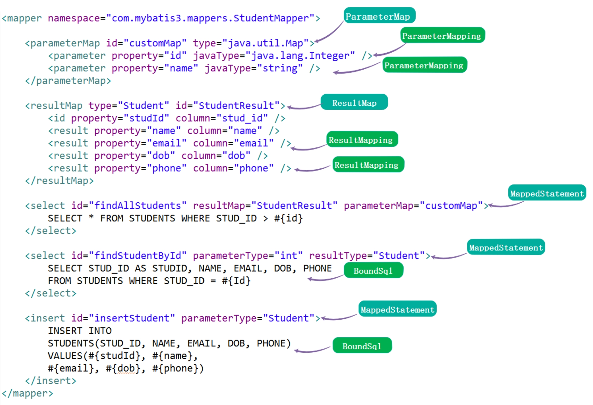解析

上图，就是 Mapper 映射配置文件的解析结果。

# 2. XMLMapperBuilder

org.apache.ibatis.builder.xml.XMLMapperBuilder ，继承 BaseBuilder 抽象类，Mapper XML 配置构建器，主要负责解析 Mapper 映射配置文件。

## 2.1 构造方法

// XMLMapperBuilder.java  /**  * 基于 Java XPath 解析器  */ private final XPathParser parser; /**  * Mapper 构造器助手  */ private final MapperBuilderAssistant builderAssistant; /**  * 可被其他语句引用的可重用语句块的集合  *  * 例如：<sql id="userColumns"> ${alias}.id,${alias}.username,${alias}.password </sql>  */ private final Map<String, XNode> sqlFragments; /**  * 资源引用的地址  */ private final String resource;  public XMLMapperBuilder(InputStream inputStream, Configuration configuration, String resource, Map<String, XNode> sqlFragments, String namespace) {   this(inputStream, configuration, resource, sqlFragments);   this.builderAssistant.setCurrentNamespace(namespace); }  public XMLMapperBuilder(InputStream inputStream, Configuration configuration, String resource, Map<String, XNode> sqlFragments) {   this(new XPathParser(inputStream, true, configuration.getVariables(), new XMLMapperEntityResolver()),       configuration, resource, sqlFragments); }  private XMLMapperBuilder(XPathParser parser, Configuration configuration, String resource, Map<String, XNode> sqlFragments) {   super(configuration);   // 创建 MapperBuilderAssistant 对象   this.builderAssistant = new MapperBuilderAssistant(configuration, resource);   this.parser = parser;   this.sqlFragments = sqlFragments;   this.resource = resource; }

builderAssistant 属性，MapperBuilderAssistant 对象，是 XMLMapperBuilder 和 MapperAnnotationBuilder 的小助手，提供了一些公用的方法，例如创建 ParameterMap、MappedStatement 对象等等。关于 MapperBuilderAssistant 类，可见 [「3. MapperBuilderAssistant」](http://svip.iocoder.cn/MyBatis/builder-package-2/) 。

## 2.2 parse

\#parse() 方法，解析 Mapper XML 配置文件。代码如下：

// XMLMapperBuilder.java  public void parse() {   // <1> 判断当前 Mapper 是否已经加载过   if (!configuration.isResourceLoaded(resource)) {     // <2> 解析 `<mapper />` 节点     configurationElement(parser.evalNode("/mapper"));     // <3> 标记该 Mapper 已经加载过     configuration.addLoadedResource(resource);     // <4> 绑定 Mapper     bindMapperForNamespace();   }    // <5> 解析待定的 <resultMap /> 节点   parsePendingResultMaps();   // <6> 解析待定的 <cache-ref /> 节点   parsePendingCacheRefs();   // <7> 解析待定的 SQL 语句的节点   parsePendingStatements(); }


<1> 处，调用 Configuration#isResourceLoaded(String resource) 方法，判断当前 Mapper 是否已经加载过。代码如下：


// Configuration.java  /**  * 已加载资源( Resource )集合  */ protected final Set<String> loadedResources = new HashSet<>();  public boolean isResourceLoaded(String resource) {   return loadedResources.contains(resource); }


<3> 处，调用 Configuration#addLoadedResource(String resource) 方法，标记该 Mapper 已经加载过。代码如下：


// Configuration.java  public void addLoadedResource(String resource) {   loadedResources.add(resource); }


<2> 处，调用 #configurationElement(XNode context) 方法，解析 <mapper /> 节点。详细解析，见 [「2.3 configurationElement」](http://svip.iocoder.cn/MyBatis/builder-package-2/) 。


<4> 处，调用 #bindMapperForNamespace() 方法，绑定 Mapper 。详细解析，

<5>、<6>、<7> 处，解析对应的待定的节点。详细解析，见 [「2.5 parsePendingXXX」](http://svip.iocoder.cn/MyBatis/builder-package-2/) 。

## 2.3 configurationElement

\#configurationElement(XNode context) 方法，解析 <mapper /> 节点。代码如下：

// XMLMapperBuilder.java  private void configurationElement(XNode context) {   try {     // <1> 获得 namespace 属性     String namespace = context.getStringAttribute("namespace");     if (namespace == null || namespace.equals("")) {       throw new BuilderException("Mapper's namespace cannot be empty");     }     // <1> 设置 namespace 属性     builderAssistant.setCurrentNamespace(namespace);     // <2> 解析 <cache-ref /> 节点     cacheRefElement(context.evalNode("cache-ref"));     // <3> 解析 <cache /> 节点     cacheElement(context.evalNode("cache"));     // 已废弃！老式风格的参数映射。内联参数是首选,这个元素可能在将来被移除，这里不会记录。     parameterMapElement(context.evalNodes("/mapper/parameterMap"));     // <4> 解析 <resultMap /> 节点们     resultMapElements(context.evalNodes("/mapper/resultMap"));     // <5> 解析 <sql /> 节点们     sqlElement(context.evalNodes("/mapper/sql"));     // <6> 解析 <select /> <insert /> <update /> <delete /> 节点们     buildStatementFromContext(context.evalNodes("select|insert|update|delete"));   } catch (Exception e) {     throw new BuilderException("Error parsing Mapper XML. The XML location is '" + resource + "'. Cause: " + e, e);   } }

<1> 处，获得 namespace 属性，并设置到 MapperAnnotationBuilder 中。

<2> 处，调用 #cacheRefElement(XNode context) 方法，解析 <cache-ref /> 节点。详细解析，见 [「2.3.1 cacheElement」](http://svip.iocoder.cn/MyBatis/builder-package-2/) 。

<3> 处，调用 #cacheElement(XNode context) 方法，解析 cache /> 标签。详细解析，见 [「2.3.2 cacheElement」](http://svip.iocoder.cn/MyBatis/builder-package-2/) 。

<4> 处，调用 #resultMapElements(List<XNode> list) 方法，解析 <resultMap /> 节点们。详细解析，见 [「2.3.3 resultMapElements」](http://svip.iocoder.cn/MyBatis/builder-package-2/) 。

<5> 处，调用 #sqlElement(List<XNode> list) 方法，解析 <sql /> 节点们。详细解析，见 [「2.3.4 sqlElement」](http://svip.iocoder.cn/MyBatis/builder-package-2/) 。

<6> 处，调用 #buildStatementFromContext(List<XNode> list) 方法，解析 <select />、<insert />、<update />、<delete /> 节点们。详细解析，见 [「2.3.5 buildStatementFromContext」](http://svip.iocoder.cn/MyBatis/builder-package-2/) 。

### 2.3.1 cacheElement

\#cacheRefElement(XNode context) 方法，解析 <cache-ref /> 节点。代码如下：

// XMLMapperBuilder.java  private void cacheRefElement(XNode context) {   if (context != null) {     // <1> 获得指向的 namespace 名字，并添加到 configuration 的 cacheRefMap 中     configuration.addCacheRef(builderAssistant.getCurrentNamespace(), context.getStringAttribute("namespace"));     // <2> 创建 CacheRefResolver 对象，并执行解析     CacheRefResolver cacheRefResolver = new CacheRefResolver(builderAssistant, context.getStringAttribute("namespace"));     try {       cacheRefResolver.resolveCacheRef();     } catch (IncompleteElementException e) {       // <3> 解析失败，添加到 configuration 的 incompleteCacheRefs 中       configuration.addIncompleteCacheRef(cacheRefResolver);     }   } }


示例如下：


<cache-ref namespace="com.someone.application.data.SomeMapper"/>


<1> 处，获得指向的 namespace 名字，并调用 Configuration#addCacheRef(String namespace, String referencedNamespace) 方法，添加到 configuration 的 cacheRefMap 中。代码如下：


// Configuration.java  /**  * A map holds cache-ref relationship. The key is the namespace that  * references a cache bound to another namespace and the value is the  * namespace which the actual cache is bound to.  *  * Cache 指向的映射  *  * @see #addCacheRef(String, String)  * @see org.apache.ibatis.builder.xml.XMLMapperBuilder#cacheRefElement(XNode)  */ protected final Map<String, String> cacheRefMap = new HashMap<>();  public void addCacheRef(String namespace, String referencedNamespace) {   cacheRefMap.put(namespace, referencedNamespace); }


<2> 处，创建 CacheRefResolver 对象，并调用 CacheRefResolver#resolveCacheRef() 方法，执行解析。关于 CacheRefResolver ，在 [「2.3.1.1 CacheRefResolver」](http://svip.iocoder.cn/MyBatis/builder-package-2/) 详细解析。


<3> 处，解析失败，因为此处指向的 Cache 对象可能未初始化，则先调用 Configuration#addIncompleteCacheRef(CacheRefResolver incompleteCacheRef) 方法，添加到 configuration 的 incompleteCacheRefs 中。代码如下：


// Configuration.java  /**  * CacheRefResolver 集合  */ protected final Collection<CacheRefResolver> incompleteCacheRefs = new LinkedList<>();  public void addIncompleteCacheRef(CacheRefResolver incompleteCacheRef) {   incompleteCacheRefs.add(incompleteCacheRef); }


#### 2.3.1.1 CacheRefResolver

org.apache.ibatis.builder.CacheRefResolver ，Cache 指向解析器。代码如下：

// CacheRefResolver.java  public class CacheRefResolver {    private final MapperBuilderAssistant assistant;   /**    * Cache 指向的命名空间    */   private final String cacheRefNamespace;    public CacheRefResolver(MapperBuilderAssistant assistant, String cacheRefNamespace) {     this.assistant = assistant;     this.cacheRefNamespace = cacheRefNamespace;   }    public Cache resolveCacheRef() {     return assistant.useCacheRef(cacheRefNamespace);   }  }

在 #resolveCacheRef() 方法中，会调用 MapperBuilderAssistant#useCacheRef(String namespace) 方法，获得指向的 Cache 对象。详细解析，见 [「3.3 useCacheRef」](http://svip.iocoder.cn/MyBatis/builder-package-2/) 。

### 2.3.2 cacheElement

\#cacheElement(XNode context) 方法，解析 cache /> 标签。代码如下：

// XMLMapperBuilder.java  private void cacheElement(XNode context) throws Exception {   if (context != null) {     // <1> 获得负责存储的 Cache 实现类     String type = context.getStringAttribute("type", "PERPETUAL");     Class<? extends Cache> typeClass = typeAliasRegistry.resolveAlias(type);     // <2> 获得负责过期的 Cache 实现类     String eviction = context.getStringAttribute("eviction", "LRU");     Class<? extends Cache> evictionClass = typeAliasRegistry.resolveAlias(eviction);     // <3> 获得 flushInterval、size、readWrite、blocking 属性     Long flushInterval = context.getLongAttribute("flushInterval");     Integer size = context.getIntAttribute("size");     boolean readWrite = !context.getBooleanAttribute("readOnly", false);     boolean blocking = context.getBooleanAttribute("blocking", false);     // <4> 获得 Properties 属性     Properties props = context.getChildrenAsProperties();     // <5> 创建 Cache 对象     builderAssistant.useNewCache(typeClass, evictionClass, flushInterval, size, readWrite, blocking, props);   } }


示例如下：


// 使用默认缓存 <cache eviction="FIFO" flushInterval="60000" size="512" readOnly="true"/>  // 使用自定义缓存 <cache type="com.domain.something.MyCustomCache">  <property name="cacheFile" value="/tmp/my-custom-cache.tmp"/> </cache>


<1>、<2>、<3>、<4> 处，见代码注释即可。


<5> 处，调用 MapperBuilderAssistant#useNewCache(...) 方法，创建 Cache 对象。详细解析，见 [「3.4 useNewCache」](http://svip.iocoder.cn/MyBatis/builder-package-2/) 中。

### 2.3.3 resultMapElements

老艿艿：开始高能，保持耐心。

整体流程如下：

FROM [《Mybatis3.3.x技术内幕（十）：Mybatis初始化流程（下）》](https://my.oschina.net/zudajun/blog/669868)

解析``

\#resultMapElements(List<XNode> list) 方法，解析 <resultMap /> 节点们。代码如下：

// XMLMapperBuilder.java  // 解析 <resultMap /> 节点们 private void resultMapElements(List<XNode> list) throws Exception {   // 遍历 <resultMap /> 节点们   for (XNode resultMapNode : list) {     try {       // 处理单个 <resultMap /> 节点       resultMapElement(resultMapNode);     } catch (IncompleteElementException e) {       // ignore, it will be retried     }   } }  // 解析 <resultMap /> 节点 private ResultMap resultMapElement(XNode resultMapNode) throws Exception {   return resultMapElement(resultMapNode, Collections.<ResultMapping>emptyList()); }  // 解析 <resultMap /> 节点 private ResultMap resultMapElement(XNode resultMapNode, List<ResultMapping> additionalResultMappings) throws Exception {   ErrorContext.instance().activity("processing " + resultMapNode.getValueBasedIdentifier());   // <1> 获得 id 属性   String id = resultMapNode.getStringAttribute("id",       resultMapNode.getValueBasedIdentifier());   // <1> 获得 type 属性   String type = resultMapNode.getStringAttribute("type",       resultMapNode.getStringAttribute("ofType",           resultMapNode.getStringAttribute("resultType",               resultMapNode.getStringAttribute("javaType"))));   // <1> 获得 extends 属性   String extend = resultMapNode.getStringAttribute("extends");   // <1> 获得 autoMapping 属性   Boolean autoMapping = resultMapNode.getBooleanAttribute("autoMapping");   // <1> 解析 type 对应的类   Class<?> typeClass = resolveClass(type);   Discriminator discriminator = null;   // <2> 创建 ResultMapping 集合   List<ResultMapping> resultMappings = new ArrayList<>();   resultMappings.addAll(additionalResultMappings);   // <2> 遍历 <resultMap /> 的子节点   List<XNode> resultChildren = resultMapNode.getChildren();   for (XNode resultChild : resultChildren) {     // <2.1> 处理 <constructor /> 节点     if ("constructor".equals(resultChild.getName())) {       processConstructorElement(resultChild, typeClass, resultMappings);     // <2.2> 处理 <discriminator /> 节点     } else if ("discriminator".equals(resultChild.getName())) {       discriminator = processDiscriminatorElement(resultChild, typeClass, resultMappings);     // <2.3> 处理其它节点     } else {       List<ResultFlag> flags = new ArrayList<>();       if ("id".equals(resultChild.getName())) {         flags.add(ResultFlag.ID);       }       resultMappings.add(buildResultMappingFromContext(resultChild, typeClass, flags));     }   }   // <3> 创建 ResultMapResolver 对象，执行解析   ResultMapResolver resultMapResolver = new ResultMapResolver(builderAssistant, id, typeClass, extend, discriminator, resultMappings, autoMapping);   try {     return resultMapResolver.resolve();   } catch (IncompleteElementException e) {     // <4> 解析失败，添加到 configuration 中     configuration.addIncompleteResultMap(resultMapResolver);     throw e;   } }

<resultMap /> 标签的解析，是相对复杂的过程，情况比较多，所以胖友碰到不懂的，可以看看 [《MyBatis 文档 —— Mapper XML 文件》](http://www.mybatis.org/mybatis-3/zh/sqlmap-xml.html) 文档。

<1> 处，获得 id、type、extends、autoMapping 属性，并解析 type 对应的类型。

<2> 处，创建 ResultMapping 集合，后遍历 <resultMap /> 的子节点们，将每一个子节点解析成一个或多个 ResultMapping 对象，添加到集合中。即如下图所示：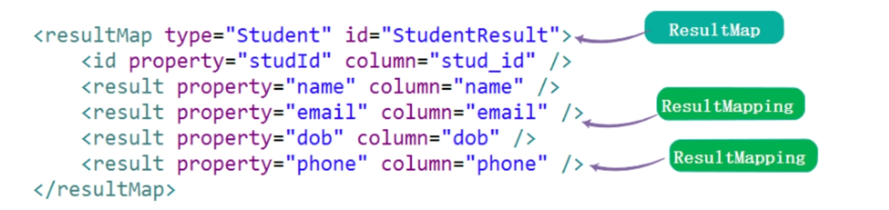ResultMap 与 ResultMapping 的映射

<2.1> 处，调用 #processConstructorElement(...) 方法，处理 <constructor /> 节点。详细解析，见 [「2.3.3.1 processConstructorElement」](http://svip.iocoder.cn/MyBatis/builder-package-2/) 。

<2.2> 处，调用 #processDiscriminatorElement(...) 方法，处理 <discriminator /> 节点。详细解析，见 [「2.3.3.2 processDiscriminatorElement」](http://svip.iocoder.cn/MyBatis/builder-package-2/) 。

<2.3> 处，调用 #buildResultMappingFromContext(XNode context, Class<?> resultType, List<ResultFlag> flags) 方法，将当前子节点构建成 ResultMapping 对象，并添加到 resultMappings 中。详细解析，见 [「2.3.3.3 buildResultMappingFromContext」](http://svip.iocoder.cn/MyBatis/builder-package-2/) 。 [「2.3.3.1 processConstructorElement」](http://svip.iocoder.cn/MyBatis/builder-package-2/) 的 <3> 是一致的。

<3> 处，创建 ResultMapResolver 对象，执行解析。关于 ResultMapResolver ，在 「2.3.1.1 CacheRefResolver」 详细解析。


<4> 处，如果解析失败，说明有依赖的信息不全，所以调用 Configuration#addIncompleteResultMap(ResultMapResolver resultMapResolver) 方法，添加到 Configuration 的 incompleteResultMaps 中。代码如下：


// Configuration.java  /**  * ResultMapResolver 集合  */ protected final Collection<ResultMapResolver> incompleteResultMaps = new LinkedList<>();  public void addIncompleteResultMap(ResultMapResolver resultMapResolver) {   incompleteResultMaps.add(resultMapResolver); }


#### 2.3.3.1 processConstructorElement

\#processConstructorElement(XNode resultChild, Class<?> resultType, List<ResultMapping> resultMappings) 方法，处理 <constructor /> 节点。代码如下：

// XMLMapperBuilder.java  private void processConstructorElement(XNode resultChild, Class<?> resultType, List<ResultMapping> resultMappings) throws Exception {   // <1> 遍历 <constructor /> 的子节点们   List<XNode> argChildren = resultChild.getChildren();   for (XNode argChild : argChildren) {     // <2> 获得 ResultFlag 集合     List<ResultFlag> flags = new ArrayList<>();     flags.add(ResultFlag.CONSTRUCTOR);     if ("idArg".equals(argChild.getName())) {       flags.add(ResultFlag.ID);     }     // <3> 将当前子节点构建成 ResultMapping 对象，并添加到 resultMappings 中     resultMappings.add(buildResultMappingFromContext(argChild, resultType, flags));   } }

<1> 和 <3> 处，遍历 <constructor /> 的子节点们，调用 #buildResultMappingFromContext(XNode context, Class<?> resultType, List<ResultFlag> flags) 方法，将当前子节点构建成 ResultMapping 对象，并添加到 resultMappings 中。详细解析，见 [「2.3.3.3 buildResultMappingFromContext」](http://svip.iocoder.cn/MyBatis/builder-package-2/) 。


<2> 处，我们可以看到一个 org.apache.ibatis.mapping.ResultFlag 枚举类，结果标识。代码如下：


// ResultFlag.java  public enum ResultFlag {    /**    * ID    */   ID,   /**    * 构造方法    */   CONSTRUCTOR  }


具体的用途，见下文。

#### 2.3.3.2 processDiscriminatorElement

\#processDiscriminatorElement(XNode context, Class<?> resultType, List<ResultMapping> resultMappings) 方法，处理 <constructor /> 节点。代码如下：

// XMLMapperBuilder.java  private Discriminator processDiscriminatorElement(XNode context, Class<?> resultType, List<ResultMapping> resultMappings) throws Exception {   // <1> 解析各种属性   String column = context.getStringAttribute("column");   String javaType = context.getStringAttribute("javaType");   String jdbcType = context.getStringAttribute("jdbcType");   String typeHandler = context.getStringAttribute("typeHandler");   // <1> 解析各种属性对应的类   Class<?> javaTypeClass = resolveClass(javaType);   Class<? extends TypeHandler<?>> typeHandlerClass = resolveClass(typeHandler);   JdbcType jdbcTypeEnum = resolveJdbcType(jdbcType);   // <2> 遍历 <discriminator /> 的子节点，解析成 discriminatorMap 集合   Map<String, String> discriminatorMap = new HashMap<>();   for (XNode caseChild : context.getChildren()) {     String value = caseChild.getStringAttribute("value");     String resultMap = caseChild.getStringAttribute("resultMap", processNestedResultMappings(caseChild, resultMappings)); // <2.1>     discriminatorMap.put(value, resultMap);   }   // <3> 创建 Discriminator 对象   return builderAssistant.buildDiscriminator(resultType, column, javaTypeClass, jdbcTypeEnum, typeHandlerClass, discriminatorMap); }

可能大家对 <discriminator /> 标签不是很熟悉，可以打开 [《MyBatis 文档 —— Mapper XML 文件》](http://www.mybatis.org/mybatis-3/zh/sqlmap-xml.html) 文档，然后下【鉴别器】。

<1> 处，解析各种属性以及属性对应的类。

<2> 处，遍历 <discriminator /> 的子节点，解析成 discriminatorMap 集合。


<2.1> 处，如果是内嵌的 ResultMap 的情况，则调用 #processNestedResultMappings(XNode context, List<ResultMapping> resultMappings) 方法，处理内嵌的 ResultMap 的情况。代码如下：


// XMLMapperBuilder.java  private String processNestedResultMappings(XNode context, List<ResultMapping> resultMappings) throws Exception {   if ("association".equals(context.getName())       || "collection".equals(context.getName())       || "case".equals(context.getName())) {     if (context.getStringAttribute("select") == null) {       // 解析，并返回 ResultMap       ResultMap resultMap = resultMapElement(context, resultMappings);       return resultMap.getId();     }   }   return null; }


该方法，会“递归”调用 #resultMapElement(XNode context, List<ResultMapping> resultMappings) 方法，处理内嵌的 ResultMap 的情况。也就是返回到 [「2.3.3 resultMapElement」](http://svip.iocoder.cn/MyBatis/builder-package-2/) 流程。

<3> 处，调用 MapperBuilderAssistant#buildDiscriminator(...) 方法，创建 Discriminator 对象。详细解析，见 [「3.6 buildDiscriminator」](http://svip.iocoder.cn/MyBatis/builder-package-2/) 。

#### 2.3.3.3 buildResultMappingFromContext

\#buildResultMappingFromContext(XNode context, Class<?> resultType, List<ResultFlag> flags) 方法，将当前节点构建成 ResultMapping 对象。代码如下：

// XMLMapperBuilder.java  private ResultMapping buildResultMappingFromContext(XNode context, Class<?> resultType, List<ResultFlag> flags) throws Exception {   // <1> 获得各种属性   String property;   if (flags.contains(ResultFlag.CONSTRUCTOR)) {     property = context.getStringAttribute("name");   } else {     property = context.getStringAttribute("property");   }   String column = context.getStringAttribute("column");   String javaType = context.getStringAttribute("javaType");   String jdbcType = context.getStringAttribute("jdbcType");   String nestedSelect = context.getStringAttribute("select");   String nestedResultMap = context.getStringAttribute("resultMap",       processNestedResultMappings(context, Collections.emptyList()));   String notNullColumn = context.getStringAttribute("notNullColumn");   String columnPrefix = context.getStringAttribute("columnPrefix");   String typeHandler = context.getStringAttribute("typeHandler");   String resultSet = context.getStringAttribute("resultSet");   String foreignColumn = context.getStringAttribute("foreignColumn");   boolean lazy = "lazy".equals(context.getStringAttribute("fetchType", configuration.isLazyLoadingEnabled() ? "lazy" : "eager"));   // <1> 获得各种属性对应的类   Class<?> javaTypeClass = resolveClass(javaType);   Class<? extends TypeHandler<?>> typeHandlerClass = resolveClass(typeHandler);   JdbcType jdbcTypeEnum = resolveJdbcType(jdbcType);   // <2> 构建 ResultMapping 对象   return builderAssistant.buildResultMapping(resultType, property, column, javaTypeClass, jdbcTypeEnum, nestedSelect, nestedResultMap, notNullColumn, columnPrefix, typeHandlerClass, flags, resultSet, foreignColumn, lazy); }

<1> 处，解析各种属性以及属性对应的类。

<2> 处，调用 MapperBuilderAssistant#buildResultMapping(...) 方法，构建 ResultMapping 对象。详细解析，见 [「3.5 buildResultMapping」](http://svip.iocoder.cn/MyBatis/builder-package-2/) 。

#### 2.3.3.4 ResultMapResolver

org.apache.ibatis.builder.ResultMapResolver，ResultMap 解析器。代码如下：

// ResultMapResolver.java  public class ResultMapResolver {    private final MapperBuilderAssistant assistant;   /**    * ResultMap 编号    */   private final String id;   /**    * 类型    */   private final Class<?> type;   /**    * 继承自哪个 ResultMap    */   private final String extend;   /**    * Discriminator 对象    */   private final Discriminator discriminator;   /**    * ResultMapping 集合    */   private final List<ResultMapping> resultMappings;   /**    * 是否自动匹配    */   private final Boolean autoMapping;    public ResultMapResolver(MapperBuilderAssistant assistant, String id, Class<?> type, String extend, Discriminator discriminator, List<ResultMapping> resultMappings, Boolean autoMapping) {     this.assistant = assistant;     this.id = id;     this.type = type;     this.extend = extend;     this.discriminator = discriminator;     this.resultMappings = resultMappings;     this.autoMapping = autoMapping;   }    public ResultMap resolve() {     return assistant.addResultMap(this.id, this.type, this.extend, this.discriminator, this.resultMappings, this.autoMapping);   }  }

在 #resolve() 方法中，会调用 MapperBuilderAssistant#addResultMap(...) 方法，创建 ResultMap 对象。详细解析，见 [「3.7 addResultMap」](http://svip.iocoder.cn/MyBatis/builder-package-2/) 。

### 2.3.4 sqlElement

\#sqlElement(List<XNode> list) 方法，解析 <sql /> 节点们。代码如下：

// XMLMapperBuilder.java  private void sqlElement(List<XNode> list) throws Exception {   if (configuration.getDatabaseId() != null) {     sqlElement(list, configuration.getDatabaseId());   }   sqlElement(list, null);   // 上面两块代码，可以简写成 sqlElement(list, configuration.getDatabaseId()); }  private void sqlElement(List<XNode> list, String requiredDatabaseId) throws Exception {   // <1> 遍历所有 <sql /> 节点   for (XNode context : list) {     // <2> 获得 databaseId 属性     String databaseId = context.getStringAttribute("databaseId");     // <3> 获得完整的 id 属性，格式为 `${namespace}.${id}` 。     String id = context.getStringAttribute("id");     id = builderAssistant.applyCurrentNamespace(id, false);     // <4> 判断 databaseId 是否匹配     if (databaseIdMatchesCurrent(id, databaseId, requiredDatabaseId)) {       // <5> 添加到 sqlFragments 中       sqlFragments.put(id, context);     }   } }

<1> 处，遍历所有 <sql /> 节点，逐个处理。

<2> 处，获得 databaseId 属性。

<3> 处，获得完整的 id 属性，格式为 ${namespace}.${id} 。


<4> 处，调用 #databaseIdMatchesCurrent(String id, String databaseId, String requiredDatabaseId) 方法，判断 databaseId 是否匹配。代码如下：


// XMLMapperBuilder.java  private boolean databaseIdMatchesCurrent(String id, String databaseId, String requiredDatabaseId) {   // 如果不匹配，则返回 false   if (requiredDatabaseId != null) {     return requiredDatabaseId.equals(databaseId);   } else {     // 如果未设置 requiredDatabaseId ，但是 databaseId 存在，说明还是不匹配，则返回 false     // mmp ，写的好绕     if (databaseId != null) {       return false;     }     // skip this fragment if there is a previous one with a not null databaseId     // 判断是否已经存在     if (this.sqlFragments.containsKey(id)) {       XNode context = this.sqlFragments.get(id);       // 若存在，则判断原有的 sqlFragment 是否 databaseId 为空。因为，当前 databaseId 为空，这样两者才能匹配。       return context.getStringAttribute("databaseId") == null;     }   }   return true; }


<5> 处，添加到 sqlFragments 中。因为 sqlFragments 是来自 Configuration 的 sqlFragments 属性，所以相当于也被添加了。代码如下：


// Configuration.java   /**  * 可被其他语句引用的可重用语句块的集合  *  * 例如：<sql id="userColumns"> ${alias}.id,${alias}.username,${alias}.password </sql>  */ protected final Map<String, XNode> sqlFragments = new StrictMap<>("XML fragments parsed from previous mappers");


### 2.3.5 buildStatementFromContext

\#buildStatementFromContext(List<XNode> list) 方法，解析 <select />、<insert />、<update />、<delete /> 节点们。代码如下：

// XMLMapperBuilder.java  private void buildStatementFromContext(List<XNode> list) {   if (configuration.getDatabaseId() != null) {     buildStatementFromContext(list, configuration.getDatabaseId());   }   buildStatementFromContext(list, null);   // 上面两块代码，可以简写成 buildStatementFromContext(list, configuration.getDatabaseId()); }  private void buildStatementFromContext(List<XNode> list, String requiredDatabaseId) {   // <1> 遍历 <select /> <insert /> <update /> <delete /> 节点们   for (XNode context : list) {     // <1> 创建 XMLStatementBuilder 对象，执行解析     final XMLStatementBuilder statementParser = new XMLStatementBuilder(configuration, builderAssistant, context, requiredDatabaseId);     try {       statementParser.parseStatementNode();     } catch (IncompleteElementException e) {       // <2> 解析失败，添加到 configuration 中       configuration.addIncompleteStatement(statementParser);     }   } }

<1> 处，遍历 <select />、<insert />、<update />、<delete /> 节点们，逐个创建 XMLStatementBuilder 对象，执行解析。关于 XMLStatementBuilder 类，我们放在下篇文章，详细解析。


<2> 处，解析失败，调用 Configuration#addIncompleteStatement(XMLStatementBuilder incompleteStatement) 方法，添加到 configuration 中。代码如下：


// Configuration.java  /**  * XMLStatementBuilder 集合  */ protected final Collection<XMLStatementBuilder> incompleteStatements = new LinkedList<>();  public void addIncompleteStatement(XMLStatementBuilder incompleteStatement) {   incompleteStatements.add(incompleteStatement); }


## 2.4 bindMapperForNamespace

\#bindMapperForNamespace() 方法，绑定 Mapper 。代码如下：

// XMLMapperBuilder.java  private void bindMapperForNamespace() {   String namespace = builderAssistant.getCurrentNamespace();   if (namespace != null) {     // <1> 获得 Mapper 映射配置文件对应的 Mapper 接口，实际上类名就是 namespace 。嘿嘿，这个是常识。     Class<?> boundType = null;     try {       boundType = Resources.classForName(namespace);     } catch (ClassNotFoundException e) {       //ignore, bound type is not required     }     if (boundType != null) {       // <2> 不存在该 Mapper 接口，则进行添加       if (!configuration.hasMapper(boundType)) {         // Spring may not know the real resource name so we set a flag         // to prevent loading again this resource from the mapper interface         // look at MapperAnnotationBuilder#loadXmlResource         // <3> 标记 namespace 已经添加，避免 MapperAnnotationBuilder#loadXmlResource(...) 重复加载         configuration.addLoadedResource("namespace:" + namespace);         // <4> 添加到 configuration 中         configuration.addMapper(boundType);       }     }   } }

<1> 处，获得 Mapper 映射配置文件对应的 Mapper 接口，实际上类名就是 namespace 。嘿嘿，这个是常识。


<2> 处，调用 Configuration#hasMapper(Class<?> type) 方法，判断若谷不存在该 Mapper 接口，则进行绑定。代码如下：


// Configuration.java  /**  * MapperRegistry 对象  */ protected final MapperRegistry mapperRegistry = new MapperRegistry(this);  public boolean hasMapper(Class<?> type) {   return mapperRegistry.hasMapper(type); }


<3> 处，调用 Configuration#addLoadedResource(String resource) 方法，标记 namespace 已经添加，避免 MapperAnnotationBuilder#loadXmlResource(...) 重复加载。代码如下：


// MapperAnnotationBuilder.java  private void loadXmlResource() {   // Spring may not know the real resource name so we check a flag   // to prevent loading again a resource twice   // this flag is set at XMLMapperBuilder#bindMapperForNamespace   if (!configuration.isResourceLoaded("namespace:" + type.getName())) {     // ... 省略创建 XMLMapperBuilder ，进行解析的代码   } }


<4> 处，调用 Configuration#addMapper(Class<T> type) 方法，添加到 configuration 的 mapperRegistry 中。代码如下：


// Configuration.java  public <T> void addMapper(Class<T> type) {   mapperRegistry.addMapper(type); }


## 2.5 parsePendingXXX

有三个 parsePendingXXX 方法，代码如下：

// XMLMapperBuilder.java  private void parsePendingResultMaps() {   // 获得 ResultMapResolver 集合，并遍历进行处理   Collection<ResultMapResolver> incompleteResultMaps = configuration.getIncompleteResultMaps();   synchronized (incompleteResultMaps) {     Iterator<ResultMapResolver> iter = incompleteResultMaps.iterator();     while (iter.hasNext()) {       try {         // 执行解析         iter.next().resolve();         // 移除         iter.remove();       } catch (IncompleteElementException e) {         // ResultMap is still missing a resource...         // 解析失败，不抛出异常       }     }   } }  private void parsePendingCacheRefs() {   // 获得 CacheRefResolver 集合，并遍历进行处理   Collection<CacheRefResolver> incompleteCacheRefs = configuration.getIncompleteCacheRefs();   synchronized (incompleteCacheRefs) {     Iterator<CacheRefResolver> iter = incompleteCacheRefs.iterator();     while (iter.hasNext()) {       try {         // 执行解析         iter.next().resolveCacheRef();         // 移除         iter.remove();       } catch (IncompleteElementException e) {         // Cache ref is still missing a resource...       }     }   } }  private void parsePendingStatements() {   // 获得 XMLStatementBuilder 集合，并遍历进行处理   Collection<XMLStatementBuilder> incompleteStatements = configuration.getIncompleteStatements();   synchronized (incompleteStatements) {     Iterator<XMLStatementBuilder> iter = incompleteStatements.iterator();     while (iter.hasNext()) {       try {         // 执行解析         iter.next().parseStatementNode();         // 移除         iter.remove();       } catch (IncompleteElementException e) {         // Statement is still missing a resource...       }     }   } }

三个方法的逻辑思路基本一致：1）获得对应的集合；2）遍历集合，执行解析；3）执行成功，则移除出集合；4）执行失败，忽略异常。

当然，实际上，此处还是可能有执行解析失败的情况，但是随着每一个 Mapper 配置文件对应的 XMLMapperBuilder 执行一次这些方法，逐步逐步就会被全部解析完。

# 3. MapperBuilderAssistant

org.apache.ibatis.builder.MapperBuilderAssistant ，继承 BaseBuilder 抽象类，Mapper 构造器的小助手，提供了一些公用的方法，例如创建 ParameterMap、MappedStatement 对象等等。

## 3.1 构造方法

// MapperBuilderAssistant.java  /**  * 当前 Mapper 命名空间  */ private String currentNamespace; /**  * 资源引用的地址  */ private final String resource; /**  * 当前 Cache 对象  */ private Cache currentCache; /**  * 是否未解析成功 Cache 引用  */ private boolean unresolvedCacheRef; // issue #676  public MapperBuilderAssistant(Configuration configuration, String resource) {   super(configuration);   ErrorContext.instance().resource(resource);   this.resource = resource; }

实际上，

## 3.2 setCurrentNamespace

\#setCurrentNamespace(String currentNamespace) 方法，设置 currentNamespace 属性。代码如下：

// MapperBuilderAssistant.java  public void setCurrentNamespace(String currentNamespace) {   // 如果传入的 currentNamespace 参数为空，抛出 BuilderException 异常   if (currentNamespace == null) {     throw new BuilderException("The mapper element requires a namespace attribute to be specified.");   }    // 如果当前已经设置，并且还和传入的不相等，抛出 BuilderException 异常   if (this.currentNamespace != null && !this.currentNamespace.equals(currentNamespace)) {     throw new BuilderException("Wrong namespace. Expected '"         + this.currentNamespace + "' but found '" + currentNamespace + "'.");   }    // 设置   this.currentNamespace = currentNamespace; }

## 3.3 useCacheRef

\#useCacheRef(String namespace) 方法，获得指向的 Cache 对象。如果获得不到，则抛出 IncompleteElementException 异常。代码如下：

// MapperBuilderAssistant.java  public Cache useCacheRef(String namespace) {   if (namespace == null) {     throw new BuilderException("cache-ref element requires a namespace attribute.");   }   try {     unresolvedCacheRef = true; // 标记未解决     // <1> 获得 Cache 对象     Cache cache = configuration.getCache(namespace);     // 获得不到，抛出 IncompleteElementException 异常     if (cache == null) {       throw new IncompleteElementException("No cache for namespace '" + namespace + "' could be found.");     }     // 记录当前 Cache 对象     currentCache = cache;     unresolvedCacheRef = false; // 标记已解决     return cache;   } catch (IllegalArgumentException e) {     throw new IncompleteElementException("No cache for namespace '" + namespace + "' could be found.", e);   } }


<1> 处，调用 Configuration#getCache(String id) 方法，获得 Cache 对象。代码如下：


// Configuration.java  /**  * Cache 对象集合  *  * KEY：命名空间 namespace  */ protected final Map<String, Cache> caches = new StrictMap<>("Caches collection");  public Cache getCache(String id) {   return caches.get(id); }


## 3.4 useNewCache

\#useNewCache(Class<? extends Cache> typeClass, Class<? extends Cache> evictionClass, Long flushInterval, Integer size, boolean readWrite, boolean blocking, Properties props) 方法，创建 Cache 对象。代码如下：

// MapperBuilderAssistant.java  public Cache useNewCache(Class<? extends Cache> typeClass,              Class<? extends Cache> evictionClass,              Long flushInterval,              Integer size,              boolean readWrite,              boolean blocking,              Properties props) {   // <1> 创建 Cache 对象   Cache cache = new CacheBuilder(currentNamespace)       .implementation(valueOrDefault(typeClass, PerpetualCache.class))       .addDecorator(valueOrDefault(evictionClass, LruCache.class))       .clearInterval(flushInterval)       .size(size)       .readWrite(readWrite)       .blocking(blocking)       .properties(props)       .build();   // <2> 添加到 configuration 的 caches 中   configuration.addCache(cache);   // <3> 赋值给 currentCache   currentCache = cache;   return cache; }

<1> 处，创建 Cache 对象。关于 CacheBuilder 类，详细解析，见 [「3.4.1 CacheBuilder」](http://svip.iocoder.cn/MyBatis/builder-package-2/) 。


<2> 处，调用 Configuration#addCache(Cache cache) 方法，添加到 configuration 的 caches 中。代码如下：


// Configuration.java  public void addCache(Cache cache) {   caches.put(cache.getId(), cache); }


<3> 处，赋值给 currentCache 。


### 3.4.1 CacheBuilder

org.apache.ibatis.mapping.CacheBuilder ，Cache 构造器。基于装饰者设计模式，进行 Cache 对象的构造。代码比较简单，但是有点略长，胖友直接点击 [链接](https://github.com/YunaiV/mybatis-3/blob/master/src/main/java/org/apache/ibatis/mapping/CacheBuilder.java) 查看，已经添加了完整的注释。

## 3.5 buildResultMapping

\#buildResultMapping(Class<?> resultType, String property, String column,Class<?> javaType, JdbcType jdbcType, String nestedSelect, String nestedResultMap, String notNullColumn, String columnPrefix, Class<? extends TypeHandler<?>> typeHandler, List<ResultFlag> flags, String resultSet, String foreignColumn, boolean lazy) 方法，构造 ResultMapping 对象。代码如下：

// MapperBuilderAssistant.java  public ResultMapping buildResultMapping(     Class<?> resultType,     String property,     String column,     Class<?> javaType,     JdbcType jdbcType,     String nestedSelect,     String nestedResultMap,     String notNullColumn,     String columnPrefix,     Class<? extends TypeHandler<?>> typeHandler,     List<ResultFlag> flags,     String resultSet,     String foreignColumn,     boolean lazy) {   // <1> 解析对应的 Java Type 类和 TypeHandler 对象   Class<?> javaTypeClass = resolveResultJavaType(resultType, property, javaType);   TypeHandler<?> typeHandlerInstance = resolveTypeHandler(javaTypeClass, typeHandler);   // <2> 解析组合字段名称成 ResultMapping 集合。涉及「关联的嵌套查询」   List<ResultMapping> composites = parseCompositeColumnName(column);   // <3> 创建 ResultMapping 对象   return new ResultMapping.Builder(configuration, property, column, javaTypeClass)       .jdbcType(jdbcType)       .nestedQueryId(applyCurrentNamespace(nestedSelect, true)) // <3.1>       .nestedResultMapId(applyCurrentNamespace(nestedResultMap, true)) // <3.1>       .resultSet(resultSet)       .typeHandler(typeHandlerInstance)       .flags(flags == null ? new ArrayList<>() : flags)       .composites(composites)       .notNullColumns(parseMultipleColumnNames(notNullColumn)) // <3.2>       .columnPrefix(columnPrefix)       .foreignColumn(foreignColumn)       .lazy(lazy) }

<1> 处，解析对应的 Java Type 类和 TypeHandler 对象。

<2> 处，调用 #parseCompositeColumnName(String columnName) 方法，解析组合字段名称成 ResultMapping 集合。详细解析，见 [「3.5.1 parseCompositeColumnName」](http://svip.iocoder.cn/MyBatis/builder-package-2/) 中。

<3> 处，创建 ResultMapping 对象。

<3.1> 处，调用 #applyCurrentNamespace(String base, boolean isReference) 方法，拼接命名空间。详细解析，见 [「3.5.2 applyCurrentNamespace」](http://svip.iocoder.cn/MyBatis/builder-package-2/) 。

<3.2> 处，调用 #parseMultipleColumnNames(String notNullColumn) 方法，将字符串解析成集合。详细解析，见 [「3.5.3 parseMultipleColumnNames」](http://svip.iocoder.cn/MyBatis/builder-package-2/) 。

关于 ResultMapping 类，在 [「3.5.4 ResultMapping」](http://svip.iocoder.cn/MyBatis/builder-package-2/) 中详细解析。

### 3.5.1 parseCompositeColumnName

\#parseCompositeColumnName(String columnName) 方法，解析组合字段名称成 ResultMapping 集合。代码如下：

// MapperBuilderAssistant.java  private List<ResultMapping> parseCompositeColumnName(String columnName) {   List<ResultMapping> composites = new ArrayList<>();   // 分词，解析其中的 property 和 column 的组合对   if (columnName != null && (columnName.indexOf('=') > -1 || columnName.indexOf(',') > -1)) {     StringTokenizer parser = new StringTokenizer(columnName, "{}=, ", false);     while (parser.hasMoreTokens()) {       String property = parser.nextToken();       String column = parser.nextToken();       // 创建 ResultMapping 对象       ResultMapping complexResultMapping = new ResultMapping.Builder(           configuration, property, column, configuration.getTypeHandlerRegistry().getUnknownTypeHandler()).build();       // 添加到 composites 中       composites.add(complexResultMapping);     }   }   return composites; }


对于这种情况，官方文档说明如下：


FROM [《MyBatis 文档 —— Mapper XML 文件》](http://www.mybatis.org/mybatis-3/zh/sqlmap-xml.html) 的 「关联的嵌套查询」 小节


来自数据库的列名,或重命名的列标签。这和通常传递给 resultSet.getString(columnName)方法的字符串是相同的。 column 注 意 : 要 处 理 复 合 主 键 , 你 可 以 指 定 多 个 列 名 通 过 column= ” {prop1=col1,prop2=col2} ” 这种语法来传递给嵌套查询语 句。这会引起 prop1 和 prop2 以参数对象形式来设置给目标嵌套查询语句。


### 3.5.2 applyCurrentNamespace

\#applyCurrentNamespace(String base, boolean isReference) 方法，拼接命名空间。代码如下：

// MapperBuilderAssistant.java  public String applyCurrentNamespace(String base, boolean isReference) {   if (base == null) {     return null;   }   if (isReference) {     // is it qualified with any namespace yet?     if (base.contains(".")) {       return base;     }   } else {     // is it qualified with this namespace yet?     if (base.startsWith(currentNamespace + ".")) {       return base;     }     if (base.contains(".")) {       throw new BuilderException("Dots are not allowed in element names, please remove it from " + base);     }   }   // 拼接 currentNamespace + base   return currentNamespace + "." + base; }

通过这样的方式，生成唯一在的标识。

### 3.5.3 parseMultipleColumnNames

\#parseMultipleColumnNames(String notNullColumn) 方法，将字符串解析成集合。代码如下：

// MapperBuilderAssistant.java  private Set<String> parseMultipleColumnNames(String columnName) {   Set<String> columns = new HashSet<>();   if (columnName != null) {     // 多个字段，使用 ，分隔     if (columnName.indexOf(',') > -1) {       StringTokenizer parser = new StringTokenizer(columnName, "{}, ", false);       while (parser.hasMoreTokens()) {         String column = parser.nextToken();         columns.add(column);       }     } else {       columns.add(columnName);     }   }   return columns; }

### 3.5.4 ResultMapping

org.apache.ibatis.mapping.ResultMapping ，ResultMap 中的每一条结果字段的映射。代码比较简单，但是有点略长，胖友直接点击 [链接](https://github.com/YunaiV/mybatis-3/blob/master/src/main/java/org/apache/ibatis/mapping/ResultMapping.java) 查看，已经添加了完整的注释。

## 3.6 buildDiscriminator

\#buildDiscriminator(Class<?> resultType, String column, Class<?> javaType, JdbcType jdbcType, Class<? extends TypeHandler<?>> typeHandler, Map<String, String> discriminatorMap) 方法，构建 Discriminator 对象。代码如下：

// MapperBuilderAssistant.java  public Discriminator buildDiscriminator(     Class<?> resultType,     String column,     Class<?> javaType,     JdbcType jdbcType,     Class<? extends TypeHandler<?>> typeHandler,     Map<String, String> discriminatorMap) {   // 构建 ResultMapping 对象   ResultMapping resultMapping = buildResultMapping(       resultType,       null,       column,       javaType,       jdbcType,       null,       null,       null,       null,       typeHandler,       new ArrayList<ResultFlag>(),       null,       null,       false);   // 创建 namespaceDiscriminatorMap 映射   Map<String, String> namespaceDiscriminatorMap = new HashMap<>();   for (Map.Entry<String, String> e : discriminatorMap.entrySet()) {     String resultMap = e.getValue();     resultMap = applyCurrentNamespace(resultMap, true); // 生成 resultMap 标识     namespaceDiscriminatorMap.put(e.getKey(), resultMap);   }   // 构建 Discriminator 对象   return new Discriminator.Builder(configuration, resultMapping, namespaceDiscriminatorMap).build(); }

简单看看就好，<discriminator /> 平时用的很少。

### 3.6.1 Discriminator

org.apache.ibatis.mapping.Discriminator ，鉴别器，代码比较简单，胖友直接点击 [链接](https://github.com/YunaiV/mybatis-3/blob/master/src/main/java/org/apache/ibatis/mapping/Discriminator.java) 查看，已经添加了完整的注释。

## 3.7 addResultMap

\#addResultMap(String id, Class<?> type, String extend, Discriminator discriminator, List<ResultMapping> resultMappings, Boolean autoMapping) 方法，创建 ResultMap 对象，并添加到 Configuration 中。代码如下：

// MapperBuilderAssistant.java  public ResultMap addResultMap(     String id,     Class<?> type,     String extend,     Discriminator discriminator,     List<ResultMapping> resultMappings,     Boolean autoMapping) {   // <1> 获得 ResultMap 编号，即格式为 `${namespace}.${id}` 。   id = applyCurrentNamespace(id, false);   // <2.1> 获取完整的 extend 属性，即格式为 `${namespace}.${extend}` 。从这里的逻辑来看，貌似只能自己 namespace 下的 ResultMap 。   extend = applyCurrentNamespace(extend, true);    // <2.2> 如果有父类，则将父类的 ResultMap 集合，添加到 resultMappings 中。   if (extend != null) {     // <2.2.1> 获得 extend 对应的 ResultMap 对象。如果不存在，则抛出 IncompleteElementException 异常     if (!configuration.hasResultMap(extend)) {       throw new IncompleteElementException("Could not find a parent resultmap with id '" + extend + "'");     }     ResultMap resultMap = configuration.getResultMap(extend);     // 获取 extend 的 ResultMap 对象的 ResultMapping 集合，并移除 resultMappings     List<ResultMapping> extendedResultMappings = new ArrayList<>(resultMap.getResultMappings());     extendedResultMappings.removeAll(resultMappings);     // Remove parent constructor if this resultMap declares a constructor.     // 判断当前的 resultMappings 是否有构造方法，如果有，则从 extendedResultMappings 移除所有的构造类型的 ResultMapping 们     boolean declaresConstructor = false;     for (ResultMapping resultMapping : resultMappings) {       if (resultMapping.getFlags().contains(ResultFlag.CONSTRUCTOR)) {         declaresConstructor = true;         break;       }     }     if (declaresConstructor) {       extendedResultMappings.removeIf(resultMapping -> resultMapping.getFlags().contains(ResultFlag.CONSTRUCTOR));     }     // 将 extendedResultMappings 添加到 resultMappings 中     resultMappings.addAll(extendedResultMappings);   }   // <3> 创建 ResultMap 对象   ResultMap resultMap = new ResultMap.Builder(configuration, id, type, resultMappings, autoMapping)       .discriminator(discriminator)       .build();   // <4> 添加到 configuration 中   configuration.addResultMap(resultMap);   return resultMap; }

<1> 处，获得 ResultMap 编号，即格式为 ${namespace}.${id} 。

<2.1> 处，获取完整的 extend 属性，即格式为 ${namespace}.${extend} 。从这里的逻辑来看，貌似只能自己 namespace 下的 ResultMap 。


<2.2> 处，如果有父类，则将父类的 ResultMap 集合，添加到 resultMappings 中。逻辑有些绕，胖友耐心往下看。


<2.2.1> 处，获得 extend 对应的 ResultMap 对象。如果不存在，则抛出 IncompleteElementException 异常。代码如下：


// Configuration.java  /**  * ResultMap 的映射  *  * KEY：`${namespace}.${id}`  */ protected final Map<String, ResultMap> resultMaps = new StrictMap<>("Result Maps collection");  public ResultMap getResultMap(String id) {   return resultMaps.get(id); }  public boolean hasResultMap(String id) {   return resultMaps.containsKey(id); }


x

<3> 处，创建 ResultMap 对象。详细解析，见 [「3.7.1 ResultMap」](http://svip.iocoder.cn/MyBatis/builder-package-2/) 。


<4> 处， 调用 Configuration#addResultMap(ResultMap rm) 方法，添加到 Configuration 的 resultMaps 中。代码如下：


// Configuration.java  public void addResultMap(ResultMap rm) {   // <1> 添加到 resultMaps 中   resultMaps.put(rm.getId(), rm);   // 遍历全局的 ResultMap 集合，若其拥有 Discriminator 对象，则判断是否强制标记为有内嵌的 ResultMap   checkLocallyForDiscriminatedNestedResultMaps(rm);   // 若传入的 ResultMap 不存在内嵌 ResultMap 并且有 Discriminator ，则判断是否需要强制表位有内嵌的 ResultMap   checkGloballyForDiscriminatedNestedResultMaps(rm); }


<1> 处，添加到 resultMaps 中。


<2> 处，调用 #checkLocallyForDiscriminatedNestedResultMaps(ResultMap rm) 方法，遍历全局的 ResultMap 集合，若其拥有 Discriminator 对象，则判断是否强制标记为有内嵌的 ResultMap 。代码如下：


// Configuration.java  // Slow but a one time cost. A better solution is welcome. protected void checkGloballyForDiscriminatedNestedResultMaps(ResultMap rm) {   // 如果传入的 ResultMap 有内嵌的 ResultMap   if (rm.hasNestedResultMaps()) {     // 遍历全局的 ResultMap 集合     for (Map.Entry<String, ResultMap> entry : resultMaps.entrySet()) {       Object value = entry.getValue();       if (value != null) {         ResultMap entryResultMap = (ResultMap) value;         // 判断遍历的全局的 entryResultMap 不存在内嵌 ResultMap 并且有 Discriminator         if (!entryResultMap.hasNestedResultMaps() && entryResultMap.getDiscriminator() != null) {           // 判断是否 Discriminator 的 ResultMap 集合中，使用了传入的 ResultMap 。           // 如果是，则标记为有内嵌的 ResultMap           Collection<String> discriminatedResultMapNames = entryResultMap.getDiscriminator().getDiscriminatorMap().values();           if (discriminatedResultMapNames.contains(rm.getId())) {             entryResultMap.forceNestedResultMaps();           }         }       }     }   } }


逻辑有点绕，胖友耐心看下去。。。


<3> 处，调用 #checkLocallyForDiscriminatedNestedResultMaps(ResultMap rm) 方法，若传入的 ResultMap 不存在内嵌 ResultMap 并且有 Discriminator ，则判断是否需要强制表位有内嵌的 ResultMap 。代码如下：


// Configuration.java  // Slow but a one time cost. A better solution is welcome. protected void checkLocallyForDiscriminatedNestedResultMaps(ResultMap rm) {   // 如果传入的 ResultMap 不存在内嵌 ResultMap 并且有 Discriminator   if (!rm.hasNestedResultMaps() && rm.getDiscriminator() != null) {     // 遍历传入的 ResultMap 的 Discriminator 的 ResultMap 集合     for (Map.Entry<String, String> entry : rm.getDiscriminator().getDiscriminatorMap().entrySet()) {       String discriminatedResultMapName = entry.getValue();       if (hasResultMap(discriminatedResultMapName)) {         // 如果引用的 ResultMap 存在内嵌 ResultMap ，则标记传入的 ResultMap 存在内嵌 ResultMap         ResultMap discriminatedResultMap = resultMaps.get(discriminatedResultMapName);         if (discriminatedResultMap.hasNestedResultMaps()) {           rm.forceNestedResultMaps();           break;         }       }     }   } }


逻辑有点绕，胖友耐心看下去。。。整体逻辑，和 #checkGloballyForDiscriminatedNestedResultMaps(ResultMap rm) 方法是类似的，互为“倒影”。

### 3.7.1 ResultMap

org.apache.ibatis.mapping.ResultMap ，结果集，例如 <resultMap /> 解析后的对象。代码比较简单，但是有点略长，胖友直接点击 [链接](https://github.com/YunaiV/mybatis-3/blob/master/src/main/java/org/apache/ibatis/mapping/ResultMap.java) 查看，已经添加了完整的注释。

# 666. 彩蛋

涉及配置解析类的文章，往往写起来枯燥，胖友读起来也枯燥。当然，本文提供的配置示例非常少（自我吐槽），所以胖友先辛苦下，耐心搭配 [《MyBatis 文档 —— Mapper XML 文件》](http://www.mybatis.org/mybatis-3/zh/sqlmap-xml.html) 一起看看。

如果，胖友看到有疑问，一定一定一定要来星球给艿艿提供。这样，艿艿也好针对的优化这个文章。hohoho 。

参考和推荐如下文章：

祖大俊 [《Mybatis3.3.x技术内幕（八）：Mybatis初始化流程（上）》](https://my.oschina.net/zudajun/blog/668738)

祖大俊 [《Mybatis3.3.x技术内幕（九）：Mybatis初始化流程（中）》](https://my.oschina.net/zudajun/blog/668787)

祖大俊 [《Mybatis3.3.x技术内幕（十）：Mybatis初始化流程（下）》](https://my.oschina.net/zudajun/blog/669868)

田小波 [《MyBatis 源码分析 - 映射文件解析过程》](https://www.tianxiaobo.com/2018/07/30/MyBatis-源码分析-映射文件解析过程/)

徐郡明 [《MyBatis 技术内幕》](https://item.jd.com/12125531.html) 的 [「3.1 MyBatis 初始化」](http://svip.iocoder.cn/MyBatis/builder-package-2/) 小节


# 精尽 MyBatis 源码分析 —— MyBatis 初始化（三）之加载 Statement 配置

# 1. 概述

本文接 [《精尽 MyBatis 源码分析 —— MyBatis 初始化（二）之加载 Mapper 映射配置文件》](http://svip.iocoder.cn/MyBatis/builder-package-2) 一文，来分享 MyBatis 初始化的第三步，加载 Statement 配置。而这个步骤的入口是 XMLStatementBuilder 。下面，我们一起来看看它的代码实现。

在 [《精尽 MyBatis 源码分析 —— MyBatis 初始化（二）之加载 Mapper 映射配置文件》](http://svip.iocoder.cn/MyBatis/builder-package-2) 的 [「2.3.5 buildStatementFromContext」](http://svip.iocoder.cn/MyBatis/builder-package-3/) 中，我们已经看到对 XMLStatementBuilder 的调用代码。代码如下：

// XMLMapperBuilder.java  private void buildStatementFromContext(List<XNode> list) {   if (configuration.getDatabaseId() != null) {     buildStatementFromContext(list, configuration.getDatabaseId());   }   buildStatementFromContext(list, null);   // 上面两块代码，可以简写成 buildStatementFromContext(list, configuration.getDatabaseId()); }  private void buildStatementFromContext(List<XNode> list, String requiredDatabaseId) {   // <1> 遍历 <select /> <insert /> <update /> <delete /> 节点们   for (XNode context : list) {     // <1> 创建 XMLStatementBuilder 对象，执行解析     final XMLStatementBuilder statementParser = new XMLStatementBuilder(configuration, builderAssistant, context, requiredDatabaseId);     try {       statementParser.parseStatementNode();     } catch (IncompleteElementException e) {       // <2> 解析失败，添加到 configuration 中       configuration.addIncompleteStatement(statementParser);     }   } }

# 2. XMLStatementBuilder

org.apache.ibatis.builder.xml.XMLStatementBuilder ，继承 BaseBuilder 抽象类，Statement XML 配置构建器，主要负责解析 Statement 配置，即 <select />、<insert />、<update />、<delete /> 标签。

## 2.1 构造方法

// XMLStatementBuilder.java  private final MapperBuilderAssistant builderAssistant; /**  * 当前 XML 节点，例如：<select />、<insert />、<update />、<delete /> 标签  */ private final XNode context; /**  * 要求的 databaseId  */ private final String requiredDatabaseId;  public XMLStatementBuilder(Configuration configuration, MapperBuilderAssistant builderAssistant, XNode context, String databaseId) {   super(configuration);   this.builderAssistant = builderAssistant;   this.context = context;   this.requiredDatabaseId = databaseId; }

## 2.2 parseStatementNode

\#parseStatementNode() 方法，执行 Statement 解析。代码如下：

// XMLStatementBuilder.java  public void parseStatementNode() {   // <1> 获得 id 属性，编号。   String id = context.getStringAttribute("id");   // <2> 获得 databaseId ， 判断 databaseId 是否匹配   String databaseId = context.getStringAttribute("databaseId");   if (!databaseIdMatchesCurrent(id, databaseId, this.requiredDatabaseId)) {     return;   }    // <3> 获得各种属性   Integer fetchSize = context.getIntAttribute("fetchSize");   Integer timeout = context.getIntAttribute("timeout");   String parameterMap = context.getStringAttribute("parameterMap");   String parameterType = context.getStringAttribute("parameterType");   Class<?> parameterTypeClass = resolveClass(parameterType);   String resultMap = context.getStringAttribute("resultMap");   String resultType = context.getStringAttribute("resultType");   String lang = context.getStringAttribute("lang");    // <4> 获得 lang 对应的 LanguageDriver 对象   LanguageDriver langDriver = getLanguageDriver(lang);    // <5> 获得 resultType 对应的类   Class<?> resultTypeClass = resolveClass(resultType);   // <6> 获得 resultSet 对应的枚举值   String resultSetType = context.getStringAttribute("resultSetType");   ResultSetType resultSetTypeEnum = resolveResultSetType(resultSetType);   // <7> 获得 statementType 对应的枚举值   StatementType statementType = StatementType.valueOf(context.getStringAttribute("statementType", StatementType.PREPARED.toString()));    // <8> 获得 SQL 对应的 SqlCommandType 枚举值   String nodeName = context.getNode().getNodeName();   SqlCommandType sqlCommandType = SqlCommandType.valueOf(nodeName.toUpperCase(Locale.ENGLISH));   // <9> 获得各种属性   boolean isSelect = sqlCommandType == SqlCommandType.SELECT;   boolean flushCache = context.getBooleanAttribute("flushCache", !isSelect);   boolean useCache = context.getBooleanAttribute("useCache", isSelect);   boolean resultOrdered = context.getBooleanAttribute("resultOrdered", false);    // Include Fragments before parsing   // <10> 创建 XMLIncludeTransformer 对象，并替换 <include /> 标签相关的内容   XMLIncludeTransformer includeParser = new XMLIncludeTransformer(configuration, builderAssistant);   includeParser.applyIncludes(context.getNode());    // Parse selectKey after includes and remove them.   // <11> 解析 <selectKey /> 标签   processSelectKeyNodes(id, parameterTypeClass, langDriver);    // Parse the SQL (pre: <selectKey> and <include> were parsed and removed)   // <12> 创建 SqlSource   SqlSource sqlSource = langDriver.createSqlSource(configuration, context, parameterTypeClass);   // <13> 获得 KeyGenerator 对象   String resultSets = context.getStringAttribute("resultSets");   String keyProperty = context.getStringAttribute("keyProperty");   String keyColumn = context.getStringAttribute("keyColumn");   KeyGenerator keyGenerator;   // <13.1> 优先，从 configuration 中获得 KeyGenerator 对象。如果存在，意味着是 <selectKey /> 标签配置的   String keyStatementId = id + SelectKeyGenerator.SELECT_KEY_SUFFIX;   keyStatementId = builderAssistant.applyCurrentNamespace(keyStatementId, true);   if (configuration.hasKeyGenerator(keyStatementId)) {     keyGenerator = configuration.getKeyGenerator(keyStatementId);   // <13.2> 其次，根据标签属性的情况，判断是否使用对应的 Jdbc3KeyGenerator 或者 NoKeyGenerator 对象   } else {     keyGenerator = context.getBooleanAttribute("useGeneratedKeys", // 优先，基于 useGeneratedKeys 属性判断         configuration.isUseGeneratedKeys() && SqlCommandType.INSERT.equals(sqlCommandType)) // 其次，基于全局的 useGeneratedKeys 配置 + 是否为插入语句类型         ? Jdbc3KeyGenerator.INSTANCE : NoKeyGenerator.INSTANCE;   }    // 创建 MappedStatement 对象   builderAssistant.addMappedStatement(id, sqlSource, statementType, sqlCommandType,       fetchSize, timeout, parameterMap, parameterTypeClass, resultMap, resultTypeClass,       resultSetTypeEnum, flushCache, useCache, resultOrdered,       keyGenerator, keyProperty, keyColumn, databaseId, langDriver, resultSets); }

<1> 处，获得 id 属性，编号。

<2> 处，获得 databaseId 属性，并调用 #databaseIdMatchesCurrent(String id, String databaseId, String requiredDatabaseId) 方法，判断 databaseId 是否匹配。详细解析，见 [「2.3 databaseIdMatchesCurrent」](http://svip.iocoder.cn/MyBatis/builder-package-3/) 。

<3> 处，获得各种属性。

<4> 处，调用 #getLanguageDriver(String lang) 方法，获得 lang 对应的 LanguageDriver 对象。详细解析，见 [「2.4 getLanguageDriver」](http://svip.iocoder.cn/MyBatis/builder-package-3/) 。

<5> 处，获得 resultType 对应的类。

<6> 处，获得 resultSet 对应的枚举值。关于 org.apache.ibatis.mapping.ResultSetType 枚举类，点击[查看](https://github.com/YunaiV/mybatis-3/blob/master/src/main/java/org/apache/ibatis/mapping/ResultSetType.java)。一般情况下，不会设置该值。它是基于 java.sql.ResultSet 结果集的几种模式，感兴趣的话，可以看看 [《ResultSet 的 Type 属性》](http://jinguo.iteye.com/blog/365373) 。

<7> 处，获得 statementType 对应的枚举值。关于 org.apache.ibatis.mapping.StatementType 枚举类，点击[查看](https://github.com/YunaiV/mybatis-3/blob/master/src/main/java/org/apache/ibatis/mapping/StatementType.java)。

<8> 处，获得 SQL 对应的 SqlCommandType 枚举值。

<9> 处，获得各种属性。

<10> 处，创建 XMLIncludeTransformer 对象，并调用 XMLIncludeTransformer#applyIncludes(Node source) 方法，替换 <include /> 标签相关的内容。详细解析，见 [「3. XMLIncludeTransformer」](http://svip.iocoder.cn/MyBatis/builder-package-3/) 。

<11> 处，调用 #processSelectKeyNodes(String id, Class<?> parameterTypeClass, LanguageDriver langDriver) 方法，解析 <selectKey /> 标签。详细解析，见 [「2.5 processSelectKeyNodes」](http://svip.iocoder.cn/MyBatis/builder-package-3/) 。

<12> 处，调用 LanguageDriver#createSqlSource(Configuration configuration, XNode script, Class<?> parameterType) 方法，创建 SqlSource 对象。详细解析，见后续文章。

<13> 处，获得 KeyGenerator 对象。分成 <13.1> 和 <13.2> 两种情况。具体的，胖友耐心看下代码注释。

<14> 处，调用 MapperBuilderAssistant#addMappedStatement(...) 方法，创建 MappedStatement 对象。详细解析，见 [「4.1 addMappedStatement」](http://svip.iocoder.cn/MyBatis/builder-package-3/) 中。

## 2.3 databaseIdMatchesCurrent

\#databaseIdMatchesCurrent(String id, String databaseId, String requiredDatabaseId) 方法，判断 databaseId 是否匹配。代码如下：

// XMLStatementBuilder.java  private boolean databaseIdMatchesCurrent(String id, String databaseId, String requiredDatabaseId) {   // 如果不匹配，则返回 false   if (requiredDatabaseId != null) {     return requiredDatabaseId.equals(databaseId);   } else {     // 如果未设置 requiredDatabaseId ，但是 databaseId 存在，说明还是不匹配，则返回 false     // mmp ，写的好绕     if (databaseId != null) {       return false;     }     // skip this statement if there is a previous one with a not null databaseId     // 判断是否已经存在     id = builderAssistant.applyCurrentNamespace(id, false);     if (this.configuration.hasStatement(id, false)) {       MappedStatement previous = this.configuration.getMappedStatement(id, false); // issue #2       // 若存在，则判断原有的 sqlFragment 是否 databaseId 为空。因为，当前 databaseId 为空，这样两者才能匹配。       return previous.getDatabaseId() == null;     }   }   return true; }

代码比较简单，胖友自己瞅瞅就得。从逻辑上，和我们在 XMLMapperBuilder 看到的同名方法 #databaseIdMatchesCurrent(String id, String databaseId, String requiredDatabaseId) 方法是一致的。

## 2.4 getLanguageDriver

\#getLanguageDriver(String lang) 方法，获得 lang 对应的 LanguageDriver 对象。代码如下：

// XMLStatementBuilder.java  private LanguageDriver getLanguageDriver(String lang) {   // 解析 lang 对应的类   Class<? extends LanguageDriver> langClass = null;   if (lang != null) {     langClass = resolveClass(lang);   }   // 获得 LanguageDriver 对象   return builderAssistant.getLanguageDriver(langClass); }


调用 MapperBuilderAssistant#getLanguageDriver(lass<? extends LanguageDriver> langClass) 方法，获得 LanguageDriver 对象。代码如下：


// MapperBuilderAssistant.java  public LanguageDriver getLanguageDriver(Class<? extends LanguageDriver> langClass) {   // 获得 langClass 类   if (langClass != null) {     configuration.getLanguageRegistry().register(langClass);   } else { // 如果为空，则使用默认类     langClass = configuration.getLanguageRegistry().getDefaultDriverClass();   }   // 获得 LanguageDriver 对象   return configuration.getLanguageRegistry().getDriver(langClass); }


关于 org.apache.ibatis.scripting.LanguageDriverRegistry 类，我们在后续的文章，详细解析。

## 2.5 processSelectKeyNodes

\#processSelectKeyNodes(String id, Class<?> parameterTypeClass, LanguageDriver langDriver) 方法，解析 <selectKey /> 标签。代码如下：

// XMLStatementBuilder.java  private void processSelectKeyNodes(String id, Class<?> parameterTypeClass, LanguageDriver langDriver) {   // <1> 获得 <selectKey /> 节点们   List<XNode> selectKeyNodes = context.evalNodes("selectKey");   // <2> 执行解析 <selectKey /> 节点们   if (configuration.getDatabaseId() != null) {     parseSelectKeyNodes(id, selectKeyNodes, parameterTypeClass, langDriver, configuration.getDatabaseId());   }   parseSelectKeyNodes(id, selectKeyNodes, parameterTypeClass, langDriver, null);   // <3> 移除 <selectKey /> 节点们   removeSelectKeyNodes(selectKeyNodes); }

<1> 处，获得 <selectKey /> 节点们。

<2> 处，调用 #parseSelectKeyNodes(...) 方法，执行解析 <selectKey /> 节点们。详细解析，见 [「2.5.1 parseSelectKeyNodes」](http://svip.iocoder.cn/MyBatis/builder-package-3/) 。


<3> 处，调用 #removeSelectKeyNodes(List<XNode> selectKeyNodes) 方法，移除 <selectKey /> 节点们。代码如下：


// XMLStatementBuilder.java  private void removeSelectKeyNodes(List<XNode> selectKeyNodes) {   for (XNode nodeToHandle : selectKeyNodes) {     nodeToHandle.getParent().getNode().removeChild(nodeToHandle.getNode());   } }


### 2.5.1 parseSelectKeyNodes

\#parseSelectKeyNodes(String parentId, List<XNode> list, Class<?> parameterTypeClass, LanguageDriver langDriver, String skRequiredDatabaseId) 方法，执行解析 <selectKey /> 子节点们。代码如下：

// XMLStatementBuilder.java  private void parseSelectKeyNodes(String parentId, List<XNode> list, Class<?> parameterTypeClass, LanguageDriver langDriver, String skRequiredDatabaseId) {   // <1> 遍历 <selectKey /> 节点们   for (XNode nodeToHandle : list) {     // <2> 获得完整 id ，格式为 `${id}!selectKey`     String id = parentId + SelectKeyGenerator.SELECT_KEY_SUFFIX;     // <3> 获得 databaseId ， 判断 databaseId 是否匹配     String databaseId = nodeToHandle.getStringAttribute("databaseId");     if (databaseIdMatchesCurrent(id, databaseId, skRequiredDatabaseId)) {       // <4> 执行解析单个 <selectKey /> 节点       parseSelectKeyNode(id, nodeToHandle, parameterTypeClass, langDriver, databaseId);     }   } }

<1> 处，遍历 <selectKey /> 节点们，逐个处理。

<2> 处，获得完整 id 编号，格式为 ${id}!selectKey 。这里很重要，最终解析的 <selectKey /> 节点，会创建成一个 MappedStatement 对象。而该对象的编号，就是 id 。

<3> 处，获得 databaseId ，并调用 #databaseIdMatchesCurrent(String id, String databaseId, String requiredDatabaseId) 方法，判断 databaseId 是否匹配。 <selectionKey /> 节点，但是最终只会有一个节点被解析，就是符合的 databaseId 对应的。因为不同的数据库实现不同，对于获取主键的方式也会不同。

<4> 处，调用 #parseSelectKeyNode(...) 方法，执行解析单个 <selectKey /> 节点。详细解析，见 [「2.5.2 parseSelectKeyNode」](http://svip.iocoder.cn/MyBatis/builder-package-3/) 。

### 2.5.2 parseSelectKeyNode

\#parseSelectKeyNode(...) 方法，执行解析单个 <selectKey /> 节点。代码如下：

// XMLStatementBuilder.java  private void parseSelectKeyNode(String id, XNode nodeToHandle, Class<?> parameterTypeClass, LanguageDriver langDriver, String databaseId) {   // <1.1> 获得各种属性和对应的类   String resultType = nodeToHandle.getStringAttribute("resultType");   Class<?> resultTypeClass = resolveClass(resultType);   StatementType statementType = StatementType.valueOf(nodeToHandle.getStringAttribute("statementType", StatementType.PREPARED.toString()));   String keyProperty = nodeToHandle.getStringAttribute("keyProperty");   String keyColumn = nodeToHandle.getStringAttribute("keyColumn");   boolean executeBefore = "BEFORE".equals(nodeToHandle.getStringAttribute("order", "AFTER"));    // defaults   // <1.2> 创建 MappedStatement 需要用到的默认值   boolean useCache = false;   boolean resultOrdered = false;   KeyGenerator keyGenerator = NoKeyGenerator.INSTANCE;   Integer fetchSize = null;   Integer timeout = null;   boolean flushCache = false;   String parameterMap = null;   String resultMap = null;   ResultSetType resultSetTypeEnum = null;    // <1.3> 创建 SqlSource 对象   SqlSource sqlSource = langDriver.createSqlSource(configuration, nodeToHandle, parameterTypeClass);   SqlCommandType sqlCommandType = SqlCommandType.SELECT;    // <1.4> 创建 MappedStatement 对象   builderAssistant.addMappedStatement(id, sqlSource, statementType, sqlCommandType,       fetchSize, timeout, parameterMap, parameterTypeClass, resultMap, resultTypeClass,       resultSetTypeEnum, flushCache, useCache, resultOrdered,       keyGenerator, keyProperty, keyColumn, databaseId, langDriver, null);    // <2.1> 获得 SelectKeyGenerator 的编号，格式为 `${namespace}.${id}`   id = builderAssistant.applyCurrentNamespace(id, false);   // <2.2> 获得 MappedStatement 对象   MappedStatement keyStatement = configuration.getMappedStatement(id, false);   // <2.3> 创建 SelectKeyGenerator 对象，并添加到 configuration 中   configuration.addKeyGenerator(id, new SelectKeyGenerator(keyStatement, executeBefore)); }

<1.1> 处理，获得各种属性和对应的类。

<1.2> 处理，创建 MappedStatement 需要用到的默认值。

<1.3> 处理，调用 LanguageDriver#createSqlSource(Configuration configuration, XNode script, Class<?> parameterType) 方法，创建 SqlSource 对象。详细解析，见后续文章。

<1.4> 处理，调用 MapperBuilderAssistant#addMappedStatement(...) 方法，创建 MappedStatement 对象。

<2.1> 处理，获得 SelectKeyGenerator 的编号，格式为 ${namespace}.${id} 。

<2.2> 处理，获得 MappedStatement 对象。该对象，实际就是 <1.4> 处创建的 MappedStatement 对象。


<2.3> 处理，调用 Configuration#addKeyGenerator(String id, KeyGenerator keyGenerator) 方法，创建 SelectKeyGenerator 对象，并添加到 configuration 中。代码如下：


// Configuration.java  /**  * KeyGenerator 的映射  *  * KEY：在 {@link #mappedStatements} 的 KEY 的基础上，跟上 {@link SelectKeyGenerator#SELECT_KEY_SUFFIX}  */ protected final Map<String, KeyGenerator> keyGenerators = new StrictMap<>("Key Generators collection");  public void addKeyGenerator(String id, KeyGenerator keyGenerator) {   keyGenerators.put(id, keyGenerator); }


# 3. XMLIncludeTransformer

org.apache.ibatis.builder.xml.XMLIncludeTransformer ，XML <include /> 标签的转换器，负责将 SQL 中的 <include /> 标签转换成对应的 <sql /> 的内容。

## 3.1 构造方法

// XMLIncludeTransformer.java  private final Configuration configuration; private final MapperBuilderAssistant builderAssistant;  public XMLIncludeTransformer(Configuration configuration, MapperBuilderAssistant builderAssistant) {   this.configuration = configuration;   this.builderAssistant = builderAssistant; }

## 3.2 applyIncludes

\#applyIncludes(Node source) 方法，将 <include /> 标签，替换成引用的 <sql /> 。代码如下：

// XMLIncludeTransformer.java  public void applyIncludes(Node source) {   // <1> 创建 variablesContext ，并将 configurationVariables 添加到其中   Properties variablesContext = new Properties();   Properties configurationVariables = configuration.getVariables();   if (configurationVariables != null) {     variablesContext.putAll(configurationVariables);   }   // <2> 处理 <include />   applyIncludes(source, variablesContext, false); }

<1> 处，创建 variablesContext ，并将 configurationVariables 添加到其中。这里的目的是，避免 configurationVariables 被下面使用时候，可能被修改。实际上，从下面的实现上，不存在这个情况。

<2> 处，调用 #applyIncludes(Node source, final Properties variablesContext, boolean included) 方法，处理 <include /> 。


------


\#applyIncludes(Node source, final Properties variablesContext, boolean included) 方法，使用递归的方式，将 <include /> 标签，替换成引用的 <sql /> 。代码如下：

// XMLIncludeTransformer.java  private void applyIncludes(Node source, final Properties variablesContext, boolean included) {   // <1> 如果是 <include /> 标签   if (source.getNodeName().equals("include")) {     // <1.1> 获得 <sql /> 对应的节点     Node toInclude = findSqlFragment(getStringAttribute(source, "refid"), variablesContext);     // <1.2> 获得包含 <include /> 标签内的属性     Properties toIncludeContext = getVariablesContext(source, variablesContext);     // <1.3> 递归调用 #applyIncludes(...) 方法，继续替换。注意，此处是 <sql /> 对应的节点     applyIncludes(toInclude, toIncludeContext, true);     if (toInclude.getOwnerDocument() != source.getOwnerDocument()) { // 这个情况，艿艿暂时没调试出来       toInclude = source.getOwnerDocument().importNode(toInclude, true);     }     // <1.4> 将 <include /> 节点替换成 <sql /> 节点     source.getParentNode().replaceChild(toInclude, source); // 注意，这是一个奇葩的 API ，前者为 newNode ，后者为 oldNode     // <1.4> 将 <sql /> 子节点添加到 <sql /> 节点前面     while (toInclude.hasChildNodes()) {       toInclude.getParentNode().insertBefore(toInclude.getFirstChild(), toInclude); // 这里有个点，一定要注意，卡了艿艿很久。当子节点添加到其它节点下面后，这个子节点会不见了，相当于是“移动操作”     }     // <1.4> 移除 <include /> 标签自身     toInclude.getParentNode().removeChild(toInclude);   // <2> 如果节点类型为 Node.ELEMENT_NODE   } else if (source.getNodeType() == Node.ELEMENT_NODE) {     // <2.1> 如果在处理 <include /> 标签中，则替换其上的属性，例如 <sql id="123" lang="${cpu}"> 的情况，lang 属性是可以被替换的     if (included && !variablesContext.isEmpty()) {       // replace variables in attribute values       NamedNodeMap attributes = source.getAttributes();       for (int i = 0; i < attributes.getLength(); i++) {         Node attr = attributes.item(i);         attr.setNodeValue(PropertyParser.parse(attr.getNodeValue(), variablesContext));       }     }     // <2.2> 遍历子节点，递归调用 #applyIncludes(...) 方法，继续替换     NodeList children = source.getChildNodes();     for (int i = 0; i < children.getLength(); i++) {       applyIncludes(children.item(i), variablesContext, included);     }   // <3> 如果在处理 <include /> 标签中，并且节点类型为 Node.TEXT_NODE ，并且变量非空   // 则进行变量的替换，并修改原节点 source   } else if (included && source.getNodeType() == Node.TEXT_NODE       && !variablesContext.isEmpty()) {     // replace variables in text node     source.setNodeValue(PropertyParser.parse(source.getNodeValue(), variablesContext));   } }


这是个有自递归逻辑的方法，所以理解起来会有点绕，实际上还是蛮简单的。为了更好的解释，我们假设示例如下：


// mybatis-config.xml  <properties>   <property name="cpu" value="16c" />   <property name="target_sql" value="123" /> </properties>  // Mapper.xml  <sql id="123" lang="${cpu}">   ${cpu}   aoteman   qqqq </sql>  <select id="testForInclude">   SELECT * FROM subject   <include refid="${target_sql}" /> </select>


方法参数 included ，是否正在处理 <include /> 标签中。

在上述示例的 <select /> 节点进入这个方法时，会首先进入 <2> 这块逻辑。

<2.1> 处，因为 不满足 included 条件，初始传入是 false ，所以跳过。

<2.2> 处，遍历子节点，递归调用 #applyIncludes(...) 方法，继续替换。如图所示：子节点

子节点 [0] 和 [2] ，执行该方法时，不满足 <1>、<2>、<3> 任一一种情况，所以可以忽略。虽然说，满足 <3> 的节点类型为 Node.TEXT_NODE ，但是 included 此时为 false ，所以不满足。

子节点 [1] ，执行该方法时，满足 <1> 的情况，所以走起。

在子节点 [1] ，即 <include /> 节点进入 <1> 这块逻辑：

<1.1> 处，调用 #findSqlFragment(String refid, Properties variables) 方法，获得 <sql /> 对应的节点，即上述示例看到的，<sql id="123" lang="${cpu}"> ... </> 。详细解析，见 [「3.3 findSqlFragment」](http://svip.iocoder.cn/MyBatis/builder-package-3/) 。

<1.2> 处，调用 #getVariablesContext(Node node, Properties inheritedVariablesContext) 方法，获得包含 <include /> 标签内的属性 Properties 对象。详细解析，见 [「3.4 getVariablesContext」](http://svip.iocoder.cn/MyBatis/builder-package-3/) 。

<1.3> 处，递归调用 #applyIncludes(...) 方法，继续替换。注意，此处是 <sql /> 对应的节点，并且 included 参数为 true 。详细的结果，见 

<1.4> 处，将处理好的 <sql /> 节点，替换掉 <include /> 节点。逻辑有丢丢绕，胖友耐心看下注释，好好思考。

<sql /> 节点，会进入 <2> 这块逻辑：

<2.1> 处，因为 included 为 true ，所以能满足这块逻辑，会进行执行。如 <sql id="123" lang="${cpu}"> 的情况，lang 属性是可以被替换的。

<2.2> 处，遍历子节点，递归调用 #applyIncludes(...) 方法，继续替换。如图所示：子节点

子节点 [0] ，执行该方法时，满足 <3> 的情况，所以可以使用变量 Properteis 对象，进行替换，并修改原节点。

其实，整理一下，逻辑也不会很绕。耐心耐心耐心。

## 3.3 findSqlFragment

\#findSqlFragment(String refid, Properties variables) 方法，获得对应的 <sql /> 节点。代码如下：

// XMLIncludeTransformer.java  private Node findSqlFragment(String refid, Properties variables) {   // 因为 refid 可能是动态变量，所以进行替换   refid = PropertyParser.parse(refid, variables);   // 获得完整的 refid ，格式为 "${namespace}.${refid}"   refid = builderAssistant.applyCurrentNamespace(refid, true);   try {     // 获得对应的 <sql /> 节点     XNode nodeToInclude = configuration.getSqlFragments().get(refid);     // 获得 Node 节点，进行克隆     return nodeToInclude.getNode().cloneNode(true);   } catch (IllegalArgumentException e) {     throw new IncompleteElementException("Could not find SQL statement to include with refid '" + refid + "'", e);   } }  private String getStringAttribute(Node node, String name) {   return node.getAttributes().getNamedItem(name).getNodeValue(); }

比较简单，胖友瞅瞅注释。

## 3.4 getVariablesContext

\#getVariablesContext(Node node, Properties inheritedVariablesContext) 方法，获得包含 <include /> 标签内的属性 Properties 对象。代码如下：

// XMLIncludeTransformer.java  private Properties getVariablesContext(Node node, Properties inheritedVariablesContext) {   // 获得 <include /> 标签的属性集合   Map<String, String> declaredProperties = null;   NodeList children = node.getChildNodes();   for (int i = 0; i < children.getLength(); i++) {     Node n = children.item(i);     if (n.getNodeType() == Node.ELEMENT_NODE) {       String name = getStringAttribute(n, "name");       // Replace variables inside       String value = PropertyParser.parse(getStringAttribute(n, "value"), inheritedVariablesContext);       if (declaredProperties == null) {         declaredProperties = new HashMap<>();       }       if (declaredProperties.put(name, value) != null) { // 如果重复定义，抛出异常         throw new BuilderException("Variable " + name + " defined twice in the same include definition");       }     }   }   // 如果 <include /> 标签内没有属性，直接使用 inheritedVariablesContext 即可   if (declaredProperties == null) {     return inheritedVariablesContext;   // 如果 <include /> 标签内有属性，则创建新的 newProperties 集合，将 inheritedVariablesContext + declaredProperties 合并   } else {     Properties newProperties = new Properties();     newProperties.putAll(inheritedVariablesContext);     newProperties.putAll(declaredProperties);     return newProperties;   } }

比较简单，胖友瞅瞅注释。


如下是 <include /> 标签内有属性的示例：


<sql id="userColumns"> ${alias}.id,${alias}.username,${alias}.password </sql>  <select id="selectUsers" resultType="map">  select   <include refid="userColumns"><property name="alias" value="t1"/></include>,   <include refid="userColumns"><property name="alias" value="t2"/></include>  from some_table t1   cross join some_table t2 </select>


# 4. MapperBuilderAssistant

## 4.1 addMappedStatement

\#addMappedStatement(String id, SqlSource sqlSource, StatementType statementType, SqlCommandType sqlCommandType, Integer fetchSize, Integer timeout, String parameterMap, Class<?> parameterType, String resultMap, Class<?> resultType, ResultSetType resultSetType, boolean flushCache, boolean useCache, boolean resultOrdered, KeyGenerator keyGenerator, String keyProperty, String keyColumn, String databaseId, LanguageDriver lang, String resultSets) 方法，构建 MappedStatement 对象。代码如下：

// MapperBuilderAssistant.java  public MappedStatement addMappedStatement(     String id,     SqlSource sqlSource,     StatementType statementType,     SqlCommandType sqlCommandType,     Integer fetchSize,     Integer timeout,     String parameterMap,     Class<?> parameterType,     String resultMap,     Class<?> resultType,     ResultSetType resultSetType,     boolean flushCache,     boolean useCache,     boolean resultOrdered,     KeyGenerator keyGenerator,     String keyProperty,     String keyColumn,     String databaseId,     LanguageDriver lang,     String resultSets) {    // <1> 如果只想的 Cache 未解析，抛出 IncompleteElementException 异常   if (unresolvedCacheRef) {     throw new IncompleteElementException("Cache-ref not yet resolved");   }    // <2> 获得 id 编号，格式为 `${namespace}.${id}`   id = applyCurrentNamespace(id, false);   boolean isSelect = sqlCommandType == SqlCommandType.SELECT;    // <3> 创建 MappedStatement.Builder 对象   MappedStatement.Builder statementBuilder = new MappedStatement.Builder(configuration, id, sqlSource, sqlCommandType)       .resource(resource)       .fetchSize(fetchSize)       .timeout(timeout)       .statementType(statementType)       .keyGenerator(keyGenerator)       .keyProperty(keyProperty)       .keyColumn(keyColumn)       .databaseId(databaseId)       .lang(lang)       .resultOrdered(resultOrdered)       .resultSets(resultSets)       .resultMaps(getStatementResultMaps(resultMap, resultType, id)) // <3.1> 获得 ResultMap 集合       .resultSetType(resultSetType)       .flushCacheRequired(valueOrDefault(flushCache, !isSelect))       .useCache(valueOrDefault(useCache, isSelect))       .cache(currentCache);    // <3.2> 获得 ParameterMap ，并设置到 MappedStatement.Builder 中   ParameterMap statementParameterMap = getStatementParameterMap(parameterMap, parameterType, id);   if (statementParameterMap != null) {     statementBuilder.parameterMap(statementParameterMap);   }    // <4> 创建 MappedStatement 对象   MappedStatement statement = statementBuilder.build();   // <5> 添加到 configuration 中   configuration.addMappedStatement(statement);   return statement; }

<1> 处，如果只想的 Cache 未解析，抛出 IncompleteElementException 异常。

<2> 处，获得 id 编号，格式为 ${namespace}.${id} 。

<3> 处，创建 MappedStatement.Builder 对象。详细解析，见 [「4.1.3 MappedStatement」](http://svip.iocoder.cn/MyBatis/builder-package-3/) 。

<3.1> 处，调用 #getStatementResultMaps(...) 方法，获得 ResultMap 集合。详细解析，见 [「4.1.3 getStatementResultMaps」](http://svip.iocoder.cn/MyBatis/builder-package-3/) 。

<3.2> 处，调用 #getStatementParameterMap(...) 方法，获得 ParameterMap ，并设置到 MappedStatement.Builder 中。详细解析，见 [4.1.4 getStatementResultMaps」](http://svip.iocoder.cn/MyBatis/builder-package-3/) 。

<4> 处，创建 MappedStatement 对象。详细解析，见 [「4.1.1 MappedStatement」](http://svip.iocoder.cn/MyBatis/builder-package-3/) 。


<5> 处，调用 Configuration#addMappedStatement(statement) 方法，添加到 configuration 中。代码如下：


// Configuration.java  /**  * MappedStatement 映射  *  * KEY：`${namespace}.${id}`  */ protected final Map<String, MappedStatement> mappedStatements = new StrictMap<>("Mapped Statements collection");  public void addMappedStatement(MappedStatement ms) {   mappedStatements.put(ms.getId(), ms); }


### 4.1.1 MappedStatement

org.apache.ibatis.mapping.MappedStatement ，映射的语句，每个 <select />、<insert />、<update />、<delete /> 对应一个 MappedStatement 对象。代码比较简单，但是有点略长，胖友直接点击 [链接](https://github.com/YunaiV/mybatis-3/blob/master/src/main/java/org/apache/ibatis/mapping/MappedStatement.java) 查看，已经添加了完整的注释。

另外，比较特殊的是，<selectKey /> 解析后，也会对应一个 MappedStatement 对象。

在另外，MappedStatement 有一个非常重要的方法 #getBoundSql(Object parameterObject) 方法，获得 BoundSql 对象。代码如下：

// MappedStatement.java  public BoundSql getBoundSql(Object parameterObject) {   // 获得 BoundSql 对象   BoundSql boundSql = sqlSource.getBoundSql(parameterObject);   // 忽略，因为 <parameterMap /> 已经废弃，参见 http://www.mybatis.org/mybatis-3/zh/sqlmap-xml.html 文档   List<ParameterMapping> parameterMappings = boundSql.getParameterMappings();   if (parameterMappings == null || parameterMappings.isEmpty()) {     boundSql = new BoundSql(configuration, boundSql.getSql(), parameterMap.getParameterMappings(), parameterObject);   }    // check for nested result maps in parameter mappings (issue #30)   // 判断传入的参数中，是否有内嵌的结果 ResultMap 。如果有，则修改 hasNestedResultMaps 为 true   // 存储过程相关，暂时无视   for (ParameterMapping pm : boundSql.getParameterMappings()) {     String rmId = pm.getResultMapId();     if (rmId != null) {       ResultMap rm = configuration.getResultMap(rmId);       if (rm != null) {         hasNestedResultMaps |= rm.hasNestedResultMaps();       }     }   }    return boundSql; }

需要结合后续文章 [《精尽 MyBatis 源码分析 —— SQL 初始化（下）之 SqlSource》](http://svip.iocoder.cn/MyBatis/scripting-2) 。胖友可以看完那篇文章后，再回过头看这个方法。

### 4.1.2 ParameterMap

org.apache.ibatis.mapping.ParameterMap ，参数集合，对应 paramType="" 或 paramMap="" 标签属性。代码比较简单，但是有点略长，胖友直接点击 [链接](https://github.com/YunaiV/mybatis-3/blob/master/src/main/java/org/apache/ibatis/mapping/ParameterMap.java) 查看，已经添加了完整的注释。

### 4.1.3 getStatementResultMaps

\#getStatementResultMaps(...) 方法，获得 ResultMap 集合。代码如下：

// MapperBuilderAssistant.java  private List<ResultMap> getStatementResultMaps(     String resultMap,     Class<?> resultType,     String statementId) {   // 获得 resultMap 的编号   resultMap = applyCurrentNamespace(resultMap, true);    // 创建 ResultMap 集合   List<ResultMap> resultMaps = new ArrayList<>();   // 如果 resultMap 非空，则获得 resultMap 对应的 ResultMap 对象(们）   if (resultMap != null) {     String[] resultMapNames = resultMap.split(",");     for (String resultMapName : resultMapNames) {       try {         resultMaps.add(configuration.getResultMap(resultMapName.trim())); // 从 configuration 中获得       } catch (IllegalArgumentException e) {         throw new IncompleteElementException("Could not find result map " + resultMapName, e);       }     }   // 如果 resultType 非空，则创建 ResultMap 对象   } else if (resultType != null) {     ResultMap inlineResultMap = new ResultMap.Builder(         configuration,         statementId + "-Inline",         resultType,         new ArrayList<>(),         null).build();     resultMaps.add(inlineResultMap);   }   return resultMaps; }

整体代码比较简单，胖友自己看下。

比较奇怪的是，方法参数 resultMap 存在使用逗号分隔的情况。这个出现在使用存储过程的时候，参见 [《mybatis调用存储过程返回多个结果集》](https://blog.csdn.net/sinat_25295611/article/details/75103358) 。

### 4.1.4 getStatementResultMaps

\#getStatementParameterMap(...) 方法，获得 ParameterMap 对象。代码如下：

// MapperBuilderAssistant.java  private ParameterMap getStatementParameterMap(     String parameterMapName,     Class<?> parameterTypeClass,     String statementId) {   // 获得 ParameterMap 的编号，格式为 `${namespace}.${parameterMapName}`   parameterMapName = applyCurrentNamespace(parameterMapName, true);   ParameterMap parameterMap = null;   // <2> 如果 parameterMapName 非空，则获得 parameterMapName 对应的 ParameterMap 对象   if (parameterMapName != null) {     try {       parameterMap = configuration.getParameterMap(parameterMapName);     } catch (IllegalArgumentException e) {       throw new IncompleteElementException("Could not find parameter map " + parameterMapName, e);     }   // <1> 如果 parameterTypeClass 非空，则创建 ParameterMap 对象   } else if (parameterTypeClass != null) {     List<ParameterMapping> parameterMappings = new ArrayList<>();     parameterMap = new ParameterMap.Builder(         configuration,         statementId + "-Inline",         parameterTypeClass,         parameterMappings).build();   }   return parameterMap; }

主要看 <1> 处，如果 parameterTypeClass 非空，则创建 ParameterMap 对象。

关于 <2> 处，MyBatis 官方不建议使用 parameterMap 的方式。

# 666. 彩蛋

相比 [《精尽 MyBatis 源码分析 —— MyBatis 初始化（二）之加载 Mapper 映射配置文件》](http://svip.iocoder.cn/MyBatis/builder-package-2) 来说，简单太多太多，可能就 XMLIncludeTransformer 相对绕一丢丢。总的来说，轻松蛮多。

祖大俊 [《Mybatis3.3.x技术内幕（十）：Mybatis初始化流程（下）》](https://my.oschina.net/zudajun/blog/669868)

祖大俊 [《Mybatis3.4.x技术内幕（十六）：Mybatis之sqlFragment（可复用的sql片段）》](https://my.oschina.net/zudajun/blog/687326)

徐郡明 [《MyBatis 技术内幕》](https://item.jd.com/12125531.html) 的 [「3.1 MyBatis 初始化」](http://svip.iocoder.cn/MyBatis/builder-package-3/) 小节


# 精尽 MyBatis 源码分析 —— MyBatis 初始化（四）之加载注解配置

# 1. 概述

本文接 [《精尽 MyBatis 源码分析 —— MyBatis 初始化（三）之加载 Statement 配置》](http://svip.iocoder.cn/MyBatis/builder-package-3) 一文，来分享 MyBatis 初始化的第 2 步的一部分，加载注解配置。而这个部分的入口是 MapperAnnotationBuilder 。下面，我们一起来看看它的代码实现。

在 [《精尽 MyBatis 源码分析 —— MyBatis 初始化（二）之加载 Mapper 映射配置文件》](http://svip.iocoder.cn/MyBatis/builder-package-2) 的 [「3.3.13 mapperElement」](http://svip.iocoder.cn/MyBatis/builder-package-4/) 中，我们已经看到对 MapperAnnotationBuilder 的调用代码。代码如下：

// Configuration.java    public <T> void addMapper(Class<T> type) {   mapperRegistry.addMapper(type); }  // MapperRegistry.java  public <T> void addMapper(Class<T> type) {   // 判断，必须是接口。   if (type.isInterface()) {     // 已经添加过，则抛出 BindingException 异常     if (hasMapper(type)) {       throw new BindingException("Type " + type + " is already known to the MapperRegistry.");     }     boolean loadCompleted = false;     try {       // 添加到 knownMappers 中       knownMappers.put(type, new MapperProxyFactory<>(type));       // It's important that the type is added before the parser is run       // otherwise the binding may automatically be attempted by the       // mapper parser. If the type is already known, it won't try.       // 解析 Mapper 的注解配置 <======        MapperAnnotationBuilder parser = new MapperAnnotationBuilder(config, type);       parser.parse();       // 标记加载完成       loadCompleted = true;     } finally {       // 若加载未完成，从 knownMappers 中移除       if (!loadCompleted) {         knownMappers.remove(type);       }     }   } }

调用处，请看 

# 2. MapperAnnotationBuilder

org.apache.ibatis.builder.annotation.MapperAnnotationBuilder ，Mapper 注解构造器，负责解析 Mapper 接口上的注解。

## 2.1 构造方法

// MapperAnnotationBuilder.java  /**  * SQL 操作注解集合  */ private static final Set<Class<? extends Annotation>> SQL_ANNOTATION_TYPES = new HashSet<>(); /**  * SQL 操作提供者注解集合  */ private static final Set<Class<? extends Annotation>> SQL_PROVIDER_ANNOTATION_TYPES = new HashSet<>();  private final Configuration configuration; private final MapperBuilderAssistant assistant; /**  * Mapper 接口类  */ private final Class<?> type;  static {   SQL_ANNOTATION_TYPES.add(Select.class);   SQL_ANNOTATION_TYPES.add(Insert.class);   SQL_ANNOTATION_TYPES.add(Update.class);   SQL_ANNOTATION_TYPES.add(Delete.class);    SQL_PROVIDER_ANNOTATION_TYPES.add(SelectProvider.class);   SQL_PROVIDER_ANNOTATION_TYPES.add(InsertProvider.class);   SQL_PROVIDER_ANNOTATION_TYPES.add(UpdateProvider.class);   SQL_PROVIDER_ANNOTATION_TYPES.add(DeleteProvider.class); }  public MapperAnnotationBuilder(Configuration configuration, Class<?> type) {   // 创建 MapperBuilderAssistant 对象   String resource = type.getName().replace('.', '/') + ".java (best guess)";   this.assistant = new MapperBuilderAssistant(configuration, resource);   this.configuration = configuration;   this.type = type; }

比较简单，胖友扫一眼。

## 2.2 parse

\#parse() 方法，解析注解。代码如下：

// MapperAnnotationBuilder.java  public void parse() {   // <1> 判断当前 Mapper 接口是否应加载过。   String resource = type.toString();   if (!configuration.isResourceLoaded(resource)) {     // <2> 加载对应的 XML Mapper     loadXmlResource();     // <3> 标记该 Mapper 接口已经加载过     configuration.addLoadedResource(resource);     // <4> 设置 namespace 属性     assistant.setCurrentNamespace(type.getName());     // <5> 解析 @CacheNamespace 注解     parseCache();     // <6> 解析 @CacheNamespaceRef 注解     parseCacheRef();     // <7> 遍历每个方法，解析其上的注解     Method[] methods = type.getMethods();     for (Method method : methods) {       try {         // issue #237         if (!method.isBridge()) {           // <7.1> 执行解析           parseStatement(method);         }       } catch (IncompleteElementException e) {         // <7.2> 解析失败，添加到 configuration 中         configuration.addIncompleteMethod(new MethodResolver(this, method));       }     }   }   // <8> 解析待定的方法   parsePendingMethods(); }

<1> 处，调用 Configuration#isResourceLoaded(String resource) 方法，判断当前 Mapper 接口是否应加载过。

<2> 处，调用 #loadXmlResource() 方法，加载对应的 XML Mapper 。详细解析，见 [「2.3 loadXmlResource」](http://svip.iocoder.cn/MyBatis/builder-package-4/) 。

<3> 处，调用 Configuration#addLoadedResource(String resource) 方法，标记该 Mapper 接口已经加载过。

<4> 处，调用 MapperBuilderAssistant#setCurrentNamespace(String currentNamespace) 方法，设置 namespace 属性。

<5> 处，调用 #parseCache() 方法，@CacheNamespace 注解。详细解析，见 [「2.4 parseCache」](http://svip.iocoder.cn/MyBatis/builder-package-4/) 。

<6> 处，调用 #parseCacheRef() 方法，@CacheNamespaceRef 注解。详细解析，见 [「2.5 parseCacheRef」](http://svip.iocoder.cn/MyBatis/builder-package-4/) 。


<7> 处，遍历每个方法，解析其上的注解。


<7.1> 处，调用 #parseStatement(Method method) 方法，执行解析每个方法的注解。详细解析，见 [「2.6 parseStatement」](http://svip.iocoder.cn/MyBatis/builder-package-4/) 。


<7.2> 处，解析失败，调用 Configuration#addIncompleteMethod(MethodResolver builder) 方法，添加到 configuration 中。代码如下：


// Configuration.java  /**  * 未完成的 MethodResolver 集合  */ protected final Collection<MethodResolver> incompleteMethods = new LinkedList<>();  public void addIncompleteMethod(MethodResolver builder) {   incompleteMethods.add(builder); }


关于 MethodResolver 类，详细解析，见 [「2.7 MethodResolver」](http://svip.iocoder.cn/MyBatis/builder-package-4/) 。


<8> 处，调用 #parsePendingMethods() 方法，解析待定的方法。详细解析，见 [「2.8 parsePendingMethods」](http://svip.iocoder.cn/MyBatis/builder-package-4/) 。


## 2.3 loadXmlResource

\#loadXmlResource() 方法，加载对应的 XML Mapper 。代码如下：

// MapperAnnotationBuilder.java  private void loadXmlResource() {   // Spring may not know the real resource name so we check a flag   // to prevent loading again a resource twice   // this flag is set at XMLMapperBuilder#bindMapperForNamespace   // <1> 判断 Mapper XML 是否已经加载过，如果加载过，就不加载了。   // 此处，是为了避免和 XMLMapperBuilder#parse() 方法冲突，重复解析   if (!configuration.isResourceLoaded("namespace:" + type.getName())) {     // <2> 获得 InputStream 对象     String xmlResource = type.getName().replace('.', '/') + ".xml";     // #1347     InputStream inputStream = type.getResourceAsStream("/" + xmlResource);     if (inputStream == null) {       // Search XML mapper that is not in the module but in the classpath.       try {         inputStream = Resources.getResourceAsStream(type.getClassLoader(), xmlResource);       } catch (IOException e2) {         // ignore, resource is not required       }     }     // <2> 创建 XMLMapperBuilder 对象，执行解析     if (inputStream != null) {       XMLMapperBuilder xmlParser = new XMLMapperBuilder(inputStream, assistant.getConfiguration(), xmlResource, configuration.getSqlFragments(), type.getName());       xmlParser.parse();     }   } }

<1> 处，判断 Mapper XML 是否已经加载过，如果加载过，就不加载了。此处，是为了避免和 XMLMapperBuilder#parse() 方法冲突，重复解析。

<2> 处，获得 InputStream 对象，然后创建 XMLMapperBuilder 对象，最后调用 XMLMapperBuilder#parse() 方法，执行解析。

这里，如果是先解析 Mapper 接口，那就会达到再解析对应的 Mapper XML 的情况。

## 2.4 parseCache

\#parseCache() 方法，解析 @CacheNamespace 注解。代码如下：

// MapperAnnotationBuilder.java  private void parseCache() {   // <1> 获得类上的 @CacheNamespace 注解   CacheNamespace cacheDomain = type.getAnnotation(CacheNamespace.class);   if (cacheDomain != null) {     // <2> 获得各种属性     Integer size = cacheDomain.size() == 0 ? null : cacheDomain.size();     Long flushInterval = cacheDomain.flushInterval() == 0 ? null : cacheDomain.flushInterval();     // <3> 获得 Properties 属性     Properties props = convertToProperties(cacheDomain.properties());     // <4> 创建 Cache 对象     assistant.useNewCache(cacheDomain.implementation(), cacheDomain.eviction(), flushInterval, size, cacheDomain.readWrite(), cacheDomain.blocking(), props);   } }

<1> 处，获得类上的 @CacheNamespace 注解。

<2> 处，获得各种属性。


<3> 处，调用 #convertToProperties(Property[] properties) 方法，将 @Property 注解数组，转换成 Properties 对象。代码如下：


// MapperAnnotationBuilder.java  private Properties convertToProperties(Property[] properties) {   if (properties.length == 0) {     return null;   }   Properties props = new Properties();   for (Property property : properties) {     props.setProperty(property.name(),         PropertyParser.parse(property.value(), configuration.getVariables())); // 替换   }   return props; }


<4> 处，调用 MapperBuilderAssistant#useNewCache(...) 方法，创建 Cache 对象。在 [《精尽 MyBatis 源码分析 —— MyBatis 初始化（二）之加载 Mapper 映射配置文件》](http://svip.iocoder.cn/MyBatis/builder-package-2) 的 [「3.4 useNewCache」](http://svip.iocoder.cn/MyBatis/builder-package-4/) 中，已经详细解析。

## 2.5 parseCacheRef

\#parseCacheRef() 方法，解析 @CacheNamespaceRef 注解。代码如下：

// MapperAnnotationBuilder.java  private void parseCacheRef() {   // 获得类上的 @CacheNamespaceRef 注解   CacheNamespaceRef cacheDomainRef = type.getAnnotation(CacheNamespaceRef.class);   if (cacheDomainRef != null) {     // <2> 获得各种属性     Class<?> refType = cacheDomainRef.value();     String refName = cacheDomainRef.name();     // <2> 校验，如果 refType 和 refName 都为空，则抛出 BuilderException 异常     if (refType == void.class && refName.isEmpty()) {       throw new BuilderException("Should be specified either value() or name() attribute in the @CacheNamespaceRef");     }     // <2> 校验，如果 refType 和 refName 都不为空，则抛出 BuilderException 异常     if (refType != void.class && !refName.isEmpty()) {       throw new BuilderException("Cannot use both value() and name() attribute in the @CacheNamespaceRef");     }     // <2> 获得最终的 namespace 属性     String namespace = (refType != void.class) ? refType.getName() : refName;     // <3> 获得指向的 Cache 对象     assistant.useCacheRef(namespace);   } }

<1> 处，获得类上的 @CacheNamespaceRef 注解。

<2> 处，获得各种属性，进行校验，最终获得 namespace 属性。

<3> 处，调用 MapperBuilderAssistant#useCacheRef(String namespace) 方法，获得指向的 Cache 对象。在 [《精尽 MyBatis 源码分析 —— MyBatis 初始化（二）之加载 Mapper 映射配置文件》](http://svip.iocoder.cn/MyBatis/builder-package-2) 的 [「3.3 useCacheRef」](http://svip.iocoder.cn/MyBatis/builder-package-4/) 中，已经详细解析。

## 2.6 parseStatement

\#parseStatement(Method method) 方法，解析方法上的 SQL 操作相关的注解。代码如下：

// MapperAnnotationBuilder.java  void parseStatement(Method method) {   // <1> 获得参数的类型   Class<?> parameterTypeClass = getParameterType(method);   // <2> 获得 LanguageDriver 对象   LanguageDriver languageDriver = getLanguageDriver(method);   // <3> 获得 SqlSource 对象   SqlSource sqlSource = getSqlSourceFromAnnotations(method, parameterTypeClass, languageDriver);   if (sqlSource != null) {     // <4> 获得各种属性     Options options = method.getAnnotation(Options.class);     final String mappedStatementId = type.getName() + "." + method.getName();     Integer fetchSize = null;     Integer timeout = null;     StatementType statementType = StatementType.PREPARED;     ResultSetType resultSetType = null;     SqlCommandType sqlCommandType = getSqlCommandType(method);     boolean isSelect = sqlCommandType == SqlCommandType.SELECT;     boolean flushCache = !isSelect;     boolean useCache = isSelect;      // <5> 获得 KeyGenerator 对象     KeyGenerator keyGenerator;     String keyProperty = null;     String keyColumn = null;     if (SqlCommandType.INSERT.equals(sqlCommandType) || SqlCommandType.UPDATE.equals(sqlCommandType)) { // 有       // first check for SelectKey annotation - that overrides everything else       // <5.1> 如果有 @SelectKey 注解，则进行处理       SelectKey selectKey = method.getAnnotation(SelectKey.class);       if (selectKey != null) {         keyGenerator = handleSelectKeyAnnotation(selectKey, mappedStatementId, getParameterType(method), languageDriver);         keyProperty = selectKey.keyProperty();       // <5.2> 如果无 @Options 注解，则根据全局配置处理       } else if (options == null) {         keyGenerator = configuration.isUseGeneratedKeys() ? Jdbc3KeyGenerator.INSTANCE : NoKeyGenerator.INSTANCE;       // <5.3> 如果有 @Options 注解，则使用该注解的配置处理       } else {         keyGenerator = options.useGeneratedKeys() ? Jdbc3KeyGenerator.INSTANCE : NoKeyGenerator.INSTANCE;         keyProperty = options.keyProperty();         keyColumn = options.keyColumn();       }     // <5.4> 无     } else {       keyGenerator = NoKeyGenerator.INSTANCE;     }      // <6> 初始化各种属性     if (options != null) {       if (FlushCachePolicy.TRUE.equals(options.flushCache())) {         flushCache = true;       } else if (FlushCachePolicy.FALSE.equals(options.flushCache())) {         flushCache = false;       }       useCache = options.useCache();       fetchSize = options.fetchSize() > -1 || options.fetchSize() == Integer.MIN_VALUE ? options.fetchSize() : null; //issue #348       timeout = options.timeout() > -1 ? options.timeout() : null;       statementType = options.statementType();       resultSetType = options.resultSetType();     }      // <7> 获得 resultMapId 编号字符串     String resultMapId = null;     // <7.1> 如果有 @ResultMap 注解，使用该注解为 resultMapId 属性     ResultMap resultMapAnnotation = method.getAnnotation(ResultMap.class);     if (resultMapAnnotation != null) {       String[] resultMaps = resultMapAnnotation.value();       StringBuilder sb = new StringBuilder();       for (String resultMap : resultMaps) {         if (sb.length() > 0) {           sb.append(",");         }         sb.append(resultMap);       }       resultMapId = sb.toString();     // <7.2> 如果无 @ResultMap 注解，解析其它注解，作为 resultMapId 属性     } else if (isSelect) {       resultMapId = parseResultMap(method);     }      // 构建 MappedStatement 对象     assistant.addMappedStatement(         mappedStatementId,         sqlSource,         statementType,         sqlCommandType,         fetchSize,         timeout,         // ParameterMapID         null,         parameterTypeClass,         resultMapId,         getReturnType(method), // 获得返回类型         resultSetType,         flushCache,         useCache,         // TODO gcode issue #577         false,         keyGenerator,         keyProperty,         keyColumn,         // DatabaseID         null,         languageDriver,         // ResultSets         options != null ? nullOrEmpty(options.resultSets()) : null);   } }

<1> 处，调用 #getParameterType(Method method) 方法，获得参数的类型。详细解析，见 [「2.6.1 getParameterType」](http://svip.iocoder.cn/MyBatis/builder-package-4/) 。

<2> 处，调用 #getLanguageDriver(Method method) 方法，获得 LanguageDriver 对象。详细解析，见 [「2.6.2 getLanguageDriver」](http://svip.iocoder.cn/MyBatis/builder-package-4/) 。

<3> 处，调用 #getSqlSourceFromAnnotations(...) 方法，从注解中，获得 SqlSource 对象。详细解析，见 [「2.6.3 getSqlSourceFromAnnotations」](http://svip.iocoder.cn/MyBatis/builder-package-4/) 。

<4> 处，获得各种属性。


<5> 处，获得 KeyGenerator 对象。

<5.1> 处，如果有 @SelectKey 注解，则调用 #handleSelectKeyAnnotation(...) 方法，处理 @@SelectKey 注解，生成对应的 SelectKey 对象。详细解析，见 [「2.6.4 handleSelectKeyAnnotation」](http://svip.iocoder.cn/MyBatis/builder-package-4/) 。

<5.2> 处，如果无 @Options 注解，则根据全局配置处理，使用 Jdbc3KeyGenerator 或 NoKeyGenerator 单例。

<5.3> 处，如果有 @Options 注解，则使用该注解的配置处理。

<5.4> 处，非插入和更新语句，无需 KeyGenerator 对象，所以使用 NoKeyGenerator 单例。

<6> 处，初始化各种属性。

<7> 处，获得 resultMapId 编号字符串。

<7.1> 处，如果有 @ResultMap 注解，使用该注解为 resultMapId 属性。因为 @ResultMap 注解的作用，就是注解使用的结果集。

<7.2> 处，如果无 @ResultMap 注解，调用 #parseResultMap(Method method) 方法，解析其它注解，作为 resultMapId 属性。详细解析，见 [「2.6.6 parseResultMap」](http://svip.iocoder.cn/MyBatis/builder-package-4/) 。

### 2.6.1 getParameterType

调用 #getParameterType(Method method) 方法，获得参数的类型。代码如下：

// MapperAnnotationBuilder.java  private Class<?> getParameterType(Method method) {   Class<?> parameterType = null;   // 遍历参数类型数组   // 排除 RowBounds 和 ResultHandler 两种参数   // 1. 如果是多参数，则是 ParamMap 类型   // 2. 如果是单参数，则是该参数的类型   Class<?>[] parameterTypes = method.getParameterTypes();   for (Class<?> currentParameterType : parameterTypes) {     if (!RowBounds.class.isAssignableFrom(currentParameterType) && !ResultHandler.class.isAssignableFrom(currentParameterType)) {       if (parameterType == null) {         parameterType = currentParameterType;       } else {         // issue #135         parameterType = ParamMap.class;       }     }   }   return parameterType; }

比较简单，根据是否为多参数，返回是 ParamMap 类型，还是单参数对应的类型。

### 2.6.2 getLanguageDriver

\#getLanguageDriver(Method method) 方法，获得 LanguageDriver 对象。代码如下：

// MapperAnnotationBuilder.java  private LanguageDriver getLanguageDriver(Method method) {   // 解析 @Lang 注解，获得对应的类型   Lang lang = method.getAnnotation(Lang.class);   Class<? extends LanguageDriver> langClass = null;   if (lang != null) {     langClass = lang.value();   }   // 获得 LanguageDriver 对象   // 如果 langClass 为空，即无 @Lang 注解，则会使用默认 LanguageDriver 类型   return assistant.getLanguageDriver(langClass); }

调用 MapperBuilderAssistant#getLanguageDriver(Class<? extends LanguageDriver> langClass) 方法，获得 LanguageDriver 对象。在 [《精尽 MyBatis 源码分析 —— MyBatis 初始化（三）之加载 Statement 配置》](http://svip.iocoder.cn/MyBatis/builder-package-3) 的 [「2.4 getLanguageDriver」](http://svip.iocoder.cn/MyBatis/builder-package-4/) 中，已经详细解析。

### 2.6.3 getSqlSourceFromAnnotations

\#getSqlSourceFromAnnotations(Method method, Class<?> parameterType, LanguageDriver languageDriver) 方法，从注解中，获得 SqlSource 对象。代码如下：

// MapperAnnotationBuilder.java  private SqlSource getSqlSourceFromAnnotations(Method method, Class<?> parameterType, LanguageDriver languageDriver) {   try {     // <1.1> <1.2> 获得方法上的 SQL_ANNOTATION_TYPES 和 SQL_PROVIDER_ANNOTATION_TYPES 对应的类型     Class<? extends Annotation> sqlAnnotationType = getSqlAnnotationType(method);     Class<? extends Annotation> sqlProviderAnnotationType = getSqlProviderAnnotationType(method);     // <2> 如果 SQL_ANNOTATION_TYPES 对应的类型非空     if (sqlAnnotationType != null) {       // 如果 SQL_PROVIDER_ANNOTATION_TYPES 对应的类型非空，则抛出 BindingException 异常，因为冲突了。       if (sqlProviderAnnotationType != null) {         throw new BindingException("You cannot supply both a static SQL and SqlProvider to method named " + method.getName());       }       // <2.1> 获得 SQL_ANNOTATION_TYPES 对应的注解       Annotation sqlAnnotation = method.getAnnotation(sqlAnnotationType);       // <2.2> 获得 value 属性       final String[] strings = (String[]) sqlAnnotation.getClass().getMethod("value").invoke(sqlAnnotation);       // <2.3> 创建 SqlSource 对象       return buildSqlSourceFromStrings(strings, parameterType, languageDriver);     // <3> 如果 SQL_PROVIDER_ANNOTATION_TYPES 对应的类型非空     } else if (sqlProviderAnnotationType != null) {       // <3.1> 获得 SQL_PROVIDER_ANNOTATION_TYPES 对应的注解       Annotation sqlProviderAnnotation = method.getAnnotation(sqlProviderAnnotationType);       // <3.2> 创建 ProviderSqlSource 对象       return new ProviderSqlSource(assistant.getConfiguration(), sqlProviderAnnotation, type, method);     }     // <4> 返回空     return null;   } catch (Exception e) {     throw new BuilderException("Could not find value method on SQL annotation.  Cause: " + e, e);   } }

<1.1> 处，调用 #getSqlAnnotationType(Method method) 方法，获得方法上的 SQL_ANNOTATION_TYPES 类型的注解类型。详细解析，见 [「2.6.3.1 getSqlAnnotationType」](http://svip.iocoder.cn/MyBatis/builder-package-4/) 。

<1.2> 处，调用 #getSqlProviderAnnotationType(Method method) 方法，获得方法上的 SQL_PROVIDER_ANNOTATION_TYPES 类型的注解类型。详细解析，见 [「2.6.3.2 getSqlAnnotationType」](http://svip.iocoder.cn/MyBatis/builder-package-4/) 。

<2> 处，如果 SQL_ANNOTATION_TYPES 对应的类型非空的情况，例如 @Insert 注解：

<2.1> 处，获得 SQL_ANNOTATION_TYPES 对应的注解。

<2.2> 处，通过反射，获得对应的 value 属性。因为这里的注解类有多种，所以只好通过反射方法来获取该属性。

<2.3> 处，调用 #buildSqlSourceFromStrings(...) 方法，创建 SqlSource 对象。详细解析，见 [「2.6.3.3 buildSqlSourceFromStrings」](http://svip.iocoder.cn/MyBatis/builder-package-4/) 。

<3> 处，如果 SQL_PROVIDER_ANNOTATION_TYPES 对应的类型非空的情况，例如 @InsertProvider 注解：

<3.1> 处，获得 SQL_PROVIDER_ANNOTATION_TYPES 对应的注解。

<3.2> 处，创建 ProviderSqlSource 对象。详细解析，见后续的文章。

<4> 处，没有空，没有符合的注解。

#### 2.6.3.1 getSqlAnnotationType

\#getSqlAnnotationType(Method method) 方法，获得方法上的 SQL_ANNOTATION_TYPES 类型的注解类型。代码如下：

// MapperAnnotationBuilder.java  private Class<? extends Annotation> getSqlAnnotationType(Method method) {   return chooseAnnotationType(method, SQL_ANNOTATION_TYPES); }  /**  * 获得符合指定类型的注解类型  *  * @param method 方法  * @param types 指定类型  * @return 查到的注解类型  */ private Class<? extends Annotation> chooseAnnotationType(Method method, Set<Class<? extends Annotation>> types) {   for (Class<? extends Annotation> type : types) {     Annotation annotation = method.getAnnotation(type);     if (annotation != null) {       return type;     }   }   return null; }

#### 2.6.3.2 getSqlProviderAnnotationType

\#getSqlProviderAnnotationType(Method method) 方法，获得方法上的 SQL_ANNOTATION_TYPES 类型的注解类型。代码如下：

// MapperAnnotationBuilder.java  private Class<? extends Annotation> getSqlProviderAnnotationType(Method method) {   return chooseAnnotationType(method, SQL_PROVIDER_ANNOTATION_TYPES); }

#### 2.6.3.3 buildSqlSourceFromStrings

\#buildSqlSourceFromStrings(String[] strings, Class<?> parameterTypeClass, LanguageDriver languageDriver) 方法，创建 SqlSource 对象。代码如下：

// MapperAnnotationBuilder.java  private SqlSource buildSqlSourceFromStrings(String[] strings, Class<?> parameterTypeClass, LanguageDriver languageDriver) {   // <1> 拼接 SQL   final StringBuilder sql = new StringBuilder();   for (String fragment : strings) {     sql.append(fragment);     sql.append(" ");   }   // <2> 创建 SqlSource 对象   return languageDriver.createSqlSource(configuration, sql.toString().trim(), parameterTypeClass); }

<1> 处，拼接 SQL ，使用 " " 空格分隔。因为，@Select 等注解，value 属性是个数组。

<2> 处，调用 LanguageDriver#createSqlSource(Configuration configuration, String script, Class<?> parameterType) 方法，创建 SqlSource 对象。详细解析，见后续文章。

### 2.6.4 handleSelectKeyAnnotation

\#handleSelectKeyAnnotation(SelectKey selectKeyAnnotation, String baseStatementId, Class<?> parameterTypeClass, LanguageDriver languageDriver) 方法，处理 @@SelectKey 注解，生成对应的 SelectKey 对象。代码如下：

// MapperAnnotationBuilder.java  private KeyGenerator handleSelectKeyAnnotation(SelectKey selectKeyAnnotation, String baseStatementId, Class<?> parameterTypeClass, LanguageDriver languageDriver) {   // 获得各种属性和对应的类   String id = baseStatementId + SelectKeyGenerator.SELECT_KEY_SUFFIX;   Class<?> resultTypeClass = selectKeyAnnotation.resultType();   StatementType statementType = selectKeyAnnotation.statementType();   String keyProperty = selectKeyAnnotation.keyProperty();   String keyColumn = selectKeyAnnotation.keyColumn();   boolean executeBefore = selectKeyAnnotation.before();    // defaults   // 创建 MappedStatement 需要用到的默认值   boolean useCache = false;   KeyGenerator keyGenerator = NoKeyGenerator.INSTANCE;   Integer fetchSize = null;   Integer timeout = null;   boolean flushCache = false;   String parameterMap = null;   String resultMap = null;   ResultSetType resultSetTypeEnum = null;    // 创建 SqlSource 对象   SqlSource sqlSource = buildSqlSourceFromStrings(selectKeyAnnotation.statement(), parameterTypeClass, languageDriver);   SqlCommandType sqlCommandType = SqlCommandType.SELECT;    // 创建 MappedStatement 对象   assistant.addMappedStatement(id, sqlSource, statementType, sqlCommandType, fetchSize, timeout, parameterMap, parameterTypeClass, resultMap, resultTypeClass, resultSetTypeEnum,       flushCache, useCache, false,       keyGenerator, keyProperty, keyColumn, null, languageDriver, null);    // 获得 SelectKeyGenerator 的编号，格式为 `${namespace}.${id}`   id = assistant.applyCurrentNamespace(id, false);   // 获得 MappedStatement 对象   MappedStatement keyStatement = configuration.getMappedStatement(id, false);   // 创建 SelectKeyGenerator 对象，并添加到 configuration 中   SelectKeyGenerator answer = new SelectKeyGenerator(keyStatement, executeBefore);   configuration.addKeyGenerator(id, answer);   return answer; }

从实现逻辑上，我们会发现，和 XMLStatementBuilder#parseSelectKeyNode(String id, XNode nodeToHandle, Class<?> parameterTypeClass, LanguageDriver langDriver, String databaseId) 方法是一致的。所以就不重复解析了，胖友可以看看 [《精尽 MyBatis 源码分析 —— MyBatis 初始化（三）之加载 Statement 配置》](http://svip.iocoder.cn/MyBatis/builder-package-3) 的 [「2.5.2 parseSelectKeyNode」](http://svip.iocoder.cn/MyBatis/builder-package-4/) 。

### 2.6.5 getSqlCommandType

\#getSqlCommandType(Method method) 方法，获得方法对应的 SQL 命令类型。代码如下：

// MapperAnnotationBuilder.java  private SqlCommandType getSqlCommandType(Method method) {   // 获得符合 SQL_ANNOTATION_TYPES 类型的注解类型   Class<? extends Annotation> type = getSqlAnnotationType(method);    if (type == null) {     // 获得符合 SQL_PROVIDER_ANNOTATION_TYPES 类型的注解类型     type = getSqlProviderAnnotationType(method);      // 找不到，返回 SqlCommandType.UNKNOWN     if (type == null) {       return SqlCommandType.UNKNOWN;     }      // 转换成对应的枚举     if (type == SelectProvider.class) {       type = Select.class;     } else if (type == InsertProvider.class) {       type = Insert.class;     } else if (type == UpdateProvider.class) {       type = Update.class;     } else if (type == DeleteProvider.class) {       type = Delete.class;     }   }    // 转换成对应的枚举   return SqlCommandType.valueOf(type.getSimpleName().toUpperCase(Locale.ENGLISH)); }

### 2.6.6 parseResultMap

\#parseResultMap(Method method) 方法，解析其它注解，返回 resultMapId 属性。代码如下：

// MapperAnnotationBuilder.java  private String parseResultMap(Method method) {   // <1> 获得返回类型   Class<?> returnType = getReturnType(method);   // <2> 获得 @ConstructorArgs、@Results、@TypeDiscriminator 注解   ConstructorArgs args = method.getAnnotation(ConstructorArgs.class);   Results results = method.getAnnotation(Results.class);   TypeDiscriminator typeDiscriminator = method.getAnnotation(TypeDiscriminator.class);   // <3> 生成 resultMapId   String resultMapId = generateResultMapName(method);   // <4> 生成 ResultMap 对象   applyResultMap(resultMapId, returnType, argsIf(args), resultsIf(results), typeDiscriminator);   return resultMapId; }

<1> 处，调用 #getReturnType(Method method) 方法，获得返回类型。详细解析，见 [「2.6.6.1 getReturnType」](http://svip.iocoder.cn/MyBatis/builder-package-4/) 。

<2> 处，获得 @ConstructorArgs、@Results、@TypeDiscriminator 注解。

<3> 处，调用 #generateResultMapName(Method method) 方法，生成 resultMapId 。详细解析，见 [「2.6.6.2 generateResultMapName」](http://svip.iocoder.cn/MyBatis/builder-package-4/) 。


<4> 处，调用 #argsIf(ConstructorArgs args) 方法，获得 @ConstructorArgs 注解的 @Arg[] 数组。代码如下：


// MapperAnnotationBuilder.java  private Arg[] argsIf(ConstructorArgs args) {   return args == null ? new Arg[0] : args.value(); }


<4> 处，调用 #resultsIf((Results results) 方法，获得 @(Results 注解的 @Result[] 数组。


// MapperAnnotationBuilder.java  private Result[] resultsIf(Results results) {   return results == null ? new Result[0] : results.value(); }


<4> 处，调用 #applyResultMap(...) 方法，生成 ResultMap 对象。详细解析，见 [「2.6.6.3 applyResultMap」](http://svip.iocoder.cn/MyBatis/builder-package-4/) 。


#### 2.6.6.1 getReturnType

\#getReturnType(Method method) 方法，获得返回类型。代码如下：

// MapperAnnotationBuilder.java  private Class<?> getReturnType(Method method) {   // 获得方法的返回类型   Class<?> returnType = method.getReturnType();   // 解析成对应的 Type   Type resolvedReturnType = TypeParameterResolver.resolveReturnType(method, type);   // 如果 Type 是 Class ，普通类   if (resolvedReturnType instanceof Class) {     returnType = (Class<?>) resolvedReturnType;     // 如果是数组类型，则使用 componentType     if (returnType.isArray()) {       returnType = returnType.getComponentType();     }     // gcode issue #508     // 如果返回类型是 void ，则尝试使用 @ResultType 注解     if (void.class.equals(returnType)) {       ResultType rt = method.getAnnotation(ResultType.class);       if (rt != null) {         returnType = rt.value();       }     }   // 如果 Type 是 ParameterizedType ，泛型   } else if (resolvedReturnType instanceof ParameterizedType) {     // 获得泛型 rawType     ParameterizedType parameterizedType = (ParameterizedType) resolvedReturnType;     Class<?> rawType = (Class<?>) parameterizedType.getRawType();     // 如果是 Collection 或者 Cursor 类型时     if (Collection.class.isAssignableFrom(rawType) || Cursor.class.isAssignableFrom(rawType)) {       // 获得 <> 中实际类型       Type[] actualTypeArguments = parameterizedType.getActualTypeArguments();       // 如果 actualTypeArguments 的大小为 1 ，进一步处理       if (actualTypeArguments != null && actualTypeArguments.length == 1) {         Type returnTypeParameter = actualTypeArguments[0];         // 如果是 Class ，则直接使用 Class         if (returnTypeParameter instanceof Class<?>) {           returnType = (Class<?>) returnTypeParameter;         // 如果是 ParameterizedType ，则获取 <> 中实际类型         } else if (returnTypeParameter instanceof ParameterizedType) {           // (gcode issue #443) actual type can be a also a parameterized type           returnType = (Class<?>) ((ParameterizedType) returnTypeParameter).getRawType();         // 如果是泛型数组类型，则获得 genericComponentType 对应的类         } else if (returnTypeParameter instanceof GenericArrayType) {           Class<?> componentType = (Class<?>) ((GenericArrayType) returnTypeParameter).getGenericComponentType();           // (gcode issue #525) support List<byte[]>           returnType = Array.newInstance(componentType, 0).getClass();         }       }     // 如果有 @MapKey 注解，并且是 Map 类型     } else if (method.isAnnotationPresent(MapKey.class) && Map.class.isAssignableFrom(rawType)) {       // (gcode issue 504) Do not look into Maps if there is not MapKey annotation       // 获得 <> 中实际类型       Type[] actualTypeArguments = parameterizedType.getActualTypeArguments();       // 如果 actualTypeArguments 的大小为 2 ，进一步处理。       // 为什么是 2 ，因为 Map<K, V> 呀，有 K、V 两个泛型       if (actualTypeArguments != null && actualTypeArguments.length == 2) {         // 处理 V 泛型         Type returnTypeParameter = actualTypeArguments[1];         // 如果 V 泛型为 Class ，则直接使用 Class         if (returnTypeParameter instanceof Class<?>) {           returnType = (Class<?>) returnTypeParameter;         // 如果 V 泛型为 ParameterizedType ，则获取 <> 中实际类型         } else if (returnTypeParameter instanceof ParameterizedType) {           // (gcode issue 443) actual type can be a also a parameterized type           returnType = (Class<?>) ((ParameterizedType) returnTypeParameter).getRawType();         }       }     // 如果是 Optional 类型时     } else if (Optional.class.equals(rawType)) {       // 获得 <> 中实际类型       Type[] actualTypeArguments = parameterizedType.getActualTypeArguments();       // 因为是 Optional<T> 类型，所以 actualTypeArguments 数组大小是一       Type returnTypeParameter = actualTypeArguments[0];       // 如果 <T> 泛型为 Class ，则直接使用 Class       if (returnTypeParameter instanceof Class<?>) {         returnType = (Class<?>) returnTypeParameter;       }     }   }    return returnType; }

方法非常的长，主要是进一步处理方法的返回类型 Method.returnType ，例如是数组类型、泛型类型、有 @MapKey 注解，或是 Optional 类型，等等情况。

胖友大体看看就好，也不需要看的特别细。等回过头有需要，在详细看。

#### 2.6.6.2 generateResultMapName

\#generateResultMapName(Method method) 方法，生成 resultMapId 。代码如下：

// MapperAnnotationBuilder.java  private String generateResultMapName(Method method) {   // 第一种情况，已经声明   // 如果有 @Results 注解，并且有设置 id 属性，则直接返回。格式为：`${type.name}.${Results.id}` 。   Results results = method.getAnnotation(Results.class);   if (results != null && !results.id().isEmpty()) {     return type.getName() + "." + results.id();   }   // 第二种情况，自动生成   // 获得 suffix 前缀，相当于方法参数构成的签名   StringBuilder suffix = new StringBuilder();   for (Class<?> c : method.getParameterTypes()) {     suffix.append("-");     suffix.append(c.getSimpleName());   }   if (suffix.length() < 1) {     suffix.append("-void");   }   // 拼接返回。格式为 `${type.name}.${method.name}${suffix}` 。   return type.getName() + "." + method.getName() + suffix; }

分成两种情况：已经声明和自动生成。

代码比较简单，胖友自己瞅瞅。

#### 2.6.6.3 applyResultMap

\#applyResultMap(String resultMapId, Class<?> returnType, Arg[] args, Result[] results, TypeDiscriminator discriminator) 方法，创建 ResultMap 对象。代码如下：

// MapperAnnotationBuilder.java  private void applyResultMap(String resultMapId, Class<?> returnType, Arg[] args, Result[] results, TypeDiscriminator discriminator) {   // <1> 创建 ResultMapping 数组   List<ResultMapping> resultMappings = new ArrayList<>();   // <2> 将 @Arg[] 注解数组，解析成对应的 ResultMapping 对象们，并添加到 resultMappings 中。   applyConstructorArgs(args, returnType, resultMappings);   // <3> 将 @Result[] 注解数组，解析成对应的 ResultMapping 对象们，并添加到 resultMappings 中。   applyResults(results, returnType, resultMappings);   // <4> 创建 Discriminator 对象   Discriminator disc = applyDiscriminator(resultMapId, returnType, discriminator);   // TODO add AutoMappingBehaviour   // <5> ResultMap 对象   assistant.addResultMap(resultMapId, returnType, null, disc, resultMappings, null);   // <6> 创建 Discriminator 的 ResultMap 对象们   createDiscriminatorResultMaps(resultMapId, returnType, discriminator); }

<1> 处，创建 ResultMapping 数组。

<2> 处，调用 #applyConstructorArgs(...) 方法，将 @Arg[] 注解数组，解析成对应的 ResultMapping 对象们，并添加到 resultMappings 中。详细解析，见 [「2.6.6.3.1 applyConstructorArgs」](http://svip.iocoder.cn/MyBatis/builder-package-4/) 。

<3> 处，调用 #applyResults(...) 方法，将 @Result[] 注解数组，解析成对应的 ResultMapping 对象们，并添加到 resultMappings 中。 详细解析，见 [「2.6.6.3.2 applyResults」](http://svip.iocoder.cn/MyBatis/builder-package-4/) 。

<4> 处，调用 #applyDiscriminator(...) 方法，创建 Discriminator 对象。详细解析，见 [「2.6.6.3.3 applyDiscriminator」](http://svip.iocoder.cn/MyBatis/builder-package-4/) 。

<5> 处，调用 MapperAnnotationBuilder#addResultMap(...) 方法，创建 ResultMap 对象。

<6> 处，调用 #createDiscriminatorResultMaps(...) 方法，创建 Discriminator 的 ResultMap 对象们。详细解析，见 [「2.6.6.3.4 createDiscriminatorResultMaps」](http://svip.iocoder.cn/MyBatis/builder-package-4/) 。

看完上述逻辑后，你会发现该方法，和 XMLMapperBuilder#resultMapElement(XNode resultMapNode, List<ResultMapping> additionalResultMappings) 方法是类似的。所以，胖友后续可以自己去回味下。

##### 2.6.6.3.1 applyConstructorArgs

\#applyConstructorArgs(...) 方法，将 @Arg[] 注解数组，解析成对应的 ResultMapping 对象们，并添加到 resultMappings 中。代码如下：

// MapperAnnotationBuilder.java  private void applyConstructorArgs(Arg[] args, Class<?> resultType, List<ResultMapping> resultMappings) {   // 遍历 @Arg[] 数组   for (Arg arg : args) {     // 创建 ResultFlag 数组     List<ResultFlag> flags = new ArrayList<>();     flags.add(ResultFlag.CONSTRUCTOR);     if (arg.id()) {       flags.add(ResultFlag.ID);     }     @SuppressWarnings("unchecked")     // 获得 TypeHandler 乐     Class<? extends TypeHandler<?>> typeHandler = (Class<? extends TypeHandler<?>>)         (arg.typeHandler() == UnknownTypeHandler.class ? null : arg.typeHandler());     // 将当前 @Arg 注解构建成 ResultMapping 对象     ResultMapping resultMapping = assistant.buildResultMapping(         resultType,         nullOrEmpty(arg.name()),         nullOrEmpty(arg.column()),         arg.javaType() == void.class ? null : arg.javaType(),         arg.jdbcType() == JdbcType.UNDEFINED ? null : arg.jdbcType(),         nullOrEmpty(arg.select()),         nullOrEmpty(arg.resultMap()),         null,         nullOrEmpty(arg.columnPrefix()),         typeHandler,         flags,         null,         null,         false);     // 添加到 resultMappings 中     resultMappings.add(resultMapping);   } }

从实现逻辑上，我们会发现，和 XMLMapperBuilder#processConstructorElement(XNode resultChild, Class<?> resultType, List<ResultMapping> resultMappings) 方法是一致的。所以就不重复解析了，胖友可以看看 [《精尽 MyBatis 源码分析 —— MyBatis 初始化（二）之加载 Mapper 映射配置》](http://svip.iocoder.cn/MyBatis/builder-package-2) 的 [「2.3.3.1 processConstructorElement」](http://svip.iocoder.cn/MyBatis/builder-package-4/) 。

##### 2.6.6.3.2 applyResults

\#applyResults(Result[] results, Class<?> resultType, List<ResultMapping> resultMappings) 方法，将 @Result[] 注解数组，解析成对应的 ResultMapping 对象们，并添加到 resultMappings 中。代码如下：

// MapperAnnotationBuilder.java  private void applyResults(Result[] results, Class<?> resultType, List<ResultMapping> resultMappings) {   // 遍历 @Result[] 数组   for (Result result : results) {     // 创建 ResultFlag 数组     List<ResultFlag> flags = new ArrayList<>();     if (result.id()) {       flags.add(ResultFlag.ID);     }     @SuppressWarnings("unchecked")     // 获得 TypeHandler 类     Class<? extends TypeHandler<?>> typeHandler = (Class<? extends TypeHandler<?>>)         ((result.typeHandler() == UnknownTypeHandler.class) ? null : result.typeHandler());     // 构建 ResultMapping 对象     ResultMapping resultMapping = assistant.buildResultMapping(         resultType,         nullOrEmpty(result.property()),         nullOrEmpty(result.column()),         result.javaType() == void.class ? null : result.javaType(),         result.jdbcType() == JdbcType.UNDEFINED ? null : result.jdbcType(),         hasNestedSelect(result) ? nestedSelectId(result) : null, // <1.1> <1.2>          null,         null,         null,         typeHandler,         flags,         null,         null,         isLazy(result)); // <2>     // 添加到 resultMappings 中     resultMappings.add(resultMapping);   } }

从实现逻辑上，我们会发现，和 XMLMapperBuilder#buildResultMappingFromContext(XNode context, Class<?> resultType, List<ResultFlag> flags) 方法是一致的。所以就不重复解析了，胖友可以看看 [《精尽 MyBatis 源码分析 —— MyBatis 初始化（二）之加载 Mapper 映射配置》](http://svip.iocoder.cn/MyBatis/builder-package-2) 的 [「2.3.3.3 buildResultMappingFromContext」](http://svip.iocoder.cn/MyBatis/builder-package-4/) 。


<1.1> 处，调用 #hasNestedSelect(Result result) 方法，判断是否有内嵌的查询。代码如下：


// MapperAnnotationBuilder.java  private boolean hasNestedSelect(Result result) {   if (result.one().select().length() > 0 && result.many().select().length() > 0) {     throw new BuilderException("Cannot use both @One and @Many annotations in the same @Result");   }   // 判断有 @One 或 @Many 注解   return result.one().select().length() > 0 || result.many().select().length() > 0; }


<1.2> 处，调用 #nestedSelectId((Result result) 方法，调用 #nestedSelectId(Result result) 方法，获得内嵌的查询编号。代码如下：


// MapperAnnotationBuilder.java  private String nestedSelectId(Result result) {   // 先获得 @One 注解   String nestedSelect = result.one().select();   // 获得不到，则再获得 @Many   if (nestedSelect.length() < 1) {     nestedSelect = result.many().select();   }   // 获得内嵌查询编号，格式为 `{type.name}.${select}`   if (!nestedSelect.contains(".")) {     nestedSelect = type.getName() + "." + nestedSelect;   }   return nestedSelect; }


<2> 处，调用 #isLazy(Result result) 方法，判断是否懒加载。代码如下：


// MapperAnnotationBuilder.java  private boolean isLazy(Result result) {   // 判断是否开启懒加载   boolean isLazy = configuration.isLazyLoadingEnabled();   // 如果有 @One 注解，则判断是否懒加载   if (result.one().select().length() > 0 && FetchType.DEFAULT != result.one().fetchType()) {     isLazy = result.one().fetchType() == FetchType.LAZY;   // 如果有 @Many 注解，则判断是否懒加载   } else if (result.many().select().length() > 0 && FetchType.DEFAULT != result.many().fetchType()) {     isLazy = result.many().fetchType() == FetchType.LAZY;   }   return isLazy; }


根据全局是否懒加载 + @One 或 @Many 注解。

##### 2.6.6.3.3 applyDiscriminator

\#applyDiscriminator(...) 方法，创建 Discriminator 对象。代码如下：

// MapperAnnotationBuilder.java  private Discriminator applyDiscriminator(String resultMapId, Class<?> resultType, TypeDiscriminator discriminator) {   if (discriminator != null) {     // 解析各种属性     String column = discriminator.column();     Class<?> javaType = discriminator.javaType() == void.class ? String.class : discriminator.javaType();     JdbcType jdbcType = discriminator.jdbcType() == JdbcType.UNDEFINED ? null : discriminator.jdbcType();     @SuppressWarnings("unchecked")     // 获得 TypeHandler 类     Class<? extends TypeHandler<?>> typeHandler = (Class<? extends TypeHandler<?>>)         (discriminator.typeHandler() == UnknownTypeHandler.class ? null : discriminator.typeHandler());     // 遍历 @Case[] 注解数组，解析成 discriminatorMap 集合     Case[] cases = discriminator.cases();     Map<String, String> discriminatorMap = new HashMap<>();     for (Case c : cases) {       String value = c.value();       String caseResultMapId = resultMapId + "-" + value;       discriminatorMap.put(value, caseResultMapId);     }     // 创建 Discriminator 对象     return assistant.buildDiscriminator(resultType, column, javaType, jdbcType, typeHandler, discriminatorMap);   }   return null; }

从实现逻辑上，我们会发现，和 XMLMapperBuilder#processDiscriminatorElement(XNode context, Class<?> resultType, List<ResultMapping> resultMappings) 方法是一致的。所以就不重复解析了，胖友可以看看 [《精尽 MyBatis 源码分析 —— MyBatis 初始化（二）之加载 Mapper 映射配置》](http://svip.iocoder.cn/MyBatis/builder-package-2) 的 [「2.3.3.2 processDiscriminatorElement」](http://svip.iocoder.cn/MyBatis/builder-package-4/) 。

##### 2.6.6.3.4 createDiscriminatorResultMaps

\#createDiscriminatorResultMaps(...) 方法，创建 Discriminator 的 ResultMap 对象们。代码如下：

// MapperAnnotationBuilder.java  private void createDiscriminatorResultMaps(String resultMapId, Class<?> resultType, TypeDiscriminator discriminator) {   if (discriminator != null) {     // 遍历 @Case 注解     for (Case c : discriminator.cases()) {       // 创建 @Case 注解的 ResultMap 的编号       String caseResultMapId = resultMapId + "-" + c.value();       // 创建 ResultMapping 数组       List<ResultMapping> resultMappings = new ArrayList<>();       // issue #136       // 将 @Arg[] 注解数组，解析成对应的 ResultMapping 对象们，并添加到 resultMappings 中。       applyConstructorArgs(c.constructArgs(), resultType, resultMappings);       // 将 @Result[] 注解数组，解析成对应的 ResultMapping 对象们，并添加到 resultMappings 中。       applyResults(c.results(), resultType, resultMappings);       // TODO add AutoMappingBehaviour       // 创建 ResultMap 对象       assistant.addResultMap(caseResultMapId, c.type(), resultMapId, null, resultMappings, null);     }   } }

逻辑比较简单，遍历 @Case[] 注解数组，创建每个 @Case 对应的 ResultMap 对象。

## 2.7 MethodResolver

org.apache.ibatis.builder.annotation.MethodResolver ，注解方法的处理器。代码如下：

// MethodResolver.java  public class MethodResolver {    /**    * MapperAnnotationBuilder 对象    */   private final MapperAnnotationBuilder annotationBuilder;   /**    * Method 方法    */   private final Method method;    public MethodResolver(MapperAnnotationBuilder annotationBuilder, Method method) {     this.annotationBuilder = annotationBuilder;     this.method = method;   }    public void resolve() {     // 执行注解方法的解析     annotationBuilder.parseStatement(method);   }  }

在 #resolve() 方法里，可以调用 MapperAnnotationBuilder#parseStatement(Method method) 方法，执行注解方法的解析。

## 2.8 parsePendingMethods

\#parsePendingMethods() 方法，代码如下：

private void parsePendingMethods() {   // 获得 MethodResolver 集合，并遍历进行处理   Collection<MethodResolver> incompleteMethods = configuration.getIncompleteMethods();   synchronized (incompleteMethods) {     Iterator<MethodResolver> iter = incompleteMethods.iterator();     while (iter.hasNext()) {       try {         // 执行解析         iter.next().resolve();         iter.remove();         iter.remove();       } catch (IncompleteElementException e) {         // This method is still missing a resource       }     }   } }

[《精尽 MyBatis 源码分析 —— MyBatis 初始化（二）之加载 Mapper 映射配置文件》](http://svip.iocoder.cn/MyBatis/builder-package-2) 的 [「2.5 parsePendingXXX」](http://svip.iocoder.cn/MyBatis/builder-package-4/) 是一个思路。

1）获得对应的集合；2）遍历集合，执行解析；3）执行成功，则移除出集合；4）执行失败，忽略异常。

当然，实际上，此处还是可能有执行解析失败的情况，但是随着每一个 Mapper 接口对应的 MapperAnnotationBuilder 执行一次这些方法，逐步逐步就会被全部解析完。

# 666. 彩蛋

简单的小文一篇，实际就是 [《精尽 MyBatis 源码分析 —— MyBatis 初始化（二）之加载 Mapper 映射配置文件》](http://svip.iocoder.cn/MyBatis/builder-package-2) 和 [《精尽 MyBatis 源码分析 —— MyBatis 初始化（三）之加载 Statement 配置》](http://svip.iocoder.cn/MyBatis/builder-package-3) 的 注解 版。

至此，MyBatis XML 配置和注解配置已经都解析完成了，当然，这个不包括 SQL 的解析。MyBatis 提供了强大的 [动态 SQL](http://www.mybatis.org/mybatis-3/zh/dynamic-sql.html) 的功能，这也就是我们从下篇文章，会开始分享的内容。


# 精尽 MyBatis 源码分析 —— SQL 初始化（上）之 SqlNode

# 1. 概述

本文，我们来分享 MyBatis 的脚本模块，对应 scripting 包。如下图所示：`scripting` 包

在 [《精尽 MyBatis 源码解析 —— 项目结构一览》](http://svip.iocoder.cn/MyBatis/intro) 中，简单介绍了这个模块如下：

拼凑 SQL 语句是一件烦琐且易出错的过程，为了将开发人员从这项枯燥无趣的工作中 解脱出来，MyBatis 实现动态 SQL 语句的功能，提供了多种动态 SQL语句对应的节点。例如<where> 节点、<if> 节点、<foreach> 节点等 。通过这些节点的组合使用， 开发人 员可以写出几乎满足所有需求的动态 SQL 语句。

MyBatis 中的 scripting 模块，会根据用户传入的实参，解析映射文件中定义的动态 SQL 节点，并形成数据库可执行的 SQL 语句。之后会处理 SQL 语句中的占位符，绑定用户传入的实参。

总结来说，scripting 模块，最大的作用，就是实现了 MyBatis 的动态 SQL 语句的功能。关于这个功能，对应文档为 [《MyBatis 文档 —— 动态 SQL》](http://www.mybatis.org/mybatis-3/zh/dynamic-sql.html) 。

本文涉及的类如下图所示：类图

LanguageDriver

SqlSource

SqlNode

NodeHandler

基于 OGNL 表达式

下面，我们来逐个来瞅瞅。

# 2. LanguageDriver

org.apache.ibatis.scripting.LanguageDriver ，语言驱动接口。代码如下：

// LanguageDriver.java  public interface LanguageDriver {    /**    * Creates a {@link ParameterHandler} that passes the actual parameters to the the JDBC statement.    *    * 创建 ParameterHandler 对象。    *    * @param mappedStatement The mapped statement that is being executed    * @param parameterObject The input parameter object (can be null)    * @param boundSql The resulting SQL once the dynamic language has been executed.    * @return    * @author Frank D. Martinez [mnesarco]    * @see DefaultParameterHandler    */   ParameterHandler createParameterHandler(MappedStatement mappedStatement, Object parameterObject, BoundSql boundSql);    /**    * Creates an {@link SqlSource} that will hold the statement read from a mapper xml file.    * It is called during startup, when the mapped statement is read from a class or an xml file.    *    * 创建 SqlSource 对象，从 Mapper XML 配置的 Statement 标签中，即 <select /> 等。    *    * @param configuration The MyBatis configuration    * @param script XNode parsed from a XML file    * @param parameterType input parameter type got from a mapper method or specified in the parameterType xml attribute. Can be null.    * @return    */   SqlSource createSqlSource(Configuration configuration, XNode script, Class<?> parameterType);    /**    * Creates an {@link SqlSource} that will hold the statement read from an annotation.    * It is called during startup, when the mapped statement is read from a class or an xml file.    *    * 创建 SqlSource 对象，从方法注解配置，即 @Select 等。    *    * @param configuration The MyBatis configuration    * @param script The content of the annotation    * @param parameterType input parameter type got from a mapper method or specified in the parameterType xml attribute. Can be null.    * @return    */   SqlSource createSqlSource(Configuration configuration, String script, Class<?> parameterType);  }

## 2.1 XMLLanguageDriver

org.apache.ibatis.scripting.xmltags.XMLLanguageDriver ，实现 LanguageDriver 接口，XML 语言驱动实现类。

### 2.1.1 createParameterHandler

\#createParameterHandler(MappedStatement mappedStatement, Object parameterObject, BoundSql boundSql) 方法，代码如下：

// XMLLanguageDriver.java  @Override public ParameterHandler createParameterHandler(MappedStatement mappedStatement, Object parameterObject, BoundSql boundSql) {   // 创建 DefaultParameterHandler 对象   return new DefaultParameterHandler(mappedStatement, parameterObject, boundSql); }

创建的是 DefaultParameterHandler 对象。详细解析，见 [《精尽 MyBatis 源码分析 —— SQL 初始化（下）之 SqlSource》](http://svip.iocoder.cn/MyBatis/scripting-2) 的 [「7.1 DefaultParameterHandler」](http://svip.iocoder.cn/MyBatis/scripting-1/) 。

### 2.1.2 createSqlSource

\#createSqlSource(Configuration configuration, XNode script, Class<?> parameterType) 方法，代码如下：

// XMLLanguageDriver.java  @Override public SqlSource createSqlSource(Configuration configuration, XNode script, Class<?> parameterType) {   // 创建 XMLScriptBuilder 对象，执行解析   XMLScriptBuilder builder = new XMLScriptBuilder(configuration, script, parameterType);   return builder.parseScriptNode(); }

创建 XMLScriptBuilder 对象，执行 XMLScriptBuilder#parseScriptNode() 方法，执行解析。详细解析，见 [「3. XMLScriptBuilder」](http://svip.iocoder.cn/MyBatis/scripting-1/) 。

### 2.1.3 createSqlSource

\#createSqlSource(Configuration configuration, String script, Class<?> parameterType) 方法，代码如下：

// XMLLanguageDriver.java  @Override public SqlSource createSqlSource(Configuration configuration, String script, Class<?> parameterType) {   // issue #3   // <1> 如果是 <script> 开头，使用 XML 配置的方式，使用动态 SQL    if (script.startsWith("<script>")) {     // <1.1> 创建 XPathParser 对象，解析出 <script /> 节点     XPathParser parser = new XPathParser(script, false, configuration.getVariables(), new XMLMapperEntityResolver());     // <1.2> 调用上面的 #createSqlSource(...) 方法，创建 SqlSource 对象     return createSqlSource(configuration, parser.evalNode("/script"), parameterType);   // <2>   } else {     // issue #127     // <2.1> 变量替换     script = PropertyParser.parse(script, configuration.getVariables());     // <2.2> 创建 TextSqlNode 对象     TextSqlNode textSqlNode = new TextSqlNode(script);     // <2.3.1> 如果是动态 SQL ，则创建 DynamicSqlSource 对象     if (textSqlNode.isDynamic()) {       return new DynamicSqlSource(configuration, textSqlNode);     // <2.3.2> 如果非动态 SQL ，则创建 RawSqlSource 对象     } else {       return new RawSqlSource(configuration, script, parameterType);     }   } }

<1> 处，如果是 <script> 开头，使用 XML 配置的方式，使用动态 SQL 。没使用过的胖友，可以看看 [《spring boot(8)-mybatis三种动态sql》](https://blog.csdn.net/wangb_java/article/details/73657958) 。

<1.1> 处，创建 XPathParser 对象，解析出 XML <script /> 节点。

<1.2> 处，调用 #createSqlSource(Configuration configuration, XNode script, Class<?> parameterType) 方法，创建 SqlSource 对象。

<2> 处，

<2.1> 处，变量替换。

<2.2.> 处，创建 TextSqlNode 对象。详细解析，见 [「6.9 TextSqlNode」](http://svip.iocoder.cn/MyBatis/scripting-1/) 。

<2.3.1> 处，如果是动态 SQL ，则创建 DynamicSqlSource 对象。详细解析，见 [《精尽 MyBatis 源码分析 —— SQL 初始化（下）之 SqlSource》](http://svip.iocoder.cn/MyBatis/scripting-2) 的 [「4.2 DynamicSqlSource」](http://svip.iocoder.cn/MyBatis/scripting-1/) 。

<2.3.2> 处，如果非动态 SQL ，则创建 RawSqlSource 对象。详细解析，见 [《精尽 MyBatis 源码分析 —— SQL 初始化（下）之 SqlSource》](http://svip.iocoder.cn/MyBatis/scripting-2) 的 [「4.3 RawSqlSource」](http://svip.iocoder.cn/MyBatis/scripting-1/) 。

## 2.2 RawLanguageDriver

org.apache.ibatis.scripting.defaults.RawLanguageDriver ，继承 XMLLanguageDriver 类，RawSqlSource 语言驱动器实现类，确保创建的 SqlSource 是 RawSqlSource 类。代码如下：

// RawLanguageDriver.java  public class RawLanguageDriver extends XMLLanguageDriver {    @Override   public SqlSource createSqlSource(Configuration configuration, XNode script, Class<?> parameterType) {     // 调用父类，创建 SqlSource 对象     SqlSource source = super.createSqlSource(configuration, script, parameterType);     // 校验创建的是 RawSqlSource 对象     checkIsNotDynamic(source);     return source;   }    @Override   public SqlSource createSqlSource(Configuration configuration, String script, Class<?> parameterType) {     // 调用父类，创建 SqlSource 对象     SqlSource source = super.createSqlSource(configuration, script, parameterType);     // 校验创建的是 RawSqlSource 对象     checkIsNotDynamic(source);     return source;   }    /**    * 校验是 RawSqlSource 对象    *    * @param source 创建的 SqlSource 对象    */   private void checkIsNotDynamic(SqlSource source) {     if (!RawSqlSource.class.equals(source.getClass())) {       throw new BuilderException("Dynamic content is not allowed when using RAW language");     }   }  }

先基于父方法，创建 SqlSource 对象，然后再调用 #checkIsNotDynamic(SqlSource source) 方法，进行校验是否为 RawSqlSource 对象。

## 2.3 LanguageDriverRegistry

老艿艿：这个类不是 LanguageDriver 的子类。

org.apache.ibatis.scripting.LanguageDriverRegistry ，LanguageDriver 注册表。代码如下：

// LanguageDriverRegistry.java  public class LanguageDriverRegistry {    /**    * LanguageDriver 映射    */   private final Map<Class<? extends LanguageDriver>, LanguageDriver> LANGUAGE_DRIVER_MAP = new HashMap<>();   /**    * 默认的 LanguageDriver 类    */   private Class<? extends LanguageDriver> defaultDriverClass;    public void register(Class<? extends LanguageDriver> cls) {     if (cls == null) {       throw new IllegalArgumentException("null is not a valid Language Driver");     }     // 创建 cls 对应的对象，并添加到 LANGUAGE_DRIVER_MAP 中     if (!LANGUAGE_DRIVER_MAP.containsKey(cls)) {       try {         LANGUAGE_DRIVER_MAP.put(cls, cls.newInstance());       } catch (Exception ex) {         throw new ScriptingException("Failed to load language driver for " + cls.getName(), ex);       }     }   }    public void register(LanguageDriver instance) {     if (instance == null) {       throw new IllegalArgumentException("null is not a valid Language Driver");     }     // 添加到 LANGUAGE_DRIVER_MAP 中     Class<? extends LanguageDriver> cls = instance.getClass();     if (!LANGUAGE_DRIVER_MAP.containsKey(cls)) {       LANGUAGE_DRIVER_MAP.put(cls, instance);     }   }    public LanguageDriver getDriver(Class<? extends LanguageDriver> cls) {     return LANGUAGE_DRIVER_MAP.get(cls);   }    public LanguageDriver getDefaultDriver() {     return getDriver(getDefaultDriverClass());   }    public Class<? extends LanguageDriver> getDefaultDriverClass() {     return defaultDriverClass;   }    /**    * 设置 {@link #defaultDriverClass}    *    * @param defaultDriverClass 默认的 LanguageDriver 类    */   public void setDefaultDriverClass(Class<? extends LanguageDriver> defaultDriverClass) {     // 注册到 LANGUAGE_DRIVER_MAP 中     register(defaultDriverClass);     // 设置 defaultDriverClass 属性     this.defaultDriverClass = defaultDriverClass;   }  }

比较简单，胖友自己瞅瞅就好。

### 2.3.1 初始化

在 Configuration 的构造方法中，会进行初始化。代码如下：

// Configuration.java  /**  * LanguageDriverRegistry 对象  */ protected final LanguageDriverRegistry languageRegistry = new LanguageDriverRegistry();  public Configuration() {   // ... 省略其它代码      // 注册到 languageRegistry 中   languageRegistry.setDefaultDriverClass(XMLLanguageDriver.class);   languageRegistry.register(RawLanguageDriver.class); }

默认情况下，使用 XMLLanguageDriver 类。


大多数情况下，我们不会去设置使用的 LanguageDriver 类，而是使用 XMLLanguageDriver 类。从 #getLanguageDriver(Class<? extends LanguageDriver> langClass) 方法，可知。代码如下：


// Configuration.java  public LanguageDriver getLanguageDriver(Class<? extends LanguageDriver> langClass) {   // 获得 langClass 类   if (langClass != null) {     configuration.getLanguageRegistry().register(langClass);   } else { // 如果为空，则使用默认类     langClass = configuration.getLanguageRegistry().getDefaultDriverClass();   }   // 获得 LanguageDriver 对象   return configuration.getLanguageRegistry().getDriver(langClass); }


# 3. XMLScriptBuilder

org.apache.ibatis.scripting.xmltags.XMLScriptBuilder ，继承 BaseBuilder 抽象类，XML 动态语句( SQL )构建器，负责将 SQL 解析成 SqlSource 对象。

## 3.1 构造方法

// XMLScriptBuilder.java  /**  * 当前 SQL 的 XNode 对象  */ private final XNode context; /**  * 是否为动态 SQL  */ private boolean isDynamic; /**  * SQL 方法类型  */ private final Class<?> parameterType; /**  * NodeNodeHandler 的映射  */ private final Map<String, NodeHandler> nodeHandlerMap = new HashMap<>();  public XMLScriptBuilder(Configuration configuration, XNode context, Class<?> parameterType) {   super(configuration);   this.context = context;   this.parameterType = parameterType;   // 初始化 nodeHandlerMap 属性   initNodeHandlerMap(); }


调用 #initNodeHandlerMap() 方法，初始化 nodeHandlerMap 属性。代码如下：


// XMLScriptBuilder.java  private void initNodeHandlerMap() {   nodeHandlerMap.put("trim", new TrimHandler());   nodeHandlerMap.put("where", new WhereHandler());   nodeHandlerMap.put("set", new SetHandler());   nodeHandlerMap.put("foreach", new ForEachHandler());   nodeHandlerMap.put("if", new IfHandler());   nodeHandlerMap.put("choose", new ChooseHandler());   nodeHandlerMap.put("when", new IfHandler());   nodeHandlerMap.put("otherwise", new OtherwiseHandler());   nodeHandlerMap.put("bind", new BindHandler()); }


我们可以看到，nodeHandlerMap 的 KEY 是熟悉的 MyBatis 的自定义的 XML 标签。并且，每个标签对应专属的一个 NodeHandler 实现类。

## 3.2 parseScriptNode

\#parseScriptNode() 方法，负责将 SQL 解析成 SqlSource 对象。代码如下：

// XMLScriptBuilder.java  public SqlSource parseScriptNode() {   // <1> 解析 SQL   MixedSqlNode rootSqlNode = parseDynamicTags(context);   // <2> 创建 SqlSource 对象   SqlSource sqlSource;   if (isDynamic) {     sqlSource = new DynamicSqlSource(configuration, rootSqlNode);   } else {     sqlSource = new RawSqlSource(configuration, rootSqlNode, parameterType);   }   return sqlSource; }

<1> 方法，调用 #parseDynamicTags(XNode node) 方法，解析 SQL 成 MixedSqlNode 对象。详细解析，见 [「3.3 parseDynamicTags」](http://svip.iocoder.cn/MyBatis/scripting-1/) 。

<2> 方法，根据是否是动态 SQL ，创建对应的 DynamicSqlSource 或 RawSqlSource 对象。

## 3.3 parseDynamicTags

\#parseDynamicTags(XNode node) 方法，解析 SQL 成 MixedSqlNode 对象。代码如下：

// XMLScriptBuilder.java  protected MixedSqlNode parseDynamicTags(XNode node) {   // <1> 创建 SqlNode 数组   List<SqlNode> contents = new ArrayList<>();   // <2> 遍历 SQL 节点的所有子节点   NodeList children = node.getNode().getChildNodes();   for (int i = 0; i < children.getLength(); i++) {     // 当前子节点     XNode child = node.newXNode(children.item(i));     // <2.1> 如果类型是 Node.CDATA_SECTION_NODE 或者 Node.TEXT_NODE 时     if (child.getNode().getNodeType() == Node.CDATA_SECTION_NODE || child.getNode().getNodeType() == Node.TEXT_NODE) {       // <2.1.1> 获得内容       String data = child.getStringBody("");       // <2.1.2> 创建 TextSqlNode 对象       TextSqlNode textSqlNode = new TextSqlNode(data);       // <2.1.2.1> 如果是动态的 TextSqlNode 对象       if (textSqlNode.isDynamic()) {         // 添加到 contents 中         contents.add(textSqlNode);         // 标记为动态 SQL         isDynamic = true;       // <2.1.2.2> 如果是非动态的 TextSqlNode 对象       } else {         // <2.1.2> 创建 StaticTextSqlNode 添加到 contents 中         contents.add(new StaticTextSqlNode(data));       }     // <2.2> 如果类型是 Node.ELEMENT_NODE     } else if (child.getNode().getNodeType() == Node.ELEMENT_NODE) { // issue #628       // <2.2.1> 根据子节点的标签，获得对应的 NodeHandler 对象       String nodeName = child.getNode().getNodeName();       NodeHandler handler = nodeHandlerMap.get(nodeName);       if (handler == null) { // 获得不到，说明是未知的标签，抛出 BuilderException 异常         throw new BuilderException("Unknown element <" + nodeName + "> in SQL statement.");       }       // <2.2.2> 执行 NodeHandler 处理       handler.handleNode(child, contents);       // <2.2.3> 标记为动态 SQL       isDynamic = true;     }   }   // <3> 创建 MixedSqlNode 对象   return new MixedSqlNode(contents); }

<1> 处，创建 SqlNode 数组。

<2> 处，遍历 SQL 节点的所有子节点，处理每个子节点成对应的 SqlNode 对象，添加到数组中。如下图，是一个示例：示例

XML 本身是个嵌套的树结构，所以最终的结果，也是嵌套的 SqlNode 数组结构。

<2.1> 处，如果节点类型是 Node.CDATA_SECTION_NODE 或者 Node.TEXT_NODE 时。

<2.1.1> 处， 获得节点的内容。

<2.1.2> 处，创建 TextSqlNode 对象。

<2.1.2.1> 处，如果是动态的 TextSqlNode 对象，则添加到 contents 中，并标记为动态 SQL 。例如：SELECT * FROM subject 。

<2.1.2.2> 处，如果非动态的 TextSqlNode 对象，则创建 StaticTextSqlNode 对象，并添加到 contents 中。例如：id = ${id} 。

<2.2> 处，如果节点类型是 Node.ELEMENT_NODE 时。例如：<where> <choose> <when test="${id != null}"> id = ${id} </when> </choose> </where>。

<2.2.1> 处，根据子节点的标签，获得对应的 NodeHandler 对象。

<2.2.2> 处，执行 NodeHandler 处理。

<2.2.3> 处，标记为动态 SQL 。

<3> 处，将 contents 数组，封装成 MixedSqlNode 对象。详细解析，见 [「6.10 MixedSqlNode」](http://svip.iocoder.cn/MyBatis/scripting-1/) 。

关于这块逻辑，胖友可以自己多多调试下。

# 4. NodeHandler

NodeHandler ，在 XMLScriptBuilder 类中，Node 处理器接口。代码如下：

// XMLScriptBuilder.java  private interface NodeHandler {    /**    * 处理 Node    *    * @param nodeToHandle 要处理的 XNode 节点    * @param targetContents 目标的 SqlNode 数组。实际上，被处理的 XNode 节点会创建成对应的 SqlNode 对象，添加到 targetContents 中    */   void handleNode(XNode nodeToHandle, List<SqlNode> targetContents);  }

NodeHandler 有多个子类实现，如下图所示：NodeHandler 子类

并且，每个 NodeHandler 实现类，也是 XMLScriptBuilder 类中。

## 4.1 BindHandler

BindHandler ，实现 NodeHandler 接口，<bind /> 标签的处理器。代码如下：

// XMLScriptBuilder.java  private class BindHandler implements NodeHandler {    public BindHandler() {     // Prevent Synthetic Access   }    @Override   public void handleNode(XNode nodeToHandle, List<SqlNode> targetContents) {     // 解析 name、value 属性     final String name = nodeToHandle.getStringAttribute("name");     final String expression = nodeToHandle.getStringAttribute("value");     // 创建 VarDeclSqlNode 对象     final VarDeclSqlNode node = new VarDeclSqlNode(name, expression);     // 添加到 targetContents 中     targetContents.add(node);   } }

解析 name、value 属性，并创建 VarDeclSqlNode 对象，最后添加到 targetContents 中。

关于 VarDeclSqlNode 类，详细解析，见 [「6.1 VarDeclSqlNode」](http://svip.iocoder.cn/MyBatis/scripting-1/) 。

## 4.2 TrimHandler

TrimHandler ，实现 NodeHandler 接口，<trim /> 标签的处理器。代码如下：

// XMLScriptBuilder.java  private class TrimHandler implements NodeHandler {    public TrimHandler() {     // Prevent Synthetic Access   }    @Override   public void handleNode(XNode nodeToHandle, List<SqlNode> targetContents) {     // <1> 解析内部的 SQL 节点，成 MixedSqlNode 对象     MixedSqlNode mixedSqlNode = parseDynamicTags(nodeToHandle);     // <2> 获得 prefix、prefixOverrides、"suffix"、suffixOverrides 属性     String prefix = nodeToHandle.getStringAttribute("prefix");     String prefixOverrides = nodeToHandle.getStringAttribute("prefixOverrides");     String suffix = nodeToHandle.getStringAttribute("suffix");     String suffixOverrides = nodeToHandle.getStringAttribute("suffixOverrides");     // <3> 创建 TrimSqlNode 对象     TrimSqlNode trim = new TrimSqlNode(configuration, mixedSqlNode, prefix, prefixOverrides, suffix, suffixOverrides);     // <4> 添加到 targetContents 中     targetContents.add(trim);   }  }

<1> 处，调用 #parseDynamicTags(XNode node) 方法，解析内部的 SQL 节点，成 MixedSqlNode 对象。即 [「3.3 parseDynamicTags」](http://svip.iocoder.cn/MyBatis/scripting-1/) 的流程。

<2> 处，获得 prefix、prefixOverrides、suffix、suffixOverrides 属性。

<3> 处，创建 TrimSqlNode 对象。详细解析，见 [「6.2 TrimSqlNode」](http://svip.iocoder.cn/MyBatis/scripting-1/) 。

<4> 处，添加到 targetContents 中。

## 4.3 WhereHandler

WhereHandler ，实现 NodeHandler 接口，<where /> 标签的处理器。代码如下：

// XMLScriptBuilder.java  private class WhereHandler implements NodeHandler {    public WhereHandler() {     // Prevent Synthetic Access   }    @Override   public void handleNode(XNode nodeToHandle, List<SqlNode> targetContents) {     // 解析内部的 SQL 节点，成 MixedSqlNode 对象     MixedSqlNode mixedSqlNode = parseDynamicTags(nodeToHandle);     // 创建 WhereSqlNode 对象     WhereSqlNode where = new WhereSqlNode(configuration, mixedSqlNode);     // 添加到 targetContents 中     targetContents.add(where);   }  }

从实现逻辑的思路上，和 TrimHandler 是一个套路的。

关于 WhereSqlNode ，详细解析，见 [「6.3 WhereSqlNode」](http://svip.iocoder.cn/MyBatis/scripting-1/) 。

## 4.4 SetHandler

SetHandler ，实现 NodeHandler 接口，<set /> 标签的处理器。代码如下：

// XMLScriptBuilder.java  private class SetHandler implements NodeHandler {    public SetHandler() {     // Prevent Synthetic Access   }    @Override   public void handleNode(XNode nodeToHandle, List<SqlNode> targetContents) {     // 解析内部的 SQL 节点，成 MixedSqlNode 对象     MixedSqlNode mixedSqlNode = parseDynamicTags(nodeToHandle);     // 创建 SetSqlNode 对象     SetSqlNode set = new SetSqlNode(configuration, mixedSqlNode);     // 添加到 targetContents 中     targetContents.add(set);   }  }

从实现逻辑的思路上，和 TrimHandler 也是一个套路的。

关于 SetSqlNode ，详细解析，见 [「6.4 SetSqlNode」](http://svip.iocoder.cn/MyBatis/scripting-1/) 。

## 4.5 ForEachHandler

ForEachHandler ，实现 NodeHandler 接口，<foreach /> 标签的处理器。代码如下：

// XMLScriptBuilder.java  private class ForEachHandler implements NodeHandler {    public ForEachHandler() {     // Prevent Synthetic Access   }    @Override   public void handleNode(XNode nodeToHandle, List<SqlNode> targetContents) {     // 解析内部的 SQL 节点，成 MixedSqlNode 对象     MixedSqlNode mixedSqlNode = parseDynamicTags(nodeToHandle);     // 获得 collection、item、index、open、close、separator 属性     String collection = nodeToHandle.getStringAttribute("collection");     String item = nodeToHandle.getStringAttribute("item");     String index = nodeToHandle.getStringAttribute("index");     String open = nodeToHandle.getStringAttribute("open");     String close = nodeToHandle.getStringAttribute("close");     String separator = nodeToHandle.getStringAttribute("separator");     // 创建 ForEachSqlNode 对象     ForEachSqlNode forEachSqlNode = new ForEachSqlNode(configuration, mixedSqlNode, collection, index, item, open, close, separator);     // 添加到 targetContents 中     targetContents.add(forEachSqlNode);   }  }

关于 ForEachSqlNode ，详细解析，见 [「6.5 ForEachSqlNode」](http://svip.iocoder.cn/MyBatis/scripting-1/) 。

## 4.6 IfHandler

IfHandler ，实现 NodeHandler 接口，<if /> 标签的处理器。代码如下：

// XMLScriptBuilder.java  private class IfHandler implements NodeHandler {    public IfHandler() {     // Prevent Synthetic Access   }    @Override   public void handleNode(XNode nodeToHandle, List<SqlNode> targetContents) {     // 解析内部的 SQL 节点，成 MixedSqlNode 对象     MixedSqlNode mixedSqlNode = parseDynamicTags(nodeToHandle);     // 获得 test 属性     String test = nodeToHandle.getStringAttribute("test");     // 创建 IfSqlNode 对象     IfSqlNode ifSqlNode = new IfSqlNode(mixedSqlNode, test);     // 添加到 targetContents 中     targetContents.add(ifSqlNode);   }    }

关于 ForEachSqlNode ，详细解析，见 [「6.6 IfSqlNode」](http://svip.iocoder.cn/MyBatis/scripting-1/) 。

## 4.7 OtherwiseHandler

OtherwiseHandler ，实现 NodeHandler 接口，<otherwise /> 标签的处理器。代码如下：

// XMLScriptBuilder.java  private class OtherwiseHandler implements NodeHandler {    public OtherwiseHandler() {     // Prevent Synthetic Access   }    @Override   public void handleNode(XNode nodeToHandle, List<SqlNode> targetContents) {     // 解析内部的 SQL 节点，成 MixedSqlNode 对象     MixedSqlNode mixedSqlNode = parseDynamicTags(nodeToHandle);     // 添加到 targetContents 中     targetContents.add(mixedSqlNode);   }  }

对于 <otherwise /> 标签，解析的结果是 MixedSqlNode 对象即可。因为，只要执行到，一定满足条件。

## 4.8 ChooseHandler

ChooseHandler ，实现 NodeHandler 接口，<choose /> 标签的处理器。代码如下：

// XMLScriptBuilder.java  private class ChooseHandler implements NodeHandler {    public ChooseHandler() {     // Prevent Synthetic Access   }    @Override   public void handleNode(XNode nodeToHandle, List<SqlNode> targetContents) {     List<SqlNode> whenSqlNodes = new ArrayList<>();     List<SqlNode> otherwiseSqlNodes = new ArrayList<>();     // 解析 `<when />` 和 `<otherwise />` 的节点们     handleWhenOtherwiseNodes(nodeToHandle, whenSqlNodes, otherwiseSqlNodes);     // 获得 `<otherwise />` 的节点     SqlNode defaultSqlNode = getDefaultSqlNode(otherwiseSqlNodes);     // 创建 ChooseSqlNode 对象     ChooseSqlNode chooseSqlNode = new ChooseSqlNode(whenSqlNodes, defaultSqlNode);     // 添加到 targetContents 中     targetContents.add(chooseSqlNode);   }    private void handleWhenOtherwiseNodes(XNode chooseSqlNode, List<SqlNode> ifSqlNodes, List<SqlNode> defaultSqlNodes) {     List<XNode> children = chooseSqlNode.getChildren();     for (XNode child : children) {       String nodeName = child.getNode().getNodeName();       NodeHandler handler = nodeHandlerMap.get(nodeName);       if (handler instanceof IfHandler) { // 处理 `<when />` 标签的情况         handler.handleNode(child, ifSqlNodes);       } else if (handler instanceof OtherwiseHandler) { // 处理 `<otherwise />` 标签的情况         handler.handleNode(child, defaultSqlNodes);       }     }   }    // 至多允许有一个 SqlNode 节点   private SqlNode getDefaultSqlNode(List<SqlNode> defaultSqlNodes) {     SqlNode defaultSqlNode = null;     if (defaultSqlNodes.size() == 1) {       defaultSqlNode = defaultSqlNodes.get(0);     } else if (defaultSqlNodes.size() > 1) {       throw new BuilderException("Too many default (otherwise) elements in choose statement.");     }     return defaultSqlNode;   } }

通过组合 IfHandler 和 OtherwiseHandler 两个处理器，实现对子节点们的解析。最终，生成 ChooseSqlNode 对象。关于 ChooseSqlNode 类，详细解析，见 。

# 5. DynamicContext

org.apache.ibatis.scripting.xmltags.DynamicContext ，动态 SQL ，用于每次执行 SQL 操作时，记录动态 SQL 处理后的最终 SQL 字符串。

## 5.1 构造方法

// DynamicContext.java  /**  * {@link #bindings} _parameter 的键，参数  */ public static final String PARAMETER_OBJECT_KEY = "_parameter"; /**  * {@link #bindings} _databaseId 的键，数据库编号  */ public static final String DATABASE_ID_KEY = "_databaseId";  static {   // <1.2> 设置 OGNL 的属性访问器   OgnlRuntime.setPropertyAccessor(ContextMap.class, new ContextAccessor()); }  /**  * 上下文的参数集合  */ private final ContextMap bindings; /**  * 生成后的 SQL  */ private final StringBuilder sqlBuilder = new StringBuilder(); /**  * 唯一编号。在 {@link org.apache.ibatis.scripting.xmltags.XMLScriptBuilder.ForEachHandler} 使用  */ private int uniqueNumber = 0;  // 当需要使用到 OGNL 表达式时，parameterObject 非空 public DynamicContext(Configuration configuration, Object parameterObject) {   // <1> 初始化 bindings 参数   if (parameterObject != null && !(parameterObject instanceof Map)) {     MetaObject metaObject = configuration.newMetaObject(parameterObject); // <1.1>     bindings = new ContextMap(metaObject);   } else {     bindings = new ContextMap(null);   }   // <2> 添加 bindings 的默认值   bindings.put(PARAMETER_OBJECT_KEY, parameterObject);   bindings.put(DATABASE_ID_KEY, configuration.getDatabaseId()); }


<1> 处，初始化 bindings 参数，创建 ContextMap 对象。


parameterObject 方法参数，当需要使用到 OGNL 表达式时，parameterObject 才会非空。下文，我们将会看到为什么。


<1.1> 处，我们可以看到，调用 Configuration#newMetaObject(Object object) 方法，创建 MetaObject 对象，实现对 parameterObject 参数的访问。代码如下：


// Configuration.java  protected ReflectorFactory reflectorFactory = new DefaultReflectorFactory(); protected ObjectFactory objectFactory = new DefaultObjectFactory(); protected ObjectWrapperFactory objectWrapperFactory = new DefaultObjectWrapperFactory();    public MetaObject newMetaObject(Object object) {   return MetaObject.forObject(object, objectFactory, objectWrapperFactory, reflectorFactory); }


关于 MetaObject ，在 [《精尽 MyBatis 源码分析 —— 反射模块》](http://svip.iocoder.cn/MyBatis/reflection-package)

<1.2> 处， 设置 OGNL 的属性访问器。其中，OgnlRuntime 是 [ognl](https://mvnrepository.com/artifact/ognl/ognl) 库中的类。并且，ContextMap 对应的访问器是 ContextAccessor 类。

<2> 处，添加 bindings 的默认值。目前有 PARAMETER_OBJECT_KEY、DATABASE_ID_KEY 属性。

## 5.2 bindings 属性相关的方法

// DynamicContext.java  public Map<String, Object> getBindings() {   return bindings; }  public void bind(String name, Object value) {   bindings.put(name, value); }

可以往 bindings 属性中，添加新的 KV 键值对。

## 5.3 sqlBuilder 属性相关的方法

// DynamicContext.java  public void appendSql(String sql) {   sqlBuilder.append(sql);   sqlBuilder.append(" "); }  public String getSql() {   return sqlBuilder.toString().trim(); }

可以不断向 sqlBuilder 属性中，添加 SQL 段。

## 5.4 uniqueNumber 属性相关的方法

// DynamicContext.java  public int getUniqueNumber() {   return uniqueNumber++; }

每次请求，获得新的序号。

## 5.5 ContextMap

ContextMap ，是 DynamicContext 的内部静态类，继承 HashMap 类，上下文的参数集合。代码如下：

// DynamicContext.java  static class ContextMap extends HashMap<String, Object> {    private static final long serialVersionUID = 2977601501966151582L;    /**    * parameter 对应的 MetaObject 对象    */   private MetaObject parameterMetaObject;    public ContextMap(MetaObject parameterMetaObject) {     this.parameterMetaObject = parameterMetaObject;   }    @Override   public Object get(Object key) {     // 如果有 key 对应的值，直接获得     String strKey = (String) key;     if (super.containsKey(strKey)) {       return super.get(strKey);     }      // 从 parameterMetaObject 中，获得 key 对应的属性     if (parameterMetaObject != null) {       // issue #61 do not modify the context when reading       return parameterMetaObject.getValue(strKey);     }      return null;   } }

该类在 HashMap 的基础上，增加支持对 parameterMetaObject 属性的访问。

## 5.6 ContextAccessor

ContextAccessor ，是 DynamicContext 的内部静态类，实现 ognl.PropertyAccessor 接口，上下文访问器。代码如下：

// DynamicContext.java  static class ContextAccessor implements PropertyAccessor {    @Override   public Object getProperty(Map context, Object target, Object name)       throws OgnlException {     Map map = (Map) target;      // 优先从 ContextMap 中，获得属性     Object result = map.get(name);     if (map.containsKey(name) || result != null) {       return result;     }      // <x> 如果没有，则从 PARAMETER_OBJECT_KEY 对应的 Map 中，获得属性     Object parameterObject = map.get(PARAMETER_OBJECT_KEY);     if (parameterObject instanceof Map) {       return ((Map) parameterObject).get(name);     }      return null;   }    @Override   public void setProperty(Map context, Object target, Object name, Object value)       throws OgnlException {     Map<Object, Object> map = (Map<Object, Object>) target;     map.put(name, value);   }    @Override   public String getSourceAccessor(OgnlContext arg0, Object arg1, Object arg2) {     return null;   }    @Override   public String getSourceSetter(OgnlContext arg0, Object arg1, Object arg2) {     return null;   } }

<x> 处，为什么可以访问 PARAMETER_OBJECT_KEY 属性，并且是 Map 类型呢？回看 DynamicContext 构造方法，就可以明白了。

# 6. SqlNode

org.apache.ibatis.scripting.xmltags.SqlNode ，SQL Node 接口，每个 XML Node 会解析成对应的 SQL Node 对象。代码如下：

// SqlNode.java  public interface SqlNode {    /**    * 应用当前 SQL Node 节点    *    * @param context 上下文    * @return 当前 SQL Node 节点是否应用成功。    */   boolean apply(DynamicContext context);  }

比较难以理解的是 #apply(DynamicContext context) 方法，返回值类型是 boolean 。为什么呢？具体在 ChooseSqlNode 可找到答案。

## 6.1 VarDeclSqlNode

org.apache.ibatis.scripting.xmltags.VarDeclSqlNode ，实现 SqlNode 接口，<bind /> 标签的 SqlNode 实现类。代码如下：

// VarDeclSqlNode.java  public class VarDeclSqlNode implements SqlNode {    /**    * 名字    */   private final String name;   /**    * 表达式    */   private final String expression;    public VarDeclSqlNode(String var, String exp) {     name = var;     expression = exp;   }    @Override   public boolean apply(DynamicContext context) {     // <1> 获得值     final Object value = OgnlCache.getValue(expression, context.getBindings());     // <2> 绑定到上下文     context.bind(name, value);     return true;   }  }

<1> 处，调用 OgnlCache#getValue(String expression, Object root) 方法，获得表达式对应的值。详细解析，见 [「7.1 OgnlCache」](http://svip.iocoder.cn/MyBatis/scripting-1/) 。

<2> 处，调用 DynamicContext#bind(String name, Object value) 方法，绑定到上下文。

## 6.2 TrimSqlNode

org.apache.ibatis.scripting.xmltags.TrimSqlNode ，实现 SqlNode 接口，<trim /> 标签的 SqlNode 实现类。

关于 TrimSqlNode 的概念，可能从类名上无法很好的反馈出来，可以看下文档 [《MyBatis 文档 —— 动态 SQL》](http://www.mybatis.org/mybatis-3/zh/dynamic-sql.html) ，搜 [「trim」](http://svip.iocoder.cn/MyBatis/scripting-1/) 关键字。

另外，在下文中，我们会看到，trim /> 标签是 <where /> 和 <set /> 标签的基础。

### 6.2.1 构造方法

// TrimSqlNode.java  /**  * 内含的 SqlNode 节点  */ private final SqlNode contents; /**  * 前缀  */ private final String prefix; /**  * 后缀  */ private final String suffix; /**  * 需要被删除的前缀  */ private final List<String> prefixesToOverride; /**  * 需要被删除的后缀  */ private final List<String> suffixesToOverride; private final Configuration configuration;  public TrimSqlNode(Configuration configuration, SqlNode contents, String prefix, String prefixesToOverride, String suffix, String suffixesToOverride) {   this(configuration, contents, prefix, parseOverrides(prefixesToOverride), suffix, parseOverrides(suffixesToOverride)); }  protected TrimSqlNode(Configuration configuration, SqlNode contents, String prefix, List<String> prefixesToOverride, String suffix, List<String> suffixesToOverride) {   this.contents = contents;   this.prefix = prefix;   this.prefixesToOverride = prefixesToOverride;   this.suffix = suffix;   this.suffixesToOverride = suffixesToOverride;   this.configuration = configuration; }


\#parseOverrides(String overrides) 方法，使用 | 分隔字符串成字符串数组，并都转换成大写。代码如下：


// TrimSqlNode.java  private static List<String> parseOverrides(String overrides) {   if (overrides != null) {     final StringTokenizer parser = new StringTokenizer(overrides, "|", false);     final List<String> list = new ArrayList<>(parser.countTokens());     while (parser.hasMoreTokens()) {       list.add(parser.nextToken().toUpperCase(Locale.ENGLISH));     }     return list;   }   return Collections.emptyList(); }


### 6.2.2 apply

// TrimSqlNode.java  @Override public boolean apply(DynamicContext context) {   // <1> 创建 FilteredDynamicContext 对象   FilteredDynamicContext filteredDynamicContext = new FilteredDynamicContext(context);   // <2> 执行 contents 的应用   boolean result = contents.apply(filteredDynamicContext);   // <3> 执行 FilteredDynamicContext 的应用   filteredDynamicContext.applyAll();   return result; }

<1> 处，创建 FilteredDynamicContext 对象。关于 FilteredDynamicContext 类，在 [「6.2.3 FilteredDynamicContext」](http://svip.iocoder.cn/MyBatis/scripting-1/) 。

<2> 处，执行 contents 的应用。

<3> 处，调用 FilteredDynamicContext#applyAll() 方法，执行 FilteredDynamicContext 的应用。

### 6.2.3 FilteredDynamicContext

FilteredDynamicContext ，是 TrimSqlNode 的内部类，继承 DynamicContext 类，支持 trim 逻辑的 DynamicContext 实现类。

#### 6.2.3.1 构造方法

// TrimSqlNode.java  /**  * 委托的 DynamicContext 对象  */ private DynamicContext delegate; /**  * 是否 prefix 已经被应用  */ private boolean prefixApplied; /**  * 是否 suffix 已经被应用  */ private boolean suffixApplied; /**  * StringBuilder 对象  *  * @see #appendSql(String)  */ private StringBuilder sqlBuffer;  public FilteredDynamicContext(DynamicContext delegate) {   super(configuration, null);   this.delegate = delegate;   this.prefixApplied = false;   this.suffixApplied = false;   this.sqlBuffer = new StringBuilder(); }  @Override public Map<String, Object> getBindings() {   return delegate.getBindings(); }  @Override public void bind(String name, Object value) {   delegate.bind(name, value); }  @Override public int getUniqueNumber() {   return delegate.getUniqueNumber(); }  @Override public String getSql() {   return delegate.getSql(); }

每个实现的方法，都直接调用 delegate 对应的方法。除了 #append(String sql) 方法，以外。详细解析，见 [「7.2.3.2」](http://svip.iocoder.cn/MyBatis/scripting-1/) 。

#### 7.2.3.2 append

// TrimSqlNode.java  @Override public void appendSql(String sql) {   sqlBuffer.append(sql); }

该方法，将拼接的 sql ，暂时存储到 sqlBuffer 中。

最终，会通过 #applyAll() 方法，将 sqlBuffer 处理完后，添加回 delegate.sqlBuffer 中。

#### 7.2.3.3 applyAll

// TrimSqlNode.java  public void applyAll() {   // <1> trim 掉多余的空格，生成新的 sqlBuffer 对象   sqlBuffer = new StringBuilder(sqlBuffer.toString().trim());   // <2> 将 sqlBuffer 大写，生成新的 trimmedUppercaseSql 对象   String trimmedUppercaseSql = sqlBuffer.toString().toUpperCase(Locale.ENGLISH);   // <3> 应用 TrimSqlNode 的 trim 逻辑   if (trimmedUppercaseSql.length() > 0) {     applyPrefix(sqlBuffer, trimmedUppercaseSql);     applySuffix(sqlBuffer, trimmedUppercaseSql);   }   // <4> 将结果，添加到 delegate 中   delegate.appendSql(sqlBuffer.toString()); }

<1> 处，trim 掉多余的空格，生成新的 sqlBuffer 对象。

<2> 处，将 sqlBuffer 大写，生成新的 trimmedUppercaseSql 对象。为什么呢？因为，TrimSqlNode 对 prefixesToOverride 和 suffixesToOverride 属性，都进行了大写的处理，需要保持统一。但是，又不能直接修改 sqlBuffer ，因为这样就相当于修改了原始的 SQL 。


<3> 处，应用 TrimSqlNode 的 trim 逻辑。


\#applyPrefix(StringBuilder sql, String trimmedUppercaseSql) 方法，代码如下：


// TrimSqlNode.java  private void applyPrefix(StringBuilder sql, String trimmedUppercaseSql) {   if (!prefixApplied) {     prefixApplied = true;     // prefixesToOverride 非空，先删除     if (prefixesToOverride != null) {       for (String toRemove : prefixesToOverride) {         if (trimmedUppercaseSql.startsWith(toRemove)) {           sql.delete(0, toRemove.trim().length());           break;         }       }     }     // prefix 非空，再添加     if (prefix != null) {       sql.insert(0, " ");       sql.insert(0, prefix);     }   } }


x


\#applySuffix(StringBuilder sql, String trimmedUppercaseSql) 方法，代码如下：


// TrimSqlNode.java  private void applySuffix(StringBuilder sql, String trimmedUppercaseSql) {   if (!suffixApplied) {     suffixApplied = true;     // suffixesToOverride 非空，先删除     if (suffixesToOverride != null) {       for (String toRemove : suffixesToOverride) {         if (trimmedUppercaseSql.endsWith(toRemove) || trimmedUppercaseSql.endsWith(toRemove.trim())) {           int start = sql.length() - toRemove.trim().length();           int end = sql.length();           sql.delete(start, end);           break;         }       }     }     // suffix 非空，再添加     if (suffix != null) {       sql.append(" ");       sql.append(suffix);     }   } }


x


<4> 处，将结果，添加到 delegate 中。


## 6.3 WhereSqlNode

org.apache.ibatis.scripting.xmltags.WhereSqlNode ，继承 TrimSqlNode 类，<where /> 标签的 SqlNode 实现类。代码如下：

// WhereSqlNode.java  public class WhereSqlNode extends TrimSqlNode {    private static List<String> prefixList = Arrays.asList("AND ", "OR ", "AND\n", "OR\n", "AND\r", "OR\r", "AND\t", "OR\t");    public WhereSqlNode(Configuration configuration, SqlNode contents) {     super(configuration, contents, "WHERE", prefixList, null, null);   }  }

这就是为什么，说 WhereHandler 和 TrimHandler 是一个套路的原因。

## 6.4 SetSqlNode

org.apache.ibatis.scripting.xmltags.SetSqlNode ，继承 TrimSqlNode 类，<set /> 标签的 SqlNode 实现类。代码如下：

// WhereSqlNode.java  public class SetSqlNode extends TrimSqlNode {    private static List<String> suffixList = Collections.singletonList(",");    public SetSqlNode(Configuration configuration, SqlNode contents) {     super(configuration, contents, "SET", null, null, suffixList);   }  }

这就是为什么，说 SetHandler 和 TrimHandler 是一个套路的原因。

## 6.5 ForEachSqlNode

org.apache.ibatis.scripting.xmltags.ForEachSqlNode ，实现 SqlNode 接口，<foreach /> 标签的 SqlNode 实现类。

### 6.5.1 构造方法

// ForEachSqlNode.java  private final ExpressionEvaluator evaluator; /**  * 集合的表达式  */ private final String collectionExpression; private final SqlNode contents; private final String open; private final String close; private final String separator; /**  * 集合项  */ private final String item; /**  * 索引变量  */ private final String index; private final Configuration configuration;  public ForEachSqlNode(Configuration configuration, SqlNode contents, String collectionExpression, String index, String item, String open, String close, String separator) {   this.evaluator = new ExpressionEvaluator();   this.collectionExpression = collectionExpression;   this.contents = contents;   this.open = open;   this.close = close;   this.separator = separator;   this.index = index;   this.item = item;   this.configuration = configuration; }

### 6.5.2 apply

// ForEachSqlNode.java  @Override public boolean apply(DynamicContext context) {   Map<String, Object> bindings = context.getBindings();   // <1> 获得遍历的集合的 Iterable 对象，用于遍历。   final Iterable<?> iterable = evaluator.evaluateIterable(collectionExpression, bindings);   if (!iterable.iterator().hasNext()) {     return true;   }   boolean first = true;   // <2> 添加 open 到 SQL 中   applyOpen(context);   int i = 0;   for (Object o : iterable) {     // <3> 记录原始的 context 对象     DynamicContext oldContext = context;     // <4> 生成新的 context     if (first || separator == null) {       context = new PrefixedContext(context, "");     } else {       context = new PrefixedContext(context, separator);     }     // <5> 获得唯一编号     int uniqueNumber = context.getUniqueNumber();     // Issue #709     // <6> 绑定到 context 中     if (o instanceof Map.Entry) {       @SuppressWarnings("unchecked")       Map.Entry<Object, Object> mapEntry = (Map.Entry<Object, Object>) o;       applyIndex(context, mapEntry.getKey(), uniqueNumber);       applyItem(context, mapEntry.getValue(), uniqueNumber);     } else {       applyIndex(context, i, uniqueNumber);       applyItem(context, o, uniqueNumber);     }     // <7> 执行 contents 的应用     contents.apply(new FilteredDynamicContext(configuration, context, index, item, uniqueNumber));     // <8> 判断 prefix 是否已经插入     if (first) {       first = !((PrefixedContext) context).isPrefixApplied();     }     // <9> 恢复原始的 context 对象     context = oldContext;     i++;   }   // <10> 添加 close 到 SQL 中   applyClose(context);   // <11> 移除 index 和 item 对应的绑定   context.getBindings().remove(item);   context.getBindings().remove(index);   return true; }

这个方法的逻辑，相对会比较复杂。胖友最好自己也调试下。


我们假设以如下查询为示例：


<select id="getSubjectList" parameterType="List" resultType="List">   SELECT id FROM subject   WHERE id IN    <foreach collection="ids" index="idx" item="item" open="(" close=")" separator=",">      #{item}    </foreach> </select>


<1> 处，调用 ExpressionEvaluator#evaluateBoolean(String expression, Object parameterObject) 方法，获得遍历的集合的 Iterable 对象，用于遍历。详细解析，见 [「7.4 ExpressionEvaluator」](http://svip.iocoder.cn/MyBatis/scripting-1/) 。


<2> 处，调用 #applyOpen(DynamicContext context) 方法，添加 open 到 SQL 中。代码如下：


// ForEachSqlNode.java  private void applyOpen(DynamicContext context) {   if (open != null) {     context.appendSql(open);   } }


下面开始，我们要遍历 iterable 了。


<3> 处，记录原始的 context 对象。为什么呢？因为 <4> 处，会生成新的 context 对象。

<4> 处，生成新的 context 对象。类型为 PrefixedContext 对象，只有在非首次，才会传入 separator 属性。因为，PrefixedContext 处理的是集合元素之间的分隔符。详细解析，见 [「6.5.3 PrefixedContext」](http://svip.iocoder.cn/MyBatis/scripting-1/) 。

<5> 处，获得唯一编号。


<6> 处，绑定到 context 中。调用的两个方法，代码如下：


// ForEachSqlNode.java  public static final String ITEM_PREFIX = "__frch_";  private void applyIndex(DynamicContext context, Object o, int i) {   if (index != null) {     context.bind(index, o);     context.bind(itemizeItem(index, i), o);   } }  private void applyItem(DynamicContext context, Object o, int i) {   if (item != null) {     context.bind(item, o);     context.bind(itemizeItem(item, i), o);   } }  private static String itemizeItem(String item, int i) {   return ITEM_PREFIX + item + "_" + i; }


上述实例，效果如下图：效果


另外，此处也根据是否为 Map.Entry 类型，分成了两种情况。官方文档说明如下：


你可以将任何可迭代对象（如 List、Set 等）、Map 对象或者数组对象传递给 foreach 作为集合参数。当使用可迭代对象或者数组时，index 是当前迭代的次数，item 的值是本次迭代获取的元素。当使用 Map 对象（或者 Map.Entry 对象的集合）时，index 是键，item 是值。


<7> 处，执行 contents 的应用。


例如说，此处 contents 就是上述示例的 " #{item}" 。

另外，进一步将 context 对象，封装成 FilteredDynamicContext 对象。

<8> 处，判断 prefix 是否已经插入。如果是，则 first 会被设置为 false 。然后，胖友回过头看看 <4> 处的逻辑，是不是清晰多了。

<9> 处，恢复原始的 context 对象。然后，胖友回过头看看 <3> 处的逻辑，是不是清晰多了。


<10> 处，调用 #applyClose(DynamicContext context) 方法，添加 close 到 SQL 中。代码如下：


// ForEachSqlNode.java  private void applyClose(DynamicContext context) {   if (close != null) {     context.appendSql(close);   } }


<11> 处，移除 index 和 item 属性对应的绑定。这两个绑定，是在 <6> 处被添加的。


### 6.5.3 PrefixedContext

PrefixedContext ，是 ForEachSqlNode 的内部类，继承 DynamicContext 类，支持添加 <foreach /> 标签中，多个元素之间的分隔符的 DynamicContext 实现类。代码如下：

// ForEachSqlNode.java  private class PrefixedContext extends DynamicContext {    private final DynamicContext delegate;   private final String prefix;   /**    * 是否已经应用 prefix    */   private boolean prefixApplied;    public PrefixedContext(DynamicContext delegate, String prefix) {     super(configuration, null);     this.delegate = delegate;     this.prefix = prefix;     this.prefixApplied = false;   }    public boolean isPrefixApplied() {     return prefixApplied;   }    @Override   public Map<String, Object> getBindings() {     return delegate.getBindings();   }    @Override   public void bind(String name, Object value) {     delegate.bind(name, value);   }    @Override   public void appendSql(String sql) {     // 如果未应用 prefix ，并且，方法参数 sql 非空     // 则添加 prefix 到 delegate 中，并标记 prefixApplied 为 true ，表示已经应用     if (!prefixApplied && sql != null && sql.trim().length() > 0) {       delegate.appendSql(prefix);       prefixApplied = true;     }      // 添加 sql 到 delegate 中     delegate.appendSql(sql);   }    @Override   public String getSql() {     return delegate.getSql();   }    @Override   public int getUniqueNumber() {     return delegate.getUniqueNumber();   } }

prefix 属性，虽然属性命名上是 prefix ，但是对应到 ForEachSqlNode 的 separator 属性。

重心在于 #appendSql(String sql) 方法的实现。逻辑还是比较简单的，就是判断之前是否添加过 prefix ，没有就进行添加。而判断的依据，就是 prefixApplied 标识。

### 6.5.4 FilteredDynamicContext

FilteredDynamicContext ，是 ForEachSqlNode 的内部类，继承 DynamicContext 类，实现子节点访问 <foreach /> 标签中的变量的替换的 DynamicContext 实现类。说起来比较绕，我们直接来看代码。代码如下：

// ForEachSqlNode.java  private static class FilteredDynamicContext extends DynamicContext {    private final DynamicContext delegate;   /**    * 唯一标识 {@link DynamicContext#getUniqueNumber()}    */   private final int index;   /**    * 索引变量 {@link ForEachSqlNode#index}    */   private final String itemIndex;   /**    * 集合项 {@link ForEachSqlNode#item}    */   private final String item;    public FilteredDynamicContext(Configuration configuration, DynamicContext delegate, String itemIndex, String item, int i) {     super(configuration, null);     this.delegate = delegate;     this.index = i;     this.itemIndex = itemIndex;     this.item = item;   }    @Override   public Map<String, Object> getBindings() {     return delegate.getBindings();   }    @Override   public void bind(String name, Object value) {     delegate.bind(name, value);   }    @Override   public String getSql() {     return delegate.getSql();   }    @Override   public void appendSql(String sql) {     GenericTokenParser parser = new GenericTokenParser("#{", "}", content -> {       // 将对 item 的访问，替换成 itemizeItem(item, index) 。       String newContent = content.replaceFirst("^\\s*" + item + "(?![^.,:\\s])", itemizeItem(item, index));       // 将对 itemIndex 的访问，替换成 itemizeItem(itemIndex, index) 。       if (itemIndex != null && newContent.equals(content)) {         newContent = content.replaceFirst("^\\s*" + itemIndex + "(?![^.,:\\s])", itemizeItem(itemIndex, index));       }       // 返回       return "#{" + newContent + "}";     });      // 执行 GenericTokenParser 的解析     // 添加到 delegate 中     delegate.appendSql(parser.parse(sql));   }    @Override   public int getUniqueNumber() {     return delegate.getUniqueNumber();   }  }

核心方法是 #appendSql(String sql) 方法的重写。胖友可以集合下图示例，理解下具体的代码实现。效果

那可能胖友会有疑惑，如果变成这样，具体的值，在哪里设置呢？答案在 DefaultParameterHandler 类中。所以，继续往下看。哈哈哈哈。

## 6.6 IfSqlNode

org.apache.ibatis.scripting.xmltags.IfSqlNode ，实现 SqlNode 接口，<if /> 标签的 SqlNode 实现类。代码如下：

// IfSqlNode.java  public class IfSqlNode implements SqlNode {    private final ExpressionEvaluator evaluator;   /**    * 判断表达式    */   private final String test;   /**    * 内嵌的 SqlNode 节点    */   private final SqlNode contents;    public IfSqlNode(SqlNode contents, String test) {     this.test = test;     this.contents = contents;     this.evaluator = new ExpressionEvaluator();   }    @Override   public boolean apply(DynamicContext context) {     // <1> 判断是否符合条件     if (evaluator.evaluateBoolean(test, context.getBindings())) {       // <2> 符合，执行 contents 的应用       contents.apply(context);       // 返回成功       return true;     }     // <3> 不符合，返回失败     return false;   }  }

<1> 处，会调用 ExpressionEvaluator#evaluateBoolean(String expression, Object parameterObject) 方法，判断是否符合条件。

<2> 处，如果符合条件，则执行 contents 的应用，并返回成功 true 。

<3> 处，如果不符条件，则返回失败 false 。  false 的情况，最终会在 ChooseSqlNode 中，会看到 true 和 false 的用处。

## 6.7 ChooseSqlNode

org.apache.ibatis.scripting.xmltags.ChooseSqlNode ，实现 SqlNode 接口，<choose /> 标签的 SqlNode 实现类。代码如下：

// ChooseSqlNode.java  public class ChooseSqlNode implements SqlNode {    /**    * <otherwise /> 标签对应的 SqlNode 节点    */   private final SqlNode defaultSqlNode;   /**    * <when /> 标签对应的 SqlNode 节点数组    */   private final List<SqlNode> ifSqlNodes;    public ChooseSqlNode(List<SqlNode> ifSqlNodes, SqlNode defaultSqlNode) {     this.ifSqlNodes = ifSqlNodes;     this.defaultSqlNode = defaultSqlNode;   }    @Override   public boolean apply(DynamicContext context) {     // <1> 先判断  <when /> 标签中，是否有符合条件的节点。     // 如果有，则进行应用。并且只因应用一个 SqlNode 对象     for (SqlNode sqlNode : ifSqlNodes) {       if (sqlNode.apply(context)) {         return true;       }     }     // <2> 再判断  <otherwise /> 标签，是否存在     // 如果存在，则进行应用     if (defaultSqlNode != null) {       defaultSqlNode.apply(context);       return true;     }     // <3> 返回都失败     return false;   }  }

<1> 处，先判断 <when /> 标签中，是否有符合条件的节点。如果有，则进行应用。并且只因应用一个 SqlNode 对象。这里，我们就看到了，SqlNode#apply(context) 方法，返回 true 或 false 的用途了。

<2> 处，再判断 <otherwise /> 标签，是否存在。如果存在，则进行应用。

<3> 处，返回都失败。

## 6.8 StaticTextSqlNode

org.apache.ibatis.scripting.xmltags.StaticTextSqlNode ，实现 SqlNode 接口，静态文本的 SqlNode 实现类。代码如下：

// StaticTextSqlNode.java  public class StaticTextSqlNode implements SqlNode {    /**    * 静态文本    */   private final String text;    public StaticTextSqlNode(String text) {     this.text = text;   }    @Override   public boolean apply(DynamicContext context) {     // 直接拼接到 context 中     context.appendSql(text);     return true;   }  }

## 6.9 TextSqlNode

org.apache.ibatis.scripting.xmltags.TextSqlNode ，实现 SqlNode 接口，文本的 SqlNode 实现类。相比 StaticTextSqlNode 的实现来说，TextSqlNode 不确定是否为静态文本，所以提供 #isDynamic() 方法，进行判断是否为动态文本。

### 6.9.1 构造方法

// TextSqlNode.java  /**  * 文本  */ private final String text; /**  * 目前该属性只在单元测试中使用，暂时无视  */ private final Pattern injectionFilter;  public TextSqlNode(String text) {   this(text, null); }  public TextSqlNode(String text, Pattern injectionFilter) {   this.text = text;   this.injectionFilter = injectionFilter; }

### 6.9.2 isDynamic

\#isDynamic() 方法，判断是否为动态文本。代码如下：

// TextSqlNode.java  public boolean isDynamic() {   // <1> 创建 DynamicCheckerTokenParser 对象   DynamicCheckerTokenParser checker = new DynamicCheckerTokenParser();   // <2> 创建 GenericTokenParser 对象   GenericTokenParser parser = createParser(checker);   // <3> 执行解析   parser.parse(text);   // <4> 判断是否为动态文本   return checker.isDynamic(); }


<2> 处，调用 #createParser(TokenHandler handler) 方法，创建 GenericTokenParser 对象。代码如下：


// TextSqlNode.java   private GenericTokenParser createParser(TokenHandler handler) {   return new GenericTokenParser("${", "}", handler); }


通过这个方法，我们可以得知，只要存在 ${xxx} 对，就认为是动态文本。另外，如果胖友遗忘了 GenericTokenParser 类，回到 [《精尽 MyBatis 源码分析 —— 解析器模块》](http://svip.iocoder.cn/MyBatis/parsing-package) 再复习下。

<3> 处，调用 GenericTokenParser#parse(String text) 方法，执行解析，寻找 ${xxx} 对。


<1> 处，创建 DynamicCheckerTokenParser 对象。代码如下：


// TextSqlNode.java  private static class DynamicCheckerTokenParser implements TokenHandler {    /**    * 是否为动态文本    */   private boolean isDynamic;    public DynamicCheckerTokenParser() {     // Prevent Synthetic Access   }    public boolean isDynamic() {     return isDynamic;   }    @Override   public String handleToken(String content) {     // 当检测到 token ，标记为动态文本     this.isDynamic = true;     return null;   } }


DynamicCheckerTokenParser 是 TextSqlNode 的内部静态类。

当 GenericTokenParser 发现 token 时，会调用 #handleToken(String content) 方法，标记 isDynamic 为 true ，即标记为动态文本。

<4> 处，调用 DynamicCheckerTokenParser#isDynamic() 方法，判断是否为动态文本。

### 6.9.3 apply

// TextSqlNode.java  @Override public boolean apply(DynamicContext context) {   // <1> 创建 BindingTokenParser 对象   // <2> 创建 GenericTokenParser 对象   GenericTokenParser parser = createParser(new BindingTokenParser(context, injectionFilter));   // <3> 执行解析   // <4> 将解析的结果，添加到 context 中   context.appendSql(parser.parse(text));   return true; }

<2> 处，创建 GenericTokenParser 对象

<3> 处，调用 GenericTokenParser#parse(String text) 方法，执行解析。当解析到 ${xxx} 时，会调用 BindingTokenParser 的 #handleToken(String content) 方法，执行相应的逻辑。

<4> 处，将解析的结果，添加到 context 中。


<1> 处，创建 BindingTokenParser 对象。代码如下：


// TextSqlNode.java  private static class BindingTokenParser implements TokenHandler {    private DynamicContext context;   private Pattern injectionFilter;    public BindingTokenParser(DynamicContext context, Pattern injectionFilter) {     this.context = context;     this.injectionFilter = injectionFilter;   }    @Override   public String handleToken(String content) {     // 初始化 value 属性到 context 中     Object parameter = context.getBindings().get("_parameter");     if (parameter == null) {       context.getBindings().put("value", null);     } else if (SimpleTypeRegistry.isSimpleType(parameter.getClass())) {       context.getBindings().put("value", parameter);     }     // 使用 OGNL 表达式，获得对应的值     Object value = OgnlCache.getValue(content, context.getBindings());     String srtValue = (value == null ? "" : String.valueOf(value)); // issue #274 return "" instead of "null"     checkInjection(srtValue);     // 返回该值     return srtValue;   }    private void checkInjection(String value) {     if (injectionFilter != null && !injectionFilter.matcher(value).matches()) {       throw new ScriptingException("Invalid input. Please conform to regex" + injectionFilter.pattern());     }   } }


对于该方法，如下的示例：


SELECT * FROM subject WHERE id = ${id}


id = ${id} 的 ${id} 部分，将被替换成对应的具体编号。例如说，id 为 1 ，则会变成 SELECT * FROM subject WHERE id = 1 。


而对于如下的示例：


SELECT * FROM subject WHERE id = #{id}


id = #{id} 的 #{id} 部分，则不会进行替换。

## 6.10 MixedSqlNode

org.apache.ibatis.scripting.xmltags.MixedSqlNode ，实现 SqlNode 接口，混合的 SqlNode 实现类。代码如下：

// MixedSqlNode.java  public class MixedSqlNode implements SqlNode {    /**    * 内嵌的 SqlNode 数组    */   private final List<SqlNode> contents;    public MixedSqlNode(List<SqlNode> contents) {     this.contents = contents;   }    @Override   public boolean apply(DynamicContext context) {     // 遍历 SqlNode 数组，逐个应用     for (SqlNode sqlNode : contents) {       sqlNode.apply(context);     }     return true;   }  }

MixedSqlNode 内含有 SqlNode 数组。

在 #apply(DynamicContext context) 方法中，遍历 SqlNode 数组，逐个应用。

# 7. OGNL 相关

对 OGNL 不熟悉的胖友，可以简单看看如下三篇文章：

金剑 [《OGNL 语言介绍与实践》](https://www.ibm.com/developerworks/cn/opensource/os-cn-ognl/index.html)

阿春阿晓 [《OGNL表达式介绍》](https://www.cnblogs.com/renchunxiao/p/3423299.html)

岑宇 [《Ognl表达式基本原理和使用方法》](https://www.cnblogs.com/cenyu/p/6233942.html)

## 7.1 OgnlCache

org.apache.ibatis.scripting.xmltags.OgnlCache ，OGNL 缓存类。代码如下：

// OgnlCache.java  public final class OgnlCache {    /**    * OgnlMemberAccess 单例    */   private static final OgnlMemberAccess MEMBER_ACCESS = new OgnlMemberAccess();   /**    * OgnlClassResolver 单例    */   private static final OgnlClassResolver CLASS_RESOLVER = new OgnlClassResolver();    /**    * 表达式的缓存的映射    *    * KEY：表达式    * VALUE：表达式的缓存 @see #parseExpression(String)    */   private static final Map<String, Object> expressionCache = new ConcurrentHashMap<>();    private OgnlCache() {     // Prevent Instantiation of Static Class   }    public static Object getValue(String expression, Object root) {     try {       // <1> 创建 OGNL Context 对象       Map context = Ognl.createDefaultContext(root, MEMBER_ACCESS, CLASS_RESOLVER, null);       // <2> 解析表达式       // <3> 获得表达式对应的值       return Ognl.getValue(parseExpression(expression), context, root);     } catch (OgnlException e) {       throw new BuilderException("Error evaluating expression '" + expression + "'. Cause: " + e, e);     }   }    private static Object parseExpression(String expression) throws OgnlException {     Object node = expressionCache.get(expression);     if (node == null) {       node = Ognl.parseExpression(expression);       expressionCache.put(expression, node);     }     return node;   }  }

<1> 处，调用 Ognl#createDefaultContext(Object root, MemberAccess memberAccess, ClassResolver classResolver, TypeConverter converter) 方法，创建 OGNL Context 对象。其中：

memberAccess 属性，使用 MEMBER_ACCESS 单例。详细解析，见 [「7.2 OgnlMemberAccess」](http://svip.iocoder.cn/MyBatis/scripting-1/) 。

classResolver 属性，使用 CLASS_RESOLVER 单例。详细解析，见 [「7.3 OgnlClassResolver」](http://svip.iocoder.cn/MyBatis/scripting-1/) 。

<2> 处，调用 #parseExpression(String expression) 方法，解析表达式。在该方法中，我们会看到，会缓存解析的表达式到 expressionCache 中。

<3> 处，调用 Ognl#getValue((Object tree, Map context, Object root) 方法，获得表达式对应的值。

## 7.2 OgnlMemberAccess

org.apache.ibatis.scripting.xmltags.OgnlMemberAccess，实现 ognl.MemberAccess 接口，OGNL 成员访问器实现类。代码如下：

// OgnlMemberAccess.java  class OgnlMemberAccess implements MemberAccess {    /**    * 是否可以修改成员的可访问    */   private final boolean canControlMemberAccessible;    OgnlMemberAccess() {     this.canControlMemberAccessible = Reflector.canControlMemberAccessible();   }    @Override   public Object setup(Map context, Object target, Member member, String propertyName) {     Object result = null;     // 判断是否可以修改     if (isAccessible(context, target, member, propertyName)) {       AccessibleObject accessible = (AccessibleObject) member;       // 不可访问，则设置为可访问       if (!accessible.isAccessible()) {         // 标记原来是不可访问的         result = Boolean.FALSE;         // 修改可访问         accessible.setAccessible(true);       }     }     return result;   }    @Override   public void restore(Map context, Object target, Member member, String propertyName,             Object state) {     if (state != null) {       // 修改为原来的可访问       ((AccessibleObject) member).setAccessible(((Boolean) state));     }   }    @Override   public boolean isAccessible(Map context, Object target, Member member, String propertyName) {     return canControlMemberAccessible;   }  }

#setup(...) 方法，和 #restore(...) 方法是相辅相成的。

#setup(...) 方法，当发现需要访问的成员 member 不可访问，并且可以修改时，会修改为可访问，并返回之前是不可访问( result = false )。

#restore(...) 方法，如果 #setup(...) 方法，修改了可访问级别，那么 state != null 成立，就会进行恢复。

## 7.3 OgnlClassResolver

org.apache.ibatis.scripting.xmltags.OgnlClassResolver，继承 ognl.DefaultClassResolver 类，OGNL 类解析器实现类。代码如下：

// OgnlClassResolver.java  public class OgnlClassResolver extends DefaultClassResolver {    @Override   protected Class toClassForName(String className) throws ClassNotFoundException {     return Resources.classForName(className);   }  }

在方法内部，使用的是 org.apache.ibatis.io.Resources 类。

## 7.4 ExpressionEvaluator

org.apache.ibatis.scripting.xmltags.ExpressionEvaluator ，OGNL 表达式计算器。代码如下：

// ExpressionEvaluator.java  public class ExpressionEvaluator {    /**    * 判断表达式对应的值，是否为 true    *    * @param expression 表达式    * @param parameterObject 参数对象    * @return 是否为 true    */   public boolean evaluateBoolean(String expression, Object parameterObject) {     // 获得表达式对应的值     Object value = OgnlCache.getValue(expression, parameterObject);     // 如果是 Boolean 类型，直接判断     if (value instanceof Boolean) {       return (Boolean) value;     }     // 如果是 Number 类型，则判断不等于 0     if (value instanceof Number) {       return new BigDecimal(String.valueOf(value)).compareTo(BigDecimal.ZERO) != 0;     }     // 如果是其它类型，判断非空     return value != null;   }    /**    * 获得表达式对应的集合    *    * @param expression 表达式    * @param parameterObject 参数对象    * @return 迭代器对象    */   public Iterable<?> evaluateIterable(String expression, Object parameterObject) {     // 获得表达式对应的值     Object value = OgnlCache.getValue(expression, parameterObject);     if (value == null) {       throw new BuilderException("The expression '" + expression + "' evaluated to a null value.");     }     // 如果是 Iterable 类型，直接返回     if (value instanceof Iterable) {       return (Iterable<?>) value;     }     // 如果是数组类型，则返回数组     if (value.getClass().isArray()) {       // the array may be primitive, so Arrays.asList() may throw       // a ClassCastException (issue 209).  Do the work manually       // Curse primitives! :) (JGB)       int size = Array.getLength(value);       List<Object> answer = new ArrayList<>();       for (int i = 0; i < size; i++) {         Object o = Array.get(value, i);         answer.add(o);       }       return answer;     }     // 如果是 Map 类型，则返回 Map.entrySet 集合     if (value instanceof Map) {       return ((Map) value).entrySet();     }     throw new BuilderException("Error evaluating expression '" + expression + "'.  Return value (" + value + ") was not iterable.");   }  }

两个方法，比较简单，胖友自己看看。

# 666. 彩蛋

本文略长，所以考虑了下，还是拆成上下两篇，避免胖友看的苦闷，艿艿写的苦逼。

参考和推荐如下文章：

祖大俊 [《Mybatis3.4.x技术内幕（十七）：Mybatis之动态Sql设计原本（上）》](https://my.oschina.net/zudajun/blog/735553)

祖大俊 [《Mybatis3.4.x技术内幕（十八）：Mybatis之动态Sql设计原本（下）》](https://my.oschina.net/zudajun/blog/735731)

徐郡明 [《MyBatis 技术内幕》](https://item.jd.com/12125531.html) 的 [「3.2 SqlNode&SqlSource」](http://svip.iocoder.cn/MyBatis/scripting-1/) 小节


# 精尽 MyBatis 源码分析 —— SQL 初始化（下）之 SqlSource

# 1. 概述

本文接 [《精尽 MyBatis 源码分析 —— SQL 初始化（上）之 SqlNode》](http://svip.iocoder.cn/MyBatis/scripting-1) 一文，来分享 SQL 初始化的下半部分，SqlSource 相关的内容。

# 2. SqlSource

org.apache.ibatis.mapping.SqlSource ，SQL 来源接口。它代表从 Mapper XML 或方法注解上，读取的一条 SQL 内容。代码如下：

// SqlSource.java  /**  * Represents the content of a mapped statement read from an XML file or an annotation.   * It creates the SQL that will be passed to the database out of the input parameter received from the user.  */ public interface SqlSource {    /**    * 根据传入的参数对象，返回 BoundSql 对象    *    * @param parameterObject 参数对象    * @return BoundSql 对象    */   BoundSql getBoundSql(Object parameterObject);  }

SqlSource 有多个实现类，如下图所示：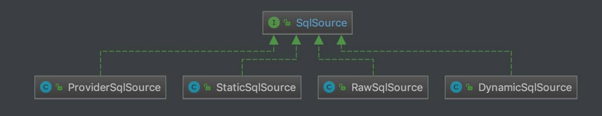类图

# 3. SqlSourceBuilder

org.apache.ibatis.builder.SqlSourceBuilder ，继承 BaseBuilder 抽象类，SqlSource 构建器，负责将 SQL 语句中的 #{} 替换成相应的 ? 占位符，并获取该 ? 占位符对应的 org.apache.ibatis.mapping.ParameterMapping 对象。

## 3.1 构造方法

// SqlSourceBuilder.java  private static final String parameterProperties = "javaType,jdbcType,mode,numericScale,resultMap,typeHandler,jdbcTypeName";  public SqlSourceBuilder(Configuration configuration) {   super(configuration); }

为什么 parameterProperties 属性是这个值，答案在 [《MyBatis 文档 —— Mapper XML 文件 —— 参数（Parameters）》](#Parameters)

## 3.2 parse

// SqlSourceBuilder.java  /**  * 执行解析原始 SQL ，成为 SqlSource 对象  *  * @param originalSql 原始 SQL  * @param parameterType 参数类型  * @param additionalParameters 附加参数集合。可能是空集合，也可能是 {@link org.apache.ibatis.scripting.xmltags.DynamicContext#bindings} 集合  * @return SqlSource 对象  */ public SqlSource parse(String originalSql, Class<?> parameterType, Map<String, Object> additionalParameters) {   // <1> 创建 ParameterMappingTokenHandler 对象   ParameterMappingTokenHandler handler = new ParameterMappingTokenHandler(configuration, parameterType, additionalParameters);   // <2> 创建 GenericTokenParser 对象   GenericTokenParser parser = new GenericTokenParser("#{", "}", handler);   // <3> 执行解析   String sql = parser.parse(originalSql);   // <4> 创建 StaticSqlSource 对象   return new StaticSqlSource(configuration, sql, handler.getParameterMappings()); }

<2> 处，创建 GenericTokenParser 对象。注意，传入的参数是 #{ 和 } 对。

<1> 处，创建 ParameterMappingTokenHandler 对象。

<3> 处，调用 GenericTokenParser#parse(String originalSql) 方法，执行解析。如果匹配到 #{ + } 对后，会调用 ParameterMappingTokenHandler 对应的 #handleToken(String content) 方法。详细解析，见 [「3.3 ParameterMappingTokenHandler」](http://svip.iocoder.cn/MyBatis/scripting-2/) 。

<4> 处，创建 StaticSqlSource 对象。关于 StaticSqlSource 类，详细解析，见 [「4.1 StaticSqlSource」](http://svip.iocoder.cn/MyBatis/scripting-2/) 。

## 3.3 ParameterMappingTokenHandler

ParameterMappingTokenHandler ，实现 TokenHandler 接口，继承 BaseBuilder 抽象类，负责将匹配到的 #{ 和 } 对，替换成相应的 ? 占位符，并获取该 ? 占位符对应的 org.apache.ibatis.mapping.ParameterMapping 对象。

### 3.3.1 构造方法

ParameterMappingTokenHandler 是 SqlSourceBuilder 的内部私有静态类。

// SqlSourceBuilder.java  /**  * ParameterMapping 数组  */ private List<ParameterMapping> parameterMappings = new ArrayList<>(); /**  * 参数类型  */ private Class<?> parameterType; /**  * additionalParameters 参数的对应的 MetaObject 对象  */ private MetaObject metaParameters;  public ParameterMappingTokenHandler(Configuration configuration, Class<?> parameterType, Map<String, Object> additionalParameters) {   super(configuration);   this.parameterType = parameterType;   // 创建 additionalParameters 参数的对应的 MetaObject 对象   this.metaParameters = configuration.newMetaObject(additionalParameters); }

### 3.3.2 handleToken

// SqlSourceBuilder.java  @Override public String handleToken(String content) {   // <1> 构建 ParameterMapping 对象，并添加到 parameterMappings 中   parameterMappings.add(buildParameterMapping(content));   // <2> 返回 ? 占位符   return "?"; }

<1> 处，调用 #buildParameterMapping(String content) 方法，构建 ParameterMapping 对象，并添加到 parameterMappings 中。详细解析，见 [「3.3.3 buildParameterMapping」](http://svip.iocoder.cn/MyBatis/scripting-2/) 。

<2> 处，返回 ? 占位符。

如上两个步骤，就是 ParameterMappingTokenHandler 的核心。

### 3.3.3 buildParameterMapping

\#buildParameterMapping(String content) 方法，构建 ParameterMapping 对象。代码如下：

// SqlSourceBuilder.java  private ParameterMapping buildParameterMapping(String content) {   // <1> 解析成 Map 集合   Map<String, String> propertiesMap = parseParameterMapping(content);   // <2> 获得属性的名字和类型   String property = propertiesMap.get("property"); // 名字   Class<?> propertyType; // 类型   if (metaParameters.hasGetter(property)) { // issue #448 get type from additional params     propertyType = metaParameters.getGetterType(property);   } else if (typeHandlerRegistry.hasTypeHandler(parameterType)) {     propertyType = parameterType;   } else if (JdbcType.CURSOR.name().equals(propertiesMap.get("jdbcType"))) {     propertyType = java.sql.ResultSet.class;   } else if (property == null || Map.class.isAssignableFrom(parameterType)) {     propertyType = Object.class;   } else {     MetaClass metaClass = MetaClass.forClass(parameterType, configuration.getReflectorFactory());     if (metaClass.hasGetter(property)) {       propertyType = metaClass.getGetterType(property);     } else {       propertyType = Object.class;     }   }   // <3> 创建 ParameterMapping.Builder 对象   ParameterMapping.Builder builder = new ParameterMapping.Builder(configuration, property, propertyType);   // <3.1> 初始化 ParameterMapping.Builder 对象的属性   Class<?> javaType = propertyType;   String typeHandlerAlias = null;   for (Map.Entry<String, String> entry : propertiesMap.entrySet()) {     String name = entry.getKey();     String value = entry.getValue();     if ("javaType".equals(name)) {       javaType = resolveClass(value);       builder.javaType(javaType);     } else if ("jdbcType".equals(name)) {       builder.jdbcType(resolveJdbcType(value));     } else if ("mode".equals(name)) {       builder.mode(resolveParameterMode(value));     } else if ("numericScale".equals(name)) {       builder.numericScale(Integer.valueOf(value));     } else if ("resultMap".equals(name)) {       builder.resultMapId(value);     } else if ("typeHandler".equals(name)) {       typeHandlerAlias = value;     } else if ("jdbcTypeName".equals(name)) {       builder.jdbcTypeName(value);     } else if ("property".equals(name)) {       // Do Nothing     } else if ("expression".equals(name)) {       throw new BuilderException("Expression based parameters are not supported yet");     } else {       throw new BuilderException("An invalid property '" + name + "' was found in mapping #{" + content + "}.  Valid properties are " + parameterProperties);     }   }   // <3.2> 如果 typeHandlerAlias 非空，则获得对应的 TypeHandler 对象，并设置到 ParameterMapping.Builder 对象中   if (typeHandlerAlias != null) {     builder.typeHandler(resolveTypeHandler(javaType, typeHandlerAlias));   }   // <3.3> 创建 ParameterMapping 对象   return builder.build(); }


<1> 处，调用 #parseParameterMapping(String content) 方法，解析成 Map 集合。代码如下：


// SqlSourceBuilder.java  private Map<String, String> parseParameterMapping(String content) {   try {     return new ParameterExpression(content);   } catch (BuilderException ex) {     throw ex;   } catch (Exception ex) {     throw new BuilderException("Parsing error was found in mapping #{" + content + "}.  Check syntax #{property|(expression), var1=value1, var2=value2, ...} ", ex);   } }


[org.apache.ibatis.builder.ParameterExpression](https://github.com/YunaiV/mybatis-3/blob/master/src/main/java/org/apache/ibatis/builder/ParameterExpression.java) 类，继承 HashMap 类，负责参数表达式。感兴趣的胖友，可以自己看看。

假设 content = "#{age,javaType=int,jdbcType=NUMERIC,typeHandler=MyTypeHandler}" 的结果如下图：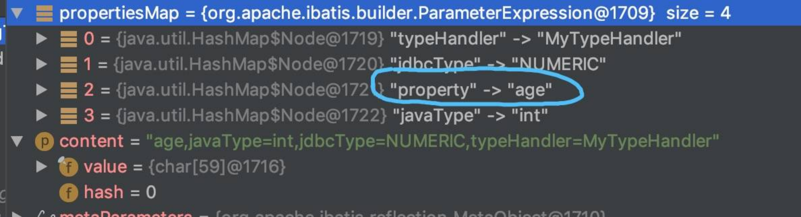示例

<2> 处，获得属性的名字和类型。

<3> 处，创建 ParameterMapping.Builder 对象。

<3.1> 处，初始化 ParameterMapping.Builder 对象的属性。

<3.2> 处，如果 typeHandlerAlias 非空，则获得对应的 TypeHandler 对象，并设置到 ParameterMapping.Builder 对象中。

<3.3> 处，创建 ParameterMapping 对象。

关于 ParameterMapping 类，胖友可以跳到 [「5.1 ParameterMapping」](http://svip.iocoder.cn/MyBatis/scripting-2/) 中看看。

# 4. SqlSource 的实现类

## 4.1 StaticSqlSource

org.apache.ibatis.builder.StaticSqlSource ，实现 SqlSource 接口，静态的 SqlSource 实现类。代码如下：

// StaticSqlSource.java  public class StaticSqlSource implements SqlSource {    /**    * 静态的 SQL    */   private final String sql;   /**    * ParameterMapping 集合    */   private final List<ParameterMapping> parameterMappings;   private final Configuration configuration;    public StaticSqlSource(Configuration configuration, String sql) {     this(configuration, sql, null);   }    public StaticSqlSource(Configuration configuration, String sql, List<ParameterMapping> parameterMappings) {     this.sql = sql;     this.parameterMappings = parameterMappings;     this.configuration = configuration;   }    @Override   public BoundSql getBoundSql(Object parameterObject) {     // 创建 BoundSql 对象     return new BoundSql(configuration, sql, parameterMappings, parameterObject);   }  }

StaticSqlSource 的静态，是相对于 DynamicSqlSource 和 RawSqlSource 来说呢。实际上，StaticSqlSource.sql 属性，上面还是可能包括 ? 占位符。

#getBoundSql((Object parameterObject) 方法，创建 BoundSql 对象。通过 parameterMappings 和 parameterObject 属性，可以设置 sql 上的每个占位符的值。例如：示例

另外，我们在回过头看看 SqlSourceBuilder 类，它创建的也是 StaticSqlSource 对象。


------


下面，我们来看看下图的两段代码，胖友看看是否发现了什么规律：示例

如果是动态 SQL 的情况下，则创建 DynamicSqlSource 对象。

如果非动态 SQL 的情况下，则创建 RawSqlSource 对象。

下面，我们在「4.2」和「4.3」中，看看两者的区别。

## 4.2 DynamicSqlSource

org.apache.ibatis.scripting.xmltags.DynamicSqlSource ，实现 SqlSource 接口，动态的 SqlSource 实现类。代码如下：

// DynamicSqlSource.java  public class DynamicSqlSource implements SqlSource {    private final Configuration configuration;   /**    * 根 SqlNode 对象    */   private final SqlNode rootSqlNode;    public DynamicSqlSource(Configuration configuration, SqlNode rootSqlNode) {     this.configuration = configuration;     this.rootSqlNode = rootSqlNode;   }    @Override   public BoundSql getBoundSql(Object parameterObject) {     // <1> 应用 rootSqlNode     DynamicContext context = new DynamicContext(configuration, parameterObject);     rootSqlNode.apply(context);     // <2> 创建 SqlSourceBuilder 对象     SqlSourceBuilder sqlSourceParser = new SqlSourceBuilder(configuration);     // <2> 解析出 SqlSource 对象     Class<?> parameterType = parameterObject == null ? Object.class : parameterObject.getClass();     SqlSource sqlSource = sqlSourceParser.parse(context.getSql(), parameterType, context.getBindings());     // <3> 获得 BoundSql 对象     BoundSql boundSql = sqlSource.getBoundSql(parameterObject);     // <4> 添加附加参数到 BoundSql 对象中     for (Map.Entry<String, Object> entry : context.getBindings().entrySet()) {       boundSql.setAdditionalParameter(entry.getKey(), entry.getValue());     }     // <5> 返回 BoundSql 对象     return boundSql;   }  }

适用于使用了 OGNL 表达式，或者使用了 ${} 表达式的 SQL ，所以它是动态的，需要在每次执行 #getBoundSql(Object parameterObject) 方法，根据参数，生成对应的 SQL 。

<1> 处，创建 DynamicContext 对象，并执行 DynamicContext#apply(DynamicContext context) 方法，应用 rootSqlNode ，相当于生成动态 SQL 。

<2> 处，创建 SqlSourceBuilder 对象，并执行 SqlSourceBuilder#parse(String originalSql, Class<?> parameterType, Map<String, Object> additionalParameters) 方法，解析出 SqlSource 对象。注意：

返回的 SqlSource 对象，类型是 StaticSqlSource 类。

这个过程，会将 #{} 对，转换成对应的 ? 占位符，并获取该占位符对应的 ParameterMapping 对象。

<3> 处，调用 StaticSqlSource#getBoundSql(Object parameterObject) 方法，获得 BoundSql 对象。

<4> 处，从 context.bindings 中，添加附加参数到 BoundSql 对象中。为什么要这么做？胖友回看下 [《精尽 MyBatis 源码分析 —— SQL 初始化（上）之 SqlNode》](http://svip.iocoder.cn/MyBatis/scripting-1) 的 [「6.7 ChooseSqlNode」](http://svip.iocoder.cn/MyBatis/scripting-2/) 就明白了。

<5> 处，返回 BoundSql 对象。

## 4.3 RawSqlSource

org.apache.ibatis.scripting.xmltags.RawSqlSource ，实现 SqlSource 接口，原始的 SqlSource 实现类。代码如下：

// RawSqlSource.java  public class RawSqlSource implements SqlSource {    /**    * SqlSource 对象    */   private final SqlSource sqlSource;    public RawSqlSource(Configuration configuration, SqlNode rootSqlNode, Class<?> parameterType) {     // <1> 获得 Sql     this(configuration, getSql(configuration, rootSqlNode), parameterType);   }    public RawSqlSource(Configuration configuration, String sql, Class<?> parameterType) {     // <2> 创建 SqlSourceBuilder 对象     SqlSourceBuilder sqlSourceParser = new SqlSourceBuilder(configuration);     Class<?> clazz = parameterType == null ? Object.class : parameterType;     // <2> 获得 SqlSource 对象     sqlSource = sqlSourceParser.parse(sql, clazz, new HashMap<>());   }    private static String getSql(Configuration configuration, SqlNode rootSqlNode) {     // 创建 DynamicContext 对象     DynamicContext context = new DynamicContext(configuration, null);     // 解析出 SqlSource 对象     rootSqlNode.apply(context);     // 获得 sql     return context.getSql();   }    @Override   public BoundSql getBoundSql(Object parameterObject) {     // 获得 BoundSql 对象     return sqlSource.getBoundSql(parameterObject);   }  }

适用于仅使用 #{} 表达式，或者不使用任何表达式的情况，所以它是静态的，仅需要在构造方法中，直接生成对应的 SQL 。

在构造方法中：

<1> 处，调用 #getSql(Configuration configuration, SqlNode rootSqlNode) 方法，获得 SQL 。

<2> 处，创建 SqlSourceBuilder 对象，并执行 SqlSourceBuilder#parse(String originalSql, Class<?> parameterType, Map<String, Object> additionalParameters) 方法，解析出 SqlSource 对象。

对应到 DynamicSqlSource ，就是 <1> + <2> 了。

在 #getBoundSql(Object parameterObject) 方法中：

<3> 处，调用 StaticSqlSource#getBoundSql(Object parameterObject) 方法，获得 BoundSql 对象。

对应到 DynamicSqlSource ，就是 <1> + <2> 了。

这样，RawSqlSource 和 DynamicSqlSource 的区别，是不是就清晰了。

## 4.4 ProviderSqlSource

org.apache.ibatis.builder.annotation.ProviderSqlSource ，实现 SqlSource 接口，基于方法上的 @ProviderXXX 注解的 SqlSource 实现类。

### 4.4.1 构造方法

// ProviderSqlSource.java  private final Configuration configuration; private final SqlSourceBuilder sqlSourceParser; /**  * `@ProviderXXX` 注解的对应的类  */ private final Class<?> providerType; /**  * `@ProviderXXX` 注解的对应的方法  */ private Method providerMethod; /**  * `@ProviderXXX` 注解的对应的方法的参数名数组  */ private String[] providerMethodArgumentNames; /**  * `@ProviderXXX` 注解的对应的方法的参数类型数组  */ private Class<?>[] providerMethodParameterTypes; /**  * 若 {@link #providerMethodParameterTypes} 参数有 ProviderContext 类型的，创建 ProviderContext 对象  */ private ProviderContext providerContext; /**  * {@link #providerMethodParameterTypes} 参数中，ProviderContext 类型的参数，在数组中的位置  */ private Integer providerContextIndex;  /**  * @deprecated Please use the {@link #ProviderSqlSource(Configuration, Object, Class, Method)} instead of this.  */ @Deprecated public ProviderSqlSource(Configuration configuration, Object provider) {   this(configuration, provider, null, null); }  /**  * @since 3.4.5  */ public ProviderSqlSource(Configuration configuration, Object provider, Class<?> mapperType, Method mapperMethod) {   String providerMethodName;   try {     this.configuration = configuration;     // 创建 SqlSourceBuilder 对象     this.sqlSourceParser = new SqlSourceBuilder(configuration);     // 获得 @ProviderXXX 注解的对应的类     this.providerType = (Class<?>) provider.getClass().getMethod("type").invoke(provider);     // 获得 @ProviderXXX 注解的对应的方法相关的信息     providerMethodName = (String) provider.getClass().getMethod("method").invoke(provider);     for (Method m : this.providerType.getMethods()) {       if (providerMethodName.equals(m.getName()) && CharSequence.class.isAssignableFrom(m.getReturnType())) {         if (providerMethod != null) {           throw new BuilderException("Error creating SqlSource for SqlProvider. Method '"               + providerMethodName + "' is found multiple in SqlProvider '" + this.providerType.getName()               + "'. Sql provider method can not overload.");         }         this.providerMethod = m;         this.providerMethodArgumentNames = new ParamNameResolver(configuration, m).getNames();         this.providerMethodParameterTypes = m.getParameterTypes();       }     }   } catch (BuilderException e) {     throw e;   } catch (Exception e) {     throw new BuilderException("Error creating SqlSource for SqlProvider.  Cause: " + e, e);   }   if (this.providerMethod == null) {     throw new BuilderException("Error creating SqlSource for SqlProvider. Method '"         + providerMethodName + "' not found in SqlProvider '" + this.providerType.getName() + "'.");   }   // 初始化 providerContext 和 providerContextIndex 属性   for (int i = 0; i < this.providerMethodParameterTypes.length; i++) {     Class<?> parameterType = this.providerMethodParameterTypes[i];     if (parameterType == ProviderContext.class) {       if (this.providerContext != null) {         throw new BuilderException("Error creating SqlSource for SqlProvider. ProviderContext found multiple in SqlProvider method ("             + this.providerType.getName() + "." + providerMethod.getName()             + "). ProviderContext can not define multiple in SqlProvider method argument.");       }       this.providerContext = new ProviderContext(mapperType, mapperMethod);       this.providerContextIndex = i;     }   } }

参数比较多，但是灰常简单，胖友耐心的瞅瞅。

### 4.4.2 getBoundSql

// ProviderSqlSource.java  @Override public BoundSql getBoundSql(Object parameterObject) {   // <1> 创建 SqlSource 对象   SqlSource sqlSource = createSqlSource(parameterObject);   // <2> 获得 BoundSql 对象   return sqlSource.getBoundSql(parameterObject); }

<1> 处，调用 #createSqlSource(Object parameterObject) 方法，创建 SqlSource 对象。因为它是通过 @ProviderXXX 注解的指定类的指定方法，动态生成 SQL 。所以，从思路上，和 DynamicSqlSource 是有点接近的。详细解析，见 [「4.4.3 createSqlSource」](http://svip.iocoder.cn/MyBatis/scripting-2/) 。

<2> 处，调用 SqlSource#getBoundSql(Object parameterObject) 方法，获得 BoundSql 对象。

### 4.4.3 createSqlSource

\#createSqlSource(Object parameterObject) 方法，创建 SqlSource 对象。代码如下：

// ProviderSqlSource.java  private SqlSource createSqlSource(Object parameterObject) {   try {     // <1> 获得 SQL     int bindParameterCount = providerMethodParameterTypes.length - (providerContext == null ? 0 : 1);     String sql;     if (providerMethodParameterTypes.length == 0) {       sql = invokeProviderMethod();     } else if (bindParameterCount == 0) {       sql = invokeProviderMethod(providerContext);     } else if (bindParameterCount == 1 &&         (parameterObject == null || providerMethodParameterTypes[(providerContextIndex == null || providerContextIndex == 1) ? 0 : 1].isAssignableFrom(parameterObject.getClass()))) {       sql = invokeProviderMethod(extractProviderMethodArguments(parameterObject)); // <1.1>     } else if (parameterObject instanceof Map) {       @SuppressWarnings("unchecked")       Map<String, Object> params = (Map<String, Object>) parameterObject;       sql = invokeProviderMethod(extractProviderMethodArguments(params, providerMethodArgumentNames)); <1.2>     } else {       throw new BuilderException("Error invoking SqlProvider method ("           + providerType.getName() + "." + providerMethod.getName()           + "). Cannot invoke a method that holds "           + (bindParameterCount == 1 ? "named argument(@Param)" : "multiple arguments")           + " using a specifying parameterObject. In this case, please specify a 'java.util.Map' object.");     }     // <2> 获得参数     Class<?> parameterType = parameterObject == null ? Object.class : parameterObject.getClass();     // <3> 替换掉 SQL 上的属性     // <4> 解析出 SqlSource 对象     return sqlSourceParser.parse(replacePlaceholder(sql), parameterType, new HashMap<>());   } catch (BuilderException e) {     throw e;   } catch (Exception e) {     throw new BuilderException("Error invoking SqlProvider method ("         + providerType.getName() + "." + providerMethod.getName()         + ").  Cause: " + e, e);   } }


<1> 处，获得 SQL 。


<1.1> 处，调用 #extractProviderMethodArguments(Object parameterObject) 方法，获得方法参数。代码如下：


// ProviderSqlSource.java  private Object[] extractProviderMethodArguments(Object parameterObject) {   if (providerContext != null) {     Object[] args = new Object[2];     args[providerContextIndex == 0 ? 1 : 0] = parameterObject;     args[providerContextIndex] = providerContext;     return args;   } else {     return new Object[]{parameterObject};   } }


  \* 逻辑比较简单，胖友思考下。

\* `<1.2>` 处，调用 `#extractProviderMethodArguments(Map<String, Object> params, String[] argumentNames)` 方法，获得方法参数。代码如下：

 

  

// ProviderSqlSource.java  private Object[] extractProviderMethodArguments(Map<String, Object> params, String[] argumentNames) {   Object[] args = new Object[argumentNames.length];   for (int i = 0; i < args.length; i++) {     if (providerContextIndex != null && providerContextIndex == i) {       args[i] = providerContext;     } else {       args[i] = params.get(argumentNames[i]);     }   }   return args; }

\* 逻辑比较简单，胖友思考下。 * 上面两个方法，无法理解的胖友，可以看看 `org.apache.ibatis.submitted.sqlprovider.Mapper` 和 `org.apache.ibatis.submitted.sqlprovider.OurSqlBuilder` 类。 * 调用 `#invokeProviderMethod(Object... args)` 方法，执行方法，生成 SQL 。代码如下： 

// ProviderSqlSource.java  private String invokeProviderMethod(Object... args) throws Exception {   Object targetObject = null;   // 获得对象   if (!Modifier.isStatic(providerMethod.getModifiers())) {     targetObject = providerType.newInstance();   }   // 反射调用方法   CharSequence sql = (CharSequence) providerMethod.invoke(targetObject, args);   return sql != null ? sql.toString() : null; }

\* 反射调用方法。 

<2> 处，获得参数类型。


<3> 处，调用 #replacePlaceholder(String sql) 方法，替换掉 SQL 上的属性。代码如下：


// ProviderSqlSource.java  private String replacePlaceholder(String sql) {   return PropertyParser.parse(sql, configuration.getVariables()); }


<4> 处，调用 SqlSourceBuilder#parse(String originalSql, Class<?> parameterType, Map<String, Object> additionalParameters) 方法，解析出 SqlSource 对象。

代码比较长，胖友回过头自己再细看。

### 4.4.4 ProviderContext

org.apache.ibatis.builder.annotation.ProviderContext ，ProviderSqlSource 的上下文。代码如下：

// ProviderContext.java  public final class ProviderContext {    /**    * Mapper 接口    */   private final Class<?> mapperType;   /**    * Mapper 的方法    */   private final Method mapperMethod;    /**    * Constructor.    *    * @param mapperType A mapper interface type that specified provider    * @param mapperMethod A mapper method that specified provider    */   ProviderContext(Class<?> mapperType, Method mapperMethod) {     this.mapperType = mapperType;     this.mapperMethod = mapperMethod;   }    public Class<?> getMapperType() {     return mapperType;   }      public Method getMapperMethod() {     return mapperMethod;   }  }

# 5. BoundSql

org.apache.ibatis.mapping.BoundSql ，一次可执行的 SQL 封装。代码如下：

// BoundSql.java  public class BoundSql {    /**    * SQL 语句    */   private final String sql;   /**    * ParameterMapping 数组    */   private final List<ParameterMapping> parameterMappings;   /**    * 参数对象    */   private final Object parameterObject;   /**    * 附加的参数集合    */   private final Map<String, Object> additionalParameters;   /**    * {@link #additionalParameters} 的 MetaObject 对象    */   private final MetaObject metaParameters;    public BoundSql(Configuration configuration, String sql, List<ParameterMapping> parameterMappings, Object parameterObject) {     this.sql = sql;     this.parameterMappings = parameterMappings;     this.parameterObject = parameterObject;     this.additionalParameters = new HashMap<>();     this.metaParameters = configuration.newMetaObject(additionalParameters);   }    public String getSql() {     return sql;   }    public List<ParameterMapping> getParameterMappings() {     return parameterMappings;   }    public Object getParameterObject() {     return parameterObject;   }    public boolean hasAdditionalParameter(String name) {     String paramName = new PropertyTokenizer(name).getName();     return additionalParameters.containsKey(paramName);   }    public void setAdditionalParameter(String name, Object value) {     metaParameters.setValue(name, value);   }    public Object getAdditionalParameter(String name) {     return metaParameters.getValue(name);   }  }

## 5.1 ParameterMapping

org.apache.ibatis.mapping.ParameterMapping ，参数映射。代码如下：

// ParameterMapping.java  private Configuration configuration;  /**  * 属性的名字  */ private String property; /**  * 参数类型。  *  * 目前只需要关注 ParameterMode.IN 的情况，另外的 OUT、INOUT 是在存储过程中使用，暂时无视  */ private ParameterMode mode; /**  * Java 类型  */ private Class<?> javaType = Object.class; /**  * JDBC 类型  */ private JdbcType jdbcType; /**  * 对于数值类型，还有一个小数保留位数的设置，来确定小数点后保留的位数  */ private Integer numericScale; /**  * TypeHandler 对象  *  * {@link Builder#resolveTypeHandler()}  */ private TypeHandler<?> typeHandler; /**  * 貌似只在 ParameterMode 在 OUT、INOUT 是在存储过程中使用  */ private String resultMapId; /**  * 貌似只在 ParameterMode 在 OUT、INOUT 是在存储过程中使用  */ private String jdbcTypeName; /**  * 表达式。  *  * ps：目前暂时不支持  */ private String expression;  public static class Builder {      // ... 省略代码    }

参数比较简单，胖友自己看看注释。可以忽略 ParameterMode 属性为 OUT 和 INOUT 是在存储过程中使用的情况。

完整的该类，可点击 [ParameterMapping](https://github.com/YunaiV/mybatis-3/blob/master/src/main/java/org/apache/ibatis/mapping/ParameterMapping.java) 查看。

关于 ParameterMode 属性为 OUT 和 INOUT 是在存储过程中使用的情况，可以看看 [《Mybatis调用MySQL存储过程》](https://blog.csdn.net/u010046908/article/details/69944959) 。当然，也可以不看，因为很少使用存储过程了。

## 5.2 ParameterMode

org.apache.ibatis.mapping.ParameterMode ，参数类型。代码如下：

// ParameterMode.java  public enum ParameterMode {    /**    * 输入    */   IN,   /**    * 输出    */   OUT,   /**    * IN + OUT    */   INOUT  }

只需要关注 IN 的情况。

另外，MyBatis 存储过程相关的源码，本系列会直接忽略。嘿嘿。

# 7. ParameterHandler

org.apache.ibatis.executor.parameter.ParameterHandler ，参数处理器接口。代码如下：

// ParameterHandler.java  /**  * A parameter handler sets the parameters of the {@code PreparedStatement}  */ public interface ParameterHandler {    /**    * @return 参数对象    */   Object getParameterObject();    /**    * 设置 PreparedStatement 的占位符参数    *    * @param ps PreparedStatement 对象    * @throws SQLException 发生 SQL 异常时    */   void setParameters(PreparedStatement ps) throws SQLException;  }

## 7.1 DefaultParameterHandler

org.apache.ibatis.scripting.default.DefaultParameterHandler ，实现 ParameterHandler 接口，默认 ParameterHandler 实现类。

### 7.1.1 构造方法

// DefaultParameterHandler.java  private final TypeHandlerRegistry typeHandlerRegistry; /**  * MappedStatement 对象  */ private final MappedStatement mappedStatement; /**  * 参数对象  */ private final Object parameterObject; /**  * BoundSql 对象  */ private final BoundSql boundSql; private final Configuration configuration;  public DefaultParameterHandler(MappedStatement mappedStatement, Object parameterObject, BoundSql boundSql) {   this.mappedStatement = mappedStatement;   this.configuration = mappedStatement.getConfiguration();   this.typeHandlerRegistry = mappedStatement.getConfiguration().getTypeHandlerRegistry();   this.parameterObject = parameterObject;   this.boundSql = boundSql; }

### 7.1.2 setParameters

\#setParameters(PreparedStatement ps) 方法，代码如下：

// DefaultParameterHandler.java  @Override public void setParameters(PreparedStatement ps) {   ErrorContext.instance().activity("setting parameters").object(mappedStatement.getParameterMap().getId());   // <1> 遍历 ParameterMapping 数组   List<ParameterMapping> parameterMappings = boundSql.getParameterMappings();   if (parameterMappings != null) {     for (int i = 0; i < parameterMappings.size(); i++) {       // <2> 获得 ParameterMapping 对象       ParameterMapping parameterMapping = parameterMappings.get(i);       if (parameterMapping.getMode() != ParameterMode.OUT) {         // <3> 获得值         Object value;         String propertyName = parameterMapping.getProperty();         if (boundSql.hasAdditionalParameter(propertyName)) { // issue #448 ask first for additional params           value = boundSql.getAdditionalParameter(propertyName);         } else if (parameterObject == null) {           value = null;         } else if (typeHandlerRegistry.hasTypeHandler(parameterObject.getClass())) {           value = parameterObject;         } else {           MetaObject metaObject = configuration.newMetaObject(parameterObject);           value = metaObject.getValue(propertyName);         }         // <4> 获得 typeHandler、jdbcType 属性         TypeHandler typeHandler = parameterMapping.getTypeHandler();         JdbcType jdbcType = parameterMapping.getJdbcType();         if (value == null && jdbcType == null) {           jdbcType = configuration.getJdbcTypeForNull();         }         // <5> 设置 ? 占位符的参数         try {           typeHandler.setParameter(ps, i + 1, value, jdbcType);         } catch (TypeException | SQLException e) {           throw new TypeException("Could not set parameters for mapping: " + parameterMapping + ". Cause: " + e, e);         }       }     }   } }

<1> 处，遍历 ParameterMapping 数组。

<2> 处，获得 ParameterMapping 对象。

<3> 处，获得值。有多种情况，胖友可以细看下。

<4> 处，获得 typeHandler、jdbcType 属性。

【重要】<5> 处，调用 TypeHandler#setParameter(PreparedStatement ps, int i, T parameter, JdbcType jdbcType) 方法，设置指定位置的 ? 占位符的参数。

# 666. 彩蛋

hoho，刚开始写的有点懵逼。现在清晰多了。哈哈哈哈。

参考和推荐如下文章：

祖大俊 [《Mybatis3.4.x技术内幕（十七）：Mybatis之动态Sql设计原本（上）》](https://my.oschina.net/zudajun/blog/735553)

祖大俊 [《Mybatis3.4.x技术内幕（十八）：Mybatis之动态Sql设计原本（下）》](https://my.oschina.net/zudajun/blog/735731)

徐郡明 [《MyBatis 技术内幕》](https://item.jd.com/12125531.html) 的 [「3.2 SqlNode&SqlSource」](http://svip.iocoder.cn/MyBatis/scripting-2/) 小节

文章目录

\00001. [1. 概述](#1-概述)

\00002. [2. SqlSource](#2-SqlSource)

\00003. [3. SqlSourceBuilder](#3-SqlSourceBuilder)

\1. [3.1 构造方法](#3-1-构造方法)

\2. [3.2 parse](#3-2-parse)

\3. [3.3 ParameterMappingTokenHandler](#3-3-ParameterMappingTokenHandler)

\1. [3.3.1 构造方法](#3-3-1-构造方法)

\2. [3.3.2 handleToken](#3-3-2-handleToken)

\3. [3.3.3 buildParameterMapping](#3-3-3-buildParameterMapping)

\00004. [4. SqlSource 的实现类](#4-SqlSource-的实现类)

\1. [4.1 StaticSqlSource](#4-1-StaticSqlSource)

\2. [4.2 DynamicSqlSource](#4-2-DynamicSqlSource)

\3. [4.3 RawSqlSource](#4-3-RawSqlSource)

\4. [4.4 ProviderSqlSource](#4-4-ProviderSqlSource)

\1. [4.4.1 构造方法](#4-4-1-构造方法)

\2. [4.4.2 getBoundSql](#4-4-2-getBoundSql)

\3. [4.4.3 createSqlSource](#4-4-3-createSqlSource)

\4. [4.4.4 ProviderContext](#4-4-4-ProviderContext)

\00005. [5. BoundSql](#5-BoundSql)

\1. [5.1 ParameterMapping](#5-1-ParameterMapping)

\2. [5.2 ParameterMode](#5-2-ParameterMode)

\00006. [7. ParameterHandler](#7-ParameterHandler)

\1. [7.1 DefaultParameterHandler](#7-1-DefaultParameterHandler)

\1. [7.1.1 构造方法](#7-1-1-构造方法)

\2. [7.1.2 setParameters](#7-1-2-setParameters)

\00007. [666. 彩蛋](#666-彩蛋)

© 2014 - 2022 芋道源码 | 

总访客数 2759126 次 && 总访问量 5908908 次

[回到首页](http://svip.iocoder.cn/index)

 

窗体顶端



窗体底端

[回到首页](http://svip.iocoder.cn/index)


# 精尽 MyBatis 源码分析 —— SQL 执行（一）之 Executor

# 1. 概述

从本文开始，我们来分享 SQL 执行的流程。在 [《精尽 MyBatis 源码分析 —— 项目结构一览》](http://svip.iocoder.cn/MyBatis/intro) 中，我们简单介绍这个流程如下：

对应 executor 和 cursor 模块。前者对应执行器，后者对应执行结果的游标。

SQL 语句的执行涉及多个组件 ，其中比较重要的是 Executor、StatementHandler、ParameterHandler 和 ResultSetHandler 。

**·** Executor 主要负责维护一级缓存和二级缓存，并提供事务管理的相关操作，它会将数据库相关操作委托给 StatementHandler完成。

**·** StatementHandler 首先通过 ParameterHandler 完成 SQL 语句的实参绑定，然后通过 java.sql.Statement 对象执行 SQL 语句并得到结果集，最后通过 ResultSetHandler 完成结果集的映射，得到结果对象并返回。

整体过程如下图：

整体过程

下面，我们在看看 executor 包下的列情况，如下图所示：`executor` 包

正如该包下的分包情况，每个包对应一个功能。

statement 包，实现向数据库发起 SQL 命令。

parameter 包，实现设置 PreparedStatement 的占位符参数。

目前只有一个 ParameterHandler 接口，在 [《精尽 MyBatis 源码分析 —— SQL 初始化（下）之 SqlSource》](http://svip.iocoder.cn/MyBatis/scripting-2) 已经详细解析。

keygen 包，实现数据库主键生成( 获得 )的功能。

resultset 包，实现 ResultSet 结果集的处理，将其映射成对应的结果对象。

result 包，结果的处理，被 resultset 包所调用。可能胖友会好奇为啥会有 resultset 和 result 两个“重叠”的包。答案见 [《精尽 MyBatis 源码分析 —— SQL 执行（四）之 ResultSetHandler》](http://svip.iocoder.cn/MyBatis/executor-4) 。

loader 包，实现延迟加载的功能。

根目录，Executor 接口及其实现类，作为 SQL 执行的核心入口。

考虑到整个 executor 包的代码量近 5000 行，所以我们将每一个子包，作为一篇文章，逐包解析。所以，本文我们先来分享 根目录，也就是 Executor 接口及其实现类。

# 2. Executor

org.apache.ibatis.executor.Executor ，执行器接口。代码如下：

// Executor.java  public interface Executor {    // 空 ResultHandler 对象的枚举   ResultHandler NO_RESULT_HANDLER = null;    // 更新 or 插入 or 删除，由传入的 MappedStatement 的 SQL 所决定   int update(MappedStatement ms, Object parameter) throws SQLException;    // 查询，带 ResultHandler + CacheKey + BoundSql   <E> List<E> query(MappedStatement ms, Object parameter, RowBounds rowBounds, ResultHandler resultHandler, CacheKey cacheKey, BoundSql boundSql) throws SQLException;   // 查询，带 ResultHandler   <E> List<E> query(MappedStatement ms, Object parameter, RowBounds rowBounds, ResultHandler resultHandler) throws SQLException;   // 查询，返回值为 Cursor   <E> Cursor<E> queryCursor(MappedStatement ms, Object parameter, RowBounds rowBounds) throws SQLException;    // 刷入批处理语句   List<BatchResult> flushStatements() throws SQLException;    // 提交事务   void commit(boolean required) throws SQLException;   // 回滚事务   void rollback(boolean required) throws SQLException;    // 创建 CacheKey 对象   CacheKey createCacheKey(MappedStatement ms, Object parameterObject, RowBounds rowBounds, BoundSql boundSql);   // 判断是否缓存   boolean isCached(MappedStatement ms, CacheKey key);   // 清除本地缓存   void clearLocalCache();    // 延迟加载   void deferLoad(MappedStatement ms, MetaObject resultObject, String property, CacheKey key, Class<?> targetType);    // 获得事务   Transaction getTransaction();   // 关闭事务   void close(boolean forceRollback);   // 判断事务是否关闭   boolean isClosed();    // 设置包装的 Executor 对象   void setExecutorWrapper(Executor executor);  }

读和写操作相关的方法

事务相关的方法

缓存相关的方法

设置延迟加载的方法

设置包装的 Executor 对象的方法


------


Executor 的实现类如下图所示：Executor 类图

我们可以看到，Executor 的直接子类有 BaseExecutor 和 CachingExecutor 两个。

实际上，CachingExecutor 在 BaseExecutor 的基础上，实现二级缓存功能。

在下文中，BaseExecutor 的本地缓存，就是一级缓存。

下面，我们按照先看 BaseExecutor 侧的实现类的源码解析，再看 CachingExecutor 的。

# 3. BaseExecutor

org.apache.ibatis.executor.BaseExecutor ，实现 Executor 接口，提供骨架方法，从而使子类只要实现指定的几个抽象方法即可。

## 3.1 构造方法

// BaseExecutor.java  /**  * 事务对象  */ protected Transaction transaction; /**  * 包装的 Executor 对象  */ protected Executor wrapper;  /**  * DeferredLoad( 延迟加载 ) 队列  */ protected ConcurrentLinkedQueue<DeferredLoad> deferredLoads; /**  * 本地缓存，即一级缓存  */ protected PerpetualCache localCache; /**  * 本地输出类型的参数的缓存  */ protected PerpetualCache localOutputParameterCache; protected Configuration configuration;  /**  * 记录嵌套查询的层级  */ protected int queryStack; /**  * 是否关闭  */ private boolean closed;  protected BaseExecutor(Configuration configuration, Transaction transaction) {   this.transaction = transaction;   this.deferredLoads = new ConcurrentLinkedQueue<>();   this.localCache = new PerpetualCache("LocalCache");   this.localOutputParameterCache = new PerpetualCache("LocalOutputParameterCache");   this.closed = false;   this.configuration = configuration;   this.wrapper = this; // 自己 }

和延迟加载相关，后续文章，详细解析。详细解析，见 [《精尽 MyBatis 源码分析 —— SQL 执行（五）之延迟加载》](http://svip.iocoder.cn/MyBatis/executor-5) 。

queryStack 属性，记录递归嵌套查询的层级。

deferredLoads 属性，DeferredLoad( 延迟加载 ) 队列。

wrapper 属性，在构造方法中，初始化为 this ，即自己。


localCache 属性，本地缓存，即一级缓存。那什么是一级缓存呢？


基于 [《MyBatis 的一级缓存实现详解及使用注意事项》](https://blog.csdn.net/luanlouis/article/details/41280959) 进行修改


每当我们使用 MyBatis 开启一次和数据库的会话，MyBatis 会创建出一个 SqlSession 对象表示一次数据库会话，而每个 SqlSession 都会创建一个 Executor 对象。


在对数据库的一次会话中，我们有可能会反复地执行完全相同的查询语句，如果不采取一些措施的话，每一次查询都会查询一次数据库，而我们在极短的时间内做了完全相同的查询，那么它们的结果极有可能完全相同，由于查询一次数据库的代价很大，这有可能造成很大的资源浪费。


为了解决这一问题，减少资源的浪费，MyBatis 会在表示会话的SqlSession 对象中建立一个简单的缓存，将每次查询到的结果结果缓存起来，当下次查询的时候，如果判断先前有个完全一样的查询，会直接从缓存中直接将结果取出，返回给用户，不需要再进行一次数据库查询了。 注意，这个“简单的缓存”就是一级缓存，且默认开启，无法关闭。


如下图所示，MyBatis 会在一次会话的表示 —— 一个 SqlSession 对象中创建一个本地缓存( localCache )，对于每一次查询，都会尝试根据查询的条件去本地缓存中查找是否在缓存中，如果在缓存中，就直接从缓存中取出，然后返回给用户；否则，从数据库读取数据，将查询结果存入缓存并返回给用户。


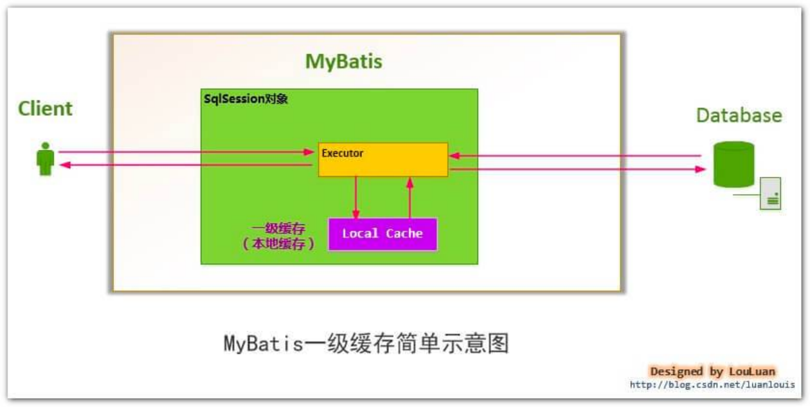整体过程


关于这段话，胖友要理解 SqlSession 和 Executor 和一级缓存的关系。

**·** 二级缓存是什么。


transaction 属性，事务对象。该属性，是通过构造方法传入。为什么呢？待我们看 org.apache.ibatis.session.session 包。


## 3.2 clearLocalCache

\#clearLocalCache() 方法，清理一级（本地）缓存。代码如下：

// BaseExecutor.java  @Override public void clearLocalCache() {   if (!closed) {     // 清理 localCache     localCache.clear();     // 清理 localOutputParameterCache     localOutputParameterCache.clear();   } }

## 3.3 createCacheKey

\#createCacheKey(MappedStatement ms, Object parameterObject, RowBounds rowBounds, BoundSql boundSql) 方法，创建 CacheKey 对象。代码如下：

// BaseExecutor.java  @Override public CacheKey createCacheKey(MappedStatement ms, Object parameterObject, RowBounds rowBounds, BoundSql boundSql) {   if (closed) {     throw new ExecutorException("Executor was closed.");   }   // <1> 创建 CacheKey 对象   CacheKey cacheKey = new CacheKey();   // <2> 设置 id、offset、limit、sql 到 CacheKey 对象中   cacheKey.update(ms.getId());   cacheKey.update(rowBounds.getOffset());   cacheKey.update(rowBounds.getLimit());   cacheKey.update(boundSql.getSql());   // <3> 设置 ParameterMapping 数组的元素对应的每个 value 到 CacheKey 对象中   List<ParameterMapping> parameterMappings = boundSql.getParameterMappings();   TypeHandlerRegistry typeHandlerRegistry = ms.getConfiguration().getTypeHandlerRegistry();   // mimic DefaultParameterHandler logic 这块逻辑，和 DefaultParameterHandler 获取 value 是一致的。   for (ParameterMapping parameterMapping : parameterMappings) {     if (parameterMapping.getMode() != ParameterMode.OUT) {       Object value;       String propertyName = parameterMapping.getProperty();       if (boundSql.hasAdditionalParameter(propertyName)) {         value = boundSql.getAdditionalParameter(propertyName);       } else if (parameterObject == null) {         value = null;       } else if (typeHandlerRegistry.hasTypeHandler(parameterObject.getClass())) {         value = parameterObject;       } else {         MetaObject metaObject = configuration.newMetaObject(parameterObject);         value = metaObject.getValue(propertyName);       }       cacheKey.update(value);     }   }   // <4> 设置 Environment.id 到 CacheKey 对象中   if (configuration.getEnvironment() != null) {     // issue #176     cacheKey.update(configuration.getEnvironment().getId());   }   return cacheKey; }

<1> 处，创建 CacheKey 对象。关于 CacheKey 类，在 [《精尽 MyBatis 源码分析 —— 缓存模块》](http://svip.iocoder.cn/MyBatis/cache-package) 已经详细解析。

<2> 处，设置 id、offset、limit、sql 到 CacheKey 对象中。

<3> 处，设置 ParameterMapping 数组的元素对应的每个 value 到 CacheKey 对象中。注意，这块逻辑，和 DefaultParameterHandler 获取 value 是一致的。

<4> 处，设置 Environment.id 到 CacheKey 对象中。

## 3.4 isCached

\#isCached(MappedStatement ms, CacheKey key) 方法，判断一级缓存是否存在。代码如下：

// BaseExecutor.java  @Override public boolean isCached(MappedStatement ms, CacheKey key) {   return localCache.getObject(key) != null; }

## 3.5 query

① #query(MappedStatement ms, Object parameter, RowBounds rowBounds, ResultHandler resultHandler) 方法，读操作。代码如下：

// BaseExecutor.java  @Override public <E> List<E> query(MappedStatement ms, Object parameter, RowBounds rowBounds, ResultHandler resultHandler) throws SQLException {   // <1> 获得 BoundSql 对象   BoundSql boundSql = ms.getBoundSql(parameter);   // <2> 创建 CacheKey 对象   CacheKey key = createCacheKey(ms, parameter, rowBounds, boundSql);   // <3> 查询   return query(ms, parameter, rowBounds, resultHandler, key, boundSql); }

<1> 处，调用 MappedStatement#getBoundSql(Object parameterObject) 方法，获得 BoundSql 对象。

<2> 处，调用 #createCacheKey(MappedStatement ms, Object parameterObject, RowBounds rowBounds, BoundSql boundSql) 方法，创建 CacheKey 对象。

<3> 处，调用 #query(MappedStatement ms, Object parameter, RowBounds rowBounds, ResultHandler resultHandler, CacheKey key, BoundSql boundSql) 方法，读操作。通过这样的方式，两个 #query(...) 方法，实际是统一的。

② #query(MappedStatement ms, Object parameter, RowBounds rowBounds, ResultHandler resultHandler, CacheKey key, BoundSql boundSql) 方法，读操作。代码如下：

// BaseExecutor.java  @Override public <E> List<E> query(MappedStatement ms, Object parameter, RowBounds rowBounds, ResultHandler resultHandler, CacheKey key, BoundSql boundSql) throws SQLException {   ErrorContext.instance().resource(ms.getResource()).activity("executing a query").object(ms.getId());   // <1> 已经关闭，则抛出 ExecutorException 异常   if (closed) {     throw new ExecutorException("Executor was closed.");   }   // <2> 清空本地缓存，如果 queryStack 为零，并且要求清空本地缓存。   if (queryStack == 0 && ms.isFlushCacheRequired()) {     clearLocalCache();   }   List<E> list;   try {     // <3> queryStack + 1     queryStack++;     // <4.1> 从一级缓存中，获取查询结果     list = resultHandler == null ? (List<E>) localCache.getObject(key) : null;     // <4.2> 获取到，则进行处理     if (list != null) {       handleLocallyCachedOutputParameters(ms, key, parameter, boundSql);     // <4.3> 获得不到，则从数据库中查询     } else {       list = queryFromDatabase(ms, parameter, rowBounds, resultHandler, key, boundSql);     }   } finally {     // <5> queryStack - 1     queryStack--;   }   if (queryStack == 0) {     // <6.1> 执行延迟加载     for (DeferredLoad deferredLoad : deferredLoads) {       deferredLoad.load();     }     // issue #601     // <6.2> 清空 deferredLoads     deferredLoads.clear();     // <7> 如果缓存级别是 LocalCacheScope.STATEMENT ，则进行清理     if (configuration.getLocalCacheScope() == LocalCacheScope.STATEMENT) {       // issue #482       clearLocalCache();     }   }   return list; }

<1> 处，已经关闭，则抛出 ExecutorException 异常。

<2> 处，调用 #clearLocalCache() 方法，清空本地缓存，如果 queryStack 为零，并且要求清空本地缓存。例如：<select flushCache="true"> ... </a> 。

<3> 处，queryStack + 1 。

<4.1> 处，从一级缓存 localCache 中，获取查询结果。

<4.2> 处，获取到，则进行处理。对于 #handleLocallyCachedOutputParameters(MappedStatement ms, CacheKey key, Object parameter, BoundSql boundSql) 方法，是处理存储过程的情况，所以我们就忽略。

<4.3> 处，获得不到，则调用 #queryFromDatabase() 方法，从数据库中查询。详细解析，见 [「3.5.1 queryFromDatabase」](http://svip.iocoder.cn/MyBatis/executor-1/) 。

<5> 处，queryStack - 1 。

<6.1> 处，遍历 DeferredLoad 队列，逐个调用 DeferredLoad#load() 方法，执行延迟加载。详细解析，见 [《精尽 MyBatis 源码分析 —— SQL 执行（五）之延迟加载》](http://svip.iocoder.cn/MyBatis/executor-5) 。

<6.2> 处，清空 DeferredLoad 队列。


<7> 处，如果缓存级别是 LocalCacheScope.STATEMENT ，则调用 #clearLocalCache() 方法，清空本地缓存。默认情况下，缓存级别是 LocalCacheScope.SESSION 。代码如下：


// Configuration.java  /**  * {@link BaseExecutor} 本地缓存范围  */ protected LocalCacheScope localCacheScope = LocalCacheScope.SESSION;  // LocalCacheScope.java  public enum LocalCacheScope {    /**    * 会话级    */   SESSION,   /**    * SQL 语句级    */   STATEMENT  }


### 3.5.1 queryFromDatabase

\#queryFromDatabase(MappedStatement ms, Object parameter, RowBounds rowBounds, ResultHandler resultHandler, CacheKey key, BoundSql boundSql) 方法，从数据库中读取操作。代码如下：

// BaseExecutor.java  private <E> List<E> queryFromDatabase(MappedStatement ms, Object parameter, RowBounds rowBounds, ResultHandler resultHandler, CacheKey key, BoundSql boundSql) throws SQLException {   List<E> list;   // <1> 在缓存中，添加占位对象。此处的占位符，和延迟加载有关，可见 `DeferredLoad#canLoad()` 方法   localCache.putObject(key, EXECUTION_PLACEHOLDER);   try {     // <2> 执行读操作     list = doQuery(ms, parameter, rowBounds, resultHandler, boundSql);   } finally {     // <3> 从缓存中，移除占位对象     localCache.removeObject(key);   }   // <4> 添加到缓存中   localCache.putObject(key, list);   // <5> 暂时忽略，存储过程相关   if (ms.getStatementType() == StatementType.CALLABLE) {     localOutputParameterCache.putObject(key, parameter);   }   return list; }


<1> 处，在缓存中，添加占位对象。此处的占位符，和延迟加载有关，后续可见 DeferredLoad#canLoad() 方法。


// BaseExecutor.java  public enum ExecutionPlaceholder {    /**    * 正在执行中的占位符    */   EXECUTION_PLACEHOLDER  }


<2> 处，调用 #doQuery(MappedStatement ms, Object parameter, RowBounds rowBounds, ResultHandler resultHandler, BoundSql boundSql) 执行读操作。这是个抽象方法，由子类实现。


<3> 处，从缓存中，移除占位对象。

<4> 处，添加结果到缓存中。

<5> 处，暂时忽略，存储过程相关。

### 3.5.2 doQuery

// BaseExecutor.java  protected abstract <E> List<E> doQuery(MappedStatement ms, Object parameter, RowBounds rowBounds, ResultHandler resultHandler, BoundSql boundSql)     throws SQLException;

## 3.6 queryCursor

\#queryCursor(MappedStatement ms, Object parameter, RowBounds rowBounds) 方法，执行查询，返回的结果为 Cursor 游标对象。代码如下：

// BaseExecutor.java  @Override public <E> Cursor<E> queryCursor(MappedStatement ms, Object parameter, RowBounds rowBounds) throws SQLException {   // <1> 获得 BoundSql 对象   BoundSql boundSql = ms.getBoundSql(parameter);   // 执行查询   return doQueryCursor(ms, parameter, rowBounds, boundSql); }

<1> 处，调用 MappedStatement#getBoundSql(Object parameterObject) 方法，获得 BoundSql 对象。

<2> 处，调用 #doQueryCursor(MappedStatement ms, Object parameter, RowBounds rowBounds, BoundSql boundSql) 方法，执行读操作。这是个抽象方法，由子类实现。

### 3.6.1 doQueryCursor

// BaseExecutor.java  protected abstract <E> Cursor<E> doQueryCursor(MappedStatement ms, Object parameter, RowBounds rowBounds, BoundSql boundSql)     throws SQLException;

## 3.7 update

\#update(MappedStatement ms, Object parameter) 方法，执行写操作。代码如下：

// BaseExecutor.java  @Override public int update(MappedStatement ms, Object parameter) throws SQLException {   ErrorContext.instance().resource(ms.getResource()).activity("executing an update").object(ms.getId());   // <1> 已经关闭，则抛出 ExecutorException 异常   if (closed) {     throw new ExecutorException("Executor was closed.");   }   // <2> 清空本地缓存   clearLocalCache();   // <3> 执行写操作   return doUpdate(ms, parameter); }

<1> 处，已经关闭，则抛出 ExecutorException 异常。

<2> 处，调用 #clearLocalCache() 方法，清空本地缓存。因为，更新后，可能缓存会失效。但是，又没很好的办法，判断哪一些失效。所以，最稳妥的做法，就是全部清空。

<3> 处，调用 #doUpdate(MappedStatement ms, Object parameter) 方法，执行写操作。这是个抽象方法，由子类实现。

### 3.7.1 doUpdate

// BaseExecutor.java  protected abstract int doUpdate(MappedStatement ms, Object parameter)     throws SQLException;

## 3.8 flushStatements

\#flushStatements() 方法，刷入批处理语句。代码如下：

// BaseExecutor.java  @Override public List<BatchResult> flushStatements() throws SQLException {   return flushStatements(false); }  public List<BatchResult> flushStatements(boolean isRollBack) throws SQLException {   // <1> 已经关闭，则抛出 ExecutorException 异常   if (closed) {     throw new ExecutorException("Executor was closed.");   }   // <2> 执行刷入批处理语句   return doFlushStatements(isRollBack); }

isRollBack 属性，目前看下来没什么逻辑。唯一看到在 BatchExecutor 中，如果 isRollBack = true ，则不执行刷入批处理语句。有点奇怪。

<1> 处，已经关闭，则抛出 ExecutorException 异常。

<2> 处，调用 #doFlushStatements(boolean isRollback) 方法，执行刷入批处理语句。这是个抽象方法，由子类实现。

### 3.8.1 doFlushStatements

// BaseExecutor.java  protected abstract List<BatchResult> doFlushStatements(boolean isRollback)     throws SQLException;


------


至此，我们已经看到了 BaseExecutor 所定义的四个抽象方法：

「3.5.2 doQuery」

「3.6.1 doQueryCursor」

「3.7.1 doUpdate」

「3.8.1 doFlushStatements」

## 3.9 getTransaction

\#getTransaction() 方法，获得事务对象。代码如下：

// BaseExecutor.java  @Override public Transaction getTransaction() {   if (closed) {     throw new ExecutorException("Executor was closed.");   }   return transaction; }

### 3.9.1 commit

// BaseExecutor.java  @Override public void commit(boolean required) throws SQLException {   // 已经关闭，则抛出 ExecutorException 异常   if (closed) {     throw new ExecutorException("Cannot commit, transaction is already closed");   }   // 清空本地缓存   clearLocalCache();   // 刷入批处理语句   flushStatements();   // 是否要求提交事务。如果是，则提交事务。   if (required) {     transaction.commit();   } }

### 3.9.2 rollback

// BaseExecutor.java  public void rollback(boolean required) throws SQLException {   if (!closed) {     try {       // 清空本地缓存       clearLocalCache();       // 刷入批处理语句       flushStatements(true);     } finally {       if (required) {         // 是否要求回滚事务。如果是，则回滚事务。         transaction.rollback();       }     }   } }

## 3.10 close

\#close() 方法，关闭执行器。代码如下：

// BaseExecutor.java  @Override public void close(boolean forceRollback) {   try {     // 回滚事务     try {       rollback(forceRollback);     } finally {       // 关闭事务       if (transaction != null) {         transaction.close();       }     }   } catch (SQLException e) {     // Ignore.  There's nothing that can be done at this point.     log.warn("Unexpected exception on closing transaction.  Cause: " + e);   } finally {     // 置空变量     transaction = null;     deferredLoads = null;     localCache = null;     localOutputParameterCache = null;     closed = true;   } }

### 3.10.1 isClosed

// BaseExecutor.java  @Override public boolean isClosed() {   return closed; }

## 3.11 deferLoad

详细解析，见 [《精尽 MyBatis 源码分析 —— SQL 执行（五）之延迟加载》](http://svip.iocoder.cn/MyBatis/executor-5) 。

## 3.12 setExecutorWrapper

\#setExecutorWrapper(Executor wrapper) 方法，设置包装器。代码如下：

// BaseExecutor.java  @Override public void setExecutorWrapper(Executor wrapper) {   this.wrapper = wrapper; }

## 3.13 其它方法

// BaseExecutor.java  // 获得 Connection 对象 protected Connection getConnection(Log statementLog) throws SQLException {   // 获得 Connection 对象   Connection connection = transaction.getConnection();   // 如果 debug 日志级别，则创建 ConnectionLogger 对象，进行动态代理   if (statementLog.isDebugEnabled()) {     return ConnectionLogger.newInstance(connection, statementLog, queryStack);   } else {     return connection;   } }  // 设置事务超时时间 protected void applyTransactionTimeout(Statement statement) throws SQLException {   StatementUtil.applyTransactionTimeout(statement, statement.getQueryTimeout(), transaction.getTimeout()); }  // 关闭 Statement 对象 protected void closeStatement(Statement statement) {   if (statement != null) {     try {       if (!statement.isClosed()) {         statement.close();       }     } catch (SQLException e) {       // ignore     }   } }

关于 StatementUtil 类，可以点击 [org.apache.ibatis.executor.statement.StatementUtil](https://github.com/YunaiV/mybatis-3/blob/master/src/main/java/org/apache/ibatis/executor/statement/StatementUtil.java) 查看。

# 4. SimpleExecutor

org.apache.ibatis.executor.SimpleExecutor ，继承 BaseExecutor 抽象类，简单的 Executor 实现类。

每次开始读或写操作，都创建对应的 Statement 对象。

执行完成后，关闭该 Statement 对象。

## 4.1 构造方法

// SimpleExecutor.java  public SimpleExecutor(Configuration configuration, Transaction transaction) {   super(configuration, transaction); }

## 4.2 doQuery

老艿艿：从此处开始，我们会看到 StatementHandler 相关的调用，胖友可以结合 [《精尽 MyBatis 源码分析 —— SQL 执行（二）之 StatementHandler》](http://svip.iocoder.cn/MyBatis/executor-2) 一起看。

// SimpleExecutor.java  @Override public <E> List<E> doQuery(MappedStatement ms, Object parameter, RowBounds rowBounds, ResultHandler resultHandler, BoundSql boundSql) throws SQLException {   Statement stmt = null;   try {     Configuration configuration = ms.getConfiguration();     // <1> 创建 StatementHandler 对象     StatementHandler handler = configuration.newStatementHandler(wrapper, ms, parameter, rowBounds, resultHandler, boundSql);     // <2> 初始化 StatementHandler 对象     stmt = prepareStatement(handler, ms.getStatementLog());     // <3> 执行 StatementHandler  ，进行读操作     return handler.query(stmt, resultHandler);   } finally {     // <4> 关闭 StatementHandler 对象     closeStatement(stmt);   } }

<1> 处，调用 Configuration#newStatementHandler(Executor executor, MappedStatement mappedStatement, Object parameterObject, RowBounds rowBounds, ResultHandler resultHandler, BoundSql boundSql) 方法，创建 StatementHandler 对象。


<2> 处，调用 #prepareStatement(StatementHandler handler, Log statementLog) 方法，初始化 StatementHandler 对象。代码如下：


// SimpleExecutor.java  private Statement prepareStatement(StatementHandler handler, Log statementLog) throws SQLException {   Statement stmt;   // <2.1> 获得 Connection 对象   Connection connection = getConnection(statementLog);   // <2.2> 创建 Statement 或 PrepareStatement 对象   stmt = handler.prepare(connection, transaction.getTimeout());   // <2.3> 设置 SQL 上的参数，例如 PrepareStatement 对象上的占位符   handler.parameterize(stmt);   return stmt; }


<2.1> 处，调用 #getConnection(Log statementLog) 方法，获得 Connection 对象。

<2.2> 处，调用 StatementHandler#prepare(Connection connection, Integer transactionTimeout) 方法，创建 Statement 或 PrepareStatement 对象。

<2.3> 处，调用 StatementHandler#prepare(Statement statement) 方法，设置 SQL 上的参数，例如 PrepareStatement 对象上的占位符。

<3> 处，调用 StatementHandler#query(Statement statement, ResultHandler resultHandler) 方法，进行读操作。

<4> 处，调用 #closeStatement(Statement stmt) 方法，关闭 StatementHandler 对象。

## 4.3 doQueryCursor

// SimpleExecutor.java  @Override protected <E> Cursor<E> doQueryCursor(MappedStatement ms, Object parameter, RowBounds rowBounds, BoundSql boundSql) throws SQLException {   Configuration configuration = ms.getConfiguration();   // 创建 StatementHandler 对象   StatementHandler handler = configuration.newStatementHandler(wrapper, ms, parameter, rowBounds, null, boundSql);   // 初始化 StatementHandler 对象   Statement stmt = prepareStatement(handler, ms.getStatementLog());   // 设置 Statement ，如果执行完成，则进行自动关闭   stmt.closeOnCompletion();   // 执行 StatementHandler  ，进行读操作   return handler.queryCursor(stmt); }

和 #doQuery(...) 方法的思路是一致的，胖友自己看下。

## 4.4 doUpdate

// SimpleExecutor.java  @Override public int doUpdate(MappedStatement ms, Object parameter) throws SQLException {   Statement stmt = null;   try {     Configuration configuration = ms.getConfiguration();     // 创建 StatementHandler 对象     StatementHandler handler = configuration.newStatementHandler(this, ms, parameter, RowBounds.DEFAULT, null, null);     // 初始化 StatementHandler 对象     stmt = prepareStatement(handler, ms.getStatementLog());     // <3> 执行 StatementHandler ，进行写操作     return handler.update(stmt);   } finally {     // 关闭 StatementHandler 对象     closeStatement(stmt);   } }

相比 #doQuery(...) 方法，差异点在 <3> 处，换成了调用 StatementHandler#update(Statement statement) 方法，进行写操作。

## 4.5 doFlushStatements

// SimpleExecutor.java  @Override public List<BatchResult> doFlushStatements(boolean isRollback) throws SQLException {   return Collections.emptyList(); }

不存在批量操作的情况，所以直接返回空数组。

# 5. ReuseExecutor

org.apache.ibatis.executor.ReuseExecutor ，继承 BaseExecutor 抽象类，可重用的 Executor 实现类。

每次开始读或写操作，优先从缓存中获取对应的 Statement 对象。如果不存在，才进行创建。

执行完成后，不关闭该 Statement 对象。

其它的，和 SimpleExecutor 是一致的。

## 5.1 构造方法

// ReuseExecutor.java  /**  * Statement 的缓存  *  * KEY ：SQL  */ private final Map<String, Statement> statementMap = new HashMap<>();  public ReuseExecutor(Configuration configuration, Transaction transaction) {   super(configuration, transaction); }

## 5.2 doQuery

// ReuseExecutor.java  @Override public <E> List<E> doQuery(MappedStatement ms, Object parameter, RowBounds rowBounds, ResultHandler resultHandler, BoundSql boundSql) throws SQLException {   Configuration configuration = ms.getConfiguration();   // 创建 StatementHandler 对象   StatementHandler handler = configuration.newStatementHandler(wrapper, ms, parameter, rowBounds, resultHandler, boundSql);   // <1> 初始化 StatementHandler 对象   Statement stmt = prepareStatement(handler, ms.getStatementLog());   // 执行 StatementHandler  ，进行读操作   return handler.query(stmt, resultHandler); }


差异一，在于 <1> 处，调用 #prepareStatement(StatementHandler handler, Log statementLog) 方法，初始化 StatementHandler 对象。代码如下：


// ReuseExecutor.java  private Statement prepareStatement(StatementHandler handler, Log statementLog) throws SQLException {   Statement stmt;   BoundSql boundSql = handler.getBoundSql();   String sql = boundSql.getSql();   // 存在   if (hasStatementFor(sql)) {     // <1.1> 从缓存中获得 Statement 或 PrepareStatement 对象     stmt = getStatement(sql);     // <1.2> 设置事务超时时间     applyTransactionTimeout(stmt);   // 不存在   } else {     // <2.1> 获得 Connection 对象     Connection connection = getConnection(statementLog);     // <2.2> 创建 Statement 或 PrepareStatement 对象     stmt = handler.prepare(connection, transaction.getTimeout());     // <2.3> 添加到缓存中     putStatement(sql, stmt);   }   // <2> 设置 SQL 上的参数，例如 PrepareStatement 对象上的占位符   handler.parameterize(stmt);   return stmt; }


调用 #hasStatementFor(String sql) 方法，判断是否存在对应的 Statement 对象。代码如下：


// ReuseExecutor.java  private boolean hasStatementFor(String sql) {   try {     return statementMap.keySet().contains(sql) && !statementMap.get(sql).getConnection().isClosed();   } catch (SQLException e) {     return false;   } }


并且，要求连接未关闭。


存在


<1.1> 处，调用 #getStatement(String s) 方法，获得 Statement 对象。代码如下：


// ReuseExecutor.java  private Statement getStatement(String s) {   return statementMap.get(s); }


x

【差异】<1.2> 处，调用 #applyTransactionTimeout(Statement stmt) 方法，设置事务超时时间。


不存在


<2.1> 处，获得 Connection 对象。

<2.2> 处，调用 StatementHandler#prepare(Connection connection, Integer transactionTimeout) 方法，创建 Statement 或 PrepareStatement 对象。


【差异】<2.3> 处，调用 #putStatement(String sql, Statement stmt) 方法，添加 Statement 对象到缓存中。代码如下：


// ReuseExecutor.java  private void putStatement(String sql, Statement stmt) {   statementMap.put(sql, stmt); }


x

<2> 处，调用 StatementHandler#prepare(Statement statement) 方法，设置 SQL 上的参数，例如 PrepareStatement 对象上的占位符。

差异二，在执行完数据库操作后，不会关闭 Statement 。

## 5.3 doQueryCursor

// ReuseExecutor.java  @Override protected <E> Cursor<E> doQueryCursor(MappedStatement ms, Object parameter, RowBounds rowBounds, BoundSql boundSql) throws SQLException {   Configuration configuration = ms.getConfiguration();   // 创建 StatementHandler 对象   StatementHandler handler = configuration.newStatementHandler(wrapper, ms, parameter, rowBounds, null, boundSql);   // 初始化 StatementHandler 对象   Statement stmt = prepareStatement(handler, ms.getStatementLog());   // 执行 StatementHandler  ，进行读操作   return handler.queryCursor(stmt); }

## 5.4 doUpdate

// ReuseExecutor.java  @Override public int doUpdate(MappedStatement ms, Object parameter) throws SQLException {   Configuration configuration = ms.getConfiguration();   // 创建 StatementHandler 对象   StatementHandler handler = configuration.newStatementHandler(this, ms, parameter, RowBounds.DEFAULT, null, null);   // 初始化 StatementHandler 对象   Statement stmt = prepareStatement(handler, ms.getStatementLog());   // 执行 StatementHandler  ，进行写操作   return handler.update(stmt); }

## 5.5 doFlushStatements

// ReuseExecutor.java  @Override public List<BatchResult> doFlushStatements(boolean isRollback) throws SQLException {   // 关闭缓存的 Statement 对象们   for (Statement stmt : statementMap.values()) {     closeStatement(stmt);   }   statementMap.clear();   // 返回空集合   return Collections.emptyList(); }

ReuseExecutor 考虑到重用性，但是 Statement 最终还是需要有地方关闭。答案就在 #doFlushStatements(boolean isRollback) 方法中。而 BaseExecutor 在关闭 #close() 方法中，最终也会调用该方法，从而完成关闭缓存的 Statement 对象们
。

另外，BaseExecutor 在提交或者回滚事务方法中，最终也会调用该方法，也能完成关闭缓存的 Statement 对象们。

# 6. BatchExecutor

org.apache.ibatis.executor.BatchExecutor ，继承 BaseExecutor 抽象类，批量执行的 Executor 实现类。

FROM 祖大俊 [《Mybatis3.3.x技术内幕（四）：五鼠闹东京之执行器Executor设计原本》](https://my.oschina.net/zudajun/blog/667214)

执行update（没有select，JDBC批处理不支持select），将所有sql都添加到批处理中（addBatch()），等待统一执行（executeBatch()），它缓存了多个Statement对象，每个Statement对象都是addBatch()完毕后，等待逐一执行executeBatch()批处理的；BatchExecutor相当于维护了多个桶，每个桶里都装了很多属于自己的SQL，就像苹果蓝里装了很多苹果，番茄蓝里装了很多番茄，最后，再统一倒进仓库。（可以是Statement或PrepareStatement对象）

## 6.1 构造方法

// BatchExecutor.java  /**  * Statement 数组  */ private final List<Statement> statementList = new ArrayList<>(); /**  * BatchResult 数组  *  * 每一个 BatchResult 元素，对应一个 {@link #statementList} 的 Statement 元素  */ private final List<BatchResult> batchResultList = new ArrayList<>(); /**  * 当前 SQL  */ private String currentSql; /**  * 当前 MappedStatement 对象  */ private MappedStatement currentStatement;  public BatchExecutor(Configuration configuration, Transaction transaction) {   super(configuration, transaction); }

currentSql 和 currentStatement 属性，当前 SQL 和 MappedStatement 对象。

batchResultList 和 statementList 属性，分别是 BatchResult 和 Statement 数组。并且，每一个 batchResultList 的 BatchResult 元素，对应一个 statementList 的 Statement 元素。

具体怎么应用上述属性，我们见 #doUpdate(...) 和 #doFlushStatements(...) 方法。

## 6.2 BatchResult

org.apache.ibatis.executor.BatchResult ，相同 SQL 聚合的结果。代码如下：

// BatchResult.java  /**  * MappedStatement 对象  */ private final MappedStatement mappedStatement; /**  * SQL  */ private final String sql; /**  * 参数对象集合  *  * 每一个元素，对应一次操作的参数  */ private final List<Object> parameterObjects; /**  * 更新数量集合  *  * 每一个元素，对应一次操作的更新数量  */ private int[] updateCounts;  // ... 省略 setting / getting 相关方法

## 6.3 doUpdate

// BatchExecutor.java  @Override public int doUpdate(MappedStatement ms, Object parameterObject) throws SQLException {   final Configuration configuration = ms.getConfiguration();   // <1> 创建 StatementHandler 对象   final StatementHandler handler = configuration.newStatementHandler(this, ms, parameterObject, RowBounds.DEFAULT, null, null);   final BoundSql boundSql = handler.getBoundSql();   final String sql = boundSql.getSql();   final Statement stmt;   // <2> 如果匹配最后一次 currentSql 和 currentStatement ，则聚合到 BatchResult 中   if (sql.equals(currentSql) && ms.equals(currentStatement)) {     // <2.1> 获得最后一次的 Statement 对象     int last = statementList.size() - 1;     stmt = statementList.get(last);     // <2.2> 设置事务超时时间     applyTransactionTimeout(stmt);     // <2.3> 设置 SQL 上的参数，例如 PrepareStatement 对象上的占位符     handler.parameterize(stmt);//fix Issues 322     // <2.4> 获得最后一次的 BatchResult 对象，并添加参数到其中     BatchResult batchResult = batchResultList.get(last);     batchResult.addParameterObject(parameterObject);   // <3> 如果不匹配最后一次 currentSql 和 currentStatement ，则新建 BatchResult 对象   } else {     // <3.1> 获得 Connection     Connection connection = getConnection(ms.getStatementLog());     // <3.2> 创建 Statement 或 PrepareStatement 对象     stmt = handler.prepare(connection, transaction.getTimeout());     // <3.3> 设置 SQL 上的参数，例如 PrepareStatement 对象上的占位符     handler.parameterize(stmt);   //fix Issues 322     // <3.4> 重新设置 currentSql 和 currentStatement     currentSql = sql;     currentStatement = ms;     // <3.5> 添加 Statement 到 statementList 中     statementList.add(stmt);     // <3.6> 创建 BatchResult 对象，并添加到 batchResultList 中     batchResultList.add(new BatchResult(ms, sql, parameterObject));   }   // handler.parameterize(stmt);   // <4> 批处理   handler.batch(stmt);   return BATCH_UPDATE_RETURN_VALUE; }

<1> 处，调用 Configuration#newStatementHandler(...) 方法，创建 StatementHandler 对象。

<2> 和 <3> 处，就是两种不同的情况，差异点在于传入的 sql 和 ms 是否匹配当前的 currentSql 和 currentStatement 。如果是，则继续聚合到最后的 BatchResult 中，否则，创建新的 BatchResult 对象，进行“聚合”。

<2> 块：

<2.1>、<2.2>、<2.3> 处，逻辑和 ReuseExecutor 相似，使用可重用的 Statement 对象，并进行初始化。

<2.4> 处，获得最后一次的 BatchResult 对象，并添加参数到其中。

<3> 块：

<3.1>、<3.2>、<3.3> 处，逻辑和 SimpleExecutor 相似，创建新的 Statement 对象，并进行初始化。

<3.4> 处，重新设置 currentSql 和 currentStatement ，为当前传入的 sql 和 ms 。

<3.5> 处，添加 Statement 到 statementList 中。

<3.6> 处，创建 BatchResult 对象，并添加到 batchResultList 中。

那么，如果下一次执行这个方法，如果传递相同的 sql 和 ms 进来，就会聚合到目前新创建的 BatchResult 对象中。


<4> 处，调用 StatementHandler#batch(Statement statement) 方法，批处理。代码如下：


// 有多个实现类，先看两个  // PreparedStatementHandler.java  @Override public void batch(Statement statement) throws SQLException {   PreparedStatement ps = (PreparedStatement) statement;   ps.addBatch(); }  // SimpleStatementHandler.java  @Override public void batch(Statement statement) throws SQLException {   String sql = boundSql.getSql();   statement.addBatch(sql); }


这段代码，是不是非常熟悉。

## 6.4 doFlushStatements

// BatchExecutor.java  @Override public List<BatchResult> doFlushStatements(boolean isRollback) throws SQLException {   try {     // <1> 如果 isRollback 为 true ，返回空数组     if (isRollback) {       return Collections.emptyList();     }     // <2> 遍历 statementList 和 batchResultList 数组，逐个提交批处理     List<BatchResult> results = new ArrayList<>();     for (int i = 0, n = statementList.size(); i < n; i++) {       // <2.1> 获得 Statement 和 BatchResult 对象       Statement stmt = statementList.get(i);       applyTransactionTimeout(stmt);       BatchResult batchResult = batchResultList.get(i);       try {         // <2.2> 批量执行         batchResult.setUpdateCounts(stmt.executeBatch());         // <2.3> 处理主键生成         MappedStatement ms = batchResult.getMappedStatement();         List<Object> parameterObjects = batchResult.getParameterObjects();         KeyGenerator keyGenerator = ms.getKeyGenerator();         if (Jdbc3KeyGenerator.class.equals(keyGenerator.getClass())) {           Jdbc3KeyGenerator jdbc3KeyGenerator = (Jdbc3KeyGenerator) keyGenerator;           jdbc3KeyGenerator.processBatch(ms, stmt, parameterObjects);         } else if (!NoKeyGenerator.class.equals(keyGenerator.getClass())) { //issue #141           for (Object parameter : parameterObjects) {             keyGenerator.processAfter(this, ms, stmt, parameter);           }         }         // Close statement to close cursor #1109         // <2.4> 关闭 Statement 对象         closeStatement(stmt);       } catch (BatchUpdateException e) {         // 如果发生异常，则抛出 BatchExecutorException 异常         StringBuilder message = new StringBuilder();         message.append(batchResult.getMappedStatement().getId())             .append(" (batch index #")             .append(i + 1)             .append(")")             .append(" failed.");         if (i > 0) {           message.append(" ")               .append(i)               .append(" prior sub executor(s) completed successfully, but will be rolled back.");         }         throw new BatchExecutorException(message.toString(), e, results, batchResult);       }       // <2.5> 添加到结果集       results.add(batchResult);     }     return results;   } finally {     // <3.1> 关闭 Statement 们     for (Statement stmt : statementList) {       closeStatement(stmt);     }     // <3.2> 置空 currentSql、statementList、batchResultList 属性     currentSql = null;     statementList.clear();     batchResultList.clear();   } }

<1> 处，如果 isRollback 为 true ，返回空数组。

<2> 处，遍历 statementList 和 batchResultList 数组，逐个 Statement 提交批处理。

<2.1> 处，获得 Statement 和 BatchResult 对象。

【重要】<2.2> 处，调用 Statement#executeBatch() 方法，批量执行。执行完成后，将结果赋值到 BatchResult.updateCounts 中。

<2.3> 处，处理主键生成。详细解析，见 [《精尽 MyBatis 源码分析 —— SQL 执行（三）之 KeyGenerator》](http://svip.iocoder.cn/MyBatis/executor-3) 。

<2.4> 处，调用 #closeStatement(stmt) 方法，关闭 Statement 对象。

<2.5> 处，添加到结果集。

<3.1> 处，关闭 Statement 们。

<3.2> 处，置空 currentSql、statementList、batchResultList 属性。

## 6.5 doQuery

// BatchExecutor.java  @Override public <E> List<E> doQuery(MappedStatement ms, Object parameterObject, RowBounds rowBounds, ResultHandler resultHandler, BoundSql boundSql)     throws SQLException {   Statement stmt = null;   try {     // <1> 刷入批处理语句     flushStatements();     Configuration configuration = ms.getConfiguration();     // 创建 StatementHandler 对象     StatementHandler handler = configuration.newStatementHandler(wrapper, ms, parameterObject, rowBounds, resultHandler, boundSql);     // 获得 Connection 对象     Connection connection = getConnection(ms.getStatementLog());     // 创建 Statement 或 PrepareStatement 对象     stmt = handler.prepare(connection, transaction.getTimeout());     // 设置 SQL 上的参数，例如 PrepareStatement 对象上的占位符     handler.parameterize(stmt);     // 执行 StatementHandler  ，进行读操作     return handler.query(stmt, resultHandler);   } finally {     // 关闭 StatementHandler 对象     closeStatement(stmt);   } }

和 SimpleExecutor 的该方法，逻辑差不多。差别在于 <1> 处，发生查询之前，先调用 #flushStatements() 方法，刷入批处理语句。

## 6.6 doQueryCursor

// BatchExecutor.java  @Override protected <E> Cursor<E> doQueryCursor(MappedStatement ms, Object parameter, RowBounds rowBounds, BoundSql boundSql) throws SQLException {   // <1> 刷入批处理语句   flushStatements();   Configuration configuration = ms.getConfiguration();   // 创建 StatementHandler 对象   StatementHandler handler = configuration.newStatementHandler(wrapper, ms, parameter, rowBounds, null, boundSql);   // 获得 Connection 对象   Connection connection = getConnection(ms.getStatementLog());   // 创建 Statement 或 PrepareStatement 对象   Statement stmt = handler.prepare(connection, transaction.getTimeout());   // 设置 Statement ，如果执行完成，则进行自动关闭   stmt.closeOnCompletion();   // 设置 SQL 上的参数，例如 PrepareStatement 对象上的占位符   handler.parameterize(stmt);   // 执行 StatementHandler  ，进行读操作   return handler.queryCursor(stmt); }

和 SimpleExecutor 的该方法，逻辑差不多。差别在于 <1> 处，发生查询之前，先调用 #flushStatements() 方法，刷入批处理语句。

# 7. 二级缓存

在开始看具体源码之间，我们先来理解二级缓存的定义：

FROM 凯伦 [《聊聊MyBatis缓存机制》](https://tech.meituan.com/mybatis_cache.html)

在上文中提到的一级缓存中，其最大的共享范围就是一个 SqlSession 内部，如果多个 SqlSession 之间需要共享缓存，则需要使用到二级缓存。开启二级缓存后，会使用 CachingExecutor 装饰 Executor ，进入一级缓存的查询流程前，先在 CachingExecutor 进行二级缓存的查询，具体的工作流程如下所示。

大体流程


那么，二级缓存，反应到具体代码里，是长什么样的呢？我们来打开 MappedStatement 类，代码如下：


// MappedStatement.java  /**  * Cache 对象  */ private Cache cache;


就是 cache 属性。在前面的文章中，我们已经看到，每个 XML Mapper 或 Mapper 接口的每个 SQL 操作声明，对应一个 MappedStatement 对象。通过 @CacheNamespace 或 <cache /> 来声明，创建其所使用的 Cache 对象；也可以通过 @CacheNamespaceRef 或 <cache-ref /> 来声明，使用指定 Namespace 的 Cache 对象。


最终在 Configuration 类中的体现，代码如下：


// Configuration.java  /**  * Cache 对象集合  *  * KEY：命名空间 namespace  */ protected final Map<String, Cache> caches = new StrictMap<>("Caches collection");


一个 KEY 为 Namespace 的 Map 对象。

可能上述描述比较绕口，胖友好好理解下。


通过在 mybatis-config.xml 中，配置如下开启二级缓存功能：


<setting name="cacheEnabled" value="true"/>


## 7.1 CachingExecutor

org.apache.ibatis.executor.CachingExecutor ，实现 Executor 接口，支持二级缓存的 Executor 的实现类。

### 7.1.1 构造方法

// CachingExecutor.java  /**  * 被委托的 Executor 对象  */ private final Executor delegate; /**  * TransactionalCacheManager 对象  */ private final TransactionalCacheManager tcm = new TransactionalCacheManager();  public CachingExecutor(Executor delegate) {   // <1>   this.delegate = delegate;   // <2> 设置 delegate 被当前执行器所包装   delegate.setExecutorWrapper(this); }

tcm 属性，TransactionalCacheManager 对象，支持事务的缓存管理器。因为二级缓存是支持跨 Session 进行共享，此处需要考虑事务，那么，必然需要做到事务提交时，才将当前事务中查询时产生的缓存，同步到二级缓存中。这个功能，就通过 TransactionalCacheManager 来实现。

<1> 处，设置 delegate 属性，为被委托的 Executor 对象。

<2> 处，调用 delegate 属性的 #setExecutorWrapper(Executor executor) 方法，设置 delegate 被当前执行器所包装。

### 7.1.2 直接调用委托方法

CachingExecutor 的如下方法，具体的实现代码，是直接调用委托执行器 delegate 的对应的方法。代码如下：

// CachingExecutor.java  public Transaction getTransaction() { return delegate.getTransaction(); }  @Override public boolean isClosed() { return delegate.isClosed(); }  @Override public List<BatchResult> flushStatements() throws SQLException { return delegate.flushStatements(); }  @Override public CacheKey createCacheKey(MappedStatement ms, Object parameterObject, RowBounds rowBounds, BoundSql boundSql) { return delegate.createCacheKey(ms, parameterObject, rowBounds, boundSql); }  @Override public boolean isCached(MappedStatement ms, CacheKey key) { return delegate.isCached(ms, key); }  @Override public void deferLoad(MappedStatement ms, MetaObject resultObject, String property, CacheKey key, Class<?> targetType) { delegate.deferLoad(ms, resultObject, property, key, targetType); }  @Override public void clearLocalCache() { delegate.clearLocalCache(); }

### 7.1.3 query

// CachingExecutor.java  @Override public <E> List<E> query(MappedStatement ms, Object parameterObject, RowBounds rowBounds, ResultHandler resultHandler) throws SQLException {   // 获得 BoundSql 对象   BoundSql boundSql = ms.getBoundSql(parameterObject);   // 创建 CacheKey 对象   CacheKey key = createCacheKey(ms, parameterObject, rowBounds, boundSql);   // 查询   return query(ms, parameterObject, rowBounds, resultHandler, key, boundSql); }  @Override public <E> List<E> query(MappedStatement ms, Object parameterObject, RowBounds rowBounds, ResultHandler resultHandler, CacheKey key, BoundSql boundSql)     throws SQLException {   // <1>    Cache cache = ms.getCache();   if (cache != null) { // <2>      // <2.1> 如果需要清空缓存，则进行清空     flushCacheIfRequired(ms);     if (ms.isUseCache() && resultHandler == null) { // <2.2>       // 暂时忽略，存储过程相关       ensureNoOutParams(ms, boundSql);       @SuppressWarnings("unchecked")       // <2.3> 从二级缓存中，获取结果       List<E> list = (List<E>) tcm.getObject(cache, key);       if (list == null) {         // <2.4.1> 如果不存在，则从数据库中查询         list = delegate.query(ms, parameterObject, rowBounds, resultHandler, key, boundSql);         // <2.4.2> 缓存结果到二级缓存中         tcm.putObject(cache, key, list); // issue #578 and #116       }       // <2.5> 如果存在，则直接返回结果       return list;     }   }   // <3> 不使用缓存，则从数据库中查询   return delegate.query(ms, parameterObject, rowBounds, resultHandler, key, boundSql); }

<1> 处，调用 MappedStatement#getCache() 方法，获得 Cache 对象，即当前 MappedStatement 对象的二级缓存。

<3> 处，如果没有 Cache 对象，说明该 MappedStatement 对象，未设置二级缓存，则调用 delegate 属性的 #query(...) 方法，直接从数据库中查询。


<2> 处，如果有 Cache 对象，说明该 MappedStatement 对象，有设置二级缓存：


<2.1> 处，调用 #flushCacheIfRequired(MappedStatement ms) 方法，如果需要清空缓存，则进行清空。代码如下：


// CachingExecutor.java  private void flushCacheIfRequired(MappedStatement ms) {   Cache cache = ms.getCache();   if (cache != null && ms.isFlushCacheRequired()) { // 是否需要清空缓存     tcm.clear(cache);   } }


通过 @Options(flushCache = Options.FlushCachePolicy.TRUE) 或 <select flushCache="true"> 方式，开启需要清空缓存。

调用 TransactionalCache#clear() 方法，清空缓存。注意，此时清空的仅仅，当前事务中查询数据产生的缓存。而真正的清空，在事务的提交时。这是为什么呢？还是因为二级缓存是跨 Session 共享缓存，在事务尚未结束时，不能对二级缓存做任何修改。

<2.2> 处，当 MappedStatement#isUseCache() 方法，返回 true 时，才使用二级缓存。默认开启。可通过 @Options(useCache = false) 或 <select useCache="false"> 方法，关闭。

<2.3> 处，调用 TransactionalCacheManager#getObject(Cache cache, CacheKey key) 方法，从二级缓存中，获取结果。

如果不存在缓存

<2.4.1> 处，调用 delegate 属性的 #query(...) 方法，再从数据库中查询。

<2.4.2> 处，调用 TransactionalCacheManager#put(Cache cache, CacheKey key, Object value) 方法，缓存结果到二级缓存中。

如果存在缓存

<2.5> 处，如果存在，则直接返回结果。

### 7.1.4 queryCursor

// CachingExecutor.java  @Override public <E> Cursor<E> queryCursor(MappedStatement ms, Object parameter, RowBounds rowBounds) throws SQLException {   // 如果需要清空缓存，则进行清空   flushCacheIfRequired(ms);   // 执行 delegate 对应的方法   return delegate.queryCursor(ms, parameter, rowBounds); }

无法开启二级缓存，所以只好调用 delegate 对应的方法。

### 7.1.5 update

// CachingExecutor.java  @Override public int update(MappedStatement ms, Object parameterObject) throws SQLException {   // 如果需要清空缓存，则进行清空   flushCacheIfRequired(ms);   // 执行 delegate 对应的方法   return delegate.update(ms, parameterObject); }

### 7.1.6 commit

// CachingExecutor.java  @Override public void commit(boolean required) throws SQLException {   // 执行 delegate 对应的方法   delegate.commit(required);   // 提交 TransactionalCacheManager   tcm.commit(); }

delegate 和 tcm 先后提交。

### 7.1.7 rollback

// CachingExecutor.java  @Override public void rollback(boolean required) throws SQLException {   try {     // 执行 delegate 对应的方法     delegate.rollback(required);   } finally {     if (required) {       // 回滚 TransactionalCacheManager       tcm.rollback();     }   } }

delegate 和 tcm 先后回滚。

### 7.1.8 close

// CachingExecutor.java  @Override public void close(boolean forceRollback) {   try {     //issues #499, #524 and #573     // 如果强制回滚，则回滚 TransactionalCacheManager     if (forceRollback) {       tcm.rollback();     // 如果强制提交，则提交 TransactionalCacheManager     } else {       tcm.commit();     }   } finally {     // 执行 delegate 对应的方法     delegate.close(forceRollback);   } }

根据 forceRollback 属性，进行 tcm 和 delegate 对应的操作。

## 7.2 TransactionalCacheManager

org.apache.ibatis.cache.TransactionalCacheManager ，TransactionalCache 管理器。

### 7.2.1 构造方法

// TransactionalCacheManager.java  /**  * Cache 和 TransactionalCache 的映射  */ private final Map<Cache, TransactionalCache> transactionalCaches = new HashMap<>();

我们可以看到，transactionalCaches 是一个使用 Cache 作为 KEY ，TransactionalCache 作为 VALUE 的 Map 对象。

为什么是一个 Map 对象呢？因为在一次的事务过程中，可能有多个不同的 MappedStatement 操作，而它们可能对应多个 Cache 对象。


TransactionalCache 是怎么创建的呢？答案在 #getTransactionalCache(Cache cache) 方法，代码如下：


// TransactionalCacheManager.java  private TransactionalCache getTransactionalCache(Cache cache) {   return transactionalCaches.computeIfAbsent(cache, TransactionalCache::new); }


优先，从 transactionalCaches 获得 Cache 对象，对应的 TransactionalCache 对象。

如果不存在，则创建一个 TransactionalCache 对象，并添加到 transactionalCaches 中。

### 7.2.2 putObject

\#putObject(Cache cache, CacheKey key, Object value) 方法，添加 Cache + KV ，到缓存中。代码如下：

// TransactionalCacheManager.java  public void putObject(Cache cache, CacheKey key, Object value) {   // 首先，获得 Cache 对应的 TransactionalCache 对象   // 然后，添加 KV 到 TransactionalCache 对象中   getTransactionalCache(cache).putObject(key, value); }

### 7.2.3 getObject

\#getObject(Cache cache, CacheKey key) 方法，获得缓存中，指定 Cache + K 的值。代码如下：

// TransactionalCacheManager.java  public Object getObject(Cache cache, CacheKey key) {   // 首先，获得 Cache 对应的 TransactionalCache 对象   // 然后从 TransactionalCache 对象中，获得 key 对应的值   return getTransactionalCache(cache).getObject(key); }

### 7.2.4 clear

\#clear() 方法，清空缓存。代码如下：

// TransactionalCacheManager.java  public void clear(Cache cache) {   getTransactionalCache(cache).clear(); }

### 7.2.5 commit

\#commit() 方法，提交所有 TransactionalCache 。代码如下：

// TransactionalCacheManager.java  public void commit() {   for (TransactionalCache txCache : transactionalCaches.values()) {     txCache.commit();   } }

通过调用该方法，TransactionalCache 存储的当前事务的缓存，会同步到其对应的 Cache 对象。

### 7.2.6 rollback

\#rollback() 方法，回滚所有 TransactionalCache 。代码如下：

// TransactionalCacheManager.java  public void rollback() {   for (TransactionalCache txCache : transactionalCaches.values()) {     txCache.rollback();   } }

## 7.3 TransactionalCache

org.apache.ibatis.cache.decorators.TransactionalCache ，实现 Cache 接口，支持事务的 Cache 实现类，主要用于二级缓存中。英语比较好的胖友，可以看看如下注释：

This class holds all cache entries that are to be added to the 2nd level cache during a Session.
Entries are sent to the cache when commit is called or discarded if the Session is rolled back.
Blocking cache support has been added. Therefore any get() that returns a cache miss
will be followed by a put() so any lock associated with the key can be released.

### 7.3.1 构造方法

// TransactionalCache.java  /**  * 委托的 Cache 对象。  *  * 实际上，就是二级缓存 Cache 对象。  */ private final Cache delegate; /**  * 提交时，清空 {@link #delegate}  *  * 初始时，该值为 false  * 清理后{@link #clear()} 时，该值为 true ，表示持续处于清空状态  */ private boolean clearOnCommit; /**  * 待提交的 KV 映射  */ private final Map<Object, Object> entriesToAddOnCommit; /**  * 查找不到的 KEY 集合  */ private final Set<Object> entriesMissedInCache;  public TransactionalCache(Cache delegate) {   this.delegate = delegate;   this.clearOnCommit = false;   this.entriesToAddOnCommit = new HashMap<>();   this.entriesMissedInCache = new HashSet<>(); }

胖友认真看下每个变量上的注释。

在事务未提交时，entriesToAddOnCommit 属性，会暂存当前事务新产生的缓存 KV 对。

在事务提交时，entriesToAddOnCommit 属性，会同步到二级缓存 delegate 中。

### 7.3.2 getObject

// TransactionalCache.java  @Override public Object getObject(Object key) {   // issue #116   // <1> 从 delegate 中获取 key 对应的 value   Object object = delegate.getObject(key);   // <2> 如果不存在，则添加到 entriesMissedInCache 中   if (object == null) {     entriesMissedInCache.add(key);   }   // issue #146   // <3> 如果 clearOnCommit 为 true ，表示处于持续清空状态，则返回 null   if (clearOnCommit) {     return null;   // <4> 返回 value   } else {     return object;   } }

<1> 处，调用 delegate 的 #getObject(Object key) 方法，从 delegate 中获取 key 对应的 value 。

<2> 处，如果不存在，则添加到 entriesMissedInCache 中。这是个神奇的逻辑？？？答案见 commit() 和 #rollback() 方法。

<3> 处，如果 clearOnCommit 为 true ，表示处于持续清空状态，则返回 null 。因为在事务未结束前，我们执行的清空缓存操作不好同步到 delegate 中，所以只好通过 clearOnCommit 来标记处于清空状态。那么，如果处于该状态，自然就不能返回 delegate 中查找的结果。

<4> 处，返回 value 。

### 7.3.3 putObject

\#putObject(Object key, Object object) 方法，暂存 KV 到 entriesToAddOnCommit 中。代码如下：

// TransactionalCache.java  @Override public void putObject(Object key, Object object) {   // 暂存 KV 到 entriesToAddOnCommit 中   entriesToAddOnCommit.put(key, object); }

### 7.3.4 removeObject

// TransactionalCache.java  public Object removeObject(Object key) {   return null; }

不太明白为什么是这样的实现。不过目前也暂时不存在调用该方法的情况。暂时忽略。

### 7.3.5 clear

\#clear() 方法，清空缓存。代码如下：

// TransactionalCache.java  @Override public void clear() {   // <1> 标记 clearOnCommit 为 true   clearOnCommit = true;   // <2> 清空 entriesToAddOnCommit   entriesToAddOnCommit.clear(); }

<1> 处，标记 clearOnCommit 为 true 。

<2> 处，清空 entriesToAddOnCommit 。

该方法，不会清空 delegate 的缓存。真正的清空，在事务提交时。

### 7.3.6 commit

\#commit() 方法，提交事务。重头戏，代码如下：

// TransactionalCache.java  public void commit() {   // <1> 如果 clearOnCommit 为 true ，则清空 delegate 缓存   if (clearOnCommit) {     delegate.clear();   }   // 将 entriesToAddOnCommit、entriesMissedInCache 刷入 delegate 中   flushPendingEntries();   // 重置   reset(); }

<1> 处，如果 clearOnCommit 为 true ，则清空 delegate 缓存。


<2> 处，调用 #flushPendingEntries() 方法，将 entriesToAddOnCommit、entriesMissedInCache 同步到 delegate 中。代码如下：


// TransactionalCache.java  private void flushPendingEntries() {   // 将 entriesToAddOnCommit 刷入 delegate 中   for (Map.Entry<Object, Object> entry : entriesToAddOnCommit.entrySet()) {     delegate.putObject(entry.getKey(), entry.getValue());   }   // 将 entriesMissedInCache 刷入 delegate 中   for (Object entry : entriesMissedInCache) {     if (!entriesToAddOnCommit.containsKey(entry)) {       delegate.putObject(entry, null);     }   } }


在看这段代码时，笔者一直疑惑 entriesMissedInCache 同步到 delegate 中，会不会存在问题。因为当前事务未查找到，不代表其他事务恰好实际能查到。这样，岂不是会将缓存错误的置空。后来一想，缓存即使真的被错误的置空，最多也就多从数据库中查询一次罢了。


<3> 处，调用 #reset() 方法，重置对象。代码如下：


// TransactionalCache.java  private void reset() {   // 重置 clearOnCommit 为 false   clearOnCommit = false;   // 清空 entriesToAddOnCommit、entriesMissedInCache   entriesToAddOnCommit.clear();   entriesMissedInCache.clear(); }


因为，一个 Executor 可以提交多次事务，而 TransactionalCache 需要被重用，那么就需要重置回初始状态。

### 7.3.7 rollback

\#rollback() 方法，回滚事务。代码如下：

// TransactionalCache.java  public void rollback() {   // <1> 从 delegate 移除出 entriesMissedInCache   unlockMissedEntries();   // <2> 重置   reset(); }


<1> 处，调用 #unlockMissedEntries() 方法，将 entriesMissedInCache 同步到 delegate 中。代码如下：


// TransactionalCache.java  private void unlockMissedEntries() {   for (Object entry : entriesMissedInCache) {     try {       delegate.removeObject(entry);     } catch (Exception e) {       log.warn("Unexpected exception while notifiying a rollback to the cache adapter."           + "Consider upgrading your cache adapter to the latest version.  Cause: " + e);     }   } }


即使事务回滚，也不妨碍在事务的执行过程中，发现 entriesMissedInCache 不存在对应的缓存。

<2> 处，调用 #reset() 方法，重置对象。

# 8. 创建 Executor 对象

在上面的文章中，我们已经看了各种 Executor 的实现代码。那么，Executor 对象究竟在 MyBatis 中，是如何被创建的呢？Configuration 类中，提供 #newExecutor(Transaction transaction, ExecutorType executorType) 方法，代码如下：

// Configuration.java  /**  * 创建 Executor 对象  *  * @param transaction 事务对象  * @param executorType 执行器类型  * @return Executor 对象  */ public Executor newExecutor(Transaction transaction, ExecutorType executorType) {   // <1> 获得执行器类型   executorType = executorType == null ? defaultExecutorType : executorType; // 使用默认   executorType = executorType == null ? ExecutorType.SIMPLE : executorType; // 使用 ExecutorType.SIMPLE   // <2> 创建对应实现的 Executor 对象   Executor executor;   if (ExecutorType.BATCH == executorType) {     executor = new BatchExecutor(this, transaction);   } else if (ExecutorType.REUSE == executorType) {     executor = new ReuseExecutor(this, transaction);   } else {     executor = new SimpleExecutor(this, transaction);   }   // <3> 如果开启缓存，创建 CachingExecutor 对象，进行包装   if (cacheEnabled) {     executor = new CachingExecutor(executor);   }   // <4> 应用插件   executor = (Executor) interceptorChain.pluginAll(executor);   return executor; }


<1> 处，获得执行器类型。可以通过在 mybatis-config.xml 配置文件，如下：


// value 有三种类型：SIMPLE REUSE BATCH <setting name="defaultExecutorType" value="" />


org.apache.ibatis.session.ExecutorType ，执行器类型。代码如下：


// ExecutorType.java  public enum ExecutorType {    /**    * {@link org.apache.ibatis.executor.SimpleExecutor}    */   SIMPLE,   /**    * {@link org.apache.ibatis.executor.ReuseExecutor}    */   REUSE,   /**    * {@link org.apache.ibatis.executor.BatchExecutor}    */   BATCH  }


<2> 处，创建对应实现的 Executor 对象。默认为 SimpleExecutor 对象。


<3> 处，如果开启缓存，创建 CachingExecutor 对象，进行包装。

<4> 处，应用插件。关于插件，我们在后续的文章中，详细解析。

# 9. ClosedExecutor

老艿艿：写到凌晨 1 点多，以为已经写完了，结果发现….

在 ResultLoaderMap 类中，有一个 ClosedExecutor 内部静态类，继承 BaseExecutor 抽象类，已经关闭的 Executor 实现类。代码如下：

// ResultLoaderMap.java  private static final class ClosedExecutor extends BaseExecutor {    public ClosedExecutor() {     super(null, null);   }    @Override   public boolean isClosed() {     return true;   }    @Override   protected int doUpdate(MappedStatement ms, Object parameter) throws SQLException {     throw new UnsupportedOperationException("Not supported.");   }    @Override   protected List<BatchResult> doFlushStatements(boolean isRollback) throws SQLException {     throw new UnsupportedOperationException("Not supported.");   }    @Override   protected <E> List<E> doQuery(MappedStatement ms, Object parameter, RowBounds rowBounds, ResultHandler resultHandler, BoundSql boundSql) throws SQLException {     throw new UnsupportedOperationException("Not supported.");   }    @Override   protected <E> Cursor<E> doQueryCursor(MappedStatement ms, Object parameter, RowBounds rowBounds, BoundSql boundSql) throws SQLException {     throw new UnsupportedOperationException("Not supported.");   } }

仅仅在 ResultLoaderMap 中，作为一个“空”的 Executor 对象。没有什么特殊的意义和用途。

# 10. ErrorContext

org.apache.ibatis.executor.ErrorContext ，错误上下文，负责记录错误日志。代码比较简单，也蛮有意思，胖友可以自己研究研究。

另外，也可以参考下 [《Mybatis 源码中获取到的错误日志灵感》](https://www.jianshu.com/p/2af47a3e473c) 。

# 666. 彩蛋

困的来，写到大半夜 1 点多。回家偷懒了下，果然不行~~~

参考和推荐如下文章：

凯伦 [《聊聊MyBatis缓存机制》](https://tech.meituan.com/mybatis_cache.html)

祖大俊 [《Mybatis3.3.x技术内幕（四）：五鼠闹东京之执行器Executor设计原本》](https://my.oschina.net/zudajun/blog/667214)

祖大俊 [《Mybatis3.3.x技术内幕（五）：Executor之doFlushStatements()》](https://my.oschina.net/zudajun/blog/668323)

祖大俊 [《Mybatis3.4.x技术内幕（二十二）：Mybatis一级、二级缓存原理分析》](https://my.oschina.net/zudajun/blog/747499)

徐郡明 [《MyBatis 技术内幕》](https://item.jd.com/12125531.html) 的 [「3.6 Executor](http://svip.iocoder.cn/MyBatis/executor-1/) 小节

文章目录

\00001. [1. 概述](#1-概述)

\00002. [2. Executor](#2-Executor)

\00003. [3. BaseExecutor](#3-BaseExecutor)

\1. [3.1 构造方法](#3-1-构造方法)

\2. [3.2 clearLocalCache](#3-2-clearLocalCache)

\3. [3.3 createCacheKey](#3-3-createCacheKey)

\4. [3.4 isCached](#3-4-isCached)

\5. [3.5 query](#3-5-query)

\1. [3.5.1 queryFromDatabase](#3-5-1-queryFromDatabase)

\2. [3.5.2 doQuery](#3-5-2-doQuery)

\6. [3.6 queryCursor](#3-6-queryCursor)

\1. [3.6.1 doQueryCursor](#3-6-1-doQueryCursor)

\7. [3.7 update](#3-7-update)

\1. [3.7.1 doUpdate](#3-7-1-doUpdate)

\8. [3.8 flushStatements](#3-8-flushStatements)

\1. [3.8.1 doFlushStatements](#3-8-1-doFlushStatements)

\9. [3.9 getTransaction](#3-9-getTransaction)

\1. [3.9.1 commit](#3-9-1-commit)

\2. [3.9.2 rollback](#3-9-2-rollback)

\10. [3.10 close](#3-10-close)

\1. [3.10.1 isClosed](#3-10-1-isClosed)

\11. [3.11 deferLoad](#3-11-deferLoad)

\12. [3.12 setExecutorWrapper](#3-12-setExecutorWrapper)

\13. [3.13 其它方法](#3-13-其它方法)

\00004. [4. SimpleExecutor](#4-SimpleExecutor)

\1. [4.1 构造方法](#4-1-构造方法)

\2. [4.2 doQuery](#4-2-doQuery)

\3. [4.3 doQueryCursor](#4-3-doQueryCursor)

\4. [4.4 doUpdate](#4-4-doUpdate)

\5. [4.5 doFlushStatements](#4-5-doFlushStatements)

\00005. [5. ReuseExecutor](#5-ReuseExecutor)

\1. [5.1 构造方法](#5-1-构造方法)

\2. [5.2 doQuery](#5-2-doQuery)

\3. [5.3 doQueryCursor](#5-3-doQueryCursor)

\4. [5.4 doUpdate](#5-4-doUpdate)

\5. [5.5 doFlushStatements](#5-5-doFlushStatements)

\00006. [6. BatchExecutor](#6-BatchExecutor)

\1. [6.1 构造方法](#6-1-构造方法)

\2. [6.2 BatchResult](#6-2-BatchResult)

\3. [6.3 doUpdate](#6-3-doUpdate)

\4. [6.4 doFlushStatements](#6-4-doFlushStatements)

\5. [6.5 doQuery](#6-5-doQuery)

\6. [6.6 doQueryCursor](#6-6-doQueryCursor)

\00007. [7. 二级缓存](#7-二级缓存)

\1. [7.1 CachingExecutor](#7-1-CachingExecutor)

\1. [7.1.1 构造方法](#7-1-1-构造方法)

\2. [7.1.2 直接调用委托方法](#7-1-2-直接调用委托方法)

\3. [7.1.3 query](#7-1-3-query)

\4. [7.1.4 queryCursor](#7-1-4-queryCursor)

\5. [7.1.5 update](#7-1-5-update)

\6. [7.1.6 commit](#7-1-6-commit)

\7. [7.1.7 rollback](#7-1-7-rollback)

\8. [7.1.8 close](#7-1-8-close)

\2. [7.2 TransactionalCacheManager](#7-2-TransactionalCacheManager)

\1. [7.2.1 构造方法](#7-2-1-构造方法)

\2. [7.2.2 putObject](#7-2-2-putObject)

\3. [7.2.3 getObject](#7-2-3-getObject)

\4. [7.2.4 clear](#7-2-4-clear)

\5. [7.2.5 commit](#7-2-5-commit)

\6. [7.2.6 rollback](#7-2-6-rollback)

\3. [7.3 TransactionalCache](#7-3-TransactionalCache)

\1. [7.3.1 构造方法](#7-3-1-构造方法)

\2. [7.3.2 getObject](#7-3-2-getObject)

\3. [7.3.3 putObject](#7-3-3-putObject)

\4. [7.3.4 removeObject](#7-3-4-removeObject)

\5. [7.3.5 clear](#7-3-5-clear)

\6. [7.3.6 commit](#7-3-6-commit)

\7. [7.3.7 rollback](#7-3-7-rollback)

\00008. [8. 创建 Executor 对象](#8-创建-Executor-对象)

\00009. [9. ClosedExecutor](#9-ClosedExecutor)

\00010. [10. ErrorContext](#10-ErrorContext)

\00011. [666. 彩蛋](#666-彩蛋)

© 2014 - 2022 芋道源码 | 

总访客数 2759127 次 && 总访问量 5908909 次

[回到首页](http://svip.iocoder.cn/index)

 

窗体顶端



窗体底端

[回到首页](http://svip.iocoder.cn/index)


# 精尽 MyBatis 源码分析 —— SQL 执行（二）之 StatementHandler

# 1. 概述

本文，我们来分享 SQL 执行的第二部分，statement 包。整体类图如下：类图

我们可以看到，整体是以 StatementHandler 为核心。所以，本文主要会看到的就是 StatementHandler 对 JDBC Statement 的各种操作。

而 StatementHandler 在整个 SQL 执行过程中，所处的位置如下：整体流程

# 2. StatementHandler

org.apache.ibatis.executor.statement.StatementHandler ，Statement 处理器，其中 Statement 包含 java.sql.Statement、java.sql.PreparedStatement、java.sql.CallableStatement 三种。代码如下：

// StatementHandler.java  public interface StatementHandler {    /**    * 准备操作，可以理解成创建 Statement 对象    *    * @param connection     Connection 对象    * @param transactionTimeout 事务超时时间    * @return Statement 对象    */   Statement prepare(Connection connection, Integer transactionTimeout) throws SQLException;    /**    * 设置 Statement 对象的参数    *    * @param statement Statement 对象    */   void parameterize(Statement statement) throws SQLException;      /**    * 添加 Statement 对象的批量操作    *    * @param statement Statement 对象    */   void batch(Statement statement) throws SQLException;   /**    * 执行写操作    *    * @param statement Statement 对象    * @return 影响的条数    */   int update(Statement statement) throws SQLException;   /**    * 执行读操作    *    * @param statement Statement 对象    * @param resultHandler ResultHandler 对象，处理结果    * @param <E> 泛型    * @return 读取的结果    */   <E> List<E> query(Statement statement, ResultHandler resultHandler) throws SQLException;   /**    * 执行读操作，返回 Cursor 对象    *    * @param statement Statement 对象    * @param <E> 泛型    * @return Cursor 对象    */   <E> Cursor<E> queryCursor(Statement statement) throws SQLException;    /**    * @return BoundSql 对象    */   BoundSql getBoundSql();   /**    * @return ParameterHandler 对象    */   ParameterHandler getParameterHandler();  }

比较简单，胖友愁一愁。

StatementHandler 有多个子类，如下图所示：类图

左边的三个实现类，分别对应 java.sql.Statement、java.sql.PreparedStatement、java.sql.CallableStatement 三种不同的实现类。

右边的 RoutingStatementHandler 实现类，负责将不同的 Statement 类型，路由到上述三个实现类上。

下面，我们先看右边的实现类，再看左边的实现类。

# 3. RoutingStatementHandler

org.apache.ibatis.executor.statement.RoutingStatementHandler ，实现 StatementHandler 接口，路由的 StatementHandler 对象，根据 Statement 类型，转发到对应的 StatementHandler 实现类中。

## 3.1 构造方法

// RoutingStatementHandler.java  /**  * 被委托的 StatementHandler 对象  */ private final StatementHandler delegate;  public RoutingStatementHandler(Executor executor, MappedStatement ms, Object parameter, RowBounds rowBounds, ResultHandler resultHandler, BoundSql boundSql) {   // 根据不同的类型，创建对应的 StatementHandler 实现类   switch (ms.getStatementType()) {     case STATEMENT:       delegate = new SimpleStatementHandler(executor, ms, parameter, rowBounds, resultHandler, boundSql);       break;     case PREPARED:       delegate = new PreparedStatementHandler(executor, ms, parameter, rowBounds, resultHandler, boundSql);       break;     case CALLABLE:       delegate = new CallableStatementHandler(executor, ms, parameter, rowBounds, resultHandler, boundSql);       break;     default:       throw new ExecutorException("Unknown statement type: " + ms.getStatementType());   } }

根据不同的类型，创建对应的 StatementHandler 实现类。


## 3.2 实现方法

所有的实现方法，调用 delegate 对应的方法即可。代码如下：

// RoutingStatementHandler.java  @Override public Statement prepare(Connection connection, Integer transactionTimeout) throws SQLException {   return delegate.prepare(connection, transactionTimeout); }  @Override public void parameterize(Statement statement) throws SQLException {   delegate.parameterize(statement); }  @Override public void batch(Statement statement) throws SQLException {   delegate.batch(statement); }  @Override public int update(Statement statement) throws SQLException {   return delegate.update(statement); }  @Override public <E> List<E> query(Statement statement, ResultHandler resultHandler) throws SQLException {   return delegate.query(statement, resultHandler); }  @Override public <E> Cursor<E> queryCursor(Statement statement) throws SQLException {   return delegate.queryCursor(statement); }  @Override public BoundSql getBoundSql() {   return delegate.getBoundSql(); }  @Override public ParameterHandler getParameterHandler() {   return delegate.getParameterHandler(); }

是不是更加觉得，换成工厂模式更合适。

# 4. BaseStatementHandler

org.apache.ibatis.executor.statement.BaseStatementHandler ，实现 StatementHandler 接口，StatementHandler 基类，提供骨架方法，从而使子类只要实现指定的几个抽象方法即可。

## 4.1 构造方法

// BaseStatementHandler.java  protected final Configuration configuration; protected final ObjectFactory objectFactory; protected final TypeHandlerRegistry typeHandlerRegistry; protected final ResultSetHandler resultSetHandler; protected final ParameterHandler parameterHandler;  protected final Executor executor; protected final MappedStatement mappedStatement; protected final RowBounds rowBounds;  protected BoundSql boundSql;  protected BaseStatementHandler(Executor executor, MappedStatement mappedStatement, Object parameterObject, RowBounds rowBounds, ResultHandler resultHandler, BoundSql boundSql) {   // 获得 Configuration 对象   this.configuration = mappedStatement.getConfiguration();    this.executor = executor;   this.mappedStatement = mappedStatement;   this.rowBounds = rowBounds;    // 获得 TypeHandlerRegistry 和 ObjectFactory 对象   this.typeHandlerRegistry = configuration.getTypeHandlerRegistry();   this.objectFactory = configuration.getObjectFactory();    // <1> 如果 boundSql 为空，一般是写类操作，例如：insert、update、delete ，则先获得自增主键，然后再创建 BoundSql 对象   if (boundSql == null) { // issue #435, get the key before calculating the statement     // <1.1> 获得自增主键     generateKeys(parameterObject);     // <1.2> 创建 BoundSql 对象     boundSql = mappedStatement.getBoundSql(parameterObject);   }   this.boundSql = boundSql;    // <2> 创建 ParameterHandler 对象   this.parameterHandler = configuration.newParameterHandler(mappedStatement, parameterObject, boundSql);   // <3> 创建 ResultSetHandler 对象   this.resultSetHandler = configuration.newResultSetHandler(executor, mappedStatement, rowBounds, parameterHandler, resultHandler, boundSql); }

大体是比较好理解的，我们就看几个点。


<1> 处，如果 boundSql 为空：


一般是写类操作，例如：insert、update、delete 。代码如下：


// SimpleExecutor.java  @Override public int doUpdate(MappedStatement ms, Object parameter) throws SQLException {   Statement stmt = null;   try {     Configuration configuration = ms.getConfiguration();     // <x> 创建 StatementHandler 对象     StatementHandler handler = configuration.newStatementHandler(this, ms, parameter, RowBounds.DEFAULT, null, null);     // 初始化 StatementHandler 对象     stmt = prepareStatement(handler, ms.getStatementLog());     // 执行 StatementHandler ，进行写操作     return handler.update(stmt);   } finally {     // 关闭 StatementHandler 对象     closeStatement(stmt);   } }


<x> 处，调用 Configuration#newStatementHandler(Executor executor, MappedStatement mappedStatement, Object parameterObject, RowBounds rowBounds, ResultHandler resultHandler, BoundSql boundSql) 方法，创建 StatementHandler 对象。其中，方法参数 boundSql 为 null 。


<1.1> 处，调用 #generateKeys(Object parameter) 方法，获得自增主键。代码如下：


// BaseStatementHandler.java  protected void generateKeys(Object parameter) {   // 获得 KeyGenerator 对象   KeyGenerator keyGenerator = mappedStatement.getKeyGenerator();   ErrorContext.instance().store();   // 前置处理，创建自增编号到 parameter 中   keyGenerator.processBefore(executor, mappedStatement, null, parameter);   ErrorContext.instance().recall(); }


通过 KeyGenerator 对象，创建自增编号到 parameter 中。

<1.2> 处，调用 MappedStatement#getBoundSql(Object parameterObject) 方法，创建 BoundSql 对象。

这个流程，可以调试下 BindingTest#shouldInsertAuthorWithSelectKeyAndDynamicParams() 单元测试方法。


<2> 处，调用 Configuration#newParameterHandler(MappedStatement mappedStatement, Object parameterObject, BoundSql boundSql) 方法，创建 ParameterHandler 对象。代码如下：


// Configuration.java  public ParameterHandler newParameterHandler(MappedStatement mappedStatement, Object parameterObject, BoundSql boundSql) {   // 创建 ParameterHandler 对象   ParameterHandler parameterHandler = mappedStatement.getLang().createParameterHandler(mappedStatement, parameterObject, boundSql);   // 应用插件   parameterHandler = (ParameterHandler) interceptorChain.pluginAll(parameterHandler);   return parameterHandler; }  // XMLLanguageDriver.java  @Override public ParameterHandler createParameterHandler(MappedStatement mappedStatement, Object parameterObject, BoundSql boundSql) {   // 创建 DefaultParameterHandler 对象   return new DefaultParameterHandler(mappedStatement, parameterObject, boundSql); }


从代码中，可以看到，创建的是 DefaultParameterHandler 对象。而这个类，在 [《精尽 MyBatis 源码分析 —— SQL 初始化（下）之 SqlSource》](http://svip.iocoder.cn/MyBatis/scripting-2) 的 [「7.1 DefaultParameterHandler」](http://svip.iocoder.cn/MyBatis/executor-2/) 已经有详细解析啦。

<3> 处，创建 ResultSetHandler 对象。详细解析，见 [《精尽 MyBatis 源码分析 —— SQL 执行（四）之 ResultSetHandler》](http://svip.iocoder.cn/MyBatis/executor-4) 。

## 4.2 prepare

// BaseStatementHandler.java  @Override public Statement prepare(Connection connection, Integer transactionTimeout) throws SQLException {   ErrorContext.instance().sql(boundSql.getSql());   Statement statement = null;   try {     // <1> 创建 Statement 对象     statement = instantiateStatement(connection);     // 设置超时时间     setStatementTimeout(statement, transactionTimeout);     // 设置 fetchSize     setFetchSize(statement);     return statement;   } catch (SQLException e) {     // 发生异常，进行关闭     closeStatement(statement);     throw e;   } catch (Exception e) {     // 发生异常，进行关闭     closeStatement(statement);     throw new ExecutorException("Error preparing statement.  Cause: " + e, e);   } }


<1> 处，创建 #instantiateStatement(Connection connection) 方法，创建 Statement 对象。这是一个抽象方法，需要子类去实现。代码如下：


// BaseStatementHandler.java  protected abstract Statement instantiateStatement(Connection connection) throws SQLException;


<2> 处，调用 #setStatementTimeout(Statement stmt, Integer transactionTimeout) 方法，设置超时时间。代码如下：


// BaseStatementHandler.java  protected void setStatementTimeout(Statement stmt, Integer transactionTimeout) throws SQLException {   // 获得 queryTimeout   Integer queryTimeout = null;   if (mappedStatement.getTimeout() != null) {     queryTimeout = mappedStatement.getTimeout();   } else if (configuration.getDefaultStatementTimeout() != null) {     queryTimeout = configuration.getDefaultStatementTimeout();   }   // 设置查询超时时间   if (queryTimeout != null) {     stmt.setQueryTimeout(queryTimeout);   }   // 设置事务超时时间   StatementUtil.applyTransactionTimeout(stmt, queryTimeout, transactionTimeout); }


<3> 处，设置 fetchSize 。代码如下：


// BaseStatementHandler.java  protected void setFetchSize(Statement stmt) throws SQLException {   // 获得 fetchSize 。非空，则进行设置   Integer fetchSize = mappedStatement.getFetchSize();   if (fetchSize != null) {     stmt.setFetchSize(fetchSize);     return;   }   // 获得 defaultFetchSize 。非空，则进行设置   Integer defaultFetchSize = configuration.getDefaultFetchSize();   if (defaultFetchSize != null) {     stmt.setFetchSize(defaultFetchSize);   } }


感兴趣的胖友，可以看看 [《聊聊jdbc statement的fetchSize》](https://juejin.im/post/5a6757e351882573541c86bb) 和 [《正确使用MySQL JDBC setFetchSize()方法解决JDBC处理大结果集 java.lang.OutOfMemoryError: Java heap space》](https://blog.csdn.net/seven_3306/article/details/9303879) 。

# 5. SimpleStatementHandler

org.apache.ibatis.executor.statement.SimpleStatementHandler ，继承 BaseStatementHandler 抽象类，java.sql.Statement 的 StatementHandler 实现类。

## 5.1 构造方法

// SimpleStatementHandler.java  public SimpleStatementHandler(Executor executor, MappedStatement mappedStatement, Object parameter, RowBounds rowBounds, ResultHandler resultHandler, BoundSql boundSql) {   super(executor, mappedStatement, parameter, rowBounds, resultHandler, boundSql); }

## 5.2 instantiateStatement

\#instantiateStatement() 方法，创建 java.sql.Statement 对象。代码如下：

// SimpleStatementHandler.java  @Override protected Statement instantiateStatement(Connection connection) throws SQLException {   if (mappedStatement.getResultSetType() == ResultSetType.DEFAULT) {     return connection.createStatement();   } else {     return connection.createStatement(mappedStatement.getResultSetType().getValue(), ResultSet.CONCUR_READ_ONLY);   } }

## 5.3 parameterize

// SimpleStatementHandler.java  @Override public void parameterize(Statement statement) throws SQLException {   // N/A }

空，因为无需做占位符参数的处理。

## 5.4 query

// SimpleStatementHandler.java  @Override public <E> List<E> query(Statement statement, ResultHandler resultHandler) throws SQLException {   String sql = boundSql.getSql();   // <1> 执行查询   statement.execute(sql);   // <2> 处理返回结果   return resultSetHandler.handleResultSets(statement); }

<1> 处，调用 Statement#execute(String sql) 方法，执行查询。

<2> 处，调用 ResultHandler#handleResultSets(Statement stmt) 方法，处理返回结果。

## 5.5 queryCursor

// SimpleStatementHandler.java  @Override public <E> Cursor<E> queryCursor(Statement statement) throws SQLException {   String sql = boundSql.getSql();   // <1> 执行查询   statement.execute(sql);   // <2> 处理返回的 Cursor 结果   return resultSetHandler.handleCursorResultSets(statement); }

<1> 处，调用 Statement#execute(String sql) 方法，执行查询。

<2> 处，调用 ResultHandler#handleCursorResultSets(Statement stmt) 方法，处理返回的 Cursor 结果。

## 5.6 batch

// SimpleStatementHandler.java  @Override public void batch(Statement statement) throws SQLException {   String sql = boundSql.getSql();   // 添加到批处理   statement.addBatch(sql); }

调用 Statement#addBatch(String sql) 方法，添加到批处理。

## 5.7 update

// SimpleStatementHandler.java  @Override public int update(Statement statement) throws SQLException {   String sql = boundSql.getSql();   Object parameterObject = boundSql.getParameterObject();   KeyGenerator keyGenerator = mappedStatement.getKeyGenerator();   int rows;   // 如果是 Jdbc3KeyGenerator 类型   if (keyGenerator instanceof Jdbc3KeyGenerator) {     // <1.1> 执行写操作     statement.execute(sql, Statement.RETURN_GENERATED_KEYS);     // <2.2> 获得更新数量     rows = statement.getUpdateCount();     // <1.3> 执行 keyGenerator 的后置处理逻辑     keyGenerator.processAfter(executor, mappedStatement, statement, parameterObject);   // 如果是 SelectKeyGenerator 类型   } else if (keyGenerator instanceof SelectKeyGenerator) {     // <2.1> 执行写操作     statement.execute(sql);     // <2.2> 获得更新数量     rows = statement.getUpdateCount();     // <2.3> 执行 keyGenerator 的后置处理逻辑     keyGenerator.processAfter(executor, mappedStatement, statement, parameterObject);   } else {     // <3.1> 执行写操作     statement.execute(sql);     // <3.2> 获得更新数量     rows = statement.getUpdateCount();   }   return rows; }

根据 keyGenerator 的类型，执行的逻辑，略有差异。

<1.1>、<1.2>、<1.3> 处，调用 Statement#execute(String sql, ...) 方法，执行写操作。其中，<1.1> 比较特殊，使用数据自带的自增功能。

<1.2>、<2.2>、<3.2> 处，调用 Statement#getUpdateCount() 方法，获得更新数量。

<1.3>、<2.3> 处，调用 KeyGenerator#processAfter(Executor executor, MappedStatement ms, Statement stmt, Object parameter) 方法，执行 keyGenerator 的后置处理逻辑。

虽然有点长，逻辑还是很清晰的。

# 6. PreparedStatementHandler

org.apache.ibatis.executor.statement.PreparedStatementHandler ，继承 BaseStatementHandler 抽象类，java.sql.PreparedStatement 的 StatementHandler 实现类。

## 6.1 构造方法

// PreparedStatementHandler.java  public PreparedStatementHandler(Executor executor, MappedStatement mappedStatement, Object parameter, RowBounds rowBounds, ResultHandler resultHandler, BoundSql boundSql) {   super(executor, mappedStatement, parameter, rowBounds, resultHandler, boundSql); }

## 6.2 instantiateStatement

\#instantiateStatement() 方法，创建 java.sql.Statement 对象。代码如下：

// PreparedStatementHandler.java  @Override protected Statement instantiateStatement(Connection connection) throws SQLException {   String sql = boundSql.getSql();   // <1> 处理 Jdbc3KeyGenerator 的情况   if (mappedStatement.getKeyGenerator() instanceof Jdbc3KeyGenerator) {     String[] keyColumnNames = mappedStatement.getKeyColumns();     if (keyColumnNames == null) {       return connection.prepareStatement(sql, PreparedStatement.RETURN_GENERATED_KEYS);     } else {       return connection.prepareStatement(sql, keyColumnNames);     }   // <2>   } else if (mappedStatement.getResultSetType() == ResultSetType.DEFAULT) {     return connection.prepareStatement(sql);   // <3>   } else {     return connection.prepareStatement(sql, mappedStatement.getResultSetType().getValue(), ResultSet.CONCUR_READ_ONLY);   } }

<1> 处，处理 Jdbc3KeyGenerator 的情况。

<2> + <3> 处，和 SimpleStatementHandler 的方式是一致的。

## 6.3 parameterize

// PreparedStatementHandler.java  @Override public void parameterize(Statement statement) throws SQLException {   parameterHandler.setParameters((PreparedStatement) statement); }

调用 ParameterHandler#setParameters(PreparedStatement ps) 方法，设置 PreparedStatement 的占位符参数。

## 6.4 query

// PreparedStatementHandler.java  @Override public <E> List<E> query(Statement statement, ResultHandler resultHandler) throws SQLException {   PreparedStatement ps = (PreparedStatement) statement;   // 执行查询   ps.execute();   // 处理返回结果   return resultSetHandler.handleResultSets(ps); }

## 6.5 queryCursor

// PreparedStatementHandler.java  @Override public <E> Cursor<E> queryCursor(Statement statement) throws SQLException {   PreparedStatement ps = (PreparedStatement) statement;   // 执行查询   ps.execute();   // 处理返回的 Cursor 结果   return resultSetHandler.handleCursorResultSets(ps); }

## 6.6 batch

// PreparedStatementHandler.java  @Override public void batch(Statement statement) throws SQLException {   PreparedStatement ps = (PreparedStatement) statement;   // 添加到批处理   ps.addBatch(); }

## 6.7 update

// PreparedStatementHandler.java  @Override public int update(Statement statement) throws SQLException {   PreparedStatement ps = (PreparedStatement) statement;   // 执行写操作   ps.execute();   int rows = ps.getUpdateCount();   // 获得更新数量   Object parameterObject = boundSql.getParameterObject();   // 执行 keyGenerator 的后置处理逻辑   KeyGenerator keyGenerator = mappedStatement.getKeyGenerator();   keyGenerator.processAfter(executor, mappedStatement, ps, parameterObject);   return rows; }

# 7. CallableStatementHandler

org.apache.ibatis.executor.statement.CallableStatementHandler ，继承 BaseStatementHandler 抽象类，java.sql.CallableStatement 的 StatementHandler 实现类。

因为本系列不分享存储过程相关的内容，所以省略。感兴趣的胖友，自己研究哈。

# 8. 创建 StatementHandler 对象

在上面的文章中，我们已经看了各种 StatementHandler 的实现代码。那么，StatementHandler 对象究竟在 MyBatis 中，是如何被创建的呢？Configuration 类中，提供 #newStatementHandler(Executor executor, MappedStatement mappedStatement, Object parameterObject, RowBounds rowBounds, ResultHandler resultHandler, BoundSql boundSql) 方法，代码如下：

// Configuration.java  public StatementHandler newStatementHandler(Executor executor, MappedStatement mappedStatement, Object parameterObject, RowBounds rowBounds, ResultHandler resultHandler, BoundSql boundSql) {   // <1> 创建 RoutingStatementHandler 对象   StatementHandler statementHandler = new RoutingStatementHandler(executor, mappedStatement, parameterObject, rowBounds, resultHandler, boundSql);   // 应用插件   statementHandler = (StatementHandler) interceptorChain.pluginAll(statementHandler);   return statementHandler; }

<1> 处，创建 RoutingStatementHandler 对象。通过它，自动路由到适合的 StatementHandler 实现类。

<2> 处，应用插件。关于插件，我们在后续的文章中，详细解析。

# 666. 彩蛋

比较简单，都是咱们熟悉的 Statement 的方法封装。

参考和推荐如下文章：

祖大俊 [《Mybatis3.3.x技术内幕（六）：StatementHandler（Box stop here）》](https://my.oschina.net/zudajun/blog/668378)

徐郡明 [《MyBatis 技术内幕》](https://item.jd.com/12125531.html) 的 [「3.5 StatementHandler](http://svip.iocoder.cn/MyBatis/executor-2/) 小节

文章目录

\00001. [1. 概述](#1-概述)

\00002. [2. StatementHandler](#2-StatementHandler)

\00003. [3. RoutingStatementHandler](#3-RoutingStatementHandler)

\1. [3.1 构造方法](#3-1-构造方法)

\2. [3.2 实现方法](#3-2-实现方法)

\00004. [4. BaseStatementHandler](#4-BaseStatementHandler)

\1. [4.1 构造方法](#4-1-构造方法)

\2. [4.2 prepare](#4-2-prepare)

\00005. [5. SimpleStatementHandler](#5-SimpleStatementHandler)

\1. [5.1 构造方法](#5-1-构造方法)

\2. [5.2 instantiateStatement](#5-2-instantiateStatement)

\3. [5.3 parameterize](#5-3-parameterize)

\4. [5.4 query](#5-4-query)

\5. [5.5 queryCursor](#5-5-queryCursor)

\6. [5.6 batch](#5-6-batch)

\7. [5.7 update](#5-7-update)

\00006. [6. PreparedStatementHandler](#6-PreparedStatementHandler)

\1. [6.1 构造方法](#6-1-构造方法)

\2. [6.2 instantiateStatement](#6-2-instantiateStatement)

\3. [6.3 parameterize](#6-3-parameterize)

\4. [6.4 query](#6-4-query)

\5. [6.5 queryCursor](#6-5-queryCursor)

\6. [6.6 batch](#6-6-batch)

\7. [6.7 update](#6-7-update)

\00007. [7. CallableStatementHandler](#7-CallableStatementHandler)

\00008. [8. 创建 StatementHandler 对象](#8-创建-StatementHandler-对象)

\00009. [666. 彩蛋](#666-彩蛋)

© 2014 - 2022 芋道源码 | 

总访客数 2759128 次 && 总访问量 5908910 次

[回到首页](http://svip.iocoder.cn/index)

 

窗体顶端



窗体底端

[回到首页](http://svip.iocoder.cn/index)


# 精尽 MyBatis 源码分析 —— SQL 执行（三）之 KeyGenerator

# 1. 概述

本文，我们来分享 SQL 执行的第三部分，keygen 包。整体类图如下：类图

我们可以看到，整体是以 KeyGenerator 为核心。所以，本文主要会看到的就是 KeyGenerator 对自增主键的获取。

# 2. KeyGenerator

org.apache.ibatis.executor.keygen.KeyGenerator ，主键生成器接口。代码如下：

// KeyGenerator.java  public interface KeyGenerator {    // SQL 执行前   void processBefore(Executor executor, MappedStatement ms, Statement stmt, Object parameter);    // SQL 执行后   void processAfter(Executor executor, MappedStatement ms, Statement stmt, Object parameter);  }

可在 SQL 执行之前或之后，进行处理主键的生成。

实际上，KeyGenerator 类的命名虽然包含 Generator ，但是目前 MyBatis 默认的 KeyGenerator 实现类，都是基于数据库来实现主键自增的功能。


parameter 参数，指的是什么呢？以下面的方法为示例：


@Options(useGeneratedKeys = true, keyProperty = "id") @Insert({"insert into country (countryname,countrycode) values (#{countryname},#{countrycode})"}) int insertBean(Country country);


上面的，country 方法参数，就是一个 parameter 参数。

**·** KeyGenerator 在获取到主键后，会设置回 parameter 参数的对应属性。

KeyGenerator 有三个子类，如下图所示：类图

具体的，我们下面逐小节来分享。

# 3. Jdbc3KeyGenerator

org.apache.ibatis.executor.keygen.Jdbc3KeyGenerator ，实现 KeyGenerator 接口，基于 Statement#getGeneratedKeys() 方法的 KeyGenerator 实现类，适用于 MySQL、H2 主键生成。

## 3.1 构造方法

// Jdbc3KeyGenerator.java  /**  * A shared instance.  *  * 共享的单例  *  * @since 3.4.3  */ public static final Jdbc3KeyGenerator INSTANCE = new Jdbc3KeyGenerator();

单例。

## 3.2 processBefore

@Override public void processBefore(Executor executor, MappedStatement ms, Statement stmt, Object parameter) {   // do nothing }

空实现。因为对于 Jdbc3KeyGenerator 类的主键，是在 SQL 执行后，才生成。

## 3.3 processAfter

// Jdbc3KeyGenerator.java  @Override public void processAfter(Executor executor, MappedStatement ms, Statement stmt, Object parameter) {   processBatch(ms, stmt, parameter); }

调用 #processBatch(Executor executor, MappedStatement ms, Statement stmt, Object parameter) 方法，处理返回的自增主键。单个 parameter 参数，可以认为是批量的一个特例。

## 3.4 processBatch

// Jdbc3KeyGenerator.java  public void processBatch(MappedStatement ms, Statement stmt, Object parameter) {   // <1> 获得主键属性的配置。如果为空，则直接返回，说明不需要主键   final String[] keyProperties = ms.getKeyProperties();   if (keyProperties == null || keyProperties.length == 0) {     return;   }   ResultSet rs = null;   try {     // <2> 获得返回的自增主键     rs = stmt.getGeneratedKeys();     final Configuration configuration = ms.getConfiguration();     if (rs.getMetaData().getColumnCount() >= keyProperties.length) {       // <3> 获得唯一的参数对象       Object soleParam = getSoleParameter(parameter);       if (soleParam != null) {         // <3.1> 设置主键们，到参数 soleParam 中         assignKeysToParam(configuration, rs, keyProperties, soleParam);       } else {         // <3.2> 设置主键们，到参数 parameter 中         assignKeysToOneOfParams(configuration, rs, keyProperties, (Map<?, ?>) parameter);       }     }   } catch (Exception e) {     throw new ExecutorException("Error getting generated key or setting result to parameter object. Cause: " + e, e);   } finally {     // <4> 关闭 ResultSet 对象     if (rs != null) {       try {         rs.close();       } catch (Exception e) {         // ignore       }     }   } }

<1> 处，获得主键属性的配置。如果为空，则直接返回，说明不需要主键。

【重要】<2> 处，调用 Statement#getGeneratedKeys() 方法，获得返回的自增主键。

<3> 处，调用 #getSoleParameter(Object parameter) 方法，获得唯一的参数对象。详细解析，先跳到 [「3.4.1 getSoleParameter」](http://svip.iocoder.cn/MyBatis/executor-3/) 。

<3.1> 处，调用 #assignKeysToParam(...) 方法，设置主键们，到参数 soleParam 中。详细解析，见 [「3.4.2 assignKeysToParam」](http://svip.iocoder.cn/MyBatis/executor-3/) 。

<3.2> 处，调用 #assignKeysToOneOfParams(...) 方法，设置主键们，到参数 parameter 中。详细解析，见 [「3.4.3 assignKeysToOneOfParams」](http://svip.iocoder.cn/MyBatis/executor-3/) 。

<4> 处，关闭 ResultSet 对象。

### 3.4.1 getSoleParameter

// Jdbc3KeyGenerator.java  /**  * 获得唯一的参数对象  *  * 如果获得不到唯一的参数对象，则返回 null  *  * @param parameter 参数对象  * @return 唯一的参数对象  */ private Object getSoleParameter(Object parameter) {   // <1> 如果非 Map 对象，则直接返回 parameter   if (!(parameter instanceof ParamMap || parameter instanceof StrictMap)) {     return parameter;   }   // <3> 如果是 Map 对象，则获取第一个元素的值   // <2> 如果有多个元素，则说明获取不到唯一的参数对象，则返回 null   Object soleParam = null;   for (Object paramValue : ((Map<?, ?>) parameter).values()) {     if (soleParam == null) {       soleParam = paramValue;     } else if (soleParam != paramValue) {       soleParam = null;       break;     }   }   return soleParam; }


<1> 处，如下可以符合这个条件。代码如下：


@Options(useGeneratedKeys = true, keyProperty = "id") @Insert({"insert into country (countryname,countrycode) values (#{country.countryname},#{country.countrycode})"}) int insertNamedBean(@Param("country") Country country);


<2> 处，如下可以符合这个条件。代码如下：


@Options(useGeneratedKeys = true, keyProperty = "country.id") @Insert({"insert into country (countryname, countrycode) values (#{country.countryname}, #{country.countrycode})"}) int insertMultiParams_keyPropertyWithWrongParamName2(@Param("country") Country country,                            @Param("someId") Integer someId);


虽然有 country 和 someId 参数，但是最终会被封装成一个 parameter 参数，类型为 ParamMap 类型。为什么呢？答案在 ParamNameResolver#getNamedParams(Object[] args) 方法中。

如果是这个情况，获得的主键，会设置回 country 的 id 属性，因为注解上的 keyProperty = "country.id" 配置。


<3> 处，如下可以符合这个条件。代码如下：


@Options(useGeneratedKeys = true, keyProperty = "id") @Insert({"insert into country (countryname, countrycode) values (#{country.countryname}, #{country.countrycode})"}) int insertMultiParams_keyPropertyWithWrongParamName3(@Param("country") Country country);


相比 <2> 的示例，主要是 keyProperty = "id" 的修改，和去掉了 @Param("someId") Integer someId 参数。

实际上，这种情况，和 <1> 是类似的。

三种情况，<2> 和 <3> 有点复杂，胖友实际上，理解 <1> 即可。

### 3.4.2 assignKeysToParam

// Jdbc3KeyGenerator.java  private void assignKeysToParam(final Configuration configuration, ResultSet rs, final String[] keyProperties, Object param)     throws SQLException {   final TypeHandlerRegistry typeHandlerRegistry = configuration.getTypeHandlerRegistry();   final ResultSetMetaData rsmd = rs.getMetaData();   // Wrap the parameter in Collection to normalize the logic.   // <1> 包装成 Collection 对象   Collection<?> paramAsCollection;   if (param instanceof Object[]) {     paramAsCollection = Arrays.asList((Object[]) param);   } else if (!(param instanceof Collection)) {     paramAsCollection = Collections.singletonList(param);   } else {     paramAsCollection = (Collection<?>) param;   }   TypeHandler<?>[] typeHandlers = null;   // <2> 遍历 paramAsCollection 数组   for (Object obj : paramAsCollection) {     // <2.1> 顺序遍历 rs     if (!rs.next()) {       break;     }     // <2.2> 创建 MetaObject 对象     MetaObject metaParam = configuration.newMetaObject(obj);     // <2.3> 获得 TypeHandler 数组     if (typeHandlers == null) {       typeHandlers = getTypeHandlers(typeHandlerRegistry, metaParam, keyProperties, rsmd);     }     // <2.4> 填充主键们     populateKeys(rs, metaParam, keyProperties, typeHandlers);   } }

<1> 处，包装成 Collection 对象。通过这样的方式，使单个 param 参数的情况下，可以统一。


<2> 处，遍历 paramAsCollection 数组：


<2.1> 处， 顺序遍历 rs ，相当于把当前的 ResultSet 对象的主键们，赋值给 obj 对象的对应属性。

<2.2> 处，创建 MetaObject 对象，实现对 obj 对象的属性访问。


<2.3> 处，调用 #getTypeHandlers(...) 方法，获得 TypeHandler 数组。代码如下：


// Jdbc3KeyGenerator.java  private TypeHandler<?>[] getTypeHandlers(TypeHandlerRegistry typeHandlerRegistry, MetaObject metaParam, String[] keyProperties, ResultSetMetaData rsmd) throws SQLException {   // 获得主键们，对应的每个属性的，对应的 TypeHandler 对象   TypeHandler<?>[] typeHandlers = new TypeHandler<?>[keyProperties.length];   for (int i = 0; i < keyProperties.length; i++) {     if (metaParam.hasSetter(keyProperties[i])) {       Class<?> keyPropertyType = metaParam.getSetterType(keyProperties[i]);       typeHandlers[i] = typeHandlerRegistry.getTypeHandler(keyPropertyType, JdbcType.forCode(rsmd.getColumnType(i + 1)));     } else {       throw new ExecutorException("No setter found for the keyProperty '" + keyProperties[i] + "' in '"           + metaParam.getOriginalObject().getClass().getName() + "'.");     }   }   return typeHandlers; }


x

<2.4> 处，调用 #populateKeys(...) 方法，填充主键们。详细解析，见 [「3.5 populateKeys」](http://svip.iocoder.cn/MyBatis/executor-3/) 。

### 3.4.3 assignKeysToOneOfParams

// Jdbc3KeyGenerator.java  protected void assignKeysToOneOfParams(final Configuration configuration, ResultSet rs, final String[] keyProperties,                     Map<?, ?> paramMap) throws SQLException {   // Assuming 'keyProperty' includes the parameter name. e.g. 'param.id'.   // <1> 需要有 `.` 。   int firstDot = keyProperties[0].indexOf('.');   if (firstDot == -1) {     throw new ExecutorException(         "Could not determine which parameter to assign generated keys to. "             + "Note that when there are multiple parameters, 'keyProperty' must include the parameter name (e.g. 'param.id'). "             + "Specified key properties are " + ArrayUtil.toString(keyProperties) + " and available parameters are "             + paramMap.keySet());   }   // 获得真正的参数值   String paramName = keyProperties[0].substring(0, firstDot);   Object param;   if (paramMap.containsKey(paramName)) {     param = paramMap.get(paramName);   } else {     throw new ExecutorException("Could not find parameter '" + paramName + "'. "         + "Note that when there are multiple parameters, 'keyProperty' must include the parameter name (e.g. 'param.id'). "         + "Specified key properties are " + ArrayUtil.toString(keyProperties) + " and available parameters are "         + paramMap.keySet());   }   // Remove param name from 'keyProperty' string. e.g. 'param.id' -> 'id'   // 获得主键的属性的配置   String[] modifiedKeyProperties = new String[keyProperties.length];   for (int i = 0; i < keyProperties.length; i++) {     if (keyProperties[i].charAt(firstDot) == '.' && keyProperties[i].startsWith(paramName)) {       modifiedKeyProperties[i] = keyProperties[i].substring(firstDot + 1);     } else {       throw new ExecutorException("Assigning generated keys to multiple parameters is not supported. "           + "Note that when there are multiple parameters, 'keyProperty' must include the parameter name (e.g. 'param.id'). "           + "Specified key properties are " + ArrayUtil.toString(keyProperties) + " and available parameters are "           + paramMap.keySet());     }   }   // 设置主键们，到参数 param 中   assignKeysToParam(configuration, rs, modifiedKeyProperties, param); }

<1> 处，需要有 . 。例如：@Options(useGeneratedKeys = true, keyProperty = "country.id") 。

<2> 处，获得真正的参数值。

<3> 处，获得主键的属性的配置。

<4> 处，调用 #assignKeysToParam(...) 方法，设置主键们，到参数 param 中。所以，后续流程，又回到了 [「3.4.2」](http://svip.iocoder.cn/MyBatis/executor-3/) 咧。

关于这个方法，胖友自己模拟下这个情况，调试下会比较好理解。

## 3.5 populateKeys

// Jdbc3KeyGenerator.java  private void populateKeys(ResultSet rs, MetaObject metaParam, String[] keyProperties, TypeHandler<?>[] typeHandlers) throws SQLException {   // 遍历 keyProperties   for (int i = 0; i < keyProperties.length; i++) {     // 获得属性名     String property = keyProperties[i];     // 获得 TypeHandler 对象     TypeHandler<?> th = typeHandlers[i];     if (th != null) {       // 从 rs 中，获得对应的 值       Object value = th.getResult(rs, i + 1);       // 设置到 metaParam 的对应 property 属性种       metaParam.setValue(property, value);     }   } }

代码比较简单，胖友看下注释即可。

# 4. SelectKeyGenerator

org.apache.ibatis.executor.keygen.SelectKeyGenerator ，实现 KeyGenerator 接口，基于从数据库查询主键的 KeyGenerator 实现类，适用于 Oracle、PostgreSQL 。

## 4.1 构造方法

// SelectKeyGenerator.java    public static final String SELECT_KEY_SUFFIX = "!selectKey";  /**  * 是否在 before 阶段执行  *  * true ：before  * after ：after  */ private final boolean executeBefore; /**  * MappedStatement 对象  */ private final MappedStatement keyStatement;  public SelectKeyGenerator(MappedStatement keyStatement, boolean executeBefore) {   this.executeBefore = executeBefore;   this.keyStatement = keyStatement; }

## 4.2 processBefore

// SelectKeyGenerator.java  @Override public void processBefore(Executor executor, MappedStatement ms, Statement stmt, Object parameter) {   if (executeBefore) {     processGeneratedKeys(executor, ms, parameter);   } }

调用 #processGeneratedKeys(...) 方法。

## 4.3 processAfter

// SelectKeyGenerator.java  @Override public void processAfter(Executor executor, MappedStatement ms, Statement stmt, Object parameter) {   if (!executeBefore) {     processGeneratedKeys(executor, ms, parameter);   } }

也是调用 #processGeneratedKeys(...) 方法。

## 4.4 processGeneratedKeys

// SelectKeyGenerator.java  private void processGeneratedKeys(Executor executor, MappedStatement ms, Object parameter) {   try {     // <1> 有查询主键的 SQL 语句，即 keyStatement 对象非空     if (parameter != null && keyStatement != null && keyStatement.getKeyProperties() != null) {       String[] keyProperties = keyStatement.getKeyProperties();       final Configuration configuration = ms.getConfiguration();       final MetaObject metaParam = configuration.newMetaObject(parameter);       // Do not close keyExecutor.       // The transaction will be closed by parent executor.       // <2> 创建执行器，类型为 SimpleExecutor       Executor keyExecutor = configuration.newExecutor(executor.getTransaction(), ExecutorType.SIMPLE);       // <3> 执行查询主键的操作       List<Object> values = keyExecutor.query(keyStatement, parameter, RowBounds.DEFAULT, Executor.NO_RESULT_HANDLER);       // <4.1> 查不到结果，抛出 ExecutorException 异常       if (values.size() == 0) {         throw new ExecutorException("SelectKey returned no data.");       // <4.2> 查询的结果过多，抛出 ExecutorException 异常       } else if (values.size() > 1) {         throw new ExecutorException("SelectKey returned more than one value.");       } else {         // <4.3> 创建 MetaObject 对象，访问查询主键的结果         MetaObject metaResult = configuration.newMetaObject(values.get(0));         // <4.3.1> 单个主键         if (keyProperties.length == 1) {           // 设置属性到 metaParam 中，相当于设置到 parameter 中           if (metaResult.hasGetter(keyProperties[0])) {             setValue(metaParam, keyProperties[0], metaResult.getValue(keyProperties[0]));           } else {             // no getter for the property - maybe just a single value object             // so try that             setValue(metaParam, keyProperties[0], values.get(0));           }         // <4.3.2> 多个主键         } else {           // 遍历，进行赋值           handleMultipleProperties(keyProperties, metaParam, metaResult);         }       }     }   } catch (ExecutorException e) {     throw e;   } catch (Exception e) {     throw new ExecutorException("Error selecting key or setting result to parameter object. Cause: " + e, e);   } }

<1> 处，有查询主键的 SQL 语句，即 keyStatement 对象非空。

<2> 处，创建执行器，类型为 SimpleExecutor 。

【重要】 <3> 处，调用 Executor#query(...) 方法，执行查询主键的操作。

<4.1> 处，查不到结果，抛出 ExecutorException 异常。

<4.2> 处，查询的结果过多，抛出 ExecutorException 异常。


<4.3> 处，创建 MetaObject 对象，访问查询主键的结果。


<4.3.1> 处，单个主键，调用 #setValue(MetaObject metaParam, String property, Object value) 方法，设置属性到 metaParam 中，相当于设置到 parameter 中。代码如下：


// SelectKeyGenerator.java  private void setValue(MetaObject metaParam, String property, Object value) {   if (metaParam.hasSetter(property)) {     metaParam.setValue(property, value);   } else {     throw new ExecutorException("No setter found for the keyProperty '" + property + "' in " + metaParam.getOriginalObject().getClass().getName() + ".");   } }


简单，胖友自己瞅瞅。


<4.3.2> 处，多个主键，调用 #handleMultipleProperties(String[] keyProperties, MetaObject metaParam, MetaObject metaResult) 方法，遍历，进行赋值。代码如下：


// SelectKeyGenerator.java  private void handleMultipleProperties(String[] keyProperties,                    MetaObject metaParam, MetaObject metaResult) {   String[] keyColumns = keyStatement.getKeyColumns();   // 遍历，进行赋值   if (keyColumns == null || keyColumns.length == 0) {     // no key columns specified, just use the property names     for (String keyProperty : keyProperties) {       setValue(metaParam, keyProperty, metaResult.getValue(keyProperty));     }   } else {     if (keyColumns.length != keyProperties.length) {       throw new ExecutorException("If SelectKey has key columns, the number must match the number of key properties.");     }     for (int i = 0; i < keyProperties.length; i++) {       setValue(metaParam, keyProperties[i], metaResult.getValue(keyColumns[i]));     }   } }


最终，还是会调用 #setValue(...) 方法，进行赋值。

## 4.5 示例

[《MyBatis + Oracle 实现主键自增长的几种常用方式》](https://blog.csdn.net/wal1314520/article/details/77132305)

[《mybatis + postgresql 返回递增主键的正确姿势及勘误》](https://blog.csdn.net/cdnight/article/details/72735108)

# 5. NoKeyGenerator

org.apache.ibatis.executor.keygen.NoKeyGenerator ，实现 KeyGenerator 接口，空的 KeyGenerator 实现类，即无需主键生成。代码如下：

// NoKeyGenerator.java  public class NoKeyGenerator implements KeyGenerator {    /**    * A shared instance.    * @since 3.4.3    */   public static final NoKeyGenerator INSTANCE = new NoKeyGenerator();    @Override   public void processBefore(Executor executor, MappedStatement ms, Statement stmt, Object parameter) {     // Do Nothing   }    @Override   public void processAfter(Executor executor, MappedStatement ms, Statement stmt, Object parameter) {     // Do Nothing   }  }

# 666. 彩蛋

简单小文，嘿嘿。

参考和推荐如下文章：

祖大俊 [《Mybatis3.3.x技术内幕（十四）：Mybatis之KeyGenerator》](https://my.oschina.net/zudajun/blog/673612)

祖大俊 [《Mybatis3.3.x技术内幕（十五）：Mybatis之foreach批量insert，返回主键id列表（修复Mybatis返回null的bug）》](https://my.oschina.net/zudajun/blog/674946) 强烈推荐

目前已经修复，参见 https://github.com/mybatis/mybatis-3/pull/324 。

徐郡明 [《MyBatis 技术内幕》](https://item.jd.com/12125531.html) 的 [「3.4 KeyGenerator」](http://svip.iocoder.cn/MyBatis/executor-3/) 小节

文章目录

\00001. [1. 概述](#1-概述)

\00002. [2. KeyGenerator](#2-KeyGenerator)

\00003. [3. Jdbc3KeyGenerator](#3-Jdbc3KeyGenerator)

\1. [3.1 构造方法](#3-1-构造方法)

\2. [3.2 processBefore](#3-2-processBefore)

\3. [3.3 processAfter](#3-3-processAfter)

\4. [3.4 processBatch](#3-4-processBatch)

\1. [3.4.1 getSoleParameter](#3-4-1-getSoleParameter)

\2. [3.4.2 assignKeysToParam](#3-4-2-assignKeysToParam)

\3. [3.4.3 assignKeysToOneOfParams](#3-4-3-assignKeysToOneOfParams)

\5. [3.5 populateKeys](#3-5-populateKeys)

\00004. [4. SelectKeyGenerator](#4-SelectKeyGenerator)

\1. [4.1 构造方法](#4-1-构造方法)

\2. [4.2 processBefore](#4-2-processBefore)

\3. [4.3 processAfter](#4-3-processAfter)

\4. [4.4 processGeneratedKeys](#4-4-processGeneratedKeys)

\5. [4.5 示例](#4-5-示例)

\00005. [5. NoKeyGenerator](#5-NoKeyGenerator)

\00006. [666. 彩蛋](#666-彩蛋)

© 2014 - 2022 芋道源码 | 

总访客数 2759129 次 && 总访问量 5908911 次

[回到首页](http://svip.iocoder.cn/index)

 

窗体顶端



窗体底端

[回到首页](http://svip.iocoder.cn/index)


# 精尽 MyBatis 源码分析 —— SQL 执行（四）之 ResultSetHandler

# 1. 概述

本文，我们来分享 SQL 执行的第四部分，SQL 执行后，响应的结果集 ResultSet 的处理，涉及 executor/resultset、executor/result、cursor 包。整体类图如下：类图

核心类是 ResultSetHandler 接口及其实现类 DefaultResultSetHandler 。在它的代码逻辑中，会调用类图中的其它类，实现将查询结果的 ResultSet ，转换成映射的对应结果。

# 2. ResultSetWrapper

老艿艿：在看具体的 DefaultResultSetHandler 的实现代码之前，我们先看看 ResultSetWrapper 的代码。因为 DefaultResultSetHandler 对 ResultSetWrapper 的调用比较多，避免混着解析。

org.apache.ibatis.executor.resultset.ResultSetWrapper ，java.sql.ResultSet 的 包装器，可以理解成 ResultSet 的工具类，提供给 DefaultResultSetHandler 使用。

## 2.1 构造方法

// ResultSetWrapper.java  /**  * ResultSet 对象  */ private final ResultSet resultSet; private final TypeHandlerRegistry typeHandlerRegistry; /**  * 字段的名字的数组  */ private final List<String> columnNames = new ArrayList<>(); /**  * 字段的 Java Type 的数组  */ private final List<String> classNames = new ArrayList<>(); /**  * 字段的 JdbcType 的数组  */ private final List<JdbcType> jdbcTypes = new ArrayList<>(); private final Map<String, Map<Class<?>, TypeHandler<?>>> typeHandlerMap = new HashMap<>(); private final Map<String, List<String>> mappedColumnNamesMap = new HashMap<>(); private final Map<String, List<String>> unMappedColumnNamesMap = new HashMap<>();  public ResultSetWrapper(ResultSet rs, Configuration configuration) throws SQLException {   this.typeHandlerRegistry = configuration.getTypeHandlerRegistry();   this.resultSet = rs;   // <1> 遍历 ResultSetMetaData 的字段们，解析出 columnNames、jdbcTypes、classNames 属性   final ResultSetMetaData metaData = rs.getMetaData();   final int columnCount = metaData.getColumnCount();   for (int i = 1; i <= columnCount; i++) {     columnNames.add(configuration.isUseColumnLabel() ? metaData.getColumnLabel(i) : metaData.getColumnName(i));     jdbcTypes.add(JdbcType.forCode(metaData.getColumnType(i)));     classNames.add(metaData.getColumnClassName(i));   } }

resultSet 属性，被包装的 ResultSet 对象。

columnNames、classNames、jdbcTypes 属性，在 <1> 处，通过遍历 ResultSetMetaData 的字段们，从而解析出来。

## 2.2 getTypeHandler

// ResultSetWrapper.java  /**  * TypeHandler 的映射  *  * KEY1：字段的名字  * KEY2：Java 属性类型  */ private final Map<String, Map<Class<?>, TypeHandler<?>>> typeHandlerMap = new HashMap<>();  /**  * Gets the type handler to use when reading the result set.  * Tries to get from the TypeHandlerRegistry by searching for the property type.  * If not found it gets the column JDBC type and tries to get a handler for it.  *  * 获得指定字段名的指定 JavaType 类型的 TypeHandler 对象  *  * @param propertyType JavaType  * @param columnName 执行字段  * @return TypeHandler 对象  */ public TypeHandler<?> getTypeHandler(Class<?> propertyType, String columnName) {   TypeHandler<?> handler = null;   // <1> 先从缓存的 typeHandlerMap 中，获得指定字段名的指定 JavaType 类型的 TypeHandler 对象   Map<Class<?>, TypeHandler<?>> columnHandlers = typeHandlerMap.get(columnName);   if (columnHandlers == null) {     columnHandlers = new HashMap<>();     typeHandlerMap.put(columnName, columnHandlers);   } else {     handler = columnHandlers.get(propertyType);   }   // <2> 如果获取不到，则进行查找   if (handler == null) {     // <2> 获得 JdbcType 类型     JdbcType jdbcType = getJdbcType(columnName);     // <2> 获得 TypeHandler 对象     handler = typeHandlerRegistry.getTypeHandler(propertyType, jdbcType);     // Replicate logic of UnknownTypeHandler#resolveTypeHandler     // See issue #59 comment 10     // <3> 如果获取不到，则再次进行查找     if (handler == null || handler instanceof UnknownTypeHandler) {       // <3> 使用 classNames 中的类型，进行继续查找 TypeHandler 对象       final int index = columnNames.indexOf(columnName);       final Class<?> javaType = resolveClass(classNames.get(index));       if (javaType != null && jdbcType != null) {         handler = typeHandlerRegistry.getTypeHandler(javaType, jdbcType);       } else if (javaType != null) {         handler = typeHandlerRegistry.getTypeHandler(javaType);       } else if (jdbcType != null) {         handler = typeHandlerRegistry.getTypeHandler(jdbcType);       }     }     // <4> 如果获取不到，则使用 ObjectTypeHandler 对象     if (handler == null || handler instanceof UnknownTypeHandler) {       handler = new ObjectTypeHandler();     }     // <5> 缓存到 typeHandlerMap 中     columnHandlers.put(propertyType, handler);   }   return handler; }

<1> 处，先从缓存的 typeHandlerMap 中，获得指定字段名的指定 JavaType 类型的 TypeHandler 对象。


<2> 处，如果获取不到，则基于 propertyType + jdbcType 进行查找。其中，#getJdbcType(String columnName) 方法，获得 JdbcType 类型。代码如下：


// ResultSetWrapper.java  public JdbcType getJdbcType(String columnName) {   for (int i = 0; i < columnNames.size(); i++) {     if (columnNames.get(i).equalsIgnoreCase(columnName)) {       return jdbcTypes.get(i);     }   }   return null; }


通过 columnNames 索引到位置 i ，从而到 jdbcTypes 中获得 JdbcType 类型。


<3> 处，如果获取不到，则基于 javaType + jdbcType 进行查找。其中，javaType 使用 classNames 中的类型。而 #resolveClass(String className) 方法，获得对应的类。代码如下：


// ResultSetWrapper.java  private Class<?> resolveClass(String className) {   try {     // #699 className could be null     if (className != null) {       return Resources.classForName(className);     }   } catch (ClassNotFoundException e) {     // ignore   }   return null; }


<4> 处，如果获取不到，则使用 ObjectTypeHandler 对象。


<5> 处，缓存 TypeHandler 对象，到 typeHandlerMap 中。

## 2.3 loadMappedAndUnmappedColumnNames

\#loadMappedAndUnmappedColumnNames(ResultMap resultMap, String columnPrefix) 方法，初始化有 mapped 和无 mapped的字段的名字数组。代码如下：

// ResultSetWrapper.java  /**  * 有 mapped 的字段的名字的映射  *  * KEY：{@link #getMapKey(ResultMap, String)}  * VALUE：字段的名字的数组  */ private final Map<String, List<String>> mappedColumnNamesMap = new HashMap<>(); /**  * 无 mapped 的字段的名字的映射  *  * 和 {@link #mappedColumnNamesMap} 相反  */ private final Map<String, List<String>> unMappedColumnNamesMap = new HashMap<>();  private void loadMappedAndUnmappedColumnNames(ResultMap resultMap, String columnPrefix) throws SQLException {   List<String> mappedColumnNames = new ArrayList<>();   List<String> unmappedColumnNames = new ArrayList<>();   // <1> 将 columnPrefix 转换成大写，并拼接到 resultMap.mappedColumns 属性上   final String upperColumnPrefix = columnPrefix == null ? null : columnPrefix.toUpperCase(Locale.ENGLISH);   final Set<String> mappedColumns = prependPrefixes(resultMap.getMappedColumns(), upperColumnPrefix);   // <2> 遍历 columnNames 数组，根据是否在 mappedColumns 中，分别添加到 mappedColumnNames 和 unmappedColumnNames 中   for (String columnName : columnNames) {     final String upperColumnName = columnName.toUpperCase(Locale.ENGLISH);     if (mappedColumns.contains(upperColumnName)) {       mappedColumnNames.add(upperColumnName);     } else {       unmappedColumnNames.add(columnName);     }   }   // <3> 将 mappedColumnNames 和 unmappedColumnNames 结果，添加到 mappedColumnNamesMap 和 unMappedColumnNamesMap 中   mappedColumnNamesMap.put(getMapKey(resultMap, columnPrefix), mappedColumnNames);   unMappedColumnNamesMap.put(getMapKey(resultMap, columnPrefix), unmappedColumnNames); }


<1> 处，将 columnPrefix 转换成大写，后调用 #prependPrefixes(Set<String> columnNames, String prefix) 方法，拼接到 resultMap.mappedColumns 属性上。代码如下：


// ResultSetWrapper.java  private Set<String> prependPrefixes(Set<String> columnNames, String prefix) {   // 直接返回 columnNames ，如果符合如下任一情况   if (columnNames == null || columnNames.isEmpty() || prefix == null || prefix.length() == 0) {     return columnNames;   }   // 拼接前缀 prefix ，然后返回   final Set<String> prefixed = new HashSet<>();   for (String columnName : columnNames) {     prefixed.add(prefix + columnName);   }   return prefixed; }


当然，可能有胖友，跟我会懵逼，可能已经忘记什么是 resultMap.mappedColumns 。我们来举个示例：


<resultMap id="B" type="Object">   <result property="year" column="year"/> </resultMap>  <select id="testResultMap" parameterType="Integer" resultMap="A">   SELECT * FROM subject </select>


此处的 column="year" ，就会被添加到 resultMap.mappedColumns 属性上。

<2> 处，遍历 columnNames 数组，根据是否在 mappedColumns 中，分别添加到 mappedColumnNames 和 unmappedColumnNames 中。


<3> 处，将 mappedColumnNames 和 unmappedColumnNames 结果，添加到 mappedColumnNamesMap 和 unMappedColumnNamesMap 中。其中，#getMapKey(ResultMap resultMap, String columnPrefix) 方法，获得缓存的 KEY 。代码如下：


// ResultSetWrapper.java  private String getMapKey(ResultMap resultMap, String columnPrefix) {   return resultMap.getId() + ":" + columnPrefix; }


下面，我们看个类似的，会调用该方法的方法：


\#getMappedColumnNames(ResultMap resultMap, String columnPrefix) 方法，获得有 mapped 的字段的名字的数组。代码如下：


// ResultSetWrapper.java  public List<String> getMappedColumnNames(ResultMap resultMap, String columnPrefix) throws SQLException {   // 获得对应的 mapped 数组   List<String> mappedColumnNames = mappedColumnNamesMap.get(getMapKey(resultMap, columnPrefix));   if (mappedColumnNames == null) {     // 初始化     loadMappedAndUnmappedColumnNames(resultMap, columnPrefix);     // 重新获得对应的 mapped 数组     mappedColumnNames = mappedColumnNamesMap.get(getMapKey(resultMap, columnPrefix));   }   return mappedColumnNames; }


\#getUnmappedColumnNames(ResultMap resultMap, String columnPrefix) 方法，获得无 mapped 的字段的名字的数组。代码如下：


// ResultSetWrapper.java  public List<String> getUnmappedColumnNames(ResultMap resultMap, String columnPrefix) throws SQLException {   // 获得对应的 unMapped 数组   List<String> unMappedColumnNames = unMappedColumnNamesMap.get(getMapKey(resultMap, columnPrefix));   if (unMappedColumnNames == null) {     // 初始化     loadMappedAndUnmappedColumnNames(resultMap, columnPrefix);     // 重新获得对应的 unMapped 数组     unMappedColumnNames = unMappedColumnNamesMap.get(getMapKey(resultMap, columnPrefix));   }   return unMappedColumnNames; }


# 3. ResultSetHandler

org.apache.ibatis.executor.resultset.ResultSetHandler ，java.sql.ResultSet 处理器接口。代码如下：

// ResultSetHandler.java  public interface ResultSetHandler {    /**    * 处理 {@link java.sql.ResultSet} 成映射的对应的结果    *    * @param stmt Statement 对象    * @param <E> 泛型    * @return 结果数组    */   <E> List<E> handleResultSets(Statement stmt) throws SQLException;    /**    * 处理 {@link java.sql.ResultSet} 成 Cursor 对象    *    * @param stmt Statement 对象    * @param <E> 泛型    * @return Cursor 对象    */   <E> Cursor<E> handleCursorResultSets(Statement stmt) throws SQLException;    // 暂时忽略，和存储过程相关   void handleOutputParameters(CallableStatement cs) throws SQLException;  }

## 3.1 DefaultResultSetHandler

老艿艿：保持冷静，DefaultResultSetHandler 有小 1000 行的代码。

org.apache.ibatis.executor.resultset.DefaultResultSetHandler ，实现 ResultSetHandler 接口，默认的 ResultSetHandler 实现类。

### 3.1.1 构造方法

// DefaultResultSetHandler.java  private static final Object DEFERED = new Object();  private final Executor executor; private final Configuration configuration; private final MappedStatement mappedStatement; private final RowBounds rowBounds; private final ParameterHandler parameterHandler; /**  * 用户指定的用于处理结果的处理器。  *  * 一般情况下，不设置  */ private final ResultHandler<?> resultHandler; private final BoundSql boundSql; private final TypeHandlerRegistry typeHandlerRegistry; private final ObjectFactory objectFactory; private final ReflectorFactory reflectorFactory;  // nested resultmaps private final Map<CacheKey, Object> nestedResultObjects = new HashMap<>(); private final Map<String, Object> ancestorObjects = new HashMap<>(); private Object previousRowValue;  // multiple resultsets // 存储过程相关的多 ResultSet 涉及的属性，可以暂时忽略 private final Map<String, ResultMapping> nextResultMaps = new HashMap<>(); private final Map<CacheKey, List<PendingRelation>> pendingRelations = new HashMap<>();  // Cached Automappings /**  * 自动映射的缓存  *  * KEY：{@link ResultMap#getId()} + ":" +  columnPrefix  *  * @see #createRowKeyForUnmappedProperties(ResultMap, ResultSetWrapper, CacheKey, String)   */ private final Map<String, List<UnMappedColumnAutoMapping>> autoMappingsCache = new HashMap<>();  // temporary marking flag that indicate using constructor mapping (use field to reduce memory usage) /**  * 是否使用构造方法创建该结果对象  */ private boolean useConstructorMappings;  public DefaultResultSetHandler(Executor executor, MappedStatement mappedStatement, ParameterHandler parameterHandler, ResultHandler<?> resultHandler, BoundSql boundSql, RowBounds rowBounds) {   this.executor = executor;   this.configuration = mappedStatement.getConfiguration();   this.mappedStatement = mappedStatement;   this.rowBounds = rowBounds;   this.parameterHandler = parameterHandler;   this.boundSql = boundSql;   this.typeHandlerRegistry = configuration.getTypeHandlerRegistry();   this.objectFactory = configuration.getObjectFactory();   this.reflectorFactory = configuration.getReflectorFactory();   this.resultHandler = resultHandler; }

属性比较多，我们看重点的几个。

resultHandler 属性，ResultHandler 对象。用户指定的用于处理结果的处理器，一般情况下，不设置。详细解析，见 [「5. ResultHandler」](http://svip.iocoder.cn/MyBatis/executor-4/) 和 [「3.1.2.3.3 storeObject」](http://svip.iocoder.cn/MyBatis/executor-4/) 。

autoMappingsCache 属性，自动映射的缓存。其中，KEY 为 {@link ResultMap#getId()} + ":" + columnPrefix 。详细解析，见 [「3.1.2.3.2.4 applyAutomaticMappings」](http://svip.iocoder.cn/MyBatis/executor-4/) 。

### 3.1.2 handleResultSets

\#handleResultSets(Statement stmt) 方法，处理 java.sql.ResultSet 结果集，转换成映射的对应结果。代码如下：

// DefaultResultSetHandler.java  @Override public List<Object> handleResultSets(Statement stmt) throws SQLException {   ErrorContext.instance().activity("handling results").object(mappedStatement.getId());    // <1> 多 ResultSet 的结果集合，每个 ResultSet 对应一个 Object 对象。而实际上，每个 Object 是 List<Object> 对象。   // 在不考虑存储过程的多 ResultSet 的情况，普通的查询，实际就一个 ResultSet ，也就是说，multipleResults 最多就一个元素。   final List<Object> multipleResults = new ArrayList<>();    int resultSetCount = 0;   // <2> 获得首个 ResultSet 对象，并封装成 ResultSetWrapper 对象   ResultSetWrapper rsw = getFirstResultSet(stmt);    // <3> 获得 ResultMap 数组   // 在不考虑存储过程的多 ResultSet 的情况，普通的查询，实际就一个 ResultSet ，也就是说，resultMaps 就一个元素。   List<ResultMap> resultMaps = mappedStatement.getResultMaps();   int resultMapCount = resultMaps.size();   validateResultMapsCount(rsw, resultMapCount); // <3.1> 校验   while (rsw != null && resultMapCount > resultSetCount) {     // <4.1> 获得 ResultMap 对象     ResultMap resultMap = resultMaps.get(resultSetCount);     // <4.2> 处理 ResultSet ，将结果添加到 multipleResults 中     handleResultSet(rsw, resultMap, multipleResults, null);     // <4.3> 获得下一个 ResultSet 对象，并封装成 ResultSetWrapper 对象     rsw = getNextResultSet(stmt);     // <4.4> 清理     cleanUpAfterHandlingResultSet();     // resultSetCount ++     resultSetCount++;   }    // <5> 因为 `mappedStatement.resultSets` 只在存储过程中使用，本系列暂时不考虑，忽略即可   String[] resultSets = mappedStatement.getResultSets();   if (resultSets != null) {     while (rsw != null && resultSetCount < resultSets.length) {       ResultMapping parentMapping = nextResultMaps.get(resultSets[resultSetCount]);       if (parentMapping != null) {         String nestedResultMapId = parentMapping.getNestedResultMapId();         ResultMap resultMap = configuration.getResultMap(nestedResultMapId);         handleResultSet(rsw, resultMap, null, parentMapping);       }       rsw = getNextResultSet(stmt);       cleanUpAfterHandlingResultSet();       resultSetCount++;     }   }    // <6> 如果是 multipleResults 单元素，则取首元素返回   return collapseSingleResultList(multipleResults); }

这个方法，不仅仅支持处理 Statement 和 PreparedStatement 返回的结果集，也支持存储过程的 CallableStatement 返回的结果集。而 CallableStatement 是支持返回多结果集的，这个大家要注意。

<1> 处，多 ResultSet 的结果集合，每个 ResultSet 对应一个 Object 对象。而实际上，每个 Object 是 List


<2> 处，调用 #getFirstResultSet(Statement stmt) 方法，获得首个 ResultSet 对象，并封装成 ResultSetWrapper 对象。代码如下：


// DefaultResultSetHandler.java  private ResultSetWrapper getFirstResultSet(Statement stmt) throws SQLException {   ResultSet rs = stmt.getResultSet();   // 可以忽略   while (rs == null) {     // move forward to get the first resultset in case the driver     // doesn't return the resultset as the first result (HSQLDB 2.1)     if (stmt.getMoreResults()) {       rs = stmt.getResultSet();     } else {       if (stmt.getUpdateCount() == -1) {         // no more results. Must be no resultset         break;       }     }   }   // 将 ResultSet 对象，封装成 ResultSetWrapper 对象   return rs != null ? new ResultSetWrapper(rs, configuration) : null; }


<3> 处，调用 MappedStatement#getResultMaps() 方法，获得 ResultMap 数组。在不考虑存储过程的多 ResultSet 的情况，普通的查询，实际就一个 ResultSet ，也就是说，resultMaps 就一个元素。


<3.1> 处，调用 #validateResultMapsCount(ResultSetWrapper rsw, int resultMapCount) 方法，校验至少有一个 ResultMap 对象。代码如下：


// DefaultResultSetHandler.java  private void validateResultMapsCount(ResultSetWrapper rsw, int resultMapCount) {   if (rsw != null && resultMapCount < 1) {     throw new ExecutorException("A query was run and no Result Maps were found for the Mapped Statement '" + mappedStatement.getId()         + "'.  It's likely that neither a Result Type nor a Result Map was specified.");   } }


不符合，则抛出 ExecutorException 异常。

<4.1> 处，获得 ResultMap 对象。

<4.2> 处，调用 #handleResultSet(ResultSetWrapper rsw, ResultMap resultMap, List<Object> multipleResults, ResultMapping parentMapping) 方法，处理 ResultSet ，将结果添加到 multipleResults 中。详细解析，见 [「3.1.2.1 handleResultSet」](http://svip.iocoder.cn/MyBatis/executor-4/) 。

<4.3> 处，调用 #getNextResultSet(Statement stmt) 方法，获得下一个 ResultSet 对象，并封装成 ResultSetWrapper 对象。 while 循环对我们来说，就不需要啦。


<4.4> 处，调用 #cleanUpAfterHandlingResultSet() 方法，执行清理。代码如下：


// DefaultResultSetHandler.java  private void cleanUpAfterHandlingResultSet() {   nestedResultObjects.clear(); }


<5> 处，因为 mappedStatement.resultSets 只在存储过程中使用，本系列暂时不考虑，忽略即可。


<6> 处，调用 #collapseSingleResultList(List<Object> multipleResults) 方法，如果是 multipleResults 单元素，则取首元素返回。代码如下：


// DefaultResultSetHandler.java  private List<Object> collapseSingleResultList(List<Object> multipleResults) {   return multipleResults.size() == 1 ? (List<Object>) multipleResults.get(0) : multipleResults; }


对于非存储过程的结果处理，都能符合 multipleResults.size() 。

#### 3.1.2.1 handleResultSet

\#handleResultSet(ResultSetWrapper rsw, ResultMap resultMap, List<Object> multipleResults, ResultMapping parentMapping) 方法，处理 ResultSet ，将结果添加到 multipleResults 中。代码如下：

// DefaultResultSetHandler.java  private void handleResultSet(ResultSetWrapper rsw, ResultMap resultMap, List<Object> multipleResults, ResultMapping parentMapping) throws SQLException {   try {     // <1> 暂时忽略，因为只有存储过程的情况，调用该方法，parentMapping 为非空     if (parentMapping != null) {       handleRowValues(rsw, resultMap, null, RowBounds.DEFAULT, parentMapping);     } else {       // <2> 如果没有自定义的 resultHandler ，则创建默认的 DefaultResultHandler 对象       if (resultHandler == null) {         // <2> 创建 DefaultResultHandler 对象         DefaultResultHandler defaultResultHandler = new DefaultResultHandler(objectFactory);         // <3> 处理 ResultSet 返回的每一行 Row         handleRowValues(rsw, resultMap, defaultResultHandler, rowBounds, null);         // <4> 添加 defaultResultHandler 的处理的结果，到 multipleResults 中         multipleResults.add(defaultResultHandler.getResultList());       } else {         // <3> 处理 ResultSet 返回的每一行 Row         handleRowValues(rsw, resultMap, resultHandler, rowBounds, null);       }     }   } finally {     // issue #228 (close resultsets)     // 关闭 ResultSet 对象     closeResultSet(rsw.getResultSet());   } }

<1> 处，暂时忽略，因为只有存储过程的情况，调用该方法，parentMapping 为非空。

<2> 处，如果没有自定义的 resultHandler ，则创建默认的 DefaultResultHandler 对象。

<3> 处，调用 #handleRowValues(ResultSetWrapper rsw, ResultMap resultMap, ResultHandler<?> resultHandler, RowBounds rowBounds, ResultMapping parentMapping) 方法，处理 ResultSet 返回的每一行 Row 。详细解析，见 [「3.1.2.2 handleRowValues」](http://svip.iocoder.cn/MyBatis/executor-4/) 。


【特殊】<4> 处，使用默认的 DefaultResultHandler 对象，最终会将 defaultResultHandler 的处理的结果，到 multipleResults 中。而使用自定义的 resultHandler ，不会添加到 multipleResults 中。当然，因为自定义的 resultHandler 对象，是作为一个对象传入，所以在其内部，还是可以存储结果的。例如：


@Select("select * from users") @ResultType(User.class) void getAllUsers(UserResultHandler resultHandler);


感兴趣的胖友，可以看看 [《mybatis ResultHandler 示例》](http://outofmemory.cn/code-snippet/13271/mybatis-complex-bean-property-handle-with-custom-ResultHandler) 。


<5> 处，调用 #closeResultSet(ResultSet rs) 方法关闭 ResultSet 对象。代码如下：


// DefaultResultSetHandler.java  private void closeResultSet(ResultSet rs) {   try {     if (rs != null) {       rs.close();     }   } catch (SQLException e) {     // ignore   } }


#### 3.1.2.2 handleRowValues

\#handleRowValues(ResultSetWrapper rsw, ResultMap resultMap, ResultHandler<?> resultHandler, RowBounds rowBounds, ResultMapping parentMapping) 方法，处理 ResultSet 返回的每一行 Row 。代码如下：

// DefaultResultSetHandler.java  public void handleRowValues(ResultSetWrapper rsw, ResultMap resultMap, ResultHandler<?> resultHandler, RowBounds rowBounds, ResultMapping parentMapping) throws SQLException {   // <1> 处理嵌套映射的情况   if (resultMap.hasNestedResultMaps()) {     // 校验不要使用 RowBounds     ensureNoRowBounds();     // 校验不要使用自定义的 resultHandler     checkResultHandler();     // 处理嵌套映射的结果     handleRowValuesForNestedResultMap(rsw, resultMap, resultHandler, rowBounds, parentMapping);   // <2> 处理简单映射的情况   } else {     // <2.1> 处理简单映射的结果     handleRowValuesForSimpleResultMap(rsw, resultMap, resultHandler, rowBounds, parentMapping);   } }

分成嵌套映射和简单映射的两种情况。

<2> 处理嵌套映射的情况：

<2.1> 处，调用 #handleRowValuesForSimpleResultMap(...) 方法，处理简单映射的结果。详细解析，见 [「3.1.2.3 handleRowValuesForSimpleResultMap 简单映射」](http://svip.iocoder.cn/MyBatis/executor-4/) 。


<1> 处理嵌套映射的情况：


<1.1> 处，调用 #ensureNoRowBounds() 方法，校验不要使用 RowBounds 。代码如下：


// DefaultResultSetHandler.java  private void ensureNoRowBounds() {   // configuration.isSafeRowBoundsEnabled() 默认为 false   if (configuration.isSafeRowBoundsEnabled() && rowBounds != null && (rowBounds.getLimit() < RowBounds.NO_ROW_LIMIT || rowBounds.getOffset() > RowBounds.NO_ROW_OFFSET)) {     throw new ExecutorException("Mapped Statements with nested result mappings cannot be safely constrained by RowBounds. "         + "Use safeRowBoundsEnabled=false setting to bypass this check.");   } }


简单看看即可。


<1.2> 处，调用 #checkResultHandler() 方法，校验不要使用自定义的 resultHandler 。代码如下：


// DefaultResultSetHandler.java  protected void checkResultHandler() {   // configuration.isSafeResultHandlerEnabled() 默认为 false   if (resultHandler != null && configuration.isSafeResultHandlerEnabled() && !mappedStatement.isResultOrdered()) {     throw new ExecutorException("Mapped Statements with nested result mappings cannot be safely used with a custom ResultHandler. "         + "Use safeResultHandlerEnabled=false setting to bypass this check "         + "or ensure your statement returns ordered data and set resultOrdered=true on it.");   } }


简单看看即可。

<1.3> 处，调用 #handleRowValuesForSimpleResultMap(...) 方法，处理嵌套映射的结果。详细解析，见 [「3.1.2.3 handleRowValuesForNestedResultMap 嵌套映射」](http://svip.iocoder.cn/MyBatis/executor-4/) 。

#### 3.1.2.3 handleRowValuesForSimpleResultMap 简单映射

\#handleRowValuesForSimpleResultMap(ResultSetWrapper rsw, ResultMap resultMap, ResultHandler<?> resultHandler, RowBounds rowBounds, ResultMapping parentMapping) 方法，处理简单映射的结果。代码如下：

// DefaultResultSetHandler.java  private void handleRowValuesForSimpleResultMap(ResultSetWrapper rsw, ResultMap resultMap, ResultHandler<?> resultHandler, RowBounds rowBounds, ResultMapping parentMapping) throws SQLException {   // <1> 创建 DefaultResultContext 对象   DefaultResultContext<Object> resultContext = new DefaultResultContext<>();   // <2> 获得 ResultSet 对象，并跳到 rowBounds 指定的开始位置   ResultSet resultSet = rsw.getResultSet();   skipRows(resultSet, rowBounds);   // <3> 循环   while (shouldProcessMoreRows(resultContext, rowBounds) // 是否继续处理 ResultSet       && !resultSet.isClosed() // ResultSet 是否已经关闭       && resultSet.next()) { // ResultSet 是否还有下一条     // <4> 根据该行记录以及 ResultMap.discriminator ，决定映射使用的 ResultMap 对象     ResultMap discriminatedResultMap = resolveDiscriminatedResultMap(resultSet, resultMap, null);     // <5> 根据最终确定的 ResultMap 对 ResultSet 中的该行记录进行映射，得到映射后的结果对象     Object rowValue = getRowValue(rsw, discriminatedResultMap, null);     // <6> 将映射创建的结果对象添加到 ResultHandler.resultList 中保存     storeObject(resultHandler, resultContext, rowValue, parentMapping, resultSet);   } }

<1> 处，创建 DefaultResultContext 对象。详细解析，胖友先跳到 [「4. ResultContext」](http://svip.iocoder.cn/MyBatis/executor-4/) 中，看完就回来。


<2> 处，获得 ResultSet 对象，并调用 #skipRows(ResultSet rs, RowBounds rowBounds) 方法，跳到 rowBounds 指定的开始位置。代码如下：


// DefaultResultSetHandler.java  private void skipRows(ResultSet rs, RowBounds rowBounds) throws SQLException {   if (rs.getType() != ResultSet.TYPE_FORWARD_ONLY) {     // 直接跳转到指定开始的位置     if (rowBounds.getOffset() != RowBounds.NO_ROW_OFFSET) {       rs.absolute(rowBounds.getOffset());     }   } else {     // 循环，不断跳到开始的位置     for (int i = 0; i < rowBounds.getOffset(); i++) {       if (!rs.next()) {         break;       }     }   } }


关于 org.apache.ibatis.session.RowBounds 类，胖友可以看看 [《Mybatis3.3.x技术内幕（十三）：Mybatis之RowBounds分页原理》](https://my.oschina.net/zudajun/blog/671446) ，解释的非常不错。


<3> 处，循环，满足如下三个条件。其中 #shouldProcessMoreRows(ResultContext<?> context, RowBounds rowBounds) 方法，是否继续处理 ResultSet 。代码如下：


// DefaultResultSetHandler.java  private boolean shouldProcessMoreRows(ResultContext<?> context, RowBounds rowBounds) {   return !context.isStopped() && context.getResultCount() < rowBounds.getLimit(); }


<4> 处，调用 #resolveDiscriminatedResultMap(...) 方法，根据该行记录以及 ResultMap.discriminator ，决定映射使用的 ResultMap 对象。详细解析，等下看 [「3.1.2.3.1 resolveDiscriminatedResultMap」](http://svip.iocoder.cn/MyBatis/executor-4/) 。


<5> 处，调用 #getRowValue(...) 方法，根据最终确定的 ResultMap 对 ResultSet 中的该行记录进行映射，得到映射后的结果对象。详细解析，等下看 [「3.1.2.3.2 getRowValue」](http://svip.iocoder.cn/MyBatis/executor-4/) 。

<6> 处，调用 #storeObject(...) 方法，将映射创建的结果对象添加到 ResultHandler.resultList 中保存。详细解析，等下看 [「3.1.2.3.3 storeObject」](http://svip.iocoder.cn/MyBatis/executor-4/) 。

##### 3.1.2.3.1 resolveDiscriminatedResultMap

\#resolveDiscriminatedResultMap(ResultSet rs, ResultMap resultMap, String columnPrefix) 方法，根据该行记录以及 ResultMap.discriminator ，决定映射使用的 ResultMap 对象。代码如下：

// DefaultResultSetHandler.java  public ResultMap resolveDiscriminatedResultMap(ResultSet rs, ResultMap resultMap, String columnPrefix) throws SQLException {   // 记录已经处理过的 Discriminator 对应的 ResultMap 的编号   Set<String> pastDiscriminators = new HashSet<>();   // 如果存在 Discriminator 对象，则基于其获得 ResultMap 对象   Discriminator discriminator = resultMap.getDiscriminator();   while (discriminator != null) { // 因为 Discriminator 可以嵌套 Discriminator ，所以是一个递归的过程     // 获得 Discriminator 的指定字段，在 ResultSet 中该字段的值     final Object value = getDiscriminatorValue(rs, discriminator, columnPrefix);     // 从 Discriminator 获取该值对应的 ResultMap 的编号     final String discriminatedMapId = discriminator.getMapIdFor(String.valueOf(value));     // 如果存在，则使用该 ResultMap 对象     if (configuration.hasResultMap(discriminatedMapId)) {       // 获得该 ResultMap 对象       resultMap = configuration.getResultMap(discriminatedMapId);       // 判断，如果出现“重复”的情况，结束循环       Discriminator lastDiscriminator = discriminator;       discriminator = resultMap.getDiscriminator();       if (discriminator == lastDiscriminator || !pastDiscriminators.add(discriminatedMapId)) {         break;       }     // 如果不存在，直接结束循环     } else {       break;     }   }   return resultMap; }

对于大多数情况下，大家不太会使用 Discriminator 的功能，此处就直接返回 resultMap ，不会执行这个很复杂的逻辑。


代码比较繁杂，胖友跟着注释看看，甚至可以调试下。其中，<1> 处，调用 #getDiscriminatorValue(ResultSet rs, Discriminator discriminator, String columnPrefix) 方法，获得 Discriminator 的指定字段，在 ResultSet 中该字段的值。代码如下：


// DefaultResultSetHandler.java  /**  * 获得 ResultSet 的指定字段的值  *  * @param rs ResultSet 对象  * @param discriminator Discriminator 对象  * @param columnPrefix 字段名的前缀  * @return 指定字段的值  */ private Object getDiscriminatorValue(ResultSet rs, Discriminator discriminator, String columnPrefix) throws SQLException {   final ResultMapping resultMapping = discriminator.getResultMapping();   final TypeHandler<?> typeHandler = resultMapping.getTypeHandler();   // 获得 ResultSet 的指定字段的值   return typeHandler.getResult(rs, prependPrefix(resultMapping.getColumn(), columnPrefix)); }  /**  * 拼接指定字段的前缀  *  * @param columnName 字段的名字  * @param prefix 前缀  * @return prefix + columnName  */ private String prependPrefix(String columnName, String prefix) {   if (columnName == null || columnName.length() == 0 || prefix == null || prefix.length() == 0) {     return columnName;   }   return prefix + columnName; }


##### 3.1.2.3.2 getRowValue

\#getRowValue(ResultSetWrapper rsw, ResultMap resultMap, String columnPrefix) 方法，根据最终确定的 ResultMap 对 ResultSet 中的该行记录进行映射，得到映射后的结果对象。代码如下：

// DefaultResultSetHandler.java  private Object getRowValue(ResultSetWrapper rsw, ResultMap resultMap, String columnPrefix) throws SQLException {   // <1> 创建 ResultLoaderMap 对象   final ResultLoaderMap lazyLoader = new ResultLoaderMap();   // <2> 创建映射后的结果对象   Object rowValue = createResultObject(rsw, resultMap, lazyLoader, columnPrefix);   // <3> 如果 hasTypeHandlerForResultObject(rsw, resultMap.getType()) 返回 true ，意味着 rowValue 是基本类型，无需执行下列逻辑。   if (rowValue != null && !hasTypeHandlerForResultObject(rsw, resultMap.getType())) {     // <4> 创建 MetaObject 对象，用于访问 rowValue 对象     final MetaObject metaObject = configuration.newMetaObject(rowValue);     // <5> foundValues 代表，是否成功映射任一属性。若成功，则为 true ，若失败，则为 false     boolean foundValues = this.useConstructorMappings;     /// <6.1> 判断是否开启自动映射功能     if (shouldApplyAutomaticMappings(resultMap, false)) {       // <6.2> 自动映射未明确的列       foundValues = applyAutomaticMappings(rsw, resultMap, metaObject, columnPrefix) || foundValues;     }     // <7> 映射 ResultMap 中明确映射的列     foundValues = applyPropertyMappings(rsw, resultMap, metaObject, lazyLoader, columnPrefix) || foundValues;     // <8> ↑↑↑ 至此，当前 ResultSet 的该行记录的数据，已经完全映射到结果对象 rowValue 的对应属性种     foundValues = lazyLoader.size() > 0 || foundValues;     // <9> 如果没有成功映射任意属性，则置空 rowValue 对象。     // 当然，如果开启 `configuration.returnInstanceForEmptyRow` 属性，则不置空。默认情况下，该值为 false     rowValue = foundValues || configuration.isReturnInstanceForEmptyRow() ? rowValue : null;   }   return rowValue; }

<1> 处，创建 ResultLoaderMap 对象。延迟加载相关。

<2> 处，调用 #createResultObject(...) 方法，创建映射后的结果对象。详细解析，见 [「3.1.2.3.2.1 createResultObject」](http://svip.iocoder.cn/MyBatis/executor-4/) 。


<3> 处，调用 #hasTypeHandlerForResultObject(rsw, resultMap.getType()) 方法，返回 true ，意味着 rowValue 是基本类型，无需执行下列逻辑。代码如下：


// DefaultResultSetHandler.java  // 判断是否结果对象是否有 TypeHandler 对象 private boolean hasTypeHandlerForResultObject(ResultSetWrapper rsw, Class<?> resultType) {   // 如果返回的字段只有一个，则直接判断该字段是否有 TypeHandler 对象   if (rsw.getColumnNames().size() == 1) {     return typeHandlerRegistry.hasTypeHandler(resultType, rsw.getJdbcType(rsw.getColumnNames().get(0)));   }   // 判断 resultType 是否有对应的 TypeHandler 对象   return typeHandlerRegistry.hasTypeHandler(resultType); }


有点绕，胖友可以调试下 BindingTest#shouldInsertAuthorWithSelectKeyAndDynamicParams() 方法。

再例如，<select resultType="Integer" /> 的情况。

<4> 处，创建 MetaObject 对象，用于访问 rowValue 对象。

<5> 处，foundValues 代表，是否成功映射任一属性。若成功，则为 true ，若失败，则为 false 。另外，此处使用 useConstructorMappings 作为 foundValues 的初始值，原因是，使用了构造方法创建该结果对象，意味着一定找到了任一属性。


<6.1> 处，调用 #shouldApplyAutomaticMappings(ResultMap resultMap, boolean isNested) 方法，判断是否使用自动映射的功能。代码如下：


// DefaultResultSetHandler.java  private boolean shouldApplyAutomaticMappings(ResultMap resultMap, boolean isNested) {   // 判断是否开启自动映射功能   if (resultMap.getAutoMapping() != null) {     return resultMap.getAutoMapping();   } else {     // 内嵌查询或嵌套映射时     if (isNested) {       return AutoMappingBehavior.FULL == configuration.getAutoMappingBehavior(); // 需要 FULL     // 普通映射     } else {       return AutoMappingBehavior.NONE != configuration.getAutoMappingBehavior(); // 需要 PARTIAL 或 FULL     }   } }


org.apache.ibatis.session.AutoMappingBehavior ，自动映射行为的枚举。代码如下：


// AutoMappingBehavior.java  /**  * Specifies if and how MyBatis should automatically map columns to fields/properties.  *  * 自动映射行为的枚举  *  * @author Eduardo Macarron  */ public enum AutoMappingBehavior {    /**    * Disables auto-mapping.    *    * 禁用自动映射的功能    */   NONE,    /**    * Will only auto-map results with no nested result mappings defined inside.    *    * 开启部分映射的功能    */   PARTIAL,    /**    * Will auto-map result mappings of any complexity (containing nested or otherwise).    *    * 开启全部映射的功能    */   FULL  }


x

Configuration.autoMappingBehavior 属性，默认为 AutoMappingBehavior.PARTIAL 。


<6.2> 处，调用 #applyAutomaticMappings(...) 方法，自动映射未明确的列。代码有点长，所以，详细解析，见 [「3.1.2.3.2.3 applyAutomaticMappings」](http://svip.iocoder.cn/MyBatis/executor-4/) 。


<7> 处，调用 #applyPropertyMappings(...) 方法，映射 ResultMap 中明确映射的列。代码有点长，所以，详细解析，见 [「3.1.2.3.2.4 applyPropertyMappings」](http://svip.iocoder.cn/MyBatis/executor-4/) 。

<8> 处，↑↑↑ 至此，当前 ResultSet 的该行记录的数据，已经完全映射到结果对象 rowValue 的对应属性中。

<9> 处，如果没有成功映射任意属性，则置空 rowValue 对象。当然，如果开启 configuration.returnInstanceForEmptyRow 属性，则不置空。默认情况下，该值为 false 。

###### 3.1.2.3.2.1 createResultObject

\#createResultObject(ResultSetWrapper rsw, ResultMap resultMap, ResultLoaderMap lazyLoader, String columnPrefix) 方法，创建映射后的结果对象。代码如下：

// DefaultResultSetHandler.java  private Object createResultObject(ResultSetWrapper rsw, ResultMap resultMap, ResultLoaderMap lazyLoader, String columnPrefix) throws SQLException {   // <1> useConstructorMappings ，表示是否使用构造方法创建该结果对象。此处将其重置   this.useConstructorMappings = false; // reset previous mapping result   final List<Class<?>> constructorArgTypes = new ArrayList<>(); // 记录使用的构造方法的参数类型的数组   final List<Object> constructorArgs = new ArrayList<>(); // 记录使用的构造方法的参数值的数组   // <2> 创建映射后的结果对象   Object resultObject = createResultObject(rsw, resultMap, constructorArgTypes, constructorArgs, columnPrefix);   if (resultObject != null && !hasTypeHandlerForResultObject(rsw, resultMap.getType())) {     // <3> 如果有内嵌的查询，并且开启延迟加载，则创建结果对象的代理对象     final List<ResultMapping> propertyMappings = resultMap.getPropertyResultMappings();     for (ResultMapping propertyMapping : propertyMappings) {       // issue gcode #109 && issue #149       if (propertyMapping.getNestedQueryId() != null && propertyMapping.isLazy()) {         resultObject = configuration.getProxyFactory().createProxy(resultObject, lazyLoader, configuration, objectFactory, constructorArgTypes, constructorArgs);         break;       }     }   }   // <4> 判断是否使用构造方法创建该结果对象   this.useConstructorMappings = resultObject != null && !constructorArgTypes.isEmpty(); // set current mapping result   return resultObject; }

<1> 处，useConstructorMappings ，表示是否使用构造方法创建该结果对象。而此处，将其重置为 false 。

<2> 处，调用 #createResultObject(...) 方法，创建映射后的结果对象。详细解析，往下看。

<3> 处，如果有内嵌的查询，并且开启延迟加载，则调用 ProxyFactory#createProxy(...) 方法，创建结果对象的代理对象。详细解析，见 [《精尽 MyBatis 源码分析 —— SQL 执行（五）之延迟加载》](http://svip.iocoder.cn/MyBatis/executor-5) 。

<4> 处，判断是否使用构造方法创建该结果对象，并设置到 useConstructorMappings 中。


------


\#createResultObject(ResultSetWrapper rsw, ResultMap resultMap, List<Class<?>> constructorArgTypes, List<Object> constructorArgs, String columnPrefix) 方法，创建映射后的结果对象。代码如下：

// DefaultResultSetHandler.java  private Object createResultObject(ResultSetWrapper rsw, ResultMap resultMap, List<Class<?>> constructorArgTypes, List<Object> constructorArgs, String columnPrefix)     throws SQLException {   final Class<?> resultType = resultMap.getType();   final MetaClass metaType = MetaClass.forClass(resultType, reflectorFactory);   final List<ResultMapping> constructorMappings = resultMap.getConstructorResultMappings();   // 下面，分成四种创建结果对象的情况   // <1> 情况一，如果有对应的 TypeHandler 对象，则意味着是基本类型，直接创建对结果应对象   if (hasTypeHandlerForResultObject(rsw, resultType)) {     return createPrimitiveResultObject(rsw, resultMap, columnPrefix);   // 情况二，如果 ResultMap 中，如果定义了 `<constructor />` 节点，则通过反射调用该构造方法，创建对应结果对象   } else if (!constructorMappings.isEmpty()) {     return createParameterizedResultObject(rsw, resultType, constructorMappings, constructorArgTypes, constructorArgs, columnPrefix);   // 情况三，如果有默认的无参的构造方法，则使用该构造方法，创建对应结果对象   } else if (resultType.isInterface() || metaType.hasDefaultConstructor()) {     return objectFactory.create(resultType);   // 情况四，通过自动映射的方式查找合适的构造方法，后使用该构造方法，创建对应结果对象   } else if (shouldApplyAutomaticMappings(resultMap, false)) {     return createByConstructorSignature(rsw, resultType, constructorArgTypes, constructorArgs, columnPrefix);   }   // 不支持，抛出 ExecutorException 异常   throw new ExecutorException("Do not know how to create an instance of " + resultType); }

分成四种创建结果对象的情况。


<1> 处，情况一，如果有对应的 TypeHandler 对象，则意味着是基本类型，直接创建对结果应对象。调用 #createPrimitiveResultObject(ResultSetWrapper rsw, ResultMap resultMap, String columnPrefix) 方法，代码如下：


// DefaultResultSetHandler.java  private Object createPrimitiveResultObject(ResultSetWrapper rsw, ResultMap resultMap, String columnPrefix) throws SQLException {   final Class<?> resultType = resultMap.getType();   // 获得字段名   final String columnName;   if (!resultMap.getResultMappings().isEmpty()) {     final List<ResultMapping> resultMappingList = resultMap.getResultMappings();     final ResultMapping mapping = resultMappingList.get(0);     columnName = prependPrefix(mapping.getColumn(), columnPrefix);   } else {     columnName = rsw.getColumnNames().get(0);   }   // 获得 TypeHandler 对象   final TypeHandler<?> typeHandler = rsw.getTypeHandler(resultType, columnName);   // 获得 ResultSet 的指定字段的值   return typeHandler.getResult(rsw.getResultSet(), columnName); }


<2> 处，情况二，如果 ResultMap 中，如果定义了 <constructor /> 节点，则通过反射调用该构造方法，创建对应结果对象。调用 #createParameterizedResultObject(ResultSetWrapper rsw, Class<?> resultType, List<ResultMapping> constructorMappings, List<Class<?>> constructorArgTypes, List<Object> constructorArgs, String columnPrefix) 方法，代码如下：


// DefaultResultSetHandler.java  Object createParameterizedResultObject(ResultSetWrapper rsw, Class<?> resultType, List<ResultMapping> constructorMappings,                     List<Class<?>> constructorArgTypes, List<Object> constructorArgs, String columnPrefix) {   // 获得到任一的属性值。即，只要一个结果对象，有一个属性非空，就会设置为 true   boolean foundValues = false;   for (ResultMapping constructorMapping : constructorMappings) {     // 获得参数类型     final Class<?> parameterType = constructorMapping.getJavaType();     // 获得数据库的字段名     final String column = constructorMapping.getColumn();     // 获得属性值     final Object value;     try {       // 如果是内嵌的查询，则获得内嵌的值       if (constructorMapping.getNestedQueryId() != null) {         value = getNestedQueryConstructorValue(rsw.getResultSet(), constructorMapping, columnPrefix);       // 如果是内嵌的 resultMap ，则递归 getRowValue 方法，获得对应的属性值       } else if (constructorMapping.getNestedResultMapId() != null) {         final ResultMap resultMap = configuration.getResultMap(constructorMapping.getNestedResultMapId());         value = getRowValue(rsw, resultMap, constructorMapping.getColumnPrefix());       // 最常用的情况，直接使用 TypeHandler 获取当前 ResultSet 的当前行的指定字段的值       } else {         final TypeHandler<?> typeHandler = constructorMapping.getTypeHandler();         value = typeHandler.getResult(rsw.getResultSet(), prependPrefix(column, columnPrefix));       }     } catch (ResultMapException | SQLException e) {       throw new ExecutorException("Could not process result for mapping: " + constructorMapping, e);     }     // 添加到 constructorArgTypes 和 constructorArgs 中     constructorArgTypes.add(parameterType);     constructorArgs.add(value);     // 判断是否获得到属性值     foundValues = value != null || foundValues;   }   // 查找 constructorArgTypes 对应的构造方法   // 查找到后，传入 constructorArgs 作为参数，创建结果对象   return foundValues ? objectFactory.create(resultType, constructorArgTypes, constructorArgs) : null; }


代码比较简单，胖友看下注释即可。

当然，里面的 #getNestedQueryConstructorValue(ResultSet rs, ResultMapping constructorMapping, String columnPrefix) 方法的逻辑，还是略微比较复杂的。所以，我们在讲完情况三、情况四，我们再来看看它的实现。 [「3.1.2.3.2.2 getNestedQueryConstructorValue」](http://svip.iocoder.cn/MyBatis/executor-4/) 。

<3> 处，情况三，如果有默认的无参的构造方法，则使用该构造方法，创建对应结果对象。


<4> 处，情况四，通过自动映射的方式查找合适的构造方法，后使用该构造方法，创建对应结果对象。调用 #createByConstructorSignature(ResultSetWrapper rsw, Class<?> resultType, List<Class<?>> constructorArgTypes, List<Object> constructorArgs, String columnPrefix) 方法，代码如下：


// DefaultResultSetHandler.java  private Object createByConstructorSignature(ResultSetWrapper rsw, Class<?> resultType, List<Class<?>> constructorArgTypes, List<Object> constructorArgs,                       String columnPrefix) throws SQLException {   // <1> 获得所有构造方法   final Constructor<?>[] constructors = resultType.getDeclaredConstructors();   // <2> 获得默认构造方法   final Constructor<?> defaultConstructor = findDefaultConstructor(constructors);   // <3> 如果有默认构造方法，使用该构造方法，创建结果对象   if (defaultConstructor != null) {     return createUsingConstructor(rsw, resultType, constructorArgTypes, constructorArgs, columnPrefix, defaultConstructor);   } else {     // <4> 遍历所有构造方法，查找符合的构造方法，创建结果对象     for (Constructor<?> constructor : constructors) {       if (allowedConstructorUsingTypeHandlers(constructor, rsw.getJdbcTypes())) {         return createUsingConstructor(rsw, resultType, constructorArgTypes, constructorArgs, columnPrefix, constructor);       }     }   }   throw new ExecutorException("No constructor found in " + resultType.getName() + " matching " + rsw.getClassNames()); }


<1> 处，获得所有构造方法。


<2> 处，调用 #findDefaultConstructor(final Constructor<?>[] constructors) 方法，获得默认构造方法。代码如下：


// DefaultResultSetHandler.java  private Constructor<?> findDefaultConstructor(final Constructor<?>[] constructors) {   // 构造方法只有一个，直接返回   if (constructors.length == 1) return constructors[0];   // 获得使用 @AutomapConstructor 注解的构造方法   for (final Constructor<?> constructor : constructors) {     if (constructor.isAnnotationPresent(AutomapConstructor.class)) {       return constructor;     }   }   return null; }


两种情况，比较简单。


<3> 处，如果有默认构造方法，调用 #createUsingConstructor(ResultSetWrapper rsw, Class<?> resultType, List<Class<?>> constructorArgTypes, List<Object> constructorArgs, String columnPrefix, Constructor<?> constructor) 方法，使用该构造方法，创建结果对象。代码如下：


// DefaultResultSetHandler.java  private Object createUsingConstructor(ResultSetWrapper rsw, Class<?> resultType, List<Class<?>> constructorArgTypes, List<Object> constructorArgs, String columnPrefix, Constructor<?> constructor) throws SQLException {   boolean foundValues = false;   for (int i = 0; i < constructor.getParameterTypes().length; i++) {     // 获得参数类型     Class<?> parameterType = constructor.getParameterTypes()[i];     // 获得数据库的字段名     String columnName = rsw.getColumnNames().get(i);     // 获得 TypeHandler 对象     TypeHandler<?> typeHandler = rsw.getTypeHandler(parameterType, columnName);     // 获取当前 ResultSet 的当前行的指定字段的值     Object value = typeHandler.getResult(rsw.getResultSet(), prependPrefix(columnName, columnPrefix));     // 添加到 constructorArgTypes 和 constructorArgs 中     constructorArgTypes.add(parameterType);     constructorArgs.add(value);     // 判断是否获得到属性值     foundValues = value != null || foundValues;   }   // 查找 constructorArgTypes 对应的构造方法   // 查找到后，传入 constructorArgs 作为参数，创建结果对象   return foundValues ? objectFactory.create(resultType, constructorArgTypes, constructorArgs) : null; }


从代码实现上，和 #createParameterizedResultObject(...) 方法，类似。


<4> 处，遍历所有构造方法，调用 #allowedConstructorUsingTypeHandlers(final Constructor<?> constructor, final List<JdbcType> jdbcTypes) 方法，查找符合的构造方法，后创建结果对象。代码如下：


// DefaultResultSetHandler.java  private boolean allowedConstructorUsingTypeHandlers(final Constructor<?> constructor, final List<JdbcType> jdbcTypes) {   final Class<?>[] parameterTypes = constructor.getParameterTypes();   // 结果集的返回字段的数量，要和构造方法的参数数量，一致   if (parameterTypes.length != jdbcTypes.size()) return false;   // 每个构造方法的参数，和对应的返回字段，都要有对应的 TypeHandler 对象   for (int i = 0; i < parameterTypes.length; i++) {     if (!typeHandlerRegistry.hasTypeHandler(parameterTypes[i], jdbcTypes.get(i))) {       return false;     }   }   // 返回匹配   return true; }


基于结果集的返回字段和构造方法的参数做比较。

###### 3.1.2.3.2.2 getNestedQueryConstructorValue 嵌套查询

老艿艿：冲鸭！！！太冗长了！！！各种各种各种！！！！情况！！！！！

\#getNestedQueryConstructorValue(ResultSet rs, ResultMapping constructorMapping, String columnPrefix) 方法，获得嵌套查询的值。代码如下：

// DefaultResultSetHandler.java  private Object getNestedQueryConstructorValue(ResultSet rs, ResultMapping constructorMapping, String columnPrefix) throws SQLException {   // <1> 获得内嵌查询的编号   final String nestedQueryId = constructorMapping.getNestedQueryId();   // <1> 获得内嵌查询的 MappedStatement 对象   final MappedStatement nestedQuery = configuration.getMappedStatement(nestedQueryId);   // <1> 获得内嵌查询的参数类型   final Class<?> nestedQueryParameterType = nestedQuery.getParameterMap().getType();   // <2> 获得内嵌查询的参数对象   final Object nestedQueryParameterObject = prepareParameterForNestedQuery(rs, constructorMapping, nestedQueryParameterType, columnPrefix);   Object value = null;   // <3> 执行查询   if (nestedQueryParameterObject != null) {     // <3.1> 获得 BoundSql 对象     final BoundSql nestedBoundSql = nestedQuery.getBoundSql(nestedQueryParameterObject);     // <3.2> 获得 CacheKey 对象     final CacheKey key = executor.createCacheKey(nestedQuery, nestedQueryParameterObject, RowBounds.DEFAULT, nestedBoundSql);     final Class<?> targetType = constructorMapping.getJavaType();     // <3.3> 创建 ResultLoader 对象     final ResultLoader resultLoader = new ResultLoader(configuration, executor, nestedQuery, nestedQueryParameterObject, targetType, key, nestedBoundSql);     // <3.3> 加载结果     value = resultLoader.loadResult();   }   return value; }

关于这个方法，胖友可以调试 BaseExecutorTest#shouldFetchOneOrphanedPostWithNoBlog() 这个单元测试方法。

<1> 处，获得内嵌查询的编号、MappedStatement 对象、参数类型。


<2> 处，调用 #prepareParameterForNestedQuery(ResultSet rs, ResultMapping resultMapping, Class<?> parameterType, String columnPrefix) 方法，获得内嵌查询的参数对象。代码如下：


// DefaultResultSetHandler.java  // 获得内嵌查询的参数类型 private Object prepareParameterForNestedQuery(ResultSet rs, ResultMapping resultMapping, Class<?> parameterType, String columnPrefix) throws SQLException {   if (resultMapping.isCompositeResult()) { // ② 组合     return prepareCompositeKeyParameter(rs, resultMapping, parameterType, columnPrefix);   } else { // ① 普通     return prepareSimpleKeyParameter(rs, resultMapping, parameterType, columnPrefix);   } }  // ① 获得普通类型的内嵌查询的参数对象 private Object prepareSimpleKeyParameter(ResultSet rs, ResultMapping resultMapping, Class<?> parameterType, String columnPrefix) throws SQLException {   // 获得 TypeHandler 对象   final TypeHandler<?> typeHandler;   if (typeHandlerRegistry.hasTypeHandler(parameterType)) {     typeHandler = typeHandlerRegistry.getTypeHandler(parameterType);   } else {     typeHandler = typeHandlerRegistry.getUnknownTypeHandler();   }   // 获得指定字段的值   return typeHandler.getResult(rs, prependPrefix(resultMapping.getColumn(), columnPrefix)); }  // ② 获得组合类型的内嵌查询的参数对象 private Object prepareCompositeKeyParameter(ResultSet rs, ResultMapping resultMapping, Class<?> parameterType, String columnPrefix) throws SQLException {   // 创建参数对象   final Object parameterObject = instantiateParameterObject(parameterType);   // 创建参数对象的 MetaObject 对象，可对其进行访问   final MetaObject metaObject = configuration.newMetaObject(parameterObject);   boolean foundValues = false;   // 遍历组合的所有字段   for (ResultMapping innerResultMapping : resultMapping.getComposites()) {     // 获得属性类型     final Class<?> propType = metaObject.getSetterType(innerResultMapping.getProperty());     // 获得对应的 TypeHandler 对象     final TypeHandler<?> typeHandler = typeHandlerRegistry.getTypeHandler(propType);     // 获得指定字段的值     final Object propValue = typeHandler.getResult(rs, prependPrefix(innerResultMapping.getColumn(), columnPrefix));     // issue #353 & #560 do not execute nested query if key is null     // 设置到 parameterObject 中，通过 metaObject     if (propValue != null) {       metaObject.setValue(innerResultMapping.getProperty(), propValue);       foundValues = true; // 标记 parameterObject 非空对象     }   }   // 返回参数对象   return foundValues ? parameterObject : null; }  // ② 创建参数对象 private Object instantiateParameterObject(Class<?> parameterType) {   if (parameterType == null) {     return new HashMap<>();   } else if (ParamMap.class.equals(parameterType)) {     return new HashMap<>(); // issue #649   } else {     return objectFactory.create(parameterType);   } }


虽然代码比较长，但是非常简单。注意下，艿艿添加了 ① 和 ② 两个序号，分别对应两种情况。

<3> 处，整体是，执行查询，获得值。

<3.1> 处，调用 MappedStatement#getBoundSql(Object parameterObject) 方法，获得 BoundSql 对象。

<3.2> 处，创建 CacheKey 对象。

<3.3> 处，创建 ResultLoader 对象，并调用 ResultLoader#loadResult() 方法，加载结果。详细解析，见 [《精尽 MyBatis 源码分析 —— SQL 执行（五）之延迟加载》](http://svip.iocoder.cn/MyBatis/executor-5) 。

###### 3.1.2.3.2.3 applyAutomaticMappings

\#createResultObject(ResultSetWrapper rsw, ResultMap resultMap, List<Class<?>> constructorArgTypes, List<Object> constructorArgs, String columnPrefix) 方法，创建映射后的结果对象。代码如下：

// DefaultResultSetHandler.java  private boolean applyAutomaticMappings(ResultSetWrapper rsw, ResultMap resultMap, MetaObject metaObject, String columnPrefix) throws SQLException {   // <1> 获得 UnMappedColumnAutoMapping 数组   List<UnMappedColumnAutoMapping> autoMapping = createAutomaticMappings(rsw, resultMap, metaObject, columnPrefix);   boolean foundValues = false;   if (!autoMapping.isEmpty()) {     // <2> 遍历 UnMappedColumnAutoMapping 数组     for (UnMappedColumnAutoMapping mapping : autoMapping) {       // 获得指定字段的值       final Object value = mapping.typeHandler.getResult(rsw.getResultSet(), mapping.column);       // 若非空，标记 foundValues 有值       if (value != null) {         foundValues = true;       }       // 设置到 parameterObject 中，通过 metaObject       if (value != null || (configuration.isCallSettersOnNulls() && !mapping.primitive)) {         // gcode issue #377, call setter on nulls (value is not 'found')         metaObject.setValue(mapping.property, value);       }     }   }   return foundValues; }


<1> 处，调用 #createAutomaticMappings(ResultSetWrapper rsw, ResultMap resultMap, MetaObject metaObject, String columnPrefix) 方法，获得 UnMappedColumnAutoMapping 数组。代码如下：


// DefaultResultSetHandler.java  private List<UnMappedColumnAutoMapping> createAutomaticMappings(ResultSetWrapper rsw, ResultMap resultMap, MetaObject metaObject, String columnPrefix) throws SQLException {   // 生成 autoMappingsCache 的 KEY   final String mapKey = resultMap.getId() + ":" + columnPrefix;   // 从缓存 autoMappingsCache 中，获得 UnMappedColumnAutoMapping 数组   List<UnMappedColumnAutoMapping> autoMapping = autoMappingsCache.get(mapKey);   // 如果获取不到，则进行初始化   if (autoMapping == null) {     autoMapping = new ArrayList<>();     // 获得未 mapped 的字段的名字的数组     final List<String> unmappedColumnNames = rsw.getUnmappedColumnNames(resultMap, columnPrefix);     // 遍历 unmappedColumnNames 数组     for (String columnName : unmappedColumnNames) {       // 获得属性名       String propertyName = columnName;       if (columnPrefix != null && !columnPrefix.isEmpty()) {         // When columnPrefix is specified,         // ignore columns without the prefix.         if (columnName.toUpperCase(Locale.ENGLISH).startsWith(columnPrefix)) {           propertyName = columnName.substring(columnPrefix.length());         } else {           continue;         }       }       // 从结果对象的 metaObject 中，获得对应的属性名       final String property = metaObject.findProperty(propertyName, configuration.isMapUnderscoreToCamelCase());       // 获得到属性名，并且可以进行设置       if (property != null && metaObject.hasSetter(property)) {         // 排除已映射的属性         if (resultMap.getMappedProperties().contains(property)) {           continue;         }         // 获得属性的类型         final Class<?> propertyType = metaObject.getSetterType(property);         // 判断是否有对应的 TypeHandler 对象。如果有，则创建 UnMappedColumnAutoMapping 对象，并添加到 autoMapping 中         if (typeHandlerRegistry.hasTypeHandler(propertyType, rsw.getJdbcType(columnName))) {           final TypeHandler<?> typeHandler = rsw.getTypeHandler(propertyType, columnName);           autoMapping.add(new UnMappedColumnAutoMapping(columnName, property, typeHandler, propertyType.isPrimitive()));         // 如果没有，则执行 AutoMappingUnknownColumnBehavior 对应的逻辑         } else {           configuration.getAutoMappingUnknownColumnBehavior()               .doAction(mappedStatement, columnName, property, propertyType);         }       // 如果没有属性，或者无法设置，则则执行 AutoMappingUnknownColumnBehavior 对应的逻辑       } else {         configuration.getAutoMappingUnknownColumnBehavior()             .doAction(mappedStatement, columnName, (property != null) ? property : propertyName, null);       }     }     // 添加到缓存中     autoMappingsCache.put(mapKey, autoMapping);   }   return autoMapping; }


虽然代码比较长，但是逻辑很简单。遍历未 mapped 的字段的名字的数组，映射每一个字段在结果对象的相同名字的属性，最终生成 UnMappedColumnAutoMapping 对象。


UnMappedColumnAutoMapping ，是 DefaultResultSetHandler 的内部静态类，未 mapped 字段自动映射后的对象。代码如下：


// DefaultResultSetHandler.java  private static class UnMappedColumnAutoMapping {    /**    * 字段名    */   private final String column;   /**    * 属性名    */   private final String property;   /**    * TypeHandler 处理器    */   private final TypeHandler<?> typeHandler;   /**    * 是否为基本属性    */   private final boolean primitive;    public UnMappedColumnAutoMapping(String column, String property, TypeHandler<?> typeHandler, boolean primitive) {     this.column = column;     this.property = property;     this.typeHandler = typeHandler;     this.primitive = primitive;   }  }


x

当找不到映射的属性时，会调用 AutoMappingUnknownColumnBehavior#doAction(MappedStatement mappedStatement, String columnName, String propertyName, Class<?> propertyType) 方法，执行相应的逻辑。比较简单，胖友直接看 [org.apache.ibatis.session.AutoMappingUnknownColumnBehavior](https://github.com/YunaiV/mybatis-3/blob/master/src/main/java/org/apache/ibatis/session/AutoMappingUnknownColumnBehavior.java) 即可。

Configuration.autoMappingUnknownColumnBehavior 为 AutoMappingUnknownColumnBehavior.NONE ，即不处理。

<2> 处，遍历 UnMappedColumnAutoMapping 数组，获得指定字段的值，设置到 parameterObject 中，通过 metaObject 。

###### 3.1.2.3.2.4 applyPropertyMappings

\#applyPropertyMappings(ResultSetWrapper rsw, ResultMap resultMap, MetaObject metaObject, ResultLoaderMap lazyLoader, String columnPrefix) 方法，映射 ResultMap 中明确映射的列。代码如下：

// DefaultResultSetHandler.java  private boolean applyPropertyMappings(ResultSetWrapper rsw, ResultMap resultMap, MetaObject metaObject, ResultLoaderMap lazyLoader, String columnPrefix)     throws SQLException {   // 获得 mapped 的字段的名字的数组   final List<String> mappedColumnNames = rsw.getMappedColumnNames(resultMap, columnPrefix);   boolean foundValues = false;   // 遍历 ResultMapping 数组   final List<ResultMapping> propertyMappings = resultMap.getPropertyResultMappings();   for (ResultMapping propertyMapping : propertyMappings) {     // 获得字段名     String column = prependPrefix(propertyMapping.getColumn(), columnPrefix);     if (propertyMapping.getNestedResultMapId() != null) {       // the user added a column attribute to a nested result map, ignore it       column = null;     }     if (propertyMapping.isCompositeResult() // 组合         || (column != null && mappedColumnNames.contains(column.toUpperCase(Locale.ENGLISH))) // 属于 mappedColumnNames         || propertyMapping.getResultSet() != null) { // 存储过程       // <1> 获得指定字段的值       Object value = getPropertyMappingValue(rsw.getResultSet(), metaObject, propertyMapping, lazyLoader, columnPrefix);       // issue #541 make property optional       final String property = propertyMapping.getProperty();       if (property == null) {         continue;       // 存储过程相关，忽略       } else if (value == DEFERED) {         foundValues = true;         continue;       }       // 标记获取到任一属性       if (value != null) {         foundValues = true;       }       // 设置到 parameterObject 中，通过 metaObject       if (value != null || (configuration.isCallSettersOnNulls() && !metaObject.getSetterType(property).isPrimitive())) {         // gcode issue #377, call setter on nulls (value is not 'found')         metaObject.setValue(property, value);       }     }   }   return foundValues; }

虽然代码比较长，但是逻辑很简单。胖友自己瞅瞅。


在 <1> 处，调用 #getPropertyMappingValue(ResultSet rs, MetaObject metaResultObject, ResultMapping propertyMapping, ResultLoaderMap lazyLoader, String columnPrefix) 方法，获得指定字段的值。代码如下：


// DefaultResultSetHandler.java  private Object getPropertyMappingValue(ResultSet rs, MetaObject metaResultObject, ResultMapping propertyMapping, ResultLoaderMap lazyLoader, String columnPrefix)     throws SQLException {   // <2> 内嵌查询，获得嵌套查询的值   if (propertyMapping.getNestedQueryId() != null) {     return getNestedQueryMappingValue(rs, metaResultObject, propertyMapping, lazyLoader, columnPrefix);   // 存储过程相关，忽略   } else if (propertyMapping.getResultSet() != null) {     addPendingChildRelation(rs, metaResultObject, propertyMapping);  // TODO is that OK?     return DEFERED;   // 普通，直接获得指定字段的值   } else {     final TypeHandler<?> typeHandler = propertyMapping.getTypeHandler();     final String column = prependPrefix(propertyMapping.getColumn(), columnPrefix);     return typeHandler.getResult(rs, column);   } }


在 <2> 处，我们又碰到了一个内嵌查询，调用 #getNestedQueryMappingValue(ResultSet rs, MetaObject metaResultObject, ResultMapping propertyMapping, ResultLoaderMap lazyLoader, String columnPrefix) 方法，获得嵌套查询的值。详细解析，见 [「」](http://svip.iocoder.cn/MyBatis/executor-4/) 。

###### 3.1.2.3.2.5 getNestedQueryMappingValue 嵌套查询

\#getNestedQueryMappingValue(ResultSet rs, MetaObject metaResultObject, ResultMapping propertyMapping, ResultLoaderMap lazyLoader, String columnPrefix) 方法，获得嵌套查询的值。代码如下：

// DefaultResultSetHandler.java  private Object getNestedQueryMappingValue(ResultSet rs, MetaObject metaResultObject, ResultMapping propertyMapping, ResultLoaderMap lazyLoader, String columnPrefix)     throws SQLException {   // 获得内嵌查询的编号   final String nestedQueryId = propertyMapping.getNestedQueryId();   // 获得属性名   final String property = propertyMapping.getProperty();   // 获得内嵌查询的 MappedStatement 对象   final MappedStatement nestedQuery = configuration.getMappedStatement(nestedQueryId);   // 获得内嵌查询的参数类型   final Class<?> nestedQueryParameterType = nestedQuery.getParameterMap().getType();   // 获得内嵌查询的参数对象   final Object nestedQueryParameterObject = prepareParameterForNestedQuery(rs, propertyMapping, nestedQueryParameterType, columnPrefix);   Object value = null;   if (nestedQueryParameterObject != null) {     // 获得 BoundSql 对象     final BoundSql nestedBoundSql = nestedQuery.getBoundSql(nestedQueryParameterObject);     // 获得 CacheKey 对象     final CacheKey key = executor.createCacheKey(nestedQuery, nestedQueryParameterObject, RowBounds.DEFAULT, nestedBoundSql);     final Class<?> targetType = propertyMapping.getJavaType();     // <1> 检查缓存中已存在     if (executor.isCached(nestedQuery, key)) { //  有缓存       // <2.1> 创建 DeferredLoad 对象，并通过该 DeferredLoad 对象从缓存中加载结采对象       executor.deferLoad(nestedQuery, metaResultObject, property, key, targetType);       // <2.2> 返回已定义       value = DEFERED;     // 检查缓存中不存在     } else { // 无缓存       // <3.1> 创建 ResultLoader 对象       final ResultLoader resultLoader = new ResultLoader(configuration, executor, nestedQuery, nestedQueryParameterObject, targetType, key, nestedBoundSql);       // <3.2> 如果要求延迟加载，则延迟加载       if (propertyMapping.isLazy()) {         // 如果该属性配置了延迟加载，则将其添加到 `ResultLoader.loaderMap` 中，等待真正使用时再执行嵌套查询并得到结果对象。         lazyLoader.addLoader(property, metaResultObject, resultLoader);         // 返回已定义         value = DEFERED;       // <3.3> 如果不要求延迟加载，则直接执行加载对应的值       } else {         value = resultLoader.loadResult();       }     }   }   return value; }

和 [「3.1.2.3.2.2 getNestedQueryConstructorValue」](http://svip.iocoder.cn/MyBatis/executor-4/) 一样，也是嵌套查询。所以，从整体代码的实现上，也是非常类似的。差别在于：

#getNestedQueryConstructorValue(...) 方法，用于构造方法需要用到的嵌套查询的值，它是不用考虑延迟加载的。

#getNestedQueryMappingValue(...) 方法，用于 setting 方法需要用到的嵌套查询的值，它是需要考虑延迟加载的。

<1> 处，调用 Executor#isCached(MappedStatement ms, CacheKey key) 方法，检查缓存中已存在。下面，我们分成两种情况来解析。

========== 有缓存 ==========

<2.1> 处，调用 Executor#deferLoad(...) 方法，创建 DeferredLoad 对象，并通过该 DeferredLoad 对象从缓存中加载结采对象。详细解析，见 [《精尽 MyBatis 源码分析 —— SQL 执行（五）之延迟加载》](http://svip.iocoder.cn/MyBatis/executor-5) 。

<2.2> 处，返回已定义 DEFERED 。

========== 有缓存 ==========

<3.1> 处，创建 ResultLoader 对象。

<3.2> 处，如果要求延迟加载，则延迟加载。

<3.2.1> 处，调用 ResultLoader#addLoader(...) 方法，如果该属性配置了延迟加载，则将其添加到 ResultLoader.loaderMap 中，等待真正使用时再执行嵌套查询并得到结果对象。详细解析，见 [《精尽 MyBatis 源码分析 —— SQL 执行（五）之延迟加载》](http://svip.iocoder.cn/MyBatis/executor-5) 。

<3.3> 处，如果不要求延迟加载，则调用 ResultLoader#loadResult() 方法，直接执行加载对应的值。

##### 3.1.2.3.3 storeObject

\#storeObject(ResultHandler<?> resultHandler, DefaultResultContext<Object> resultContext, Object rowValue, ResultMapping parentMapping, ResultSet rs) 方法，将映射创建的结果对象添加到 ResultHandler.resultList 中保存。代码如下：

// DefaultResultSetHandler.java  private void storeObject(ResultHandler<?> resultHandler, DefaultResultContext<Object> resultContext, Object rowValue, ResultMapping parentMapping, ResultSet rs) throws SQLException {   // 暂时忽略，这个情况，只有存储过程会出现   if (parentMapping != null) {     linkToParents(rs, parentMapping, rowValue);   } else {     callResultHandler(resultHandler, resultContext, rowValue);   } }  @SuppressWarnings("unchecked" /* because ResultHandler<?> is always ResultHandler<Object>*/) // 调用 ResultHandler ，进行结果的处理 private void callResultHandler(ResultHandler<?> resultHandler, DefaultResultContext<Object> resultContext, Object rowValue) {   // 设置结果对象到 resultContext 中   resultContext.nextResultObject(rowValue);   // <x> 使用 ResultHandler 处理结果。   // 如果使用 DefaultResultHandler 实现类的情况，会将映射创建的结果对象添加到 ResultHandler.resultList 中保存   ((ResultHandler<Object>) resultHandler).handleResult(resultContext); }

逻辑比较简单，认真看下注释，特别是 <x> 处。

#### 3.1.2.4 handleRowValuesForNestedResultMap 嵌套映射

可能胖友对嵌套映射的概念不是很熟悉，胖友可以调试 AncestorRefTest#testAncestorRef() 这个单元测试方法。


------


老艿艿：本小节，还是建议看 [《MyBatis 技术内幕》](https://item.jd.com/12125531.html) 的 [「3.3.4 嵌套映射」](http://svip.iocoder.cn/MyBatis/executor-4/) 小节。因为，它提供了比较好的这块逻辑的原理讲解，并且配置了大量的图。

 

\#handleRowValuesForNestedResultMap(ResultSetWrapper rsw, ResultMap resultMap, ResultHandler<?> resultHandler, RowBounds rowBounds, ResultMapping parentMapping) 方法，处理嵌套映射的结果。代码如下：

// DefaultResultSetHandler.java

TODO 9999 状态不太好，有点写不太明白。不感兴趣的胖友，可以跳过。感兴趣的胖友，可以看看 [《MyBatis 技术内幕》](https://item.jd.com/12125531.html) 的 [「3.3.4 嵌套映射」](http://svip.iocoder.cn/MyBatis/executor-4/) 小节。

### 3.1.3 handleCursorResultSets

\#handleCursorResultSets(Statement stmt) 方法，处理 java.sql.ResultSet 成 Cursor 对象。代码如下：

// DefaultResultSetHandler.java  @Override public <E> Cursor<E> handleCursorResultSets(Statement stmt) throws SQLException {   ErrorContext.instance().activity("handling cursor results").object(mappedStatement.getId());    // 获得首个 ResultSet 对象，并封装成 ResultSetWrapper 对象   ResultSetWrapper rsw = getFirstResultSet(stmt);    // 游标方式的查询，只允许一个 ResultSet 对象。因此，resultMaps 数组的数量，元素只能有一个   List<ResultMap> resultMaps = mappedStatement.getResultMaps();   int resultMapCount = resultMaps.size();   validateResultMapsCount(rsw, resultMapCount);   if (resultMapCount != 1) {     throw new ExecutorException("Cursor results cannot be mapped to multiple resultMaps");   }    // 获得 ResultMap 对象，后创建 DefaultCursor 对象   ResultMap resultMap = resultMaps.get(0);   return new DefaultCursor<>(this, resultMap, rsw, rowBounds); }

最终，创建成 DefaultCursor 对象。详细解析，见 [「6. DefaultCursor」](http://svip.iocoder.cn/MyBatis/executor-4/) 。

可能很多人没用 MyBatis Cursor 功能，所以可以看看 [《Mybatis 3.4.0 Cursor的使用》](https://www.jianshu.com/p/97d96201295b) 。

# 4. ResultContext

老艿艿：这个类，大体看看每个方法的用途，结合上文一起理解即可。

org.apache.ibatis.session.ResultContext ，结果上下文接口。代码如下：

// ResultContext.java  public interface ResultContext<T> {    /**    * @return 当前结果对象    */   T getResultObject();    /**    * @return 总的结果对象的数量    */   int getResultCount();    /**    * @return 是否暂停    */   boolean isStopped();    /**    * 暂停    */   void stop();  }

## 4.1 DefaultResultContext

org.apache.ibatis.executor.result.DefaultResultContext ，实现 ResultContext 接口，默认的 ResultContext 的实现类。代码如下：

// DefaultResultContext.java  public class DefaultResultContext<T> implements ResultContext<T> {    /**    * 当前结果对象    */   private T resultObject;   /**    * 总的结果对象的数量    */   private int resultCount;   /**    * 是否暂停    */   private boolean stopped;    public DefaultResultContext() {     resultObject = null;     resultCount = 0;     stopped = false; // 默认非暂停   }    @Override   public T getResultObject() {     return resultObject;   }    @Override   public int getResultCount() {     return resultCount;   }    @Override   public boolean isStopped() {     return stopped;   }    /**    * 当前结果对象    *    * @param resultObject 当前结果对象    */   public void nextResultObject(T resultObject) {     // 数量 + 1     resultCount++;     // 当前结果对象     this.resultObject = resultObject;   }    @Override   public void stop() {     this.stopped = true;   }  }

# 5. ResultHandler

org.apache.ibatis.session.ResultHandler ，结果处理器接口。代码如下：

// ResultHandler.java  public interface ResultHandler<T> {    /**    * 处理当前结果    *    * @param resultContext ResultContext 对象。在其中，可以获得当前结果    */   void handleResult(ResultContext<? extends T> resultContext);  }

## 5.1 DefaultResultHandler

org.apache.ibatis.executor.result.DefaultResultHandler ，实现 ResultHandler 接口，默认的 ResultHandler 的实现类。代码如下：

// DefaultResultHandler.java  public class DefaultResultHandler implements ResultHandler<Object> {    /**    * 结果数组    */   private final List<Object> list;    public DefaultResultHandler() {     list = new ArrayList<>();   }    @SuppressWarnings("unchecked")   public DefaultResultHandler(ObjectFactory objectFactory) {     list = objectFactory.create(List.class);   }    @Override   public void handleResult(ResultContext<? extends Object> context) {     // <1> 将当前结果，添加到结果数组中      list.add(context.getResultObject());   }    public List<Object> getResultList() {     return list;   }  }

核心代码就是 <1> 处，将当前结果，添加到结果数组中。

## 5.2 DefaultMapResultHandler

该类在 session 包中实现，我们放在会话模块的文章中，详细解析。

# 6. Cursor

org.apache.ibatis.cursor.Cursor ，继承 Closeable、Iterable 接口，游标接口。代码如下：

// Cursor.java  public interface Cursor<T> extends Closeable, Iterable<T> {    /**    * 是否处于打开状态    *    * @return true if the cursor has started to fetch items from database.    */   boolean isOpen();    /**    * 是否全部消费完成    *    * @return true if the cursor is fully consumed and has returned all elements matching the query.    */   boolean isConsumed();    /**    * 获得当前索引    *    * Get the current item index. The first item has the index 0.    * @return -1 if the first cursor item has not been retrieved. The index of the current item retrieved.    */   int getCurrentIndex();  }

## 6.1 DefaultCursor

org.apache.ibatis.cursor.defaults.DefaultCursor ，实现 Cursor 接口，默认 Cursor 实现类。

### 6.1.1 构造方法

// DefaultCursor.java  // ResultSetHandler stuff private final DefaultResultSetHandler resultSetHandler; private final ResultMap resultMap; private final ResultSetWrapper rsw; private final RowBounds rowBounds; /**  * ObjectWrapperResultHandler 对象  */ private final ObjectWrapperResultHandler<T> objectWrapperResultHandler = new ObjectWrapperResultHandler<>();  /**  * CursorIterator 对象，游标迭代器。  */ private final CursorIterator cursorIterator = new CursorIterator(); /**  * 是否开始迭代  *  * {@link #iterator()}  */ private boolean iteratorRetrieved; /**  * 游标状态  */ private CursorStatus status = CursorStatus.CREATED; /**  * 已完成映射的行数  */ private int indexWithRowBound = -1;  public DefaultCursor(DefaultResultSetHandler resultSetHandler, ResultMap resultMap, ResultSetWrapper rsw, RowBounds rowBounds) {   this.resultSetHandler = resultSetHandler;   this.resultMap = resultMap;   this.rsw = rsw;   this.rowBounds = rowBounds; }

大体瞄下每个属性的意思。下面，每个方法，胖友会更好的理解每个属性。

### 6.1.2 CursorStatus

CursorStatus ，是 DefaultCursor 的内部枚举类。代码如下：

// DefaultCursor.java  private enum CursorStatus {    /**    * A freshly created cursor, database ResultSet consuming has not started    */   CREATED,   /**    * A cursor currently in use, database ResultSet consuming has started    */   OPEN,   /**    * A closed cursor, not fully consumed    *    * 已关闭，并未完全消费    */   CLOSED,   /**    * A fully consumed cursor, a consumed cursor is always closed    *    * 已关闭，并且完全消费    */   CONSUMED }

### 6.1.3 isOpen

// DefaultCursor.java  @Override public boolean isOpen() {   return status == CursorStatus.OPEN; }

### 6.1.4 isConsumed

// DefaultCursor.java  @Override public boolean isConsumed() {   return status == CursorStatus.CONSUMED; }

### 6.1.5 iterator

\#iterator() 方法，获取迭代器。代码如下：

// DefaultCursor.java  @Override public Iterator<T> iterator() {   // 如果已经获取，则抛出 IllegalStateException 异常   if (iteratorRetrieved) {     throw new IllegalStateException("Cannot open more than one iterator on a Cursor");   }   if (isClosed()) {     throw new IllegalStateException("A Cursor is already closed.");   }   // 标记已经获取   iteratorRetrieved = true;   return cursorIterator; }

通过 iteratorRetrieved 属性，保证有且仅返回一次 cursorIterator 对象。

### 6.1.6 ObjectWrapperResultHandler

ObjectWrapperResultHandler ，DefaultCursor 的内部静态类，实现 ResultHandler 接口，代码如下：

// DefaultCursor.java  private static class ObjectWrapperResultHandler<T> implements ResultHandler<T> {    /**    * 结果对象    */   private T result;    @Override   public void handleResult(ResultContext<? extends T> context) {     // <1> 设置结果对象     this.result = context.getResultObject();     // <2> 暂停     context.stop();   }  }

<1> 处，暂存 [「3.1 DefaultResultSetHandler」](http://svip.iocoder.cn/MyBatis/executor-4/) 处理的 ResultSet 的当前行的结果。


<2> 处，通过调用 ResultContext#stop() 方法，暂停 DefaultResultSetHandler 在向下遍历下一条记录，从而实现每次在调用 CursorIterator#hasNext() 方法，只遍历一行 ResultSet 的记录。如果胖友有点懵逼，可以在看看 DefaultResultSetHandler#shouldProcessMoreRows(ResultContext<?> context, RowBounds rowBounds) 方法，代码如下：


// DefaultCursor.java  private boolean shouldProcessMoreRows(ResultContext<?> context, RowBounds rowBounds) {   return !context.isStopped() && context.getResultCount() < rowBounds.getLimit(); }


### 6.1.7 CursorIterator

CursorIterator ，DefaultCursor 的内部类，实现 Iterator 接口，游标的迭代器实现类。代码如下：

// DefaultCursor.java  private class CursorIterator implements Iterator<T> {    /**    * Holder for the next object to be returned    *    * 结果对象，提供给 {@link #next()} 返回    */   T object;    /**    * Index of objects returned using next(), and as such, visible to users.    * 索引位置    */   int iteratorIndex = -1;    @Override   public boolean hasNext() {     // <1> 如果 object 为空，则遍历下一条记录     if (object == null) {       object = fetchNextUsingRowBound();     }     // <2> 判断 object 是否非空     return object != null;   }    @Override   public T next() {     // <3> Fill next with object fetched from hasNext()     T next = object;      // <4> 如果 next 为空，则遍历下一条记录     if (next == null) {       next = fetchNextUsingRowBound();     }      // <5> 如果 next 非空，说明有记录，则进行返回     if (next != null) {       // <5.1> 置空 object 对象       object = null;       // <5.2> 增加 iteratorIndex       iteratorIndex++;       // <5.3> 返回 next       return next;     }      // <6> 如果 next 为空，说明没有记录，抛出 NoSuchElementException 异常     throw new NoSuchElementException();   }    @Override   public void remove() {     throw new UnsupportedOperationException("Cannot remove element from Cursor");   }  }

#hasNext() 方法，判断是否有下一个结果对象：

<1> 处，如果 object 为空，则调用 #fetchNextUsingRowBound() 方法，遍历下一条记录。也就是说，该方法是先获取下一条记录，然后在判断是否存在下一条记录。实际上，和 java.util.ResultSet 的方式，是一致的。如果再调用一次该方法，则不会去遍历下一条记录。关于 #fetchNextUsingRowBound() 方法，详细解析，见 [「6.1.8 fetchNextUsingRowBound」](http://svip.iocoder.cn/MyBatis/executor-4/) 。

<2> 处，判断 object 非空。

#next() 方法，获得下一个结果对象：

<3> 处，先记录 object 到 next 中。为什么要这么做呢？继续往下看。

<4> 处，如果 next 为空，有两种可能性：1）使用方未调用 #hasNext() 方法；2）调用 #hasNext() 方法，发现没下一条，还是调用了 #next() 方法。如果 next() 方法为空，通过“再次”调用 #fetchNextUsingRowBound() 方法，去遍历下一条记录。

<5> 处，如果 next 非空，说明有记录，则进行返回。

<5.1> 处，置空 object 对象。

<5.2> 处，增加 iteratorIndex 。

<5.3> 处，返回 next 。如果 <3> 处，不进行 next 的赋值，如果 <5.1> 处的置空，此处就无法返回 next 了。

<6> 处，如果 next 为空，说明没有记录，抛出 NoSuchElementException 异常。

### 6.1.8 fetchNextUsingRowBound

\#fetchNextUsingRowBound() 方法，遍历下一条记录。代码如下：

// DefaultCursor.java  protected T fetchNextUsingRowBound() {   // <1> 遍历下一条记录   T result = fetchNextObjectFromDatabase();   // 循环跳过 rowBounds 的索引   while (result != null && indexWithRowBound < rowBounds.getOffset()) {     result = fetchNextObjectFromDatabase();   }   // 返回记录   return result; }

<1> 处，调用 #fetchNextObjectFromDatabase() 方法，遍历下一条记录。代码如下：

// DefaultCursor.java  protected T fetchNextObjectFromDatabase() {   // <1> 如果已经关闭，返回 null   if (isClosed()) {     return null;   }    try {     // <2> 设置状态为 CursorStatus.OPEN     status = CursorStatus.OPEN;     // <3> 遍历下一条记录     if (!rsw.getResultSet().isClosed()) {       resultSetHandler.handleRowValues(rsw, resultMap, objectWrapperResultHandler, RowBounds.DEFAULT, null);     }   } catch (SQLException e) {     throw new RuntimeException(e);   }    // <4> 复制给 next   T next = objectWrapperResultHandler.result;   // <5> 增加 indexWithRowBound   if (next != null) {     indexWithRowBound++;   }   // No more object or limit reached   // <6> 没有更多记录，或者到达 rowBounds 的限制索引位置，则关闭游标，并设置状态为 CursorStatus.CONSUMED   if (next == null || getReadItemsCount() == rowBounds.getOffset() + rowBounds.getLimit()) {     close();     status = CursorStatus.CONSUMED;   }   // <7> 置空 objectWrapperResultHandler.result 属性   objectWrapperResultHandler.result = null;   // <8> 返回下一条结果   return next; }


<1> 处，调用 #isClosed() 方法，判断是否已经关闭。若是，则返回 null 。代码如下：


// DefaultCursor.java  private boolean isClosed() {   return status == CursorStatus.CLOSED || status == CursorStatus.CONSUMED; }


<2> 处，设置状态为 CursorStatus.OPEN 。


<3> 处，调用 DefaultResultSetHandler#handleRowValues(...) 方法，遍历下一条记录。也就是说，回到了 [[「3.1.2.2 handleRowValues」](http://svip.iocoder.cn/MyBatis/executor-4/) 的流程。遍历的下一条件记录，会暂存到 objectWrapperResultHandler.result 中。

<4> 处，复制给 next 。

<5> 处，增加 indexWithRowBound 。


<6> 处，没有更多记录，或者到达 rowBounds 的限制索引位置，则关闭游标，并设置状态为 CursorStatus.CONSUMED 。其中，涉及到的方法，代码如下：


// DefaultCursor.java  private int getReadItemsCount() {   return indexWithRowBound + 1; }  @Override public void close() {   if (isClosed()) {     return;   }    // 关闭 ResultSet   ResultSet rs = rsw.getResultSet();   try {     if (rs != null) {       rs.close();     }   } catch (SQLException e) {     // ignore   } finally {     // 设置状态为 CursorStatus.CLOSED     status = CursorStatus.CLOSED;   } }


<7> 处，置空 objectWrapperResultHandler.result 属性。

<8> 处，返回 next 。

# 666. 彩蛋

卧槽，太他喵的长了。写的我的 MWeb( 写作编辑器 )都一卡一卡的。同时，写的有点崩溃，可能有些细节描述的不到位，如果有错误，或者不好理解的地方，记得给我星球留言，多多交流。

参考和推荐如下文章：

祖大俊 [《Mybatis3.4.x技术内幕（二十一）：参数设置、结果封装、级联查询、延迟加载原理分析》](https://my.oschina.net/zudajun/blog/747283)

徐郡明 [《MyBatis 技术内幕》](https://item.jd.com/12125531.html) 的 [「3.3 ResultSetHandler」](http://svip.iocoder.cn/MyBatis/executor-4/) 小节

文章目录

\00001. [1. 概述](#1-概述)

\00002. [2. ResultSetWrapper](#2-ResultSetWrapper)

\1. [2.1 构造方法](#2-1-构造方法)

\2. [2.2 getTypeHandler](#2-2-getTypeHandler)

\3. [2.3 loadMappedAndUnmappedColumnNames](#2-3-loadMappedAndUnmappedColumnNames)

\00003. [3. ResultSetHandler](#3-ResultSetHandler)

\1. [3.1 DefaultResultSetHandler](#3-1-DefaultResultSetHandler)

\1. [3.1.1 构造方法](#3-1-1-构造方法)

\2. [3.1.2 handleResultSets](#3-1-2-handleResultSets)

\1. [3.1.2.1 handleResultSet](#3-1-2-1-handleResultSet)

\2. [3.1.2.2 handleRowValues](#3-1-2-2-handleRowValues)

\3. [3.1.2.3 handleRowValuesForSimpleResultMap 简单映射](#3-1-2-3-handleRowValuesForSimpleResultMap-简单映射)

\1. [3.1.2.3.1 resolveDiscriminatedResultMap](#3-1-2-3-1-resolveDiscriminatedResultMap)

\2. [3.1.2.3.2 getRowValue](#3-1-2-3-2-getRowValue)

\1. [3.1.2.3.2.1 createResultObject](#3-1-2-3-2-1-createResultObject)

\2. [3.1.2.3.2.2 getNestedQueryConstructorValue 嵌套查询](#3-1-2-3-2-2-getNestedQueryConstructorValue-嵌套查询)

\3. [3.1.2.3.2.3 applyAutomaticMappings](#3-1-2-3-2-3-applyAutomaticMappings)

\4. [3.1.2.3.2.4 applyPropertyMappings](#3-1-2-3-2-4-applyPropertyMappings)

\5. [3.1.2.3.2.5 getNestedQueryMappingValue 嵌套查询](#3-1-2-3-2-5-getNestedQueryMappingValue-嵌套查询)

\3. [3.1.2.3.3 storeObject](#3-1-2-3-3-storeObject)

\4. [3.1.2.4 handleRowValuesForNestedResultMap 嵌套映射](#3-1-2-4-handleRowValuesForNestedResultMap-嵌套映射)

\3. [3.1.3 handleCursorResultSets](#3-1-3-handleCursorResultSets)

\00004. [4. ResultContext](#4-ResultContext)

\1. [4.1 DefaultResultContext](#4-1-DefaultResultContext)

\00005. [5. ResultHandler](#5-ResultHandler)

\1. [5.1 DefaultResultHandler](#5-1-DefaultResultHandler)

\2. [5.2 DefaultMapResultHandler](#5-2-DefaultMapResultHandler)

\00006. [6. Cursor](#6-Cursor)

\1. [6.1 DefaultCursor](#6-1-DefaultCursor)

\1. [6.1.1 构造方法](#6-1-1-构造方法)

\2. [6.1.2 CursorStatus](#6-1-2-CursorStatus)

\3. [6.1.3 isOpen](#6-1-3-isOpen)

\4. [6.1.4 isConsumed](#6-1-4-isConsumed)

\5. [6.1.5 iterator](#6-1-5-iterator)

\6. [6.1.6 ObjectWrapperResultHandler](#6-1-6-ObjectWrapperResultHandler)

\7. [6.1.7 CursorIterator](#6-1-7-CursorIterator)

\8. [6.1.8 fetchNextUsingRowBound](#6-1-8-fetchNextUsingRowBound)

\00007. [666. 彩蛋](#666-彩蛋)

© 2014 - 2022 芋

道源码 | 

总访客数 2759130 次 && 总访问量 5908912 次

[回到首页](http://svip.iocoder.cn/index)

 

窗体顶端



窗体底端

[回到首页](http://svip.iocoder.cn/index)


# 精尽 MyBatis 源码分析 —— SQL 执行（五）之延迟加载

# 1. 概述

本文，我们来分享 SQL 执行的第五部分，延迟加载的功能的实现，涉及 executor/loader 包。整体类图如下：类图

从类图，我们发现，延迟加载的功能，是通过动态代理实现的。也就是说，通过拦截指定方法，执行数据加载，从而实现延迟加载。

并且，MyBatis 提供了 Cglib 和 Javassist 两种动态代理的创建方式。

在 [《精尽 MyBatis 源码分析 —— SQL 执行（四）之 ResultSetHandler》](http://svip.iocoder.cn/MyBatis/executor-4) 方法中，我们已经看到延迟加载相关的代码，下面让我们一处一处来看看。

另外，如果胖友并未使用过 MyBatis 的延迟加载的功能，可以先看看 [《【MyBatis框架】高级映射-延迟加载》](https://blog.csdn.net/acmman/article/details/46696167) 文章。

# 2. ResultLoader

在 DefaultResultSetHandler 的 #getNestedQueryConstructorValue(ResultSet rs, ResultMapping constructorMapping, String columnPrefix) 方法中，我们可以看到 ResultLoader 的身影。代码如下：

// DefaultResultSetHandler.java  // 获得嵌套查询的值 private Object getNestedQueryConstructorValue(ResultSet rs, ResultMapping constructorMapping, String columnPrefix) throws SQLException {   // 获得内嵌查询的编号   final String nestedQueryId = constructorMapping.getNestedQueryId();   // 获得内嵌查询的 MappedStatement 对象   final MappedStatement nestedQuery = configuration.getMappedStatement(nestedQueryId);   // 获得内嵌查询的参数类型   final Class<?> nestedQueryParameterType = nestedQuery.getParameterMap().getType();   // 获得内嵌查询的参数对象   final Object nestedQueryParameterObject = prepareParameterForNestedQuery(rs, constructorMapping, nestedQueryParameterType, columnPrefix);   Object value = null;   if (nestedQueryParameterObject != null) {     // 获得 BoundSql 对象     final BoundSql nestedBoundSql = nestedQuery.getBoundSql(nestedQueryParameterObject);     // 获得 CacheKey 对象     final CacheKey key = executor.createCacheKey(nestedQuery, nestedQueryParameterObject, RowBounds.DEFAULT, nestedBoundSql);     final Class<?> targetType = constructorMapping.getJavaType();     // <x> 创建 ResultLoader 对象     final ResultLoader resultLoader = new ResultLoader(configuration, executor, nestedQuery, nestedQueryParameterObject, targetType, key, nestedBoundSql);     // 加载结果     value = resultLoader.loadResult();   }   return value; }

<x> 处，因为是结果对象的构造方法中使用的值，无法使用延迟加载的功能，所以使用 ResultLoader 直接加载。


------


org.apache.ibatis.executor.loader.ResultLoader ，结果加载器。

## 2.1 构造方法

// ResultLoader.java  protected final Configuration configuration; protected final Executor executor; protected final MappedStatement mappedStatement; /**  * 查询的参数对象  */ protected final Object parameterObject; /**  * 结果的类型  */ protected final Class<?> targetType; protected final ObjectFactory objectFactory; protected final CacheKey cacheKey; protected final BoundSql boundSql; /**  * ResultExtractor 对象  */ protected final ResultExtractor resultExtractor; /**  * 创建 ResultLoader 对象时，所在的线程  */ protected final long creatorThreadId;  /**  * 是否已经加载  */ protected boolean loaded; /**  * 查询的结果对象  */ protected Object resultObject;  public ResultLoader(Configuration config, Executor executor, MappedStatement mappedStatement, Object parameterObject, Class<?> targetType, CacheKey cacheKey, BoundSql boundSql) {   this.configuration = config;   this.executor = executor;   this.mappedStatement = mappedStatement;   this.parameterObject = parameterObject;   this.targetType = targetType;   this.objectFactory = configuration.getObjectFactory();   this.cacheKey = cacheKey;   this.boundSql = boundSql;   // 初始化 resultExtractor   this.resultExtractor = new ResultExtractor(configuration, objectFactory);   // 初始化 creatorThreadId   this.creatorThreadId = Thread.currentThread().getId(); }

重点属性，看添加了中文注释的。

## 2.2 loadResult

\#loadResult() 方法，加载结果。代码如下：

// ResultLoader.java  public Object loadResult() throws SQLException {   // <1> 查询结果   List<Object> list = selectList();   // <2> 提取结果   resultObject = resultExtractor.extractObjectFromList(list, targetType);   // <3> 返回结果   return resultObject; }

<1> 处，调用 #selectList() 方法，查询结果。详细解析，见 [「2.3 selectList」](http://svip.iocoder.cn/MyBatis/executor-5/) 。

<2> 处，调用 ResultExtractor#extractObjectFromList(List<Object> list, Class<?> targetType) 方法，提取结果。详细解析，见 [「3. ResultExtractor」](http://svip.iocoder.cn/MyBatis/executor-5/) 。

<3> 处，返回结果。

## 2.3 selectList

\#selectList() 方法，查询结果。代码如下：

// ResultLoader.java  private <E> List<E> selectList() throws SQLException {   // <1> 获得 Executor 对象   Executor localExecutor = executor;   if (Thread.currentThread().getId() != this.creatorThreadId || localExecutor.isClosed()) {     localExecutor = newExecutor();   }   // <2> 执行查询   try {     return localExecutor.query(mappedStatement, parameterObject, RowBounds.DEFAULT, Executor.NO_RESULT_HANDLER, cacheKey, boundSql);   } finally {     // <3> 关闭 Executor 对象     if (localExecutor != executor) {       localExecutor.close(false);     }   } }


<1> 处，如果当前线程不是创建线程，则调用 #newExecutor() 方法，创建 Executor 对象，因为 Executor 是非线程安全的。代码如下：


// ResultLoader.java  private Executor newExecutor() {   // 校验 environment   final Environment environment = configuration.getEnvironment();   if (environment == null) {     throw new ExecutorException("ResultLoader could not load lazily.  Environment was not configured.");   }   // 校验 ds   final DataSource ds = environment.getDataSource();   if (ds == null) {     throw new ExecutorException("ResultLoader could not load lazily.  DataSource was not configured.");   }   // 创建 Transaction 对象   final TransactionFactory transactionFactory = environment.getTransactionFactory();   final Transaction tx = transactionFactory.newTransaction(ds, null, false);   // 创建 Executor 对象   return configuration.newExecutor(tx, ExecutorType.SIMPLE); }


<2> 处，调用 Executor#query(...) 方法，执行查询。


<3> 处，如果是新创建的 Executor 对象，则调用 Executor#close() 方法，关闭 Executor 对象。

## 2.4 wasNull

\#wasNull() 方法，是否结果为空。代码如下：

// ResultLoader.java  public boolean wasNull() {   return resultObject == null; }

# 3. ResultExtractor

org.apache.ibatis.executor.ResultExtractor ，结果提取器。代码如下：

// ResultExtractor.java  public class ResultExtractor {    private final Configuration configuration;   private final ObjectFactory objectFactory;    public ResultExtractor(Configuration configuration, ObjectFactory objectFactory) {     this.configuration = configuration;     this.objectFactory = objectFactory;   }    /**    * 从 list 中，提取结果    *    * @param list list    * @param targetType 结果类型    * @return 结果    */   public Object extractObjectFromList(List<Object> list, Class<?> targetType) {     Object value = null;     // 情况一，targetType 就是 list ，直接返回     if (targetType != null && targetType.isAssignableFrom(list.getClass())) {       value = list;     // 情况二，targetType 是集合，添加到其中     } else if (targetType != null && objectFactory.isCollection(targetType)) {       // 创建 Collection 对象       value = objectFactory.create(targetType);       // 将结果添加到其中       MetaObject metaObject = configuration.newMetaObject(value);       metaObject.addAll(list);     // 情况三，targetType 是数组     } else if (targetType != null && targetType.isArray()) {       // 创建 array 数组       Class<?> arrayComponentType = targetType.getComponentType();       Object array = Array.newInstance(arrayComponentType, list.size());       // 赋值到 array 中       if (arrayComponentType.isPrimitive()) {         for (int i = 0; i < list.size(); i++) {           Array.set(array, i, list.get(i));         }         value = array;       } else {         value = list.toArray((Object[]) array);       }     // 情况四，普通对象，取首个对象     } else {       if (list != null && list.size() > 1) {         throw new ExecutorException("Statement returned more than one row, where no more than one was expected.");       } else if (list != null && list.size() == 1) {         value = list.get(0);       }     }     return value;   }    }

分成四种情况，胖友看下代码注释。

# 4. ResultLoaderMap

在 DefaultResultSetHandler 的 #getNestedQueryMappingValue(ResultSet rs, MetaObject metaResultObject, ResultMapping propertyMapping, ResultLoaderMap lazyLoader, String columnPrefix) 方法中，我们可以看到 ResultLoaderMap 的身影。代码如下：

// DefaultResultSetHandler.java  // 获得嵌套查询的值 private Object getNestedQueryMappingValue(ResultSet rs, MetaObject metaResultObject, ResultMapping propertyMapping, ResultLoaderMap lazyLoader, String columnPrefix)     throws SQLException {   // 获得内嵌查询的编号   final String nestedQueryId = propertyMapping.getNestedQueryId();   // 获得属性名   final String property = propertyMapping.getProperty();   // 获得内嵌查询的 MappedStatement 对象   final MappedStatement nestedQuery = configuration.getMappedStatement(nestedQueryId);   // 获得内嵌查询的参数类型   final Class<?> nestedQueryParameterType = nestedQuery.getParameterMap().getType();   // 获得内嵌查询的参数对象   final Object nestedQueryParameterObject = prepareParameterForNestedQuery(rs, propertyMapping, nestedQueryParameterType, columnPrefix);   Object value = null;   if (nestedQueryParameterObject != null) {     // 获得 BoundSql 对象     final BoundSql nestedBoundSql = nestedQuery.getBoundSql(nestedQueryParameterObject);     // 获得 CacheKey 对象     final CacheKey key = executor.createCacheKey(nestedQuery, nestedQueryParameterObject, RowBounds.DEFAULT, nestedBoundSql);     final Class<?> targetType = propertyMapping.getJavaType();     // <y> 检查缓存中已存在     if (executor.isCached(nestedQuery, key)) {       // 创建 DeferredLoad 对象，并通过该 DeferredLoad 对象从缓存中加载结采对象       executor.deferLoad(nestedQuery, metaResultObject, property, key, targetType);       // 返回已定义       value = DEFERED;     // 检查缓存中不存在     } else {       // 创建 ResultLoader 对象       final ResultLoader resultLoader = new ResultLoader(configuration, executor, nestedQuery, nestedQueryParameterObject, targetType, key, nestedBoundSql);       // <x> 如果要求延迟加载，则延迟加载       if (propertyMapping.isLazy()) {         // 如果该属性配置了延迟加载，则将其添加到 `ResultLoader.loaderMap` 中，等待真正使用时再执行嵌套查询并得到结果对象。         lazyLoader.addLoader(property, metaResultObject, resultLoader);         // 返回已定义         value = DEFERED;       // 如果不要求延迟加载，则直接执行加载对应的值       } else {         value = resultLoader.loadResult();       }     }   }   return value; }

<x> 处，因为是结果对象的 setting 方法中使用的值，可以使用延迟加载的功能，所以使用 ResultLoaderMap 记录。最终会创建结果对象的代理对象，而 ResultLoaderMap 对象会传入其中，作为一个参数。从而能够，在加载该属性时，能够调用 ResultLoader#loadResult() 方法，加载结果。


另外，在 <y> 处，检查缓存中已存在，则会调用 Executor#deferLoad(...) 方法，尝试加载结果。代码如下：


老艿艿：此处是插入，


// 该方法在 BaseExecutor 抽象类中实现 // BaseExecutor.java     /**  * DeferredLoad( 延迟加载 ) 队列  */ protected ConcurrentLinkedQueue<DeferredLoad> deferredLoads;  @Override public void deferLoad(MappedStatement ms, MetaObject resultObject, String property, CacheKey key, Class<?> targetType) {   // 如果执行器已关闭，抛出 ExecutorException 异常   if (closed) {     throw new ExecutorException("Executor was closed.");   }   // 创建 DeferredLoad 对象   DeferredLoad deferredLoad = new DeferredLoad(resultObject, property, key, localCache, configuration, targetType);   // 如果可加载，则执行加载   if (deferredLoad.canLoad()) {     deferredLoad.load();   // 如果不可加载，则添加到 deferredLoads 中   } else {     deferredLoads.add(new DeferredLoad(resultObject, property, key, localCache, configuration, targetType));   } }  private static class DeferredLoad {    private final MetaObject resultObject;   private final String property;   private final Class<?> targetType;   private final CacheKey key;   private final PerpetualCache localCache;   private final ObjectFactory objectFactory;   private final ResultExtractor resultExtractor;    // issue #781   public DeferredLoad(MetaObject resultObject,             String property,             CacheKey key,             PerpetualCache localCache,             Configuration configuration,             Class<?> targetType) {     this.resultObject = resultObject;     this.property = property;     this.key = key;     this.localCache = localCache;     this.objectFactory = configuration.getObjectFactory();     this.resultExtractor = new ResultExtractor(configuration, objectFactory);     this.targetType = targetType;   }    public boolean canLoad() {     return localCache.getObject(key) != null && localCache.getObject(key) != EXECUTION_PLACEHOLDER;   }    public void load() {     @SuppressWarnings("unchecked")     // we suppose we get back a List     // 从缓存 localCache 中获取     List<Object> list = (List<Object>) localCache.getObject(key);     // 解析结果     Object value = resultExtractor.extractObjectFromList(list, targetType);     // 设置到 resultObject 中     resultObject.setValue(property, value);   }  }


代码比较简单，胖友自己瞅瞅。


------


org.apache.ibatis.executor.loader.ResultLoaderMap ， ResultLoader 的映射。该映射，最终创建代理对象时，会作为参数传入代理。

## 4.1 构造方法

// ResultLoaderMap.java  /**  * LoadPair 的映射  */ private final Map<String, LoadPair> loaderMap = new HashMap<>();

## 4.2 addLoader

\#addLoader(String property, MetaObject metaResultObject, ResultLoader resultLoader) 方法，添加到 loaderMap 中。代码如下：

// ResultLoaderMap.java  public void addLoader(String property, MetaObject metaResultObject, ResultLoader resultLoader) {   String upperFirst = getUppercaseFirstProperty(property);   // 已存在，则抛出 ExecutorException 异常   if (!upperFirst.equalsIgnoreCase(property) && loaderMap.containsKey(upperFirst)) {     throw new ExecutorException("Nested lazy loaded result property '" + property +         "' for query id '" + resultLoader.mappedStatement.getId() +         " already exists in the result map. The leftmost property of all lazy loaded properties must be unique within a result map.");   }   // 创建 LoadPair 对象，添加到 loaderMap 中   loaderMap.put(upperFirst, new LoadPair(property, metaResultObject, resultLoader)); }  /**  * 使用 . 分隔属性，并获得首个字符串，并大写  *  * @param property 属性  * @return 字符串 + 大写  */ private static String getUppercaseFirstProperty(String property) {   String[] parts = property.split("\\.");   return parts[0].toUpperCase(Locale.ENGLISH); }


其中，LoadPair 是 ResultLoaderMap 的内部静态类。代码如下：


// ResultLoaderMap.java  public static class LoadPair implements Serializable {    private static final long serialVersionUID = 20130412;    /**    * Name of factory method which returns database connection.    */   private static final String FACTORY_METHOD = "getConfiguration";   /**    * Object to check whether we went through serialization..    */   private final transient Object serializationCheck = new Object();   /**    * Meta object which sets loaded properties.    */   private transient MetaObject metaResultObject;   /**    * Result loader which loads unread properties.    */   private transient ResultLoader resultLoader;   /**    * Wow, logger.    */   private transient Log log;   /**    * Factory class through which we get database connection.    */   private Class<?> configurationFactory;   /**    * Name of the unread property.    */   private String property;   /**    * ID of SQL statement which loads the property.    */   private String mappedStatement;   /**    * Parameter of the sql statement.    */   private Serializable mappedParameter;    private LoadPair(final String property, MetaObject metaResultObject, ResultLoader resultLoader) {     this.property = property;     this.metaResultObject = metaResultObject;     this.resultLoader = resultLoader;      /* Save required information only if original object can be serialized. */     // 当 `metaResultObject.originalObject` 可序列化时，则记录 mappedStatement、mappedParameter、configurationFactory 属性     if (metaResultObject != null && metaResultObject.getOriginalObject() instanceof Serializable) {       final Object mappedStatementParameter = resultLoader.parameterObject;        /* @todo May the parameter be null? */       if (mappedStatementParameter instanceof Serializable) {         this.mappedStatement = resultLoader.mappedStatement.getId();         this.mappedParameter = (Serializable) mappedStatementParameter;          this.configurationFactory = resultLoader.configuration.getConfigurationFactory();       } else {         Log log = this.getLogger();         if (log.isDebugEnabled()) {           log.debug("Property [" + this.property + "] of ["               + metaResultObject.getOriginalObject().getClass() + "] cannot be loaded "               + "after deserialization. Make sure it's loaded before serializing "               + "forenamed object.");         }       }     }   }      // ... 暂时省略其它方法 }


## 4.3 load

\#load(String property) 方法，执行指定属性的加载。代码如下：

// ResultLoaderMap.java  public boolean load(String property) throws SQLException {   // 获得 LoadPair 对象，并移除   LoadPair pair = loaderMap.remove(property.toUpperCase(Locale.ENGLISH));   // 执行加载   if (pair != null) {     pair.load();     return true; // 加载成功   }   return false; // 加载失败 }

调用 LoadPair#load() 方法，执行加载。代码如下：

// ResultLoaderMap.java  public void load() throws SQLException {   /* These field should not be null unless the loadpair was serialized.    * Yet in that case this method should not be called. */   // 若 metaResultObject 或 resultLoader 为空，抛出 IllegalArgumentException 异常   if (this.metaResultObject == null) {     throw new IllegalArgumentException("metaResultObject is null");   }   if (this.resultLoader == null) {     throw new IllegalArgumentException("resultLoader is null");   }    // 执行加载   this.load(null); }  public void load(final Object userObject) throws SQLException {   if (this.metaResultObject == null || this.resultLoader == null) { // <1>     if (this.mappedParameter == null) {       throw new ExecutorException("Property [" + this.property + "] cannot be loaded because "           + "required parameter of mapped statement ["           + this.mappedStatement + "] is not serializable.");     }      // 获得 Configuration 对象     final Configuration config = this.getConfiguration();     // 获得 MappedStatement 对象     final MappedStatement ms = config.getMappedStatement(this.mappedStatement);     if (ms == null) {       throw new ExecutorException("Cannot lazy load property [" + this.property           + "] of deserialized object [" + userObject.getClass()           + "] because configuration does not contain statement ["           + this.mappedStatement + "]");     }      // 获得对应的 MetaObject 对象     this.metaResultObject = config.newMetaObject(userObject);     // 创建 ResultLoader 对象     this.resultLoader = new ResultLoader(config, new ClosedExecutor(), ms, this.mappedParameter,         metaResultObject.getSetterType(this.property), null, null);   }    /* We are using a new executor because we may be (and likely are) on a new thread    * and executors aren't thread safe. (Is this sufficient?)    *    * A better approach would be making executors thread safe. */   if (this.serializationCheck == null) { // <2>     final ResultLoader old = this.resultLoader;     this.resultLoader = new ResultLoader(old.configuration, new ClosedExecutor(), old.mappedStatement,         old.parameterObject, old.targetType, old.cacheKey, old.boundSql);   }    // <3>   this.metaResultObject.setValue(property, this.resultLoader.loadResult()); }

<1> 和 <2> 处，胖友可以暂时无视，主要用于延迟加载在序列化和反序列化的时候，一般很少碰到。当然，感兴趣的胖友，可以调试下 org.apache.ibatis.submitted.lazy_deserialize.LazyDeserializeTest 单元测试类。

【重点】<3> 处，调用 ResultLoader#loadResult() 方法，执行查询结果。

<3> 处，调用 MetaObject#setValue(String name, Object value) 方法，设置属性。

## 4.4 loadAll

\#loadAll() 方法，执行所有属性的加载。代码如下：

// ResultLoaderMap.java  public void loadAll() throws SQLException {   // 遍历 loaderMap 属性   final Set<String> methodNameSet = loaderMap.keySet();   String[] methodNames = methodNameSet.toArray(new String[methodNameSet.size()]);   for (String methodName : methodNames) {     // 执行加载     load(methodName);   } }

## 4.5 其它方法

ResultLoaderMap 还有其它方法，比较简单，胖友可以自己看看。

# 5. ProxyFactory

在 DefaultResultSetHandler 的 #createResultObject(ResultSetWrapper rsw, ResultMap resultMap, ResultLoaderMap lazyLoader, String columnPrefix) 方法中，我们可以看到 ProxyFactory 的身影。代码如下：

// DefaultResultSetHandler.java  private Object createResultObject(ResultSetWrapper rsw, ResultMap resultMap, ResultLoaderMap lazyLoader, String columnPrefix) throws SQLException {   // useConstructorMappings ，表示是否使用构造方法创建该结果对象。此处将其重置   this.useConstructorMappings = false; // reset previous mapping result   final List<Class<?>> constructorArgTypes = new ArrayList<>(); // 记录使用的构造方法的参数类型的数组   final List<Object> constructorArgs = new ArrayList<>(); // 记录使用的构造方法的参数值的数组   // 创建映射后的结果对象   Object resultObject = createResultObject(rsw, resultMap, constructorArgTypes, constructorArgs, columnPrefix);   if (resultObject != null && !hasTypeHandlerForResultObject(rsw, resultMap.getType())) {     // 如果有内嵌的查询，并且开启延迟加载，则创建结果对象的代理对象     final List<ResultMapping> propertyMappings = resultMap.getPropertyResultMappings();     for (ResultMapping propertyMapping : propertyMappings) {       // issue gcode #109 && issue #149       if (propertyMapping.getNestedQueryId() != null && propertyMapping.isLazy()) {         resultObject = configuration.getProxyFactory().createProxy(resultObject, lazyLoader, configuration, objectFactory, constructorArgTypes, constructorArgs); // <X>         break;       }     }   }   // 判断是否使用构造方法创建该结果对象   this.useConstructorMappings = resultObject != null && !constructorArgTypes.isEmpty(); // set current mapping result   return resultObject; }

<x> 处，调用 ProxyFactory#createProxy(...) 方法，创建结果对象的代理对象。


------


org.apache.ibatis.executor.loader.ProxyFactory ，代理工厂接口，用于创建需要延迟加载属性的结果对象。代码如下：

// ProxyFactory.java  public interface ProxyFactory {    // 设置属性，目前是空实现。可以暂时无视该方法   void setProperties(Properties properties);    // 创建代理对象   Object createProxy(Object target, ResultLoaderMap lazyLoader, Configuration configuration, ObjectFactory objectFactory, List<Class<?>> constructorArgTypes, List<Object> constructorArgs);  }


ProxyFactory 有 JavassistProxyFactory 和 CglibProxyFactory 两个实现类，默认使用前者。原因见如下代码：


// Configuration.java  protected ProxyFactory proxyFactory = new JavassistProxyFactory(); // #224 Using internal Javassist instead of OGNL


## 5.1 JavassistProxyFactory

org.apache.ibatis.executor.loader.javassist.JavassistProxyFactory ，实现 ProxyFactory 接口，基于 Javassist 的 ProxyFactory 实现类。

### 5.1.1 构造方法

// JavassistProxyFactory.java  private static final Log log = LogFactory.getLog(JavassistProxyFactory.class);  private static final String FINALIZE_METHOD = "finalize"; private static final String WRITE_REPLACE_METHOD = "writeReplace";  public JavassistProxyFactory() {   try {     // 加载 javassist.util.proxy.ProxyFactory 类     Resources.classForName("javassist.util.proxy.ProxyFactory");   } catch (Throwable e) {     throw new IllegalStateException("Cannot enable lazy loading because Javassist is not available. Add Javassist to your classpath.", e);   } }

### 5.1.2 createDeserializationProxy

\#createDeserializationProxy(Object target, Map<String, ResultLoaderMap.LoadPair> unloadedProperties, ObjectFactory objectFactory, List<Class<?>> constructorArgTypes, List<Object> constructorArgs) 方法，创建支持反序列化的代理对象。代码如下：

// JavassistProxyFactory.java  public Object createDeserializationProxy(Object target, Map<String, ResultLoaderMap.LoadPair> unloadedProperties, ObjectFactory objectFactory, List<Class<?>> constructorArgTypes, List<Object> constructorArgs) {   return EnhancedDeserializationProxyImpl.createProxy(target, unloadedProperties, objectFactory, constructorArgTypes, constructorArgs); }

因为实际场景下，不太使用该功能，所以本文暂时无视。

### 5.1.3 createProxy 普通方法

\#createProxy(Object target, ResultLoaderMap lazyLoader, Configuration configuration, ObjectFactory objectFactory, List<Class<?>> constructorArgTypes, List<Object> constructorArgs) 方法，创建代理对象。代码如下：

// JavassistProxyFactory.java  @Override public Object createProxy(Object target, ResultLoaderMap lazyLoader, Configuration configuration, ObjectFactory objectFactory, List<Class<?>> constructorArgTypes, List<Object> constructorArgs) {   return EnhancedResultObjectProxyImpl.createProxy(target, lazyLoader, configuration, objectFactory, constructorArgTypes, constructorArgs); }

### 5.1.4 crateProxy 静态方法

\#crateProxy(Class<?> type, MethodHandler callback, List<Class<?>> constructorArgTypes, List<Object> constructorArgs) 静态方法，创建代理对象。代码如下：

// JavassistProxyFactory.java  static Object crateProxy(Class<?> type, MethodHandler callback, List<Class<?>> constructorArgTypes, List<Object> constructorArgs) {   // 创建 javassist ProxyFactory 对象   ProxyFactory enhancer = new ProxyFactory();   // 设置父类   enhancer.setSuperclass(type);    // 根据情况，设置接口为 WriteReplaceInterface 。和序列化相关，可以无视   try {     type.getDeclaredMethod(WRITE_REPLACE_METHOD); // 如果已经存在 writeReplace 方法，则不用设置接口为 WriteReplaceInterface     // ObjectOutputStream will call writeReplace of objects returned by writeReplace     if (log.isDebugEnabled()) {       log.debug(WRITE_REPLACE_METHOD + " method was found on bean " + type + ", make sure it returns this");     }   } catch (NoSuchMethodException e) {     enhancer.setInterfaces(new Class[]{WriteReplaceInterface.class}); // 如果不存在 writeReplace 方法，则设置接口为 WriteReplaceInterface   } catch (SecurityException e) {     // nothing to do here   }    // 创建代理对象   Object enhanced;   Class<?>[] typesArray = constructorArgTypes.toArray(new Class[constructorArgTypes.size()]);   Object[] valuesArray = constructorArgs.toArray(new Object[constructorArgs.size()]);   try {     enhanced = enhancer.create(typesArray, valuesArray);   } catch (Exception e) {     throw new ExecutorException("Error creating lazy proxy.  Cause: " + e, e);   }    // <x> 设置代理对象的执行器   ((Proxy) enhanced).setHandler(callback);   return enhanced; }

常见的基于 Javassist 的 API ，创建代理对象。

<x> 处，设置代理对象的执行器。该执行器，就是 EnhancedResultObjectProxyImpl 对象。详细解析，见 [「5.1.5 EnhancedResultObjectProxyImpl」](http://svip.iocoder.cn/MyBatis/executor-5/) 。

### 5.1.5 EnhancedResultObjectProxyImpl

EnhancedResultObjectProxyImpl ，是 JavassistProxyFactory 的内部静态类，实现 javassist.util.proxy.MethodHandler 接口，方法处理器实现类。

#### 5.1.5.1 构造方法

// JavassistProxyFactory.java  private static class EnhancedResultObjectProxyImpl implements MethodHandler {    private final Class<?> type;   private final ResultLoaderMap lazyLoader;   private final boolean aggressive;   private final Set<String> lazyLoadTriggerMethods;   private final ObjectFactory objectFactory;   private final List<Class<?>> constructorArgTypes;   private final List<Object> constructorArgs;    private EnhancedResultObjectProxyImpl(Class<?> type, ResultLoaderMap lazyLoader, Configuration configuration, ObjectFactory objectFactory, List<Class<?>> constructorArgTypes, List<Object> constructorArgs) {     this.type = type;     this.lazyLoader = lazyLoader;     this.aggressive = configuration.isAggressiveLazyLoading();     this.lazyLoadTriggerMethods = configuration.getLazyLoadTriggerMethods();     this.objectFactory = objectFactory;     this.constructorArgTypes = constructorArgTypes;     this.constructorArgs = constructorArgs;   }      // ... 暂时省略无关方法 }


涉及的 aggressive 和 lazyLoadTriggerMethods 属性，在 Configuration 定义如下：


// Configuration.java  /**  * 当开启时，任何方法的调用都会加载该对象的所有属性。否则，每个属性会按需加载（参考lazyLoadTriggerMethods)  */ protected boolean aggressiveLazyLoading;  /**  * 指定哪个对象的方法触发一次延迟加载。  */ protected Set<String> lazyLoadTriggerMethods = new HashSet<>(Arrays.asList("equals", "clone", "hashCode", "toString"));


#### 5.1.5.2 createProxy

\#createProxy(Object target, ResultLoaderMap lazyLoader, Configuration configuration, ObjectFactory objectFactory, List<Class<?>> constructorArgTypes, List<Object> constructorArgs) 方法，创建代理对象，并设置方法处理器为 EnhancedResultObjectProxyImpl 对象。代码如下：

因为方法名 createProxy 一直在重复，所以这里艿艿说下调用链：

「5.1.3 createProxy 普通方法」 => 「5.1.4.2 createProxy」 => 「5.1.4 createProxy 静态方法」

// JavassistProxyFactory.java  public static Object createProxy(Object target, ResultLoaderMap lazyLoader, Configuration configuration, ObjectFactory objectFactory, List<Class<?>> constructorArgTypes, List<Object> constructorArgs) {   final Class<?> type = target.getClass();   // 创建 EnhancedResultObjectProxyImpl 对象   EnhancedResultObjectProxyImpl callback = new EnhancedResultObjectProxyImpl(type, lazyLoader, configuration, objectFactory, constructorArgTypes, constructorArgs);   // 创建代理对象   Object enhanced = crateProxy(type, callback, constructorArgTypes, constructorArgs);   // 将 target 的属性，复制到 enhanced 中   PropertyCopier.copyBeanProperties(type, target, enhanced);   return enhanced; }

代码比较简单，胖友仔细瞅瞅，不要绕晕噢。

#### 5.1.5.3 invoke

\#invoke(Object enhanced, Method method, Method methodProxy, Object[] args) 方法，执行方法。代码如下：

// JavassistProxyFactory.java    @Override   public Object invoke(Object enhanced, Method method, Method methodProxy, Object[] args) throws Throwable {     final String methodName = method.getName();     try {       synchronized (lazyLoader) {         // 忽略 WRITE_REPLACE_METHOD ，和序列化相关         if (WRITE_REPLACE_METHOD.equals(methodName)) {           Object original;           if (constructorArgTypes.isEmpty()) {             original = objectFactory.create(type);           } else {             original = objectFactory.create(type, constructorArgTypes, constructorArgs);           }           PropertyCopier.copyBeanProperties(type, enhanced, original);           if (lazyLoader.size() > 0) {             return new JavassistSerialStateHolder(original, lazyLoader.getProperties(), objectFactory, constructorArgTypes, constructorArgs);           } else {             return original;           }         } else {           if (lazyLoader.size() > 0 && !FINALIZE_METHOD.equals(methodName)) {             // <1.1> 加载所有延迟加载的属性             if (aggressive || lazyLoadTriggerMethods.contains(methodName)) {               lazyLoader.loadAll();             // <1.2> 如果调用了 setting 方法，则不在使用延迟加载             } else if (PropertyNamer.isSetter(methodName)) {               final String property = PropertyNamer.methodToProperty(methodName);               lazyLoader.remove(property); // 移除             // <1.3> 如果调用了 getting 方法，则执行延迟加载             } else if (PropertyNamer.isGetter(methodName)) {               final String property = PropertyNamer.methodToProperty(methodName);               if (lazyLoader.hasLoader(property)) {                 lazyLoader.load(property);               }             }           }         }       }       // <2> 继续执行原方法       return methodProxy.invoke(enhanced, args);     } catch (Throwable t) {       throw ExceptionUtil.unwrapThrowable(t);     }   } }

<1.1> 处，如果满足条件，则调用 ResultLoaderMap#loadAll() 方法，加载所有延迟加载的属性。

<1.2> 处，如果调用了 setting 方法，则调用 ResultLoaderMap#remove(String property) 方法，不在使用延迟加载。因为，具体的值都设置了，无需在延迟加载了。

<1.3> 处，如果调用了 getting 方法，则调用 ResultLoaderMap#load(String property) 方法，执行指定属性的延迟加载。此处，就会去数据库中查询，并设置到对应的属性。

<2> 处，继续执行原方法。

## 5.2 CglibProxyFactory

org.apache.ibatis.executor.loader.cglib.CglibProxyFactory ，实现 ProxyFactory 接口，基于 Cglib 的 ProxyFactory 实现类。

CglibProxyFactory 和 JavassistProxyFactory 的代码实现非常类似，此处就不重复解析了。感兴趣的胖友，自己研究下。

# 666. 彩蛋

哎哟，比想象中的简单好多。嘿嘿。

参考和推荐如下文章：

祖大俊 [《Mybatis3.4.x技术内幕（二十一）：参数设置、结果封装、级联查询、延迟加载原理分析》](https://my.oschina.net/zudajun/blog/747283)

无忌 [《MyBatis源码解读之延迟加载》](https://my.oschina.net/wenjinglian/blog/1857581)

徐郡明 [《MyBatis 技术内幕》](https://item.jd.com/12125531.html) 的 [「3.3.5 嵌套查询&延迟加载」](http://svip.iocoder.cn/MyBatis/executor-5/) 小节

文章目录

\00001. [1. 概述](#1-概述)

\00002. [2. ResultLoader](#2-ResultLoader)

\1. [2.1 构造方法](#2-1-构造方法)

\2. [2.2 loadResult](#2-2-loadResult)

\3. [2.3 selectList](#2-3-selectList)

\4. [2.4 wasNull](#2-4-wasNull)

\00003. [3. ResultExtractor](#3-ResultExtractor)

\00004. [4. ResultLoaderMap](#4-ResultLoaderMap)

\1. [4.1 构造方法](#4-1-构造方法)

\2. [4.2 addLoader](#4-2-addLoader)

\3. [4.3 load](#4-3-load)

\4. [4.4 loadAll](#4-4-loadAll)

\5. [4.5 其它方法](#4-5-其它方法)

\00005. [5. ProxyFactory](#5-ProxyFactory)

\1. [5.1 JavassistProxyFactory](#5-1-JavassistProxyFactory)

\1. [5.1.1 构造方法](#5-1-1-构造方法)

\2. [5.1.2 createDeserializationProxy](#5-1-2-createDeserializationProxy)

\3. [5.1.3 createProxy 普通方法](#5-1-3-createProxy-普通方法)

\4. [5.1.4 crateProxy 静态方法](#5-1-4-crateProxy-静态方法)

\5. [5.1.5 EnhancedResultObjectProxyImpl](#5-1-5-EnhancedResultObjectProxyImpl)

\1. [5.1.5.1 构造方法](#5-1-5-1-构造方法)

\2. [5.1.5.2 createProxy](#5-1-5-2-createProxy)

\3. [5.1.5.3 invoke](#5-1-5-3-invoke)

\2. [5.2 CglibProxyFactory](#5-2-CglibProxyFactory)

\00006. [666. 彩蛋](#666-彩蛋)

© 2014 - 2022 芋道源码 | 

总访客数 2759131 次 && 总访问量 5908913 次

[回到首页](http://svip.iocoder.cn/index)

 

窗体顶端



窗体底端

[回到首页](http://svip.iocoder.cn/index)


# 精尽 MyBatis 源码分析 —— 会话 SqlSession

# 1. 概述

在前面，我们已经详细解析了 MyBatis 执行器 Executor 相关的内容，但是显然，Executor 是不适合直接暴露给用户使用的，而是需要通过 SqlSession 。

流程如下图：

流程图

示例代码如下：

// 仅仅是示例哈  // 构建 SqlSessionFactory 对象 Reader reader = Resources.getResourceAsReader("org/apache/ibatis/autoconstructor/mybatis-config.xml"); SqlSessionFactory sqlSessionFactory = new SqlSessionFactoryBuilder().build(reader);  // 获得 SqlSession 对象 SqlSession sqlSession = sqlSessionFactory.openSession();  // 获得 Mapper 对象 final AutoConstructorMapper mapper = sqlSession.getMapper(AutoConstructorMapper.class);  // 执行查询 final Object subject = mapper.getSubject(1);

而本文解析的类，都在 session 包下，整体类图如下：

老艿艿：省略了一部分前面已经解析过的类。

类图

核心是 SqlSession 。

SqlSessionFactory ，负责创建 SqlSession 对象的工厂。

SqlSessionFactoryBuilder ，是 SqlSessionFactory 的构建器。

下面，我们按照 SqlSessionFactoryBuilder => SqlSessionFactory => SqlSession 来详细解析。

# 2. SqlSessionFactoryBuilder

org.apache.ibatis.session.SqlSessionFactoryBuilder ，SqlSessionFactory 构造器。代码如下：

// SqlSessionFactory.java  public class SqlSessionFactoryBuilder {    public SqlSessionFactory build(Reader reader) {     return build(reader, null, null);   }    public SqlSessionFactory build(Reader reader, String environment) {     return build(reader, environment, null);   }    public SqlSessionFactory build(Reader reader, Properties properties) {     return build(reader, null, properties);   }    /**    * 构造 SqlSessionFactory 对象    *    * @param reader Reader 对象    * @param environment 环境    * @param properties Properties 变量    * @return SqlSessionFactory 对象    */   @SuppressWarnings("Duplicates")   public SqlSessionFactory build(Reader reader, String environment, Properties properties) {     try {       // 创建 XMLConfigBuilder 对象       XMLConfigBuilder parser = new XMLConfigBuilder(reader, environment, properties);       // 执行 XML 解析       // 创建 DefaultSqlSessionFactory 对象       return build(parser.parse());     } catch (Exception e) {       throw ExceptionFactory.wrapException("Error building SqlSession.", e);     } finally {       ErrorContext.instance().reset();       try {         reader.close();       } catch (IOException e) {         // Intentionally ignore. Prefer previous error.       }     }   }    public SqlSessionFactory build(InputStream inputStream) {     return build(inputStream, null, null);   }    public SqlSessionFactory build(InputStream inputStream, String environment) {     return build(inputStream, environment, null);   }    public SqlSessionFactory build(InputStream inputStream, Properties properties) {     return build(inputStream, null, properties);   }    public SqlSessionFactory build(InputStream inputStream, String environment, Properties properties) {     try {       // 创建 XMLConfigBuilder 对象       XMLConfigBuilder parser = new XMLConfigBuilder(inputStream, environment, properties);       // 执行 XML 解析       // 创建 DefaultSqlSessionFactory 对象       return build(parser.parse());     } catch (Exception e) {       throw ExceptionFactory.wrapException("Error building SqlSession.", e);     } finally {       ErrorContext.instance().reset();       try {         inputStream.close();       } catch (IOException e) {         // Intentionally ignore. Prefer previous error.       }     }   }    /**    * 创建 DefaultSqlSessionFactory 对象    *    * @param config Configuration 对象    * @return DefaultSqlSessionFactory 对象    */   public SqlSessionFactory build(Configuration config) {     return new DefaultSqlSessionFactory(config);   }  }

提供了各种 build 的重载方法，核心的套路都是解析出 Configuration 配置对象，从而创建出 DefaultSqlSessionFactory 对象。

# 3. SqlSessionFactory

org.apache.ibatis.session.SqlSessionFactory ，SqlSession 工厂接口。代码如下：

// SqlSessionFactory.java  public interface SqlSessionFactory {    SqlSession openSession();    SqlSession openSession(boolean autoCommit);    SqlSession openSession(Connection connection);    SqlSession openSession(TransactionIsolationLevel level);    SqlSession openSession(ExecutorType execType);    SqlSession openSession(ExecutorType execType, boolean autoCommit);    SqlSession openSession(ExecutorType execType, TransactionIsolationLevel level);    SqlSession openSession(ExecutorType execType, Connection connection);    Configuration getConfiguration();  }

定义了 #openSession(...) 和 #getConfiguration() 两类方法。

## 3.1 DefaultSqlSessionFactory

org.apache.ibatis.session.defaults.DefaultSqlSessionFactory ，实现 SqlSessionFactory 接口，默认的 SqlSessionFactory 实现类。

### 3.1.1 构造方法

// DefaultSqlSessionFactory.java  private final Configuration configuration;  public DefaultSqlSessionFactory(Configuration configuration) {   this.configuration = configuration; }  @Override public Configuration getConfiguration() {   return configuration; }

### 3.1.2 openSession

// DefaultSqlSessionFactory.java  @Override public SqlSession openSession() {   return openSessionFromDataSource(configuration.getDefaultExecutorType(), null, false); }  @Override public SqlSession openSession(boolean autoCommit) {   return openSessionFromDataSource(configuration.getDefaultExecutorType(), null, autoCommit); }  @Override public SqlSession openSession(ExecutorType execType) {   return openSessionFromDataSource(execType, null, false); }  @Override public SqlSession openSession(TransactionIsolationLevel level) {   return openSessionFromDataSource(configuration.getDefaultExecutorType(), level, false); }  @Override public SqlSession openSession(ExecutorType execType, TransactionIsolationLevel level) {   return openSessionFromDataSource(execType, level, false); }  @Override public SqlSession openSession(ExecutorType execType, boolean autoCommit) {   return openSessionFromDataSource(execType, null, autoCommit); }  @Override public SqlSession openSession(Connection connection) {   return openSessionFromConnection(configuration.getDefaultExecutorType(), connection); }  @Override public SqlSession openSession(ExecutorType execType, Connection connection) {   return openSessionFromConnection(execType, connection); }


调用 #openSessionFromDataSource(ExecutorType execType, TransactionIsolationLevel level, boolean autoCommit) 方法，获得 SqlSession 对象。代码如下：


// DefaultSqlSessionFactory.java  private SqlSession openSessionFromDataSource(ExecutorType execType, TransactionIsolationLevel level, boolean autoCommit) {   Transaction tx = null;   try {     // 获得 Environment 对象     final Environment environment = configuration.getEnvironment();     // 创建 Transaction 对象     final TransactionFactory transactionFactory = getTransactionFactoryFromEnvironment(environment);     tx = transactionFactory.newTransaction(environment.getDataSource(), level, autoCommit);     // 创建 Executor 对象     final Executor executor = configuration.newExecutor(tx, execType);     // 创建 DefaultSqlSession 对象     return new DefaultSqlSession(configuration, executor, autoCommit);   } catch (Exception e) {     // 如果发生异常，则关闭 Transaction 对象     closeTransaction(tx); // may have fetched a connection so lets call close()     throw ExceptionFactory.wrapException("Error opening session.  Cause: " + e, e);   } finally {     ErrorContext.instance().reset();   } }


DefaultSqlSession 的创建，需要 configuration、executor、autoCommit 三个参数。


\#openSessionFromConnection(ExecutorType execType, Connection connection) 方法，获得 SqlSession 对象。代码如下：


// DefaultSqlSessionFactory.java  private SqlSession openSessionFromConnection(ExecutorType execType, Connection connection) {   try {     // 获得是否可以自动提交     boolean autoCommit;     try {       autoCommit = connection.getAutoCommit();     } catch (SQLException e) {       // Failover to true, as most poor drivers       // or databases won't support transactions       autoCommit = true;     }     // 获得 Environment 对象     final Environment environment = configuration.getEnvironment();     // 创建 Transaction 对象     final TransactionFactory transactionFactory = getTransactionFactoryFromEnvironment(environment);     final Transaction tx = transactionFactory.newTransaction(connection);     // 创建 Executor 对象     final Executor executor = configuration.newExecutor(tx, execType);     // 创建 DefaultSqlSession 对象     return new DefaultSqlSession(configuration, executor, autoCommit);   } catch (Exception e) {     throw ExceptionFactory.wrapException("Error opening session.  Cause: " + e, e);   } finally {     ErrorContext.instance().reset();   } }


### 3.1.3 getTransactionFactoryFromEnvironment

// DefaultSqlSessionFactory.java  private TransactionFactory getTransactionFactoryFromEnvironment(Environment environment) {   // 情况一，创建 ManagedTransactionFactory 对象   if (environment == null || environment.getTransactionFactory() == null) {     return new ManagedTransactionFactory();   }   // 情况二，使用 `environment` 中的   return environment.getTransactionFactory(); }

### 3.1.4 closeTransaction

// DefaultSqlSessionFactory.java  private void closeTransaction(Transaction tx) {   if (tx != null) {     try {       tx.close();     } catch (SQLException ignore) {       // Intentionally ignore. Prefer previous error.     }   } }

# 4. SqlSession

org.apache.ibatis.session.SqlSession ，SQL Session 接口。代码如下：

// SqlSession.java  public interface SqlSession extends Closeable {    <T> T selectOne(String statement);   <T> T selectOne(String statement, Object parameter);    <E> List<E> selectList(String statement);   <E> List<E> selectList(String statement, Object parameter);   <E> List<E> selectList(String statement, Object parameter, RowBounds rowBounds);    <K, V> Map<K, V> selectMap(String statement, String mapKey);   <K, V> Map<K, V> selectMap(String statement, Object parameter, String mapKey);   <K, V> Map<K, V> selectMap(String statement, Object parameter, String mapKey, RowBounds rowBounds);    <T> Cursor<T> selectCursor(String statement);   <T> Cursor<T> selectCursor(String statement, Object parameter);   <T> Cursor<T> selectCursor(String statement, Object parameter, RowBounds rowBounds);    void select(String statement, Object parameter, ResultHandler handler);   void select(String statement, ResultHandler handler);   void select(String statement, Object parameter, RowBounds rowBounds, ResultHandler handler);    int insert(String statement);   int insert(String statement, Object parameter);    int update(String statement);   int update(String statement, Object parameter);    int delete(String statement);   int delete(String statement, Object parameter);    void commit();   void commit(boolean force);   void rollback();   void rollback(boolean force);    List<BatchResult> flushStatements();    @Override   void close();    void clearCache();    Configuration getConfiguration();    /**    * Retrieves a mapper.    * @param <T> the mapper type    * @param type Mapper interface class    * @return a mapper bound to this SqlSession    */   <T> T getMapper(Class<T> type);    /**    * Retrieves inner database connection    * @return Connection    */   Connection getConnection();  }

大体接口上，和 Executor 接口是相似的。

## 4.1 DefaultSqlSession

org.apache.ibatis.session.defaults.DefaultSqlSession ，实现 SqlSession 接口，默认的 SqlSession 实现类。

### 4.1.1 构造方法

// DefaultSqlSession.java  private final Configuration configuration; private final Executor executor;  /**  * 是否自动提交事务  */ private final boolean autoCommit; /**  * 是否发生数据变更  */ private boolean dirty; /**  * Cursor 数组  */ private List<Cursor<?>> cursorList;  public DefaultSqlSession(Configuration configuration, Executor executor, boolean autoCommit) {   this.configuration = configuration;   this.executor = executor;   this.dirty = false;   this.autoCommit = autoCommit; }  public DefaultSqlSession(Configuration configuration, Executor executor) {   this(configuration, executor, false); }

### 4.1.2 selectList

// DefaultSqlSession.java  @Override public <E> List<E> selectList(String statement) {   return this.selectList(statement, null); }  @Override public <E> List<E> selectList(String statement, Object parameter) {   return this.selectList(statement, parameter, RowBounds.DEFAULT); }  @Override public <E> List<E> selectList(String statement, Object parameter, RowBounds rowBounds) {   try {     // <1> 获得 MappedStatement 对象     MappedStatement ms = configuration.getMappedStatement(statement);     // <2> 执行查询     return executor.query(ms, wrapCollection(parameter), rowBounds, Executor.NO_RESULT_HANDLER);   } catch (Exception e) {     throw ExceptionFactory.wrapException("Error querying database.  Cause: " + e, e);   } finally {     ErrorContext.instance().reset();   } }


<1> 处，调用 Configuration#getMappedStatement(String id) 方法，获得 MappedStatement 对象。代码如下：


// DefaultSqlSession.java  /**  * MappedStatement 映射  *  * KEY：`${namespace}.${id}`  */ protected final Map<String, MappedStatement> mappedStatements = new StrictMap<>("Mapped Statements collection");  public MappedStatement getMappedStatement(String id, boolean validateIncompleteStatements) {   // 校验，保证所有 MappedStatement 已经构造完毕   if (validateIncompleteStatements) {     buildAllStatements();   }   // 获取 MappedStatement 对象   return mappedStatements.get(id); }  protected void buildAllStatements() {   if (!incompleteResultMaps.isEmpty()) {     synchronized (incompleteResultMaps) { // 保证 incompleteResultMaps 被解析完       // This always throws a BuilderException.       incompleteResultMaps.iterator().next().resolve();     }   }   if (!incompleteCacheRefs.isEmpty()) {     synchronized (incompleteCacheRefs) { // 保证 incompleteCacheRefs 被解析完       // This always throws a BuilderException.       incompleteCacheRefs.iterator().next().resolveCacheRef();     }   }   if (!incompleteStatements.isEmpty()) {     synchronized (incompleteStatements) { // 保证 incompleteStatements 被解析完       // This always throws a BuilderException.       incompleteStatements.iterator().next().parseStatementNode();     }   }   if (!incompleteMethods.isEmpty()) {     synchronized (incompleteMethods) { // 保证 incompleteMethods 被解析完       // This always throws a BuilderException.       incompleteMethods.iterator().next().resolve();     }   } }


其中，#buildAllStatements() 方法，是用来保证所有 MappedStatement 已经构造完毕。不过艿艿，暂时没想到，什么情况下，会出现 MappedStatement 没被正确构建的情况。猜测有可能是防御性编程。

<2> 处，调用 Executor#query(...) 方法，执行查询。

### 4.1.3 selectOne

// DefaultSqlSession.java  @Override public <T> T selectOne(String statement) {   return this.selectOne(statement, null); }  @Override public <T> T selectOne(String statement, Object parameter) {   // Popular vote was to return null on 0 results and throw exception on too many.   List<T> list = this.selectList(statement, parameter);   if (list.size() == 1) {     return list.get(0);   } else if (list.size() > 1) {     throw new TooManyResultsException("Expected one result (or null) to be returned by selectOne(), but found: " + list.size());   } else {     return null;   } }

内部调用 #selectList(String statement, Object parameter) 方法，进行实现。

### 4.1.4 selectMap

\#selectMap(...) 方法，查询结果，并基于 Map 聚合结果。代码如下：

// DefaultSqlSession.java  @Override public <K, V> Map<K, V> selectMap(String statement, String mapKey) {   return this.selectMap(statement, null, mapKey, RowBounds.DEFAULT); }  @Override public <K, V> Map<K, V> selectMap(String statement, Object parameter, String mapKey) {   return this.selectMap(statement, parameter, mapKey, RowBounds.DEFAULT); }  @Override public <K, V> Map<K, V> selectMap(String statement, Object parameter, String mapKey, RowBounds rowBounds) {   // <1> 执行查询   final List<? extends V> list = selectList(statement, parameter, rowBounds);   // <2> 创建 DefaultMapResultHandler 对象   final DefaultMapResultHandler<K, V> mapResultHandler = new DefaultMapResultHandler<>(mapKey,       configuration.getObjectFactory(), configuration.getObjectWrapperFactory(), configuration.getReflectorFactory());   // <3> 创建 DefaultResultContext 对象   final DefaultResultContext<V> context = new DefaultResultContext<>();   // <4> 遍历查询结果   for (V o : list) {     // 设置 DefaultResultContext 中     context.nextResultObject(o);     // 使用 DefaultMapResultHandler 处理结果的当前元素     mapResultHandler.handleResult(context);   }   // <5> 返回结果   return mapResultHandler.getMappedResults(); }

<1> 处，调用 #selectList(String statement, Object parameter, RowBounds rowBounds) 方法，执行查询。

<2> 处，创建 DefaultMapResultHandler 对象。

<3> 处，创建 DefaultResultContext 对象。


<4> 处，遍历查询结果，并调用 DefaultMapResultHandler#handleResult(context) 方法，将结果的当前元素，聚合成 Map 。代码如下：


// DefaultMapResultHandler.java  public class DefaultMapResultHandler<K, V> implements ResultHandler<V> {    /**    * 结果，基于 Map 聚合    */   private final Map<K, V> mappedResults;   /**    * {@link #mappedResults} 的 KEY 属性名    */   private final String mapKey;   private final ObjectFactory objectFactory;   private final ObjectWrapperFactory objectWrapperFactory;   private final ReflectorFactory reflectorFactory;    @SuppressWarnings("unchecked")   public DefaultMapResultHandler(String mapKey, ObjectFactory objectFactory, ObjectWrapperFactory objectWrapperFactory, ReflectorFactory reflectorFactory) {     this.objectFactory = objectFactory;     this.objectWrapperFactory = objectWrapperFactory;     this.reflectorFactory = reflectorFactory;     // 创建 Map 对象     this.mappedResults = objectFactory.create(Map.class);     this.mapKey = mapKey;   }    @Override   public void handleResult(ResultContext<? extends V> context) {     // 获得 KEY 对应的属性     final V value = context.getResultObject();     final MetaObject mo = MetaObject.forObject(value, objectFactory, objectWrapperFactory, reflectorFactory);     // TODO is that assignment always true?     final K key = (K) mo.getValue(mapKey);     // 添加到 mappedResults 中     mappedResults.put(key, value);   }    public Map<K, V> getMappedResults() {     return mappedResults;   }  }


<5> 处，返回结果。


### 4.1.5 selectCursor

// DefaultSqlSession.java  @Override public <T> Cursor<T> selectCursor(String statement) {   return selectCursor(statement, null); }  @Override public <T> Cursor<T> selectCursor(String statement, Object parameter) {   return selectCursor(statement, parameter, RowBounds.DEFAULT); }  @Override public <T> Cursor<T> selectCursor(String statement, Object parameter, RowBounds rowBounds) {   try {     // <1> 获得 MappedStatement 对象     MappedStatement ms = configuration.getMappedStatement(statement);     // <2> 执行查询     Cursor<T> cursor = executor.queryCursor(ms, wrapCollection(parameter), rowBounds);     // <3> 添加 cursor 到 cursorList 中     registerCursor(cursor);     return cursor;   } catch (Exception e) {     throw ExceptionFactory.wrapException("Error querying database.  Cause: " + e, e);   } finally {     ErrorContext.instance().reset();   } }

<1> 处，调用 Configuration#getMappedStatement(String id) 方法，获得 MappedStatement 对象。

<2> 处，调用 Executor#queryCursor(...) 方法，执行查询。


<3> 处，调用 #registerCursor(Cursor<T> cursor) 方法，添加 cursor 到 cursorList 中。代码如下：


// DefaultSqlSession.java  private <T> void registerCursor(Cursor<T> cursor) {   if (cursorList == null) {     cursorList = new ArrayList<>();   }   cursorList.add(cursor); }


### 4.1.6 select

\#select(..., ResultHandler handler) 方法，执行查询，使用传入的 handler 方法参数，对结果进行处理。代码如下：

// DefaultSqlSession.java  @Override public void select(String statement, Object parameter, ResultHandler handler) {   select(statement, parameter, RowBounds.DEFAULT, handler); }  @Override public void select(String statement, ResultHandler handler) {   select(statement, null, RowBounds.DEFAULT, handler); }  @Override public void select(String statement, Object parameter, RowBounds rowBounds, ResultHandler handler) {   try {     // 获得 MappedStatement 对象     MappedStatement ms = configuration.getMappedStatement(statement);     // 执行查询     executor.query(ms, wrapCollection(parameter), rowBounds, handler);   } catch (Exception e) {     throw ExceptionFactory.wrapException("Error querying database.  Cause: " + e, e);   } finally {     ErrorContext.instance().reset();   } }

### 4.1.7 wrapCollection

在上述的查询方法中，我们都可以看到一个 #wrapCollection(final Object object) 方法，若参数 object 是 Collection、Array、Map 参数类型的情况下，包装成 Map 返回。代码如下：

// DefaultSqlSession.java  private Object wrapCollection(final Object object) {   if (object instanceof Collection) {     // 如果是集合，则添加到 collection 中     StrictMap<Object> map = new StrictMap<>();     map.put("collection", object);     // 如果是 List ，则添加到 list 中     if (object instanceof List) {       map.put("list", object);     }     return map;   } else if (object != null && object.getClass().isArray()) {     // 如果是 Array ，则添加到 array 中     StrictMap<Object> map = new StrictMap<>();     map.put("array", object);     return map;   }   return object; }

### 4.1.8 update

// DefaultSqlSession.java  @Override public int update(String statement) {   return update(statement, null); }  @Override public int update(String statement, Object parameter) {   try {     // <1> 标记 dirty ，表示执行过写操作     dirty = true;     // <2> 获得 MappedStatement 对象     MappedStatement ms = configuration.getMappedStatement(statement);     // <3> 执行更新操作     return executor.update(ms, wrapCollection(parameter));   } catch (Exception e) {     throw ExceptionFactory.wrapException("Error updating database.  Cause: " + e, e);   } finally {     ErrorContext.instance().reset();   } }

<1> 处，标记 dirty ，表示执行过写操作。该参数，会在事务的提交和回滚，产生其用途。

<2> 处，获得 MappedStatement 对象。

<3> 处，调用 Executor#update(MappedStatement ms, Object parameter) 方法，执行更新操作。

### 4.1.9 insert

// DefaultSqlSession.java  @Override public int insert(String statement) {   return insert(statement, null); }  @Override public int insert(String statement, Object parameter) {   return update(statement, parameter); }

基于 #update(...) 方法来实现。

### 4.1.10 delete

// DefaultSqlSession.java  @Override public int delete(String statement) {   return update(statement, null); }  @Override public int delete(String statement, Object parameter) {   return update(statement, parameter); }

基于 #update(...) 方法来实现。

### 4.1.11 flushStatements

\#flushStatements() 方法，提交批处理。代码如下：

// DefaultSqlSession.java  @Override public List<BatchResult> flushStatements() {   try {     return executor.flushStatements();   } catch (Exception e) {     throw ExceptionFactory.wrapException("Error flushing statements.  Cause: " + e, e);   } finally {     ErrorContext.instance().reset();   } }

### 4.1.12 commit

// DefaultSqlSession.java  @Override public void commit() {   commit(false); }  @Override public void commit(boolean force) {   try {     // 提交事务     executor.commit(isCommitOrRollbackRequired(force));     // 标记 dirty 为 false     dirty = false;   } catch (Exception e) {     throw ExceptionFactory.wrapException("Error committing transaction.  Cause: " + e, e);   } finally {     ErrorContext.instance().reset();   } }


其中，#isCommitOrRollbackRequired(boolean force) 方法，判断是否执行提交或回滚。代码如下：


// DefaultSqlSession.java  private boolean isCommitOrRollbackRequired(boolean force) {   return (!autoCommit && dirty) || force; }


有两种情况需要触发：

1）未开启自动提交，并且数据发生写操作

2）强制提交

### 4.1.13 rollback

// DefaultSqlSession.java  @Override public void rollback() {   rollback(false); }  @Override public void rollback(boolean force) {   try {     // 回滚事务     executor.rollback(isCommitOrRollbackRequired(force));     // 标记 dirty 为 false     dirty = false;   } catch (Exception e) {     throw ExceptionFactory.wrapException("Error rolling back transaction.  Cause: " + e, e);   } finally {     ErrorContext.instance().reset();   } }

### 4.1.14 close

\#close() 方法，关闭会话。代码如下：

// DefaultSqlSession.java  @Override public void close() {   try {     // <1> 关闭执行器     executor.close(isCommitOrRollbackRequired(false));     // <2> 关闭所有游标     closeCursors();     // <3> 重置 dirty 为 false     dirty = false;   } finally {     ErrorContext.instance().reset();   } }

<1> 处，调用 Executor#close(boolean forceRollback) 方法，关闭执行器。并且，根据 forceRollback 参数，是否进行事务回滚。


<2> 处，调用 #closeCursors() 方法，关闭所有游标。代码如下：


// DefaultSqlSession.java  private void closeCursors() {   if (cursorList != null && cursorList.size() != 0) {     for (Cursor<?> cursor : cursorList) {       try {         cursor.close();       } catch (IOException e) {         throw ExceptionFactory.wrapException("Error closing cursor.  Cause: " + e, e);       }     }     cursorList.clear();   } }


<3> 处，重置 dirty 为 false 。

### 4.1.15 getConfiguration

// DefaultSqlSession.java  @Override public Configuration getConfiguration() {   return configuration; }

### 4.1.16 getMapper

// DefaultSqlSession.java  @Override public <T> T getMapper(Class<T> type) {   return configuration.getMapper(type, this); }

### 4.1.17 getConnection

// DefaultSqlSession.java  @Override public Connection getConnection() {   try {     return executor.getTransaction().getConnection();   } catch (SQLException e) {     throw ExceptionFactory.wrapException("Error getting a new connection.  Cause: " + e, e);   } }

### 4.1.18 clearCache

// DefaultSqlSession.java  @Override public void clearCache() {   executor.clearLocalCache(); }

# 5. SqlSessionManager

org.apache.ibatis.session.SqlSessionManager ，实现 SqlSessionFactory、SqlSession 接口，SqlSession 管理器。所以，从这里已经可以看出，SqlSessionManager 是 SqlSessionFactory 和 SqlSession 的职能相加。

## 5.1 构造方法

// SqlSessionManager.java  private final SqlSessionFactory sqlSessionFactory; private final SqlSession sqlSessionProxy;  /**  * 线程变量，当前线程的 SqlSession 对象  */ private final ThreadLocal<SqlSession> localSqlSession = new ThreadLocal<>(); // <1>  private SqlSessionManager(SqlSessionFactory sqlSessionFactory) {   this.sqlSessionFactory = sqlSessionFactory;   // <2> 创建 SqlSession 的代理对象   this.sqlSessionProxy = (SqlSession) Proxy.newProxyInstance(       SqlSessionFactory.class.getClassLoader(),       new Class[]{SqlSession.class},       new SqlSessionInterceptor()); }

比较有意思的有两点，我们逐条来看。

<1> 处，localSqlSession 属性，线程变量，记录当前线程的 SqlSession 对象。

<2> 处，创建 SqlSession 的代理对象，而方法的拦截器是 SqlSessionInterceptor 类。详细解析，见 [「5.6 SqlSessionInterceptor」](http://svip.iocoder.cn/MyBatis/session/) 。

## 5.2 newInstance

\#newInstance(...) 静态方法，创建 SqlSessionManager 对象。代码如下：

// SqlSessionManager.java  public static SqlSessionManager newInstance(Reader reader) {   return new SqlSessionManager(new SqlSessionFactoryBuilder().build(reader, null, null)); }  public static SqlSessionManager newInstance(Reader reader, String environment) {   return new SqlSessionManager(new SqlSessionFactoryBuilder().build(reader, environment, null)); }  public static SqlSessionManager newInstance(Reader reader, Properties properties) {   return new SqlSessionManager(new SqlSessionFactoryBuilder().build(reader, null, properties)); }  public static SqlSessionManager newInstance(InputStream inputStream) {   return new SqlSessionManager(new SqlSessionFactoryBuilder().build(inputStream, null, null)); }  public static SqlSessionManager newInstance(InputStream inputStream, String environment) {   return new SqlSessionManager(new SqlSessionFactoryBuilder().build(inputStream, environment, null)); }  public static SqlSessionManager newInstance(InputStream inputStream, Properties properties) {   return new SqlSessionManager(new SqlSessionFactoryBuilder().build(inputStream, null, properties)); }  public static SqlSessionManager newInstance(SqlSessionFactory sqlSessionFactory) {   return new SqlSessionManager(sqlSessionFactory); }

代码比较简单，胖友自己瞅瞅。

## 5.3 startManagedSession

\#startManagedSession(...) 方法，发起一个可被管理的 SqlSession 。代码如下：

// SqlSessionManager.java  public void startManagedSession() {   this.localSqlSession.set(openSession()); }  public void startManagedSession(boolean autoCommit) {   this.localSqlSession.set(openSession(autoCommit)); }  public void startManagedSession(Connection connection) {   this.localSqlSession.set(openSession(connection)); }  public void startManagedSession(TransactionIsolationLevel level) {   this.localSqlSession.set(openSession(level)); }  public void startManagedSession(ExecutorType execType) {   this.localSqlSession.set(openSession(execType)); }  public void startManagedSession(ExecutorType execType, boolean autoCommit) {   this.localSqlSession.set(openSession(execType, autoCommit)); }  public void startManagedSession(ExecutorType execType, TransactionIsolationLevel level) {   this.localSqlSession.set(openSession(execType, level)); }  public void startManagedSession(ExecutorType execType, Connection connection) {   this.localSqlSession.set(openSession(execType, connection)); }

可能胖友很难理解“可被管理”的 SqlSession 的意思？继续往下看。

## 5.4 对 SqlSessionFactory 的实现方法

// SqlSessionManager.java  @Override public SqlSession openSession() {   return sqlSessionFactory.openSession(); }  @Override public SqlSession openSession(boolean autoCommit) {   return sqlSessionFactory.openSession(autoCommit); }  @Override public SqlSession openSession(Connection connection) {   return sqlSessionFactory.openSession(connection); }  @Override public SqlSession openSession(TransactionIsolationLevel level) {   return sqlSessionFactory.openSession(level); }  @Override public SqlSession openSession(ExecutorType execType) {   return sqlSessionFactory.openSession(execType); }  @Override public SqlSession openSession(ExecutorType execType, boolean autoCommit) {   return sqlSessionFactory.openSession(execType, autoCommit); }  @Override public SqlSession openSession(ExecutorType execType, TransactionIsolationLevel level) {   return sqlSessionFactory.openSession(execType, level); }  @Override public SqlSession openSession(ExecutorType execType, Connection connection) {   return sqlSessionFactory.openSession(execType, connection); }

直接调用 sqlSessionFactory 对应的方法即可。

## 5.5 对 SqlSession 的实现方法

// SqlSessionManager.java  @Override public <T> T selectOne(String statement) {   return sqlSessionProxy.selectOne(statement); }  @Override public <T> T selectOne(String statement, Object parameter) {   return sqlSessionProxy.selectOne(statement, parameter); }  @Override public <K, V> Map<K, V> selectMap(String statement, String mapKey) {   return sqlSessionProxy.selectMap(statement, mapKey); }  @Override public <K, V> Map<K, V> selectMap(String statement, Object parameter, String mapKey) {   return sqlSessionProxy.selectMap(statement, parameter, mapKey); }  @Override public <K, V> Map<K, V> selectMap(String statement, Object parameter, String mapKey, RowBounds rowBounds) {   return sqlSessionProxy.selectMap(statement, parameter, mapKey, rowBounds); }  @Override public <T> Cursor<T> selectCursor(String statement) {   return sqlSessionProxy.selectCursor(statement); }  @Override public <T> Cursor<T> selectCursor(String statement, Object parameter) {   return sqlSessionProxy.selectCursor(statement, parameter); }  @Override public <T> Cursor<T> selectCursor(String statement, Object parameter, RowBounds rowBounds) {   return sqlSessionProxy.selectCursor(statement, parameter, rowBounds); }  @Override public <E> List<E> selectList(String statement) {   return sqlSessionProxy.selectList(statement); }  @Override public <E> List<E> selectList(String statement, Object parameter) {   return sqlSessionProxy.selectList(statement, parameter); }  @Override public <E> List<E> selectList(String statement, Object parameter, RowBounds rowBounds) {   return sqlSessionProxy.selectList(statement, parameter, rowBounds); }  @Override public void select(String statement, ResultHandler handler) {   sqlSessionProxy.select(statement, handler); }  @Override public void select(String statement, Object parameter, ResultHandler handler) {   sqlSessionProxy.select(statement, parameter, handler); }  @Override public void select(String statement, Object parameter, RowBounds rowBounds, ResultHandler handler) {   sqlSessionProxy.select(statement, parameter, rowBounds, handler); }  @Override public int insert(String statement) {   return sqlSessionProxy.insert(statement); }  @Override public int insert(String statement, Object parameter) {   return sqlSessionProxy.insert(statement, parameter); }  @Override public int update(String statement) {   return sqlSessionProxy.update(statement); }  @Override public int update(String statement, Object parameter) {   return sqlSessionProxy.update(statement, parameter); }  @Override public int delete(String statement) {   return sqlSessionProxy.delete(statement); }  @Override public int delete(String statement, Object parameter) {   return sqlSessionProxy.delete(statement, parameter); }  @Override public <T> T getMapper(Class<T> type) {   return getConfiguration().getMapper(type, this); }  @Override public Connection getConnection() {   final SqlSession sqlSession = localSqlSession.get();   if (sqlSession == null) {     throw new SqlSessionException("Error:  Cannot get connection.  No managed session is started.");   }   return sqlSession.getConnection(); }  @Override public void clearCache() {   final SqlSession sqlSession = localSqlSession.get();   if (sqlSession == null) {     throw new SqlSessionException("Error:  Cannot clear the cache.  No managed session is started.");   }   sqlSession.clearCache(); }  @Override public void commit() {   final SqlSession sqlSession = localSqlSession.get();   if (sqlSession == null) {     throw new SqlSessionException("Error:  Cannot commit.  No managed session is started.");   }   sqlSession.commit(); }  @Override public void commit(boolean force) {   final SqlSession sqlSession = localSqlSession.get();   if (sqlSession == null) {     throw new SqlSessionException("Error:  Cannot commit.  No managed session is started.");   }   sqlSession.commit(force); }  @Override public void rollback() {   final SqlSession sqlSession = localSqlSession.get();   if (sqlSession == null) {     throw new SqlSessionException("Error:  Cannot rollback.  No managed session is started.");   }   sqlSession.rollback(); }  @Override public void rollback(boolean force) {   final SqlSession sqlSession = localSqlSession.get();   if (sqlSession == null) {     throw new SqlSessionException("Error:  Cannot rollback.  No managed session is started.");   }   sqlSession.rollback(force); }  @Override public List<BatchResult> flushStatements() {   final SqlSession sqlSession = localSqlSession.get();   if (sqlSession == null) {     throw new SqlSessionException("Error:  Cannot rollback.  No managed session is started.");   }   return sqlSession.flushStatements(); }  @Override public void close() {   final SqlSession sqlSession = localSqlSession.get();   if (sqlSession == null) {     throw new SqlSessionException("Error:  Cannot close.  No managed session is started.");   }   try {     sqlSession.close();   } finally {     localSqlSession.set(null);   } }

调用 localSqlSession 中的 SqlSession 对象，对应的方法。

## 5.6 SqlSessionInterceptor

SqlSessionInterceptor ，是 SqlSessionManager 内部类，实现 InvocationHandler 接口，实现对 sqlSessionProxy 的调用的拦截。代码如下：

// SqlSessionManager.java  private class SqlSessionInterceptor implements InvocationHandler {    public SqlSessionInterceptor() {     // Prevent Synthetic Access   }    @Override   public Object invoke(Object proxy, Method method, Object[] args) throws Throwable {     // 情况一，如果 localSqlSession 中存在 SqlSession 对象，说明是自管理模式     final SqlSession sqlSession = SqlSessionManager.this.localSqlSession.get();     if (sqlSession != null) {       try {         // 直接执行方法         return method.invoke(sqlSession, args);       } catch (Throwable t) {         throw ExceptionUtil.unwrapThrowable(t);       }     // 情况二，如果没有 SqlSession 对象，则直接创建一个     } else {       // 创建新的 SqlSession 对象       try (SqlSession autoSqlSession = openSession()) { // 同时，通过 try 的语法糖，实现结束时，关闭 SqlSession 对象         try {           // 执行方法           final Object result = method.invoke(autoSqlSession, args);           // 提交 SqlSession 对象           autoSqlSession.commit();           return result;         } catch (Throwable t) {           // 发生异常时，回滚           autoSqlSession.rollback();           throw ExceptionUtil.unwrapThrowable(t);         }       }     }   }  }

分成两种情况，胖友直接看代码注释。hoho 。

## 5.7 嘿嘿嘿

貌似，SqlSessionManager 在实际项目中木有什么用。这里，胖友就是去理解，以及动态代理的使用。

# 6. Configuration

org.apache.ibatis.session.Configuration ，MyBatis 配置对象。在前面已经不断在介绍了，这里就不重复了。

# 7. MapperMethod

在前面的文章中，我们很分块的介绍了 MyBatis 的各个组件，那么一条 SQL 命令的完整流程是怎么样的呢？如下图所示：

FROM 祖大俊 [《Mybatis3.3.x技术内幕（十一）：执行一个Sql命令的完整流程》](https://my.oschina.net/zudajun/blog/670373)

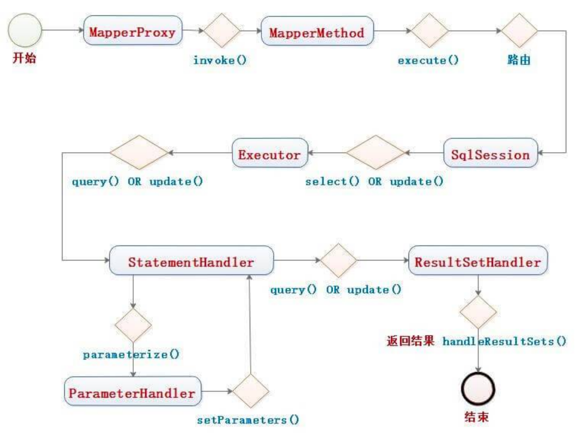流程图

那么从这个图中可以看出，MapperMethod 在里面扮演了非常重要的角色，将方法转换成对应的 SqlSession 方法，并返回执行结果。实际上，在 [《精尽 MyBatis 源码分析 —— Binding 模块》](http://svip.iocoder.cn/MyBatis/binding-package) 中，我们已经介绍了 MapperMethod 类，但是因为 #execute(SqlSession sqlSession, Object[] args) 方法，涉及内容较多，所以没有详细解析。那么此处，让我们撸起这个方法。代码如下：

// MapperMethod.java  public Object execute(SqlSession sqlSession, Object[] args) {   Object result;   switch (command.getType()) {     case INSERT: {       // 转换参数       Object param = method.convertArgsToSqlCommandParam(args);       // 执行 INSERT 操作       // 转换 rowCount       result = rowCountResult(sqlSession.insert(command.getName(), param));       break;     }     case UPDATE: {       // <1.1> 转换参数       Object param = method.convertArgsToSqlCommandParam(args);       // <1.2> 执行更新       // <1.3> 转换 rowCount       result = rowCountResult(sqlSession.update(command.getName(), param));       break;     }     case DELETE: {       // 转换参数       Object param = method.convertArgsToSqlCommandParam(args);       // 转换 rowCount       result = rowCountResult(sqlSession.delete(command.getName(), param));       break;     }     case SELECT:       // <2.1> 无返回，并且有 ResultHandler 方法参数，则将查询的结果，提交给 ResultHandler 进行处理       if (method.returnsVoid() && method.hasResultHandler()) {         executeWithResultHandler(sqlSession, args);         result = null;       // <2.2> 执行查询，返回列表       } else if (method.returnsMany()) {         result = executeForMany(sqlSession, args);       // <2.3> 执行查询，返回 Map       } else if (method.returnsMap()) {         result = executeForMap(sqlSession, args);       // <2.4> 执行查询，返回 Cursor       } else if (method.returnsCursor()) {         result = executeForCursor(sqlSession, args);       // <2.5> 执行查询，返回单个对象       } else {         // 转换参数         Object param = method.convertArgsToSqlCommandParam(args);         // 查询单条         result = sqlSession.selectOne(command.getName(), param);         if (method.returnsOptional() &&             (result == null || !method.getReturnType().equals(result.getClass()))) {           result = Optional.ofNullable(result);         }       }       break;     case FLUSH:       result = sqlSession.flushStatements();       break;     default:       throw new BindingException("Unknown execution method for: " + command.getName());   }   // 返回结果为 null ，并且返回类型为基本类型，则抛出 BindingException 异常   if (result == null && method.getReturnType().isPrimitive() && !method.returnsVoid()) {     throw new BindingException("Mapper method '" + command.getName()         + " attempted to return null from a method with a primitive return type (" + method.getReturnType() + ").");   }   // 返回结果   return result; }


INSERT 命令类型


<1.1> 处，调用 MethodSignature#convertArgsToSqlCommandParam(args) 方法，转换参数。

<1.2> 处，调用 SqlSession#insert(String statement, Object parameter) 方法，执行 INSERT 操作。


<1.3> 处，调用 #rowCountResult(int rowCount) 方法，将返回的行变更数，转换成方法实际要返回的类型。代码如下：


// MapperMethod.java  private Object rowCountResult(int rowCount) {   final Object result;   if (method.returnsVoid()) { // Void 情况，不用返回     result = null;   } else if (Integer.class.equals(method.getReturnType()) || Integer.TYPE.equals(method.getReturnType())) { // Int     result = rowCount;   } else if (Long.class.equals(method.getReturnType()) || Long.TYPE.equals(method.getReturnType())) { // Long     result = (long) rowCount;   } else if (Boolean.class.equals(method.getReturnType()) || Boolean.TYPE.equals(method.getReturnType())) { // Boolean     result = rowCount > 0;   } else {     throw new BindingException("Mapper method '" + command.getName() + "' has an unsupported return type: " + method.getReturnType());   }   return result; }


根据方法的返回类型，做相应的转化处理。

UPDATE 命令类型，同 INSERT 命令类型。

DELETE 命令类型，同 INSERT 命令类型。

SELECT 命令类型

<2.1> 处，无返回，并且有 ResultHandler 方法参数，则调用 #executeWithResultHandler(SqlSession sqlSession, Object[] args) 方法，将查询的结果，提交给 ResultHandler 进行处理。详细解析，见 [「7.1 executeWithResultHandler」](http://svip.iocoder.cn/MyBatis/session/) 。

<2.2> 处，调用 #executeForMany(SqlSession sqlSession, Object[] args) 方法，执行查询，返回列表。详细解析，见 [「7.2 executeForMany」](http://svip.iocoder.cn/MyBatis/session/) 。

<2.3> 处，调用 #executeForMap(SqlSession sqlSession, Object[] args) 方法，执行查询，返回 Map。详细解析，见 [「7.3 executeForMap」](http://svip.iocoder.cn/MyBatis/session/) 。

<2.4> 处，调用 #executeForCursor(SqlSession sqlSession, Object[] args) 方法，执行查询，返回 Map。详细解析，见 [「7.4 executeForCursor」](http://svip.iocoder.cn/MyBatis/session/) 。

<2.5> 处，执行查询，返回单个对象。此处是，对 SqlSession 的 [「4.1.3 selectOne」](http://svip.iocoder.cn/MyBatis/session/) 方法的封装。

## 7.1 executeWithResultHandler

// MapperMethod.java  private void executeWithResultHandler(SqlSession sqlSession, Object[] args) {   // 获得 MappedStatement 对象   MappedStatement ms = sqlSession.getConfiguration().getMappedStatement(command.getName());   if (!StatementType.CALLABLE.equals(ms.getStatementType()) // 校验存储过程的情况。不符合，抛出 BindingException 异常       && void.class.equals(ms.getResultMaps().get(0).getType())) {     throw new BindingException("method " + command.getName()         + " needs either a @ResultMap annotation, a @ResultType annotation,"         + " or a resultType attribute in XML so a ResultHandler can be used as a parameter.");   }   // 转换参数   Object param = method.convertArgsToSqlCommandParam(args);   // 执行 SELECT 操作   if (method.hasRowBounds()) {     RowBounds rowBounds = method.extractRowBounds(args);     sqlSession.select(command.getName(), param, rowBounds, method.extractResultHandler(args));   } else {     sqlSession.select(command.getName(), param, method.extractResultHandler(args));   } }

对 SqlSession 的 [「4.1.6 select」](http://svip.iocoder.cn/MyBatis/session/) 方法的封装。

## 7.2 executeForMany

// MapperMethod.java  private <E> Object executeForMany(SqlSession sqlSession, Object[] args) {   List<E> result;   // 转换参数   Object param = method.convertArgsToSqlCommandParam(args);   // 执行 SELECT 操作   if (method.hasRowBounds()) {     RowBounds rowBounds = method.extractRowBounds(args);     result = sqlSession.selectList(command.getName(), param, rowBounds);   } else {     result = sqlSession.selectList(command.getName(), param);   }   // issue #510 Collections & arrays support   // 封装 Array 或 Collection 结果   if (!method.getReturnType().isAssignableFrom(result.getClass())) {     if (method.getReturnType().isArray()) { // 情况一，Array       return convertToArray(result);     } else {       return convertToDeclaredCollection(sqlSession.getConfiguration(), result); // 情况二，Collection     }   }   // 直接返回的结果   return result; // 情况三，默认 }

对 SqlSession 的 [「4.1.2 selectList」](http://svip.iocoder.cn/MyBatis/session/) 方法的封装。


情况一，Array 。代码如下：


// MapperMethod.java  private <E> Object convertToArray(List<E> list) {   Class<?> arrayComponentType = method.getReturnType().getComponentType();   Object array = Array.newInstance(arrayComponentType, list.size());   if (arrayComponentType.isPrimitive()) {     for (int i = 0; i < list.size(); i++) {       Array.set(array, i, list.get(i));     }     return array;   } else {     return list.toArray((E[]) array);   } }


情况二，Collection 。代码如下：


// MapperMethod.java  private <E> Object convertToDeclaredCollection(Configuration config, List<E> list) {   Object collection = config.getObjectFactory().create(method.getReturnType());   MetaObject metaObject = config.newMetaObject(collection);   metaObject.addAll(list);   return collection; }


## 7.3 executeForMap

// MapperMethod.java  private <K, V> Map<K, V> executeForMap(SqlSession sqlSession, Object[] args) {   Map<K, V> result;   // 转换参数   Object param = method.convertArgsToSqlCommandParam(args);   // 执行 SELECT 操作   if (method.hasRowBounds()) {     RowBounds rowBounds = method.extractRowBounds(args);     result = sqlSession.<K, V>selectMap(command.getName(), param, method.getMapKey(), rowBounds);   } else {     result = sqlSession.<K, V>selectMap(command.getName(), param, method.getMapKey());   }   return result; }

对 SqlSession 的 [「4.1.4 selectMap」](http://svip.iocoder.cn/MyBatis/session/) 方法的封装。

## 7.4 executeForCursor

// MapperMethod.java  private <T> Cursor<T> executeForCursor(SqlSession sqlSession, Object[] args) {   Cursor<T> result;   // 转换参数   Object param = method.convertArgsToSqlCommandParam(args);   // 执行 SELECT 操作   if (method.hasRowBounds()) {     RowBounds rowBounds = method.extractRowBounds(args);     result = sqlSession.selectCursor(command.getName(), param, rowBounds);   } else {     result = sqlSession.selectCursor(command.getName(), param);   }   return result; }

# 666. 彩蛋

貌似，又是一片简单的文章。淡定~~

参考和推荐如下文章：

祖大俊 [《Mybatis3.3.x技术内幕（一）：SqlSession和SqlSessionFactory列传》](https://my.oschina.net/zudajun/blog/665956)

祖大俊 [《Mybatis3.3.x技术内幕（十一）：执行一个Sql命令的完整流程》](https://my.oschina.net/zudajun/blog/670373)

田小波 [《MyBatis 源码分析 - SQL 的执行过程》](https://www.tianxiaobo.com/2018/08/17/MyBatis-源码分析-SQL-的执行过程/)

无忌 [《MyBatis 源码解读之 SqlSession》](https://my.oschina.net/wenjinglian/blog/1631901)

徐郡明 [《MyBatis 技术内幕》](https://item.jd.com/12125531.html) 的 [「3.7 接口层」](http://svip.iocoder.cn/MyBatis/session/) 小节

文章目录

\00001. [1. 概述](#1-概述)

\00002. [2. SqlSessionFactoryBuilder](#2-SqlSessionFactoryBuilder)

\00003. [3. SqlSessionFactory](#3-SqlSessionFactory)

\1. [3.1 DefaultSqlSessionFactory](#3-1-DefaultSqlSessionFactory)

\1. [3.1.1 构造方法](#3-1-1-构造方法)

\2. [3.1.2 openSession](#3-1-2-openSession)

\3. [3.1.3 getTransactionFactoryFromEnvironment](#3-1-3-getTransactionFactoryFromEnvironment)

\4. [3.1.4 closeTransaction](#3-1-4-closeTransaction)

\00004. [4. SqlSession](#4-SqlSession)

\1. [4.1 DefaultSqlSession](#4-1-DefaultSqlSession)

\1. [4.1.1 构造方法](#4-1-1-构造方法)

\2. [4.1.2 selectList](#4-1-2-selectList)

\3. [4.1.3 selectOne](#4-1-3-selectOne)

\4. [4.1.4 selectMap](#4-1-4-selectMap)

\5. [4.1.5 selectCursor](#4-1-5-selectCursor)

\6. [4.1.6 select](#4-1-6-select)

\7. [4.1.7 wrapCollection](#4-1-7-wrapCollection)

\8. [4.1.8 update](#4-1-8-update)

\9. [4.1.9 insert](#4-1-9-insert)

\10. [4.1.10 delete](#4-1-10-delete)

\11. [4.1.11 flushStatements](#4-1-11-flushStatements)

\12. [4.1.12 commit](#4-1-12-commit)

\13. [4.1.13 rollback](#4-1-13-rollback)

\14. [4.1.14 close](#4-1-14-close)

\15. [4.1.15 getConfiguration](#4-1-15-getConfiguration)

\16. [4.1.16 getMapper](#4-1-16-getMapper)

\17. [4.1.17 getConnection](#4-1-17-getConnection)

\18. [4.1.18 clearCache](#4-1-18-clearCache)

\00005. [5. SqlSessionManager](#5-SqlSessionManager)

\1. [5.1 构造方法](#5-1-构造方法)

\2. [5.2 newInstance](#5-2-newInstance)

\3. [5.3 startManagedSession](#5-3-startManagedSession)

\4. [5.4 对 SqlSessionFactory 的实现方法](#5-4-对-SqlSessionFactory-的实现方法)

\5. [5.5 对 SqlSession 的实现方法](#5-5-对-SqlSession-的实现方法)

\6. [5.6 SqlSessionInterceptor](#5-6-SqlSessionInterceptor)

\7. [5.7 嘿嘿嘿](#5-7-嘿嘿嘿)

\00006. [6. Configuration](#6-Configuration)

\00007. [7. MapperMethod](#7-MapperMethod)

\1. [7.1 executeWithResultHandler](#7-1-executeWithResultHandler)

\2. [7.2 executeForMany](#7-2-executeForMany)

\3. [7.3 executeForMap](#7-3-executeForMap)

\4. [7.4 executeForCursor](#7-4-executeForCursor)

\00008. [666. 彩蛋](#666-彩蛋)

© 2014 - 2022 芋道源码 | 

总访客数 2759132 次 && 总访问量 5908914 次

[回到首页](http://svip.iocoder.cn/index)

 

窗体顶端



窗体底端

[回到首页](http://svip.iocoder.cn/index)


# 精尽 MyBatis 源码分析 —— 插件体系（一）之原理

# 1. 概述

本文，我们来分享 MyBatis 的插件模块，对应 plugin 包。如下图所示：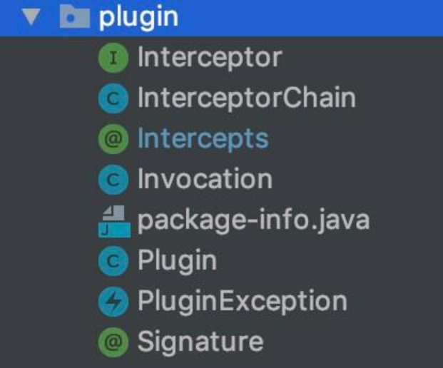`scripting` 包

在 [《精尽 MyBatis 源码解析 —— 项目结构一览》](http://svip.iocoder.cn/MyBatis/intro) 中，简单介绍了这个模块如下：

Mybatis 自身的功能虽然强大，但是并不能完美切合所有的应用场景，因此 MyBatis 提供了插件接口，我们可以通过添加用户自定义插件的方式对 MyBatis 进行扩展。用户自定义插件也可以改变 Mybatis 的默认行为，例如，我们可以拦截 SQL 语句并对其进行重写。

由于用户自定义插件会影响 MyBatis 的核心行为，在使用自定义插件之前，开发人员需要了解 MyBatis 内部的原理，这样才能编写出安全、高效的插件。

总的来说，MyBatis 的插件，还是基于动态代理来实现。所以，

另外，胖友先看看 [《MyBatis 官方文档 —— 插件》](#plugins) 文档，对 MyBatis 插件的概念和配置，再有一个了解。

本文涉及的类如下图所示：类图

下面，我们逐个类来瞅瞅。

# 2. Interceptor

org.apache.ibatis.plugin.Interceptor ，拦截器接口。代码如下：

// Interceptor.java  public interface Interceptor {    /**    * 拦截方法    *    * @param invocation 调用信息    * @return 调用结果    * @throws Throwable 若发生异常    */   Object intercept(Invocation invocation) throws Throwable;    /**    * 应用插件。如应用成功，则会创建目标对象的代理对象    *    * @param target 目标对象    * @return 应用的结果对象，可以是代理对象，也可以是 target 对象，也可以是任意对象。具体的，看代码实现    */   Object plugin(Object target);    /**    * 设置拦截器属性    *    * @param properties 属性    */   void setProperties(Properties properties);  }

关于三个方法，胖友看看代码注释。

## 2.1 示例

我们来看看 org.apache.ibatis.plugin.PluginTest ，提供了 AlwaysMapPlugin 示例。代码如下：

@Intercepts({     @Signature(type = Map.class, method = "get", args = {Object.class})}) // <1> public static class AlwaysMapPlugin implements Interceptor {    @Override // <4>   public Object intercept(Invocation invocation) throws Throwable {     return "Always";   }    @Override // <2>   public Object plugin(Object target) {     return Plugin.wrap(target, this);   }    @Override // <3>   public void setProperties(Properties properties) {   }  }

<1> 处，通过 @Intercepts 和 @Signature 注解，定义了需要拦截的方法为 Map 类型、方法为 "get" 方法，方法参数为 Object.class 。详细解析，见 TODO。

<2> 处，在实现方法 #plugin(Object target) 方法内部，他调用 Plugin#wrap(Object target, Interceptor interceptor) 方法，执行代理对象的创建。详细解析，见 TODO。

<3> 处，在实现方法 #setProperties(Properties properties) 方法内部，暂未做任何实现。此处可以实现，若 AlwaysMapPlugin 有属性，可以从 properties 获取一些需要的属性值。

<4> 处，在实现方法 #intercept(Invocation invocation) 方法，直接返回 "Always" 字符串。也就是说，当所有的 target 类型为 Map 类型，并且调用 Map#get(Object) 方法时，返回的都是 "Always" 。

这个示例，胖友可以跑下 PluginTest 单元测试里的方法，可以更加好理解。

## 2.2 Invocation

org.apache.ibatis.plugin.Invocation ，方法调用信息，作为 Interceptor#intercept(Invocation invocation) 的方法参数。代码如下：

// Invocation.java  public interface Interceptor {    /**    * 拦截方法    *    * @param invocation 调用信息    * @return 调用结果    * @throws Throwable 若发生异常    */   Object intercept(Invocation invocation) throws Throwable;    /**    * 应用插件。如应用成功，则会创建目标对象的代理对象    *    * @param target 目标对象    * @return 应用的结果对象，可以是代理对象，也可以是 target 对象，也可以是任意对象。具体的，看代码实现    */   Object plugin(Object target);    /**    * 设置拦截器属性    *    * @param properties 属性    */   void setProperties(Properties properties);  }

# 3. InterceptorChain

org.apache.ibatis.plugin.InterceptorChain ，拦截器 Interceptor 链。

## 3.1 构造方法

// InterceptorChain.java  /**  * 拦截器数组  */ private final List<Interceptor> interceptors = new ArrayList<>();

## 3.2 addInterceptor

\#addInterceptor(Interceptor interceptor) 方法，添加拦截器。代码如下：

// InterceptorChain.java  public void addInterceptor(Interceptor interceptor) {   interceptors.add(interceptor); }


------


该方法在 Configuration 的 #pluginElement(XNode parent) 方法中被调用，代码如下：

// XMLConfigBuilder.java  /**  * 解析 <plugins /> 标签，添加到 {@link Configuration#interceptorChain} 中  *  * @param parent 节点  * @throws Exception 发生异常时  */ private void pluginElement(XNode parent) throws Exception {   if (parent != null) {     // 遍历 <plugins /> 标签     for (XNode child : parent.getChildren()) {       String interceptor = child.getStringAttribute("interceptor");       Properties properties = child.getChildrenAsProperties();       // <1> 创建 Interceptor 对象，并设置属性       Interceptor interceptorInstance = (Interceptor) resolveClass(interceptor).newInstance();       interceptorInstance.setProperties(properties);       // 添加到 configuration 中       configuration.addInterceptor(interceptorInstance);     }   } }

<1> 处，创建 Interceptor 对象，并调用 Interceptor#setProperties(properties) 方法，设置拦截器的属性。


<2> 处，调用 Configuration#addInterceptor(interceptorInstance) 方法，添加到 Configuration.interceptorChain 中。代码如下：


// Configuration.java  /**  * 拦截器链  */ protected final InterceptorChain interceptorChain = new InterceptorChain();  public void addInterceptor(Interceptor interceptor) {   interceptorChain.addInterceptor(interceptor); }


## 3.3 pluginAll

\#pluginAll(Object target) 方法，应用所有拦截器到指定目标对象。代码如下：

// InterceptorChain.java  public Object pluginAll(Object target) {   for (Interceptor interceptor : interceptors) {     target = interceptor.plugin(target);   }   return target; }


------


该方法被 Configuration 的如下四处方法中调用：调用处

一共可以有四种目标对象类型可以被拦截：1）Executor；2）StatementHandler；3）ParameterHandler；4）ResultSetHandler 。

# 4. @Intercepts

org.apache.ibatis.plugin.@Intercepts ，拦截器注解。代码如下：

// Intercepts.java  @Documented @Retention(RetentionPolicy.RUNTIME) @Target(ElementType.TYPE) public @interface Intercepts {    /**    * @return 拦截的方法签名的数组    */   Signature[] value();  }

## 4.1 @Signature

org.apache.ibatis.plugin.@Signature ，方法签名的注解。代码如下：

// Signature.java  @Documented @Retention(RetentionPolicy.RUNTIME) @Target({}) public @interface Signature {    /**    * @return 类    */   Class<?> type();    /**    * @return 方法名    */   String method();    /**    * @return 参数类型    */   Class<?>[] args();  }

# 5. Plugin

org.apache.ibatis.plugin.Plugin ，实现 InvocationHandler 接口，插件类，一方面提供创建动态代理对象的方法，另一方面实现对指定类的指定方法的拦截处理。

注意，Plugin 是 MyBatis 插件体系的核心类。

## 5.1 构造方法

// Plugin.java  /**  * 目标对象  */ private final Object target; /**  * 拦截器  */ private final Interceptor interceptor; /**  * 拦截的方法映射  *  * KEY：类  * VALUE：方法集合  */ private final Map<Class<?>, Set<Method>> signatureMap;  private Plugin(Object target, Interceptor interceptor, Map<Class<?>, Set<Method>> signatureMap) {   this.target = target;   this.interceptor = interceptor;   this.signatureMap = signatureMap; }

## 5.2 wrap

\#wrap(Object target, Interceptor interceptor) 静态方法，创建目标类的代理对象。代码如下：

// Plugin.java  public static Object wrap(Object target, Interceptor interceptor) {   // <1> 获得拦截的方法映射   Map<Class<?>, Set<Method>> signatureMap = getSignatureMap(interceptor);   // <2> 获得目标类的类型   Class<?> type = target.getClass();   // <2> 获得目标类的接口集合   Class<?>[] interfaces = getAllInterfaces(type, signatureMap);   // <3.1> 若有接口，则创建目标对象的 JDK Proxy 对象   if (interfaces.length > 0) {     return Proxy.newProxyInstance(         type.getClassLoader(),         interfaces,         new Plugin(target, interceptor, signatureMap)); // 因为 Plugin 实现了 InvocationHandler 接口，所以可以作为 JDK 动态代理的调用处理器   }   // <3.2> 如果没有，则返回原始的目标对象   return target; }


<1> 处，调用 #getSignatureMap(Interceptor interceptor) 方法，获得拦截的方法映射。代码如下：


// Plugin.java  private static Map<Class<?>, Set<Method>> getSignatureMap(Interceptor interceptor) {   Intercepts interceptsAnnotation = interceptor.getClass().getAnnotation(Intercepts.class);   // issue #251   if (interceptsAnnotation == null) {     throw new PluginException("No @Intercepts annotation was found in interceptor " + interceptor.getClass().getName());   }   Signature[] sigs = interceptsAnnotation.value();   Map<Class<?>, Set<Method>> signatureMap = new HashMap<>();   for (Signature sig : sigs) {     Set<Method> methods = signatureMap.computeIfAbsent(sig.type(), k -> new HashSet<>());     try {       Method method = sig.type().getMethod(sig.method(), sig.args());       methods.add(method);     } catch (NoSuchMethodException e) {       throw new PluginException("Could not find method on " + sig.type() + " named " + sig.method() + ". Cause: " + e, e);     }   }   return signatureMap; }


基于 @Intercepts 和 @Signature 注解。


<2> 处，调用 #getAllInterfaces(Class<?> type, Map<Class<?>, Set<Method>> signatureMap) 方法，获得目标类的接口集合。代码如下：


// Plugin.java  private static Class<?>[] getAllInterfaces(Class<?> type, Map<Class<?>, Set<Method>> signatureMap) {   // 接口的集合   Set<Class<?>> interfaces = new HashSet<>();   // 循环递归 type 类，机器父类   while (type != null) {     // 遍历接口集合，若在 signatureMap 中，则添加到 interfaces 中     for (Class<?> c : type.getInterfaces()) {       if (signatureMap.containsKey(c)) {         interfaces.add(c);       }     }     // 获得父类     type = type.getSuperclass();   }   // 创建接口的数组   return interfaces.toArray(new Class<?>[interfaces.size()]); }


从这里可以看出，@Signature 注解的 type 属性，必须是接口。

<3.1> 处，情况一，若有接口，则创建目标对象的 JDK Proxy 对象。

<3.2> 处，情况二，若无接口，则返回原始的目标对象。

## 5.3 invoke

// Plugin.java  @Override public Object invoke(Object proxy, Method method, Object[] args) throws Throwable {   try {     // 获得目标方法是否被拦截     Set<Method> methods = signatureMap.get(method.getDeclaringClass());     if (methods != null && methods.contains(method)) {       // 如果是，则拦截处理该方法       return interceptor.intercept(new Invocation(target, method, args));     }     // 如果不是，则调用原方法     return method.invoke(target, args);   } catch (Exception e) {     throw ExceptionUtil.unwrapThrowable(e);   } }

具体，见代码注释。简单~

# 666. 彩蛋

在地铁上，撸完了这篇博客，小文一篇。后续，我们会找一些 MyBatis 的插件，详细解析。另外，MyBatis 并未提供自带的插件实现。

参考和推荐如下文章：

祖大俊 [《Mybatis3.4.x技术内幕（十九）：Mybatis之plugin插件设计原理》](https://my.oschina.net/zudajun/blog/738973)

田小波 [《MyBatis 源码分析 - 插件机制》](https://www.tianxiaobo.com/2018/08/26/MyBatis-源码分析-插件机制/)

徐郡明 [《MyBatis 技术内幕》](https://item.jd.com/12125531.html) 的 [「4.1 插件模块」](http://svip.iocoder.cn/MyBatis/plugin-1/) 小节

文章目录

\00001. [1. 概述](#1-概述)

\00002. [2. Interceptor](#2-Interceptor)

\1. [2.1 示例](#2-1-示例)

\2. [2.2 Invocation](#2-2-Invocation)

\00003. [3. InterceptorChain](#3-InterceptorChain)

\1. [3.1 构造方法](#3-1-构造方法)

\2. [3.2 addInterceptor](#3-2-addInterceptor)

\3. [3.3 pluginAll](#3-3-pluginAll)

\00004. [4. @Intercepts](#4-Intercepts)

\1. [4.1 @Signature](#4-1-Signature)

\00005. [5. Plugin](#5-Plugin)

\1. [5.1 构造方法](#5-1-构造方法)

\2. [5.2 wrap](#5-2-wrap)

\3. [5.3 invoke](#5-3-invoke)

\00006. [666. 彩蛋](#666-彩蛋)

© 2014 - 2022 芋道源码 | 

总访客数 2759133 次 && 总访问量 5908915 次

[回到首页](http://svip.iocoder.cn/index)

 

窗体顶端



窗体底端

[回到首页](http://svip.iocoder.cn/index)


# 精尽 MyBatis 源码分析 —— 插件体系（二）之 PageHelper

[Mybatis-PageHelper](https://github.com/pagehelper/Mybatis-PageHelper) ，基于 MyBatis 插件体系，实现了分页功能。感兴趣的胖友，可以看看它的源码。艿艿暂时不是特别感兴趣，因为：

\1. 团队目前主要以手写 SQL 为主，或者自动生成 SQL 为辅。

\2. [MyBatis-Plus](https://github.com/baomidou/mybatis-plus) 也提供了分页插件，并且据艿艿了解到，可能更加广泛。它的分页插件的拦截器是 com.baomidou.mybatisplus.plugins.PaginationInterceptor ，具体可参见文档 [《MyBatis-Plus 文档 —— 分页插件》](http://mp.baomidou.com/guide/page.html) 。

当然，考虑到胖友可能比较感兴趣，艿艿还是翻了翻目前网络上的文章，目前写的比较好的是：

祖大俊 [《Mybatis3.4.x技术内幕（二十）：PageHelper分页插件源码及原理剖析》](https://my.oschina.net/zudajun/blog/745232)

因为写的比较早，所以对应的 [Mybatis-PageHelper](https://github.com/pagehelper/Mybatis-PageHelper) 的代码比较早，所以和目前的代码，已经对应不上了。

【相对推荐】一直不懂 [《【Mybatis源码分析】12-插件PageHelper机制》](https://blog.csdn.net/shenchaohao12321/article/details/80168655)

© 2014 - 2022 芋道源码 | 

总访客数 2759134 次 && 总访问量 5908916 次

[回到首页](http://svip.iocoder.cn/index)

 

窗体顶端



窗体底端

[回到首页](http://svip.iocoder.cn/index)


# 精尽 MyBatis 源码解析 —— Spring 集成（一）之调试环境搭建

# 1. 依赖工具

Maven

Git

JDK

IntelliJ IDEA

# 2. 源码拉取

从官方仓库 https://github.com/mybatis/spring Fork 出属于自己的仓库。为什么要 Fork ？既然开始阅读、调试源码，我们可能会写一些注释，有了自己的仓库，可以进行自由的提交。

使用 IntelliJ IDEA 从 Fork 出来的仓库拉取代码。

本文使用的 MyBatis 版本为 2.0.0-SNAPSHOT 。统计代码量如下：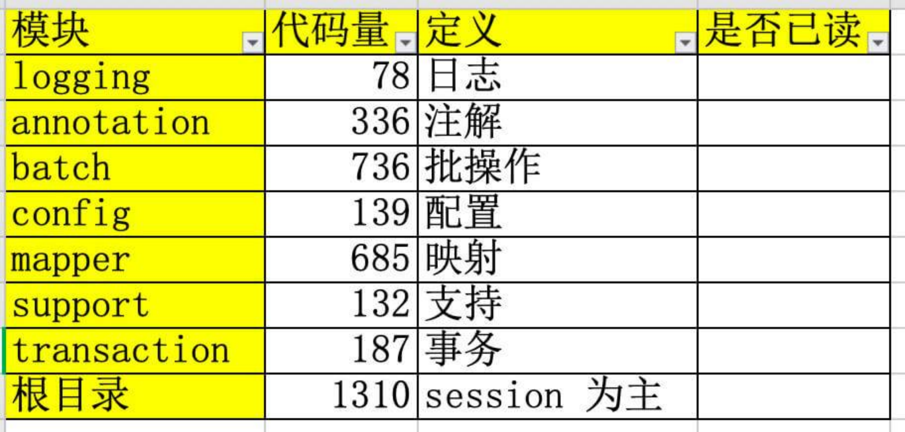代码统计

# 3. 调试

MyBatis 想要调试，非常方便，只需要打开 org.mybatis.spring.sample.AbstractSampleTest 单元测试类，选择 #testFooService() 方法，右键，开始调试即可。

@DirtiesContext public abstract class AbstractSampleTest {    @Autowired   protected FooService fooService;    @Test   final void testFooService() {     User user = this.fooService.doSomeBusinessStuff("u1");     assertThat(user).isNotNull();     assertThat(user.getName()).isEqualTo("Pocoyo");   }  }

有两点要注意：

1、因为单元测试基于 Junit5 ，所以需要依赖 JDK10 的环境，因此需要修改项目的 Project SDK 为 JDK10 。如下图所示：修改 Project SDK

2、AbstractSampleTest 是示例单元测试基类，它有五种实现类，分别如下：

/**  * 示例单元测试基类  *  * 1. {@link SampleEnableTest}  *    基于 @MapperScan 注解，扫描指定包  *  * 2. {@link SampleMapperTest}  *    基于 {@link org.mybatis.spring.mapper.MapperFactoryBean} 类，直接声明指定的 Mapper 接口  *  * 3. {@link SampleNamespaceTest}  *    基于 <mybatis:scan /> 标签，扫描指定包  *  * 4. {@link SampleScannerTest}  *    基于 {@link org.mybatis.spring.mapper.MapperScannerConfigurer} 类，扫描指定包  *  * 5. {@link SampleBatchTest}  *    在 SampleMapperTest 的基础上，使用 BatchExecutor 执行器  */

每种实现类，都对应其配置类或配置文件。胖友可以根据自己需要，运行 AbstractSampleTest 时，选择对应的实现类。

# 666. 彩蛋

小撸怡情，大撸伤身。

文章目录

\00001. [1. 依赖工具](#1-依赖工具)

\00002. [2. 源码拉取](#2-源码拉取)

\00003. [3. 调试](#3-调试)

\00004. [666. 彩蛋](#666-彩蛋)

© 2014 - 2022 芋道源码 | 

总访客数 2759135 次 && 总访问量 5908917 次

[回到首页](http://svip.iocoder.cn/index)

 

窗体顶端



窗体底端

[回到首页](http://svip.iocoder.cn/index)


# 精尽 MyBatis 源码解析 —— Spring 集成（二）之初始化

# 1. 概述

在前面的，我们已经看了四篇 MyBatis 初始化相关的文章：

[《MyBatis 初始化（一）之加载 mybatis-config》](http://svip.iocoder.cn/MyBatis/builder-package-1)

[《MyBatis 初始化（二）之加载 Mapper 映射配置文件》](http://svip.iocoder.cn/MyBatis/builder-package-2)

[《MyBatis 初始化（三）之加载 Statement 配置》](http://svip.iocoder.cn/MyBatis/builder-package-3)

[《MyBatis 初始化（四）之加载注解配置》](http://svip.iocoder.cn/MyBatis/builder-package-4)

那么，本文我们就来看看，Spring 和 MyBatis 如何集成。主要涉及如下三个包：

annotation

config

mapper

# 2. SqlSessionFactoryBean

org.mybatis.spring.SqlSessionFactoryBean ，实现 FactoryBean、InitializingBean、ApplicationListener 接口，负责创建 SqlSessionFactory 对象。

使用示例如下：

<!-- simplest possible SqlSessionFactory configuration --> <bean id="sqlSessionFactory" class="org.mybatis.spring.SqlSessionFactoryBean">   <property name="dataSource" ref="dataSource" />   <!-- Directly specify the location of the MyBatis mapper xml file. This      is NOT required when using MapperScannerConfigurer or      MapperFactoryBean; they will load the xml automatically if it is      in the same classpath location as the DAO interface. Rather than      directly referencing the xml files, the 'configLocation' property      could also be used to specify the location of a MyBatis config      file. This config file could, in turn, contain <mapper>      elements that point to the correct mapper xml files.    -->   <property name="mapperLocations" value="classpath:org/mybatis/spring/sample/mapper/*.xml" /> </bean>

另外，如果胖友不熟悉 Spring FactoryBean 的机制。可以看看 [《Spring bean 之 FactoryBean》](https://www.jianshu.com/p/d6c42d723464) 文章。

## 2.1 构造方法

// SqlSessionFactoryBean.java  private static final Logger LOGGER = LoggerFactory.getLogger(SqlSessionFactoryBean.class);  /**  * 指定 mybatis-config.xml 路径的 Resource 对象  */ private Resource configLocation;  private Configuration configuration;  /**  * 指定 Mapper 路径的 Resource 数组  */ private Resource[] mapperLocations;  private DataSource dataSource;  private TransactionFactory transactionFactory;  private Properties configurationProperties;  private SqlSessionFactoryBuilder sqlSessionFactoryBuilder = new SqlSessionFactoryBuilder();  private SqlSessionFactory sqlSessionFactory;  //EnvironmentAware requires spring 3.1 private String environment = SqlSessionFactoryBean.class.getSimpleName();  private boolean failFast;  private Interceptor[] plugins;  private TypeHandler<?>[] typeHandlers;  private String typeHandlersPackage;  private Class<?>[] typeAliases;  private String typeAliasesPackage;  private Class<?> typeAliasesSuperType;  //issue #19. No default provider. private DatabaseIdProvider databaseIdProvider;  private Class<? extends VFS> vfs;  private Cache cache;  private ObjectFactory objectFactory;  private ObjectWrapperFactory objectWrapperFactory;  // 省略 setting 方法

是不是各种熟悉的属性，这里就不多解释每个对象了。你比我懂，嘿嘿。

## 2.2 afterPropertiesSet

\#afterPropertiesSet() 方法，构建 SqlSessionFactory 对象。代码如下：

// SqlSessionFactoryBean.java  @Override public void afterPropertiesSet() throws Exception {   notNull(dataSource, "Property 'dataSource' is required");   notNull(sqlSessionFactoryBuilder, "Property 'sqlSessionFactoryBuilder' is required");   state((configuration == null && configLocation == null) || !(configuration != null && configLocation != null),       "Property 'configuration' and 'configLocation' can not specified with together");    // 创建 SqlSessionFactory 对象   this.sqlSessionFactory = buildSqlSessionFactory(); }  /**  * Build a {@code SqlSessionFactory} instance.  *  * The default implementation uses the standard MyBatis {@code XMLConfigBuilder} API to build a  * {@code SqlSessionFactory} instance based on an Reader.  * Since 1.3.0, it can be specified a {@link Configuration} instance directly(without config file).  *  * @return SqlSessionFactory  * @throws IOException if loading the config file failed  */ protected SqlSessionFactory buildSqlSessionFactory() throws IOException {   Configuration configuration;    // 初始化 configuration 对象，和设置其 `configuration.variables` 属性   XMLConfigBuilder xmlConfigBuilder = null;   if (this.configuration != null) {     configuration = this.configuration;     if (configuration.getVariables() == null) {       configuration.setVariables(this.configurationProperties);     } else if (this.configurationProperties != null) {       configuration.getVariables().putAll(this.configurationProperties);     }   } else if (this.configLocation != null) {     xmlConfigBuilder = new XMLConfigBuilder(this.configLocation.getInputStream(), null, this.configurationProperties);     configuration = xmlConfigBuilder.getConfiguration();   } else {     LOGGER.debug(() -> "Property 'configuration' or 'configLocation' not specified, using default MyBatis Configuration");     configuration = new Configuration();     if (this.configurationProperties != null) {       configuration.setVariables(this.configurationProperties);     }   }    // 设置 `configuration.objectFactory` 属性   if (this.objectFactory != null) {     configuration.setObjectFactory(this.objectFactory);   }    // 设置 `configuration.objectWrapperFactory` 属性   if (this.objectWrapperFactory != null) {     configuration.setObjectWrapperFactory(this.objectWrapperFactory);   }    // 设置 `configuration.vfs` 属性   if (this.vfs != null) {     configuration.setVfsImpl(this.vfs);   }    // 设置 `configuration.typeAliasesPackage` 属性   if (hasLength(this.typeAliasesPackage)) {     String[] typeAliasPackageArray = tokenizeToStringArray(this.typeAliasesPackage,         ConfigurableApplicationContext.CONFIG_LOCATION_DELIMITERS);     for (String packageToScan : typeAliasPackageArray) {       configuration.getTypeAliasRegistry().registerAliases(packageToScan,           typeAliasesSuperType == null ? Object.class : typeAliasesSuperType);       LOGGER.debug(() -> "Scanned package: '" + packageToScan + "' for aliases");     }   }    // 设置 `configuration.typeAliases` 属性   if (!isEmpty(this.typeAliases)) {     for (Class<?> typeAlias : this.typeAliases) {       configuration.getTypeAliasRegistry().registerAlias(typeAlias);       LOGGER.debug(() -> "Registered type alias: '" + typeAlias + "'");     }   }    // 初始化 `configuration.interceptorChain` 属性，即拦截器   if (!isEmpty(this.plugins)) {     for (Interceptor plugin : this.plugins) {       configuration.addInterceptor(plugin);       LOGGER.debug(() -> "Registered plugin: '" + plugin + "'");     }   }    // 扫描 typeHandlersPackage 包，注册 TypeHandler   if (hasLength(this.typeHandlersPackage)) {     String[] typeHandlersPackageArray = tokenizeToStringArray(this.typeHandlersPackage,         ConfigurableApplicationContext.CONFIG_LOCATION_DELIMITERS);     for (String packageToScan : typeHandlersPackageArray) {       configuration.getTypeHandlerRegistry().register(packageToScan);       LOGGER.debug(() -> "Scanned package: '" + packageToScan + "' for type handlers");     }   }   // 如果 typeHandlers 非空，注册对应的 TypeHandler   if (!isEmpty(this.typeHandlers)) {     for (TypeHandler<?> typeHandler : this.typeHandlers) {       configuration.getTypeHandlerRegistry().register(typeHandler);       LOGGER.debug(() -> "Registered type handler: '" + typeHandler + "'");     }   }    // 设置 `configuration.databaseId` 属性   if (this.databaseIdProvider != null) {//fix #64 set databaseId before parse mapper xmls     try {       configuration.setDatabaseId(this.databaseIdProvider.getDatabaseId(this.dataSource));     } catch (SQLException e) {       throw new NestedIOException("Failed getting a databaseId", e);     }   }    // 设置 `configuration.cache` 属性   if (this.cache != null) {     configuration.addCache(this.cache);   }    // <1> 解析 mybatis-config.xml 配置   if (xmlConfigBuilder != null) {     try {       xmlConfigBuilder.parse();       LOGGER.debug(() -> "Parsed configuration file: '" + this.configLocation + "'");     } catch (Exception ex) {       throw new NestedIOException("Failed to parse config resource: " + this.configLocation, ex);     } finally {       ErrorContext.instance().reset();     }   }    // 初始化 TransactionFactory 对象   if (this.transactionFactory == null) {     this.transactionFactory = new SpringManagedTransactionFactory();   }   // 设置 `configuration.environment` 属性   configuration.setEnvironment(new Environment(this.environment, this.transactionFactory, this.dataSource));    // 扫描 Mapper XML 文件们，并进行解析   if (!isEmpty(this.mapperLocations)) {     for (Resource mapperLocation : this.mapperLocations) {       if (mapperLocation == null) {         continue;       }        try {         XMLMapperBuilder xmlMapperBuilder = new XMLMapperBuilder(mapperLocation.getInputStream(),             configuration, mapperLocation.toString(), configuration.getSqlFragments());         xmlMapperBuilder.parse();       } catch (Exception e) {         throw new NestedIOException("Failed to parse mapping resource: '" + mapperLocation + "'", e);       } finally {         ErrorContext.instance().reset();       }       LOGGER.debug(() -> "Parsed mapper file: '" + mapperLocation + "'");     }   } else {     LOGGER.debug(() -> "Property 'mapperLocations' was not specified or no matching resources found");   }    // 创建 SqlSessionFactory 对象   return this.sqlSessionFactoryBuilder.build(configuration); }

代码比较长，胖友自己耐心看下注释，我们只挑重点的瞅瞅。

<1> 处，调用 XMLConfigBuilder#parse() 方法，解析 mybatis-config.xml 配置。即对应 [《MyBatis 初始化（一）之加载 mybatis-config》](http://svip.iocoder.cn/MyBatis/builder-package-1) 文章。

<2> 处，调用 XMLMapperBuilder#parse() 方法，解析 Mapper XML 配置。即对应 [《MyBatis 初始化（二）之加载 Mapper 映射配置文件》](http://svip.iocoder.cn/MyBatis/builder-package-2) 。

<3> 处，调用 SqlSessionFactoryBuilder#build(Configuration config) 方法，创建 SqlSessionFactory 对象。

另外，我们看到 LOGGER 的使用。那么，可能胖友会跟艿艿有一样的疑问，org.mybatis.logging 包下，又定义了 Logger 呢？因为想使用方法参数为 Supplier<String> 的方法，即使用起来更加方便。这也是 mybatis-spring 项目的 logging 包的用途。感兴趣的胖友，可以自己去看看。

## 2.3 getObject

\#getObject() 方法，获得 SqlSessionFactory 对象。代码如下：

// SqlSessionFactoryBean.java  @Override public SqlSessionFactory getObject() throws Exception {   // 保证 SqlSessionFactory 对象的初始化   if (this.sqlSessionFactory == null) {     afterPropertiesSet();   }    return this.sqlSessionFactory; }

## 2.4 getObjectType

// SqlSessionFactoryBean.java  @Override public Class<? extends SqlSessionFactory> getObjectType() {   return this.sqlSessionFactory == null ? SqlSessionFactory.class : this.sqlSessionFactory.getClass(); }

## 2.5 isSingleton

// SqlSessionFactoryBean.java  @Override public boolean isSingleton() {   return true; }

## 2.6 onApplicationEvent

\#onApplicationEvent() 方法，监听 ContextRefreshedEvent 事件，如果 MapperStatement 们，没有都初始化都完成，会抛出 IncompleteElementException 异常。代码如下：

// SqlSessionFactoryBean.java  @Override public void onApplicationEvent(ApplicationEvent event) {   if (failFast && event instanceof ContextRefreshedEvent) {     // fail-fast -> check all statements are completed     // 如果 MapperStatement 们，没有都初始化完成，会抛出 IncompleteElementException 异常     this.sqlSessionFactory.getConfiguration().getMappedStatementNames();   } }

使用该功能时，需要设置 fastFast 属性，为 true 。


------


在 mybatis-spring 项目中，提供了多种配置 Mapper 的方式。下面，我们一种一种来看。 SqlSessionFactoryBean.mapperLocations 属性，也是方式之一。嘿嘿嘿。

# 3. MapperFactoryBean

org.mybatis.spring.mapper.MapperFactoryBean ，实现 FactoryBean 接口，继承 SqlSessionDaoSupport 抽象类，创建 Mapper 对象。

使用示例如下：

<!-- Directly injecting mappers. The required SqlSessionFactory will be autowired. --> <bean id="userMapper" class="org.mybatis.spring.mapper.MapperFactoryBean" autowire="byType"> 	<property name="mapperInterface" value="org.mybatis.spring.sample.mapper.UserMapper" /> </bean>

该示例来自 org.mybatis.spring.sample.SampleMapperTest 单元测试。胖友可以基于它调试。

## 3.1 MapperFactoryBean

// MapperFactoryBean.java  /**  * Mapper 接口  */ private Class<T> mapperInterface; /**  * 是否添加到 {@link Configuration} 中  */ private boolean addToConfig = true;  public MapperFactoryBean() {   //intentionally empty }  public MapperFactoryBean(Class<T> mapperInterface) {   this.mapperInterface = mapperInterface; }  // 省略 setting 方法

## 3.2 checkDaoConfig

// MapperFactoryBean.java  @Override protected void checkDaoConfig() {   // <1> 校验 sqlSessionTemplate 非空   super.checkDaoConfig();   // <2> 校验 mapperInterface 非空   notNull(this.mapperInterface, "Property 'mapperInterface' is required");    // <3> 添加 Mapper 接口到 configuration 中   Configuration configuration = getSqlSession().getConfiguration();   if (this.addToConfig && !configuration.hasMapper(this.mapperInterface)) {     try {       configuration.addMapper(this.mapperInterface);     } catch (Exception e) {       logger.error("Error while adding the mapper '" + this.mapperInterface + "' to configuration.", e);       throw new IllegalArgumentException(e);     } finally {       ErrorContext.instance().reset();     }   } }


该方法，是在 org.springframework.dao.support.DaoSupport 定义，被 #afterPropertiesSet() 方法所调用，代码如下：


// DaoSupport.java  public final void afterPropertiesSet() throws IllegalArgumentException, BeanInitializationException {   this.checkDaoConfig();    try {     this.initDao();   } catch (Exception var2) {     throw new BeanInitializationException("Initialization of DAO failed", var2);   } }


所以此处，就和 [「2.2 afterPropertiesSet」](http://svip.iocoder.cn/MyBatis/Spring-Integration-2/) 的等价。

<1> 处，调用父 SqlSessionDaoSupport#checkDaoConfig() 方法，校验 sqlSessionTemplate 非空。

<2> 处，校验 mapperInterface 非空。

<3> 处，调用 Configuration#addMapper(mapperInterface) 方法，添加 Mapper 接口到 configuration 中。

## 3.3 getObject

\#getObject() 方法，获得 Mapper 对象。注意，返回的是基于 Mapper 接口自动生成的代理对象。代码如下：

// MapperFactoryBean.java  @Override public T getObject() throws Exception {   return getSqlSession().getMapper(this.mapperInterface); }

## 3.4 getObjectType

// MapperFactoryBean.java  @Override public Class<T> getObjectType() {   return this.mapperInterface; }

## 3.5 isSingleton

// MapperFactoryBean.java  @Override public boolean isSingleton() {   return true; }

# 4. @MapperScan

艿艿：本小节，需要胖友对 Spring IOC 有一定的了解。如果不熟悉的胖友，建议不需要特别深入的理解。或者说，先去看 [《精尽 Spring 源码解析》](http://svip.iocoder.cn/categories/Spring/) 。

org.mybatis.spring.annotation.@MapperScan 注解，指定需要扫描的包，将包中符合的 Mapper 接口，注册成 beanClass 为 MapperFactoryBean 的 BeanDefinition 对象，从而实现创建 Mapper 对象。代码如下：

// MapperScan.java  @Retention(RetentionPolicy.RUNTIME) @Target(ElementType.TYPE) @Documented @Import(MapperScannerRegistrar.class) @Repeatable(MapperScans.class) public @interface MapperScan {    /**    * Alias for the {@link #basePackages()} attribute. Allows for more concise    * annotation declarations e.g.:    * {@code @MapperScan("org.my.pkg")} instead of {@code @MapperScan(basePackages = "org.my.pkg"})}.    *    * 和 {@link #basePackages()} 相同意思    *    * @return base package names    */   String[] value() default {};    /**    * Base packages to scan for MyBatis interfaces. Note that only interfaces    * with at least one method will be registered; concrete classes will be    * ignored.    *    * 扫描的包地址    *    * @return base package names for scanning mapper interface    */   String[] basePackages() default {};    /**    * Type-safe alternative to {@link #basePackages()} for specifying the packages    * to scan for annotated components. The package of each class specified will be scanned.    * <p>Consider creating a special no-op marker class or interface in each package    * that serves no purpose other than being referenced by this attribute.    *    * @return classes that indicate base package for scanning mapper interface    */   Class<?>[] basePackageClasses() default {};    /**    * The {@link BeanNameGenerator} class to be used for naming detected components    * within the Spring container.    *    * @return the class of {@link BeanNameGenerator}    */   Class<? extends BeanNameGenerator> nameGenerator() default BeanNameGenerator.class;    /**    * This property specifies the annotation that the scanner will search for.    * <p>    * The scanner will register all interfaces in the base package that also have    * the specified annotation.    * <p>    * Note this can be combined with markerInterface.    *    * 指定注解    *    * @return the annotation that the scanner will search for    */   Class<? extends Annotation> annotationClass() default Annotation.class;    /**    * This property specifies the parent that the scanner will search for.    * <p>    * The scanner will register all interfaces in the base package that also have    * the specified interface class as a parent.    * <p>    * Note this can be combined with annotationClass.    *    * 指定接口    *    * @return the parent that the scanner will search for    */   Class<?> markerInterface() default Class.class;    /**    * Specifies which {@code SqlSessionTemplate} to use in the case that there is    * more than one in the spring context. Usually this is only needed when you    * have more than one datasource.    *    * 指向的 SqlSessionTemplate 的名字    *    * @return the bean name of {@code SqlSessionTemplate}    */   String sqlSessionTemplateRef() default "";    /**    * Specifies which {@code SqlSessionFactory} to use in the case that there is    * more than one in the spring context. Usually this is only needed when you    * have more than one datasource.    *    * 指向的 SqlSessionFactory 的名字    *    * @return the bean name of {@code SqlSessionFactory}    */   String sqlSessionFactoryRef() default "";    /**    * Specifies a custom MapperFactoryBean to return a mybatis proxy as spring bean.    *    * 可自定义 MapperFactoryBean 的实现类    *    * @return the class of {@code MapperFactoryBean}    */   Class<? extends MapperFactoryBean> factoryBean() default MapperFactoryBean.class;  }

属性比较多，实际上，胖友常用的就是 value() 属性。

重点是 @Import(MapperScannerRegistrar.class) 。为什么呢？@Import 注解，负责资源的导入。如果导入的是一个 Java 类，例如此处为 MapperScannerRegistrar 类，Spring 会将其注册成一个 Bean 对象。而 MapperScannerRegistrar 类呢？详细解析，见 [「4.1 MapperScannerRegistrar」](http://svip.iocoder.cn/MyBatis/Spring-Integration-2/) 。

使用示例如下：

@Configuration @ImportResource("classpath:org/mybatis/spring/sample/config/applicationContext-infrastructure.xml") @MapperScan("org.mybatis.spring.sample.mapper") // here static class AppConfig { }

该示例来自 org.mybatis.spring.sample.SampleEnableTest 单元测试。胖友可以基于它调试。

## 4.1 MapperScannerRegistrar

org.mybatis.spring.annotation.MapperScannerRegistrar ，实现 ImportBeanDefinitionRegistrar、ResourceLoaderAware 接口，@MapperScann 的注册器，负责将扫描到的 Mapper 接口，注册成 beanClass 为 MapperFactoryBean 的 BeanDefinition 对象，从而实现创建 Mapper 对象。

### 4.1.1 构造方法

// MapperScannerRegistrar.java  /**  * ResourceLoader 对象  */ private ResourceLoader resourceLoader;  @Override public void setResourceLoader(ResourceLoader resourceLoader) {   this.resourceLoader = resourceLoader; }

因为实现了 ResourceLoaderAware 接口，所以 resourceLoader 属性，能够被注入。

### 4.1.2 registerBeanDefinitions

// MapperScannerRegistrar.java  @Override public void registerBeanDefinitions(AnnotationMetadata importingClassMetadata, BeanDefinitionRegistry registry) {   // <1> 获得 @MapperScan 注解信息   AnnotationAttributes mapperScanAttrs = AnnotationAttributes       .fromMap(importingClassMetadata.getAnnotationAttributes(MapperScan.class.getName()));   // <2> 扫描包，将扫描到的 Mapper 接口，注册成 beanClass 为 MapperFactoryBean 的 BeanDefinition 对象   registerBeanDefinitions(mapperScanAttrs, registry); }  void registerBeanDefinitions(AnnotationAttributes annoAttrs, BeanDefinitionRegistry registry) {   // <3.1> 创建 ClassPathMapperScanner 对象   ClassPathMapperScanner scanner = new ClassPathMapperScanner(registry);    // <3.2> 设置 resourceLoader 属性到 scanner 中   // this check is needed in Spring 3.1   if (resourceLoader != null) {     scanner.setResourceLoader(resourceLoader);   }    // <3.3> 获得 @(MapperScan 注解上的属性，设置到 scanner 中   Class<? extends Annotation> annotationClass = annoAttrs.getClass("annotationClass");   if (!Annotation.class.equals(annotationClass)) {     scanner.setAnnotationClass(annotationClass);   }   Class<?> markerInterface = annoAttrs.getClass("markerInterface");   if (!Class.class.equals(markerInterface)) {     scanner.setMarkerInterface(markerInterface);   }   Class<? extends BeanNameGenerator> generatorClass = annoAttrs.getClass("nameGenerator");   if (!BeanNameGenerator.class.equals(generatorClass)) {     scanner.setBeanNameGenerator(BeanUtils.instantiateClass(generatorClass));   }   Class<? extends MapperFactoryBean> mapperFactoryBeanClass = annoAttrs.getClass("factoryBean");   if (!MapperFactoryBean.class.equals(mapperFactoryBeanClass)) {     scanner.setMapperFactoryBean(BeanUtils.instantiateClass(mapperFactoryBeanClass));   }   scanner.setSqlSessionTemplateBeanName(annoAttrs.getString("sqlSessionTemplateRef"));   scanner.setSqlSessionFactoryBeanName(annoAttrs.getString("sqlSessionFactoryRef"));    // <4> 获得要扫描的包   List<String> basePackages = new ArrayList<>();   basePackages.addAll(       Arrays.stream(annoAttrs.getStringArray("value")) // 包           .filter(StringUtils::hasText)           .collect(Collectors.toList()));   basePackages.addAll(       Arrays.stream(annoAttrs.getStringArray("basePackages")) // 包           .filter(StringUtils::hasText)           .collect(Collectors.toList()));   basePackages.addAll(       Arrays.stream(annoAttrs.getClassArray("basePackageClasses")) // 类           .map(ClassUtils::getPackageName)           .collect(Collectors.toList()));    // <5> 注册 scanner 的过滤器   scanner.registerFilters();   // <6> 执行扫描   scanner.doScan(StringUtils.toStringArray(basePackages)); }

<1> 处，获得 @MapperScan 注解信息。

<2> 处，调用 #registerBeanDefinitions(AnnotationAttributes annoAttrs, BeanDefinitionRegistry registry) 方法，扫描包，将扫描到的 Mapper 接口，注册成 beanClass 为 MapperFactoryBean 的 BeanDefinition 对象。

<3.1> 处，创建 ClassPathMapperScanner 对象。下面的代码，都是和 ClassPathMapperScanner 相关。所以，详细的解析，最终看 [「4.2 ClassPathMapperScanner」](http://svip.iocoder.cn/MyBatis/Spring-Integration-2/) 。

<3.2> 处， 设置 resourceLoader 属性到 scanner 中。

<3.3> 处，获得 @MapperScan 注解上的属性，设置到 scanner 中。

<4> 处，获得要扫描的包。

<5> 处，调用 ClassPathMapperScanner#registerFilters() 方法，注册 scanner 的过滤器。

<6> 处，调用 ClassPathMapperScanner#doScan(String... basePackages) 方法，执行扫描，将扫描到的 Mapper 接口，注册成 beanClass 为 MapperFactoryBean 的 BeanDefinition 对象，从而实现创建 Mapper 对象。


## 4.2 ClassPathMapperScanner

org.mybatis.spring.mapper.ClassPathMapperScanner ，继承 org.springframework.context.annotation.ClassPathMapperScanner 类，负责执行扫描，将扫描到的 Mapper 接口，注册成 beanClass 为 MapperFactoryBean 的 BeanDefinition 对象，从而实现创建 Mapper 对象。

可能很多胖友不熟悉 ClassPathMapperScanner 类，可以看看 [《Spring自定义类扫描器》](https://fangjian0423.github.io/2017/06/11/spring-custom-component-provider/) 文章。哈哈哈，艿艿也是现学的。

### 4.2.1 构造方法

// ClassPathMapperScanner.java  /**  * 是否添加到 {@link org.apache.ibatis.session.Configuration} 中  */ private boolean addToConfig = true;  private SqlSessionFactory sqlSessionFactory;  private SqlSessionTemplate sqlSessionTemplate;  /**  * {@link #sqlSessionTemplate} 的 bean 名字  */ private String sqlSessionTemplateBeanName;  /**  * {@link #sqlSessionFactory} 的 bean 名字  */ private String sqlSessionFactoryBeanName;  /**  * 指定注解  */ private Class<? extends Annotation> annotationClass;  /**  * 指定接口  */ private Class<?> markerInterface;  /**  * MapperFactoryBean 对象  */ private MapperFactoryBean<?> mapperFactoryBean = new MapperFactoryBean<>();  // ... 省略 setting 方法

### 4.2.2 registerFilters

\#registerFilters() 方法，注册过滤器。代码如下：

// ClassPathMapperScanner.java  /**  * Configures parent scanner to search for the right interfaces. It can search  * for all interfaces or just for those that extends a markerInterface or/and  * those annotated with the annotationClass  *  * 注册过滤器  */ public void registerFilters() {   boolean acceptAllInterfaces = true; // 是否接受所有接口    // if specified, use the given annotation and / or marker interface   // 如果指定了注解，则添加 INCLUDE 过滤器 AnnotationTypeFilter 对象   if (this.annotationClass != null) {     addIncludeFilter(new AnnotationTypeFilter(this.annotationClass));     acceptAllInterfaces = false; // 标记不是接受所有接口   }    // override AssignableTypeFilter to ignore matches on the actual marker interface   // 如果指定了接口，则添加 INCLUDE 过滤器 AssignableTypeFilter 对象   if (this.markerInterface != null) {     addIncludeFilter(new AssignableTypeFilter(this.markerInterface) {       @Override       protected boolean matchClassName(String className) {         return false;       }     });     acceptAllInterfaces = false; // 标记不是接受所有接口   }    // 如果接受所有接口，则添加自定义 INCLUDE 过滤器 TypeFilter ，全部返回 true   if (acceptAllInterfaces) {     // default include filter that accepts all classes     addIncludeFilter((metadataReader, metadataReaderFactory) -> true);   }    // exclude package-info.java   // 添加 INCLUDE 过滤器，排除 package-info.java   addExcludeFilter((metadataReader, metadataReaderFactory) -> {     String className = metadataReader.getClassMetadata().getClassName();     return className.endsWith("package-info");   }); }

根据配置，添加 INCLUDE 和 EXCLUDE 过滤器。

### 4.2.3 doScan

\#doScan(String... basePackages) 方法，执行扫描，将扫描到的 Mapper 接口，注册成 beanClass 为 MapperFactoryBean 的 BeanDefinition 对象。代码如下：

// ClassPathMapperScanner.java  /**  * Calls the parent search that will search and register all the candidates.  * Then the registered objects are post processed to set them as  * MapperFactoryBeans  */ @Override public Set<BeanDefinitionHolder> doScan(String... basePackages) {   // <1> 执行扫描，获得包下符合的类们，并分装成 BeanDefinitionHolder 对象的集合   Set<BeanDefinitionHolder> beanDefinitions = super.doScan(basePackages);    if (beanDefinitions.isEmpty()) {     LOGGER.warn(() -> "No MyBatis mapper was found in '" + Arrays.toString(basePackages) + "' package. Please check your configuration.");   } else {     // 处理 BeanDefinitionHolder 对象的集合     processBeanDefinitions(beanDefinitions);   }    return beanDefinitions; }

<1> 处，调用父 ClassPathBeanDefinitionScanner#doScan(basePackages) 方法，执行扫描，获得包下符合的类们，并分装成 BeanDefinitionHolder 对象的集合。


<2> 处，调用 #processBeanDefinitions((Set<BeanDefinitionHolder> beanDefinitions) 方法，处理 BeanDefinitionHolder 对象的集合。代码如下：


// ClassPathMapperScanner.java  private void processBeanDefinitions(Set<BeanDefinitionHolder> beanDefinitions) {   GenericBeanDefinition definition;   // <1> 遍历 BeanDefinitionHolder 数组，逐一设置属性   for (BeanDefinitionHolder holder : beanDefinitions) {     definition = (GenericBeanDefinition) holder.getBeanDefinition();     String beanClassName = definition.getBeanClassName();     LOGGER.debug(() -> "Creating MapperFactoryBean with name '" + holder.getBeanName()         + "' and '" + beanClassName + "' mapperInterface");      // the mapper interface is the original class of the bean     // but, the actual class of the bean is MapperFactoryBean     // <2> 此处 definition 的 beanClass 为 Mapper 接口，需要修改成 MapperFactoryBean 类，从而创建 Mapper 代理对象     definition.getConstructorArgumentValues().addGenericArgumentValue(beanClassName); // issue #59     definition.setBeanClass(this.mapperFactoryBean.getClass());      // <3> 设置 `MapperFactoryBean.addToConfig` 属性     definition.getPropertyValues().add("addToConfig", this.addToConfig);      boolean explicitFactoryUsed = false; // <4.1>是否已经显式设置了 sqlSessionFactory 或 sqlSessionFactory 属性     // <4.2> 如果 sqlSessionFactoryBeanName 或 sqlSessionFactory 非空，设置到 `MapperFactoryBean.sqlSessionFactory` 属性     if (StringUtils.hasText(this.sqlSessionFactoryBeanName)) {       definition.getPropertyValues().add("sqlSessionFactory", new RuntimeBeanReference(this.sqlSessionFactoryBeanName));       explicitFactoryUsed = true;     } else if (this.sqlSessionFactory != null) {       definition.getPropertyValues().add("sqlSessionFactory", this.sqlSessionFactory);       explicitFactoryUsed = true;     }     // <4.3> 如果 sqlSessionTemplateBeanName 或 sqlSessionTemplate 非空，设置到 `MapperFactoryBean.sqlSessionTemplate` 属性     if (StringUtils.hasText(this.sqlSessionTemplateBeanName)) {       if (explicitFactoryUsed) {         LOGGER.warn(() -> "Cannot use both: sqlSessionTemplate and sqlSessionFactory together. sqlSessionFactory is ignored.");       }       definition.getPropertyValues().add("sqlSessionTemplate", new RuntimeBeanReference(this.sqlSessionTemplateBeanName));       explicitFactoryUsed = true;     } else if (this.sqlSessionTemplate != null) {       if (explicitFactoryUsed) {         LOGGER.warn(() -> "Cannot use both: sqlSessionTemplate and sqlSessionFactory together. sqlSessionFactory is ignored.");       }       definition.getPropertyValues().add("sqlSessionTemplate", this.sqlSessionTemplate);       explicitFactoryUsed = true;     }     // <4.4> 如果未显式设置，则设置根据类型自动注入     if (!explicitFactoryUsed) {       LOGGER.debug(() -> "Enabling autowire by type for MapperFactoryBean with name '" + holder.getBeanName() + "'.");       definition.setAutowireMode(AbstractBeanDefinition.AUTOWIRE_BY_TYPE);     }   } }


虽然方法很长，重点就是修改 BeanDefinitionHolder 的相关属性。

<1> 处，遍历 BeanDefinitionHolder 数组，逐一设置属性。

<2> 处，此处 definition 的 beanClass 为 Mapper 接口，需要修改成 MapperFactoryBean 类，从而创建 Mapper 代理对象。

<3> 处，设置 MapperFactoryBean.addToConfig 属性。

<4.1> 处，是否已经显式设置了 sqlSessionFactory 或 sqlSessionFactory 属性。

<4.2> 处，如果 sqlSessionFactoryBeanName 或 sqlSessionFactory 非空，设置到 MapperFactoryBean.sqlSessionFactory 属性。

<4.3> 处，如果 sqlSessionTemplateBeanName 或 sqlSessionTemplate 非空，设置到 MapperFactoryBean.sqlSessionTemplate 属性。

<4.4> 处，如果未显式设置，则设置根据类型自动注入。

### 4.3 @MapperScans

org.mybatis.spring.annotation.@MapperScans ，多 @MapperScan 的注解，功能是相同的。代码如下：

// MapperScans.java  @Retention(RetentionPolicy.RUNTIME) @Target(ElementType.TYPE) @Documented @Import(MapperScannerRegistrar.RepeatingRegistrar.class) public @interface MapperScans {    /**    * @return @MapperScan 数组    */   MapperScan[] value();  }

此处，@Import(MapperScannerRegistrar.RepeatingRegistrar.class) 是 RepeatingRegistrar 类。

### 4.4 RepeatingRegistrar

RepeatingRegistrar ，是 MapperScannerRegistrar 的内部静态类，继承 MapperScannerRegistrar 类，@MapperScans 的注册器。代码如下：

// MapperScannerRegistrar.java  static class RepeatingRegistrar extends MapperScannerRegistrar {      @Override   public void registerBeanDefinitions(AnnotationMetadata importingClassMetadata, BeanDefinitionRegistry registry) {     // 获得 @MapperScans 注解信息     AnnotationAttributes mapperScansAttrs = AnnotationAttributes         .fromMap(importingClassMetadata.getAnnotationAttributes(MapperScans.class.getName()));     // 遍历 @MapperScans 的值，调用 `#registerBeanDefinitions(mapperScanAttrs, registry)` 方法，循环扫描处理     Arrays.stream(mapperScansAttrs.getAnnotationArray("value"))         .forEach(mapperScanAttrs -> registerBeanDefinitions(mapperScanAttrs, registry));   }  }

[「4.1.2 registerBeanDefinitions」](http://svip.iocoder.cn/MyBatis/Spring-Integration-2/) 的循环版。

# 5. 自定义 <mybatis:scan /> 标签

使用示例如下：

 <!-- Scan for mappers and let them be autowired; notice there is no    UserDaoImplementation needed. The required SqlSessionFactory will be    autowired. --> <mybatis:scan base-package="org.mybatis.spring.sample.mapper" />

该示例来自 org.mybatis.spring.sample.SampleNamespaceTest 单元测试。胖友可以基于它调试。

简单来理解，<mybatis:scan /> 标签，和 @MapperScan 注解，用途是等价的。

## 5.1 spring.schemas

MyBatis 在 META-INF/spring.schemas 定义如下：

http\://mybatis.org/schema/mybatis-spring-1.2.xsd=org/mybatis/spring/config/mybatis-spring.xsd http\://mybatis.org/schema/mybatis-spring.xsd=org/mybatis/spring/config/mybatis-spring.xsd

xmlns 为 http://mybatis.org/schema/mybatis-spring-1.2.xsd 或 http://mybatis.org/schema/mybatis-spring.xsd 。

xsd 为 org/mybatis/spring/config/mybatis-spring.xsd 。

## 5.2 mybatis-spring.xsd

mybatis-spring.xsd定义如下：[mybatis-spring.xsd](http://static.iocoder.cn/images/MyBatis/2020_06_04/01.png)

## 5.3 spring.handler

spring.handlers 定义如下：

http\://mybatis.org/schema/mybatis-spring=org.mybatis.spring.config.NamespaceHandler

定义了 MyBatis 的 XML Namespace 的处理器 NamespaceHandler 。

## 5.4 NamespaceHandler

org.mybatis.spring.config.NamespaceHandler ，继承 NamespaceHandlerSupport 抽象类，MyBatis 的 XML Namespace 的处理器。代码如下：

// NamespaceHandler.java  public class NamespaceHandler extends NamespaceHandlerSupport {    @Override   public void init() {     registerBeanDefinitionParser("scan", new MapperScannerBeanDefinitionParser());   }  }

<mybatis:scan /> 标签，使用 MapperScannerBeanDefinitionParser 解析。

## 5.5 MapperScannerBeanDefinitionParser

org.mybatis.spring.config.MapperScannerBeanDefinitionParser ，实现 BeanDefinitionParser 接口，<mybatis:scan /> 的解析器。代码如下：

// BeanDefinitionParser.java  public class MapperScannerBeanDefinitionParser implements BeanDefinitionParser {    private static final String ATTRIBUTE_BASE_PACKAGE = "base-package";   private static final String ATTRIBUTE_ANNOTATION = "annotation";   private static final String ATTRIBUTE_MARKER_INTERFACE = "marker-interface";   private static final String ATTRIBUTE_NAME_GENERATOR = "name-generator";   private static final String ATTRIBUTE_TEMPLATE_REF = "template-ref";   private static final String ATTRIBUTE_FACTORY_REF = "factory-ref";    /**    * {@inheritDoc}    */   @Override   public synchronized BeanDefinition parse(Element element, ParserContext parserContext) {     // 创建 ClassPathMapperScanner 对象     ClassPathMapperScanner scanner = new ClassPathMapperScanner(parserContext.getRegistry());     ClassLoader classLoader = scanner.getResourceLoader().getClassLoader();     XmlReaderContext readerContext = parserContext.getReaderContext();     scanner.setResourceLoader(readerContext.getResourceLoader()); // 设置 resourceLoader 属性     try {       // 解析 annotation 属性       String annotationClassName = element.getAttribute(ATTRIBUTE_ANNOTATION);       if (StringUtils.hasText(annotationClassName)) {         @SuppressWarnings("unchecked")         Class<? extends Annotation> markerInterface = (Class<? extends Annotation>) classLoader.loadClass(annotationClassName);         scanner.setAnnotationClass(markerInterface);       }       // 解析 marker-interface 属性       String markerInterfaceClassName = element.getAttribute(ATTRIBUTE_MARKER_INTERFACE);       if (StringUtils.hasText(markerInterfaceClassName)) {         Class<?> markerInterface = classLoader.loadClass(markerInterfaceClassName);         scanner.setMarkerInterface(markerInterface);       }       // 解析 name-generator 属性       String nameGeneratorClassName = element.getAttribute(ATTRIBUTE_NAME_GENERATOR);       if (StringUtils.hasText(nameGeneratorClassName)) {         Class<?> nameGeneratorClass = classLoader.loadClass(nameGeneratorClassName);         BeanNameGenerator nameGenerator = BeanUtils.instantiateClass(nameGeneratorClass, BeanNameGenerator.class);         scanner.setBeanNameGenerator(nameGenerator);       }     } catch (Exception ex) {       readerContext.error(ex.getMessage(), readerContext.extractSource(element), ex.getCause());     }     // 解析 template-ref 属性     String sqlSessionTemplateBeanName = element.getAttribute(ATTRIBUTE_TEMPLATE_REF);     scanner.setSqlSessionTemplateBeanName(sqlSessionTemplateBeanName);     // 解析 factory-ref 属性     String sqlSessionFactoryBeanName = element.getAttribute(ATTRIBUTE_FACTORY_REF);     scanner.setSqlSessionFactoryBeanName(sqlSessionFactoryBeanName);      // 注册 scanner 的过滤器     scanner.registerFilters();      // 获得要扫描的包     String basePackage = element.getAttribute(ATTRIBUTE_BASE_PACKAGE);     // 执行扫描     scanner.scan(StringUtils.tokenizeToStringArray(basePackage, ConfigurableApplicationContext.CONFIG_LOCATION_DELIMITERS));     return null;   }  }

代码实现上，和 [「4.2 ClassPathMapperScanner」](http://svip.iocoder.cn/MyBatis/Spring-Integration-2/) 是基本一致的。所以就不详细解析啦。

# 6. MapperScannerConfigurer

org.mybatis.spring.mapper.MapperScannerConfigurer ，实现 BeanDefinitionRegistryPostProcessor、InitializingBean、ApplicationContextAware、BeanNameAware 接口，定义需要扫描的包，将包中符合的 Mapper 接口，注册成 beanClass 为 MapperFactoryBean 的 BeanDefinition 对象，从而实现创建 Mapper 对象。

使用示例如下：

// XML  <!-- Scan for mappers and let them be autowired; notice there is no    UserDaoImplementation needed. The required SqlSessionFactory will be    autowired. --> <bean class="org.mybatis.spring.mapper.MapperScannerConfigurer">   <property name="basePackage" value="org.mybatis.spring.sample.mapper" /> </bean>

该示例来自 org.mybatis.spring.sample.MapperScannerConfigurer 单元测试。胖友可以基于它调试。

## 6.1 构造方法

// MapperScannerConfigurer.java  private String basePackage;  private boolean addToConfig = true;  private SqlSessionFactory sqlSessionFactory;  private SqlSessionTemplate sqlSessionTemplate;  private String sqlSessionFactoryBeanName;  private String sqlSessionTemplateBeanName;  private Class<? extends Annotation> annotationClass;  private Class<?> markerInterface;  private ApplicationContext applicationContext;  private String beanName;  private boolean processPropertyPlaceHolders;  private BeanNameGenerator nameGenerator;  // 省略 setting 方法

## 6.2 afterPropertiesSet

// MapperScannerConfigurer.java  @Override public void afterPropertiesSet() throws Exception {   notNull(this.basePackage, "Property 'basePackage' is required"); }

啥都不做。

## 6.3 postProcessBeanFactory

// MapperScannerConfigurer.java  @Override public void postProcessBeanFactory(ConfigurableListableBeanFactory beanFactory) {   // left intentionally blank }

## 6.4 postProcessBeanDefinitionRegistry

// MapperScannerConfigurer.java  @Override public void postProcessBeanDefinitionRegistry(BeanDefinitionRegistry registry) {   // <1> 如果有属性占位符，则进行获得，例如 ${basePackage} 等等   if (this.processPropertyPlaceHolders) {     processPropertyPlaceHolders();   }    // <2> 创建 ClassPathMapperScanner 对象，并设置其相关属性   ClassPathMapperScanner scanner = new ClassPathMapperScanner(registry);   scanner.setAddToConfig(this.addToConfig);   scanner.setAnnotationClass(this.annotationClass);   scanner.setMarkerInterface(this.markerInterface);   scanner.setSqlSessionFactory(this.sqlSessionFactory);   scanner.setSqlSessionTemplate(this.sqlSessionTemplate);   scanner.setSqlSessionFactoryBeanName(this.sqlSessionFactoryBeanName);   scanner.setSqlSessionTemplateBeanName(this.sqlSessionTemplateBeanName);   scanner.setResourceLoader(this.applicationContext);   scanner.setBeanNameGenerator(this.nameGenerator);   // 注册 scanner 过滤器   scanner.registerFilters();   // 执行扫描   scanner.scan(StringUtils.tokenizeToStringArray(this.basePackage, ConfigurableApplicationContext.CONFIG_LOCATION_DELIMITERS)); }


<1> 处，调用 #processPropertyPlaceHolders() 方法，如果有属性占位符，则进行获得，例如 ${basePackage} 等等。代码如下：


// MapperScannerConfigurer.java  private void processPropertyPlaceHolders() {   Map<String, PropertyResourceConfigurer> prcs = applicationContext.getBeansOfType(PropertyResourceConfigurer.class);    if (!prcs.isEmpty() && applicationContext instanceof ConfigurableApplicationContext) {     BeanDefinition mapperScannerBean = ((ConfigurableApplicationContext) applicationContext)         .getBeanFactory().getBeanDefinition(beanName);      // PropertyResourceConfigurer does not expose any methods to explicitly perform     // property placeholder substitution. Instead, create a BeanFactory that just     // contains this mapper scanner and post process the factory.     DefaultListableBeanFactory factory = new DefaultListableBeanFactory();     factory.registerBeanDefinition(beanName, mapperScannerBean);      for (PropertyResourceConfigurer prc : prcs.values()) {       prc.postProcessBeanFactory(factory);     }      PropertyValues values = mapperScannerBean.getPropertyValues();      this.basePackage = updatePropertyValue("basePackage", values);     this.sqlSessionFactoryBeanName = updatePropertyValue("sqlSessionFactoryBeanName", values);     this.sqlSessionTemplateBeanName = updatePropertyValue("sqlSessionTemplateBeanName", values);   } }  // 获得属性值，并转换成 String 类型 private String updatePropertyValue(String propertyName, PropertyValues values) {   PropertyValue property = values.getPropertyValue(propertyName);   Object value = property.getValue();   if (value instanceof String) {     return value.toString();   } else if (value instanceof TypedStringValue) {     return ((TypedStringValue) value).getValue();   } else {     return null;   } }


<2> 处，代码实现上，和 [「4.2 ClassPathMapperScanner」](http://svip.iocoder.cn/MyBatis/Spring-Integration-2/) 是基本一致的。所以就不详细解析啦。

# 666. 彩蛋

略微冗长，但是易于理解的一篇文章。

我们简单把 3 ~ 6 小节做个小结的话：

「3」MapperFactoryBean 类，是最基础的、单个的负责创建 Mapper 代理对象的类。

「4」「5」「6」，都是基于 MapperFactoryBean 之上，使用 ClassPathMapperScanner 扫描指定包，创建成 MapperFactoryBean 对象，从而创建 Mapper 代理对象。

文章目录

\00001. [1. 概述](#1-概述)

\00002. [2. SqlSessionFactoryBean](#2-SqlSessionFactoryBean)

\1. [2.1 构造方法](#2-1-构造方法)

\2. [2.2 afterPropertiesSet](#2-2-afterPropertiesSet)

\3. [2.3 getObject](#2-3-getObject)

\4. [2.4 getObjectType](#2-4-getObjectType)

\5. [2.5 isSingleton](#2-5-isSingleton)

\6. [2.6 onApplicationEvent](#2-6-onApplicationEvent)

\00003. [3. MapperFactoryBean](#3-MapperFactoryBean)

\1. [3.1 MapperFactoryBean](#3-1-MapperFactoryBean)

\2. [3.2 checkDaoConfig](#3-2-checkDaoConfig)

\3. [3.3 getObject](#3-3-getObject)

\4. [3.4 getObjectType](#3-4-getObjectType)

\5. [3.5 isSingleton](#3-5-isSingleton)

\00004. [4. @MapperScan](#4-MapperScan)

\1. [4.1 MapperScannerRegistrar](#4-1-MapperScannerRegistrar)

\1. [4.1.1 构造方法](#4-1-1-构造方法)

\2. [4.1.2 registerBeanDefinitions](#4-1-2-registerBeanDefinitions)

\2. [4.2 ClassPathMapperScanner](#4-2-ClassPathMapperScanner)

\1. [4.2.1 构造方法](#4-2-1-构造方法)

\2. [4.2.2 registerFilters](#4-2-2-registerFilters)

\3. [4.2.3 doScan](#4-2-3-doScan)

\4. [4.3 @MapperScans](#4-3-MapperScans)

\5. [4.4 RepeatingRegistrar](#4-4-RepeatingRegistrar)

\00005. [5. 自定义  标签](#5-自定义-lt-mybatis-scan-gt-标签)

\1. [5.1 spring.schemas](#5-1-spring-schemas)

\2. [5.2 mybatis-spring.xsd](#5-2-mybatis-spring-xsd)

\3. [5.3 spring.handler](#5-3-spring-handler)

\4. [5.4 NamespaceHandler](#5-4-NamespaceHandler)

\5. [5.5 MapperScannerBeanDefinitionParser](#5-5-MapperScannerBeanDefinitionParser)

\00006. [6. MapperScannerConfigurer](#6-MapperScannerConfigurer)

\1. [6.1 构造方法](#6-1-构造方法)

\2. [6.2 afterPropertiesSet](#6-2-afterPropertiesSet)

\3. [6.3 postProcessBeanFactory](#6-3-postProcessBeanFactory)

\4. [6.4 postProcessBeanDefinitionRegistry](#6-4-postProcessBeanDefinitionRegistry)

\00007. [666. 彩蛋](#666-彩蛋)

© 2014 - 2022 芋道源码 | 

总访客数 2759136 次 && 总访问量 5908918 次

[回到首页](http://svip.iocoder.cn/index)

 

窗体顶端



窗体底端

[回到首页](http://svip.iocoder.cn/index)


# 精尽 MyBatis 源码解析 —— Spring 集成（三）之 SqlSession

# 1. 概述

本文我们就来看看，Spring 和 MyBatis 的 SqlSession 是如何集成。

# 2. SqlSessionTemplate

org.mybatis.spring.SqlSessionTemplate ，实现 SqlSession、DisposableBean 接口，SqlSession 操作模板实现类。实际上，代码实现和 org.apache.ibatis.session.SqlSessionManager 超级相似。或者说，这是 mybatis-spring 项目实现的 “SqlSessionManager” 类。

## 2.1 构造方法

// SqlSessionTemplate.java  private final SqlSessionFactory sqlSessionFactory;  /**  * 执行器类型  */ private final ExecutorType executorType; /**  * SqlSession 代理对象  */ private final SqlSession sqlSessionProxy; /**  * 异常转换器  */ private final PersistenceExceptionTranslator exceptionTranslator;  public SqlSessionTemplate(SqlSessionFactory sqlSessionFactory) {   this(sqlSessionFactory, sqlSessionFactory.getConfiguration().getDefaultExecutorType()); }  public SqlSessionTemplate(SqlSessionFactory sqlSessionFactory, ExecutorType executorType) {   this(sqlSessionFactory, executorType,       new MyBatisExceptionTranslator(           sqlSessionFactory.getConfiguration().getEnvironment().getDataSource(), true)); }  public SqlSessionTemplate(SqlSessionFactory sqlSessionFactory, ExecutorType executorType,              PersistenceExceptionTranslator exceptionTranslator) {    notNull(sqlSessionFactory, "Property 'sqlSessionFactory' is required");   notNull(executorType, "Property 'executorType' is required");    this.sqlSessionFactory = sqlSessionFactory;   this.executorType = executorType;   this.exceptionTranslator = exceptionTranslator;   // <1> 创建 sqlSessionProxy 对象   this.sqlSessionProxy = (SqlSession) newProxyInstance(       SqlSessionFactory.class.getClassLoader(),       new Class[]{SqlSession.class},       new SqlSessionInterceptor()); }  // ... 省略 setting 方法

executorType 属性，执行器类型。后续，根据它来创建对应类型的执行器。

sqlSessionProxy 属性，SqlSession 代理对象。在 <1> 处，进行创建 sqlSessionProxy 对象，使用的方法拦截器是 SqlSessionInterceptor 类。

exceptionTranslator 属性，异常转换器。

## 2.2 对 SqlSession 的实现方法

① 如下是直接调用 sqlSessionProxy 对应的方法。代码如下：

// SqlSessionTemplate.java  @Override public <T> T selectOne(String statement) {   return this.sqlSessionProxy.selectOne(statement); }  @Override public <T> T selectOne(String statement, Object parameter) {   return this.sqlSessionProxy.selectOne(statement, parameter); }  @Override public <K, V> Map<K, V> selectMap(String statement, String mapKey) {   return this.sqlSessionProxy.selectMap(statement, mapKey); }  @Override public <K, V> Map<K, V> selectMap(String statement, Object parameter, String mapKey) {   return this.sqlSessionProxy.selectMap(statement, parameter, mapKey); }  @Override public <K, V> Map<K, V> selectMap(String statement, Object parameter, String mapKey, RowBounds rowBounds) {   return this.sqlSessionProxy.selectMap(statement, parameter, mapKey, rowBounds); }  @Override public <T> Cursor<T> selectCursor(String statement) {   return this.sqlSessionProxy.selectCursor(statement); }  @Override public <T> Cursor<T> selectCursor(String statement, Object parameter) {   return this.sqlSessionProxy.selectCursor(statement, parameter); }  @Override public <T> Cursor<T> selectCursor(String statement, Object parameter, RowBounds rowBounds) {   return this.sqlSessionProxy.selectCursor(statement, parameter, rowBounds); }  @Override public <E> List<E> selectList(String statement) {   return this.sqlSessionProxy.selectList(statement); }  @Override public <E> List<E> selectList(String statement, Object parameter) {   return this.sqlSessionProxy.selectList(statement, parameter); }  @Override public <E> List<E> selectList(String statement, Object parameter, RowBounds rowBounds) {   return this.sqlSessionProxy.selectList(statement, parameter, rowBounds); }  @Override public void select(String statement, ResultHandler handler) {   this.sqlSessionProxy.select(statement, handler); }  @Override public void select(String statement, Object parameter, ResultHandler handler) {   this.sqlSessionProxy.select(statement, parameter, handler); }  @Override public void select(String statement, Object parameter, RowBounds rowBounds, ResultHandler handler) {   this.sqlSessionProxy.select(statement, parameter, rowBounds, handler); }  @Override public int insert(String statement) {   return this.sqlSessionProxy.insert(statement); }  @Override public int insert(String statement, Object parameter) {   return this.sqlSessionProxy.insert(statement, parameter); }  @Override public int update(String statement) {   return this.sqlSessionProxy.update(statement); }  @Override public int update(String statement, Object parameter) {   return this.sqlSessionProxy.update(statement, parameter); }  @Override public int delete(String statement) {   return this.sqlSessionProxy.delete(statement); }  @Override public int delete(String statement, Object parameter) {   return this.sqlSessionProxy.delete(statement, parameter); }  @Override public <T> T getMapper(Class<T> type) {   return getConfiguration().getMapper(type, this); }  @Override public void clearCache() {   this.sqlSessionProxy.clearCache(); }  @Override public Configuration getConfiguration() {   return this.sqlSessionFactory.getConfiguration(); }  @Override public Connection getConnection() {   return this.sqlSessionProxy.getConnection(); }  @Override public List<BatchResult> flushStatements() {   return this.sqlSessionProxy.flushStatements(); }

② 如下是不支持的方法，直接抛出 UnsupportedOperationException 异常。代码如下：

// SqlSessionTemplate.java  @Override public void commit() {   throw new UnsupportedOperationException("Manual commit is not allowed over a Spring managed SqlSession"); }  @Override public void commit(boolean force) {   throw new UnsupportedOperationException("Manual commit is not allowed over a Spring managed SqlSession"); }  @Override public void rollback() {   throw new UnsupportedOperationException("Manual rollback is not allowed over a Spring managed SqlSession"); }  @Override public void rollback(boolean force) {   throw new UnsupportedOperationException("Manual rollback is not allowed over a Spring managed SqlSession"); }  @Override public void close() {   throw new UnsupportedOperationException("Manual close is not allowed over a Spring managed SqlSession"); }

和事务相关的方法，不允许手动调用。

## 2.3 destroy

// SqlSessionTemplate.java  @Override public void destroy() throws Exception {   //This method forces spring disposer to avoid call of SqlSessionTemplate.close() which gives UnsupportedOperationException }

## 2.4 SqlSessionInterceptor

SqlSessionInterceptor ，是 SqlSessionTemplate 的内部类，实现 InvocationHandler 接口，将 SqlSession 的操作，路由到 Spring 托管的事务管理器中。代码如下：

// SqlSessionTemplate.java  /**  * Proxy needed to route MyBatis method calls to the proper SqlSession got  * from Spring's Transaction Manager  * It also unwraps exceptions thrown by {@code Method#invoke(Object, Object...)} to  * pass a {@code PersistenceException} to the {@code PersistenceExceptionTranslator}.  */ private class SqlSessionInterceptor implements InvocationHandler {    @Override   public Object invoke(Object proxy, Method method, Object[] args) throws Throwable {     // <1> 获得 SqlSession 对象     SqlSession sqlSession = getSqlSession(         SqlSessionTemplate.this.sqlSessionFactory,         SqlSessionTemplate.this.executorType,         SqlSessionTemplate.this.exceptionTranslator);     try {       // 执行 SQL 操作       Object result = method.invoke(sqlSession, args);       // 如果非 Spring 托管的 SqlSession 对象，则提交事务       if (!isSqlSessionTransactional(sqlSession, SqlSessionTemplate.this.sqlSessionFactory)) {         // force commit even on non-dirty sessions because some databases require         // a commit/rollback before calling close()         sqlSession.commit(true);       }       // 返回结果       return result;     } catch (Throwable t) {       // <4.1> 如果是 PersistenceException 异常，则进行转换       Throwable unwrapped = unwrapThrowable(t);       if (SqlSessionTemplate.this.exceptionTranslator != null && unwrapped instanceof PersistenceException) {         // release the connection to avoid a deadlock if the translator is no loaded. See issue #22         // <4.2> 根据情况，关闭 SqlSession 对象         // 如果非 Spring 托管的 SqlSession 对象，则关闭 SqlSession 对象         // 如果是 Spring 托管的 SqlSession 对象，则减少其 SqlSessionHolder 的计数         closeSqlSession(sqlSession, SqlSessionTemplate.this.sqlSessionFactory);         // <4.3> 置空，避免下面 final 又做处理         sqlSession = null;         // <4.4> 进行转换         Throwable translated = SqlSessionTemplate.this.exceptionTranslator.translateExceptionIfPossible((PersistenceException) unwrapped);         if (translated != null) {           unwrapped = translated;         }       }       // <4.5> 抛出异常       throw unwrapped;     } finally {       // <5> 根据情况，关闭 SqlSession 对象       // 如果非 Spring 托管的 SqlSession 对象，则关闭 SqlSession 对象       // 如果是 Spring 托管的 SqlSession 对象，则减少其 SqlSessionHolder 的计数       if (sqlSession != null) {         closeSqlSession(sqlSession, SqlSessionTemplate.this.sqlSessionFactory);       }     }   } }

类上的英文注释，胖友可以耐心看下。

<1> 处，调用 SqlSessionUtils#getSqlSession(SqlSessionFactory sessionFactory, ExecutorType executorType, PersistenceExceptionTranslator exceptionTranslator) 方法，获得 SqlSession 对象。此处，和 Spring 事务托管的事务已经相关。详细的解析，见 [《精尽 MyBatis 源码解析 —— Spring 集成（四）之事务》](http://svip.iocoder.cn/MyBatis/Spring-Integration-4) 中。下面，和事务相关的，我们也统一放在该文中。

<2> 处，调用 Method#invoke(sqlSession, args) 方法，反射执行 SQL 操作。

<3> 处，调用 SqlSessionUtils#isSqlSessionTransactional(SqlSession session, SqlSessionFactory sessionFactory) 方法，判断是否为非 Spring 托管的 SqlSession 对象，则调用 SqlSession#commit(true) 方法，提交事务。

<4.1> 处，如果是 PersistenceException 异常，则：

<4.2> 处，调用 SqlSessionUtils#closeSqlSession(SqlSession session, SqlSessionFactory sessionFactory) 方法，根据情况，关闭 SqlSession 对象。1）如果非 Spring 托管的 SqlSession 对象，则关闭 SqlSession 对象。2）如果是 Spring 托管的 SqlSession 对象，则减少其 SqlSessionHolder 的计数。

<4.3> 处，置空 sqlSession 属性，避免下面 final 又做关闭处理。

<4.4> 处，调用 MyBatisExceptionTranslator#translateExceptionIfPossible(RuntimeException e) 方法，转换异常。

<4.5> 处，抛出异常。

<5> 处，如果 sqlSession 非空，则调用 SqlSessionUtils#closeSqlSession(SqlSession session, SqlSessionFactory sessionFactory) 方法，根据情况，关闭 SqlSession 对象。

# 3. SqlSessionDaoSupport

org.mybatis.spring.support.SqlSessionDaoSupport ，继承 DaoSupport 抽象类，SqlSession 的 DaoSupport 抽象类。代码如下：

// SqlSessionDaoSupport.java  public abstract class SqlSessionDaoSupport extends DaoSupport {    /**    * SqlSessionTemplate 对象    */   private SqlSessionTemplate sqlSessionTemplate;    /**    * Set MyBatis SqlSessionFactory to be used by this DAO.    * Will automatically create SqlSessionTemplate for the given SqlSessionFactory.    *    * @param sqlSessionFactory a factory of SqlSession    */   public void setSqlSessionFactory(SqlSessionFactory sqlSessionFactory) {     if (this.sqlSessionTemplate == null || sqlSessionFactory != this.sqlSessionTemplate.getSqlSessionFactory()) {       this.sqlSessionTemplate = createSqlSessionTemplate(sqlSessionFactory); // 使用 sqlSessionFactory 属性，创建 sqlSessionTemplate 对象     }   }    /**    * Create a SqlSessionTemplate for the given SqlSessionFactory.    * Only invoked if populating the DAO with a SqlSessionFactory reference!    * <p>Can be overridden in subclasses to provide a SqlSessionTemplate instance    * with different configuration, or a custom SqlSessionTemplate subclass.    * @param sqlSessionFactory the MyBatis SqlSessionFactory to create a SqlSessionTemplate for    * @return the new SqlSessionTemplate instance    * @see #setSqlSessionFactory    */   @SuppressWarnings("WeakerAccess")   protected SqlSessionTemplate createSqlSessionTemplate(SqlSessionFactory sqlSessionFactory) {     return new SqlSessionTemplate(sqlSessionFactory);   }    /**    * Return the MyBatis SqlSessionFactory used by this DAO.    *    * @return a factory of SqlSession    */   public final SqlSessionFactory getSqlSessionFactory() {     return (this.sqlSessionTemplate != null ? this.sqlSessionTemplate.getSqlSessionFactory() : null);   }     /**    * Set the SqlSessionTemplate for this DAO explicitly,    * as an alternative to specifying a SqlSessionFactory.    *    * @param sqlSessionTemplate a template of SqlSession    * @see #setSqlSessionFactory    */   public void setSqlSessionTemplate(SqlSessionTemplate sqlSessionTemplate) {     this.sqlSessionTemplate = sqlSessionTemplate;   }    /**    * Users should use this method to get a SqlSession to call its statement methods    * This is SqlSession is managed by spring. Users should not commit/rollback/close it    * because it will be automatically done.    *    * @return Spring managed thread safe SqlSession    */   public SqlSession getSqlSession() {     return this.sqlSessionTemplate;   }    /**    * Return the SqlSessionTemplate for this DAO,    * pre-initialized with the SessionFactory or set explicitly.    * <p><b>Note: The returned SqlSessionTemplate is a shared instance.</b>    * You may introspect its configuration, but not modify the configuration    * (other than from within an {@link #initDao} implementation).    * Consider creating a custom SqlSessionTemplate instance via    * {@code new SqlSessionTemplate(getSqlSessionFactory())}, in which case    * you're allowed to customize the settings on the resulting instance.    *    * @return a template of SqlSession    */   public SqlSessionTemplate getSqlSessionTemplate() {     return this.sqlSessionTemplate;   }    /**    * {@inheritDoc}    */   @Override   protected void checkDaoConfig() {     notNull(this.sqlSessionTemplate, "Property 'sqlSessionFactory' or 'sqlSessionTemplate' are required");   }  }

主要用途是，sqlSessionTemplate 属性的初始化，或者注入。

具体示例，可以看看 org.mybatis.spring.sample.dao.UserDaoImpl 类。

# 4. 异常相关

mybatis-spring 项目中，有两个异常相关的类：

org.mybatis.spring.MyBatisExceptionTranslator ，MyBatis 自定义的异常转换器。

org.mybatis.spring.MyBatisSystemException ，MyBatis 自定义的异常类。

代码比较简单，胖友自己去看。

# 666. 彩蛋

简单水更，哈哈哈哈。

参考和推荐如下文章：

大新博客 [《Mybatis SqlSessionTemplate 源码解析》](https://www.cnblogs.com/daxin/p/3544188.html)

文章目录

\00001. [1. 概述](#1-概述)

\00002. [2. SqlSessionTemplate](#2-SqlSessionTemplate)

\1. [2.1 构造方法](#2-1-构造方法)

\2. [2.2 对 SqlSession 的实现方法](#2-2-对-SqlSession-的实现方法)

\3. [2.3 destroy](#2-3-destroy)

\4. [2.4 SqlSessionInterceptor](#2-4-SqlSessionInterceptor)

\00003. [3. SqlSessionDaoSupport](#3-SqlSessionDaoSupport)

\00004. [4. 异常相关](#4-异常相关)

\00005. [666. 彩蛋](#666-彩蛋)

© 2014 - 2022 芋道源码 | 

总访客数 2759137 次 && 总访问量 5908919 次

[回到首页](http://svip.iocoder.cn/index)

 

窗体顶端



窗体底端

[回到首页](http://svip.iocoder.cn/index)


# 精尽 MyBatis 源码解析 —— Spring 集成（四）之事务

# 1. 概述

本文我们就来看看，Spring 和 MyBatis 的事务是如何集成。需要胖友阅读的前置文章是：

[《精尽 MyBatis 源码分析 —— 事务模块》](http://svip.iocoder.cn/MyBatis/transaction-package/)

[《精尽 Spring 源码分析 —— Transaction 源码简单导读》](http://svip.iocoder.cn/Spring/transaction-simple-intro/) 需要胖友对 Spring Transaction 有源码级的了解，否则对该文章，会有点懵逼。

# 2. SpringManagedTransaction

org.mybatis.spring.transaction.SpringManagedTransaction ，实现 org.apache.ibatis.transaction.Transaction 接口，Spring 托管事务的 Transaction 实现类。

## 2.1 构造方法

// SpringManagedTransaction.java  /**  * DataSource 对象  */ private final DataSource dataSource; /**  * Connection 对象  */ private Connection connection; /**  * 当前连接是否处于事务中  *  * @see DataSourceUtils#isConnectionTransactional(Connection, DataSource)  */ private boolean isConnectionTransactional; /**  * 是否自动提交  */ private boolean autoCommit;  public SpringManagedTransaction(DataSource dataSource) {   notNull(dataSource, "No DataSource specified");   this.dataSource = dataSource; }

## 2.2 getConnection

\#getConnection() 方法，获得连接。代码如下：

// SpringManagedTransaction.java  @Override public Connection getConnection() throws SQLException {   if (this.connection == null) {     // 如果连接不存在，获得连接     openConnection();   }   return this.connection; }


如果 connection 为空，则调用 #openConnection() 方法，获得连接。代码如下：


// SpringManagedTransaction.java  /**  * Gets a connection from Spring transaction manager and discovers if this  * {@code Transaction} should manage connection or let it to Spring.  * <p>  * It also reads autocommit setting because when using Spring Transaction MyBatis  * thinks that autocommit is always false and will always call commit/rollback  * so we need to no-op that calls.  */ private void openConnection() throws SQLException {   // 获得连接   this.connection = DataSourceUtils.getConnection(this.dataSource);   this.autoCommit = this.connection.getAutoCommit();   this.isConnectionTransactional = DataSourceUtils.isConnectionTransactional(this.connection, this.dataSource);    LOGGER.debug(() ->       "JDBC Connection ["           + this.connection           + "] will"           + (this.isConnectionTransactional ? " " : " not ")           + "be managed by Spring"); }


比较有趣的是，此处获取连接，不是通过 DataSource#getConnection() 方法，而是通过 org.springframework.jdbc.datasource.DataSourceUtils#getConnection(DataSource dataSource) 方法，获得 Connection 对象。而实际上，基于 Spring Transaction 体系，如果此处正在事务中时，已经有和当前线程绑定的 Connection 对象，就是存储在 ThreadLocal 中。

## 2.3 commit

\#commit() 方法，提交事务。代码如下：

// SpringManagedTransaction.java  @Override public void commit() throws SQLException {   if (this.connection != null && !this.isConnectionTransactional && !this.autoCommit) {     LOGGER.debug(() -> "Committing JDBC Connection [" + this.connection + "]");     this.connection.commit();   } }

## 2.4 rollback

\#rollback() 方法，回滚事务。代码如下：

// SpringManagedTransaction.java  @Override public void rollback() throws SQLException {   if (this.connection != null && !this.isConnectionTransactional && !this.autoCommit) {     LOGGER.debug(() -> "Rolling back JDBC Connection [" + this.connection + "]");     this.connection.rollback();   } }

## 2.5 close

\#close() 方法，释放连接。代码如下：

// SpringManagedTransaction.java  @Override public void close() throws SQLException {   DataSourceUtils.releaseConnection(this.connection, this.dataSource); }

比较有趣的是，此处获取连接，不是通过 Connection#close() 方法，而是通过 org.springframework.jdbc.datasource.DataSourceUtils#releaseConnection(Connection connection,DataSource dataSource) 方法，“释放”连接。但是，具体会不会关闭连接，根据当前线程绑定的 Connection 对象，是不是传入的 connection 参数。

## 2.6 getTimeout

// SpringManagedTransaction.java  @Override public Integer getTimeout() throws SQLException {   ConnectionHolder holder = (ConnectionHolder) TransactionSynchronizationManager.getResource(dataSource);   if (holder != null && holder.hasTimeout()) {     return holder.getTimeToLiveInSeconds();   }   return null; }

# 3. SpringManagedTransactionFactory

org.mybatis.spring.transaction.SpringManagedTransactionFactory ，实现 TransactionFactory 接口，SpringManagedTransaction 的工厂实现类。代码如下：

// SpringManagedTransactionFactory.java  public class SpringManagedTransactionFactory implements TransactionFactory {    @Override   public Transaction newTransaction(DataSource dataSource, TransactionIsolationLevel level, boolean autoCommit) {     // 创建 SpringManagedTransaction 对象     return new SpringManagedTransaction(dataSource);   }    @Override   public Transaction newTransaction(Connection conn) {     // 抛出异常，因为 Spring 事务，需要一个 DataSource 对象     throw new UnsupportedOperationException("New Spring transactions require a DataSource");   }    @Override   public void setProperties(Properties props) {     // not needed in this version   }  }

# 4. SqlSessionHolder

org.mybatis.spring.SqlSessionHolder ，继承 org.springframework.transaction.support.ResourceHolderSupport 抽象类，SqlSession 持有器，用于保存当前 SqlSession 对象，保存到 org.springframework.transaction.support.TransactionSynchronizationManager 中。代码如下：

// SqlSessionHolder.java  /**  * Used to keep current {@code SqlSession} in {@code TransactionSynchronizationManager}.  *  * The {@code SqlSessionFactory} that created that {@code SqlSession} is used as a key.  * {@code ExecutorType} is also kept to be able to check if the user is trying to change it  * during a TX (that is not allowed) and throw a Exception in that case.  *  * SqlSession 持有器，用于保存当前 SqlSession 对象，保存到 TransactionSynchronizationManager 中  *  * @author Hunter Presnall  * @author Eduardo Macarron  */ public final class SqlSessionHolder extends ResourceHolderSupport {    /**    * SqlSession 对象    */   private final SqlSession sqlSession;   /**    * 执行器类型    */   private final ExecutorType executorType;   /**    * PersistenceExceptionTranslator 对象    */   private final PersistenceExceptionTranslator exceptionTranslator;    /**    * Creates a new holder instance.    *    * @param sqlSession the {@code SqlSession} has to be hold.    * @param executorType the {@code ExecutorType} has to be hold.    * @param exceptionTranslator the {@code PersistenceExceptionTranslator} has to be hold.    */   public SqlSessionHolder(SqlSession sqlSession,               ExecutorType executorType,               PersistenceExceptionTranslator exceptionTranslator) {     notNull(sqlSession, "SqlSession must not be null");     notNull(executorType, "ExecutorType must not be null");      this.sqlSession = sqlSession;     this.executorType = executorType;     this.exceptionTranslator = exceptionTranslator;   }    // ... 省略 getting 方法  }

当存储到 TransactionSynchronizationManager 中时，使用的 KEY 为创建该 SqlSession 对象的 SqlSessionFactory 对象。详细解析，见 SqlSessionUtils#registerSessionHolder(...) 方法。

# 5. SqlSessionUtils

org.mybatis.spring.SqlSessionUtils ，SqlSession 工具类。它负责处理 MyBatis SqlSession 的生命周期。它可以从 Spring TransactionSynchronizationManager 中，注册和获得对应的 SqlSession 对象。同时，它也支持当前不处于事务的情况下。

## 5.1 构造方法

// SqlSessionUtils.java  private static final String NO_EXECUTOR_TYPE_SPECIFIED = "No ExecutorType specified"; private static final String NO_SQL_SESSION_FACTORY_SPECIFIED = "No SqlSessionFactory specified"; private static final String NO_SQL_SESSION_SPECIFIED = "No SqlSession specified";  /**  * This class can't be instantiated, exposes static utility methods only.  */ private SqlSessionUtils() {   // do nothing }

空的，直接跳过。

## 5.2 getSqlSession

\#getSqlSession(SqlSessionFactory sessionFactory, ...) 方法，获得 SqlSession 对象。代码如下：

// SqlSessionUtils.java  /**  * Creates a new MyBatis {@code SqlSession} from the {@code SqlSessionFactory}  * provided as a parameter and using its {@code DataSource} and {@code ExecutorType}  *  * @param sessionFactory a MyBatis {@code SqlSessionFactory} to create new sessions  * @return a MyBatis {@code SqlSession}  * @throws TransientDataAccessResourceException if a transaction is active and the  *       {@code SqlSessionFactory} is not using a {@code SpringManagedTransactionFactory}  */ public static SqlSession getSqlSession(SqlSessionFactory sessionFactory) {   // 获得执行器类型   ExecutorType executorType = sessionFactory.getConfiguration().getDefaultExecutorType();   // 获得 SqlSession 对象   return getSqlSession(sessionFactory, executorType, null); }  /**  * Gets an SqlSession from Spring Transaction Manager or creates a new one if needed.  * Tries to get a SqlSession out of current transaction. If there is not any, it creates a new one.  * Then, it synchronizes the SqlSession with the transaction if Spring TX is active and  * <code>SpringManagedTransactionFactory</code> is configured as a transaction manager.  *  * @param sessionFactory a MyBatis {@code SqlSessionFactory} to create new sessions  * @param executorType The executor type of the SqlSession to create  * @param exceptionTranslator Optional. Translates SqlSession.commit() exceptions to Spring exceptions.  * @return an SqlSession managed by Spring Transaction Manager  * @throws TransientDataAccessResourceException if a transaction is active and the  *       {@code SqlSessionFactory} is not using a {@code SpringManagedTransactionFactory}  * @see SpringManagedTransactionFactory  */ public static SqlSession getSqlSession(SqlSessionFactory sessionFactory, ExecutorType executorType, PersistenceExceptionTranslator exceptionTranslator) {   notNull(sessionFactory, NO_SQL_SESSION_FACTORY_SPECIFIED);   notNull(executorType, NO_EXECUTOR_TYPE_SPECIFIED);    // <1> 获得 SqlSessionHolder 对象   SqlSessionHolder holder = (SqlSessionHolder) TransactionSynchronizationManager.getResource(sessionFactory);    // <2.1> 获得 SqlSession 对象   SqlSession session = sessionHolder(executorType, holder);   if (session != null) { // <2.2> 如果非空，直接返回     return session;   }    LOGGER.debug(() -> "Creating a new SqlSession");   // <3.1> 创建 SqlSession 对象   session = sessionFactory.openSession(executorType);   // <3.2> 注册到 TransactionSynchronizationManager 中   registerSessionHolder(sessionFactory, executorType, exceptionTranslator, session);    return session; }

我们先看看每一步的作用，然后胖友在自己看下上面的英文注释，嘿嘿。

<1> 处，调用 TransactionSynchronizationManager#getResource(sessionFactory) 方法，获得 SqlSessionHolder 对象。为什么可以获取到呢？答案在 <3.2> 中。关于 TransactionSynchronizationManager 类，如果不熟悉的胖友，真的真的真的，先去看懂 Spring Transaction 体系。


<2.1> 处，调用 #sessionHolder(ExecutorType executorType, SqlSessionHolder holder) 方法，从 SqlSessionHolder 中，获得 SqlSession 对象。代码如下：


// SqlSessionUtils.java  private static SqlSession sessionHolder(ExecutorType executorType, SqlSessionHolder holder) {   SqlSession session = null;   if (holder != null && holder.isSynchronizedWithTransaction()) {     // 如果执行器类型发生了变更，抛出 TransientDataAccessResourceException 异常     if (holder.getExecutorType() != executorType) {       throw new TransientDataAccessResourceException("Cannot change the ExecutorType when there is an existing transaction");     }      // <1> 增加计数     holder.requested();      LOGGER.debug(() -> "Fetched SqlSession [" + holder.getSqlSession() + "] from current transaction");     // <2> 获得 SqlSession 对象     session = holder.getSqlSession();   }   return session; }


<1> 处，调用 SqlSessionHolder#requested() 方法，增加计数。注意，这个的计数，是用于关闭 SqlSession 时使用。详细解析，见 TODO 方法。

<2> 处，调用 SqlSessionHolder#getSqlSession() 方法，获得 SqlSession 对象。

<2.2> 处，如果非空，直接返回。

<3.1> 处，调用 SqlSessionFactory#openSession(executorType) 方法，创建 SqlSession 对象。其中，使用的执行器类型，由传入的 executorType 方法参数所决定。


<3.2> 处，调用 #registerSessionHolder(SqlSessionFactory sessionFactory, ExecutorType executorType, PersistenceExceptionTranslator exceptionTranslator, SqlSession session) 方法，注册 SqlSession 对象，到 TransactionSynchronizationManager 中。代码如下：


// SqlSessionUtils.java  /**  * Register session holder if synchronization is active (i.e. a Spring TX is active).  *  * Note: The DataSource used by the Environment should be synchronized with the  * transaction either through DataSourceTxMgr or another tx synchronization.  * Further assume that if an exception is thrown, whatever started the transaction will  * handle closing / rolling back the Connection associated with the SqlSession.  *  * @param sessionFactory sqlSessionFactory used for registration.  * @param executorType executorType used for registration.  * @param exceptionTranslator persistenceExceptionTranslator used for registration.  * @param session sqlSession used for registration.  */ private static void registerSessionHolder(SqlSessionFactory sessionFactory, ExecutorType executorType,                      PersistenceExceptionTranslator exceptionTranslator, SqlSession session) {   SqlSessionHolder holder;   if (TransactionSynchronizationManager.isSynchronizationActive()) {     Environment environment = sessionFactory.getConfiguration().getEnvironment();      // <1> 如果使用 Spring 事务管理器     if (environment.getTransactionFactory() instanceof SpringManagedTransactionFactory) {       LOGGER.debug(() -> "Registering transaction synchronization for SqlSession [" + session + "]");        // <1.1> 创建 SqlSessionHolder 对象       holder = new SqlSessionHolder(session, executorType, exceptionTranslator);       // <1.2> 绑定到 TransactionSynchronizationManager 中       TransactionSynchronizationManager.bindResource(sessionFactory, holder);       // <1.3> 创建 SqlSessionSynchronization 到 TransactionSynchronizationManager 中       TransactionSynchronizationManager.registerSynchronization(new SqlSessionSynchronization(holder, sessionFactory));       // <1.4> 设置同步       holder.setSynchronizedWithTransaction(true);       // <1.5> 增加计数       holder.requested();     // <2> 如果非 Spring 事务管理器，抛出 TransientDataAccessResourceException 异常     } else {       TransactionSynchronizationManager.getResource(environment.getDataSource());       throw new TransientDataAccessResourceException(           "SqlSessionFactory must be using a SpringManagedTransactionFactory in order to use Spring transaction synchronization");     }   } else {     LOGGER.debug(() -> "SqlSession [" + session + "] was not registered for synchronization because synchronization is not active");   } }


<2> 处，如果非 Spring 事务管理器，抛出 TransientDataAccessResourceException 异常。

<1> 处，如果使用 Spring 事务管理器( SpringManagedTransactionFactory )，则进行注册。

<1.1> 处，将 sqlSession 封装成 SqlSessionHolder 对象。

<1.2> 处，调用 TransactionSynchronizationManager#bindResource(sessionFactory, holder) 方法，绑定 holder 到 TransactionSynchronizationManager 中。注意，此时的 KEY 是 sessionFactory ，就创建 sqlSession 的 SqlSessionFactory 对象。

<1.3> 处，创建 SqlSessionSynchronization 到 TransactionSynchronizationManager 中。详细解析，见 [「6. SqlSessionSynchronization」](http://svip.iocoder.cn/MyBatis/Spring-Integration-4/) 。

<1.4> 处，设置同步。

<1.5> 处，调用 SqlSessionHolder#requested() 方法，增加计数。

## 5.3 isSqlSessionTransactional

\#isSqlSessionTransactional(SqlSession session, SqlSessionFactory sessionFactory) 方法，判断传入的 SqlSession 参数，是否在 Spring 事务中。代码如下：

// SqlSessionUtils.java  /**  * Returns if the {@code SqlSession} passed as an argument is being managed by Spring  *  * @param session a MyBatis SqlSession to check  * @param sessionFactory the SqlSessionFactory which the SqlSession was built with  * @return true if session is transactional, otherwise false  */ public static boolean isSqlSessionTransactional(SqlSession session, SqlSessionFactory sessionFactory) {   notNull(session, NO_SQL_SESSION_SPECIFIED);   notNull(sessionFactory, NO_SQL_SESSION_FACTORY_SPECIFIED);    // 从 TransactionSynchronizationManager 中，获得 SqlSessionHolder 对象   SqlSessionHolder holder = (SqlSessionHolder) TransactionSynchronizationManager.getResource(sessionFactory);   // 如果相等，说明在 Spring 托管的事务中   return (holder != null) && (holder.getSqlSession() == session); }

代码比较简单，直接看注释。

## 5.4 closeSqlSession

\#closeSqlSession(SqlSession session, SqlSessionFactory sessionFactory) 方法，关闭 SqlSession 对象。代码如下：

// SqlSessionUtils.java  /**  * Checks if {@code SqlSession} passed as an argument is managed by Spring {@code TransactionSynchronizationManager}  * If it is not, it closes it, otherwise it just updates the reference counter and  * lets Spring call the close callback when the managed transaction ends  *  * @param session a target SqlSession  * @param sessionFactory a factory of SqlSession  */ public static void closeSqlSession(SqlSession session, SqlSessionFactory sessionFactory) {   notNull(session, NO_SQL_SESSION_SPECIFIED);   notNull(sessionFactory, NO_SQL_SESSION_FACTORY_SPECIFIED);    // <1> 从 TransactionSynchronizationManager 中，获得 SqlSessionHolder 对象   SqlSessionHolder holder = (SqlSessionHolder) TransactionSynchronizationManager.getResource(sessionFactory);    // <2.1> 如果相等，说明在 Spring 托管的事务中，则释放 holder 计数   if ((holder != null) && (holder.getSqlSession() == session)) {     LOGGER.debug(() -> "Releasing transactional SqlSession [" + session + "]");     holder.released();   // <2.2> 如果不相等，说明不在 Spring 托管的事务中，直接关闭 SqlSession 对象   } else {     LOGGER.debug(() -> "Closing non transactional SqlSession [" + session + "]");     session.close();   } }

<1> 处，从 TransactionSynchronizationManager 中，获得 SqlSessionHolder 对象。

<2.1> 处，如果相等，说明在 Spring 托管的事务中，则释放 holder 计数。那有什么用呢？具体原因，见 [「6. SqlSessionSynchronization」](http://svip.iocoder.cn/MyBatis/Spring-Integration-4/) 。

<2.2> 处，如果不相等，说明不在 Spring 托管的事务中，直接关闭 SqlSession 对象。

# 6. SqlSessionSynchronization

SqlSessionSynchronization ，是 SqlSessionUtils 的内部类，继承 TransactionSynchronizationAdapter 抽象类，SqlSession 的 同步器，基于 Spring Transaction 体系。

/**  * Callback for cleaning up resources. It cleans TransactionSynchronizationManager and  * also commits and closes the {@code SqlSession}.  * It assumes that {@code Connection} life cycle will be managed by  * {@code DataSourceTransactionManager} or {@code JtaTransactionManager}  */

## 6.1 构造方法

// SqlSessionSynchronization.java  /**  * SqlSessionHolder 对象  */ private final SqlSessionHolder holder; /**  * SqlSessionFactory 对象  */ private final SqlSessionFactory sessionFactory; /**  * 是否开启  */ private boolean holderActive = true;  public SqlSessionSynchronization(SqlSessionHolder holder, SqlSessionFactory sessionFactory) {   notNull(holder, "Parameter 'holder' must be not null");   notNull(sessionFactory, "Parameter 'sessionFactory' must be not null");    this.holder = holder;   this.sessionFactory = sessionFactory; }

## 6.2 getOrder

// SqlSessionSynchronization.java  @Override public int getOrder() {   // order right before any Connection synchronization   return DataSourceUtils.CONNECTION_SYNCHRONIZATION_ORDER - 1; }

## 6.3 suspend

\#suspend() 方法，当事务挂起时，取消当前线程的绑定的 SqlSessionHolder 对象。代码如下：

// SqlSessionSynchronization.java  @Override public void suspend() {   if (this.holderActive) {     LOGGER.debug(() -> "Transaction synchronization suspending SqlSession [" + this.holder.getSqlSession() + "]");     TransactionSynchronizationManager.unbindResource(this.sessionFactory);   } }

## 6.4 resume

\#resume() 方法，当事务恢复时，重新绑定当前线程的 SqlSessionHolder 对象。代码如下：

// SqlSessionSynchronization.java  public void resume() {   if (this.holderActive) {     LOGGER.debug(() -> "Transaction synchronization resuming SqlSession [" + this.holder.getSqlSession() + "]");     TransactionSynchronizationManager.bindResource(this.sessionFactory, this.holder);   } }

因为，当前 SqlSessionSynchronization 对象中，有 holder 对象，所以可以直接恢复。

## 6.5 beforeCommit

\#beforeCommit(boolean readOnly) 方法，在事务提交之前，调用 SqlSession#commit() 方法，提交事务。虽然说，Spring 自身也会调用 Connection#commit() 方法，进行事务的提交。但是，SqlSession#commit() 方法中，不仅仅有事务的提交，还有提交批量操作，刷新本地缓存等等。代码如下：

// SqlSessionSynchronization.java  @Override public void beforeCommit(boolean readOnly) {   // Connection commit or rollback will be handled by ConnectionSynchronization or   // DataSourceTransactionManager.   // But, do cleanup the SqlSession / Executor, including flushing BATCH statements so   // they are actually executed.   // SpringManagedTransaction will no-op the commit over the jdbc connection   // TODO This updates 2nd level caches but the tx may be rolledback later on!   if (TransactionSynchronizationManager.isActualTransactionActive()) {     try {       LOGGER.debug(() -> "Transaction synchronization committing SqlSession [" + this.holder.getSqlSession() + "]");       // 提交事务       this.holder.getSqlSession().commit();     } catch (PersistenceException p) {       // 如果发生异常，则进行转换，并抛出异常       if (this.holder.getPersistenceExceptionTranslator() != null) {         DataAccessException translated = this.holder             .getPersistenceExceptionTranslator()             .translateExceptionIfPossible(p);         throw translated;       }       throw p;     }   } }

耐心的看看英文注释，更有助于理解该方法。

## 6.6 beforeCompletion

老艿艿：TransactionSynchronization 的事务提交的执行顺序是：beforeCommit => beforeCompletion => 提交操作 => afterCompletion => afterCommit 。

\#beforeCompletion() 方法，提交事务完成之前，关闭 SqlSession 对象。代码如下：

// SqlSessionSynchronization.java  @Override public void beforeCompletion() {   // Issue #18 Close SqlSession and deregister it now   // because afterCompletion may be called from a different thread   if (!this.holder.isOpen()) {     LOGGER.debug(() -> "Transaction synchronization deregistering SqlSession [" + this.holder.getSqlSession() + "]");     // 取消当前线程的绑定的 SqlSessionHolder 对象     TransactionSynchronizationManager.unbindResource(sessionFactory);     // 标记无效     this.holderActive = false;     LOGGER.debug(() -> "Transaction synchronization closing SqlSession [" + this.holder.getSqlSession() + "]");     // 关闭 SqlSession 对象     this.holder.getSqlSession().close();   } }

因为，beforeCompletion 方法是在 beforeCommit 之后执行，并且在 beforeCommit 已经提交了事务，所以此处可以放心关闭 SqlSession 对象了。


要执行关闭操作之前，需要先调用 SqlSessionHolder#isOpen() 方法来判断，是否处于开启状态。代码如下：


// ResourceHolderSupport.java  public boolean isOpen() { 	return (this.referenceCount > 0); }


这就是，我们前面看到的各种计数增减的作用。

## 6.7 afterCompletion

\#afterCompletion() 方法，解决可能出现的跨线程的情况，简单理解下就好。代码如下：

// ResourceHolderSupport.java  @Override public void afterCompletion(int status) {   if (this.holderActive) { // 处于有效状态     // afterCompletion may have been called from a different thread     // so avoid failing if there is nothing in this one     LOGGER.debug(() -> "Transaction synchronization deregistering SqlSession [" + this.holder.getSqlSession() + "]");     // 取消当前线程的绑定的 SqlSessionHolder 对象     TransactionSynchronizationManager.unbindResourceIfPossible(sessionFactory);     // 标记无效     this.holderActive = false;     LOGGER.debug(() -> "Transaction synchronization closing SqlSession [" + this.holder.getSqlSession() + "]");     // 关闭 SqlSession 对象     this.holder.getSqlSession().close();   }   this.holder.reset(); }


# 666. 彩蛋

越写越清晰，哈哈哈哈。

参考和推荐如下文章：

fifadxj [《mybatis-spring事务处理机制分析》](https://my.oschina.net/fifadxj/blog/785621) 提供了序列图

文章目录

\00001. [1. 概述](#1-概述)

\00002. [2. SpringManagedTransaction](#2-SpringManagedTransaction)

\1. [2.1 构造方法](#2-1-构造方法)

\2. [2.2 getConnection](#2-2-getConnection)

\3. [2.3 commit](#2-3-commit)

\4. [2.4 rollback](#2-4-rollback)

\5. [2.5 close](#2-5-close)

\6. [2.6 getTimeout](#2-6-getTimeout)

\00003. [3. SpringManagedTransactionFactory](#3-SpringManagedTransactionFactory)

\00004. [4. SqlSessionHolder](#4-SqlSessionHolder)

\00005. [5. SqlSessionUtils](#5-SqlSessionUtils)

\1. [5.1 构造方法](#5-1-构造方法)

\2. [5.2 getSqlSession](#5-2-getSqlSession)

\3. [5.3 isSqlSessionTransactional](#5-3-isSqlSessionTransactional)

\4. [5.4 closeSqlSession](#5-4-closeSqlSession)

\00006. [6. SqlSessionSynchronization](#6-SqlSessionSynchronization)

\1. [6.1 构造方法](#6-1-构造方法)

\2. [6.2 getOrder](#6-2-getOrder)

\3. [6.3 suspend](#6-3-suspend)

\4. [6.4 resume](#6-4-resume)

\5. [6.5 beforeCommit](#6-5-beforeCommit)

\6. [6.6 beforeCompletion](#6-6-beforeCompletion)

\7. [6.7 afterCompletion](#6-7-afterCompletion)

\00007. [666. 彩蛋](#666-彩蛋)

© 2014 - 2022 芋道源码 | 

总访客数 2759138 次 && 总访问量 5908920 次

[回到首页](http://svip.iocoder.cn/index)

 

窗体顶端



窗体底端

[回到首页](http://svip.iocoder.cn/index)


# 精尽 MyBatis 源码解析 —— Spring 集成（五）之批处理

# 1. 概述

本文我们就来看看，Spring 和 MyBatis 的批处理是如何集成。它在 batch 包下实现，基于 [Spring Batch](https://spring.io/projects/spring-batch) 框架实现，整体类图如下：类图

读操作：MyBatisCursorItemReader、MyBatisPagingItemReader 。

写操作：MyBatisBatchItemWriter 。

# 2. 调试环境

在 org.mybatis.spring.batch.SpringBatchTest 单元测试类中，可以直接进行调试。

# 2. MyBatisPagingItemReader

org.mybatis.spring.batch.MyBatisPagingItemReader ，继承 org.springframework.batch.item.database.AbstractPagingItemReader 抽象类，基于分页的 MyBatis 的读取器。

## 2.1 示例

// SpringBatchTest.java  @Test @Transactional void shouldDuplicateSalaryOfAllEmployees() throws Exception {   // <x> 批量读取 Employee 数组   List<Employee> employees = new ArrayList<>();   Employee employee = pagingNoNestedItemReader.read();   while (employee != null) {     employee.setSalary(employee.getSalary() * 2);     employees.add(employee);     employee = pagingNoNestedItemReader.read();   }    // 批量写入   //noinspection Duplicates   writer.write(employees);    assertThat((Integer) session.selectOne("checkSalarySum")).isEqualTo(20000);   assertThat((Integer) session.selectOne("checkEmployeeCount")).isEqualTo(employees.size()); }

<x> 处，不断读取，直到为空。

## 2.2 构造方法

// MyBatisPagingItemReader.java  /**  * SqlSessionFactory 对象  */ private SqlSessionFactory sqlSessionFactory; /**  * SqlSessionTemplate 对象  */ private SqlSessionTemplate sqlSessionTemplate; /**  * 查询编号  */ private String queryId; /**  * 参数值的映射  */ private Map<String, Object> parameterValues;  public MyBatisPagingItemReader() {   setName(getShortName(MyBatisPagingItemReader.class)); }  // ... 省略 setting 方法

## 2.3 afterPropertiesSet

// MyBatisPagingItemReader.java  @Override public void afterPropertiesSet() throws Exception {   // 父类的处理   super.afterPropertiesSet();   notNull(sqlSessionFactory, "A SqlSessionFactory is required.");   // 创建 SqlSessionTemplate 对象   sqlSessionTemplate = new SqlSessionTemplate(sqlSessionFactory, ExecutorType.BATCH);   notNull(queryId, "A queryId is required."); }

主要目的，是创建 SqlSessionTemplate 对象。

## 2.4 doReadPage

\#doReadPage() 方法，执行每一次分页的读取。代码如下：

// MyBatisPagingItemReader.java  @Override protected void doReadPage() {   // <1> 创建 parameters 参数   Map<String, Object> parameters = new HashMap<>();   // <1.1> 设置原有参数   if (parameterValues != null) {     parameters.putAll(parameterValues);   }   // <1.2> 设置分页参数   parameters.put("_page", getPage());   parameters.put("_pagesize", getPageSize());   parameters.put("_skiprows", getPage() * getPageSize());   // <2> 清空目前的 results 结果   if (results == null) {     results = new CopyOnWriteArrayList<>();   } else {     results.clear();   }   // <3> 查询结果   results.addAll(sqlSessionTemplate.selectList(queryId, parameters)); }

<1> 处，创建 parameters 参数。

<1.1> 处，设置原有参数。

<1.2> 处，设置分页参数。

<2> 处，创建或清空当前的 results ，保证是空的数组。使用 CopyOnWriteArrayList 的原因是，可能存在并发读取的问题。

【重要】 <3> 处，调用 SqlSessionTemplate#selectList(queryId, parameters) 方法，执行查询列表。查询后，将结果添加到 results 中。

## 2.5 doJumpToPage

// MyBatisPagingItemReader.java  @Override protected void doJumpToPage(int itemIndex) {   // Not Implemented }

# 3. MyBatisCursorItemReader

org.mybatis.spring.batch.MyBatisCursorItemReader ，继承 org.springframework.batch.item.support.AbstractItemCountingItemStreamItemReader 抽象类，实现 InitializingBean 接口，基于 Cursor 的 MyBatis 的读取器。

## 3.1 示例

// SpringBatchTest.java  @Test @Transactional void checkCursorReadingWithoutNestedInResultMap() throws Exception {   // 打开 Cursor   cursorNoNestedItemReader.doOpen();   try {     // Employee 数组     List<Employee> employees = new ArrayList<>();     // <x> 循环读取，写入到 Employee 数组中     Employee employee = cursorNoNestedItemReader.read();     while (employee != null) {       employee.setSalary(employee.getSalary() * 2);       employees.add(employee);       employee = cursorNoNestedItemReader.read();     }      // 批量写入     writer.write(employees);      assertThat((Integer) session.selectOne("checkSalarySum")).isEqualTo(20000);     assertThat((Integer) session.selectOne("checkEmployeeCount")).isEqualTo(employees.size());   } finally {     // 关闭 Cursor     cursorNoNestedItemReader.doClose();   } }

<x> 处，不断读取，直到为空。

## 3.2 构造方法

// MyBatisCursorItemReader.java  /**  * SqlSessionFactory 对象  */ private SqlSessionFactory sqlSessionFactory; /**  * SqlSession 对象  */ private SqlSession sqlSession;  /**  * 查询编号  */ private String queryId; /**  * 参数值的映射  */ private Map<String, Object> parameterValues;  /**  * Cursor 对象  */ private Cursor<T> cursor; /**  * {@link #cursor} 的迭代器  */ private Iterator<T> cursorIterator;  public MyBatisCursorItemReader() {   setName(getShortName(MyBatisCursorItemReader.class)); }  // ... 省略 setting 方法

## 3.3 afterPropertiesSet

// MyBatisCursorItemReader.java  @Override public void afterPropertiesSet() throws Exception {   notNull(sqlSessionFactory, "A SqlSessionFactory is required.");   notNull(queryId, "A queryId is required."); }

## 3.4 doOpen

\#doOpen() 方法，打开 Cursor 。代码如下：

// MyBatisCursorItemReader.java  @Override protected void doOpen() throws Exception {   // <1> 创建 parameters 参数   Map<String, Object> parameters = new HashMap<>();   if (parameterValues != null) {     parameters.putAll(parameterValues);   }    // <2> 创建 SqlSession 对象   sqlSession = sqlSessionFactory.openSession(ExecutorType.SIMPLE);    // <3.1> 查询，返回 Cursor 对象   cursor = sqlSession.selectCursor(queryId, parameters);   // <3.2> 获得 cursor 的迭代器   cursorIterator = cursor.iterator(); }

<1> 处，创建 parameters 参数。

<2> 处，调用 SqlSessionFactory#openSession(ExecutorType.SIMPLE) 方法，创建简单执行器的 SqlSession 对象。

<3.1> 处，调用 SqlSession#selectCursor(queryId, parameters) 方法，返回 Cursor 对象。

<3.2> 处，调用 Cursor#iterator() 方法，获得迭代器。

## 3.5 doRead

\#doRead() 方法，读取下一条数据。代码如下：

// MyBatisCursorItemReader.java  @Override protected T doRead() throws Exception {   // 置空 next   T next = null;   // 读取下一条   if (cursorIterator.hasNext()) {     next = cursorIterator.next();   }   // 返回   return next; }

## 3.6 doClose

\#doClose() 方法，关闭 Cursor 和 SqlSession 对象。代码如下：

// MyBatisCursorItemReader.java  @Override protected void doClose() throws Exception {   // 关闭 cursor 对象   if (cursor != null) {     cursor.close();   }   // 关闭 sqlSession 对象   if (sqlSession != null) {     sqlSession.close();   }   // 置空 cursorIterator   cursorIterator = null; }

# 4. MyBatisBatchItemWriter

org.mybatis.spring.batch.MyBatisBatchItemWriter ，实现 org.springframework.batch.item.ItemWriter、InitializingBean 接口，MyBatis 批量写入器。

## 4.1 示例

// SpringBatchTest.java  @Test @Transactional void shouldDuplicateSalaryOfAllEmployees() throws Exception {   // 批量读取 Employee 数组   List<Employee> employees = new ArrayList<>();   Employee employee = pagingNoNestedItemReader.read();   while (employee != null) {     employee.setSalary(employee.getSalary() * 2);     employees.add(employee);     employee = pagingNoNestedItemReader.read();   }    // <x> 批量写入   writer.write(employees);    assertThat((Integer) session.selectOne("checkSalarySum")).isEqualTo(20000);   assertThat((Integer) session.selectOne("checkEmployeeCount")).isEqualTo(employees.size()); }

<x> 处，执行一次批量写入到数据库中。

## 4.2 构造方法

// SpringBatchTest.java  /**  * SqlSessionTemplate 对象  */ private SqlSessionTemplate sqlSessionTemplate;  /**  * 语句编号  */ private String statementId;  /**  * 是否校验  */ private boolean assertUpdates = true;  /**  * 参数转换器  */ private Converter<T, ?> itemToParameterConverter = new PassThroughConverter<>();  // ... 省略 setting 方法

## 4.3 PassThroughConverter

PassThroughConverter ，是 MyBatisBatchItemWriter 的内部静态类，实现 Converter 接口，直接返回自身。代码如下：

// MyBatisBatchItemWriter.java  private static class PassThroughConverter<T> implements Converter<T, T> {    @Override   public T convert(T source) {     return source;   }  }

这是一个默认的 Converter 实现类。我们可以自定义 Converter 实现类，设置到 MyBatisBatchItemWriter 中。那么具体什么用呢？答案见 [「4.5 write」](http://svip.iocoder.cn/MyBatis/Spring-Integration-5/) 。

## 4.4 afterPropertiesSet

// MyBatisBatchItemWriter  @Override public void afterPropertiesSet() {   notNull(sqlSessionTemplate, "A SqlSessionFactory or a SqlSessionTemplate is required.");   isTrue(ExecutorType.BATCH == sqlSessionTemplate.getExecutorType(), "SqlSessionTemplate's executor type must be BATCH");   notNull(statementId, "A statementId is required.");   notNull(itemToParameterConverter, "A itemToParameterConverter is required."); }

## 4.5 write

\#write(List<? extends T> items) 方法，将传入的 items 数组，执行一次批量操作，仅执行一次批量操作。代码如下：

// MyBatisBatchItemWriter.java  @Override public void write(final List<? extends T> items) {   if (!items.isEmpty()) {     LOGGER.debug(() -> "Executing batch with " + items.size() + " items.");      // <1> 遍历 items 数组，提交到 sqlSessionTemplate 中     for (T item : items) {       sqlSessionTemplate.update(statementId, itemToParameterConverter.convert(item));     }     // <2> 执行一次批量操作     List<BatchResult> results = sqlSessionTemplate.flushStatements();      if (assertUpdates) {       // 如果有多个返回结果，抛出 InvalidDataAccessResourceUsageException 异常       if (results.size() != 1) {         throw new InvalidDataAccessResourceUsageException("Batch execution returned invalid results. " +             "Expected 1 but number of BatchResult objects returned was " + results.size());       }        // <3> 遍历执行结果，若存在未更新的情况，则抛出 EmptyResultDataAccessException 异常       int[] updateCounts = results.get(0).getUpdateCounts();       for (int i = 0; i < updateCounts.length; i++) {         int value = updateCounts[i];         if (value == 0) {           throw new EmptyResultDataAccessException("Item " + i + " of " + updateCounts.length               + " did not update any rows: [" + items.get(i) + "]", 1);         }       }     }   } }

<1> 处，遍历 items 数组，提交到 sqlSessionTemplate 中。

<2> 处，执行一次批量操作。

<3> 处，遍历执行结果，若存在未更新的情况，则抛出 EmptyResultDataAccessException 异常。

# 5. Builder 类

在 batch/builder 包下，读取器和写入器都有 Builder 类，胖友自己去瞅瞅，灰常简单。

# 666. 彩蛋

一篇靠体力活的文章，嘿嘿嘿。

文章目录

\00001. [1. 概述](#1-概述)

\00002. [2. 调试环境](#2-调试环境)

\00003. [2. MyBatisPagingItemReader](#2-MyBatisPagingItemReader)

\1. [2.1 示例](#2-1-示例)

\2. [2.2 构造方法](#2-2-构造方法)

\3. [2.3 afterPropertiesSet](#2-3-afterPropertiesSet)

\4. [2.4 doReadPage](#2-4-doReadPage)

\5. [2.5 doJumpToPage](#2-5-doJumpToPage)

\00004. [3. MyBatisCursorItemReader](#3-MyBatisCursorItemReader)

\1. [3.1 示例](#3-1-示例)

\2. [3.2 构造方法](#3-2-构造方法)

\3. [3.3 afterPropertiesSet](#3-3-afterPropertiesSet)

\4. [3.4 doOpen](#3-4-doOpen)

\5. [3.5 doRead](#3-5-doRead)

\6. [3.6 doClose](#3-6-doClose)

\00005. [4. MyBatisBatchItemWriter](#4-MyBatisBatchItemWriter)

\1. [4.1 示例](#4-1-示例)

\2. [4.2 构造方法](#4-2-构造方法)

\3. [4.3 PassThroughConverter](#4-3-PassThroughConverter)

\4. [4.4 afterPropertiesSet](#4-4-afterPropertiesSet)

\5. [4.5 write](#4-5-write)

\00006. [5. Builder 类](#5-Builder-类)

\00007. [666. 彩蛋](#666-彩蛋)

© 2014 - 2022 芋道源码 | 

总访客数 2759139 次 && 总访问量 5908921 次

[回到首页](http://svip.iocoder.cn/index)