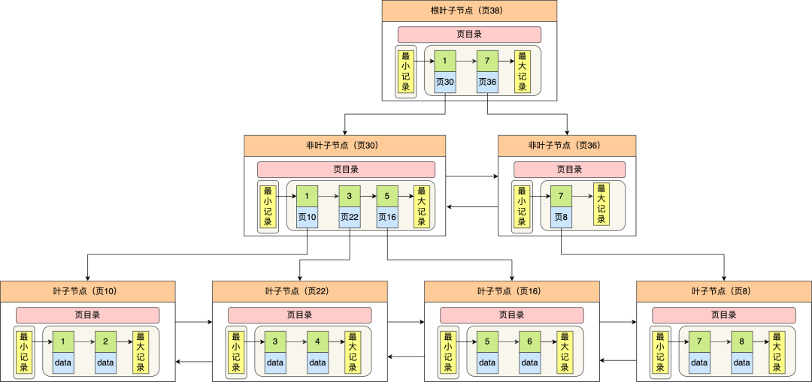

# Mysql

## 数据库范式

  ### 1NF

强调属性的原子性约束，要求属性具有原子性，不可再分解。

`学生表(学号、姓名、年龄、性别、地址)。因为地址可以细分为国家、省份、城市、市区、街道，那么该模式就没有达到第一范式。`

存在问题：冗余度大、会引起修改操作的不一致性、数据插入异常、数据删除异常。

  ### 2NF

强调记录的唯一性约束，数据表必须有一个主键，并且没有包含在主键中的列必须完全依赖于主键，而不能只依赖于主键的一部分。   

          

  ### 3Nf

第三范式，强调数据属性冗余性的约束，也就是非主键列必须直接依赖于主键。也就是消除了非主属性对码的传递函数依赖。

`订单表（订单编码，顾客编码，顾客名称），其中主键是（订单编码），这个场景中，顾客编码、顾客名称都完全依赖于主键，因此符合第二范式，但顾客名称依赖于顾客编码，从而间接依赖于主键，所以不能满足第三范式。如果要满足第三范式，需要拆分为两个表：订单表（订单编码，顾客编码）和顾客表（顾客编码，顾客名称）。`

## 数据库架构   


 

  ### 连接器

身份认证和权限相关(登录 MySQL 的时候)。

  ### 缓存

执行查询语句的时候，会先查询缓存（MySQL 8.0 版本后移除，因为这个功能不太实用）。

  ### 分析器

没有命中缓存的话，SQL 语句就会经过分析器，分析器说白了就是要先看你的 SQL 语句要干嘛，再检查你的 SQL 语句语法是否正确。

  ### 优化器

按照 MySQL 认为最优的方案去执行。

  ### 执行器

执行语句，然后从存储引擎返回数据。 执行语句之前会先判断是否有权限，如果没有权限的话，就会报错。

  ### 插件式存储引擎

主要负责数据的存储和读取，采用的是插件式架构，支持 InnoDB、MyISAM、Memory 等多种存储引擎。

## 存储引擎

MySQL 5.5.5 之前，MyISAM 是 MySQL 的默认存储引擎。5.5.5 版本之后，InnoDB 是 MySQL 的默认存储引擎。

MySQL 存储引擎采用的是插件式架构，支持多种存储引擎，我们甚至可以为不同的数据库表设置不同的存储引擎以适应不同场景的需要。存储引擎是基于表的，而不是数据库。

  ### InnoDB

#### 支持事务

InnoDB 是 MySQL 默认的事务型存储引擎，只要在需要它不支持的特性时，才考虑使用其他存储引擎。

#### 支持行级锁

InnoDB 采用 MVCC 来支持高并发，并且实现了四个标准隔离级别(未提交读、提交读、可重复读、可串行化)。其默认级别时可重复读（REPEATABLE READ），在可重复读级别下，通过 MVCC + Next-Key Locking 防止幻读。

#### 支持在线热备份

InnoDB 支持真正的在线热备份，MySQL 其他的存储引擎不支持在线热备份，要获取一致性视图需要停止对所有表的写入，而在读写混合的场景中，停止写入可能也意味着停止读取。

#### 其他

主索引时聚簇索引，在索引中保存了数据，从而避免直接读取磁盘，因此对主键查询有很高的性能。

InnoDB 内部做了很多优化，包括从磁盘读取数据时采用的可预测性读，能够自动在内存中创建 hash 索引以加速读操作的自适应哈希索引，以及能够加速插入操作的插入缓冲区等。

  ### MyISAM

设计简单，数据以紧密格式存储。对于只读数据，或者表比较小、可以容忍修复操作，则依然可以使用它。提供了大量的特性，包括压缩表、空间数据索引等。

#### 不支持事务

可以手工或者自动执行检查和修复操作，但是和事务恢复以及崩溃恢复不同，可能导致一些数据丢失，而且修复操作是非常慢的。

如果指定了 DELAY_KEY_WRITE 选项，在每次修改执行完成时，不会立即将修改的索引数据写入磁盘，而是会写到内存中的键缓冲区，只有在清理键缓冲区或者关闭表的时候才会将对应的索引块写入磁盘。这种方式可以极大的提升写入性能，但是在数据库或者主机崩溃时会造成索引损坏，需要执行修复操作。

#### 表级锁

不支持行级锁，只能对整张表加锁，读取时会对需要读到的所有表加共享锁，写入时则对表加排它锁。但在表有读取操作的同时，也可以往表中插入新的记录，这被称为并发插入（CONCURRENT INSERT）。

#### 支持空间数据索引

  ### 区别

- **事务:** innoDB 支持事务，MyISAM 不支持事务
- **锁:** InnoDB 支持行级锁，MyISAM 只支持表级锁
- **外键:** InnoDB 支持外键
- **InnoDB** 支持在线热备份
- **MyiSAM** 支持空间索引
- **索引实现不一样**  MyiSAM 非聚簇索引

## 索引

  ### B+原理

>[男朋友问我：为什么 MySQL 喜欢 B+ 树？我笑着画了 20 张图 (qq.com)](https://mp.weixin.qq.com/s/AoPq8poENF9T4mVS1fDFPw)

#### 数据结构

B+ Tree 是B树的一种变形，它是基于 B Tree 和叶子节点顺序访问指针进行实现，通常用于数据库和操作系统的文件系统中




#### 操作

  插入
  删除
  查询

#### 常见树的特性

-   AL树平衡二叉树: 高度平衡，相比于红黑树查找更快，删除略慢。rebalance 概率更高

-   红黑树: 近似平衡的，rebalance 的概率更低
-   B/B+树:  多路查找树，出度高，磁盘IO低，一般用于数据库系统中

#### B+ 树与红黑树的比较

-   磁盘IO次数低  B+ 树一个节点可以存储多个元案，相对于完全平衡二叉树整体的树高度降低了，磁盘IO效率提高了

-   磁盘预读特性

#### B+ 树与 B 树的比较

- B+ 树的非叶子节点不存放实际的记录数据，仅存放索引，因此数据量相同的情况下，相比存储即存索引又存记录的 B 树，B+树的非叶子节点可以存放更多的索引，因此 B+ 树可以比 B 树更「矮胖」，查询底层节点的磁盘 I/O次数会更少。
- B+ 树有大量的冗余节点（所有非叶子节点都是冗余索引），这些冗余索引让 B+ 树在插入、删除的效率都更高，比如删除根节点的时候，不会像 B 树那样会发生复杂的树的变化；
- B+ 树叶子节点之间用链表连接了起来，有利于范围查询，而 B 树要实现范围查询，因此只能通过树的遍历来完成范围查询，这会涉及多个节点的磁盘 I/O 操作，范围查询效率不如 B+ 树。

  ### MySQL 素引

>[《爱上面试官》系列-数据库索引 (qq.com)](https://mp.weixin.qq.com/s/_9rDde9wRYoZeh07EASNQQ)

#### B+树索引

-   二分查找，查找速度快

-   B+ 树有序，排序，分组速度快
-   聚簇索引   叶子节点的数据域记录着完整的数据记录
-   辅助索引  叶子结点的敞据域记录看主键的值，如果查询的不是索引构成列或者主键，则需要回表

#### 哈希索引

-   快速精确查询，但是不支持范围查询

-   适合场:等值查询场景，例 Redis，Memcached 等这 NOSQL中间件
-   哈希表

#### 全文索引

MyISAM 存储引擎支持全文索引，用于查找文本中的关键词，而不是直接比较是否相等。查找条件使用 MATCH AGAINST，而不是普通的 WHERE。全文索引使用倒排索引实现，它记录着关键词到其所在文档的映射。

InnoDB 存储引擎在 MySQL 5.6.4 版本中也开始支持全文索引。

#### 空间数据索引

MyISAM 存储引擎支持空间数据索引（R-Tree），可以用于地理数据存储。空间数据索引会从所有维度来索引数据，可以有效地使用任意维度来进行组合查询。

必须使用 GIS 相关的函数来维护数据。

  ### 索引优化

#### 独立的列

在进行查询时，索引列不能是表达式的一部分，也不能是函数的参数，否则无法使用索引。

例如下面的查询不能使用 actor_id 列的索引：

```mysql
SELECT actor_id FROM sakila.actor WHERE actor_id + 1 = 5;
```

#### 多列索引

在需要使用多个列作为条件进行查询时，使用多列索引比使用多个单列索引性能更好。例如下面的语句中，最好把 actor_id 和 film_id 设置为多列索引。

```mysql
SELECT film_id, actor_ id FROM sakila.film_actor
WHERE actor_id = 1 AND film_id = 1;
```

#### 索引列的顺序

  将选择行最强的索引列放在最前面
  索引的选择性: 不重复的索引值和记录总数的比值

#### 前缀索引

  对于BLOG、TEXT和VARCHAR类型的列，必须使用前缀索引，只索引开始的部分字符
  前缀索引的选取需要根据索引选择性来确定
覆盖索引
  定义:索引包含所有需要查询的学段的值
  优点: 无需回表, 索引通常小于数据行大小,只读取索引能大大减少数据访问量
其他
  预发跑sql explain
  排除 缓存 sql nocache
  看一下行数对不对 不对可以用analyze table t 矫正
  添加索引 索引不一定是最优的 force index 强制走索引 不建议用
  存在回表的情况
  覆盖索引避免回表，不要*
    主键索引
  联合索引 不能无限建 高频场景
  最左前缀原则 按照索引定义的字段顺序写sql
  合理安排联合索引的顺序
  5.6之后 索引下推 减少回表次数
  给字符串加索引
    前缀索引
    倒序存储
    Hash
  数据库的flush的时机
    redo log满了 修改checkpoint flush到磁盘
    系统内存不足淘汰数据页
      buffer pool
        要知道磁盘的io能力 设置innodb_io_capacity 设置为磁盘的IOPS fio测试
        innodb_io_capacity设置低了 会让innoDB错误估算系统能力 导致脏页累积
    系统空闲的时候 找间隙刷脏页
    MySQL正常关闭，会把内存脏页flush到磁盘
  innodb刷盘速度
    脏页比例
    redolog 写盘速度
    innodb_flush_neighbors 0 
      机械磁盘的随机io不太行 减少随机io性能大幅提升 设置为 1最好
      现在都是ssd了 设置为0就够了 8.0之后默认是0
  索引字段不要做函数操作，会破坏索引值的有序性，优化器会放弃走树结构
    如果触发隐式转换 那也会走cast函数 会放弃走索引
  字符集不同可能走不上索引
    convert 也是函数所以走不上

  ### 索引维护

    页满了 页分裂 页利用率下降
    数据删除 页合并 
    自增 只追加可以不考虑 也分页
    索引长度

  ### 索引选择

    普通索引
      找到第一个之后 直到朋友不满足的
    唯一索引
      找到第一个不满足的就停止了
    覆盖索引
      包含主键索引值
    最左前缀原则
      安排字段顺序
    索引空间问题
      hash
    5.6之后索引下推
      不需要多个回表 一边遍历 一边判断
    页的概念
    更新
      change buffer
      更新操作来了 如果数据页不在内存 就缓存下来 下次来了 更新 在就直接更新
      唯一索引 需要判断 所以 用不到change buffer
      innodb的处理流程
        记录在页内存
          唯一索引 判断没冲突插入
          普通索引 插入
        记录不再页中
          数据页读入内存 判断 插入
          change buffer
        数据读是随机IO 成本高 
        机械硬盘 change buffer 收益大 写多读少 marge

## 查询性能优化

  使用 Explain 分析 SELECT 查询语句
  优化数据访问
    减少请求的数据量
      只查询必要的列，例如将*替换为要查询的列
      只返回必要的行，使用limit 限制返回行数
      缓存重复查询的数据，例如使用 redis 存用户登陆数据
    减少数据库扫描的行数
      使用素引来覆盖查询
  重构查询方式    做分页，分批查询
  读写分离
  分库分表

## 事务

  ACID
    Atomicity    事务被视为不可分割的量小单元，所有操作要么全部成功，要么全部失败
    Consistency  数据库在事务执行前后都保持一致性状态，在一致性状态下，所有事务对同一个数的读取结果都是相同的
    Isolation     一个事务所做的修改在最终提交以前，对其他事务是不可见的
    Durability    一旦事务提交，其所做的修改将会永远保存到数据库中
  ACID 之间的关系
  事务隔离级别
    读未提交
    读已提交
    可重复度
    序列化
  锁
    锁类型
      共享锁 (SLock)，允许事务读一行数据
      排他锐 (X Lock)，允许事务删除或更新一行数据
      意向共掌锁(IS Lock)，事务想要获得一张表中某几行的共享锁
      意向排他锁(IX Lock)，事务想要获得一张表中某几行的排他锁
    MVCC 多版本并发控制
      版本链 在聚集索引中 有两个隐藏列 trx_id roll_pointer
      读未提交
        直接读取最新版本
      序列化
        加锁
      Read View
        读已提交
          每次读取前生成一个
        可重复度
          第一次生成一个
    锁算法
      Record Lock 单个行记录上的锁
        需要的时候才加上 并不是马上释放 等事务结束才释放 两阶段锁协议
        死锁
          超时时间
            innodb_lock_wait_timeout
              默认是50s太久 但是如果设置太短会误判 一般采用死锁监测
          死锁机制 事务回滚
            innodb_deadlock_detect = on
        热点行
          死锁消耗CPU
            临时关闭
              关掉死锁会出现大量重试
          控制并发度
            更多的机器 开启比较少的线程 消耗就少了
          分治
      Gap Lock  间隙锁，锁定一个范围，但是不包括记录本身
      Next-Key Lock  Gap Lock +Record Lock，锁定一个范围，并且锁定记录本身
      表锁
        lock table read/write
        MDL（metadata lock)
          MySQL5.5引入 自动添加 读锁不互斥  写锁互斥
          多个事务之前操作，如果查询的时候修改字段容易让线程池饱满
            MySQL的information_schema 库的 innodb_trx 表 找到对应长事务 kill掉
            alter table里面设定等待时间
      全局锁
        全库逻辑备份
      读写锁
        读
          lock in share mode
          for update
          行锁
        写
      innodb如何加锁
        Record lock: 对索引项加锁。
          Gap lock:对索引项之间的‘间隙’,第一条记录前的间隙，或最后一条记录后的间隙 加锁
          Next-Key:前两种的组合，对记录及前面的间隙加锁
    锁问题
      脏读
      不可重复读
      幻读
      丢失更新
      死锁

## 分库分表

  - 唯一主键
  - 水平切分
  - 垂直切分
  - Sharding 策略
    - 哈希取模
    - 范围
    - 映射表
  - Sharding 存在的问题
    - 事务问题
    - 连接
    - 唯一性

## 复制

  - 主从复制
    - 主备延迟
      - 强制走主
      - sleep
  - 读写分离

## log

  - undo log
    - 回滚 mvcc
  - redo log
    - 物理日志 内存操作记录
      - sync_binlog 可以优化日志写入时机
  - binlog
    - 组提交机制，可以大幅度降低磁盘的IOPS消耗。
  - 两段式提交 redo 准备 binglog 提交

## 其他

  - count1 *

    - mvcc影响

  - join

    - 驱动表

  - id用完

    - bigint
    - row_id 没设置主键的时候
    - thread_id

  - mysql io性能瓶颈

    - 设置 binlog_group_commit_sync_delay 和 binlog_group_commit_sync_no_delay_count参数，减少binlog的写盘次数。这个方法是基于“额外的故意等待”来实现的，因此可能会增加语句的响应时间，但没有丢失数据的风险。

      将sync_binlog 设置为大于1的值（比较常见是100~1000）。这样做的风险是，主机掉电时会丢binlog日志。

      将innodb_flush_log_at_trx_commit设置为2。这样做的风险是，主机掉电的时候会丢数据。

  - 常见命令

    - show processlist
      - 查看空闲忙碌链接
      - wait_timeout
        - 客户端空闲时间
          - 定时断开链接
          - mysql_reset_connection 恢复链接状态
    - innodb_flush_log_at_trx_commit
      - redolog事务持久化
    - sync_binlog
      - binlog事务持久化

  - 真实故障

    - 数据库挂了  show processlist 一千个查询在等待 有个超长sql kill 但是不会引起flush table 周末 优化脚本 analyze 会导致 MySQL 监测到对应的table 做了修改 必须flush close reopen 就不会释放表的占用了


>>>>>>> 
