[在项目中缓存是如何使用的？ (doocs.github.io)](https://doocs.github.io/advanced-java/#/docs/high-concurrency/why-cache)

## 


### **RabbitMq**

queue：队列，每个队列可以有多个消费者，但是一条消息只会被一个消费者消费

exchange:交换机，队列可以绑定交换机，交换机根据路由或者其他匹配信息将消息发送至queue

### RocketMq

#### RocketMQ简介

RocketMQ是一个纯Java、分布式、队列模型的开源消息中间件，前身是MetaQ，是阿里参考Kafka特点研发的一个队列模型的消息中间件，后开源给apache基金会成为了apache的顶级开源项目，具有高性能、高可靠、高实时、分布式特点。

**回顾一下他的心路历程**

> **2007年**：淘宝实施了“五彩石”项目，“五彩石”用于将交易系统从单机变成分布式，也是在这个过程中产生了阿里巴巴第一代消息引擎——Notify。
>
> **2010年**：阿里巴巴B2B部门基于ActiveMQ的5.1版本也开发了自己的一款消息引擎，称为Napoli，这款消息引擎在B2B里面广泛地被使用，不仅仅是在交易领域，在很多的后台异步解耦等方面也得到了广泛的应用。
>
> **2011年**：业界出现了现在被很多大数据领域所推崇的Kafka消息引擎，阿里巴巴在研究了Kafka的整体机制和架构设计之后，基于Kafka的设计使用Java进行了完全重写并推出了**MetaQ 1.0**版本，主要是用于解决顺序消息和海量堆积的问题。
>
> **2012年**：阿里巴巴开源其自研的第三代分布式消息中间件——**RocketMQ**。
>
> 经过几年的技术打磨，阿里称基于RocketMQ技术，目前双十一当天消息容量可达到万亿级。
>
> **2016年11月**：阿里将RocketMQ捐献给**Apache**软件基金会，正式成为孵化项目。
>
> 阿里称会将其打造成顶级项目。**这是阿里迈出的一大步**，因为加入到开源软件基金会需要经过评审方的考核与观察。
>
> 坦率而言，业界还对国人的代码开源参与度仍保持着刻板印象；而Apache基金会中的342个项目中，暂时还只有Kylin、CarbonData、Eagle 、Dubbo和 RocketMQ 共计五个中国技术人主导的项目。
>
> **2017年2月20日**：RocketMQ正式发布4.0版本，专家称新版本适用于电商领域，金融领域，大数据领域，兼有物联网领域的编程模型。
>
> 以上就是RocketMQ的整体发展历史，其实在阿里巴巴内部围绕着RocketMQ内核打造了三款产品，分别是**MetaQ**、**Notify**和**Aliware MQ**。
>
> 这三者分别采用了不同的模型，**MetaQ**主要使用了拉模型，解决了顺序消息和海量堆积问题；**Notify**主要使用了推模型，解决了事务消息；而云产品**Aliware MQ**则是提供了商业化的版本。
>
>  经历多次双11洗礼的英雄
>
> 在备战2016年双十一时，**RocketMq**团队重点做了**两件事情**，优化慢请求与统一存储引擎。
>
> - **优化慢请求**：这里主要是解决在海量高并发场景下降低慢请求对整个集群带来的抖动，**毛刺问题**。这是一个极具挑战的技术活，团队同学经过长达1个多月的跟进调优，从双十一的复盘情况来看，99.996%的延迟落在了10ms以内，**而99.6%的延迟在1ms以内**。优化主要集中在**RocketMQ**存储层算法优化、JVM与操作系统调优。更多的细节大家可以参考《万亿级数据洪峰下的分布式消息引擎》。
>- **统一存储引擎**：主要解决的消息引擎的高可用，成本问题。在多代消息引擎共存的前提下，我们对Notify的存储模块进行了全面移植与替换。
> 
>**RocketMQ天生为金融互联网领域而生**，追求高可靠、高可用、高并发、低延迟，是一个阿里巴巴由内而外成功孕育的典范，除了阿里集团上千个应用外，根据我们不完全统计，国内至少有上百家单位、科研教育机构在使用。
> 
>**RocketMQ**在阿里集团也被广泛应用在订单，交易，充值，流计算，消息推送，日志流式处理，**binglog**分发等场景。
> 
>**他所拥有的功能**
> 
>- 发布/订阅消息传递模型
> - 财务级交易消息
>- 各种跨语言客户端，例如Java，C / C ++，Python，Go
> - 可插拔的传输协议，例如TCP，SSL，AIO
>- 内置的消息跟踪功能，还支持开放式跟踪
> - 多功能的大数据和流生态系统集成
>- 按时间或偏移量追溯消息
> - 可靠的FIFO和严格的有序消息传递在同一队列中
>- 高效的推拉消费模型
> - 单个队列中的百万级消息累积容量
>- 多种消息传递协议，例如JMS和OpenMessaging
> - 灵活的分布式横向扩展部署架构
>- 快如闪电的批量消息交换系统
> - 各种消息过滤器机制，例如SQL和Tag
>- 用于隔离测试和云隔离群集的Docker映像
> - 功能丰富的管理仪表板，用于配置，指标和监视
>- 认证与授权
> 
>**他的核心模块：**
> 
>- rocketmq-broker：接受生产者发来的消息并存储（通过调用rocketmq-store），消费者从这里取得消息
> - rocketmq-client：提供发送、接受消息的客户端API。
>- rocketmq-namesrv：NameServer，类似于Zookeeper，这里保存着消息的TopicName，队列等运行时的元信息。
> - rocketmq-common：通用的一些类，方法，数据结构等。
>- rocketmq-remoting：基于Netty4的client/server + fastjson序列化 + 自定义二进制协议。
> - rocketmq-store：消息、索引存储等。
> - rocketmq-filtersrv：消息过滤器Server，需要注意的是，要实现这种过滤，需要上传代码到MQ！（一般而言，我们利用Tag足以满足大部分的过滤需求，如果更灵活更复杂的过滤需求，可以考虑filtersrv组件）。
>- rocketmq-tools：命令行工具。

#### 他的架构组成，或者理解为为什么他这么快？这么强？这么厉害？


他主要有四大核心组成部分：**NameServer**、**Broker**、**Producer**以及**Consumer**四部分。


**Tip**：我们可以看到**RocketMQ**啥都是**集群**部署的，这是他**吞吐量大**，**高可用**的原因之一，集群的模式也很花哨，可以支持多master 模式、多master多slave异步复制模式、多 master多slave同步双写模式。

而且这个模式好像Kafka啊！（我这里是废话，本身就是阿里基于Kafka的很多特性研发的）。

#### 各个集群组成部分

##### **NameServer**

主要负责对于源数据的管理，包括了对于**Topic**和路由信息的管理。

**NameServer**是一个功能齐全的服务器，其角色类似Dubbo中的Zookeeper，但NameServer与Zookeeper相比更轻量。主要是因为每个NameServer节点互相之间是独立的，没有任何信息交互。

**NameServer**压力不会太大，平时主要开销是在维持心跳和提供Topic-Broker的关系数据。

但有一点需要注意，Broker向NameServer发心跳时， 会带上当前自己所负责的所有**Topic**信息，如果**Topic**个数太多（万级别），会导致一次心跳中，就Topic的数据就几十M，网络情况差的话， 网络传输失败，心跳失败，导致NameServer误认为Broker心跳失败。

**NameServer** 被设计成几乎无状态的，可以横向扩展，节点之间相互之间无通信，通过部署多台机器来标记自己是一个伪集群。

每个 Broker 在启动的时候会到 NameServer 注册，Producer 在发送消息前会根据 Topic 到 **NameServer** 获取到 Broker 的路由信息，Consumer 也会定时获取 Topic 的路由信息。

所以从功能上看NameServer应该是和 ZooKeeper 差不多，据说 RocketMQ 的早期版本确实是使用的 ZooKeeper ，后来改为了自己实现的 NameServer 。

> 我们看一下**Dubbo**中注册中心的角色，是不是真的一毛一样，师出同门相似点真的很多：
>
> 

##### **Producer**

消息生产者，负责产生消息，一般由业务系统负责产生消息。

**Producer**由用户进行分布式部署，消息由**Producer**通过多种负载均衡模式发送到**Broker**集群，发送低延时，支持快速失败。

**RocketMQ** 提供了三种方式发送消息：同步、异步和单向

- **同步发送**：同步发送指消息发送方发出数据后会在收到接收方发回响应之后才发下一个数据包。一般用于重要通知消息，例如重要通知邮件、营销短信。
- **异步发送**：异步发送指发送方发出数据后，不等接收方发回响应，接着发送下个数据包，一般用于可能链路耗时较长而对响应时间敏感的业务场景，例如用户视频上传后通知启动转码服务。
- **单向发送**：单向发送是指只负责发送消息而不等待服务器回应且没有回调函数触发，适用于某些耗时非常短但对可靠性要求并不高的场景，例如日志收集。

##### Broker

消息中转角色，负责**存储消息**，转发消息。

**Broker**是具体提供业务的服务器，单个Broker节点与所有的NameServer节点保持长连接及心跳，并会定时将**Topic**信息注册到NameServer，顺带一提底层的通信和连接都是**基于Netty实现**的。

**Broker**负责消息存储，以Topic为纬度支持轻量级的队列，单机可以支撑上万队列规模，支持消息推拉模型。

官网上有数据显示：具有**上亿级消息堆积能力**，同时可**严格保证消息的有序性**。

##### Consumer

消息消费者，负责消费消息，一般是后台系统负责异步消费。

**Consumer**也由用户部署，支持PUSH和PULL两种消费模式，支持**集群消费**和**广播消息**，提供**实时的消息订阅机制**。

**Pull**：拉取型消费者（Pull Consumer）主动从消息服务器拉取信息，只要批量拉取到消息，用户应用就会启动消费过程，所以 Pull 称为主动消费型。

**Push**：推送型消费者（Push Consumer）封装了消息的拉取、消费进度和其他的内部维护工作，将消息到达时执行的回调接口留给用户应用程序来实现。所以 Push 称为被动消费类型，但从实现上看还是从消息服务器中拉取消息，不同于 Pull 的是 Push 首先要注册消费监听器，当监听器处触发后才开始消费消息。

#### 消息领域模型


##### Message

**Message**（消息）就是要传输的信息。

一条消息必须有一个主题（Topic），主题可以看做是你的信件要邮寄的地址。

一条消息也可以拥有一个可选的标签（Tag）和额处的键值对，它们可以用于设置一个业务 Key 并在 Broker 上查找此消息以便在开发期间查找问题。

##### **Topic**

**Topic**（主题）可以看做消息的规类，它是消息的第一级类型。比如一个电商系统可以分为：交易消息、物流消息等，一条消息必须有一个 Topic 。

**Topic** 与生产者和消费者的关系非常松散，一个 Topic 可以有0个、1个、多个生产者向其发送消息，一个生产者也可以同时向不同的 Topic 发送消息。

一个 Topic 也可以被 0个、1个、多个消费者订阅。

##### Tag

**Tag**（标签）可以看作子主题，它是消息的第二级类型，用于为用户提供额外的灵活性。使用标签，同一业务模块不同目的的消息就可以用相同 Topic 而不同的 **Tag** 来标识。比如交易消息又可以分为：交易创建消息、交易完成消息等，一条消息可以没有 **Tag** 。

标签有助于保持您的代码干净和连贯，并且还可以为 **RocketMQ** 提供的查询系统提供帮助。

##### Group

分组，一个组可以订阅多个Topic。

分为ProducerGroup，ConsumerGroup，代表某一类的生产者和消费者，一般来说同一个服务可以作为Group，同一个Group一般来说发送和消费的消息都是一样的

##### Queue

在**Kafka**中叫Partition，每个Queue内部是有序的，在**RocketMQ**中分为读和写两种队列，一般来说读写队列数量一致，如果不一致就会出现很多问题。

##### Message Queue

**Message Queue**（消息队列），主题被划分为一个或多个子主题，即消息队列。

一个 Topic 下可以设置多个消息队列，发送消息时执行该消息的 Topic ，RocketMQ 会轮询该 Topic 下的所有队列将消息发出去。

消息的物理管理单位。一个Topic下可以有多个Queue，Queue的引入使得消息的存储可以分布式集群化，具有了水平扩展能力。

##### Offset

在**RocketMQ** 中，所有消息队列都是持久化，长度无限的数据结构，所谓长度无限是指队列中的每个存储单元都是定长，访问其中的存储单元使用Offset 来访问，Offset 为 java long 类型，64 位，理论上在 100年内不会溢出，所以认为是长度无限。

也可以认为 Message Queue 是一个长度无限的数组，**Offset** 就是下标。

#### 消息消费模式

消息消费模式有两种：**Clustering**（集群消费）和**Broadcasting**（广播消费）。

默认情况下就是集群消费，该模式下一个消费者集群共同消费一个主题的多个队列，一个队列只会被一个消费者消费，如果某个消费者挂掉，分组内其它消费者会接替挂掉的消费者继续消费。

而广播消费消息会发给消费者组中的每一个消费者进行消费。

##### Message Order

**Message Order**（消息顺序）有两种：**Orderly**（顺序消费）和**Concurrently**（并行消费）。

顺序消费表示消息消费的顺序同生产者为每个消息队列发送的顺序一致，所以如果正在处理全局顺序是强制性的场景，需要确保使用的主题只有一个消息队列。

并行消费不再保证消息顺序，消费的最大并行数量受每个消费者客户端指定的线程池限制。

##### 一次完整的通信流程是怎样的？

Producer 与 NameServer集群中的其中一个节点（随机选择）建立长连接，定期从 NameServer 获取 **Topic** 路由信息，并向提供 Topic 服务的 **Broker Master** 建立长连接，且定时向 **Broker** 发送心跳。

**Producer** 只能将消息发送到 Broker master，但是 **Consumer** 则不一样，它同时和提供 Topic 服务的 Master 和 Slave建立长连接，既可以从 Broker Master 订阅消息，也可以从 Broker Slave 订阅消息。

具体如下图：


我上面说过他跟**Dubbo**像不是我瞎说的，就连他的注册过程都很像**Dubbo**的服务暴露过程。

是不是觉得很简单，但是你同时也产生了好奇心，每一步是怎么初始化启动的呢？

##### NameService启动流程

在org.apache.rocketmq.namesrv目录下的**NamesrvStartup**这个启动类基本上描述了他的启动过程我们可以看一下代码：

**第一步是初始化配置**

创建**NamesrvController**实例，并开启两个定时任务：

每隔10s扫描一次**Broker**，移除处于不激活的**Broker**；

每隔10s打印一次KV配置。


第三步注册钩子函数，启动服务器并监听Broker。

**NameService**还有很多东西的哈我这里就介绍他的启动流程，大家还可以去看看代码，还是很有意思的，比如路由注册会发送心跳包，还有**心跳包的处理流程**，**路由删除**，**路由发现**等等。

>**Tip**：本来我想贴很多源码的，后面跟**歪歪（Java3y）**讨论了很久做出了不贴的决定，大家理解过程为主！我主要是做只是扫盲还有一些痛点分析嘛，深究还是得大家花时间，我要啥都介绍篇幅就不够了。

##### Producer


链路很长涉及的细节也多，我就发一下链路图。


**Producer**是消息发送方，那他怎么发送的呢？

通过轮训，**Producer**轮训某个**Topic**下面的所有队列实现发送方的负载均衡


##### Broker

**Broker**在RocketMQ中是进行处理Producer发送消息请求，Consumer消费消息的请求，并且进行消息的持久化，以及HA策略和服务端过滤，就是集群中很重的工作都是交给了**Broker**进行处理。

**Broker**模块是通过BrokerStartup进行启动的，会实例化BrokerController，并且调用其初始化方法


大家去看**Broker**的源码的话会发现，他的**初始化流程很冗长**，会根据配置创建很多线程池主要用来**发送消息**、**拉取消息**、**查询消息**、**客户端管理**和**消费者管理**，也有很多**定时任务**，同时也注册了很多**请求处理器**，用来发送拉取消息查询消息的。

##### Consumer

不说了直接怼图吧！要死了，下次我还是做扫盲，写点爽文吧555


**Consumer**是消息接受，那他怎么接收消息的呢？


消费端会通过**RebalanceService**线程，10秒钟做一次基于**Topic**下的所有队列负载。

#### 面试常见问题分析

##### 他的优缺点是啥

**RocketMQ优点：**

- 单机吞吐量：十万级
- 可用性：非常高，分布式架构
- 消息可靠性：经过参数优化配置，消息可以做到0丢失
- 功能支持：MQ功能较为完善，还是分布式的，扩展性好
- 支持10亿级别的消息堆积，不会因为堆积导致性能下降
- 源码是java，我们可以自己阅读源码，定制自己公司的MQ，可以掌控
- 天生为金融互联网领域而生，对于可靠性要求很高的场景，尤其是电商里面的订单扣款，以及业务削峰，在大量交易涌入时，后端可能无法及时处理的情况
- **RoketMQ**在稳定性上可能更值得信赖，这些业务场景在阿里双11已经经历了多次考验，如果你的业务有上述并发场景，建议可以选择**RocketMQ**

**RocketMQ缺点：**

- 支持的客户端语言不多，目前是java及c++，其中c++不成熟
- 社区活跃度不是特别活跃那种
- 没有在 mq 核心中去实现**JMS**等接口，有些系统要迁移需要修改大量代码

 ##### 消息去重

 去重原则：使用业务端逻辑保持幂等性

 **幂等性**：就是用户对于同一操作发起的一次请求或者多次请求的结果是一致的，不会因为多次点击而产生了副作用，数据库的结果都是唯一的，不可变的。

 只要保持幂等性，不管来多少条重复消息，最后处理的结果都一样，需要业务端来实现。

 **去重策略**：保证每条消息都有唯一编号(**比如唯一流水号)**，且保证消息处理成功与去重表的日志同时出现。

 建立一个消息表，拿到这个消息做数据库的insert操作。给这个消息做一个唯一主键（primary key）或者唯一约束，那么就算出现重复消费的情况，就会导致主键冲突，那么就不再处理这条消息。

 ##### 消息重复

 消息领域有一个对消息投递的QoS定义，分为：

 - 最多一次（At most once）
 - 至少一次（At least once）
 - 仅一次（ Exactly once）

  QoS：Quality of Service，服务质量

 几乎所有的MQ产品都声称自己做到了**At least once**。

 既然是至少一次，那避免不了消息重复，尤其是在分布式网络环境下。

 比如：网络原因闪断，ACK返回失败等等故障，确认信息没有传送到消息队列，导致消息队列不知道自己已经消费过该消息了，再次将该消息分发给其他的消费者。

 不同的消息队列发送的确认信息形式不同，例如**RabbitMQ**是发送一个ACK确认消息，**RocketMQ**是返回一个CONSUME_SUCCESS成功标志，**Kafka**实际上有个offset的概念。

 **RocketMQ**没有内置消息去重的解决方案，最新版本是否支持还需确认。

 ##### 消息的可用性

 当我们选择好了集群模式之后，那么我们需要关心的就是怎么去存储和复制这个数据，**RocketMQ**对消息的刷盘提供了同步和异步的策略来满足我们的，当我们选择同步刷盘之后，如果刷盘超时会给返回FLUSH_DISK_TIMEOUT，如果是异步刷盘不会返回刷盘相关信息，选择同步刷盘可以尽最大程度满足我们的消息不会丢失。

 除了存储有选择之后，我们的主从同步提供了同步和异步两种模式来进行复制，当然选择同步可以提升可用性，但是消息的发送RT时间会下降10%左右。

 **RocketMQ**采用的是混合型的存储结构，即为**Broker**单个实例下所有的队列共用一个日志数据文件（即为CommitLog）来存储。

 而**Kafka**采用的是独立型的存储结构，每个队列一个文件。

 这里帅丙认为，**RocketMQ**采用混合型存储结构的缺点在于，会存在较多的随机读操作，因此读的效率偏低。同时消费消息需要依赖**ConsumeQueue**，构建该逻辑消费队列需要一定开销。

 ##### RocketMQ 刷盘实现

 **Broker** 在消息的存取时直接操作的是内存（内存映射文件），这可以提供系统的吞吐量，但是无法避免机器掉电时数据丢失，所以需要持久化到磁盘中。

 刷盘的最终实现都是使用**NIO**中的 MappedByteBuffer.force() 将映射区的数据写入到磁盘，如果是同步刷盘的话，在**Broker**把消息写到**CommitLog**映射区后，就会等待写入完成。

 异步而言，只是唤醒对应的线程，不保证执行的时机，流程如图所示。

 

 ##### 顺序消息

 我简单的说一下我们使用的**RocketMQ**里面的一个简单实现吧。

 **Tip**：为啥用**RocketMQ**举例呢，这玩意是阿里开源的，我问了下身边的朋友很多公司都有使用，所以读者大概率是这个的话我就用这个举例吧，具体的细节我后面会在**RocketMQ**和**Kafka**各自章节说到。

 生产者消费者一般需要保证顺序消息的话，可能就是一个业务场景下的，比如订单的创建、支付、发货、收货。

 那这些东西是不是一个订单号呢？一个订单的肯定是一个订单号的说，那简单了呀。

 **一个topic下有多个队列**，为了保证发送有序，**RocketMQ**提供了**MessageQueueSelector**队列选择机制，他有三种实现:

 

 我们可使用**Hash取模法**，让同一个订单发送到同一个队列中，再使用同步发送，只有同个订单的创建消息发送成功，再发送支付消息。这样，我们保证了发送有序。

 **RocketMQ**的topic内的队列机制,可以保证存储满足**FIFO**（First Input First Output 简单说就是指先进先出）,剩下的只需要消费者顺序消费即可。

 **RocketMQ**仅保证顺序发送，顺序消费由消费者业务保证!!!

 这里很好理解，一个订单你发送的时候放到一个队列里面去，你同一个的订单号Hash一下是不是还是一样的结果，那肯定是一个消费者消费，那顺序是不是就保证了？

 真正的顺序消费不同的中间件都有自己的不同实现我这里就举个例子，大家思路理解下。

 ##### 分布式事务

 **Half Message(半消息)**

 **是指暂不能被Consumer消费的消息**。Producer 已经把消息成功发送到了 Broker 端，但此消息被标记为`暂不能投递`状态，处于该种状态下的消息称为半消息。需要 Producer

 对消息的`二次确认`后，Consumer才能去消费它。

 **消息回查**

 由于网络闪段，生产者应用重启等原因。导致 **Producer** 端一直没有对 **Half Message(半消息)** 进行 **二次确认**。这是**Brock**服务器会定时扫描`长期处于半消息的消息`，会

 主动询问 **Producer**端 该消息的最终状态(**Commit或者Rollback**),该消息即为 **消息回查**。

 

 1. A服务先发送个Half Message给Brock端，消息中携带 B服务 即将要+100元的信息。
 2. 当A服务知道Half Message发送成功后，那么开始第3步执行本地事务。
 3. 执行本地事务(会有三种情况1、执行成功。2、执行失败。3、网络等原因导致没有响应)
 4. 如果本地事务成功，那么Product像Brock服务器发送Commit,这样B服务就可以消费该message。
 5. 如果本地事务失败，那么Product像Brock服务器发送Rollback,那么就会直接删除上面这条半消息。
 6. 如果因为网络等原因迟迟没有返回失败还是成功，那么会执行RocketMQ的回调接口,来进行事务的回查。

 ##### 消息过滤

 - **Broker**端消息过滤　　
   在**Broker**中，按照**Consumer**的要求做过滤，优点是减少了对于**Consumer**无用消息的网络传输。缺点是增加了Broker的负担，实现相对复杂。
 - **Consumer**端消息过滤
   这种过滤方式可由应用完全自定义实现，但是缺点是很多无用的消息要传输到**Consumer**端。

 ##### Broker的Buffer问题

 Broker的**Buffer**通常指的是Broker中一个队列的内存Buffer大小，这类**Buffer**通常大小有限。

 另外，RocketMQ没有内存**Buffer**概念，RocketMQ的队列都是持久化磁盘，数据定期清除。

 RocketMQ同其他MQ有非常显著的区别，RocketMQ的内存**Buffer**抽象成一个无限长度的队列，不管有多少数据进来都能装得下，这个无限是有前提的，Broker会定期删除过期的数据。

 例如Broker只保存3天的消息，那么这个**Buffer**虽然长度无限，但是3天前的数据会被从队尾删除。

 ##### 回溯消费

 回溯消费是指Consumer已经消费成功的消息，由于业务上的需求需要重新消费，要支持此功能，Broker在向Consumer投递成功消息后，消息仍然需要保留。并且重新消费一般是按照时间维度。

 例如由于Consumer系统故障，恢复后需要重新消费1小时前的数据，那么Broker要提供一种机制，可以按照时间维度来回退消费进度。

 **RocketMQ**支持按照时间回溯消费，时间维度精确到毫秒，可以向前回溯，也可以向后回溯。

 ##### 消息堆积

 消息中间件的主要功能是异步解耦，还有个重要功能是挡住前端的数据洪峰，保证后端系统的稳定性，这就要求消息中间件具有一定的消息堆积能力，消息堆积分以下两种情况：

 - 消息堆积在内存**Buffer**，一旦超过内存**Buffer**，可以根据一定的丢弃策略来丢弃消息，如CORBA Notification规范中描述。适合能容忍丢弃消息的业务，这种情况消息的堆积能力主要在于内存**Buffer**大小，而且消息堆积后，性能下降不会太大，因为内存中数据多少对于对外提供的访问能力影响有限。
 - 消息堆积到持久化存储系统中，例如DB，KV存储，文件记录形式。当消息不能在内存Cache命中时，要不可避免的访问磁盘，会产生大量读IO，读IO的吞吐量直接决定了消息堆积后的访问能力。
 - 评估消息堆积能力主要有以下四点：
 - 消息能堆积多少条，多少字节？即消息的堆积容量。
 - 消息堆积后，发消息的吞吐量大小，是否会受堆积影响？
 - 消息堆积后，正常消费的Consumer是否会受影响？
 - 消息堆积后，访问堆积在磁盘的消息时，吞吐量有多大？

 ##### 定时消息

 定时消息是指消息发到**Broker**后，不能立刻被**Consumer**消费，要到特定的时间点或者等待特定的时间后才能被消费。

 如果要支持任意的时间精度，在**Broker**层面，必须要做消息排序，如果再涉及到持久化，那么消息排序要不可避免的产生巨大性能开销。

 **RocketMQ**支持定时消息，但是不支持任意时间精度，支持特定的level，例如定时5s，10s，1m等。

### **kafuka**

#### kafuka基础

[Apache Kafka](http://kafka.apache.org/)是一个分布式消息发布订阅系统。它最初由LinkedIn公司基于独特的设计实现为一个分布式的提交日志系统( a distributed commit log)，，之后成为Apache项目的一部分。Kafka系统快速、可扩展并且可持久化。它的分区特性，可复制和可容错都是其不错的特性。

Apache Kafka与传统消息系统相比，有以下不同：

- 它被设计为一个分布式系统，易于向外扩展；
- 它同时为发布和订阅提供高吞吐量；
- 它支持多订阅者，当失败时能自动平衡消费者；
- 它将消息持久化到磁盘，因此可用于批量消费，例如ETL，以及实时应用程序。

##### topic

众所周知，Kafka是一个消息队列，把消息放到队列里边的叫**生产者**，从队列里边消费的叫**消费者**。

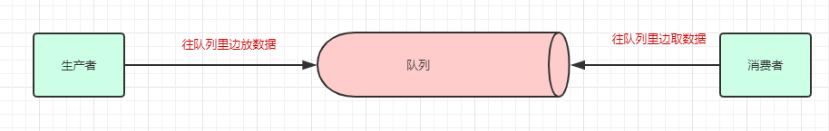

一个消息中间件，队列不单单只有一个，我们往往会有多个队列，而我们生产者和消费者就得知道：把数据丢给哪个队列，从哪个队列消息。我们需要给队列取名字，叫做**topic**(相当于数据库里边**表**的概念)


现在我们给队列取了名字以后，生产者就知道往哪个队列丢数据了，消费者也知道往哪个队列拿数据了。我们可以有多个生产者**往同一个队列(topic)**丢数据，多个消费者**往同一个队列(topic)**拿数据

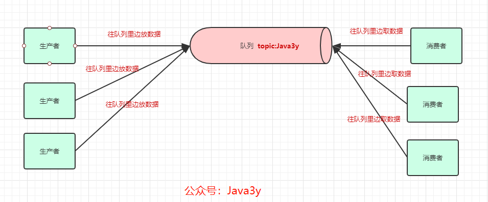

##### Partition

为了提高一个队列(topic)的**吞吐量**，Kafka会把topic进行分区(**Partition**)

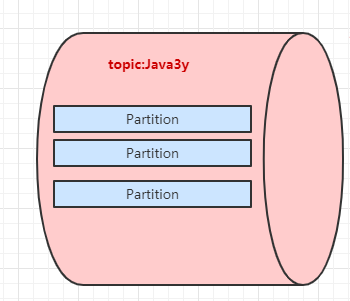

所以，生产者实际上是往一个topic名为Java3y中的分区(**Partition**)丢数据，消费者实际上是往一个topic名为Java3y的分区(**Partition**)取数据

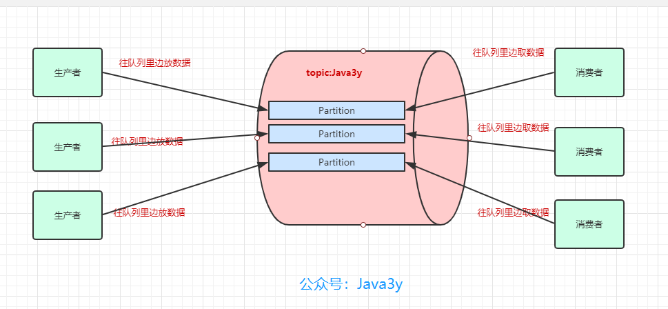

##### Broker

一台Kafka服务器叫做**Broker**，Kafka集群就是多台Kafka服务器：

##### ' fill='%23FFFFFF'%3E%3Crect x='249' y='126' width='1' height='1'%3E%3C/rect%3E%3C/g%3E%3C/g%3E%3C/svg%3E)Kafka集群

一个topic会分为多个partition，实际上partition会**分布**在不同的broker中，举个例子：


由此得知：**Kafka是天然分布式的**。

##### 备份分区

现在我们已经知道了往topic里边丢数据，实际上这些数据会分到不同的partition上，这些partition存在不同的broker上。分布式肯定会带来问题：“万一其中一台broker(Kafka服务器)出现网络抖动或者挂了，怎么办？”

Kafka是这样做的：我们数据存在不同的partition上，那kafka就把这些partition做**备份**。比如，现在我们有三个partition，分别存在三台broker上。每个partition都会备份，这些备份散落在**不同**的broker上。


' fill='%23FFFFFF'%3E%3Crect x='249' y='126' width='1' height='1'%3E%3C/rect%3E%3C/g%3E%3C/g%3E%3C/svg%3E)红色代表主分区，紫色代表备份分区

红色块的partition代表的是**主**分区，紫色的partition块代表的是**备份**分区。生产者往topic丢数据，是与**主**分区交互，消费者消费topic的数据，也是与主分区交互。

**备份分区仅仅用作于备份，不做读写。**如果某个Broker挂了，那就会选举出其他Broker的partition来作为主分区，这就实现了**高可用**。

##### 持久化

另外值得一提的是：当生产者把数据丢进topic时，我们知道是写在partition上的，那partition是怎么将其持久化的呢？（不持久化如果Broker中途挂了，那肯定会丢数据嘛)。

Kafka是将partition的数据写在**磁盘**的(消息日志)，不过Kafka只允许**追加写入**(顺序访问)，避免缓慢的随机 I/O 操作。

- Kafka也不是partition一有数据就立马将数据写到磁盘上，它会先**缓存**一部分，等到足够多数据量或等待一定的时间再批量写入(flush)。

##### 消费者是怎么消费的

上面balabala地都是讲生产者把数据丢进topic是怎么样的，下面来讲讲消费者是怎么消费的。既然数据是保存在partition中的，那么**消费者实际上也是从partition中取**数据。

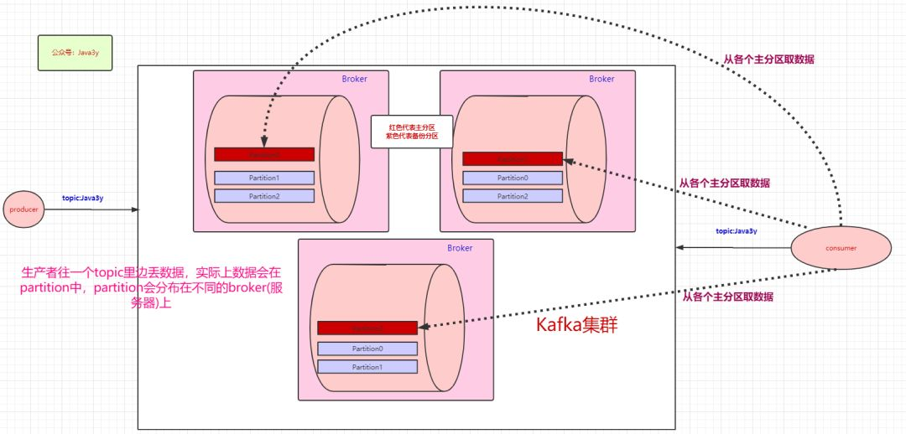

生产者可以有多个，消费者也可以有多个。像上面图的情况，是一个消费者消费三个分区的数据。多个消费者可以组成一个**消费者组**。

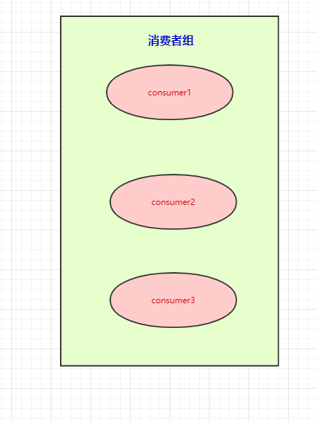

本来是一个消费者消费三个分区的，现在我们有消费者组，就可以**每个消费者去消费一个分区**（也是为了提高吞吐量）

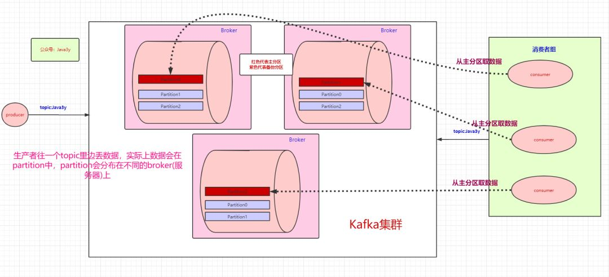消费者组的每个消费者会去对应partition拿数据

按图上所示的情况，这里想要说明的是：

- 如果消费者组中的某个消费者挂了，那么其中一个消费者可能就要消费两个partition了
- 如果只有三个partition，而消费者组有4个消费者，那么一个消费者会空闲
- 如果多加入一个**消费者组**，无论是新增的消费者组还是原本的消费者组，都能消费topic的全部数据。（消费者组之间从逻辑上它们是**独立**的）

前面讲解到了生产者往topic里丢数据是存在partition上的，而partition持久化到磁盘是IO顺序访问的，并且是先写缓存，隔一段时间或者数据量足够大的时候才批量写入磁盘的。

消费者在读的时候也很有讲究：正常的读磁盘数据是需要将内核态数据拷贝到用户态的，而Kafka 通过调用`sendfile()`直接从内核空间（DMA的）到内核空间（Socket的），**少做了一步拷贝**的操作。

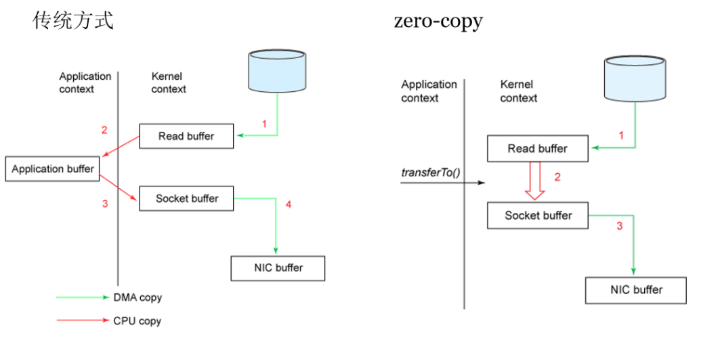Kafka 读数据 巧妙

**offset**

有的同学可能会产生疑问：消费者是怎么知道自己消费到哪里的呀？Kafka不是支持**回溯**吗？那是怎么做的呀？

- 比如上面也提到：如果一个消费者组中的某个消费者挂了，那挂掉的消费者所消费的分区可能就由存活的消费者消费。那**存活的消费者是需要知道挂掉的消费者消费到哪了**，不然怎么玩。

这里要引出`offset`了，Kafka就是用`offset`来表示消费者的消费进度到哪了，每个消费者会都有自己的`offset`。说白了`offset`就是表示消费者的**消费进度**。

在以前版本的Kafka，这个`offset`是由Zookeeper来管理的，后来Kafka开发者认为Zookeeper不合适大量的删改操作，于是把`offset`在broker以内部topic(`__consumer_offsets`)的方式来保存起来。

每次消费者消费的时候，都会提交这个`offset`，Kafka可以让你选择是自动提交还是手动提交。

既然提到了Zookeeper，那就多说一句。Zookeeper虽然在新版的Kafka中没有用作于保存客户端的`offset`，但是Zookeeper是Kafka一个重要的依赖。

- 探测broker和consumer的添加或移除。
- 负责维护所有partition的领导者/从属者关系（主分区和备份分区），如果主分区挂了，需要选举出备份分区作为主分区。
- 维护topic、partition等元配置信息
- ….

#### Kafka 架构设计

1、Kafka 为实时日志流而生，要处理的并发和数据量非常大。可见，Kafka 本身就是一个高并发系统，它必然会遇到高并发场景下典型的三高挑战：高性能、高可用和高扩展。

2、为了简化实现的复杂度，Kafka 最终采用了很巧妙的消息模型：它将所有消息进行了持久化存储，让消费者自己各取所需，想取哪个消息，想什么时候取都行，只需要传递一个消息的 offset 进行拉取即可。


最终 Kafka 将自己退化成了一个「存储系统」。因此，海量消息的存储问题就是 Kafka 架构设计中的最大技术难点。


##### Kafka 究竟是如何解决存储问题的？

面对海量数据，单机的存储容量和读写性能肯定有限，大家很容易想到一种存储方案：对数据进行分片存储**。**这种方案在我们实际工作中也非常常见：

1. 1、比如数据库设计中，当单表的数据量达到几千万或者上亿时，我们会将它拆分成多个库或者多张表。
2. 2、比如缓存设计中，当单个 Redis 实例的数据量达到几十个 G 引发性能瓶颈时，我们会将单机架构改成分片集群架构。

类似的拆分思想在 HDFS、ElasticSearch 等中间件中都能看到。

Kafka 也不例外，它同样采用了这种水平拆分方案。在 Kafka 的术语中，拆分后的数据子集叫做 Partition（分区），各个分区的数据合集即全量数据。

我们再来看下 Kafka 中的 Partition 具体是如何工作的？举一个很形象的例子，如果我们把「Kafka」类比成「高速公路」：

1. 1、当大家听到京广高速的时候，知道这是一条从北京到广州的高速路，这是逻辑上的叫法，可以理解成 Kafka 中的 Topic（主题）。
2. 2、一条高速路通常会有多个车道进行分流，每个车道上的车都是通往一个目的地的（属于同一个Topic），这里所说的车道便是 Partition。

这样，一条消息的流转路径就如下图所示，先走主题路由，然后走分区路由，最终决定这条消息该发往哪个分区。

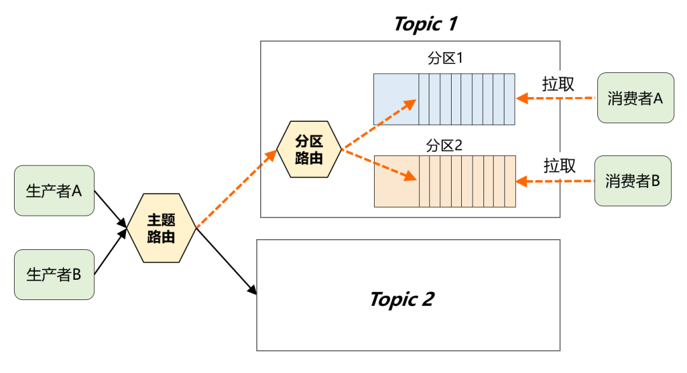

其中分区路由可以简单理解成一个 Hash 函数，生产者在发送消息时，完全可以自定义这个函数来决定分区规则。如果分区规则设定合理，所有消息将均匀地分配到不同的分区中。

通过这样两层关系，最终在 Topic 之下，就有了一个新的划分单位：Partition。先通过 Topic 对消息进行逻辑分类，然后通过 Partition 进一步做物理分片，最终多个 Partition 又会均匀地分布在集群中的每台机器上，从而很好地解决了存储的扩展性问题。

因此，Partition 是 Kafka 最基本的部署单元。本文之所以将 Partition 称作 Kafka 架构设计的任督二脉，基于下面两点原因：

> 1、Partition 是存储的关键所在，MQ「一发一存一消费」的核心流程必然围绕它展开。
>
> 2、Kafka 高并发设计中最难的三高问题都能和 Partition 关联起来。


因此，以 Partition 作为根，能很自然地联想出 Kafka 架构设计中的各个知识点，形成可靠的知识体系。

下面，请大家继续跟着我的思路，以 Partition 为线索，对 Kafka 的宏观架构进行解析。

##### Kafka的宏观架构设计 

接下来，我们再看看 Partition 的分布式能力究竟是如何实现的？它又是怎么和 Kafka 的整体架构关联起来的？

前面讲过 Partition 是 Topic 之下的一个划分单位，它是 Kafka 最基本的部署单元，它将决定 Kafka 集群的组织方式。

假设现在有两个 Topic，每个 Topic 都设置了两个 Partition，如果 Kafka 集群是两台机器，部署架构将会是下面这样：

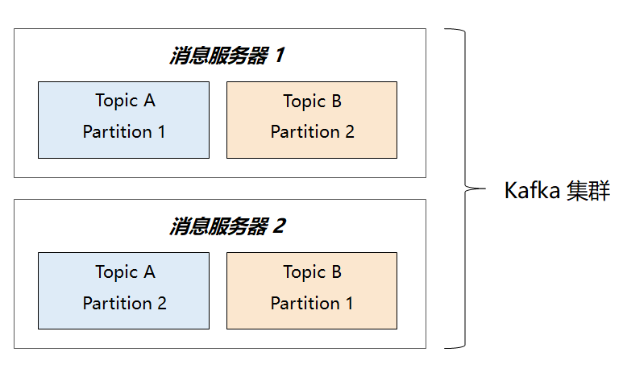

可以看到：同一个 Topic 的两个 Partition 分布在不同的消息服务器上，能做到消息的分布式存储了。但是对于 Kafka 这个高并发系统来说，仅存储可扩展还不够，消息的拉取也必须并行才行，否则会遇到极大的性能瓶颈。

那我们再看看消费端，它又是如何跟 Partition 结合并做到并行处理的？

从消费者来看，首先要满足两个基本诉求：

> 1、广播消费能力：同一个 Topic 可以被多个消费者订阅，一条消息能够被消费多次。
>
> 2、集群消费能力：当消费者本身也是集群时，每一条消息只能分发给集群中的一个消费者进行处理。

为了满足这两点要求，Kafka 引出了消费组的概念，每个消费者都有一个对应的消费组，组间进行广播消费，组内进行集群消费。此外，Kafka 还限定了：每个 Partition 只能由消费组中的一个消费者进行消费。

最终的消费关系如下图所示：假设主题 A 共有 4 个分区，消费组 2 只有两个消费者，最终这两个消费组将平分整个负载，各自消费两个分区的消息。

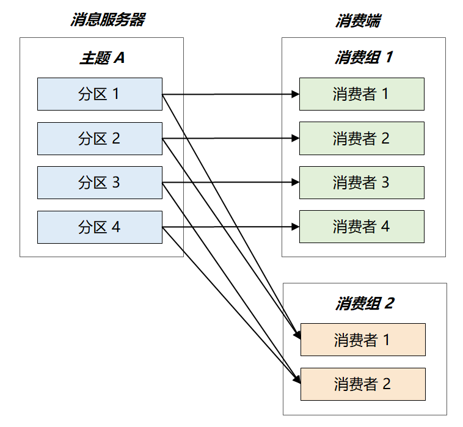

如果要加快消息的处理速度，该如何做呢？也很简单，向消费组 2 中增加新的消费者即可，Kafka 将以 Partition 为单位重新做负载均衡。当增加到 4 个消费者时，每个消费者仅需处理 1 个 Partition，处理速度将提升两倍。

到这里，存储可扩展、消息并行处理这两个难题都解决了。但是高并发架构设计上，还遗留了一个很重要的问题：那就是高可用设计。

在 Kafka 集群中，每台机器都存储了一些 Partition，一旦某台机器宕机，上面的数据不就丢失了吗？

此时，你一定会想到对消息进行持久化存储，但是持久化只能解决一部分问题，它只能确保机器重启后，历史数据不丢失。但在机器恢复之前，这部分数据将一直无法访问。这对于高并发系统来说，是无法忍受的。

所以 Kafka 必须具备故障转移能力才行，当某台机器宕机后仍然能保证服务可用。

如果大家去分析任何一个高可靠的分布式系统，比如 ElasticSearch、Redis Cluster，其实它们都有一套多副本的冗余机制。

没错，Kafka 正是通过 Partition 的多副本机制解决了高可用问题。在 Kafka 集群中，每个 Partition 都有多个副本，同一分区的不同副本中保存的是相同的消息。

副本之间是 “一主多从” 的关系，其中 leader 副本负责读写请求，follower 副本只负责和 leader 副本同步消息，当 leader 副本发生故障时，它才有机会被选举成新的 leader 副本并对外提供服务，否则一直是待命状态。

现在，我假设 Kafka 集群中有 4 台服务器，主题 A 和主题 B 都有两个 Partition，且每个 Partition 各有两个副本，那最终的多副本架构将如下图所示：

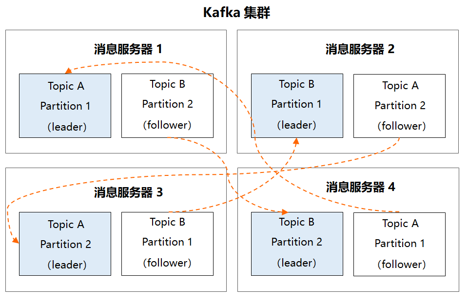

很显然，这个集群中任何一台机器宕机，都不会影响 Kafka 的可用性，数据仍然是完整的。

理解了上面这些内容，最后我们再反过来看下 Kafka 的整体架构：

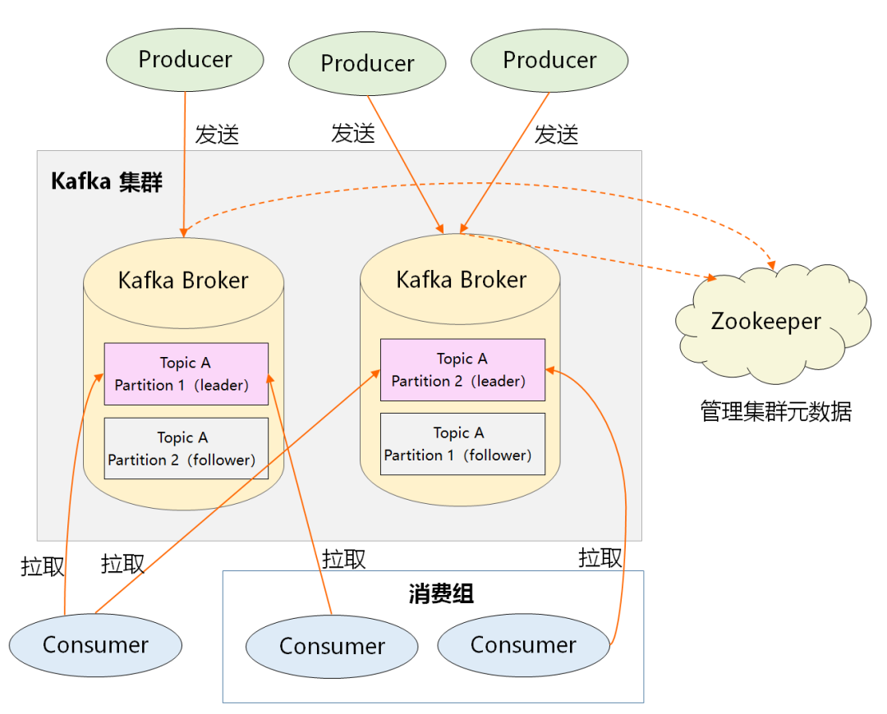

1、Producer：生产者，负责创建消息，然后投递到 Kafka 集群中，投递时需要指定消息所属的 Topic，同时确定好发往哪个 Partition。

2、Consumer：消费者，会根据它所订阅的 Topic 以及所属的消费组，决定从哪些 Partition 中拉取消息。

3、Broker：消息服务器，可水平扩展，负责分区管理、消息的持久化、故障自动转移等。

4、Zookeeper：负责集群的元数据管理等功能，比如集群中有哪些 broker 节点以及 Topic，每个 Topic 又有哪些 Partition 等。

很显然，在 Kafka 整体架构中，Partition 是发送消息、存储消息、消费消息的纽带。吃透了它，再去理解整体架构，脉络会更加清晰。


#### Kafka性能篇：为何Kafka这么"快"？

> 65: Redis 和 Kafka 完全是不同作用的中间件，有比较性吗？

是的，所以此文讲的不是`《分布式缓存的选型》`，也不是`《分布式中间件对比》`。我们聚焦于这两个不同领域的项目对性能的优化，看一看优秀项目对性能优化的通用手段，以及在针对不同场景下的特色的优化方式。

很多人学习了很多东西，了解了很多框架，但在遇到实际问题时，却常常会感觉到知识不足。这就是没有将学习到的知识体系化，没有从具体的实现中抽象出可以行之有效的`方法论`。

学习开源项目很重要的一点就是`归纳`，将不同项目的优秀实现总结出方法论，然后`演绎`到自我的实践中去。

##### Kafka 性能全景

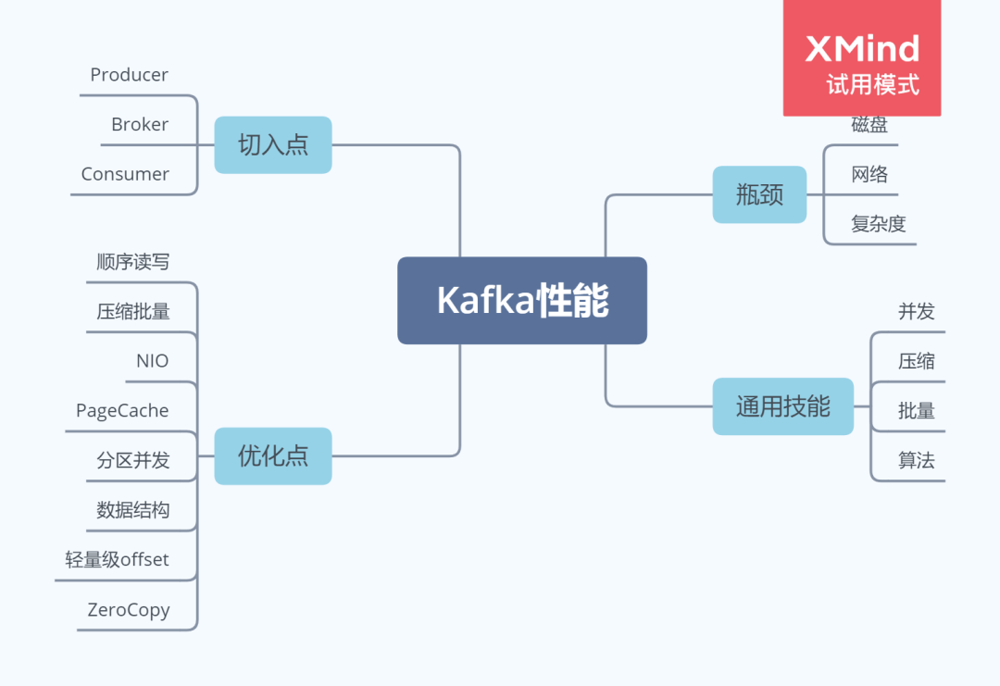

从高度抽象的角度来看，性能问题逃不出下面三个方面：

- 网络
- 磁盘
- 复杂度

对于 Kafka 这种网络分布式队列来说，网络和磁盘更是优化的重中之重。针对于上面提出的抽象问题，解决方案高度抽象出来也很简单：

- 并发
- 压缩
- 批量
- 缓存
- 算法

知道了问题和思路，我们再来看看，在 Kafka 中，有哪些角色，而这些角色就是可以优化的点：

- Producer
- Broker
- Consumer

是的，所有的问题，思路，优化点都已经列出来了，我们可以尽可能的细化，三个方向都可以细化，如此，所有的实现便一目了然，即使不看 Kafka 的实现，我们自己也可以想到一二点可以优化的地方。

这就是思考方式。`提出问题` > `列出问题点` > `列出优化方法` > `列出具体可切入的点` > `tradeoff和细化实现`。

##### 顺序写

```
为什么说写磁盘慢？
```

我们不能只知道结论，而不知其所以然。要回答这个问题，就得回到在校时我们学的操作系统课程了。65 哥还留着课本吗？来，翻到讲磁盘的章节，让我们回顾一下磁盘的运行原理。

看经典大图：

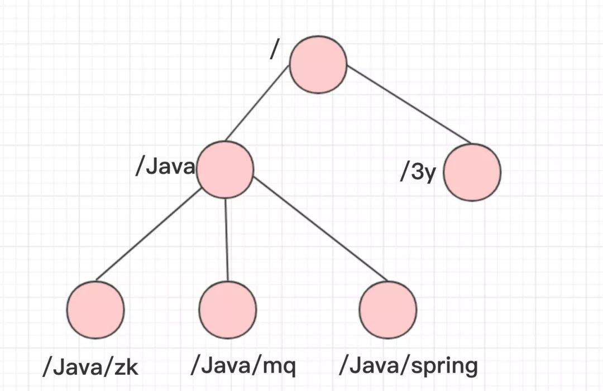

完成一次磁盘 IO，需要经过`寻道`、`旋转`和`数据传输`三个步骤。

影响磁盘 IO 性能的因素也就发生在上面三个步骤上，因此主要花费的时间就是：

1. 寻道时间：Tseek 是指将读写磁头移动至正确的磁道上所需要的时间。寻道时间越短，I/O 操作越快，目前磁盘的平均寻道时间一般在 3-15ms。
2. 旋转延迟：Trotation 是指盘片旋转将请求数据所在的扇区移动到读写磁盘下方所需要的时间。旋转延迟取决于磁盘转速，通常用磁盘旋转一周所需时间的 1/2 表示。比如：7200rpm 的磁盘平均旋转延迟大约为 60*1000/7200/2 = 4.17ms，而转速为 15000rpm 的磁盘其平均旋转延迟为 2ms。
3. 数据传输时间：Ttransfer 是指完成传输所请求的数据所需要的时间，它取决于数据传输率，其值等于数据大小除以数据传输率。目前 IDE/ATA 能达到 133MB/s，SATA II 可达到 300MB/s 的接口数据传输率，数据传输时间通常远小于前两部分消耗时间。简单计算时可忽略。

因此，如果在写磁盘的时候省去`寻道`、`旋转`可以极大地提高磁盘读写的性能。

Kafka 采用`顺序写`文件的方式来提高磁盘写入性能。`顺序写`文件，基本减少了磁盘`寻道`和`旋转`的次数。磁头再也不用在磁道上乱舞了，而是一路向前飞速前行。

Kafka 中每个分区是一个有序的，不可变的消息序列，新的消息不断追加到 Partition 的末尾，在 Kafka 中 Partition 只是一个逻辑概念，Kafka 将 Partition 划分为多个 Segment，每个 Segment 对应一个物理文件，Kafka 对 segment 文件追加写，这就是顺序写文件。

**为什么 Kafka 可以使用追加写的方式呢？**

这和 Kafka 的性质有关，我们来看看 Kafka 和 Redis，说白了，Kafka 就是一个`Queue`，而 Redis 就是一个`HashMap`。`Queue`和`Map`的区别是什么？

`Queue` 是 FIFO 的，数据是有序的；`HashMap`数据是无序的，是随机读写的。Kafka 的不可变性，有序性使得 Kafka 可以使用追加写的方式写文件。

其实很多符合以上特性的数据系统，都可以采用追加写的方式来优化磁盘性能。典型的有`Redis`的 AOF 文件，各种数据库的`WAL(Write ahead log)`机制等等。

##### 零拷贝

**什么是零拷贝？**

我们从 Kafka 的场景来看，Kafka Consumer 消费存储在 Broker 磁盘的数据，从读取 Broker 磁盘到网络传输给 Consumer，期间涉及哪些系统交互。Kafka Consumer 从 Broker 消费数据，Broker 读取 Log，就使用了 sendfile。如果使用传统的 IO 模型，伪代码逻辑就如下所示：

```
readFile(buffer)
send(buffer)
```

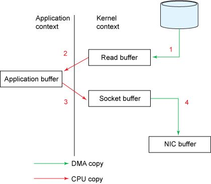

如图，如果采用传统的 IO 流程，先读取网络 IO，再写入磁盘 IO，实际需要将数据 Copy 四次。

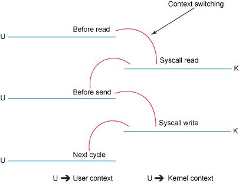

1. 第一次：读取磁盘文件到操作系统内核缓冲区；
2. 第二次：将内核缓冲区的数据，copy 到应用程序的 buffer；
3. 第三步：将应用程序 buffer 中的数据，copy 到 socket 网络发送缓冲区；
4. 第四次：将 socket buffer 的数据，copy 到网卡，由网卡进行网络传输。

并不是操作系统傻，操作系统的设计就是每个应用程序都有自己的用户内存，用户内存和内核内存隔离，这是为了程序和系统安全考虑，否则的话每个应用程序内存满天飞，随意读写那还得了。

不过，还有`零拷贝`技术，英文——`Zero-Copy`。`零拷贝`就是尽量去减少上面数据的拷贝次数，从而减少拷贝的 CPU 开销，减少用户态内核态的上下文切换次数，从而优化数据传输的性能。

常见的零拷贝思路主要有三种：

- 直接 I/O：数据直接跨过内核，在用户地址空间与 I/O 设备之间传递，内核只是进行必要的虚拟存储配置等辅助工作；
- 避免内核和用户空间之间的数据拷贝：当应用程序不需要对数据进行访问时，则可以避免将数据从内核空间拷贝到用户空间；
- 写时复制：数据不需要提前拷贝，而是当需要修改的时候再进行部分拷贝。

Kafka 使用到了 `mmap` 和 `sendfile` 的方式来实现`零拷贝`。分别对应 Java 的 `MappedByteBuffer` 和 `FileChannel.transferTo`。

使用 Java NIO 实现`零拷贝`，如下：

```
FileChannel.transferTo()
```

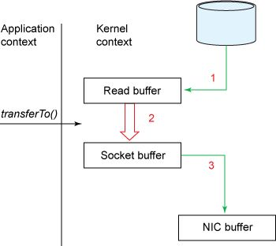

在此模型下，上下文切换的数量减少到一个。具体而言，`transferTo()`方法指示块设备通过 DMA 引擎将数据读取到读取缓冲区中。然后，将该缓冲区复制到另一个内核缓冲区以暂存到套接字。最后，套接字缓冲区通过 DMA 复制到 NIC 缓冲区。

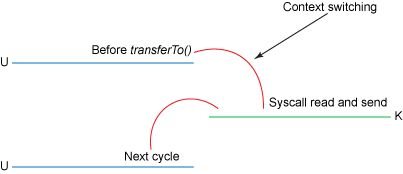

我们将副本数从四减少到三，并且这些副本中只有一个涉及 CPU。我们还将上下文切换的数量从四个减少到了两个。这是一个很大的改进，但是还没有查询零副本。当运行 Linux 内核 2.4 及更高版本以及支持收集操作的网络接口卡时，后者可以作为进一步的优化来实现。如下所示。

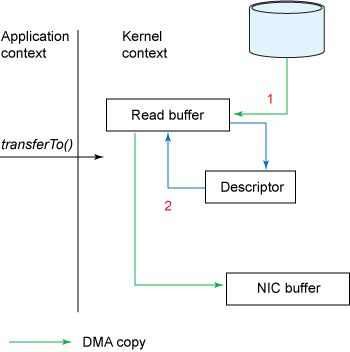

根据前面的示例，调用`transferTo()`方法会使设备通过 DMA 引擎将数据读取到内核读取缓冲区中。但是，使用`gather`操作时，读取缓冲区和套接字缓冲区之间没有复制。取而代之的是，给 NIC 一个指向读取缓冲区的指针以及偏移量和长度，该偏移量和长度由 DMA 清除。CPU 绝对不参与复制缓冲区。

##### PageCache

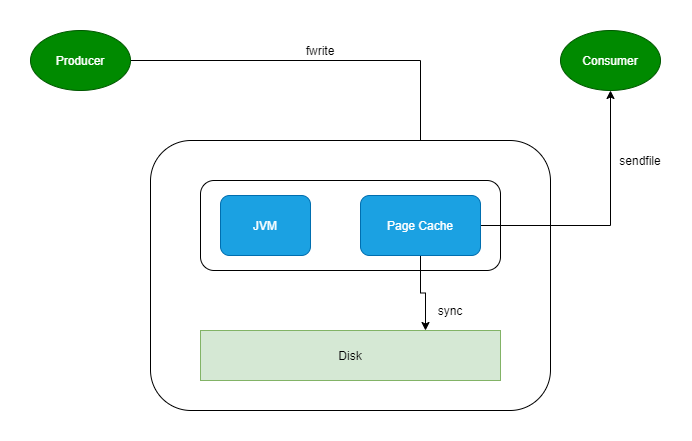

producer 生产消息到 Broker 时，Broker 会使用 pwrite() 系统调用【对应到 Java NIO 的 FileChannel.write() API】按偏移量写入数据，此时数据都会先写入`page cache`。consumer 消费消息时，Broker 使用 sendfile() 系统调用【对应 FileChannel.transferTo() API】，零拷贝地将数据从 page cache 传输到 broker 的 Socket buffer，再通过网络传输。

leader 与 follower 之间的同步，与上面 consumer 消费数据的过程是同理的。

`page cache`中的数据会随着内核中 flusher 线程的调度以及对 sync()/fsync() 的调用写回到磁盘，就算进程崩溃，也不用担心数据丢失。另外，如果 consumer 要消费的消息不在`page cache`里，才会去磁盘读取，并且会顺便预读出一些相邻的块放入 page cache，以方便下一次读取。

因此如果 Kafka producer 的生产速率与 consumer 的消费速率相差不大，那么就能几乎只靠对 broker page cache 的读写完成整个生产 - 消费过程，磁盘访问非常少。

##### 网络模型

是的，Netty 是 JVM 领域一个优秀的网络框架，提供了高性能的网络服务。大多数 Java 程序员提到网络框架，首先想到的就是 Netty。Dubbo、Avro-RPC 等等优秀的框架都使用 Netty 作为底层的网络通信框架。

Kafka 自己实现了网络模型做 RPC。底层基于 Java NIO，采用和 Netty 一样的 Reactor 线程模型。

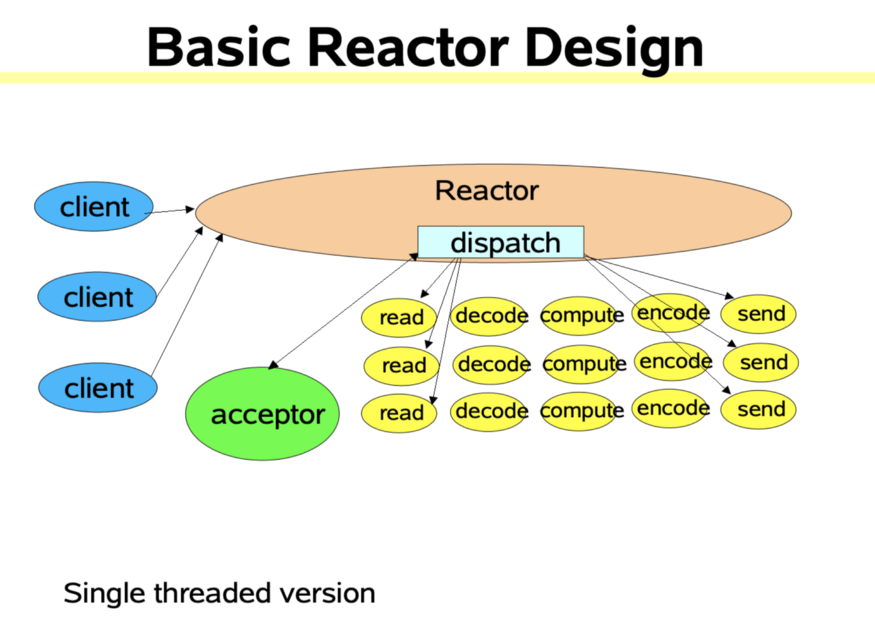

Reacotr 模型主要分为三个角色

- Reactor：把 IO 事件分配给对应的 handler 处理
- Acceptor：处理客户端连接事件
- Handler：处理非阻塞的任务

在传统阻塞 IO 模型中，每个连接都需要独立线程处理，当并发数大时，创建线程数多，占用资源；采用阻塞 IO 模型，连接建立后，若当前线程没有数据可读，线程会阻塞在读操作上，造成资源浪费

针对传统阻塞 IO 模型的两个问题，Reactor 模型基于池化思想，避免为每个连接创建线程，连接完成后将业务处理交给线程池处理；基于 IO 复用模型，多个连接共用同一个阻塞对象，不用等待所有的连接。遍历到有新数据可以处理时，操作系统会通知程序，线程跳出阻塞状态，进行业务逻辑处理

Kafka 即基于 Reactor 模型实现了多路复用和处理线程池。其设计如下：


其中包含了一个`Acceptor`线程，用于处理新的连接，`Acceptor` 有 N 个 `Processor` 线程 select 和 read socket 请求，N 个 `Handler` 线程处理请求并相应，即处理业务逻辑。

I/O 多路复用可以通过把多个 I/O 的阻塞复用到同一个 select 的阻塞上，从而使得系统在单线程的情况下可以同时处理多个客户端请求。它的最大优势是系统开销小，并且不需要创建新的进程或者线程，降低了系统的资源开销。

##### 批量与压缩

Kafka Producer 向 Broker 发送消息不是一条消息一条消息的发送。使用过 Kafka 的同学应该知道，Producer 有两个重要的参数：`batch.size`和`linger.ms`。这两个参数就和 Producer 的批量发送有关。

Kafka Producer 的执行流程如下图所示：

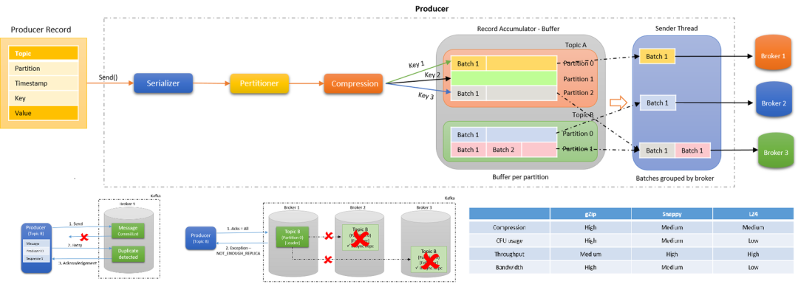

发送消息依次经过以下处理器：

- Serialize：键和值都根据传递的序列化器进行序列化。优秀的序列化方式可以提高网络传输的效率。
- Partition：决定将消息写入主题的哪个分区，默认情况下遵循 murmur2 算法。自定义分区程序也可以传递给生产者，以控制应将消息写入哪个分区。
- Compress：默认情况下，在 Kafka 生产者中不启用压缩.Compression 不仅可以更快地从生产者传输到代理，还可以在复制过程中进行更快的传输。压缩有助于提高吞吐量，降低延迟并提高磁盘利用率。
- Accumulate：`Accumulate`顾名思义，就是一个消息累计器。其内部为每个 Partition 维护一个`Deque`双端队列，队列保存将要发送的批次数据，`Accumulate`将数据累计到一定数量，或者在一定过期时间内，便将数据以批次的方式发送出去。记录被累积在主题每个分区的缓冲区中。根据生产者批次大小属性将记录分组。主题中的每个分区都有一个单独的累加器 / 缓冲区。
- Group Send：记录累积器中分区的批次按将它们发送到的代理分组。批处理中的记录基于 batch.size 和 linger.ms 属性发送到代理。记录由生产者根据两个条件发送。当达到定义的批次大小或达到定义的延迟时间时。

Kafka 支持多种压缩算法：lz4、snappy、gzip。Kafka 2.1.0 正式支持 ZStandard —— ZStandard 是 Facebook 开源的压缩算法，旨在提供超高的压缩比 (compression ratio)，具体细节参见 zstd。

Producer、Broker 和 Consumer 使用相同的压缩算法，在 producer 向 Broker 写入数据，Consumer 向 Broker 读取数据时甚至可以不用解压缩，最终在 Consumer Poll 到消息时才解压，这样节省了大量的网络和磁盘开销。

##### 分区并发

Kafka 的 Topic 可以分成多个 Partition，每个 Paritition 类似于一个队列，保证数据有序。同一个 Group 下的不同 Consumer 并发消费 Paritition，分区实际上是调优 Kafka 并行度的最小单元，因此，可以说，每增加一个 Paritition 就增加了一个消费并发。


Kafka 具有优秀的分区分配算法——StickyAssignor，可以保证分区的分配尽量地均衡，且每一次重分配的结果尽量与上一次分配结果保持一致。这样，整个集群的分区尽量地均衡，各个 Broker 和 Consumer 的处理不至于出现太大的倾斜。

> 那是不是分区数越多越好呢？
>

当然不是。

##### 越多的分区需要打开更多的文件句柄

在 kafka 的 broker 中，每个分区都会对照着文件系统的一个目录。在 kafka 的数据日志文件目录中，每个日志数据段都会分配两个文件，一个索引文件和一个数据文件。因此，随着 partition 的增多，需要的文件句柄数急剧增加，必要时需要调整操作系统允许打开的文件句柄数。

##### 客户端 / 服务器端需要使用的内存就越多

客户端 producer 有个参数 batch.size，默认是 16KB。它会为每个分区缓存消息，一旦满了就打包将消息批量发出。看上去这是个能够提升性能的设计。不过很显然，因为这个参数是分区级别的，如果分区数越多，这部分缓存所需的内存占用也会更多。

##### 降低高可用性

分区越多，每个 Broker 上分配的分区也就越多，当一个发生 Broker 宕机，那么恢复时间将很长。

##### 文件结构

Kafka 消息是以 Topic 为单位进行归类，各个 Topic 之间是彼此独立的，互不影响。每个 Topic 又可以分为一个或多个分区。每个分区各自存在一个记录消息数据的日志文件。

Kafka 每个分区日志在物理上实际按大小被分成多个 Segment。

' fill='%23FFFFFF'%3E%3Crect x='249' y='126' width='1' height='1'%3E%3C/rect%3E%3C/g%3E%3C/g%3E%3C/svg%3E)

- segment file 组成：由 2 大部分组成，分别为 index file 和 data file，此 2 个文件一一对应，成对出现，后缀”.index”和“.log”分别表示为 segment 索引文件、数据文件。
- segment 文件命名规则：partion 全局的第一个 segment 从 0 开始，后续每个 segment 文件名为上一个 segment 文件最后一条消息的 offset 值。数值最大为 64 位 long 大小，19 位数字字符长度，没有数字用 0 填充。

index 采用稀疏索引，这样每个 index 文件大小有限，Kafka 采用`mmap`的方式，直接将 index 文件映射到内存，这样对 index 的操作就不需要操作磁盘 IO。`mmap`的 Java 实现对应 `MappedByteBuffer` 。

> “
>
> 65 哥笔记：mmap 是一种内存映射文件的方法。即将一个文件或者其它对象映射到进程的地址空间，实现文件磁盘地址和进程虚拟地址空间中一段虚拟地址的一一对映关系。实现这样的映射关系后，进程就可以采用指针的方式读写操作这一段内存，而系统会自动回写脏页面到对应的文件磁盘上，即完成了对文件的操作而不必再调用 read,write 等系统调用函数。相反，内核空间对这段区域的修改也直接反映用户空间，从而可以实现不同进程间的文件共享。
>
> ”

Kafka 充分利用二分法来查找对应 offset 的消息位置：

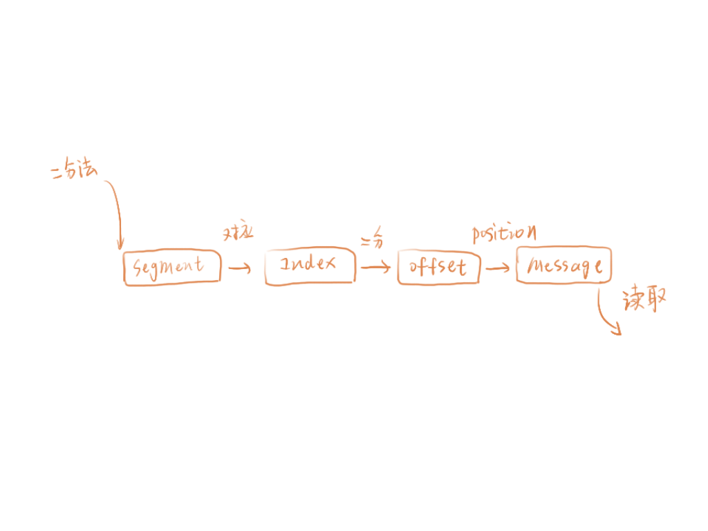

1. 按照二分法找到小于 offset 的 segment 的.log 和.index
2. 用目标 offset 减去文件名中的 offset 得到消息在这个 segment 中的偏移量。
3. 再次用二分法在 index 文件中找到对应的索引。
4. 到 log 文件中，顺序查找，直到找到 offset 对应的消息。

8. 

#### Kafka 精妙的高性能设计（上篇）

Kafka 的高性能设计可以说是全方位的，从 Prodcuer 、到 Broker、再到 Consumer，Kafka 在掏空心思地优化每一个细节，最终才做到了这样的极致性能。

这篇文章我想先带大家建立一个高性能设计的思维模式，然后再一探究竟 Kafka 的高性能设计方案，最终让大家更体系地掌握所有知识点，并理解它的设计哲学。

#####  如何理解高性能设计？ 

我们暂且把 Kafka 抛在一边，先尝试理解下高性能设计的本质。

有过高并发开发经验的同学，对于线程池、多级缓存、IO 多路复用、零拷贝等技术概念早就了然于胸，但是返璞归真，这些技术手段的本质到底是什么？

这其实是一个系统性的问题，至少需要深入到操作系统层面，从 CPU 和存储入手，去了解底层的实现机制，然后再自底往上，一层一层去解密和贯穿起来。

但是站在更高的视角来看，我认为：高性能设计其实万变不离其宗，一定是从**「计算和 IO」**这两个维度出发，去考虑可能的优化点。


**那「计算」维度的性能优化手段有哪些呢？无外乎这两种方式：**

> 1、让更多的核来参与计算：比如用多线程代替单线程、用集群代替单机等。
>
> 2、减少计算量：比如用索引来取代全局扫描、用同步代替异步、通过限流来减少请求处理量、采用更高效的数据结构和算法等。


**再看下「IO」维度的性能优化手段又有哪些?** 可以通过 Linux 系统的 IO 栈图来辅助思考。

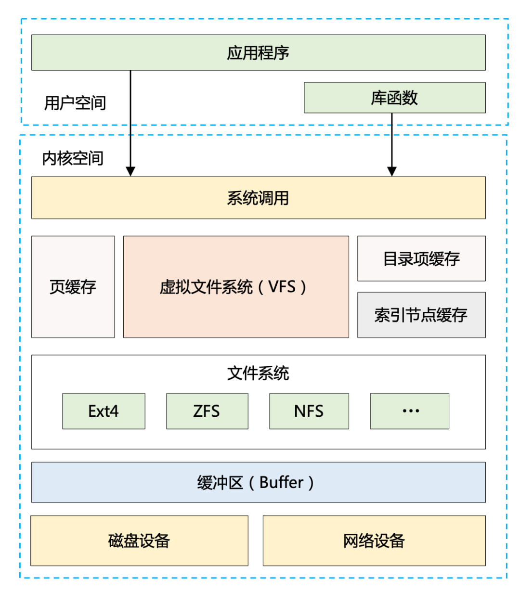

图 1：Linux 系统的 IO 栈图

可以看到，整个 IO 体系结构是分层的，我们能够从应用程序、操作系统、磁盘等各个层次来考虑性能优化，而所有这些手段又几乎围绕以下两个方面展开：

> 1、加快 IO 速度：比如用磁盘顺序写代替随机写、用 NIO 代替 BIO、用性能更好的 SSD 代替机械硬盘等。
>
> 2、减少 IO 次数或者 IO 数据量：比如借助系统缓存或者外部缓存、通过零拷贝技术减少 IO 复制次数、批量读写、数据压缩等。

上面这些内容可以理解成高性能设计的**「道」**，当然绝不是几百字就可以说清楚的，我更多的是抛砖引玉，用另外一个视角来看高并发，给大家一个方向上的指引。

当大家抓住了**「计算和 IO」**这两个最本质的东西，然后以这两点作为根，再去探究这两个维度分别有哪些性能优化手段？它们的原理又是什么样的？便能一层一层剥开高性能设计的神秘面纱，形成可靠的知识体系。

这种分析方法可用来研究 Kafka，同样可以用来研究我们熟知的 Redis、ES 以及其他高性能的应用系统。

##### Kafka 高性能设计的全景图  

有了高性能设计的思维模式后，我们再回到 Kafka 本身进行分析。

前文提到过 Kafka 的性能优化手段非常丰富，至少有 10 条以上的精妙设计，虽然我们可以从计算和 IO 两个维度去联想这些手段，但是要完整地记住它们，似乎也不是件容易的事。

这样就引出了另外一个话题：**我们应该选用一条什么样的脉络，去串联这些优化手段呢？**

之前的文章做过分析：不管 Kafka 、RocketMQ 还是其他消息队列，其本质都是「一发一存一消费」。

我们完全可以顺着这条主线去做结构化梳理。基于这个思路，便形成了下面这张 Kafka 高性能设计的全景图，我按照生产消息、存储消息、消费消息 3 个模块，将 Kafka 最具代表性的 12 条性能优化手段做了归类。

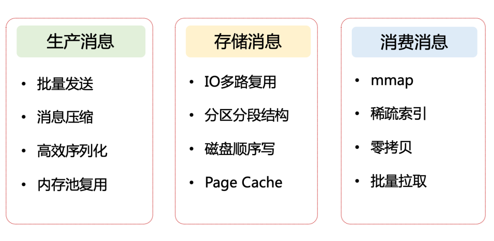

有了这张全景图，下面我再挨个分析下每个手段背后的大致原理，并尝试解读下 Kafka 的设计哲学。


##### 生产消息的性能优化手段 

我们先从生产消息开始看，下面是 Producer 端所采用的 4 条优化手段。


###### **批量发送消息**


Kafka 作为一个消息队列，很显然是一个 IO 密集型应用，它所面临的挑战除了磁盘 IO（Broker 端需要对消息持久化），还有网络 IO（Producer 到 Broker，Broker 到 Consumer，都需要通过网络进行消息传输）。

在上一篇文章已经指出过：磁盘顺序 IO 的速度其实非常快，不亚于内存随机读写。这样网络 IO 便成为了 Kafka 的性能瓶颈所在。

基于这个背景， Kafka 采用了批量发送消息的方式，通过将多条消息按照分区进行分组，然后每次发送一个消息集合，从而大大减少了网络传输的 overhead。

看似很平常的一个手段，其实它大大提升了 Kafka 的吞吐量，而且它的精妙之处远非如此，下面几条优化手段都和它息息相关。

###### **消息压缩**

消息压缩的目的是为了进一步减少网络传输带宽。而对于压缩算法来说，通常是：**数据量越大，压缩效果才会越好。**

因为有了批量发送这个前期，从而使得 Kafka 的消息压缩机制能真正发挥出它的威力（压缩的本质取决于多消息的重复性）。对比压缩单条消息，同时对多条消息进行压缩，能大幅减少数据量，从而更大程度提高网络传输率。

有文章对 Kafka 支持的三种压缩算法：gzip、snappy、lz4 进行了性能对比，测试 2 万条消息，效果如下：

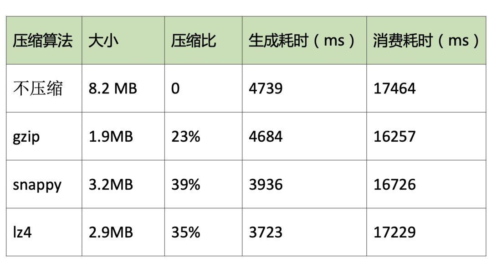


整体来看，gzip 压缩效果最好，但是生成耗时更长，综合对比 lz4 性能最佳。

其实压缩消息不仅仅减少了网络 IO，它还大大降低了磁盘 IO。因为批量消息在持久化到 Broker 中的磁盘时，仍然保持的是压缩状态，最终是在 Consumer 端做了解压缩操作。

这种端到端的压缩设计，其实非常巧妙，它又大大提高了写磁盘的效率。

###### **高效序列化**

Kafka 消息中的 Key 和 Value，都支持自定义类型，只需要提供相应的序列化和反序列化器即可。因此，用户可以根据实际情况选用快速且紧凑的序列化方式（比如 ProtoBuf、Avro）来减少实际的网络传输量以及磁盘存储量，进一步提高吞吐量。

###### **内存池复用**

前面说过 Producer 发送消息是批量的，因此消息都会先写入 Producer 的内存中进行缓冲，直到多条消息组成了一个 Batch，才会通过网络把 Batch 发给 Broker。

当这个 Batch 发送完毕后，显然这部分数据还会在 Producer 端的 JVM 内存中，由于不存在引用了，它是可以被 JVM 回收掉的。

但是大家都知道，JVM GC 时一定会存在 Stop The World 的过程，即使采用最先进的垃圾回收器，也势必会导致工作线程的短暂停顿，这对于 Kafka 这种高并发场景肯定会带来性能上的影响。

有了这个背景，便引出了 Kafka 非常优秀的内存池机制，它和连接池、线程池的本质一样，都是为了提高复用，减少频繁的创建和释放。

具体是如何实现的呢？其实很简单：Producer 一上来就会占用一个固定大小的内存块，比如 64MB，然后将 64 MB 划分成 M 个小内存块（比如一个小内存块大小是 16KB）。

当需要创建一个新的 Batch 时，直接从内存池中取出一个 16 KB 的内存块即可，然后往里面不断写入消息，但最大写入量就是 16 KB，接着将 Batch 发送给 Broker ，此时该内存块就可以还回到缓冲池中继续复用了，根本不涉及垃圾回收。最终整个流程如下图所示：

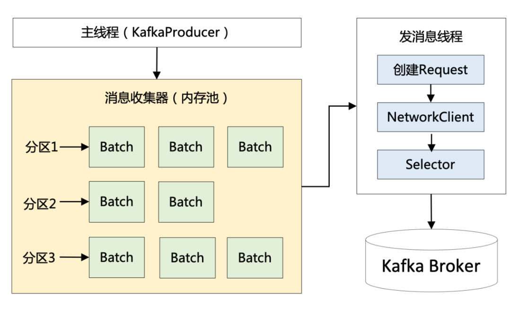


了解了 Producer 端上面 4 条高性能设计后，大家一定会有一个疑问：传统的数据库或者消息中间件都是想办法让 Client 端更轻量，将 Server 设计成重量级，仅让 Client 充当应用程序和 Server 之间的接口。

但是 Kafka 却反其道而行之，采取了独具一格的设计思路，在将消息发送给 Broker 之前，需要先在 Client 端完成大量的工作，例如：消息的分区路由、校验和的计算、压缩消息等。这样便很好地分摊 Broker 的计算压力。

可见，没有最好的设计，只有最合适的设计，这就是架构的本源。


 

#### Kafka 精妙的高性能设计（下篇）

##### 存储消息的性能优化手段 

存储消息属于 Broker 端的核心功能，下面是它所采用的 4 条优化手段。

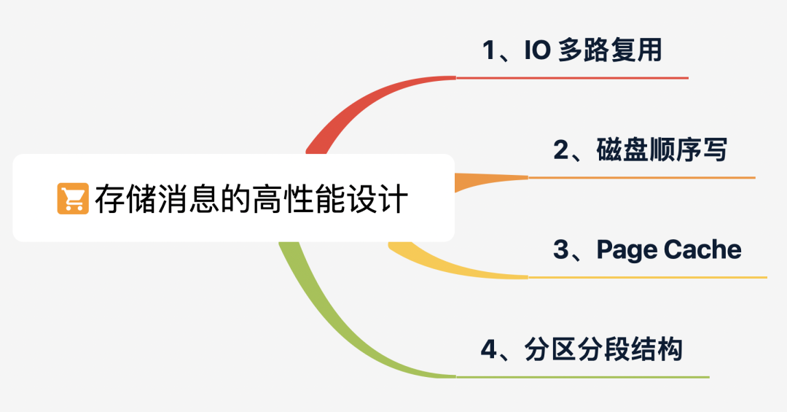

###### **IO 多路复用**

对于 Kafka Broker 来说，要做到高性能，首先要考虑的是：设计出一个高效的网络通信模型，用来处理它和 Producer 以及 Consumer 之间的消息传递问题。

先引用 Kafka 2.8.0 源码里 SocketServer 类中一段很关键的注释：

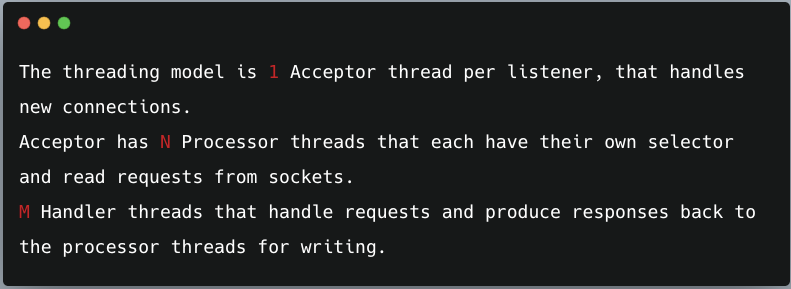


通过这段注释，其实可以了解到 Kafka 采用的是：很典型的 Reactor 网络通信模型，完整的网络通信层框架图如下所示：

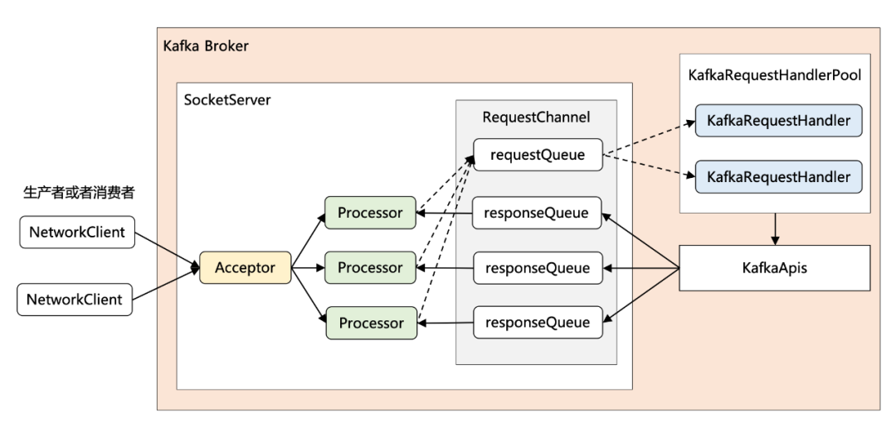


通俗点记忆就是 1 + N + M：

> 1：表示 1 个 Acceptor 线程，负责监听新的连接，然后将新连接交给 Processor 线程处理。
>
> N：表示 N 个 Processor 线程，每个 Processor 都有自己的 selector，负责从 socket 中读写数据。
>
> M：表示 M 个 KafkaRequestHandler 业务处理线程，它通过调用 KafkaApis 进行业务处理，然后生成 response，再交由给 Processor 线程。

对于 IO 有所研究的同学，应该清楚：Reactor 模式正是采用了很经典的 IO 多路复用技术，它可以复用一个线程去处理大量的 Socket 连接，从而保证高性能。Netty 和 Redis 为什么能做到十万甚至百万并发？它们其实都采用了 Reactor 网络通信模型。


###### **磁盘顺序写**

通过 IO 多路复用搞定网络通信后，Broker 下一步要考虑的是：如何将消息快速地存储起来？

在 [**Kafka 存储选型的**](http://mp.weixin.qq.com/s?__biz=MzU2MTM4NDAwMw==&mid=2247491168&idx=1&sn=bd37f96692b3f7cecdaf3172abdb7a8c&chksm=fc78c14ccb0f485a451f70c7ffbf5b05d0f500dfef6321703e7cdebdc0de902d9d77a547d469&scene=21#wechat_redirect)**奥秘** 一文中提到了：Kafka 选用的是「日志文件」来存储消息，那这种写磁盘文件的方式，又究竟是如何做到高性能的呢？

这一切得益于磁盘顺序写，怎么理解呢？

Kafka 作为消息队列，本质上就是一个队列，是先进先出的，而且消息一旦生产了就不可变。这种有序性和不可变性使得 Kafka 完全可以「顺序写」日志文件，也就是说，仅仅将消息追加到文件末尾即可。

有了顺序写的前提，我们再来看一个对比实验，从下图中可以看到：磁盘顺序写的性能远远高于磁盘随机写，甚至高于内存随机写。

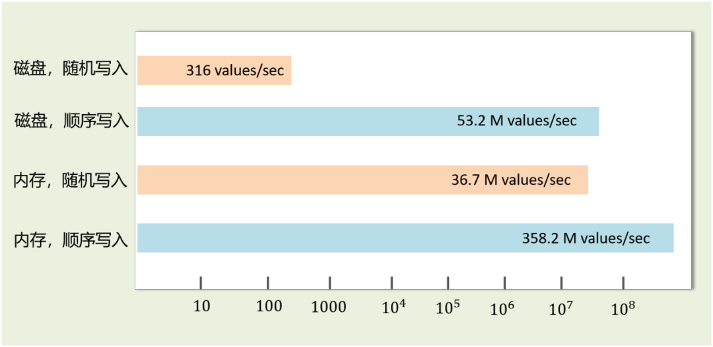

图3：磁盘和内存的 IO 速度对比

原因很简单：对于普通的机械磁盘，如果是随机写入，性能确实极差，也就是随便找到文件的某个位置来写数据。但如果是顺序写入，因为可大大节省磁盘寻道和盘片旋转的时间，因此性能提升了 3 个数量级。

###### **Page Cache**

磁盘顺序写已经很快了，但是对比内存顺序写仍然慢了几个数量级，那有没有可能继续优化呢？答案是肯定的。

这里 Kafka 用到了 Page Cache 技术，简单理解就是：利用了操作系统本身的缓存技术，在读写磁盘日志文件时，其实操作的都是内存，然后由操作系统决定什么时候将 Page Cache 里的数据真正刷入磁盘。

通过下面这个示例图便一目了然。

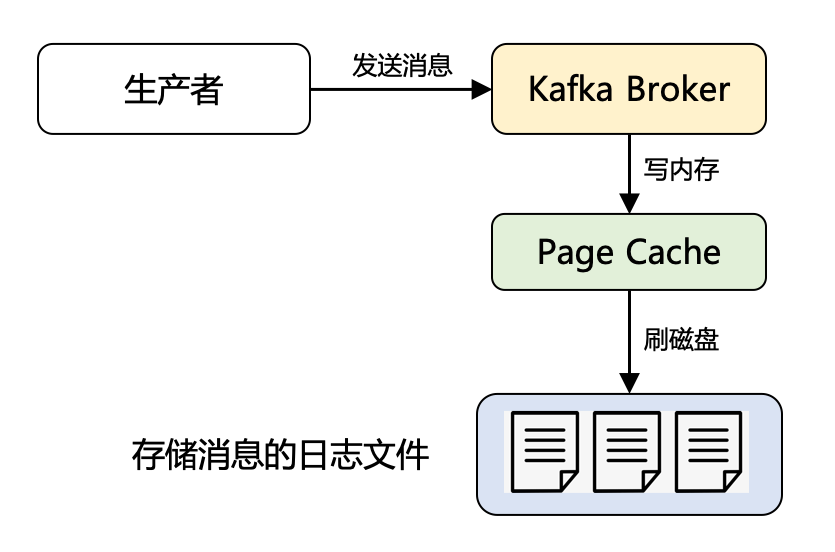


那 Page Cache 究竟什么时候会发挥最大的威力呢？这又不得不提 Page Cache 所用到的两个经典原理。

Page Cache 缓存的是最近会被使用的磁盘数据，利用的是「时间局部性」原理，依据是：最近访问的数据很可能接下来再访问到。而预读到 Page Cache 中的磁盘数据，又利用了「空间局部性」原理，依据是：数据往往是连续访问的。

而 Kafka 作为消息队列，消息先是顺序写入，而且立马又会被消费者读取到，无疑非常契合上述两条局部性原理。因此，页缓存可以说是 Kafka 做到高吞吐的重要因素之一。

除此之外，页缓存还有一个巨大的优势。用过 Java 的人都知道：如果不用页缓存，而是用 JVM 进程中的缓存，对象的内存开销非常大（通常是真实数据大小的几倍甚至更多），此外还需要进行垃圾回收，GC 所带来的 Stop The World 问题也会带来性能问题。可见，页缓存确实优势明显，而且极大地简化了 Kafka 的代码实现。 


###### **分区分段结构**

磁盘顺序写加上页缓存很好地解决了日志文件的高性能读写问题。但是如果一个 Topic 只对应一个日志文件，显然只能存放在一台 Broker 机器上。

当面对海量消息时，单机的存储容量和读写性能肯定有限，这样又引出了又一个精妙的存储设计：对数据进行分区存储**。**

我在 [**Kafka 架构设计的任督二脉**](http://mp.weixin.qq.com/s?__biz=MzU2MTM4NDAwMw==&mid=2247491055&idx=1&sn=14bc485f91ec2629cc9e8bf7a36ad8f4&chksm=fc78c2c3cb0f4bd566d5ca2534805839420ad3dc67210bc8f2b7ef05283785b02b8ddef640a8&scene=21#wechat_redirect) 一文中详细解释了分区（Partition）的概念和作用，它是 Kafka 并发处理的最小粒度，很好地解决了存储的扩展性问题。随着分区数的增加，Kafka 的吞吐量得以进一步提升。

其实在 Kafka 的存储底层，在分区之下还有一层：那便是「分段」。简单理解：分区对应的其实是文件夹，分段对应的才是真正的日志文件。

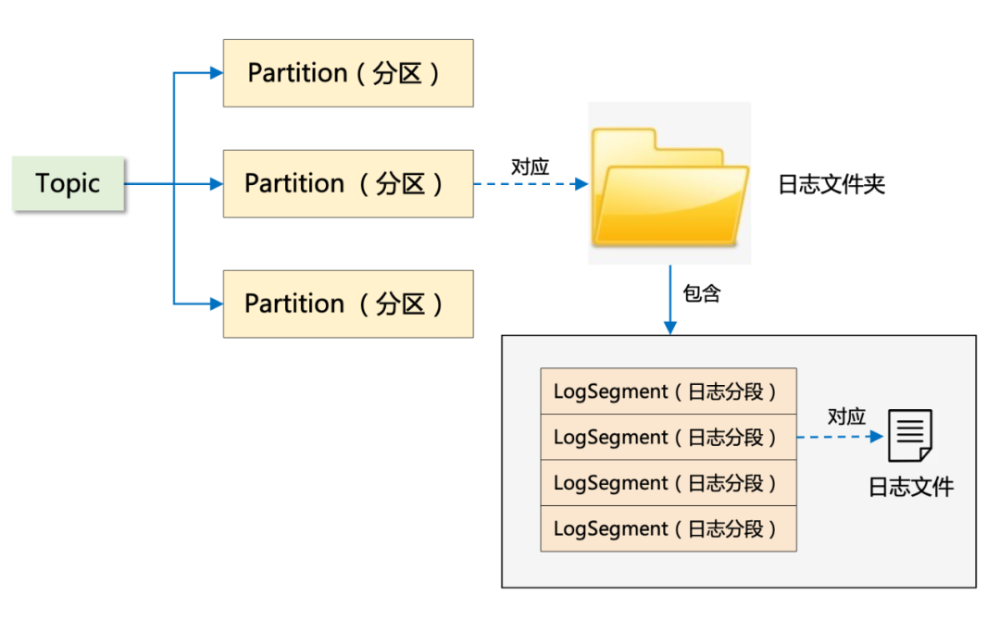

图5：Kafka 的 分区分段存储

每个 Partition 又被分成了多个 Segment，那为什么有了 Partition 之后，还需要 Segment 呢？


如果不引入 Segment，一个 Partition 只对应一个文件，那这个文件会一直增大，势必造成单个 Partition 文件过大，查找和维护不方便。

此外，在做历史消息删除时，必然需要将文件前面的内容删除，只有一个文件显然不符合 Kafka 顺序写的思路。而在引入 Segment 后，则只需将旧的 Segment 文件删除即可，保证了每个 Segment 的顺序写。


##### 消费消息的性能优化手段 

Kafka 除了要做到百万 TPS 的写入性能，还要解决高性能的消息读取问题，否则称不上高吞吐。下面再来看看 Kafka 消费消息时所采用的 4 条优化手段。

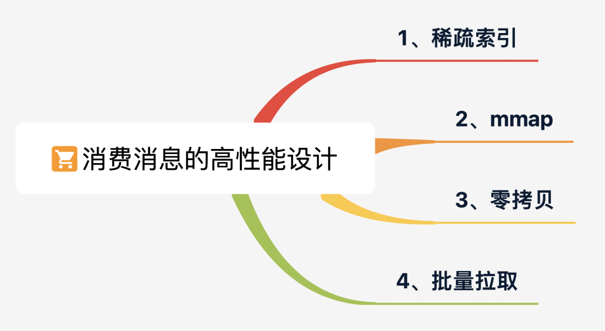

###### **稀疏索引**

如何提高读性能，大家很容易想到的是：索引。Kafka 所面临的查询场景其实很简单：能按照 offset 或者 timestamp 查到消息即可。

如果采用 B Tree 类的索引结构来实现，每次数据写入时都需要维护索引（属于随机 IO 操作），而且还会引来「页分裂」这种比较耗时的操作。而这些代价对于仅需要实现简单查询要求的 Kafka 来说，显得非常重。所以，B Tree 类的索引并不适用于 Kafka。

相反，哈希索引看起来却非常合适。为了加快读操作，如果只需要在内存中维护一个「从 offset 到日志文件偏移量」的映射关系即可，每次根据 offset 查找消息时，从哈希表中得到偏移量，再去读文件即可。（根据 timestamp 查消息也可以采用同样的思路）

但是哈希索引常驻内存，显然没法处理数据量很大的情况，Kafka 每秒可能会有高达几百万的消息写入，一定会将内存撑爆。

可我们发现消息的 offset 完全可以设计成有序的（实际上是一个单调递增 long 类型的字段），这样消息在日志文件中本身就是有序存放的了，我们便没必要为每个消息建 hash 索引了，完全可以将消息划分成若干个 block，只索引每个 block 第一条消息的 offset 即可，先根据大小关系找到 block，然后在 block 中顺序搜索，这便是 Kafka “稀疏索引” 的设计思想。


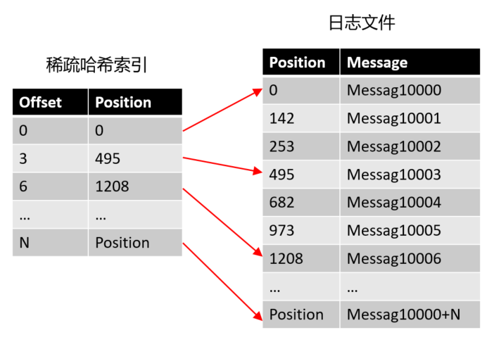

图6：Kafka 的稀疏索引设计

采用 “稀疏索引”，可以认为是在磁盘空间、内存空间、查找性能等多方面的一个折中。有了稀疏索引，当给定一个 offset 时，Kafka 采用的是二分查找来高效定位不大于 offset 的物理位移，然后找到目标消息。

###### **mmap**

利用稀疏索引，已经基本解决了高效查询的问题，但是这个过程中仍然有进一步的优化空间，那便是通过 mmap（memory mapped files） 读写上面提到的稀疏索引文件，进一步提高查询消息的速度。

> 注意：mmap 和 page cache 是两个概念，网上很多资料把它们混淆在一起。此外，还有资料谈到 Kafka 在读 log 文件时也用到了 mmap，通过对 2.8.0 版本的源码分析，这个信息也是错误的，其实只有索引文件的读写才用到了 mmap.

究竟如何理解 mmap？前面提到，常规的文件操作为了提高读写性能，使用了 Page Cache 机制，但是由于页缓存处在内核空间中，不能被用户进程直接寻址，所以读文件时还需要通过系统调用，将页缓存中的数据再次拷贝到用户空间中。

而采用 mmap 后，它将磁盘文件与进程虚拟地址做了映射，并不会招致系统调用，以及额外的内存 copy 开销，从而提高了文件读取效率。

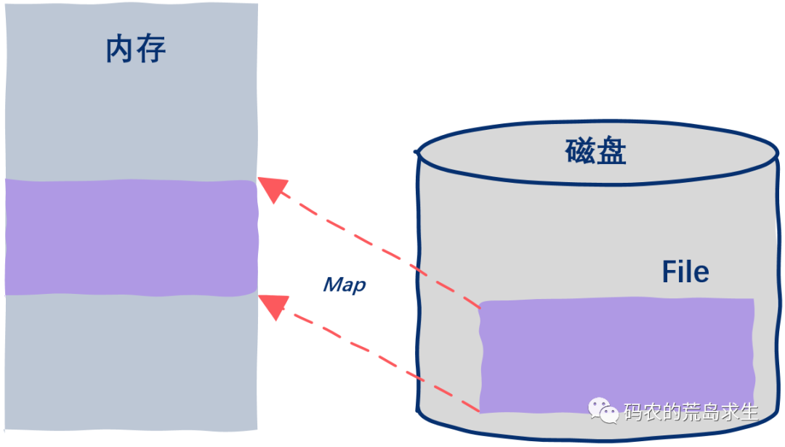

图7：mmap 示意图，引自《码农的荒岛求生》

关于 mmap，好友小风哥写过一篇很通俗的文章： [**mmap 可以让程序员解锁哪些骚操作？**](https://mp.weixin.qq.com/s?__biz=Mzg4OTYzODM4Mw==&mid=2247486269&idx=1&sn=4e6cfd17ddaf5eff6c0dc6d2758573ab&scene=21#wechat_redirect)大家可以参考。

具体到 Kafka 的源码层面，就是基于 JDK nio 包下的 MappedByteBuffer 的 map 函数，将磁盘文件映射到内存中。

至于为什么 log 文件不采用 mmap？其实是一个特别好的问题，这个问题社区并没有给出官方答案，网上的答案只能揣测作者的意图。个人比较认同 stackoverflow 上的这个答案：

> mmap 有多少字节可以映射到内存中与地址空间有关，32 位的体系结构只能处理 4GB 甚至更小的文件。Kafka 日志通常足够大，可能一次只能映射部分，因此读取它们将变得非常复杂。然而，索引文件是稀疏的，它们相对较小。将它们映射到内存中可以加快查找过程，这是内存映射文件提供的主要好处。

###### **零拷贝**

消息借助稀疏索引被查询到后，下一步便是：将消息从磁盘文件中读出来，然后通过网卡发给消费者，那这一步又可以怎么优化呢？

Kafka 用到了零拷贝（Zero-Copy）技术来提升性能。所谓的零拷贝是指数据直接从磁盘文件复制到网卡设备，而无需经过应用程序，减少了内核和用户模式之间的上下文切换。

下面这个过程是不采用零拷贝技术时，从磁盘中读取文件然后通过网卡发送出去的流程，可以看到：经历了 4 次拷贝，4 次上下文切换。

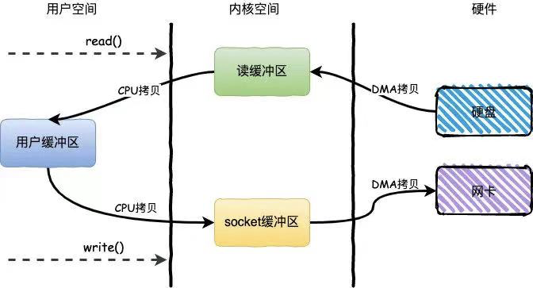

图8：非零拷贝技术的流程图，引自《艾小仙》

如果采用零拷贝技术（底层通过 sendfile 方法实现），流程将变成下面这样。可以看到：只需 3 次拷贝以及 2 次上下文切换，显然性能更高。


图9：零拷贝技术的流程图，引自《艾小仙》

###### **批量拉取**

和生产者批量发送消息类似，消息者也是批量拉取消息的，每次拉取一个消息集合，从而大大减少了网络传输的 overhead。

另外，在 [**Kafka 精妙的高性能设计（上篇）**](http://mp.weixin.qq.com/s?__biz=MzU2MTM4NDAwMw==&mid=2247491507&idx=1&sn=f1bec356c94cd0101809dc11dcf27ba2&chksm=fc78c09fcb0f49898f6cc9b80499aeb871a80f95ab4fbe12c32567cab6a3521a6c33b61dd807&scene=21#wechat_redirect) 中介绍过，生产者其实在 Client 端对批量消息进行了压缩，这批消息持久化到 Broker 时，仍然保持的是压缩状态，最终在 Consumer 端再做解压缩操作。

\3. 写在最后 

以上就是 Kafka 12 条高性能设计手段的详解，这两篇文章先从 IO 和计算两个维度进行宏观上的切入，然后顺着 MQ 一发一存一消费的脉络，从微观上解构了 Kafka 高性能的全景图。

可以说 Kafka 在高性能设计方面是教科书般的存在，它从 Prodcuer 、到 Broker、再到 Consumer，在掏空心思地优化每一个细节，最终才做到了单机每秒几十万 TPS 的极致性能。

最后，希望本文的分析技巧可以帮助你吃透其他高性能的中间件。

我们下期见！

#### kafka夺命连环11问

##### 说说你对kafka的理解

kafka是一个流式数据处理平台，他具有消息系统的能力，也有实时流式数据处理分析能力，只是我们更多的偏向于把他当做消息队列系统来使用。

如果说按照容易理解来分层的话，大致可以分为3层：

第一层是**Zookeeper**，相当于注册中心，他负责kafka集群元数据的管理，以及集群的协调工作，在每个kafka服务器启动的时候去连接到Zookeeper，把自己注册到Zookeeper当中

第二层里是kafka的核心层，这里就会包含很多kafka的基本概念在内：

**record**：代表消息

**topic**：主题，消息都会由一个主题方式来组织，可以理解为对于消息的一个分类

**producer**：生产者，负责发送消息

**consumer**：消费者，负责消费消息

**broker**：kafka服务器

**partition**：分区，主题会由多个分区组成，通常每个分区的消息都是按照顺序读取的，不同的分区无法保证顺序性，分区也就是我们常说的数据分片sharding机制，主要目的就是为了提高系统的伸缩能力，通过分区，消息的读写可以负载均衡到多个不同的节点上

**Leader/Follower**：分区的副本。为了保证高可用，分区都会有一些副本，每个分区都会有一个Leader主副本负责读写数据，Follower从副本只负责和Leader副本保持数据同步，不对外提供任何服务

**offset**：偏移量，分区中的每一条消息都会根据时间先后顺序有一个递增的序号，这个序号就是offset偏移量

**Consumer group**：消费者组，由多个消费者组成，一个组内只会由一个消费者去消费一个分区的消息

**Coordinator**：协调者，主要是为消费者组分配分区以及重平衡Rebalance操作

**Controller**：控制器，其实就是一个broker而已，用于协调和管理整个Kafka集群，他会负责分区Leader选举、主题管理等工作，在Zookeeper第一个创建临时节点/controller的就会成为控制器

第三层则是存储层，用来保存kafka的核心数据，他们都会以日志的形式最终写入磁盘中。


##### 消息队列模型知道吗？kafka是怎么做到支持这两种模型的？

对于传统的消息队列系统支持两个模型：

1. 点对点：也就是消息只能被一个消费者消费，消费完后消息删除
2. 发布订阅：相当于广播模式，消息可以被所有消费者消费

上面也说到过，kafka其实就是通过Consumer Group同时支持了这两个模型。

如果说所有消费者都属于一个Group，消息只能被同一个Group内的一个消费者消费，那就是点对点模式。

如果每个消费者都是一个单独的Group，那么就是发布订阅模式。

实际上，Kafka通过消费者分组的方式灵活的支持了这两个模型。

##### 能说说kafka通信过程原理吗？

1. 首先kafka broker启动的时候，会去向Zookeeper注册自己的ID（创建临时节点），这个ID可以配置也可以自动生成，同时会去订阅Zookeeper的`brokers/ids`路径，当有新的broker加入或者退出时，可以得到当前所有broker信息
2. 生产者启动的时候会指定`bootstrap.servers`，通过指定的broker地址，Kafka就会和这些broker创建TCP连接（通常我们不用配置所有的broker服务器地址，否则kafka会和配置的所有broker都建立TCP连接）
3. 随便连接到任何一台broker之后，然后再发送请求获取元数据信息（包含有哪些主题、主题都有哪些分区、分区有哪些副本，分区的Leader副本等信息）
4. 接着就会创建和所有broker的TCP连接
5. 之后就是发送消息的过程
6. 消费者和生产者一样，也会指定`bootstrap.servers`属性，然后选择一台broker创建TCP连接，发送请求找到**协调者**所在的broker
7. 然后再和协调者broker创建TCP连接，获取元数据
8. 根据分区Leader节点所在的broker节点，和这些broker分别创建连接
9. 最后开始消费消息


##### 那么发送消息时如何选择分区的？

主要有两种方式：

1. 轮询，按照顺序消息依次发送到不同的分区
2. 随机，随机发送到某个分区

如果消息指定key，那么会根据消息的key进行hash，然后对partition分区数量取模，决定落在哪个分区上，所以，对于相同key的消息来说，总是会发送到同一个分区上，也是我们常说的消息分区有序性。

很常见的场景就是我们希望下单、支付消息有顺序，这样以订单ID作为key发送消息就达到了分区有序性的目的。

如果没有指定key，会执行默认的轮询负载均衡策略，比如第一条消息落在P0，第二条消息落在P1，然后第三条又在P1。

除此之外，对于一些特定的业务场景和需求，还可以通过实现`Partitioner`接口，重写`configure`和`partition`方法来达到自定义分区的效果。

##### 好，那你觉得为什么需要分区？有什么好处？

这个问题很简单，如果说不分区的话，我们发消息写数据都只能保存到一个节点上，这样的话就算这个服务器节点性能再好最终也支撑不住。

实际上分布式系统都面临这个问题，要么收到消息之后进行数据切分，要么提前切分，kafka正是选择了前者，通过分区可以把数据均匀地分布到不同的节点。

分区带来了负载均衡和横向扩展的能力。

发送消息时可以根据分区的数量落在不同的Kafka服务器节点上，提升了并发写消息的性能，消费消息的时候又和消费者绑定了关系，可以从不同节点的不同分区消费消息，提高了读消息的能力。

另外一个就是分区又引入了副本，冗余的副本保证了Kafka的高可用和高持久性。

##### 详细说说消费者组和消费者重平衡？

Kafka中的消费者组订阅topic主题的消息，一般来说消费者的数量最好要和所有主题分区的数量保持一致最好（举例子用一个主题，实际上当然是可以订阅多个主题）。

当消费者数量小于分区数量的时候，那么必然会有一个消费者消费多个分区的消息。

而消费者数量超过分区的数量的时候，那么必然会有消费者没有分区可以消费。

所以，消费者组的好处一方面在上面说到过，可以支持多种消息模型，另外的话根据消费者和分区的消费关系，支撑横向扩容伸缩。


当我们知道消费者如何消费分区的时候，就显然会有一个问题出现了，消费者消费的分区是怎么分配的，有先加入的消费者时候怎么办？

旧版本的重平衡过程主要通过ZK监听器的方式来触发，每个消费者客户端自己去执行分区分配算法。

新版本则是通过协调者来完成，每一次新的消费者加入都会发送请求给**协调者**去获取分区的分配，这个分区分配的算法逻辑由协调者来完成。

而重平衡Rebalance就是指的有新消费者加入的情况，比如刚开始我们只有消费者A在消费消息，过了一段时间消费者B和C加入了，这时候分区就需要重新分配，这就是重平衡，也可以叫做再平衡，但是重平衡的过程和我们的GC时候STW很像，会导致整个消费群组停止工作，重平衡期间都无法消息消息。

另外，发生重平衡并不是只有这一种情况，因为消费者和分区总数是存在绑定关系的，上面也说了，消费者数量最好和所有主题的分区总数一样。

那只要**消费者数量**、**主题数量**（比如用的正则订阅的主题）、**分区数量**任何一个发生改变，都会触发重平衡。

下面说说重平衡的过程。

重平衡的机制依赖消费者和协调者之间的心跳来维持，消费者会有一个独立的线程去定时发送心跳给协调者，这个可以通过参数`heartbeat.interval.ms`来控制发送心跳的间隔时间。

1. 每个消费者第一次加入组的时候都会向协调者发送`JoinGroup`请求，第一个发送这个请求的消费者会成为“群主”，协调者会返回组成员列表给群主
2. 群主执行分区分配策略，然后把分配结果通过`SyncGroup`请求发送给协调者，协调者收到分区分配结果
3. 其他组内成员也向协调者发送`SyncGroup`，协调者把每个消费者的分区分配分别响应给他们


##### 那你跟我再具体讲讲分区分配策略？

主要有3种分配策略：

**Range**

不知道咋翻译，这个是默认的策略。大概意思就是对分区进行排序，排序越靠前的分区能够分配到更多的分区。

比如有3个分区，消费者A排序更靠前，所以能够分配到P0\P1两个分区，消费者B就只能分配到一个P2。

如果是4个分区的话，那么他们会刚好都是分配到2个。


但是这个分配策略会有点小问题，他是根据主题进行分配，所以如果消费者组订阅了多个主题，那就有可能导致分区分配不均衡。

比如下图中两个主题的P0\P1都被分配给了A，这样A有4个分区，而B只有2个，如果这样的主题数量越多，那么不均衡就越严重。


**RoundRobin**

也就是我们常说的轮询了，这个就比较简单了，不画图你也能很容易理解。

这个会根据所有的主题进行轮询分配，不会出现Range那种主题越多可能导致分区分配不均衡的问题。

P0->A，P1->B，P1->A。。。以此类推


**Sticky**

这个从字面看来意思就是粘性策略，大概是这个意思。主要考虑的是在分配均衡的前提下，让分区的分配更小的改动。

比如之前P0\P1分配给消费者A，那么下一次尽量还是分配给A。

这样的好处就是连接可以复用，要消费消息总是要和broker去连接的，如果能够保持上一次分配的分区的话，那么就不用频繁的销毁创建连接了。

##### 来吧！如何保证消息可靠性？

消息可靠性的保证基本上我们都要从3个方面来阐述（这样才比较全面，无懈可击）

**生产者发送消息丢失**

kafka支持3种方式发送消息，这也是常规的3种方式，发送后不管结果、同步发送、异步发送，基本上所有的消息队列都是这样玩的。

1. 发送并忘记，直接调用发送send方法，不管结果，虽然可以开启自动重试，但是肯定会有消息丢失的可能
2. 同步发送，同步发送返回Future对象，我们可以知道发送结果，然后进行处理
3. 异步发送，发送消息，同时指定一个回调函数，根据结果进行相应的处理

为了保险起见，一般我们都会使用异步发送带有回调的方式进行发送消息，再设置参数为发送消息失败不停地重试。

`acks=all`，这个参数有可以配置0|1|all。

0表示生产者写入消息不管服务器的响应，可能消息还在网络缓冲区，服务器根本没有收到消息，当然会丢失消息。

1表示至少有一个副本收到消息才认为成功，一个副本那肯定就是集群的Leader副本了，但是如果刚好Leader副本所在的节点挂了，Follower没有同步这条消息，消息仍然丢失了。

配置all的话表示所有ISR都写入成功才算成功，那除非所有ISR里的副本全挂了，消息才会丢失。

`retries=N`，设置一个非常大的值，可以让生产者发送消息失败后不停重试

**kafka自身消息丢失**

kafka因为消息写入是通过PageCache异步写入磁盘的，因此仍然存在丢失消息的可能。

因此针对kafka自身丢失的可能设置参数：

`replication.factor=N`，设置一个比较大的值，保证至少有2个或者以上的副本。

`min.insync.replicas=N`，代表消息如何才能被认为是写入成功，设置大于1的数，保证至少写入1个或者以上的副本才算写入消息成功。

`unclean.leader.election.enable=false`，这个设置意味着没有完全同步的分区副本不能成为Leader副本，如果是`true`的话，那些没有完全同步Leader的副本成为Leader之后，就会有消息丢失的风险。

**消费者消息丢失**

消费者丢失的可能就比较简单，关闭自动提交位移即可，改为业务处理成功手动提交。

因为重平衡发生的时候，消费者会去读取上一次提交的偏移量，自动提交默认是每5秒一次，这会导致重复消费或者丢失消息。

`enable.auto.commit=false`，设置为手动提交。

还有一个参数我们可能也需要考虑进去的：

`auto.offset.reset=earliest`，这个参数代表没有偏移量可以提交或者broker上不存在偏移量的时候，消费者如何处理。`earliest`代表从分区的开始位置读取，可能会重复读取消息，但是不会丢失，消费方一般我们肯定要自己保证幂等，另外一种`latest`表示从分区末尾读取，那就会有概率丢失消息。

综合这几个参数设置，我们就能保证消息不会丢失，保证了可靠性。

##### OK，聊聊副本和它的同步原理吧？

Kafka副本的之前提到过，分为Leader副本和Follower副本，也就是主副本和从副本，和其他的比如Mysql不一样的是，Kafka中只有Leader副本会对外提供服务，Follower副本只是单纯地和Leader保持数据同步，作为数据冗余容灾的作用。

在Kafka中我们把所有副本的集合统称为**AR（Assigned Replicas）**，和Leader副本保持同步的副本集合称为**ISR（InSyncReplicas）**。

ISR是一个动态的集合，维持这个集合会通过`replica.lag.time.max.ms`参数来控制，这个代表落后Leader副本的最长时间，默认值10秒，所以只要Follower副本没有落后Leader副本超过10秒以上，就可以认为是和Leader同步的（简单可以认为就是同步时间差）。

另外还有两个关键的概念用于副本之间的同步：

**HW（High Watermark）**：高水位，也叫做复制点，表示副本间同步的位置。如下图所示，0~4绿色表示已经提交的消息，这些消息已经在副本之间进行同步，消费者可以看见这些消息并且进行消费，4~6黄色的则是表示未提交的消息，可能还没有在副本间同步，这些消息对于消费者是不可见的。

**LEO（Log End Offset）**：下一条待写入消息的位移

hw

副本间同步的过程依赖的就是HW和LEO的更新，以他们的值变化来演示副本同步消息的过程，绿色表示Leader副本，黄色表示Follower副本。

首先，生产者不停地向Leader写入数据，这时候Leader的LEO可能已经达到了10，但是HW依然是0，两个Follower向Leader请求同步数据，他们的值都是0。


然后，消息还在继续写入，Leader的LEO值又发生了变化，两个Follower也各自拉取到了自己的消息，于是更新自己的LEO值，但是这时候Leader的HW依然没有改变。


此时，Follower再次向Leader拉取数据，这时候Leader会更新自己的HW值，取Follower中的最小的LEO值来更新。


之后，Leader响应自己的HW给Follower，Follower更新自己的HW值，因为又拉取到了消息，所以再次更新LEO，流程以此类推。


##### 你知道新版本Kafka为什么抛弃了Zookeeper吗？

我认为可以从两个个方面来回答这个问题：

首先，从运维的复杂度来看，Kafka本身是一个分布式系统，他的运维就已经很复杂了，那除此之外，还需要重度依赖另外一个ZK，这对成本和复杂度来说都是一个很大的工作量。

其次，应该是考虑到性能方面的问题，比如之前的提交位移的操作都是保存在ZK里面的，但是ZK实际上不适合这种高频的读写更新操作，这样的话会严重影响ZK集群的性能，这一方面后来新版本中Kafka也把提交和保存位移用消息的方式来处理了。

另外Kafka严重依赖ZK来实现元数据的管理和集群的协调工作，如果集群规模庞大，主题和分区数量很多，会导致ZK集群的元数据过多，集群压力过大，直接影响到很多Watch的延时或者丢失。

##### OK，最后一个大家都问的问题，Kafka为什么快？

嘿，这个我费，我背过好多次了！主要是3个方面：

**顺序IO**

kafka写消息到分区采用追加的方式，也就是顺序写入磁盘，不是随机写入，这个速度比普通的随机IO快非常多，几乎可以和网络IO的速度相媲美。

**Page Cache和零拷贝**

kafka在写入消息数据的时候通过mmap内存映射的方式，不是真正立刻写入磁盘，而是利用操作系统的文件缓存PageCache异步写入，提高了写入消息的性能，另外在消费消息的时候又通过`sendfile`实现了零拷贝。

关于mmap和sendfile零拷贝我都专门写过，可以看这里：[阿里二面：什么是mmap？](https://mp.weixin.qq.com/s?__biz=MzkzNTEwOTAxMA==&mid=2247491660&idx=1&sn=a7d79ec4cc3f40e7b9a9018436a7377a&chksm=c2b1a8b1f5c621a7268ca298598a15c4ac575790628651e5651925b5efd96ebc0046796ef5b1&token=931654098&lang=zh_CN&scene=21#wechat_redirect)

**批量处理和压缩**

Kafka在发送消息的时候不是一条条的发送的，而是会把多条消息合并成一个批次进行处理发送，消费消息也是一个道理，一次拉取一批次的消息进行消费。

并且Producer、Broker、Consumer都使用了优化后的压缩算法，发送和消息消息使用压缩节省了网络传输的开销，Broker存储使用压缩则降低了磁盘存储的空间。


[面试官：你对Kafka比较熟？ 那说说kafka日志段如何读写的吧？ (qq.com)](https://mp.weixin.qq.com/s?__biz=MzAwNDA2OTM1Ng==&mid=2453144396&idx=2&sn=f80295c300653332998847d0cca0cc28&scene=21#wechat_redirect)

[师兄大厂面试遇到面试官的 Kafka 暴击三连问，快面哭了！ (qq.com)](https://mp.weixin.qq.com/s?__biz=MzAwNDA2OTM1Ng==&mid=2453145438&idx=2&sn=b0a5a87fc31aed4f3a48df2d65af8ffe&scene=21#wechat_redirect)

[消息队列之推还是拉，RocketMQ 和 Kafka是如何做的？ (qq.com)](https://mp.weixin.qq.com/s?__biz=MzAwNDA2OTM1Ng==&mid=2453145942&idx=2&sn=5f621af1fef91faae47c509499df0ada&scene=21#wechat_redirect)


- 

##### **怎么设计一个消息队列**

使用消息队列不可能是单机的（必然是分布式or集群）

数据写到消息队列，可能会存在数据丢失问题，数据在消息队列需要持久化(磁盘？数据库？Redis？分布式文件系统？)

想要保证消息（数据）是有序的，怎么做？

为什么在消息队列中重复消费了数据

### 常见问题

#### **为什么要使用消息队列**

解耦、异步、削峰

#### **消息队列有什么优点和缺点**

优点：解耦、异步、削峰

缺点：

- **系统可用性降低**：系统引入的外部依赖越多，越容易挂掉。本来你就是 A 系统调用 BCD 三个系统的接口就好了，ABCD 四个系统还好好的，没啥问题，你偏加个 MQ 进来，万一 MQ 挂了咋整？

- **系统复杂度提高**：硬生生加个 MQ 进来，你怎么保证消息没有重复消费？怎么处理消息丢失的情况？怎么保证消息传递的顺序性？

- **一致性问题**：A 系统处理完了直接返回成功了，人都以为你这个请求就成功了；但是问题是，要是 BCD 三个系统那里，BD 两个系统写库成功了，结果 C 系统写库失败了，咋整？你这数据就不一致了。

  **ActiveMQ、RabbitMQ、RocketMQ,Kafka 都有什么区别，以及适合哪些场景？**

- 单机吞吐量：	ActiveMQ，RabbitMQ万级，RocketMQ10 万级，Kafka支撑高吞吐10 万级，高吞吐，一般配合大数据类的系统来进行实时数据计算、日志采集等场景

- 时效性:ms 级;微秒级;ms 级;ms 级

- 可用性:高;高;	非常高，分布式架构;非常高，分布式,一个数据多个副本，少数机器宕机，不会丢失数据，不会导致不可用

- 消息可靠性：有较低的概率丢失数据；基本不会丢失；可以做到0丢失；同 RocketMQ；

####  **怎么保证消息队列的高可用**

RabbitMQ 的高可用性：

- 单机模式：无高可用性
- 普通集群模式：无高可用性，这方案主要是提高吞吐量的,让集群中多个节点来服务某个 queue 的读写操作;

在多台机器上启动多个 RabbitMQ 实例，每台机器启动一个。你创建的 queue，只会放在一个 RabbitMQ 实例上，但是每个实例都同步 queue 的元数据。你消费的时候，实际上如果连接到了另外一个实例，那么那个实例会从 queue 所在实例上拉取数据过来,开启了消息持久化，让 RabbitMQ 落地存储消息的话，消息不一定会丢,得等这个实例恢复了，然后才可以继续从这个 queue 拉取数据

- 镜像集群模式：高可用模式,跟普通集群模式不一样的是，在镜像集群模式下，你创建的 queue，无论是元数据还是 queue 里的消息都会存在于多个实例上;

那么如何开启这个镜像集群模式呢？其实很简单，RabbitMQ 有很好的管理控制台，就是在后台新增一个策略，这个策略是镜像集群模式的策略，指定的时候是可以要求数据同步到所有节点的，也可以要求同步到指定数量的节点，再次创建 queue 的时候，应用这个策略，就会自动将数据同步到其他的节点上去了。

好处:你任何一个机器宕机了，没事儿，其它机器（节点）还包含了这个 queue 的完整数据，

坏处:第一，这个性能开销也太大了吧，消息需要同步到所有机器上，导致网络带宽压力和消耗很重！

第二，这么玩儿，不是分布式的，就没有扩展性可言了，如果某个 queue 负载很重，你加机器，新增的机器也包含了这个 queue 的所有数据，并没有办法线性扩展你的 queue。你想，如果这个 queue 的数据量很大，大到这个机器上的容量无法容纳了，此时该怎么办呢？

#### **如何保证消息不被重复消费/幂等:**

什么情况下会导致重复消费：

自动提交：消费者收到消息后，要自动提交，但提交后，网络出故障，RabbitMQ服务器没收到提交消息，那么此消息会被重新放入队列，会再次发给消费者

手动提交模式：

情景1：网络故障问题，同上。

情景2：接收到消息并处理结束了，此时消费者挂了，没有手动提交消息。

解决：

- 比如你拿个数据要写库，先根据主键查一下，如果这数据有了，就别插入了，update 一下。
- 比如你是写 Redis，那没问题了，反正每次都是 set，天然幂等性。
- 利用一张日志表来记录已经处理成功的消息的 ID，如果新到的消息 ID 已经在日志表中，那么就不再处理这条消息。
- 基于数据库的唯一键来保证重复数据不会重复插入多条。因为有唯一键约束了，重复数据插入只会报错，不会导致数据库中出现脏数据。

强效验：数据库查

软效验：redis查里

#### **如何保证消息的可靠性传输？或者说，如何处理消息丢失的问题？**

​                 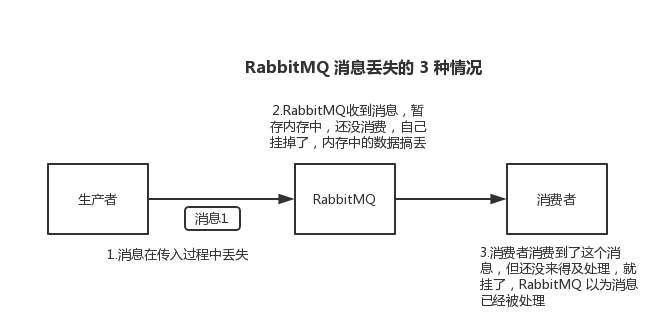        

所以一般在**生产者这块避免数据丢失**，都是用 confirm 机制的:

一般来说，如果你要确保说写 RabbitMQ 的消息别丢，可以开启 confirm 模式，在生产者那里设置开启 confirm 模式之后，你每次写的消息都会分配一个唯一的 id，然后如果写入了 RabbitMQ 中，RabbitMQ 会给你回传一个 ack 消息，告诉你说这个消息 ok 了。如果 RabbitMQ 没能处理这个消息，会回调你的一个 nack 接口，告诉你这个消息接收失败，你可以重试。而且你可以结合这个机制自己在内存里维护每个消息 id 的状态，如果超过一定时间还没接收到这个消息的回调，那么你可以重发。

**RabbitMQ 弄丢了数据**:开启 RabbitMQ 的持久化

设置持久化有两个步骤：

- 创建 queue 的时候将其设置为持久化。这样就可以保证 RabbitMQ 持久化 queue 的元数据，但是它是不会持久化 queue 里的数据的。
- 第二个是发送消息的时候将消息的 deliveryMode 设置为 2。就是将消息设置为持久化的，此时 RabbitMQ 就会将消息持久化到磁盘上去。

持久化可以跟生产者那边的 confirm 机制配合起来，只有消息被持久化到磁盘之后，才会通知生产者 ack 了，所以哪怕是在持久化到磁盘之前，RabbitMQ 挂了，数据丢了，生产者收不到 ack ，你也是可以自己重发的

**消费端弄丢了数据**: 这个时候得用 RabbitMQ 提供的 ack 机制，简单来说，就是你必须关闭 RabbitMQ 的自动 ack ，可以通过一个 api 来调用就行，然后每次你自己代码里确保处理完的时候，再在程序里 ack 一把。这样的话，如果你还没处理完，不就没有 ack 了？那 RabbitMQ 就认为你还没处理完，这个时候 RabbitMQ 会把这个消费分配给别的 consumer 去处理，消息是不会丢的。

为了保证消息从队列中可靠地到达消费者，RabbitMQ 提供了消息确认机制。消费者在声明队列时，可以指定 noAck 参数，当 noAck=false，RabbitMQ 会等待消费者显式发回 ack 信号后，才从内存（和磁盘，如果是持久化消息）中移去消息。否则，一旦消息被消费者消费，RabbitMQ 会在队列中立即删除它。

**保证消息的顺序性：**

我们以前做过一个 mysql binlog 同步的系统，压力还是非常大的，日同步数据要达到上亿，就是说数据从一个 mysql 库原封不动地同步到另一个 mysql 库里面去（mysql -> mysql）。常见的一点在于说比如大数据 team，就需要同步一个 mysql 库过来，对公司的业务系统的数据做各种复杂的操作。

你在 mysql 里增删改一条数据，对应出来了增删改 3 条 binlog 日志，接着这三条 binlog 发送到 MQ 里面，再消费出来依次执行，起码得保证人家是按照顺序来的吧？不然本来是：增加、修改、删除；你愣是换了顺序给执行成删除、修改、增加，不全错了么。

**RabbitMQ顺序错乱场景**：一个 queue，多个 consumer。比如，生产者向 RabbitMQ 里发送了三条数据，顺序依次是 data1/data2/data3，压入的是 RabbitMQ 的一个内存队列。有三个消费者分别从 MQ 中消费这三条数据中的一条，结果消费者 2 先执行完操作，把 data2 存入数据库，然后是 data1/data3。这不明显乱了。

**解决：**

拆分多个 queue，每个 queue 一个 consumer，就是多一些 queue 而已，确实是麻烦点；或者就一个 queue 但是对应一个 consumer，然后这个 consumer 内部用内存队列做排队，然后分发给底层不同的 worker 来处理。


#### **大量消息在 mq 里积压?   解决方法****紧急扩容**

- 先修复 consumer 的问题，确保其恢复消费速度，然后将现有 consumer 都停掉。
- 新建一个 topic，partition 是原来的 10 倍，临时建立好原先 10 倍的 queue 数量。
- 然后写一个临时的分发数据的 consumer 程序，这个程序部署上去消费积压的数据，消费之后不做耗时的处理，直接均匀轮询写入临时建立好的 10 倍数量的 queue。
- 接着临时征用 10 倍的机器来部署 consumer，每一批 consumer 消费一个临时 queue 的数据。这种做法相当于是临时将 queue 资源和 consumer 资源扩大 10 倍，以正常的 10 倍速度来消费数据。
- 等快速消费完积压数据之后，得恢复原先部署的架构，重新用原先的 consumer 机器来消费消息。

#### **mq 中的消息过期失效了?**

假设你用的是 RabbitMQ，RabbtiMQ 是可以设置过期时间的，也就是 TTL。**如果消息在 queue 中积压超过一定的时间就会被 RabbitMQ 给清理掉，这个数据就没了**。那这就是第二个坑了。这就不是说数据会大量积压在 mq 里，而是大量的数据会直接搞丢。

解决：批量重导，这个我们之前线上也有类似的场景干过。就是大量积压的时候，我们当时就直接丢弃数据了，然后等过了高峰期以后，比如大家一起喝咖啡熬夜到晚上 12 点以后，用户都睡觉了。这个时候我们就开始写程序，将丢失的那批数据，写个临时程序，一点一点的查出来，然后重新灌入 mq 里面去，把白天丢的数据给他补回来。也只能是这样了


#### **mq 都快写满了：**

谁让你第一个方案执行的太慢了，你临时写程序，接入数据来消费，消费一个丢弃一个，都不要了，快速消费掉所有的消息。然后走第二个方案，到了晚上再补数据吧。


RocketMQ，官方针对消息积压问题，提供了解决方案：

1. 提高消费并行度
2. \2. 批量方式消费
3. 跳过非重要消息
4. 优化每条消息消费过程ru

#### **如何设计一个消息队列？**

首先这个 mq 得支持可伸缩性吧，就是需要的时候快速扩容，就可以增加吞吐量和容量，那怎么搞？设计个分布式的系统呗，参照一下 kafka 的设计理念，broker -> topic -> partition，每个 partition 放一个机器，就存一部分数据。如果现在资源不够了，简单啊，给 topic 增加 partition，然后做数据迁移，增加机器，不就可以存放更多数据，提供更高的吞吐量了？

其次你得考虑一下这个 mq 的数据要不要落地磁盘吧？那肯定要了，落磁盘才能保证别进程挂了数据就丢了。那落磁盘的时候怎么落啊？顺序写，这样就没有磁盘随机读写的寻址开销，磁盘顺序读写的性能是很高的，这就是 kafka 的思路。

其次你考虑一下你的 mq 的可用性啊？这个事儿，具体参考之前可用性那个环节讲解的 kafka 的高可用保障机制。多副本 -> leader & follower -> broker 挂了重新选举 leader 即可对外服务。

能不能支持数据 0 丢失啊？可以的，参考我们之前说的那个 kafka 数据零丢失方案。


#### 如何保证消息的可靠性传输，即保证消息不丢失：

消息丢失的情况：

​                         

解决方法：

​                 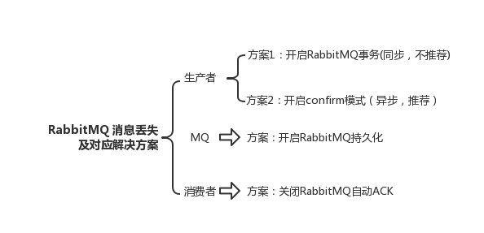        

#### 如何保证消息的顺序性？

场景：mysql binlog 同步的系统，你在 mysql 里增删改一条数据，对应出来了增删改 3 条 binlog 日志，接着这三条 binlog 发送到 MQ 里面，再消费出来依次执行，起码得保证人家是按照顺序来的吧？不然本来是：增加、修改、删除；你愣是换了顺序给执行成删除、修改、增加，不全错了么。

一个 queue，多个 consumer。比如，生产者向 RabbitMQ 里发送了三条数据，顺序依次是 data1/data2/data3，压入的是 RabbitMQ 的一个内存队列。有三个消费者分别从 MQ 中消费这三条数据中的一条，结果消费者 2 先执行完操作，把 data2 存入数据库，然后是 data1/data3。这不明显乱了。

解决方法：拆分多个 queue，每个 queue 一个 consumer，就是多一些 queue 而已，确实是麻烦点；或者就一个 queue 但是对应一个 consumer，然后这个 consumer 内部用内存队列做排队，然后分发给底层不同的 worker 来处理。

### 


