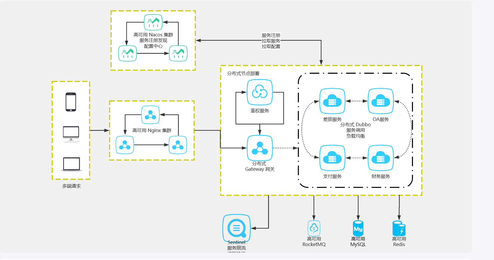

l 熟练掌握计算机网络，数据结构与算法，操作系统。

l 熟练使用Linux，有Linux下开发的实际经验。

l 熟练掌握Java 基础知识、Java 并发、JVM，有过 JVM 排查问题经历。

l 熟练掌握 MySQL 数据库以及常见优化手段(比如索引、SQL 优化、读写分离&分库分表)，Redis 使用经验丰富，熟悉MongoDB。

<!-- l 熟练掌握 Elasticsearch 的使用及原理。 -->

l 熟练掌握Spring、Spring MVC、SpringBoot、MyBatis、Netty 等主流开发框架。

l 熟练掌握分布式下的常见理论 CAP、BASE，熟悉 Paxos 算法和 Raft 算法

l 熟练掌握 RPC (Dubbo)、分布式事务(Seata、 2PC、3PC、TCC) 、分布式链路追踪(SkyWalking)、分布式锁(Zookeeper、 Redis、Redisson)、分布式 id(UUID、Snowflake) 的使用及原理。

l 熟悉 Spring Cloud 全家桶常见组件的使用。

l 熟练掌握消息队列 Rocket 的使用及原理、有限流、降级、熔断的实战经验。

l 熟练掌握 Git、Maven、Docker。

## 闵行全专结合门诊平台

2022.06 - 2023.01   创业慧康远程医疗事业部                    
### 项目简介
闵行全专结合门诊平台是一个在线匹配专家的门诊服务平台，包含挂号付费、咨询问诊、复诊等功能，该项目已由闵行卫健委在全区推广使用，旨意是借助互联网优势快速实现传统门诊服务，解决挂号难、看病难、医疗资源分布不平衡等问题。
### 涉及技术
SpringBoot 、SpringCloud 、MybatisPlus 、MySQL 、Redis 、Rocket MQ 。

### 项目职责
- 参与初始架构设计、框架及技术选型讨论、给出合理建议及流程梳理。
- 负责用户信息、门诊订单创建、订单派送、账单及退款相关功能数据库表设计及其功能实现。
- 采用雪花算法生成门诊订单全局唯一ID。
- 用 Rocket MQ 向符合条件的专家推送订单消息，并且利用Rocket MQ的延迟队列特点实现订单超时取消，超时自动扩大推送范围等功能。
- 用Redis缓存维护专家端在线状态。
- 使用Netty框架实现消息通知服务。
- 调用HIS接口实现付费与退款功能。
- 针对线上频繁FullGC、CPU负载过高进行问题排查。

技术解决方案

- 并发问题: 采用Redission分布式锁,用其看门狗机制防止死锁发生。
- 日志排查方面: 配合运维搭建ELK日志平台,可对线上日志进行监控,用Arthas进行切面日志拦截。
- 服务容灾处理:  采用多套服务商配置(如短信)，可从后台切换，目前正在规划二期，根据失败次数进行自动开关处理。
- 微服务关键性接口降级、MQ大熔断:  统计MQ某个时间段内同一消息重试的次数进行熔断处理。
- 对外接口对接方面:  采用策略模式,定义统一接口,针对不同医院HIS制定对应的实现类,减少代码的冗余。

## IM组件优化

2022.01-2022.05                                                             创业慧康远程医疗事业部                                   

项目简介：由于原有的IM组件无法满足服务医院的需求以及流量激增问题，因此在其基础上进行重构，并增加群聊功能，可实现多专家协助诊疗及工作交流。
涉及技术：SpringBoot 、Dubbo、Zookeeper、MySQL 、Redis 、Rocket MQ 。
工作内容：

1. 参与架构重构设计、框架及技术选型讨论。
2. 设计聊天消息记录,群组数据库表设计以及实现相应的接口。
3. 负责消息推送功能。
4. 编写技术文档。

优化方案

- 接入层: 通过Netty的TCP长连接将消息推送给用户,保证消息的实时行. 
- 服务拆分:  长连接负责收发消息，业务服务器负责业务块,ip服务实现长连接服务的负载均衡 
- 存储层优化:  利用消息的有序性，减少读扩散。
- 消息高一致:  增加ACK机制,防止消息重复。设计分布式ID保证消息ID有序性
- 高可用: 优化心跳机制,断线重连.消息风暴

2021.07 - 2022.12                                                                                                   创业慧康远程医疗事业部             
上海市闵行中心医院互联网医院
项目简介：主要为患者提供复诊或咨询、在线药物配送等服务。
涉及技术：SpringBoot 、SpringCloud 、MybatisPlus 、MySQL 、Redis 、Elasticsearch 、Rocket MQ 。
工作内容：
8.根据产品原型设计并实现其功能。
9.负责平台消息模块重构，采用AOP实现业务代码的解耦，采用MQ保证消息可靠性。
11.使用Spring Security OAuth实现单点登录实现。
12.负责线上BUG排查及修复。
2019.06-2021.06	杭州珞珈质子科技有限公司	质子放疗实时在线监测系统
项目简介：基于病人CT图像，利用物理仿真程序模拟出放疗过程，作为训练集，并结合多种深度学习算法，为每个病人量身定制评放疗评估模型，解决放疗过程中打不准的痛点。
项目模块：
1.医师端：病人模块，用户模块，HIS自动获取数据引擎模块，模拟模块，深度学习模块；
2.管理后台：后台管理功能，统计分析等；
涉及技术：
Spring Boot、MySQL、Redis、Mybatis、Rabbit MQ、MongoDB。
主要职责：
1.负责HIS自动获取数据引擎模块。
2.负责设计和实现模拟模块，利用MQ做异步及限流。
3.负责部分前端页面的实现。
4.项目环境安装、部署及维护。
5.编写用户手册以及技术

## 加分项

[【SPI】定制按需加载的SPI - 知乎 (zhihu.com)](https://zhuanlan.zhihu.com/p/571244036)

bitmap 统计活跃用户、通过 sorted set 维护排行榜

匹配算法

1. 就近原则    就近匹配专家,缩短患者就诊距离
2. 精准匹配    根据关键字精准匹配专家
3. 自动扩大范围   提高接单效率

**java****性能情况的一个监测和性能的瓶颈排查**

arthas

**JVM-调优策略**

选择合适的垃圾回收器

JDK1.8及以上，关注用户停顿时间，选择G1（目前基本推荐都使用G1）。开启 -XX:+UseG1GC

调整内存大小

现象：垃圾收集频率非常频繁。

原因：如果内存太小，就会导致频繁的需要进行垃圾收集才能释放出足够的空间来创建新的对象，所以增加堆内存大小的效果是非常显而易见的。

注意：如果垃圾收集次数非常频繁，但是每次能回收的对象非常少，那么这个时候并非内存太小，而可能是内存泄露导致对象无法回收，从而造成频繁GC。

**平时碰到系统CPU飙高和频繁GC，你会怎么排查？**

CPU是整个电脑的核心计算资源，对于一个应用进程来说，CPU的最小执行单元是线程。

分析原因

- CPU上下文切换过多  在Java中，文件IO、网络IO、锁等待、线程阻塞等操作都会造成线程阻塞从而触发上下文切换
- CPU资源过度消耗，也就是在程序中创建了大量的线程，或者有线程一直占用CPU资源无法被释放，比如死循环！
- 有可能定位的结果是程序正常，只是在CPU飙高的那一刻，用户访问量较大，导致系统资源不够。

排查

1. 使用top命令 找到cpu利用率比较高的进程
2. 使用top -Hp 进程id 找到进程下的线程
3. 使用jstack 进程id |grep -A 50 1a5e(线程id转16进制)，输出线程快照日志

**单点登录**

[什么是单点登录(SSO) (qq.com)](https://mp.weixin.qq.com/s?__biz=MzAwNDA2OTM1Ng==&mid=2453141199&idx=2&sn=ae38cea47dc968c2b00cf123d72c5876&scene=21#wechat_redirect)

**磁盘空间不足问题**

df -h 从总体查看磁盘状态

一般就是看挂载点为根目录的 / 的容量咯，这里我只用了 25%，显然还没有达到瓶颈，但如果这里太大了，还要进一步看看是哪个目录大了。

此时用 du -sh * 命令，查看 / 路径下的各个文件和目录的大小。

**刚遇到JVM问题，我无从下手，但后来我熟悉了**

1 还是先说监控，我们项目在部署后，会对JVM内存进行监控，CAT、newrelic或Zabbix等同样能监控JVM内存，一旦内存用量超过80%，且持续时间超过5分钟，我们就会收到告警邮件。

2 再说排查流程。收到告警邮件后，我们会看该服务器的dump文件，其中能看到当时的内存对象，同时会看业务日志，看当时是什么业务导致了内存用量大增。

这里大家可以去看下dump文件的结构，同时可以操作下通过jmat工具打开dump文件的步骤，因为你一旦说了，面试官可能会细问（dump 在程序运行过程中发生异常时，将其内存数据保存到文件中,）。

[【JVM调优工具篇】使用MAT工具分析dump文件（查看GC Roots）_漫话人生的博客-CSDN博客_mat查看dump](https://blog.csdn.net/Kevinnsm/article/details/121170657)

3 再结合业务说原因，比如可以说，在导入客户数据的过程中，我们是会从多个文件里读取数据再导入，在导入后，没有关闭IO对象，所以导致内存用量大增。

同样能导致内存用量大增的原因还有，用好HashMap等没有不关掉，或者是缓存Redis数据时没设置超时时间，这就导致缓存对象一直占内存。如果大家要说其它原因，最好也得结合业务说。

4 再说下怎么解决，无非是关掉文件或对象。

**openOffice源码**

由于项目需要doc转pdf 但是引入新版本的openOffice不支持office2007之前的版本 后面分析源码，发现源码里事支持的只不过openOffice 文件类型枚举类没有

解决 新建枚举类，然后集成openOffice的枚举类 最后添加文件类型

**FullGC排查**

[线上服务的FGC问题排查，看这篇就够了！ (qq.com)](https://mp.weixin.qq.com/s?__biz=MzAwNDA2OTM1Ng==&mid=2453142682&idx=2&sn=49505852a36a8b0e01f6661cc516bb3d&scene=21#wechat_redirect)

1.检查JVM配置 分析FullGC原因

jinfo -flags 3175310（java pid）

​                         

-Xms4g -Xmx4g -Xmn2g -Xss1024K 

-XX:ParallelGCThreads=5 

-XX:+UseConcMarkSweepGC 

-XX:+UseParNewGC 

-XX:+UseCMSCompactAtFullCollection 

-XX:CMSInitiatingOccupancyFraction=80

可以看到堆内存为4G，新生代为2G，老年代也为2G，新生代采用ParNew收集器，老年代采用并发标记清除的CMS收集器，当老年代的内存占用率达到80%时会进行FGC

通过 jmap -heap 3175310  可以得知新生代的Eden区为1.6G，S0和S1区均为0.2G。

2.观察老年代的内存变化

通过观察老年代的使用情况，可以看到：每次FGC后，内存都能回到500M左右，因此我们排除了内存泄漏的情况。

​                         

3.通过jmap命令查看堆内存中的对象

​                         

上图中，按照对象所占内存大小排序，显示了存活对象的实例数、所占内存、类名。可以看到排名第一的是：int[]，而且所占内存大小远远超过其他存活对象。至此，我们将怀疑目标锁定在了 int[] .

4.进一步dump堆内存文件进行分析

jmap -dump:format=b,file=heap 3175310 生成dump文件

通过MAT工具导入dump出来的堆内存文件，同样可以看到各个对象所占空间，其中int[]占到了50%以上的内存，进一步往下便可以找到 int[] 所属的业务对象，发现它来自于架构团队提供的codis基础组件。

5. 通过代码分析可疑对象

通过代码分析，codis基础组件每分钟会生成约40M大小的int数组，用于统计TP99 和 TP90，数组的生命周期是一分钟。而根据第2步观察老年代的内存变化时，发现老年代的内存基本上也是每分钟增加40多M，因此推断：这40M的int数组应该是从新生代晋升到老年代。

我们进一步查看了YGC的频次监控，通过下图可以看到大概1分钟有8次左右的YGC，这样基本验证了我们的推断：因为CMS收集器默认的分代年龄是6次，即YGC 6次后还存活的对象就会晋升到老年代，而codis组件中的大数组生命周期是1分钟，刚好满足这个要求。

6.解决

为了快速解决问题，我们将CMS收集器的分代年龄改成了15次，改完后FGC频次恢复到了2天一次，后续如果YGC的频次超过每分钟15次还会再次触发此问题。当然，我们最根本的解决方案是：优化程序以降低YGC的频率，同时缩短codis组件中int数组的生命周期，这里就不做展开了。
